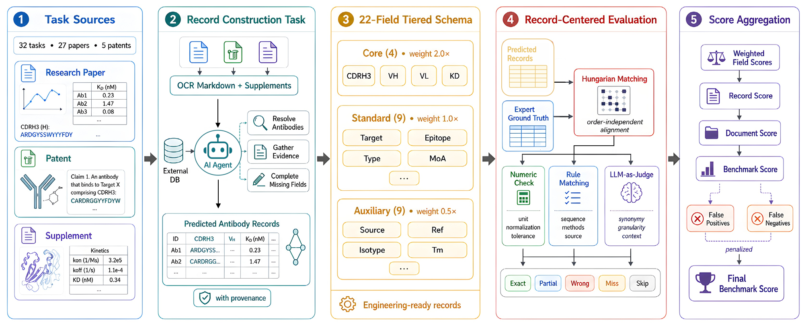
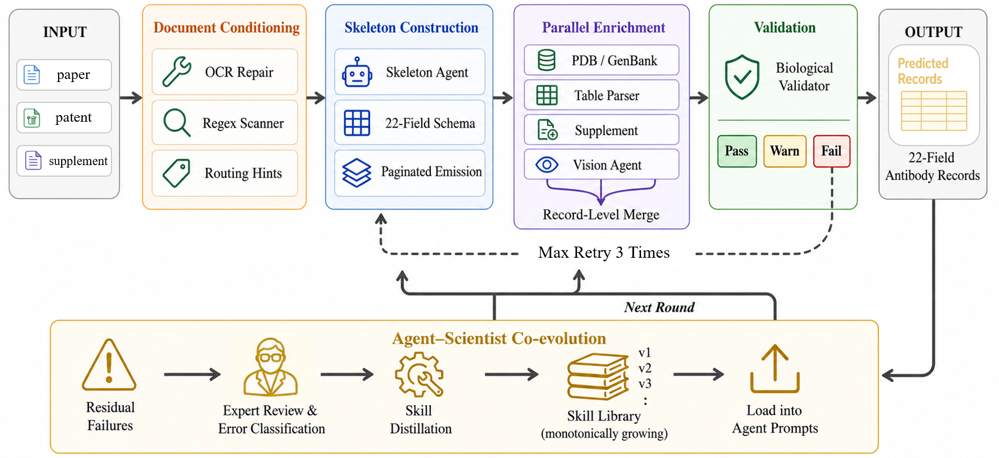

# ABDataBench

[English](README.md) | [中文](README_zh.md)

**ABDataBench** is a benchmark for evaluating LLM-based extraction of structured antibody data from scientific literature. It pairs a curated 32-document dataset (papers + patents + supplements) with a record-centered evaluation framework covering 22 fields across binding kinetics, sequences, and biological metadata.

**ABCurator** is the accompanying multi-agent extraction system that achieves state-of-the-art performance on this benchmark.

---

## Overview

<p align="center">
  
</p>

## Benchmark Framework

<p align="center">
  
</p>

The evaluation pipeline uses a tiered 22-field schema (Core / Standard / Auxiliary), record-level Hungarian matching, and LLM-as-Judge scoring to produce a final benchmark score.

## Multi-Agent Pipeline (ABCurator)

<p align="center">
  
</p>

ABCurator uses a four-stage pipeline: Document Conditioning → Skeleton Construction → Parallel Enrichment → Validation, with up to 3 retry rounds driven by an Agent–Scientist Co-evolution loop.

## Model Benchmark Results

| Model | Ab. Prec. ↑ | Ab. Rec. ↑ | Seq. Hit ↑ | KD Hit ↑ | Score ↑ |
|:------|:-----------:|:----------:|:----------:|:--------:|:-------:|
| **Proprietary Models** | | | | | |
| Claude-4.7-Opus | **38.1** | 96.9 | 91.5 | 73.8 | **84.0** |
| Claude-4.6-Sonnet | 31.8 | 95.6 | 84.3 | 67.7 | 77.9 |
| Gemini-3.1-Pro | 28.0 | **100.0** | 86.3 | 46.2 | 78.4 |
| GPT-5.5 | 24.0 | **100.0** | 94.8 | 67.7 | 83.0 |
| **Open-Source Models** | | | | | |
| Qwen3.5-Plus | 26.4 | **100.0** | 93.5 | **75.4** | **81.7** |
| DeepSeek-V4-Pro | **34.6** | 99.4 | **95.4** | 72.3 | 80.2 |
| GLM-5.1 | 27.7 | 97.5 | 86.9 | 70.8 | 77.1 |
| MiniMax-M2.7 | 33.8 | 96.2 | 85.6 | 69.2 | 76.4 |

- **Ab. Prec. / Ab. Rec.**: Antibody-record precision and recall
- **Seq. Hit**: Exact-or-partial hit rate for sequence fields
- **KD Hit**: Exact-or-partial hit rate for binding affinity fields
- **Score**: Final ABDataBench score

## Repository Layout

```text
agent/                  Multi-agent extraction system (ABCurator)
agent/prompts/          Versioned prompt assets
agent/skills/           Skill metadata loaded by the agents
dataset/                Default OCR benchmark dataset (32 documents)
benchmark/              Ground truth, evaluator, and visualization tools
figures/                Figures for documentation
ocr/                    Optional OCR helper scripts
frontend/               Optional React frontend for annotation/review
backend/                Optional FastAPI backend for annotation/review
scripts/run_pipeline.py End-to-end extraction, evaluation, and dashboard
```

## Installation

```bash
git clone https://github.com/GAIR-NLP/ABDataBench.git
cd ABDataBench
python -m venv .venv
source .venv/bin/activate
pip install -r requirements.txt
```

Create a local environment file:

```bash
cp .env.example .env
```

Set at least these values:

```bash
LLM_API_BASE=https://your-api-endpoint
LLM_API_KEY=your_api_key
LLM_MODEL=your_model_name
BENCHMARK_API_KEY=your_api_key
```

## Quick Start

### End-to-End Run

```bash
source .venv/bin/activate
set -a; source .env; set +a

python scripts/run_pipeline.py \
  --output-root runs \
  --papers-per-worker 4 \
  --llm-concurrency 8 \
  --paper-concurrency 5 \
  --trace \
  --serve \
  --host 0.0.0.0 \
  --port 8000
```

### Extraction Only

```bash
python scripts/run_pipeline.py --skip-eval --output-root runs
```

### Benchmark Only

```bash
cd benchmark
python run_eval.py \
  --gt ground_truth/ground_truth.json \
  --pred ../runs/dev/agent/benchmark_predictions.json \
  --output ../runs/dev/benchmark
```

### Generate Dashboard

```bash
python benchmark/scripts/visualize_eval.py \
  runs/dev/benchmark/eval_result_latest.json \
  --output runs/dev/benchmark/eval_dashboard.html
```

## Output Structure

```text
runs/<run_name>/
├── agent/benchmark_predictions.json   # Predictions
├── benchmark/eval_result_latest.json  # Evaluation results
├── benchmark/eval_report_latest.md    # Evaluation report
└── benchmark/eval_dashboard.html      # Interactive dashboard
```

## Configuration

See `.env.example` for the full configuration surface. Key settings:

| Variable | Description |
|----------|-------------|
| `LLM_API_BASE`, `LLM_API_KEY`, `LLM_MODEL` | Text extraction model |
| `LLM_REVIEW_MODEL` | Reviewer model (defaults to LLM_MODEL) |
| `VLM_API_BASE`, `VLM_API_KEY`, `VLM_MODEL` | Image extraction model |
| `BENCHMARK_API_KEY`, `BENCHMARK_MODEL` | Benchmark judge model |
| `NCBI_EMAIL`, `NCBI_API_KEY` | Optional NCBI/PDB lookup |

## License

Apache 2.0. See [LICENSE](LICENSE).
