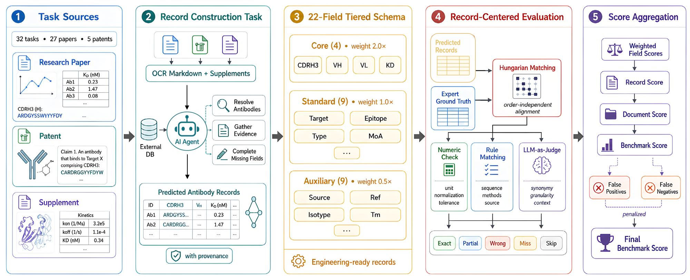
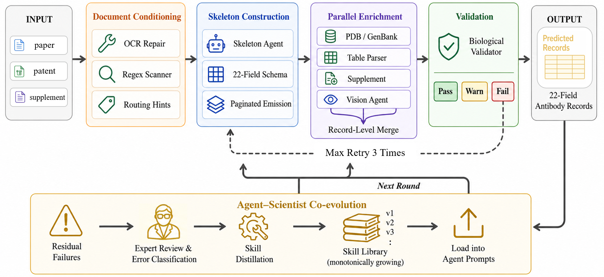

# ABDataBench: A Benchmark for Structured Antibody Data Extraction from Scientific Literature

[](https://github.com/GAIR-NLP/ABDataBench)
[](https://huggingface.co/datasets/GAIR/ABDataCorpus)
[](LICENSE)

**ABDataBench** is a benchmark for evaluating LLM-based extraction of structured antibody data from scientific literature. It pairs a curated 32-document corpus—covering papers, patents, and supplementary materials—with a record-centered evaluation framework spanning 22 fields across binding kinetics, antibody sequences, and biological metadata.

**ABCurator** is the accompanying multi-agent extraction system. It uses document conditioning, structured skeleton construction, parallel enrichment, and validation to recover antibody records from heterogeneous scientific documents.

## ✨ Features

- **🧬 Structured Antibody Records**: Extract antibody sequences, binding kinetics, target information, and biological metadata into a unified schema.

- **📚 Multi-Source Scientific Corpus**: Evaluate extraction across research papers, patents, and supplementary documents with OCR-derived text and associated images.

- **🧩 Tiered 22-Field Schema**: Organize fields into Core, Standard, and Auxiliary tiers to distinguish essential antibody information from supporting metadata.

- **⚖️ Record-Level Matching**: Use Hungarian matching to align predicted antibody records with ground truth records before field-level scoring.

- **🧠 LLM-as-a-Judge Evaluation**: Apply model-assisted judging for flexible comparison of extracted values while retaining exact and structured metrics.

- **🤖 Multi-Agent Extraction**: ABCurator combines specialized agents for skeleton construction, evidence reduction, sequence and figure extraction, paper-focus analysis, and validation.

<p align="center">
  
</p>

## 🚀 Quick Start

### Installation

```bash
git clone https://github.com/GAIR-NLP/ABDataBench.git
cd ABDataBench
python -m venv .venv
source .venv/bin/activate
pip install -r requirements.txt
```

Create a local environment file:

```bash
cp .env.example .env
```

Set the API configuration required by the extraction and evaluation pipeline:

```bash
LLM_API_BASE=https://your-api-endpoint
LLM_API_KEY=your_api_key
LLM_MODEL=your_model_name
BENCHMARK_API_KEY=your_api_key
```

See `.env.example` for the complete configuration surface, including optional VLM, NCBI, and PDB settings.

### Run the End-to-End Pipeline

```bash
source .venv/bin/activate
set -a; source .env; set +a

python scripts/run_pipeline.py \
  --output-root runs \
  --papers-per-worker 4 \
  --llm-concurrency 8 \
  --paper-concurrency 5 \
  --trace \
  --serve \
  --host 0.0.0.0 \
  --port 8000
```

### Run Extraction Only

```bash
python scripts/run_pipeline.py --skip-eval --output-root runs
```

### Run the Benchmark Evaluator

```bash
cd benchmark
python run_eval.py \
  --gt ground_truth/ground_truth.json \
  --pred ../runs/dev/agent/benchmark_predictions.json \
  --output ../runs/dev/benchmark
```

### Generate the Evaluation Dashboard

```bash
python benchmark/scripts/visualize_eval.py \
  runs/dev/benchmark/eval_result_latest.json \
  --output runs/dev/benchmark/eval_dashboard.html
```

## 🏗️ Benchmark Framework

<p align="center">
  
</p>

The evaluation pipeline uses a tiered 22-field schema, record-level Hungarian matching, and LLM-as-a-Judge scoring to produce a final benchmark score.

The benchmark reports complementary metrics for antibody records, sequence fields, and binding-affinity fields:

| Metric | Description |
|:------|:------------|
| **Ab. Prec.** | Antibody-record precision |
| **Ab. Rec.** | Antibody-record recall |
| **Seq. Hit** | Exact-or-partial hit rate for sequence fields |
| **KD Hit** | Exact-or-partial hit rate for binding-affinity fields |
| **Score** | Final ABDataBench score |

## 🤖 Multi-Agent Pipeline: ABCurator

<p align="center">
  
</p>

ABCurator uses a four-stage pipeline:

1. **Document Conditioning**: Prepare OCR text, figures, tables, and supplementary materials for downstream extraction.
2. **Skeleton Construction**: Identify candidate antibody records and populate their core fields.
3. **Parallel Enrichment**: Enrich records with sequences, binding measurements, target information, and supporting evidence.
4. **Validation**: Check record consistency, normalize values, and trigger targeted retries when required.

The pipeline supports up to three retry rounds driven by an Agent–Scientist Co-evolution loop.

## 🏆 Model Benchmark Results

| Model | Ab. Prec. ↑ | Ab. Rec. ↑ | Seq. Hit ↑ | KD Hit ↑ | Score ↑ |
|:------|:-----------:|:----------:|:----------:|:--------:|:-------:|
| **Proprietary Models** | | | | | |
| Claude-4.7-Opus | **38.1** | 96.9 | 91.5 | 73.8 | **84.0** |
| Claude-4.6-Sonnet | 31.8 | 95.6 | 84.3 | 67.7 | 77.9 |
| Gemini-3.1-Pro | 28.0 | **100.0** | 86.3 | 46.2 | 78.4 |
| GPT-5.5 | 24.0 | **100.0** | 94.8 | 67.7 | 83.0 |
| **Open-Source Models** | | | | | |
| Qwen3.5-Plus | 26.4 | **100.0** | 93.5 | **75.4** | **81.7** |
| DeepSeek-V4-Pro | **34.6** | 99.4 | **95.4** | 72.3 | 80.2 |
| GLM-5.1 | 27.7 | 97.5 | 86.9 | 70.8 | 77.1 |
| MiniMax-M2.7 | 33.8 | 96.2 | 85.6 | 69.2 | 76.4 |

## 📦 Dataset

The ABDataBench corpus is available on Hugging Face:

- **ABDataCorpus**: [https://huggingface.co/datasets/GAIR/ABDataCorpus](https://huggingface.co/datasets/GAIR/ABDataCorpus)

The repository also includes the default OCR benchmark dataset, ground-truth annotations, evaluation scripts, and documentation assets needed to reproduce the benchmark locally.

## 📁 Repository Layout

```text
agent/                  Multi-agent extraction system (ABCurator)
agent/prompts/          Versioned prompt assets
agent/skills/           Skill metadata loaded by the agents
dataset/                Default OCR benchmark dataset
benchmark/              Ground truth, evaluator, and visualization tools
figures/                Figures for documentation
ocr/                    Optional OCR helper scripts
frontend/               Optional React frontend for annotation/review
backend/                Optional FastAPI backend for annotation/review
scripts/run_pipeline.py End-to-end extraction, evaluation, and dashboard
```

## 📤 Output Structure

```text
runs/<run_name>/
├── agent/benchmark_predictions.json   # Predictions
├── benchmark/eval_result_latest.json  # Evaluation results
├── benchmark/eval_report_latest.md    # Evaluation report
└── benchmark/eval_dashboard.html      # Interactive dashboard
```

## ⚙️ Configuration

Key environment variables include:

| Variable | Description |
|:---------|:------------|
| `LLM_API_BASE`, `LLM_API_KEY`, `LLM_MODEL` | Text extraction model |
| `LLM_REVIEW_MODEL` | Reviewer model; defaults to `LLM_MODEL` |
| `VLM_API_BASE`, `VLM_API_KEY`, `VLM_MODEL` | Image extraction model |
| `BENCHMARK_API_KEY`, `BENCHMARK_MODEL` | Benchmark judge model |
| `NCBI_EMAIL`, `NCBI_API_KEY` | Optional NCBI/PDB lookup |

## 📄 License

The source code in this repository is licensed under the [Apache License 2.0](LICENSE).

## 🙏 Acknowledgements

We thank the open scientific-literature, OCR, language-model, and bioinformatics communities whose tools and resources support the construction and evaluation of ABDataBench.

## 🤝 Contributing

Contributions are welcome! Please feel free to submit a Pull Request.

## 📞 Contact

For questions and issues, please open an issue on [GitHub](https://github.com/GAIR-NLP/ABDataBench).

---

**ABDataBench** — Structured antibody data extraction from scientific literature.
