# 1600309

# First Membrane Proximal External Region—Specific Anti-HIV1 Broadly Neutralizing Monoclonal IgA1 Presenting Short CDRH3 and Low Somatic Mutations

Fahd Benjelloun, Zeliha Oruc, Nicole Thielens, Bernard Verrier, Gael Champier, Nadine Vincent, Nicolas Rochereau, Alexandre Girard, Fabienne Jospin, Blandine Chanut, Christian Genin, Michel Cogné, Stephane Paul

# Advancing Excellence in Spectral Cytometry. Find Your Perfect Fit.

Learn how the ID7000 and FP7000 systems can meet the needs of your laboratory in supporting high-parameter research applications.

Learn More

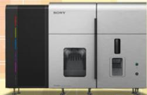

natural_image

Exterior view of a modern industrial machine labeled 'SONY' with control panel and display unit (no visible text beyond brand name)

FP7000 Spectral Cell Sorter

SONY   

natural_image

Exterior view of a modern office building (no signage)

ID7000™ Spectral Cell Analyzer

# First Membrane Proximal External Region–Specific Anti-HIV1 Broadly Neutralizing Monoclonal IgA1 Presenting Short CDRH3 and Low Somatic Mutations

Fahd Benjelloun, $^{*}$ Zeliha Oruc, $^{\dagger}$ Nicole Thielens, $^{\ddagger,\S,\P}$ Bernard Verrier, $^{\S,\|}$ Gael Champier, $^{\#}$ Nadine Vincent, $^{*}$ Nicolas Rochereau, $^{*}$ Alexandre Girard, $^{*}$ Fabienne Jospin, $^{*}$ Blandine Chanut, $^{*}$ Christian Genin, $^{*}$ Michel Cogné, $^{\dagger}$ and Stephane Paul $^{*}$

Mucosal HIV-1-specific IgA have been described as being able to neutralize HIV-1 and to block viral transcytosis. In serum and saliva, the anti-HIV IgA response is predominantly raised against the envelope of HIV-1. In this work, we describe the in vivo generation of gp41-specific IgA1 in humanized $\alpha$ 1KI mice to produce chimeric IgA1. Mice were immunized with a conformational immunogenic gp41-transfected cell line. Among 2300 clones screened by immunofluorescence microscopy, six different gp41-specific IgA with strong recognition of gp41 were identified. Two of them have strong neutralizing activity against primary HIV-1 tier 1, 2, and 3 strains and present a low rate of somatic mutations and autoreactivity, unlike what was described for classical gp41-specific IgG. Epitopes were identified and located in the hepted repeat 2/membrane proximal external region. These Abs could be of interest in prophylactic treatment to block HIV-1 penetration in mucosa or in chronically infected patients in combination with antiretroviral therapy to reduce viral load and reservoir. The Journal of Immunology, 2016, 197: 1979–1988.

Immunoglobulin A are the major mediators of immunological defense at mucosal surfaces. Studies focusing on the role of mucosal env-specific secretory IgA (sIgA) present in genital fluids from infected women highlight their ability to neutralize HIV primary isolates in vitro and to inhibit HIV transcytosis across epithelial cells (1, 2). This neutralizing property has also been demonstrated for systemic and mucosal IgA in HIV-1 $^{+}$ and exposed seronegative (ESN) individuals (3, 4), but the magnitude and frequency of HIV-specific sIgA seem to be very low during chronic infection (5). The initial Ab response to HIV-1 can be detected as circulating anti-gp41 IgG followed by production of anti-gp120 Abs a few weeks later, but none of these responses are able to efficiently neutralize the infecting strain (6). The maturation of broadly neutralizing Abs (bNAbs) takes several months (7) and goes through different steps of somatic mutations and modifications (8, 9) before becoming more specific to known sites of vulnerability of the HIV envelope such as the CD4 binding site, glycan V3 region, V1/V2 loop, and gp41, especially the membrane proximal external region (MPER) domain (9, 10). Neutralizing IgAs have been described at the mucosal level with specificity against gp41-specific epitopes such as QARILAVERY, Kennedy, or MPER (1, 11, 12). MPER is a highly conserved region in gp41 involved in the early stages of HIV attachment and infection (13). This region comprises the epitopes of well-described human monoclonal IgG broadly neutralizing Abs such as ELDKWA for 2F5, WF (N/D) IT for 4E10, and Z13 (14) for 10E8 (15). Recent studies have described the potency in targeting MPER for the generation of Abs with increased breadth, potency, and high-affinity binding. Indeed, structural observations from the crystal structure of the interaction of modified bNAbs and epitopes have provided clues to address gp41 and its different fusion intermediate states. New broadly neutralizing Abs like PGT122 and 35O22 have been also described, recognizing an unknown epitope overlapping the gp41–gp120 interface, and these Abs present potent neutralizing activity (9, 16). Moreover, the role of cholesterol and the lipid context in the mechanisms of broad neutralization by enhancing the presentation of MPER to B cells has been highlighted (17–19). Nevertheless, most of the studied bNAbs are IgGs (14). To date, very few studies have described the role of broadly neutralizing anti-MPER IgA and their involvement in the protection from and/or neutralization of HIV (20, 21) during experimental anti-HIV vaccine trials. The role of mucosal protective neutralizing IgA against mucosal transmission of HIV is unclear and remains controversial (5).

\*Groupe d'Immunité des Muqueuses et Agents Pathogènes/EA3064, INSERM CIE3 1408 Vaccinology, Universités de Lyon, 42055 Saint-Etienne, France; $^{1}$ Université de Limoges, CNRS UMR 7276, 87032 Limoges, France; $^{2}$ Université Grenoble Alpes, Institut de Biologie Structurale, F-38044 Grenoble, France; $^{3}$ Commissariat à l'Energie Atomique, Institut de Biologie Structurale, F-38044 Grenoble, France; $^{4}$ CNRS, Institut de Biologie Structurale, F-38044 Grenoble, France; $^{5}$ Institut de Biologie et Chimie des Protéines, FRE3310/CNRS, Université de Lyon, F69007 Lyon, France; and $^{6}$ B Cell Design, 87032 Limoges, France

ORCIDs: 0000-0001-6939-8721 (F.B.); 0000-0003-1314-6757 (Z.O.); 0000-0002-7354-0302 (N.T.); 0000-0002-8478-7095 (B.V.); 0000-0002-0089-9357 (G.C.); 0000-0001-6579-0275 (N.R.); 0000-0002-7251-8779 (A.G.); 0000-0001-7841-4973 (B.C.); 0000-0003-2065-8267 (C.G.); 0000-0002-8519-4427 (M.C.); 0000-0002-8830-4273 (S.P.).

Received for publication March 1, 2016. Accepted for publication July 3, 2016.

This work was supported by the Grenoble Instruct Centre (ISBG; UMS 3518 CNRS-CEA-UJF-EMBL) with support from FRISBI (ANR-10-INSB-05-02) and GRAL (ANR-10-LABX-49-01) within the Grenoble Partnership for Structural Biology. F.B. was supported by a fellowship from the Région Rhone-Alpes (France). This work was also financed by research grants from Agence Nationale de Recherches sur le SIDA, Sidaction, and Cluster 10 of Infectiology (ARC1).

Address correspondence and reprint requests to Prof. Stephane Paul, Groupe d'Immunité des Muqueuses et Agents Pathogènes/EA3064, INSERM CIE3 1408 Vaccinology, Universités de Lyon, 42055 Saint-Etienne, France. E-mail address: stephane.paul@chu-st-etienne.fr

The online version of this article contains supplemental material.

Abbreviations used in this article: bNAb, broadly neutralizing Ab; CDRH3, hydrophobic H chain third CDR; CLP, cardiolipin; ESN, exposed seronegative; HC, H chain; HR, hepted repeat; $K_{D}$ , dissociation equilibrium constant; MPER, membrane proximal external region; RU, resonance unit; sIgA, secretory IgA; TCID $_{50}$ , tissue culture infective dose.

Copyright © 2016 by The American Association of Immunologists, Inc. 0022-1767/16/\$30.00

The aim of our study was to elicit and to characterize recombinant human monoclonal IgA neutralizing Abs that target the C-terminal region of gp41. To improve the immunogenicity of our Ag, the HEK 293-gp41 $^{MSD}$ cell line that allows expression of a folded, transmembrane gp41 has been used for immunization (22). Transfected cells were injected into humanized chimeric mice $\alpha$ 1KI to produce gp41-specific humanized chimeric IgA1 (23). In this article, we describe the use of this mouse model to generate potent neutralizing IgA Abs. High-affinity Abs were produced as mAbs after immortalizing and selecting specific Ab-producing cells through hybridoma derivation (24). Immunization in mice allowed the generation of six highly potent gp41-specific IgA-producing clones. From these clones, two Abs presented high recognition of gp41 and potent neutralization activity in vitro against both HIV-1 laboratory–adapted virus and primary isolates from different clades. The IgA1 clones F4.30 and C6.11 display high and low avidity to gp41, respectively, but high neutralizing potency against different HIV-1 strains. These two Abs recognize a large conformational epitope that overlaps the highly conserved epitope of 4E10 and present low rates of autoreactivity, unlike some previously described MPER-specific IgG and present a very low rate of somatic mutation (25).

# Materials and Methods

# Reagents

The following materials were obtained from the NIH AIDS Research and Reference Reagent Program, Division of AIDS, National Institute of Allergy and Infectious Diseases, National Institutes of Health: primary HIV-1 isolates BAL, 92UG029, 92UG001, 92US660, HIV-1 G3, CAM1970, 92BR025, SF162, LAI, the HIV-1 subtype B (MN), and Env Peptides (15-mer) Complete Set. gp140 recombinant protein (strain 97/CN/54, clade C/B) and 3D6, 4E10, and 2F5 mAbs were obtained from Polymun Scientific (Vienna, Austria). The gp41 ectodomain from HXB2 strain was produced in Escherichia coli in our laboratory. Human HEK 293 cell lines were obtained from the American Type Culture Collection, and SP2/0 cells were obtained from UMR Centre National de la Recherche Scientifique 6101 (Limoges, France). HEK293-gp41 $^{MSD}$ were developed and characterized in our research group (26). The $\alpha$ 1KI mice were immunized and provided by the UMR Centre National de la Recherche Scientifique 6101 (Limoges, France) (23, 26).

# Immunization of mice and mAb production

α1KI mice (6–8 wk old) were immunized with 50 μg of naked DNA (plasmid display hepted repeat (HR)1-PID-HR2 used to develop the HEK293-gp41 $^{MSD}$ ) in 2.5 ml of Ringer solution; this hydrodynamics-based immunization were realized by i.v. injection via the tail vein. Next, two groups of mice were immunized according to two different protocols of immunization. At day 14, one group was immunized i.p. with $1 \times 10^{6}$ cells of HEK 293-gp41 $^{MSD}$ in CFA (Sigma-Aldrich, St. Louis, MO) followed at day 45 by one i.p. injection with $1 \times 10^{6}$ cells in IFA (Sigma-Aldrich), one i.p. injection with $1 \times 10^{6}$ cells in PBS, and finally one i.v. boost with $1 \times 10^{6}$ cells in PBS at day 60. Use of CFA/IFA adjuvants allowed the reduction of the number of human HEK cells used for immunization to increase the number of accessible epitopes in the emulsion and finally to facilitate the migration of APCs to the spleen. All mice were sacrificed 3 d after the last boost.

The second group of mice was immunized at day 15 using hydrodynamic method with 50 $\mu$ g of naked DNA in 2.5 ml of Ringer solution followed by i.p injection with $1 \times 10^{6}$ cells in CFA at day 45 and finally one i.v. boost with $1 \times 10^{6}$ cells in PBS at day 60. Hydrodynamics enhances the DNA transfection efficiency, allowing the injected DNA to reach all the organs rapidly. The sera of each immunized mouse were tested by fluorescence microscopy on HEK293-gp41 $^{MSD}$ cell lines. Splenocytes from selected animals were immediately fused with myeloma cells SP2/0 by using polyethylene glycol-1000 as fusion reagent. The hybridoma cells were cultured in DMEM high glucose–L-glutamate medium (PAA, Velizy-Villacoublay, France) supplemented with 10% FCS (Life Technologies, Saint-Aubin, France), 0.1 mmol/l hypoxanthine, 100 U/ml penicillin, and 100 mg/ml streptomycin in 96-well plates. The hybridoma cells were diluted in round-bottom 96-well plates by limiting dilutions to obtain 0.5 cells/well and cultured for 7 d.

# Production and purification of anti-MPER IgA

Hybridomas were expanded in DMEM high glucose–L-glutamate medium (PAA) supplemented with 10% FCS (Life Technologies), 0.1 mmol/l hypoxanthine, 100 U/ml penicillin, and 100 mg/ml streptomycin and IL-6 at 0.5 ng/ml (R&D Systems, Abingdon, U.K.). IgA were purified from supernatants by peptide M affinity chromatography (InvivoGen, Toulouse, France). Purified IgA were then concentrated on Amicon Ultra filters with molecular mass cutoff of 50 kDa (Millipore, Lyon, France).

# Epitope mapping of mAbs

ELISA was carried out using gp41 HXB2 clade B produced in E. coli, gp140 strain 97/CN/54 and Consensus HXB2 (clade B) env 15-mer peptide complete set that covers and overlaps the gp41 protein. An irrelevant peptide representing the human hemagglutinin A was used as a negative control. Each peptide was coated on a 96-well plate (Maxisorp; Nunc) at 5 $\mu$ g/ml in 0.1 mol/l sodium carbonate buffer (pH 9.6) overnight at 4°C. The plates were washed with TBS (144 mmol/l NaCl and 25 mmol/l Tris-HCl [pH 7.5]) containing 0.5% Tween 20 and blocked with the same buffer and 2% BSA for 1 h at 37°C. After washing, 100 $\mu$ l of the generated Abs (5 $\mu$ g/ml) diluted in TBS were added to the wells and incubated for 2 h at 37°C. After washing, detection was performed by using HRP-conjugated goat anti-human IgA and o-phenylenediamine substrate. The absorbance was read at 492 nm. All assays were performed in triplicate (MultiskanMicroplate Photometer, Thermo Scientific).

An ELISA for HIV specificity was also performed with coated free virions and Abs as described previously (25).

# Immunofluorescence on HEK293-gp41 $^{MSD}$

Binding of our anti-MPER IgA to the cell surface of HEK293-gp41 $^{MSD}$ was visualized by immunofluorescence microscopy. HEK 293-gp41 $^{MSD}$ cells were cultured for 2 d in 96-well plates and fixed in cold acetone. IgA were incubated for 30 min on fixed cells at a concentration of 5 $\mu$ g/ml/well. After three washes with PBS containing 0.2% Tween 20, cells were incubated for 30 min with FITC-conjugated goat anti-human IgG or anti-human IgA as appropriate (Abliance, Besançon, France). Different anti-gp41 human mAbs 4E10, 2F5, and 3D6 at 10 $\mu$ g/ml were used as positive controls and an anti-c-myc conjugated with FITC was used as positive control of gp41 expression. The labeling was visualized by fluorescence microscopy (Nikon TE 2000 Microscope, Burlingame, CA) using NIS-Elements software.

# Binding to HEK293-gp41 $^{MSD}$ by flow cytometry

Membrane binding to gp41 on HEK293-gp41 $^{MSD}$ cells was also studied by flow cytometry. A total of 5 $\mu$ g/ml IgA or positive control as 4E10 or 2F5 were incubated 45 min at 37°C. The cells were washed three times and then incubated with R-PE goat anti-human IgA (Abliance, Besançon, France) for 30 min at 37°C. After washing, cells were analyzed by flow cytometry. For multiple labeling, as in the binding assay, infected cells were first labeled with anti-p24 KC57-FITC according to conditions recommended by the supplier (Beckman Coulter, Villepinte, France). Next, the anti-MPER IgA were incubated 45 min at 37°C and after three washes were incubated with R-PE goat anti-human IgA (Abliance, Besançon, France). During acquisition of data, at least 10,000 events were analyzed on FACScan (BD Biosciences, Pont de Claix, France).

# Measure of neutralizing activity

Measure of the neutralizing activity of purified gp41-specific Abs was performed using T cell line adapted strain LAI (clade B) or primary isolates of clade A (92UG029), B (BAL, SF162, 92US660, and QHO), C (92BR025), G (HIV-1 G3), CRF02 AG (CAM1970), and D (92UG001). Neutralizing activities were measured in duplicate and repeated three times. For LAI assay, CD4 $^{+}$ /CXCR4 $^{+}$ SupT1 cells were incubated at 37°C under 5% CO $_{2}$ in DMEM supplemented with 10% FCS. Infection was performed in 96-well rounded bottom plates. Purified Abs (50 $\mu$ l) were incubated with an equal volume of virus containing a 100 50% tissue culture infective doses (TCID $_{50}$ ) for 2 h at 37°C. Then, 3 × 10 $^{5}$ SupT1 cells/well were added. At day 1, infected cells were washed twice with tissue culture medium. Supernatants were collected 7 d postinfection and p24 ELISA was quantified (HIV-1 p24 Ag Capture Assay; Advanced Bioscience Laboratories). For the BaL strain, neutralizing activity of purified Abs was determined as described previously (27).

Briefly, PBMCs were isolated from healthy donors (from EFS Auvergne Loire, France) and stimulated with PHA (5 $\mu$ g/ml) and 200 U/ml recombinant human IL-2 (Abcys, Paris, France). The cells were infected with a 100 TCID $_{50}$ dose for 3 h at 37°C in the presence of purified Abs, and after 48 h, the cells were washed twice. Infected supernatants were collected 7 d postinfection, and p24 was quantified by ELISA (ABL). Neutralizing activity of purified Abs was also tested on stimulated PBMC infected with CAM1970, 92UG029, 92US660, 92BR025, 93BR025, HIV-1 G3, and 92UG001 primary HIV-1 isolates as described previously. The

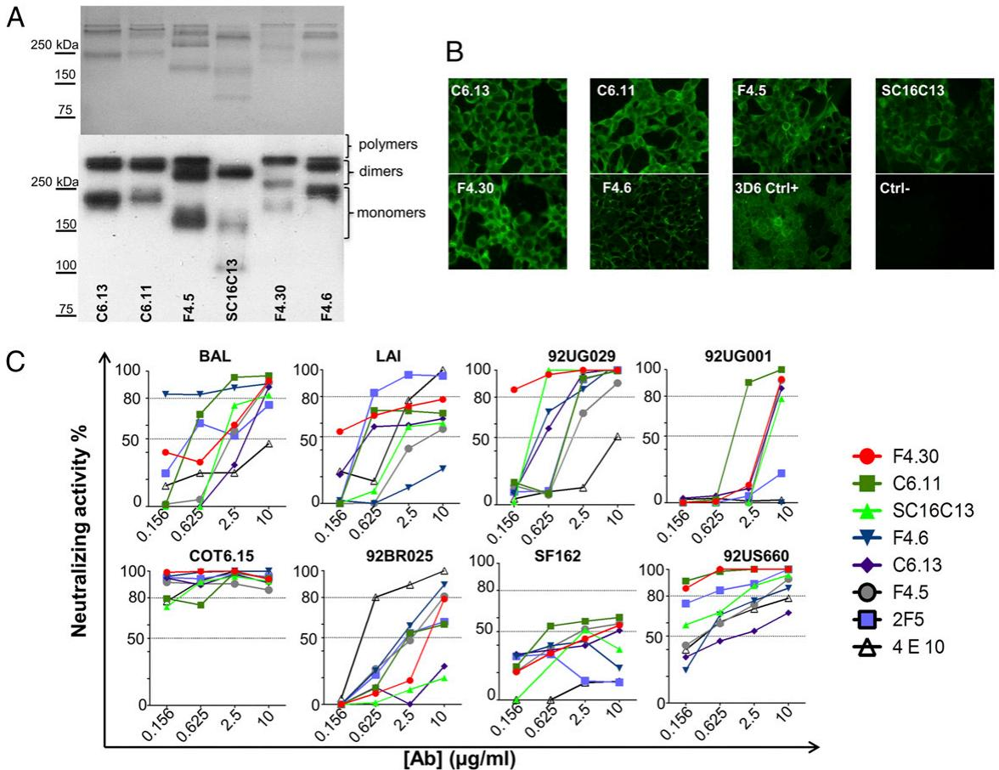  
FIGURE 1. Characterization of MPER-specific IgA1. (A) Coomassie blue staining and Western blot analysis of MPER-specific IgA. 10 $\mu$ g of purified IgA were loaded on a 9% acryl/bis-acryl gel under nondenaturing conditions. Detection of IgA was revealed with a polyclonal goat-anti-human IgA (Sigma-Aldrich). Size of monomers, dimers, and polymers are indicated. (B) Indirect immunofluorescence of HEK 293gp41 $^{MSD}$ -transfected cells with MPER-specific IgA. Immunoreactivity of purified IgA (500 ng) was revealed by a rabbit polyclonal anti-human IgA labeled with FITC. No binding of MPER-specific IGA was observed on untransfected cells (ctrl-). 3D6 was used as positive control. (C) Neutralizing activity of MPER-specific IgA1 on primary and laboratory HIV-1 strains. 4E10 and 2F5 were used as positive controls. Dose-dependent neutralization was performed within a concentration range of 0.156–10 $\mu$ g/ml. The experiments were performed three times with similar results.

cells were infected with a 100 TCID $_{50}$ dose in the presence of serially diluted Ab. The supernatants were collected 10 d postinfection, and p24 measurement was performed. The percentage of neutralization was calculated as the reduction of p24 production. IC $_{50}$ and IC $_{80}$ were determined as the lowest Ab concentration able to confer 50 and 80% of neutralization, respectively.

# Production of pseudoviruses COT6.15 and mutants

Pseudoviruses were generated by transfecting the COT6.15env plasmid or derived mutant (28, 29) with pSG3Δenv plasmid, using the Lyovec transfection reagent (InvivoGen) in HEK293 cells in a petri dish. The production of pseudoviruses was confirmed by quantification of p24 produced, and their infectivity and measurement of TCID $_{50}$ s were quantified by infecting TZM-BI cells (JC53-bl) with serial dilutions of the supernatant in triplicate in the presence of DEAE-dextran (30 μg/ml; Sigma-Aldrich, St. Louis). The infection was monitored 24 h later by evaluating luciferase activity, using the Bright Glo reagent (Promega, Madison, WI) following the manufacturer's instructions. Luminescence was measured in a Berthold Tristar multilabel counter during 5 s/well (Berthold THOIRY, France). The TCID $_{50}$ was calculated as described previously (30). Wells with relative light unit readings of 10 times that of the negative control were considered as positive.

# Measurement of the avidity of anti-MPER IgA1

Biacore analyses were conducted on a BIAcore 3000 Instrument (GE Healthcare, Velizy-Villacoublay, France). Recombinant gp41 (HXB2), gp140 (97/CN/54), and gp120c41 (HXB2; Abcys Eurobio, Courtaboeuf, France) were immobilized on a CM5 sensorchip (GE Healthcare) using amine coupling chemistry. To determine avidity constants, increasing concentrations of MPER IgA were injected over immobilized gp41 (1000 resonance units [RU]), gp140 (7500 RU), and gp120c41 (8200 RU) for 120 s at a flow rate of 20 $\mu$ l/min in PBS containing 0.005% surfactant P20. Between injections, the sensorchip surface was regenerated by pulse injections (10 $\mu$ l) of 10 mM HCl. The specific binding signal was obtained by subtracting the background signal over a reference surface with no protein immobilized. Global curve fitting was carried out using BiaEvaluation software version 4.1. Before fitting, buffer blanks were subtracted from the data sets. The apparent dissociation equilibrium constants ( $K_{D}$ ) were calculated from the ratio of the dissociation and association rate constants.

# Study of the autoreactivity of anti-MPER IgA

Autoreactivity to human epithelial (HEp-2) cells was determined by indirect immunofluorescence on slides using FITC-conjugated goat anti-human IgA polyclonal Ab (Abliance, Besançon, France). IgA were all tested at 25 $\mu$ g/ml. Autoreactivity of Abs was also tested by specific ELISA with purified cardiolipin (CLP) (Thermofisher, Illkirch, France) as described previously (31).

# Competition assay

To study the ability of anti-MPER IgA to recognize the same epitope as well-known anti-MPER IGg previously described, a competition assay was performed by ELISA.

The protein gp120c41 (HXB2; Abcys Eurobio, Courtaboeuf, France) were coated on a 96-well plate (Maxisorp; Nunc) at 5 $\mu$ g/ml in 0.1 mol/l sodium carbonate buffer (pH 9.6) overnight at 4°C. The plates were washed with PBS containing 0.05% Tween 20 and blocked with the same buffer and 4% BSA for 1 h at 37°C. After washing, 100 $\mu$ l of 2F5 and 4E10 (0–20 $\mu$ g/ml) diluted in PBS were added to the wells and incubated 2 h at 37°C. After washing, 100 $\mu$ l of the competition Abs were added to the wells at the concentration of 5 $\mu$ g/ml, diluted in PBS+BSA 1%, and incubated 1 h at 37°C. After washing, detection was performed using

Table I. Neutralizing activity of MPER-specific IgA 

<table><tr><td rowspan="2">HIV-1 Strains</td><td rowspan="2">Tier</td><td colspan="2">F4.30</td><td colspan="2">C6.11</td><td colspan="2">SC16C13</td><td colspan="2">F4.6</td><td colspan="2">C6.13</td><td colspan="2">F4.5</td><td colspan="2">2F5 IgA</td><td colspan="2">4E10 IgG</td></tr><tr><td> $IC_{80}$ </td><td> $IC_{50}$ </td><td> $IC_{80}$ </td><td> $IC_{50}$ </td><td> $IC_{80}$ </td><td> $IC_{50}$ </td><td> $IC_{80}$ </td><td> $IC_{50}$ </td><td> $IC_{80}$ </td><td> $IC_{50}$ </td><td> $IC_{80}$ </td><td> $IC_{50}$ </td><td> $IC_{80}$ </td><td></td><td></td><td></td></tr><tr><td>BAL (CCR5; B)</td><td>1B</td><td> $3.33^a$ </td><td> $2.08^a$ </td><td> $2.09^a$ </td><td> $0.46^b$ </td><td> $2.67^a$ </td><td> $1.67^a$ </td><td> $0.15^b$ </td><td> $0.09^b$ </td><td> $9.06^a$ </td><td> $4.05^a$ </td><td> $8.74^a$ </td><td> $2.23^a$ </td><td> $0.81^b$ </td><td> $2.39^a$ </td><td> $>10^c$ </td><td> $>10^c$ </td></tr><tr><td>92UG029 (CXCR4; A)</td><td>2–3</td><td> $0.15^b$ </td><td> $0.09^b$ </td><td> $2.13^a$ </td><td> $1.33^a$ </td><td> $0.49^b$ </td><td> $0.31^b$ </td><td> $2.33^b$ </td><td> $0.45^b$ </td><td> $2.04^a$ </td><td> $0.55^b$ </td><td> $8.85^a$ </td><td> $1.84^a$ </td><td> $2.15^a$ </td><td> $1.34^a$ </td><td> $>10^c$ </td><td> $9.82^a$ </td></tr><tr><td>92UG001 (CCR5/CXCR4; D)</td><td>2–3</td><td> $8.62^a$ </td><td> $5.39^a$ </td><td> $2.22^a$ </td><td> $1.38^a$ </td><td> $>10^c$ </td><td> $6.39^a$ </td><td> $>10^c$ </td><td> $>10^c$ </td><td> $9.33^a$ </td><td> $5.83^a$ </td><td> $8.69^a$ </td><td> $5.43^a$ </td><td> $>10^c$ </td><td> $>10^c$ </td><td> $>10^c$ </td><td> $>10^c$ </td></tr><tr><td>92US660 (CCR5; B)</td><td>1</td><td> $0.13^b$ </td><td> $0.08^b$ </td><td> $0.16^b$ </td><td> $0.10^b$ </td><td> $0.17^b$ </td><td> $0.11^b$ </td><td> $0.13^b$ </td><td> $0.08^b$ </td><td> $0.13^b$ </td><td> $0.08^b$ </td><td> $0.14^b$ </td><td> $0.09^b$ </td><td> $0.13^b$ </td><td> $0.08^b$ </td><td> $0.16^b$ </td><td> $0.10^b$ </td></tr><tr><td>HIV-1 G3 (CCR5; G)</td><td>2</td><td> $0.86^b$ </td><td> $0.54^b$ </td><td> $0.22^b$ </td><td> $0.14^b$ </td><td> $>10^c$ </td><td> $>10^c$ </td><td> $>10^c$ </td><td> $8.81^b$ </td><td> $0.19^b$ </td><td> $0.61^b$ </td><td> $0.26^b$ </td><td> $0.16^b$ </td><td> $0.87^b$ </td><td> $0.54^b$ </td><td> $1.02^a$ </td><td> $0.63^b$ </td></tr><tr><td>CAM1970 (CCR5; CRF02AG)</td><td>2–3</td><td> $0.16^b$ </td><td> $0.10^b$ </td><td> $0.15^b$ </td><td> $0.09^b$ </td><td> $0.19^b$ </td><td> $0.12^b$ </td><td> $0.22^b$ </td><td> $0.13^b$ </td><td> $2.40^a$ </td><td> $0.64^b$ </td><td> $>10^c$ </td><td> $0.49^b$ </td><td> $0.15^b$ </td><td> $0.09^b$ </td><td> $0.16^b$ </td><td> $0.10^b$ </td></tr><tr><td>92BR025 (CCR5; C)</td><td>1</td><td> $>10^c$ </td><td> $9.16^b$ </td><td> $>10^c$ </td><td> $0.58^b$ </td><td> $3.92^a$ </td><td> $2.45^a$ </td><td> $4.67^a$ </td><td> $2.92^a$ </td><td> $>10^c$ </td><td> $9.80^c$ </td><td> $>10^c$ </td><td> $2.42^a$ </td><td> $1.49^c$ </td><td> $0.93^b$ </td><td> $>10^a$ </td><td> $>10^a$ </td></tr><tr><td>SF162 (CCR5; B)</td><td>1A</td><td> $>10^c$ </td><td> $6.34^b$ </td><td> $>10^c$ </td><td> $2.34^a$ </td><td> $>10^c$ </td><td> $>10^c$ </td><td> $8.93^a$ </td><td> $2.12^a$ </td><td> $>10^c$ </td><td> $>10^c$ </td><td> $9.89^a$ </td><td> $2.61^a$ </td><td> $>10^c$ </td><td> $2.33^a$ </td><td> $0.62^b$ </td><td> $0.39^b$ </td></tr><tr><td>LAI (CXCR4; B)</td><td>1</td><td> $0.23^b$ </td><td> $0.14^b$ </td><td> $0.72^b$ </td><td> $0.45^b$ </td><td> $>10^c$ </td><td> $2.17^a$ </td><td> $>10^c$ </td><td> $>10^c$ </td><td> $>10^c$ </td><td> $0.54^b$ </td><td> $>10^c$ </td><td> $8.96^a$ </td><td> $0.60^b$ </td><td> $0.38^b$ </td><td> $2.59^a$ </td><td> $1.62^a$ </td></tr><tr><td>COT6.15</td><td>2</td><td> $0.15^b$ </td><td> $0.09^b$ </td><td> $0.14^b$ </td><td> $0.09^b$ </td><td> $>10^c$ </td><td> $0.67^b$ </td><td> $2.72^a$ </td><td> $0.52^b$ </td><td> $2.61^a$ </td><td> $0.47^b$ </td><td> $2.28^a$ </td><td> $0.13^b$ </td><td> $>10^c$ </td><td> $0.52^b$ </td><td> $0.59^b$ </td><td> $0.10^b$ </td></tr></table>

2F5A IgA and 4E10 IgG are used as controls.   
$^{a}\mathrm{IC}_{50}$ or $\mathrm{IC}_{80} < 1~\mu \mathrm{g / ml}$ .   
${}^{b}1\mu \mathrm{g}/\mathrm{{ml}} < {\mathrm{{IC}}}_{50}\text{ or }{\mathrm{{IC}}}_{80} < {10\mu }\mathrm{g}/\mathrm{{ml}}.$   
$^{c}$ IC $_{80}$ or IC $_{50}$ > 10 $\mu$ g/ml.

HRP-conjugated goat anti-human IgA (MP Biomedical, Strasbourg, France) and TMB substrate (Tebu bio, Le Perray en Yvelines, France). The absorbance was read at $450~\mathrm{nm}$ . All assays were performed in duplicate (Multiskan Microplate Photometer; Thermo Scientific).

# Sequencing and analysis

Sequencing was performed from purified DNA from pelted hybridomas to analyze the H chain nucleotide sequence and the characteristics of CDRH3 (B Cell Design, Limoges, France). (The characterization of Abs sequence was performed using imgt.org/IMGT\_vquest and ExPASy.org/ProtParam tools; http://www.ebi.ac.uk/Tools/msa/kalign/).

# Statistical analysis

The statistical difference in vitro experiments between controls and Abs was assessed using Student $t$ test (Statistica 5.1 software; Statsoft, Maison-Alfort, France). A $p$ value $< 0.05$ has been considered statistically significant. The whole results were obtained from the mean of at least a triplicate or two triplicates. The significances were verified according to an ANOVA test with Bonferroni posttests to compare the row means. The correlations were obtained after a Spearman correlation for nonparametric data.

# Results

To induce gp41-specific neutralizing Abs (NAbs), immunization of humanized transgenic mice (23) were performed using HEK293-gp41 $^{MSD}$ human cell line that allowed native shape expression of a gp41 (22). After immunizations, >2300 hybridoma B cell clones were isolated and immortalized. Supernatants of all individual B cell clones were tested by immunofluorescence on HEK293-gp41 $^{MSD}$ and untransfected cells (Fig. 1B, Supplemental Fig. 1). Among the hybridomas, only six clones presented highly specific recognition of the HEK293-gp41 $^{MSD}$ cells. From those clones, IgA1 were produced and purified (Fig. 1A). Recombinant chimeric IgA are produced both as monomers, dimers, and polymers (Fig. 1A). The average concentration of IgA1 was with a range between 86 and 295 ng/μl before purification.

# Elicited IgA1 are specific to gp41 ectodomain

To confirm the specificity of purified IgA1, immunofluorescence on HEK 293-gp41 $^{MSD}$ was performed. Only clones with high specific recognition of HEK 293-gp41 $^{MSD}$ were selected (Fig. 1B). This first screening allowed the selection of six IgA1 clones (F4.5, F4.6, F4.30, C6.11, C6.13, and SC16C13) (Fig. 1B).

# F4.30 and C6.11 are highly potent and broadly neutralizing Abs of tier 1, 2, and 3 primary HIV-1 strains

The neutralizing activities of purified MPER-specific IgA1 were tested on different strains. Among them, F4.30 exhibited a strong neutralization activity with a high proportion of neutralized primary isolates ( $>80\%$ of tested strains) with very low $IC_{80}$ and $IC_{50}$ in the range of few nanograms per milliliter (Fig. 1C, Table I). F4.30 neutralized 92UG029, LAI, and COT6.15 strains with a strong and higher potency ( $IC_{80} < 1 \mu g/ml$ ) than those obtained for 4E10 IgG or 2F5 IgA with LAI and those reported for 10E8. F4.30 neutralized BAL and 92UG001D strains more efficiently than 4E10 with $IC_{80}$ five times lower for BAL but higher than for 2F5 IgA (3.3, 17.19, and 0.81 $\mu g/ml$ , respectively). F4.30 showed stronger neutralization potency for 92UG001D strain with an $IC_{80}$ of 8.62 $\mu g/ml$ that is 47 and 4 times lower than those obtained for 4E10 (410 $\mu g/ml$ ) and 2F5 (36 $\mu g/ml$ ), respectively. SF162 and 92BR025 strains were weakly neutralized by F4.30, and the $IC_{80}$ was lower than for 4E10. C6.11 neutralized efficiently the infection of 70% of the tested strains with an $IC_{50} < 1 \mu g/ml$ . C6.11 neutralized 92US660 and CAM1970 with the same potency as 4E10 and 2F5 IgA, whereas LAI, COT6.15, and HIVG3 were neutralized with lower $IC_{80}$ . BAL, 92UG029, and 92UG001 were moderately neutralized by C6.11, but its $IC_{80}$ is lower than 4E10. C6.11 neutralized SF162 and 92BR025 with an $IC_{80}$ of 13.27 and

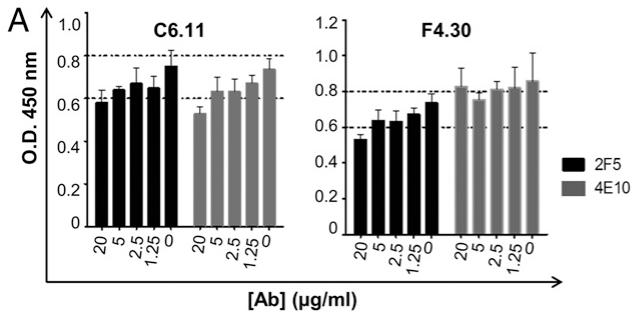

bar

| [Ab] (μg/ml) | C6.11 O.D. 450 nm (2F5) | C6.11 O.D. 450 nm (4E10) | F4.30 O.D. 450 nm (2F5) | F4.30 O.D. 450 nm (4E10) |
|---|---|---|---|---|
| 20 | 0.62 | 0.58 | 0.52 | 0.64 |
| 5 | 0.68 | 0.66 | 0.64 | 0.72 |
| 2.5 | 0.70 | 0.68 | 0.66 | 0.76 |
| 1.25 | 0.72 | 0.70 | 0.72 | 0.80 |
| 0 | 0.78 | 0.76 | 0.76 | 0.84 |

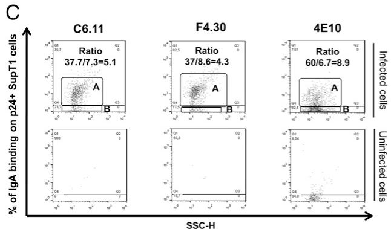

scatter

| Cell Line | Ratio  | % of IgA binding on p24+ SupT1 cells |
|-----------|--------|--------------------------------------|
| C6.11     | 37.7   | 5.1                                  |
| F4.30     | 37/8.6 | 4.3                                  |
| 4E10      | 60/6.7 | 8.9                                  |

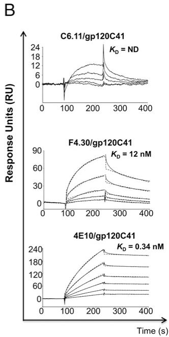

line

| Compound         | KD (nM) |
| ---------------- | ------- |
| C6.11/gp120C41   | ND      |
| F4.30/gp120C41   | 12      |
| 4E10/gp120C41    | 0.34    |

FIGURE 2. Interaction between MPER-specific IgA with gp41. (A) Competition assay for C6.11 and F4.30 binding to gp120c41 in the presence of 2F5 or 4E10. gp120c41-coated wells were preincubated with 2F5 or 4E10 at different concentrations (0–20 $\mu$ g/ml). C6.11 and F4.30 were used at 5 $\mu$ g/ml. Assays were performed in triplicate. (B) Kinetic analysis of the interaction between MPER-specific IgA and recombinant gp120c41. C6.11 (5–80 nM), F4.30 (0.5–16 nM), and 4E10 (0.5–8 nM) were injected over 8200 RU of immobilized gp120c41 in PBS containing 0.005% surfactant P20. The binding signals shown were obtained by double referencing (subtraction of the reference surface and of buffer blank injection signals). Fits are shown as dotted lines and were obtained by global fitting of the data using a 1:1 Langmuir binding model. (C) Binding of MPER-specific IgA on SupT1/LAI-infected cells. Number of IgA $^{+}$ /p24 $^{+}$ SupT1 cells was analyzed by flow cytometry. 4E10 was used as positive control and labeling with anti-p24 $^{+}$ + anti-IgA-PE as negative control. The ratio of the mean fluorescence of IgA $^{+}$ /p24 $^{+}$ SupT1 cells on the mean fluorescence of IgA $^{-}$ /p24 $^{+}$ SupT1 cells is indicated. Uninfected cells were used as negative control.

13.37 $\mu$ g/ml, respectively, 20 times lower than 4E10 or 10E8 but close to 2F5 IgA. SC16C13 neutralized >30% of the tested strains with an $IC_{80} < 137 \mu g/ml$ . 92UG029, 92US660, and CAM1970 were neutralized with $IC_{80} < 1 \mu g/ml$ (equivalent to 4E10 and 2F5). F4.6 and C6.13 strongly neutralized only three of the tested strains and F4.5 presented weak neutralization except for 92US660 and HIV-1 G3 that were neutralized with $IC_{80} < 1 \mu g/ml$ (Fig. 1C, Table I).

# gp41-specific IgA1 recognize different epitopes in the MPER region

To characterize the neutralizing epitopes recognized by the more potent IgA1 F4.30 and C6.11, the binding of purified IgA1 to peptide epitopes of the Env glycoprotein (clade B) and to recombinant gp41 or gp140 were measured (Supplemental Table I). The specificity of IgA1 was directed to the MPER and HR2 regions. F4.30 and C6.11 recognized the 2F5 neutralizing epitope on MPER. C6.11 recognized the two neutralizing epitopes ELDKWA and WFD/NIT on MPER, whereas F4.30 recognized the ELDKW motif and the HR2 region. All recombinant IgA1 were able to strongly recognize both the gp41 ectodomain and the gp140 glycoprotein (Supplemental Table I). These epitopes were tested in a competition assay with 4E10 and 2F5 based on recombinant gp120c41. C6.11 and F4.30 recognized epitopes close to or that encompass those of 2F5 as indicated by the respective loss of 22.6 and 28.7% of their epitope binding capacity with 2F5 > 10 $\mu$ g/ml. In contrast, the binding of F4.30 and C6.11 to gp120C41 seems to be less altered by increasing concentrations of 4E10 with a 3.4 and 10% decrease, respectively (Fig. 2A).

# Anti-MPER IgA1s have a strong avidity for gp41

IgA1 abilities to recognize the gp41 glycoprotein were measured using surface plasmon resonance. Kinetic experiments were performed using different targets as the gp41 ectodomain (clade B), the gp140 (clade C) and the gp120cgp41 (clade B). After immobilization of the target proteins, MPER-specific IgA1 (F4.30 and C6.11) as well as 4E10 or 3D6 IgGs at various concentrations (0.5–160 nM) were tested (Fig. 2B). F4.30 recognized gp120c41 with a $K_{D}$ of 12 nM similar to 3D6 IgG (10.4 nM) whereas the $K_{D}$ of 4E10 was 0.34 nM (Fig. 2B, Supplemental Table II). In comparison with 3D6 ( $K_{D}$ of 14.9 nM) or 4E10 ( $K_{D}$ of 10.9 nM) (Fig. 2B, Supplemental Table II), F4.30 recognized gp140 with a lower avidity ( $K_{D}$ of 18.8 nM). C6.11 recognized weakly the gp120c41 precluding determination of the $K_{D}$ value.

# F4.30 and C6.11 are able to recognize both viral particles and infected cells

To demonstrate the ability of IgA1 to efficiently recognize HIV-1 particles, an ELISA was performed with coated viral particles of both laboratory and primary strains. As a negative control, an anti-OVA IgA1 was used. Free virions from BAL, CAM1970, LAI, and SF162 strains were strongly recognized by C6.11 and F4.30 (Supplemental Table III). The anti-OVA IgA1 did not bind to CAM1970, BAL, and SF162 viral particles and showed a very weak binding to the LAI strain (Supplemental Table III). The binding to free viral particles is probably the mechanism involved in the neutralizing activity of IgA1. An infection assay with TCLA LAI and SupT1 cell line was performed to demonstrate the ability of IgA1 to specifically recognize HIV-1-infected cells (Fig. 2C). The percentage of $\mathrm{p24^{+} / IgA1^{+}}$ cells was $12\%$ with a mean fluorescence intensity ratio (infected/uninfected) of 5.1 for C6.11. F4.30 was not able to recognize $>10\%$ of infected cells with a mean fluorescence intensity of 4.3. No binding was observed with anti-OVA IgA1.

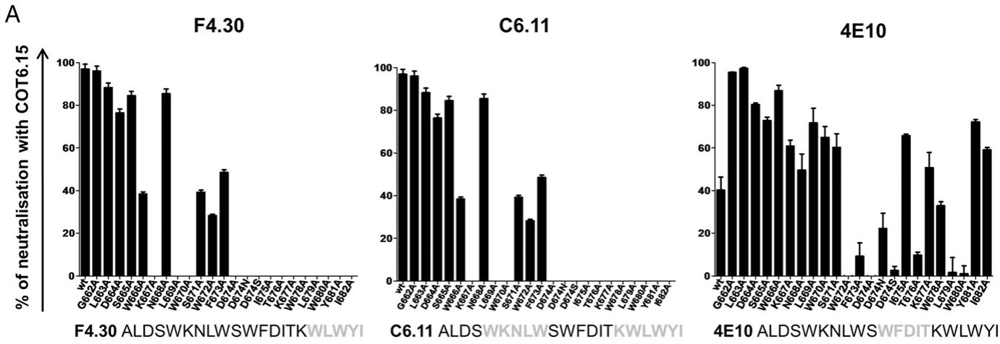  
B

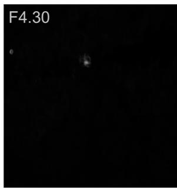

natural_image

Dark image with faint, indistinct bright spots and a label 'F4.30' in the top left corner (no other text or symbols)

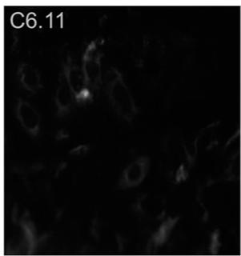

natural_image

Microscopic image showing cellular structures with a bright spot labeled C6.11 (no other text or symbols visible)

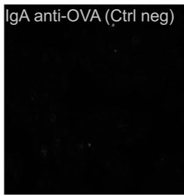

text_image

IgA anti-OVA (Ctrl neg)

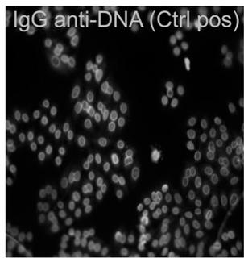

text_image

IgG anti-DNA (Ctrl pos)

FIGURE 3. (A) Screening of the neutralizing activity of MPER-specific IgA on COT6.15 pseudoviruses and COT6.15 mutants. MPER sequence is shown in each panel. For each mAb and mutant, the value of SD is calculated for the neutralization from two independent experiments realized in triplicate. The critical residues for neutralization are indicated in red. (B) Analysis of MPER-specific IgA autoreactivity on HEp-2 cells by immunofluorescence. F4.30, C6.11, anti-OVA IgA negative control, and anti-DNA IgG positive control were used at $25~\mu \mathrm{g / ml}$ . Assay were performed in triplicate. Original magnification $\times 20$ .

Neutralizing epitopes of IgA1 are larger than 2F5 or 4E10 epitope. Mapping of neutralizing epitopes was performed by measuring their neutralizing activities with HIV-1 COT6.15 pseudoviruses and compared with mutated pseudoviruses with alanine substitutions in MPER residues (662–682) as described previously (Fig. 3A) (32). As described for well-characterized MPER-specific IgG as 2F5 or 4E10, IgA1 neutralizing activity was highly sensitive to substitution of the W666 tryptophan and the K667 lysine residues that are central in the 2F5 recognition (14). For F4.30, a downstream-extended 2F5 epitope merged with the upstream 4E10 epitope 667KNLWSWF D/N/S I675 seems to be crucial for neutralization. However, mutation of the T676 residue also reduced the neutralizing potency of F4.30. C6.11 was also sensitive to the substitution of W666, W670, and L669 residues also crucial in 2F5 neutralization activity. C6.11 was also sensitive to the mutation of the C-Term residues of MPER (674D/N/SITKWLWYI682). The F4.30 and C6.11 epitopes are probably larger than 4E10 and 2F5 epitopes. It was confirmed by the determination of an IC $_{80}$ COT mutant versus IC $_{80}$ COT wild-type ratio of for each Ala substitution.

# F4.30 and C6.11 are not autoreactive/polyreactive

A property common to the previously characterized MPER-specific mAbs 2F5 and 4E10 is their ability to cross-react with self-antigens (33). In addition, binding to both the cell membrane and the Env trimer is thought to be important for optimal neutralization. Autoreactivity of IgA1 was first tested on HEp-2 cells by immunofluorescence (Fig. 3B). F4.30 and C6.11 did not recognize Hep-2 cells contrary to what was observed and previously described for 2F5 or 4E10 (Fig. 3B). Immunoreactivity of IgA1 against phospholipids was also tested with purified CLP. Unlike C6.11 that did not recognize anionic phospholipids, such as CLP, F4.30 presented a very low level of binding to cardiolipin (Supplemental Table IV).

# F4.30 and C6.11 show low levels of mutation and have a short and low hydrophobic H chain third CDR

We next aimed to understand whether F4.30 and C6.11 share the same characteristics as 2F5, 4E10, or 10E8, which have a long and hydrophobic H chain third CDR (CDRH3) and a high rate of somatic mutation. The H chains of F4.30 and C6.11 were sequenced and the CDRH3 of each clone was analyzed and compared with 2F5 and 10E8 (34). The sequences of the H chain of C6.11 and F4.30 are identical and could come from the same original clone (Fig. 4A). However, the sequence of the L chains differs from two residues. F4.30 and C6.11 present a shorter CDRH3 with 9-aa residues, whereas 2F5 and 10E8 (accession numbers JX645769/JX645770) contains 24 and 22 residues respectively (Fig. 4B). The CDRH3 of F4.30 and C6.11 is less hydrophobic than 2F5 but more hydrophobic than 10E8 with a hydropathicity score of -0.833, -0.225, and -1.386, respectively. By comparing the sequence of the constant H chain of each Ab and the VDJ allele precursor, we observed that both F4.30 and C6.11 H chains come from the IGHV3-602 F with which they share $98.96\%$ of identity, the IGHJ2\*1 with $95.74\%$ identity, and IGHD2-1\*01F. The alignment of the variable domain of the H chains of F4.30 and C6.11 with 2F5, 10E8, and PG9 showed matches of 51.67, 40.83, and $49.17\%$ respectively (data not shown).

# Discussion

Recently, many studies have demonstrated the role of Nabs during the course of HIV-1 infection. New advances allowed to elicit Abs directed against different key epitopes, such as the quaternary neutralizing epitopes of the viral envelope (35, 36). Passive ad-

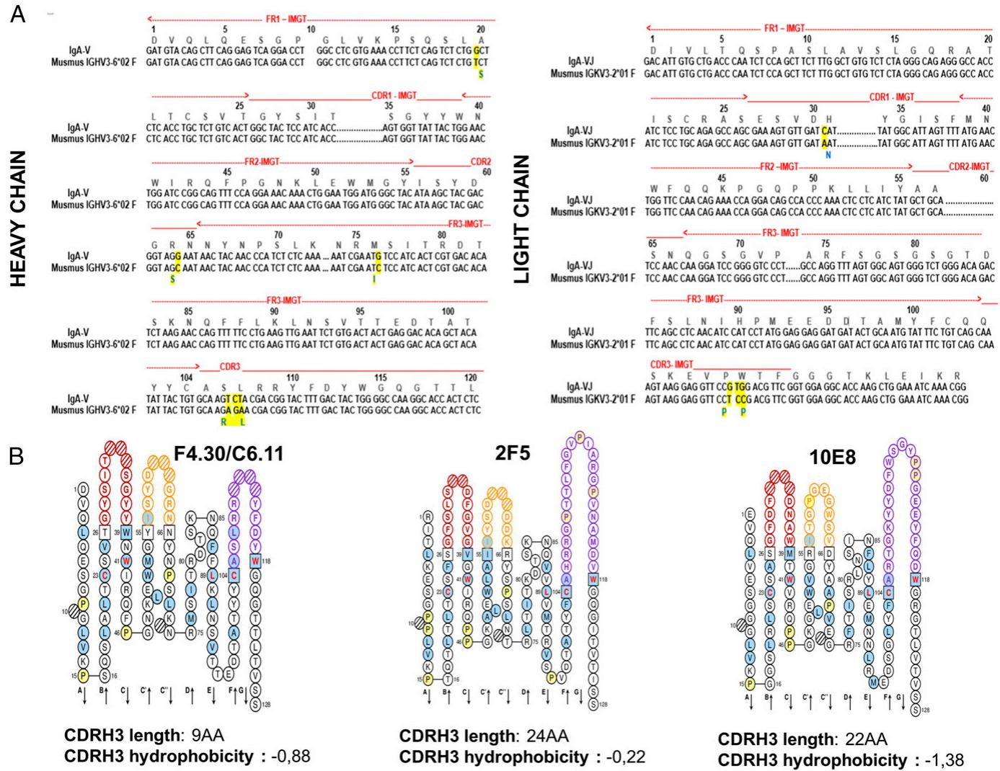  
FIGURE 4. Sequencing of the C region of the H and L chain of F4.30 and C6.11. (A) Alignment of the sequences of the H chain of F4.30 and C6.11 and the consensus sequence. Nucleotides that are different from the consensus sequence are highlighted in yellow, and the corresponding residues are in blue and highlighted in yellow. (B) “Pearl necklace” representation of the amino acid sequence of the H chains of F4.30 and C6.11 and characterization of their CDRH3. Amino acid sequence of the H chain of F4.30 and C6.11 as well as 2F5 and 10E8. CDRH1 are represented in red, CDR2 in orange, and CDRH3 in purple. The length of the CDRH3 (number of amino acids) and the score of hydropathicity are mentioned under each sequence. (Obtained from IMGT/VQUEST tools and ExPASy ProtPRWEMaram tool).

ministration of rare human envelope-specific monoclonal bNAbs to nonhuman primate models such as rhesus macaques can protect against SHIV or SIV challenge (37–39).

Moreover, gp120-specific Abs seem to be one of the correlates of protection in the recent RV144 vaccine trial (40, 41) even if the mucosal immune response was not investigated. The presence of systemic IgA (mainly monomeric) directed against certain gp120 specificities were associated with higher rates of infection. However, other specific IgA were not associated with infection risk (40, 42, 43). In contrast, the presence of IgA in saliva and serum, directed against different key regions of gp160 (CD4 binding site, V2 loop or the MPER) and able to neutralize different HIV-1 strains in vitro, has been associated to protection in ESN (1, 12). Moreover, several studies have described the potential ability of mucosal sIgA to locally block infection (39, 44).

Humanized mice are an alternative to humans for the production of Abs (45) and may be useful for pharmacologic studies of anti-HIV drugs and passive immunization (46, 47). The interest in using humanized mice is related to the wide repertoire of Ags they can recognize. In this study, $\alpha 1\mathrm{KI}$ humanized mice were used to elicit neutralizing IgA1 specific to the MPER region of gp41.

The $\alpha 1\mathrm{KI}$ mice model allows the production of chimeric monomeric, dimeric, and polymeric IgA1 with equivalent rate of glycosylation similar to those encountered in human (48). Crosslinking of $\mathrm{mIgA^{+}}$ B cells residing in MALTs mediates local IgA secretion responses in this model (49, 50). As for IgG, a B cell stage with mIgA expression is necessary to mount IgA Ab responses (51). That both early and late B cell development can be ensured by expression of membrane $\alpha$ H chain (HC) was shown in the $\alpha 1\mathrm{KI}$ model where Sμ was replaced with an Ig HC $\alpha 1$ gene (45). In such mice, a partial pre-B defect was reminiscent of data in mice with premature expression of membrane HC. BCR density was lower in $\alpha 1\mathrm{KI}$ than in wt mice, and was associated with increased abundance of both long-lived and short-lived plasma cells.

In this model, a prime boost strategy using naked DNA as a prime by hydrodynamic i.v. route was used to increase the immunogenicity of the gp41 (23). Using HEK293-gp41 $^{MSD}$ cells as a boost gave rise to six clones able to specifically recognize gp41 in a conformational shape. Among these clones, two Abs (F4.30 and C6.11) showed a high neutralizing potency for different strains of HIV. The neutralizing activity for F4.30 and C6.11 are very similar to the one reported for the 10E8 another bNAbs gp-41-specific IgG but higher

than for 4E10 or 2F5 (both in IgG and IgA backbone). It could be very important to assess the breadth of the neutralizing activity against a wide range of pseudoviruses from National Institutes of Health panels. Moreover, the solubility of these two clones seems to be higher than for 10E8 (52). F4.30 recognizes both MPER neutralizing epitopes ELDKW and WFD/NIT and the HR2 regions with different efficiency. C6.11 bound the KWA motif in the ELDKWA 2F5 neutralizing epitope. These data correlated with the results obtained by surface plasmon resonance using immobilized gp41, gp140, and gp120c41 proteins. The high neutralization activity of F4.30 is also correlated to a high level of recognition of free viral particles and the absence of autoreactivity. The high neutralization capacities in comparison with the well-known IgG 4E10 could be explained by a better recognition of the gp41 conformational shape by F4.30.

Screening of the F4.30 binding site and competition assay suggest that the epitope could be conformational or discontinuous and involve HR2 and other regions. In fact, the polymeric nature of IgA suggests that they could bind large functional epitopes possibly located on adjacent proteins such as gp41 and gp120 during the infection process or to HR1/HR2 domains in a fusion complex state.

Other studies have described purified neutralizing IgA Abs from patients directed against different key regions on the gp160 surface including the super antigenic site on gp120 and the CD4 binding site (53), which are also discontinuous epitopes. Furthermore, the recently described bNAb 35O22 recognizes and efficiently binds a large epitope corresponding to the interface of gp120 and gp41 (9, 16). Structural studies have described the ability to enhance the neutralization potency of well-known Abs like 10E8 by presenting MPER in a different context using a hydrocarbon stapled peptide that reinforces unique architectures, such as the helix-kink-helix MPER motif that presents a new fashioning of peptide structure (19). It will be interesting to make such studies with F4.30 and C6.11.

Numerous studies have also shown that the advent of heterologous neutralizing Abs in a subset of HIV patient appears many years postinfection, what is explained by multiple rounds of modifications and maturation that are exerted by a continually evolving pathogen (7, 54). These mutations lead to different features common to some neutralizing Abs including an exceptional high rate of somatic mutations and a long hydrophobic CDRH3 (8, 55). In fact, a long CDHR3 is observed for Abs that target and penetrate the envelope glycan shield like PG9, PG16, and PGT145 or the 10E8 that targets MPER (15, 56). However, 35O22 that recognizes a different site of vulnerability on the glycoprotein envelope uses a novel mechanism of glycan-protein recognition, combining a protruding FW3 with CDRH1, H2, and H3 to form a “bowl” that holds glycan. FW3 and CDRH3 provide the top edges of the bowl and interact with the protein surface of gp120, whereas CDRH1 and H2 are recessed and hold/recognize glycan. This structural mechanism of recognition contrasts with the extended CDRH3-draping glycan observed with other Abs that penetrate the glycan shield such as PG9 and PGT128. Whereas 35O22 Ab possesses a CDRH3 composed of 14 aa that is shorter than 4E10 or the 2F5 Ab but presents an insertion of 8 aa in framework 3. This high rate of somatic mutation and framework 3 insertions is a feature of other HIV-specific bNAbs (9, 16, 57, 58). F4.30 and C6.11 presented a low rate of mutation with a high score of similarity to the consensus VDJ alleles. This suggests a weak maturation of the F4.30 and C6.11 clones and can be explained by an exposition to a small number of immunogen variants because of the immunization protocol. Furthermore, F4.30 and C6.11 presented a short CDRH3 with a low hydrophobicity in comparison with 2F5, which does not exclude reactivity with a complex glycosylated epitope but discards the idea of a deeply hidden region buried within the glycan shield.

An important inconvenience of well-known MPER-specific Abs as 2F5 and 4E10 is that they cross-react with self-antigens. F4.30 and C6.11 do not present any autoreactivity or recognition of self-antigens as phospholipids. Studies of potent Abs such as 2G12 (59) described the capacity of monomeric or dimeric 2G12 to mediate Ab-dependent cellular cytotoxicity or to activate the complement system in vitro (60, 61). The capacity of F4.30 to mediate Ab-dependent cellular cytotoxicity or Ab-dependent cell-mediated virus inhibition against infected cells remains to be investigated. This work strengthens our previous studies of the role of anti-MPER IgA present in parotid saliva of ESN and HIV+ individuals (1, 12, 28). As for M66.6 and M66 2F5-like Abs (62), MPER-specific IgA1 are similar but present different activities of recognition and binding for gp41. It may suggest that both Ab lineages evolved under similar constraints for recognition and neutralization of HIV-1, whereas functional elements within CDR-like glycosylation may differ during this evolution and impact their properties.

F4.30 and C6.11 IgA have the capacity to strongly neutralize $>80\%$ of the HIV-1 strains tested. The avidity of IgA for its Ag was not correlated to neutralizing activity. C6.11 has a weak Ag avidity but presents a high cross-clade neutralizing activity. The profile of the higher neutralizing IgA Abs is of intermediate avidity for the recognition of MPER, high recognition of free viral particles, and an absence of auto reactivity.

These two mAbs (F4.30 and C6.11) are to our knowledge the first recombinant neutralizing cross-clade IgA1. There are, however, remaining questions with the $\alpha$ 1KI chimeric model such as the relevance with regard to a normal physiological development of Abs, the proportion in those mice of LB1 that do not develop into memory B cells, LB2, or B cells of the marginal zone, and the impact of a prior IgA switch in the B cell compartment. $\alpha$ 1KI is a promising chimeric model for the eliciting of new humanized Abs. Further understanding of the interaction of F4.30 with gp41 at the atomic level would require crystallographic studies. MPER-specific IgA1 could be now tested in vivo to block the entry of HIV-1 after recent viral exposure or to reduce, after systemic administration, viral burden, and the massive CD4 cell depletion in HIV-1 reservoirs such as the intestine. Potent mAbs acquire their neutralization potency from their ability to block a functionally important site that is critical for viral entry as seen for the CD4 binding site Abs. Nonetheless, the breadth and potency of F4.30 demonstrates a conserved site of gp41 is an important target Ag for HIV neutralization. The highly conserved MPER is a target of potent, non-self-reactive neutralizing Abs, confirming the high interest in MPER-based HIV vaccine design.

# Acknowledgments

We thank Philip Lawrence for critical reading of the manuscript. We thank Isabelle Bally for assistance and access to the surface plasmon resonance platform of the Partnership for Structural Biology in Grenoble. We also thank Dr. Elin Gray and Prof. Lynn Morris for providing the COT6.15 plasmids. This work used the platforms of the Grenoble Instruct centre (ISBG, UMS 3518 CNRS-CEA-UJF-EMBL).

# Disclosures

The authors have no financial conflicts of interest.

# References

1. Vincent, N., E. Malvoisin, B. Pozzetto, F. Lucht, and C. Genin. 2004. Detection of IgA inhibiting the interaction between gp120 and soluble CD4 receptor in serum and saliva of HIV-1-infected patients. AIDS 18: 37–43.   
2. Matsuda, S., and M. Noda. 2000. Detection of IgA-binding sites on human immunodeficiency virus type-1 envelope glycoproteins, Gp120 and Gp41. Microbiol. Immunol. 44: 923–929.

3. Kaul, R., F. Plummer, M. Clerici, M. Bomsel, L. Lopalco, and K. Broliden. 2001. Mucosal IgA in exposed, uninfected subjects: evidence for a role in protection against HIV infection. AIDS 15: 431–432.   
4. Hirbod, T., X. Kong, G. Kigozi, A. Ndyanabo, D. Serwadda, J. L. Prodger, A. A. Tobian, F. Nalugoda, M. J. Wawer, K. Shahabi, et al. 2014. HIV acquisition is associated with increased antimicrobial peptides and reduced HIV neutralizing IgA in the foreskin prepuce of uncircumcised men. [Published erratum appears in 2014 PLoS Pathog. 10: e1004515.] PLoS Pathog. 10: e1004416.   
5. Mestecky, J., P. F. Wright, L. Lopalco, H. F. Staats, P. A. Kozlowski, Z. Moldoveanu, R. C. Alexander, R. Kulhavy, C. Pastori, L. Maboko, et al. 2011. Scarcity or absence of humoral immune responses in the plasma and cervicovaginal lavage fluids of heavily HIV-1-exposed but persistently seronegative women. AIDS Res. Hum. Retroviruses 27: 469–486.   
6. Tomaras, G. D., N. L. Yates, P. Liu, L. Qin, G. G. Fouda, L. L. Chavez, A. C. Decamp, R. J. Parks, V. C. Ashley, J. T. Lucas, et al. 2008. Initial B-cell responses to transmitted human immunodeficiency virus type 1: virion-binding immunoglobulin M (IgM) and IgG antibodies followed by plasma anti-gp41 antibodies with ineffective control of initial viremia. J. Virol. 82: 12449–12463.   
7. Mouquet, H. 2014. Antibody B cell responses in HIV-1 infection. Trends Immunol. 35: 549–561.   
8. Finton, K. A., K. Larimore, H. B. Larman, D. Friend, C. Correnti, P. B. Rupert, S. J. Elledge, P. D. Greenberg, and R. K. Strong. 2013. Autoreactivity and exceptional CDR plasticity (but not unusual polyspecificity) hinder elicitation of the anti-HIV antibody 4E10. PLoS Pathog. 9: e1003639.   
9. Pancera, M., T. Zhou, A. Druz, I. S. Georgiev, C. Soto, J. Gorman, J. Huang, P. Acharya, G. Y. Chuang, G. Ofek, et al. 2014. Structure and immune recognition of trimeric pre-fusion HIV-1 Env. Nature 514: 455–461.   
10. Klein, F., H. Mouquet, P. Dosenovic, J. F. Scheid, L. Scharf, and M. C. Nussenzweig. 2013. Antibodies in HIV-1 vaccine development and therapy. Science 341: 1199–1204.   
11. Clerici, M., C. Barassi, C. Devito, C. Pastori, S. Piconi, D. Trabattoni, R. Longhi, J. Hinkula, K. Broliden, and L. Lopalco. 2002. Serum IgA of HIV-exposed uninfected individuals inhibit HIV through recognition of a region within the alpha-helix of gp41. AIDS 16: 1731–1741.   
12. Benjelloun, F., R. Dawood, S. Urcuqui-Inchima, N. Rochereau, B. Chanut, B. Verrier, F. Lucht, C. Genin, and S. Paul. 2013. Secretory IgA specific for MPER can protect from HIV-1 infection in vitro. AIDS 27: 1992–1995.   
13. Muñoz-Barroso, I., K. Salzwedel, E. Hunter, and R. Blumenthal. 1999. Role of the membrane-proximal domain in the initial stages of human immunodeficiency virus type 1 envelope glycoprotein-mediated membrane fusion. J. Virol. 73:6089–6092.   
14. Zwick, M. B., and D. R. Burton. 2007. HIV-1 neutralization: mechanisms and relevance to vaccine design. Curr. HIV Res. 5: 608–624.   
15. Huang, J., G. Ofek, L. Laub, M. K. Louder, N. A. Doria-Rose, N. S. Longo, H. Imamichi, R. T. Bailer, B. Chakrabarti, S. K. Sharma, et al. 2012. Broad and potent neutralization of HIV-1 by a gp41-specific human antibody. Nature 491:406–412.   
16. Huang, J., B. H. Kang, M. Pancera, J. H. Lee, T. Tong, Y. Feng, H. Imamichi, I. S. Georgiev, G. Y. Chuang, A. Druz, et al. 2014. Broad and potent HIV-1 neutralization by a human antibody that binds the gp41-gp120 interface. Nature 515: 138–142.   
17. Apellániz, B., E. Rujas, P. Carravilla, J. Requejo-Isidro, N. Huarte, C. Domene, and J. L. Nieva. 2014. Cholesterol-dependent membrane fusion induced by the gp41 membrane-proximal external region-transmembrane domain connection suggests a mechanism for broad HIV-1 neutralization. J. Virol. 88: 13367–13377.   
18. Lai, R. P., M. Hock, J. Radzimanowski, P. Tonks, D. L. Hulsik, G. Effantin, D. J. Seilly, H. Dreja, A. Kliche, R. Wagner, et al. 2014. A fusion intermediate gp41 immunogen elicits neutralizing antibodies to HIV-1. J. Biol. Chem. 289:29912–29926.   
19. Bird, G. H., A. Irimia, G. Ofek, P. D. Kwong, I. A. Wilson, and L. D. Walensky. 2014. Stapled HIV-1 peptides recapitulate antigenic structures and engage broadly neutralizing antibodies. Nat. Struct. Mol. Biol. 21: 1058–1067.   
20. Alfsen, A., P. Iniguez, E. Bouguyon, and M. Bomsel. 2001. Secretory IgA specific for a conserved epitope on gp41 envelope glycoprotein inhibits epithelial transcytosis of HIV-1. J. Immunol. Baltim. Md.: 1950 166: 6257–6265.   
21. Tudor, D., and M. Bomsel. 2011. The broadly neutralizing HIV-1 IgG 2F5 elicits gp41-specific antibody-dependent cell cytotoxicity in a FcγRI-dependent manner. AIDS 25: 751–759.   
22. Dawood, R., F. Benjelloun, J. J. Pin, A. Kone, B. Chanut, F. Jospin, F. Lucht, B. Verrier, C. Moog, C. Genin, and S. Paul. 2013. Generation of HIV-1 potent and broad neutralizing antibodies by immunization with postfusion HR1/HR2 complex. AIDS 27: 717–730.   
23. Laffleur, B., V. Pascal, C. Sirac, and M. Cogné. 2012. Production of human or humanized antibodies in mice. Methods Mol. Biol. 901: 149–159.   
24. Akkina, R. 2013. New generation humanized mice for virus research: comparative aspects and future prospects. Virology 435: 14–28.   
25. Haynes, B. F., M. A. Moody, L. Verkoczy, G. Kelsoe, and S. M. Alam. 2005. Antibody polyspecificity and neutralization of HIV-1: a hypothesis. Hum. Antibodies 14: 59–67.   
26. Duchez, S., R. Amin, N. Cogné, L. Delpy, C. Sirac, V. Pascal, B. Corthésy, and M. Cogné. 2010. Premature replacement of mu with alpha immunoglobulin chains impairs lymphopoiesis and mucosal homing but promotes plasma cell maturation. Proc. Natl. Acad. Sci. USA 107: 3064–3069.   
27. Vincent, N., A. Kone, B. Chanut, F. Lucht, C. Genin, and E. Malvoisin. 2008. Antibodies purified from sera of HIV-1-infected patients by affinity on the heptad repeat region 1/heptad repeat region 2 complex of gp41 neutralize HIV-1 primary isolates. AIDS 22: 2075–2085.

28. Morris, L., X. Chen, M. Alam, G. Tomaras, R. Zhang, D. J. Marshall, B. Chen, R. Parks, A. Foulger, F. Jaeger, et al. 2011. Isolation of a human anti-HIV gp41 membrane proximal region neutralizing antibody by antigen-specific single B cell sorting. PLoS One 6: e23532.   
29. Gray, E. S., T. Meyers, G. Gray, D. C. Montefiori, and L. Morris. 2006. Insensitivity of paediatric HIV-1 subtype C viruses to broadly neutralising monoclonal antibodies raised against subtype B. PLoS Med. 3: e255.   
30. Gray, E. S., P. L. Moore, R. A. Pantophlet, and L. Morris. 2007. N-linked glycan modifications in gp120 of human immunodeficiency virus type 1 subtype C render partial sensitivity to 2G12 antibody neutralization. J. Virol. 81:10769–10776.   
31. Chamley, L. W., A. M. Duncalf, B. Konarkowska, M. D. Mitchell, and P. M. Johnson. 1999. Conformationally altered $\beta$ 2-glycoprotein I is the antigen for anti-cardiolipin autoantibodies. Clin. Exp. Immunol. 115: 571–576.   
32. Gray, E. S., N. Taylor, D. Wycuff, P. L. Moore, G. D. Tomaras, C. K. Wibmer, A. Puren, A. DeCamp, P. B. Gilbert, B. Wood, et al. 2009. Antibody specificities associated with neutralization breadth in plasma from human immunodeficiency virus type 1 subtype C-infected blood donors. J. Virol. 83: 8925–8937.   
33. Haynes, B. F., M. A. Moody, L. Verkoczy, G. Kelsoe, and S. M. Alam. 2005. Antibody polyspecificity and neutralization of HIV-1: a hypothesis. Hum. Antibodies 14: 59–67.   
34. Ofek, G., F. J. Guenaga, W. R. Schief, J. Skinner, D. Baker, R. Wyatt, and P. D. Kwong. 2010. Elicitation of structure-specific antibodies by epitope scaffolds. Proc. Natl. Acad. Sci. USA 107: 17880–17887.   
35. Scheid, J. F., H. Mouquet, B. Ueberheide, R. Diskin, F. Klein, T. Y. Oliveira, J. Pietzsch, D. Fenyo, A. Abadir, K. Velinzon, et al. 2011. Sequence and structural convergence of broad and potent HIV antibodies that mimic CD4 binding. Science 333: 1633–1637.   
36. Wu, X., A. Changela, S. O'Dell, S. D. Schmidt, M. Pancera, Y. Yang, B. Zhang, M. K. Gorny, S. Phogat, J. E. Robinson, et al. 2011. Immunotypes of a quaternary site of HIV-1 vulnerability and their recognition by antibodies. J. Virol. 85: 4578–4585.   
37. Hessell, A. J., E. G. Rakasz, P. Poignard, L. Hangartner, G. Landucci, D. N. Forthal, W. C. Koff, D. I. Watkins, and D. R. Burton. 2009. Broadly neutralizing human anti-HIV antibody 2G12 is effective in protection against mucosal SHIV challenge even at low serum neutralizing titers. PLoS Pathog. 5: e1000433.   
38. Mascola, J. R., and D. C. Montefiori. 2010. The role of antibodies in HIV vaccines. Annu. Rev. Immunol. 28: 413–444.   
39. Mascola, J. R., S. S. Frankel, and K. Broliden. 2000. HIV-1 entry at the mucosal surface: role of antibodies in protection. AIDS 14(Suppl. 3): S167–S174.   
40. Haynes, B. F., P. B. Gilbert, M. J. McElrath, S. Zolla-Pazner, G. D. Tomaras, S. M. Alam, D. T. Evans, D. C. Montefiori, C. Karnasuta, R. Suttent, et al. 2012. Immune-correlates analysis of an HIV-1 vaccine efficacy trial. N. Engl. J. Med. 366: 1275–1286.   
41. Rolland, M., and P. Gilbert. 2012. Evaluating immune correlates in HIV type 1 vaccine efficacy trials: what RV144 may provide. AIDS Res. Hum. Retroviruses 28: 400–404.   
42. Shin, S. Y. 2016. Recent update in HIV vaccine development. Clin. Exp. Vaccine Res. 5: 6–11.   
43. Tomaras, G. D., G. Ferrari, X. Shen, S. M. Alam, H.-X. Liao, J. Pollara, M. Bonsignori, M. A. Moody, Y. Fong, X. Chen, et al. 2013. Vaccine-induced plasma IgA specific for the C1 region of the HIV-1 envelope blocks binding and effector function of IgG. Proc. Natl. Acad. Sci. USA 110: 9019–9024.   
44. Bélec, L., P. D. Ghys, H. Hocini, J. N. Nkengasong, J. Tranchot-Diallo, M. O. Diallo, V. Ettiègne-Traore, C. Maurice, P. Becquart, M. Matta, et al. 2001. Cervicovaginal secretory antibodies to human immunodeficiency virus type 1 (HIV-1) that block viral transcytosis through tight epithelial barriers in highly exposed HIV-1-seronegative African women. J. Infect. Dis. 184:1412–1422.   
45. Cogné, M., S. Duchez, and V. Pascal. 2009. [Transgenesis and humanization of murine antibodies]. Med. Sci. (Paris) 25: 1149–1154.   
46. Denton, P. W., J. D. Estes, Z. Sun, F. A. Othieno, B. L. Wei, A. K. Wege, D. A. Powell, D. Payne, A. T. Haase, and J. V. Garcia. 2008. Antiretroviral pre-exposure prophylaxis prevents vaginal transmission of HIV-1 in humanized BLT mice. PLoS Med. 5: e16.   
47. Balazs, A. B., J. Chen, C. M. Hong, D. S. Rao, L. Yang, and D. Baltimore. 2011. Antibody-based protection against HIV infection by vectored immunoprophylaxis. Nature 481: 81–84.   
48. Oruc, Z., C. Oblet, A. Boumediene, A. Druilhe, V. Pascal, E. Le Rumeur, A. Cuvillier, C. El Hamel, S. Lecardeur, T. Leanderson, et al. 2016. IgA structure variations associate with immune stimulations and IgA mesangial deposition. J. Am. Soc. Nephrol. DOI: 10.1681/ASN.2015080911.   
49. Leduc, I., M. Drouet, M. C. Bodinier, A. Helal, and M. Cogné. 1997. Membrane isoforms of human immunoglobulins of the A1 and A2 isotypes: structural and functional study. Immunology 90: 330–336.   
50. Brandtzaeg, P., E. S. Baekkevold, I. N. Farstad, F. L. Jahnsen, F. E. Johansen, E. M. Nilsen, and T. Yamanaka. 1999. Regional specialization in the mucosal immune system: what happens in the microcompartments? Immunol. Today 20:141–151.   
51. Amin, R., C. Carrion, C. Decourt, E. Pinaud, and M. Cogné. 2012. Deletion of the $\alpha$ immunoglobulin chain membrane-anchoring region reduces but does not abolish IgA secretion. Immunology 136: 54–63.   
52. Kwon, Y. D., I. S. Georgiev, G. Ofek, B. Zhang, M. Asokan, R. T. Bailer, A. Bao, W. Caruso, X. Chen, M. Choe, et al. Optimization of the solubility of HIV-1 neutralizing antibody 10E8 through somatic variation and structure-based design. J. Virol. 90: 5899–5914.

53. Planque, S., M. Salas, Y. Mitsuda, M. Sienczyk, M. A. Escobar, J. P. Mooney, M. K. Morris, Y. Nishiyama, D. Ghosh, A. Kumar, et al. 2010. Neutralization of genetically diverse HIV-1 strains by IgA antibodies to the gp120-CD4-binding site from long-term survivors of HIV infection. AIDS 24: 875–884.   
54. Derdeyn, C. A., P. L. Moore, and L. Morris. 2014. Development of broadly neutralizing antibodies from autologous neutralizing antibody responses in HIV infection. Curr. Opin. HIV AIDS 9: 210–216.   
55. Prabakaran, P., J. Gan, Y. Q. Wu, M. Y. Zhang, D. S. Dimitrov, and X. Ji. 2006. Structural mimicry of CD4 by a cross-reactive HIV-1 neutralizing antibody with CDR-H2 and H3 containing unique motifs. J. Mol. Biol. 357: 82–99.   
56. McLellan, J. S., M. Pancera, C. Carrico, J. Gorman, J. P. Julien, R. Khayat, R. Louder, R. Pejchal, M. Sastry, K. Dai, et al. 2011. Structure of HIV-1 gp120 V1/V2 domain with broadly neutralizing antibody PG9. Nature 480: 336–343.   
57. Walker, L. M., S. K. Phogat, P. Y. Chan-Hui, D. Wagner, P. Phung, J. L. Goss, T. Wrin, M. D. Simek, S. Fling, J. L. Mitcham, et al. 2009. Broad and potent neutralizing antibodies from an African donor reveal a new HIV-1 vaccine target. Science 326: 285–289.

58. Bonsignori, M., D. C. Montefiori, X. Wu, X. Chen, K. K. Hwang, C. Y. Tsao, D. M. Kozink, R. J. Parks, G. D. Tomaras, J. A. Crump, et al. 2012. Two distinct broadly neutralizing antibody specificities of different clonal lineages in a single HIV-1-infected donor: implications for vaccine design. J. Virol. 86: 4688–4692.   
59. Platt, E. J., M. M. Gomes, and D. Kabat. 2012. Kinetic mechanism for HIV-1 neutralization by antibody 2G12 entails reversible glycan binding that slows cell entry. Proc. Natl. Acad. Sci. USA 109: 7829–7834.   
60. Trkola, A., M. Purtscher, T. Muster, C. Ballaun, A. Buchacher, N. Sullivan, K. Srinivasan, J. Sodroski, J. P. Moore, and H. Katinger. 1996. Human monoclonal antibody 2G12 defines a distinctive neutralization epitope on the gp120 glycoprotein of human immunodeficiency virus type 1. J. Virol. 70: 1100–1108.   
61. Klein, J. S., A. Webster, P. N. Gnanapragasam, R. P. Galimidi, and P. J. Bjorkman. 2010. A dimeric form of the HIV-1 antibody 2G12 elicits potent antibody-dependent cellular cytotoxicity. AIDS 24: 1633–1640.   
62. Ofek, G., B. Zirkle, Y. Yang, Z. Zhu, K. McKee, B. Zhang, G. Y. Chuang, I. S. Georgiev, S. O'Dell, N. Doria-Rose, et al. 2014. Structural basis for HIV-1 neutralization by 2F5-like antibodies m66 and m66.6. J. Virol. 88: 2426–2441.

---

# jimmunol1600309-sup-ji_supplemental_material_1

<table><tr><td>Peptides</td><td>Amino acid sequence</td><td>Gp41</td><td>F4.30</td><td>c6.11</td><td>2F5</td></tr><tr><td>8912</td><td>KLICTTTVPWNASWS</td><td rowspan="10">HR2</td><td>nb</td><td>nb</td><td>nb</td></tr><tr><td>8913</td><td>TTTVPWNASWSNKSL</td><td>nb</td><td>nb</td><td>nb</td></tr><tr><td>8914</td><td>PWNASWSNKSLDEIW</td><td>1.40</td><td>nb</td><td>nb</td></tr><tr><td>8915</td><td>SWSNKSLDEIWDNMT</td><td>nb</td><td>nb</td><td>nb</td></tr><tr><td>8916</td><td>KSLDEIWDNMTWMEW</td><td>1.49</td><td>nb</td><td>nb</td></tr><tr><td>8917</td><td>EIWDNMTWMEWEREI</td><td>1.16</td><td>0.62</td><td>nb</td></tr><tr><td>8918</td><td>NMTWMEWEREIDNYT</td><td>nb</td><td>0.62</td><td>nb</td></tr><tr><td>8919</td><td>MEWEREIDNYTSLIY</td><td>1.18</td><td>0.51</td><td>nb</td></tr><tr><td>8920</td><td>REIDNYTSLIYTLIE</td><td>3.18</td><td>2.02</td><td>nb</td></tr><tr><td>8921</td><td>NYTSLIYTLIEESQN</td><td>nb</td><td>nb</td><td>nb</td></tr><tr><td>8922</td><td>LIYTLIEESQNQQEK</td><td rowspan="11">MPER</td><td>nb</td><td>nb</td><td>nb</td></tr><tr><td>8923</td><td>LIEESQNQQEKNEQE</td><td>nb</td><td>nb</td><td>nb</td></tr><tr><td>8924</td><td>SQNQQEKNEQELLEL</td><td>nb</td><td>nb</td><td>nb</td></tr><tr><td>8925</td><td>QEKNEQELLELDKWA</td><td>nb</td><td>0.86</td><td>3.69</td></tr><tr><td>8926</td><td>EQELLELDKWASLWN</td><td>1.01</td><td>0.80</td><td>3.79</td></tr><tr><td>8927</td><td>LELDKWASLWNWFDI</td><td>0.62</td><td>nb</td><td>0.69</td></tr><tr><td>8928</td><td>KWASLWNWFDITNWL</td><td>nb</td><td>0.74</td><td>nb</td></tr><tr><td>8929</td><td>LWNWFDITNWLWYIK</td><td>nb</td><td>1.74</td><td>nb</td></tr><tr><td>8930</td><td>FDITNWLWYIKIFIM</td><td>nb</td><td>nb</td><td>nb</td></tr><tr><td>8931</td><td>NWLWYIKIFIMIVGG</td><td>nb</td><td>nb</td><td>nb</td></tr><tr><td>8932</td><td>YIKIFIMIVGGLIGL</td><td>nb</td><td>nb</td><td>nb</td></tr><tr><td>8933</td><td>FIMIVGGLIGLRIVF</td><td rowspan="3">TM</td><td>nb</td><td>nb</td><td>nb</td></tr><tr><td>8934</td><td>VGGLIGLRIVFAVLS</td><td>nb</td><td>nb</td><td>nb</td></tr><tr><td>8935</td><td>IGLRIVFAVLSIVNR</td><td>nb</td><td>nb</td><td>nb</td></tr><tr><td></td><td>GP41 ectodomain</td><td></td><td>3.93</td><td>3.46</td><td>1.55</td></tr><tr><td></td><td>GP140</td><td></td><td>0.56</td><td>0.62</td><td>1.49</td></tr><tr><td></td><td>HA</td><td></td><td>nb</td><td>nb</td><td>nb</td></tr></table>

Table S1: Epitope mapping of gp41-specific IgA. Epitope mapping was performed by ELISA using HXB2 consensus overlapping 15-mer peptides. Gp41 ectodomain (HXB2) and gp140 (CN54) recombinant proteins were also tested. HA peptide was used as negative control. 2F5 IgA was used as positive control. Values represent the mean of two independent experiments performed in triplicate. nb: no binding.

<table><tr><td></td><td>gp120C41</td><td>gp140</td><td>gp41</td></tr><tr><td>C6.11</td><td>ND</td><td>nb</td><td>nb</td></tr><tr><td>F4.30</td><td>12.0</td><td>18.8</td><td>14.1</td></tr><tr><td>3D6</td><td>10.4</td><td>14.9</td><td>-</td></tr><tr><td>4E10</td><td>0.34</td><td>10.9</td><td>6.24</td></tr></table>

Table S2: Dissociation constants ( $K_{D}$ ) for binding of IgA and control IgG to immobilized recombinant gp120C41, gp140 and gp41. Values are expressed in nM. All Chi $^{2}$ values ranged between 0.1 and 1.4. ND, not determined due to the low binding level. nb, no binding

<table><tr><td></td><td>LAI</td><td>CAM1970</td><td>SF162</td><td>BAL</td></tr><tr><td>Free virion</td><td>0.02</td><td>0.04</td><td>0.01</td><td>0.01</td></tr><tr><td>C6.11</td><td>1.52</td><td>1.14</td><td>0.65</td><td>1.77</td></tr><tr><td>F4.30</td><td>1.76</td><td>2.24</td><td>0.64</td><td>1.77</td></tr><tr><td>Anti-OVA</td><td>0.19</td><td>0.07</td><td>0.02</td><td>0.07</td></tr></table>

Table S3: Recognition of free viral particles by MPER-specific IgA. Free viral particles were coated on ELISA plates. Human anti-ovalbumin IgA was used as negative control. Values represent the mean OD (optical density at 450 nm) of two independent experiments performed in triplicate.

<table><tr><td>Anti-MPER IgA</td><td>Cardiolipin</td><td>HA</td></tr><tr><td>F4.30</td><td>0.15</td><td>0.08</td></tr><tr><td>C6.11</td><td>0.06</td><td>0.09</td></tr><tr><td>Anti-OVA</td><td>0.01</td><td>0.08</td></tr></table>

Table S4: Recognition of cardiolipin by MPER-specific IgA. Cardiolipin was coated on ELISA plates. HA peptide was used as negative control. Human anti-ovalbumin IgA was also used as negative control. Values represent the OD mean at 450 nm of two independent experiments performed in triplicate

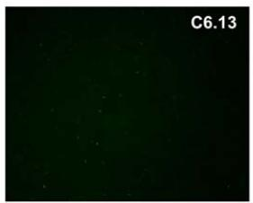

natural_image

Dark green background with scattered white dots, labeled C6.13 in top right corner (no other text or symbols)

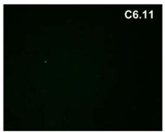

natural_image

Dark image with faint green dots and label 'C6.11' in top right corner (no other text or symbols)

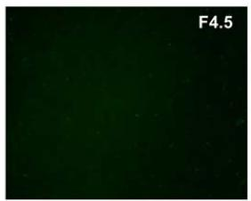

natural_image

Dark green background with scattered white specks, labeled 'F4.5' in top right corner (no other text or symbols)

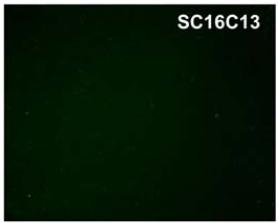

text_image

SC16C13

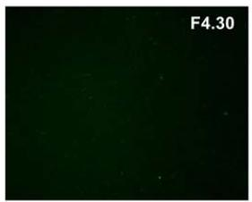

text_image

F4.30

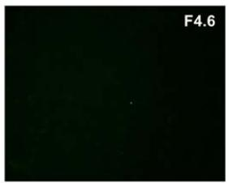

natural_image

Dark image with faint white dots and label 'F4.6' in top right corner (no other text or symbols)

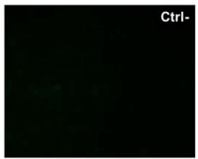

text_image

Ctrl-

Supplementary Figure 1: Indirect immunofluorescence of HEK 293 untransfected cells with MPER-specific IgA. Immunoreactivity of purified IgA (500 ng) was revealed by a rabbit polyclonal anti-human IgA labeled with FITC. No binding of irrelevant IgA (anti-OVA IgA) was observed on untransfected cells (ctrl-).