# kmab-10-01-1384892

REPORT

OPEN ACCESS

Check for updates

# Structure and characterization of a high affinity C5a monoclonal antibody that blocks binding to C5aR1 and C5aR2 receptors

Caroline S. Colley $^{a}$ , Bojana Popovic $^{a}$ , Sudharsan Sridharan $^{a}$ , Judit E. Debreczeni $^{b}$ , David Hargeaves $^{b}$ , Michael Fung $^{c}$ , Ling–Ling An $^{c}$ , Bryan Edwards $^{a}$ , Joanne Arnold $^{a}$ , Elizabeth England $^{a}$ , Laura Eghobamien $^{d}$ , Ulf Sivars $^{e}$ , Liz Flavell $^{b}$ , Jonathan Renshaw $^{b}$ , Kate Wickson $^{b}$ , Paul Warrener $^{f}$ , Jingying Zha $^{f}$ , Jessica Bonnell $^{f}$ , Rob Woods $^{g}$ , Trevor Wilkinson $^{a}$ , Claire Dobson $^{a}$ , and Tristan J. Vaughan $^{a}$

$^{a}$ Antibody Discovery and Protein Engineering, MedImmune Ltd, Cambridge, UK; $^{b}$ Discovery Sciences, AstraZeneca R&D, Cambridge, UK; $^{c}$ Respiratory, Inflammation and Autoimmunity, MedImmune LLC, Gaithersburg, MD, USA; $^{d}$ Respiratory, Inflammation and Autoimmunity, MedImmune Ltd, Cambridge, UK; $^{e}$ Translational Biology, IMED RIA Biotech Unit, AstraZeneca, Gothenburg, Sweden; $^{f}$ Infectious Diseases, MedImmune LLC, Gaithersburg, MD, USA; $^{g}$ Antibody Discovery and Protein Engineering, MedImmune LLC, Gaithersburg, MD, USA

# ABSTRACT

C5a is a potent anaphylatoxin that modulates inflammation through the C5aR1 and C5aR2 receptors. The molecular interactions between C5a–C5aR1 receptor are well defined, whereas C5a–C5aR2 receptor interactions are poorly understood. Here, we describe the generation of a human antibody, MEDI7814, that neutralizes C5a and C5adesArg binding to the C5aR1 and C5aR2 receptors, without affecting complement-mediated bacterial cell killing. Unlike other anti–C5a mAbs described, this antibody has been shown to inhibit the effects of C5a by blocking C5a binding to both C5aR1 and C5aR2 receptors. The crystal structure of the antibody in complex with human C5a reveals a discontinuous epitope of 22 amino acids. This is the first time the epitope for an antibody that blocks C5aR1 and C5aR2 receptors has been described, and this work provides a basis for molecular studies aimed at further understanding the C5a–C5aR2 receptor interaction. MEDI7814 has therapeutic potential for the treatment of acute inflammatory conditions in which both C5a receptors may mediate inflammation, such as sepsis or renal ischemia–reperfusion injury.

Abbreviations: ANCA, anti-neutrophil cytoplasmic autoantibodies; cfu, colony forming units; DELFIA, dissociation-enhanced lanthanide fluorescent immunoassay; dPBS, Dulbeccos PBS; FLIPR, fluorometric imaging plate reader; MAC, membrane attack complex; n, number of separate experiments; ND, not determined; Ni-NTA, nickel nitrilotriacetic acid; ns, not significant; NSB, non-specific binding signal; OPK, opsonophagocytic killing; RBC, red blood cells; RLU, relative luciferase units; scFv, single-chain variable fragment; SPA, scintillation proximity assay; VHCDR3, variable heavy chain complementarity-determining region 3; VLCDR3, variable light chain complementarity-determining region 3

# ARTICLE HISTORY

Received 14 August 2017
Revised 20 September 2017
Accepted 22 September 2017

# KEYWORDS

antibody co-crystal structure; complement C5a; C5a crystal structure; C5a epitope; complement C5a receptor; C5aR1; C5aR2; C5a neutralization; human monoclonal antibody

# Introduction

Complement consists of a network of over 30 soluble and cell surface proteins that act as a surveillance system, detecting disease and damaged host cells, pathogens and foreign antigens. Complement proteins circulate within serum in an inactive state and become activated via the classical, lectin, alternative or extrinsic protease pathways. $^{1}$ Activation triggers the proteolytic cleavage of precursor complement molecules C3 and C5 to form biologically active complement fragments. Proteolytic cleavage of C5 produces complement fragments C5a and C5b (Fig. 1). C5a is a highly potent inflammatory anaphylatoxin that activates neutrophils, mast cells, basophils, and monocytes $^{2-4}$ and drives the production of inflammatory mediators, including histamine, and various cytokines and chemokines. $^{5-7}$

C5b interacts with additional complement proteins C6, C7, C8 and C9 to form a heteromeric lytic pore complex, termed the

membrane attack complex (MAC), $^{8}$ (Fig. 1). In the absence of host cell complement regulators such as CD59, the MAC inserts into cell membranes to form pores leading to cell lysis. MAC formation is therefore important for host defence against certain Gram–negative bacteria, in particular, Neisseria species. $^{9-10}$

C5a mediates its effects by interacting with the C5aR1 receptor (CD88) $^{11,12}$ and is rapidly deactivated by serum carboxypeptidases $^{13}$ to a less potent form lacking the C-terminal arginine, C5adesArg. $^{14,15}$ C5adesArg is the predominant form of circulating C5a, and can signal via the C5aR1 receptor $^{12}$ (Fig. 1). C5a binds an additional receptor, C5aR2 (C5L2, GPR77), which is often co-expressed with C5aR1. $^{16}$ The biological effects of C5aR2 are complex and include both anti-inflammatory and pro-inflammatory effects that have been described in diverse disease models. For example, C5aR1 signal transduction in neutrophils can be negatively modulated by C5aR2 and the

CONTACT Caroline S. Colley 📧 colleyc@medimmune.com 🌐 Antibody Discovery and Protein Engineering, MedImmune Ltd, Granta Park, Cambridge, CB21 6GH, UK. Supplemental data for this article can be accessed in the publisher's website.

© 2018 Caroline S Colley, Bojana Popovic, Sudharsan Sridharan, Judit E Debreczeni, David Hargeaves, Michael Fung, Ling-Ling An, Bryan Edwards, Joanne Arnold, Elizabeth England, Laura Eghobamien, Ulf Sivars, Liz Flavell, Jonathan Renshaw, Kate Wickson, Paul Warrener, Jingying Zha, Jessica Bonnell, Rob Woods, Trevor Wilkinson, Claire Dobson, Tristan J Vaughan. Published with license by Taylor & Francis Group, LLC

This is an Open Access article distributed under the terms of the Creative Commons Attribution-NonCommercial-NoDerivatives License (http://creativecommons.org/licenses/by-nc-nd/4.0/), which permits non-commercial re-use, distribution, and reproduction in any medium, provided the original work is properly cited, and is not altered, transformed, or built upon in any way.

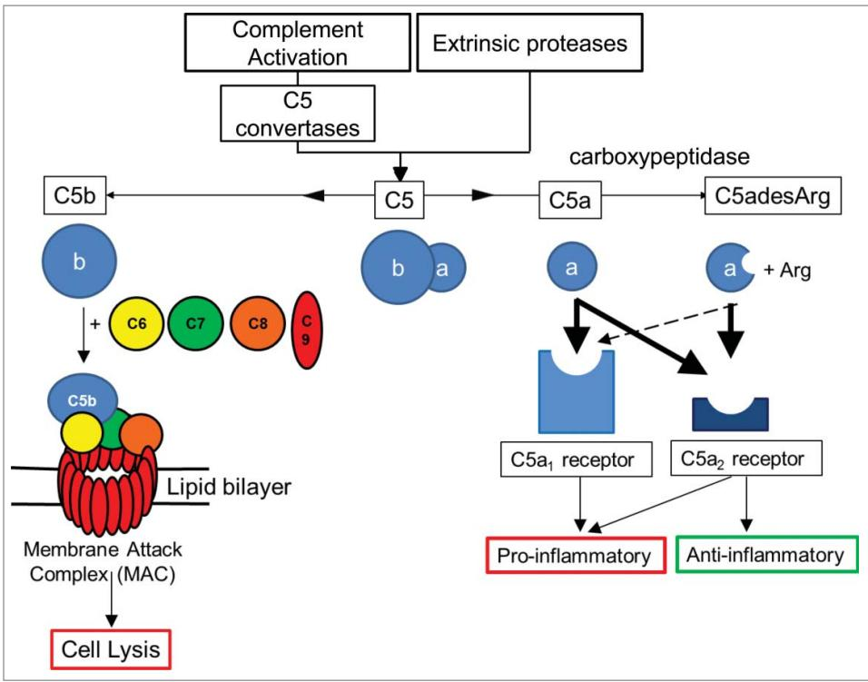  
Figure 1. Overview of C5 complement activation. Complement C5 activation can occur either by the classical, lectin and alternate complement pathways to generate C5 convertases, or via proteases extrinsic to the complement pathway. C5 convertases or extrinsic proteases can cleave C5 to form proteolytic fragments C5a and C5b. C5a is a potent anaphylatoxin that is rapidly deactivated by removal of the C terminal arginine to form C5adesArg. C5a binds with high affinity (thick black arrows) to both C5aR1 and C5aR2 receptors, while C5adesArg binds with high affinity to the C5aR2 receptor and with low affinity (dashed arrow) to the C5aR1 receptor. The C5aR1 receptor primarily drives pro-inflammatory effects, while the C5aR2 receptor can mediate pro- or anti-inflammatory effects depending on its cellular context. In the absence of cell associated complement inhibitors, C5b interacts with a single copy of complement proteins C6, C7, C8 and a further 18 copies of C9 to form a pore within the cell membrane called the membrane attack complex (MAC). $^{8}$ The MAC can lyse certain Gram-negative bacteria, promoting bacterial clearance, while host cells can avoid lysis due to the presence of membrane associated complement regulators.

inflammatory effects of C5a are enhanced in C5aR2-deficient rodent models of contact sensitivity, immune complex lung injury, house dust mite-induced experimental allergic asthma and anti-neutrophil cytoplasmic antibodies (ANCA) associated with necrotizing and crescentic glomerulonephritis, $^{17-22}$ suggesting an anti-inflammatory role for C5aR2 in these models. In contrast, C5aR2 has been shown to be required for C5a-C5aR1 signaling in macrophages isolated from a murine colitis model $^{23}$ and C5aR2-deficient mice exhibit reduced inflammation in air pouch, acute lung injury, sepsis and renal ischemia-reperfusion injury models. $^{24-27}$

C5adesArg has $\sim$ 10-fold higher affinity for C5aR2 receptor over C5aR1, $^{28}$ although the significance of this is unknown.

The three-dimensional structure of C5a has been defined using NMR. $^{29,30}$ Using peptide competition studies, 3 regions of C5a have been identified that interact with the C5aR1 receptor: C5a residues 12-20, 20-37 and the C terminus. $^{31}$ However, the molecular interactions between C5a and C5aR2 receptor have not yet been defined.

Biologic and small molecule therapeutics directly targeting the C5a-C5aR1 receptor axis are currently in clinical development for the treatment of inflammatory diseases. IFX-1, an anti-C5a antibody, recently completed a Phase 2 trial in sepsis (clinicaltrials.gov identifier NCT02246595) and is being evaluated in a Phase 2 trial for patients with hidradenitis suppurativa (NCT03001622). In addition, a C5aR1 receptor antagonist, CCX168, is in a Phase 3 trial for the treatment of ANCA-associated vasculitis (NCT02994927).

In contrast, the potential benefits of targeting the C5a-C5aR2 axis in inflammatory diseases are poorly understood as a consequence of the C5aR2 receptor's ability to either attenuate or enhance inflammation in different settings. $^{17-27}$ Several in vivo and ex vivo studies have highlighted a potential pro-inflammatory role for C5aR2 receptor in diseases such as sepsis, atherosclerosis, acute lung injury, ANCA-associated vasculitis and renal ischemia-reperfusion injury, $^{24-27,32,33}$ suggesting that there may be particular inflammatory indications in which inhibiting both receptors may be more advantageous than inhibiting the C5aR1 receptor alone.

C5a-mediated inflammation may also be inhibited by blocking the generation of de novo C5a. Eculizumab (Soliris $^{\circledR}$ ), a humanized mAb, targets C5 and blocks C5 cleavage to C5a and C5b that is mediated by C5 convertase enzymes. Eculizumab was originally approved for the treatment of paroxysmal nocturnal hemoglobinuria, a rare condition in which somatic mutations lead to a deficiency of the terminal complement inhibitors CD55 and CD59 on red blood cells (RBC), resulting in lysis. Blocking C5 cleavage prevents formation of C5b and the downstream MAC complex, thus preventing RBC lysis. $^{34}$ By blocking C5 cleavage, the production of C5a will also be reduced. However, such an approach may not be desirable for the treatment of inflammatory conditions because C5 blockade can impair host defense against meningococcal bacteria. $^{35}$ Furthermore, eculizumab has been reported to be unable to block C5 cleavage mediated by the extrinsic protease pathway (via trypsin and thrombin), suggesting that a C5a-targeted

approach may be required for effective treatment of inflammatory disorders. $^{36}$ Such C5a-targeted approaches include the anti-C5a monoclonal antibody IFX-1 currently in clinical trials, and vaccination with C5a fusion proteins or peptide fragments, which has been shown to attenuate inflammation in mouse models of arthritis $^{37}$ and Alzheimer's disease, $^{38}$ respectively. It is not currently known whether either of these approaches can target the C5a-C5aR2 axis to modulate inflammation.

Here, we describe the generation of a human antibody, MEDI7814, that neutralizes C5a and C5adesArg binding to the C5aR1 and C5aR2 receptors, without affecting bacterial opsonization and killing. The crystal structure of MEDI7814 single-chain variable fragment (scFv) in complex with human C5a revealed a 22-amino acid epitope within C5a that is important for binding to both C5aR1 and C5aR2 receptors. This is the first time the epitope for an antibody that blocks C5aR1 and C5aR2 receptors has been described. This work provides a foundation for molecular studies to advance our understanding of the interaction between C5a and the C5aR2 receptor and supports the development of MEDI7814 as an anti-C5a therapeutic for the treatment of inflammation in acute inflammatory conditions in which both C5a receptors contribute to inflammation.

# Results

# Discovery and affinity engineering of a C5a/C5adesArg neutralizing antibody

C5a antibodies were isolated from a large phage library displaying human antibody scFv $^{39-41}$ by carrying out selections on recombinant biotinylated human C5a. Neutralizing scFv were identified by screening for inhibition of iodinated human C5a binding to C5aR1 receptor using membranes derived from HEK293 cells stably expressing the human C5aR1 receptor. From this, a C5a neutralizing antibody, ab116 (Supplementary Fig. 1), with an affinity of 17 nM for recombinant human C5a was identified. Because the affinity for C5a binding its receptors is $\sim$ 1 nM or greater, $^{12,28}$ the affinity of ab116 for C5a was predicted to require improvement by at least 20-fold in order to effectively compete with the C5a receptors for binding to C5a in vivo. The affinity of ab116 was improved by randomizing amino acids in the VHCDR3 and VLCDR3 loops. Libraries of mutants were selected on decreasing concentrations of biotinylated human C5a to enrich for scFv with amino acid mutations with increased affinity to human C5a relative to ab116. ScFv with higher affinities were identified by screening for increased inhibition relative to ab116 scFv in a biochemical competition assay.

Following recombination of the VHCDR3 and VLCDR3 libraries and screening to identify additional synergistic

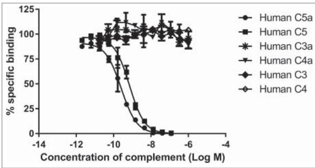  
Figure 2. MEDI7814 is specific for human C5a and C5. Representative results showing that MEDI7814 does not bind to related human complement proteins: C3a, C3, C4a and C4. Purified complement proteins were titrated into a DELFIA® biochemical competition assay measuring MEDI7814 IgG binding to 1.2 nM biotinylated human C5a. MEDI7814 binds to human C5a (●) and C5 (■) as both proteins compete for binding to biotinylated C5a. No competition was observed with complement C3, C3a, C4 and C4a indicating that MEDI7814 does not bind these complement family members when tested at a concentration in excess of 1000-fold over the biotinylated C5a concentration. Data points represent the mean of duplicate wells ± standard deviation. Geomean IC $_{50}$ values for human C5a and human C5 were 0.3 nM and 0.6 nM respectively (n = 3).

increases in affinity, scFv variants were converted to IgG4. A mutated IgG4 format was used, in which serine at Kabat position 241 in the hinge sequence of the human IgG heavy chain was substituted for proline. This mutation has been reported to improve the homogeneity of IgG4, reducing the amount of "half antibody" formation. $^{42}$ The IgG4 format was chosen for its reduced ability to bind Fc gamma receptors and complement C1q in order to minimize Fc effector function and complement activation. $^{43}$

This approach led to the identification of the affinity-matured antibody MEDI7814. MEDI7814 binds to recombinant human C5a and serum purified human C5a with affinities of 14 pM and 8 pM, respectively (Table 1, Supplementary Table 1 and Supplementary Fig. 2), demonstrating a gain of more than 1000-fold in affinity. MEDI7814 also binds with similarly high affinity to human C5, human C5adesArg, cynomolgus C5a and C5adesArg (Table 1, Supplementary Table 1 and Supplementary Fig. 2).

The specificity of MEDI7814 for C5a and C5 over other complement components was determined by competing an excess of unlabelled human C5a, C5, C3a, C4a, C3 and C4 into an assay measuring the binding of biotinylated human C5a to MEDI7814 (Fig. 2). Human C5a and C5 competed for binding with potencies of 0.3 nM and 0.6 nM, respectively, whereas no inhibition was observed with complement components C3 or C4 (which share 26.6% and 23.6% amino acid identity, respectively, with C5), or their derivatives C3a and C4a (which share 32.1% and 35.9% amino acid identity, respectively, with C5a). These results

Table 1. Affinities and binding kinetics of MEDI7814. C5a affinity was estimated using surface plasmon resonance (BIAcore). C5 affinity was estimated by kinetic exclusion assay (KinExa). Affinity results are an average of 2 or more separate experiments. N.D. Not determined.   

<table><tr><td>Affinity Determination Method</td><td>Analyte</td><td>ka (M-1s-1)</td><td>kd (s-1)</td><td>Affinity KD (pM)</td></tr><tr><td rowspan="5">Surface plasmon resonance (BIAcore)</td><td>Recombinant human C5a</td><td>1.74 × 107</td><td>2.51 × 10-4</td><td>14</td></tr><tr><td>Serum purified human C5a</td><td>2.18 × 107</td><td>1.65 × 10-4</td><td>8</td></tr><tr><td>Serum purified human C5adesR</td><td>3.32 × 107</td><td>1.91 × 10-4</td><td>6</td></tr><tr><td>Serum purified Cynomolgus C5a</td><td>8.08 × 106</td><td>1.54 × 10-4</td><td>19</td></tr><tr><td>Recombinant Cynomolgus C5adesR</td><td>1.51 × 107</td><td>1.44 × 10-4</td><td>10</td></tr><tr><td rowspan="2">Kinetic exclusion assay (KinExa)</td><td>Recombinant human C5a</td><td>N.D.</td><td>N.D.</td><td>4</td></tr><tr><td>Serum purified human C5</td><td>N.D.</td><td>N.D.</td><td>27</td></tr></table>

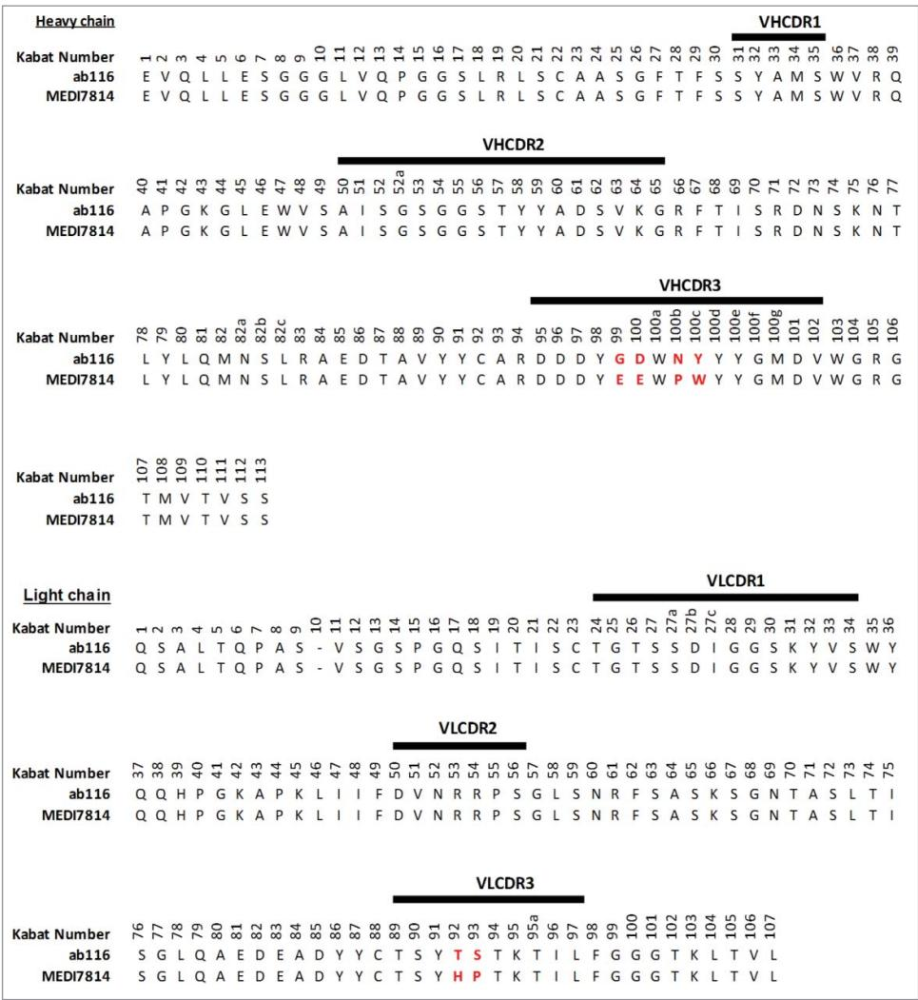  
Figure 3. Amino acid sequence alignment of ab116 and MEDI7814 variable domains. The 6 amino acids that differ between ab116 and MEDI7814 variable domains differ are highlighted in red. Complementarity determining regions (CDRs) are defined by black lines and residues are numbered according to Kabat. $^{44}$

indicate that MEDI7814 is specific for C5a and C5. The potencies for C5a and C5 were order of magnitude lower than their estimated affinities as the concentration of biotinylated C5a required to provide a robust signal in the competition assay was in excess of the KD for the MEDI7814-C5a interaction.

MEDI7814 differs from the parent mAb ab116 by 4 amino acids (Kabat $^{44}$ residues: G99E; D100E; N100bP; Y100cW) in the VHCDR3 and 2 amino acids (T92H; S93P) in the VLCDR3 (Fig. 3).

# Inhibition of binding to C5aR1 and C5aR2 receptors

To determine whether MEDI7814 could inhibit C5a binding to both C5aR1 and C5aR2 receptors, assays were established measuring the binding of fluorescently labelled C5a or C5adesArg to HEK293 cells stably expressing either the human C5aR1 or C5aR2 receptors. MEDI7814 fully inhibited human C5a binding to HEK293 cells expressing the C5aR1 receptor (Fig. 4A) and fully inhibited human C5a or C5adesArg binding to HEK293 cells over-expressing the C5aR2 receptor (Fig. 4B, C). Together, this demonstrates that MEDI7814 inhibits C5a and C5adesArg binding to both C5aR1 and C5aR2 receptors.

# Neutralization of C5a and C5adesArg in vitro

To understand the biological effects of blocking the C5aR1 and C5aR2 receptors, MEDI7814 was tested for inhibition of C5a-mediated cell responses in vitro. MEDI7814 fully neutralized human C5a- and C5adesArg-mediated calcium mobilization in HEK293 cells transfected with human C5aR1 receptor (Fig. 5A and B), indicating that it can neutralize C5a signalling through the C5aR1 receptor. Furthermore, MEDI7814 neutralized recombinant human C5a-mediated chemotaxis of human neutrophils by $80\%$ or greater at antibody concentrations of $1\mathrm{nM}$ or more (Fig. 5C). Mean neutralization potencies were not determined for the calcium mobilization and chemotaxis assays as the affinity of MEDI7814 for C5a exceeded the concentrations of C5a used in each of these assays, resulting in reduced potency discrimination. However, together these assays demonstrated that MEDI7814 gained at least a 1000-fold improvement in potency against human C5a when compared to ab116 (Supplementary Fig. 1).

To confirm that MEDI7814 could block native as well as recombinant human C5a, it was tested in a human whole blood assay measuring neutrophil CD11b up-regulation in response to endogenously produced C5a. $^{45,46}$ Following the activation of

A

Human C5a-C5a $_{1}$ R

B

Human C5a-C5a2R

C

Human C5adesArg-C5a2R

Figure 4. MEDI7814 inhibits fluorescently labelled C5a binding to C5aR1 and C5aR2 receptors. Representative results showing that MEDI7814 (▲) inhibits (A) Alexa® Fluor 647 labelled human C5a (AF647 C5a) binding to human C5aR1 receptor, (B) AF647 human C5a binding to human C5aR2 receptor and (C) AF647 human C5adesArg binding to human C5aR2 receptor. The isotype matched irrelevant control (■) did not inhibit C5a ligand binding. C5a receptors were expressed in stably transfected HEK293 cells and C5a ligand binding was measured using Fluorimetric Microvolume Assay Technology (FMAT). Data points represent the mean of duplicate wells ± standard deviation. IC $_{50}$ values were not determined as the affinity of MEDI7814 exceeds the concentrations of C5a/C5adesArg in the assays. The effect of MEDI7814 on the binding of C5adesArg to C5aR1 receptor was not determined due to the low affinity of C5adesArg for this receptor.

complement by heat-killed E. coli, MEDI7814 neutralized endogenous C5a-mediated CD11b up-regulation with a geomean IC $_{50}$ of 28 nM (Fig. 6A), demonstrating that it also inhibits native C5a under more relevant physiological conditions. Furthermore, to understand whether inhibition of CD11b was driven via the blockade of C5a binding the C5aR1 or C5aR2 receptors, human whole blood was incubated with F(ab')2 antibody fragments that block either the C5aR1 or C5aR2 receptors prior to activating complement with E. coli (Fig. 6B). F(ab')2 antibody fragments were used in order to avoid non-specific effects via Fc receptor binding. The anti-C5aR1 receptor F(ab')2 fragment (anti-C5aR1 F(ab')2) showed inhibition of CD11b up-regulation (P<0.0001), whereas the anti-C5aR2 receptor F(ab')2 (anti-C5aR2 F(ab')2) and isotype negative control F(ab')

B

Human C5adesR calcium mobilisation

C

Human C5a neutrophil chemotaxis

Figure 5. MEDI7814 neutralizes C5a and C5adesArg responses in vitro. Representative results showing that MEDI7814 (▲) neutralizes calcium mobilisation in HEK 293 expressing human C5aR1 receptor and Gα16 using (A) 100 pM human C5a, (B) 400 pM human C5adesArg. Data points represent the mean of duplicate wells ± standard deviation. (C) MEDI7814 neutralizes 2 nM human C5a induced chemotaxis of human neutrophils. Data points represent the mean of duplicate wells ± standard deviation. MEDI7814 IC $_{50}$ values were not determined for A, B and C as the affinity of MEDI7814 exceeds the concentrations of C5a/C5adesArg in these assays, n = 2. No inhibition of responses were observed with the isotype matched irrelevant control antibody (■).

2 showed no significant inhibition (Fig. 6B). As the anti-C5aR2 receptor F(ab')2 can inhibit the C5aR2 receptor (see next section), this indicates that CD11b up-regulation is predominately mediated via the C5aR1 receptor in this experimental system.

Taken together, the ability of MEDI7814 to inhibit calcium mobilization in C5aR1 receptor transfected cells and CD11b up-regulation in human whole blood demonstrates that it can neutralize recombinant and endogenous C5a signalling via the C5aR1 receptor.

Next, the effects of MEDI7814 on C5aR2 receptor signalling were investigated. As the C5aR2 receptor has been shown to be required for the release of the pro-inflammatory cytokine HMGB1, $^{26}$ the release of HMGB1 following complement activation in human whole blood was measured in

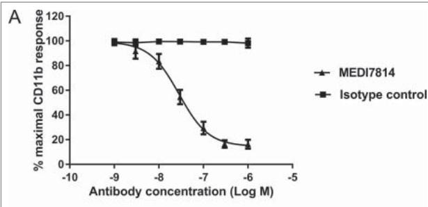

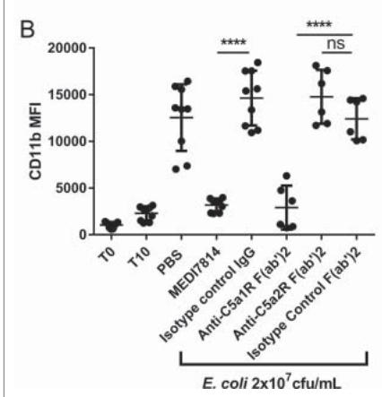  
Figure 6. MEDI7814 neutralizes C5a-C5aR1 receptor mediated CD11b upregulation in human whole blood. Representative results showing that (A) MEDI7814 (▲) neutralizes endogenous C5a mediated neutrophil CD11b up-regulation in human whole blood with a geomean IC $_{50}$ of 28 nM. Endogenous C5a was generated by activation of complement using E coli as described by Fung et al. $^{45}$ Data points represent the mean ± standard error of the mean for 5 separate experiments. No inhibition of response was observed with the isotype irrelevant control antibody (■). (B) CD11b upregulation is mediated predominately via the C5aR1 receptor. 100 nM of an anti-C5aR1 receptor neutralizing antibody (anti-C5aR1 F(ab')2) inhibits C5a mediated CD11b up-regulation in whole human blood upon complement activation using E.coli. 100 nM of an anti-C5aR2 receptor neutralizing antibody (anti-C5aR2 F(ab')2) and an isotype negative control F(ab')2 showed no significant inhibition, indicating that CD11b up-regulation is mediated predominately through the C5aR1 receptor. 100 nM MEDI7814 inhibits CD11b up-regulation, whereas the isotype control antibody showed no inhibition. T0 and T10 represent CD11b level at time 0 and 10 minutes after blood was incubated at 37°C without E.coli. Individual data points from ≥ 6 different donors are shown alongside the mean ± standard deviation for each test condition. ****p < 0.0001, by one-way ANOVA followed by Sidak's multiple comparisons test, (ns, not significant).

the presence or absence of 100 nM MEDI7814. MEDI7814 and the anti-C5aR2 positive control F(ab')2 inhibited HMGB1 release with mean values of 80% (p = 0.0221) and 97% inhibition (p = 0.0106) relative to their respective isotype controls (Fig. 7). This result suggests that MEDI7814 neutralizes HMGB1 release by inhibiting C5a binding to the C5aR2 receptor.

# Complement-mediated bacterial cell clearance

As MEDI7814 binds to C5, it has the potential to block C5 cleavage and formation of the MAC, thereby impairing bacterial cell killing. MEDI7814 was therefore tested in a human serum bactericidal assay in which MAC cell lysis of the Gram-negative bacterium Klebsiella pneumonia was measured. No inhibition of complement-mediated cell killing was observed with MEDI7814 following incubation with human serum and $5 \times 10^{4}$ colony forming units (cfu) of fluorescent K. pneumonia (Fig. 8), whereas the positive control, eculizumab, showed concentration-dependent inhibition of cell lysis. Furthermore,

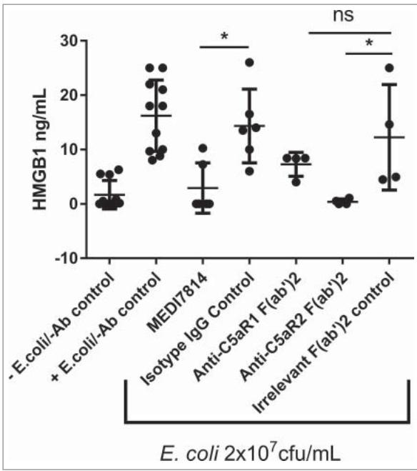  
Figure 7. MEDI7814 neutralizes C5a mediated HMGB1 release in human whole blood. Representative results showing that 100 nM MEDI7814 inhibits HMGB1 release from human whole blood upon complement activation using E.coli. Individual data points from $\geq$ 4 different donors are shown alongside the mean $\pm$ standard deviation for each test condition. $*p < 0.05$ , by Kruskal-Wallis test followed by Dunn's multiple comparisons test, (ns, not significant). The Kruskal-Wallis nonparametric test was used as the number of samples tested was low for some groups and therefore no assumptions could be made about the normal distribution. The "-E.coli/-Ab" control contained PBS in place of E coli. and test antibody, and the "+E.coli/-Ab" control contained PBS in place of test antibody.

unlike eculizumab, MEDI7814 did not inhibit MAC-mediated lysis of red blood cells following activation of complement by either the classical or alternative pathways (Supplementary Figure 3). Taken together, this demonstrates that MEDI7814 does not affect complement-mediated cell lysis, which suggests that it has a minimal effect on the cleavage of C5 and formation of the MAC complex. MEDI7814 therefore has a distinct mechanism of action from eculizumab.

Complement also targets microbes for clearance by depositing opsonins, such as C3b, onto their surfaces. Phagocytic cells expressing opsonin receptors then bind and clear opsonized microbes, in a process known as opsonophagocytic killing (OPK). $^{47}$ As MEDI7814 neutralizes C5a-mediated up-regulation of CD11b, the receptor for C3b (Fig. 6), it could potentially impair OPK. MEDI7184 was therefore tested in a whole blood assay measuring complement C3b-mediated OPK of a luminescent strain of Pseudomonas aeruginosa, confirming that it did not inhibit OPK (Fig. 8B).

# Structure of MEDI7814 in complex with human C5a

To understand the molecular basis of C5a receptor neutralization, we determined the crystal structure of human C5a in complex with a scFv fragment derived from MEDI7814. The C5a neutralization activity of MEDI7814 scFv was confirmed in the human C5a-mediated calcium mobilization assay with a potency similar to MEDI7814 as an IgG4 (Supplementary Fig. 4).

The co-crystal structure of MEDI7814 scFv and C5a was refined to a 2.15Å resolution (Fig. 9A, Supplementary Table 2),

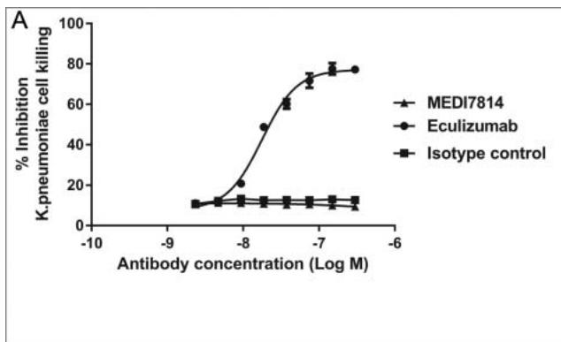

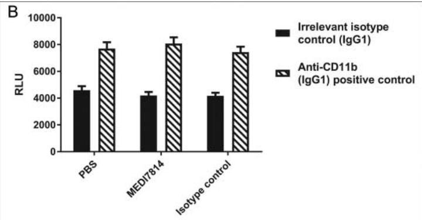  
Figure 8. MEDI7814 does not inhibit bacterial cell killing and clearance. Representative results showing that MEDI7814 (▲) does not inhibit (A) lysis of luminescent K. pneumoniae, in the presence of human serum. No effect was observed with the isotype irrelevant control mAb (■), whereas the positive control mAb, Eculizumab (●) effectively inhibited cell lysis. Data points represent the mean of duplicate wells ± standard deviation. (B) MEDI7814 does not inhibit C3b mediated opsonophagocytic killing (OPK) of a luminescent strain of P. aeruginosa in human whole blood. Blood was treated with 600 nM MEDI7814 or an IgG4 isotype negative control antibody prior to being added to wells containing a positive control anti-CD11b mAb or an IgG1 isotype irrelevant control mAb and P. aeruginosa. As MEDI7814 shows a mean luminescence similar to the negative PBS control (4593 RLU) in the presence of the IgG1 irrelevant control mAb, this indicates that it does not inhibit OPK. The anti-CD11b mAb blocks OPK resulting in an increased luminescence. Data points represent mean RLU ± standard error of the mean for 4 different donors.

with the human C5a structure presented here showing a similar structure to previously reported C5a structures. $^{29,30,48,49}$

The C5a-MEDI7814 scFv complex revealed a 21-amino acid paratope, with the majority of amino acids residing in the VHCDR3 and VLCDR2 of MEDI7814 scFv (Fig. 9B), and 4 amino acids in the Vernier zone. $^{50}$ These interact with a discontinuous epitope of 22 amino acid residues in the core of human C5a (Fig. 9C), predominately through hydrophobic

interactions. The epitope encompasses human C5a residues Y13-C21 (inter $\alpha$ -helical loop 1/helix 2), D24 and G25 (helix 2), C27 (inter $\alpha$ -helical loop 2), R37 (Helix 3), R40-C47 (inter $\alpha$ -helical loop 3) and F51 (helix 4). This differs from previously reported epitopes (K20-R37; N30-A38, S66-L72, I65-K68) recognized by anti-C5a neutralizing antibodies, $^{51-53}$ but has some residues in common with a linear I41-R46 neutralizing antibody epitope previously described. $^{54}$

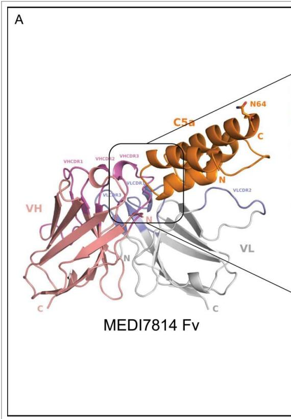

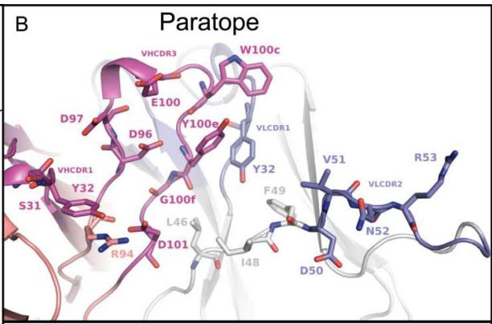

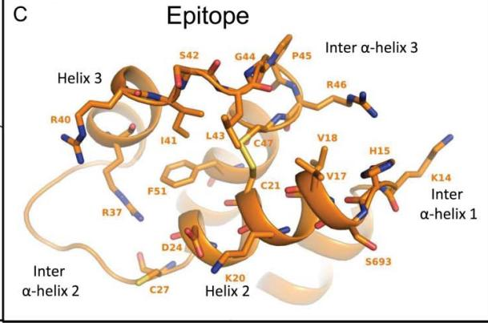  
Figure 9. Structure of the human C5a/MEDI7814 scFv complex. (A) Left: Overall complex structure showing C5a (orange) interacts primarily through the VHCDR3 and VLCDR2 of MEDI7814 scFv: variable heavy chain domain (salmon pink), VHCDRs (magenta), variable light chain domain (grey) and VLCDRs (blue), C5a glycosylation site N64 is shown as a stick. (B) Paratope residues (Kabat) of MEDI7814 scFv: VHCDR1 (S31, Y32), VHCDR3 (D96, D97, E100, W100c, Y100d, Y100e, G100f, M100g, D101), VLCDR1 (K31, Y32), VLCDR2 (D50, V51, N52, R53), VH framework 3 (R94), and VL framework 2 (L46, I48, F49). The framework amino acids are Vernier residues, important for the structural integrity of antibodies. $^{50}$ (C) Discontinuous epitope on C5a recognized by MEDI7814 scFv comprises amino acid residues Y13-C21, D24 and G25, C27, R37, R40-C47 and F51, shown as orange sticks.

The MEDI7814 epitope was found to completely overlap with one of three regions within C5a reported to interact with the C5aR1 receptor $^{12,31,55-57}$ (supplementary Fig. 5), suggesting that MEDI7814 competes with C5aR1 receptor for binding to C5a. In contrast, the molecular interactions between C5a and the C5aR2 receptor have not been previously defined. As MEDI7814 fully inhibits the binding of C5a ligands to both C5aR1 and C5aR2 receptors (Fig. 4), the 22-amino acid epitope recognized by MED7814 is the first region to be defined on C5a that is important for binding to both C5a receptors.

# Discussion

Here, we describe the generation of a high affinity, anti-C5a antibody, MEDI7814, which neutralizes the biological effects of both C5a ligands by inhibiting C5a and C5adesArg binding to C5aR1 and C5aR2 receptors. In particular, MEDI7814 inhibits C5aR1 receptor-mediated effects such as calcium mobilization and CD11b up-regulation and can inhibit HMGB1 release, which requires C5aR2 receptor expression. $^{26}$ This suggests that MEDI7814 can neutralize the pro-inflammatory effects mediated by the C5aR2 receptor in addition to neutralizing C5aR1 receptor signalling.

The crystal structure of the MEDI7184 scFv-human C5a complex revealed that MEDI7814 interacts with a discontinuous epitope that entirely overlaps with 1 of 3 previously defined regions of C5a shown to interact with the C5aR1 receptor via a 3 site model. $^{31}$ In this model, basic residues in C5a inter α-helical loop 1/helix2 interact with C5aR1 receptor N-terminal acidic residues, while acidic residues in C5a inter α-helical loop 2 (amino acids 28-33) interact with basic residues within C5aR1 receptor extracellular loop 2. Following a conformational change within C5a, the C5a C terminal (amino acids 68-74) interact with the 5th transmembrane domain of C5aR1 receptor, resulting in receptor activation $^{10,12,30,31,55-57,58,60}$ . As MEDI7814 fully inhibits C5a binding to the C5aR1 receptor and recognizes an epitope that overlaps with a known C5aR1 receptor interaction site, we conclude that MEDI7814 can competitively inhibit C5a binding to the C5aR1 receptor. Furthermore, as MEDI7814 scFv recognizes 7 amino acids in C5a inter α-helical loop 3 our findings highlight a potential role for this loop in C5aR1 receptor binding. This is supported by reports that R40 in inter α-helical loop 3 is required for C5aR1 receptor binding $^{58}$ and that a portion of loop 3 is recognized by a previously described C5a neutralizing antibody. $^{54}$

Detailed studies identifying regions within C5a required for C5aR2 receptor binding have not been published. However, studies by Otto et al, $^{59}$ using C5a C terminal and deletion mutations, indicate that core C5a residues 1-64 are required for C5aR2 receptor binding, whilst the contribution of the remaining C terminal (C5a amino acids 65-75) for binding are marginal. In addition, it has recently been shown that peptides representing the last 6 or 7 C-terminal residues of C5a are functionally selective for the C5aR2 receptor over the C5aR1 receptor, recruiting $\beta$ -arrestin 2 and inducing lipopolysaccharide-stimulated interleukin-6 release from human monocyte-derived macrophages. $^{60}$ Taken together, these findings suggest that the core C5a amino acids 1-64 promote C5aR2 receptor binding, while the last 6 or 7 C-terminal amino acids are

required for C5aR2 receptor signalling. This resembles the mechanism by which C5a binds the C5aR1 receptor, as the C terminal of C5a is not involved in binding, but is required for activation, raising the possibility that a similar binding/activation model exists for C5aR2 receptor. Indeed, despite the low amino acid identity (35%) between these receptors, the C5aR2 receptor has a pattern of charged and hydrophobic residues in the extracellular loops and transmembrane regions that is similar to the C5aR1 receptor, with almost identical electrical charge patterns in the C5a interacting sites. $^{31}$ It is therefore tempting to speculate that C5a shares a common binding mechanism for both receptors. This concept may also be supported by our observation that MEDI7814 can block binding to both receptors, suggesting the existence of a potential common binding region on C5a, important for interaction with both receptors. However, an alternative interpretation could be that MEDI7814 interacts with C5a at a site distinct from the C5aR2 receptor domain through steric hindrance alone or by allosterically inducing a conformational change in C5a. Indeed, binding studies using N-terminal C5aR2 receptor antibodies and a chimeric C5aR1-C5aR2 receptor indicate that distinct differences do exist between the way in which C5a ligands interact with the C5aR1 and C5aR2 receptors. $^{61}$ Additional molecular studies using C5a mutants that have been modified in the MEDI7814 scFv epitope may help provide further insight into the molecular mechanism by which C5a ligands bind the C5aR2 receptor.

As C5aR1 receptor neutralization reduces inflammatory responses in models such as sepsis, $^{26}$ arthritis $^{62}$ and allergic asthma, $^{63}$ inhibiting the C5a-C5aR1 receptor interaction would be predicted to dampen excessive inflammation in human disease. The effects of inhibiting the C5a-C5aR2 receptor interaction are, however, less predictable, as both anti- and pro-inflammatory roles have been described for the C5aR2 receptor. In particular, C5aR2 receptor-deficient mouse models for allergic contact dermatitis, pulmonary immune complex injury and ANCA have demonstrated an anti-inflammatory role for C5aR2 receptor, $^{19-22}$ whereas in vivo studies using C5aR2 receptor deficient mice or anti-C5aR2 receptor antibodies suggest a pro-inflammatory role for C5aR2 in acute experimental colitis, acute lung injury, sepsis, ANCA and renal reperfusion injury. $^{23,25-27,33}$ Furthermore, studies on human atherosclerotic plaques have shown a correlation between C5aR2 receptor and pro-inflammatory cytokine expression. $^{32}$ This highlights a potential pro-inflammatory role for C5aR2 receptor in certain diseases, suggesting that in some cases, inhibiting both receptors may be more advantageous than inhibiting C5aR1 receptor alone.

Because MEDI7814 inhibits C5a ligands binding to both C5aR1 and C5aR2 receptors, it may have therapeutic utility in treating certain diseases in which inflammation appears to be mediated via both C5aR1 and C5aR2 receptors. Such an approach could be considered more desirable than reducing C5a formation by blocking C5 cleavage, as C5b generation and MAC-mediated bacterial clearance would be retained, negating the requirement for vaccination against meningococcal infection prior to treatment. Furthermore, anti-C5a neutralization may also be preferred over an anti-C5 mechanism because it has the benefits of targeting C5a generated either via the serum convertase or the extrinsic protease pathways. $^{36}$ However, the benefits that MEDI7814 brings in targeting C5a interactions

with both C5a receptors must be balanced with its ability to bind C5 with an equally high affinity. The normal physiological concentration of C5 is high (0.37 $\mu$ M) $^{64}$ and would be predicted to act as a “sink” for MEDI7814. While pre-binding C5 hypothetically may be advantageous, as C5a would effectively be neutralized upon its generation by C5 cleavage, the dose required to occupy both C5 and C5a would be predicted to be relatively high and frequent compared with other anti-inflammatory antibody drugs. Indeed, the potencies of MEDI7814 in the C5a receptor-ligand and calcium mobilisation assays were high (ranging from approximately low nM to pM), with stoichiometric binding being achieved, (Figs. 4 and 5), whereas the potency for CD11b up-regulation in the presence of whole blood, and therefore more physiologically relevant levels of C5, was reduced by at least an order of magnitude (Fig. 6). The effect of high levels of C5 on dosing is also evident with eculizumab, which requires 900 mg intravenous doses every 2 weeks for PNH. $^{65,66}$ Such a high dose requirement would likely prohibit the use of MEDI7814 as a prophylactic therapy, but it may have potential therapeutic utility in more acute inflammatory settings such as sepsis, $^{26}$ acute lung injury $^{25}$ and renal ischemia reperfusion injury $^{27}$ in which inflammation may be mediated by both C5a receptors.

In summary, our studies with MEDI7814 have revealed for the first time, an epitope on human C5a important for the binding and function of both C5a receptors, providing a basis for further molecular studies to understand the interaction between C5a and C5aR2 receptor. The ability of MEDI7814 to neutralize the effects of C5a mediated by both receptors suggests therapeutic potential in the treatment of acute conditions where both receptors may be contributing to inflammation.

# Material and methods

# Purified proteins

Recombinant human C5a was obtained from Sigma and biotinylated using low pH N-hydroxy succinimide chemistry (Thermo/Pierce) for phage display selections and biochemical assays. Radiolabelled ${}^{125}$ I-human C5a was obtained from Perkin Elmer. C5adesArg (204902), Complement C5 (204888), C3 (204885), C3a (204881), C4 (203886) and C4a (204887) purified from human serum were obtained from Calbiochem (Merck). Alexa Fluor $^{\circledR}$ 647 N-terminally labelled human C5a or C5adesArg were custom synthesized by Almac Biosciences. C5a was also purified from human serum obtained from AstraZeneca R&D or cynomolgus serum obtained from GeneTex Inc, according to Janatova. $^{67}$ The purity and identity of C5a preparations were confirmed by Western blot, Edman N-terminal sequencing and mass spectrometry. The cDNA sequence of cynomolgus C5adesArg was cloned from liver and thymus cDNA libraries by RT-PCR. The cDNA was inserted into a mammalian expression vector containing the human growth hormone signal peptide. Recombinant N-terminal 10xHis-Flag tagged cynomolgus C5adesArg was expressed in HEK293/EBNA cells and the media concentrated in a Pellicon XL ultra-filtration device with a 5 KDa MW cut-off (Millipore). Following clarification by centrifugation at 1000xg for 10 min and adjustment to pH 8.0, cynomolgus C5adesArg was affinity purified with Ni-NTA agarose

(Invitrogen) equilibrated in 25 mM HEPES, 500 mM NaCl, 20mM imidazole, 5 mM DTT, 10% glycerol, pH 8.0 supplemented with Complete EDTA-free protease inhibitor (Roche), and eluted into the same buffer containing 300 mM imidazole. The C5adesArg containing fractions were pooled and applied to a Superdex 75 (GE Healthcare) size exclusion column equilibrated in 2x PBS buffer supplemented with 10% glycerol. The purity and identity of the C5adesArg preparation was confirmed by western blot, Edman N-terminal sequencing and mass-spectrometry. This protocol routinely produced >95% pure monomeric glycosylated C5adesArg as determined by SDS-PAGE, mass spectrometry and analytical gel filtration with yields ranging from 4-10 mg pure protein/liter growth media.

# Preparation of HEK293 cell membranes expressing the C5aR1 receptor

Cells were harvested and then washed in Dulbeccos phosphate-buffered saline (dPBS) at $4^{\circ}$ C. After re-suspending the cell pellet in ice cold 25 mM HEPES pH 7.4 and 1 mM EDTA containing a protease inhibitor cocktail (Roche), cells were homogenized using a Dounce homogenizer. Cells were then transferred to a Falcon tube and further homogenized using an Ultra-Turrax (IKA). The lysate was then centrifuged at 21000 rpm at $4^{\circ}$ C for 75 min and the membrane pellet re-suspended in 25 mM HEPES pH 7.4, 2.5% glycerol, aliquoted and stored at $-80^{\circ}$ C until required.

# Phage display isolation of anti-C5a antibody ab116

Three naïve human single chain (scFv) phage display libraries $^{39-41}$ were combined and used for antibody isolation (selections). $^{68}$ Multiple rounds of selections were performed using soluble biotinylated recombinant human C5a (Sigma) at decreasing concentrations ranging from 100 to 25 nM. Phage were incubated with C5a in 30 mM HEPES, 5 mM KCl, 0.1 mM MgCl $_{2}$ , 1.5 mM CaCl $_{2}$ , 500 mM NaCl and 3% w/v Marvel milk powder for 1 hr. Antigen-bound scFv-phage were captured on streptavidin-coated paramagnetic beads (Dynabeads $^{\circledR}$ ), eluted, infected into E. coli TG1 and rescued for the next round of selection. Representative individual scFv from each selection were expressed in bacterial periplasm $^{69}$ and screened for inhibition of ${}^{125}$ I-human C5a binding to HEK293 cell membranes expressing the C5aR1 receptor using a scintillation proximity assay (SPA).

# Scintillation proximity assay for neutralization of $^{125}$ I-human C5a binding to C5aR1 cell membranes

scFv were transferred to a 96-well Optiplate (Perkin Elmer). A preparation of HEK293 cell membranes expressing the C5aR1 receptor were captured on 1 mg/mL wheat germ agglutinin coated polyvinyl toluene SPA beads (GE Healthcare) for 1 hr at 4°C with continuous mixing. After washing, the SPA beads were re-suspended in assay buffer (25 mM HEPES pH7.4, 1 mM MgCl₂, 2 mM CaCl₂ and 0.2% bovine serum albumin (BSA)) and added to the assay plates. $^{125}$ I-human C5a (400 pM) was added and plates incubated for 3 hrs at room temperature in the dark, prior to reading on a TopCount plate reader

(Perkin Elmer). Data were analyzed by calculating % specific binding where NSB is non-specific binding signal and total is the maximum binding signal in the absence of sample (Eq. 1).

$$
\% \text { specific   binding} = \left(\frac {\text { Sample } - \text { NSB }}{\text { Total } - \text { NSB }}\right) \times 100
$$

# Affinity optimization of ab116

Large scFv-phage libraries derived from ab116 were created by oligonucleotide-directed mutagenesis of the variable heavy and light chain complementarity-determining region 3 loops (VHCDR3 and VLCDR3, respectively). Libraries were subjected to affinity-based phage display selections $^{68,70}$ using 200 nM to 200 pM biotinylated human C5a. The VHCDR3 and VLCDR3 libraries were then recombined and two further rounds of selection on 200 pM to 20 pM C5a performed. Representative scFv from each round were screened in biochemical homogenous time resolved FRET (HTRF $^{\circledR}$ FRET, Cisbio Assays) competition assays, for increased inhibition of recombinant human C5a binding to fluorescently labelled ab116 IgG, relative to ab116 scFv. In brief, ab116 was labelled with europium cryptate, and samples and reagents were diluted in assay buffer (50 mM MOPS, 0.4 M potassium fluoride and 0.1% BSA). Equal volumes of scFv, 24 nM biotinylated C5a, cryptate-labelled ab116 and 20 nM streptavidin XL665 were added to black, low volume, 384-well assay plates (Costar) and incubated for 4 hrs at room temperature, then overnight at 4°C prior to reading time-resolved fluorescence emission at 665 nm and 615 nm emission using an EnVision plate reader (Perkin Elmer).

# Conversion of scFv to IgG

Reformatting of scFv into human IgG format was performed according to Persic et al. $^{71}$

# MEDI7814 specificity assay

2.5 nM MEDI7814 in Dulbecco's PBS was adsorbed to 96-well Nunc $^{TM}$ assay plates (Thermo Fisher Scientific) for 1.5 hrs at room temperature. After washing in dPBS plus 0.1% Tween 20, wells were blocked for 1 hr at room temperature (1% BSA in dPBS). Purified human C5a, C5, C3a, C3, C4a, and C4 were serially diluted in assay buffer and added to the plates with 1.2 nM biotinylated human C5a, incubated for 2 hrs at room temperature, washed, then incubated with 100 ng/mL of europium-labelled streptavidin for 1 hr. Plates were washed in DELFIA $^{\circledR}$ wash and DELFIA $^{\circledR}$ enhancer (Perkin Elmer) was added. Time-resolved fluorescence emission at 620 nm was measured and % specific binding determined (Eq.1). IC $_{50}$ values were calculated using a 4-parameter logistic equation with variable Hill slope using GraphPad Prism.

# Receptor-ligand competition using Fluorescence Microvolume Assay Technology

MEDI7814 was serially diluted in assay buffer (Hank's Balanced Salt Solution (Sigma) containing 0.01% sodium azide, (Sigma) and 0.1% BSA (Sigma) to give concentrations ranging

from 100 nM to 1.6 pM. mAb dilutions were transferred to black 384-well clear bottom assay plates (Costar). 1 nM custom synthesized N-terminal Alexa Fluor $^{\circledR}$ labelled human C5a or C5adesArg (Almac Biosciences) was added to the C5aR2 receptor assays and 5 nM Alexa Fluor $^{\circledR}$ labelled human C5a or C5adesArg was added to the C5aR1 receptor assays. HEK293 cells expressing the C5aR1 or C5aR2 receptors were diluted in assay buffer and added to the relevant assay plate at 4000 cells/well. Following 4 hr incubation, fluorescence was read using an Applied Biosystems cellular detection system 8200. Results were analyzed with Velocity Algorithm and % specific binding determined. Two or more separate experiments were performed with each C5a ligand.

# Calcium mobilization

HEK293 cells stably expressing the C5aR1 receptor and Gα16 (AstraZeneca R&D) were seeded at $2.6 \times 10^{4}$ cells/well in 384-well poly-D-lysine black-walled plates (Greiner), incubated overnight at $37^{\circ}C$ , 5% CO $_{2}$ , and subsequently loaded with Fluo-4AM dye (No Wash kit, Invitrogen). Dilutions of antibodies were combined with 50% to 70% of the maximal effective concentration (EC $_{50}$ to EC $_{70}$ ) of C5a ligands (human C5a or human C5adesArg (Merck) purified from serum) and incubated for 30 min. The mixtures were transferred to dye-loaded cells using a Fluorometric Imaging Plate Reader (FLIPR $^{\circledR}$ Tetra, Molecular Devices). Fluorescence was recorded at 1 sec intervals for 120 measurements, then 3 sec intervals for 20 measurements. The peak response from each well was exported and IC $_{50}$ values determined using a four-parameter logistic equation (GraphPad Prism).

# Chemotaxis

Human blood from healthy donors was centrifuged in LSM (MP Biomedicals) as described by the manufacturer, and the gradient including peripheral blood leukocytes was removed and the RBC pellet retained. The pellet was re-suspended in PBS to adjust volume to the original blood volume and Dextran T-500/saline solution added to a final concentration of 1% v/v (Indofine Chemical Company). Cells were incubated until a clearly defined surface layer appeared, and the upper portion was transferred to a 50 mL polypropylene tube and washed with PBS. RBC were lysed by the addition of distilled $H_{2}O$ for 20 secs. Cells were washed 3 times and counted. Neutrophil purity was $>97\%$ and viability $>95\%$ . Chemotaxis assays were performed in 96-well plates (NeuroProbe). Antibodies were serially diluted and combined with 2 nM recombinant human C5a. Following 15 min incubation the mixture was transferred to the bottom wells of the assay plates. Filters were placed in each well and $1 \times 10^{5}$ neutrophils added to each filter spot. After 20 min, migrating cells were counted by flow cytometer (BD, LSRII), and percentage maximal response and $IC_{50}$ s determined.

# Neutrophil CD11b up-regulation assay

Neutrophil CD11b up-regulation in human whole blood in response to complement activation was measured as described

by Fung et al. $^{45}$ The anti-CD11b detection antibody was supplied by BD Pharmingen (Clone ICRF44).

# HMGB1 detection

Whole blood from healthy human volunteers was collected using BD Vacutainer tubes with anti-coagulant lepirudin (41) and 80 $\mu$ L/well added to a 96-well plate. Ten microliters of 100 nM antibody diluted in dPBS was added and incubated for 30 min, followed by 10 $\mu$ L/well of heat-killed $E.$ coli at $2\times 10^{7}$ cfu/mL and incubated overnight. Plasma was collected and HMGB1 detected by ELISA (Chondrex). Control anti-C5aR1 (BioLegend; 344302, raised against N-terminal huC5aR1 receptor residues Asp15-Asp27) and anti-C5aR2 receptor mAbs (BioLegend; 342402) were digested to F(ab')2 (Pierce) according to manufacturer's instructions.

# Bactericidal assay

Klebsiella pneumoniae (ATCC-4211) were made luminescent by electroporation with plasmid pUC18-mini-Tn7T-Gm-lux $^{72}$ followed by maintenance of strains in Mueller-Hinton II medium supplemented with 10 $\mu$ g/mL gentamicin. Dilutions of antibodies were incubated for 10 min at room temperature with normal human serum (3-6% v/v final) and added to the luminescent bacteria in a white 96-well Nunc plate (VWR). Following 1-2 hr incubation, surviving bacteria were quantified by luminescence using an Envision plate reader. Three separate experiments were performed.

# Opsonophagocytic killing Assay

Normal human whole blood was treated with 600 nM MEDI7814 or the negative control mAb overnight, then added to a white 96-well plate (Nunc) containing anti-human CD11b (BD Biosciences, Catalogue number 555385,) or isotype control. Following 15 min incubation at $37^{\circ}$ C, 25 $\mu$ L of log-phase Pseudomonas aeruginosa luminescent reporter strain (PA01 lux) (diluted in RPMI-1640 medium supplemented with 1% BSA to an OD650 nm of 0.006 ( $\sim$ 6.5 × 106 CFU/mL) was added to each well and incubated with shaking for 1.5 hr. Relative luciferase units (RLU)/well were measured using an Envision plate reader. Changes in luminescent output correlate with changes in bacterial viability.

# Preparation of scFv for crystallography

As extensive crystallization trials with the antigen-binding fragment of MEDI7814 were unsuccessful, MEDI7814 was reformatted to scFv. Following expression in E. coli periplasm, scFv were purified for crystallography by metal affinity chromatography (Ni-NTA superflow, Qiagen). The His6 tag was removed by treatment with TEV protease. Uncleaved material and TEV were removed by passing through a Ni-NTA superflow column.

# Preparation of recombinant C5a for crystallization

Following Paczkowski et al, $^{73}$ DNA encoding the protein construct C5a, M-6his-ENLYFQGS-T-[C26S]C5a(L1-R74) was

synthesized by Geneart (LifeTechnologies) and transformed into E. coli BL21* cells grown in Terrific broth. The protein was expressed as inclusion bodies and solubilized post lysis in 6 M guanidine-HCl. The protein was purified by batch mixing with Ni-NTA superflow, washing into 8 M urea and eluted by low pH. The purified C5a protein was folded by exhaustive dialysis into 100 mM Tris pH8, 5 mM cysteine, 0.5 mM cystine. The folded protein was run over a Hiload Superdex 75 (16/60) column (GE Healthcare) into the final storage buffer of 50 mM Tris pH8, 150 mM NaCl, 0.02% NaN3.

# Crystallization and structure solution

Initial screening was carried using sitting drops (200 nl + 200 nl) and a sparse matrix screen. Small rod-shaped crystals grew within 3 days at 293K from conditions containing: 100 mM sodium HEPES, pH 7.5; 8%v/v ethylene glycol; 20% w/v PEG 10000. The crystals were flash frozen in liquid nitrogen after cryoprotecting with an additional 10% ethylene glycol added to the mother liquor. Data were collected from a single crystal at 100K at the European Synchrotron Radiation Facility on beamline ID32-1 equipped with an ADSC CCD detector ( $\lambda = 0.9760\AA$ , d = 252mm). An exposure of 180 ms was used to acquire 720 0.5° rotation images that were indexed and integrated using the program Mosflm $^{74,75}$ and subsequently scaled using Scala. $^{76}$ The structure was solved by molecular replacement using the variable domains of Protein Data Bank (PDB) deposition 3KDM and the CCP4 $^{77}$ program Phaser7. $^{78,79}$ C5a molecules were built manually into the electron density. The final model was built using Coot $^{80}$ and refined with REFMAC5. $^{81}$ Data processing and model refinement statistics are summarized in Supplementary Table 1. Ramachandran plot statistics show 98.8% of amino acids in the preferred regions, 1.2% in the allowed regions and no outliers.

Structure coordinates have been deposited in the PDB with the accession number 4UU9.

# Conflict of interest

All authors were employees of AstraZeneca and MedImmune when this research was performed.

# Acknowledgments

We would like to thank David Laughton (formerly AstraZeneca R&D) for providing C5aR1 and C5aR2 receptor expressing cell lines, Anders Cavallin for generating serum purified C5a, Ralph Minter for helpful discussions and advice, Gareth Rees for protein labelling, Anna Sigurdardottir for help with figures, Mahmuda Khatun for statistical advice and the MedImmune Biologics Expression, Tissue Culture and DNA Chemistry teams for protein expression, cell culture and sequencing analysis.

# Financial disclosure statement

When this research was performed the MedImmune authors were employees of the AstraZeneca Group and had stock/stock options in AstraZeneca.

# Authorship contributions

CC designed the research and wrote the manuscript. BP, SS, JD, LA, BE, JA, EE, LE, RW, LF, JR, KW, JZ and JB performed the research. MF, TW,

CD, PW and TV designed the research. DH contributed to manuscript discussions. US generated key reagents.

# References

1. Ricklin D, Hajishengallis G, Yang K, Lambris JD. Complement: a key system for immune surveillance and homeostasis. Nat Immunol. 2010;11(9):785–97. doi:10.1038/ni.1923. PMID:20720586   
2. Ehrengruber MU, Geiser T, Deranleau DA. Activation of human neutrophils by C3a and C5A. Comparison of the effects on shape changes, chemotaxis, secretion, and respiratory burst. FEBS Lett. 1994;346(2-3):181–4. doi:10.1016/0014-5793(94)00463-3. PMID:8013630   
3. Ali H. Regulation of human mast cell and basophil function by anaphylatoxins C3a and C5a. Immunol Lett. 2010;128(1):36–45. doi:10.1016/j.imlet.2009.10.007. PMID:19895849   
4. Cavaillon JM, Fitting C, Haeffner-Cavaillon N. Recombinant C5a enhances interleukin 1 and tumor necrosis factor release by lipopolysaccharide-stimulated monocytes and macrophages. Eur J Immunol. 1990;20(2):253–7. doi:10.1002/eji.1830200204. PMID:1690130   
5. Ward PA, Newman LJ. A neutrophil chemotactic factor from human C'5. J Immunol. 1969;102(1):93–9. PMID:5765461   
6. DiScipio RG, Schraufstatter IU. The role of the complement anaphylatoxins in the recruitment of eosinophils. Int Immunopharmacol. 2007;7(14):1909–23. doi:10.1016/j.intimp.2007.07.006. PMID:18039528   
7. Hartmann K, Henz BM, Krüger-Krasagakes S, Köhl J, Burger R, Guhl S, Haase I, Lippert U, Zuberbier T. C3a and C5a stimulate chemotaxis of human mast cells. Blood. 1997;89(8):2863–70. PMID:9108406   
8. Morgan BP, Walters D, Serna M, Bubeck D. Terminal complexes of the complement system: new structural insights and their relevance to function. Immunol Rev. 2016;274(1):141–51.   
9. Müller-Eberhard HJ. The killer molecule of complement. J Invest Dermatol. 1985;85(1 Suppl):47s–52s. doi:10.1111/1523-1747.ep12275445. PMID:3891882   
10. Tegla CA, Cudrici C, Patel S, Trippe R 3rd, Rus V, Niculescu F, Rus H. Membrane attack by complement: the assembly and biology of terminal complement complexes. Immunol Res. 2011;51(1):45–60. doi:10.1007/s12026-011-8239-5. PMID:21850539   
11. Gerard NP, Gerard C. The chemotactic receptor for human C5a anaphylatoxin. Nature. 1991;349(6310):614–7. doi:10.1038/349614a0.PMID:1847994   
12. Monk PN, Scola AM, Madala P, Fairlie DP. Function, structure and therapeutic potential of complement C5a receptors. Br J Pharmacol. 2007;152(4):429–48. doi:10.1038/sj.bjp.0707332. PMID:17603557   
13. Matthews KW, Mueller-Ortiz SL, Wetsel RA. Carboxypeptidase N: a pleiotropic regulator of inflammation. Mol Immunol. 2004;40(11):785–93. doi:10.1016/j.molimm.2003.10.002. PMID:14687935   
14. Fernandez HN, Hugli TE. Primary structural analysis of the polypeptide portion of human C5a anaphylatoxin. Polypeptide sequence determination and assignment of the oligosaccharide attachment site in C5a. J Biol Chem. 1978;253(19):6955–64. PMID:690134   
15. Fernandez HN, Henson PM, Otani A, Hugli TE. Chemotactic response to human C3a and C5a anaphylatoxins. I. Evaluation of C3a and C5a leukotaxis in vitro and under stimulated in vivo conditions. J Immunol. 1978;120(1):109–15. PMID:342601   
16. Ohno M, Hirata T, Enomoto M, Araki T, Ishimaru H, Takahashi TA. A putative chemoattractant receptor, C5L2, is expressed in granulocyte and immature dendritic cells, but not in mature dendritic cells. Mol Immunol. 2000;37(8):407–12. doi:10.1016/S0161-5890(00)00067-5. PMID:11090875   
17. Bamberg CE, Mackay CR, Lee H, Zahra D, Jackson J, Lim YS, Whitfeld PL, Craig S, Corsini E, Lu B, Gerard C, Gerard NP. The C5a receptor (C5aR) C5L2 is a modulator of C5aR-mediated signal transduction. J Biol Chem. 2010;285(10):7633–44. doi:10.1074/jbc.M109.092106.PMID:20044484   
18. Croker DE, Halai R, Kaeslin G, Wende E, Fehlhaber B, Klos A, Monk PN, Cooper MA. C5aR2 can modulate ERK1/2 signaling in macrophages via heteromer formation with C5aR1 and beta-arrestin

recruitment. Immunol Cell Biol. 2014;92(7):631–9. doi:10.1038/icb.2014.32. PMID:24777312   
19. Wang R, Lu B, Gerard C, Gerard NP. Disruption of the complement anaphylatoxin receptor C5L2 exacerbates inflammation in allergic contact dermatitis. J Immunol. 2013;191(8):4001–9. doi:10.4049/jimmunol.1301626. PMID:24043888   
20. Gerard NP, Lu B, Liu P, Craig S, Fujiwara Y, Okinaga S, Gerard C. An anti-inflammatory function for the complement anaphylatoxin C5a-binding protein, C5L2. J Biol Chem. 2005;280(48):39677–80. doi:10.1074/jbc.C500287200. PMID:16204243   
21. Zhang X, Schmudde I, Laumonnier Y, Pandey MK, Clark JR, König P, Gerard NP, Gerard C, Wills-Karp M, Köhl J. A critical role for C5L2 in the pathogenesis of experimental allergic asthma. J Immunol. 2010;185(11):6741–52. doi:10.4049/jimmunol.1000892.PMID:20974988   
22. Xiao H, Dairaghi DJ, Powers JP, Ertl LS, Baumgart T, Wang Y, Seitz LC, Penfold ME, Gan L, Hu P, et al. C5a receptor (CD88) blockade protects against MPO-ANCA GN. J Am Soc Nephrol. 2014;25(2):225–31. doi:10.1681/ASN.2013020143. PMID:24179165   
23. Hsu WC, Yang FC, Lin CH, Hsieh SL, Chen NJ. C5L2 is required for C5a-triggered receptor internalization and ERK signaling. Cell Signal. 2014;26(7):1409–19. doi:10.1016/j.cellsig.2014.02.021. PMID:24631530   
24. Chen NJ, Mirtsos C, Suh D, Lu YC, Lin WJ, McKerlie C, Lee T, Baribault H, Tian H, Yeh WC. C5L2 is critical for the biological activities of the anaphylatoxins C5a and C3a. Nature. 2007;446(7132):203–7. doi:10.1038/nature05559. PMID:17322907   
25. Bosmann M, Grailer JJ, Ruemmler R, Russkamp NF, Zetoune FS, Sarma JV, Standiford TJ, Ward PA. Extracellular histones are essential effectors of C5aR- and C5L2-mediated tissue damage and inflammation in acute lung injury. FASEB J. 2013;27(12):5010–21. doi:10.1096/fj.13-236380. PMID:23982144   
26. Rittirsch D, Flierl MA, Nadeau BA, Day DE, Huber-Lang M, Mackay CR, Zetoune FS, Gerard NP, Cianflone K, Köhl J, et al. Functional roles for C5a receptors in sepsis. Nat Med. 2008;14(5):551–7. doi:10.1038/nm1753. PMID:18454156   
27. Poppelaars F, van Werkhoven MB, Kotimaa J, Veldhuis ZJ, Ausema A, Broeren SGM, Damman J, Hempel JC, Leuvenink HGD, Daha MR et al. Critical role for complement receptor C5aR2 in the pathogenesis of renal ischemia-reperfusion injury. FASEB J. 2017;31(7):3193–3204. doi:10.1096/fj.201601218R. PMID:28396344   
28. Cain SA, Monk PN. The orphan receptor C5L2 has high affinity binding sites for complement fragments C5a and C5a des-Arg (74). J Biol Chem. 2002;277(9):7165–9. doi:10.1074/jbc.C100714200. PMID:11773063   
29. Zuiderweg ER, Nettesheim DG, Mollison KW, Carter GW. Tertiary structure of human complement component C5a in solution from nuclear magnetic resonance data. Biochemistry. 1989;28(1):172–85. doi:10.1021/bi00427a025. PMID:2784981   
30. Zhang X, Boyar W, Toth MJ, Wennogle L, Gonnella NC. Structural definition of the C5a C terminus by two-dimensional nuclear magnetic resonance spectroscopy. Proteins. 1997;28(2):261–7. doi:10.1002/(SICI)1097-0134(199706)28:2%3c261::AID-PROT13%3e3.0.CO;2-G. PMID:9188742   
31. Huber-Lang MS, Sarma JV, McGuire SR, Lu KT, Padgaonkar VA, Younkin EM, Guo RF, Weber CH, Zuiderweg ER, Zetoune FS. Structure-function relationships of human C5a and C5aR. J Immunol. 2003;170(12):6115–24. doi:10.4049/jimmunol.170.12.6115. PMID:12794141   
32. Vijayan S, Asare Y, Grommes J, Soehnlein O, Lutgens E, Shagdar-suren G, Togtokh A, Jacobs MJ, Fischer JW, Bernhagen J et al. High expression of C5L2 correlates with high proinflammatory cytokine expression in advanced human atherosclerotic plaques. Am J Pathol. 2014;184(7):2123–33. doi:10.1016/j.ajpath.2014.04.004. PMID:24819959   
33. Hao J, Wang C, Yuan J, Chen M, Zhao MH. A pro-inflammatory role of C5L2 in C5a-primed neutrophils for ANCA-induced activation. PLoS One. 2013;8(6):e66305. doi:10.1371/journal.pone.0066305. PMID:23785491   
34. Rother RP, Rollins SA, Mojck CF, Brodsky RA, Bell L. Discovery and development of the complement inhibitor eculizumab for the

treatment of paroxysmal nocturnal hemoglobinuria. Nat Biotechnol. 2007;25(11):1256–64. doi:10.1038/nbt1344. PMID:17989688   
35. Drogari-Apiranthitou M, Kuijper EJ, Dekker N, Dankert J. Complement activation and formation of the membrane attack complex on serogroup B Neisseria meningitidis in the presence or absence of serum bactericidal activity. Infect Immun. 2002;70(7):3752–8. doi:10.1128/IAI.70.7.3752-3758.2002. PMID:12065518   
36. Riedemann NC, Habel M, Ziereisen J, Hermann M, Schneider C, Wehling C, Kirschfink M, Kentouche K, Guo R. Controlling the anaphylatoxin C5a in diseases requires a specifically targeted inhibition. Clin Immunol. 2017;180:25–32. doi:10.1016/j.clim.2017.03.012.PMID:28366510   
37. Nandakumar KS, Jansson A, Xu B, Rydell N, Ahooghalandari P, Hellman L, Blom AM, Holmdahl R. A recombinant vaccine effectively induces c5a-specific neutralizing antibodies and prevents arthritis. PLoS One. 2010;5(10):e13511. doi:10.1371/journal.pone.0013511. PMID:20975959   
38. Landlinger C, Oberleitner L, Gruber P, Noiges B, Yatsyk K, Santic R, Mandler M, Staffler G. Active immunization against complement factor C5a: a new therapeutic approach for Alzheimer's disease. J Neuroinflammation. 2015;12:150. doi:10.1186/s12974-015-0369-6. PMID:26275910   
39. Vaughan TJ, Williams AJ, Pritchard K, Osbourn JK, Pope AR, Earnshaw JC, McCafferty J, Hodits RA, Wilton J, Johnson KS. Human antibodies with sub-nanomolar affinities isolated from a large non-immunized phage display library. Nat Biotechnol. 1996;14(3):309–14. doi:10.1038/nbt0396-309. PMID:9630891   
40. Groves M, Lane S, Douthwaite J, Lowne D, Rees DG, Edwards B, Jackson RH. Affinity maturation of phage display antibody populations using ribosome display. J Immunol Methods. 2006;313(1-2):129–39. doi:10.1016/j.jim.2006.04.002. PMID:16730741   
41. Lloyd C, Lowe D, Edwards B, Welsh F, Dilks T, Hardman C, Vaughan T. Modelling the human immune response: performance of a 1011 human antibody repertoire against a broad panel of therapeutically relevant antigens. Protein Eng Des Sel. 2009;22(3):159–68. doi:10.1093/protein/gzn058. PMID:18974080   
42. Angal S, King DJ, Bodmer MW, Turner A, Lawson AD, Roberts G, Pedley B, Adair JR. A single amino acid substitution abolishes the heterogeneity of chimeric mouse/human (IgG4) antibody. Mol Immunol. 1993;30(1):105–8. doi:10.1016/0161-5890(93)90432-B. PMID:8417368   
43. Jefferis R. Antibody therapeutics: isotype and glycoform selection. Expert Opin Biol Ther. 2007;7(9):1401–13. doi:10.1517/14712598.7.9.1401. PMID:17727329   
44. Kabat EA, Wu TT, Perry HM, Gottesman KS, Foeller C. Sequences of proteins of immunological interest. 5th Edition, US Department of Health and Human Services. Bethesda (MD): National Institutes for Health publication. 91–3242. 1991 p. 662,680,689.   
45. Fung M, Lu M, Fure H, Sun W, Sun C, Shi NY, Dou Y, Su J, Swanson X, Mollnes TE. Pre-neutralization of C5a-mediated effects by the monoclonal antibody 137-26 reacting with the C5a moiety of native C5 without preventing C5 cleavage. Clin Exp Immunol. 2003;133(2):160–9. doi:10.1046/j.1365-2249.2003.02213.x. PMID:12869020   
46. Mollnes TE, Brekke OL, Fung M, Fure H, Christiansen D, Bergseth G, Videm V, Lappegård KT, Köhl J, Lambris JD. Essential role of the C5a receptor in E coli-induced oxidative burst and phagocytosis revealed by a novel lepirudin-based human whole blood model of inflammation. Blood. 2002;100(5):1869–77. PMID:12176911   
47. Underhill DM, Ozinsky A. Phagocytosis of microbes: complexity in action. Annu Rev Immunol. 2002;20:825–52. doi:10.1146/annurev.immunol.20.103001.114744. PMID:11861619   
48. Williamson MP, Madison VS. Three-dimensional structure of porcine C5adesArg from 1H nuclear magnetic resonance data. Biochemistry. 1990;29(12):2895–905. doi:10.1021/bi00464a002. PMID:2337573   
49. Schatz-Jakobsen JA, Yatime L, Larsen C, Petersen SV, Klos A, Andersen GR. Structural and functional characterization of human and murine C5a anaphylatoxins. Acta Crystallogr D Biol Crystallogr. 2014;70(Pt 6):1704–17. doi:10.1107/S139900471400844X. PMID:24914981

50. Foote J, Winter G. Antibody framework residues affecting the conformation of the hypervariable loops. J Mol Biol. 1992;224(2):487–99. doi:10.1016/0022-2836(92)91010-M. PMID:1560463   
51. Johnson RJ, Tamerius JD, Chenoweth DE. Identification of an antigenic epitope and receptor binding domain of human C5a. J Immunol. 1987;138(11):3856–62. PMID:2438329   
52. Kola A, Baensch M, Bautsch W, Hennecke M, Klos A, Casaretto M, Köhl J. Epitope mapping of a C5a neutralizing mAb using a combined approach of phage display, synthetic peptides and site-directed mutagenesis. Immuno Technol. 1996;2(2):115–26. doi:10.1016/1380-2933(96)00425-3.   
53. Guo R, Reidemann NC, Li Y, Shen B, inventors. Inflarx GmbH, assignee. Anti-C5a binding antibodies with high block activity. United States Patent 8802096. 2014.   
54. Fung M, Lu M, Sun WNC, Sun CR, inventors. Genentech Inc., assignee. Anti-C5/C5a antibodies and methods of use. United States Patent 8372404. 2013.   
55. Siciliano SJ, Rollins TE, DeMartino J, Konteatis Z, Malkowitz L, Van Riper G, Bondy S, Rosen H, Springer MS. Two-site binding of C5a by its receptor: an alternative binding paradigm for G protein-coupled receptors. Proc Natl Acad Sci U S A. 1994;91(4):1214–8. doi:10.1073/pnas.91.4.1214. PMID:8108389   
56. Mollison KW, Mandecki W, Zuiderweg ER, Fayer L, Fey TA, Krause RA, Conway RG, Miller L, Edalji RP, Shallcross MA, et al. Identification of receptor-binding residues in the inflammatory complement protein C5a by site-directed mutagenesis. Proc Natl Acad Sci U S A. 1989;86(1):292–6. doi:10.1073/pnas.86.1.292. PMID:2643101   
57. DeMartino JA, Van Riper G, Siciliano SJ, Molineaux CJ, Konteatis ZD, Rosen H, Springer MS. The amino terminus of the human C5a receptor is required for high affinity C5a binding and for receptor activation by C5a but not C5a analogs. J Biol Chem. 1994;269(20):14446–50. PMID:8182049   
58. Klos A, Wende E, Wareham KJ, Monk PN. International Union of Basic and Clinical Pharmacology. [corrected]. LXXXVII. Complement peptide C5a, C4a, and C3a receptors. Pharmacol Rev. 2013;65(1):500–43. doi:10.1124/pr.111.005223. PMID:23383423   
59. Otto M, Hawlisch H, Monk PN, Müller M, Klos A, Karp CL, Köhl J. C5a mutants are potent antagonists of the C5a receptor (CD88) and of C5L2: position 69 is the locus that determines agonism or antagonism. J Biol Chem. 2004;279(1):142–51. doi:10.1074/jbc.M310078200.PMID:14570896   
60. Croker DE, Monk PN, Halai R, Kaeslin G, Schofield Z, Wu MC, Clark RJ, Blaskovich MA, Morikis D, Floudas CA et al. Discovery of functionally selective C5aR2 ligands: novel modulators of C5a signalling. Immunol Cell Biol. 2016;94(8):787–95. doi:10.1038/icb.2016.43. PMID:27108698   
61. Scola AM, Higginbottom A, Partridge LJ, Reid RC, Woodruff T, Taylor SM, Fairlie DP, Monk PN. The role of the N-terminal domain of the complement fragment receptor C5L2 in ligand binding. J Biol Chem. 2007;282(6):3664–71. doi:10.1074/jbc.M609178200. PMID:17158873   
62. Andersson C, Wenander CS, Usher PA, Hebsgaard JB, Sondergaard BC, Rønø B, Mackay C, Friedrichsen B, Chang C, Tang R et al. Rapid-onset clinical and mechanistic effects of anti-C5aR treatment in the mouse collagen-induced arthritis model. Clin Exp Immunol. 2014;177(1):219–33. doi:10.1111/cei.12338. PMID:24665841   
63. Staab EB, Sanderson SD, Wells SM, Poole JA. Treatment with the C5a receptor/CD88 antagonist PMX205 reduces inflammation in a murine model of allergic asthma. Int Immunopharmacol. 2014;21(2):293–300. doi:10.1016/j.intimp.2014.05.008. PMID:24859057   
64. Rawal N, Pangburn MK. Formation of high affinity C5 convertase of the classical pathway of complement. J Biol Chem. 2003;278(40):38476–83. doi:10.1074/jbc.M307017200. PMID:12878586   
65. Hillmen P, Muus P, Röth A, Elebute MO, Risitano AM, Schrezenmeier H, Szer J, Browne P, Maciejewski JP, Schubert J et al. Long-term safety and efficacy of sustained eculizumab treatment in patients with paroxysmal nocturnal haemoglobinuria. Br J Haematol. 2013;162(1):62–73. doi:10.1111/bjh.12347. PMID:23617322

66. Gatault P, Brachet G, Ternant D, Degenne D, Récipon G, Barbet C, Gyan E, Gouilleux-Gruart V, Bordes C, Farrell A, et al. Therapeutic drug monitoring of eculizumab: Rationale for an individualized dosing schedule. MAbs. 2015;7(6):1205–11. doi:10.1080/19420862.2015.1086049. PMID:26337866   
67. Janatova J. C3, C5 components and C3a, C4a, and C5a fragments of the complement system. Methods Enzymol. 1988;162:579–625. doi:10.1016/0076-6879(88)62104-5. PMID:3265757   
68. Hawkins RE, Russell SJ, Winter G. Selection of phage antibodies by binding affinity. Mimicking affinity maturation. J Mol Biol. 1992;226(3):889–96. doi:10.1016/0022-2836(92)90639-2. PMID:1507232   
69. Dobson CL, Main S, Newton P, Chodorge M, Cadwallader K, Humphreys R, Albert V, Vaughan TJ, Minter RR, Edwards BM. Human monomeric antibody fragments to TRAIL-R1 and TRAIL-R2 that display potent in vitro agonism. MAbs. 2009;1(6):552–62. doi:10.4161/mabs.1.6.10057. PMID:20068388   
70. Thompson J, Pope T, Tung JS, Chan C, Hollis G, Mark G, Johnson KS Affinity maturation of a high-affinity human monoclonal antibody against the third hypervariable loop of human immunodeficiency virus: use of phage display to improve affinity and broaden strain reactivity. J Mol Biol. 1996;256(1):77–88. doi:10.1006/jmbi.1996.0069.PMID:8609615   
71. Persic L, Roberts A, Wilton J, Cattaneo A, Bradbury A, Hoogenboom HR. An integrated vector system for the eukaryotic expression of antibodies or their fragments after selection from phage display libraries. Gene. 1997;187(1):1–8. doi:10.1016/S0378-1119(96)00627-010.1016/S0378-1119(96)00628-2. PMID:9073060   
72. Choi KH, Gaynor JB, White KG, Lopez C, Bosio CM, Karkhoff-Schweizer RR, Schweizer HP. A Tn7-based broad-range bacterial cloning and expression system. Nat Methods. 2005;2(6):443–8. doi:10.1038/nmeth765. PMID:15908923   
73. Paczkowski NJ, Finch AM, Whitmore JB, Short AJ, Wong AK, Monk PN, Cain SA, Fairlie DP, Taylor SM. Pharmacological characterization

of antagonists of the C5a receptor. Br J Pharmacol. 1999;128(7):1461–6. doi:10.1038/sj.bjp.0702938. PMID:10602324   
74. Leslie AG. The integration of macromolecular diffraction data. Acta Crystallogr D Biol Crystallogr. 2006;62(Pt 1):48–57. doi:10.1107/S0907444905039107. PMID:16369093   
75. Battye TG, Kontogiannis L, Johnson O, Powell HR, Leslie AG. iMOSFLM: a new graphical interface for diffraction-image processing with MOSFLM. Acta Crystallogr D Biol Crystallogr. 2011;67(Pt 4):271–81. doi:10.1107/S0907444910048675. PMID:21460445   
76. Evans P. Scaling and assessment of data quality. Acta Crystallogr D Biol Crystallogr. 2006;62(Pt 1):72–82. doi:10.1107/S0907444905036693. PMID:16369096   
77. Winn MD, Ballard CC, Cowtan KD, Dodson EJ, Emsley P, Evans PR, Keegan RM, Krissinel EB, Leslie AG, McCoy A et al. Overview of the CCP4 suite and current developments. Acta Crystallogr D Biol Crystallogr. 2011;67(Pt 4):235–42. doi:10.1107/S0907444910045749. PMID:21460441   
78. McCoy AJ, Grosse-Kunstleve RW, Storoni LC, Read RJ. Likelihood-enhanced fast translation functions. Acta Crystallogr D Biol Crystallogr. 2005;61(Pt 4):458–64. doi:10.1107/S0907444905001617. PMID:15805601   
79. Storoni LC, McCoy AJ, Read RJ. Likelihood-enhanced fast rotation functions. Acta Crystallogr D Biol Crystallogr. 2004;60(Pt 3):432–8. doi:10.1107/S0907444903028956. PMID:14993666   
80. Emsley P, Lohkamp B, Scott WG, Cowtan K. Features and development of Coot. Acta Crystallogr D Biol Crystallogr. 2010;66(Pt 4):486–501. doi:10.1107/S0907444910007493. PMID:20383002   
81. Murshudov GN, Skubák P, Lebedev AA, Pannu NS, Steiner RA, Nicholls RA, Winn MD, Long F, Vagin AA. REFMAC5 for the refinement of macromolecular crystal structures. Acta Crystallogr D Biol Crystallogr. 2011;67(Pt 4):355–67. doi:10.1107/S0907444911001314. PMID:21460454