# science.adr0510

# RESEARCH ARTICLE SUMMARY

# MALARIA

# Protective antibodies target cryptic epitope unmasked by cleavage of malaria sporozoite protein

Cherrelle Dacon†, Re'em Moskovitz†, Kristian Swearingen, Lais Da Silva Pereira, Yevel Flores-Garcia, Maya Aleshnick, Sachie Kanatani, Barbara Flynn, Alvaro Molina-Cruz, Kurt Wollenberg, Maria Traver, Payton Kirtley, Lauren Purser, Marlon Dillon, Brian Bonilla, Adriano Franco, Samantha Petros, Jake Kritzberg, Courtney Tucker, Gonzalo Gonzalez Paez, Priya Gupta, Melanie J. Shears, Joseph Pazzi, Joshua M. Edgar, Andy A. Teng, Arnel Belmonte, Kyosuke Oda, Safiatou Doumbo, Ludmila Krymskaya, Jeff Skinner, Shanping Li, Suman Ghosal, Kassoum Kayentao, Aissata Ongoiba, Ashley Vaughan, Joseph J. Campo, Boubacar Traore, Carolina Barillas-Mury, Wathsala Wijayalath, Azza Idris, Peter D. Crompton, Photini Sinnis, Brandon K. Wilder, Fidel Zavala, Robert A. Seder, Ian A. Wilson, Joshua Tan*

INTRODUCTION: Malaria is a major cause of global morbidity and mortality. Two World Health Organization–recommended malaria vaccines, RTS,S/AS01 and R21/Matrix M, are being deployed in endemic regions, but new interventions are still urgently needed to reduce malaria burden. Both recommended vaccines and the monoclonal antibodies (mAbs) being developed as clinical products target the central repeat region or closely related epitopes within the Plasmodium falciparum (Pf) circumsporozoite protein (PfCSP), the major sporozoite coat protein. Although PfCSP is a critical sporozoite protein, much remains to be discovered about the broader antigenic landscape of the sporozoite surface. An exploration of the human antibody response to this surface after malaria infection or vaccination could further our understanding of sporozoite biology and reveal targets that can be used to complement existing interventions.

RATIONALE: We developed an antigen-agnostic pipeline to survey single human B cells for the production of antibodies that bind to the

surface of intact Pf sporozoites. To increase the probability of identifying unknown targets, we performed several deselection steps to exclude antibodies that target conventional PfCSP epitopes. The isolated sporozoite-binding mAbs were then used as tools to identify their target epitopes and investigated for in vitro and in vivo function against the malaria parasite.

RESULTS: We screened plasma from 941 Pf sporozoite-exposed individuals and identified five donors who retained antibody reactivity to Pf sporozoites after preblocking with recombinant PfCSP. Using our antigen-agnostic workflow, we identified 10 mAbs from these donors that bound strongly to Pf sporozoites but not to recombinant PfCSP. Through a series of biochemical and cellular assays, we found to our surprise that these mAbs bound exclusively to sporozoite-expressed PfCSP, because they required two sequential parasite-driven modifications to this protein: cleavage of the N terminus of PfCSP and conversion of the resultant N-terminal residue from glutamine to pyroglutamate. Through mass spectromet-

ric analysis, we found that this epitope, which we named pGlu-CSP, is commonly found on the sporozoite surface. X-ray structural studies confirmed that the cyclic pyroglutamate residue, along with adjacent amino acids specific to PfCSP, are critical binding residues that fit within a pocket formed within the pGlu-CSP-reactive mAbs. The minimal epitope bound by these mAbs is $\mathrm{pGlu}^{96}\mathrm{PADGNP}^{102}$ , which is distinct from the target epitopes of previously isolated PfCSP-reactive mAbs. The mAb MAD21-101 conferred sterile protection against Pfsporozoite infection by mosquito bite in the FRG-HuHep human liver-chimeric mouse model. It did not bind to the malaria vaccine R21 (which uses the same PfCSP sequence as RTS,S), indicating that it is unlikely to interfere with vaccine function if used in regions where the vaccines are deployed.

CONCLUSION: This study identified the cryptic pGlu-CSP site on the Pfsporozoite surface as a target of protective antibodies. To our knowledge, these are the first potent antisporozoite mAbs that do not bind to the PfCSP central repeat region, which is included in both RTS, S/AS01 and R21/Matrix M. Therefore, they are unlikely to interfere with vaccines that are already being deployed, providing a rationale for clinical development. The identification of these mAbs also provides a resource for the research community to further investigate PfCSP cleavage by sporozoites, which has been associated with hepatocyte invasion but is still the subject of active investigation. More broadly, these findings show the utility of using an antigen-agnostic approach in identifying targets of protective immunity against infectious pathogens.

The list of author affiliations is available in the full article online.

*Corresponding author. Email: tanj4@nih.gov

†These authors contributed equally to this work.

Cite this article as C. Dacon et al., Science 387, eadr0510

(2025). DOI: 10.1126/science.adr0510

# READ THE FULL ARTICLE AT

https://doi.org/10.1126/science.adr0510

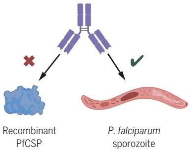  
Antigen-agnostic screen

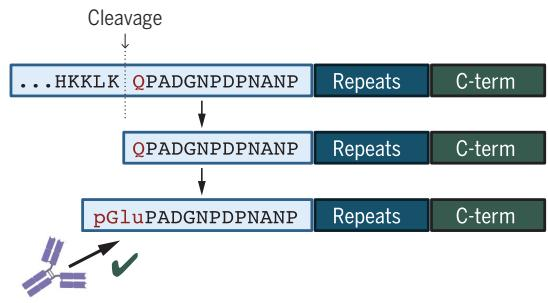  
mAb binding to sporozoite-processed PfCSP

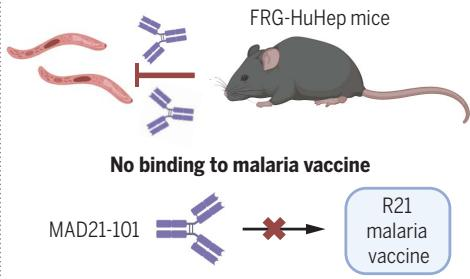  
In vivo protection

Antibodies targeting the sporozoite pGlu-CSP site protect against malaria. Left: an antigen-agnostic screen led to the discovery of antibodies that bind Pf sporozoites but not the recombinant form of the major coat protein, PfCSP. These antibodies bound exclusively to sporozoite-expressed PfCSP because they required two sequential parasite-mediated modifications. Right: the mAb MAD21-101 provides sterile protection in an in vivo model of Pf sporozoite invasion and does not bind to the R21 malaria vaccine. [Figure created with BioRender.com]

# RESEARCH ARTICLE

# MALARIA

# Protective antibodies target cryptic epitope unmasked by cleavage of malaria sporozoite protein

Cherrelle Dacon $^{1\dagger}$ , Re'em Moskovitz $^{2\dagger}$ , Kristian Swearingen $^{3}$ , Lais Da Silva Pereira $^{4\ddagger}$ , Yevel Flores-Garcia $^{5}$ , Maya Aleshnick $^{6}$ , Sachie Kanatani $^{5}$ , Barbara Flynn $^{4}$ , Alvaro Molina-Cruz $^{7}$ , Kurt Wollenberg $^{8}$ , Maria Traver $^{9}$ , Payton Kirtley $^{6}$ , Lauren Purser $^{1}$ , Marlon Dillon $^{4}$ , Brian Bonilla $^{4}$ , Adriano Franco $^{1}$ , Samantha Petros $^{1}$ , Jake Kritzberg $^{1}$ , Courtney Tucker $^{1,10}$ , Gonzalo Gonzalez Paez $^{2}$ , Priya Gupta $^{11}$ , Melanie J. Shears $^{12}$ , Joseph Pazzi $^{13}$ , Joshua M. Edgar $^{13}$ , Andy A. Teng $^{13}$ , Arnel Belmonte $^{14,15}$ , Kyosuke Oda $^{15,16}$ , Safiatou Doumbo $^{17}$ , Ludmila Krymskaya $^{9}$ , Jeff Skinner $^{18}$ , Shanping Li $^{18}$ , Suman Ghosal $^{8}$ , Kassoum Kayentao $^{17}$ , Aissata Ongoiba $^{17}$ , Ashley Vaughan $^{11}$ , Joseph J. Campo $^{13}$ , Boubacar Traore $^{17}$ , Carolina Barillas-Mury $^{7}$ , Wathsala Wijayalath $^{15,16}$ , Azza Idris $^{4,19}$ , Peter D. Crompton $^{18}$ , Photini Sinnis $^{5}$ , Brandon K. Wilder $^{6}$ , Fidel Zavala $^{5}$ , Robert A. Seder $^{4}$ , Ian A. Wilson $^{2,20}$ , Joshua Tan $^{1*}$

The most advanced monoclonal antibodies (mAbs) and vaccines against malaria target the central repeat region or closely related sequences within the Plasmodium falciparum circumsporozoite protein (PfCSP). Here, using an antigen-agnostic strategy to investigate human antibody responses to whole sporozoites, we identified a class of mAbs that target a cryptic PfCSP epitope that is only exposed after cleavage and subsequent pyroglutamylation (pGlu) of the newly formed N terminus. This pGlu-CSP epitope is not targeted by current anti-PfCSP mAbs and is not included in the licensed malaria vaccines. MAD21-101, the most potent mAb in this class, confers sterile protection against Pf infection in a human liver–chimeric mouse model. These findings reveal a site of vulnerability on the sporozoite surface that can be targeted by next-generation antimalarial interventions.

Malaria is a devastating mosquito-borne disease that is caused by infection with Plasmodium parasites. In 2022 alone, 249 million cases of malaria and >600,000 deaths were estimated globally, with most

of these attributed to Plasmodium falciparum (Pf) (1). Malaria is most deadly for children under 5 years of age, who account for 78% of deaths within the sub-Saharan African region (1). Infection by the Plasmodium parasite is initiated when the motile sporozoite is injected into the skin during a blood meal of an infected female Anopheles mosquito (2, 3). Sporozoites then breach the dermal capillary network and migrate to the liver through the bloodstream (4–6). Once in the liver, sporozoites may traverse multiple cell types before establishing infection within a hepatocyte (7), where the

parasite then undergoes mitotic division and differentiates into exo-erythrocytic merozoites, which infect erythrocytes and initiate the symptomatic blood stage of the life cycle (8). A single sporozoite is sufficient to seed a full infection of a hepatocyte and gives rise to tens of thousands of infectious merozoites (9). Sporozoites represent a bottleneck in the parasite's life cycle, because small numbers (500 to 1000) are deposited in the skin during blood meal acquisition and are nonreplicating before hepatocyte invasion (10–12). Antibodies delivered passively can prevent infection by neutralizing sporozoites before they invade hepatocytes (13–16), so sporozoites represent an attractive target for anti-malaria interventions.

The most advanced antisporozoite antigen strategies to date all target the P. falciparum

circumsporozoite protein (PfCSP), an antigen that coats the sporozoite surface $(17, 18)$ . PfCSP contains a central repeat region flanked by N- and C-terminal regions. The central repeat region consists of tandem, repeating Asn-Ala-Asn-Pro (NANP, major repeat) motifs interspersed with less frequent Asn-Val-Asp-Pro (NVDP, minor repeat) motifs and is directly flanked by the junctional Asn-Pro-Asp-Pro tetrapeptide (NPDP) on the N-terminal end of the repeats $(19)$ . The World Health Organization (WHO)-endorsed RTS,S/AS01 $(20)$ and R21/MM $(21, 22)$ vaccines both induce protective antibodies that target the repeat region. Although these vaccines represent a major advance in the fight against malaria, they have only been partially efficacious when tested in malaria-endemic regions $(20–22)$ . Sporozoite-neutralizing monoclonal antibodies (mAbs) offer a complementary strategy against malaria and have shown up to 88% protective efficacy against Pf infection when used at high doses in an endemic setting $(23, 24)$ . Antisporozoite mAbs in clinical development include MAM01 $(25)$ , which primarily targets the PfCSP major repeats, and CIS43-LS $(14)$ and L9-LS $(16)$ , which cross-react with the major repeats but preferentially target the junction and minor repeats, respectively. Despite the potential abundance of antigenic targets on the sporozoite surface $(26)$ , most antisporozoite interventions have focused only on these well-defined repeat regions of PfCSP. To address this knowledge gap, we applied an antigen-agnostic approach to survey the landscape of antibody responses to whole Pf sporozoites at the single B cell level. This approach allowed us to screen for antibodies that showed detectable binding to intact sporozoites without restriction to any specific antigen, facilitating the discovery of functional mAbs that target other epitopes on the sporozoite surface.

# Antigen-agnostic isolation of mAbs targeting Pf sporozoites

To investigate the antibody response to Pf sporozoites in an antigen-agnostic manner, we screened plasma from Pf sporozoite-exposed individuals for immunoglobulin G (IgG) reactivity to intact, freshly dissected Pf sporozoites

$^{1}$ Antibody Biology Unit, Laboratory of Immunogenetics, National Institute of Allergy and Infectious Diseases, National Institutes of Health, Rockville, MD, USA. $^{2}$ Department of Integrative Structural and Computational Biology, The Scripps Research Institute, La Jolla, CA, USA. $^{3}$ Institute for Systems Biology, Seattle, WA, USA. $^{4}$ Vaccine Research Center, National Institute of Allergy and Infectious Diseases, National Institutes of Health, Bethesda, MD, USA. $^{5}$ Department of Molecular Microbiology and Immunology and Johns Hopkins Malaria Institute, Johns Hopkins Bloomberg School of Public Health, Baltimore, MD, USA. $^{6}$ Vaccine and Gene Therapy Institute, Oregon Health & Science University, Portland, OR, USA. $^{7}$ Laboratory of Malaria and Vector Research, National Institute of Allergy and Infectious Diseases, National Institutes of Health, Rockville, MD, USA. $^{8}$ Bioinformatics & Computational Biosciences Branch, National Institute of Allergy and Infectious Diseases, National Institutes of Health, Bethesda, MD, USA. $^{9}$ Laboratory of Immunogenetics, National Institute of Allergy and Infectious Diseases, National Institutes of Health, Rockville, MD, USA. $^{10}$ Department of Biology, The Catholic University of America, Washington, DC, USA. $^{11}$ Seattle Children's Research Institute, Seattle, WA, USA. $^{12}$ Department of Laboratory Medicine and Pathology, University of Washington, Seattle, WA, USA. $^{13}$ Antigen Discovery, Incorporated, Irvine, CA, USA. $^{14}$ General Dynamics Information Technology, Inc., Falls Church, VA, USA. $^{15}$ Agile Vaccines and Therapeutics Department, Naval Medical Research Command, Silver Spring, MD, USA. $^{16}$ Henry M Jackson Foundation for the Advancement of Military Medicine, Inc., Bethesda, MD, USA. $^{17}$ Mali International Center of Excellence in Research, University of Sciences, Technique and Technology of Bamako, Bamako, Mali. $^{18}$ Malaria Infection Biology and Immunity Section, Laboratory of Immunogenetics, National Institute of Allergy and Infectious Diseases, National Institutes of Health, Rockville, MD, USA. $^{19}$ The Ragon Institute of Massachusetts General Hospital, Massachusetts Institute of Technology and Harvard University, Cambridge, MA, USA. $^{20}$ The Skaggs Institute for Chemical Biology, The Scripps Research Institute, La Jolla, CA, USA.

*Corresponding author. Email: tanj4@nih.gov

†These authors contributed equally to this work.

‡Present address: Office of Vaccines Research and Review, Division of Clinical and Toxicology Review, Center for Biologics Evaluation and Research, Food and Drug Administration,

Silver Spring, MD, USA.

by high-throughput flow cytometry. Two cohorts with different forms of sporozoite exposure were analyzed: individuals living in a rural community in Mali with exposure to intense, seasonal malaria (n = 843) (27, 28), and malaria-naïve individuals in the United States who were immunized with large numbers of radiation-attenuated sporozoites (n = 98) (29, 30). As expected, most immunized individuals had high levels of sporozoite-specific IgG (Fig. 1A). By contrast, in the Mali cohort,

circulating sporozoite-reactive IgG was not universal but was associated with age (Fig. 1, A and B), suggesting that antibodies to sporozoites are acquired slowly with repeated natural infections. To focus our efforts on new targets on the sporozoite surface, we repeated the plasma IgG screen but included a preblocking step with full-length recombinant PfCSP (rPfCSP) to adsorb PfCSP-specific antibodies. Blocking with rPfCSP ablated IgG reactivity to Pf sporozoites in 936 of 941 donors, highlighting the

immunodominance of PfCSP on the sporozoite surface (Fig. 1A). However, plasma from one Malian and four immunized US individuals retained IgG reactivity to the sporozoite surface after rPfCSP blocking (Fig. 1A). We confirmed that this observation was not caused by residual reactivity to rPfCSP (fig. S1A) and hypothesized that these five donors harbored B cells with non-PfCSP specificities. Therefore, we selected these individuals for mAb isolation.

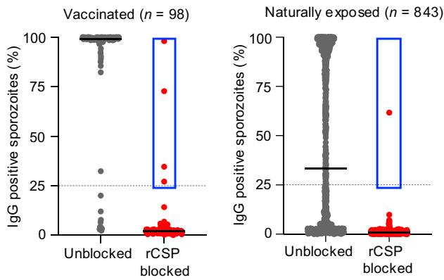  
A

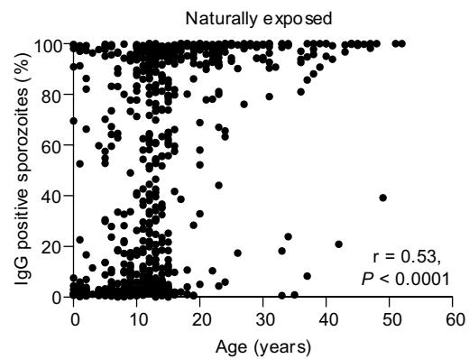  
B

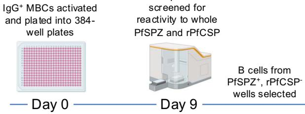  
C

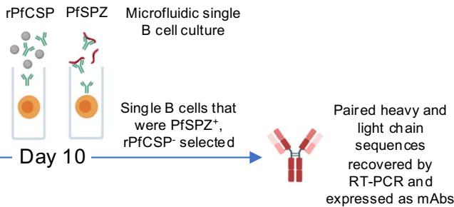

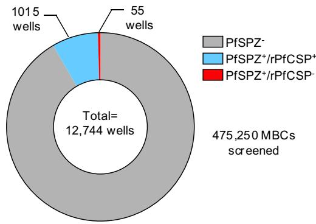  
D

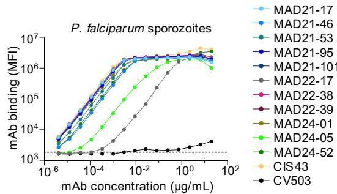  
E   
Fig. 1. Isolation of rare antisporozoite mAbs using an antigen-agnostic approach. (A) Plasma IgG reactivity to Pf sporozoites with (red) and without (gray) preblocking of plasma samples by rPfCSP. Bars indicate means. Donors with $\geq8\%$ reactivity to sporozoites after rPfCSP blocking in the initial screen were subjected to repeat analysis, and these validated data points are shown in the plot for those donors. The dotted line shows the final 25% cutoff chosen to select positive donors, with down-selected donors enclosed in blue. (B) Correlation of plasma IgG reactivity to whole Pf sporozoites with donor age from the malaria-exposed cross-sectional cohort, P value, and correlation coefficient were derived by Spearman's rank correlation analysis. (C) Schematic of the antigen-agnostic workflow for isolation of mAbs against Pf sporozoites. IgG $^{+}$ MBCs were sorted from PBMC samples and plated at a density of 25 to 100 cells per well in 384-well plates.   
The cells were then activated and cultured for 9 d, followed by screening of supernatants for binding to Pf sporozoites and PfCSP. B cells of interest (PfSPZ $^{+}$ , PfCSP $^{-}$ ) were transferred to a microfluidics chip for single-cell screening against Pf sporozoites and PfCSP. Single B cells of interest (PfSPZ $^{+}$ , PfCSP $^{-}$ ) were selected for mAb production. PfSPZ, Pf sporozoites. [Figure created with BioRender.com] (D) Number of MBC culture supernatants reactive toward whole Pf sporozoites and rPfCSP. (E) Titration curves for recombinant mAb binding to whole, freshly dissected Pf sporozoites. MAD22-17 bound more poorly to sporozoites than the other mAbs and was excluded from subsequent analysis. CIS43 is a control anti-PfCSP mAb, and CV503 is a negative control anti-severe acute respiratory syndrome coronavirus 2 (anti-SARS-CoV-2) mAb. The dotted line shows the binding level with the buffer-only control.

We developed a pipeline to screen single B cells from the five donors for reactivity to intact Pf sporozoites (Fig. 1C). This pipeline was divided into two steps to increase the probability of identifying rare B cells of interest. First, supernatants from oligoclonal cultures of 475,250 activated IgG $^{+}$ memory B cells (MBCs) in 384-well plates were assessed for binding to Pf sporozoites and rPfCSP. Despite donor selection for reactivity to non-PfCSP targets, most sporozoite-reactive B cell supernatants were also rPfCSP-positive (94.9%, n = 1015) (Fig. 1D), confirming that the strong immunodominance of PfCSP extends to the B cell level. Nevertheless, we identified a small subset of supernatants (5.1%, n = 55) that were sporozoite reactive but rPfCSP negative. Of these 55 supernatants, three originated from the Malian donor and the rest (52/55) originated from immunized donors. B cells from these wells were individually sorted into nanoliter-volume culture chambers and imaged in real time to detect secretion of antibodies that bound to the surface of intact Pf sporozoites but not to rPfCSP-coated beads (fig. S1B). Single B cells with this profile were exported for sequencing and production of mAbs as recombinant IgG1. Using this approach, we identified 10 mAbs that showed strong binding to Pf sporozoites but no appreciable binding to rPfCSP (Fig. 1E and fig. S1C). Of the 10 mAbs, five (MAD21-17, MAD21-46, MAD21-53, MAD21-95, and MAD21-101) were isolated from the same donor (MAD21, a vaccinated donor) and belonged to the same IGHV4-59/IGKV4-1 clonal lineage (table S1). The remaining five mAbs were isolated from two other immunized donors (MAD22 and MAD24) and were encoded by a variety of V genes (IGHV4-39/IGKV1-39, IGHV3-11/IGKV3-11, IGHV3-7/IGLV1-47, and IGHV3-33/IGKV2-24). The mAbs bound to 100% of Pf sporozoites in tested samples in an analogous binding profile to the control anti-PfCSP mAb CIS43, indicating that the target antigen is expressed on each individual sporozoite (Fig. 1E and fig. S1D). We confirmed that the mAbs bound similarly to freshly isolated and cryopreserved sporozoites, enabling us to use cryopreserved sporozoites in downstream binding and Western blot experiments (Fig. 1E and fig. S1E).

# Isolated mAbs recognize sporozoite-expressed PfCSP and are functional in vivo

To identify the target antigens of the newly isolated mAbs, we screened them against Pf sporozoite lysate by Western blot. Unexpectedly, under both reducing and nonreducing conditions, the mAbs interacted with a protein at the same molecular weight as PfCSP (Fig. 2A and fig. S2, A and B), introducing the possibility that they recognize PfCSP but only when expressed by sporozoites. Additionally, analysis of binding to sporozoites by an indirect immunofluorescence assay revealed that the mAbs

bound the sporozoite surface with similar localization as CIS43, a control anti-PfCSP mAb (Fig. 2B). The mAbs did not bind to wild-type (WT) Plasmodium berghei sporozoites ( $Pb^{WT}$ ) but bound strongly to transgenic Pb sporozoites expressing PfCSP ( $Pb^{PfCSP}$ ) (Fig. 2C), indicating that the target of these mAbs was indeed sporozoite-produced PfCSP.

The $Pb^{PfCSP}$ parasites, which also carry a dual green fluorescent protein (GFP)/luciferase reporter system, are routinely used in a standardized mouse infection model to assess in vivo efficacy of PfCSP-specific mAbs (31). Using this model, we evaluated the 10 mAbs and found that six reduced liver parasite burden by $>50\%$ after intravenous sporozoite challenge (Fig. 2, D and E, and fig. S2C). MAD21-101 was the most potent, providing 97.5% neutralization at a 300- $\mu$ g dose, and MAD22-38 was the most potent mAb outside of the MAD21 clonal lineage (Fig. 2, D and E). Therefore, we focused on MAD21-101 and MAD22-38 for downstream analysis. When the mAbs are analyzed collectively, we refer to them as MAD21-101-type mAbs.

Two potential mechanisms by which antibodies inhibit sporozoite activity in vivo include reducing their motility and blocking the development of liver-stage parasites in hepatocytes by inhibiting the sporozoite traversal or invasion processes that are required for productive infection. To investigate these possibilities, we tested a subset of MAD21-101-type mAbs for their ability to reduce motility in a trailgliding assay or to inhibit Pf liver stage development within primary human hepatocytes in vitro using the in vitro inhibition of liver stage development assay (ILSDA). Inhibition of sporozoite motility by MAD21-101 was modest at 37.2% for the highest dose tested (100 $\mu$ g/ml) (fig. S3, A and B). By contrast, 100 $\mu$ g/ml MAD21-101 and MAD22-38 substantially reduced liver stage parasite development in the ILSDA, with MAD21-101 providing 88.8% inhibition and performing similarly to an equivalent dose of CIS43 that conferred 94.1% inhibition (fig. S3C). Thus, the mechanism of protection conferred by the mAbs is likely dependent on their ability to inhibit sporozoite invasion or traversal activity that leads to productive infection.

# MAD21-101-type antibodies target sporozoite-cleaved and pyroglutamated PfCSP

We hypothesized that the lack of mAb reactivity for rPfCSP results from a post-translational modification performed by sporozoites that was absent in rPfCSP produced in mammalian human embryonic kidney 293 (HEK293) cells. Therefore, we evaluated MAD21-101 and MAD22-38 binding to rPfCSP produced by cell lines of diverse bacterial and eukaryotic origin (Escherichia coli, Lactococcus lactis, Pichia pastoris, Sf9, and wheat germ), reasoning that one of these cell lines may produce PfCSP with post-translational modifications that more closely

mimic native Plasmodium expression. However, we did not observe binding to any form of rPfCSP tested (tables S2 and S3). Next, we tested MAD21-101 and MAD22-38 for binding to a series of 15-mer peptides spanning the entire protein. The mAbs did not bind to any of these constructs or peptides, which was surprising given the likely linearity of the target epitope based on the Western blot results with sporozoite lysate (Fig. 2A and table S2). These findings suggested that the mAbs require a sporozoite-specific modification of PfCSP that was absent in the recombinant or chemically synthesized constructs, and that further analysis would have to be performed with sporozoite-expressed PfCSP.

To identify the PfCSP region recognized by MAD21-101 and MAD22-38, we performed enzyme-linked immunosorbent assays (ELISAs) with transgenic Pb sporozoite lines expressing PfCSP with specific regions deleted or PbCSP with specific substitutions from PfCSP. We confirmed that neither mAb bound to WT Pb sporozoites and, furthermore, that in-substitution of the PfCSP N terminus or C terminus did not restore binding, suggesting that these regions do not contain the target epitope (Fig. 3A and fig. S4A). As expected, MAD21-101 and MAD22-38 bound to Pb sporozoites expressing full-length PfCSP (Fig. 3B). However, binding was completely ablated upon deletion of the junction amino acids A $^{98}$ DGNPDP $^{104}$ , which lie immediately C-terminal to the highly conserved region I motif K $^{93}$ LKQP $^{97}$ (Fig. 3B). Furthermore, insertion of A $^{98}$ DGNPDP $^{104}$ (alongside four NANP repeating units) into full-length PbCSP rescued mAb binding, whereas insertion of a stretch of 12 NANP repeats alone did not (Fig. 3B). Collectively, these findings indicated that the target epitope of MAD21-101 and MAD22-38 partially overlaps with A $^{98}$ DGNPDP $^{104}$ . We searched for sporozoite-specific modifications to this region and did not find evidence of parasite glycosylation at this site. However, previous studies reported that an unidentified Plasmodium cysteine protease cleaves PfCSP at the highly conserved region I, which would leave the A $^{98}$ DGNPDP $^{104}$ sequence close to the new N terminus and potentially expose an epitope for mAb binding (32). We investigated whether MAD21-101-type mAbs bind only to cleaved PfCSP by running a Western blot under conditions that would resolve cleaved and uncleaved protein. Indeed, MAD21-101 and MAD22-38, as well as the other mAbs isolated in this study, had no detectable reactivity to uncleaved PfCSP (~50 kDa) and bound only to the cleaved form of the protein (~43 kDa) (Fig. 3C and fig. S4B). MAD21-101 only immunoprecipitated cleaved PfCSP from sporozoite lysate, further confirming its specificity for the cleaved protein (fig. S4C). The identification of MAD21-101 gave us the opportunity to investigate whether individual sporozoites can display cleaved and uncleaved

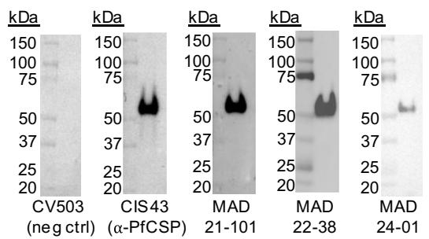  
A

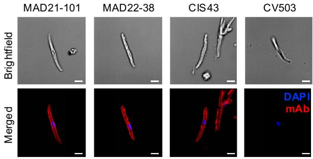  
B

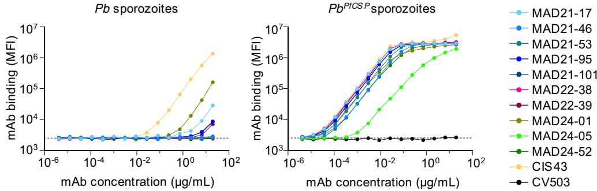  
C

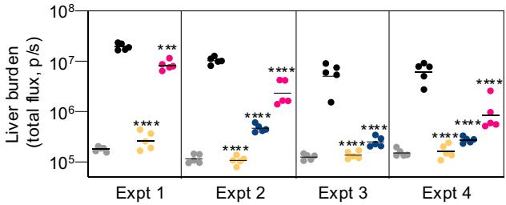  
D

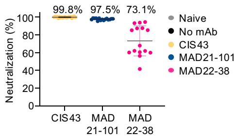  
E   
Fig. 2. Isolated mAbs exclusively target Plasmodium-expressed PfCSP and reduce liver parasite burden in vivo. (A) Western blot analysis of Pf sporozoite lysates. Lysates were analyzed by reducing SDS-PAGE, and individual blots were probed with representative isolated mAbs (MAD21-101, MAD22-38, and MAD24-01), a control anti-PfCSP mAb (CIS43), and an anti-SARS-CoV-2 spike mAb as an isotype control (CV503). Lysate from $5 \times 10^{4}$ sporozoites was loaded into each well. (B) Immunofluorescence images of Pf sporozoite surface staining with MAD21-101 and MAD22-38, an anti-PfCSP control mAb CIS43, and an isotype control anti-SARS-CoV-2 mAb CV503. Scale bar, 2 $\mu$ m. (C) Flow cytometry analysis of mAb binding to freshly dissected sporozoites. Shown are WT P. berghei sporozoites and transgenic P. berghei sporozoites that express full-length PfCSP ( $Pb^{PfCSP}$ ). CIS43 was included as a control anti-PfCSP mAb. Dotted line denotes median fluorescence intensity for the buffer control. (D and E) In vivo assay to evaluate mAb potency, as   
measured by liver parasite burden reduction. In this assay, 300 $\mu$ g of each mAb was delivered 16 hours pre-IV challenge with $Pb^{PfCSP}$ sporozoites that express the luciferase reporter enzyme ( $Pb^{PfCSP-GFP/FLuc}$ ). Liver parasite burden was measured by in vivo imaging and quantified as luminescence flux signals. The naïve group consisted of mice that were not infected with sporozoites. This group was used to determine the baseline flux signal, whereas the “no mAb” group was infected with sporozoites but not administered any mAb. (D) Liver burden reduction from four independent experiments. Data are shown with geometric mean for n = 5 mice per group, and statistical significance was determined versus the no-mAb condition using one-way ANOVA testing with Dunnett’s test for multiple comparisons. *P < 0.05; **P < 0.01; ***P < 0.001; ****P < 0.0001; ns, not significant. (E) Potency of the mAbs calculated based on sporozoite neutralization. Neutralization data were derived from at least three independent experiments. Bars indicate means with SD.

PfCSP simultaneously on their surface. To answer this question, we stained Pf sporozoites with 5D5, a mAb that binds to the PfCSP N terminus (and thus binds only to uncleaved PfCSP), along with MAD21-101 (which binds only to cleaved PfCP). Most sporozoites could be bound simultaneously by both mAbs, indicating that each sporozoite can display both forms of PfCSP at the same time (fig. S4D).

Our low-resolution PfCSP peptide screen (four-residue shift between peptides) did not reveal mAb binding to peptides that should

cover the N terminus of cleaved PfCSP, assuming cleavage occurs at region I (table S2). Therefore, we hypothesized that the mAbs are highly specific to the precise N terminus generated by sporozoite cleavage, which was presumably not represented in this low-resolution peptide assay. Although a recent model proposes the PfCSP cleavage site to be between Lys $^{95}$ and Gln $^{96}$ in region I (33), the exact location of cleavage has not been experimentally determined. Therefore, we assessed binding to a panel of peptides with single-residue truncations across region I to

more precisely mimic potential sporozoite cleavage sites. Except for MAD24-52, all of the mAbs bound only when glutamine (Gln $^{96}$ ) was presented as the N-terminal residue (Fig. 3D). However, the binding of most MAD21-101-type mAbs, including MAD22-38, was unexpectedly weak given their strong binding to sporozoites (Fig. 1E), suggesting that the Gln $^{96}$ peptide did not fully recapitulate the native epitope on the sporozoite surface. It appears that parasite glutaminyl cyclase is active in Plasmodium sporozoites and likely converts P. berghei CSP Gln $^{92}$ ,

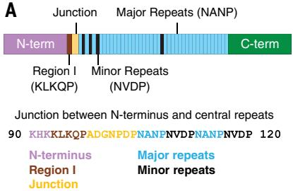  
A   
B

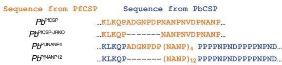

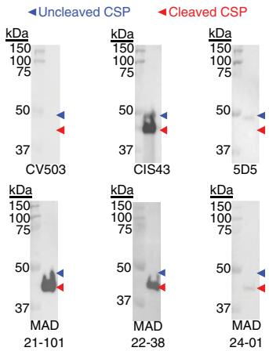  
C

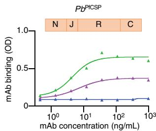

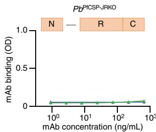

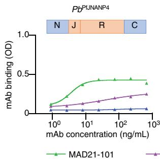

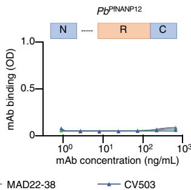

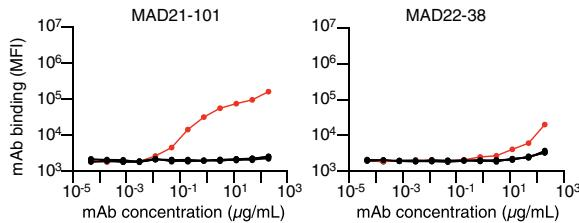  
D   
F

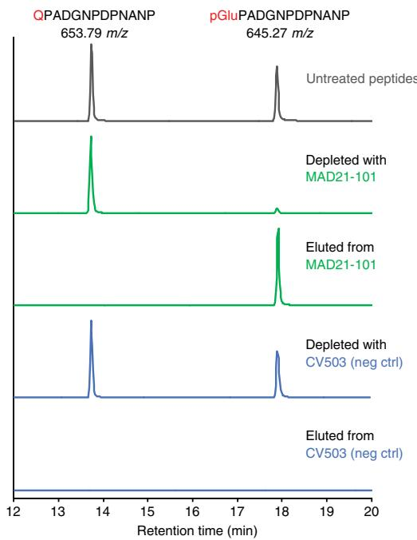

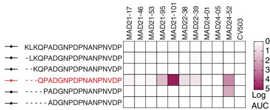  
E

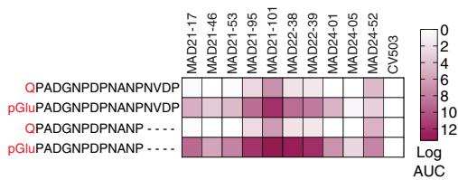  
Fig. 3. MAD21-101-type mAbs target the newly formed, pyroglutamate-modified N terminus of PfCSP after sporozoite cleavage. (A) Schematic of PfCSP depicting the highly conserved region I (brown), the junction (beige), and central major NANP repeats (sky blue) interspersed with minor NVDP repeats (black), which are flanked by the N and C termini (pink and green, respectively). The sequence of region I, junction, and initial repeats are shown below. (B) ELISA analysis of mAb binding to lysate from Pb sporozoites expressing full PfCSP ( $Pb^{PfCSP}$ ) or PfCSP lacking key junction region residues ( $Pb^{PfCSP-JRKO}$ ) and chimeric Pb sporozoites expressing the PfCSP junction and NANP repeats ( $Pb^{PfJNANP4}$ ) or PfCSP NANP repeats only ( $Pb^{PfNANP12}$ ). Sequences and domains in orange are derived from PfCSP, whereas sequences and domains in blue are derived from PbCSP. SARS-CoV-2 spike mAb CV503 was included as an isotype control. (C) Western blot analysis of mAb binding to cleaved and uncleaved forms of PfCSP from Pf sporozoite lysate. Lysates were analyzed by SDS-PAGE   
under reducing conditions, and individual blots were probed with MAD21-101, MAD22-38, and MAD24-01. Control mAbs that bound to uncleaved PfCSP only (5D5) or to both cleaved and uncleaved PfCSP (CIS43) were included. CV503 IgG1 was included as an isotype control, and lysate from $5 \times 10^{4}$ sporozoites was loaded into each well. (D) Representative titration curves and area-under-the-curve (AUC) heatmap showing mAb binding to N-terminally truncated PfCSP peptides. (E) AUC heatmap showing mAb binding to PfCSP peptides with either an N-terminal Gln $^{96}$ or a pGlu $^{96}$ residue. (F) An equimolar mixture of peptides with N-terminal Gln $^{96}$ or pGlu $^{96}$ was immunoprecipitated with MAD21-101 or CV503 (isotype control) and analyzed by LC-MS. The mAb-depleted supernatants were analyzed in addition to eluates. Shown are extracted ion chromatograms for the peptides. Retention times are aligned. Peptide abundance is normalized and offset for clarity. Peptide identity was confirmed from fragment spectra.

the equivalent of PfCSP Gln $^{96}$ , to pyroglutamic acid (pGlu) to enhance immune evasion in mosquitoes (33). Therefore, we analyzed mAb binding to PfCSP peptides bearing either an N-terminal Gln $^{96}$ or pGlu $^{96}$ residue. Binding was markedly enhanced to peptides with N-terminal pGlu $^{96}$ (Fig. 3E and fig. S5A), indicating that this is the likely native target of the mAbs.

N-terminal glutamine has been shown to spontaneously convert to pyroglutamate in solution, even in the absence of glutaminyl cyclase (34). Indeed, when we used liquid chromatography-mass spectrometry (LC-MS) to analyze the synthetic Gln $^{96}$ peptide used in the mAb-binding assay described above [QPADGNPDPNANP-Ahx-Lys(biotin)], we found that 5.4% of the N-terminal residue had already undergone conversion to pGlu $^{96}$ , even though the peptide had been stored at -20°C since reconstitution (fig. S5B). Therefore, we investigated whether the observed mAb reactivity to the Gln $^{96}$ peptide was due to spontaneously converted pGlu $^{96}$ rather than true binding to Gln $^{96}$ . To distinguish between binding to the two peptides, we immunoprecipitated a mixture of Gln $^{96}$ and pGlu $^{96}$ peptides with MAD21-101 and analyzed the bound and eluted peptides by LC-MS, which unequivocally distinguished between the two isoforms. MAD21-101 bound strongly to the pGlu $^{96}$ peptide but exhibited no binding to the Gln $^{96}$ peptide (Fig. 3F), indicating that MAD21-101 is highly selective for pGlu-CSP.

To determine whether the pGlu $^{96}$ epitope can be detected in sporozoites, we used LC-MS to analyze PfCSP from Pf salivary gland sporozoites, starting with published datasets. In the published Pf salivary gland sporozoite global (35) and surface (26) proteomes, PfCSP is highly abundant, and peptides beginning with Gln $^{96}$ (i.e., arising from cleavage of region I between Lys $^{95}$ and Gln $^{96}$ ) are detected in every sample. Furthermore, it was observed that virtually all of the Gln $^{96}$ had been converted to pGlu $^{96}$ . However, it is not possible to determine from these datasets whether the pGlu $^{96}$ epitope was present in vivo for two reasons. First, the peptides analyzed in these studies were generated by digestion with trypsin, which cleaves C-terminal to Lys and Arg residues, so we do not know whether the Gln $^{96}$ peptides were produced by trypsin digestion or if they arose from sporozoite processing of the K $^{93}$ LKQP $^{97}$ motif. Second, we do not know what proportion of the pGlu observed was present in vivo as opposed to forming spontaneously during sample handling. To circumvent these issues, we used a different approach to obtain PfCSP peptides. In published sporozoite proteomes, the repeat units within PfCSP were observed to be highly heat labile (26, 35). We therefore hypothesized that the region of PfCSP immediately N-terminal to the repeats could be liberated nonenzymatically by heat alone. To this

end, frozen sporozoite pellets were resuspended in aqueous buffer and briefly heated to induce nonenzymatic protein fragmentation. Acetonitrile was then added, causing intact protein to precipitate while released peptides remained in the supernatant, which was recovered and analyzed by LC-MS. We observed peptides with N-terminal pGlu $^{96}$ of various lengths that arose from heat-induced cleavage of the major and minor repeat motifs (fig. S5C). In 100% of these peptides, the N-terminal Gln $^{96}$ had been converted to pGlu. To confirm that these observations were not artifacts due to sample handling, we subjected rPfCSP to the same protocol. Although we detected peptides containing the intact K $^{93}$ LKQP $^{97}$ motif, we did not observe any peptides with N-terminal Gln $^{96}$ or pGlu $^{96}$ , suggesting that this protocol does not induce cleavage between Lys $^{95}$ and Gln $^{96}$ (fig. S5C). To quantify the extent to which sample handling induces spontaneous conversion of N-terminal Q to pGlu, a synthetic Gln $^{96}$ peptide (QPADGNPDPNANP) was subjected to the same protocol as the sporozoites and rPfCSP. The heating and peptide extraction process increased the relative proportion of spontaneously converted pGlu from 2.1 to 11.5%, but the majority (88.5%) of the peptide N terminus remained as native Gln (fig. S5D), confirming that proteomic sample handling alone does not account for the fact that the N-terminal Gln $^{96}$ is 100% converted to pGlu in salivary gland sporozoites. These data show that in PfCSP of Pf salivary gland sporozoites, the K $^{93}$ LKQP $^{97}$ motif can be cleaved at Lys $^{95}$ and the new N terminus, Gln $^{96}$ , is converted to pGlu $^{96}$ .

# The pGlu-CSP epitope is distinct from previously identified PfCSP sites

To determine the minimal epitope required for binding, we screened the pGlu-CSP-specific mAbs against a series of peptides that contained sequential C-terminal truncations. We found that the major (NANP) and minor (NVDP) repeats at the C-terminal end of the peptide were not required for binding (Fig. 3E and fig. S6), and that the minimal epitope for most mAbs, including MAD21-101 and MAD22-38, was pGlu $^{96}$ PADGNP $^{102}$ (fig. S6). We repeated the peptide screen with previously isolated anti-PfCSP mAbs that target the major repeats [317(36)], minor repeats [L9(16)], junction [CIS43(14)], and N terminus [5D5(37)]. None of these mAbs bound to the pGlu $^{96}$ PADGNP $^{102}$ sequence, with the mAb that bound the closest epitope, CIS43, targeting a more C-terminal epitope that required the extension of the sequence beyond the first major repeat unit (N $^{105}$ ANP $^{108}$ ) (fig. S6).

# MAD21-101-type antibodies bind a hydrophobic and aromatic pocket to stabilize pGlu-modified PfCSP

To determine the structural basis for the selectivity of MAD21-101-type antibodies to the

epitope that we found was produced by pGlu modification of cleaved PfCSP, we determined x-ray crystallographic structures of the antigen-binding fragments (Fabs) of MAD21-101, MAD22-38, and MAD24-01 in complex with an 18-amino acid peptide corresponding to PfCSP pGlu $^{96}$ -Asn $^{113}$ at resolutions of 1.46, 1.99, and 1.82 Å, respectively (table S4) (note that Kabat numbering for Fab residues is used throughout). In all three structures, the Fabs bound the peptide with the N terminus pointing inward into the antigen-binding groove (Fig. 4A); the N-terminal pGlu-Pro motif was buried in a pocket formed by multiple CDRs of the antibody heavy and light chains (Fig. 4A, inset). In the MAD21-101 structure, peptide electron density can be observed for the entire 18-amino acid peptide, forming a buried surface area (BSA) of 609 Å $^{2}$ (Fig. 4B). The C-terminal Val $^{109}$ -Asn $^{113}$ protrudes out of the binding site and interacts with an adjacent Fab that is related by crystallographic symmetry. However, the disorder in the peptide C terminus indicated by the weak electron density suggest these are fortuitous contacts in the crystallographic lattice due to close proximity of adjacent Fabs and are not part of the native paratope (Fig. 4B). In the structures of MAD22-38 and MAD24-01, clear peptide electron density is visible for residues pGlu $^{96}$ -Asp $^{103}$ , in agreement with the minimal epitope determined by peptide truncation experiments (fig. S6A), and forms BSAs of 319 and 351 Å $^{2}$ , respectively (Fig. 4, C and D). This insertion of the newly cleaved and cyclized N terminus into the antibody-combining site is consistent with the requirement for PfCSP cleavage for antibody recognition and binding. To achieve selectivity for the N-terminal pGlu $^{96}$ compared with the unmodified Gln $^{96}$ or PfCSP cleavage at alternative residues, MAD21-101 interacts extensively with the pGlu-Pro motif using a vast network of aromatic and hydrophobic residues (Tyr50 $^{H}$ , Phe100E $^{H}$ , Tyr27D $^{L}$ , Tyr32 $^{L}$ , Tyr91 $^{L}$ , Tyr92 $^{L}$ , and Leu93 $^{L}$ , where the antibody residue numbers are not superscripted to differentiate them from the CSP residues, L is light chain, and H is heavy chain) forming a cage-like arrangement surrounding the pGlu-Pro, where the aromatic residues make hydrophobic and CH/π interactions. Further stabilization of the peptide N terminus is achieved through hydrogen bonding to the secondary carbonyl and amide of the N-terminal pGlu $^{96}$ through polar groups (Tyr50 $^{H}$ hydroxyl and Ala100F $^{H}$ backbone carbonyl) (Fig. 4E). A similar binding mode is seen in the MAD22-38 Fab-peptide complex, where the pocket for pGlu-Pro is formed by a set of aromatic and hydrophobic residues from multiple CDRs of both heavy and light chains (Tyr35 $^{H}$ , Tyr58 $^{H}$ , Ile95 $^{H}$ , Trp97 $^{L}$ , and Tyr100D $^{H}$ ) and with additional coordination of the N-terminal pGlu carbonyl by Ser50 $^{H}$ hydroxyl and Trp97 $^{L}$ indole nitrogen (Fig. 4F). A more minimal binding pocket is seen in the MAD24-01 Fab-peptide complex, formed by the HCDR3 and

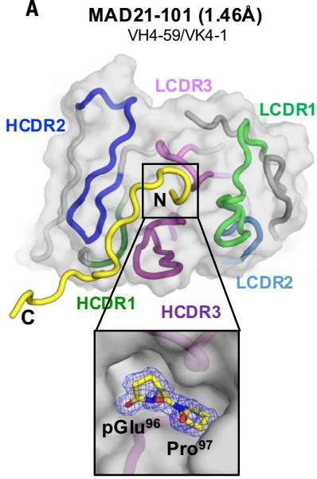  
A

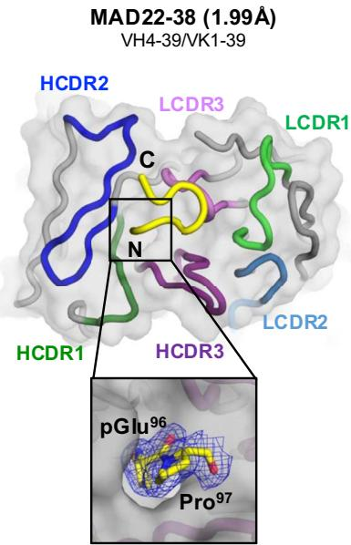  
MAD22-38 (1.99Å)
VH4-39/VK1-39

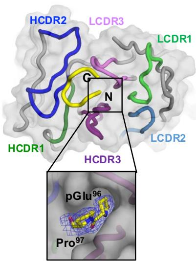  
MAD24-01 (1.82Å)
VH3-11/VK3-11

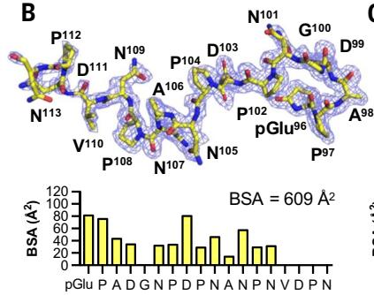  
B

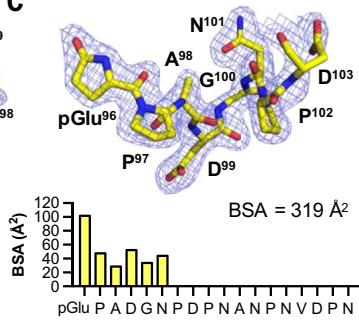  
C

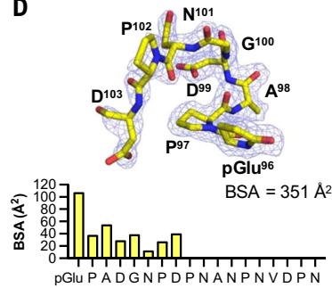  
D

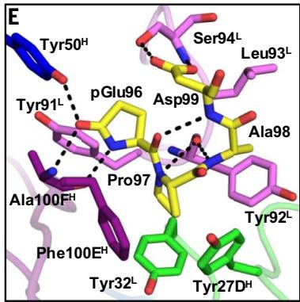

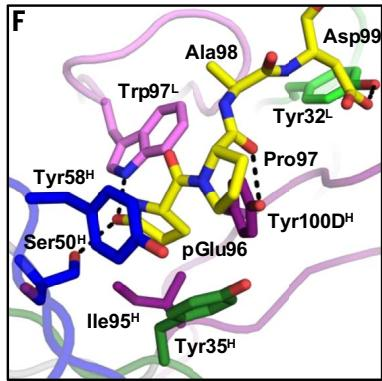

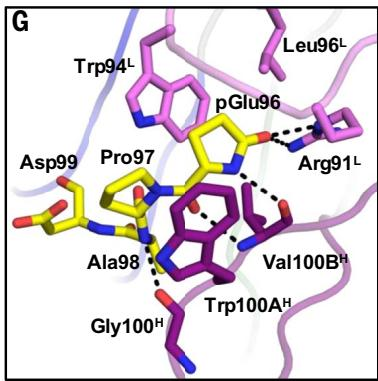  
G   
Fig. 4. Structural basis of MAD21-101–like antibody epitope recognition and specificity. (A) Overall view of x-ray structures of MAD21-101, MAD22-38, and MAD24-01 in complex with a peptide corresponding to PfCSP residues pGlu $^{96}$ to Asn $^{113}$ . The Fab surface is shown in gray; bound peptide is shown as a yellow backbone cartoon representation; framework regions are shown in gray cartoons; and CDR1, CDR2, and CDR3 of Fab heavy and light chains are shown in dark and light green, blue, and purple, respectively. Inset shows the bound N terminus in a pocket at the heavy-light chain interface, with pGlu-Pro motifs represented as   
yellow sticks and the electron density map (2Fo-Fc) in blue mesh (contoured to 1σ). (B to D) Bound peptides of MAD21-101 (B), MAD22-38 (C), and MAD24-01 (D) are represented as yellow sticks, and the electron density map (2Fo-Fc) is shown in blue mesh (contoured to 1σ). Per-residue peptide buried surface area (Ų) at the peptide-Fab interface is shown as yellow bars. (E to G) Binding interactions between the N-terminal peptide residues pGlu⁹⁶-Asp⁹⁹ to the hydrophobic pockets of (E) MAD21-101, (F) MAD22-38, and (G) MAD24-01, with interacting residues shown as sticks and hydrogen bonds as black dashed lines.

LCDR3 loops, with the pGlu-Pro motif sandwiched between Trp100A $^{H}$ , Val100B $^{H}$ , Trp94 $^{L}$ , and Leu96 $^{L}$ , with additional polar interactions by nearby Fab side chains (Arg91 $^{L}$ ) and backbone (Val100B $^{H}$ ) (Fig. 4G). We aligned the Fab sequences and their respective germline V genes with the per-residue BSA formed by peptide

binding and interactions coordinating the bound peptide (fig. S7). Several key binding residues forming the core binding pocket are germline encoded in each of the three Fabs, with somatic hypermutation clustering around contact regions indicative of affinity maturation toward this specific target to further increase

binding contacts. Therefore, despite their different donor source and distinct $V_{H}/V_{L}$ combinations, MAD21-101-like Abs use analogous features to produce hydrophobic and aromatic binding pockets that accommodate the pGlu-Pro motif, thereby achieving their common selectivity and specificity to this new PfCSP epitope.

Although they show similar binding to their epitope, MAD21-101-like antibodies display a broad range of liver burden reduction in vivo (Fig. 2D and fig. S2C). Previously, the binding affinities of antibodies targeting CSP has been correlated with protection (38–40). To determine whether this was also the case for the pGlu-CSP epitope, we performed biophysical analysis of the binding of seven Fabs to their PfCSP epitope peptide by isothermal titration calorimetry (ITC) (fig. S8A). The highly protective MAD21-101 produced the strongest binding, with an equilibrium dissociation constant ( $K_{d}$ ) of 3.8 nM; MAD22-38 had a $K_{d}$ of 111 nM; and nonprotective MAD24-01 produced the lowest binding affinity (850 nM) to the target peptide. Across all Fabs tested, antibody affinity measured by ITC exhibited a positive correlation with liver-burden reduction, with an $R^{2}$ of 0.753 (fig S8B), and a strong correlation $R^{2} = 0.952$ was observed for MAD21-lineage antibodies (fig S8C). In the MAD21-101 structure, the core epitope of the bound peptide is stabilized by a type-I β-turn between the backbone carbonyl of pGlu $^{96}$ and the amide nitrogen of Asp $^{99}$ , whereas MAD22-38 and

MAD24-01 bind the peptide in their respective binding pockets in an extended conformation (Fig. 4, E to G). Although the enthalpy of peptide binding is comparable in both MAD21-101 and MAD22-38 (fig S8A), the lower entropic penalty of binding for MAD21-101 compared with MAD22-38 contributes to a 30-fold higher affinity for MAD21-101, potentially by decreasing conformational sampling required for peptide binding in solution. Stabilization of secondary structural elements is commonly observed in potent PfCSP-binding mAbs (38), and antibody stabilization of different CSP peptide conformations has been associated with functional differences (41). Similar to other CSP epitopes, the specific conformation of pGlu-CSP stabilized by MAD21-lineage antibodies may facilitate the high-affinity binding observed for MAD21-101 and contribute to its protection in the mouse model.

# The pGlu-CSP epitope is conserved in global Pf isolates

To determine the degree of conservation of the pGlu-CSP epitope, we examined sequences from 16,441 globally isolated Pf parasites based on

the MalariaGEN Pf7 database (42) and compared them with the canonical Pf3D7 sequence Q $^{96}$ PADGNPDPNANP $^{108}$ . Only two nucleotide polymorphisms that led to amino acid changes, both at location Ala $^{98}$ , were identified. A small number of sequences (5 of 16,441) had an Ala $^{98}$ Val substitution, whereas most sequences (9901 of 16,441) had an Ala $^{98}$ Gly substitution, which is consistent with previous reports (43–45) (fig. S9A). We tested whether the MAD21-101-type mAbs retain the ability to bind to the pGlu-CSP epitope with this Ala $^{98}$ Gly mutation (Q $^{96}$ PGDGNPDPNANP $^{108}$ ) while also examining binding to peptides with sequential Ala substitutions to determine key epitope residues. Most mAbs retained binding to the Ala $^{98}$ Gly peptide (Fig. 5, A and B). Consistent with the minimal epitope results and our crystal structures, residues that influenced binding by MAD21-101-type mAbs were located within the pGlu $^{96}$ PADGNP $^{102}$ sequence (Fig. 5A and fig. S6). The key binding residues for MAD21-101 were the conserved residues pGlu $^{96}$ , Pro $^{97}$ , and Asp $^{99}$ , whereas MAD22-38 also required Gly $^{100}$ (Fig. 5B and fig. S9B). Although Ala $^{98}$ Gly did not affect binding of most mAbs,

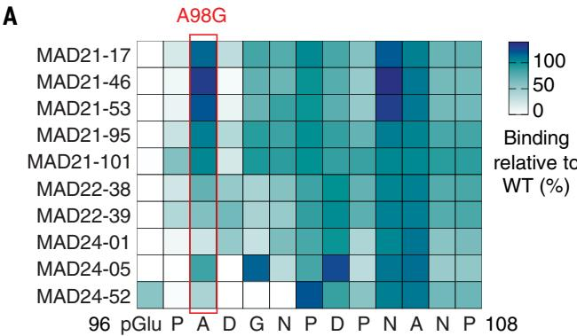

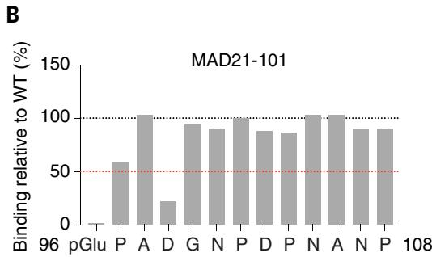

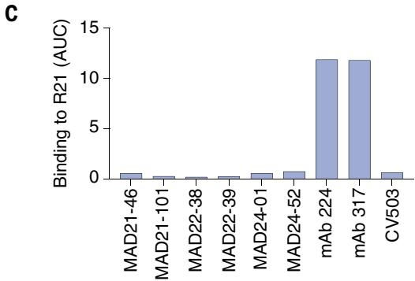

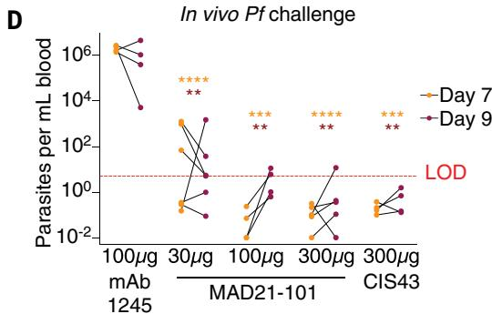  
Fig. 5. MAD21-101 binds to a new conserved epitope within PfCSP and provides sterile protection against Pf sporozoite infection. (A) Heatmap showing binding of MAD21-101-type mAbs to pGlu-PfCSP peptides bearing Ala or Gly (when the original residue was Ala) substitutions. Colors are based on AUC binding relative to binding to the WT peptide. The red rectangle highlights the common Ala $^{98}$ Gly substitution. (B) Binding of MAD21-101 to pGlu-CSP peptides bearing Ala or Gly (when the original residue was Ala) substitutions. Bars represent binding in AUC versus binding to the WT peptide sequence, and the red line indicates 50% binding versus the WT sequence. (C) Binding of MAD21-101-type and previously identified   
mAbs (317 and 224) to the PfCSP-based R21 vaccine. Analysis was performed using a Meso Scale Discovery (MSD) assay. An anti-SARS-COV-2 spike IgG1 (CV503) was included as an isotype control. (D) Parasitemia in human liver-chimeric (FRG-huHep) mice after mosquito bite challenge with Pf sporozoites. An anti-Pfs25 IgG1 (mAb 1245) was included as an isotype control, and the red dotted line represents the limit of detection for the qRT-PCR assay (5 parasites/ml). Statistical significance was determined versus the isotype control using a mixed-effects model with Šídák's multiple-comparisons test. *P < 0.05; **P < 0.01; ***P < 0.001; ****P < 0.0001; ns, not significant.

the rarer Ala $^{98}$ Val substitution reduced binding by all of the mAbs to different degrees, with MAD24-01 being the least affected by the mutation, followed by MAD21-101 (fig. S9C). We also confirmed that the mAbs did not bind to a peptide containing an N-terminal pGlu followed by a series of NANP repeats (fig. S9D), suggesting that the MAD21-101-type mAbs bind specifically to the pGlu-CSP sequence and not the N-terminal pGlu residue alone. This finding is consistent with our crystal structures showing specific hydrogen-bonding interactions and considerable buried surface area produced by most residues across the minimal epitope. Collectively, these findings suggest that MAD21-101-type mAbs target a conserved PfCSP-specific epitope that includes a critical N-terminal pGlu residue.

# pGlu-CSP accounts for residual plasma IgG reactivity to sporozoites

To determine the contribution of pGlu-CSP-specific antibodies to the overall sporozoite antibody response, we assessed the effect of adsorbing plasma antibodies using combinations of the pGlu-CSP peptide (pGluPADGNPDPNANP) and rPfCSP. In particular, we focused on the five donors that had residual sporozoite reactivity after rPfCSP blockade because we were interested in whether the residual reactivity was exclusively due to pGlu-CSP or if non-PfCSP antigen reactivity contributed to a portion of that signal. As expected, blocking plasma from each donor with pGlu-CSP peptide alone had little effect on reducing sporozoite reactivity because of the strong remaining reactivity from conventional anti-rPfCSP antibodies (fig. S10). Upon blocking with rPfCSP alone, three donors (VRC_1A2, VRC_1F7, and VRC_1I6) showed a reduction in sporozoite reactivity, whereas the other two (VRC_2B4 and M9_G09) did not, likely because the latter donors had a higher concentration of residual antibodies that could still bind to sporozoites (fig. S10). For all five donors, blocking the plasma with a combination of pGlu-CSP and rPfCSP completely ablated sporozoite reactivity, confirming that antibodies directed to the pGlu-CSP epitope account wholly for the residual sporozoite reactivity observed after PfCSP blocking (fig. S10). Together with the initial screening results (Fig. 1A), these findings suggest that all observed polyclonal IgG reactivity to the sporozoite surface in the 941 malaria-exposed and sporozoite-immunized donors could be attributed to PfCSP when the new pGlu-CSP epitope was also taken into account.

# MAD21-101 does not bind to the R21 malaria vaccine and confers sterile protection in an in vivo model of Pf infection

Given the projected widespread use of the R21 and RTS,S malaria vaccines, a desirable feature of any mAb being developed for malaria pre-

vention is noninterference with the vaccines (46). Therefore, we tested whether the MAD21-101-type mAbs bind to the R21 malaria vaccine, which has the same PfCSP sequence as RTS,S. We compared these mAbs with mAb 317, a potent NANP-specific mAb (36), as well as mAb 224, the precursor to MAM01, which is being developed as a clinical candidate (25). Unlike mAbs 317 and 224, the MAD21-101-type mAbs showed no binding to R21 (Fig. 5C).

Because the unveiling of the pGlu-CSP epitope relies on parasite processing, an in vivo model that uses WT Pf sporozoites may be more appropriate for mAb evaluation, because transgenic $Pb^{PfCSP}$ parasites may process non-native PfCSP differently from WT parasites. Therefore, we turned to a model that uses human liver-chimeric mice (FRG huHep) that are permissive to infection with Pf sporozoites by mosquito bite, after which parasitemia can be evaluated using a highly sensitive quantitative reverse transcription–polymerase chain reaction (qRT-PCR) approach (47). We confirmed that mice administered an isotype control mAb (48) and subsequently infected with Pf sporozoites were highly parasitemic at days 7 and 9 after infection (median $2.1 \times 10^{6}$ parasites/ml of blood on day 7, and $7.4 \times 10^{5}$ parasites/ml of blood on day 9). By contrast, all five mice that received 300 $\mu$ g of MAD21-101 were parasite negative on day 7, and only one mouse had parasitemia just above the limit of detection on day 9 (Fig. 5D). MAD21-101 was also capable of providing partial protection at lower doses: two of four mice that received 100 $\mu$ g of MAD21-101 were parasite negative on days 7 and 9 (50%), whereas two of six mice that received 30 $\mu$ g of MAD21-101 were protected on both days (33%). These findings indicate that MAD21-101 can confer sterile protection against Pf sporozoite infection in vivo.

# Discussion

The malaria protein PfCSP is the main component of the two WHO-endorsed malaria vaccines and the target of the most advanced mAbs in clinical development (14, 16, 20, 22, 25). Three PfCSP epitopes targeted by potent neutralizing mAbs have been identified to date: (i) the major NANP repeats, (ii) the minor NVDP repeats, and (iii) the NPDP junction. The three sites have similar sequences centered around the same (N/D)PNANPN(V/A) core motif (15, 41), resulting in extensive cross-reactivity between mAbs targeting these sites. The commonality of these epitopes is highlighted by the finding that the malaria vaccine RTS,S contains the major repeats, but not the junction or minor repeats, and yet can elicit mAbs that bind with high affinity to the two latter sites (25). A key goal of ongoing work in this field is to identify next-generation mAbs that target conserved sporozoite antigens or epitopes that are distinct from these sites.

In this study, we identified a fourth target of potent anti-PfCSP mAbs and the first nonrepeat target. Unlike the three established sites, this pGlu-CSP site is only exposed after sporozoite processing of PfCSP, which entails cleavage of the N terminus and the conversion of the new N-terminal Gln $^{96}$ residue to an atypical amino acid, pGlu $^{96}$ . PfCSP cleavage has been linked to sporozoite infection of hepatocytes and shown to occur at an indeterminate site within the highly conserved region I (K $^{93}$ LKQP $^{97}$ ) (32, 37, 49). A recent study on pyroglutamylation of Plasmodium proteins proposed a model in which PfCSP cleavage occurs between Lys $^{95}$ and Gln $^{96}$ , followed by conversion of Gln $^{96}$ to pGlu $^{96}$ (33). However, the details of this cleavage, including the identity of the parasite protease, the exact cleavage location, and the mechanism of how cleavage contributes to hepatocyte invasion, have not been experimentally verified. Our study provides several pieces of evidence that illuminate this process. First, it provides the first direct experimental evidence that PfCSP cleavage occurs between Lys $^{95}$ and Gln $^{96}$ , validating the model described above (33). Whereas the aforementioned study suggested that pyroglutamylation of Plasmodium proteins enables immune evasion in mosquitoes, our work suggests that pyroglutamylation at this specific PfCSP site can increase parasite recognition by neutralizing human antibodies. These findings point to a potential tension between the need for Plasmodium sporozoites to evade mosquito defenses and the need to evade human immune defenses, such that the evolution of a parasite protein to evade one host may lead to increased vulnerability in the other. Second, this study clarifies the long-standing observation that sporozoites dissected from mosquito salivary glands have a mixture of at least two clearly distinct PfCSP species (50) by providing evidence that the lower-molecular-weight species has been cleaved at region I (K $^{93}$ LK|QP $^{97}$ ) and has already undergone conversion to pGlu $^{96}$ . The identification of pGlu-CSP-specific mAbs offers a new resource for the research community to use to further understand the process of PfCSP cleavage, particularly how this process is important for sporozoite invasion of hepatocytes.

The level of protection provided by the pGlu-CSP mAbs, particularly in the Pf in vivo infection model, suggest that this class of mAbs could be a valuable addition to the malaria prevention arsenal. To augment protection against malaria in certain vulnerable populations, the strategy of administering an antisporozoite mAb before or after RTS,S/AS01 or R21/MM vaccination is being considered (www.clinicaltrials.gov identifier NCT06461026). For example, infants might benefit from a long-acting antisporozoite mAb shortly after birth because they are only eligible to receive RTS,S/AS01 or R21/MM at 5 months of age, a potentially cost-effective

strategy given currently estimated mAb production costs of US $5 to $10 per dose for infants based on their low weight (51). For this strategy to be successful, it is essential that the mAb not interfere with vaccination through sequestration or epitope masking (46). The RTS, S/AS01 and R21/MM vaccines, which are being deployed widely in sub-Saharan Africa in 2024, do not contain the pGlu-CSP epitope and, accordingly, we found that pGlu-CSP mAbs do not bind the R21/MM vaccine (which shares the identical PfCSP sequence with RTS,S), which offers a potential advantage over other anti-PfCSP mAbs.

The pGlu-CSP site is also a candidate for a next-generation pre-erythrocytic vaccine. The identification of a Malian donor with circulating polyclonal antibodies against pGlu-CSP suggests that natural infection, as well as whole sporozoite vaccination, can elicit antibodies against pGlu-CSP. However, in both cohorts, donors with detectable antibodies against pGlu-CSP were uncommon. This observation could be due to the lower copy number of this epitope (maximum one pGlu-CSP compared with $\sim$ 40 NANP repeats per molecule of PfCSP), with the immunodominant NANP repeats also potentially drawing antibody responses away from other regions of PfCSP (52). Therefore, a subunit pGlu-CSP vaccine that focuses on this epitope may be more appropriate to elicit a strong antibody response to this site. A similar approach has been taken with RH5, a blood-stage malaria antigen that is weakly immunogenic during natural infection but elicits a strong antibody response as a subunit vaccine (53, 54).

More broadly, this study highlights the benefits of an antigen-agnostic approach to study antibody responses to infectious pathogens, particularly unicellular pathogens with complex proteomes such as P. falciparum. A key advantage of this approach is the potential to identify uncharacterized antigens or epitope features that are not reproduced by recombinant expression, including post-translational modifications. The identification of a different protective mAb target within PfCSP, likely the most widely studied protein in malaria (certainly the most well-characterized target of malaria antibodies), highlights the benefits of this strategy to make discoveries even with well-studied proteins. Given the complexity of the P. falciparum proteome, it is interesting that within the limits of detection of our assay, all observed plasma IgG reactivity to the sporozoite surface after infection or sporozoite vaccination could be attributed to PfCSP when the pGlu-CSP epitope was considered. Whether this is also true for other antibody isotypes remains to be determined. Beyond malaria, the antigen-agnostic strategy deployed in this study could be expanded to other unicellular pathogens with relatively uncharacterized surface antigen profiles, such as Mycobacterium

tuberculosis (55). The identification of new functional antibodies and their associated targets could be powerful tools to aid in the development of interventions against infectious pathogens.

# Limitations and future directions

Although we have shown that MAD21-101 can provide sterile protection against Pf sporozoite infection and have provided evidence for activity at the hepatocyte stage, a deeper functional characterization of these mAbs with a wider range of assays remains to be performed. For instance, the in vitro motility assay results should be confirmed with an in vivo assay evaluating sporozoite activity in the skin to determine the relative contributions of the mAbs in the skin versus the liver or circulation (56, 57). We also plan to perform comparative in vivo protection experiments with other clinical candidate mAbs at a range of doses to determine their limits of protection. With the knowledge gained from this study, we are designing more sensitive tools to probe the B-cell repertoires of naturally exposed or vaccinated individuals to further investigate the antibody response to this cryptic site.

# Materials and methods

# Study cohort

Plasma samples and peripheral blood mononuclear cells (PBMCs) were obtained from a cohort of 843 naturally exposed individuals from Kalifabougou, Mali (27, 28), and a cohort of 98 individuals from the United States who received the Sanaria PfSPZ vaccine of irradiated P. falciparum sporozoites (29, 30). Samples used in this study were already stored from the previously established cohorts. All participants provided informed consent for their blood products to be used for research purposes. No randomization was applied to the analysis of participants' plasma or PBMC samples, but all samples were anonymized before being used. Ethical approval for the Kalifabougou cohort study was obtained from the Ethics Committee of the Faculty of Medicine, Pharmacy and Dentistry at the University of Sciences, Technique and Technology of Bamako, and the Intramural Institutional Review Board (IRB) of the National Institute of Allergy and Infectious Diseases (NIAID), National Institutes of Health (NIH IRB protocol number: 11IN126; https://clinicaltrials.gov/study/NCT01322581). Ethical approval for the VRC312 (https://clinicaltrials.gov/study/NCT01441167) and VRC314 (https://clinicaltrials.gov/study/NCT02015091) cohort studies was obtained from the NIAID IRB.

# Preparation of antigen coated beads

Multiplexed panels of antigen coated beads were prepared using streptavidin beads prelabeled with individual intensities of PE-channel fluorophore (Spherotech, SVFA-2558-6K and SVFB-2558-6K) or FITC-channel fluorophore

(Spherotech, SVFA-2552-6K and SVFA-2552-6K). Beads were conjugated by incubation with 10 $\mu$ g/ml each of the following biotinylated antigens for 1 hour at room temperature: recombinant PfCSP (rPfCSP, Genscript), (NANP) $_{9}$ , C terminus or N terminus, or CD4. Additionally, N-terminally biotinylated peptides spanning the entire KLK(pGlu/Q/A)PADGNPDPNANPNVDP sequence were commercially synthesized (Genscript) and reconstituted in DMSO (Corning, 25-950-CQC). Peptides were diluted to 0.1 $\mu$ g/ml in 0.5% BSA in PBS and directly conjugated to the PE or FITC-labeled beads by incubation for 1 hour at room temperature. Protein or peptide-conjugated beads were pelleted at 2500 rpm for 3 min and washed once with 130 $\mu$ l of 0.5% BSA. Excess streptavidin sites on the beads were blocked by incubation with 10 $\mu$ g/ml of CD4 for 1 h, followed by two washes with 130 $\mu$ l 0.5% BSA per wash. Antigen-coated beads were combined to generate multiplexed panels as required.

# Generation of P. falciparum salivary gland sporozoites

Standard laboratory procedures were used to maintain the asexual cultures of PfNF54 strain. Briefly, the parasites were cultured in vitro in type O+ erythrocytes by daily monitoring of parasitemia and changes of RPMI 1640 supplemented with 50 $\mu$ M hypoxanthine, aerated in a gas mixture of 5% CO $_{2}$ , 5% O $_{2}$ , and 90% N $_{2}$ . Gametocyte cultures were set up from the healthy asexual cultures at 1% parasitemia and 5% hematocrit. The cultures were maintained for 14 d with daily media changes to initiate gametocyte development. Upon evaluation of maturation of stage 5 gametocytes on day 14, female Anopheles stephensei mosquitoes (4 to 7 d old) were fed with cultures at 0.3% gametocytemia and 50% hematocrit using membrane feeding apparatus (58). The fed mosquitoes were maintained for 17 d at 27°C and 75% humidity and were provided with a 10% w/v dextrose solution and 0.05% w/v p-aminobenzoic acid (PABA) in water. The oocysts inside the midguts of the mosquitoes were checked on day 7 post feeding. Supplemental feed using 50:50 mixture of blood and serum was performed on day 7. The mosquitoes were dissected on day 17 to collect the salivary glands and purify the sporozoites. The salivary glands from the mosquitoes were collected on day 17 and homogenized in a glass tube to release the sporozoites.

# Generation of P. berghei salivary gland sporozoites

Inbred 10- to 15-week-old female BALB/c mice were purchased from the Charles River Laboratories (Wilmington, MA, Strain code: 028). Transgenic sporozoites from P. berghei expressing GFP-luciferase and chimeric sporozoites from P. berghei expressing different CSP versions were generated as previously

described (31, 59). Anesthetized P. berghei infected BALB/c mice, at 3-4% parasitemia, were used to feed 4- to 7-d-old female Anopheles stephensi mosquitoes. The infected mosquitoes were kept at 19° to 21°C and 80% humidity and fed a 10% sucrose solution. The infection of the midgut was assessed by light microscopy 10 to 11 d post-infection (dpi) using mercurochrome (0.05% w/v) in water to visualize the oocysts. Salivary glands were dissected 19 to 26 dpi after killing the mosquitoes by freezing for 5 min at -20°C and dipping them in 70% ethanol for 1 - 2 min. Salivary glands were collected in PBS for cryopreservation or in media with 2% FBS for mouse challenges. Salivary glands were homogenized by passaging them in a tuberculin 1-cc syringe 15 times and then passed through a 40 μm Mini-Strainer (Pluriselect-USA). Sporozoites were counted in a hemocytometer.

# Purification of sporozoites

Freshly dissected salivary gland sporozoites were loaded onto a 3 ml cushion of 17% w/v solution of Accudenz (Accurate Chemical, AN7050) dissolved in distilled, deionized water. Sporozoites were separated from mosquito debris by density gradient centrifugation for 25 min at 2500g and room temperature (acceleration = 1, no brake) as described before (60). Purified sporozoites were harvested from the interphase layer and pelleted at 16,000g for 5 to 10 min at room temperature. For cryopreservation, purified sporozoites were washed with 1 ml of 0.5% w/v bovine serum albumin (Sigma, A7030) and re-suspended in a 75% v/v solution of Cryostor (C3124) in RPMI 1640 media (Gibco, 42401-018) to a final density of $2.5 \times 10^{6}$ per ml. 100 $\mu$ l aliquots of sporozoites were transferred to freezing containers and held at -80°C overnight to achieve freezing at a rate of -1°C/min. The cryopreserved sporozoites were transferred to liquid nitrogen for long-term storage.

# Plasma blocking and screening against Pf sporozoites and recombinant CSP

Dilutions of vaccinee plasma (1-in-1000) and naturally exposed plasma (1-in-333) were prepared in 0.5% BSA in PBS. For the blocked condition, plasma was mixed and incubated with 300 $\mu$ g/ml of recombinant Pf circumsporozoite protein for 2 hours at room temperature with constant shaking at 300 rpm. For the unblocked condition, plasma was instead incubated with an equivalent volume of 0.5% BSA under the same conditions. Next, 10 $\mu$ l of blocked or unblocked plasma was mixed at a 1:1 volume ratio with either rPfCSP-coated beads or 1500 to 3000 sporozoites per well in 96-well, V-bottom plates. Plasma samples were incubated with sporozoites or beads for 30 min followed by two washes with 130 $\mu$ l of 0.5% BSA. 30 $\mu$ l of 2.5 $\mu$ g/ml Alexa Fluor 647-conjugated, goat anti-human IgG (Jackson ImmunoResearch,

109-606-170, RRID:AB_2337902) was added to each well and the samples were incubated for 30 min to detect mAb binding, followed by two washes with 130 $\mu$ l of 0.5% BSA. After the final wash, samples were resuspended in 0.5% BSA and acquired on the iQue flow cytometer (Sartorius). For all incubation steps, beads were maintained at room temperature and sporozoites were maintained at 4°C. For all wash steps, beads were pelleted at 1500g for 3 min and sporozoites were pelleted at 3000g for 5 min. Donors were down-selected for validation by repeat screening if reactivity of $\geq$ 8% was detected for their rPfCSP-blocked plasma during the initial screen. Based on the validation screening results, 5 donors with confirmed rPfCSP-blocked plasma reactivity greater than 25% were down-selected for mAb isolation studies.

# Memory B cell isolation from PBMCs

Cryopreserved PBMCs were thawed in media supplemented with benzonase (Novagen, 71205-3) and stained with the following panel: Aqua Live/Dead (Invitrogen, L34957), CD14-BV510 (BioLegend, 301842, RRID:AB_2561946), CD3-BV510 (BioLegend, 317332, RRID:AB_2561943), CD56-BV510 (BioLegend, 318340, RRID:AB_2561944), CD19-ECD (Beckman Coulter, IM2708U, RRID:AB_130854), CD21-BV711 (BD, 563163, RRID:AB_2738040), IgA-Alexa Fluor 647 (Jackson ImmunoResearch, 109-606-011, RRID:AB_2337895), IgD-PE-Cy7 (BD, 561314, RRID:AB_10642457), and IgM-PerCP-Cy5.5 (BD, 561285, RRID:AB_10611998), CD27-Alexa Fluor 488 (BioLegend, 393204, RRID:AB_2750089) and CD38-APCCy7 (BioLegend, 303534, RRID:AB_2561605). The cells were sorted using the BD FACS Aria II and gated on live $\mathrm{CD19^{+}CD14^{-}CD3^{-}CD56^{-}IgM^{-}}$ $\mathrm{IgD^{-}IgA^{-}}$ ( $\mathrm{IgG^{+}}$ memory B cells).

# Oligoclonal culture supernatant screen

A total of 25 to 100 IgG $^{+}$ MBCs were co-cultured with 3000 irradiated 3T3-CD40L feeder cells (61, 62) per well of a 384-well plate in IMDM (Gibco, 31980-030) supplemented with 10% HI-FBS (Gibco, 104:38-026), 100 ng/ml IL21 (Gibco, PHC0211), 0.5 $\mu$ g/ml R848 (Invivogen, trl-r848) and 1× Mycozap (Lonza, VZA-2021). Cultures were maintained at 37°C and 5% CO $_{2}$ to allow for expansion of oligoclonal MBC cultures and to stimulate antibody secretion. On day 9 of culture, 10 $\mu$ l of the culture supernatant was mixed with an equal volume of rPfCSP-coated beads and 1500 – 3000 Pf sporozoites per well in 384-well, V-bottom plates and incubated for 30 min followed by two washes with 60 $\mu$ l of 0.5% BSA in PBS per wash. Samples were then incubated with 20 $\mu$ l of 2.5 $\mu$ g/ml Alexa Fluor 647-conjugated, goat anti-human IgG (Jackson ImmunoResearch, 109-606-170, RRID:AB_2337902) for 30 min followed by two 60 $\mu$ l washes of 0.5% BSA per wash. After the final wash, samples were resuspended in 0.5%

BSA and acquired on the iQue flow cytometer. For all incubation steps, beads were maintained at room temperature and sporozoites were maintained at 4°C. For all wash steps, beads were pelleted at 1500g for 3 min and sporozoites were pelleted at 3000g for 5 min. Wells with IgG reactivity toward Pf sporozoites and no accompanying reactivity toward rPfCSP (PfSPZ $^{+}$ /rPfCSP $^{-}$ reactivity) were down-selected for monoclonal B cell isolation.

# Isolation of PfSPZ $^{+}$ /rPfCSP $^{-}$ specific B cells (Beacon assay)

On day 10 of culture, MBCs from wells with $\mathrm{PfSPZ^{+} / rPfCSP^{-}}$ supernatant reactivity were pooled and washed in MACS buffer (PBS supplemented with $0.5\%$ w/v BSA in PBS and $2\mathrm{mM}$ EDTA). Approximately 23,000 cells were loaded onto an OptoSelect 11k chip (Berkeley Lights) and OEP light cages were applied to sort single B cells into nanoliter-volume pens (nanopens) on the chip. Isolation of $\mathrm{PfSPZ^{+} / rPfCSP^{-}}$ specific B cells was performed in a two-step assay. In the first step of the assay, freshly dissected and Accudenz-purified $Pf$ sporozoites were stained with 1-in-10,000 SYBR Green for $30\mathrm{min}$ on ice and washed three times post-staining with $1\mathrm{ml}$ of $0.5\%$ BSA per wash. Sporozoites were mixed with 3.0 to $3.9\mu \mathrm{m}$ silica beads (Spherotech, SIP-30-10), re-suspended in $2.5\mu \mathrm{g / ml}$ goat anti-human IgG-Alexa Fluor 647 (Jackson ImmunoResearch, 109-606-170, RRID:AB_2337902) and immobilized in the channels of the OptoSelect 11k chip (Berkeley Lights). Binding of secreted antibody to the surface of whole $Pf$ sporozoites was detected in the CY5 channel by capturing images at 6 min intervals over a 30-min time course. In the second step of the assay, the sporozoites were replaced with 6 to $8\mu \mathrm{m}$ streptavidin beads (Spherotech, SVP5-60-5) coated with $10\mu \mathrm{g / ml}$ rPfCSP and antibody binding was detected as before. Individual B cells secreting $\mathrm{PfSPZ^{+} / rPfCSP^{-}}$ mAbs were exported directly into Dynabeads mRNA DIRECT lysis buffer (Life Technologies, 61011) in 96-well plates. Plates were sealed with Microseal foil film (BioRad, MSF1001) and immediately frozen on dry ice before transferring to $-80^{\circ}\mathrm{C}$ for long-term storage.

# IgG sequence analysis and recombinant mAb expression

Heavy and light chain sequences were amplified from exported B cells by cDNA synthesis and RT-PCR as previously described (16, 63, 64). VH and Vλ/Vκ sequences, gene usage, nucleotide and amino-acid mutations and CDR3 sequences were analyzed using Geneious Prime (Version 2023.0.4, https://www.geneious.com/) and the International Immunogenetics Information System database (IMGT, http://www.imgt.org/, analysis performed in 2021) (65). Unique pairs of VH and Vλ/Vκ sequences were commercially cloned into IgG1 or light chain expression

vectors and expressed as recombinant mAbs (Genscript). mAbs were also expressed in-house by transient transfection of Expi293 cells (Gibco, A14527) using Polyethylenimine Max transfection reagent (Polysciences Inc, 24765). During antibody production, an extra codon was inadvertently added to the MAD22-38 light chain, resulting in an extra residue in an external loop in framework 3 (F61; see fig. S7) at a location distant from the paratope (which is thus unlikely to affect binding or the structure of the antibody). This version of MAD22-38 was used in all experiments and its sequence has been uploaded to GenBank (accession number PQ382881). The original version of the MAD22-38 light chain does not include the "ttc" codon at position 181 in the GenBank sequence. Table S1 shows percent mutation analysis on the original sequence. 6 d post-transfection, the expression culture supernatants were clarified for 10 min at 3500g followed by filtration through a 0.22 μm filter (Millipore, SLGP033RS). Recombinant IgG mAbs were purified using HiTrap Protein A columns (Cytiva/GE Healthcare Life Sciences, 17040303) or Protein A Sepharose Fast Flow resin columns (Cytiva/GE Healthcare Life Sciences, 17127903).

# mAb binding to antigen-labeled beads by flow cytometry

mAb titrations were prepared in 0.5% BSA in PBS. Then, 10 $\mu$ l of mAb titrations were mixed at a 1:1 volume ratio with multiplexed antigen-coated beads per well in 96-well V-bottom plates. mAb samples were incubated with the beads for 30 min at room temperature followed by two washes with 130 $\mu$ l of 0.5% BSA. 30 $\mu$ l of 2.5 $\mu$ g/ml Alexa Fluor 647-conjugated, goat anti-human IgG (Jackson ImmunoResearch, 109-606-170, RRID:AB_2337902) was added to each well and the samples were incubated for 30 min at room temperature to detect mAb binding, followed by two washes with 130 $\mu$ l of 0.5% BSA. For all wash steps, beads were pelleted at 1500g for 3 min. After the final wash, samples were resuspended in 20 $\mu$ l of 0.5% BSA and acquired on the iQue flow cytometer (Sartorius).

# mAb binding to sporozoites by flow cytometry

Sporozoites were pre-stained with 1-in-10,000 SYBR Green for 30 min on ice and washed three times post-staining with 1 ml of 0.5% BSA in PBS per wash. mAb titrations were prepared in 0.5% BSA in PBS. 10 $\mu$ l of mAb titrations were mixed at a 1:1 volume ratio with 1500–3000 sporozoites per well in 96-well V-bottom plates, and incubated for 30 min at 4°C followed by three washes with 130 $\mu$ l of 0.5% BSA. 30 $\mu$ l of 2.5 $\mu$ g/ml Alexa Fluor 647-conjugated, goat anti-human IgG (Jackson ImmunoResearch, 109-606-170, RRID:AB_2337902) was added to each well and the samples were incubated for 30 min at 4°C to detect mAb binding, followed by three washes with 130 $\mu$ l of 0.5% BSA. After

the final wash, samples were resuspended in 10 $\mu$ l 0.5% BSA and acquired on the iQue flow cytometer (Sartorius). For all wash steps, sporozoites were pelleted at 3000g for 5 min.

For the co-staining experiment, 20 $\mu$ l of 100 $\mu$ g/ml 5D5-Alexa Fluor 647 was mixed at a 1:1 volume ratio with 50,000 SYBR Green-stained sporozoites in 96-well V-bottom plates (final 5D5 concentration 50 $\mu$ g/ml) and pre-incubated for 15 min at 4°C. After the pre-incubation step, 20 $\mu$ l of 60 $\mu$ g/ml MAD21-101 was added to the wells without washing (final MAD21-101 concentration 20 $\mu$ g/ml) and an additional incubation step of 30 min at 4°C was performed. For single staining conditions, 20 $\mu$ l of individual fluorophore-labeled test mAbs (100 $\mu$ g/ml 5D5-Alexa Fluor 647 or 40 $\mu$ g/ml MAD21-101-Dylight 405 – for final 5D5 concentration 50 $\mu$ g/ml, or final MAD21-101 concentration 20 $\mu$ g/ml) or isotype control mAbs (40 $\mu$ g/ml CV664-Alexa Fluor 647; 40 $\mu$ g/ml CV664-Dylight 405) were mixed at a 1:1 volume ratio with 50,000 sporozoites in 96-well V-bottom plates and incubated for 30 min at 4°C. After incubation with mAbs, sample wells were washed three times with 130 $\mu$ l of 0.5% BSA per wash. For all wash steps, sporozoites were pelleted at 3000g for 5 min. Samples were then resuspended in 50 $\mu$ l 0.5% BSA and acquired on the iQue flow cytometer (Sartorius).

# PfCSP peptide binding by ELISA

Half-area plates (Corning, 3690) were coated overnight with $100\mu \mathrm{l}$ per well of $1\mu \mathrm{g / ml}$ PfCSP peptides or $5\mu \mathrm{g / ml}$ rPfCSP in PBS. For rPfCSP, CSP 4/38 was produced in Lactococcus lactis (66), CSP 1 and CSP 2 were produced in Escherichia coli, and CSP 3 and CSP 4 were produced in Pichia pastoris (67) as previously described. Plates were blocked with $100\mu \mathrm{l}$ per well of $1\%$ BSA (w/v in PBS) for 1 hour at room temperature followed by incubation for 1 hour at room temperature with $25\mu \mathrm{l}$ per well of $10\mu \mathrm{g / ml}$ MAD21-101, MAD22-38, anti-PfCSP mAbs (CIS43, L9, 5D5) and an isotype control mAb (VRC01). For detection of antibody binding, plates were incubated for 1 hour at room temperature with $25\mu \mathrm{l}$ per well of 1-in-500 alkaline phosphatase (AP)-conjugated goat anti-human IgG (Southern Biotech, 2040-04, RRID:AB_2795643). Plates were washed four times with $0.05\%$ Tween-20 (v/v in PBS) (Sigma, P7949) between each step. After the final wash, $50\mu \mathrm{l}$ of p-nitrophenyl phosphate (p-NPP) substrate (Sigma, N2765) was added to each well and the plates were developed for $30\mathrm{min}$ at room temperature, after which absorbance values were measured at $405~\mathrm{nm}$ .

# Proteome microarray analysis

Full P. falciparum 3D7 proteome microarrays were generated as previously described (68). The protein microarray used in this study was produced by Antigen Discovery, Inc (ADI) and encompassed 8871 full-length or fragmented

Pf proteins representing 5234 protein-coding genes and covering ~99% of the proteome. Each open reading frame (ORF) sequence was amplified by PCR and inserted into the vector pXT7 by recombination in E. coli to establish a library of partial or complete coding DNA sequences. Proteins were expressed using a coupled E. coli cell-free in vitro transcription and translation (IVTT) system (Rapid Translation System, Biotechrabbit, Berlin, Germany, BR1400201) and spotted onto nitrocellulose-coated glass AVID slides (Grace Bio-Labs Inc., Bend, OR) using an Omni Grid Accent robotic microarray printer (Digilabs Inc. Hopkinton, MA). Each expressed protein included a 5' polyhistidine (His) epitope and 3' hemagglutinin (HA) epitope. Proteome microarray chip printing and protein expression were quality checked by probing random slides with anti-His and anti-HA monoclonal antibodies fluorescently labeled and quantifying spot signals using a microarray scanner. The mAbs were diluted to 0.05 $\mu$ g/ml, 0.5 $\mu$ g/ml and 5 $\mu$ g/ml and pre-incubated with 20% DH5 $\alpha$ E. coli lysate for 30 min and incubated on the proteome microarrays overnight at 4°C on a rocker. Bound IgG was detected with DyLight650 anti-human IgG (Bethyl Laboratories, Montgomery, TX, A80-104D5, RRID:AB_10634506). Washed and dried microarray chips were scanned, and the spot and background signal intensities (SI) were exported into R package for analysis. A separate mini protein microarray containing the CSP and select other P. falciparum proteins was fabricated with varying cell-free IVTT expression systems: the standard E. coli IVTT, cell-free insect expression from two vendors with and without additional protease inhibitor (TnT $^{\circledR}$ T7 Insect Cell Extract Protein Expression System, Promega, Madison, WI, USA, LI101; RTS 100 Insect Membrane Kit, Biotechrabbit, BR1401502) and cell-free wheat germ expression with and without additional protease inhibitor (RTS 100 Wheat Germ Kit, Biotechrabbit, BR1402501). This chip was probed with mAbs to determine whether superior binding could be achieved using eukaryotic cell-free expression systems that allow for post-translational modifications. Data were normalized by dividing the foreground spot SI by the negative control spot (IVTT without ORF) SI and transforming values by the base 2 logarithm. Thus, normalized data represent the log2 signal-to-noise ratio, where a value of 0 represents specific antibody SI equal to the background, 1.0 represents twice the background, 2.0 represents 4-fold over background, and so forth. Antigens with antibody binding at least twice the background, or normalized SI of 1.0, were considered specific mAb binding hits.

# Sporozoite Western blot

Freshly dissected, Accudenz-purified Pf sporozoites were pelleted at 8000g and resuspended

to a density of $5 \times 10^{6}$ per ml in a low-protein binding Eppendorf tube. For nonreducing SDS-polyacrylamide gel electrophoresis (SDS-PAGE), sporozoites were resuspended in 4× NuPAGE LDS sample buffer only (Invitrogen NP0007) and for reducing SDS-PAGE the sample buffer was supplemented with 1% v/v beta-mercaptoethanol (Sigma, M-7154). Samples were denatured by heating at 95°C for 5 min with constant shaking at 300 rpm. For crude blots, proteins were resolved by electrophoresis alongside Precision Plus Protein Dual Color Standards (Bio-Rad, 1610374) on a 4-12% Bis-Tris NuPAGE gradient polyacrylamide gel (Invitrogen, NP0321BOX and NP0323BOX) at 120 V for 2 hours. For separating cleaved and un-cleaved CSP, proteins were resolved on a 12% Bis-Tris NuPAGE polyacrylamide gel (Invitrogen, NP0349BOX and NP0343BOX) on ice at 150 V for 5.5 hours. Resolved proteins were transferred to a nitrocellulose membrane (Invitrogen, LC2001) on ice at 30 V for 1 hour followed by a 10 min wash with 0.2% v/v Tween-20 in PBS, and membranes were then blocked overnight in SuperBlock Blocking Buffer (ThermoFisher Scientific, 37515). After blocking, membranes were first incubated with primary antibody at room temperature for 1 hour then incubated with 1-in-2000 HRP-conjugated anti-human IgG secondary (Sigma, NA933V, RRID:AB_772208) diluted in blocking buffer for 1 hour. Membranes were washed three times with 0.2% v/v Tween-20 in PBS after each antibody incubation. After the final wash, membranes were developed by incubating with SuperSignal West Pico PLUS Chemiluminescent Substrate (ThermoFisher Scientific, 34580) for 5 min at room temperature and imaged on the ChemiDoc system (BioRad).

# Indirect immunofluorescence assay of whole sporozoites

The wells of an 8-well chamber slide (Cellvis, C8-1.5H-N) were incubated with 50 $\mu$ g/ml poly-D-lysine (Gibco, A3890401) for 1 hour at room temperature then washed three times with 300 $\mu$ l of PBS per wash. After the final wash, the coated chamber slide was left uncovered in the laminar hood to air dry for 2 hours, then stored at 4°C. Freshly dissected P. falciparum sporozoites were clarified by Accudenz density gradient centrifugation and resuspended in 0.5% BSA in PBS. 5 × 10 $^{4}$ sporozoites were seeded into each well of the coated chamber slide and allowed to air dry for 4 hours in the laminar flow hood. Sporozoites were fixed in 4.0% v/v paraformaldehyde (Electron Microscopy Services, 15710) in PBS for 10 min at room temperature, washed three times with PBS, then blocked by incubating in 4% BSA for 30 min at 4°C. The blocking solution was replaced with Alexa Fluor 647-conjugated antibodies (MAD21-101, MAD22-38, CIS43, and CV503) diluted to 10 $\mu$ g/ml in 2% BSA,

and samples were stained for 1 hour at 4°C. After staining, the samples were washed three times with PBS followed by counterstaining with 10 $\mu$ g/ml 4',6-diamidino-2-phenylindole (DAPI, Invitrogen, MP01306) for 5 min at 4°C. The fixed parasites were imaged within 24 hours using a Zeiss LSM 880 with Airyscan equipped with a Zeiss plan apochromat 63x / 1.4 NA oil immersion objective. Airyscan processing was performed with Zeiss Zen software and images were colorized using ImageJ (version 1.54 g, NIH, Bethesda, MD, USA).

# Intravenous challenge with Pb-PfCSP sporozoites

Female 6–7-week-old B6(Cg)-Tyr $^{c-2J}$ /J (B6 albino) mice were purchased from The Jackson Laboratory (Bar Harbor, ME), and kept in the animal care facility at the National Institute of Allergy and Infectious Diseases (NIAID). Animal experiments were approved by the NIAID Animal Care and Use Committee, under protocols Animal Study Protocols VRC-17-702 and LIG 21. Liver burden experiments were performed as previously described (31). Briefly, Anopheles stephensi mosquitoes were infected with a transgenic P. berghei strain expressing full-length P. falciparum CSP and a dual reporter GFP-luciferase ( $Pb^{PfCSP-GFP/Luc}$ ) construct. Mosquito salivary glands were dissected for sporozoite isolation in a 2% FBS solution (v/v in 1× HBSS) or Leibovitz's L-15 medium (Sigma-Aldrich). Mice were injected intravenously through the tail vein with 300 μg of antibody resuspended in 200 μl of sterile 1× PBS, and subsequently infected through the same route with 2000 $Pb^{PfCSP-GFP/Luc}$ sporozoites resuspended in 200 μl of 2% FBS solution (v/v in 1× HBSS) or Leibovitz's L-15 medium. At 40 to 42 hours post infection, mice were anesthetized and injected with either 200 μl of 15 mg/ml or 150 μl of 30 mg/ml D-luciferin intraperitoneally. Parasite luminescence was measured in the IVIS Spectrum in vivo imaging system (Revvity, Inc.) using 10 15-s exposures with a 1-min interval between them. The total flux was expressed in photons/second.

# Sporozoite ELISA

P. berghei ANKA sporozoites expressing regular, full-length PbCSP (Pb $^{WT}$ ), and transgenic Pb sporozoites expressing full-length PfCSP (Pb $^{PfCSP}$ ), PfCSP without the junction region (Pb $^{PfCSP-JRKO}$ ), or PbCSP including the PfCSP N-Term (Pb $^{PfN-term}$ ), C-Term (Pb $^{PfC-term}$ ), junction plus NANP $_{4}$ (Pb $^{PfJNANP4}$ ) or NANP $_{12}$ (Pb $^{PfNANP12}$ ) epitopes, were used for ELISA experiments. Sporozoites were dissected from salivary glands of Anopheles stephensi infected mosquitoes in HBSS media. 5000 sporozoites were seeded per well of ELISA plates (Immuno Plates MaxiSorp, Thermo Scientific Nunc, 442404) and frozen at -80°C, followed by 3 freeze and thaw cycles. After this step, plates were defrosted,

washed three times with PBS, and blocked with PBS supplemented with 1% BSA. After blocking, plates were washed again with PBS. Serial dilutions of the anti-CSP mAbs or control mAbs were tested against sporozoites immobilized on the ELISA plates. After 1 hour of incubation at room temperature with varying concentrations (0.008-1.00 $\mu$ g/ml) of CSP mAbs or control mAbs, plates were washed and incubated with 100 $\mu$ l per well of 250 ng/ml peroxidase-labeled goat anti-human IgG antibody (Jackson ImmunoResearch, 109-035-088, RRID: AB_2337584). After washing, samples were incubated with ABTS Peroxidase substrate (KPL, Gaithersburg, MD) for 15 min and read in a plate reader at 405 nm.

# Trail gliding assay

Mosquito infection with P. falciparum NF54 was performed as previously described $(58)$ . Infected mosquitoes were maintained for 15 d at 25°C and 80% humidity and were provided with 10% sucrose solution. Freshly dissected P. falciparum salivary gland NF54 sporozoites in HBSS/2% BSA (Sigma, A7888) pH 7.4 were mixed with the indicated antibody in HBSS. Sporozoites were pre-incubated for 30 min at 20°C, and 15,000 sporozoites/well were added to a 96 well glass bottom plate (Greiner, 655892) pre-coated with 5 $\mu$ g/ml of mAb 2A10, which is specific for the PfCSP repeat region $(69)$ . The plate was centrifuged for 5 min at 200g and incubated for 1 hour at 37°C. Wells were fixed in 4% paraformaldehyde in PBS, blocked with 1% BSA in PBS (pH 7.4) and stained with biotinylated mAb 2A10 in 1% BSA in PBS (pH 7.4) for 1 hour at room temperature, followed by detection with Alexa Fluor 488 streptavidin (Invitrogen) diluted at 1:500 in PBS for 1 hour at room temperature. Samples were preserved in a 9:1 glycerol / PBS solution at 4°C and imaging was performed on 25 positions per well (5 × 5, 500 $\mu$ m apart) by using ImageXpress Micro XLS Widefield high-content analysis system (Molecular Devices) with 40X Plan fluor objective. Acquired images were processed using Cell Profiler software (version 3.0.0) to measure area occupied by trail $(69)$ .

# In vitro inhibition of liver stage development assay (ILSDA)

The ILSDA was performed as previously described (70) with some modifications. The day before the in vitro sporozoite infection, Nunc Lab-Tek 8 well chamber slides (ThermoFisher Scientific, 177410) were coated by incubating at 37°C for 1 hour with Bovine PureCol® Type I Collagen Solution (Advanced Biomatrix, 5005) at 100 μg/ml v/v in sterile tissue culture grade water. Coated slides were rinsed once with PBS and air dried for 10 – 15 min at room temperature. Cryopreserved primary human hepatocytes (PHH, BioIVT, lot ZHL) were thawed using INVITROGRO HT thawing medium

(BioIVT, Z990005) supplemented with 1× Penicillin-streptomycin-glutamine (ThermoFisher Scientific, 10378016) and 10 μg/ml of Fungin (Invivogen, ant-fin) per the manufacturers' instructions. A total of 200,000 hepatocytes were seeded per chamber on the collagen coated slides and slides were gently, manually shaken to ensure homogeneous cell distribution. The cells were incubated at 5% CO₂ and 37°C for 24 hours. On the day of in vitro infection, mosquitoes infected with Pf (NF54 strain) were killed in 70% isopropyl alcohol, immediately washed in 1× PBS and shipped on ice in RPMI medium. Upon receipt, mosquitoes were washed four times with INVITROGRO HI medium supplemented with the above antimicrobials. INVITROGRO HI medium was used throughout the rest of the assay for mosquito dissection, sample dilutions and media changes. Live sporozoites were isolated from mosquito salivary glands and sporozoites were incubated with each of the test and control mAbs at room temperature for 20 min. Untreated sporozoites incubated with media only were used as infectivity controls. After 20 min incubation, sporozoite-mAb mixture was added to the 1-d-old PHH cultures (after removing the medium) at a final concentration of 25,000 sporozoite/well and 100 μg/ml of each mAb/well in duplicate. The culture slides were centrifuged at 300g for 1 min and incubated at 5% CO₂ and 37°C for 3 hours. After the incubation, medium was aspirated to remove unbound sporozoites and replaced with 300 μl of INVITROGRO HI medium. Cultures were maintained 96 hours with daily media changes. To prepare the qRT-PCR standards, cultured PHHs were incubated with 100 μl of 0.05% Trypsin-EDTA at 5% CO₂ at 37°C for 7 min, PHH was harvested into low protein binding 1.5 ml tubes by gently scraping the wells and spiked with serially diluted sporozoites (3-fold dilutions for 6 dilutions starting from 4860 sporozoites/well). Subsequently, sporozoite-spiked hepatocytes were briefly vortexed to mix and centrifuged at 5000 rpm for 5 min. Supernatant was aspirated, and the cell pellet was frozen at -20°C for 4 d until automated RNA extraction. 96 hours post-infection, total RNA was extracted from the cultured hepatocytes using the Rneasy 96 QIAcube HT kit (Qiagen) per manufacturer's instructions. Pf18S ribosomal RNA (rRNA) copy number per sample was determined by quantitative real-time PCR (qRT-PCR) using the standard curve method. Hepatocyte cultures were washed thrice with 1× PBS, then hepatocytes were directly lysed with Buffer RLT supplemented with beta-mercaptoethanol and the lysed cells were harvested by gently scraping the wells. The lysates were vortexed to ensure complete lysis of the cells, total RNA was extracted, and the RNA concentration was measured using QIAxpert high-speed microfluidic UV/VIS spectrophotometer (Qiagen). 100 ng of total RNA from each

test condition and standards were transcribed to cDNA using High-Capacity cDNA Reverse Transcription Kit (ThermoFisher Scientific, 4368813) per manufacturer's instructions and stored at 4°C overnight. The following day, qRT-PCR was performed in technical duplicates of each sample and in triplicates of each standard. The following reaction mixture (total volume of 20μL) was used to detect parasite 18S rRNA: 5 μl of cDNA template, TaqMan Fast Universal PCR Master Mix (1×, no AmpErase UNG kit), Custom TaqMan probe: 5' - 6FAM - CAG GTC TGT GAT GTC C - MGBNFQ - 3' (0.25 μM final concentration), unlabeled sequence detection primer 18s forward, 5' - TAA CAC AAG GAA GTT TAA GGC AAC A - 3' (0.9 μM final concentration), sequence detection primer 18s reverse, sequence: 5' - CGC GTG CAG CCT AGT TTA TCT - 3' (0.9 μM final concentration) (ThermoFisher Scientific), in 7500 FAST Real-Time PCR System instrument (Applied Biosystems/ThermoFisher Scientific). Default thermal cycling conditions for TaqMan Fast Universal PCR Master Mix (no AmpErase UNG) (7500 or 7500 Fast system) was used for the qRT-PCR (Enzyme activation:95°C, 20 s, 1 cycle and denature: 95°C, 3 s, Anneal/Extend:60°C, 30 s, repeat 40 cycles). Pf 18S rRNA copy number for each sample was automatically determined by the 7500 Software v2.3 using the standard curve. Percentage inhibition of in vitro Pf liver-stage parasite development was calculated using the Pf 18S rRNA copy number of the test mAb compared with the untreated condition. Formula for percentage inhibition = [1 - (Pf18S rRNA copy number of the test mAb/Pf18S rRNA copy number of the untreated condition)] × 100.

# Fab mutagenesis, expression, and purification

For biophysical studies, overlapping primer mutagenesis was used to introduce a stop codon between the $C_{H}1$ and hinge region of the IgG sequence, producing WT Fab expression constructs. For X-ray crystallography, light-chain residues $T^{197}$ -HQGLSSP-V were mutagenized to a two-residue shorter $T^{197}$ -QGTTS-V by overlapping primer mutagenesis to promote crystal packing and facilitate crystallization (71). Fab expression for both biophysical and structural studies was performed in ExpiCHO mammalian cells (Gibco, A29127). Heavy and light chains of the Fab were prepared with the Takara Bio Inc. Nucleobond Maxi/Midi purification kits and transfected Expifectamine CHO reagent according to the manufacturer's protocol. Cells were cultured at 37°C, shaking at 125 rpm, 8% CO $_{2}$ , for 18-24 hours and transferred to 32°C, 125 rpm, 8% CO $_{2}$ for a further 10 to 12 d. Transfection enhancer was added on day 1, and transfection feed medium was added on days 1 and 5. Cell supernatants were harvested by centrifugation at 4000g to 6000g and filtered through a 0.22- or 0.45- $\mu$ m

filter. Clarified supernatants were loaded onto a HiTrap protein G 5 ml column (Cytiva), washed with 5 column volumes PBS, eluted with 0.1M glycine solution (pH 2.8-3.0), and neutralized with 1M Tris solution (pH 8.0 to 9.0). Relevant elution fractions were further purified by size-exclusion chromatography on a HiLoad $^{TM}$ Superdex200 or Superdex75 16/600 column equilibrated with TBS. For ITC, Fab MAD24-01 was recombinantly expressed (Genscript) and purified by size-exclusion chromatography on a HiLoad Superdex75 16/600 column equilibrated with PBS.

# Crystallization and structure determination

For crystallization, Fab purified in TBS was prepared at 10 mg/ml with a 10-fold molar excess of synthetic peptide pGluPADGNPDP-NANPNVDPN-NH $_{2}$ (Innopep). Crystallization screening was conducted with the high-throughput robotic CrystalMation system (Rigaku) at TSRI by sitting drop vapor diffusion, with many conditions producing crystals for all Fabs. For the datasets shown, MAD21-101 crystals were grown in 2.0 M ammonium sulfate, 0.2 M sodium chloride, 0.1 M cacodylate pH 6.5, MAD22-38 crystals were grown in 20% PEG 3350, 0.2 M ammonium chloride, and MAD24-01 crystals were grown in 20% PEG 3350 and 0.2 M potassium fluoride. Crystals were cryoprotected in mother liquor supplemented with 30% ethylene glycol and stored in liquid nitrogen until data collection. Datasets were collected at Brookhaven BNL FMX beamline at a wavelength of 0.97934 Å by rotating crystals for a full 360°, with diffraction data collected every 0.2°, producing 1800 frames per dataset. Diffraction data were processed using HKL2000 (72) and structures were determined through molecular replacement in Phaser (73) using a variable domain search model produced by AbPred (74) and constant domain search model for a kappa light chain Fab. Structures were refined in REFMAC5 (75) and PHENIX (76), and further built and refined in Coot (77). Data collection and refinement statistics are tabulated in table S4.

# Heat-induced fragmentation of CSP and acetonitrile extraction peptides.

For proteomic studies, Accudenz-purified sporozoites were collected from the gray band at the interface and transferred to a 1.5 ml microcentrifuge tube, pelleted at 16,000g for 10 min, washed three times in PBS to remove the residual Accudenz, and stored at $-80^{\circ}$ C. The three samples analyzed consisted of 9.4, 4.0, and $4.2 \times 10^{6}$ sporozoites. Frozen sporozoite pellets were resuspended in 200 mM ammonium bicarbonate (ABC) and water to achieve a final volume of 20 $\mu$ l of 100 mM ABC. The synthetic peptide QPADGNPDPNANP (resuspended at 5 mg/ml in DMSO and stored at $-20^{\circ}$ C) was diluted 100-fold in water, then this solution

was diluted 100-fold (final concentration of 500 pg/μl) in 0.1% TFA for analysis of untreated peptide, or in 100 mM ABC before heat treatment. To 19 μl of recombinant PfCSP (0.44 mg/ml in PBS) was added 1 μl of 2 M ABC. To induce protein fragmentation, 20 μl of sample was incubated 10 min at 95°C in a thermomixer at 1200 rpm. The samples were briefly cooled on ice, after which 20 μl of acetonitrile (ACN) was added. The samples were vortexed for 5 min at room temperature at 1200 rpm, then centrifuged for 5 min at 20,000g to pellet the precipitate. The supernatant was recovered, transferred to a 1.5 ml microcentrifuge tube, and dried in a vacuum centrifuge at 45°C. The extracted peptides were resuspended in 20 μl 0.5% TFA before analysis by LC-MS. Injection volumes for LC-MS analysis were 15 to 18 μl for sporozoites, 1 μl (nominally 10 pmol) for PfCSP, and 1 μl (nominally 500 pg) of peptide. Unless otherwise noted, all solid reagents were from Sigma; solvents and acids were Optima LC-MS grade from Fisher Scientific. Water and LC mobile phases were LC-MS grade from Honeywell Burdick & Jackson. Microcentrifuge tubes were Eppendorf Protein LoBind.

# Immunoprecipitation of synthetic peptides

The synthetic peptides QPADGNPDPNANP and pGluPADGNPDPNANP (resuspended at 5 mg/ml in DMSO and stored at -20°C) were diluted 100-fold in water, then 13.1 μl of the Gln peptide and 12.9 μl of the pGlu peptide were combined and diluted to 1000 μl in PBS to achieve a final concentration of 500 fmol/μl. Four μg of Protein G-functionalized magnetic beads (GenScript, L00274) were washed four times in PBS, then 20 μl of MAD1-101 mAb or CV503 (isotype control) at 5 mg/ml in PBS was added. The beads were incubated for 1 hour at room temperature with axial rotation then kept on ice until use, then washed three times with PBS and resuspended at 0.25 mg/ml. For each reaction, 1 μg of beads was added to a 1.5 ml microcentrifuge tube and washed once with PBS, then 10 μl (5 pmol) of peptide solution was added and incubated for 1 hour at room temperature with axial rotation. The depleted supernatant was removed and diluted to 50 μl in 0.5% TFA. The beads were washed three times with PBS, then peptides were eluted by adding 50 μl of 0.2% TFA and incubating 5 min at room temperature with axial rotation. The supernatant was recovered and transferred to a new tube. Both the depleted supernatant and eluate samples were centrifuged 2 min at 20,000g to settle any residual magnetic beads. Undepleted sample was prepared by diluting the peptide mixture five-fold in 0.5% TFA. For the undepleted and depleted samples, 1 μl (nominally 100 fmol) of sample was analyzed by LC-MS. The eluted sample was desalted with C18 tips (Pierce, 88513) to deplete the mAb that co-eluted

from the Protein G beads. Ten $\mu$ l of eluate was loaded onto a tip and eluted with 5 $\mu$ l of 40% ACN, to which was added 45 $\mu$ l of 0.1% TFA. Ten microliters of each eluate (nominally 400 fmol) was analyzed by LC-MS.

# Mass spectrometry data generation and analysis

All mass spectrometry data, including extended methods, raw data, results, and search parameters, have been deposited at the ProteomeXchange Consortium (78) through the PRIDE (79) partner repository with the dataset identifier PXD052186. Peptide spectrum matches (PSM) have been assigned Universal Spectrum Identifiers (USI) (80) and may be visualized using the tool Quetzal (https://proteomecentral.proteomexchange.org/quetzal/). LC was performed with an EASY-nLC 1000 (Thermo Fisher Scientific, USA) using a vented trap set-up. The trap column was a PepMap 100 C18 (Thermo Fisher Scientific, 164946) with 75 μm i.d. and a 2 cm bed of 3μm 100 Å C18. The analytical column was an EASY-Spray column (ThermoFisher Scientific, ES903) with a 75 μm i.d. and a 50 cm bed of 2μm 100 Å C18 beads, operated at 55°C. The LC mobile phases consisted of buffer A (0.1% v/v formic acid in water) and buffer B (0.1% v/v formic acid in ACN). The separation gradient, operated at 300 nl/min, was 4% B to 28% B over 15 min for synthetic peptides and over 60 min for heat-induced fragmentation samples. Data-dependent acquisition (DDA) was performed with a Thermo Fisher Scientific Orbitrap Eclipse. Raw mass spectrometry files were converted to mzML using msConvert version 3.0.19106 (81) (Proteowizard). Data were searched and analyzed on a Slurm 19.05.5 cluster running under Ubuntu 20.04. MS2 spectra were searched with Comet version 2023.01 rev. 2 (82) and analyzed with the Trans Proteomic Pipeline (TPP) version 7.0.0 (83). The sporozoite samples were searched against a protein FASTA database assembled from the reference P. falciparum 3D7 (84, 85) database [PlasmoDB version 67 (86, 87)] the reference Anopheles stephensi (88) database [Vectorbase version 67 (87, 89)], and the common Repository of Adventitious Proteins (www.thegpm.org/crap). The recombinant CSP data were searched against a database comprising the protein sequence and cRAP. De Bruijn decoy protein entries were generated using a tool in the TPP. Two decoys were created for each real entry, denoted DECOY0 and DECOY1. The synthetic peptides were searched against their respective sequences only. Pertinent search parameters included the following: no enzyme was specified (“cut everywhere”); no static modifications were specified (because Cys residues were not alkylated); and variable modifications of +15.994915 at Met (oxidation) and -17.026549 at Gln (conversion to pyro-Glu) were allowed. Because the biotinylated Gln $^{96}$ peptide contained two nonstandard residues at the C terminus [a 6-amino hexanoic acid (Ahx)

linker and a biotinyl-lysine, i.e., biocytin], custom residues were specified in the Comet params file: 113.08406 for Ahx and 354.17256 for biocytin, denoted as X and B, respectively, in the FASTA database. PSMs for the sporozoite samples were analyzed with PeptideProphet using nonparametric models. The number of missed cleavages (NMC) and number of tryptic termini (NTT) models were disabled because the peptides were not produced with trypsin. DECOY0 entries were used to train the models and then assigned a probability of 0, whereas DECOY1 entries were assigned probabilities and used to estimate false discovery rates (FDR). PSMs with PeptideProphet probabilities corresponding to a decoy-estimated FDR < 1.0% were taken for further consideration. For the recombinant PfCSP samples, a 1% FDR was estimated using the Comet Expect score and the DECOY0 entries. The PSMs of the synthetic peptides were visually inspected with Quetzal to confirm their identities and the conversion of N-terminal Gln to pGlu.

# Antibody sequence and structure analysis

Antibody $V_{H}$ lineages were determined using IgBLAST (NCBI), germline sequences for $V_{H}$ genes obtained from IMGT, and CDR boundaries determined using AbYsis. Buried surface areas were calculated with MS (90) using a 1.4 Å probe radius, and binding interactions were determined using PDBePISA server of EMBL-EBL. Structure figures were generated in Mac PyMol (Schrödinger) and graphical data were plotted using GraphPad Prism.

# Isothermal titration calorimetry (ITC)

ITC experiments were performed on a MicroCal Auto-iTC200 (GE Healthcare). Synthetic lyophilized peptide pGluPADGNPDPNANP-NH $_2$ (Innopep) was reconstituted in PBS to a stock solution of $\sim 4$ mM. To avoid buffer mismatch, Fab were extensively dialyzed against PBS, and dialysis buffer was used to dilute both Fab and peptide during sample preparation. Fabs were placed in the cell at a concentration of $\sim 10$ $\mu$ M, with peptides placed in the syringe at a concentration of $\sim 100$ $\mu$ M for MAD21-101 and $\sim 150$ $\mu$ M for all other Fabs. ITC experiments were conducted in triplicate ( $N = 3$ ) at $25^{\circ}$ C and consisted of $1 \times 0.5$ $\mu$ l injection and $31 \times 1.2$ $\mu$ l injections at a rate of $0.5$ $\mu$ l/s, at 180 s intervals, and reference power of $5$ $\mu$ Cal. Baseline measurements were conducted with peptide against a cell containing buffer only and subtracted from the integrated data. As is common practice, the first data point was excluded from analysis. Outliers resulting from aberrant injections were removed after baseline correction. Fitting of the integrated titration peaks was performed using a single-site binding model on the Origin 7.0 software and analysis of kinetic parameters was performed using GraphPad Prism.

# Bioinformatic analysis of global PfCSP sequences

The variant call format file containing variant data for P. falciparum chromosome 3 was downloaded from the Pf7 database (42). Variants in the region of interest that also had a FILTER value of PASS were extracted using bcftools software (91). These high-confidence variants were imported into the R v4.2.2 statistical software (92) and processed with the package ComplexUpset v1.3.3 (93, 94) to generate the upset plot.

# Flow cytometry analysis of mAb binding to mutated PfCSP peptides

C-terminally biotinylated peptides spanning the pGluPADGNPDPNANP sequence and bearing alanine or glycine (when original residue was alanine) substitutions at each residue position were commercially synthesized (Genscript). The pGluPVDGNPDPNANP peptide was also commercially synthesized (Genscript). Peptides were reconstituted in DMSO (Corning, 25-950-CQC), diluted to $0.1\mu \mathrm{g / ml}$ in $0.5\%$ BSA in PBS and directly conjugated to the FITC-labeled beads as described above. Peptide-labeled beads were combined to generate multiplexed panels as required. mAbs were titrated and screened for binding to the peptide-labeled beads as described above.

# MSD analysis of mAb binding to R21 vaccine

A Multi Array 96-well plate (Meso Scale Discovery, MSD) was coated with 1 $\mu$ g/ml R21 in 1× PBS for 2h at 37°C. The plate was then washed 5 times with 1× PBS with 0.05% tween 20. After washing, the plate was blocked for 1 hour with MSD Blocker A (MSD, R93AA). The mAbs were applied to the coated plate after diluting to a starting concentration 5 $\mu$ g/ml in diluent 100 buffer (MSD, R50AA) and then serially diluted 5-fold with 8 dilutions and incubated for 1 hour. Plates were washed and Sulfo-Tag Detection antibody anti-human IgG (MSD, R32AJ, RRID:AB_2905663) diluted to 0.5 $\mu$ g/ml in diluent 100 was added to the plate and incubated for 1 hour. The plate was washed to remove unbound detection antibody and read on MSD Sector Imager 600mm after the addition of MSD Read Buffer T (MSD, R92TC).

# Mosquito bite challenge of FRG huHep model by Pf sporozoites

Mosquito bite challenge studies were performed as described previously (95). Mosquitos infected with P. falciparum (strain NF54) were provided by the Johns Hopkins Malaria Research Institute Insectary Core. Mouse experiments were approved by the Oregon Health and Sciences University (OHSU) Institutional Animal Care and Use Committee (IACUC) (protocol IP00002077). Female NOD mice ( $\geq$ 5 months) were repopulated with human hepatocytes and humanization of the resulting mouse line (FRG huHep)

was confirmed by measurement of human albumin levels in mouse serum (Yecuris Inc., Beaverton, OR). Twenty-four hours before the challenge, mice were injected intravenously with the indicated doses of test mAbs or the isotype control mAb 1245 (48). On the day of the challenge, each mouse was anesthetized under isoflurane for 10 min and caged with 5 infectious mosquitoes to allow for infection by mosquito bite. Five days post-infection, mice were injected intraperitoneally with human red blood cells (BloodWorks Northwest, Seattle, WA, USA). At 7 and 9 dpi, peripheral blood was collected from each mouse, lysed, and parasitemia was determined by Pf 18S rRNA qRT-PCR as previously described (96).

# Depleting plasma reactivity using rPfCSP and pGlu-CSP peptides

Dilutions of vaccinee plasma (1-in-1000), naturally exposed plasma (1-in-333), MAD21-101 (0.1 $\mu$ g/ml) and CIS43 (0.1 $\mu$ g/ml) were prepared in 0.5% BSA in PBS. For the rPfCSP blocked condition, plasma and control mAbs were mixed with 300 $\mu$ g/ml of rPfCSP only. For the pGlu-CSP blocked condition, plasma and control mAbs were mixed with 1 - 150 $\mu$ g/ml pGluPADGNPDPNANP peptide only. For the double blocked condition, plasma and control mAbs were mixed with 300 $\mu$ g/ml of rPfCSP supplemented with 1 - 150 $\mu$ g/ml pGluPADGNPDPNANP. All conditions were incubated for 2 hours at room temperature with constant shaking at 300 rpm. Next, 20 $\mu$ l of each plasma or control mAb condition was mixed with 3000 Pf sporozoites in a 96-well, V-bottom plate and incubated for 30 min at 4°C. Sporozoites were pelleted at 3000g for 5 min and samples were washed twice with 130 $\mu$ l of 0.5% BSA per wash. Samples were incubated with 30 $\mu$ l of 2.5 $\mu$ g/ml Alexa Fluor 647-conjugated goat anti-human IgG secondary for 30 min (Jackson ImmunoResearch, 109-606-170, RRID:AB_2337902), followed by two washes with 130 $\mu$ l of 0.5% BSA. After the final wash, samples were resuspended in 0.5% BSA and acquired on the iQue flow cytometer.

# Data analysis and statistics

Flow cytometry data were analyzed using FlowJo 10.9.0 (BD Biosciences) and GraphPad Prism 10 (GraphPad Software, Massachusetts USA). One-way ANOVA with Dunnet's multiple comparisons or the mixed-methods model with Šídák's multiple comparisons were applied for statistical analyses of in vitro and in vivo functional assays. All statistical analyses were performed using GraphPad Prism 10. N is stated in figure legends throughout for multiple experimental replicates, otherwise N = 1.

# REFERENCES AND NOTES

1. World Health Organization, "World malaria report 2023" (WHO, 2023); https://www.who.int/teams/global-malaria-programme/reports/world-malaria-report-2023.

2. S. Sidjanski, J. P. Vanderberg, Delayed migration of Plasmodium sporozoites from the mosquito bite site to the blood. Am. J. Trop. Med. Hyg. 57, 426–429 (1997). doi: 10.4269/ajtmh.1997.57.426; pmid: 9347958   
3. M. F. Boyd, S. F. Kitchen, The demonstration of sporozoites in human tissues. Am. J. Trop. Med. Hyg. 19, 27–31 (1938).   
4. R. Amino et al., Quantitative imaging of Plasmodium transmission from mosquito to mammal. Nat. Med. 12, 220–224 (2006). doi: 10.1038/nm1350; pmid: 16429144   
5. J. P. Vanderberg, U. Frevert, Intravital microscopy demonstrating antibody-mediated immobilisation of Plasmodium berghei sporozoites injected into skin by mosquitoes. Int. J. Parasitol. 34, 991–996 (2004). doi: 10.1016/j.ijpara.2004.05.005; pmid: 15313126   
6. C. S. Hopp et al., Longitudinal analysis of Plasmodium sporozoite motility in the dermis reveals component of blood vessel recognition. eLife 4, e07789 (2015). doi: 10.7554/eLife.07789; pmid: 26271010   
7. M. M. Mota et al., Migration of Plasmodium sporozoites through cells before infection. Science 291, 141–144 (2001). doi: 10.1126/science.291.5501.141; pmid: 11141568   
8. F. Frischknecht, K. Matuschewski, Plasmodium sporozoite biology. Cold Spring Harb. Perspect. Med. 7, a025478 (2017). doi: 10.1101/cshperspect.a025478; pmid: 28108531   
9. M. Prudêncio, A. Rodriguez, M. M. Mota, The silent path to thousands of merozoites: The Plasmodium liver stage. Nat. Rev. Microbiol. 4, 849–856 (2006). doi: 10.1038/nrmicro1529; pmid: 17041632   
10. C. Kebaier, T. Voza, J. Vanderberg, Kinetics of mosquito-injected Plasmodium sporozoites in mice: Fewer sporozoites are injected into sporozoite-immunized mice. PLOS Pathog. 5, e1000399 (2009). doi: 10.1371/journal.ppat.1000399; pmid: 19390607   
11. Y. Jin, C. Kebaier, J. Vanderberg, Direct microscopic quantification of dynamics of Plasmodium berghei sporozoite transmission from mosquitoes to mice. Infect. Immun. 75, 5532–5539 (2007). doi: 10.1128/IAI.00600-07; pmid: 17785479   
12. S. Kanatani, D. Stiffler, T. Bousema, G. Yenokyan, P. Sinnis, Revisiting the Plasmodium sporozoite inoculum and elucidating the efficiency with which malaria parasites progress through the mosquito. Nat. Commun. 15, 748 (2024). doi: 10.1038/s41467-024-44962-4; pmid: 38272943   
13. J. Tan et al., A public antibody lineage that potently inhibits malaria infection through dual binding to the circumsporozoite protein. Nat. Med. 24, 401–407 (2018). doi: 10.1038/nm.4513; prnid: 29554084   
14. N. K. Kisalu et al., A human monoclonal antibody prevents malaria infection by targeting a new site of vulnerability on the parasite. Nat. Med. 24, 408–416 (2018). doi: 10.1038/nm.4512; prnid: 29554083   
15. R. Murugan et al., Evolution of protective human antibodies against Plasmodium falciparum circumsporozoite protein repeat motifs. Nat. Med. 26, 1135–1145 (2020). doi: 10.1038/s41591-020-0881-9; pmid: 32451496   
16. L. T. Wang et al., A potent anti-malarial human monoclonal antibody targets circumsporozoite protein minor repeats and neutralizes sporozoites in the liver. Immunity 53, 733–744.e8 (2020). doi: 10.1016/j.immuni.2020.08.014; pmid: 32946741   
17. F. Zavala, A. H. Cochrane, E. H. Nardin, R. S. Nussenzweig, V. Nussenzweig, Circumsporozoite proteins of malaria parasites contain a single immunodominant region with two or more identical epitopes. J. Exp. Med. 157, 1947–1957 (1983). doi: 10.1084/jem.157.6.1947; pmid: 6189951   
18. N. Yoshida, R. S. Nussenzweig, P. Potocnjak, V. Nussenzweig, M. Aikawa, Hybridoma produces protective antibodies directed against the sporozoite stage of malaria parasite. Science 207, 71–73 (1980). doi: 10.1126/science.6985745; pmid: 6985745   
19. J. B. Dame et al., Structure of the gene encoding the immunodominant surface antigen on the sporozoite of the human malaria parasite Plasmodium falciparum. Science 225, 593–599 (1984). doi: 10.1126/science.6204383; pmid: 6204383   
20. RTS,S Clinical Trials Partnership, Efficacy and safety of RTS,S/AS01 malaria vaccine with or without a booster dose in infants and children in Africa: Final results of a phase 3, individually randomised, controlled trial. Lancet 386, 31–45 (2015). doi: 10.1016/S0140-6736(15)60721-8; pmid: 25913272   
21. M. S. Datoo et al., Efficacy and immunogenicity of R21/Matrix-M vaccine against clinical malaria after 2 years' follow-up in children in Burkina Faso: A phase 1/2b randomised controlled trial. Lancet Infect. Dis. 22, 1728–1736 (2022). doi: 10.1016/S1473-3099(22)00442-X; pmid: 36087586

22. M. S. Datoo et al., Safety and efficacy of malaria vaccine candidate R21/Matrix-M in African children: A multicentre, double-blind, randomised, phase 3 trial. Lancet 403, 533–544 (2024). doi: 10.1016/S0140-6736(23)02511-4; pmid: 38310910   
23. K. Kayentao et al., Safety and efficacy of a monoclonal antibody against malaria in Mali. N. Engl. J. Med. 387, 1833–1842 (2022). doi: 10.1056/NEJMoa2206966; pmid: 36317783   
24. K. Kayentao et al., Subcutaneous administration of a monoclonal antibody to prevent malaria. N. Engl. J. Med. 390, 1549–1559 (2024). doi: 10.1056/NEJMoa2312775; pmid: 38669354   
25. K. L. Williams et al., A candidate antibody drug for prevention of malaria. Nat. Med. 30, 117–129 (2024). doi: 10.1038/s41591-023-02659-z; pmid: 38167935   
26. K. E. Swearingen et al., Interrogating the Plasmodium sporozoite surface: Identification of surface-exposed proteins and demonstration of glycosylation on CSP and TRAP by mass spectrometry-based proteomics. PLOS Pathog. 12, e1005606 (2016). doi: 10.1371/journal.ppat.1005606; pmid: 27128092   
27. S. Portugal et al., Treatment of chronic asymptomatic Plasmodium falciparum infection does not Increase the risk of clinical malaria upon reinfection. Clin. Infect. Dis. 64, 645–653 (2017). doi: 10.1093/cid/ciw849; pmid: 28362910   
28. T. M. Tran et al., An intensive longitudinal cohort study of Malian children and adults reveals no evidence of acquired immunity to Plasmodium falciparum infection. Clin. Infect. Dis. 57, 40–47 (2013). doi: 10.1093/cid/cit174; pmid: 23487390   
29. R. A. Seder et al., Protection against malaria by intravenous immunization with a nonreplicating sporozoite vaccine. Science 341, 1359–1365 (2013). doi: 10.1126/science.1241800; pmid: 23929949   
30. A. S. Ishizuka et al., Protection against malaria at 1 year and immune correlates following PfSPZ vaccination. Nat. Med. 22, 614–623 (2016). doi: 10.1038/nm.4110; pmid: 27158907   
31. Y. Flores-Garcia et al., Optimization of an in vivo model to study immunity to Plasmodium falciparum pre-erythrocytic stages. Malar. J. 18, 426 (2019). doi: 10.1186/s12936-019-3055-9; pmid: 31849326   
32. A. Coppi, C. Pinzon-Ortiz, C. Hutter, P. Sinnis, The Plasmodium circumsporozoite protein is proteolytically processed during cell invasion. J. Exp. Med. 201, 27–33 (2005). doi: 10.1084/jem.20040989; pmid: 15630135   
33. S. K. Kolli et al., Malaria parasite evades mosquito immunity by glutaminyl cyclase-mediated posttranslational protein modification. Proc. Natl. Acad. Sci. U.S.A. 119, e2209729119 (2022). doi: 10.1073/pnas.2209729119; pmid: 35994647   
34. W. H. Fischer, J. Spiess, Identification of a mammalian glutaminyl cyclase converting glutaminyl into pyroglutamyl peptides. Proc. Natl. Acad. Sci. U.S.A. 84, 3628–3632 (1987). doi: 10.1073/pnas.84.11.3628; pmid: 3473473   
35. S. E. Lindner et al., Total and putative surface proteomics of malaria parasite salivary gland sporozoites. Mol. Cell. Proteomics 12, 1127–1143 (2013). doi: 10.1074/mcp.M112.024505; pmid: 23325771   
36. D. Oyen et al., Structural basis for antibody recognition of the NANP repeats in Plasmodium falciparum circumsporozoite protein. Proc. Natl. Acad. Sci. U.S.A. 114, E10438–E10445 (2017). doi: 10.1073/pnas.1715812114; pmid: 29138320   
37. D. A. Espinosa et al., Proteolytic cleavage of the Plasmodium falciparum circumsporozoite protein is a target of protective antibodies. J. Infect. Dis. 212, 1111–1119 (2015). doi: 10.1093/infdis/jiv154; pmid: 25762791   
38. T. Pholcharee et al., Structural and biophysical correlation of anti-NANP antibodies with in vivo protection against P. falciparum. Nat. Commun. 12, 1063 (2021). doi: 10.1038/s41467-021-21221-4; pmid: 33594061   
39. G. M. Martin et al., Affinity-matured homotypic interactions induce spectrum of PfCSP structures that influence protection from malaria infection. Nat. Commun. 14, 4546 (2023). doi: 10.1038/s41467-023-40151-x; pmid: 37507365   
40. M. C. Livingstone et al., In vitro and in vivo inhibition of malaria parasite infection by monoclonal antibodies against Plasmodium falciparum circumsporozoite protein (CSP). Sci. Rep. 11, 5318 (2021). doi: 10.1038/s41598-021-84622-x; pmid: 33674699   
41. E. Thai et al., Molecular determinants of cross-reactivity and potency by VH3-33 antibodies against the Plasmodium falciparum circumsporozoite protein. Cell Rep. 42, 113330 (2023). doi: 10.1016/j.celrep.2023.113330; pmid: 38007690   
42. M. M. Abdel Hamid et al., Pf7: an open dataset of Plasmodium falciparum genome variation in 20,000 worldwide samples. Wellcome Open Res. 8, 22 (2023). doi: 10.12688/wellcomeopenres.18681.1; pmid: 36864926

43. H. Y. Huang et al., Genetic polymorphism of Plasmodium falciparum circumsporozoite protein on Bioko Island, Equatorial Guinea and global comparative analysis. Malar. J. 19, 245 (2020). doi: 10.1186/s12936-020-03315-4; pmid: 32660484   
44. M. Zeeshan et al., Genetic variation in the Plasmodium falciparum circumsporozoite protein in India and its relevance to RTS,S malaria vaccine. PLOS ONE 7, e43430 (2012). doi: 10.1371/journal.pone.0043430; pmid: 22912873   
45. Z. Q. He et al., Genetic polymorphism of circumsporozoite protein of Plasmodium falciparum among Chinese migrant workers returning from Africa to Henan Province. Malar. J. 21, 248 (2022). doi: 10.1186/s12936-022-04275-7; pmid: 36030242   
46. World Health Organization, “Monoclonal antibodies for malaria prevention: Preferred product characteristics and clinical development considerations” (WHO, 2023); https://www.who.int/publications/i/item/9789240070981.   
47. B. K. Sack et al., Model for in vivo assessment of humoral protection against malaria sporozoite challenge by passive transfer of monoclonal antibodies and immune serum. Infect. Immun. 82, 808–817 (2014). doi: 10.1128/IAI.01249-13; pmid: 24478094   
48. S. W. Scally et al., Molecular definition of multiple sites of antibody inhibition of malaria transmission-blocking vaccine antigen Pfs25. Nat. Commun. 8, 1568 (2017). doi: 10.1038/s41467-017-01924-3; pmid: 29146922   
49. A. Coppi et al., The malaria circumsporozoite protein has two functional domains, each with distinct roles as sporozoites journey from mosquito to mammalian host. J. Exp. Med. 208, 341–356 (2011). doi: 10.1084/jem.20101488; pmid: 21262960   
50. E. H. Nardin et al., Circumsporozoite proteins of human malaria parasites Plasmodium falciparum and Plasmodium vivax. J. Exp. Med. 156, 20–30 (1982). doi: 10.1084/jem.156.1.20; pmid: 7045272   
51. R. Hooft van Huijsduijnen et al., Reassessing therapeutic antibodies for neglected and tropical diseases. PLOS Negl. Trop. Dis. 14, e0007860 (2020). doi: 10.1371/journal.pntd.0007860; pmid: 31999695   
52. H. A. McNamara et al., Antibody feedback limits the expansion of B cell responses to malaria vaccination but drives diversification of the humoral response. Cell Host Microbe 28, 572–585.e7 (2020). doi: 10.1016/j.chom.2020.07.001; pmid: 32697938   
53. L. T. Wang et al., Natural malaria infection elicits rare but potent neutralizing antibodies to the blood-stage antigen RH5. Cell 187, 4981–4995.e14 (2024). doi: 10.1016/j.cell.2024.06.037; pmid: 39059381   
54. J. R. Barrett et al., Analysis of the diverse antigenic landscape of the malaria protein RH5 identifies a potent vaccine-induced human public antibody clonotype. Cell 187, 4964–4980.e21 (2024). doi: 10.1016/j.cell.2024.06.015; pmid: 39059380   
55. C. Hermann, C. G. King, TB or not to be: What specificities and impact do antibodies have during tuberculosis? Oxf. Open Immunol. 2, iqab015 (2021). doi: 10.1093/oxfimm/iqab015; pmid: 36845566   
56. M. C. Aguirre-Botero et al., Cytotoxicity of human antibodies targeting the circumsporozoite protein is amplified by 3D substrate and correlates with protection. Cell Rep. 42, 112681 (2023). doi: 10.1016/j.celrep.2023.112681; pmid: 37389992   
57. Y. Flores-Garcia et al., Antibody-mediated protection against Plasmodium sporozoites begins at the dermal inoculation site. mBio 9, e02194-18 (2018). doi: 10.1128/mBio.02194-18; pmid: 30459199   
58. A. K. Tripathi, G. Mlambo, S. Kanatani, P. Sinnis, G. Dimopoulos, Plasmodium falciparum gametocyte culture and mosquito infection through artificial membrane feeding. J. Vis. Exp. 161, e61426 (2020). doi: 10.3791/61426-v; pmid: 32716382   
59. A. Molina-Cruz et al., Reactive oxygen species modulate Anopheles gambiae immunity against bacteria and Plasmodium. J. Biol. Chem. 283, 3217–3223 (2008). doi: 10.1074/jbc.M705873200; pmid: 18065421   
60. M. Kennedy et al., A rapid and scalable density gradient purification method for Plasmodium sporozoites. Malar. J. 11, 421 (2012). doi: 10.1186/1475-2875-11-421; pmid: 23244590   
61. J. Huang et al., Isolation of human monoclonal antibodies from peripheral blood B cells. Nat. Protoc. 8, 1907–1915 (2013). doi: 10.1038/nprot.2013.117; pmid: 24030440   
62. S. Moir et al., CD40-Mediated induction of CD4 and CXCR4 on B lymphocytes correlates with restricted susceptibility to human immunodeficiency virus type 1 infection: Potential role

of B lymphocytes as a viral reservoir. J. Virol. 73, 7972–7980 (1999). doi: 10.1128/JVI.73.10.7972-7980.1999; pmid: 10482544   
63. H. Cho et al., Bispecific antibodies targeting distinct regions of the spike protein potently neutralize SARS-CoV-2 variants of concern. Sci. Transl. Med. 13, eabj5413 (2021). doi: 10.1126/scitranslmed.abj5413; pmid: 34519517   
64. T. Tiller et al., Efficient generation of monoclonal antibodies from single human B cells by single cell RT-PCR and expression vector cloning. J. Immunol. Methods 329, 112–124 (2008). doi: 10.1016/j.jim.2007.09.017; pmid: 17996249   
65. M. P. Lefranc, Immunoglobulin and T Cell receptor genes: IMGT $^{®}$ and the birth and rise of immunoinformatics. Front. Immunol. 5, 22 (2014). doi: 10.3389/fimmu.2014.00022; pmid: 24600447   
66. S. K. Singh et al., The Plasmodium falciparum circumsporozoite protein produced in Lactococcus lactis is pure and stable. J. Biol. Chem. 295, 403–414 (2020). doi: 10.1074/jbc.RA119.011268; pmid: 31792057   
67. K. Kastenmüller et al., Full-length Plasmodium falciparum circumsporozoite protein administered with long-chain poly(I-C) or the Toll-like receptor 4 agonist glucopyranosyl lipid adjuvant-stable emulsion elicits potent antibody and CD4+ T cell immunity and protection in mice. Infect. Immun. 81, 789–800 (2013). doi: 10.1128/IAI.01108-12; pmid: 23275094   
68. F. Camponovo et al., Proteome-wide analysis of a malaria vaccine study reveals personalized humoral immune profiles in Tanzanian adults. eLife 9, e53080 (2020). doi: 10.7554/eLife.53080; pmid: 32662772   
69. S. Kanatani et al., Screening the pathogen box for inhibition of Plasmodium falciparum sporozoite motility reveals a critical role for kinases in transmission stages. Antimicrob. Agents Chemother. 66, e0041822 (2022). doi: 10.1128/aac.00418-22; pmid: 35943271   
70. X. Zou, B. L. House, M. D. Zyzak, T. L. Richie, V. R. Gerbasi, Towards an optimized inhibition of liver stage development assay (ILSDA) for Plasmodium falciparum. Malar. J. 12, 394 (2013). doi: 10.1186/1475-2875-12-394; pmid: 24191920   
71. R. Lieu et al., Rapid and robust antibody Fab fragment crystallization utilizing edge-to-edge beta-sheet packing. PLOS ONE 15, e0232311 (2020). doi: 10.1371/journal.pone.0232311; pmid: 32915778   
72. Z. Otwinowski, W. Minor, Processing of X-ray diffraction data collected in oscillation mode. Methods Enzymol. 276, 307–326 (1997). doi: 10.1016/S0076-6879(97)76066-X; pmid: 27754618   
73. A. J. McCoy et al., Phaser crystallographic software. J. Appl. Crystallogr. 40, 658–674 (2007). doi: 10.1107/S0021889807021206; pmid: 19461840   
74. J. Dunbar et al., SAbPred: A structure-based antibody prediction server. Nucleic Acids Res. 44, W474–W478 (2016). doi: 10.1093/nar/gkw361; pmid: 27131379   
75. G. N. Murshudov et al., REFMAC5 for the refinement of macromolecular crystal structures. Acta Crystallogr. D Biol. Crystallogr. 67, 355–367 (2011). doi: 10.1107/S0907444911001314; pmid: 21460454   
76. P. V. Afonine et al., Towards automated crystallographic structure refinement with phenix.refine. Acta Crystallogr. D Biol. Crystallogr. 68, 352–367 (2012). doi: 10.1107/S0907444912001308; pmid: 22505256   
77. P. Emsley, K. Cowtan, Coot: Model-building tools for molecular graphics. Acta Crystallogr. D Biol. Crystallogr. 60, 2126–2132 (2004). doi: 10.1107/S0907444904019158; pmid: 15572765   
78. E. W. Deutsch et al., The ProteomeXchange consortium at 10 years: 2023 update. Nucleic Acids Res. 51 (D1), D1539–D1548 (2023). doi: 10.1093/nar/gkac1040; pmid: 36370099   
79. Y. Perez-Riverol et al., The PRIDE database resources in 2022: A hub for mass spectrometry-based proteomics evidences. Nucleic Acids Res. 50 (D1), D543–D552 (2022). doi: 10.1093/nar/gkab1038; pmid: 34723319   
80. E. W. Deutsch et al., Universal Spectrum Identifier for mass spectra. Nat. Methods 18, 768–770 (2021). doi: 10.1038/s41592-021-01184-6; pmid: 34183830   
81. M. C. Chambers et al., A cross-platform toolkit for mass spectrometry and proteomics. Nat. Biotechnol. 30, 918–920 (2012). doi: 10.1038/nbt.2377; pmid: 23051804   
82. J. K. Eng et al., A deeper look into Comet—Implementation and features. J. Am. Soc. Mass Spectrom. 26, 1865–1874 (2015). doi: 10.1007/s13361-015-1179-x; pmid: 26115965   
83. E. W. Deutsch et al., Trans-proteomic pipeline: Robust mass spectrometry-based proteomics data analysis suite.

J. Proteome Res. 22, 615–624 (2023). doi: 10.1021/acs.jproteome.2c00624; pmid: 36648445   
84. M. J. Gardner et al., Genome sequence of the human malaria parasite Plasmodium falciparum. Nature 419, 498–511 (2002). doi: 10.1038/nature01097; pmid: 12368864   
85. U. Böhme, T. D. Otto, M. Sanders, C. I. Newbold, M. Berriman, Progression of the canonical reference malaria parasite genome from 2002-2019. Wellcome Open Res. 4, 58 (2019). doi: 10.12688/wellcomeopenres.15194.1; pmid: 31080894   
86. C. Aurrecoechea et al., PlasmoDB: A functional genomic database for malaria parasites. Nucleic Acids Res. 37 (Database), D539–D543 (2009). doi: 10.1093/nar/gkn814; pmid: 18957442   
87. J. Alvarez-Jarreta et al., VEuPathDB: The eukaryotic pathogen, vector and host bioinformatics resource center in 2023. Nucleic Acids Res. 52, D808–D816 (2024). doi: 10.1093/nar/gkad1003; pmid: 37953350   
88. M. Chakraborty et al., Hidden genomic features of an invasive malaria vector, Anopheles stephensi, revealed by a chromosome-level genome assembly. BMC Biol. 19, 28 (2021). doi: 10.1186/s12915-021-00963-z; pmid: 33568145   
89. G. I. Giraldo-Calderón et al., VectorBase.org updates: Bioinformatic resources for invertebrate vectors of human pathogens and related organisms. Curr. Opin. Insect Sci. 50, 100860 (2022). doi: 10.1016/j.cois.2021.11.008; pmid: 34864248   
90. M. L. Connolly, The molecular surface package. J. Mol. Graph. 11, 139–141 (1993). doi: 10.1016/0263-7855(93)87010-3; pmid: 8347567   
91. P. Danecek et al., Twelve years of SAMtools and BCFtools. Gigascience 10, giab008 (2021). doi: 10.1093/gigascience/giab008; pmid: 33590861   
92. R Core Team, “R: A language and environment for statistical computing” (R Foundation for Statistical Computing, 2024); www.R-project.org/.   
93. M. Krassowski, “krassowski/complex-upset: v1.3.5” (Zenodo, 2020); https://doi.org/10.5281/zenodo.3700590   
94. A. Lex, N. Gehlenborg, H. Strobelt, R. Vuillemot, H. Pfister, UpSet: Visualization of intersecting sets. IEEE Trans. Vis. Comput. Graph. 20, 1983–1992 (2014). doi: 10.1109/TVCG.2014.2346248; pmid: 26356912   
95. B. K. Sack et al., Humoral protection against mosquito bite-transmitted Plasmodium falciparum infection in humanized mice. NPJ Vaccines 2, 27 (2017). doi: 10.1038/s41541-017-0028-2; pmid: 29263882   
96. A. M. Seilie et al., Beyond blood smears: Qualification of Plasmodium 18S rRNA as a biomarker for controlled human malaria infections. Am. J. Trop. Med. Hyg. 100, 1466–1476 (2019). doi: 10.4269/ajtmh.19-0094; pmid: 31017084

97. C. Dacon et al., Data for: Protective antibodies target cryptic epitope unmasked by cleavage of malaria sporozoite protein, Dryad (2024); https://doi.org/10.5061/dryad.fttdz0930

# ACKNOWLEDGMENTS

We thank G. Wright and N. Muller-Sienerth (Wright lab, University of York) for providing recombinant CD4; L. Wang for providing the L9 antibody; W. Zhong for providing rPfCSP; M. Zhao for assistance with protein purification; A. Spencer and A. Hill (University of Oxford) for providing the R21 vaccine; B. K. Lee Sim and S. L. Hoffman (Sanaria, Inc.) for providing the PfSPZ vaccine; the staff of the National Synchrotron Light Source II (NSLS-II) beamline NSLS-II 17-ID-2 for assistance; the Insectary and Parasitology Core Facilities at the Johns Hopkins Malaria Institute; G. Dimopoulos, A. Tripathi, G. Mlambo, and their team members at Johns Hopkins University for providing Pf-infected mosquitoes for ILSDA and the motility assays; E. Villasante, Civilian Head of the Agile Vaccines and Therapeutics Department at the Naval Medical Research Command, for funding acquisition and administrative support for ILSDA; and V. Vigdorovich and N. Sather (Seattle Children's Research Institute) for providing recombinant proteins for mass spectrometry analysis.

Funding: This work was supported by the Division of Intramural Research and the Vaccine Research Center, National Institute of Allergy and Infectious Diseases (NIAID), National Institutes of Health (NIH) (C.B.M., P.D.C., R.A.S., and J.T.); the Bill and Melinda Gates Foundation (grant INV-004977 to J.T., grant INV-056202 to I.A.W., and grant INV-005170 to B.K.W.); and by federal funds from the National Institute of Allergy and Infectious Diseases (NIAID), National Institutes of Health (NIH), Department of Health and Human Services under BCBB Support Services Contract HHSN316201300006W/75N93022F00001 to Guidehouse Digital (K.W. and S.G.). The ILSDA work was funded through an Interagency Agreement (IAA) between the United States Agency for International Development (USAID) and the Naval Medical Research Command (NMRC) under Malaria Vaccine Development Program II (NMRC Project officer, E. Villasante, USAID award number 7200GH22T00001, NMRC award number NMR-11409). This work was also partially supported by a Johns Hopkins Malaria Research Institute Postdoctoral Fellowship to S.K., NIH grant R01AI132359 to P.S., Bloomberg Philanthropies (S.K. and P.S.), the NIH Office of the Director and NIAID (grants 1S100D026936-01 and 1R01AI148489-01A1 to K.S.). This research used beamline FMX of the National Synchrotron Light Source II, a US Department of Energy (DOE) Office of Science User Facility operated for the DOE Office of Science by Brookhaven National Laboratory under contract no. DE-SC0012704. The Center for BioMolecular Structure (CBMS) is primarily supported by the National Institute of General Medical Sciences (NIGMS) of the NIH through Center Core P30 Grant P30GM133893 and by DOE Office of Biological and Environmental Research grant KP1607011.

Author contributions: Conceptualization: C.D., R.M., I.A.W., J.T.; Data curation: S.D., S.L., K.K., A.O., B.T., K.S.; Formal analysis: C.D., R.M., K.S., L.D.S.P.,

Y.F.-G., M.A., S.K., B.F., K.W., A.F.C., C.T., J.S., S.G., W.W., J.T.; Funding acquisition: K.S., C.B.M., P.D.C., P.S., B.K.W., F.Z., R.A.S., I.A.W., J.T.; Investigation: C.D., R.M., K.S., L.D.S.P., Y.F.-G., M.A., S.K., B.F., A.M.-C., M.T., P.K., L.P., M.D., B.B., A.F.C., S.P., J.K., C.T., G.G.P., P.G., M.J.S., J.E.P., J.M.E., A.A.T., A.B., K.O., L.K., W.W.; Methodology: C.D., R.M., K.S., Y.F.-G., A.M.-C., S.K., W.W., B.K.W.; Supervision: K.S., A.V., J.J.C., B.T., C.B.M., W.W., A.I., P.D.C., P.S., B.K.W., F.Z., R.A.S., I.A.W., J.T.; Visualization: C.D., R.M., K.S., Y.F.-G., M.A., S.K., W.W., K.W., M.T., S.G.; Writing – original draft: C.D., R.M., K.S., P.D.C., I.A.W., J.T.; Writing – review & editing: all authors. Competing interests: J.T. and C.D. are coinventors on a provisional patent filed on the mAbs described in this study (PCT/US2023/074791). W.W. and K.O. are contractors for the Henry M. Jackson Foundation for the Advancement of Military Medicine, Inc. A.B. is a contractor for General Dynamics Information Technology, Inc., working at the Agile Vaccines and Therapeutics Department, Naval Medical Research Command, Silver Spring, MD. Contributions and experiments performed by LDSP do not bind or obligate the FDA. The content of this publication does not necessarily reflect the views or policies of the DHHS or of the institutions and companies with which the authors are affiliated. M.T. is a contractor employed by Guidehouse, Inc., McLean, VA. The remaining authors declare no competing interests. Data and materials availability: All data associated with this work are available in the main text or the supplementary materials. Data presented in the figures have been deposited online at Dryad (97). Crystal structures have been deposited into the Protein Data Bank with PDB IDs (9C79 for MAD21-101, 9C7D for MAD22-38, and 9C7F for MAD24-01). Antibody sequences were deposited in GenBank with accession numbers PQ382870 to PQ382889. The mass spectrometry proteomics data have been deposited to the ProteomeXchange Consortium through the PRIDE partner repository with the dataset identifier PXD052186. Materials described herein are available through a materials transfer agreement (MTA) with the National Institute of Allergy and Infectious Diseases, NIH. License information: Copyright © 2025 the authors, some rights reserved; exclusive licensee American Association for the Advancement of Science. No claim to original US government works. https://www.science.org/about/science-licenses-journal-article-reuse. This research was funded in whole or in part by the Bill and Melinda Gates Foundation (grants INV-004977, INV-056202, and INV-005170), a cOAlition S organization. The author will make the Author Accepted Manuscript (AAM) version available under a CC BY public copyright license.

# SUPPLEMENTARY MATERIALS

science.org/doi/10.1126/science.adr0510

Figs. S1 to S10

Tables S1 to S4

MDAR Reproducibility Checklist

Submitted 14 June 2024; accepted 31 October 2024

10.1126/science.adr0510

# Protective antibodies target cryptic epitope unmasked by cleavage of malaria sporozoite protein

Cherrelle Dacon, Re'em Moskovitz, Kristian Swearingen, Lais Da Silva Pereira, Yevel Flores-Garcia, Maya Aleshnick, Sachie Kanatani, Barbara Flynn, Alvaro Molina-Cruz, Kurt Wollenberg, Maria Traver, Payton Kirtley, Lauren Purser, Marlon Dillon, Brian Bonilla, Adriano Franco, Samantha Petros, Jake Kritzberg, Courtney Tucker, Gonzalo Gonzalez Paez, Priya Gupta, Melanie J. Shears, Joseph Pazzi, Joshua M. Edgar, Andy A. Teng, Arnel Belmonte, Kyosuke Oda, Safiatou Doumbo, Ludmila Krymskaya, Jeff Skinner, Shanping Li, Suman Ghosal, Kassoum Kayentao, Aissata Ongoiba, Ashley Vaughan, Joseph J. Campo, Boubacar Traore, Carolina Barillas-Mury, Wathsala Wijayalath, Azza Idris, Peter D. Crompton, Photini Sinnis, Brandon K. Wilder, Fidel Zavala, Robert A. Seder, Ian A. Wilson, and Joshua Tan

Science 387 (6729), eadr0510. DOI: 10.1126/science.adr0510

# Editor's summary

Malaria parasite sporozoites are injected into the skin by blood-feeding anopheline mosquitoes before migrating into the liver, where they replicate. Using an antigen-agnostic screening strategy, Dacon et al. investigated the nonreplicating prehepatic sporozoite stage in a hunt for new molecular antimalarial targets. Ten monoclonal antibodies (mAbs) that did not recognize recombinant circumsporozoite protein (CSP) were identified in human samples; these mABs only recognized CSP expressed and cleaved at the N terminus by the parasite itself. Subsequent pyroglutamylation exposed a previously unknown, nonrepetitive, and conserved epitope. Apart from the direct value of the mAbs as therapeutics, alternative processing of CSP antigen could supply new research leads, as well as next-generation malaria vaccines. —Caroline Ash

# View the article online

https://www.science.org/doi/10.1126/science.adr0510

# Permissions

https://www.science.org/help/reprints-and-permissions

Use of this article is subject to the Terms of service

---

# science.adr0510_sm

# Science

AAAAS

# Supplementary Materials for

# Protective antibodies target cryptic epitope unmasked by cleavage of malaria sporozoite protein

Cherrelle Dacon et al.

Corresponding author: Joshua Tan, tanj4@nih.gov

Science 387, eadr0510 (2024)

DOI: 10.1126/science.adr0510

The PDF file includes:

Figs. S1 to S10

Tables S1 to S4

Other Supplementary Material for this manuscript includes the following:

MDAR Reproducibility Checklist

  
A

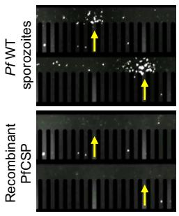  
B

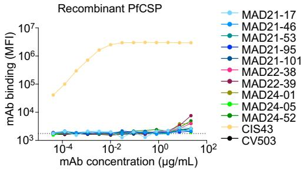  
C

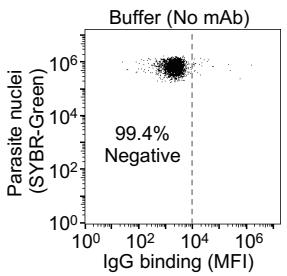  
D

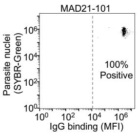

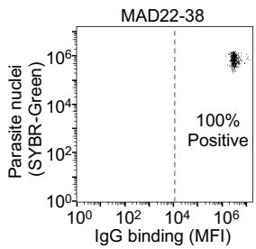

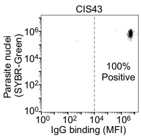

E   
Fig. S1. Binding and functional analysis of MAD21-101-type mAbs.   
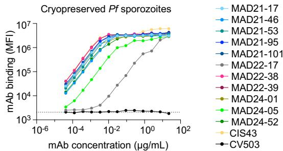  
(A) Plasma IgG reactivity of blocked plasma samples from down-selected donors towards full-length rPfCSP. The dotted line represents background signal from the buffer only (no plasma) condition. (B) Representative images from the Beacon assay showing single $\mathrm{IgG^{+}}$ MBCs secreting antibodies that bind to the surface of $Pf$ sporozoites (top) but do not bind to beads coated with rPfCSP (bottom) in a real-time imaging assay. Antibody secretion indicated by yellow arrows. (C) Titration of mAb binding to full-length rPfCSP. The anti-SARS-CoV-2 spike mAb CV503 IgG1 was included as a isotype control. CIS43 is an anti-PfCSP mAb control. AUC values for each antigen are shown after subtraction with values for the negative control antigen CD4. (D) Flow cytometry plots showing MAD21-101 and MAD22-38 binding to intact sporozoites. CIS43 is an anti-PfCSP mAb control. All mAbs were tested at a concentration of 66.7 $\mu \mathrm{g} / \mathrm{mL}$ . (E) Binding of MAD21-101-type mAbs to $Pf$ sporozoites that were thawed post-cryopreservation.

A

B

C

Fig. S2. Binding and functional analysis of MAD21-101-type mAbs.

(A) Western blot analysis of Pf sporozoite lysates by reducing SDS-PAGE. Individual blots were probed with anti-sporozoite mAbs. (B) Western blot analysis of Pf sporozoite lysates by non-reducing SDS-PAGE. Individual blots were probed with anti-sporozoite mAbs. CV503 is a negative control anti-SARS-CoV-2 mAb. (C) In vivo assay to evaluate mAb potency, as measured by liver parasite burden reduction. In this assay, 300 $\mu$ g of each mAb was delivered 16 h pre-IV challenge with $Pb^{PfCSP}$ sporozoites that express the luciferase reporter enzyme ( $Pb^{PfCSP-GFP/Luc}$ ). Liver parasite burden was measured by in vivo imaging and quantified as luminescence flux signals. Left, raw liver burden reduction data. Data shown with geometric mean from n = 2 independent experiments. n = 5 mice per group, except for the naïve condition in Experiment 1 for which n = 3 mice were assessed. Statistical significance was determined versus the no mAb condition by one-way ANOVA with Dunnett's Test for multiple comparisons. *P < 0.05, **P < 0.01, ***P < 0.001, ****P < 0.0001 and ns, not significant. Right, potency of the mAbs calculated based on sporozoite neutralization. Bars show mean with standard deviation.

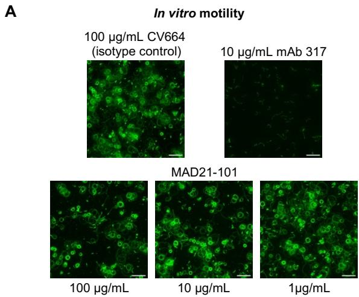

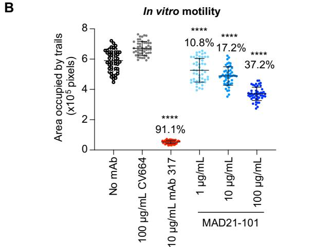

Fig. S3. In vitro characterization of inhibition mechanism of pGlu-CSP mAbs.   
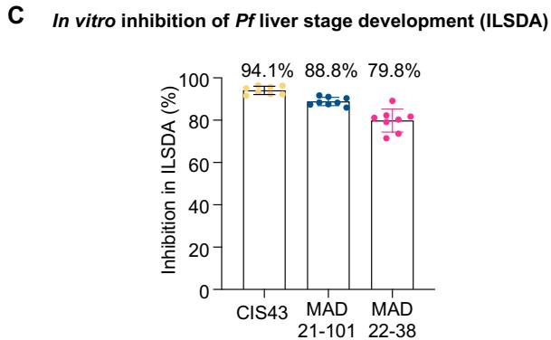  
(A) Representative images of in vitro gliding motility trails of Pf sporozoites after incubation with 1-100 $\mu$ g/mL of MAD21-101, 10 $\mu$ g/mL of an anti-PfCSP positive control (mAb 317), 100 $\mu$ g/mL of an anti-SARS-CoV-2 spike IgG isotype control (CV664). Scale bar represents 50 $\mu$ m. (B) Quantification of Pf sporozoite motility after incubation with 1-100 $\mu$ g/mL MAD21-101. Data is shown with mean with standard deviation for n = 50 images per condition and percent inhibition was determined respective to the untreated condition. Statistical significance was determined versus the no mAb condition using one-way ANOVA testing with Dunnett's Test for multiple comparisons. *P < 0.05, **P < 0.01, ***P < 0.001, ****P < 0.0001 and ns, not significant. Representative of n = 2 independent experiments. (C) In vitro inhibition of Pf liver stage development by CIS43, MAD21-101, MAD22-38 at a concentration of 100 $\mu$ g/mL in ILSDA. Liver parasite load was quantified 4 d post-infection. Error bars show mean with standard deviation for n = 8 replicates from n = 2 independent experiments. Percent inhibition values are calculated respective to the isotype control CV503. Average inhibition values are shown above the bars.

A

Sequence from PfCSP Sequence from PbCSP

$Pb^{WT}$ ... KLKQPPPPPNPNDPPPPNPNDPPPPNPNDPPPPP..

Pb $^{Pf N-Term}$ ... KKNSRSLGENDDGNNEDNEKLRKPKHKKLKQPPPPPNPNDPPPPNPND...

Pb $^{Pf}$ C-Term ... KLKQPPPPPNPNDPPPPNPND...NNNNDDSYIPSAEKILEYLNKIQNSLSTEWS...

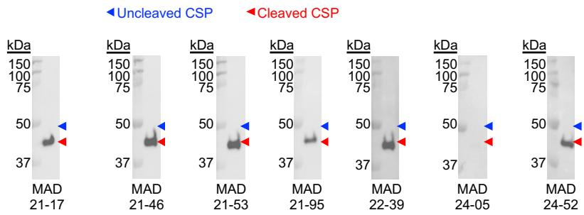  
B   
C

D   
Fig. S4. MAD21-101-type mAbs bind to cleaved PfCSP.   
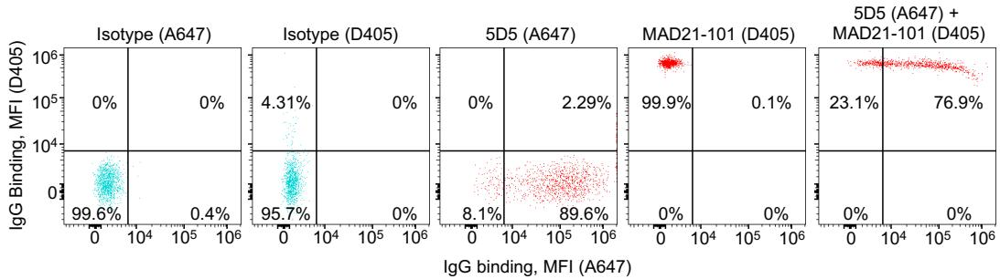  
(A) ELISA analysis of mAb binding to wild-type Pb sporozoites and Pb sporozoites that express PfCSP N-Term or PfCSP C-Term. Domains and sequences depicted in orange are derived from PfCSP, while domains and sequences depicted in blue are derived from PbCSP. MAD21-101 and MAD22-38 were assessed and the SARS-CoV-2 spike mAb CV503 was included as an isotype control. WT, wild-type. (B) Western blot analysis of mAb binding to cleaved and uncleaved forms of PfCSP from Pf sporozoite lysate. Lysates were analyzed by reducing SDS-PAGE and individual blots were probed with MAD21-101-type mAbs. (C) Immunoprecipitation (IP) pulldown of PfCSP from Pf sporozoites by MAD21-101. Blots were probed with mAb10, which binds to both cleaved and uncleaved PfCSP. (D) Flow cytometry plots for Pf WT sporozoites stained with either an Alexa Fluor 647-labelled mAb that binds to uncleaved PfCSP only (5D5), a Dylight 405-labelled mAb that binds cleaved PfCSP only (MAD21-101) or co-stained with both mAbs. An anti-SARS-CoV-2 spike mAb (CV664) directly labelled with either Alexa Fluor 647 or Dylight 405 was included as an isotype control. The percentage of the sporozoite population positive for staining with the respective antibodies are shown. A647, Alexa Fluor 647; D405, Dylight 405.

  
A

  
B

  
C

  
D

Fig. S5. MAD21-101-type mAbs bind to the pGlu-CSP epitope on PfCSP.   
  
(A) Titration curves showing MAD21-101 and MAD22-38 binding to PfCSP peptides with either an N-terminal Q96 or pGlu96 residue. (B) LC-MS analysis of the Q96 peptide used in fig. S5A. Ahx is the linker arm aminohexanoic acid. Lys-biotin is lysine conjugated with biotin. (C) Peptides generated by heat-induced cleavage of PfCSP and detected by LC-MS. A portion of the CSP N-terminus flanking Region I (KLKQP, bolded and underlined) is shown in black text. The putative site of proteolytic processing, Q96, is indicated. Shown are all peptides bearing Q96 that were detected in at least two of three replicates from salivary gland sporozoites (green) and rPfCSP (orange). Peptides with N-terminal Q96 were only detected in sporozoites, and for 100% of these, the N-terminal Q had been converted to pGlu. No peptides with N-terminal Q96 were detected in rPfCSP. (D) LC-MS analysis of the Q96 peptide used in Fig 3F (QPADGNPDPNANP, unbiotinylated) before and after undergoing the same heating and peptide extraction protocol used to generate the PfCSP peptides in fig. S5C. Triplicate LC-MS injections were performed of the same unheated peptide sample. Three replicate aliquots of the peptide were subjected to heating and peptide extraction.

<table><tr><td></td><td colspan="2">Relative Peak Height</td><td></td><td></td></tr><tr><td>Sample</td><td>Q96</td><td>pGlu96</td><td>% Converted</td><td>Average</td></tr><tr><td>Unheated Replicate 1</td><td>1.00</td><td>0.019</td><td>1.85%</td><td rowspan="3">2.10%</td></tr><tr><td>Unheated Replicate 2</td><td>1.00</td><td>0.021</td><td>2.04%</td></tr><tr><td>Unheated Replicate 3</td><td>1.00</td><td>0.025</td><td>2.42%</td></tr><tr><td>Heated Replicate 1</td><td>1.00</td><td>0.12</td><td>10.4%</td><td rowspan="3">11.5%</td></tr><tr><td>Heated Replicate 2</td><td>1.00</td><td>0.16</td><td>13.6%</td></tr><tr><td>Heated Replicate 3</td><td>1.00</td><td>0.12</td><td>10.4%</td></tr></table>

Fig. S6. The MAD21-101-type mAbs bind to a distinct epitope than previously isolated mAbs.   
  
Heat map showing MAD21-101-type and anti-PfCSP control mAb binding to PfCSP peptides that contain sequential C-terminal truncations. CV503 is a negative control anti-SARS-CoV-2 mAb. AUC, area under the curve.

  
Fig. S7. Per-residue BSA, binding residues, and germline gene alignment of MAD21-101-type Fabs.

Per-residue buried surface area on peptide binding to Fab represented as bars, with alignment of germline VH genes highlighting variant residues. Specific hydrogen bonds and salt bridges formed between peptide and Fab are shown in black and orange dashed lines, respectively. Framework residues are shown with gray bars, and CDR1, CDR2, and CDR3 of Fab heavy and light chains are shown in dark and light green, blue, and purple, respectively. The additional F61 residue in the MAD22-38 light chain was due to the inadvertent addition of an extra codon during antibody production. This residue is located in an external loop in framework 3 at a location distant from the paratope, and is thus unlikely to affect binding or the structure of the antibody.

A   

<table><tr><td>Fab</td><td>Kd (M)</td><td>Kd SEM</td><td>ΔH (cal/mol)</td><td>ΔH SEM</td><td>ΔS (cal/deg/mol)</td><td>ΔS SEM</td></tr><tr><td>MAD21-101</td><td>3.8E-09</td><td>3.E-10</td><td>-1.8E+04</td><td>54</td><td>-22.4</td><td>0.33</td></tr><tr><td>MAD22-38</td><td>1.1E-07</td><td>8.E-09</td><td>-1.9E+04</td><td>154</td><td>-33.2</td><td>0.59</td></tr><tr><td>MAD24-01</td><td>8.5E-07</td><td>3.E-08</td><td>-1.4E+04</td><td>162</td><td>-17.9</td><td>0.52</td></tr><tr><td>MAD21-17</td><td>1.3E-07</td><td>5.E-09</td><td>-1.4E+04</td><td>18</td><td>-14.0</td><td>0.06</td></tr><tr><td>MAD21-46</td><td>7.9E-08</td><td>9.E-10</td><td>-1.4E+04</td><td>33</td><td>-13.0</td><td>0.09</td></tr><tr><td>MAD21-53</td><td>7.3E-08</td><td>4.E-09</td><td>-1.4E+04</td><td>29</td><td>-13.9</td><td>0.21</td></tr><tr><td>MAD21-95</td><td>4.7E-08</td><td>2.E-09</td><td>-1.5E+04</td><td>15</td><td>-15.8</td><td>0.12</td></tr></table>

MAD21-101

MAD22-38

MAD24-01

MAD21-17

MAD21-46

MAD21-53

MAD21-95

B

C

MAD21-101

MAD22-38

MAD24-01

MAD21-17

MAD21-46

MAD21-53

MAD21-95

Fig. S8. ITC binding curves for MAD21-101-like Fabs. (A) ITC binding data with individual kinetic parameters with standard error of mean (SEM) across n = 3 replicates and binding curves for representative experiments with Fabs at concentration of 10 $\mu$ M and pGluPADGNPDPNANP-NH $_{2}$ peptide at concentration of 100 $\mu$ M for MAD21-101 and 150 $\mu$ M for all other Fabs. (B) Plot of liver burden reduction (%) versus ITC binding affinity (nM) and (C) liver burden reduction versus expanded plot of MAD21 Fab binding affinity for all relevant mice and n = 3 ITC experiments, with vertical and horizontal error bars (SEM). Linear regression is shown as line of best fit with 95% confidence intervals.

  
A

  
C

  
D

  
B   
Fig. S9. Characterization of the pGlu-CSP epitope targeted by MAD21-101-type mAbs. (A) Upset plot showing number of variants within the ${}^{96}$ QPADGNPDPNANP $^{108}$ sequence in 16,441 globally isolated Pf parasites. G100G and A106A refer to 'silent' mutations that do not change the amino acid arising from nucleotide polymorphisms at these codons and were included in this plot for completeness. The number of variants in the columns includes intersections, e.g. the "9901" count in the A98G column includes the counts for the double variants shown in the graph (A98G/A106A, A98G/A98V, A98G/G100G). (B) Binding of MAD22-38 to pGlu-CSP peptides bearing alanine or glycine (when original residue was alanine) substitutions. Bars represent binding in AUC versus the wild-type peptide sequence and the red line denotes 50% binding versus the wild-type sequence. WT, wild-type. (C) Heat map of MAD21-101-type mAb binding to pGlu-CSP peptides that contain the A98G or A98V mutations, relative to the WT peptide. (D) Binding of MAD21-101-type mAbs to an irrelevant peptide containing an N-terminal pGlu, followed by four NANP repeat units (pGluNANPNANPNANPNANP). mAbs 317 and CIS43 are control mAbs that bind to the NANP repeat sequence. CV503 is a control anti-SARS-CoV-2 mAb.

Fig. S10. pGlu-CSP accounts for residual plasma IgG reactivity to Pf sporozoites.

IgG reactivity of down-selected donors' plasma or 0.1 $\mu$ g/mL control mAbs towards Pf sporozoites after plasma was blocked with rPfCSP and/or 1–150 $\mu$ g/mL pGlu-CSP peptides.

Table S1. Characteristics of the 10 isolated mAbs and corresponding donors.   

<table><tr><td colspan="4"></td><td colspan="7">Heavy chain (IGH)</td><td colspan="6">Light chain (IGL)</td></tr><tr><td>Donor</td><td>Study</td><td>Immunizing dose</td><td>mAb</td><td>Isotype</td><td>IGHV</td><td>%V Identity</td><td>IGHD</td><td>IGHJ</td><td>%J Identity</td><td>CDR3 Sequence</td><td>Isotype</td><td>IGKV/ IGLV</td><td>% V Identity</td><td>IGKJ/ IGLJ</td><td>% J Identity</td><td>CDR3 Sequence</td></tr><tr><td rowspan="5">VRC_2B4</td><td rowspan="5">VRC314</td><td rowspan="5">4 doses of \( 2.7 \times 10^{5} \)sporozoites</td><td>MAD21-17</td><td>IgG2</td><td>4-59</td><td>90.88%</td><td>2-8</td><td>6</td><td>82.26%</td><td>TRDRSECADGSCFGYVMAV</td><td>Kappa</td><td>4-1</td><td>95.29%</td><td>4</td><td>94.74%</td><td>QQYYISPLT</td></tr><tr><td>MAD21-46</td><td>IgG2</td><td>4-59 or 4-61</td><td>91.58%</td><td>2-8</td><td>6</td><td>85.48%</td><td>TRDRSECTDGLCFAYVMDV</td><td>Kappa</td><td>4-1</td><td>95.62%</td><td>4</td><td>94.74%</td><td>QQYYISPLT</td></tr><tr><td>MAD21-53</td><td>IgG2</td><td>4-59 or 4-61</td><td>91.93%</td><td>2-8</td><td>6</td><td>85.48%</td><td>TRDRSECSDGLCFAYVMDV</td><td>Kappa</td><td>4-1</td><td>95.62%</td><td>4</td><td>94.74%</td><td>QQYYISPLT</td></tr><tr><td>MAD21-95</td><td>IgG2</td><td>4-59</td><td>90.88%</td><td>2-8</td><td>6</td><td>82.26%</td><td>TRDRSECADGSCFGYVMAV</td><td>Kappa</td><td>4-1</td><td>94.95%</td><td>4</td><td>94.74%</td><td>QQYYISPLT</td></tr><tr><td>MAD21-101</td><td>IgG2</td><td>4-59 or 4-61</td><td>91.93%</td><td>2-8</td><td>6</td><td>83.87%</td><td>TRDRSECPDGSCFAYVMAV</td><td>Kappa</td><td>4-1</td><td>95.62%</td><td>4</td><td>94.74%</td><td>QQYYLSPLT</td></tr><tr><td rowspan="2">VRC_1F7</td><td rowspan="2">VRC314</td><td rowspan="2">4 doses of \( 1.35 \times 10^{5} \)sporozoites + 1 dose of \( 4.5 \times 10^{5} \)sporozoites</td><td>MAD22-38</td><td>IgG1</td><td>4-39</td><td>98.97%</td><td>6-19</td><td>4</td><td>97.92%</td><td>ASIGWAVPGKRYYFDY</td><td>Kappa</td><td>1-39</td><td>98.57%</td><td>3</td><td>94.74%</td><td>QQSYYTPWT</td></tr><tr><td>MAD22-39</td><td>IgG1</td><td>4-39</td><td>97.94%</td><td>5-18</td><td>5</td><td>90.2%</td><td>VRVGRVDTATRLWWFDP</td><td>Kappa</td><td>1-39</td><td>98.21%</td><td>1</td><td>100%</td><td>QQSYYTPWT</td></tr><tr><td rowspan="3">VRC_1A2</td><td rowspan="3">VRC312</td><td rowspan="3">4 doses of \( 1.35 \times 10^{4} \)sporozoites</td><td>MAD24-01</td><td>IgG1</td><td>3-11</td><td>96.53%</td><td>6-19</td><td>4</td><td>85.42%</td><td>AREIERSGWVRGNDY</td><td>Kappa</td><td>3-11</td><td>96.77%</td><td>4</td><td>97.22%</td><td>QQRRNWPLT</td></tr><tr><td>MAD24-05</td><td>IgG1</td><td>3-7</td><td>96.88%</td><td>5-12</td><td>6</td><td>91.94%</td><td>ARAGYSDYLYYYAMDV</td><td>Lambda</td><td>1-47</td><td>98.25%</td><td>3</td><td>100%</td><td>AVWDDSLSCWV</td></tr><tr><td>MAD24-52</td><td>IgG3</td><td>3-33</td><td>100%</td><td>7-27</td><td>4</td><td>89.58%</td><td>ARVGTLWGDRIGGFDY</td><td>Kappa</td><td>2-24</td><td>100%</td><td>4</td><td>100%</td><td>MQATQFPLT</td></tr></table>

Table S2. ELISA analysis of mAb binding to PfCSP peptides and recombinant full-length PfCSP produced by mammalian (HEK293T), yeast (P. pastoris) and bacteria (L. lactis and E. coli) expression systems.   

<table><tr><td colspan="2"></td><td colspan="6">mAb Binding (OD of Abs 450nm)</td></tr><tr><td>Protein / Peptide</td><td>Amino Acid Sequence / Reference</td><td>MAD 21-101</td><td>MAD 22-38</td><td>CIS43</td><td>L9</td><td>5D5</td><td>VRC01</td></tr><tr><td>CSP WT (HEK293T expressed)</td><td>Uniprot P19597, aa 1-375</td><td>0.051</td><td>0.087</td><td>3.524</td><td>3.548</td><td>3.514</td><td>0.070</td></tr><tr><td>CSP 4/38 (L. lactis expressed)</td><td>Singh et al. 2020, see Methods for full reference</td><td>0.053</td><td>0.087</td><td>3.510</td><td>3.526</td><td>3.507</td><td>0.100</td></tr><tr><td>CSP 1 (E. coli expressed)</td><td rowspan="4">Kastenmuller et al. 2013, see Methods for full reference.</td><td>0.004</td><td>0.004</td><td>3.545</td><td>3.535</td><td>0.004</td><td>-0.002</td></tr><tr><td>CSP 2 (E. coli expressed)</td><td>-0.005</td><td>0.064</td><td>3.441</td><td>3.436</td><td>3.446</td><td>-0.007</td></tr><tr><td>CSP 3 (P. pastoris expressed)</td><td>0.004</td><td>0.051</td><td>3.476</td><td>3.470</td><td>3.487</td><td>0.051</td></tr><tr><td>CSP 4 (P. pastoris expressed)</td><td>0.002</td><td>0.107</td><td>3.541</td><td>3.555</td><td>3.564</td><td>0.004</td></tr><tr><td>Peptide 1</td><td>QEYQCYGSSSNTRVL</td><td>0.007</td><td>0.126</td><td>0.116</td><td>0.038</td><td>0.091</td><td>0.124</td></tr><tr><td>Peptide 2</td><td>CYGSSSNTRVLNELN</td><td>0.002</td><td>0.054</td><td>0.053</td><td>0.033</td><td>0.029</td><td>0.039</td></tr><tr><td>Peptide 3</td><td>SSNTRVLNELNYDNA</td><td>0.000</td><td>0.056</td><td>0.052</td><td>0.027</td><td>0.020</td><td>0.008</td></tr><tr><td>Peptide 4</td><td>RVLNELNYDNAGTNL</td><td>0.001</td><td>0.052</td><td>0.035</td><td>0.028</td><td>0.024</td><td>0.026</td></tr><tr><td>Peptide 5</td><td>ELNYDNAGTNLYNEL</td><td>-0.004</td><td>0.045</td><td>0.023</td><td>0.024</td><td>0.022</td><td>0.024</td></tr><tr><td>Peptide 6</td><td>DNAGTNLYNELEMNY</td><td>0.000</td><td>0.028</td><td>0.009</td><td>0.028</td><td>0.027</td><td>0.042</td></tr><tr><td>Peptide 7</td><td>TNLYNELEMNYYGKQ</td><td>-0.002</td><td>0.049</td><td>0.067</td><td>0.028</td><td>0.025</td><td>0.033</td></tr><tr><td>Peptide 8</td><td>NELEMNYYGKQENWY</td><td>-0.002</td><td>0.065</td><td>0.132</td><td>0.071</td><td>0.061</td><td>0.125</td></tr><tr><td>Peptide 9</td><td>MNYYGKQENWYSLKK</td><td>0.006</td><td>0.049</td><td>0.051</td><td>0.028</td><td>0.039</td><td>0.044</td></tr><tr><td>Peptide 10</td><td>GKQENWYSLKKNSRS</td><td>0.002</td><td>0.004</td><td>0.010</td><td>0.002</td><td>-0.001</td><td>0.001</td></tr><tr><td>Peptide 11</td><td>NWYSLKKNSRSLGEN</td><td>0.000</td><td>0.001</td><td>0.006</td><td>0.002</td><td>0.000</td><td>-0.003</td></tr><tr><td>Peptide 12</td><td>LKKNSRSLGENDDGN</td><td>0.001</td><td>-0.002</td><td>0.008</td><td>-0.001</td><td>-0.002</td><td>-0.002</td></tr><tr><td>Peptide 13</td><td>SRSLGENDDGNNEDN</td><td>0.002</td><td>-0.003</td><td>0.006</td><td>-0.001</td><td>-0.001</td><td>-0.003</td></tr><tr><td>Peptide 14</td><td>GENDDGNNEDNEKLR</td><td>0.001</td><td>-0.001</td><td>-0.002</td><td>0.002</td><td>0.001</td><td>-0.003</td></tr><tr><td>Peptide 15</td><td>DGNNEDNEKLRKPKH</td><td>0.003</td><td>0.006</td><td>0.020</td><td>0.024</td><td>0.068</td><td>-0.005</td></tr><tr><td>Peptide 16</td><td>EDNEKLRKPKHKKLK</td><td>-0.002</td><td>0.035</td><td>0.042</td><td>0.021</td><td>0.793</td><td>0.025</td></tr><tr><td>Peptide 17</td><td>KLRKPKHKKLKQPAD</td><td>0.005</td><td>0.030</td><td>0.035</td><td>0.017</td><td>0.027</td><td>0.034</td></tr><tr><td>Peptide 18</td><td>PKHKKLKQPADGNPD</td><td>0.004</td><td>-0.002</td><td>0.009</td><td>0.002</td><td>0.002</td><td>0.002</td></tr><tr><td>Peptide 19</td><td>KLKQPADGNPDPNAN</td><td>0.002</td><td>-0.002</td><td>0.007</td><td>0.008</td><td>-0.002</td><td>-0.001</td></tr><tr><td>Peptide 20</td><td>PADGNPDPNANPNVD</td><td>0.004</td><td>-0.005</td><td>2.463</td><td>0.000</td><td>-0.002</td><td>-0.002</td></tr><tr><td>Peptide 21</td><td>NPDPNANPNVDPNAN</td><td>0.002</td><td>-0.005</td><td>2.734</td><td>0.010</td><td>-0.001</td><td>-0.004</td></tr><tr><td>Peptide 22</td><td>NANPNVDPNANPNVD</td><td>-0.002</td><td>-0.005</td><td>-0.004</td><td>1.464</td><td>-0.003</td><td>-0.006</td></tr><tr><td>Peptide 23</td><td>NVDPNANPNVDPNAN</td><td>0.004</td><td>-0.002</td><td>0.933</td><td>0.025</td><td>-0.003</td><td>-0.003</td></tr><tr><td>Peptide 27</td><td>NANPNANPNANPNAN</td><td>-0.005</td><td>0.025</td><td>0.227</td><td>0.008</td><td>0.004</td><td>0.028</td></tr><tr><td>Peptide 29</td><td>NANPNANPNANPNAN</td><td>0.004</td><td>0.021</td><td>0.194</td><td>0.035</td><td>0.016</td><td>0.038</td></tr><tr><td>Peptide 42</td><td>NANPNANPNANPNVD</td><td>0.002</td><td>-0.003</td><td>0.256</td><td>0.002</td><td>-0.004</td><td>0.002</td></tr><tr><td>Peptide 43</td><td>NANPNANPNVDPNAN</td><td>0.001</td><td>-0.002</td><td>0.689</td><td>0.007</td><td>-0.002</td><td>-0.002</td></tr><tr><td>Peptide 44</td><td>NANPNVDPNANPNAN</td><td>0.001</td><td>-0.009</td><td>0.446</td><td>0.022</td><td>-0.002</td><td>-0.003</td></tr><tr><td>Peptide 61</td><td>NANPNANPNANPNKN</td><td>0.000</td><td>-0.007</td><td>1.216</td><td>0.332</td><td>-0.002</td><td>-0.005</td></tr><tr><td>Peptide 62</td><td>NANPNANPNKNNQGN</td><td>-0.002</td><td>0.002</td><td>-0.004</td><td>-0.006</td><td>-0.001</td><td>-0.010</td></tr><tr><td>Peptide 63</td><td>NANPNKNNQGNGQGH</td><td>-0.003</td><td>-0.006</td><td>0.003</td><td>-0.005</td><td>-0.004</td><td>-0.004</td></tr><tr><td>Peptide 64</td><td>NKNNQGNGQGHNMPN</td><td>-0.003</td><td>0.022</td><td>0.021</td><td>0.002</td><td>0.001</td><td>0.042</td></tr><tr><td>Peptide 65</td><td>QGNGQGHNMPNDPNR</td><td>0.002</td><td>0.028</td><td>0.053</td><td>0.012</td><td>0.016</td><td>0.053</td></tr><tr><td>Peptide 66</td><td>QGHNMPNDPNRNVDE</td><td>-0.001</td><td>-0.006</td><td>0.010</td><td>-0.001</td><td>-0.009</td><td>0.003</td></tr><tr><td>Peptide 67</td><td>MPNDPNRNVDENANA</td><td>0.001</td><td>-0.007</td><td>0.003</td><td>0.000</td><td>-0.008</td><td>-0.001</td></tr><tr><td>Peptide 68</td><td>PNRNVDENANANSAV</td><td>-0.003</td><td>-0.009</td><td>0.003</td><td>-0.004</td><td>-0.009</td><td>-0.005</td></tr><tr><td>Peptide 69</td><td>VDENANANSAVKNNN</td><td>0.006</td><td>-0.007</td><td>0.004</td><td>-0.001</td><td>-0.001</td><td>-0.002</td></tr><tr><td>Peptide 70</td><td>ANANSAVKNNNNEEP</td><td>-0.002</td><td>-0.006</td><td>-0.004</td><td>-0.003</td><td>-0.004</td><td>-0.004</td></tr><tr><td>Peptide 71</td><td>SAVKNNNNEEPSDKH</td><td>-0.003</td><td>-0.003</td><td>0.016</td><td>-0.007</td><td>-0.003</td><td>-0.004</td></tr><tr><td>Peptide 72</td><td>NNNNEEPSDKHIKEY</td><td>-0.003</td><td>0.035</td><td>0.020</td><td>0.003</td><td>0.004</td><td>0.034</td></tr><tr><td>Peptide 73</td><td>EEPSDKHIKEYLNKI</td><td>0.001</td><td>0.061</td><td>0.052</td><td>0.022</td><td>0.001</td><td>0.055</td></tr><tr><td>Peptide 74</td><td>DKHIKEYLNKIQNSL</td><td>-0.004</td><td>0.012</td><td>0.017</td><td>0.002</td><td>-0.011</td><td>0.028</td></tr><tr><td>Peptide 75</td><td>KEYLNKIQNSLSTEW</td><td>-0.002</td><td>0.002</td><td>0.009</td><td>0.001</td><td>-0.013</td><td>0.027</td></tr><tr><td>Peptide 76</td><td>NKIQNSLSTEWSPCS</td><td>-0.004</td><td>0.001</td><td>0.010</td><td>-0.004</td><td>-0.012</td><td>0.014</td></tr><tr><td>Peptide 77</td><td>NSLSTEWSPCSVTCG</td><td>0.002</td><td>0.002</td><td>0.011</td><td>0.000</td><td>-0.006</td><td>0.006</td></tr><tr><td>Peptide 78</td><td>TEWSPCSVTCGNGIQ</td><td>-0.004</td><td>0.001</td><td>-0.002</td><td>-0.003</td><td>-0.003</td><td>0.013</td></tr><tr><td>Peptide 79</td><td>PCSVTCGNGIQVRIK</td><td>-0.005</td><td>0.008</td><td>0.010</td><td>-0.002</td><td>-0.009</td><td>0.020</td></tr><tr><td>Peptide 80</td><td>TCGNGIQVRIKPGSA</td><td>-0.004</td><td>0.019</td><td>0.042</td><td>0.014</td><td>0.016</td><td>0.082</td></tr><tr><td>Peptide 81</td><td>GIQVRIKPGSANKPK</td><td>0.007</td><td>0.139</td><td>0.118</td><td>0.050</td><td>0.051</td><td>0.084</td></tr><tr><td>Peptide 82</td><td>RIKPGSANKPKDELD</td><td>0.002</td><td>0.079</td><td>0.062</td><td>0.042</td><td>0.021</td><td>0.014</td></tr><tr><td>Peptide 83</td><td>GSANKPKDELDYAND</td><td>0.000</td><td>0.065</td><td>0.046</td><td>0.031</td><td>0.009</td><td>0.003</td></tr><tr><td>Peptide 84</td><td>KPKDELDYANDIEKK</td><td>0.001</td><td>0.070</td><td>0.049</td><td>0.031</td><td>0.011</td><td>0.006</td></tr><tr><td>Peptide 85</td><td>ELDYANDIEKKICKM</td><td>-0.004</td><td>0.069</td><td>0.043</td><td>0.021</td><td>0.028</td><td>-0.004</td></tr><tr><td>Peptide 86</td><td>ANDIEKKICKMEKCS</td><td>0.000</td><td>0.078</td><td>0.050</td><td>0.022</td><td>0.031</td><td>0.001</td></tr><tr><td>Peptide 87</td><td>EKKICKMEKCS</td><td>-0.002</td><td>0.088</td><td>0.064</td><td>0.033</td><td>0.058</td><td>-0.002</td></tr></table>

Table S3. Microarray analysis of mAb binding to recombinant full-length PfCSP produced by insect (Sf9) and plant (wheatgerm) expression systems. Values represent signal intensity of binding to normalized to the background signal.   

<table><tr><td rowspan="3"></td><td colspan="4">Binding to Recombinant PfCSP</td></tr><tr><td colspan="2">Sf9 Expressed</td><td colspan="2">Wheatgerm Expressed</td></tr><tr><td>-Protease inhibitor</td><td>+Protease inhibitor</td><td>-Protease inhibitor</td><td>+Protease inhibitor</td></tr><tr><td>No mAb</td><td>0.27</td><td>-0.55</td><td>-2.00</td><td>-2.00</td></tr><tr><td>MAD21-17</td><td>1.03</td><td>-0.72</td><td>-2.00</td><td>-2.00</td></tr><tr><td>MAD21-46</td><td>-0.13</td><td>0.45</td><td>0.03</td><td>0.30</td></tr><tr><td>MAD21-53</td><td>0.54</td><td>-0.14</td><td>-2.00</td><td>-2.00</td></tr><tr><td>MAD22-38</td><td>0.84</td><td>0.57</td><td>0.36</td><td>0.52</td></tr><tr><td>MAD22-39</td><td>0.19</td><td>-0.32</td><td>0.45</td><td>0.94</td></tr><tr><td>MAD24-01</td><td>0.75</td><td>0.54</td><td>0.46</td><td>0.48</td></tr><tr><td>MAD24-05</td><td>-0.34</td><td>0.05</td><td>-0.13</td><td>0.02</td></tr><tr><td>MAD24-52</td><td>0.97</td><td>0.57</td><td>0.13</td><td>0.43</td></tr><tr><td>CIS43</td><td>1.40</td><td>1.57</td><td>3.04</td><td>3.22</td></tr><tr><td>Hu5D5</td><td>1.06</td><td>0.33</td><td>0.49</td><td>0.64</td></tr></table>

Table S4. Crystallographic data collection and refinement   

<table><tr><td>Data collection</td><td>MAD21-101</td><td>MAD22-38</td><td>MAD24-01</td></tr><tr><td>Beamline</td><td>NSLS-II 17-ID-2</td><td>NSLS-II 17-ID-2</td><td>NSLS-II 17-ID-2</td></tr><tr><td>Wavelength (Å)</td><td>0.97934</td><td>0.97934</td><td>0.97934</td></tr><tr><td>Space group</td><td>C 1 2 1</td><td>P 21 21 21</td><td>P 1 21 1</td></tr><tr><td>Cell dimensions</td><td></td><td></td><td></td></tr><tr><td>a, b, c (Å)</td><td>77.49, 73.89, 86.57</td><td>73.80, 76.36, 88.80</td><td>74.54, 88.32, 168.95</td></tr><tr><td>α, β, γ (°)</td><td>90, 104.13, 90</td><td>90, 90, 90</td><td>90, 89.75, 90</td></tr><tr><td>Resolution (Å)</td><td>42.0-1.46 (1.48-1.46)</td><td>44.4-1.99 (2.03-1.99)</td><td>45.0-1.82 (1.84-1.82)</td></tr><tr><td>Rmerge</td><td>0.097 (1.22)</td><td>0.160 (1.62)</td><td>0.183 (1.02)</td></tr><tr><td>Rmeas</td><td>0.105 (1.38)</td><td>0.174 (1.76)</td><td>0.200 (1.13)</td></tr><tr><td>Rpim</td><td>0.041 (0.62)</td><td>0.067 (0.68)</td><td>0.079 (0.48)</td></tr><tr><td>Total reflections</td><td>159,802 (7856)</td><td>64,892 (3239)</td><td>378,278 (18653)</td></tr><tr><td>Unique reflections</td><td>81,657 (4113)</td><td>34,343 (1703)</td><td>192,978 (9564)</td></tr><tr><td>CC1/2</td><td>0.995 (0.362)</td><td>0.989 (0.357)</td><td>0.995 (0.306)</td></tr><tr><td>I / σI</td><td>6.0 (0.7)</td><td>6.4 (2.4)</td><td>3.6 (0.9)</td></tr><tr><td>Completeness (%)</td><td>99.4 (86.7)</td><td>97.9 (96.6)</td><td>97.6 (46.9)</td></tr><tr><td>Redundancy</td><td>3.2 (2.2)</td><td>6.6 (4.9)</td><td>3.2 (2.4)</td></tr><tr><td colspan="4">Refinement</td></tr><tr><td>Resolution (Å)</td><td>42.0-1.46 (1.48-1.46)</td><td>44.4-1.99 (2.05-1.99)</td><td>45.0-1.82 (1.84-1.82)</td></tr><tr><td>No. reflections</td><td>81,523 (4058)</td><td>34,294 (2634)</td><td>191,764 (6054)</td></tr><tr><td>Reflections in Rfree</td><td>4058 (124)</td><td>1729 (149)</td><td>9529 (318)</td></tr><tr><td>Rwork/Rfree</td><td>0.173/0.200</td><td>0.184/0.232</td><td>0.211/0.238</td></tr><tr><td>No. atoms</td><td>7737</td><td>3712</td><td>28,545</td></tr><tr><td>Protein</td><td>7235</td><td>3459</td><td>27,131</td></tr><tr><td>Ligand/ion</td><td>8</td><td>0</td><td>0</td></tr><tr><td>Water</td><td>472</td><td>253</td><td>1414</td></tr><tr><td colspan="4">B-values (Å2)</td></tr><tr><td>Average B-factors</td><td>23</td><td>32</td><td>27</td></tr><tr><td>Fab</td><td>22</td><td>31</td><td>27</td></tr><tr><td>Peptide</td><td>36</td><td>38</td><td>42</td></tr><tr><td>Ligand/ion</td><td>42</td><td>0</td><td>0</td></tr><tr><td>Water</td><td>33</td><td>37</td><td>26</td></tr><tr><td>Wilson B-value</td><td>18</td><td>29</td><td>20</td></tr><tr><td colspan="4">R.m.s. deviations</td></tr><tr><td>Bond lengths (Å)</td><td>0.008</td><td>0.014</td><td>0.004</td></tr><tr><td>Bond angles (°)</td><td>1.07</td><td>1.36</td><td>0.82</td></tr><tr><td colspan="4">Ramachandran Plots(%)</td></tr><tr><td>Favoured</td><td>96.9</td><td>97.5</td><td>98.1</td></tr><tr><td>Allowed</td><td>2.9</td><td>2.5</td><td>1.9</td></tr><tr><td>Outliers</td><td>0.2</td><td>0</td><td>0</td></tr><tr><td>Clashscore</td><td>1.5</td><td>4</td><td>2.5</td></tr><tr><td>PDB accession code</td><td>9C79</td><td>9C7D</td><td>9C7F</td></tr></table>

Numbers in parentheses refer to the highest resolution shell.   
$R_{merge} = \Sigma_{hkl}\Sigma_{i} \mid I_{hkl,i} - <I_{hkl}> \mid / \Sigma_{hkl}\Sigma_{i}I_{hkl,i} \text{ and } R_{meas} = \Sigma_{hkl}(n/(n-1))^{1/2}\Sigma_{i} \mid I_{hkl,i} - <I_{hkl}> \mid / \Sigma_{hkl}\Sigma_{i}I_{hkl,I} \text{ and } R_{pim} = \Sigma_{hkl}(1/(n-1))^{1/2}\Sigma_{i} \mid I_{hkl,i} - <I_{hkl}> \mid / \Sigma_{hkl}\Sigma_{i}I_{hkl,i}, \text{ where } I_{hkl,i} \text{ is the scaled intensity of the } i^{th} \text{ measurement of reflection } h, k, l, <I_{hkl}> \text{ is the average intensity for that reflection, and n is the redundancy.}$   
$\mathrm{CC}_{1/2} =$ Pearson correlation coefficient between two random half datasets.   
$R_{work} = \Sigma_{hkl}|F_o - F_c| / \Sigma_{hkl}|F_o|x100$ , where $F_{o}$ and $F_{c}$ are the observed and calculated structure factors, respectively.   
$R_{free}$ was calculated as for $R_{work}$ , but on a test set comprising 5% of the data excluded from refinement.