# 41467_2024_52442_MOESM1_ESM

# SUPLEMENTARY FIGURES AND TABLES

# Rapid affinity optimization of an anti-TREM2 clinical lead antibody by cross-lineage immune repertoire mining

# AUTHORS

Yi-Chun Hsiao $^{1}$ , Heidi Ackerly Wallweber $^{2}$ , Robert G. Alberstein $^{3}$ , Zhonghua Lin $^{1}$ , Changchun Du $^{4}$ , Ainhoa Etxeberria $^{5}$ , Theint Aung $^{1}$ , Yonglei Shang $^{1,6}$ , Dhaya Seshasayee $^{1}$ , Franziska Seeger $^{3}$ , Andrew M. Watkins $^{3}$ , David V. Hansen $^{5,7}$ , Christopher J. Bohlen $^{5}$ , Peter L. Hsu $^{2}$ , Isidro Hötzel $^{1\#}$

$^{1}$ Department of Antibody Engineering, Genentech, South San Francisco, CA 94080, USA. $^{2}$ Department of Structural Biology, Genentech, South San Francisco, CA, USA. $^{3}$ Prescient Design, a Genentech Accelerator, South San Francisco, CA, USA. $^{4}$ Department of Biochemical and Cellular Pharmacology, Genentech, South San Francisco, CA, USA. $^{5}$ Department of Neuroscience, Genentech, South San Francisco, CA, USA.

#e-mail: ihotzel@gene.com

$^{6}$ Current address: Amberstone Biosciences, Irvine, CA, USA $^{7}$ Current address: Department of Chemistry and Biochemistry, Brigham Young University, Provo, UT, USA

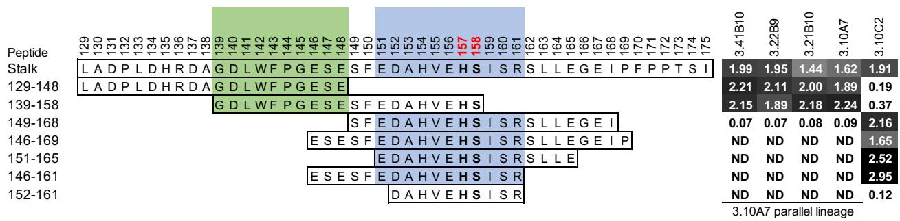  
Supplementary Fig. 1 Mapping of epitopes bound by anti-TREM2 antibodies. Overlapping peptides corresponding to the TREM2 stalk region were used in ELISA to test antibody binding. Sequences of peptides are shown with the presumed approximate boundaries of the epitopes bound by antibodies of the 3.10A7 parallel lineage group and antibody 3.10C2 highlighted in green and blue, respectively. Values shown are raw ELISA $OD_{450}$ readings, highlighted proportionally to intensity. The ADAM10/17 cleavage site is highlighted in red. ND, not done.

a

<table><tr><td>Antibody</td><td>ka (1/Ms)</td><td>kd (1/s)</td><td>KD (M)</td></tr><tr><td>3.10A7</td><td>7.7E+05</td><td>7.8E-04</td><td>1.0E-09</td></tr><tr><td>3.21B10</td><td>3.0E+05</td><td>1.6E-04</td><td>5.4E-10</td></tr><tr><td>3.22B9</td><td>1.6E+05</td><td>2.5E-04</td><td>1.6E-09</td></tr><tr><td>3.41B10</td><td>4.9E+05</td><td>2.4E-03</td><td>4.8E-09</td></tr></table>

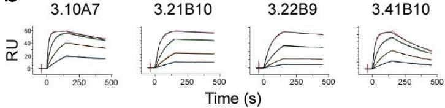  
b   
C   
d   
e   
f

g   

<table><tr><td rowspan="2">Antibody</td><td rowspan="2">Rat</td><td rowspan="2">VH</td><td rowspan="2">VL</td><td rowspan="2">JH</td><td rowspan="2">JL</td><td rowspan="2">CDR H3 length</td><td rowspan="2">DH</td><td rowspan="2">DH segment sequence</td><td rowspan="2">DH segment reading frame</td><td rowspan="2">CDR H3 sequence</td><td colspan="3">CDR H3 aa identity with Ab:</td><td colspan="2">Clonotype (by definition):</td></tr><tr><td>3.10A7</td><td>3.22B9</td><td>3.41B10</td><td>Biological</td><td>Working</td></tr><tr><td>3.10A7</td><td>R18</td><td>VH10-5</td><td>VK8U89d</td><td>JH2</td><td>JK4</td><td>11</td><td>DH1-11</td><td>ACTACGG</td><td>1</td><td>TAGTTVV--PFDY</td><td></td><td>82%</td><td>27%</td><td>1</td><td>1</td></tr><tr><td>3.22B9</td><td>R18</td><td>VH10-5</td><td>VK8U89d</td><td>JH2</td><td>JK5</td><td>11</td><td>DH1-10</td><td>ACAACTAC</td><td>1</td><td>TAGTTTA--PFDY</td><td>82%</td><td></td><td>27%</td><td>2</td><td>1</td></tr><tr><td>3.41B10</td><td>R20</td><td>VH10-5</td><td>VK8U89d</td><td>JH3</td><td>JK5</td><td>11</td><td>DH1-11</td><td>GAGGG</td><td>1</td><td>TGEGPQGG--FVY</td><td>27%</td><td>27%</td><td></td><td>3</td><td>3</td></tr><tr><td>3.21B10</td><td>R18</td><td>VH10-5</td><td>VK8U89d</td><td>JH3</td><td>JK5</td><td>13</td><td>DH1-11</td><td>TTAACTACGGAGGGT</td><td>3</td><td>IEGVNYGGSPFVY</td><td>31%</td><td>31%</td><td>38%</td><td>4</td><td>4</td></tr></table>

Supplementary Fig. 2 Affinities, cell binding and clonotyping of clones in the 3.10A7 parallel lineage. (a) Monovalent binding kinetics and $K_{D}$ of antibodies to TREM2 at 37°C by SPR measured in a Biacore 8K instrument. (b) SPR sensorgrams corresponding to data in panel (a). Color and black lines are sensorgram data and curve fitting, respectively. TREM2 antigen used at 100 nM for the highest concentration followed by 3-fold dilutions. Binding of purified hybridoma antibodies (c) 3.10A7, (d) 3.21B10, (e) 3.22B9 and (f) 3.41B10 to Jurkat cells expressing TREM2 by flow cytometry. Gray, control IgG2a. Red, antibodies. Comp-APC-A, median fluorescence intensity of binding. (g) Clonotyping of the 3.10A7 group of clones. Parameters used for clonotyping are shown in columns 2 to 14, color-coded in each column for easier differentiation. Parameters shaded in gray are not used for the working clonotype definition. “Biological” and “Working” refer to clonotype classification using the biological or working clonotyping definitions. Sequence identity with the 3.21B10 clone is performed by inserting a gaps of two positions as indicated by dashes. Identical amino acid residues between clones 3.10A7 and 3.22B9 are highlighted in boldface. DH, IGHD segment. Complete junctional sequence parsing information is given in Supplementary Fig. 3.

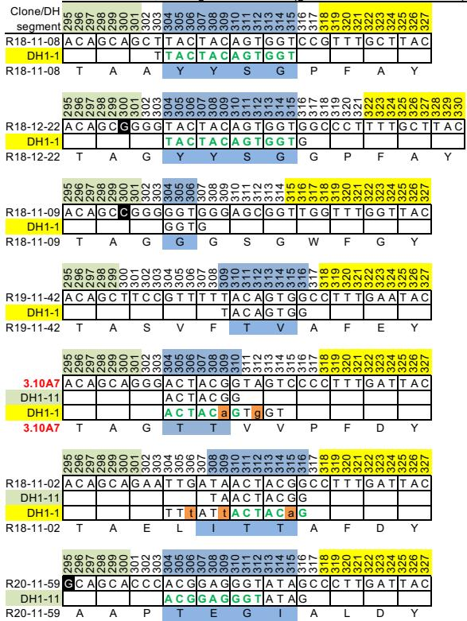  
VH junction   
CDR H3, DH segment matches (germline nt identities shown)

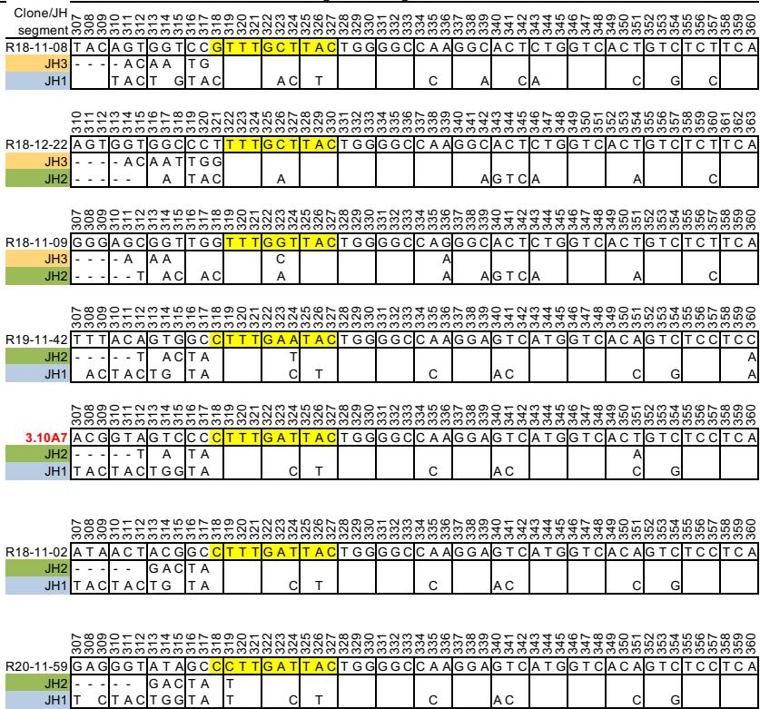  
JH germline segment mismatches

Supplementary Fig. 3 Junctional sequence analysis of selected clones in the 3.10A7 and 3.10C2 parallel lineage groups. The left column shows CDR H3 sequences with parsing information in colors above the sequences, in the $V_{H}$ nucleotide number row, for regions likely derived from $V_{H}$ (green), $D_{H}$ (blue) and $J_{H}$ (yellow) germline segments. The row below the antibody nucleotide sequence shows the DH region matches, with possible somatic mutations in lower case and highlighted in orange. For some CDR H3 sequences two possible matches are shown. CDR H3 amino acid residues encoded by at least two $D_{H}$ nucleotides within the codon are highlighted in blue. The $D_{H}$ germline segment names are highlighted in different colors for easier identification of CDR H3 sequences with the same likely $D_{H}$ segment. Similar $D_{H}$ sequences in the same reading frame in different clones (usually the previous or following clone) are highlighted in green. Nucleotides that differ from the ACAGCAG contributed by $V_{H}$ 10-5 to CDR H3 are shown in black backgrounds. The right column shows detailed parsing information for the top two $J_{H}$ hits with nucleotides in the $J_{H}$ germline segments identical the antibody not shown. The last 4 alignments show $J_{L}$ alignments for the hybridoma clones in the 3.10A7 parallel lineage and 3.10C2 clonotype groups. Dashes show regions not covered by the $J_{H}$ sequence. $J_{H}$ germline segment names are color coded for clarity. The region of $J_{H}$ included in CDR H3 is highlighted in yellow on the antibody sequences. Sequences are sorted by $D_{H}$ region in CDR H3. Names of hybridoma-derived clones are highlighted in red. Allele information is omitted for clarity. Figure continued in following pages. Note that the boundaries of $D_{H}$ and $J_{H}$ overlap in some clones and some $J_{H}$ boundaries are uncertain due to possible somatic mutations. Figure continued on pages 5 to 8.

CDR H3, DH segment matches (germline nt identities shown)   

<table><tr><td>R20-11-61</td><td colspan="101">T C A G C A G A G G C T A C G G A G G G T C C C C T T G A T T A C</td><td></td><td></td><td></td><td></td><td></td><td></td><td></td><td></td><td></td><td></td><td></td><td></td><td></td><td></td></tr><tr><td>DH1-11</td><td></td><td></td><td></td><td></td><td></td><td></td><td></td><td></td><td></td><td></td><td></td><td></td><td></td><td></td><td></td><td></td><td></td><td></td><td></td><td></td><td></td><td></td><td></td><td></td><td></td><td></td><td></td><td></td><td></td><td></td><td></td><td></td><td></td><td></td><td></td><td></td><td></td><td></td><td></td><td></td><td></td><td></td><td></td><td></td><td></td><td></td><td></td><td></td><td></td><td></td><td></td><td></td><td></td><td></td><td></td><td></td><td></td><td></td><td></td><td></td><td></td><td></td><td></td><td></td><td></td><td></td><td></td><td></td><td></td><td></td><td></td><td></td><td></td><td></td><td></td><td></td><td></td><td></td><td></td><td></td><td></td><td></td><td></td><td></td><td></td><td></td><td></td><td></td><td></td><td></td><td></td><td></td><td></td><td></td><td></td><td></td><td></td><td></td><td></td><td></td><td></td><td></td><td></td><td></td><td></td><td></td><td></td><td></td><td></td><td></td><td></td><td></td><td></td><td></td><td></td></tr><tr><td>R20-11-61</td><td colspan="100">S A E A T E G P L D Y</td><td></td><td></td><td></td><td></td><td></td><td></td><td></td><td></td><td></td><td></td><td></td><td></td><td></td><td></td><td></td></tr><tr><td>R18-11-03</td><td colspan="98">A C A G C A G C T G G C G G A G G G T A T G G C T T T G A T G A C</td><td></td><td></td><td></td><td></td><td></td><td></td><td></td><td></td><td></td><td></td><td></td><td></td><td></td><td></td><td></td><td></td><td></td></tr><tr><td>DH1-11</td><td></td><td></td><td></td><td></td><td></td><td></td><td></td><td></td><td></td><td></td><td></td><td></td><td></td><td></td><td></td><td></td><td></td><td></td><td></td><td></td><td></td><td></td><td></td><td></td><td></td><td></td><td></td><td></td><td></td><td></td><td></td><td></td><td></td><td></td><td></td><td></td><td></td><td></td><td></td><td></td><td></td><td></td><td></td><td></td><td></td><td></td><td></td><td></td><td></td><td></td><td></td><td></td><td></td><td></td><td></td><td></td><td></td><td></td><td></td><td></td><td></td><td></td><td></td><td></td><td></td><td></td><td></td><td></td><td></td><td></td><td></td><td></td><td></td><td></td><td></td><td></td><td></td><td></td><td></td><td></td><td></td><td></td><td></td><td></td><td></td><td></td><td></td><td></td><td></td><td></td><td></td><td></td><td></td><td></td><td></td><td></td><td></td><td></td><td></td><td></td><td></td><td></td><td></td><td></td><td></td><td></td><td></td><td></td><td></td><td></td><td></td><td></td><td></td><td></td><td></td></tr><tr><td>R18-11-03</td><td colspan="93">T A A G G G G G T A T T C G G G G T A T T C T G A T T A C</td><td></td><td></td><td></td><td></td><td></td><td></td><td></td><td></td><td></td><td></td><td></td><td></td><td></td><td></td><td></td><td></td><td></td><td></td><td></td><td></td><td></td><td></td></tr><tr><td>R18-11-07</td><td colspan="80">A C A G C A G G G G G T A A T T C G G G G T A T T C T G A T T A C</td><td></td><td></td><td></td><td></td><td></td><td></td><td></td><td></td><td></td><td></td><td></td><td></td><td></td><td></td><td></td><td></td><td></td><td></td><td></td><td></td><td></td><td></td><td></td><td></td><td></td><td></td><td></td><td></td><td></td><td></td><td></td><td></td><td></td><td></td><td></td></tr><tr><td>DH1-11</td><td></td><td></td><td></td><td></td><td></td><td></td><td></td><td></td><td></td><td></td><td></td><td></td><td></td><td></td><td></td><td></td><td></td><td></td><td></td><td></td><td></td><td></td><td></td><td></td><td></td><td></td><td></td><td></td><td></td><td></td><td></td><td></td><td></td><td></td><td></td><td></td><td></td><td></td><td></td><td></td><td></td><td></td><td></td><td></td><td></td><td></td><td></td><td></td><td></td><td></td><td></td><td></td><td></td><td></td><td></td><td></td><td></td><td></td><td></td><td></td><td></td><td></td><td></td><td></td><td></td><td></td><td></td><td></td><td></td><td></td><td></td><td></td><td></td><td></td><td></td><td></td><td></td><td></td><td></td><td></td><td></td><td></td><td></td><td></td><td></td><td></td><td></td><td></td><td></td><td></td><td></td><td></td><td></td><td></td><td></td><td></td><td></td><td></td><td></td><td></td><td></td><td></td><td></td><td></td><td></td><td></td><td></td><td></td><td></td><td></td><td></td><td></td><td></td><td></td><td></td></tr><tr><td>R18-11-55</td><td colspan="91">T A G G G N S G Y S D Y</td><td></td><td></td><td></td><td></td><td></td><td></td><td></td><td></td><td></td><td></td><td></td><td></td><td></td><td></td><td></td><td></td><td></td><td></td><td></td><td></td><td></td><td></td><td></td><td></td></tr><tr><td>R19-12-55</td><td colspan="92">A C A G C G G G T G G C G G A G G G G C C C T A T G T T A T G G A T G C C</td><td></td><td></td><td></td><td></td><td></td><td></td><td></td><td></td><td></td><td></td><td></td><td></td><td></td><td></td><td></td><td></td><td></td><td></td><td></td><td></td><td></td><td></td><td></td></tr><tr><td>DH1-11</td><td></td><td></td><td></td><td></td><td></td><td></td><td></td><td></td><td></td><td></td><td></td><td></td><td></td><td></td><td></td><td></td><td></td><td></td><td></td><td></td><td></td><td></td><td></td><td></td><td></td><td></td><td></td><td></td><td></td><td></td><td></td><td></td><td></td><td></td><td></td><td></td><td></td><td></td><td></td><td></td><td></td><td></td><td></td><td></td><td></td><td></td><td></td><td></td><td></td><td></td><td></td><td></td><td></td><td></td><td></td><td></td><td></td><td></td><td></td><td></td><td></td><td></td><td></td><td></td><td></td><td></td><td></td><td></td><td></td><td></td><td></td><td></td><td></td><td></td><td></td><td></td><td></td><td></td><td></td><td></td><td></td><td></td><td></td><td></td><td></td><td></td><td></td><td></td><td></td><td></td><td></td><td></td><td></td><td></td><td></td><td></td><td></td><td></td><td></td><td></td><td></td><td></td><td></td><td></td><td></td><td></td><td></td><td></td><td></td><td></td><td></td><td></td><td></td><td></td><td></td></tr><tr><td>R19-12-55</td><td colspan="84">T A G G G G G G P Y V M D A</td><td></td><td></td><td></td><td></td><td></td><td></td><td></td><td></td><td></td><td></td><td></td><td></td><td></td><td></td><td></td><td></td><td></td><td></td><td></td><td></td><td></td><td></td><td></td><td></td><td></td><td></td><td></td><td></td><td></td><td></td><td></td></tr><tr><td>R18-11-10</td><td colspan="86">A C A G C A G T C G G A G G C C A C A A T T G G T T T G C T T A C</td><td></td><td></td><td></td><td></td><td></td><td></td><td></td><td></td><td></td><td></td><td></td><td></td><td></td><td></td><td></td><td></td><td></td><td></td><td></td><td></td><td></td><td></td><td></td><td></td><td></td><td></td><td></td><td></td><td></td></tr><tr><td>DH1-11</td><td></td><td></td><td></td><td></td><td></td><td></td><td></td><td></td><td></td><td></td><td></td><td></td><td></td><td></td><td></td><td></td><td></td><td></td><td></td><td></td><td></td><td></td><td></td><td></td><td></td><td></td><td></td><td></td><td></td><td></td><td></td><td></td><td></td><td></td><td></td><td></td><td></td><td></td><td></td><td></td><td></td><td></td><td></td><td></td><td></td><td></td><td></td><td></td><td></td><td></td><td></td><td></td><td></td><td></td><td></td><td></td><td></td><td></td><td></td><td></td><td></td><td></td><td></td><td></td><td></td><td></td><td></td><td></td><td></td><td></td><td></td><td></td><td></td><td></td><td></td><td></td><td></td><td></td><td></td><td></td><td></td><td></td><td></td><td></td><td></td><td></td><td></td><td></td><td></td><td></td><td></td><td></td><td></td><td></td><td></td><td></td><td></td><td></td><td></td><td></td><td></td><td></td><td></td><td></td><td></td><td></td><td></td><td></td><td></td><td></td><td></td><td></td><td></td><td></td><td></td></tr><tr><td>R18-11-10</td><td colspan="80">T A V G G H N W F A Y</td><td></td><td></td><td></td><td></td><td></td><td></td><td></td><td></td><td></td><td></td><td></td><td></td><td></td><td></td><td></td><td></td><td></td><td></td><td></td><td></td><td></td><td></td><td></td><td></td><td></td><td></td><td></td><td></td><td></td><td></td><td></td><td></td><td></td><td></td><td></td></tr><tr><td>R18-12-17</td><td colspan="80">A C A A C A G A C G G G G A G C C T A G A C C C C G G T T T G C T T A C</td><td></td><td></td><td></td><td></td><td></td><td></td><td></td><td></td><td></td><td></td><td></td><td></td><td></td><td></td><td></td><td></td><td></td><td></td><td></td><td></td><td></td><td></td><td></td><td></td><td></td><td></td><td></td><td></td><td></td><td></td><td></td><td></td><td></td><td></td><td></td></tr><tr><td>DH1-11</td><td></td><td></td><td></td><td></td><td></td><td></td><td></td><td></td><td></td><td></td><td></td><td></td><td></td><td></td><td></td><td></td><td></td><td></td><td></td><td></td><td></td><td></td><td></td><td></td><td></td><td></td><td></td><td></td><td></td><td></td><td></td><td></td><td></td><td></td><td></td><td></td><td></td><td></td><td></td><td></td><td></td><td></td><td></td><td></td><td></td><td></td><td></td><td></td><td></td><td></td><td></td><td></td><td></td><td></td><td></td><td></td><td></td><td></td><td></td><td></td><td></td><td></td><td></td><td></td><td></td><td></td><td></td><td></td><td></td><td></td><td></td><td></td><td></td><td></td><td></td><td></td><td></td><td></td><td></td><td></td><td></td><td></td><td></td><td></td><td></td><td></td><td></td><td></td><td></td><td></td><td></td><td></td><td></td><td></td><td></td><td></td><td></td><td></td><td></td><td></td><td></td><td></td><td></td><td></td><td></td><td></td><td></td><td></td><td></td><td></td><td></td><td></td><td></td><td></td><td></td></tr><tr><td>R18-12-17</td><td colspan="74">T T D G E P R P R F A Y</td><td></td><td></td><td></td><td></td><td></td><td></td><td></td><td></td><td></td><td></td><td></td><td></td><td></td><td></td><td></td><td></td><td></td><td></td><td></td><td></td><td></td><td></td><td></td><td></td><td></td><td></td><td></td><td></td><td></td><td></td><td></td><td></td><td></td><td></td><td></td><td></td><td></td><td></td><td></td><td></td><td></td></tr><tr><td>R18-12-14</td><td colspan="73">A C A G C A G G G A G G G C T A C G G T A C C C C T T T G A T T A C</td><td></td><td></td><td></td><td></td><td></td><td></td><td></td><td></td><td></td><td></td><td></td><td></td><td></td><td></td><td></td><td></td><td></td><td></td><td></td><td></td><td></td><td></td><td></td><td></td><td></td><td></td><td></td><td></td><td></td><td></td><td></td><td></td><td></td><td></td><td></td><td></td><td></td><td></td><td></td><td></td><td></td><td></td></tr><tr><td>DH1-11</td><td></td><td></td><td></td><td></td><td></td><td></td><td></td><td></td><td></td><td></td><td></td><td></td><td></td><td></td><td></td><td></td><td></td><td></td><td></td><td></td><td></td><td></td><td></td><td></td><td></td><td></td><td></td><td></td><td></td><td></td><td></td><td></td><td></td><td></td><td></td><td></td><td></td><td></td><td></td><td></td><td></td><td></td><td></td><td></td><td></td><td></td><td></td><td></td><td></td><td></td><td></td><td></td><td></td><td></td><td></td><td></td><td></td><td></td><td></td><td></td><td></td><td></td><td></td><td></td><td></td><td></td><td></td><td></td><td></td><td></td><td></td><td></td><td></td><td></td><td></td><td></td><td></td><td></td><td></td><td></td><td></td><td></td><td></td><td></td><td></td><td></td><td></td><td></td><td></td><td></td><td></td><td></td><td></td><td></td><td></td><td></td><td></td><td></td><td></td><td></td><td></td><td></td><td></td><td></td><td></td><td></td><td></td><td></td><td></td><td></td><td></td><td></td><td></td><td></td><td></td></tr><tr><td>R18-12-14</td><td colspan="72">T A G R A T G G T P F D Y</td><td></td><td></td><td></td><td></td><td></td><td></td><td></td><td></td><td></td><td></td><td></td><td></td><td></td><td></td><td></td><td></td><td></td><td></td><td></td><td></td><td></td><td></td><td></td><td></td><td></td><td></td><td></td><td></td><td></td><td></td><td></td><td></td><td></td><td></td><td></td><td></td><td></td><td></td><td></td><td></td><td></td><td></td><td></td></tr><tr><td>3.21B10</td><td>A T A G A A G G G G T T A A C T A C G G A G G G T C C C T T T T G T T T A T C 3.21B10 A T A G A A G G G G T T A A C T A C G G A G G G T T T G C T T A C 3.21B10 I E G V N Y G G S P F V Y 3.21B10 A E G G V N Y G G S P F V Y 3.41B10 A C A G C A G A G G G A C C T C A A G G G G G G T T T G T T T A C 3.41B10 T G E G P Q G G F V Y 3.41B10 A C A G C A G A G G G A C C T A C G G A G G G T T T G C T T A C 3.41B10 T G E G P Q G G F V Y 3.41B10 A C A G C A G A G G G A C C T A C G G A G G G T T T G C T T A C 3.41B10 T G E G P Q Q G G F V Y 3.41B10 A C A G C A G A G G G A C C T A C G G A G G G T T T G C T T A C 3.41B10 T G E G P Q Q Q G G F V Y 3.41B10 A C A G C A G A G G G A C C T A C G G A G G G T T T G C T T A C 3.41B10 T G E G P Q Q Q Q G F V Y 3.41B10 A C A G C A G A G G G A C C T A C G G A G G G T T T G C T T A C 3.41B10 T G E G P Q Q Q Q Q F V Y 3.41B10 A C A G C A G A G G G A C C T A C G G A G G G T T T G C T T A C 3.41B10 T G E G P Q Q Q Q Q F V Y 3.41B10 A C A G C A G A G G G A C C T A C G G A G G G T T T G</td><td>3.21B10</td><td>A T A G A A G G G G T T A A C T A C G G A G G G T T T G C T T A C 3.21B10</td><td>A T A G A A G G G G T T A A C T A C G G A G G G T T T G C T T A C 3.21B10</td><td>A T A G A A G G G G T T A A C T A C G G A G G G T T T G C T T A C 3.21B10</td><td>A T A G A A G A G G G T T A A C T A C G G A G G G T T T G C T T A C 3.21B10</td><td>A T A G A A G G G G T T A A C T A C G G A G G G T T T G C T T A C 3.21B10</td><td>A T A G A A G G G G T T A A C T A C G G A GGTTAGCTTAC 3.21B10</td><td>A T A G A A G G G G T T A A C T A C G G A G G GTTAGCTTAC 3.21B10</td><td>A T A G A A G G G G T T A A C T A C G G A G G GTTAGCTTAC 3.21B10</td><td>A T A G A A G G G G T T A A C T A C G G A G G GTTAGCTTAC 3.21B10</td><td>A T A G A A G G G T T A A C T A C G G A G G GTTAGCTTAC 3.21B10</td><td>A T A G A A G G G T T A A C T A C G G A G G GTTAGCTTAC 3.21B10</td><td>A T A G A A G G G T T A A C T A C G G A G G GTTAGCTTAC 3.41B10</td><td>A T A G A A G G G T T A A C T A C G G A G G GTTAGCTTAC 3.41B10</td><td>A T A G A A G G G T T A A C T A C G G A G G GTTAGCTTAC 3.41B10</td><td>A T A G A A G G G T T A A C T A C G G AGTTAGCTTAC 3.41B10</td><td>A T A G A A G G G T T A A C T A C G G A GTTAGCTTAC 3.41B10</td><td>A T A G A A G G G T T A A C T A C G G A GTTAGCTTAC 3.41B10</td><td>A T A G A A G G G T T A A C T A C G G A GTTAGCTTAC 3.41B10</td><td>A T A G A A G G G T T A A C TATGGTTAGCTTAC 3.41B10</td><td>A T A G A A G G G T T A A C TATGGTTAGCTTAC 3.41B10</td><td>A T A G A A G G G T T A A C TATGGTTAGCTTAC 3.41B10</td><td>A T A G A A G G G T T A A C TATGGTTAGCTTAC 4.47B10</td><td>A T A G A A G G G T T A A C TATGGTTAGCTTAC 3.41B10</td><td>A T A G A A G G G T T A A C TATGGTTAGCTTAC 3.41B10</td><td>A T A G A A G G G T T A A C TATGGTTAGCTTAC 3.41B10</td><td>A T AGTACTTACTTACTTACTTACTTACTTACTTACTTACTTACTTACTTACTTACTTACTTACTTACTTACTTACTTACTTACTTACTTACTTACTTACTTACTTACTTACTTACTTACTTACTTACTTACTTACTTACTTACTTACTTACTTACTTACTTACTTACTTACTTACTTACTTACTTACTTACTTACTTACTTACTTCTTTTTTTTTTTTTTTTTTTTTTTTTTTTTTTTTTTTTTTTTTTTTTTTTTTTTTTTTTTTTTTTTTTTTTTTTTTTTTTTTTTTTTTTTTTTTTTTTTTTTTTTTTTTTTTTTTTTTTTTTTTTTTTTTTTTTTTTTTTTTTTTTTTTTTTTTTTTTTTTTTTTTTTTTTTTTTTTTTTTTTTTTTTTTTTTTTTTTTTTTTTC TT TT TT TT TT TT TT TT TT TT TT TT TT TT TT TT TT TT TT TT TT TT TT TT TT TT TT TT TT TT TT TT TT TT TT TT TT TT TT TT TT TT TT TT TT TT TT TT TT TT TT TT TT TT TT TT TT TT TT TT TT TT TT TT TT TT TT TT TT TT TT TT TT TT TT TT TT TT TT TT TT TT TT TT TT TT TT TT TT TT TT TT TT TT TT TT TT TT TT TT TTTTTTTTTTTTTTTTTTTTTTTTTTTTTTTTTTTTTTTTTTTTTTTTTTTTTTTTTTTTTTTTTTTTTTTTTTTTTTTTTTTTTTTTTTTTTTTTTTTTTTTTTTTTTTTTTTTTTTTTTTTTTTTTTTTTTTTTTTTTTTTTTTTTTTTTTTTTTTTTTTTTTTTTTTTTTTTTTTTTTTTTTTTTTTTTTTTTTTTTGTTTTTTTTTTTTTTTTTTTTTTTTTTTTTTTTTTTTTTTTTTTTTTTTTTTTTTTTTTTTTTTTTTTTTTTTTTTTTTTTTTTTTTTTTTTTTTTTTTTTTTTTTTTTTTTTTTTTTTTTTTTTTTTTTTTTTTTTTTTTTTTTTTTTTTTTTTTTTTTTTTTTTTTTTTTTTTTTTTTTTTTTTTTTTTTTTTTTTTATTGTTTTTTTTTTTTTTTTTTTTTTTTTTTTTTTTTTTTTTTTTTTTTTTTTTTTTTTTTTTTTTTTTTTTTTTTTTTTTTTTTTTTTTTTTTTTTTTTTTTTTTTTTTTTTTTTTTTTTTTTTTTTTTTTTTTTTTTTTTTTTTTTTTTTTTTTTTTTTTTTTTTTTTTTTTTTTTTTTTTTTTTTTTTTTTTTTTTTTTtt TGTTTTTTTTTTTTTTTTTTTTTTTTTTTTTTTTTTTTTTTTTTTTTTTTTTTTTTTTTTTTTTTTTTTTTTTTTTTTTTTTTTTTTTTTTTTTTTTTTTTTTTTTTTTTTTTTTTTTTTTTTTTTTTTTTTTTTTTTTTTTTTTTTTTTTTTTTTTTTTTTTTTTTTTTTTTTTTTTTTTTTTTTTTTTTTTTTTTTTTTAGTGTTTTTTTTTTTTTTTTTTTTTTTTTTTTTTTTTTTTTTTTTTTTTTTTTTTTTTTTTTTTTTTTTTTTTTTTTTTTTTTTTTTTTTTTTTTTTTTTTTTTTTTTTTTTTTTTTTTTTTTTTTTTTTTTTTTTTTTTTTTTTTTTTTTTTTTTTTTTTTTTTTTTTTTTTTTTTTTTTTTTTTTTTTTTTTTTTTTTTAA TGTTTTTTTTTTTTTTTTTTTTTTTTTTTTTTTTTTTTTTTTTTTTTTTTTTTTTTTTTTTTTTTTTTTTTTTTTTTTTTTTTTTTTTTTTTTTTTTTTTTTTTTTTTTTTTTTTTTTTTTTTTTTTTTTTTTTTTTTTTTTTTTTTTTTTTTTTTTTTTTTTTTTTTTTTTTTTTTTTTTTTTTTTTTTTTTTTTTTTCA TGTTTTTTTTTTTTTTTTTTTTTTTTTTTTTTTTTTTTTTTTTTTTTTTTTTTTTTTTTTTTTTTTTTTTTTTTTTTTTTTTTTTTTTTTTTTTTTTTTTTTTTTTTTTTTTTTTTTTTTTTTTTTTTTTTTTTTTTTTTTTTTTTTTTTTTTTTTTTTTTTTTTTTTTTTTTTTTTTTTTTTTTTTTTTTTTTTTTTTGTA TGTTTTTTTTTTTTTTTTTTTTTTTTTTTTTTTTTTTTTTTTTTTTTTTTTTTTTTTTTTTTTTTTTTTTTTTTTTTTTTTTTTTTTTTTTTTTTTTTTTTTTTTTTTTTTTTTTTTTTTTTTTTTTTTTTTTTTTTTTTTTTTTTTTTTTTTTTTTTTTTTTTTTTTTTTTTTTTTTTTTTTTTTTTTGTA TGTTTTTTTATTGTA TGTTTTTATTGTA TGTTTTTATTGTA TGTTTTTATTGTA TGTTTTTATTGTA TGTTTTTATTGTA TGTTTTTATTGTA TGTTTTTATTGTA TGTTTTTATTGTA TGTTTTTATTGTA TGTTTTTATTGTA TGTTTTTATTGTA TGTTTTTATTGTA TGTTTTTATTGTA TGTTTTTATTGTA TGTTTNTTGTA TGTTTNTTGTA TGTTTNTTGTA TGTTTNTTGTA TGTTTNTTGTA TGTTTNTTGTA TGTTTNTTGTA TGTTTNTTGTA TGTTTNTTGTA TGTTTNTTGTA TGTTTNTTGTA TGTTTNTTGTA TGTTTNTTGTA TGTTTNTTGTA TGTTTNTTGTA TGTTTNTTGTA TGTTTNTTGTA TGTTNATTGTA TGTTNATTGTA TGTTNATTGTA TGTTNATTGTA TGTTNATTGTA TGTTNATTGTA TGTTNATTGTA TGTTNATTGTA TGTTNATTGTA TGTTNATTGTA TGTTNATTGTA TGTTNATTGTA TGTTNATTGTA TGTTNATTGTA TGTTNATTGTA TGTTNATTGTA TGTTNATTGTA TGTT NATTGTA TGTTNATTGTA TGTTNATTGTA TGTTNATTGTA TGTTNATTGTA TGTTNATTGTA TGTTNATTGTA TGTTNATTGTA TGTTNATTGTA TGTTNATTGTA TGTTNATTGTA TGTTNATTGTA TGTTNATTGTA TGTTNATTGTA TGTTNATTGTA TGTTNATTGTA TGTTNATTGTA TA TGTA TGTA TGTA TGTA TGTA TGTA TGTA TGTA TGTA TGTA TGTA TGTA TGTA TGTA TGTA TGTA TGTA TGTA TGTA TGTA TGTA TGTA TGTA TGTA TGTA TGTA TGTA TGTA TGTA TGTA TGTA TGTA TGTA TGTA TGTA TGTA TGTA TGTA TGTA TGTA TGTA TGTA TGTA TGTA TGTA TGTA TGTA TGTA TGTA TGTA TGAA TGAA TGAA TGAA TGAA TGAA TGAA TGAA TGAA TGAA TGAA TGAA TGAA TGAA TGAA TGAA TGAA TGAA TGAA TGAA TGAA TGAA TGAA TGAA TGAA TGAA TGAA TGAA TGAA TGAA TGAA TGAA TGAA TGAA TGAA TGAA TGAA TGAA TGAA TGAA TGAA TGAA TGAA TGAA TGAA TGAA TGAA TGAA TGAA TGAA TGAAA TGAA TGAA TGAA TGAA TGAA TGAA TGAA TGAA TGAA TGAA TGAA TGAA TGAA TGAA TGAA TGAA TGAA TGAA TGAA TGAA TGAA TGAA TGAA TGAA TGAA TGAA TGAA TGAA TGAA TGAA TGAA TGAA TGAA TGAA TGAA TGAA TGAA TGAA TGAA TGAA TGAA TGAA TGAA TGAA TGAA TGAA TGAA TGAA TGAA TGAGTGAGTGAGTGAGTGAGTGAGTGAGTGAGTGAGTGAGTGAGTGAGTGAGTGAGTGAGTGAGTGAGTGAGTGAGTGAGTGAGTGAGTGAGTGAGTGAGTGAGTGAGTGAGTGAGTGAGTGAGTGAGTGAGTGAGTGAGTGAGTGAGTGAGTGAGTGAGTGAGTGAGTGAGTGAGTGAGTGAGTGAGTGAGTGAGTGAGTGAGTGGTGAGTGAGTGAGTGAGTGAGTGAGTGAGTGAGTGAGTGAGTGAGTGAGTGAGTGAGTGAGTGAGTGAGTGAGTGAGTGAGTGAGTGAGTGAGTGAGTGAGTGAGTGAGTGAGTGAGTGAGTGAGTGAGTGAGTGAGTGAGTGAGTGAGTGAGTGAGTGAGTGAGTGAGTGAGTGAGTGAGTGAGTGAGTGAGTGAGTGAC TC TC TC TC TC TC TC TC TC TC TC TC TC TC TC TC TC TC TC TC TC TC TC TC TC TC TC TC TC TC TC TC TC TC TC TC TC TC TC TC TC TC TC TC TC TC TC TC TC TC TC TC TC TC TC TC TC TC TC TC TC TC TC TC TC TC TC TC TC TC TC TC TC TC TC TC TC TC TC TC TC TC TC TC TC TC TC TC TC TC TC TC TC TC TC TC TC TC TC TC SC TC TC TC TC TC TC TC TC TC TC TC TC TC TC TC TC TC TC TC TC TC TC TC TC TC TC TC TC TC TC TC TC TC TC TC TC TC TC TC TC TC TC TC TC TC TC TC TC TC TC TC TC TC TC TC TC TC TC TC TC TC TC TC TC TC TC TC TC TC TC TC TC TC TC TC TC TC TC TC TC TC TC TC TC TC TC TC TC TC TC TC TC TC TC TC TC TC TC TC CC TC CC TC CC TC CC TC CC TC CC TC CC TC CC TC CC TC CC TC CC TC CC TC CC TC CC TC CC TC CC TC CC TC CC TC CC TC CC TC CC TC CC TC CC TC CC TC CC TC CC TC CC TC CC TC CC TC CC TC CC TC CC TC CC TC CC TC CC TC CC TC CC TC CC TC CC TC CC TC CC TC CC TC CC TC CC TC CC TC CC TC CC TC CC TC CC TC CC TCCC TC CC TC CC TC CC TC CC TC CC TC CC TC CC TC CC TC CC TC CC TC CC TC CC TC CC TC CC TC CC TC CC TC CC TC CC TC CC TC CC TC CC TC CC TC CC TC CC TC CC TC CC TC CC TC CC TC CC TC CC TC CC TC CC TC CC TC CC TC CC TC CC TC CC TC CC TC CC TC CC TC CC TC CC TC CC TC CC TC CC TC CC TC CC TC CC TC CC TC AC TC AC AC AC AC AC AC AC AC AC AC AC AC AC AC AC AC AC AC AC AC AC AC AC AC AC AC AC AC AC AC AC AC AC AC AC AC AC AC AC AC AC AC AC AC AC AC AC AC AC AC AC AC AC AC AC AC AC AC AC AC AC AC AC AC AC AC AC AC AC AC AC AC AC AC AC AC AC AC AC AC AC AC AC AC AC AC AC AC AC AC AC AC AC AC AC AC AC AC AC AC CA AC AC AC AC AC AC AC AC AC AC AC AC AC AC AC AC AC AC AC AC AC AC AC AC AC AC AC AC AC AC AC AC AC AC AC AC AC AC AC AC AC AC AC AC AC AC AC AC AC AC AC AC AC AC AC AC AC AC AC AC AC AC AC AC AC AC AC AC AC AC AC AC AC AC AC AC AC AC AC AC AC AC AC AC AC AC AC AC AC AC AC AC AC AC AC AC AC AC AC AS AC AC AC AC AC AC AC AC AC AC AC AC AC AC AC AC AC AC AC AC AC AC AC AC AC AC AC AC AC AC AC AC AC AC AC AC AC AC AC AC AC AC AC AC AC AC AC AC AC AC AC AC AC AC AC AC AC AC AC AC AC AC AC AC AC AC AC AC AC AC AC AC AC AC AC AC AC AC AC AC AC AC AC AC AC AC AC AC AC AC AC AC AC AC AC AC AC AC ACAC AC AC AC AC AC AC AC AC AC AC AC AC AC AC AC AC AC AC AC AC AC AC AC AC AC AC AC AC</td><td></td><td></td><td></td><td></td><td></td><td></td><td></td><td></td><td></td><td></td><td></td><td></td><td></td><td></td><td></td><td></td><td></td><td></td><td></td><td></td><td></td><td></td><td></td><td></td><td></td><td></td><td></td><td></td><td></td><td></td><td></td><td></td><td></td><td></td><td></td><td></td><td></td><td></td><td></td><td></td><td></td><td></td><td></td><td></td><td></td><td></td><td></td><td></td><td></td><td></td><td></td><td></td><td></td><td></td><td></td><td></td><td></td><td></td><td></td><td></td><td></td><td></td><td></td><td></td><td></td><td></td><td></td><td></td><td></td><td></td><td></td><td></td><td></td><td></td><td></td><td></td><td></td><td></td><td></td><td></td><td></td><td></td><td></td><td></td><td></td><td></td><td></td></tr></table>

JH germline segment mismatches   

<table><tr><td></td><td>307</td><td>ACG</td><td>GAG</td><td>GGT</td><td>CCC</td><td>CTTG</td><td>GATTAC</td><td>TGCG</td><td>GGC</td><td>CAAG</td><td>GGA</td><td>GTCATG</td><td>GTC</td><td colspan="2">ACTGTCTCCTCA</td></tr><tr><td rowspan="4">R20-11-61</td><td>308</td><td>309</td><td>310</td><td>311</td><td>312</td><td>313</td><td>314</td><td>315</td><td>316</td><td>317</td><td>318</td><td>319</td><td>320</td><td>321</td><td>322</td></tr><tr><td>JH2</td><td>--</td><td>--</td><td>T</td><td>ACTA</td><td>T</td><td></td><td>C</td><td>T</td><td></td><td>C</td><td></td><td>AC</td><td></td><td>A</td></tr><tr><td>JH1</td><td>TACT</td><td>TCT</td><td>TGTA</td><td>T</td><td>T</td><td></td><td></td><td></td><td></td><td></td><td></td><td></td><td>C</td><td>G</td></tr><tr><td></td><td></td><td></td><td></td><td></td><td></td><td></td><td></td><td></td><td></td><td></td><td></td><td></td><td></td><td></td></tr><tr><td rowspan="4">R18-11-03</td><td>307</td><td>GGAG</td><td>GGGT</td><td>TATG</td><td>GGCTTTG</td><td>GATTAC</td><td>TGCG</td><td>GGC</td><td>CAAG</td><td>GGA</td><td>GTCATG</td><td>GTC</td><td colspan="3">ACAGTCCTCA</td></tr><tr><td>308</td><td>309</td><td>310</td><td>311</td><td>312</td><td>313</td><td>314</td><td>315</td><td>316</td><td>317</td><td>318</td><td></td><td></td><td>C</td><td>G</td></tr><tr><td>JH2</td><td>--</td><td>--</td><td>TGACTAC</td><td>CTGTA</td><td></td><td>CTTT</td><td></td><td></td><td>C</td><td></td><td>AC</td><td></td><td></td><td></td></tr><tr><td>JH1</td><td>TACTAC</td><td></td><td></td><td></td><td></td><td></td><td></td><td></td><td></td><td></td><td></td><td></td><td></td><td></td></tr><tr><td rowspan="4">R18-11-07</td><td>307</td><td>AAT</td><td>TCG</td><td>GGGT</td><td>TATTCT</td><td>GATTAC</td><td>TGCG</td><td>GGC</td><td>CAAG</td><td>GGA</td><td>GTCATG</td><td>GTC</td><td colspan="3">ACAGTCCTCA</td></tr><tr><td>308</td><td>309</td><td>310</td><td>311</td><td>312</td><td>313</td><td>314</td><td>315</td><td>316</td><td>317</td><td>318</td><td></td><td></td><td>C</td><td>G</td></tr><tr><td>JH2</td><td>--</td><td>--</td><td>TACT</td><td>ACTT</td><td></td><td>CTT</td><td></td><td></td><td>C</td><td></td><td>AC</td><td></td><td></td><td></td></tr><tr><td>JH1</td><td>TACTAC</td><td></td><td></td><td></td><td></td><td></td><td></td><td></td><td></td><td></td><td></td><td></td><td></td><td></td></tr><tr><td rowspan="4">R19-12-55</td><td>310</td><td>GGGG</td><td>CCC</td><td>TATGTT</td><td>TATTG</td><td>GATTAC</td><td>TGCG</td><td>GGC</td><td>CAAG</td><td>GGA</td><td>GTCATG</td><td>GTC</td><td colspan="3">ACAGTCCTCA</td></tr><tr><td>311</td><td>312</td><td>313</td><td>314</td><td>315</td><td>316</td><td>317</td><td>318</td><td>319</td><td>320</td><td>321</td><td>322</td><td>323</td><td>324</td><td>325</td></tr><tr><td>JH4</td><td>-AT</td><td>TA</td><td>A</td><td>TGGT</td><td>T</td><td>C</td><td>TA</td><td></td><td>C</td><td></td><td>C</td><td>CTG</td><td></td><td></td></tr><tr><td>JH3</td><td>--</td><td>--</td><td>A</td><td>TGGT</td><td>T</td><td>C</td><td>TA</td><td></td><td>C</td><td></td><td>C</td><td>CTG</td><td></td><td></td></tr><tr><td rowspan="4">R18-11-10</td><td>307</td><td>GGCCAC</td><td>CAC</td><td>AATTGG</td><td>TTTTG</td><td>GCTTAC</td><td>TGCG</td><td>GGC</td><td>CAAG</td><td>GGA</td><td>GTCATG</td><td>GTC</td><td colspan="3">ACAGTCCTCA</td></tr><tr><td>308</td><td>309</td><td>310</td><td>311</td><td>312</td><td>313</td><td>314</td><td>315</td><td>316</td><td>317</td><td>318</td><td>319</td><td>320</td><td>321</td><td>322</td></tr><tr><td>JH3</td><td>--</td><td>--</td><td>TACTAC</td><td>TGGTA</td><td></td><td>ACTT</td><td></td><td></td><td>C</td><td></td><td>CA</td><td></td><td></td><td>A</td></tr><tr><td>JH1</td><td>TACTAC</td><td></td><td></td><td></td><td></td><td></td><td></td><td></td><td></td><td></td><td></td><td></td><td></td><td></td></tr><tr><td rowspan="3">R18-12-17</td><td>310</td><td>CCT</td><td>AGACA</td><td>CCC</td><td>CGGTTT</td><td>GCTTAC</td><td>TGCG</td><td>GGC</td><td>CAAG</td><td>GGA</td><td>ACTTCAG</td><td>GTC</td><td colspan="3">ACTGTCCTCA</td></tr><tr><td>311</td><td>312</td><td>--AC</td><td>AATTG</td><td>TAC</td><td></td><td>A</td><td></td><td></td><td>A</td><td></td><td>G</td><td></td><td></td><td></td></tr><tr><td>JH2</td><td>--</td><td>--</td><td>TGAA</td><td>TAC</td><td></td><td></td><td></td><td></td><td></td><td>A</td><td>CTG</td><td></td><td></td><td></td></tr><tr><td rowspan="3">R18-12-14</td><td>310</td><td>ACGGGT</td><td>ACC</td><td>CCC</td><td>TTTTG</td><td>GATTAC</td><td>TGCG</td><td>GGC</td><td>CAAG</td><td>GGA</td><td>ACTCTG</td><td>GTC</td><td colspan="3">ACTGTCCTCA</td></tr><tr><td>311</td><td>312</td><td>--AC</td><td>AATTG</td><td>TAC</td><td></td><td>C</td><td></td><td></td><td>C</td><td></td><td>CA</td><td></td><td></td><td></td></tr><tr><td>JH2</td><td>--</td><td>--</td><td>TGAA</td><td>TAC</td><td></td><td></td><td></td><td></td><td></td><td></td><td></td><td></td><td></td><td></td></tr><tr><td rowspan="4">3.21B10</td><td>313</td><td>GGAGGGTCC</td><td>CCCT</td><td>TTTTGTT</td><td>TTATTAC</td><td>TGCG</td><td>GGC</td><td>CAAG</td><td>GGA</td><td>ACTCTG</td><td>GTC</td><td colspan="4">ACTGTCCTCA</td></tr><tr><td>314</td><td>315</td><td>--AC</td><td>AATTG</td><td>TAC</td><td></td><td></td><td></td><td></td><td></td><td></td><td></td><td></td><td></td><td></td></tr><tr><td>JH3</td><td>--</td><td>--</td><td>TGAA</td><td>TAC</td><td></td><td></td><td></td><td></td><td></td><td></td><td></td><td></td><td></td><td></td></tr><tr><td>JH2</td><td>--</td><td>--</td><td>TGAA</td><td>TAC</td><td></td><td></td><td></td><td></td><td></td><td></td><td></td><td></td><td></td><td></td></tr><tr><td rowspan="4">3.41B10</td><td>307</td><td>CCTCAAGGG</td><td>GGGG</td><td>TTTTGTT</td><td>TTATTAC</td><td>TGCG</td><td>GGC</td><td>CAAG</td><td>GGA</td><td>ACTCTG</td><td>GTC</td><td colspan="4">ACTGTCCTCA</td></tr><tr><td>308</td><td>309</td><td>--CAATTCT</td><td>TAC</td><td></td><td></td><td></td><td></td><td></td><td></td><td></td><td></td><td></td><td></td><td></td></tr><tr><td>JH3</td><td>--</td><td>--</td><td>TACTAC</td><td></td><td></td><td></td><td></td><td></td><td></td><td></td><td></td><td></td><td></td><td></td></tr><tr><td>JH1</td><td>TACTAC</td><td></td><td></td><td></td><td></td><td></td><td></td><td></td><td></td><td></td><td></td><td></td><td></td><td></td></tr><tr><td rowspan="4">R18-12-19</td><td>310</td><td>AGCCGC</td><td>CAATTGGTTT</td><td>TGGCTTAC</td><td>TGGTAC</td><td>TGCG</td><td>GGC</td><td>CAAG</td><td>GGA</td><td>ACTCTG</td><td>GTC</td><td colspan="4">ACTGTCCTCA</td></tr><tr><td>311</td><td>312</td><td>--A</td><td>TGGCTTAC</td><td></td><td></td><td></td><td></td><td></td><td></td><td></td><td></td><td></td><td></td><td></td></tr><tr><td>JH3</td><td>--</td><td>--</td><td>TACTAC</td><td></td><td></td><td></td><td></td><td></td><td></td><td></td><td></td><td></td><td></td><td></td></tr><tr><td>JH2</td><td>--</td><td>--</td><td>TGCA</td><td>TAC</td><td></td><td></td><td></td><td></td><td></td><td></td><td></td><td></td><td></td><td></td></tr><tr><td rowspan="4">R20-11-62</td><td>307</td><td>GGAGCGCGTTGTTTTGCTTAC</td><td>TGGTTTTGCTTAC</td><td>TGGTAC</td><td>TGGTAC</td><td>TGCG</td><td>GGC</td><td>CAAG</td><td>GGA</td><td>ACTCTG</td><td>GTC</td><td colspan="4">ACTGTCCTCA</td></tr><tr><td>308</td><td>309</td><td>--ACAA</td><td>TGGCTTAC</td><td></td><td></td><td></td><td></td><td></td><td></td><td></td><td></td><td></td><td></td><td></td></tr><tr><td>JH3</td><td>--</td><td>--</td><td>TGACAC</td><td></td><td></td><td></td><td></td><td></td><td></td><td></td><td></td><td></td><td></td><td></td></tr><tr><td>JH2</td><td>--</td><td>--</td><td>TGACAC</td><td></td><td></td><td></td><td></td><td></td><td></td><td></td><td></td><td></td><td></td><td></td></tr><tr><td rowspan="4">R18-11-12</td><td>307</td><td>GGTCCCTAATTGGTTTTACTTAC</td><td>TGGTTTTACTTAC</td><td>TGGTAC</td><td>TGGTAC</td><td>TGCG</td><td>GGC</td><td>CAAG</td><td>GGA</td><td>ACTCTG</td><td>GTC</td><td colspan="4">ACTGTCCTCA</td></tr><tr><td>308</td><td>--ACGCAAC</td><td></td><td></td><td></td><td></td><td></td><td></td><td></td><td></td><td></td><td></td><td></td><td></td><td></td></tr><tr><td>JH3</td><td>--</td><td>--</td><td>GCAAC</td><td></td><td></td><td></td><td></td><td></td><td></td><td></td><td></td><td></td><td></td><td></td></tr><tr><td>JH2</td><td>--</td><td>--</td><td>GCAAC</td><td></td><td></td><td></td><td></td><td></td><td></td><td></td><td></td><td></td><td></td><td></td></tr><tr><td rowspan="4">R18-11-11</td><td>307</td><td>GGGAGCTCC</td><td>CCGTTTTGCTTAC</td><td>TGGTAC</td><td>TGGTAC</td><td>TGCG</td><td>GGC</td><td>CAAG</td><td>GGA</td><td>ACTCTG</td><td>GTC</td><td colspan="4">ACTGTCCTCA</td></tr><tr><td>308</td><td>309</td><td>--AATTG</td><td></td><td></td><td></td><td></td><td></td><td></td><td></td><td></td><td></td><td></td><td></td><td></td></tr><tr><td>JH3</td><td>--</td><td>--</td><td>TGACTAC</td><td></td><td></td><td></td><td></td><td></td><td></td><td></td><td></td><td></td><td></td><td></td></tr><tr><td>JH2</td><td>--</td><td>--</td><td>TGACTAC</td><td></td><td></td><td></td><td></td><td></td><td></td><td></td><td></td><td></td><td></td><td></td></tr><tr><td rowspan="5">R19-12-56</td><td>310</td><td>AGCTACATGTTATGATGCC</td><td>TGGTAC</td><td>TGGTAC</td><td>TGGTAC</td><td>TGCG</td><td>GGC</td><td>CAAG</td><td>GGA</td><td>ACTCTG</td><td>GTC</td><td colspan="4">ACTGTCCTCA</td></tr><tr><td>311</td><td>312</td><td>--TACTAC</td><td>TGGTAC</td><td></td><td></td><td></td><td></td><td></td><td></td><td></td><td></td><td></td><td></td><td></td></tr><tr><td>JH4</td><td>-AT</td><td></td><td></td><td></td><td></td><td></td><td></td><td></td><td></td><td></td><td></td><td></td><td></td><td></td></tr><tr><td>JH3</td><td>--</td><td>--</td><td>AATTGGT</td><td>TCTA</td><td>C</td><td>TA</td><td></td><td></td><td>C</td><td></td><td>CTG</td><td></td><td></td><td></td></tr><tr><td></td><td></td><td></td><td></td><td></td><td></td><td></td><td></td><td></td><td></td><td></td><td></td><td></td><td></td><td></td></tr><tr><td rowspan="4">R18-11-05</td><td>307</td><td colspan="14">TTTAACAGTCCCCTTTGATTTTCCTGGCGCAAGGGAGTCATGGTCACAGTCTCCCTCA</td></tr><tr><td>308</td><td>309</td><td>--TACTAC</td><td>TGACTA</td><td></td><td></td><td></td><td></td><td></td><td></td><td></td><td></td><td></td><td></td><td></td></tr><tr><td>JH2</td><td>--</td><td>--TACTAC</td><td>TGACTA</td><td></td><td></td><td></td><td></td><td></td><td></td><td></td><td></td><td></td><td></td><td></td></tr><tr><td>JH1</td><td>--TACTAC</td><td></td><td></td><td></td><td></td><td></td><td></td><td></td><td></td><td></td><td></td><td></td><td></td><td></td></tr><tr><td rowspan="4">R18-12-21</td><td>310</td><td colspan="14">ATAGTGAGCTCCGTTTTGCTTACCTGGCGCAAGGGAGTCATGGTCACAGTCTCCCTCA</td></tr><tr><td>311</td><td>312</td><td>--TACTAC</td><td>TGACTA</td><td></td><td></td><td></td><td></td><td></td><td></td><td></td><td></td><td></td><td></td><td></td></tr><tr><td>JH3</td><td>--TACTAC</td><td>AAACTAC</td><td></td><td></td><td></td><td></td><td></td><td></td><td></td><td></td><td></td><td></td><td></td><td></td></tr><tr><td>JH2</td><td>--TACTAC</td><td></td><td></td><td></td><td></td><td></td><td></td><td></td><td></td><td></td><td></td><td></td><td></td><td></td></tr></table>

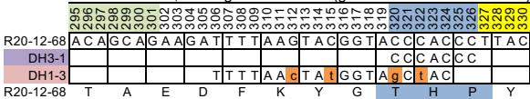  
CDR H3, DH segment matches (germline nt identities shown)

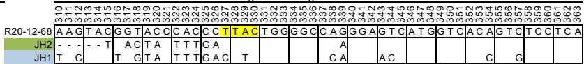  
JH germline segment mismatches

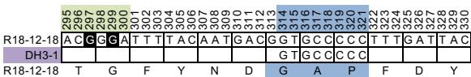

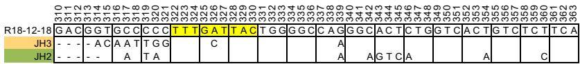

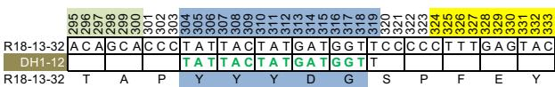

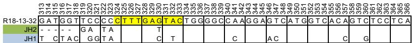

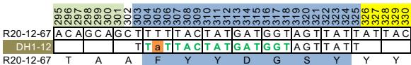

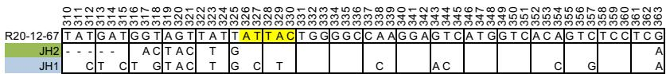

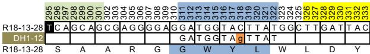

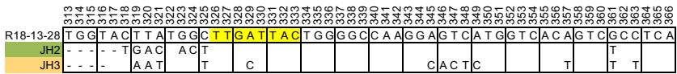

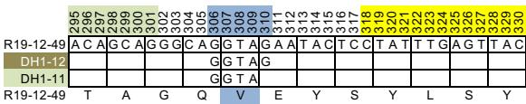

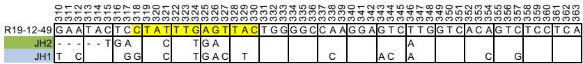

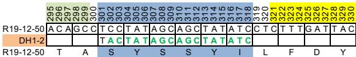

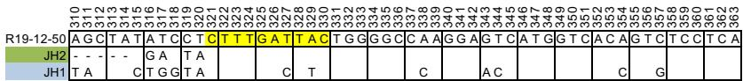

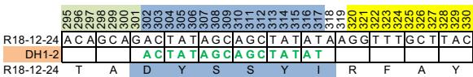

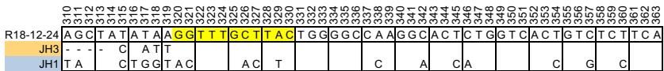

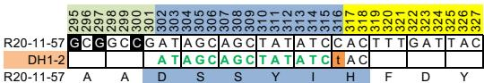

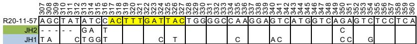

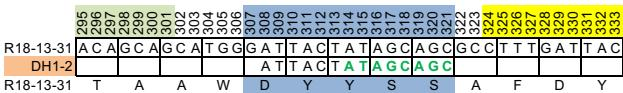

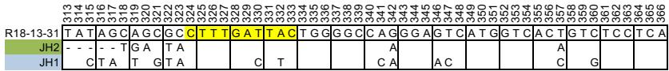

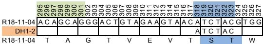

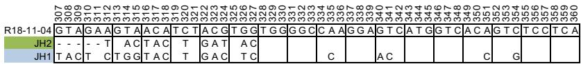

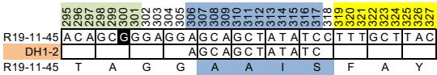

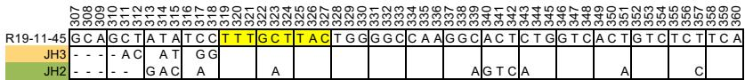

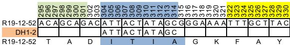

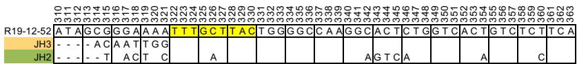

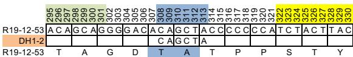

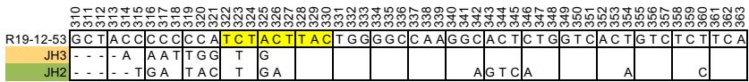

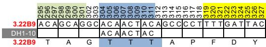

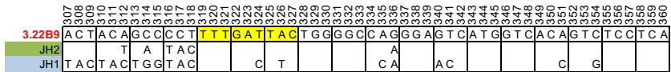

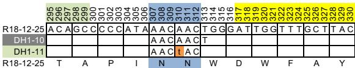

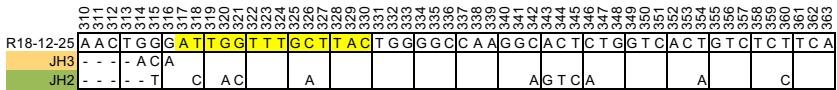

CDR H3, DH segment matches (germline nt identities shown)

<table><tr><td rowspan="32"></td><td colspan="15">295</td><td></td></tr><tr><td colspan="15">296</td><td></td></tr><tr><td colspan="15">297</td><td></td></tr><tr><td colspan="15">298</td><td></td></tr><tr><td colspan="15">300</td><td></td></tr><tr><td colspan="15">301</td><td></td></tr><tr><td colspan="15">302</td><td></td></tr><tr><td colspan="15">303</td><td></td></tr><tr><td colspan="15">304</td><td></td></tr><tr><td colspan="15">305</td><td></td></tr><tr><td colspan="15">306</td><td></td></tr><tr><td colspan="15">307</td><td></td></tr><tr><td colspan="15">308</td><td></td></tr><tr><td colspan="15">309</td><td></td></tr><tr><td colspan="15">310</td><td></td></tr><tr><td colspan="15">311</td><td></td></tr><tr><td colspan="15">312</td><td></td></tr><tr><td colspan="15">313</td><td></td></tr><tr><td colspan="15">314</td><td></td></tr><tr><td colspan="15">315</td><td></td></tr><tr><td colspan="15">316</td><td></td></tr><tr><td colspan="15">317</td><td></td></tr><tr><td colspan="15">318</td><td></td></tr><tr><td colspan="15">319</td><td></td></tr><tr><td colspan="15">320</td><td></td></tr><tr><td colspan="15">321</td><td></td></tr><tr><td colspan="15">322</td><td></td></tr><tr><td colspan="15">323</td><td></td></tr><tr><td colspan="15">324</td><td></td></tr><tr><td colspan="15">325</td><td></td></tr><tr><td colspan="15">326</td><td></td></tr><tr><td colspan="15">327</td><td></td></tr><tr><td>R19-11-46</td><td>A</td><td>C</td><td>A</td><td>A</td><td>G</td><td>G</td><td>A</td><td>T</td><td>A</td><td>A</td><td>A</td><td>C</td><td>G</td><td>G</td><td>G</td><td>G</td></tr><tr><td>DH1-10</td><td></td><td></td><td></td><td></td><td></td><td></td><td>T</td><td>A</td><td>T</td><td>A</td><td>A</td><td>C</td><td></td><td></td><td></td><td></td></tr><tr><td>R19-11-46</td><td>T</td><td>R</td><td>T</td><td>D</td><td>I</td><td>T</td><td>G</td><td>V</td><td>F</td><td>D</td><td>Y</td><td></td><td></td><td></td><td></td><td></td></tr></table>

JH germline segment mismatches

<table><tr><td></td><td>307</td><td>308</td><td>309</td><td>310</td><td>311</td><td>312</td><td>313</td><td>314</td><td>315</td><td>316</td><td>317</td><td>318</td><td>319</td><td>320</td><td>321</td><td>322</td><td>323</td><td>324</td><td>325</td><td>326</td><td>327</td><td>328</td><td>329</td><td>330</td><td>331</td><td>332</td><td>333</td><td>334</td><td>335</td><td>336</td><td>337</td><td>338</td><td>339</td><td>340</td><td>341</td><td>342</td><td>343</td><td>344</td><td>345</td><td>346</td><td>347</td><td>348</td><td>349</td><td>350</td><td>351</td><td>352</td><td>353</td><td>354</td><td>355</td><td>356</td><td>357</td><td>358</td><td>359</td><td>360</td><td></td><td></td><td></td><td></td><td></td><td></td><td></td><td></td><td></td><td></td><td></td><td></td><td></td><td></td><td></td><td></td><td></td><td></td><td></td><td></td><td></td><td></td><td></td><td></td><td></td><td></td><td></td><td></td><td></td><td></td><td></td><td></td><td></td><td></td><td></td><td></td><td></td><td></td><td></td><td></td><td></td><td></td><td></td><td></td><td></td><td></td><td></td><td></td><td></td><td></td><td></td><td></td><td></td><td></td><td></td></tr><tr><td>R19-11-46</td><td>A</td><td>T</td><td>A</td><td>A</td><td>C</td><td>G</td><td>G</td><td>G</td><td>G</td><td>G</td><td>T</td><td>C</td><td>T</td><td>T</td><td>G</td><td>A</td><td>T</td><td>T</td><td>A</td><td>C</td><td>T</td><td>G</td><td>G</td><td>G</td><td>G</td><td>G</td><td>G</td><td>G</td><td>G</td><td>G</td><td>G</td><td>G</td><td>G</td><td>G</td><td>G</td><td>G</td><td>G</td><td>G</td><td>G</td><td>G</td><td>G</td><td>G</td><td>G</td><td>G</td><td>G</td><td>G</td><td>G</td><td>G</td><td>G</td><td>G</td><td>G</td><td>G</td><td>G</td><td>G</td><td>G</td><td>G</td><td></td><td></td><td></td><td></td><td></td><td></td><td></td><td></td><td></td><td></td><td></td><td></td><td></td><td></td><td></td><td></td><td></td><td></td><td></td><td></td><td></td><td></td><td></td><td></td><td></td><td></td><td></td><td></td><td></td><td></td><td></td><td></td><td></td><td></td><td></td><td></td><td></td><td></td><td></td><td></td><td></td><td></td><td></td><td></td><td></td><td></td><td></td><td></td><td></td><td></td><td></td><td></td><td></td></tr><tr><td>JH2</td><td>--</td><td>--</td><td>--</td><td>--</td><td>T</td><td>A</td><td>C</td><td>T</td><td>A</td><td></td><td></td><td></td><td></td><td></td><td></td><td></td><td></td><td></td><td></td><td></td><td></td><td></td><td></td><td></td><td></td><td></td><td></td><td></td><td></td><td></td><td></td><td></td><td></td><td></td><td></td><td></td><td></td><td></td><td></td><td></td><td></td><td></td><td></td><td></td><td></td><td></td><td></td><td></td><td></td><td></td><td></td><td></td><td></td><td></td><td></td><td></td><td></td><td></td><td></td><td></td><td></td><td></td><td></td><td></td><td></td><td></td><td></td><td></td><td></td><td></td><td></td><td></td><td></td><td></td><td></td><td></td><td></td><td></td><td></td><td></td><td></td><td></td><td></td><td></td><td></td><td></td><td></td><td></td><td></td><td></td><td></td><td></td><td></td><td></td><td></td><td></td><td></td><td></td><td></td><td></td><td></td><td></td><td></td><td></td><td></td><td></td><td></td><td></td><td></td></tr><tr><td>JH1</td><td>T</td><td>A</td><td>C</td><td>T</td><td>A</td><td>C</td><td>T</td><td>T</td><td>A</td><td></td><td></td><td></td><td></td><td></td><td></td><td></td><td></td><td></td><td></td><td></td><td></td><td></td><td></td><td></td><td></td><td></td><td></td><td></td><td></td><td></td><td></td><td></td><td></td><td></td><td></td><td></td><td></td><td></td><td></td><td></td><td></td><td></td><td></td><td></td><td></td><td></td><td></td><td></td><td></td><td></td><td></td><td></td><td></td><td></td><td></td><td></td><td></td><td></td><td></td><td></td><td></td><td></td><td></td><td></td><td></td><td></td><td></td><td></td><td></td><td></td><td></td><td></td><td></td><td></td><td></td><td></td><td></td><td></td><td></td><td></td><td></td><td></td><td></td><td></td><td></td><td></td><td></td><td></td><td></td><td></td><td></td><td></td><td></td><td></td><td></td><td></td><td></td><td></td><td></td><td></td><td></td><td></td><td></td><td></td><td></td><td></td><td></td><td></td><td></td></tr></table>

<table><tr><td rowspan="39"></td><td colspan="19">295</td></tr><tr><td colspan="19">296</td></tr><tr><td colspan="19">297</td></tr><tr><td colspan="19">298</td></tr><tr><td colspan="19">300</td></tr><tr><td colspan="19">301</td></tr><tr><td colspan="19">302</td></tr><tr><td colspan="19">303</td></tr><tr><td colspan="19">304</td></tr><tr><td colspan="19">305</td></tr><tr><td colspan="19">306</td></tr><tr><td colspan="19">307</td></tr><tr><td colspan="19">308</td></tr><tr><td colspan="19">309</td></tr><tr><td colspan="19">310</td></tr><tr><td colspan="19">311</td></tr><tr><td colspan="19">312</td></tr><tr><td colspan="19">313</td></tr><tr><td colspan="19">314</td></tr><tr><td colspan="19">316</td></tr><tr><td colspan="19">317</td></tr><tr><td colspan="19">318</td></tr><tr><td colspan="19">320</td></tr><tr><td colspan="19">321</td></tr><tr><td colspan="19">322</td></tr><tr><td colspan="19">323</td></tr><tr><td colspan="19">324</td></tr><tr><td colspan="19">326</td></tr><tr><td colspan="19">327</td></tr><tr><td colspan="19">328</td></tr><tr><td colspan="19">330</td></tr><tr><td colspan="19">331</td></tr><tr><td colspan="19">332</td></tr><tr><td colspan="19">333</td></tr><tr><td colspan="19">T A G C A C G T T A T A A C T C A G T C T C A T A C T T T G A T T A C</td></tr><tr><td>DH1-10</td><td></td><td></td><td></td><td></td><td></td><td></td><td></td><td></td><td></td><td></td><td></td><td></td><td></td><td></td><td></td><td></td><td></td><td></td></tr><tr><td>DH1-12</td><td></td><td></td><td></td><td></td><td></td><td></td><td></td><td></td><td></td><td></td><td></td><td></td><td></td><td></td><td></td><td></td><td></td><td></td></tr><tr><td>T A T A T A C T T T T T T T T T T T T T T T T T T T T T T T T T T T T T T T T T T T T T T T T T T T T T T T T T T T T T T T T T T T T T T T T T T T T T T T T T T T T T T T T T T T T T T T T T T T T T T T T T T T T</td><td></td><td></td><td></td><td></td><td></td><td></td><td></td><td></td><td></td><td></td><td></td><td></td><td></td><td></td><td></td><td></td><td></td><td></td></tr><tr><td>R20-13-71</td><td>T A R Y N S V S Y Y F D Y</td><td></td><td></td><td></td><td></td><td></td><td></td><td></td><td></td><td></td><td></td><td></td><td></td><td></td><td></td><td></td><td></td><td></td></tr></table>

<table><tr><td>R20-13-71</td><td>G</td><td>T</td><td>C</td><td>T</td><td>A</td><td>T</td><td>A</td><td>C</td><td>T</td><td>T</td><td>T</td><td>G</td><td>T</td><td>T</td><td>A</td><td>T</td><td>G</td><td>G</td><td>G</td><td>C</td><td>C</td><td>A</td><td>A</td><td>G</td><td>G</td><td>A</td><td>G</td><td>T</td><td>C</td><td>A</td><td>G</td><td>T</td><td>C</td><td>T</td><td>C</td><td>C</td><td>T</td><td>C</td><td>A</td><td></td></tr><tr><td>JH2</td><td>-</td><td>-</td><td>-</td><td>-</td><td>T</td><td>G</td><td></td><td></td><td></td><td></td><td></td><td></td><td></td><td></td><td></td><td></td><td></td><td></td><td></td><td></td><td></td><td></td><td></td><td></td><td></td><td></td><td></td><td></td><td></td><td></td><td></td><td></td><td></td><td></td><td></td><td></td><td></td><td></td><td></td><td></td></tr><tr><td>JH1</td><td>T</td><td>A</td><td></td><td>A</td><td>C</td><td></td><td>G</td><td>G</td><td></td><td></td><td></td><td></td><td></td><td></td><td></td><td></td><td></td><td></td><td></td><td></td><td></td><td></td><td></td><td></td><td></td><td></td><td></td><td></td><td></td><td></td><td></td><td></td><td></td><td></td><td></td><td></td><td></td><td></td><td></td><td></td></tr></table>

<table><tr><td rowspan="21"></td><td colspan="20">295</td><td></td></tr><tr><td colspan="20">296</td><td></td></tr><tr><td colspan="20">297</td><td></td></tr><tr><td colspan="20">298</td><td></td></tr><tr><td colspan="20">300</td><td></td></tr><tr><td colspan="20">301</td><td></td></tr><tr><td colspan="20">302</td><td></td></tr><tr><td colspan="20">303</td><td></td></tr><tr><td colspan="20">304</td><td></td></tr><tr><td colspan="20">306</td><td></td></tr><tr><td colspan="20">307</td><td></td></tr><tr><td colspan="20">308</td><td></td></tr><tr><td colspan="20">309</td><td></td></tr><tr><td colspan="20">310</td><td></td></tr><tr><td colspan="20">311</td><td></td></tr><tr><td colspan="20">312</td><td></td></tr><tr><td colspan="20">313</td><td></td></tr><tr><td colspan="20">314</td><td></td></tr><tr><td colspan="20">315</td><td></td></tr><tr><td colspan="20">316</td><td></td></tr><tr><td colspan="20">317</td><td></td></tr><tr><td>R19-12-54</td><td>A</td><td>T</td><td>A</td><td>G</td><td>T</td><td>A</td><td>A</td><td>G</td><td>T</td><td>G</td><td>G</td><td>G</td><td>G</td><td>A</td><td>C</td><td>A</td><td>A</td><td>T</td><td>G</td><td>G</td><td>T</td></tr><tr><td>DH1-10</td><td></td><td></td><td></td><td></td><td></td><td></td><td></td><td></td><td></td><td></td><td>A</td><td>C</td><td>A</td><td>A</td><td>C</td><td>T</td><td></td><td></td><td></td><td></td><td></td></tr><tr><td>DH1-5</td><td></td><td></td><td></td><td></td><td></td><td></td><td></td><td></td><td>G</td><td>G</td><td>t</td><td>A</td><td>C</td><td>A</td><td>C</td><td>T</td><td></td><td></td><td></td><td></td><td></td></tr><tr><td>R19-12-54</td><td>I</td><td></td><td>V</td><td></td><td>S</td><td></td><td>G</td><td></td><td></td><td>D</td><td></td><td>N</td><td></td><td>W</td><td></td><td>G</td><td></td><td>V</td><td></td><td>M</td><td></td></tr></table>

<table><tr><td>R19-12-54</td><td>A</td><td>A</td><td>T</td><td>G</td><td>G</td><td>G</td><td>T</td><td>T</td><td>A</td><td>T</td><td>G</td><td>G</td><td>A</td><td>T</td><td>G</td><td>C</td><td>G</td><td>T</td><td>G</td><td>G</td><td>T</td><td>C</td><td>A</td><td>G</td><td>G</td><td>A</td><td>G</td><td>G</td><td>T</td><td>T</td><td>C</td><td>A</td><td>G</td><td>T</td><td>C</td><td>A</td><td>T</td><td>G</td><td>T</td><td>C</td><td>T</td><td>C</td><td>T</td><td>C</td><td>A</td><td></td></tr><tr><td>JH4</td><td>-</td><td>T</td><td></td><td>A</td><td>C</td><td>T</td><td>A</td><td></td><td></td><td></td><td></td><td></td><td></td><td></td><td></td><td></td><td></td><td></td><td></td><td></td><td></td><td></td><td></td><td></td><td></td><td></td><td></td><td></td><td></td><td></td><td></td><td></td><td></td><td></td><td></td><td></td><td></td><td></td><td></td><td></td><td></td><td></td><td></td><td></td><td></td><td></td></tr><tr><td>JH1</td><td>T</td><td></td><td></td><td>A</td><td>C</td><td>T</td><td>G</td><td>T</td><td>A</td><td>C</td><td>T</td><td>T</td><td></td><td>C</td><td>T</td><td>T</td><td></td><td></td><td></td><td></td><td></td><td></td><td></td><td></td><td></td><td></td><td></td><td></td><td></td><td></td><td></td><td></td><td></td><td></td><td></td><td></td><td></td><td></td><td></td><td></td><td></td><td></td><td></td><td></td><td></td><td></td></tr></table>

<table><tr><td rowspan="45"></td><td colspan="19">295</td></tr><tr><td colspan="19">296</td></tr><tr><td colspan="19">297</td></tr><tr><td colspan="19">298</td></tr><tr><td colspan="19">300</td></tr><tr><td colspan="19">301</td></tr><tr><td colspan="19">302</td></tr><tr><td colspan="19">303</td></tr><tr><td colspan="19">304</td></tr><tr><td colspan="19">305</td></tr><tr><td colspan="19">306</td></tr><tr><td colspan="19">307</td></tr><tr><td colspan="19">308</td></tr><tr><td colspan="19">309</td></tr><tr><td colspan="19">310</td></tr><tr><td colspan="19">311</td></tr><tr><td colspan="19">312</td></tr><tr><td colspan="19">313</td></tr><tr><td colspan="19">314</td></tr><tr><td colspan="19">315</td></tr><tr><td colspan="19">316</td></tr><tr><td colspan="19">317</td></tr><tr><td colspan="19">318</td></tr><tr><td colspan="19">319</td></tr><tr><td colspan="19">320</td></tr><tr><td colspan="19">321</td></tr><tr><td colspan="19">322</td></tr><tr><td colspan="19">323</td></tr><tr><td colspan="19">324</td></tr><tr><td colspan="19">325</td></tr><tr><td colspan="19">326</td></tr><tr><td colspan="19">327</td></tr><tr><td colspan="19">328</td></tr><tr><td colspan="19">329</td></tr><tr><td colspan="19">330</td></tr><tr><td></td><td></td><td></td><td></td><td></td><td></td><td></td><td></td><td></td><td></td><td></td><td></td><td></td><td></td><td></td><td></td><td></td><td></td><td></td></tr><tr><td></td><td></td><td></td><td></td><td></td><td></td><td></td><td></td><td></td><td></td><td></td><td></td><td></td><td></td><td></td><td></td><td></td><td></td><td></td></tr><tr><td></td><td></td><td></td><td></td><td></td><td></td><td></td><td></td><td></td><td></td><td></td><td></td><td></td><td></td><td></td><td></td><td></td><td></td><td></td></tr><tr><td></td><td></td><td></td><td></td><td></td><td></td><td></td><td></td><td></td><td></td><td></td><td></td><td></td><td></td><td></td><td></td><td></td><td></td><td></td></tr><tr><td></td><td></td><td></td><td></td><td></td><td></td><td></td><td></td><td></td><td></td><td></td><td></td><td></td><td></td><td></td><td></td><td></td><td></td><td></td></tr><tr><td></td><td></td><td></td><td></td><td></td><td></td><td></td><td></td><td>A T A A T</td><td></td><td></td><td></td><td></td><td></td><td></td><td></td><td></td><td></td><td></td></tr><tr><td></td><td></td><td></td><td></td><td></td><td></td><td></td><td></td><td></td><td></td><td></td><td></td><td></td><td></td><td></td><td></td><td></td><td></td><td></td></tr><tr><td></td><td></td><td></td><td></td><td></td><td></td><td></td><td></td><td></td><td></td><td></td><td></td><td></td><td></td><td></td><td></td><td></td><td></td><td></td></tr><tr><td></td><td></td><td></td><td></td><td></td><td></td><td></td><td></td><td></td><td></td><td></td><td></td><td></td><td></td><td></td><td></td><td></td><td></td><td></td></tr><tr><td></td><td></td><td></td><td></td><td></td><td></td><td></td><td></td><td></td><td></td><td></td><td></td><td></td><td></td><td></td><td></td><td></td><td></td><td></td></tr></table>

<table><tr><td></td><td>310</td><td>311</td><td>312</td><td>313</td><td>314</td><td>315</td><td>316</td><td>317</td><td>318</td><td>319</td><td>320</td><td>321</td><td>322</td><td>323</td><td>324</td><td>325</td><td>326</td><td>327</td><td>328</td><td>329</td><td>330</td><td>331</td><td>332</td><td>333</td><td>334</td><td>335</td><td>336</td><td>337</td><td>338</td><td>339</td><td>340</td><td>341</td><td>342</td><td>343</td><td>344</td><td>345</td><td>346</td><td>347</td><td>348</td><td>349</td><td>350</td><td>351</td><td>352</td><td>353</td><td>354</td><td>355</td><td>356</td><td>357</td><td>358</td><td>359</td><td>360</td><td>361</td><td>362</td></tr><tr><td>R18-12-20</td><td>A</td><td>T</td><td>T</td><td>C</td><td>G</td><td>G</td><td>G</td><td>C</td><td>C</td><td>C</td><td>G</td><td>T</td><td>T</td><td>T</td><td>G</td><td>C</td><td>T</td><td>A</td><td>C</td><td>T</td><td>G</td><td>G</td><td>G</td><td>G</td><td>C</td><td>C</td><td>A</td><td>A</td><td>G</td><td>G</td><td>C</td><td>A</td><td>C</td><td>T</td><td>C</td><td>G</td><td>G</td><td>T</td><td>C</td><td>A</td><td>C</td><td>T</td><td>G</td><td>T</td><td>C</td><td>T</td><td>C</td><td>T</td><td>C</td><td>A</td><td></td><td></td><td></td></tr><tr><td>JH3</td><td>--</td><td>--</td><td>--</td><td>A</td><td>C</td><td>A</td><td>A</td><td>T</td><td>T</td><td>G</td><td></td><td></td><td></td><td></td><td></td><td></td><td></td><td></td><td></td><td></td><td></td><td></td><td></td><td></td><td></td><td></td><td></td><td></td><td></td><td></td><td></td><td></td><td></td><td></td><td></td><td></td><td></td><td></td><td></td><td></td><td></td><td></td><td></td><td></td><td></td><td></td><td></td><td></td><td></td><td></td><td></td><td></td><td></td></tr><tr><td>JH2</td><td>--</td><td>--</td><td>--</td><td>T</td><td>A</td><td>A</td><td>T</td><td>A</td><td>C</td><td></td><td></td><td></td><td></td><td>A</td><td></td><td></td><td></td><td></td><td></td><td></td><td></td><td></td><td></td><td></td><td></td><td></td><td></td><td></td><td></td><td></td><td></td><td></td><td></td><td></td><td></td><td></td><td></td><td></td><td></td><td></td><td></td><td></td><td></td><td></td><td></td><td></td><td></td><td></td><td></td><td></td><td></td><td></td><td></td></tr></table>

<table><tr><td></td><td>295</td><td></td><td></td><td></td><td></td><td></td><td></td><td></td><td></td><td></td><td></td><td></td><td></td><td></td><td></td><td></td><td></td><td></td><td></td><td></td><td></td><td></td><td></td><td></td><td></td><td></td><td></td><td></td></tr><tr><td></td><td>296</td><td></td><td></td><td></td><td></td><td></td><td></td><td></td><td></td><td></td><td></td><td></td><td></td><td></td><td></td><td></td><td></td><td></td><td></td><td></td><td></td><td></td><td></td><td></td><td></td><td></td><td></td><td></td></tr><tr><td></td><td>297</td><td></td><td></td><td></td><td></td><td></td><td></td><td></td><td></td><td></td><td></td><td></td><td></td><td></td><td></td><td></td><td></td><td></td><td></td><td></td><td></td><td></td><td></td><td></td><td></td><td></td><td></td><td></td></tr><tr><td></td><td>303</td><td>304</td><td></td><td></td><td></td><td></td><td></td><td></td><td></td><td></td><td></td><td></td><td></td><td></td><td></td><td></td><td></td><td></td><td></td><td></td><td></td><td></td><td></td><td></td><td></td><td></td><td></td><td></td></tr><tr><td></td><td>305</td><td></td><td></td><td></td><td></td><td></td><td></td><td></td><td></td><td></td><td></td><td></td><td></td><td></td><td></td><td></td><td></td><td></td><td></td><td></td><td></td><td></td><td></td><td></td><td></td><td></td><td></td><td></td></tr><tr><td></td><td>306</td><td>307</td><td>308</td><td>309</td><td>310</td><td>311</td><td>312</td><td>313</td><td>314</td><td>315</td><td>316</td><td>317</td><td>318</td><td>319</td><td>320</td><td>321</td><td></td><td></td><td></td><td></td><td></td><td></td><td></td><td></td><td></td><td></td><td></td><td></td></tr><tr><td>R18-12-23</td><td>A</td><td>C</td><td>A</td><td>G</td><td>C</td><td>A</td><td>G</td><td>A</td><td>T</td><td>A</td><td>C</td><td>T</td><td>A</td><td>C</td><td>C</td><td>G</td><td>G</td><td>G</td><td>G</td><td>G</td><td>G</td><td>T</td><td>T</td><td>C</td><td>G</td><td>T</td><td>T</td><td>A</td></tr><tr><td>DH1-4</td><td></td><td></td><td></td><td></td><td></td><td></td><td>T</td><td>A</td><td>A</td><td>C</td><td>T</td><td>A</td><td>C</td><td>C</td><td>C</td><td>G</td><td>G</td><td></td><td></td><td></td><td></td><td></td><td></td><td></td><td></td><td></td><td></td><td></td></tr><tr><td>R18-12-23</td><td>T</td><td></td><td>A</td><td></td><td>D</td><td></td><td>N</td><td></td><td>Y</td><td></td><td>P</td><td></td><td>G</td><td></td><td>G</td><td></td><td>G</td><td>F</td><td></td><td>R</td><td></td><td>Y</td><td></td><td></td><td></td><td></td><td></td><td></td></tr></table>

<table><tr><td></td><td>310</td><td>311</td><td>312</td><td>313</td><td>314</td><td>315</td><td>316</td><td>317</td><td>318</td><td>319</td><td>320</td><td>321</td><td>322</td><td>323</td><td>324</td><td>325</td><td>326</td><td>327</td><td>328</td><td>329</td><td>330</td><td>331</td><td>332</td><td>333</td><td>334</td><td>335</td><td>336</td><td>337</td><td>338</td><td>339</td><td>340</td><td>341</td><td>342</td><td>343</td><td>344</td><td>345</td><td>346</td><td>347</td><td>348</td><td>349</td><td>350</td><td>351</td><td>352</td><td>353</td><td>354</td><td>355</td><td>356</td><td>357</td><td>358</td><td>359</td><td>360</td><td>361</td><td>362</td><td>363</td></tr><tr><td>R18-12-23</td><td>C</td><td>C</td><td>G</td><td>G</td><td>G</td><td>G</td><td>G</td><td>G</td><td>G</td><td>G</td><td>T</td><td>T</td><td>T</td><td>C</td><td>G</td><td>T</td><td>A</td><td>C</td><td>T</td><td>G</td><td>G</td><td>G</td><td>G</td><td>C</td><td>A</td><td>A</td><td>G</td><td>G</td><td>C</td><td>A</td><td>A</td><td>G</td><td>G</td><td>C</td><td>A</td><td>T</td><td>C</td><td>T</td><td>G</td><td>T</td><td>C</td><td>A</td><td>T</td><td>G</td><td>T</td><td>C</td><td>T</td><td>T</td><td>C</td><td>T</td><td>A</td><td></td><td></td><td></td></tr><tr><td>JH3</td><td>--</td><td>--</td><td>A</td><td>C</td><td>A</td><td>T</td><td></td><td></td><td></td><td>T</td><td></td><td></td><td></td><td>G</td><td>C</td><td></td><td></td><td></td><td></td><td></td><td></td><td></td><td></td><td></td><td></td><td></td><td></td><td></td><td></td><td></td><td></td><td></td><td></td><td></td><td></td><td></td><td></td><td></td><td></td><td></td><td></td><td></td><td></td><td></td><td></td><td></td><td></td><td></td><td></td><td></td><td></td><td></td><td></td><td></td></tr><tr><td>JH2</td><td>--</td><td>--</td><td>--</td><td>T</td><td></td><td>A</td><td>C</td><td>T</td><td>A</td><td>C</td><td></td><td></td><td></td><td>G</td><td>A</td><td></td><td></td><td></td><td></td><td></td><td></td><td></td><td></td><td></td><td></td><td></td><td></td><td></td><td></td><td></td><td></td><td></td><td>A</td><td>G</td><td>T</td><td>C</td><td>A</td><td></td><td></td><td></td><td></td><td></td><td>A</td><td></td><td></td><td></td><td></td><td>C</td><td></td><td></td><td></td><td></td><td></td><td></td></tr></table>

<table><tr><td>R19-11-40</td><td>A</td><td>C</td><td>A</td><td>G</td><td>C</td><td>G</td><td>G</td><td>A</td><td>C</td><td>T</td><td>A</td><td>C</td><td>C</td><td>G</td><td>G</td><td>T</td><td>A</td><td>T</td><td>G</td><td>G</td><td>G</td><td>G</td><td>T</td><td>T</td><td>T</td><td>G</td><td>A</td><td>T</td><td>C</td><td>C</td></tr><tr><td>DH1-4</td><td></td><td></td><td></td><td></td><td></td><td></td><td>A</td><td>C</td><td>T</td><td>A</td><td>C</td><td>C</td><td>C</td><td>G</td><td>G</td><td>T</td><td>A</td><td>T</td><td></td><td></td><td></td><td></td><td></td><td></td><td></td><td></td><td></td><td></td><td></td><td></td></tr><tr><td>R19-11-40</td><td>T</td><td></td><td>A</td><td></td><td></td><td>D</td><td></td><td>Y</td><td></td><td></td><td>P</td><td></td><td>G</td><td></td><td>M</td><td></td><td>G</td><td></td><td>F</td><td></td><td></td><td>D</td><td></td><td></td><td>S</td><td></td><td></td><td></td><td></td><td></td></tr></table>

<table><tr><td rowspan="2">R19-11-40</td><td>307</td><td>308</td><td>309</td><td>310</td><td>311</td><td>312</td><td>313</td><td>314</td><td>315</td><td>316</td><td>317</td><td>318</td><td>319</td><td>320</td><td>321</td><td>322</td><td>323</td><td>324</td><td>325</td><td>326</td><td>327</td><td>328</td><td>329</td><td>330</td><td>331</td><td>332</td><td>333</td><td>334</td><td>335</td><td>336</td><td>337</td><td>338</td><td>339</td><td>340</td><td>341</td><td>342</td><td>343</td><td>344</td><td>345</td><td>346</td><td>347</td><td>348</td><td>349</td><td>350</td><td>351</td><td>352</td><td>353</td><td>354</td><td>355</td><td>356</td><td>357</td><td>358</td><td>359</td><td>360</td></tr><tr><td>C</td><td>C</td><td>G</td><td>G</td><td>T</td><td>A</td><td>T</td><td>G</td><td>G</td><td>G</td><td>G</td><td>T</td><td>T</td><td>T</td><td>G</td><td>A</td><td>T</td><td>T</td><td>C</td><td>T</td><td>G</td><td>G</td><td>G</td><td>G</td><td>C</td><td>A</td><td>A</td><td>G</td><td>G</td><td>A</td><td>G</td><td>T</td><td>C</td><td>A</td><td>T</td><td>G</td><td>G</td><td>T</td><td>C</td><td>A</td><td>C</td><td>A</td><td>G</td><td>T</td><td>C</td><td>T</td><td>C</td><td>T</td><td>C</td><td>A</td><td></td><td></td><td></td><td></td></tr><tr><td>JH2</td><td>--</td><td>--</td><td>--</td><td>--</td><td>G</td><td>A</td><td>C</td><td>T</td><td>A</td><td>C</td><td></td><td></td><td></td><td></td><td></td><td></td><td></td><td>A</td><td></td><td></td><td></td><td></td><td></td><td></td><td></td><td></td><td></td><td></td><td></td><td></td><td></td><td></td><td></td><td></td><td></td><td></td><td></td><td></td><td></td><td></td><td></td><td></td><td></td><td></td><td></td><td></td><td></td><td></td><td></td><td></td><td></td><td></td><td></td><td></td></tr><tr><td>JH1</td><td>T</td><td>A</td><td>C</td><td>T</td><td>A</td><td>C</td><td></td><td></td><td></td><td></td><td></td><td></td><td></td><td></td><td></td><td></td><td></td><td>C</td><td>T</td><td></td><td></td><td></td><td></td><td></td><td></td><td></td><td></td><td></td><td></td><td></td><td></td><td></td><td></td><td></td><td></td><td></td><td></td><td></td><td></td><td></td><td></td><td></td><td></td><td></td><td></td><td></td><td></td><td></td><td></td><td></td><td></td><td></td><td></td><td></td></tr></table>

<table><tr><td>R19-11-41</td><td>A</td><td>C</td><td>A</td><td>G</td><td>C</td><td>A</td><td>G</td><td>A</td><td>G</td><td>G</td><td>T</td><td>A</td><td>T</td><td>A</td><td>A</td><td>T</td><td>A</td><td>C</td><td>T</td><td>G</td><td>G</td><td>T</td><td>T</td><td>T</td><td>G</td><td>A</td><td>T</td><td>T</td><td>A</td></tr><tr><td>DH1-4</td><td></td><td></td><td></td><td></td><td></td><td></td><td>G</td><td></td><td>G</td><td>G</td><td>T</td><td>A</td><td>T</td><td>A</td><td></td><td>A</td><td>T</td><td>T</td><td>A</td><td>C</td><td>AC</td><td></td><td></td><td></td><td></td><td></td><td></td><td></td><td></td></tr><tr><td>R19-11-41</td><td>T</td><td></td><td>A</td><td></td><td>E</td><td></td><td>G</td><td></td><td>I</td><td></td><td>T</td><td>T</td><td>T</td><td></td><td>T</td><td></td><td>W</td><td>F</td><td></td><td>D</td><td></td><td>Y</td><td></td><td></td><td></td><td></td><td></td><td></td><td></td></tr></table>

<table><tr><td rowspan="2">R19-11-41</td><td>307</td><td>308</td><td>310</td><td>311</td><td>312</td><td>313</td><td>314</td><td>315</td><td>316</td><td>317</td><td>318</td><td>319</td><td>320</td><td>321</td><td>322</td><td>323</td><td>324</td><td>325</td><td>326</td><td>327</td><td>328</td><td>329</td><td>330</td><td>331</td><td>332</td><td>333</td><td>334</td><td>335</td><td>336</td><td>337</td><td>338</td><td>339</td><td>340</td><td>341</td><td>342</td><td>343</td><td>344</td><td>345</td><td>346</td><td>347</td><td>348</td><td>349</td><td>350</td><td>351</td><td>352</td><td>353</td><td>354</td><td>355</td><td>356</td><td>357</td><td>358</td><td>359</td><td>360</td><td></td></tr><tr><td>A</td><td>T</td><td>A</td><td>A</td><td>C</td><td>T</td><td>A</td><td>C</td><td>G</td><td>T</td><td>G</td><td>G</td><td>T</td><td>T</td><td>T</td><td>G</td><td>A</td><td>T</td><td>T</td><td>A</td><td>C</td><td>T</td><td>G</td><td>G</td><td>G</td><td>C</td><td>C</td><td>A</td><td>A</td><td>G</td><td>G</td><td>A</td><td>G</td><td>T</td><td>C</td><td>A</td><td>T</td><td>G</td><td>G</td><td>T</td><td>C</td><td>A</td><td>C</td><td>A</td><td>G</td><td>T</td><td>C</td><td>T</td><td>C</td><td>C</td><td>T</td><td>C</td><td>A</td><td></td></tr><tr><td>JH2</td><td>-</td><td>-</td><td>-</td><td>-</td><td>G</td><td>A</td><td>C</td><td></td><td>A</td><td>C</td><td></td><td></td><td></td><td></td><td></td><td></td><td></td><td></td><td></td><td></td><td></td><td></td><td></td><td></td><td></td><td></td><td></td><td></td><td></td><td></td><td></td><td></td><td></td><td></td><td></td><td></td><td></td><td></td><td></td><td></td><td></td><td></td><td></td><td></td><td></td><td></td><td></td><td></td><td></td><td></td><td></td><td></td><td></td><td></td></tr><tr><td>JH3</td><td>-</td><td>-</td><td>-</td><td>-</td><td>A</td><td>C</td><td>A</td><td>T</td><td></td><td></td><td></td><td></td><td></td><td></td><td></td><td></td><td></td><td></td><td></td><td></td><td></td><td></td><td></td><td></td><td></td><td></td><td></td><td></td><td></td><td></td><td></td><td></td><td></td><td></td><td></td><td></td><td></td><td></td><td></td><td></td><td></td><td></td><td></td><td></td><td></td><td></td><td></td><td></td><td></td><td></td><td></td><td></td><td></td><td></td></tr></table>

<table><tr><td rowspan="9"></td><td colspan="18">295</td></tr><tr><td colspan="18">296</td></tr><tr><td colspan="18">297</td></tr><tr><td colspan="18">298</td></tr><tr><td colspan="18">300</td></tr><tr><td colspan="18">301</td></tr><tr><td colspan="18">302</td></tr><tr><td colspan="18">303</td></tr><tr><td colspan="18"></td></tr><tr><td>R18-11-01</td><td>A</td><td>C</td><td>A</td><td>G</td><td>C</td><td>A</td><td>G</td><td>C</td><td>G</td><td>A</td><td>C</td><td>T</td><td>A</td><td>C</td><td>G</td><td>G</td><td>G</td><td>T</td></tr><tr><td>DH1-9</td><td></td><td></td><td></td><td></td><td></td><td></td><td></td><td></td><td>A</td><td>C</td><td>T</td><td>A</td><td>G</td><td>G</td><td>G</td><td>T</td><td>A</td><td>T</td></tr><tr><td>DH1-4</td><td></td><td></td><td></td><td></td><td></td><td></td><td></td><td></td><td></td><td></td><td>C</td><td>G</td><td>G</td><td>G</td><td>T</td><td>A</td><td>T</td><td>A</td></tr><tr><td>R18-11-01</td><td>T</td><td>A</td><td>A</td><td>A</td><td>T</td><td>T</td><td>G</td><td>I</td><td>K</td><td>F</td><td>D</td><td>Y</td><td></td><td></td><td></td><td></td><td></td><td></td></tr></table>

<table><tr><td rowspan="2">R18-11-01</td><td>307</td><td>308</td><td>309</td><td>310</td><td>311</td><td>312</td><td>313</td><td>314</td><td>315</td><td>316</td><td>317</td><td>318</td><td>319</td><td>320</td><td>321</td><td>322</td><td>323</td><td>324</td><td>325</td><td>326</td><td>327</td><td>328</td><td>329</td><td>330</td><td>331</td><td>332</td><td>333</td><td>334</td><td>335</td><td>336</td><td>337</td><td>338</td><td>339</td><td>340</td><td>341</td><td>342</td><td>343</td><td>344</td><td>345</td><td>346</td><td>347</td><td>348</td><td>349</td><td>350</td><td>351</td><td>352</td><td>353</td><td>354</td><td>355</td><td>356</td><td>357</td><td>358</td><td>359</td><td>360</td><td></td><td></td><td></td><td></td><td></td><td></td><td></td><td></td><td></td><td></td><td></td><td></td><td></td><td></td><td></td><td></td><td></td><td></td><td></td><td></td><td></td><td></td><td></td><td></td><td></td><td></td><td></td><td></td><td></td><td></td><td></td><td></td><td></td><td></td><td></td><td></td><td></td><td></td><td></td><td></td><td></td><td></td><td></td><td></td><td></td><td></td><td></td><td></td><td></td><td></td><td></td><td></td><td></td><td></td><td></td><td></td><td></td><td></td><td></td><td></td><td></td><td></td><td></td><td></td><td></td><td></td><td></td><td></td><td></td><td></td><td></td><td></td><td></td><td></td><td></td><td></td><td></td><td></td><td></td><td></td><td></td><td></td><td></td><td></td><td></td><td></td><td></td><td></td><td></td><td></td><td></td><td></td><td></td><td></td><td></td><td></td><td></td><td></td><td></td><td></td><td></td><td></td><td></td><td></td><td></td><td></td><td></td><td></td><td></td><td></td><td></td><td></td><td></td><td></td><td></td><td></td><td></td><td></td><td></td><td></td><td></td><td></td><td></td><td></td><td></td><td></td><td></td><td></td><td></td><td></td><td></td><td></td><td></td><td></td><td></td><td></td><td></td><td></td><td></td><td></td><td></td><td></td><td></td><td></td><td></td><td></td><td></td><td></td><td></td><td></td><td></td><td></td><td></td><td></td><td></td><td></td><td></td><td></td><td></td><td></td><td></td><td></td><td></td><td></td><td></td><td></td><td></td><td></td><td></td><td></td><td></td><td></td><td></td><td></td><td></td><td></td><td></td><td></td><td></td><td></td><td></td><td></td><td></td><td></td><td></td><td></td><td></td><td></td><td></td><td></td><td></td><td></td><td></td><td></td><td></td><td></td><td></td><td></td><td></td><td></td><td></td><td></td><td></td><td></td><td></td><td></td><td></td><td></td><td></td><td></td><td></td><td></td><td></td><td></td><td></td><td></td><td></td><td></td><td></td><td></td><td></td><td></td><td></td><td></td><td></td><td></td><td></td><td></td><td></td><td></td><td></td><td></td><td></td><td></td><td></td><td></td><td></td><td></td><td></td><td></td><td></td><td></td><td></td><td></td><td></td><td></td><td></td><td></td><td></td><td></td><td></td><td></td><td></td><td></td><td></td><td></td><td></td><td></td><td></td><td></td><td></td><td></td><td></td><td></td><td></td><td></td><td></td><td></td><td></td><td></td><td></td><td></td><td></td><td></td><td></td><td></td><td></td><td></td><td></td><td></td><td></td><td></td><td></td><td></td><td></td><td></td><td></td><td></td><td></td><td></td><td></td><td></td><td></td><td></td><td></td><td></td><td></td><td></td><td></td><td></td><td></td><td></td><td></td><td></td><td></td><td></td><td></td><td></td><td></td><td></td><td></td><td></td><td></td><td></td><td></td><td></td><td></td><td></td><td></td><td></td><td></td><td></td><td></td><td></td><td></td><td></td><td></td><td></td><td></td><td></td><td></td><td></td><td></td><td></td><td></td><td></td><td></td><td></td><td></td><td></td><td></td><td></td><td></td><td></td><td></td><td></td><td></td><td></td><td></td><td></td><td></td><td></td><td></td><td></td><td></td><td></td><td></td><td></td><td></td><td></td><td></td><td></td><td></td><td></td><td></td><td></td><td></td><td></td><td></td><td></td><td></td><td></td><td></td><td></td><td></td><td></td><td></td><td></td><td></td><td></td><td></td><td></td><td></td><td></td><td></td><td></td><td></td><td></td><td></td><td></td><td></td><td></td><td></td><td></td><td></td><td></td><td></td><td></td><td></td><td></td><td></td><td></td><td></td><td></td><td></td><td></td><td></td><td></td><td></td><td></td><td></td><td></td><td></td><td></td><td></td><td></td><td></td><td></td><td></td><td></td><td></td><td></td><td></td><td></td><td></td><td></td><td></td><td></td><td></td><td></td><td></td><td></td><td></td><td></td><td></td><td></td><td></td><td></td><td></td><td></td><td></td><td></td><td></td><td></td><td></td><td></td><td></td><td></td><td></td><td></td><td></td><td></td><td></td><td></td><td></td><td></td><td></td><td></td><td></td><td></td><td></td><td></td><td></td><td></td><td></td><td></td><td></td><td></td><td></td><td></td><td></td><td></td><td></td><td></td><td></td><td></td><td></td><td></td><td></td><td></td><td></td><td></td><td></td><td></td><td></td><td></td><td></td><td></td><td></td><td></td><td></td><td></td><td></td><td></td><td></td><td></td><td></td><td></td><td></td><td></td><td></td><td></td><td></td><td></td><td></td><td></td><td></td><td></td><td></td><td></td><td></td><td></td><td></td><td></td><td></td><td></td><td></td><td></td><td></td><td></td><td></td><td></td><td></td><td></td><td></td><td></td><td></td><td></td><td></td><td></td><td></td><td></td><td></td><td></td><td></td><td></td><td></td><td></td><td></td><td></td><td></td><td></td><td></td><td></td><td></td><td></td><td></td><td></td><td></td><td></td><td></td><td></td><td></td><td></td><td></td><td></td><td></td><td></td><td></td><td></td><td></td><td></td><td></td><td></td><td></td><td></td><td></td><td></td><td></td><td></td><td></td><td></td><td></td><td></td><td></td><td></td><td></td><td></td><td></td><td></td><td></td><td></td><td></td><td></td><td></td><td></td><td></td><td></td><td></td><td></td><td></td><td></td><td></td><td></td><td></td><td></td><td></td><td></td><td></td><td></td><td></td><td></td><td></td><td></td><td></td><td></td><td></td><td></td><td></td><td></td><td></td><td></td><td></td><td></td><td></td><td></td><td></td><td></td><td></td><td></td><td></td><td></td><td></td><td></td><td></td><td></td><td></td><td></td><td></td><td></td><td></td><td></td><td></td><td></td><td></td><td></td><td></td><td></td><td></td><td></td><td></td><td></td><td></td><td></td><td></td><td></td><td></td><td></td><td></td><td></td><td></td><td></td><td></td><td></td><td></td><td></td><td></td><td></td><td></td></tr><tr><td>A</td><td>C</td><td>G</td><td>G</td><td>T</td><td>A</td><td>T</td><td>A</td><td>A</td><td>G</td><td>T</td><td>T</td><td>T</td><td>G</td><td>A</td><td>T</td><td>T</td><td>A</td><td>C</td><td>T</td><td>G</td><td>G</td><td>G</td><td>G</td><td>C</td><td>A</td><td>A</td><td>G</td><td>G</td><td>A</td><td>G</td><td>T</td><td>C</td><td>A</td><td>T</td><td>G</td><td>G</td><td>T</td><td>C</td><td>A</td><td>C</td><td>G</td><td>T</td><td>C</td><td>T</td><td>C</td><td>G</td><td>C</td><td>A</td><td></td><td></td><td></td><td></td><td></td><td></td><td></td><td></td><td></td><td></td><td></td><td></td><td></td><td></td><td></td><td></td><td></td><td></td><td></td><td></td><td></td><td></td><td></td><td></td><td></td><td></td><td></td><td></td><td></td><td></td><td></td><td></td><td></td><td></td><td></td><td></td><td></td><td></td><td></td><td></td><td></td><td></td><td></td><td></td><td></td><td></td><td></td><td></td><td></td><td></td><td></td><td></td><td></td><td></td><td></td><td></td><td></td><td></td><td></td><td></td><td></td><td></td><td></td><td></td><td></td><td></td><td></td><td></td><td></td><td></td><td></td><td></td><td></td><td></td><td></td><td></td><td></td><td></td><td></td><td></td><td></td><td></td><td></td><td></td><td></td><td></td><td></td><td></td><td></td><td></td><td></td><td></td><td></td><td></td><td></td><td></td><td></td><td></td><td></td><td></td><td></td><td></td><td></td><td></td><td></td><td></td><td></td><td></td><td></td><td></td><td></td><td></td><td></td><td></td><td></td><td></td><td></td><td></td><td></td><td></td><td></td><td></td><td></td><td></td><td></td><td></td><td></td><td></td><td></td><td></td><td></td><td></td><td></td><td></td><td></td><td></td><td></td><td></td><td></td><td></td><td></td><td></td><td></td><td></td><td></td><td></td><td></td><td></td><td></td><td></td><td></td><td></td><td></td><td></td><td></td><td></td><td></td><td></td><td></td><td></td><td></td><td></td><td></td><td></td><td></td><td></td><td></td><td></td><td></td><td></td><td></td><td></td><td></td><td></td><td></td><td></td><td></td><td></td><td></td><td></td><td></td><td></td><td></td><td></td><td></td><td></td><td></td><td></td><td></td><td></td><td></td><td></td><td></td><td></td><td></td><td></td><td></td><td></td><td></td><td></td><td></td><td></td><td></td><td></td><td></td><td></td><td></td><td></td><td></td><td></td><td></td><td></td><td></td><td></td><td></td><td></td><td></td><td></td><td></td><td></td><td></td><td></td><td></td><td></td><td></td><td></td><td></td><td></td><td></td><td></td><td></td><td></td><td></td><td></td><td></td><td></td><td></td><td></td><td></td><td></td><td></td><td></td><td></td><td></td><td></td><td></td><td></td><td></td><td></td><td></td><td></td><td></td><td></td><td></td><td></td><td></td><td></td><td></td><td></td><td></td><td></td><td></td><td></td><td></td><td></td><td></td><td></td><td></td><td></td><td></td><td></td><td></td><td></td><td></td><td></td><td></td><td></td><td></td><td></td><td></td><td></td><td></td><td></td><td></td><td></td><td></td><td></td><td></td><td></td><td></td><td></td><td></td><td></td><td></td><td></td><td></td><td></td><td></td><td></td><td></td><td></td><td></td><td></td><td></td><td></td><td></td><td></td><td></td><td></td><td></td><td></td><td></td><td></td><td></td><td></td><td></td><td></td><td></td><td></td><td></td><td></td><td></td><td></td><td></td><td></td><td></td><td></td><td></td><td></td><td></td><td></td><td></td><td></td><td></td><td></td><td></td><td></td><td></td><td></td><td></td><td></td><td></td><td></td><td></td><td></td><td></td><td></td><td></td><td></td><td></td><td></td><td></td><td></td><td></td><td></td><td></td><td></td><td></td><td></td><td></td><td></td><td></td><td></td><td></td><td></td><td></td><td></td><td></td><td></td><td></td><td></td><td></td><td></td><td></td><td></td><td></td><td></td><td></td><td></td><td></td><td></td><td></td><td></td><td></td><td></td><td></td><td></td><td></td><td></td><td></td><td></td><td></td><td></td><td></td><td></td><td></td><td></td><td></td><td></td><td></td><td></td><td></td><td></td><td></td><td></td><td></td><td></td><td></td><td></td><td></td><td></td><td></td><td></td><td></td><td></td><td></td><td></td><td></td><td></td><td></td><td></td><td></td><td></td><td></td><td></td><td></td><td></td><td></td><td></td><td></td><td></td><td></td><td></td><td></td><td></td><td></td><td></td><td></td><td></td><td></td><td></td><td></td><td></td><td></td><td></td><td></td><td></td><td></td><td></td><td></td><td></td><td></td><td></td><td></td><td></td><td></td><td></td><td></td><td></td><td></td><td></td><td></td><td></td><td></td><td></td><td></td><td></td><td></td><td></td><td></td><td></td><td></td><td></td><td></td><td></td><td></td><td></td><td></td><td></td><td></td><td></td><td></td><td></td><td></td><td></td><td></td><td></td><td></td><td></td><td></td><td></td><td></td><td></td><td></td><td></td><td></td><td></td><td></td><td></td><td></td><td></td><td></td><td></td><td></td><td></td><td></td><td></td><td></td><td></td><td></td><td></td><td></td><td></td><td></td><td></td><td></td><td></td><td></td><td></td><td></td><td></td><td></td><td></td><td></td><td></td><td></td><td></td><td></td><td></td><td></td><td></td><td></td><td></td><td></td><td></td><td></td><td></td><td></td><td></td><td></td><td></td><td></td><td></td><td></td><td></td><td></td><td></td><td></td><td></td><td></td><td></td><td></td><td></td><td></td><td></td><td></td><td></td><td></td><td></td><td></td><td></td><td></td><td></td><td></td><td></td><td></td><td></td><td></td><td></td><td></td><td></td><td></td><td></td><td></td><td></td><td></td><td></td><td></td><td></td><td></td><td></td><td></td><td></td><td></td><td></td><td></td><td></td><td></td><td></td><td></td><td></td><td></td><td></td><td></td><td></td><td></td><td></td><td></td><td></td><td></td><td></td><td></td><td></td><td></td><td></td><td></td><td></td><td></td><td></td><td></td><td></td><td></td><td></td><td></td><td></td><td></td><td></td><td></td><td></td><td></td><td></td><td></td><td></td><td></td><td></td><td></td><td></td><td></td><td></td><td></td><td></td><td></td><td></td><td></td><td></td><td></td><td></td><td></td><td></td><td></td><td></td><td></td><td></td><td></td><td></td><td></td><td></td><td></td><td></td><td></td><td></td><td></td><td></td><td></td><td></td><td></td><td></td><td></td><td></td><td></td><td></td><td></td><td></td><td></td></tr><tr><td>JH2</td><td>--</td><td>--</td><td>--</td><td>--</td><td>--</td><td>G</td><td>A</td><td>C</td><td>T</td><td>C</td><td></td><td></td><td></td><td></td><td></td><td></td><td></td><td></td><td></td><td></td><td></td><td></td><td></td><td></td><td></td><td></td><td></td><td></td><td></td><td></td><td></td><td></td><td></td><td></td><td></td><td></td><td></td><td></td><td></td><td></td><td></td><td></td><td></td><td></td><td></td><td></td><td></td><td></td><td></td><td></td><td></td><td></td><td></td><td></td><td></td><td></td><td></td><td></td><td></td><td></td><td></td><td></td><td></td><td></td><td></td><td></td><td></td><td></td><td></td><td></td><td></td><td></td><td></td><td></td><td></td><td></td><td></td><td></td><td></td><td></td><td></td><td></td><td></td><td></td><td></td><td></td><td></td><td></td><td></td><td></td><td></td><td></td><td></td><td></td><td></td><td></td><td></td><td></td><td></td><td></td><td></td><td></td><td></td><td></td><td></td><td></td><td></td><td></td><td></td><td>T</td><td></td><td></td><td></td><td></td><td></td><td></td><td></td><td></td><td></td><td></td><td></td><td></td><td></td><td></td><td></td><td></td><td></td><td></td><td></td><td></td><td></td><td></td><td></td><td></td><td></td><td></td><td></td><td></td><td></td><td></td><td></td><td></td><td></td><td></td><td></td><td></td><td></td><td></td><td></td><td></td><td></td><td></td><td></td><td></td><td></td><td></td><td></td><td></td><td></td><td></td><td></td><td></td><td></td><td></td><td></td><td></td><td></td><td></td><td></td><td></td><td></td><td></td><td></td><td></td><td></td><td></td><td></td><td></td><td></td><td></td><td></td><td></td><td></td><td></td><td></td><td></td><td></td><td></td><td></td><td></td><td></td><td></td><td></td><td></td><td></td><td></td><td></td><td></td><td></td><td></td><td></td><td></td><td></td><td></td><td></td><td></td><td></td><td rowspan="2"></td><td rowspan="2" colspan="101"></td><td></td><td></td><td></td><td></td><td></td><td></td><td></td><td></td><td></td><td></td><td></td><td></td><td></td><td></td><td></td><td></td><td></td><td></td><td></td><td></td><td></td><td></td><td></td><td></td><td></td><td></td><td></td><td></td><td></td><td></td><td></td><td></td><td></td><td></td><td></td><td></td><td></td><td></td><td></td><td></td><td></td><td></td><td></td><td></td><td></td><td></td><td></td><td></td><td></td><td></td><td></td><td></td><td></td><td></td><td></td><td></td><td></td><td></td><td></td><td></td><td></td><td></td><td></td><td></td><td></td><td></td><td></td><td></td><td></td><td></td><td></td><td></td><td></td><td></td><td></td><td></td><td></td><td></td><td></td><td></td><td></td><td></td><td></td><td></td><td></td><td></td><td></td><td></td><td></td><td></td><td></td><td></td><td></td><td></td><td></td><td></td><td></td><td></td><td></td><td></td><td></td><td></td><td></td><td></td><td></td><td></td><td></td><td></td><td></td><td></td><td></td><td></td><td></td><td></td><td></td><td></td><td></td><td></td><td></td><td></td><td></td><td></td><td></td><td></td><td></td><td></td><td></td><td></td><td></td><td></td><td></td><td></td><td></td><td></td><td></td><td></td><td></td><td></td><td></td><td></td><td></td><td></td><td></td><td></td><td></td><td></td><td></td><td></td><td></td><td></td><td></td><td></td><td></td><td></td><td></td><td></td><td></td><td></td><td></td><td></td><td></td><td></td><td></td><td></td><td></td><td></td><td></td><td></td><td></td><td></td><td></td><td></td><td></td><td></td><td></td><td></td><td></td><td></td><td></td><td></td><td></td><td></td><td></td><td></td><td></td><td></td><td></td><td></td><td></td><td></td><td></td><td></td><td></td><td></td><td></td><td></td><td></td><td></td><td></td><td></td><td></td><td></td><td></td><td></td><td></td><td></td><td></td><td></td><td></td><td></td><td></td><td></td><td></td><td></td><td></td><td></td><td></td><td></td><td></td><td></td><td></td><td></td><td></td><td></td><td></td><td></td><td></td><td></td><td></td><td></td><td></td><td></td><td></td><td></td><td></td><td></td><td></td><td></td><td></td><td></td><td></td><td></td><td></td><td></td><td></td><td></td><td></td><td></td><td></td><td></td><td></td><td></td><td></td><td></td><td></td><td></td><td></td><td></td><td></td><td></td><td></td><td></td><td></td><td></td><td></td><td></td><td></td><td></td><td></td><td></td><td></td><td></td><td></td><td></td><td></td><td></td><td></td><td></td><td></td><td></td><td></td><td></td><td></td><td></td><td></td><td></td><td></td><td></td><td></td><td></td><td></td><td></td><td></td><td></td><td></td><td></td><td></td><td></td><td></td><td></td><td></td><td></td><td></td><td></td><td></td><td></td><td></td><td></td><td></td><td></td><td></td><td></td><td></td><td></td><td></td><td></td><td></td><td></td><td></td><td></td><td></td><td></td><td></td><td></td><td></td><td></td><td></td><td></td><td></td><td></td><td></td><td></td><td></td><td></td><td></td><td></td><td></td><td></td><td></td><td></td><td></td><td></td><td></td><td></td><td></td><td></td><td></td><td></td><td></td><td></td><td></td><td></td><td></td><td></td><td></td><td></td><td></td><td></td><td></td><td></td><td></td><td></td><td></td><td></td><td></td><td></td><td></td><td></td><td></td><td></td><td></td><td></td><td></td><td></td><td></td><td></td><td></td><td></td><td></td><td></td><td></td><td></td><td></td><td></td><td></td><td></td><td></td><td></td><td></td><td></td><td></td><td></td><td></td><td></td><td></td><td></td><td></td><td></td><td></td><td></td><td></td><td></td><td></td><td></td></tr><tr><td>JH1</td><td>T</td><td>A</td><td>C</td><td>T</td><td>A</td><td>C</td><td>T</td><td>G</td><td>G</td><td>T</td><td>C</td><td></td><td></td><td></td><td></td><td></td><td></td><td></td><td></td><td></td><td></td><td></td><td></td><td></td><td></td><td></td><td></td><td></td><td></td><td></td><td></td><td></td><td></td><td></td><td></td><td></td><td></td><td></td><td></td><td></td><td></td><td></td><td></td><td></td><td></td><td></td><td></td><td></td><td></td><td></td><td></td><td></td><td></td><td></td><td></td><td></td><td></td><td></td><td></td><td></td><td></td><td></td><td></td><td></td><td></td><td></td><td></td><td></td><td></td><td></td><td></td><td></td><td></td><td></td><td></td><td></td><td></td><td></td><td></td><td></td><td></td><td></td><td></td><td></td><td></td><td></td><td></td><td></td><td></td><td></td><td></td><td></td><td></td><td></td><td></td><td></td><td></td><td></td><td></td><td></td><td></td><td></td><td></td><td></td><td></td><td></td><td>C</td><td>G</td><td></td><td></td><td></td><td></td><td></td><td></td><td></td><td></td><td></td><td></td><td></td><td></td><td></td><td></td><td></td><td></td><td></td><td></td><td></td><td></td><td></td><td></td><td></td><td></td><td></td><td></td><td></td><td></td><td></td><td></td><td></td><td></td><td></td><td></td><td></td><td></td><td></td><td></td><td></td><td></td><td></td><td></td><td></td><td></td><td></td><td></td><td></td><td></td><td></td><td></td><td></td><td></td><td></td><td></td><td></td><td></td><td></td><td></td><td></td><td></td><td></td><td></td><td></td><td></td><td></td><td></td><td></td><td></td><td></td><td></td><td></td><td></td><td></td><td></td><td></td><td></td><td></td><td></td><td></td><td></td><td></td><td></td><td></td><td></td><td></td><td></td><td></td><td></td><td></td><td></td><td></td><td></td><td></td><td></td><td></td><td></td><td></td><td></td><td></td><td></td><td></td><td></td><td></td><td></td><td></td><td></td><td></td><td></td><td></td><td></td><td></td><td></td><td></td><td></td><td></td><td></td><td></td><td></td><td></td><td></td><td></td><td></td><td></td><td></td><td></td><td></td><td></td><td></td><td></td><td></td><td></td><td></td><td></td><td></td><td></td><td></td><td></td><td></td><td></td><td></td><td></td><td></td><td></td><td></td><td></td><td></td><td></td><td></td><td></td><td></td><td></td><td></td><td></td><td></td><td></td><td></td><td></td><td></td><td></td><td></td><td></td><td></td><td></td><td></td><td></td><td></td><td></td><td></td><td></td><td></td><td></td><td></td><td></td><td></td><td></td><td></td><td></td><td></td><td></td><td></td><td></td><td></td><td></td><td></td><td></td><td></td><td></td><td></td><td></td><td></td><td></td><td></td><td></td><td></td><td></td><td></td><td></td><td>C</td><td>G</td><td>T</td><td>C</td><td>A</td><td>A</td><td>G</td><td>G</td><td>G</td><td>G</td><td>G</td><td>G</td><td>G</td><td>G</td><td>G</td><td>G</td><td>G</td><td>G</td><td>G</td><td>G</td><td>G</td><td>G</td><td>G</td><td>G</td><td>G</td><td>G</td><td>G</td><td>G</td><td>G</td><td>G</td><td>G</td><td>G</td><td>G</td><td>G</td><td>G</td><td>G</td><td>G</td><td>G</td><td>G</td><td>G</td><td>G</td><td>G</td><td>G</td><td>G</td><td>G</td><td>G</td><td>G</td><td>G</td><td>G</td><td>G</td><td>G</td><td>G</td><td>G</td><td>G</td><td>G</td><td>G</td><td>C</td><td>A</td><td>A</td><td>G</td><td>G</td><td>G</td><td>G</td><td>G</td><td>G</td><td>G</td><td>G</td><td>G</td><td>G</td><td>G</td><td>G</td><td>G</td><td>G</td><td>G</td><td>G</td><td>G</td><td>G</td><td>G</td><td>G</td><td>G</td><td>G</td><td>G</td><td>G</td><td>G</td><td>G</td><td>G</td><td>G</td><td>G</td><td>G</td><td>G</td><td>G</td><td>G</td><td>G</td><td>G</td><td>G</td><td>G</td><td>G</td><td>G</td><td>G</td><td>G</td><td>G</td><td>G</td><td>G</td><td>G</td><td>G</td><td>C</td><td>A</td><td>A</td><td>A</td><td>A</td><td>A</td><td>A</td><td>A</td><td>A</td><td>A</td><td>A</td><td>A</td><td>A</td><td>A</td><td>A</td><td>A</td><td>A</td><td>A</td><td>A</td><td>A</td><td>A</td><td>A</td><td>A</td><td>A</td><td>A</td><td>A</td><td>A</td><td>A</td><td>A</td><td>A</td><td>A</td><td>A</td><td>A</td><td>A</td><td>A</td><td>A</td><td>A</td><td>A</td><td>A</td><td>A</td><td>A</td><td>A</td><td>A</td><td>A</td><td>A</td><td>A</td><td>A</td><td>A</td><td>A</td><td>A</td><td>A</td><td>C</td><td>A</td><td>A</td><td>A</td><td>A</td><td>A</td><td>A</td><td>A</td><td>A</td><td>A</td><td>A</td><td>A</td><td>A</td><td>A</td><td>A</td><td>A</td><td>A</td><td>A</td><td>A</td><td>A</td><td>A</td><td>A</td><td>A</td><td>A</td><td>A</td><td>A</td><td>A</td><td>A</td><td>A</td><td>A</td><td>A</td><td>A</td><td>A</td><td>A</td><td>A</td><td>A</td><td>A</td><td>A</td><td>A</td><td>A</td><td>A</td><td>A</td><td>A</td><td>A</td><td>A</td><td>A</td><td>A</td><td>A</td><td>A</td><td>C</td><td>C</td><td>C</td><td>C</td><td>C</td><td>C</td><td>C</td><td>C</td><td>C</td><td>C</td><td>C</td><td>C</td><td>C</td><td>C</td><td>C</td><td>C</td><td>C</td><td>C</td><td>C</td><td>C</td><td>C</td><td>C</td><td>C</td><td>C</td><td>C</td><td>C</td><td>C</td><td>C</td><td>C</td><td>C</td><td>C</td><td>C</td><td>C</td><td>C</td><td>C</td><td>C</td><td>C</td><td>C</td><td>C</td><td>C</td><td>C</td><td>C</td><td>C</td><td>C</td><td>C</td><td>C</td><td>C</td><td>C</td><td>C</td><td>C</td><td>T</td><td>T</td><td>T</td><td>T</td><td>T</td><td>T</td><td>T</td><td>T</td><td>T</td><td>T</td><td>T</td><td>T</td><td>T</td><td>T</td><td>T</td><td>T</td><td>T</td><td>T</td><td>T</td><td>T</td><td>T</td><td>T</td><td>T</td><td>T</td><td>T</td><td>T</td><td>T</td><td>T</td><td>T</td><td>T</td><td>T</td><td>T</td><td>T</td><td>T</td><td>T</td><td>T</td><td>T</td><td>T</td><td>T</td><td>T</td><td>T</td><td>T</td><td>T</td><td>T</td><td>T</td><td>T</td><td>T</td><td>T</td><td>T</td><td>T</td><td></td></tr></table>

<table><tr><td rowspan="2"></td><td colspan="18">295</td></tr><tr><td>A</td><td>C</td><td>A</td><td>G</td><td>C</td><td>G</td><td>G</td><td>G</td><td>T</td><td>A</td><td>C</td><td>G</td><td>G</td><td>G</td><td>T</td><td>A</td><td>T</td><td>A</td></tr><tr><td rowspan="233">R18-11-06</td><td colspan="18">296</td></tr><tr><td colspan="18">297</td></tr><tr><td colspan="18">298</td></tr><tr><td colspan="18">300</td></tr><tr><td colspan="18">301</td></tr><tr><td colspan="18">302</td></tr><tr><td colspan="18">303</td></tr><tr><td colspan="18">304</td></tr><tr><td colspan="18">305</td></tr><tr><td colspan="18">306</td></tr><tr><td colspan="18">307</td></tr><tr><td colspan="18">308</td></tr><tr><td colspan="18">310</td></tr><tr><td colspan="18">311</td></tr><tr><td colspan="18">312</td></tr><tr><td colspan="18">313</td></tr><tr><td colspan="18">314</td></tr><tr><td colspan="18">315</td></tr><tr><td colspan="18">316</td></tr><tr><td colspan="18">317</td></tr><tr><td colspan="18">318</td></tr><tr><td colspan="18">319</td></tr><tr><td colspan="18">320</td></tr><tr><td colspan="18">321</td></tr><tr><td colspan="18">322</td></tr><tr><td colspan="18">323</td></tr><tr><td colspan="18">324</td></tr><tr><td colspan="18">325</td></tr><tr><td colspan="18">326</td></tr><tr><td colspan="18">327</td></tr><tr><td colspan="18">328</td></tr><tr><td colspan="18">329</td></tr><tr><td colspan="18">330</td></tr><tr><td colspan="18">331</td></tr><tr><td colspan="18">332</td></tr><tr><td colspan="18">333</td></tr><tr><td colspan="18">334</td></tr><tr><td colspan="18">335</td></tr><tr><td colspan="18">336</td></tr><tr><td colspan="18">337</td></tr><tr><td colspan="18">338</td></tr><tr><td colspan="18">339</td></tr><tr><td colspan="18">340</td></tr><tr><td colspan="18">341</td></tr><tr><td colspan="18">342</td></tr><tr><td colspan="18">343</td></tr><tr><td colspan="18">344</td></tr><tr><td colspan="18">345</td></tr><tr><td colspan="18">346</td></tr><tr><td colspan="18">347</td></tr><tr><td colspan="18">348</td></tr><tr><td colspan="18">349</td></tr><tr><td colspan="18">350</td></tr><tr><td colspan="18">351</td></tr><tr><td colspan="18">352</td></tr><tr><td colspan="18">353</td></tr><tr><td colspan="18">354</td></tr><tr><td colspan="18">355</td></tr><tr><td colspan="18">356</td></tr><tr><td colspan="18">357</td></tr><tr><td colspan="18">358</td></tr><tr><td colspan="18">359</td></tr><tr><td colspan="18">360</td></tr><tr><td colspan="18">361</td></tr><tr><td colspan="18">362</td></tr><tr><td colspan="18">363</td></tr><tr><td colspan="18">364</td></tr><tr><td colspan="18">365</td></tr><tr><td colspan="18">366</td></tr><tr><td colspan="18">367</td></tr><tr><td colspan="18">368</td></tr><tr><td colspan="18">369</td></tr><tr><td colspan="18">370</td></tr><tr><td colspan="18">371</td></tr><tr><td colspan="18">372</td></tr><tr><td colspan="18">373</td></tr><tr><td colspan="18">374</td></tr><tr><td colspan="18">375</td></tr><tr><td colspan="18">376</td></tr><tr><td colspan="18">377</td></tr><tr><td colspan="18">378</td></tr><tr><td colspan="18">379</td></tr><tr><td colspan="18">380</td></tr><tr><td colspan="18">381</td></tr><tr><td colspan="18">382</td></tr><tr><td colspan="18">383</td></tr><tr><td colspan="18">384</td></tr><tr><td colspan="18">385</td></tr><tr><td colspan="18">386</td></tr><tr><td colspan="18">387</td></tr><tr><td colspan="18">388</td></tr><tr><td colspan="18">389</td></tr><tr><td colspan="18">390</td></tr><tr><td colspan="18">391</td></tr><tr><td colspan="18">392</td></tr><tr><td colspan="18">393</td></tr><tr><td colspan="18">394</td></tr><tr><td colspan="18">395</td></tr><tr><td colspan="18">396</td></tr><tr><td colspan="18">397</td></tr><tr><td colspan="18">398</td></tr><tr><td colspan="18">399</td></tr><tr><td colspan="18">400</td></tr><tr><td colspan="17">401</td><td></td></tr><tr><td colspan="3">402</td><td></td><td></td><td></td><td></td><td></td><td></td><td></td><td></td><td></td><td></td><td></td><td></td><td></td><td></td><td></td></tr><tr><td>403</td><td></td><td></td><td></td><td></td><td></td><td></td><td></td><td></td><td></td><td></td><td></td><td></td><td></td><td></td><td></td><td></td><td></td></tr><tr><td>404</td><td></td><td></td><td></td><td></td><td></td><td></td><td></td><td></td><td></td><td></td><td></td><td></td><td></td><td></td><td></td><td></td><td></td></tr><tr><td>405</td><td></td><td></td><td></td><td></td><td></td><td></td><td></td><td></td><td></td><td></td><td></td><td></td><td></td><td></td><td></td><td></td><td></td></tr><tr><td>406</td><td></td><td></td><td></td><td></td><td></td><td></td><td></td><td></td><td></td><td></td><td></td><td></td><td></td><td></td><td></td><td></td><td></td></tr><tr><td>407</td><td></td><td></td><td></td><td></td><td></td><td></td><td></td><td></td><td></td><td></td><td></td><td></td><td></td><td></td><td></td><td></td><td></td></tr><tr><td>408</td><td></td><td></td><td></td><td></td><td></td><td></td><td></td><td></td><td></td><td></td><td></td><td></td><td></td><td></td><td></td><td></td><td></td></tr><tr><td>409</td><td></td><td></td><td></td><td></td><td></td><td></td><td></td><td></td><td></td><td></td><td></td><td></td><td></td><td></td><td></td><td></td><td></td></tr><tr><td>410</td><td></td><td></td><td></td><td></td><td></td><td></td><td></td><td></td><td></td><td></td><td></td><td></td><td></td><td></td><td></td><td></td><td></td></tr><tr><td>411</td><td></td><td></td><td></td><td></td><td></td><td></td><td></td><td></td><td></td><td></td><td></td><td></td><td></td><td></td><td></td><td></td><td></td></tr><tr><td>412</td><td></td><td></td><td></td><td></td><td></td><td></td><td></td><td></td><td></td><td></td><td></td><td></td><td></td><td></td><td></td><td></td><td></td></tr><tr><td>413</td><td></td><td></td><td></td><td></td><td></td><td></td><td></td><td></td><td></td><td></td><td></td><td></td><td></td><td></td><td></td><td></td><td></td></tr><tr><td>414</td><td></td><td></td><td></td><td></td><td></td><td></td><td></td><td></td><td></td><td></td><td></td><td></td><td></td><td></td><td></td><td></td><td></td></tr><tr><td>415</td><td></td><td></td><td></td><td></td><td></td><td></td><td></td><td></td><td></td><td></td><td></td><td></td><td></td><td></td><td></td><td></td><td></td></tr><tr><td>416</td><td></td><td></td><td></td><td></td><td></td><td></td><td></td><td></td><td></td><td></td><td></td><td></td><td></td><td></td><td></td><td></td><td></td></tr><tr><td>417</td><td></td><td></td><td></td><td></td><td></td><td></td><td></td><td></td><td></td><td></td><td></td><td></td><td></td><td></td><td></td><td></td><td></td></tr><tr><td>418</td><td></td><td></td><td></td><td></td><td></td><td></td><td></td><td></td><td></td><td></td><td></td><td></td><td></td><td></td><td></td><td></td><td></td></tr><tr><td>419</td><td></td><td></td><td></td><td></td><td></td><td></td><td></td><td></td><td></td><td></td><td></td><td></td><td></td><td></td><td></td><td></td><td></td></tr><tr><td>420</td><td></td><td></td><td></td><td></td><td></td><td></td><td></td><td></td><td></td><td></td><td></td><td></td><td></td><td></td><td></td><td></td><td></td></tr><tr><td>421</td><td></td><td></td><td></td><td></td><td></td><td></td><td></td><td></td><td></td><td></td><td></td><td></td><td></td><td></td><td></td><td></td><td></td></tr><tr><td>422</td><td></td><td></td><td></td><td></td><td></td><td></td><td></td><td></td><td></td><td></td><td></td><td></td><td></td><td></td><td></td><td></td><td></td></tr><tr><td>423</td><td></td><td></td><td></td><td></td><td></td><td></td><td></td><td></td><td></td><td></td><td></td><td></td><td></td><td></td><td></td><td></td><td></td></tr><tr><td>424</td><td></td><td></td><td></td><td></td><td></td><td></td><td></td><td></td><td></td><td></td><td></td><td></td><td></td><td></td><td></td><td></td><td></td></tr><tr><td>425</td><td></td><td></td><td></td><td></td><td></td><td></td><td></td><td></td><td></td><td></td><td></td><td></td><td></td><td></td><td></td><td></td><td></td></tr><tr><td>426</td><td></td><td></td><td></td><td></td><td></td><td></td><td></td><td></td><td></td><td></td><td></td><td></td><td></td><td></td><td></td><td></td><td></td></tr><tr><td>427</td><td></td><td></td><td></td><td></td><td></td><td></td><td></td><td></td><td></td><td></td><td></td><td></td><td></td><td></td><td></td><td></td><td></td></tr><tr><td>428</td><td></td><td></td><td></td><td></td><td></td><td></td><td></td><td></td><td></td><td></td><td></td><td></td><td></td><td></td><td></td><td></td><td></td></tr><tr><td>429</td><td></td><td></td><td></td><td></td><td></td><td></td><td></td><td></td><td></td><td></td><td></td><td></td><td></td><td></td><td></td><td></td><td></td></tr><tr><td>430</td><td></td><td></td><td></td><td></td><td></td><td></td><td></td><td></td><td></td><td></td><td></td><td></td><td></td><td></td><td></td><td></td><td></td></tr><tr><td>431</td><td></td><td></td><td></td><td></td><td></td><td></td><td></td><td></td><td></td><td></td><td></td><td></td><td></td><td></td><td></td><td></td><td></td></tr><tr><td>432</td><td></td><td></td><td></td><td></td><td></td><td></td><td></td><td></td><td></td><td></td><td></td><td></td><td></td><td></td><td></td><td></td><td></td></tr><tr><td>433</td><td></td><td></td><td></td><td></td><td></td><td></td><td></td><td></td><td></td><td></td><td></td><td></td><td></td><td></td><td></td><td></td><td></td></tr><tr><td>434</td><td></td><td></td><td></td><td></td><td></td><td></td><td></td><td></td><td></td><td></td><td></td><td></td><td></td><td></td><td></td><td></td><td></td></tr><tr><td>435</td><td></td><td></td><td></td><td></td><td></td><td></td><td></td><td></td><td></td><td></td><td></td><td></td><td></td><td></td><td></td><td></td><td></td></tr><tr><td>436</td><td></td><td></td><td></td><td></td><td></td><td></td><td></td><td></td><td></td><td></td><td></td><td></td><td></td><td></td><td></td><td></td><td></td></tr><tr><td>437</td><td></td><td></td><td></td><td></td><td></td><td></td><td></td><td></td><td></td><td></td><td></td><td></td><td></td><td></td><td></td><td></td><td></td></tr><tr><td>438</td><td></td><td></td><td></td><td></td><td></td><td></td><td></td><td></td><td></td><td></td><td></td><td></td><td></td><td></td><td></td><td></td><td></td></tr><tr><td>439</td><td></td><td></td><td></td><td></td><td></td><td></td><td></td><td></td><td></td><td></td><td></td><td></td><td></td><td></td><td></td><td></td><td></td></tr><tr><td>440</td><td></td><td></td><td></td><td></td><td></td><td></td><td></td><td></td><td></td><td></td><td></td><td></td><td></td><td></td><td></td><td></td><td></td></tr><tr><td>441</td><td></td><td></td><td></td><td></td><td></td><td></td><td></td><td></td><td></td><td></td><td></td><td></td><td></td><td></td><td></td><td></td><td></td></tr><tr><td>442</td><td></td><td></td><td></td><td></td><td></td><td></td><td></td><td></td><td></td><td></td><td></td><td></td><td></td><td></td><td></td><td></td><td></td></tr><tr><td>443</td><td></td><td></td><td></td><td></td><td></td><td></td><td></td><td></td><td></td><td></td><td></td><td></td><td></td><td></td><td></td><td></td><td></td></tr><tr><td>444</td><td></td><td></td><td></td><td></td><td></td><td></td><td></td><td></td><td></td><td></td><td></td><td></td><td></td><td></td><td></td><td></td><td></td></tr><tr><td>445</td><td></td><td></td><td></td><td></td><td></td><td></td><td></td><td></td><td></td><td></td><td></td><td></td><td></td><td></td><td></td><td></td><td></td></tr><tr><td>446</td><td></td><td></td><td></td><td></td><td></td><td></td><td></td><td></td><td></td><td></td><td></td><td></td><td></td><td></td><td></td><td></td><td></td></tr><tr><td>447</td><td></td><td></td><td></td><td></td><td></td><td></td><td></td><td></td><td></td><td></td><td></td><td></td><td></td><td></td><td></td><td></td><td></td></tr><tr><td>448</td><td></td><td></td><td></td><td></td><td></td><td></td><td></td><td></td><td></td><td></td><td></td><td></td><td></td><td></td><td></td><td></td><td></td></tr><tr><td>449</td><td></td><td></td><td></td><td></td><td></td><td></td><td></td><td></td><td></td><td></td><td></td><td></td><td></td><td></td><td></td><td></td><td></td></tr><tr><td>450</td><td></td><td></td><td></td><td></td><td></td><td></td><td></td><td></td><td></td><td></td><td></td><td></td><td></td><td></td><td></td><td></td><td></td></tr><tr><td>451</td><td></td><td></td><td></td><td></td><td></td><td></td><td></td><td></td><td></td><td></td><td></td><td></td><td></td><td></td><td></td><td></td><td></td></tr><tr><td>452</td><td></td><td></td><td></td><td></td><td></td><td></td><td></td><td></td><td></td><td></td><td></td><td></td><td></td><td></td><td></td><td></td><td></td></tr><tr><td>453</td><td></td><td></td><td></td><td></td><td></td><td></td><td></td><td></td><td></td><td></td><td></td><td></td><td></td><td></td><td></td><td></td><td></td></tr><tr><td>454</td><td></td><td></td><td></td><td></td><td></td><td></td><td></td><td></td><td></td><td></td><td></td><td></td><td></td><td></td><td></td><td></td><td></td></tr><tr><td>455</td><td></td><td></td><td></td><td></td><td></td><td></td><td></td><td></td><td></td><td></td><td></td><td></td><td></td><td></td><td></td><td></td><td></td></tr><tr><td>456</td><td></td><td></td><td></td><td></td><td></td><td></td><td></td><td></td><td></td><td></td><td></td><td></td><td></td><td></td><td></td><td></td><td></td></tr><tr><td>457</td><td></td><td></td><td></td><td></td><td></td><td></td><td></td><td></td><td></td><td></td><td></td><td></td><td></td><td></td><td></td><td></td><td></td></tr><tr><td>458</td><td></td><td></td><td></td><td></td><td></td><td></td><td></td><td></td><td></td><td></td><td></td><td></td><td></td><td></td><td></td><td></td><td></td></tr><tr><td>459</td><td></td><td></td><td></td><td></td><td></td><td></td><td></td><td></td><td></td><td></td><td></td><td></td><td></td><td></td><td></td><td></td><td></td></tr><tr><td>460</td><td></td><td></td><td></td><td></td><td></td><td></td><td></td><td></td><td></td><td></td><td></td><td></td><td></td><td></td><td></td><td></td><td></td></tr><tr><td>461</td><td></td><td></td><td></td><td></td><td></td><td></td><td></td><td></td><td></td><td></td><td></td><td></td><td></td><td></td><td></td><td></td><td></td></tr><tr><td>462</td><td></td><td></td><td></td><td></td><td></td><td></td><td></td><td></td><td></td><td></td><td></td><td></td><td></td><td></td><td></td><td></td><td></td></tr><tr><td>463</td><td></td><td></td><td></td><td></td><td></td><td></td><td></td><td></td><td></td><td></td><td></td><td></td><td></td><td></td><td></td><td></td><td></td></tr><tr><td>464</td><td></td><td></td><td></td><td></td><td></td><td></td><td></td><td></td><td></td><td></td><td></td><td></td><td></td><td></td><td></td><td></td><td></td></tr><tr><td>465</td><td></td><td></td><td></td><td></td><td></td><td></td><td></td><td></td><td></td><td></td><td></td><td></td><td></td><td></td><td></td><td></td><td></td></tr><tr><td>466</td><td></td><td></td><td></td><td></td><td></td><td></td><td></td><td></td><td></td><td></td><td></td><td></td><td></td><td></td><td></td><td></td><td></td></tr><tr><td>467</td><td></td><td></td><td></td><td></td><td></td><td></td><td></td><td></td><td></td><td></td><td></td><td></td><td></td><td></td><td></td><td></td><td></td></tr><tr><td>468</td><td></td><td></td><td></td><td></td><td></td><td></td><td></td><td></td><td></td><td></td><td></td><td></td><td></td><td></td><td></td><td></td><td></td></tr><tr><td>469</td><td></td><td></td><td></td><td></td><td></td><td></td><td></td><td></td><td></td><td></td><td></td><td></td><td></td><td></td><td></td><td></td><td></td></tr><tr><td>470</td><td></td><td></td><td></td><td></td><td></td><td></td><td></td><td></td><td></td><td></td><td></td><td></td><td></td><td></td><td></td><td></td><td></td></tr><tr><td>471</td><td></td><td></td><td></td><td></td><td></td><td></td><td></td><td></td><td></td><td></td><td></td><td></td><td></td><td></td><td></td><td></td><td></td></tr><tr><td>472</td><td></td><td></td><td></td><td></td><td></td><td></td><td></td><td></td><td></td><td></td><td></td><td></td><td></td><td></td><td></td><td></td><td></td></tr><tr><td>473</td><td></td><td></td><td></td><td></td><td></td><td></td><td></td><td></td><td></td><td></td><td></td><td></td><td></td><td></td><td></td><td></td><td></td></tr><tr><td>474</td><td></td><td></td><td></td><td></td><td></td><td></td><td></td><td></td><td></td><td></td><td></td><td></td><td></td><td></td><td></td><td></td><td></td></tr><tr><td>475</td><td></td><td></td><td></td><td></td><td></td><td></td><td></td><td></td><td></td><td></td><td></td><td></td><td></td><td></td><td></td><td></td><td></td></tr><tr><td>476</td><td></td><td></td><td></td><td></td><td></td><td></td><td></td><td></td><td></td><td></td><td></td><td></td><td></td><td></td><td></td><td></td><td></td></tr><tr><td>477</td><td></td><td></td><td></td><td></td><td></td><td></td><td></td><td></td><td></td><td></td><td></td><td></td><td></td><td></td><td></td><td></td><td></td></tr><tr><td>478</td><td></td><td></td><td></td><td></td><td></td><td></td><td></td><td></td><td></td><td></td><td></td><td></td><td></td><td></td><td></td><td></td><td></td></tr><tr><td>479</td><td></td><td></td><td></td><td></td><td></td><td></td><td></td><td></td><td></td><td></td><td></td><td></td><td></td><td></td><td></td><td></td><td></td></tr><tr><td>480</td><td></td><td></td><td></td><td></td><td></td><td></td><td></td><td></td><td></td><td></td><td></td><td></td><td></td><td></td><td></td><td></td><td></td></tr><tr><td>481</td><td></td><td></td><td></td><td></td><td></td><td></td><td></td><td></td><td></td><td></td><td></td><td></td><td></td><td></td><td></td><td></td><td></td></tr><tr><td>482</td><td></td><td></td><td></td><td></td><td></td><td></td><td></td><td></td><td></td><td></td><td></td><td></td><td></td><td></td><td></td><td></td><td></td></tr><tr><td>483</td><td></td><td></td><td></td><td></td><td></td><td></td><td></td><td></td><td></td><td></td><td></td><td></td><td></td><td></td><td></td><td></td><td></td></tr><tr><td>484</td><td></td><td></td><td></td><td></td><td></td><td></td><td></td><td></td><td></td><td></td><td></td><td></td><td></td><td></td><td></td><td></td><td></td></tr><tr><td>485</td><td></td><td></td><td></td><td></td><td></td><td></td><td></td><td></td><td></td><td></td><td></td><td></td><td></td><td></td><td></td><td></td><td></td></tr><tr><td>486</td><td></td><td></td><td></td><td></td><td></td><td></td><td></td><td></td><td></td><td></td><td></td><td></td><td></td><td></td><td></td><td></td><td></td></tr><tr><td>487</td><td></td><td></td><td></td><td></td><td></td><td></td><td></td><td></td><td></td><td></td><td></td><td></td><td></td><td></td><td></td><td></td><td></td></tr><tr><td>488</td><td></td><td></td><td></td><td></td><td></td><td></td><td></td><td></td><td></td><td></td><td></td><td></td><td></td><td></td><td></td><td></td><td></td></tr><tr><td>489</td><td></td><td></td><td></td><td></td><td></td><td></td><td></td><td></td><td></td><td></td><td></td><td></td><td></td><td></td><td></td><td></td><td></td></tr><tr><td>490</td><td></td><td></td><td></td><td></td><td></td><td></td><td></td><td></td><td></td><td></td><td></td><td></td><td></td><td></td><td></td><td></td><td></td></tr><tr><td>491</td><td></td><td></td><td></td><td></td><td></td><td></td><td></td><td></td><td></td><td></td><td></td><td></td><td></td><td></td><td></td><td></td><td></td></tr><tr><td>492</td><td></td><td></td><td></td><td></td><td></td><td></td><td></td><td></td><td></td><td></td><td></td><td></td><td></td><td></td><td></td><td></td><td></td></tr><tr><td>493</td><td></td><td></td><td></td><td></td><td></td><td></td><td></td><td></td><td></td><td></td><td></td><td></td><td></td><td></td><td></td><td></td><td></td></tr><tr><td>494</td><td></td><td></td><td></td><td></td><td></td><td></td><td></td><td></td><td></td><td></td><td></td><td></td><td></td><td></td><td></td><td></td><td></td></tr><tr><td>495</td><td></td><td></td><td></td><td></td><td></td><td></td><td></td><td></td><td></td><td></td><td></td><td></td><td></td><td></td><td></td><td></td><td></td></tr><tr><td>496</td><td></td><td></td><td></td><td></td><td></td><td></td><td></td><td></td><td></td><td></td><td></td><td></td><td></td><td></td><td></td><td></td><td></td></tr><tr><td>497</td><td></td><td></td><td></td><td></td><td></td><td></td><td></td><td></td><td></td><td></td><td></td><td></td><td></td><td></td><td></td><td></td><td></td></tr><tr><td>498</td><td></td><td></td><td></td><td></td><td></td><td></td><td></td><td></td><td></td><td></td><td></td><td></td><td></td><td></td><td></td><td></td><td></td></tr><tr><td>499</td><td></td><td></td><td></td><td></td><td></td><td></td><td></td><td></td><td></td><td></td><td></td><td></td><td></td><td></td><td></td><td></td><td></td></tr><tr><td>500</td><td></td><td></td><td></td><td></td><td></td><td></td><td></td><td></td><td></td><td></td><td></td><td></td><td></td><td></td><td></td><td></td><td></td></tr><tr><td>501</td><td></td><td></td><td></td><td></td><td></td><td></td><td></td><td></td><td></td><td></td><td></td><td></td><td></td><td></td><td></td><td></td><td></td></tr><tr><td>502</td><td></td><td></td><td></td><td></td><td></td><td></td><td></td><td></td><td></td><td></td><td></td><td></td><td></td><td></td><td></td><td></td><td></td></tr><tr><td>503</td><td></td><td></td><td></td><td></td><td></td><td></td><td></td><td></td><td></td><td></td><td></td><td></td><td></td><td></td><td></td><td></td><td></td></tr><tr><td>504</td><td></td><td></td><td></td><td></td><td></td><td></td><td></td><td></td><td></td><td></td><td></td><td></td><td></td><td></td><td></td><td></td><td></td></tr><tr><td>505</td><td></td><td></td><td></td><td></td><td></td><td></td><td></td><td></td><td></td><td></td><td></td><td></td><td></td><td></td><td></td><td></td><td></td></tr><tr><td>506</td><td></td><td></td><td></td><td></td><td></td><td></td><td></td><td></td><td></td><td></td><td></td><td></td><td></td><td></td><td></td><td></td><td></td></tr><tr><td>507</td><td></td><td></td><td></td><td></td><td></td><td></td><td></td><td></td><td></td><td></td><td></td><td></td><td></td><td></td><td></td><td></td><td></td></tr><tr><td>508</td><td></td><td></td><td></td><td></td><td></td><td></td><td></td><td></td><td></td><td></td><td></td><td></td><td></td><td></td><td></td><td></td><td></td></tr><tr><td>509</td><td></td><td></td><td></td><td></td><td></td><td></td><td></td><td></td><td></td><td></td><td></td><td></td><td></td><td></td><td></td><td></td><td></td></tr><tr><td>510</td><td></td><td></td><td></td><td></td><td></td><td></td><td></td><td></td><td></td><td></td><td></td><td></td><td></td><td></td><td></td><td></td><td></td></tr><tr><td>511</td><td></td><td></td><td></td><td></td><td></td><td></td><td></td><td></td><td></td><td></td><td></td><td></td><td></td><td></td><td></td><td></td><td></td></tr><tr><td>512</td><td></td><td></td><td></td><td></td><td></td><td></td><td></td><td></td><td></td><td></td><td></td><td></td><td></td><td></td><td></td><td></td><td></td></tr><tr><td>513</td><td></td><td></td><td></td><td></td><td></td><td></td><td></td><td></td><td></td><td></td><td></td><td></td><td></td><td></td><td></td><td></td><td></td></tr><tr><td>514</td><td></td><td></td><td></td><td></td><td></td><td></td><td></td><td></td><td></td><td></td><td></td><td></td><td></td><td></td><td></td><td></td><td></td></tr><tr><td>515</td><td></td><td></td><td></td><td></td><td></td><td></td><td></td><td></td><td></td><td></td><td></td><td></td><td></td><td></td><td></td><td></td><td></td></tr><tr><td>516</td><td></td><td></td><td></td><td></td><td></td><td></td><td></td><td></td><td></td><td></td><td></td><td></td><td></td><td></td><td></td><td></td><td></td></tr><tr><td>517</td><td></td><td></td><td></td><td></td><td></td><td></td><td></td><td></td><td></td><td></td><td></td><td></td><td></td><td></td><td></td><td></td><td></td></tr><tr><td>518</td><td></td><td></td><td></td><td></td><td></td><td></td><td></td><td></td><td></td><td></td><td></td><td></td><td></td><td></td><td></td><td></td><td></td></tr><tr><td>519</td><td></td><td></td><td></td><td></td><td></td><td></td><td></td><td></td><td></td><td></td><td></td><td></td><td></td><td></td><td></td><td></td><td></td></tr><tr><td>520</td><td></td><td></td><td></td><td></td><td></td><td></td><td></td><td></td><td></td><td></td><td></td><td></td><td></td><td></td><td></td><td></td><td></td></tr><tr><td>521</td><td></td><td></td><td></td><td></td><td></td><td></td><td></td><td></td><td></td><td></td><td></td><td></td><td></td><td></td><td></td><td></td><td></td></tr><tr><td>522</td><td></td><td></td><td></td><td></td><td></td><td></td><td></td><td></td><td></td><td></td><td></td><td></td><td></td><td></td><td></td><td></td><td></td></tr><tr><td>523</td><td></td><td></td><td></td><td></td><td></td><td></td><td></td><td></td><td></td><td></td><td></td><td></td><td></td><td></td><td></td><td></td><td></td></tr><tr><td>524</td><td></td><td></td><td></td><td></td><td></td><td></td><td></td><td></td><td></td><td></td><td></td><td></td><td></td><td></td><td></td><td></td><td></td></tr><tr><td>525</td><td></td><td></td><td></td><td></td><td></td><td></td><td></td><td></td><td></td><td></td><td></td><td></td><td></td><td></td><td></td><td></td><td></td></tr><tr><td>526</td><td></td><td></td><td></td><td></td><td></td><td></td><td></td><td></td><td></td><td></td><td></td><td></td><td></td><td></td><td></td><td></td><td></td></tr><tr><td>527</td><td></td><td></td><td></td><td></td><td></td><td></td><td></td><td></td><td></td><td></td><td></td><td></td><td></td><td></td><td></td><td></td><td></td></tr><tr><td>528</td><td></td><td></td><td></td><td></td><td></td><td></td><td></td><td></td><td></td><td></td><td></td><td></td><td></td><td></td><td></td><td></td><td></td></tr><tr><td>529</td><td></td><td></td><td></td><td></td><td></td><td></td><td></td><td></td><td></td><td></td><td></td><td></td><td></td><td></td><td></td><td></td><td></td></tr><tr><td>530.000.000.000.000.000.000.000.000.000.000.000.000.000.000.000.000.000.000.000.000.000.000.000.000.000.0</td><td></td><td></td><td></td><td></td><td></td><td></td><td></td><td></td><td></td><td></td><td></td><td></td><td></td><td></td><td></td><td></td><td></td></tr></table>

<table><tr><td rowspan="2">R18-11-06</td><td>307</td><td>308</td><td>309</td><td>310</td><td>311</td><td>312</td><td>313</td><td>314</td><td>315</td><td>316</td><td>317</td><td>318</td><td>319</td><td>320</td><td>321</td><td>322</td><td>323</td><td>324</td><td>325</td><td>326</td><td>327</td><td>328</td><td>329</td><td>330</td><td>331</td><td>332</td><td>333</td><td>334</td><td>335</td><td>336</td><td>337</td><td>338</td><td>339</td><td>340</td><td>341</td><td>342</td><td>343</td><td>344</td><td>345</td><td>346</td><td>347</td><td>348</td><td>349</td><td>350</td><td>351</td><td>352</td><td>353</td><td>354</td><td>355</td><td>356</td><td>357</td><td>358</td><td>359</td><td>360</td><td></td><td></td><td></td></tr><tr><td>G</td><td>G</td><td>G</td><td>T</td><td>A</td><td>T</td><td>A</td><td>C</td><td>C</td><td>T</td><td>T</td><td>T</td><td>G</td><td>A</td><td>T</td><td>T</td><td>A</td><td>C</td><td>T</td><td>G</td><td>G</td><td>G</td><td>G</td><td>G</td><td>G</td><td>G</td><td>G</td><td>G</td><td>G</td><td>G</td><td>G</td><td>G</td><td>G</td><td>G</td><td>G</td><td>G</td><td>G</td><td>G</td><td>G</td><td>G</td><td>G</td><td>G</td><td>G</td><td>G</td><td>G</td><td>G</td><td>G</td><td>G</td><td>G</td><td>G</td><td>G</td><td>G</td><td>G</td><td>G</td><td>G</td><td></td><td></td></tr><tr><td>JH2</td><td>--</td><td>--</td><td>--</td><td colspan="3">G</td><td>T</td><td>A</td><td></td><td></td><td></td><td></td><td></td><td></td><td></td><td></td><td></td><td></td><td></td><td></td><td></td><td></td><td></td><td></td><td></td><td></td><td></td><td></td><td></td><td></td><td></td><td></td><td></td><td></td><td></td><td></td><td></td><td></td><td></td><td></td><td></td><td></td><td></td><td></td><td></td><td></td><td></td><td></td><td></td><td></td><td></td><td></td><td></td><td></td><td></td><td></td><td></td></tr><tr><td>JH1</td><td>T</td><td>A</td><td>C</td><td>T</td><td>G</td><td>G</td><td>T</td><td>A</td><td></td><td></td><td></td><td></td><td></td><td></td><td></td><td></td><td></td><td></td><td></td><td></td><td></td><td></td><td></td><td></td><td></td><td></td><td></td><td></td><td></td><td></td><td></td><td></td><td></td><td></td><td></td><td></td><td></td><td></td><td></td><td></td><td></td><td></td><td></td><td></td><td></td><td></td><td></td><td></td><td></td><td></td><td></td><td></td><td></td><td></td><td></td><td></td><td></td></tr></table>

<table><tr><td rowspan="8"></td><td colspan="19">295</td></tr><tr><td colspan="19">296</td></tr><tr><td colspan="19">297</td></tr><tr><td colspan="19">298</td></tr><tr><td colspan="19">300</td></tr><tr><td colspan="19">301</td></tr><tr><td colspan="19">302</td></tr><tr><td colspan="19">303</td></tr><tr><td>R18-13-30</td><td>A</td><td>C</td><td>A</td><td>G</td><td>C</td><td>A</td><td>G</td><td>A</td><td>A</td><td>G</td><td>T</td><td>A</td><td>C</td><td>G</td><td>G</td><td>T</td><td>A</td><td>T</td><td>C</td></tr><tr><td>DH1-9</td><td></td><td></td><td></td><td></td><td></td><td></td><td></td><td></td><td></td><td>T</td><td>A</td><td>T</td><td>G</td><td>G</td><td>T</td><td>A</td><td>T</td><td></td><td></td></tr><tr><td>DH1-4</td><td></td><td></td><td></td><td></td><td></td><td></td><td></td><td></td><td></td><td></td><td>C</td><td>G</td><td>G</td><td>T</td><td>A</td><td>T</td><td></td><td></td><td></td></tr><tr><td>R18-13-30</td><td>T</td><td>A</td><td>E</td><td></td><td></td><td></td><td></td><td>V</td><td>R</td><td>V</td><td>Y</td><td></td><td></td><td>P</td><td>Y</td><td>Y</td><td>F</td><td>D</td><td>Y</td></tr></table>

<table><tr><td>R18-13-30</td><td>T</td><td>A</td><td>C</td><td>T</td><td>T</td><td>A</td><td>T</td><td>A</td><td>C</td><td>T</td><td>T</td><td>G</td><td>A</td><td>T</td><td>A</td><td>T</td><td>G</td><td>G</td><td>G</td><td>C</td><td>A</td><td>A</td><td>G</td><td>G</td><td>A</td><td>G</td><td>T</td><td>C</td><td>A</td><td>T</td><td>G</td><td>G</td><td>T</td><td>C</td><td>A</td><td>C</td><td>A</td><td>G</td><td>T</td><td>C</td><td>T</td><td>C</td><td>T</td><td>C</td><td>A</td><td></td></tr><tr><td>JH2</td><td>--</td><td>--</td><td>--</td><td>--</td><td>G</td><td>C</td><td></td><td></td><td></td><td></td><td></td><td></td><td></td><td></td><td></td><td></td><td></td><td></td><td></td><td></td><td></td><td></td><td></td><td></td><td></td><td></td><td></td><td></td><td></td><td></td><td></td><td></td><td></td><td></td><td></td><td></td><td></td><td></td><td></td><td></td><td></td><td></td><td></td><td></td><td></td><td></td></tr><tr><td>JH1</td><td></td><td></td><td>T</td><td>A</td><td>C</td><td>G</td><td>G</td><td></td><td></td><td></td><td></td><td>C</td><td>T</td><td></td><td></td><td></td><td></td><td></td><td></td><td></td><td>C</td><td></td><td></td><td></td><td></td><td>C</td><td></td><td></td><td></td><td></td><td></td><td></td><td></td><td></td><td></td><td></td><td></td><td></td><td></td><td></td><td></td><td></td><td></td><td></td><td></td><td></td></tr></table>

<table><tr><td rowspan="40"></td><td colspan="20">295</td><td></td></tr><tr><td colspan="20">296</td><td></td></tr><tr><td colspan="20">297</td><td></td></tr><tr><td colspan="20">298</td><td></td></tr><tr><td colspan="20">300</td><td></td></tr><tr><td colspan="20"></td><td></td></tr><tr><td colspan="20"></td><td></td></tr><tr><td colspan="20"></td><td></td></tr><tr><td colspan="20"></td><td></td></tr><tr><td colspan="8"></td><td rowspan="25" colspan="12"></td><td></td></tr><tr><td colspan="8"></td><td></td></tr><tr><td colspan="8"></td><td></td></tr><tr><td colspan="8"></td><td></td></tr><tr><td colspan="8"></td><td></td></tr><tr><td colspan="8"></td><td></td></tr><tr><td colspan="4"></td><td colspan="4"></td><td></td></tr><tr><td colspan="4"></td><td colspan="4"></td><td></td></tr><tr><td colspan="4"></td><td colspan="4"></td><td></td></tr><tr><td colspan="4"></td><td colspan="4"></td><td></td></tr><tr><td colspan="4"></td><td colspan="4"></td><td rowspan="15"></td><td rowspan="15"></td><td rowspan="15"></td><td rowspan="9"></td><td rowspan="9"></td><td rowspan="9"></td><td rowspan="9"></td><td rowspan="9"></td><td></td></tr><tr><td colspan="4"></td><td colspan="4"></td><td></td></tr><tr><td colspan="4"></td><td colspan="4"></td><td></td></tr><tr><td colspan="4"></td><td colspan="4"></td><td></td></tr><tr><td colspan="4"></td><td colspan="4"></td><td></td></tr><tr><td></td><td></td><td></td><td></td><td></td><td></td><td></td><td></td><td></td></tr><tr><td></td><td></td><td></td><td></td><td></td><td></td><td></td><td></td><td></td></tr><tr><td></td><td></td><td></td><td></td><td></td><td></td><td></td><td></td><td></td></tr><tr><td></td><td></td><td></td><td></td><td></td><td></td><td></td><td></td><td></td></tr><tr><td></td><td></td><td></td><td></td><td></td><td></td><td></td><td></td><td></td><td></td><td></td><td></td><td></td><td></td></tr><tr><td></td><td></td><td></td><td></td><td></td><td></td><td></td><td></td><td></td><td></td><td></td><td></td><td></td><td></td></tr><tr><td></td><td></td><td></td><td></td><td></td><td></td><td></td><td></td><td></td><td></td><td></td><td></td><td></td><td></td></tr><tr><td></td><td></td><td></td><td></td><td></td><td></td><td></td><td></td><td></td><td></td><td></td><td></td><td></td><td></td></tr><tr><td></td><td></td><td></td><td></td><td></td><td></td><td></td><td></td><td></td><td></td><td></td><td></td><td></td><td></td></tr><tr><td></td><td></td><td></td><td></td><td></td><td></td><td></td><td></td><td></td><td></td><td></td><td></td><td></td><td></td></tr><tr><td>R18-13-29</td><td>A</td><td>C</td><td>A</td><td>G</td><td>C</td><td>G</td><td>G</td><td>T</td><td>G</td><td>A</td><td>G</td><td>G</td><td>A</td><td>C</td><td>A</td><td>T</td><td>T</td><td>G</td><td>A</td><td>T</td></tr><tr><td>DH1-9</td><td></td><td></td><td></td><td></td><td></td><td></td><td></td><td></td><td></td><td></td><td>A</td><td>C</td><td>T</td><td>A</td><td>T</td><td>G</td><td>G</td><td>T</td><td>A</td><td></td></tr><tr><td>DH1-7</td><td></td><td></td><td></td><td></td><td></td><td></td><td></td><td></td><td></td><td></td><td>A</td><td>C</td><td>T</td><td>A</td><td>T</td><td>G</td><td>G</td><td>T</td><td>A</td><td></td></tr><tr><td></td><td></td><td></td><td></td><td></td><td></td><td></td><td></td><td></td><td></td><td></td><td></td><td></td><td></td><td></td><td></td><td></td><td></td><td></td><td></td><td></td></tr><tr><td></td><td></td><td></td><td></td><td></td><td></td><td></td><td></td><td></td><td></td><td></td><td></td><td></td><td></td><td></td><td></td><td></td><td></td><td></td><td></td><td></td></tr><tr><td>R18-13-29</td><td>T</td><td>A</td><td>G</td><td>E</td><td>G</td><td>L</td><td>W</td><td>V</td><td>N</td><td>Y</td><td>F</td><td>D</td><td>Y</td><td></td><td></td><td></td><td></td><td></td><td></td><td></td></tr></table>

<table><tr><td>R18-13-29</td><td>T</td><td>G</td><td>G</td><td>T</td><td>A</td><td>A</td><td>C</td><td>T</td><td>T</td><td>G</td><td>T</td><td>A</td><td>T</td><td>G</td><td>G</td><td>G</td><td>C</td><td>A</td><td>A</td><td>G</td><td>G</td><td>A</td><td>G</td><td>T</td><td>C</td><td>G</td><td>T</td><td>C</td><td>G</td><td>T</td><td>C</td><td>T</td><td>C</td><td>A</td></tr><tr><td>JH2</td><td>-</td><td>-</td><td>-</td><td>-</td><td>T</td><td>G</td><td></td><td></td><td></td><td></td><td></td><td></td><td></td><td></td><td></td><td></td><td></td><td></td><td></td><td></td><td></td><td></td><td></td><td></td><td></td><td></td><td></td><td></td><td></td><td></td><td></td><td></td><td></td><td></td></tr><tr><td>JH1</td><td>-</td><td>A</td><td>C</td><td>T</td><td>A</td><td>T</td><td>G</td><td>T</td><td>G</td><td></td><td></td><td></td><td></td><td></td><td></td><td></td><td></td><td></td><td></td><td></td><td></td><td></td><td></td><td></td><td></td><td></td><td></td><td></td><td></td><td></td><td></td><td></td><td></td><td></td></tr></table>

<table><tr><td></td><td>295</td><td></td><td></td><td></td><td></td><td></td><td></td><td></td><td></td><td></td><td></td><td></td><td></td><td></td><td></td></tr><tr><td></td><td>296</td><td>297</td><td>298</td><td>300</td><td>301</td><td>302</td><td>303</td><td>304</td><td>305</td><td>306</td><td>307</td><td>308</td><td>309</td><td>310</td><td>311</td></tr><tr><td>R19-11-37</td><td>A</td><td>T</td><td>A</td><td>G</td><td>C</td><td>G</td><td>A</td><td>G</td><td>T</td><td>A</td><td>G</td><td>G</td><td>T</td><td>A</td><td>G</td></tr><tr><td>DH1-7</td><td></td><td></td><td></td><td></td><td></td><td></td><td></td><td></td><td></td><td>T</td><td>A</td><td>G</td><td>G</td><td>T</td><td>A</td></tr><tr><td>R19-11-37</td><td>I</td><td>A</td><td>S</td><td>R</td><td>Y</td><td>G</td><td>Y</td><td>D</td><td>F</td><td>D</td><td>Y</td><td></td><td></td><td></td><td></td></tr></table>

<table><tr><td rowspan="2">R19-11-37</td><td colspan="101">TATGCGTGACTTTGATACCTGGAGCCACAAAGAAGTCAGTGTCACAGTGTCACCA</td><td></td><td></td><td></td><td></td><td></td><td></td><td></td><td></td><td></td><td></td><td></td><td></td><td></td><td></td><td></td><td></td></tr><tr><td>JH2</td><td>--</td><td>--</td><td>--</td><td>TGG</td><td>CTGT</td><td></td><td></td><td></td><td></td><td></td><td></td><td></td><td></td><td></td><td></td><td></td><td></td><td></td><td></td><td></td><td></td><td></td><td></td><td></td><td></td><td></td><td></td><td></td><td></td><td></td><td></td><td></td><td></td><td></td><td></td><td></td><td></td><td></td><td></td><td></td><td></td><td></td><td></td><td></td><td></td><td></td><td></td><td></td><td></td><td></td><td></td><td></td><td></td><td></td><td></td><td></td><td></td><td></td><td></td><td></td><td></td><td></td><td></td><td></td><td></td><td></td><td></td><td></td><td></td><td></td><td></td><td></td><td></td><td></td><td></td><td></td><td></td><td></td><td></td><td></td><td></td><td></td><td></td><td></td><td></td><td></td><td></td><td></td><td></td><td></td><td></td><td></td><td></td><td></td><td></td><td></td><td></td><td></td><td></td><td></td><td></td><td></td><td></td><td></td><td></td><td></td><td></td><td></td><td></td><td></td><td></td><td></td><td></td><td></td><td></td><td></td></tr><tr><td>JH1</td><td></td><td></td><td></td><td>CTACGCT</td><td></td><td></td><td></td><td></td><td></td><td></td><td></td><td></td><td></td><td></td><td></td><td></td><td></td><td></td><td></td><td></td><td></td><td></td><td></td><td></td><td></td><td></td><td></td><td></td><td></td><td></td><td></td><td></td><td></td><td></td><td></td><td></td><td></td><td></td><td></td><td></td><td></td><td></td><td></td><td></td><td></td><td></td><td></td><td></td><td></td><td></td><td></td><td></td><td></td><td></td><td></td><td></td><td></td><td></td><td></td><td></td><td></td><td></td><td></td><td></td><td></td><td></td><td></td><td></td><td></td><td></td><td></td><td></td><td></td><td></td><td></td><td></td><td></td><td></td><td></td><td></td><td></td><td></td><td></td><td></td><td></td><td></td><td></td><td></td><td></td><td></td><td></td><td></td><td></td><td></td><td></td><td></td><td></td><td></td><td></td><td></td><td></td><td></td><td></td><td>C</td><td>G</td><td></td><td></td><td></td><td></td><td></td><td></td><td></td><td></td><td></td><td></td><td></td><td></td></tr></table>

<table><tr><td rowspan="24"></td><td colspan="16">295</td><td></td></tr><tr><td colspan="16">296</td><td></td></tr><tr><td colspan="16">297</td><td></td></tr><tr><td colspan="16">298</td><td></td></tr><tr><td colspan="16">299</td><td></td></tr><tr><td colspan="16">300</td><td></td></tr><tr><td colspan="16">301</td><td></td></tr><tr><td colspan="4"></td><td colspan="5">302</td><td colspan="5">303</td><td colspan="2">304</td><td></td></tr><tr><td colspan="4"></td><td colspan="5"></td><td colspan="5"></td><td colspan="2"></td><td></td></tr><tr><td colspan="4"></td><td colspan="5"></td><td colspan="5"></td><td colspan="2"></td><td></td></tr><tr><td colspan="4"></td><td colspan="5"></td><td colspan="5"></td><td colspan="2"></td><td></td></tr><tr><td colspan="4"></td><td colspan="5"></td><td colspan="5"></td><td colspan="2"></td><td></td></tr><tr><td colspan="4"></td><td colspan="5"></td><td colspan="5"></td><td colspan="2"></td><td></td></tr><tr><td colspan="4"></td><td colspan="5"></td><td colspan="5"></td><td colspan="2"></td><td></td></tr><tr><td>R19-11-38</td><td>A</td><td>C</td><td>A</td><td>G</td><td>C</td><td>C</td><td>G</td><td>C</td><td>A</td><td>T</td><td>T</td><td>C</td><td>T</td><td>A</td><td>T</td><td>T</td></tr><tr><td>DH1-7</td><td></td><td></td><td></td><td></td><td></td><td>C</td><td>A</td><td>T</td><td>a</td><td>C</td><td>T</td><td>A</td><td>T</td><td>G</td><td>G</td><td>T</td></tr><tr><td></td><td></td><td></td><td></td><td></td><td></td><td></td><td></td><td></td><td></td><td></td><td></td><td></td><td></td><td></td><td></td><td></td></tr><tr><td></td><td></td><td></td><td></td><td></td><td></td><td></td><td></td><td></td><td></td><td></td><td></td><td></td><td></td><td></td><td></td><td></td></tr><tr><td></td><td></td><td></td><td></td><td></td><td></td><td></td><td></td><td></td><td></td><td></td><td></td><td></td><td></td><td></td><td></td><td></td></tr><tr><td></td><td></td><td></td><td></td><td></td><td></td><td></td><td></td><td></td><td></td><td></td><td></td><td></td><td></td><td></td><td></td><td></td></tr><tr><td></td><td></td><td></td><td></td><td></td><td></td><td></td><td></td><td></td><td></td><td></td><td></td><td></td><td></td><td></td><td></td><td></td></tr><tr><td></td><td></td><td></td><td></td><td></td><td></td><td></td><td></td><td></td><td></td><td></td><td></td><td></td><td></td><td></td><td></td><td></td></tr><tr><td colspan="16"></td><td></td></tr><tr><td>R19-11-38</td><td>T</td><td>A</td><td></td><td></td><td></td><td>A</td><td>F</td><td></td><td>Y</td><td>G</td><td>Y</td><td>Y</td><td>F</td><td>D</td><td>Y</td><td></td></tr></table>

<table><tr><td rowspan="2">R19-11-38</td><td>307</td><td>308</td><td>310</td><td>311</td><td>312</td><td>313</td><td>314</td><td>315</td><td>316</td><td>317</td><td>318</td><td>319</td><td>320</td><td>321</td><td>322</td><td>323</td><td>324</td><td>325</td><td>326</td><td>327</td><td>328</td><td>329</td><td>330</td><td>331</td><td>332</td><td>333</td><td>334</td><td>335</td><td>336</td><td>337</td><td>338</td><td>339</td><td>340</td><td>341</td><td>342</td><td>343</td><td>344</td><td>345</td><td>346</td><td>347</td><td>348</td><td>349</td><td>350</td><td>351</td><td>352</td><td>353</td><td>354</td><td>355</td><td>356</td><td>357</td><td>358</td><td>359</td><td>360</td><td></td><td></td><td></td></tr><tr><td>T</td><td>A</td><td>G</td><td>G</td><td>G</td><td>T</td><td>A</td><td>C</td><td>T</td><td>A</td><td>C</td><td>T</td><td>T</td><td>G</td><td>A</td><td>T</td><td>A</td><td>C</td><td>T</td><td>G</td><td>G</td><td>G</td><td>G</td><td>G</td><td>G</td><td>G</td><td>G</td><td>G</td><td>G</td><td>G</td><td>G</td><td>G</td><td>G</td><td>G</td><td>G</td><td>G</td><td>G</td><td>G</td><td>G</td><td>G</td><td>G</td><td>G</td><td>G</td><td>G</td><td>G</td><td>G</td><td>G</td><td>G</td><td>G</td><td>G</td><td>G</td><td>G</td><td>G</td><td>G</td><td>G</td><td></td></tr><tr><td>JH2</td><td>--</td><td>--</td><td>--</td><td>T</td><td>G</td><td></td><td></td><td></td><td></td><td></td><td></td><td></td><td></td><td></td><td></td><td></td><td></td><td></td><td></td><td></td><td></td><td></td><td></td><td></td><td></td><td></td><td></td><td></td><td></td><td></td><td></td><td></td><td></td><td></td><td></td><td></td><td></td><td></td><td></td><td></td><td></td><td></td><td></td><td></td><td></td><td></td><td></td><td></td><td></td><td></td><td></td><td></td><td></td><td></td><td></td><td></td></tr><tr><td>JH1</td><td></td><td>C</td><td>T</td><td>A</td><td>C</td><td>G</td><td>G</td><td></td><td></td><td></td><td></td><td></td><td></td><td>C</td><td>T</td><td></td><td></td><td></td><td></td><td></td><td></td><td></td><td></td><td></td><td></td><td></td><td></td><td></td><td></td><td></td><td></td><td></td><td></td><td></td><td></td><td></td><td></td><td></td><td></td><td></td><td></td><td></td><td></td><td></td><td></td><td></td><td></td><td></td><td></td><td></td><td></td><td></td><td></td><td></td><td></td><td></td></tr></table>

<table><tr><td rowspan="30"></td><td colspan="17">295</td><td></td></tr><tr><td colspan="17">296</td><td></td></tr><tr><td colspan="17">297</td><td></td></tr><tr><td colspan="17">300</td><td></td></tr><tr><td colspan="17">301</td><td></td></tr><tr><td colspan="17">303</td><td></td></tr><tr><td colspan="17">304</td><td></td></tr><tr><td colspan="17">305</td><td></td></tr><tr><td colspan="17">306</td><td></td></tr><tr><td colspan="17">307</td><td></td></tr><tr><td colspan="17">308</td><td></td></tr><tr><td colspan="17">309</td><td></td></tr><tr><td colspan="17">310</td><td></td></tr><tr><td colspan="17">311</td><td></td></tr><tr><td colspan="17">312</td><td></td></tr><tr><td colspan="17">313</td><td></td></tr><tr><td colspan="17">314</td><td></td></tr><tr><td colspan="17">315</td><td></td></tr><tr><td colspan="17">316</td><td></td></tr><tr><td colspan="17">317</td><td></td></tr><tr><td colspan="17">318</td><td></td></tr><tr><td colspan="17">319</td><td></td></tr><tr><td colspan="17">320</td><td></td></tr><tr><td colspan="17">321</td><td></td></tr><tr><td colspan="17">322</td><td></td></tr><tr><td colspan="17">323</td><td></td></tr><tr><td colspan="17">324</td><td></td></tr><tr><td colspan="17">325</td><td></td></tr><tr><td colspan="17">326</td><td></td></tr><tr><td colspan="17">327</td><td></td></tr><tr><td>R20-11-60</td><td>A</td><td>C</td><td>G</td><td>G</td><td>C</td><td>C</td><td>T</td><td>C</td><td>G</td><td>T</td><td>G</td><td>G</td><td>G</td><td>G</td><td>G</td><td>G</td><td>C</td><td>C</td></tr><tr><td>DH1-7</td><td></td><td></td><td></td><td></td><td></td><td></td><td></td><td></td><td>T</td><td>G</td><td>G</td><td>G</td><td></td><td></td><td></td><td></td><td></td><td></td></tr><tr><td>R20-11-60</td><td>T</td><td>A</td><td>S</td><td>L</td><td>G</td><td>G</td><td>G</td><td>G</td><td>P</td><td>F</td><td>D</td><td>Y</td><td></td><td></td><td></td><td></td><td></td><td></td></tr></table>

<table><tr><td rowspan="2">R20-11-60</td><td>307</td><td>308</td><td>310</td><td>311</td><td>312</td><td>313</td><td>314</td><td>315</td><td>316</td><td>317</td><td>318</td><td>319</td><td>320</td><td>321</td><td>322</td><td>323</td><td>324</td><td>325</td><td>326</td><td>327</td><td>328</td><td>329</td><td>330</td><td>331</td><td>332</td><td>333</td><td>334</td><td>335</td><td>336</td><td>337</td><td>338</td><td>339</td><td>340</td><td>341</td><td>342</td><td>343</td><td>344</td><td>345</td><td>346</td><td>347</td><td>348</td><td>349</td><td>350</td><td>351</td><td>352</td><td>353</td><td>354</td><td>355</td><td>356</td><td>357</td><td>358</td><td>359</td><td>360</td><td></td><td></td><td></td></tr><tr><td>G</td><td>G</td><td>G</td><td>G</td><td>G</td><td>G</td><td>G</td><td>C</td><td>C</td><td>C</td><td>T</td><td>T</td><td>T</td><td>G</td><td>A</td><td>T</td><td>A</td><td>T</td><td>T</td><td>T</td><td>T</td><td>T</td><td>T</td><td>T</td><td>T</td><td>T</td><td>T</td><td>T</td><td>T</td><td>T</td><td>T</td><td>T</td><td>T</td><td>T</td><td>T</td><td>T</td><td>T</td><td>T</td><td>T</td><td>T</td><td>T</td><td>T</td><td>T</td><td>T</td><td>T</td><td>T</td><td>T</td><td>T</td><td>T</td><td>T</td><td>T</td><td>T</td><td>T</td><td>T</td><td></td><td></td></tr><tr><td>JH2</td><td>-</td><td>- -</td><td>-</td><td>- T</td><td></td><td>A</td><td></td><td>T</td><td>A</td><td></td><td></td><td></td><td></td><td></td><td></td><td></td><td></td><td></td><td></td><td></td><td></td><td></td><td></td><td></td><td></td><td></td><td></td><td></td><td></td><td></td><td></td><td></td><td></td><td></td><td></td><td></td><td></td><td></td><td></td><td></td><td></td><td></td><td></td><td></td><td></td><td></td><td></td><td></td><td></td><td></td><td></td><td></td><td></td><td></td><td></td><td></td></tr><tr><td>JH1</td><td>T</td><td>A</td><td>C</td><td>T</td><td>A</td><td>T</td><td>G</td><td>T</td><td>A</td><td></td><td></td><td></td><td></td><td>C</td><td></td><td>T</td><td></td><td></td><td></td><td></td><td></td><td></td><td></td><td></td><td></td><td></td><td></td><td></td><td></td><td></td><td></td><td></td><td></td><td></td><td></td><td></td><td></td><td></td><td></td><td></td><td></td><td></td><td></td><td></td><td></td><td></td><td></td><td></td><td></td><td></td><td></td><td></td><td></td><td></td><td></td><td></td></tr></table>

<table><tr><td></td><td>295</td><td>AC</td><td>296</td><td>297</td><td>300</td><td>301</td><td>302</td><td>303</td><td>304</td><td>305</td><td>306</td><td>307</td><td>308</td><td>309</td><td>310</td><td>311</td><td>312</td><td>313</td><td>314</td><td>315</td><td>316</td><td>317</td><td>318</td><td>319</td><td>320</td><td>321</td><td>322</td><td>323</td><td>324</td><td>325</td><td>326</td><td>327</td><td>328</td><td>329</td><td>330</td><td>331</td><td>332</td><td>333</td></tr><tr><td>R18-13-35</td><td>A</td><td>C</td><td>A</td><td>G</td><td>C</td><td>A</td><td>G</td><td>G</td><td>G</td><td>G</td><td>A</td><td>T</td><td>A</td><td>C</td><td>T</td><td>A</td><td>T</td><td>G</td><td>G</td><td>G</td><td>T</td><td>C</td><td>C</td><td>C</td><td>C</td><td>A</td><td>T</td><td>T</td><td>G</td><td>G</td><td>T</td><td>T</td><td>T</td><td>G</td><td>T</td><td>T</td><td>T</td><td>A</td></tr><tr><td>DH1-7</td><td></td><td></td><td></td><td></td><td></td><td></td><td></td><td></td><td></td><td></td><td>A</td><td>T</td><td>A</td><td>C</td><td>T</td><td>A</td><td>T</td><td>G</td><td>G</td><td>G</td><td>T</td><td></td><td></td><td></td><td></td><td></td><td></td><td></td><td></td><td></td><td></td><td></td><td></td><td></td><td></td><td></td><td></td><td></td></tr><tr><td>DH1-6</td><td></td><td></td><td></td><td></td><td></td><td></td><td></td><td></td><td>G</td><td>T</td><td>A</td><td>T</td><td>A</td><td>C</td><td>T</td><td>A</td><td>c</td><td>G</td><td>G</td><td></td><td></td><td></td><td></td><td></td><td></td><td></td><td></td><td></td><td></td><td></td><td></td><td></td><td></td><td></td><td></td><td></td><td></td><td></td></tr><tr><td>R18-13-35</td><td colspan="2">T</td><td colspan="2">A</td><td colspan="2">G</td><td colspan="2">D</td><td colspan="2">T</td><td colspan="2">M</td><td colspan="2">G</td><td colspan="2">P</td><td colspan="2">H</td><td colspan="2">W</td><td colspan="2">F</td><td colspan="2">V</td><td colspan="13">Y</td><td></td></tr></table>

<table><tr><td>R18-13-35</td><td>G</td><td>G</td><td>T</td><td>C</td><td>C</td><td>C</td><td>A</td><td>T</td><td>G</td><td>G</td><td>T</td><td>T</td><td>T</td><td>G</td><td>T</td><td>T</td><td>A</td><td>C</td><td>T</td><td>G</td><td>G</td><td>G</td><td>C</td><td>C</td><td>A</td><td>A</td><td>G</td><td>G</td><td>C</td><td>A</td><td>C</td><td>T</td><td>G</td><td>T</td><td>G</td><td>T</td><td>C</td><td>T</td><td>C</td><td>A</td></tr><tr><td>JH3</td><td>-</td><td>-</td><td>-</td><td>A</td><td></td><td></td><td></td><td></td><td></td><td></td><td></td><td></td><td></td><td></td><td>C</td><td></td><td></td><td></td><td></td><td></td><td></td><td></td><td></td><td></td><td></td><td></td><td></td><td></td><td></td><td></td><td></td><td></td><td></td><td></td><td></td><td></td><td></td><td></td><td></td><td></td></tr><tr><td>JH2</td><td>-</td><td>-</td><td>-</td><td>-</td><td>T</td><td>G</td><td>C</td><td></td><td>A</td><td></td><td></td><td></td><td></td><td></td><td>A</td><td></td><td></td><td></td><td></td><td></td><td></td><td></td><td></td><td></td><td></td><td></td><td></td><td>A</td><td>G</td><td>T</td><td>C</td><td>A</td><td></td><td></td><td></td><td>A</td><td></td><td></td><td>C</td><td></td></tr></table>

<table><tr><td></td><td>2967</td><td>830</td><td>301</td><td>303</td><td>305</td><td>307</td><td>309</td><td>310</td><td>313</td><td>315</td><td>317</td><td>318</td><td>319</td><td>320</td><td>321</td><td>323</td><td>324</td><td>325</td><td>326</td><td>327</td><td>328</td><td>329</td><td>330</td><td></td></tr><tr><td>R19-12-48</td><td>A</td><td>C</td><td>A</td><td>G</td><td>C</td><td>G</td><td>G</td><td>A</td><td>G</td><td>T</td><td>A</td><td>T</td><td>A</td><td>T</td><td>T</td><td>A</td><td>C</td><td>G</td><td>G</td><td>A</td><td>T</td><td>T</td><td>T</td><td>T</td></tr><tr><td>DH1-6</td><td></td><td></td><td></td><td></td><td></td><td></td><td>G</td><td>T</td><td>A</td><td>T</td><td>A</td><td>c</td><td>T</td><td>A</td><td>C</td><td>G</td><td>G</td><td>A</td><td>T</td><td>T</td><td></td><td></td><td></td><td></td></tr><tr><td>R19-12-48</td><td colspan="2">T</td><td colspan="2">A</td><td colspan="2">A</td><td colspan="2">S</td><td colspan="2">I</td><td colspan="2">L</td><td colspan="2">R</td><td colspan="2">I</td><td colspan="2">P</td><td colspan="2">F</td><td colspan="2">D</td><td colspan="2">Y</td></tr></table>

<table><tr><td>R19-12-48</td><td>T</td><td>T</td><td>A</td><td>C</td><td>G</td><td>A</td><td>T</td><td>T</td><td>C</td><td>C</td><td>T</td><td>T</td><td>T</td><td>G</td><td>A</td><td>T</td><td>A</td><td>T</td><td>T</td><td>G</td><td>G</td><td>G</td><td>C</td><td>C</td><td>A</td><td>A</td><td>G</td><td>G</td><td>A</td><td>G</td><td>T</td><td>C</td><td>A</td><td>T</td><td>G</td><td>G</td><td>T</td><td>C</td><td>A</td><td>C</td><td>A</td><td>G</td><td>T</td><td>C</td><td>T</td><td>C</td><td>T</td><td>C</td><td>A</td><td></td><td></td></tr><tr><td>JH2</td><td>-</td><td>-</td><td>-</td><td>-</td><td>T</td><td>G</td><td>A</td><td>C</td><td>T</td><td>A</td><td>C</td><td></td><td></td><td></td><td></td><td>C</td><td></td><td></td><td></td><td></td><td></td><td></td><td></td><td></td><td></td><td></td><td></td><td></td><td></td><td></td><td></td><td></td><td></td><td></td><td></td><td></td><td></td><td></td><td></td><td></td><td></td><td></td><td></td><td></td><td></td><td></td><td></td><td></td><td></td><td></td><td></td></tr><tr><td>JH1</td><td></td><td>A</td><td>C</td><td>T</td><td>A</td><td>C</td><td>T</td><td>G</td><td>G</td><td>T</td><td>A</td><td>C</td><td></td><td></td><td></td><td>C</td><td></td><td></td><td></td><td></td><td></td><td></td><td></td><td></td><td></td><td></td><td></td><td></td><td></td><td></td><td></td><td></td><td></td><td></td><td></td><td></td><td></td><td></td><td></td><td></td><td></td><td></td><td></td><td></td><td></td><td></td><td></td><td></td><td></td><td></td><td></td></tr></table>

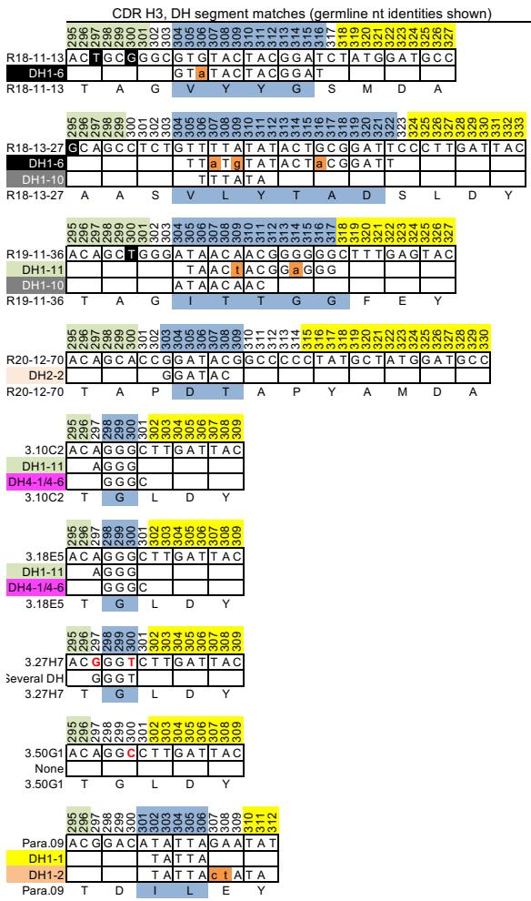  
VL junction

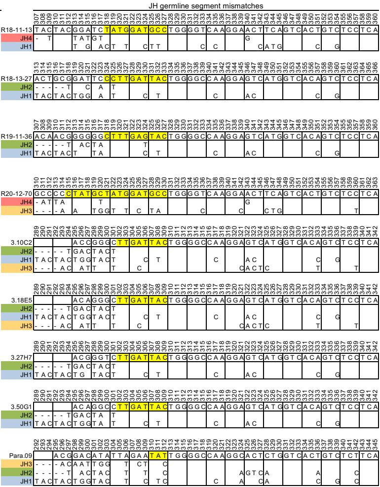

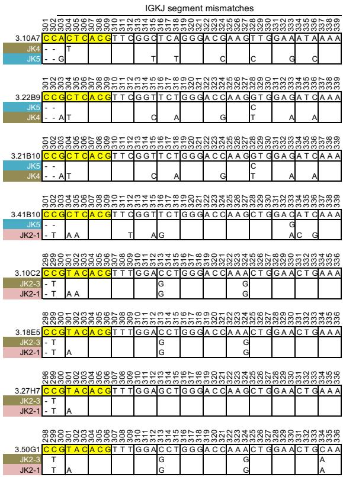

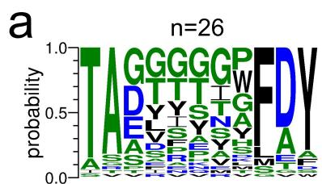

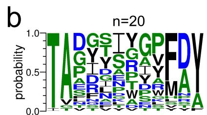

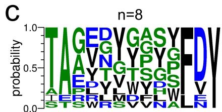

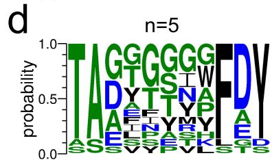

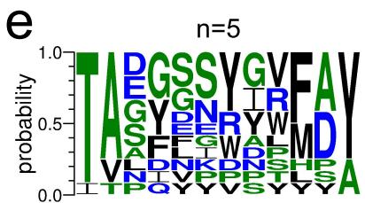

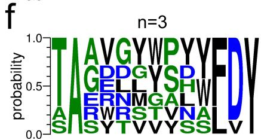

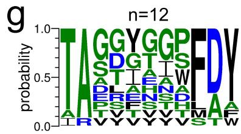

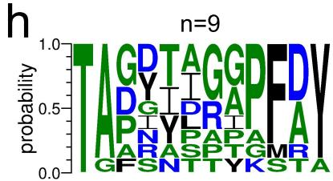

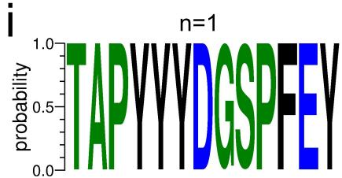  
Supplementary Fig. 4 CDR H3 consensus sequences of 3.10A7 V $_{H}$ parallel lineage clones. Sequence logos for CDR H3 (combined IMGT® and Kabat definitions) with lengths 11 (panels a, d and g), 12 (b, e and h) and 13 (c, f, i) residues. Logos in panels a-c include CDR H3 sequences of clones that bound TREM2 peptide 139-148, shown in Figure 1. Logos in panels d-f include CDR H3 sequences of clones that did not bind TREM2. Logos in panels g-i include CDR H3 sequences of the strongest binders to TREM2 peptide 139-148 selected for pairing with additional light chains in Figure 1. The number of CDR H3 sequences in each Logo are indicated. CDR H3 sequences for each clones are listed in Supplementary File 1.

a   

<table><tr><td>Antibody</td><td>ka (1/Ms)</td><td>kd (1/s)</td><td>KD (M)</td></tr><tr><td>3.10C2</td><td>3.2E+05</td><td>4.5E-05</td><td>1.4E-10</td></tr><tr><td>3.27H7</td><td>4.5E+05</td><td>6.7E-05</td><td>1.5E-10</td></tr><tr><td>3.18E5</td><td>3.0E+05</td><td>3.3E-05</td><td>1.1E-10</td></tr><tr><td>3.50G1</td><td>3.1E+05</td><td>2.0E-04</td><td>6.7E-10</td></tr></table>

b

C

Supplementary Fig. 5 Binding affinities of antibodies in the 3.10C2 clonal lineage. (a) Monovalent binding kinetics and $K_{\mathrm{D}}$ of antibodies to TREM2 at $37^{\circ}\mathrm{C}$ by SPR measured in a Biacore T200 instrument. (b) SPR sensorgrams corresponding to kinetics data in panel (a). Color and black lines are sensorgram data and curve fitting, respectively. TREM2 antigen used at 100 nM for the highest concentration followed by 3-fold dilutions. (c) Binding of antibodies 3.10C2, 3.27H7, 3.18E5 and 3.50G1 recombinant antibodies to Jurkat cells expressing TREM2 by flow cytometry. Blue, control IgG2a. Red, anti-TREM2 antibodies. FITC, Fluorescein isothiocyanate gate.

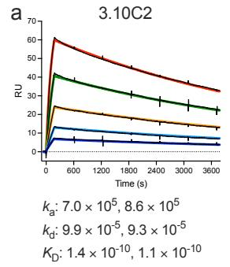

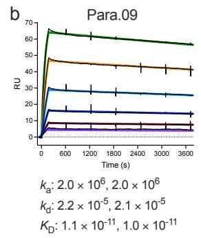

  
Supplementary Fig. 6 SPR sensorgrams of anti-TREM2 antibodies binding to TREM2.

Sensorgrams correspond to binding kinetics data shown in Table 1. Representative sensorgrams for (a and e) 3.10C2, (b and f) Para.09, (c and g) hu3.10C2, and (d and h) huPara.09 binding to TREM2 at 37°C are shown. Panels e-h show sensorgrams for the same molecules as in panels a-d but at lower antibody capture densities. Each of the panels is a representative of two experiments at different antibody capture levels, with the kinetic data for each of the repeats shown below each sensorgram. The units for $k_{a}$ , $k_{d}$ , and $K_{D}$ values shown are $M^{-1}s^{-1}$ , $s^{-1}$ and M, respectively. Sensorgram and fitted curves (1:1 model) are shown in black and colored lines, respectively. TREM2 concentrations used in panels a-d are 10 nM (red), 5 nM (green), 2.5 nM (orange), 1.25 nM (cyan), 0.625 nM (blue), 0.3125 nM (maroon), and 0.156 nM (purple), indicated in the corresponding fitted curves. TREM2 concentrations used in panels e-h are 7.5 nM (red), 3.75 nM (green), 1.875 nM (orange), 0.9375 nM (cyan) and 0.4688 nM (blue), indicated in the corresponding fitted curves. RU, response units.

  
Supplementary Fig. 7 Scanning mutagenesis of the TREM2 epitope bound by antibody 3.10C2. Binding of 3.10C2 Fab fragments to wild-type (a, n) and indicated mutant TREM2 peptides (b-n) immobilized on sensor tips by biolayer interferometry (BLI). Red lines indicate change between Fab loading and dissociation steps. The ratios between the apparent dissociation rate of the wild-type 149-161 and mutant peptides are shown in parentheses. (o) Binding of 3.10C2 Fab fragments to wild-type, H157Y and H157P mutant peptides shown in blue, red and green, respectively. The apparent $k_{\mathrm{d}}$ of the Fab with the H157Y mutant peptide is shown. All peptides encompass the TREM2 residues 149 to 161 with the indicated alanine, glycine or indicated mutations. Mutants indicated in red in panels b to n had a strong impact on apparent dissociation rates (ratio threshold set at < 0.20). Residues with side-chains at the binding interface are indicated with asterisks in panels b to n.

  
Supplementary Fig. 8 Scanning mutagenesis of the TREM2 epitope bound by antibody Para.09. Binding of Para.09 Fab fragments to wild-type (a, n) and indicated mutant TREM2 peptides (b-n) immobilized on sensor tips by biolayer interferometry (BLI). Red lines indicate change between Fab loading and dissociation steps. The ratios between the apparent dissociation rate of the wild-type 149-161 and mutant peptides are shown in parentheses. (o) Binding of Para.09 Fab fragments to wild-type, H157Y and negative control H157P mutant peptides shown in blue, red and green. The apparent $k_{d}$ of the Fab with the H157Y mutant peptide is shown. All peptides encompass the TREM2 residues 149 to 161 with the indicated alanine, glycine or indicated mutations. Mutants indicated in red in panels b to n had a strong impact on apparent dissociation rates (ratio threshold set at < 0.20). Residues with side-chains at the binding interface are indicated with asterisks in panels b to n.

  
a

  
b   
Supplementary Fig. 9 Agonist and sTREM2 shedding blocking activity of humanized hu3.10C2 and huPara.09 antibodies. (a) Agonist activity of humanized hu3.10C2 and huPara.09 antibodies in Jurkat-NFAT-TREM2-DAP12 cell reporter cells. (b) Blocking of TREM2 shedding into the supernatants of Jurkat cells expressing TREM2 by humanized hu3.10C2 and huPara.09, normalized to untreated cells. Error bars show standard deviation of n=3 repeats for each data point. Source data are provided as a Source Data file.

  
Supplementary Fig. 10 Structures of anti-TREM2-TREM2 complexes and bound TREM2 peptides. $2F_{o}-F_{c}$ densities of the 3.10C2-TREM2 (a) and Para.09-TREM2 (b) complexes contoured at 1.0 σ are shown with the heavy and light chains colored green and blue. Panels c and d show the $F_{o}-F_{c}$ densities of the TREM2 peptide ( $^{149}$ SFEDAHVEHSISRSLLE $^{165}$ ) bound to hu3.10C2 and huPara.09, respectively, calculated prior to modeling, contoured at 2.5 σ.

  
Para.09/3.10C2

  
Supplementary Fig. 11 Structural comparison of hu3.10C2-TREM2 and huPara.09-TREM2 complexes. (a) Overall structure overlays of the Fab-peptide complexes aligned on the TREM2 peptide. The Fabs are shown in ribbon form with hu3.10C2 is shown in dark salmon and huPara.09 is in dark yellow. The hu3.10C2 and huPara.09 bound TREM2 peptides are shown in cartoon in red and orange respectively. CDR H3 is highlighted in tube form. (b) Close up view of the peptide conformation in both Fab contexts, with side chains shown as sticks. Color scheme is identical to panel a.

  
Apo state CDR H3

  
TREM2 $_{149-165}$ -bound CDR H3

  
Supplementary Fig. 12 Ramachandran plots of all residues in CDR H3. All 3 independent simulations are considered in aggregate, with one point every 0.1 ns. Histogram bins are drawn only in regions with at least 10% of the total mass density. Contour lines are drawn every 20%.

  
3.10C2-bound TREM2,

  
Para.09-bound TREM2.

  
Unbound TREM2.

  
Phi   
Phi   
Phi   
Supplementary Fig. 13 Ramachandran plots for all residues in TREM2. Same as in Supplementary Figure 12, except for TREM2 residues. Magenta arrows indicate regions of Ramachandran space sampled by huPara.09-bound TREM2 that matches unbound states.

  
TREM2 $_{149-161}$ -bound CDR H3

  
S158A TREM2 $_{149-161}$ -bound CDR H3

  
Supplementary Fig. 14 Ramachandran plots of all residues in CDR H3 when bound to a truncated peptide. Same as Supplementary Fig. 12, except for the peptide comprising TREM2 residues 149-161 (wild-type at left, S158A mutation at right).

  
3.10C2-bound TREM2 $_{149-161}$

  
Para.09-bound TREM2 $_{149-161}$

  
Unbound TREM2 $_{149-161}$

  
Phi

Phi   
Supplementary Fig. 15 Ramachandran plots for all residues in truncated TREM2 peptide.   
  
Same as in Supplementary Figure 13, except for the peptide comprising TREM2 residues 149-161 (wild-type).

  
Supplementary Fig. 16 Ramachandran plots for all residues in truncated S158A TREM2 peptide. Same as in Supplementary Figure 15, except for the S158A mutation of the peptide comprising TREM2 residues 149-161.

  
hu3.10C2 + H154A TREM2 $_{149-161}$ Run 1

  
huPara.09 + $^{H154A}$ TREM2 $_{149-161}$ Run 3

  
Supplementary Fig. 17 Differential stability of the H154A mutant of the TREM2 $_{149-161}$ peptide when bound to hu3.10C2 and huPara.09. Renders as in Figure 7 are shown for the H154A mutant of the truncated peptide TREM2 $_{149-161}$ , reflecting the same experimental antigen as in Figure 2a, with peptide RSMD shown individually for each independent simulation run. The Figure shows simulations of mutant TREM2 bound to hu3.10C2 (left panels) and huPara.09 (right panels). The crystal structure (with TREM2 peptide manually truncated) is depicted in green (heavy), cyan (light), and brown (peptide), with snapshots every 10 ns of a 1 μs MD simulation in transparent tube after alignment of the antibody variable regions to the crystallographic coordinates. Below, the RMSD of the entire peptide over the course of each independent simulation is shown, using a 1 ns smoothed rolling window. The renders above are selected to be the most dynamic of the replicate simulations, and are indicated under the titles. Increased flexibility at the N-terminal half of the peptide is visible for both antibodies, though hu3.10C2 exhibits more dramatic unfolding and a larger displacement of the peptide's helical turn away from the crystallographic conformation, at times remaining anchored almost entirely by residue I159.

  
Hybridoma gate

  
SSC singlets

  
FSC singlets

  
Living gate

  
IgG $^{+}$ Hybridoma gating

  
Ag $^{+}$ IgG $^{+}$ Hybridoma gating   
Supplementary Fig. 18 Gating strategy for hybridoma cell selection. Gating order is shown from left to right, top to bottom in the figure. Selected gates are delimited in boxes and lines. Single cells were identified by plotting SSC-H (side scatter pulse height) versus SSC-W (side scatter pulse width), and FSC-H (forward scatter pulse height) vs. FSC-W (forward scatter pulse width). Live cells were gated after excluding dead cells with Propidium lodide (PI), IgG+ hybridoma cells were initially gated using anti-rat IgG FITC, followed by the identification of TREM2+IgG+ hybridoma cells in subsequent gating. APC, unlabeled channel used only for dot plot display for sorting.

Supplementary Table 1 – Data collection and refinement statistics (molecular replacement)   

<table><tr><td></td><td>huPara.09:TREM2 (PDB 8T59)</td><td>hu3.10C2:TREM2 (PDB 8T51)</td></tr><tr><td colspan="3">Data collection</td></tr><tr><td>Space group</td><td>\( P2_12_12_1 \)</td><td>\( P22_12_1 \)</td></tr><tr><td colspan="3">Cell dimensions</td></tr><tr><td>a,b,c(Å)</td><td>54.17, 68.16, 254.79</td><td>66.38, 96.03, 144.32</td></tr><tr><td>α,β,γ(°)</td><td>90, 90, 90</td><td>90, 90, 90</td></tr><tr><td>Resolution (Å)</td><td>33.78-2.0(2.07-2.0)</td><td>38.9-1.9(1.97-1.9)</td></tr><tr><td>\( R_{sym} \) or \( R_{merge} \)</td><td>0.1165(1.72)</td><td>0.122(1.495)</td></tr><tr><td>I/σI</td><td>11.70(1.00)</td><td>12.98(1.88)</td></tr><tr><td>Completeness (%)</td><td>99.89(99.99)</td><td>99.93(100.00)</td></tr><tr><td>Redundancy</td><td>6.3(6.6)</td><td>6.7(6.9)</td></tr><tr><td colspan="3">Refinement</td></tr><tr><td>Resolution (Å)</td><td>34.08-2.0</td><td>38.9-1.9</td></tr><tr><td>No. reflections</td><td>73218</td><td>73390</td></tr><tr><td>\( R_{work}/R_{free} \)</td><td>0.2051/0.2399</td><td>0.1928/0.2404</td></tr><tr><td>No. atoms</td><td>7534</td><td>7615</td></tr><tr><td>Protein</td><td>6874</td><td>6916</td></tr><tr><td>Ligand/ion</td><td>164</td><td>277</td></tr><tr><td>Water</td><td>586</td><td>549</td></tr><tr><td colspan="3">B-factors</td></tr><tr><td>Protein</td><td>35.5</td><td>31.2</td></tr><tr><td>Ligand/ion</td><td>53.4</td><td>56.77</td></tr><tr><td>Water</td><td>39.8</td><td>36.93</td></tr><tr><td colspan="3">R.m.s. deviations</td></tr><tr><td>Bond lengths (Å)</td><td>0.007</td><td>0.011</td></tr><tr><td>Bond angles (°)</td><td>1.23</td><td>1.30</td></tr></table>

Supplementary Table 2 – Hydrogen bond distances between antibodies and TREM2   

<table><tr><td>Para09_L46</td><td></td><td></td><td></td><td></td><td></td><td></td><td></td><td></td><td></td></tr><tr><td>TREM2</td><td>LC</td><td>Type</td><td>Interaction</td><td>Distance (Å)</td><td>HC</td><td>Type</td><td>Interaction</td><td>Distance</td><td>Comments</td></tr><tr><td>Glu148</td><td></td><td></td><td></td><td></td><td></td><td></td><td></td><td></td><td></td></tr><tr><td>Ser149</td><td></td><td></td><td></td><td></td><td></td><td></td><td></td><td></td><td></td></tr><tr><td>Phe150</td><td></td><td></td><td></td><td></td><td></td><td></td><td></td><td></td><td></td></tr><tr><td>Glu151</td><td></td><td></td><td></td><td></td><td></td><td></td><td></td><td></td><td></td></tr><tr><td>Asp152</td><td>Ser37, Tyr39, Arg 55</td><td>H-bond</td><td>Asp152(SC)-Ser37(SC), Tyr39(SC), Arg55(SC)</td><td>2.8 (Ser37), 2.6 (Tyr39), 2.9 (Arg55)</td><td></td><td></td><td></td><td></td><td></td></tr><tr><td>Ala153</td><td></td><td></td><td></td><td></td><td></td><td></td><td></td><td></td><td></td></tr><tr><td>His154</td><td>Phe96, Tyr101</td><td>H-bond</td><td>His154-Phe96(BB), Tyr101(SC)</td><td>2.9 (Phe96), 3.1 (Tyr101)</td><td>His35</td><td>H-bond, indirect</td><td>His154(SC)-H2O-His35(SC)</td><td>2.9 (His154-H2O), 2.8 (H2O-His35)</td><td>His154 sits in a hydrophobic pocket formed by LC-Tyr39, Phe96, Tyr101, HC-Trp33, His35, His50, Ile101, Leu102. Surface is complementary but too far for direct contact.</td></tr><tr><td>Val155</td><td>Tyr54, Arg55</td><td>hydrophobic</td><td>Val155(SC)-Tyr54(SC), Arg55(SC)</td><td>4.1 (Tyr54), 3.5 (Arg55)</td><td></td><td></td><td></td><td></td><td>Arg55 is neutralized by TREM2-Glu156 allowing for hydrophobic interaction with Val155.</td></tr><tr><td>Glu156</td><td>Arg55</td><td>salt bridge</td><td>Glu156(SC)-Arg55(SC)</td><td>2.9</td><td></td><td></td><td></td><td></td><td></td></tr><tr><td>His157</td><td></td><td></td><td></td><td></td><td>Trp33</td><td>stacking</td><td>His157(SC)-Trp33(SC)</td><td>3.4</td><td>His157 appears to coordinate a zinc using the imidazole ring. Likely a crystallization artifact as mutation of His157 does not disrupt interaction.</td></tr><tr><td>Ser158</td><td></td><td></td><td></td><td></td><td></td><td></td><td></td><td></td><td></td></tr><tr><td>Ile159</td><td></td><td></td><td></td><td></td><td>Val2, Leu4, Phe27, Val32, Asp100, Tyr104</td><td>hydrophobic, H-bond</td><td>Ile159(SC)-Val2(SC), Leu4(SC), Phe27(SC), Val32(SC), Tyr104(SC)Ile159(BB)-Asp100(SC)</td><td>4.1 (Val2), 4.2 (Leu4), 3.7 (Phe27), 3.7 (Val32), 2.8 (Asp100), 3.7 (Tyr104)</td><td>HC forms a perfect hydrophobic cage to enclose TREM2-Ile159 within. Replacement of Met34-&gt;Leu in Para09 likely increases hydrophobic nature of pocket.Asp100(SC) interaction is unique to Para09.</td></tr><tr><td>Ser160</td><td></td><td></td><td></td><td></td><td>Glu103, Tyr104</td><td>H-bond</td><td>Ser160(SC)-Glu103(SC)</td><td>2.9 (Glu103)</td><td></td></tr><tr><td>Arg161</td><td></td><td></td><td></td><td></td><td></td><td></td><td></td><td></td><td></td></tr><tr><td>Ser162</td><td></td><td></td><td></td><td></td><td></td><td></td><td></td><td></td><td></td></tr><tr><td>Leu163</td><td></td><td></td><td></td><td></td><td>Val2</td><td>hydrophobic</td><td>Leu163(SC)-Val2(SC)</td><td>4</td><td>Leu163(SC) sits on top of a shallow cleft formed by HC-Val2, Phe27, Tyr104</td></tr><tr><td>Leu164</td><td></td><td></td><td></td><td></td><td></td><td></td><td></td><td></td><td></td></tr><tr><td>Glu165</td><td></td><td></td><td></td><td></td><td></td><td></td><td></td><td></td><td></td></tr><tr><td></td><td></td><td></td><td></td><td></td><td></td><td></td><td></td><td></td><td></td></tr><tr><td>3.10C2_L46</td><td></td><td></td><td></td><td></td><td></td><td></td><td></td><td></td><td></td></tr><tr><td>TREM2</td><td>LC</td><td>Type</td><td>Interaction</td><td></td><td>HC</td><td>Type</td><td>Interaction</td><td></td><td></td></tr><tr><td>Glu148</td><td></td><td></td><td></td><td></td><td></td><td></td><td></td><td></td><td></td></tr><tr><td>Ser149</td><td>Leu97</td><td>H-bond</td><td>Ser149(BB)-Leu97(BB)</td><td>3.2</td><td></td><td></td><td></td><td></td><td></td></tr><tr><td>Phe150</td><td></td><td></td><td></td><td></td><td></td><td></td><td></td><td></td><td></td></tr><tr><td>Glu151</td><td></td><td></td><td></td><td></td><td></td><td></td><td></td><td></td><td></td></tr><tr><td>Asp152</td><td>Ser37, Tyr39, Arg 55</td><td>H-bond</td><td>Asp152(SC)-Ser37(SC), Tyr39(SC), Arg55(SC)</td><td>2.6 (Ser37), 3.2 (Tyr39), 2.8 (Arg55)</td><td></td><td></td><td></td><td></td><td></td></tr><tr><td>Ala153</td><td></td><td></td><td></td><td></td><td></td><td></td><td></td><td></td><td></td></tr><tr><td>His154</td><td>Phe96, Tyr101</td><td>H-bond</td><td>His154-Phe96(BB), Tyr101(SC)</td><td>2.7 (Phe96), 3.1 (Tyr101)</td><td>His35, His50</td><td>H-bond, indirect</td><td>His154(SC)-H2O-His35(SC)His154(SC)-H2O-His50(SC)</td><td>2.8 (His154-H2O), 2.8 (H2O-His35), 3.3 (H2O-His50)</td><td>His154 sits in a hydrophobic pocket formed by LC-Tyr39, Phe96, Tyr101, HC-Trp33, His35, His50, Leu101. Cavity is less &quot;deep&quot; compared to Para09.</td></tr><tr><td>Val155</td><td>Tyr54, Arg55</td><td>hydrophobic</td><td>Val155(SC)-Tyr54(SC), Arg55(SC)</td><td>3.7 (Tyr54), 3.5 (Arg55)</td><td></td><td></td><td></td><td></td><td>Arg55 is neutralized by TREM2-Glu156 allowing for hydrophobic interaction with Val155.</td></tr><tr><td>Glu156</td><td>Arg55</td><td>salt bridge</td><td>Glu156(SC)-Arg55(SC)</td><td>3</td><td></td><td></td><td></td><td></td><td></td></tr><tr><td>His157</td><td></td><td></td><td></td><td></td><td>Trp33</td><td>stacking</td><td>His157(SC)-Trp33(SC)</td><td>3.3</td><td>His157 appears to coordinate a zinc using the imidazole ring. Likely a crystallization artifact as mutation of His157 does not disrupt interaction.</td></tr><tr><td>Ser158</td><td></td><td></td><td></td><td></td><td></td><td></td><td></td><td></td><td></td></tr><tr><td>Ile159</td><td></td><td></td><td></td><td></td><td>Val2, Leu4, Phe27, Val32, Met34, Tyr104</td><td>hydrophobic</td><td>Ile159(SC)-Val2(SC), Leu4(SC), Phe27(SC), Val32(SC), Met34(SC), Tyr104(SC)</td><td>3.8 (Val2), 4.2 (Leu4), 3.8 (Phe27), 3.7 (Val32), 4.1 (Met34), 3.8 (Tyr104)</td><td>HC forms a perfect hydrophobic cage to enclose TREM2-Ile159 within.</td></tr><tr><td>Ser160</td><td></td><td></td><td></td><td></td><td>Asp102</td><td>H-bond</td><td>Ser160(SC)-Asp102(SC)</td><td>2.5</td><td></td></tr><tr><td>Arg161</td><td></td><td></td><td></td><td></td><td></td><td></td><td></td><td></td><td></td></tr><tr><td>Ser162</td><td></td><td></td><td></td><td></td><td></td><td></td><td></td><td></td><td></td></tr><tr><td>Leu163</td><td></td><td></td><td></td><td></td><td></td><td></td><td></td><td></td><td></td></tr><tr><td>Leu164</td><td></td><td></td><td></td><td></td><td></td><td></td><td></td><td></td><td></td></tr><tr><td>Glu165</td><td></td><td></td><td></td><td></td><td></td><td></td><td></td><td></td><td></td></tr></table>

SC: side-chain; BB: backbone

Supplementary Table 3 – Two body interaction energies between CDR H3 and all TREM2 residues for both the full 149–165 crystallized and truncated 149–161 peptides   

<table><tr><td colspan="4">Full-length TREM2 peptide (149 - 165) from complex structure</td></tr><tr><td>Residue</td><td>hu3.10C2 CDR H3</td><td>Residue</td><td>huPara.09 CDR H3</td></tr><tr><td>T105</td><td>-0.009659a</td><td>T105</td><td>-0.001697</td></tr><tr><td>G106</td><td>-0.970836</td><td>D106</td><td>-6.471206</td></tr><tr><td>L107</td><td>-1.409727</td><td>I107</td><td>-1.131378</td></tr><tr><td>-</td><td>-</td><td>L115</td><td>-2.692249</td></tr><tr><td>D116</td><td>-7.185974</td><td>E116</td><td>-1.230671</td></tr><tr><td>Y117</td><td>-3.301817</td><td>Y117</td><td>-4.008381</td></tr><tr><td>Total</td><td>-12.868354</td><td>Total</td><td>-15.535582</td></tr><tr><td>Energy / residue</td><td>-2.573671</td><td>Energy / residue</td><td>-2.589264</td></tr><tr><td colspan="4">Short TREM2 peptide (149 - 161) from Ala-scan binding experiments</td></tr><tr><td>Residue</td><td>hu3.10C2 CDR H3</td><td>Residue</td><td>huPara.09 CDR H3</td></tr><tr><td>T105</td><td>-0.009659</td><td>T105</td><td>-0.001697</td></tr><tr><td>G106</td><td>-0.970836</td><td>D106</td><td>-6.471206</td></tr><tr><td>L107</td><td>-1.409727</td><td>I107</td><td>-1.131378</td></tr><tr><td>-</td><td>-</td><td>L115</td><td>-2.692248</td></tr><tr><td>D116</td><td>-7.185974</td><td>E116</td><td>-1.230671</td></tr><tr><td>Y117</td><td>-2.954668</td><td>Y117</td><td>-3.355351</td></tr><tr><td>Total</td><td>-12.530864</td><td>Total</td><td>-14.882552</td></tr><tr><td>Energy / residue</td><td>-2.506173</td><td>Energy / residue</td><td>-2.480425</td></tr></table>

$^{a}$ Rosetta Energy Units

Supplementary Table 4 – Change in total two-body interaction energy between TREM2 and nearby antibody contacts upon computational alanine scanning   

<table><tr><td>Mutation</td><td>hu3.10C2</td><td>huPara.09</td></tr><tr><td>S149A</td><td>\( -0.289370^a \)</td><td>-1.892457</td></tr><tr><td>F150A</td><td>-0.007318</td><td>0.072029</td></tr><tr><td>E151A</td><td>1.733891</td><td>0.153330</td></tr><tr><td>D152A</td><td>7.358706</td><td>6.864962</td></tr><tr><td>A153A</td><td>0.007399</td><td>0.006808</td></tr><tr><td>H154A</td><td>5.207345</td><td>4.535309</td></tr><tr><td>V155A</td><td>2.314930</td><td>2.803780</td></tr><tr><td>E156A</td><td>4.067127</td><td>4.310636</td></tr><tr><td>H157A</td><td>0.498704</td><td>0.507335</td></tr><tr><td>S158A</td><td>-0.593746</td><td>-0.516863</td></tr><tr><td>I159A</td><td>8.531770</td><td>8.675364</td></tr><tr><td>S160A</td><td>1.679109</td><td>0.030958</td></tr><tr><td>R161A</td><td>-0.030632</td><td>-0.067745</td></tr><tr><td>H157Y</td><td>-2.058792</td><td>-2.299264</td></tr></table>

$^{a}$ Rosetta Energy Units

---

# 41467_2024_Article_52442

# Rapid affinity optimization of an anti-TREM2 clinical lead antibody by cross-lineage immune repertoire mining

Received: 14 June 2023

Accepted: 7 September 2024

Published online: 27 September 2024

Check for updates

Yi-Chun Hsiao $^{1}$ , Heidi Ackerly Wallweber $^{2}$ , Robert G. Alberstein $^{3}$ , Zhonghua Lin $^{1}$ , Changchun Du $^{4}$ , Ainhoa Etxeberria $^{5}$ , Theint Aung $^{1}$ , Yonglei Shang $^{1,6}$ , Dhaya Seshasayee $^{1}$ , Franziska Seeger $^{3}$ , Andrew M. Watkins $^{3}$ , David V. Hansen $^{5,7}$ , Christopher J. Bohlen $^{5}$ , Peter L. Hsu $^{2}$ & Isidro Hötzel $^{1}$

We describe a process for rapid antibody affinity optimization by repertoire mining to identify clones across B cell clonal lineages based on convergent immune responses where antigen-specific clones with the same heavy ( $V_{H}$ ) and light chain germline segment pairs, or parallel lineages, bind a single epitope on the antigen. We use this convergence framework to mine unique and distinct $V_{H}$ lineages from rat anti-triggering receptor on myeloid cells 2 (TREM2) antibody repertoire datasets with high diversity in the third complementarity-determining loop region (CDR H3) to further affinity-optimize a high-affinity agonistic anti-TREM2 antibody while retaining critical functional properties. Structural analyses confirm a nearly identical binding mode of anti-TREM2 variants with subtle but significant structural differences in the binding interface. Parallel lineage repertoire mining is uniquely tailored to rationally explore the large CDR H3 sequence space in antibody repertoires and can be easily and generally applied to antibodies discovered in vivo.

The development of therapeutic antibodies requires several steps of molecular engineering that optimize different aspects of antibody binding, specificity, effector and recycling functions. This often includes affinity optimization for enhanced potency, reduced dosing volumes or frequency, robust monovalent binding in complex format molecules and increased target engagement in immune-privileged organs. Antibodies derived from immunized animals have usually undergone affinity maturation in vivo in a process of somatic mutation and clonal expansion and selection $^{1}$ . Therefore, relatively large screening efforts often result in one or more leads of sufficient affinity and potency that do not require further affinity optimization. However, the affinities of some antibody leads may not meet the requirements for certain therapeutic applications and need further engineering for affinity.

A diversity of antibody affinity optimization methods with different strengths and limitations have been developed. Many of the methods rely on antibody libraries based on in vitro display systems to select for higher affinity variants using different methods for sequence diversification usually entailing relatively laborious steps of library construction and selection $^{2-8}$ . Mining of antibody repertoire deep sequencing datasets has also been used to optimize antibody affinity rapidly and effectively $^{9-12}$ . Sequence search in repertoire mining is performed within the confines of B cell clonal lineages or, more accurately, the corresponding clonotype sequence groupings defined by same variable region germline segment composition and heavy chain third complementarity-determining regions (CDR H3) of the same length with a sequence identity above a specified threshold. A

$^{1}$ Department of Antibody Engineering, Genentech, South San Francisco, CA 94080, USA. $^{2}$ Department of Structural Biology, Genentech, South San Francisco, CA, USA. $^{3}$ Prescient Design, a Genentech Accelerator, South San Francisco, CA, USA. $^{4}$ Department of Biochemical and Cellular Pharmacology, Genentech, South San Francisco, CA, USA. $^{5}$ Department of Neuroscience, Genentech, South San Francisco, CA, USA. $^{6}$ Present address: Amberstone Biosciences, Irvine, CA, USA. $^{7}$ Present address: Department of Chemistry and Biochemistry, Brigham Young University, Provo, UT, USA.

e-mail: ihotzel@gene.com

general limitation not only of repertoire mining but also of other in vitro affinity optimization methods is that the sequence space explored is comparatively limited relative to the potential sequence diversity of antibodies. This is particularly true for CDR H3 which, despite being the most diverse region in repertoires, is often engineered with a limited number of point mutations for affinity optimization $^{3,13,14}$ . The main reason for this is that mutations in CDR H3, which is centrally located in the binding interface and contributes a large fraction of the free-energy of binding $^{15-17}$ , often have a negative impact on binding; thus, only relatively minor variations are usually explored for engineering compared to the potential CDR H3 sequence space.

Antibody repertoire datasets of immunized animals generated by deep sequencing technologies generally have a very large diversity of sequences beyond a clonotype of interest. Most of the repertoire sequence diversity is located in the CDR H3 region and is beyond the reach of traditional repertoire mining within clonotypes based on the framework of somatic mutation and clonal expansion. However, sequences outside the original clonotype of interest may in principle provide variants that could be used for affinity optimization. What would allow this is the phenomenon of ‘convergences’ between different clonal lineages. Convergent antibodies are clonally unrelated (descended from different naïve B cells) but share a subset of sequence and structural similarities as well as epitope specificity and binding mode $^{18}$ . Different classes of convergent responses have been described which share different sequence and structural motifs $^{18-21}$ . Convergences are often identified only after considerable characterization efforts, including determination of complex structures, rather than by sequence information alone $^{22-32}$ . A conceptual framework to interpret sequence data from widely different clonotypes in repertoire deep sequencing datasets without relying on extensive experimental or structural information would be required to systematically apply cross-lineage repertoire mining as an engineering strategy to optimize antibody affinity early in discovery.

A special case of convergence is defined by clonally independent antibodies that bind the same antigen and derive from the same $V_{H}$ and $V_{L}$ germline segments but have CDR H3 regions that differ widely in sequence and even length $^{20,33-37}$ . These convergent antibodies bind the same epitope with the same geometry, or binding mode, akin to antibody clonal variants, show no special structural features required for the recurring binding mode $^{20,34,37-39}$ . We refer to clones in this convergence class with these properties as ‘parallel lineages’, to differentiate from other convergence classes $^{37}$ . CDR H3 length of antibodies in parallel lineages mirrors the distribution of lengths observed in the immune repertoire and are not biased in length $^{37}$ . Thus, parallel lineages are not restricted to a special class of antibodies and applies generally to antibodies and repertoires derived by animal immunization. Importantly, and critical for mining of repertoires, rodent antigen-specific antibodies that share $V_{H}/V_{L}$ germline segments bind the same epitope with high frequency regardless of CDR H3 sequence and length diversity within the parallel lineage $^{37}$ . The epitope specificity restriction by $V_{H}/V_{L}$ germline segment pairing enables high-confidence prediction of functionally equivalent but clonally independent antibodies in antigen-specific repertoires based solely on sequence information. In addition, parallel lineage convergences recur frequently for multiple epitopes in an antigen within the repertoire $^{37}$ and therefore have the potential to be generally applicable to antibody engineering. Here we describe the application of parallel lineage $V_{H}$ repertoire mining for rapid affinity optimization of a therapeutic antibody generated by rodent immunization, extending the application of repertoire mining strategies beyond the classical framework of B cell clonal expansion to include variants with high CDR H3 diversity.

# Results

# Identification of anti-triggering receptor on myeloid cells 2 (TREM2) parallel lineages in antibody repertoires

The target used to develop the parallel lineage mining was TREM2. TREM2 is currently a target of significant interest for the potential treatment of Alzheimer's Disease (AD) $^{40}$ . TREM2 is composed of a single immunoglobulin V (IgV) domain followed by a linear stalk, transmembrane, and short intracellular regions $^{41}$ . The stalk region has an $\alpha$ -secretase disintegrin and metalloproteinase domain-containing protein 10 (ADAM10) and ADAM17 cleavage site between residues H157 and S158 that, when cleaved, results in shedding of TREM2 from the cell surface and release of soluble TREM2 (sTREM2) $^{40}$ . Binding of TREM2 by ligands leads to phosphorylation of the TREM2-associated protein adapter protein DAP12 on an immunoreceptor tyrosine-based activation motif in its cytoplasmic tail, resulting in the activation of pathways for cell survival and non-inflammatory cytokine production. Loss-of-function mutations in TREM2 are associated with late-onset AD $^{40}$ . A special consideration for therapeutic anti-TREM2 antibodies is affinity. Relatively limited immunoglobulin (IgG) crosses the blood/brain barrier $^{42}$ . Maximizing affinity in anti-TREM2 antibodies may be desirable to increase therapeutic IgG target engagement in the brain and to reduce dosing. Thus, TREM2 represents a therapeutically relevant target to evaluate the feasibility, practicality, and robustness of antibody affinity optimization by parallel lineage mining.

Antibodies were obtained by immunization of 3 rats (R18, R19, and R20) with the full human TREM2 extracellular domain (ECD) followed by myeloma cell fusion to derive TREM2-specific hybridoma clones. A set of clones within a parallel lineage apparent in the hybridoma set was selected to determine whether additional $V_{H}$ parallel lineage clonotypes could be identified by repertoire mining. This set consisted of 4 clones with the IGHV10-5 ( $V_{H}$ 10-5) and IGKV8U89d ( $V_{K}$ 8U89d) $^{43}$ germline segments and CDR H3 length 11 and 13 (CDR definition and antibody residue numbering in the IMGT $^{\circledR}$ system $^{44,45}$ used throughout except where noted). These antibodies bind a stalk region epitope located approximately between residues 139 and 148 (numbering from initiation Met residue) (Supplementary Fig. 1 and Supplementary Data 1), facilitating precise high-throughput epitope mapping for additional binders. The monovalent equilibrium dissociation binding constants ( $K_{D}$ ) of the clones ranged from 0.5 to 4.8 nM (Supplementary Fig. 2a and b). All antibodies in this group bound live cells expressing TREM2 by flow cytometry (Supplementary Fig. 2c–f).

The unique clonal origin of these antibodies was assessed by detailed clonotyping. A definition of clonotype that closely reflects biological mechanisms of somatic mutation and clonal expansion and other constraints, referred to here as “biological clonotyping”, would be cloned sharing the same $V_{H}$ and $J_{H}$ (and $V_{L}$ and $J_{L}$ if available) germline segment, same IGHD ( $D_{H}$ ) segment of similar boundaries, reading frame and position within CDR H3 (within the known limits of $D_{H}$ germline segment assignment), nucleotide sequence identity at or above a certain threshold, usually 80%, and same immune animal or donor origin. Although insertions and deletions occasionally happen during somatic mutation, these cannot be effectively differentiated from alternative VDJ recombination events in the CDR H3 regions of immune repertoire clones $^{46,47}$ . Therefore, clones with different CDR H3 lengths are classified in different clonotypes. The working definition of clonotypes used here (unless otherwise noted) is more inclusive than biological clonotyping to ensure that clones later selected from bulk sequencing datasets are from different clonotypes by most definitions and, more importantly, highly diverse in their CDR H3 sequences. This definition specifies a clonotype as clones with the same $V_{H}$ germline segment, same CDR H3 length, and at least 67% amino acid sequence identity, ignoring $J_{H}$ and $D_{H}$ germline segments and animal origin. For hybridoma clones, the same $V_{L}$ germline segment is also required for clonotype inclusion. This definition maximizes sequence space search within the sample and minimizes sampling of sequences that, while

  
Fig. 1 | Binding of antibodies with heavy chain variable regions derived from deep sequencing to TREM2. Binding of antibodies to TREM2 peptides 129–148 and 149-168 and mouse inhibin 30-mer control in ELISA is shown in a heatmap with optical density scale on the right. Readings below 0.35 are considered negative. The $V_{H}$ regions of antibodies are shown on the left by their corresponding hybridoma or $V_{H}$ clone name. $V_{H}$ clone names refer to rat number, CDR H3 length and unique number. The light chains of the antibodies are shown on the top using the corresponding hybridoma clone name for the light chain or the $V_{L}$ germline segment of three other anti-TREM2 antibodies. Hybridoma-derived heavy and light chain variable regions are highlighted in salmon. The epitope region of the antibodies from which light chains are derived are indicated. Dashes indicate lack of expression. Regions shown in gray are antibodies with heavy and light chain combinations that were not tested. Control (Ctrl.) antibodies 1 and 2 bind TREM2 129–148 and 149–168, respectively. Ab 4D5 is an anti-human epidermal growth factor receptor 2 antibody. The relative number of read counts with the $V_{H}$ 10-5 germline segment and CDR H3 sequences from the hybridoma or selected clones in the deep sequencing datasets of rats R18, R19 and R20 are shown on the right in blue shading as indicated by the color scale and percentage shown in boxes. Zero values indicate less than 0.5% and blank values indicate no reads found. The maximum CDR H3 sequence identities (excluding the intra-clonal 3.10A7/3.22B9 similarity) among TREM2-binding clones of the same CDR H3 length or different lengths with one or two contiguous gaps are indicated on the right. OD, A $_{450}$ ELISA optical density. Source data are provided as a Source Data file.

clonally unrelated, have relatively similar CDR H3 sequences. The biological clonotyping definition is used here solely to address the possible biological origin of clones where relevant. The four selected clones, 3.10A7, 3.22B9, 3.22B9, and 3.41B10, belong to different clonotypes using the biological clonotyping definition (Supplementary Fig. 2g). However, two of the clones, 3.10A7 and 3.22B9, have similar CDR H3 sequences and are classified in the same clonotype by the working definition (Supplementary Fig. 2g).

Although relatively large datasets of paired chain sequences can now be obtained by single-cell sequencing $^{31}$ , standard bulk deep sequencing remains generally more accessible and can sample the repertoire more deeply than the current largest single-cell sequencing datasets. Thus, we first determined the feasibility of identifying parallel lineage $V_{H}$ sequences in bulk deep sequencing datasets without chain pairing information. Any reads in these datasets corresponding to antibodies belonging to the same parallel lineage as the 3.10A7 group would have not only the same $V_{H}$ 10-5 germline segment, although with

a different CDR H3, but also light chains very similar to the clones in the 3.10A7 group. The repertoires were amplified with constant region primers specific for isotype-switched, antigen-experienced, IgG, and IgA transcripts, to exclude $V_{H}$ reads from naïve cells. A total of 67 clonotypes with CDR H3 lengths 11, 12, and 13 and high CDR H3 sequence diversity were randomly selected for testing from deep sequencing datasets derived from the three immunized rats (Fig. 1 and Supplementary Data 1). Half of all $V_{H}$ 10-5 clonotypes in the TREM2-immunized rats have CDR H3 lengths within that range, with the 67 selected clonotypes representing about half of the 157 $V_{H}$ 10-5 working definition clonotypes with CDR H3 length 11 to 13 in the bulk sequencing dataset from the three rats. Within each clonotype, clone selection prioritized both high sequence count and higher somatic mutation load. The independent clonal origin of the selected $V_{H}$ reads was confirmed by detailed junctional nucleotide sequence analysis. No clones of the same CDR H3 length with similar junctional sequences were identified among the clones (Supplementary Fig. 3). When allowing gapped comparisons of these junctional sequences within an immunized rat, only two clones, R18-11-08 and R18-12-22 derived from rat 18, could be aligned by introducing 3 nucleotides (81% gapped nucleotide sequence identity), while only 5 clones had another clone from any rat sharing more than 67% CDR H3 amino acid sequence identity by gapped alignment (Fig. 1), confirming the independent clonal origin of most or all selected clones and high CDR H3 sequence diversity. The selected $V_{H}$ clones were paired to the light chains of the four antibodies in the 3.10A7 group for testing as full IgG in TREM2 binding assays. No clear consensus was observed in the CDR H3 sequences except for an apparent slight preference for Gly/Thr/Ile in 4 or 5 consecutive positions within CDR H3 sequences of length 11 in addition to the expected sequence conservations in the first two and last three CDR H3 residues that are fully or partially encoded by the $V_{H}$ 10-5 and low-complexity $J_{H}$ germline segments (Supplementary Fig. 4).

Shuffling of the heavy and light chains among the 3.10A7 parallel lineage hybridoma clones resulted in antibodies that specifically bound to a TREM2 peptide spanning residues 129–148, including the 3.10A7 group epitope, in ELISA (Fig. 1). All antibodies with the selected $V_{H}$ sequences expressed as IgG when paired to all or most light chains from the 3.10A7 parallel lineage. When paired to at least one of the light chains of the hybridoma clones in the 3.10A7 parallel lineage, fifty-four (81%) of the selected $V_{H}$ sequences produced IgG that had detectable binding in ELISA to TREM2 peptide 129-148 but not TREM2

Table 1 | Binding kinetics and off-target binding potential of rat and humanized antibodies 3.10C2 and Para.09   

<table><tr><td>Antibody</td><td>\( k_a (M^{-1}s^{-1})^a \)</td><td>\( k_d (s^{-1})^a \)</td><td>\( K_D (M) \)</td><td>BV ELISA score\( ^e \)</td></tr><tr><td>3.10C2\( ^b \)</td><td>9.7 × 10\( ^5 \) [1.31]\( ^c \)</td><td>1.9 × 10\( ^{-4} \) [2.42]</td><td>2.0 × 10\( ^{-10} \) [1.89]</td><td>0.73</td></tr><tr><td>Para.09\( ^b \)</td><td>2.2 × 10\( ^6 \) [1.15]</td><td>4.4 × 10\( ^{-5} \) [2.31]</td><td>2.0 × 10\( ^{-11} \) [2.04]</td><td>0.66</td></tr><tr><td>hu3.10C2\( ^d \)</td><td>8.8 × 10\( ^5 \) [1.13]</td><td>3.7 × 10\( ^{-4} \) [1.07]</td><td>4.2 × 10\( ^{-10} \) [1.10]</td><td>0.87</td></tr><tr><td>huPara.09\( ^d \)</td><td>2.6 × 10\( ^6 \) [1.22]</td><td>5.6 × 10\( ^{-5} \) [1.72]</td><td>2.2 × 10\( ^{-11} \) [1.43]</td><td>0.99</td></tr></table>

$^{a}$ SPR analysis performed at 37°C with an 1-hour dissociation step with full TREM2 ECD.   
$^{b}$ Chimeric rat/human IgG1 antibodies.   
$^{c}$ Numbers are geometric mean and fold-difference from geometric mean, within brackets, of n = 4 independent experiments.   
$^{d}$ Light chains derived from clonal variant 3.27H7.   
$^{e}$ Scores below 5 are considered negative for off-target binding.

control peptide 149-168. The binding clones had heavy chains derived from $V_{H}$ reads from the three rats (Fig. 1), confirming the expected cross-animal span of parallel lineages.

To test whether binding was dependent on proper chain pairing or whether $V_{H}$ alone is sufficient for binding to antigens in this parallel lineage, 22 of the heavy chain clones of antibodies with the strongest binding to TREM2 peptide 129-148 were paired with light chains from three antibodies that bind the TREM2 IgV domain rather than the stalk. These antibodies have light chains with the same $V_{K}8U89d$ or similar $V_{K}8S4$ germline segment as the 3.10A7 parallel lineage or a light chain variable region from a different subgroup, $V_{K}1S26$ . Most of the chain-shuffled antibodies expressed as IgG (Fig. 1). All antibodies with the heterologous $V_{K}8U89d$ light chain bound TREM2 peptide 129-148 but not the control peptides, indicating that closely related light chains from other lineages can substitute for the 3.10A7 parallel lineage light chain. A few antibodies with the $V_{K}8S4$ light chain specifically bound to the 129-148 peptide, indicating that more distantly related light chains of the same subgroup can allow binding to TREM2 when combined with some of the 3.10A7 parallel lineage heavy chains. However, none of the antibodies with the $V_{K}1S26$ light chain bound to TREM2 peptide 129-149, indicating a direct or indirect role of the light chain in antigen binding in the 3.10A7 parallel lineage group. In addition, given that different light chains with the $V_{K}8U89d$ germline from antibodies that bind different TREM2 epitopes can mediate binding to the TREM2 129-148 peptide when paired to the selected $V_{H}10-5$ heavy chains, it is unlikely that $V_{K}8U89d$ light chains alone determine specificity for this epitope independently of the heavy chain.

# Affinity optimization of an anti-TREM2 antibody by parallel lineage repertoire mining

Antibodies in the 3.10A7 parallel lineage vary by about 10-fold in affinity (Supplementary Fig. 2a and b), suggesting that parallel lineage mining may be an effective manner to quickly identify high-affinity variants across clonal lineages. We asked whether significant affinity optimization could be achieved prospectively by parallel lineage mining of bulk deep sequencing repertoires when clones within the same parallel lineage are not observed in an antibody panel. In addition, we asked whether affinity optimization by parallel lineage mining across lineages preserves specificity characteristics relevant to a therapeutic lead.

A second group of 4 clonally related anti-TREM2 antibodies with biological properties relevant to the potential therapeutic application (see below), 3.10C2, 3.27H7, 3.18E5, and 3.50G1, was selected for further engineering (Supplementary Data 1). These 4 clones, derived from rat R18 (except clone 3.50G1, for which the rat origin was not identified by exact CDR H3 nucleotide match), have $V_{H}6-8$ , $J_{H}2$ and $V_{K}2S11$ , $J_{K}2-3$ germline segments and identical CDR H3 sequences of length 5, and bind to TREM2 with similar monovalent $K_{D}$ values between 140 and 670 pM at 37°C in screening (Supplementary Fig. 5a and b). More detailed analysis of the binding kinetics of antibody 3.10C2 to TREM2 yielded a monovalent $K_{D}$ of 200 pM at 37°C (Table 1, Supplementary

  
a   
b   
C   
Fig. 2 | Epitope specificity, agonist activity and sTREM2 binding of anti-TREM2 antibodies. a Summary of binding of antibodies 3.10C2 and Para.09 to TREM2 peptides with Ala mutations in individual positions (Gly for position 153). Values are ratios of wild-type to Ala mutant peptide $k_{\mathrm{d}}$ , highlighted as indicated by the scale. The two residues flanking the TREM2 cleavage site are shown in orange. Residues with side-chains in the binding interface of both hu3.10C2 and huPara.09 in the complex structures are indicated with asterisks, with the most structurally significant contacts highlighted in red. b Agonist activity of soluble IgG of 3.10A7 and 3.10C2 parallel lineage and clonal variants in Jurkat-NFAT-TREM2-DAP12 cell reporter cells. The dotted line indicates baseline activation by control mouse IgG2a. c Binding of anti-TREM2 antibodies to sTREM2 from bone marrow-derived macrophage (BMDM) cultures from transgenic mice expressing hTREM2, normalized to control antibody 16B8 binding. Bars and errors indicate average and standard deviation of 2 to 4 repeats in panel b. Luc RLU, luciferase relative luminosity units. Source data are provided as a Source Data file.

Fig. 6a and e). The epitope of antibody 3.10C2 was mapped with overlapping peptides to a region between residues 151 and 161 approximately, which includes the ADAM10/17 cleavage site (Supplementary Fig. 1). Alanine-scan of TREM2 with synthetic peptides identified reductions of antibody 3.10C2 binding when residues D152, H154, H157, S158 and I159 were mutated to Ala individually, with an apparently milder effect on binding by additional mutations (Fig. 2a and Supplementary Fig. 7). However, antibody 3.10C2 bound to a TREM2 peptide with the rare H157Y mutation associated with increased risk of AD $^{48}$ , although with an apparent slight increase in binding off-rate compared to the wild-type peptide (Supplementary Fig. 7o). Antibody 3.10C2 and its three clonal variants bound live TREM2-expressing Jurkat cells and, unlike antibodies in the 3.10A7 parallel lineage, had strong agonist activity as soluble IgG (Fig. 2b and Supplementary Fig. 5c). Consistent with epitope mapping results, antibody 3.10C2 did

  
Fig. 3 | Screening of 3.10C2 parallel lineage $V_{H}$ clones. Antibody 3.10C2 and antibodies formed by selected $V_{H}$ 6-8 variable regions and the 3.10C2 light chain were tested in ELISA with a peptide encompassing the entire TREM2 stalk region or peptides of the indicated TREM2 fragments or control inhibin 30-mer peptide. ELISA binding is indicated in red, with the optical density scale shown to the right. The CDR H3 sequences of $V_{H}$ 6-8 parallel clone candidates are shown to the right. $V_{H}$ sequences belonging to the same clonotype (CDR H3 amino acid identity >67% for the same CDR H3 length) are indicated by letters next to the CDR H3 sequences. The relative number of read counts with $V_{H}$ 6-8 germline segments and the CDR H3 sequences of the hybridoma or selected clones in the deep sequencing datasets of rats R18, R19, and R20 are shown on the right in blue shading as indicated by the color scale and percentage shown in boxes. Zero values indicate less than 0.5% and blank values indicate no reads found. The maximum CDR H3 sequence identities among clones of the same CDR H3 length or different lengths with one or two contiguous gaps are indicated on the right. Inhibin refers to a 30-mer control peptide with the mouse inhibin sequence unrelated to TREM2. OD, A $_{450}$ ELISA optical density. Source data are provided as a Source Data file.

not detectably bind sTREM2, unlike antibodies in the 3.10A7 group (Fig. 2c). Thus, antibody 3.10C2 has a unique set of biological attributes relevant to therapeutic applications that would need to be maintained upon affinity optimization. The high affinity of antibody 3.10C2 also presents a high-bar case for affinity optimization of a potential therapeutic antibody lead.

We performed parallel lineage mining for the 3.10C2 group with the same bulk sequencing datasets and in a similar manner as for the 3.10A7 group described above. Sequence search was limited here to $\mathrm{V_H6 - 8}$ clonotypes with CDR H3 lengths 5 to 7 that would more likely retain an expected groove in the binding site of antibody 3.10C2 formed by the combination of a short CDR H3 and long light chain CDR1 (3.10C2 has an IMGT® CDR L1 length 11). A total of $59~\mathrm{V_H6 - 8}$ clonotypes (working definition) with CDR H3 lengths 5-7 were identified in the three immunized rats. Twenty-four clonotypes had CDR H3 sequence liabilities such as potentially oxidizing tryptophan and methionine residues, deamidation and Asp isomerization sites and unpaired Cys residues (see methods) and were excluded from clone selection. A total of $29~\mathrm{V_H}$ reads from 24 different clonotypes were randomly selected from the remaining 35 clonotypes, prioritizing reads with higher somatic mutation load within each clonotype. The $\mathrm{V_H}$

clones were used to generate chimeric human IgG1 antibodies with the 3.10C2 light chain (Supplementary Data 1). All the clones expressed as IgG and were tested in an ELISA-based screen with TREM2 and control peptides (Fig. 3). Two clones, Para.03 and Para.09, specifically bound the peptide with the entire TREM2 stalk region or TREM2 peptide 149-168 with the 3.10C2 epitope and not the control peptide 159-175 that does not include the 3.10C2 epitope. Other clones either did not bind peptide 149-168 with the 3.10C2 epitope or bound both TREM2 peptides or non-specifically to all peptides tested (Fig. 3). Clone Para.03 bound weakly to the TREM2 peptides and was not further characterized. In contrast, clone Para.09 had robust specific binding to the TREM2 stalk and 149-168 peptides including the 3.10C2 epitope. Besides being derived from a different rat than the 3.10C2 lineage (Fig. 3), the Para.09 V $_{H}$ region differs from 3.10C2 V $_{H}$ by having a CDR H3 sequence length 6 rather than 5, with apparently different D $_{H}$ segments, and a J $_{H}$ 3 rather than J $_{H}$ 2 germline segment (Supplementary Fig. 3), confirming that it is from a different clonotype from antibody 3.10C2.

Antibody Para.09 with the light chain from antibody 3.10C2 bound TREM2 with a monovalent $K_{D}$ of 20 pM at 37 °C, about 10-fold stronger than the affinity of antibody 3.10C2 with improvements in both association and dissociation binding kinetics (Table 1 and Supplementary Fig. 6b and f). Alanine-scanning with synthetic peptides identified slight increases in apparent binding off-rates when TREM2 residues D152, H157 or I159 were mutated to Ala individually, three of the same residues that impact antibody 3.10C2 binding when mutated to alanine, with a lower effect by other mutations (Fig. 2a and Supplementary Fig. 8). Thus, antibody Para.09 retains epitope specificity very similar to antibody 3.10C2 although with some significant differences in the residues mediating binding within the epitope or sensitivity to Ala mutations. Antibody Para.09 also retained binding to the TREM2 peptide with the H157Y mutation with no apparent change in binding off-rate relative to the wild-type peptide (Supplementary Fig. 8o). Finally, antibody Para.09 had low off-target binding potential similar to that of antibody 3.10C2 when assessed in a baculovirus particle ELISA assay $^{49}$ (Table 1), indicating that the high affinity of antibody Para.09 is not associated with adverse non-specific binding potential, an important property of antibodies in therapeutic applications.

Antibodies 3.10C2 and Para.09 were humanized for further experiments. The light chains of the humanized antibodies were derived from clone 3.27H7, which is part of the same clonal group as 3.10C2, for improved large-scale expression of both clones (Supplementary Data 1). The binding properties of both humanized antibodies were similar to the parental chimeric rat antibodies with minimal losses in affinity (Table 1 and Supplementary Fig. 6c, d, g, and h). Humanized antibody huPara.09 had about 10-fold higher agonist activity in an NFAT reporter cell-based assay and about 6-fold more potent sTREM2 shedding inhibition activity than humanized antibody hu3.10C2 (Supplementary Fig. 9a and b). In addition, huPara.09 retains the same lack of detectable binding to sTREM2 as antibody hu3.10C2 and its parental rat Para.09 antibody (Fig. 2b). As predicted by the parallel lineage framework, huPara.09 retains the unique biological and therapeutically relevant properties of antibody 3.10C2 despite being derived from a distinct $V_{H}$ clonotype.

# Structural analysis of antibodies hu3.10C2 and huPara.09 bound to TREM2

Antibody huPara.09 is predicted, based on the parallel lineage framework, to bind the same TREM2 epitope with the same binding geometry as antibody hu3.10C2. To confirm this and to further understand the structural basis for TREM2 recognition we formed complexes of Fab fragments of humanized antibodies hu3.10C2 and huPara.09 with a TREM2 peptide spanning residues 149-165 and determined their structures by X-ray crystallography. Crystals of the

  
Fig. 4 | Structural basis of hu3.10C2 recognition of TREM2, a Crystal structure of TREM2 (148-165) bound by the hu3.10C2 Fab fragment. The heavy chain $(\mathrm{V_H})$ is shown in green surface, while the light chain $(\mathrm{V_L})$ is depicted in cyan surface representation. The TREM2 peptide is shown in brown stick representation with its   
N-terminus at the right end. b Zoom-in view of the $V_{L}$ -TREM2 interface. This interface is largely dominated by polar interactions (dotted lines) between the Fab and peptide. c Zoom in view of the $V_{H}$ -TREM2 interface. Fab residue numbering is in the IMGT $^{\circledR}$ system.

hu3.10C2-TREM2 complex diffracted to 1.9 Å resolution, with a clear electron density observed for the entire TREM2 peptide (Supplementary Fig. 10a–d, Supplementary Tables 1 and 2). TREM2 binds in an elongated fashion across a deep groove formed at the interface between the variable regions of both heavy and light chains (Fig. 4a). The N-terminus of the peptide is exclusively read by $V_{L}$ , while the C-terminal half is largely engaged by the $V_{H}$ of the Fab. Interactions between $V_{L}$ and TREM2 are almost all polar and charge-based, with key interactions mediated by both D152 and H154 to S38, Y40, F107, and Y116 (Fig. 4b). Mutagenesis of either TREM2 residue weakened binding to 3.10C2 (Fig. 2a), underscoring the importance of these interactions to antigen recognition.

The C-terminus of the bound TREM2 peptide folds itself into two short alpha helices and anchors itself into $V_{H}$ through a hydrophobic interface involving both H157, at the ADAM10 cleavage site, and I159 (Fig. 4c). TREM2 H157 interacts with $W38_{h}$ via a stacking interaction and is likely protected from protease activity through this contact. The second major point of contact between the TREM2 C-terminus and $V_{H}$ comes from I159, which buries itself into a highly hydrophobic pocket that is formed by $V2_{h}$ , $L4_{h}$ , $F28_{h}$ , $V37_{h}$ , and $Y117_{h}$ . Again, alanine scanning of the peptide revealed that both of these positions are critical for high-affinity binding of the Fab to TREM2.

To understand the structural basis for increased Para.09 affinity relative to 3.10C2, we also determined a structure of huPara.09 bound to the same TREM2 peptide to 2.0 Å resolution. Overlay of both structures show that the TREM2 peptide binds to both Fabs using an identical binding mode (Supplementary Fig. 11). Although antibodies 3.10C2 and Para.09 are clonally independent and not derived from each other or share a common ancestor, the differences between the antibodies are described hereafter as “mutations” in the hu3.10C2 context for simplicity. Close up inspection of single amino acid differences in the heavy chains on the structure show that three key differences in positions 106 h to 116 h in CDR H3 rationalize the affinity difference between hu3.10C2 and huPara.09 (Fig. 5a). First, mutation of G106 h to an aspartate allows for huPara.09 to pick up a direct

interaction with the backbone amide of I159 (Fig. 5b). Second, introduction of CDR H3 I107 $_{h}$ in huPara.09 results in several significant downstream conformational changes that provide a stronger interaction between Para.09 and TREM2. Comparison with hu3.10C2 reveals that the addition of huPara.09 I107 $_{h}$ pushes the next residue, Leu-115 $_{h}$ , outwards compared to the equivalent hu3.10C2 Leu-107 $_{h}$ (Fig. 5c). The shift of the leucine side-chain creates a shallower hydrophobic pocket that buries TREM2 H154 more effectively compared to the hu3.10C2 pocket (Fig. 5d, compare left and right panels). The shallower pocket in huPara.09 may accommodate either a His or an Ala in TREM2 position 154 due to this additional packing, whereas the hu3.10C2 groove seems to be more specific for His in that position (Fig. 2a and Suppl. Figs. 6 and 7). The effects of the I107 $_{h}$ introduction continue towards the end of the CDR H3 loop, where it becomes shifted outward. Finally, to maintain an interaction with TREM2 S160, D116 $_{h}$ is mutated to a glutamate in huPara.09, which allows the side-chain to form a hydrogen bond with the hydroxyl side-chain of TREM2 S160 despite the backbone of CDR-H3 being longer and oriented away from TREM2 (Fig. 5e).

TREM2 S158 does not contact either antibody and its side-chain forms two intra-peptide backbone hydrogen bonds with the amide of residue R160 and carbonyl of S161 that appear critical for a kink in the helical region of the bound TREM2 peptide in both complex structures. Interestingly, the TREM2 S158A mutation reduces binding to 3.10C2 but not Para.09 (Fig. 2a, Suppl. Figs. 7 and 8), suggesting different structural requirements for antigen binding by both antibodies. Taken together, these two structures reveal the basis of high affinity interaction between both antibodies and the antigen as well as the mechanisms of selective interaction with intact TREM2 and inhibition of TREM2 shedding.

# Mutational analysis of hu3.10C2 CDR H3

The affinity landscape of the 3.10C2/Para.09 CDR H3 region was assessed by mutagenesis. Again, antibody 3.10C2 is described as the pseudo-parent of Para.09 and CDR H3 differences as “mutations” for

  
a

  
b

  
C

  
d

  
e   
Fig. 5 | Structural basis for Para.09 affinity gain to TREM2. a Alignment of 3.10C2 and Para.09 within the CDR. Direct TREM2 interactions shared between hu3.10C2 and huPara.09 are listed on the bottom row. Interactions that are exclusive to huPara.09 are highlighted in red. Framework 4 region (FR4) differences are due to differences in $\mathrm{J_H}$ segment use in clones 3.10C2 and Para.09, shown in Supplementary Fig. 3. IMGT® numbering shown. b Close up view of mutation of $\mathrm{G106_h}$ in hu3.10C2 (white) to $\mathrm{D106_h}$ in huPara.09 (green) allows for additional hydrogen bond (black dashes) to the TREM2 peptide (dark salmon). c Structural consequence on CDR-H3   
of Para.09 I107 $_{h}$ introduction (green) compared hu3.10C2 (white). d Comparison of TREM2 H154 binding pocket in hu3.10C2 (left) and huPara.09 (right). The V $_{H}$ (green) and V $_{L}$ (cyan) of both fabs are shown in surface representation and the TREM2 peptide is shown in dark salmon ribbon. The key TREM2 H154 residue being buried is shown in sticks. The key L107 $_{h}$ /L115 $_{h}$ residue is highlighted in red. e Close up view of huPara.09 E116 $_{h}$ (green) compared to hu3.10C2 D116 $_{h}$ (white). Both residues maintain hydrogen bond interactions with TREM2 S160 (black and yellow dashes). H1, H2 and H3 indicate residues in CDR H1, H2 and H3 regions.

simplicity. Only the shortest path between the two CDR H3 sequences was considered, with Ile inserted at position $107_{h}$ between the second and third 3.10C2 CDR H3 residues.

Introducing any of the three Para.09 CDR H3 “mutations” (G106 $_{h}$ D, the I107 $_{h}$ insertion, and D116 $_{h}$ E) into hu3.10C2 individually resulted in significantly faster binding off-rates for all mutants (Fig. 6a–d). In huPara.09, the D106 $_{h}$ side-chain makes a polar contact with the amide of TREM2 I159 that is not present in hu3.10C2 (Fig. 5b), suggesting that the effect of the G106 $_{h}$ D mutation on hu3.10C2 binding is due to direct or indirect steric interference rather than loss of a specific antigen contact. The D116 $_{h}$ E mutation had the most detrimental effect on binding, probably due to interference on binding by the longer Glu side-chain in position 116 in the absence of a main-chain conformational shift as observed in huPara.09 (Fig. 5e). Similarly, the I107 $_{h}$ insertion in hu3.10C2 resulted in weaker binding affinity, indicating that the insertion by itself is not sufficient for higher binding affinity and that without additional adjustments in main-chain conformation, the I107 $_{h}$ insertion results in a lower binding affinity instead.

Contrary to its negative effect in the wild-type hu3.10C2 context, the D116 $_{h}$ E mutation had a neutral effect on binding in the context of the G106 $_{h}$ D substitution or I107 $_{h}$ insertion (Fig. 6e and g), indicating that either one of these mutations is sufficient to induce main-chain conformations that accommodate Glu at position 116 $_{h}$ . In contrast to their detrimental effect on the binding when introduced individually, a combination of the G106 $_{h}$ D mutation and I107 $_{h}$ insertion in hu3.10C2 resulted in a variant that had a slower binding off-rate than the variants with either mutation individually or wild-type hu3.10C2 (Fig. 6f), indicating that the CDR H3 loop conformational differences observed between hu3.10C2 and huPara.09 (Fig. 5c) are due to both the presence or absence of the I107 $_{h}$ insertion and the residue preceding it in position 106 $_{h}$ , Gly or Asp. The D116 $_{h}$ E mutation had no observable effect on the affinity of the G106 $_{h}$ D/I107 $_{h}$ insertion double mutant, similar to its neutral effect when combined with either of the two single-mutants (Fig. 6h). Collectively, the results indicate a small network of non-additive, epistatic interactions in the “transition” of CDR H3 sequences from the lower-affinity 3.10C2 to the higher-affinity

  
Fig. 6 | Interactions between CDR H3 residues required for higher binding affinity. The SPR sensorgrams of TREM2 binding of wild-type and variant hu3.10C2 antibodies mutated in the CDR H3 region to the corresponding residues of antibody Para.09 are shown. The sensorgrams of the parental hu3.10C2 (a), G106 $_{h}$ D (b), D116 $_{h}$ E (c), I107 $_{h}$ insertion (d) single mutant, G106 $_{h}$ D/D116 $_{h}$ E (e), G106 $_{h}$ D/I107 $_{h}$ insertion (f), I107 $_{h}$ insertion/D116 $_{h}$ E (g) double mutant and G106 $_{h}$ D/I107 $_{h}$ insertion/D116 $_{h}$ E triple mutant (h) antibodies are shown. Each panel shows the CDR H3 sequences of each variant with mutations from hu3.10C2 highlighted in red. Panels with antibodies differing by a single residue are linked by arrows from left to   
right-side variant, with mutations reducing or increasing binding kinetics off-rate mutation shown in green or red, respectively, and mutations with neutral or undetermined effects shown in black or gray. The binding kinetics off-rate ( $k_{d}$ ) is shown with the fold variation of two repeat experiments shown within brackets. Panels with low-quality off-rate curve fittings are indicated as “weak binding” and the effects of mutations on binding for these variants were visually assessed. Black lines in sensorgrams indicate actual data readings. Curve fittings are shown in colors, corresponding to the same antibody concentrations in different panels. RU, response units.

Para.09 involving all three residue differences between the two antibodies. These include a cooperative conformational interaction between the G106 $_{h}$ D substitution and I107 $_{h}$ insertion necessary to confer higher binding affinity and a secondary, neutral effect of the D116E $_{h}$ mutation contingent on the presence of the G106 $_{h}$ D mutation and I107 $_{h}$ insertion individually or combined.

# Molecular dynamics simulations of antibody binding

We noted that the shift in CDR H3 conformation, as well as the change in sequence, in huPara.09 produced 3 additional hydrogen bonds (HBs) to various other regions of the antibody: D106 $_{h}$ is stabilized by a pair of amides within CDR H3, E116 $_{h}$ bridges to a backbone amide in CDR L2, and the newly inserted backbone carbonyl of L115 $_{h}$ forms an HB with the indole side-chain of W118 $_{h}$ . We hypothesized that these additional HBs might rigidify the CDR H3 loop, leading to improved preorganization of the loop that would explain the 10-fold increase in $K_{D}$ for huPara.09.

To explore this hypothesis, we carried out triplicate microsecond molecular dynamics (MD) simulations of both antibodies with and without the TREM2 coordinates to compare their antigen-bound and unbound dynamics. Analysis of the backbone dihedral angles revealed that the CDR H3 loops of both antibodies exhibit similar degrees of conformational variability in all cases, with the apo-state conformations closely resembling the TREM2-bound ones (Supplementary Fig. 12). The CDR H3 of huPara.09 was slightly more flexible without the TREM2 peptide, likely due to its longer length, despite its additional HBs. Thus, the degree of CDR H3 preorganization appears comparable between the two antibodies and does not play a major role in the enhanced affinity of huPara.09.

In contrast, we observed that TREM2 samples a wider range of conformations when bound to huPara.09 than hu3.10C2 (Fig. 7),

mostly localized to the C-terminal end of the peptide. Dihedral analysis quantitatively demonstrated that many of these additional conformations resemble those of isolated TREM2 peptide free in solution (Supplementary Fig. 13). Indeed, the additional diversity was downstream of I159, including part of the bound epitope (S160 and R161; Supplementary Fig. 1) and extending to S162 and L163. Residue 164 and the N-terminal residues 150-151 are comparably flexible in the unbound state and when bound to either antibody, consistent with minimal interactions at the peptide termini, and thus should not significantly contribute to binding entropy differences (Supplementary Fig. 13). This flexibility is underscored by missing density and alternative conformations at the peptide termini in the asymmetric unit copies not used for simulations and structural analysis. Simulations of the truncated 149-161 peptide used for alanine scanning experiments still revealed additional dynamics at positions I159 and S160 when bound to Para.09 relative to 3.10C2, while CDR H3 dynamics remained consistent with the full-length peptide (Supplementary Figs. 14 and 15). As the binding kinetics reported in Table 1 describe binding to the TREM2 ECD, the observed increase in accessible microstates (outside of the bound epitope of the truncated peptide) is likely thermodynamically relevant for the bound ensemble of the full complex.

Consequently, we propose that the superior binding kinetics of huPara.09 is not due to preorganization of its CDR loops, but instead due to reduced conformational selectivity of TREM2 binding poses. This minimizes the entropic penalty of binding via the antigen, not rigidification of the antibody, as has commonly been attributed to matured, high-affinity binders, yet inconsistently confirmed $^{50}$ . This is in line with previous conclusions that there are numerous pathways to affinity maturation via biological selective pressures, with paratope rigidification only comprising one aspect of binding (entropy loss upon complexation) while presumably leaving other recognized

  
Fig. 7 | Ensembles of TREM2 conformations from MD simulations. Ensembles for (a) hu3.10C2-TREM2 complex, b huPara.09-TREM2 complex, c unbound TREM2. Below, the means and standard deviations of the ensemble-averaged per-residue root-mean-squared deviations (RMSDs, in Å), relative to the crystal structure coordinates, are plotted for each of the n=3 independent simulation runs of (d) hu3.10C2-bound, e huPara.09-bound, and (f) unbound TREM2. Ensembles depict the instantaneous conformation of TREM2 every 10 ns from individual 1 μs simulations (100 total) for hu3.10C2-bound, huPara.09-bound, and unbound structures aligned to the starting crystal structure conformation. The crystal structures are colored with $V_{H}$ in green, $V_{L}$ in cyan, and TREM2 in brown. Ensembles are shown as   
transparent tubes tracing the backbone of the peptide. The locations of N- and C-termini of the TREM2 peptide, $V_{H}$ and $V_{L}$ regions and location of residue S158 of TREM2 is noted in panel (b), highlighting that the increased flexibility in huPara.09-bound TREM2 conformations is largely limited to regions C-terminal of the kink between helices in the crystallographic binding mode. Note that the renders and fluctuations in panels (a, b, d, e) reflect alignment of the full co-complex to the variable regions of the respective antibody crystal structures, whereas panels (c, f) reflect best-fit alignments to the hu3.10C2-bound TREM2 peptide crystallographic coordinates. Source data are provided as a Source Data file.

aspects (e.g., enthalpy, buried surface area, shape complementarity, solvent entropy) largely unaffected $^{50}$ . Our interpretation that the conformational diversity of the bound antigen is also among the many contributing factors to affinity is complementary to the concept of paratope rigidification. We note, however, that these previous bioinformatic analyzes $^{50}$ were presented in the context of affinity maturation of a single lineage, which is a distinct process from the parallel lineage mining described herein.

# Rosetta energy analysis of TREM2 binding

We next used the Rosetta software suite to analyze antigen contacts by computing the two-body interaction energy (2BIE) between each CDR H3 position and the TREM2 peptide (Supplementary Table 3). For hu3.10C2, D116 $_{h}$ accounts for nearly 60% of the total 2BIE and Y117 $_{h}$ provides another ~25%. Notably, both of these residues interact with TREM2 residues that are C-terminal to S158 and are thus exquisitely sensitive to the kinked TREM2 conformation stabilized by that side-chain. In contrast, while Y117 $_{h}$ is proportionally important for huPara.09, E116 $_{h}$ contributes <10% of the total 2BIE, with most (~40%) of the binding energy shifting to D106 $_{h}$ , whose HB with I159 is located in the center of the kink and follows the orientation of the N-terminal helix of TREM2. I107 $_{h}$ and L115 $_{h}$ account for most of the remaining huPara.09 2BIE and are also located on the N-terminal side of the

TREM2 kink. Similar numbers were obtained whether we considered the crystallized peptide or only residues 149-161 (Supplementary Table 3), as used for the experiments in Fig. 2a. In the case of the latter, our calculations indicate that 69% of the binding energy from CDR H3 is localized to the N-terminal side of the TREM2 peptide in huPara.09, as opposed to only 19% for hu3.10C2, consistent with the asymmetric dynamics observed in our MD simulations. The narrow range of TREM2 conformations compatible with hu3.10C2 binding reflects its broadly distributed interactions that are challenging to fully satisfy without the kink-stabilizing S158 sidechain (Fig. 2a), while huPara.09 remains binding-competent due to its critical interactions shifting to the N-terminal end of the peptide. Computational alanine scanning of TREM2 peptide positions further corroborates this hypothesis, with $\Delta2BIE$ upon mutation correlated with the changes in observed $K_{D}$ for most positions (Supplementary Table 4). Of particular note, S158A results in comparable, slightly negative, changes in 2BIE for both antibodies, confirming that the stark difference in affinity cannot be enthalpic in origin, and instead likely reflects the loss of the two backbone HBs stabilizing the kinked binding-competent conformation, which is more critical for hu3.10C2 (81% of CDR H3 binding energy to S160-R161 vs 31% for huPara.09). MD simulations of the S158A mutation on the truncated peptide revealed differences in dynamics to be subtle, however, with the bound peptides largely

remaining stabilized by the antibodies and the unbound peptides comparably disordered, particularly with position 158 adopting more left-handed alpha-helical torsions than the full-length peptide (Supplementary Figs. 15 and 16). The predicted effect of the H154A mutation is similarly comparable by Rosetta energy, in contrast to the results in Fig. 2a, yet MD simulations also revealed unbinding of large portions of the peptide in one of the hu3.10C2 replicate simulations, while the peptide remained stably bound in all three huPara.09 replicates (Supplementary Fig 17). This difference in stability may be due to the I107 $_{h}$ insertion of huPara.09 that, along with L115 $_{h}$ , improves packing against the beta carbon of H154(A) (Fig. 5d).

# Discussion

Here we show that mining of deep sequencing repertoires beyond the confines of single clonotypes by sequence information alone can be used for rapid affinity optimization of therapeutic antibody candidates using the parallel lineage framework to guide mining. Mining yields different $V_{H}$ clonotypes that bind to the same epitope with the same binding mode as a reference antibody of interest regardless of CDR H3 sequence identity and length and somatic mutations in the entire V region. The major difference between parallel lineage mining and previous affinity optimization methods is that parallel lineage mining explicitly searches for variants in the large CDR H3 sequence space with many structurally diverse loops generated in the VDJ recombination process rather than in the more limited point mutation sequence space usually explored by in vivo affinity maturation and by traditional in vitro methods. Parallel lineages span repertoires of multiple animals of the same species immunized with antigen. This expands the application of repertoire mining to multiple antigen-specific repertoires, thus making it more broadly applicable than mining within clonotypes. Mining of bulk deep sequencing repertoires can readily identify $V_{H}$ segments from different clonotypes with the expected parallel lineage binding properties and can be used to rapidly and effectively identify alternative clones with higher affinity than an antibody with already high affinity while preserving key functional properties relevant for clinical applications in a predictable manner. Mutagenesis and structural analysis of parallel lineage variants show the expected conservation in overall binding mode and similarity in many key interactions while also yielding binders with subtle structural and energetic differences in the binding interactions that contribute to differential sensitivity to antigen mutations and apparent tolerance to antigen conformational flexibility.

Traditional antibody affinity optimization methods can be effective at achieving high affinities but can also be limited by affinity optima within sequence spaces restricted to point mutations and the difficulty in many cases to overcome these limits with residue combinations within practical library sizes. The parallel evolution of clones with independently generated and diverse CDR H3 loops that sit at the center of the binding interface can in principle result in different affinity optima for different clonal lineages that cannot be easily accessed within lineages by point mutation $^{51-53}$ . This is exemplified by the epistatic effects of changes in CDR H3 sequences from hu3.10C2 to the higher-affinity huPara.09. Epistatic effects may be even more extensive and complex for longer CDR H3 sequences often observed in clones within parallel lineages $^{37}$ . Parallel lineage mining provides a logical framework to explore the sequence space of clonotypes with highly diverse CDR H3 loops for affinity optimization. Other convergence classes are not readily apparent without structural data to define a convergent class $^{19,30}$ , limiting their value for repertoire mining in early stages of discovery.

The solution to the chain pairing problem for mining across clonotypes in bulk $V_{H}$ deep sequencing datasets is similar to mining within clonotypes without native chain pairing information $^{9}$ . The effectiveness of parallel lineage mining of bulk deep sequencing repertoires does not depend on antibodies that rely mostly or exclusively on $V_{H}$ for binding to antigen to bypass the pairing problem. This is

demonstrated by the inability of 3.10A7 parallel lineage clonotypes to bind antigen when combined with light chains widely distinct from the native light chains and by the structural analysis that shows extensive contacts of TREM2 to the light chains of huPara.09 and hu3.10C2. Especially relevant for the developability of a potential therapeutic antibody candidate, no adverse effect on off-target binding was observed in Para.09 antibodies with the non-native chain pairings. There are however potential limits to non-native chain pairing in parallel lineage mining. Junctional diversity within parallel lineages is independently generated for each B cell lineage, using potentially different $J_{H}$ and $J_{L}$ germline segments that result in diverse junctional sequences in both chains $^{54,55}$ . Junctional differences and somatic mutations in CDR L3 may render chains from different clonotypes in the same parallel lineage incompatible with certain CDR H3 loops within parallel lineages. At least some of the variation in the ability of different light chains to support antibody binding with some of the 3.10A7 parallel lineage $V_{H}$ sequences may reflect this differential compatibility. However, robust binding can be achieved with relatively high frequency despite this potential limitation.

Major questions in parallel lineage mining for affinity optimization are the frequency and size of parallel lineages in repertoires, how often affinity improvements can be achieved and how many epitopes induce parallel lineages. The frequency, size, and epitope breath of parallel lineages were previously addressed with single B cell sequencing datasets, showing that almost half of clonotypes in a set of about 3,000 antigen-specific B cells belong to a parallel lineage ranging between 2 and 18 clonotypes and that several epitopes in a single antigen are targeted by these convergences $^{37}$ . The results shown here based on bulk sequencing repertoires are broadly consistent with these findings. The 3.10A7 parallel lineage is already evident in the relatively small scale hybridoma panel and it was selected as a test case for parallel lineage mining for this reason. Therefore, it is not surprising that additional parallel lineage clonotypes were identified in the deep sequencing dataset. However, the relatively high hit rate of antigen-specific $V_{H}$ reads in bulk deep sequencing datasets was somewhat surprising as these are derived from lymphoid tissues without enrichment for antigen-specific clones other than in the amplification of isotype-switched transcripts for repertoire sequencing. The untested fraction of $V_{H}$ 10-5 clonotypes within the same CDR H3 length range probably includes about the same number of parallel lineage clonotypes, with potentially additional epitope-specific clones with CDR H3 lengths not tested. The large CDR diversity in the 3.10A7 parallel lineage could be related to structural flexibility of a linear epitope allowing a corresponding CDR H3 diversity for the same linear sequence. However, not all parallel lineages, even those binding linear epitopes, may be as large as the 3.10A7 group. In the case of the 3.10C2 parallel lineage, only 2 of 24 clonotypes within the three CDR H3 lengths tested specifically bound the 3.10C2 TREM2 epitope. The overall frequency of binders obtained by parallel lineage mining with bulk sequencing data remains to be determined. Parallel lineage mining using paired-chain single-cell sequencing datasets of antigen-specific clones would increase the rate of epitope-specific binders to more than 90% $^{37}$ , although limiting mining to comparatively smaller sample sizes. The overall success for affinity optimization by parallel lineage mining can also be estimated from previous mining results based on single B cell sequencing datasets. Parallel lineage mining performed prospectively with paired-chain datasets yielded 4 out of 11 clones with at least 30-fold higher affinity $^{37}$ . Mining from bulk sequencing datasets should have similar outcomes for affinity optimization, if not better due to deeper sampling.

The method presented here should be applicable to clones with CDR H3 of any length, as the average CDR H3 length of clones in parallel lineages closely mirrors that same distribution for all clones confirmed to be antigen-specific in the repertoire and not generally skewed towards shorter CDR H3 loops $^{37}$ . Parallel lineage mining is not hindered by longer CDR H3 loops because CDR H3 is not considered

for mining beyond clonotyping. This is exemplified here by the mining results of the 3.10A7 group with CDR H3 lengths 11 to 13. Thus, although antibodies 3.10C2 and Para.09 have short CDR H3 regions, parallel lineage mining would be easily applied to clones with longer CDR H3 loops without any modifications in the method. The relatively narrow range of CDR H3 lengths explored here in both examples reflect arbitrary limits in the number of clones to be tested during the course of our study and could be expanded with higher-throughput DNA synthesis and testing techniques. However, even within the sample depths used here, successful identification of parallel lineage clones and even clones with superior properties under stringent specifications can be achieved. In addition, although the examples shown here are with linear epitopes, for epitope mapping convenience with the 3.10A7 group and by functional necessity in the case of the 3.10C2 group, parallel lineage mining should be broadly applicable to antibodies against discontinuous epitopes in globular antigens as these are also targeted by antibodies in parallel lineages $^{20,34,37-39}$ . Finally, the interaction of the 3.10C2 and Para.09 antibodies with TREM2 involves framework residues in the amino-terminus of the $V_{H}$ region that are usually buried and not available for binding. This is a unique property of the 3.10C2 and Para.09 binding modes, it does not directly involve CDR H3 interactions and is not a general feature or requirement for convergent binding mode in parallel lineages $^{20,34,37-39}$ . Thus, parallel lineage mining is not limited to special binding modes with unusual interactions.

The analytical tools required for $V_{H}$ read selection in parallel lineage mining are simple. Most widely available pipelines for parsing of antibody repertoire deep sequencing datasets yield the required information, $V_{H}$ germline segment match, and CDR H3 length and sequence. Despite its simplicity, the procedure yields clones that have CDR H3 loops with no significant sequence identity and varying lengths relative to the original reference clone, something that is difficult to achieve by rational design methods. However, the reliance on clonotyping limits parallel lineage mining to reads with a single or possibly very similar $V_{H}$ germline segment. Combining parallel lineage mining with other tools that allow identification of clonotypes with similar binding modes based on predicted similar paratope structures, although limited to antibodies of identical CDR H3 lengths $^{56-58}$ , may further extend the mining of repertoires for antibody optimization across clonotypes. In addition, computational methods that predict parallel lineage clones more likely to have higher affinities, analogous to somatic mutation analysis within clonotypes $^{9}$ , should help prioritize clone search in large collections of candidate clonotypes.

Parallel lineage mining as described here aims to maintain the functional properties of a reference antibody. Indeed, clone Para.09 retains the major functionally and clinically relevant features of antibody 3.10C2. However, important specificity details may differ significantly between antibodies in a parallel lineage. In clone Para.09, these include subtle conformational differences associated with increased tolerance to sequence and conformational variability, as indicated by the effects of H154A and S158A mutations on binding and antigen flexibility in MD simulations. Although this may not be a relevant mechanism for in vivo affinity maturation, as antibodies in parallel lineages are not clonally related and the structural differences may not be easily accessible by somatic point mutations, this suggests an alternative path to experimental affinity optimization beyond enthalpic gains and entropic penalty reductions by CDR loop rigidification, where entropic costs of binding may differ in clonally distinct antibodies due to differences in tolerance to antigen flexibility by structurally distinct antigen binding sites. Whether this is a peculiarity of this antibody pair, antibodies binding to unstructured antigens or a more general feature of convergent antibodies is not clear. Parallel lineage mining, focused on exploring the larger CDR H3 sequence space, may be more likely to identify useful phenotypic leaps as the ones described here than engineering methods based on point

mutations or structurally similar variants that retain the major CDR H3 interactions with antigen.

# Methods

# Production of anti-TREM2 antibodies

All animals used in this study were housed and maintained at Genentech in accordance with American Association of Laboratory Animal Care guidelines. All experimental studies were conducted under protocols approved by the Institutional Animal Care and Use Committee of Genentech Lab Animal Research in an Association for Assessment and Accreditation of Laboratory Animal Care International-accredited facility in accordance with the Guide for the Care and Use of Laboratory Animals and applicable laws and regulations. The human TREM2 ECD (residues 19 to 174, numbered from initiation codon) fused to human IgG1 Fc was expressed in CHO cells, and purified by protein A and size exclusion chromatography. The TREM2-Fc fusion was cleaved at a TEV cleavage site between TREM2 and the Fc moiety and the TREM2 ECD purified by protein A affinity chromatography followed by size exclusion chromatography of the cleaved TREM2 ECD fractions. Female Sprague Dawley rats (Charles River, Hollister, CA) between the ages of 6 and 8 weeks were immunized with the purified human TREM2 ECD emulsified with Complete Freund's Adjuvant. Lymph nodes from 3 immunized rats were harvested and class switched B cells were enriched using a cocktail of biotinylated antibodies against rat CD4 (BD Biosciences, clone OX-35, Cat. 554836), rat CD8a (BD Biosciences, clone OX-8, Cat. 554855), rat CD161a (BD Biosciences, clone 10/78, Cat. 550978), rat granulocyte (eBioscience, clone HIS48, Cat. 13-0570-82), rat CD11b/c (Biolegend, clone OX-42, Cat. 201803) and rat erythrocytes (ThermoFisher, clone OX-83, Cat. MA5-17580), used at $5\mu \mathrm{g / mL}$ (anti-CD8, anti-CD4), $2.5\mu \mathrm{g / ml}$ (anti-granulocytes, anti-CD11b/c, anti-CD161a, anti-IgM) and $1\mu \mathrm{g / ml}$ (anti-erythrocytes), followed by magnetic separation (Miltenyi Biotec, Cat. 130-042-401, 130-041-202) using streptavidin beads (Miltenyi Biotec, 130-048-101). Cells were then depleted of IgM-expressing B cells using a biotinylated anti-IgM antibody at $5\mu \mathrm{g / ml}$ (BD Biosciences, clone G53-238, Cat. 553886) by magnetic separation as described above. IgM-depleted B cells were fused with Sp2ab myeloma cells[59] (Abeome, Athens, GA) via electrofusion (Harvard Apparatus, Holliston, MA). After overnight recovery in Clonacell-HY Medium C (StemCell Technologies, Cat. 03803), cells were selected in HAT (hypoxanthine-aminopterin-thymidine) (Sigma-Aldrich) for 3 days. Fused hybridomas were then harvested and stained with a cocktail of anti-rat IgG1-fluorescein isothiocyanate (FITC) (Bethyl Laboratories, Cat. A110-106F), anti-rat IgG2a-FITC (Bethyl Laboratories, Cat. A110-109F) and anti-rat IgG2b-FITC (Bethyl Laboratories, Cat. A110-111F), $10\mu \mathrm{g / ml}$ each, and $5\mu \mathrm{g / ml}$ of human TREM2 fluorescently conjugated to phycoerythrin (PE) (Novus Biological, Cat. 703-0010). Single $\mathrm{IgG^{+} / }$ human TREM2 $^{+}$ hybridoma cells were sorted into 96-well plates using a FACSAriaIII sorter (BD, Franklin Lakes, NJ) and cultured for 7 days. The gating strategy for hybridoma clone selection is shown in Supplementary Fig. 18. Supernatants were screened by ELISA with human TREM2 antigen, and ELISA-positive clones were scaled-up. IgG from hybridoma supernatants was affinity-purified by protein A chromatography (Cytiva, Pittsburgh, PA, Cat. 17088604) and screened by flow cytometry for cell surface binding using HEK293 cells expressing human TREM2. The heavy and light chain variable regions of antibodies from selected hybridoma clones were individually sequenced by Sanger sequencing, variable regions were obtained by DNA synthesis and cloned in mouse IgG2a/kappa expression vectors. IgG was expressed in human Expi293 cells (ThermoFisher Scientific, Cat. A14635) and purified by protein A chromatography as previously described[60,61].

# Peptide enzyme-linked immunoassay (ELISA)

Synthetic peptides (see Supplementary Fig. 1 for peptide sequences) biotinylated at the amino-terminus were capture on 96-well ELISA

plates pre-coated with streptavidin and blocked with PBS buffer (150 mM NaCl, 10 mM sodium phosphate, pH 7.4) containing 0.5% bovine serum albumin (BSA). IgG were diluted to 2 $\mu$ g/mL in PBS with 0.5% BSA and incubated for 1 hour at room temperature. Plates were washed 3 times with PBS followed by a 1-hour incubation at room temperature with a goat anti-mouse IgG conjugated to horseradish peroxidase. Plates were washed 3 times in PBS and TMB substrate added to each well. Reactions were stopped after 15 min an equal volume of 1 M phosphoric acid to each well and absorbances were read at 450 nm.

# Determination of TREM2 agonist activity

Jurkat-based luciferase reporter cell lines were used to test agonist activity of anti-TREM2 antibodies. Jurkat cells co-expressing human TREM2 and DAP12 and firefly luciferase under the control of an NFAT response element were used to detect ITAM signaling transduction. A Jurkat cell line engineered to stably express firefly luciferase reporter gene under the control of NFAT response element (Signosis, Cat.SL-0032-NP) was transduced with a MSCV-based retroviral vector to co-express full-length human TREM2 and DAP12 to generate the Jurkat-NFAT luciferase TREM2 reporter cell lines. Purified soluble antibodies were added at a concentration of 10 $\mu$ g/mL or indicated dilutions to the TREM2/DAP12 Jurkat-NFAT luciferase reporter cells and incubated at 37 ${}^{\circ}$ C for 24 h or indicated times. Luciferase activity was measured by adding Bright-Glo $^{™}$ substrate (Promega, Cat.E2610). After a 3-minute incubation at room temperature, luminescence measurements were recorded using the M1000 program on a Tecan plate reader.

# Determination of antibody binding to sTREM2

Binding of antibodies to sTREM2 was done in a sandwich ELISA. Tested anti-hTREM2 antibodies and positive control anti-TREM2 IgV domain-reactive antibody 1.16B8, which does not cross-compete with antibodies in the 3.10A7 or 3.10C2/Para.09 groups or IgV domain-reactive antibody 3.17A9, were coated onto plate wells as capture reagents. Plates coated with test or control antibody were incubated with diluted culture supernatant from bone marrow-derived macrophage (BMDM) cultures from transgenic mice expressing hTREM2 that naturally and constitutively shed sTREM2 into the culture supernatant. Biotinylated antibody 3.17A9 diluted at $3\mu \mathrm{g / mL}$ was used as detection reagent. Measurements were recorded at $450~\mathrm{nm}$ for detection and $570~\mathrm{nm}$ for background.

# Blocking of sTREM2 shedding by antibodies

Serially diluted anti-TREM2 antibodies were incubated with Jurkat-NFAT luciferase reporter cells expressing TREM2 and DAP12 for 24 h and sTREM2 was measured by ELISA assay using antibody 1.16B8 as capture reagent as described above.

# Repertoire mining

Total RNA was extracted from spleen and bone marrow tissues from the three TREM2-immunized rats as previously described $^{9}$ . The $V_{H}$ repertoire was obtained by reverse-transcription (RT) PCR amplification of purified total RNA as described $^{9}$ using IgG and /IgA-specific constant region primers for the RT step and forward primers specific for the sequences encoding FR1 and reverse primers specific for the constant regions for the PCR step. The forward primers used for each step are listed in Supplementary Data 2. Reverse primers are as previously described $^{43}$ . PCR forward and reverse primers were pooled in equimolar ratios. Amplicons of the expected size range around 300–350 base pairs were purified from agarose gels and sequenced by paired-end sequencing in an Illumina HiSeq instrument. Full-length reads files were assembled from fastq files and parsed for germline segment and CDR sequence information using Absolve $^{43}$ . Germline segment-specific reads were extracted from the Absolve output files,

selecting unique sequences and annotating each for read counts. Unique sequences with read counts less than 2, sequences with $V_{H}10-5$ germline segment and IMGT $^{\circledR}$ CDR H3 length shorter than 11 or longer than 14 residues and sequences with $V_{H}6-8$ germline segment and IMGT $^{\circledR}$ CDR H3 length longer than 7 residues were excluded. Sequences were grouped into clonotypes, defined as same $V_{H}$ germline segment (ignoring $J_{H}$ germline segment) and CDR H3 of the same length and less than 68% amino acid identity to any other sequence within each group. Sequences were randomly selected from each clonotype by prioritizing both high sequence count and high somatic mutation load. Clonotypes with Trp, or Met or Cys residues that can potentially oxidize and deamidation (NG), aspartic acid isomerization (DG, DD) sites and single Cys residues in CDR H3 were excluded for $V_{H}$ read selection in the 3.10C2 parallel lineage group. Heavy chain mammalian expression clones were produced by DNA synthesis of selected $V_{H}$ sequence followed by cloning into a human IgG1 expression vector as previously described $^{9}$ .

# Antibody humanization

The sequences of the heavy chain CDRs of antibodies Para.09 and 3.10C2 and the light chain CDRs of clonal variant 3.27H7 (combined Kabat and IMGT® definitions) were grafted onto human V $_{H}$ 3-73/J $_{H}$ 4 and V $_{H}$ 2-28/J $_{K}$ 1 frameworks, respectively, by DNA synthesis and cloned on human IgG1 and light chain expression vectors. The humanized 3.27H7 light chain also incorporated rat residues V2 and I71. Antibody huPara.09 heavy chain retained framework rat residues T25, P50, A54 and V87 whereas hu3.10C2 heavy chain retained framework rat residues T25, I53, A54 and T85 and I87. Light chain variable regions were cloned in a human kappa light chain mammalian expression vector $^{62}$ . Heavy chain variable regions were cloned mammalian expression vectors expressing wild-type human IgG1 or human IgG1 including the N297G or L234A, L235A, and P329G (LALAPG) Fc mutations (Eu numbering). Humanized antibodies were expressed in CHO cells and purified by protein A and size exclusion chromatography.

# Determination of binding affinities

Monovalent antibody binding affinities were determined by SPR at 37 °C using a BIAcore™ T200 apparatus (GE Life Sciences, Piscataway, NJ), immobilizing IgG in protein A chips (Cytiva, Cat. 29127556) and using monomeric TREM2 ECD as analyte with a flow rate of 30 μl/minute. Binding affinities of chimeric and humanized 3.10C2 and Para.09 antibodies were determined in duplicate, with a 1-hour dissociation step to resolve slow off-rates. The capture surface was regenerated by a 30-second injection of 10 mM glycine, pH 1.5 at a flow rate of 10 μl/minute between injections. Interactions were assessed at 37 °C in 10 mM HEPES pH 7.4, 150 mM NaCl, 0.05% Tween 20 (HBSP). Reference data from the reference flow cell and from injection of buffer alone was subtracted prior to kinetic analysis. Kinetic information was calculated by fitting data to a 1:1 binding model. Reference subtraction and data fitting were performed using BIAevaluation software.

# Epitope mapping of 3.10C2 and Para.09

Alanine-scanning mutagenesis of the 3.10C2 and Para.09 epitopes was carried out by testing the binding of Fab fragments to synthetic TREM2 peptides comprising positions 149 to 161 with single alanine point mutations, or glycine mutation at position 153. Fab fragments of antibodies 3.10C2 and Para.09 were transiently expressed in Expi293 cells and purified by CaptureSelect™ CH1-XL chromatography (ThermoFisher Scientific, Cat. 194346201L) followed by a size exclusion chromatography step. Binding to the synthetic peptides was tested by biolayer interferometry (BLI) in an Octet Red instrument, immobilizing synthetic peptides in streptavidin-coated sensor tips and binding the peptides to free soluble Fab fragments at a concentration of $0.5\mu \mathrm{g / mL}$ .

Reduced maximal binding or faster dissociation of Fab fragments was used as a readout for the impact of the mutations on antibody binding.

# Baculovirus particle ELISA (BV ELISA)

BV ELISA was performed as previously described $^{49}$ using chimeric rat/human IgG1 or humanized antibodies purified by protein A affinity chromatography and size exclusion chromatography. Normalized scores below 5 are considered negative for off-target binding.

# Determination of anti-TREM2 complex structures by X-ray crystallography

Anti-TREM2 Fabs hu10C2 and huPara.09 were expressed transiently in mammalian Expi293 cells. Secreted protein was purified from the cell supernatant over Protein G resin, eluted with 0.6% acetic acid, and adjusted to neutral pH with 1 M Tris pH 9.0. Fabs were further purified over a HiTrap S-HP column (Cytiva, Cat. 17115201) with a 30 CV salt gradient from zero to 300 mM NaCl in 25 mM MES pH 5.5 buffer. A final Hiload 16/600 Superdex 75 SEC column exchanged the protein into crystallography buffer (25 mM HEPES pH 7.5, 250 mM NaCl). Fabs were concentrated to a final concentration of 13-16 mg/ml. Anti-TREM2 Fab:TREM2 peptide complexes were formed by mixing anti-TREM2 Fab and a 18-mer TREM2 peptide (148-165) at a 3× molar excess of peptide to Fab and incubating on ice for one hour. Complexes were screened against a selection of commercial 96-well HTP crystallography screens using 0.1 μl × 0.1 μl drop size. Hits from the initial screens were optimized using the Hampton additive screen. The complex of hu3.10C2:TREM2 peptide crystallized in 0.1 M MES pH6.5, 0.01 M zinc sulfate, 25% PEG MME 550, and 0.01 M Praseodymium(III) acetate hydrate. The complex of huPara.09:TREM2 peptide crystallized in 0.1 M MES pH 6.0, 10 mM ZnCl₂, 20% PEG6000, 3% 1,6-hexandiol. For data collection, crystals were briefly transferred into mother liquor supplemented with 25% glycerol and flash frozen in LN2 for synchrotron data collection. X-ray diffraction data for the hu3.10C2:TREM2 complex was collected at the Advanced Photon Source on beamline 24IDC, while huPara.09 was collected at the Canadian Light Source on beamline 08ID. Diffraction data was reduced using Global Phasing's autoProc procedure $^{63}$ using outputs from XDS $^{64}$ . Resolution cutoffs were determined using I/σ ~ 1 as the primary criteria. Initial phases for both datasets were determined using a molecular replacement search using the Fab from PDB 6OBD as a starting search model. Following successful identification of the Fabs, clear and unambiguous density for the TREM2 peptide was observed, allowing for us to conduct several rounds of model building and refinement using Coot $^{65}$ and Phenix $^{66}$ . Final models had an R $_{work}$ /R $_{free}$ of 19.3/24.0 (hu3.10C2 complex) and 20.3/24.2 (huPara.09 complex), with good geometries for both sets of coordinates.

# Structure preparation and Rosetta modeling

The crystal structures of hu3.10C2 (chains A/B/E) and huPara.09 (chains C/D/F) were stripped of heteroatoms, had missing sidechains rebuilt, and were subjected to 20 independent runs of constrained FastRelax protocol in the PyRosetta (version 2022.41+release.28dc2a1) software suite $^{67}$ using the REF2015 $^{68}$ energy function. The lowest energy structure of each was used for all downstream analyzes. FastRelax was carried out with the following flags:

-ex1 -ex2 -use_input_sc -flip_HNQ -no_optH false -packing: repack_only true -relax: constrain_relax_to_start_coords -relax: ramp_constraints false.

Hydrogen bonds were automatically identified from the Rosetta HBondSet of each pose using an energy cutoff of -0.25 Rosetta energy units (REU). Two-body interaction energies (2BIE) were computed using the InteractionEnergyMetric, which includes the energy terms fa_atr, fa_rep, fa_sol, fa_elec, lk_ball_wtd, hbond_sr_bb, hbond_lr_bb, and

hbond_sc, covering dispersion, solvation, electrostatic, and hydrogen bonding interactions. For the computational alanine scanning of TREM2 peptide, residues were individually mutated to alanine (or tyrosine in the case of H157Y) on separate poses, then all residues within 10 Å of the mutation site were allowed 10 rounds of fixed-backbone repacking with the PackRotamersMover, followed by 1000 steps of minimization of the lowest-energy repacked state using MinMover. Notably, the initial rotamers of the surrounding residues were almost always retained (due to the use of -use_input_sc) indicating local optimality on the fixed backbone. The change in total Ab-Ag 2BIE between the peptide and antibody (after mutation and repacking) relative to the wild-type relaxed structure are reported in Supplementary Table 4.

# Molecular dynamics simulations

Molecular dynamics (MD) simulations were initiated using the lowest energy structures from the FastRelax protocol described above. For the unbound TREM2 simulations, TREM2 coordinates were taken from the hu3.10C2 crystal structure. For apo-state simulations, TREM2 residues were deleted in PyMOL. Hydrogens were stripped, side-chain pKas were calculated using PROPKA (v3.0) $^{69}$ at pH 7.4, and protonation states were assigned using PDB2PQR (v2.1.1) $^{70}$ . Amber FF19SB $^{71}$ force field parameters were assigned, then solvated in an octahedral box of OPC water (at least 12 Å on all sides of the solute) and neutralized with NaCl ions using tleap. Protein hydrogen masses were upweighted following the hydrogen mass repartitioning scheme. Simulations (using Amber 19) were thermalized using the following schedule: 2000 steps of minimization followed by a 0.5 ns heating to 300 K in the NPT ensemble with all non-solvent atoms restrained by 10 kcal/mol/Å $^{2}$ spring potentials, then another 2000 step minimization with no atoms restrained, a second 0.5 ns heating step with protein atoms restrained by 10 kcal/mol/Å $^{2}$ potentials and a third 0.5 ns heating step with the protein atom restraints reduced to 1 kcal/mol/Å $^{2}$ . The system was finally equilibrated for 5 ns at 300 K with no atoms constrained. All preceding steps used a 2 fs timestep. Production sampling was carried out for 1 μs with a 4 fs timestep in the NPT ensemble at 300 K. All simulations employed three-dimensional periodic boundary conditions, a 10 Å real-space cutoff for nonbonded interactions with long-range electrostatics computed using particle mesh Ewald, and hydrogen bond lengths were constrained with SHAKE. Each simulation class was carried out in triplicate. Simulation visualization and analysis was performed using VMD (v1.9.3) $^{72}$ .

# Reporting summary

Further information on research design is available in the Nature Portfolio Reporting Summary linked to this article.

# Data availability

The full variable region sequences of all antibodies tested in the current study are provided in Supplementary Data 1. The antibody repertoire NGS datasets generated during the current study are available from the corresponding author on request. Atomic coordinates for the structures of the hu3.10C2 and huPara.09 Fab fragments in complex with TREM2 have been deposited in the Protein Data Bank with accession numbers 8T51 and 8T59. All other data are available in the article and its Supplementary files or from the corresponding author upon request. Source data are provided with this paper.

# References

1. Neuberger, M. S. et al. Memory in the B-cell compartment: antibody affinity maturation. Philos. Trans. R. Soc. Lond. Ser. B Biol. Sci. 355, 357–360 (2000).   
2. Masuda, H. et al. Fast-tracking antibody maturation using a B cell-based display system. Mabs 14, 2122275 (2022).

3. Teixeira, A. A. R. et al. Simultaneous affinity maturation and developability enhancement using natural liability-free CDRs. Mabs 14, 2115200 (2022).   
4. Bowers, P. M. et al. Coupling mammalian cell surface display with somatic hypermutation for the discovery and maturation of human antibodies. Proc. Natl Acad. Sci. USA 108, 20455–20460 (2011).   
5. Steidl, S., Ratsch, O., Brocks, B., Dürr, M. & Thomassen-Wolf, E. In vitro affinity maturation of human GM-CSF antibodies by targeted CDR-diversification. Mol. Immunol. 46, 135–144 (2008).   
6. Wark, K. L. & Hudson, P. J. Latest technologies for the enhancement of antibody affinity. Adv. Drug Deliv. Rev. 58, 657–670 (2006).   
7. Li, B. et al. In vitro affinity maturation of a natural human antibody overcomes a barrier to in vivo affinity maturation. Mabs 6, 437–445 (2014).   
8. Valldorf, B. et al. Antibody display technologies: selecting the cream of the crop. Biol. Chem. 403, 455–477 (2022).   
9. Hsiao, Y. C. et al. Immune repertoire mining for rapid affinity optimization of mouse monoclonal antibodies. Mabs 11, 735–746 (2019).   
10. Zhu, J. et al. Mining the antibodyome for HIV-1-neutralizing antibodies with next-generation sequencing and phylogenetic pairing of heavy/light chains. Proc. Natl Acad. Sci. USA 110, 6470–6475 (2013).   
11. Sok, D. et al. The effects of somatic hypermutation on neutralization and binding in the PGT121 family of broadly neutralizing HIV antibodies. Plos Pathog. 9, e1003754 (2013).   
12. Rudicell, R. S. et al. Enhanced potency of a broadly neutralizing HIV-1 antibody in vitro improves protection against lentiviral infection in vivo. J. Virol. 88, 12669–12682 (2014).   
13. Mason, D. M. et al. Optimization of therapeutic antibodies by predicting antigen specificity from antibody sequence via deep learning. Nat. Biomed. Eng. 5, 600–612 (2021).   
14. Mahajan, S. P., Ruffolo, J. A., Frick, R. & Gray, J. J. Hallucinating structure-conditioned antibody libraries for target-specific binders. Front Immunol. 13, 999034 (2022).   
15. Schroeder, H. W. Jr. & Cavacini, L. Structure and function of immunoglobulins. J. Allergy Clin. Immun. 125, S41–S52 (2010).   
16. Xu, J. L. & Davis, M. M. Diversity in the CDR3 region of V(H) is sufficient for most antibody specificities. Immunity 13, 37–45 (2000).   
17. Robin, G. et al. Restricted diversity of antigen binding residues of antibodies revealed by computational alanine scanning of 227 antibody-antigen complexes. J. Mol. Biol. 426, 3729–3743 (2014).   
18. Imkeller, K. & Wardemann, H. Assessing human B cell repertoire diversity and convergence. Immunol. Rev. 284, 51–66 (2018).   
19. Zhou, T. et al. Multidonor analysis reveals structural elements, genetic determinants, and maturation pathway for HIV-1 neutralization by VRC01-class antibodies. Immunity 39, 245–258 (2013).   
20. Li, Y., Li, H., Yang, F., Smith-Gill, S. J. & Mariuzza, R. A. X-ray snapshots of the maturation of an antibody response to a protein antigen. Nat. Struct. Mol. Biol. 10, 482–488 (2003).   
21. Dunand, C. J. H. & Wilson, P. C. Restricted, canonical, stereotyped and convergent immunoglobulin responses. Philos. Trans. R. Soc. B Biol. Sci. 370, 20140238 (2015).   
22. Miho, E., Roskar, R., Greiff, V. & Reddy, S. T. Large-scale network analysis reveals the sequence space architecture of antibody repertoires. Nat. Commun. 10, 1321 (2019).   
23. Wang, Y. et al. A large-scale systematic survey reveals recurring molecular features of public antibody responses to SARS-CoV-2. Immunity 55, 1105–1117.e4 (2022).   
24. Yuan, M. et al. Structural basis of a shared antibody response to SARS-CoV-2. Science 369, 1119–1123 (2020).   
25. Yuan, M. et al. Molecular analysis of a public cross-neutralizing antibody response to SARS-CoV-2. Cell Rep. 41, 111650 (2022).   
26. Chen, E. C. et al. Convergent antibody responses to the SARS-CoV-2 spike protein in convalescent and vaccinated individuals. Cell Rep. 36, 109604–109604 (2021).

27. Robbiani, D. F. et al. Convergent antibody responses to SARS-CoV-2 in convalescent individuals. Nature 584, 437–442 (2020).   
28. Setliff, I. et al. Multi-donor longitudinal antibody repertoire sequencing reveals the existence of public antibody clonotypes in hiv-1 infection. Cell Host Microbe 23, 845–854.e6 (2018).   
29. Zhou, T. et al. Structural repertoire of HIV-1-neutralizing antibodies targeting the CD4 supersite in 14 donors. Cell 161, 1280–1292 (2015).   
30. Wu, X. et al. Focused evolution of HIV-1 neutralizing antibodies revealed by structures and deep sequencing. Science 333, 1593–1602 (2011).   
31. Jaffe, D. B. et al. Functional antibodies exhibit light chain coherence. Nature 611, 352–357 (2022).   
32. Briney, B., Inderbitzin, A., Joyce, C. & Burton, D. R. Commonality despite exceptional diversity in the baseline human antibody repertoire. Nature 566, 393–397 (2019).   
33. Croote, D., Darmanis, S., Nadeau, K. C. & Quake, S. R. High-affinity allergen-specific human antibodies cloned from single IgE B cell transcriptomes. Science 362, 1306–1309 (2018).   
34. Goodwin, E. et al. Infants infected with respiratory syncytial virus generate potent neutralizing antibodies that lack somatic hypermutation. Immunity 48, 339–349.e5 (2018).   
35. Robert, R. et al. Restricted V gene usage and VH/VL pairing of mouse humoral response against the N-terminal immunodominant epitope of the amyloid beta peptide. Mol. Immunol. 48, 59–72 (2010).   
36. Thomson, C. A. et al. Germline V-genes sculpt the binding site of a family of antibodies neutralizing human cytomegalovirus. Embo J. 27, 2592–2602 (2008).   
37. Hsiao, Y.-C. et al. Restricted epitope specificity determined by variable region germline segment pairing in rodent antibody repertoires. Mabs 12, 1722541 (2020).   
38. Cho, K. J. et al. Insight into highly conserved H1 subtype-specific epitopes in influenza virus hemagglutinin. Plos One 9, e89803 (2014).   
39. Du, J. et al. Crystal structure of chimeric antibody C2H7 Fab in complex with a CD20 peptide. Mol. Immunol. 45, 2861–2868 (2008).   
40. Ulland, T. K. & Colonna, M. TREM2 — a key player in microglial biology and Alzheimer disease. Nat. Rev. Neurol. 14, 667–675 (2018).   
41. Kober, D. L. et al. Preparation, crystallization, and preliminary crystallographic analysis of wild-type and mutant human TREM-2 ectodomains linked to neurodegenerative and inflammatory diseases. Protein Expr. Purif. 96, 32–38 (2014).   
42. Pardridge, W. M. Blood-brain barrier and delivery of protein and gene therapeutics to brain. Front Aging Neurosci. 11, 373 (2020).   
43. Goldstein, L. D. et al. Massively parallel single-cell B-cell receptor sequencing enables rapid discovery of diverse antigen-reactive antibodies. Commun. Biol. 2, 304 (2019).   
44. Lefranc, M. P., Ehrenmann, F., Ginestoux, C., Giudicelli, V. & Duroux, P. Use of IMGT $^{®}$ databases and tools for antibody engineering and humanization. Methods Mol. Biol. 907, 3–37 (2012).   
45. Lefranc, M. P. IMGT, the international ImMunoGeneTics database: a high-quality information system for comparative immunogenetics and immunology. Dev. Comp. Immunol. 26, 697–705 (2002).   
46. Lupo, C., Spisak, N., Walczak, A. M. & Mora, T. Learning the statistics and landscape of somatic mutation-induced insertions and deletions in antibodies. PLoS Comput. Biol. 18, e1010167 (2022).   
47. Bowers, P. M. et al. Nucleotide insertions and deletions complement point mutations to massively expand the diversity created by somatic hypermutation of antibodies. J. Biol. Chem. 289, 33557–33567 (2014).   
48. Jiang, T. et al. A rare coding variant in TREM2 increases risk for Alzheimer's disease in Han Chinese. Neurobiol. Aging 42, 217.e1–217.e3 (2016).

49. Hotzel, I. et al. A strategy for risk mitigation of antibodies with fast clearance. Mabs 4, 753–760 (2012).   
50. Jeliazkov, J. R. et al. Repertoire analysis of antibody cdr-h3 loops suggests affinity maturation does not typically result in rigidification. Front. Immunol. 9, 413 (2018).   
51. Perelson, A. S. & Macken, C. A. Protein evolution on partially correlated landscapes. Proc. Natl Acad. Sci. USA 92, 9657–9661 (1995).   
52. Macken, C. A. & Perelson, A. S. Protein evolution on rugged landscapes. Proc. Natl Acad. Sci. USA 86, 6191–6195 (1989).   
53. Kauffman, S. A. & Weinberger, E. D. The NK model of rugged fitness landscapes and its application to maturation of the immune response. J. Theor. Biol. 141, 211–245 (1989).   
54. Cobb, R. M., Oestreich, K. J., Osipovich, O. A. & Oltz, E. M. Accessibility control of V(D)J recombination. Adv. Immunol. 91, 45–109 (2006).   
55. Bassing, C. H., Swat, W. & Alt, F. W. The mechanism and regulation of chromosomal V(D)J recombination. Cell 109 Suppl, S45–S55 (2002).   
56. Robinson, S. A. et al. Epitope profiling using computational structural modelling demonstrated on coronavirus-binding antibodies. Plos Comput Biol. 17, e1009675 (2021).   
57. Richardson, E. et al. A computational method for immune repertoire mining that identifies novel binders from different clonotypes, demonstrated by identifying anti-pertussis toxoid antibodies. Mabs 13, 1869406 (2021).   
58. Ghanbarpour, A., Jiang, M., Foster, D. & Chai, Q. Structure-free antibody paratope similarity prediction for in silico epitope binning via protein language models. Iscience 26, 106036 (2023).   
59. Price, P. W. et al. Engineered cell surface expression of membrane immunoglobulin as a means to identify monoclonal antibody-secreting hybridomas. J. Immunol. Methods 343, 28–41 (2009).   
60. Bos, A. B. et al. Optimization and automation of an end-to-end high throughput microscale transient protein production process. Biotechnol. Bioeng. 112, 1832–1842 (2015).   
61. Luan, P. et al. Automated high throughput microscale antibody purification workflows for accelerating antibody discovery. Mabs 10, 624–635 (2018).   
62. Eaton, D. L. et al. Construction and characterization of an active factor VIII variant lacking the central one-third of the molecule. Biochem.-us 25, 8343–8347 (1986).   
63. Vonrhein, C. et al. Data processing and analysis with the autoPROC toolbox. Acta Crystallogr Sect. D. Biol. Crystallogr 67, 293–302 (2011).   
64. Kabsch, W. XDS. Acta Crystallogr Sect. D. Biol. Crystallogr 66, 125–132 (2010).   
65. Emsley, P. & Cowtan, K. Coot: model-building tools for molecular graphics. Acta Crystallogr Sect. D. Biol. Crystallogr 60, 2126–2132 (2004).   
66. Adams, P. D. et al. PHENIX: a comprehensive Python-based system for macromolecular structure solution. Acta Crystallogr Sect. D. Biol. Crystallogr 66, 213–221 (2010).   
67. Chaudhury, S., Lyskov, S. & Gray, J. J. PyRosetta: a script-based interface for implementing molecular modeling algorithms using Rosetta. Bioinformatics 26, 689–691 (2010).   
68. Alford, R. F. et al. The rosetta all-atom energy function for macromolecular modeling and design. J. Chem. Theory Comput 13, 3031–3048 (2017).   
69. Olsson, M. H. M., Søndergaard, C. R., Rostkowski, M. & Jensen, J. H. PROPKA3: consistent treatment of internal and surface residues in empirical pKa predictions. J. Chem. Theory Comput 7, 525–537 (2011).

70. Dolinsky, T. J., Nielsen, J. E., McCammon, J. A. & Baker, N. A. PDB2PQR: an automated pipeline for the setup of Poisson-Boltzmann electrostatics calculations. *Nucleic Acids Res* 32, W665–W667 (2004).   
71. Tian, C. et al. ff19SB: amino-acid-specific protein backbone parameters trained against quantum mechanics energy surfaces in solution. J. Chem. Theory Comput 16, 528–552 (2019).   
72. Humphrey, W., Dalke, A. & Schulten, K. VMD - visual molecular dynamics. J. Molec. Graph. 14, 33–38 (1996).

# Acknowledgements

We thank Mandy Wong, Racquel Corpuz and Kellen Schneider for protein purification and animal immunizations.

# Author contributions

Conceptualization: I.H., D.V.H., C.J.B., P.L.H., A.M.W.; Formal analysis: I.H., D.V.H., C.J.B., A.M.W., F.S., P.L.H., R.G.A.; Investigation: Y.C.H., Z.L., H.A.W., R.G.A., C.D., A.E., T.A., Y.S.; Methodology: All authors; Resources: D.S.; Supervision: I.H., D.V.H., C.J.B., P.L.H., A.M.W.; Writing – original and revised draft: I.H., P.L.H., R.G.A.; Writing – review & editing: All authors. Visualization: I.H., P.L.H., R.G.A. Based on CRediT contributor taxonomy.

# Competing interests

The authors are current or former Genentech employees and may hold shares in Roche.

# Additional information

Supplementary information The online version contains supplementary material available at https://doi.org/10.1038/s41467-024-52442-y.

Correspondence and requests for materials should be addressed to Isidro Hötzel.

Peer review information Nature Communications thanks Cory Ayres and the other, anonymous, reviewer(s) for their contribution to the peer review of this work. A peer review file is available.

Reprints and permissions information is available at http://www.nature.com/reprints

Publisher's note Springer Nature remains neutral with regard to jurisdictional claims in published maps and institutional affiliations.

Open Access This article is licensed under a Creative Commons Attribution-NonCommercial-NoDerivatives 4.0 International License, which permits any non-commercial use, sharing, distribution and reproduction in any medium or format, as long as you give appropriate credit to the original author(s) and the source, provide a link to the Creative Commons licence, and indicate if you modified the licensed material. You do not have permission under this licence to share adapted material derived from this article or parts of it. The images or other third party material in this article are included in the article's Creative Commons licence, unless indicated otherwise in a credit line to the material. If material is not included in the article's Creative Commons licence and your intended use is not permitted by statutory regulation or exceeds the permitted use, you will need to obtain permission directly from the copyright holder. To view a copy of this licence, visit http://creativecommons.org/licenses/by-nc-nd/4.0/.

© The Author(s) 2024