# PIIS0092867425009195

# Structurally conserved human anti-A35 antibodies protect mice and macaques from mpox virus infection

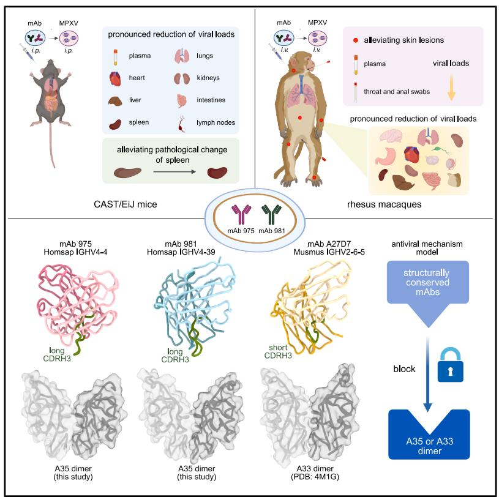  
Graphical abstract

# Authors

Bin Ju (鞠斌), Congcong Liu (刘聪聪),
Jingjing Zhang (张京京), ...
Renhong Yan (鄢仁鸿), Jing Xue (薛婧),
Zheng Zhang (张政)

# Correspondence

jubin2013@163.com (B.J.), tanwj@ivdc.chinacdc.cn (W.-J.T.), yanrh@sustech.edu.cn (R.Y.), xuejing@cnilas.org (J.X.), zhangzheng1975@aliyun.com (Z.Z.)

# In brief

Administration of human monoclonal antibodies against the MPXV A35 protein mitigate the pathogenic effects of MPXV infection in mouse and non-human primate models, with structural analyses explaining the basis of their efficacy.

# Highlights

# Article

# Structurally conserved human anti-A35 antibodies protect mice and macaques from mpox virus infection

Bin Ju (鞠斌), $^{1,2,8,*}$ Congcong Liu (刘聪聪), $^{1,8}$ Jingjing Zhang (张京京), $^{3,8}$ Yaning Li (李雅宁), $^{4,5,8}$ Haonan Yang (杨浩楠), $^{4,8}$ Bing Zhou (周兵), $^{1,8}$ Baoying Huang (黄保英), $^{6,8}$ Jianrong Ma (马建荣), $^{3}$ Jiahan Lu (陆佳涵), $^{3}$ Lin Cheng (程林), $^{1}$ Zhe Cong (丛喆), $^{3}$ Lin Zhu (朱林), $^{3}$ Tianhao Shi (时恬昊), $^{4}$ Yuehong Sun (孙岳宏), $^{1}$ Na Li (李娜), $^{3}$ Ting Chen (陈霆), $^{3}$ Miao Wang (王苗), $^{1}$ Shilong Tang (唐世龙), $^{1}$ Xiangyang Ge (葛向阳), $^{1}$ Juanjuan Zhao (赵娟娟), $^{1}$ Wen-Jie Tan (谭文杰), $^{6,*}$ Renhong Yan (鄢仁鸿), $^{4,*}$ Jing Xue (薛婧), $^{3,*}$ and Zheng Zhang (张政) $^{1,2,7,9,*}$

https://doi.org/10.1016/j.cell.2025.08.005

# SUMMARY

The A35 protein, expressed on the enveloped virion of monkeypox (mpox) virus (MPXV), is essential for viral infection and spread within the host, making it an effective antiviral target. In this study, we demonstrated two human anti-A35 monoclonal antibodies (mAbs) displayed potential protection against MPXV in CAST/EiJ mice and rhesus macaques. Using cryo-electron microscopy, we determined two high-resolution structures of the A35 dimer in complex with the fragment of antigen binding of mAb 975 or mAb 981, revealing detailed interactions at the antigen-antibody interfaces. Structural analysis showed that these structurally conserved mAbs bind to a groove region at the interface of A35 dimer. Overall, we provided a proof of concept for a single administration of anti-A35 mAbs mitigating the pathogenic effects of MPXV infection in rhesus macaques. These human-derived mAbs could be served as antibody drug candidates, and their binding models to the A35 dimer will provide valuable insights for future vaccine design.

# INTRODUCTION

Since May 2022, the ongoing monkeypox (mpox) caused by the infection of mpox virus (formerly monkeypox virus [MPXV]) has become a global outbreak, which has been declared as a public health emergency of international concern (PHEIC) twice in July 2022 and August 2024 (https://worldhealthorg.shinyapps.io/mpx_global/). The MPXV infection poses significant risks to human health, as transmission can occur through respiratory secretions, saliva, or direct contact with scabs, skin fragments, and feces. $^{1-3}$

MPXV is a member of the Orthopoxvirus genus of the Poxviridae family and displays high homology to the vaccinia virus (VACV), another well-studied member of poxvirus. $^{4-8}$ Approximately 25 and 6 membrane proteins are expressed on the mature virion (MV) and enveloped virion (EV) surface of these orthopoxviruses, contributing to the inter-host and intra-host transmission, respectively. $^{9-12}$ Taking the VACV as an example, antiviral antibodies generally target to A27, L1, H3, D8, A28, A13, and A17 proteins on the MV, and B5 and A33 proteins on the EV. $^{9,13-18}$ Nowadays, a certain number of monoclonal antibodies (mAbs) have been identified from immunized or infected animals

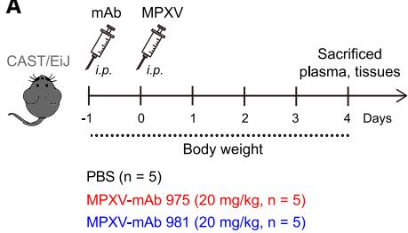  
A

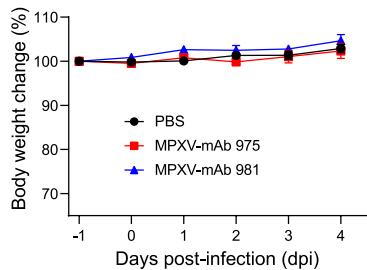  
B

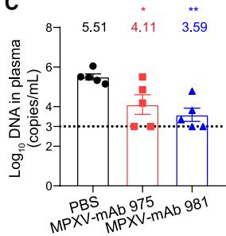  
C

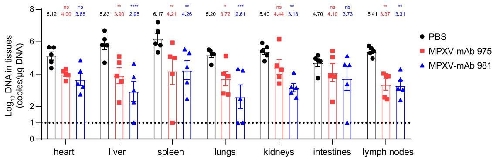  
D

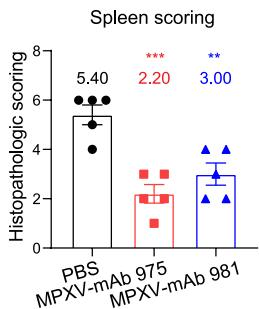  
E

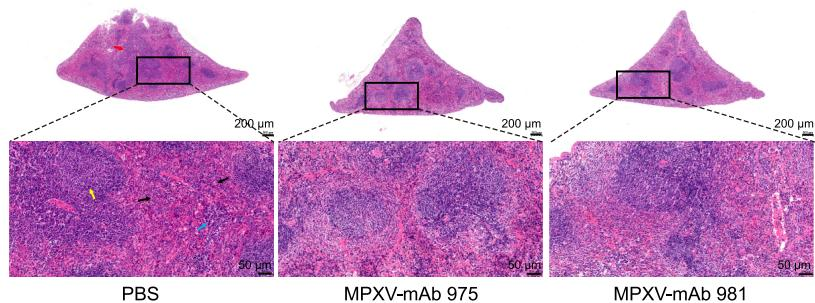  
F

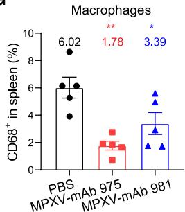  
G

H   
Figure 1. Protective effect of mAb 975 and mAb 981 against MPXV in CAST/EiJ mice   
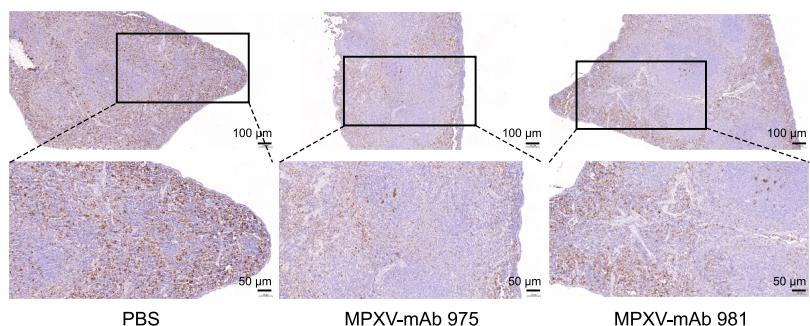  
(A) Study design of antibody administration and MPXV challenge in CAST/EiJ mice.   
(B) Body weights were monitored throughout the experiment.   
(C and D) Viral loads in plasma (C) and tissues (D) were determined by quantitative PCR (qPCR) assay at 4 dpi.   
(E) Histopathologic scoring of spleen sections from CAST/EiJ mice treated with or without mAbs.   
(F) Representative spleen sections were stained with hematoxylin and eosin. Upper: scale bar, 200 $\mu$ m, lower: scale bar, 50 $\mu$ m. Red arrow indicates that the white pulp is interconnected and irregularly shaped, yellow arrow indicates hyperplasia of the white pulp with prominent germinal center, blue arrow indicates extramedullary hematopoiesis in the red pulp, and black arrow indicates macrophage infiltration in the red pulp.   
(G) IHC for macrophages in the spleen of CAST/EiJ mice treated with or without mAbs. The percentage of macrophages in spleen was analyzed using ImageJ software.

(legend continued on next page)

or human beings that display inhibitory effects on the infection of VACV and MPXV. $^{9,19-23}$ Virus challenge experiments in vivo show that the administration of various forms of anti-VACV or anti-MPXV mAbs protects animals from the virus infection to different degrees. $^{21,22,24-29}$ However, all the data were obtained from mice models. In 2024, the protective effects of two mpox mRNA vaccines, BNT166 and mRNA-1769, had been evaluated in non-human primate (NHP) models. $^{30,31}$ By contrast, there is barely any protection data of mAbs against the MPXV infection in the NHP models.

In this study, we provided a proof of concept for single-target antibody protection in a MPXV-infected rhesus macaque model and concluded the structurally conserved features for mAbs from various sources binding to the MPXV_A35 dimer or the VACV_A33 dimer. Previously, we isolated two human mAbs, named MPXV-mAb 975 and MPXV-mAb 981 (abbreviated as mAb 975 and mAb 981 here), cross-binding to two homologous proteins VACV_A33 and MPXV_A35 (abbreviated as A33 and A35 here). $^{32}$ Here, we further evaluated their antiviral activities against the infection of MPXV in vivo. Using CAST/EiJ mice and rhesus macaque models, a single dose of mAb 975 or mAb 981 displayed a significant protection against MPXV. Moreover, we determined high-resolution cryo-electron microscopy (cryo-EM) structures of the A35 dimer in complex with the fragment of antigen binding (Fab) of either mAb 975 or mAb 981. Combined with a crystal structure of the A33 dimer in complex with the Fab of a murine-derived mAb A27D7, $^{24}$ we revealed a shared binding epitope on the A35 dimer and A33 dimer targeted by mAbs derived from different individuals and species. These results of the NHP experiment and the structural basis of antigen-antibody interaction will advance our understanding of the antiviral effect and mechanism of anti-A35 mAbs against MPXV and provide valuable insights for the design of the next-generation vaccines.

# RESULTS

# Antiviral activity of mAb 975 and mAb 981 in vitro

It is widely known that A33 or A35 is expressed on the EV of VACV or MPXV, mainly mediating the viral cell-to-cell spread. $^{4,12,33}$ Using an established plaque phenotype assay, we measured the inhibitory effects of mAb 975 and mAb 981 on the cell-to-cell spread of VACV. Monolayers of Vero E6 cells were infected with approximately 100 plaque-forming units (PFU) of VACV Western Reserve (VACV-WR) strain. After 2 h, mAb 975 and mAb 981 were added and cultured for another 72 h, respectively. As shown in Figure S1A, mAb 975 and mAb 981 could obviously reduce the size of plaques formed by the infection of VACV, compared with the virus control and irrelevant antibody control. With the help of complement, the numbers of plaques were further reduced in the presence of mAb 975 and mAb 981 (Figure S1B), suggesting that complement-dependent

cytotoxicity (CDC) could enhance the neutralization of mAb 975 and mAb 981. In addition to the neutralization, Fc-mediated non-neutralizing functions also contributed to the protective effect of EV-specific antibody against MPXV, such as antibody-dependent cell-mediated cytotoxicity (ADCC) and antibody-dependent cellular phagocytosis (ADCP). $^{31}$ As shown in Figures S1C and S1D, mAb 975 and mAb 981 displayed potential ADCC and ADCP activities by the reporter assay, in which the A35 protein of MPXV clade IIb transiently transfected HEK293F cells served as target cells and two commercially effector cells expressed the human FcγRIIIa receptor and FcγRIIa receptor, respectively. These results indicated that mAb 975 and mAb 981 exhibited effective antiviral activities in vitro, including neutralization, CDC, ADCC, and ADCP. For the cross-reactivity, mAb 975 and mAb 981 could also bind to the A35 protein of MPXV clade Ib (Figures S1E–S1G). Such a broad spectrum of mAb 975 and mAb 981 would facilitate the development of an antibody drug against orthopoxvirus.

# Protective effect of mAb 975 and mAb 981 against MPXV in CAST/EiJ mice

CAST/EiJ mice were highly susceptible to MPXV infection and thus widely used as a reliable in vivo model for evaluating various antiviral agents. $^{34,35}$ Using this established model, we evaluated the protective potential of mAb 975 and mAb 981 against MPXV in vivo. Five CAST/EiJ mice in each group were intraperitoneally (i.p.) administered with phosphate-buffered saline (PBS), mAb 975, or mAb 981 at a dose of 20 mg/kg body weight. 24 h later, all mice were challenged with $1 \times 10^{6}$ 50% tissue culture infective dose (TCID $_{50}$ ) of clade IIb MPXV (MPXV-B.1-China-C-Tan-CQ01) by the i.p. route. All CAST/EiJ mice were monitored daily for their body weight and sacrificed at 4 days post-infection (dpi) for the collection of plasma and various tissue samples (Figure 1A). Body weight change was no longer an important monitoring marker, because the MPXV infection did not cause body weight loss in CAST/EiJ mice model (Figure 1B). MPXV viral loads in the plasma, heart, liver, spleen, lungs, kidneys, intestines, and lymph nodes were systematically detected using a real-time quantitative PCR method. As shown in Figure 1C, plasma viral loads from mice administered with mAb 975 (4.11 log $_{10}$ ) and mAb 981 (3.59 log $_{10}$ ) were significantly decreased, compared with that from mice in the PBS group (5.51 log $_{10}$ ). A wide variety of tissue viral loads were also significantly decreased to different extents in the mAb 975- and mAb 981-treated mice, such as liver, spleen, lungs, and lymph nodes (Figure 1D). One typical symptom of CAST/EiJ mice infected with MPXV clade IIb strain by the i.p. route was pathological change in the spleen. $^{36}$ Histological analysis showed that pretreatment with mAb 975 and mAb 981 effectively alleviated the splenic injury (Figures 1E and 1F). Immunohistochemistry (IHC) analysis also revealed a significant reduction in the proportion of macrophages in the red pulp in mAb 975- and mAb 981-treated groups

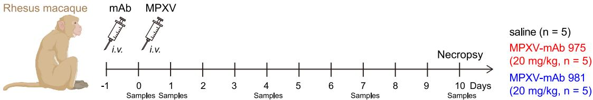  
A

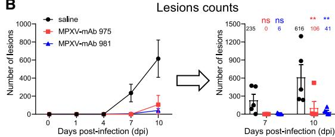  
B

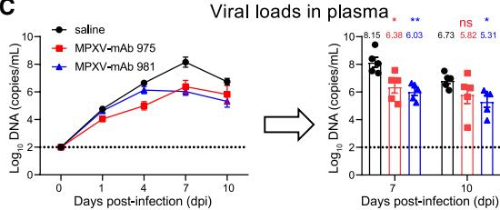  
C

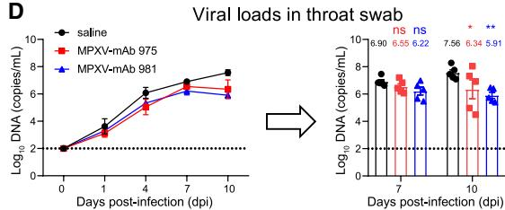  
D

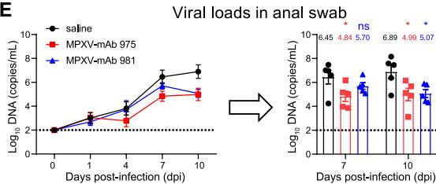  
E

F   
Figure 2. Protective effect of mAb 975 and mAb 981 against MPXV in rhesus macaques   
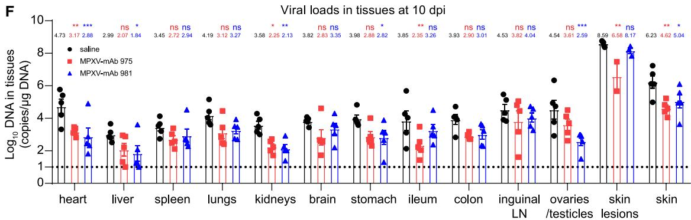  
(A) Study design of antibody administration and MPXV challenge in rhesus macaques.   
(B–E) Skin lesions (B) were counted and viral loads in plasma (C), throat swab (D), and anal swab (E) were determined throughout the experiment. Statistical analysis was performed at 7 and 10 dpi.   
(F) Viral loads in various tissues were determined at 10 dpi. Data are presented as mean ± SEM. The statistical significance is performed using two-way ANOVA with Dunnett's test for multiple comparison. ***p < 0.001, **p < 0.01, *p < 0.05, and ns: not significant.   
See also Figure S3.

(Figures 1G and 1H). Although there was no statistical difference, the symptom of splenomegaly and MPXV infection in spleen were alleviated to some extent, especially in certain mice (Figure S2). These results indicated that a single dose of mAb 975 or mAb 981 could confer effective protection in CAST/EiJ mice against the MPXV infection.

# Protective effect of mAb 975 and mAb 981 against MPXV in rhesus macaques

Using a pathogenic rhesus macaque/MPXV model, we further evaluated the protective potential of mAb 975 and mAb 981 in

NHPs. A total of 15 adult rhesus macaques (5 per group) were intravenously (i.v.) injected with two mAbs (20 mg/kg) or saline (as a mock group), and then challenged with $4 \times 10^{7}$ TCID $_{50}$ of MPXV by i.v. 24 h later. All macaques were monitored for their body temperature, body weight, and skin lesion count. Various biological samples were collected at regular intervals (0, 1, 4, 7, and 10 dpi). At the end of the experiment, detailed necropsies were performed on all rhesus macaques to assess the pathological changes (Figure 2A). During the experiment, there was a slight fluctuation of body temperature and no significant change in body weight in both mock- and mAb-treated macaques.

(Figures S3A and S3B). The skin lesion was a typical symptom of rhesus macaques infected with MPXV. $^{36}$ As shown in Figures 2B and S3C, all mock-treated animals showed explosive lesions at 7 dpi (3, 87, 149, 461, and 473 in each macaque), however, only one macaque in ten mAb-treated animals had 24 lesions. In comparison to the mock group, where all macaques had hundreds or even thousands of lesions at 10 dpi, mAb-treated animals still showed limited or no lesions except one macaque administered with mAb 975. According to the 4-grade scoring system for mpox severity based on lesion counts in humans, $^{37}$ mAb-treated macaques achieved obvious remission from serious disease. Histological analysis showed that pretreatment with mAb 975 and mAb 981 could effectively alleviate skin damage (Figures S3D and S3E). To evaluate the systemic infection, we measured the plasma viral loads in all animals throughout the whole process. As shown in Figure 2C, mAb-treated macaques exhibited a relatively lower peak viremia at 7 dpi. The plasma viral loads of mock-, mAb 975-, and mAb 981-treated animals were 8.15 log $_{10}$ , 6.38 log $_{10}$ , and 6.03 log $_{10}$ at 7 dpi; 6.73 log $_{10}$ , 5.82 log $_{10}$ , and 5.31 log $_{10}$ at 10 dpi, respectively.

During the course of the experiment, throat swabs and anal swabs were regularly collected in all animals and we measured the viral loads to monitor viral shedding. Compared with the mock group (7.56 $\log_{10}$ ), the viral loads in throat swabs of mAb 975- and mAb 981-treated macaques were significantly decreased to 6.34 $\log_{10}$ and 5.91 $\log_{10}$ , respectively, at 10 dpi (Figure 2D). Similarly, treatment with mAb 975 and mAb 981 led to the decline of viral loads in anal swabs from 6.89 $\log_{10}$ to 4.99 $\log_{10}$ and 5.07 $\log_{10}$ , respectively, at 10 dpi (Figure 2E). Finally, up to 13 kinds of samples of tissues or body parts were collected in all animals during the necropsy and we comprehensively measured their viral loads, including heart, liver, spleen, lungs, kidneys, brain, stomach, ileum, colon, inguinal lymph nodes, ovaries/testicles, skin lesions, and skin. As shown in Figure 2F, MPXV DNA was widely detected in all tissues obtained from mock-treated macaques, suggesting a systemic virus infection. In contrast, the viral loads in mAb-treated groups were significantly decreased at different degrees, especially in the heart, kidneys, and skin with significantly statistical differences. Together, these data demonstrated that mAb 975 or mAb 981 was effective in alleviating skin lesions, viremia, and viral shedding, as well as decreasing viral loads in systemic tissues in the MPXV-infected rhesus macaques.

# Structural determination of mAb 975 and mAb 981 binding to MPXV_A35

To elucidate the molecular mechanisms of the interactions between mAb 975 and mAb 981 with MPXV_A35, we aimed to determine the cryo-EM structures of the A35-mAb 975 and A35-mAb 981 complexes. Although A35 naturally exists as a dimer ( $\sim$ 40 kDa), the resulting complex with a single Fab ( $\sim$ 50 kDa) is too small for cryo-EM analysis. Our previous study demonstrated that mAb 975 and mAb 981 exhibit competitive binding to A35. $^{32}$ Therefore, we selected a partner Fab with either mAb 975 or mAb 981 to co-incubate with the A35 dimer. As shown in Figure S4A, a commercialized antibody, R387c6, did not compete with mAb 975 or mAb 981 for binding to A35. The dissociation constants ( $K_{D}$ ) of Fabs from mAb 975, mAb

981, and R387c6 were 0.0088, 0.0037, and 0.8490 nM, respectively, determined by surface plasmon resonance (SPR) (Figure S4B), indicating sufficient binding affinities for structural studies.

Subsequently, we successfully resolved the cryo-EM structures of the A35 dimer (A35-1 and A35-2) (residues 58–181) in complex with Fabs from R387c6 and either mAb 975 (3.21 Å) or mAb 981 (3.08 Å) (Figures S5 and S6; Table S1). Atomic models for the C-terminal domain of A35 (residues 99–181) and the variable regions of both mAb 975 Fab and mAb 981 Fab were successfully determined. However, the atomic model for R387c6 could not be constructed due to the unavailability of its amino acid sequence information, despite the presence of interpretable electron density in the corresponding region (Figure S5). For clarity, the density corresponding to R387c6 Fab was omitted in the final structural representations (Figure 3).

# Structural basis of mAb 975 and mAb 981 binding to MPXV_A35

Structural analysis reveals that both mAb 975 and mAb 981 recognize the A35 dimer through a conserved binding mode, with each Fab binding at the dimer interface of A35. The binding site forms a groove-like structure oriented toward the extracellular side, where a single Fab from either mAb 975 or mAb 981 interacts with both protomers of the A35 dimer (Figures 3A and 3C). Epitope mapping analysis reveals that mAb 975 and mAb 981 share highly similar footprints on the A35 dimer (Figures 3B and 3D). The recognition epitope encompasses 29 amino acid residues, accounting for $\sim 35\%$ (29/83) of the residues that constitute the stable three-dimensional structure of A35. Notably, these residues predominantly localize within the characteristic groove region. Among these, 23 residues are common to both mAbs, while 5 residues are unique to mAb 975 and 1 residue is specific to mAb 981 (Figure 3E; Table S2). Both mAb 975 and mAb 981 primarily utilize their heavy chains for interactions with the A35 dimer. Binding interfaces area analysis by the program of proteins, interfaces, structures, and assemblies (PISA) reveals that the heavy chains contribute significantly larger contact areas (983.3 Ų for mAb 975 and 910.8 Ų for mAb 981) compared with the light chains (514.1 Ų for mAb 975 and 421.9 Ų for mAb 981), indicating a dominant role of the heavy chain in antigen recognition.

In the A35-mAb 975 complex structure, 7 residues (S32, W34, N59, S103, L105, R107, and K109) from the heavy chain form contacts with 7 residues (S114, Y116, D146, D150 [A35-1], D150 [A35-2], V175, and K177) of the A35 dimer, establishing a network of hydrogen bonds and salt bridges (Figure 3F; Table S2). Structural analysis of the antigen-antibody interface demonstrates that the complementarity determining region 1 of heavy chain (CDRH1) mediates critical interactions with both subunits of the A35 dimer. Specifically, S32 forms a hydrogen bond with D150 on A35-1, and W34 interacts with Y116 on A35-2. CDRH2 exhibits subunit-specific recognition, with N59 forming a hydrogen bond to the main chain oxygen of V175 on A35-2. CDRH3 further stabilizes the interaction, with S103 forming a total of 3 hydrogen bonds with D150 on A35-1, and S114 and K117 on A35-2, respectively. Additionally, L105 forms a hydrogen bond with D146 on A35-1. Both R107 and

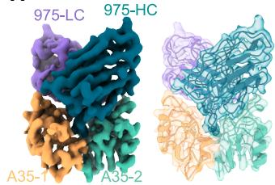  
A   
B

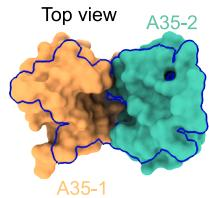

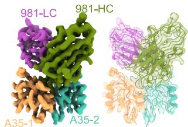  
C   
D

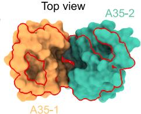

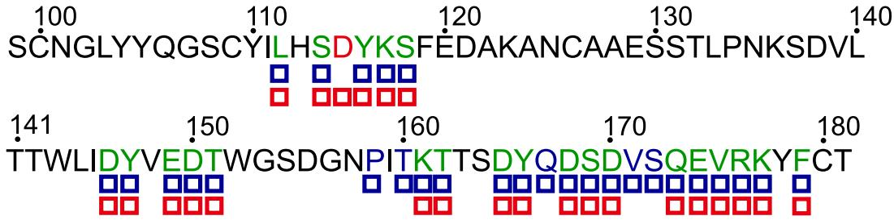  
|E

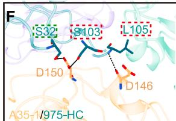  
F

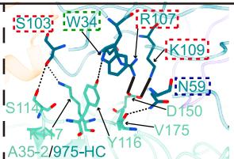

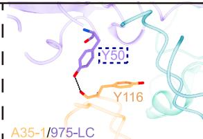

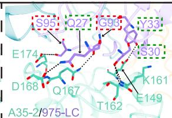

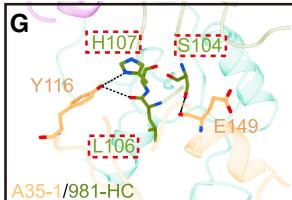  
G

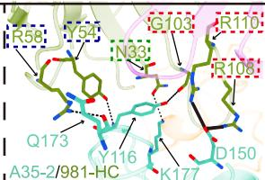

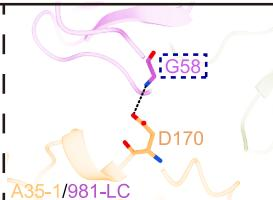

Figure 3. Structural basis of mAb 975 and mAb 981 binding to MPXV_A35   
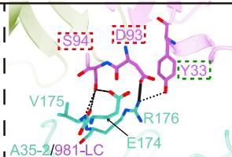  
(A) The domain-colored density map and cartoon of the A35 dimer in complex with mAb 975 Fab variable region.   
(B) Footprint of mAb 975 on the A35 dimer is highlighted by a blue curve.   
(C) The domain-colored density map and cartoon of the A35 dimer in complex with mAb 981 Fab variable region.   
(D) Footprint of mAb 981 on the A35 dimer is highlighted by a red curve.   
(E) The amino acid sequence of A35 for which atomic models were constructed is shown. Blue boxes indicate binding footprint of mAb 975, while red boxes indicate the binding footprint of mAb 981. In the sequence, the green amino acids represent the ones that are present in both footprints of mAb 975 and mAb 981, the blue ones represent the amino acids that are only found in the footprint of mAb 975, and the red ones represent the amino acids that are only present in the footprint of mAb 981.   
(F and G) The interactions between the heavy or light chain of mAb 975 (F) or mAb 981 (G) and the two subunits of the A35 dimer (A35-1 and A35-2) are shown. The key amino acids are presented in a stick model. Dashed lines represent hydrogen bonds. Solid lines represent salt bridges. Interaction data for these interactions were calculated by PISA (https://www.ebi.ac.uk/pdbe/pisa/). The amino acids within the green, blue, and red dashed boxes are in the CDR1, CDR2, and CDR3 of mAb 975 or mAb 981, respectively. The two subunits of the A35 dimer, A35-1 and A35-2, are colored sandy brown and aquamarine, respectively. The heavy and light chain of mAb 975 are colored teal and purple, respectively. The heavy and light chain of mAb 981 are colored olive drab and orchid, respectively.   
See also Figures S5 and S6 and Tables S1 and S2.

K109 form salt bridges with D150 on A35-2. The light chain of mAb 975 establishes specific interactions with the A35 dimer through 6 residues (Q27, S30, Y33, Y50, G93, and S95) of CDRs that contact 7 residues (Y116, E149, K161, T162, Q167, D168, and E174) of the A35 dimer (Figure 3F; Table S2). Detailed structural analysis reveals that Y50 in CDRL2 forms a hydrogen bond with Y116 on A35-1. Additionally, CDRL1 residues Q27, S30, and Y33 interact with D168, K161, T162, and E149 on A35-2, respectively. Furthermore,

CDRL3 residues G93 and S95 form hydrogen bonds with Q167 and E174 on A35-2, respectively, contributing to the overall binding affinity and specificity.

The mAb 981 engages with the A35 dimer similarly to mAb 975 (Figure 3G; Table S2). The heavy chain forms hydrogen bonds via CDRH3 residues (S104, L106, and H107) with Y116 and E149 on A35-1. In contrast, the interface with A35-2 involves an extensive network of interactions: CDRH1 (N33), CDRH2 (Y54 and R58), and CDRH3 (G103, R108, and R110) residues form specific

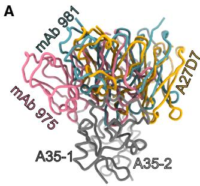

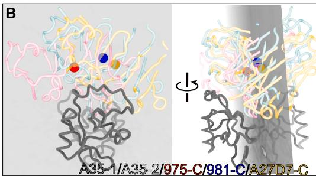

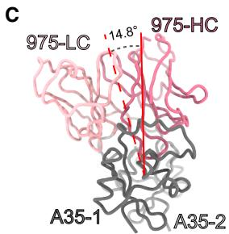

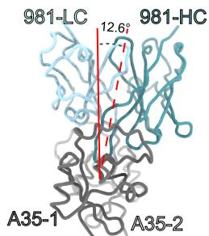

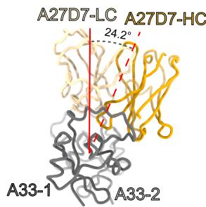

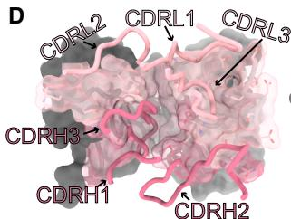

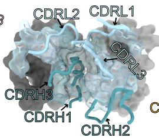

Figure 4. Structure and binding feature of mAb 975, mAb 981, and mAb A27D7   
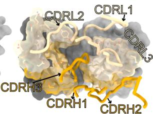  
(A) The positions of mAb 975, mAb 981, and mAb A27D7 on the A35 dimer are shown.   
(B) The plane (in gray) formed by the centroids of mAb 975, mAb 981, and mAb A27D7 bisects the groove formed by the A35 dimer. The red, blue, and yellow spheres represent the centroids of mAb 975, mAb 981, and mAb A27D7, respectively.   
(C) The angular distribution of mAb 975, mAb 981, and mAb A27D7 relative to the rotational symmetry axis of the A35 or A33 dimer. The solid red line represents the rotational symmetry axis of the A35 or A33 dimer, and the dashed red lines are the connecting lines between the centroids of these 3 mAbs and the centroid of the A35 or A33 dimer, respectively.   
(D) CDR loops of mAb 975, mAb 981, and mAb A27D7 mapped onto the A35 or A33 surface. Epitopes are colored on the A35 or A33 surface. The CDRs of these mAbs are presented in cartoon form. The A35 or A33 surface are shown in surface representation. The related footprint epitopes of these CDRs on A35 or A33 surface are displayed as sticks and accompanied by a transparency surface. The A35 or A33 dimer are colored gray. The mAb 975, mAb 981, and mAb A27D7 are colored pink, blue, and goldenrod, respectively. See also Figure S7.

hydrogen bonds with Y116, D150, Q173, and K177 on A35-2. Notably, R108 and R110 form salt bridges with D150 on A35-2. The light chain of mAb 981 establishes 5 hydrogen bonds and 1 salt bridge with the A35 dimer. Similar to mAb 975, in the interaction of mAb 981 with A35, only CDRL2 (G58) forms a hydrogen bond with D170 on A35-1. Furthermore, CDRL1 (Y33) and CDRL3 (S94) form hydrogen bonds with residues E174, V175, and R176 on A35-2. Additionally, CDRL3 (D93) forms a salt bridge with R176 on A35-2. These findings highlight the consistent interaction pattern between mAb 975 and mAb 981 with the A35 dimer.

# Structurally conserved mAbs bind to the groove of the MPXV_A35 dimer or VACV_A33 dimer

Notably, the binding mode observed in mAb 975 and mAb 981 is similar to a murine-derived mAb A27D7 with the VACV_A33 dimer, suggesting a conserved binding approach across these antibodies targeting related viral proteins. $^{24}$ Structurally conserved mAbs recognize and bind to the groove region formed at the dimer interface of MPXV_A35 or VACV_A33 (Figures 4A and S7A). The mAb 975, mAb 981, and mAb A27D7 recognize overlapping yet distinct footprints on their respective antigen dimers, with 28, 24, and 24 interfacial residues, respectively. Strikingly, 16 residues constitute a core epitope shared by all 3 mAbs, suggesting a common mechanism of viral protein recognition among orthopoxviruses. To reveal the

structural basis for potent recognition and binding of these 3 structurally conserved mAbs, the structure of A33 dimer complexed with mAb A27D7 Fab (PDB: 4M1G) was used here for comparison. $^{24}$ From the structural perspective of the A35-1 subunit, these 3 mAbs exhibit a distinct spatial arrangement: mAb 975 occupies the left lateral position, mAb 981 is centrally located, and mAb A27D7 is positioned on the right side, creating a nearly linear spatial distribution along the antigenic groove (Figure 4A). Interestingly, geometric analysis reveals that the plane defined by the centroids of mAb 975, mAb 981, and mAb A27D7 nearly bisects the entire antigenic groove, suggesting a conserved spatial organization of antibody recognition across different orthopoxvirus species (Figure 4B). These 3 mAbs approach the groove of the A35 dimer or the A33 dimer from different angles: mAb 975 is positioned 14.8° to the left of the rotational symmetry axis of the A35 dimer, while mAb 981 is oriented 12.6° to the right of the A35 dimer axis. In comparison, mAb A27D7 exhibits a more pronounced angular displacement, located 24.2° to the right of the rotational symmetry axis of the A33 dimer (Figure 4C). After highlighting the CDRs of these 3 mAbs on the surface of the A35 dimer or A33 dimer, it is found that except for the difference in the orientation of CDRH1, the other CDRs of mAb 975 and mAb 981 have relatively similar distributions. The CDRH1 of mAb 975 spans the groove, while the CDRH1 of mAb 981 is inserted into the groove to a certain extent. In contrast, the CDRs of mAb A27D7 are completely different

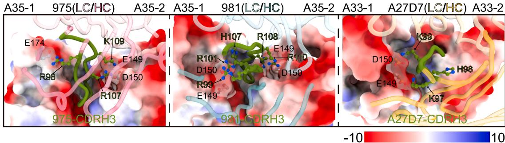  
A

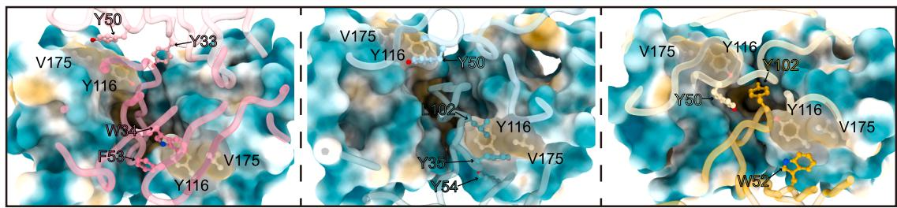  
B

C   
Figure 5. Non-covalent interactions between mAb 975, mAb 981, or mAb A27D7 and the A35 or A33 dimer   
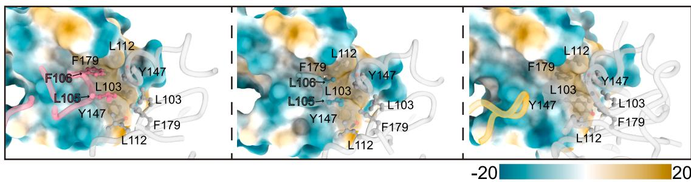  
(A) The electrostatic interactions between the CDRH3 of mAb 975, mAb 981, or mAb A27D7 and either A35 or A33. The surface of A35 or A33 is presented as an electrostatic potential map. The CDRH3s are colored green. The key positively charged and negatively charged amino acids are shown in a ball-and-stick style. (B and C) The hydrophobic interactions between mAb 975, mAb 981, or mAb A27D7 and the hydrophobic platform (B) of either A35 or A33, as well as the hydrophobic strip (C) at the bottom of the groove. The surface of A35 or A33 is presented as a hydrophilicity-hydrophobicity map. The key hydrophobic amino acids are shown in a ball-and-stick style. The electrostatic potential maps are generated using the Coulombic command in ChimeraX. The maps are displayed as red and blue isosurfaces at levels -10 and +10. The hydrophilicity-hydrophobicity maps are generated using the mlp command in ChimeraX. The maps are displayed as dark cyan (hydrophilic) and goldenrod (hydrophobic) at levels -20 and +20.   
See also Figure S8 and Table S2.

from those of mAb 975 and mAb 981. This is especially true for its CDRH3. Since its CDRH3 (10 amino acids) has 5 fewer amino acids than the CDRH3s of the mAb 975 and mAb 981 (Figure S7B). The CDRH3 of mAb A27D7 spans across the groove, rather than being deeply inserted into the groove like the other two mAbs (Figure 4D).

# Non-covalent interactions between structurally conserved mAbs and relative antigens

Electrostatic potential analysis of the antigen-antibody interfaces reveals that both the A35 dimer and A33 dimer feature a characteristic negatively charged cavity, formed by clusters of acidic residues along the groove edges and interior. Complementing this charge distribution, the binding surfaces of mAb 975, mAb 981, and mAb A27D7 are enriched with positively charged residues, particularly within their CDRH3s (Figure S8A; Table S2). This striking electrostatic complementarity strongly suggests that charge-charge interactions play

a pivotal role in the classical antigen-antibody recognition mechanism observed in these complexes. Detailed analysis of the CDRH3-mediated electrostatic interactions reveals distinct yet conserved binding mechanisms among these 3 mAbs (Figure 5A; Table S2). In mAb 975, the positively charged triad (R98, R107, and K109) engages in specific charge-charge interactions with E174 on A35-1 and E149 and D150 on A35-2. The mAb 981 exhibits an even more extensive electrostatic network, with 5 basic residues (R99, R101, H107, R108, and R110) forming multiple interactions with E149 and D150 across both A35 subunits. In contrast, mAb A27D7 demonstrates a more limited electrostatic profile, where only K97 and K99 interact with E149 and D150 on A33-1, while H98 orients toward a neutral region. Notably, the positional conservation of key residues (R98 in mAb 975, R99 in mAb 981, and K97 in mAb A27D7) suggests a common recognition motif despite their sequence variations.

Detailed analysis of the hydrophobic interfaces reveals a conserved recognition mechanism across the antigen-antibody

complexes (Figure S8B; Table S2). Both A35 dimer and A33 dimer feature paired hydrophobic platforms (Y116 and V175) and a continuous hydrophobic strip. This strip is formed by L103, L112, Y147, and F179 from two subunits of each dimer, extending along the groove bottom (Figures 5B and 5C; Table S2). These hydrophobic surfaces are precisely recognized by complementary residues in all 3 mAbs, albeit with distinct interaction patterns. For mAb 975, the hydrophobic platforms are engaged by Y33 (CDRL1), Y50 (CDRL2), W34 (CDRH1), and F53 (CDRH2), while the groove strip interacts with L105 and F106 in CDRH3. The mAb 981 employs a similar yet distinct strategy, utilizing Y50 (CDRL2), Y35 (CDRH1), Y54 (CDRH2), and L102 (CDRH3) for platform recognition, with L105 and L106 in CDRH3 mediating groove interactions. In contrast, mAb A27D7, constrained by its shorter CDRH3, primarily engages the platform through Y50 (CDRL2), W52 (CDRH2), and Y102 (CDRH3) but lacks the necessary length to establish interactions with the deeper hydrophobic strip. This structural analysis suggests that while mAb 975, mAb 981, and mAb A27D7 maintain the capacity to recognize the hydrophobic platforms, their ability to engage the deeper groove region is determined by the CDRH3 length and composition, potentially influencing their binding potency and epitope recognition breadth.

# DISCUSSION

A35 of MPXV and its homologous A33 of VACV have been identified as targets for antiviral antibodies, and a set of mAbs have been isolated from immunized or infected animals and human beings. $^{9,22,24,32,33}$ Vaccination with these vaccine candidates can protect animals from viral infection, and passive administration of these specific mAbs also confer some protection in the animal model. $^{9,22,38,39}$ Therefore, isolation and characterization of more anti-A35 and anti-A33 mAbs is still of great significance for providing antibody drug candidates and guiding to design updated vaccine antigens. Here, we reported the protective effects of two human mAbs, named mAb 975 and mAb 981, in two MPXV-infected animal models. In CAST/EiJ mice, a single administration of mAb 975 or mAb 981 contributed to the significant reduction of viral loads in plasma and other tissues including the liver, spleen, and lungs, etc., which is consistent with the protection of several anti-A33 mAbs against the infection of VACV in BALB/c and C57BL/6 mice. $^{9,22,24}$ In MPXV-infected rhesus macaques, a single dose of mAb 975 or mAb 981 was strikingly effective in alleviating skin lesions. Most of the mAb-treated macaques showed limited or even no lesions; by contrast, mock-treated animals showed explosive lesions up to hundreds. In addition, the significant reduction of viral loads in the plasma, throat swab, and anal swab were observed in both mAb 975- and mAb 981-treated macaques, suggesting the effective remission of the viremia and viral shedding. Based on the detailed necropsy at the end of experiment, 13 kinds of tissues or body parts were collected and measured their viral loads, showing mAb 975 and mAb 981 accountable for the decreased systemic infection. These protective effects of mAb 975 and mAb 981 in MPXV-infected CAST/EiJ mice and rhesus macaques benefited from their comprehensive antiviral activities, including neutralization, CDC, ADCC, and ADCP. Certainly, it is well known that the entry of

poxvirus is mediated by a series of binding proteins and an 11-protein entry-fusion complex (EFC) on MV, and several EV-specific proteins also contribute to the cell-to-cell spread of poxvirus. $^{13,40,41}$ Therefore, it is difficult to fully inhibit the entry and transmission of VACV or MPXV by blocking a single target by mAbs. Gilchuk et al. demonstrated a mixture of 6 mAbs (anti-H3, anti-A27, anti-D8, anti-L1, anti-B5, and anti-A33) or a mixture of 4 mAbs (anti-A27, anti-L1, anti-B5, and anti-A33) contributed to the protection in systemic infection model or protection against respiratory tract infection. $^{9}$ More target mAbs could be involved in evaluating their synergy effects in protection against MPXV in the NHP model in the future.

Resolving the structure of these mAbs complexed with antigens will clarify their effective mechanisms on fighting against the MPXV infection. A33 is a type II membrane protein located on the surface of the EV-form virus. $^{42,43}$ A33 consists of 185 amino acids and forms a disulfide-bonded homodimer. $^{44}$ The crystal structure of A33 has been determined, which contains a dimer of C-type lectin-like domains (CTLDs). $^{44}$ According to the sequence analysis, A33 is predicted to contain the N-terminal cytoplasmic region, transmembrane domain, the stalk region, and the C-terminal CTLD. The dimeric CTLDs of A33 structurally resembles CTLDs of the receptor of natural killer (NK) cells. $^{44,45}$ Actually, the CTLD of A33 is a dominant target of mAbs. In this study, we performed the cryo-EM structural analysis to reveal the atomic details of antibody paratopes, antigen epitopes, and interaction interfaces between either mAb 975 or mAb 981 and the A35 dimer. Previously, Matho et al. reported a crystal structure of the Fab-form mAb A27D7 in complex with the A33 dimer, which was derived from mice immunized with the live VACV and boosted with the soluble A33 ectodomain. $^{24}$ Although mAb 975 and mAb 981 were human-derived mAbs from MPXV-donor 42 and MPXV-donor 3, respectively, $^{32}$ and mAb A27D7 was a murine-derived mAb, $^{24}$ they recognized a shared binding epitope region between the A35 dimer and A33 dimer. Public antibodies have been reported in several virus infections, meaning that mAbs isolated from different individuals possess the similar gene features and close binding epitopes, such as canonical IGHV1-2 mAbs for HIV-1 and IGHV3-53/3-66 mAbs for SARS-CoV-2. $^{46,47}$ However, the heavy chains of mAb 975, mAb 981, and mAb A27D7 belonged to the Homsap IGHV4-4, Homsap IGHV4-39, and Musmus IGHV2-6-5 germline gene, respectively. In particular, the CDRH3 length (Kabat numbering) of mAb A27D7 was 10 amino acids, markedly shorter than those of both mAb 975 and mAb 981 (15 amino acids). Despite all this, mAb 975, mAb 981, and mAb A27D7 displayed a structurally conserved binding to the groove region formed at the dimer interface of both A35 and A33. Differential antibody sequences caused varying details of interaction between mAbs and the A35 dimer or A33 dimer yet formed a similar spatial conformation. Except for the hydrogen bond and salt bridge, some electrostatic complementarity and hydrophobic interaction were also responsible for the recognition of mAb 975, mAb 981, and mAb A27D7 to the A35 dimer or A33 dimer. These structurally conserved mAbs revealed a common antiviral mechanism among orthopoxviruses.

In conclusion, we reported the protective effect of a single administration of anti-A35 mAbs against the infection of MPXV

in NHPs, which is the best model for human orthopoxvirus disease. Along with the marked reduction of viral loads in peripheral blood and various tissues, the development of skin lesions across the body was significantly alleviated. Meanwhile, we also reported the high-resolution structures of human anti-A35 mAbs binding to an epitope shared by the A35 dimer and A33 dimer, revealing a group of structurally conserved mAbs with distinctive gene features yet with similar spatial structures. These results demonstrated the potential for mAb 975 and mAb 981 serving as good complements with other antiviral agents against orthopoxvirus diseases. This study also greatly deepened our understanding of antigen-antibody recognition mechanisms and gave an important reference for further design of the updated vaccines against orthopoxvirus.

# Limitations of the study

Although this type of analogous NK cell receptors might utilize the top of CTLD to bind to their relevant ligands, functional cellular receptors recognized by the MPXV_A35 or VACV_A33 have not been clearly identified, which largely limits the explanation of the inhibitory effects of these mAbs. Disturbing the virus's ability to recognize and bind to the potential receptor is a possible hypothesis, however, more detailed mechanisms need to be explored in the future. Furthermore, after evaluating the protective effects of single-target mAbs, the combination of multi-target mAbs against viral proteins on the MV and EV of MPXV will be evaluated in animal models, especially in NHPs.

# RESOURCE AVAILABILITY

# Lead contact

Further information and requests for resources and reagents should be directed to and will be fulfilled by the lead contact, Zheng Zhang (zhangzheng1975@aliyun.com).

# Materials availability

All unique/stable reagents generated in this study are available from the lead contact with a completed materials transfer agreement.

# Data and code availability

The structure coordinates are deposited in the Protein Data Bank under accession codes 9KYZ (MPXV-mAb 975: MPXV_A35) and 8XA4 (MPXV-mAb 981: MPXV_A35). The corresponding EM density maps are deposited in the Electron Microscopy Data Bank under accession numbers EMD-62650 (MPXV-mAb 975: MPXV_A35) and EMD-38194 (MPXV-mAb 981: MPXV_A35). This paper does not report original code. Any additional information required to reanalyze the data reported in this paper is available from the lead contact upon request.

# ACKNOWLEDGMENTS

We thank the Cryo-EM Facility of Southern University of Science and Technology (SUSTech) for providing the facility support. We thank Yuanzhu Gao, Shuman Xu, Lei Zhang, and Peiyao Li at the Cryo-EM Center of SUSTech for technical support in electron microscopy data acquisition. R.Y. is an investigator of SUSTech Institute for Biological Electron Microscopy. We thank Zhenyuan Liu for technical support on computing environment. Some figures are adapted from BioRender. This study was supported by the National Natural Science Foundation of China (82025022 to Z.Z., 82322040 to B.J., 82222041 and 82241068 to J.X., and 32422039 to R.Y.), the Shenzhen Medical Research Fund (E24010010 and E24010012 to Z.Z. and R.Y., E24010010 and E24010013 to B.J., and B2302052 to Z.Z.), the Guangdong

Basic and Applied Basic Research Foundation (2021B1515020034 to B.J.), the Shenzhen Science and Technology Program (RCYX20200714114700046 to B.J., ZDSYS20210623091810030 to Z.Z., JCYJ20210324132003010 to C.L., RCYX20231211090342048 to R.Y., and JCYJ20240813102002004 to B.Z.), the Shenzhen High-level Hospital Construction Fund (23250G1002 to B.J. and 23250G1004 to B.Z.), and the Chinese Academy of Medical Sciences Clinical and Translational Medicine Research Project (2022-I2M-C&T-B-113 to Z.Z. and 2023-I2M-2-001 to J.X.).

# AUTHOR CONTRIBUTIONS

Z.Z., B.J., J.X., and R.Y. conceived and designed the study. B.J., C.L., J. Zhang, Y.L., H.Y., and B.Z. performed most of the experiments and analyzed the data together with assistance from J.M., J.L., L.C., Z.C., L.Z., T.S., Y.S., N.L., T.C., M.W., S.T., X.G., and J. Zhao. B.H. and W.-J.T. provided the MPXV strain. Z.Z., B.J., J.X., R.Y., and C.L. wrote and revised the manuscript. All authors read and approved this version of the manuscript.

# DECLARATION OF INTERESTS

Patent applications have been filed on MPXV-mAb 975 and MPXV-mAb 981. Z.Z., B.J., C.L., B.Z., L.C., X.G., and J. Zhao are the inventors.

# STAR★METHODS

Detailed methods are provided in the online version of this paper and include the following:

● KEY RESOURCES TABLE   
● EXPERIMENTAL MODEL AND SUBJECT DETAILS

- Ethics statement   
○ Cells and viruses   
○ Anti-MPXV_A35 monoclonal antibodies (mAbs)   
○ CAST/EiJ mice   
○ Rhesus macaques

- METHOD DETAILS

- Neutralization   
○ Complement-dependent cytotoxicity (CDC)   
○ Antibody-dependent cell-mediated cytotoxicity (ADCC)   
○ Antibody-dependent cellular phagocytosis (ADCP)   
○ Quantification of viral DNA   
○ Histopathology and immunohistochemistry (IHC)   
○ Measurement of skin lesions   
○ Enzyme linked immunosorbent assay (ELISA) and competition ELISA   
- Fragments of antigen binding (Fabs)   
○ Binding affinity analysis by surface plasmon resonance (SPR)   
○ Cryo-EM sample preparation and data acquisition   
○ Data processing   
○ Model building and structure refinement   
- Centroids/plane definition and angles calculation

• QUANTIFICATION AND STATISTICAL ANALYSIS

# SUPPLEMENTAL INFORMATION

Supplemental information can be found online at https://doi.org/10.1016/j.cell.2025.08.005.

Received: March 1, 2025

Revised: June 20, 2025

Accepted: August 4, 2025

Published: August 26, 2025

# REFERENCES

1. Wang, Y., Leng, P., and Zhou, H. (2023). Global transmission of monkeypox virus-a potential threat under the COVID-19 pandemic. Front. Immunol. 14, 1174223. https://doi.org/10.3389/fimmu.2023.1174223.

2. Shen, Y., Li, Y., and Yan, R. (2024). Structural basis for the inhibition mechanism of the DNA polymerase holoenzyme from mpox virus. Structure 32, 654–661.e3. https://doi.org/10.1016/j.str.2024.03.004.   
3. Fine, P.E., Jezek, Z., Grab, B., and Dixon, H. (1988). The transmission potential of monkeypox virus in human populations. Int. J. Epidemiol. 17, 643–650. https://doi.org/10.1093/ije/17.3.643.   
4. Shchelkunov, S.N., Totmenin, A.V., Safronov, P.F., Mikheev, M.V., Gutorov, V.V., Ryazankina, O.I., Petrov, N.A., Babkin, I.V., Uvarova, E.A., Sandakhchiev, L.S., et al. (2002). Analysis of the monkeypox virus genome. Virology 297, 172–194. https://doi.org/10.1006/viro.2002.1446.   
5. Li, Y., Shen, Y., Hu, Z., and Yan, R. (2023). Structural basis for the assembly of the DNA polymerase holoenzyme from a monkeypox virus variant. Sci. Adv. 9, eadg2331. https://doi.org/10.1126/sciadv.adg2331.   
6. Peng, Q., Xie, Y., Kuai, L., Wang, H., Qi, J., Gao, G.F., and Shi, Y. (2023). Structure of monkeypox virus DNA polymerase holoenzyme. Science 379, 100–105. https://doi.org/10.1126/science.ade6360.   
7. Zeng, Y., Liu, X., Li, Y., Lu, J., Wu, Q., Dan, D., Lv, S., Xia, F., Hu, C., Li, J., et al. (2023). The assessment on cross immunity with smallpox virus and antiviral drug sensitivity of the isolated mpox virus strain WIBP-MPXV-001 in China. Emerg. Microbes Infect. 12, 2208682. https://doi.org/10.1080/22221751.2023.2208682.   
8. Zhao, F., Hu, Y., Fan, Z., Huang, B., Wei, L., Xie, Y., Huang, Y., Mei, S., Wang, L., Wang, L., et al. (2023). Rapid and sensitive one-tube detection of mpox virus using RPA-coupled CRISPR-Cas12 assay. Cell Rep. Methods 3, 100620. https://doi.org/10.1016/j.crmeth.2023.100620.   
9. Gilchuk, I., Gilchuk, P., Sapparapu, G., Lampley, R., Singh, V., Kose, N., Blum, D.L., Hughes, L.J., Satheshkumar, P.S., Townsend, M.B., et al. (2016). Cross-Neutralizing and Protective Human Antibody Specificities to Poxvirus Infections. Cell 167, 684–694.e9. https://doi.org/10.1016/j.cell.2016.09.049.   
10. Yefet, R., Friedel, N., Tamir, H., Polonsky, K., Mor, M., Cherry-Mimran, L., Taleb, E., Hagin, D., Sprecher, E., Israely, T., et al. (2023). Monkeypox infection elicits strong antibody and B cell response against A35R and H3L antigens. iScience 26, 105957. https://doi.org/10.1016/j.isci.2023.105957.   
11. Hou, F., Zhang, Y., Liu, X., Murad, Y.M., Xu, J., Yu, Z., Hua, X., Song, Y., Ding, J., Huang, H., et al. (2023). mRNA vaccines encoding fusion proteins of monkeypox virus antigens protect mice from vaccinia virus challenge. Nat. Commun. 14, 5925. https://doi.org/10.1038/s41467-023-41628-5.   
12. Roper, R.L., Wolffe, E.J., Weisberg, A., and Moss, B. (1998). The envelope protein encoded by the A33R gene is required for formation of actin-containing microvilli and efficient cell-to-cell spread of vaccinia virus. J. Virol. 72, 4192–4204. https://doi.org/10.1128/JVI.72.5.4192-4204.1998.   
13. Moss, B. (2011). Smallpox vaccines: targets of protective immunity. Immunol. Rev. 239, 8–26. https://doi.org/10.1111/j.1600-065X.2010.00975.x.   
14. Galmiche, M.C., Goenaga, J., Wittek, R., and Rindisbacher, L. (1999). Neutralizing and protective antibodies directed against vaccinia virus envelope antigens. Virology 254, 71–80. https://doi.org/10.1006/viro.1998.9516.   
15. Hooper, J.W., Custer, D.M., Schmaljohn, C.S., and Schmaljohn, A.L. (2000). DNA vaccination with vaccinia virus L1R and A33R genes protects mice against a lethal poxvirus challenge. Virology 266, 329–339. https://doi.org/10.1006/viro.1999.0096.   
16. Kaufman, D.R., Goudsmit, J., Holterman, L., Ewald, B.A., Denholtz, M., Devoy, C., Giri, A., Grandpre, L.E., Heraud, J.M., Franchini, G., et al. (2008). Differential antigen requirements for protection against systemic and intranasal vaccinia virus challenges in mice. J. Virol. 82, 6829–6837. https://doi.org/10.1128/JVI.00353-08.   
17. Wolfe, E.J., Vijaya, S., and Moss, B. (1995). A myristylated membrane protein encoded by the vaccinia virus L1R open reading frame is the target of potent neutralizing monoclonal antibodies. Virology 211, 53–63. https://doi.org/10.1006/viro.1995.1378.

18. Golden, J.W., Josleyn, M.D., and Hooper, J.W. (2008). Targeting the vaccinia virus L1 protein to the cell surface enhances production of neutralizing antibodies. Vaccine 26, 3507–3515. https://doi.org/10.1016/j.vaccine.2008.04.017.   
19. Xiang, Y., and White, A. (2022). Monkeypox virus emerges from the shadow of its more infamous cousin: family biology matters. Emerg. Microbes Infect. 11, 1768–1777. https://doi.org/10.1080/22221751.2022.2095309.   
20. Li, M., Ren, Z., Wang, Y., Jiang, Y., Yang, M., Li, D., Chen, J., Liang, Z., Lin, Y., Zeng, Z., et al. (2023). Three neutralizing mAbs induced by MPXV A29L protein recognizing different epitopes act synergistically against orthopoxvirus. Emerg. Microbes Infect. 12, 2223669. https://doi.org/10.1080/22221751.2023.2223669.   
21. Chen, Z., Earl, P., Americo, J., Damon, I., Smith, S.K., Zhou, Y.H., Yu, F., Sebrell, A., Emerson, S., Cohen, G., et al. (2006). Chimpanzee/human mAbs to vaccinia virus B5 protein neutralize vaccinia and smallpox viruses and protect mice against vaccinia virus. Proc. Natl. Acad. Sci. USA 103, 1882–1887. https://doi.org/10.1073/pnas.0510598103.   
22. Chen, Z., Earl, P., Americo, J., Damon, I., Smith, S.K., Yu, F., Sebrell, A., Emerson, S., Cohen, G., Eisenberg, R.J., et al. (2007). Characterization of chimpanzee/human monoclonal antibodies to vaccinia virus A33 glycoprotein and its variola virus homolog in vitro and in a vaccinia virus mouse protection model. J. Virol. 81, 8989–8995. https://doi.org/10.1128/JVI.00906-07.   
23. Tikunova, N., Dubrovskaya, V., Morozova, V., Yun, T., Khlusevich, Y., Bormotov, N., Laman, A., Brovko, F., Shvalov, A., and Belanov, E. (2012). The neutralizing human recombinant antibodies to pathogenic Orthopoxviruses derived from a phage display immune library. Virus Res. 163, 141–150. https://doi.org/10.1016/j.virusres.2011.09.008.   
24. Matho, M.H., Schlossman, A., Meng, X., Benhnia, M.R.E.I., Kaever, T., Buller, M., Doronin, K., Parker, S., Peters, B., Crotty, S., et al. (2015). Structural and Functional Characterization of Anti-A33 Antibodies Reveal a Potent Cross-Species Orthopoxviruses Neutralizer. PLoS Pathog. 11, e1005148. https://doi.org/10.1371/journal.ppat.1005148.   
25. Kaever, T., Matho, M.H., Meng, X., Crickard, L., Schlossman, A., Xiang, Y., Crotty, S., Peters, B., and Zajonc, D.M. (2016). Linear Epitopes in Vaccinia Virus A27 Are Targets of Protective Antibodies Induced by Vaccination against Smallpox. J. Virol. 90, 4334–4345. https://doi.org/10.1128/JVI.02878-15.   
26. Benhnia, M.R.E.I., McCausland, M.M., Laudenslager, J., Granger, S.W., Rickert, S., Koriazova, L., Tahara, T., Kubo, R.T., Kato, S., and Crotty, S. (2009). Heavily isotype-dependent protective activities of human antibodies against vaccinia virus extracellular virion antigen B5. J. Virol. 83, 12355–12367. https://doi.org/10.1128/JVI.01593-09.   
27. Zhao, R., Wu, L., Sun, J., Liu, D., Han, P., Gao, Y., Zhang, Y., Xu, Y., Qu, X., Wang, H., et al. (2024). Two noncompeting human neutralizing antibodies targeting MPXV B6 show protective effects against orthopoxvirus infections. Nat. Commun. 15, 4660. https://doi.org/10.1038/s41467-024-48312-2.   
28. Tamir, H., Noy-Porat, T., Melamed, S., Cherry-Mimran, L., Barlev-Gross, M., Alcalay, R., Yahalom-Ronen, Y., Achdout, H., Politi, B., Erez, N., et al. (2024). Synergistic effect of two human-like monoclonal antibodies confers protection against orthopoxvirus infection. Nat. Commun. 15, 3265. https://doi.org/10.1038/s41467-024-47328-y.   
29. Chi, H., Zhao, S.Q., Chen, R.Y., Suo, X.X., Zhang, R.R., Yang, W.H., Zhou, D.S., Fang, M., Ying, B., Deng, Y.Q., et al. (2024). Rapid development of double-hit mRNA antibody cocktail against orthopoxviruses. Signal Trans-duct. Target. Ther. 9, 69. https://doi.org/10.1038/s41392-024-01766-8.   
30. Zuiani, A., Dulberger, C.L., De Silva, N.S., Marquette, M., Lu, Y.J., Palowitch, G.M., Dokic, A., Sanchez-Velazquez, R., Schlatterer, K., Sarkar, S., et al. (2024). A multivalent mRNA monkeypox virus vaccine (BNT166) protects mice and macaques from orthopoxvirus disease. Cell 187, 1363–1373.e12. https://doi.org/10.1016/j.cell.2024.01.017.

31. Mucker, E.M., Freyn, A.W., Bixler, S.L., Cizmeci, D., Atyeo, C., Earl, P.L., Natarajan, H., Santos, G., Frey, T.R., Levin, R.H., et al. (2024). Comparison of protection against mpox following mRNA or modified vaccinia Ankara vaccination in nonhuman primates. Cell 187, 5540–5553.e10. https://doi.org/10.1016/j.cell.2024.08.043.   
32. Zhou, B., Wang, H., Cheng, L., Zhao, C., Zhou, X., Liao, X., Ge, X., Liu, L., Lu, X., Ju, B., et al. (2023). Two long-lasting human monoclonal antibodies cross-react with monkeypox virus A35 antigen. Cell Discov. 9, 50. https://doi.org/10.1038/s41421-023-00556-w.   
33. Mucker, E.M., Lindquist, M., and Hooper, J.W. (2020). Particle-specific neutralizing activity of a monoclonal antibody targeting the poxvirus A33 protein reveals differences between cell associated and extracellular enveloped virions. Virology 544, 42–54. https://doi.org/10.1016/j.virol.2020.02.004.   
34. Americo, J.L., Moss, B., and Earl, P.L. (2010). Identification of wild-derived inbred mouse strains highly susceptible to monkeypox virus infection for use as small animal models. J. Virol. 84, 8172–8180. https://doi.org/10.1128/JVI.00621-10.   
35. Warner, B.M., Klassen, L., Sloan, A., Deschambault, Y., Soule, G., Banadyga, L., Cao, J., Strong, J.E., Kobasa, D., and Safronetz, D. (2022). In vitro and in vivo efficacy of tecovirimat against a recently emerged 2022 monkeypox virus isolate. Sci. Transl. Med. 14, eade7646. https://doi.org/10.1126/scitranslmed.ade7646.   
36. Zhu, L., Liu, Q., Hou, Y., Huang, B., Zhang, D., Cong, Z., Ma, J., Li, N., Lu, J., Zhang, J., et al. (2025). MPXV infection activates cGAS-STING signaling and IFN-I treatment reduces pathogenicity of mpox in CAST/EiJ mice and rhesus macaques. Cell Rep. Med. 6, 102135. https://doi.org/10.1016/j.xcrm.2025.102135.   
37. Wang, X., and Lun, W. (2023). Skin Manifestation of Human Monkeypox. J. Clin. Med. 12, 914. https://doi.org/10.3390/jcm12030914.   
38. Fang, M., Cheng, H., Dai, Z., Bu, Z., and Sigal, L.J. (2006). Immunization with a single extracellular enveloped virus protein produced in bacteria provides partial protection from a lethal orthopoxvirus infection in a natural host. Virology 345, 231–243. https://doi.org/10.1016/j.virol.2005.09.056.   
39. Fogg, C., Lustig, S., Whitbeck, J.C., Eisenberg, R.J., Cohen, G.H., and Moss, B. (2004). Protective immunity to vaccinia virus induced by vaccination with multiple recombinant outer membrane proteins of intracellular and extracellular virions. J. Virol. 78, 10230–10237. https://doi.org/10.1128/JVI.78.19.10230-10237.2004.   
40. Schin, A.M., Diesterbeck, U.S., and Moss, B. (2021). Insights into the Organization of the Poxvirus Multicomponent Entry-Fusion Complex from Proximity Analyses in Living Infected Cells. J. Virol. 95, e0085221. https://doi.org/10.1128/JVI.00852-21.   
41. Pokorny, L., Burden, J.J., Albrecht, D., Bamford, R., Leigh, K.E., Sridhar, P., Knowles, T.J., Modis, Y., and Mercer, J. (2024). The vaccinia chondroitin sulfate binding protein drives host membrane curvature to facilitate fusion. EMBO Rep. 25, 1310–1325. https://doi.org/10.1038/s44319-023-00040-2.   
42. Roper, R.L., Payne, L.G., and Moss, B. (1996). Extracellular vaccinia virus envelope glycoprotein encoded by the A33R gene. J. Virol. 70, 3753–3762. https://doi.org/10.1128/JVI.70.6.3753-3762.1996.   
43. Krupovic, M., Cvirkaite-Krupovic, V., and Bamford, D.H. (2010). Protein A33 responsible for antibody-resistant spread of Vaccinia virus is homologous to C-type lectin-like proteins. Virus Res. 151, 97–101. https://doi.org/10.1016/j.virusres.2010.03.004.   
44. Su, H.P., Singh, K., Gittis, A.G., and Garboczi, D.N. (2010). The structure of the poxvirus A33 protein reveals a dimer of unique C-type lectin-like domains. J. Virol. 84, 2502–2510. https://doi.org/10.1128/JVI.02247-09.   
45. Natarajan, K., Dimasi, N., Wang, J., Mariuzza, R.A., and Margulies, D.H. (2002). Structure and function of natural killer cell receptors: multiple molecular solutions to self, nonself discrimination. Annu. Rev. Immunol. 20, 853–885. https://doi.org/10.1146/annurev.immunol.20.100301.064812.

46. Setliff, I., McDonnell, W.J., Raju, N., Bombardi, R.G., Murji, A.A., Scheepers, C., Ziki, R., Mynhardt, C., Shepherd, B.E., Mamchak, A.A., et al. (2018). Multi-Donor Longitudinal Antibody Repertoire Sequencing Reveals the Existence of Public Antibody Clonotypes in HIV-1 Infection. Cell Host Microbe 23, 845–854.e6. https://doi.org/10.1016/j.chom.2018.05.001.   
47. Zhang, Q., Ju, B., Ge, J., Chan, J.F.W., Cheng, L., Wang, R., Huang, W., Fang, M., Chen, P., Zhou, B., et al. (2021). Potent and protective IGHV3-53/3-66 public antibodies and their shared escape mutant on the spike of SARS-CoV-2. Nat. Commun. 12, 4210. https://doi.org/10.1038/s41467-021-24514-w.   
48. Huang, B., Zhao, H., Song, J., Zhao, L., Deng, Y., Wang, W., Lu, R., Wang, W., Ren, J., Ye, F., et al. (2022). Isolation and Characterization of Monkeypox Virus from the First Case of Monkeypox - Chongqing Municipality, China, 2022. China CDC Wkly. 4, 1019–1024. https://doi.org/10.46234/ccdcw2022.206.   
49. Wei, Q., Huang, B., Huang, W., Song, J., Mei, L., Zhao, L., Yin, J., Zhang, J., Wang, W., Ye, F., et al. (2022). The first strain of monkeypox isolated in the Chinese Mainland and preserved at the National Pathogen Resource Center of China. Infect. Med. (Beijing) 1, 288–291. https://doi.org/10.1016/j.imj.2022.11.003.   
50. Schafer, K.A., Eighmy, J., Fikes, J.D., Halpern, W.G., Hukkanen, R.R., Long, G.G., Meseck, E.K., Patrick, D.J., Thibodeau, M.S., Wood, C.E., et al. (2018). Use of Severity Grades to Characterize Histopathologic Changes. Toxicol. Pathol. 46, 256–265. https://doi.org/10.1177/0192623318761348.   
51. Zhou, T., Zhu, J., Wu, X., Moquin, S., Zhang, B., Acharya, P., Georgiev, I.S., Altae-Tran, H.R., Chuang, G.Y., Joyce, M.G., et al. (2013). Multidonor analysis reveals structural elements, genetic determinants, and maturation pathway for HIV-1 neutralization by VRC01-class antibodies. Immunity 39, 245–258. https://doi.org/10.1016/j.immuni.2013.04.012.   
52. Lei, J., and Frank, J. (2005). Automated acquisition of cryo-electron micrographs for single particle reconstruction on an FEI Tecnai electron microscope. J. Struct. Biol. 150, 69–80. https://doi.org/10.1016/j.jsb.2005.01.002.   
53. Zheng, S.Q., Palovcak, E., Armache, J.P., Verba, K.A., Cheng, Y., and Agard, D.A. (2017). MotionCor2: anisotropic correction of beam-induced motion for improved cryo-electron microscopy. Nat. Methods 14, 331–332. https://doi.org/10.1038/nmeth.4193.   
54. Grant, T., and Grigorieff, N. (2015). Measuring the optimal exposure for single particle cryo-EM using a 2.6 A reconstruction of rotavirus VP6. eLife 4, e06980. https://doi.org/10.7554/eLife.06980.   
55. Zhang, K. (2016). Gctf: Real-time CTF determination and correction. J. Struct. Biol. 193, 1–12. https://doi.org/10.1016/j.jsb.2015.11.003.   
56. Punjani, A., Rubinstein, J.L., Fleet, D.J., and Brubaker, M.A. (2017). cryoSPARC: algorithms for rapid unsupervised cryo-EM structure determination. Nat. Methods 14, 290–296. https://doi.org/10.1038/nmeth.4169.   
57. Rosenthal, P.B., and Henderson, R. (2003). Optimal Determination of Particle Orientation, Absolute Hand, and Contrast Loss in Single-particle Electron Cryomicroscopy. J. Mol. Biol. 333, 721–745. https://doi.org/10.1016/j.jmb.2003.07.013.   
58. Chen, S., McMullan, G., Faruqi, A.R., Murshudov, G.N., Short, J.M., Scheres, S.H.W., and Henderson, R. (2013). High-resolution noise substitution to measure overfitting and validate resolution in 3D structure determination by single particle electron cryomicroscopy. Ultramicroscopy 135, 24–35. https://doi.org/10.1016/j.ultramic.2013.06.004.   
59. Adams, P.D., Afonine, P.V., Bunkóczi, G., Chen, V.B., Davis, I.W., Echols, N., Headd, J.J., Hung, L.W., Kapral, G.J., Grosse-Kunstleve, R.W., et al. (2010). PHENIX: a comprehensive Python-based system for macromolecular structure solution. Acta Crystallogr. D Biol. Crystallogr. 66, 213–221. https://doi.org/10.1107/S0907444909052925.   
60. Emsley, P., Lohkamp, B., Scott, W.G., and Cowtan, K. (2010). Features and development of Coot. Acta Crystallogr. D Biol. Crystallogr. 66, 486–501. https://doi.org/10.1107/S0907444910007493.

61. Abramson, J., Adler, J., Dunger, J., Evans, R., Green, T., Pritzel, A., Ronneberger, O., Willmore, L., Ballard, A.J., Bambrick, J., et al. (2024). Accurate structure prediction of biomolecular interactions with AlphaFold 3. Nature 630, 493–500. https://doi.org/10.1038/s41586-024-07487-w.

62. Trabuco, L.G., Villa, E., Mitra, K., Frank, J., and Schulten, K. (2008). Flexible Fitting of Atomic Structures into Electron Microscopy Maps Using Molecular Dynamics. Structure 16, 673–683. https://doi.org/10.1016/j.str.2008.03.005.

63. Chen, V.B., Arendall, W.B., 3rd, Headd, J.J., Keedy, D.A., Immormino, R.M., Kapral, G.J., Murray, L.W., Richardson, J.S., and Richardson, D.C. (2010). MolProbity: all-atom structure validation for macromolecular crystallography. Acta Crystallogr. D Biol. Crystallogr. 66, 12–21. https://doi.org/10.1107/S0907444909042073.

64. Meng, E.C., Goddard, T.D., Pettersen, E.F., Couch, G.S., Pearson, Z.J., Morris, J.H., and Ferrin, T.E. (2023). UCSF ChimeraX: Tools for structure building and analysis. Protein Sci. 32, e4792. https://doi.org/10.1002/pro.4792.

# STAR★METHODS

# KEY RESOURCES TABLE

<table><tr><td>REAGENT or RESOURCE</td><td>SOURCE</td><td>IDENTIFIER</td></tr><tr><td colspan="3">Antibodies</td></tr><tr><td>MPXV-mAb 975</td><td>Zhou et al.32</td><td>N/A</td></tr><tr><td>MPXV-mAb 981</td><td>Zhou et al.32</td><td>N/A</td></tr><tr><td>Mpox virus antibody (R387c6)</td><td>OKayBio</td><td>Cat# R387c6</td></tr><tr><td>CD68 (E3O7V) Rabbit mAb</td><td>Cell Signaling Technology</td><td>Cat# 97778; RRID: AB_2928056</td></tr><tr><td>Vaccinia Virus antibody (8115)</td><td>Santa Cruz Biotechnology</td><td>Cat# sc-58210; RRID: AB_632582</td></tr><tr><td>HRP-conjugated goat anti-human IgG antibodies</td><td>ZSGB-BIO</td><td>Cat# ZB-2304</td></tr><tr><td>VRC01</td><td>Zhou et al.51</td><td>PDB code 4LST; RRID: AB_2491019</td></tr><tr><td colspan="3">Bacterial and virus strains</td></tr><tr><td>Mpox virus clade IIb</td><td>Huang et al.48</td><td>MPXV-B.1-China-C-Tan-CQ01</td></tr><tr><td>Vaccinia virus vTF7-3 [Wr]</td><td>Biovector Science Lab, Inc</td><td>Cat# ATCC VR-2153</td></tr><tr><td colspan="3">Biological samples</td></tr><tr><td>Plasma and tissues from CAST/EiJ mice</td><td>This paper</td><td>N/A</td></tr><tr><td>Plasma, swab, and tissues from Rhesus Macaques</td><td>This paper</td><td>N/A</td></tr><tr><td>Guinea pig complement</td><td>Shanghai yuduobio</td><td>Cat# YDX079-1ml</td></tr><tr><td colspan="3">Chemicals, peptides, and recombinant proteins</td></tr><tr><td>Dulbecco&#x27;s Modified Eagle Medium</td><td>Gibco</td><td>Cat# 11965-092</td></tr><tr><td>Roswell Park Memorial Institute 1640 medium</td><td>Gibco</td><td>Cat# 61870036</td></tr><tr><td>Fetal bovine serum</td><td>Gibco</td><td>Cat# 10099-141C</td></tr><tr><td>Penicillin-Streptomycin (10,000 U/mL)</td><td>Gibco</td><td>Cat# 15140163</td></tr><tr><td>HEPES (1M) Buffer Solution</td><td>Gibco</td><td>Cat# 15630-080</td></tr><tr><td>Opti-MEM Reduced Serum Medium</td><td>Gibco</td><td>Cat# 51985034</td></tr><tr><td>FreeStyle 293 expression medium</td><td>Gibco</td><td>Cat# 12338026</td></tr><tr><td>Polyethylenimines (PEIs) 25K</td><td>PolySciences</td><td>Cat# 23966</td></tr><tr><td>Acetate 4.5</td><td>Cytiva</td><td>Cat# BR100350</td></tr><tr><td>Acetate 5.0</td><td>Cytiva</td><td>Cat# BR100351</td></tr><tr><td>HBS-EP+ Buffer 10×</td><td>Cytiva</td><td>Cat# BR100669</td></tr><tr><td>Glycine 1.5</td><td>Cytiva</td><td>Cat# BR100354</td></tr><tr><td>Glycine 2.0</td><td>Cytiva</td><td>Cat# BR100355</td></tr><tr><td>L-Cysteine hydrochloride anhydrous</td><td>Sigma-Aldrich</td><td>Cat# 30120-50G</td></tr><tr><td>Papain from papaya latex lyophilized powder</td><td>Sigma-Aldrich</td><td>Cat# P4762-1G</td></tr><tr><td>Iodoacetamide</td><td>Sigma-Aldrich</td><td>Cat# I6125-25G</td></tr><tr><td>0.5 M EDTA, pH 8.0</td><td>Invitrogen</td><td>Cat# 15575-038</td></tr><tr><td>HEPES</td><td>Sigma-Aldrich</td><td>Cat# H3375-1KG</td></tr><tr><td>NaCl</td><td>Sigma-Aldrich</td><td>Cat# S7653-5KG</td></tr><tr><td>Methylcellulose</td><td>Sigma-Aldrich</td><td>Cat# C4888-500G</td></tr><tr><td>Paraformaldehyde</td><td>Solarbio</td><td>Cat# P1110</td></tr><tr><td>Crystal violet</td><td>Sangon Biotech</td><td>Cat# A600331-0100</td></tr><tr><td>MPXV Protein A35 (clade IIb)</td><td>Sino Biological Inc.</td><td>Cat# 40886-V08H</td></tr><tr><td>MPXV Protein A35 (clade Ib)</td><td>Sino Biological Inc.</td><td>Cat# 41043-V08H</td></tr></table>

(Continued on next page)

Continued   

<table><tr><td>REAGENT or RESOURCE</td><td>SOURCE</td><td>IDENTIFIER</td></tr><tr><td colspan="3">Critical commercial assays</td></tr><tr><td>Gold Hi EndoFree Plasmid Maxi Kit</td><td>CWBIO</td><td>Cat# CW2104M</td></tr><tr><td>QIAamp DNA Mini Kit</td><td>QIAGEN</td><td>Cat# 51306</td></tr><tr><td>QIAamp DNA blood Mini Kit</td><td>QIAGEN</td><td>Cat# 51106</td></tr><tr><td>TaqMan® Gene Expression Master Mix</td><td>Applied Biosystems</td><td>Cat# 4369016</td></tr><tr><td>Bright-Lite Luciferase Assay System</td><td>Vazyme Biotech</td><td>Cat# DD1204-03</td></tr><tr><td>TMB substrate</td><td>Sangon Biotech</td><td>Cat# E661007-0100</td></tr><tr><td>HRP Conjugation Kit</td><td>Abcam</td><td>Cat# ab102890</td></tr><tr><td>Amine Coupling Kit</td><td>Cytiva</td><td>Cat# BR100050</td></tr><tr><td colspan="3">Deposited data</td></tr><tr><td>The density map of the mAb 975-MPXV_A35 complex</td><td>This paper</td><td>EMDB: EMD-62650</td></tr><tr><td>The atomic model of the mAb 975-MPXV_A35 complex</td><td>This paper</td><td>PDB code 9KYZ</td></tr><tr><td>The density map of the mAb 981-MPXV_A35 complex</td><td>This paper</td><td>EMDB: EMD-38194</td></tr><tr><td>The atomic model of the mAb 981-MPXV_A35 complex</td><td>This paper</td><td>PDB code 8XA4</td></tr><tr><td colspan="3">Experimental models: Cell lines</td></tr><tr><td>Vero E6 cells</td><td>ATCC</td><td>Cat# CRL-1586</td></tr><tr><td>Vero cells</td><td>ATCC</td><td>Cat# CCL-81</td></tr><tr><td>HEK293F cells</td><td>Gibco</td><td>Cat# R79007</td></tr><tr><td>Jurkat-FcγRIIIa-V158 Effector Cells</td><td>Vazyme Biotech</td><td>Cat# DD1301</td></tr><tr><td>Jurkat-FcγRIIIa-R131 Effector Cells</td><td>Vazyme Biotech</td><td>Cat# DD1305</td></tr><tr><td colspan="3">Experimental models: Organisms/strains</td></tr><tr><td>CAST/EiJ mice</td><td>Institute of Laboratory Animal Science, Chinese Academy of Medical Sciences</td><td>N/A</td></tr><tr><td>Rhesus Macaques</td><td>HENGSHU Bio Tech CO., Ltd</td><td>N/A</td></tr><tr><td colspan="3">Oligonucleotides</td></tr><tr><td>MPXV F3L forward primer: 5&#x27;-CTCATTGATTTTTCGCGGGATA-3&#x27;</td><td>This paper</td><td>N/A</td></tr><tr><td>MPXV F3L reverse primer: 5&#x27;-GACGATACTCCTCCTCGTTGGT-3&#x27;</td><td>This paper</td><td>N/A</td></tr><tr><td>MPXV F3L probe: 5&#x27;-(FAM)-CATCAGAATCTGTAGGCCGT-(MGB)-3&#x27;</td><td>This paper</td><td>N/A</td></tr><tr><td colspan="3">Recombinant DNA</td></tr><tr><td>MPXV_A35 expressing plasmid</td><td>This paper</td><td>N/A</td></tr><tr><td colspan="3">Software and algorithms</td></tr><tr><td>Graphpad Prism 8.0</td><td>GraphPad</td><td>https://www.graphpad.com</td></tr><tr><td>Biacore Evaluation software 3.0</td><td>GE Healthcare</td><td>https://www.gehealthcare.com</td></tr><tr><td>AutoEMation</td><td>Lei and Frank\( ^{52} \)</td><td>N/A</td></tr><tr><td>EPU</td><td>Thermo Fisher</td><td>N/A</td></tr><tr><td>UCSF ChimeraX</td><td>ChimeraX</td><td>http://www.cgl.ucsf.edu/chimerax</td></tr><tr><td>Phenix</td><td>Phenix</td><td>http://www.phenix-online.org</td></tr><tr><td>Coot</td><td>Coot</td><td>https://www2.mrc-lmb.cam.ac.uk/personal/pemsley/coot</td></tr><tr><td>MotionCor2</td><td>MotionCor2</td><td>https://emcore.ucsf.edu/ucsf-software</td></tr><tr><td>GCTF</td><td>GCTF</td><td>https://www2.mrc-lmb.cam.ac.uk/download/gctf_v1-06-and-examples</td></tr></table>

(Continued on next page)

Continued   

<table><tr><td>REAGENT or RESOURCE</td><td>SOURCE</td><td>IDENTIFIER</td></tr><tr><td>cryoSPARC</td><td>cryoSPARC</td><td>https://cryosparc.com</td></tr><tr><td>Alphafold3</td><td>Alphafold3</td><td>https://alphafoldserver.com/welcome</td></tr><tr><td>MDFF</td><td>MDFF</td><td>https://www.ks.uiuc.edu/Research/mdff/</td></tr><tr><td>Molprobity</td><td>Molprobity</td><td>http://molprobity.biochem.duke.edu</td></tr><tr><td>PISA v1.52</td><td>PISA</td><td>https://www.ebi.ac.uk/pdbe/pisa</td></tr><tr><td>Origin 2023</td><td>OriginLab</td><td>https://www.originlab.com</td></tr><tr><td>ImageJ</td><td>ImageJ</td><td>https://imagej.net/ij/</td></tr><tr><td colspan="3">Other</td></tr><tr><td>R 1.2/1.3 on Au 300 mesh grids Holey Carbon Film</td><td>Quantifoil</td><td>Cat# N1-C14nAu30-01</td></tr><tr><td>Series S Sensor Chip CM5</td><td>Cytiva</td><td>Cat# 29149603</td></tr><tr><td>SuperoseTM 6 Increase 10/300 GL</td><td>Cytiva</td><td>Cat# 29091596</td></tr></table>

# EXPERIMENTAL MODEL AND SUBJECT DETAILS

# Ethics statement

All procedures with infectious mpox virus (MPXV) were performed in registered select agent BSL-3 and ABSL-3 laboratories. The animals were group-housed in a ventilated cage system equipped with aerosol filter tops. All animal experiments were conducted following the guidelines approved by the Institutional Animal Care and Use Committee (IACUC) of the Institute of Laboratory Animal Science, Chinese Academy of Medical Sciences (approval No. XJ24002 and XJ24007). All procedures involving animals were conducted under anesthesia with 2% isoflurane (for mice) or 5 mg/kg zoletil 50 (for monkeys) prior to data and sample collection to ensure their well-being, and every effort was made to minimize any potential animal suffering.

# Cells and viruses

Vero E6 cells and Vero cells were from ATCC. Jurkat-FcγRIIIa-V158 Effector Cells and Jurkat-FcγRIIa-R131 Effector Cells were from Vazyme Biotech. HEK293F cells were from Gibco. Vero E6 cells, Vero cells, Jurkat-FcγRIIIa-V158 Effector Cells, and Jurkat-FcγRIIa-R131 Effector Cells were cultured in Dulbecco's modified eagle medium (DMEM, Gibco) or Roswell Park Memorial Institute 1640 medium (RPMI 1640 medium, Gibco), supplemented with 10% Fetal bovine serum (FBS, Gibco), 1% penicillin-streptomycin (Gibco), and 1% Hepes (1M) buffer solution (Gibco) at 37°C with 5% CO₂. HEK293F cells were cultured in FreeStyle 293 expression medium (Gibco) at 37°C with 8% CO₂ at 130 rpm.

Low-passage stocks of MPXV clade IIb (MPXV-B.1-China-C-Tan-CQ01) were isolated from first imported mpox case of mainland China in 2022. Viruses were cultivated in Vero cells and titrated via plaque assay as described previously. $^{48}$ All procedures were performed in a BSL-3 containment facility at the Institute of Laboratory Animal Science, Chinese Academy of Medical Sciences. Vaccinia virus (vTF7-3, WR) were from Biovector Science Lab, Inc.

# Anti-MPXV_A35 monoclonal antibodies (mAbs)

MPXV-mAb 975 and MPXV-mAb 981 were anti-MPXV_A35/VACV_A33 mAbs and identified in our previous study. $^{32}$ R387c6 was an anti-MPXV_A35 mAb and purchased from Nanjing OKay Biotechnology Co., Ltd. (OKayBio).

# CAST/EiJ mice

Four- to ten-week-old CAST/EiJ mice were obtained from the Institute of Laboratory Animal Science, Chinese Academy of Medical Sciences, and housed in small ventilated microisolator cages. Challenge experiments were conducted in an animal biosafety level 3 (ABSL-3) containment facility at the same institute. Fifteen CAST/EiJ mice (9 male and 6 female) were randomly divided into three groups and treated with MPXV-mAb 975 (20 mg/kg), MPXV-mAb 981 (20 mg/kg), or PBS control via the intraperitoneal (i.p.) route 24 hours before MPXV infection. On day 0, CAST/EiJ were inoculated with $1 \times 10^{6}$ TCID $_{50}$ clade IIb MPXV (MPXV-B.1-China-C-Tan-CQ01) via the i.p. route. Body weight changes, plasma viral loads, and tissue viral loads were monitored and analyzed at designated time points.

# Rhesus macaques

Fifteen rhesus macaques (9 male and 6 female) aged 5 to 6 years were randomly divided into three groups (n = 5/group) and treated once with MPXV-mAb 975 (20 mg/kg), MPXV-mAb 981 (20 mg/kg), or saline control via the intravenous (i.v.) route 1-day before MPXV infection. On day 0, rhesus macaques were inoculated with $4 \times 10^{7}$ TCID $_{50}$ clade IIb MPXV (MPXV-B.1-China-C-Tan-CQ01) via the i.v. route. Body temperature, body weight, and the disease symptoms including skin lesions, vial loads in plasma,

throat and nasal swabs were monitored on days 0, 1, 4, 7, 10 post infection. On day 10, detailed necropsies were performed on all rhesus macaques.

# METHOD DETAILS

# Neutralization

The canonical spread inhibition assay was used to evaluate the neutralization of poxvirus EV-specific mAbs. $^{[22,26,33]}$ Vero E6 cells seeded in the 12-well plates were inoculated with a target of approximately 100 PFU/well using VACV-WR (Biovector Science Lab, Inc). After incubation for 2 h at 37°C, the medium was aspirated, and cells were washed twice and overlaid with 400 μL of DMEM-2 (DMEM + 2% FBS) containing 100 μg of mAbs, followed by the addition of the 1.5% methylcellulose (Sigma-Aldrich). The plates were then placed in a CO $_{2}$ incubator for 72 h. After removing the overlay medium, cells were fixed with 4% paraformaldehyde solution (Solarbio) and stained with 0.1% crystal violet (Sangon Biotech). Pictures were taken by Cytation7 (BioTek).

# Complement-dependent cytotoxicity (CDC)

Approximately 50 PFU/well of VACV-WR (Biovector Science Lab, Inc) were inoculated with 100 $\mu$ g of mAbs and/or 5% guinea pig complement (Shanghai yuduobio) in a volume of 400 $\mu$ L of DMEM-2 (DMEM + 2% FBS). The mixture was then added into Vero E6 cells seeded in the 12-well plates. After incubation for 30 mins at 37°C, cells were overlaid with the 1.5% methylcellulose (Sigma-Aldrich). The plates were then placed in a CO $_{2}$ incubator for 72 h. After removing the overlay medium, cells were fixed with 4% paraformaldehyde solution (Solarbio) and stained with 0.1% crystal violet (Sangon Biotech). Pictures were taken by Cytation7 (BioTek).

# Antibody-dependent cell-mediated cytotoxicity (ADCC)

The ADCC activity was assessed with a Bio-Lite luciferase assay. The serially diluted mAbs were incubated with an equal volume of target cells (HEK293F expressing MPXV_A35) at $37^{\circ}$ C for 1 h. The target cell-antibody mixture was then transferred to an all-white 96-well cell culture plate, and Jurkat-FcγRIIIa-V158 Effector Cells (Vazyme Biotech) were subsequently added to the plates. Six hours post incubation, 110 $\mu$ L of the Bright-Lite luciferase reagent (Vazyme Biotech) was added to the plates. After a 2-min shock incubation at RT, the cell plates were measured by luminescence using the Varioskan LUX multimode microplate reader (Thermo Fisher Scientific).

# Antibody-dependent cellular phagocytosis (ADCP)

The ADCP activity was assessed with a Bio-Lite luciferase assay. The serially diluted mAbs were incubated with an equal volume of target cells (HEK293F expressing MPXV_A35) at $37^{\circ}$ C for 1 h. The target cell-antibody mixture was then transferred to an all-white 96-well cell culture plate, and Jurkat-FcγRIIa-R131 Effector Cells (Vazyme Biotech) were subsequently added to the plates. Six hours post incubation, 110 $\mu$ L of the Bright-Lite luciferase reagent (Vazyme Biotech) was added to the plates. After a 2-min shock incubation at RT, the cell plates were measured by luminescence using the Varioskan LUX multimode microplate reader (Thermo Fisher Scientific).

# Quantification of viral DNA

Viral DNA from plasma, swabs, and tissues was determined by the quantitative PCR (qPCR) assay following a previously described method. $^{49}$ Briefly, viral DNA was extracted and purified using a DNeasy Blood & Tissue Kit (QIAGEN). Quantitative PCR was carried out on an ABI 7500 Real-time PCR system (Applied Biosystems) via TaqMan Gene Expression Master Mix (Applied Biosystems). The sequences of the primers and probes were targeted against the conserved region F3L as follows: 5'-CTCATTGATTTTCGCGG-GATA-3' (forward), 5'-GACGATACTCCTCCTCGTTGGT-3' (reverse), and 5'-(FAM)-CATCAGAATCTGTAGGCCGT-(MGB)-3' (probe).

# Histopathology and immunohistochemistry (IHC)

Tissues from animals were collected at the time of sacrifice, at the end of the study period. Tissues were fixed, embedded in paraffin, and sectioned at 5 $\mu$ m thickness. For hematoxylin and eosin (H&E) staining, slides were deparaffinized in xylene, rehydrated through a series of graded ethanol to distilled water, and stained with H&E. Histopathological images of tissues were scored for severity using a standardized system. $^{50}$ For immunohistochemistry (IHC), heat-induced epitope retrieval (HIER) was performed using a microwave oven with citrate buffer (Beijing ZSGB Biotechnology). Sections were treated with 3% hydrogen peroxide to block endogenous peroxidase activity and incubated with 1% goat serum (Beijing ZSGB Biotechnology) to reduce non-specific binding. Slides were then incubated overnight at 4°C with primary antibodies: anti-CD68 (Cell Signaling Technology) and anti-Vaccinia (Santa Cruz). The following day, sections were incubated with horseradish peroxidase (HRP)-conjugated goat anti-mouse or anti-rabbit IgG secondary antibodies for 30 mins. Immunoreactivity was visualized using 3,3'-diaminobenzidine tetrahydrochloride (DAB), followed by counterstaining with hematoxylin. Slides were dehydrated, mounted, and examined under an Olympus microscope. Images were captured using a 3D Histech Pannoramic MIDI microscope (Hungary) and analyzed with CaseViewer 2.4 software. All pathological evaluations were conducted by a pathologist with 10 years of histology experience, with findings independently confirmed by a second pathologist.

# Measurement of skin lesions

Skin lesion assessments were performed according to the criteria as previously described. $^{36}$ To ensure unbiased analysis, the experimental operator was blinded to the group assignments of the rhesus macaques before evaluation. Lesion counts were performed by one observer and independently verified by a second observer for accuracy. Rhesus macaques were anesthetized with (5 mg/kg) zoletil-50, and lesion counts were performed within a biosafety cabinet. For confluent lesions, each distinct lesion within the confluent area was counted individually rather than as a single lesion. Disease severity was classified into four grades based on lesion counts, following established criteria $^{37}$ : mild (1-25), moderate (26-100), severe (101-250, grave), and serious (> 250, plus grave).

# Enzyme linked immunosorbent assay (ELISA) and competition ELISA

MPXV_A35 recombinant protein (Sino Biological) was coated into 96-well plates at 4°C overnight. The plates were washed with PBST buffer and then blocked with 5% skim milk and 2% bovine albumin in PBS at RT for 1 h. Serially diluted mAbs were added into wells and incubated at 37°C for 1 h. The plates were washed and then goat anti human IgG antibodies conjugated with HRP (ZSGB-BIO) were added and incubated at 37°C for 1 h. Finally, the plates were washed and then the TMB substrate (Sangon Biotech) was added and incubated at RT for 20 mins. The reaction was stopped by 2 M H₂SO₄. The readout was detected at a wave length of 450 nm.

For competition ELISA, the HRP coupled MPXV-mAb 975 and MPXV-mAb 981 $^{32}$ were mixed with serially diluted unlabeled MPXV-mAb 975 and MPXV-mAb 981, or R387c6, added into plates, and then incubated at 37°C for 1 h. The other step was the same as the standard ELISA mentioned above. The competition was determined by comparing the ratio of tested mAbs to the negative control mAb (VRC01, $^{51}$ an anti-HIV-1 mAb).

# Fragments of antigen binding (Fabs)

Fab-form MPXV-mAb 975, MPXV-mAb 981, and R387c6 were digested from their IgG-form mAbs. IgGs were diluted to 1 mg/mL. L-cysteine hydrochloride (final concentration 20 mM, Sigma-Aldrich), EDTA (final concentration 20 mM, Invitrogen), and papine (final concentration 1.25 $\mu$ g/mL, Sigma-Aldrich) were added and incubated at 37°C for 12-14 h. The reaction was stopped by adding 0.5 M Iodoacetamide (Sigma-Aldrich). Fabs were purified using Protein A affinity chromatography to separate digested fragment crystallizable (Fc) and redundant undigested IgGs. Unless otherwise described, the description of MPXV-mAb 975, MPXV-mAb 981, and R387c6 indicate their IgG forms.

# Binding affinity analysis by surface plasmon resonance (SPR)

The binding assays of Fabs to the MPXV_A35 protein (Sino Biological) were performed using the Biacore 8K system (GE Healthcare). Specifically, one flow cell of the CM5 sensor chips were covalently coated with MPXV_A35 in 10 mM sodium acetate buffer (pH 5.0) for a final RU (response units) around 250, whereas the other flow cell was left uncoated and blocked as a control. All the assays were run at a flow rate of 30 $\mu$ L/min in HBS-EP buffer (10 mM HEPES pH 7.4, 150 mM NaCl, 3 mM EDTA, and 0.05% Tween-20). Serially diluted Fabs were injected for 60 s respectively and the resulting data were fit in a 1:1 binding model with Biacore Evaluation software (GE Healthcare). Every measurement was performed two times and the individual values were used to produce the mean affinity constant.

# Cryo-EM sample preparation and data acquisition

MPXV_A35 recombinant protein (Sino Biological) was incubated with MPXV-mAb 975 Fab or MPXV-mAb 981 Fab combined with additional Fab of R387c6 (OKayBio) at a molar ratio of about 1:1.2:1.2 for 1 hour. To remove excessive Fabs, the mixture was subjected to size-exclusion chromatography (Superose 6 Increase 10/300 GL, GE Healthcare) in buffer containing 25 mM HEPES (pH 7.5) and 150 mM NaCl. The peak fractions containing protein complex were collected for further EM analysis.

The protein complex was concentrated to $\sim3$ mg/mL and applied to the grids. Aliquots (3.3 $\mu$ L) of the protein were placed on glow-discharged holey carbon grids (Quantifoil Au R1.2/1.3). The grids were blotted for 3.0 s and flash-frozen in liquid ethane cooled by liquid nitrogen with FEI Mark IV Vitrobot at 8 °C and 100% humidity. The prepared grids were transferred to a Titan Krios operating at 300 kV equipped with Gatan K3 detector and GIF Quantum energy filter. Movie stacks were automatically collected using AutoEMation $^{52}$ and EPU software, with a slit width of 20 eV on the energy filter and a defocus range from -1.2 $\mu$ m to -1.6 $\mu$ m in super-resolution mode at a nominal magnification of 105,000×. Each stack was exposed for 1.14 s with an exposure time of 0.035 s per frame, resulting in a total of 32 frames per stack. The total dose was approximately 50 e $^{-}$ /Å $^{2}$ for each stack. The stacks were motion corrected with MotionCor2 $^{53}$ and binned 2-fold, resulting in a pixel size of 0.827Å/pixel. Meanwhile, dose weighting was performed. $^{54}$ The defocus values were estimated with Gctf. $^{55}$

# Data processing

Particles for all samples were automatically picked using cryoSPARC from manually selected micrographs. After 2D classification with cryoSPARC, good particles were selected and subject to multiple cycle of heterogeneous refinement without symmetry using cryoSPARC. $^{56}$ The good particles were selected and subjected to Local CTF Refinement with C1 symmetry, Non-uniform Refinement, resulting in the 3D reconstruction for the whole structures. The resolution was estimated with the gold-standard Fourier shell correlation 0.143 criterion $^{57}$ with high-resolution noise substitution. $^{58}$ Refer to Figures S5 and S6 and Table S1 for details of data collection and processing.

# Model building and structure refinement

The model building was accomplished with Phenix $^{59}$ and Coot. $^{60}$ The alphafold3 $^{61}$ predicted atomic model of the MPXV_A35, mAb 975, and mAb 981 were used for the initial model and fitted into refined maps using MDFF (molecular dynamics flexible fitting). $^{62}$ Each residue was manually checked with Coot $^{60}$ with the chemical properties taken into consideration during model building and refined in Phenix $^{59}$ with real space refinement. In the A35 dimer, an atomic model of residues 99-181 was constructed. However, due to poor electron density, no atomic model was established for Loop 165-170 in the A35-mAb 975 complex. In the A35-mAb 981 complex, the amino acid side chains of Loop 165-168 were not modeled due to insufficient density. After several rounds of refinements, the quality of the final 3D atomic model was evaluated using MolProbity. $^{63}$ The structure figures were prepared using ChimeraX. $^{64}$ Statistics associated with data collection, 3D reconstruction and model building are summarized in Table S1.

# Centroids/plane definition and angles calculation

The centroids of A35 dimer, mAb 975, mAb 981 and mAb A27D7 were defined with ChimeraX $^{64}$ by using “define centroid” command. The plane was defined by using “define plane” command after selecting the centroids of mAb 975, mAb 981, and mAb A27D7. The rotational symmetry axis of the A35 dimer was defined based on the centroids of the A35 dimer and the CA atoms of the two F119 residues on the A35 dimer using the "define axis" command. The axes for mAb 975, mAb 981, and mAb A27D7 were defined based on the centroid of the A35 dimer and their respective antibodies (mAb 975, mAb 981, and mAb A27D7). Angles were calculated using pairs formed by the rotational symmetry axis of the A35 dimer and the axes of mAb 975, mAb 981, and mAb A27D7 via the “define angle” command.

# QUANTIFICATION AND STATISTICAL ANALYSIS

The independent experiment replicates were indicated in the figure legends. The viral loads were determined by quantitative PCR assay. The percentages of macrophages and MPXV in spleen were analyzed using ImageJ software. The values of binding affinity $(K_{D})$ of antibodies were calculated using Biacore Evaluation software 3.0 by Multi-cycle kinetics/affinity model. The statistical analysis was indicated in the figure legend.

# Supplemental figures

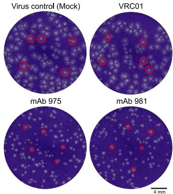  
A

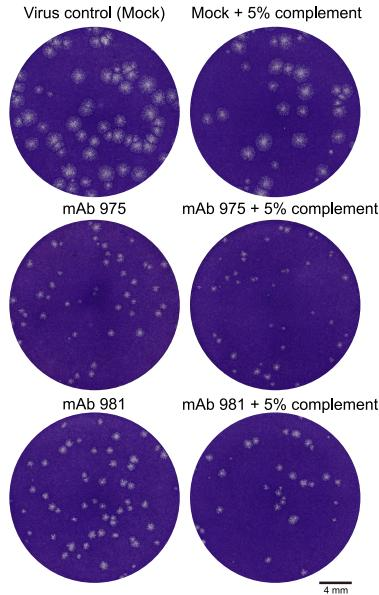  
B

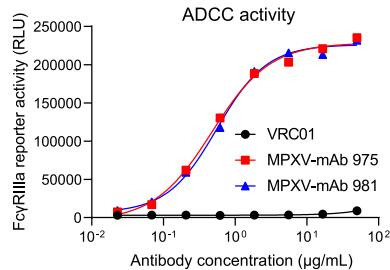  
C

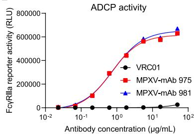  
D

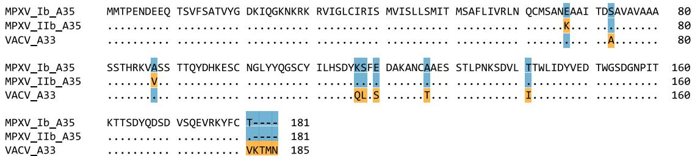  
E   
F

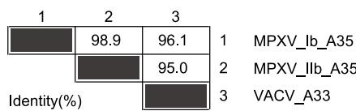

G   
Figure S1. Antiviral activity of mAb 975 and mAb 981 in vitro, related to Figures 1 and 2   
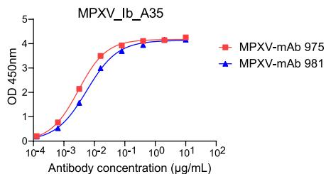  
(A) Neutralization of mAb 975 and mAb 981 against VACV in vitro. Monolayers of Vero E6 cells were infected with approximately 100 PFU/well of VACV-WR. After 2 h, the medium was aspirated and cells were overlaid with 400 $\mu$ L of DMEM-2 containing 100 $\mu$ g of mAbs, followed by the addition of methylcellulose. After 72 h, the overlay medium was removed and cells were fixed with paraformaldehyde solution and stained with crystal violet. DMEM-2 (mock) and an irrelevant HIV-1-specific mAb (VRC01) serve as negative controls. The red circles indicate some representative plaques formed by the VACV infection. Scale bar, 4 mm.   
(B) Complement-mediated neutralization of mAb 975 and mAb 981 against VACV in vitro. Approximately 50 PFU/well of VACV-WR were inoculated with $100\mu \mathrm{g}$ of mAbs and/or $5\%$ guinea pig complement in a volume of $400~\mu \mathrm{L}$ of DMEM-2. The mixture was added into Vero E6 cells. After $30\mathrm{min}$ , cells were overlaid with methylcellulose. After $72\mathrm{h}$ , the overlay medium was removed and cells were fixed with paraformaldehyde solution and stained with crystal violet. Scale bar, $4\mathrm{mm}$ . (C and D) ADCC (C) and ADCP (D) activity of mAb 975 and mAb 981 against MPXV in vitro. HEK293F cells expressing the A35 protein of MPXV clade IIb served as target cells. FcγRIIIa reporter activity and FcγRIIa reporter activity were measured to evaluate ADCC and ADCP activity, respectively. RLU, relative light unit.   
(E) Sequence alignment of VACV_A33 and MPXV_A35 homologous proteins among VACV (accession: P68616), MPXV clade IIb (EPI_ISL_13052264), and MPXV clade Ib (EPI_ISL_19093796) strains. Conserved amino acid residues are marked in blue. Mutations are marked in yellow.   
(F) Pairwise identity (%) of aligned VACV_A33 and MPXV_A35 homologous proteins.   
(G) ELISA binding of mAb 975 and mAb 981 to the A35 protein of MPXV clade Ib strain. One representative figure or curve is presented here from at least two independent experiments.

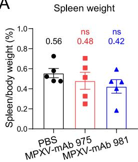  
A   
B

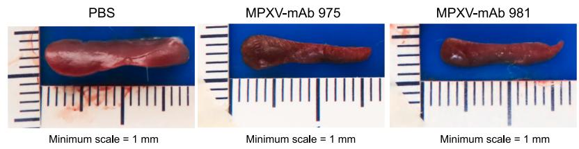

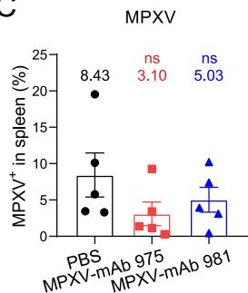  
C

D   
Figure S2. Alleviating pathological change of spleen in mAb-treated mice, related to Figure 1   
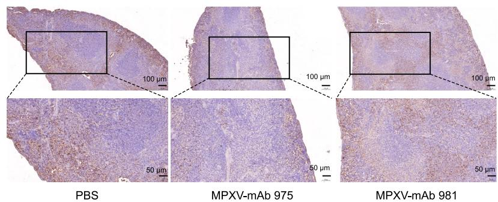  
(A) Spleen weights were measured at 4 dpi. The percentage of spleen weight relative to body weight was shown.   
(B) Representative photographs of spleen from each group.   
(C) IHC for MPXV antigen in the spleen of CAST/EiJ mice treated with or without mAbs. The percentage of MPXV in spleen was analyzed using ImageJ software.   
(D) MPXV from representative spleen sections were stained with anti-VACV antibody (brown). Nuclei were counterstained blue with hematoxylin. Upper: scale bar, 100 $\mu$ m, lower: scale bar, 50 $\mu$ m. Data are presented as mean $\pm$ SEM. The statistical significance is performed using two-way ANOVA with Dunnett's test for multiple comparison. ns: not significant.

  
A

  
B

  
C

  
D

E   
Figure S3. Alleviating pathological change of skin lesions in mAb-treated rhesus macaques, related to Figure 2   
  
(A and B) Body temperature (A) and body weight (B) were monitored throughout the experiment.   
(C) Representative photographs of skin lesions from each group.   
(D) Histopathologic scoring of skin lesion sections from rhesus macaques treated with or without mAbs.   
(E) Representative sections of skin lesions were stained with hematoxylin and eosin. Left: scale bar, 500 $\mu$ m, right: scale bar, 50 $\mu$ m. Red arrow indicates necrosis of the epidermis and dermis, yellow arrow indicates epidermal thickening of the skin, blue arrow indicates lymphocytic and macrophage infiltrates in the dermis of the skin, and gray arrow indicates epidermal cell edema. Data are presented as mean $\pm$ SEM. The statistical significance is performed using two-way ANOVA with Dunnett's test for multiple comparison. $*$ *p < 0.01, $*$ p < 0.05, and ns: not significant.

  
A

MPXV-mAb 981-HRP   
B   
MPXV-mAb 981 Fab : MPXV_A35   
R387c6 Fab : MPXV_A35   
Figure S4. Biochemical activity of mAb 975 and mAb 981, related to Figure 3   
  
(A) Competition ELISA between mAb 975, mAb 981, and R387c6. MPXV-mAb 975 and MPXV-mAb 981 were conjugated with horseradish peroxidase (HRP), respectively. One representative curve is presented from two independent experiments.   
(B) The binding affinities of Fab-form mAb 975, mAb 981, and R387c6 to MPXV_A35 by SPR. The data are means of two independent experiments. One representative curve is presented here.

  
A

  
B

  
C

D   
E   
G   
H   
|   
Figure S5. Cryo-EM analysis, related to Figure 3   
  
(A and B) Representative micrographs for A35-mAb 981 Fab (A) and A35-mAb 975 Fab (B).   
(C) Cryo-EM data processing workflow of A35-mAb 981 Fab (black) and A35-mAb 975 Fab (red).   
(D and E) Local resolution maps and Fourier shell correlation (FSC) curves for A35-mAb 981 Fab (D) and A35-mAb 975 Fab (E).   
(F and G) Angular distributions of particles used in reconstructions for A35-mAb 981 Fab (F) and A35-mAb 975 Fab (G), revealing consistent coverage.   
(H and I) Model versus map FSC plots for A35-mAb 981 Fab (H) and A35-mAb 975 Fab (I), indicating the accuracy of refinement processes.

  
A

  
B

Figure S6. Representative cryo-EM density maps, related to Figure 3   
  
(A) Maps of the A35 dimer-mAb 975 complex. Column 1–4: A35-1 (residues 108–115 and 119–130), A35-2 (residues 108–115 and 119–130), heavy chain of mAb 975 (residues 33–41 and 99–111), and light chain of mAb 975 (residues 33–39 and 86–93).   
(B) Maps of the A35 dimer-mAb 981 complex. Column 1–4: A35-1 (residues 108–115 and 119–130), A35-2 (residues 108–115 and 119–130), heavy chain of mAb 981 (residues 34–42 and 100–113), and light chain of mAb 981 (residues 33–39 and 86–93).

A   
Figure S7. Sequence alignments of antigens and antibodies, related to Figure 4   
  
Sequence alignment between MPXV_A35 and VACV_A33 (A), and among the heavy or light chains of mAb 975, mAb 981, and mAb A27D7 (B). The footprints of the heavy and light chains of mAb 975, mAb 981, and mAb A27D7 on A35-1, A35-2, or A33-1, A33-2 are shown. The markers for the footprints of mAb 975, mAb 981, and mAb A27D7 are blue, red, and green, respectively. The markers for the footprints of the heavy and light chains are circles and squares, respectively. The markers for the footprints on A35-1 and A35-2, or A33-1 and A33-2 are solid and hollow shapes, respectively. The amino acid sequences of CDR1, CDR2, and CDR3 (Kabat nomenclature) are boxed in green, blue, and red, respectively.

  
A

  
B

  
Figure S8. Coulombic electrostatic potential and molecular lipophilicity potential maps, related to Figure 5

The electrostatic potential maps (A) and the hydrophilicity-hydrophobicity (B) of the interaction interfaces between mAb 975, mAb 981, mAb A27D7 and either the A35 or A33 dimer are presented. In the electrostatic potential map, the CDRH3s of mAb 975, mAb 981, and mAb A27D7 are marked with black curves. In the hydrophilicity-hydrophobicity map, the hydrophobic platform formed by Y116 and V175 of either the A35 dimer or the A33 dimer, as well as the hydrophobic amino acids L105/F106 and L105/L106 on the CDRH3 of mAb 975 and mAb 981, are all marked with black curves. A35 or A33 dimer are colored gray, mAb 975, mAb 981, and mAb A27D7 are colored pink, blue, and goldenrod, respectively. The electrostatic potential maps are generated using the Coulombic command in ChimeraX. The maps are displayed as red and blue isosurfaces at levels -10 and +10. The hydrophilicity-hydrophobicity maps are generated using the mlp command in ChimeraX. The maps are displayed as dark cyan (hydrophilic) and goldenrod (hydrophobic) at levels -20 and +20.

---

# mmc1

# Supplemental information

# Structurally conserved human anti-A35

# antibodies protect mice and macaques

# from mpox virus infection

Bin Ju (鞠斌), Congcong Liu (刘聪聪), Jingjing Zhang (张京京), Yaning Li (李雅宁), Haonan Yang (杨浩楠), Bing Zhou (周兵), Baoying Huang (黄保英), Jianrong Ma (马建荣), Jiahan Lu (陆佳涵), Lin Cheng (程林), Zhe Cong (丛喆), Lin Zhu (朱林), Tianhao Shi (时恬昊), Yuehong Sun (孙岳宏), Na Li (李娜), Ting Chen (陈霆), Miao Wang (王苗), Shilong Tang (唐世龙), Xiangyang Ge (葛向阳), Juanjuan Zhao (赵娟娟), Wen-Jie Tan (谭文杰), Renhong Yan (鄢仁鸿), Jing Xue (薛婧), and Zheng Zhang (张政)

Table S1. Cryo-EM data collection and refinement statistics, related to Figure 3.   

<table><tr><td colspan="3">Data Collection &amp; Image Processing</td></tr><tr><td>Microscope</td><td colspan="2">FEI Titan Krios</td></tr><tr><td>Voltage (kV)</td><td colspan="2">300</td></tr><tr><td>Detesctor</td><td colspan="2">Gatan K3 Summit</td></tr><tr><td>Energy filter</td><td colspan="2">Gatan GIF Quantum</td></tr><tr><td>Total dose (\( e^{-}/Å^2 \))</td><td colspan="2">50</td></tr><tr><td>Frames</td><td colspan="2">32</td></tr><tr><td>Defocus range (μm)</td><td colspan="2">-1.1 ~ -1.6</td></tr><tr><td>sample</td><td>A35 dimer-975 Fab</td><td>A35 dimer-981 Fab</td></tr><tr><td>Pixel size (Å)</td><td>0.83</td><td>0.855</td></tr><tr><td>Micrographs used (no.)</td><td>1,862</td><td>5,781</td></tr><tr><td>Final particles images</td><td>180,429</td><td>774,799</td></tr><tr><td>Overall resolution (Å)</td><td>3.21</td><td>3.08</td></tr><tr><td>Map sharpening B-factor (\( Å^2 \))</td><td>-90</td><td>-90</td></tr></table>

<table><tr><td colspan="3">Model Building &amp; Refinement</td></tr><tr><td colspan="3">Composition</td></tr><tr><td>Nonhydrogen atoms</td><td>2966</td><td>3043</td></tr><tr><td>Protein residues</td><td>384</td><td>395</td></tr><tr><td>Ligands</td><td>0</td><td>0</td></tr><tr><td colspan="3">Bonds (RMSD)</td></tr><tr><td>Length (Å) (# &gt; 4σ)</td><td>0.003(0)</td><td>0.003(0)</td></tr><tr><td>Angles (°) (# &gt; 4σ)</td><td>0.546(0)</td><td>0.529(0)</td></tr><tr><td>MolProbity score</td><td>1.82</td><td>1.59</td></tr><tr><td>CαBLAM outliers (%)</td><td>2.75</td><td>2.64</td></tr><tr><td>Clashscore</td><td>7.11</td><td>6.91</td></tr><tr><td>Rotamer outliers (%)</td><td>1.21</td><td>1.18</td></tr><tr><td>C-beta outliers (%)</td><td>0.0</td><td>0.00</td></tr><tr><td colspan="3">Ramachandran plot</td></tr><tr><td>Favored (%)</td><td>94.65</td><td>97.16</td></tr><tr><td>Allowed (%)</td><td>5.35</td><td>2.84</td></tr><tr><td>Outliers (%)</td><td>0.00</td><td>0.00</td></tr></table>

Table S2. Hydrogen bonds, salt bridges, interfacing residues, electrostatic and hydrophobic interaction residues, related to Figures 3 and 5.   

<table><tr><td rowspan="2">Type of residues\Complex</td><td colspan="8">A35 dimer/mAb 975</td></tr><tr><td colspan="2">A35 dimer</td><td>975 HC</td><td>HS</td><td colspan="2">A35 dimer</td><td>975 LC</td><td>HS</td></tr><tr><td rowspan="9">Hydrogen bonds and salt bridges residues</td><td rowspan="3">A35-1</td><td>D146</td><td>L105</td><td>H</td><td rowspan="3">A35-1</td><td rowspan="3">Y116</td><td rowspan="3">Y50</td><td rowspan="3">H</td></tr><tr><td>D150</td><td>S32</td><td>H</td></tr><tr><td>D150</td><td>S103</td><td>H</td></tr><tr><td rowspan="6">A35-2</td><td>S114</td><td>S103</td><td>H</td><td rowspan="6">A35-2</td><td>E149</td><td>Y33</td><td>H</td></tr><tr><td>Y116</td><td>W34</td><td>H</td><td>K161</td><td>S30</td><td>H</td></tr><tr><td>K117</td><td>S103</td><td>H</td><td>T162</td><td>S30</td><td>H</td></tr><tr><td>D150</td><td>R107</td><td>S</td><td>Q167</td><td>G93</td><td>H</td></tr><tr><td>D150</td><td>R109</td><td>S</td><td>D168</td><td>Q27</td><td>H</td></tr><tr><td>V175</td><td>N59</td><td>H</td><td>E174</td><td>S95</td><td>H</td></tr><tr><td rowspan="2">Interfacing residues</td><td>A35-1</td><td colspan="3">112,116,146,147,149,150,151,160,162,174,175,176,177,179</td><td>A35-1</td><td colspan="3">114,116,117,118,172,173,174,175,177</td></tr><tr><td>A35-2</td><td colspan="3">112,114,116,149,147,149,150,151,169,170,173,174,175,176,177,179</td><td>A35-2</td><td colspan="3">149,158,160,161,162,165,166,167,168,169,170,171,174,176</td></tr><tr><td>Electrostatic interaction</td><td rowspan="3">A35 dimer</td><td colspan="3">E149, D150, E174</td><td rowspan="3">mAb 975</td><td colspan="3">R98, R107, K109</td></tr><tr><td>Hydrophobic interaction (Platform)</td><td colspan="3">Y116, V175</td><td colspan="3">Y33,Y50,W34,F53</td></tr><tr><td>Hydrophobic interaction (Strip)</td><td colspan="3">L103,L112,Y147,F179</td><td colspan="3">L105, F106</td></tr><tr><td>Type of residues\Complex</td><td colspan="8">A35 dimer/mAb 981</td></tr><tr><td rowspan="10">Hydrogen bonds and salt bridges residues</td><td colspan="2">A35 dimer</td><td>981 HC</td><td>HS</td><td colspan="2">A35 dimer</td><td>981 LC</td><td>HS</td></tr><tr><td rowspan="3">A35-1</td><td>Y116</td><td>L106</td><td>H</td><td rowspan="3">A35-1</td><td rowspan="3">D170</td><td rowspan="3">G58</td><td rowspan="3">H</td></tr><tr><td>Y116</td><td>H107</td><td>H</td></tr><tr><td>E149</td><td>S104</td><td>H</td></tr><tr><td rowspan="6">A35-2</td><td>Y116</td><td>G103</td><td>H</td><td rowspan="6">A35-2</td><td>E174</td><td>S94</td><td>H</td></tr><tr><td>Y116</td><td>Y54</td><td>H</td><td>V175</td><td>S94</td><td>H</td></tr><tr><td>D150</td><td>R108</td><td>S</td><td>R176</td><td>Y33</td><td>H</td></tr><tr><td>D150</td><td>R110</td><td>S</td><td>R176</td><td>D93</td><td>S</td></tr><tr><td>Q173</td><td>R98</td><td>H</td><td></td><td></td><td></td></tr><tr><td>K177</td><td>N33</td><td>H</td><td></td><td></td><td></td></tr><tr><td rowspan="2">Interfacing residues</td><td>A35-1</td><td colspan="3">112,116,146,147,149,150,151,161,162,165,166,175,176,177,179</td><td>A35-1</td><td colspan="3">168,170,173,174,175,176</td></tr><tr><td>A35-2</td><td colspan="3">112,114,115,116,117,118,146,147,149,150,151,173,175,176,177,179</td><td>A35-2</td><td colspan="3">116,150,166,169,170,173,174,175,176</td></tr><tr><td>Electrostatic interaction</td><td rowspan="3">A35 dimer</td><td colspan="3">E149, D150</td><td rowspan="3">mAb 981</td><td colspan="3">R99, R101, H107, R108, R110</td></tr><tr><td>Hydrophobic interaction (Platform)</td><td colspan="3">Y116, V175</td><td colspan="3">Y50, Y35, Y54, L102</td></tr><tr><td>Hydrophobic interaction (Strip)</td><td colspan="3">L103,L112,Y147,F179</td><td colspan="3">L105, L106</td></tr><tr><td>Type of residues\Complex</td><td colspan="8">A33 dimer/mAb A27D7</td></tr><tr><td>Electrostatic interaction</td><td rowspan="3">A33 dimer</td><td colspan="3">E149, D150</td><td rowspan="3">mAb A27D7</td><td colspan="3">K97, K99</td></tr><tr><td>Hydrophobic interaction (Platform)</td><td colspan="3">Y116, V175</td><td colspan="3">Y50, W52, Y102</td></tr><tr><td>Hydrophobic interaction (Strip)</td><td colspan="3">L103,L112,Y147,F179</td><td colspan="3">None</td></tr></table>

HS: Hydrogen bonds or Salt bridges.

Red: Amino acid residues on the light chain of mAbs involved in hydrophobic interaction (Platform).