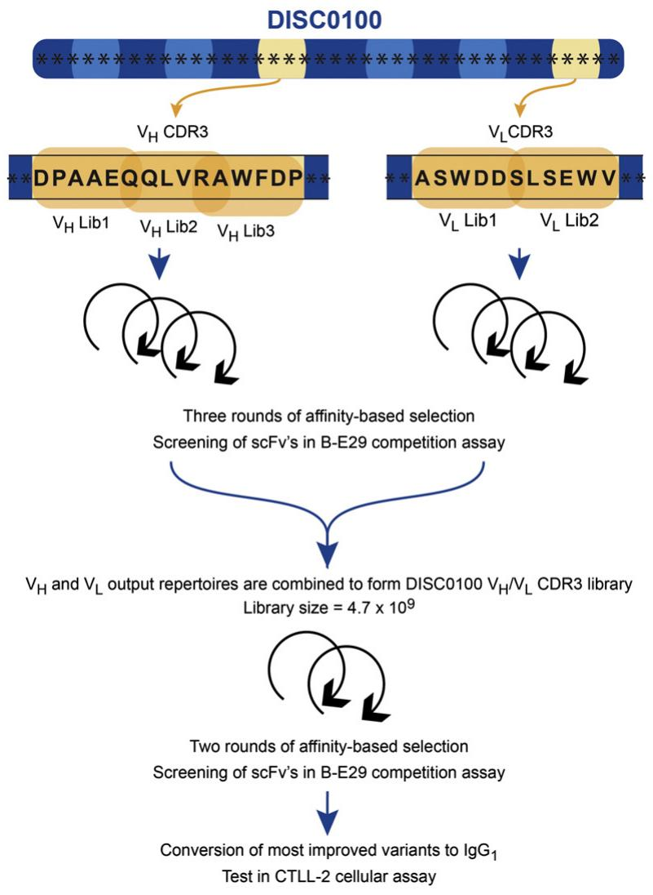
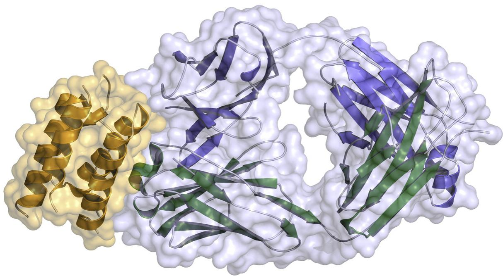
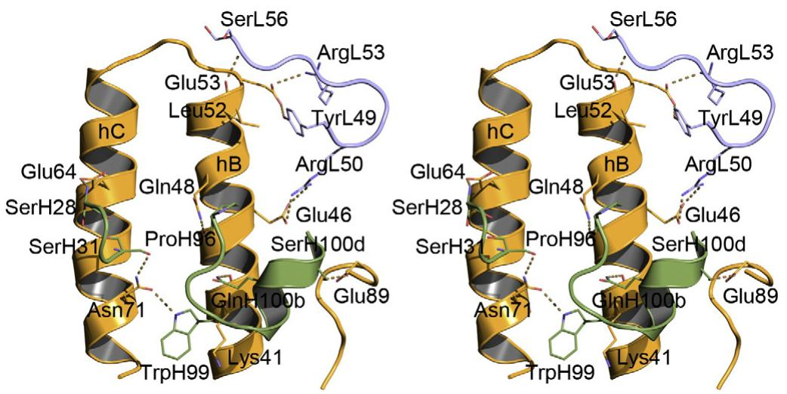
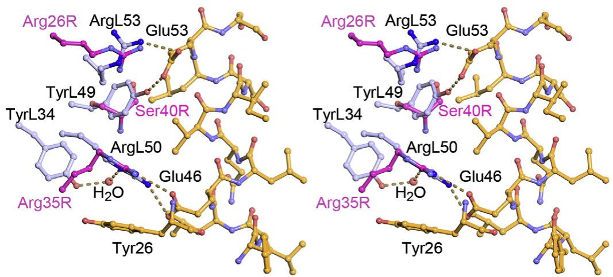
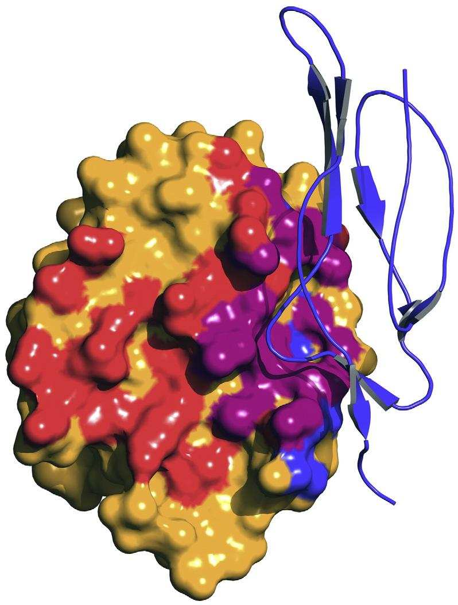
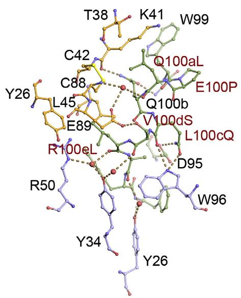
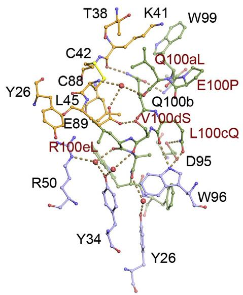
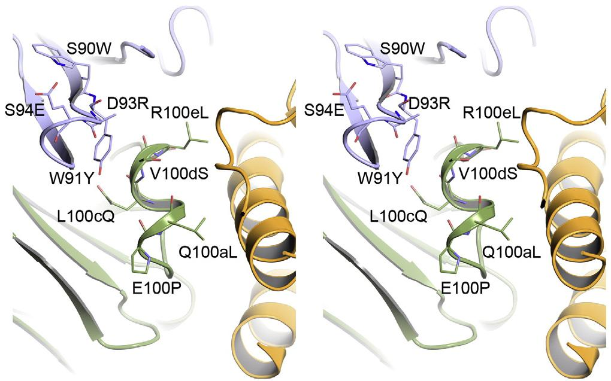
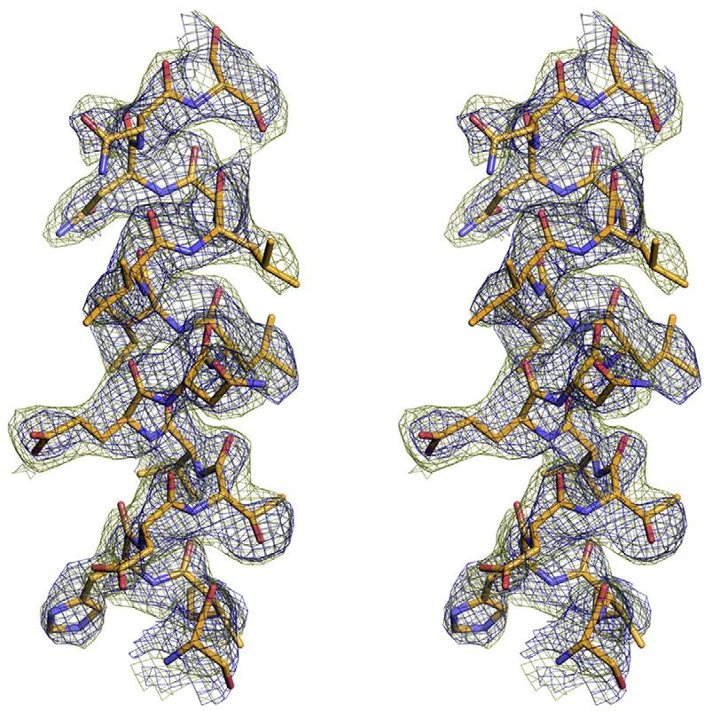

# 1-s2.0-S0022283610013070-main

# Engineering a High-Affinity Anti-IL-15 Antibody: Crystal Structure Reveals an $\alpha$ -Helix in VH CDR3 as Key Component of Paratope

David C. Lowe $^{1*}$ , Stefan Gerhardt $^{2}$ , Alison Ward $^{3}$ , David Hargreaves $^{2}$ , Malcolm Anderson $^{2}$ , Franco Ferraro $^{1}$ , Richard A. Pauptit $^{2}$ , Debbie V. Pattison $^{1}$ , Catriona Buchanan $^{1}$ , Bojana Popovic $^{1}$ , Donna K. Finch $^{1}$ , Trevor Wilkinson $^{1}$ , Matthew Sleeman $^{1}$ , Tristan J. Vaughan $^{1}$ and Philip R. Mallinder $^{3}$

Received 3 September 2010;
received in revised form
7 December 2010;
accepted 8 December 2010
Available online
16 December 2010

# Edited by I. Wilson

Keywords:
protein engineering;
phage display;
combinatorial mutagenesis;
antibody library;
X-ray crystallography

Interleukin (IL) 15 is an inflammatory cytokine that plays an essential role in the activation, proliferation, and maintenance of specific natural killer cell and T-cell populations, and has been implicated as a mediator of inflammatory diseases. An anti-IL-15 antibody that blocked IL-15-dependent cellular responses was isolated by phage display and optimised via mutagenesis of the third complementarity-determining regions (CDRs) of variable heavy (VH) and variable light chains. Entire repertoires of improved variants were recombined with each other to explore the maximum potential sequence space. DISC0280, the most potent antibody isolated using this comprehensive strategy, exhibits a 228-fold increase in affinity and a striking 40,000-fold increase in cellular potency compared to its parent. Such a wholesale recombination strategy therefore represents a useful method for exploiting synergistic potency gains as part of future antibody engineering efforts. The crystal structure of DISC0280 Fab (fragment antigen binding), in complex with human IL-15, was determined in order to map the structural epitope and paratope. The most remarkable feature revealed lies within the paratope and is a novel six-amino-acid α-helix that sits within the VH CDR3 loop at the center of the antigen binding site. This is the first report to describe an α-helix as a principal component of a naturally derived VH CDR3 following affinity maturation.

© 2010 Elsevier Ltd. All rights reserved.

# Introduction

Interleukin (IL) 15 is a member of the IL-2 family of cytokines that plays a key role in the activation and proliferation of natural killer cells and CD4 $^{+}$ T cells, and in the proliferation and maintenance of CD8 $^{+}$ T cells involved in memory responses to antigens. $^{1,2}$ IL-15 binds to a trimeric receptor complex composed of its cognate receptor IL-15R $\alpha$ , as well as $\beta$ and $\gamma_{c}$ chains that are shared with IL-2. $^{3}$

Given the central role that IL-15 and its receptor play in the maintenance and persistence of adaptive immune response, IL-15 has been implicated as a key mediator in autoimmune diseases such as rheumatoid arthritis. $^{4}$

Antibodies that block the signalling of IL-15 may hold promise as therapeutic agents for such autoimmune diseases. A human anti-IL-15 monoclonal antibody has been shown to be effective in disease models $^{5}$ and in patients with rheumatoid arthritis. $^{6}$ For most therapeutic indications, it is desirable for an antibody to have affinities in the picomolar range to enable target antigen saturation and to engender a more favourable dosing regime in terms of dosing frequency or amount of antibody required for efficacy. Numerous strategies have been developed using display technologies to replicate the in vivo affinity maturation of humoral response. These strategies generally consist of a process of variation in antibody gene sequence, followed by affinity-driven selection for those variants with improved binding kinetics.

The six complementarity-determining regions (CDRs) are the loop structures that largely comprise the antigen binding site of an antibody and are the main points of somatic hypermutation during affinity maturation in vivo. $^{7,8}$ Heavy-chain CDR3, in particular, has been shown to be important in conferring the specificity of an antibody and has been shown to be an area that can be readily mutated to increase affinity. $^{9}$ Further affinity gains may be introduced via combinations of mutations from different CDRs due to synergistic contributions from the changes in each CDR. Examples of such combinations of individual mutations include the following: a phage-displayed antibody against vascular endothelial growth factor, whereby mutations in all three heavy-chain CDRs were recombined to give a 100-fold improvement in affinity; $^{10}$ an anti-human granulocyte–macrophage colony-stimulating factor antibody, whereby advantageous mutations in variable heavy (VH) CDR2 were recombined with those in variable light (VL) CDR3, leading to a 5000-fold affinity improvement; $^{11}$ and an antibody fragment to tumor necrosis factor $\alpha$ optimised using yeast display, whereby individual mutations in five of the six CDRs were recombined to yield over 500-fold improvements in affinity. $^{12}$ These methods are somewhat limited by the fact that only mutations that show discernible improvements in affinity or potency in their own context are recombined. Any change that can only confer large improvements in the presence of other mutations is likely to be missed using such methods. We have recently developed a method, based on Kunkel mutagenesis, $^{13}$ whereby whole repertoires of either heavy-chain or light-chain mutated antibodies can be recombined with each other by phage display (Minter et al., manuscript in preparation) and further

selected against their given antigen to derive synergistic affinity and potency improvements.

In this article, we describe the isolation of an anti-human IL-15 (hIL-15) neutralising antibody, DISC0100, and its subsequent optimisation via VH and VL CDR3 mutageneses. Screening for improved activity via a biochemical epitope competition assay and an IL-15-dependent cell assay allowed us to monitor potency improvements both before and after the recombination of the mutagenised VH and VL repertoires. The X-ray crystal structure for the most potent antibody DISC0280 was solved in complex with hIL-15. This has allowed us to determine the definitive epitope and paratope, and has provided a structural framework through which we can rationalise the contributions of the VH and VL CDR3 mutations to increased affinity and potency.

# Results and Discussion

# Isolation of the anti-IL-15 lead antibody DISC0100

IL-15 binding antibodies were isolated from a large phage library displaying human single-chain variable fragment (scFv) antibodies $^{14}$ by carrying out selections on recombinant hIL-15. Individual antibody fragments from each round of selection were assessed for their ability to inhibit in two screens: inhibition of hIL-15 binding to IL-15Rα or inhibition of hIL-15 binding to B-E29 (a mouse anti-hIL-15 monoclonal antibody). B-E29 has been previously shown to potently neutralise the activity of IL-15 in cell assays while only partially blocking the interaction of IL-15 with IL-15Rα. $^{15}$ The most potent isolated antibody that showed activity in both screens was DISC0100. Purified DISC0100 scFv protein was analysed in biochemical assays and gave IC $_{50}$ values of 442 nM and 868 nM in IL-15/IL-15Rα and IL-15/B-E29 assays, respectively. This scFv was converted into a full-length IgG molecule as described in Materials and Methods and was tested for functional blockade in an IL-15-dependent cell assay using CTLL-2 cells. CTLL-2 is a murine T-cell line that is rescued from apoptosis by IL-15. In this assay, DISC0100 neutralised the effect of IL-15 on the rescue of apoptosis with an IC $_{50}$ of 239 nM (Table 1). In order to improve this potency further, we initiated the in vitro affinity maturation of DISC0100.

# Affinity maturation of the anti-IL-15 antibody DISC0100

# Antibody VH and VL improvements

The CDR3s of the VH and VL chains of DISC0100 were targeted for randomised mutagenesis, as these occur at the center of an antibody's binding interface

Table 1. Potencies of optimised anti-IL-15 antibodies following VH and VL CDR3 mutagenesis   

<table><tr><td rowspan="2">Name</td><td rowspan="2">Mutagenesis</td><td rowspan="2">\( IC_{50} \) BE-29 competition (nM)</td><td rowspan="2">\( EC_{50} \) CTLL-2 (nM)</td><td colspan="101">VH CDR3 (Kabat position)</td><td></td><td></td><td></td><td></td><td></td><td></td><td></td><td></td><td></td><td></td><td></td><td></td><td></td><td></td><td></td><td></td><td></td><td></td><td></td><td></td><td></td><td></td><td></td><td></td><td></td><td></td></tr><tr><td>95</td><td>96</td><td>97</td><td>98</td><td>99</td><td>100</td><td>100a</td><td>100b</td><td>100c</td><td>100d</td><td>100e</td><td>100f</td><td>100g</td><td>100h</td><td>101</td><td>102</td><td></td><td></td><td></td><td></td><td></td><td></td><td></td><td></td><td></td><td></td><td></td><td></td><td></td><td></td><td></td><td></td><td></td><td></td><td></td><td></td><td></td><td></td><td></td><td></td><td></td><td></td><td></td><td></td><td></td><td></td><td></td><td></td><td></td><td></td><td></td><td></td><td></td><td></td><td></td><td></td><td></td><td></td><td></td><td></td><td></td><td></td><td></td><td></td><td></td><td></td><td></td><td></td><td></td><td></td><td></td><td></td><td></td><td></td><td></td><td></td><td></td><td></td><td></td><td></td><td></td><td></td><td></td><td></td><td></td><td></td><td></td><td></td><td></td><td></td><td></td><td></td><td></td><td></td><td></td><td></td><td></td><td></td><td></td><td></td><td></td><td></td><td></td><td></td><td></td><td></td><td></td><td></td><td></td><td></td><td></td><td></td><td></td><td></td><td></td><td></td><td></td><td></td><td></td><td></td><td></td><td></td><td></td><td></td><td></td><td></td><td></td></tr><tr><td>DISC0100</td><td>Parent</td><td>284</td><td>239</td><td>D</td><td>P</td><td>A</td><td>A</td><td>W</td><td>E</td><td>Q</td><td>Q</td><td>L</td><td>V</td><td>R</td><td>A</td><td>W</td><td>F</td><td>D</td><td>P</td><td>A</td><td>S</td><td>W</td><td>D</td><td>D</td><td>S</td><td>L</td><td>S</td><td>E</td><td>W</td><td>V</td><td></td><td></td><td></td><td></td><td></td><td></td><td></td><td></td><td></td><td></td><td></td><td></td><td></td><td></td><td></td><td></td><td></td><td></td><td></td><td></td><td></td><td></td><td></td><td></td><td></td><td></td><td></td><td></td><td></td><td></td><td></td><td></td><td></td><td></td><td></td><td></td><td></td><td></td><td></td><td></td><td></td><td></td><td></td><td></td><td></td><td></td><td></td><td></td><td></td><td></td><td></td><td></td><td></td><td></td><td></td><td></td><td></td><td></td><td></td><td></td><td></td><td></td><td></td><td></td><td></td><td></td><td></td><td></td><td></td><td></td><td></td><td></td><td></td><td></td><td></td><td></td><td></td><td></td><td></td><td></td><td></td><td></td><td></td><td></td><td></td><td></td><td></td><td></td><td></td><td></td><td></td><td></td><td></td><td></td><td></td><td></td><td></td><td></td><td></td><td>12</td></tr><tr><td>DISC0228</td><td>VH only</td><td>25</td><td>3</td><td>D</td><td>P</td><td>A</td><td>A</td><td>W</td><td>W</td><td>I</td><td>Q</td><td>T</td><td>K</td><td>L</td><td>A</td><td>W</td><td>F</td><td>D</td><td>P</td><td>A</td><td>S</td><td>W</td><td>D</td><td>D</td><td>S</td><td>L</td><td>S</td><td>E</td><td>W</td><td>V</td><td></td><td></td><td></td><td></td><td></td><td></td><td></td><td></td><td></td><td></td><td></td><td></td><td></td><td></td><td></td><td></td><td></td><td></td><td></td><td></td><td></td><td></td><td></td><td></td><td></td><td></td><td></td><td></td><td></td><td></td><td></td><td></td><td></td><td></td><td></td><td></td><td></td><td></td><td></td><td></td><td></td><td></td><td></td><td></td><td></td><td></td><td></td><td></td><td></td><td></td><td></td><td></td><td></td><td></td><td></td><td></td><td></td><td></td><td></td><td></td><td></td><td></td><td></td><td></td><td></td><td></td><td></td><td></td><td></td><td></td><td></td><td></td><td></td><td></td><td></td><td></td><td></td><td></td><td></td><td></td><td></td><td></td><td></td><td></td><td></td><td></td><td></td><td></td><td></td><td></td><td></td><td></td><td></td><td></td><td></td><td></td><td></td><td></td><td></td><td></td></tr><tr><td>DISC0230</td><td>VH only</td><td>38</td><td>3</td><td>S</td><td>P</td><td>A</td><td>A</td><td>W</td><td>I</td><td>Q</td><td>Q</td><td>L</td><td>V</td><td>R</td><td>A</td><td>W</td><td>F</td><td>D</td><td>P</td><td>A</td><td>S</td><td>W</td><td>D</td><td>D</td><td>S</td><td>L</td><td>S</td><td>E</td><td>W</td><td>V</td><td></td><td></td><td></td><td></td><td></td><td></td><td></td><td></td><td></td><td></td><td></td><td></td><td></td><td></td><td></td><td></td><td></td><td></td><td></td><td></td><td></td><td></td><td></td><td></td><td></td><td></td><td></td><td></td><td></td><td></td><td></td><td></td><td></td><td></td><td></td><td></td><td></td><td></td><td></td><td></td><td></td><td></td><td></td><td></td><td></td><td></td><td></td><td></td><td></td><td></td><td></td><td></td><td></td><td></td><td></td><td></td><td></td><td></td><td></td><td></td><td></td><td></td><td></td><td></td><td></td><td></td><td></td><td></td><td></td><td></td><td></td><td></td><td></td><td></td><td></td><td></td><td></td><td></td><td></td><td></td><td></td><td></td><td></td><td></td><td></td><td></td><td></td><td></td><td></td><td></td><td></td><td></td><td></td><td></td><td></td><td></td><td></td><td></td><td></td><td></td></tr><tr><td>DISC0234</td><td>VH only</td><td>51</td><td>4</td><td>D</td><td>P</td><td>A</td><td>A</td><td>W</td><td>Y</td><td>S</td><td>Q</td><td>I</td><td>R</td><td>R</td><td>A</td><td>W</td><td>F</td><td>D</td><td>P</td><td>A</td><td>S</td><td>W</td><td>D</td><td>D</td><td>S</td><td>L</td><td>S</td><td>E</td><td>W</td><td>V</td><td></td><td></td><td></td><td></td><td></td><td></td><td></td><td></td><td></td><td></td><td></td><td></td><td></td><td></td><td></td><td></td><td></td><td></td><td></td><td></td><td></td><td></td><td></td><td></td><td></td><td></td><td></td><td></td><td></td><td></td><td></td><td></td><td></td><td></td><td></td><td></td><td></td><td></td><td></td><td></td><td></td><td></td><td></td><td></td><td></td><td></td><td></td><td></td><td></td><td></td><td></td><td></td><td></td><td></td><td></td><td></td><td></td><td></td><td></td><td></td><td></td><td></td><td></td><td></td><td></td><td></td><td></td><td></td><td></td><td></td><td></td><td></td><td></td><td></td><td></td><td></td><td></td><td></td><td></td><td></td><td></td><td></td><td></td><td></td><td></td><td></td><td></td><td></td><td></td><td></td><td></td><td></td><td></td><td></td><td></td><td></td><td></td><td></td><td></td><td></td></tr><tr><td>DISC0280</td><td>VH/VL</td><td>0.9</td><td>0.006</td><td>D</td><td>P</td><td>A</td><td>A</td><td>W</td><td>P</td><td>L</td><td>Q</td><td>Q</td><td>S</td><td>L</td><td>A</td><td>W</td><td>F</td><td>D</td><td>P</td><td>A</td><td>W</td><td>Y</td><td>D</td><td>R</td><td>E</td><td>L</td><td>S</td><td>E</td><td>W</td><td>V</td><td></td><td></td><td></td><td></td><td></td><td></td><td></td><td></td><td></td><td></td><td></td><td></td><td></td><td></td><td></td><td></td><td></td><td></td><td></td><td></td><td></td><td></td><td></td><td></td><td></td><td></td><td></td><td></td><td></td><td></td><td></td><td></td><td></td><td></td><td></td><td></td><td></td><td></td><td></td><td></td><td></td><td></td><td></td><td></td><td></td><td></td><td></td><td></td><td></td><td></td><td></td><td></td><td></td><td></td><td></td><td></td><td></td><td></td><td></td><td></td><td></td><td></td><td></td><td></td><td></td><td></td><td></td><td></td><td></td><td></td><td></td><td></td><td></td><td></td><td></td><td></td><td></td><td></td><td></td><td></td><td></td><td></td><td></td><td></td><td></td><td></td><td></td><td></td><td></td><td></td><td></td><td></td><td></td><td></td><td></td><td></td><td></td><td></td><td></td><td></td></tr><tr><td>DISC0287</td><td>VH/VL</td><td>6.7</td><td>0.006</td><td>D</td><td>P</td><td>A</td><td>A</td><td>W</td><td>E</td><td>Q</td><td>Q</td><td>L</td><td>G</td><td>L</td><td>L</td><td>P</td><td>P</td><td>T</td><td>H</td><td>A</td><td>T</td><td>W</td><td>S</td><td>K</td><td>H</td><td>L</td><td>S</td><td>E</td><td>W</td><td>V</td><td></td><td></td><td></td><td></td><td></td><td></td><td></td><td></td><td></td><td></td><td></td><td></td><td></td><td></td><td></td><td></td><td></td><td></td><td></td><td></td><td></td><td></td><td></td><td></td><td></td><td></td><td></td><td></td><td></td><td></td><td></td><td></td><td></td><td></td><td></td><td></td><td></td><td></td><td></td><td></td><td></td><td></td><td></td><td></td><td></td><td></td><td></td><td></td><td></td><td></td><td></td><td></td><td></td><td></td><td></td><td></td><td></td><td></td><td></td><td></td><td></td><td></td><td></td><td></td><td></td><td></td><td></td><td></td><td></td><td></td><td></td><td></td><td></td><td></td><td></td><td></td><td></td><td></td><td></td><td></td><td></td><td></td><td></td><td></td><td></td><td></td><td></td><td></td><td></td><td>12</td><td></td><td></td><td></td><td></td><td></td><td></td><td></td><td></td><td></td><td></td></tr><tr><td>DISC0288</td><td>VH/VL</td><td>2.3</td><td>0.006</td><td>D</td><td>P</td><td>A</td><td>A</td><td>W</td><td>E</td><td>Q</td><td>Q</td><td>L</td><td>G</td><td>L</td><td>L</td><td>P</td><td>P</td><td>H</td><td>H</td><td>A</td><td>T</td><td>W</td><td>S</td><td>K</td><td>H</td><td>L</td><td>S</td><td>E</td><td>W</td><td>V</td><td></td><td></td><td></td><td></td><td></td><td></td><td></td><td></td><td></td><td></td><td></td><td></td><td></td><td></td><td></td><td></td><td></td><td></td><td></td><td></td><td></td><td></td><td></td><td></td><td></td><td></td><td></td><td></td><td></td><td></td><td></td><td></td><td></td><td></td><td></td><td></td><td></td><td></td><td></td><td></td><td></td><td></td><td></td><td></td><td></td><td></td><td></td><td></td><td></td><td></td><td></td><td></td><td></td><td></td><td></td><td></td><td></td><td></td><td></td><td></td><td></td><td></td><td></td><td></td><td></td><td></td><td></td><td></td><td></td><td></td><td></td><td></td><td></td><td></td><td></td><td>12</td><td></td><td></td><td></td><td></td><td></td><td></td><td></td><td></td><td></td><td></td><td></td><td></td><td></td><td></td><td></td><td></td><td></td><td></td><td></td><td></td><td></td><td></td><td></td><td></td></tr><tr><td>DISC0290</td><td>VH/VL</td><td>2.4</td><td>0.008</td><td>D</td><td>P</td><td>A</td><td>A</td><td>W</td><td>E</td><td>Q</td><td>Q</td><td>L</td><td>G</td><td>L</td><td>L</td><td>P</td><td>P</td><td>L</td><td>N</td><td>A</td><td>T</td><td>W</td><td>S</td><td>K</td><td>H</td><td>L</td><td>S</td><td>E</td><td>W</td><td>V</td><td></td><td></td><td></td><td></td><td></td><td></td><td></td><td></td><td></td><td></td><td></td><td></td><td></td><td></td><td></td><td></td><td></td><td></td><td></td><td></td><td></td><td></td><td></td><td></td><td></td><td></td><td></td><td></td><td></td><td></td><td></td><td></td><td></td><td></td><td></td><td></td><td></td><td></td><td></td><td></td><td></td><td></td><td></td><td></td><td></td><td></td><td></td><td></td><td></td><td></td><td></td><td></td><td></td><td></td><td></td><td></td><td></td><td></td><td></td><td></td><td></td><td></td><td></td><td></td><td></td><td></td><td></td><td></td><td></td><td></td><td></td><td></td><td></td><td></td><td></td><td></td><td></td><td>12</td><td></td><td></td><td></td><td></td><td></td><td></td><td></td><td></td><td></td><td></td><td></td><td></td><td></td><td></td><td></td><td></td><td></td><td></td><td></td><td></td><td></td><td></td></tr><tr><td>DISC0299</td><td>VH/VL</td><td>4.2</td><td>0.004</td><td>D</td><td>P</td><td>A</td><td>A</td><td>W</td><td>E</td><td>Q</td><td>Q</td><td>L</td><td>G</td><td>M</td><td>L</td><td>L</td><td>F</td><td>S</td><td>S</td><td>A</td><td>T</td><td>W</td><td>S</td><td>K</td><td>H</td><td>L</td><td>S</td><td>E</td><td>W</td><td>V</td><td></td><td></td><td></td><td></td><td></td><td></td><td></td><td></td><td></td><td></td><td></td><td></td><td></td><td></td><td></td><td></td><td></td><td></td><td></td><td></td><td></td><td></td><td></td><td></td><td></td><td></td><td></td><td></td><td></td><td></td><td></td><td></td><td></td><td></td><td></td><td></td><td></td><td></td><td></td><td></td><td></td><td></td><td></td><td></td><td></td><td></td><td></td><td></td><td></td><td></td><td></td><td></td><td></td><td></td><td></td><td></td><td></td><td></td><td></td><td></td><td></td><td></td><td></td><td></td><td></td><td></td><td></td><td></td><td></td><td></td><td>12</td><td></td><td></td><td></td><td></td><td></td><td></td><td></td><td></td><td></td><td></td><td></td><td></td><td></td><td></td><td></td><td></td><td></td><td></td><td></td><td></td><td></td><td></td><td></td><td></td><td></td><td></td><td></td><td></td><td></td></tr><tr><td>DISC0300</td><td>VH/VL</td><td>5.9</td><td>0.008</td><td>D</td><td>P</td><td>A</td><td>A</td><td>W</td><td>E</td><td>Q</td><td>Q</td><td>L</td><td>G</td><td>M</td><td>L</td><td>L</td><td>F</td><td>S</td><td>S</td><td>A</td><td>W</td><td>Y</td><td>D</td><td>R</td><td>E</td><td>L</td><td>S</td><td>E</td><td>W</td><td>V</td><td></td><td></td><td></td><td></td><td></td><td></td><td></td><td></td><td></td><td></td><td></td><td></td><td></td><td></td><td></td><td></td><td></td><td></td><td></td><td></td><td></td><td></td><td></td><td></td><td></td><td></td><td></td><td></td><td></td><td></td><td></td><td></td><td></td><td></td><td></td><td></td><td></td><td></td><td></td><td></td><td></td><td></td><td></td><td></td><td></td><td></td><td></td><td></td><td></td><td></td><td></td><td></td><td></td><td></td><td></td><td></td><td></td><td></td><td></td><td></td><td></td><td></td><td></td><td></td><td></td><td>12</td><td></td><td></td><td></td><td></td><td></td><td></td><td></td><td></td><td></td><td></td><td></td><td></td><td></td><td></td><td></td><td></td><td></td><td></td><td></td><td></td><td></td><td></td><td></td><td></td><td></td><td></td><td></td><td></td><td></td><td></td><td></td><td></td><td></td><td></td></tr><tr><td>DISC0320</td><td>VH/VL</td><td>4.7</td><td>0.012</td><td>D</td><td>P</td><td>A</td><td>A</td><td>W</td><td>E</td><td>Q</td><td>Q</td><td>L</td><td>G</td><td>L</td><td>L</td><td>P</td><td>P</td><td>T</td><td>H</td><td>T</td><td>T</td><td>W</td><td>D</td><td>N</td><td>H</td><td>L</td><td>S</td><td>E</td><td>W</td><td>V</td><td></td><td></td><td></td><td></td><td></td><td></td><td></td><td></td><td></td><td></td><td></td><td></td><td></td><td></td><td></td><td></td><td></td><td></td><td></td><td></td><td></td><td></td><td></td><td></td><td></td><td></td><td></td><td></td><td></td><td></td><td></td><td></td><td></td><td></td><td></td><td></td><td></td><td></td><td></td><td></td><td></td><td></td><td></td><td></td><td></td><td></td><td></td><td></td><td></td><td></td><td></td><td></td><td></td><td></td><td></td><td></td><td></td><td></td><td></td><td></td><td></td><td>12</td><td></td><td></td><td></td><td></td><td></td><td></td><td></td><td></td><td></td><td></td><td></td><td></td><td></td><td></td><td></td><td></td><td></td><td></td><td></td><td></td><td></td><td></td><td></td><td></td><td></td><td></td><td></td><td></td><td></td><td></td><td></td><td></td><td></td><td></td><td></td><td></td><td></td><td></td></tr><tr><td colspan="100">Interaction with IL-15</td><td></td><td></td><td></td><td></td><td></td><td></td><td></td><td></td><td></td><td></td><td></td><td></td><td></td><td></td><td></td><td></td><td></td><td></td><td></td><td></td><td></td><td></td><td></td><td></td><td></td><td></td><td></td><td></td><td></td><td></td><td></td></tr><tr><td colspan="95">H-bonding with IL-15</td><td></td><td></td><td></td><td></td><td></td><td rowspan="2"></td><td></td><td></td><td></td><td></td><td></td><td></td><td></td><td></td><td></td><td></td><td></td><td></td><td></td><td></td><td></td><td></td><td></td><td></td><td></td><td></td><td></td><td></td><td></td><td></td><td></td><td></td><td></td><td></td><td></td><td></td></tr><tr><td colspan="100">Interaction within Ab</td><td></td><td></td><td></td><td></td><td></td><td></td><td></td><td></td><td></td><td></td><td></td><td></td><td></td><td></td><td></td><td></td><td></td><td></td><td></td><td></td><td></td><td></td><td></td><td></td><td></td><td></td><td></td><td></td><td></td><td></td></tr></table>

Potency values are given for the B-E29 competition assay and the CTLL-2 cellular survival assay. Residues within the DISC0280 VH CDR3 that are shown in the DISC0280 Fab/IL-15 ccocrystal to either interact with IL-15 or form intramolecular interactions within the Fab structure are indicated. Shaded residues indicate those that interact with IL-15. + indicates those residues that form H-bonds with IL-15. * indicates those residues that form intramolecular bonds within the antibody.

and are therefore attractive targets for affinity maturation. $^{16}$ Mutagenesis was carried out using NNS codon randomisation to change each position in the VH and VL CDR3s to any one of the 20 common amino acids. The VH CDR3 loop (as defined by Kabat et al. $^{17}$ ) of DISC0100 is made up of 16 amino acid residues, and the VL loop is made up of 11 amino acid residues. In order to obtain sequence libraries with random mutations at every residue within the CDR3 loops, we constructed three overlapping VH CDR3 libraries, each containing six mutated residues. The three VH libraries were randomised at positions 95–100 (VH library 1), positions 100–100e (VH library 2), and positions 100e–102 (VH library 3), respectively. Two overlapping VL libraries—each containing six adjacent randomised residues covering positions 89–94 (VL library 1) and positions 94–97 (VL library 2)—were also generated (Fig. 1). Sequencing of representative individual bacterial colonies from each library confirmed randomisation in the expected ‘block’ of targeted residues (data not shown). Each library yielded approximately $10^{9}$ individual recombinants, suggesting that the size of each library was sufficient to account for every possible combination of amino acids within the targeted area.

The libraries were subjected to three rounds of affinity-based solution-phase phage display selection with decreasing concentration of hIL-15 at each round. $^{16}$ Following the first round of selection, the individual VH and VL libraries were pooled. Individual variants from these selections were tested for an improved ability to compete with the binding of B E29 to hIL-15 as a surrogate screen for an increased affinity for IL-15. Variants with increased activity were identified from the VH repertoires, but there were no variants with significantly increased activity identified from the VL library. The VH CDR3 of DISC0100 was therefore more amenable than the VL CDR3 to changes that improve affinity and potency. The three scFv (DISC0228, DISC0230, and DISC0234) with the greatest increases in activity from the VH repertoires were converted into full-length immunoglobulin molecules and showed 5-fold to 11-fold improvements over DISC0100 in the B-E29 competition assay and approximately 40-fold to 50-fold improvements in the CTLL-2 cell assay (Table 1). DISC0228 and DISC0234 were derived from VH library 2, as they contain mutations in Kabat positions H100–H100e. DISC0230 was derived from VH library 1, as its two mutations from the parent are in positions H95 and H100. None of these three variants contained mutations in position H96–H99 or position H100b, suggesting that these positions were potentially not amenable to change. No variant scFv with significant increases in potency was identified from VH library 3 (i.e., with mutations in the C-terminal six positions of VH CDR3), indicating that these positions in the CDR3 loop

  
Fig. 1. Schematic of DISC0100 optimisation strategy and process of library generation.

were also not amenable to change. This is, however, contradicted with the postrecombination results of VH and VL CDR3 (see the text below), indicating that this is dependent on the context of the parental VL CDR3 sequence.

# Synergistic improvements via VH and VL recombination

The VH and VL pooled repertories were recombined with each other using a combination of PCR amplification of whole VH gene repertoires and Kunkel mutagenesis $^{13}$ to form a single large library of recombined variants with mutations in both VH and VL loops. The intention was to maximise the likelihood of identifying variants with significant affinity and potency improvements, particularly the identification of variants with changes in the VL CDR3 that work synergistically with changes in the VH to provide further potency improvements. This recombined library

was therefore subjected to further affinity selection on hIL-15 in solution, and individual scFv were tested for improved activity in the B E29/IL-15 binding assay. Improved scFv were converted into IgG1 and tested for activity in the CTLL-2 cell assay. Seven antibodies were identified from a screening of the recombined VH/VL library, each exhibiting 42-fold to 315-fold increased activity over DISC0100 in the B-E29 competition assay and 20,000-fold to 70,000-fold increased potency in the CTLL-2 cell assay (Table 1). All seven of the highest potency antibodies following VH/VL recombination contain mutations within the VL CDR3 (i.e., the result of the recombination of the VH and VL libraries). Given that no antibodies with increased potency were identified from the VL CDR3 repertoire prior to recombination, this is a clear suggestion of synergy between VH CDR3 mutations and VL CDR3 mutations. Analysis of the positions of the mutations in the VH CDR3 sequences indicates that they were all originally

derived from VH library 2 or library 3, as none of the variants contained any changes in the first six CDR3 residues. This contrasts with the prerecombination results, where no improved antibodies derived from VH library 3 were found, indicating that the role of these changes in this increased potency is likely to be strongly linked to concomitant mutations found in the VL CDR3s. A clear difference between VH CDR3 prerecombination and VH CDR3 postrecombination is the presence of positively charged residues at position H100d or H100e prerecombination, which are absent in any of the postrecombination variants. Only one of these, DISC0280, was derived from VH library 2, as demonstrated by mutations at VH positions H100a, H100c, and H100d. Interestingly, the other six antibodies, which were derived from a library that was randomised between position 100e and position 102, also all contain a mutation at position H100d, with the valine being replaced by a glycine in all cases, presumably due to a random error during the initial library construction or during the recombination. This selection of a mutation at this position in all of the variants that have large increases in potency suggests that it plays a key role in the maturation of DISC0100. Further analysis of the VH CDR3 sequences suggests that the six antibodies derived from VH library 3 can be divided into two distinct subsets—DISC0299 and DISC0300 (sharing the same heavy chain), and DISC0287, DISC0288, DISC0290, and DISC0320 (sharing very similar mutations). A striking change occurs in position H100e in all seven antibodies, where the positively charged arginine is replaced by a hydrophobic residue (either leucine or methionine). Similarly, the VL CDR3 mutations, although derived from VL library 1, can be grouped into three subsets based on the positions of the changes, with DISC0280 and DISC0300 in one group; with DISC0287, DISC0288, DISC0290, and DISC0299 in a second group; and with DISC0320 having a unique VL CDR3. Mutations common to all seven improved variants include L90, where the serine is replaced by either a tryptophan or a threonine; L93, where the serine is replaced by a positively charged arginine or lysine; and L94, whereby a serine is replaced by either a glutamate or a histidine.

# Affinity analysis

The apparent binding affinities of both DISC0100 and DISC0280 (one of the optimised variants) as full-length immunoglobulin molecules for hIL-15 were measured using surface plasmon resonance (SPR) (Table 2). Calculating the apparent affinity of DISC0100 for hIL-15 gave a $K_{\mathrm{d}}$ of $15~\mathrm{nM}$ , whereas the optimised variant DISC0280 had a measured $K_{\mathrm{d}}$ of $52~\mathrm{pM}$ , a 288-fold increase in magnitude.

# Crystal structure of the DISC0280/IL-15 complex

In order to provide a definitive mapping of the interaction of DISC0280 with IL-15, we generated sufficient DISC0280 Fab (fragment antigen binding) and hIL-15 $^{18}$ in order to perform crystallisation trials on the DISC0280/hIL-15 complex. We obtained moderate-quality crystals with diffraction up to 2.6 Å, allowing the structure to be determined by X-ray crystallography and to be refined to an R-factor of 24%. Size-exclusion chromatography studies on the DISC0280 Fab/hIL-15 protein complex suggested that the proteins bind in a complex with 1:1 stoichiometry (data not shown), as confirmed in the solved crystal structure. There is one copy of the DISC0280 Fab/hIL-15 complex in the crystallographic asymmetric unit (Fig. 2). In the structure of the complex, 98.8% of all residues were found $^{19}$ in the most favoured regions and additionally allowed regions of the Ramachandran plot. Of the remaining residues, 1.0% fall into the generously allowed regions, and 0.2% fall into the disallowed regions, indicating that the solved structure is of high stereochemical quality.

The IL-15 in the complex structure adopts the four-helix bundle motif characteristic of this family (Fig. 2), with helices A and B in parallel (left pair of helices in Fig. 2; polypeptide chain direction up) and with helices C and D in parallel but in the opposite direction (right pair of helices in Fig. 2; polypeptide chain direction down), connected by long AB and CD loops that form a three-residue β-sheet interaction on one side of the molecule. There are two disulphide bonds linking the CD loop to the B helix. In the crystals generated, IL-15 has disordered polypeptide segments at the N-terminus and

Table 2. Affinity and potency analyses of DISC0100, the optimised lead DISC0280, and the VH-chain-exchanged and VL-chain-exchanged variants 280VH/100VL and 100VH/280VL   

<table><tr><td></td><td>\( K_{\text{on}} \) (1 ms\( ^{-1} \))</td><td>\( K_{\text{off}} \) (1 s\( ^{-1} \))</td><td>\( K_{\text{d}} \) (pM)</td><td>Fold increase over DISC0100</td><td>EC\( _{50} \) in CTLL-2 assay (pM)</td><td>Fold increase over DISC0100</td></tr><tr><td>DISC0100</td><td>\( 2.02 \times 10^{6} \)</td><td>\( 3.11 \times 10^{-2} \)</td><td>15,000</td><td>—</td><td>239,000</td><td>—</td></tr><tr><td>DISC0280</td><td>\( 4.31 \times 10^{6} \)</td><td>\( 1.98 \times 10^{-4} \)</td><td>52</td><td>288</td><td>6</td><td>39,833</td></tr><tr><td>280VH/100VL</td><td>\( 2.56 \times 10^{6} \)</td><td>\( 8.6 \times 10^{-4} \)</td><td>336</td><td>45</td><td>4700</td><td>50.9</td></tr><tr><td>100VH/280VL</td><td>\( 1.91 \times 10^{6} \)</td><td>\( 6.39 \times 10^{-3} \)</td><td>3340</td><td>4.5</td><td>60,000</td><td>4.0</td></tr></table>

  
Fig. 2. Crystal structure of the DISC0280 Fab/IL-15 complex in ribbon and surface representations. IL-15 is shown in yellow; the Fab heavy chain is shown green and includes the helical segment in the VH CDR3; and the light chain is shown light blue. The figure illustrates the four-helical bundle structure of IL-15, and the surface highlights the extent and complementarity of the interface.

C-terminus of the molecule, with no electron density visible for residues 18–20 at the start of the AB loop, nor for residues 76–80 at the start of the CD loop (seen as gaps in the loops at the top left and bottom right, respectively, of the IL-15 molecule in Fig. 2). The C-terminal serine is also not defined. The structure of IL-15 in the antibody complex reported here is consistent with the published structures of human and mouse IL-15 in complex with the IL-15Rα domain, with the following RMSDs in the positions of the Cα atoms: 0.7 Å in the hIL-15/IL-15Rα complex $^{20}$ [Protein Data Bank (PDB) entry 2Z3Q; 100 matching atoms] and 1.1 Å in the murine IL-15/IL-15Rα complex $^{21}$ (PDB entry 2PSM; 102 matching atoms).

DISC0280 forms a classical immunoglobulin fold (Fig. 2) characterised by an anti-parallel β-sheet architecture, as expected for a Fab fragment. $^{22}$ Its most striking structural feature is the critical and surprising occurrence of a six-amino-acid segment of α-helix (residues 100–100e) in the hypervariable loop VH CDR3, which contributes to the paratope (see the text below).

The amino acid residues from VL CDR1 are disordered (i.e., they are not visible in the crystal structure). This suggests that this loop region, encompassing amino acids VL28–32, is mobile. VL CDR2, VH CDR1, and VH CDR2 have canonical conformations, while VL CDR3 adopts a slightly modified conformation.

# The IL-15/DISC0280 structural interface

The crystal structure shows atomic-resolution details of the interactions between IL-15 and DISC0280 (Figs. 3–6), allowing an exact mapping of the epitope and the paratope (Table 3). Twenty-one amino acids forming the IL-15 epitope interact with 15 amino acid residues from the antibody paratope. IL-15 helices B and C, as well as the two long loops AB and CD, are involved in antibody binding, and a key feature is that the paratope includes the helical segment in the hypervariable VH CDR3 loop. Residues that contribute to binding are mostly from the light-chain loop VL CDR2 and from the heavy-chain loops VH CDR1 and VH CDR3. The interface is extensive and appears intimate: the buried surface area is $1485 \AA^{2}$ compared to, for example, an equivalent calculation of $760 \AA^{2}$ for IL-17a/Fab interaction, $^{23}$ and the surface complementarity is high (Sc=0.75).

The interactions at the interface (Fig. 3) include hydrogen bonds, salt bridges, and nonpolar interactions. The dominant salt-bridge interactions with the Fab VL chain made by IL-15, using residues Glu46 and Glu53 at the upper part of the interface in Fig. 3, also feature the interaction of IL-15 and the IL-15Rα receptor. $^{20}$ Figure 4 illustrates these interactions in detail and maps them onto those seen also in the IL-15Rα complex. In the IL-15/antibody complex, there is a well-defined bidentate

  
Fig. 3. Parallel stereo figure of the interface between IL-15 and DISC0280. IL-15 is shown in yellow, whereas Fab heavy and light chains are shown in green and light blue, respectively, as in Fig. 2. Hydrogen-bonding interactions are indicated; those from the Fab include H or L in their Kabat residue number.

salt-bridge interaction between Arg50 (VL CDR2) and Glu46 (IL-15). This arginine residue adopts an extended orientation that is stabilised by a water-mediated hydrogen bond from the $N^{\varepsilon}$ of the guanidinium group to an adjacent Tyr34 hydroxyl group in the light chain, as well as to the carbonyl moiety of Leu100e in the VH CDR3 helix (Fig. 4). There is an additional salt bridge, albeit less well defined, between Arg53 (VL CDR2) and Glu53 (IL-15). The solvent structure reveals some water molecules near the interface: these are predominantly bound to one of the protein partners and thus do not contribute to the binding directly, although they influence surface complementarity. Sulphate ions from the crystallisation buffer are

also present near the interface, which is likely to be an artefact of crystallisation and carries no functional significance.

The solved crystal structure of DISC0280 and IL-15 provides an insight into the nature of the inhibitory activity of DISC0280. In competition assays, DISC0280 prevents IL-15Rα binding with IL-15, and also competes with B-E29 in binding to IL-15. When the epitopes of DISC0280 and IL-15Rα on IL-15 are compared (Fig. 5), it is clear that the two epitopes overlap significantly. The epitope of B-E29 had been previously mapped, $^{15}$ using peptide scanning technology, to residues 61–72, which are part of helix C in IL-15, which again overlaps with the epitope of DISC0280.

  
Fig. 4. Parallel stereo figure comparing salt bridges and hydrogen bonds involving the IL-15 positions Glu46 and Glu53 found at the IL-15/Fab interface with those found at the IL-15/IL-15Rα receptor interface. IL-15 residues are shown in yellow, and the Fab light chain is shown in light blue. The residues are labelled L, followed by the Kabat number. Equivalent residues from the receptor binding interface are shown in pink and labelled with R after the residue number.

  
Fig. 5. The surface of IL-15 illustrating the overlap between the binding regions of IL-15Rα and the binding regions of DISC0280 Fab. The red area shows those that interact with DISC0280 only, the blue area shows those that interact with the receptor only, and the purple area shows those that interact with both.

  
Fig. 6. Parallel stereo figure showing detailed interactions of the VH CDR3 helix at the binding interface. IL-15 is shown in yellow, VH is shown in green, and VL is shown in light blue. Labels indicate residues referenced in the text (those that were mutated as part of the affinity maturation are shown in red).

# DISC0280 VH CDR3 contains an $\alpha$ -helix as part of the paratope for IL-15

Affinity optimisation of DISC0100 resulted in nine amino acid changes, five of which occur in VH CDR3 (Table 1). The five heavy-chain mutations all occur in the region of the VH CDR3 helical segment (Fig. 6), representing an unusual feature of this antibody–antigen interface, and their respective contributions to additional affinity can be partially rationalised using the structure.

The Glu100Pro mutation occurs at the beginning of the helix (Fig. 6). Proline, because of its fixed $\Psi$ main-chain angle of $-60^{\circ}$ , functions as a helix initiator, thereby stabilising the secondary structure of this interface. The Glu100aLeu mutation replaces a polar side chain with a hydrophobic residue, which is more complementary to the interface environment, stacking against the Cys42-Cys88

Table 3. Interactions of IL-15 with DISC0280   

<table><tr><td>IL-15</td><td>DISC0280</td><td>Distance (Å)</td></tr><tr><td colspan="3">Hydrogen bonds</td></tr><tr><td>Lys41 O</td><td>Gln H100b NE2</td><td>2.7</td></tr><tr><td>Glu46 OE1</td><td>Arg L50 NH2</td><td>3.1</td></tr><tr><td>Glu46 OE2</td><td>Arg L50 NH1</td><td>3.2</td></tr><tr><td>Gln48 NE2</td><td>Pro H96 O</td><td>2.95</td></tr><tr><td>Leu52 O</td><td>Ser L56 N</td><td>3.2</td></tr><tr><td>Glu53 OE1</td><td>Arg L53 NH2</td><td>3.2</td></tr><tr><td>Glu53 OE2</td><td>Tyr L49 OH</td><td>2.7</td></tr><tr><td>Glu64 OE1</td><td>Ser H28 N</td><td>3.1</td></tr><tr><td>Asn71 OD1</td><td>Trp H99 NE1</td><td>3.1</td></tr><tr><td>Asn71 ND2</td><td>Ser H31 O</td><td>3.0</td></tr><tr><td>Glu89 OE2</td><td>Ser H100d OG</td><td>2.5</td></tr><tr><td colspan="3">Nonpolar contacts (distance corresponds to the closest atom pair)</td></tr><tr><td>Asp22</td><td>Arg L53</td><td>3.9</td></tr><tr><td>Ala23</td><td>Arg L53</td><td>3.7</td></tr><tr><td>Tyr26</td><td>Tyr L32</td><td>3.9</td></tr><tr><td>Tyr26</td><td>Leu H100e</td><td>3.9</td></tr><tr><td>Thr38</td><td>Leu H100a</td><td>3.8</td></tr><tr><td>Lys41</td><td>Trp H99</td><td>4.0</td></tr><tr><td>Lys41</td><td>Leu H100a</td><td>3.8</td></tr><tr><td>Leu44</td><td>Gln H100b</td><td>3.8</td></tr><tr><td>Leu45</td><td>Gln H100b</td><td>3.5</td></tr><tr><td>Leu45</td><td>Leu H100e</td><td>3.7</td></tr><tr><td>Val49</td><td>Arg L50</td><td>3.9</td></tr><tr><td>Val49</td><td>Trp H100g</td><td>3.9</td></tr><tr><td>Leu52</td><td>Tyr L49</td><td>3.5</td></tr><tr><td>Leu52</td><td>Trp H100g</td><td>3.8</td></tr><tr><td>Glu53</td><td>Arg L53</td><td>3.9</td></tr><tr><td>Gly55</td><td>Ser L56</td><td>3.8</td></tr><tr><td>Ile67</td><td>Ser H31</td><td>3.3</td></tr><tr><td>Ile67</td><td>Ser H28</td><td>3.7</td></tr><tr><td>Asn72</td><td>Phe H53</td><td>3.8</td></tr><tr><td>Ser75</td><td>Phe H53</td><td>3.9</td></tr><tr><td>Cys88</td><td>Leu H100a</td><td>3.5</td></tr><tr><td>Cys88</td><td>Leu H100e</td><td>3.8</td></tr><tr><td>Glu89</td><td>Leu H100e</td><td>3.9</td></tr><tr><td>Glu93</td><td>Tyr L32</td><td>3.6</td></tr></table>

The residue number contains the chain indicator H for the Fab heavy chain of DISC0280, and the chain indicator L for the Fab light chain of DISC0280. The distance cutoffs used for hydrogen bonds and nonpolar interactions are 3.2 Å and 4.0 Å, respectively.

disulphide bond in IL-15, as well as against the aliphatic portion of Lys41 and the methyl group of Thr38 (Fig. 6). The next residue in the helix, Gln100b, has intimate contacts with the antigen and is maintained during optimisation. N $^{ε}$ is hydrogen bonded to the IL-15 main-chain carbonyl of Lys41, while O $^{ε}$ is anchored by a hydrogen bond to the main-chain amide of the Fab VH Ala98 (Fig. 6). The Leu100cGlu change has allowed additional anchoring of the helix in the Fab scaffold through two significant hydrogen bonds: Gln100c N $^{ε}$ to VH Asp95, and O $^{ε}$ to VL Trp96 (Fig. 6). Such bridging of heavy and light chains is thought to contribute to antibody stability and presentation, and hence affinity, through a net decrease in overall entropy in the complex. The Val100dSer mutation confers a particularly strong interaction with the antigen, contributing an unusually short side-chain hydrogen bond (2.5 Å) with IL-15 Glu89 (Fig. 6). The final mutation that forms the helix, Arg100eLeu, allows the leucine to form intimate hydrophobic interactions at the interface with the disulphide bond (IL-15 Cys42-Cys88), IL-15 Tyr26, and IL-15 Leu45 (Fig. 6). The original large arginine residue in this position in the parental DISC0100 antibody is likely to have had multiple steric clashes, as well as an unfavourable electrostatic environment. Taken together, these five mutations in the heavy chain confer structural benefits, including the formation of a novel α-helical loop, that provide the basis for increased affinity and potency over the parental antibody.

There are no known canonical structures for VH CDR3 due to the extensive diversity of both loop length and amino acid composition, $^{22}$ although a series of “H3 rules” has been proposed to classify their structure based largely on amino acid sequence. $^{24,25}$ These H3 rules were formulated based on an analysis of 314 solved antibody structures $^{25}$ and used to classify VH CDR3s in terms of their loop base structure, which is shown to form either standard anti-parallel β-strands (“extended conformation”) or a bulged β-strand due to intraloop contacts such as hydrogen-bond formation between the Trp immediately downstream of the CDR3 sequence and the carbonyl oxygen of the third amino acid before this Trp (“kinked conformation”). According to these rules, DISC0280's VH CDR3 is predicted to form the kinked formation, which is borne out in the crystal structure, in that there is a hydrogen bond formed between Trp103 and the carbonyl oxygen of Phe100h. However, the salt bridge predicted to form between Asp101 and Arg94 according to the H3 rules is not formed in DISC0280. The H3 rules also describe predicted H-bonding patterns within the VH CDR3 loop, as well as the β-hairpin turn at the apex of the loop. None of the conformations adopted by the VH CDR3 loops described in this study has included an α-helical secondary structure as part of the interaction of a

given antibody with its cognate antigen. There has been only one other reported instance of a solved antibody structure containing an $\alpha$ -helix within its VH CDR3. $^{26}$ In this instance, the antibody was isolated from a phage-displayed synthetic Fab library whose CDR loops were restricted to a binary code of either tyrosine or serine. There have been no reported examples of such structures in antibodies derived from V-genes isolated from B cells.

# Structural analysis of VL CDR3 changes that have driven potency and affinity optimisation

The four mutations that confer potency increases in the VL CDR3 are Ser90Trp, Trp91Tyr, Asp93Arg, and Ser94Glu. The VL CDR3 loop is positioned remotely from the Fab/IL-15 interface (Fig. 7), so these mutations contribute synergistically (as opposed to independently; see the text below) with the heavy-chain mutations to provide increased affinity and, particularly, potency. The most likely explanation for this are the subtle scaffold-stabilising effects, which aid the presentation of the critical VH CDR3 helix to IL-15. The four VL mutations lie close to the interface residues VH CDR3 Ser100d and VL CDR1 Tyr34 (Fig. 7). This is likely to be significant; Ser100d is a key component of the antibody-antigen interface, offering an especially short hydrogen bond (2.5 Å) to the antigen (Fig. 6). The mutations Ser90Trp and Trp91Tyr affect VL-VH contacts (Fig. 7). The Asp93Arg and Ser94Glu mutations are solvent exposed (the arginine side chain is disordered in the structure) and not in contact with IL-15. It is unclear from the structure how these two mutations might have contributed to the improved potency of DISC0280, as they were present in all seven of the postrecombination clones, with the greatest improvement in potency. Other studies $^{23,27-29}$ have shown that mutations can contribute significantly to binding affinity even if the changes do not lead to increased direct interfacial interactions such as hydrogen bonds or van der Waals contacts. For example, one study of a series of in vivo affinity matured mouse murine monoclonal antibodies to hen egg white lysozyme showed that changes to residues at the periphery of the interface led to increased burial of hydrophobics adjacent to the central energetic hotspot, in turn leading to improved surface complementarity. $^{29}$

# Synergistic contributions of DISC0280's VL CDR3 and VL CDR3

In an attempt to dissect the relative contributions of DISC0280's VH and VL CDR3 mutations, we created two 'chain-exchange' IgG variants by pairing the heavy chain of DISC0100 with the light chain

of DISC0280 (H100/L280) and vice versa (H280/L100). The apparent affinity of these variants for hIL-15, as well as their potency in the CTLL-2 cellular neutralisation assay, was measured by SPR (Table 2). The H280/L100 variant neutralised the effect of IL-15 in the CTLL-2 assay with an IC $_{50}$ of 4.7 nM, a 50-fold improvement over parent DISC0100 (IC $_{50}$ =234 nM) but approximately 780-fold less potent than DISC0280 (IC $_{50}$ =6 pM), illustrating the important additional contribution to the binding of the selected mutations in VL CDR3. The H100/L280 variant gave an IC $_{50}$ of 60 nM in this assay, indicating that in isolation (i.e., removed from the context of changes to the VH CDR3), the VL CDR3 mutations have only a very modest effect on the potency of DISC0280.

By contrast, the affinity values of these scFv variants suggest a simple additive effect between VH CDR3 mutations and VL CDR3 mutations; the VH-CDR3-selected mutations provide much of the increase in observed affinity, as the $K_{d}$ of the H280/L100 variant was 336 pM, a 45-fold increase in affinity over DISC0100, whereas the $K_{d}$ of the H100/L280 variant was 3.3 nM, a modest 4.5-fold increase in affinity over DISC0100. The relative magnitude of these increases reflects the differential interaction of the VH and VL CDR3 loops with IL-15, as determined by the crystal structure. Multiplied together, these individual increases result in a 228-fold total increase in affinity between the parent DISC0100 and the optimised clone DISC0280. This difference in magnitude between the increase in cellular potency and the increase in affinity, caused by the combination of the VH and VL CDR3 mutations, is striking. Since $IC_{50}$ is an empirical measure of the potency of an antagonist that is not independent of the cellular context of the receptor, affinity is only one of the components that may affect the measured $IC_{50}$ in any given biological effect assay. Thus, relatively modest increases in measured affinity can result in much-greater-than-expected increases in activity measured in any given cellular context.

# Conclusions

We have described here the isolation of an anti-IL-15 antibody, DISC0100, and its subsequent optimisation via VH and VL CDR3 mutageneses, leading to the isolation of DISC0280, an antibody that exhibits a 228-fold increase in affinity. DISC0280 is approximately 40,000-fold more potent than the parental clone in an IL-15-dependent cell assay. The epitope of DISC0280 on IL-15 is largely within the region of interaction with IL-15Rα (Fig. 5), but is also proximal to the regions thought to be involved in β and γ receptor binding, $^{20,21}$ suggesting that a more complex interaction with the three receptors could

  
Fig. 7. The relative spatial arrangements of the mutations introduced during affinity maturation. The five VH CDR3 changes are shown in green, and the four VL CDR3 changes are shown in light blue. IL-15 positions are shown in yellow.

in part be responsible for this increase in potency. We have recently reported the ability of DISC0280 to neutralise IL-15 in an alternative cell line that expresses only $\beta$ and $\gamma$ receptor subunits, $^{30}$ indicating that the antibody not only inhibits the binding of IL-15 to the IL-15 $\alpha$ -receptor subunit but also is capable of blocking the signalling of IL-15 through these subunits.

The solved structure of DISC0280 Fab contains a short $\alpha$ -helical sequence in the CDR3 loop that forms an integral part of the paratope (Figs. 2, 3, and 6). The exact contribution of this secondary structure to the increased affinity or potency of DISC0280 is uncertain at this time, but is likely to be associated with a loss in entropy compared to the more unconstrained loop structure typically adopted by VH CDR3. It is intriguing that this $\alpha$ -helix is formed from five adjacent mutations introduced simultaneously into the loop, including nonconservative amino acid changes such as Glu100Pro that result in helix initiation and the resultant secondary structure.

The affinity maturation strategy described here harnesses the recombination of entire phage selection output populations containing mutations across both VH and VL CDR3s in order to identify clones of synergistically improved potency. In contrast, previous antibody maturation strategies using phage display have only involved the combination of specific individual beneficial mutations, leading to additive gains in affinity. $^{10,11,28}$ It seems likely that this specific approach of using VH and VL maturation, followed by maturation of recombined VH and VL selection outputs, may be a generally useful

method for achieving synergistic potency gains for other antibodies.

# Materials and Methods

# Materials

Ninety-six-well tissue culture plates and cell culture flasks were obtained from Fisher Scientific (Loughborough, UK). Heat-inactivated fetal bovine serum was obtained from Sigma-Aldrich (UK). Streptomycin, penicillin, geneticin, hygromycin B, L-glutamine, sodium pyruvate, Dulbecco's modified Eagle's medium, phenol-red-free Dulbecco's modified Eagle's medium, and RPMI 1640 were purchased from Invitrogen (Paisley, UK). Cell Titer-Glo™ was obtained from Promega (Southampton, UK). Oligonucleotides were obtained from Eurogentec (Southampton, UK). For SPR experiments, human recombinant IL-15 was obtained from R&D Systems (Abingdon, UK). All other chemicals were purchased from Sigma-Aldrich and were of the highest purity available.

# Expression and purification of IL-15

Recombinant mature hIL-15 was expressed in Escherichia coli and purified as previously described. $^{18}$

# Cell culture

CTLL-2 cells were purchased from ECACC (Salisbury, UK) and cultured under conditions recommended by the supplier. Cells were incubated at $37\ °C$ with 5% $CO_{2}$ and 95% humidity.

# Isolation of anti-IL-15 antibody

Large scFv human antibody libraries cloned into a phagemid vector, based on filamentous phage M13, were used for the selections. $^{14}$ Anti-IL-15-specific scFv antibodies were isolated from the phage display libraries using a series of selection cycles on recombinant hIL-15, essentially as previously described. $^{8}$ IL-15-neutralising antibodies were identified from the selections by screening individual scFv expressed from E. coli for inhibition in a B-E29 competition assay, as described below. Neutralising scFv with unique sequences were then expressed in E. coli and purified by affinity chromatography. The potency of the purified scFv was then determined in the B-E29 competition assay and in the CTLL-2 proliferation neutralisation assay in response to hIL-15, as described below.

# Generation of targeted mutagenesis libraries

The most potent lead antibody identified from the CTLL-2 assay was optimised using a targeted mutagenesis approach and affinity-based phage display selections. Large scFv phage libraries derived from the lead clones were created by oligonucleotide-directed mutagenesis of the VH and VL CDR3s using degenerate oligonucleotides to randomise blocks of six amino acids using Kunkel mutagenesis. $^{13}$ For each CDR3, separate scFv libraries were made from overlapping blocks of six fully randomised codons (NNS randomisation). For the VH CDR3, this involved three blocks comprising 16 residues in total; for the VL CDR3, there were two blocks comprising 11 residues in total. A total of five libraries were constructed.

The scFv libraries of DISC0100 variants were converted into phage display format and subjected to affinity-based solution-phase selections in the presence of decreasing antigen concentrations at each selection round, in order to enrich for DISC0100 variants with an improved affinity for IL-15. $^{31}$ In brief, scFv phage particles were incubated with biotinylated recombinant E.-coli-expressed hIL-15 in solution. ScFv phage bound to antigen were captured on streptavidin-coated paramagnetic beads (Dynabeads® M-280), rescued, and submitted to further rounds of selection. $^{32}$ Individual library blocks were used in the first round of selection against 20 nM hIL-15, and outputs from the same CDR3 were pooled prior to a second round of selection using 1 nM hIL-15. The third round of selection was carried out at 100 pM hIL-15.

Upon completion of three rounds of selection, the VH and VL randomised libraries were recombined to form a single library in which clones contained randomly paired and individually randomised VH and VL sequences. A further two rounds of selections were then continued, as described previously, in the presence of decreasing concentrations of biotinylated hIL-15 (100 pM and 10 pM)

# Conversion of scFv clones into full-length immunoglobulin

Clones were converted from scFv to IgG format by subcloning the VH and VL domains into vectors expressing whole antibody heavy and light chains, respectively.

The VH domain was cloned into a vector (pEU15.1) containing the human heavy-chain constant domains and regulatory elements to express whole IgG heavy chains in mammalian cells. Similarly, the VL domain was cloned into a vector (pEU4.4) for the expression of the human light-chain ( $\lambda$ ) constant domains, and into regulatory elements to express whole IgG light chains in mammalian cells. Vectors for the expression of heavy and light chains had been originally described. $^{33}$ MedImmune vectors have been engineered simply by introducing an OriP element. To obtain IgG1 proteins, we transfected the heavy-chain and light-chain IgG-expressing vectors into HEK293/EBNA mammalian cells using standard methods. IgG1 proteins were expressed and secreted into the medium. Harvests were pooled and filtered prior to purification. IgG1 was purified using Protein A chromatography.

The Fab fragment of DISC0280 was generated by papain digestion, followed by Protein A affinity chromatography, and then buffer exchanged into phosphate-buffered saline (pH 7.2) and concentrated to approximately 10 mg/mL for use in crystallisation experiments.

# Biotinylated B-E29 epitope competition assay

HTRF® assay was used to measure the inhibition of biotinylated B-E29 binding to europium-chelate-labelled hIL-15 by the scFv of IgG antibody samples. Biotinylated B-E29 was bound to streptavidin XLent! (CIS Bio International, France) by preincubation in the dark for 30 min at room temperature. After preincubation, biotinylated B-E29/streptavidin mix was added to a 384-well black Optiplate (Perkin Elmer). This was followed by the addition of diluted antibody sample and diluted europium-chelate-labelled IL-15. Unlabelled B-E29 antibody was used as positive inhibitor control. After 1 h of incubation in the dark, time-resolved fluorescence at 620 nm and 665 nm was read using an Envision 2101 reader.

# IL-15 rescue from cytokine withdrawal induces apoptosis in CTLL-2 cells

CTLL-2 cells were purchased from ECACC and maintained according to the protocols supplied. The cells were maintained at a density of less than $1 \times 10^{5}$ cells/mL during subculture. Assay media comprised RPMI 1640 with Glutamax I containing 10% fetal bovine serum and 100 U/mL penicillin/streptomycin. Antibodies to be tested and recombinant hIL-15 or cynomolgus IL-15 were diluted to the desired concentration in assay buffer, and cells previously resuspended in fresh media were added to a final concentration of 50,000 cells/well in a final assay volume of 200 $\mu$ L/well. After 24 h at 37 °C in 5% CO $_{2}$ and 95% humidity, cell viability was detected using Cell Titer-Glo $^{™}$ according to the manufacturer's instructions, and luminescence was read in a Wallac Victor absorbance/luminescence reader. Data were analysed using GraphPad Prism software, and curve fitting was analysed using a four-parameter logistic equation.

# Crystallisation

Analytical gel filtration using an Ettan LC (GE Healthcare, Little Chalfont, UK) fitted with a Superdex

200 PC 3.2/30 column (GE Healthcare) identified that a molar ratio of 1:1 IL-15/DISC0280 Fab produced the maximum yield of the complex. IL-15 and DISC0280 Fab were mixed together in this ratio (~6.3 mg and ~23.7 mg, respectively; total volume, ~33 mL) and allowed to incubate for ~20 h at 4 °C. The solution was concentrated in a 50-mL stirred cell concentrator fitted with a Millipore YM10 44.5-mm membrane, giving a final volume of ~5.0 mL with an $OD_{280}$ of 8.41. The concentrated solution was loaded onto an XK16/60 Superdex 200 column (GE Healthcare) with buffer [25 mM Tris (pH 8.0) and 150 mM NaCl] at a flow rate of 1.0 mL/min, and 2.0-mL fractions were collected. The most concentrated fraction of the complex was selected ( $OD_{280}=3.6$ ) and concentrated using an Amicon Ultra 4 (30,000 molecular weight cutoff) centrifugal concentrator. The final volume was ~380 μL, with an $OD_{280}$ of 16.3.

The IL-15/Fab complex was screened for potential crystallisation conditions using a bespoke 96-well sparse matrix screen. The most promising crystals grew after a few days from conditions containing the broad-range buffer PCTP $^{34}$ (100 mM; pH 9.5), 25% wt/vol polyethylene glycol 3350, and 200 mM ammonium sulphate. Subsequent rounds of optimisation gave diffraction-quality crystals, which were cryoprotected using (-)-butane-2,3-diol (22% vol/vol in the corresponding well solution) and snap frozen on an Oxford Cryostream at 100 K.

# X-ray diffraction data collection and structure solution

Diffraction data were collected from a single crystal at 100 K using a Rigaku FRE generator (CuKα radiation, operating at 45 kV and 45 mA) that employs a Saturn944 CCD detector. A data set was recorded over an angular range of 163.5° in rotation frames of 0.5°. Diffraction intensities to 2.6 Å were integrated and scaled using the d*TREK $^{35}$ data processing package. Data collection statistics are shown in Table 4. The crystal belongs to the monoclinic space group C2, with cell dimensions of a=185.2 Å, b=43.8 Å, c=70.1 Å, and β=96°. The crystallographic asymmetric unit contains a 1:1 complex of Fab/IL-15, resulting in a Matthews coefficient $^{36}$ of 2.31 Å $^{3}$ /Da corresponding to a solvent content of 47%. While $R_{merge}$ is reasonable in the highest resolution range, it is relatively high overall, indicating a possible low-resolution data problem. The crystals were of moderate quality and may have suffered on cryoprotection, as the overall mosaicity was 2.0°; nonetheless, structure solution was successful. The crystal structure of the IL-15/Fab complex was determined by molecular replacement initially using data to 3 Å only with the program MOLREP. $^{37,38}$ In a first trial, the variable domain (residues 2–110 of the light chain and residues 2–124 of the heavy chain) of Fab (generated from PDB entry 1AQK $^{39}$ ) was positioned and oriented, and provided a model with an R-factor of 59% and a correlation coefficient of 23%. In a second molecular replacement calculation, the position of the Fab variable domain was fixed, and the constant domain of the Fab fragment (residues 111–216 and the light chain and residues 125–226 of the heavy chain) was positioned and oriented with an R-factor of 57% and a correlation coefficient of 28%. The correctly generated Fab molecule (combined heavy and light chains) indicated a

Table 4. Crystal parameters, X-ray data processing, and refinement statistics   

<table><tr><td>Space group</td><td>C2</td></tr><tr><td>Wavelength (Å)</td><td>1.5418</td></tr><tr><td>Cell constants</td><td></td></tr><tr><td>a (Å)</td><td>185.2</td></tr><tr><td>b (Å)</td><td>43.8</td></tr><tr><td>c (Å)</td><td>70.1</td></tr><tr><td>β (°)</td><td>96.0</td></tr><tr><td>Resolution range (Å)</td><td>69.7–2.60</td></tr><tr><td>I/σI</td><td>4.4 (2.0)</td></tr><tr><td>Completeness, overall (%)</td><td>99.1 (98.8)</td></tr><tr><td>Reflections, total</td><td>52,309</td></tr><tr><td>Reflections, unique</td><td>17,425</td></tr><tr><td>Multiplicity</td><td>3.0 (3.0)</td></tr><tr><td>Rmerge overall (%)a</td><td>13.0 (36.2)</td></tr><tr><td>Roverall (%)b</td><td>24.4 (34.2)</td></tr><tr><td>Rfree (%)c</td><td>31.8 (43.0)</td></tr><tr><td>Nonhydrogen protein atoms</td><td>3984</td></tr><tr><td>Nonhydrogen sulfate atoms</td><td>15</td></tr><tr><td>Water molecules</td><td>67</td></tr><tr><td>RMSD from ideal values</td><td></td></tr><tr><td>Bond lengths (Å)</td><td>0.01</td></tr><tr><td>Bond angles (°)</td><td>1.60</td></tr><tr><td>Average B values (Å2)</td><td></td></tr><tr><td>Protein main-chain atoms</td><td>45.5</td></tr><tr><td>Protein all atoms</td><td>45.4</td></tr><tr><td>Sulfate ions</td><td>92.9</td></tr><tr><td>Water molecules</td><td>36.0</td></tr><tr><td>Final Ramachandran statistics(Φ,Ψ angle distributiond)</td><td></td></tr><tr><td>Residues in the most favouredand allowed regions (%)</td><td>98.8</td></tr><tr><td>Residues in generously allowed regions (%)</td><td>1.0</td></tr><tr><td>Residues in disallowed regions (%)</td><td>0.2</td></tr></table>

Values in parentheses correspond to the highest-resolution shell (2.69–2.60 Å).   
$^{a} R_{\text{merge}} = \sum_{hkl}[(\Sigma_i | I_i - \langle I \rangle |) / \Sigma_i I_i].$   
$^{b}R=\sum_{hkl}\left\|F_{\mathrm{obs}}\right|-\left|F_{\mathrm{calc}}\right|\bigg|/\sum_{hkl}\left|F_{\mathrm{obs}}\right|.$   
$^{c}$ $R_{free}$ is the cross-validation R-factor computed for the test set of 5% of the unique reflections.   
$^{d}$ As defined by PROCHECK. $^{19}$

correct molecular replacement solution, which was used in an initial restrained maximum likelihood refinement using isotropic B-factors in the program REFMAC, $^{37,38}$ giving an $R_{work}/R_{free}$ of 37.3%/45.3%. Manual rebuilding of the Fab model and introduction of the correct amino acid sequence were performed using the molecular graphics program Coot 0.3.2, $^{40}$ resulting in an intermediate $R_{work}/R_{free}$ of 32.3.5%/38.5%. At this stage, $F_{o}-F_{c}$ and $2F_{o}-F_{c}$ difference density (Fig. 8) clearly indicated the location of the IL-15 molecule, again validating the structure solution and phase quality. Two polyalanine helices 16 and 17 residues long could be modelled readily into the difference density, which then afforded an unambiguous superposition of a model of IL-15 (PDB entry 2PSM $^{21}$ ). With Coot, the main chain could be modified according to density connectivity, and side chains could be converted into the hIL-15 sequence and fitted into density with real-space refinement, where possible. The whole IL-15/Fab complex structure could then be refined against all 2.6-Å data to a convergence of $R_{work}/R_{free}=24.4%/31.8\%$ with REFMAC, including TLS refinement, with manual intervention and addition of solvent water molecules and sulphate ions using Coot. A

  
Fig. 8. Parallel stereo figure showing a segment of typical electron density for residues Ser58-Ser73 in IL-15. The green contours represent $2F_{o}-F_{c}$ electron density contoured at $1\sigma$ at the end of the refinement; the blue contours indicate unbiased $2F_{o}-F_{c}$ electron density contoured at $1\sigma$ for the same region phased by a partially refined Fab structure before IL-15 was included in the refinement.

typical final density quality for a helix in IL-15 is shown in Fig. 8, compared with the unbiased difference density into which IL-15 was initially placed. The sulphate ions are modelled with high-temperature factors, which, together with spherical density, are taken to indicate rotational disorder. Surface area and surface complementarity calculations were carried out with the default parameters of the program SC. $^{37}$

# Affinity analysis measured by SPR

The BIAcore T-100 (GE Healthcare) biosensor instrument was used to assess the kinetic parameters of the interaction between anti-IL-15 antibody variants and recombinant hIL-15 (R&D Systems). The affinity of binding between each sample and the IL-15 analyte was calculated using assays in which IgG was captured by affinity for protein G, which had been covalently coupled by amine linkage to a proprietary CM5 chip surface to a final surface density of approximately 300 relative units (RU). The density of the captured IgG on the chip surface varied between 400 RU and 800 RU in different experiments. The protein G chip surface was regenerated of unbound IgG or the IgG/IL-15 complex between cycles by paired 20-s injections of 10 mM glycine (pH 1.5). Assays were performed (at least in triplicate) with more than one batch of each IgG on multiple occasions. Control experiments were carried out to determine whether there was minimal mass transport, the interaction was unaffected by the choice of buffer, and the interaction was truly a 1:1 binding event.

A series of dilutions of recombinant IL-15 (0.4–200 nM) was sequentially passed over the IgG. The protein concentration of the analyte was quantified by either a

bicinchoninic acid assay against a bovine serum albumin standard, according to the manufacturer's recommendations (ThermoFisher Scientific, Cramlington, UK), or absorbance at 280 nm. The mass of the analyte was determined from the mass calculated from the published primary sequence and used to calculate analyte molarity.

Blank flow cell data were subtracted from each IgG data set, and a zero concentration buffer blank was subtracted from the main data set to reduce any buffer artefacts or (minimal) nonspecific binding effects on protein G. The 1:1 Langmuir model was then fitted simultaneously to the data from each analyte titration using the BIAevaluation T100 software (version 1.1.1).

The validity of the data was assessed using the calculated chi-square and t value (parameter value/ offset)—of which the minimum accepted values were constrained to be <2 and >100, respectively—and assessed for the overall success of the fit using the residuals (<2 RU).

# Accession numbers

Coordinates and structure factors have been deposited in the PDB under accession number 2XQB.

# Acknowledgements

We thank Katherine Vousden, Steve St-Gallay, and Simon Cruwys for useful analysis and discussions while the manuscript was in preparation, and

the MedImmune DNA Chemistry and IgG conversion teams for antibody sequencing analysis and protein production.

# References

1. Waldmann, T. A. & Tagaya, Y. (1999). The multifaceted regulation of interleukin-15 expression and the role of this cytokine in NK cell differentiation and host response to intracellular pathogens. Annu. Rev. Immunol. 17, 19–49.   
2. Ma, A., Koka, R. & Burkett, P. (2006). Diverse functions of IL-2, IL-15, and IL-7 in lymphoid homeostasis. Annu. Rev. Immunol. 24, 657–679.   
3. Giri, J. G., Ahdieh, M., Eisenman, J., Shanebeck, K., Grabstein, K. & Kumaki, S. (1994). Utilization of the beta and gamma chains of the IL-2 receptor by the novel cytokine IL-15. EMBO J. 13, 2822–2830.   
4. Fehniger, T. A. & Caligiuri, M. A. (2001). Interleukin 15: biology and relevance to human disease. Blood, 97, 14–32.   
5. Villadsen, L. S., Schuurman, J., Beurskens, F., Dam, T. N., Dagnaes-Hansen, F. & Skov, L. (2003). Resolution of psoriasis upon blockade of IL-15 biological activity in a xenograft mouse model. J. Clin. Invest. 112, 1571–1580.   
6. Baslund, B., Tvede, N., Danneskiold-Samsoe, B., Larsson, P., Panayi, G. & Petersen, J. (2005). Targeting interleukin-15 in patients with rheumatoid arthritis: a proof-of-concept study. Arthritis Rheum. 52, 2686–2692.   
7. Di Noia, J. M. & Neuberger, M. S. (2007). Molecular mechanisms of antibody somatic hypermutation. Annu. Rev. Biochem. 76, 1–22.   
8. Vaughan, T. J., Williams, A. J., Pritchard, K., Osbourn, J. K., Pope, A. R. & Earnshaw, J. C. (1996). Human antibodies with sub-nanomolar affinities isolated from a large non-immunized phage display library. Nat. Biotechnol. 14, 309–314.   
9. Furukawa, K., Shirai, H., Azuma, T. & Nakamura, H. (2001). A role of the third complementarity-determining region in the affinity maturation of an antibody. J. Biol. Chem. 276, 27622–27628.   
10. Chen, Y., Wiesmann, C., Fuh, G., Li, B., Christinger, H. W., McKay, P. et al. (1999). Selection and analysis of an optimized anti-VEGF antibody: crystal structure of an affinity-matured Fab in complex with antigen. J. Mol. Biol. 293, 865–881.   
11. Steidl, S., Ratsch, O., Brocks, B., Dürr, M. & Thomassen-Wolf, E. (2008). In vitro affinity maturation of human GM-CSF antibodies by targeted CDR-diversification. Mol. Immunol. 46, 135–144.   
12. Rajpal, A., Beyaz, N., Haber, L., Cappuccilli, G., Yee, H., Bhatt, R. R. et al. (2005). A general method for greatly improving the affinity of antibodies by using combinatorial libraries. Proc. Natl Acad. Sci. USA, 102, 8466–8471.   
13. Kunkel, T. A., Roberts, J. D. & Zakour, R. A. (1987). Rapid and efficient site-specific mutagenesis without phenotypic selection. Methods Enzymol. 154, 367–382.   
14. Lloyd, C., Lowe, D., Edwards, B., Welsh, F., Dilks, T., Hardman, C. & Vaughan, T. (2008). Modelling the human immune response: performance of a 1011 human antibody repertoire against a broad panel of

therapeutically relevant antigens. Protein Eng. Des. Sel. 22, 159–168.   
15. Bernard, J., Harb, C., Mortier, E., Quemener, A., Meloen, R. H. & Vermot-Desroches, C. (2004). Identification of an interleukin-15alpha receptor-binding site on human interleukin-15. J. Biol. Chem. 279, 24313–24322.   
16. Schier, R., McCall, A., Adams, G. P., Marshall, K. W., Merritt, H., Yim, M. et al. (1996). Isolation of picomolar affinity anti-c-erbB-2 single-chain Fv by molecular evolution of the complementarity determining regions in the center of the antibody binding site. J. Mol. Biol. 263, 551–567.   
17. Kabat, E. A., Wu, T. T., Reid-Miller, M., Perry, H. & Gottesman, K. (1987). Sequences of Proteins of Immunological Interest, 4th edit US Government Printing Office, Washington, DC; No. 165-492.   
18. Ward, A., Anderson, M., Craggs, R. I., Maltby, J., Grahames, C., Davies, R. A. et al. (2009). E. coli expression and purification of human and cynomolgus IL-15. Protein Expression Purif. 68, 42–48.   
19. Laskowski, R. A., MacArthur, M. W., Moss, D. S. & Thornton, J. M. (1993). PROCHECK: a program to check the stereochemical quality of protein structures. J. Appl. Crystallogr. 26, 283–291.   
20. Chirifu, M., Hayashi, C., Nakamura, T., Toma, S., Shuto, T., Kai, H. et al. (2007). Crystal structure of the IL-15–IL-15Ralpha complex, a cytokine-receptor unit presented in trans. Nat. Immunol. 8, 1001–1007.   
21. Olsen, S. K., Ota, N., Kishishita, S., Kukimoto-Niino, M., Murayama, K., Uchiyama, H. et al. (2007). Crystal structure of the interleukin-15:interleukin-15 receptor $\alpha$ complex: insights into trans and cis presentation. J. Biol. Chem. 282, 37191–37204.   
22. Padlan, E. A. (1994). Anatomy of the antibody molecule. Mol. Immunol. 31, 169–217.   
23. Gerhardt, S., Hargreaves, D., Pauptit, R. A., Davies, R. A., Russell, C., Welsh, F. et al. (2009). Structure of IL-17A in complex with a potent, fully human neutralizing antibody. J. Mol. Biol. 394, 905–921.   
24. Shirai, H., Kidera, A. & Nakamura, H. (1999). H3-rules: identification of CDR-H3 structures in antibodies. FEBS Lett. 455, 188–197.   
25. Kuroda, D., Shirai, H., Kobori, M. & Nakamura, H. (2008). Structural classification of CDR3-H3 revisited: a lesson in antibody modelling. Proteins, 73, 608–620.   
26. Fellouse, F. A., Li, B., Compaan, D. M., Peden, A. A., Hymowitz, S. G. & Sidhu, S. S. (2005). Molecular recognition by a binary code. J. Mol. Biol. 384, 1153–1162.   
27. Midelfort, K. S., Hernandez, H. H., Lippow, S. M., Tidor, B., Drennan, C. L. & Wittrup, K. D. (2004). Substantial energetic improvement with minimal structural perturbation in a high affinity mutant antibody. J. Mol. Biol. 434, 685–701.   
28. Cauerhff, A., Goldbaum, F. A. & Braden, B. C. (2004). Structural mechanism for affinity maturation of an anti-lysozyme antibody. Proc. Natl Acad. Sci. USA, 101, 3539–3544.   
29. Li, Y., Li, H., Yang, F., Smith-Gill, S. J. & Mariuzza, R. A. (2003). X-ray snapshots of the maturation of an antibody response to a protein antigen. Nat. Struct. Biol. 10, 482–488.   
30. Finch, D. K., Midha, A., Buchanan, C. L., Cochrane, D., Craggs, R. I., Cruwys, S. et al. (2011). Identification

of a potent anti-IL-15 antibody with opposing mechanisms of action in vitro and in vivo. Br. J. Pharmacol. 162, 480–490.   
31. Thompson, J., Pope, T., Tung, J. S., Chan, C., Hollis, G., Mark, G. & Johnson, K. S. (1996). Affinity maturation of a high-affinity human monoclonal antibody against the third hypervariable loop of human immunodeficiency virus: use of phage display to improve affinity and broaden strain reactivity. J. Mol. Biol. 256, 77–88.   
32. Osbourn, J. K., Field, A., Wilton, J., Derbyshire, E., Earnshaw, J. C., Jones, P. T. et al. (1996). Generation of a panel of related human scFv antibodies with high affinities for human CEA. Immunotechnology, 2, 181–196.   
33. Persic, L., Roberts, A., Wilton, J., Cattaneo, A., Bradbury, A. & Hoogenboom, H. R. (1997). An integrated vector system for the eukaryotic expression of antibodies or their fragments after selection from phage display libraries. Gene, 187, 9–18.

34. Newman, J. (2004). Novel buffer systems for macromolecular crystallisation. Acta Crystallogr. Sect. D, 60, 610–612.   
35. Pflugrath, J. W. (1999). The finer things in X-ray diffraction data collection. Acta Crystallogr. Sect. D, 55, 1718–1725.   
36. Matthews, B. W. (1968). Solvent content of protein crystals. J. Mol. Biol. 33, 491–497.   
37. CCP4. (1994). The CCP4 suite: programs for protein crystallography. Acta Crystallogr. Sect. D, 50, 760–763.   
38. Potterton, E., Briggs, P., Turkenburg, M. & Dodson, E. (2003). A graphical user interface to the CCP4 program suite. Acta Crystallogr. Sect. D, 59, 1131–1137.   
39. Faber, C., Shan, L., Fan, Z., Guddat, L. W., Furebring, C., Ohlin, M. et al. (1998). Three-dimensional structure of a human Fab with high affinity for tetanus toxoid. Immunotechnology, 3, 253–270.   
40. Emsley, P., Lohkamp, B., Scott, W. G. & Cowtan, K. (2010). Features and development of Coot. Acta Crystallogr. Sect. D, 66, 486–501.