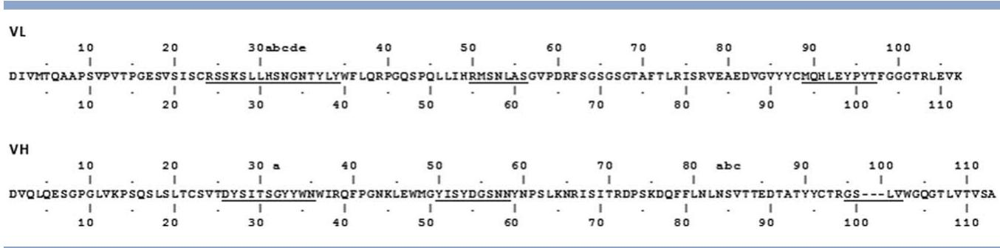
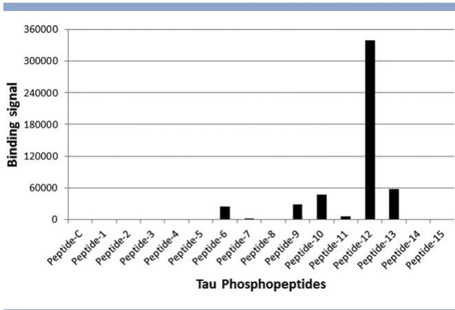
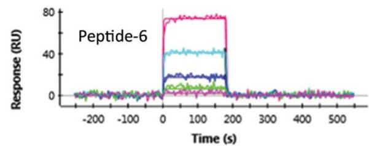
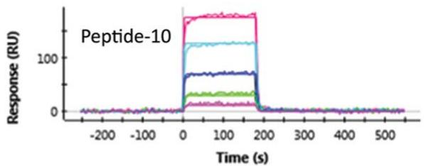
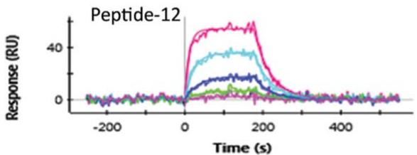
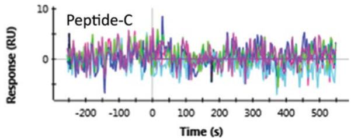
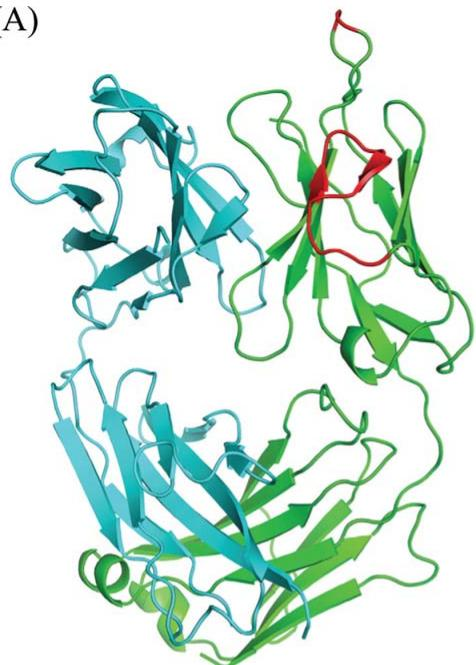
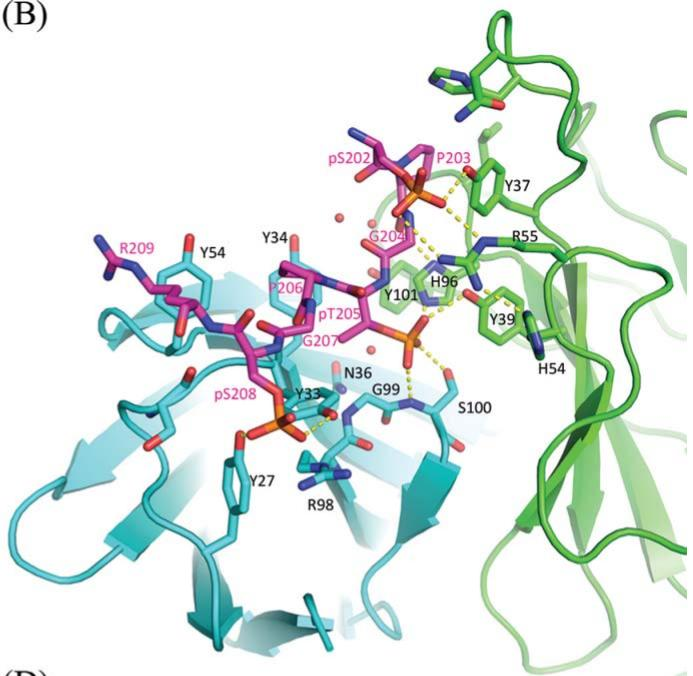
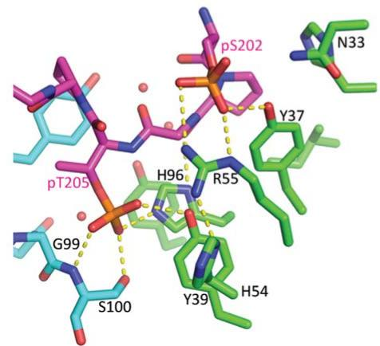
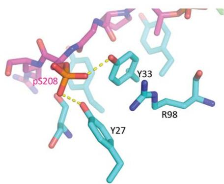

# PROT-84-427

# Epitope mapping and structural basis for the recognition of phosphorylated tau by the anti-tau antibody AT8

Thomas J. Malia, $^{*}$ Alexey Teplyakov, Robin Ernst, Sheng-Jiun Wu, Eilyn R. Lacy, Xuesong Liu, Marc Vandermeeren, Marc Mercken, Jinquan Luo, Raymond W. Sweet, and Gary L. Gilliland

Janssen Research & Development, LLC, 1400 McKean Road, Spring House, Pennsylvania 19477

# ABSTRACT

Microtubule-associated protein tau becomes abnormally phosphorylated in Alzheimer's disease and other tauopathies and forms aggregates of paired helical filaments (PHF-tau). AT8 is a PHF-tau-specific monoclonal antibody that is a commonly used marker of neuropathology because of its recognition of abnormally phosphorylated tau. Previous reports described the AT8 epitope to include pS202/pT205. Our studies support and extend previous findings by also identifying pS208 as part of the binding epitope. We characterized the phosphoepitope of AT8 through both peptide binding studies and costructures with phosphopeptides. From the cocrystal structure of AT8 Fab with the diphosphorylated (pS202/pT205) peptide, it appeared that an additional phosphorylation at S208 would also be accommodated by AT8. Phosphopeptide binding studies showed that AT8 bound to the triply phosphorylated tau peptide (pS202/pT205/pS208) 30-fold stronger than to the pS202/pT205 peptide, supporting the role of pS208 in AT8 recognition. We also show that the binding kinetics of the triply phosphorylated peptide pS202/pT205/pS208 was remarkably similar to that of PHF-tau. The costructure of AT8 Fab with a pS202/pT205/pS208 peptide shows that the interaction interface involves all six CDRs and tau residues 202–209. All three phosphorylation sites are recognized by AT8, with pT205 acting as the anchor. Crystallization of the Fab/peptide complex under acidic conditions shows that CDR-L2 is prone to unfolding and precludes peptide binding, and may suggest a general instability in the antibody.

Proteins 2016; 84:427–434.

© 2016 The Authors. Proteins: Structure, Function, and Bioinformatics Published by Wiley Periodicals, Inc.

Key words: tau; antibody; X-ray crystallography; crystal structure; Alzheimer's disease.

# INTRODUCTION

Alzheimer's disease (AD) pathology is characterized by the development of neurofibrillary tangles, which comprised extensively phosphorylated filamentous tau protein, or paired-helical filament tau (PHF-tau). Understanding the phosphorylation pattern of tau in AD is important to deciphering its role in the progression of neuropathology and may facilitate development of therapeutics. Tau contains 85 phosphorylatable residues (Ser, Thr, Tyr) and phosphorylation/dephosphorylation is critical to its normal function of dynamic microtubule stabilization, in that phosphorylation decreases tau affinity to microtubules. $^{1,2}$ Tau is found to be highly phosphorylated in AD, where a single tau molecule from an AD brain may contain up to 8 mol of phosphate compared to 3 in a control brain. $^{3}$ Forty-five different phosphorylated residues of tau have been identified in AD and the pattern of phosphorylation across tau molecules is heterogeneous. $^{4}$ The higher degree

of phosphorylation of tau may lead to its self-assembly into tangles of paired helical filaments (PHF) and straight filaments, which are involved in the pathogenesis of AD and other tauopathies. $^{5,6}$

Antibodies have been developed that are specific for PHF-tau, showing no binding to normal tau. Many of

This is an open access article under the terms of the Creative Commons Attribution-NonCommercial-NoDerivs License, which permits use and distribution in any medium, provided the original work is properly cited, the use is non-commercial and no modifications or adaptations are made.

Additional Supporting Information may be found in the online version of this article.

Abbreviations: AD, Alzheimer's disease; CDR, complementarity determining region; PHF-tau, paired-helical filament tau; rmsd, root-mean square deviation

*Correspondence to: Thomas J. Malia; Biologics Research, Janssen BioTherapeutics, Janssen Research & Development, LLC, 1400 McKean Road, Spring House, PA 19477. E-mail: tmalia@its.jnj.com

Received 20 October 2015; Revised 14 December 2015; Accepted 19 December 2015

Published online 21 January 2016 in Wiley Online Library (wileyonlinelibrary.com). DOI: 10.1002/prot.24988

Table I
SPR data for AT8 Fab binding to PHF-tau and tau phosphopeptides   

<table><tr><td>Peptide Name</td><td>Phosphorylation sites</td><td>Sequence</td><td>\( K_{D} \) (nM)</td><td>\( k_{on} \) (\( M^{-1} \) \( s^{-1} \)) × \( 10^{5} \)</td><td>\( k_{off} \) (\( s^{-1} \)) × \( 10^{-1} \)</td></tr><tr><td>PHF-tau</td><td></td><td></td><td>21.0 ± 0.9</td><td>10.9 ± 0.3</td><td>0.23 ± 0.01</td></tr><tr><td>Peptide-12</td><td>pS202/pT205/pS208</td><td>S G Y S S P G S P G T P G S R S R T P S</td><td>31 ± 3</td><td>7.8 ± 0.3</td><td>0.24 ± 0.01</td></tr><tr><td>Peptide-10</td><td>pS199/pS202/pT205</td><td>S G Y S S P G S P G T P G S R S R T P S</td><td>207 ± 29</td><td>11.6 ± 4.0</td><td>2.50 ± 1.15</td></tr><tr><td>Peptide-13</td><td>pS202/pT205/pS210</td><td>S G Y S S P G S P G T P G S R S R T P S</td><td>221 ± 10</td><td>8.5 ± 2.5</td><td>1.90 ± 0.64</td></tr><tr><td>Peptide-9</td><td>pS198/pS202/pT205</td><td>S G Y S S P G S P G T P G S R S R T P S</td><td>535 ± 136</td><td>4.9 ± 1.0</td><td>2.77 ± 1.21</td></tr><tr><td>Peptide-6</td><td>pS202/pT205</td><td>S G Y S S P G S P G T P G S R S R T P S</td><td>831 ± 168</td><td>5.1 ± 2.6</td><td>3.81 ± 1.32</td></tr><tr><td>Peptide-7</td><td>pS199/pS202</td><td>S G Y S S P G S P G T P G S R S R T P S</td><td>&gt;1 mM</td><td>-</td><td>-</td></tr><tr><td>Peptide-1</td><td>pS198</td><td>S G Y S S P G S P G T P G S R S R T P S</td><td>nb</td><td>nb</td><td>nb</td></tr><tr><td>Peptide-2</td><td>pS199</td><td>S G Y S S P G S P G T P G S R S R T P S</td><td>nb</td><td>nb</td><td>nb</td></tr><tr><td>Peptide-3</td><td>pS198/pS199</td><td>S G Y S S P G S P G T P G S R S R T P S</td><td>nb</td><td>nb</td><td>nb</td></tr><tr><td>Peptide-4</td><td>pS202</td><td>S G Y S S P G S P G T P G S R S R T P S</td><td>nb</td><td>nb</td><td>nb</td></tr><tr><td>Peptide-5</td><td>pT205</td><td>S G Y S S P G S P G T P G S R S R T P S</td><td>nb</td><td>nb</td><td>nb</td></tr><tr><td>Peptide-8</td><td>pS199/pT205</td><td>S G Y S S P G S P G T P G S R S R T P S</td><td>nb</td><td>nb</td><td>nb</td></tr><tr><td>Peptide-11</td><td>pT205/pS208</td><td>S G Y S S P G S P G T P G S R S R T P S</td><td>nb</td><td>nb</td><td>nb</td></tr><tr><td>Peptide-14</td><td>pS208</td><td>S G Y S S P G S P G T P G S R S R T P S</td><td>nb</td><td>nb</td><td>nb</td></tr><tr><td>Peptide-15</td><td>pS210</td><td>S G Y S S P G S P G T P G S R S R T P S</td><td>nb</td><td>nb</td><td>nb</td></tr><tr><td>Peptide-C</td><td></td><td>S G Y S S P G S P G T P G S R S R T P S</td><td>nb</td><td>nb</td><td>nb</td></tr></table>

All peptides include tau residues 195–214 and contain short-chain biotin and PEG $_{4}$ at the N-terminus. Shaded residues indicate phosphorylation.

these antibodies recognize phosphorylation patterns that occur in the AD state and have diagnostic and/or therapeutic potential. Various AD-specific antibodies have been used to study the time-course of phosphorylation events and understanding their epitopes may provide insight into disease mechanism and guide therapeutic discovery. AT8 is one of the more widely used anti-tau antibodies that is specific for AD-tau and has been used extensively to study the time-course of tauopathies. $^{7-11}$ AT8 was obtained by immunization of mice with PHF-tau. $^{11}$ Previous epitope mapping of AT8 utilized recombinant tau and mutated tau phosphorylated in vitro with various kinases. $^{12}$ However, this approach does not result in quantitative phosphorylation, and not all combinations were tested. A more recent study $^{13}$ analyzed the binding of AT8 mAb to phosphopeptides in a direct ELISA and in a competitive ELISA. They identified pS202/pT205 as the primary phosphoepitope of AT8, but also showed binding to pS199/pS202 and pT205/pS208 peptides.

We explored the epitope in greater detail by phospho-peptide mapping and determined that the full phospho-specificity of AT8 is pS202/pT205/pS208. This was definitively confirmed with a costructure of AT8 Fab and peptide. Through the costructure, we also identify other key tau epitope residues and the paratope residues on the AT8 antibody that are involved in binding to phospho-tau. We also determined the structure of the AT8 Fab alone and found evidence for disorder, likely due to a short CDR-H3.

# MATERIALS AND METHODS

# Materials

The hybridoma cell line of AT8 was obtained from the European Collection of Cell Cultures (ECACC). The vari-

able domains of AT8 were cloned and sequenced using standard methods. The AT8 Fab was produced as a chimeric version with the mouse variable domain and human IgG1/ $\kappa$ constant domain and a His tag at the C-terminus of the heavy chain. The Fab was transiently expressed in HEK293F cells and purified by affinity (HisTrap) and ion exchange (Source 15S) chromatographies in a final buffer of 20 mM MES pH 6.0, 100 mM NaCl.

All peptides were synthesized at New England Peptide (Gardner, MA). Phosphopeptides for ELISA and ProteOn binding studies included tau residues 195–214, contained an N-terminal short-chain biotin followed by PEG4, and were phosphorylated at various serine and threonine positions (Table I). Peptides for crystallization included tau residues 194–211 with two or three phosphorylation sites and had the following sequences: Ac-RSGYSSPG(pS)PG(pT)PGSRSR-OH (TPP-1 peptide) and Ac-RSGYSSPG(pS)PG(pT)PG(pS)RSR-OH (TPP-2 peptide).

# ELISA

Synthetic peptides were dissolved in carbonate/bicarbonate buffer, pH 9.4 to 1 mg/mL. Stock solutions were diluted to 10 $\mu$ g/mL for each peptide. Fifty microliters were incubated with Streptavidin Gold Plates (MSD, Gaithersburg, MD) for 1 h at room temperature. One-hundred fifty microliters of 5% MSD Blocker A buffer was added to each well and incubated for 1 h at room temperature. Plates were washed three times with 0.1 M HEPES buffer, pH 7.4, followed by the addition of Ruthenium (Ru)-labeled AT8 Fab. Plates were then washed 3 times with HEPES buffer, pH 7.4 followed by the addition of 150 $\mu$ L per well of diluted MSD Read buffer T and analyzed using an SECTOR imager.

Table II
Crystal data, X-ray data, and refinement statistics   

<table><tr><td>PDB ID</td><td>5E2T</td><td>5E2U</td><td>5E2V</td><td>5E2W</td></tr><tr><td colspan="5">Crystallization conditions</td></tr><tr><td>Content</td><td>AT8 Fab</td><td>\(AT8\ \text{Fab} + \text{TPP-1}^{\text{a}}\)</td><td>AT8 Fab + TPP-1</td><td>AT8 Fab + TPP-2</td></tr><tr><td>Buffer</td><td>No buffer</td><td>No buffer</td><td>0.1 M MES</td><td>0.1 M HEPES</td></tr><tr><td>Precipitant</td><td>20% PEG 3350</td><td>20% PEG 3350</td><td>25% PEG 4000</td><td>18% PEG 3350</td></tr><tr><td>Additive</td><td>0.2 M \(CaCl_2\)</td><td>0.2 M (\(NH_4\))\(_2SO_4\)</td><td>-</td><td>0.2 M sodium formate</td></tr><tr><td>pH in reservoir</td><td>5.0</td><td>3.5</td><td>6.5</td><td>7.5</td></tr><tr><td colspan="5">Crystal data</td></tr><tr><td>Space group</td><td>I222</td><td>I222</td><td>\(P2_1\)</td><td>C2</td></tr><tr><td>Unit cell axes (Å)</td><td>92.9, 108.8, 109.3</td><td>94.7, 107.4, 108.6</td><td>54.2, 58.3, 68.6</td><td>115.6, 61.0, 84.1</td></tr><tr><td>Unit cell angles (°)</td><td>90, 90, 90</td><td>90, 90, 90</td><td>90, 93.7, 90</td><td>90, 133.1, 90</td></tr><tr><td>Molecules/asym.unit</td><td>1</td><td>1</td><td>1</td><td>1</td></tr><tr><td>\(V_m\) (Å\(^3\)/Da)</td><td>2.87</td><td>2.87</td><td>2.16</td><td>2.17</td></tr><tr><td>Solvent content (%)</td><td>57</td><td>57</td><td>43</td><td>43</td></tr><tr><td colspan="5">X-ray data</td></tr><tr><td>Resolution (Å)</td><td>30–2.1 (2.2–2.1)</td><td>30–2.4 (2.5–2.4)</td><td>30–1.64 (1.73–1.64)</td><td>30–1.5 (1.56–1.50)</td></tr><tr><td>No. measured refls</td><td>177,510 (9520)</td><td>130,057 (8085)</td><td>161,140 (4547)</td><td>245,579 (24,797)</td></tr><tr><td>No. unique refls</td><td>30,818 (1813)</td><td>21,800 (1524)</td><td>45,789 (3930)</td><td>66,342 (6,616)</td></tr><tr><td>Completeness (%)</td><td>94.9 (77.5)</td><td>99.4 (95.7)</td><td>87.2 (51.7)</td><td>98.1 (97.8)</td></tr><tr><td>Redundancy</td><td>5.8 (5.3)</td><td>6.0 (5.3)</td><td>3.5 (1.2)</td><td>3.7 (3.7)</td></tr><tr><td>\(R_{\text{merge}}\) (l)</td><td>0.057 (0.298)</td><td>0.062 (0.277)</td><td>0.034 (0.044)</td><td>0.062 (0.529)</td></tr><tr><td>\(R_{\text{meas}}\) (l)</td><td>0.063 (0.330)</td><td>0.068 (0.306)</td><td>0.039 (0.065)</td><td>0.071 (0.608)</td></tr><tr><td></td><td>19.2 (5.5)</td><td>19.5 (5.7)</td><td>28.2 (10.6)</td><td>19.1 (3.6)</td></tr><tr><td>B-factor (Wilson) (Å\(^2\))</td><td>37.0</td><td>40.8</td><td>16.9</td><td>23.3</td></tr><tr><td colspan="5">Refinement</td></tr><tr><td>Resolution (Å)</td><td>15–2.1</td><td>15–2.4</td><td>15–1.64</td><td>15–1.5</td></tr><tr><td>No. refls used</td><td>29,756</td><td>20,800</td><td>44,593</td><td>64,955</td></tr><tr><td>Completeness (%)</td><td>91.7</td><td>95.2</td><td>84.7</td><td>97.8</td></tr><tr><td>No. all atoms</td><td>3506</td><td>3315</td><td>3880</td><td>3580</td></tr><tr><td>No. water molecules</td><td>255</td><td>188</td><td>546</td><td>256</td></tr><tr><td>R-factor (%)</td><td>20.7</td><td>18.6</td><td>16.5</td><td>21.6</td></tr><tr><td>R-free (%)</td><td>24.6</td><td>24.8</td><td>20.8</td><td>22.0</td></tr><tr><td>RMSD bond lengths (Å)</td><td>0.010</td><td>0.009</td><td>0.008</td><td>0.005</td></tr><tr><td>RMSD bond angles (°)</td><td>1.3</td><td>1.2</td><td>1.2</td><td>1.1</td></tr><tr><td>RMSD B main-chain (Å\(^2\))</td><td>3.6</td><td>2.7</td><td>2.1</td><td>2.9</td></tr><tr><td>Mean B-factor (Å\(^2\))</td><td>44.2</td><td>50.4</td><td>22.1</td><td>25.8</td></tr><tr><td>Peptide mean B-factor (Å\(^2\))</td><td></td><td></td><td>26.5</td><td>27.3</td></tr></table>

$^{a}$ TPP-1 not observed in the crystal.

# ProteOn-PHF-tau

Analysis of the AT8 interaction with PHF-tau was assessed by Surface Plasmon Resonance. Detailed methods will be published elsewhere (Nanjunda et al., in preparation), but are described here briefly. PHF-tau was obtained by sarcosyl extraction of insoluble tau from postmortem tissue (cortex) obtained of a histologically confirmed AD patient, using a modified method of Greenberg and Davies. $^{14}$ PHF-tau was covalently coupled to the sensor chip and AT8 Fab was flowed over the chip at 25°C to record kinetic parameters. Kinetics and affinity values were obtained from triplicate measurements using a simple 1:1 binding model.

# ProteOn-peptide

Kinetic rate constants were determined for tau phosphopeptides using a ProteOn XPR36 instrument (Bio-Rad). An NLC chip (neutravidin coated) was used to capture the peptides at a density of 5–10 RU. The run-

ning buffer used for the peptide capture step as well as the kinetic cycles was PBS, pH 7.4 + 0.005% Tween 20. The AT8 Fab was injected over the chip surface as a threefold dilution series of 12.3, 37, 111, 333, and 1000 nM, as well buffer only as a reference and measured in duplicate. For the AT8-12 peptide, a lower concentration of AT8 Fab was used for the dilution series because of the stronger binding: 1.1, 3.3, 10, 30, and 90 nM and measured in six replicates. The chip surface was regenerated using 100 mM phosphoric acid. The response data were analyzed using ProteOn software. All data were double referenced by subtracting control surface and PBST buffer only injection responses, and then kinetic rate constants were determined using a global fit 1:1 Langmuir model.

# Crystallization

AT8 Fab was concentrated to 22–25 mg/mL for crystallization. Lyophilized peptide was dissolved in 0.1 M

  
Figure 1
Amino acid sequence of AT8 variable domains. Chothia numbering $^{25}$ above and consecutive numbering below. CDRs in AbM definition $^{26}$ are underlined.

Tris pH 8.5 to a final concentration of approximately 50 mg/mL. The AT8 Fab/peptide complex was prepared by mixing Fab with 10-fold molar excess of peptide, and diluted further to approximately 15–16 mg/mL in 20 mM MES pH 6.0, 100 mM NaCl. Crystallization screening of the free Fab and AT8 Fab/peptide complexes was performed with in-house crystallization screens and DWBlock PEGs Suite (Qiagen), using an Oryx4 robot (Douglas Instruments) and a Mosquito robot (TTP Labtech). The crystal of free AT8 Fab was obtained from 20% PEG 3350, 0.2 M CaCl₂ (no buffer). The Fab crystal obtained in the presence of TPP-1 (low-pH form) grew from 20% PEG 3350, 0.2 M ammonium sulfate (no buffer). The AT8 Fab/TPP-1 complex crystallized in 0.1 M MES pH 6.5, 25% PEG 4000. The AT8 Fab/TPP-2 complex crystallized in 0.1M HEPES pH 7.5, 18% PEG 3350, 0.2 M sodium formate.

# Data collection and structure determination

For X-ray data collection, one crystal of each kind was soaked for a few seconds in a cryoprotectant solution and was flash-cooled in liquid nitrogen. The cryo solutions were the respective mother liquors supplemented with: 25% glycerol for free Fab, 24% PEG 400 for Fab in the presence of TPP-1, and 20% glycerol for the Fab/TPP-1 and Fab/TPP-2 complexes. Diffraction data for the Free Fab structures and the Fab/TPP-1 structure were collected using a Rigaku MicroMax $^{TM}$ -007HF microfocus X-ray generator equipped with a Saturn 944 CCD detector and an X-stream $^{TM}$ 2000 cryocooling system (Rigaku). Diffraction intensities were detected with 2-min exposures per 0.25° image and were processed with the program XDS. $^{15}$ The AT8 Fab/TPP-2 crystallography data were collected at the Canadian Light Source on beamline 08ID and detected with a Rayonix 300 detector. Diffraction intensities were processed with HKL-2000.

The structures were solved by molecular replacement with Phaser $^{16}$ using an AT8 model constructed from mouse antibodies 1MJ8 $^{17}$ and 3LEY, $^{18}$ and refined with REFMAC. $^{19}$ All crystallographic calculations were

performed with the CCP4 suite of programs. $^{20}$ Model adjustments were carried out using the program COOT. $^{21}$ The refinement statistics are given in Table II. The atomic coordinates and structure factors were archived under PDB IDs: 5E2T (free Fab), 5E2U (Fab crystallized in the presence of TPP), 5E2V (Fab/TPP-1 complex), and 5E2W (Fab/TPP-2 complex).

# RESULTS

# Sequence

AT8 is a mouse monoclonal antibody with specificity toward phosphorylated tau. Sequencing of the variable region revealed a long CDR-L1 and a short CDR-H3 (Fig. 1). Amino acid numbering is sequential unless otherwise indicated.

# AT8 phosphopeptide and PHF-tau binding

All binding studies were carried out with AT8 Fab protein rather than the mAb to avoid masking differences due to avidity.

  
Figure 2 MSD-ELISA binding of tau-phosphopeptides and AT8 Fab. Vertical axis is ELISA signal. AT8 Fab concentration is $5\mathrm{nM}$ . See Table I for the peptide sequences.

  
Figure 3
ProteOn sensorgrams for AT8 Fab binding to phosphopeptides.

# ELISA

Phosphopeptide ELISA of AT8 Fab shows the strongest binding to Peptide-12, corresponding to tau residues 195–214 phosphorylated at 202/205/208. Weaker binding is observed for peptides phosphorylated at 202/205, with little or no enhancement of binding with phosphorylation at 198, 199, and 210 (Fig. 2).

# ProteOn

AT8 Fab bound to PHF-tau derived from AD brain with an affinity ( $K_{D}$ ) of 21 nM (data not shown). The AT8 peptide interaction was studied by surface plasmon resonance using ProteOn. AT8 bound strongest to the triplyphosphorylated Peptide-12 (pS202/pT205/pS208) with $K_{D} = 31$ nM (Table I and Fig. 3). AT8 has 30-fold weaker affinity for diphosphorylated Peptide-6 (pS202/pT205). Phosphorylation of pS202/pT205 peptide at additional sites (pS199 or pS210) increases binding affinity, perhaps due to epitope promiscuity or redundancy of the tau sequence in this region, but not to the level of pS202/pT205/pS208. Weak binding of $K_{D} = 5.4$ $\mu$ M was observed for Peptide-7 (pS199/pS202). Single phosphorylation within any of the peptides did not show detectable binding of AT8 Fab under the conditions tested. S202 phosphorylation is necessary, but not sufficient for binding. Additional phosphorylation at T205 is necessary for submicromolar binding, while phosphorylation at S199 also shows detectable, albeit weak, binding when combined with pS202.

# AT8 fab structure

The crystal structure of the free Fab was determined at 2.1 Å resolution [Fig. 4(A)]. All 6 CDRs are well-defined in the electron density. Due to a very short CDR-H3 and

a long CDR-L1, the antigen-binding site has a distinct groove between VL and VH. While AT8 is known to bind phosphorylated tau, there is only one basic residue on the Fab binding surface, which is R50 in VL. In addition, each of the light chain CDRs has a histidine, which could be predicted to also be involved in phosphopeptide binding.

An initial attempt to crystallize AT8 Fab in the presence of TPP-1 peptide produced a crystal isomorphous to the free Fab. However, no peptide was observed in the electron density. Surprisingly, the entire CDR-L2 (residues 53–64) was disordered, as well as the tip of CDR-L1 (residues 32–33). Since the crystal form is the same, all molecular contacts in the crystal are preserved and cannot account for the disorder. Both crystals of AT8 Fab were obtained under very similar conditions from PEG 3350 without buffer although the pH of the ammonium sulfate solution was significantly lower than that of CaCl2 (pH 3.5 vs 5.0). Moreover, the TPP-1 solution is quite acidic due to the presence of TFA in the lyophilized peptide. Therefore, the Fab + TPP-1 solution is more acidic than free Fab. The observed structural difference is likely the result of the difference in pH. The acidic conditions apparently lead to partial unfolding of CDR-L2. Analysis of the structure indicates that CDR-L2 lacks many of stabilizing contacts to CDR-H3 because CDR-H3 in AT8 is very short. In a typical antibody, the residue in Chothia position 49 of CDR-L2 (tyrosine in germline, histidine in AT8) stacks against the residue in Chothia position 99 of CDR-H3. There are other contacts that may also involve Chothia position 50 of CDR-L2 depending on the length of CDR-H3. The short CDR-H3 in AT8 is unable to stabilize CDR-L2, which may unfold under certain conditions (acidic, in this case). Whether it is a general feature of all mAbs with a short CDR-H3 remains to be investigated.

  
(A)

  
(B)

  
(C)   
(D)

Figure 4   
  
(A) Cartoon drawing of AT8 Fab. Light chain is in green, and heavy chain is in cyan. Fragments of VL in red (tip of CDR-L1 and entire CDR-L2) are disordered in the low-pH Fab structure. (B) AT8–TPP-2 interactions. VL is in green, and VH is in cyan, peptide is magenta. Peptide residues are labeled in magenta. Orange spheres are water molecules. Hydrogen bonding and salt-bridge interactions are indicated in yellow dashed lines. (C) AT8 interactions with pS202 and pT205. (D) AT8 interactions with pS208.

# AT8/phosphopeptide complex

At a higher pH (6.5), the AT8 Fab was cocrystallized with two phosphopeptides differing in the absence or presence of phosphorylation at S208 (TPP-1 and TPP-2, respectively). The structures of the two complexes are very similar: the backbone atoms of the peptides superimpose with an rmsd of 0.248 Å; the VH regions superimpose with 0.177 Å rmsd, and the VL regions superimpose with 0.258 Å rmsd (Supporting Information, Fig. 1). In both structures residues, 202–209 of TPP were located in the electron density [Fig. 4(B)].

TPP-2 fills the groove between VL and VH, although not in a fully extended conformation. Part of the

phosphopeptide adopts a polyproline type II helix conformation due to the consensus sequence PXXP at 203–206. An intermolecular hydrogen bond forms between the phosphate of pS202 and the backbone amide of G204. There is also a hydrophobic interaction between P206 and the methyl group of pT205. The interaction interface area is $490 \, Å^{2}$ on AT8 and $640 \, Å^{2}$ on TPP-2. The epitope is centered on the phosphate of pT205, which occupies the deep pocket flanked by G99-S100 of CDR-H3, and is anchored by multiple hydrogen-bonding interactions [Fig. 4(C)]. The side-chain amide of H96 on CDR-L3 forms a salt-bridge interaction with the pT205 phosphate. There are also weak hydrophobic interactions

from the neighboring tyrosine side chains of Y33 and Y34 to the pT205 methyl group, which likely confers AT8 selectivity to the pS202/pT205/pS208 motif over the pS199/pS202/pT205 peptide, because in the latter peptide, the hydrophobic interactions to pT205 are not satisfied.

Even deeper in the pocket, there is a water molecule sequestered in the binding site within a hydrogen-bond distance from N36 of CDR-H1. R55 of CDR-L2 and Y37 of CDR-L1 anchor the phosphate of pS202, which is mostly exposed to solvent [Fig. 4(B)]. The structure of AT8 Fab with TPP-1 (without phosphorylation at S208) suggests that the peptide binding might be enhanced by the phosphorylation of S208, which we confirmed with phosphopeptide binding studies. Indeed, in the TPP-2 co-structure, AT8 Fab forms hydrogen bonds with the phosphate of pS208 through the tyrosine hydroxyl groups of Y27 and Y33 from the heavy chain, and R98 of CDR-H3 forms a stacking interaction with Y33 [Fig. 4(D)].

In addition to the electrostatic interactions with the phosphates, another major contribution to the binding energy comes from the stacking interactions that involve P203, P206, R209 and the peptide bond 207–208 of TPP-2. H54 of CDR-L2 does not interact directly with the peptide, but instead forms a stabilizing hydrogen-bonding interaction with R55, which interacts directly with pS202 [Fig. 4(C)]. Binding of the peptide does not cause main-chain shifts of the Fab, and is only limited to side-chain rotations of a few residues.

# DISCUSSION/CONCLUSIONS

Through phosphopeptide binding ELISA, ProteOn, and crystal structures, we determined the AT8 epitope as spanning residues 202–209 including phosphorylation at pS202/pT205/pS208. This work extends previous epitope mapping studies by ELISA that identified pS202/pT205 peptide as the AT8 phosphoepitope. $^{13}$ We show that AT8 binds to the pS202/pT205/pS208 peptide 30-fold stronger than the pS202/pT205 peptide. We further confirmed the additional specific binding interactions to pS208 with a co-structure of AT8 Fab and the pS202/pT205/pS208 peptide. Porzig et al. previously concluded that pS199 was not part of the epitope because a pS199/pS202/pT205 peptide had similar affinity to a pS202/pT205 peptide. $^{13}$ However, in our studies, the measured affinity of pS199/pS202/pT205 by ProteOn is fourfold stronger than that for the pS202/pT205 peptide. We surmise that the increased binding to pS199/pS202/pT205 is probably due to cross-reactivity with the redundant tau sequence in this region. On the other hand, binding for the pS199/pS202/pT205 peptide is 10-fold lower compared to the pS202/pT205/pS208 peptide. This difference is likely the result of the loss of hydrophobic interactions

with the pT205 methyl group of the former peptide and the added interaction with pS208 of the latter peptide.

The affinity of AT8 Fab for PHF-tau from AD brain ( $K_{D}=21\ nM$ ) was very similar to the pS202/pT205/pS208 peptide affinity ( $K_{D}=31\ nM$ ). The similarity in the affinities for PHF-tau and the triple phosphorylated pS202/pT205/pS208 peptide indicates that this peptide represents the in vivo phosphoepitope and conformation in PHF-tau from AD. PHF-tau phosphorylation is heterogeneous $^{4}$ and the binding kinetics of AT8 to PHF-tau are likely complex. AT8 could bind to all tau forms in PHF-tau with minimally two phosphorylation sites at pS202/pT205 or pS199/pS202, while the binding to the latter phosphorylation motif would be much weaker. The ProteOn data may be dominated by the binding to pS202/pT205/pS208-tau, possibly masking binding to the doubly phosphorylated tau species, especially considering that the top peptides bind with very similar on-rates. Full-length tau is intrinsically disordered in solution and undergoes a transition to ordered filaments (PHF) through an unknown mechanism. The AT8 epitope lies within the proline rich domain of tau, which is believed to remain disordered in the context of PHF-tau. $^{22}$ Because the AT8 antibody was raised against PHF-tau, $^{11}$ rather than an isolated phosphopeptide, we presume that it binds to a physiological conformation of PHF-tau. The binding similarities between peptide and PHF-tau suggest that the phosphopeptide structure is representative of the structure of this region of PHF-tau under physiological conditions. It is possible that the structure of the peptide observed in the crystal structure represents one of many conformations that the peptide can adopt in solution. The observed peptide may, however, represent a dominant conformation for the AT8 epitope region. The AT8 epitope contains polyproline II helix character due to the consensus motif PXXP, $^{23}$ which may constrain the peptide to the observed conformation in the crystal structure. It is unknown whether this is the conformation of the AT8 epitope region when unphosphorylated in PHF-tau or in solution. A recent study characterized the pS202/pT205 AT8 epitope peptide $^{24}$ by NMR and molecular dynamics (MD) simulations. They report a helical turn in the structure of the peptide spanning P206–R209, induced by hydrogen-bonding interactions between pT205 and the amide proton of G207. We did not find evidence for the turn conformation and do not observe the intrapeptide interactions they reported: for example, in our costructure, the phosphate of pT205 is too far (>7.5 Å) from the G207 amide to form a hydrogen bond. Our structures do corroborate their finding of a direct interaction between AT8 and residues 205 and 207, but we extend the epitope to include all amino acids within 202–209. There are significant differences between the NMR/MD-defined structure of the AT8 epitope peptide $^{24}$ and the structure we determined in the crystal structure. Based on our crystal structures, a turn

conformation of the AT8 epitope is not required for recognition by the AT8 antibody, and the AT8 epitope peptide is in a partially extended conformation with some polyproline type II helix character.

AT8 is one of the more widely used anti-tau antibodies to assess pathological tau. It is used extensively in preclinical research and in clinical research for the postmortem diagnosis and staging of AD by immunohistochemistry. $^{7-10}$ AT8 has also been used as a research tool to determine the phosphorylation pattern of tau in AD. Our results elucidate the AT8 epitope as comprising triply phosphorylated tau at pS202, pT205, and pS208. We confirmed this with a crystal structure of the AT8 Fab and a pS202/pT205/pS208 tau peptide, as well as binding studies of this peptide and PHF-tau. While our results support that the epitope which AT8 recognizes is pS202/pT205/pS208, we also found that AT8 has detectable binding to other phospho-tau species within the same tau region. Because AT8 has cross-reactivity to these alternately phosphorylated peptides, when used in analyses of biological samples, AT8 may also be binding to tau phosphorylated with these alternate patterns since phosphorylation of tau in PHF-tau is heterogeneous. $^{4}$ Different tau molecules within PHF-tau are likely to contain different phosphorylation patterns within the AT8 epitope region and throughout the entire tau molecule. The epitope characterization and binding analysis of AT8 further enhance the knowledge of this important research tool and diagnostic antibody.

# ACKNOWLEDGMENT

We thank Wencheng Liu in the laboratory of Steven Paul (Weill Medical College of Cornell University) for providing PHF-tau used in binding studies.

# REFERENCES

1. Gustke N, Steiner B, Mandelkow EM, Biernat J, Meyer HE, Goedert M, Mandelkow E. The Alzheimer-like phosphorylation of tau protein reduces microtubule binding and involves Ser-Pro and Thr-Pro motifs. FEBS Lett 1992; 307:199–205.   
2. Busciglio J, Lorenzo A, Yeh J, Yankner BA. Beta-amyloid fibrils induce tau phosphorylation and loss of microtubule binding. Neuron 1995; 14:879–888.   
3. Kopke E, Tung YC, Shaikh S, Alonso AC, Iqbal K, Grundke-Iqbal I. Microtubule-associated protein tau. Abnormal phosphorylation of a non-paired helical filament pool in Alzheimer disease. J Biol Chem 1993; 268:24374–24384.   
4. Hanger DP, Anderton BH, Noble W. Tau phosphorylation: the therapeutic challenge for neurodegenerative disease. Trends Mol Med 2009; 15:112–119.   
5. Alonso A, Zaidi T, Novak M, Grundke-Iqbal I, Iqbal K. Hyperphosphorylation induces self-assembly of tau into tangles of paired helical filaments/straight filaments. Proc Natl Acad Sci USA 2001; 98:6923–6928.   
6. Augustinack JC, Schneider A, Mandelkow EM, Hyman BT. Specific tau phosphorylation sites correlate with severity of neuronal cytopathology in Alzheimer's disease. Acta Neuropathologica 2002; 103: 26–35.

7. Braak H, Thal DR, Ghebremedhin E, Del Tredici K. Stages of the pathologic process in Alzheimer disease: age categories from 1 to 100 years. J Neuropathol Exp Neurol 2011; 70:960–969.   
8. Alafuzoff I, Arzberger T, Al-Sarraj S, Bodi I, Bogdanovic N, Braak H, Bugiani O, Del-Tredici K, Ferrer I, Gelpi E, Giaccone G, Graeber MB, Ince P, Kamphorst W, King A, Korkolopoulou P, Kovacs GG, Larionov S, Meyronet D, Monoranu C, Parchi P, Patsouris E, Roggendorf W, Seilhe, Tagliavini F, Stadelmann C, Streichenberger N, Thal DR, Wharton SB, Kretzschmar H. Staging of neurofibrillary pathology in Alzheimer's disease: a study of the BrainNet Europe Consortium. Brain Pathol 2008; 18:484–496.   
9. Braak H, Alafuzoff I, Arzberger T, Kretzschmar H, Del Tredici K. Staging of Alzheimer disease-associated neurofibrillary pathology using paraffin sections and immunocytochemistry. Acta Neuropathologica 2006; 112:389–404.   
10. Braak H, Braak E. Staging of Alzheimer's disease-related neurofibrillary changes. Neurobiol Aging 1995; 16:271–278. discussion 278-284.   
11. Mercken M, Vandermeeren M, Lubke U, Six J, Boons J, Van de Voorde A, Martin JJ, Gheuens J. Monoclonal antibodies with selective specificity for Alzheimer Tau are directed against phosphatase-sensitive epitopes. Acta Neuropathologica 1992; 84:265–272.   
12. Biernat J, Mandelkow EM, Schroter C, Lichtenberg-Kraag B, Steiner B, Berling B, Meyer H, Mercken M, Vandermeeren A, Goedert M, et al. The switch of tau protein to an Alzheimer-like state includes the phosphorylation of two serine-proline motifs upstream of the microtubule binding region. Embo J 1992; 11:1593–1597.   
13. Porzig R, Singer D, Hoffmann R. Epitope mapping of mAbs AT8 and Tau5 directed against hyperphosphorylated regions of the human tau protein. Biochem Biophys Res Commun 2007; 358:644–649.   
14. Greenberg SG, Davies P. A preparation of Alzheimer paired helical filaments that displays distinct tau proteins by polyacrylamide gel electrophoresis. Proc Natl Acad Sci USA 1990; 87:5827–5831.   
15. Kabsch W. XDS. Acta Crystallogr D Biol Crystallogr 2010; 66:125–132.   
16. McCoy AJ, Grosse-Kunstleve RW, Adams PD, Winn MD, Storoni LC, Read RJ. Phaser crystallographic software. J Appl Crystallogr 2007; 40:658–674.   
17. Ruzheinikov SN, Muranova TA, Sedelnikova SE, Partridge LJ, Blackburn GM, Murray IA, Kakinuma H, Takahashi-Ando N, Shimazaki K, Sun J, Nishi Y, Rice DW. High-resolution crystal structure of the Fab-fragments of a family of mouse catalytic antibodies with esterase activity. J Mol Biol 2003; 332:423–435.   
18. Ofek G, Guenaga FJ, Schief WR, Skinner J, Baker D, Wyatt R, Kwong PD. Elicitation of structure-specific antibodies by epitope scaffolds. Proc Natl Acad Sci USA 2010; 107:17880–17887.   
19. Murshudov GN, Vagin AA, Dodson EJ. Refinement of macromolecular structures by the maximum-likelihood method. Acta Crystallogr D Biol Crystallogr 1997; 53:240–255.   
20. Collaborative Computational Project, N. The CCP4 suite: programs for protein crystallography. Acta Crystallogr D Biol Crystallogr 1994; 50:760–763.   
21. Emsley P, Cowtan K. Coot: model-building tools for molecular graphics. Acta Crystallogr D Biol Crystallogr 2004; 60:2126–2132.   
22. Mandelkow E, von Bergen M, Biernat J, Mandelkow EM. Structural principles of tau and the paired helical filaments of Alzheimer's disease. Brain Pathol 2007; 17:83–90.   
23. Adzhubei AA, Sternberg MJ, Makarov AA. Polyproline-II helix in proteins: structure and function. J Mol Biol 2013; 425:2100–2132.   
24. Gandhi NS, Landrieu I, Byrne C, Kukic P, Amniai L, Cantrelle FX, Wieruszeski JM, Mancera RL, Jacquot Y, Lippens G. A phosphorylation-induced turn defines the Alzheimer's disease AT8 antibody epitope on the tau protein. Angewandte Chemie 2015; 54:6819–6823.   
25. Chothia C, Lesk AM. Canonical structures for the hypervariable regions of immunoglobulins. J Mol Biol 1987; 196:901–917.   
26. Abhinandan KR, Martin AC. Analysis and improvements to Kabat and structurally correct numbering of antibody variable domains. Mol Immunol 2008; 45:3832–3839.