# gkaf453

# Structural basis of G-quadruplex recognition by a camelid antibody fragment

Mojca Pevec $^{1,2,3}$ , Tadej Medved $^{1}$ , Matic Kovačič $^{4}$ , Neža Žerjav $^{1}$ , Jernej Imperl $^{1}$ , Janez Plavec $^{4}$ , Jurij Lah $^{1}$ , Remy Loris $^{2,3}$ , San Hadži $^{1,*}$

$^{1}$ Department of Physical Chemistry, Faculty of Chemistry and Chemical Technology, University of Ljubljana, 1000 Ljubljana, Slovenia   
$^{2}$ Structural Biology Brussels, Department of Biotechnology, Vrije Universiteit Brussel, Pleinlaan 2, 1050 Brussels, Belgium   
$^{3}$ Centre for Structural Biology, VIB, Pleinlaan 2, 1050 Brussels, Belgium   
$^{4}$ Slovenian NMR Center, National Institute of Chemistry, Hajdrihova 19, 1000 Ljubljana, Slovenia   
*To whom correspondence should be addressed. Email: san.hadzi@fkkt.uni-lj.si

# Abstract

Apart from the iconic Watson–Crick duplex, DNA can fold into different noncanonical structures, of which the most studied are G-quadruplexes (G4s). Despite mounting structural and biophysical evidence, their existence in cells was controversial until their detection using G4-specific antibodies. However, it remains unknown how antibodies recognize G4s at the molecular level and why G4-specific antibodies have low selectivity and are unable to distinguish different G4 sequences. Here, we present the crystal structure of a nanobody bound to the archetypical G4 structure, the thrombin-binding aptamer (TBA). The nanobody exhibits strong selectivity against different G4 sequences and utilizes an unusual scaffold-based paratope, with very limited involvement of complementarity-determining region. The nanobody effectively mimics the binding interface of thrombin, a natural binding partner of TBA, by using isosteric interactions at key positions. The presented structure sheds light on the molecular basis of how antibodies, essential G4-detection tools, recognize noncanonical G4 structures.

Graphical abstract   
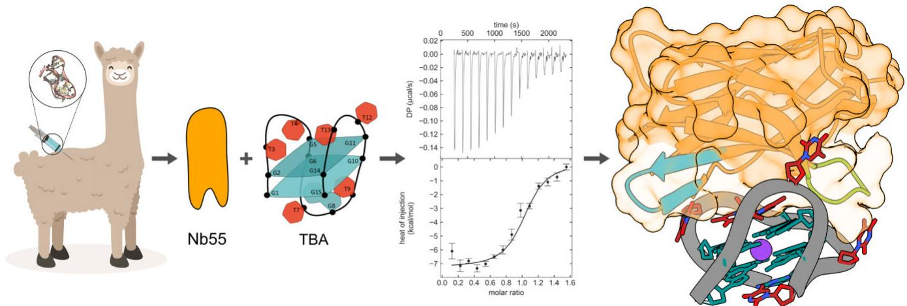  
Nanobody-TBA structure

# Introduction

In 1953, Watson and Crick presented their iconic structure of double-stranded DNA, which has become firmly imprinted in the cultural memory of mankind. However, around 60 years ago, it has been discovered that certain G-rich sequences can form entirely different DNA structures called G-quadruplexes (G4s) [1, 2]. The G4 structure consists of four guanines held in a plane with eight Hoogsteen hydro-

gen bonds, forming a G-quartet (Fig. 1A). Additional stabilization comes from monovalent cations (typically $\mathrm{K}^+$ or $\mathrm{Na}^+$ ) bound between quartets [3, 4] and stacking interactions between quartets. Despite the common G-quartet motif, quadruplexes are structurally heterogeneous and differ in glycosidic bond torsion angles, strand orientation, connecting loop regions, and molecularity [5, 6]. Typical G4 topologies are parallel, antiparallel, and hybrid, but more complex, mixed

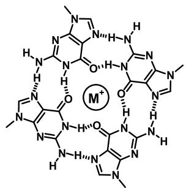  
A   
B   
C   
D   
E   
F   
Figure 1. Biophysical characterization of the Nb55–TBA interaction. (A) A G-quartet structural motif is stabilized by Hoogsteen-type hydrogen bonds (dotted lines) and a central monovalent cation. (B) Thermal melting of TBA and TBA–Nb55 complex, monitored by circular dichroism (CD) spectroscopy, shows an increase in TBA melting temperature in the presence of Nb55. (C) Isothermal titration calorimetry (ITC) thermogram (top) and the integrated heat (bottom) for the titration of Nb55 into TBA at 25°C. A representative thermogram of N = 3 independent experiments is shown. The fit of a single-site binding model is represented by a solid line. (D) Monodispersity and molecular weight analysis of Nb55–TBA complex monitored by size-exclusion chromatography coupled with multi-angle light scattering (SEC–MALS). Chromatograms of individual components are shown for comparison. (E) CD spectra of free and Nb55-bound TBA show stabilization of TBA upon Nb55 binding. (F) Binding selectivity of Nb55 to different DNA structures. The bar chart shows the logarithm of binding affinity measured by ITC for different types of DNA structures and quadruplexes with data shown in Supplementary Table S3.

topologies can also be observed [7]. Moreover, a mixture of topologically different structures can coexist in solution and interconvert upon changes in solution conditions [8, 9]. Structural studies of longer G-rich oligonucleotides show that several quadruplex subdomains can assemble into complex high-order architectures, thus expanding the structural space of G-rich sequences [10].

Guanine-rich sequences capable of adopting quadruplexes were first identified on the chromosome ends in the telomeric regions and were believed to protect the integrity and stability of chromosomes [11, 12]. Subsequent bioinformatic stud-

ies of the human genome supplemented with genome-wide DNA polymerase-stop assay and high-throughput sequencing identified >700 000 sequences with potential G4-forming motifs, with a strong bias toward the functional gene regions [13–15]. Based on their gene localization, G4 structures are suspected to be involved in the mechanisms and control of several normal cellular processes such as telomere and telomerase regulation, translation, and transcription regulation [16, 17]. In other cases, they are linked to certain diseases such as cancer, Alzheimer's, diabetes, and genetic disorders [18–20]. Furthermore, genetic data suggest that mutations in G4 se-

quences or in G4-binding proteins are the cause of several diseases and cancers. For example, mutations in helicases WRN and BLM, which unwind G4 structures and are involved in telomere maintenance, cause Bloom's and Werner's syndromes [21, 22]. G4s formed from hexanucleotide repeat expansions are linked to neurodegenerative disorders [23]. G4s can also be formed from RNA and are implicated in the regulation of translation [24, 25]. The biological roles of quadruplexes, however, remained speculative for some time, due to the unresolved question whether quadruplexes can also form in vivo, in the presence of a complementary strand. The key evidence proving the existence of G4s in cells came with the development of G4-specific antibodies [26, 27], which enabled visualization of G4 structures on the chromosomal DNA [28, 29]. These antibodies are now a key tool in the genome-wide G4-detection methods, such as ChIP-seq and Cut&Tag [18, 30], and are routinely used as molecular probes to study a variety of quadruplex-related biological processes. Single-chain variable fragment (scFv) antibody BG4 [28] and other G4-specific scFv antibodies have been used to investigate the role of G4s in transcription regulation [31, 32], protein translation [24], epigenetic modifications [33], stem cell differentiation [34], cancer [35], and Alzheimer's disease [19]. Therefore, these antibodies have become essential tools for studying G4 biology.

Despite the routine use of the G4-specific antibodies as molecular probes, there is currently no structural information explaining how these antibodies recognize G4s. Moreover, the available quadruplex-specific antibodies have a very broad selectivity and bind to quadruplexes with different topologies, which is a poorly understood phenomenon. Here, we report the crystal structure of a nanobody (Nb55) bound to the prototypical G4 structure, the thrombin-binding aptamer (TBA). TBA was initially developed as a specific binder for thrombin [36], and since then it has been widely used as a model antiparallel G4 structure. We isolated Nb55 using the library obtained by llama immunization and show that Nb55 has very high selectivity against different G4 structures. In contrast to G4-binding proteins that target G-quartets, the Nb55 binds to the TT loops and into TBA's grooves mimicking the key interactions of the TBA's protein binder, thrombin. The presented structure provides the molecular basis for understanding the interactions between antibodies and G4s, thereby opening the road toward rational, structure-based design of highly specific quadruplex-targeting probes.

# Materials and methods

# Oligonucleotide preparation

All oligonucleotides (sequences given in Supplementary Table S1), except for TBA oligonucleotide used for nuclear magnetic resonance (NMR) studies, were purchased from Integrated DNA Technologies. All oligonucleotides that form secondary structures (except for i-motif forming oligonucleotide) were dissolved in 20 mM potassium phosphate buffer (pH 7.4) and 150 mM KCl at a concentration of 100 $\mu$ M, and annealed by heating at 95°C for 5 min and slowly cooling down to room temperature. I-motif forming oligonucleotide was dissolved in 20 mM sodium acetate buffer (pH 5) and 150 mM KCl. CD spectra were recorded to confirm that oligonucleotides formed the expected DNA structure (Supplementary Fig. S1).

# Construction of a VHH library and nanobody isolation

VHH library construction and nanobody selection were performed at VIB Nanobody Core, Vrije Universiteit Brussel. A VHH library was constructed by immunizing a llama with VK2 oligonucleotide. Briefly, a 6-week protocol with weekly immunizations in the presence of GERBU adjuvant was used, and blood was collected 5 days after the last injection. All animal vaccinations were performed in strict accordance with good practices and the European Union animal welfare legislation. Next, the construction of immune libraries and Nb selection via phage display were performed using previously described protocols [37]. Nanobodies were cloned in pHEN6c plasmids carrying the PelB signal sequence at the N-terminus and a hexahistidine tag at the C-terminus.

# Site-directed mutagenesis

Site-directed mutagenesis of Nb55 was performed using in vitro assembly cloning. Briefly, the pHEN6c plasmid with the original Nb55 sequence was amplified with primers with modified base pairs outside the template binding region (sequences of primers in Supplementary Table S1). The template plasmid was digested overnight with DpnI, and DH5α Escherichia coli cells were transformed with the digested sample.

# Protein expression and purification

Nanobodies (Nb55, Nb55 variants, and SG4; protein sequences given in Supplementary Table S2) were expressed and purified according to previously described protocols $[37]$ . Briefly, WK6 E. coli chemically competent cells were transformed with pHEN6c plasmids carrying Nb sequences. BG4-encoding plasmid $[28]$ (Addgene plasmid #55756) was transformed into BL21(DE3) competent cells. The overnight cultures were transferred into Terrific Broth medium containing 0.1% glucose (Sigma–Aldrich), 100 $\mu$ g/ml ampicillin (Fisher Chemical) or 50 $\mu$ g/ml kanamycin (Apollo Scientific) for BG4, and 2 mM MgCl $_{2}$ (Sigma–Aldrich) and grown at 37°C with shaking until an OD $_{600}$ of 0.6–0.9 was reached. After that, protein expression was induced by the addition of isopropyl beta-D-1-thiogalactopyranoside (IPTG) (Carl Roth) to a final concentration of 1 mM. The cultures were incubated at 28°C with shaking overnight. Bacterial periplasm containing the protein of interest was isolated using osmotic shock and loaded onto the HisTrap column (Cytiva). Recombinant proteins were eluted with phosphate buffered saline (PBS) with 500 mM imidazole (Sigma–Aldrich) using a step gradient. Fractions containing the nanobody/BG4 were pooled and dialyzed against PBS to remove imidazole.

The expression and purification of nanobodies and BG4 from E. coli were checked through sodium dodecyl sulfate–polyacrylamide gel electrophoresis followed by Coomassie staining.

# Isothermal titration calorimetry

SEC using Superdex 75 Increase 10/300 GL column (Cytiva) equilibrated in 20 mM potassium phosphate buffer (pH 7.4) and 150 mM KCl was used as a buffer exchange method. Concentrations of protein and DNA samples were determined by measuring UV absorbance and calculated using the estimated extinction coefficients. Titration experiments were performed on the Microcal Peaq-ITC calorimeter (Malvern

Instruments) at $25^{\circ}$ C by titrating nanobody into the DNA solution. Data were processed using Nitpic (version 2.1.0) and SED-PHAT (version 15.2) and plotted using Gussi (version 1.4.2) [38]. Thermodynamic binding parameters are reported in Supplementary Table S3.

# CD spectrometry and thermal shift assay

CD spectroscopy and thermal shift assay were performed using a Jasco J-1500 circular dichroism spectrometer equipped with a Peltier temperature controller. CD spectra and melting curves were collected in a 2-mm cuvette at a sample concentration of 10 $\mu$ M in 20 mM potassium phosphate buffer (pH 7.4) and 150 mM KCl (for G4-forming oligonucleotides), or in 20 mM sodium acetate buffer (pH 5) and 150 mM KCl in case of i-motif forming oligonucleotide. CD spectra of the DNA oligonucleotides and the Nb55-oligonucleotide (1:1) mixtures were collected in the range of wavelengths from 200 to 350 nm. All CD spectra were recorded in triplicates with a scanning speed of 20 nm/min. CD melting curves of oligonucleotides in the absence and presence of an equimolar amount of Nb55 were recorded between 4°C and 96°C by measuring the intensity at the wavelength of CD maximum of specific oligonucleotide in intervals of 1°C at a speed of 1°C/min. Measured signals were converted to molar ellipticity.

# Size-exclusion chromatography coupled with multi-angle light scattering

The molecular weight of the Nb55–TBA complex was evaluated using Omnisec (Malvern Panalytical) coupled with Superdex 75 Increase 10/300 GL column. The column was equilibrated in 20 mM potassium phosphate buffer (pH 7.4) and 150 mM KCl followed by injection of 80 $\mu$ l of 2 mg/ml (equimolar concentration) Nb55–TBA complex or its individual components. The flow rate was 0.5 ml/min and the detectors were normalized with bovine serum albumin (Thermo Fisher Scientific). Data were collected and analyzed with the integrated software provided by Malvern.

# Crystallization and structure determination

Free Nb55 and Nb55–TBA complex were prepared in 20 mM Tris (pH 8) and 150 mM KCl at a concentration of 10 mg/ml (DNA:protein = 1.1:1). Crystallization conditions were screened using a Crystal Gryphon liquid dispenser (Art Robbins Instruments) using a vapor diffusion method. Samples were disposed on MRC 96-Well Triple Drop Crystallization Plates as sitting drops consisting of 0.2 μl of complex solution and 0.2 μl of reservoir solution from different commercially available screens: SG1, BCS, Helix, Morpheus, Wizard, JCSG Plus, and PACT premier. The crystals containing Nb55–TBA grew in 0.2 M sodium chloride, 0.1 M phosphate/citrate (pH 4.2), and 20% (w/v) PEG 8000 and were briefly soaked in cryoprotectant solution (same solution supplemented with 30% glycerol) before flash-frozen in liquid nitrogen. The crystals containing Nb55 grew in 1.6 M ammonium sulfate and 0.1 M HEPES (pH 7.25). For cryoprotection, the same solution was supplemented with 25% glycerol. X-ray diffraction data were collected on a PROXIMA1 beamline at the SOLEIL synchrotron using EIGER-X 16M (Dectris Ltd) detector. Both structures were determined with molecular replacement (Phaser-MR [39]) using nanobody (PDB 5JA9) and TBA (PDB 148D) structures as search models. After phasing,

the initial structural model was manually rebuilt using Coot [40] and iteratively refined using phenix.refine [41].

# Nuclear magnetic resonance

G4-forming TBA DNA oligonucleotide with a sequence 5'-d(GGTTGGTGTGGTTGG)-3' was synthesized by the solid support phosphoramidite synthesis, isolated by Glen-Pak™ DNA cartridge, and additionally purified and desalted by size exclusion column on FPLC machine. For the NMR titrations, the initial 50 μM TBA G4 sample was prepared, containing 10 mM KCl and 20 mM potassium phosphate buffer (pH 7.2). Same buffer was used for SG4 and Nb55 stock solution prepared at 400 μM concentration to reduce the dilution of the TBA solution. Throughout titration of TBA with SG4 or Nb55, NMR 1D $^{1}$ H spectra were recorded at 0.0, 0.05, 0.10, 0.15, 0.20, 0.25, 0.30, 0.35, 0.40, 0.50, 1.0, 2.0, and 4.0 molar equivalents of SG4 or Nb55 in respect to the TBA concentration. All NMR spectra were recorded with zgesgp pulse sequence on Bruker Avance Neo 800 MHz NMR spectrometer equipped with TCI cryo-probe at 298 K.

# Results

# Nanobody Nb55 binds TBA quadruplex with high affinity

During an attempt to isolate nanobodies against a new type of AGCGA-quadruplex [42], we discovered that one nanobody, hereafter referred to as Nb55, showed a strong preference for binding the TBA, a prototypical G4 structure with antiparallel chair-type topology. To investigate this further, we purified Nb55 (Supplementary Fig. S2) and studied its interaction with TBA in vitro using a thermal shift assay and ITC. The melting point of TBA, as monitored by CD spectroscopy, is around 52°C, while the addition of Nb55 increases the temperature to around 60°C, indicating the formation of the Nb55–TBA complex (Fig. 1B). The binding affinity of Nb55 for TBA measured using ITC gives a dissociation constant $K_{D} = 192 \pm 7$ nM (Fig. 1C). The complex formation exhibits an apparent stoichiometry of about 1:1 and is driven by a favorable enthalpy change ( $\Delta H = -7.5 \pm 0.3$ kcal/mol).

To probe the state of the Nb55–TBA complex in solution, we used SEC–MALS. The complex is monodisperse with a molecular weight of 17.9 kDa (Fig. 1D). This closely matches the theoretical value of 18.1 kDa for the 1:1 complex, in agreement with the stoichiometry observed from the ITC isotherm. To investigate whether nanobody binding induces any structural changes in the TBA, we used CD spectroscopy. The spectrum of the free TBA is typical of an antiparallel quadruplex, with a minimum at 265 nm and a maximum at 295 nm (Fig. 1E). The spectrum of TBA bound by Nb55 shows identical spectral characteristics but with an overall higher signal intensity, suggesting further stabilization of the TBA structure upon nanobody binding. Collectively, these data show that nanobody Nb55 binds to the TBA quadruplex with submicromolar affinity forming a 1:1 complex.

# Nanobody Nb55 differentiates TBA from other types of G4 structures

To understand the selectivity of Nb55 for TBA, we used ITC and monitored the binding of Nb55 with a series of oligonucleotides adopting different DNA structures, as characterized by CD spectroscopy (Supplementary Fig. S1; oligonu-

cleotide sequences are listed in Supplementary Table S1). As expected, nanobody Nb55 binds to the AGCGA-type quadruplex, which was the antigen used for llama immunization (Fig. 1F and Supplementary Fig. S3). Next, we confirmed that nanobody Nb55 does not bind to a B-DNA hairpin (Fig. 1F and Supplementary Fig. S3). However, in contrast to the previously reported antibodies with broad selectivity [28, 43], we observed no binding to quadruplexes adopting parallel or hybrid topology, formed by the oligonucleotides from the telomere or c-Myc, VEGF, and BCL2 promoter regions (Fig. 1F and Supplementary Fig. S3). To investigate whether Nb55 selectively recognizes only antiparallel quadruplexes such as TBA, we investigated its binding to quadruplex variants derived from the telomere sequence, which adopt chair-type or basket-type antiparallel topology (Supplementary Fig. S3). We did not observe binding to the antiparallel quadruplexes (Fig. 1F and Supplementary Fig. S3), suggesting that Nb55 discriminates between quadruplexes sharing the same overall topology.

While ITC shows no Nb55 binding to this structurally diverse set of DNA structures, we additionally performed thermal shift assay, which also confirmed absence of Nb55 binding (Supplementary Fig. S1). As positive control for ITC, we tested binding of BG4 antibody to TBA $[28]$ , which in agreement with its broad selectivity binds TBA with high affinity (Supplementary Fig. S3). To further strengthen these findings, we tested binding to additional set of nine oligonucleotides that are known to adopt different G4 structures (parallel, antiparallel, hybrid) and i-motif, as confirmed by their CD spectra (Supplementary Fig. S1; oligonucleotide sequences are listed in Supplementary Table S1). We observed no changes in the melting temperature using thermal shift assay, indicating lack of Nb55 interaction (Supplementary Fig. S1). These data show that Nb55 is highly selective: from the 15 tested sequences sampling a diverse set of structures, Nb55 binds only to the AGCGA and TBA quadruplexes, alluding to underlying structural similarity in these two structures. Indeed, both structures feature symmetrically placed loops (TT or GGG) and a large exposed groove $[42]$ . Collectively, Nb55 is significantly more discriminative than previously reported G4-specific antibodies, which either bind all G4 topologies $[28, 43]$ or broadly distinguish between parallel and antiparallel topologies $[26, 44]$ .

# Overall crystal structure of the Nb55–TBA complex

To understand the molecular basis of Nb55 specificity, we determined the structure of the Nb–TBA complex using X-ray crystallography. Crystals of the TBA–Nb55 complex belong to the space group $P2_{1}$ and diffract to 1.9 Å (PDB 9GXH, Supplementary Table S4). The asymmetric unit consists of two nanobodies and two TBA molecules (Fig. 2A). In the asymmetric unit, the nanobody and TBA molecules interact through three unique binding interfaces. Interface 1 is formed between Nb55 chain B and TBA chain C and buries 400 Ų of surface area. The same nanobody molecule forms interface 2 with second TBA molecule (chain D) of the asymmetric unit, which buries 600 Ų of surface binding area. In this interface, the nanobody β-sheet binds the two TT loops of TBA. Finally, 400 Ų of surface is buried through interface 3, formed by the CDR1 loop that binds to the TT loop of TBA. All three interfaces have roughly simi-

lar interaction areas, have high PISA-calculated P-values, and none of them involves a significant number of interactions mediated by the complementarity-determining region (CDR) loops.

To identify the binding surface formed in solution, we designed four Nb55 variants in which each crystallographic interface is abrogated by the mutation of a key interfacial amino acid (Fig. 2A, lower panels). The Gln81Asp mutation was expected to disrupt the interactions with the TGT loop of interface 1, but has no effect on binding, as observed with ITC (Fig. 2B). This indicates that interface 1 does not form in solution. Similarly, introducing a negative charge via the Thr56Asp mutation on CDR1 abrogates interactions with the second TT loop of interface 3, but again no change in binding affinity was observed, thus excluding interface 3. On the other hand, both the Arg45Asp and the Trp105Glu mutants, designed to abrogate interface 2, resulted in a complete loss of binding. These data, together with the observed 1:1 stoichiometry, show that in solution Nb55 binds TBA through interface 2, while interfaces 1 and 3 are formed only in the crystal. As an additional control, we designed a TBA variant with a replaced nucleobase T4G in the first TT loop. While the T4G mutant has comparable CD spectra as the unperturbed TBA, it, however, shows no binding to Nb55 (Supplementary Fig. S4). Given that T4 forms extensive interactions with Trp105 in interface 2, this together with other mutational data strongly suggests that only interface 2 is formed in solution.

# Nanobody binds TBA through a concave $\beta$ -sheet using two $\beta$ -hairpins

Having identified the interface of the Nb55–TBA complex formed in solution, we observe that Nb55 forms an unusual paratope that relies mainly on the $\beta$ -sheet framework, rather than the CDR loops. Nb55 binds to the quadruplex sideways via its concave $\beta$ -sheet, and positions itself on top of the two TT-loops (Fig. 3). The majority of the nanobody interactions are mediated by the two $\beta$ -hairpins pointing in opposite directions (Fig. 3A). The first is $\beta$ -hairpin FG (formed by the $\beta$ -strands FG) ending in the CDR3 loop, while the other is $\beta$ -hairpin CC' ending in the C–C' loop (Fig. 3A; schematically shown in Fig. 3B). These two $\beta$ -hairpins act as clamps that curve into the two wide grooves on both sides of the TBA (Fig. 3A). The central part of the two $\beta$ -hairpins forms a concave surface rich in aromatic residues. Thus, the nanobody residues interacting with TBA belong to three structural regions: CDR3 loop, C–C' loop, and a cluster of aromatic residues residing on the concave $\beta$ -sheet surface. Practically all nanobody interactions, except for a single CDR3 residue, are mediated by residues of the non-CDR framework regions. Residues that are part of CDR1 and CDR2 are not involved in any interactions.

The majority of the interactions are directed toward the two TT loops of TBA. The CDR3 loop is only nine residues long and adopts an extended $\beta$ -hairpin conformation [45]. On the CDR3 loop the Tyr104 main chain forms hydrogen bonds with the C2-carbonyl and N3-amide atoms of T3 nucleobase (Fig. 3C). In the opposite direction, the C–C' loop extends along the second TBA groove all the way to the TGT loop. The residue making most contacts overall is Arg45 on the C–C' loop, whose guanidinium group hydrogen bonds to both the

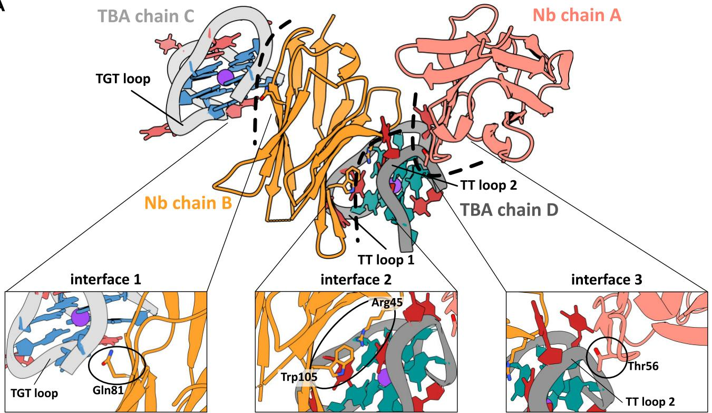  
A

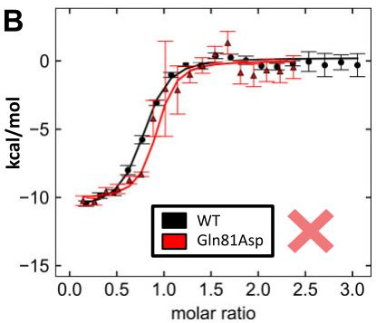  
B

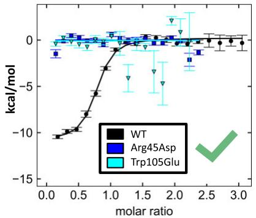

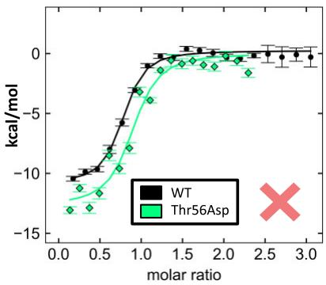  
Figure 2. Asymmetric unit of the Nb55–TBA crystals. (A) The asymmetric unit consists of four molecules (two Nb55 and two TBA) that interact through three unique interfaces, shown with black dashed lines. TBA loops are shown in red. A close-up view highlights the positions of mutated residues that abrogate: interface 1 through the Gln81Asp mutation, interface 2 through the Arg45Asp or the Trp105Glu mutations, and interface 3 through the Thr56Asp mutation. (B) The corresponding ITC titrations for Nb55 mutated at each interface are shown in color, while that for wild-type Nb55 is shown in black for comparison. Only mutations at interface 2 (Arg45Asp or Trp105Glu) abrogate the Nb55–TBA interaction indicating that in solution Nb55–TBA complex forms though interface 2 (green check mark). Red crosses denote that interfaces 1 and 3 are not formed in solution.

C2-carbonyl of T4 and the C4-carbonyl of T13 nucleobase. Additionally, Arg45 aligns on top of G5 nucleobase from the second G-quartet, making a cation- $\pi$ interaction (Fig. 3C). Thus, Arg45 interacts with both TT loops and mediates the only direct interaction with the G-quartet in the complex. Toward the tip of the C–C' loop, Gln44 forms a cation- $\pi$ interaction with T7 nucleobase on the TGT loop, while Gln39 hydrogen bonds to the ribose-phosphate backbone of G5 (Fig. 3D). Ultimately, the nanobody $\beta$ -sheet plane establishes the hydrophobic core formed by the cluster of aromatic residues Tyr37, Trp47, Tyr94, and Trp105 (Fig. 3E). Interestingly, these aromatics work in Trp/Tyr pairs to bind both TT loops. Each tryptophan forms $\pi$ - $\pi$ interactions with thymine T4 or T12, while the tyrosine hydroxyl atoms hydrogen bond to the phosphodiester backbone of the neighboring nucleotide. Thus, the pseudosymmetric nature of TT loops is mirrored in the Nb55 paratope by the Trp/Tyr pairs.

# Structural changes upon formation of the Nb55–TBA complex

To investigate whether the formation of the nanobody–TBA complex is accompanied by structural changes, we compared the Nb55–TBA complex with the structures of the free Nb55 (PDB 9GV4; Supplementary Table S4) and TBA [46]. A structural comparison with the free nanobody shows that β-hairpins FG and CC' widen upon binding TBA, with the loop-to-loop distance increasing from 28 to 32 Å (Fig. 3F). This brings CDR3, as well as the β-strand FG, closer to CDR1 and results in a lower twist of the β-sheet relative to the free nanobody. In the free nanobody structure, CDR1 is structured, forming a helical turn, while in the TBA-bound nanobody CDR1 becomes disordered (Supplementary Fig. S5), possibly due to a change in the β-sheet twist. The overall root mean square deviation (RMSD) between the two Nb55 structures, excluding missing residues, is 1.1 Å,

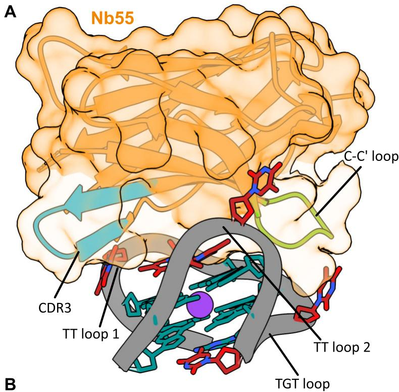  
C

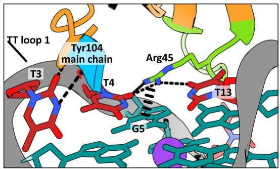

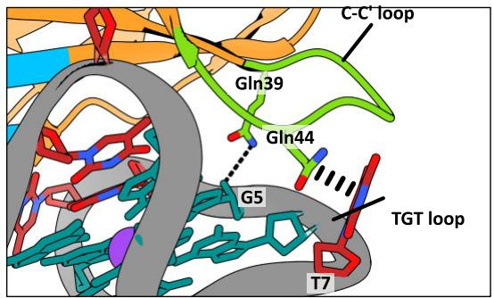  
D

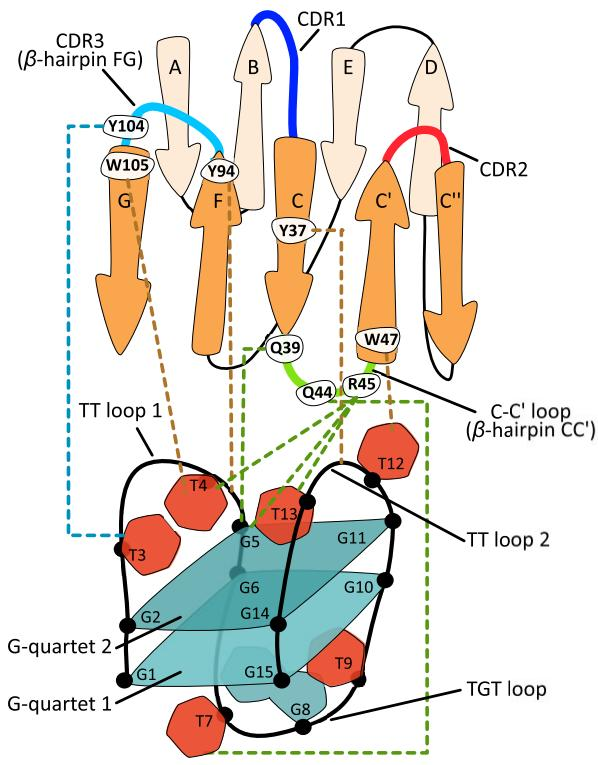  
B

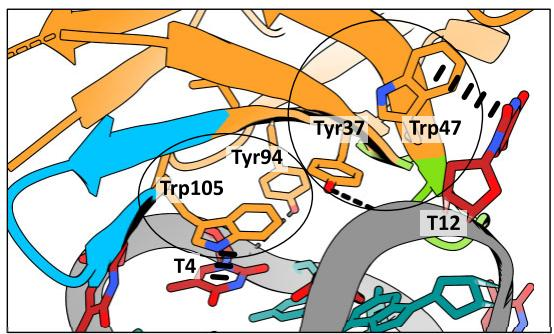  
E

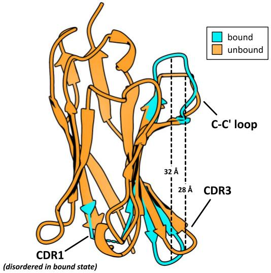  
F   
Figure 3. Molecular basis of TBA quadruplex recognition by Nb55. (A) The structure of Nb55-TBA complex. TBA loops are shown in red. (B) Topology representation of the nanobody and TBA, with dashed lines showing interactions color coded by nanobody's structural elements. (C) The only CDR3 loop interaction is mediated by the main chain hydrogen bond to thymine T3 of TT loop 1. Arg45 interacts with both TT loops and G-quartet. (D) The C–C' loop extends along the major groove, reaching the TGT loop. (E) The two Trp–Tyr pairs of the aromatic core interact with T12 and T4 on both TT loops. (F) Structural superposition of free (orange) and TBA-bound (blue) Nb55. Upon interaction, the two β-hairpins open up to accommodate TBA. The shift of the FG β-hairpin likely disrupts CDR1, which becomes disordered in the TBA-bound structure.

with the largest difference observed in the C–C' loop and the strand FG (Supplementary Fig. S5). A comparison of the unbound TBA with the nanobody-bound TBA also reveals structural changes, with an overall RMSD of 2.1 Å (Supplementary Fig. S6). Specifically, the nanobody interactions reposition the thymine T3 and T12 nucleobases, and the distance between the two TT loops increases upon Nb55 binding (Supplementary Fig. S6). This shows that, as the nanobody β-hairpins FG and CC' widen, while the TT loops open to accommodate the nanobody.

# Nanobody Nb55 mimics key interactions from the binding interface of thrombin

The TBA quadruplex was initially developed as a specific binder of thrombin, an essential protease involved in blood clotting. To understand how different molecules bind TBA, we compared the Nb55 and thrombin binding interfaces (Fig. 4). Like Nb55, thrombin binds to both TT loops, thus forming an overlapping epitope with Nb55 (Fig. 4A). In the thrombin-TBA complex, the majority of interactions are mediated by the exosite I loop (residues 68–81), which inserts between the two TT loops but does not extend further into the TBA major groove. The relative orientation of the exosite I loop is the same as that of the Nb55 C-C' loop. Strikingly, we observe that Nb55 mimics several key interactions from the thrombin-TBA interface. For example, Nb55's Arg45 is essentially isosteric to thrombin's Arg77 (Fig. 4B). Both form hydrogen bonds to T4 nucleobase and stack on top of G5 in the second G-quartet. Furthermore, Nb55's Tyr37, a central residue in the hydrophobic core of the nanobody binding interface, is isosteric to thrombin's Tyr76 (Fig. 4C). Finally, both Nb55 and thrombin form hydrogen bonds with the phosphodiester backbone of G5 using either Tyr94 or Asn79, respectively (Fig. 4D). Despite the striking similarity of some key interactions, the overall physicochemical characteristics of the binding interfaces differ. The thrombin interface is highly positively charged and forms interactions using a flexible exosite I loop, whereas the nanobody interacting surface is less charged and uses a predominantly hydrophobic, well-ordered β-sheet core (Fig. 4E).

# The TT loops in TBA form an interaction hotspot for quadruplex-specific binders

Recently, the SG4 nanobody isolated from a synthetic library was shown to have a broad specificity for different quadruplexes (hybrid, parallel, antiparallel), including a high-affinity binding for TBA [43]. To investigate whether both SG4 and Nb55 recognize overlapping epitope on TBA, we titrated TBA with SG4 and recorded 1D $^{1}$ H NMR spectra at each titration step (Fig. 5A). TBA alone shows well-resolved signals of exchangeable imino protons belonging to the eight G-quartet forming guanines and two thymines (T4 and T13) (Fig. 5A). Addition of SG4 results in immediate line broadening and a loss of imino signal intensity at low stoichiometries, indicating intermediate exchange and low-to-intermediate binding affinity. This is confirmed by ITC titration placing the SG4–TBA binding affinity in the micromolar range ( $K_{\text{D}} = 7.8 \pm 2.4$ $\mu$ M), lower than reported previously [43] (Fig. 5B). At a 1:1 concentration ratio, all imino signals are almost completely broadened to the baseline and over-titration up to 4.0 molar equivalents does not give rise to any new signals due to SG4–TBA complex state (Supplementary Fig. S7), indicating a persistent

intermediate exchange regime and low binding affinity, in accordance with the ITC data.

Two regions of TBA exhibit strong reduction in NMR signal intensities upon addition of SG4. The first are the TT loops, where the signals belonging to T4 and T13 weaken and broaden into the baseline already at the lowest equivalents of the nanobody (Fig. 5C). This indicates a disruption of the non-canonical T–T base pair and interaction with SG4 in this region, which exposes the imino protons to the solvent, leading to a higher rate of imino–water chemical exchange. The second region involves the imino signals from G2, G5, and G11 residues belonging to the second G-quartet adjacent to the TT loops, which show a comparable decrease in signal intensity to that of TT loops (Fig. 5C). In contrast, the imino signals of the first G-quartet, G1, G6, and G15, prove to be more resilient against a loss of the intensity, albeit their positions or chemical shifts change relative to other imino signals (Fig. 5D). This indicates robust hydrogen bonding in the first G-quartet and a certain degree of structural rearrangement upon SG4 binding, causing a secondary change in the chemical environment of these protons. As a control, we performed NMR titration of Nb55 to TBA (Supplementary Fig. S8), where we observe a completely different binding process with progressive and uniform loss of the overall signal intensities up to 1:1 stoichiometry. Overall, the NMR data suggest that, just like Nb55, SG4 also binds to the TT loops and the second G-quartet while simultaneously causing a slight rearrangement of the first G-quartet on the opposite side of TBA. Interestingly, the two TT loops in TBA seem to represent an interaction hotspot for not only thrombin, but also the nanobodies Nb55 and SG4 (Fig. 5E).

# Discussion

Despite sharing the G-quartet structural motif (Fig. 1), G-quadruplexes are structurally heterogeneous molecules that adopt different topologies and loop conformations. To date, several broadly specific G4-antibodies have been developed [26, 44] using synthetic libraries based on the scFv framework. However, achieving high antibody selectivity has proven difficult- typically, there is little preference for G4 topology, let alone for a specific structure. Here, we show that Nb55, isolated from an immune library, is highly selective and discriminates between different G4 structures even when sharing the same antiparallel topology as TBA (Fig. 1). The specificity seems to be achieved using the nanobody $\beta$ -sheet residues directed toward quadruplex grooves (Fig. 3), mimicking the key interactions of TBA's protein target thrombin (Fig. 4). Nb55 employs an unusual binding mode and binds TBA sideways using its concave $\beta$ -sheet plane (Fig. 3). The three CDR loops point away from the TBA molecule, with only a single CDR3 residue interacting with TBA (Fig. 3). In conventional antibodies, this $\beta$ -sheet pairs VH and VL domains together through the conserved residue positions known as the VH-tetrad [45]. On the other hand, in the Nb55-TBA complex, all four VH-tetrad residues are involved in antigen binding where Tyr37, Gln44, Arg45, and Trp47 establish key interactions with TBA. A previous bioinformatic study of nanobody-antigen complexes found that nanobodies frequently employ non-CDR (framework) residues for antigen binding [47]. These account for $15\%$ of all Nb-antigen interactions, cumulatively more than those by CDR1 loop. The Nb55-TBA complex is a striking example of such a non-CDR binding strategy, relying al

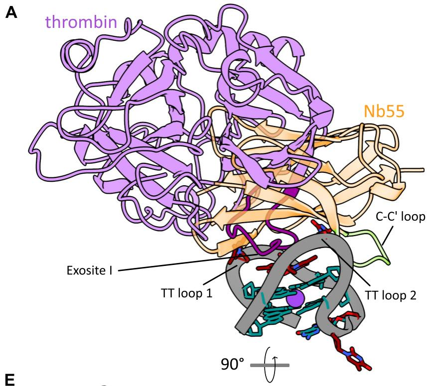

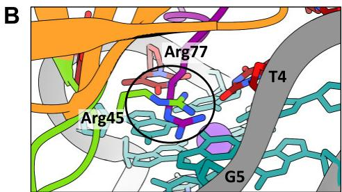

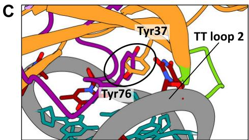

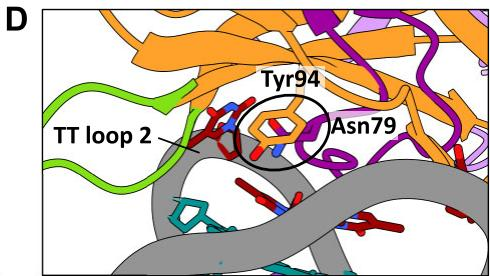

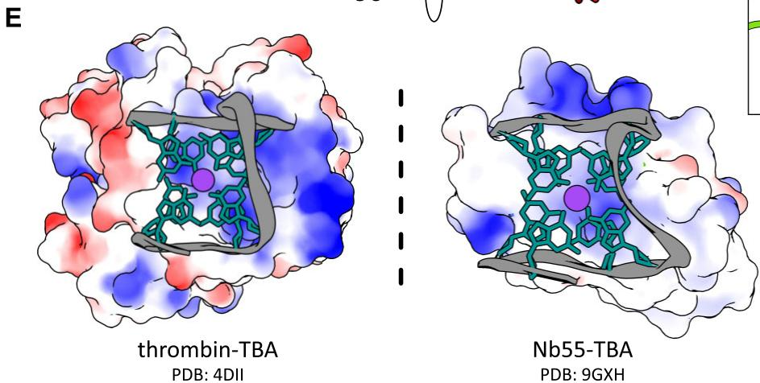  
Figure 4. Nb55 mimics the key interactions of the thrombin–TBA complex. (A) Structural superposition of the thrombin–TBA and Nb55–TBA complexes. Exosite I loop is shown in dark violet. For simplicity, only conformation of the TBA bound to thrombin is shown. (B) Isosteric interactions with TT loop 1 and the second G-quartet, formed by Arg45 (Nb55) or Arg77 (thrombin). (C) The aromatic rings of Tyr37 (Nb55) and Tyr76 (thrombin) adopt the same relative position in both complexes. (D) Isosteric interactions with thymine T4 by Tyr94 (Nb55) or Asn79 (thrombin). (E) The thrombin electrostatic potential surface shows that the thrombin–TBA interface is stabilized by charge complementarity, whereas the Nb55–TBA interface exhibits a predominantly hydrophobic character.

most exclusively on the C–C' loop and the $\beta$ -sheet, resulting in the lateral binding orientation [48]. We speculate that this unusual binding mode is the key to the strong selectivity of Nb55, which was likely enabled by using an immune rather than a synthetic library.

Currently developed antibodies targeting G4s are broadly selective and the molecular determinants governing their specificity are not well understood. The first panel of G4-specific scFv antibodies was described by Schaffitzel et al. to visualize telomere quadruplexes of the ciliate Stylonychia lemnaei [26]. One of the antibodies preferentially binds only parallel quadruplexes, while another antibody has broad selectivity for both parallel and antiparallel structures. Liu et al. developed the D1 scFv antibody, which is selective for parallel G4s [44]. Another scFv antibody, hf2 was selected to bind

the c-kit2 G4 but also binds other parallel G4s [27]. The majority of the functional G4 studies use the BG4 scFv antibody developed by the Balasubramanian group [28]. This antibody binds to different quadruplex topologies as well as to RNA quadruplexes [49], although a more recent study reports a preferential interaction with parallel quadruplexes [50] and partially folded structures [51]. All described G4-antibodies were obtained from synthetic libraries based on the conventional antibody framework with both VH and VL domains. Recently, a G4-specific VH-only antibody SG4 was developed using a synthetic nanobody library [43] exhibiting high affinity and broad quadruplex selectivity, including binding to TBA. Our experiments confirm this interaction, although we observe significantly lower TBA binding affinity than previously reported. We show that SG4 and Nb55 recognize over-

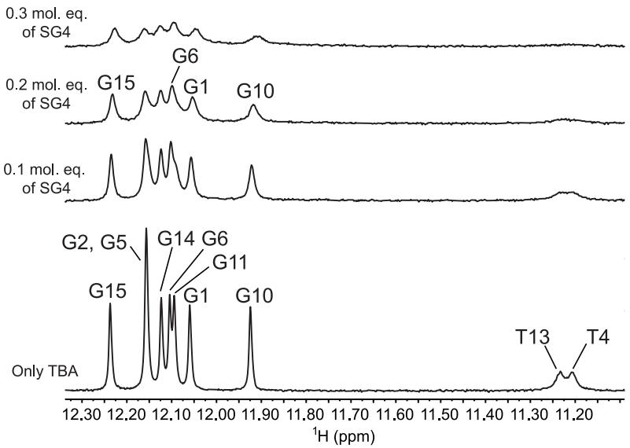  
A

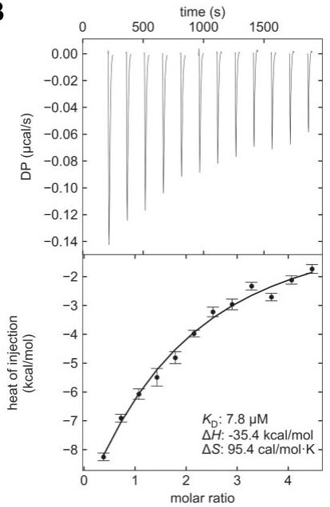  
B

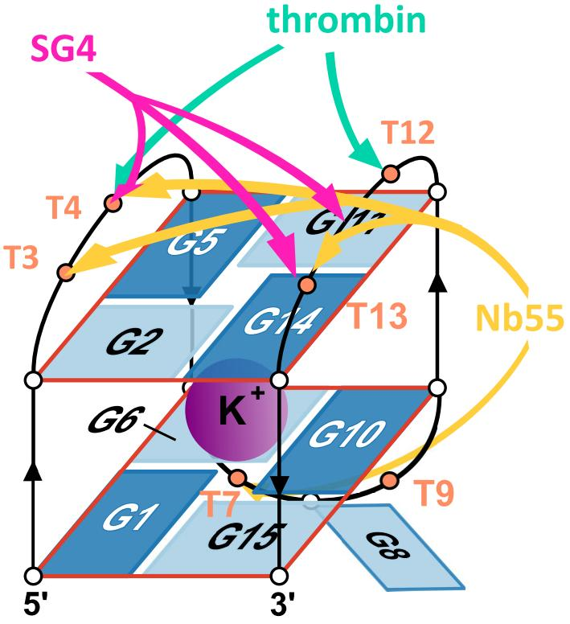  
C   
E   
D   
Figure 5. Nanobodies SG4 and Nb55 recognize overlapping epitopes. (A) 1D $^{1}$ H NMR spectra of TBA at different SG4 equivalents, with annotated imino signals visible due to hydrogen bonding. (B) ITC thermogram (top) and the integrated heat (bottom) for the titration of SG4 into TBA at 25°C. A representative thermogram of $N = 3$ independent experiments is shown. The fit of a single-site binding model is represented by a solid line. (C) Change in NMR signal intensity at 0.05 and 0.1 molar equivalents of SG4 relative to TBA. (D) Chemical shift changes of imino protons at 0.1 molar equivalent of SG4. (E) The two TT loops function as interaction hotspots for different binders: nanobodies Nb55 (yellow) and SG4 (pink), as well as thrombin (mint).

laping epitopes, where the two TT loops represent an interaction hotspot, which is also essential for binding of thrombin [52] (Fig. 5).

In the absence of structural data, it is difficult to speculate how the broadly selective G4-antibodies, such as BG4, recognize G4s. However, structural data are available for several G4-binding proteins bound to quadruplexes $[53–57]$ . The ma-

jority of these are helicases, which, similarly to G4-antibodies, exhibit broad selectivity for parallel G4s. The strategy employed by the SF2 helicase DHX36 (PDB 5VHE) and the budding yeast Rap1 (PDB 6LDM) is to use a helical element to bind the flat surface of the top, exposed quartet [53, 54]. A similar binding strategy using a helical element is seen in the complex between the designed DARPIN protein and the 93del

aptamer forming a parallel G4 (PDB 8IPP) [55]. The presence of larger loops in antiparallel quadruplexes likely obscures the planar surface of the top G-quartet, explaining the preference for parallel quadruplexes by these proteins. On the other hand, the bacterial Pif1 helicase recognizes both parallel and antiparallel quadruplexes by a combination of loops and $\beta$ -strands that together assemble into a flat G4-binding surface (PDB 7OAR) [56]. Finally, a recently reported complex of a quadruplex in antiparallel topology shows the intrinsically disordered Cdc6 domain bound to a telomeric quadruplex (PDB 8HT7) [57]. Somewhat similarly to our structure, the Cdc6 peptide binds into the wide grooves between the two lateral loops [57]. We speculate that the strong selectivity of Nb55 is related to its preferential recognition of the quadruplex grooves, rather than the exposed G-quartets. On the other hand, recognition of the exposed G-quartet appears to be associated with more broadly selective G4-helicases and likely underpins the broad selectivity of some G4-antibodies.

Routine development of antibodies against protein antigens has had a tremendous impact on diagnostics, therapeutics, and molecular and structural biology. However, very little is known about how antibodies recognize DNA antigens, even though auto-antibodies against nucleic acids are the cause of autoimmune diseases such as systemic lupus erythematosus $[58]$ and autoimmune hepatitis $[59]$ . The currently available structural data on antibody–DNA complexes are mostly limited to a few complexes of Fabs with single-stranded DNA oligonucleotides $[60, 61]$ . Recently, two structures of Fabs in complex with a structured DNA—the hairpin-like DNA aptamer $[62]$ and the DNA–RNA hybrid—were reported $[63]$ . These were the very first high-resolution structures of antibody complexes with structured DNA stabilized through Watson–Crick base pairs. Our structure thus expands the general understanding of nucleic acid recognition by antibodies by presenting interaction between two novel modalities—single-chain antibody and noncanonical DNA.

The main implications of our work are that it is conceivable to obtain antibodies targeting noncanonical DNA structures using animal immunization, and that these immune libraries can contain antibodies with much higher selectivity. Moreover, as shown here, due to their unique structure and variability, nanobody immune libraries can produce binders that use non-CDR, framework residues, potentially achieving even higher affinity and specificity. The example of the Nb55–TBA complex presented in our paper demonstrates the potential to develop highly specific antibodies targeting a particular G4 sequence, while the high-resolution structure enables the rational design of more specific G4-antibodies. While broadly selective antibodies such as the scFv antibody BG4 may be suitable for some studies, we anticipate that more selective antibodies directed toward a specific type of quadruplex topology or even sequence could prove to be valuable molecular tools to study and modulate the function of individual quadruplexes.

# Acknowledgements

We acknowledge the support of the Centre for Research Infrastructure at the University of Ljubljana, Faculty of Chemistry and Chemical Technology, supported by grant I0-0022 from Slovenian Research Agency. The authors would also like to acknowledge help from the Andrew Thompson of the PROXIMA-1 (synchrotron SOLEIL, St-Aubin, France) for X-ray data collection.

Author contributions: M.P.: investigation, formal analysis, visualization, writing - original draft, writing - review and editing; T.M.: visualization, formal analysis; M.K.: investigation, formal analysis, writing - original draft (supporting), writing - review and editing (supporting); N.Ž. and J.I.: investigation (supporting), formal analysis (supporting); J.P., J.L. and R.L.: formal analysis, supervision; S.H.: conceptualization, supervision, investigation, formal analysis, writing - original draft (lead), writing - review and editing (lead).

# Supplementary data

Supplementary data is available at NAR online.

# Conflict of interest

None declared.

# Funding

This work was supported by grants from Slovenian Research and Innovation Agency (ARIS) with core funding P1-0201 and grants J1-50026 to S.H. and P1-0242 to J.P., and the Eutopia Foundation grant G003320N to M.P. Funding to pay the Open Access publication charges for this article was provided by Slovenian Research and Innovation Agency (J1-50026).

# Data availability

All the crystallographic structural data have been deposited into the Protein Data Bank (www.rcsb.org) under accession codes 9GV4 (free Nb55) and 9GXH (Nb55–TBA complex).

# References

1. Gellert M, Lipsett MN, Davies DR. Helix formation by guanylic acid. Proc Natl Acad Sci USA 1962;48:2013–8.
https://doi.org/10.1073/pnas.48.12.2013   
2. Sen D, Gilbert W. Formation of parallel four-stranded complexes by guanine-rich motifs in DNA and its implications for meiosis. Nature 1988;334:364–6. https://doi.org/10.1038/334364a0   
3. Largy E, Mergny J-L, Gabelica V. Role of alkali metal ions in G-quadruplex nucleic acid structure and stability. In: Sigel A, Sigel H, Sigel R (eds.), Metal Ions in Life Sciences. Vol. 16. Cham: Springer, 2016, 203–58.   
4. Ma L, Iezzi M, Kaucher MS et al. Cation exchange in lipophilic G-quadruplexes: not all ion binding sites are equal. J Am Chem Soc 2006;128:15269–77. https://doi.org/10.1021/ja064878n   
5. Winnerdy FR, Phan AT. Quadruplex structure and diversity. In: Neidle S (ed.), Annual Reports in Medicinal Chemistry. Vol. 54. Cambridge, US: Academic Press, 2020, 45–73.   
6. Webba da Silva M. Geometric formalism for DNA quadruplex folding. Chemistry 2007;13:9738–45. https://doi.org/10.1002/chem.200701255   
7. Smargiasso N, Rosu F, Hsia W et al. G-quadruplex DNA assemblies: loop length, cation identity, and multimer formation. J Am Chem Soc 2008;130:10208–16.
https://doi.org/10.1021/ja801535e   
8. Bončina M, Vesnaver G, Chaires JB et al. Unraveling the thermodynamics of the folding and interconversion of human telomere G-quadruplexes. Angew Chem Int Ed 2016;55:10340–4. https://doi.org/10.1002/anie.201605350   
9. Brčić J, Plavec J. NMR structure of a G-quadruplex formed by four d(G $_4$ C $_2$ ) repeats: insights into structural polymorphism. *Nucleic Acids Res* 2018;46:11605–17.

10. Monsen RC, Trent JO, Chaires JB. G-quadruplex DNA: a longer story. Acc Chem Res 2022;55:3242–52.
https://doi.org/10.1021/acs.accounts.2c00519   
11. Sundquist WI, Klug A. Telomeric DNA dimerizes by formation of guanine tetrads between hairpin loops. Nature 1989;342:825–9. https://doi.org/10.1038/342825a0   
12. O'Sullivan RJ, Karlseder J. Telomeres: protecting chromosomes against genome instability. Nat Rev Mol Cell Biol 2010;11:171–81. https://doi.org/10.1038/nrm2848   
13. Huppert JL, Balasubramanian S. Prevalence of quadruplexes in the human genome. Nucleic Acids Res 2005;33:2908–16. https://doi.org/10.1093/nar/gki609   
14. Todd AK, Johnston M, Neidle S. Highly prevalent putative quadruplex sequence motifs in human DNA. Nucleic Acids Res 2005;33:2901–7. https://doi.org/10.1093/nar/gki553   
15. Chambers VS, Marsico G, Boutell JM et al. High-throughput sequencing of DNA G-quadruplex structures in the human genome. Nat Biotechnol 2015;33:877–81. https://doi.org/10.1038/nbt.3295   
16. Zahler AM, Williamson JR, Cech TR et al. Inhibition of telomerase by G-quartet DNA structures. Nature 1991;350:718–20. https://doi.org/10.1038/350718a0   
17. Agarwal T, Pradhan D, Géci I et al. Improved inhibition of telomerase by short twisted intercalating nucleic acids under molecular crowding conditions. Nucleic Acid Ther 2012;22:399–404. https://doi.org/10.1089/nat.2012.0372   
18. Hänsel-Hertsch R, Beraldi D, Lensing SV et al. G-quadruplex structures mark human regulatory chromatin. Nat Genet 2016;48:1267–72. https://doi.org/10.1038/ng.3662   
19. Hanna R, Flamier A, Barabino A et al. G-quadruplexes originating from evolutionary conserved L1 elements interfere with neuronal gene expression in Alzheimer's disease. Nat Commun 2021;12:1828. https://doi.org/10.1038/s41467-021-22129-9   
20. Hänsel-Hertsch R, Simeone A, Shea A et al. Landscape of G-quadruplex DNA structural regions in breast cancer. Nat Genet 2020;52:878–83. https://doi.org/10.1038/s41588-020-0672-8   
21. Sun H, Karow JK, Hickson ID et al. The Bloom's syndrome helicase unwinds G4 DNA. J Biol Chem 1998;273:27587–92. https://doi.org/10.1074/jbc.273.42.27587   
22. Fry M, Loeb LA. Human Werner syndrome DNA helicase unwinds tetrahelical structures of the fragile X syndrome repeat sequence d(CGG) $_{n}$ . J Biol Chem 1999;274:12797–802. https://doi.org/10.1074/jbc.274.18.12797   
23. Haeusler AR, Donnelly CJ, Periz G et al. C9orf72 nucleotide repeat structures initiate molecular cascades of disease. Nature 2014;507:195–200. https://doi.org/10.1038/nature13124   
24. Varshney D, Cuesta SM, Herdy B et al. RNA G-quadruplex structures control ribosomal protein production. Sci Rep 2021;11:22735. https://doi.org/10.1038/s41598-021-01847-6   
25. Kumari S, Bugaut A, Huppert JL et al. An RNA G-quadruplex in the 5' UTR of the NRAS proto-oncogene modulates translation. Nat Chem Biol 2007;3:218–21.
https://doi.org/10.1038/nchembio864   
26. Schaffitzel C, Berger I, Postberg J et al. In vitro generated antibodies specific for telomeric guanine-quadruplex DNA react with Stylonychia lemnae macronuclei. Proc Natl Acad Sci USA 2001;98:8572–7. https://doi.org/10.1073/pnas.141229498   
27. Fernando H, Rodriguez R, Balasubramanian S. Selective recognition of a DNA G-quadruplex by an engineered antibody. Biochemistry 2008;47:9365–71.
https://doi.org/10.1021/bi800983u   
28. Biffi G, Tannahill D, McCafferty J et al. Quantitative visualization of DNA G-quadruplex structures in human cells. Nature Chem 2013;5:182–6. https://doi.org/10.1038/nchem.1548   
29. Lam EYN, Beraldi D, Tannahill D et al. G-quadruplex structures are stable and detectable in human genomic DNA. Nat Commun 2013;4:1796. https://doi.org/10.1038/ncomms2792

30. Lyu J, Shao R, Kwong Yung PY et al. Genome-wide mapping of G-quadruplex structures with CUT&Tag. Nucleic Acids Res 2022;50:e13.   
31. Esain-Garcia I, Kirchner A, Melidis L et al. G-quadruplex DNA structure is a positive regulator of MYC transcription. Proc Natl Acad Sci USA 2024;121:e2320240121.   
32. Chen Y, Simeone A, Melidis L et al. An upstream G-quadruplex DNA structure can stimulate gene transcription. ACS Chem Biol 2024;19:736–42. https://doi.org/10.1021/acschembio.3c00775   
33. Mao S-Q, Ghanbarian AT, Spiegel J et al. DNA G-quadruplex structures mold the DNA methylome. Nat Struct Mol Biol 2018;25:951–7. https://doi.org/10.1038/s41594-018-0131-8   
34. Zyner KG, Simeone A, Flynn SM et al. G-quadruplex DNA structures in human stem cells and differentiation. Nat Commun 2022;13:142. https://doi.org/10.1038/s41467-021-27719-1   
35. Biffi G, Tannahill D, Miller J et al. Elevated levels of G-quadruplex formation in human stomach and liver cancer tissues. PLoS One 2014;9:e102711. https://doi.org/10.1371/journal.pone.0102711   
36. Bock LC, Griffin LC, Latham JA et al. Selection of single-stranded DNA molecules that bind and inhibit human thrombin. Nature 1992;355:564–6. https://doi.org/10.1038/355564a0   
37. Pardon E, Laeremans T, Triest S et al. A general protocol for the generation of nanobodies for structural biology. Nat Protoc 2014;9:674–93. https://doi.org/10.1038/nprot.2014.039   
38. Brautigam CA, Zhao H, Vargas C et al. Integration and global analysis of isothermal titration calorimetry data for studying macromolecular interactions. Nat Protoc 2016;11:882–94. https://doi.org/10.1038/nprot.2016.044   
39. Adams PD, Afonine PV, Bunkóczi G et al. PHENIX: a comprehensive Python-based system for macromolecular structure solution. Acta Crystallogr D Biol Crystallogr 2010;66:213–21. https://doi.org/10.1107/S0907444909052925   
40. Emsley P, Lohkamp B, Scott WG et al. Features and development of Coot. Acta Crystallogr D Biol Crystallogr 2010;66:486–501. https://doi.org/10.1107/S0907444910007493   
41. Liebschner D, Afonine PV, Baker ML et al. Macromolecular structure determination using X-rays, neutrons and electrons: recent developments in Phenix. Acta Crystallogr D Struct Biol 2019;75:861–77. https://doi.org/10.1107/S2059798319011471   
42. Kocman V, Plavec J. A tetrahelical DNA fold adopted by tandem repeats of alternating GGG and GCG tracts. Nat Commun 2014;5:5831. https://doi.org/10.1038/ncomms6831   
43. Galli S, Melidis L, Flynn SM et al. DNA G-quadruplex recognition in vitro and in live cells by a structure-specific nanobody. J Am Chem Soc 2022;144:23096–103.
https://doi.org/10.1021/jacs.2c10656   
44. Liu H-Y, Zhao Q, Zhang T-P et al. Conformation selective antibody enables genome profiling and leads to discovery of parallel G-quadruplex in human telomeres. Cell Chem Biol 2016;23:1261–70.
https://doi.org/10.1016/j.chembiol.2016.08.013   
45. Tsumoto K, Kuroda D (eds.) Computer-Aided Antibody Design. New York: Springer US, 2023.   
46. Schultze P, Macaya RF, Feigon J. Three-dimensional solution structure of the thrombin-binding DNA aptamer d(GGTTGGTGTGGTTGG). J Mol Biol 1994;235:1532–47. https://doi.org/10.1006/jmbi.1994.1105   
47. Zavrtanik U, Hadži S. A non-redundant data set of nanobody–antigen crystal structures. Data Brief 2019;24:103754. https://doi.org/10.1016/j.dib.2019.103754   
48. Yamamoto K, Nagatoishi S, Matsunaga R et al. Affinity–stability trade-off mechanism of residue 35 in framework region 2 of $V_{H}H$ antibodies with $\beta$ -hairpin CDR3. Protein Sci 2025;34:e70095. https://doi.org/10.1002/pro.70095   
49. Biffi G, Di Antonio M, Tannahill D et al. Visualization and selective chemical targeting of RNA G-quadruplex structures in the cytoplasm of human cells. Nature Chem 2014;6:75–80. https://doi.org/10.1038/nchem.1805

50. Javadekar SM, Nilavar NM, Paranjape A et al. Characterization of G-quadruplex antibody reveals differential specificity for G4 DNA forms. DNA Res 2020;27:dsaa024. https://doi.org/10.1093/dnares/dsaa024   
51. Johnson SA, Paul T, Sanford SL et al. BG4 antibody can recognize telomeric G-quadruplexes harboring destabilizing base modifications and lesions. Nucleic Acids Res 2024;52:1763–78. https://doi.org/10.1093/nar/gkad1209   
52. Nagatoishi S, Isono N, Tsumoto K et al. Loop residues of thrombin-binding DNA aptamer impact G-quadruplex stability and thrombin binding. Biochimie 2011;93:1231–8. https://doi.org/10.1016/j.biochi.2011.03.013   
53. Chen MC, Tippana R, Demeshkina NA et al. Structural basis of G-quadruplex unfolding by the DEAH/RHA helicase DHX36. Nature 2018;558:465–9.
https://doi.org/10.1038/s41586-018-0209-9   
54. Traczyk A, Liew CW, Gill DJ et al. Structural basis of G-quadruplex DNA recognition by the yeast telomeric protein Rap1. Nucleic Acids Res 2020;48:4562–71. https://doi.org/10.1093/nar/gkaa171   
55. Ngo KH, Liew CW, Heddi B et al. Structural basis for parallel G-quadruplex recognition by an ankyrin protein. J Am Chem Soc 2024;146:13709–13. https://doi.org/10.1021/jacs.4c01971   
56. Dai Y, Guo H, Liu N et al. Structural mechanism underpinning Thermus oshimai Pif1-mediated G-quadruplex unfolding. EMBO Rep 2022;23:e53874. https://doi.org/10.15252/embr.202153874   
57. Geng Y, Liu C, Xu N et al. The N-terminal region of Cdc6 specifically recognizes human DNA G-quadruplex. Int J Biol

Macromol 2024;260:129487.   
https://doi.org/10.1016/j.ijbiomac.2024.129487   
58. Pisetsky DS, Lipsky PE. New insights into the role of antinuclear antibodies in systemic lupus erythematosus. Nat Rev Rheumatol 2020;16:565–79. https://doi.org/10.1038/s41584-020-0480-7   
59. Granito A, Muratori L, Tovoli F et al. Diagnostic role of anti-dsDNA antibodies: do not forget autoimmune hepatitis. Nat Rev Rheumatol 2021;17:244.
https://doi.org/10.1038/s41584-021-00573-7   
60. Yokoyama H, Mizutani R, Satow Y et al. Structure of the DNA (6–4) photoproduct dTT(6–4)TT in complex with the 64M-2 antibody Fab fragment implies increased antibody-binding affinity by the flanking nucleotides. Acta Crystallogr D Biol Crystallogr 2012;68:232–8. https://doi.org/10.1107/S0907444912000327   
61. Tanner JJ, Komissarov AA, Deutscher SL. Crystal structure of an antigen-binding fragment bound to single-stranded DNA. J Mol Biol 2001;314:807–22. https://doi.org/10.1006/jmbi.2001.5178   
62. Saito T, Shimizu Y, Tsukakoshi K et al. Development of a DNA aptamer that binds to the complementarity-determining region of therapeutic monoclonal antibody and affinity improvement induced by pH-change for sensitive detection. Biosens Bioelectron 2022;203:114027. https://doi.org/10.1016/j.bios.2022.114027   
63. Bou-Nader C, Bothra A, Garboczi DN et al. Structural basis of R-loop recognition by the S9.6 monoclonal antibody. Nat Commun 2022;13:1641.
https://doi.org/10.1038/s41467-022-29187-7

---

# gkaf453_supplemental_file

# Supplementary Information

# Structural basis of G-quadruplex recognition by a camelid antibody fragment

Mojca Pevec $^{1,2,3}$ , Tadej Medved $^{1}$ , Matic Kovačič $^{4}$ , Neža Žerjav $^{1}$ , Jernej Imperl $^{1}$ , Janez Plavec $^{4}$ , Jurij Lah $^{1}$ , Remy Loris $^{2,3}$ , San Hadži $^{1*}$

$^{1}$ Department of Physical Chemistry, Faculty of Chemistry and Chemical Technology, University of Ljubljana, 1000 Ljubljana, Slovenia   
$^{2}$ Structural Biology Brussels, Department of Biotechnology, Vrije Universiteit Brussel, Pleinlaan 2, 1050 Brussels, Belgium   
$^{3}$ Centre for Structural Biology, VIB, Pleinlaan 2, 1050 Brussels, Belgium   
$^{4}$ Slovenian NMR Center, National Institute of Chemistry, Hajdrihova, 19, 1000 Ljubljana, Slovenia

*Corresponding author: San Hadži, san.hadzi@fkkt.uni-lj.si

# This document includes:

# Supplementary Tables

Supplementary Table 1. Oligonucleotide sequences used in this study. Corresponding PDB codes are given in parenthesis.   

<table><tr><td>TBA (148D)</td><td>GGT TGG TGT GGT TGG</td></tr><tr><td>AGCGA (6SX3)</td><td>GGG AGC GAG GGA GCG AGG GAG CGA GGG AGC G</td></tr><tr><td>B-DNA hairpin</td><td>GAA AAA CCC CCT TTT TC</td></tr><tr><td>parallel c-Myc (1XAV)</td><td>TGA GGG TGG GTA GGG TGG GTA A</td></tr><tr><td>parallel VEGF (2M27)</td><td>GAC CCC GCC CCC GGC CCG CCC CCG</td></tr><tr><td>antiparallel hTel1 (2KF8)</td><td>GGG TTA GGG TTA GGG TTA GGG T</td></tr><tr><td>antiparallel hTel2 (5YEY)</td><td>GGG TTA GGG TTA GGG TTT GGG</td></tr><tr><td>hybrid Bcl2 (2F8U)</td><td>GGG CGC GGG AGG AAT TGG GCG GG</td></tr><tr><td>hybrid hTel3 (2JSM)</td><td>AGG GTT AGG GTT AGG GTT AGG G</td></tr><tr><td>parallel cKIT1 (2O3M)</td><td>AGG GAG GGC GCT GGG AGG AGG G</td></tr><tr><td>parallel cKIT2 (2KYP)</td><td>CGG GCG GGC GCT AGG GAG GGT</td></tr><tr><td>antiparallel cKIT* (6GH0)</td><td>GGC GAG GAG GGG CGT GGC CGG C</td></tr><tr><td>antiparallel BmTel_U16</td><td>TAG GTT AGG TTA GGT UAG G</td></tr><tr><td>antiparallel hTel4 (2KM3)</td><td>AGG GCT AGG GCT AGG GCT AGG G</td></tr><tr><td>antiparallel C9orf72</td><td>GGG GCC GGG GCC GGG GCC GGG GCC</td></tr><tr><td>hybrid hTel5 (2GKU)</td><td>TTG GGT TAG GGT TAG GGT TAG GGA</td></tr><tr><td>i-motif (1A83)</td><td>CCT TTC CTT TAC CTT TCC</td></tr><tr><td>TBA T4G</td><td>GGT GGG TGT GGT TGG</td></tr><tr><td>Nb55_R45_D45_forward</td><td>GCT CCA GGG AAG CAG GAC GAG TGG GTC GCA ACT ATG C</td></tr><tr><td>Nb55_R45_D45_reverse</td><td>CTG CTT CCC TGG AGC CTG G</td></tr><tr><td>Nb55_T56_D56_forward</td><td>CTA TGC GAT CTA TAG GTG ACA CAA GAT ATG CAA GCT CCG TGG AG</td></tr><tr><td>Nb55_T56_D56_reverse</td><td>ACC TAT AGA TCG CAT AGT TGC G</td></tr><tr><td>Nb55_Q81_D81_forward</td><td>AGA ACA CAG TGT ATC TGG ACA TGA ACA GCC TGA AAC CTG AGG</td></tr><tr><td>Nb55_Q81_D81_reverse</td><td>CAG ATA CAC TGT GTT CTT GGC</td></tr><tr><td>Nb55_W105_E105_forward</td><td>GGG GGA GGG ATC TAC GAG GGC CAG GGG ACC CAG</td></tr><tr><td>Nb55_W105_E105_reverse</td><td>GTA GAT CCC TCC CCC CCG TCG</td></tr></table>

Supplementary Table 2. Sequences of the proteins used in this study.   

<table><tr><td>Nb55</td><td>QVQLQESGGGLVQAGGSLRLSCAASGSRFSSNTMTWYRQAPGKQREWVATMRSIGTTRYASSVEGRFTLSRDNAKNTVYLQMNSLKPEDTAVYYCNLRRGGGIYWGQGTQVTVSSHHHHHH</td></tr><tr><td>SG4</td><td>MAEVELQASGGGFVQPGGSLRLSCAASGGTSGTYNMGWFRQAPGKEREFVSAISYRDNMTPYYADSVKGRFTISRDNSKNTVYLQMNSLRAEDTATYYCARYQGRLRIHQSTYWGQGTQVTVSSHHHHHH</td></tr><tr><td>BG4</td><td>EVQLVQSGAEVKKPGASVKVSCKASGYTFTSYSISWVRQAPGQGLEWMGWISAYNGNTSYAQKLQGRVTITADKSTSTAYMELSSLRSEDTAVYYCAKAGHRSGRYNNWFDPWGQGTLVTVSSLEGGGGSGGGGSGGGASQSELTQPPSVSVAPGQTARITCGENNIGSKNVHWYQQKPGQAPVLIIYRGSNRPSGIPERFSGSNSGNTATLTISRAQAGDEADYYCQVFDRRSDHPVVFGGGTKLTVLGAAASAHHHHHH</td></tr></table>

Supplementary Table 3. Standard thermodynamic parameters of binding obtained from fitting the single-site binding model function to the ITC titration curves. Errors correspond to one s.d. and were calculated from the Monte Carlo analysis of the single-site binding model fits to the ITC data.

<table><tr><td>T=25 °C</td><td>KD(μM)</td><td>ΔG°/ kcal mol-1</td><td>ΔH°/ kcal mol-1</td></tr><tr><td>Nb55 into TBA</td><td>0.192 ± 0.007</td><td>-9.13 ± 0.02</td><td>-7.5 ± 0.3</td></tr><tr><td>Q81D into TBA</td><td>0.253 ± 0.011</td><td>-8.0 ± 0.1</td><td>-12.3 ± 0.4</td></tr><tr><td>T56D into TBA</td><td>0.436 ± 0.017</td><td>-8.67 ± 0.09</td><td>-13.7 ± 0.5</td></tr><tr><td>Nb55 into AGCGA</td><td>0.267 ± 0.010</td><td>-8.96 ± 0.09</td><td>-14.6 ± 0.5</td></tr><tr><td>SG4 into TBA</td><td>7.8 ± 2.4</td><td>-7.0 ± 0.7</td><td>-35.4 ± 1.5</td></tr><tr><td>TBA into BG4</td><td>0.870 ± 0.033</td><td>-8.26 ± 0.02</td><td>-17.3 ± 0.7</td></tr></table>

Supplementary Table 4. Crystal data collection and refinement statistics.   

<table><tr><td></td><td>Nb55-TBA</td><td>free Nb55</td></tr><tr><td>PDB code</td><td>9GXH</td><td>9GV4</td></tr><tr><td>Diffraction source</td><td>SOLEIL synchrotron, Proxima I</td><td>SOLEIL synchrotron, Proxima I</td></tr><tr><td>Wavelength (Å)</td><td>0.9786</td><td>0.9786</td></tr><tr><td>Temperature (K)</td><td>100</td><td>100</td></tr><tr><td>Detector</td><td>EIGER-X 16M</td><td>EIGER-X 16M</td></tr><tr><td>Crystal-detector distance (mm)</td><td>260.694</td><td>204.229</td></tr><tr><td>Rotation range per image (°)</td><td>0.10</td><td>0.10</td></tr><tr><td>Total rotation range (°)</td><td>360</td><td>180</td></tr><tr><td>Space group</td><td>P21</td><td>C2221</td></tr><tr><td>a, b, c (Å)</td><td>36.29 59.33 70.63</td><td>24.13 84.26 97.44</td></tr><tr><td>α, β, γ (°)</td><td>90.00 95.79 90.00</td><td>90 90 90</td></tr><tr><td>Mosaicity (°)</td><td>0.073</td><td>0.042</td></tr><tr><td>Resolution range (Å)</td><td>45.33 - 1.9 (1.968 - 1.9)</td><td>48.72 - 1.534 (1.589 - 1.534)</td></tr><tr><td>Total no. of reflections</td><td>252351 (48509)</td><td>99964 (15762)</td></tr><tr><td>No. of unique reflections</td><td>43826 (7089)</td><td>15383 (1491)</td></tr><tr><td>Completeness (%)</td><td>99.99 (99.91)</td><td>99.79 (98.81)</td></tr><tr><td>Redundancy</td><td>5.76 (6.84)</td><td>6.50 (10.57)</td></tr><tr><td>〈I/σ(I)〉</td><td>8.6 (5.4)</td><td>16.79 (3.66)</td></tr><tr><td>Rmerge</td><td>11.5% (33.5%)</td><td>7.4% (42.3%)</td></tr><tr><td>CC1/2</td><td>99.8 (95.9)</td><td>99.9 (94.2)</td></tr><tr><td>Overall B factor from Wilson plot (Å2)</td><td>13.92</td><td>13.67</td></tr><tr><td>R-work</td><td>0.1553 (0.1727)</td><td>0.1699 (0.3335)</td></tr><tr><td>R-free</td><td>0.1991 (0.2255)</td><td>0.2029 (0.3826)</td></tr><tr><td>Number of non-hydrogen atoms</td><td>2776</td><td>1143</td></tr><tr><td>protein</td><td>1755</td><td>976</td></tr><tr><td>DNA</td><td>666</td><td>/</td></tr><tr><td>ligands</td><td>7</td><td>41</td></tr><tr><td>water</td><td>345</td><td>126</td></tr><tr><td>Protein residues</td><td>223</td><td>119</td></tr><tr><td>RMS (bonds, Å)</td><td>0.008</td><td>0.007</td></tr><tr><td>RMS (angles, °)</td><td>1.02</td><td>0.95</td></tr><tr><td>Ramachandran favored (%)</td><td>99.08</td><td>98.28</td></tr><tr><td>Ramachandran allowed (%)</td><td>0.92</td><td>1.72</td></tr><tr><td>Ramachandran outliers (%)</td><td>0.00</td><td>0.0</td></tr><tr><td>Clash score</td><td>7.51</td><td>2.52</td></tr><tr><td>Average B-factor (Å2)</td><td>18.08</td><td>16.68</td></tr><tr><td>Protein atoms</td><td>16.73</td><td>14.97</td></tr><tr><td>DNA atoms</td><td>15.22</td><td>/</td></tr><tr><td>Ligands</td><td>36.19</td><td>28.96</td></tr><tr><td>Solvent</td><td>27.21</td><td>25.92</td></tr></table>

# Supplementary Figures

  
B-DNA hairpin   
parallel c-Myc (1XAV)   
parallel VEGF (2M27)   
antiparallel hTel1 (2KF8)   
antiparallel hTel2 (5YEY)   
hybrid Bcl2 (2F8U)   
hybrid hTel3 (2JSM)   
parallel cKIT1 (2O3M)   
parallel cKIT2 (2KYP)   
antiparallel cKIT* (6GH0)   
antiparallel BmTel_U16   
antiparallel hTel4 (2KM3)   
antiparallel C9orf72   
hybrid hTel5 (2GKU)   
i-motif (1A83)   
Supplementary Figure 1. Circular dichroism spectra (upper panels) and thermal melting (lower panels) of DNA structures and the corresponding DNA-Nb55 mixtures. Oligonucleotides (Supplementary Table 1) adopting different DNA structures (where available pdb codes are given in parenthesis) have characteristic CD spectra that correspond well to those expected based on their experimental structures. CD spectra and thermal shift assay show that Nb55 does not bind to any of the tested DNA oligonucleotides.

a

b

C

Supplementary Figure 2. Purification of nanobody Nb55. a Ni-NTA chromatography of Nb55. Elution of $\mathrm{Ni}^{2+}$ -bound Nb55 using imidazole gradient from 0 to $500~\mathrm{mM}$ . The peak shaded in gray was dialyzed against PBS and purified further using size exclusion chromatography. b SDS PAGE analysis of Nb55 purification fractions. c SEC profile of Nb55 loaded onto Superdex 75 Increase 10/300 GL column equilibrated in $20~\mathrm{mM}$ potassium phosphate buffer pH 7.4, $150~\mathrm{mM}$ KCl at $0.7~\mathrm{ml / min}$ flow rate. Dashed line shows the Nb55 elution peak, which was used in further experiments.

Supplementary Figure 3. ITC titrations. Representative ITC isotherms resulting from titrations of Nb55 to oligonucleotides adopting various DNA structures, as characterized by CD spectroscopy (Supplementary Figure 1). Last panel shows positive control corresponding to the TBA oligonucleotide titrated to BG4 antibody. Fits of the single-site binding model function are shown as solid lines with the corresponding binding parameters (where appropriate) given in Supplementary Table 3. Error bars indicate one s.d. of integrated heat effect. All titrations were performed at 25 °C in phosphate buffer.

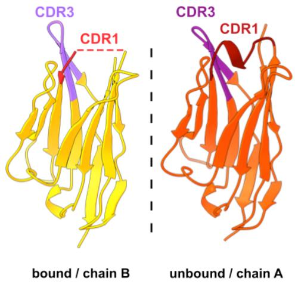  
a   
b   
Supplementary Figure 4. Nb55 does not bind to T4G mutant. a CD spectra of TBA and its mutant T4G TBA. b ITC thermogram for the titration of Nb55 into TBA T4G (orange). Titration of Nb55 into wild-type TBA is shown in black for comparison.   
a

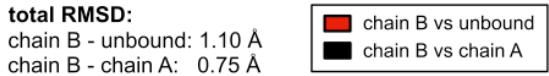  
b   
Supplementary Figure 5. Structural changes of Nb55 upon binding. a Comparison of the TBA-bound and free Nb55 structures. In the unbound form the CDR1 loops is well-structured and adopts a helical turn. b RMSD plot of the Nb55 Cα-atoms showing a difference between the TBA-bound nanobody (chain B) relative to the unbound nanobody (red-free Nb55 in different crystal form or black-chain A of the same crystal, but different chain in the ASU).

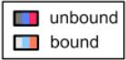  
a

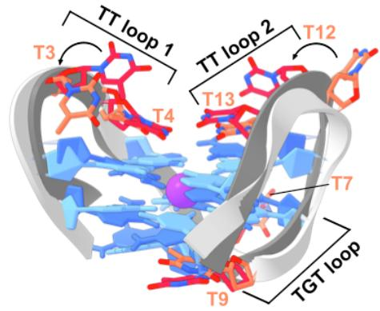  
b

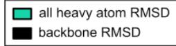  
total RMSD:
all heavy atoms: 2.13 Å
backbone only: 1.54 Å

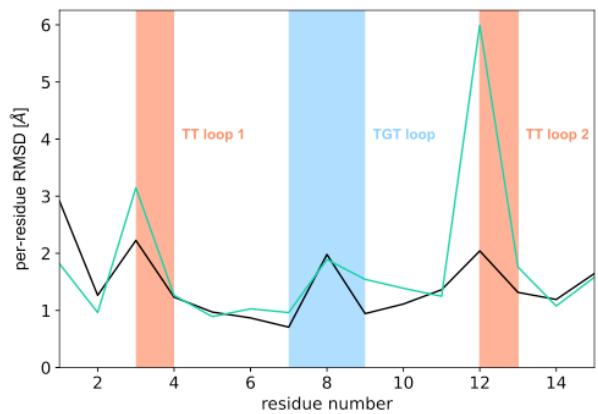  
Supplementary Figure 6. Structural changes of TBA upon Nb55 binding. a Structural superposition of the unbound, free TBA (dark gray) and Nb55-bound TBA (light gray). A major difference is seen in the position of thymines in both TT loops. b RMSD of the TBA atoms as observed in both structures.

4.0 mol. eq.
of SG4

1.0 mol. eq.
of SG4

0.5 mol. eq.
of SG4

0.4 mol. eq.
of SG4

0.3 mol. eq.
of SG4
G6

0.2 mol. eq. of SG4
G15 G1 G10

0.1 mol. eq. of SG4

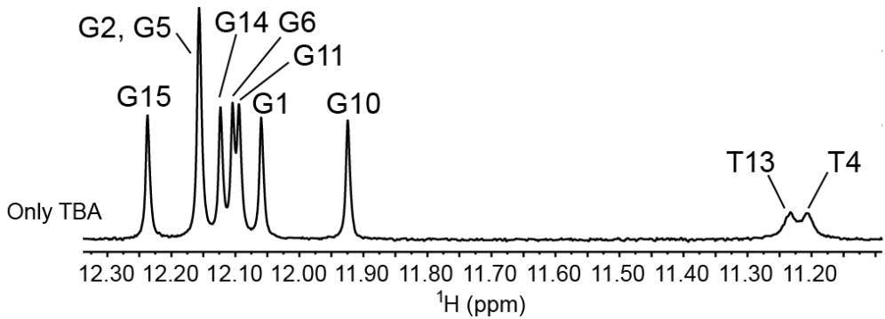  
Supplementary Figure 7. NMR titration of SG4 to TBA. Stacked imino region of 1D $^{1}$ H NMR spectra recorded throughout the whole titration of the 50 $\mu$ M TBA G-quadruplex with the SG4 nanobody. Signals of imino protons, visible due to hydrogen bonding, are annotated for the corresponding nucleotide. Both TBA and SG4 were dissolved in 10 mM KCl and 20 mM KPi (pH 7.2) 5%/95% D $_{2}$ O/H $_{2}$ O solution. NMR experiments were recorded at 24.86 $^{\circ}$ C (298K) on a 800 MHz NMR spectrometer.

1.0 mol. eq.
of Nb55

$^{1}$ H (ppm)   
Supplementary Figure 8. NMR titration of Nb55 to TBA. Stacked imino region of 1D $^{1}$ H NMR spectra recorded throughout the whole titration of the 50 $\mu$ M TBA G-quadruplex with the Nb55 nanobody. Signals of imino protons, visible due to hydrogen bonding, are annotated for the corresponding nucleotide. Both TBA and Nb55 were dissolved in 10 mM KCl and 20 mM KPi (pH 7.2) 5%/95% D $_{2}$ O/H $_{2}$ O solution. NMR experiments were recorded at 24.86 $^{\circ}$ C (298K) on a 800 MHz NMR spectrometer.   
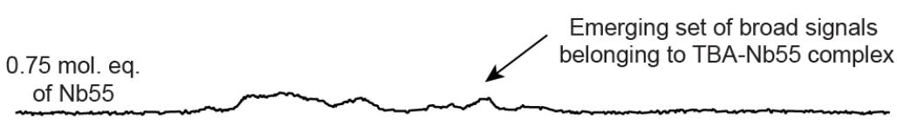  
0.5 mol. eq. of Nb55   
0.4 mol. eq. of Nb55   
0.3 mol. eq. of Nb55   
0.2 mol. eq. of Nb55   
0.1 mol. eq. of Nb55   
G2,G5
G15
G14
G6
G11
G1
G10
Only TBA
T13
T4