# mmc2 (2)

# A strain-transcending anti-AMA1 human monoclonal antibody neutralizes malaria parasites independent of direct RON2L receptor blockade

# Graphical abstract

<table><tr><td>AMA1-specific hmAbsMalaria exposedindividuals AMA1-reactivememory B-cell sortinghmAbs BCR sequencing</td><td>Neutralizing hmAbstarget distinct epitopes75C8 75B10 AMA1 RON2Lbinding site</td></tr><tr><td colspan="2">hmAbs neutralize parasites synergisticallyCombination % Growth Inhibition</td></tr></table>

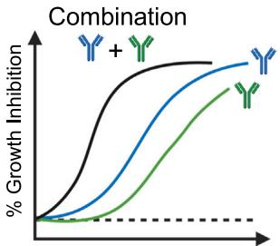  
hmAbs neutralize parasites synergistically

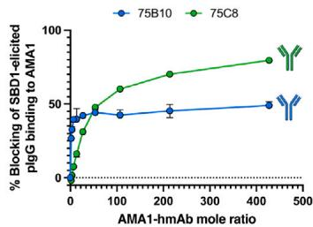  
Vaccination with designed immunogen elicits similar antibodies

# Authors

Palak N. Patel, Ababacar Diouf,
Thayne H. Dickey, ..., Kazutoyo Miura,
Peter D. Crompton, Niraj H. Tolia

# Correspondence

niraj.tolia@nih.gov

# In brief

Patel et al. identify naturally acquired human monoclonal antibodies (hmAbs) targeting epitopes on P. falciparum apical membrane antigen 1 (AMA1) outside the RON2L-binding site. Combining neutralizing hmAbs synergistically enhances parasite neutralization. One hmAb shows strain-transcending neutralization highlighting a promising epitope for next-generation AMA1-based malaria interventions.

# Highlights

# Article

# A strain-transcending anti-AMA1 human monoclonal antibody neutralizes malaria parasites independent of direct RON2L receptor blockade

Palak N. Patel, $^{1}$ Ababacar Diouf, $^{2}$ Thayne H. Dickey, $^{1}$ Wai Kwan Tang, $^{1}$ Christine S. Hopp, $^{4}$ Boubacar Traore, $^{5}$ Carole A. Long, $^{2}$ Kazutoyo Miura, $^{2}$ Peter D. Crompton, $^{3}$ and Niraj H. Tolia $^{1,6,*}$

$^{1}$ Host-Pathogen Interactions and Structural Vaccinology Section, Laboratory of Malaria Immunology and Vaccinology, National Institute of Allergy and Infectious Diseases, National Institutes of Health, Bethesda, MD, USA

$^{2}$ Laboratory of Malaria and Vector Research, National Institute of Allergy and Infectious Diseases, National Institutes of Health, Rockville, MD, USA

$^{3}$ Malaria Infection Biology and Immunity Section, Laboratory of Immunogenetics, National Institute of Allergy and Infectious Diseases, National Institutes of Health, Rockville, MD, USA

$^{4}$ Bernhard Nocht Institute for Tropical Medicine, Hamburg, Germany

$^{5}$ Malaria Research and Training Centre, Mali International Center of Excellence in Research, University of Sciences, Techniques and Technologies of Bamako, Point G, Bamako 1805, Mali

$^{6}$ Lead contact

*Correspondence: niraj.tolia@nih.gov

https://doi.org/10.1016/j.xcrm.2025.101985

# SUMMARY

Plasmodium falciparum apical membrane antigen 1 (AMA1) binds a loop in rhoptry neck protein 2 (RON2L) during red cell invasion and is a target for vaccines and therapeutic antibodies against malaria. Here, we report a panel of AMA1-specific naturally acquired human monoclonal antibodies (hmAbs) derived from individuals living in malaria-endemic regions. Two neutralizing hmAbs engage AMA1 independent of the RON2L-binding site. The hmAb 75B10 demonstrates potent strain-transcending neutralization that is independent of RON2L blockade, emphasizing that epitopes outside the RON2L-binding site elicit broad protection against variant parasite strains. The combination of these hmAbs synergistically enhances parasite neutralization. Vaccination with a structure-based design (SBD1) that mimics the AMA1-RON2L complex elicited antibodies similar to the two neutralizing hmAbs connecting vaccination to naturally acquired immunity in humans. The structural definition of a strain-transcending epitope on AMA1 targeted by naturally acquired hmAb establishes paradigms for developing AMA1-based vaccines and therapeutic antibodies.

# INTRODUCTION

Malaria is a life-threatening disease caused by Plasmodium parasites that are transmitted to humans by mosquitoes. $^{1}$ Malaria poses a significant threat to almost half of the global population, with children under the age of five being the most vulnerable to this disease. $^{1}$ Plasmodium falciparum, the deadliest malaria parasite, is responsible for nearly all malaria-related fatalities in sub-Saharan Africa and the majority of malaria-related deaths globally. $^{1}$ Malaria control has been partially achieved through mechanisms that protect against mosquito bites and with drugs to treat infection. $^{1}$ However, the emergence of resistance to antimalarial drugs and insecticides poses a significant challenge that undermines global malaria control efforts. $^{1}$ This underscores the importance of developing immune-based interventions, such as prophylactic monoclonal antibodies (mAbs) and highly effective vaccines, that prevent parasite infection and provide protection against clinical malaria.

Recent advancements in the clinical development of the RTS,S/AS01 $^{2}$ and R21/Matrix-M vaccines, $^{3}$ which target the

P. falciparum circumsporozoite protein (PfCSP) expressed during the pre-erythrocytic sporozoite stage, hold promise for malaria control. The implementation of these vaccines among children in malaria-endemic areas may provide substantial public health benefits in the fight against P. falciparum malaria. However, immune responses elicited by these vaccines have limited efficacy, $^{4,5}$ and immunity gradually wanes over time. $^{2}$ Under these conditions, sporozoites can still infect liver cells where they develop into merozoites that ultimately initiate the blood stage responsible for the clinical symptoms of malaria. Recently, the anti-sporozoite mAbs CIS43LS and L9LS, which target PfCSP, have made notable progress in clinical development and offered protection against P. falciparum infection. $^{6-9}$ However, similar to PfCSP-based vaccines, sporozoites that break through these mAbs can progress to the blood stage and cause disease. Therefore, the use of vaccines or mAbs that target the blood stage, either alone or in combination with pre-erythrocytic interventions, could help reduce the burden of clinical malaria.

Blood-stage vaccine development has focused primarily on antigens expressed on the P. falciparum merozoite surface.

The merozoite surface protein apical membrane antigen 1 (AMA1) is a type I integral membrane protein secreted onto the merozoite surface prior to interaction with erythrocytes. $^{10}$ AMA1 has a conserved structure across malaria and apicomplexan parasites, with three extracellular domains defined by eight intramolecular disulfide bonds and a transmembrane domain that anchors the protein to the surface of the merozoite. $^{11,12}$ AMA1 plays a crucial role in merozoite invasion of human erythrocytes, and its role in invasion is conserved among apicomplexan parasites that cause diverse diseases of human and agricultural relevance. $^{13-15}$ This makes AMA1 an attractive target for malaria and apicomplexan vaccine development more generally. Furthermore, a recent report highlighted the role of AMA1 in sporozoite infection of liver cells and its involvement in transmission to mosquitoes. $^{16,17}$ Merozoites invade human erythrocytes actively by gliding through a structure called the moving junction (MJ) formed between the apex of the merozoite and the host cell membrane. $^{13,18-21}$ The MJ is initiated by the export of the rhoptry neck proteins RONs (RON2, RON4, and RON5) into the host cell, where RON2 spans the host cell membrane and serves as a receptor for AMA1 on the surface of the parasite. $^{18-21}$ As a result, the parasite is anchored to the host cell membrane and internalized into a parasitophorous vacuole, which is critical for parasite development and replication. $^{18-21}$ AMA1 and RON2 are essential for host cell invasion by P. falciparum and Toxoplasma gondii. $^{14,15}$ Structural studies of AMA1 in complex with RON2L have shown that the loops surrounding the RON2L-binding site, including the flexible domain II (DII) loop and the domain I (DIf) loop, undergo conformational changes to expose the binding site for RON2L. $^{22,23}$ mAbs or peptides that prevent the formation of the AMA1-RON2L complex also block host cell invasion by parasites. $^{24-28}$ Another mechanism for the protective effect of antibodies against AMA1 that block red blood cell invasion is through the disruption of secondary proteolytic processing on the merozoite surface. $^{29}$

AMA1-based vaccines have shown protective efficacy in preclinical animal studies. $^{30-34}$ The AMA1-based vaccine FMP2.1/AS02A $^{35}$ induced strong and long-lasting antibody responses in both immunologically naive individuals $^{36,37}$ and in populations of adults and children with prior malaria exposure. $^{38-40}$ However, the presence of highly diverse AMA1 alleles in endemic areas presents a significant challenge. To address the issue of allelic diversity and achieve cross-strain protection, a combination of seven distinct AMA1 alleles or the design of three diversity covering variants was evaluated with limited success in eliciting strain-transcending antibody responses. $^{25,41-46}$ Although AMA1-based vaccines have been shown to induce strong antibody responses, they did not provide significant protection against clinical malaria in controlled infection studies, and their efficacy in field studies was lower than expected. $^{37,40,47,48}$ A structure-based design to develop a stable single-component AMA1-RON2L immunogen (structure-based design 1 [SBD1]) overcame the limitations of AMA1 vaccination resulting in potent strain-transcending immunity. $^{49}$ In contrast, the simple insertion of RON2L into AMA1 did not provide this enhancement. $^{32,33,49,50}$ Strikingly, strain-transcending protection was independent of RON2L binding blockade and identified an alternative mechanism for parasite neutralization. $^{49}$ The immunological enhance-

ment provided by SBD1 is consistent with the finding that immunization with a mixture of AMA1 and RON2L peptide provided greater protection than immunization with AMA1 alone. $^{32,33,49,50}$

There is a need to improve the quality and quantitative magnitude of antibody responses to induce sufficient strain-transcending protection afforded by SBD1. Understanding the structure-function relationships of human antibodies targeting broadly neutralizing epitopes would provide insight into how to design vaccine immunogens to improve vaccine efficacy.

In this study, we present a multifaceted analysis and structure-function studies of human mAbs (hmAbs) targeting AMA1 that are elicited by natural P. falciparum infection. The structures of AMA1 bound to the neutralizing hmAbs 75B10 and 75C8 reveal previously uncharacterized functional epitopes on AMA1. 75B10 is a broadly neutralizing hmAb that disrupts parasite growth through a previously unrecognized mechanism independent of conventional AMA1-RON2L blockade. On the other hand, 75C8 is expected to inhibit parasite growth by preventing the displacement of the DII loop, thereby inhibiting RON2L binding. These hmAbs exhibit strong synergy when used in combination, significantly enhancing parasite neutralization. Additionally, SBD1 vaccine candidate elicited antibodies that compete with the 75B10 and 75C8 hmAbs. This suggests that the epitopes targeted by 75B10 and 75C8 should be considered when designing AMA1 immunogens to enhance parasite neutralization. These findings support further development of vaccine design strategies aimed at eliciting potent antibody responses against the blood stage of malaria parasites.

# RESULTS

# AMA1-specific hmAbs isolated from naturally exposed individuals possess diverse variable gene usage

Peripheral blood mononuclear cells were collected from healthy adult volunteers enrolled in an observational cohort study carried out in the malaria-endemic community of Kalifabougou, Mali. $^{51,52}$ Single IgG+ memory B cells were isolated based on binding to AMA1 and merozoite surface protein 1-42 (MSP1–42), and 34 paired heavy- and light-chain sequences of the B cell receptor were obtained as previously described. $^{51}$ Of the 34 hmAbs, nine did not express, seven did not bind an antigen, 14 were specific to MSP1–42, and four were specific to AMA1. Among the 14 MSP1–42-specific hmAbs, eight recognize an epitope in the carboxy-terminal fragment MSP1–19, which had been previously reported. $^{53}$ Three of the AMA1-specific hmAbs (75B10, 75C8, and 75F5) were derived from the same study participant (KH0075, 37-year-old female), and the fourth hmAb (42B10) was isolated from a different donor (KH0042, 28-year-old female). The sequences were aligned to the V, (D), and J genes from a reference germline database using IMGT/V-QUEST, $^{54,55}$ revealing diverse gene usage of variable heavy and light chains (Table S1). The complementarity-determining regions (CDRs) of all four hmAbs are distinct (Figure S1).

# The hmAbs possess diverse affinities

The paired hmAb sequences were subsequently cloned and inserted into human immunoglobulin G1, kappa, or lambda scaffolds. Paired heavy- and light-chain plasmids were co-expressed

A

B

C

AMA1 DI-DII

AMA1 DI-DIII

D

75C8

75F5

42B10

Figure 1. The hmAbs elicited from natural infection that target AMA1 showed a wide range of binding kinetics

75B10, 75C8, and 75F5 recognize epitopes within domains I and II of AMA1, while hmAb 42B10 targets an epitope that includes residues located outside the defined domain regions DI-DIII of AMA1 (Figure 1C).

The binding kinetics of the four hmAbs to the AMA1 constructs were assessed using biolayer interferometry (BLI), which revealed varying dissociation constants $(\mathrm{K}_{\mathrm{D}})$ . The $\mathrm{K}_{\mathrm{D}}$ values for hmAbs 75B10, 75C8, and 42B10 ranged from 1.0 to $44.0\mathrm{nM}$ when binding to the AMA1 ectodomain (Table 1; Figure 1D). For hmAbs 75B10 and 75C8, the $\mathrm{K}_{\mathrm{D}}$ values were 1.0 and $95.0\mathrm{nM}$ for AMA1 DI-DII (Table 1; Figure S2C) and 1.2 and $54.0\mathrm{nM}$ for AMA1 DI-DIII (Table 1; Figure S2D). Among these

in Expi293F cells to produce recombinant hmAbs. The purified hmAbs exhibited homogeneity and purity, as demonstrated by size-exclusion chromatography (SEC) and SDS-PAGE analysis (Figures 1A and S2A). The AMA1 ectodomain, along with the AMA1 domain I–II (DI–DII) and domain I–III (DI–DIII) constructs, was expressed in Expi293F cells. The produced AMA1 constructs were found to be monomeric and homogenous, as observed through SEC and SDS-PAGE analysis (Figures 1B and S2B).

Antigen specificity was confirmed by ELISA of purified hmAbs to recombinant AMA1 constructs, and all four hmAbs bound to the AMA1 ectodomain (Figure 1C). Subdomain analysis using truncation of the AMA1 ectodomain revealed that hmAbs

antibodies, 75B10 exhibited the highest affinity for AMA1 constructs. Conversely, 75C8 showed relatively weaker affinity for AMA1 constructs compared to 75B10. 42B10 showed strong binding affinity for the AMA1 ectodomain but failed to bind to the AMA1 DI-DII and DI-DIII constructs, suggesting that its epitope contains residues located outside the defined domain regions DI-DIII of AMA1. These varying affinities for AMA1 constructs are primarily due to differences in dissociation rates ( $k_{dis}$ ) (Table 1). In contrast, the association rates ( $k_{a}$ ) were relatively similar, ranging from $1.8 \times 10^{5}$ to $3.5 \times 10^{5} M^{-1} s^{-1}$ across these antibodies for all three AMA1 constructs (Table 1; Figures 1D, S2C, and S2D). The $K_{D}$ for the binding of 75F5 to AMA1 could

Table 1. Kinetic rate constants of binding of four human monoclonal antibodies to AMA1 ectodomain and AMA1 DI-DII, as determined by BLI   

<table><tr><td>Immobilized hmAb</td><td>Analyte</td><td>\( K_{D} \) (× \( 10^{-9} \pm SEM M \))</td><td>\( k_{a} \) (× \( 10^{5} \pm SEM 1/Ms \))</td><td>\( k_{dis} \) (× \( 10^{-4} \pm SEM 1/s \))</td><td>n</td></tr><tr><td>75B10</td><td rowspan="4">AMA1ectodomain</td><td>1.001 ± 0.005</td><td>2.057 ± 0.047</td><td>2.057 ± 0.041</td><td>3</td></tr><tr><td>75C8</td><td>43.967 ± 1.592</td><td>3.533 ± 0.054</td><td>155.100 ± 4.508</td><td>3</td></tr><tr><td>42B10</td><td>2.430 ± 0.066</td><td>1.787 ± 0.037</td><td>4.337 ± 0.038</td><td>3</td></tr><tr><td>75F5</td><td>ND</td><td>ND</td><td>ND</td><td>3</td></tr><tr><td>75B10</td><td rowspan="4">AMA1 DI-DII</td><td>1.057 ± 0.026</td><td>3.037 ± 0.047</td><td>3.213 ± 0.043</td><td>3</td></tr><tr><td>75C8</td><td>94.610 ± 6.505</td><td>2.550 ± 0.082</td><td>240.233 ± 9.059</td><td>3</td></tr><tr><td>42B10</td><td>ND</td><td>ND</td><td>ND</td><td>3</td></tr><tr><td>75F5</td><td>ND</td><td>ND</td><td>ND</td><td>3</td></tr><tr><td>75B10</td><td rowspan="4">AMA1 DI-DIII</td><td>1.230 ± 0.026</td><td>2.377 ± 0.023</td><td>2.917 ± 0.044</td><td>3</td></tr><tr><td>75C8</td><td>54.060 ± 7.825</td><td>3.510 ± 0.284</td><td>185.400 ± 10.548</td><td>3</td></tr><tr><td>42B10</td><td>ND</td><td>ND</td><td>ND</td><td>3</td></tr><tr><td>75F5</td><td>ND</td><td>ND</td><td>ND</td><td>3</td></tr></table>

The binding data were fitted using a 1:1 binding model. The means and standard errors of the means (SEMs) of three independent experiments (n) are shown. M, molar; ND, not detectable. See Figures 1D and S2 for BLI sensorgram traces showing the binding of hmAbs to the AMA1 ectodomain, AMA1 DI-DII, and AMA1 DI-DIII, respectively.

not be determined due to extremely weak binding under the experimental setup used, with the observed binding in ELISA likely resulting from AMA1-dependent avidity.

# The hmAbs 75B10 and 75C8 effectively neutralize parasite growth

We evaluated the ability of these hmAbs to neutralize malaria parasites using a standardized growth inhibition assay (GIA). The hmAbs 75B10 and 75C8 neutralized P. falciparum 3D7 growth by $>87\%$ at a concentration of 1.0 mg/mL (Figure 2A). These two hmAbs showed high to moderately high binding affinities for AMA1 constructs (Table 1). However, hmAb 42B10, which also has a strong affinity, and 75F5, which has a very weak affinity, did not neutralize parasite growth at the same concentration in the GIA. These results suggest that 42B10 may bind to a different epitope on AMA1 compared to 75B10 and 75C8.

# The hmAbs recognize distinct epitopes on AMA1

We used BLI to investigate the binding sites of hmAbs on AMA1. Epitope binning was conducted using a competitive binding assay with all four hmAbs from the current study. Biotinylated AMA1 ectodomain was immobilized onto a streptavidin sensor, and antibody binding was monitored. The hmAbs 75B10, 75C8, and 42B10 displayed slow dissociation rates in the binning assay, making them suitable as primary saturating antibodies (Figure S3). However, 75F5 exhibited rapid dissociation from AMA1 and was only used as a secondary competing antibody (Figure S3). All four antibodies were deemed suitable as competing antibodies. We observed that hmAbs 75B10, 75C8, and 42B10 did not compete with each other, suggesting that they recognize distinct epitopes on AMA1 (Figure 2B). In contrast, hmAbs 75C8 and 75F5 strongly competed, implying that their epitopes were either overlapping or adjacent (Figure 2B). These results suggest that the neutralizing hmAbs 75B10 and 75C8 target distinct epitopes on AMA1.

# The neutralizing hmAbs recognize epitopes on AMA1 outside of the DII loop and RON2L-binding site

We determined the crystal structures of the antibody-antigen-binding fragments (Fabs) for 75B10 and 75C8 bound to AMA1 DI-DII at resolutions of 2.9 and 2.8 Å, respectively (Figures 2C and 2D; Table S2), to elucidate the structural and mechanistic basis of neutralizing hmAbs following natural infection. As previously demonstrated in the crystal structures of AMA1 (PDB: 1z40 and 4r19), $^{57,58}$ both domain I and II of AMA1 within these complexes formed plasminogen-apple-nematode (PAN) folds. These PAN folds are characterized by a two-turn $\alpha$ helix packed against a five-stranded $\beta$ sheet, and two PAN folds interact with each other to create the AMA1 core. Consistent with the epitope binning data, both the 75B10 and 75C8 hmAbs recognized distinct discontinuous conformational epitopes on AMA1 DI-DII comprising residues from helices, beta strands, and loops. Structural analysis revealed that 75B10 binds to AMA1 through both its heavy and light chains, with predominant interactions involving the heavy chain. These interactions occur at the base of the RON2L-binding site, resulting in a substantial buried surface area (BSA) of 860 Å $^{2}$ between 75B10 and AMA1 (Figure 2C). Residues from all three CDRs of both the heavy and light chains contact 28 AMA1 residues in total (Figure 3A; Table S3).

75C8 interacts with AMA1 through both heavy and light chains, predominantly at the base of the Dlf and Dll loops (Figure 2D). This interaction results in a BSA of 837 Å $^{2}$ between 75C8 and AMA1. Residues from CDRs one and two of the heavy chain and one and three of the light chain contact 24 AMA1 residues (Figure 3B; Table S4). Moreover, 75C8 is expected to prevent the displacement of the Dll loop, thereby inhibiting the binding of RON2L to AMA1 through a previously unexplored mechanism (Figure 3C). None of the other antibodies identified in this study showed the same ability to prevent RON2L binding (Figure 3C). The positive control shark IgNAR 14I-1, $^{26}$ which targets an epitope that overlaps with the RON2L-binding site, competed with and inhibited RON2L binding (Figure 3C). Notably, the conformational epitopes

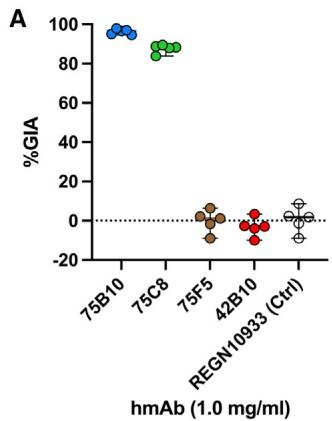

<table><tr><td rowspan="2">Saturating Antibody</td><td colspan="4">Competing Antibody</td></tr><tr><td>75B10</td><td>75C8</td><td>75F5</td><td>42B10</td></tr><tr><td>75B10</td><td>-</td><td>90.6</td><td>77.7</td><td>94.0</td></tr><tr><td>75C8</td><td>91.7</td><td>-</td><td>0.0</td><td>90.8</td></tr><tr><td>42B10</td><td>94.8</td><td>96.1</td><td>85.7</td><td>-</td></tr></table>

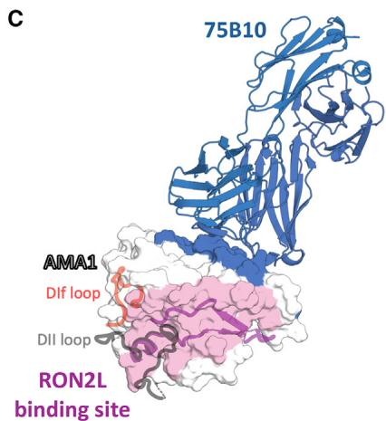

Figure 2. The hmAbs 75B10 and 75C8 effectively neutralized the malaria parasite and targeted distinct epitopes on AMA1   
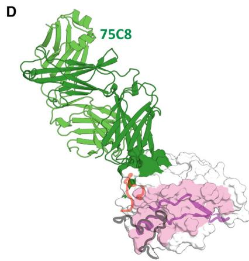  
(A) In vitro growth inhibition assay (GIA) of each hmAb tested at 1.0 mg/mL against the Plasmodium falciparum 3D7 blood stage in five independent biological replicates. The hmAb REGN10933 $^{56}$ specific to the receptor-binding domain of the severe acute respiratory syndrome coronavirus 2 (SARS-CoV-2) spike protein was used as a negative control. The bars represent the medians, and the error bars indicate the 95% confidence intervals (CIs).   
(B) Epitope binning of AMA1-specific hmAbs. Biotinylated AMA1 ectodomain was immobilized on biosensors. The left column lists the saturating antibodies tested, while the top row lists the competing antibodies. Reported values indicate the percentage of competing antibody binding compared to the maximum competing antibody response in the absence of the saturating antibody. Antibodies that displayed $\leq50\%$ maximal binding are colored gray and considered competing. The negative values were normalized to 0.   
(C and D) Crystal structures of AMA1 DI-DII in complex with the Fab fragment of neutralizing hmAbs (C) 75B10 and (D) 75C8 are depicted. The surface representation of AMA1 DI-DII is shown. The Fabs are depicted in cartoon representations in different colors, and their binding interface on AMA1 is highlighted with the corresponding color of the Fab. RON2L is shown as a purple cartoon, and the DIf loop is depicted in red after aligning the structures of the AMA1-Fab complexes with the previously character-

ized AMA1-RON2L complex (PDB: 3zwz). $^{23}$ The DII loop is represented in gray following the alignment of the AMA1-Fab complexes with the previously characterized AMA1 structure (PDB: 4r19). $^{57}$

See Figure S3 for representative BLI data from in-tandem binning assays and Table S2 for X-ray data collection and refinement statistics.

recognized by hmAbs 75B10 and 75C8 on AMA1 are distinct from those previously identified for the rat mAb 4G2, $^{27,60,61}$ murine mAb 1F9 (PDB: 2q8a), $^{24}$ shark IgNAR 14I-1 (PDB: 2z8v), $^{26}$ humanized single-domain antibody WD34, $^{59}$ and the hmAb humAbAMA1 $^{28}$ (Figure 3D). However, there is minimal overlap between the 75B10 epitope and that of the mAb 1F9 (PDB: 2q8a) $^{24}$ (Figure 3D). These data collectively demonstrated that hmAbs 75B10 and 75C8 target previously unknown epitopes on AMA1 that are distinct from the DII loop and RON2L-binding site, revealing a previously uncharacterized neutralizing surface of AMA1.

# Neutralizing hmAbs have a broad binding capacity across AMA1 polymorphisms

Antigen polymorphisms can potentially limit strain-transcending protection by vaccine-induced or naturally acquired antibodies and should be evaluated in the context of hmAb binding and neutralization. We structurally mapped polymorphic residues within the 75B10 and 75C8 epitopes using sequence data on AMA1 derived from the MalariaGEN P. falciparum Community Project data-variant catalog (https://www.malariagen.net/apps/pf/4.0/#variation). $^{62}$ Twenty-two 75B10 epitope residues were invariant, and six residues (Asp242Tyr, 47.4%; Lys243Glu, 16.2%; Lys243Asn, 16.4%; Lys245Glu, 0.1%; Lys245Asn, 6.1%;

Gln285Glu, 14.4%; Asn286Asp, 0.8%; and Lys300Glu, 27.8%) exhibited polymorphisms with minor allele frequencies (MAFs) in the range of 0.1%–47.4% (Figure 4A). Twenty 75C8 residues were invariant, and four residues (Ile282Lys, 30.7%; Ser283Leu, 24.2%; Pro330Ser, 6.7%; and Glu405Lys, 49.8%) showed polymorphisms with MAFs in the range of 6.7%–49.8% (Figure 4B). Biotinylated AMA1 ectodomain polymorphic variants were expressed in Expi293F cells and purified to homogeneity (Figure S4A).

To assess the potential impact of neutralizing hmAbs on binding, we conducted a comprehensive evaluation of how specific polymorphisms influence the affinity and kinetics of hmAbs 75B10 and 75C8 when interacting with AMA1 polymorphic variants. These observations were then compared to the affinity and kinetics of the P. falciparum 3D7 AMA1. Our analysis revealed that the binding affinities of hmAbs 75B10 and 75C8 for most AMA1 polymorphic variants exhibited minimal changes compared to their binding affinities for wild-type AMA1 (Table S5; Figures S4B and S4C). These findings suggest that hmAbs 75B10 and 75C8 possess a broad binding capacity, effectively engaging a wide spectrum of AMA1 polymorphic variants.

Notably, the measured binding affinities consistently remained within the low nanomolar range across the majority of

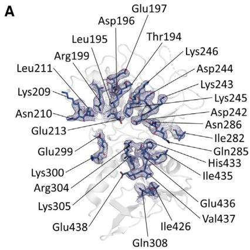

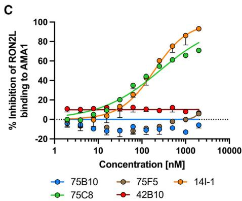

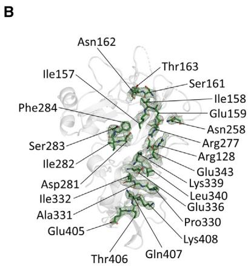

Figure 3. Structural delineation of neutralizing hmAb epitopes on AMA1   
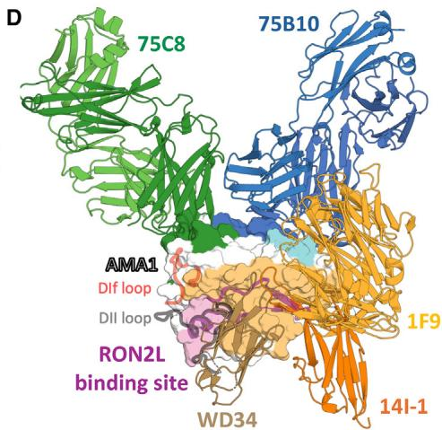  
(A and B) Electron density for the epitope residues of (A) 75B10 and (B) 75C8 shown using a composite omit map (2mFo-DFc) contoured at the 1.0 σ level (1.43 Å rmsd). The epitope residues are labeled, and the side chains are depicted as sticks.   
(C) The hmAb 75C8 inhibited the binding of RON2L to AMA1. The data from three independent biological replicates are represented as the median, with error bars indicating the 95% CI. (D) Superposition of all AMA1-Fab co-complex crystal structures, including those from Figures 2C and 2D, along with murine mAb 1F9 (2q8a), $^{24}$ IgNAR 14I-1 (PDB: 2z8v), $^{26}$ and i-body WD34 (PDB: 8qu7). $^{59}$ All structures were aligned based on AMA1. For 14I-1 and WD34, the VNAR domains are shown. AMA1 is depicted as a white surface, and Fabs or VNARs are shown in cartoon representation. The residues where the 1F9 epitope overlaps with the 75B10 epitope are highlighted in cyan. The epitopes of 1F9, 14I-1, and WD34 are collectively shown as a light orange surface. RON2L is depicted as a purple cartoon, and the DIf loop is highlighted in red after aligning the AMA1-Fab complex structures with the previously characterized AMA1-RON2L complex (PDB: 3zwz). $^{23}$ The DII loop is shown in gray following the alignment of the AMA1-Fab complexes with the previously characterized AMA1 structure (PDB: 4r19). $^{57}$   
See also Tables S3 and S4 for contact residues between AMA1 DI-DII and hmAbs.

the polymorphic variants (Asp242Tyr, Lys243Asn, Lys245Asn, Gln285Glu, Asn286Asp, and Lys300Glu), while a few polymorphisms had major effects on the affinities (Lys243Glu and Lys245Glu) (Table S5). This indicates the ability of these neutralizing hmAbs to bind effectively to a majority of AMA1 polymorphisms.

A substantial deviation in $K_{D}$ was observed in the case of 75B10 and the AMA1 variants Lys243Glu and Lys245Asn, resulting in $K_{D}$ values approximately 36- to 135-fold greater than those of wild-type AMA1 (Table S5). Furthermore, 75B10 completely lost its binding capability for the AMA1 variant Lys245Glu. The complete loss of binding observed with the Lys245Glu variant is likely due to the disruption of the electrostatic environment of the epitope, which adversely affects its binding to hmAb 75B10 (Figure S5A). Within the AMA1 structure, Asp242 and Asn286 interact with Arg102 of the 75B10 heavy-chain CDR3 through hydrogen bonds and salt bridges (Figure S5B). Furthermore, a salt bridge is formed by Asp53 of the 75B10 light-chain CDR2 and Lys243 on AMA1 (Figure S5C). Similarly, the largest deviation in $K_{D}$ was observed for the 75C8 and the Ser283Leu variants of AMA1, exhibiting an approximately 5-fold increase in $K_{D}$ compared to that of the wild-type AMA1 (Table S5). The interaction between Thr55/57 within the heavy-chain CDR3 and Ser283 on AMA1 is facilitated through a hydrogen bond (Figure S5D). The possible disruption of hydrogen bonds/salt

bridges due to genetic polymorphisms at these specific sites likely explains why binding by hmAbs was more perturbed for these specific variants.

# The hmAb 75B10 shows strain-transcending neutralization of parasite strains

We investigated the strain-transcending neutralizing potential of hmAbs 75B10 and 75C8 in GIA against four heterologous strains of P. falciparum, 3D7, Dd2, HB3, and FVO. These strains have a high frequency of polymorphisms, making them suitable for evaluating the strain-transcending potential of hmAbs. Some of these polymorphisms are in the epitopes targeted by hmAbs 75B10 and 75C8. Compared to 3D7, P. falciparum Dd2 possesses three polymorphisms in the 75B10 epitope: Asp242Tyr (47.4%), Lys243Asn (16.4%), and Lys300Glu (27.8%); HB3 possesses four polymorphisms: Asp242Tyr, Lys243Glu (16.2%), Gln285Glu (14.4%), and Lys300Glu; and FVO possesses four polymorphisms: Asp242Tyr, Lys243Asn, Gln285Glu, and Lys300Glu (Table S6). When comparing P. falciparum Dd2, HB3, and FVO AMA1 alleles with 3D7, there were two common polymorphisms in the 75C8 epitope: Ile282Lys (30.7%) and Pro330Ser (6.7%) (Table S6). Furthermore, Dd2 has another polymorphism, Glu405Lys (49.8%), whereas HB3 and FVO carry a different polymorphism, Ser283Leu (24.2%), in the 75C8 epitope (Table S6).

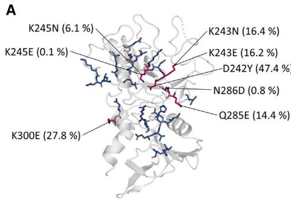

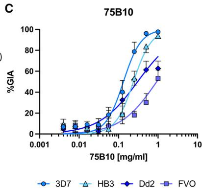

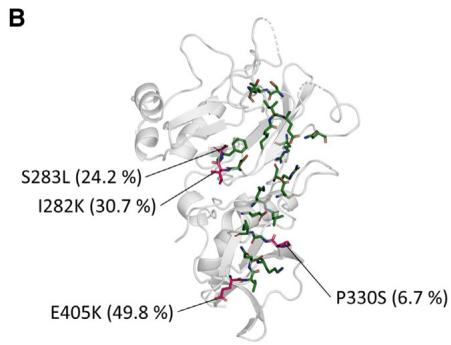

Figure 4. Neutralizing hmAbs bind broadly across AMA1 polymorphisms within their epitopes   
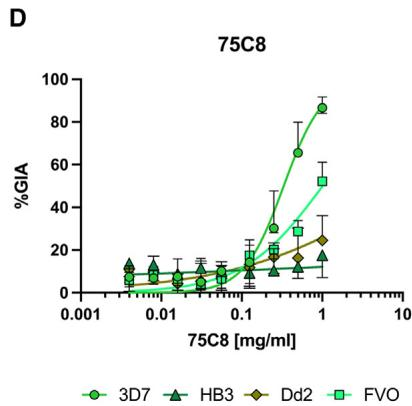  
(A) Six polymorphic residues were observed in the 75B10 epitope in 3,488 AMA1 sequences. AMA1 is depicted as a white cartoon, with 75B10 epitope residues shown as blue sticks and polymorphic residues within the epitope highlighted in pink. The observed frequency is in parentheses.   
(B) Within the 3,488 AMA1 sequences, the 75C8 epitope exhibited four polymorphic residues, represented in pink, while the rest of AMA1 is depicted in a white cartoon, with the 75C8 epitope residues shown in green. The observed frequencies of these polymorphic residues are indicated in parentheses.   
(C) Cross-strain neutralizing activity of hmAb 75B10 against the P. falciparum strains 3D7, HB3, Dd2, and FVO in vitro. The hmAb 75B10 was initially diluted to 1.0 mg/mL and subsequently diluted 2-fold. The data are represented as the median, with error bars indicating a 95% CI across three independent biological replicates.   
(D) The cross-strain neutralizing activity of hmAb 75C8 against various strains of P. falciparum, including 3D7, HB3, Dd2, and FVO, is depicted as described in (C).

See Figure S4 for the SDS-PAGE of AMA1 polymorphic variants and BLI sensorgram traces showing the binding of Fabs to AMA1 variants and Table S5 for the kinetic rate constants. See

also Figure S5 for the molecular basis of binding perturbations and $EC_{50}$ values of hmAbs against heterologous strains of P. falciparum. Table S6 details the polymorphisms within the neutralizing epitopes on AMA1 from P. falciparum heterologous strains.

75B10 potently neutralizes P. falciparum 3D7, HB3, Dd2, and FVO with half-maximum inhibitory concentration ( $EC_{50}$ ) values of 133, 239, 304, and 926 $\mu$ g/mL, respectively (Figures 4C and S5E). In contrast, 75C8 neutralizes P. falciparum 3D7, with an $EC_{50}$ value of 332 $\mu$ g/mL, but shows reduced potency against strains Dd2, HB3, and FVO (Figures 4D and S5F). Despite the presence of high-frequency polymorphisms in the 75B10 epitope, this epitope stands out as noteworthy for its ability to effectively neutralize a diverse range of P. falciparum strains. These data strongly support the finding that 75B10 is a potent, strain-transcending human antibody.

# The hmAbs 75B10 and 75C8 display significant synergy in parasite neutralization

Because the hmAbs 75B10 and 75C8 recognize adjacent epitopes, we evaluated whether combining these two hmAbs would result in a synergistic effect using Loewe's definition of additivity as described previously. $^{63}$ Here, both hmAbs were assessed for GIA in pairwise combinations against P. falciparum 3D7 and FVO strains. The combination of 75B10 and 75C8 demonstrated a significantly synergistic effect against both P. falciparum 3D7 (Figure 5A; Table S7) and FVO strains (Figure 5B; Table S7). This synergy is reflected by Hewlett's S value of 1.2 (95% confidence interval [CI]: 1.103, 1.308) for 3D7 and 1.2 (95% CI: 1.045 to 1.424) for FVO. The isobolograms further support this finding, showing that the predicted median EC $_{50}$ curve falls below the

dashed red line, indicating synergy between the two hmAbs (Figures 5A and 5B).

To further investigate synergy, we combined 75B10 and 75C8 at a 1:1 ratio and compared the combination's potency with 75B10 alone in parasite neutralization. For the 3D7 strain, this resulted in a significant improvement in EC $_{50}$ , decreasing from 109 (95% CI: 97.5, 121.7) to 56 μg/mL (95% CI: 50.6, 62.0) (p < 0.0001) (Figures S6A and S6B). A similar significant improvement was observed for the FVO strain, with the EC $_{50}$ decreasing from 1,588 (95% CI: 1,467.0, 1,722.0) to 543 μg/mL (95% CI: 518.2, 568.3) (p < 0.0001) (Figures S6C and S6D). These results demonstrate the synergistic neutralization of the 75B10 and 75C8 combination. The plausible molecular mechanism responsible for antibody-driven synergy results from lateral heterotypic interactions between the variable light and heavy chains of 75B10 and 75C8 (Figure 5C), primarily involving residues from both the framework regions (FRs) and CDRs. This hypothesis is supported by improved binding kinetics observed for the combination (Figures 5D, S6E, and S6F). The predicted interface residues in the 75B10 light chain include Arg24, Ala25, Ser26, Gln27, Thr28, Asn30, Gly66, Ser67, Gly68, Thr69, and His70 (Figure 5C). Gln27, Thr28, and Asn30 are part of CDR1, and the remaining residues are located in FRs 1 and 3. Eight of the 11 residues except for Thr28, Asn30, and His70 are encoded by the immunoglobulin kappa variable (IGKV) 1–5 gene. The heavy chain of 75C8 contributes the predicted interface residues

  
A   
P. falciparum 3D7   
B   
P. falciparum FVO   
C

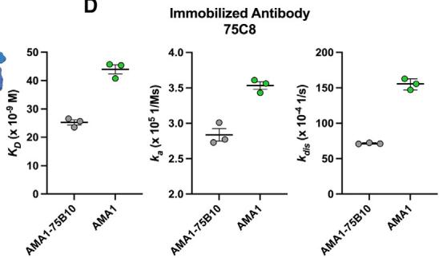  
D   
Figure 5. The synergistic neutralizing activity of hmAbs 75B10 and 75C8 arises from enhanced binding kinetics, likely facilitated by lateral antibody-antibody interactions

(A and B) Isobolograms for model fits of the 75B10-75C8 antibody combination. The figure shows the $\mathrm{EC}_{50}$ line for observed dose combinations (in black) and the $95\%$ CI of the inverse Hewlett S statistic (in blue) for P. falciparum 3D7 and FVO strains. This interval corresponds to equal doses (after scaling by the $\mathrm{EC}_{50}$ ) of the two concentrations. The dashed red line indicates the null synergy/antagonism interaction, and the synergy/antagonism hypothesis is rejected when the inverse Hewlett S line intersects with the null line. The data shown are from three independent biological replicates.

(C) Superposition of the AMA1-75B10 and AMA1-75C8 complex structures reveals the expected interface involved in heterotypic interactions, shown as an olive-green surface for 75C8 and deep blue for 75B10. The interface residues were identified using PDBePISA (https://www.ebi.ac.uk/msd-srv/prot_int/cgi-bin/piserver). RON2L is represented as a purple cartoon, and the Dlf loop is highlighted in red, based on alignment with the previously characterized AMA1-RON2L complex

(PDB: 3zwz). $^{23}$ The DII loop, shown in gray, follows the alignment of the AMA1-Fab complexes with the previously determined AMA1 structure (PDB: 4r19). $^{57}$ (D) Summary of changes in the equilibrium dissociation constant ( $K_{D}$ ), association rate constant ( $k_{a}$ ), and dissociation rate constant ( $k_{dis}$ ) for the binding kinetics of hmAb 75C8 to AMA1 and the AMA1:75B10 Fab complex, as measured by BLI. Binding data were fitted using a 1:1 binding model. Bars represent the mean, and error bars indicate the standard error of the mean (SEM) across three independent experiments.

See Table S7 for raw data on the combination GIA against P. falciparum 3D7 and FVO strains. See also Figure S6 for synergistic GIA and the corresponding $EC_{50}$ values of the neutralizing hmAb combination against P. falciparum 3D7 and FVO strains, as well as BLI sensorgram traces showing the interaction of 75C8 IgG with the AMA1-75B10 Fab complex.

Thr17, Thr56, Thr57, Glu58, Thr59, Pro61, Glu64, Gly65, Arg66, Pro67, Leu68, Ile69, Ser70, Thr81, Thr83, and Ser84 (Figure 5C). Thr17 is in FR1, Thr56 and Thr57 are part of CDR2, and the remaining residues are found within FR3. Seven of 16 residues (Thr17, Thr57, Pro61, Arg66, Ile69, Ser70, and Ser84) are encoded by the immunoglobulin heavy-chain variable (IGHV) 4–59 gene. To assess the broader relevance of these interactions, further analysis of a larger pool of antibodies from diverse populations is necessary to determine the prevalence and contribution of such interactions.

# Vaccination with the single-component SBD1 of AMA1-RON2L elicits 75B10- and 75C8-like antibodies

We have previously demonstrated that vaccination with a single-component SBD1 designed to mimic the two-component AMA1-RON2L complex elicited significantly better strain-transcending responses than AMA1 or the two-component complex AMA1-RON2L. $^{49}$ The definition of hmAbs from naturally acquired immunity described here enables the evaluation of vaccination with the human antibody response. We investigated rat polyclonal IgG elicited by the SBD1 immunogen in a competition ELISA with the mAbs 75B10 and 75C8 to assess whether SBD1 induces antibodies that target these epitopes (Figure 6A). The assay measured the ability of increasing concentrations of 75B10 and 75C8 to block the binding of AMA1 to the pooled polyclonal IgG (plgG). 75B10 was able to block approximately 45% of SBD1-elicited plgG binding to AMA1 with saturation

occurring at near-equimolar concentrations consistent with its strong binding affinity and slow dissociation rate (Figure 6B). 75C8 resulted in approximately 80% blocking activity but required over 400-fold molar excess over AMA1 to achieve substantial blocking of SBD1-elicited plgG due to its weaker binding affinity and quick dissociation rate (Figure 6B). Therefore, vaccination with SBD1 induces antibodies that target epitopes overlapping with both 75B10 and 75C8 and establishes that vaccination produces a response similar to that seen in humans with naturally acquired immunity. This likely contributes to the broad, strain-transcending neutralizing activity observed. The 75B10 epitope, along with other RON2L-blocking epitopes, should be prioritized in vaccine design due to its superior characteristics such as a lower off-rate, higher potency, and the ability of vaccination with SBD1 to induce antibodies specifically targeting this epitope region.

# DISCUSSION

In this study, we established and evaluated a panel of AMA1-specific naturally acquired hmAbs using a combination of methods to assess their binding affinity, ability to neutralize parasites, and structure-function relationships. Two antibodies, 75B10 and 75C8, bind to AMA1 with nanomolar affinity and neutralize malaria parasites via distinct neutralization mechanisms. The structures of these neutralizing hmAbs in complex with AMA1 reveal previously undescribed distinct conformational epitopes. The hmAb 75B10

75B10 75C8

Figure 6. Vaccine-induced antibodies elicited by the SBD1 immunogen target the 75B10 and 75C8 epitopes

(A) Representative competition data showing rat polyclonal IgG (plgG) induced by the SBD1 competing for 75B10 and 75C8 epitopes for binding to AMA1.

(B) The hmAbs 75B10 and 75C8 block the binding of SBD1-induced plgG to AMA1 in a competition ELISA. Blocking percentages were calculated using the raw data from (A), as described in the Methods. The data from three independent biological replicates are represented as the median, with error bars indicating the 95% CI.

showed potent strain-transcending activity against heterologous P. falciparum strains despite targeting an epitope on the polymorphic face of AMA1. Interestingly, the strain-transcending hmAb 75B10 did not block the binding of RON2L to AMA1, indicating an alternative protective mechanism for AMA1-mediated parasite neutralization that is independent of RON2L blockade. 75C8 also exhibited a distinct mechanism of neutralization by retaining the DII loop in a closed form that precludes the RON2L binding pocket. Furthermore, the combination of 75B10 and 75C8 showed significant synergistic enhancement of parasite neutralizing activity. We also demonstrated that a substantial fraction of SBD1-induced antibodies competes with 75B10 and, separately, with 75C8 binding. Thus, 75B10 and 75C8 appear to possess the desirable characteristics for further development as malaria prophylactics either alone or in combination with other hmAbs and will inform future malaria vaccine design.

The emphasis in the field has predominantly been on studying AMA1/RON2L-blocking antibodies, yet our findings indicate the need to expand the scope of this focus. Several neutralizing antibodies have been identified that have the potential to disrupt parasite growth by interfering with the interaction of AMA1 with RON2L. $^{25-28,60}$ The invasion-inhibitory rodent mAb, 4G2, targets a strain-transcending epitope within the DII loop, potentially preventing its displacement and blocking the interaction between AMA1 and RON2L. $^{27,60,61}$ This interaction is crucial for moving junction-dependent invasion by apicomplexan parasites. $^{27,60,61,64}$ The murine mAb known as 1F9 recognizes a strain-specific epitope within domain I of AMA1. $^{24}$ Notably, this 1F9 epitope shares substantial overlap with the epitopes of the neutralizing single-domain antibodies (variable new antigen receptor [VNAR]) 14I-1 and 14I1-M15 $^{26}$ and hmAb humAbAMA1. $^{28}$ In contrast, 1F9 shows minimal overlap with the epitope. Prior to this study, humAbAMA1 was the only P. falciparum AMA1 hmAb reported to offer cross-strain protection in GIA. Recently, a humanized single-domain antibody, WD34, was identified through phage display. $^{65}$ WD34 targets a conserved conformational epitope within the RON2L-binding site in AMA1. This epitope partially overlaps with those of the previously characterized murine antibody 1F9 $^{24}$ and shark single-domain antibodies 14I-1 and 14I1-M15. $^{26}$ However, there is currently no evidence indicating that its epitope can be targeted by naturally acquired or vaccine-induced antibodies. Here, we identified two hmAbs, 75B10 and 75C8, that target distinct epitopes outside the RON2L binding pocket. Among these, hmAb 75C8 does not compete with RON2L for AMA1 bind-

ing, but it appears to inhibit the displacement of the DII loop and hinder the interaction between AMA1 and RON2L, even though it does not directly interact with the DII loop (Figures 2D and 3C). Notably, the potent strain-transcending hmAb 75B10 does not block the binding between AMA1 and RON2L. Instead, it is likely to neutralize parasite growth through mechanisms unrelated to disrupting AMA1 binding to RON2L. This finding is consistent with and may provide an explanation for the potent, strain-transcending neutralization of malaria parasites elicited by the structure-based design of a single-component AMA1-RON2L vaccine. $^{49}$

Other parasite neutralization mechanisms have been described for AMA1-specific neutralizing antibodies. These mechanisms include disrupting proteolytic processing and interfering with the redistribution of cleavage products. $^{28,66}$ Parasites expressing a shedding-resistant form of AMA1 on the merozoite surface were found to be more susceptible to antibody-mediated parasite neutralization, suggesting that shedding surface proteins during invasion aids the parasite in evading host immunity. $^{67}$ The neutralizing hmAbs, 75B10 and 75C8, target epitopes located in domains I and II of AMA1. Given the considerable distance between these domains and the secondary cleavage site on AMA1, it is unlikely that they directly block secondary proteolytic processing. An exception might occur if the antibodies are to cause steric hindrance due to their large size, preventing processing. The hmAb 42B10 described in this study predominantly recognizes an epitope outside of domains I–III of AMA1. Despite targeting a distinct epitope, 42B10 did not inhibit parasite growth in GIA. Additionally, an AMA1-specific neutralizing antibody isolated through phage display binds to domain II without competing with RON2L, consistent with alternative mechanisms for parasite neutralization. $^{68}$ Future studies are warranted to fully define the mechanisms by which these hmAbs that target epitopes on AMA1 outside of the hydrophobic groove/DII loop drive parasite neutralization.

AMA1 alleles in malaria-endemic regions show a high degree of polymorphism. This suggests that parasites may exploit this allelic diversity as an immune evasion strategy to evade protection, $^{45,69-71}$ posing a serious challenge to the development of effective vaccine candidates based on AMA1. There is a pressing need to identify functional regions on AMA1 capable of eliciting potent, strain-transcending antibody responses to achieve strain-transcending protection. The recently developed stable single-component immunogen (SBD1), consisting of

AMA1-RON2L, effectively overcomes prior limitations associated with AMA1 vaccination, resulting in strong, strain-transcending immunity that is independent of RON2L blockade. $^{49}$ Structure-function studies, which focus on characterizing the AMA1-specific hmAbs 75B10 and 75C8, which are elicited by natural infection, have the potential to inform rational immunogen design to focus the immune response on epitopes that induce potent, strain-transcending epitopes.

Antibody synergy has been reported for a limited number of malarial antigens where the combined action of two or more antibodies produces more potent and effective functional activity against a target antigen. $^{63,72-78}$ Synergy arises from the cooperative and complementary functions of individual antibodies, resulting in enhanced neutralization of pathogens. $^{63,72-82}$ Antibody synergy plays a pivotal role in the development of mAb-based cocktails and vaccines that induce synergistic antibody responses against infectious diseases of global concern. Therefore, it is important to understand the interplay between mAbs identified from individuals with naturally acquired malarial immunity. We found that the two neutralizing hmAbs 75B10 and 75C8 bind to adjacent epitopes and work together synergistically to enhance parasite neutralization (Figures 5A and 5B). This enhancement in efficacy is likely a result of lateral Fab-Fab interactions (Figure 5C) that increase the stability of their complex with AMA1 (Figure 5D). Such synergy through lateral heterotypic Fab-Fab interactions has been previously reported for chicken mAbs targeting cysteine-rich protective antigen (CyRPA). $^{78}$ Most of the lateral interactions among CyRPA-targeting antibodies are facilitated by CDR loops.

In contrast, homotypic antibody-antibody interactions occur when multiple copies of the same antibody bind to identical epitopes on a repetitive antigen such as the NANP and NPNV repeats of PfCSP $^{75-77,83}$ or a multimeric antigen. $^{81}$ These lateral interactions have the potential to augment B cell activation and can arise as a result of the affinity maturation of framework residues. $^{75}$ The heterotypic interactions between 75B10 and 75C8 may be mediated by residues located in the FRs and CDRs. The lateral heterotypic interactions between antibodies offer potential in guiding the rational design of immunogens to elicit multiple antibody classes that facilitate synergy. However, further studies involving larger cohorts are needed to identify the specific V-genes and residues involved in these interactions, as well as to confirm the broader applicability of these findings. Immunogens that can effectively elicit a targeted antibody response toward specific neighboring epitopes that engage in lateral interactions may enhance vaccine efficacy through a robust growth inhibitory antibody response.

Monoclonal antibodies targeting blood-stage vaccine antigens have attracted significant attention for both preventive and therapeutic applications. Therapeutic antibodies must effectively disrupt the growth of naturally occurring parasites. The hmAb 75B10 shows promise for inhibiting the growth of diverse parasite strains and provides a basis for further development. Enhancement of the hmAb therapeutic potential is needed through improvements in solubility, stability, affinity, and delivery. Recent reports have demonstrated the potential of mAbs in preventing the sporozoite stage of malaria parasite infection. $^{6-9,84}$ Promoting

lateral interactions that synergize and enhance functional activity may prove to be a crucial element in the rational design of bispecific antibodies or antibody cocktails, potentially surpassing the efficacy of their individual constituent mAbs.

In conclusion, the data presented here provide valuable insights into the structural and mechanistic aspects of parasite neutralization by naturally acquired human antibodies targeting AMA1. The discovery of hmAb 75B10, which targets a strain-transcending epitope on AMA1 outside the RON2L-binding site and DII loop and inhibits parasite growth through a distinct mechanism, clearly indicates that antibodies focusing on invasion-inhibitory epitopes outside the RON2L-binding site and DII loop have a profound effect on disrupting parasite growth. Additionally, we identified hmAb 75C8, which demonstrates strain-specific parasite neutralization through a DII loop blockade mechanism. Remarkably, both antibodies target functional epitopes on the polymorphic face of AMA1 and exhibit potent synergistic inhibition of parasite growth, likely through lateral antibody-antibody interactions. We evaluated the SBD1-induced antibody response in the context of the identified hmAbs providing a more thorough comparison between vaccine-elicited and naturally occurring antibody responses. This comparison contributes to a broader understanding of how such antibodies may inform future vaccine design. These findings are highly relevant for advancing the development of next-generation vaccines and prophylactic antibodies to combating infectious diseases.

# Limitations of the study

This study is limited by the polymorphisms observed in AMA1, which could potentially impede cross-strain protection by vaccines and naturally acquired antibodies. For instance, the Lys254Glu polymorphism completely disrupts the binding of the potent strain-transcending hmAb 75B10, rendering it ineffective against parasites harboring this particular polymorphism. However, the Lys245Glu polymorphism, with a MAF of only 0.1%, is expected to minimally affect the neutralization of P. falciparum by hmAb 75B10 in endemic areas. Despite the presence of other polymorphisms with high MAFs in the 75B10 epitope, hmAb 75B10 demonstrated potent neutralization of heterologous strains of P. falciparum. This finding suggests the ability of AMA1-specific antibodies to recognize potent neutralizing epitopes on the polymorphic surface independent of RON2L blockade, potentially aiding structure-based vaccine design efforts. It is important to note that 75B10 shows strain-specific neutralizing activity comparable to MSP1 hmAb, $^{53}$ though it is less potent than RH5 antibodies. $^{72,85,86}$ However, unlike RH5, there has been limited research focused on isolating and studying AMA1-specific human antibodies, either from malaria-exposed individuals or AMA1 vaccine recipients. Another limitation of this study is the small number of AMA1-specific antibodies isolated from two malaria-exposed individuals, with neutralizing hmAbs originating from a single individual. Future studies with larger cohort sizes could address this limitation by isolating AMA1-specific antibodies from participants with diverse demographics and a wide spectrum of parasite exposure. Furthermore, the use of a stable single-component AMA1-RON2L immunogen (SBD1) could facilitate the isolation

of AMA1-specific strain-transcending antibodies from malaria-exposed individuals.

# RESOURCE AVAILABILITY

# Lead contact

Requests for further information and resources should be directed to and will be fulfilled by the lead contact, Niraj H. Tolia (niraj.tolia@nih.gov).

# Materials availability

Requests for sharing of materials should be directed to the lead contact. All stable reagents generated in this study are available from the lead contact with a completed materials transfer agreement.

# Data and code availability

- The crystal structures have been deposited to the Protein DataBank (PDB) and are publicly available as of the date of publication. PDB accession numbers are listed in the key resources table. Details of the single-cell B cell receptor (BCR) amplification and sequence analysis have been described previously. $^{51}$ The BCR sequencing data were deposited into the National Center for Biotechnology Information (NCBI) and are accessible via BioProject accession no. PRJNA695313 (https://www.ncbi.nlm.nih.gov/bioproject/PRJNA695313) and the Sequence Read Archive with accession no. SRP303546 (https://www.ncbi.nlm.nih.gov/sra/SRP303546). $^{51}$ These datasets are publicly available as of the date of publication.   
● This paper does not report any original code.   
- Any additional information required to reanalyze the data reported in this paper is available from the lead contact upon request.

# ACKNOWLEDGMENTS

This work was supported by the Intramural Research Program of the Division of Intramural Research, National Institute of Allergy and Infectious Diseases (NIAID), National Institutes of Health (NIH). The GIA assays were also supported by an Interagency Agreement (AID-GH-T-15-00001) between the United States Agency for International Development (USAID) Malaria Vaccine Development Program (MVDP) and the NIAID. The findings and conclusions are those of the authors and do not necessarily represent the official position of USAID. The data were collected at the Southeast Regional Collaborative Access Team (SER-CAT) 22-ID beamline at the Advanced Photon Source, Argonne National Laboratory. SER-CAT is supported by its member institutions and equipment grants (S10_RR25528, S10_RR028976, and S10_OD027000) from the NIH. The use of the Advanced Photon Source was supported by the U.S. Department of Energy, Office of Science, Office of Basic Energy Sciences under contract no. W-31-109-Eng-38. This study used the Office of Cyber Infrastructure and Computational Biology (OCICB) High Performance Computing (HPC) cluster at the NIAID, Bethesda, MD.

# AUTHOR CONTRIBUTIONS

Conceptualization, N.H.T. and P.N.P.; data analysis, N.H.T. and P.N.P.; validation, W.K.T.; methodology, P.N.P., N.H.T., and K.M.; formal analysis, P.N.P., N.H.T., and K.M.; investigation, P.N.P. and A.D.; resources, P.D.C., C.S.H., T.H.D., and B.T.; visualization, P.N.P. and N.H.T.; funding acquisition, N.H.T.; project administration, N.H.T., P.N.P., K.M., C.A.L., and P.D.C.; supervision, N.H.T., K.M., C.A.L., and P.D.C.; writing – original draft, P.N.P. and N.H.T.; writing – review and editing, P.N.P. and N.H.T. with input from all authors.

# DECLARATION OF INTERESTS

P.N.P., T.H.D., and N.H.T. are listed as inventors on a provisional patent application filed by NIAID related to SBD1.

# STAR★METHODS

Detailed methods are provided in the online version of this paper and include the following:

• KEY RESOURCES TABLE   
● EXPERIMENTAL MODEL AND STUDY PARTICIPANT DETAILS

○ Mammalian cell lines

○ Human samples and ethical approval   
○ Rat studies

- METHOD DETAILS

○ Single-cell BCR sequencing and cloning of hmAbs   
○ Expression and purification of the AMA1 DI-DII, AMA1 DI-DIII, and AMA1 ectodomain   
○ Expression and purification of human monoclonal antibodies (hmAbs)   
○ Expression and purification of antibody-antigen-binding fragments (Fabs)   
○ Binding of the four hmAbs to the recombinantly expressed AMA1 ectodomain, AMA1 DI-DII and AMA1 DI-DIII using ELISA   
○ Binding kinetics of hmAbs to the AMA1 constructs   
- Epitope binning of anti-AMA1 hmAbs using BLI   
○ Binding kinetics of hmAbs 75B10 and 75C8 with AMA1 polymorphic variants   
○ Protein crystallization, data collection, and structure solution   
○ AMA1/RON2L blocking assay   
○ Growth inhibition assay (GIA)   
- GIA to determine synergy by Loewe’s additivity   
○ Competition ELISA

• QUANTIFICATION AND STATISTICAL ANALYSIS

• ADDITIONAL RESOURCES

# SUPPLEMENTAL INFORMATION

Supplemental information can be found online at https://doi.org/10.1016/j.xcrm.2025.101985.

Received: November 7, 2024

Revised: January 6, 2025

Accepted: January 31, 2025

Published: February 27, 2025

# REFERENCES

1. World Health Organization (2023). World Malaria Report (WHO).   
2. RTSS Clinical Trials Partnership (2015). Efficacy and safety of RTS,S/AS01 malaria vaccine with or without a booster dose in infants and children in Africa: final results of a phase 3, individually randomised, controlled trial. Lancet 386, 31–45. https://doi.org/10.1016/S0140-6736(15)60721-8.   
3. Datoo, M.S., Natama, M.H., Somé, A., Traoré, O., Rouamba, T., Bellamy, D., Yameogo, P., Valia, D., Tegneri, M., Ouedraogo, F., et al. (2021). Efficacy of a low-dose candidate malaria vaccine, R21 in adjuvant Matrix-M, with seasonal administration to children in Burkina Faso: a randomised controlled trial. Lancet 397, 1809–1818. https://doi.org/10.1016/S0140-6736(21)00943-0.   
4. Chandramohan, D., Zongo, I., Sagara, I., Cairns, M., Yerbanga, R.-S., Diarra, M., Nikièma, F., Tapily, A., Sompougdou, F., Issiaka, D., et al. (2021). Seasonal Malaria Vaccination with or without Seasonal Malaria Chemoprevention. N. Engl. J. Med. 385, 1005–1017. https://doi.org/10.1056/NEJMoa2026330.   
5. Neafsey, D.E., Juraska, M., Bedford, T., Benkeser, D., Valim, C., Griggs, A., Lievens, M., Abdulla, S., Adjei, S., Agbenyega, T., et al. (2015). Genetic Diversity and Protective Efficacy of the RTS,S/AS01 Malaria Vaccine. N. Engl. J. Med. 373, 2025–2037. https://doi.org/10.1056/NEJMoa1505819.

6. Gaudinski, M.R., Berkowitz, N.M., Idris, A.H., Coates, E.E., Holman, L.A., Mendoza, F., Gordon, I.J., Plummer, S.H., Trofymenko, O., Hu, Z., et al. (2021). A Monoclonal Antibody for Malaria Prevention. N. Engl. J. Med. 385, 803–814. https://doi.org/10.1056/NEJMoa2034031.   
7. Kayentao, K., Ongoiba, A., Preston, A.C., Healy, S.A., Doumbo, S., Doumtabe, D., Traore, A., Traore, H., Djiguiba, A., Li, S., et al. (2022). Safety and Efficacy of a Monoclonal Antibody against Malaria in Mali. N. Engl. J. Med. 387, 1833–1842. https://doi.org/10.1056/NEJMoa2206966.   
8. Lyke, K.E., Berry, A.A., Mason, K., Idris, A.H., O'Callahan, M., Happe, M., Strom, L., Berkowitz, N.M., Guech, M., Hu, Z., et al. (2023). Low-dose intravenous and subcutaneous CIS43LS monoclonal antibody for protection against malaria (VRC 612 Part C): a phase 1, adaptive trial. Lancet Infect. Dis. 23, 578–588. https://doi.org/10.1016/S1473-3099(22)00793-9.   
9. Wu, R.L., Idris, A.H., Berkowitz, N.M., Happe, M., Gaudinski, M.R., Buettner, C., Strom, L., Awan, S.F., Holman, L.A., Mendoza, F., et al. (2022). Low-Dose Subcutaneous or Intravenous Monoclonal Antibody to Prevent Malaria. N. Engl. J. Med. 387, 397–407. https://doi.org/10.1056/NEJMoa2203067.   
10. Peterson, M.G., Marshall, V.M., Smythe, J.A., Crewther, P.E., Lew, A., Silva, A., Anders, R.F., and Kemp, D.J. (1989). Integral Membrane Protein Located in the Apical Complex of Plasmodium falciparum. Mol. Cell Biol. 9, 3151–3154. https://doi.org/10.1128/mcb.9.7.3151-3154.1989.   
11. Hodder, A.N., Crewther, P.E., Matthew, M.L., Reid, G.E., Moritz, R.L., Simpson, R.J., and Anders, R.F. (1996). The Disulfide Bond Structure of Plasmodium Apical Membrane Antigen-1. J. Biol. Chem. 271, 29446–29452. https://doi.org/10.1074/jbc.271.46.29446.   
12. Howell, S.A., Withers-Martinez, C., Kocken, C.H., Thomas, A.W., and Blackman, M.J. (2001). Proteolytic Processing and Primary Structure of Plasmodium falciparum Apical Membrane Antigen-1. J. Biol. Chem. 276, 31311–31320. https://doi.org/10.1074/jbc.M103076200.   
13. Aikawa, M., Miller, L.H., Johnson, J., and Rabbgege, J. (1978). Erythrocyte entry by malarial parasites. A moving junction between erythrocyte and parasite. J. Cell Biol. 77, 72–82. https://doi.org/10.1083/jcb.77.1.72.   
14. Yap, A., Azevedo, M.F., Gilson, P.R., Weiss, G.E., O'Neill, M.T., Wilson, D.W., Crabb, B.S., and Cowman, A.F. (2014). Conditional expression of apical membrane antigen 1 in Plasmodium falciparum shows it is required for erythrocyte invasion by merozoites. Cell. Microbiol. 16, 642–656. https://doi.org/10.1111/cmi.12287.   
15. Lamarque, M.H., Roques, M., Kong-Hap, M., Tonkin, M.L., Rugarabamu, G., Marq, J.-B., Penarete-Vargas, D.M., Boulanger, M.J., Soldati-Favre, D., and Lebrun, M. (2014). Plasticity and redundancy among AMA-RON pairs ensure host cell entry of Toxoplasma parasites. Nat. Commun. 5, 4098. https://doi.org/10.1038/ncomms5098.   
16. Fernandes, P., Loubens, M., Le Borgne, R., Marinach, C., Ardin, B., Briquet, S., Vincensini, L., Hamada, S., Hoareau-Coudert, B., Verbavatz, J.-M., et al. (2022). The AMA1-RON complex drives Plasmodium sporozoite invasion in the mosquito and mammalian hosts. PLoS Pathog. 18, e1010643. https://doi.org/10.1371/journal.ppat.1010643.   
17. Silvie, O., Franetich, J.-F., Charrin, S., Mueller, M.S., Siau, A., Bodescot, M., Rubinstein, E., Hannoun, L., Charoenvit, Y., Kocken, C.H., et al. (2004). A Role for Apical Membrane Antigen 1 during Invasion of Hepatocytes by Plasmodium falciparum Sporozoites. J. Biol. Chem. 279, 9490–9496. https://doi.org/10.1074/jbc.M311331200.   
18. Riglar, D.T., Richard, D., Wilson, D.W., Boyle, M.J., Dekiwadia, C., Turnbull, L., Angrisano, F., Marapana, D.S., Rogers, K.L., Whitchurch, C.B., et al. (2011). Super-Resolution Dissection of Coordinated Events during Malaria Parasite Invasion of the Human Erythrocyte. Cell Host Microbe 9, 9–20. https://doi.org/10.1016/j.chom.2010.12.003.   
19. Cao, J., Kaneko, O., Thongkukiatkul, A., Tachibana, M., Otsuki, H., Gao, Q., Tsuboi, T., and Torii, M. (2009). Rhoptry neck protein RON2 forms a complex with microneme protein AMA1 in Plasmodium falciparum mer-

ozoites. Parasitol. Int. 58, 29–35. https://doi.org/10.1016/j.parint.2008.09.005.   
20. Besteiro, S., Dubremetz, J.-F., and Lebrun, M. (2011). The moving junction of apicomplexan parasites: a key structure for invasion. Cell. Microbiol. 13, 797–805. https://doi.org/10.1111/j.1462-5822.2011.01597.x.   
21. Besteiro, S., Michelin, A., Poncet, J., Dubremetz, J.-F., and Lebrun, M. (2009). Export of a Toxoplasma gondii Rhoptry Neck Protein Complex at the Host Cell Membrane to Form the Moving Junction during Invasion. PLoS Pathog. 5, e1000309. https://doi.org/10.1371/journal.ppat.1000309.   
22. Tonkin, M.L., Roques, M., Lamarque, M.H., Pugnière, M., Douguet, D., Crawford, J., Lebrun, M., and Boulanger, M.J. (2011). Host Cell Invasion by Apicomplexan Parasites: Insights from the Co-Structure of AMA1 with a RON2 Peptide. Science 333, 463–467. https://doi.org/10.1126/science.1204988.   
23. Vulliez-Le Normand, B., Tonkin, M.L., Lamarque, M.H., Langer, S., Hoos, S., Roques, M., Saul, F.A., Faber, B.W., Bentley, G.A., Boulanger, M.J., and Lebrun, M. (2012). Structural and Functional Insights into the Malaria Parasite Moving Junction Complex. PLoS Pathog. 8, e1002755. https://doi.org/10.1371/journal.ppat.1002755.   
24. Coley, A.M., Gupta, A., Murphy, V.J., Bai, T., Kim, H., Foley, M., Anders, R.F., and Batchelor, A.H. (2007). Structure of the Malaria Antigen AMA1 in Complex with a Growth-Inhibitory Antibody. PLoS Pathog. 3, 138. https://doi.org/10.1371/journal.ppat.0030138.   
25. Dutta, S., Dlugosz, L.S., Drew, D.R., Ge, X., Ababacar, D., Rovira, Y.I., Moch, J.K., Shi, M., Long, C.A., Foley, M., et al. (2013). Overcoming Antigenic Diversity by Enhancing the Immunogenicity of Conserved Epitopes on the Malaria Vaccine Candidate Apical Membrane Antigen-1. PLoS Pathog. 9, e1003840. https://doi.org/10.1371/journal.ppat.1003840.   
26. Henderson, K.A., Streltsov, V.A., Coley, A.M., Dolezal, O., Hudson, P.J., Batchelor, A.H., Gupta, A., Bai, T., Murphy, V.J., Anders, R.F., et al. (2007). Structure of an IgNAR-AMA1 Complex: Targeting a Conserved Hydrophobic Cleft Broadens Malarial Strain Recognition. Structure 15, 1452–1466. https://doi.org/10.1016/j.str.2007.09.011.   
27. Kocken, C.H., van der Wel, A.M., Dubbeld, M.A., Narum, D.L., van de Rijke, F.M., van Gemert, G.-J., van der Linde, X., Bannister, L.H., Janse, C., Waters, A.P., and Thomas, A.W. (1998). Precise Timing of Expression of a Plasmodium falciparum-derived Transgene in Plasmodium berghei Is a Critical Determinant of Subsequent Subcellular Localization. J. Biol. Chem. 273, 15119–15124. https://doi.org/10.1074/jbc.273.24.15119.   
28. Maskus, D.J., Królik, M., Bethke, S., Spiegel, H., Kapelski, S., Seidel, M., Addai-Mensah, O., Reimann, A., Klockenbring, T., Barth, S., et al. (2016). Characterization of a novel inhibitory human monoclonal antibody directed against Plasmodium falciparum Apical Membrane Antigen 1. Sci. Rep. 6, 39462. https://doi.org/10.1038/srep39462.   
29. Dutta, S., Haynes, J.D., Moch, J.K., Barbosa, A., and Lanar, D.E. (2003). Invasion-inhibitory antibodies inhibit proteolytic processing of apical membrane antigen 1 of Plasmodium falciparum merozoites. Proc. Natl. Acad. Sci. USA 100, 12295–12300. https://doi.org/10.1073/pnas.2032858100.   
30. Anders, R.F., Crewther, P.E., Edwards, S., Margetts, M., Matthew, M.L., Pollock, B., and Pye, D. (1998). Immunisation with recombinant AMA-1 protects mice against infection with Plasmodium chabaudi. Vaccine 16, 240–247. https://doi.org/10.1016/S0264-410X(97)88331-4.   
31. Dutta, S., Sullivan, J.S., Grady, K.K., Haynes, J.D., Komisar, J., Batchelor, A.H., Soisson, L., Diggs, C.L., Heppner, D.G., Lanar, D.E., et al. (2009). High Antibody Titer against Apical Membrane Antigen-1 Is Required to Protect against Malaria in the Aotus Model. PLoS One 4, e8138. https://doi.org/10.1371/journal.pone.0008138.   
32. Srinivasan, P., Baldeviano, G.C., Miura, K., Diouf, A., Ventocilla, J.A., Leiva, K.P., Lugo-Roman, L., Lucas, C., Orr-Gonzalez, S., Zhu, D., et al. (2017). A malaria vaccine protects Aotus monkeys against virulent

Plasmodium falciparum infection. npj Vaccines 2, 14. https://doi.org/10.1038/s41541-017-0015-7.   
33. Srinivasan, P., Ekanem, E., Diouf, A., Tonkin, M.L., Miura, K., Boulanger, M.J., Long, C.A., Narum, D.L., and Miller, L.H. (2014). Immunization with a functional protein complex required for erythrocyte invasion protects against lethal malaria. Proc. Natl. Acad. Sci. USA 111, 10311–10316. https://doi.org/10.1073/pnas.1409928111.   
34. Stowers, A.W., Kennedy, M.C., Keegan, B.P., Saul, A., Long, C.A., and Miller, L.H. (2002). Vaccination of Monkeys with Recombinant Plasmodium falciparum Apical Membrane Antigen 1 Confers Protection against Blood-Stage Malaria. Infect. Immun. 70, 6961–6967. https://doi.org/10.1128/iai.70.12.6961-6967.2002.   
35. Dutta, S., Lalitha, P.V., Ware, L.A., Barbosa, A., Moch, J.K., Vassell, M.A., Fileta, B.B., Kitov, S., Kolodny, N., Heppner, D.G., et al. (2002). Purification, Characterization, and Immunogenicity of the Refolded Ectodomain of the Plasmodium falciparum Apical Membrane Antigen 1 Expressed in Escherichia coli. Infect. Immun. 70, 3101–3110. https://doi.org/10.1128/iai.70.6.3101-3110.2002.   
36. Polhemus, M.E., Magill, A.J., Cummings, J.F., Kester, K.E., Ockenhouse, C.F., Lanar, D.E., Dutta, S., Barbosa, A., Soisson, L., Diggs, C.L., et al. (2007). Phase I dose escalation safety and immunogenicity trial of Plasmodium falciparum apical membrane protein (AMA-1) FMP2.1, adjuvanted with AS02A, in malaria-naïve adults at the Walter Reed Army Institute of Research. Vaccine 25, 4203–4212. https://doi.org/10.1016/j.vaccine.2007.03.012.   
37. Spring, M.D., Cummings, J.F., Ockenhouse, C.F., Dutta, S., Reidler, R., Angov, E., Bergmann-Leitner, E., Stewart, V.A., Bittner, S., Juompan, L., et al. (2009). Phase 1/2a Study of the Malaria Vaccine Candidate Apical Membrane Antigen-1 (AMA-1) Administered in Adjuvant System AS01B or AS02A. PLoS One 4, e5254. https://doi.org/10.1371/journal.pone.0005254.   
38. Thera, M.A., Doumbo, O.K., Coulibaly, D., Diallo, D.A., Kone, A.K., Guindo, A.B., Traore, K., Dicko, A., Sagara, I., Sissoko, M.S., et al. (2008). Safety and Immunogenicity of an AMA-1 Malaria Vaccine in Malian Adults: Results of a Phase 1 Randomized Controlled Trial. PLoS One 3, e1465. https://doi.org/10.1371/journal.pone.0001465.   
39. Thera, M.A., Doumbo, O.K., Coulibaly, D., Laurens, M.B., Kone, A.K., Guindo, A.B., Traore, K., Sissoko, M., Diallo, D.A., Diarra, I., et al. (2010). Safety and Immunogenicity of an AMA1 Malaria Vaccine in Malian Children: Results of a Phase 1 Randomized Controlled Trial. PLoS One 5, e9041. https://doi.org/10.1371/journal.pone.0009041.   
40. Thera, M.A., Doumbo, O.K., Coulibaly, D., Laurens, M.B., Ouattara, A., Kone, A.K., Guindo, A.B., Traore, K., Traore, I., Kouriba, B., et al. (2011). A Field Trial to Assess a Blood-Stage Malaria Vaccine. N. Engl. J. Med. 365, 1004–1013. https://doi.org/10.1056/NEJMoa1008115.   
41. Kusi, K.A., Faber, B.W., Riasat, V., Thomas, A.W., Kocken, C.H.M., and Remarque, E.J. (2010). Generation of Humoral Immune Responses to Multi-Allele PfAMA1 Vaccines; Effect of Adjuvant and Number of Component Alleles on the Breadth of Response. PLoS One 5, e15391. https://doi.org/10.1371/journal.pone.0015391.   
42. Kusi, K.A., Faber, B.W., Thomas, A.W., and Remarque, E.J. (2009). Humoral Immune Response to Mixed PfAMA1 Alleles; Multivalent PfAMA1 Vaccines Induce Broad Specificity. PLoS One 4, e8110. https://doi.org/10.1371/journal.pone.0008110.   
43. Kusi, K.A., Faber, B.W., van der Eijk, M., Thomas, A.W., Kocken, C.H.M., and Remarque, E.J. (2011). Immunization with different Pf AMA1 alleles in sequence induces clonal imprint humoral responses that are similar to responses induced by the same alleles as a vaccine cocktail in rabbits. Malar. J. 10, 40. https://doi.org/10.1186/1475-2875-10-40.   
44. Miura, K., Herrera, R., Diouf, A., Zhou, H., Mu, J., Hu, Z., MacDonald, N.J., Reiter, K., Nguyen, V., Shimp, R.L., Jr., et al. (2013). Overcoming Allelic Specificity by Immunization with Five Allelic Forms of Plasmodium falciparum Apical Membrane Antigen 1. Infect. Immun. 81, 1491–1501. https://doi.org/10.1128/iai.01414-12.

45. Spiegel, H., Boes, A., Fendel, R., Reimann, A., Schillberg, S., and Fischer, R. (2017). Immunization with the Malaria Diversity-Covering Blood-Stage Vaccine Candidate Plasmodium falciparum Apical Membrane Antigen 1 DiCo in Complex with Its Natural Ligand Pf Ron2 Does Not Improve the In Vitro Efficacy. Front. Immunol. 8, 743.   
46. Spiegel, H., Boes, A., Kastilan, R., Kapelski, S., Edgue, G., Beiss, V., Chubodova, I., Scheuermayer, M., Pradel, G., Schillberg, S., et al. (2015). The stage-specific in vitro efficacy of a malaria antigen cocktail provides valuable insights into the development of effective multi-stage vaccines. Biotechnol. J. 10, 1651–1659. https://doi.org/10.1002/biot.201500055.   
47. Ouattara, A., Takala-Harrison, S., Thera, M.A., Coulibaly, D., Niangaly, A., Saye, R., Tolo, Y., Dutta, S., Heppner, D.G., Soisson, L., et al. (2013). Molecular Basis of Allele-Specific Efficacy of a Blood-Stage Malaria Vaccine: Vaccine Development Implications. J. Infect. Dis. 207, 511–519. https://doi.org/10.1093/infdis/jis709.   
48. Payne, R.O., Milne, K.H., Elias, S.C., Edwards, N.J., Douglas, A.D., Brown, R.E., Silk, S.E., Biswas, S., Miura, K., Roberts, R., et al. (2016). Demonstration of the Blood-Stage Plasmodium falciparum Controlled Human Malaria Infection Model to Assess Efficacy of the P. falciparum Apical Membrane Antigen 1 Vaccine, FMP2.1/AS01. J. Infect. Dis. 213, 1743–1751. https://doi.org/10.1093/infdis/jiw039.   
49. Patel, P.N., Dickey, T.H., Diouf, A., Salinas, N.D., McAleese, H., Ouahes, T., Long, C.A., Miura, K., Lambert, L.E., and Tolia, N.H. (2023). Structure-based design of a strain transcending AMA1-RON2L malaria vaccine. Nat. Commun. 14, 5345. https://doi.org/10.1038/s41467-023-40878-7.   
50. Yanik, S., Venkatesh, V., Parker, M.L., Ramaswamy, R., Diouf, A., Sarkar, D., Miura, K., Long, C.A., Boulanger, M.J., and Srinivasan, P. (2023). Structure guided mimicry of an essential P. falciparum receptor-ligand complex enhances cross neutralizing antibodies. Nat. Commun. 14, 5879. https://doi.org/10.1038/s41467-023-41636-5.   
51. Hopp, C.S., Sekar, P., Diouf, A., Miura, K., Boswell, K., Skinner, J., Tipton, C.M., Peterson, M.E., Chambers, M.J., Andrews, S., et al. (2021). Plasmodium falciparum-specific IgM B cells dominate in children, expand with malaria, and produce functional IgM. J. Exp. Med. 218, e20200901. https://doi.org/10.1084/jem.20200901.   
52. Tran, T.M., Li, S., Doumbo, S., Doumtabe, D., Huang, C.-Y., Dia, S., Bathily, A., Sangala, J., Kone, Y., Traore, A., et al. (2013). An Intensive Longitudinal Cohort Study of Malian Children and Adults Reveals No Evidence of Acquired Immunity to Plasmodium falciparum Infection. Clin. Infect. Dis. 57, 40–47. https://doi.org/10.1093/cid/cit174.   
53. Patel, P.N., Dickey, T.H., Hopp, C.S., Diouf, A., Tang, W.K., Long, C.A., Miura, K., Crompton, P.D., and Tolia, N.H. (2022). Neutralizing and interfering human antibodies define the structural and mechanistic basis for antigenic diversion. Nat. Commun. 13, 5888. https://doi.org/10.1038/s41467-022-33336-3.   
54. Brochet, X., Lefranc, M.-P., and Giudicelli, V. (2008). IMGT/V-QUEST: the highly customized and integrated system for IG and TR standardized V-J and V-D-J sequence analysis. Nucleic Acids Res. 36, W503–W508. https://doi.org/10.1093/nar/gkn316.   
55. Giudicelli, V., Brochet, X., and Lefranc, M.-P. (2011). IMGT/V-QUEST: IMGT Standardized Analysis of the Immunoglobulin (IG) and T Cell Receptor (TR) Nucleotide Sequences. Cold Spring Harb. Protoc. 2011, prot5633.   
56. Hansen, J., Baum, A., Pascal, K.E., Russo, V., Giordano, S., Wloga, E., Fulton, B.O., Yan, Y., Koon, K., Patel, K., et al. (2020). Studies in humanized mice and convalescent humans yield a SARS-CoV-2 antibody cocktail. Science 369, 1010–1014. https://doi.org/10.1126/science.abd0827.   
57. Lim, S.S., Yang, W., Krishnarjuna, B., Kannan Sivaraman, K., Chandra-shekaran, I.R., Kass, I., MacRaild, C.A., Devine, S.M., Debono, C.O., Anders, R.F., et al. (2014). Structure and Dynamics of Apical Membrane Antigen 1 from Plasmodium falciparum FVO. Biochemistry 53, 7310–7320. https://doi.org/10.1021/bi5012089.   
58. Bai, T., Becker, M., Gupta, A., Strike, P., Murphy, V.J., Anders, R.F., and Batchelor, A.H. (2005). Structure of AMA1 from Plasmodium falciparum

reveals a clustering of polymorphisms that surround a conserved hydrophobic pocket. Proc. Natl. Acad. Sci. USA 102, 12736–12741. https://doi.org/10.1073/pnas.0501808102.   
59. Angage, D., Chmielewski, J., Maddumage, J.C., Hesping, E., Caiazzo, S., Lai, K.H., Yeoh, L.M., Menassa, J., Opi, D.H., Cairns, C., et al. (2024). A broadly cross-reactive i-body to AMA1 potently inhibits blood and liver stages of Plasmodium parasites. Nat. Commun. 15, 7206. https://doi.org/10.1038/s41467-024-50770-7.   
60. Collins, C.R., Withers-Martinez, C., Bentley, G.A., Batchelor, A.H., Thomas, A.W., and Blackman, M.J. (2007). Fine Mapping of an Epitope Recognized by an Invasion-inhibitory Monoclonal Antibody on the Malaria Vaccine Candidate Apical Membrane Antigen 1. J. Biol. Chem. 282, 7431–7441. https://doi.org/10.1074/jbc.M610562200.   
61. Kocken, C.H.M., Withers-Martinez, C., Dubbeld, M.A., van der Wel, A., Hackett, F., Valderrama, A., Blackman, M.J., and Thomas, A.W. (2002). High-Level Expression of the Malaria Blood-Stage Vaccine Candidate Plasmodium falciparum Apical Membrane Antigen 1 and Induction of Antibodies That Inhibit Erythrocyte Invasion. Infect. Immun. 70, 4471–4476. https://doi.org/10.1128/iai.70.8.4471-4476.2002.   
62. MalariaGEN, A., A., Ali, M., Almagro-Garcia, J., Amambua-Ngwa, A., Amaratunga, C., Amato, R., Amenga-Etego, L., Andagalu, B., and Anderson, T. (2021). An open dataset of Plasmodium falciparum genome variation in 7,000 worldwide samples. Wellcome Open Res. 6, 42. https://doi.org/10.12688/wellcomeopenres.16168.2.   
63. Azasi, Y., Gallagher, S.K., Diouf, A., Dabbs, R.A., Jin, J., Mian, S.Y., Narum, D.L., Long, C.A., Gaur, D., Draper, S.J., et al. (2020). Bliss' and Loewe's additive and synergistic effects in Plasmodium falciparum growth inhibition by AMA1-RON2L, RH5, RIPR and CyRPA antibody combinations. Sci. Rep. 10, 11802. https://doi.org/10.1038/s41598-020-67877-8.   
64. Lamarque, M., Besteiro, S., Papoin, J., Roques, M., Vulliez-Le Normand, B., Morlon-Guyot, J., Dubremetz, J.-F., Fauquenoy, S., Tomavo, S., Faber, B.W., et al. (2011). The RON2-AMA1 Interaction is a Critical Step in Moving Junction-Dependent Invasion by Apicomplexan Parasites. PLoS Pathog. 7, e1001276. https://doi.org/10.1371/journal.ppat.1001276.   
65. Foley, M., Angage, D., Anders, R., Chmielewski, J., Maddumage, J., Hesping, E., Caiazzo, S., Lai, K.H., Yeoh, L., Opi, H., et al. (2023). A broadly cross-reactive i-body to AMA1 potently inhibits blood and liver stages of Plasmodium parasites. https://doi.org/10.21203/rs.3.rs-3671797/v1.   
66. Dutta, S., Haynes, J.D., Barbosa, A., Ware, L.A., Snavely, J.D., Moch, J.K., Thomas, A.W., and Lanar, D.E. (2005). Mode of Action of Invasion-Inhibitory Antibodies Directed against Apical Membrane Antigen 1 of Plasmodium falciparum. Infect. Immun. 73, 2116–2122. https://doi.org/10.1128/iai.73.4.2116-2122.2005.   
67. Olivieri, A., Collins, C.R., Hackett, F., Withers-Martinez, C., Marshall, J., Flynn, H.R., Skehel, J.M., and Blackman, M.J. (2011). Juxtamembrane Shedding of Plasmodium falciparum AMA1 Is Sequence Independent and Essential, and Helps Evade Invasion-Inhibitory Antibodies. PLoS Pathog. 7, e1002448. https://doi.org/10.1371/journal.ppat.1002448.   
68. Seidel-Greven, M., Addai-Mensah, O., Spiegel, H., Chiegoua Dipah, G.N., Schmitz, S., Breuer, G., Frempong, M., Reimann, A., Klockenbring, T., Fischer, R., et al. (2021). Isolation and light chain shuffling of a Plasmodium falciparum AMA1-specific human monoclonal antibody with growth inhibitory activity. Malar. J. 20, 37. https://doi.org/10.1186/s12936-020-03548-3.   
69. Healer, J., Murphy, V., Hodder, A.N., Masciantonio, R., Gemmill, A.W., Anders, R.F., Cowman, A.F., and Batchelor, A. (2004). Allelic polymorphisms in apical membrane antigen-1 are responsible for evasion of antibody-mediated inhibition in Plasmodium falciparum. Mol. Microbiol. 52, 159–168. https://doi.org/10.1111/j.1365-2958.2003.03974.x.   
70. Polley, S.D., Chokejindachai, W., and Conway, D.J. (2003). Allele Frequency-Based Analyses Robustly Map Sequence Sites Under

Balancing Selection in a Malaria Vaccine Candidate Antigen. Genetics 165, 555–561. https://doi.org/10.1093/genetics/165.2.555.   
71. Polley, S.D., and Conway, D.J. (2001). Strong Diversifying Selection on Domains of the Plasmodium falciparum Apical Membrane Antigen 1 Gene. Genetics 158, 1505–1512. https://doi.org/10.1093/genetics/158.4.1505.   
72. Alanine, D.G.W., Quinkert, D., Kumarasingha, R., Mehmood, S., Donnellan, F.R., Minkah, N.K., Dadonaite, B., Diouf, A., Galaway, F., Silk, S.E., et al. (2019). Human Antibodies that Slow Erythrocyte Invasion Potentiate Malaria-Neutralizing Antibodies. Cell 178, 216–228.e21. https://doi.org/10.1016/j.cell.2019.05.025.   
73. Bustamante, L.Y., Powell, G.T., Lin, Y.-C., Macklin, M.D., Cross, N., Kemp, A., Cawkill, P., Sanderson, T., Crosnier, C., Muller-Sienerth, N., et al. (2017). Synergistic malaria vaccine combinations identified by systematic antigen screening. Proc. Natl. Acad. Sci. USA 114, 12045–12050. https://doi.org/10.1073/pnas.1702944114.   
74. Illingworth, J.J., Alanine, D.G., Brown, R., Marshall, J.M., Bartlett, H.E., Silk, S.E., Labbé, G.M., Quinkert, D., Cho, J.S., Wendler, J.P., et al. (2019). Functional Comparison of Blood-Stage Plasmodium falciparum Malaria Vaccine Candidate Antigens. Front. Immunol. 10, 1254. https://doi.org/10.3389/fimmu.2019.01254.   
75. Imkeller, K., Scally, S.W., Bosch, A., Martí, G.P., Costa, G., Triller, G., Murugan, R., Renna, V., Jumaa, H., Kremsner, P.G., et al. (2018). Antihomotypic affinity maturation improves human B cell responses against a repetitive epitope. Science 360, 1358–1362. https://doi.org/10.1126/science.aar5304.   
76. Oyen, D., Torres, J.L., Cottrell, C.A., Richter King, C., Wilson, I.A., and Ward, A.B. (2018). Cryo-EM structure of P. falciparum circumsporozoite protein with a vaccine-elicited antibody is stabilized by somatically mutated inter-Fab contacts. Sci. Adv. 4, eaau8529. https://doi.org/10.1126/sciadv.aau8529.   
77. Pholcharee, T., Oyen, D., Flores-Garcia, Y., Gonzalez-Paez, G., Han, Z., Williams, K.L., Volkmuth, W., Emerling, D., Locke, E., Richter King, C., et al. (2021). Structural and biophysical correlation of anti-NANP antibodies with in vivo protection against P. falciparum. Nat. Commun. 12, 1063. https://doi.org/10.1038/s41467-021-21221-4.   
78. Ragotte, R.J., Pulido, D., Lias, A.M., Quinkert, D., Alanine, D.G.W., Jamwal, A., Davies, H., Nacer, A., Lowe, E.D., Grime, G.W., et al. (2022). Heterotypic interactions drive antibody synergy against a malaria vaccine candidate. Nat. Commun. 13, 933. https://doi.org/10.1038/s41467-022-28601-4.   
79. Gilchuk, P., Murin, C.D., Milligan, J.C., Cross, R.W., Mire, C.E., Ilinykh, P.A., Huang, K., Kuzmina, N., Altman, P.X., Hui, S., et al. (2020). Analysis of a Therapeutic Antibody Cocktail Reveals Determinants for Cooperative and Broad Ebolavirus Neutralization. Immunity 52, 388–403.e12. https://doi.org/10.1016/j.immuni.2020.01.001.   
80. Mankowski, M.C., Kinchen, V.J., Wasilewski, L.N., Flyak, A.I., Ray, S.C., Crowe, J.E., and Bailey, J.R. (2018). Synergistic anti-HCV broadly neutralizing human monoclonal antibodies with independent mechanisms. Proc. Natl. Acad. Sci. USA 115, E82–E91. https://doi.org/10.1073/pnas.1718441115.   
81. Rougé, L., Chiang, N., Steffek, M., Kugel, C., Croll, T.I., Tam, C., Estevez, A., Arthur, C.P., Koth, C.M., Ciferri, C., et al. (2020). Structure of CD20 in complex with the therapeutic monoclonal antibody rituximab. Science 367, 1224–1230. https://doi.org/10.1126/science.aaz9356.   
82. Vijh-Warrier, S., Pinter, A., Honnen, W.J., and Tilley, S.A. (1996). Synergistic neutralization of human immunodeficiency virus type 1 by a chimpanzee monoclonal antibody against the V2 domain of gp120 in combination with monoclonal antibodies against the V3 loop and the CD4-binding site. J. Virol. 70, 4466–4473. https://doi.org/10.1128/jvi.70.7.4466-4473.1996.   
83. Martin, G.M., Fernández-Quintero, M.L., Lee, W.-H., Pholcharee, T., Eshun-Wilson, L., Liedl, K.R., Pancera, M., Seder, R.A., Wilson, I.A., and Ward, A.B. (2023). Structural basis of epitope selectivity and potent

protection from malaria by PfCSP antibody L9. Nat. Commun. 14, 2815. https://doi.org/10.1038/s41467-023-38509-2.   
84. Williams, K.L., Guerrero, S., Flores-Garcia, Y., Kim, D., Williamson, K.S., Siska, C., Smidt, P., Jepson, S.Z., Li, K., Dennison, S.M., et al. (2024). A candidate antibody drug for prevention of malaria. Nat. Med. 30, 117–129. https://doi.org/10.1038/s41591-023-02659-z.   
85. Barrett, J.R., Pipini, D., Wright, N.D., Cooper, A.J.R., Gorini, G., Quinkert, D., Lias, A.M., Davies, H., Rigby, C.A., Aleshnick, M., et al. (2024). Analysis of the diverse antigenic landscape of the malaria protein RH5 identifies a potent vaccine-induced human public antibody clonotype. Cell 187, 4964–4980.e21. https://doi.org/10.1016/j.cell.2024.06.015.   
86. Wang, L.T., Cooper, A.J.R., Farrell, B., Miura, K., Diouf, A., Müller-Sienerth, N., Crosnier, C., Purser, L., Kirtley, P.J., Maciuszek, M., et al. (2024). Natural malaria infection elicits rare but potent neutralizing antibodies to the blood-stage antigen RH5. Cell 187, 4981–4995.e14. https://doi.org/10.1016/j.cell.2024.06.037.   
87. Kabsch, W. (2010). XDS. Acta Crystallogr. Sect. D Biol. Crystallogr. 66, 125–132. https://doi.org/10.1107/S0907444909047337.   
88. Evans, P.R., and Murshudov, G.N. (2013). How good are my data and what is the resolution? Acta Crystallogr. Sect. D Biol. Crystallogr. 69, 1204–1214. https://doi.org/10.1107/S0907444913000061.   
89. Liebschner, D., Afonine, P.V., Baker, M.L., Bunkóczi, G., Chen, V.B., Croll, T.I., Hintze, B., Hung, L.-W., Jain, S., McCoy, A.J., et al. (2019). Macromolecular structure determination using X-rays, neutrons and electrons: recent developments in Phenix. Acta Crystallogr. D Struct. Biol. 75, 861–877. https://doi.org/10.1107/S2059798319011471.   
90. Adams, P.D., Afonine, P.V., Bunkoczi, G., Chen, V.B., Davis, I.W., Echols, N., Headd, J.J., Hung, L.-W., Kapral, G.J., Grosse-Kunstleve, R.W., et al. (2010). PHENIX: a comprehensive Python-based system for macromolecular structure solution. Acta Crystallogr. D 66, 213–221. https://doi.org/10.1107/S0907444909052925.   
91. McCoy, A.J., Grosse-Kunstleve, R.W., Adams, P.D., Winn, M.D., Storoni, L.C., and Read, R.J. (2007). Phaser crystallographic software. J. Appl. Crystallogr. 40, 658–674. https://doi.org/10.1107/S0021889807021206.   
92. McCoy, A.J., Grosse-Kunstleve, R.W., Storoni, L.C., and Read, R.J. (2005). Likelihood-enhanced fast translation functions. Acta Crystallogr D Biol Crystallogr. 61, 458–464. https://doi.org/10.1107/S0907444905001617.   
93. Terwilliger, T.C., Grosse-Kunstleve, R.W., Afonine, P.V., Moriarty, N.W., Zwart, P.H., Hung, L.-W., Read, R.J., and Adams, P.D. (2008). Iterative model building, structure refinement and density modification with the PHENIX AutoBuild wizard. Acta Crystallogr D Biol Crystallogr. 64, 61–69. https://doi.org/10.1107/S090744490705024X.   
94. Emsley, P., Lohkamp, B., Scott, W.G., and Cowtan, K. (2010). Features and development of Coot. Acta Crystallogr D Biol Crystallogr. 66, 486–501. https://doi.org/10.1107/S0907444910007493.   
95. Afonine, P.V., Grosse-Kunstleve, R.W., Echols, N., Headd, J.J., Moriarty, N.W., Mustyakimov, M., Terwilliger, T.C., Urzhumtsev, A., Zwart, P.H., and Adams, P.D. (2012). Towards automated crystallographic structure refinement with phenix.refine. Acta Crystallogr D Biol Crystallogr. 68, 352–367. https://doi.org/10.1107/S0907444912001308.   
96. Chen, V.B., Arendall, W.B., III, Headd, J.J., Keedy, D.A., Immormino, R.M., Kapral, G.J., Murray, L.W., Richardson, J.S., and Richardson, D.C. (2010). MolProbity: all-atom structure validation for macromolecular crystallography. Acta Crystallogr D Biol Crystallogr. 66, 12–21. https://doi.org/10.1107/S0907444909042073.   
97. Williams, C.J., Headd, J.J., Moriarty, N.W., Prisant, M.G., Videau, L.L., Deis, L.N., Verma, V., Keedy, D.A., Hintze, B.J., Chen, V.B., et al.

(2018). MolProbity: More and better reference data for improved all-atom structure validation. Protein Sci. 27, 293–315. https://doi.org/10.1002/pro.3330.   
98. Morin, A., Eisenbraun, B., Key, J., Sanschagrin, P.C., Timony, M.A., Ottaviano, M., and Sliz, P. (2013). Collaboration gets the most out of software. Elife 2, e01456. https://doi.org/10.7554/eLife.01456.   
99. Andrews, S.F., Chambers, M.J., Schramm, C.A., Plyler, J., Raab, J.E., Kanekiyo, M., Gillespie, R.A., Ransier, A., Darko, S., Hu, J., et al. (2019). Activation Dynamics and Immunoglobulin Evolution of Pre-existing and Newly Generated Human Memory B cell Responses to Influenza Hemagglutinin. Immunity 51, 398–410.e5. https://doi.org/10.1016/j.im-muni.2019.06.024.   
100. Tiller, T., Meffre, E., Yurasov, S., Tsuiji, M., Nussenzweig, M.C., and Wardemann, H. (2008). Efficient generation of monoclonal antibodies from single human B cells by single cell RT-PCR and expression vector cloning. J. Immunol. Methods 329, 112–124. https://doi.org/10.1016/j.jim.2007.09.017.   
101. Aricescu, A.R., Lu, W., and Jones, E.Y. (2006). A time- and cost-efficient system for high-level protein production in mammalian cells. Acta Crystallogr D Biol Crystallogr 62, 1243–1250. https://doi.org/10.1107/S0907444906029799.   
102. Sievers, F., Wilm, A., Dineen, D., Gibson, T.J., Karplus, K., Li, W., Lopez, R., McWilliam, H., Remmert, M., Söding, J., et al. (2011). Fast, scalable generation of high-quality protein multiple sequence alignments using Clustal Omega. Mol. Syst. Biol. 7, 539. https://doi.org/10.1038/msb.2011.75.   
103. Robert, X., and Gouet, P. (2014). Deciphering key features in protein structures with the new ENDscript server. Nucleic Acids Res. 42, W320–W324. https://doi.org/10.1093/nar/gku316.   
104. Gasteiger, E., Hoogland, C., Gattiker, A., Duvaud, S.e., Wilkins, M.R., Appel, R.D., and Bairoch, A. (2005). Protein Identification and Analysis Tools on the ExPASy Server. In The Proteomics Protocols Handbook, J.M. Walker, ed. (Humana Press), pp. 571–607. https://doi.org/10.1385/1-59259-890-0:571.   
105. Bushell, K.M., Söllner, C., Schuster-Boeckler, B., Bateman, A., and Wright, G.J. (2008). Large-scale screening for novel low-affinity extracellular protein interactions. Genome Res. 18, 622–630. https://doi.org/10.1101/gr.7187808.   
106. Fairhead, M., and Howarth, M. (2015). Site-Specific Biotinylation of Purified Proteins Using BirA. In Site-Specific Protein Labeling: Methods and Protocols, A. Gautier and M.J. Hinner, eds. (Springer), pp. 171–184. https://doi.org/10.1007/978-1-4939-2272-7_12.   
107. Winn, M.D., Isupov, M.N., and Murshudov, G.N. (2001). Use of TLS parameters to model anisotropic displacements in macromolecular refinement. Acta Crystallogr D Biol Crystallogr. 57, 122–133. https://doi.org/10.1107/S0907444900014736.   
108. Dickey, T.H., Tang, W.K., Butler, B., Ouahes, T., Orr-Gonzalez, S., Salinas, N.D., Lambert, L.E., and Tolia, N.H. (2022). Design of the SARS-CoV-2 RBD vaccine antigen improves neutralizing antibody response. Sci. Adv. 8, eabq8276. https://doi.org/10.1126/sciadv.abq8276.   
109. Miura, K., Zhou, H., Diouf, A., Moretz, S.E., Fay, M.P., Miller, L.H., Martin, L.B., Pierce, M.A., Ellis, R.D., Mullen, G.E.D., and Long, C.A. (2009). Anti-Apical-Membrane-Antigen-1 Antibody Is More Effective than Anti-42-Kilodalton-Merozoite-Surface-Protein-1 Antibody in Inhibiting Plasmodium falciparum Growth, as Determined by the In Vitro Growth Inhibition Assay. Clin. Vaccine Immunol. 16, 963–968. https://doi.org/10.1128/CVI.00042-09.

# STAR★METHODS

# KEY RESOURCES TABLE

<table><tr><td>REAGENT or RESOURCE</td><td>SOURCE</td><td>IDENTIFIER</td></tr><tr><td colspan="3">Antibodies</td></tr><tr><td>Goat anti-human antibody conjugated to HRP</td><td>Jackson ImmunoResearch</td><td>Cat# 109-035-098;RRID: AB_2337586</td></tr><tr><td>REGN10933</td><td>Hansen et al.56</td><td>N/A</td></tr><tr><td>75B10</td><td>This paper</td><td>N/A</td></tr><tr><td>75C8</td><td>This paper</td><td>N/A</td></tr><tr><td>75F5</td><td>This paper</td><td>N/A</td></tr><tr><td>42B10</td><td>This paper</td><td>N/A</td></tr><tr><td colspan="3">Biological samples</td></tr><tr><td>Prepared O positive human red blood cells</td><td>Interstate Blood Bank, Inc.</td><td>N/A</td></tr><tr><td>Processed human serum</td><td>Interstate Blood Bank, Inc./BioChemed Services</td><td>N/A</td></tr><tr><td colspan="3">Chemicals, peptides, and recombinant proteins</td></tr><tr><td>AMA1 ectodomain</td><td>This paper</td><td>N/A</td></tr><tr><td>AMA1 DI-DII</td><td>Patel et al.49</td><td>N/A</td></tr><tr><td>AMA1 DI-DIII</td><td>This paper</td><td>N/A</td></tr><tr><td>Biotinylated AMA1 ectodomain</td><td>This paper</td><td>N/A</td></tr><tr><td>TrxA-RON2L fusion</td><td>Patel et al.49</td><td>N/A</td></tr><tr><td>D-(+)-biotin</td><td>Research Products International</td><td>Cat# B40040-5.0</td></tr><tr><td>Streptavidin Protein, HRP</td><td>Thermo Fisher Scientific</td><td>Cat# 21127</td></tr><tr><td>RPMI-1640</td><td>K·D Medical</td><td>Cat# CUS-0645</td></tr><tr><td>TMB substrate system for ELISA, peroxidase substrate</td><td>MilliporeSigma</td><td>Cat# T0440-1L</td></tr><tr><td>1× HBS-EP+ buffer</td><td>Cytiva</td><td>Cat# BR100826</td></tr><tr><td>Pierce IgG binding buffer</td><td>Thermo Fisher Scientific</td><td>Cat# 21011</td></tr><tr><td>Pierce Protein G IgG binding buffer</td><td>Thermo Fisher Scientific</td><td>Cat# 21009</td></tr><tr><td colspan="3">Critical commercial assays</td></tr><tr><td>Expi293F expression system</td><td>Thermo Fisher Scientific</td><td>Cat# A14635</td></tr><tr><td>ExpiFectamine 293 Transfection Kit</td><td>Thermo Fisher Scientific</td><td>Cat# A14524</td></tr><tr><td colspan="3">Deposited data</td></tr><tr><td>AMA1-75B10 structure</td><td>Protein DataBank (PDB)</td><td>PDB: 9BJG</td></tr><tr><td>AMA1-75C8 structure</td><td>Protein DataBank (PDB)</td><td>PDB: 9BJH</td></tr><tr><td>B cell receptor (BCR) sequencing data</td><td>NCBI BioProject</td><td>BioProject: PRJNA695313</td></tr><tr><td>BCR sequencing data</td><td>NCBI Sequence Read Archive (SRA)</td><td>SRA: SRP303546</td></tr><tr><td colspan="3">Experimental models: Cell lines</td></tr><tr><td>Expi293FTMcells</td><td>Gibco</td><td>Cat# A14527;RRID: CVCL_D615</td></tr><tr><td colspan="3">Experimental models: Organisms/strains</td></tr><tr><td>Plasmodium falciparum(strain 3D7)</td><td>BEI Resources</td><td>Cat# MRA-102</td></tr><tr><td>P. falciparum(strain HB3)</td><td>BEI Resources</td><td>Cat# MRA-155</td></tr><tr><td>P. falciparum(strain FVO)</td><td>BEI Resources</td><td>Cat# MRA-909</td></tr><tr><td>P. falciparum(strain Dd2)</td><td>BEI Resources</td><td>Cat# MRA-150</td></tr></table>

(Continued on next page)

Continued   

<table><tr><td>REAGENT or RESOURCE</td><td>SOURCE</td><td>IDENTIFIER</td></tr><tr><td colspan="3">Recombinant DNA</td></tr><tr><td>pHL-sec plasmid</td><td>Addgene plasmid # 99845</td><td>RRID: Addgene_99845</td></tr><tr><td>pHL-avitag3 plasmid</td><td>Addgene plasmid # 99847</td><td>RRID: Addgene_99847</td></tr><tr><td>secreted BirA-Flag plasmid</td><td>Addgene plasmid # 64395</td><td>RRID: Addgene_64395</td></tr><tr><td>pHL-sec plasmid</td><td>Addgene plasmid # 99845</td><td>RRID: Addgene_99845</td></tr><tr><td>pHL-avitag3 plasmid</td><td>Addgene plasmid # 99847</td><td>RRID: Addgene_99847</td></tr><tr><td colspan="3">Software and algorithms</td></tr><tr><td>GraphPad Prism</td><td>GraphPad</td><td>Version 10.2.0</td></tr><tr><td>UNICORN 7.3</td><td>General Electric Company</td><td>Version 7.3.0.473</td></tr><tr><td>Gen5</td><td>BioTek</td><td>Version 3.08.01</td></tr><tr><td>Octet® Analysis Studio</td><td>Sartorius</td><td>Version 12.2.2.26</td></tr><tr><td>ExPASy ProtParam tool</td><td>https://web.expasy.org/protparam/</td><td>N/A</td></tr><tr><td>International Immunogenetics Information System database (IMGT)</td><td>https://www.imgt.org/</td><td>N/A</td></tr><tr><td>ESPript</td><td>https://espript.ibcp.fr/ESPript/ESPript/</td><td>N/A</td></tr><tr><td>PDBePISA</td><td>https://www.ebi.ac.uk/msd-srv/prot_int/cgi-bin/piserver</td><td>N/A</td></tr><tr><td>XDS</td><td>Kabsch\( ^{87} \)</td><td>N/A</td></tr><tr><td>XSCALE</td><td>Kabsch\( ^{87} \)</td><td>N/A</td></tr><tr><td>POINTLESS and AIMLESS</td><td>Evans and Murshudov\( ^{88} \)</td><td>N/A</td></tr><tr><td>PHENIX suite</td><td>Liebschner et al.\( ^{89} \)</td><td>version 1.21-5207-000</td></tr><tr><td>Phaser</td><td>Adams et al.,\( ^{90} \) McCoy et al.\( ^{91} \)and McCoy et al.\( ^{92} \)</td><td>N/A</td></tr><tr><td>Autobuild</td><td>Adams et al.\( ^{90} \) and Terwilliger et al.\( ^{93} \)</td><td>N/A</td></tr><tr><td>Coot</td><td>Emsley et al.\( ^{94} \)</td><td>Version 0.9.8.91</td></tr><tr><td>Phenix.refine</td><td>Adams et al.\( ^{90} \) and Afonine et al.\( ^{95} \)</td><td>N/A</td></tr><tr><td>MolProbity</td><td>Chen et al.\( ^{96} \) and Williams et al.\( ^{97} \)</td><td>N/A</td></tr><tr><td>PyMOL Molecular Graphics System</td><td>Schrödinger LLC</td><td>Version 2.5.5</td></tr><tr><td>SBGrid</td><td>Morin et al.\( ^{98} \)</td><td>N/A</td></tr><tr><td colspan="3">Other</td></tr><tr><td>Ni SepharoseTM Excel resin</td><td>Cytiva</td><td>Cat# 17371203</td></tr><tr><td>Superdex 200 Increase 10/300 GL column</td><td>Cytiva</td><td>Cat# 28990944</td></tr><tr><td>Superdex 75 Increase 10/300 GL column</td><td>Cytiva</td><td>Cat# 29148721</td></tr><tr><td>Protein G Sepharose 4 Fast Flow resin</td><td>Cytiva</td><td>Cat# 17061805</td></tr><tr><td>Precision Plus Protein Dual Color Standards</td><td>Bio-Rad</td><td>Cat# 1610374</td></tr><tr><td>centrifugal filters</td><td>MilliporeSigma</td><td>Cat# UFC30GV0S</td></tr><tr><td>Amicon centrifugal filter</td><td>MilliporeSigma</td><td>Cat# UFC901096</td></tr><tr><td>MaxiSorp flat-bottom 96-well ELISA plates</td><td>Thermo Fisher Scientific</td><td>Cat# 44-2404-21</td></tr><tr><td>ZebaTM spin desalting columns</td><td>Thermo Fisher Scientific</td><td>Cat# 89877</td></tr><tr><td>Octet RED96e system</td><td>Sartorius</td><td>N/A</td></tr><tr><td>96-well black plates</td><td>Greiner Bio-One</td><td>Cat# 655209</td></tr><tr><td>Octet® AHC2 biosensors</td><td>Sartorius</td><td>Cat# 18-5142</td></tr><tr><td>Octet® SA Biosensors</td><td>Sartorius</td><td>Cat# 18-5019</td></tr><tr><td>Synergy H1 microplate reader</td><td>BioTek</td><td>N/A</td></tr><tr><td>Mosquito® Crystal</td><td>SPT Labtech</td><td>N/A</td></tr></table>

# EXPERIMENTAL MODEL AND STUDY PARTICIPANT DETAILS

# Mammalian cell lines

Expi293F cells were used for protein expression (Thermo Fisher Scientific, RRID: CVCL_D615). This is a transformed cell line derived from human female kidney cells. Authentication was not performed after purchase. Cells were cultured at $37^{\circ}$ C, $>80\%$ humidity, 8% CO $_{2}$ , suspended in Expi293 Expression Medium by shaking at 125 rpm (Thermo Fisher Scientific, Cat#A1435103).

# Human samples and ethical approval

The human monoclonal antibodies (hmAbs) characterized in this study were isolated from peripheral blood mononuclear cells (PBMCs) obtained from subjects enrolled in an observational cohort study conducted in the rural community of Kalifabougou, Mali. Details of the study cohort, sample processing, and hmAb isolation have been described previously. $^{51,52}$ The Ethics Committee of the Faculty of Medicine, Pharmacy, and Dentistry at the University of Sciences, Technique, and Technology of Bamako and the Institutional Review Board of the National Institute of Allergy and Infectious Diseases, National Institutes of Health, approved this study. Written informed consent was obtained from the adult participants and from the parents or guardians of the participating children. The cohort study is registered in the ClinicalTrials.gov database (NCT01322581).

# Rat studies

The details of the rat immunization study have been previously described. $^{49}$ In brief, the studies were conducted in an American Association for Accreditation of Laboratory Animal Care (AAALAC)-accredited facility, following the guidelines and with the approval of the Institutional Animal Care and Use Committee (IACUC) under protocol number LMIV 1E at the National Institutes of Health. On Day 0, groups of nine 12–14-week-old CD (Sprague Dawley) IGS female rats, Crl:CD(SD) (Charles River Laboratories) were immunized subcutaneously with 20 $\mu$ g of each immunogen in 100 $\mu$ L formulated as a 1:1 volume ratio in AddaS03 adjuvant (InvivoGen, Cat# vac-as03-10) and DPBS (pH 7.4). Rats received two boosters on Days 21 and 42 following the initial immunization. Blood samples were collected on Days 14, 35, and 63, and serum was separated and stored at $-80\ ^{\circ}\text{C}$ . IgG was purified from individual rat serum using Protein G Sepharose 4 Fast Flow resin (Cytiva, Cat# 17061805) according to the manufacturer's instructions. The purified IgG was pooled for the structure-based design 1 (SBD1) immunogen group and used for testing in competition ELISA.

# METHOD DETAILS

# Single-cell BCR sequencing and cloning of hmAbs

BCR sequencing was previously reported. $^{51}$ Briefly, cDNA synthesis was performed using single IgG+ B cells sorted based on binding to AMA1. Subsequently, heavy- and light-chain variable regions were amplified as described previously with some modifications. $^{99,100}$ PCR products were Sanger sequenced and aligned with a reference dataset using IMGT/V-QUEST to annotate V(D)J germline genes and CDRs and identify somatic hypermutations. $^{54}$ Thirty-four paired heavy and light chain sequences had high-quality reads suitable for recombinant expression. Codon-optimized variable region sequences were fused to the human IGHG*01, IGKC*01, or IGLC2*02 constant regions and cloned and inserted into the pHL-sec expression plasmid (GenScript). pHL-sec was a gift from Edith Yvonne Jones (Addgene plasmid # 99845; RRID: Addgene_99845). $^{101}$

hmAbs were produced through transient transfection of Expi293F cells (Thermo Fisher Scientific, Cat# A14527, RRID: CVCL_D615) according to the manufacturer's instructions and screened for AMA1 binding via enzyme-linked immunosorbent assay (ELISA). Multiple sequence alignments of the variable region of hmAbs targeting AMA1 were constructed using Clustal Omega $^{102}$ and displayed using ESPript https://espript.ibcp.fr. $^{103}$

# Expression and purification of the AMA1 DI-DII, AMA1 DI-DIII, and AMA1 ectodomain

The Plasmodium falciparum 3D7 allele of the AMA1 ectodomain (amino acids 25–541), AMA1 DI-DII (amino acids 104–438), and AMA1 DI-DIII (amino acids 104–532), along with the TrxA-RON2L fusion and IgNAR 14I-1 were expressed in Expi293F cells, a system capable of post-translational modifications. The AMA1 ectodomain, including its domains I-III (AMA1 DI-DIII) contains six putative N-linked glycosylation sites and the AMA1 DI-DII construct has five putative N-linked glycosylation sites. The sequences for all constructs were codon optimized for expression in mammalian cells (GenScript), and all N-linked glycosylation sites (NXS/T) were modified by substituting the serine or threonine residues with alanine residues to prevent glycosylation which is absent in endogenous P. falciparum proteins.

The optimized coding sequences for the AMA1 ectodomain, AMA1 DI-DII, and AMA1 DI-DIII, the TrxA-RON2L fusion, and IgNAR 14I-1 (Table S8) were synthesized, cloned and inserted into a pHL-sec expression plasmid, which incorporates a 6xHis tag at the C-terminus, which was subsequently transfected into Expi293F cells and grown following the manufacturer's instructions. The soluble proteins were purified from cell-free supernatant four days post-transfection using Ni Sepharose Excel resin (Cytiva, Cat# 17371203) according to the manufacturer's instructions, followed by size exclusion chromatography (SEC) using a Superdex 200 Increase 10/300 GL column (Cytiva, Cat# 28990944) in either phosphate buffered saline (PBS) (pH 7.4) or $20\mathrm{mM}$ Tris (pH 8.0) containing $100\mathrm{mMNaCl}$ . SEC was performed on a ÄKTA pure protein purification system, and the data were collected using UNICORN

7.3 software (General Electric Company, version 7.3.0.473). The extinction coefficients were calculated from protein sequences using the ExPASy ProtParam tool (https://web.expasy.org/protparam/) and were used to determine protein concentrations. $^{104}$

To produce the biotinylated AMA1 ectodomain (Table S8) and its polymorphic variants, the optimized coding sequences were synthesized, cloned and inserted into a derivative of the pHL-avitag3 expression plasmid, which incorporates an Avi-tag (GLNDIFEAQKIEWHE) and a 6xHis tag at the C-terminus (GenScript). pHL-avitag3 was a gift from Edith Yvonne Jones (Addgene plasmid # 99847; RRID: Addgene_99847). $^{101}$ The plasmid was cotransfected with the BirA biotin ligase-expressing plasmid and 100 $\mu$ M D-(+)-biotin (Research Products International, Cat# B40040–5.0) into Expi293F cells, which were subsequently grown following the manufacturer's instructions. Secreted BirA-Flag was a gift from Gavin Wright (Addgene plasmid # 64395; RRID: Addgene_64395). $^{105}$ The soluble biotinylated AMA1 ectodomain and its variants were purified from cell-free supernatant four days post-transfection using Ni Sepharose Excel resin (Cytiva). This was followed by SEC using a Superdex 200 Increase 10/300 GL or Superdex 75 Increase 10/300 GL column (Cytiva, Cat# 29148721) in PBS (pH 7.4). The purified biotinylated AMA1 ectodomain and its variants were used for binding studies and bioassays. The expressed AMA1 ectodomain and its polymorphic variants were biotinylated to a minimum of 90%, as confirmed by SDS-PAGE. $^{106}$

# Expression and purification of human monoclonal antibodies (hmAbs)

Recombinant hmAbs (Table S8) were transiently expressed in Expi293F cells according to the manufacturer's instructions. The heavy- and light-chain-coding plasmids were cotransfected at a 1:1 ratio. IgG was purified from cell-free supernatant 4–5 days post-transfection using Protein G Sepharose 4 Fast Flow resin (Cytiva, Cat# 17061805) according to the manufacturer's instructions, followed by SEC using a Superdex 200 Increase 10/300 GL column (Cytiva) in PBS (pH 7.4). For the growth inhibition assay (GIA), the purified IgG was buffer-exchanged into RPMI 1640 medium (K·D Medical, Cat# CUS-0645) and concentrated to 10 mg/mL using centrifugal filters (MilliporeSigma, Cat# UFC30GV0S), and aliquots were stored at -80 °C.

# Expression and purification of antibody-antigen-binding fragments (Fabs)

GenScript synthesized plasmids encoding Fab by cloning the VH and VL regions (Table S8) into a derivative of the pHL-sec expression vector upstream of the human CH1, Cκ or Cλ regions while also incorporating a 6xHis tag at the C-terminus of the VH-CH1 fragment. Recombinant Fabs were transiently expressed in Expi293F cells (Thermo Fisher Scientific) following the manufacturer's instructions. Briefly, the VH-CH1- and VL-Cκ or Cλ-coding plasmids were cotransfected at a 1:1 ratio. Fabs were purified from cell-free supernatant 4 days post-transfection using Ni Sepharose Excel resin (Cytiva) according to the manufacturer's instructions, followed by SEC using a Superdex 200 Increase 10/300 GL column (Cytiva) in buffer containing 20 mM Tris (pH 8.0) and 100 mM NaCl. The purified Fabs were used for biolayer interferometry (BLI) experiments and crystallization.

# Binding of the four hmAbs to the recombinantly expressed AMA1 ectodomain, AMA1 DI-DII and AMA1 DI-DIII using ELISA

The binding of the hmAbs to the AMA1 ectodomain, AMA1 DI-DII, and AMA1 DI-DIII was analyzed using ELISA. First, AMA1 constructs were diluted in 50 mM Na-carbonate (pH 9.5) and then coated onto Nunc MaxiSorp flat-bottom 96-well ELISA plates (Thermo Fisher Scientific, Cat# 44-2404-21) at 20 $\mu$ g/mL in 100 $\mu$ L at 4 °C overnight. Subsequently, the plates were washed three times with PBS containing 0.05% Tween 20 (PBS/T) and blocked with 2% bovine serum albumin (BSA) in PBS/T (blocking buffer) for 1 h at room temperature. After another three washes with PBS/T, 200 $\mu$ L of hmAbs were serially diluted 2-fold in blocking buffer, starting from 100 ng/mL. These diluted hmAbs were then added to each well of the blocked plates, followed by incubation for 1 h at room temperature and three subsequent washes with PBS/T. Next, 200 $\mu$ L of goat anti-human antibody conjugated to HRP (Jackson ImmunoResearch, Cat# 109-035-098, RRID: AB_2337586) was added to each well at a 1:10000 dilution and incubated for 1 h at room temperature. After three final washes with PBS/T, the plates were developed with 70 $\mu$ L of TMB substrate (MilliporeSigma, Cat# T0440-1L) for 20 min at room temperature in the dark. The reaction was then stopped by adding 160 mM sulfuric acid ( $H_{2}SO_{4}$ ), and the absorbance was measured at 450 nm on a Synergy H1 microplate reader (BioTek) using Gen5 software (version 3.08.01).

# Binding kinetics of hmAbs to the AMA1 constructs

The binding of the AMA1 ectodomain, AMA1 DI-DII, and AMA1 DI-DIII to hmAbs was measured by kinetic experiments carried out using an Octet RED96e (Sartorius) instrument. The AMA1 constructs were buffer exchanged into 1× HBS-EP+ buffer [10 mM HEPES (pH 7.4), 150 mM NaCl, 3 mM EDTA, and 0.05% (v/v) P20 surfactant (Cytiva, Cat# BR100826)] using Zeba spin desalting columns (Thermo Fisher Scientific, Cat# 89877) following the manufacturer's instructions. All measurements were performed at 200 μL/well in 1× HBS-EP+ buffer at 25 °C in 96-well black plates (Greiner Bio-One, Cat# 655209). Octet AHC2 biosensors (Sartorius, Cat# 18–5142) were used for immobilizing IgG at approximately 1.0 binding (nm) units. The AMA1 constructs were 2-fold serially diluted in 1× HBS-EP+ buffer, ranging from 200 nM to 3.125 nM. Assays were performed in five sequential steps using Octet BLI Discovery 12.2.2.20 software (Sartorius): Step 1, biosensor hydration and equilibration (660 s); Step 2, immobilization of hmAbs on AHC2 biosensors (300 s); Step 3, washing and establishment of a baseline (180 s); Step 4, measurement of the association kinetics of the AMA1 constructs with IgG (300 s); and Step 5, measurement of the dissociation kinetics of the AMA1 constructs with IgG (600 s). The raw data acquired for the binding of the AMA1 constructs with hmAbs were processed and globally fitted to a 1:1 binding model

using Octet Analysis Studio software (Sartorius, version 12.2.2.26). The binding kinetics measurements were carried out in three replicates, and the reported values represent the mean and standard error of the mean (SEM) among replicates.

# Epitope binning of anti-AMA1 hmAbs using BLI

Epitope binning experiments were performed using an Octet RED96e System (Sartorius) instrument at 200 $\mu$ L/well in 1× HBS-EP+ buffer (Cytiva) at 25 °C in 96-well black plates (Greiner Bio-One). Octet SA Biosensors (Sartorius, Cat# 18–5019) were used for immobilizing the AMA1 ectodomain at approximately 1.0 binding (nm) units. The hmAbs were buffer exchanged into 1× HBS-EP+ buffer using Zeba spin desalting columns (Thermo Fisher Scientific) following the manufacturer's instructions. The epitope binning experiments were performed in six sequential steps using Octet BLI Discovery 12.2.2.20 software (Sartorius): step 1, biosensor hydration and equilibration (630 s); step 2, immobilization of the biotinylated AMA1 ectodomain (300 s); step 3, washing and establishing the baseline (60 s); step 4, binding of the saturating antibody (Ab bin, first, 150 nM, 600 s); step 5, washing and establishing the baseline (60 s); and step 6, competitive antibody binding in relation to the saturating antibody (second, 75 nM, 300 s). The data obtained for the antibody pairs were processed using Octet Analysis Studio software (Sartorius).

# Binding kinetics of hmAbs 75B10 and 75C8 with AMA1 polymorphic variants

Octet SA Biosensors (Sartorius) were used for immobilizing the AMA1 ectodomain and its polymorphic variants at approximately 1.0 binding (nm) units. Fab fragments of 75B10 and 75C8 were buffer exchanged into 1x HBS-EP+ buffer using Zeba spin desalting columns following the manufacturer's instructions. All measurements were performed at 200 $\mu$ L/well in 1× HBS-EP+ buffer at 25 °C in 96-well black plates (Greiner Bio-One). Fabs were then 2-fold serially diluted in 1× HBS-EP+ buffer, ranging from 200 nM to 3.125 nM. The experiments were performed in five sequential steps using Octet BLI Discovery 12.2.2.20 software: Step 1, biosensor hydration and equilibration (660 s); Step 2, immobilization of AMA1 ectodomain or variants on SA biosensors (300 s); Step 3, washing and establishment of a baseline (180 s); Step 4, measurement of the association kinetics of the AMA1 ectodomain or AMA1 DI-DII with Fabs (300 s); and Step 5, measurement of the dissociation kinetics of the AMA1 ectodomain or AMA1 DI-DII with Fabs (600 s). The raw data acquired for the binding of the AMA1 ectodomain or variants with Fabs were processed and globally fitted to a 1:1 binding model using Octet Analysis Studio software (Sartorius). The binding kinetics measurements were carried out in three replicates, and the reported values represent the mean and standard error of the mean (SEM) among replicates.

# Protein crystallization, data collection, and structure solution

For both complexes, AMA1 DI-DII was incubated with a 2-fold molar excess of 75B10 and 75C8 Fabs on ice for 30 min. The complexes were then purified by size exclusion chromatography using a Superdex 200 Increase 10/300 GL column (Cytiva) equilibrated in 20 mM Tris (pH 8.0) and 100 mM NaCl. Purified AMA1 DI-DII-Fab complexes were concentrated to 20.0 mg/mL using an Amicon centrifugal filter (MilliporeSigma, Cat# UFC901096). Crystallization experiments were carried out using hanging drop vapor diffusion. Crystals were obtained using a Mosquito Crystal (SPT Labtech) to mix 0.2 μL of purified complex (20.0 mg/mL) with 0.2 μL of reservoir solution in 96-well plates, which were incubated at 18°C. AMA1 DI-DII in complex with 75B10 Fab at 20.0 mg/mL was crystallized with 0.2 M calcium acetate, 0.1 M imidazole (pH 8.0), and 20% (w/v) polyethylene glycol (PEG) 1000 at 18°C. AMA1 DI-DII in complex with 75C8 Fab at 20.0 mg/mL was crystallized with 0.2 M sodium chloride, 0.1 M CHES (pH 9.5), and 50% (v/v) PEG 400 at 18 °C. All crystals were cryoprotected with the addition of either 30% glycerol or 30% PEG 400 and then flash-frozen in liquid nitrogen. Diffraction data for all crystals were collected at a wavelength of 1.0 Å and a temperature of 100 K on the SER-CAT 22-ID beamline at the Advanced Photon Source (APS). The collected diffraction data were processed using XDS, $^{87}$ including indexing and integration. Subsequently, the data were scaled and merged using either XSCALE $^{87}$ or POINTLESS and AIMLESS. $^{88}$ Both structures were solved by molecular replacement (MR) using Phaser, $^{90-92}$ followed by rebuilding with AutoBuild, $^{90,93}$ manual building in Coot (version 0.9.8.91), $^{94}$ and refinement with Phenix.refine $^{90,95}$ using PHENIX suite $^{89}$ (version 1.21-5207-000). Resolution cutoffs for scaling were determined based on standard metrics of signal-to-noise and CC½. Standard settings in Phenix.refine, TLS parameters, $^{107}$ B-factors, and weight optimization options (X-ray/stereochemistry weight and X-ray/ADP weight) were used for the refinement of the structures. The crystal structure of the AMA1-75B10 Fab complex was solved by molecular replacement using IMC-11F8 Fab (PDB: 3B2U) and AMA1 (PDB: 4r19) as search models. Similarly, the crystal structure of the AMA1-75C8 Fab complex was solved by molecular replacement using IMC-11F8 Fab (PDB: 4n90) and AMA1 (PDB: 4r19) as search models. Following the final refinement, the $R_{\text{work}}/R_{\text{free}}$ values for the AMA1-75B10 Fab complex and AMA1-75C8 Fab complex were 19.9%/23.2% and 21.2%/25.4%, respectively. MolProbity was used to evaluate the geometry of the final models. $^{96,97}$ Both complexes showed more than 97.0% of the residues as Ramachandran favored and 0% as outlier residues. Figures of molecular structures were generated using the PyMOL Molecular Graphics System (Schrödinger LLC, version 2.5.5). The software used in this project was curated by SBGrid. $^{98}$

# AMA1/RON2L blocking assay

The AMA1/RON2L blocking assay was carried out following previous protocols. $^{[49,108]}$ The TrxA-RON2L fusion protein was diluted in 50 mM Na-carbonate (pH 9.5), coated onto Nunc MaxiSorp flat-bottom 96-well ELISA plates (Thermo Fisher Scientific, Cat# 44-2404-21) at a concentration of 20 $\mu$ g/mL in 100 $\mu$ L, and incubated at 4 °C overnight. The plates were then washed three times with PBS containing 0.05% Tween 20 (PBS/T), blocked with 2% BSA in PBS/T for 1 h at room temperature, and then washed three times with PBS/T. Next, hmAbs were diluted in blocking buffer (PBS/T with 2% BSA) in a 2-fold dilution series ranging from

4,000 nM–3.9 nM. A total of 125 $\mu$ L of diluted hmAb was mixed with 125 $\mu$ L of 1.0 nM biotinylated AMA1 ectodomain or 125 $\mu$ L of blocking buffer as a background control. Next, 100 $\mu$ L of the hmAb mixture was added to each well of the blocked plates, with final hmAb concentrations ranging from 2,000 nM–1.95 nM. The plates were incubated for 1 h at room temperature and then washed three times with PBS/T. Then, 200 $\mu$ L of streptavidin HRP conjugate (Thermo Fisher Scientific) was added to each well at a 1:10,000 dilution and incubated for 1 h at room temperature. The plates were then washed three times with PBS/T and developed with 70 $\mu$ L of TMB substrate (MilliporeSigma) for 30 min at room temperature in the dark. The reaction was stopped by adding 160 mM sulfuric acid ( $H_{2}SO_{4}$ ), and the absorbance was measured at 450 nm on a Synergy H1 microplate reader (BioTek) using Gen5 software (version 3.08.01).

The binding inhibition of AMA1/RON2L was determined by subtracting the Abs450 values from background controls lacking the biotinylated AMA1 ectodomain. The average maximum signal was calculated using three wells without antibody. The following formula was used to calculate % inhibition.

$$
\% \text { Inhibition } = 100 \times (1 - X / \max)
$$

where X is the Abs450 value of a well after background subtraction and max is the average value of the three wells without serum after background subtraction.

The blocking assay was performed in three biological replicates, percent inhibition values were calculated for each hmAb, and median values were plotted in GraphPad Prism 8 (GraphPad, version 10.2.0). The data were fitted using a normalized dose–response curve with a variable slope.

$$
Y = 1 0 0 / (1 + \left(E C _ {5 0} / X\right) \wedge \text { Hill   slope })
$$

where X is the serum dilution, Y is the % inhibition, and HillSlope and $EC_{50}$ are calculated parameters corresponding to the slope of the curve and the concentration at which 50% inhibition occurs, respectively.

# Growth inhibition assay (GIA)

All assays for GIA were performed as described in the protocol of the International Growth Inhibition Assay Reference Center at the National Institutes of Health. $^{109}$ In individual GIA experiments, purified IgG was added to triplicate wells at 1.0 mg/mL, incubated with infected red blood cells (RBCs) (P. falciparum 3D7 strain, 0.3% parasitemia, 1% hematocrit) in a final volume of 40 $\mu$ L and returned to a culture incubator (5% O $_{2}$ -5% CO $_{2}$ -90% N $_{2}$ ) for 40 h at 37°C. For the strain-transcending GIA, purified IgG was tested at 2-fold serial dilutions (1.0–0.004 mg/mL) with 3D7, HB3, FVO or Dd2 strains of P. falciparum. Growth inhibition (parasitemia) was determined by a lactate dehydrogenase activity assay. The percent GIA was calculated using the following formula: % GIA = 100-100 (sample A $_{650}$ – uninfected RBC A $_{650}$ )/(infected control A $_{650}$ – uninfected RBC A $_{650}$ ). The IC $_{50}$ value of each hmAb for each strain was calculated with data from 3 independent biological replicates using a 4-parameter sigmoidal fit.

# GIA to determine synergy by Loewe's additivity

The synergy GIA assays were carried out following the protocol described in a previous study. $^{63}$ The hmAbs 75B10 and 75C8 were tested, both individually and in combination, in a GIA against P. falciparum 3D7 and FVO strains. For P. falciparum 3D7, we combined each 75B10 concentration (ranging from 0.0 to 0.5 mg/mL) with a series of 75C8 concentrations (ranging from 0.0 to 1.0 mg/mL) using a six-step 2-fold dilution series. Similarly, against the FVO strain, we combined 75B10 concentrations (0.0–5.0 mg/mL) with 75C8 concentrations (0.0–2.5 mg/mL) using the same dilution series. Synergistic GIAs were performed in three biological replicates. Loewe's additivity model, used to predict GIA for combinations of hmAbs 75B10 and 75C8, was used as described previously. $^{63}$

The original % GIA data for P. falciparum 3D7 and FVO strains are presented in Tables S7 and S8, respectively.

# Competition ELISA

The competition ELISA was performed to evaluate whether the SBD1 immunogen $^{49}$ induces antibodies that compete for the 75B10 and 75C8 epitopes. We previously reported that SBD1 elicits significantly more potent broadly neutralizing activity compared to the two component AMA1-RON2L complex in the GIA assay. $^{49}$ Briefly, a group of nine rats was immunized three times at three-week intervals with 20 $\mu$ g of SBD1, formulated with AddaS03 adjuvant. Total IgG was purified from day 63 sera of individual rats and pooled for a competition. Rat polyclonal IgG (plgG) elicited by SBD1 immunogen was diluted in 50 mM sodium carbonate buffer (pH 9.5) and coated onto Nunc MaxiSorp flat-bottom 96-well ELISA plates (Thermo Fisher Scientific) at a concentration of 1.2 $\mu$ g/mL in 50 $\mu$ L per well. The plates were incubated overnight at 4°C. After incubation, the wells were washed three times with PBS containing 0.05% Tween 20 (PBS/T), blocked with 2% BSA in PBS/T for 1 h at room temperature, and washed again three times with PBS/T. hmAbs 75B10 and 75C8 were diluted in blocking buffer (PBS/T with 2% BSA) in a 2-fold serial dilution starting at 400 $\mu$ g/mL (2670 nM) and down to 1.56 $\mu$ g/mL (10.4 nM). A total of 100 $\mu$ L of the diluted hmAb was mixed with 100 $\mu$ L of biotinylated AMA1 ectodomain at 0.4 $\mu$ g/mL (6.24 nM) or with 100 $\mu$ L of blocking buffer as a background control, followed by a 1 h incubation at room temperature. After mixing, 50 $\mu$ L of the hmAb solution was added to the blocked plates, with final concentrations of hmAbs ranging from 66.67 pmol to 0.26 pmol per well, and a final concentration of AMA1 ectodomain at 0.16 pmol per well. The plates were then incubated for 1 h at room temperature, followed by three washes with PBS/T. Next, 50 $\mu$ L of streptavidin-HRP conjugate (Thermo Fisher Scientific) diluted 1:10,000 was added to each well and incubated for 1 h at room temperature. The plates were washed three times with

PBS/T and developed using 50 $\mu$ L of TMB substrate (MilliporeSigma) for 1 h at room temperature in the dark. The reaction was stopped by adding 50 $\mu$ L of 160 mM sulfuric acid ( $H_{2}SO_{4}$ ), and absorbance was measured at 450 nm using a Synergy H1 microplate reader (BioTek) with Gen5 software (version 3.08.01).

The blocking of AMA1-plgG binding was determined by subtracting the Abs450 values from background controls, which lacked the biotinylated AMA1 ectodomain. The average maximum signal was calculated using three wells that did not contain hmAbs. The following formula was used to calculate the percentage of blocking.

$$
\% \text {Blocking} = 100 \times (1 - X / \max)
$$

where X is the Abs450 value of a well after background subtraction, and max is the average Abs450 value of the three wells without hmAbs after background subtraction.

The competition ELISA was performed in three biological replicates. Percent blocking values were calculated for each hmAb, and median values with 95% confidence intervals (CIs) were plotted using GraphPad Prism 8 (GraphPad, version 10.2.0).

# QUANTIFICATION AND STATISTICAL ANALYSIS

The results are presented as mean ± standard deviation (SD), mean ± standard error of the mean (SEM), median ±95% CI, and $EC_{50}$ value ±95% CI from a global fit as indicated in the respective figure or table legends. Analyses were performed using GraphPad Prism Version 10.2.0 (GraphPad Software). To determine synergy in the GIA, Loewe's additivity model was applied, as described previously. $^{63}$ Combination GIA $EC_{50}$ values were statistically compared using a two-tailed extra sum-of-squares F-test.

# ADDITIONAL RESOURCES

ClinicalTrials.gov: NCT01322581; https://clinicaltrials.gov/study/NCT01322581.

Cell Reports Medicine, Volume 6

# Supplemental information

A strain-transcending anti-AMA1 human

monoclonal antibody neutralizes malaria parasites

independent of direct RON2L receptor blockade

Palak N. Patel, Ababacar Diouf, Thayne H. Dickey, Wai Kwan Tang, Christine S. Hopp, Boubacar Traore, Carole A. Long, Kazutoyo Miura, Peter D. Crompton, and Niraj H. Tolia

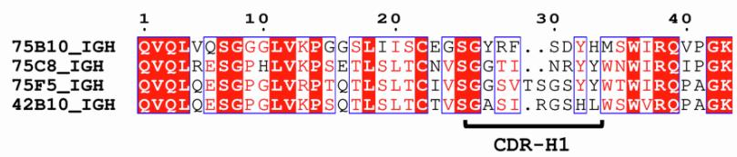  
A

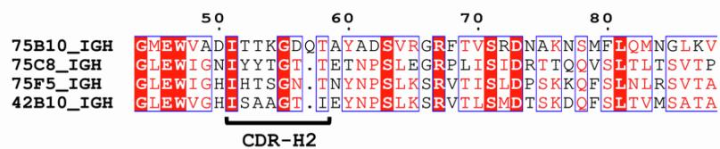

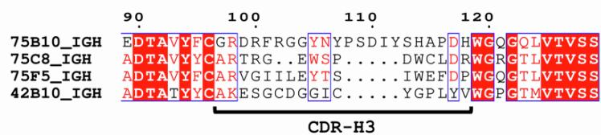  
B

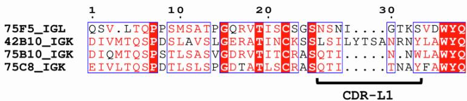

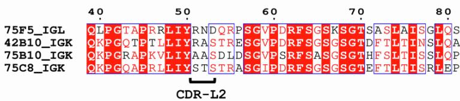

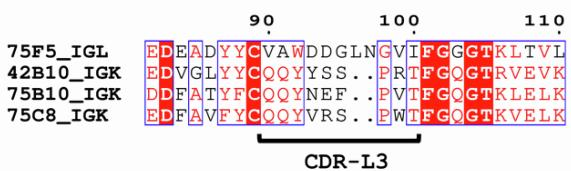  
Figure S1. The complementarity-determining regions (CDRs) of isolated human monoclonal antibodies (hmAbs) are distinct, related to Table S1

(A-B) The amino acid sequence alignment displays the variable regions of (A) heavy and (B) light chains of hmAbs. The CDRs are indicated at the bottom of the alignment. Residues in white enclosed within red boxes represent identical residues. Residues in red denote similarity within a specific group. Residues highlighted within blue frames indicate similarity across multiple groups. IMGT reference directory release: 202405-2.

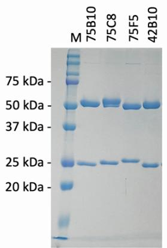  
A

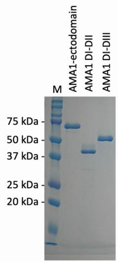  
B

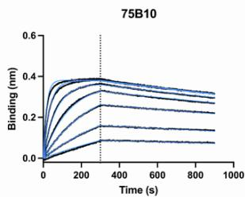  
C

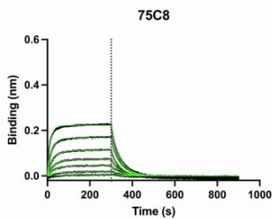

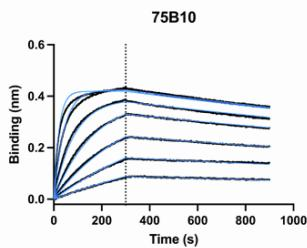  
D

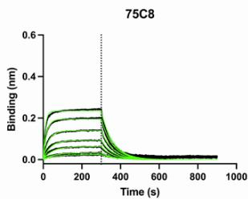

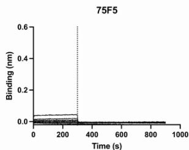

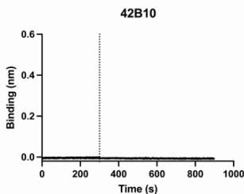

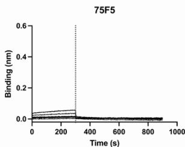

Figure S2. SDS-PAGE of isolated hmAbs and AMA1 constructs, and binding sensorgrams of hmAbs to AMA1 DI-DII and AMA1 DI-DIII, related to Figure 1 and Table 1   
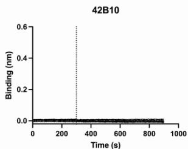  
(A) Reducing SDS-polyacrylamide gel electrophoresis (SDS-PAGE) of purified human monoclonal antibodies (hmAbs). (B) Reducing SDS-PAGE of purified AMA1 constructs. The SDS-PAGE was repeated at least three times with consistent results. M: molecular weight marker (Bio-Rad, Cat# 1610374). (C) Representative biolayer interferometry (BLI) sensorgram traces showing the binding of hmAbs to recombinantly expressed AMA1 DI-DII. (D) BLI sensorgram traces for the binding of hmAbs to AMA1 DI-DIII. hmAbs were immobilized on biosensors, and AMA1 DI-DII or DI-DIII analytes were serially diluted two-fold, ranging from 200 nM to 3.125 nM. The black lines represent the experimental binding data, while blue and green lines indicate the fitted curves. Association and dissociation steps are separated by a dotted line.

75B10 75C8 75F5 42B10 Buffer (only Competing Antibody)

Figure S3. Representative data from an in-tandem binning assays, related to Figure 2B

The baseline steps remove any unbound AMA1-ectodomain/ antibody from the biosensor, and the baseline after saturating antibody step can also be used to identify hmAbs with fast off-rates, such as the 75F5 antibody observed in these assays. Steps are separated by a dotted line.

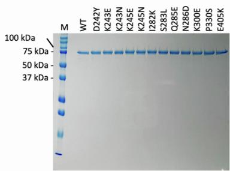  
A

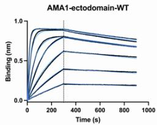  
B

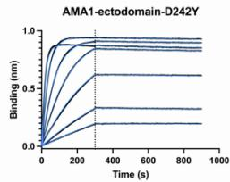

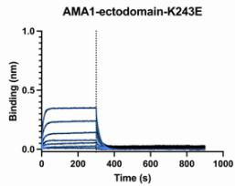

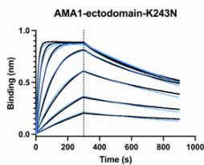

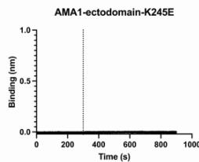

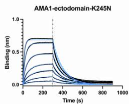

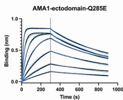

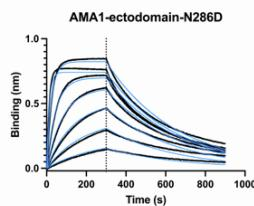

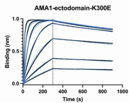

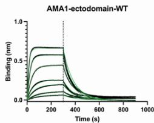  
C

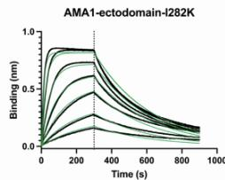

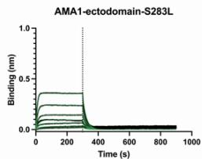

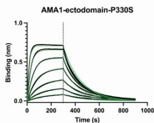

Figure S4. Effect of polymorphisms in AMA1 on its binding kinetics with Fab 75B10 and 75C8, related to Figure 4 and Table S5   
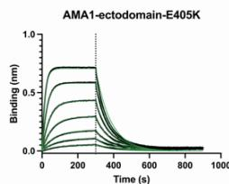  
(A) Reducing SDS-PAGE of purified AMA1 polymorphic variants. The SDS-PAGE was repeated at least three times with similar results. WT- wild-type. M- molecular weight marker (Bio-Rad, Cat# 1610374). (B) Binding kinetics of Fab 75B10 to AMA1-ectodomain constructs with polymorphisms in their epitopes were measured using BLI. (C) Binding kinetics of Fab 75C8 to AMA1 ectodomain constructs with polymorphisms in their epitopes, measured using BLI. For both (B) and (C), Fab was serially diluted 2-fold within the range of 200 nM to 3.125 nM. Black lines represent the measured binding, while blue or green lines indicate the curve fits. Association and dissociation steps are separated by a dotted line.

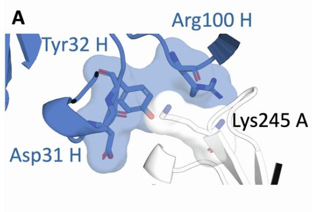

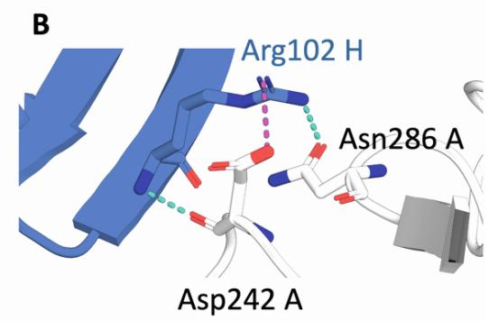

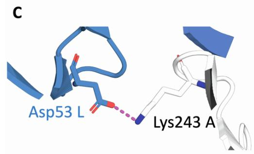

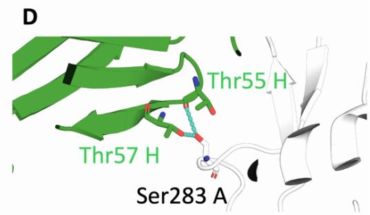

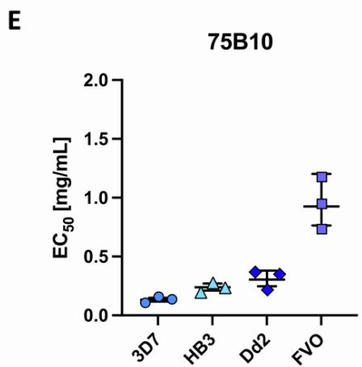

Figure S5. Molecular basis of binding perturbations for hmAbs 75B10 and 75C8 due to polymorphisms in their epitopes, and strain-transcending neutralization of heterologous P. falciparum strains, related to Table S5, and Figures 4 and S4   
  
(A) The high surface complementarity between AMA1 residue Lys245 and residues Asp31, Tyr32, and Arg100 of the 75B10 heavy chain indicates a geometric fit. Additionally, the electrostatic interactions between Lys245 of AMA1 and the negatively charged residue Asp31 on the 75B10 heavy chain suggest a potential induced fit mechanism. The calculated buried surface area (BSA) values further support this hypothesis, revealing significant surface complementarity: Asp31 contributes 66.9 Å $^{2}$ , Tyr32 contributes 43.4 Å $^{2}$ , and Arg100 provides 87.1 Å $^{2}$ , while Lys245 exhibits a BSA of 79.4 Å $^{2}$ , the highest among the interacting residues of AMA1. This high degree of complementarity stabilizes the interface and may facilitate conformational changes in CDRs upon binding, thereby enhancing the initial geometric fit and optimizing binding affinity. (B) Hydrogen bonds (shown in teal) and a salt bridge (shown in light purple) are formed between AMA1 residues Asp242, Asn286, and Arg102 of the heavy chain CDR3 of 75B10. (C) A salt bridge (shown in light purple) forms between AMA1 residue Lys243 and Asp53 of the light chain CDR3 of 75B10. (D) Hydrogen bonds (shown in teal) are formed between Ser283 on AMA1 and Thr55/57 within the heavy chain CDR3 of 75C8. (E) Concentrations (mg/ml) of hmAb 75B10 required to achieve 50% inhibition (EC $_{50}$ ) were determined by interpolation after globally fitting the data in Figure 4C to a four-parameter dose-response curve. The bars represent the EC $_{50}$ , and error bars indicate the 95% CI of a global fit from three independent biological replicates. Data points represent EC $_{50}$ values for individual fits from each biological replicate. (F) The EC $_{50}$ s (mg/ml) of hmAb 75C8 were determined by interpolation after globally fitting the data in Figure 4D to a four-parameter dose-response curve and depicted as described in (E).

  
A

  
B

  
C

  
D

  
E

F   
Figure S6. Synergistic neutralizing activity of 75B10 and 75C8 in a GIA assay against P. falciparum 3D7 and FVO strains, and binding kinetics of 75C8 IgG to the AMA1:75B10 Fab complex compared to AMA1 alone, related to Figure 5   
  
(A) Comparison of in vitro GIA between 75B10 and a 1:1 mixture of 75B10 and 75C8 against P. falciparum 3D7. Overall, 0.5 mg/ml 75B10 alone was compared to a 1:1 mixture of 75B10 and 75C8 (0.25 mg/ml 75B10 + 0.25 mg/ml 75C8). hmAbs were initially diluted to 0.5 mg/ml and subsequently diluted in 2-fold increments. The data are represented as the median, with error bars indicating a 95% CI across three independent biological replicates. (B) EC $_{50}$ values were determined through interpolation after fitting the data in (A) to a four-parameter dose–response curve on a global scale. (C) In vitro GIA of 75B10 alone was compared to a 1:1 combination of 75B10 and 75C8 against P. falciparum FVO. A concentration of 5.0 mg/ml 75B10 was tested alongside a mixture containing 2.5 mg/ml of each antibody (75B10 and 75C8). Antibodies were initially prepared at 5.0 mg/ml and then diluted in two-fold serial dilutions. Data are presented as the median, with error bars representing the 95% CI from three independent biological replicates. (D) EC $_{50}$ values were calculated by fitting the data from (C) to a four-parameter dose-response curve. For both (B) and (D), bars represent the EC $_{50}$ , and error bars indicate the 95% CI of a global fit from three independent biological replicates. Data points represent the EC $_{50}$ values for individual fits from each biological replicate. Statistical comparisons were conducted using a two-tailed extra sum-of-squares F-test. Representative BLI traces illustrating the binding kinetics of hmAb 75C8 to (E) the AMA1:75B10 Fab complex and (F) AMA1. The AMA1:75B10 Fab complex and AMA1 were 2-fold serially diluted in the range of 200 nM to 3.125 nM. The black lines represent the measured binding, while the gray and green lines depict the curve fitting. Association and dissociation steps are separated by a dotted line.

Table S1. V, D, and J gene information, CDR sequences, and the number of amino acid changes of P. falciparum AMA1-specific hmAbs. IMGT reference directory release: 202405-2, related to Figure S1   

<table><tr><td></td><td>SHM</td><td>heavy chain</td><td>heavy chain</td><td>heavy chain</td><td>heavy chain</td><td>heavy chain</td><td>heavy chain</td><td>SHM</td><td>light chain</td><td>light chain</td><td>light chain</td><td>light chain</td><td>light chain</td></tr><tr><td>PfAMA 1 hmAb (IgG)</td><td>(aa changes in heavy chain V region)</td><td>V-gene and allele</td><td>D-gene and allele</td><td>J-GENE and allele</td><td>CDR1</td><td>CDR2</td><td>CDR3</td><td>(aa changes in light chain V region)</td><td>V-GENE and allele</td><td>J-GENE and allele</td><td>CDR1</td><td>CDR2</td><td>CDR3</td></tr><tr><td>75B10</td><td>27</td><td>IGHV3-11*05</td><td>IGHD5-24*01</td><td>IGHJ4*02</td><td>GYRFSDYH</td><td>ITTKGDQ T</td><td>GRDRFRGGYN YPSDIYSHAPD H</td><td>12</td><td>IGKV1-5*03</td><td>IGKJ2*02</td><td>QTINN W</td><td>AAS</td><td>QQYNEFPVT</td></tr><tr><td>75C8</td><td>26</td><td>IGHV4-59*01 or IGHV4-59*12</td><td>IGHD4-23*01</td><td>IGHJ2*01</td><td>GGTINRYY</td><td>IYYTGTT</td><td>ARTRGEWSPD WCLDR</td><td>17</td><td>IGKV3-20*01</td><td>IGKJ1*01</td><td>QTITN AY</td><td>STS</td><td>QQYVRSPWT</td></tr><tr><td>75F5</td><td>14</td><td>IGHV4-61*09</td><td>IGHD2-15*01</td><td>IGHJ5*02</td><td>GGSVTSGS YY</td><td>IHTSGNT</td><td>ARVGIILEYTSI WEFDP</td><td>13</td><td>IGLV1-44*01 or IGLV1-44*04</td><td>IGLJ2*01, or IGLJ3*01</td><td>NSNIG TKS</td><td>RND</td><td>VAWDDGLNG VI</td></tr><tr><td>42B10</td><td>22</td><td>IGHV4-61*02 or IGHV4-61*09</td><td>IGHD2-15*01</td><td>IGHJ6*02</td><td>GASIRGSH L</td><td>ISAAGTI</td><td>CAKESGCDGGI CYGPLYVW</td><td>12</td><td>IGKV4-1*02</td><td>IGKJ1*01</td><td>LSILYT SANRN Y</td><td>RAS</td><td>QQYYSSPRT</td></tr></table>

Table S2. Data collection and refinement statistics, related to Figures 2C and 2D   

<table><tr><td></td><td>AMA1 DI-DII-75B10Fab Complex</td><td>AMA1 DI-DII-75C8Fab Complex</td></tr><tr><td colspan="3">Data collection</td></tr><tr><td>Space group</td><td>\( P\ 3_{2}\ 2\ 1 \)</td><td>\( P\ 1 \)</td></tr><tr><td colspan="3">Cell dimensions</td></tr><tr><td>\( a, b, c \) (Å)</td><td>93.24 93.24 228.02</td><td>54.87 71.62 132.93</td></tr><tr><td>\( \alpha, \beta, \gamma \) (°)</td><td>90 90 120</td><td>94.11 99.20 112.39</td></tr><tr><td>Resolution (Å) range</td><td>19.88 - 2.90 (2.98 - 2.90)</td><td>19.87 - 2.80 (2.87 - 2.80)</td></tr><tr><td>Total reflections</td><td>263,062 (19,581)</td><td>80,628 (6,324)</td></tr><tr><td>Unique reflections</td><td>26,126 (1,954)</td><td>41,930 (3,285)</td></tr><tr><td>\( R_{pim} \)</td><td>0.09 (0.52)</td><td>0.11 (0.48)</td></tr><tr><td>\( R_{merge} \)</td><td>0.26 (1.59)</td><td>0.11 (0.48)</td></tr><tr><td>Mean \( I/\sigma(I) \)</td><td>4.5 (0.6)</td><td>3.5 (0.7)</td></tr><tr><td>CC1/2</td><td>0.99 (0.57)</td><td>0.98 (0.59)</td></tr><tr><td>Completeness (%)</td><td>92.30 (77.49)</td><td>86.57 (74.25)</td></tr><tr><td>Redundancy</td><td>10.1 (10.0)</td><td>1.9 (1.9)</td></tr><tr><td>Beamline</td><td>SER-CAT</td><td>SER-CAT</td></tr><tr><td>No. of complex/ASU</td><td>1</td><td>2</td></tr><tr><td>PDB code</td><td>9BJG</td><td>9BJH</td></tr><tr><td colspan="3"></td></tr><tr><td colspan="3">Refinement</td></tr><tr><td>Resolution (Å) range</td><td>19.88 - 2.9 (2.98 - 2.9)</td><td>19.87 - 2.8 (2.87 - 2.8)</td></tr><tr><td>No. of reflections</td><td>24,131 (1,518)</td><td>38,941 (2,659)</td></tr><tr><td>\( R_{work}/R_{free} \) (%)</td><td>19.9/23.2</td><td>21.2/25.4</td></tr><tr><td>Wilson \( B \)-factor (\( Å^2 \))</td><td>53</td><td>43</td></tr><tr><td colspan="3">No. of non-hydrogen atoms</td></tr><tr><td>Proteins</td><td>5,578</td><td>11,215</td></tr><tr><td>Water</td><td>15</td><td>21</td></tr><tr><td colspan="3">\( B \)-factors</td></tr><tr><td>Proteins</td><td>57</td><td>51</td></tr><tr><td>Water</td><td>38</td><td>33</td></tr><tr><td colspan="3">R.M.S. deviations</td></tr><tr><td>Bond lengths (Å)</td><td>0.003</td><td>0.002</td></tr><tr><td>Bond angles (°)</td><td>0.59</td><td>0.52</td></tr><tr><td colspan="3">Validation</td></tr><tr><td>MolProbity score</td><td>0.84</td><td>1.04</td></tr><tr><td>Clashscore</td><td>0.55</td><td>0.95</td></tr><tr><td>Poor rotamers (%)</td><td>0</td><td>0</td></tr><tr><td colspan="3">Ramachandran plot</td></tr><tr><td>Favored (%)</td><td>97.17</td><td>97.45</td></tr><tr><td>Allowed (%)</td><td>2.83</td><td>2.55</td></tr><tr><td>Outliers (%)</td><td>0</td><td>0</td></tr></table>

Values in parentheses are for the highest-resolution shell.

Table S3. Contact residues between AMA1 DI-DII and 75B10, related to Figures 2C and 3A   

<table><tr><td colspan="6">Contacts between AMA1 DI-DII and 75B10 (PDB: 9BJG)</td></tr><tr><td>Residues in AMA1 DI-DII</td><td>Interface with 75B10 chains</td><td>Residues in 75B10 Heavy chain</td><td>CDRs (IMGT),Heavy chain</td><td>Residues in 75B10 Light chain</td><td>CDRs (IMGT),Light chain</td></tr><tr><td>Thr194</td><td>Heavy</td><td>Val2</td><td></td><td>Asn30</td><td>1</td></tr><tr><td>Leu195</td><td>Heavy</td><td>Gly26</td><td>1</td><td>Asn31</td><td>1</td></tr><tr><td>Asp196</td><td>Heavy</td><td>Tyr27</td><td>1</td><td>Trp32</td><td>1</td></tr><tr><td>Glu197</td><td>Light</td><td>Arg28</td><td>1</td><td>Tyr49</td><td></td></tr><tr><td>Arg199</td><td>Heavy</td><td>Asp31</td><td>1</td><td>Ala50</td><td>2</td></tr><tr><td>Lys209</td><td>Heavy</td><td>Tyr32</td><td>1</td><td>Asp53</td><td></td></tr><tr><td>Asn210</td><td>Heavy</td><td>His33</td><td>1</td><td>Leu54</td><td></td></tr><tr><td>Leu211</td><td>Heavy</td><td>Thr53</td><td>2</td><td>Ser56</td><td></td></tr><tr><td>Glu213</td><td>Heavy</td><td>Lys54</td><td>2</td><td>Tyr91</td><td>3</td></tr><tr><td>Asp242</td><td>Heavy</td><td>Gln57</td><td>2</td><td></td><td></td></tr><tr><td>Lys243</td><td>Heavy, Light</td><td>Arg98</td><td>3</td><td></td><td></td></tr><tr><td>Asp244</td><td>Heavy, Light</td><td>Asp99</td><td>3</td><td></td><td></td></tr><tr><td>Lys245</td><td>Heavy</td><td>Arg100</td><td>3</td><td></td><td></td></tr><tr><td>Lys246</td><td>Heavy, Light</td><td>Phe101</td><td>3</td><td></td><td></td></tr><tr><td>Ile282</td><td>Light</td><td>Arg102</td><td>3</td><td></td><td></td></tr><tr><td>Gln285</td><td>Heavy</td><td>Gly103</td><td>3</td><td></td><td></td></tr><tr><td>Asn286</td><td>Heavy, Light</td><td>Tyr105</td><td>3</td><td></td><td></td></tr><tr><td>Glu299</td><td>Heavy</td><td>Tyr107</td><td>3</td><td></td><td></td></tr><tr><td>Lys300</td><td>Heavy</td><td>Pro108</td><td>3</td><td></td><td></td></tr><tr><td>Arg304</td><td>Heavy</td><td>Asp110</td><td>3</td><td></td><td></td></tr><tr><td>Lys305</td><td>Heavy</td><td>Tyr112</td><td>3</td><td></td><td></td></tr><tr><td>Gln308</td><td>Heavy</td><td>His114</td><td>3</td><td></td><td></td></tr><tr><td>Ile426</td><td>Heavy</td><td></td><td></td><td></td><td></td></tr><tr><td>His433</td><td>Heavy</td><td></td><td></td><td></td><td></td></tr><tr><td>Ile435</td><td>Heavy</td><td></td><td></td><td></td><td></td></tr><tr><td>Glu436</td><td>Heavy</td><td></td><td></td><td></td><td></td></tr><tr><td>Val437</td><td>Heavy</td><td></td><td></td><td></td><td></td></tr><tr><td>Glu438</td><td>Heavy</td><td></td><td></td><td></td><td></td></tr></table>

The contact residues were identified using PDBePISA (https://www.ebi.ac.uk/msd-srv/prot_int/cgi-bin/piserver), with AMA1 residues numbered according to the sequence of the P. falciparum 3D7 AMA1 allele.

Table S4. Contact residues between AMA1 DI-DII and 75C8, related to Figures 2D and 3B   

<table><tr><td colspan="6">Contacts between AMA1 DI-DII and 75C8 (PDB: 9BJH)</td></tr><tr><td>Residues in AMA1 DI-DII</td><td>Interface with 75C8 chains</td><td>Residues in 75C8 Heavy chain</td><td>CDRs (IMGT),Heavy chain</td><td>Residues in 75C8 Light chain</td><td>CDRs (IMGT),Light chain</td></tr><tr><td>Arg128</td><td>Heavy</td><td>Asn30</td><td>1</td><td>Thr30</td><td>1</td></tr><tr><td>Ile157</td><td>Heavy</td><td>Arg31</td><td>1</td><td>Ala32</td><td>1</td></tr><tr><td>Ile158</td><td>Heavy</td><td>Tyr33</td><td>1</td><td>Tyr33</td><td>1</td></tr><tr><td>Glu159</td><td>Heavy</td><td>Tyr52</td><td>2</td><td>Tyr92</td><td>3</td></tr><tr><td>Ser161</td><td>Heavy</td><td>Tyr53</td><td>2</td><td>Val93</td><td>3</td></tr><tr><td>Asn162</td><td>Heavy</td><td>Thr54</td><td>2</td><td>Arg94</td><td>3</td></tr><tr><td>Thr163</td><td>Heavy</td><td>Gly55</td><td>2</td><td>Ser95</td><td>3</td></tr><tr><td>Asn258</td><td>Heavy</td><td>Thr56</td><td>2</td><td>Trp97</td><td></td></tr><tr><td>Arg277</td><td>Heavy</td><td>Glu58</td><td></td><td></td><td></td></tr><tr><td>Asp281</td><td>Heavy</td><td>Asp72</td><td></td><td></td><td></td></tr><tr><td>Ile282</td><td>Heavy</td><td>Arg73</td><td></td><td></td><td></td></tr><tr><td>Ser283</td><td>Heavy</td><td>Thr74</td><td></td><td></td><td></td></tr><tr><td>Phe284</td><td>Heavy</td><td>Glu101</td><td>3</td><td></td><td></td></tr><tr><td>Pro330</td><td>Heavy, Light</td><td>Trp102</td><td>3</td><td></td><td></td></tr><tr><td>Ala331</td><td>Heavy, Light</td><td>Ser103</td><td>3</td><td></td><td></td></tr><tr><td>Ile332</td><td>Heavy, Light</td><td>Pro104</td><td>3</td><td></td><td></td></tr><tr><td>Glu336</td><td>Heavy, Light</td><td>Trp106</td><td>3</td><td></td><td></td></tr><tr><td>Lys339</td><td>Heavy</td><td></td><td></td><td></td><td></td></tr><tr><td>Leu340</td><td>Heavy</td><td></td><td></td><td></td><td></td></tr><tr><td>Glu343</td><td>Heavy</td><td></td><td></td><td></td><td></td></tr><tr><td>Glu405</td><td>Light</td><td></td><td></td><td></td><td></td></tr><tr><td>Thr406</td><td>Light</td><td></td><td></td><td></td><td></td></tr><tr><td>Gln407</td><td>Light</td><td></td><td></td><td></td><td></td></tr><tr><td>Lys408</td><td>Light</td><td></td><td></td><td></td><td></td></tr></table>

The contact residues were identified using PDBePISA (https://www.ebi.ac.uk/msd-srv/prot_int/cgi-bin/piserver), with AMA1 residues numbered according to the sequence of the P. falciparum 3D7 AMA1 allele.

Table S5. Kinetic rate constants of binding of the Fab (fragment antigen-binding) fragments of the human monoclonal antibodies 75B10 and 75C8 to polymorphic variants of the AMA1-ectodomain, as determined by BLI, related to Figures 4, S4, and S5   

<table><tr><td>Polymorphism</td><td>Minor Allele Frequency (%)</td><td>hmAb epitope</td><td>\(K_D\)(x 10-9± SEM M)</td><td>\(k_a\)(x 105± SEM 1/Ms)</td><td>\(k_{dis}\)(x 10-3± SEM 1/s)</td><td>n</td></tr><tr><td>WT</td><td>-</td><td rowspan="9">75B10</td><td>0.847 ± 0.019</td><td>3.307 ± 0.043</td><td>2.800 ± 0.091</td><td>3</td></tr><tr><td>Asp242Tyr</td><td>47.4</td><td>0.137 ± 0.009</td><td>2.693 ± 0.033</td><td>0.369 ± 0.021</td><td>3</td></tr><tr><td>Lys243Glu</td><td>16.2</td><td>114.467 ± 8.022</td><td>4.467 ± 0.126</td><td>509.067 ± 21.178</td><td>3</td></tr><tr><td>Lys243Asn</td><td>16.4</td><td>2.463 ± 0.041</td><td>3.710 ± 0.025</td><td>9.127 ± 0.100</td><td>3</td></tr><tr><td>Lys245Glu</td><td>0.1</td><td>ND</td><td>ND</td><td>ND</td><td>3</td></tr><tr><td>Lys245Asn</td><td>6.1</td><td>30.733 ± 3.284</td><td>3.287 ± 0.141</td><td>100.113 ± 6.056</td><td>3</td></tr><tr><td>Gln285Glu</td><td>14.4</td><td>3.195 ± 0.103</td><td>3.247 ± 0.033</td><td>10.377 ± 0.381</td><td>3</td></tr><tr><td>Asn286Asp</td><td>0.8</td><td>7.328 ± 3.790</td><td>3.790 ± 0.040</td><td>27.780 ± 0.580</td><td>3</td></tr><tr><td>Lys300Glu</td><td>27.8</td><td>0.745 ± 0.004</td><td>3.420 ± 0.062</td><td>2.548 ± 0.031</td><td>3</td></tr><tr><td>WT</td><td>-</td><td rowspan="5">75C8</td><td>37.670 ± 2.347</td><td>3.073 ± 0.082</td><td>115.333 ± 4.170</td><td>3</td></tr><tr><td>Ile282Lys</td><td>30.7</td><td>9.313 ± 0.380</td><td>3.407 ± 0.049</td><td>31.677 ± 0.854</td><td>3</td></tr><tr><td>Ser283Leu</td><td>24.2</td><td>179.133 ± 39.157</td><td>3.093 ± 0.541</td><td>511.700 ± 39.129</td><td>3</td></tr><tr><td>Pro330Ser</td><td>6.7</td><td>21.867 ± 2.178</td><td>2.820 ± 0.096</td><td>61.313 ± 3.897</td><td>3</td></tr><tr><td>Glu405Lys</td><td>49.8</td><td>50.463 ± 3.181</td><td>2.537 ± 0.075</td><td>127.467 ± 4.959</td><td>3</td></tr></table>

Polymorphisms are numbered according to the AMA1 allele of P. falciparum 3D7. The binding data were fitted using a 1:1 binding model. The means and SEMs of three independent experiments (n) are shown. WT- wild-type. ND- not detectable.

Table S6. Amino acid residues at the six polymorphic positions within the 75B10 epitope and the four polymorphic positions within the 75C8 epitope of AMA1 in heterologous P. falciparum strains, related to Figure 4   

<table><tr><td>Polymorphism</td><td>Minor Allele Frequency (%)</td><td>Residue in PfDd2</td><td>Residue in PfHB3</td><td>Residue in PfFVO</td></tr><tr><td colspan="5">75B10 epitope</td></tr><tr><td>Asp242Tyr</td><td>47.4</td><td>Tyr242</td><td>Tyr242</td><td>Tyr242</td></tr><tr><td>Lys243Glu</td><td>16.2</td><td rowspan="2">Asn243</td><td rowspan="2">Glu243</td><td rowspan="2">Asn243</td></tr><tr><td>Lys243Asn</td><td>16.4</td></tr><tr><td>Lys245Glu</td><td>0.1</td><td rowspan="2">Lys245</td><td rowspan="2">Lys245</td><td rowspan="2">Lys245</td></tr><tr><td>Lys245Asn</td><td>6.1</td></tr><tr><td>Gln285Glu</td><td>14.4</td><td>Gln285</td><td>Glu285</td><td>Glu285</td></tr><tr><td>Asn286Asp</td><td>0.8</td><td>Asn286</td><td>Asn286</td><td>Asn286</td></tr><tr><td>Lys300Glu</td><td>27.8</td><td>Glu300</td><td>Glu300</td><td>Glu300</td></tr><tr><td colspan="5">75C8 epitope</td></tr><tr><td>Ile282Lys</td><td>30.7</td><td>Lys282</td><td>Lys282</td><td>Lys282</td></tr><tr><td>Ser283Leu</td><td>24.2</td><td>Ser283</td><td>Leu283</td><td>Leu283</td></tr><tr><td>Pro330Ser</td><td>6.7</td><td>Ser330</td><td>Ser330</td><td>Ser330</td></tr><tr><td>Glu405Lys</td><td>49.8</td><td>Lys405</td><td>Glu405</td><td>Glu405</td></tr></table>

Polymorphisms are numbered according to the AMA1 allele of P. falciparum 3D7. Deviations from the 3D7 reference sequence are highlighted in red.

Table S7. % GIA for hmAbs 75C8 and 75B10, tested individually or in combination against P. falciparum 3D7 and FVO strains using Loewe's additivity model, related to Figures 5A and 5B   

<table><tr><td colspan="5">P. falciparum 3D7</td><td colspan="5">P. falciparum FVO</td></tr><tr><td>75B10 (mg/ml)</td><td>75C8 (mg/ml)</td><td>% GIA (assay 1)</td><td>% GIA (assay 2)</td><td>% GIA (assay 3)</td><td>75B10 (mg/ml)</td><td>75C8 (mg/ml)</td><td>% GIA (assay 1)</td><td>% GIA (assay 2)</td><td>% GIA (assay 3)</td></tr><tr><td>0.500</td><td>1.000</td><td>98.0</td><td>95.4</td><td>97.2</td><td>5.000</td><td>2.500</td><td>99.0</td><td>99.3</td><td>98.1</td></tr><tr><td>0.250</td><td>1.000</td><td>97.2</td><td>95.5</td><td>96.2</td><td>2.500</td><td>2.500</td><td>97.9</td><td>97.9</td><td>96.9</td></tr><tr><td>0.125</td><td>1.000</td><td>98.3</td><td>98.5</td><td>98.0</td><td>1.250</td><td>2.500</td><td>99.7</td><td>100.1</td><td>98.9</td></tr><tr><td>0.063</td><td>1.000</td><td>97.6</td><td>98.3</td><td>97.5</td><td>0.625</td><td>2.500</td><td>98.7</td><td>99.3</td><td>97.9</td></tr><tr><td>0.031</td><td>1.000</td><td>97.6</td><td>99.0</td><td>98.2</td><td>0.313</td><td>2.500</td><td>99.3</td><td>100.0</td><td>98.8</td></tr><tr><td>0.016</td><td>1.000</td><td>96.1</td><td>97.1</td><td>96.5</td><td>0.156</td><td>2.500</td><td>97.6</td><td>98.0</td><td>95.1</td></tr><tr><td>0.000</td><td>1.000</td><td>90.6</td><td>88.1</td><td>87.4</td><td>0.000</td><td>2.500</td><td>81.6</td><td>81.9</td><td>80.5</td></tr><tr><td>0.500</td><td>0.500</td><td>98.1</td><td>95.4</td><td>96.7</td><td>5.000</td><td>1.250</td><td>98.8</td><td>99.3</td><td>97.8</td></tr><tr><td>0.250</td><td>0.500</td><td>95.4</td><td>94.2</td><td>94.5</td><td>2.500</td><td>1.250</td><td>96.6</td><td>96.4</td><td>95.4</td></tr><tr><td>0.125</td><td>0.500</td><td>94.8</td><td>97.3</td><td>96.8</td><td>1.250</td><td>1.250</td><td>99.1</td><td>99.5</td><td>98.1</td></tr><tr><td>0.063</td><td>0.500</td><td>91.7</td><td>95.9</td><td>96.2</td><td>0.625</td><td>1.250</td><td>98.1</td><td>98.4</td><td>97.2</td></tr><tr><td>0.031</td><td>0.500</td><td>88.7</td><td>94.8</td><td>89.4</td><td>0.313</td><td>1.250</td><td>97.0</td><td>96.6</td><td>95.7</td></tr><tr><td>0.016</td><td>0.500</td><td>85.0</td><td>91.4</td><td>91.6</td><td>0.156</td><td>1.250</td><td>90.7</td><td>89.2</td><td>88.1</td></tr><tr><td>0.000</td><td>0.500</td><td>75.9</td><td>79.0</td><td>79.9</td><td>0.000</td><td>1.250</td><td>63.1</td><td>62.0</td><td>61.1</td></tr><tr><td>0.500</td><td>0.250</td><td>97.8</td><td>96.9</td><td>96.1</td><td>5.000</td><td>0.625</td><td>97.3</td><td>98.4</td><td>96.8</td></tr><tr><td>0.250</td><td>0.250</td><td>92.7</td><td>91.8</td><td>93.0</td><td>2.500</td><td>0.625</td><td>-</td><td>94.6</td><td>93.5</td></tr><tr><td>0.125</td><td>0.250</td><td>87.0</td><td>94.2</td><td>92.8</td><td>1.250</td><td>0.625</td><td>97.4</td><td>96.9</td><td>96.0</td></tr><tr><td>0.063</td><td>0.250</td><td>75.8</td><td>87.2</td><td>86.9</td><td>0.625</td><td>0.625</td><td>93.9</td><td>92.0</td><td>91.4</td></tr><tr><td>0.031</td><td>0.250</td><td>66.3</td><td>81.0</td><td>80.8</td><td>0.313</td><td>0.625</td><td>86.2</td><td>81.9</td><td>82.6</td></tr><tr><td>0.016</td><td>0.250</td><td>58.4</td><td>73.1</td><td>72.8</td><td>0.156</td><td>0.625</td><td>70.7</td><td>66.2</td><td>65.5</td></tr><tr><td>0.000</td><td>0.250</td><td>43.3</td><td>53.5</td><td>54.7</td><td>0.000</td><td>0.625</td><td>31.0</td><td>30.6</td><td>30.5</td></tr><tr><td>0.500</td><td>0.125</td><td>97.4</td><td>96.1</td><td>96.3</td><td>5.000</td><td>0.313</td><td>97.1</td><td>97.1</td><td>95.7</td></tr><tr><td>0.250</td><td>0.125</td><td>90.2</td><td>93.2</td><td>92.6</td><td>2.500</td><td>0.313</td><td>93.3</td><td>92.0</td><td>90.7</td></tr><tr><td>0.125</td><td>0.125</td><td>76.4</td><td>88.2</td><td>89.0</td><td>1.250</td><td>0.313</td><td>93.3</td><td>90.0</td><td>89.3</td></tr><tr><td>0.063</td><td>0.125</td><td>55.5</td><td>72.4</td><td>70.9</td><td>0.625</td><td>0.313</td><td>80.5</td><td>73.7</td><td>73.9</td></tr><tr><td>0.031</td><td>0.125</td><td>44.9</td><td>59.7</td><td>59.1</td><td>0.313</td><td>0.313</td><td>65.5</td><td>57.7</td><td>57.8</td></tr><tr><td>0.016</td><td>0.125</td><td>37.0</td><td>45.5</td><td>50.1</td><td>0.156</td><td>0.313</td><td>41.0</td><td>34.4</td><td>35.0</td></tr><tr><td>0.000</td><td>0.125</td><td>21.4</td><td>27.1</td><td>33.4</td><td>0.000</td><td>0.313</td><td>13.8</td><td>12.4</td><td>13.7</td></tr><tr><td>0.500</td><td>0.063</td><td>98.1</td><td>95.2</td><td>97.3</td><td>5.000</td><td>0.156</td><td>95.3</td><td>93.3</td><td>92.7</td></tr><tr><td>0.250</td><td>0.063</td><td>89.3</td><td>93.5</td><td>93.1</td><td>2.500</td><td>0.156</td><td>89.2</td><td>85.2</td><td>83.5</td></tr><tr><td>0.125</td><td>0.063</td><td>68.1</td><td>82.9</td><td>83.4</td><td>1.250</td><td>0.156</td><td>82.3</td><td>72.9</td><td>73.0</td></tr><tr><td>0.063</td><td>0.063</td><td>42.7</td><td>59.5</td><td>58.3</td><td>0.625</td><td>0.156</td><td>64.7</td><td>53.3</td><td>55.2</td></tr><tr><td>0.031</td><td>0.063</td><td>29.7</td><td>40.7</td><td>41.5</td><td>0.313</td><td>0.156</td><td>45.4</td><td>33.3</td><td>35.9</td></tr><tr><td>0.016</td><td>0.063</td><td>22.4</td><td>26.6</td><td>28.4</td><td>0.156</td><td>0.156</td><td>19.8</td><td>13.3</td><td>15.6</td></tr><tr><td>0.000</td><td>0.063</td><td>13.3</td><td>13.8</td><td>14.8</td><td>0.000</td><td>0.156</td><td>4.4</td><td>5.4</td><td>7.4</td></tr><tr><td>0.500</td><td>0.031</td><td>97.5</td><td>97.4</td><td>96.8</td><td>5.000</td><td>0.078</td><td>90.7</td><td>88.8</td><td>87.1</td></tr><tr><td>0.250</td><td>0.031</td><td>85.9</td><td>90.3</td><td>91.5</td><td>2.500</td><td>0.078</td><td>82.3</td><td>76.0</td><td>75.3</td></tr><tr><td>0.125</td><td>0.031</td><td>60.7</td><td>77.7</td><td>78.6</td><td>1.250</td><td>0.078</td><td>72.1</td><td>61.8</td><td>63.3</td></tr><tr><td>0.063</td><td>0.031</td><td>34.8</td><td>48.1</td><td>48.0</td><td>0.625</td><td>0.078</td><td>49.3</td><td>38.6</td><td>39.2</td></tr><tr><td>0.031</td><td>0.031</td><td>22.9</td><td>25.3</td><td>29.0</td><td>0.313</td><td>0.078</td><td>28.6</td><td>19.7</td><td>21.2</td></tr><tr><td>0.016</td><td>0.031</td><td>18.2</td><td>13.4</td><td>15.7</td><td>0.156</td><td>0.078</td><td>12.5</td><td>9.1</td><td>9.0</td></tr><tr><td>0.000</td><td>0.031</td><td>9.9</td><td>8.1</td><td>9.8</td><td>0.000</td><td>0.078</td><td>3.6</td><td>7.9</td><td>5.0</td></tr><tr><td>0.500</td><td>0.000</td><td>95.2</td><td>92.9</td><td>91.8</td><td>5.000</td><td>0.000</td><td>81.7</td><td>79.6</td><td>78.7</td></tr><tr><td>0.250</td><td>0.000</td><td>76.8</td><td>85.5</td><td>85.5</td><td>2.500</td><td>0.000</td><td>65.5</td><td>61.4</td><td>62.0</td></tr><tr><td>0.125</td><td>0.000</td><td>43.0</td><td>60.8</td><td>63.4</td><td>1.250</td><td>0.000</td><td>49.4</td><td>43.0</td><td>42.7</td></tr><tr><td>0.063</td><td>0.000</td><td>18.6</td><td>29.5</td><td>28.2</td><td>0.625</td><td>0.000</td><td>25.9</td><td>18.5</td><td>23.3</td></tr><tr><td>0.031</td><td>0.000</td><td>12.5</td><td>13.5</td><td>13.6</td><td>0.313</td><td>0.000</td><td>10.3</td><td>8.9</td><td>13.6</td></tr><tr><td>0.016</td><td>0.000</td><td>11.5</td><td>7.7</td><td>18.9</td><td>0.156</td><td>0.000</td><td>-0.9</td><td>-1.8</td><td>-0.7</td></tr><tr><td>0.000</td><td>0.000</td><td>10.6</td><td>8.0</td><td>12.8</td><td>0.000</td><td>0.000</td><td>2.3</td><td>4.9</td><td>7.1</td></tr></table>

Table S8. Sequences of AMA1 constructs and other proteins used in the study after signal peptide cleavage, as well as the sequences of AMA1-specific hmAbs, related to STAR Methods   

<table><tr><td>Construct</td><td colspan="2">Sequence</td></tr><tr><td>AMA1 DI-DII</td><td colspan="2">etgNYMGNPWTEYMAKYDIEEVHGSGIRVDLGEDAEVAGTQYRLPSGKCPVFGKGIIIENSNTAFLTPVATGNQYLKDGGFAFPPTEPLMSPMTLDEMRHFYKDNKYVKNLDELTLCSRHAGNMIPDNDKNSNYKYPAVYDDDKKKCHILYIAAQENNGPRYCNKDESKRNSMFCFRPAKDISFQNYAYLSKNVVDNWEKVCPRKNLQNAKFGLWVDGNCEDIPHVNEFPAIDLFECKNLFVELSASDQPKQYEQHLTDYEKIKEGFKNKNAAMIKSAFLPTGAFKADRYKSHGKGYNWGNYNTETQKCEIFNVKPTCLINNAAYIATTALSHPIEVEgtkhhhhhh</td></tr><tr><td>AMA1 DI-DIII</td><td colspan="2">etgNYMGNPWTEYMAKYDIEEVHGSGIRVDLGEDAEVAGTQYRLPSGKCPVFGKGIIIENSNTAFLTPVATGNQYLKDGGFAFPPTEPLMSPMTLDEMRHFYKDNKYVKNLDELTLCSRHAGNMIPDNDKNSNYKYPAVYDDDKKKCHILYIAAQENNGPRYCNKDESKRNMSFCFRPAKDISFQNYAYLSKNVVDNWEKVCPRKNLQNAKFGLWVDGNCEDIPHVNEFPAIDLFECKNLFVELSASDQPKQYEQHLTDYEKIKEGFKNKNAAMIKSAFLPTGAFKADRYKSHGKGYNWGNYNTETQKCEIFNVKPTCLINNAAYIATTALSHPIEVENNFPCSLYKDEIMKEIERESKRIKLNDNDDEGNKKIIAPRIFISDDKDSLKCPCDPEMVNSACRFFVCKCVERRAEVTSNNEVVVKEEYKDEYgtkhhhhhh</td></tr><tr><td>AMA1 ectodomain</td><td colspan="2">etgQNYWEHPYQNSDVYRPINEHREHPKEYEYPLHQEHTYQQEDSGEDENTLQHAYPIDHEGAEPAPQEQNLFSSIEIVERSNYMGNPWTEYMAKYDIEEVHGSGIRVDLGEDAEVAGTQYRLPSGKCPVFGKGIIIENSNTTFLTPVATGNQYLKDGGFAFPPTEPLMSPMTLDEMRHFYKDNKYVKNLDELTLCSRHAGNMIPDNDKNSNYKYPAVYDDDKKKCHILYIAAQENNGPRYCNKDESKRNMSFCFRPAKDISFQNYTYLSKNVVDNWEKVCPRKNLQNAKFGLWVDGNCEDIPHVNEFPAIDLFECKNLFVELSASDQPKQYEQHLTDYEKIKEGFKNKNASMIKSAFLPTGAFKADRYKSHGKGYNWGNYNTETQKCEIFNVKPTCLINNSSYIATTALSHPIEVENNFPCSLYKDEIMKEIERESKRIKLNDNDDEGNKKIIAPRIFISDDKDSLKCPCDPEMVNSACRFFVCKCVERRAEVTSNNEVVVKEEYKDEYADIPEHKPTgtkhhhhhh</td></tr><tr><td>AMA1 ectodomain with Avi-tag</td><td colspan="2">etgQNYWEHPYQNSDVYRPINEHREHPKEYEYPLHQEHTYQQEDSGEDENTLQHAYPIDHEGAEPAPQEQNLFSSIEIVERSNYMGNPWTEYMAKYDIEEVHGSGIRVDLGEDAEVAGTQYRLPSGKCPVFGKGIIIENSNTTFLTPVATGNQYLKDGGFAFPPTEPLMSPMTLEDMRHFYKDNKYVKNLDELTLCSRHAGNMIPDNDKNSNYKYPAVYDDDKKKCHILYIAAQENNGPRYCNKDESKRNMSFCFRPAKDISFQNYTYLSKNVVDNWEKVCPRKNLQNAKFGLWVDGNCEDIPHVNEFPAIDLFECKNLFVELSASDQPKQYEQHLTDYEKIKEGFKKNNASMIKSAFLPTGAFKADRYKSHGKGYNWGNYNTETQKCEIFNVKPTCLINNSSYIATTALSHPIEVENNFPCSLYKDEIMKEIERESKRIKLNDNDDEGNKKIIAPRIFISDDKDSLKCPCDPEMVNSACRFFVCKCVERRAEVTSNNEVVVKEEYKDEYADIPEHKPTgtggsggsglndifeaqkiewhegrtkhhhhhh</td></tr><tr><td>TrxA-RON2L-fusion</td><td colspan="2">etghhhhhMSDKIIHLTDDSFDTDVLKADGAILVDFWAEWCGPCKMIAPILDEIADEYQGKLTVAKLNIDQNPGTAPKYGIRGIPITLLLFKNGEVAATKVGALSKGQLKEFLDANLAGsgslevlfqgpDITQQAKDIGAGPVASCF TTRMSPPQQICLNSVVNTALS</td></tr><tr><td>14I-1</td><td colspan="2">etgAWVDQTPRTATKETGESLTINCVLRDASLELKDTGWYRTKLGSTNEQSISIGGRYVETVNKGSKSFSLRISDLRVEDSGTYKCQAFYSLPLRDYNYALLFRGEKGAGTALTVKAAAGtkhhhhhh</td></tr><tr><td>hmAb</td><td>Heavy chain sequence (variable region)</td><td>Light chain sequence (variable region)</td></tr><tr><td>75B10</td><td>QVQLVQSGGGLVKPGGSLIISCEGSGYRFSDYHMSWIRQVPGKGMEWVADITTKGDQTAYADSVRGRTVSRDNAKNSMFLQMNLKVEDTAVYFCGRDRFRGGYNYPSDIYSHAPDHWGQGQLVTVSS</td><td>DIQMTQSPSTSASVGDRVTITCRASQTINNWLAWYQQKPGRAPKVLIYAASDLDSGVPSRFSASGSGTHFSLTISSLQPDDFATYFCQQYNEFPVTFGQGTKLELK</td></tr><tr><td>75C8</td><td>QVQLRESGPHLVKPSETLSLTCNVSGGTINRYYWNWIRQIPGKGLEWIGNIYYTGTTETNPSLEGRPLISIDRTTQQVSLTLTSVTPADTAVYYCARTRGEWSPDWCLDRWGRGTLVTVSS</td><td>EIVLTQSPDTLSLSPGDTATLSCRASQTITNAYFAWYQQKPGQAPRLLIYSTSTRASGIPDRFSGSGSGTEFTLTISRLEPEDFAVFYCQQYVRSPWTFGQGTKVELK</td></tr><tr><td>75F5</td><td>QVQLQESGPGLVRPTQTLSLTCIVSGGSVTSGSYYWTWIRQPAGKGLEWIGHIHTSGNTNYNPSLKSVRTISLDPSKKQFSLNLRSVTAADTAVYFCARVGILEYTSIWEFDPWGQGTLVTVSS</td><td>QSVLTQPPSMSATPGQRVTISCSGSNSIGTKSVDWYQQLPGTAPRRLIYRNDQRPSGVPRDFSGSKSGTSASLAISGLQSEDEADYYCVAWDDGLNGVIFGGGTKLTVL</td></tr><tr><td>42B10</td><td>QVQLQESGPGLVKPSQTLSLTCIVSGASIRGSHLWSWVRQPAGKGLEWVGHISAAGTIEYNPSLKSVRTLSMDTSKDQFSLTVMSATAADTATYYCAKESGCDGGICYGPLYVWGPGTMVTVSS</td><td>DIVMTQSPDSLAVSLGERATINCKSSLSILYTSANRNYLAWYQQKPGQTPTLLIYRASTRESGVPDRFSGSGSGTDFTLTINSLQAEDVGLYYCQQYYSSPRTFGQGTRVEVK</td></tr></table>

The AMA1 domains and RON2L are shown in uppercase, while cloning scars, tags, and linkers are shown in lowercase.