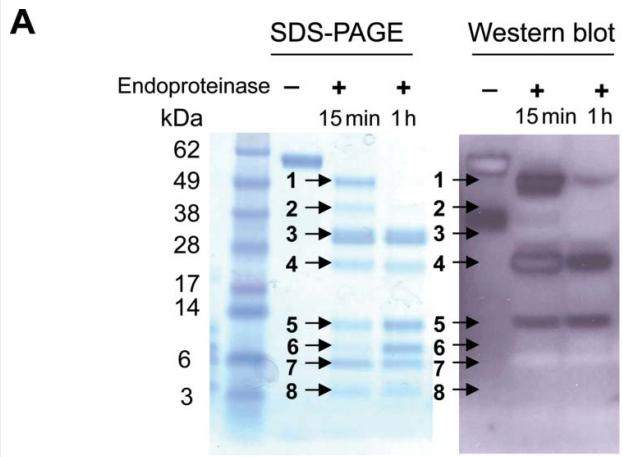
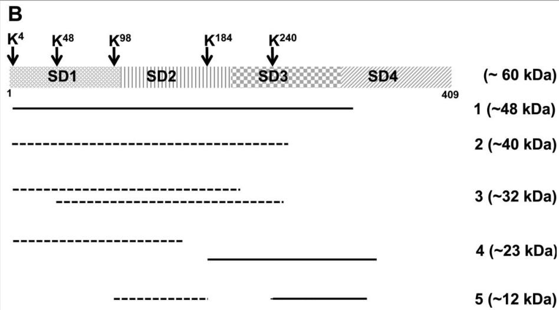
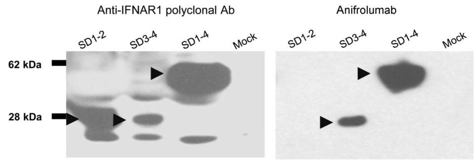
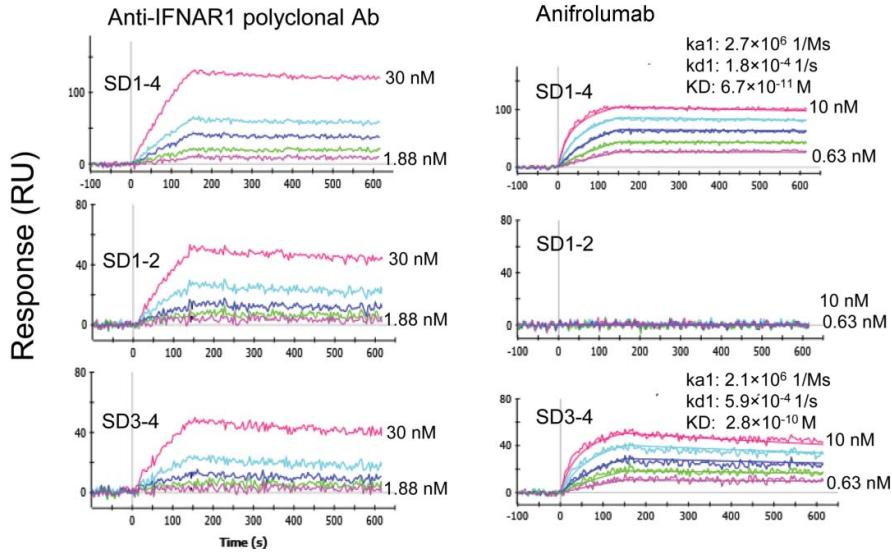
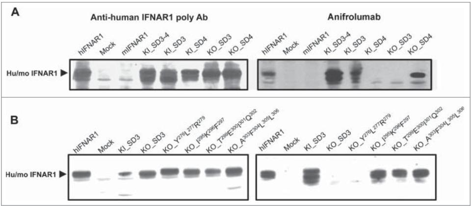
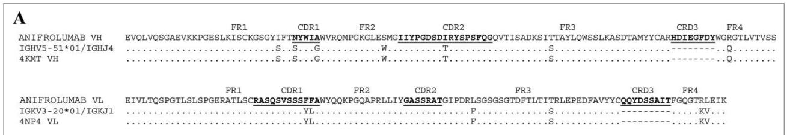
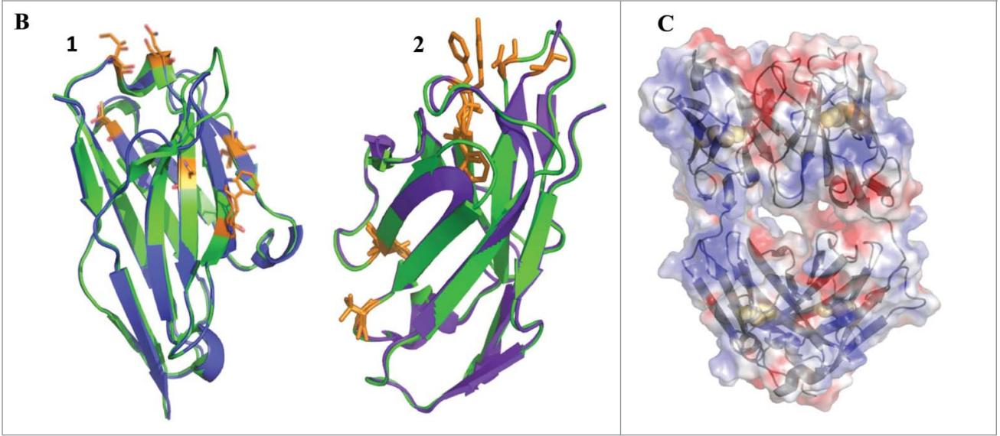
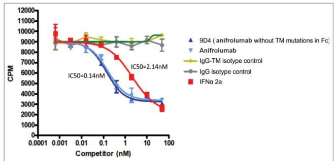
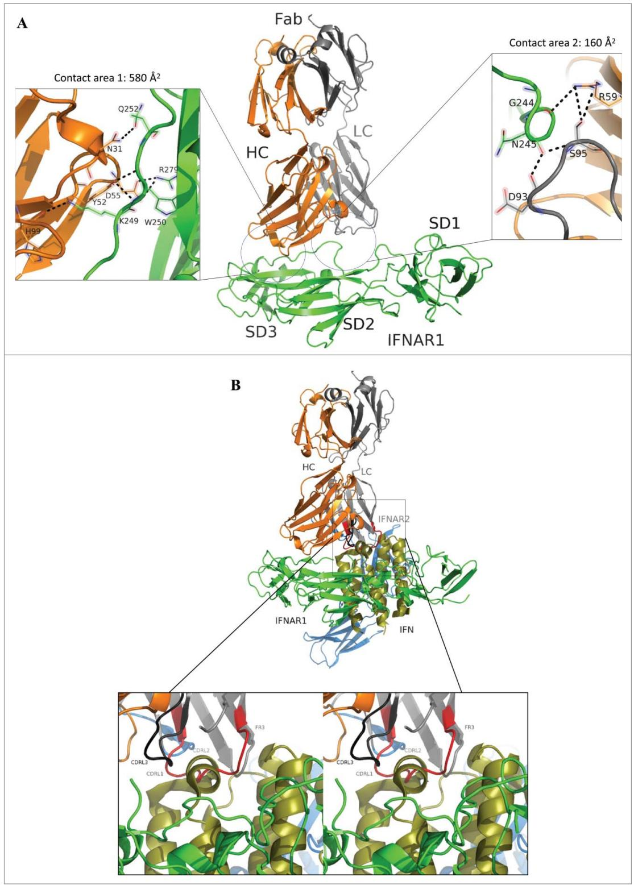

# Peng et al. mAbs 2015

# Molecular basis for antagonistic activity of anifrolumab, an anti-interferon- $\alpha$ receptor 1 antibody

Li Peng, Vaheh Oganesyan, Herren Wu, William F Dall'Acqua, and Melissa M Damschroder

Department of Antibody Discovery and Protein Engineering; MedImmune LLC; Gaithersburg, MD USA

Keywords: anifrolumab, MEDI546, IFNAR1, systemic sclerosis, epitope mapping, mutagenesis, enzymatic fragmentation, phage-peptide display, protein docking

Abbreviations: Å, angström; APBS, Adaptive Poisson-Boltzmann Solver; BSA, bovine serum albumin; CDR, complementarity-determining region; CHARMm, Chemistry at HARvard Macromolecular Mechanics; CHO, Chinese hamster ovary; EDTA, ethylene diamine tetra-acetic acid; ELISA, enzyme-linked immunosorbant assay; Fab, fragment antigen-binding; FBS, fetal bovine serum; Fc, fragment crystallizable; IFN, interferon; IFNAR1, interferon alpha receptor 1; IFNAR2, interferon alpha receptor 2; IgG, immunoglobulin; K $_{D}$ , equilibrium dissociation constant; kDa, kilodaltons; L-Cys, L-cysteine; MEMα, minimum essential alpha; MLE, murine lung epithelial; PBS, phosphate buffered saline; PBST, phosphate buffered saline tablets; PCR, polymerase chain reaction; PDB, protein data bank; Ph.D., phage display; PVDF, polyvinylidene difluoride; PyMOL, python-enhanced molecular graphics tool; RDOCK, rigid-body docking algorithm; RU, resonance units; SDS-PAGE, sodium dodecyl sulfate polyacrylamide gel electrophoresis; SPR, surface plasmon resonance; VH, variable heavy; VL, variable light; ZDOCK, rigid-body docking algorithm

Anifrolumab (anifrolumab) is an antagonist human monoclonal antibody that targets interferon $\alpha$ receptor 1 (IFNAR1). Anifrolumab has been developed to treat autoimmune diseases and is currently in clinical trials. To decipher the molecular basis of its mechanism of action, we engaged in multiple epitope mapping approaches to determine how it interacts with IFNAR1 and antagonizes the receptor. We identified the epitope of anifrolumab using enzymatic fragmentation, phage-peptide library panning and mutagenesis approaches. Our studies revealed that anifrolumab recognizes the SD3 subdomain of IFNAR1 with the critical residue $R^{279}$ . Further, we solved the crystal structure of anifrolumab Fab to a resolution of 2.3 Å. Guided by our epitope mapping studies, we then used in silico protein docking of the anifrolumab Fab crystal structure to IFNAR1 and characterized the corresponding mode of binding. We find that anifrolumab sterically inhibits the binding of IFN ligands to IFNAR1, thus blocking the formation of the ternary IFN/IFNAR1/IFNAR2 signaling complex. This report provides the molecular basis for the mechanism of action of anifrolumab and may provide insights toward designing antibody therapies against IFNAR1.

# Introduction

The type I interferon (IFN) pathway plays several important roles in host defense against viral infection $^{1,2}$ and in the pathogenesis of several autoimmune disorders. $^{3-5}$ Interferon $\alpha$ receptor 1 (IFNAR1), a critical component of the IFN signaling pathway, belongs to the helical cytokine class II family of receptors. It is composed of 4 fibronectin type III subdomains of $\sim$ 100 amino acids each, a single-span transmembrane domain, and an intracellular domain of $\sim$ 100 residues. $^{6,7}$ The 4 subdomains (SD) of IFNAR1 are folded into domain 1 (SD1+SD2) and domain 2 (SD3+SD4). $^{8,9}$ IFNAR1 forms a ternary signaling complex with IFNAR2 and type I IFN ligands, $^{10}$ which includes 14 IFN- $\alpha$ subtypes, IFN- $\beta$ , IFN- $\varepsilon$ , IFN- $\kappa$ and IFN- $\omega$ . $^{2}$ The formation of this ternary complex is the first step in the activation of several signal transduction pathways. Therefore, antagonizing this receptor and subsequently blocking the activation of kinases has the potential to prevent the downstream biologic effects of interferons in autoimmune diseases. $^{1,2}$

IFNAR1 is essential for the binding to all type I IFNs $^{2,11}$ and for mediation of IFN signals. $^{1,12}$ The role of IFNAR1 in ligand recognition and signal complex assembly has been revealed using

© Li Peng, Vaheh Oganesyan, Herren Wu, William F Dall'Acqua, and Melissa M Damschroder

\*Correspondence to: Melissa M Damschroder; Email: damschroderm@medimmune.com

Submitted: 10/16/2014; Revised: 11/13/2014; Accepted: 11/18/2014

http://dx.doi.org/10.1080/19420862.2015.1007810

This is an Open Access article distributed under the terms of the Creative Commons Attribution-Non-Commercial License (http://creativecommons.org/licenses/by-nc/3.0/), which permits unrestricted non-commercial use, distribution, and reproduction in any medium, provided the original work is properly cited. The moral rights of the named author(s) have been asserted.

mutagenesis studies and IFNAR1 neutralizing antibodies. In particular, function-blocking antibodies 64G12 and 4A7 have been shown to bind the regions F $^{62}$ SSLKLVY $^{70}$ and E $^{71}$ EIKLR, $^{76}$ respectively, in SD1 of IFNAR1. $^{13,14}$ Also worth noting, the epitope of neutralizing antibody 2E1 was mapped to E $^{71}$ EIKLR $^{76}$ (SD1), H $^{246}$ LYKWK $^{251}$ (SD3), and E $^{293}$ EIKFDTE $^{300}$ (SD3). $^{14}$ Interestingly, the N-terminal subdomain SD1 is a shared epitope region bound by these 3 reported antagonistic antibodies. Furthermore, studies using truncated IFNAR1 mutants demonstrated that SD1-3 are required and sufficient for IFN ligand binding, while the membrane-proximal SD4 was shown to control for an appropriate orientation of the receptor on the membrane that is required for efficient assembly of INFAR1 into the ternary signaling complex. $^{15}$ In addition, some hot-spot residues of IFNAR1 that contribute to ligand interactions were identified, and include residues $^{62}$ FSSLKLVY $^{70}$ (SD1) and W $^{129}$ (SD2). $^{16}$ Notably, residues $^{278}$ LRV $^{280}$ in the SD3 subdomain were indicated to be important for signal transduction and antiviral activities. $^{16}$

The crystal structures of 2 IFN ternary signaling complexes have provided the structural basis for the recognition modes and heterotrimeric architectures of IFNAR1/IFNAR2/IFNs. $^{17}$ These 2 complexes composed of ligands IFN–α2 or IFN–ω exhibited almost identical overall receptor-ligand docking modes. IFNAR1 and IFNAR2 bind on opposing sides of the IFN ligands in a nearly orthogonal architecture. Consistent with the previously described mutagenesis results, IFNAR1 forms a broad interface with IFN ligands, involving residues in all 3 N-terminal subdomains SD1-3. $^{17}$ Upon ternary complex formation the SD1 subdomain of IFNAR1 undergoes a $\sim$ 10 Å movement that “caps” the top of the IFN ligand. Specifically, residue Y $^{70}$ in SD1 directly contacts the IFN–α 2 ligand, which is consistent with mutagenesis mapping approaches that have revealed this residue to be critical for ligand binding. $^{16}$ In addition, the SD2-SD3 tandem orients like a pair of pincers interacting with IFN ligands primarily through its top and bottom loops.

MEDI546, also known as anifrolumab, is an IFNAR1-specific human monoclonal antibody (IgG $^{1}$ /κ) developed to block the type I IFN pathway. The constant domain of anifrolumab contains the triple mutations (TM) L234F/L235E/P331S for reduced antibody Fc-mediated effector functions. $^{18}$ It is currently in clinical trials for the treatment of autoimmune disorders, including scleroderma and systemic lupus erythematous (www.clinicaltrials.gov). $^{19,20,21}$ To understand the neutralizing activity of anifrolumab, we sought to provide a molecular basis for its mode of interaction with human IFNAR1 by identifying the corresponding epitope using multiple approaches, including enzymatic fragmentation, phage-display peptide library, and mutagenesis. We also solved the crystal structure of anifrolumab Fab and performed docking between the crystal structures of anifrolumab Fab and human IFNAR1 (PDB ID number 3S98). $^{17}$ Our studies revealed that anifrolumab binds a function-blocking epitope on IFNAR1 different than that of the previously reported IFNAR1-neutralizing antibodies, $^{13,14,22,23}$ and provides a molecular basis for its antagonistic properties.

# Results

# Determination of anifrolumab epitope using enzymatic fragmentation

Limited proteolytic fragmentation $^{24}$ of IFNAR1 resolved with Western blot analysis and coupled with N-terminal sequencing identified a $\sim$ 12 kDa epitope of anifrolumab in IFNAR1 SD3-4. IFNAR1 undergoes heavy glycosylation $^{25}$ at 12 N-linked glycosylation sites, which results in a $\sim$ 12 kDa increase in the molecular weight of its extracellular domains from the predicted mass of $\sim$ 48 kDa to an apparent molecular weight of $\sim$ 60 kDa on a reducing SDS-PAGE gel (Fig. 1A). Limited treatment of human IFNAR1 extracellular domain (ECD) with endoproteinase Lys-C resulted in 8 major protein bands, on a reducing SDS-PAGE, ranging from $\sim$ 3 to $\sim$ 48 kDa in size (Fig. 1A). Western blot analysis showed 5 of the 8 resolved bands are not recognized by anifrolumab, while 3 bands corresponding to $\sim$ 48, 23, and 12 kDa (bands 1, 4, and 5, respectively) were detected by anifrolumab (Fig. 1A). To determine their identities, Edman degradation $^{26}$ was performed on the 2 largest negative bands (2 and 3) and all 3 positive bands (1, 4, and 5) to identify their respective N-terminal amino acid compositions. The C-terminus for each fragment was estimated according to its observed molecular weight and in concert with the proteolytic cleavage sites C-terminal to lysine residues in the amino acid sequence. Thus, these 5 fragments (1-5) could be localized onto the linear sequence of IFNAR1 and are schematically represented in Figure 1B.

Characterizing the 2 large negative bands allowed us to eliminate portions of IFNAR1 from consideration as the anifrolumab binding epitope. The largest negative protein band (2, $\sim 40\mathrm{kDa}$ ) began after the $\mathrm{K}^4$ cleavage site, has the N-terminal sequence $^5\mathrm{SPQKVEVD}^{12}$ and ends in SD3. The other negative band (3, $\sim 32\mathrm{kDa}$ ) contained 2 fragments: one began at $\mathbf{S}^5$ thus sharing the same N-terminus as fragment number 2 and ended in SD3, while the second sequence downstream from the cleavage site of $\mathrm{K}^{48}$ started with the N-terminal sequence of $^{49}\mathrm{LSGCQNI}^{55}$ and also ended in SD3 (Fig. 1B). All three bands that were not recognized by anifrolumab contained a protein fragment from SD1-2. Therefore, the N-terminal half of IFNAR1 was excluded from the binding epitope and mapping efforts focused on SD3-4.

Analysis of the positive bands bound by anifrolumab localized its epitope to the smallest reactive band of $\sim12$ kDa. The largest positive band (1, $\sim48$ kDa) exhibited the same N-terminal amino acids as the negative band number 2 ( $\sim40$ kDa), thus indicating that anifrolumab epitope lies within the C-terminal $\sim8$ kDa portion of this reactive fragment in subdomain 3 and/or 4. The second largest positive band number 4 ( $\sim23$ kDa) contained 2 fragments (with similar abundance as estimated from N-terminal sequencing mass spectrometry) that spanned SD1-2 (cleaved at $K^{4}$ ) or SD3-4 with cleavage at $K^{184}$ having the N-terminal sequence ${}^{185}$ IGVYSPVH $^{192}$ . The smallest band number 5 ( $\sim12$ kDa) also had 2 fragments with similar abundance that spanned SD1-2 (cleaved at $K^{98}$ with the N-terminal sequence ${}^{99}$ AQIGPPEV $^{106}$ ) and SD3-4 cleaved at residue

$K^{240}$ with the N-terminal sequence ${}^{241}RNPGNHLY{}^{248}$ . Although both positive bands numbers 4 and 5 contained 2 fragments, only the fragments in SD3-4 contributed to the binding of anifrolumab: Indeed, the corresponding SD1-2 fragments were not involved as confirmed by sequencing of the 2 large negative bands (numbers 2 and 3). In summary, results were consistent with anifrolumab epitope mapped to a $\sim$ 12 kDa fragment spanning SD3-4 with N-terminal residue $R^{241}$ .

# Determination of anifrolumab epitope using deletion variants

An epitope mapping approach utilizing truncated mutants of the target protein provides an important tool to characterize functional epitopes at resolutions ranging from domain to single amino acid levels. $^{27}$ We further dissected the contribution of each subdomain of IFNAR1 that interacted with anifrolumab by generating truncated variants encoding a single (SD1, SD2, SD3, or SD4) or 2 tandem subdomains (SD1+2, SD2+3, or SD3+4). These deletion variants were transiently expressed as soluble proteins using mammalian cells and then characterized by western blot and surface plasmon resonance (SPR) using anifrolumab. Deletion variants encoding each individual subdomain or the tandem SD2-3 did not express (data not shown), probably owing to their misfolding. Indeed, tandem SD1-2 or SD3-4 have previously been shown to form domain 1 and 2, respectively, and as such are heavily inter-dependent in terms of overall fold. $^{15,17}$ The expression of the variants encoding for SD1-2, SD3-4, or SD1-4 (full-length IFNAR1 ECD control) was detected by a polyclonal antibody spe cific to human IFNAR1 (Fig. 2A and B, left panels). Anifrolumab recognized the truncated variant encoding SD3-4 and the full-length IFNAR1 ECD (SD1-4), but not the variant encoding SD1-2 under reducing and denaturing conditions in Western blots (Fig. 2A). Furthermore, the SPR study confirmed the binding of anifrolumab to the deletion variant SD3-4 with a $K_{D}$ of 280 pM, approximately 4-fold difference from that of the full-length ECD SD1-4 (67 pM) under native conditions (Fig. 2B). Therefore, this approach supported the enzymatic fragmentation data and confirmed that SD 3 or 4 are required and sufficient for anifrolumab binding.

text_image

A
SDS-PAGE
Western blot
Endoproteinase - + +
15 min 1 h
kDa
62
49
38
28
17
14
6
3
1 →
2 →
3 →
4 →
5 →
6 →
7 →
8 →
1 →
2 →
3 →
4 →
5 →
6 →
7 →
8 →
- + +
15 min 1 h

text_image

B
K⁴ K⁴⁸ K⁹⁸ K¹⁸⁴ K²⁴⁰
1 SD1 SD2 SD3 SD4 (~ 60 kDa)
409
1 (~48 kDa)
2 (~40 kDa)
3 (~32 kDa)
4 (~23 kDa)
5 (~12 kDa)

Figure 1. Limited proteolytic digestion of IFNAR1. (A) Coomassie-stained SDS-PAGE and Western blot of fragmented human IFNAR1. Recombinant soluble IFNAR1 was treated with endoproteinase Lys-C for 15 min or 1h. The resulting fragments were separated as 8 bands (with 15 min treatment) labeled by arrows on the SDS-PAGE gel. Anifrolumab retained binding to 3 protein bands (1, 4, and 5). Western blot band number 4 after 15 min digestion appears as a so-called "ghost band" likely due to sample or detection antibody overloading as previously described. $^{42}$ A \~38 kDa band observed in the untreated IFNAR1 lane of the western blot was not detectable in the SDS-PAGE gel. This band is likely a minor degradation product that pre-existed in the initial protein preparation and was digested into smaller fragments upon endoproteinase treatment. (B) Schematic representation of the positions of digested IFNAR1 fragments as determined by N-terminal Edman sequencing. Apparent molecular weight (as estimated by SDS-PAGE) of all protein fragments are in parentheses. The positive fragments which were recognized by anifrolumab are shown in solid lines, and the negative bands are shown in dotted lines. The smallest \~12 kDa fragment recognized by anifrolumab was approximately mapped to SD3-4 after the cleavage of K $^{240}$ .

Identification of specific binding motif in SD3 using phage-display peptide library approach

Phage-display peptide libraries offer a quick and relatively straightforward approach to identify key epitope residues. $^{28}$ The Ph.D. $^{\text{TM}}$ phage-display peptide library displaying Cys-constrained, randomized 7 amino acids was panned and screened against anifrolumab to identify mimotopes that mimic the structure of anifrolumab's epitope. Biopanning and ELISA screening was performed to identify phage clones that bound anifrolumab and competed with IFNAR1. Two mimotopes were identified: the YLXR/K consensus motif was found in 14 of 20 (70%) of

A   

text_image

Anti-IFNAR1 polyclonal Ab
62 kDa
28 kDa
Anifrolumab
SD1-2 SD3-4 SD1-4 Mock
SD1-2 SD3-4 SD1-4 Mock

B   

line

| Antibody | Treatment | ka1 (nM) | kd1 (nM) | KD (×10⁻¹¹ M) |
|----------|-----------|----------|----------|---------------|
| Anti-IFNAR1 polyclonal Ab | SD1-4 | 2.7×10⁶ | 1.8×10⁻⁴ | 6.7×10⁻¹¹ |
| Anti-IFNAR1 polyclonal Ab | SD1-2 | 2.7×10⁶ | 1.8×10⁻⁴ | 6.7×10⁻¹¹ |
| Anti-IFNAR1 polyclonal Ab | SD3-4 | 2.1×10⁶ | 5.9×10⁻⁴ | 2.8×10⁻¹⁰ |
| Anifrolumab | SD1-4 | 2.7×10⁶ | 1.8×10⁻⁴ | 6.7×10⁻¹¹ |
| Anifrolumab | SD1-2 | 2.7×10⁶ | 1.8×10⁻⁴ | 6.7×10⁻¹¹ |
| Anifrolumab | SD3-4 | 2.1×10⁶ | 5.9×10⁻⁴ | 2.8×10⁻¹⁰ |

Figure 2. Anifrolumab binding to soluble IFNAR1 deletion variants. (A) Western blot characterization of IFNAR deletion variants SD1-2 and SD3-4. Lysates from cells transfected with SD1-2 and SD3-4 deletion variants were probed with polyclonal anti-human IFNAR1 for monitoring expression (A, left panel) and Anifrolumab (A, right panel). Anifrolumab bound to the entire ECD and the deletion variant encoding SD3-4, but not to the deletion variant of SD1-2 (A, right panel). (B) Kinetics measurement of anifrolumab binding to IFNAR deletion variants using a SPR-based ProteOn system. Deletion variants were captured on anti-human IFNAR1 polyclonal antibody-immobilized sensor surfaces by injecting supernatant of cells transfected with deletion variants. All proteins were expressed, as detected by anti-IFNAR polyclonal antibody (30nM to 1.875nM, 1:2 dilutions) (B, left column). Two-fold serial dilutions of anifrolumab (10 nM to 0.625 nM) were injected over the captured IFNAR1 variants for binding kinetics characterization (B, right column). Anifrolumab bound to the deletion variant SD3-4 with a $K_{D}$ of 280pM comparable to that of full-length IFNAR1 extracellular domain (SD1-4), while had no binding to the deletion variant SD1-2.

the positive peptides sequenced, and the LPWEKSR sequence motif was found in 6 of 20 (30%) of the peptides (Fig. 3). The LPWEKSR motif did not match IFNAR1 sequence, suggesting it was a peptide binder unrelated to the antigen. However, the major consensus motif YLXR/K was localized to amino acids $Y^{276}L^{277}R^{279}$ in human IFNAR1 SD3. Notably, the peptide LRV $^{278-280}$ has been shown to be critical for IFNα-induced biologic activity, but not for ligand binding. $^{16}$

# Confirmation of the anifrolumab epitope in SD3 using chimeric variants

Loss-of-function (knock-out, “KO”) chimeric variants can be used to scan regions for segments involved in the antibody/antigen binding interaction. Even more compelling, gain-of-function (knock-in, “KI”) chimeric variants can be engineered, expressed and characterized to confirm the potential epitope regions identified by loss-of-function variants. The chimeric human/mouse IFNAR1 variant approach $^{29,30}$ was applied to further refine the epitope of anifrolumab in SD3-4. Mouse IFNAR1 was chosen as a structural template to construct chimeric variants because it is not recognized by anifrolumab although it shares 46% homology with human INFAR1. The SD3 or SD4 of the full-length human IFNAR1 was replaced with the mouse counterparts to construct KO variants KO\_SD3 and KO\_SD4, respectively. The KI variants KI\_SD3, KI\_SD4, and KI\_SD3-4 were generated by replacing subdomains of full-length murine IFNAR1 with their human counterparts. All chimeric variants expressed well as detected in a western blot using an anti-human IFNAR1 polyclonal antibody (Fig. 4A–B). anifrolumab did not bind to KO variant encoding mouse SD3 (KO\_SD3). Consistently, anifrolumab recognized all variants encoding human SD3 (KO\_SD4, KI\_SD3, and KI\_SD3-4, Fig. 4A). Thus, these data support the finding that the epitope of anifrolumab is located in the SD3 subdomain.

To confirm the hotspot residues $Y^{276}L^{277}R^{279}$ identified by the phage-display library approach, site-directed mutagenesis of clusters of amino acids within SD3 were performed. The $Y^{276}L^{277}R^{279}$ residues were substituted with the corresponding mouse residues $F^{278}F^{279}H^{281}$ . In addition, 3 stretches of amino acids in SD3 were also mutated to mouse residues to rule out any other potential interaction sites. Based on the crystal structure of human IFNAR1 (PDB ID number 3S98) residues $\mathrm{I}^{295}\mathrm{K}^{296}\mathrm{F}^{297}$ , which reside opposite $\mathrm{Y}^{276}\mathrm{L}^{277}\mathrm{R}^{279}$ , were exchanged with mouse residues $\mathrm{K}^{297}\mathrm{F}^{298}\mathrm{I}^{299}$ , and those residues missing from the same IFNAR1 crystal structure and therefore without known structural information, namely amino acids $\mathrm{T}^{299}\mathrm{E}^{300}\mathrm{I}^{301}\mathrm{Q}^{302}$ and $\mathrm{A}^{303}\mathrm{F}^{304}\mathrm{L}^{305}\mathrm{L}^{306}$ , were replaced with mouse residues $^{301}\mathrm{SQKH}^{304}$ and $^{305}\mathrm{ILPP}^{308}$ , respectively. Binding of anifrolumab was abolished when knocking-out hotspot residues $\mathrm{Y}^{276}\mathrm{L}^{277}\mathrm{R}^{279}$ (Fig. 4B). Mutating residues $\mathrm{I}^{295}\mathrm{K}^{296}\mathrm{F}^{297}$ , $\mathrm{T}^{299}\mathrm{E}^{300}\mathrm{I}^{301}\mathrm{Q}^{302}$ and $\mathrm{A}^{303}\mathrm{F}^{304}\mathrm{L}^{305}\mathrm{L}^{306}$ had no effect on the binding of anifrolumab (Fig. 4B). Therefore, hot spot residues $\mathrm{Y}^{276}\mathrm{L}^{277}\mathrm{R}^{279}$ are critical for anifrolumab binding.

To further refine the epitope of anifrolumab, individual amino acids of the $Y^{276}L^{277}R^{279}$ motif and its nearby solvent-exposed residues were mutated. Three variants encoding a single mutation were constructed by replacing amino acids $Y^{276}$ , $L^{277}$ , or $R^{279}$ with the mouse counterpart F, F, or H, respectively. In addition, 2 stretches of loop residues in SD3, ${}^{243}PGNHLYKWK{}^{251}$ (243-251) and ${}^{252}QIPDCE{}^{257}$ (252-257), which are spatially near $Y^{276}L^{277}R^{279}$ and potentially are involved in anifrolumab binding, were mutated to mouse counterparts ${}^{245}SGSRSDKWK{}^{253}$ and ${}^{254}PIPTCA{}^{259}$ , respectively. Lastly, as a means of comparison, 2 segments of loop amino acids ${}^{225}YANM{}^{228}$ (225-228) and ${}^{284}DGNN{}^{287}$ (284-287) that do not interact with anifrolumab as described in the “Proposed mode of interaction between anifrolumab and human IFNAR1” section were replaced with the corresponding mouse residues ${}^{226}ASADV{}^{230}$ and ${}^{286}EGNH{}^{289}$ , respectively. These variants were expressed as soluble proteins and characterized using SPR. The expression levels of the variants were normalized by capturing the same amount of each variant on the chip surface by anti-IFNAR1 polyclonal antibodies for binding characterization using anifrolumab (Table 1). Mutating $R^{279}$ with mouse residue H abolished binding of anifrolumab (KO\_R $^{279}$ ), as seen when knocking out the entire SD3 domain or $Y^{276}L^{277}R^{279}$ . In contrast, replacing $Y^{276}$ or $L^{277}$ individually (KO\_Y $^{276}$ and KO\_L $^{277}$ ) had no effect on the binding of anifrolumab (Table 1). Furthermore, anifrolumab did not bind to the variant replacing amino acids 243-251 (KO\_243-251), which was predicted by in silico modeling (see the “Proposed mode of interaction between anifrolumab and human IFNAR1” section) to localize in the binding interface with anifrolumab. However, anifrolumab did bind to the other 3 variants substituting mouse sequence for the peripherally localized stretches of residues encoded in KO\_225-228, KO\_252-257, and KO\_284-287. Therefore, $R^{279}$ is a critical functional epitope residue that provides a dominant contribution to anifrolumab binding, and the positive-charged stretch of residues 243–251 ( $^{243}$ PGNHLYKWK $^{251}$ ) in proximity to $R^{279}$ also contributed substantially to the interaction with anifrolumab.

We have taken multiple approaches and employed several techniques, such as enzymatic fragmentation of IFNARI, phage-peptide library screening, and mutagenesis, approaches to thoroughly characterize the epitope of anifrolumab. Each approach has its own advantages and shortcomings, $^{27-30}$ which is why several platforms were deployed. Overall, our epitope mapping results were consistent and complementary to each other.

<table><tr><td>Sequences</td><td>Abundance</td></tr><tr><td>Y L G R L S H</td><td>1/20</td></tr><tr><td>Y L G R T S Q</td><td>3/20</td></tr><tr><td>Y L G R T N Q</td><td>2/20</td></tr><tr><td>Y L N R T N E</td><td>3/20</td></tr><tr><td>G H H Y L S K</td><td>5/20</td></tr><tr><td>L P W E K S R</td><td>6/20</td></tr><tr><td>Motif Y L x R/K</td><td></td></tr></table>

Figure 3. Results of phage-display peptide library panning against anifrolumab. The cysteine-constrained 7-mer phage-display peptide library was panned against anifrolumab. Sequences of the phage peptides, which specifically bound to anifrolumab and competed with IFNAR1, are shown. The major consensus motif YLXR/K was identified in 14 of the 20 reactive peptides.

# Crystal structure of anifrolumab Fab

In the absence of an actual 3 dimensional structure, predicting an appropriate Fab crystal structure to perform IFNAR1 docking is challenging given the diversity of both the light and heavy chain CDR3. The complex formed between anifrolumab Fab and IFNAR1 did not form crystals; therefore, to provide guidance for protein docking calculations, the anifrolumab Fab was crystallized and the structure was determined at 2.3 Å resolution. The atomic model is composed of amino acid residues 1–214 of the light (L) chain and residues 1–218 of the heavy (H) chain. Several C-terminal residues of both the light and the heavy

text_image

Anti-human IFNAR1 poly Ab
Anifrolumab
A
hIFNAR1
Mock
mIFNAR1
Kl_SD3-4
Kl_SD3
Kl_SD4
KO_SD3
KO_SD4
hIFNAR1
Mock
mIFNAR1
Kl_SD3-4
Kl_SD3
Kl_SD4
KO_SD3
KO_SD4
Hu/mo IFNAR1 ▶
B
hIFNAR1
Mock
Kl_SD3
KO_SD3
KO_Y279L277R279
KO_I269C286F267
KO_T269E200I201Q202
KO_A202F204L205L206
hIFNAR1
Mock
Kl_SD3
KO_SD3
KO_Y279L277R279
KO_I269C286F267
KO_T269E200I201Q202
KO_A202F204L205L206
Hu/mo IFNAR1 ▶

Figure 4. Anifrolumab binding to full-length human/mouse chimeric IFNAR1 variants. (A) Western blot analysis of the chimeric variants swapping SD3 and/or SD4. The KO variants were constructed by replacing regions of human IFNAR1 with the mouse counterparts, and vice versa to generate the KI variants. The expression of all chimeric variants was monitored by the anti-human IFNAR1 polyclonal antibody (left). Anifrolumab bound to all chimeric variants that encoded human SD3 (KI\_SD3-4, KI\_SD3, and KO\_SD4), and lost binding to the chimeric variant expressing mouse SD3 (KO\_3) (right). (B) Western blot analysis of chimeric variants with clusters of human IFNAR1 residues mutated to mouse residues. Four clusters of amino acids in SD3 of human IFNAR1 were replaced with the corresponding mouse residues, including amino acids $Y^{276}L^{277}R^{279}$ , $I^{295}K^{296}F^{297}$ , $T^{299}E^{300}I^{301}Q^{302}$ and $A^{303}F^{304}L^{305}L^{306}$ . Mutating $Y^{276}L^{277}R^{279}$ to mouse residues abolished the binding of anifrolumab, while replacing the other amino acids had no effect on anifrolumab binding.

Table 1. Binding kinetics of anifrolumab to human/mouse chimeric IFNAR1 variants 

<table><tr><td>Chimeric variants</td><td>Mouse counterparts for replacement</td><td>Expression levels</td><td>Binding of MEDI546</td></tr><tr><td>Human IFNAR1</td><td>None</td><td>Gooda</td><td>+b</td></tr><tr><td>Mouse IFNAR1</td><td>None</td><td>Good</td><td>-c</td></tr><tr><td>KO_Y276</td><td>F278</td><td>Good</td><td>+</td></tr><tr><td>KO_L277</td><td>F279</td><td>Good</td><td>+</td></tr><tr><td>KO_R279</td><td>H281</td><td>Good</td><td>-</td></tr><tr><td>KO_225-228</td><td>226–230</td><td>Good</td><td>+</td></tr><tr><td>KO_243-251</td><td>245–253</td><td>Good</td><td>-</td></tr><tr><td>KO_252-257</td><td>254–259</td><td>Good</td><td>+</td></tr><tr><td>KO_284-287</td><td>286–289</td><td>Good</td><td>+</td></tr><tr><td>KO_Y276L277R279</td><td>F278F279H281</td><td>Good</td><td>-</td></tr><tr><td>KO_SD3</td><td>mSD3(204-308)</td><td>Good</td><td>-</td></tr></table>

$^{a}$ The binding signals of anti-IFNAR1 polyclonal antibody at 30nM at the end of injection were in the range of 100-120RU.   
$^{b}$ A positive score represents anifrolumab binding signals at 10nM in the range of 90-110RU at the end of injection.   
$^{c}$ A negative score represents anifrolumab binding signals at 10nM below 5RU at the end of injection.

chains, including the inter-chain disulfide bridge, have no corresponding electron density map and are rendered as disordered, and they were therefore omitted from the corresponding coordinate file. In addition to nearly 200 solvent molecules, a glycerol molecule, as well as potassium and phosphate ions present in the crystallization solution, were found to be coordinated by the Fab. The Fab structure of 5-51/O12 (PDB ID 4KMT), a human germline antibody closely related to anifrolumab VH, was recently published. $^{31}$ There are 7 amino acids that differ between anifrolumab and 5-51/O12 heavy chains (germline IGHV5-51\*01+IGHJ4) (Fig. 5A): one in FR1, 2 are in CDRH1, and one each in FR2, CDRH2, FR3 and FR4. Superimposition of

text_image

ANIFROLUMAB VH
IGHV5-51*01/IGHJ4
4KMT VH

ANIFROLUMAB VL
IGKV3-20*01/IGKJ1
4NP4 VL

FR1 CDR1 FR2 CDR2 FR3 CRD3 FR4
EVQLVQSGAEVKKPGESLKISCKGSGYIFTNYWIAWVRQMPGKGLESMGIIYPGDSDIRYSPSFQGQVTISADKSITTAYLQWSSLKASDTAMYYCARHDIEGFDYWGRGTLVTVSS
....S..S..G....W....T....S.....
....S..S..G....W....T....S.....
....EIVLTQSPGTLSLSPGERATLSCRASQSVSSSFFAWYQQKPGQAPRLLIYGASSRATGIPDRLSGSGSGTDFTLTTITRLEPEDFAVYYCQQYDSSAITFGQGTRLEIK
....YL....F....S.....
....YL....F....S.....
....KV...

natural_image

Three protein structure diagrams labeled B, 1, and C showing secondary structures with colored secondary structures (no text or symbols present)

Figure 5. Anifrolumab and human germline Fab 3-dimensional structure. (A) The sequences of anifrolumab VH and VL domains differ from the most closely related human germline whose structures are available by 7 and 6 amino acids, respectively. (B) Anifrolumab and human germline domains superimpose within coordinate errors (panel B, 1 and 2 for VH and VL, respectively). anifrolumab VH and VL are shown in green. The differing amino acids are shown in orange sticks. Superimpositions and rms deviation calculations are performed using lsqkab program within the CCP4 suite. (C) The antigen binding surface of the Fab is negatively charged (red) with a pocket created by CDR3 of both chains. Intra-chain disulfides are shown in spheres. All structural illustrations are prepared using PyMOL. Surface charge distribution is calculated using APBS plugin in PyMOL.

line

| Competitor (nM) | 9D4 (anifrolumab without TM mutations in Fc) | Anifrolumab | IgG-TM isotype control | IgG isotype control | IFNα 2a |
| --------------- | ------------------------------------------ | ----------- | ------------------------ | --------------------- | ------- |
| 0.0001          | 9000                                       | 9000        | 9000                     | 9000                  | 9000    |
| 0.001           | 8500                                       | 8500        | 8500                     | 8500                  | 8500    |
| 0.01            | 8000                                       | 8000        | 8000                     | 8000                  | 8000    |
| 0.1             | 7500                                       | 7500        | 7500                     | 7500                  | 7500    |
| 1               | 6000                                       | 6000        | 6000                     | 6000                  | 6000    |
| 10              | 3500                                       | 3500        | 3500                     | 3500                  | 3500    |
| 100             | 2500                                       | 2500        | 2500                     | 2500                  | 2500    |

Figure 6. Competitive binding between anifrolumab and IFNα2a to IFNAR. Daudi cells with endogenously expressed IFNAR were incubated with radio iodinated IFN-α2a ( $^{125}$ I-IFNα 2a, 2 nM) the presence of serially diluted (50 nM to 0.64 pM) unlabeled IFN-α2a, anifrolumab, or 9D4 which has the same Fab sequence as anifrolumab but lacks the triple mutations (TM) L234F/L235E/P331S in the Fc region. Total radioactivity of $^{125}$ I- IFN-α 2a bound to cells was analyzed. Values were plotted to fit a non-linear regression 1-site competition curve and the corresponding IC $^{50}$ estimates were calculated. Anifrolumab and 9D4 inhibited 125I- IFNα-2a binding to IFNAR-expressing Daudi cells with an IC $^{50}$ of 0.14 nM, while unlabeled IFNα-2a had an IC $^{50}$ of 2.14 nM.

anifrolumab and 5-51/O12 VH domains (excluding CDR3H because it is not included in germline sequence) over Cα atoms shows 0.11 Å root-mean-square deviations, rendering them as nearly identical (Fig. 5B). The largest difference of 1.2Å in Cα positions appeared to be in the CDRH2 region.

Similarly, the VL domain of anifrolumab differs from the most closely related human germline with a known structure, IGKV3-20\*01+IGKJ1\*01, by 6 amino acids: 2 in CDRL1, 2 in FR3 and 2 in FR4 regions. The VL of corresponding PDB entry 4NP4 $^{32}$ superimposes with anifrolumab VL very well, with an rms deviation of 0.15Å (excluding CDR3L). Both germline VH and VL superimposed with anifrolumab are shown in Figure 5B.

anifrolumab CDR3H and CDR3L form a strongly negatively-charged $^{33}$ pocket at the center of the antigen binding region, whereas the periphery, which includes CDR1H, CDR1L, CDR2H and CDR2L, is also negatively charged, but to a lesser extent (Fig. 5C).

# Proposed mode of interaction between anifrolumab and human IFNAR1

Guided by the epitope mapping results, we used the ZDOCK $^{34}$ and RDOCK $^{35}$ algorithms to create a structural model of the anifrolumab Fab/IFNAR1 complex. The anifrolumab Fab crystal structure was docked to human IFNAR1 SD1-3 (PDB 3S98) using ZDOCK while excluding the constant domain of anifrolumab Fab and SD1-2 of IFNAR1. All predicted docked structures were clustered and processed by filtering for poses containing the critical functional epitope residue R $^{279}$ of IFNAR1 within 5Å to anifrolumab. The resulted \~100 poses were manually examined to deselect any poses predominantly involving the framework region of anifrolumab Fab for binding. The qualified \~50 poses in 3 clusters were further refined and evaluated using RDOCK. All top poses with low RDOCK energies (< -14 kcal.mol $^{-1}$ ), including electrostatic and desolvation energies, in each cluster were advanced for binding interface analysis. The final model was selected to be consistent with the epitope mapping mutagenesis results and the antagonistic property of anifrolumab, which blocks the binding of IFN- $\alpha$ 2a to IFNAR1-bearing Daudi B cells (Fig. 6).

The interface between MEDI 546 Fab and IFNAR1 consists of 2 regions: one that is approximately $580 \, Å^{2}$ and formed between IFNAR1 and anifrolumab heavy chain (Figure 7, contact area 1), and another substantially smaller contact area that is approximately $160 \, Å^{2}$ . It is formed by both heavy and light chains interacting with IFNAR1 (Figure 7, contact area 2). For both of the interfaces, the contribution to binding by hydrophobic amino acids is small, with most of the binding conferred by charged residues. All three CDRs of the heavy chain participate in the larger interface with a particularly major contribution from CDRH2. The smaller interface region is dominated by CDRL3 with some contribution from CDRH2.

The anifrolumab mechanism of action of preventing the formation of the ternary complex becomes apparent when the docked anifrolumab Fab/IFNAR1 model is superimposed with the crystal structure of human IFNAR1/IFNAR2/IFN through the common IFNAR1 molecule (Figure 7B). Upon binding to IFNAR1, the CDR1 and framework 3 region of anifrolumab light chain partially occupies the space of the IFN ligand in the ternary complex (Figure 7B). Therefore, anifrolumab blocks the formation of the ternary complex by inhibiting IFN ligand binding to IFNAR1 receptor and consequently preventing the heterodimerization with the IFNAR2 receptor. Notably, anifrolumab recognizes a unique antagonistic epitope in the SD3 of IFNAR1, while the previously reported IFNAR1-blocking antibodies all recognize the SD1 of IFNAR1.

# Discussion

This work summarizes important new findings related to the function and design of therapeutic antibodies. More precisely, we provide a detailed molecular understanding of the interaction of a human monoclonal antibody directed against IFNAR1. This antibody, anifrolumab, is currently in clinical trials for the treatment of autoimmune disorders. To understand its neutralizing activity, we characterized the corresponding epitope using multiple approaches including enzymatic fragmentation, phage-display peptide library, and mutagenesis. We also solved the crystal structure of anifrolumab Fab, and then guided by the identified epitope, determined its mode of binding through protein docking. Interestingly, anifrolumab binds a novel, function-blocking epitope on SD3 of hIFNAR1, different from the previously reported IFNAR1-neutralizing epitopes in SD1. The SD1 of IFNAR1 is a common epitope region recognized by all of the reported IFNAR1 antagonistic mAbs. For example, Benoit et al. reported the first neutralizing antibody against IFNAR1, mAb 64G12, which provided evidence that this receptor chain is required for binding and signaling of all type 1 interferons. $^{22}$ Eid and colleagues then mapped the binding epitope of 64G12 by screening overlapping peptides covering SD1-2 and reported that the

  
Figure 7. For figure legend, see next page.

neutralizing mAb binds to the region of ${}^{62}$ FSSLKLVY $^{70}$ in SD1 of hIFNAR1. $^{13}$ Lu et al. used function-blocking antibodies to understand the roles of domains 1 and 2 and determined both are necessary to form a functional receptor. They showed the antagonist antibody 4A7 recognized domain 1 but not domain 2, possibly involving residues ${}^{71}$ EEIKLR $^{76}$ of SD1, while the more potent function blocking antibody, 2E1, requires both extracellular domains; its binding was significantly reduced when the hydrophilic amino acids in residues ${}^{71}$ EEIKLR $^{76}$ (SD1), ${}^{246}$ HLYKWK $^{251}$ (SD3), or ${}^{293}$ EEIKFDTE $^{300}$ (SD3) were substituted with alanines. $^{14}$ All of these function-blocking mAbs recognize epitopes in SD1. $^{14}$

Here, we have identified a critical residue R $^{279}$ ; a novel epitope in SD3 that provides a dominant contribution of anifrolumab binding to INFAR1. We have provided a molecular basis for the antagonistic mechanism of action of anifrolumab by direct steric hindrance of the natural IFN ligands. Our studies show the power of such a structure/function-based approach to elucidate our drug's mechanism of action, and our results have implications for the design of the next generation of anti-IFNAR antibodies.

# Materials and Methods

# Reagents and

# software

Plasmids encoding SD1-4 (amino acids 1-408) or full-length (amino acids 1-530) human IFNAR1, human

IFNAR1 with a $6 \times$ His tag (rhIFNAR1, amino acids 1-408), and anifrolumab were generated at MedImmune. Human and mouse IFNAR1 amino acid positions were denoted based on a numbering scheme of the mature protein without the signal peptide sequence (human IFNAR1, NCBI reference sequence NP\_000620.2; mouse IFNAR1, NP\_034638.2). Chinese

hamster ovary (CHO) Lec1, murine lung epithelial (MLE-12) cells, Daudi cells, and RPMI 1640 medium were purchased from American Type Culture Collection. Minimum essential $\alpha$ (MEM $\alpha$ ) medium, the vectors pFastBac™ and pcDNA3.1, lipofectamine™ 2000, phosphate buffered saline (PBS) pH7.4, and 293F cells were ordered from Invitrogen. Fetal bovine serum (FBS), SDS-PAGE gel, polyvinylidene difluoride (PVDF) membranes, Coomassie blue, milk powder, SuperBlock blocking buffer, chemiluminescent substrates, Nunc 96-well micro plates, immobilized papain, 5 ml protein L cartridge and elution buffer were purchased from ThermoFisher Scientific. Goat anti-IFNAR1 polyclonal antibody used in the Western blot analysis was from GeneTex. Anti-human and anti-mouse IFNAR1 polyclonal antibodies used in the ProteOn binding characterization were purchased from R&D Systems. Anti-human IgG-HRP and anti-goat IgG-HRP antibodies were purchased from Jackson ImmunoResearch. Endoproteinase Lys C was from Calbiochem/Merck KGaA. Bovine serum albumin (BSA) was from Sigma-Aldrich. Cys-constrained 7-mer Ph.D. $^{\text{TM}}$ phage-display peptide library was from New England Biolabs. Oligotex direct mRNA kit was purchased from Qiagen Sciences. ProteOn GLC chip, amine coupling kit, 10 mM sodium acetate buffer (pH 5.0), running buffer PBS (pH 7.4) with 0.005% (v/v) Tween-20, ProteOn XPR36 instrument, and ProteOn Manager 3.0.1 software were from BioRad. IODO-GEN® solid phase iodination reagent was from Pierce. Na $^{125}$ I was ordered from Amersham. Wizard 1470 gamma counter was purchased from Perkin Elmer. GraphPad Prism 4 software was purchased from GraphPad. Glass fiber plates were from EMD Millipore. Superdex S75 24 ml size exclusion chromatography (SEC) column and Vivaspin20 30 kDa cut-off concentrators were from GE Healthcare Bio-Sciences. Commercially available crystallization screens were from Hampton Research. HKL-2000 program package was from HKL Research, Inc.. Discovery Studio 3.5 and the corresponding ZDOCK, RDOCK and CHARMm applications were licensed from Accelrys.

# Proteolytic fragmentation of IFNAR1

Proteolytic fragmentation of rhIFNAR1 was performed by incubating 15 $\mu$ g rhIFNAR1 with 1 $\mu$ g endoproteinase Lys C for 15 min, 1 h, and 26 h at room temperature. The resulted protein fragments were resolved on a 4–12% (w/v) reducing gradient SDS-PAGE gel and transferred to a PVDF membrane for western blotting then probed with anifrolumab. After staining the PVDF membrane with Coomassie blue, all protein bands were cut from the membrane, eluted and characterized by N-terminal Edman sequencing. $^{26}$

# Phage-display peptide library screening and analysis

The Cys-constrained 7-mer Ph.D. $^{TM}$ phage-display peptide library was screened to select peptide binders to anifrolumab according to the following manufacturer's instructions: Briefly, Nunc 96-well plates were coated with anifrolumab (1 $\mu$ g/ml) at 4°C overnight. These plates were subsequently washed in PBS pH 7.4 supplemented with 0.1% (v/v) Tween-20 (PBST) and then blocked with 3% (w/v) BSA in PBS for 1 h at 37°C. Plates were then incubated with 100 $\mu$ l phage library (10 $^{12}$ pfu/ml) in PBST for 1 h at room temperature, and then washed 10 times with PBST. Bound peptide-phages were competitively eluted with 100 $\mu$ l of rhIFNAR1 at 100 $\mu$ g/ml. After six rounds of panning, single clones were isolated and screened by phage ELISA. Nunc 96-well plates were coated with an anti-M13 monoclonal antibody (5 $\mu$ g/ml), washed with PBST, and then blocked with 3% (w/v) BSA in PBS for 1 h at 37°C. Plates were then incubated with 50 $\mu$ l phage-containing supernatants from the expression of single colonies and washed 10 times with PBST. anifrolumab (1 $\mu$ g/ml) or the pre-incubated mixture of anifrolumab (1 $\mu$ g/ml) /rhIFNAR1 (20 $\mu$ g/ml) was added to the wells. After washing, bound anifrolumab was detected using a goat anti-human Fc HRP-conjugated polyclonal antibody. Clones that showed ELISA signals in wells with anifrolumab, but not in the wells containing the anifrolumab/rhIFNAR1 mixture were selected and single-stranded DNA was prepared for sequencing.

# Construction and expression of deletion and chimeric IFNAR1 variants

DNA encoding various subdomains of IFNAR1 (SD1, 2, 3, 4, 1-2, 2-3, or 3-4) were PCR-amplified using the pFastBac $^{TM}$ plasmid encoding full-length human IFNAR1 as a template. Mouse IFNARI cDNA was reverse transcriptase-PCR amplified from total mRNA isolated from MLE-12 cells using the Qiagen Oligotex direct mRNA kit. DNA encoding human/mouse chimeric IFNAR1 variants were assembled and amplified by overlapping PCR using human and mouse IFNAR1 DNA as templates. The amplified DNAs were then cloned into the mammalian expression vector pcDNA3.1. CHO Lec1 cells were transiently transfected with these

Figure 7. (See previous page) Proposed binding model of anifrolumab/IFNAR1 interaction. Guided by epitope mapping results and using ZDOCK and RDOCK programs, the model for anifrolumab Fab bound to IFNAR1 was created: (A) the heavy chain of anifrolumab Fab is shown in orange and the light chain in gray. Two areas of interaction are shown as blow-outs (color schemes are the same). Hydrogen bonds and salt bridges are shown in dotted lines. Distances are all between 3.5 and 2.5 Å. In contact area 1 blowout the side chain of Arg279 is shown in stick, and the salt bridges between Arg279 and the Asp55 of anifrolumab CDR2H are also displayed. In contact area 2 blowout the side chain of Gly244 and Asn 245 are shown as stick, and the hydrogen bonds between Gly244 and Arg59 in CDR2H as well as Asn245 and Asp93, Ser95 of CDR3L are displayed. Very few hydrophobic residues participate in the interaction which correlates well with the charged distribution of the antigen binding surface of the antibody. (B) anifrolumab mechanism of action is then proposed based on alignments of the crystal structure of human IFNAR1/IFNAR2/IFN complex with this anifrolumabFab/IFNAR1 model through the common IFNAR1 molecule. Upon binding to IFNAR1, anifrolumab creates an obstruction through the light chain that prevents IFN ligand from binding IFNAR1. On stereoscopic blowout, CDRL1 shown in red, CDRL2 is in blue and CDRL3 is in black. The heavy chain of anifrolumab Fab is shown in orange and the light chain in gray, IFNAR1 is in green, IFNAR2 is in blue, and IFN ligand is in yellow green.

constructs using Lipofectamine $^{®}$ 2000 according to the manufacturer's instructions. Cell culture supernatants containing soluble protein from deletion variants, or cells expressing full-length chimeric variants were harvested for western blot analysis at 2 days post-transfection.

# Western blot

Cell culture supernatants containing soluble rIFNAR1 variants or cell lysates were resolved on a 4–12% (w/v) reducing gradient SDS-PAGE gel and transferred to PVDF membrane. The membrane was blocked with SuperBlock blocking buffer for 1 h at RT and incubated with 1 $\mu$ g/ml anifrolumab in PBST containing 10% (v/v) SuperBlock blocking buffer. After washing 6 times with PBST, bound anifrolumab was detected with a goat anti-human Fc HRP-conjugated polyclonal antibody and revealed using a chemiluminescent substrate.

# Characterization of anifrolumab binding to IFNAR1 variants using ProteOn

The binding characterization of anifrolumab to IFNAR1 variants were studied using a ProteOn XPR36 instrument. Standard amine coupling was used to immobilize an anti-human or anti-mouse IFNAR1 polyclonal antibody in 10 mM sodium acetate (pH 5.0) to the surface of a ProteOn GLC biosensor chip at $\sim$ 5000 resonance units (RU) for each channel. IFNAR1 variants in transfected cell supernatant were captured on the chip surface by an anti-IFNAR1 polyclonal antibody. The expression levels of the variants were normalized, using the appropriate dilutions to achieve comparable levels of ligand density. Untransfected cell supernatant was also injected under the same conditions as a reference channel. Anifrolumab samples were prepared in PBS (pH 7.4), 0.005% (v/v) Tween-20, and injected at 90 $\mu$ L/min for 150 sec at concentrations ranging from 10 nM to 0.625 nM (1:2 dilutions) with a 500 sec dissociation time. Following the injection of anifrolumab, anti-IFNAR polyclonal antibody (30 nM to 1.875 nM, 1:2 dilutions) was injected to assess the expression levels of these variants under the same injecting conditions as anifrolumab. The sensor surface was regenerated by injecting glycine buffer (10 mM, pH1.5) at 100 $\mu$ L/min for 30 sec, twice. For the kinetic analysis, sensorgram data were processed with the ProteOn Manager 3.0.1 software and fit to a bivalent model.

# Competition binding between anifrolumab and IFN-α 2a to IFNAR1

Competitive binding of IFNα 2a and anifrolumab to IFNAR1 (expressed on Daudi cells) was demonstrated using a fixed concentration of radio iodinated IFN-α 2a ( $^{125}$ I-IFN-α 2a) and a titration of anifrolumab. IFN-α 2a was radio iodinated using IODO-GEN® solid phase iodination reagent (1,3,4,6-tetrachloro-3a-6a-diphenylglycouril; Pierce). Five μg of IFN-α 2a and 250 μCi of Na $^{125}$ I (Amersham IMS30-1mCi) were added to an iodo-gen tube and incubated for 7 min. Excess iodide was removed by using a desalting column, and fractions of labeled

Table 2. X-Ray data and model refinement statistics 

<table><tr><td>Wavelength, Å</td><td>1.54</td></tr><tr><td>Resolution, Å</td><td> $48.0-2.17 (2.20-2.17)^a$ </td></tr><tr><td>Space group</td><td> $P2_1$ </td></tr><tr><td>Cell parameters, Å</td><td>a = 38.46, b = 57.29, c = 100.21α = 90, β = 100.65, γ = 90</td></tr><tr><td>Total observations</td><td>85236</td></tr><tr><td>Unique reflections</td><td>21383</td></tr><tr><td>Average redundancy</td><td> $3.99 (3.04)^a$ </td></tr><tr><td>Completeness, %</td><td> $95.2 (68.2)^a$ </td></tr><tr><td> $R_{merge}$ </td><td> $0.080 (0.300)^a$ </td></tr><tr><td>I/σ(I)</td><td> $10.3 (3.5)^a$ </td></tr><tr><td>Resolution, Å</td><td> $48.0-2.3 (2.36-2.30)^a$ </td></tr><tr><td>Completeness, %</td><td> $99.0 (98.6)^a$ </td></tr><tr><td>Unique reflections</td><td>18074</td></tr><tr><td> $R_{work}/R_{free}^b/R_{work+free}$ </td><td>0.190/0.249/0.193</td></tr><tr><td>RMSD bonds, Å</td><td>0.005</td></tr><tr><td>RMSD angles, °</td><td>1.015</td></tr><tr><td>Residues in most favored region of {φ,ψ} space, %</td><td>91.3</td></tr><tr><td>Residues in additionally allowed region of {φ,ψ} space, %</td><td>8.4</td></tr><tr><td>Residues in generously allowed region of {φ,ψ} space, %</td><td>0.3</td></tr><tr><td>Number of protein atoms</td><td>3286</td></tr><tr><td>Number of non-protein atoms</td><td>201</td></tr><tr><td>Mean B factor (Model/Wilson), Å2</td><td>24.44/27.00</td></tr></table>

$^{a}$ Values in parentheses correspond to the highest resolution shell.   
$^{b}R_{free}$ value is calculated using 5% of reflections not used in the refinement.

IFN-α 2a were collected and analyzed for radioactivity on a Wizard 1470 gamma counter.

Daudi cells were then incubated with ${}^{125}$ I-IFN- $\alpha$ 2a in the presence of serially diluted (50 nM to 64 pM) unlabeled IFN- $\alpha$ 2a, MEDI-546, 9D4 (the same Fab sequence as anifrolumab without the triple mutations (TM) L234F/L235E/P331S in the Fc region), or isotype control antibodies. Glass fiber plates were blocked with 200 $\mu$ L/well milk buffer (PBS + 1% (w/v) milk powder) overnight at 4°C. Daudi cells in exponential growth phase were re-suspended in binding buffer and incubated with 2 nM ${}^{125}$ I-IFN- $\alpha$ 2a in the presence of 5-fold serially diluted MEDI-546, 9D4, unlabeled IFN- $\alpha$ 2a, or isotype control antibodies (50 nM to 64 pM) in the blocked glass fiber plates. The plate was gently agitated at 4°C for 2 hours, washed on a vacuum manifold with RPMI 1640 supplemented with 10% FBS (v/v) and 500 nM of sodium chloride and air-dried. The glass fiber filters were transferred to glass tubes and were analyzed for radioactivity on a Wizard 1470 gamma counter. Values were plotted to fit a non-linear regression 1-site competition curve using the GraphPad Prism 4 software; the corresponding IC $^{50}$ values were calculated accordingly.

# Anifrolumab Fab purification, crystallization, data collection and structure determination

The Fab portion of anifrolumab was obtained through the cleavage of intact IgG using immobilized papain. Prior to use, the immobilized papain was activated in 20 mM sodium

phosphate, pH 7.0, 20 mM EDTA, 20 mM Cys-HCl. Digestion was performed overnight at 37°C in 20 mM sodium phosphate, pH 7.0, 20 mM EDTA. The mixture containing Fab, Fc and traces of intact IgG was then loaded onto a 5 ml protein L cartridge. Fab and intact IgG bound to protein L and were eluted stepwise using IgG elution buffer (ThermoFisher Scientific) while the Fc portion was collected in the flow through. The solution containing Fab and undigested IgG was buffer-exchanged in 50 mM Tris, pH 7.5, concentrated, and loaded onto a Superdex S75 column. The Fab portion was collected, concentrated to 10 mg/ml using a Vivaspin20 (30 kDa cut off) concentrator and subjected to crystallization trials using commercial screens. Diffraction quality crystals grew in hanging drops in the presence of 200 mM potassium di-hydrogen phosphate, 100 mM MES, pH 6.5 and 20% (v/v) PEG 8000. Cryopreservation was achieved by supplementing the growth solution with 20% (v/v) glycerol prior to flash cooling in liquid nitrogen. Data were collected from a single crystal using a MicroMax-007 rotating anode generator fitted with an R-AXIS IV $^{2+}$ imaging plate at 100 K. The diffraction images were integrated and scaled using HKL-2000. $^{36}$ The crystal diffracted to 2.3 Å resolution and was found to have P2 $_{1}$ symmetry with cell parameters a = 38.46 Å, b = 57.29 Å, c = 100.21 Å, β = 100.65°. The crystal structure was solved using molecular replacement method as it is implemented in MolRep. $^{37}$ PDB ID number 1RHH $^{38}$ with the CDR residues removed was used as a template. One Fab molecule was found in the asymmetric unit with a corresponding Matthew's coefficient of 2.1 and 42% solvent content. The structure was refined using Refmac5 in the CCP4 suite. $^{39}$ Manual rebuilding was performed using "O." $^{40}$ Data and refinement statistics are presented in Table 2.

# Protein docking

The ZDOCK in DS 3.5 was used to dock human IFNAR1 to the anifrolumab Fab crystal structure. The coordinates of IFNAR1 SD1-3 were prepared for docking using PDB ID number 3S98 $^{17}$ and the protein preparation tool in Discovery Studio 3.5. CHARMm force field $^{41}$ was applied throughout the simulation. Rigid-body docking was performed at a 6° angular step size and clustered for the top 2000 poses, excluding the constant domains of anifrolumab Fab and SD1-2 of IFNAR1. All poses from ZDOCK were processed by filtering for poses containing R $^{279}$ within 5Å to anifrolumab. The clusters with the highest density of poses were further considered and went through manual examination to deselect poses involving mainly the framework regions of anifrolumab for binding. The selected poses were then refined and evaluated using RDOCK. Only top poses with low RDOCK energies were advanced for binding interface analysis. All docking calculations were made with Discovery studio 3.5.

# Accession number

The atomic coordinates and experimental structure factors of anifrolumab Fab have been deposited with the Protein Data Bank under accession number 4QXG.

# Disclosure of Potential Conflicts of Interest

\*All authors are full-time employees of MedImmune, LLC.

# Acknowledgment

The authors would like to thank Jihong Whang of Medi-immune, LLC (Gaithersburg, MD, USA) for acquiring N-terminal Edman sequencing data.

# Funding

Study supported by MedImmune LLC, Gaithersburg, MD USA.

# References

1. Borden EC, Sen GC, Uze G, Silverman RH, Ransohoff RM, Foster GR, Stark GR. Interferons at age 50: past, current and future impact on biomedicine. Nat Rev Drug Discov 2007; 6(12):975-90; PMID:18049472; http://dx.doi.org/10.1038/nrd2422   
2. Garcia-Sastre AC, Biron A. Type 1 interferons and the virus-host relationship: a lesson in détente. Science 2006; 312(5775):879-82; PMID:16690858; http://dx.doi.org/10.1126/science.1125676   
3. Bennett L, Palucka AK, Arce E, Cantrell V, Borvak J, Banchereau J, Pascual V. Interferon and granulopoiesis signatures in systemic lupus erythematosus blood. J Exp Med 2003; 197(6):711-23; PMID:12642603; http://dx.doi.org/10.1084/jem.20021553   
4. Pascual V, Farkas L, Banchereau J. Systemic lupus erythematosus: all roads lead to type I interferons. Curr Opin Immunol 2006; 18(6):676-82; PMID:17011763; http://dx.doi.org/10.1016/j.coi.2006.09.014   
5. Assassi S, Mayes MD, Arnett FC, Gourh P, Agarwal SK, McNearney TA, Chaussabel D, Oommen N, Fischbach M, Shah KR, et al. Systemic sclerosis and lupus: points in an interferon-mediated continuum. Arthritis Rheum 2010; 62(2):589-98; PMID:20112391; http://dx.doi.org/10.1002/art.27224

6. Uzé G, Lutfalla G, Gresser I. Genetic transfer of a functional human interferon alpha receptor into mouse cells: cloning and expression of its cDNA. Cell 1990;60(2):225-34; http://dx.doi.org/10.1016/0092-8674(90)90738-Z   
7. Novick D, Cohen B, Rubinstein M. The human interferon alpha/beta receptor: characterization and molecular cloning. Cell 1994; 77(3):391-400; PMID:8181059; http://dx.doi.org/10.1016/0092-8674(94)90154-6   
8. Cook JR, Cleary CM, Mariano TM, Izotova L, Pestka S. Differential responsiveness of a splice variant of the human type I interferon receptor to interferons. J Biol Chem 1996; 271(23):13448-53; PMID:8662801; http://dx.doi.org/10.1074/jbc.271.23.13448   
9. Cutrone EC, Langer JA. Contributions of cloned type I interferon receptor subunits to differential ligand binding. FEBS Lett 1997; 404(2-3):197-202; PMID:9119063; http://dx.doi.org/10.1016/S0014-5793(97)00129-4   
10. Cohen B, Novick D, Barak S, Rubinstein M. Ligand-induced association of the type I interferon receptor components. Mol Cell Biol 1995; 15(8):4208-14; PMID:7623815   
11. Cleary CM, Donnelly RJ, Soh J, Mariano TM, Pestka S. Knockout and reconstitution of a functional human

type I interferon receptor complex. J Biol Chem 1994;269(29):18747-9; PMID:8034627   
12. Constantinescu SN, Croze E, Wang C, Murti A, Basu L, Mullersman JE, Pfeffer LM. Role of interferon alpha/beta receptor chain 1 in the structure and transmembrane signaling of the interferon alpha/beta receptor complex. Proc Natl Acad Sci USA 1994; 91(20):9602-6; http://dx.doi.org/10.1073/pnas.91.20.9602   
13. Eid P, Langer JA, Bailly G, Lejealle R, Guymarho J, Tovey MG. Localization of a receptor nonapeptide with a possible role in the binding of the type I interferons. Eur Cytokine Netw 2000; 11(4):560-73; PMID:11125298   
14. Lu J, Chuntharapai A, Beck J, Bass S, Ow A, De Vos AM, Gibbs V, Kim KJ. Structure-function study of the extracellular domain of the human IFN-alpha receptor (hIFNAR1) using blocking monoclonal antibodies: the role of domains 1 and 2. J Immunol 1998; 160(4):1782-8; PMID:9469437   
15. Lamken P, Gavutis M, Peters I, Van der Heyden J, Uzé G, Piehler J. Functional cartography of the ectodomain of the type I interferon receptor subunit ifnar1. J Mol Biol 2005; 350(3):476-88; PMID:15946680; http://dx.doi.org/10.1016/j.jmb.2005.05.008

16. Cajean-Feroldi C, Nosal F, Nardeux PC, Gallet X, Guymarho J, Baychelier F, Sempé P, Tovey MG, Escary JL, Eid P. Identification of residues of the IFNAR1 chain of the type I human interferon receptor critical for ligand binding and biological activity. Biochemistry 2004; 43(39):12498-512; PMID:15449939; http://dx.doi.org/10.1021/bi049111r   
17. Thomas C, Moraga I, Levin D, Krutzik PO, Podoplelova Y, Trejo A, Lee C, Yarden G, Vleck SE, Glenn JS, et al. Structural linkage between ligand discrimination and receptor activation by type I interferons. Cell 2011; 146(4):621-32; PMID:21854986; http://dx.doi.org/10.1016/j.cell.2011.06.048   
18. Oganesyan V, Gao C, Shirinian L, Wu H, Dall'Acqua F. Structural characterization of a human Fc fragment engineered for lack of effector functions. Acta Crystallogr D Biol Crystallogr 2008; 64(Pt 6):700-04; PMID:18560159; http://dx.doi.org/10.1107/S0907444908007877   
19. Wang B, Higgs BW, Chang L, Vainshtein I, Liu Z, Streicher K, Liang M, White WI, Yoo S, Richman L, et al. Pharmacogenomics and translational simulations to bridge indications for an anti-interferon-alpha receptor antibody. Clin Pharmacol Ther 2013; 93(6):483-92; PMID:23511714; http://dx.doi.org/10.1038/clpt.2013.35   
20. Goldberg A, Geppert T, Schiopu E, Frech T, Hsu V, Simms RW, Peng SL, Yao Y, Elgeioushi N, Chang L, et al. Dose-escalation of human anti-interferon- $\alpha$ receptor monoclonal antibody MEDI-546 in subjects with systemic sclerosis: a phase 1, multicenter, open label study. See comment in PubMed Commons below Arthritis Res 2014; 16(1):R57   
21. Lichtman EI, Helfgott SM, Kriegel MA. Emerging therapies for systemic lupus erythematosus–focus on targeting interferon-alpha. Clin Immunol 2012; 143(3):210-21; PMID:22525889; http://dx.doi.org/10.1016/j.clim.2012.03.005   
22. Benoit P, Maguire D, Plavec I, Kocher H, Tovey M, Meyer F. A monoclonal antibody to recombinant human IFN-alpha receptor inhibits biologic activity of several species of human IFN-alpha, IFN-beta, and IFN-omega. Detection of heterogeneity of the cellular type I IFN receptor. J Immunol 1993; 150(3):707-16; PMID:8423335   
23. Goldman LA, Zafari M, Cutrone EC, Dang A, Brickelmeier M, Runkel L, Benjamin CD, Ling LE, Langer JA. Characterization of antihuman IFNAR-1

monoclonal antibodies: epitope localization and functional analysis. J Interferon Cytokine Res 1999;19(1):15-26; PMID:10048764; http://dx.doi.org/10.1089/107999099314379   
24. Mazzoni MR, Porchia F, Hamm HE. Proteolytic fragmentation for epitope mapping. Methods Mol Biol 2009; 524:77-86; PMID:19377938; http://dx.doi.org/10.1007/978-1-59745-450-6\_6   
25. Ling LE, Zafari M, Reardon D, Brickelmeier M, Goelz SE, Benjamin CD. Human type I interferon receptor, IFNAR, is a heavily glycosylated 120-130 k $_{D}$ membrane protein. J Interferon Cytokine Res 1995; 15(1):55-61; PMID:7544230; http://dx.doi.org/10.1089/jir.1995.15.55   
26. Edman P. A method for the determination of the amino acid sequence in peptides. Arch Biochem 1949;22(3):475.23; PMID:18134557   
27. Stoynova L, Solórzano R, Collin ED. Generation of large deletion mutants from plasmid DNA. BioTechniques 2004; 36(3):402-6; PMID:15038154   
28. Böttger V, Böttger A. Epitope mapping using phage display peptide libraries. Methods Mol Biol 2009;524:181-201; PMID:19377945; http://dx.doi.org/10.1007/978-1-59745-450-6\_13   
29. Wang LF. Epitope mapping using homolog-scanning mutagenesis. Methods Mol Biol 2009; 524:289-303; PMID:19377953; http://dx.doi.org/10.1007/978-1-59745-450-6\_21   
30. Mikawa T, Lkeda M, Shibata T. Epitope mapping by region-specified PCR-mutagenesis. Methods Mol Biol 2009; 524:305-13; PMID:19377954; http://dx.doi.org/10.1007/978-1-59745-450-6\_22   
31. Teplyakov A, Luo J, Obmolova G, Malia T, Sweet R, Stanfield R, Kodangattil S, Almagro JC, Gilliland J. Antibody modeling assessment II. Structures and models. Proteins 2014; 82:1563-1582; PMID:24633955; http://dx.doi.org/10.1002/prot.24554   
32. Orth P, Xiao L, Hernandez L, Reichert P, Sheth P, Beaumont M, Yang X, Murgolo N, Ermakov G, DiNunzio E, Racine F, Karczewski J, Secore S, Ingram R, Mayhood T, Strickland C, Therien A. Mechanism of Action and Epitopes of Clostridium difficile Toxin B-neutralizing Antibody Bezlotoxumab Revealed by X-ray Crystallography. J Biol Chem 2014; 289:18008-21; PMID:24821719; http://dx.doi.org/10.1074/jbc.M114.560748   
33. Dolinsky TJ, Nielsen JE, McCammon JA, Baker NA. PDB2PQR: an automated pipeline for the setup of Poisson-Boltzmann electrostatics calculations. Nucleic

Acids Res 2004; 32:W665-7; PMID:15215472; http://dx.doi.org/10.1093/nar/gkh381

34. Chen R, Li L, Weng Z. ZDOCK: An Initial-stage Protein-Docking algorithm. Proteins. 2003; 52:80-87; PMID:12784371; http://dx.doi.org/10.1002/prot.10389

35. Li L, Chen R, Weng Z. RDOCK: refinement of rigid-body protein docking predictions. Proteins 2003;53:693-707; PMID:14579360; http://dx.doi.org/10.1002/prot.10460

36. Otwinowski Z, Minor W. Processing of X-ray diffraction data collected in oscillation mode. Methods Enzymol 276: Macromol Crystallogr Pt A 1997; 276:307-26; http://dx.doi.org/10.1016/S0076-6879(97)76066-X

37. Vagin A, Teplyakov A. Molecular replacement with MOLREP. Acta Crystallogr D 2010; 66:22-25.

38. Darbha R, Phogat S, Labrijn AF, Shu Y, Gu Y, Andrykovitch M, Zhang MY, Pantophlet R, Martin L, Vita C, et al. Crystal structure of the broadly cross-reactive HIV-1-neutralizing Fab X5 and fine mapping of its epitope. Biochemistry 2004; 43(6):1410-7; PMID:14769016; http://dx.doi.org/10.1021/bi035323x

39. Murshudov GN, Vagin AA, Dodson EJ. Refinement of macromolecular structures by the maximum-likelihood method. Acta Crystallogr D Biol Crystallogr 1997;53:240-55; PMID:15299926; http://dx.doi.org/10.1107/S0907444996012255

40. Jones TA, Zou JY, Cowan SW, Kjeldgaard M. Improved methods for building protein models in electron-density maps and the location of errors in these models. Acta Crystallogr A 1991; 47:110-19; PMID:2025413; http://dx.doi.org/10.1107/S0108-767390010224

41. MacKerell AD, Bashford D, Bellott M, Dunbrack RL, Evanseck JD, Field MJ, Fischer S, Gao J, Guo H, Ha S. All-atom empirical potential for molecular modeling and dynamics studies of proteins. J Phys Chem B 1998; 102(18):3586-616; PMID:24889800; http://dx.doi.org/10.1021/jp973084f

42. Alegria-Schaffer A, Lodge A, Vattem K. Performing and optimizing Western blots with an emphasis on chemiluminescent detection. Methods Enzymol 2009;463:573-99; PMID:19892193; http://dx.doi.org/10.1016/S0076-6879(09)63033-0