# science.abj3321

# CORONAVIRUS

# Broad betacoronavirus neutralization by a stem helix-specific human antibody

Dora Pinto $^{1\dagger}$ , Maximilian M. Sauer $^{2\dagger}$ , Nadine Czudnochowski $^{3\dagger}$ , Jun Siong Low $^{4\dagger}$ , M. Alejandra Tortorici $^{2}$ , Michael P. Housley $^{3}$ , Julia Noack $^{3}$ , Alexandra C. Walls $^{2}$ , John E. Bowen $^{2}$ , Barbara Guarino $^{1}$ , Laura E. Rosen $^{3}$ , Julia di Iulio $^{3}$ , Josipa Jerak $^{4}$ , Hannah Kaiser $^{3}$ , Saiful Islam $^{3}$ , Stefano Jaconi $^{1}$ , Nicole Sprugasci $^{1}$ , Katja Culap $^{1}$ , Rana Abdelnabi $^{5}$ , Caroline Foo $^{5}$ , Lotte Coelmont $^{5}$ , Istvan Bartha $^{1}$ , Siro Bianchi $^{1}$ , Chiara Silacci-Fregni $^{1}$ , Jessica Bassi $^{1}$ , Roberta Marzi $^{1}$ , Eneida Vetti $^{1}$ , Antonino Cassotta $^{4}$ , Alessandro Ceschi $^{6,7,8,9}$ , Paolo Ferrari $^{9,10,11}$ , Pietro E. Cippà $^{10,12}$ , Olivier Giannini $^{9,10}$ , Samuele Ceruti $^{13}$ , Christian Garzoni $^{14}$ , Agostino Riva $^{15}$ , Fabio Benigni $^{1}$ , Elisabetta Cameroni $^{1}$ , Luca Piccoli $^{1}$ , Matteo S. Pizzuto $^{1}$ , Megan Smithey $^{3}$ , David Hong $^{3}$ , Amalio Telenti $^{3}$ , Florian A. Lempp $^{3}$ , Johan Neyts $^{5}$ , Colin Havenar-Daughton $^{3}$ , Antonio Lanzavecchia $^{1}$ , Federica Sallusto $^{4,16}$ , Gyorgy Snell $^{3}$ , Herbert W. Virgin $^{3,17,18}$ , Martina Beltramello $^{1}$ , Davide Corti $^{1*}$ , David Veesler $^{2*}$

The spillovers of betacoronaviruses in humans and the emergence of severe acute respiratory syndrome coronavirus 2 (SARS-CoV-2) variants highlight the need for broad coronavirus countermeasures. We describe five monoclonal antibodies (mAbs) cross-reacting with the stem helix of multiple betacoronavirus spike glycoproteins isolated from COVID-19 convalescent individuals. Using structural and functional studies, we show that the mAb with the greatest breadth (S2P6) neutralizes pseudotyped viruses from three different subgenera through the inhibition of membrane fusion, and we delineate the molecular basis for its cross-reactivity. S2P6 reduces viral burden in hamsters challenged with SARS-CoV-2 through viral neutralization and Fc-mediated effector functions. Stem helix antibodies are rare, oftentimes of narrow specificity, and can acquire neutralization breadth through somatic mutations. These data provide a framework for structure-guided design of pan-betacoronavirus vaccines eliciting broad protection.

Coronaviruses are zoonotic pathogens responsible for several epidemics and a pandemic in the past two decades. All three highly pathogenic coronaviruses belong to the betacoronavirus genus: Severe acute respiratory syndrome coronavirus 2 (SARS-CoV-2) and SARS-CoV cluster within the sarbecovirus subgenus and originated in bats, whereas Middle East respiratory syndrome coronavirus (MERS-CoV) belongs to the merbecovirus

$^{1}$ Humabs Biomed SA, a subsidiary of Vir Biotechnology, 6500 Bellinzona, Switzerland. $^{2}$ Department of Biochemistry, University of Washington, Seattle, WA 98195, USA. $^{3}$ Vir Biotechnology, San Francisco, CA 94158, USA. $^{4}$ Institute for Research in Biomedicine, Università della Svizzera italiana, 6500 Bellinzona, Switzerland. $^{5}$ Rega Institute for Medical Research, Laboratory of Virology and Chemotherapy, KU Leuven, 3000 Leuven, Belgium. $^{6}$ Clinical Trial Unit, Ente Ospedaliero Cantonale, 6900 Lugano, Switzerland. $^{7}$ Division of Clinical Pharmacology and Toxicology, Institute of Pharmacological Sciences of Southern Switzerland, Ente Ospedaliero Cantonale, 6900 Lugano, Switzerland. $^{8}$ Department of Clinical Pharmacology and Toxicology, University Hospital Zurich, 8091 Zurich, Switzerland. $^{9}$ Faculty of Biomedical Sciences, Università della Svizzera italiana, 6900 Lugano, Switzerland. $^{10}$ Department of Medicine, Ente Ospedaliero Cantonale, 6500 Bellinzona, Switzerland. $^{11}$ Clinical School, University of New South Wales, Sydney, NSW, 2052, Australia. $^{12}$ Faculty of Medicine, University of Zurich, 8057 Zurich, Switzerland. $^{13}$ Intensive Care Unit, Clinica Luganese Moncucco, 6900 Lugano, Switzerland. $^{14}$ Clinic of Internal Medicine and Infectious Diseases, Clinica Luganese Moncucco, 6900 Lugano, Switzerland. $^{15}$ III Division of Infectious Diseases, ASST Fatebenefratelli Sacco, Luigi Sacco Hospital, 20157 Milan, Italy. $^{16}$ Institute of Microbiology, ETH Zurich, 8093 Zurich, Switzerland. $^{17}$ UT Southwestern Medical Center, Dallas, TX 75390, USA. $^{18}$ Washington University School of Medicine, St. Louis, MO 63110, USA.

*Corresponding author. Email: dveesler@uw.edu (D.V.); dcorti@vir.bio (D.C.)

†These authors contributed equally to this work.

subgenus and is transmitted to humans through dromedary camels. Moreover, HCoV-HKU1 and HCoV-OC43 (embecovirus subgenus, betacoronaviruses) as well as NL63 and 229E (setracovirus and duvinacovirus subgenera, alphacoronaviruses) are endemic and cause common colds in humans.

The coronavirus spike (S) glycoprotein promotes viral entry into host cells through an $S_{1}$ subunit that engages host receptors and an $S_{2}$ subunit mediating membrane fusion (1). The $S_{1}$ subunit is the major target of (neutralizing) antibodies (Abs) and is more genetically variable than the $S_{2}$ subunit (2–5). Accordingly, Abs binding to the $S_{1}$ subunit receptor-binding domain (RBD) and N-terminal domain (NTD) exert a selective pressure that results in the emergence of new variants (5–10). SARS-CoV-2 S comprises 22 N-linked glycans (13 and 9 of them in the $S_{1}$ and $S_{2}$ subunits, respectively) participating in folding as well as modulating access to host proteases and antibodies (1, 2, 11–13). Monoclonal antibodies (mAbs) binding to the $S_{2}$ fusion machinery can neutralize distantly related coronaviruses (14–16), as observed for other viruses such as influenza and HIV-1 (17, 18).

# Results

# Isolation of a broadly neutralizing betacoronavirus mAb from a convalescent SARS-CoV-2-exposed individual

To identify mAbs targeting highly conserved regions of the S glycoprotein, we interrogated human immunoglobulin $G^{+}$ (IgG $^{+}$ ) memory B

cells from three COVID-19 convalescent donors. Five mAbs bound to the prefusion-stabilized S ectodomain trimers of SARS-CoV and SARS-CoV-2 (sarbecovirus), MERS-CoV (merbecovirus), and OC43 and HKU1 (embecovirus), but not to the human alphacoronaviruses 229E and NL63 (Fig. 1, A to C, and fig. S1, A and B). S2P6 and S2S43 mAbs were each derived from a separate donor and use VH1-46*01 and D5-12*01 genes, whereas P34D10, P34G12, and P34E3 mAbs were derived from a third donor, are clonally related, and use the VH3-30 gene (fig. S1A). These five mAbs share nucleotide sequence identities with their respective germline genes ranging from 86 to 97% (fig. S1A), which correspond to a higher level of mutations than that observed for RBD- and NTD-specific mAbs isolated early after SARS-CoV-2 infection or vaccination (5, 19–21). The mAbs bound to all prefusion-stabilized human-infecting betacoronavirus S trimers (Fig. 1, A to C, and fig. S1B), and they all neutralize SARS-CoV-2 S vesicular stomatitis virus (VSV) pseudotypes (fig. S1C).

S2P6 was selected for further in-depth characterization because it exhibited the overall greatest cross-reactivity and neutralization breadth. S2P6 bound both prefusion and post-fusion SARS-CoV-2 S with comparable avidities, which indicates that its epitope might be (at least partially) accessible in both conformational states (Fig. 1, A and B, and fig. S1D). S2P6 bound to all full-length SARS-CoV-2 S variants tested and to 25 S glycoproteins representative of all sarbecovirus clades (Fig. 1D and fig. S1, E and F). Using surface plasmon resonance (SPR), we found that the S2P6 Fab fragment had the highest affinity for SARS-CoV-2 S and SARS-CoV S followed by MERS-CoV S and OC43 S with equilibrium dissociation constants ( $K_{D}$ ) of 7, 7, 12, and 16 nM, respectively (fig. S1, G and H). S2P6 also bound to HKU1 S, albeit with reduced affinity ( $K_{D} \sim 120$ nM) (fig. S1G). Collectively, these data demonstrate that S2P6 cross-reacts with all human-infecting betacoronaviruses.

To evaluate the neutralization potency and breadth of S2P6, we investigated its ability to inhibit entry of authentic SARS-CoV-2 into Vero-E6 cells in the presence or absence of TMPRSS2, as this protease activates fusion with the cytoplasmic membrane in cultured lung cells (22–24). S2P6 completely neutralized infection of TMPRSS2-positive Vero-E6 cells but was less effective in inhibiting infection of Vero-E6 cells lacking TMPRSS2 (Fig. 1E), which suggests that S2P6 binding might be reduced at endosomal pH. The recognition of prefusion SARS-CoV-2 S by S2P6 is pH dependent, with higher binding affinity at pH 7, relative to pH 5, in both IgG and Fab formats (fig. S1H). We subsequently assessed S2P6-mediated neutralization of VSV (25) pseudotyped with SARS-CoV-2 S of several variants

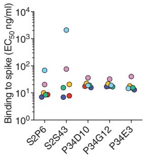  
A

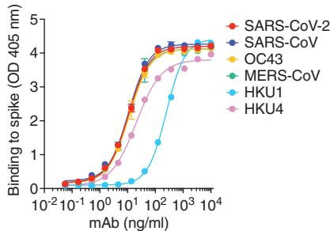  
B

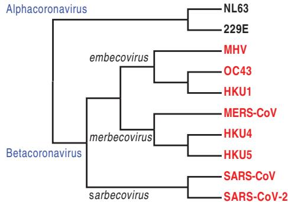  
C

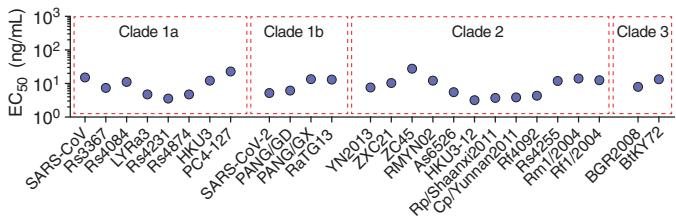  
D

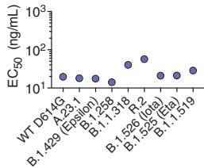

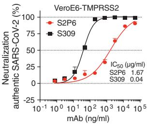  
E

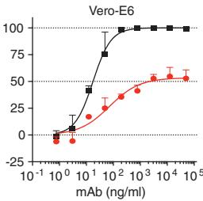

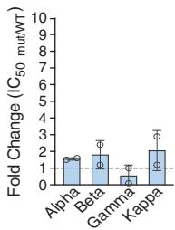  
F

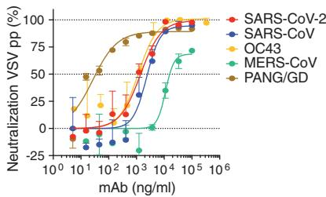  
G

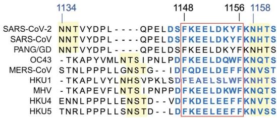  
H

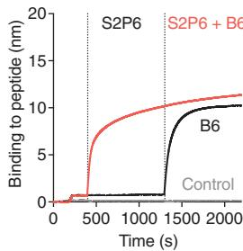  
|

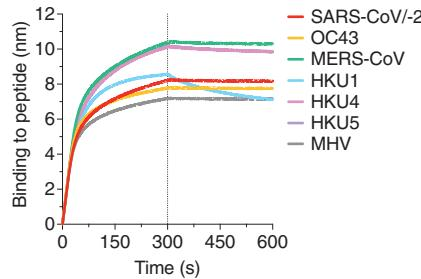  
J   
Fig. 1. The S2P6 cross-reactive mAb broadly neutralizes betacoronaviruses from three subgenera. (A) Binding avidity (EC $_{50}$ ) of five mAbs to prefusion coronavirus S trimer ectodomains as determined by ELISA. (B) S2P6 ELISA binding curves showing the full titration. One representative experiment out of two is shown. OD, optical density. (C) Cladogram of representative alpha- (black) and betacoronavirus (red) S glycoprotein amino acid sequences inferred through maximum likelihood analysis. (D) Flow cytometry analysis of S2P6 binding (from 10 to 0.22 μg/ml) to a panel of 26 S glycoproteins representative of all sarbecovirus clades (left) and eight SARS-CoV-2 variants (right) displayed as EC $_{50}$ values. (E) Neutralization of authentic SARS-CoV-2 by S2P6 determined using VeroE6-TMPRSS2 (left) or Vero-E6 (right) cells. The S309 mAb that binds RBD site IV (38) is included for comparison. The mean ± SD of triplicates from one representative experiment out of three is shown. (F) S2P6-mediated neutralization of SARS-CoV-2 B.1.1.7 (Alpha) S, B.1.351 (Beta) S, P.1 (Gamma) S, and B1.617.1 (Kappa) S VSV pseudotypes (mut) represented as IC $_{50}$ fold change relative to wild-type (WT) (D614G) S VSV pseudotype. Individual values for   
each of the two replicates are shown as open circles, the mean as a colored bar, and the SD as error bars. (G) S2P6-mediated neutralization of VSV pseudotyped with various betacoronavirus S glycoproteins. Error bars indicate standard deviation of triplicates. IC $_{50}$ values are 2.4 $\mu$ g/ml, 1.4 $\mu$ g/ml, 17.1 $\mu$ g/ml, 1.3 $\mu$ g/ml, and 0.02 $\mu$ g/ml for SARS-CoV, SARS-CoV-2, MERS-CoV, OC43, and PANG/GD, respectively. pp, pseudoparticles. (H) Alignment of betacoronavirus stem helix amino acid sequences with the S2P6 epitope boxed. Residue numbering is shown according to SARS-CoV-2 S. The sequences of the peptides used in this study are shown in blue, and N-linked glycosylation sequons are highlighted in yellow. (I) Competition assay for S2P6 or B6 binding to the SARS-CoV-2 or SARS-CoV stem helix peptide (herein defined as SARS-CoV/-2). B6 binding in the presence of S2P6 (red line), B6 binding in the absence of S2P6 (black line), and the control lacking the SARS-CoV/-2 stem helix peptide (gray line) are shown. (J) Kinetics of S2P6 binding to a panel of biotinylated betacoronavirus stem helix peptides immobilized at the surface of biolayer interferometry biosensors.

of concern (VOCs), including B.1.1.7 (Alpha), B.1.351 (Beta), P.1 (Gamma), and B1.617.1 (Kappa), and we observed similar potency to that found against the parental SARS-CoV-2 D614G S (Fig. 1F and fig. S1I). Moreover, S2P6 inhibited SARS-CoV S, Pangolin Guangdong 2019 (PANG/GD) S, MERS-CoV S, and OC43 S VSV pseudotypes with median inhibitory concentration $(\mathrm{IC}_{50})$ values ranging from 0.02 to $17~\mu \mathrm{g / ml}$

(Fig. 1G). S2P6 is therefore a broadly neutralizing betacoronavirus mAb with activity against SARS-CoV-2 and SARS-CoV-related viruses as well as members of the merbecovirus and embecovirus subgenera.

Peptide mapping experiments using 15-nucleotide oligomer linear overlapping peptides revealed that all five mAbs bound to peptides containing the SARS-CoV-2 motif

$F_{1148}$ KEELDKYF $_{1156}$ located in the S $_{2}$ subunit stem helix (Fig. 1H and fig. S2A). This region is strictly conserved in SARS-CoV, is highly conserved among other betacoronaviruses, and overlaps with the epitopes of the B6 (Fig. 1I) and 28D9 mouse mAbs (14, 15). S2P6 bound efficiently to the stem helix peptides of the five betacoronaviruses that infect humans (albeit with a faster off-rate for HKU1) as well

as those of the MERS-CoV-related bat viruses (HKU4 and HKU5) and murine hepatitis virus (MHV) (Fig. 1J and fig. S2B). S2S43 exhibited similar overall binding to that of S2P6, with markedly weaker reactivity toward the HKU1, HKU4, and HKU5 peptides, whereas the three clonally related P34D10, P34G12, and P34E3 mAbs exhibited weaker or no binding to HKU4 and HKU5 peptides (fig. S2B).

# Structural basis for S2P6 binding to the conserved S glycoprotein stem helix

To determine the molecular basis of the S2P6 neutralization breadth, we determined a cryo-electron microscopy (cryo-EM) structure of the SARS-CoV-2 S ectodomain trimer in complex with the Fab fragments of S2P6 and S2M11 [to lock the RBDs in the closed state (21)] at 4.2-Å overall resolution. The marked confor-

mational dynamics of the region recognized by S2P6 limited the local resolution of the stem helix–Fab to $\sim$ 12 Å, and three-dimensional classification of the cryo-EM data revealed incomplete Fab saturation (Fig. 2A; table S1; and fig. S3, A to F). Our cryo-EM structure confirms that S2P6 recognizes the stem helix and suggests that the mAb disrupts its quaternary structure, which is presumed to form a three-helix bundle in prefusion SARS-CoV-2 S (2, 3, 14). To overcome the limited resolution of the stem helix–Fab interface in the cryo-EM structure, we determined a crystal structure of the S2P6 Fab in complex with the SARS-CoV-2 S stem helix peptide (residues 1146 to 1159) at 2.67-Å resolution (Fig. 2, B to D; fig. S4A; and table S2). The peptide folds as an amphipathic $\alpha$ helix resolved for residues 1146 to 1159. S2P6 buries $\sim$ 600 Å $^{2}$ upon binding to its epitope using

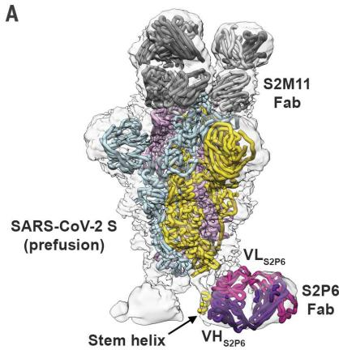

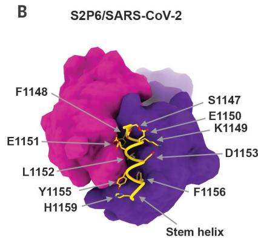

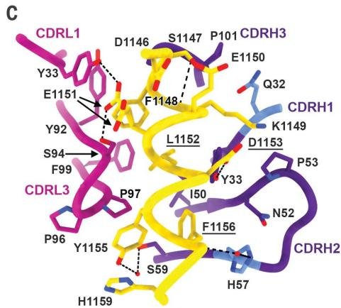

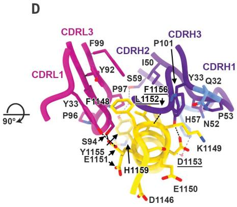  
Fig. 2. Structural basis for the broad S2P6 cross-reactivity with the conserved coronavirus stem helix peptide. (A) Composite model of the S2P6-bound SARS-CoV-2 S cryo-EM structure and of the S2P6-bound stem helix peptide crystal structure docked in the cryo-EM map (semitransparent gray surface). SARS-CoV-2 S protomers are colored pink, cyan, and gold; the S2P6 Fab heavy and light chains are colored purple and magenta; and the S2M11 Fab heavy and light chains are colored dark and light gray, respectively. (B) Crystal structure of the S2P6 Fab (surface rendering) in complex with the SARS-CoV-2 S stem helix peptide (yellow ribbon with side chains rendered as sticks). (C and D) Ribbon diagram in two orthogonal orientations of the S2P6 Fab bound to the SARS-CoV-2 S stem helix peptide showing the network of interactions. Only key interface residues and the S2P6 CDR loops are shown for clarity. Residues Q32 and H57, which are mutated during affinity maturation of the S2P6 heavy chain, are colored blue. Hydrogen bonds are indicated with dashed lines. Residues substituted in the escape mutants isolated are underlined. Single-letter abbreviations for the amino acid residues are as follows: A, Ala; C, Cys; D, Asp; E, Glu; F, Phe; G, Gly; H, His; I, Ile; K, Lys; L, Leu; M, Met; N, Asn; P, Pro; Q, Gln; R, Arg; S, Ser; T, Thr; V, Val; W, Trp; and Y, Tyr.

shape-complementarity and hydrogen bonding involving complementarity-determining regions (CDRs) H1 to H3, L1, and L3. The light chain residues Y33, Y92, G93, S94, P96, P97, and F99 as well as heavy chain residues Y33, I50, H57, T58, S59, P101, K102, and G103 form a deep groove in which the hydrophobic side of the stem helix docks through residues F1148, L1152, Y1155, and F1156. Binding specificity is provided through backbone hydrogen bonding of residues F1148 $_{SARS-CoV-2}$ and K1149 $_{SARS-CoV-2}$ with CDRH3 P101 and side chain hydrogen bonding of residues E1151 $_{SARS-CoV-2}$ with CDRL1 Y33 and CDRL3 S94, D1153 $_{SARS-CoV-2}$ with CDRH1 Y33 side chains, as well as Y1155 $_{SARS-CoV-2}$ with CDRH2 S59 through a water molecule and F1156 $_{SARS-CoV-2}$ with CDRH2 H57, also through a water molecule (Fig. 2, C and D). The contribution of each epitope residue was validated by single-substitution scan analysis with most mutations at positions 1148, 1151 to 1153, and 1155 to 1156 abolishing S2P6 binding, which highlights the importance of these residues for mAb recognition (fig. S5A). A substitution scan analysis performed on the P34D10, P34G12, and P34E3 mAbs revealed a similar pattern of key interacting residues (fig. S5A). Residue Y1155 is conservatively substituted to F1238 $_{MERS-CoV}$ or W1237/1240 $_{HKU1/OC43}$ , and residue D1153 is conserved in MERS-CoV and OC43 but mutated to S1235 for HKU1 (fig. S5B). The residue scan and structural results suggest that the reduced binding affinity of S2P6 for HKU1 S is at least partially a result of the D1153 $_{SARS-CoV-2}$ -S1235 $_{HKU1}$ substitution, which is expected to dampen electrostatic interactions with the CDRH1 Y33 side chain hydroxyl (Fig. 2, C and D).

Although S2P6 and B6 recognize a similar epitope (fig. S4, B and C), they bind with opposite orientations of the heavy and light chains relative to the stem helix and the S2P6-bound structure resolves three additional C-terminal peptide residues (1146 to 1159) compared with the B6-bound structure (1147 to 1156) (fig. S4, B and C). Superposition of both structures based on the stem helix reveals that B6 CDRH2 would sterically clash with H1159 $_{SARS-CoV-2}$ , putatively explaining the broader cross-reactivity of S2P6 over B6 (fig. S4, B and C).

To further validate our structural data, we carried out viral escape mutant selection in vitro in the presence of S2P6 using a replication-competent VSV–SARS-CoV-2 S virus (26). After two passages, virus neutralization by S2P6 was abrogated, and deep sequencing revealed the emergence of five distinct resistance mutations—L1152F, D1153N/G/A, and F1156L, which are consistent with the structural data and substitution scan analysis (fig. S5A). Although these mutations have been detected with very low frequencies in circulating SARS-CoV-2 isolates (146 out of 1,217,814 sequences as of 30 April 2021), the subdominant immunogenicity of this

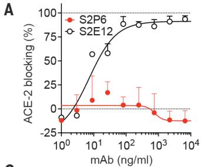  
Fig. 3. S2P6 binding disrupts the stem helix bundle and sterically inhibits membrane fusion. (A) SARS-CoV-2 S binding to ACE2 in the presence of mAb S2P6 analyzed by ELISA. S2E12 was included as a positive control. (B) S2P6 inhibition of cell-cell fusion using VeroE6 cells transfected with SARS-CoV-2 S. S2M11 was included as a positive control. Inhibition of fusion values are normalized to the percentage of fusion without mAb (100%) and to that of fusion of nontransfected cells (0%). (C) Proposed mechanism of inhibition mediated by the S2P6 mAb. S2P6 binds to the hydrophobic core of the stem helix bundle and disrupts its quaternary structure. S2P6 binding likely prevents $S_{2}$ subunit refolding from the pre- to the postfusion state and blocks viral entry.

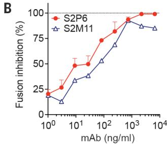

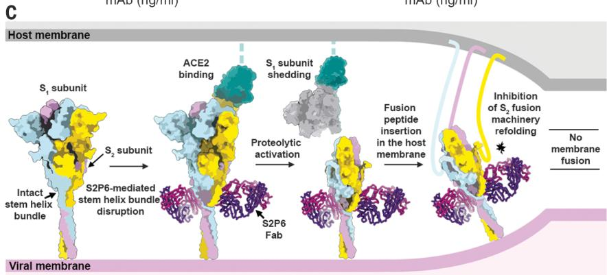

cryptic site, likely because of its limited exposure, might result in low Ab pressure limiting accumulation of mutations in this epitope.

# Stem helix–targeting mAbs inhibit S-mediated membrane fusion

The S stem helix forms a three-helix bundle in many prefusion cryo-EM structures of SARS-CoV-2 S and SARS-CoV S although it is not fully resolved (2, 3, 11, 27–29). By contrast, the S2P6-S2M11-SARS-CoV-2 S cryo-EM structure suggests that the quaternary organization of the stem is disrupted (Fig. 2A), consistent with S2P6 binding to the hydrophobic face of the stem helix. This face is mostly buried through homo-oligomeric interactions in prefusion S and may be only transiently available for Ab binding. Although we observed S2P6 binding to postfusion SARS-CoV-2 S (fig. S1D), the epitope recognized is buried at the interface with the other two protomers of the rod-shaped trimer and therefore might become accessible as a result of conformational dynamics, as is the case for the prefusion state (fig. S4D) (14, 30–32). On the basis of these data, we propose that S2P6 binding to S sterically interferes with the conformational changes leading to membrane fusion, as observed for B6 (14) and 27D9 (15).

To validate the inferred mechanism of S2P6-mediated broad coronavirus neutralization, we first showed that S2P6 binding did not block engagement of SARS-CoV-2 S by angiotensin-converting enzyme 2 (ACE2)—using enzyme-linked immunosorbent assay (ELISA)—as expected based on the distance of its epitope from the RBD (Fig. 3A). S2P6, however, blocked cell-cell fusion between Vero-E6 cells transfected with full-length SARS-CoV-2 S as effectively as the S2M11 mAb, which locks SARS-CoV-2 S in

the closed state (21) (Fig. 3B). We previously described mAbs targeting RBD antigenic sites Ia (e.g., S2E12) and IIa (e.g., S2X259 or S2X35), which can mimic receptor attachment and prematurely trigger fusogenic S conformational changes (11, 20, 33). Accordingly, S2P6 at concentrations as low as 1 ng/ml abrogated the formation of syncytia mediated by S2E12 (33). Collectively, these results suggest that the main mechanism of S2P6 neutralization is to prevent viral entry by impeding S fusogenic rearrangements, thereby inhibiting membrane fusion (Fig. 3C).

# S2P6-mediated protection in hamsters is enhanced by Fc-mediated effector functions

Functions mediated by the constant (Fc) region of Abs can contribute to in vivo protection by promoting viral clearance and antiviral immune responses (34–37). We analyzed the ability of S2P6 to trigger activation of the Fc receptors, FcγRIIa and FcγRIIIa, as well as to exert Fc effector functions in vitro. S2P6 promoted moderate dose-dependent FcγRIIa- and FcγRIIIa-mediated signaling using a luciferase reporter assay (Fig. 4A). However, S2P6 promoted robust activation of Ab-dependent cell cytotoxicity (ADCC), to levels comparable to those observed with the S309 mAb (38), after incubation of SARS-CoV-2 S-expressing CHO-K1 target cells with human peripheral blood mononuclear cells (PBMCs) (Fig. 4B). S2P6 also triggered measurable Ab-dependent cellular phagocytosis (ADCP) activity using cell trace violet-labeled PBMCs as phagocytic cells and SARS-CoV-2 S-expressing CHO (CHO-S) as target cells (Fig. 4C). Finally, S2P6 did not promote complement-dependent cytotoxicity (CDC) (Fig. 4D), indicating that S2P6 Fc-mediated effector

functions, but not CDC, might participate in viral control in vivo.

We evaluated the prophylactic activity of S2P6 against challenge with the prototypic (Wuhan-1 related) SARS-CoV-2 in a Syrian hamster model (39). As we previously showed that the human IgG1 Fc fragment poorly recognizes hamster FcγRs (33), we compared S2P6 harboring a human IgG1 constant region (Hu-S2P6) with S2P6 harboring a hamster IgG2a constant region (Hm-S2P6), the latter enabling optimal interactions with hamster FcγRs. Two different doses of Hu-S2P6 or Hm-S2P6 were administered 24 hours before intranasal SARS-CoV-2 challenge, and the lungs of the animals were assessed 4 days after infection for viral RNA load and replicating virus. Hm-S2P6 administered at 20 mg/kg reduced lung viral RNA copies and replicating viral titers by two orders of magnitude relative to a control mAb but did not exert any antiviral effect at 2 mg/kg (Fig. 4E and fig. S6). Hm-S2P6 at 20 mg/kg reduced lung viral RNA load to levels statistically significantly lower than those observed with Hu-S2P6 at 20 mg/kg, suggesting a beneficial effect of S2P6 effector functions in vivo. On the basis of the comparable S2P6 neutralization potencies toward SARS-CoV-2 VOCs observed in vitro (Fig. 1F), we assessed the protective efficacy of S2P6 in hamsters challenged with SARS-CoV-2 B.1.351 (Beta VOC). Prophylactic administration of Hu-S2P6 at 20 mg/kg reduced replicating viral titers in the lungs (but not RNA copy numbers) by ~1.5 orders of magnitude relative to the control group. Although this difference was not statistically significant, the observed efficacy against this VOC is in line with the strict conservation of the stem helix epitope in all VOCs identified to date (Fig. 4F).

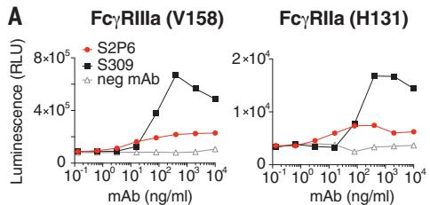

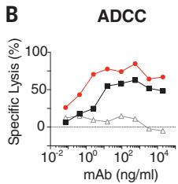

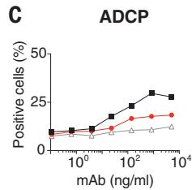

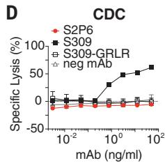

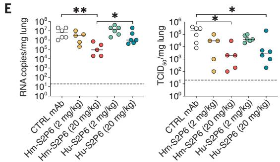

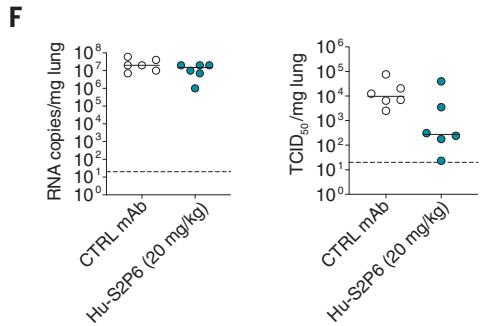  
Fig. 4. S2P6 activates effector functions and reduces SARS-CoV-2 lung burden in Syrian hamsters. (A) NFAT (nuclear factor of activated T cells)—driven luciferase signal induced in Jurkat cells stably expressing FcγRIIIa (V158, left) or FcγRIIa (V131, right) upon S2P6 binding to full-length wild-type SARS-CoV-2 S expressed at the surface of CHO target cells. S309 is included as positive control. RLU, relative luminescence unit. (B) mAb-mediated ADCC using SARS-CoV-2 CHO-K1 cells (genetically engineered to stably express a HaloTag-HiBit) as target cells and PBMC as effector cells. The magnitude of natural killer cell-mediated killing is expressed as a percentage of specific lysis. (C) mAb-mediated ADCP using cell trace violet-labeled PBMCs as a source of phagocytic cells (monocytes) and PKH67-fluorescently labeled S-expressing CHO cells as target cells. The y axis indicates the percentage of monocytes double-positive for anti-CD14 (monocyte) marker and PKH67. (D) Lysis of SARS-CoV-2 S stably   
transfected CHO cells by mAbs in the presence of complement. S309 was included as positive control; S309-GRLR with diminished FcγR binding capacity and an unrelated mAb (neg mAb) were used as negative controls. (E) Syrian hamsters were administered with the indicated amount of S2P6 mAb harboring either a hamster (Hm-S2P6) or a human (Hu-S2P6) constant region before intranasal challenge with prototypic SARS-CoV-2 (Wuhan-1 related). An irrelevant mAb (MGH2 against Plasmodium falciparum CSP) at 20 mg/kg was used as negative control (CTRL) (60). Viral RNA loads and replicating virus titers are shown on the left and right, respectively. TCID $_{50}$ , median tissue culture infectious dose. (F) Prophylactic administration of Hu-S2P6 at 20 mg/kg in hamsters challenged with SARS-CoV-2 B.1.351 (Beta) VOC. Viral RNA loads and replicating virus titers are shown on the left and right, respectively. $*P < 0.05$ ; $**P < 0.01$ ; Mann-Whitney test.

Collectively, these findings demonstrate that Abs targeting a highly conserved epitope in the S fusion machinery can trigger Fc-mediated ADCC and ADCP in vitro and that their in vivo antiviral activity may rely on both neutralization and effector functions.

# Natural infection or vaccination predominantly elicit stem helix–directed Abs of narrow specificities

To understand how frequently stem helix-specific Abs are elicited, we analyzed plasma samples from prepandemic, COVID-19–convalescent, and COVID-19-vaccinated individuals to determine IgG binding titers to the SARS-CoV-2-SARS-CoV (SARS-CoV/-2), OC43, MERS-CoV, HKU1, HKU4, and HKU5 stem helix peptides (Fig. 5A and fig. S7). In prepandemic samples, we only observed binding to the HKU1 stem helix peptide, probably reflecting prior infection with this virus in the cohort. Stem helix-specific Abs were found at low frequencies in individuals previously infected with SARS-CoV-2 or those who had received two doses of mRNA vaccines (Fig. 5A). The highest frequencies of stem helix-specific serum Abs were observed for vaccinated individuals who were previously infected (ranging from 22 to 78% against the different stem helix peptides). Overall, these data show that plasma Ab responses to the

stem helix are elicited upon SARS-CoV-2 infection or vaccination, although they are relatively rare. Evaluation of the prevalence of mAbs targeting other fusion machinery epitopes will reveal whether this trend holds true for the overall $S_{2}$ subunit or whether it is a specificity of the cryptic stem helix epitope.

Next, we investigated the frequencies of stem helix-specific memory B cells among 21 convalescent and 17 vaccinated individuals using a clonal analysis based on in vitro polyclonal stimulation (40) (Fig. 5, B to G, and figs. S7 to S9). In both cohorts, we observed frequencies of culture positive for stem helix-specific IgGs ranging from 0 to $2.5\%$ , except for one individual (infected and vaccinated with a single dose of mRNA vaccine) for which $99.6\%$ of culture supernatants were binding to the SARS-CoV/-2 stem helix (fig. S9). Most SARS-CoV-2 stem helix-specific memory B cells were cross-reactive with OC43, consistent with the high sequence identity of the stem helices of these two viruses (Fig. 5, C and F, and Fig. 1H). Abs specific for the HKU1 S stem helix were found, but they were not cross-reactive with other betacoronaviruses except for one convalescent and one vaccinated individual (Fig. 5, D and G). This analysis revealed a single example of cross-reactivity to all stem helix betacoronavirus peptides tested (Fig. 5E),

whereas most other Abs show limited cross-reactivity among betacoronaviruses.

# Broadly reactive betacoronavirus Abs enhance their binding affinity and cross-reactivity through somatic mutations

To define the ontogeny of the broadly reactive betacoronavirus mAbs presented here, we generated a panel of germline variants of S2P6, P34D10, P34E3, and P34G12. Two out of seven S2P6 heavy chain residues that are mutated relative to germline contribute to epitope recognition (Q32 and H57), whereas none of the five light chain mutated residues participate in S binding (Fig. 2, C and D). To address the role of VH and VK somatic mutations, we generated a panel of S2P6 germline variants for the heavy or the light chain, or both variable regions (VH and VK). The fully germline-reverted S2P6 [unmutated common ancestor (UCA)] bound to OC43 and MERS-CoV stem helix peptides [with approximately one order of magnitude higher median effective concentration $(\mathrm{EC}_{50})$ compared with that of the mature mAb] but did not bind to SARS-CoV/-2 or HKU1 stem helix peptides or spike trimers (Fig. 5H and fig. S10, A to C). Somatic mutations in VH were sufficient for high-avidity binding to SARS-CoV/-2, whereas both VH and VK mutations were required for

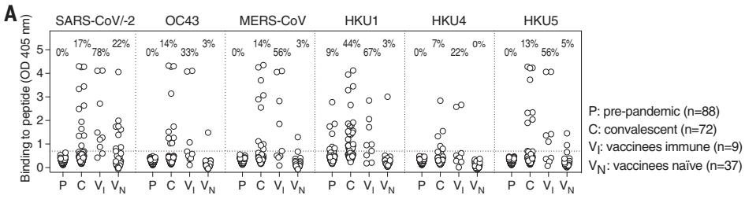

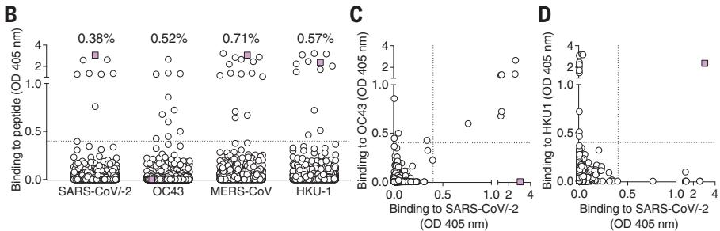

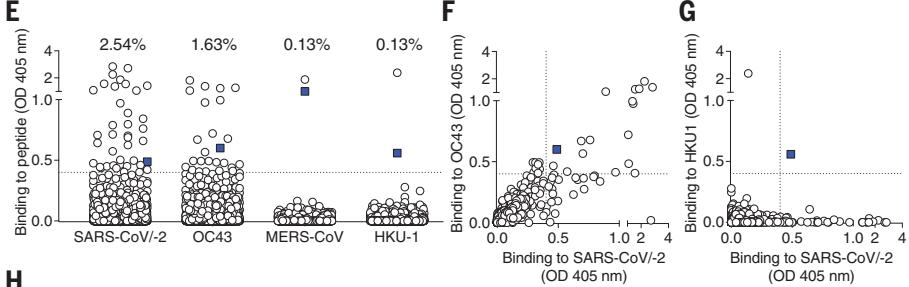

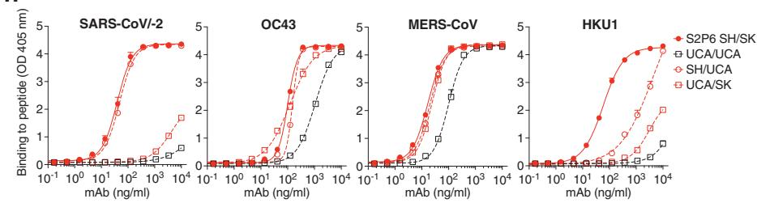

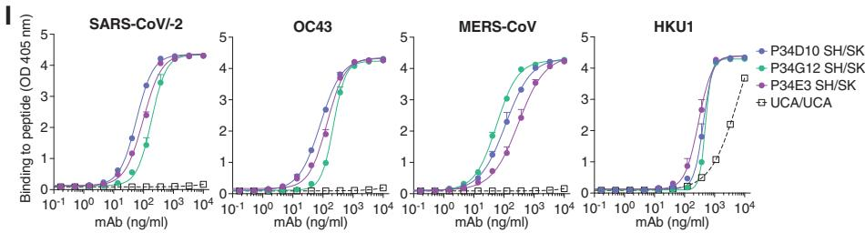  
Fig. 5. Stem helix–directed Abs are rare, of narrow specificities, and enhance their binding affinity and cross-reactivity through somatic mutations. (A) Binding of prepandemic (P; n = 88), COVID-19 convalescent (C; n = 72), vaccinees immune (VI; n = 9), and vaccinees naïve (VN; n = 37) plasma Abs (diluted 1:10) to immobilized betacoronavirus stem helix peptides analyzed by ELISA. A cutoff of 0.7 was determined on the basis of the signal of prepandemic samples and binding to uncoated ELISA plates (horizontal dashed line). The fraction of samples for which binding above the cutoff was detected is indicated. (B to G) Analysis of memory B cell specificities for betacoronavirus stem helix peptides. Each dot represents a well containing oligoclonal B cell supernatant screened for the presence of stem helix peptide binding IgG Abs using ELISA. Samples obtained from 21 COVID-19 convalescent individuals [(B) to (D)] and 16 vaccinees [(E) to (G)]. Pairwise reactivity comparison is shown for SARS-CoV/-2 and OC43 [(C) and (F)] and SARS-CoV/-2 and HKU1 [(D) and (G)]. Cultures cross-reactive with at least three peptides are highlighted in color. A cutoff of 0.4 is indicated by a horizontal dashed line. The fraction of wells for which binding above the cutoff was detected is indicated. (H and I) Binding to stem helix peptides of S2P6 (H) harboring mature (SH/SK), fully germline-reverted (UCA/UCA), germline-reverted heavy chain paired with mature light chain (UCA/SK), mature heavy chain paired with germline-reverted light chain (SH/UCA), and of P34D10, P34G12, and P34E3 (I) harboring either mature (SH/SK) or germline-reverted (UCA/UCA) sequences.

optimal binding to HKU1. The presence of residue G103 in CDRH3 was essential for binding to all betacoronaviruses (fig. S10, A to C). These findings indicate that the S2P6 mAb likely arose in response to OC43 infection, and its specificity was broadened toward SARS-CoV-2 and HKU1 through somatic mutations selected upon natural infection with one or both of these betacoronaviruses. By contrast, analysis of UCA binding of the clonally related P34D10, P34G12, and P34E3 mAbs suggests that they were likely primed by HKU1 infection rather than OC43 infection and acquired cross-reactivity toward the other human betacoronaviruses primarily through somatic mutations in VH (Fig. 5I and fig. S10, D to F). Collectively, these findings demonstrate that broadly reactive betacoronavirus Abs may result from priming of virus-specific B cells gaining affinity and cross-reactivity through somatic mutations in response to heterotypic coronavirus exposures.

# Discussion

The coronavirus $S_{2}$ subunit (fusion machinery) contains several conserved antigenic sites, including the fusion peptide and the heptad-repeat 2 regions (41–46). The recent identification of four cross-reactive mAbs targeting the stem helix in the $S_{2}$ subunit highlighted the importance of this epitope, which is conserved among betacoronavirus but not alpha-coronavirus S glycoproteins (14–16, 47), although none of these mAbs inhibit members of all three betacoronavirus subgenera. Here, we identified five stem helix-specific human mAbs cross-reacting with human and animal betacoronaviruses and showed that S2P6 broadly neutralized all sarbecoviruses, merbecoviruses, and embecoviruses pseudotypes evaluated through the inhibition of membrane fusion.

We show that an $S_{2}$ subunit-directed mAb reduces lung viral burden in hamsters challenged with SARS-CoV-2 with a key contribution of Fc-mediated effector functions, as described for some SARS-CoV-2 RBD-specific mAbs (34, 37) and influenza virus hemagglutinin stem mAbs (17, 48, 49). Although this study showcases the stem helix as a target of pan-betacoronavirus Abs, the existence of other cross-reactive $S_{2}$ epitopes with neutralizing potential remains a subject of investigation. Stem helix-targeted Abs are elicited upon natural infection by endemic (OC43 or HKU1) or pandemic (SARS-CoV-2) coronaviruses as well as by COVID-19 mRNA vaccines. Similarly to the subdominance of Abs recognizing the conserved hemagglutinin stem region of influenza A viruses (48, 50), stem helix-specific Abs are present at low titers in convalescent or vaccinee plasma and at low frequencies in their memory B cell repertoires, possibly as a result of limited epitope exposure. These findings along with the moderate neutralization

potency of these mAbs indicate that eliciting high-enough titers of stem helix-targeted mAbs through vaccination will be a key challenge to overcome to develop pan-betacoronavirus vaccines. We propose that harnessing recent advances in computational protein design, such as epitope-focused vaccine design approaches as described for the respiratory syncytial virus fusion protein (51–53) and multivalent display as described for influenza virus (54–59) to target the S stem helix or the fusion peptide regions, might enable elicitation of broad betacoronavirus immunity.

# REFERENCES AND NOTES

1. M. A. Tortorici, D. Veesler, Adv. Virus Res. 105, 93–116 (2019).   
2. A. C. Walls et al., Cell 181, 281–292.e6 (2020).   
3. D. Wrapp et al., Science 367, 1260–1263 (2020).   
4. E. C. Thomson et al., Cell 184, 1171–1187.e20 (2021).   
5. M. McCallum et al., Cell 184, 2332–2347.e16 (2021).   
6. K. R. McCarthy et al., Science 371, 1139–1142 (2021).   
7. B. Choi et al., N. Engl. J. Med. 383, 2291–2293 (2020).   
8. Z. Liu et al., Cell Host Microbe 29, 477–488.e4 (2021).   
9. Y. Weisblum et al., eLife 9, e61312 (2020).   
10. M. McCallum et al., Science 373, 648–654 (2021).   
11. A. C. Walls et al., Cell 176, 1026–1039.e15 (2019).   
12. Y. Watanabe, J. D. Allen, D. Wrapp, J. S. McLellan, M. Crispin, Science 369, 330–333 (2020).   
13. Y. Yang et al., J. Virol. 89, 9119–9123 (2015).   
14. M. M. Sauer et al., bioRxiv 2020.12.29.424482 [Preprint] (2021). https://doi.org/10.1101/2020.12.29.424482.   
15. C. Wang et al., Nat. Commun. 12, 1715 (2021).   
16. G. Song et al., Nat. Commun. 12, 2938 (2021).   
17. N. L. Kallewaard et al., Cell 166, 596–608 (2016).   
18. B. F. Haynes, D. R. Burton, J. R. Mascola, Sci. Transl. Med. 11, eaaz2686 (2019).   
19. Z. Wang et al., Nature 592, 616–622 (2021).   
20. L. Piccoli et al., Cell 183, 1024–1042.e21 (2020).   
21. M. A. Tortorici et al., Science 370, 950–957 (2020).   
22. M. Hoffmann et al., Nature 585, 588–590 (2020).   
23. M. Hoffmann et al., Cell 181, 271–280.e8 (2020).   
24. M. Hoffmann, H. Kleine-Weber, S. Pöhlmann, Mol. Cell 78, 779–784.e5 (2020).   
25. Y. Kaname et al., J. Virol. 84, 3210–3219 (2010).   
26. J. B. Case et al., Cell Host Microbe 28, 475–485.e5 (2020).   
27. M. Gui et al., Cell Res. 27, 119–129 (2017).   
28. R. N. Kirchdoerfer et al., Sci. Rep. 8, 15701 (2018).   
29. Y. Yuan et al., Nat. Commun. 8, 15092 (2017).   
30. A. C. Walls et al., Proc. Natl. Acad. Sci. U.S.A. 114, 11157–11162 (2017).   
31. Y. Cai et al., Science 369, 1586–1592 (2020).   
32. X. Fan, D. Cao, L. Kong, X. Zhang, Nat. Commun. 11, 3618 (2020).   
33. F. A. Lempp et al., bioRxiv 2021.04.03.438258 [Preprint] (2021). https://doi.org/10.1101/2021.04.03.438258.   
34. A. Schäfer et al., J. Exp. Med. 218, e20201993 (2021).   
35. S. Bournazos, T. T. Wang, J. V. Ravetch, Microbiol. Spectr. 4, 4.6.20 (2016).

36. S. Bournazos, D. Corti, H. W. Virgin, J. V. Ravetch, Nature 588, 485–490 (2020).   
37. E. S. Winkler et al., Cell 184, 1804–1820.E16 (2021).   
38. D. Pinto et al., Nature 583, 290–295 (2020).   
39. R. Boudewijns et al., Nat. Commun. 11, 5838 (2020).   
40. D. Pinna, D. Corti, D. Jarrossay, F. Sallusto, A. Lanzavecchia, Eur. J. Immunol. 39, 1260–1270 (2009).   
41. C. Daniel et al., J. Virol. 67, 1185–1194 (1993).   
42. H. Zhang et al., J. Virol. 78, 6938–6945 (2004).   
43. C. M. Poh et al., Nat. Commun. 11, 2806 (2020).   
44. H. A. Elshabrawy, M. M. Coughlin, S. C. Baker, B. S. Prabhakar, PLOS ONE 7, e50366 (2012).   
45. Z. Zheng et al., Euro Surveill. 25, 2000291 (2020).   
46. A. C. Walls et al., Nature 531, 114–117 (2016).   
47. P. Zhou et al., bioRxiv 2021.03.30.437769 [Preprint] (2021). https://doi.org/10.1101/2021.03.30.437769.   
48. D. Corti et al., Science 333, 850–856 (2011).   
49. D. J. DiLillo, G. S. Tan, P. Palese, J. V. Ravetch, Nat. Med. 20, 143–151 (2014).   
50. D. Corti et al., J. Clin. Invest. 120, 1663–1673 (2010).   
51. F. Sesterhenn et al., Science 368, eaay5051 (2020).   
52. M. L. Azoitei et al., Science 334, 373–376 (2011).   
53. B. E. Correia et al., Nature 507, 201–206 (2014).   
54. A. C. Walls et al., Cell 183, 1367–1382.e17 (2020).   
55. A. C. Walls et al., bioRxiv 2021.03.15.435528 [Preprint] (2021). https://doi.org/10.1101/2021.03.15.435528.   
56. S. Boyoglu-Barnum et al., Nature 592, 623–628 (2021).   
57. M. Kanekiyo et al., Nature 499, 102–106 (2013).   
58. M. Kanekiyo et al., Nat. Immunol. 20, 362–372 (2019).   
59. J. Marcandalli et al., Cell 176, 1420–1431.e17 (2019).   
60. J. Tan et al., Nat. Med. 24, 401–407 (2018).

# ACKNOWLEDGMENTS

We thank J. C. Nix for x-ray data collection, T. I. Croll for assistance in refinement of the crystal structure, A. Arvin for her insightful comments, M. Meury for help with protein production, and H. Tani (University of Toyama) for providing the reagents necessary for preparing VSV pseudotyped viruses. The authors would also like to thank C. Castado and N. Blais (GSK Vaccines) for their help in the selection of the genetically divergent sarbecoviruses used in this study. We thank Promega Corporation for kindly providing SARS-CoV-2 CHO-K1 cells (genetically engineered to stably express a HaloTag-HiBit-tagged). Funding: This study was supported by the National Institute of Allergy and Infectious Diseases (DP1A1158186 and HHSN272201700059C to D.V. and U01 A1151698-01 to WCVV), a Pew Biomedical Scholars Award (D.V.), Investigators in the Pathogenesis of Infectious Disease Awards from the Burroughs Wellcome Fund (D.V.), Fast Grants (D.V.), the Swiss National Science Foundation (P400PB_183942 to M.M.S.), the University of Washington Arnold and Mabel Beckman cryo-EM center, Vir Biotechnology, and the Helmut Horten Foundation (to F.S. and the Institute for Research in Biomedicine). The project was also partially funded by the Swiss Kidney Foundation. Use of the Stanford Synchrotron Radiation Lightsource, SLAC National Accelerator Laboratory, is supported by the US Department of Energy, Office of Science, Office of Basic Energy Sciences, under contract no. DE-AC02-76SF00515. The SSRL Structural Molecular Biology Program is supported by the DOE Office of Biological and Environmental Research and by the National Institutes of Health, National Institute of General Medical Sciences (P30GM133894). The contents of this publication are solely the responsibility of the authors and do not necessarily

represent the official views of NIGMS or NIH. Author contributions: Experiment design: D.P., M.M.S., J.S.L., M.A.T., M.S.P., H.W.V., M.B., D.C., and D.V.; Donors' recruitment and sample collection: E.C., F.B., B.G., A.Ce., P.F., P.E.C., O.G., S.C., C.G., A.R., L.P., M.S., D.V., and C.H.-D.; Antibody discovery: D.P., M.B., J.S.L., J.J., S.J., N.S., K.C., E.C., and D.C.; Antigen-specific memory B cell repertoire analysis preparation: C.S.-F., J.B., and A.Ca.; Expression and purification of proteins: A.C.W., J.E.B., and J.J.; Antibody functional experiments: D.P., M.M.S., N.C., J.S.L., M.A.T., A.C.W., F.A.L., J.No., S.B., and R.M.; Bioinformatic analysis of virus diversity and variants: J.d.I., I.B., and A.T.; Evaluation of effector functions: B.G.; SPR binding assays: L.E.R.; Neutralization assay: D.P., M.A.T., F.A.L., J.No., and M.P.H.; Escape mutants selection and sequencing: H.K., S.I., F.A.L., and J.d.I.; Effects in the hamster model and data analysis: R.A., C.F., L.C., J.Ne., E.V., and F.B.; Cryo-EM data collection, processing, and model building: M.M.S. and D.V.; Crystallization, x-ray crystallography data collection, processing, and model building: M.M.S., N.C., G.S., and D.V.; Serological assays: D.P. and R.M.; Data analysis: D.P., M.M.S., M.B., J.S.L., J.J., F.A.L., J.No., N.C., A.T., A.C.W., G.S., D.C., and D.V.; Manuscript writing: D.P., M.M.S., J.S.L., M.B., G.S., F.S., A.L., H.W.V., D.C., and D.V.

Competing interests: D.P., N.C., M.P.H., J.No., B.G., L.E.R., J.d.I., H.K., S.I., S.J., N.S., K.C., I.B., S.B., C.S.-F., J.B., R.M., E.V., F.B., E.C., L.P., M.S.P., M.S., D.H., A.T., F.A.L., C.H.-D., A.L., G.S., H.W.V., M.B., and D.C. are employees of Vir Biotechnology and may hold shares in Vir Biotechnology. D.C., J.S.L., F.S., A.Ca., and A.L. are currently listed as inventors on multiple patent applications, which disclose the subject matter described in this manuscript. D.V. is a consultant for Vir Biotechnology Inc. The Veesler laboratory and the Sallusto laboratory have received sponsored research agreements from Vir Biotechnology Inc. The other authors declare no competing interests. Data and materials availability: The crystal structure of S2P6-bound SARS-CoV-2 stem helix peptide was deposited to the Protein Data Bank (PDB) with accession no. 7RNJ. The cryo-EM structure of SARS-CoV-2 spike protein bound to the S2P6 and S2M11 Fab fragments was deposited to the Electron Microscopy Data Bank with accession no. EMD-24533. Materials generated in this study will be made available on request but may require a completed materials transfer agreement signed with Vir Biotechnology or the University of Washington. This work is licensed under a Creative Commons Attribution 4.0 International (CC BY 4.0) license, which permits unrestricted use, distribution, and reproduction in any medium, provided the original work is properly cited. To view a copy of this license, visit https://creativecommons.org/licenses/by/4.0/. This license does not apply to figures/photos/artwork or other content included in the article that is credited to a third party; obtain authorization from the rights holder before using such material.

# SUPPLEMENTARY MATERIALS

science.sciencemag.org/content/373/6559/1109/suppl/DC1 Materials and Methods

Figs. S1 to S10

Tables S1 and S2

References (61–86)

MDAR Reproducibility Checklist

View/request a protocol for this paper from Bio-protocol.

6 May 2021; accepted 29 July 2021

Published online 3 August 2021

10.1126/science.abj3321

# Broad betacoronavirus neutralization by a stem helix-specific human antibody

Dora Pinto, Maximilian M. Sauer, Nadine Czudnochowski, Jun Siong Low, M. Alejandra Tortorici, Michael P. Housley, Julia Noack, Alexandra C. Walls, John E. Bowen, Barbara Guarino, Laura E. Rosen, Julia di Iulio, Josipa Jerak, Hannah Kaiser, Saiful Islam, Stefano Jaconi, Nicole Sprugasci, Katja Culap, Rana Abdelnabi, Caroline Foo, Lotte Coelmont, Istvan Bartha, Siro Bianchi, Chiara Silacci-Fregni, Jessica Bassi, Roberta Marzi, Eneida Vetti, Antonino Cassotta, Alessandro Ceschi, Paolo Ferrari, Pietro E. Cippà, Olivier Giannini, Samuele Ceruti, Christian Garzoni, Agostino Riva, Fabio Benigni, Elisabetta Cameroni, Luca Piccoli, Matteo S. Pizzuto, Megan Smithey, David Hong, Amalio Telenti, Florian A. Lempp, Johan Neyts, Colin Havenar-Daughton, Antonio Lanzavecchia, Federica Sallusto, Gyorgy Snell, Herbert W. Virgin, Martina Beltramello, Davide Corti, and David Veesler

Science 373 (6559), . DOI: 10.1126/science.abj3321

# Targeting a range of betacoranaviruses

In the past 20 years, three highly pathogenic #-coronaviruses have crossed from animals to humans, including the most recent: severe acute respiratory syndrome coronavirus 2 (SARS-CoV-2). A spike protein that decorates these viruses has an S1 domain that binds host cell receptors and an S2 domain that fuses the viral and cell membranes to allow cell entry. The S1 domain is the target of many neutralizing antibodies but is more genetically variable than S2, and antibodies can exert selective pressure, leading to resistant variants. Pinto et al. identified five monoclonal antibodies that interact with a helix in the S2 domain. The most broadly neutralizing antibody inhibited all #-coronavirus subgenera and reduced viral burden in hamsters infected with SARS-CoV-2. —VV

# View the article online

https://www.science.org/doi/10.1126/science.abj3321

# Permissions

https://www.science.org/help/reprints-and-permissions

Use of this article is subject to the Terms of service

---

# science.abj3321_sm

# Science

AAAAS

# Supplementary Materials for

# Broad betacoronavirus neutralization by a stem helix-specific human antibody

Dora Pinto et al.

Corresponding authors: Davide Corti, dcorti@vir.bio; David Veesler, dveesler@uw.edu

Science 373, 1109 (2021)

DOI: 10.1126/science.abj3321

The PDF file includes:

Materials and Methods

Figs. S1 to S10

Tables S1 and S2

References

Other Supplementary Material for this manuscript includes the following:

MDAR Reproducibility Checklist

# Materials and Methods

# Cell lines

Cell lines used in this study were obtained from ATCC (HEK293T and Vero-E6) or ThermoFisher Scientific (ExpiCHO cells, FreeStyle™ 293-F cells and Expi293F™ cells).

# Sample donors

Samples were obtained from cohorts of individuals enrolled before June 2019 (pre-pandemic), of SARS-CoV-2 infected individuals or of vaccinated individuals immunized with Moderna or Pfizer/BioNTech BNT162b2 vaccines under study protocols approved by the local Institutional Review Boards (Canton Ticino Ethics Committee, Switzerland, the Ethical committee of Luigi Sacco Hospital, Milan, Italy and WCG North America, Princeton, NJ, US). All donors provided written informed consent for the use of blood and blood components (such as human peripheral blood mononuclear cells (PBMCs), sera or plasma) and were recruited at hospitals or as outpatients. PBMCs were isolated from blood by Ficoll density gradient centrifugation and either used freshly or stored in liquid nitrogen for later use. Sera were obtained from blood collected using tubes containing clot activator, followed by centrifugation and stored at -80°C.

# AMBRA (antigen-specific memory B cell repertoire analysis) of IgG antibodies

Replicate cultures of total unfractionated PBMC from SARS-CoV-2 infected or vaccinated individuals were seeded in 96 U-bottom plates (Corning) in RPMI1640 supplemented with 10% Hyclone, sodium pyruvate, MEM non-essential amino acid, stable glutamine and Penicillin-Streptomycin. Memory B cell stimulation and differentiation was induced by adding 2.5 $\mu$ g/ml R848 (3 M) and 1000 U/ml human recombinant IL-2 for 10 days at 37 °C 5% CO $_{2}$ . The cell culture supernatants were collected for further analysis.

# Antibody discovery and expression

Antigen specific IgG $^{+}$ memory B cells were isolated and cloned from total PBMCs of convalescent individuals. Abs VH and VL sequences were obtained by reverse transcription PCR (RT-PCR) and mAbs were expressed as recombinant human IgG1, carrying the half-life extending M428L/N434S (LS) mutation in the Fc region or Fab fragment. ExpiCHO cells were transiently transfected with heavy and light chain expression vectors as previously described (26). For in vivo experiments in Syrian hamsters, S2P6 was produced with a Syrian hamster IgG2 constant region. Using the Database IMGT (http://www.imgt.org), the VH and VL gene family and the number of somatic mutations were determined by analyzing the homology of the VH and VL sequences to known human V, D and J genes. UCA sequences of the VH and VL were constructed using IMGT/V-QUEST.

MAbs affinity purification was performed on ÄKTA Xpress FPLC (Cytiva) operated by UNICORN software version 5.11 (Build 407) using HiTrap Protein A columns (Cytiva) for full length human and hamster mAbs and CaptureSelect CH1-XL MiniChrom columns (ThermoFisher Scientific) for Fab fragments, using PBS as mobile phase. Buffer exchange to the appropriate formulation buffer was performed with a HiTrap Fast desalting column (Cytiva). The final products were sterilized by filtration through 0.22 μm filters and stored at 4°C.

# Flow cytometry of antibody on S Protein expressing ExpiCHO-S cells

For Expi-CHO cell transient transfection, S plasmids (26, 61) were diluted in cold OptiPRO SFM, mixed with ExpiFectamine CHO Reagent (Life Technologies, A29130) and added to the cells seeded at $6 \times 10^{6}$ cells/ml in a volume of 5 ml in a 50 ml bioreactor. Transfected cells were incubated at $37^{\circ} \mathrm{C}$ , $8 \%$ $\mathrm{CO}_{2}$ with an orbital shaking speed of 209 rpm (orbital diameter of 25 mm) for 42 hours. To test mAb binding, transfected ExpiCHO cells were collected, washed twice in wash buffer ( $1 \%$ w/v solution of Bovine Serum Albumin (BSA; Sigma) in PBS, 2 mM EDTA) and distributed at 60,000 cells/well into 96 U-bottom plates (Corning). mAb serial dilutions from $10 \mu \mathrm{g} / \mathrm{ml}$ were added onto cells for 30 minutes on ice and, after two washes, Alexa Fluor647-labelled Goat Anti-Human IgG (Jackson Immunoresearch, 109-606-098) was used for detection. After 15 minutes of incubation on ice, cells were washed twice and mAb binding analyzed by flow cytometry using a ZE5 Cell Analyzer (Biorard).

# Protein expression and purification

SARS-CoV-2 S 2P, SARS-CoV S 2P, MERS-CoV S 2P, OC43 S, HKU1 S2P, and HKU4 S2P ectodomains were produced as previously described (2, 11, 14, 62, 63). SARS-CoV-2 S D614G, used for production of SARS-CoV-2 postfusion, contains a mu-phosphatase signal peptide beginning at 14Q, a mutated $\mathrm{S}_1 / \mathrm{S}_2$ cleavage site (SGAR), and ends at residue K1211 followed by a TEV cleavage, foldon trimerization motif, and an 8X his tag in a pCMV vector. Briefly, spike glycoproteins were produced in Expi293F cells grown in suspension using Expi293 expression medium (Life Technologies) at $37^{\circ}\mathrm{C}$ in a humidified $8\%$ $\mathrm{CO}_{2}$ incubator rotating at 130 rpm. The cultures were transiently transfected using PEI with cells grown to a density of 3 million cells per mL and cultivated for 3 days. The supernatant was clarified and affinity purified using a 1 mL HisTrapFF column (Cytiva). To isolate post-fusion SARS-CoV-2 S, SARS-CoV-2 S D614G ectodomain was incubated for one hour with the S2X58 triggering Fab (64) and 1 $\mu \mathrm{g} / \mathrm{ml}$ trypsin before size-exclusion chromatography purification using a Superose 6 Increase 10/24 column (Cytiva). Purified protein was concentrated, quantified using absorption at 280 nm, and flash frozen in Tris-saline (20 mM Tris pH 8.0, 100 mM NaCl).

# Enzyme-linked immunosorbent assay (ELISA)

96-well plates (Corning) were coated overnight at 4°C with recombinant proteins at 1 $\mu$ g/ml or peptides at 8 $\mu$ g/ml diluted in phosphate-buffered saline (PBS). Plates were blocked with a 1% w/v solution of Bovine Serum Albumin (BSA; Sigma) in PBS and serial dilutions of mAbs were added for 1 hour at room temperature. When testing human plasma or memory B-cell supernatants, plates were blocked with Blocker Casein (1% w/v) in PBS (Thermo Fisher Scientific) supplemented with 0.05% Tween 20. Plasma and memory B-cell supernatants (AMBRA testing) were then incubated for 1 hour at room temperature at a 1:10 and 1:2 dilution, respectively. After further wash, mAbs bound were revealed using an anti-human IgG coupled to alkaline phosphatase (Jackson Immunoresearch) incubated for 1 hour. Substrate (p-NPP, Sigma) was used for color development and plates read at 405 nm by a microplate reader (Biotek). The data were plotted with GraphPad Prism software.

For ELISA with plasma, cut-off value (OD=0.7) was determined based on signal of pre-pandemic samples and binding to uncoated ELISA plates. For AMBRA, cut off value (OD=0.4) was determined as three times the mean OD values of negative wells.

# Blockade of SARS-CoV-2 S binding to ACE2

SARS-CoV-2 S prefusion (final concentration 300 ng/ml) was incubated with 1 $\mu$ g/ml of S309 mouse Fc-tagged mAb (S309-mFc) 30 minutes at 37°C before the addition of serially diluted S2P6 (from 20 $\mu$ g/ml) and incubated for additional 30 minutes at 37°C. The complex S:S309:S2P6 was then added to a pre-coated hACE2 (2 $\mu$ g/ml in PBS) 96-well plate MaxiSorp (Nunc) and incubated 1 hour at room temperature. Subsequently, the plates were washed and a goat anti-mouse IgG (Southern Biotech) coupled to alkaline phosphatase (Jackson Immunoresearch) added to detect SARS-CoV-2 S:S309-mFc binding. After further washing, the substrate (p-NPP, Sigma) was added, and plates read at 405 nm using a microplate reader (Biotek). The percentage of inhibition was calculated as follow: (1-((OD sample-OD neg ctr)/(OD pos. ctr-OD neg. ctr))*100.

# Epitope identification and substitution scan

PEPperMAP Epitope Mapping (PEPperPRINT GmbH, Heidelberg, Germany) was performed to determine mAbs epitope through a pan-corona Spike protein Microarray covering the S proteins of all $\beta$ -coronaviruses. Briefly, microarray containing 15-mer peptides (overlapping of 13-mer) was incubated with 10 $\mu$ g/ml mAb for 16 hours at 4°C shaking at 140 rpm followed by staining with Goat anti-human IgG (H+L) DyLight680 for 45 minutes at room temperature. Microarray read-out was performed with a LI-COR Odyssey Imaging System at scanning intensities of 7/7 (red/green). Epitope substitution scan was performed on the identified epitope based on a stepwise single amino acid exchange on all amino acid positions. The mAbs binding to the generated microarray was performed as above.

# Conservation analysis

Conservation analysis was performed as described previously (Pinto et al 2020). SARS-CoV-2 S sequences were obtained from GISAID (https://www.gisaid.org/) on Apr 22 $^{nd}$ 2021, the other viruses sequences were obtained from NCBI Virus (https://www.ncbi.nlm.nih.gov/labs/virus/vssi/#/) in December 2020. The multiple sequences alignment was performed using MAFFT (https://mafft.cbrc.jp/alignment/software/) with the spike amino acid sequences as input.

# SPR binding measurements

SPR binding measurements were performed using a Biacore T200 instrument using anti-AviTag pAb covalently immobilized on CM5 chips to capture S ECDs except the Cytiva Biotin CAPture kit was used to capture biotinylated OC43 S ECD. Running buffer was Cytiva HBS-EP+ (pH 7.4) or 20 mM phosphate pH 5.4, 150 mM NaCl, 0.05% P-20, for neutral or acidic pH experiments, respectively. All measurements were performed at 25 °C. S2P6 Fab or IgG concentrations were 11, 33, 100, and 300 nM run as single-cycle kinetics. Double reference-

subtracted data were fit to a binding model using Biacore Evaluation software. All data for SARS-CoV-2 S, SARS-CoV S, and OC43 S were fit to a 1:1 binding model. Data for MERS S were fit to a Heterogeneous Ligand binding model, due to a kinetic phase with very slow dissociation presumed to be an artifact; the lower affinity of the two KDs returned by the fit is reported as the KD of the S2P6:MERS S interaction and is indicated to be approximate (the Rmax associated with the higher affinity kinetic phase is proportional to the magnitude of the final signal above baseline). Data for HKU1 S were fit to a steady-state binding model, because of the low signal and fast approach to equilibrium within each association phase; the reported KD is indicated to be approximate. IgG binding data yield an “apparent KD” due to avidity.

# Neutralization of authentic SARS-CoV-2 virus

For SARS-CoV-2 neutralization experiments, cells were cultured in DMEM (Gibco 11995-040) supplemented with 10% FBS (VWR 97068-085 lot#345K19) and 100 U/ml Penicillin-Streptomycin (Gibco 15140-122). Cells were seeded in black, 96-well glass bottom plates (Cellvis P96-1.5H-N) at a density of 20,000 cells/well. In a BSL3 facility, serial dilutions of mAbs (1:4) were incubated with 200 PFU (plaque forming units, corresponding to a multiplicity of infection of 0.01) of authentic SARS-CoV-2 (isolate USA-WA1/2020, passage 3, passaged in Vero-E6 cells) for 30 minutes at 37°C. After removal of cell culture supernatants, cells were infected with the virus:mAb mixtures and incubated for 20 hours at 37°C. Cells were then fixed with 4% paraformaldehyde (Electron Microscopy Sciences, 15714-S) in PBS (Gibco 10010-031) for 30 minutes, permeabilized with 0.1% Triton X-100 (Sigma, X100-500ML) for 30 minutes, and stained with Human SARS Coronavirus Nucleoprotein/NP Ab, Rabbit Mab (Sino Biological, 40143-R001) at a dilution of 1:2000 dilution in 2% milk (RPI, M17200-500.0) for 1 hour. Subsequently, cells were stained with Goat anti-Rabbit IgG (H+L) AF647 (Invitrogen, Cat. A21245 Lot. 223 2862) at a dilution of 1:1000 and 2 ug/ml Hoechst 33342 in 2% milk for 1 hour. Plates were imaged with an automated microscope (Cytation5, Biotek), and nuclei and cells positive for the SARS-CoV-2 Nucleoprotein were quantified using the supplied Gen5 software.

# VSV pseudotype virus production and neutralization

Sarbecovirus spike cassettes with a C-terminal deletion of 19 amino acids (D19) were synthesized and cloned into mammalian expression constructs (pcDNA3.1(+) or pTwist-CMV) for the following Sarbecoviruses: SARS-CoV-2 (Accession QOU99296.1), SARS-CoV-1 (Accession AAP13441.1), hCoV-19/pangolin/Guangdong/1/2019 (GD19, Accession QLR06867.1), and Middle East respiratory syndrome-related coronavirus (MERS, Accession YP_009047204). To generate pseudotyped VSV, 293T Lenti-X packaging cells (Takara, 632180) were seeded in 15 cm dishes such that the cells would be 80% confluent the following day. Cultures were then transfected with various S expression plasmids using TransIT-Lenti transfection reagent (Mirus, 6600) according to the manufacturer's instructions. 24 hours after transfection, the packaging cells were infected with VSV-G*ΔG-luciferase (Kerafast, EH1020-PM). 48 hours after infection the supernatant containing Sarbecovirus pseudotyped VSV-luc was collected, centrifuged at $1000 \times g$ for 5 minutes, aliquoted and frozen at $-80^{\circ}C$ .

To perform pseudotype neutralization assays, VeroE6-TMPRSS2 cells were used for VSV-SARS-CoV-2, VSV-SARS-CoV-1, and VSV-GD19 and Huh7 cells were used for VSV-MERS. Cells were seeded into clear bottom white-walled 96-well plates at 20,000 cells/well. The following day, 1:3 serial dilutions of Ab were prepared in DMEM and pseudotyped VSVs (final dilution 1:20) were added to each mAb dilution and incubated for 1 hour at 37°C. Media was removed from the cells and replaced with 50 μl of pseudotype:mAb complex and one hour post-infection, 50 μl of complete culture media was added to the cells and incubated overnight at 37°C. The media from infected cells was then removed and 100 μl of 1:1 diluted PBS:Bio-Glo (Promega, G7940) luciferase substrate was added to each well. The plates were shaken at 300 rpm at room temperature for 10 minutes and relative light units (RLUs) were then read on an EnSight microplate reader (Perkin Elmer). Percent neutralization was determined by subtracting the mean background (uninfected cells with luciferase substrate alone) values of 6 wells per plate from all data points. Percent neutralization for each mAb concentration was calculated relative to control wells receiving no mAb for each plate. Percent neutralization data were analyzed using GraphPad Prism. Absolute IC $_{50}$ values were calculated by fitting a curve using a variable slope 4 parameter non-linear regression model and values were interpolated from the curve at y=50.

Production of OC43 S (AAT84354.1) pseudotyped VSV virus and neutralization assays was performed similarly to previously described (14). Briefly, HEK-293T cells at 70~80% confluency were transfected with the pCDNA3.1 expression vectors encoding full-length OC43 S harboring a truncation of the 17 C-terminal residues along with a fusion to Ha-tag and the bovine coronavirus hemagglutinin esterase protein Fc-tagged at molar ratios of 7:1. The day after, cells were transduced with VSVΔG/Fluc (25). After 2 h, infected cells were washed four times with DMEM before adding medium supplemented with anti-VSV-G antibody (I1- mouse hybridoma supernatant diluted 1 to 25, from CRL- 2700, ATCC). Supernatant was harvested 18-24 h post-inoculation, clarified from cellular debris by centrifugation at 2,000 x g for 5 min and concentrated 10 times using a 30 kDa cut off membrane and aliquoted and frozen at -80°C until use in neutralization experiments. For viral neutralization, stable HRT-18G cells (ATCC) in DMEM supplemented with 10% FBS, 1% PenStrep were seeded at 40,000 cells/well into clear bottom white walled 96-well plates and cultured overnight at 37°C. Twelve-point 3-fold serial dilutions of S2P6 were prepared in DMEM and OC43 S VSV pseudoviruses were added 1:1 (v/v) to each dilution in the presence of anti-VSV-G antibody from I1- mouse hybridoma supernatant diluted 50 times (final volume: 50 μl). After 45 min incubation at 37°C, 40 μl of the mixture was added to the cells and 2 h post-infection, another 40 μL DMEM were added to avoid evaporation. After 17-20 h, 50 μL/well of One-Glo-EX substrate (Promega) were added to the cells and incubated in the dark for 5-10 min prior reading on a Varioskan LUX plate reader (ThermoFisher). Data was processed using GraphPad Prism v9.0.

# Selection of VSV-SARS-CoV-2 mAb escape mutants

# Resistant virus selection

Cells were cultured in DMEM (Gibco 11995-040) supplemented with 10% FBS (VWR 97068-085 lot#345K19) and 100 U/ml Penicillin-Streptomycin (Gibco 15140-122). The day before infection, 250,000 VeroE6-TMPRSS2 cells were seeded in 12-well plates in 2 ml of DMEM (Gibco 11995-040) supplemented with 10% FBS (VWR 97068-085 lot#345K19) and 100 U/ml

Penicillin-Streptomycin (Gibco 15140-122) and incubated overnight at 37C. The next day, S2P6 was serially diluted 1:4 starting at 80 $\mu$ g/ml in infection media (DMEM supplemented with 2% FBS and 20mM HEPES (Gibco, 15630-080)) and incubated with replication-competent VSV-SARS-CoV-2 (27) at MOI 2 for 1 hour at 37°C. A no Ab control was included to account for any tissue culture adaptations and quasispecies variability that may occur during virus replication. The mAb-virus complexes were adsorbed on the cells for 1 hour at 37°C, with manual rocking every 15 minutes. After adsorption, cells were washed with PBS and overlaid with infection media containing an equivalent amount of S2P6 as was used for the initial infection. Infection was monitored visually by microscopy for GFP expression and cytopathic effect (CPE) of the cells at day 1 and day 3 post-infection. At day 3 post-infection, when the no mAb control well reached >50% CPE, the well with the highest Ab concentration showing >20% CPE (in this case the 80 ug/ml well) was selected for passaging. The cell supernatant was centrifuged to remove cell debris, diluted 1:10 in infection medium and added to fresh VeroE6-TMPRRS2 cells with the same S2P6 concentration range and treatment as for the initial passage. Selection was stopped after two passages, after no virus neutralization was observed at the highest concentration tested.

# Sequencing of S gene

Viral RNA was extracted from the supernatant of viral passages using the QIAamp Viral RNA Mini Kit (Qiagen, 52904) according to the manufacturer's instructions, without the addition of carrier RNA. Reverse transcription reactions were performed with 6 μl of purified RNA and random primers using the NEB ProtoScript II First Strand cDNA Synthesis Kit (NEB, E6560S), according to manufacturer's instructions. The resulting cDNA was used as a template for PCR amplification of the spike gene using the KapaBiosystems polymerase (KAPA HiFi HotStart Ready PCR Kit KK2601) with primers 5'- CGAGAAAAAGGCATCTGGAG -3' and 5'-CATTGAACTCGTCGGTCTC -3'. Amplification conditions included an initial 3 minutes at 95°C, followed by 28 cycles with 20 seconds at 98°C, 15 seconds at 59°C and 72°C for 2 minutes, with a final 4 minutes at 72°C. PCR products were purified using AMPure XP beads (Beckman Coulter, A63881) following manufacturer's instructions. The size of the amplicon was confirmed by analyzing 2 μl of PCR products using the Agilent D5000 ScreenTape System (Agilent D5000 ScreenTape, 5067-5588, Agilent D5000, Reagents 5067-5589). Products were quantified by analyzing 2 μl with the Quant-iT dsDNA High-Sensitivity Assay Kit (Thermo Fisher, Q331120). Twenty ng of purified PCR product was used as input for library construction using the NEBNext Ultra II FS DNA Library Prep Kit (NEB, E6177S) following manufacturer's instructions. DNA fragmentation was performed for 13 minutes. NEBNext Multiplex Oligos for Illumina Dual Index Primer Set 1 (NEB, E7600S) was used for library construction, with a total of 6 PCR cycles. Libraries size was determined using the Agilent D1000 ScreenTape System (Agilent D1000 ScreenTape, 5067-5582, Agilent D5000 Reagents, 5067-5583) and quantified with the Quant-iT dsDNA High-Sensitivity Assay Kit. Equal amounts of each library were pooled together for multiplexing and 'Protocol A: Standard Normalization Method' of the Illumina library preparation guide was used to prepare 8 pM final multiplexed library with 1% PhiX spike-in for sequencing. The Illumina MiSeq Reagent Kit v3 (600-cycle) (Illumina, MS-102-300) was used for sequencing the libraries on the Illumina MiSeq platform, with 300 cycles for Read 1, 300 cycles for Read 2, 8 cycles for Index 1, and 8 cycles for Index 2.

# Bioinformatic analysis

The average read length after running Illumina's Bcl2fastq command was ranging from 149 to 188bp on average per sample. For consistency across samples, paired-end reads were initially trimmed to 2X150bp and further cleaned to remove Illumina's adapter and low quality bases using Trimmomatic (65). Read alignment was performed with Burrows- Wheeler Aligner (BWA (66)) using a custom reference sequence. Variants were called with LoFreq upon indel realignment and base quality recalibration (67), using a frequency threshold of $1\%$ . Two consecutive rounds of alignments and variant calling were performed, where the variants called during the first round at allelic frequency $>50\%$ were integrated in the reference for the second round in order to adjust alignment rate and variant calling accuracy. Variants were annotated with SnpEff (68). The reference sequence coordinates were mapped back to the SARS-CoV-2 Wuhan-Hu-1 sequence (NCBI: NC_045512.2) in order to match the reference sequence nomenclature. Extensive QCs were performed at read, alignment and variant level using FastQC , samtools, picard, mosdepth (69), bcftools (70), MultiQC (71) and in-house scripts, notably to remove variants that were consistently called at a static position in reads (such as the beginning or end of reads that were carrying it, rather than being randomly distributed throughout those reads.). An end-to-end workflow was automated using NextFlow (72). All programs are available through the Bioconda Initiative (73) (bioconda.github.io).

# Crystallization and structure determination

Crystals of the S2P6 Fab/SARS-CoV-2 peptide complex were obtained using the sitting-drop vapor diffusion method at $20^{\circ}$ C with a Fab concentration of 12 mg/ml and a 1.5-fold molar excess of peptide. A total of 150 nl S2P6 Fab/peptide solution in 20 mM Tris-HCl pH 7.5, 50 mM NaCl were mixed with 150 nl mother liquor containing 0.2 M ammonium sulfate, 0.1 M sodium acetate pH 4.6 and 25% (v/v) PEG Smear Broad (Molecular Dimensions). Crystals were flash frozen in liquid nitrogen. Data were collected at beamline 12-2 at the Stanford Synchrotron Radiation Lightsource facility in Stanford, CA. Data were processed with the XDS software package (Kabsch, 2010) for a final dataset of 2.67 Å in space group P6522. The S2P6 Fab/peptide complex structure was solved by molecular replacement using a homology model of the S2P6 Fab built using the Molecular Operating Environment (MOE) software package from the Chemical Computing Group (https://www.chemcomp.com). Several subsequent rounds of model building and refinement were performed using Coot (74), ISOLDE (75), Refmac5 (76), Phenix (77) and MOE, to arrive at a final model for the complex.

# Measurement of Fc-effector functions

# MAb-dependent activation of human FcγRIIIa and FcγRIIa

Determination of mAb-dependent activation of human FcγRIIIa and FcγRIIa was performed using ExpiCHO cells stably expressing full-length wild-type SARS-CoV-2 spike (S) (target cells). Cells were incubated with different amounts of mAbs for 10 minutes before incubation with Jurkat cells stably expressing FcγRIIIa receptor (V158 variant) or FcγRIIa receptor (H131 variant) and NFAT-driven luciferase gene (effector cells) at an effector to target ratio of 6:1 for FcγRIIIa and 5:1 for FcγRIIa. Activation of human FcγRs was quantified by the luciferase signal produced as a result of NFAT pathway activation. Luminescence was measured after 21 hours of

incubation at $37^{\circ}\mathrm{C}$ with $5\%$ $\mathrm{CO}_{2}$ with a luminometer using the Bio-Glo-TM Luciferase Assay Reagent according to the manufacturer's instructions (Promega, Cat. Nr.: G7018 and G9995).

# Antibody-dependent cell cytotoxicity (ADCC)

ADCC assays were performed using SARS-CoV2 CHO-K1 cells (genetically engineered to stably express a HaloTag-HiBit-tagged) as target cells and PBMC as effector cells at a E:T ratio of 33:1. HiBit-cells were seeded at 3,000 cells/well and incubated for 16 hours at 37°C, while PBMCs isolated from fresh blood (VV donor) were cultivated overnight at 37°C 5% CO₂ in the presence of 5 ng/ml of IL-2. The day after, media was removed and titrated concentrations of mAbs were added before the addition of PBMCs at 100,000 cells/well. As 100% specific lysis, Digitonin at 100 ug/ml was used. After 4 hours of incubation at 37°C, ADCC was measured with Nano-Glo HiBiT Extracellular Detection System (Promega; Cat. Nr.: N2421) using a luminometer (Integration Time 00:30).

# Antibody-dependent cellular phagocytosis (ADCP)

ADCP was performed using CHO cells stably expressing full-length wild-type SARS-CoV-2 S glycoprotein (target cells) fluorescently labelled with PKH67 Fluorescent Cell Linker Kits (Sigma Aldrich; Cat. Nr.: MINI67). Target cells were incubated with titrated concentrations of mAbs for 10 minutes, followed by incubation with PBMCs fluorescently labelled with Cell Trace Violet (Invitrogen, cat. no. C34557) after an overnight incubation in 5 ng/ml IL-2 (Recombinant Human Interleukin-2; ImmunoTools GmbH; Cat. Nr.: 11340027). An effector:target ratio of 20:1 was used. After an overnight incubation at 37°C, cells were stained with anti-human CD14-APC Ab (BD Pharmingen, cat. no. 561708, Clone M5E2) to stain monocytes. ADCP was determined by flow cytometry, gating on CD14+ cells that were double-positive for cell trace violet and PKH67.

# Complement-dependent cytotoxicity (CDC)

CDC was performed on CHO cells stably expressing SARS-CoV-2 S glycoprotein (target cells) incubated with serial dilutions of mAbs for 10 minutes, followed by incubation with pre-adsorbed Low-Tox M Rabbit Complement (Cederlane Laboratories Limited; Cat. Nr.: CL3051) at a final dilution of 1:12. CDC was measured using lactate dehydrogenase (LDH) release as a readout according to the manufacturer's instructions (Cytotoxicity Detection Kit (LDH), Roche) after 3 hours of incubation at 37°C. In brief, plates were centrifuged for 4 minutes at 400 x g, and 20 μl of supernatant was transferred to a flat 384 well plate. LDH reagent was prepared and 20 μl were added to each well. Using a kinetic protocol, the absorbance at 490 nm and 650 nm was measured once every 2 minutes for 8 minutes, and the slope of the kinetics curve was used as result. The percent specific lysis was determined by applying the following formula: (specific release – spontaneous release) / (maximum release - spontaneous release) x 100. The spontaneous release is the level of lysis of target cells with complement (and without antibodies) and corresponds to the baseline. On the contrary the maximal release is the level of lysis of target cells with complement and 0.83% Triton.

# S2P6 binding and S2P6/B6 competition experiments to different synthetic coronavirus S stem peptides

All biotinylated coronavirus stem helix peptides binding experiments were performed in PBS supplemented with 0.005 % Tween20 (PBST) at 30°C and 1,000 rpm shaking on an Octet Red instrument (Fortebio). For S2P6 binding to different stem helix peptides, 1 μg/ml biotinylated stem peptide (15- or 16-residue long stem peptide-PEG6-Lys-Biotin synthesized from Genscript) was loaded on SA biosensors to a threshold of 0.5 nm. Then, the system was equilibrated in PBST for 300 seconds prior to immersing the sensors in 0.1 μM S2P6 mAb, respectively, for 300 seconds prior to dissociation in buffer for 300 seconds. For S2P6-B6 competition, 1 μg/ml biotinylated to SARS CoV-2 peptide was loaded on SA biosensors to a threshold of 0.5 nm. The system was equilibrated in PBST for 180 seconds and each subsequent step was monitored for 900 seconds. The first sample biosensor was immersed in 0.1 μM mAb S2P6 prior to immersing the sample biosensor in a solution of 0.1 μM mAb S2P6 and B6, respectively. The second sample biosensor was immersed in PBST and subsequently in 0.1 μM mAb B6. To monitor unspecific binding, identical experiments were performed without loading stem peptides to the biosensors.

# CryoEM sample preparation and data collection

1 mg/ml SARS-CoV-2 S 2P was incubated with 1.5-fold molar excess of S2M11 Fab for 30 minutes at 37°C (to promote the closed trimer conformation). Excess S2M11 Fab was removed from the sample using a centrifugal filter (amicon ultra, 100kDa cut off). Then a 2-fold molar excess of S2P6 Fab over SARS-CoV-2 S protomer was added to the solution and incubated for additional 45 minutes at 37°C. 3 μl sample were applied on to a freshly glow discharged UltrAUFoil Au 200 (R2/2) grid. Plunge freezing was performed using a TFS Vitrobot Mark IV (blot force: 0, blot time: 6.5 s, Humidity: 100 %, temperature: 23°C). Data were acquired using a FEI Titan Krios transmission electron microscope operated at 300 kV and equipped with a Gatan K3 Summit direct detector and Gatan Quantum GIF energy filter, operated in zero-loss mode with a slit width of 20 eV. Automated data collection was carried out using Leginon (78) at a nominal magnification of 105,000x with a pixel size of 0.4215Å. The dose rate was adjusted to 15 counts/pixel/s, and each movie was acquired in super-resolution mode fractionated in 75 frames of 40 ms. Tilted data collection (45° tilt) was performed to compensate for preferential specimen orientation and 6,015 micrographs were collected in a single session with a defocus range comprised between 0.5 and 5.0 μm.

# CryoEM data processing

Movie frame alignment, estimation of the microscope contrast-transfer function parameters, particle picking and extraction were carried out using Warp (79)

. Particle images were extracted with a box size of 1024 pixels $^{2}$ binned to 256 pixels $^{2}$ yielding a pixel size of 1.686 Å. Two rounds of reference-free 2D classification were performed using cryoSPARC (80) to select well-defined particle images. Subsequently, one round of 3D classification with 25 iterations was carried out using Relion without imposing symmetry and using an initial ab initio model created in cryoSPARC.

The best subclasses were combined and non-uniform refinement (NUR), defocus refinement (DR) and NUR again performed in cryoSPARC. We then performed one round of global CTF refinement of beam-tilt, trefoil and tetrafoil parameters followed by another refinement cycle of NUR-DR-NUR. Selected particle images were then subjected to Bayesian polishing in Relion (81). During this step the box and pixel size were changed to 426 pixels and 1.201 Å, respectively, before performing another NUR-DR-NUR refinement cycle. We then performed one additional round of focused classification in Relion with 25 iterations, skipping the oriental assignment and using a mask covering the strongest S2P6 Fab density and a small part of the S stem to further separate distinct S2P6 Fab conformations. The best classes were combined and a final round of NUR performed. Reported resolutions are based on the gold-standard Fourier shell correlation (FSC) of 0.143 criterion and Fourier shell correlation curves were corrected for the effects of soft masking by high-resolution noise substitution (82).

# CryoEM model building and analysis

UCSF Chimera (83) was used to fit atomic models into the cryoEM maps. The SARS-CoV-2 S EM structure in complex with the variable domain of the S2M11 Fab (PDB 7K43, residue 15-1140), the constant domain of the S2H14 Fab crystal structure and the S2P6-SARS-CoV-2 (residue 1146-1159) crystal structure were fit into the cryoEM map.

# Fusion inhibition assay

For testing inhibition of spike-mediated cell–cell fusion Vero-E6 cells were seeded in 96 well plates at 20,000 cells/ well in 70 $\mu$ l DMEM with high glucose and 2.4% FBS (Hyclone). After 16 hours, cells were transfected with SARS-CoV-2-S-D19_pcDNA3.1 as follows: for 10 wells, 0.57 $\mu$ g plasmid SARS-CoV-2-S-D19_pcDNA3.1 were mixed with 1.68 $\mu$ l X-tremeGENE HP in 30 $\mu$ l OPTIMEM. After 15 minutes incubation, the mixture was diluted 1:10 in DMEM medium and 30 $\mu$ l was added per well. A 4-fold serial dilution mAb was prepared and added to the cells, with a starting concentration of 20 $\mu$ g/ml. The following day, 30 $\mu$ l 5X concentrated DRAQ5 in DMEM was added per well and incubated for 2 hours at 37°C. Nine images of each well were acquired with a Cytation 5 equipment for analysis.

# In vivo mAb testing using a Syrian hamster model

KU LEUVEN R&D has developed and validated a SARS-CoV-2 Syrian Golden hamster infection model (39).

# SARS-CoV-2 virus production

The wt SARS-CoV-2 strain used in this study, BetaCov/Belgium/GHB-03021/2020 (EPI ISL 109 407976|2020-02-03), was recovered from a nasopharyngeal swab taken from an RT-qPCR confirmed asymptomatic patient who returned from Wuhan, China in the beginning of February 2020. A close relation with the prototypic Wuhan-Hu-1 2019-nCoV (GenBank accession 112 number MN908947.3) strain was confirmed by phylogenetic analysis. Infectious virus was isolated by serial passaging on HuH7 and Vero-E6 cells (39); passage 6 virus was used for the study described here. The titer of the virus stock was determined by end-point dilution on Vero-E6 cells by the Reed and Muench method (84). The variant strain B.1.351 (hCoV-19/Belgium/rega-1920/2021; EPI_ISL_896474, 2021-01-11) was isolated from nasopharyngeal swabs taken from a traveler returning to Belgium and developing respiratory symptoms. The

patients' nasopharyngeal swabs were directly subjected to sequencing on a MinION platform (Oxford Nanopore) (85).

Live virus-related work was conducted in the high-containment A3 and BSL3+ facilities of the KU Leuven Rega Institute (3CAPS), under licenses AMV 30112018 SBB 219 2018 0892 and AMV 23102017 SBB 219 20170589 according to institutional guidelines.

# SARS-CoV-2 infection model in hamsters

Wildtype Syrian hamsters (Mesocricetus auratus) were purchased from Janvier Laboratories and were housed per two in ventilated isolator cages (IsoCage N Biocontainment System, Tecniplast) with ad libitum access to food and water and cage enrichment (wood block). Housing conditions and experimental procedures were approved by the ethical committee of animal experimentation of KU Leuven (license P065-2020). Female hamsters of 6-10 weeks old were anesthetized with ketamine/xylazine/atropine and inoculated intranasally with 50 $\mu$ l containing $2\times10^{6}$ or $1\times10^{4}$ TCID50 for wt or B.1.351 variant, respectively. Treatment with mAb (human or hamster S2P6 (2-20 mg/kg) was initiated either 24 or 48 hours before infection by intraperitoneal injection. Hamsters were monitored for appearance, behavior and body weight. At day 4 post-infection, hamsters were euthanized by intraperitoneal injection of 500 $\mu$ l Dolethal (200 mg/ml sodium pentobarbital, Vétoquinol SA). Lungs were collected, and viral RNA and infectious virus were quantified by RT-qPCR and end-point virus titration, respectively. Blood samples were collected before infection for pharmacokinetics analysis.

# SARS-CoV-2 RT-qPCR

Hamster tissues were collected after sacrifice and were homogenized using bead disruption (Precellys) in 350 $\mu$ l RLT buffer (RNeasy Mini kit, Qiagen) and centrifuged (10,000 rpm, 5 minutes) to pellet the cell debris. RNA was extracted according to the manufacturer's instructions. To extract RNA from serum, a NucleoSpin kit (Macherey-Nagel) was used. 4 $\mu$ l out of 50 $\mu$ l eluate were used as a template in RT-qPCR reactions. RT-qPCR was performed on a LightCycler96 platform (Roche) using the iTaq Universal Probes One-Step RTqPCR kit (BioRad) with N2 primers and probes targeting the nucleocapsid (39). Standards of SARS-CoV-2 cDNA (IDT) were used to express viral genome copies per mg tissue or per ml serum.

# End-point virus titrations

Lung tissues were homogenized using bead disruption (Precellys) in 350 $\mu$ l minimal essential medium and centrifuged (10,000 rpm, 5 minutes, 4°C) to pellet the cell debris. To quantify infectious SARS-CoV-2 particles, endpoint titrations were performed on confluent Vero-E6 cells in 96-well plates. Viral titers were calculated by the Reed and Muench method (84) using the Lindenbach calculator and were expressed as 50% tissue culture infectious dose (TCID50) per mg tissue.

# MSD quantification of mAbs in sera of Syrian hamsters

For quantification of mAbs in hamster serum, a mAb specific against human Fc was used to capture human S2P6 or SARS-Cov2 Spike D614G protein was used to capture S2P6 with a hamster Fc onto standard plates (MSD, Meso Scale Discovery). Plates were washed, blocked with Casein in PBS (Thermo Fisher) and incubated for detection with mouse anti-human IgG (CH2 domain)-sulfo tag (from MSD and labelled with sulfo tag) or goat anti-hamster IgG(H+L)-

sulfo tag (Southern Biotech), respectively. After adding MSD gold read buffer, chemoluminescence signals were read using the MESO Quickplex SQ 120 instrument. Signals were directly proportional to the amount of S2P6 present in the samples.

A

<table><tr><td rowspan="2">mAb</td><td colspan="5">HEAVY CHAIN</td><td colspan="5">LIGHT CHAIN</td></tr><tr><td>IGHV</td><td>IGHD</td><td>IGHJ</td><td>CDR3-length (amino acid)</td><td>V identity (%)</td><td>IGLV</td><td>IGLJ</td><td>CDR3-length (amino acid)</td><td>V identity (%)</td><td>Time point from disease onset</td></tr><tr><td>S2P6</td><td>V1-46*01</td><td>D5-12*01</td><td>J4*02</td><td>11</td><td>95.14</td><td>KV3-20*01</td><td>K3*01</td><td>11</td><td>97.52</td><td>46</td></tr><tr><td>S2S43</td><td>V1-46*01</td><td>D5-12*01</td><td>J6*02</td><td>10</td><td>96.53</td><td>LV1-51*02</td><td>J1*01</td><td>11</td><td>94.74</td><td>39</td></tr><tr><td>P34D10</td><td>V3-30*03</td><td>D3-9*01</td><td>J6*02</td><td>14</td><td>90.28</td><td>LV2-23*02</td><td>J3*02</td><td>11</td><td>97.22</td><td>43</td></tr><tr><td>P34G12</td><td>V3-30*03</td><td>D3-9*01</td><td>J6*02</td><td>14</td><td>87.85</td><td>LV2-23*02</td><td>J3*02</td><td>11</td><td>94.1</td><td>43</td></tr><tr><td>P34E3</td><td>V3-30*03</td><td>D3-9*01</td><td>J6*02</td><td>14</td><td>86.46</td><td>LV2-23*02</td><td>J3*02</td><td>11</td><td>95.14</td><td>43</td></tr></table>

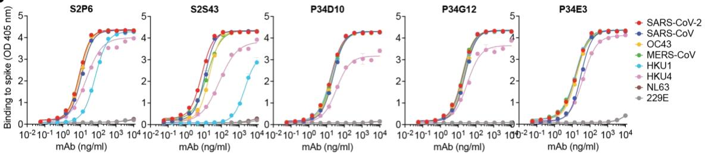  
B   
C

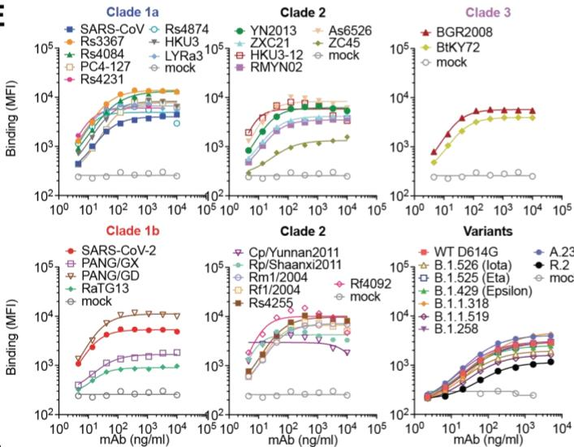  
E   
F   
G   
H   
|

Fig. S1. Properties of the 5 cross-reactive mAbs isolated. (A) V(D)J usage, nucleotide sequence identity to germline genes, number of somatic mutations, and time interval between sample collection and mAb isolation. (B) Binding of identified mAbs to prefusion β-coronavirus S ectodomain trimers by ELISA. (C) Evaluation of mAb-mediated neutralization of SARS-CoV-2 S VSV pseudotype viruses. Error bars indicate standard deviation of technical duplicates. (D) Evaluation of mAb binding to the SARS-CoV-2 (post-fusion) S₂ subunit by ELISA. (E) Mean fluorescence intensity as measured in flow cytometry for S2P6 binding to a panel of 26 full-length S glycoproteins representative of all sarbecovirus clades and 8 SARS-CoV-2 variants transiently expressed at the surface of expiCHO cells. (F) Phylogenetic tree of sarbecovirus S glycoproteins used in this work inferred via maximum likelihood analysis of S amino acid sequences. (G) SPR analysis of S2P6 Fab binding to immobilized prefusion β-coronavirus S trimers. Data for HKU1 S were fit to a steady-state binding model (insert panel). (H) SPR analysis of S2P6 Fab and IgG binding to immobilized prefusion SARS-CoV-2 S ectodomain trimer at pH 7.4 and pH 5.4. Fits to a 1:1 binding model are an approximation for IgG binding due to bivalency. (I) S2P6 neutralization of VSV pseudotyped with SARS-CoV-2 S of several SARS-CoV-2 variants of concern (VOC) and the parental SARS-CoV-2 D614G S.

A

B

Fig. S2. Identification of the S2P6 epitope. (A) Binding of S2P6 to linear peptides (15-mer peptides overlapping by 13 residues) spanning the SARS-CoV/SARS-CoV-2 S, OC43 S and MERS-CoV S sequences. (B) Binding of identified mAbs to $\beta$ -coronavirus S stem helix peptides by ELISA.

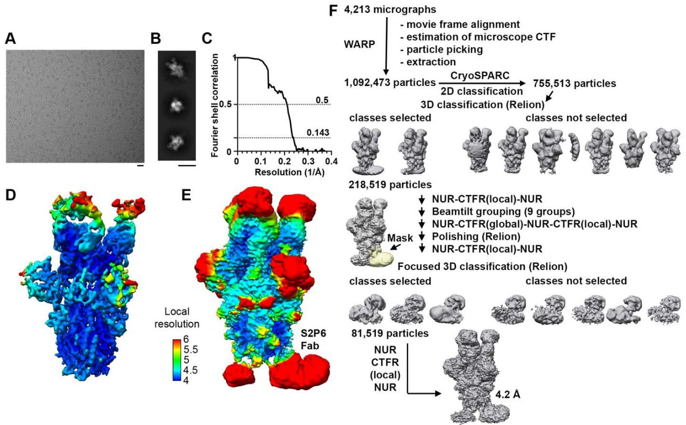  
Fig. S3. CryoEM data processing and validation of S2P6- and S2M11-bound SARS-CoV-2 S dataset. (A-B) Representative electron micrograph (A) and class averages (B) of SARS-CoV-2 S in complex with the S2P6 and S2M11 Fabs. Scale bars: 200 Å. (C) Gold-standard Fourier shell correlation curve. The 0.143 and 0.5 cut-offs are indicated by horizontal dashed gray lines. (D-E) CryoEM map colored by local resolution computed using cryoSPARC shown at two distinct contour levels. (F) Cryo-EM data processing flow chart. CTFR: per-particle defocus refinement, NUR: non-uniform refinement.

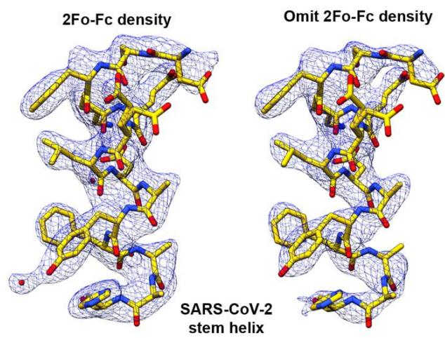  
A

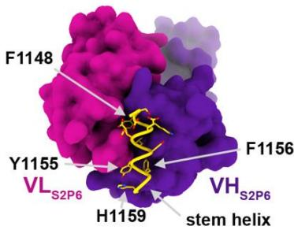  
B   
S2P6/SARS-CoV-2

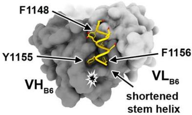  
C   
B6/SARS-CoV-2

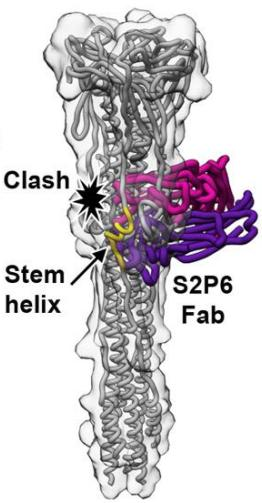  
D   
Post-fusion S   
Fig. S4. Comparison of the S2P6 and B6 mAb binding modes. (A) Crystal structure of the SARS-CoV-2 stem helix peptide rendered as sticks with the corresponding 2Fo-Fc (left) and 2Fo-Fc omit (annealed, right) maps contoured at 1.0σ. The S2P6 Fab fragment is not shown for clarity. (B) Crystal structure of the S2P6 Fab (surface rendering) in complex with the SARS-CoV-2 S stem helix peptide (yellow ribbon with side chains rendered as sticks). (C) Crystal structure of the B6 Fab (surface rendering) in complex with the SARS-CoV-2 S stem helix peptide (yellow ribbon with side chains rendered as sticks). The star indicates the putative clash between B6 CDRH2 and the stem helix C-terminus, likely explaining the latter region is disordered in the B6-bound structure whereas it is resolved in the S2P6-bound structure. (D) Superimposition of the S2P6-bound (purple/magenta) SARS-CoV-2 stem helix (yellow) crystal structure onto the SARS-CoV S post-fusion structure (PDB 6M3W) shows that S2P6 binding would be incompatible due to steric hindrance suggesting S2P6 hinders S fusogenic conformational changes. A low-pass filtered surface generated from the SARS-CoV S post-fusion structure is shown as a transparent gray surface to help visualizing clashes.

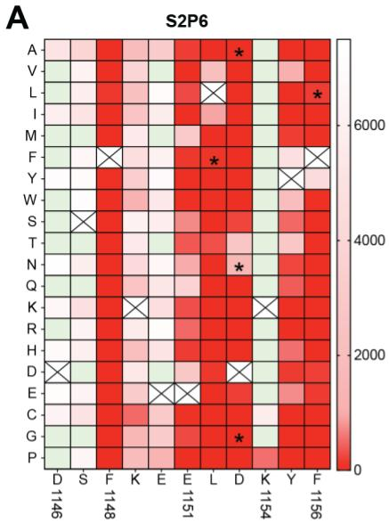

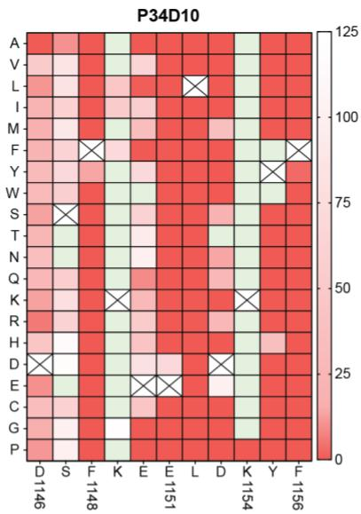

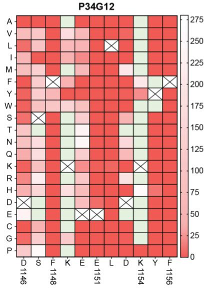

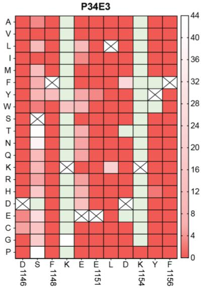

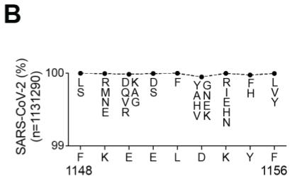

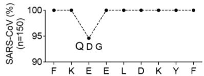

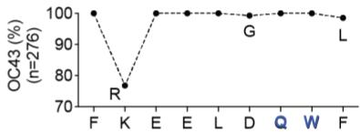

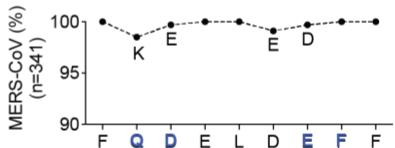

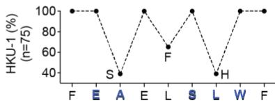  
Fig. S5. Impact of individual SARS-CoV-2 stem helix residue substitution on mAb binding. (A) Heat map showing binding (fluorescence intensity) of S2P6, P34D10, P34G12 and P34E3 to stem helix peptides harboring each possible amino acid substitution. White to red gradient indicates the magnitude of binding attenuation as compared to the native residue shown as a crossed square. Green squares indicate substitutions enhancing binding as compared to the native residue. Asterisks highlight viral escape substitutions identified in vitro for S2P6. (B) Epitope conservation among $\beta$ -coronavirus spike sequences with human and animal hosts retrieved from GISAID. The consensus sequence is reported on x axis and predominant substitutions are indicated by a blue letter.

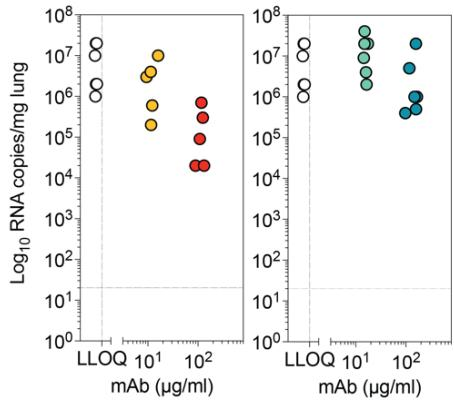  
A

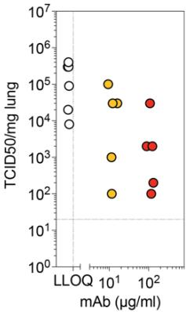  
B

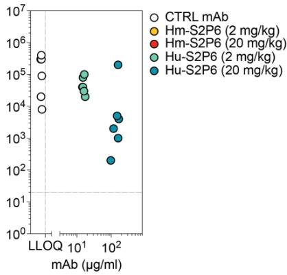  
Fig. S6. Relationships between serum S2P6 titers and viral burden. (A-B) Viral RNA copies (A) and replicating virus titers (B) in the lung of Syrian hamsters 4 days post infection with a Wuhan-1 related SARS-CoV-2 isolate plotted as a function of the serum concentration before infection (day 0) of S2P6 harboring a hamster (Hm-S2P6) or a human (Hu-S2P6) constant region.

A   

<table><tr><td colspan="3">Convalescent donor demographics</td></tr><tr><td colspan="2">Participants</td><td>72</td></tr><tr><td rowspan="3">Sex</td><td>Female</td><td>33</td></tr><tr><td>Male</td><td>36</td></tr><tr><td>N/A</td><td>3</td></tr><tr><td rowspan="2">Age</td><td>Average</td><td>50</td></tr><tr><td>Range</td><td>18-77</td></tr><tr><td colspan="3">Days after symptom onset</td></tr><tr><td></td><td>Range</td><td>13-105</td></tr><tr><td colspan="2">Hospitalized</td><td>15</td></tr><tr><td></td><td>Clinica Luganese Moncucco</td><td>3</td></tr><tr><td></td><td>Luigi Sacco Hospital</td><td>12</td></tr><tr><td colspan="2">Symptomatic</td><td>53</td></tr><tr><td></td><td>Clinica Luganese Moncucco</td><td>7</td></tr><tr><td></td><td>Swiss volunteers</td><td>20</td></tr><tr><td></td><td>US - San Francisco</td><td>26</td></tr><tr><td colspan="2">Asymptomatic</td><td>4</td></tr><tr><td></td><td>Swiss volunteers</td><td>2</td></tr><tr><td></td><td>US - San Francisco</td><td>2</td></tr></table>

<table><tr><td colspan="3">Convalescent donor demographics</td></tr><tr><td colspan="2">Participants</td><td>21</td></tr><tr><td rowspan="3">Sex</td><td>Female</td><td>12</td></tr><tr><td>Male</td><td>9</td></tr><tr><td>N/A</td><td>0</td></tr><tr><td rowspan="2">Age</td><td>Average</td><td>41</td></tr><tr><td>Range</td><td>21-54</td></tr><tr><td colspan="3">Days after PCR positive test</td></tr><tr><td></td><td>Range</td><td>207-254</td></tr><tr><td colspan="2">Symptomatic</td><td>10</td></tr><tr><td></td><td>Ente Ospedaliero Cantonale</td><td></td></tr><tr><td colspan="2">Asymptomatic</td><td>11</td></tr><tr><td></td><td>Ente Ospedaliero Cantonale</td><td></td></tr></table>

B   

<table><tr><td colspan="3">Vaccinated donor demographics</td></tr><tr><td>Participants</td><td></td><td>46</td></tr><tr><td rowspan="2">Sex</td><td>Female</td><td>18</td></tr><tr><td>Male</td><td>28</td></tr><tr><td rowspan="2">Age</td><td>Average</td><td>70</td></tr><tr><td>Range</td><td>28-91</td></tr><tr><td rowspan="2">SARS-CoV-2</td><td>Naïve</td><td>37</td></tr><tr><td>Immune</td><td>9</td></tr><tr><td rowspan="2">Vaccine</td><td>Dose 1</td><td>3</td></tr><tr><td>Dose 2</td><td>43</td></tr><tr><td rowspan="3">Cohort</td><td>Clinica Luganese Moncucco</td><td>17</td></tr><tr><td>Ente Ospedaliero Cantonale</td><td>28</td></tr><tr><td>Swiss volunteers</td><td>1</td></tr></table>

Fig. S7. Patient demographics. (A) Summary of convalescent patient demographics from which plasma (left table) or memory B cell repertoire (right table) have been analyzed. (B) Summary of vaccinated patient demographics from which memory B cell repertoire have been analyzed.

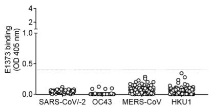

  
Fig. S8. Binding of memory B cell culture supernatant from COVID-19 convalescent individuals to $\beta$ -coronavirus stem helix peptides. ELISA cut-off (OD=0.4) is indicated by a dotted line and frequencies of positive cultures are reported for each antigen.

  
A

  
B

  
Fig. S9. Binding of memory B cell culture supernatant from COVID-19 vaccinees to $\beta$ -coronavirus stem helix peptides. (A) ELISA cut-off (OD=0.4) is indicated by a dotted line and

frequencies of positive cultures are reported for each antigen. (B) A previously infected individual who received a first (mRNA) vaccine dose showed high binding responses to SARS-CoV-2 (left). Analysis of two pre-pandemic individuals is shown for comparison (middle and right).

  
Fig. S10. Analysis of mAbs sequences. (A) Alignment of the amino acid sequences of S2P6 UCA and mature VH and VL (top). The CDRs regions are highlighted in gray. (B) Binding of S2P6 harboring mature SH or SK with specific germline reverted CDR residues to stem helix peptides. (C) Binding of mature (SH/SK) or germline reverted (UCA/UCA) S2P6 to immobilized prefusion-stabilized spike glycoprotein ectodomain trimers. (D) Alignment of the amino acid sequences of P34D10, P34G12 and P34E3 UCA and mature VH and VL. (E) Binding of mAbs comprising mature heavy chain paired with germline reverted light chain

(SH/UCA) and germline reverted heavy chain paired with mature light chain (UCA/SK) (bottom). (F) Ontology trees of VH and VL genes of P34D10, P34G12 and P34E3 shown using AncesTree (86). The number of nucleotide and amino acid (in parentheses) mutations from the unmutated common ancestor (UCA) or branch points (BPs) to their descendants are shown.

# Supplementary Information

Table S1: CryoEM data collection and refinement statistics.   

<table><tr><td></td><td>S2P6/SARS-CoV-2 S EMD-XXX</td></tr><tr><td>Data collection</td><td></td></tr><tr><td>Magnification</td><td>105,000</td></tr><tr><td>Voltage (kV)</td><td>300</td></tr><tr><td>Total exposure (\( e^{-}/Å^2 \))</td><td>60</td></tr><tr><td>Defocus range (\( μm \))</td><td>-0.1 to -5</td></tr><tr><td>Pixel size (Å)</td><td>0.4215</td></tr><tr><td>Data processing</td><td></td></tr><tr><td>Pixel size (Å)</td><td>1.201</td></tr><tr><td>Initial particle stack</td><td>1,092,473</td></tr><tr><td>Final particle stack</td><td>81,519</td></tr><tr><td>Map resolution (0.143 FSC threshold) (Å)</td><td>4.2</td></tr><tr><td>Map B-factor</td><td>-102.2</td></tr><tr><td>Symmetry</td><td>C1</td></tr></table>

Table S2: X-ray crystallography data collection and refinement statistics.   

<table><tr><td></td><td>S2P6/SARS-CoV-2</td></tr><tr><td colspan="2">Data collection</td></tr><tr><td>Space group</td><td>P6522</td></tr><tr><td colspan="2">Cell dimensions</td></tr><tr><td>a, b, c (Å)</td><td>92.64, 92.64, 223.41</td></tr><tr><td>α, β, γ (°)</td><td>90.00, 90.00, 120.00</td></tr><tr><td>Resolution (Å)</td><td>45.84-2.67 (2.77-2.67) *</td></tr><tr><td>Rmerge</td><td>0.05 (0.76)</td></tr><tr><td>I / σI</td><td>9.8 (0.83)</td></tr><tr><td>Completeness (%)</td><td>97.1 (84.9)</td></tr><tr><td>Redundancy</td><td>2.0 (2.0)</td></tr><tr><td colspan="2">Refinement</td></tr><tr><td>Resolution (Å)</td><td>45.84-2.67</td></tr><tr><td>No. reflections</td><td>16,392</td></tr><tr><td>Rwork / Rfree</td><td>0.2349/0.2733</td></tr><tr><td colspan="2">No. atoms</td></tr><tr><td>Protein</td><td>3,038</td></tr><tr><td>Ligand/ion</td><td>20</td></tr><tr><td>Water</td><td>69</td></tr><tr><td colspan="2">B-factors</td></tr><tr><td>Protein</td><td>87.9</td></tr><tr><td>Ligand/ion</td><td>79.84</td></tr><tr><td>Water</td><td>65.08</td></tr><tr><td colspan="2">R.m.s. deviations</td></tr><tr><td>Bond lengths (Å)</td><td>0.003</td></tr><tr><td>Bond angles (°)</td><td>0.54</td></tr></table>

# References and Notes

1. M. A. Tortorici, D. Veesler, Structural insights into coronavirus entry. Adv. Virus Res. 105, 93–116 (2019). doi:10.1016/bs.aivir.2019.08.002 Medline   
2. A. C. Walls, Y. J. Park, M. A. Tortorici, A. Wall, A. T. McGuire, D. Veesler, Structure, Function, and Antigenicity of the SARS-CoV-2 Spike Glycoprotein. Cell 181, 281–292.e6 (2020). doi:10.1016/j.cell.2020.02.058 Medline   
3. D. Wrapp, N. Wang, K. S. Corbett, J. A. Goldsmith, C. L. Hsieh, O. Abiona, B. S. Graham, J. S. McLellan, Cryo-EM structure of the 2019-nCoV spike in the prefusion conformation. Science 367, 1260–1263 (2020). doi:10.1126/science.abb2507 Medline   
4. E. C. Thomson, L. E. Rosen, J. G. Shepherd, R. Spreafico, A. da Silva Filipe, J. A. Wojcechowskyj, C. Davis, L. Piccoli, D. J. Pascall, J. Dillen, S. Lytras, N. Czudnochowski, R. Shah, M. Meury, N. Jesudason, A. De Marco, K. Li, J. Bassi, A. O'Toole, D. Pinto, R. M. Colquhoun, K. Culap, B. Jackson, F. Zatta, A. Rambaut, S. Jaconi, V. B. Sreenu, J. Nix, I. Zhang, R. F. Jarrett, W. G. Glass, M. Beltramello, K. Nomikou, M. Pizzuto, L. Tong, E. Cameroni, T. I. Croll, N. Johnson, J. Di Iulio, A. Wickenhagen, A. Ceschi, A. M. Harbison, D. Mair, P. Ferrari, K. Smollett, F. Sallusto, S. Carmichael, C. Garzoni, J. Nichols, M. Galli, J. Hughes, A. Riva, A. Ho, M. Schiuma, M. G. Semple, P. J. M. Openshaw, E. Fadda, J. K. Baillie, J. D. Chodera, ISARIC4C Investigators, COVID-19 Genomics UK (COG-UK) Consortium, S. J. Rihn, S. J. Lycett, H. W. Virgin, A. Telenti, D. Corti, D. L. Robertson, G. Snell, Circulating SARS-CoV-2 spike N439K variants maintain fitness while evading antibody-mediated immunity. Cell 184, 1171–1187.e20 (2021). doi:10.1016/j.cell.2021.01.037 Medline   
5. M. McCallum, A. De Marco, F. A. Lempp, M. A. Tortorici, D. Pinto, A. C. Walls, M. Beltramello, A. Chen, Z. Liu, F. Zatta, S. Zepeda, J. di Iulio, J. E. Bowen, M. Montiel-Ruiz, J. Zhou, L. E. Rosen, S. Bianchi, B. Guarino, C. S. Fregni, R. Abdelnabi, S.-Y. C. Foo, P. W. Rothlauf, L.-M. Bloyet, F. Benigni, E. Cameroni, J. Neyts, A. Riva, G. Snell, A. Telenti, S. P. J. Whelan, H. W. Virgin, D. Corti, M. S. Pizzuto, D. Veesler, N-terminal domain antigenic mapping reveals a site of vulnerability for SARS-CoV-2. Cell 184, 2332–2347.e16 (2021). doi:10.1016/j.cell.2021.03.028 Medline   
6. K. R. McCarthy, L. J. Rennick, S. Nambulli, L. R. Robinson-McCarthy, W. G. Bain, G. Haidar, W. P. Duprex, Recurrent deletions in the SARS-CoV-2 spike glycoprotein drive antibody escape. Science 371, 1139–1142 (2021). doi:10.1126/science.abf6950 Medline   
7. B. Choi, M. C. Choudhary, J. Regan, J. A. Sparks, R. F. Padera, X. Qiu, I. H. Solomon, H. H. Kuo, J. Boucau, K. Bowman, U. D. Adhikari, M. L. Winkler, A. A. Mueller, T. Y. Hsu, M. Desjardins, L. R. Baden, B. T. Chan, B. D. Walker, M. Lichterfeld, M. Brigl, D. S. Kwon, S. Kanjilal, E. T. Richardson, A. H. Jonsson, G. Alter, A. K. Barczak, W. P. Hanage, X. G. Yu, G. D. Gaiha, M. S. Seaman, M. Cernadas, J. Z. Li, Persistence and Evolution of SARS-CoV-2 in an Immunocompromised Host. N. Engl. J. Med. 383, 2291–2293 (2020). doi:10.1056/NEJMc2031364 Medline   
8. Z. Liu, L. A. VanBlargan, L.-M. Bloyet, P. W. Rothlauf, R. E. Chen, S. Stumpf, H. Zhao, J. M. Errico, E. S. Theel, M. J. Liebeskind, B. Alford, W. J. Buchser, A. H. Ellebedy, D. H. Fremont, M. S. Diamond, S. P. J. Whelan, Identification of SARS-CoV-2 spike mutations

that attenuate monoclonal and serum antibody neutralization. Cell Host Microbe 29, 477–488.e4 (2021). doi:10.1016/j.chom.2021.01.014 Medline   
9. Y. Weisblum, F. Schmidt, F. Zhang, J. DaSilva, D. Poston, J. C. C. Lorenzi, F. Muecksch, M. Rutkowska, H.-H. Hoffmann, E. Michailidis, C. Gaebler, M. Agudelo, A. Cho, Z. Wang, A. Gazumyan, M. Cipolla, L. Luchsinger, C. D. Hillyer, M. Caskey, D. F. Robbiani, C. M. Rice, M. C. Nussenzweig, T. Hatzioannou, P. D. Bieniasz, Escape from neutralizing antibodies by SARS-CoV-2 spike protein variants. eLife 9, e61312 (2020). doi:10.7554/eLife.61312 Medline   
10. M. McCallum, J. Bassi, A. De Marco, A. Chen, A. C. Walls, J. Di Iulio, M. A. Tortorici, M.-J. Navarro, C. Silacci-Fregni, C. Saliba, K. R. Sprouse, M. Agostini, D. Pinto, K. Culap, S. Bianchi, S. Jaconi, E. Cameroni, J. E. Bowen, S. W. Tilles, M. S. Pizzuto, S. B. Guastalla, G. Bona, A. F. Pellanda, C. Garzoni, W. C. Van Voorhis, L. E. Rosen, G. Snell, A. Telenti, H. W. Virgin, L. Piccoli, D. Corti, D. Veesler, SARS-CoV-2 immune evasion by the B.1.427/B.1.429 variant of concern. Science 373, 648–654 (2021). doi:10.1126/science.abi7994 Medline   
11. A. C. Walls, X. Xiong, Y. J. Park, M. A. Tortorici, J. Snijder, J. Quispe, E. Cameroni, R. Gopal, M. Dai, A. Lanzavecchia, M. Zambon, F. A. Rey, D. Corti, D. Veesler, Unexpected Receptor Functional Mimicry Elucidates Activation of Coronavirus Fusion. Cell 176, 1026–1039.e15 (2019). doi:10.1016/j.cell.2018.12.028 Medline   
12. Y. Watanabe, J. D. Allen, D. Wrapp, J. S. McLellan, M. Crispin, Site-specific glycan analysis of the SARS-CoV-2 spike. Science 369, 330–333 (2020). doi:10.1126/science.abb9983 Medline   
13. Y. Yang, C. Liu, L. Du, S. Jiang, Z. Shi, R. S. Baric, F. Li, Two Mutations Were Critical for Bat-to-Human Transmission of Middle East Respiratory Syndrome Coronavirus. J. Virol. 89, 9119–9123 (2015). doi:10.1128/JVI.01279-15 Medline   
14. M. M. Sauer, M. A. Tortorici, Y.-J. Park, A. C. Walls, L. Homad, O. Acton, J. Bowen, C. Wang, X. Xiong, W. de van der Schueren, J. Quispe, B. G. Hoffstrom, B.-J. Bosch, A. T. McGuire, D. Veesler, Structural basis for broad coronavirus neutralization. bioRxiv 2020.12.29.424482 [Preprint] (2021). https://doi.org/10.1101/2020.12.29.424482.   
15. C. Wang, R. van Haperen, J. Gutiérrez-Álvarez, W. Li, N. M. A. Okba, I. Albulescu, I. Widjaja, B. van Dieren, R. Fernandez-Delgado, I. Sola, D. L. Hurdiss, O. Daramola, F. Grosveld, F. J. M. van Kuppeveld, B. L. Haagmans, L. Enjuanes, D. Drabek, B.-J. Bosch, A conserved immunogenic and vulnerable site on the coronavirus spike protein delineated by cross-reactive monoclonal antibodies. Nat. Commun. 12, 1715 (2021). doi:10.1038/s41467-021-21968-w Medline   
16. G. Song, W.-t. He, S. Callaghan, F. Anzanello, D. Huang, J. Ricketts, J. L. Torres, N. Beutler, L. Peng, S. Vargas, J. Cassell, M. Parren, L. Yang, C. Ignacio, D. M. Smith, J. E. Voss, D. Nemazee, A. B. Ward, T. Rogers, D. R. Burton, R. Andrabi, Cross-reactive serum and memory B-cell responses to spike protein in SARS-CoV-2 and endemic coronavirus infection. Nat. Commun. 12, 2938 (2021). doi:10.1038/s41467-021-23074-3 Medline   
17. N. L. Kallewaard, D. Corti, P. J. Collins, U. Neu, J. M. McAuliffe, E. Benjamin, L. Wachter-Rosati, F. J. Palmer-Hill, A. Q. Yuan, P. A. Walker, M. K. Vorlaender, S. Bianchi, B.

Guarino, A. De Marco, F. Vanzetta, G. Agatic, M. Foglierini, D. Pinna, B. Fernandez-Rodriguez, A. Fruehwirth, C. Silacci, R. W. Ogrodowicz, S. R. Martin, F. Sallusto, J. A. Suzich, A. Lanzavecchia, Q. Zhu, S. J. Gamblin, J. J. Skehel, Structure and Function Analysis of an Antibody Recognizing All Influenza A Subtypes. Cell 166, 596–608 (2016). doi:10.1016/j.cell.2016.05.073 Medline   
18. B. F. Haynes, D. R. Burton, J. R. Mascola, Multiple roles for HIV broadly neutralizing antibodies. Sci. Transl. Med. 11, eaaz2686 (2019). doi:10.1126/scitranslmed.aaz2686Medline   
19. Z. Wang, F. Schmidt, Y. Weisblum, F. Muecksch, C. O. Barnes, S. Finkin, D. Schaefer-Babajew, M. Cipolla, C. Gaebler, J. A. Lieberman, T. Y. Oliveira, Z. Yang, M. E. Abernathy, K. E. Huey-Tubman, A. Hurley, M. Turroja, K. A. West, K. Gordon, K. G. Millard, V. Ramos, J. Da Silva, J. Xu, R. A. Colbert, R. Patel, J. Dizon, C. Unson-O'Brien, I. Shimeliovich, A. Gazumyan, M. Caskey, P. J. Bjorkman, R. Casellas, T. Hatziioannou, P. D. Bieniasz, M. C. Nussenzweig, mRNA vaccine-elicited antibodies to SARS-CoV-2 and circulating variants. Nature 592, 616–622 (2021). doi:10.1038/s41586-021-03324-6 Medline   
20. L. Piccoli, Y. J. Park, M. A. Tortorici, N. Czudnochowski, A. C. Walls, M. Beltramello, C. Silacci-Fregni, D. Pinto, L. E. Rosen, J. E. Bowen, O. J. Acton, S. Jaconi, B. Guarino, A. Minola, F. Zatta, N. Sprugasci, J. Bassi, A. Peter, A. De Marco, J. C. Nix, F. Mele, S. Jovic, B. F. Rodriguez, S. V. Gupta, F. Jin, G. Piumatti, G. Lo Presti, A. F. Pellanda, M. Biggiogero, M. Tarkowski, M. S. Pizzuto, E. Cameroni, C. Havenar-Daughton, M. Smithey, D. Hong, V. Lepori, E. Albanese, A. Ceschi, E. Bernasconi, L. Elzi, P. Ferrari, C. Garzoni, A. Riva, G. Snell, F. Sallusto, K. Fink, H. W. Virgin, A. Lanzavecchia, D. Corti, D. Veesler, Mapping Neutralizing and Immunodominant Sites on the SARS-CoV-2 Spike Receptor-Binding Domain by Structure-Guided High-Resolution Serology. Cell 183, 1024–1042.e21 (2020). doi:10.1016/j.cell.2020.09.037 Medline   
21. M. A. Tortorici, M. Beltramello, F. A. Lempp, D. Pinto, H. V. Dang, L. E. Rosen, M. McCallum, J. Bowen, A. Minola, S. Jaconi, F. Zatta, A. De Marco, B. Guarino, S. Bianchi, E. J. Lauron, H. Tucker, J. Zhou, A. Peter, C. Havenar-Daughton, J. A. Wojcechowskyj, J. B. Case, R. E. Chen, H. Kaiser, M. Montiel-Ruiz, M. Meury, N. Czudnochowski, R. Spreafico, J. Dillen, C. Ng, N. Sprugasci, K. Culap, F. Benigni, R. Abdelnabi, S. C. Foo, M. A. Schmid, E. Cameroni, A. Riva, A. Gabrieli, M. Galli, M. S. Pizzuto, J. Neyts, M. S. Diamond, H. W. Virgin, G. Snell, D. Corti, K. Fink, D. Veesler, Ultrapotent human antibodies protect against SARS-CoV-2 challenge via multiple mechanisms. Science 370, 950–957 (2020). doi:10.1126/science.abe3354 Medline   
22. M. Hoffmann, K. Mösbauer, H. Hofmann-Winkler, A. Kaul, H. Kleine-Weber, N. Krüger, N. C. Gassen, M. A. Müller, C. Drosten, S. Pöhlmann, Chloroquine does not inhibit infection of human lung cells with SARS-CoV-2. Nature 585, 588–590 (2020). doi:10.1038/s41586-020-2575-3 Medline   
23. M. Hoffmann, H. Kleine-Weber, S. Schroeder, N. Krüger, T. Herrler, S. Erichsen, T. S. Schiergens, G. Herrler, N. H. Wu, A. Nitsche, M. A. Müller, C. Drosten, S. Pöhlmann, SARS-CoV-2 Cell Entry Depends on ACE2 and TMPRSS2 and Is Blocked by a Clinically Proven Protease Inhibitor. Cell 181, 271–280.e8 (2020). doi:10.1016/j.cell.2020.02.052 Medline

24. M. Hoffmann, H. Kleine-Weber, S. Pöhlmann, A Multibasic Cleavage Site in the Spike Protein of SARS-CoV-2 Is Essential for Infection of Human Lung Cells. Mol. Cell 78, 779–784.e5 (2020). doi:10.1016/j.molcel.2020.04.022 Medline   
25. Y. Kaname, H. Tani, C. Kataoka, M. Shiokawa, S. Taguwa, T. Abe, K. Moriishi, T. Kinoshita, Y. Matsuura, Acquisition of complement resistance through incorporation of CD55/decay-accelerating factor into viral particles bearing baculovirus GP64. J. Virol. 84, 3210–3219 (2010). doi:10.1128/JVI.02519-09 Medline   
26. J. B. Case, P. W. Rothlauf, R. E. Chen, Z. Liu, H. Zhao, A. S. Kim, L. M. Bloyet, Q. Zeng, S. Tahan, L. Droit, M. X. G. Ilagan, M. A. Tartell, G. Amarasinghe, J. P. Henderson, S. Miersch, M. Ustav, S. Sidhu, H. W. Virgin, D. Wang, S. Ding, D. Corti, E. S. Theel, D. H. Fremont, M. S. Diamond, S. P. J. Whelan, Neutralizing Antibody and Soluble ACE2 Inhibition of a Replication-Competent VSV-SARS-CoV-2 and a Clinical Isolate of SARS-CoV-2. Cell Host Microbe 28, 475–485.e5 (2020). doi:10.1016/j.chom.2020.06.021 Medline   
27. M. Gui, W. Song, H. Zhou, J. Xu, S. Chen, Y. Xiang, X. Wang, Cryo-electron microscopy structures of the SARS-CoV spike glycoprotein reveal a prerequisite conformational state for receptor binding. Cell Res. 27, 119–129 (2017). doi:10.1038/cr.2016.152 Medline   
28. R. N. Kirchdoerfer, N. Wang, J. Pallesen, D. Wrapp, H. L. Turner, C. A. Cottrell, K. S. Corbett, B. S. Graham, J. S. McLellan, A. B. Ward, Stabilized coronavirus spikes are resistant to conformational changes induced by receptor recognition or proteolysis. Sci. Rep. 8, 15701 (2018). doi:10.1038/s41598-018-34171-7 Medline   
29. Y. Yuan, D. Cao, Y. Zhang, J. Ma, J. Qi, Q. Wang, G. Lu, Y. Wu, J. Yan, Y. Shi, X. Zhang, G. F. Gao, Cryo-EM structures of MERS-CoV and SARS-CoV spike glycoproteins reveal the dynamic receptor binding domains. Nat. Commun. 8, 15092 (2017). doi:10.1038/ncomms15092 Medline   
30. A. C. Walls, M. A. Tortorici, J. Snijder, X. Xiong, B. J. Bosch, F. A. Rey, D. Veesler, Tectonic conformational changes of a coronavirus spike glycoprotein promote membrane fusion. Proc. Natl. Acad. Sci. U.S.A. 114, 11157–11162 (2017). doi:10.1073/pnas.1708727114 Medline   
31. Y. Cai, J. Zhang, T. Xiao, H. Peng, S. M. Sterling, R. M. Walsh Jr., S. Rawson, S. Rits-Volloch, B. Chen, Distinct conformational states of SARS-CoV-2 spike protein. Science 369, 1586–1592 (2020). doi:10.1126/science.abd4251 Medline   
32. X. Fan, D. Cao, L. Kong, X. Zhang, Cryo-EM analysis of the post-fusion structure of the SARS-CoV spike glycoprotein. Nat. Commun. 11, 3618 (2020). doi:10.1038/s41467-020-17371-6 Medline   
33. F. A. Lempp, L. Soriaga, M. Montiel-Ruiz, F. Benigni, J. Noack, Y.-J. Park, S. Bianchi, A. C. Walls, J. E. Bowen, J. Zhou, H. Kaiser, M. Agostini, M. Meury, E. Dellota Jr., S. Jaconi, E. Cameroni, H. W. Virgin, A. Lanzavecchia, D. Veesler, L. Purcell, A. Telenti, D. Corti, Membrane lectins enhance SARS-CoV-2 infection and influence the neutralizing activity of different classes of antibodies. bioRxiv 2021.04.03.438258 [Preprint] (2021). https://doi.org/10.1101/2021.04.03.438258.

34. A. Schäfer, F. Muecksch, J. C. C. Lorenzi, S. R. Leist, M. Cipolla, S. Bournazos, F. Schmidt, R. M. Maison, A. Gazumyan, D. R. Martinez, R. S. Baric, D. F. Robbiani, T. Hatzioannou, J. V. Ravetch, P. D. Bieniasz, R. A. Bowen, M. C. Nussenzweig, T. P. Sheahan, Antibody potency, effector function, and combinations in protection and therapy for SARS-CoV-2 infection in vivo. J. Exp. Med. 218, e20201993 (2021). doi:10.1084/jem.20201993 Medline   
35. S. Bournazos, T. T. Wang, J. V. Ravetch, The Role and Function of Fcγ Receptors on Myeloid Cells. Microbiol. Spectr. 4, 4.6.20 (2016). doi:10.1128/microbiolspec.MCHD-0045-2016 Medline   
36. S. Bournazos, D. Corti, H. W. Virgin, J. V. Ravetch, Fc-optimized antibodies elicit CD8 immunity to viral respiratory infection. Nature 588, 485–490 (2020). doi:10.1038/s41586-020-2838-z Medline   
37. E. S. Winkler, P. Gilchuk, J. Yu, A. L. Bailey, R. E. Chen, Z. Chong, S. J. Zost, H. Jang, Y. Huang, J. D. Allen, J. B. Case, R. E. Sutton, R. H. Carnahan, T. L. Darling, A. C. M. Boon, M. Mack, R. D. Head, T. M. Ross, J. E. Crowe Jr., M. S. Diamond, Human neutralizing antibodies against SARS-CoV-2 require intact Fc effector functions for optimal therapeutic protection. Cell 184, 1804–1820.E16 (2021). doi:10.1016/j.cell.2021.02.026 Medline   
38. D. Pinto, Y. J. Park, M. Beltramello, A. C. Walls, M. A. Tortorici, S. Bianchi, S. Jaconi, K. Culap, F. Zatta, A. De Marco, A. Peter, B. Guarino, R. Spreafico, E. Cameroni, J. B. Case, R. E. Chen, C. Havenar-Daughton, G. Snell, A. Telenti, H. W. Virgin, A. Lanzavecchia, M. S. Diamond, K. Fink, D. Veesler, D. Corti, Cross-neutralization of SARS-CoV-2 by a human monoclonal SARS-CoV antibody. Nature 583, 290–295 (2020). doi:10.1038/s41586-020-2349-y Medline   
39. R. Boudewijns, H. J. Thibaut, S. J. F. Kaptein, R. Li, V. Vergote, L. Seldeslachts, J. Van Weyenbergh, C. De Keyzer, L. Bervoets, S. Sharma, L. Liesenborghs, J. Ma, S. Jansen, D. Van Looveren, T. Vercruysse, X. Wang, D. Jochmans, E. Martens, K. Roose, D. De Vlieger, B. Schepens, T. Van Buyten, S. Jacobs, Y. Liu, J. Martí-Carreras, B. Vanmechelen, T. Wawina-Bokalanga, L. Delang, J. Rocha-Pereira, L. Coelmont, W. Chiu, P. Leyssen, E. Heylen, D. Schols, L. Wang, L. Close, J. Matthijnssens, M. Van Ranst, V. Compernolle, G. Schramm, K. Van Laere, X. Saelens, N. Callewaert, G. Opdenakker, P. Maes, B. Weynand, C. Cawthorne, G. Vande Velde, Z. Wang, J. Neyts, K. Dallmeier, STAT2 signaling restricts viral dissemination but drives severe pneumonia in SARS-CoV-2 infected hamsters. Nat. Commun. 11, 5838 (2020). doi:10.1038/s41467-020-19684-y Medline   
40. D. Pinna, D. Corti, D. Jarrossay, F. Sallusto, A. Lanzavecchia, Clonal dissection of the human memory B-cell repertoire following infection and vaccination. Eur. J. Immunol. 39, 1260–1270 (2009). doi:10.1002/eji.200839129 Medline   
41. C. Daniel, R. Anderson, M. J. Buchmeier, J. O. Fleming, W. J. Spaan, H. Wege, P. J. Talbot, Identification of an immunodominant linear neutralization domain on the S2 portion of the murine coronavirus spike glycoprotein and evidence that it forms part of complex tridimensional structure. J. Virol. 67, 1185–1194 (1993). doi:10.1128/jvi.67.3.1185-1194.1993 Medline

42. H. Zhang, G. Wang, J. Li, Y. Nie, X. Shi, G. Lian, W. Wang, X. Yin, Y. Zhao, X. Qu, M. Ding, H. Deng, Identification of an antigenic determinant on the S2 domain of the severe acute respiratory syndrome coronavirus spike glycoprotein capable of inducing neutralizing antibodies. J. Virol. 78, 6938–6945 (2004). doi:10.1128/JVI.78.13.6938-6945.2004 Medline   
43. C. M. Poh, G. Carissimo, B. Wang, S. N. Amrun, C. Y. Lee, R. S. Chee, S. W. Fong, N. K. Yeo, W. H. Lee, A. Torres-Ruesta, Y. S. Leo, M. I. Chen, S. Y. Tan, L. Y. A. Chai, S. Kalimuddin, S. S. G. Kheng, S. Y. Thien, B. E. Young, D. C. Lye, B. J. Hanson, C. I. Wang, L. Renia, L. F. P. Ng, Two linear epitopes on the SARS-CoV-2 spike protein that elicit neutralising antibodies in COVID-19 patients. Nat. Commun. 11, 2806 (2020). doi:10.1038/s41467-020-16638-2 Medline   
44. H. A. Elshabrawy, M. M. Coughlin, S. C. Baker, B. S. Prabhakar, Human monoclonal antibodies against highly conserved HR1 and HR2 domains of the SARS-CoV spike protein are more broadly neutralizing. PLOS ONE 7, e50366 (2012). doi:10.1371/journal.pone.0050366 Medline   
45. Z. Zheng, V. M. Monteil, S. Maurer-Stroh, C. W. Yew, C. Leong, N. K. Mohd-Ismail, S. Cheyyatraivendran Arularasu, V. T. K. Chow, R. T. P. Lin, A. Mirazimi, W. Hong, Y. J. Tan, Monoclonal antibodies for the S2 subunit of spike of SARS-CoV-1 cross-react with the newly-emerged SARS-CoV-2. Euro Surveill. 25, 2000291 (2020). doi:10.2807/1560-7917.ES.2020.25.28.2000291 Medline   
46. A. C. Walls, M. A. Tortorici, B. J. Bosch, B. Frenz, P. J. M. Rottier, F. DiMaio, F. A. Rey, D. Veesler, Cryo-electron microscopy structure of a coronavirus spike glycoprotein trimer. Nature 531, 114–117 (2016). doi:10.1038/nature16988 Medline   
47. P. Zhou, M. Yuan, G. Song, N. Beutler, N. Shaabani, D. Huang, W.-t. He, X. Zhu, S. Callaghan, P. Yong, F. Anzanello, L. Peng, J. Ricketts, M. Parren, E. Garcia, S. A. Rawlings, D. M. Smith, D. Nemazee, J. R. Teijaro, T. F. Rogers, I. A. Wilson, D. R. Burton, R. Andrabi, A protective broadly cross-reactive human antibody defines a conserved site of vulnerability on beta-coronavirus spikes. bioRxiv 2021.03.30.437769 [Preprint] (2021). https://doi.org/10.1101/2021.03.30.437769.   
48. D. Corti, J. Voss, S. J. Gamblin, G. Codoni, A. Macagno, D. Jarrossay, S. G. Vachieri, D. Pinna, A. Minola, F. Vanzetta, C. Silacci, B. M. Fernandez-Rodriguez, G. Agatic, S. Bianchi, I. Giacchetto-Sasselli, L. Calder, F. Sallusto, P. Collins, L. F. Haire, N. Temperton, J. P. Langedijk, J. J. Skehel, A. Lanzavecchia, A neutralizing antibody selected from plasma cells that binds to group 1 and group 2 influenza A hemagglutinins. Science 333, 850–856 (2011). doi:10.1126/science.1205669 Medline   
49. D. J. DiLillo, G. S. Tan, P. Palese, J. V. Ravetch, Broadly neutralizing hemagglutinin stalk-specific antibodies require FcγR interactions for protection against influenza virus in vivo. Nat. Med. 20, 143–151 (2014). doi:10.1038/nm.3443 Medline   
50. D. Corti, A. L. Suguitan Jr., D. Pinna, C. Silacci, B. M. Fernandez-Rodriguez, F. Vanzetta, C. Santos, C. J. Luke, F. J. Torres-Velez, N. J. Temperton, R. A. Weiss, F. Sallusto, K. Subbarao, A. Lanzavecchia, Heterosubtypic neutralizing antibodies are produced by individuals immunized with a seasonal influenza vaccine. J. Clin. Invest. 120, 1663–1673 (2010). doi:10.1172/JCI41902 Medline

51. F. Sesterhenn, C. Yang, J. Bonet, J. T. Cramer, X. Wen, Y. Wang, C. I. Chiang, L. A. Abriata, I. Kucharska, G. Castoro, S. S. Vollers, M. Galloux, E. Dheilly, S. Rosset, P. Corthésy, S. Georgeon, M. Villard, C. A. Richard, D. Descamps, T. Delgado, E. Oricchio, M. A. Rameix-Welti, V. Más, S. Ervin, J. F. Eléouët, S. Riffault, J. T. Bates, J. P. Julien, Y. Li, T. Jardetzky, T. Krey, B. E. Correia, De novo protein design enables the precise induction of RSV-neutralizing antibodies. Science 368, eaay5051 (2020). doi:10.1126/science.aay5051 Medline   
52. M. L. Azoitei, B. E. Correia, Y. E. Ban, C. Carrico, O. Kalyuzhniy, L. Chen, A. Schroeter, P. S. Huang, J. S. McLellan, P. D. Kwong, D. Baker, R. K. Strong, W. R. Schief, Computation-guided backbone grafting of a discontinuous motif onto a protein scaffold. Science 334, 373–376 (2011). doi:10.1126/science.1209368 Medline   
53. B. E. Correia, J. T. Bates, R. J. Loomis, G. Baneyx, C. Carrico, J. G. Jardine, P. Rupert, C. Correnti, O. Kalyuzhniy, V. Vittal, M. J. Connell, E. Stevens, A. Schroeter, M. Chen, S. Macpherson, A. M. Serra, Y. Adachi, M. A. Holmes, Y. Li, R. E. Klevit, B. S. Graham, R. T. Wyatt, D. Baker, R. K. Strong, J. E. Crowe Jr., P. R. Johnson, W. R. Schief, Proof of principle for epitope-focused vaccine design. Nature 507, 201–206 (2014). doi:10.1038/nature12966 Medline   
54. A. C. Walls, B. Fiala, A. Schäfer, S. Wrenn, M. N. Pham, M. Murphy, L. V. Tse, L. Shehata, M. A. O'Connor, C. Chen, M. J. Navarro, M. C. Miranda, D. Pettie, R. Ravichandran, J. C. Kraft, C. Ogohara, A. Palser, S. Chalk, E. C. Lee, K. Guerriero, E. Kepl, C. M. Chow, C. Sydeman, E. A. Hodge, B. Brown, J. T. Fuller, K. H. Dinnon 3rd, L. E. Gralinski, S. R. Leist, K. L. Gully, T. B. Lewis, M. Guttman, H. Y. Chu, K. K. Lee, D. H. Fuller, R. S. Baric, P. Kellam, L. Carter, M. Pepper, T. P. Sheahan, D. Veesler, N. P. King, Elicitation of Potent Neutralizing Antibody Responses by Designed Protein Nanoparticle Vaccines for SARS-CoV-2. Cell 183, 1367–1382.e17 (2020). doi:10.1016/j.cell.2020.10.043 Medline   
55. A. C. Walls, M. C. Miranda, M. N. Pham, A. Schäfer, A. Greaney, P. S. Arunachalam, M.-J. Navarro, M. A. Tortorici, K. Rogers, M. A. O'Connor, L. Shireff, D. E. Ferrell, N. Brunette, E. Kepl, J. Bowen, S. K. Zepeda, T. Starr, C.-L. Hsieh, B. Fiala, S. Wrenn, D. Pettie, C. Sydeman, M. Johnson, A. Blackstone, R. Ravichandran, C. Ogohara, L. Carter, S. W. Tilles, R. Rappuoli, D. T. O'Hagan, R. Van Der Most, W. C. Van Voorhis, J. S. McLellan, H. Kleanthous, T. P. Sheahan, D. H. Fuller, F. Villinger, J. Bloom, B. Pulendran, R. Baric, N. King, D. Veesler, Elicitation of broadly protective sarbecovirus immunity by receptor-binding domain nanoparticle vaccines. bioRxiv 2021.03.15.435528 [Preprint] (2021). https://doi.org/10.1101/2021.03.15.435528.   
56. S. Boyoglu-Barnum, D. Ellis, R. A. Gillespie, G. B. Hutchinson, Y.-J. Park, S. M. Moin, O. J. Acton, R. Ravichandran, M. Murphy, D. Pettie, N. Matheson, L. Carter, A. Creanga, M. J. Watson, S. Kephart, S. Ataca, J. R. Vaile, G. Ueda, M. C. Crank, L. Stewart, K. K. Lee, M. Guttman, D. Baker, J. R. Mascola, D. Veesler, B. S. Graham, N. P. King, M. Kanekiyo, Quadrivalent influenza nanoparticle vaccines induce broad protection. Nature 592, 623–628 (2021). doi:10.1038/s41586-021-03365-x Medline   
57. M. Kanekiyo, C. J. Wei, H. M. Yassine, P. M. McTamney, J. C. Boyington, J. R. Whittle, S. S. Rao, W. P. Kong, L. Wang, G. J. Nabel, Self-assembling influenza nanoparticle

vaccines elicit broadly neutralizing H1N1 antibodies. Nature 499, 102–106 (2013). doi:10.1038/nature12202 Medline   
58. M. Kanekiyo, M. G. Joyce, R. A. Gillespie, J. R. Gallagher, S. F. Andrews, H. M. Yassine, A. K. Wheatley, B. E. Fisher, D. R. Ambrozak, A. Creanga, K. Leung, E. S. Yang, S. Boyoglu-Barnum, I. S. Georgiev, Y. Tsybovsky, M. S. Prabhakaran, H. Andersen, W. P. Kong, U. Baxa, K. L. Zephir, J. E. Ledgerwood, R. A. Koup, P. D. Kwong, A. K. Harris, A. B. McDermott, J. R. Mascola, B. S. Graham, Mosaic nanoparticle display of diverse influenza virus hemagglutinins elicits broad B cell responses. Nat. Immunol. 20, 362–372 (2019). doi:10.1038/s41590-018-0305-x Medline   
59. J. Marcandalli, B. Fiala, S. Ols, M. Perotti, W. de van der Schueren, J. Snijder, E. Hodge, M. Benhaim, R. Ravichandran, L. Carter, W. Sheffler, L. Brunner, M. Lawrenz, P. Dubois, A. Lanzavecchia, F. Sallusto, K. K. Lee, D. Veesler, C. E. Correnti, L. J. Stewart, D. Baker, K. Loré, L. Perez, N. P. King, Induction of Potent Neutralizing Antibody Responses by a Designed Protein Nanoparticle Vaccine for Respiratory Syncytial Virus. Cell 176, 1420–1431.e17 (2019). doi:10.1016/j.cell.2019.01.046 Medline   
60. J. Tan, B. K. Sack, D. Oyen, I. Zenklusen, L. Piccoli, S. Barbieri, M. Foglierini, C. S. Fregni, J. Marcandalli, S. Jongo, S. Abdulla, L. Perez, G. Corradin, L. Varani, F. Sallusto, B. K. L. Sim, S. L. Hoffman, S. H. I. Kappe, C. Daubenberger, I. A. Wilson, A. Lanzavecchia, A public antibody lineage that potently inhibits malaria infection through dual binding to the circumsporozoite protein. Nat. Med. 24, 401–407 (2018). doi:10.1038/nm.4513Medline   
61. M. A. Tortorici, N. Czudnochowski, T. N. Starr, R. Marzi, A. C. Walls, F. Zatta, J. E. Bowen, S. Jaconi, J. di Iulio, Z. Wang, A. De Marco, S. K. Zepeda, D. Pinto, Z. Liu, M. Beltramello, I. Bartha, M. P. Housley, F. A. Lempp, L. E. Rosen, E. Dellota Jr., H. Kaiser, M. Montiel-Ruiz, J. Zhou, A. Addetia, B. Guarino, K. Culap, N. Sprugasci, C. Saliba, E. Vetti, I. Giacchetto-Sasselli, C. S. Fregni, R. Abdelnabi, S.-Y. C. Foo, C. Havenar-Daughton, M. A. Schmid, F. Benigni, E. Cameroni, J. Neyts, A. Telenti, G. Snell, H. W. Virgin, S. P. J. Whelan, J. D. Bloom, D. Corti, D. Veesler, M. S. Pizzuto, Structural basis for broad sarbecovirus neutralization by a human monoclonal antibody. bioRxiv 2021.04.07.438818 [Preprint] (2021). https://doi.org/10.1101/2021.04.07.438818.   
62. M. A. Tortorici, A. C. Walls, Y. Lang, C. Wang, Z. Li, D. Koerhuis, G. J. Boons, B. J. Bosch, F. A. Rey, R. J. de Groot, D. Veesler, Structural basis for human coronavirus attachment to sialic acid receptors. Nat. Struct. Mol. Biol. 26, 481–489 (2019). doi:10.1038/s41594-019-0233-y Medline   
63. Y. J. Park, A. C. Walls, Z. Wang, M. M. Sauer, W. Li, M. A. Tortorici, B. J. Bosch, F. DiMaio, D. Veesler, Structures of MERS-CoV spike glycoprotein in complex with sialoside attachment receptors. Nat. Struct. Mol. Biol. 26, 1151–1157 (2019). doi:10.1038/s41594-019-0334-7 Medline   
64. T. N. Starr, N. Czudnochowski, F. Zatta, Y.-J. Park, Z. Liu, A. Addetia, D. Pinto, M. Beltramello, P. Hernandez, A. J. Greaney, R. Marzi, W. G. Glass, I. Zhang, A. S. Dingens, J. E. Bowen, J. A. Wojcechowskyj, A. De Marco, L. E. Rosen, J. Zhou, M. Montiel-Ruiz, H. Kaiser, H. Tucker, M. P. Housley, J. di Iulio, G. Lombardo, M.

Agostini, N. Sprugasci, K. Culap, S. Jaconi, M. Meury, E. Dellota, E. Cameroni, T. I. Croll, J. C. Nix, C. Havenar-Daughton, A. Telenti, F. A. Lempp, M. S. Pizzuto, J. D. Chodera, C. M. Hebner, S. P. J. Whelan, H. W. Virgin, D. Veesler, D. Corti, J. D. Bloom, G. Snell, Antibodies to the SARS-CoV-2 receptor-binding domain that maximize breadth and resistance to viral escape. bioRxiv 2021.04.06.438709 [Preprint] (2021). https://doi.org/10.1101/2021.04.06.438709.   
65. A. M. Bolger, M. Lohse, B. Usadel, Trimmomatic: A flexible trimmer for Illumina sequence data. Bioinformatics 30, 2114–2120 (2014). doi:10.1093/bioinformatics/btu170 Medline   
66. H. Li, Aligning sequence reads, clone sequences and assembly contigs with BWA-MEM. arXiv:1303.3997 [q-bio.GN] (2013).   
67. A. Wilm, P. P. K. Aw, D. Bertrand, G. H. T. Yeo, S. H. Ong, C. H. Wong, C. C. Khor, R. Petric, M. L. Hibberd, N. Nagarajan, LoFreq: A sequence-quality aware, ultra-sensitive variant caller for uncovering cell-population heterogeneity from high-throughput sequencing datasets. *Nucleic Acids Res.* 40, 11189–11201 (2012). doi:10.1093/nar/gks918 Medline   
68. P. Cingolani, A. Platts, L. Wang, M. Coon, T. Nguyen, L. Wang, S. J. Land, X. Lu, D. M. Ruden, A program for annotating and predicting the effects of single nucleotide polymorphisms, SnpEff. Fly 6, 80–92 (2012). doi:10.4161/fly.19695 Medline   
69. B. S. Pedersen, A. R. Quinlan, Mosdepth: Quick coverage calculation for genomes and exomes. Bioinformatics 34, 867–868 (2018). doi:10.1093/bioinformatics/btx699 Medline   
70. P. Danecek, J. K. Bonfield, J. Liddle, J. Marshall, V. Ohan, M. O. Pollard, A. Whitwham, T. Keane, S. A. McCarthy, R. M. Davies, H. Li, Twelve years of SAMtools and BCFtools. Gigascience 10, giab008 (2021). doi:10.1093/gigascience/giab008 Medline   
71. P. Ewels, M. Magnusson, S. Lundin, M. Käller, MultiQC: Summarize analysis results for multiple tools and samples in a single report. Bioinformatics 32, 3047–3048 (2016). doi:10.1093/bioinformatics/btw354 Medline   
72. P. Di Tommaso, M. Chatzou, E. W. Floden, P. P. Barja, E. Palumbo, C. Notredame, Nextflow enables reproducible computational workflows. Nat. Biotechnol. 35, 316–319 (2017). doi:10.1038/nbt.3820 Medline   
73. B. Grüning, R. Dale, A. Sjödin, B. A. Chapman, J. Rowe, C. H. Tomkins-Tinch, R. Valieris, J. Köster, Bioconda Team, Bioconda: Sustainable and comprehensive software distribution for the life sciences. Nat. Methods 15, 475–476 (2018). doi:10.1038/s41592-018-0046-7 Medline   
74. P. Emsley, B. Lohkamp, W. G. Scott, K. Cowtan, Features and development of Coot. Acta Cryst. D66, 486–501 (2010). doi:10.1107/S0907444910007493 Medline   
75. T. I. Croll, ISOLDE: A physically realistic environment for model building into low-resolution electron-density maps. Acta Cryst. D74, 519–530 (2018). doi:10.1107/S2059798318002425 Medline   
76. G. N. Murshudov, P. Skubák, A. A. Lebedev, N. S. Pannu, R. A. Steiner, R. A. Nicholls, M. D. Winn, F. Long, A. A. Vagin, REFMAC5 for the refinement of macromolecular crystal structures. Acta Cryst. D67, 355–367 (2011). doi:10.1107/S0907444911001314 Medline

77. D. Liebschner, P. V. Afonine, M. L. Baker, G. Bunkóczi, V. B. Chen, T. I. Croll, B. Hintze, L. W. Hung, S. Jain, A. J. McCoy, N. W. Moriarty, R. D. Oeffner, B. K. Poon, M. G. Prisant, R. J. Read, J. S. Richardson, D. C. Richardson, M. D. Sammito, O. V. Sobolev, D. H. Stockwell, T. C. Terwilliger, A. G. Urzhumtsev, L. L. Videau, C. J. Williams, P. D. Adams, Macromolecular structure determination using X-rays, neutrons and electrons: Recent developments in Phenix. Acta Cryst. D75, 861–877 (2019). doi:10.1107/S2059798319011471 Medline   
78. C. Suloway, J. Pulokas, D. Fellmann, A. Cheng, F. Guerra, J. Quispe, S. Stagg, C. S. Potter, B. Carragher, Automated molecular microscopy: The new Leginon system. J. Struct. Biol. 151, 41–60 (2005). doi:10.1016/j.jsb.2005.03.010 Medline   
79. D. Tegunov, P. Cramer, Real-time cryo-electron microscopy data preprocessing with Warp. Nat. Methods 16, 1146–1152 (2019). doi:10.1038/s41592-019-0580-y Medline   
80. A. Punjani, J. L. Rubinstein, D. J. Fleet, M. A. Brubaker, cryoSPARC: Algorithms for rapid unsupervised cryo-EM structure determination. Nat. Methods 14, 290–296 (2017). doi:10.1038/nmeth.4169 Medline   
81. J. Zivanov, T. Nakane, S. H. W. Scheres, A Bayesian approach to beam-induced motion correction in cryo-EM single-particle analysis. IUCrJ 6, 5–17 (2019). doi:10.1107/S205225251801463X Medline   
82. S. Chen, G. McMullan, A. R. Faruqi, G. N. Murshudov, J. M. Short, S. H. Scheres, R. Henderson, High-resolution noise substitution to measure overfitting and validate resolution in 3D structure determination by single particle electron cryomicroscopy. Ultramicroscopy 135, 24–35 (2013). doi:10.1016/j.ultramic.2013.06.004 Medline   
83. E. F. Pettersen, T. D. Goddard, C. C. Huang, G. S. Couch, D. M. Greenblatt, E. C. Meng, T. E. Ferrin, UCSF Chimera—A visualization system for exploratory research and analysis. J. Comput. Chem. 25, 1605–1612 (2004). doi:10.1002/jcc.20084 Medline   
84. L. J. Reed, H. Muench, A Simple Method of Estimating Fifty Per Cent Endpoints. Am. J. Epidemiol. 27, 493–497 (1938). doi:10.1093/oxfordjournals.aje.a118408   
85. R. Abdelnabi, R. Boudewijns, C. S. Foo, L. Seldeslachts, L. Sanchez-Felipe, X. Zhang, L. Delang, P. Maes, S. J. F. Kaptein, B. Weynand, G. V. Velde, J. Neyts, K. Dallmeier, Comparing infectivity and virulence of emerging SARS-CoV-2 variants in Syrian hamsters. EBioMedicine 68, 103403 (2021). doi:10.1016/j.ebiom.2021.103403 Medline   
86. M. Foglierini, L. Pappas, A. Lanzavecchia, D. Corti, L. Perez, AncesTree: An interactive immunoglobulin lineage tree visualizer. PLOS Comput. Biol. 16, e1007731 (2020). doi:10.1371/journal.pcbi.1007731 Medline