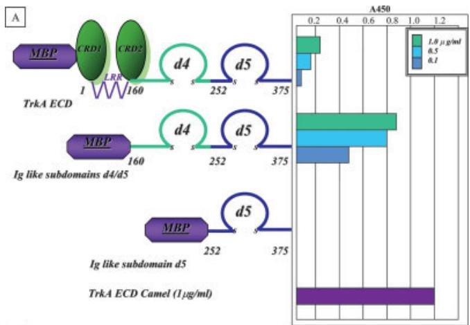
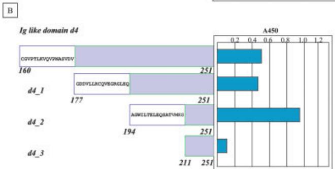
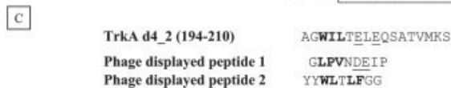
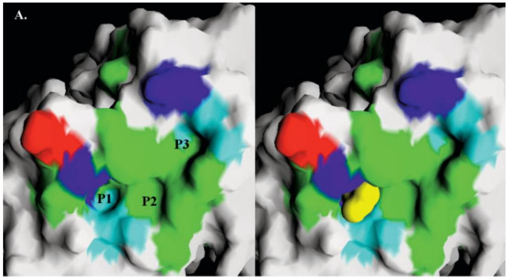
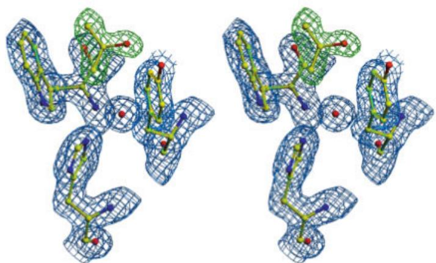
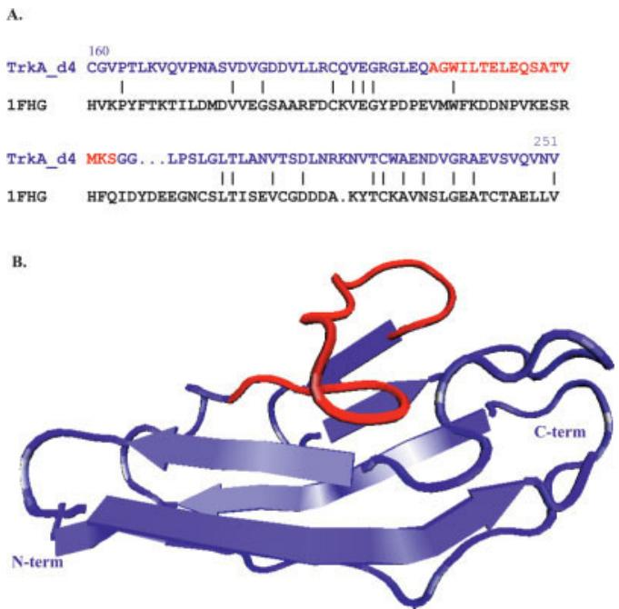

# Proteins - 2005 - Covaceuszach - Neutralization of NGF‐TrkA receptor interaction by the novel antagonistic anti‐TrkA

# Neutralization of NGF-TrkA Receptor Interaction by the Novel Antagonistic Anti-TrkA Monoclonal Antibody MNAC13: A Structural Insight

Sonia Covaceuszach, $^{1,2*}$ Antonino Cattaneo, $^{1,2}$ and Doriano Lamba $^{3,4}$

$^{1}$ LaylineGenomics, Roma, Italy   
$^{2}$ Neuroscience Program, International School for Advanced Studies, Trieste, Italy   
$^{3}$ Istituto di Cristallografia, Consiglio Nazionale delle Ricerche, Trieste, Italy   
$^{4}$ International Centre for Genetic Engineering and Biotechnology, Trieste, Italy

ABSTRACT MNAC13, a mouse monoclonal antibody, recognizes with high affinity and specificity the neurotrophin receptor TrkA and displays a neutralizing activity toward the NGF/TrkA interaction. Detailed knowledge of the molecular basis determining the specificity of this antibody is of importance because of its potential use as a modulator of the TrkA-mediated NGF activity. Here, we report a full biochemical and structural characterization of the MNAC13 antibody. Epitope mapping studies, by serial deletion mutants and by phage display, reveal a conformational epitope that is localized on the carboxy-terminal region of the first immunoglobulin-like domain (d4) of TrkA. The X-ray crystal structure of the MNAC13 Fab fragment has been determined and refined to 1.8 Å resolution. The antigen-binding site is characterized by a crevice, surrounded by hydrophilic-charged residues on either side, dipping deep toward three mainly hydrophobic subsites. Remarkably an isopropanol molecule has been found to bind in one of the hydrophobic crevices. Overall, the surface topology (shape and electrostatic potential) of the combining site is consistent with the binding data on TrkA ECD serial deletions mutants. The structure of the MNAC13 Fab fragment may assist in the rational structure-based design of high affinity humanized forms of MNAC13, appropriate for therapeutic approaches in neuropathy and inflammatory pain states. Proteins 2005;58:717–727. © 2004 Wiley-Liss, Inc.

Key words: nerve growth factor (NGF); tyrosin kinase A receptor (TrkA); neutralizing monoclonal antibody MNAC13; crystal structure; epitope mapping

# INTRODUCTION

Nerve growth factor (NGF), the prototype of neurotrophin superfamily, besides being involved in both the development and the maintenance of specific peripheral and central neuronal populations (including sympathetic, sensory, cholinergic neurons), is also implicated in several pathologic conditions.

Indeed the interaction with its high affinity tyrosin kinase A receptor (TrkA) has been shown to mediate

inflammation and pain. $^{1}$ Moreover this interaction is also exploited by autocrine or paracrine mechanisms by many human neural crest-derived malignancies. $^{2-11}$ Furthermore, since in aged human brain a decline in the integrity of the central cholinergic function is linked to the neuropathological changes leading to cognitive and mnemonic impairments, NGF deficit has been shown to play a key role in neurodegenerative disorders such as Alzheimer's disease (AD). A transgenic mice model obtained by means of the neuroantibody technique, $^{12}$ in which effective inhibition of NGF actions occurs in adult animals only, $^{13}$ displays several phenotypic changes $^{14}$ due to a chronic deprivation of NGF (neurofibrillary tangles, hyperphosphorylation, amyloid plaques, neuronal death, cholinergic deficits, selective behavioral impairments), closely resembling those found in AD. $^{15,16}$

Therefore understanding at the molecular level the crucial role that NGF/TrkA interaction plays not only in physiological but also in many pathological states is of relevance for both therapeutic and diagnostic perspectives.

The extracellular portion of TrkA is composed by five domains: a leucine-rich region, two cysteine-rich domains and two immunoglobulin (Ig)-like domains (TrkA-d4 and TrkA-d5). The TrkA-d5 domain, adjacent to the membrane, has previously been shown to be the main element accounting for NGF binding specificity. $^{17-19}$ TrkA-d5 $^{20,21}$ and its complex with NGF $^{22}$ have been crystallized and their 3D structures elucidated. The 3D structure of the TrkA-d5-NGF complex revealed that the ligand–receptor interface consists of two patches. The first one involves the central β-sheet core of NGF and the loops at the carboxy-terminal pole of TrkA-d5. The second patch comprises the amino-terminal residues of NGF, that adopt a helical conformation, which packs against the “ABED” sheet of TrkA-d5.

In the absence of a complete structural information on the remaining four domains encompassing the extracellular portion of TrkA, we sought an alternative approach to

identify and to characterize the critical receptor–ligand interactions. The antagonistic monoclonal antibody MNAC13 is known to block the interaction between NGF and TrkA in a variety of biological systems both in vitro (PC12) and in vivo (rat basal forebrain cholinergic neurons). $^{23}$ Furthermore, this IgG1A mouse monoclonal antibody, besides being highly specific and selective for the extracellular domain of human TrkA receptor, does not bind to any other closely related members of the Trk receptor super family. This antibody–antigen interaction is specific for the native form of the receptor and results in the strong inhibition of the activation of the receptor, thus making it a valuable tool not only in the therapy of chronic inflammatory and neuropathy pain states but also as an antitumor agent. In addition MNAC13 monoclonal antibody has important diagnostic potential not only for tumor imaging, but also as early marker in the diagnosis of AD, considering that the reduction of TrkA immunoreactivity in the brain of human patients has been demonstrated to be an early event in the AD neuropathological staging. $^{24, 25}$

In the present study, we map, by phage display and serial deletion, the MNAC13 epitope on TrkA ECD and describe the high resolution 3D crystal structure of the MNAC13 Fab fragment. These data showed that this blocking antibody does not interact with TrkA d5 domain recognizing a conformational epitope mapped on TrkA d4 domain. Together with the biochemical information, the structure sheds light at the molecular level on the observed high-affinity binding of NGF for TrkA and may assist in the humanization of the MNAC13 antibody without significant loss in affinity and specificity.

# MATERIALS AND METHODS Surface Plasmon Resonance Using BIACore™

The kinetic parameters (association rate constant ( $k_{a}$ ) and dissociation rate constant ( $k_{d}$ )) were determined by surface plasmon resonance using a BIACore instrument (BIACore AB, Uppsala). TrkA immunoadhesin ${}^{23, 26}$ was immobilized on CM5 sensor chip by cross-linking the amine groups according to the manufacturer's instructions. The surface plasmon resonance signal for immobilized TrkA immunoadhesin was found to be 350 resonance units after completion of the chip regeneration cycle. The binding kinetics for MNAC13 Fab fragment were determined by injection in Hepes-buffered saline buffer (running buffer) in the 0.2-nM to 55-nM concentration range at a flow rate of 30 $\mu$ l/min. Data collected were analyzed using the Package BIAevaluation 3.0. The apparent equilibrium constant $K_{D}$ is defined as the $k_{a}/k_{d}$ ratio.

# Cloning and Expression of TrkA Serial Deletions in Escherichia coli

Individual TrkA sub-domains [shown in Fig. 1(A)] have been amplified by PCR and directionally cloned EcoRI XbaI in fusion with maltose binding protein (MBP) in either pMAL2C and pMAL2P vectors, respectively for cytoplasmic and periplasmic expression (New England Bioscience). Positive clones, isolated by PCR screening directly on bacterial colonies, were confirmed by DNA

  
Fig. 1. Epitope mapping of MNAC13 binding site on TrkA extracellular domain (ECD) by serial deletion mutants and by phage display. On the left: each of the deletion mutants, which have been cloned and expressed in fusion with MBP, have been depicted. On the right: the corresponding binding activity toward MNAC13, evaluated by ELISA assay, is reported. TrkA ECD Camel was used as positive control. A: Serial deletions of TrkA subdomains (LRR: leucine-rich region; CRD1 AND CRD2: cysteine-rich domains; immunoglobulin like domains: d4 and d5) and their binding activity at three different concentrations toward MNAC13. B: Finer serial deletion mutants within the TrkA d4 subdomain and the binding activity of their periplasmic extracts toward MNAC13. C: sequence comparison among peptides fished out both by serial deletions (TrkA Ig-like domain d4 deletion2) and by phage display (Phage displayed peptide 1 and 2). Hydrophobic residues are shown in bold and acidic residues are underlined.

sequencing. A similar procedure was exploited to clone single TrkA d4 deletion mutants [Fig. 1(B)] in fusion with MBP.

For protein expression each bacterial clone was induced at an $OD_{600nm}$ of 0.7 adding 0.5 mM IPTG for 5 h at 30°C. Fusion proteins have been extracted from bacterial cells by B-PER reagent (Pierce) and the purified inclusion bodies have been solubilized by adding 8 M urea and 5 mM β-mercaptoethanol. Protein refolding was achieved by dialysis using a Spectra-Por Membrane 12/14K (Spectrum) allowing for a slow decrease in urea and β-mercaptoethanol concentrations.

For periplasmic extraction, pellets were initially resuspended in 200 mg/ml sucrose, 1 mM EDTA, 30 mM Tris HCl (pH 8) (osmotic shock preparation) and then in 5 mM

$Mg_{2}SO_{4}$ , spun and dialyzed over night at $4^{\circ}C$ against PBS using Spectra-Por Membrane 12/14 K (Spectrum).

# ELISA Assay

Ninety-six (96) well plates coated with purified MNAC13 monoclonal antibody (10 $\mu$ g/ml) have been incubated at first with each bacterial lysate or supernatant in PBS (3% nonfat dry milk), then with anti-MBP antibody as primary antibody, followed by the anti-rabbit antibody peroxidase conjugated as secondary antibody and finally with TMB substrate (TECNA). After blocking the reaction with 0.1 M $H_{2}SO_{4}$ the intensity of each colorimetric signal was measured at 450 nm by an Elisa Reader (Spectra). As a positive control the TrkA immunoadhesin (TrkA ECD Camel), expressed by Baculovirus system, was employed. For phage ELISA the overall procedure was very similar with the following modifications. Fifty (50) $\mu$ l per well of each amplified phage clone diluted 1:1 in PBS (6% nonfat dry milk) were incubated and anti-geneIII antibody peroxidase conjugated (diluted 1:5000) was employed as secondary antibody. For each phage clone, the results were expressed as the difference between the value obtained with MNAC13 and the value obtained with an irrelevant monoclonal antibody as control. The results were then confirmed by testing optimal dilutions of the immunoreactive clones in duplicate.

# Phage Display Peptide Library Screening

The phage display peptide library was kindly provided by Prof. G. Cesareni. $^{27}$ This is a combinatorial peptide 9-mer fused to the major coat protein (pVIII) of M13 phage. Four rounds of solution biopannings were performed. Briefly, 0.1 mL of protein G sepharose, washed twice with TTBS (50 mM Tris, pH 7.5, 150 mM NaCl, 0.5% Tween20), was incubated at room temperature with 15 $\mu$ g/ml of MNAC13 antibody for 2 h under rocking conditions. After two washes by TTBS the resin was blocked first by TTBS with BSA 10 mg/ml for 2 h at 4°C and then by 2.5 10 $^{10}$ pfu/ml of uv-killed phage particles in TTBS with BSA 1 mg/ml for 4 h at 4°C under rocking conditions. In the first round of selection, the resin was incubated with the pVIII phagmidic library (10 $^{11}$ pfu/ml in TTBS with BSA 1 mg/ml) overnight at 4°C under rocking conditions.

The unbound phage were removed by repetitive washes with TTBS. The bound phage were then eluted by incubation with 0.9 ml of elution buffer (100 mM HCl, BSA 1 mg/ml) for 10 min at 37°C with strong agitation and quickly neutralized by 150 μl Tris 1.5 M (pH 8.8). At the end of each of the three round of selection performed input phage, unbound and eluted ones have been titred.

The eluted phage were then amplified by infection of an overnight culture of $E.$ coli DH5α F' (a phage:bacteria ratio of 100:1). The culture was incubated for 30' at 37°C, then plated and after overnight incubation at 37°C was scraped by adding 1.5 ml of LB and stored in glycerol stocks. Ten (10) μl were grown at 37°C to an OD $_{600}$ of 0.5 and then infected by helper phages (a phage:bacteria ratio of 20:1) at 37°C for 30 min standing with occasional agitation. After the superinfection event the excess of

helper phages was removed by centrifugation at 3500 rpm for 15 min 4°C and the bacterial pellet was resuspended in 2xTY Amp Kan and grown over night at 37°C. Supernatants were precipitated with polyethylene glycol as previously described $^{28}$ .

After a second selection cycle performed in the same conditions, a round of solution biopanning with protein A sepharose was performed on the amplified eluted phages in order to avoid fortuitous selection of peptide sequences that specifically bind protein G. The procedure was the same, except that TTBS pH was raised to 8.5 to increase binding affinity of MNAC13 monoclonal antibody to protein A. A final round of selection was performed using again protein G.

In the last two round of selection the concentration of the selector monoclonal antibody was decreased by an order of magnitude (from 100 to 10 nM) to select only stronger binders and to lower background phages.

The phage from the fourth biopanning eluate were amplified in 96-well plates and in parallel each bacterial clones was plated in presence of X-gal IPTG to control the real presence of a coding peptidic sequence cloned upstream pVIII. Indeed if no oligonucleotide has been inserted in the phagmidic vector or if it carries an in-frame stop codon (both of these possibility could have happened during the construction of the library due to the fact that the oligonucleotidic sequences were completely random), the vector is unable to drive not only expression of recombinant pVIII but also of the downstream $\beta$ -galactosidase gene. Further experiments of Phage ELISA and immunoassay were concentrated only on phage particles obtained from blue colonies indicating that they contained an oligonucleotide insertion without any in-frame nonsense codon.

# Phage Immunoscreening

Phage particles were spotted on nitrocellulose filter. After 5 min at $60^{\circ}$ C the filters were blocked in PBS (5% nonfat dry milk) for 2 h at room temperature with gentle agitation and then incubated over night at $4^{\circ}$ C with MNAC13 monoclonal antibody (at a final concentration of 1 $\mu$ g/ml in PBS, 5% nonfat dry milk). After 10 washes for 10 min in PBST at $4^{\circ}$ C with gentle agitation the filters had been finally incubated with alkaline-phosphatase-conjugated anti-mouse antibody for 4 h at $4^{\circ}$ C with gentle agitation, washed ten times for 10 min in PBS (0.1% Tween 20); then the substrate solution (100 mM Tris, pH 9.6, 100 mM NaCl, 5 mM MgCl $_{2}$ , 0.15 mg/mL BCIP, 0.3 mg/mL NBT) was added and left at room temperature.

# Sequencing

To sequence phage clones that showed a strong signal both in phage immunoscreening and in phage ELISA assay, corresponding single bacterial colonies were grown overnight at $37^{\circ}$ C in 5 ml 2xTY (Amp 10% Glucose) and phagmidic DNA was sequenced using as a primer oligonucleotide R156: 5'-AAC CGA TAT ATT CGG TCG CTG AGG C-3' with the Epicentre Sequitherm Excel II kit and analyzed on a Likor 4000L automatic sequencer.

# Model Building and Structure Refinement

Crystallization, preliminary X-ray analysis and phasing by Patterson search methods of the MNAC13 Fab fragment have been previously reported. $^{29}$

All crystallographic refinement and electron density map calculations were carried out using the program CNS 1.0. $^{30}$ The structure was subjected to three steps of rigid body minimization, refining against data from 17.0 Å to 1.8 Å. resolution. At first, the Fab fragment was treated as a whole rigid body (one group). Next, the light and heavy chains were treated as independent rigid bodies (two groups). Then the variable and the constant domains in each chain were allowed to adjust to their positions (four groups). This procedure reduced the crystallographic R-value to 0.44.

Model building was carried out using the interactive computer graphics program O. $^{29}$ After an initial simulated annealing procedure (slow cooling protocol), the model was refined by a cyclic process of manual adjustment of the model into $\sigma$ A-weighted $2F_{o}-F_{c}$ , $F_{o}-F_{c}$ maps, followed by conventional conjugate gradient minimization and restrained individual atomic temperature factor refinement. Careful examination of the maps and using the amino-acid sequence of MNAC13 Fab allowed the replacement of the side chains in the model and the building of the missing loops using the program O. $^{31}$ Progress of the refinement was monitored by the decrease of the free R-factor while minimizing the divergence between $R_{crys}$ and $R_{free}$ . Solvent molecules were added in the latest stages of refinement at positive peaks in the difference Fourier maps that were greater than $2.5\sigma$ , within hydrogen-bonding geometry to a donor or acceptor and with a temperature factor $<50\mathring{A}^{2}$ after refinement. Furthermore, four sulfate anions, one tris-(hydroxymethyl)-amino ethane cation (Tris), and one isopropanol molecule could be unambiguously modeled in difference Fourier maps. The PROCHECK $^{32}$ program was used to assess the stereochemical quality of the final model. Coordinates for the MNAC13 Fab fragment (PDB code 1SEQ) have been deposited with the RCSB Protein Data Bank. $^{33}$

# Modeling of TrkA d4 Domain

The TrkA d4 fold has been predicted using the 3D-PSSM $^{34}$ web-based server for biomolecular modeling, that builds three-dimensional models by means of 1D and 3D sequence profiles coupled with secondary structure and solvation potential information. It used telokin $^{35}$ (PDBID 1FHG), the prototype of the I set $^{36}$ of the immunoglobulin folding super family as a template, to model TrkA-d4 (Fig. 3, see below). The percentage of identity is 21% and the PSSM expectation value of the match (PSSM E-value) is 0.091, corresponding to 90% certainty.

# RESULTS MNAC13 Binding Affinity and Epitope Mapping BiaCore studies

The interaction between MNAC13 and TrkA extracellular domain (ECD) was investigated by surface plasmon resonance experiments. Data showed that MNAC13 as

Fab fragment is able to bind TrkA ECD with a $K_{D}$ of 2.7 nM, which is in agreement with average binding affinities of specific antibodies towards their antigens.

# Epitope mapping by serial deletion mutants

A panel of serial deletions mutants of TrkA receptor was constructed and expressed in order to map the localization of the epitope recognized by MNAC13 on the TrkA ECD. The correlation between segments encompassing amino acidic sequences of the TrkA ECD and the binding affinity to the antibody was analyzed.

Due to the very low solubility of TrkA ECD when expressed in Escherichia coli, $^{19}$ a fusion vector (pMAL) has been employed, resulting in the expression of the cloned sequence in fusion with MBP at its amino terminal end.

After the extraction from bacterial cells, the SDS PAGE assessment by Coomassie blue staining of both the soluble and the insoluble fractions showed that the large majority of the MBP-fused proteins were present in the insoluble fractions. The amounts of protein in the soluble fractions were negligible and could only be detected by Western blot (data not shown). Hence, in order to assess the efficiency of the refolding protocol of the proteins solubilized from inclusion bodies, NGF binding activities have been evaluated and compared with those obtained using the proteins from the soluble fractions. The results of the ELISA assay (data not shown) demonstrated that effective refolding only occurred for the constructs that included the d5 subdomain and both d4 and d5 subdomains in fusion with MBP. Overall, the soluble fractions for all these MBP-fused proteins showed different extent in their binding capabilities most probably ascribed to their different relative concentrations in the bacterial extracts.

In order to identify which of the two TrkA domains are involved in the interaction with the MNAC13 immunoglobulin, an ELISA assay with MNAC13 monoclonal antibody coating has been performed. As shown in Figure 1(A) no interaction was detected between MNAC13 and the TrkA d5 domain. Previously published results $^{23}$ based on competition experiments between MNAC13 and NGF for TrkA ECD binding showed that in vitro binding of MNAC13 to the soluble TrkA ECD is not inhibited by NGF and vice versa, even if the monoclonal antibody MNAC13 has been shown in vivo to inhibit the binding of NGF to human or rat TrkA receptor on cells and to be very effective in preventing the functional activation of TrkA by NGF in a variety of systems (including NGF-induced survival and differentiation of PC12 cells). This data are in agreement with the present findings. A strong binding activity toward the MNAC13 immunoglobulin was detected instead for the TrkA d4-d5 construct, suggesting that MNAC13 specifically recognizes a region at the level of TrkA d4 domain. Interestingly it was possible to detect the interaction between MNAC13 and the MBP-TrkA ECD even if it has been shown that the latter does not bind NGF. One plausible explanation for this unexpected result is that the refolding process of the MBP-TrkA ECD was more effective at the level of the d4 domain, i.e., the MNAC13 binding site, rather than at the level of the d5 domain,

which is adjacent to the membrane, i.e., the NGF binding site. A second hypothesis is that MNAC13 can interact with its ligand even if it is not completely in a native state. This is consistent with the fact that this antibody can be used also in Western Blot $^{37}$ and therefore the interaction can occur also with a partially folded protein.

Therefore to prove that the MNAC13 binding site is located on the TrkA d4 domain and to identify the minimum region that is necessary and sufficient for this interaction to occur, this subdomain and three serial deletions d4_1, d4_2, d4_3 described in Figure 1(B) were cloned in the pMAL2P expression vector. As expected, the level of periplasmic expression for all of the fusion proteins was quite low and could only be detected by Western Blotting (data not shown). After periplasmic extraction each construct was tested by an Elisa assay with MNAC13 coating. MNAC13 recognizes the TrkA d4 domain as shown in Figure 1(B). Moreover MNAC13 binding activity is retained only toward the first two constructs d4_1 and d4_2, whereas it is almost completely lost in d4_3. These data suggest that the MNAC13 epitope is mapped within the amino acidic sequence spanning residues 194–210 (AGWILTELEQSATVMKS) of the TrkA d4 domain.

# Epitope mapping by phage display

To further characterize the epitope recognized by MNAC13, the monoclonal antibody was used to screen a phage display nonapeptide library following a solution biopanning procedure, based on affinity capture of the antibody protein G/A sepharose beads. By X-gal IPTG assay, color phenotype allowed to estimate the amount of unspecific background phages after four rounds of selection and to identify 42 phage clones obtained from blue colonies to be tested both by phage immunoblotting and phage ELISA assay. Positive phagmidic clones in both assays (around $57\%$ of eluted phages effectively carrying a peptide) were analyzed by DNA sequencing, resulting in two main dominating phage populations with the best affinity for anti-TrkA MNAC13 monoclonal antibody: clone 1 representative for the most abundant population (around $71\%$ ) and clone 2 for the less abundant one (around $29\%$ ). To verify that selected phages interact with the antigen-binding site of the selector antibody, the binding between the selector antibody and both phagmidic populations was abolished by competition, preincubating the antibody with the soluble antigen molecule ( $1\mu \mathrm{g} / \mathrm{ml}$ TrkA immunoadhesin) in an immunoblotting assay. As shown in Figure 1(C), comparing the aminoacidic sequences of the two peptides (Peptide clone 1: GLPVNDEIP; Peptide clone 2: YY-WLTLFGG), no clear consensus could be found and none of them seemed to closely resemble to any linear region on the extracellular domain of TrkA receptor, even if both of them were able to compete with TrkA for the antibody interaction. These data suggested instead a conformational dependence of the epitope recognized by MNAC13 antibody and therefore the selected peptides can be considered as mimotopes. These two mimotopes [Fig. 1(C)] are characterized by an amino terminal stretch of hydrophobic residues (bold) that is present also in the amino terminal

region of TrkA d4_2. Another similarity between TrkA sequence and the first peptide, representative of the predominant population of the selected peptides, concerns a patch of two acidic residues (underlined). Taken together these epitope mapping studies suggest that epitope recognized by MNAC13 antibody on TrkA ECD is not linear and can be informative in the identification of the chemical environment and of the crucial residues involved in MNAC13 binding and recognition.

# MNAC13 Structure

The three-dimensional crystal structure of the MNAC13 Fab fragment was determined at 1.8 Å resolution. The amino acid sequence of the MNAC13 Fab and residue numbering following the Kabat numbering scheme $^{38}$ is shown in Table I. The final model comprises 208 residues of the light chain (L) and 221 residues of the heavy chain (H), 351 water molecules, four sulfate ions, one Tris molecule and one isopropanol molecule. Most of the final model is well defined by electron density that has sufficient atomicity to unambiguously define the backbone and side-chain conformations. We have identified some differences between the sequence deduced from electron density and the one previously obtained by DNA sequencing after cloning, both within the heavy and light chains. No or partial electron density was found and therefore omitted from the final model for: the two carboxyl terminal residues of both chains L212-L213 and H214-215 respectively; for L199-L201 in the constant part of the light chain; for H129-H130 in the constant part of the heavy chain; and for the side chains of Glu L105, Lys H209 and Asn H100. Furthermore, poorly defined electron density has been observed for all the four intramolecular disulfide bonds that have been therefore modeled to be in their most feasible conformations. Similarly the side chains of the exposed acidic residues Glu L17, Glu L18, Glu L81, and Asp L142 in the light chain were poorly defined. Both the latter observations could be ascribed to radiation damage effects. Indeed the main highly specific effects of X-ray irradiation result in breakage of disulfide bonds and loss of the carboxyl groups of acidic residues. $^{39-41}$

The final refinement statistics and the overall stereochemical quality of the structure are presented in Table II. It is worthy of note that the six hypervariable loops, but loop H3 (34.3 Å $^{2}$ ), showed an average temperature factor that is below the average value (23.6 Å $^{2}$ ) for all the protein atoms. Besides its higher mobility, the electron density for the main-chain and side-chains of the loop H3 was clearly defined with the exception of that corresponding to the side chain of Asn H100.

The overall quality of the structure was analyzed with PROCHECK. $^{32}$ The only residue that resides in a disallowed region of the Ramachandran plot is Thr L51. It is worth noting that these unfavorable $\phi/\psi$ torsion angles values of $70.1^{\circ}$ , $-44.2^{\circ}$ are explained by the fact that this residue takes a part in a classic $\gamma$ -turn: the residue at the tip, 51, is in a strained conformation whose angles are close to the average value found in this type of turn ( $75^{\circ}$ , $-60^{\circ}$ ). $^{42,43}$ Furthermore, this conformation is a common

TABLE I. The Aminoacidic Sequence of the Heavy and Light Chains of the Fab Fragment of the Antibody MNAC13 $^{†}$   

<table><tr><td colspan="6">LIGHT CHAIN</td></tr><tr><td>10</td><td>20</td><td>30</td><td>40</td><td>50</td><td>60</td></tr><tr><td>DIVLTQSPAI</td><td>MSASLGEEVT</td><td>LTCSASSSV</td><td>SYMHWYQQKS</td><td>GTSPVLLIYT</td><td>TSNLASGVPS</td></tr><tr><td>70</td><td>80</td><td>90</td><td>100</td><td>110A</td><td>120</td></tr><tr><td>RFSGSGSGTF</td><td>YSLTISSVEA</td><td>EDAADYYCHQ</td><td>WSSYPWTFGG</td><td>GTKLEIKRADA</td><td>APTVSIFPPS</td></tr><tr><td>130</td><td>140</td><td>150</td><td>160</td><td>170</td><td>180</td></tr><tr><td>SEQLTSGGAS</td><td>VVCFLNNFYP</td><td>KDINSKWKID</td><td>GSERQNGVLN</td><td>SWTDQDSKDS</td><td>TYSMSSTLTL</td></tr><tr><td>190</td><td>200</td><td>210</td><td></td><td></td><td></td></tr><tr><td>TKNEYERHNS</td><td>YTCEATHKTS</td><td>TSPIVKSFNR</td><td>NEC</td><td></td><td></td></tr><tr><td colspan="6">HEAVY CHAIN</td></tr><tr><td>10</td><td>20</td><td>30</td><td>40</td><td>50</td><td>60A</td></tr><tr><td>EVKLVESGGG</td><td>LVQPGGSLKL</td><td>SCAASGFTFS</td><td>TYTMSWARQT</td><td>PEKKLEWVAY</td><td>ISKGGGSTYYP</td></tr><tr><td>70</td><td>80</td><td>90</td><td>100</td><td>110</td><td></td></tr><tr><td>DTVKGRFTIS</td><td>RDNAKNTLYL</td><td>ABCQMSSLKSEDTALY</td><td>ABCDEFGYCARGAMFGNDFKYPM</td><td>DRWGQGTSVT</td><td></td></tr><tr><td>120</td><td>130</td><td>140</td><td>150</td><td>160</td><td>170</td></tr><tr><td>VSSAATTPPS</td><td>VYPLAPGSAA</td><td>QTNSMVTLGC</td><td>LVKGYFPEPV</td><td>TVTWNSGSLS</td><td>SGVHTFPAVL</td></tr><tr><td>180</td><td>190</td><td>200</td><td>210</td><td></td><td></td></tr><tr><td>KSDLYTLSSS</td><td>VTVPSSVWPS</td><td>ETVTCNVAHP</td><td>ASSTTVDKKI</td><td>VPRDC</td><td></td></tr></table>

$^{\dagger}$ The six hypervariable loops (L1, L2, L3, H1, H2, H3) $^{47,48}$ are underlined and the residues are numbered according Kabat definition. $^{38}$

feature in the majority of the $V_{L}$ domains in the PDB database. $^{44}$

The MNAC13 Fab fragment assumes an overall immunoglobulin like folding as observed in other Fab fragments structures. Overall the Fab fragment comprises four typical immunoglobulin-like domains, two each from the light $\left(\mathrm{V}_{\mathrm{L}}-\mathrm{C}_{\mathrm{L}}\right)$ and heavy chains $\left(\mathrm{V}_{\mathrm{H}}-\mathrm{C}_{\mathrm{H}1}\right)$ respectively. Each domain is characterized by a $\beta$ -sandwich structure consisting of $\beta$ -sheets packed face to face and connected by a disulfide bridge. The orientation of the two interchain domain pairs with respect to each other it is characterized by the angle formed by the pseudo twofold axis relating the $V_{L}-V_{H}$ and the $C_{L}-C_{H1}$ domains respectively. The elbow angle of $118^{\circ}$ for the MNAC13 Fab is quite out of the commonly observed range for Fab structures. $^{45, 46}$

# Antigen-binding site

The antigen-binding site is formed by six surface loops that extend from the N-terminal variable domains of both the heavy and the light chains, known as loops L1, L2, L3, and H1, H2, H3 for the light and the heavy chains respectively. $^{47,48}$ Results from the crystallographic analysis of many antibody–ligand complexes strongly suggest that the antigen-bindingsite of an antibody is primarily composed by this regions. Thus the MNAC13 surface region encompassing these six loops most probably portrays the topography of its combining site. Despite of the high sequence variability in these regions from one antibody to another, all of them, but loop H3, usually adopt one of a restricted number of main chain conformations, classified to canonical structures according to Chothia and

Lesk. $^{49}$ An automated comparison of the observed conformations with those described by the canonical structures shows that loops L1, L2, L3, and H1 of Fab MNAC13 are consistent with this classification, whereas loop H2 does not fit with any of the known patterns.

# Canonical structural classes

In the light chain, loop L1 extends across the top of the $\beta$ -sheet framework with Val L29 side chain accommodated in a hydrophobic core formed by residues Ile L2, Met L33, and Tyr L71. These residues are the major determinants of canonical class 1.

Loop L2 belongs to class 1, the only class identified so far, joining two adjacent framework strands. This region, due to the presence of the main chain hydrogen bond (2.8 A) between the carbonyl moiety of Tyr L49 and the amide group of Asn L53, results in a three residues hairpin with all three hydrophilic side chains of Thr L50, Thr L51, and Ser L52 pointing towards the surface.

Loop L3 belongs to class 1, whose extended conformation is due to the cis Pro L95 and the $\alpha_{\mathrm{L}}$ conformation of residue Ser L92. Furthermore the $\mathrm{NH}_2$ side chain moiety of the framework residue Gln L90 is engaged in two hydrogen bonds with the main chain carbonyls of residues Ser L93 (3.1 Å) and Pro L95 (3.2 Å). The carbonyl moiety of Gln L90 is instead involved in hydrogen bonding with the amide residues of Ser L93 (3.0 Å) and of Ser L92 (2.8 Å).

In the heavy chain, loop H1 follows the conformation of the canonical class 1, characterized by a sharp turn due to Gly H26, the side-chain residue Phe H29, deeply buried within the framework structure, is packed against the side

TABLE II. Refinement Statistics   

<table><tr><td>Nonhydrogen protein atoms</td><td>3244</td></tr><tr><td>Solvent molecules</td><td>351</td></tr><tr><td>Nonhydrogen ion atoms (sulfate)</td><td>20</td></tr><tr><td>Nonhydrogen buffer atoms (Tris)</td><td>8</td></tr><tr><td>Nonhydrogen isopropanol atoms</td><td>4</td></tr><tr><td>Resolution range (Å)</td><td>39.00–1.78</td></tr><tr><td>Number of reflections \( F_o \geq 0 \)</td><td>38350</td></tr><tr><td>Number of reflections \( R_{free} \)</td><td>3836</td></tr><tr><td>\( R_{crys} \)(%)</td><td>19.35</td></tr><tr><td>\( R_{free} \)(%)\( ^a \)</td><td>23.22</td></tr><tr><td>RMS deviations from ideal geometry</td><td></td></tr><tr><td>bond lengths (\( Å \))\( ^b \)</td><td>0.008</td></tr><tr><td>bond angles (\( ^o \))\( ^b \)</td><td>1.456</td></tr><tr><td>Average isotropic B factors (\( Å^2 \))</td><td></td></tr><tr><td>All protein</td><td>23.55</td></tr><tr><td>Light chain</td><td>24.14</td></tr><tr><td>Heavy chain</td><td>22.99</td></tr><tr><td>Light chain L1</td><td>18.79</td></tr><tr><td>L2</td><td>22.40</td></tr><tr><td>L3</td><td>17.93</td></tr><tr><td>Heavy chain H1</td><td>23.05</td></tr><tr><td>H2</td><td>23.33</td></tr><tr><td>H3</td><td>34.27</td></tr><tr><td>Water molecules</td><td>31.95</td></tr><tr><td>Ions (sulfate)</td><td>55.94</td></tr><tr><td>Tris</td><td>46.06</td></tr><tr><td>Isopropanol</td><td>32.60</td></tr><tr><td>Ramachandran statistics</td><td></td></tr><tr><td>Fully allowed regions</td><td>91.2%</td></tr><tr><td>Additional allowed regions</td><td>8.2%</td></tr><tr><td>Generously allowed regions</td><td>0.3%</td></tr><tr><td>Disallowed regions</td><td>0.3%</td></tr></table>

$^{a}$ R $_{free}$ was calculated randomly omitting 10% of the observed reflections from refinement and R-factor calculation.   
$^{b}$ Stereochemical criteria are those of Engh and Huber. $^{58}$

chains of Met H34 and the main chain of residues Asp H72 and Thr H77.

# Noncanonical structural classes

Loop H2 does not belong to any of the four known canonical structures. It consists of a loop characterized by a hydrogen bond between NH of Ser H52 and CO of Ser H56. This loop, that is four-residue long, is quite flexible due to the presence of three consecutive Gly residues.

Loop H3 of the heavy chain has not been included in the canonical-structure description because of its far higher variability in length, sequence, and structure. In the case of FabMNAC13, it is composed by 19 residues. The length of the loop H3 is significantly longer than the observed mean length of 8.7 for the equivalent loops H3 in murine antibodies. $^{50}$ However some regularities in the conformation of this loop have been identified, $^{47,51,52}$ allowing for some group classification, based on two strongly conserved residues: Arg at position H94 and Asp at position H101. If this pair of residues is present, a bulged stem conformation is adopted through the formation of a salt bridge (3.5 Å) between the oppositely charged side chains of these two residues, as being found for loop H3 of FabMNAC13.

However the loop H3, unlike the other five antigen-binding loops, exhibits a conformation that strongly de-

pends on the neighboring environment. Indeed, those where a bulge stem is present show a wide repertoire of conformations. $^{47}$

A molecular surface representation that covers FabM-NAC13 antigen-binding site is shown in Figure 2(A). Strikingly this surface resulted to be rather rough and not flat as observed for several other antibodies that have been raised against intact protein antigens. Instead antibodies rose against haptens or other smaller ligands usually display pronounced grooves or pockets on their antigen-binding surfaces. $^{45}$

Based on the electrostatic potential and on the hydrophobic and hydrophilic patches of the antigen-binding site surface of FabMNAC13, the surface encompassed by the six loops contains mostly neutral or uncharged residues. However, two charged patches of only a few residues each are localized in the heavy chain loops. The side chain of Lys H52A (loop H2) is partially directed away from the main antigen surface, whereas the residues Asp H100A and Lys H100C (loop H3) are in the core of the binding site.

Hence the FabMNAC13 binding site may be portrayed by a cleft, surrounded by hydrophilic charged side chains on either side, dipping deep in three mainly hydrophobic pockets, P1-P3 [Fig. 2(A)].

P1 is a hydrophobic subsite delimited by residues Tyr L32, Trp L91, Phe H98 and the aliphatic chain of Lys H100C, in which the apolar side of an isopropanol molecule bounds. Interestingly, isopropanol was used as additive (5% v/v) in the crystallization medium. Contiguous to P1, an even larger hydrophobic pocket P2 is formed by residues Tyr L94, Trp L96, Tyr H50, and Tyr H58, whereas a smaller apolar depression P3 formed by residues Tyr H32, Phe H27, and Phe H29 is located on the other side of a saddle adjacent to P1-P2.

It is worth noting that in several reported structures ordered water molecules and alcohols have been found to replace the ligand in uncomplexed structures. $^{53}$ The isopropanol molecule is hydrogen-bonded via a water molecule to the hydroxyl group of Ser L92. The water molecule in turn is engaged in an intricate hydrogen-bonding network involving the two-carbonyl oxygen atoms of Tyr L32 and Ser L92, the amide nitrogen of Trp L91 and the $N_{\epsilon2}$ of His L34 [Fig. 2(B)]. This is the only hydrophilic spot in an otherwise hydrophobic crevice, in which the apolar side of the alcohol molecule is deeply embedded [Fig. 2(A)].

# DISCUSSION

In the absence of a three-dimensional structure for the FabMNAC13-TrkA extracellular domain complex, it is only possible to speculate on the structural basis ruling its high binding affinity. Indeed the present BiaCore experiments showed a $K_{D}$ value of 2.7 nM. The estimated 7–8 kcal/mol required to increase the binding from a weak ( $K_{d} \approx 10^{-4}-10^{-5} M$ ) to a strong affinity one ( $K_{d} \approx 10^{-10} M$ ) could originate from the formation of salt bridges, hydrogen bonds, especially when involving charged groups $^{54}$ or by hydrophobic interactions.

However, structural studies of many antibody–ligand complexes have strongly suggested that the combining site

  
B.

  
Fig. 2. Perspective view of FabMNAC13 binding site: A: Hydrophobic and hydrophilic characteristics of the antigen-bindingsite of MNAC13 Fab fragment: (hydrophilic residues are colored in cyan, hydrophobic residues in green, basic residues in blue and acidic residues in red): molecular surface representation of FabMNAC13 P1 pocket with bound isopropanol colored in yellow (right) and empty (left). Figures produced by GRASP. $^{56}$ B: Stereo view of the cleft with the final $\sigma_{a}$ weighted 2Fo-Fc map contoured at 1.5 $\sigma$ ; showing an isopropanol molecule (green density) and a water molecule trapped at the bottom of the P1 subsite encompassing Tyr L32, Trp L91 and His L34 (blue density). Figure produced by O. $^{29}$

of an antibody is primarily portrayed by the topology of the surface of six loops, L1, L2, L3 and H1, H2, H3 for the light and the heavy chains respectively. The FabMNAC13 structure of these regions shows some main interesting and unique features that may lead to hypothesize not only on its binding mode to the antigen but also indirectly on the TrkA-NGF interaction.

Indeed, the presence of a small ligand such as isopropanol bound at the combined site was largely unexpected and surprising. However, it is worthy of note that what has been by chance found in the crystal structure of the MNAC13 Fab fragment, has been actually exploited in the Multiple Crystal Structure Method (MCSM) in order to find binding sites on the protein surface and to characterize potential ligand interactions within these sites. $^{53}$ The striking difference between the MCSM technique and what has been observed in the case of the FabMNAC13 structure concerns mainly the concentration of the organic solvent. Indeed isopropanol

was not used as a solvent nor as a precipitating agent to induce crystallization, but on the contrary as an additive (only 5% v/v or even less since its high volatility). Therefore its well-defined location at the level of the FabMNAC13 antigen-binding site is an indication of a quite high affinity for this organic molecule. Moreover the isopropanol molecule binds in a unique geometry and interacts within the pocket reflecting complementarity both in shape and in hydrophobic/hydrophilic properties. In particular even if the MCSM would alike consider isopropanol to mimic the functional group of the amino acid threonine, the binding mode, observed in the FabMNAC13 structure, results in its hydrophobic part to be buried, while its hydrophilic region is exposed on the edge of the cleft. Although this finding may suggest that such a small molecule may interfere with antigen recognition by MNAC13, no significant loss of TrkA binding to MNAC13 could be detected by ELISA assays in the presence of isopropanol (data not shown).

Another remarkable feature is the topology of the MNAC13 antigen-binding site, which is characterized by significant and deep pockets. As mentioned above, this peculiarity makes FabMNAC13 closer to antibodies raised against small ligands rather than to antibodies raised against intact proteins.

Moreover considering that the loop H3 is quite extended and flexible it would be not surprising if it affected the surface presented for antigen binding. The electron density map corresponding to this loop is rather weak and this local flexibility suggests a possible direct interaction with the antigen. Then upon antigen binding, this loop might assume a stable conformation. Indeed if both the P1 and P2 hydrophobic clefts directly accommodate the epitope, loop H3 might further stabilize these interactions via the aromatic rings of Phe H100C and Tyr H100E. Besides the main aromatic features of this crescent-shaped valley, it is worth noting that polar residues line on both sides. In addition on both edges of the crevice charged residues are present: Lys H52A (loop H2) on the right and Asp 100A and Lys H100C (loop H3) on the left. The crucial localization of these charged residues suggests that their potential ionic interaction (salt bridge) may account, as part or as whole, for the high antigen affinity. The structural information for the FabMNAC13 binding site has been combined with biochemical data based on epitope mapping studies. By serial deletion of mutants of TrkA ECD, it was possible to compare MNAC13 interaction with the major domains that constitute TrkA ECD: TrkA d4 domain has been identified as necessary and sufficient for MNAC13 recognition. Furthermore, in order to map a smaller region inside this domain-binding activity toward serial deletions has been tested. Results support the hypothesis that MNAC13 recognition does not take place at the most amino-terminal portion of the TrkA d4 domain, thus suggesting that the epitope is localized at the level of the sequence spanning between amino acid 194 and 210 (AGWILTELEQ-SATVMKS). This is consistent with this region being present in d4_2 but not in d4_3. This hypothesis has been further supported by results obtained by phage display experiments. Considering the lack of any evident consensus between the two selected peptides and also of any clear sequence homology with TrkA ECD, a possible explanation is that the recognized epitope is not linear, but discontinuous or conformational and therefore the selected peptides can be condered as mimotopes. From this point of view data obtained by phage display instead of identifying the precise linear epitope, recognized by MNAC13 antibody, are informative in the identification of the biochemical properties of the residues that are involved in MNAC13 binding and recognition. Indeed a similarity in charge distribution and in the chemical properties of these regions has been identified especially among the most abundant selected peptide and the amino acidic regions mapped on TrkA ECD, supporting the structural portrait of FabMNAC13 binding site, due to the presence of a stretch of apolar residues, followed by one or two acidic residues. Such a region is very likely to match fairly well to the hydrophobic patch described above.

  
Fig. 3. Homology structure-based TrkA d4 domain model to telokin $^{35}$ (PDBID 1FHG) template produced with the 3D-PSSm server, $^{34}$ MNAC13 epitope is shown in red: (A) Sequence alignment of TrkA_d4 with the two templates, (B) Ribbon representation of TrkA d4 model. Figure produced by VMD. $^{57}$

To verify that this epitope is likely to be exposed on the surface of TrkA d4, a 3D model of it could not be based on the available TrkA d5 crystal structures, $^{20, 22}$ due to the very poor sequence homology and to a significant difference in amino acid sequence length that characterizes the subtype I immunoglobulin like domains. $^{55}$

Therefore the TrkA d4 fold has been predicted using a web-based server for biomolecular modeling. The model was based on telokin (1FHG), $^{35}$ belonging to the I-set immunoglobulin-like domains. As shown in Fig. 3(B), it is worth noting that in this model the MNAC13 epitope (shown red) is surface exposed and thus accessible for MNAC13 antibody recognition and binding.

Overall, the present study suggests a more complex scenario for the NGF-TrkA in vivo interaction. Indeed epitope mapping studies point out that MNAC13 recognizes TrkA ECD at the level of d4 immunoglobulin like domain. These data are consistent with previous in vitro experiments, showing that there is not direct competition between NGF and MNAC13 for TrkA ECD binding, although MNAC13 monoclonal antibody has a potent antagonistic effect in many in vivo systems. $^{23}$ These results underline that, in biological systems, both the TrkA d5 and d4 domains, in a concerted action, might play a crucial role in the observed high affinity of NGF for TrkA, being the d4 domain involved in the first steps of NGF docking, recognition, and binding and/or in the process of the receptor activation upon NGF binding.

Moreover considering the significant potential of MNAC13 both as a diagnostic tool and as therapeutic agent, the present acquired knowledge of its antigen-binding site should further facilitate the interpretation of

experiments underway aimed at reconstructing the antigen-binding site in an human framework.

# ACKNOWLEDGMENTS

We are grateful to Dr. Federica Ferrero for her skillful technical assistance with the BiaCore experiments and to Prof. Gianni Cesareni for kindly providing us the phage display peptide library used in the epitope mapping experiments.

# REFERENCES

1. Lewin GR, Mendell LM. Regulation of cutaneous C-fiber heat nociceptors by nerve growth factor in the developing rat. Trends Neurosci 1993;16:353–359.   
2. Revoltella RP, Butler RH. Nerve growth factor may stimulate either division or differentiation of cloned C1300 neuroblastoma cells in serum-free cultures. J Cell Physiol 1980;104:27–33.   
3. Bauer J, Margolis M, Schreiner C, Edgell C-J, Azizkhan J, Lazarowski E, Juliano RL. In vitro model of angiogenesis using a human endothelium-derived permanent cell line: contributions of induced gene expression, G-proteins, and integrins. J Cell Physiol 1992.   
4. Oelmann E, Sreter L, Schuller I, Serve H, Koenigsmann M, Wiedenmann B, Oberberg D, Reufi B, Thiel E, Berdel WE. Nerve growth factor stimulates clonal growth of human lung cancer cell lines and a human glioblastoma cell line expressing high-affinity nerve growth factor binding sites involving tyrosine kinase signaling. Cancer Res 1995;55:2212–2219.   
5. Koizumi H, Morita M, Mikami S, Shibayama E, Uchikoshi T. Immunohistochemical analysis of TrkA neurotrophin receptor expression in human non-neuronal carcinomas. Pathol Int 1998;48:93–101.   
6. Marchetti D, McQuillan DJ, Spohn WC, Carson DD, Nicolson GL. Neurotrophin stimulation of human melanoma cell invasion: selected enhancement of heparanase activity and heparanase degradation of specific heparan sulfate subpopulations. Cancer Res1996;56:2856–2863.   
7. Goretzki PE, Wahl RA, Becher R, Koller C, Branscheid D, Grussendorf M, Roeher HD. Nerve growth factor (NGF) sensitizes human medullary thyroid carcinoma (hMTC) cells for cytostatic therapy in vitro. Surgery 1987;102:1035–1042.   
8. McGregor LM, McCune BK, Graff JR, McDowell PR, Romans KE, Yancopoulos GD, Ball DW, Baylin SB, Nelkin BD. Roles of trk family neurotrophin receptors in medullary thyroid carcinoma development and progression. Proc Natl Acad Sci USA 1999;96:4540–4545.   
9. Bold RJ, Ishizuka J, Rajaraman S, Perez-Polo R, Townsend CM Jr., Thompson JC. Nerve growth factor as a mitogen for a pancreatic carcinoid cell line. J Neurochem 1995;64:2622–2628.   
10. Djakiew D, Delsite R, Pflug BR, Wrathall J, Lynch JH, Onoda M. Regulation of growth by a nerve growth factor-like protein which modulates paracrine interactions between a neoplastic epithelial cell line and stromal cells of the human prostate. Cancer Res 1991;51:3304–3310.   
11. Tagliabue E, Castiglioni F, Ghirelli C, Modugno M, Asnaghi L, Somenzi G, Melani C, Menard S. Nerve growth factor cooperates with p185(HER2) in activating growth of human breast carcinoma cells. J Biol Chem 2000;275:5388–5394.   
12. Cattaneo A, Neuberger MS. Polymeric immunoglobulin M is secreted by transfectants of non-lymphoid cells in the absence of immunoglobulin J chain. EMBO J1987;6:2753–2758.   
13. Ruberti F, Capsoni S, Comparini A, Di Daniel E, Franzot J, Gonfloni S, Rossi G, Berardi N, Cattaneo A. Phenotypic knockout of nerve growth factor in adult transgenic mice reveals severe deficits in basal forebrain cholinergic neurons, cell death in the spleen, and skeletal muscle dystrophy. J Neurosci 2000;20:2589–2601.   
14. Capsoni S, Ugolini G, Comparini A, Ruberti F, Berardi N, Cattaneo A. Alzheimer-like neurodegeneration in aged antinerve growth factor transgenic mice. Proc Natl Acad Sci USA 2000;97:6826–6831.   
15. Selkoe DJ. The molecular pathology of Alzheimer's disease. Neuron 1991;6: 487–498.

16. Goedert M. Neurofibrillary pathology of Alzheimer's disease and other tauopathies. Prog Brain Res 1998;117:287–306.   
17. Perez P, Coll PM, Hempstead BL, Martin-Zanca D, Chao MV. NGF binding to the Trk tyrosine kinase receptor requires the extracellular immunoglobulin-like domains. Mol Cell Neurosci 1995;6:97–105.   
18. Urfer R, Tsoulfas P, O'Connell L, Shelton DL, Parada LF, Presta LG. An immunoglobulin-like domain determines the specificity of neurotrophin receptors. EMBO J 1995;14:2795–2805.   
19. Holden PH, Asopa V, Robertson AG, Clarke AR, Tyler S, Bennett GS, Brain SD, Wilcock GK, Allen SJ, Smith SK, Dawbarn D. Immunoglobulin-like domains define the nerve growth factor binding site of the TrkA receptor. Nat Biotechnol 1997;15:668–672.   
20. Ultsch MH, Wiesmann C, Simmons LC, Heinrich J, Yang M, Reilly D, Bass SH, de Vos AM. Crystal structures of the neurotrophin-binding domain of TrkA, TrkB and TrkC. J Mol Biol 1999;290:149–159.   
21. Robertson AGS, Banfield MJ, Allen SJ, Dando JA, Tyler SJ, Bennett GS, Brain SD, Mason GGF, Holden PH, Clarke AR, Naylor RL, Wilcock GK. Identification and structure of the Nerve Growth Factor binding site on TrkA. Biochem Biophys Res Comm 2001;282:131–141.   
22. Wiesmann C, Ultsch MH, Bass SH, de Vos AM. Crystal structure of nerve growth factor in complex with the ligand-binding domain of the TrkA receptor. Nature 1999;401:184–188.   
23. Cattaneo A, Capsoni S, Margotti E, Righi M, Kontsekova E, Pavlik P, Filipcik P, Novak M. Functional blockade of tyrosine kinase A in the rat basal forebrain by a novel antagonistic anti-receptor monoclonal antibody. J Neurosci 1999;19:9687–9797.   
24. Mufson EJ, Ma SY, Cochran EJ, Bennett DA, Beckett LA, Jaffar S, Saragovi HU, Kordower Loss of nucleus basalis neurons containing trkA immunoreactivity in individuals with mild cognitive impairment and early Alzheimer's disease. J Comp Neurol 2000;427:19–30.   
25. Scott SA, Mufson EJ, Weingartner JA, Skau KA, Crutcher KA. Nerve growth factor in Alzheimer's disease: increased levels throughout the brain coupled with declines in nucleus basalis. J Neurosci 1995;15:6213–6221.   
26. Chamow SM, Ashkenazi A. Immunoadhesins: principles and applications. Trends Biotechnol 1996;14:52–60.   
27. Felici F, Castagnoli L, Musacchio A, Jappelli R, Cesareni G. Selection of antibody ligands from a large library of oligopeptides expressed on a multivalent exposition vector. J Mol Biol 1991;222:301–310.   
28. Scott JK, Smith GP. Searching for peptide ligands with an epitope library. Science 1990;249:386–390.   
29. Covaceuszach S, Cattaneo A, Lamba D. Purification, crystallization and preliminary X-ray analysis of the Fab fragment from MNAC13, a novel antagonistic anti-tyrosine kinase A receptor monoclonal antibody. Acta Crystallogr D Biol Crystallogr 2001;57:1307–1309.   
30. Brünger AT. Crystallography and NMR system: a new software suite for macromolecular structure determination. Acta Crystallogr D Biol Crystallogr 1998;54:905–921.   
31. Jones TA, Zou JY, Cowan SW, Kjeldgaard M. Improved methods for building protein models in electron density maps and the location of errors in these models. Acta Crystallogr A 1991;47:110–119   
32. Laskowski LA, MacArthur MW, Moss DS, Thornton JM. PROCHECK: a program to check the stereochemical quality of protein structures. J Appl Cryst 1993;26:283–291.   
33. Berman HM, Westbrook J, Feng Z, Gilliland G, Bhat TN, Weissig H, Shindyalov IN, Bourne PE. The Protein Data Bank. Nucleic Acids Res 2000;28:235–242.   
34. Kelley LA, MacCallum RM, Sternberg MJ. Enhanced genome annotation using structural profiles in the program 3D-PSSM. J Mol Biol 2000;299:499–520.   
35. Holden HM, Ito M, Hartshorne DJ, Rayment I. X-ray structure determination of telokin, the C-terminal domain of myosin light chain kinase, at 2.8 Å resolution. J Mol Biol 1992;227:840–851.   
36. Harpaz Y, Chothia C. Many of the immunoglobulin superfamily domains in cell adhesion molecules and surface receptors belong to a new structural set which is close to that containing variable domains. J Mol Biol 1994;238:528–539.   
37. Tropea D, Capsoni S, Covaceuszach S, Domenici L, Cattaneo A.

Rat visual cortical neurones expressTrkA NGF receptor. Neuroreport 2002;13:1369–1373.   
38. Kabat EA, Wu TT, Perry HM, Gottesman KS, Foeller C. Sequences of Proteins of Immunological Interest, 5th Ed., United States Department of Health and Human Services, Public Health Service, National Institutes of Health, NIH Publication No. 91, 3242, 1991.   
39. Burmeister WP. Structural changes in a cryo-cooled protein crystal owing to radiation damage. Acta Crystallogr D Biol Crystallogr 2000;56:328–341.   
40. Ravelli RBG, McSweeney SM. The “fingerprint” that X-rays can leave on structures. Structure 2000;8:315–328.   
41. Weik M, Ravelli RB, Kryger G, McSweeney S, Raves ML, Harel M, Gros P, Silman I, Kroon J, Sussman JL. Specific chemical and structural damage to proteins produced by synchrotron radiation. Proc Natl Acad Sci USA 2000;97:623–628.   
42. Milner-White EJ, Ross BM, Ismail R, Balhadjmostefa K, Poet R. One type of gamma-turn, rather than the other gives rise to chain-reversal in proteins. J Mol Biol 1988;204:777–782.   
43. Martin ACR, Thornton JM. Structural families in loops of homologous proteins: automatic classification, modelling and application to antibodies. J Mol Biol 1996;263:800–815.   
44. Al-Lazikani B, Lesk AM, Chothia C. Standard conformations for the canonical structures of immunoglobulins. J Mol Biol 1997;273:927–948.   
45. Padlan EA. Anatomy of the antibody molecule. Mol Immunol 1994;31:169–217.   
46. Wilson IA, Stanfield RL. Antibody-antigen interactions: new structures and new conformational changes. Curr Opin Struct Biol 1994;4:857–867.   
47. Morea V, Tramontano A, Rustici M, Chothia C, Lesk AM. Confor-

mations of the third hypervariable region in the VH domain of immunoglobulins. J Mol Biol 1998;275:269–294.   
48. Morea V, Lesk AM, Tramontano A. Antibody modeling: implications for engineering and design. Methods 2000;20:267–279.   
49. Chothia C, Lesk AM. Canonical structures for the hypervariable regions of immunoglobulins. J Mol Biol 1987;196:901–917.   
50. Wu TT, Johnson G, Kabat EA. Length distribution of CDRH3 in antibodies. Proteins 1993;16:1–7.   
51. Oliva B, Bates PA, Querol E, Aviles FX, Sternberg MJ. Automated classification of antibody complementarity determining region 3 of the heavy chain (H3) loops into canonical forms and its application to protein structure prediction. J Mol Biol 1998;279:1193–1210.   
52. Shirai H, Kidera A, Nakamura H. Structural classification of CDR-H3 in antibodies. FEBS Lett 1996;399:1–8.   
53. Mattos C, Ringe D. Locating and characterizing binding sites on proteins. Nat Biotechnol 1996;14:595–599.   
54. Fersht AR, Shi J-P, Knill-Jones J, Lowe DM, Wilkinson AJ, Blow DM, Brick P, Carter P, Wayne MM, Winter G. Hydrogen bonding and biological specificity analysed by protein engineering. Nature 1985;314:235–238.   
55. Schneider R, Schweiger M. A novel modular mosaic of cell adhesion motifs in the extracellular domains of the neurogenic trk and trkB tyrosine kinase receptors. Oncogene 1991;6:1807–1811.   
56. Nicholls A, Sharp K, Honig B. Protein folding and association: insights from the interfacial and thermodynamic properties of hydrocarbons. Proteins1991;11:281–296   
57. Humphrey W, Dalke A, Schulten K. "VMD—Visual Molecular Dynamics." J Mol Graph 1996;14:33–38.   
58. Engh RA, Huber R. Accurate bond and angle parameters for X-ray protein structure refinement. Acta Crystallogr A 1991;47:392–400.