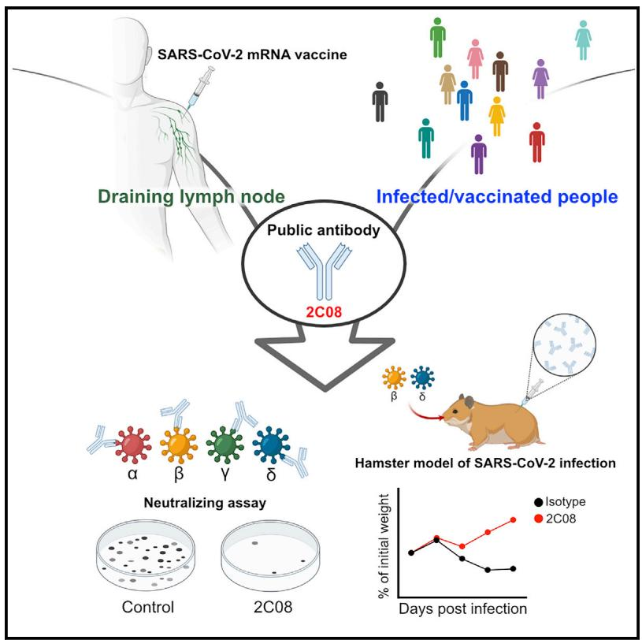
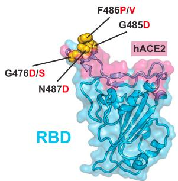
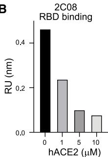
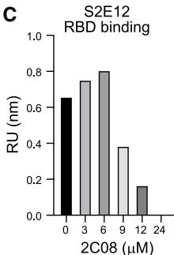
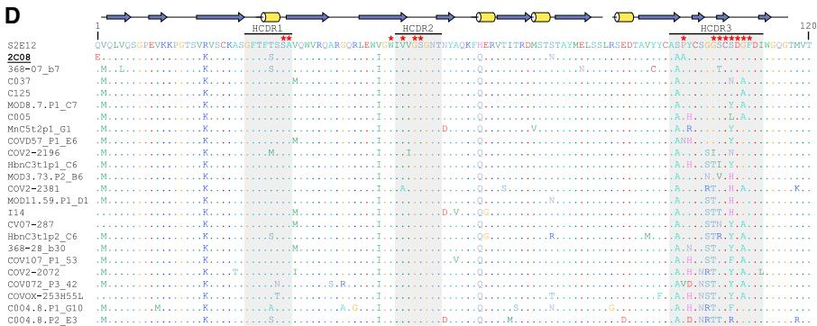
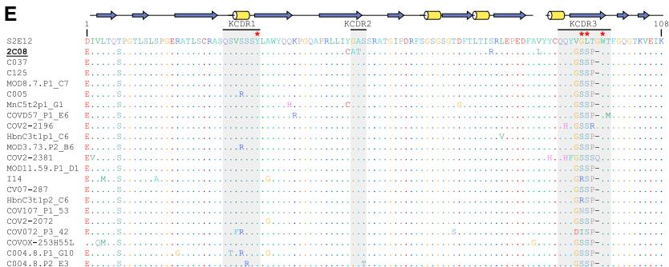
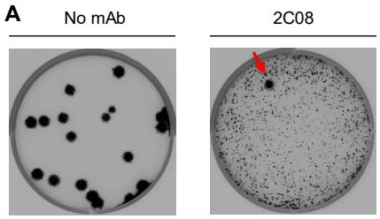
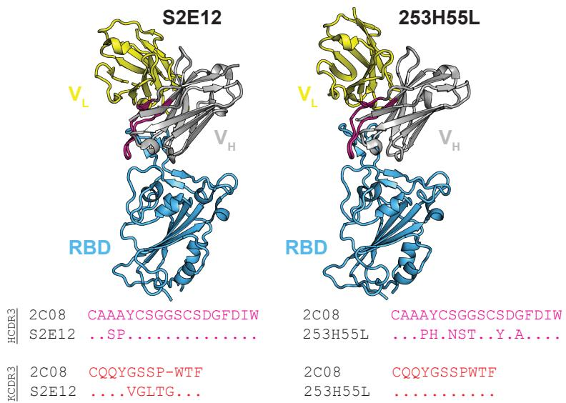
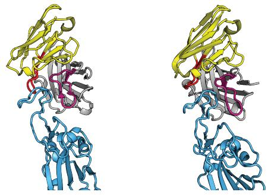
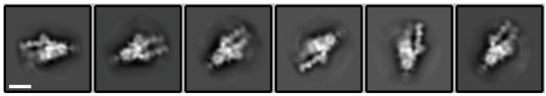

# mmc2 (1)

# Immunity

# A vaccine-induced public antibody protects against SARS-CoV-2 and emerging variants

  
Graphical abstract

# Authors

Aaron J. Schmitz, Jackson S. Turner, Zhuoming Liu, ..., Michael S. Diamond, Adrianus C.M. Boon, Ali H. Ellebedy

# Correspondence

jboon@wustl.edu (A.C.M.B.), ellebedy@wustl.edu (A.H.E.)

# In brief

SARS-CoV-2 variants with increased transmissibility are a public health threat. Schmitz et al. characterize 2C08, a human monoclonal antibody derived from a SARS-CoV-2 vaccine-induced germinal center B cell. 2C08 possesses a broad and potent neutralization capacity and protects hamsters against challenge with D614G, B.1.351, or B.1.617.2 strains. Public 2C08-like clones can be elicited by both SARS-CoV-2 infection and vaccination.

# Highlights

# Article

# A vaccine-induced public antibody protects against SARS-CoV-2 and emerging variants

Aaron J. Schmitz, $^{1,10}$ Jackson S. Turner, $^{1,10}$ Zhuoming Liu, $^{2,10}$ Julian Q. Zhou, $^{1}$ Ishmael D. Aziati, $^{3}$ Rita E. Chen, $^{1,3}$ Astha Joshi, $^{3}$ Traci L. Bricker, $^{3}$ Tamarand L. Darling, $^{3}$ Daniel C. Adelsberg, $^{4}$ Clara G. Altomare, $^{4}$ Wafaa B. Alsoussi, $^{1,2}$ James Brett Case, $^{3}$ Laura A. VanBlargan, $^{3}$ Tingting Lei, $^{1}$ Mahima Thapa, $^{1}$ Fatima Amanat, $^{4,5}$ Trushar Jeevan, $^{6}$ Thomas Fabrizio, $^{6}$ Jane A. O'Halloran, $^{3}$ Pei-Yong Shi, $^{7}$ Rachel M. Presti, $^{3,8}$ Richard J. Webby, $^{6}$ Florian Krammer, $^{4}$ Sean P.J. Whelan, $^{2}$ Goran Bajic, $^{4}$ Michael S. Diamond, $^{1,2,3,8,9}$ Adrianus C.M. Boon, $^{1,2,3,*}$ and Ali H. Ellebedy $^{1,2,8,9,11,*}$

$^{1}$ Department of Pathology and Immunology, Washington University School of Medicine, St. Louis, MO, USA

$^{2}$ Department of Molecular Microbiology, Washington University School of Medicine, St. Louis, MO, USA

$^{3}$ Department of Medicine, Washington University School of Medicine, St. Louis, MO, USA

$^{4}$ Department of Microbiology, Icahn School of Medicine at Mount Sinai, New York, NY, USA

$^{5}$ Graduate School of Biomedical Sciences, Icahn School of Medicine at Mount Sinai, New York, NY, USA

$^{6}$ Department of Infectious Diseases, St. Jude Children's Research Hospital, Memphis, TN, USA

$^{7}$ Department of Biochemistry and Molecular Biology, University of Texas Medical Branch, Galveston, TX, USA

$^{8}$ Center for Vaccines and Immunity to Microbial Pathogens, Washington University School of Medicine, St. Louis, MO, USA

$^{9}$ The Andrew M. and Jane M. Bursky Center for Human Immunology & Immunotherapy Programs, Washington University School of Medicine, St. Louis, MO, USA

$^{10}$ These authors contributed equally

$^{11}$ Lead contact

*Correspondence: jboon@wustl.edu (A.C.M.B.), ellebedy@wustl.edu (A.H.E.)

https://doi.org/10.1016/j.immuni.2021.08.013

# SUMMARY

The emergence of SARS-CoV-2 antigenic variants with increased transmissibility is a public health threat. Some variants show substantial resistance to neutralization by SARS-CoV-2 infection- or vaccination-induced antibodies. Here, we analyzed receptor binding domain-binding monoclonal antibodies derived from SARS-CoV-2 mRNA vaccine-elicited germinal center B cells for neutralizing activity against the WA1/2020 D614G SARS-CoV-2 strain and variants of concern. Of five monoclonal antibodies that potently neutralized the WA1/2020 D614G strain, all retained neutralizing capacity against the B.1.617.2 variant, four also neutralized the B.1.1.7 variant, and only one, 2C08, also neutralized the B.1.351 and B.1.1.28 variants. 2C08 reduced lung viral load and morbidity in hamsters challenged with the WA1/2020 D614G, B.1.351, or B.1.617.2 strains. Clonal analysis identified 2C08-like public clonotypes among B cells responding to SARS-CoV-2 infection or vaccination in 41 out of 181 individuals. Thus, 2C08-like antibodies can be induced by SARS-CoV-2 vaccines and mitigate resistance by circulating variants of concern.

# INTRODUCTION

Severe acute respiratory syndrome coronavirus 2 (SARS-CoV-2) is a highly pathogenic coronavirus that first emerged in Wuhan, China in late 2019 (Chan et al., 2020; Li et al., 2020). The virus quickly spread to multiple continents, leading to the coronavirus disease 2019 (COVID-19) pandemic. As of August $4^{\text{th}}$ , 2021, SARS-CoV-2 has caused more than 190 million confirmed infections, leading to more than four million deaths (World Health Organization). The damaging impact of the morbidity and mortality caused by the COVID-19 pandemic has triggered a global effort toward developing SARS-CoV-2 countermeasures. These campaigns led to the rapid development and deployment of antibody-based therapeutics (immune plasma therapy, monoclonal antibodies [mAbs]) and vaccines (lipid nanoparticle-encapsulated mRNA, virus-inactivated, and

viral-vectored platforms) (Chen et al., 2021a; Gottlieb et al., 2021; Krammer, 2020; U.S. Food & Drug Administration, 2021; Weinreich et al., 2021). The high efficacy of mRNA-based vaccines in particular has raised hope for ending the pandemic (Baden et al., 2021; Dagan et al., 2021; Polack et al., 2020). However, the emergence of multiple SARS-CoV-2 variants that are antigenically distinct from the early circulating strains used to develop the first generation of vaccines has raised concerns for compromised vaccine-induced protective immunity (Davies et al., 2021; Nonaka et al., 2021; Tegally et al., 2021). Indeed, multiple studies demonstrate that these variants show reduced neutralization in vitro by antibodies elicited in humans in response to SARS-CoV-2 infection or vaccination (Chen et al., 2021b; Liu et al., 2021a; Wang et al., 2021a, 2021b). These observations highlight the need for better understanding of the breadth of SARS-CoV-2 vaccine-induced

A

D614G RBD

B.1.1.7 RBD
N501Y

B.1.351 RBD 417N, E484K, N501Y

B.1.1.28 RBD
K417T, E484K, N501Y

B.1.617.2 RBD
L452R, T487K

B

B.1.1.7

Wash-B.1.351

Wash-B.1.1.28

B.1,617.2

Half-maximal neutralization (ng/mL)

Figure 1. mAb 2C08 potently neutralizes diverse SARS-CoV-2 strains

(A and B) ELISA binding to recombinant RBD from (A) and neutralizing activity in Vero-TMPRSS2 cells against (B) indicated SARS-CoV-2 strains by the indicated mAbs. ELISA binding to D614G RBD previously reported in (Turner et al., 2021). Baseline for area under the curve was set to the mean + three times the standard deviation of background binding to bovine serum albumin. Dotted lines indicate limit of detection. Bars indicate mean ± SEM. Results are from one experiment performed in duplicate (A, D614G and B.1.617.2) or in singlet (A, B.1.1.7, B.1.351, and B.1.1.28), or two experiments performed in duplicate (B). See also Figure S1 and Table S1.

antibody responses and possible adjustments of prophylactic and therapeutic reagents to combat emerging variants.

SARS-CoV-2 entry into host cells is mediated primarily by the binding of the viral spike (S) protein through its receptor binding domain (RBD) to the cellular receptor, human angiotensin-converting enzyme 2 (hACE2) (Zhou et al., 2020). Thus, the S protein is a critical target for antibody-based therapeutics to prevent SARS-CoV-2 virus infection and limit its spread. Indeed, the RBD is recognized by many potently neutralizing monoclonal antibodies (Alsoussi et al., 2020; Brouwer et al., 2020; Kreer et al., 2020; Robbiani et al., 2020; Tortorici et al., 2020; Yuan et al., 2020; Zost et al., 2020a, 2020b). The Pfizer-BioNTech SARS-CoV-2 mRNA vaccine (BNT162b2) encodes the full-length prefusion stabilized SARS-CoV-2 S protein and induces robust serum binding and neutralizing antibody responses in humans (Jackson et al., 2020; Polack et al., 2020). We recently described the S-specific germinal center B cell response in aspirates from the draining axillary lymph nodes induced by BNT162b2 vaccination in healthy adults (Turner et al., 2021). We verified the specificity of the germinal center response by generating a panel of recombinant human mAbs from single cell-sorted S-binding germinal center B cells isolated from three participants. The majority of these vaccine-induced antibodies are directed against the RBD (Turner et al., 2021).

Here, we assessed the capacity of these anti-RBD mAbs to recognize and neutralize recently emerged SARS-CoV-2 variants. One mAb, 2C08, potently neutralized the WA1/2020 D614G SARS-CoV-2 strain and also neutralized the B.1.351 and B.1.1.28 variants. 2C08 reduced lung viral load and morbidity in hamsters challenged with the WA1/2020 D614G, B.1.351, or B.1.617.2 strains. Clonal analysis identified 2C08-like public clonotypes among B cells responding to SARS-CoV-2 infection or vaccination in 41 out of 181 individuals.

# RESULTS

# mAb 2C08 potently neutralizes diverse SARS-CoV-2 strains

From a pool of S-binding germinal center B cell-derived mAbs, we selected 13 human anti-RBD mAbs that bound avidly to the historically circulating WA1/2020 D614G SARS-CoV-2 strain referred to hereafter as the D614G strain (Korber et al., 2020; Turner et al., 2021). We assessed mAbs binding to recombinant RBDs derived from the D614G strain and four SARS-CoV-2 variants—B.1.1.7 (alpha), B.1.351 (beta), B.1.1.28 (gamma), and B.1.617.2 (delta)—by enzyme-linked immunosorbent assay (ELISA). Only one mAb, 1H09, showed decreased binding to the RBD derived from the B.1.1.7 variant. Four additional mAbs (4B05, 1B12, 2B06, and 3A11) completely lost or showed substantially reduced binding to the B.1.351 and B.1.1.28 variant RBDs, and 4B05 also lost binding to the B.1.617.2 variant. The remaining eight mAbs showed equivalent binding to RBDs from all tested strains (Figure 1A). We next examined the in vitro neutralization capacity of the 13 mAbs against the D614G SARS-CoV-2 strain using a high-throughput focus reduction neutralization test (FRNT) with authentic virus (Case et al., 2020). Only five mAbs (2C08, 1H09, 1B12, 2B06, and 3A11) showed high neutralization potency against D614G with $80\%$ neutralization values of less than $100~\mathrm{ng / mL}$ . We then assessed the ability of these five mAbs to neutralize the B.1.1.7, B.1.351, B.1.1.28, and B.1.617.2 variants. Consistent with the RBD binding data, 1H09 failed to neutralize any of the emerging variants except B.1.617.2, whereas 1B12, 2B06, and 3A11 neutralized B.1.1.7 and B.1.617.2 but not the B.1.351 and B.1.1.28 variants (Figure 1B). One antibody, 2C08, potently neutralized the five SARS-CoV-2 strains we tested, with half-maximal inhibitory concentration of $0.3\mathrm{ng / mL}$ for B.1.617.2 and approximately $5\mathrm{ng / mL}$

A

B

C

Figure 2. mAb 2C08 protects hamsters from SARS-CoV-2 challenge

(A–C) Percent weight change over time (A) and viral RNA (B) and infectious virus titer (C) in lung homogenates 4 dpi of hamsters that received 5 mg/kg isotype (black) or 2C08 (gray) one day prior to intranasal challenge with $5 \times 10^{5}$ FFU of D614G, (left), Wash-B.1.351 (center), or B.1.617.2 (right) SARS-CoV-2. In (A), symbols indicate mean ± SEM. In (B and C), bars indicate geometric mean ± geometric SD, and each symbol represents one hamster. D614G data are from two experiments, n = 10 per condition; variant data are from one experiment, n = 5 per condition. p values from two-tailed Mann-Whitney U tests.

for all others (Figure 1B; Table S1), indicating that it recognized conserved residues in the RBD. We also tested 2C08 against three additional variants, B.1.429, B.1.222, and B.1.1.298, and found that it potently neutralized all three variants (Figure S1A). Altogether, these results indicated 2C08 recognized and neutralized diverse strains of SARS-CoV-2.

# mAb 2C08 protects hamsters from D614G and variant SARS-CoV-2 challenge

To assess the protective capacity of 2C08 in vivo, we utilized a hamster model of SARS-CoV-2 infection (Sia et al., 2020). We evaluated the prophylactic efficacy of 2C08 against the D614G strain, a fully infectious recombinant chimeric SARS-CoV-2 with the B.1.351 S gene in the WA1/2020 backbone (Wash-B.1.351; D80A, 242-244 deletion, R246I, K417N, E484K, N501Y, D614G and A701V) (Chen et al., 2021b), and the B.1.617.2 strain in 5-to-6-week-old male Syrian hamsters. Animals treated with 2C08 did not lose weight after viral challenge and started to gain weight (relative to starting weight) 3 days post infection (dpi). In contrast, animals treated with the isotype control mAb started losing weight 2 dpi. The average weights between the isotype- and 2C08-treated animals differed by $7.1\%$ 3 dpi $(p < 0.001)$ and $10.4\%$ 4 dpi $(p < 0.001)$ for the D614G challenge, by $6.8\%$ 3 dpi $(p = 0.095)$ and $9.1\%$ 4 dpi $(p = 0.056)$ for the Wash-B.1.351 challenge, and by $8.5\%$ 3 dpi $(p = 0.008)$ and $9.7\%$ 4 dpi $(p = 0.008)$ for the B.1.617.2 challenge (Figure 2A). Consistent with the weight loss data, 2C08 treatment reduced viral RNA by more than 10,000-fold in the lungs of the D614G- and B.1.617.2-challenged hamsters $(p < 0.001$ and $p = 0.008$ , respectively) and by approximately 1,000-fold in those challenged with Wash-B.1.351 $(p = 0.008)$ 4 dpi compared with the isotype control mAb groups (Figure 2B). Prophylactic treatment also significantly reduced infectious virus titers for all strains detected in the lungs 4 dpi $(p < 0.001$ for D614G, $p = 0.008$ for both variants) (Figure 2C). Overall, prophylaxis with 2C08 substantially decreased morbidity and viral infection in lower respiratory tissues upon challenge with SARS-CoV-2 strains with S genes corresponding to those circulating early in the pandemic and two key variants.

# 2C08 recognizes a public epitope in SARS-CoV-2 RBD

To define the RBD residues targeted by 2C08, we used VSV-SARS-CoV-2-S chimeric viruses (S from D614G strain) to select for variants that escape 2C08 neutralization as previously described (Case et al., 2020; Liu et al., 2021b). We performed

plaque assays on Vero cells with 2C08 in the overlay, purified the neutralization-resistant plaques, and sequenced the S genes (Figures S2A and S2B). Sequence analysis identified the S escape mutations G476D, G476S, G485D, F486P, F486V, and N487D—all of which were within the RBD and mapped to residues involved in hACE2 binding (Figure 3A). We confirmed the specificity of 2C08 for the hACE2-binding site of RBD in bio-layer interferometry (BLI)-based competition assays (Figure 3B). To determine whether any of the 2C08 escape mutants we isolated were represented among SARS-CoV-2 variants circulating in humans, we screened publicly available genome sequences of SARS-CoV-2 (Shu and McCauley, 2017; Singer et al., 2020). Using 829,521 genomes from Global Initiative on Sharing Avian Influenza Data (GISAID), we calculated each substitution frequency in the identified residues site. Of the six escape variants we identified, four were detected among circulating isolates of SARS-CoV-2. The frequency of these substitutions among clinical isolates detected so far was exceedingly rare, with the escape variants representing less than 0.008% of sequenced viruses. In comparison, the D614G substitution was present in 49% of sequenced isolates (Figure S2C).

We noted that 2C08 targeted residues similar to those recognized by a previously described human mAb, S2E12, which was isolated from an infected patient (Tortorici et al., 2020). S2E12 shared a high sequence identity with 2C08 (95% amino acid identity) and was encoded by the same immunoglobulin heavy (IGHV1-58) and light (IGKV3-20) chain variable region genes (Table S2). Similar to 2C08, S2E12 exhibits potent neutralizing activity in vitro and protective capacity in vivo (Chen et al., 2021c). The cryoelectron microscopy structure of S2E12 in complex with S shows that the mAb recognizes an RBD epitope that partially overlaps with the hACE2 receptor footprint known as the receptor binding motif (Tortorici et al., 2020) (Figures S3A and S3B). 2C08 competed with S2E12 for RBD binding in BLI-based competition assays (Figure 3C). Moreover, 13 of 14 S2E12 heavy-chain amino acid residues that engaged the RBD were identical to those in 2C08, and electron microscopy two-dimensional (2D) classes of 2C08 in complex with S indicated that it bound RBD in fashion reminiscent of S2E12 (Figures 3D, 3E, and S3C). Altogether, these data suggest that 2C08 likely engaged the RBD in a manner similar to that of the structurally characterized S2E12. Furthermore, we identified two additional human mAbs, 253H55L and COV2-2196, that share genetic and functional features with 2C08 and have nearly identical

  
A

  
B

  
C

  
D

E   
Figure 3. mAb 2C08 recognizes a public epitope in SARS-CoV-2 RBD   
  
(A) Structure of RBD (from PDB 6M0J) with hACE2 footprint highlighted in magenta and amino acids whose substitution confers resistance to 2C08 in plaque assays highlighted in yellow. (B and C) BLI-based competition of 2C08 Fab with hACE2 (B) or S2E12 Fab with 2C08 Fab (C) for RBD binding. Maximal signal (Rmax) at steady state is plotted as a function of hACE2 (B) or 2C08 Fab (C) concentration. (D and E) Sequence alignment of 2C08 with RBD-binding mAbs from SARS-CoV-2 infected patients and vaccinees that utilize the same immunoglobulin heavy- (D) and light-chain (E) variable region genes (see also Table S2). Antibody residues that contact RBD (red stars) and secondary structure elements (yellow alpha helices and blue beta strands) are calculated from the S2E12 structure (PDB ID 7K45) (Tortorici et al., 2020). See also Figures S2 and S3 and Table S2.

were largely conserved for all mAbs (Figures 3D and 3E). Altogether, these results indicate that 2C08 targeted a conserved region of the RBD and 2C08-like clones can be generated in response to SARS-CoV-2 infection or vaccination.

# DISCUSSION

Cloning and expression of recombinant human mAbs from single-cell-sorted B cells is an established method for generating potential therapeutics against human pathogens. The source cells are predominantly plasmablasts or memory B cells isolated from blood after infection

antibody-RBD interactions as those of S2E12 (Dong et al., 2021; Zost et al., 2020a) (Figures 3D, 3E, S3A, and S3B). Dong et al. (2021) note that COV2-2196 is likely part of a public B cell clone, citing S2E12 and mAbs generated by two other groups with similar characteristics (Robbiani et al., 2020; Tortorici et al., 2020). This prompted us to conduct an expanded search for 2C08-like clonotypes and mAbs. Defining 2C08-like clones as those that shared heavy-chain V1-58 and J3 gene usage, had a CDR3 length between 15 and 17 amino acids, and had a CXC disulfide bond motif in the CDR3 (where "X" can be one or more amino acids), we identified 2 individuals in our cohort of 22 BNT162b2-vaccinated individuals who had 2C08-like clones among activated or memory B cells in peripheral blood mononuclear cells two or four weeks after the second immunization. We identified an additional 5 of 14 vaccine recipients and 34 of 145 SARS-CoV-2 convalescent individuals with 2C08-like clones among published sequences (Andreano et al., 2021; Brouwer et al., 2020; Dejnirattisai et al., 2021; Galson et al., 2020; Han et al., 2021; Kreer et al., 2020; Kreye et al., 2020; Nielsen et al., 2020; Robbiani et al., 2020; Rogers et al., 2020; Scheid et al., 2021; Tortorici et al., 2020; Wang et al., 2021b) (Table S2). The primary heavy-chain contact residues described for S2E12

or vaccination (Wilson and Andrews, 2012). Here, we characterized 2C08, a SARS-CoV-2 vaccine-induced mAb cloned from a germinal center B cell isolated from a draining axillary lymph node sampled from a healthy adult after receiving their second dose of mRNA-based vaccine (Turner et al., 2021). 2C08 targeted the receptor binding motif within the RBD of SARS-CoV-2 S protein and blocked infection by circulating SARS-CoV-2 and emerging variants of concern both in vitro and in vivo.

2C08 is a “public” mAb, meaning that it is encoded by multiple B cell clonotypes isolated from different individuals that share similar genetic features (Dong et al., 2021). Public antibody responses in humans are observed after many infections, including SARS-CoV-2 infection (Dejnirattisai et al., 2021; Dong et al., 2021; Galson et al., 2020; Pappas et al., 2014; Robbiani et al., 2020; Wheatley et al., 2015; Wu et al., 2011; Zhou et al., 2015). In the case of 2C08-like clonotypes, the mAbs not only share the immunoglobulin heavy- and light-chain variable region genes, but also have highly similar CDRs and are functionally similar. Several have been shown to bind RBD and neutralize D614G as well as the B.1.1.7 and B.1.351 variants. 2C08-like mAbs can be found in SARS-CoV-2-infected patients independently of demographics or severity of infection. Robbiani et al.

isolate 2C08-like mAbs from four of six infected individuals (Robbiani et al., 2020). Tortorici et al. and Zost et al. detect a 2C08-like antibody in one or both of two infected individuals they examine, respectively, whereas Kreer et al. detect a 2C08-like clone in two of twelve patients, in one of whom it is expanded (Kreer et al., 2020; Tortorici et al., 2020; Zost et al., 2020a). Nielsen et al. identify 2C08-like rearrangements in sequences derived from four of thirteen SARS-CoV-2 patients (Nielsen et al., 2020). Wang et al. isolate 2C08-like mAbs from five of fourteen individuals who received a SARS-CoV-2 mRNA-based vaccine (Wang et al., 2021b). While 2C08-like clones can respond to both SARS-CoV-2 infection and vaccination, the frequency with which they are detected varies among studies. This may be because of variation in sampling depth and whether analyzed sequences are enriched for S- or RBD-binding clones. It remains to be determined what fraction of the antibody responses induced by SARS-CoV-2 vaccines in humans are comprised of public, potently neutralizing, 2C08-like antibodies that are minimally impacted by the mutations found in the variants of concern to date. It is important to note that at least one 2C08-like mAb, COV2-2196, is currently being developed for clinical use (Dong et al., 2021).

Most SARS-CoV-2 vaccine-induced anti-RBD mAbs in our study also recognized RBDs from the recent variants. Notably, all of the five neutralizing antibodies retained their neutralizing capacity against the recent B.1.617.2 variant. It is of some concern, however, that four of the five neutralizing anti-RBD mAbs lost their activity against the B.1.351 and B.1.1.28 variants. This was consistent with the data reported by Wang et al., which showed that the neutralizing activity of 14 of 17 vaccine-induced anti-RBD mAbs was abolished by mutations associated with these variants (Wang et al., 2021b). We note that somewhat higher levels of lung viral RNA were recovered from the 2C08-treated animals challenged with the Wash-B.1.351 variant compared with those challenged with the D614G or B.1.617.2 strains. This was unexpected given the similar in vitro potency of 2C08 against all three viruses and its capacity to protect animals from all challenge groups against weight loss equivalently. One possibility is that 2C08 more readily selected for a partial escape mutant among viruses displaying the B.1.351 variant spike than the WA1/2020 D614G or B.1.617.2 spikes. Indeed, we found that virus recovered from the lungs of the B.1.351-challenged hamster with the highest viral titer in the 2C08-treated group had developed a G476S mutation. Although mutations such as these that abrogate 2C08 binding currently are rare among clinical isolates, viruses carrying the F486L mutation have been isolated from farmed mink and could be transmitted to humans (Oude Munnink et al., 2021). More broadly, the selective pressure of vaccination and monoclonal antibody therapies as they are approved could drive the emergence of viral escape variants, reducing the effectiveness of current vaccines.

Given the germinal center B cell origin of 2C08, the binding of 2C08-related clones could be refined through somatic hypermutation, and their descendants could become part of the high-affinity memory B cell and long-lived plasma cell compartments that confer durable protective immunity. Together, these data suggest that first-generation SARS-CoV-2 mRNA-based vaccines can induce public antibodies with robust neutralizing and

potentially durable protective activity against historically circulating and emerging SARS-CoV-2 variants.

# Limitations of the study

We may have underestimated the frequency of 2C08-like clones among the 22 BNT162b2-vaccinated individuals we examined, as our enrichment strategy excluded resting non-class switched memory B cells. 2C08-like clones may have also been present at lower frequency than we sampled or have arisen later in the response. These same caveats apply to the sequences that we analyzed from published studies of SARS-CoV-2 infected and vaccinated individuals. Another limitation of our study is that we analyzed only a small number of antibodies that targeted the RBD. More extensive analyses with larger numbers of mAbs that target the RBD and non-RBD sites will be needed to precisely determine the fraction of the vaccine-induced neutralizing antibody response that is compromised because of antigenic changes in emerging SARS-CoV-2 variants of concern.

# STAR★METHODS

Detailed methods are provided in the online version of this paper and include the following:

● KEY RESOURCES TABLE   
- RESOURCE AVAILABILITY

○ Lead contact   
○ Materials availability   
○ Data and code availability

● EXPERIMENTAL MODEL AND SUBJECT DETAILS

○ Cells   
○ Viruses   
○ Antigens   
○ Hamster studies

● METHODS DETAILS

○ Enzyme-linked immunosorbant assay   
○ Focus reduction neutralization test   
○ Hamster challenge experiments   
○ Virus titration assays from hamster lung homogenates   
○ Selection of 2C08 mAb escape mutants in SARS-CoV-2 S   
○ Bulk B cell receptor library preparation, sequencing, and processing   
○ Fab expression and purification   
○ Biolayer interferometry competition assays   
○ Cryoelectron microscopy

● QUANTIFICATION AND STATISTICAL ANALYSIS

# SUPPLEMENTAL INFORMATION

Supplemental information can be found online at https://doi.org/10.1016/j.immuni.2021.08.013.

# ACKNOWLEDGMENTS

The Vero-TMPRSS2 cells were kindly provided by S. Ding (Washington University School of Medicine, St. Louis, MO). The clinical sample for isolation of the B.1.617.2 variant was kindly provided by A. Patel (Poplar Healthcare, Memphis, TN). We thank W. Kim for helpful discussions. Some of this work was performed at the National Center for CryoEM Access and Training (NCCAT) and the Simons Electron Microscopy Center located at the New York Structural

Biology Center, supported by the NIH Common Fund Transformative High Resolution Cryo-Electron Microscopy program (U24 GM129539) and by grants from the Simons Foundation (SF349247) and NY State Assembly Majority. The contents of this publication are solely the responsibility of the authors and do not necessarily represent the official views of NIAID or NIH. The Ellebedy laboratory was supported by NIAID grants U01AI141990 and U01AI150747 and NIAID Centers of Excellence for Influenza Research and Surveillance contract HHSN272201400006C. The Ellebedy and Krammer laboratories were supported by NIAID Centers of Excellence for Influenza Research and Surveillance contract HHSN272201400008C and NIAID Collaborative Influenza Vaccine Innovation Centers contract 75N93019C00051. The Diamond laboratory was supported by NIH contract 75N93019C00062 and grant R01 AI157155. The Boon laboratory was supported by NIH grants R01-AI118938 and U01-AI151810 and the Children's Discovery Institute grant PDII2018702. The Webby laboratory was supported by the NIAID Centers of Excellence for Influenza Research and Response contract 75N93021C00016. The Shi laboratory was supported by NIH grants AI134907 and UL1TR001439 and awards from the Sealy & Smith Foundation, Kleberg Foundation, the John S. Dunn Foundation, the Amon G. Carter Foundation, the Gilson Longenbaugh Foundation, and the Summerfield Roberts Foundation. The SARS-CoV-2 vaccine study was in part supported by NIH/National Center for Advancing Translational Sciences grant UL1 TR002345. J.S.T. was supported by NIAID 5T32CA009547. J.B.C. was supported by a Helen Hay Whitney postdoctoral fellowship.

# AUTHOR CONTRIBUTIONS

A.J.S. and J.S.T. isolated the antibodies. A.J.S., Z.L., I.D.A., R.E.C., A.J., T.L.B., T.L.D., W.B.A., J.B.C, and L.A.V. functionally characterized the mAbs in vitro and in vivo. J.Q.Z. analyzed BCR repertoire data. D.C.A. and C.G.A. performed structural analyses. T.L., M.T. and F.A. expressed and purified the mAbs and recombinant viral proteins. T.J. and T.F. isolated the B.1.617.2 variant virus. A.J.S. and J.S.T. compiled and analyzed data. J.A.O. and R.M.P. supervised the vaccination study. P.-Y.S., R.J.W., and F.K. provided critical reagents. S.P.J.W. supervised the mapping analysis. G.B. supervised the structural analysis. M.S.D. and A.C.M.B. supervised the in vitro and in vivo analyses, respectively. A.H.E. conceptualized the study and wrote the manuscript with input from all co-authors.

# DECLARATION OF INTERESTS

The Ellebedy laboratory received funding under sponsored research agreements that are unrelated to the data presented in the current study from Emergent BioSolutions and from AbbVie. A.H.E. is a consultant for Mubadala Investment Company and the founder of ImmuneBio Consulting LLC. M.S.D. is a consultant for Inbios, Vir Biotechnology, Fortress Biotech, Carnival Corporation and on the Scientific Advisory Board of Moderna and Immunome. The Diamond laboratory has received unrelated sponsored research agreements from Moderna, Vir Biotechnology, and Emergent BioSolutions. The Boon laboratory has received unrelated funding support in sponsored research agreements from Al Therapeutics, GreenLight Biosciences Inc., and Nano targeting & Therapy Biopharma Inc. The Boon laboratory has received funding support from AbbVie Inc., for the commercial development of a SARS-CoV-2 mAb. A.J.S., J.S.T., W.B.A., J.B.C., S.P.J.W., M.S.D., A.C.M.B., and A.H.E. are recipients of a licensing agreement with AbbVie Inc., for commercial development of a SARS-CoV-2 mAb. A patent application related to this work has been filed by Washington University School of Medicine. The Icahn School of Medicine at Mount Sinai has filed patent applications relating to SARS-CoV-2 serological assays and NDV-based SARS-CoV-2 vaccines, which list Florian Krammer as co-inventor. Mount Sinai has spun out a company, Kantaro, to market serological tests for SARS-CoV-2. Florian Krammer has consulted for Merck and Pfizer (before 2020) and is currently consulting for Pfizer, Seqirus, and Avimex. The Krammer laboratory is also collaborating with Pfizer on animal models of SARS-CoV-2. The Shi laboratory has received sponsored research agreements from Pfizer, Gilead, Merck, and IGM Sciences Inc. The Whelan laboratory has received unrelated funding support in sponsored research agreements with Vir Biotechnology, AbbVie, and sAB therapeutics. All other authors declare no conflict of interest.

Received: March 30, 2021

Revised: July 4, 2021

Accepted: August 11, 2021

Published: August 17, 2021

# REFERENCES

Alsoussi, W.B., Turner, J.S., Case, J.B., Zhao, H., Schmitz, A.J., Zhou, J.Q., Chen, R.E., Lei, T., Rizk, A.A., McIntire, K.M., et al. (2020). A potently neutralizing antibody protects mice against SARS-CoV-2 infection. J. Immunol. 205, 915–922.   
Amanat, F., Stadlbauer, D., Strohmeier, S., Nguyen, T.H.O., Chromikova, V., McMahon, M., Jiang, K., Arunkumar, G.A., Jurczyszak, D., Polanco, J., et al. (2020). A serological assay to detect SARS-CoV-2 seroconversion in humans. Nat Med. 26, 1033–1036.   
Amanat, F., Thapa, M., Lei, T., Ahmed, S.M.S., Adelsberg, D.C., Carreño, J.M., Strohmeier, S., Schmitz, A.J., Zafar, S., Zhou, J.Q., et al.; Personalized Virology Initiative (2021). SARS-CoV-2 mRNA vaccination induces functionally diverse antibodies to NTD, RBD, and S2. Cell 184, 3936–3948.e10.   
Andreano, E., Nicastri, E., Paciello, I., Pileri, P., Manganaro, N., Piccini, G., Manenti, A., Pantano, E., Kabanova, A., Troisi, M., et al. (2021). Extremely potent human monoclonal antibodies from COVID-19 convalescent patients. Cell 184, 1821–1835.e16.   
Baden, L.R., El Sahly, H.M., Essink, B., Kotloff, K., Frey, S., Novak, R., Diemert, D., Spector, S.A., Rouphael, N., Creech, C.B., et al.; COVE Study Group (2021). Efficacy and Safety of the mRNA-1273 SARS-CoV-2 Vaccine. N. Engl. J. Med. 384, 403–416.   
Bajic, G., and Harrison, S.C. (2021). Antibodies that engage the hemagglutinin receptor-binding site of influenza B viruses. ACS Infect. Dis. 7, 1–5.   
Bajic, G., Maron, M.J., Adachi, Y., Onodera, T., McCarthy, K.R., McGee, C.E., Sempowski, G.D., Takahashi, Y., Kelsoe, G., Kuraoka, M., and Schmidt, A.G. (2019). Influenza antigen engineering focuses immune responses to a subdominant but broadly protective viral epitope. Cell Host Microbe 25, 827–835.e6.   
Bepler, T., Morin, A., Rapp, M., Brasch, J., Shapiro, L., Noble, A.J., and Berger, B. (2019). Positive-unlabeled convolutional neural networks for particle picking in cryo-electron micrographs. Nat. Methods 16, 1153–1160.   
Bond, C.S., and Schüttelkopf, A.W. (2009). ALINE: a WYSIWYG protein-sequence alignment editor for publication-quality alignments. Acta Crystallogr. D Biol. Crystallogr. 65, 510–512.   
Brouwer, P.J.M., Caniels, T.G., van der Straten, K., Snitselaar, J.L., Aldon, Y., Bangaru, S., Torres, J.L., Okba, N.M.A., Claireaux, M., Kerster, G., et al. (2020). Potent neutralizing antibodies from COVID-19 patients define multiple targets of vulnerability. Science 369, 643–650.   
Case, J.B., Rothlauf, P.W., Chen, R.E., Liu, Z., Zhao, H., Kim, A.S., Bloyet, L.-M., Zeng, Q., Tahan, S., Droit, L., et al. (2020). Neutralizing antibody and soluble ACE2 inhibition of a replication-competent VSV-SARS-CoV-2 and a clinical isolate of SARS-CoV-2. Cell Host Microbe 28, 475–485.e5.   
Chan, J.F.-W., Yuan, S., Kok, K.-H., To, K.K.-W., Chu, H., Yang, J., Xing, F., Liu, J., Yip, C.C.-Y., Poon, R.W.-S., et al. (2020). A familial cluster of pneumonia associated with the 2019 novel coronavirus indicating person-to-person transmission: a study of a family cluster. Lancet 395, 514–523.   
Chen, P., Nirula, A., Heller, B., Gottlieb, R.L., Boscia, J., Morris, J., Huhn, G., Cardona, J., Mocherla, B., Stosor, V., et al.; BLAZE-1 Investigators (2021a). SARS-CoV-2 Neutralizing Antibody LY-CoV555 in Outpatients with Covid-19. N. Engl. J. Med. 384, 229–237.   
Chen, R.E., Zhang, X., Case, J.B., Winkler, E.S., Liu, Y., VanBlargan, L.A., Liu, J., Errico, J.M., Xie, X., Suryadevara, N., et al. (2021b). Resistance of SARS-CoV-2 variants to neutralization by monoclonal and serum-derived polyclonal antibodies. Nat. Med. 27, 717–726.   
Chen, R.E., Winkler, E.S., Case, J.B., Aziati, I.D., Bricker, T.L., Joshi, A., Darling, T.L., Ying, B., Errico, J.M., Shrihari, S., et al. (2021c). In vivo monoclonal antibody efficacy against SARS-CoV-2 variant strains. Nature 596, 103–108.

Corrie, B.D., Marthandan, N., Zimonja, B., Jaglale, J., Zhou, Y., Barr, E., Knoetze, N., Breden, F.M.W., Christley, S., Scott, J.K., et al. (2018). iReceptor: A platform for querying and analyzing antibody/B-cell and T-cell receptor repertoire data across federated repositories. Immunol Rev. 284, 24–41.   
Dagan, N., Barda, N., Kepten, E., Miron, O., Perchik, S., Katz, M.A., Hernán, M.A., Lipsitch, M., Reis, B., and Balicer, R.D. (2021). BNT162b2 mRNA Covid-19 Vaccine in a Nationwide Mass Vaccination Setting. N. Engl. J. Med. 384, 1412–1423.   
Davies, N.G., Abbott, S., Barnard, R.C., Jarvis, C.I., Kucharski, A.J., Munday, J.D., Pearson, C.A.B., Russell, T.W., Tully, D.C., Washburne, A.D., et al. (2021). Estimated transmissibility and impact of SARS-CoV-2 lineage B.1.1.7 in England. Science 372, eabg3055.   
Dejnirattisai, W., Zhou, D., Ginn, H.M., Duyvesteyn, H.M.E., Supasa, P., Case, J.B., Zhao, Y., Walter, T.S., Mentzer, A.J., Liu, C., et al. (2021). The antigenic anatomy of SARS-CoV-2 receptor binding domain. Cell 184, 2183–2200.e22.   
Dong, J., Zost, S.J., Greaney, A.J., Starr, T.N., Dingens, A.S., Chen, E.C., Chen, R.E., Case, J.B., Sutton, R.E., Gilchuk, P., et al. (2021). Genetic and structural basis for recognition of SARS-CoV-2 spike protein by a two-anti-body cocktail. bioRxiv. https://doi.org/10.1101/2021.01.27.428529.   
Edara, V.-V., Pinsky, B.A., Suthar, M.S., Lai, L., Davis-Gardner, M.E., Floyd, K., Flowers, M.W., Wrammert, J., Hussaini, L., Ciric, C.R., et al. (2021). Infection and vaccine-induced neutralizing-antibody responses to the SARS-CoV-2 B.1.617 variants. N. Engl. J. Med. 385, 664–666.   
Edgar, R.C. (2004). MUSCLE: multiple sequence alignment with high accuracy and high throughput. Nucleic Acids Res. 32, 1792–1797.   
U.S. Food & Drug Administration (2021). FDA Recommendations for Investigational COVID-19 Convalescent Plasma. http://www.fda.gov/vaccines-blood-biologics/investigational-new-drug-applications-inds-cber-regulated-products/recommendations-investigational-covid-19-convalescent-plasma.   
Galson, J.D., Schaetzle, S., Bashford-Rogers, R.J.M., Raybould, M.I.J., Kovaltsuk, A., Kilpatrick, G.J., Minter, R., Finch, D.K., Dias, J., James, L.K., et al. (2020). Deep Sequencing of B Cell Receptor Repertoires From COVID-19 Patients Reveals Strong Convergent Immune Signatures. Front. Immunol. 11, 605170.   
Goel, R.R., Apostolidis, S.A., Painter, M.M., Mathew, D., Pattekar, A., Kuthuru, O., Gouma, S., Hicks, P., Meng, W., Rosenfeld, A.M., et al. (2021). Distinct antibody and memory B cell responses in SARS-CoV-2 naïve and recovered individuals following mRNA vaccination. Sci Immunol. 6, eabi6950.   
Gottlieb, R.L., Nirula, A., Chen, P., Boscia, J., Heller, B., Morris, J., Huhn, G., Cardona, J., Mocherla, B., Stosor, V., et al. (2021). Effect of bamlanivimab as monotherapy or in combination with etesevimab on viral load in patients with mild to moderate COVID-19: a randomized clinical trial. JAMA 325, 632–644.   
Gupta, N.T., Vander Heiden, J.A., Uduman, M., Gadala-Maria, D., Yaari, G., and Kleinstein, S.H. (2015). Change-O: a toolkit for analyzing large-scale B cell immunoglobulin repertoire sequencing data. Bioinformatics 31, 3356–3358.   
Han, X., Wang, Y., Li, S., Hu, C., Li, T., Gu, C., Wang, K., Shen, M., Wang, J., Hu, J., et al. (2021). A Rapid and Efficient Screening System for Neutralizing Antibodies and Its Application for SARS-CoV-2. Front. Immunol. 12, 653189.   
Hsieh, C.-L., Goldsmith, J.A., Schaub, J.M., DiVenere, A.M., Kuo, H.-C., Javanmardi, K., Le, K.C., Wrapp, D., Lee, A.G., Liu, Y., et al. (2020). Structure-based design of prefusion-stabilized SARS-CoV-2 spikes. Science 369, 1501–1505.   
Jackson, L.A., Anderson, E.J., Rouphael, N.G., Roberts, P.C., Makhene, M., Coler, R.N., McCullough, M.P., Chappell, J.D., Denison, M.R., Stevens, L.J., et al.; mRNA-1273 Study Group (2020). An mRNA Vaccine against SARS-CoV-2 - Preliminary Report. N. Engl. J. Med. 383, 1920–1931.   
Korber, B., Fischer, W.M., Gnanakaran, S., Yoon, H., Theiler, J., Abfalterer, W., Hengartner, N., Giorgi, E.E., Bhattacharya, T., Foley, B., et al.; Sheffield COVID-19 Genomics Group (2020). Tracking Changes in SARS-CoV-2 Spike: Evidence that D614G Increases Infectivity of the COVID-19 Virus. Cell 182, 812–827.e19.

Krammer, F. (2020). SARS-CoV-2 vaccines in development. Nature 586, 516–527.

Kreer, C., Zehner, M., Weber, T., Ercanoglu, M.S., Gieselmann, L., Rohde, C., Halwe, S., Korenkov, M., Schommers, P., Vanshylla, K., et al. (2020). Longitudinal Isolation of Potent Near-Germline SARS-CoV-2-Neutralizing Antibodies from COVID-19 Patients. Cell 182, 843–854.e12.

Kreye, J., Reincke, S.M., Kornau, H.-C., Sánchez-Sendin, E., Corman, V.M., Liu, H., Yuan, M., Wu, N.C., Zhu, X., Lee, C.D., et al. (2020). A therapeutic non-self-reactive SARS-CoV-2 antibody protects from lung pathology in a COVID-19 hamster model. Cell 183, 1058–1069.e19.

Li, Q., Guan, X., Wu, P., Wang, X., Zhou, L., Tong, Y., Ren, R., Leung, K.S.M., Lau, E.H.Y., Wong, J.Y., et al. (2020). Early Transmission Dynamics in Wuhan, China, of Novel Coronavirus-Infected Pneumonia. N. Engl. J. Med. 382, 1199–1207.

Liu, Y., Liu, J., Xia, H., Zhang, X., Fontes-Garfias, C.R., Swanson, K.A., Cai, H., Sarkar, R., Chen, W., Cutler, M., et al. (2021a). Neutralizing Activity of BNT162b2-Elicited Serum. N. Engl. J. Med. 384, 1466–1468.

Liu, Z., VanBlargan, L.A., Bloyet, L.-M., Rothlauf, P.W., Chen, R.E., Stumpf, S., Zhao, H., Errico, J.M., Theel, E.S., Liebeskind, M.J., et al. (2021b). Identification of SARS-CoV-2 spike mutations that attenuate monoclonal and serum antibody neutralization. Cell Host Microbe 29, 477–488.e4.

Nielsen, S.C.A., Yang, F., Jackson, K.J.L., Hoh, R.A., Röltgen, K., Jean, G.H., Stevens, B.A., Lee, J.-Y., Rustagi, A., Rogers, A.J., et al. (2020). Human B cell clonal expansion and convergent antibody responses to SARS-CoV-2. Cell Host Microbe 28, 516–525.e5.

Nonaka, C.K.V., Franco, M.M., Gräf, T., de Lorenzo Barcia, C.A., de Ávila Mendonça, R.N., de Sousa, K.A.F., Neiva, L.M.C., Fosenca, V., Mendes, A.V.A., de Aguiar, R.S., et al. (2021). Genomic evidence of SARS-CoV-2 reinfection involving E484K spike mutation, Brazil. Emerg. Infect. Dis. 27, 1522–1524.

Oude Munnink, B.B., Sikkema, R.S., Nieuwenhuijse, D.F., Molenaar, R.J., Munger, E., Molenkamp, R., van der Spek, A., Tolsma, P., Rietveld, A., Brouwer, M., et al. (2021). Transmission of SARS-CoV-2 on mink farms between humans and mink and back to humans. Science 371, 172–177.

Pappas, L., Foglierini, M., Piccoli, L., Kallewaard, N.L., Turrini, F., Silacci, C., Fernandez-Rodriguez, B., Agatic, G., Giacchetto-Sasselli, I., Pellicciotta, G., et al. (2014). Rapid development of broadly influenza neutralizing antibodies through redundant mutations. Nature 516, 418–422.

Plante, J.A., Liu, Y., Liu, J., Xia, H., Johnson, B.A., Lokugamage, K.G., Zhang, X., Muruato, A.E., Zou, J., Fontes-Garfias, C.R., et al. (2021). Spike mutation D614G alters SARS-CoV-2 fitness. Nature 592, 116–121.

Polack, F.P., Thomas, S.J., Kitchin, N., Absalon, J., Gurtman, A., Lockhart, S., Perez, J.L., Pérez Marc, G., Moreira, E.D., Zerbini, C., et al.; C4591001 Clinical Trial Group (2020). Safety and Efficacy of the BNT162b2 mRNA Covid-19 Vaccine. N. Engl. J. Med. 383, 2603–2615.

Robbiani, D.F., Gaebler, C., Muecksch, F., Lorenzi, J.C.C., Wang, Z., Cho, A., Agudelo, M., Barnes, C.O., Gazumyan, A., Finkin, S., et al. (2020). Convergent antibody responses to SARS-CoV-2 in convalescent individuals. Nature 584, 437–442.

Rogers, T.F., Zhao, F., Huang, D., Beutler, N., Burns, A., He, W.T., Limbo, O., Smith, C., Song, G., Woehl, J., et al. (2020). Isolation of potent SARS-CoV-2 neutralizing antibodies and protection from disease in a small animal model. Science 369, 956–963.

Scheid, J.F., Barnes, C.O., Eraslan, B., Hudak, A., Keefe, J.R., Cosimi, L.A., Brown, E.M., Muecksch, F., Weisblum, Y., Zhang, S., et al. (2021). B cell genomics behind cross-neutralization of SARS-CoV-2 variants and SARS-CoV. Cell 184, 3205–3221.e24.

Scheres, S.H.W. (2012). RELION: implementation of a Bayesian approach to cryo-EM structure determination. J. Struct. Biol. 180, 519–530.

Shu, Y., and McCauley, J. (2017). GISAID: Global initiative on sharing all influenza data - from vision to reality. Euro Surveill. 22, 30494.

Sia, S.F., Yan, L.M., Chin, A.W.H., Fung, K., Choy, K.T., Wong, A.Y.L., Kaewpreedee, P., Perera, R.A.P.M., Poon, L.L.M., Nicholls, J.M., et al.

(2020). Pathogenesis and transmission of SARS-CoV-2 in golden hamsters. Nature 583, 834–838.   
Singer, J., Gifford, R., Cotten, M., and Robertson, D. (2020). CoV-GLUE: A Web Application for Tracking SARS-CoV-2 Genomic Variation. Preprint. https://doi.org/10.20944/preprints202006.0225.v1.   
Stadlbauer, D., Amanat, F., Chromikova, V., Jiang, K., Strohmeier, S., Arunkumar, G.A., Tan, J., Bhavsar, D., Capuano, C., Kirkpatrick, E., et al. (2020). SARS-CoV-2 seroconversion in humans: a detailed protocol for a serological assay, antigen production, and test setup. Curr. Protoc. Microbiol. 57, e100.   
Tegally, H., Wilkinson, E., Giovanetti, M., Iranzadeh, A., Fonseca, V., Giandhari, J., Doolabh, D., Pillay, S., San, E.J., Msomi, N., et al. (2021). Detection of a SARS-CoV-2 variant of concern in South Africa. Nature.   
Tortorici, M.A., Beltramello, M., Lempp, F.A., Pinto, D., Dang, H.V., Rosen, L.E., McCallum, M., Bowen, J., Minola, A., Jaconi, S., et al. (2020). Ultrapotent human antibodies protect against SARS-CoV-2 challenge via multiple mechanisms. Science 370, 950–957.   
Turner, J.S., O'Halloran, J.A., Kalaidina, E., Kim, W., Schmitz, A.J., Zhou, J.Q., Lei, T., Thapa, M., Chen, R.E., Case, J.B., et al. (2021). SARS-CoV-2 mRNA vaccines induce persistent human germinal centre responses. Nature 596, 109–113.   
Wang, P., Nair, M.S., Liu, L., Iketani, S., Luo, Y., Guo, Y., Wang, M., Yu, J., Zhang, B., Kwong, P.D., et al. (2021a). Antibody resistance of SARS-CoV-2 variants B.1.351 and B.1.1.7. Nature 593, 130–135.   
Wang, Z., Schmidt, F., Weisblum, Y., Muecksch, F., Barnes, C.O., Finkin, S., Schaefer-Babajew, D., Cipolla, M., Gaebler, C., Lieberman, J.A., et al. (2021b). mRNA vaccine-elicited antibodies to SARS-CoV-2 and circulating variants. Nature 592, 616–622.   
Weinreich, D.M., Sivapalasingam, S., Norton, T., Ali, S., Gao, H., Bhore, R., Musser, B.J., Soo, Y., Rofail, D., Im, J., et al.; Trial Investigators (2021). REGN-COV2, a Neutralizing Antibody Cocktail, in Outpatients with Covid-19. N. Engl. J. Med. 384, 238–251.   
Wheatley, A.K., Whittle, J.R.R., Lingwood, D., Kanekiyo, M., Yassine, H.M., Ma, S.S., Narpala, S.R., Prabhakaran, M.S., Matus-Nicodemos, R.A., Bailer, R.T., et al. (2015). H5N1 Vaccine-Elicited Memory B Cells Are Genetically Constrained by the IGHV Locus in the Recognition of a Neutralizing Epitope in the Hemagglutinin Stem. J. Immunol. 195, 602–610.

Wilson, P.C., and Andrews, S.F. (2012). Tools to therapeutically harness the human antibody response. Nat. Rev. Immunol. 12, 709–719.   
World Health Organization. WHO COVID-19 Dashboard. https://covid19.who.int/.   
Wu, X., Zhou, T., Zhu, J., Zhang, B., Georgiev, I., Wang, C., Chen, X., Longo, N.S., Louder, M., McKee, K., et al.; NISC Comparative Sequencing Program (2011). Focused evolution of HIV-1 neutralizing antibodies revealed by structures and deep sequencing. Science 333, 1593–1602.   
Yuan, M., Wu, N.C., Zhu, X., Lee, C.-C.D., So, R.T.Y., Lv, H., Mok, C.K.P., and Wilson, I.A. (2020). A highly conserved cryptic epitope in the receptor-binding domains of SARS-CoV-2 and SARS-CoV. Science 368, 630–633.   
Zang, R., Gomez Castro, M.F., McCune, B.T., Zeng, Q., Rothlauf, P.W., Sonnek, N.M., Liu, Z., Brulois, K.F., Wang, X., Greenberg, H.B., et al. (2020). TMPRSS2 and TMPRSS4 promote SARS-CoV-2 infection of human small intestinal enterocytes. Sci Immunol. 5, eabc3582.   
Zhang, K. (2016). Gctf: Real-time CTF determination and correction. J. Struct. Biol. 193, 1–12.   
Zheng, S.Q., Palovcak, E., Armache, J.-P., Verba, K.A., Cheng, Y., and Agard, D.A. (2017). MotionCor2: anisotropic correction of beam-induced motion for improved cryo-electron microscopy. Nat. Methods 14, 331–332.   
Zhou, T., Lynch, R.M., Chen, L., Acharya, P., Wu, X., Doria-Rose, N.A., Joyce, M.G., Lingwood, D., Soto, C., Bailer, R.T., et al.; NISC Comparative Sequencing Program (2015). Structural repertoire of HIV-1-neutralizing antibodies targeting the CD4 supersite in 14 donors. Cell 161, 1280–1292.   
Zhou, P., Yang, X.-L., Wang, X.-G., Hu, B., Zhang, L., Zhang, W., Si, H.-R., Zhu, Y., Li, B., Huang, C.-L., et al. (2020). A pneumonia outbreak associated with a new coronavirus of probable bat origin. Nature 579, 270–273.   
Zost, S.J., Gilchuk, P., Case, J.B., Binshtein, E., Chen, R.E., Nkolola, J.P., Schäfer, A., Reidy, J.X., Trivette, A., Nargi, R.S., et al. (2020a). Potently neutralizing and protective human antibodies against SARS-CoV-2. Nature 584, 443–449.   
Zost, S.J., Gilchuk, P., Chen, R.E., Case, J.B., Reidy, J.X., Trivette, A., Nargi, R.S., Sutton, R.E., Suryadevara, N., Chen, E.C., et al. (2020b). Rapid isolation and profiling of a diverse panel of human monoclonal antibodies targeting the SARS-CoV-2 spike protein. Nat. Med. 26, 1422–1427.

# STAR★METHODS

# KEY RESOURCES TABLE

<table><tr><td>REAGENT or RESOURCE</td><td>SOURCE</td><td>IDENTIFIER</td></tr><tr><td colspan="3">Antibodies</td></tr><tr><td>HRP-conjugated Goat anti-human IgG</td><td>Jackson ImmuoResearch</td><td>Cat# 109-035-088</td></tr><tr><td>07.2C08</td><td>Turner et al., 2021</td><td>GenBank: MW926400, MW926423</td></tr><tr><td>07.3D07</td><td>Turner et al., 2021</td><td>GenBank: MW926401, MW926424</td></tr><tr><td>07.4A07</td><td>Turner et al., 2021</td><td>GenBank: MW926402, MW926425</td></tr><tr><td>07.2A10</td><td>Turner et al., 2021</td><td>GenBank: MW926399, MW926422</td></tr><tr><td>07.1H09</td><td>Turner et al., 2021</td><td>GenBank: MW926397, MW926420</td></tr><tr><td>07.1A11</td><td>Turner et al., 2021</td><td>GenBank: MW926396, MW926419</td></tr><tr><td>07.4B05</td><td>Turner et al., 2021</td><td>GenBank: MW926403, MW926426</td></tr><tr><td>22.1B04</td><td>Turner et al., 2021</td><td>GenBank: MZ292499, MZ292500</td></tr><tr><td>22.1B12</td><td>Turner et al., 2021</td><td>GenBank: MW926410, MW926433</td></tr><tr><td>22.1E11</td><td>Turner et al., 2021</td><td>GenBank: MW926412, MW926435</td></tr><tr><td>22.2A06</td><td>Turner et al., 2021</td><td>GenBank: MW926414, MW926437</td></tr><tr><td>22.2B06</td><td>Turner et al., 2021</td><td>GenBank: MW926415, MW926438</td></tr><tr><td>22.3A11</td><td>Turner et al., 2021</td><td>GenBank: MW926418, MW926441</td></tr><tr><td>S2E12 Fab</td><td>Tortorici et al., 2020</td><td>N/A</td></tr><tr><td>SARS2-2</td><td>Liu et al., 2021b</td><td>N/A</td></tr><tr><td>SARS2-11</td><td>Liu et al., 2021b</td><td>N/A</td></tr><tr><td>SARS2-16</td><td>Liu et al., 2021b</td><td>N/A</td></tr><tr><td>SARS2-31</td><td>Liu et al., 2021b</td><td>N/A</td></tr><tr><td>SARS2-38</td><td>Liu et al., 2021b</td><td>N/A</td></tr><tr><td>SARS2-57</td><td>Liu et al., 2021b</td><td>N/A</td></tr><tr><td>SARS2-71</td><td>Liu et al., 2021b</td><td>N/A</td></tr><tr><td>HRP-conjugated goat anti-mouse IgG</td><td>Millipore Sigma</td><td>Cat# 12-349</td></tr><tr><td>IgD-PE</td><td>BioLegend</td><td>Clone IA6-2; Cat# 348204</td></tr><tr><td colspan="3">Bacterial and virus strains</td></tr><tr><td>SARS-CoV-2 WA1/2020 D614G, Wash-B.1.351, Wash-B.1.1.28</td><td>Chen et al., 2021b</td><td>N/A</td></tr><tr><td>SARS-CoV-2 B.1.1.7</td><td>Chen et al., 2021b</td><td>N/A</td></tr><tr><td>SARS-CoV-2 B.1.617.2</td><td>Gift of R. Webby (St Jude Children Research Hospital)</td><td>N/A</td></tr><tr><td>SARS-CoV-2 B.1.429</td><td>C. Chiu and R. Andino labs (UCSF)</td><td>N/A</td></tr><tr><td>SARS-CoV-2 B.1.222</td><td>BEI</td><td>Cat# NR-53945</td></tr><tr><td>SARS-CoV-2 B.1.298</td><td>BEI</td><td>Cat# NR-53953</td></tr><tr><td colspan="3">Biological samples</td></tr><tr><td>PBMC from SARS-CoV-2 vaccinated individuals</td><td>Ellebedy Lab</td><td>N/A</td></tr><tr><td colspan="3">Chemicals, peptides, and recombinant proteins</td></tr><tr><td>NEBNext Immune Sequencing Kit (Human)</td><td>New England Biolabs</td><td>Cat# E6320</td></tr><tr><td>SARS-CoV-2-RBD</td><td>Amanat et al., 2020</td><td>GenBank: MT380724.1</td></tr><tr><td>B.1.1.7 RBD</td><td>Amanat et al., 2021</td><td>N/A</td></tr><tr><td>B.1.351 RBD</td><td>Amanat et al., 2021</td><td>N/A</td></tr><tr><td>B.1.1.248 RBD</td><td>Amanat et al., 2021</td><td>N/A</td></tr><tr><td>B.1.617.2 RBD</td><td>Krammer Lab, Mount Sinai</td><td>N/A</td></tr><tr><td>Spike HexaPro</td><td>Hsieh et al., 2020</td><td>Addgene (ID: 154754)</td></tr><tr><td>o-Phenylenediamine dihydrochloride</td><td>Sigma-Aldrich</td><td>Cat# P8787</td></tr></table>

(Continued on next page)

Continued   

<table><tr><td>REAGENT or RESOURCE</td><td>SOURCE</td><td>IDENTIFIER</td></tr><tr><td>Pierce HRV 3C Protease</td><td>ThermoScientific</td><td>Cat# 88946</td></tr><tr><td>TALON Metal Affinity Resin</td><td>Clontech</td><td>Cat# 635652</td></tr><tr><td>TrueBlue peroxidase substrate</td><td>Sera-Care KPL</td><td>Cat# 5510-0030</td></tr><tr><td colspan="3">Critical commercial assays</td></tr><tr><td>Ni-NTA (NTA) Biosensors</td><td>Sartorius Corporation</td><td>Cat# 18-5101</td></tr><tr><td>RNeasy Plus Micro Kit</td><td>QIAGEN</td><td>Cat# 74034</td></tr><tr><td>RNeasy Mini Kit</td><td>QIAGEN</td><td>Cat# 74106</td></tr><tr><td>OneStep RT-PCR Kit</td><td>QIAGEN</td><td>Cat# 210212</td></tr><tr><td>αPE Nanobeads</td><td>BioLegend</td><td>Cat# 480092</td></tr><tr><td>EasySep Human B Cell Isolation Kit</td><td>Stemcell</td><td>Cat# 17954</td></tr><tr><td>ExpiFectamine 293 Transfection Kit</td><td>ThermoFisher</td><td>Cat# A14525</td></tr><tr><td>E.Z.N.A.® Total RNA Kit I</td><td>Omega</td><td>Cat# R6834-02</td></tr><tr><td>TaqManTM RNA-to-CT 1-Step Kit</td><td>ThermoFisher</td><td>Cat# 4392938</td></tr><tr><td colspan="3">Deposited data</td></tr><tr><td>Raw bulk sequencing data from vaccinees</td><td>Turner et al., 2021</td><td>SRA: PRJNA731610</td></tr><tr><td>Raw bulk sequencing data from vaccinees</td><td>This paper</td><td>SRA: PRJNA741267</td></tr><tr><td>Processed bulk sequencing data from vaccinees</td><td>This paper</td><td>Zenodo: https://doi.org/10.5281/zenodo.5040099</td></tr><tr><td>368-07_b7 Vaccinee Immunoglobulin Heavy Chain</td><td>This paper</td><td>GenBank: MZ615310</td></tr><tr><td>368-28_b30 Vaccinee Immunoglobulin Heavy Chain</td><td>This paper</td><td>GenBank: MZ615309</td></tr><tr><td>Processed bulk sequencing data from vaccinees</td><td>Goel et al., 2021</td><td>iReceptor Gateway: PRJNA715378</td></tr><tr><td>Processed bulk sequencing data from infected individuals</td><td>Galson et al., 2020</td><td>Zenodo: https://doi.org/10.5281/zenodo.3899008</td></tr><tr><td>Processed single-cell paired data from infected individuals</td><td>Scheid et al., 2021</td><td>https://singlecell.broadinstitute.org/single_cell/study/SCP1317/sars-cov-2-antibodies</td></tr><tr><td colspan="3">Experimental models: Cell lines</td></tr><tr><td>Vero-TMPRSS2 cells</td><td>Zang et al., 2020</td><td>N/A</td></tr><tr><td>Expi293F</td><td>Thermo Fisher GIBCO</td><td>Cat# A14527</td></tr><tr><td>Vero-Creanga</td><td>Gift from Andrea Craenga and Barney Graham at the National Institute of Health</td><td>N/A</td></tr><tr><td colspan="3">Experimental models: Organisms/strains</td></tr><tr><td>LVG Golden Syrian Hamster</td><td>Charles Rivers Laboratories</td><td>Cat# Crl:LVG(SYR)</td></tr><tr><td colspan="3">Oligonucleotides</td></tr><tr><td>Template switch sequences and constant region primers for bulk sequencing</td><td>Turner et al., 2021</td><td>N/A</td></tr><tr><td>SARS-CoV-2 N F: 5&#x27;-ATGCTGCAATCGTGCTACAA-3&#x27;</td><td>Integrated DNA technologies</td><td>N/A</td></tr><tr><td>SARS-CoV-2 N R: 5&#x27;-GACTGCCGCCTCTGCTC-3&#x27;</td><td>Integrated DNA technologies</td><td>N/A</td></tr><tr><td>SARS-CoV-2 N Probe: 5&#x27;-/56-FAM/TCAAGGAAC/ZEN/AACATTGCCAA/3IABkFQ/-3&#x27;</td><td>Integrated DNA technologies</td><td>N/A</td></tr><tr><td colspan="3">Recombinant DNA</td></tr><tr><td>pCAGGS SARS-CoV-2 RBD</td><td>Amanat et al., 2020</td><td>N/A</td></tr><tr><td>pCAGGS SARS-CoV-2 variant RBD B.1.1.7</td><td>Amanat et al., 2021</td><td>N/A</td></tr><tr><td>pCAGGS SARS-CoV-2 variant RBD B.1.351</td><td>Amanat et al., 2021</td><td>N/A</td></tr><tr><td>pCAGGS SARS-CoV-2 variant RBD B.1.1.248</td><td>Amanat et al., 2021</td><td>N/A</td></tr><tr><td>pCAGGS SARS-CoV-2 variant RBD B.1.617.2</td><td>Krammer Lab, Mount Sinai</td><td>N/A</td></tr><tr><td>pVRC S2E12 heavy and light chain expression plasmids</td><td>This study</td><td>N/A</td></tr></table>

(Continued on next page)

Continued   

<table><tr><td>REAGENT or RESOURCE</td><td>SOURCE</td><td>IDENTIFIER</td></tr><tr><td colspan="3">Software and algorithms</td></tr><tr><td>GraphPad Prism v9.0.2</td><td>GraphPad Software</td><td>www.graphpad.com</td></tr><tr><td>BLItz Pro 1.3.1.3</td><td>Forté Bio</td><td>www.fortebio.com/blitz.html</td></tr><tr><td>Aline v011208</td><td>Bond and Schüttelkopf, 2009</td><td>https://bondxray.org/software/ saline.html</td></tr><tr><td>PyMol v2.1.0</td><td>Schrodinger</td><td>https://pymol.org/2/</td></tr><tr><td>Analysis code</td><td>This paper</td><td>https://doi.org/10.5281/zenodo.5040146</td></tr><tr><td>MUSCLE v3.8.31</td><td>Edgar, 2004</td><td>https://www.ebi.ac.uk/Tools/msa/muscle/</td></tr><tr><td>Alakazam v1.1.0</td><td>Gupta et al., 2015</td><td>https://changeo.readthedocs.io/</td></tr><tr><td colspan="3">Other</td></tr><tr><td>iReceptor Gateway</td><td>Corrie et al., 2018</td><td>https://gateway.ireceptor.org/</td></tr><tr><td>Nunc-ImmunoTM MaxisorpTM 96 well ELISA plates</td><td>Thermo Fisher</td><td>Cat#439454</td></tr></table>

# RESOURCE AVAILABILITY

# Lead contact

Further information and requests for resources and reagents should be directed to and will be fulfilled by the lead contact, Ali H. Ellebedy (ellebedy@wustl.edu).

# Materials availability

This study did not generate new unique reagents.

# Data and code availability

# EXPERIMENTAL MODEL AND SUBJECT DETAILS

# Cells

Expi293F cells were cultured in Expi293 Expression Medium (GIBCO). Vero-TMPRSS2 cells (a gift from S. Ding, Washington University School of Medicine) were cultured at $37^{\circ}$ C in Dulbecco's Modified Eagle medium (DMEM) supplemented with 10% fetal bovine serum (FBS), 10 mM HEPES pH 7.3, 1 mM sodium pyruvate, 1 × non-essential amino acids, 5 $\mu$ g/mL of blasticidin, and 100 U/mL of penicillin–streptomycin. Vero-Creanga cells, a gift from A. Creanga and B. Graham, NIH, were cultured at $37^{\circ}$ C in Dulbecco's Modified Eagle medium (DMEM) supplemented with 10% fetal bovine serum (FBS), 10 mM HEPES pH 7.3, 100 U/mL of penicillin–streptomycin, and 10 $\mu$ g/mL of puromycin.

# Viruses

The WA1/2020 recombinant strains with substitutions D614G, B.1.351-, and B.1.1.28-variant spike genes introduced into an infectious cDNA clone of the 2019n-CoV/USA_WA1/2020 strain, were previously described (Chen et al., 2021b; Plante et al., 2021). The B.1.617.2 (Edara et al., 2021), B.1.1.7, B.1.429, B.1.222, and B.1.1.298 isolates were collected from infected individuals and propagated on Vero-TMPRSS2 cells. All viruses were subjected to next-generation sequencing as previously described to confirm the introduction and stability of substitutions (Chen et al., 2021b). All virus experiments were performed in approved biosafety level 3 (BSL3) facilities.

# Antigens

Recombinant receptor binding domain of S (RBD), was expressed as previously described (Amanat et al., 2021; Stadlbauer et al., 2020). Briefly, RBD, along with the signal peptide (amino acids 1-14) plus a hexahistidine tag were cloned into mammalian expression vector pCAGGS. RBD mutants were generated in the pCAGGS RBD construct by changing single residues using mutagenesis primers. Recombinant RBDs were produced in Expi293F cells (ThermoFisher) by transfection with purified DNA using the ExpiFectamine 293 Transfection Kit (ThermoFisher). Supernatants from transfected cells were harvested 4 days post-transfection,

and recombinant proteins were purified using Ni-NTA agarose (ThermoFisher), then buffer exchanged into phosphate buffered saline (PBS) and concentrated using Amicon Ultracel centrifugal filters (EMD Millipore).

Plasmid encoding the stabilized variant of the SARS-CoV-2 S, HexaPro (HP) (Hsieh et al., 2020), was a gift from Jason McLellan (University of Texas, Austin). Recombinant S was expressed in Expi293F cells grown in Expi293 medium after transfection with S-encoded plasmid DNA complexed with polyethylenamine (PEI, Polysciences). Cells were grown for 6 days before subjecting conditioned media to affinity chromatography following centrifugation and $0.2\mu \mathrm{m}$ filtration. The S was purified using $\mathrm{Co}^{2+}$ -NTA TALON resin (Takara) followed by gel filtration chromatography on Superdex 200 Increase (GE Healthcare) in $10\mathrm{mM}$ Tris-HCl, $150\mathrm{mMNaCl}$ at pH 7.5. For cryoelectron microscopy the tags were removed using HRV 3C protease (ThermoScientific) and the protein re-purified using $\mathrm{Co}^{2+}$ -NTA TALON resin to remove the protease, tag and non-cleaved protein.

# Hamster studies

All procedures involving animals were performed in accordance with guidelines of the Institutional Animal Care and Use Committee of Washington University in Saint Louis. Five- to six-week old male Syrian hamsters were obtained from Charles River Laboratories and housed in an enhanced BSL3 facility at Washington University in St Louis. Animals were randomized from different litters into experimental groups and were acclimatized at the BSL3 facilities for 4-6 days prior to experiments.

# METHODS DETAILS

# Enzyme-linked immunosorbant assay

Assays were performed in 96-well plates (MaxiSorp; Thermo). Each well was coated with 100 $\mu$ L of wild-type or variant RBD or bovine serum albumin (1 $\mu$ g/mL) in PBS, and plates were incubated at 4°C overnight. Plates were then blocked with 0.05% Tween20 and 10% FBS in PBS. mAbs were serially diluted in blocking buffer and added to the plates. Plates were incubated for 90 min at room temperature and then washed 3 times with 0.05% Tween-20 in PBS. Goat anti-human IgG-HRP (Jackson ImmunoResearch 109-035-088, 1:2,500) was diluted in blocking buffer before adding to wells and incubating for 60 min at room temperature. Plates were washed 3 times with 0.05% Tween20 in PBS, and then washed 3 times with PBS. o-Phenylenediamine dihydrochloride substrate dissolved in phosphate-citrate buffer (Sigma-Aldrich) with $H_{2}O_{2}$ catalyst was incubated in the wells until reactions were stopped by the addition of 1 M HCl. Optical density measurements were taken at 490 nm. Area under the curve was calculated using Graphpad Prism v8.

# Focus reduction neutralization test

Serial dilutions of each mAb diluted in DMEM with 2% FBS were incubated with $10^{2}$ focus-forming units (FFU) of different strains or variants of SARS-CoV-2 for 1 h at $37^{\circ}$ C. Antibody-virus complexes were added to Vero-TMPRSS2 cell monolayers in 96-well plates and incubated at $37^{\circ}$ C for 1 h. Subsequently, cells were overlaid with 1% (w/v) methylcellulose in MEM supplemented with 2% FBS. Plates were harvested 24 h later by removing overlays and fixed with 4% PFA in PBS for 20 min at room temperature. Plates were washed and sequentially incubated with an oligoclonal pool of SARS2-2, SARS2-11, SARS2-16, SARS2-31, SARS2-38, SARS2-57, and SARS2-71 anti-S antibodies (Liu et al., 2021b) and HRP-conjugated goat anti-mouse IgG (Sigma 12-349) in PBS supplemented with 0.1% saponin and 0.1% bovine serum albumin. SARS-CoV-2-infected cell foci were visualized using TrueBlue peroxidase substrate (KPL) and quantitated on an ImmunoSpot microanalyzer (Cellular Technologies).

# Hamster challenge experiments

Hamsters received intra-peritoneal (IP) injection of isotype control or mAb 2C08 24 h prior to SARS-CoV-2 challenge. Hamsters were anesthetized with isoflurane and were intranasally inoculated with $5 \times 10^{5}$ FFU of 2019n-CoV/USA_WA1/2020-D614G, Wash-B.1.351, or B.1.617.2 SARS-CoV-2 in 100 $\mu$ L PBS. Animal weights were measured every day for the duration of experiments. Animals were euthanized 4 dpi and the lungs were collected for virological analyses. Left lung lobes were homogenized in 1 mL of PBS or DMEM, clarified by centrifugation, and used for virus titer assays.

# Virus titration assays from hamster lung homogenates

Plaque assays were performed on Vero-Creanga cells in 24-well plates. Lung tissue homogenates were serially diluted 10-fold, starting at 1:10, in cell infection medium (DMEM supplemented with 2% FBS, 1mM HEPES, L-glutamine, penicillin, and streptomycin). Two hundred and fifty microliters of the diluted virus were added to a single well per dilution per sample. After 1 h at 37°C, the inoculum was aspirated, the cells were washed with PBS, and a 1% methylcellulose overlay in MEM supplemented with 2% FBS was added. Seventy-two h after virus inoculation, the cells were fixed with 4% formalin, and the monolayer was stained with crystal violet (0.5% w/v in 25% methanol in water) for 1 h at 20°C. The number of plaques were counted and used to calculate the plaque forming units/mL (PFU/mL).

To quantify viral load in lung tissue homogenates, RNA was extracted from 100 $\mu$ l samples using the E.Z.N.A. $^{\circledR}$ Total RNA Kit I (Omega) and eluted with 50 $\mu$ l of water. Four microliters RNA was used for real-time qRT-PCR to detect and quantify N gene of SARS-CoV-2 using the TaqMan RNA-to-CT 1-Step Kit (Thermo Fisher Scientific) with the following primers and probes for the N-gene, Forward primer: ATGCTGCAATCGTGCTACAA; Reverse primer: GACTGCCGCCTCTGCTC; Probe: /56-FAM/TCAAG GAAC/ ZEN/AACATTGCCAA/3IABkFQ/. Viral RNA was expressed as gene copy numbers per mg for lung tissue homogenates,

based on a standard included in the assay, which was created via in vitro transcription of a synthetic DNA molecule containing the target region of the N gene.

# Selection of 2C08 mAb escape mutants in SARS-CoV-2 S

We used VSV-SARS-CoV-2-S chimera to select for SARS-CoV-2 S variants that escape mAb neutralization as described previously (Case et al., 2020; Liu et al., 2021b). Antibody neutralization-resistant mutants were recovered by plaque isolation. Briefly, plaque assays were performed to isolate the VSV-SARS-CoV-2 escape mutant on Vero cells with mAb 2C08 in the overlay. The concentration of 2C08 in the overlay was determined by neutralization assays at a multiplicity of infection (MOI) of 100. Escape clones were plaque-purified on Vero cells in the presence of 2C08, and plaques in agarose plugs were amplified on MA104 cells with the 2C08 present in the medium. Viral supernatants were harvested upon extensive cytopathic effect and clarified of cell debris by centrifugation at 1,000 x g for 5 min. Aliquots were maintained at $-80^{\circ}\mathrm{C}$ . Viral RNA was extracted from VSV-SARS-CoV-2 mutant viruses using RNeasy Mini kit (QIAGEN), and S was amplified using OneStep RT-PCR Kit (QIAGEN). The mutations were identified by Sanger sequencing (GENEWIZ).

# Bulk B cell receptor library preparation, sequencing, and processing

Activated and memory B cells were enriched from peripheral blood mononuclear cells collected two weeks after the second dose of BNT162b2 from 22 individuals by first staining with IgD-PE and MojoSort anti-PE Nanobeads (BioLegend), and then processing with the EasySep Human B Cell Isolation Kit (Stemcell) to negatively enrich IgD $^{lo}$ B cells. Bulk sequencing libraries of B cell receptors (BCRs) were prepared from the IgD $^{lo}$ enriched B cells as previously described (Turner et al., 2021). Briefly, RNA was purified from enriched IgD $^{lo}$ B cells using the RNeasy Plus Micro kit (QIAGEN). Reverse transcription, unique molecular identifier (UMI) barcoding, cDNA amplification, and Illumina linker addition to B cell heavy chain transcripts were performed using the human NEBNext Immune Sequencing Kit (New England Biolabs) according to the manufacturer's instructions. High-throughput 2x300bp paired-end sequencing was performed on the Illumina MiSeq platform with a 30% PhiX spike-in according to manufacturer's recommendations, except for performing 325 cycles for read 1 and 275 cycles for read 2. Processing of BCR bulk sequencing reads from the 22 samples and subsequent BCR genotyping were performed as previously described (Turner et al., 2021), with the exceptions that sequencing errors were corrected using the UMIs as they were without additional clustering, and that all unique consensus sequences were used for analysis without thresholding by the number of contributing reads. In addition, three samples of IgD $^{lo}$ B cells from PBMCs collected four weeks after secondary immunization (one each from participants 07, 20, and 22), and five previously reported samples consisting of plasmablasts sorted from PBMCs and germinal center B cells sorted from fine needle aspirates of draining axillary lymph nodes one week after secondary immunization (Turner et al., 2021), were, respectively, processed and reprocessed as previously described in (Turner et al., 2021) with the modification that all unique consensus sequences were included without thresholding by the number of contributing reads. Processed heavy chain sequences from all 30 samples (Table S3) were combined and subset to those with IGHV1-58 and IGHJ3 respectively for V and J gene annotations. Further querying was performed by requiring the sequences to have a CDR3 length of between 15 and 17 amino acids, and/or have a “CXC” disulfide bond motif in the CDR3, where “X” can be one or more amino acids. The queried sequences then underwent multiple sequence alignment using MUSCLE v3.8.31 (https://www.ebi.ac.uk/Tools/msa/muscle/) (Edgar, 2004).

Processed heavy chain bulk sequencing data (19 subjects) from Galson et al. (Galson et al., 2020) was downloaded from Zenodo (https://doi.org/10.5281/zenodo.3899008) on 2021-04-30. The data was then subset to sequences with IGHV1-58 and IGHJ3 respectively for V and J gene annotations, a nucleotide length of 48 for CDR3s, and a disulfide bond motif in the CDR3s, yielding 2,161 sequences from 12 subjects. Pairwise Hamming distances from the CDR3s of these sequences to that of 2C08 were computing using Alakazam v1.1.0 (Gupta et al., 2015).

Processed single-cell paired BCR data (14 subjects) from Scheid et al. (Scheid et al., 2021) was downloaded from the Single Cell Portal (https://singlecell.broadinstitute.org/single_cell/study/SCP1317/sars-cov-2-antibodies) on 2021-06-23. The data was then subset to cells with IGHV1-58, IGHJ3, IGKV3-20, and IGKJ1 for, respectively, heavy chain V, heavy chain J, light chain V, and light chain J gene annotations, yielding 8 cells from 5 subjects. All resultant cells had 16 amino acids in their heavy chain CDR3s, with the disulfide bond motif present, and 9 amino acids in their light chain CDR3s.

Selected sequences were aligned and visualized using ALINE (Bond and Schüttelkopf, 2009).

# Fab expression and purification

For Fab production the genes for the heavy- and light-chain variable domains of S2E12 (Tortorici et al., 2020) and 2C08 (Turner et al., 2021) were synthesized and codon optimized by Integrated DNA Technologies and subcloned into pVRC protein expression vectors containing human heavy- and light-chain constant domains, as previously described (Bajic and Harrison, 2021; Bajic et al., 2019). Heavy-chain constructs for Fab production contained an HRV 3C-cleavable His $_{6x}$ tag. Constructs were confirmed by Sanger sequencing (Psomagen). Fabs were produced by transient transfection in suspension Expi293 cells using polyethylenamine (PEI, Polysciences). Supernatants were harvested 4-5 days later and clarified by centrifugation. Fabs were purified using Co $^{2+}$ -NTA TALON resin (Takara) followed by gel filtration chromatography on Superdex 200 Increase (GE Healthcare) in 10 mM Tris-HCl, 150 mM NaCl at pH 7.5. For BLI and cryoelectron microscopy the tags were removed using HRV 3C protease (ThermoScientific) and the protein re-purified using Co $^{2+}$ -NTA TALON resin to remove the protease, tag and non-cleaved protein.

# Biolayer interferometry competition assays

Biolayer interferometry experiments were performed using a BLItz instrument (fortéBIO, Sartorius). For 2C08/hACE2 competition, polyhistidine-tagged Fab (2C08) was immobilized on Ni-NTA biosensors at 10 $\mu$ g/mL and SARS-CoV-2 RBD was supplied as analyte at 5 $\mu$ M alone or pre-mixed with hACE2-Fc at different concentrations. Maximal signal (Rmax) at steady state in the absence of hACE2 and the same time points with varying concentration of hACE2 were used to plot the concentration-dependent competition of 2C08 with hACE2. For S2E12/2C08 competition, polyhistidine-tagged Fab (S2E12) was immobilized on Ni-NTA biosensors at 10 $\mu$ g/mL and SARS-CoV-2 RBD was supplied as analyte at 5 $\mu$ M alone or pre-mixed with 2C08 (Polyhistidine-tag removed) at different concentrations. Maximal signal (Rmax) at steady state in the absence of 2C08 and the same time points with varying concentration of 2C08 were used to plot the concentration-dependent competition of S2E12 with 2C08. All experiments were performed in TBS at pH 7.5 and at room temperature.

# Cryoelectron microscopy

SARS-CoV-2 HP spike was incubated with 2C08 Fab at 1.2 mg/mL with a molar ratio of Fab:Spike at 1.2:1 for 20 min at 4°C and 3 μL were applied and subsequently blotted for 2 s at blot force 1 on UltrAuFoil R1.2/1.3 grids (Quantifoil) then plunge-frozen in liquid ethane using an FEI Vitrobot Mark IV. Grids were then imaged on a Titan Krios microscope operated at 300 kV and equipped with a Gatan K3 Summit direct detector. 6,088 movies were collected in counting mode at 16e $^{-}$ /pix/s at a magnification of 64,000 corresponding to a calibrated pixel size of 1.076 Å/pixel with a defocus range of -2.5 to -0.8 μm.

Raw micrographs were aligned using MotionCorr2 (Zheng et al., 2017). Aligned micrographs were converted to png using Topaz (Bepler et al., 2019) then manually screened for ice contamination and complex degradation. Contrast transfer function for 4,433 cleaned micrographs were estimated using GCTF (Zhang, 2016). 602,948 particles were picked using Topaz with a model trained on a different SARS-CoV-2 spike-Fab complex. Data processing was performed using Relion (Scheres, 2012). Picked particles were binned to ~12Å/pixel and subjected to a 2D classification. 352,245 selected particles were then extracted to ~6Å/pixel then subjected to a second 2D classification of which 72,098 particles showing side-views were selected.

# QUANTIFICATION AND STATISTICAL ANALYSIS

Statistical analyses were performed in GraphPad Prism (v8). The statistical details of experiments can be found in the figure legends.

# Supplemental information

# A vaccine-induced public antibody protects against SARS-CoV-2 and emerging variants

Aaron J. Schmitz, Jackson S. Turner, Zhuoming Liu, Julian Q. Zhou, Ishmael D. Aziati, Rita E. Chen, Astha Joshi, Traci L. Bricker, Tamarand L. Darling, Daniel C. Adelsberg, Clara G. Altomare, Wafaa B. Alsoussi, James Brett Case, Laura A. VanBlargan, Tingting Lei, Mahima Thapa, Fatima Amanat, Trushar Jeevan, Thomas Fabrizio, Jane A. O'Halloran, Pei-Yong Shi, Rachel M. Presti, Richard J. Webby, Florian Krammer, Sean P.J. Whelan, Goran Bajic, Michael S. Diamond, Adrianus C.M. Boon, and Ali H. Ellebedy

A

Figure S1. 2C08 potently neutralizes diverse SARS-CoV-2 strains. Related to Figure 1.

(A) Neutralizing activity in Vero-TMPRSS2 cells against indicated SARS-CoV-2 strains by 2C08. Dotted lines indicate limit of detection. Bars indicate mean ± SEM. Results are from one experiment (D614G), two experiments (B.1.429 and B.1.222), or three experiments (B.1.1.298) performed in duplicate.

  
Figure S2. Escape mutant mapping of mAb 2C08. Related to Figure 3.

(A) Plaque assay on Vero cells with no antibody (left) or 2C08 (right) in the overlay to isolate escape mutants (red arrow). Data are representative of three experiments. (B) 2C08 and a control anti-influenza A virus mAb were tested for neutralizing activity against VSV-SARS-CoV-2. The concentration of 2C08 added in the overlay completely inhibited viral infection. Data are representative of two independent experiments. (C) 2C08 escape profile in currently circulating SARS-CoV-2 viruses isolated from humans. For each site of escape, we counted the sequences in GISAID with an amino acid change (829,521 total sequences at the time of the analysis). Variant circulating frequency is represented as a rainbow color map from red (less circulating with low frequency) to violet (most circulating with high frequency). A black cell indicates the variant has not yet been isolated from a patient. A rainbow cell with cross indicates the variant has been isolated from a patient but does not appear among 2C08 mAb escape mutants.

  
A   
B

  
C   
Figure S3. mAb 2C08 recognizes a public epitope in SARS-CoV-2 RBD. Related to Figure 3.

(A and B) Structures of mAbs S2E12 (left, PDB 7K45) and 253H55L (right, PDB 7ND9) complexed with RBD and their heavy (magenta) and light (red) chain CDR3 sequence alignments with 2C08. (C) 2D class averages of 2C08 Fab bound with SARS-CoV-2 HP spike from a preliminary cryo-electron microscopy dataset. The scale bar is 100Å.

Table S1. Half-maximal inhibitory concentrations. Related to Figure 1.   

<table><tr><td rowspan="2">mAb</td><td colspan="5">Viral strain</td></tr><tr><td>D614G</td><td>B.1.17</td><td>Wash-B.1.351a</td><td>Wash-B.1.1.28b</td><td>B.1.617.2</td></tr><tr><td>3A11</td><td>120.5</td><td>419.0</td><td>&gt;10000</td><td>&gt;10000</td><td>52.3</td></tr><tr><td>2B06</td><td>88.9</td><td>87.7</td><td>&gt;10000</td><td>&gt;10000</td><td>24.6</td></tr><tr><td>1B12</td><td>254.5</td><td>283.0</td><td>&gt;10000</td><td>&gt;10000</td><td>138.0</td></tr><tr><td>1H09</td><td>31.0</td><td>&gt;10000</td><td>&gt;10000</td><td>&gt;10000</td><td>7.8</td></tr><tr><td>2C08</td><td>3.7</td><td>4.7</td><td>5.0</td><td>4.9</td><td>0.3</td></tr></table>

$^{a}$ Wash-B.1.351 chimeric virus   
$^{b}$ Wash-B.1.1.28 chimeric virus

Table S2. SARS-CoV-2 2C08-like mAbs. Related to Figure 3   

<table><tr><td rowspan="2">mAb</td><td rowspan="2">Induced after SARS-CoV-2</td><td rowspan="2">Publication</td><td colspan="6">Heavy Chain</td><td colspan="5">Light Chain</td></tr><tr><td>V-GENE and allele</td><td>J-GENE and allele</td><td>D-GENE and allele</td><td>HCDR-IMGT lengths</td><td>HCDR3</td><td>Accession</td><td>V-GENE and allele</td><td>J-GENE and allele</td><td>LCDR-IMGT lengths</td><td>LCDR3</td><td>Accession</td></tr><tr><td>2C08</td><td>mRNA vaccine</td><td>(Turner et al., 2021)</td><td>IGHV1-58*01</td><td>IGHJ3*02</td><td>IGHD2-15*01</td><td>8.8.16</td><td>AAAYCSGGSCSDGFDI</td><td>MW926400</td><td>IGKV3-20*01</td><td>IGKJ1*01</td><td>7.3.9</td><td>QQYGSSPWT</td><td>MW926423</td></tr><tr><td>368-07_b7</td><td>mRNA vaccine</td><td>This work</td><td>IGHV1-58*01</td><td>IGHJ3*02</td><td>IGHD2-15*01</td><td>8.8.16</td><td>AAPYCSGGTCSDGFDI</td><td>MZ615310</td><td></td><td></td><td></td><td></td><td></td></tr><tr><td>368-28_b30</td><td>mRNA vaccine</td><td>This work</td><td>IGHV1-58*02</td><td>IGHJ3*02</td><td>IGHD2-2*01</td><td>8.8.16</td><td>AAPNCSSTSCYDAFDI</td><td>MZ615309</td><td></td><td></td><td></td><td></td><td></td></tr><tr><td>\(S2E12^d\)</td><td>Infection</td><td>(Tortorici et al., 2020)</td><td>IGHV1-58*01</td><td>IGHJ3*02</td><td>IGHD2-15*01</td><td>8.8.16</td><td>ASPYCSGGSCSDGFDI</td><td>PDB7K45</td><td>IGKV3-20</td><td>IGKJ1</td><td>7.3.10</td><td>QQYVGLTGWT</td><td>PDB7K45</td></tr><tr><td>\(C005^b\)</td><td>Infection</td><td>(Robbiani et al., 2020)</td><td>IGHV1-58*01</td><td>IGHJ3*02</td><td>IGHD2-15*01</td><td>8.8.16</td><td>AAPHCSGGSCLDAFDI</td><td>\(NA^e\)</td><td>IGKV3-20*01</td><td>IGKJ1*01</td><td>7.3.9</td><td>QQYGSSPWT</td><td>\(NA^e\)</td></tr><tr><td>\(C037^b\)</td><td>Infection</td><td>(Robbiani et al., 2020)</td><td>IGHV1-58*02</td><td>IGHJ3*02</td><td>IGHD2-15*01</td><td>8.8.16</td><td>AAPYCSGGSCNDAFDI</td><td>\(NA^e\)</td><td>IGKV3-20*01</td><td>IGKJ1*01</td><td>7.3.9</td><td>QQYGSSPWT</td><td>\(NA^e\)</td></tr><tr><td>\(C125^b\)</td><td>Infection</td><td>(Robbiani et al., 2020)</td><td>IGHV1-58*01</td><td>IGHJ3*02</td><td>IGHD2-15*01</td><td>8.8.16</td><td>AAPYCSGGSCSDAFDI</td><td>\(NA^e\)</td><td>IGKV3-20*01</td><td>IGKJ1*01</td><td>7.3.9</td><td>QQYGSSPWT</td><td>\(NA^e\)</td></tr><tr><td>\(COVD21_P1_F10^a\)</td><td>Infection</td><td>(Robbiani et al., 2020)</td><td>IGHV1-58*01</td><td>IGHJ3*02</td><td>IGHD2-15*01</td><td>8.8.16</td><td>AAPHCSGGSCYDAFDI</td><td>\(NA^e\)</td><td>IGKV3-20*01</td><td>IGKJ1*01</td><td>7.3.9</td><td>QQYGSSPWT</td><td>\(NA^e\)</td></tr><tr><td>\(COVD57_P1_E6\)</td><td>Infection</td><td>(Robbiani et al., 2020)</td><td>IGHV1-58*02</td><td>IGHJ3*02</td><td>IGHD2-15*01</td><td>8.8.16</td><td>AANHCSGGSCYDGFDI</td><td>\(NA^e\)</td><td>IGKV3-20*01</td><td>IGKJ1*01</td><td>7.3.9</td><td>QQYGSSPWM</td><td>\(NA^e\)</td></tr><tr><td>\(COV107_P1_53\)</td><td>Infection</td><td>(Robbiani et al., 2020)</td><td>IGHV1-58*01</td><td>IGHJ3*02</td><td>IGHD2-2*01</td><td>8.8.16</td><td>AAPHCSSTSCFDAFDI</td><td>\(NA^e\)</td><td>IGKV3-20*01</td><td>IGKJ1*01</td><td>7.3.9</td><td>QQYGNSPWT</td><td>\(NA^e\)</td></tr><tr><td>\(COV072_P3_42\)</td><td>Infection</td><td>(Robbiani et al., 2020)</td><td>IGHV1-58*01</td><td>IGHJ3*02</td><td>IGHD2-2*01</td><td>8.8.16</td><td>AAVDCNSTSCYDAFDI</td><td>\(NA^e\)</td><td>IGKV3-20*01</td><td>IGKJ1*01</td><td>7.3.9</td><td>QQYDISPWT</td><td>\(NA^e\)</td></tr><tr><td>MOD8.7.P1_C7</td><td>mRNA vaccine</td><td>(Wang et al., 2021b)</td><td>IGHV1-58*01</td><td>IGHJ3*02</td><td>IGHD2-15*01</td><td>8.8.16</td><td>AAPYCSGGSCYDAFDI</td><td>\(NA^e\)</td><td>IGKV3-20*01</td><td>IGKJ1*01</td><td>7.3.9</td><td>QQYGSSPWT</td><td>\(NA^e\)</td></tr><tr><td>MOD3.73.P2_B6</td><td>mRNA vaccine</td><td>(Wang et al., 2021b)</td><td>IGHV1-58*01</td><td>IGHJ3*02</td><td>IGHD2-8*01</td><td>8.8.16</td><td>AAPYCSNGVCHDGFDI</td><td>\(NA^e\)</td><td>IGKV3-20*01</td><td>IGKJ1*01</td><td>7.3.9</td><td>QQYGSSPWT</td><td>\(NA^e\)</td></tr><tr><td>MOD11.59.P1_D1</td><td>mRNA vaccine</td><td>(Wang et al., 2021b)</td><td>IGHV1-58*01</td><td>IGHJ3*02</td><td>IGHD2-2*01</td><td>8.8.16</td><td>AAPYCSSTSCHDGFDI</td><td>\(NA^e\)</td><td>IGKV3-20*01</td><td>IGKJ1*01</td><td>7.3.9</td><td>QQYGSSPWT</td><td>\(NA^e\)</td></tr><tr><td>\(C004.8.P1_G10^b\)</td><td>mRNA vaccine</td><td>(Wang et al., 2021b)</td><td>IGHV1-58*01</td><td>IGHJ3*02</td><td>IGHD2-2*01</td><td>8.8.16</td><td>AAPHCNRTSCFDGFDI</td><td>\(NA^e\)</td><td>IGKV3-20*01</td><td>IGKJ1*01</td><td>7.3.9</td><td>QQYGSSPWT</td><td>\(NA^e\)</td></tr><tr><td>\(C004.8.P2_E3\)</td><td>mRNA vaccine</td><td>(Wang et al., 2021b)</td><td>IGHV1-58*01</td><td>IGHJ3*02</td><td>IGHD2-2*01</td><td>8.8.16</td><td>AAPDCNRTTCRDGFDI</td><td>\(NA^e\)</td><td>IGKV3-20*01</td><td>IGKJ1*01</td><td>7.3.9</td><td>QQYGSSPWT</td><td>\(NA^e\)</td></tr><tr><td>\(MOD6.24.P2_A7^a\)</td><td>mRNA vaccine</td><td>(Wang et al., 2021b)</td><td>IGHV1-58*01</td><td>IGHJ3*02</td><td>IGHD2-2*01</td><td>8.8.15</td><td>AAVYCTTTCSDAFDI</td><td>\(NA^e\)</td><td>IGKV3-20*01</td><td>IGKJ1*01</td><td>7.3.9</td><td>QQYDISPWT</td><td>\(NA^e\)</td></tr><tr><td>\(COV2-2196^d\)</td><td>Infection</td><td>(Zost et al., 2020b)</td><td>IGHV1-58*01</td><td>IGHJ3*02</td><td>IGHD2-2*01</td><td>8.8.16</td><td>AAPYCSSISCNDGFDI</td><td>MT763531.1</td><td>IGKV3-20*01</td><td>IGKJ1*01</td><td>7.3.10</td><td>QHYGSSRGWT</td><td>MT763532.1</td></tr><tr><td>\(COV2-2072^d\)</td><td>Infection</td><td>(Zost et al., 2020b)</td><td>IGHV1-58*02</td><td>IGHJ3*01</td><td>IGHD2-2*01</td><td>8.8.16</td><td>AAPHCNRTSCYDAFDL</td><td>MT665419.1</td><td>IGKV3-20*01</td><td>IGKJ1*01</td><td>7.3.9</td><td>QQYGSSPWT</td><td>MT665032.1</td></tr><tr><td>\(COV2-2381^d\)</td><td>Infection</td><td>(Zost et al., 2020b)</td><td>IGHV1-58*01</td><td>IGHJ3*02</td><td>IGHD2-2*01</td><td>8.8.16</td><td>AAPYCSRTSCHDAFDI</td><td>MT66422.1</td><td>IGKV3-20*01</td><td>IGKJ1*01</td><td>7.3.10</td><td>QHFGSSSQWT</td><td>MT665035.1</td></tr><tr><td>\(MnC5t2p1_G1^b\)</td><td>Infection</td><td>(Kreer et al., 2020)</td><td>IGHV1-58*01</td><td>IGHJ3*02</td><td>IGHD2-15*01</td><td>8.8.16</td><td>AAPRCSGGSCYDGFDI</td><td>MT658833.1</td><td>IGKV3-20*01</td><td>IGKJ1*01</td><td>7.3.9</td><td>QQYGSSPWT</td><td>MT658861.1</td></tr><tr><td>\(HbnC3t1p1_C6^b\)</td><td>Infection</td><td>(Kreer et al., 2020)</td><td>IGHV1-58*01</td><td>IGHJ3*02</td><td>IGHD2-2*01</td><td>8.8.16</td><td>AAPHCSSTICYDGFDI</td><td>MT658816.1</td><td>IGKV3-20*01</td><td>IGKJ1*01</td><td>7.3.9</td><td>QQYGSSPWT</td><td>MT658844.1</td></tr><tr><td>\(HbnC3t1p2_C6^b\)</td><td>Infection</td><td>(Kreer et al., 2020)</td><td>IGHV1-58*01</td><td>IGHJ3*02</td><td>IGHD2-2*01</td><td>8.8.16</td><td>AAPYCSSTRCYDAFDI</td><td>MT658820.1</td><td>IGKV3-20*01</td><td>IGKJ1*01</td><td>7.3.9</td><td>QQYGRSPWT</td><td>MT658848.1</td></tr><tr><td>\(CV07-287^b\)</td><td>Infection</td><td>(Kreye et al., 2020)</td><td>IGHV1-58*02</td><td>IGHJ3*02</td><td>IGHD2-15*01</td><td>8.8.16</td><td>AAPYCSSTNCYDAFDI</td><td>MW002778.1</td><td>IGKV3-20*01</td><td>IGKJ1*01</td><td>7.3.9</td><td>QQYGSSPWT</td><td>MW002796.1</td></tr><tr><td>\(I14^c\)</td><td>Infection</td><td>(Andreano et al., 2021)</td><td>IGHV1-58*02</td><td>IGHJ3*02</td><td>IGHD2-15*01</td><td>8.8.16</td><td>AAPYCSSTTCHDGFDI</td><td>MW598289.1</td><td>IGKV3-20*01</td><td>IGKJ1*01</td><td>7.3.9</td><td>QQYGRSPWT</td><td>MW598290.1</td></tr><tr><td>\(mAb55^{ab}\)</td><td>Infection</td><td>(Dejnirattisai et al., 2021)</td><td>IGHV1-58*01</td><td>IGHJ3*02</td><td>IGHD2-2*01</td><td>8.8.15</td><td>AAPACGTSCSDAFDI</td><td>\(NA^e\)</td><td>IGKV3-20*01</td><td>IGKJ1*01</td><td>7.3.9</td><td>QQYGSSPWT</td><td>\(NA^e\)</td></tr><tr><td>\(mAb165^{ab}\)</td><td>Infection</td><td>(Dejnirattisai et al., 2021)</td><td>IGHV1-58*01</td><td>IGHJ3*02</td><td>IGHD2-15*01</td><td>8.8.16</td><td>AAPHCIGGSCHDAFDI</td><td>\(NA^e\)</td><td>IGKV3-20*01</td><td>IGKJ1*01</td><td>7.3.9</td><td>QQYGSSPWT</td><td>\(NA^e\)</td></tr></table>

$^{a}$ not present in Figure 3 alignments   
$^{b}$ Previously demonstrated to neutralize D614G   
$^{c}$ Previously demonstrated to neutralize D614G and B.1.1.7 variant   
$^{d}$ Previously demonstrated to neutralize D614G and B.1.1.7 and B.1.351 variants (Chen et al., 2021b)   
$^{e}$ Sequences gathered from original manuscript's tables.

Table S3. Sequence counts of B cell receptor bulk sequencing from BNT162b2 vaccinees. Related to STAR Methods.   

<table><tr><td rowspan="2">Participant</td><td rowspan="2">\( Sample^a \)</td><td rowspan="2">Cell Count</td><td colspan="3">Sequence Count</td></tr><tr><td>Demultiplexed Input</td><td>Preprocessed</td><td>Post-QC Productive Heavy Chains</td></tr><tr><td>01</td><td>wk2 IgDlo from PBMC</td><td>120000</td><td>1529930</td><td>28530</td><td>16241</td></tr><tr><td>02</td><td>wk2 IgDlo from PBMC</td><td>94200</td><td>1614774</td><td>25120</td><td>14670</td></tr><tr><td>04</td><td>wk2 IgDlo from PBMC</td><td>302000</td><td>1839361</td><td>37280</td><td>22666</td></tr><tr><td>07</td><td>wk1 GCB from \( LN^b \)</td><td>25754</td><td>1104539</td><td>13266</td><td>6273</td></tr><tr><td>07</td><td>wk1 PB from \( PBMC^b \)</td><td>8361</td><td>2307288</td><td>29777</td><td>15320</td></tr><tr><td>07</td><td>wk2 IgDlo from PBMC</td><td>272000</td><td>881797</td><td>202123</td><td>22775</td></tr><tr><td>07</td><td>wk4 IgDlo from PBMC</td><td>27781</td><td>652970</td><td>1240</td><td>468</td></tr><tr><td>08</td><td>wk2 IgDlo from PBMC</td><td>61700</td><td>1135037</td><td>106106</td><td>10650</td></tr><tr><td>10</td><td>wk2 IgDlo from PBMC</td><td>248000</td><td>1311738</td><td>24274</td><td>13942</td></tr><tr><td>12</td><td>wk2 IgDlo from PBMC</td><td>401000</td><td>1017146</td><td>244763</td><td>10479</td></tr><tr><td>13</td><td>wk2 IgDlo from PBMC</td><td>167000</td><td>1447291</td><td>156389</td><td>13131</td></tr><tr><td>15</td><td>wk2 IgDlo from PBMC</td><td>259000</td><td>1913007</td><td>167211</td><td>12657</td></tr><tr><td>16</td><td>wk2 IgDlo from PBMC</td><td>119000</td><td>1025802</td><td>91264</td><td>7895</td></tr><tr><td>17</td><td>wk2 IgDlo from PBMC</td><td>222000</td><td>1034533</td><td>191419</td><td>11885</td></tr><tr><td>18</td><td>wk2 IgDlo from PBMC</td><td>256000</td><td>926927</td><td>209181</td><td>17251</td></tr><tr><td>19</td><td>wk2 IgDlo from PBMC</td><td>257000</td><td>991480</td><td>208006</td><td>12219</td></tr><tr><td>20</td><td>wk1 PB from \( PBMC^b \)</td><td>6136</td><td>2068139</td><td>17316</td><td>7439</td></tr><tr><td>20</td><td>wk2 IgDlo from PBMC</td><td>129000</td><td>630179</td><td>136189</td><td>8317</td></tr><tr><td>20</td><td>wk4 IgDlo from PBMC</td><td>38414</td><td>1452386</td><td>5956</td><td>2359</td></tr><tr><td>21</td><td>wk2 IgDlo from PBMC</td><td>103000</td><td>1649710</td><td>23700</td><td>13549</td></tr><tr><td>22</td><td>wk1 GCB from \( LN^b \)</td><td>10236</td><td>2117620</td><td>14293</td><td>5165</td></tr><tr><td>22</td><td>wk1 PB from \( PBMC^b \)</td><td>15496</td><td>1801330</td><td>50035</td><td>32105</td></tr><tr><td>22</td><td>wk2 IgDlo from PBMC</td><td>159000</td><td>1437182</td><td>185885</td><td>12536</td></tr><tr><td>22</td><td>wk4 IgDlo from PBMC</td><td>90900</td><td>1535412</td><td>12726</td><td>7354</td></tr><tr><td>24</td><td>wk2 IgDlo from PBMC</td><td>90900</td><td>1277754</td><td>114482</td><td>5991</td></tr><tr><td>25</td><td>wk2 IgDlo from PBMC</td><td>396000</td><td>1078770</td><td>217425</td><td>10414</td></tr><tr><td>26</td><td>wk2 IgDlo from PBMC</td><td>89000</td><td>983330</td><td>151447</td><td>7717</td></tr><tr><td>27</td><td>wk2 IgDlo from PBMC</td><td>37500</td><td>1615399</td><td>98405</td><td>5980</td></tr><tr><td>28</td><td>wk2 IgDlo from PBMC</td><td>896000</td><td>1271833</td><td>294554</td><td>15435</td></tr><tr><td>43</td><td>wk2 IgDlo from PBMC</td><td>145000</td><td>1718307</td><td>23233</td><td>13717</td></tr></table>

$^{a}$ Timepoints reported in terms of weeks after secondary immunization. GCB = germinal center B cells; PB = plasmablast; LN = lymph node.   
$^{b}$ Previously reported in (Turner et al., 2021) and reprocessed in this paper.