# mmc2

# Vaccine-elicited murine antibody WS6 neutralizes diverse beta-coronaviruses by recognizing a helical stem supersite of vulnerability

# Graphical abstract

mRNA immunization encoding the SARS-CoV-2 spike elicits antibody WS6

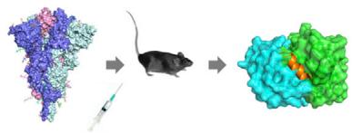

WS6 targets a SARS-CoV-2 S2 supersite recognized by diverse antibodies

WS6 neutralizes sarbecoviruses and SARS-CoV-2 variants

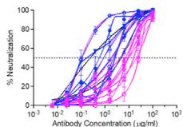

S2 supersite is conserved in sarbecoviruses

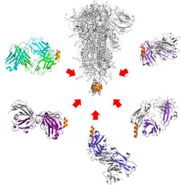

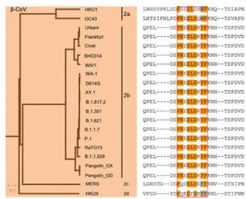

# Authors

Wei Shi, Lingshu Wang,

Tongqing Zhou, ...,

Yaroslav Tsybovsky, John R. Mascola,

Peter D. Kwong

# Correspondence

jmascola@icloud.com (J.R.M.), pdkwong@nih.gov (P.D.K.)

# In brief

Shi et al. identified a broad beta-coronavirus neutralizing antibody from mice immunized with mRNA encoding the SARS-CoV-2 spike. This antibody targets an S2 supersite comprising a hydrophobic cluster spanning three helical turns, which are conserved among beta-coronaviruses. This S2 supersite appears to be a good target for broad beta-coronavirus vaccines.

# Highlights

# Article

# Vaccine-elicited murine antibody WS6 neutralizes diverse beta-coronaviruses by recognizing a helical stem supersite of vulnerability

Wei Shi, $^{1,4}$ Lingshu Wang, $^{1,4}$ Tongqing Zhou, $^{1,4}$ Mallika Sastry, $^{1}$ Eun Sung Yang, $^{1}$ Yi Zhang, $^{1}$ Man Chen, $^{1}$ Xuejun Chen, $^{1}$ Misook Choe, $^{1}$ Adrian Creanga, $^{1}$ Kwan Leung, $^{1}$ Adam S. Olia, $^{1}$ Amarendra Pegu, $^{1}$ Reda Rawi, $^{1}$ Arne Schön, $^{2}$ Chen-Hsiang Shen, $^{1}$ Erik-Stephane D. Stancofski, $^{1}$ Chloe Adrienna Talana, $^{1}$ I-Ting Teng, $^{1}$ Shuishu Wang, $^{1}$ Kizzmekia S. Corbett, $^{1}$ Yaroslav Tsybovsky, $^{3}$ John R. Mascola, $^{1,*}$ and Peter D. Kwong $^{1,5,*}$

$^{1}$ Vaccine Research Center, National Institute of Allergy and Infectious Diseases, National Institutes of Health, Bethesda, MD 20892, USA

$^{2}$ Department of Biology, Johns Hopkins University, Baltimore, MD 21218, USA

$^{3}$ Electron Microscopy Laboratory, Cancer Research Technology Program, Leidos Biomedical Research, Inc., Frederick National Laboratory for Cancer Research, Frederick, MD 21702, USA

$^{4}$ These authors contributed equally

$^{5}$ Lead contact

*Correspondence: jmascola@icloud.com (J.R.M.), pdkwong@nih.gov (P.D.K.)

https://doi.org/10.1016/j.str.2022.06.004

# SUMMARY

Immunization with severe acute respiratory syndrome coronavirus 2 (SARS-CoV-2) spike elicits diverse antibodies, but it is unclear if any of the antibodies can neutralize broadly against other beta-coronaviruses. Here, we report antibody WS6 from a mouse immunized with mRNA encoding the SARS-CoV-2 spike. WS6 bound diverse beta-coronavirus spikes and neutralized SARS-CoV-2 variants, SARS-CoV, and related sarbecoviruses. Epitope mapping revealed WS6 to target a region in the S2 subunit, which was conserved among SARS-CoV-2, Middle East respiratory syndrome (MERS)-CoV, and hCoV-OC43. The crystal structure at 2 Å resolution of WS6 revealed recognition to center on a conserved S2 helix, which was occluded in both pre- and post-fusion spike conformations. Structural and neutralization analyses indicated WS6 to neutralize by inhibiting fusion and post-viral attachment. Comparison of WS6 with other recently identified antibodies that broadly neutralize beta-coronaviruses indicated a stem-helical supersite—centered on hydrophobic residues Phe1148, Leu1152, Tyr1155, and Phe1156—to be a promising target for vaccine design.

# INTRODUCTION

The coronavirus disease 2019 (COVID-19) pandemic, resulting from the zoonotic infection of severe acute respiratory syndrome coronavirus 2 (SARS-CoV-2), has lasted more than 2 years with more than 500 million cases and over 6 million deaths (https://www.who.int/publications/m/item/weekly-epidemiological-update-on-covid-19). Continuously evolving variants are making current licensed vaccines less effective (Araf et al., 2022; Edara et al., 2021; Garcia-Beltran et al., 2022; Liu et al., 2021; Pajon et al., 2022). Vaccines capable of neutralizing all SARS-CoV-2 variants for the foreseeable future are of high interest. Antibodies with broad neutralizing capacity are also of interest: if ultrapotent, they might be useful as therapeutic antibodies, but even if they are only of moderate potency, their epitopes are useful as vaccine templates (Kong et al., 2016).

Virtually all SARS-CoV-2 neutralizing antibodies are directed against the trimeric ectodomain of the spike glycoprotein, which comprises two subunits, S1 and S2. Neutralizing antibodies isolated from COVID-19 convalescent donors or from vaccinees after

spike immunization are directed primarily against the N-terminal domain (NTD) or receptor-binding domain (RBD) on the S1 subunit of the trimeric viral surface spike glycoprotein (spike) (Barnes et al., 2020; Brouwer et al., 2020; Cao et al., 2020; Cerutti et al., 2021; Ju et al., 2020; Liu et al., 2020; McCallum et al., 2021; Robbiani et al., 2020; Rogers et al., 2020; Seydoux et al., 2020; Suryadevara et al., 2021; Zost et al., 2020). Several recently emerged SARS-CoV-2 variants, such as Delta and Omicron, evade these antibodies by mutations that reduce or knock out antibody binding but maintain or even enhance infectivity (Garcia-Beltran et al., 2022; Liu et al., 2021; Sievers et al., 2022; Syed et al., 2022). Antibodies against most other regions on the spike are generally poorly neutralizing to non-neutralizing; several antibodies, however, such as antibodies 28D9 (Wang et al., 2021a) and S2P6 (Pinto et al., 2021) have been reported to neutralize diverse strains of beta-coronaviruses through recognition of a stem-helix supersite of vulnerability in the S2 subunit (Hsieh et al., 2021; Li et al., 2022; Sauer et al., 2021; Zhou et al., 2021).

To investigate the breadth of neutralizing antibodies obtained from mice vaccinated by mRNA encoding the SARS-CoV-2

spike, we assessed monoclonal antibodies for the location of their epitopes, the breadth of their binding to diverse spikes, and their neutralization capacities. We found one antibody, WS6, with broad binding capacity and moderate neutralization potency, and we determined its crystal structure in complex with its epitope, the step in the entry pathway where it neutralized, and how its recognition compared with other recently identified antibodies with overlapping epitopes. The results reveal a highly promising vaccine target in the S2 subunit—comprising a hydrophobic cluster spanning three helical turns, with acidic residues framing the central turn—and add WS6 to the panel of antibodies by which to guide its vaccine development.

# RESULTS

# Identification and characterization of SARS-CoV-2 spike-specific antibodies from immunized mice

To obtain antibodies specific for SARS-CoV-2 spike glycoprotein, we immunized mice with mRNA coding for SARS-CoV-2 spike (Figure 1A). To generate hybridomas, we boosted with soluble spike protein and, after 3 days, generated hybridomas by fusing splenocyte B cells with Sp2/0 cells from the mouse with the highest plasma neutralization titers to SARS-CoV-2. Eleven monoclonal antibodies, named WS1 to WS11, bound SARS-CoV-2 S-dTM (spike residues 1–1,206) by ELISA (Figure 1B). Nine of these bound the S1 subunit, either S1-short1 (spike residues 1–670) or S1R (residues 1–537). Six of them, WS1, WS2, WS3, WS7, WS8, and WS10, bound NTD, and three of them, WS4, WS9, and WS11, bound RBD. Antibodies WS5 and WS6, however, did not bind NTD, RBD, or S1, and their binding epitopes were presumably on the S2 subunit of the spike.

To provide insight into the breadth of binding, we assessed recognition of WS1-11 on a panel of prefusion-stabilized diverse beta-coronavirus spikes (S2Ps) (Wrapp et al., 2020). Detectable binding was observed against SARS-CoV-2, SARS-CoV, Middle East respiratory syndrome (MERS)-CoV, and hCoV-HKU1 for five antibodies (Figure 1C). For antibodies WS3, WS4, and WS7, binding was more than 1,000-times weaker against the divergent strain versus that of the immunogen. However, for antibodies WS5 and WS6, binding was only about 10-fold reduced versus SARS-CoV-2. Neutralization assessments revealed that WS5 neutralized neither SARS-CoV-2 nor SARS-CoV, whereas WS6 could neutralize both (Figure 1D). WS6 was further studied for its epitope and neutralization activities.

# WS6 recognizes diverse beta-coronaviruses spikes and neutralizes SARS-CoV-2 and variants, SARS-CoV, and related viruses from bat, pangolin, and other animals

To assess fully the broad reactivity of WS6, we performed ELISAs against S2Ps from an even more divergent panel of coronaviruses, including RaTG13, WIV1, SHC014, hCoV-OC43, and hCoV-229E (Figure 2A). Remarkably, WS6 was able to bind all beta-coronaviruses tested, though not to the alpha-coronavirus hCoV-229E (Figure S1). The binding affinities of WS6 to S2Ps, measured by surface plasmon resonance (SPR), showed nanomolar or lower dissociation constants ( $K_{D}s$ ) (Figure 2B). Isothermal titration calorimetry (ITC) analysis of WS6 binding to SARS-CoV-2 S2P revealed a $K_{D}$ of 2.6 nM (Figure 2C), confirming the low nanomolar $K_{D}s$ obtained by SPR. To determine if

WS6 could bind spike proteins on cell surface, we expressed spikes of SARS-CoV-2, SARS-CoV, MERS-CoV, hCoV-HKU1, and hCoV-OC43 on the surface of Expi-293 cells and analyzed WS6 binding by flow cytometry. We found that WS6 bound well to the cell surface expressing the beta-coronavirus spikes (Figures 2D and S2).

To determine if the broad recognition of WS6 for spikes translated into broad neutralization of beta-coronaviruses, we assessed its neutralization activities by pseudovirus neutralization assays (Naldini et al., 1996; Wang et al., 2021b). WS6 neutralized all tested variants of SARS-CoV-2 including Omicron (B.1.1.529), with half-maximal inhibitory concentrations ( $IC_{50}s$ ) 2.46–26.52 $\mu$ g/mL (Figures 2E and S3; Table S1). WS6 could also neutralize beta-coronaviruses related to SARS-CoV-2 (such as RaTG13, Pangolin_GD, and Pangolin_GX), SARS-CoV, and related viruses Frankfurt1, Civet007-2004, WIV1, and SHC014 with $IC_{50}s$ 0.11–4.91 $\mu$ g/mL (Figures 2E and S3; Table S1). WS6 also neutralized related beta-coronaviruses, such as RaTG13, Pangolin-GX, Civet007-2004, and SHC014, with submicromolar $IC_{50}s$ , better than against SARS-CoV-2 despite being elicited by immunizations with SARS-CoV-2 spike. The only tested beta-coronavirus strain WS6 failed to neutralize was MERS-CoV, consistent with its lower ELISA binding to this strain (Table S1).

Several S2-directed antibodies have recently been reported, including the antibody S2P6 (Pinto et al., 2021), which broadly neutralizes beta-coronaviruses including MERS-CoV. We compared WS6 and S2P6 for neutralization against diverse SARS-CoV-2 variants and diverse coronaviruses (Figure S3). Despite its high breadth, S2P6 was unable to neutralize the Omicron variant of SARS-CoV-2, whereas WS6 did neutralize Omicron. WS6 neutralized all tested strains more potently than S2P6, except for MERS-CoV, against which WS6 was non-neutralizing. The two recently reported murine antibodies, B6 and immunoglobulin G22 (IgG22), utilize the same heavy-chain origin gene (VH1-19), and both generated after immunization with spikes from SARS-CoV-2 and MERS-CoV (Hsieh et al., 2021; Pinto et al., 2021). By contrast, WS6 used a different V gene and was generated by immunization with the SARS-CoV-2 spike only—thereby revealing a new mode of murine S2-helix recognition and showing that MERS-CoV spike immunization was not required to elicit these antibodies.

# WS6 epitope mapping

We attempted to map the epitope of WS6 by visualizing its recognition of the spike ectodomain by negative-stain electron microscopy (EM). Two-dimensional (2D) classification of antigen-binding fragment (Fab) of WS6 in complex with the S2P spike (WA-1 strain) showed generally unbound spikes, with only 4% of the images yielding a trimer with Fabs binding in the membrane-proximal S2 stem (Figure 3A). We also analyzed Fab WS6 in complex with spike S2 subunit; 2D classification indicated WS6 to bind S2, though most of S2 appeared to be disordered and not in a typical pre- or post-fusion conformation (Figure 3B).

To further map the epitope, we performed peptide-array-based epitope mapping and identified a 17-residue peptide, PELDSFKEELDKYFKNH (SARS-CoV-2 spike residues 1,143–1,159) to bind WS6 (Figure 3C), suggesting the WS6 epitope to

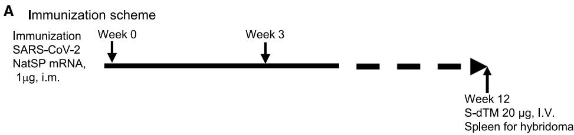

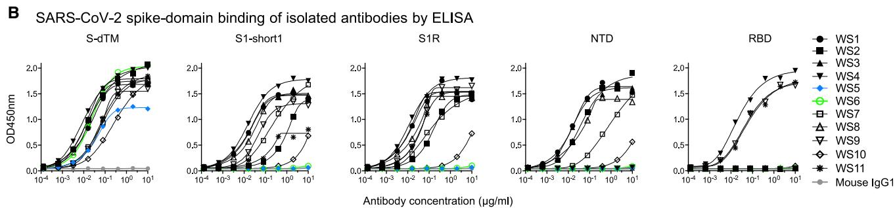

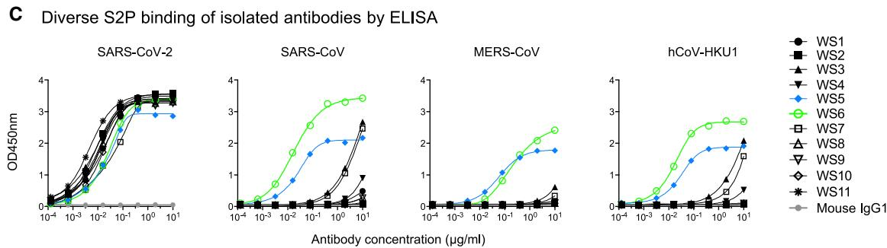

Figure 1. Spike-mRNA-immunized mice elicit antibodies against diverse regions of spike, several of which bound diverse beta-coronavirus spikes and one of which, WS6, neutralized them   
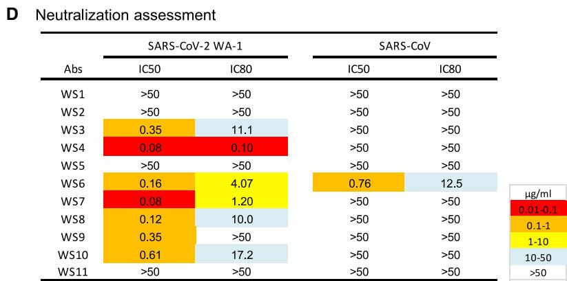  
(A) Immunization scheme. NatSP is the full transmembrane-containing native sequence of spike WA-1 strain; S-dTM is the soluble spike protein residues 1–1,206 of wild-type WA-1 strain.   
(B) Binding of isolated antibodies by ELISA to subdomains of the SARS-CoV-2 spike. Purified monoclonal antibodies from hybridoma supernatants were analyzed for binding to SARS-CoV-2 S-dTM, S1 (S1-short and S1R), RBD, and NTD by ELISA.   
(C) Binding of isolated antibodies assessed by ELISA to diverse beta-coronavirus pre-fusion-stabilized spikes (S2Ps).   
(D) Neutralization assessment of hybridoma antibodies against SARS-CoV-2 WA-1 and SARS-CoV pseudoviruses on 293T-ACE2 cells.   
See also Figure S1.

be at the S2 stem-helix region of the spike near the viral membrane, consistent with our negative-stain EM observation. This peptide is conserved among SARS-CoV, SARS-CoV-2, and RaTG13 and is mostly conserved among diverse beta-coronavi-

ruses (Figure S4A). A similar peptide (residues 1,148–1,159) has been identified as a highly immunogenic linear epitope from sera of 1,051 patients with COVID-19 (Li et al., 2021). We used ITC to measure the affinity between WS6 and three peptides, two from

A WS6 binding to CoV spike proteins by ELISA

B WS6 Fab binding to diverse CoV spike S2P by Surface Plasmon Resonance

Response (RU)

C WS6 binding to SARS-CoV-2 S2P by ITC

<table><tr><td>Spike Protein</td><td>ka (1/Ms)</td><td>kd (1/s)</td><td>\( K_p \pm SE \) (nM)</td></tr><tr><td>SARS-CoV-2 WA-1</td><td>\( 2.59 \times 10^{5} \)</td><td>\( 1.05 \times 10^{-4} \)</td><td>\( 0.41 \pm 0.008 \)</td></tr><tr><td>RaTG13</td><td>\( 1.22 \times 10^{5} \)</td><td>\( 1.56 \times 10^{-4} \)</td><td>\( 1.27 \pm 0.03 \)</td></tr><tr><td>SARS-CoV</td><td>\( 5.22 \times 10^{4} \)</td><td>\( 3.15 \times 10^{-4} \)</td><td>\( 6.03 \pm 0.16 \)</td></tr><tr><td>WIV1</td><td>\( 1.76 \times 10^{4} \)</td><td>\( 2.74 \times 10^{-4} \)</td><td>\( 15.54 \pm 0.41 \)</td></tr><tr><td>SHC014</td><td>\( 2.78 \times 10^{4} \)</td><td>\( 2.28 \times 10^{-4} \)</td><td>\( 8.22 \pm 0.24 \)</td></tr><tr><td>hCoV-OC43</td><td>\( 5.14 \times 10^{2} \)</td><td>\( 3.08 \times 10^{-4} \)</td><td>\( 596 \pm 33.80 \)</td></tr><tr><td>hCoV-HKU1</td><td>\( 4.25 \times 10^{2} \)</td><td>\( 3.38 \times 10^{-4} \)</td><td>\( 796 \pm 26.50 \)</td></tr><tr><td>MERS-CoV</td><td>\( 6.46 \times 10^{3} \)</td><td>\( 3.26 \times 10^{-4} \)</td><td>\( 50.47 \pm 2.86 \)</td></tr></table>

D WS6 binding to cell surface expressed spikes

E WS6 neutralization of pseudoviruses

Figure 2. Antibody WS6 binds and neutralizes diverse beta-coronaviruses

(A) ELISA binding analysis of WS6 to pre-fusion-stabilized soluble spikes of various coronaviruses.

(B) Surface plasmon resonance (SPR) binding curves of WS6 Fab with various beta-coronaviruses.

(C) Thermodynamics of WS6 binding to SARS-CoV-2 S2P. WS6 IgG was titrated into S2P in the cell at $25^{\circ}$ C.

(D) WS6 binds cell-surface-expressed spike proteins from SARS-CoV-2, SARS-CoV, hCoV-HKU1, hCoV-OC43, and MERS-CoV.

(E) WS6 neutralizes SARS-CoV-2 variants, SARS-CoV, and related animal coronaviruses. All neutralization activity was measured using spike-pseudotyped lentivirus on 293 flpin-TMPRSS2-ACE2 cells except for MERS-CoV, which was tested on Huh7.5 cells. Assays were performed in triplicate, and representative neutralization curves from two to three technical replicates are shown. Data are represented as mean percentages of neutralization with SEM calculated from the triplicate wells. (Left) WS6 neutralizes SARS-CoV-2 variants, D614G, B.1.1.7 (Alpha), B.1.351 (Beta), P.1 (Gamma), B.1.617.2 (Delta), AY.1 (Delta+), B.1.621 (Mu), and B.1.1.529 (Omicron). (Middle) WS6 neutralizes SARS-CoV-2 and related coronaviruses, SARS-CoV-2 WA-1, RaTG13, Pangolin_GD, and Pangolin_GX. (Right) WS6 neutralizes SARS-CoV and related coronaviruses, SARS-CoV, Frankfurt1, Civet 007-2004, WIV1, and SHC014 but not MERS-CoV.

See also Figures S1–S3 and Table S1.

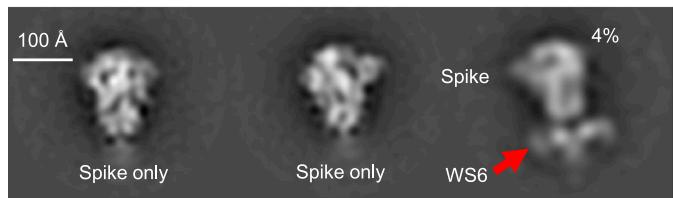  
A Negative stain EM of WS6 in complex with SARS-CoV-2 spike

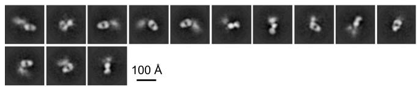  
B Negative stain EM of WS6 in complex with SARS-CoV-2 spike S2

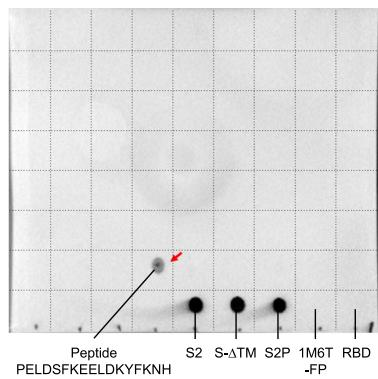  
C Mapping the epitope with a SARS-CoV spike peptide array

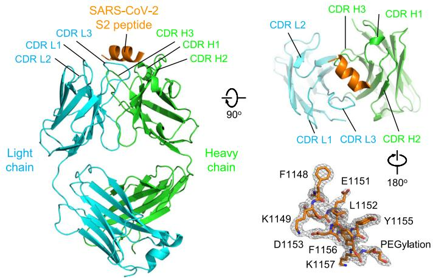  
D Crystal structure of WS6 in complex with S2 peptide at 2.0 Å resolution

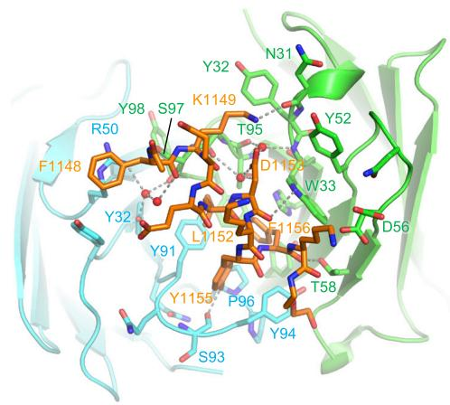  
E Interactions between WS6 and S2 peptide

F WS6 sequence and paratope   
Figure 3. Epitope mapping and crystal structure of antibody WS6 in complex with S2 peptide   
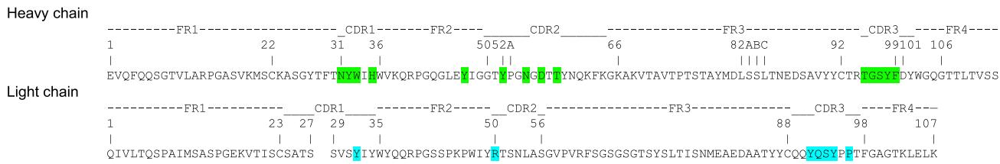  
(A) Negative-stain EM of SARS-CoV-2 spike in complex with WS6. Only a small fraction was observed with WS6 bound at the stem region. Scale bar represents 100 Å.

(B) Negative-stain EM of SARS-CoV-2 spike S2 in complex with WS6. Scale bar represents 100 Å.

(C) Epitope mapping by dot-blot assay with a SARS-CoV spike peptide array (BEI, NR-52418). WS6 bound to peptide #154 P $_{1125}$ ELDSFKEELDKYFKNH $_{1141}$ (corresponding to SARS-CoV-2 residues 1,143–1,159) (red arrow), SARS-CoV-2 spike (S-dTM and S2P) and its S2 domain, but not scaffold-fusion peptide (1M6T-FP) nor RBD. A dash line grid has been added on top of the blot to aid display.

(D) Crystal structure of WS6 in complex with SARS-CoV-2 S2 peptide at 2.0 Å resolution. The antibody and SARS-CoV-2 peptide are shown in cartoon representation. WS6 heavy chain, light chain, and S2 peptide are colored green, cyan, and orange, respectively. Two 90°-flipped views are shown (left, top right). 2Fo-Fc electron density map of the S2 peptide is shown at 1.2 σ, with the antibody interacting residues facing the reader (right, bottom) in a 180°-flipped view from panel above. Molecular structure figures were prepared with PyMOL.

(E) Detailed interactions between WS6 and S2 peptide. The S2 peptide and paratope residues in WS6 are shown in sticks representation, with other regions of WS6 shown in cartoon representation. Hydrogen bonds are indicated with gray dashed lines. Waters that mediating hydrogen bonds are shown as red spheres.

(F) Sequence and paratope of WS6. WS6 residues are numbered according to Kabat nomenclature. Heavy and light chain paratope residues are highlighted in green and cyan, respectively.

See also Figure S5 and Table S2.

Table 1. Crystallographic data and refinement statistics   

<table><tr><td colspan="2">Data collection</td></tr><tr><td>Wavelength (Å)</td><td>1.0000</td></tr><tr><td>Resolution range (Å)</td><td>40.23–2.02 (2.092–2.02)</td></tr><tr><td>Space group</td><td>C 1 2 1</td></tr><tr><td>Unit cell (a, b, c,α, β, g)</td><td>155.1, 64.5, 138.0, 90.0, 117.3, 90.0</td></tr><tr><td>Total reflections</td><td>262,622</td></tr><tr><td>Unique \( reflections^a \)</td><td>75,855 (6,642)</td></tr><tr><td>Multiplicity</td><td>3.5 (2.9)</td></tr><tr><td>Completeness (%)</td><td>94.81 (81.69)</td></tr><tr><td>I/σI</td><td>10.5 (1.1)</td></tr><tr><td>R-merge</td><td>0.101 (0.943)</td></tr><tr><td>R-pim</td><td>0.083 (0.513)</td></tr><tr><td>\( CC_{1/2} \)</td><td>0.995 (0.765)</td></tr></table>

Refinement   

<table><tr><td>Reflections used in refinement</td><td>75,540 (6,475)</td></tr><tr><td>Reflections used for R-free</td><td>1,989 (170)</td></tr><tr><td>R-work</td><td>0.1718 (0.2427)</td></tr><tr><td>R-free</td><td>0.2133 (0.2848)</td></tr><tr><td>Number of non-hydrogen atoms</td><td>7,587</td></tr><tr><td>Macromolecules</td><td>6,696</td></tr><tr><td>Ligands</td><td>176</td></tr><tr><td>Solvent</td><td>735</td></tr><tr><td>Protein residues</td><td>871</td></tr><tr><td>RMS (bonds, Å)</td><td>0.008</td></tr><tr><td>RMS (angles, °)</td><td>0.91</td></tr><tr><td>Ramachandran favored (%)</td><td>97.78</td></tr><tr><td>Ramachandran allowed (%)</td><td>2.22</td></tr><tr><td>Ramachandran outliers (%)</td><td>0.00</td></tr><tr><td>Rotamer outliers (%)</td><td>0.92</td></tr><tr><td>Clashscore</td><td>4.58</td></tr><tr><td>Average B factor (Å2)</td><td>32.90</td></tr><tr><td>Macromolecules</td><td>31.84</td></tr><tr><td>Ligands</td><td>49.90</td></tr><tr><td>Solvent</td><td>38.92</td></tr></table>

$^{a}$ Statistics for the highest-resolution shell are shown in parentheses.

SARS-CoV-2 (of 10 or 25 residues) and one from MERS-CoV, and we observed $K_{D}s$ of 22 and 0.25 nM for the short and long SARS-CoV-2 peptides, respectively, and a $K_{D}$ of 390 nM for the MERS-CoV peptide (Figure S5).

# Crystal structure of WS6 in complex with a conserved S2 peptide

To elucidate the mechanism for the broad reactivity of WS6, we determined a crystal structure at 2 Å of Fab WS6 in complex with peptide Ace-F $_{1148}$ KEELDKYFK $_{1157}$ -PEG12-Lys-Biotin (residue numbers were based on the SARS-CoV-2 spike sequence) (Figures 3D; Table 1). The peptide contained a 10-residue segment conserved among beta-coronaviruses (Figure S4A) and was acetylated at the N terminus and biotin-pegylated at the C terminus. Well-defined electron density was observed for

the entire WS6 Fab and for the entire peptide, including the acetyl group at the N terminus and part of the polyethylene glycol at the C terminus (Figure 3D). Peptide-binding interactions involved both heavy and light chains, with the heavy chain contributing $\sim 360\mathrm{-Å}^2$ buried surface area (BSA) and the light chain contributing $\sim 230\AA^2$ (Table S2), analyzed with PDBePISA (Krissinel and Henrick, 2007). The BSA of the peptide was slightly larger at $\sim 675\AA^2$ , not counting the BSA of the visible PEG fragment ( $\sim 100\AA^2$ total). This binding interface is smaller than a typical antibody-binding epitope, indicating the full WS6 epitope to likely involve additional residues.

All complementarity-determining regions (CDRs) of both heavy and light chains were involved in binding, creating a groove that cradled the epitope (Figure 3D). In the WS6-bound crystal structure, the S2 epitope formed a three-turn $\alpha$ helix; examination of its binding mode revealed binding for a longer helix with extensions on both termini without any major clashes. Most of the residues of the peptide were involved in binding, except for Glu1150 and Lys1154, which were on the opposite side of the helix facing WS6 (Figure 3E). Aromatic or hydrophobic residues, Phe1148, Leu1152, Tyr1155, and Phe1156, were on the side of the helix facing WS6. Phe1148 had aromatic interactions with Arg50 $_{L}$ and Tyr91 $_{L}$ of the WS6 light chain and hydrophobic interactions with Ser97 $_{H}$ of the heavy chain. The Tyr1155 side chain stuck into a cavity formed by CDR L3 from Tyr91 $_{L}$ to Pro96 $_{L}$ and had aromatic or hydrophobic interactions with side chains of Tyr91 $_{L}$ , Tyr94 $_{L}$ , and Pro96 $_{L}$ and the peptide backbone. Leu1152 and Phe1156 side chains bound in a pocket between heavy and light chains and interacted with side chains of Tyr91 $_{L}$ , Pro96 $_{L}$ , Phe99 $_{H}$ , Thr95 $_{H}$ , Trp33 $_{H}$ , His35 $_{H}$ , and Tyr47 $_{H}$ (Figures 3E and 3F; Table S2).

# WS6 neutralizes by inhibition of fusion steps post-viral attachment

To elucidate the mechanism by which WS6 neutralizes beta-coronaviruses, we incubated BHK21-ACE2 cells with SARS-CoV-2 spike-pseudotyped lentivirus on ice to allow virus to attach to ACE2. After thorough washing, cells were incubated with WS6 or WS4 on ice for 1 h and at 37°C for 72 h. WS4, an RBD-directed neutralizing antibody, could neutralize not more than 40% of the virus, whereas WS6 had no problem neutralizing the ACE2 pre-attached virus (Figure 4A). We performed a similar experiment using 293 flpin-TMPRSS2-ACE2 cells for WS6 and S2P6 (Pinto et al., 2021), which also bind to the S2-stem helix, and found that both antibodies could neutralize ACE2 pre-attached virus. These results suggest that WS6 is likely to neutralize SARS-CoV-2 by engaging in steps post-viral attachment to ACE2.

As described above in the structural analysis, WS6 recognized the hydrophobic face of the stem helix with residues Phe1148, Leu1152, Tyr1155, and Phe1156 binding in the center of the paratope groove. In the pre-fusion structure of SARS-CoV-2 spike (PDB: 6XR8) (Cai et al., 2020; Ke et al., 2020), these hydrophobic side chains pack in the coiled-coil interface of the 3-helical bundle, indicating that the target site of WS6 and other similar antibodies on S2 stem is cryptic. Modeling of WS6 binding to the pre-fusion SARS-CoV-2 spike, based on the WS6-peptide complex, revealed substantial clashes (Figure 4B, left panel), indicating that WS6 binding would require unpacking or disassembly of the helical bundle. A previous study showed that binding of B6 disrupted/opened the prefusion MERS-CoV spike in

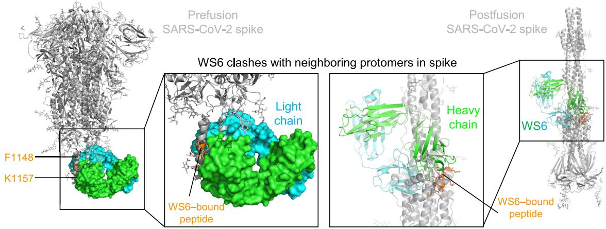  
A   
WS6 inhibits post viral attachment   
BHK21-ACE2 cells   
293 flpin-TMPRSS2-ACE2 cells   
B   
WS6-binding is not compatible with the prefusion and postfusion conformation of the spike   
WS6 superposed onto prefusion conformation   
WS6 superposed onto the postfusion conformation   
C

Potential mechanism of neutralization   
Figure 4. WS6 neutralizes SARS-CoV-2 by inhibition of post-viral attachment   
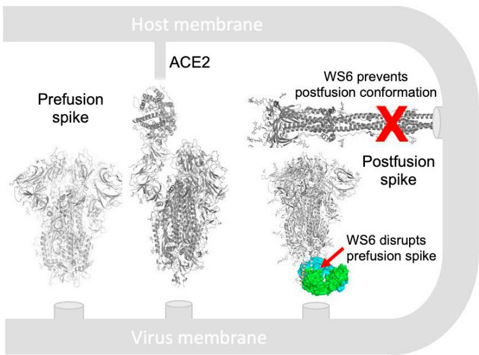  
(A) WS6 and S2P6 neutralization of SARS-CoV-2 by inhibition of post-viral attachment. Neutralization experiments were performed with BHK21-ACE2 (top) and 293 flipin-TMPRSS2-ACE2 (bottom) cells. WS4, an RBD antibody, was used as a negative control. Assays were performed in triplicate, and representative

(legend continued on next page)

the stem region to expose the epitope, while other regions of the spike remained in the pre-fusion state (Sauer et al., 2021). WS6 potentially utilizes the same mechanism to disrupt the helix bundle to achieve binding and prevent transition to the post-fusion state. Modeling also revealed that the post-fusion spike structure (PDB: 6XRA) (Cai et al., 2020) was incompatible with binding of WS6 to the hydrophobic side of the peptide helix, as revealed by the crystal structure, because these hydrophobic residues are involved in the packing of the small helix with the central coiled coil in the post-fusion structure (Figure 4B, right panel). Because the spike binding to the receptor and transitioning from the pre-fusion to the post-fusion conformation drive the membrane fusion process, WS6 may even more apt to bind during this conformational transition and inhibit the fusion process (Figure 4C).

# A helical stem supersite of vulnerability

Several broad beta-coronavirus neutralizing antibodies have been identified recently that target the S2 stem-helix region, including the aforementioned S2P6 (Pinto et al., 2021) as well as antibodies B6 (Sauer et al., 2021), IgG22 (Hsieh et al., 2021), CCP40.8 (Zhou et al., 2021), and CV3-25 (Hurlburt et al., 2021; Li et al., 2022). The superposition of their S2 helical epitopes indicated that these antibodies bound to the stem helix with varying orientations (Figure 5A) and targeted different sets of residues ranging from residue position 1,142 to 1,164 on S2 (Figures 5B and S6). Epitope analysis indicated a common subset of residues, namely Phe1148, Lys1149, Glu1150 Leu1152, Asp1153, Tyr1155, and Phe1156, to interact with four of the six antibodies (Figure 5B, left). These residues, which spanned three helical turns on S2 with a central hydrophobic cluster sandwiched by hydrophilic residues Lys1149, Glu1150, and Asp1153, formed a supersite of vulnerability for antibody recognition (Figure 5B, middle and right). Sequence analysis indicated this S2 supersite to be highly conserved among beta-coronaviruses (Figure 5C), providing the basis for the broad neutralization by WS6 and other antibodies targeting this site. It is of note that change of WS6 epitope residues Lys1149 and Tyr1155 in SARS-CoV-2 to Gln and Phe in MERS-CoV S2 eliminates two hydrogen bonds between the S2 peptide and WS6, potentially weakens WS6 binding to MERS CoV spike, and leads to the loss of neutralization. Overall, these S2 stem-helix antibodies are likely to share a similar mechanism of neutralization. Before or even after spike binds to ACE2, the stem helix appears to adopt a conformation or conformations that expose this supersite, allowing for the stem-helix antibodies to bind and prevent spike conformations needed for fusion, thereby stalling the entry process. Importantly, these S2-helix-directed broad neutralizers have diverse origin genes, except for B6 and IgG22, which utilize the same VH gene and appear to be of the same antibody class. In addition, the antibodies have only low-to-moderate somatic hyper

mutation, suggesting that diverse ontogenies are possible with little barrier to their development (Figure S4).

# DISCUSSION

Zoonotic infections from beta-coronaviruses have caused multiple pandemics and endemics in recent years, including SARS (Drosten et al., 2003; Ksiazek et al., 2003), MERS (Zaki et al., 2012), and the ongoing COVID-19 (Zhou et al., 2020a; Zhu et al., 2020). It seems likely that additional beta-coronavirus zoonotic pandemics will occur in the future. Broadly neutralizing antibodies or broad vaccines against a wide spectrum of beta-coronaviruses may be effective at preventing or ameliorating such pandemics—and could even be of use against the current COVID-19, if variants do succeed in escaping control by current vaccines. In this study, we isolated an S2-directed antibody, named WS6, from a mouse immunized with mRNA-encoded SARS-CoV-2 spike. WS6 could bind and neutralize all variants of SARS-CoV-2, including Delta and Omicron; it could also neutralize SARS-CoV, as well as bat, civet, and pangolin beta-coronaviruses related to SARS-CoV and SARS-CoV-2. The crystal structure of WS6, in complex with the S2 stem-helix epitope peptide, revealed the structural basis for broad recognition and, together with neutralization and binding analyses, suggested a potential mechanism by which WS6 neutralizes broad beta-coronaviruses.

Several other groups have recently reported S2-directed antibodies including antibodies S2P6 (Pinto et al., 2021), CC40.8 (Zhou et al., 2021), and CV3-25 (Li et al., 2022) from SARS-CoV-2-infected convalescent donors and B6 (Sauer et al., 2021) and IgG22 (Hsieh et al., 2021) from vaccinated mice. We compared WS6 with S2P6 for neutralization activities and found that S2P6 was unable to neutralize the Omicron variant of SARS-CoV-2, whereas WS6 was able to neutralize all tested SARS-CoV-2 variants including Omicron. WS6 also neutralized all tested beta-coronavirus strains more potently than S2P6, except for MERS-CoV. In terms of the murine broad beta-coronavirus neutralizing antibodies, WS6 used a different V gene from B6 and IgG22 and represented a new class of murine antibody with a new mode of S2-helix recognition. The fact that WS6 was generated by immunization with only SARS-CoV-2 spike indicates that immunization with SARS-CoV-2 spike alone is sufficient to elicit broad beta-coronavirus neutralizing antibodies.

It will be interesting to determine whether S2-helix peptide-based immunizations can focus the immune response, enabling the elicitation of broadly neutralizing serological responses, as has been done with HIV-1 fusion peptide (Kong et al., 2019; Xu et al., 2018). Nanoparticles displaying the S2-helix may also be helpful in focusing the immune response, as has been done with the influenza stem site of vulnerability (Boyoglu-Barnum et al., 2021; Kanekiyo et al., 2013; Yassine et al., 2015). Whether

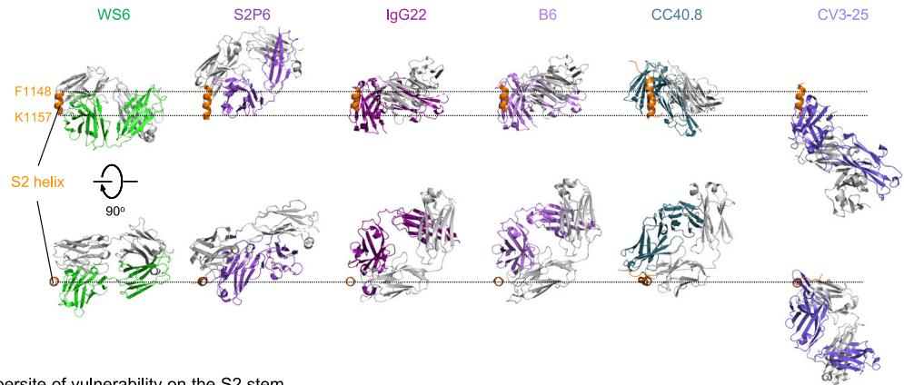  
A   
Comparison of binding orientations of S2-targeting antibodies   
B   
A supersite of vulnerability on the S2 stem

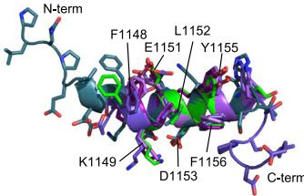

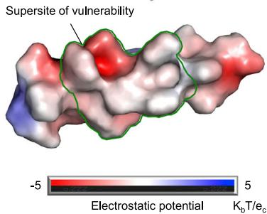  
C   
Sequence conservation of the supersite in representative beta-coronaviruses

Figure 5. An S2-stem supersite of vulnerability   
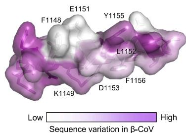  
(A) Comparison of modes of recognition of WS6 with other antibodies targeting the S2 stem helix. WS6 binding to the S2 helix is shown in the same orientation as in Figure 4B. S2P6, IgG22, B6, CC40.8, and CV3-25 complexes are aligned with the WS6 complex over the S2 peptide helix. The S2 helix and light chains of antibodies are colored orange and gray, respectively. Heavy chains of antibodies are colored differently to distinguish them. CV3-25 assumes a distinct mode of recognition compared with others.   
(B) Epitopes of antibodies targeting the S2 region define a supersite of vulnerability. Antibody-binding surface areas of each residue in the S2 peptide are plotted along the linear sequence of SARS-CoV-2 S2 peptide (left). Antibody-bound peptides are shown colored by recognizing antibodies. The center region between residues 1,148 and 1,156 is recognized by most of the antibodies (middle); hydrophobic residues F1148, L1152, Y1155, and F1156 are positioned in the middle of the supersite, with K1149, E1151, and D1153 providing hydrophilic interactions are the peripheral (right). The boundary of the supersite, which is defined as residues interacting with 5 of the 6 antibodies analyzed in this study, is highlighted by a green line.

(legend continued on next page)

S2-helix-focused immunization will elicit sufficiently broad and potent responses to enable protection from future SARS-CoV-2 variants or to future beta-coronavirus zoonotic crossovers remains to be seen. It seems likely that such immune focusing can be carried out in conjunction with spike-based immunizations, perhaps using currently licensed vaccines from Moderna, Pfizer, and Johnson and Johnson, all of which incorporate the S2-helical region.

# STAR★METHODS

Detailed methods are provided in the online version of this paper and include the following:

● KEY RESOURCES TABLE   
● RESOURCE AVAILABILITY

○ Lead contact   
○ Materials availability   
○ Data and code availability

● EXPERIMENTAL MODEL AND SUBJECT DETAILS

○ Mouse studies   
○ Cell lines

- METHOD DETAILS

○ Mouse immunization, hybridoma generation and antibody isolation   
○ ELISA and dot-blot   
○ Expression and purification of beta-coronavirus spike trimer proteins   
○ Production of antibodies   
○ Full-length spike constructs   
○ Analysis of WS6 binding to cell surface expressed spike protein   
○ Pseudovirus neutralization assay   
- Neutralization by fusion inhibition (post attachment inhibition)   
○ Surface plasmon resonance measurements   
○ Isothermal titration calorimetry (ITC)   
○ Negative stain electron microscopy   
○ Crystallization and structure determination   
○ Antibody germline assignment   
○ Antibody frequency calculation   
○ Phylogenetic analysis

● QUANTIFICATION AND STATISTICAL ANALYSIS

# SUPPLEMENTAL INFORMATION

Supplemental information can be found online at https://doi.org/10.1016/j.str.2022.06.004.

# ACKNOWLEDGMENTS

We thank R. Andrabi for providing CC40.8 coordinates, B. Graham for suggesting use of flpin-TMPRSS2-ACE2 cells, T. Stephens for assistance with negative-stain EM, J. Stuckey for assistance with figures, and members of the Virology Laboratory, Vaccine Research Center, for discussions and comments on the manuscript. Support for this work was provided by the Intramural

Research Program of the Vaccine Research Center, National Institute of Allergy and Infectious Diseases, National Institutes of Health and by federal funds from the Frederick National Laboratory for Cancer Research under contract HHSN261200800001E. Use of sector 22 (Southeast Region Collaborative Access team) at the Advanced Photon Source was supported by the US Department of Energy, Basic Energy Sciences, Office of Science, under contract number W-31-109-Eng-38.

# AUTHOR CONTRIBUTIONS

W.S. isolated antibodies WS1–WS11 and performed ELISA binding assays; L.W. headed neutralization studies, prepared spike plasmids, and performed cell-surface binding assays; T.Z. determined and analyzed the crystal structure of the WS6-peptide complex and wrote the manuscript; M.S. performed SPR analysis, provided spike proteins for ELISA, and assisted with obtaining peptide for crystallization; E.S.Y., Y.Z., and M. Chen performed WS6 neutralization of SARS-related viruses; X.C. provided mouse next-generation sequencing (NGS) sequence data; M. Choe provided S2P6 antibody; A.C. provided 293 flpin-TMPRSS2-ACE2 cells; K.L. assisted with preparation of pseudoviruses; A.S.O provided SARS-CoV-2 S2P-His for Octet measurements; A.P. and C.A.T. performed cell-surface staining; R.R. assisted with obtaining peptide for crystallization; A.S. performed ITC measurements; C.-H.S. prepared phylogenetic tree; E.-S.D.S. crystallized the protein complex; I-T.T. performed transfection for beta-CoV and S2 antibody productions; S.W. wrote the manuscript and performed PISA analysis of the antibody-peptide interface; K.S.C. carried out mouse immunization experiment; Y.T. performed negative-stain EM analysis; J.R.M. supervised antibody isolation, neutralization assessments, and cell-surface binding assays; P.D.K. oversaw the project and, with S.W. and T.Z., wrote the manuscript, with all authors providing comments or revisions.

# DECLARATION OF INTERESTS

The authors declare no competing interest.

Received: January 25, 2022

Revised: May 6, 2022

Accepted: June 21, 2022

Published: July 15, 2022

# REFERENCES

Adams, P.D., Afonine, P.V., Bunkoczi, G., Chen, V.B., Davis, I.W., Echols, N., Headd, J.J., Hung, L.W., Kapral, G.J., Grosse-Kunstleve, R.W., et al. (2010). PHENIX: a comprehensive Python-based system for macromolecular structure solution. Acta. Crystallogr. D Biol. Crystallogr. 66, 213–221.

Albrecht, B., Scornavacca, C., Cenci, A., and Huson, D.H. (2012). Fast computation of minimum hybridization networks. Bioinformatics 28, 191–197.

Araf, Y., Akter, F., Tang, Y.D., Fatemi, R., Parvez, M.S.A., Zheng, C., and Hossain, M.G. (2022). Omicron variant of SARS-CoV-2: genomics, transmissibility, and responses to current COVID-19 vaccines. J. Med. Virol. 94, 1825–1832.

Barnes, C.O., West, A.P., Jr., Huey-Tubman, K.E., Hoffmann, M.A.G., Sharaf, N.G., Hoffman, P.R., Koranda, N., Gristick, H.B., Gaebler, C., Muecksch, F., et al. (2020). Structures of human antibodies bound to SARS-CoV-2 spike reveal common epitopes and recurrent features of antibodies. Cell 182, 828–842.e16.

Barouch, D.H., Yang, Z.Y., Kong, W.P., Korioth-Schmitz, B., Sumida, S.M., Truitt, D.M., Kishko, M.G., Arthur, J.C., Miura, A., Mascola, J.R., et al. (2005). A human T-cell leukemia virus type 1 regulatory element enhances the immunogenicity of human immunodeficiency virus type 1 DNA vaccines in mice and nonhuman primates. J. Virol. 79, 8828–8834.

Boyoglu-Barnum, S., Ellis, D., Gillespie, R.A., Hutchinson, G.B., Park, Y.J., Moin, S.M., Acton, O.J., Ravichandran, R., Murphy, M., Pettie, D., et al. (2021). Quadrivalent influenza nanoparticle vaccines induce broad protection. Nature 592, 623–628.   
Brouwer, P.J.M., Caniels, T.G., van der Straten, K., Snitselaar, J.L., Aldon, Y., Bangaru, S., Torres, J.L., Okba, N.M.A., Claireaux, M., Kerster, G., et al. (2020). Potent neutralizing antibodies from COVID-19 patients define multiple targets of vulnerability. Science 369, 643–650.   
Cai, Y., Zhang, J., Xiao, T., Peng, H., Sterling, S.M., Walsh, R.M., Jr., Rawson, S., Rits-Volloch, S., and Chen, B. (2020). Distinct conformational states of SARS-CoV-2 spike protein. Science 369, 1586–1592.   
Cao, Y., Su, B., Guo, X., Sun, W., Deng, Y., Bao, L., Zhu, Q., Zhang, X., Zheng, Y., Geng, C., et al. (2020). Potent neutralizing antibodies against SARS-CoV-2 identified by high-throughput single-cell sequencing of convalescent patients' B cells. Cell 182, 73–84.e16.   
Cerutti, G., Guo, Y., Zhou, T., Gorman, J., Lee, M., Rapp, M., Reddem, E.R., Yu, J., Bahna, F., Bimela, J., et al. (2021). Potent SARS-CoV-2 neutralizing antibodies directed against spike N-terminal domain target a single supersite. Cell Host Microbe 29, 819–833.e7.   
Collaborative Computational Project (1994). The CCP4 suite: programs for protein crystallography. Acta. Crystallogr. D. Biol. Crystallogr. 50, 760–763.   
Corbett, K.S., Edwards, D.K., Leist, S.R., Abiona, O.M., Boyoglu-Barnum, S., Gillespie, R.A., Himansu, S., Schafer, A., Ziwawo, C.T., DiPiazza, A.T., et al. (2020). SARS-CoV-2 mRNA vaccine design enabled by prototype pathogen preparedness. Nature 586, 567–571.   
Drosten, C., Gunther, S., Preiser, W., van der Werf, S., Brodt, H.R., Becker, S., Rabenau, H., Panning, M., Kolesnikova, L., Fouchier, R.A., et al. (2003). Identification of a novel coronavirus in patients with severe acute respiratory syndrome. N. Engl. J. Med. 348, 1967–1976.   
Edara, V.V., Manning, K.E., Ellis, M., Lai, L., Moore, K.M., Foster, S.L., Floyd, K., Davis-Gardner, M.E., Mantus, G., Nyhoff, L.E., et al. (2021). mRNA-1273 and BNT162b2 mRNA vaccines have reduced neutralizing activity against the SARS-CoV-2 Omicron variant. Preprint at bioRxiv. https://doi.org/10.1101/2021.12.20.473557.   
Emsley, P., and Cowtan, K. (2004). Coot: model-building tools for molecular graphics. Acta. Crystallogr. D Biol. Crystallogr. 60, 2126–2132.   
Garcia-Beltran, W.F., St Denis, K.J., Hoelzemer, A., Lam, E.C., Nitido, A.D., Sheehan, M.L., Berrios, C., Ofoman, O., Chang, C.C., Hauser, B.M., et al. (2022). mRNA-based COVID-19 vaccine boosters induce neutralizing immunity against SARS-CoV-2 Omicron variant. Cell 185, 457–466.e4. https://doi.org/10.1016/j.cell.2021.12.033.   
Hsieh, C.L., Werner, A.P., Leist, S.R., Stevens, L.J., Falconer, E., Goldsmith, J.A., Chou, C.W., Abiona, O.M., West, A., Westendorf, K., et al. (2021). Stabilized coronavirus spike stem elicits a broadly protective antibody. Cell Rep. 37, 109929.   
Hurlburt, N.K., Homad, L.J., Sinha, I., Jennewein, M.F., MacCamy, A.J., Wan, Y.-H., Boonyaratanakornkit, J., Sholukh, A.M., Zhou, P., Burton, D.R., et al. (2021). Structural definition of a pan-sarbecovirus neutralizing epitope on the spike S2 subunit. Preprint at bioRxiv. https://doi.org/10.1101/2021.08.02.454829.   
Jaenicke, L. (1974). A rapid micromethod for the determination of nitrogen and phosphate in biological material. Anal. Biochem. 61, 623–627.   
Ju, B., Zhang, Q., Ge, J., Wang, R., Sun, J., Ge, X., Yu, J., Shan, S., Zhou, B., Song, S., et al. (2020). Human neutralizing antibodies elicited by SARS-CoV-2 infection. Nature 584, 115–119.   
Kanekiyo, M., Wei, C.J., Yassine, H.M., McTamney, P.M., Boyington, J.C., Whittle, J.R., Rao, S.S., Kong, W.P., Wang, L., and Nabel, G.J. (2013). Self-assembling influenza nanoparticle vaccines elicit broadly neutralizing H1N1 antibodies. Nature 499, 102–106.   
Ke, Z., Oton, J., Qu, K., Cortese, M., Zila, V., McKeane, L., Nakane, T., Zivanov, J., Neufeldt, C.J., Cerikan, B., et al. (2020). Structures and distributions of SARS-CoV-2 spike proteins on intact virions. Nature 588, 498–502.   
Kong, R., Duan, H., Sheng, Z., Xu, K., Acharya, P., Chen, X., Cheng, C., Dingens, A.S., Gorman, J., Sastry, M., et al. (2019). Antibody lineages with vac-

cine-induced antigen-binding hotspots develop broad HIV neutralization. Cell 178, 567–584.e19.   
Kong, R., Xu, K., Zhou, T., Acharya, P., Lemmin, T., Liu, K., Ozorowski, G., Soto, C., Taft, J.D., Bailer, R.T., et al. (2016). Fusion peptide of HIV-1 as a site of vulnerability to neutralizing antibody. Science 352, 828–833.   
Krissinel, E., and Henrick, K. (2007). Inference of macromolecular assemblies from crystalline state. J. Mol. Biol. 372, 774–797.   
Ksiazek, T.G., Erdman, D., Goldsmith, C.S., Zaki, S.R., Peret, T., Emery, S., Tong, S., Urbani, C., Comer, J.A., Lim, W., et al. (2003). A novel coronavirus associated with severe acute respiratory syndrome. N. Engl. J. Med. 348, 1953–1966.   
Larkin, M.A., Blackshields, G., Brown, N.P., Chenna, R., McGettigan, P.A., McWilliam, H., Valentin, F., Wallace, I.M., Wilm, A., Lopez, R., et al. (2007). Clustal W and clustal X version 2.0. Bioinformatics 23, 2947–2948.   
Lefranc, M.P., Giudicelli, V., Duroux, P., Jabado-Michaloud, J., Folch, G., Aouinti, S., Carillon, E., Duvergey, H., Houles, A., Paysan-Lafosse, T., et al. (2015). IMGT(R), the international ImMunoGeneTics information system(R) 25 years on. Nucleic Acids Res. 43, D413–D422.   
Li, W., Chen, Y., Prevost, J., Ullah, I., Lu, M., Gong, S.Y., Tauzin, A., Gasser, R., Vezina, D., Anand, S.P., et al. (2022). Structural basis and mode of action for two broadly neutralizing antibodies against SARS-CoV-2 emerging variants of concern. Cell Rep. 38, 110210.   
Li, Y., Ma, M.L., Lei, Q., Wang, F., Hong, W., Lai, D.Y., Hou, H., Xu, Z.W., Zhang, B., Chen, H., et al. (2021). Linear epitope landscape of the SARS-CoV-2 Spike protein constructed from 1,051 COVID-19 patients. Cell Rep. 34, 108915.   
Liu, L., Iketani, S., Guo, Y., Chan, J.F., Wang, M., Liu, L., Luo, Y., Chu, H., Huang, Y., Nair, M.S., et al. (2021). Striking antibody evasion manifested by the Omicron variant of SARS-CoV-2. Nature 602, 676–681. https://doi.org/10.1038/s41586-021-04388-0.   
Liu, L., Wang, P., Nair, M.S., Yu, J., Rapp, M., Wang, Q., Luo, Y., Chan, J.F., Sahi, V., Figueroa, A., et al. (2020). Potent neutralizing antibodies against multiple epitopes on SARS-CoV-2 spike. Nature 584, 450–456.   
Marcou, Q., Mora, T., and Walczak, A.M. (2018). High-throughput immune repertoire analysis with IGoR. Nat. Commun. 9, 561.   
McCallum, M., De Marco, A., Lempp, F.A., Tortorici, M.A., Pinto, D., Walls, A.C., Beltramello, M., Chen, A., Liu, Z., Zatta, F., et al. (2021). N-terminal domain antigenic mapping reveals a site of vulnerability for SARS-CoV-2. Cell 184, 2332–2347.e16.   
McCoy, A.J., Grosse-Kunstleve, R.W., Adams, P.D., Winn, M.D., Storoni, L.C., and Read, R.J. (2007). Phaser crystallographic software. J. Appl. Crystallogr. 40, 658–674.   
Naldini, L., Blomer, U., Gage, F.H., Trono, D., and Verma, I.M. (1996). Efficient transfer, integration, and sustained long-term expression of the transgene in adult rat brains injected with a lentiviral vector. Proc. Natl. Acad. Sci. USA 93, 11382–11388.   
Otwinowski, Z., and Minor, W. (1997). Processing of X-ray diffraction data collected in oscillation mode. Methods Enzymol. 276, 307–326.   
Pajon, R., Doria-Rose, N.A., Shen, X., Schmidt, S.D., O'Dell, S., McDanal, C., Feng, W., Tong, J., Eaton, A., Maglinao, M., et al. (2022). SARS-CoV-2 Omicron variant neutralization after mRNA-1273 booster vaccination. N. Engl. J. Med. 386, 1088–1091.   
Pinto, D., Sauer, M.M., Czudnochowski, N., Low, J.S., Tortorici, M.A., Housley, M.P., Noack, J., Walls, A.C., Bowen, J.E., Guarino, B., et al. (2021). Broad betacoronavirus neutralization by a stem helix-specific human antibody. Science 373, 1109–1116.   
Punjani, A., Rubinstein, J.L., Fleet, D.J., and Brubaker, M.A. (2017). cryoSPARC: algorithms for rapid unsupervised cryo-EM structure determination. Nat. Methods 14, 290–296.   
Robbiani, D.F., Gaebler, C., Muecksch, F., Lorenzi, J.C.C., Wang, Z., Cho, A., Agudelo, M., Barnes, C.O., Gazumyan, A., Finkin, S., et al. (2020). Convergent antibody responses to SARS-CoV-2 in convalescent individuals. Nature 584, 437–442.

Rogers, T.F., Zhao, F., Huang, D., Beutler, N., Burns, A., He, W.T., Limbo, O., Smith, C., Song, G., Woehl, J., et al. (2020). Isolation of potent SARS-CoV-2 neutralizing antibodies and protection from disease in a small animal model. Science 369, 956–963.   
Sauer, M.M., Tortorici, M.A., Park, Y.J., Walls, A.C., Homad, L., Acton, O.J., Bowen, J.E., Wang, C., Xiong, X., de van der Schueren, W., et al. (2021). Structural basis for broad coronavirus neutralization. Nat. Struct. Mol. Biol. 28, 478–486.   
Sethna, Z., Elhanati, Y., Callan, C.G., Walczak, A.M., and Mora, T. (2019). OLGA: fast computation of generation probabilities of B- and T-cell receptor amino acid sequences and motifs. Bioinformatics 35, 2974–2981.   
Seydoux, E., Homad, L.J., MacCamy, A.J., Parks, K.R., Hurlburt, N.K., Jennewein, M.F., Akins, N.R., Stuart, A.B., Wan, Y.H., Feng, J., et al. (2020). Analysis of a SARS-CoV-2-infected individual reveals development of potent neutralizing antibodies with limited somatic mutation. Immunity 53, 98–105.e5.   
Sievers, B.L., Chakraborty, S., Xue, Y., Gelbart, T., Gonzalez, J.C., Cassidy, A.G., Golan, Y., Prahl, M., Gaw, S.L., Arunachalam, P.S., et al. (2022). Antibodies elicited by SARS-CoV-2 infection or mRNA vaccines have reduced neutralizing activity against Beta and Omicron pseudoviruses. Sci. Transl. Med. 14, eabn7842. https://doi.org/10.1126/scitranslmed.abn7842.   
Suryadevara, N., Shrihari, S., Gilchuk, P., VanBlargan, L.A., Binshtein, E., Zost, S.J., Nargi, R.S., Sutton, R.E., Winkler, E.S., Chen, E.C., et al. (2021). Neutralizing and protective human monoclonal antibodies recognizing the N-terminal domain of the SARS-CoV-2 spike protein. Cell 184, 2316–2331.e15.   
Syed, A.M., Ciling, A., Khalid, M.M., Sreekumar, B., Chen, P.Y., Kumar, G.R., Silva, I., Milbes, B., Kojima, N., Hess, V., et al. (2022). Omicron mutations enhance infectivity and reduce antibody neutralization of SARS-CoV-2 virus-like particles. Preprint at medRxiv. https://doi.org/10.1101/2021.12.20.21268048.   
Wang, C., van Haperen, R., Gutierrez-Alvarez, J., Li, W., Okba, N.M.A., Albulescu, I., Widjaja, I., van Dieren, B., Fernandez-Delgado, R., Sola, I., et al. (2021a). A conserved immunogenic and vulnerable site on the coronavirus spike protein delineated by cross-reactive monoclonal antibodies. Nat. Commun. 12, 1715.   
Wang, L., Zhou, T., Zhang, Y., Yang, E.S., Schramm, C.A., Shi, W., Pegu, A., Oloniniyi, O.K., Henry, A.R., Darko, S., et al. (2021b). Ultrapotent antibodies against diverse and highly transmissible SARS-CoV-2 variants. Science 373, eabh1766.   
Williams, C.J., Headd, J.J., Moriarty, N.W., Prisant, M.G., Videau, L.L., Deis, L.N., Verma, V., Keedy, D.A., Hintze, B.J., Chen, V.B., et al. (2018).

MolProbity: more and better reference data for improved all-atom structure validation. Protein Sci. 27, 293–315.   
Wrapp, D., Wang, N., Corbett, K.S., Goldsmith, J.A., Hsieh, C.L., Abiona, O., Graham, B.S., and McLellan, J.S. (2020). Cryo-EM structure of the 2019-nCoV spike in the prefusion conformation. Science 367, 1260–1263.   
Wu, X., Zhou, T., Zhu, J., Zhang, B., Georgiev, I., Wang, C., Chen, X., Longo, N.S., Louder, M., McKee, K., et al. (2011). Focused evolution of HIV-1 neutralizing antibodies revealed by structures and deep sequencing. Science 333, 1593–1602.   
Xu, K., Acharya, P., Kong, R., Cheng, C., Chuang, G.Y., Liu, K., Louder, M.K., O'Dell, S., Rawi, R., Sastry, M., et al. (2018). Epitope-based vaccine design yields fusion peptide-directed antibodies that neutralize diverse strains of HIV-1. Nat. Med. 24, 857–867.   
Yassine, H.M., Boyington, J.C., McTamney, P.M., Wei, C.J., Kanekiyo, M., Kong, W.P., Gallagher, J.R., Wang, L., Zhang, Y., Joyce, M.G., et al. (2015). Hemagglutinin-stem nanoparticles generate heterosubtypic influenza protection. Nat. Med. 21, 1065–1070.   
Zaki, A.M., van Boheemen, S., Bestebroer, T.M., Osterhaus, A.D., and Fouchier, R.A. (2012). Isolation of a novel coronavirus from a man with pneumonia in Saudi Arabia. N. Engl. J. Med. 367, 1814–1820.   
Zhou, P., Yang, X.L., Wang, X.G., Hu, B., Zhang, L., Zhang, W., Si, H.R., Zhu, Y., Li, B., Huang, C.L., et al. (2020a). A pneumonia outbreak associated with a new coronavirus of probable bat origin. Nature 579, 270–273.   
Zhou, P., Yuan, M., Song, G., Beutler, N., Shaabani, N., Huang, D., He, W.T., Zhu, X., Callaghan, S., Yong, P., et al. (2021). A protective broadly cross-reactive human antibody defines a conserved site of vulnerability on beta-corona-virus spikes. Preprint at bioRxiv. https://doi.org/10.1101/2021.03.30.437769.   
Zhou, T., Teng, I.T., Olia, A.S., Cerutti, G., Gorman, J., Nazzari, A., Shi, W., Tsybovsky, Y., Wang, L., Wang, S., et al. (2020b). Structure-based design with tag-based purification and in-process biotinylation enable streamlined development of SARS-CoV-2 spike molecular probes. Cell Rep. 33, 108322.   
Zhu, N., Zhang, D., Wang, W., Li, X., Yang, B., Song, J., Zhao, X., Huang, B., Shi, W., Lu, R., et al. (2020). A novel coronavirus from patients with pneumonia in China, 2019. N. Engl. J. Med. 382, 727–733.   
Zost, S.J., Gilchuk, P., Chen, R.E., Case, J.B., Reidy, J.X., Trivette, A., Nargi, R.S., Sutton, R.E., Suryadevara, N., Chen, E.C., et al. (2020). Rapid isolation and profiling of a diverse panel of human monoclonal antibodies targeting the SARS-CoV-2 spike protein. Nat. Med. 26, 1422–1427.

# STAR★METHODS

# KEY RESOURCES TABLE

<table><tr><td>REAGENT or RESOURCE</td><td>SOURCE</td><td>IDENTIFIER</td></tr><tr><td colspan="3">Antibodies</td></tr><tr><td>WS1</td><td>This paper</td><td>N/A</td></tr><tr><td>WS2</td><td>This paper</td><td>N/A</td></tr><tr><td>WS3</td><td>This paper</td><td>N/A</td></tr><tr><td>WS4</td><td>This paper</td><td>N/A</td></tr><tr><td>WS5</td><td>This paper</td><td>N/A</td></tr><tr><td>WS6</td><td>This paper</td><td>N/A</td></tr><tr><td>WS7</td><td>This paper</td><td>N/A</td></tr><tr><td>WS8</td><td>This paper</td><td>N/A</td></tr><tr><td>WS9</td><td>This paper</td><td>N/A</td></tr><tr><td>WS10</td><td>This paper</td><td>N/A</td></tr><tr><td>WS11</td><td>This paper</td><td>N/A</td></tr><tr><td>Mouse IgG1</td><td>ThermoFisher Scientific</td><td>Cat# 02-6100</td></tr><tr><td>S2P6</td><td>Pinto et al., 2021</td><td>N/A</td></tr><tr><td colspan="3">Bacterial and virus strains</td></tr><tr><td>SARS-CoV-2 WA-1 pseudovirus</td><td>Wang et al., 2021b</td><td>N/A</td></tr><tr><td>SARS-CoV-2 D614G pseudovirus</td><td>Wang et al., 2021b</td><td>N/A</td></tr><tr><td>SARS-CoV-2 B.1.1.7 pseudovirus</td><td>Wang et al., 2021b</td><td>N/A</td></tr><tr><td>SARS-CoV-2 B.1.351 pseudovirus</td><td>Wang et al., 2021b</td><td>N/A</td></tr><tr><td>SARS-CoV-2 P.1 pseudovirus</td><td>Wang et al., 2021b</td><td>N/A</td></tr><tr><td>SARS-CoV-2 B.1.617.2 pseudovirus</td><td>Wang et al., 2021b</td><td>N/A</td></tr><tr><td>SARS-CoV-2 AY.1 pseudovirus</td><td>This paper</td><td>N/A</td></tr><tr><td>SARS-CoV-2 B.1.621 pseudovirus</td><td>This paper</td><td>N/A</td></tr><tr><td>SARS-CoV-2 B.1.1.529 pseudovirus</td><td>This paper</td><td>N/A</td></tr><tr><td>SARS-CoV pseudovirus</td><td>This paper</td><td>N/A</td></tr><tr><td>RaTG13 pseudovirus</td><td>This paper</td><td>N/A</td></tr><tr><td>Pangolin-GD pseudovirus</td><td>This paper</td><td>N/A</td></tr><tr><td>Pangolin-GX pseudovirus</td><td>This paper</td><td>N/A</td></tr><tr><td>Frankfurt pseudovirus</td><td>This paper</td><td>N/A</td></tr><tr><td>Civet 007-2004 pseudovirus</td><td>This paper</td><td>N/A</td></tr><tr><td>WIV1 pseudovirus</td><td>This paper</td><td>N/A</td></tr><tr><td>SHC014 pseudovirus</td><td>This paper</td><td>N/A</td></tr><tr><td>MERS-CoV pseudovirus</td><td>This paper</td><td>N/A</td></tr><tr><td>hCoV-229E pseudovirus</td><td>This paper</td><td>N/A</td></tr><tr><td colspan="3">Chemicals, peptides, and recombinant proteins</td></tr><tr><td>Complete His-Tag Resin</td><td>Roche</td><td>Cat# 05893801001</td></tr><tr><td>HEPES</td><td>Life Technologies</td><td>Cat# 15630-080</td></tr><tr><td>IgG elution buffer</td><td>Thermo Scientific</td><td>Cat# 21009</td></tr><tr><td>Luciferase assay reagent</td><td>Promega</td><td>Cat# E1500</td></tr><tr><td>Ni-NTA Capture Biosensors</td><td>fortéBIO</td><td>Cat# 18-5103</td></tr><tr><td>Recombinant Protein A Sepharose</td><td>GE Healthcare</td><td>Cat# 17-1279-03</td></tr><tr><td>Sodium chloride</td><td>Quality Biological, Inc</td><td>Cat# 351-036-101</td></tr><tr><td>Turbo293 transfection reagent</td><td>SPEED BioSystem</td><td>Cat# PXX1002</td></tr><tr><td>SARS-CoV spike peptide array</td><td>BEI Resources</td><td>Cat# NR-52418</td></tr><tr><td>S2 peptide: Ac-FKEELDKYFK-biotin-PEG</td><td>GenScript</td><td>N/A</td></tr></table>

(Continued on next page)

Continued   

<table><tr><td>REAGENT or RESOURCE</td><td>SOURCE</td><td>IDENTIFIER</td></tr><tr><td>hCoV-HKU1 S2P</td><td>This paper</td><td>N/A</td></tr><tr><td>MERS-CoV S2P</td><td>This paper</td><td>N/A</td></tr><tr><td>hCoV-OC43 S2P</td><td>This paper</td><td>N/A</td></tr><tr><td>RaTG13 S2P</td><td>This paper</td><td>N/A</td></tr><tr><td>SARS-CoV S2P</td><td>This paper</td><td>N/A</td></tr><tr><td>SARS-CoV-2 S1-short</td><td>This paper</td><td>N/A</td></tr><tr><td>SARS-CoV-2 S1R</td><td>This paper</td><td>N/A</td></tr><tr><td>SARS-CoV-2 S2P</td><td>Wrapp et al., 2020</td><td>N/A</td></tr><tr><td>SARS-CoV-2 S-dTM</td><td>This paper</td><td>N/A</td></tr><tr><td>SARS-CoV-2 WA-1 spike</td><td>This paper</td><td>N/A</td></tr><tr><td>SHC014 S2P</td><td>This paper</td><td>N/A</td></tr><tr><td>WIV1 S2P</td><td>This paper</td><td>N/A</td></tr><tr><td colspan="3">Critical commercial assays</td></tr><tr><td>DNA gene synthesis and cloning</td><td>GenScript Biotech Corporation</td><td>N/A</td></tr><tr><td>Site-directed mutagenesis</td><td>GenelImmune Biotechnology LLC</td><td>N/A</td></tr><tr><td>Fab kit</td><td>Pierce</td><td>Cat# 44985</td></tr><tr><td>Rapid isotyping kit</td><td>Pierce</td><td>Cat# 26178</td></tr><tr><td>QuikChange multisite-directed mutagenesis kit</td><td>Agilent</td><td>Cat# 210515</td></tr><tr><td colspan="3">Deposited data</td></tr><tr><td>Crystal structure of WS6 in complex with S2 peptide</td><td>This paper</td><td>PDB: 7TCQ</td></tr><tr><td colspan="3">Experimental models: Cell lines</td></tr><tr><td>Human: Expi293F cells</td><td>Thermo Fisher</td><td>Cat# A14527; RRID: CVCL_D615</td></tr><tr><td>Human: FreeStyle 293-F cells</td><td>Thermo Fisher</td><td>Cat# R79007</td></tr><tr><td colspan="3">Recombinant DNA</td></tr><tr><td>pVRC8400-full-length spike Civet 007-2004</td><td>This paper</td><td>GenBank ID: AAU04646.1</td></tr><tr><td>pVRC8400-full-length spike Frankfurt1</td><td>This paper</td><td>GenBank ID: BAE93401.1</td></tr><tr><td>pVRC8400-full-length spike hCoV-229E</td><td>This paper</td><td>GenBank ID: AOG74783.1</td></tr><tr><td>pVRC8400-full-length spike hCoV-HKU1</td><td>This paper</td><td>GenBank ID: AAT98580.1</td></tr><tr><td>pVRC8400-full-length spike hCoV-OC43</td><td>This paper</td><td>GenBank ID: AAT84354.1</td></tr><tr><td>pVRC8400-full-length spike MERS-CoV</td><td>This paper</td><td>GenBank ID: AFS88936</td></tr><tr><td>pVRC8400-full-length spike Pangolin_GD</td><td>This paper</td><td>GenBank ID: QIA48632.1</td></tr><tr><td>pVRC8400-full-length spike Pangolin_GX</td><td>This paper</td><td>GenBank ID: QIQ54048.1</td></tr><tr><td>pVRC8400-full-length spike RaTG13</td><td>This paper</td><td>GenBank ID: QHR63300.2</td></tr><tr><td>pVRC8400-full-length spike SARS-CoV-2</td><td>This paper</td><td>GenBank ID: QHD43416.1</td></tr><tr><td>pVRC8400-full-length spike SARS-CoV</td><td>This paper</td><td>GenBank ID: AAP13441.1</td></tr><tr><td>pVRC8400-full-length spike SARS-CoV-2 D614G</td><td>This paper</td><td>N/A</td></tr><tr><td>pVRC8400-full-length spike SARS-CoV-2 AY.1</td><td>This paper</td><td>N/A</td></tr><tr><td>pVRC8400-full-length spike SARS-CoV-2 B.1.1.7</td><td>This paper</td><td>N/A</td></tr><tr><td>pVRC8400-full-length spike SARS-CoV-2 B.1.1.529</td><td>This paper</td><td>N/A</td></tr><tr><td>pVRC8400-full-length spike SARS-CoV-2 B.1.351</td><td>This paper</td><td>N/A</td></tr><tr><td>pVRC8400-full-length spike SARS-CoV-2 B.1.617.2</td><td>This paper</td><td>N/A</td></tr><tr><td>pVRC8400-full-length spike SARS-CoV-2 B.1.621</td><td>This paper</td><td>N/A</td></tr><tr><td>pVRC8400-full-length spike SARS-CoV-2 P.1</td><td>This paper</td><td>N/A</td></tr><tr><td>pVRC8400-full-length spike SHC014</td><td>This paper</td><td>GenBank ID: KC881005</td></tr><tr><td>pVRC8400-full-length spike WIV1</td><td>This paper</td><td>GenBank ID: KF367457</td></tr><tr><td>pVRC8400-WS6-heavy-chain</td><td>This paper</td><td>N/A</td></tr><tr><td>pVRC8400-WS6-light-chain</td><td>This paper</td><td>N/A</td></tr></table>

(Continued on next page)

Continued   

<table><tr><td>REAGENT or RESOURCE</td><td>SOURCE</td><td>IDENTIFIER</td></tr><tr><td colspan="3">Software and algorithms</td></tr><tr><td>Biacore T200 evaluation software</td><td>Cytiva</td><td>https://www.cytivalifesciences.com/en/ us/shop/protein-analysis/spr-label-free- analysis/software</td></tr><tr><td>CCP4 Program Suite</td><td>Collaborative Computational Project, 1994</td><td>https://www.ccp4.ac.uk</td></tr><tr><td>ClustalW</td><td>Larkin et al., 2007</td><td>https://www.ebi.ac.uk/Tools/msa/clustalo/</td></tr><tr><td>Coot</td><td>Emsley and Cowtan, 2004</td><td>https://sbgrid.org/software/</td></tr><tr><td>CryoSPARC 2.15</td><td>Punjani et al., 2017</td><td>https://cryosparc.com</td></tr><tr><td>Dendroscope</td><td>Albrecht et al., 2012</td><td>https://software-ab.informatik.uni-tuebingen. de/download/dendroscope3/welcome.html</td></tr><tr><td>HKL2000</td><td>Otwinowski and Minor, 1997</td><td>https://hkl-xray.com</td></tr><tr><td>IMGT</td><td>Lefranc et al., 2015</td><td>http://www.imgt.org</td></tr><tr><td>MolProbity</td><td>Williams et al., 2018</td><td>http://molprobity.biochem.duke.edu</td></tr><tr><td>Origin</td><td>Malvern Panalytical</td><td>https://www.origin.com/usa/en-us/store/ download</td></tr><tr><td>PDBePISA</td><td>Krissinel and Henrick, 2007</td><td>http://www.ebi.ac.uk/pdbe/pisa/</td></tr><tr><td>Phenix</td><td>Adams et al., 2010</td><td>https://sbgrid.org/software/</td></tr><tr><td>PRISM</td><td>GraphPad Software</td><td>https://www.graphpad.com/scientific- software/prism/</td></tr><tr><td>PyMOL</td><td>Schrödinger</td><td>https://pymol.org</td></tr></table>

# RESOURCE AVAILABILITY

# Lead contact

Further information and requests for resources and reagents should be directed to and will be fulfilled by the Lead Contact, Peter D. Kwong (pdkwong@nih.gov).

# Materials availability

Plasmids generated in this study are available upon request.

# Data and code availability

- Crystal diffraction data and structure coordinates of WS6 in complex have been deposited with the Protein Data Bank, PDB:7TCQ, https://doi.org/10.2210/pdb7tcq/pdb.   
● This paper does not report original code.   
- Any additional information required to reanalyze the data reported in this paper is available from the lead contact upon request.

# EXPERIMENTAL MODEL AND SUBJECT DETAILS

# Mouse studies

Animal experiments were carried out in compliance with all pertinent US National Institutes of Health regulations and approval from the Animal Care and Use Committee (ACUC) of the Vaccine Research Center. BALB/cJ mice (Jackson Laboratory), 6- to 8-week-old female, were used.

# Cell lines

FreeStyle 293-F (cat# R79007) and Expi293F cells (cat# A14528; RRID: CVCL_D615) were purchased from ThermoFisher Scientific Inc. FreeStyle 293-F cells were maintained in FreeStyle 293 Expression Medium, while Expi293F cells were maintained in Expi Expression Medium. The above cell lines were used directly from the commercial sources and cultured according to manufacturer suggestions.

# METHOD DETAILS

# Mouse immunization, hybridoma generation and antibody isolation

Female Balb/c mice were immunized with mRNA encoding for SARS-CoV-2 full-length spike from the wildtype WA-1 strain at weeks 0 and 3. Each animal received $1\mu \mathrm{g}$ mRNA diluted in $50\mu \mathrm{l}$ of 1xPBS via intramuscular injection into the same hind leg for both prime and

boost, utilizing methods described previously (Corbett et al., 2020). Serum samples were collected to detect antibody responses. One mouse with the best neutralizing antibody titer against SARS-CoV-2 spike was boosted intravenously with $20\mu \mathrm{g}$ of SARS-CoV-2 S-dTM (wild type spike with transmembrane region deleted, aa 1-1206) at week 12. Three days later, splenocytes were harvested and fused with Sp2/0 myeloma cells (ATCC) using polyethylene glycol (PEG) 1450 (50% (w/v), Sigma-Aldrich) according to the standard methods. Cells were cultured and screened in RPMI complete medium that contained $20\%$ FCS and $1\times 100~\mu \mathrm{M}$ hypoxanthine, $0.4\mu \mathrm{M}$ aminopterin and $16~\mu \mathrm{M}$ thymidine (Sigma-Aldrich). Supernatants from resulting hybridomas were screened for binding, using ELISA, to SARS-CoV-2-S1, NTD, RBD or S-dTM as well as for neutralizing activity. Subclones were generated by limiting dilution. After three rounds of screening and subcloning, stable antibody-producing clones were isolated and adapted to hybridoma-serum-free medium (Life Technologies Corp., Grand Island, NY, USA). Supernatants were collected from selected hybridoma clones and purified through a protein G-sepharose column (GE Healthcare). Monoclonal antibodies were isotyped with Pierce rapid isotyping kit (Cat#26178). Fabs were generated using Pierce Fab kit (Cat#44985) following manufacturer's instructions. Antibody and Fab purity was confirmed by SDS-PAGE. Select hybridomas were sent to GenScript (Piscataway, NJ 08854, USA) for hybridoma heavy and light chain variable sequences and IMGT (Lefranc et al., 2015) analysis.

# ELISA and dot-blot

ELISA plates were coated with the SARS-CoV-2 proteins, S-dTM, S1-short (residues 1-670), S1R (residues 1-537), RBD, and NTD, at 1 $\mu$ g/ml in PBS at 4 °C overnight. After standard washes and blocks, plates were incubated with 50 $\mu$ l serial dilutions of antibody in each well for one hour at room temperature. Anti-mouse whole IgG horseradish peroxidase conjugates (Jackson Laboratory) were used as secondary antibodies, and 3,5,3'5'-tetramethylbenzidine (TMB) (KPL, Gaithersburg, MD) was used as the substrate.

To identify WS6 epitope, a dot-blot was performed. SARS-CoV spike peptide array (NR-52418), was purchased from BEI resource. 20 ng of each of the 78 peptides (#91-169) covering the SARS-CoV spike S2 region were dotted on a nitrocellulose membrane. SARS-CoV-2 RBD, S2, S-dTM and S2P proteins were also dotted on the membrane as controls. Non-specific sites were blocked by soaking in PBS-Tween 20 containing 5% dry milk. The membrane was washed three times with PBS-T buffer, then incubated with 2 $\mu$ g/ml of antibody WS6 in blocking buffer for one hour at room temperature. After washing three times with PBS-T buffer, the membrane was incubated 30 min with anti-mouse IgG horseradish peroxidase conjugates (Jackson Laboratory) as secondary antibody. The membrane was then developed with ECL medium.

# Expression and purification of beta-coronavirus spike trimer proteins

Diverse beta-coronavirus spike soluble proteins were stabilized in prefusion conformation by double-proline (2P) mutations corresponding to K986P and V987P in SARS CoV-2 spike protein, along with a T4-phage fibritin trimerization domain (foldon) at the C terminus (Wrapp et al., 2020) followed by an HRV3C cleavage site, His $_{8}$ and Twin-Streptactin purification tags. Additionally, the furin cleavage sites between S1 and S2 were mutated; for HKU1 and OC43, RRKRR was replaced by GGSGG; for MERS-CoV, RSVR was replaced with ASVG; for SARS-CoV, SHC014, WIV1, and RaTG13, SLLRST was replaced with SLLAST. DNA sequences encoding diverse beta-coronavirus S2P proteins with T4-foldon motif, His $_{8}$ and Twin-Streptactin purification tags were cloned into mammalian expression vector pVRC8400 by GenelImmune. These stabilized S2P proteins were expressed by transient transfection of FreeStyle 293-F cells as previously described (Zhou et al., 2020b). Specifically, 1 mg of transfection grade plasmid DNA and 3 ml of Turbo293 transfection reagent (Speed BioSystems) each in 20ml Opti-MEM (Thermo Fisher Scientific), were pre-mixed and transfected into FreeStyle 293-F cells. Transfected cells were grown for 6 days at 120 rpm, 37°C, and 9% CO $_{2}$ , and the supernatant was harvested by centrifugation to remove cell debris. Supernatants were sterile-filtered, and the spike trimers were purified by nickel affinity chromatography using cOmplete His-Tag purification resin. The resin was serially washed with 50 mM Tris, pH 8.0, 400 mM NaCl buffer containing 10 mM and 25 mM Imidazole, respectively. The proteins were eluted in 50 mM Tris, pH 8.0, 400 mM NaCl, 300 mM Imidazole. Protein fractions were pooled and further purified by size-exclusion chromatography using a Superdex 200 16/600 column (Cytiva) in PBS. Fractions corresponding to trimeric spike proteins were pooled, concentrated to 1 mg/ml, analyzed by SDS-PAGE and stored at -80°C until further use.

# Production of antibodies

Monoclonal antibody WS6 heavy and light chain variable regions were cloned from WS6 hybridoma cells and sequenced. The heavy and light chain variable region sequences were synthesized with codon optimized for human cell expression and then subcloned into corresponding pVRC8400 vectors containing mouse IgG1 heavy chain and kappa light chain constant regions by GenScript (Piscataway, NJ). All other antibody heavy and light variable region gene sequences were synthesized by Gene Universal Inc (Newark, DE) and subcloned into corresponding pVRC8400 vectors containing human or mouse IgG1, kappa, or lambda constant region and a human cytomegalovirus promoter. The resulting plasmids of heavy and light chain pairs were co-transfected in Expi293F cells (Thermo Fisher) using Turbo293 transfection reagent (Speed BioSystems) as described previously (Wu et al., 2011). Briefly, 500 $\mu$ g plasmid encoding heavy-chain and 500 $\mu$ g plasmid encoding light-chain variant genes were pre-mixed with 3 ml of the transfection reagent for per 1L of transfection. Cells were transfected at density of $2.5 \times 10^{6}/ml$ followed by incubation in a shaker incubator at 120 rpm, 37°C, 9% CO $_{2}$ . On day 5 post transfection, the culture supernatants were harvested, sterile filtered and loaded onto a protein A column. The columns were washed with PBS, and IgG proteins were eluted with a low pH IgG elution buffer (Pierce) and immediately neutralized with 1M Tris-HCl, pH 8.0. Purified IgGs were subsequently dialyzed twice against PBS pH 7.4 using 10 kD dialysis cartridges (Pierce) and used for all measurements.

# Full-length spike constructs

Codon optimized cDNAs encoding full-length spike from SARS-CoV-2 (GenBank ID: QHD43416.1) were synthesized, cloned into the mammalian expression vector VRC8400 (Barouch et al., 2005) and confirmed by sequencing. Spike containing D614G amino acid change was generated using the wildtype spike sequence. Other variants containing single or multiple amino-acid changes in the spike gene from wildtype or D614G were made by mutagenesis using QuickChange lightning Multi Site-Directed Mutagenesis Kit (cat # 210515, Agilent) or via synthesis and cloning (Genscript). The spike variants tested are B.1.1.7 (H69del-V70del-Y144del-N501Y-A570D-D614G-P681H-T716I-S982A-D1118H), B.1.351 (L18F-D80A-D215G-(L242-244)del-R246I-K417N-E484K-N501Y-A701V), P.1 (L18F-T20N-P26S-D138Y-R190S-K417T-E484K-N501Y-D614G-H655Y-T1027I-V1176F), B.1.617.2 (T19R, G142D, del156-157, R158G, L452R, T478K, D614G, P681R, D950N), AY.1 (T19R, T95I, G142D, E156del, F157del, R158G, W258L, K417N, L452R, T478K, D614G, P681R, D950N), B.1.621 (T95I, insert144T, Y144S, Y145N, R346K, E484K, N501Y, D614G, P681H, D950N) and B.1.1.529 (A67V, H69del, V70del, T95I, G142D, V143del, Y144del, Y145del, N211del,L212I, ins214EPE, G339D, S371L, S373P, S375F, K417N, N440K, G446S, S477N, T478K, E484A, Q493R, G496S, Q498R, N501Y, Y505H, T547K, D614G, H655Y, N679K, P681H, N764K, D796Y, N856K, Q954H, N969K, L981F). The spike genes from SARS-CoV-2 related CoVs (RaTG13_GenBank: QHR63300.2; Pangolin GD_GenBank: QIA48632.1; Pangolin_GX-P2V_ QIQ54048.1), SARS-CoV and related CoVs (SARS-CoV Urbani_GenBank: AAP13441.1; Frankfurt1_GenBank: BAE93401.1; Civet SARS CoV 007/2004 S_GenBank: AAU04646.1; WIV1_GenBank: KF367457; SHC014_GenBank: KC881005), MERS-CoV EMC_GenBank: AFS88936), hCoV-HKU1 (GenBank: AAT98580.1), hCoV-OC43 (GenBank: AAT84354.1) and hCoV-229E (GenBank: AOG74783.1) were synthesized (Genscript). These full-length spike plasmids were used for pseudovirus production and for cell surface binding assays.

# Analysis of WS6 binding to cell surface expressed spike protein

Expi-293 cells were transiently transfected with plasmids encoding full-length spike proteins of coronaviruses using Turbo293 transfection reagent (Speed BioSystems) following manufacturer's protocol. After 40 h, cells were harvested and incubated with monoclonal antibodies (1 $\mu$ g/mL) for 30 min. Cells were washed and incubated with an allophycocyanin conjugated anti-human IgG (709-136-149, Jackson Immunoresearch Laboratories) for another 30 min, then washed and fixed with 1% paraformaldehyde (15712-S, Electron Microscopy Sciences). Flow cytometry data were acquired in a BD LSRFortessa X-50 flow cytometer (BD biosciences) and analyzed using Flowjo (BD biosciences).

# Pseudovirus neutralization assay

Spike-containing lentiviral pseudovirions were produced by co-transfection of packaging plasmid pCMVdR8.2, transducing plasmid pHR' CMV-Luc, a TMPRSS2 plasmid and S plasmids from human and animal coronaviruses (SARS-CoV-2 variants, SARS-CoV, MERS-CoV and SARS-CoV-2, SARS-CoV related coronaviruses) into 293T cells using Lipofectamine 3000 transfection reagent (L3000-001, ThermoFisher Scientific, Asheville, NC) (Naldini et al., 1996). 293T-ACE2 cells (provided by Dr. Michael Farzan) or 293 flpin-TMPRSS2-ACE2 cells (made at the VRC) were used for neutralization assay for SARS-CoV-2, SARS-CoV, and related sarbecoviruses while Huh7.5 cells (provided by Dr. Deborah R. Taylor) for MERS-CoV and hCoV-229E. Cells were plated into 96-well white/black Isoplates (PerkinElmer, Waltham, MA) at 75,00 cells per well the day before infection of pseudovirus. Serial dilutions of antibody were mixed with titrated pseudovirus, incubated for 45 min at 37°C and added to cells in triplicate. Following 2 h of incubation, wells were replenished with 150 ml of fresh media. Cells were lysed 72 h later, and luciferase activity was measured with Microbeta (Perking Elmer). Percent neutralization was calculated as 100x((virus only control)—(virus plus antibody))/(virus only control). Dose-response curves were generated with a 5-parameter nonlinear function using GraphPad Prism 8.0.2, and titers reported as the antibody concentration required to achieve 50% (50% inhibitory concentration [IC50]) or 80% (80% inhibitory concentration [IC80]) neutralization ration [IC50]) or 80% (80% inhibitory concentration [IC80]) neutralization.

# Neutralization by fusion inhibition (post attachment inhibition)

BHK21-ACE2 or 293 flpin-TMPRSS2-ACE2 cells were placed on ice for one hour before incubating with SARS-CoV-2 spike pseudotyped lentivirus on ice for another hour to allow the virus to attach to ACE2. After three washes, cells were then incubated with antibody on ice for additional one hour before further incubation. Cells were lysed after 72 h, and luciferase activity was measured with Microbeta (Perking Elmer). Percent neutralization, neutralization IC50s, and IC80s were calculated using GraphPad Prism 8.0.2.

# Surface plasmon resonance measurements

Binding affinities and kinetics of WS6 antibody Fab to the His-tagged Diverse CoV S2P spike trimers were assessed by surface plasmon resonance (SPR) on a Biacore S-200 (GE Healthcare) at 25 °C. Affinity was measured on a Ni-NTA sensor chip (Cytiva). The Ni-NTA surface was activated by injection of 5 mM of $Ni_{2}SO_{4}$ in HBS-EP+ buffer (10 mM HEPES, pH 7.4, 150 mM NaCl, 50μM EDTA and 0.05% surfactant P-20) for 60 s at 10 μL/min and then stabilized by washing with HBS-EP+ buffer containing 50μM EDTA for 60 s at 30 μL/min. Diverse CoV trimer S2P proteins with His-tag at 10 μg/mL were captured at 6 μL/min flow rate for 80 s over the nickel-activated sensor surface. Binding affinities for the captured trimer were determined using a serial dilution of antibody Fab solutions starting at 1600 nM during the association phase. A dissociation phase at 30 μL/min for 1000 s was

used to determine binding kinetics. The surface was regenerated by flowing 250 mM imidazole to both channels at 50 $\mu$ L/min for 60 s. Sensorgrams of the concentration series were corrected with corresponding blank curves and fitted globally with Biacore S200 evaluation software using a 1:1 Langmuir model of binding.

# Isothermal titration calorimetry (ITC)

Calorimetric titration experiments were performed using a MicroCal VP-ITC microcalorimeter from Malvern Panalytical (Northampton, MA, USA). The calorimetric cell (volume $\sim1.4~mL$ ) was filled with S2P protein at 0.5 $\mu M$ (expressed per trimer) or peptide at 1 $\mu M$ . The WS6 antibody, prepared at a concentration of 12-14 $\mu M$ (expressed per antigen binding site), was injected in aliquots of 10 $\mu L$ with 300 seconds interval. The reactants were dissolved in PBS, pH 7.4, and all measurements were performed at 25 °C. The concentrations of WS6 and S2P protein were obtained from the absorbance at 280 nm while the exact concentrations of the peptides were obtained by total nitrogen determination (Jaenicke, 1974). The data were processed with Origin. The heat produced upon injection was obtained by integration of the calorimetric signal, dQ/dt. The heat associated with binding of the antibody was obtained by subtracting the heat of dilution from the heat of reaction. The values for the enthalpy change, $\Delta H$ , the association constant, $K_{a}$ (the dissociation constant, $K_{D}=1/K_{a}$ ) and the stoichiometry, N, were obtained by a nonlinear fit of the data to a single-site binding model. Gibbs energy, $\Delta G$ , was calculated from the relation $\Delta G=-RT\ln K_{a}$ , where T is the absolute temperature in kelvin and R the universal gas constant, (1.987 cal/(K × mol)). The entropy contribution to Gibbs energy, -TΔS, was calculated from the known relation $\Delta G=\Delta H-T\Delta S$ . The results were expressed per mole of antigen binding sites. The stoichiometry, N, denotes the number of antigen binding sites per mole S2P trimer or peptide.

# Negative stain electron microscopy

Protein complex of WS6 Fab and SARS-CoV-2 spike was formed by mixing the Fab and spike protein at 1.2:1 molar ratio and incubating at room temperature for 15 minutes. The protein mixture was then diluted to about 0.02 mg/ml, adsorbed to freshly glow-discharged carbon-film grids for 15 s, washed with a buffer containing 20 mM HEPES, pH 7.5, and 150 mM NaCl, and stained with 0.7% uranyl formate, pH 5. Datasets were collected on a Thermo Scientific Talos F200C transmission electron microscope equipped with a Ceta camera at 200 kV, -1.2 $\mu$ m defocus and 57,000x nominal magnification which corresponds to a pixel size of 2.53 Å. Data was collected automatically using EPU. Single particle analysis was performed using CryoSPARC (Punjani et al., 2017).

# Crystallization and structure determination

The N-terminal acetylated and C-terminal biotin-pegylated 10-residue SARS-CoV-2 S2 peptide FKEELDKYFK (GenScript) was dissolved in $100\%$ DMSO at $10\mathrm{mg / mL}$ and then diluted with PBS to $1\mathrm{mg / mL}$ . Fab WS6 was incubated with the peptide in a 1:2 molar ratio for 5 min to form complex. The Fab-peptide complex was concentrated to $10 - 15\mathrm{mg / mL}$ and screened for crystallization using 576 conditions from Hampton screen, Precipitant Synergy screen, and QIAGEN Wizard screen with a Mosquito robot mixing $100~\mathrm{nL}$ reservoir solution and $100~\mathrm{nL}$ protein solution per drop. Crystals were obtained from the solution containing $2\%$ v/v PEG 400, 2 M $(\mathrm{NH}_4)_2\mathrm{SO}_4$ , $100~\mathrm{mM}$ sodium acetate, pH 5.5. Diffraction quality crystal were obtained by mixing $0.5~\mu \mathrm{L}$ WS6-peptide complex and $0.5~\mu \mathrm{L}$ of $80 - 100\%$ concentration of the aforementioned crystallization solution. Crystals were cryoprotected with $15\%$ v/v (2R,3R)-2,3-Butanediol in the aforementioned solution supplemented with $50\%$ additional precipitant and flash frozen in liquid nitrogen for data collection.

X-ray diffraction data were collected at the Advanced Photon Source (beamline SER-CAT ID22). The diffraction data were indexed, integrated, and scaled with the HKL2000 package (Otwinowski and Minor, 1997). The structures were determined by molecular replacement with Phaser (McCoy et al., 2007) in the CCP4 Program Suite (Collaborative Computational Project, 1994). Further refinement was carried out with PHENIX (Adams et al., 2010), starting with torsion-angle simulated annealing with slow cooling. Iterative manual model building was carried out with COOT (Emsley and Cowtan, 2004) with maps generated from combinations of standard positional, individual B-factor and TLS refinement algorithms. X-ray data and refinement statistics are summarized in Table 1.

# Antibody germline assignment

Germline gene of heavy and light chain were assigned by querying nucleotide sequences on IGBLAST server. B6 heavy and light chain germline gene were assigned by submitting protein sequence. The V gene identity was reported as the identity to the germline nucleotide sequences.

# Antibody frequency calculation

The mouse Ig deep sequencing samples were prepared and used to predict probability of generation of specific protein sequences on CDR3. Human Ig deep sequencing samples were downloaded from Bioproject PRJNA511481. The Ig sequences were sieved for IGOR to inference the model (Marcou et al., 2018). The inferenced models were used by OLGA to predict probability of having specific CDR3 sequences (Sethna et al., 2019). Signature of CV3-25 class antibody was defined as heavy chain IGHV5-51 and light chain IGKV1-12 germline gene, the R94, 96PQYC, G100b, C100d, and W100g on 18 amino acids CDR H3. The frequency of S2P6 class antibody was calculated by defining signature as IGHV1-46 germline gene with 97PKG in 11 amino acids CDR H3, and IGKV3-20 with Y91, 93SSPP and 96F on 11 amino acids CDR L3. The frequency of cc40.8 class antibody was calculated by masking IGHV3-23 with 94ITMA, 101V and 102V on 8 amino acids CDR H3 and IGLV3-10 with T91, 94SGN, and A96 on 11 amino acids CDR L3. The frequency of WS6 class antibody calculated by using mouse IGHV1-5 gene with 95TGS on 7 amino acids CDR H3, and IGKV4-61

gene with 91Y, 94Y and 96P on 9 amino acids CDR L3. B6 and IgG22 used identical heavy chain germline gene, although the light chain used different germline genes, it shared similar contact residues. B6/IgG22 class frequency was calculated by IGHV1-19 germline gene with CX{5,10}RX{4,6}W signature on CDR H3 amino acids, and IGKV8-27/IGKV1-99 germline genes with 92[LN] and 95[FY] on 8 amino acids length CDR L3.

# Phylogenetic analysis

Alpha-coronavirus spike sequences were downloaded using accession codes (NL63:Q6Q1S2.1, 229E:AOG74783.1, Feline:AAY32596.1, Mink:ADI80513.1). Beta-coronavirus spike sequences were downloaded from NCBI server using accession codes listed in Full-length spike constructs. ClustalW was used to calculate neighbor joining (NJ) tree (Larkin et al., 2007), and Dendroscope was used to plot the Neighbor Joining tree (Albrecht et al., 2012).

# QUANTIFICATION AND STATISTICAL ANALYSIS

SPR sensorgrams were analyzed using Biacore S200 evaluation software using a 1:1 Langmuir binding model and plotted using GraphPad Prism. Crystal diffraction data and structural refinement statistics were analyzed with HKL2000, Phenix, and Molprobity (Williams et al., 2018). Statistical details of experiments are described in Method details or figure legends.

Structure, Volume 30

# Supplemental Information

Vaccine-elicited murine antibody WS6 neutralizes

diverse beta-coronaviruses by recognizing

a helical stem supersite of vulnerability

Wei Shi, Lingshu Wang, Tongqing Zhou, Mallika Sastry, Eun Sung Yang, Yi Zhang, Man Chen, Xuejun Chen, Misook Choe, Adrian Creanga, Kwan Leung, Adam S. Olia, Amarendra Pegu, Reda Rawi, Arne Schön, Chen-Hsiang Shen, Erik-Stephane D. Stancofski, Chloe Adrienna Talana, I-Ting Teng, Shuishu Wang, Kizzmekia S. Corbett, Yaroslav Tsybovsky, John R. Mascola, and Peter D. Kwong

Figure S1. Binding analysis of WS6 to diverse CoV spikes by ELISA in comparison with S2P6, related to Figures 1 and 2. ELISA binding curves of WS6 are shown in green and those of S2P6 in black.

Figure S2. WS6 binding to cell-surface expressed coronavirus spikes, related to Figure 2.   
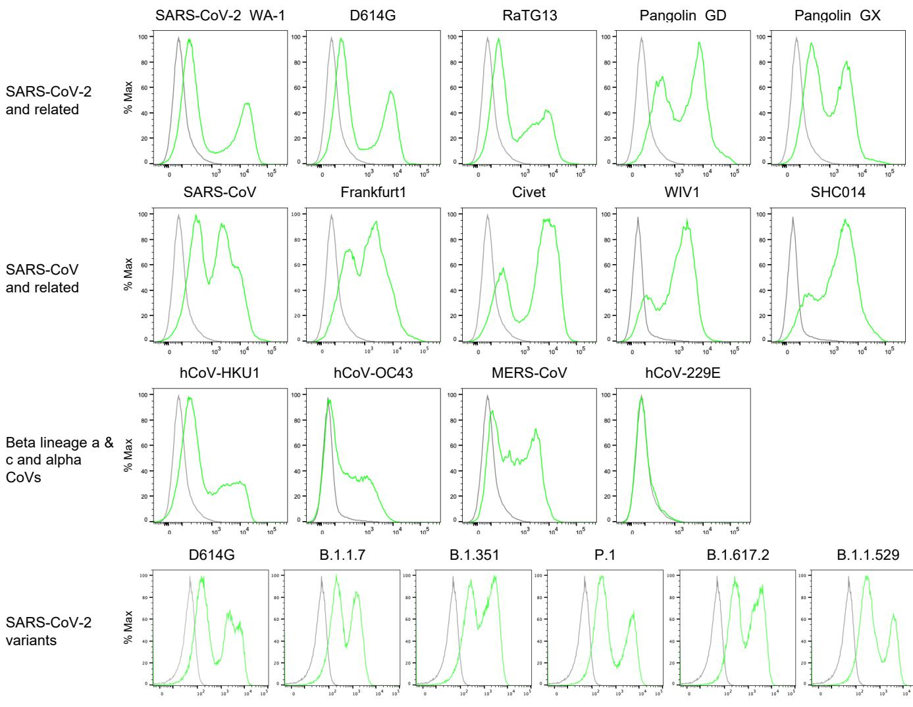  
Spike proteins were expressed on the surface of expi293 cells, and antibody binding was measured using flow cytometry. WS6 binding (green line) to cells transfected with the indicated coronavirus spike is compared to binding to untransfected cells (grey line).

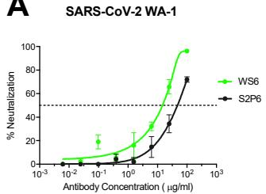  
A

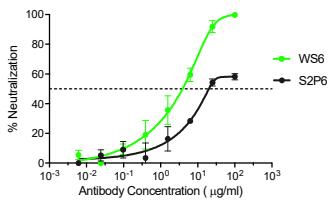  
SARS-CoV

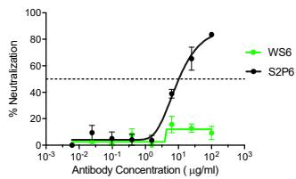  
MERS-CoV

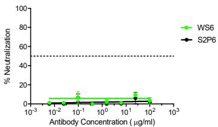  
hCoV-229E

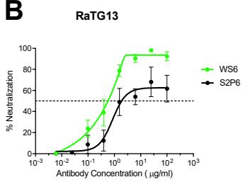  
B

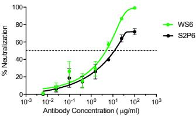  
Pangolin_GD

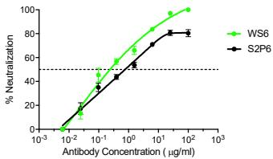  
Pangolin_GX-P2V

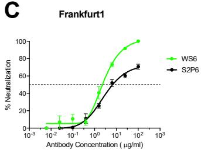  
C

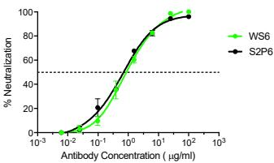  
Civert 007-2204

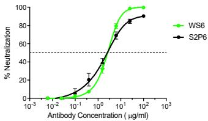  
WIV1

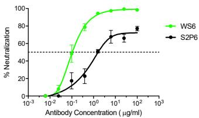  
SHC014

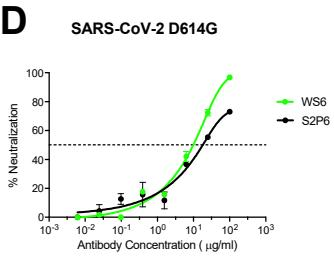  
D

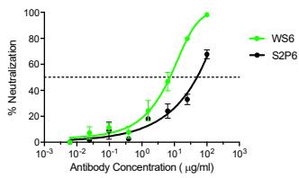  
SARS-CoV-2 B.1.1.7

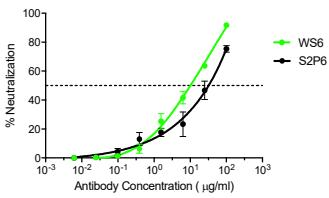  
SARS-CoV-2 B.1.351

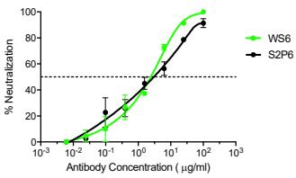  
SARS-CoV-2 P.1

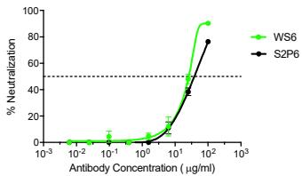  
SARS-CoV-2 B.1.617.2

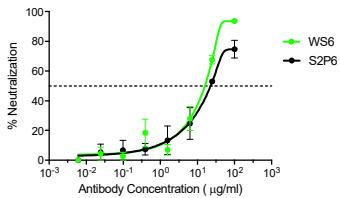  
SARS-CoV-2 AY.1

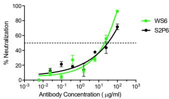  
SARS-CoV-2 B.1.621

SARS-CoV-2 B.1.1.529   
Figure S3. Neutralization of WS6 against diverse coronaviruses, related to Figure 2.   
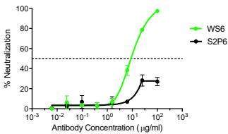  
Neutralization curves are showing using CoV spike pseudotyped lentivirus to test neutralization capacity of WS6 compared to S2P6. Neutralization was tested on HEK293-TMPRSS2-ACE2 stable cells for SARS-CoV-2, SARS-CoV and related CoVs and Huh7.5 cells for MERS-CoV and hCoV-229E. (A) WS6 neutralizes SARS-CoV-2, SARS-CoV, but not MERS-CoV or hCoV-229E. (B) WS6 neutralizes SARS-CoV-2 related coronaviruses. (C) WS6 neutralizes SARS-CoV related coronaviruses. (D) WS6 neutralizes SARS-CoV-2 variants. Assays were performed in triplicate and representative neutralization curves from two technical replicates of experiments are shown. Data are represented as mean percentages of neutralization with SEM calculated from the triplicate wells.

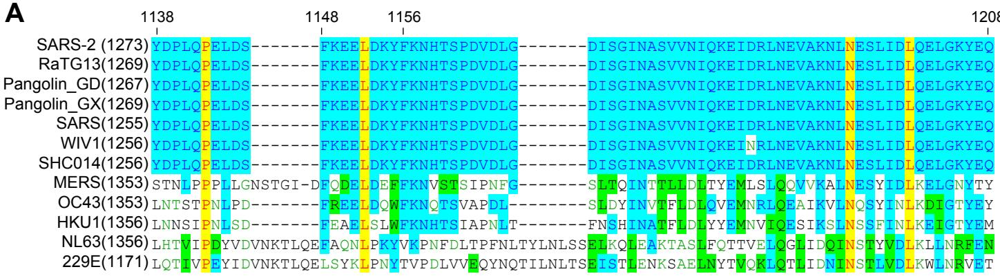

B Germline gene usage of antibodies targeting S2-helical region   

<table><tr><td>Antibody</td><td>VH</td><td>VH Identity (%)</td><td>CDRH3</td><td>VL</td><td>VL Identity (%)</td><td>CDRL3</td><td>Ref</td></tr><tr><td>CV3-25</td><td>IGHV5-51</td><td>97.6</td><td>CARLPQYCSNGVCQRWFDPW</td><td>VK1-12</td><td>97.5</td><td>CQQGNSFPYTF</td><td>(Li et al., 2022)</td></tr><tr><td>S2P6</td><td>VH1-46</td><td>96.5</td><td>CARGSPKGAFDYW</td><td>VK3-20</td><td>97.5</td><td>CQQYGSSPPRFTF</td><td>(Pinto et al., 2021)</td></tr><tr><td>CC40.8</td><td>VH3-23</td><td>93.8</td><td>CAITMAPVVW</td><td>VL3-10</td><td>96.2</td><td>CYSTDSSGNHAVF</td><td>(Song et al., 2021)</td></tr><tr><td>WS6</td><td>VH1-5</td><td>92.9</td><td>CTRTGSY-FDYW</td><td>VK4-61</td><td>97.9</td><td>CQQYQSYPPTF</td><td>This study</td></tr><tr><td>B6</td><td>VH1-19</td><td>-</td><td>CARQLGRGNGLDYW</td><td>VK8-27</td><td>-</td><td>CHQYLSSYTF</td><td>(Sauer et al., 2021)</td></tr><tr><td>IgG22</td><td>VH1-19</td><td>95.2</td><td>CTRVRGNDYHGRAMDYW</td><td>VK1-99</td><td>98.6</td><td>CFQSNYLFTF</td><td>(Hsieh et al., 2021)</td></tr></table>

# C Heavy and light chain alignment

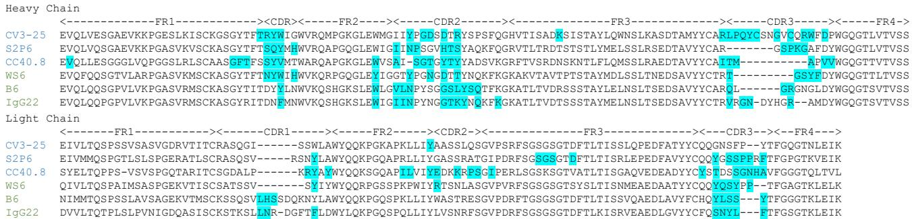  
Figure S4. Sequences of conserved S2 stem region and antibodies that target this region, related to Figure 5.
(A) S2-stem sequences of diverse coronaviruses. Aqua highlight for amino acids conserved on SARS/SARS2. Yellow/red font shown full conserve. Green highlight shown amino acids with similar physicochemical property. (B) Identified human and mouse antibodies targeted on coronavirus spike S2-Helix epitope. (C) Alignments of heavy and light chain sequences. Residues that contact the helix epitope are highlight in cyan. (D) The frequencies of antibody targeting SP2 helical region calculated by software OLGA. See Methods for the signatures used to calculate frequency.

D Frequency of antibodies targeting S2-helical region   

<table><tr><td colspan="2"></td><td>HC Frequency</td><td>LC Frequency</td><td>Class Frequency</td><td>Average Class Frequency</td></tr><tr><td rowspan="3">CV3-25</td><td>HIP1</td><td>8.11E-10</td><td>5.46E-03</td><td>2.65E-12</td><td rowspan="3">1.90E-12</td></tr><tr><td>HIP2</td><td>4.58E-10</td><td>4.11E-03</td><td>1.13E-12</td></tr><tr><td>HIP3</td><td>6.39E-10</td><td>5.02E-03</td><td>1.92E-12</td></tr><tr><td rowspan="3">S2P6</td><td>HIP1</td><td>6.54E-09</td><td>2.82E-04</td><td>1.10E-12</td><td rowspan="3">1.71E-12</td></tr><tr><td>HIP2</td><td>5.81E-09</td><td>3.01E-04</td><td>1.05E-12</td></tr><tr><td>HIP3</td><td>1.37E-08</td><td>3.63E-04</td><td>2.99E-12</td></tr><tr><td rowspan="3">CC40.8</td><td>HIP1</td><td>4.09E-14</td><td>5.67E-07</td><td>9.27E-21</td><td rowspan="3">2.52E-20</td></tr><tr><td>HIP2</td><td>5.58E-14</td><td>1.68E-06</td><td>3.76E-20</td></tr><tr><td>HIP3</td><td>6.57E-14</td><td>1.10E-06</td><td>2.88E-20</td></tr><tr><td rowspan="3">WS6</td><td>Mouse1</td><td>3.57E-08</td><td>2.90E-05</td><td>9.83E-13</td><td rowspan="3">5.00E-13</td></tr><tr><td>Mouse4</td><td>2.60E-08</td><td>1.56E-06</td><td>3.84E-14</td></tr><tr><td>Mouse5</td><td>7.11E-08</td><td>7.07E-06</td><td>4.78E-13</td></tr><tr><td rowspan="3">B6/IgG22</td><td>Mouse1</td><td>1.38E-04</td><td>2.92E-04</td><td>3.83E-08</td><td rowspan="3">3.72E-08</td></tr><tr><td>Mouse4</td><td>1.39E-04</td><td>3.67E-04</td><td>4.84E-08</td></tr><tr><td>Mouse5</td><td>2.38E-04</td><td>1.10E-04</td><td>2.48E-08</td></tr></table>

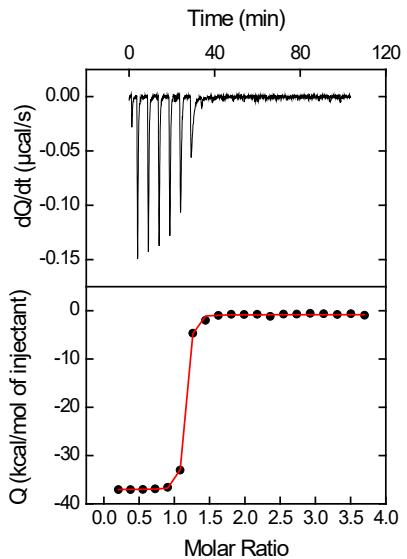  
SARS-CoV-2 25mer peptide
cgP $_{1140}$ LQPELDSFKEELDKYFKNHTSPDV $_{1164}$   
$K_{D} = 0.25 \text{ nM}$ $\Delta G = -13.1 \text{ kcal/mol}$ $\Delta H = -36.3 \text{ kcal/mol}$ $-T\Delta S = +23.2 \text{ kcal/mol}$ N = 1.1 Antigen binding sites per peptide

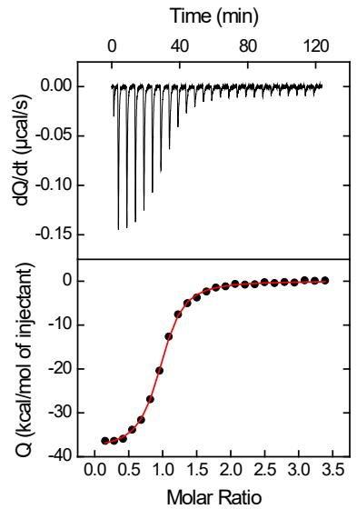  
SARS-CoV-2 10mer peptide
Ace-F $_{1148}$ KEELDKYFK $_{1157}$ -PEG12-Lys-Biotin   
$K_{D} = 22$ nM $\Delta G = -10.5$ kcal/mol $\Delta H = -38.5$ kcal/mol $-T\Delta S = +28.0$ kcal/mol
N = 0.9 Antigen binding sites per peptide

Figure S5. ITC binding analysis reveals stem-helix peptides of SARS-CoV-2 and MERS-CoV to bind WS6, related to Figure 3.   
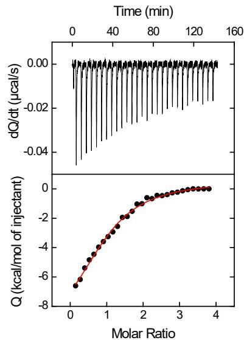  
MERS-CoV peptide $D_{1230}$ FQDELDEFFKNVS $_{1243}$ -PEG12-Lys-Biotin   
$K_{D} = 390 \, nM$ $\Delta G = -8.7 \, kcal/mol$ $\Delta H = -11.2 \, kcal/mol$ $-T\Delta S = +2.5 \, kcal/mol$ N = 1.0 Antigen binding sites per peptide

Peptide solution in the cell was titrated with WS6 IgG at 25 °C. Details of ITC titration conditions and data processing are as described in Star Methods.

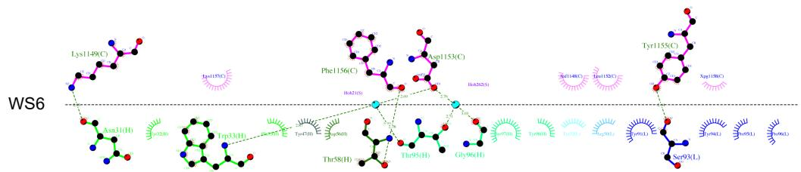

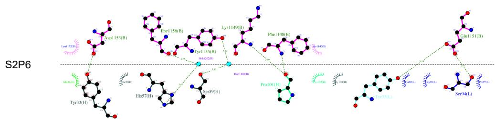

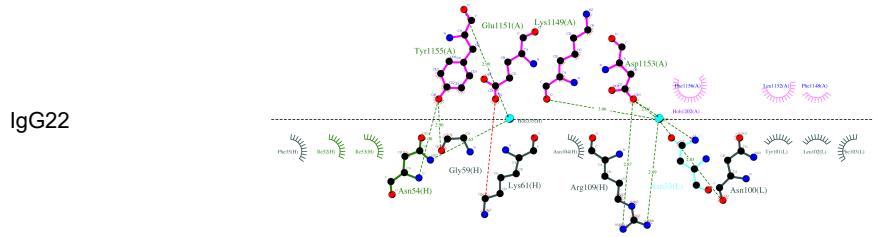

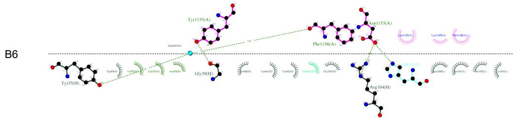

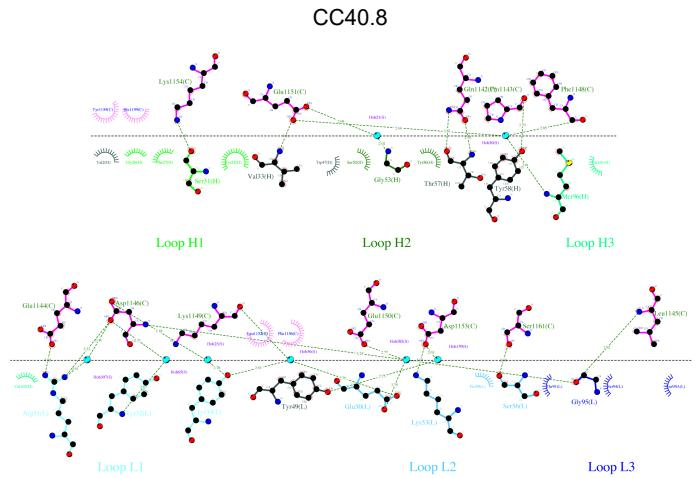

  
Figure S6. Detailed interactions between antibodies and S2 peptide residues, related to Figure 5.

Hydrophilic and hydrophilic interaction between antibody and S2 residues were plotted with LigPlot $^{+}$ (Laskowski R A, Swindells M B (2011). LigPlot+: multiple ligand-protein interaction diagrams for drug discovery. J. Chem. Inf. Model., 51, 2778-2786. [PubMed id: 21919503]). Interface is depicted with a horizontal line between antibody and peptide residues. Hydrophilic interaction are shown as lines between atoms with distance labeled. Hydrophobic interactions are shown as eyelash symbols.

Table S1. Pseudovirus neutralization of WS6 against diverse coronaviruses, related to Figures 1 and 2.   

<table><tr><td rowspan="2">Pseudoviruses</td><td colspan="2">WS6</td><td colspan="2">S2P6</td></tr><tr><td>IC50</td><td>IC80</td><td>IC50</td><td>IC80</td></tr><tr><td>WA-1*</td><td>4.28</td><td>24.01</td><td>16.12</td><td>76.39</td></tr><tr><td>D614G</td><td>9.88</td><td>34.86</td><td>17.55</td><td>&gt;100</td></tr><tr><td>B.1.1.7</td><td>6.31</td><td>26.81</td><td>49.25</td><td>&gt;100</td></tr><tr><td>B.1.351</td><td>9.83</td><td>53.74</td><td>32.02</td><td>&gt;100</td></tr><tr><td>P.1</td><td>2.46</td><td>10.45</td><td>3.06</td><td>28.39</td></tr><tr><td>B.1.617.2</td><td>26.52</td><td>69.85</td><td>38.90</td><td>&gt;100</td></tr><tr><td>Delta+</td><td>15.59</td><td>32.37</td><td>22.46</td><td>&gt;100</td></tr><tr><td>B.1.621</td><td>20.26</td><td>63.82</td><td>31.05</td><td>&gt;100</td></tr><tr><td>B.1.529</td><td>3.43</td><td>35.76</td><td>&gt;100</td><td>&gt;100</td></tr><tr><td>RaTG13</td><td>0.52</td><td>1.79</td><td>1.74</td><td>&gt;100</td></tr><tr><td>Pangolin_GD</td><td>4.91</td><td>18.34</td><td>11.71</td><td>&gt;100</td></tr><tr><td>Pangolin_GX</td><td>0.24</td><td>3.89</td><td>0.76</td><td>27.22</td></tr><tr><td>SARS</td><td>1.93</td><td>9.57</td><td>24.03</td><td>&gt;100</td></tr><tr><td>Frankfurt 1</td><td>2.27</td><td>8.63</td><td>6.72</td><td>&gt;100</td></tr><tr><td>Civet 007-2004</td><td>0.84</td><td>4.67</td><td>0.68</td><td>4.32</td></tr><tr><td>WIV1</td><td>2.65</td><td>6.41</td><td>2.44</td><td>15.87</td></tr><tr><td>SHC014</td><td>0.11</td><td>0.39</td><td>1.57</td><td>&gt;100</td></tr><tr><td>MERS-CoV</td><td>&gt;100</td><td>&gt;100</td><td>10.59</td><td>&gt;100</td></tr><tr><td>hCoV-229E</td><td>&gt;100</td><td>&gt;100</td><td>&gt;100</td><td>&gt;100</td></tr></table>

<table><tr><td>ug/ml</td></tr><tr><td>0.1-1</td></tr><tr><td>1-10</td></tr><tr><td>10-100</td></tr><tr><td>&gt;100</td></tr></table>

* The titers shown here reflect neutralization tested on HEK293-TMPRSS2-ACE2 stable cells and differ from those in Figure 1D, which were tested on 293T-ACE2 cells.

The crystal structure of WS6 in complex with the stem-helix peptide was analyzed by PISA (https://www.ebi.ac.uk/msd-srv/prot_int/cgi-bin/piserver). ASA, accessible surface area in $Å^{2}$ ; BSA, buried surface area in $Å^{2}$ ; $\Delta iG$ , solvation free energy gain upon formation of the interface in kcal/M. Bars of BSA indicates buried area percentage, one bar per 10%. Atoms with superscript “H” are involved in interface hydrogen bonds.

Table S2. WS6-peptide binding interface analysis, related to Figure 3.   

<table><tr><td colspan="5">WS6</td></tr><tr><td></td><td>ASA</td><td>BSA</td><td>ΔiG</td><td>CDR-BSA</td></tr><tr><td colspan="5">Heavy chain interface</td></tr><tr><td>H:Asn31 [O]H[ CB ]</td><td>87.76</td><td>17.02 ||</td><td>-0.18</td><td>CDR H1 126.61</td></tr><tr><td>H:Tyr32 [CA][ CD2][ CE2][ CZ][ OH ]</td><td>71.35</td><td>19.09 |||</td><td>0.29</td><td></td></tr><tr><td>H:Trp33 [N][ CB][ CG][ CD1][ CD2][ CE2][ CE3][ NE1]H[ CZ2][ CZ3][ CH2]</td><td>81.33</td><td>75.56 |||||||||</td><td>0.67</td><td></td></tr><tr><td>H:His35 [CE1]</td><td>14.94</td><td>14.94 |||||||||||</td><td>0.24</td><td></td></tr><tr><td>H:Tyr47 [CD1][ CD2][ CE1][ CE2][ CZ][ OH ]</td><td>74.50</td><td>14.78 ||</td><td>0.13</td><td>CDR H2 87.62</td></tr><tr><td>H:Tyr52 [CE1][ CZ][ OH ]</td><td>59.05</td><td>7.43 ||</td><td>0.10</td><td></td></tr><tr><td>H:Asn55 [ND2]</td><td>101.01</td><td>2.18 |</td><td>-0.02</td><td></td></tr><tr><td>H:Asp57 [CB][ CG][ OD1][ OD2]</td><td>73.89</td><td>29.15 |||</td><td>-0.17</td><td></td></tr><tr><td>H:Thr59 [CB][ CG2][ OG1]H</td><td>78.40</td><td>34.08 ||||</td><td>0.28</td><td></td></tr><tr><td>H:Thr99 [O][ CB][ CG2][ OG1]</td><td>27.78</td><td>22.48 |||||||</td><td>0.13</td><td>CDR H3 145.3</td></tr><tr><td>H:Gly100 [CA][ C][ O ]</td><td>44.61</td><td>42.18 |||||||</td><td>-0.15</td><td></td></tr><tr><td>H:Ser101 [N][ CA][ C][ O][ CB][ OG ]</td><td>107.81</td><td>68.21 |||||||</td><td>0.93</td><td></td></tr><tr><td>H:Tyr102 [CA]</td><td>151.61</td><td>4.68 |</td><td>0.07</td><td></td></tr><tr><td>H:Phe103 [CZ]</td><td>82.75</td><td>7.75 |</td><td>0.12</td><td></td></tr></table>

<table><tr><td>Peptide</td><td>ASA</td><td>BSA</td><td>\( \Delta iG \)</td></tr><tr><td>C:Phe1148[ C ][ O ][ CB ]</td><td>380.59</td><td>39.54||</td><td>0.00</td></tr><tr><td>C:LYS1149[N ][ CA ][ CB ][ CG ][ CD ][ CE ][ NZ ]\( ^{H} \)</td><td>182.72</td><td>103.04|||||||</td><td>0.41</td></tr><tr><td>C:Leu1152</td><td>100.74</td><td>55.93|||||||</td><td>0.89</td></tr><tr><td>[ CB ][ CG ][ CD2]</td><td></td><td></td><td></td></tr><tr><td>C:Asp1153[ CA ][ O ]H [ CB ][ CG ][ OD1][ OD2]</td><td>68.05</td><td>41.86|||||||</td><td>-0.16</td></tr><tr><td>C:PHE1156[ CA ][ C ][ O ]\( ^{H} \)[ CB ][ CG ][ CD1] [ CD2] [ CE1][ CE2][ CZ ]</td><td>152.52</td><td>105.56|||||||</td><td>1.16</td></tr><tr><td>C:Lys1157[N ][ CA ][ C ][ O ][ CB ][ CG ][ CD ][ CE ]</td><td>210.66</td><td>57.36|||</td><td>0.58</td></tr></table>

<table><tr><td colspan="5">Light chain interface</td></tr><tr><td>L:Tyr31[ CE2][ CE2][ OH ]</td><td>106.29</td><td>23.26 ||</td><td>0.00</td><td>CDR L123.26</td></tr><tr><td>L:Arg49[ CD ][ NE ][ CZ ][ NH1][ NH2]</td><td>112.09</td><td>54.24 |||||</td><td>-0.42</td><td>CDR L254.24</td></tr><tr><td>L:Tyr90[CA][ O ][CB][CG][CD1][CD2][CE1][CE2][ CZ ][ OH ]</td><td>122.46</td><td>72.86 ||||||</td><td>0.63</td><td>CDR L3151.58</td></tr><tr><td>L:Gln91[ O ]</td><td>91.56</td><td>1.71 |</td><td>-0.02</td><td></td></tr><tr><td>L:Ser92[ CA ][ C ][ O ]\( ^{H} \)</td><td>52.85</td><td>4.77 |</td><td>0.03</td><td></td></tr><tr><td>L:Tyr93[ N ][ CA ][ CB ][ CD2][ CE2][ CZ ][ OH ]</td><td>196.27</td><td>54.06 |||</td><td>0.80</td><td></td></tr><tr><td>L:Pro95[ CG ][ CD ]</td><td>57.14</td><td>18.18 |||||</td><td>0.29</td><td></td></tr></table>

<table><tr><td>C:Phe1148[ CB ][ CG ][ CD1][ CD2][ CE1][ CE2][ CZ ]</td><td>380.59</td><td>75.6||</td><td>0.00</td></tr><tr><td>C:Lys1149[N ]</td><td>182.72</td><td>0.15|</td><td>-0.00</td></tr><tr><td>C:Glu1151[ OE1]</td><td>146.85</td><td>6.74|</td><td>-0.13</td></tr><tr><td>C:Leu1152[ CD1][ CD2]</td><td>100.74</td><td>39.55|||||</td><td>0.63</td></tr><tr><td>C:Tyr1155[ O ][ CD2][ CE1][ CE2][ CZ ][ OH ]\( ^{H} \)</td><td>164.25</td><td>112.17|||||||||</td><td>0.36</td></tr><tr><td>C:Phe1156[ CA ][ O ][ CD1][ CE1][ CZ ]</td><td>152.52</td><td>38.32|||</td><td>0.48</td></tr></table>