# NIHMS801944-supplement-Supplement

A   
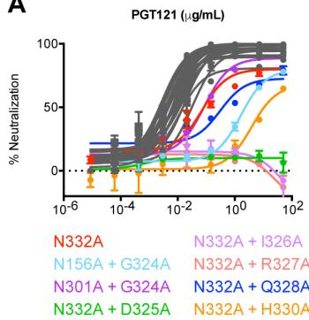

line

| Concentration | N332A | N156A + G324A | N301A + G324A | N332A + D325A | N332A + I326A | N332A + R327A | N332A + Q328A | N332A + H330A |
| ------------- | ----- | ------------- | ------------- | ------------- | ------------- | ------------- | ------------- | ------------- |
| 10⁻⁶          | ~0    | ~0            | ~0            | ~0            | ~0            | ~0            | ~0            | ~0            |
| 10⁻⁴          | ~10   | ~5            | ~5            | ~5            | ~5            | ~5            | ~5            | ~5            |
| 10⁻²          | ~50   | ~40           | ~40           | ~40           | ~40           | ~40           | ~40           | ~40           |
| 10⁰           | ~80   | ~70           | ~70           | ~70           | ~70           | ~70           | ~70           | ~70           |
| 10²           | ~90   | ~85           | ~85           | ~85           | ~85           | ~85           | ~85           | ~85           |

B   
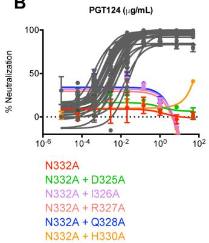

line

| Concentration | N332A | N332A + D325A | N332A + I326A | N332A + R327A | N332A + Q328A | N332A + H330A |
| ------------- | ----- | ------------- | ------------- | ------------- | ------------- | ------------- |
| 10⁻⁶          | ~0    | ~0            | ~0            | ~0            | ~0            | ~0            |
| 10⁻⁴          | ~0    | ~0            | ~0            | ~0            | ~0            | ~0            |
| 10⁻²          | ~0    | ~0            | ~0            | ~0            | ~0            | ~0            |
| 10⁰           | ~0    | ~0            | ~0            | ~0            | ~0            | ~0            |
| 10²           | ~0    | ~0            | ~0            | ~0            | ~0            | ~0            |

C   
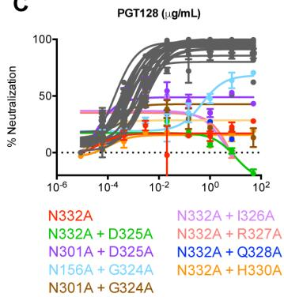

line

| Concentration | N332A | N332A + D325A | N301A + D325A | N332A + Q328A | N156A + G324A | N301A + G324A |
| ------------- | ----- | ------------- | ------------- | ------------- | ------------- | ------------- |
| 10⁻⁶          | ~0    | ~0            | ~0            | ~0            | ~0            | ~0            |
| 10⁻⁴          | ~10   | ~10           | ~10           | ~10           | ~10           | ~10           |
| 10⁻²          | ~30   | ~30           | ~30           | ~30           | ~30           | ~30           |
| 10⁰           | ~60   | ~60           | ~60           | ~60           | ~60           | ~60           |
| 10²           | ~90   | ~90           | ~90           | ~90           | ~90           | ~90           |

D   
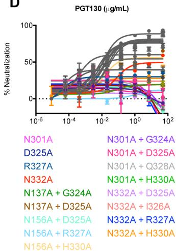

E   
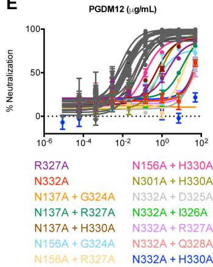

line

| Condition | Percentage of Neutralization at 10^-6 | Percentage of Neutralization at 10^-4 | Percentage of Neutralization at 10^-2 | Percentage of Neutralization at 10^0 | Percentage of Neutralization at 10^2 |
|-----------|----------------------------------------|----------------------------------------|----------------------------------------|----------------------------------------|----------------------------------------|
| R327A     | ~5                                     | ~10                                    | ~20                                    | ~40                                    | ~80                                    |
| N332A     | ~10                                    | ~20                                    | ~40                                    | ~70                                    | ~95                                    |
| N137A + G324A | ~15                  | ~30                                    | ~60                                    | ~85                                    | ~98                                    |
| N137A + R327A | ~20                 | ~40                                    | ~75                                    | ~90                                    | ~99                                    |
| N137A + H330A | ~25                 | ~50                                    | ~85                                    | ~95                                    | ~99.5                  |
| N332A + D325A | ~30                | ~60                                    | ~90                                    | ~98                                    | ~99.8                  |
| N332A + I326A | ~35               | ~70                                    | ~95                                    | ~99                                    | ~99.9                  |
| N332A + R327A | ~40              | ~80                                    | ~98                                    | ~99.5                  | ~99.95                 |
| N156A + G324A | ~45             | ~90                                    | ~99                                    | ~99.8                  | ~99.98                 |
| N156A + Q328A | ~50             | ~95                                    | ~99.5                  | ~99.9                  | ~99.99                 |
| N156A + R327A | ~55            | ~98                                    | ~99.8                  | ~99.95                 | ~99.995                |
| N332A + H330A | ~60            | ~100                                   | ~100                                   | ~100                                   | ~100                                   |

F   
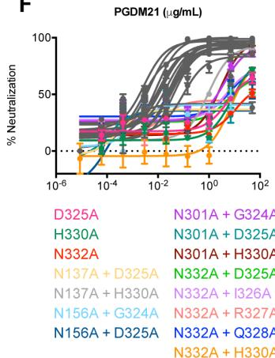

line

| Condition | % Neutralization |
| --------- | --------------- |
| D325A     | ~0              |
| N301A + G324A | ~100          |
| H330A     | ~50             |
| N301A + D325A | ~75           |
| N301A + H330A | ~80          |
| N137A + D325A | ~60        |
| N332A + D325A | ~70       |
| N137A + H330A | ~65      |
| N332A + I326A | ~75      |
| N156A + G324A | ~80      |
| N332A + R327A | ~85      |
| N156A + D325A | ~90      |
| N332A + Q328A | ~95      |
| N332A + H330A | ~98      |

G   
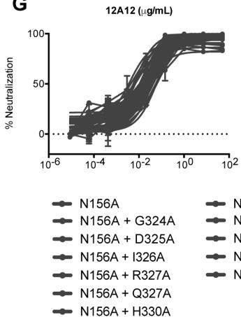

line

| Concentration | N156A | N156A + G324A | N156A + D325A | N156A + I326A | N156A + R327A | N156A + Q327A | N156A + H330A |
| ------------- | ----- | ------------- | ------------- | ------------- | ------------- | ------------- | ------------- |
| 10⁻⁶          | ~0    | ~0            | ~0            | ~0            | ~0            | ~0            | ~0            |
| 10⁻⁴          | ~10   | ~10           | ~10           | ~10           | ~10           | ~10           | ~10           |
| 10⁻²          | ~50   | ~50           | ~50           | ~50           | ~50           | ~50           | ~50           |
| 10⁰           | ~90   | ~90           | ~90           | ~90           | ~90           | ~90           | ~90           |
| 10²           | ~95   | ~95           | ~95           | ~95           | ~95           | ~95           | ~95           |

<table><tr><td>92BR020</td><td>N137A</td></tr><tr><td>D325A</td><td>N137A + G324A</td></tr><tr><td>I326A</td><td>N137A + D325A</td></tr><tr><td>R327A</td><td>N137A + I326A</td></tr><tr><td>Q328A</td><td>N137A + R327A</td></tr><tr><td>H330A</td><td>N137A + Q328A</td></tr><tr><td></td><td>N137A + H330A</td></tr></table>

Figure S1. Related to Figure 4; Mapping of overlapping GDIR-glycan antibody epitope footprints on isolate 92BR020. Pairwise alanine mutants of 92BR020 were created for N137, N156, N301, and N332 glycans and the ${}^{324}$ GDIRQAH $^{330}$ residues of the V3 loop. Virus mutants were then tested for neutralization by (A) PGT121, (B) PGT124, (C) PGT128, (D) PGT130, (E) PGDM12, (F) PGDM21 and, as a control, the CD4 binding site antibody (G) 12A12. The virus mutants listed with 12A12 were tested for neutralization by all antibodies, but for glycan-GDIR bnAbs only those that showed an effect on neutralization IC $_{50}$ are listed beneath the indicated antibody.

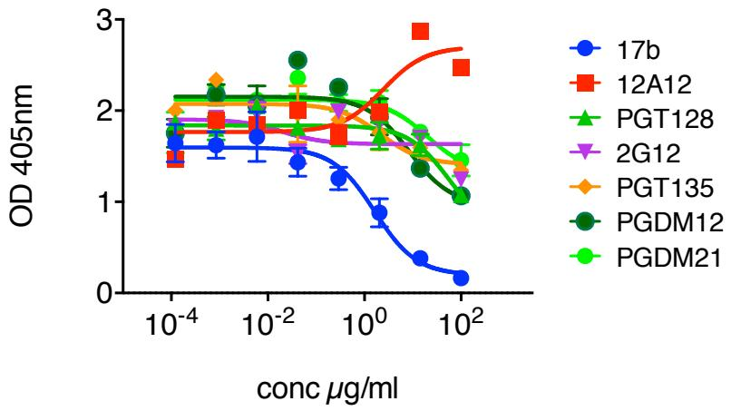

line

| conc µg/ml | 17b   | 12A12 | PGT128 | 2G12  | PGT135 | PGDM12 | PGDM21 |
| ---------- | ----- | ----- | ------ | ----- | ------ | ------ | ------ |
| 10^-4      | ~1.6  | ~1.8  | ~1.9   | ~1.9  | ~2.0   | ~2.1   | ~2.0   |
| 10^-2      | ~1.6  | ~1.9  | ~2.0   | ~1.9  | ~2.3   | ~2.5   | ~2.4   |
| 10^0       | ~0.9  | ~2.0  | ~2.0   | ~1.8  | ~2.0   | ~2.0   | ~2.0   |
| 10^2       | ~0.2  | ~2.5  | ~1.5   | ~1.5  | ~1.5   | ~1.0   | ~1.5   |

Figure S2. Related to Figure 6C; CD4i antibody 17b does not compete strongly with GDIR-glycan broadly neutralizing antibodies. Biotinylated 17b was tested for competition with GDIR-glycan broadly neutralizing antibodies by ELISA on monomeric 92BR020 gp120. The CD4i antibody 17b was included as a positive control and enhanced binding for 12A12 was observed as expected for CD4 binding site antibodies.

A   
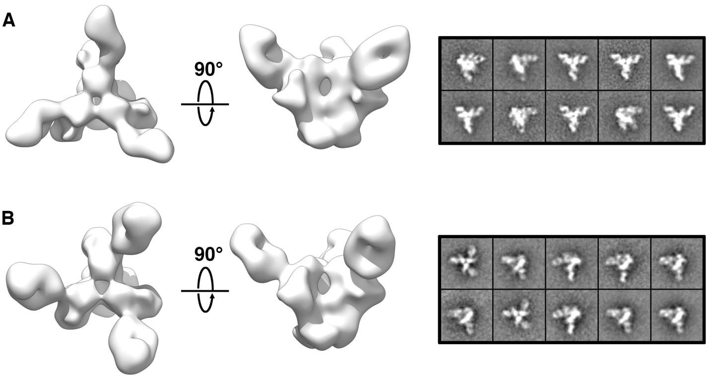  
Figure S3. Related to Figure 7; Negative stain EM reconstructions of PGDM14 and PGDM21 bound to BG505 SOSIP.664. We determined negative stained EM densities of PGDM14 (A) and PGDM21 (B) Fabs bound to BG505 SOSIP.664 trimers. The left panels show respective 3D reconstructions at \~21 Å resolution; the right panels depict 2D class averages.

Table S1. Related to Figure 2; PGDM11-12 and PGDM21 antibodies can only neutralize viruses with a glycan naturally present at the N332 position. Antibodies were tested for neutralization of a cross-clade panel of pseudoviruses (n = 106) in a TZM-bl assay. Viruses are separated by those that naturally contain a glycan at the N332 site (76 viruses), at the N334 site (25 viruses) or no glycan at either N332 or N334 sites (5 viruses). Neutralization was measured at an IC $_{50}$ cut-off of 50 $\mu$ g/ml. 

<table><tr><td>n = 106</td><td>Glycan site</td><td>% Neutralized of 106 virus panel</td><td>% Neutralized of glycan site</td><td>Median IC50</td></tr><tr><td>PGDM11</td><td></td><td>45%</td><td>63%</td><td>0.40</td></tr><tr><td>PGDM12</td><td>N332 (76)</td><td>54%</td><td>75%</td><td>0.18</td></tr><tr><td>PGDM21</td><td></td><td>48%</td><td>67%</td><td>0.10</td></tr><tr><td>PGDM11</td><td></td><td>0%</td><td>0%</td><td>0.00</td></tr><tr><td>PGDM12</td><td>N334 (25)</td><td>0%</td><td>0%</td><td>0.00</td></tr><tr><td>PGDM21</td><td></td><td>0%</td><td>0%</td><td>0.00</td></tr><tr><td>PGDM11</td><td></td><td>0%</td><td>0%</td><td>0.00</td></tr><tr><td>PGDM12</td><td>None (5)</td><td>0%</td><td>0%</td><td>0.00</td></tr><tr><td>PGDM21</td><td></td><td>1%</td><td>20%</td><td>26</td></tr></table>

Table S2. Related to Figure 2; PGDM11-12 and PGDM21 antibodies can only neutralize viruses when a glycan is present at the N332 position. Antibodies were tested for neutralization on a cross-clade panel of pseudoviruses with a glycan present at the N332 position (WT) and with the glycan site removed by alanine mutagenesis (N332A) in a TZM-bl assay. Neutralization was measured at an IC $_{50}$ cut-off of 50 $\mu$ g/ml. 

<table><tr><td colspan="2"></td><td colspan="2">WT</td><td colspan="2">N332A</td></tr><tr><td>CLADE</td><td>VIRUS</td><td>PGDM12</td><td>PGDM21</td><td>PGDM12</td><td>PGDM21</td></tr><tr><td rowspan="5">B</td><td>6535.3</td><td>0.004</td><td>0.011</td><td>&gt;50</td><td>&gt;50</td></tr><tr><td>QH0692.42</td><td>0.348</td><td>1.06</td><td>&gt;50</td><td>&gt;50</td></tr><tr><td>SC422661.8</td><td>0.563</td><td>0.113</td><td>&gt;50</td><td>&gt;50</td></tr><tr><td>TRO.11</td><td>0.066</td><td>0.020</td><td>&gt;50</td><td>&gt;50</td></tr><tr><td>AC10.0.29</td><td>0.916</td><td>8.90</td><td>&gt;50</td><td>&gt;50</td></tr><tr><td rowspan="11">B (T/F)</td><td>WITO4160.33</td><td>&gt;50</td><td>0.069</td><td>&gt;50</td><td>&gt;50</td></tr><tr><td>WEAU_d15_410_5017</td><td>0.316</td><td>0.048</td><td>&gt;50</td><td>&gt;50</td></tr><tr><td>1006_11_C3_1601</td><td>0.027</td><td>0.016</td><td>&gt;50</td><td>&gt;50</td></tr><tr><td>1054_07_TC4_1499</td><td>&gt;50</td><td>5.75</td><td>&gt;50</td><td>&gt;50</td></tr><tr><td>1056_10_TA11_1826</td><td>0.192</td><td>1.73</td><td>&gt;50</td><td>&gt;50</td></tr><tr><td>1012_11_TC21_3257</td><td>0.033</td><td>&gt;50</td><td>&gt;50</td><td>&gt;50</td></tr><tr><td>6240_08_TA5_4622</td><td>&gt;50</td><td>0.377</td><td>&gt;50</td><td>&gt;50</td></tr><tr><td>6244_13_B5_4576</td><td>0.444</td><td>0.372</td><td>&gt;50</td><td>&gt;50</td></tr><tr><td>SC05_8C11_2344</td><td>0.087</td><td>0.087</td><td>&gt;50</td><td>&gt;50</td></tr><tr><td>Du172.17</td><td>2.43</td><td>0.051</td><td>&gt;50</td><td>&gt;50</td></tr><tr><td>Du422.1</td><td>0.274</td><td>0.154</td><td>&gt;50</td><td>&gt;50</td></tr><tr><td rowspan="3">C</td><td>ZM249M.PL1</td><td>0.091</td><td>&gt;50</td><td>&gt;50</td><td>&gt;50</td></tr><tr><td>CAP210.2.00.E8</td><td>5.06</td><td>&gt;50</td><td>&gt;50</td><td>&gt;50</td></tr><tr><td>HIV-001428-2.42</td><td>0.081</td><td>&gt;50</td><td>&gt;50</td><td>&gt;50</td></tr><tr><td rowspan="5">C (T/F)</td><td>7030102001E5(Rev-)</td><td>0.003</td><td>0.010</td><td>&gt;50</td><td>&gt;50</td></tr><tr><td>1394C9G1(Rev-)</td><td>&gt;50</td><td>1.07</td><td>&gt;50</td><td>&gt;50</td></tr><tr><td>Ce704809221_1B3</td><td>&gt;50</td><td>1.80</td><td>&gt;50</td><td>&gt;50</td></tr><tr><td>CNE19</td><td>0.214</td><td>0.007</td><td>&gt;50</td><td>&gt;50</td></tr><tr><td>CNE20</td><td>0.017</td><td>&gt;50</td><td>&gt;50</td><td>&gt;50</td></tr><tr><td rowspan="5">BC</td><td>CNE21</td><td>0.014</td><td>0.028</td><td>&gt;50</td><td>&gt;50</td></tr><tr><td>CNE17</td><td>1.25</td><td>1.59</td><td>&gt;50</td><td>&gt;50</td></tr><tr><td>CNE52</td><td>3.87</td><td>7.04</td><td>&gt;50</td><td>&gt;50</td></tr><tr><td>CNE53</td><td>0.066</td><td>0.080</td><td>&gt;50</td><td>&gt;50</td></tr><tr><td>Q23.17</td><td>0.018</td><td>0.018</td><td>&gt;50</td><td>&gt;50</td></tr><tr><td rowspan="2">A</td><td>0330.v4.c3</td><td>&gt;50</td><td>0.998</td><td>&gt;50</td><td>&gt;50</td></tr><tr><td>0260.v5.c36</td><td>1.35</td><td>0.141</td><td>&gt;50</td><td>&gt;50</td></tr><tr><td rowspan="2">CRF02_AC</td><td>T251-18</td><td>2.62</td><td>0.180</td><td>&gt;50</td><td>&gt;50</td></tr><tr><td>X1193_c1</td><td>0.280</td><td>0.228</td><td>&gt;50</td><td>&gt;50</td></tr><tr><td rowspan="2">G</td><td>X1254_c3</td><td>&gt;50</td><td>0.114</td><td>&gt;50</td><td>&gt;50</td></tr><tr><td>P1981_C5_3</td><td>0.055</td><td>0.014</td><td>&gt;50</td><td>0.153</td></tr><tr><td>CD</td><td>6811.v7.c18</td><td>0.303</td><td>0.055</td><td>&gt;50</td><td>&gt;50</td></tr><tr><td></td><td>Neutralization IC $_{50}$ </td><td>10</td><td>1</td><td>0.1</td><td>0.01</td></tr></table>

Table S3. Related to Figure 3; PGDM12 and PGDM21 show some dependence on the N301 glycan, but no other glycan site. Antibodies were tested for neutralization on glycan site mutants for clade B isolate 92BR020 and clade A isolate BG505. Values listed are fold increases in neutralization $\mathrm{IC}_{50}$ . LT = low titer viruses. 

<table><tr><td>92BR020</td><td>PGDM12</td><td>PGDM21</td></tr><tr><td>N88A</td><td>1</td><td>1</td></tr><tr><td>N135A</td><td>3</td><td>2</td></tr><tr><td>N136A</td><td>5</td><td>2</td></tr><tr><td>N141A</td><td>5</td><td>2</td></tr><tr><td>N142A</td><td>3</td><td>6</td></tr><tr><td>N189A</td><td>2</td><td>2</td></tr><tr><td>N197A</td><td>2</td><td>3</td></tr><tr><td>N234A</td><td>2</td><td>4</td></tr><tr><td>N262A</td><td>LT</td><td>LT</td></tr><tr><td>N295A</td><td>2</td><td>5</td></tr><tr><td>N301A</td><td>9</td><td>9</td></tr><tr><td>N332A</td><td>&gt;1000</td><td>&gt;1000</td></tr><tr><td>N397A</td><td>1</td><td>1</td></tr><tr><td>N407A</td><td>2</td><td>4</td></tr><tr><td>N411A</td><td>1</td><td>3</td></tr><tr><td>N448A</td><td>2</td><td>3</td></tr><tr><td>N463</td><td>1</td><td>1</td></tr><tr><td>N611</td><td>1</td><td>1</td></tr><tr><td>N616</td><td>1</td><td>1</td></tr><tr><td>N625</td><td>1</td><td>1</td></tr><tr><td>N637</td><td>1</td><td>1</td></tr></table>

<table><tr><td>BG505</td><td>PGDM12</td><td>PGDM21</td></tr><tr><td>N133A</td><td>1</td><td>1</td></tr><tr><td>N137A</td><td>1</td><td>1</td></tr><tr><td>N156A</td><td>1</td><td>4</td></tr><tr><td>N160A</td><td>2</td><td>3</td></tr><tr><td>N185eA</td><td>0</td><td>2</td></tr><tr><td>N197A</td><td>3</td><td>1</td></tr><tr><td>N301A</td><td>2</td><td>8</td></tr><tr><td>N332T</td><td>&gt;1000</td><td>&gt;1000</td></tr><tr><td>N339A</td><td>1</td><td>2</td></tr><tr><td>N386A</td><td>0</td><td>1</td></tr></table>

Fold difference in neutralization $IC_{50}$ ( $\mu$ g/mL)

Table S4. Related to Figure 3; PGDM11-12 and PGDM21 depend on high-mannose type glycans for neutralization. Effects of different glycosidase inhibitors on the neutralizing activity of listed antibodies against the 6-virus indicator panel. 293S cells yield viruses with Man $_{5.9}$ GlcNAc $_2$ glycans, treatment of 293F cells with kifunensine results in viruses with Man $_{8.9}$ GlcNAc $_2$ glycans, treatment of 293F cells with swainsonine results in hybrid-type glycans, and treatment of 293F cells with NB-DNJ results in a terminal glucose carbohydrate on the D1 arm of Man $_9$ GlcNAc $_2$ glycans. Antibody PGT128, which binds to the terminal mannose of the D1 arm, was included for comparison. Results show isolate-specific effects with PGDM11 and PGDM12 preferring Man $_{8.9}$ GlcNAc $_2$ glycans and PGDM21 depending on a terminal mannose on the D1 arm of an N-linked glycan.

<table><tr><td colspan="2"></td><td>94UG103</td><td>92RW020</td><td>92BR020</td><td>JR-CSF</td><td>92TH021</td><td>IAVI C22</td></tr><tr><td rowspan="4">PGDM11</td><td>293S</td><td>-</td><td>2</td><td>3</td><td>4</td><td>-</td><td>&gt;50</td></tr><tr><td>Kifunensine</td><td>-</td><td>1</td><td>1</td><td>1</td><td>-</td><td>2</td></tr><tr><td>Swainsonine</td><td>-</td><td>1</td><td>&gt;10</td><td>&gt;100</td><td>-</td><td>3</td></tr><tr><td>NB-DNJ</td><td>-</td><td>-</td><td>1</td><td>-</td><td>-</td><td>-</td></tr><tr><td rowspan="4">PGDM12</td><td>293S</td><td>1</td><td>1</td><td>3</td><td>3</td><td>-</td><td>1</td></tr><tr><td>Kifunensine</td><td>1</td><td>1</td><td>2</td><td>1</td><td>-</td><td>1</td></tr><tr><td>Swainsonine</td><td>&gt;20</td><td>1</td><td>2</td><td>4</td><td>-</td><td>1</td></tr><tr><td>NB-DNJ</td><td>-</td><td>-</td><td>1</td><td>-</td><td>-</td><td>-</td></tr><tr><td rowspan="4">PGDM21</td><td>293S</td><td>-</td><td>1</td><td>1</td><td>2</td><td>-</td><td>1</td></tr><tr><td>Kifunensine</td><td>-</td><td>1</td><td>1</td><td>1</td><td>-</td><td>1</td></tr><tr><td>Swainsonine</td><td>-</td><td>1</td><td>0</td><td>1</td><td>-</td><td>0</td></tr><tr><td>NB-DNJ</td><td>-</td><td>-</td><td>-</td><td>&gt;100</td><td>-</td><td>-</td></tr><tr><td rowspan="4">PGT128</td><td>293S</td><td>4</td><td>4</td><td>0</td><td>4</td><td>1</td><td>1</td></tr><tr><td>Kifunensine</td><td>3</td><td>3</td><td>0</td><td>3</td><td>1</td><td>2</td></tr><tr><td>Swainsonine</td><td>2</td><td>2</td><td>0</td><td>2</td><td>1</td><td>1</td></tr><tr><td>NB-DNJ</td><td>-</td><td>-</td><td>&gt;100</td><td>-</td><td>-</td><td>-</td></tr></table>

<table><tr><td>Fold difference IC50</td><td>&gt; 50</td><td>50-10</td><td>10-1</td><td>1-0</td></tr></table>

Table S5. Related to Figure 4; GDIR-glycan broadly neutralizing antibodies were tested for neutralization on alanine mutants of isolate JR-CSF. Antibodies were tested for neutralization on single and double alanine mutants on isolate JR-CSF. Antibody 12A12 was included as a control. Values listed are fold increases in neutralization $IC_{50}$ . LT = low titer viruses. 

<table><tr><td>JR-CSF</td><td>PGT121</td><td>PGT124</td><td>PGT128</td><td>PGT130</td><td>PGDM12</td><td>PGDM21</td><td>12A12</td></tr><tr><td>D325A</td><td>3.3</td><td>1.0</td><td>1.0</td><td>&gt;1000</td><td>0.1</td><td>&gt;1000</td><td>0.4</td></tr><tr><td>I326A</td><td>0.6</td><td>1.0</td><td>1.0</td><td>1.2</td><td>2.8</td><td>10.1</td><td>2.7</td></tr><tr><td>R327A</td><td>1.9</td><td>0.5</td><td>1.0</td><td>1.3</td><td>&gt;1000</td><td>0.7</td><td>1.2</td></tr><tr><td>Q328A</td><td>0.1</td><td>1.0</td><td>1.0</td><td>0.4</td><td>0.0</td><td>0.7</td><td>0.2</td></tr><tr><td>H330A</td><td>0.1</td><td>1.0</td><td>1.0</td><td>0.2</td><td>5.9</td><td>2.0</td><td>1.0</td></tr><tr><td>N156A</td><td>LT</td><td>LT</td><td>LT</td><td>LT</td><td>LT</td><td>LT</td><td>LT</td></tr><tr><td>N156A + D325A</td><td>&gt;1000</td><td>20</td><td>1.0</td><td>&gt;1000</td><td>7.0</td><td>&gt;1000</td><td>0.8</td></tr><tr><td>N156A + I326A</td><td>20</td><td>6.8</td><td>3.2</td><td>&gt;50</td><td>&gt;1000</td><td>1.3</td><td>0.4</td></tr><tr><td>N156A + R327A</td><td>LT</td><td>LT</td><td>LT</td><td>LT</td><td>LT</td><td>LT</td><td>LT</td></tr><tr><td>N156A + Q328A</td><td>0.3</td><td>1.0</td><td>1.0</td><td>1.4</td><td>&gt;1000</td><td>0.7</td><td>enhance</td></tr><tr><td>N156A + H330A</td><td>LT</td><td>LT</td><td>LT</td><td>LT</td><td>LT</td><td>LT</td><td>LT</td></tr><tr><td>N301A</td><td>0.2</td><td>1.0</td><td>1.0</td><td>&gt;1000</td><td>2.2</td><td>1.7</td><td>0.3</td></tr><tr><td>N301A + G324A</td><td>LT</td><td>LT</td><td>LT</td><td>LT</td><td>LT</td><td>LT</td><td>LT</td></tr><tr><td>N301A + D325A</td><td>&gt;100</td><td>1.0</td><td>&gt;1000</td><td>&gt;1000</td><td>5.5</td><td>&gt;1000</td><td>0.9</td></tr><tr><td>N301A + I326A</td><td>6.0</td><td>4.6</td><td>&gt;500</td><td>&gt;1000</td><td>11.3</td><td>3.6</td><td>0.4</td></tr><tr><td>N301A + R327A</td><td>&gt;100</td><td>4.8</td><td>&gt;1000</td><td>&gt;1000</td><td>&gt;1000</td><td>7.9</td><td>1.4</td></tr><tr><td>N301A + Q328A</td><td>2.2</td><td>2.4</td><td>9.7</td><td>&gt;1000</td><td>18.0</td><td>9.7</td><td>0.7</td></tr><tr><td>N301A + H330A</td><td>9.5</td><td>1.0</td><td>&gt;1000</td><td>&gt;1000</td><td>&gt;1000</td><td>&gt;100</td><td>0.5</td></tr><tr><td>N332A</td><td>&gt;1000</td><td>&gt;1000</td><td>1.0</td><td>0.5</td><td>&gt;1000</td><td>&gt;1000</td><td>2.1</td></tr><tr><td>N332A + G324A</td><td>&gt;1000</td><td>&gt;1000</td><td>&gt;1000</td><td>&gt;1000</td><td>&gt;1000</td><td>&gt;1000</td><td>0.7</td></tr><tr><td>N332A + D325A</td><td>&gt;1000</td><td>&gt;1000</td><td>&gt;1000</td><td>&gt;1000</td><td>&gt;1000</td><td>&gt;1000</td><td>1.0</td></tr><tr><td>N332A + I326A</td><td>&gt;1000</td><td>&gt;1000</td><td>&gt;1000</td><td>&gt;100</td><td>&gt;100</td><td>&gt;1000</td><td>1.2</td></tr><tr><td>N332A + R327A</td><td>LT</td><td>LT</td><td>LT</td><td>LT</td><td>LT</td><td>LT</td><td>LT</td></tr><tr><td>N332A + Q328A</td><td>LT</td><td>LT</td><td>LT</td><td>LT</td><td>LT</td><td>LT</td><td>LT</td></tr></table>

# Human Specimen

Human PBMC and serum samples were acquired from HIV-1 infected donors of the Protocol G cohort (Simek et al., 2009) under written consent using clinical procedures approved by the Republic of Rwanda National Ethics Committee, the Emory University Institutional Review Board, the University of Zambia Research Ethics Committee, the Charing Cross Research Ethics Committee, the Uganda Virus Research Institute Science and Ethics Committee, the University of New South Wales Research Ethics Committee, St. Vincent's Hospital and Eastern Sydney Area Health Service, Kenyatta National Hospital Ethics and Research Committee, University of Cape Town Research Ethics Committee, the International Institutional Review Board, the Mahidol University Ethics Committee, the Walter Reed Army Institute of Research Institutional Review Board, and the Ivory Coast Comité National d'Éthique des Sciences de la Vie et de la Santé.

# Pseudovirus Neutralization Assays

Plasmids encoding HIV Env were co-transfected into HEK 293T or 293S cells with pSG3ΔEnv, an Env-deficient genomic backbone plasmid, in a 1:2 ratio using X-tremeGENE HP (Roche) as transfection reagent. Cell culture supernatants were harvested 3 days post transfection and sterile filtered through a 0.22μm filter. Neutralizing activity was measured by incubating monoclonal antibodies or sera with replication incompetent pseudovirus for 1h at 37C before transferring onto TZM-bl target cells as described previously (Sok et al., 2014a; Walker et al., 2011). Pseudoviruses produced in the presence of glycosylation inhibitors were generated by treating 293T cells with either 25 μM kifunensine, 20 μM swainsonine or 2 mM N-butyldeoxynojirimycin (NB-DNJ) (Cayman Chemical Co.) on the day of transfection (Doores and Burton, 2010).

# Protein Production

HIV gp120 proteins were truncated in the C5 region for increased stability and N-terminally fused to an Avi-tag for subsequent in vitro biotinylation. Gp120 plasmids were transfected into HEK 293F cells (Invitrogen) using 293fectin as transfection reagent (Invitrogen). Cell culture supernatants were harvested 4 days after transfection, $0.22\mu \mathrm{m}$ sterile filtered and passed over Galanthus nivalis lectin (GNL) columns (Vector Laboratories) before separating monomeric gp120 by size exclusion chromatography (SEC) using a HiPrep 26/60 Sephacryl S-300 HR column (GE Healthcare) as previously described (Sok et al., 2013a). Gp120s used in flow cytometry were in vitro biotinylated using the BirA enzyme according to the manufacturer protocol (Avidity), in-between GNL and SEC purification steps.

Antibody plasmids containing heavy chain and light chain genes were co-transfected (1:1 ratio) in either HEK 293T or 293F cells using X-tremeGENE (Roche) or 293fectin (Invitrogen) as transfection reagents, respectively. Antibody containing supernatants were harvested 4 days after transfection and $0.22\mu \mathrm{m}$ sterile filtered. Antibodies produced in 293T cells were quantified by anti-Fc ELISA and used directly in neutralization assays for screening purposes. Antibody supernatants produced in 293F cells were purified over Protein A Sepharose 4 Fast Flow (GE healthcare) columns as described previously (Sok et al., 2013a).

# Serum NAb depletion assay

To test whether gp120 proteins were suitable sorting probes, we conjugated 1mg of C5 truncated gp120-Avi protein or BSA to 250 $\mu$ l of Tosyl-activated MyOne DynaBeads (Invitrogen) according to the manufacturers protocol. We tested WT and N332A mutated gp120 variants of the 92BR020, IAVI C22 and JR-CSF HIV isolates and BSA as a control, in combination with N332 reactive donor sera. In brief, gp120 coated DynaBeads were washed 3 times in complete DMEM cell culture medium (Gibco, 10% FBS, PenStrep and L-glutamine added) and incubated for 30min at room temperature (RT) before isolating the beads using a strong magnet. Donor serum was pre-diluted 1:12.5 in cell culture medium and added to beads for 30 min at 37 °C while gently shaking. Beads were then removed by magnetic force, washed thrice with 1ml washing buffer (PBS containing 0.5M NaCl) and bound antibodies were eluted with 3x 500 $\mu$ l 100mM Glycine HCl pH2.2 into tubes containing 45 $\mu$ l 1M Tris pH9.0 buffer. Beads were immediately regenerated by flushing three times with washing buffer before transferring them into cell culture media and incubating for 30min at RT to neutralize the pH. Following this procedure, donor sera were depleted for a total of three rounds and directly tested in pseudovirus neutralization assays for reduced neutralizing activity. Eluted antibodies were pooled, buffer exchanged into PBS and concentrated before testing in ELISA.

# Single-Cell Sorting of Donor PBMCs using Flow Cytometry

Sorting of donor PBMCs was performed as described previously (Sok et al., 2014b; Tiller et al., 2008; Wu et al., 2010). Donor PBMCs were stained with primary fluorophore-conjugated antibodies binding human CD3, CD8, CD14, CD19, CD20, CD27, IgG, and IgM (BD Pharmingen) and 50 nM of both WT and N332A mutated biotinylated gp120-Avi protein coupled to streptavidin-APC or PE (Life Technologies) in equimolar ratios. Cells were stained for 1 h at 4 °C in PBS containing 1 mM EDTA and 1% FBS. We selected epitope specific gp120 reactive memory B cells by first excluding T cells and monocytes (CD3 $^{-}$ /CD8 $^{-}$ /CD14 $^{-}$ ) before gating on CD19 $^{+}$ / CD20 $^{+}$ / CD27 $^{+}$ / IgG $^{+}$ / IgM $^{-}$ / gp120 WT $^{+}$ / gp120 N332A $^{-}$ cells. Target cells were single-cell sorted into 96-well plates containing lysis buffer on a BD FACSAria III sorter and were frozen on dry ice immediately (Tiller et al., 2008; Wu et al., 2010).

# Single Cell PCR Amplification and Cloning of Antibody Variable Genes

C-DNA synthesis of frozen RNA and subsequent rounds of PCR amplification of antibody variable genes were performed as

previously described (Tiller et al., 2008; Wu et al., 2010). PCR reactions were set up in 25 $\mu$ l volume with 2.5 $\mu$ l c-DNA or PCR1 product using HotStarTaq Master Mix (Qiagen). Amplified IgG variable regions were sequenced and analyzed using the international ImMunoGeneTics information system (IMGT) High V-quest webserver (www.IMGT.org) (Lefranc et al., 2009) and IMGT results were entered into SQL databases for parametric analysis of antibody features (e.g. CDRH3 length). Wells for which productively rearranged heavy and light chains were retrieved (based on IMGT analysis), respective variable genes were cloned into corresponding Ig $\gamma$ 1, Ig $\kappa$ , and Ig $\lambda$ expression vectors as previously described (Sok et al., 2014b; Wu et al., 2010).

# Glycan microarray Analysis

All monovalent glycans were prepared in 10 mM concentration individually and served as stock solutions that need to be diluted with printing buffer to prepare a working solution. Structural confirmation of oligosaccharides was obtained by NMR analysis, ESI mass spectrometry, and MALDI-TOF mass spectrometry. Microarrays were printed (BioDot; Cartesian Technologies) by robotic pin (SMP3; TeleChem International) deposition of $\sim$ 0.6 nl of various concentrations of amine-containing glycans in printing buffer onto Nexterion H NHS-coated glass slides (SCHOTT North America).

Amine-functional glycans were printed in replicates of three onto NHS-activated glass slides at a 100 mM concentration. Printing efficiency and quality was examined by Con A (Concanavalin A, Vector Laboratories), SNA (Sambucus Nigra Lectin, Vector Laboratories), RCA (Ricinus Communis Agglutinin, Vector Laboratories), WGA (Wheat Germ Agglutinin, Vector Laboratories), LEL (Lycopersicon Esculentum, Vector Laboratories), and ECA (Erythrina Cristagalli Lectin, Vector Laboratories). Unless otherwise stated, reagents were obtained from commercial suppliers and used without purification. All aqueous solutions were prepared from distilled deionized water filtered with a Milli-Q purification system and sterile filtered through a 0.2 $\mu$ m filter. Buffers used in the experiment include the printing buffer (pH 8.5, 300 mM phosphate buffer containing 0.005% (v/v) Tween-20), the blocking buffer (superblock blocking buffer in PBS, Pierce), and the washing buffer (PBST buffer; PBS and 0.05% Tween 20). Printing buffer and blocking buffer were prepared freshly before use.

# i) Antibody binding assay

Antibodies (10 $\mu$ g in 50 $\mu$ l PBS) were pre-complexed with AlexaFluor 647 AffiniPure mouse anti-human IgG-Fc (5 $\mu$ g, Jackson) for 2 h at 4 C. The sample was added to the glycan array and incubated at 4 °C for 1 h. The slides were washed sequentially in PBST (0.05% Tween-20), PBS and water.

# ii) Human Serum Profiling on Carbohydrate Microarray

Slides were fitted with 16-well slide holders (Grace Bio-Labs) and blocked with block solution with 3% BSA/PBS overnight at 4 °C, then washed with PBST. Serum samples were diluted 1:100 in 3% BSA/PBST, added to arrays, and allowed to incubate with gentle shaking for 4 h at 37 °C. After washing with PBST, detection of bound IgG was carried out by incubating with AlexaFluor 647 - AffiniPure mouse anti-human IgG-Fc (Jackson) in 1% BSA/PBS at 37 °C. After 1 h, slides were washed sequentially in PBST (0.05% Tween-20), PBS and water before being centrifuged at 453g for 30 second.

# iii) Image processing and data analysis.

The slide was scanned with a microarray fluorescence chip reader (ArrayWorx microarray reader). Image analysis was carried out with Genepix Pro 6.0 analysis software (Molecular Devices Corporation, Union City, CA). The image resolution was set to $5\mu \mathrm{m}$ per pixel. Spots were defined as circular features with maximum diameter of $100~{\mu\mathrm{m}}$ . Local background subtraction was performed. PMT voltage was balancing according to the supplier's instructions.

# Cell Surface-Binding Assays

Titrating amounts of mAbs were added to HIV-1 Env-transfected 293T cells and were incubated for 1 h at 4 °C in 1× PBS. After washing, cells were fixed with 2% para-formaldehyde (PolySciences) for 20 min at room temperature. The cells then were washed and stained with a 1:200 dilution of PE-conjugated goat anti-human IgG F(ab')₂ (Jackson) for 1 h at room temperature. Binding was analyzed using flow cytometry. Binding competitions were performed by titrating amounts of competitor mAbs before adding biotinylated antibody at the concentration required to achieve IC70 and then measuring binding with PE-labeled streptavidin (Invitrogen). FlowJo soft-ware was used for data interpretation.

# CCR5-Fc mimic peptide ELISA

ELISA plates were first coated with an anti-C5 gp120 antibody at 4 °C in 1x PBS overnight. Plates were then washed and blocked with 3% BSA in 1x PBS at room temperature for 1 hour. Mutant pseudovirus supernatants, lysed with 1% NP40, were then captured at 37 °C for 2 hours. Following this, biotinylated CCR5-Fc mimic peptide was preconjugated with streptavidin-alkaline phosphatase in a 1:1 molar ratio and added at a final concentration of 10 $\mu$ g/ml. Following washing, plates were measured at OD405.

# Electron microscopy data collection and processing

BG505 SOSIP.664 trimers (Sanders et al., 2013) were incubated with 6x molar excess Fab fragments at RT for 30 minutes, following which the EM grids were prepared as previously described, using 2% w/v uranyl formate (UF) (Kong et al., 2013). Data were collected on a Tecnai T12 electron microscope coupled with a 4k x 4k Tietz TemCam-F416 CMOS CCD camera, using an exposure dose of \~25 e-/Å2 via the Leginon interface (Suloway et al., 2005), at a magnification was 52,000x for which the pixel size was 2.05

Å/pix at the specimen plane.

Particles were picked, stacked, and sorted by reference-free 2D class averaging, and refined as previously described (Scharf et al., 2014). Each Fab-trimer complex was refined with C3 symmetry enforced, for the following number of iterations: PGDM14-BG505 SOSIP.664: 80 iterations and PGDM21-BG505 SOSIP.664: 60 iteration. The resolutions of the models were determined at a Fourier shell correlation (FSC) cut-off of 0.5 and were $\sim 21\AA$ for both PGDM14- and PGDM21-BG505 SOSIP.664 complexes.

# ADDITIONAL REFERENCES:

Sanders, R.W., Derking, R., Cupo, A., Julien, J.-P., Yasmeen, A., de Val, N., Kim, H.J., Blattner, C., la Peña, de, A.T., Korzun, J., et al. (2013). A next-generation cleaved, soluble HIV-1 Env trimer, BG505 SOSIP.664 gp140, expresses multiple epitopes for broadly neutralizing but not non-neutralizing antibodies. PLoS Pathog. 9, e1003618.

Suloway, C., Pulokas, J., Fellmann, D., Cheng, A., Guerra, F., Quispe, J., Stagg, S., Potter, C.S., and Carragher, B. (2005). Automated molecular microscopy: the new Leginon system. J Struct Biol 151, 41–60.

---

# nihms801944

# HHS Public Access

Author manuscript

Immunity. Author manuscript; available in PMC 2017 July 19.

Published in final edited form as:

Immunity. 2016 July 19; 45(1): 31–45. doi:10.1016/j.immuni.2016.06.026.

# A prominent site of antibody vulnerability on HIV envelope incorporates a motif associated with CCR5 binding and its camouflaging glycans

Devin Sok $^{1,2,3,4,*}$ , Matthias Pauthner $^{1,2,3,*}$ , Bryan Briney $^{1,2,3}$ , Jeong Hyun Lee $^{2,3,5}$ , Karen L. Saye-Francisco $^{1,2,3}$ , Jessica Hsueh $^{1,2,3}$ , Alejandra Ramos $^{1,2,3,4}$ , Khoa M. Le $^{1,2,3}$ , Meaghan Jones $^{1,2,3}$ , Joseph G. Jardine $^{1,2,3}$ , Raiza Bastidas $^{1,2,3}$ , Anita Sarkar $^{2,3,6}$ , Chi-Hui Liang $^{1,2,3}$ , Sachin S. Shivatare $^{5}$ , Chung-Yi Wu $^{5}$ , William R. Schief $^{1,2,3,8}$ , Chi-Huey Wong $^{5}$ , Ian A. Wilson $^{2,3,6,7}$ , Andrew B. Ward $^{2,3,6}$ , Jiang Zhu $^{1,2,6}$ , Pascal Poignard $^{1,2,3,4}$ , and Dennis R. Burton $^{1,2,3,8,\dagger}$

$^{1}$ Department of Immunology and Microbial Science, The Scripps Research Institute, La Jolla, CA 92037   
$^{2}$ IAVI Neutralizing Antibody Center and the Collaboration for AIDS Vaccine Discovery, The Scripps Research Institute, La Jolla, CA 92037   
$^{3}$ Center for HIV/AIDS Vaccine Immunology and Immunogen Discovery (CHAVI-ID), The Scripps Research Institute, La Jolla, CA 92037   
$^{4}$ International AIDS Vaccine Initiative, New York, NY 10004   
$^{5}$ Genomics Research Center, Academia Sinica, 128 Academia Road, Section 2, Nankang, Taipei 115, Taiwan   
$^{6}$ Department of Integrative Structural and Computational Biology, The Scripps Research Institute, La Jolla, CA 92037   
$^{7}$ The Skaggs Institute for Chemical Biology, The Scripps Research Institute, La Jolla, CA 92037   
$^{8}$ Ragon Institute of Massachusetts General Hospital, Massachusetts Institute of Technology, and Harvard University, Cambridge, MA 02139

# Summary

The dense patch of high-mannose-type glycans surrounding the N332 glycan on the HIV envelope glycoprotein (Env) is targeted by multiple broadly neutralizing antibodies (bnAbs). This region is

relatively conserved, implying functional importance, the origins of which are not well understood. Here we describe the isolation of new bnAbs targeting this region. Examination of these and previously described antibodies to Env revealed that four different bnAb families targeted the ${}^{324}$ GDIR $^{327}$ peptide stretch at the base of the gp120 V3 loop and its nearby glycans. We found that this peptide stretch constitutes part of the CCR5 co-receptor binding site, with the high-mannose patch glycans serving to camouflage it from most antibodies. GDIR-glycan bnAbs, in contrast, bound both ${}^{324}$ GDIR $^{327}$ peptide residues and high-mannose patch glycans, which enabled broad reactivity against diverse HIV isolates. Thus, as for the CD4 binding site, bnAb effectiveness relies on circumventing the defenses of a critical functional region on Env.

# In Brief

Burton and colleagues compare HIV broadly neutralizing antibodies of the same class and identify a stretch of residues at the base of gp120 V3 as commonly targeted. These residues comprise part of the CCR5 coreceptor binding site, and are camouflaged by conserved glycans. Antibody recognition of both glycan and protein elements enables broad HIV neutralization.

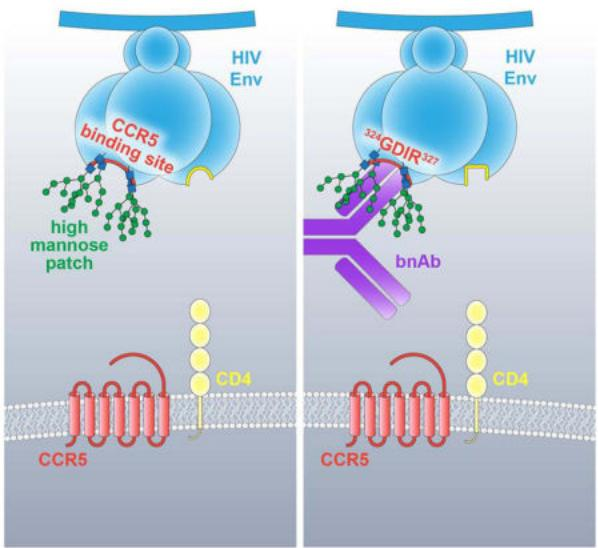

text_image

HIV Env
CCR5 binding site
high mannose patch
CD4
CCR5
32kGDIR327
bnAb
CD4
CCR5
HIV Env

# INTRODUCTION

Highly antigenically variable viruses such as HIV continue to confound vaccine design. A major roadblock is the generation of immunogens able to elicit broadly neutralizing antibodies (bnAbs) to protect against diverse circulating isolates (Burton and Hangartner, 2016; Haynes et al., 2012; Kwong et al., 2011). In order to design such immunogens, a comprehensive understanding of the epitopes that they target is crucial. As expected, many of the known bnAbs against rapidly mutating viruses target regions that are functionally important to virus propagation and are therefore conserved (Corti and Lanzavecchia, 2013; Sok et al., 2013b). Indeed, a number of HIV bnAbs have been discovered that target the CD4 receptor binding site (CD4bs) of HIV (Burton et al., 1994; Liao et al., 2013; Scheid et al., 2011; Wu et al., 2010; 2011). Similarly, bnAbs have been found to target the CD81 receptor binding site for HCV and the sialic acid receptor binding site for influenza virus (Dreyfus et

al., 2012; Edwards et al., 2012; Ekiert et al., 2012; Forns et al., 2000; Giang et al., 2012; Kong et al., 2013a; Law et al., 2008; Lee and Wilson, 2015; Xu et al., 2013). As another example of targeting a functionally important region, bnAbs have also been isolated against the conserved fusion machinery for HIV (Blattner et al., 2014; Falkowska et al., 2014; Huang et al., 2012; Kong et al., 2016; Lee et al., 2016) and influenza virus (Corti et al., 2011; Dreyfus et al., 2012; Ekiert et al., 2009).

The HIV envelope glycoprotein (Env) is made up of a trimer of gp160 monomers, which itself is a dimer of gp120 and gp41 subunits (Do Kwon et al., 2015; Julien et al., 2013a; Lyumkis et al., 2013; Pancera et al., 2014; Scharf et al., 2015). Based on the bnAbs that have been isolated, 5 major epitope regions have been mapped on Env and the reason for conservation of some of these epitopes have been elucidated. Starting from the viral membrane, these sites include the membrane proximal external region (MPER) (Buchacher et al., 1994; Huang et al., 2012; Zwick et al., 2001), which plays a role in cell fusion. Adjacent to this site is the gp120-gp41 cleavage interface epitope, which is critical for proper cleavage of pre-fusion Env (Blattner et al., 2014; Falkowska et al., 2014; Huang et al., 2014; Scharf et al., 2014). Finally, the CD4bs, as mentioned previously, is important for receptor binding and entry (Burton et al., 1994; Liao et al., 2013; Scheid et al., 2011; Wu et al., 2010). The reasons for epitope conservation of the two major remaining epitopes, the N332/high-mannose patch epitope region (Buchacher et al., 1994; Mouquet et al., 2012; Walker et al., 2011), and the V2 apex glycan epitope region (Bonsignori et al., 2011; Doria-Rose et al., 2014; Sok et al., 2014b; Walker et al., 2011; 2009) are not fully understood.

Here, we present the isolation of new bnAbs that target the high-mannose patch epitope region. We used these antibodies, together with existing bnAbs directed to this epitope cluster, to identify components associated with CCR5 coreceptor binding as an important conserved functional element targeted by high-mannose patch bnAbs. Further, we provided evidence that the high-mannose patch is conserved, at least in part, to camouflage the CCR5 coreceptor site as a mechanism of antibody evasion by the virus. However, antibodies that penetrate the glycan shield to access elements associated with the CCR5 site, as well as incorporate high-mannose patch glycans into their binding footprint, overcome this shielding and therefore broadly neutralize HIV.

# RESULTS

# Isolation of new bnAbs against the high-mannose patch highlights diversity of antibodies able to recognize this region

Three donors from the Protocol G cohort were identified whose serum neutralization breadth and potency are dependent on the N332 glycan to some extent (Figure 1A). This specificity was confirmed by comparative adsorption of neutralizing sera with monomeric gp120 and the corresponding gp120 lacking the N332 glycan site (Figure 1B). The gp120 isolates that showed the greatest depletion of neutralizing activity were advanced to production and purification as biotinylated baits for antigen sorting of memory B cells.

Antibody sequences from the selected Protocol G donors were extracted from antigen-sorted memory B cells using previously described methods (Sok et al., 2014b; Tiller et al., 2008;

Wu et al., 2010). The memory B cells were selected for site-specific binding to biotinylated gp120-streptavidin tetramers and little to no binding to the corresponding N332A mutant (Figure 1C). Overall, three antibody lineages were isolated from three different donors (Figure 1D); 4 somatic variants from one lineage (named PGDM11 through PGDM14 from donor 14) and single mAbs from each of the other two lineages (PGDM21 from donor 82 and PGDM31 from donor 26). The three lineages are all distinct from those previously described for antibodies that target the N332 epitope region (Kong et al., 2013b; Pejchal et al., 2011; Walker et al., 2011) and derive from different germline genes, further highlighting the genetic diversity of antibodies targeting this epitope region (Figure 1D).

# bnAbs isolated from different donors show distinct patterns of neutralization breadth and potency

The isolated antibodies were first evaluated for neutralization breadth and potency on a representative 6-virus panel with (Figure 2A) and without (Figure 2B) the N332 glycan site. These results show dependency of all of the antibodies on the N332 glycan site for neutralization breadth and potency. We next evaluated the antibodies that produced in sufficient yield (PGDM11, 12, 21, and 31) on a larger 106 cross-clade pseudovirus panel (Seaman et al., 2010). Overall, as for differences in neutralization breadth and potency seen in donor sera, the new bnAbs show intermediate neutralizing activities, being less broad and potent than PGT121, but more broad and potent than PGT135 (Figure 2C, 2D).

# Differences in bnAb recognition of glycans

We next evaluated if the N332 glycan site alone is targeted by the newly isolated antibodies or if other conserved surrounding glycans also contribute to the overall epitope. First, we evaluated the sequences of the 106-virus panel described above and found that the glycan site at the N332 position is absolutely required for neutralization by these antibodies (Table S1). This finding was further investigated on a 36 N332A isolate mutant panel and neutralization activity was lost completely for all of the antibodies (Table S2).

We next determined if the antibodies interact with other glycans in proximity to the N332 glycan. To this end, we first tested for neutralization against single glycan site knock-out mutations for isolates 92BR020 and BG505 (Table S3) and for pairwise glycan-site knock-out mutations on BG505 (Figure 3A). The largest effect on neutralization for these antibodies was seen with removal of the N332 glycan site alone followed by a modest loss of neutralization with removal of the N301 glycan site alone. Testing for neutralization against pairwise glycan mutants, however, revealed loss of neutralization upon removal of N156 and N301 sites together (the N332 glycan site was retained) for both PGDM12 and PGDM21.

We next determined the different glycoforms that these antibodies can target by measuring binding to glycan arrays. We found that the PGDM11–14 antibody lineage bound exclusively to $Man_{9}GlcNAc_{2}$ glycans, while PGDM21 bound to both high-mannose ( $Man_{9}GlcNAc_{2}$ ) as well as hybrid and complex glycans (Figure 3B). These findings were further corroborated by testing for neutralization against viruses produced in the presence of different glycosidase inhibitors (Doores and Burton, 2010) (Table S4). For PGDM21, loss of neutralization was only observed with viruses produced in the presence of NB-DNJ,

suggesting the importance of a terminal mannose on the D1 arm of an N-linked glycan for epitope recognition, which was also observed for PGT128 (Pejchal et al., 2011).

# Differences in bnAb recognition of the C-terminal end of the V3 loop

Having identified common recognition patterns of glycan sites by these antibodies, we next evaluated whether protein components are also similarly targeted. We first evaluated whether PGDM11–14 and PGDM21 also target the ${}^{324}$ GDIRQAH $^{330}$ peptide region, which is recognized by 2 out of 4 known bnAb lineages. We did not perform further analysis with PGDM31 due to its relatively limited breadth and potency.

Single residues in the V3 region from G324 to H330 were substituted by alanine and the corresponding viral variants tested for neutralization sensitivity to PGDM11–14 and to PGDM21 (Figure 3C). Variants were generated in the context of two different viruses, 92BR020 and JR-CSF. The results show marked neutralization dependence of the PGDM11–14 family of antibodies on R327A and H330A substitutions and marked dependence of the PGDM21 antibody on D325A and H330A substitutions. Notably, slight loss of neutralization potency was also observed for the G324A mutant for both antibody families on isolate JR-CSF. In comparison, 2G12 and PGT135 did not show any dependence on residues in the ${}^{324}$ GDIR $^{327}$ region for neutralization activity, although PGT135 did show dependence on H330 (Figure 3C). We refer subsequently to the subset of high-mannose patch antibodies that specifically recognize the ${}^{324}$ GDIR $^{327}$ region of V3 as GDIR-glycan bnAbs.

# Mapping overlapping antibody footprints

In an effort to identify the most critical commonly targeted features of this epitope, we next mutated combinations of glycan sites and residues at the base of the V3 loop and tested for effects on neutralization. The results of this analysis are summarized in Figure 4. For neutralization of bnAb PGT121 against isolate 92BR020, we observed a loss of neutralization potency with the pairwise mutations N156A + G324A and N301A + G324A for 92BR020 (Figure S1A) and mutations N301A + D325A and N301A + R327 for isolate JR-CSF (Table S5). Additionally, while removal of the N332 glycan site alone is insufficient to abrogate neutralization of PGT121 against 92BR020, removal of the N332 glycan site with substitutions of D325A, I326A or R327A resulted in complete loss of neutralization (Figure S1A). As discussed previously, the related somatic variant PGT124 is dependent exclusively on the N332 glycan site and pairwise contacts to D325 + R327 for neutralization (Garces et al., 2014; Sok et al., 2013a) (Figures 3C, S1B).

Meanwhile, for neutralization of PGT128 against isolates 92BR020 and JR-CSF, we now show that pairwise mutation of the N301 glycan site with G324A, D325A, or H330A substitutions results in complete loss of neutralization (Figure S1C, Table S5). Additionally, for isolate JR-CSF, removal of the N332 glycan site alone is insufficient to abrogate neutralization potency, but removal of this glycan site together with G324A, D325A or I326A substitutions results in complete loss of neutralization (Table S5). Similar results were observed for PGT130, which is a somatic variant of PGT128 (Figure S1D, Table S5).

For PGDM12, we observed strong neutralization dependence on single residues R327, H330, and N332 (Figure S1E, Table S5). Similar to the other antibody lineages, we did not see loss of neutralization with single substitutions N301A, G324A, I326A, or Q328A, but loss of neutralization was observed with combinations of these substitutions. By a similar token, neutralization by PGDM21 was strongly dependent on single residue substitutions D325A, H330A or N332A with pairwise dependency on N301A + G324A (Figure S1F, Table S5).

Importantly as a control, the VRC01-class CD4 binding site antibody 12A12 (Scheid et al., 2011) was also evaluated for neutralization against the described variants and no effects of the substitutions, either singly or in combination, were observed for both 92BR020 and JR-CSF (Figure S1G, Table S5).

# CXCR4-tropic viruses are generally more resistant than CCR5-tropic viruses to neutralization by GDIR-glycan antibodies

Given the shared epitope features that are recognized by 4 out of 6 antibody families in this class, we next explored why these features are being targeted. Previous studies have determined the residues at 306 and 322 in the V3 loop as critical for determining CCR5 (R5) or CXCR4 (X4) coreceptor usage (Huang et al., 2005; Kuiken et al., 1992; Nelson et al., 2000; Pollakis et al., 2004; Wang et al., 1998). Although these residues are not a part of the $^{323}\mathrm{GDIRQAH}^{330}$ stretch of residues, a previous study did identify the base of the V3 loop as important for CCR5 binding (Cormier and Dragic, 2002; Suphaphiphat et al., 2007). Based on these data, we first compared the sequences of replicating X4-tropic and R5-tropic viruses (Figure 5A). Of note, X4-tropic viruses have substantially more mutations in the $^{324}\mathrm{GDIRQAH}^{330}$ peptide region than the R5-tropic viruses, and the X4-tropic viruses also typically lack the N301 glycan site that is present on nearly all R5-tropic viruses.

We subsequently evaluated the neutralization activity of high-mannose patch antibodies against a panel of cross-clade replicating X4-tropic viruses compared to R5-tropic viruses. Figure 5A shows that GDIR-glycan bnAbs are much less capable of neutralizing X4-tropic viruses. In comparison, the other high-mannose patch bnAbs, PGT135 and 2G12, do not show a demonstrable difference in neutralization breadth between X4 and R5-tropic viruses. BnAbs targeting the trimer apex or the CD4 binding site similarly do not discriminate between X4 and R5-tropic viruses in terms of neutralization.

Unfortunately, we do not have longitudinal sampling of viruses and antibodies for the donors used as source material for the bnAbs to evaluate selection pressure on coreceptor usage. A previous set of longitudinal data, however, did reveal either loss of the N301 glycan and/or introduction of mutations in the ${}^{324}$ GDIRQAH $^{330}$ peptide region following coreceptor usage switching from CCR5 to CXCR4 (van Rij RP et al., 2000).

# CCR5 amino terminal peptide targets the $^{324}$ GDIR $^{327}$ peptide region

The findings above, as well as previously published results on CCR5 epitope mapping (Cormier et al., 2001), suggest that the ${}^{324}$ GDIR $^{327}$ peptide region targeted by bnAbs comprises at least part of the CCR5 coreceptor epitope. To investigate targeting of CCR5 to the ${}^{324}$ GDIR $^{327}$ peptide region for JR-CSF, we performed ELISA binding experiments using

gp120 captured from lysed virions and a CCR5 N-terminal peptide mimic-Fc construct (Chiang et al., 2012; Dorfman et al., 2006) as well as CD4i antibody 17b (Thali et al., 1993). Binding measurements were normalized to the V3-specific antibody F425/B4e8 (Cavacini et al., 2003).

In the absence of soluble CD4 (sCD4), the ELISA end-point measurements show a greater than 50% decrease in overall binding of the CCR5 N-terminal peptide mimic-Fc to variant gp120s in which the N301 glycan sequon had been eliminated or substitutions made in the ${}^{325}DIR^{327}$ peptide region. No effect or enhanced binding was observed for other substitutions in the V1/V3 loops (Figure 5B). In comparison, 17b did not show any effect on binding for substitutions introduced in the ${}^{325}DIR^{327}$ peptide region. With the addition of sCD4, a greater than 50% decrease in overall binding of the CCR5 N-terminal peptide mimic-Fc was observed for R327A, whereas no effect on binding was observed for 17b binding for any of the mutants tested (Figure 5B).

# The N332 and N301 glycans help mask the CCR5 coreceptor site

Given that CCR5 and GDIR-glycan bnAbs target an overlapping region and the relative rarity of the emergence of potent bnAbs in chronic infection, we hypothesized that the glycans surrounding the GDIR region might be shielding this site. We first tested this hypothesis by measuring neutralization of sera from chronically infected donors in the Protocol G cohort against a panel of viruses with and without the N332 glycan, which is the glycan in closest proximity to the GDIR peptide region. The results show enhanced neutralization for a number of viruses across many donors, suggesting that this epitope region is immunogenic and that the exposure of the region on the functional Env trimer is increased in the absence of the N332 glycan site (Figure 6A). An interesting point to note in relation to the N332 glycan site is that a founder virus lacking the site acquired it to provide escape from autologous neutralization (Gray et al., 2011).

To further support the camouflaging hypothesis, we reasoned that if the N332 glycan is restricting access to the ${}^{324}$ GDIRQAH $^{330}$ peptide region, then there would be more mutations in this peptide region in the absence of the N332 glycan site among naturally occurring isolates as a means to escape antibody responses. Based on this rationale, we evaluated 42,715 HIV Env sequences in the Los Alamos database (http://www.hiv.lanl.gov/) and found that 23,158 (54%) have the “GDIRQAH” sequence, while 19,557 (46%) deviate from this sequence either at D325, R327, or H330 residues (DRH residues). Using 46% as a baseline measure of mutation at these residues by chance, we then evaluated whether there were higher or lower frequencies of mutations in the DRH residues in the presence or absence of each glycan site on Env. Based on this approach, calculated values above zero indicate higher frequencies of mutation of DRH residues in the absence of the glycan site, while values below zero indicate higher frequencies of conservation of DRH residues in the absence of the glycan site.

We find very clearly the highest frequencies of mutation of DRH residues occurs in the absence of N301 and N332 glycan sites consistent with the notion that the corresponding glycans are “protecting” the residues from immune pressure (Figure 6B). Somewhat surprisingly, we note the lowest frequencies of mutation of DRH residues in the absence of

the N334 glycan site. However, the overlapping glycan sequon positioning at the N332/N334 glycan site indicates that only the N332 or N334 glycan site can be present, but not both (Moore et al., 2012; Sok et al., 2014a). Thus, the high conservation of DRH residues in the absence of the N334 glycan site is correlated with presence of the N332 glycan site. These glycan sites and/or epitopes on Env are likely modulated in the presence of immune pressure at the DRH residues, but these details of antibody pressure and HIV Env evolution would be better mapped out via longitudinal cohorts.

# GDIR-glycan bnAbs allosterically modulate soluble CD4 binding

While CD4-induced antibodies such as 17b, X5, and 412d also make contacts to the base of the V3 loop like GDIR-glycan bnAbs (Figure 6C), they also rely on residues in the bridging sheet of gp120 for binding or neutralization following CD4 engagement. Indeed, we confirmed that GDIR-glycan bnAbs and CD4i antibodies do not compete strongly with each other for binding to monomeric gp120 by ELISA (Figure S2). Previous work, in fact, suggested that instead of relying on CD4 for binding as for CD4i antibodies, the PGT121 antibody family allosterically inhibits CD4 binding on HIV Env (Julien et al., 2013b). We next sought to determine if this mechanism of allostery is commonly shared by GDIR-glycan bnAbs.

Binding experiments by fluorescence-activated cell sorting (FACS) indeed confirmed competition of V3-glycan bnAbs with sCD4 on isolate JR-FL (Figure 6D). As a positive control, we also observed competition with the VRC01-class antibody 12A12 and as a negative control, we did not observe competition with the V3-specific antibody F425 (B4e8). Other high-mannose patch antibodies, such as PGT135 and 2G12, did not show competition with CD4 (Figure 6D). These results suggest a common mechanism of inhibition by antibodies targeting the $^{324}\mathrm{GDIR}^{327}$ peptide region likely via contacts to the V1/V2 region. We note that these binding measurements were performed on trimers expressed on the surface of cells and similar measurements using monomeric gp120 may yield a different result, as described previously for PGT124 (Garces et al., 2014).

# DISCUSSION

A group of HIV bnAbs, often referred to as “high-mannose patch” antibodies, target a specific region of the HIV envelope “glycan shield” that is uniquely defined by a patch of oligo- and high-mannose type glycans surrounding the N332 glycan (Buchacher et al., 1994; Kong et al., 2013b; Mouquet et al., 2012; Pejchal et al., 2011; Trkola et al., 1996; Walker et al., 2011). This patch of oligo- and high-mannose type glycans was originally described as the “silent face” as it was considered that the dense glycan coating would resist antibody recognition (Wyatt et al., 1998). Notwithstanding the original name, we offer an explanation for why bnAbs commonly target this epitope region.

We present the isolation of two new antibody families (PGDM11–14 and PGDM21) that map to the high-mannose patch region (Figure 7A, S3) and compare these to the epitope footprints of previously isolated bnAbs, 2G12, PGT121, PGT128, and PGT135 (Trkola et al., 1996; Walker et al., 2011) to identify common binding signatures. Despite differences in antigenic footprint between the antibody families, the common residues that are targeted by

the GDIR-glycan class of bnAbs involve specifically the D325, R327, and H330 residues. All these antibodies also depend on the N332 and N301 glycans to some degree (summarized in Figure 7B). Given this common recognition between antibody families, we hypothesize that this epitope region might be functionally conserved.

Previous work identified the V3 loop as important for CCR5 or CXCR4 coreceptor usage (Cormier et al., 2001; Cormier and Dragic, 2002; Huang et al., 2005; Kuiken et al., 1992; Nelson et al., 2000; Pollakis et al., 2004; Suphaphiphat et al., 2007; Wang et al., 1998). We built on this work by linking the residues D325 and R327 that are important for bnAb recognition as also important for CCR5 binding. Moreover, we show that among a data set of 42,715 cross-clade Env sequences, there are higher frequencies of mutations at residues D325, R327 or H330 in the absence of glycan sites at N301 and N332, indicating selection pressure at this region in the absence of camouflaging glycans. We also show that, in the absence of the N332 glycan site, sera from chronically-infected donors show enhanced neutralization potency relative to the corresponding isolate with the glycan present. Finally, we show that GDIR-glycan bnAbs are less effective at neutralizing CXCR4-tropic viruses, which show much greater sequence variation in the GDIR region, compared to CCR5-tropic viruses. The observation that CXCR4 viruses are generally resistant to GDIR-glycan bnAbs has important implications for the use of bnAbs as prophylactics and therapeutics for the treatment of chronic infection or even as a part of curative strategies (Klein et al., 2013).

The finding that GDIR-glycan bnAbs target residues that are important for CCR5 binding brings into question why CD4-induced antibodies, which also target elements of this site (Figure S2), are so limited in neutralization breadth and potency. CD4i antibodies bind most avidly following CD4 engagement and formation of the bridging sheet and, therefore, favor open conformations of the trimer (Huang et al., 2005; 2007; Kwong et al., 1998) (Figure 7C). GDIR-glycan bnAbs, however, can bind native Env in the absence of sCD4 and, once bound, appear to allosterically inhibit sCD4 binding. We speculate that the immunogenic $^{324}\mathrm{GDIR}^{327}$ residues are accessible to some extent on a native trimer, but only those antibodies with a long CDR H3 that can penetrate through the camouflaging glycans surrounding this peptide region are capable of broadly neutralizing HIV isolates. In fact, in addition to accommodating these glycans, the antibodies have undergone affinity maturation to bind some of the camouflaging glycans directly (Kong et al., 2013b; Pejchal et al., 2011; Walker et al., 2011).

Our understanding of the HIV envelope trimer, the sole target for neutralizing antibodies, has grown tremendously since the discovery of the virus. This understanding has been guided by investigating humoral responses to Env in natural infection with sera and antibodies serving as tools to map antigenic footprints on the trimer. To date, five main bnAb regions have been mapped on Env: the CD4bs, the high-mannose patch region, the trimer apex region, the MPER, and the gp120-gp41 interface. The high conservation of these sites can be largely attributed to virus function and propagation in host target cells, but conservation of the high-mannose patch region recognized by bnAbs has been more difficult to interpret functionally. Here, we show that the conserved V3 region targeted by a large proportion of these bnAbs contributes to CCR5 coreceptor binding and that the high-mannose glycans are likely conserved, at least in part, to restrict access to this conserved

region. Overall, this study demonstrates the utility of isolating new broadly neutralizing antibodies to HIV, which continue to provide more information on the envelope trimer for both vaccine design and therapeutic purposes.

# Experimental Procedures

# Accession Codes

The EM reconstructions of BG505 SOSIP.664 in complex with PGDM14 or PGDM21 are deposited under accession codes EMD-8181 and EMD-8182, respectively. Novel antibody sequences are accessible by GenBank (KX236198 - KX236209).

# Human Specimen

Human PBMC and serum samples were acquired from HIV-1 infected donors of the Protocol G cohort (Simek et al., 2009) under written consent. A complete list of approving review boards is given in the Extended Experimental Procedures.

# Pseudovirus Neutralization Assays

Replication incompetent HIV pseudovirus was produced by transfecting an Env containing plasmid with an Env deficient backbone (pSG3ΔEnv) in HEK 293T cells in a 1:2 ratio. Pseudoviruses produced in the presence of glycosylation inhibitors were generated by treating 293T cells with either 25 μM kifunensine, 20 μM swainsonine or 2 mM N-butyldeoxynojirimycin (NB-DNJ) (Cayman Chemical Co.) on the day of transfection (Doores and Burton, 2010). Pseudovirus was harvested after 48–72h and neutralization was tested by incubating pseudovirus and mAbs or sera for 1 h at 37 °C before transferring them onto TZM-bl cells as previously described (Walker et al., 2011).

# Protein Production

Gp120 constructs were truncated in the C5 region (dC5) and fused to N-terminal Avi-tags. Plasmids were transfected into HEK 293F cells (Invitrogen) and purified as previously described (Sok et al., 2013a). Gp120s used in flow cytometry were in vitro biotinylated using the BirA enzyme according to the manufacturer instructions (Avidity).

Antibody plasmids containing heavy and light chain genes were co-transfected in equimolar ratios into either HEK 293T or 293F cells and purified as previously described (Sok et al., 2013a). Additional details are provided in the Extended Experimental Procedures.

# Serum NAb depletion assay

1 mg of gp120-Avi dC5 protein or BSA was conjugated to 250 $\mu$ l of Tosyl-activated MyOne DynaBeads (Invitrogen) according to the manufacturers protocol. We tested WT and N332A mutated gp120 variants of the 92BR020, IAVI C22 and JR-CSF HIV isolates and BSA as a control in combination with N332 reactive donor sera. In brief, donor sera were incubated with protein coated beads for 30 min at 37 °C before removing the beads by magnetic force and eluting bound Abs with 100mM Glycine HCl pH2.2. Beads were then regenerated and the protocol was repeated twice before testing the sera in pseudovirus neutralization assays. An extensive protocol is given in the Extended Experimental Procedures.

# Monoclonal Antibody Isolation from Donor PBMCs

Single-cell sorting of donor PBMCs by flow cytometry was performed as described previously (Sok et al., 2014b; Tiller et al., 2008; Wu et al., 2010). In brief, sorted single cells were reverse transcribed into cDNA, antibody heavy and light chain variable genes were PCR amplified, sequenced and analyzed using the IMGT V-Quest webserver (www.IMGT.org) (Lefranc et al., 2009). Productively rearranged heavy and light chain variable gene pairs were cloned into respective Igγ1, Igκ, and Igλ expression vectors. A detailed description is given in the Extended Experimental Procedures.

# Glycan Array

Antibodies were tested for glycan reactivity on amine functional glycans spotted onto NHS-activated cover slides as previously described (Andrabi et al., 2015; Falkowska et al., 2014). A detailed protocol is given in the Extended Experimental Procedures.

# Cell Surface-Binding Assays

Titrating amounts of mAbs were added to HIV-1 Env-transfected 293T cells and were incubated for 1 h at 4 °C in 1× PBS. After washing, cells were fixed with 2% paraformaldehyde (PolySciences) for 20 min at room temperature. The cells then were washed and stained with a 1:200 dilution of PE-conjugated goat anti-human IgG F(ab')2 (Jackson) for 1 h at room temperature. Binding competitions were performed by titrating amounts of competitor mAbs before adding biotinylated antibody at the concentration required to achieve IC $_{70}$ and then measuring binding with PE-labeled streptavidin (Invitrogen). FlowJo software was used for data interpretation.

# CCR5-Fc mimic peptide ELISA

ELISA plates were first coated with an anti-C5 gp120 antibody at 4 °C in 1× PBS overnight. Plates were then washed and blocked with 3% BSA in 1× PBS at room temperature for 1 hour. Mutant pseudovirus supernatants, were lysed with 1% NP40 and then captured at 37 °C for 2 hours. Following this, biotinylated CCR5-Fc mimic peptide was preconjugated with streptavidin-alkaline phosphatase in a 1:1 molar ratio and added at a final concentration of 10 μg/ml. Following washing, plates were measured at OD405.

# Electron microscopy (EM) data collection and processing

Negative-stain EM with 2% w/v uranyl formate was carried out as described previously (Scharf et al., 2014). The resolutions of the models were determined at a Fourier shell correlation (FSC) cut-off of 0.5 and were \~21 Å for both PGDM14- (EMD-8181) and PGDM21-BG505 SOSIP.664 complexes (EMD-8182). More details are provided in the Extended Experimental Procedures.

# Supplementary Material

Refer to Web version on PubMed Central for supplementary material.

# Acknowledgments

The CCR5 N-terminal peptide Fc constructs were kindly provided by Michael Farzan. This work was supported by the International AIDS Vaccine Initiative Neutralizing Antibody Consortium through the Collaboration for AIDS Vaccine Discovery grant OPP1084519 (D.R.B., I.A.W., A.B.W.), NIH grants R01 AI033292 (D.R.B.), and Center for HIV/AIDS Vaccine Immunology and Immunogen Discovery Grant UM1AI100663 (D.R.B., I.A.W., A.B.W.). Funding was also provided by the California HIV/AIDS Research Program Basic Biomedical Sciences Training Award D13-SRI-391 (M.P.). D.R.B. acknowledges the support of the James and Jessie Minor Chair in Immunology. This work was funded in part by IAVI and made possible by the support of many donors, including: the Bill & Melinda Gates Foundation, the Ministry of Foreign Affairs of Denmark, Irish Aid, the Ministry of Finance of Japan, the Ministry of Foreign Affairs of the Netherlands, the Norwegian Agency for Development Cooperation (NORAD), the United Kingdom Department for International Development (DFID), and the United States Agency for International Development (USAID). The full list of IAVI donors is available at http://www.iavi.org. The contents of this manuscript are the responsibility of IAVI and do not necessarily reflect the views of USAID or the US Government.

# References

Andrabi R, Voss JE, Liang CH, Briney B, McCoy LE, Wu CY, Wong CH, Poignard P, Burton DR. Identification of common features in prototype broadly neutralizing antibodies to HIV envelope V2 apex to facilitate vaccine design. Immunity. 2015; 43:959–973. [PubMed: 26588781]   
Blattner C, Lee JH, Sliepen K, Derking R, Falkowska E, de la Peña AT, Cupo A, Julien J-P, van Gils M, Lee PS, et al. Structural delineation of a quaternary, cleavage-dependent epitope at the gp41-gp120 interface on intact HIV-1 Env trimers. Immunity. 2014; 40:669–680. [PubMed: 24768348]   
Bonsignori M, Hwang KK, Chen X, Tsao CY, Morris L, Gray E, Marshall DJ, Crump JA, Kapiga SH, Sam NE, et al. Analysis of a clonal lineage of HIV-1 envelope V2/V3 conformational epitope-specific broadly neutralizing antibodies and their inferred unmutated common ancestors. J Virol. 2011; 85:9998–10009. [PubMed: 21795340]   
Buchacher A, Predl R, Strutzenberger K, Steinfellner W, Trkola A, Purtscher M, Gruber G, Tauer C, Steindl F, Jungbauer A, et al. Generation of human monoclonal-antibodies against HIV-1 proteins - electrofusion and Epstein-Barr virus transformation for peripheral-blood lymphocyte immortalization. AIDS Res Hum Retroviruses. 1994; 10:359–369. [PubMed: 7520721]   
Burton DR, Pyati J, Koduri R, Sharp SJ, Thornton GB, Parren PW, Sawyer LS, Hendry RM, Dunlop N, Nara PL. Efficient neutralization of primary isolates of HIV-1 by a recombinant human monoclonal antibody. Science. 1994; 266:1024–1027. [PubMed: 7973652]   
Burton DR, Hangartner L. Broadly neutralizing antibodies to HIV and their role in vaccine design. Annu Rev Immunol. 2016; 34:635–659. [PubMed: 27168247]   
Cavacini L, Duval M, Song L, Sangster R, Xiang SH, Sodroski J, Posner M. Conformational changes in env oligomer induced by an antibody dependent on the V3 loop base. Aids. 2003; 17:685–689. [PubMed: 12646791]   
Chiang JJ, Gardner MR, Quinlan BD, Dorfman T, Choe H, Farzan M. Enhanced recognition and neutralization of HIV-1 by antibody-derived CCR5-mimetic peptide variants. J Virol. 2012;86:12417–12421. [PubMed: 22933279]   
Cormier EG, Tran DN, Yukhayeva L, Olson WC, Dragic T. Mapping the determinants of the CCR5 amino-terminal sulfopeptide interaction with soluble human immunodeficiency virus type 1 gp120-CD4 complexes. J Virol. 2001; 75:5541–5549. [PubMed: 11356961]   
Cormier EG, Dragic T. The crown and stem of the V3 loop play distinct roles in human immunodeficiency virus type 1 envelope glycoprotein interactions with the CCR5 coreceptor. J Virol. 2002; 76:8953–8957. [PubMed: 12163614]   
Corti D, Lanzavecchia A. Broadly neutralizing antiviral antibodies. Annu Rev Immunol. 2013;31:705–742. [PubMed: 23330954]   
Corti D, Voss J, Gamblin SJ, Codoni G, Macagno A, Jarrossay D, Vachieri SG, Pinna D, Minola A, Vanzetta F, et al. A neutralizing antibody selected from plasma cells that binds to group 1 and group 2 influenza A hemagglutinins. Science. 2011; 333:850–856. [PubMed: 21798894]

Do Kwon Y, Pancera M, Acharya P, Georgiev IS, Crooks ET, Gorman J, Joyce MG, Guttman M, Ma X, Narpala S, et al. Crystal structure, conformational fixation and entry-related interactions of mature ligand-free HIV-1 Env. Nat Struct Mol Biol. 2015; 22:522–531. [PubMed: 26098315]   
Doores KJ, Burton DR. Variable loop glycan dependency of the broad and potent HIV-1-neutralizing antibodies PG9 and PG16. J Virol. 2010; 84:10510–10521. [PubMed: 20686044]   
Dorfman T, Moore MJ, Guth AC, Choe H, Farzan M. A tyrosine-sulfated peptide derived from the heavy-chain CDR3 region of an HIV-1-neutralizing antibody binds gp120 and inhibits HIV-1 infection. J Biol Chem. 2006; 281:28529–28535. [PubMed: 16849323]   
Doria-Rose NA, Schramm CA, Gorman J, Moore PL, Bhiman JN, DeKosky BJ, Ernandes MJ, Georgiev IS, Kim HJ, Pancera M, et al. Developmental pathway for potent V1V2-directed HIV-neutralizing antibodies. Nature. 2014; 509:55–62. [PubMed: 24590074]   
Dreyfus C, Laursen NS, Kwaks T, Zuijdgeest D, Khayat R, Ekiert DC, Lee JH, Metlagel Z, Bujny MV, Jongeneelen M, et al. Highly conserved protective epitopes on influenza B viruses. Science. 2012;337:1343–1348. [PubMed: 22878502]   
Edwards VC, Tarr AW, Urbanowicz RA, Ball JK. The role of neutralizing antibodies in hepatitis C virus infection. J Gen Virol. 2012; 93:1–19. [PubMed: 22049091]   
Ekiert DC, Bhabha G, Elsliger MA, Friesen RHE, Jongeneelen M, Throsby M, Goudsmit J, Wilson IA. Antibody recognition of a highly conserved influenza virus epitope. Science. 2009; 324:246–251. [PubMed: 19251591]   
Ekiert DC, Kashyap AK, Steel J, Rubrum A, Bhabha G, Khayat R, Lee JH, Dillon MA, O'Neil RE, Faynboym AM, et al. Cross-neutralization of influenza A viruses mediated by a single antibody loop. Nature. 2012; 489:526–532. [PubMed: 22982990]   
Falkowska E, Le KM, Ramos A, Doores KJ, Lee JH, Blattner C, Ramirez A, Derking R, van Gils MJ, Liang CH, et al. Broadly neutralizing HIV antibodies define a glycan-dependent epitope on the prefusion conformation of gp41 on cleaved envelope trimers. Immunity. 2014; 40:657–668. [PubMed: 24768347]   
Forns X, Thimme R, Govindarajan S, Emerson SU, Purcell RH, Chisari FV, Bukh J. Hepatitis C virus lacking the hypervariable region 1 of the second envelope protein is infectious and causes acute resolving or persistent infection in chimpanzees. Proc Natl Acad Sci USA. 2000; 97:13318–13323. [PubMed: 11078521]   
Garces F, Sok D, Kong L, McBride R, Kim HJ, Saye-Francisco KF, Julien JP, Hua Y, Cupo A, Moore JP, et al. Structural evolution of glycan recognition by a family of potent HIV antibodies. Cell. 2014; 159:69–79. [PubMed: 25259921]   
Giang E, Dorner M, Prentoe JC, Dreux M, Evans MJ, Bukh J, Rice CM, Ploss A, Burton DR, Law M. Human broadly neutralizing antibodies to the envelope glycoprotein complex of hepatitis C virus. Proc Natl Acad Sci USA. 2012; 109:6205–6210. [PubMed: 22492964]   
Gray ES, Madiga MC, Hermanus T, Moore PL, Wibmer CK, Tumba NL, Werner L, Mlisana K, Sibeko S, Williamson C, et al. The neutralization breadth of HIV-1 develops incrementally over four years and is associated with CD4+ T cell decline and high viral load during acute infection. J Virol. 2011; 85:4828–4840. [PubMed: 21389135]   
Haynes BF, Kelsoe G, Harrison SC, Harrison SC, Kepler TB. B-cell-lineage immunogen design in vaccine development with HIV-1 as a case study. Nature Biotechnology. 2012; 30:423–433.   
Huang CC, Lam SN, Acharya P, Tang M, Xiang SH, Hussan SSU, Stanfield RL, Robinson J, Sodroski J, Wilson IA, et al. Structures of the CCR5 N terminus and of a tyrosine-sulfated antibody with HIV-1 gp120 and CD4. Science. 2007; 317:1930–1934. [PubMed: 17901336]   
Huang CC, Tang M, Zhang MY, Majeed S, Montabana E, Stanfield RL, Dimitrov DS, Korber B, Sodroski J, Wilson IA, et al. Structure of a V3-containing HIV-1 gp120 core. Science. 2005;310:1025–1028. [PubMed: 16284180]   
Huang J, Kang BH, Pancera M, Lee JH, Tong T, Feng Y, Imamichi H, Georgiev IS, Chuang GY, Druz A, et al. Broad and potent HIV-1 neutralization by a human antibody that binds the gp41-gp120 interface. Nature. 2014; 515:138–142. [PubMed: 25186731]   
Huang J, Ofek G, Laub L, Louder MK, Doria-Rose NA, Longo NS, Imamichi H, Bailer RT, Chakrabarti B, Sharma SK, et al. Broad and potent neutralization of HIV-1 by a gp41-specific human antibody. Nature. 2012; 491:406–412. [PubMed: 23151583]

Julien JP, Cupo A, Sok D, Stanfield RL, Lyumkis D, Deller MC, Klasse PJ, Burton DR, Sanders RW, Moore JP, et al. Crystal structure of a soluble cleaved HIV-1 envelope trimer. Science. 2013a;342:1477–1483. [PubMed: 24179159]   
Julien JP, Sok D, Khayat R, Lee JH, Doores KJ, Walker LM, Ramos A, Diwanji DC, Pejchal R, Cupo A, et al. Broadly neutralizing antibody PGT121 allosterically modulates CD4 binding via recognition of the HIV-1 gp120 V3 base and multiple surrounding glycans. PLoS Pathog. 2013b;9:e1003342. [PubMed: 23658524]   
Klein F, Mouquet H, Dosenovic P, Scheid JF, Scharf L, Nussenzweig MC. Antibodies in HIV-1 vaccine development and therapy. Science. 2013; 341:1199–1204. [PubMed: 24031012]   
Kong L, Giang E, Nieusma T, Kadam RU, Cogburn KE, Hua Y, Dai X, Stanfield RL, Burton DR, Ward AB, et al. Hepatitis C virus E2 envelope glycoprotein core structure. Science. 2013a;342:1090–1094. [PubMed: 24288331]   
Kong L, Lee JH, Doores KJ, Murin CD, Julien JP, McBride R, Liu Y, Marozsan A, Cupo A, Klasse PJ, et al. Supersite of immune vulnerability on the glycosylated face of HIV-1 envelope glycoprotein gp120. Nat Struct Mol Biol. 2013b; 20:796–803. [PubMed: 23708606]   
Kong R, Xu K, Zhou T, Acharya P, Lemmin T, Liu K, Ozorowski G, Soto C, Taft JD, Bailer RT, et al. Fusion peptide of HIV-1 as a site of vulnerability to neutralizing antibody. Science. 2016;352:828–833. [PubMed: 27174988]   
Kuiken CL, de Jong JJ, Baan E, Keulen W, Tersmette M, Goudsmit J. Evolution of the V3 envelope domain in proviral sequences and isolates of human immunodeficiency virus type 1 during transition of the viral biological phenotype. J Virol. 1992; 66:4622–4627. [PubMed: 1602564]   
Kwong PD, Wyatt R, Robinson J, Sweet RW, Sodroski J, Hendrickson WA. Structure of an HIV gp120 envelope glycoprotein in complex with the CD4 receptor and a neutralizing human antibody. Nature. 1998; 393:648–659. [PubMed: 9641677]   
Kwong PD, Mascola JR, Nabel GJ. Rational design of vaccines to elicit broadly neutralizing antibodies to HIV-1. Cold Spring Harb Perspect Med. 2011; 1:a007278–a007278. [PubMed: 22229123]   
Law M, Maruyama T, Lewis J, Giang E, Tarr AW, Stamataki Z, Gastaminza P, Chisari FV, Jones IM, Fox RI, et al. Broadly neutralizing antibodies protect against hepatitis C virus quasispecies challenge. Nat Med. 2008; 14:25–27. [PubMed: 18064037]   
Lee PS, Wilson IA. Structural characterization of viral epitopes recognized by broadly cross-reactive antibodies. Curr Top Microbiol Immunol. 2015; 386:323–341. [PubMed: 25037260]   
Lee JH, Ozorowski G, Ward AB. Cryo-EM structure of a native, fully glycosylated, cleaved HIV-1 envelope trimer. Science. 2016; 351:1043–1048. [PubMed: 26941313]   
Lefranc MP, Giudicelli V, Ginestoux C, Jabado-Michaloud J, Folch G, Bellahcene F, Wu Y, Gemrot E, Brochet X, Lane J, et al. IMGT, the international ImMunoGeneTics information system. Nucleic Acids Res. 2009; 37:D1006–D1012. [PubMed: 18978023]   
Liao HX, Lynch R, Zhou T, Gao F, Alam SM, Boyd SD, Fire AZ, Roskin KM, Schramm CA, Zhang Z, et al. Co-evolution of a broadly neutralizing HIV-1 antibody and founder virus. Nature. 2013;496:469–476. [PubMed: 23552890]   
Lyumkis D, Julien JP, de Val N, Cupo A, Potter CS, Klasse PJ, Burton DR, Sanders RW, Moore JP, Carragher B, et al. Cryo-EM structure of a fully glycosylated soluble cleaved HIV-1 envelope trimer. Science. 2013; 342:1484–1490. [PubMed: 24179160]   
Moore PL, Gray ES, Wibmer CK, Bhiman JN, Nonyane M, Sheward DJ, Hermanus T, Bajimaya S, Tumba NL, Abrahams MR, et al. Evolution of an HIV glycan-dependent broadly neutralizing antibody epitope through immune escape. Nat Med. 2012; 18:1688–1692. [PubMed: 23086475]   
Mouquet H, Scharf L, Euler Z, Liu Y, Eden C, Scheid JF, Halper-Stromberg A, Gnanapragasam PNP, Spencer DIR, Seaman MS, et al. Complex-type N-glycan recognition by potent broadly neutralizing HIV antibodies. Proc Natl Acad Sci USA. 2012; 109:E3268–E3277. [PubMed: 23115339]   
Nelson JA, Baribaud F, Edwards T, Swanstrom R. Patterns of changes in human immunodeficiency virus type 1 V3 sequence populations late in infection. J Virol. 2000; 74:8494–8501. [PubMed: 10954550]

Pancera M, Zhou T, Druz A, Georgiev IS, Soto C, Gorman J, Huang J, Acharya P, Chuang GY, Ofek G, et al. Structure and immune recognition of trimeric pre-fusion HIV-1 Env. Nature. 2014;514:455–461. [PubMed: 25296255]   
Pejchal R, Doores KJ, Walker LM, Khayat R, Huang PS, Wang SK, Stanfield RL, Julien JP, Ramos A, Crispin M, et al. A potent and broad neutralizing antibody recognizes and penetrates the HIV glycan shield. Science. 2011; 334:1097–1103. [PubMed: 21998254]   
Pollakis G, Abebe A, Kliphuis A, Chalaby MIM, Bakker M, Mengistu Y, Brouwer M, Goudsmit J, Schuitemaker H, Paxton WA. Phenotypic and genotypic comparisons of CCR5- and CXCR4-tropic human immunodeficiency virus type 1 biological clones isolated from subtype C-infected individuals. J Virol. 2004; 78:2841–2852. [PubMed: 14990703]   
Scharf L, Scheid JF, Lee JH, West AP, Chen C, Gao H, Gnanapragasam PNP, Mares R, Seaman MS, Ward AB, et al. Antibody 8ANC195 reveals a site of broad vulnerability on the HIV-1 envelope spike. Cell Rep. 2014; 7:785–795. [PubMed: 24767986]   
Scharf L, Wang H, Gao H, Chen S, McDowall AW, Bjorkman PJ. Broadly neutralizing antibody 8ANC195 recognizes closed and open states of HIV-1 Env. Cell. 2015; 162:1379–1390. [PubMed: 26359989]   
Scheid JF, Mouquet H, Ueberheide B, Diskin R, Klein F, Oliveira TYK, Pietzsch J, Fenyo D, Abadir A, Velinzon K, et al. Sequence and structural convergence of broad and potent HIV antibodies that mimic CD4 binding. Science. 2011; 333:1633–1637. [PubMed: 21764753]   
Seaman MS, Janes H, Hawkins N, Grandpre LE, Devoy C, Giri A, Coffey RT, Harris L, Wood B, Daniels MG, et al. Tiered categorization of a diverse panel of HIV-1 Env pseudoviruses for assessment of neutralizing antibodies. J Virol. 2010; 84:1439–1452. [PubMed: 19939925]   
Simek MD, Rida W, Priddy FH, Pung P, Carrow E, Laufer DS, Lehrman JK, Boaz M, Tarragona-Fiol T, Miiro G, et al. HIV-1 elite neutralizers: individuals with broad and potent neutralizing activity identified using a high throughput neutralization assay together with an analytical selection algorithm. J Virol. 2009; 83:7337–7348. [PubMed: 19439467]   
Sok D, Doores KJ, Briney B, Le KM, Saye-Francisco KL, Ramos A, Kulp DW, Julien JP, Menis S, Wickramasinghe L, et al. Promiscuous glycan site recognition by antibodies to the high-mannose patch of gp120 broadens neutralization of HIV. Sci Transl Med. 2014a; 6:236ra63–236ra63.   
Sok D, Laserson U, Laserson J, Liu Y, Vigneault F, Julien JP, Briney B, Ramos A, Saye KF, Le K, et al. The effects of somatic hypermutation on neutralization and binding in the PGT121 family of broadly neutralizing HIV antibodies. PLoS Pathog. 2013a; 9:e1003754. [PubMed: 24278016]   
Sok D, Moldt B, Burton DR. SnapShot: broadly neutralizing antibodies. Cell. 2013b; 155:728–7. e1. [PubMed: 24243025]   
Sok D, van Gils MJ, Pauthner M, Julien JP, Saye-Francisco KL, Hsueh J, Briney B, Lee JH, Le KM, Lee PS, et al. Recombinant HIV envelope trimer selects for quaternary-dependent antibodies targeting the trimer apex. Proc Natl Acad Sci USA. 2014b; 111:17624–17629. [PubMed: 25422458]   
Suphaphiphat P, Essex M, Lee TH. Mutations in the V3 stem versus the V3 crown and C4 region have different effects on the binding and fusion steps of human immunodeficiency virus type 1 gp120 interaction with the CCR5 coreceptor. Virology. 2007; 360:182–190. [PubMed: 17101166]   
Thali M, Moore JP, Furman C, Charles M, Ho DD, Robinson J, Sodroski J. Characterization of conserved human immunodeficiency virus type 1 gp120 neutralization epitopes exposed upon gp120-CD4 binding. J Virol. 1993; 67:3978–3988. [PubMed: 7685405]   
Tiller T, Meffre E, Yurasov S, Tsuiji M, Nussenzweig MC, Wardemann H. Efficient generation of monoclonal antibodies from single human B cells by single cell RT-PCR and expression vector cloning. Journal of Immunological Methods. 2008; 329:112–124. [PubMed: 17996249]   
Trkola A, Purtscher M, Muster T, Ballaun C, Buchacher A, Sullivan N, Srinivasan K, Sodroski J, Moore JP, Katinger H. Human monoclonal antibody 2G12 defines a distinctive neutralization epitope on the gp120 glycoprotein of human immunodeficiency virus type 1. J Virol. 1996;70:1100–1108. [PubMed: 8551569]   
van Rij RP, Blaak H, Visser J, Brouwer M, Rientsma R, Broersen S, de Roda Husman AM, Schuitemaker H. Differential coreceptor expression allows for independent evolution of non-

syncytium-inducing and syncytium-inducing HIV-1. J Clin Invest. 2000; 106:1569. [PubMed: 11120764]   
Walker LM, Huber M, Doores KJ, Falkowska E, Pejchal R, Julien JP, Wang SK, Ramos A, Chan-Hui PY, Moyle M, et al. Broad neutralization coverage of HIV by multiple highly potent antibodies. Nature. 2011; 477:466–470. [PubMed: 21849977]   
Walker LM, Phogat SK, Chan-Hui PY, Wagner D, Phung P, Goss JL, Wrin T, Simek MD, Fling S, Mitcham JL, et al. Broad and potent neutralizing antibodies from an African donor reveal a new HIV-1 vaccine target. Science. 2009; 326:285–289. [PubMed: 19729618]   
Wang WK, Dudek T, Zhao YJ, Brumblay HG, Essex M, Lee TH. CCR5 coreceptor utilization involves a highly conserved arginine residue of HIV type 1 gp120. Proc Natl Acad Sci USA. 1998;95:5740–5745. [PubMed: 9576954]   
Wu X, Yang ZY, Li Y, Hogerkorp CM, Schief WR, Seaman MS, Zhou T, Schmidt SD, Wu L, Xu L, et al. Rational design of envelope identifies broadly neutralizing human monoclonal antibodies to HIV-1. Science. 2010; 329:856–861. [PubMed: 20616233]   
Wu X, Zhou T, Zhu J, Zhang B, Georgiev I, Wang C, Chen X, Longo NS, Louder M, McKee K, et al. Focused evolution of HIV-1 neutralizing antibodies revealed by structures and deep sequencing. Science. 2011; 333:1593–1602. [PubMed: 21835983]   
Wyatt R, Kwong PD, Desjardins E, Sweet RW, Robinson J, Hendrickson WA, Sodroski JG. The antigenic structure of the HIV gp120 envelope glycoprotein. Nature. 1998; 393:705–711. [PubMed: 9641684]   
Xu R, Krause JC, McBride R, Paulson JC, Crowe JE, Wilson IA. A recurring motif for antibody recognition of the receptor-binding site of influenza hemagglutinin. Nat Struct Mol Biol. 2013;20:363–370. [PubMed: 23396351]   
Zwick MB, Labrijn AF, Wang M, Spenlehauer C, Saphire EO, Binley JM, Moore JP, Stiegler G, Katinger H, Burton DR, et al. Broadly neutralizing antibodies targeted to the membrane-proximal external region of human immunodeficiency virus type 1 glycoprotein gp41. J Virol. 2001;75:10892–10905. [PubMed: 11602729]

# Paper Highlights

• Conserved GDIR sequence at base of gp120 V3 is commonly targeted by HIV bnAbs   
• GDIR residues comprise part of the CCR5 coreceptor binding site   
• These residues are camouflaged by conserved glycans from recognition by most Abs   
• bnAbs uniquely bind GDIR and glycans to facilitate broad recognition of HIV

A 

<table><tr><td>Isolated antibodies</td><td>Donor sera ID</td><td>IAVI C22</td><td>92RW020</td><td>94UG103</td><td>92BR020</td><td>JR-CSF</td><td>92TH021</td></tr><tr><td>PGT125-128,130-131</td><td>36</td><td>2700</td><td>ND</td><td>900</td><td>900</td><td>2700</td><td>2700</td></tr><tr><td>PGT121-124,133-134,10-1074</td><td>17</td><td>2700</td><td>900</td><td>300</td><td>2700</td><td>900</td><td>&lt; 100</td></tr><tr><td>PGDM11-14</td><td>14</td><td>900</td><td>900</td><td>300</td><td>300</td><td>300</td><td>&lt; 100</td></tr><tr><td>PGDM21</td><td>82</td><td>2700</td><td>900</td><td>&lt; 100</td><td>300</td><td>300</td><td>300</td></tr><tr><td>PGDM31</td><td>26</td><td>2700</td><td>2700</td><td>300</td><td>300</td><td>300</td><td>&lt; 100</td></tr><tr><td></td><td colspan="2">Neutralization  $IC_{50}$ </td><td>2700</td><td>900</td><td>300</td><td>100</td><td>&lt; 100</td></tr></table>

<table><tr><td>Donor sera ID</td><td>IAVI C22</td><td>92RW020</td><td>94UG103</td><td>92BR020</td><td>JR-CSF</td><td>92TH021</td></tr><tr><td>14</td><td>90</td><td>65</td><td>65</td><td>90</td><td>50</td><td>-</td></tr><tr><td>82</td><td>90</td><td>94</td><td>-</td><td>67</td><td>ND</td><td>ND</td></tr><tr><td>26</td><td>97</td><td>56</td><td>67</td><td>75</td><td>ND</td><td>-</td></tr><tr><td colspan="2">% Loss of Neutralization</td><td>100-80</td><td>80-60</td><td>60-40</td><td>40-0</td><td></td></tr></table>

B   
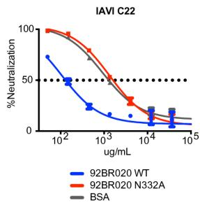

line

| ug/mL | 92BR020 WT | 92BR020 N332A | BSA |
|-------|------------|---------------|-----|
| 10^2  | 75         | 100           | 100 |
| 10^3  | 25         | 50            | 50  |
| 10^4  | 10         | 25            | 25  |
| 10^5  | 5          | 10            | 10  |

C   
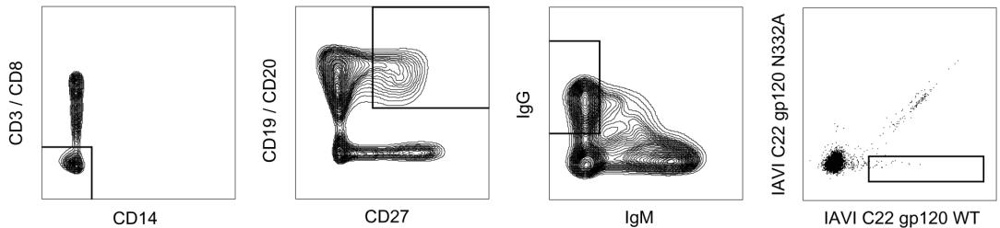  
D

<table><tr><td></td><td>ANTIBODY</td><td>DONOR</td><td>V GENE</td><td>J GENE</td><td>CDR3 LENGTH</td><td>CDR3 SEQUENCE</td><td>VJ % MUT (nt)</td><td>INSERTION &amp; DELETIONS</td></tr><tr><td rowspan="9">HEAVY CHAIN</td><td>PGDM11</td><td>14</td><td>IGHV3-11</td><td>IGHJ3*02</td><td>21</td><td>CARVAVGPMDSYYHDTTSAFDIW</td><td>20%</td><td>-2 (CDR1)</td></tr><tr><td>PGDM14</td><td>14</td><td>IGHV3-11</td><td>IGHJ3*02</td><td>21</td><td>CARVASGPNEDFYHDTEAAFDIW</td><td>12%</td><td>+1 (CDR1) / -5 (FR1)</td></tr><tr><td>PGDM21</td><td>82</td><td>IGHV4-34</td><td>IGHJ6*03</td><td>20</td><td>CARRTFWKSDYTGYYHFHMDVW</td><td>22%</td><td>+4 (CDR2)</td></tr><tr><td>PGDM31</td><td>26</td><td>IGHV1-8</td><td>IGHJ6*02</td><td>24</td><td>CARESRVPTRLLGIRGYYYYFGLEDW</td><td>15%</td><td></td></tr><tr><td>2G12</td><td>-</td><td>IGHV3-21</td><td>IGHJ3*01</td><td>16</td><td>CARKGSDRLSDNDPFDAW</td><td>20%</td><td></td></tr><tr><td>PGT121</td><td>17</td><td>IGHV4-59</td><td>IGHJ6*03</td><td>26</td><td>CARTLHGRRIYGIVAFNEWFTYFYMDVW</td><td>19%</td><td></td></tr><tr><td>PGT128</td><td>36</td><td>IGHV4-39</td><td>IGHJ5*02</td><td>21</td><td>CARFGGEVLRYTDWPKPAWVDLW</td><td>21%</td><td>+6 (CDR2)</td></tr><tr><td>PGT130</td><td>36</td><td>IGHV4-39</td><td>IGHJ5*02</td><td>21</td><td>CVRSGGDILYYYEWQKPHWFSPW</td><td>22%</td><td></td></tr><tr><td>PGT135</td><td>39</td><td>IGHV4-39</td><td>IGHJ5*02</td><td>20</td><td>CARHRHHDVFMLVPIAGWFDVW</td><td>20%</td><td>+5 (CDR1)</td></tr></table>

<table><tr><td rowspan="9">LIGHT CHAIN</td><td>PGDM11</td><td>14</td><td>IGKV2-24</td><td>IGKJ1*01</td><td>9</td><td>CFQGTHYPWTF</td><td>14%</td><td></td></tr><tr><td>PGDM14</td><td>14</td><td>IGKV2-24</td><td>IGKJ1*01</td><td>9</td><td>CMQGSHWAWAF</td><td>12%</td><td></td></tr><tr><td>PGDM21</td><td>82</td><td>IGKV3-20</td><td>IGKJ5*01</td><td>9</td><td>CQQYSVSLITF</td><td>15%</td><td></td></tr><tr><td>PGDM31</td><td>26</td><td>IGKV3-20</td><td>IGKJ3*01</td><td>9</td><td>CQQYTSLPFTF</td><td>18%</td><td></td></tr><tr><td>2G12</td><td>-</td><td>IGKV1-5</td><td>IGKJ1*01</td><td>9</td><td>CQHYAGYSATF</td><td>15%</td><td></td></tr><tr><td>PGT121</td><td>17</td><td>IGLV3-21</td><td>IGLJ3*02</td><td>12</td><td>CHIWDSRVPTKWKVF</td><td>19%</td><td>+3 (FR3) / -7 (FR1)</td></tr><tr><td>PGT128</td><td>36</td><td>IGLV2-8</td><td>IGLJ2*01</td><td>10</td><td>CGSLVGNWDVIF</td><td>9%</td><td>-5 (CDR1)</td></tr><tr><td>PGT130</td><td>36</td><td>IGLV2-8</td><td>IGLJ2*01</td><td>10</td><td>CSSLFGRWDVVF</td><td>12%</td><td></td></tr><tr><td>PGT135</td><td>39</td><td>IGKV3-15</td><td>IGKJ1*01</td><td>9</td><td>CQQYEEWPRTF</td><td>17%</td><td></td></tr></table>

Figure 1. Diversity of antibodies targeting the high-mannose patch epitope

(A) IAVI Protocol G donors (14, 82, 26) were screened for neutralization breadth and potency on an 6-virus indicator panel and compared to previously identified donors (36 and 17). Serum neutralization $\mathrm{IC}_{50}$ values are listed for each donor (above). Donor sera were screened on both wild-type (WT) and N332A pseudotype virus and the percent loss of neutralization values for each isolate are listed for the new donors (below). Percent loss of neutralization was calculated using the formula $100^{*}((\mathrm{WT}_{\mathrm{IC50}} - \mathrm{N332A}_{\mathrm{IC50}}) / \mathrm{WT}_{\mathrm{IC50}})$ . (B) WT and N332A 92BR020 gp120 were conjugated onto magnetic beads and used to adsorb neutralizing antibodies in donor sera before testing in heterologous neutralization assays with isolate IAVI C22. Isolates that demonstrated the largest differential in neutralization between WT and N332A constructs were advanced as baits for antigen-specific cell sorting. (C) Single IgG+ memory B cells were antigen-selected by flow cytometry into lysis buffer.

B cells were selected for phenotype CD3−/CD8−/C14−/IgM−/CD19+/CD20+/CD27+/IgG+. Sorted cells were then reverse transcribed into cDNA followed by PCR with gene-specific primers. (D) Variable heavy and light chain gene information, percent mutation from germline, and CDRH3 sequence, and insertions/deletions are tabulated for isolated antibodies (PGDM11, PGDM14, PGDM21, and PGDM31) and compared to previously isolated antibodies (2G12, PGT121, PGT128, PGT130, and PGT135). Antibody families are differentiated by color.

A 

<table><tr><td>WT</td><td>94UG103</td><td>92RW020</td><td>92BR020</td><td>JR-CSF</td><td>92TH021</td><td>IAVI C22</td></tr><tr><td>PGDM11</td><td>&gt;50</td><td>0.069</td><td>0.030</td><td>0.111</td><td>&gt;50</td><td>0.047</td></tr><tr><td>PGDM12</td><td>2.21</td><td>0.042</td><td>0.027</td><td>0.091</td><td>&gt;50</td><td>0.049</td></tr><tr><td>PGDM13</td><td>&gt;50</td><td>0.151</td><td>0.362</td><td>&gt;50</td><td>&gt;50</td><td>0.156</td></tr><tr><td>PGDM14</td><td>0.018</td><td>0.009</td><td>0.044</td><td>0.321</td><td>&gt;50</td><td>0.047</td></tr><tr><td>PGDM21</td><td>&gt;50</td><td>0.010</td><td>0.087</td><td>0.063</td><td>&gt;50</td><td>0.015</td></tr><tr><td>PGDM31</td><td>&gt;50</td><td>0.072</td><td>&gt;50</td><td>4.43</td><td>&gt;50</td><td>0.059</td></tr><tr><td colspan="3"></td><td colspan="3">Neutralization IC $_{50}$  (μg/mL)</td><td>&gt;50</td></tr></table>

B 

<table><tr><td>N332A</td><td>94UG103</td><td>92RW020</td><td>92BR020</td><td>JR-CSF</td><td>92TH021</td><td>IAVI C22</td></tr><tr><td>PGDM11</td><td>&gt;50</td><td>&gt;50</td><td>&gt;50</td><td>&gt;50</td><td>&gt;50</td><td>&gt;50</td></tr><tr><td>PGDM12</td><td>&gt;50</td><td>&gt;50</td><td>&gt;50</td><td>&gt;50</td><td>&gt;50</td><td>&gt;50</td></tr><tr><td>PGDM13</td><td>&gt;50</td><td>&gt;50</td><td>&gt;50</td><td>&gt;50</td><td>&gt;50</td><td>&gt;50</td></tr><tr><td>PGDM14</td><td>&gt;50</td><td>&gt;50</td><td>&gt;50</td><td>&gt;50</td><td>&gt;50</td><td>&gt;50</td></tr><tr><td>PGDM21</td><td>&gt;50</td><td>&gt;50</td><td>&gt;50</td><td>&gt;50</td><td>&gt;50</td><td>&gt;50</td></tr><tr><td>PGDM31</td><td>&gt;50</td><td>&gt;50</td><td>&gt;50</td><td>&gt;50</td><td>&gt;50</td><td>&gt;50</td></tr></table>

C 

<table><tr><td>CLADE</td><td>n</td><td>PGDM11</td><td>PGDM12</td><td>PGDM21</td><td>PGDM31</td><td>PGT121</td><td>PGT128</td><td>PGT130</td><td>PGT135</td></tr><tr><td>B</td><td>11</td><td>73%</td><td>82%</td><td>82%</td><td>27%</td><td>100%</td><td>82%</td><td>91%</td><td>36%</td></tr><tr><td>B (T/F)</td><td>9</td><td>67%</td><td>67%</td><td>78%</td><td>0%</td><td>100%</td><td>100%</td><td>89%</td><td>56%</td></tr><tr><td>C</td><td>14</td><td>36%</td><td>57%</td><td>43%</td><td>14%</td><td>79%</td><td>50%</td><td>36%</td><td>29%</td></tr><tr><td>C (T/F)</td><td>13</td><td>46%</td><td>46%</td><td>46%</td><td>8%</td><td>54%</td><td>62%</td><td>54%</td><td>23%</td></tr><tr><td>BC</td><td>8</td><td>63%</td><td>88%</td><td>75%</td><td>13%</td><td>75%</td><td>63%</td><td>50%</td><td>63%</td></tr><tr><td>A</td><td>8</td><td>38%</td><td>38%</td><td>50%</td><td>25%</td><td>50%</td><td>63%</td><td>63%</td><td>38%</td></tr><tr><td>CRF02_AG</td><td>9</td><td>44%</td><td>67%</td><td>33%</td><td>0%</td><td>78%</td><td>44%</td><td>33%</td><td>11%</td></tr><tr><td>CRF01_AE</td><td>10</td><td>0%</td><td>0%</td><td>0%</td><td>0%</td><td>10%</td><td>60%</td><td>70%</td><td>0%</td></tr><tr><td>CRF01_AE (T/F)</td><td>3</td><td>0%</td><td>0%</td><td>0%</td><td>0%</td><td>0%</td><td>67%</td><td>67%</td><td>0%</td></tr><tr><td>G</td><td>7</td><td>57%</td><td>71%</td><td>71%</td><td>29%</td><td>86%</td><td>29%</td><td>86%</td><td>29%</td></tr><tr><td>D, CD, AC, ACD</td><td>14</td><td>43%</td><td>50%</td><td>43%</td><td>7%</td><td>57%</td><td>50%</td><td>57%</td><td>43%</td></tr><tr><td>Total</td><td>106</td><td>45%</td><td>54%</td><td>49%</td><td>11%</td><td>66%</td><td>60%</td><td>61%</td><td>33%</td></tr><tr><td colspan="3">% Neutralization Breadth</td><td>100%</td><td>80%</td><td>60%</td><td>40%</td><td>20%</td><td>0%</td><td></td></tr></table>

D 

<table><tr><td>CLADE</td><td>n</td><td>PGDM11</td><td>PGDM12</td><td>PGDM21</td><td>PGDM31</td><td>PGT121</td><td>PGT128</td><td>PGT130</td><td>PGT135</td></tr><tr><td>B</td><td>11</td><td>0.669</td><td>0.348</td><td>0.069</td><td>2.68</td><td>0.038</td><td>0.019</td><td>0.683</td><td>1.52</td></tr><tr><td>B (T/F)</td><td>9</td><td>0.308</td><td>0.140</td><td>0.372</td><td>NA</td><td>0.026</td><td>0.019</td><td>0.804</td><td>7.94</td></tr><tr><td>C</td><td>14</td><td>0.359</td><td>0.549</td><td>0.722</td><td>2.09</td><td>0.460</td><td>0.039</td><td>0.121</td><td>12.7</td></tr><tr><td>C (T/F)</td><td>13</td><td>0.836</td><td>0.065</td><td>0.047</td><td>10.9</td><td>0.025</td><td>0.012</td><td>0.056</td><td>15.8</td></tr><tr><td>BC</td><td>8</td><td>0.518</td><td>0.214</td><td>0.178</td><td>2.56</td><td>0.008</td><td>0.010</td><td>3.12</td><td>0.033</td></tr><tr><td>A</td><td>8</td><td>5.08</td><td>0.406</td><td>0.133</td><td>50</td><td>0.031</td><td>0.058</td><td>1.23</td><td>0.792</td></tr><tr><td>CRF02_AG</td><td>9</td><td>0.536</td><td>0.239</td><td>0.180</td><td>NA</td><td>0.852</td><td>0.047</td><td>0.041</td><td>3.58</td></tr><tr><td>CRF01_AE</td><td>10</td><td>NA</td><td>NA</td><td>NA</td><td>NA</td><td>2.86</td><td>0.019</td><td>0.024</td><td>NA</td></tr><tr><td>CRF01_AE (T/F)</td><td>3</td><td>NA</td><td>NA</td><td>NA</td><td>NA</td><td>NA</td><td>2.42</td><td>0.028</td><td>NA</td></tr><tr><td>G</td><td>7</td><td>0.012</td><td>0.196</td><td>0.069</td><td>25.1</td><td>0.005</td><td>0.013</td><td>0.105</td><td>0.336</td></tr><tr><td>D, CD, AC, ACD</td><td>14</td><td>0.247</td><td>0.091</td><td>0.047</td><td>16.7</td><td>0.009</td><td>0.014</td><td>0.509</td><td>1.29</td></tr><tr><td>Total</td><td>106</td><td>0.41</td><td>0.18</td><td>0.10</td><td>4.45</td><td>0.03</td><td>0.02</td><td>0.20</td><td>0.79</td></tr><tr><td colspan="3">Median IC50(μg/mL)</td><td>50.0</td><td>10.0</td><td>1.00</td><td>0.100</td><td>0.010</td><td>0.001</td><td></td></tr></table>

Figure 2. High-mannose patch bnAbs isolated from different donors show differences in neutralization breadth and potency

Antibodies isolated from donor 14 (PGDM11, 12, 13, 14), donor 82 (PGDM21) and donor 26 (PGDM31) were evaluated for breadth and potency on a 6-virus panel with the N332 glycan site intact (A) and on the corresponding panel of viruses with the glycan site removed by alanine mutagenesis (B). Antibodies that produced in sufficient yield (PGDM11, PGDM12, PGDM21, and PGDM31) were evaluated for neutralization breadth (C) and potency (D) on a 106-virus panel.

A 

<table><tr><td colspan="6">PGDM12</td></tr><tr><td>BG505</td><td>N156A</td><td>N295A</td><td>N301A</td><td>N339A</td><td>N392A</td></tr><tr><td>N136A</td><td>1</td><td>enhance</td><td>6</td><td>1</td><td>1</td></tr><tr><td>N156A</td><td>-</td><td>2</td><td>15</td><td>1</td><td>1</td></tr><tr><td>N295A</td><td>-</td><td>-</td><td>LT</td><td>1</td><td>enhance</td></tr><tr><td>N301A</td><td>-</td><td>-</td><td>-</td><td>3</td><td>2</td></tr><tr><td>N339A</td><td>-</td><td>-</td><td>-</td><td>-</td><td>1</td></tr></table>

B

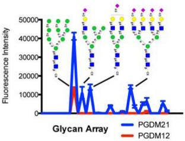

<table><tr><td colspan="6">PGDM21</td></tr><tr><td>BG505</td><td>N156A</td><td>N295A</td><td>N301A</td><td>N339A</td><td>N392A</td></tr><tr><td>N136A</td><td>1</td><td>enhance</td><td>1</td><td>enhance</td><td>enhance</td></tr><tr><td>N156A</td><td>-</td><td>5</td><td>&gt; 1000</td><td>1</td><td>1</td></tr><tr><td>N295A</td><td>-</td><td>-</td><td>LT</td><td>2</td><td>1</td></tr><tr><td>N301A</td><td>-</td><td>-</td><td>-</td><td>3</td><td>1</td></tr><tr><td>N339A</td><td>-</td><td>-</td><td>-</td><td>-</td><td>1</td></tr><tr><td colspan="6">Fold difference in neutralization IC50</td></tr></table>

C 

<table><tr><td>92BR020</td><td>PGT121</td><td>PGT124</td><td>PGT128</td><td>PGT130</td><td>PGDM11</td><td>PGDM12</td><td>PGDM21</td><td>PGT135</td><td>2G12</td><td>12A12</td></tr><tr><td>I322A</td><td>1.2</td><td>1.3</td><td>1.1</td><td>1.3</td><td>2.5</td><td>1.9</td><td>1.8</td><td>0.2</td><td>ND</td><td>ND</td></tr><tr><td>G324A</td><td>1.1</td><td>0.8</td><td>1.1</td><td>ND</td><td>0.9</td><td>1.0</td><td>1.4</td><td>0.2</td><td>0.5</td><td>0.3</td></tr><tr><td>D325A</td><td>1.1</td><td>0.5</td><td>0.6</td><td>&gt; 1000</td><td>0.8</td><td>0.8</td><td>&gt; 400</td><td>1.0</td><td>0.8</td><td>0.8</td></tr><tr><td>I326A</td><td>1.2</td><td>1.0</td><td>1.2</td><td>0.3</td><td>1.5</td><td>1.1</td><td>0.4</td><td>0.5</td><td>0.6</td><td>0.4</td></tr><tr><td>R327A</td><td>1.7</td><td>1.3</td><td>1.6</td><td>&gt; 1000</td><td>&gt; 300</td><td>&gt; 1000</td><td>1.0</td><td>0.8</td><td>0.9</td><td>0.7</td></tr><tr><td>Q328A</td><td>0.8</td><td>0.9</td><td>0.6</td><td>0.5</td><td>0.9</td><td>0.7</td><td>1.0</td><td>1.4</td><td>1.3</td><td>0.8</td></tr><tr><td>H330A</td><td>1.1</td><td>0.5</td><td>0.8</td><td>0.3</td><td>7.4</td><td>0.9</td><td>&gt; 400</td><td colspan="2">&gt; 1000</td><td>0.6</td></tr><tr><td>D325A + R327A</td><td>18</td><td>0.7</td><td>0.4</td><td>ND</td><td>&gt; 300</td><td>&gt; 1000</td><td>&gt; 400</td><td colspan="2">ND</td><td>ND</td></tr></table>

<table><tr><td>JR-CSF</td><td>PGT121</td><td>PGT124</td><td>PGT128</td><td>PGT130</td><td>PGDM11</td><td>PGDM12</td><td>PGDM21</td><td>PGT135</td><td>2G12</td><td>12A12</td></tr><tr><td>I322A</td><td>1.6</td><td>1.1</td><td>2.8</td><td>1.6</td><td>2.2</td><td>1.9</td><td>1.1</td><td>0.2</td><td>ND</td><td>ND</td></tr><tr><td>I323A</td><td>1.8</td><td>1.8</td><td>1.7</td><td>0.5</td><td>2.1</td><td>1.4</td><td>2.0</td><td>0.6</td><td>0.7</td><td>1.1</td></tr><tr><td>G324A</td><td>4.5</td><td>1.5</td><td>4.2</td><td>&gt; 1000</td><td>6.0</td><td>2.2</td><td>18</td><td>0.1</td><td>ND</td><td>ND</td></tr><tr><td>D325A</td><td>9.0</td><td>1.6</td><td>1.4</td><td>&gt; 1000</td><td>0.9</td><td>0.9</td><td>&gt; 500</td><td>0.8</td><td>0.6</td><td>0.9</td></tr><tr><td>I326A</td><td>1.4</td><td>1.0</td><td>1.5</td><td>1.4</td><td>1.6</td><td>1.2</td><td>0.9</td><td>0.8</td><td>0.7</td><td>1.2</td></tr><tr><td>R327A</td><td>1.5</td><td>1.1</td><td>2.2</td><td>0.8</td><td>&gt; 100</td><td>&gt; 500</td><td>0.9</td><td>0.1</td><td>ND</td><td>ND</td></tr><tr><td>Q328A</td><td>1.4</td><td>1.4</td><td>1.1</td><td>1.1</td><td>3.1</td><td>1.8</td><td>1.7</td><td>2.2</td><td>ND</td><td>ND</td></tr><tr><td>H330A</td><td>1.2</td><td>1.0</td><td>1.5</td><td>0.4</td><td>&gt; 100</td><td>9.0</td><td>42</td><td>67</td><td>0.7</td><td>1.4</td></tr><tr><td>D325A + R327A</td><td>&gt; 1000</td><td>&gt; 1000</td><td>1.1</td><td>&gt; 1000</td><td>&gt; 100</td><td>&gt; 500</td><td>&gt; 500</td><td>ND</td><td>ND</td><td>ND</td></tr></table>

Fold difference in neutralization $\mathsf{IC}_{50}$

Figure 3. Differences in epitope recognition of glycans and the C-terminal end of V3 loop (A) Antibodies PGDM12 (donor 14) and PGDM21 (donor 82) were evaluated for neutralization activity against double glycan site mutants at or near the high-mannose patch epitope. Listed values show fold difference in neutralization IC $_{50}$ . LT indicates low viral titers and ‘enhance’ denotes enhancement of neutralization IC $_{50}$ values compared to WT. (B) PGDM12 and PGDM21 were evaluated for binding to a glycan array. PGDM21 shows binding to Man $_{9}$ GlcNAc $_{2}$ and various complex-type glycans. PGDM12 shows binding only to Man $_{9}$ GlcNAc $_{2}$ . (C) Single alanine mutants of the ${}^{322}$ IIGDIRQAH $^{330}$ residues at the C-terminal base of the V3 loop were produced for isolates 92BR020 and JR-CSF and tested for neutralization by the listed antibodies. ND denotes not determined.

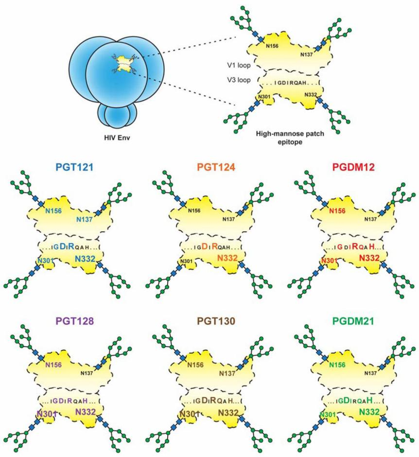  
Figure 4. Mapping overlapping antibody epitope footprints   
Pairwise alanine mutants were created for N137, N156, N301, and N332 glycans and the ${}^{324}$ GDIRQAH $^{330}$ residues of the V3 loop. Virus mutants were then tested for neutralization by PGT121, PGT124, PGT128, PGT130, PGDM12, PGDM21 and, as a control, the CD4 binding site antibody 12A12. Epitope summaries for all of the tested high-mannose patch antibodies are shown and are derived from neutralization data shown in Figure S1 and Table S5. Dependence on residues are highlighted by color and degree of dependence is shown by relative letter sizes for residues and glycan sites.

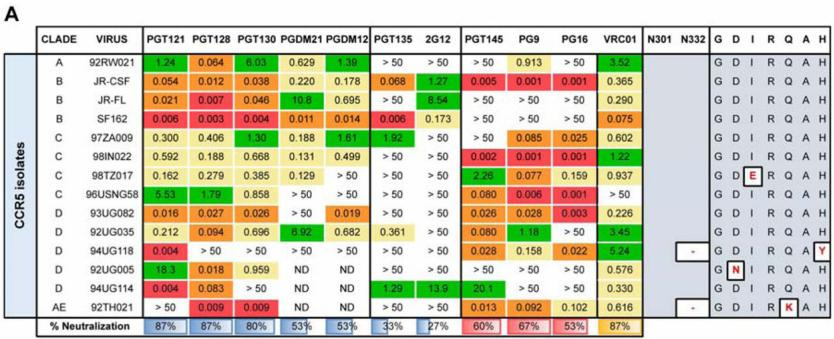

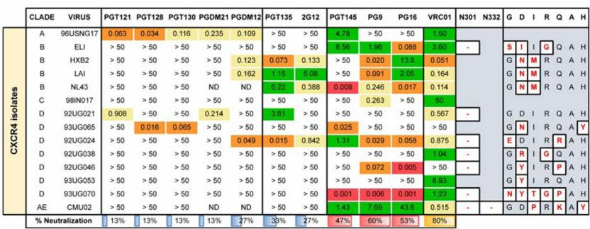

heatmap

| CXCR4 isolates | CLADE<fcel>VIRUS<fcel>PGT121<fcel>PGT128<fcel>PGT130<fcel>PGDM21<fcel>PGDM12<fcel>PGT135<fcel>2G12<fcel>PGT145<fcel>PG9<fcel>PG16<fcel>VRC01<fcel>N301<fcel>N332<fcel>G<fcel>D<fcel>I<fcel>R<fcel>Q<fcel>A<fcel>H<nl><ucel><fcel>A<fcel>96USNG17<fcel>0.063<fcel>0.034<fcel>0.116<fcel>0.235<fcel>0.109<fcel>> 50<fcel>> 50<fcel>4.78<fcel>> 50<fcel>> 50<fcel>1.50<ecel><ecel><ecel><ecel><ecel><ecel><ecel><ecel><nl><ucel><fcel>B<fcel>ELI<fcel>> 50<fcel>> 50<fcel>> 50<fcel>> 50<fcel>> 50<fcel>> 50<fcel>> 50<fcel>8.56<fcel>1.96<fcel>0.088<fcel>3.60<fcel>-<ecel><fcel>S<fcel>I<fcel>I<fcel>G<fcel>Q<fcel>A<nl><ucel><fcel>B<fcel>HXB2<fcel>> 50<fcel>> 50<fcel>> 50<fcel>> 50<fcel>0.123<fcel>0.073<fcel>0.133<fcel>> 50<fcel>0.020<fcel>13.9<fcel>0.051<ecel><ecel><fcel>G<fcel>N<fcel>M<fcel>R<fcel>Q<fcel>A<nl><ucel><fcel>B<fcel>LAI<fcel>> 50<fcel>> 50<fcel>> 50<fcel>> 50<fcel>0.162<fcel>1.15<fcel>5.08<fcel>> 50<fcel>0.091<fcel>2.05<fcel>0.164<ecel><ecel><fcel>G<fcel>N<fcel>M<fcel>R<fcel>Q<fcel>A<nl><ucel><fcel>B<fcel>NL43<fcel>> 50<fcel>> 50<fcel>> 50<fcel>ND<fcel>ND<fcel>6.22<fcel>0.388<fcel>0.008<fcel>0.246<fcel>0.017<fcel>0.114<ecel><ecel><fcel>G<fcel>N<fcel>M<fcel>R<fcel>Q<fcel>A<nl><ucel><fcel>C<fcel>98IN017<fcel>> 50<fcel>> 50<fcel>> 50<fcel>> 50<fcel>> 50<fcel>> 50<fcel>> 50<fcel>> 50<fcel>0.263<fcel>> 50<fcel>50<ecel><ecel><ecel><ecel><ecel><ecel><ecel><ecel><nl><ucel><fcel>D<fcel>92UG021<fcel>0.908<fcel>> 50<fcel>> 50<fcel>0.214<fcel>> 50<fcel>3.61<fcel>> 50<fcel>> 50<fcel>> 50<fcel>> 50<fcel>0.567<ecel><ecel><ecel><ecel><ecel><ecel><ecel><ecel><nl><ucel><fcel>D<fcel>93UG065<fcel>> 50<fcel>0.016<fcel>0.065<fcel>> 50<fcel>> 50<fcel>> 50<fcel>> 50<fcel>0.025<fcel>> 50<fcel>> 50<ecel><ecel><ecel><ecel><ecel><ecel><ecel><ecel><ecel><nl><ucel><fcel>D<fcel>92UG024<fcel>> 50<fcel>> 50<fcel>> 50<fcel>> 50<fcel>0.049<fcel>0.015<fcel>0.842<fcel>1.31<fcel>0.029<fcel>0.058<fcel>0.875<ecel><ecel><ecel><ecel><ecel><ecel><ecel><ecel><nl><ucel><fcel>D<fcel>92UG038<fcel>> 50<fcel>> 50<fcel>> 50<fcel>> 50<fcel>> 50<fcel>> 50<fcel>> 50<ecel><ecel><ecel><ecel><ecel><ecel><ecel><ecel><ecel><ecel><ecel><ecel><nl><ucel><ucel><ucel><ucel><ucel><ucel><ucel><ucel><ucel><ucel><ucel><ucel><ucel><ucel><ucel><ucel><ucel><ucel><ucel><ucel><ucel><ucel><nl><ucel><ucel><ucel><ucel><ucel><ucel><ucel><ucel><ucel><ucel><ucel><ucel><ucel><ucel><ucel><ucel><ucel><ucel><ucel><ucel><ucel><ucel><nl><ucel><ucel><ucel><ucel><ucel><ucel><ucel><ucel><ucel><ucel><ucel><ucel><ucel><ucel><ucel><ucel><ucel><ucel><ucel><ucel><ucel><ucel><nl><ucel><ucel><ucel><ucel><ucel><ucel><ucel><ucel><ucel><ucel><ucel><ucel><ucel><ucel><ucel><ucel><ucel><ucel><ucel><ucel><ucel><ucel><nl><ucel><ucel><ucel><ucel><ucel><ucel><ucel><ucel><ucel><ucel><ucel><ucel><ucel><ucel><ucel><ucel><ucel><ucel><ucel><ucel><ucel><ucel><nl><ucel><ucel><ucel><ucel><ucel><ucel><ecel><ecel><ecel><ecel><ecel><ecel><ecel><ecel><ecel><ecel><ecel><ecel><ecel><ecel><ecel><ecel><nl>

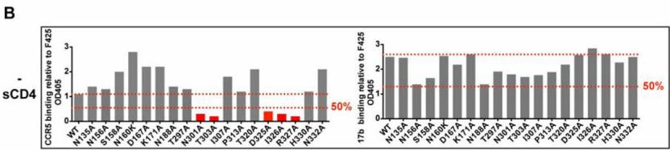

bar

| Gene | CCR5 binding relative to F425 (sCD4) | T7b binding relative to F425 (sCD4) |
|---|---|---|
| WT | 1.0 | 2.5 |
| N135A | 1.5 | 2.5 |
| N156A | 1.5 | 2.5 |
| S158A | 1.5 | 2.0 |
| D160K | 2.8 | 2.5 |
| D167A | 2.2 | 2.0 |
| K171A | 2.2 | 2.0 |
| N183A | 2.2 | 2.0 |
| T297A | 1.5 | 1.5 |
| N301A | 0.5 | 1.0 |
| T003A | 0.5 | 1.0 |
| P313A | 1.8 | 2.0 |
| T320A | 2.0 | 2.0 |
| D264A | 0.5 | 1.0 |
| R327A | 0.5 | 1.0 |
| H339A | 0.5 | 1.0 |
| N322A | 2.0 | 2.5 |
The chart includes two horizontal reference lines at 50% and a dotted line at 1.0%. The left panel shows the absolute binding values for each gene, while the right panel indicates the corresponding binding values for the same gene.

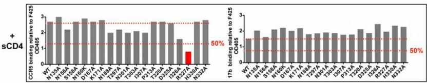

bar

+ sCD4
| sCD4 | CCRS binding relative to F425 OD405 | YTB binding relative to F425 OD405 |
|---|---|---|
| WT | 2.8 | 1.9 |
| N135A | 3.0 | 2.1 |
| N156A | 2.1 | 1.7 |
| S156A | 2.9 | 2.1 |
| D160K | 2.9 | 2.2 |
| D676A | 2.9 | 2.1 |
| K171A | 2.9 | 2.1 |
| N188A | 2.8 | 2.1 |
| T287A | 2.0 | 2.1 |
| N301A | 2.0 | 2.1 |
| T303A | 2.0 | 2.1 |
| P313A | 2.0 | 2.1 |
| T320A | 2.8 | 2.1 |
| D326A | 2.8 | 2.1 |
| D26X | 2.8 | 2.1 |
| R327A | 1.5 | 2.5 |
| H339A | 2.8 | 2.1 |
| N332A | 2.8 | 2.3 |
The chart displays two vertical bars, each labeled with a percentage value (50%), indicating that the y-axis values are normalized to the left of the right axis (OD405). The x-axis labels are the specific protein variants or mutations associated with these two conditions.

Figure 5. Functional conservation of the $^{334}$ GDIRQAH $^{330}$ peptide site

(A) CXCR4-tropic viruses are more resistant than CCR5-tropic viruses to neutralization by high-mannose patch antibodies. All viruses were grown in HIV-naïve PBMCs and tested for neutralization in a TZM-bl luciferase assay. For each virus, missing glycan sites at N301 or N332 and mutations from the canonical GDIRQAH sequence are shown. V2-apex antibodies PGT145, PG9, and PG16 as well as the CD4 binding site antibody VRC01 were included for comparison. ND = not determined. IC $_{50}$ values are reported in $\mu$ g/ml (B) A CCR5 N-terminal peptide-Fc construct was tested for binding to gp120 alanine mutants and showed dependence on the N301 glycan sequon and the ${}^{325}$ DIR ${}^{327}$ residues of gp120. Gp120 mutants were prepared from pseudovirions and captured via an anti-C5 antibody on ELISA plates. Due to low affinity, the CCR5 peptide-Fc was biotinylated and tetramerized with streptavidin before binding to captured gp120 mutants. The CD4i antibody 17b was included for comparison. All values are normalized to the V3-specific antibody F425 (B4e8). Soluble CD4 (sCD4) was added to a final concentration of 5 $\mu$ g/mL where indicated. End-point OD405 values that showed less than 50% binding relative to wild-type (WT) are highlighted in red.

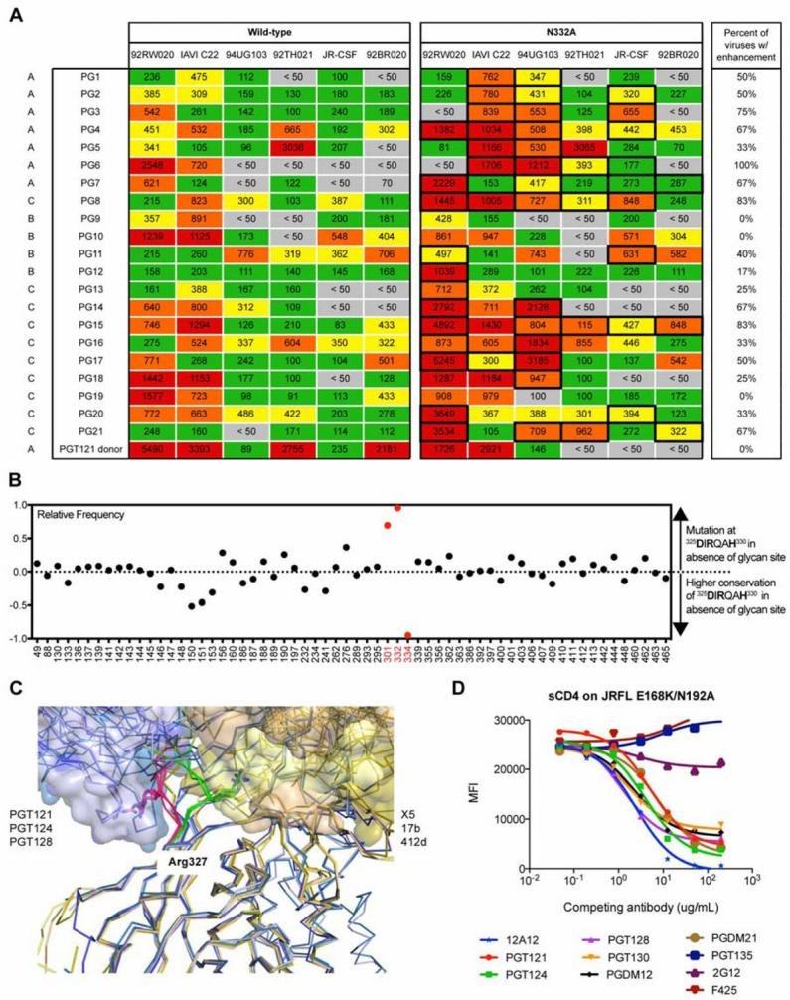  
Figure 6. V3-glycan antibodies allosterically inhibit CD4 binding   
(A) Sera from 21 donors of the IAVI protocol G cohort were tested for neutralization on a 6-virus cross-clade panel of pseudoviruses with and without the glycan at the N332 position. Listed values are serum neutralization IC $_{50}$ . Neutralization titers that showed higher potency in the absence of the N332 glycan compared to the wild-type virus are highlighted with a bold box, and the percentages of viruses that resulted in enhanced neutralization potency in the absence of the N332 glycan site are listed. Serum from the PGT121 donor (N332 glycan dependent) was included as a control. (B) Among 42,715 HIV Env sequences in the Los Alamos database, 23,158 (54%) have the “GDIRQAH” sequence, while 19,557 (46%) deviate at D325, R327, or H330 residues. Using 46% as a baseline measurement of mutation at these residues by chance, every glycan site on Env was then evaluated for greater mutation (>0) or greater conservation (<0) of these residues in the absence of individual glycan sites. (C) Key contacts to residues ${}^{324}$ GDIRQAH $^{330}$ on gp120 by GDIR-bnAbs and CD4i antibodies. Overlaid liganded structures of PGT122, PGT124 and PGT128 (shades of blue) with key contacts to the ${}^{324}$ GDIRQAH $^{330}$ residues on gp120 highlighted in red. These structures are overlaid with liganded structures of CD4i antibodies 17b, X5, and 412d (shades of yellow) with key contacts to the ${}^{324}$ GDIRQAH $^{330}$ residues on gp120 highlighted in green. Arg327 on gp120 for all structures is shown as sticks. All structures are aligned on

gp120. (D) High-mannose patch antibodies were tested for competition with sCD4 on isolate JR-FL E168K/N192A Env displayed on the surface of 293T cells. The CD4 binding site antibody 12A12 was included as a positive control and the V3-specific antibody F425 was included as a negative control.

A   
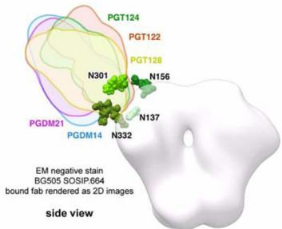

text_image

PGT124
PGT122
PGT128
N301
N156
PGDM21
N137
PGDM14
N332
EM negative stain
BG505 SOSIP.664
bound fab rendered as 2D images
side view

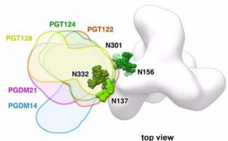

text_image

PGT128
PGT124
PGT122
N301
N332
N156
PGDM21
PGDM14
N137
top view

B 

<table><tr><td rowspan="2">Donor ID</td><td rowspan="2">Antibody family</td><td rowspan="2">VH-gene family</td><td rowspan="2">Median IC $_{10}$ (μg/ml)</td><td rowspan="2">Breadth</td><td rowspan="2"> $^{232}\mathrm {GDIR}^{237}$ interactions</td><td colspan="2">V1/V2</td><td colspan="3">V3</td><td colspan="2">V4</td><td rowspan="2">Competes with sCD4</td><td rowspan="2">Somatic variants</td></tr><tr><td>N136</td><td>N156</td><td>N295</td><td>N301</td><td>N332</td><td>N386</td><td>N392</td></tr><tr><td rowspan="2">17</td><td>PGT121</td><td>IGVH4-59</td><td>0.03</td><td>66% (n=106)</td><td>D325 + R327</td><td>✓</td><td>✓</td><td></td><td>✓</td><td>✓</td><td></td><td></td><td>yes</td><td rowspan="2">PGT122, PGT123,PGT133, 10-1074</td></tr><tr><td>PGT124</td><td>IGVH4-59</td><td>0.05a</td><td>62% (n=120)a</td><td>D325 + R327</td><td></td><td></td><td></td><td></td><td>✓</td><td></td><td></td><td>yes</td></tr><tr><td rowspan="2">36</td><td>PGT128</td><td>IGVH4-39</td><td>0.02</td><td>60% (n=106)</td><td>peptide backbone</td><td></td><td></td><td>✓</td><td>✓</td><td>✓</td><td></td><td></td><td>yes</td><td rowspan="2">PGT125, PGT126,PGT127, PGT131</td></tr><tr><td>PGT130</td><td>IGVH4-39</td><td>0.20</td><td>61% (n=106)</td><td>D325, R327</td><td></td><td></td><td>✓</td><td>✓</td><td>✓</td><td></td><td></td><td>yes</td></tr><tr><td>14</td><td>PGDM12</td><td>IGVH3-11</td><td>0.18</td><td>54% (n=106)</td><td>R327</td><td></td><td></td><td>✓</td><td></td><td>✓</td><td></td><td></td><td>yes</td><td>PGDM11, PGDM13,PGDM14</td></tr><tr><td>82</td><td>PGDM21</td><td>IGVH4-34</td><td>0.10</td><td>49% (n=106)</td><td>D325</td><td></td><td></td><td>✓</td><td></td><td>✓</td><td></td><td></td><td>yes</td><td>-</td></tr><tr><td>26</td><td>PGDM31</td><td>IGVH1-8</td><td>4.45</td><td>11% (n=106)</td><td>ND</td><td></td><td></td><td></td><td>ND</td><td></td><td></td><td></td><td>ND</td><td>-</td></tr><tr><td>39</td><td>PGT135</td><td>IGVH4-39</td><td>0.79</td><td>33% (n=106)</td><td>-</td><td></td><td></td><td>✓</td><td></td><td>✓</td><td>✓</td><td>✓</td><td>no</td><td>PGT136, PGT137</td></tr><tr><td>-</td><td>2G12</td><td>IGVH3-21</td><td>2.38b</td><td>32% (n=162)b</td><td>-</td><td></td><td></td><td>✓</td><td></td><td>✓</td><td>✓</td><td>✓</td><td>no</td><td>-</td></tr></table>

$^{a}$ Neutralization data from Sok et al., 2014a $^{b}$ Neutralization data from Walker et al., 2011

C   
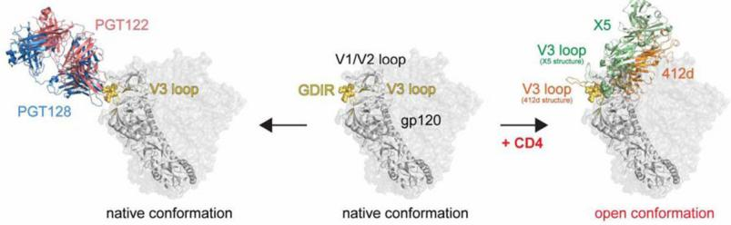

text_image

PGT122
V3 loop
PGT128
native conformation
V1/V2 loop
GDIR
gp120
native conformation
V3 loop
(X5 structure)
V3 loop
(412d structure)
+ CD4
open conformation
X5
412d

Figure 7. Epitope recognition on native Env by V3-glycan antibodies

(A) Negative-stain EM of antibody Fabs on BG505 SOSIP.664. X-ray structures of gp120 liganded with PGT124 (PDB 4R2G), PGT122 (PDB 4TVP) and PGT128 (PDB 4TYG) were superimposed onto gp120 in the unliganded trimer volume using the 'MatchMaker' function in Chimera. All glycans shown are part of the 4TVP X-ray structure. For PGDM14 and PGDM21, the relative orientations of both Fabs were mapped onto a low resolution surface volume generated from the BG505 SOSIP.664 X-ray structure (PDB 4TVP). The reconstructions of PGDM14 (EMD-8181) and PGDM21 (EMD-8182) were superimposed onto this trimer volume using the 'Fit in Map' function in Chimera (https://www.cgl.ucsf.edu/chimera/). (B) Summary table of all GDIR-glycan bnAb families. Donor ID refers to the IAVI Protocol G donor ID (Simek et al., 2009), ND indicates not determined. (C) Proposed recognition of overlapping epitopes between V3-glycan antibodies and CD4i antibodies. In addition to making contacts to the $^{324}\mathrm{GDIRQAH}^{330}$ peptide region, CD4i antibodies require formation of the bridging sheet on gp120 following CD4 engagement in order to bind and therefore can only bind open conformations of the Env trimer. V3-glycan antibodies are capable of binding the immunogenic $^{324}\mathrm{GDIRQAH}^{330}$ peptide region on native Env in the absence of CD4 by penetrating the glycan shield and also directly binding the surrounding glycans.