# mmc2 (4)

# Cell Reports

# Broadly neutralizing antibodies targeting a conserved silent face of spike RBD resist extreme SARS-CoV-2 antigenic drift

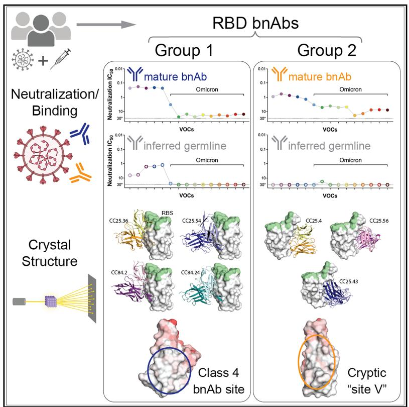  
Graphical abstract

# Authors

Ge Song, Meng Yuan, Hejun Liu, ..., Dennis R. Burton, Ian A. Wilson, Raiees Andrabi

# Correspondence

burton@scripps.edu (D.R.B.), wilson@scripps.edu (I.A.W.), raiees.andrabi@pennmedicine.upenn.edu (R.A.)

# In brief

Identifying and understanding the molecular basis of conserved spike epitopes targeted by broadly neutralizing antibodies (bnAbs) are key for developing broad coronavirus vaccine design. Song et al. reveal how group 1 and 2 RBD bnAbs neutralize diverse sarbecoviruses and resist SARS-CoV-2 Omicron antigenic drift through detailed molecular and structural characterization.

# Highlights

# Article

# Broadly neutralizing antibodies targeting a conserved silent face of spike RBD resist extreme SARS-CoV-2 antigenic drift

Ge Song, $^{1,2,3,9}$ Meng Yuan, $^{4,9}$ Hejun Liu, $^{4,9}$ Tazio Capozzola, $^{1,2,3,5,9}$ Ryan N. Lin, $^{4}$ Jonathan L. Torres, $^{4}$ Wan-ting He, $^{1,2,3}$ Rami Musharrafieh, $^{1,2,3}$ Katharina Dueker, $^{1,2,3}$ Panpan Zhou, $^{1,2,3}$ Sean Callaghan, $^{1,2,3}$ Nitesh Mishra, $^{1,2,3}$ Peter Yong, $^{1,2,3}$ Fabio Anzanello, $^{1,2,3}$ Gabriel Avillion, $^{1,2,3}$ Anh Lina Vo, $^{1,2,3,5}$ Xuduo Li, $^{1,2,3,5}$ Yuexiu Zhang, $^{5}$ Muzamil Makhdoomi, $^{1}$ Ziqi Feng, $^{4}$ Xueyong Zhu, $^{4}$ Linghang Peng, $^{1}$ David Nemazee, $^{1}$ Yana Safonova, $^{6}$ Bryan Briney, $^{1,3}$ Andrew B. Ward, $^{2,3,4}$ Dennis R. Burton, $^{1,2,3,7,*}$ Ian A. Wilson, $^{2,3,4,8,*}$ and Raiees Andrabi $^{1,2,3,5,10,*}$

$^{1}$ Department of Immunology and Microbiology, The Scripps Research Institute, La Jolla, CA 92037, USA

$^{2}$ IAVI Neutralizing Antibody Center, The Scripps Research Institute, La Jolla, CA 92037, USA

$^{3}$ Consortium for HIV/AIDS Vaccine Development (CHAVD), The Scripps Research Institute, La Jolla, CA 92037, USA

$^{4}$ Department of Integrative Structural and Computational Biology, The Scripps Research Institute, La Jolla, CA 92037, USA

$^{5}$ Department of Medicine, University of Pennsylvania, Philadelphia, PA 19104, USA

$^{6}$ Department of Computer Science, Johns Hopkins University, Baltimore, MD 21218, USA

$^{7}$ Ragon Institute of Massachusetts General Hospital, Massachusetts Institute of Technology, and Harvard University, Cambridge, MA 02139, USA

$^{8}$ Skaggs Institute for Chemical Biology, The Scripps Research Institute, La Jolla, CA 92037, USA

$^{9}$ These authors contributed equally

$^{10}$ Lead contact

*Correspondence: burton@scripps.edu (D.R.B.), wilson@scripps.edu (I.A.W.), raiees.andrabi@pennmedicine.upenn.edu (R.A.)

https://doi.org/10.1016/j.celrep.2025.115948

# SUMMARY

Developing broad coronavirus vaccines hinges on identifying and understanding the molecular basis of conserved spike epitopes targeted by broadly neutralizing antibodies (bnAbs). Building on our earlier work identifying sarbecovirus receptor-binding domain (RBD) group 1 and 2 bnAbs, we now show that several of these antibodies retain neutralizing activity against highly mutated SARS-CoV-2 variants, including BA.2.86 and JN.1. Structural studies reveal that group 1 bnAbs use recurrent germline-encoded heavy-chain complementarity-determining region 3 (CDRH3) features to interact with a conserved RBD region that overlaps with class 4 bnAb site. Group 2 bnAbs recognize a less well-defined “site V” on the RBD and destabilize spike trimer. Notably, site V remains largely unchanged across SARS-CoV-2 variants and is conserved among diverse sarbecoviruses, highlighting its potential as a broad vaccine target. Our findings underscore the need for targeted vaccine strategies to induce immunofocused B cell responses to escape resistant sub-dominant spike RBD bnAb epitopes.

# INTRODUCTION

Broadly neutralizing antibody (bnAb) epitope-based vaccines are an important strategy for developing effective interventions against coronaviruses. Among the most potent and dominant neutralizing antibodies (nAbs) elicited in SARS-CoV-2 human infection or vaccination are those targeting the SARS-CoV-2 spike receptor-binding domain (RBD). $^{1-10}$ Vaccines that induce these spike RBD nAbs have shown high effectiveness in reducing COVID-19 disease severity and hospitalization. $^{11-14}$ However, the emergence of SARS-CoV-2 variants of concern (VOCs) has led to the majority of these RBD-targeting antibodies losing their neutralizing activity. $^{15-24}$ The bulk of the mutations on the spikes of SARS-CoV-2 VOCs occur in the RBD region, resulting in substantially reduced potency or loss of neutralizing activity of most clinically approved

RBD-targeting nAbs. $^{15,21,25}$ These challenges highlight the urgent need to identify bnAbs that can target RBD epitopes that are more highly conserved and resistant to mutation. Such bnAbs are crucial for developing antibody-based interventions and variant-proof vaccines and may also be important against emerging coronaviruses with the potential to seed future pandemics in humans.

RBD nAbs have been classified into 4 major classes, class 1–4, and several subclasses. $^{3,10,26}$ Class 1 and 2 RBD antibodies are the most potent and frequently elicited nAbs that target overlapping regions of the receptor-binding site (RBS), where the host cell receptor ACE2 binds. $^{3,6,10,26,27}$ These nAbs exhibit limited cross-reactivity with related coronaviruses and are easily escaped by SARS-CoV-2 variants. $^{26,27}$ Class 3 and 4 RBD nAbs are less potent and are less frequently elicited in humans but target relatively more conserved regions of the RBD and exhibit

cross-reactivity with VOCs and diverse sarbecoviruses. $^{3,26,28-38}$ Elicitation of nAb responses that target class 3 and 4 RBD sites or the nearby overlapping nAb epitopes are thus more desirable for broad sarbecovirus vaccine strategies.

In a previous study, we described two sets of RBD bnAbs, group 1 and group 2, that neutralize diverse ACE2-utilizing sarbecoviruses and exhibit binding to clade 2 and 3 non-ACE2 sarbecovirus spike RBDs by targeting more conserved RBD epitopes. $^{34}$ This categorization differs from the four major classes described earlier, as the fine epitopes specificities targeted by these antibodies are not yet well characterized. Group 1 RBD bnAbs exhibit greater neutralization potency, whereas group 2 bnAbs are relatively less potent but demonstrate broader binding across sarbecovirus clades, particularly clade 2. Both group 1 and group 2 RBD bnAbs appear to be less frequently elicited in SARS-CoV-2 infection or vaccination and were isolated from two individuals with hybrid immunity (COVID-19 recovered and then vaccinated humans). $^{34}$

In the current study, we investigated the molecular basis of sarbecovirus neutralization breadth by these group 1 and 2 RBD bnAbs and implications for broad coronavirus vaccine strategies. We first tested the neutralization capacity of a select subset of the most potent and broadest group 1 and group 2 RBD bnAbs with recently emerged SARS-CoV-2 variants. We observed that some of these RBD bnAbs still retain neutralizing activities against highly evolved SARS-CoV-2 variants, including BA.2.86 and JN.1. Group 2 RBD bnAbs were less affected by the highly evolved more recent Omicron escape mutations. Furthermore, we determined crystal structures of multiple group 1 and group 2 RBD bnAbs to provide a molecular basis for the broad neutralization of sarbecoviruses and resistance to Omicron neutralization escape. The group 1 RBD bnAbs target a relatively conserved epitope proximal to the class 4 nAb target site or CR3022 cryptic site. The group 2 RBD bnAbs recognize a conserved and relatively “silent” face of the spike RBD, previously termed site V or lateral site. $^{10}$ The group 2 RBD bnAb site V is cryptic on the native-like spike (i.e., remaining inaccessible in the RBD-down conformation and likely becoming exposed only upon transition to the RBD-up state), and bnAbs targeting this site likely disrupt the spike as a possible mechanism of neutralization. Our data further suggest that both group 1 and 2 RBD bnAb memory B cells may be boostable with bivalent or heterologous SARS spike vaccines toward greater neutralization breadth. Overall, we provide a detailed molecular characterization of RBD bnAb epitopes that could serve as templates for the development of broad coronavirus vaccines, provided that appropriate immunogens can be engineered.

# RESULTS

# Sarbecovirus spike RBD bnAbs that resist SARS-CoV-2 antigenic escape

As SARS-CoV-2 antibody escape variants continue to emerge, it has become increasingly important to identify bnAbs targeting conserved epitopes that can tolerate the large number of antigenic escape mutations found especially on the Omicron variants. We previously isolated a broad panel of sarbecovirus bnAbs from COVID-19-recovered donors who were subsequently vaccinated. $^{34}$ These bnAbs target two distinct regions

on the RBD, categorized as group 1 and group 2, based on competition binning studies using SARS-CoV-2 nAbs of known specificities. Group 1 bnAbs compete with RBD class 4 site nAbs, and group 2 bnAbs target a less well-characterized conserved RBD region. Here, to investigate the ability of these bnAbs to resist SARS-CoV-2 escape mutations, we tested the neutralization ability of the group 1 (n = 14) and group 2 (n = 5) RBD bnAbs against a broad panel of SARS-CoV-2 variants including Omicron lineage variants (Figure 1; Table S1). Group 1 RBD bnAbs were found to be relatively more potent and neutralized the early SARS-CoV-2 variants (Alpha, Beta, Gamma, and Delta) equally efficiently; however, their neutralizing activities dropped substantially against the Omicron variants (geometric mean 50% inhibitory concentration $[IC_{50}]$ change: range = 14- to 105-fold $IC_{50}$ drop) (Figure 1B; Table S1). The most pronounced neutralization loss was observed against BA.2 (geometric mean $IC_{50}$ drop = 105-fold) and BA.2.75 (geometric mean $IC_{50}$ drop = 104-fold) Omicron variants. Notably, four of the group 1 RBD bnAbs (CC25.3, CC25.36, CC25.54, and CC84.24) retained neutralizing activity (albeit less potently with Omicron variants) with most or all of the SARS-CoV-2 variants tested (Table S1).

Group 2 RBD bnAbs were shown to have an intrinsically lower neutralization IC $_{50}$ potency but were comparatively less sensitive to Omicron variant mutations (geometric mean IC $_{50}$ change: range = 2- to 17-fold IC $_{50}$ drop) (Figure 1C; Table S1). Similar to group 1 RBD bnAbs, neutralization by the group 2 RBD bnAbs was minimally affected against the non-Omicron SARS-CoV-2 variants. One out of five group 2 RBD bnAbs substantially lost neutralization with the Omicron variants (Table S1), but 3 of the 5 group 2 RBD bnAbs (CC25.4, CC25.17, and CC25.56) retained neutralization activities, albeit with IC $_{50}$ 's in the μg/mL range, against most or all of the variants tested. The IC $_{50}$ neutralization changes for these 3 group 2 RBD bnAbs against the SARS-CoV-2 Omicron variants were modest suggesting targeting of spike epitopes that are relatively more resistant to antibody immune escape. The BQ.1.1 variant displayed the most neutralization resistance to group 2 RBD bnAbs compared to the wild-type (WT) SARS-CoV-2 (12-fold drop in geometric mean IC $_{50}$ ). Nevertheless, the neutralization activities of 3 group 2 RBD bnAbs remained largely unchanged against the one of the most evolved Omicron variants, JN.1 (Table S1), which was the most dominant SARS-CoV-2 variant (65% infections) circulating in the United States around March 2024. As a comparison, we also tested 5 RBD nAbs that have been shown to target conserved RBD epitopes. $^{30,32,36,39,40}$ Class 3 RBD site nAb, S309, showed the most breadth, retaining neutralization against all Omicron variants tested except for BA.2.86 and JN.1. However, all 5 of these nAbs lost neutralization with these highly resistant SARS-CoV-2 variants (Table S1).

Altogether, we noted that multiple RBD bnAbs from group 1 and 2 represent examples of human bnAbs that retain neutralizing activity with highly evolved SARS-CoV-2 variants. In particular, some group 2 RBD bnAbs can effectively resist the extreme Omicron lineage antigenic drift. These features support the potential utilization of group 1 and 2 RBD bnAbs as templates for variant-proof SARS-CoV-2 vaccines and potentially antibody-based interventions.

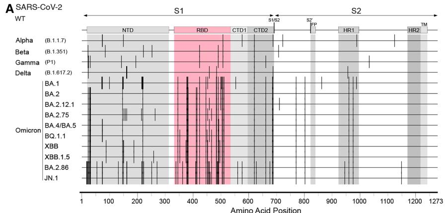

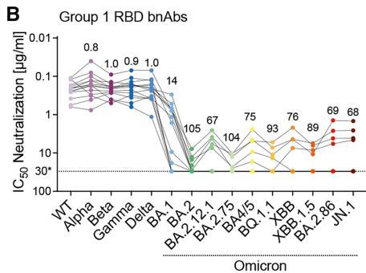

Figure 1. Neutralization of SARS-CoV-2 variants by RBD human broadly neutralizing antibodies   
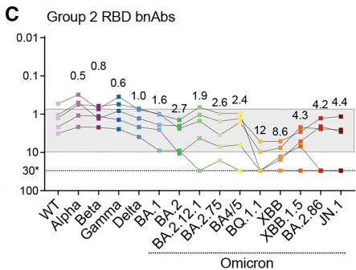  
(A) Schematic showing amino acid sequence alignment of SARS-CoV-2 spike region across 12 variants including Alpha (B.1.1.7); Beta (B.1.351); Gamma (P.1); Delta (B.1.617.2); and Omicron subvariants BA.1, BA.2, BA.2.12.1, BA.2.75, BA.4/BA.5, BQ.1.1, XBB, XBB.1.5, BA.2.86, and JN.1. Vertical lines indicated mismatches compared to SARS-CoV-2 WT (Wuhan). Amino acid positions are illustrated at the bottom; S1 and S2 subunits are shown by arrowed lines at the top. Different domains are indicated (NTD, N-terminal domain; RBD, receptor-binding domain; CTD1, C-terminal domain 1; CTD2, C-terminal domain 2; S1/S2, S1/S2 furin cleavage site; S2', S2' TMPRSS2 or cathepsin B/L cleavage site; FP, fusion peptide; HR1, heptad repeat 1; HR2, heptad repeat 2; TM, transmembrane anchor), with the RBD region highlighted in red, containing the majority of the mutations.   
(B and C) Neutralization $IC_{50}$ of RBD bnAbs from group 1 (B) and group 2 (C) for the panel of SARS-CoV-2 WT and variants. Each variant is indicated by a different color. Round data points represent group 1 RBD bnAbs, and square data points represent group 2 RBD bnAbs (n = number of antibodies, n = 14 for group 1, n = 5 for group 2). The dotted line shows the limit of antibody dilution (30 $\mu$ g/mL). Values above each column indicate   
fold change of the geometric mean of all antibody $IC_{50}$ s for each variant in comparison with WT. The gray shaded area highlights the bnAbs in group 2 showing relatively consistent neutralization $IC_{50}$ across SARS-CoV-2 WT and variants.

# Somatic hypermutation in RBD bnAbs is critical for neutralization of Omicron lineage variants

To investigate the role of antibody somatic hypermutation (SHM) in virus neutralization by group 1 and 2 RBD bnAbs, we generated inferred germline (iGL) versions by reverting their heavy and light chains to the corresponding germ lines. The iGL heavy-and light-chain V, D, and J regions were reverted back to their germline gene segments, while the non-templated N-additions at V/(D)/J junctions remained the same as in the mature bnAb versions, as described previously $^{41}$ (Figure 2A). It is not possible to revert the non-templated CDR3 junctional regions in the iGLs, and these regions may potentially contribute to neutralization. Therefore, the iGLs primarily allow us to assess the contribution of the SHMs in the templated V-D-J regions for neutralization. We evaluated the mature group 1 and 2 RBD bnAbs and their iGL versions against SARS-CoV-2 variants. We noted that, while many of the group 1 RBD bnAb iGLs retain neutralization with less mutated SARS-CoV-2 variants (Alpha, Beta, Gamma, and Delta), they fail to neutralize the more evolved Omicron variants (Figure 2B; Table S1). In comparison, the group 2 RBD bnAb iGLs fail to neutralize any of the SARS-CoV-2 variants (Figure 2C; Table S1). We also tested these group 1 and group 2 RBD bnAbs and their iGLs with ACE2-utilizing clade 1b (Pang17) and clade 1a (SARS-CoV-1 and WIV1) sarbecoviruses. $^{42,43}$ We noted that, while most mature bnAbs neutralized these sarbecoviruses, as reported previously, $^{34}$ some iGLs of group 1 RBD bnAbs retained neutralization, especially with WIV1 and Pang 17 (Table S1). These results suggest that human antibodies in

their germline configurations are able to recognize these sarbecovirus spikes, as also noted by other studies. $^{44}$

Overall, the findings suggest that germline residues in group 1 RBD bnAbs may contribute to neutralization of SARS-CoV-2 and its minimally mutated variants. However, SHMs for both group 1 and 2 RBD bnAbs are required to neutralize more evolved SARS-CoV-2 Omicron lineage variants.

# Group 1 and 2 RBD bnAb memory B cells and potential recall boosts

To investigate whether group 1 and 2 RBD bnAbs bind to SARS-CoV-2 Omicron BA.4/5 spike and other clades of sarbecovirus spikes for potential boost considerations, we tested their binding to various spikes and their corresponding RBDs by biolayer interferometry (BLI). The BA.4/5 Omicron spike was included in the SARS-CoV-2 bivalent booster vaccines until late 2023, $^{45,46}$ after which updated vaccines incorporated XBB.1.5 or JN.1 or its derivatives as one of the components. Therefore, we first assessed whether the group 1 and 2 RBD bnAbs can bind to the BA.4/5 Omicron spike and whether their memory B cells are likely to be boosted by the bivalent vaccines. As expected from the neutralization results, both group 1 and 2 RBD bnAbs showed strong binding to the SARS-CoV-2 spike protein (Figures 2D and 2E; Table S2). Consistent with the neutralization of BA.4/5 Omicron variant earlier, the binding of group 1 RBD bnAbs was significantly reduced against the BA.4/5 Omicron spike (Figure 2D). Nevertheless, many group 1 RBD bnAbs, especially the ones that neutralize BA.4/5 variant, still bound to

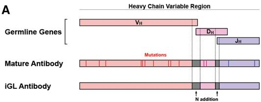  
A

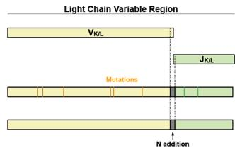

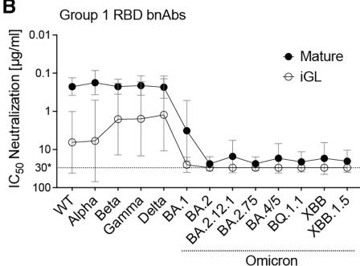  
B

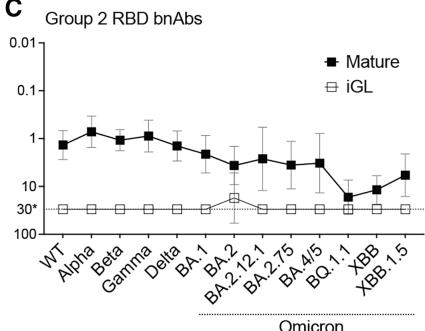  
C

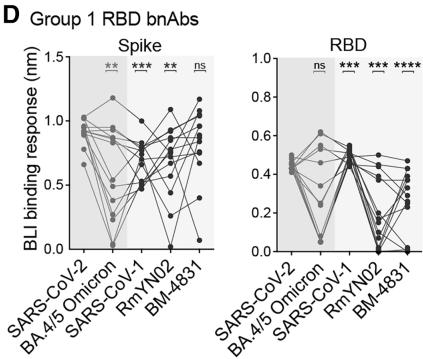  
D

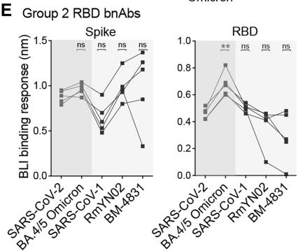  
E   
Figure 2. Neutralization and binding of mature RBD bnAbs and their inferred germ-line versions against SARS-CoV-2 VOCs and other sarbecoviruses

(A) Schematic showing design of inferred germline versions of bnAbs based on mature antibody heavy-chain (left) and light-chain (right) variable region sequences. The V/D/J genes of heavy chains $(\mathrm{V_H},\mathrm{D_H}$ ,and $\mathrm{J_H})$ and V/J genes of kappa or lambda light chains $(\mathrm{V}_{\mathrm{K / L}}$ and $\mathrm{J}_{\mathrm{K / L}})$ were reverted to their corresponding germlines (IMGT/V-QUEST tool). The mutations represented by vertical lines were eliminated in the inferred germline antibody sequences. The non-templated N-additions between V/(D)/J, indicated as dark gray, remained the same as in the mature antibody.

(B and C) Average neutralization $IC_{50}$ values of all group 1 (B) and group 2 (C) RBD bnAbs comparing the mature antibody (bold) to their inferred germline versions (open) tested with pseudotyped versions of SARS-CoV-2 WT (Wuhan) and 12 variants including Alpha (B.1.1.7); Beta (B.1.351); Gamma (P.1); Delta (B.1.617.2); and Omicron subvariants BA.1, BA.2, BA.2.12.1, BA.2.75, BA.4/5, BQ.1.1, XBB, and XBB.1.5. Round data points represent group 1 RBD bnAbs, and square data points represent group 2 RBD bnAbs. Each data point represents the geometric mean ± geometric SD of neutralization $IC_{50}$ for specific variants by all bnAbs within the corresponding group (n = number of antibodies, n = 14 for group 1, n = 5 for group 2). The dotted line shows the limit of antibody dilution (30 $\mu$ g/mL).

(D and E) BLI binding response (nm) of group 1 (D) and group 2 (E) RBD bnAbs to the trimeric stabilized spike proteins and monomeric RBD

proteins of SARS-CoV-2 (Wuhan and BA.4/5), clade 1b SARS-CoV-1, clade 2 RmYN02, and clade 3 BM-4831 sarbecoviruses. Statistical comparisons between groups were performed using a two-tailed Mann-Whitney U-test (ns, p > 0.05; $*p < 0.05$ , $**p < 0.005$ , $***p < 0.001$ , $****p < 0.0001$ ).

its spike protein with high affinity (Figure 2D; Table S2). In comparison, the group 2 RBD bnAbs bound to BA.4/5 Omicron spike equally efficiently (Figure 2E; Table S2). The findings suggest that majority of both group 1 and 2 RBD bnAbs are likely to be boosted with the BA.4/5 bivalent vaccine.

We further tested the binding by group 1 and 2 RBD bnAbs to spike proteins derived from heterologous clade 1a (SARS-CoV-1), clade 2 (RmYN02), and clade 3 (BM-4831) sarbecoviruses. $^{34,42,47}$ The group 1 RBD bnAb showed substantially reduced binding to SARS-CoV-1 and RmYN02 compared to the SARS-CoV-2 spike, but the binding with sarbecovirus clade 3 BM-4831 spike was comparable (Figure 2D; Table S2). Most of the group 2 RBD bnAbs showed strong binding to the clade 2 (RmYN02) and clade 3 (BM-4831) sarbecovirus spike-derived proteins (Figure 2E; Table S2). The results suggest that heterologous clades 2 and 3 spike-derived protein immunogens could be utilized to boost group 1 and 2 RBD bnAb responses, and specifically the clade 3 BM-4831 spike immunogen may recall group 1 RBD bnAb memory B cells more efficiently. We also tested the group 1 and 2 RBD bnAbs with RBDs of SARS-CoV-2; BA.4/5 Omicron; and the heterologous clade 1a, 2, and 3 sarbecoviruses (SARS-CoV-1, RmYN02, and BM-4831). The binding responses were overall lower but largely consistent with corresponding spike binding with some exceptions

(Figures 2D and 2E; Table S2). We also evaluated the iGL versions of group 1 and 2 bnAbs for binding to SARS-CoV-2 and BA.4/5 spikes, as well as their corresponding RBDs (Table S2). iGL monoclonal antibodies (mAbs) from both groups showed strong binding to the SARS-CoV-2 spike, but substantially reduced binding by group 1 mAbs to the BA.4/5 spike was observed. These results suggest that, while these iGL mAbs do not neutralize BA.4/5, many can still bind to the spike protein. Binding to the RBDs followed a similar pattern but was generally lower. Notably, iGL versions of group 2 bnAbs, which failed to neutralize SARS-CoV-2 or its variants, exhibited robust binding to their respective spikes. These findings indicate that, while the spike can initiate these precursor B cell lineages, SHM is required to achieve a neutralizing phenotype.

Overall, we observed that the binding of group 1 RBD bnAbs with BA.4/5 Omicron and heterologous sarbecovirus spikes was substantially reduced as compared to the parental SARS-CoV-2, but binding by group 2 RBD bnAbs was comparable. Nevertheless, both groups of bnAbs are likely boostable by these spikes.

To gain more insight into the detailed binding modes of group 1 and 2 bnAbs, we selected four antibodies from group 1 and three antibodies from group 2 to perform detailed structural studies as described in the following.

# Structures of group 1 bnAbs complexed to SARS-CoV-2 RBD show a recurrent YYDRxG feature in CDRH3 and diverse light-chain interactions

Six of the 14 antibodies from group 1 RBD bnAbs shared the same YYDRxG motif encoded by IGHD3-22 that we and others previously identified. $^{[34,48,49]}$ These YYDRxG antibodies exhibited broad neutralization breadth against SARS-CoV-2 variants, including Omicron subvariants (Table S1). Two additional antibodies featuring a YYDSSG motif, a germline precursor of the YYDRxG motif, $^{[48]}$ showed cross-reactive binding to, but no neutralization of, Omicron variants.

To understand the basis for the superior breadth of YYDRxG antibodies, we determined crystal structures of three antibodies, CC25.54, CC84.24, and CC84.2, in complex with SARS-CoV-2 RBD with resolutions ranging from 2.9 to 3.3 Å (Figures 3A–3C; Table S3). The structures revealed that the antibodies bind the CR3022 cryptic site using similar approach angles that allow them to compete with ACE2 binding although there is either no or only minor epitope overlap (Figures 3D, 3E, and S1). The approach angle is also similar to that identified previously for YYDRxG antibodies. $^{10,48,49}$ Analysis of the buried surface area (BSA) on SARS-CoV-2 RBD by these antibodies using the PISA (Proteins, Interfaces, Structures, Assemblies) program $^{50}$ found similar overall BSA, although the percentage of light-chain BSA varies among different antibodies (Figures 3F and S1). Further inspection of the antibody-antigen interactions showed variable contacts of the antibody light chains with SARS-CoV-2 RBD, while the heavy-chain CDR3 maintained essentially the same contacts. The light chain of CC84.2 contributes a larger BSA compared to CC25.54 and CC84.24, involving CDRs L1 and L2 of the antibody (Figures 3C and S2). Different germline genes encoding the light chains of these YYDRxG antibodies are responsible for the different interactions. CC84.2 is encoded by IGKV3-20, while CC25.54 and CC84.24 are encoded by IGLV3-21 and IGKV1-5, respectively.

# A YYDML motif enables group 1 RBD bnAb CC25.36 to bind SARS-CoV-2 RBD in a similar approach angle as YYDRxG antibodies

Another group 1 antibody, CC25.36, showed comparable breadth as the YYDRxG antibodies. The crystal structure of CC25.36 revealed that the antibody binds SARS-CoV-2 RBD at the same CR3022 cryptic site on SARS-CoV-2 RBD, which appears less sensitive to mutations in Omicron strains (Figure 4A; Tables S1 and S2). Structural overlay illustrated that CC25.36 uses a similar approach angle to YYDRxG antibodies (Figure 4D). Further inspection showed that a YYDML motif in CC25.36 binds to approximately the same site as the YYDRxG motif in the other antibodies, but with different interactions (Figures 4B and S2). The $_{99}$ YY $_{100}$ dipeptide in the YYDML motif binds with similar interactions as in the YYDRxG motif, which likely determines the site specificity of antibody binding (Figure 4B); the other RBD interactions with CDRH3 differ from the YYDRxG antibodies. D100a forms internal hydrogen bonds with the backbone of $_{100b}$ ML $_{100c}$ as well as SARS-CoV-2 RBD K378. $_{100b}$ ML $_{100c}$ interacts with a hydrophobic patch formed by RBD Y369, F374, and F378. PISA analysis confirmed that the light chain of CC25.36 contributes a large BSA similar to

CC84.2 (Figures 4C and S2). Structural superimposition on SARS-CoV-2 RBD showed that the CC25.36 light chain is positioned in the same way as CC84.2, although the CC25.36 light chain is encoded by the IGLV1-40 gene. A homology search for the YYDML motif showed that YYDIL or YYDLL motifs, also encoded by IGHD3-9, are present in other SARS-CoV-2 antibodies, e.g., COV2-2258, $^{8}$ C531, $^{51}$ and C2179. $^{52}$ However, whether they bind to the same epitope as CC25.36 warrants further investigation by structural studies.

# Structural studies of group 2 RBD bnAbs

In our previous study of monoclonal antibodies from COVID-19 recovered-vaccinated donors, $^{34}$ the group 2 antibodies exhibited little or no competition with RBS antibodies. Group 2 antibodies showed impressive neutralization breadth against sarbecoviruses including SARS-CoV-2, SARS-CoV-1, Pang17, WIV1, and SHC014. $^{34}$ Here, we show that group 2 antibodies neutralize all SARS-CoV-2 variants to date, including Wuhan; early variants; and Omicron subvariants BA.1, BA.2, BA.5, BQ.1.1, XBB.1.5, BA.2.86, and JN.1 (Table S1). To understand the molecular basis of these bnAbs, we determined crystal structures of SARS-CoV-2 RBD in complex with three group 2 antibodies, CC25.4, CC25.56, and CC25.43, at resolutions of 1.79, 2.84, and 2.71 Å, respectively (Figure 5; Table S3). The crystal structures revealed that all three antibodies target a cryptic region on the RBD immediately below the ridge region (Figure 5A). This site has been referred to as “site V,” $^{31}$ “left flank,” $^{53}$ or “E3” $^{19}$ in previous studies and does not overlap with the RBS (Figure 5A) or compete with ACE2 binding (Figure S3).

All three site V antibodies target the RBD using all six CDRs of their heavy and light chains (Figures 5A and 5B; Figure S4). For CC25.4 CDRs H1 and H2, $V_{H}$ T30 hydrogen bonds with RBD-R357, and $V_{H}$ D53 with RBD-N394. CDR H3 interacts extensively with the RBD (Figure 5B). For example, $V_{H}$ E97 makes a salt bridge with RBD-R466, and $V_{H}$ M100a and Y100d form hydrophobic and aromatic interactions with RBD-Y396, F429, P426, and F464. For the light chain, $V_{L}$ N31 and D93 engage RBD-K462 through a hydrogen bond and salt bridge, and other hydrogen bonds are made with $V_{L}$ N52 and K96 to the RBD (Figure 5B). For CC25.43, the heavy chain dominates the interaction with RBD and is responsible for 82% of BSA. All three HCDR loops interact with RBD. RBD-R357 forms a C–H…π bond with $V_{H}$ Y100, whose main chain interacts with RBD-R355, which in turn forms a salt bridge with D398. RBD-R357 is also clamped by salt bridges to two acidic residues in the light chain, $V_{L}$ D92 and D94. In CC25.56, CDRs H1 and H2 engage in extensive polar interactions with the RBD. $V_{H}$ R31 forms a salt bridge with RBD-D428, and K462 forms two salt bridges with $V_{H}$ D54 and D56. The hydrophobic tip of CDR H3 is composed of $V_{H}$ I97, A98, and V99, which interact with RBD-W353 and F464. The light chain also forms extensive interactions with the RBD.

RBDs on the SARS-CoV-2 S-protein flip between up and down conformations, where an RBD in the up conformation can engage with the host receptor ACE2, expose more epitope area, and also elicit antibodies specific to up-only conformations. In either up or down conformation, the S-protein can retain an intact prefusion state. However, our structures showed that the site V antibodies target a cryptic site on the RBD. Antibody

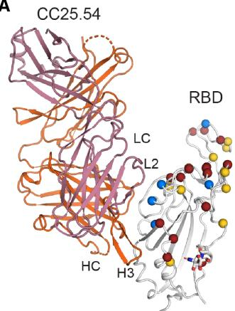  
A

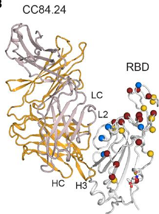  
B

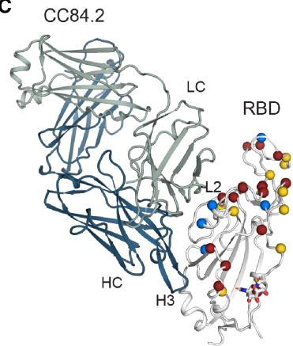  
C

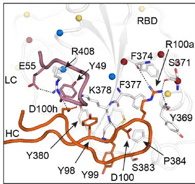

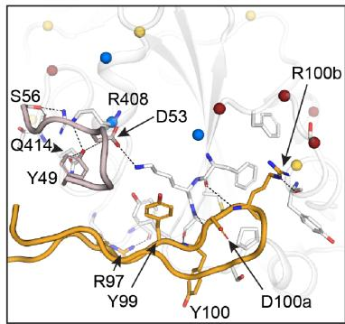

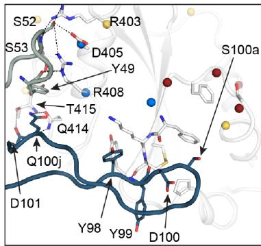

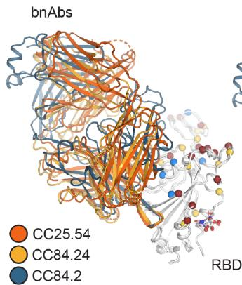  
D

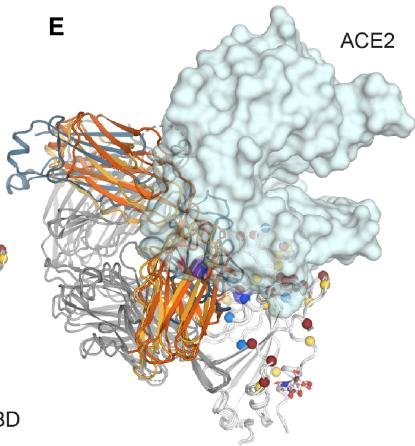  
E

F   
Figure 3. Crystal structures of representative YYDRxG antibodies from group 1 bnAbs   
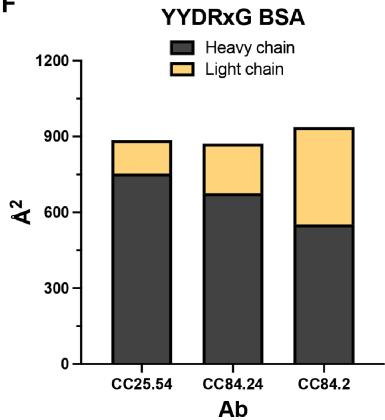  
(A–C) X-ray structures of two YYDRxG antibodies, CC25.54 (A) and CC84.24 (B), and a YYDSSG (YYDRxG precursor) antibody CC84.2 (C) are shown in ribbon representation (sticks represents observed N343 glycans in SARS-CoV-2 RBD crystal structure). The same perspective view is used for easy comparison. The CC25.54 heavy chain is colored in orange and light chain in rose pink, CC84.24 heavy chain in yellow and light chain in violet, and CC84.2 heavy chain in navy blue and light chain in teal. Insets below show sticks representing residues from CDRL2 and H3 that interact with the RBD. Dashed lines represent polar interactions. RBD residues that are mutated in Omicron are shown as spheres. Red represents residues mutated in BA.1, and additional mutations are in blue in BA.4/5 and yellow in XBB.1.5, BA.2.86, and JN.1. Other representative YYDRxG antibodies published previously are shown in Figure S5 in the same perspective view.   
(D) Overlay comparison of YYDRxG antibodies determined in this study. Crystal structures are superimposed on SARS-CoV-2 RBD to compare the approach angles of these antibodies.   
(E) YYDRxG antibodies clash with ACE2 binding, although their epitope footprints do not overlap. Composite structures of YYDRxG antibodies from this study and ACE2 in complex with SARS-CoV-2 RBD (PDB: 6M0J) were used for comparison. The same perspective view as (D) was used, but the heavy chain of these antibodies was grayed out to aid clarity. ACE2 is shown in semi-transparent surface representation. Both variable and constant regions of the light chain of these antibodies clash with ACE2 binding.   
(F) Comparison of the buried surface area (BSA) on SARS-CoV-2 RBD from the heavy and light chains of YYDRxG antibodies.

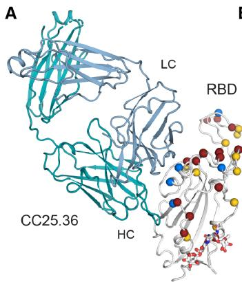

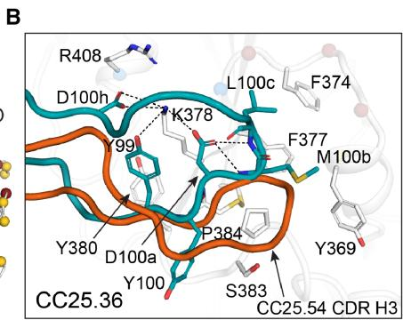

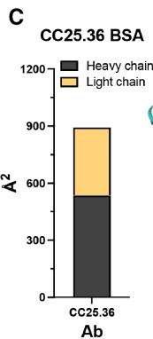

Figure 4. Crystal structure of group 1 antibody CC25.36 in complex with SARS-CoV-2 RBD   
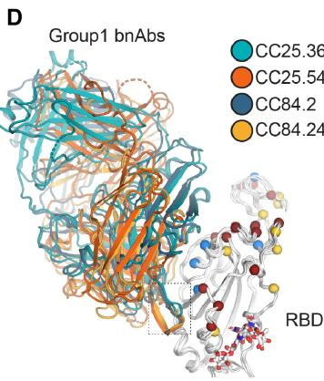  
Fab heavy chain is colored in turquoise blue, and light chain in baby blue. RBD residues that are mutated in Omicron are shown as spheres. Red represents those mutated in BA.1; blue, additional mutations in BA.4/5; yellow, additional mutations in XBB.1.5, BA.2.86, and JN.1.   
(A) Overall structure of CC25.36 is shown in ribbon representation. Sticks represent glycans at N343 in SARS-CoV-2 RBD.   
(B) Interactions between CDRH3 and RBD. Residues involved in the antibody-antigen interface are shown in sticks. The same perspective view as Figure 3A was used. CC25.54 CDR H3 was superimposed for easy comparison with Figure 3 in orange.   
(C) BSA on SARS-CoV-2 RBD from the CC25.36 heavy and light chains.   
(D) CC25.36 CDRH3 uses a distinct binding mode. Structures of CC25.36 and YYDRxG antibodies determined in this study are superimposed on the RBD. CC25.36 CDR H3 (boxed) binds the same site as YYDRxG antibodies but with a different binding mode, although they use similar approach angles that can compete with ACE2.

binding to this epitope would clash with N-terminal domain (NTD) in the adjacent protomer of the S trimer, even if the RBD is in an up conformation when modeled on a prefusion SARS-CoV-2 S structure (Figure 5C). This observation suggests that the site V antibodies may bind to the S protein in a transient state where the RBDs are more widely open and separated than in the canonical up-RBD conformation and may lead to a less stable trimer configuration. Alternatively, the site V antibodies may bind to the S protein in a transient non-prefusion conformation. Moreover, binding of these site V antibodies may result in a conformational rearrangement of the RBD relative to the NTD in the S trimer in the prefusion state that could possibly affect viral entry.

Most SARS-CoV-2 RBD antibodies target three regions: the RBS, the CR3022 site, and the S309 site (Figure 6A). Antibodies targeting the RBS generally exhibit higher frequency and higher neutralization potency due to direct competition with receptor. $^{29}$ Almost all commercially available therapeutic nAbs (except for sotrovimab) for COVID-19 treatment target the RBS. However, the RBS is highly variable among sarbecoviruses and SARS-CoV-2 variants (Figure 6A). In fact, all of these therapeutic antibodies have now been evaded by at least one SARS-CoV-2 variant. Here we show that the epitope region of CC25.4, CC25.43, and CC25.56 is highly conserved among sarbecoviruses (Figures 6A and 6B). Indeed, the epitope residues of CC25.4, CC25.43, and CC25.56 are almost entirely conserved across all SARS-CoV-2 variants to date. Only a few mutations have been observed in the BA.2.86 and JN.1 variants: K356T in the CC25.4 and CC25.43 epitopes (with the latter also introducing a potential N-linked glycosylation site at N354) and N481K in the CC25.56 epitope (Figure 6B). The high conservation of site V explains the observation that antibodies that target this region retain neutralization activity against SARS-CoV-2 var-

iants and other sarbecoviruses (Figure 1B; Table S1). $^{34}$ In addition, in contrast to some other sites accommodating public antibodies, such as RBS-A targeted by IGHV3-53 antibodies, $^{6,54}$ RBS-B by IGHV1-2 antibodies, $^{6}$ RBS-D by IGHV2-5 antibodies, $^{6}$ and S2 stem by IGHV1-46 antibodies, $^{55,56}$ IgBLAST analysis $^{57}$ showed that antibodies targeting site V are encoded by various germ lines, and no public antibodies have yet been discovered (Figure 6C).

To visualize the epitope recognized by the group 2 RBD bnAbs, we employed single-particle negative stain electron microscopy (nsEM) to image SARS-CoV-2 spike in complex with Fab (Figure 7). Although 2D class averages revealed some bound and unbound spike, there was a predominant population of dimers bound to Fab suggesting Fab-induced SARS-CoV-2 spike destabilization as the putative mechanism of neutralization for group 2 RBD bnAbs (Figures 7A and 7B). Particles were unable to converge in 3D due to heterogeneity; therefore, we were unable to produce 3D maps of the spike-antibody complexes.

# DISCUSSION

The emergence of antibody escape variants of the SARS-CoV-2 Omicron lineage has led to an urgent search for new bnAbs that target conserved spike epitopes. These bnAbs could be used in antibody-mediated prophylaxis or therapy and serve as templates for broad coronavirus vaccine strategies. In this study, we investigated the molecular basis of bnAbs that target conserved spike RBD sites, providing detailed information on the sites that resist virus escape. Our findings should aid in the design of pan-sarbecovirus vaccines.

Here, we revealed that YYDRxG antibodies from group 1 RBD bnAbs (i.e., CC25.54, CC84.24, and CC84.2) target the CR3022

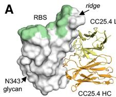  
A

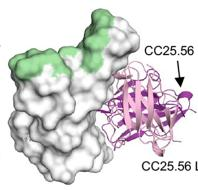

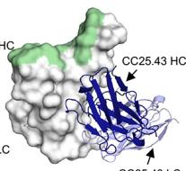

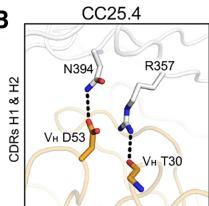  
B

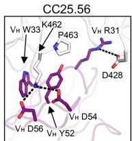

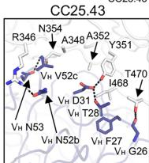

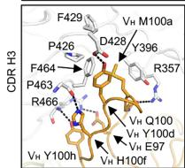

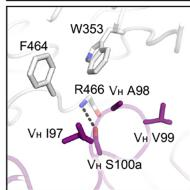

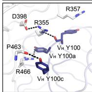

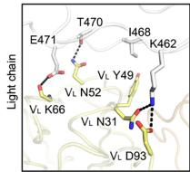

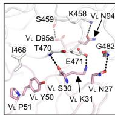

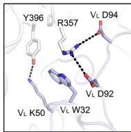

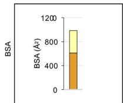

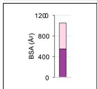

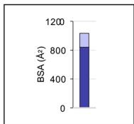

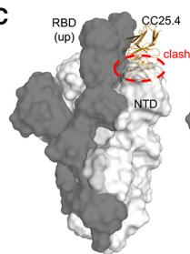  
C

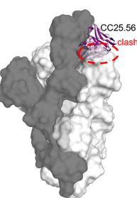

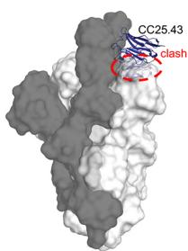  
Figure 5. Crystal structures of SARS-CoV-2 RBD in complex with site V antibodies

The SARS-CoV-2 RBD is shown in white, while the receptor-binding site (RBS) is highlighted in pale green throughout all the figures. For clarity, only the variable domains of the antibodies are shown in all figures.

(A) Crystal structures of SARS-CoV-2 RBD in complex with site V antibodies. The RBD-N343 N-glycan is shown as sticks. Heavy and light chains of CC25.4 are in orange and yellow, while those of CC25.56 in dark and light pink and CC25.43 in dark and light blue, respectively.   
(B) Detailed interactions between SARS-CoV-2 RBD and the antibodies. Hydrogen bonds and salt bridges are indicated by dashed lines. Surface area of SARS-CoV-2 buried by heavy and light chains of each antibody is shown in the bottom panels.   
(C) Models of antibody/RBD structures superimposed onto SARS-CoV-2 spike structures with one-up RBD (PDB: 7KJ5). The spike protomer with an up-RBD is shown in gray, while the other two protomers are shown in white. Binding to up-RBDs, site V antibodies would clash with the NTD of the adjacent protomer (indicated with red circles).

conserved site using essentially the same approach angles as one another, consistent with our previous analysis. $^{48}$ The binding of these antibodies to SARS-CoV-2 RBD sterically clashes with ACE2 binding, although the epitope footprint of these antibodies does not overlap with the ACE2 footprint. The structures demonstrate that diverse light chains permit antibody neutralization. With more interactions between the light chain and SARS-CoV-2 RBD compared to CC25.54 and CC84.24, CC84.2 can neutralize VOCs without SHM. We also determined the crystal structure of CC25.36, which binds SARS-CoV-2 with virtually the same approach angle as YYDRxG antibodies and neutralized the virus using the same mechanism as those antibodies. Like CC84.2, the CC25.36 light chain has more contacts compared to CC25.54 and CC84.24, and its iGL version showed broad neutralization against VOCs. A newly observed binding motif, YYDML, encoded by IGHD3-9 in CC25.36 CDRH3, binds the same site as the YYDRxG motif but with distinct interactions, which could potentially be a shared motif targeting the CR3022 site. Homology sequence search revealed that other potent SARS-CoV-2 RBD antibodies, such as COV2-2258, $^{8}$ C531, $^{51}$ and C2179, $^{52}$ share the YYDIL or YYDLL sequences in CDRH3 encoded by IGHD3-9. Further structural studies are needed to determine how similar the binding modes of these antibodies are to CC25.36, particularly comparisons of the interaction of YYDIL and YYDLL motifs and the YYDML motif of CC25.36. Overall, multiple antibody germline solutions of group 1 bnAbs converge to recognize a common conserved RBD bnAb site typified by class 4 epitope targeting mAb, CR3022.

In terms of group 1 RBD bnAb B cell precursors, immunogen design strategies could take advantage of the germ line-encoded CDRH3 features for vaccine targeting that are described here. $^{58-62}$ One potential challenge is that the immunodominant class 1 and 2 RBS nAbs responses may compete with the group 1 RBD bnAb responses. Accordingly, rational immunogen design may seek to effectively mask the RBS-directed, strain-specific nAb responses, while still favorably exposing the RBD group 1 bnAb site to elicit the desired responses. $^{63,64}$

We also show that group 2 bnAbs, CC25.4, CC25.43, and CC25.56, target another highly conserved region of the RBD, namely site V, with very few mutations in this site in SARS-CoV-2 variants to date. This epitope region is juxtaposed to the neighboring NTD and likely stabilizes both the up and down conformations of the RBD. Structural and functional roles of this site may therefore be the cause of its extremely low variation. A few previously reported human nAbs including S2H97, $^{31}$ COVOX-45, $^{53}$ 553-49, $^{65}$ and XMA09 $^{66}$ also target this site (Figure S3C) and exhibit remarkably broad neutralization. RBD resurfacing strategies to mask the immunodominant B cell epitopes and immunofocus B cell responses to the site V may be rewarding to induce group 2 bnAb responses. $^{47,63,64,67-69}$ Additionally, future in vivo challenge studies will be essential to evaluate the protective efficacy of group 2 bnAbs in relation to their impressive in vitro neutralization breadth.

In addition to site V, some other highly conserved sites on SARS-CoV-2 S have been discovered to be targeted by nAbs, including the S2 stem helix $^{55,56,70-72}$ and fusion peptide. $^{73-75}$ Although these sites are well conserved, and therefore can bind antibodies with high breadth, the neutralization potency of

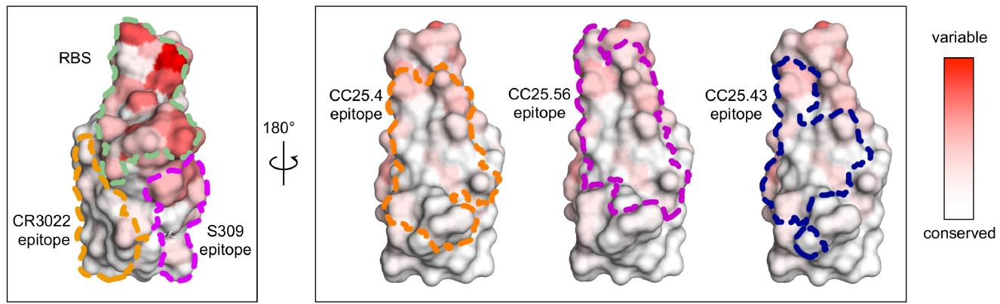  
A

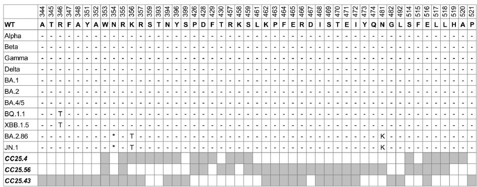  
B

C   

<table><tr><td></td><td>V heavy</td><td>V light</td><td>D gene</td></tr><tr><td>CC25.4</td><td>VH1-2</td><td>VL1-40</td><td>DH1-14</td></tr><tr><td>CC25.56</td><td>VH5-51</td><td>VL3-21</td><td>DH6-19</td></tr><tr><td>CC25.43</td><td>VH3-73</td><td>VK1-5</td><td>DH2-15</td></tr><tr><td>S2H97</td><td>VH5-51</td><td>VL2-14</td><td>No info*</td></tr><tr><td>COVOX-45</td><td>VH3-30-3</td><td>VK1-33</td><td>No info*</td></tr><tr><td>553-49</td><td>VH3-23</td><td>VL6-57</td><td>No info*</td></tr><tr><td>XMA09</td><td>VH1-69</td><td>VL3-21</td><td>No info*</td></tr></table>

# Figure 6. CC25.4, CC25.56, and CC25.43 target a highly conserved site on the spike RBD

(A) Locations of the receptor-binding site (RBS, pale green) and antibody epitopes (orange, magenta, and blue) are indicated by dashed lines (defined as RBD residues with BSA > 0 Å $^{2}$ as calculated by PISA). A white-red spectrum is used to represent the conservation of each residue of sarbecoviruses including SARS-CoV-2 VOCs, SARS-CoV-1, etc.   
(B) Sequence alignment of epitope residues of CC25.4, CC25.56, and CC25.43. Identical residues of each variant to the wild-type SARS-CoV-2 are represented by a dash “-.” An asterisk “*” denotes the potential N-linked glycosylation site (PNGS) at position N354 in the BA.2.86 and JN.1 variants. Epitope residues for each antibody are represented as gray boxes.   
(C) Putative germline genes encoding site V antibodies as predicted by IgBLAST. $^{57}$ No info*: no D gene or nucleotide sequence information was found for the previously published antibodies S2H97, COVOX-45, 553-49, and XMA09.

these antibodies is usually within the medium-to-low range, potentially due to their indirect neutralizing mechanisms or relative inaccessibility that may require conformational breathing or local rearrangements to permit antibody binding. Further affinity maturation may be required to confer higher neutralizing potency to these broad antibodies.

Overall, our study presents a comprehensive molecular characterization of RBD bnAb epitopes, which can potentially serve as blueprints for the design of broad coronavirus vaccines.

# Limitations of the study

Our study has several limitations. While the bnAbs characterized are broadly cross-reactive, they are not highly potent. Although they bind diverse sarbecoviruses, including clade 2 and 3, their neutralization capacity against these clades could not be assessed and warrants future investigation. Structural analyses were performed using monomeric RBDs; however, future studies using full prefusion-stabilized spike trimers may better capture native conformational epitopes relevant to vaccine

design. In addition, the in vivo protective efficacy of these bnAbs remains to be determined. Finally, whether such bnAbs can be reliably elicited through vaccination is a key question for future research.

# RESOURCE AVAILABILITY

# Lead contact

Further information and requests for resources and reagents should be directed to and will be fulfilled by the lead contact, Raiees Andrabi (raiees.andrabi@pennmedicine.upenn.edu).

# Materials availability

Upon specific request and execution of a material transfer agreement (MTA) from the University of Pennsylvania to the lead contact, antibody plasmids will be made available.

# Data and code availability

- iGL antibody sequences have been deposited in GenBank, and X-ray coordinates and structure factors are available in the RCSB Protein Data Bank. All accession numbers are listed in the key resources table.

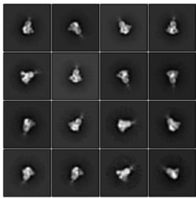  
A   
SARS-CoV-2 6P Mut7

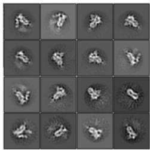  
SARS-CoV-2 6P Mut7 + Fab CC25.4

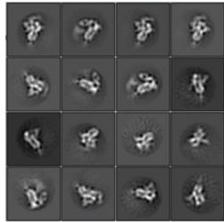  
SARS-CoV-2 6P Mut7 + Fab CC25.56

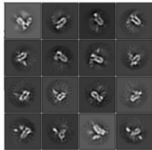  
SARS-CoV-2 6P Mut7 + Fab CC25.43

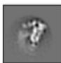  
B   
False coloring of fab binding   
Dimer

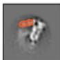

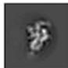  
Trimer

  
Dimer

  
Dimer

Figure 7. Group 2 RBD bnAbs destabilize the SARS-CoV-2 soluble spike   
  
(A) Representative 2D classifications of SARS-CoV-2 6P Mut7 spike alone and SARS-CoV-2 6P Mut7 spike in complex with group 2 bnAbs, CC25.4, CC25.56, and CC25.43.   
(B) The bnAb binding to the spike is highlighted using false coloring. BnAb binding to trimer was only observed with CC25.56. CC25.4 is colored orange, CC25.56 is colored purple, and CC25.43 is colored blue.

- No new code was generated in this study.

- All data supporting the findings are included in the published article and its supplementary materials. Additional raw data can be provided by the lead contact upon request.

# ACKNOWLEDGMENTS

This work was supported by the National Institutes of Health, National Institute of Allergy and Infectious Diseases awards R01AI170928 (R.A.) and CHAVD UM1 AI44462 (D.R.B.), and the Gates Foundation INV-004923 (I.A. W. and D.R.B.). We thank Henry Tien for technical support with the crystallization robot and Wenli Yu for protein production. We are grateful to the staff of the Stanford Synchrotron Radiation Lightsource (SSRL) beamlines 12-1 and Advanced Photon Source (APS) beamline 23-ID-B and 23-ID-D for assistance. This research used resources of the SSRL, SLAC National Accelerator Laboratory, which is supported by the U.S. Department of Energy, Office of Science, Office of Basic Energy Sciences under contract no. DE-AC02-76SF00515. The SSRL Structural Molecular Biology program is supported by the DOE Office of Biological and Environmental Research and by the National Institutes of Health, National Institute of General Medical Sciences (including P41GM103393). This research also used resources of the Advanced Photon Source, a U.S. Department of Energy (DOE) Office of Science User Facility, operated for the DOE Office of Science by Argonne National Laboratory under contract no. DE-AC02-06CH11357. Extraordinary facility operations were supported in part by the DOE Office of Science through the National Virtual Biotechnology Laboratory, a consortium of DOE national laboratories focused on the response to COVID-19, with funding provided by the CARES Act.

# AUTHOR CONTRIBUTIONS

G.S., M.Y., H.L., T.C., D.R.B., I.A.W., and R.A. conceived and designed the study. G.S., T.C., W.-t.H., R.M., K.D., P.Z., S.C., N.M., P.Y., F.A., G.A., A.L.V., X.L., Y.Z., M.M., and L.P. performed BLI, virus preparation, neutralization, and characterization of monoclonal antibodies. Y.S. and B.B. performed immunogenetic analysis of antibodies. M.Y., H.L., and Z.F. crystallized the antibody-antigen complexes and determined the crystal structures. M.Y. and H.L. collected X-ray data. M.Y., H.L., X.Z., and I.A.W. analyzed the structural data. R.N.L. and J.L.T. conducted the nsEM studies. G.S., M.Y., H.L., T.C., R.N.L., J.

L.T., W.-t.H., R.M., K.D., P.Z., S.C., N.M., P.Y., F.A., G.A., A.L.V., X.L., M.M., Z.F., X.Z., Y.Z., L.P., D.N., Y.S., B.B., A.B.W., D.R.B., I.A.W., and R.A. designed the experiments and/or analyzed the data. G.S., M.Y., H.L., T.C., D.R.B., I.A.W., and R.A. wrote the paper, and all authors reviewed and edited the paper.

# DECLARATION OF INTERESTS

G.S., W.-t.H., P.Z., S.C., R.M., K.D., D.R.B., and R.A. are listed as inventors on pending patent applications describing the betacoronavirus bnAbs. G.S. is currently employed at Vir Biotechnology, Inc., and the research presented in this manuscript was conducted while G.S. was affiliated with Scripps Research.

# STAR★METHODS

Detailed methods are provided in the online version of this paper and include the following:

● KEY RESOURCES TABLE   
● EXPERIMENTAL MODEL AND STUDY PARTICIPANT DETAILS   
- METHOD DETAILS

○ Expression and purification of spike and RBD proteins   
○ Expression and purification of mAbs   
○ Production of proteins for the BioLayer Interferometry (BLI) competition analysis   
○ BioLayer Interferometry binding assay   
○ Pseudovirus production   
○ Pseudovirus neutralization assay   
○ Production of proteins for structure analysis   
○ Crystallization and structural determination   
○ Negative stain electron microscopy

● QUANTIFICATION AND STATISTICAL ANALYSIS

# SUPPLEMENTAL INFORMATION

Supplemental information can be found online at https://doi.org/10.1016/j.celrep.2025.115948.

Received: May 3, 2023

Revised: April 14, 2025

Accepted: June 11, 2025

Published: July 7, 2025

# REFERENCES

1. Wang, Z., Schmidt, F., Weisblum, Y., Muecksch, F., Barnes, C.O., Finkin, S., Schaefer-Babajew, D., Cipolla, M., Gaebler, C., Lieberman, J.A., et al. (2021). mRNA vaccine-elicited antibodies to SARS-CoV-2 and circulating variants. Nature 592, 616–622. https://doi.org/10.1038/s41586-021-03324-6.   
2. Greaney, A.J., Loes, A.N., Gentles, L.E., Crawford, K.H.D., Starr, T.N., Malone, K.D., Chu, H.Y., and Bloom, J.D. (2021). Antibodies elicited by mRNA-1273 vaccination bind more broadly to the receptor binding domain than do those from SARS-CoV-2 infection. Sci. Transl. Med. 13, eabi9915. https://doi.org/10.1126/scitranslmed.abi9915.   
3. Barnes, C.O., Jette, C.A., Abernathy, M.E., Dam, K.M.A., Esswein, S.R., Gristick, H.B., Malyutin, A.G., Sharaf, N.G., Huey-Tubman, K.E., Lee, Y.E., et al. (2020). SARS-CoV-2 neutralizing antibody structures inform therapeutic strategies. Nature 588, 682–687. https://doi.org/10.1038/s41586-020-2852-1.   
4. Barnes, C.O., West, A.P., Jr., Huey-Tubman, K.E., Hoffmann, M.A.G., Sharaf, N.G., Hoffman, P.R., Koranda, N., Gristick, H.B., Gaebler, C., Muecksch, F., et al. (2020). Structures of human antibodies bound to SARS-CoV-2 spike reveal common epitopes and recurrent features of antibodies. Cell 182, 828–842.e16. https://doi.org/10.1016/j.cell.2020.06.025.   
5. Rogers, T.F., Zhao, F., Huang, D., Beutler, N., Burns, A., He, W.T., Limbo, O., Smith, C., Song, G., Woehl, J., et al. (2020). Isolation of potent SARS-CoV-2 neutralizing antibodies and protection from disease in a small animal model. Science 369, 956–963. https://doi.org/10.1126/science.abc7520.   
6. Yuan, M., Liu, H., Wu, N.C., Lee, C.C.D., Zhu, X., Zhao, F., Huang, D., Yu, W., Hua, Y., Tien, H., et al. (2020). Structural basis of a shared antibody response to SARS-CoV-2. Science 369, 1119–1123. https://doi.org/10.1126/science.abd2321.   
7. Robbiani, D.F., Gaebler, C., Muecksch, F., Lorenzi, J.C.C., Wang, Z., Cho, A., Agudelo, M., Barnes, C.O., Gazumyan, A., Finkin, S., et al. (2020). Convergent antibody responses to SARS-CoV-2 in convalescent individuals. Nature 584, 437–442. https://doi.org/10.1038/s41586-020-2456-9.   
8. Zost, S.J., Gilchuk, P., Chen, R.E., Case, J.B., Reidy, J.X., Trivette, A., Nargi, R.S., Sutton, R.E., Suryadevara, N., Chen, E.C., et al. (2020). Rapid isolation and profiling of a diverse panel of human monoclonal antibodies targeting the SARS-CoV-2 spike protein. Nat. Med. 26, 1422–1427. https://doi.org/10.1038/s41591-020-0998-x.   
9. Brouwer, P.J.M., Caniels, T.G., van der Straten, K., Snitselaar, J.L., Aldon, Y., Bangaru, S., Torres, J.L., Okba, N.M.A., Claireaux, M., Kerster, G., et al. (2020). Potent neutralizing antibodies from COVID-19 patients define multiple targets of vulnerability. Science 369, 643–650. https://doi.org/10.1126/science.abc5902.   
10. Liu, H., and Wilson, I.A. (2022). Protective neutralizing epitopes in SARS-CoV-2. Immunol. Rev. 310, 76–92. https://doi.org/10.1111/imr.13084.   
11. Lopez Bernal, J., Gower, C., and Andrews, N.; Public Health England Delta Variant Vaccine Effectiveness Study Group (2021). Effectiveness of Covid-19 vaccines against the B.1.617.2 (Delta) variant. N. Engl. J. Med. 385, e92. https://doi.org/10.1056/NEJMc2113090.   
12. Abu-Raddad, L.J., Chemaitelly, H., and Butt, A.A.; National Study Group for COVID-19 Vaccination (2021). Effectiveness of the BNT162b2 Covid-19 Vaccine against the B.1.1.7 and B.1.351 Variants. N. Engl. J. Med. 385, 187–189. https://doi.org/10.1056/NEJMc2104974.   
13. Polack, F.P., Thomas, S.J., Kitchin, N., Absalon, J., Gurtman, A., Lockhart, S., Perez, J.L., Pérez Marc, G., Moreira, E.D., Zerbini, C., et al. (2020).

Safety and efficacy of the BNT162b2 mRNA Covid-19 vaccine. N. Engl. J. Med. 383, 2603–2615. https://doi.org/10.1056/NEJMoa2034577.   
14. Baden, L.R., El Sahly, H.M., Essink, B., Kotloff, K., Frey, S., Novak, R., Diemert, D., Spector, S.A., Rouphael, N., Creech, C.B., et al. (2021). Efficacy and safety of the mRNA-1273 SARS-CoV-2 Vaccine. N. Engl. J. Med. 384, 403–416. https://doi.org/10.1056/NEJMoa2035389.   
15. Wang, Q., Iketani, S., Li, Z., Liu, L., Guo, Y., Huang, Y., Bowen, A.D., Liu, M., Wang, M., Yu, J., et al. (2023). Alarming antibody evasion properties of rising SARS-CoV-2 BQ and XBB subvariants. Cell 186, 279–286.e8. https://doi.org/10.1016/j.cell.2022.12.018.   
16. Wang, Q., Guo, Y., Iketani, S., Nair, M.S., Li, Z., Mohri, H., Wang, M., Yu, J., Bowen, A.D., Chang, J.Y., et al. (2022). Antibody evasion by SARS-CoV-2 Omicron subvariants BA.2.12.1, BA.4 and BA.5. Nature 608, 603–608. https://doi.org/10.1038/s41586-022-05053-w.   
17. Liu, L., Iketani, S., Guo, Y., Chan, J.F.W., Wang, M., Liu, L., Luo, Y., Chu, H., Huang, Y., Nair, M.S., et al. (2022). Striking antibody evasion manifested by the Omicron variant of SARS-CoV-2. Nature 602, 676–681. https://doi.org/10.1038/s41586-021-04388-0.   
18. Iketani, S., Liu, L., Guo, Y., Liu, L., Chan, J.F.W., Huang, Y., Wang, M., Luo, Y., Yu, J., Chu, H., et al. (2022). Antibody evasion properties of SARS-CoV-2 Omicron sublineages. Nature 604, 553–556. https://doi.org/10.1038/s41586-022-04594-4.   
19. Cao, Y., Yisimayi, A., Jian, F., Song, W., Xiao, T., Wang, L., Du, S., Wang, J., Li, Q., Chen, X., et al. (2022). BA.2.12.1, BA.4 and BA.5 escape antibodies elicited by Omicron infection. Nature 608, 593–602. https://doi.org/10.1038/s41586-022-04980-y.   
20. Cao, Y., Song, W., Wang, L., Liu, P., Yue, C., Jian, F., Yu, Y., Yisimayi, A., Wang, P., Wang, Y., et al. (2022). Characterization of the enhanced infectivity and antibody evasion of Omicron BA.2.75. Cell Host Microbe 30, 1527–1539.e5. https://doi.org/10.1016/j.chom.2022.09.018.   
21. Cao, Y., Jian, F., Wang, J., Yu, Y., Song, W., Yisimayi, A., Wang, J., An, R., Chen, X., Zhang, N., et al. (2023). Imprinted SARS-CoV-2 humoral immunity induces convergent Omicron RBD evolution. Nature 614, 521–529. https://doi.org/10.1038/s41586-022-05644-7.   
22. Hachmann, N.P., Miller, J., Collier, A.R.Y., and Barouch, D.H. (2022). Neutralization escape by SARS-CoV-2 Omicron subvariant BA.4.6. N. Engl. J. Med. 387, 1904–1906. https://doi.org/10.1056/NEJMc2212117.   
23. Planas, D., Saunders, N., Maes, P., Guivel-Benhassine, F., Planchais, C., Buchrieser, J., Bolland, W.H., Porrot, F., Staropoli, I., Lemoine, F., et al. (2022). Considerable escape of SARS-CoV-2 Omicron to antibody neutralization. Nature 602, 671–675. https://doi.org/10.1038/s41586-021-04389-z.   
24. Wang, Q., Li, Z., Ho, J., Guo, Y., Yeh, A.Y., Mohri, H., Liu, M., Wang, M., Yu, J., Shah, J.G., et al. (2022). Resistance of SARS-CoV-2 omicron subvariant BA.4.6 to antibody neutralisation. Lancet Infect. Dis. 22, 1666–1668. https://doi.org/10.1016/s1473-3099(22)00694-6.   
25. Westendorf, K., Žentelis, S., Wang, L., Foster, D., Vaillancourt, P., Wiggin, M., Lovett, E., van der Lee, R., Hendle, J., Pustilnik, A., et al. (2022). LY-CoV1404 (bebtelovimab) potently neutralizes SARS-CoV-2 variants. Cell Rep. 39, 110812. https://doi.org/10.1016/j.celrep.2022.110812.   
26. Yuan, M., Huang, D., Lee, C.C.D., Wu, N.C., Jackson, A.M., Zhu, X., Liu, H., Peng, L., van Gils, M.J., Sanders, R.W., et al. (2021). Structural and functional ramifications of antigenic drift in recent SARS-CoV-2 variants. Science 373, 818–823. https://doi.org/10.1126/science.abh1139.   
27. Wang, Z., Muecksch, F., Schaefer-Babajew, D., Finkin, S., Viant, C., Gaebler, C., Hoffmann, H.H., Barnes, C.O., Cipolla, M., Ramos, V., et al. (2021). Naturally enhanced neutralizing breadth against SARS-CoV-2 one year after infection. Nature 595, 426–431. https://doi.org/10.1038/s41586-021-03696-9.   
28. Yuan, M., Wu, N.C., Zhu, X., Lee, C.C.D., So, R.T.Y., Lv, H., Mok, C.K.P., and Wilson, I.A. (2020). A highly conserved cryptic epitope in the receptor binding domains of SARS-CoV-2 and SARS-CoV. Science 368, 630–633. https://doi.org/10.1126/science.abb7269.

29. Yuan, M., Zhu, X., He, W.T., Zhou, P., Kaku, C.I., Capozzola, T., Zhu, C.Y., Yu, X., Liu, H., Yu, W., et al. (2022). A broad and potent neutralization epitope in SARS-related coronaviruses. Proc. Natl. Acad. Sci. USA 119, e2205784119. https://doi.org/10.1073/pnas.2205784119.   
30. Li, D., Edwards, R.J., Manne, K., Martinez, D.R., Schäfer, A., Alam, S.M., Wiehe, K., Lu, X., Parks, R., Sutherland, L.L., et al. (2021). In vitro and in vivo functions of SARS-CoV-2 infection-enhancing and neutralizing antibodies. Cell 184, 4203–4219.e32. https://doi.org/10.1016/j.cell.2021.06.021.   
31. Starr, T.N., Czudnochowski, N., Liu, Z., Zatta, F., Park, Y.J., Addetia, A., Pinto, D., Beltramello, M., Hernandez, P., Greaney, A.J., et al. (2021). SARS-CoV-2 RBD antibodies that maximize breadth and resistance to escape. Nature 597, 97–102. https://doi.org/10.1038/s41586-021-03807-6.   
32. Pinto, D., Park, Y.J., Beltramello, M., Walls, A.C., Tortorici, M.A., Bianchi, S., Jaconi, S., Culap, K., Zatta, F., De Marco, A., et al. (2020). Cross-neutralization of SARS-CoV-2 by a human monoclonal SARS-CoV antibody. Nature 583, 290–295. https://doi.org/10.1038/s41586-020-2349-y.   
33. Rappazzo, C.G., Tse, L.V., Kaku, C.I., Wrapp, D., Sakharkar, M., Huang, D., Deveau, L.M., Yockachonis, T.J., Herbert, A.S., Battles, M.B., et al. (2021). Broad and potent activity against SARS-like viruses by an engineered human monoclonal antibody. Science 371, 823–829. https://doi.org/10.1126/science.abf4830.   
34. He, W.-t., Musharrafieh, R., Song, G., Dueker, K., Tse, L.V., Martinez, D.R., Schäfer, A., Callaghan, S., Yong, P., Beutler, N., et al. (2022). Targeted isolation of diverse human protective broadly neutralizing antibodies against SARS-like viruses. Nat. Immunol. 23, 960–970. https://doi.org/10.1038/s41590-022-01222-1.   
35. He, W.-t., Yuan, M., Callaghan, S., Musharrafieh, R., Song, G., Silva, M., Beutler, N., Lee, W.-H., Yong, P., Torres, J.L., et al. (2022). Broadly neutralizing antibodies to SARS-related viruses can be readily induced in rhesus macaques. Sci. Transl. Med. 14, eabl9605. https://doi.org/10.1126/scitranslmed.abl9605.   
36. Jette, C.A., Cohen, A.A., Gnanapragasam, P.N.P., Muecksch, F., Lee, Y.E., Huey-Tubman, K.E., Schmidt, F., Hatzioannou, T., Bieniasz, P.D., Nussenzweig, M.C., et al. (2021). Broad cross-reactivity across sarbecoviruses exhibited by a subset of COVID-19 donor-derived neutralizing antibodies. Cell Rep. 36, 109760. https://doi.org/10.1016/j.celrep.2021.109760.   
37. Martinez, D.R., Schafer, A., Gobeil, S., Li, D., De la Cruz, G., Parks, R., Lu, X., Barr, M., Stalls, V., Janowska, K., et al. (2021). A broadly cross-reactive antibody neutralizes and protects against sarbecovirus challenge in mice. Sci. Transl. Med. 14, eabj7125. https://doi.org/10.1126/scitranslmed.abj7125.   
38. Deshpande, A., Harris, B.D., Martinez-Sobrido, L., Kobie, J.J., and Walter, M.R. (2021). Epitope classification and RBD binding properties of neutralizing antibodies against SARS-CoV-2 variants of concern. Front. Immunol. 12, 691715. https://doi.org/10.3389/fimmu.2021.691715.   
39. Tortorici, M.A., Czudnochowski, N., Starr, T.N., Marzi, R., Walls, A.C., Zatta, F., Bowen, J.E., Jaconi, S., Di Iulio, J., Wang, Z., et al. (2021). Broad sarbecovirus neutralization by a human monoclonal antibody. Nature 597, 103–108. https://doi.org/10.1038/s41586-021-03817-4.   
40. Wec, A.Z., Wrapp, D., Herbert, A.S., Maurer, D.P., Haslwanter, D., Sakharkar, M., Jangra, R.K., Dieterle, M.E., Lilov, A., Huang, D., et al. (2020). Broad neutralization of SARS-related viruses by human monoclonal antibodies. Science 369, 731–736. https://doi.org/10.1126/science.abc7424.   
41. Andrabi, R., Pallesen, J., Allen, J.D., Song, G., Zhang, J., de Val, N., Gegg, G., Porter, K., Su, C.Y., Pauthner, M., et al. (2019). The chimpanzee SIV Envelope trimer: Structure and deployment as an HIV vaccine template. Cell Rep. 27, 2426–2441.e6. https://doi.org/10.1016/j.celrep.2019.04.082.   
42. Letko, M., Marzi, A., and Munster, V. (2020). Functional assessment of cell entry and receptor usage for SARS-CoV-2 and other lineage B betacoro-

naviruses. Nat. Microbiol. 5, 562–569. https://doi.org/10.1038/s41564-020-0688-y.   
43. Menachery, V.D., Yount, B.L., Jr., Sims, A.C., Debbink, K., Agnihothram, S.S., Gralinski, L.E., Graham, R.L., Scobey, T., Plante, J.A., Royal, S.R., et al. (2016). SARS-like WIV1-CoV poised for human emergence. Proc. Natl. Acad. Sci. USA 113, 3048–3053. https://doi.org/10.1073/pnas.1517719113.   
44. Feldman, J., Bals, J., Altomare, C.G., St Denis, K., Lam, E.C., Hauser, B.M., Ronsard, L., Sangesland, M., Moreno, T.B., Okonkwo, V., et al. (2021). Naive human B cells engage the receptor binding domain of SARS-CoV-2, variants of concern, and related sarbecoviruses. Sci. Immunol. 6, eabl5842. https://doi.org/10.1126/sciimmunol.abl5842.   
45. Collier, A.-r.Y., Miller, J., Hachmann, N.P., McMahan, K., Liu, J., Bondzie, E.A., Gallup, L., Rowe, M., Schonberg, E., Thai, S., et al. (2023). Immunogenicity of BA.5 bivalent mRNA vaccine boosters. N. Engl. J. Med. 388, 565–567. https://doi.org/10.1056/NEJMc2213948.   
46. Chalkias, S., Harper, C., Vrbicky, K., Walsh, S.R., Essink, B., Brosz, A., McGhee, N., Tomassini, J.E., Chen, X., Chang, Y., et al. (2022). A bivalent Omicron-containing booster vaccine against Covid-19. N. Engl. J. Med. 387, 1279–1291. https://doi.org/10.1056/NEJMoa2208343.   
47. Cohen, A.A., Gnanapragasam, P.N.P., Lee, Y.E., Hoffman, P.R., Ou, S., Kakutani, L.M., Keeffe, J.R., Wu, H.J., Howarth, M., West, A.P., et al. (2021). Mosaic nanoparticles elicit cross-reactive immune responses to zoonotic coronaviruses in mice. Science 371, 735–741. https://doi.org/10.1126/science.abf6840.   
48. Liu, H., Kaku, C.I., Song, G., Yuan, M., Andrabi, R., Burton, D.R., Walker, L.M., and Wilson, I.A. (2022). Human antibodies to SARS-CoV-2 with a recurring YYDRxG motif retain binding and neutralization to variants of concern including Omicron. Commun. Biol. 5, 766. https://doi.org/10.1038/s42003-022-03700-6.   
49. Liu, L., Iketani, S., Guo, Y., Reddem, E.R., Casner, R.G., Nair, M.S., Yu, J., Chan, J.F.-W., Wang, M., Cerutti, G., et al. (2022). An antibody class with a common CDRH3 motif broadly neutralizes sarbecoviruses. Sci. Transl. Med. 14, eabn6859. https://doi.org/10.1126/scitranslmed.abn6859.   
50. Krissinel, E., and Henrick, K. (2007). Inference of macromolecular assemblies from crystalline state. J. Mol. Biol. 372, 774–797. https://doi.org/10.1016/j.jmb.2007.05.022.   
51. Gaebler, C., Wang, Z., Lorenzi, J.C.C., Muecksch, F., Finkin, S., Tokuyama, M., Cho, A., Jankovic, M., Schaefer-Babajew, D., Oliveira, T.Y., et al. (2021). Evolution of antibody immunity to SARS-CoV-2. Nature 591, 639–644. https://doi.org/10.1038/s41586-021-03207-w.   
52. Cho, A., Muecksch, F., Schaefer-Babajew, D., Wang, Z., Finkin, S., Gaebler, C., Ramos, V., Cipolla, M., Mendoza, P., Agudelo, M., et al. (2021). Anti-SARS-CoV-2 receptor-binding domain antibody evolution after mRNA vaccination. Nature 600, 517–522. https://doi.org/10.1038/s41586-021-04060-7.   
53. Dejnirattisai, W., Zhou, D., Ginn, H.M., Duyvesteyn, H.M.E., Supasa, P., Case, J.B., Zhao, Y., Walter, T.S., Mentzer, A.J., Liu, C., et al. (2021). The antigenic anatomy of SARS-CoV-2 receptor binding domain. Cell 184, 2183–2200.e22. https://doi.org/10.1016/j.cell.2021.02.032.   
54. Reincke, S.M., Yuan, M., Kornau, H.C., Corman, V.M., van Hoof, S., Sánchez-Sendin, E., Ramberger, M., Yu, W., Hua, Y., Tien, H., et al. (2022). SARS-CoV-2 Beta variant infection elicits potent lineage-specific and cross-reactive antibodies. Science 375, 782–787. https://doi.org/10.1126/science.abm5835.   
55. Dacon, C., Peng, L., Lin, T.-H., Tucker, C., Lee, C.-C.D., Cong, Y., Wang, L., Purser, L., Cooper, A.J.R., Williams, J.K., et al. (2023). Rare, convergent antibodies targeting the stem helix broadly neutralize diverse betacoronaviruses. Cell Host Microbe 31, 97–111.e12. https://doi.org/10.1016/j.chom.2022.10.010.   
56. Zhou, P., Song, G., Liu, H., Yuan, M., He, W.-t., Beutler, N., Zhu, X., Tse, L. V., Martinez, D.R., Schäfer, A., et al. (2023). Broadly neutralizing anti-S2

antibodies protect against all three human betacoronaviruses that cause deadly disease. Immunity 56, 669–686.e7. https://doi.org/10.1016/j.im-muni.2023.02.005.   
57. Ye, J., Ma, N., Madden, T.L., and Ostell, J.M. (2013). IgBLAST: an immunoglobulin variable domain sequence analysis tool. Nucleic Acids Res. 41, W34–W40. https://doi.org/10.1093/nar/gkt382.   
58. Andrabi, R., Bhiman, J.N., and Burton, D.R. (2018). Strategies for a multi-stage neutralizing antibody-based HIV vaccine. Curr. Opin. Immunol. 53, 143–151. https://doi.org/10.1016/j.coi.2018.04.025.   
59. Andrabi, R., Voss, J.E., Liang, C.H., Briney, B., McCoy, L.E., Wu, C.Y., Wong, C.H., Poignard, P., and Burton, D.R. (2015). Identification of common features in prototype broadly neutralizing antibodies to HIV envelope V2 apex to facilitate vaccine design. Immunity 43, 959–973. https://doi.org/10.1016/j.immuni.2015.10.014.   
60. Steichen, J.M., Lin, Y.C., Havenar-Daughton, C., Pecetta, S., Ozorowski, G., Willis, J.R., Toy, L., Sok, D., Liguori, A., Kratochvil, S., et al. (2019). A generalized HIV vaccine design strategy for priming of broadly neutralizing antibody responses. Science 366, eaax4380. https://doi.org/10.1126/science.aax4380.   
61. Willis, J.R., Berndsen, Z.T., Ma, K.M., Steichen, J.M., Schiffner, T., Landais, E., Liguori, A., Kalyuzhniy, O., Allen, J.D., Baboo, S., et al. (2022). Human immunoglobulin repertoire analysis guides design of vaccine priming immunogens targeting HIV V2-apex broadly neutralizing antibody precursors. Immunity 55, 2149–2167.e9. https://doi.org/10.1016/j.immuni.2022.09.001.   
62. Gorman, J., Soto, C., Yang, M.M., Davenport, T.M., Guttman, M., Bailer, R.T., Chambers, M., Chuang, G.Y., DeKosky, B.J., Doria-Rose, N.A., et al. (2016). Structures of HIV-1 Env V1V2 with broadly neutralizing antibodies reveal commonalities that enable vaccine design. Nat. Struct. Mol. Biol. 23, 81–90. https://doi.org/10.1038/nsmb.3144.   
63. Konrath, K.M., Liaw, K., Wu, Y., Zhu, X., Walker, S.N., Xu, Z., Schultheis, K., Chokkalingam, N., Chawla, H., Du, J., et al. (2022). Nucleic acid delivery of immune-focused SARS-CoV-2 nanoparticles drives rapid and potent immunogenicity capable of single-dose protection. Cell Rep. 38, 110318. https://doi.org/10.1016/j.celrep.2022.110318.   
64. Duan, H., Chen, X., Boyington, J.C., Cheng, C., Zhang, Y., Jafari, A.J., Stephens, T., Tsybovsky, Y., Kalyuzhniy, O., Zhao, P., et al. (2018). Glycan masking focuses immune responses to the HIV-1 CD4-binding site and enhances elicitation of VRC01-class precursor antibodies. Immunity 49, 301–311.e5. https://doi.org/10.1016/j.immuni.2018.07.005.   
65. Zhan, W., Tian, X., Zhang, X., Xing, S., Song, W., Liu, Q., Hao, A., Hu, Y., Zhang, M., Ying, T., et al. (2022). Structural study of SARS-CoV-2 antibodies identifies a broad-spectrum antibody that neutralizes the omicron variant by disassembling the spike trimer. J. Virol. 96, e0048022. https://doi.org/10.1128/jvi.00480-22.   
66. Wang, S., Sun, H., Zhang, Y., Yuan, L., Wang, Y., Zhang, T., Wang, S., Zhang, J., Yu, H., Xiong, H., et al. (2022). Three SARS-CoV-2 antibodies provide broad and synergistic neutralization against variants of concern, including Omicron. Cell Rep. 39, 110862. https://doi.org/10.1016/j.cel-rep.2022.110862.   
67. Saunders, K.O., Lee, E., Parks, R., Martinez, D.R., Li, D., Chen, H., Edwards, R.J., Gobeil, S., Barr, M., Mansouri, K., et al. (2021). Neutralizing antibody vaccine for pandemic and pre-emergent coronaviruses. Nature 594, 553–559. https://doi.org/10.1038/s41586-021-03594-0.   
68. Walls, A.C., Fiala, B., Schafer, A., Wrenn, S., Pham, M.N., Murphy, M., Tse, L.V., Shehata, L., O'Connor, M.A., Chen, C., et al. (2020). Elicitation of potent neutralizing antibody responses by designed protein nanoparticle vaccines for SARS-CoV-2. Cell 183, 1367–1382.e17. https://doi.org/10.1016/j.cell.2020.10.043.   
69. Joyce, M.G., King, H.A.D., Elakhal-Naouar, I., Ahmed, A., Peachman, K.K., Macedo Cincotta, C., Subra, C., Chen, R.E., Thomas, P.V., Chen, W.H.,

et al. (2022). A SARS-CoV-2 ferritin nanoparticle vaccine elicits protective immune responses in nonhuman primates. Sci. Transl. Med. 14, eabi5735.   
70. Hurlburt, N.K., Homad, L.J., Sinha, I., Jennewein, M.F., MacCamy, A.J., Wan, Y.H., Boonyaratanakornkit, J., Sholukh, A.M., Jackson, A.M., Zhou, P., et al. (2022). Structural definition of a pan-sarbecovirus neutralizing epitope on the spike S2 subunit. Commun. Biol. 5, 342. https://doi.org/10.1038/s42003-022-03262-7.   
71. Pinto, D., Sauer, M.M., Czudnochowski, N., Low, J.S., Tortorici, M.A., Housley, M.P., Noack, J., Walls, A.C., Bowen, J.E., Guarino, B., et al. (2021). Broad betacoronavirus neutralization by a stem helix-specific human antibody. Science 373, 1109–1116. https://doi.org/10.1126/science.abj3321.   
72. Zhou, P., Yuan, M., Song, G., Beutler, N., Shaabani, N., Huang, D., He, W.-t., Zhu, X., Callaghan, S., Yong, P., et al. (2022). A human antibody reveals a conserved site on beta-coronavirus spike proteins and confers protection against SARS-CoV-2 infection. Sci. Transl. Med. 14, eabi9215. https://doi.org/10.1126/scitranslmed.abi9215.   
73. Dacon, C., Tucker, C., Peng, L., Lee, C.C.D., Lin, T.H., Yuan, M., Cong, Y., Wang, L., Purser, L., Williams, J.K., et al. (2022). Broadly neutralizing antibodies target the coronavirus fusion peptide. Science 377, 728–735. https://doi.org/10.1126/science.abq3773.   
74. Sun, X., Yi, C., Zhu, Y., Ding, L., Xia, S., Chen, X., Liu, M., Gu, C., Lu, X., Fu, Y., et al. (2022). Neutralization mechanism of a human antibody with pan-coronavirus reactivity including SARS-CoV-2. Nat. Microbiol. 7, 1063–1074. https://doi.org/10.1038/s41564-022-01155-3.   
75. Low, J.S., Jerak, J., Tortorici, M.A., McCallum, M., Pinto, D., Cassotta, A., Foglierini, M., Mele, F., Abdelnabi, R., Weynand, B., et al. (2022). ACE2-binding exposes the SARS-CoV-2 fusion peptide to broadly neutralizing coronavirus antibodies. Science 377, 735–742. https://doi.org/10.1126/science.abq2679.   
76. Chen, V.B., Arendall, W.B., 3rd, Headd, J.J., Keedy, D.A., Immormino, R.M., Kapral, G.J., Murray, L.W., Richardson, J.S., and Richardson, D.C. (2010). MolProbity: all-atom structure validation for macromolecular crystallography. Acta Crystallogr. D Biol. Crystallogr. 66, 12–21. https://doi.org/10.1107/s0907444909042073.   
77. Lv, H., Wu, N.C., Tsang, O.T.Y., Yuan, M., Perera, R.A.P.M., Leung, W.S., So, R.T.Y., Chan, J.M.C., Yip, G.K., Chik, T.S.H., et al. (2020). Cross-reactive antibody response between SARS-CoV-2 and SARS-CoV infections. Cell Rep. 31, 107725. https://doi.org/10.1016/j.celrep.2020.107725.   
78. Liu, H., Wu, N.C., Yuan, M., Bangaru, S., Torres, J.L., Caniels, T.G., van Schooten, J., Zhu, X., Lee, C.C.D., Brouwer, P.J.M., et al. (2020). Cross-neutralization of a SARS-CoV-2 antibody to a functionally conserved site is mediated by avidity. Immunity 53, 1272–1280.e5. https://doi.org/10.1016/j.immuni.2020.10.023.   
79. Ekiert, D.C., Friesen, R.H.E., Bhabha, G., Kwaks, T., Jongeneelen, M., Yu, W., Ophorst, C., Cox, F., Korse, H.J.W.M., Brandenburg, B., et al. (2011). A highly conserved neutralizing epitope on group 2 influenza A viruses. Science 333, 843–850. https://doi.org/10.1126/science.1204839.   
80. Bailey, L.J., Sheehy, K.M., Dominik, P.K., Liang, W.G., Rui, H., Clark, M., Jaskolowski, M., Kim, Y., Deneka, D., Tang, W.J., and Kossiakoff, A.A. (2018). Locking the elbow: improved antibody Fab fragments as chaperones for structure determination. J. Mol. Biol. 430, 337–347. https://doi.org/10.1016/j.jmb.2017.12.012.   
81. Lieu, R., Antonysamy, S., Druzina, Z., Ho, C., Kang, N.R., Pustilnik, A., Wang, J., and Atwell, S. (2020). Rapid and robust antibody Fab fragment crystallization utilizing edge-to-edge beta-sheet packing. PLoS One 15, e0232311. https://doi.org/10.1371/journal.pone.0232311.   
82. Otwinowski, Z., and Minor, W. (1997). Processing of X-ray diffraction data collected in oscillation mode, 307–326. https://doi.org/10.1016/S0076-6879(97)76066-X.   
83. Vonrhein, C., Flensburg, C., Keller, P., Sharff, A., Smart, O., Paciorek, W., Womack, T., and Bricogne, G. (2011). Data processing and analysis with

the autoPROC toolbox. Acta Crystallogr. D Biol. Crystallogr. 67, 293–302. https://doi.org/10.1107/s0907444911007773.   
84. McCoy, A.J., Grosse-Kunstleve, R.W., Adams, P.D., Winn, M.D., Storoni, L.C., and Read, R.J. (2007). Phaser crystallographic software. J. Appl. Crystallogr. 40, 658–674. https://doi.org/10.1107/s0021889807021206.   
85. Emsley, P., Lohkamp, B., Scott, W.G., and Cowtan, K. (2010). Features and development of Coot. Acta Crystallogr. D Biol. Crystallogr. 66, 486–501. https://doi.org/10.1107/s0907444910007493.

86. Adams, P.D., Afonine, P.V., Bunkóczi, G., Chen, V.B., Davis, I.W., Echols, N., Headd, J.J., Hung, L.W., Kapral, G.J., Grosse-Kunstleve, R.W., et al. (2010). PHENIX: a comprehensive Python-based system for macromolecular structure solution. Acta Crystallogr. D Biol. Crystallogr. 66, 213–221. https://doi.org/10.1107/S0907444909052925.   
87. Scheres, S.H.W. (2012). RELION: implementation of a Bayesian approach to cryo-EM structure determination. J. Struct. Biol. 180, 519–530. https://doi.org/10.1016/j.jsb.2012.09.006.

# STAR★METHODS

# KEY RESOURCES TABLE

<table><tr><td>REAGENT or RESOURCE</td><td>SOURCE</td><td>IDENTIFIER</td></tr><tr><td colspan="3">Chemicals, Peptides, and Recombinant Proteins</td></tr><tr><td>NEBuilder® HiFi DNA Assembly Master Mix</td><td>New England Biolabs</td><td>#E2621L</td></tr><tr><td>40 K polyethylenimine (PEI)</td><td>Polysciences</td><td>#24765-1</td></tr><tr><td>FectoPRO</td><td>Polyplus</td><td>#116-001</td></tr><tr><td>Lipofectamine 2000</td><td>ThermoFisher Scientific</td><td>#11668019</td></tr><tr><td>Valproic acid sodium salt</td><td>Sigma</td><td>#P4543-100G</td></tr><tr><td>45% D-(+)-Glucose Solution</td><td>Sigma</td><td>#G8769-100ML</td></tr><tr><td>L-glutamine</td><td>Corning</td><td># 25-005-CI</td></tr><tr><td>Penicillin-streptomycin</td><td>Corning</td><td># 30-002-CI</td></tr><tr><td>DEAE-dextran</td><td>Sigma-Aldrich</td><td># 93556-1G</td></tr><tr><td>SARS-CoV-2 and VOCs spike and RBD proteins</td><td>In house</td><td>N/A</td></tr><tr><td>SARS-CoV-1, YN02, BM4831 spike and RBD proteins</td><td>In house</td><td>N/A</td></tr><tr><td>Bright-Glo Luciferase Assay System</td><td>Promega</td><td>#E2620</td></tr><tr><td>Papain</td><td>Sigma-Aldrich</td><td>#P3125</td></tr><tr><td colspan="3">Deposited Data</td></tr><tr><td>Inferred germline antibody sequences</td><td>GenBank</td><td>OQ909131-OQ909170</td></tr><tr><td>Structure of CC25.36 + SARS-CoV-2 RBD complex + CV38-142 Fab</td><td>RCSB PDB</td><td>8SIQ</td></tr><tr><td>Structure of CC25.54 + SARS-CoV-2 RBD complex</td><td>RCSB PDB</td><td>8SIR</td></tr><tr><td>Structure of CC84.2 + SARS-CoV-2 RBD complex</td><td>RCSB PDB</td><td>8SIS</td></tr><tr><td>Structure of CC84.24 + SARS-CoV-2 RBD complex</td><td>RCSB PDB</td><td>8SIT</td></tr><tr><td>Structure of CC25.4 + SARS-CoV-2 RBD complex</td><td>RCSB PDB</td><td>8SDF</td></tr><tr><td>Structure of CC25.43 + SARS-CoV-2 RBD complex</td><td>RCSB PDB</td><td>8SDG</td></tr><tr><td>Structure of CC25.56 + SARS-CoV-2 RBD complex</td><td>RCSB PDB</td><td>8SDH</td></tr><tr><td colspan="3">Experimental Models: Cell Lines</td></tr><tr><td>FreeStyle293-F cells</td><td>Thermo Fisher Scientific</td><td>#R79007</td></tr><tr><td>Expi293F cells</td><td>Gibco</td><td>#A14527</td></tr><tr><td>293T cells</td><td>ATCC</td><td># CRL-3216</td></tr><tr><td>HeLa-ACE2 cells</td><td>In house</td><td>N/A</td></tr><tr><td>High Five cells</td><td>Thermo Fisher Scientific</td><td>B85502</td></tr><tr><td colspan="3">Recombinant DNA</td></tr><tr><td>phCMV3</td><td>Genlantis</td><td>#P003300</td></tr><tr><td>pBOB-hACE2</td><td>In house</td><td>N/A</td></tr><tr><td>SARS-CoV-2 6P Mut7</td><td>In House</td><td>N/A</td></tr><tr><td colspan="3">Software and Algorithms</td></tr><tr><td>V-Quest online tool</td><td>IMGT</td><td>http://www.imgt.org</td></tr><tr><td>Prism 8</td><td>GraphPad</td><td>https://www.graphpad.com/scientific-software/prism/</td></tr><tr><td>ForteBio Data Analysis software</td><td>Sartorius</td><td>https://www.sartorius.com/en</td></tr></table>

(Continued on next page)

Continued   

<table><tr><td>REAGENT or RESOURCE</td><td>SOURCE</td><td>IDENTIFIER</td></tr><tr><td>PyMOL V2.4.2</td><td>PyMOL by Schrödinger</td><td>https://pymol.org</td></tr><tr><td>HKL2000</td><td>https://doi.org/10.1016/S0076-6879(97)76066-X</td><td>N/A</td></tr><tr><td>AutoPROC</td><td>https://doi.org/10.1107/S0907444911007773</td><td>N/A</td></tr><tr><td>Phaser</td><td>https://doi.org/10.1107/S0021889807021206</td><td>N/A</td></tr><tr><td>Coot</td><td>https://doi.org/10.1107/S0907444910007493</td><td>N/A</td></tr><tr><td>\( MolProbity^{76} \)</td><td>https://doi.org/10.1107/S0907444909042073</td><td>N/A</td></tr><tr><td>RELION 3.1</td><td>SciLifeLab</td><td>https://relion.readthedocs.io/en/release-4.0/</td></tr><tr><td>EPU</td><td>Thermo Fisher</td><td>https://www.thermofisher.com/us/en/home/electron-microscopy/products/software-em-3d-vis/epu-software.html</td></tr></table>

Other   

<table><tr><td>FreeStyle293 Expression Medium</td><td>Gibco</td><td>#12338018</td></tr><tr><td>Expi293 Expression Medium</td><td>Gibco</td><td>#A1435101</td></tr><tr><td>DMEM</td><td>Corning</td><td>#10-017-CV</td></tr><tr><td>FBS</td><td>Omega Scientific</td><td>#NC0471611</td></tr><tr><td>TransfectagroTM</td><td>Corning</td><td>#40-300-CV</td></tr><tr><td>Opti-MEMTM</td><td>Thermo Fisher Scientific</td><td>#31985070</td></tr><tr><td>Insect-XPRESS protein-free insect cell medium</td><td>Lonza Bioscience</td><td>12-730Q</td></tr><tr><td>0.2 μm membrane filters</td><td>Fisher Scientific</td><td>#564-0020</td></tr><tr><td>SteriflipTM Vacuum Filter Units</td><td>MilliporeSigma</td><td>#SCGP00525</td></tr><tr><td>HisPur Ni-NTA Resin</td><td>Thermo Fisher Scientific</td><td>#88221</td></tr><tr><td>Superdex 200 Increase10/300 GL column</td><td>GE Healthcare</td><td>#GE28-9909-44</td></tr><tr><td>Praesto Protein A Affinity Chromatography Resin</td><td>Purolite</td><td># PR00300-164</td></tr><tr><td>Protein G Sepharose</td><td>GE Healthcare</td><td>#45000118</td></tr><tr><td>Econo-Pac columns</td><td>BioRad</td><td>#7321010</td></tr><tr><td>StrepTactin XT 4FLOW</td><td>IBA Life Sciences</td><td>#2-5010-025</td></tr><tr><td>Amicon tubes (100K, 30K, 10K)</td><td>Millipore</td><td>#UFC9100, #UFC9030, #UFC9010</td></tr><tr><td>Bio-One Polypropylene 96-well F-Bottom Microplates</td><td>Greiner</td><td>#655209</td></tr><tr><td>Anti-human IgG Fc capture (AHC) biosensors</td><td>ForteBio</td><td>#18-5060</td></tr><tr><td>96 Half Area Well Solid White Flat Bottom Polystyrene TC-treated Microplates</td><td>Corning</td><td>#3688</td></tr><tr><td>PierceTM Fab Preparation Kit</td><td>Thermo Fisher</td><td>#44985</td></tr></table>

# EXPERIMENTAL MODEL AND STUDY PARTICIPANT DETAILS

FreeStyle 293-F cells (Thermo Fisher Scientific Cat# R79007) were maintained in FreeStyle 293 Expression Medium (Gibco Cat# 12338018). Expi293F cells (Gibco Cat# A14527) were maintained in Expi293 Expression Medium (Gibco Cat# A1435101). Suspension FreeStyle 293-F cells and Expi293F cells were incubated in the shaker at 150 rpm, 37°C, 8% CO₂. High Five cells (Thermo Fisher Scientific Cat# B85502) at an MOI of 5–10. Infected High Five cells were incubated at 28°C in Insect-XPRESS protein-free insect cell medium (Lonza Bioscience Cat# 12-730Q) with shaking at 110 rpm for 72 h for protein expression. Adherent HEK293Tcells and HeLa-ACE2 cells were grown in Dulbecco's Modified Eagle Medium (DMEM) with 10% heat-inactivated FBS, 4mM L-Glutamine and 1% Penicillin-Streptomycin, and maintained in the incubator at 37°C, 5% CO₂. The stable hACE2-expressing HeLa cell line was developed by transducing hACE2 into HeLa cells (ATCC CCL-2) using a lentivirus system. Cells with stable and high hACE2 expression were selected to be used for the pseudovirus neutralization assay. The cells were authenticated using STR profiling and are routinely tested and were free of any mycoplasma contamination.

# METHOD DETAILS

# Expression and purification of spike and RBD proteins

Plasmids coding for the soluble S ectodomain proteins as well as the RBD of human coronaviruses were transfected into Freestyle 293-F cells (Thermo Fisher R79007). Per 1 L of Freestyle 293-F cells, 350 $\mu$ g of spike/RBD encoding plasmid was mixed with 40 mL transfectagro (Corning 40-300-CV) and filtered using 0.22 $\mu$ m Steriflip Sterile Disposable Vacuum Filter Units (MilliporeSigma SCGP00525). After filtering, 1.6 mL of 40 K polyethylenimine (Polysciences 24765-1) (1 mg/mL) was added to the plasmid mixture. The resulting solution was gently mixed and then incubated at room temperature for 30 min before adding into a 1 L FreeStyle293F cell culture at a concentration of 1 x $10^{6}$ cells ml $^{-1}$ . Four days after transfection, the cell cultures were centrifuged at 2500 x g for 15 min and the resulting supernatants were filtered through 0.2 $\mu$ m membrane filters (Fisher Scientific 564-0020). Cultures were then stored in glass bottles at 4°C before purification. Filtered supernatants containing His-tagged proteins were passed slowly through HisPur Ni-NTA Resin (Thermo Fisher 88221) beads in columns, washed with three bead volumes of wash buffer (25mM Imidazole, pH 7.4) to eliminate non-specific binding, and then slowly eluted with 25 mL of elution buffer (250mM Imidazole, pH 7.4). Eluted proteins were buffer exchanged into PBS and then concentrated down using Amicon 100 kDa or 10 kDa Ultra-15 Centrifugal Filter Units (Merck Millipore UFC9100 & UFC9010), respectively, for spike and RBD proteins. The concentrated proteins were then further purified through size-exclusion chromatography using a Superdex 200 Increase 10/300 GL column (Sigma-Aldrich GE28-9909-44). Selected fractions resulting from the size-exclusion run were pooled together and concentrated again for later use.

# Expression and purification of mAbs

For the expression of mAbs, HC and LC variable regions were cloned into expression vectors with corresponding constant regions. 12 $\mu$ g plasmid of each chain were mixed into 3 mL Opti-MEM (Gibco 31985070), followed by adding 24 $\mu$ L FectoPRO transfection reagent (116-040; Polyplus). After incubating at room temperature for 10 min, the mixture was gently added into Expi293F cells (Thermo Fisher Scientific A14527) at a concentration of 2.8 million cells ml $^{-1}$ in final expression volumes of 30 mL. 24 h after transfection, 300 $\mu$ L sodium valproic acid (300mM) and 275 $\mu$ L 45% D-(+)-Glucose Solution (Sigma G8769-100ML) were added. Five days after transfection, the cell cultures were centrifuged at 2500 x g for 15 min and the resulting supernatants were filtered using 0.22 $\mu$ m Steriflip Sterile Disposable Vacuum Filter Units (MilliporeSigma SCGP00525). The filtered cell culture supernatants were incubated overnight at 4°C with 0.5 mL 1:1 solution of Praesto Protein A Affinity Chromatography Resin (Purolite PR00300-164) and Protein G Sepharose (Cytiva GE17-0618-01). The solution was then loaded into an Econo-Pac column (Bio-Rad Laboratories 7321010) and washed with 1 column volume of PBS. The mAbs were then eluted with 10 mL 0.2M citric acid (pH 3) and immediately neutralized using 1 mL 2M Tris base (pH 9). The eluted proteins were buffer exchanged into PBS and then concentrated using Amicon 30 kDa Ultra-15 Centrifugal Filter Units (Merck Millipore UFC9030).

# Production of proteins for the BioLayer Interferometry (BLI) competition analysis

Expression and purification of the SARS-CoV-2 spike protein were done as described previously. $^{[28]}$ Briefly, the ectodomain (residues 14–1213) with R682G/R683G/R685G/K986P/V987P mutations of the SARS-CoV-2 spike protein (GenBank: QHD43416.1) was cloned into a customized pFastBac vector. $^{[77]}$ The spike ectodomain constructs were fused with an N-terminal gp67 signal peptide and a C-terminal BirA biotinylation site, thrombin cleavage site, trimerization domain, and His $_{6}$ tag. Recombinant bacmid DNA was generated using the Bac-to-Bac system (Life Technologies). Baculovirus was generated by transfecting purified bacmid DNA into Sf9 cells using FuGENE HD (Promega) and subsequently used to infect suspension cultures of High Five cells (Life Technologies) at an MOI of 5–10. Infected High Five cells were incubated at 28°C with shaking at 110 rpm for 72 h for protein expression. The supernatant was then concentrated using a Centramate cassette (30 kDa MW cutoff, Pall Corporation). SARS-CoV-2 Spike were purified by Ni-NTA, followed by size exclusion chromatography, and then buffer exchanged into PBS. Expression and purification of the N-terminal peptidase domain of human ACE2 (residues 19 to 615, GenBank: BAB40370.1) was described previously. $^{[78]}$ ACE2 was cloned into phCMV3 vector and fused with a C-terminal Fc tag. The plasmids were transiently transfected into Expi293F cells using ExpiFectamine 293 Reagent (Thermo Fisher Scientific) according to the manufacturer's instructions. The supernatant was collected at 7 days post-transfection. Fc-tagged ACE2 protein was then purified with a Protein A column (GE Healthcare) followed by size exclusion chromatography.

# BioLayer Interferometry binding assay

Using an Octet RED384 instrument, BLI binding experiments were performed with Anti-Human IgG Fc (AHC) biosensors (Sartorius 18–5060). Using Octet buffer (PBS with 0.1% Tween 20), mAbs were diluted to 10 $\mu$ g mL $^{-1}$ , while spike and RBD proteins were diluted to 100 nM and 275 nM, respectively. Samples were transferred to black Polypropylene 96-well F-Bottom Microplates (Greiner 655209) for BLI experimentation. The hydrated biosensors first captured the antibodies for 60 s, and then transferred to Octet buffer for 60 s to provide the baseline. The biosensors with captured antibodies were then introduced to the wells containing the viral proteins for 120 s to measure association responses, and into Octet buffer for 240 s to measure disassociation responses. Results from the experiment were analyzed with ForteBio Data Analysis software (version 12) for curve correction and fitting into a 1:1 binding mode. The binding response and KD values were calculated.

For the competition assays of antibodies with ACE2 receptor, Ni-NTA biosensors were used. In brief, the assay had five steps: 1) baseline: 60 s with 1× kinetics buffer; 2) loading: 360 s with 20 μg/mL, His $_{6}$ -tagged SARS-CoV-2 spike protein; 3) baseline: 60 s with 1× kinetics buffer; 4) first association: 360 s with Fabs (2 μM, or buffer only as a control); and 5) second association: 360 s with human ACE2-Fc (200 nM).

# Pseudovirus production

The spike proteins of each tested virus were cloned into a plasmid expression vector with each protein's endoplasmic reticulum retrieval signal removed. These plasmids were co-transfected with MLV (murine leukemia virus)-CMV (cytomegalovirus) luciferase and MLV Gag/Pol plasmids into HEK-293T cells (ATCC CRL-3216) using Lipofectamine 2000 (Thermo Fisher 11668019) transfection reagent following the manufacturer's recommended protocol. 16 h after transfection, cell media was replaced with fresh warm cell media (DMEM (Corning 10-017-CV) with 10% FBS (Omega Scientific NC0471611), 1% L-glutamine (Corning 25-005-CI), and 1% penicillin-streptomycin (Corning 30-002-CI)). 48 h after transfection, supernatant was collected and filtered using 0.22 $\mu$ m Steriflip Sterile Disposable Vacuum Filter Units (MilliporeSigma SCGP00525) and the resulting pseudoviruses were stored at -80°C for later use.

# Pseudovirus neutralization assay

We first developed hACE2 expressing cells by transducing hACE2 into HeLa cells (ATCC CCL-2) using a lentivirus system. Cells with stable and high hACE2 expression were selected to be used for the pseudovirus neutralization assay. For the neutralization assay, mAbs were diluted to a starting concentration of 60 $\mu$ g mL $^{-1}$ in cell media (DMEM (Corning 10-017-CV) with 10% FBS (Omega Scientific NC0471611), 1% L-glutamine (Corning 25-005-CI), and 1% penicillin-streptomycin (Corning 30-002-CI)) and then 3-fold serially diluted. 25 $\mu$ L of each dilution was added to 96 half-area well plates (Corning 3688) and incubated with 25 $\mu$ L pseudoviruses per well at 37°C for 1 h. HeLa-hACE2 cells were diluted in cell media to 2 x 10 $^{5}$ cells ml $^{-1}$ . 50 $\mu$ L of diluted cells containing 20 $\mu$ g mL $^{-1}$ DEAE-dextran (Sigma-Aldrich 93556-1G) were added to each well. After 48 h of incubation at 37°C, supernatant was removed and HeLa-hACE2 cells were lysed with 60 $\mu$ L per well of a solution containing luciferase lysis buffer (25 mM Gly-Gly, pH 7.8, 15 mM MgSO $_{4}$ , 4 mM EGTA, 1% Triton X-100) and Bright-Glo (Promega Corporation E2620) at a 1:10 ratio. Wells of lysed cells containing Bright Glo were analyzed for luciferase activity using a luminometer. Each mAb was tested in duplicate and repeated independently. Percent neutralization was determined using the equation below:

$$
\text { Percentage   neutralization } = 1 0 0 \times (1 - ((\text { RLU   of   sample }) - (\text { Average   RLU   of   CC })
$$

$$
\times) / ((\text { Average   RLU   of   VC }) - (\text { Average   RLU   of   CC })))
$$

Neutralization percentage was calculated and plotted in Prism 8 (Graph Pad Software) and the IC $_{50}$ antibody titers were determined by fitting a non-linear regression curve and determining the antibody concentration at 50% pseudovirus neutralization.

# Production of proteins for structure analysis

Expression and purification of the SARS-CoV-2 spike receptor-binding domain (RBD) for crystallization were as described previously. $^{[28]}$ Briefly, the wild-type RBD (residues 333–529) of the spike (S) proteins was cloned into a customized pFastBac vector, $^{[79]}$ and fused with an N-terminal gp67 signal peptide and C-terminal His $_{6}$ tag. $^{[28]}$ The recombinant bacmid DNA was generated using the Bac-to-Bac system (Life Technologies). Baculoviruses were generated by transfecting purified bacmid DNAs into Sf9 cells using FuGENE HD (Promega), and subsequently used to infect suspension cultures of High Five cells (Life Technologies) at an MOI of 5–10. Infected High Five cells were incubated at 28°C with shaking at 110 r.p.m. for 72 h for protein expression. The supernatants were then concentrated using a 10 kDa MW cutoff Centramate cassette (Pall Corporation). The RBD protein was purified by Ni-NTA, followed by size exclusion chromatography, and buffer exchanged into 20 mM Tris-HCl pH 7.4 and 150 mM NaCl.

Fabs used for crystallization were expressed and purified as follows: the plasmids of heavy and light chains were transiently co-transfected into Expi293F cells using FectoPRO transfection reagent (116-040; Polyplus) according to the manufacturer's instructions. The supernatant was collected at 5 days post-transfection. The Fab was purified with a CaptureSelect CH1-XL Pre-packed Column (Thermo Fisher Scientific) followed by size exclusion chromatography. VSRRLP and VFNQIKP variants of the elbow region was used to reduce the conformational flexibility between the heavy chain constant and variable domains of Fabs CC25.4 and CC25.56, respectively, for crystallization. $^{80}$ For CC25.43, both the heavy and light chains were mutated to facilitate crystal packing. A VFNQIKG mutation was applied to the elbow region of the heavy chain, $^{80}$ and the FG loop of the kappa chain (HQGLSSP) was shortened to QGTTS to facilitate edge-to-edge beta-sheet packing. $^{81}$ Other structures in this paper were obtained from crystallization with unmutated Fabs and RBD.

Fabs used for ns-EM were purified as follows: expressed IgGs were concentrated and digested using the Pierce Fab Preparation Kit (Thermo Fisher 44985) following manufacturer instructions. The resulting Fabs were buffer exchanged into PBS and then concentrated down using Amicon 10 kDa Ultra-15 Centrifugal Filter Units (Merck Millipore UFC9010). Selected fractions resulting from the size-exclusion chromatography were pooled together and concentrated again for later use.

# Crystallization and structural determination

CC25.4/RBD, CC25.36/RBD/CV38-142, CC25.54/RBD, CC25.43/RBD, CC25.56/RBD, CC84.2/RBD, CC84.24/RBD complexes were formed by mixing each of the protein components in an equimolar ratio and incubating overnight at 4°C. The protein complexes were adjusted to 8.6–12 mg/mL and screened for crystallization using the 384 conditions of the JCSG Core Suite (Qiagen) on our robotic CrystalMation system (Rigaku) at Scripps Research. Crystallization trials were set-up by the vapor diffusion method in sitting drops containing 0.1 μL of protein and 0.1 μL of reservoir solution. For the CC25.4/RBD complex, optimized crystals were grown in drops containing 65% MPD and 0.1 M Bicine pH 9.0 at 20°C. Crystals appeared on day 28 and were harvested on day 30. Diffraction data were collected at cryogenic temperature (100 K) at beamline 23-ID-B of the Advanced Photon Source (APS) at Argonne National Labs. For the CC25.36/RBD/CV38-142 complex, optimized crystals were grown in drops containing 20% (w/v) PEG-3350 and 0.2 M di-ammonium citrate at 20°C. Crystals appeared on day 7 and were harvested on day 15. Diffraction data were collected at cryogenic temperature (100 K) at beamline 12-1 of the Stanford Synchrotron Radiation Lightsource (SSRL). For the CC25.54/RBD complex, optimized crystals were grown in drops containing 20% (w/v) PEG-3350 and 0.2 M potassium sodium tartrate pH 7.2 at 20°C. Crystals appeared on day 28 and were harvested on day 45. Diffraction data were collected at cryogenic temperature (100 K) at beamline 23-ID-B of the Advanced Photon Source (APS) at Argonne National Labs. For the CC25.43/RBD complex, optimized crystals were grown in drops containing 1.0 M Li-chloride, 10% PEG-6000, and 0.1 M citric acid pH 4.0 at 20°C. Crystals appeared on day 7 and were harvested on day 15 by soaking in reservoir solution supplemented with 20% (v/v) ethylene glycol. Diffraction data were collected at cryogenic temperature (100 K) at beamline 23-ID-B of the APS. The B-values of the RBD molecules in the CC25.43/RBD complex structure are higher than the overall average B-values because a large region of the RBDs is exposed in the crystal with lack of stabilization from crystal packing. For the CC25.56/RBD complex, optimized crystals were grown in drops containing 10% ethylene glycol (v/v), 0.11 M MgCl₂, and 16% polyethylene glycol 3350 (w/v) at 20°C. Crystals appeared on day 7 and were harvested on day 15 with no additional cryoprotectant. Diffraction data were collected at cryogenic temperature (100 K) at beamline 23-ID-D of the APS. For the CC84.2/RBD complex, optimized crystals were grown in drops containing 20% (w/v) PEG-3000 and 0.1 M sodium citrate pH 5.5 at 20°C. Crystals appeared on day 21 and were harvested on day 45. Diffraction data were collected at cryogenic temperature (100 K) at beamline 23-ID-B of the APS. For the CC84.24/RBD complex, optimized crystals were grown in drops containing 20% (w/v) PEG-3000 and 0.1 M Sodium citrate pH 5.5 at 20°C. Crystals appeared on day 21 and were harvested on day 45. Diffraction data were collected at cryogenic temperature (100 K) at beamline 23-ID-B of the APS. Diffraction data were processed with either HKL2000 $^{82}$ or AutoPROC. $^{83}$ Structures were solved by molecular replacement using PHASER. $^{84}$ Iterative model building and refinement were carried out in COOT $^{85}$ and PHENIX, $^{86}$ respectively. Epitope and paratope residues, as well as their interactions, were identified by accessing PISA at the European Bioinformatics Institute (http://www.ebi.ac.uk/pdbe/prot_int/pistart.html). $^{50}$

# Negative stain electron microscopy

SARS-CoV-2 6P Mut7 and monoclonal bnAbs were complexed at a 3:1 molar ratio (Fab:spike) for one hour at room temperature and SEC purified using a Superose 6 Increase 10/300 GL column in an AKTA Pure system. nsEM grids were made by depositing 3 $\mu$ L of complex at a dilution of $\sim$ 0.03 mg/mL and stained with 2% uranyl formate for 90 s. Grids were imaged using a Thermo Fisher Falcon 4i Direct Electron Detector 4 K $\times$ 4 K camera on a Thermo Fisher Glacios (200 kEV, 73kx mag) and micrographs were processed in Relion 3.1. $^{87}$ Particles from raw micrographs were picked using a Laplacian-of-Gaussian spatial filter and classified into 2D classes.

# QUANTIFICATION AND STATISTICAL ANALYSIS

Statistical analysis was performed using Graph Pad Prism 8, Graph Pad Software, San Diego, California, USA. IC $_{50}$ neutralization titers or BLI binding responses were compared using the non-parametric unpaired Mann-Whitney-U test. Data were considered statistically significant when p < 0.05. Statistical details of experiments can be found in the method details section and figure legends.

Cell Reports, Volume 44

# Supplemental information

Broadly neutralizing antibodies targeting

a conserved silent face of spike RBD resist

extreme SARS-CoV-2 antigenic drift

Ge Song, Meng Yuan, Hejun Liu, Tazio Capozzola, Ryan N. Lin, Jonathan L. Torres, Wanting He, Rami Musharrafieh, Katharina Dueker, Panpan Zhou, Sean Callaghan, Nitesh Mishra, Peter Yong, Fabio Anzanello, Gabriel Avillion, Anh Lina Vo, Xuduo Li, Yuexiu Zhang, Muzamil Makhdoomi, Ziqi Feng, Xueyong Zhu, Linghang Peng, David Nemazee, Yana Safonova, Bryan Briney, Andrew B. Ward, Dennis R. Burton, Ian A. Wilson, and Raiees Andrabi

# Supplemental information

A

  
Figure S1. Group 1 RBD bnAb target a relatively conserved site targeted by class 4 bnAbs.

B   

<table><tr><td></td><td>368</td><td>369</td><td>370</td><td>371</td><td>372</td><td>374</td><td>375</td><td>376</td><td>377</td><td>378</td><td>379</td><td>380</td><td>381</td><td>382</td><td>383</td><td>384</td><td>385</td><td>403</td><td>404</td><td>405</td><td>406</td><td>407</td><td>408</td><td>409</td><td>411</td><td>412</td><td>413</td><td>414</td><td>415</td><td>416</td><td>417</td><td>420</td><td>421</td><td>424</td><td>427</td><td>428</td><td>429</td><td>430</td><td>435</td><td>456</td><td>460</td><td>505</td></tr><tr><td>WT</td><td>L</td><td>Y</td><td>N</td><td>S</td><td>A</td><td>F</td><td>S</td><td>T</td><td>F</td><td>K</td><td>C</td><td>Y</td><td>G</td><td>V</td><td>S</td><td>P</td><td>T</td><td>R</td><td>G</td><td>D</td><td>E</td><td>V</td><td>R</td><td>Q</td><td>A</td><td>P</td><td>G</td><td>Q</td><td>T</td><td>G</td><td>K</td><td>D</td><td>D</td><td>K</td><td>D</td><td>D</td><td>F</td><td>T</td><td>L</td><td>F</td><td>N</td><td>Y</td></tr><tr><td>Alpha</td><td>-</td><td>-</td><td>-</td><td>-</td><td>-</td><td>-</td><td>-</td><td>-</td><td>-</td><td>-</td><td>-</td><td>-</td><td>-</td><td>-</td><td>-</td><td>-</td><td>-</td><td>-</td><td>-</td><td>-</td><td>-</td><td>-</td><td>-</td><td>-</td><td>-</td><td>-</td><td>-</td><td>-</td><td>-</td><td>-</td><td>-</td><td>-</td><td>-</td><td>-</td><td>-</td><td>-</td><td>-</td><td>-</td><td>-</td><td>-</td><td>-</td><td>-</td></tr><tr><td>Beta</td><td>-</td><td>-</td><td>-</td><td>-</td><td>-</td><td>-</td><td>-</td><td>-</td><td>-</td><td>-</td><td>-</td><td>-</td><td>-</td><td>-</td><td>-</td><td>-</td><td>-</td><td>-</td><td>-</td><td>-</td><td>-</td><td>-</td><td>-</td><td>-</td><td>-</td><td>-</td><td>-</td><td>-</td><td>-</td><td>-</td><td>N</td><td>-</td><td>-</td><td>-</td><td>-</td><td>-</td><td>-</td><td>-</td><td>-</td><td>-</td><td>-</td><td>-</td></tr><tr><td>Gamma</td><td>-</td><td>-</td><td>-</td><td>-</td><td>-</td><td>-</td><td>-</td><td>-</td><td>-</td><td>-</td><td>-</td><td>-</td><td>-</td><td>-</td><td>-</td><td>-</td><td>-</td><td>-</td><td>-</td><td>-</td><td>-</td><td>-</td><td>-</td><td>-</td><td>-</td><td>-</td><td>-</td><td>-</td><td>-</td><td>-</td><td>T</td><td>-</td><td>-</td><td>-</td><td>-</td><td>-</td><td>-</td><td>-</td><td>-</td><td>-</td><td>-</td><td>-</td></tr><tr><td>Delta</td><td>-</td><td>-</td><td>-</td><td>-</td><td>-</td><td>-</td><td>-</td><td>-</td><td>-</td><td>-</td><td>-</td><td>-</td><td>-</td><td>-</td><td>-</td><td>-</td><td>-</td><td>-</td><td>-</td><td>-</td><td>-</td><td>-</td><td>-</td><td>-</td><td>-</td><td>-</td><td>-</td><td>-</td><td>-</td><td>-</td><td>-</td><td>-</td><td>-</td><td>-</td><td>-</td><td>-</td><td>-</td><td>-</td><td>-</td><td>-</td><td>-</td><td>-</td></tr><tr><td>BA.1</td><td>-</td><td>-</td><td>-</td><td>L</td><td>-</td><td>-</td><td>F</td><td>-</td><td>-</td><td>-</td><td>-</td><td>-</td><td>-</td><td>-</td><td>-</td><td>-</td><td>-</td><td>-</td><td>-</td><td>-</td><td>-</td><td>-</td><td>-</td><td>-</td><td>-</td><td>-</td><td>-</td><td>-</td><td>-</td><td>-</td><td>N</td><td>-</td><td>-</td><td>-</td><td>-</td><td>-</td><td>-</td><td>-</td><td>-</td><td>-</td><td>-</td><td>-</td></tr><tr><td>BA.2</td><td>-</td><td>-</td><td>-</td><td>F</td><td>-</td><td>-</td><td>F</td><td>A</td><td>-</td><td>-</td><td>-</td><td>-</td><td>-</td><td>-</td><td>-</td><td>-</td><td>-</td><td>-</td><td>N</td><td>-</td><td>-</td><td>S</td><td>-</td><td>-</td><td>-</td><td>-</td><td>-</td><td>-</td><td>-</td><td>-</td><td>N</td><td>-</td><td>-</td><td>-</td><td>-</td><td>-</td><td>-</td><td>-</td><td>-</td><td>-</td><td>-</td><td>H</td></tr><tr><td>BA.4/5</td><td>-</td><td>-</td><td>-</td><td>F</td><td>-</td><td>-</td><td>F</td><td>A</td><td>-</td><td>-</td><td>-</td><td>-</td><td>-</td><td>-</td><td>-</td><td>-</td><td>-</td><td>-</td><td>N</td><td>-</td><td>-</td><td>S</td><td>-</td><td>-</td><td>-</td><td>-</td><td>-</td><td>-</td><td>-</td><td>-</td><td>N</td><td>-</td><td>-</td><td>-</td><td>-</td><td>-</td><td>-</td><td>-</td><td>-</td><td>-</td><td>-</td><td>H</td></tr><tr><td>BQ.1.1</td><td>-</td><td>-</td><td>-</td><td>F</td><td>-</td><td>-</td><td>F</td><td>A</td><td>-</td><td>-</td><td>-</td><td>-</td><td>-</td><td>-</td><td>-</td><td>-</td><td>-</td><td>-</td><td>N</td><td>-</td><td>-</td><td>S</td><td>-</td><td>-</td><td>-</td><td>-</td><td>-</td><td>-</td><td>-</td><td>-</td><td>N</td><td>-</td><td>-</td><td>-</td><td>-</td><td>-</td><td>-</td><td>-</td><td>-</td><td>-</td><td>K</td><td>H</td></tr><tr><td>XBB.1.5</td><td>I</td><td>-</td><td>-</td><td>F</td><td>-</td><td>-</td><td>F</td><td>A</td><td>-</td><td>-</td><td>-</td><td>-</td><td>-</td><td>-</td><td>-</td><td>-</td><td>-</td><td>-</td><td>N</td><td>-</td><td>-</td><td>S</td><td>-</td><td>-</td><td>-</td><td>-</td><td>-</td><td>-</td><td>-</td><td>-</td><td>N</td><td>-</td><td>-</td><td>-</td><td>-</td><td>-</td><td>-</td><td>-</td><td>-</td><td>-</td><td>K</td><td>H</td></tr><tr><td>BA.2.86</td><td>-</td><td>-</td><td>-</td><td>F</td><td>-</td><td>-</td><td>F</td><td>A</td><td>-</td><td>-</td><td>-</td><td>-</td><td>-</td><td>-</td><td>-</td><td>-</td><td>-</td><td>K</td><td>-</td><td>N</td><td>-</td><td>-</td><td>S</td><td>-</td><td>-</td><td>-</td><td>-</td><td>-</td><td>-</td><td>-</td><td>N</td><td>-</td><td>-</td><td>-</td><td>-</td><td>-</td><td>-</td><td>-</td><td>-</td><td>-</td><td>K</td><td>H</td></tr><tr><td>JN.1</td><td>-</td><td>-</td><td>-</td><td>F</td><td>-</td><td>-</td><td>F</td><td>A</td><td>-</td><td>-</td><td>-</td><td>-</td><td>-</td><td>-</td><td>-</td><td>-</td><td>-</td><td>K</td><td>-</td><td>N</td><td>-</td><td>-</td><td>S</td><td>-</td><td>-</td><td>-</td><td>-</td><td>-</td><td>-</td><td>-</td><td>N</td><td>-</td><td>-</td><td>-</td><td>-</td><td>-</td><td>-</td><td>-</td><td>S</td><td>-</td><td>K</td><td>H</td></tr><tr><td>CC25.36</td><td></td><td></td><td></td><td></td><td></td><td></td><td></td><td></td><td></td><td></td><td></td><td></td><td></td><td></td><td></td><td></td><td></td><td></td><td></td><td></td><td></td><td></td><td></td><td></td><td></td><td></td><td></td><td></td><td></td><td></td><td></td><td></td><td></td><td></td><td></td><td></td><td></td><td></td><td></td><td></td><td></td><td></td></tr><tr><td>CC25.54</td><td></td><td></td><td></td><td></td><td></td><td></td><td></td><td></td><td></td><td></td><td></td><td></td><td></td><td></td><td></td><td></td><td></td><td></td><td></td><td></td><td></td><td></td><td></td><td></td><td></td><td></td><td></td><td></td><td></td><td></td><td></td><td></td><td></td><td></td><td></td><td></td><td></td><td></td><td></td><td></td><td></td><td></td></tr><tr><td>CC84.2</td><td></td><td></td><td></td><td></td><td></td><td></td><td></td><td></td><td></td><td></td><td></td><td></td><td></td><td></td><td></td><td></td><td></td><td></td><td></td><td></td><td></td><td></td><td></td><td></td><td></td><td></td><td></td><td></td><td></td><td></td><td></td><td></td><td></td><td></td><td></td><td></td><td></td><td></td><td></td><td></td><td></td><td></td></tr><tr><td>CC84.24</td><td></td><td></td><td></td><td></td><td></td><td></td><td></td><td></td><td></td><td></td><td></td><td></td><td></td><td></td><td></td><td></td><td></td><td></td><td></td><td></td><td></td><td></td><td></td><td></td><td></td><td></td><td></td><td></td><td></td><td></td><td></td><td></td><td></td><td></td><td></td><td></td><td></td><td></td><td></td><td></td><td></td><td></td></tr></table>

  
CC25.54 Heavy chain

  
CC25.54 Light chain

  
CC84.24 Heavy Chain

  
CC84.24 Light Chain

  
CC84.2 Heavy Chain

  
CC84.2 Light Chain

  
CC25.36 Heavy chain

  
CC25.36 Light chain   
Figure S2. Alignment of group 1 RBD broadly neutralizing antibodies and their putative germline sequences.

Paratope residues [defined as buried surface area (BSA) > 0 Å $^{2}$ as calculated by PISA $^{50}$ of group 1 RBD bnAbs, CC25.54, CC84.24, CC84.2 and CC25.36 are highlighted with yellow boxes. Germline residues that have been somatically mutated as calculated by IgBLAST $^{57}$ are highlighted in purple.

  
B

  
C   
Figure S3. Structures of antibodies targeting site V of SARS-CoV-2 RBD. The SARS-CoV-2 RBD is shown in white.

  
Figure S4. Alignment of group 2 RBD broadly neutralizing antibodies and their putative germline sequences.

Paratope residues [defined as buried surface area (BSA) > 0 Å $^{2}$ as calculated by PISA $^{50}$ of group 2 RBD bnAbs, CC25.4, CC25.56 and CC25.43 are highlighted with yellow boxes. Germline residues that have been somatically mutated as calculated by IgBLAST $^{57}$ are highlighted in purple.

  
Figure S5. Representative structures of YYDRxG antibodies with RBD from early studies. Structures of COVA1-16 (PDB ID: 7JMW), ADI-62113 (PDB ID: 7T7B), and C022 (PDB ID: 7RKU) are shown in the same perspective view as in Figure 3A for easy comparison. All of these antibodies including those we reported in this study, i.e. CC25.54, CC84.24, and CC84.2, share highly similar approach angle and binding mechanism. RBD residues that are mutated in Omicron are shown as spheres. Red represents those mutated in BA.1; blue, additional mutations in BA.4/5; yellow, additional mutations in XBB.1.5, BA.2.86, and JN.1.

<table><tr><td rowspan="2" colspan="2"></td><td colspan="15">Mature bnAbs</td><td colspan="14">bnAb inferred germline (iGL) versions</td><td></td></tr><tr><td colspan="15">SARS-CoV-2</td><td colspan="14">SARS-CoV-2</td><td></td></tr><tr><td>Group (RBD)</td><td>mAb ID</td><td>WT</td><td>Alpha</td><td>Beta</td><td>Gamma</td><td>Delta</td><td>BA.1</td><td>BA.2</td><td>BA.2.12.1</td><td>BA.2.75</td><td>BA4/5</td><td>BQ.1.1</td><td>XBB</td><td>XBB.1.5</td><td>BA.2.86</td><td>JN.1</td><td>WT</td><td>Alpha</td><td>Beta</td><td>Gamma</td><td>Delta</td><td>BA.1</td><td>BA.2</td><td>BA.2.12.1</td><td>BA.2.75</td><td>BA4/5</td><td>BQ.1.1</td><td>XBB</td><td>XBB.1.5</td><td>BA.2.86</td><td>JN.1</td></tr><tr><td>1</td><td>CC25.1</td><td>0.11</td><td>0.04</td><td>0.09</td><td>0.07</td><td>0.07</td><td>0.79</td><td>15.0</td><td>7.42</td><td>23.1</td><td>9.31</td><td>13.5</td><td>&gt;30</td><td>&gt;30</td><td>ND</td><td>ND</td><td>0.14</td><td>0.03</td><td>0.05</td><td>0.05</td><td>0.06</td><td>&gt;30</td><td>&gt;30</td><td>&gt;30</td><td>&gt;30</td><td>&gt;30</td><td>&gt;30</td><td>&gt;30</td><td>ND</td><td>ND</td><td></td></tr><tr><td>1</td><td>CC25.3</td><td>0.20</td><td>0.17</td><td>0.21</td><td>0.19</td><td>0.17</td><td>0.75</td><td>7.80</td><td>2.55</td><td>10.3</td><td>4.91</td><td>5.26</td><td>2.18</td><td>6.34</td><td>4.16</td><td>4.11</td><td>3.39</td><td>&gt;30</td><td>0.23</td><td>0.34</td><td>0.25</td><td>&gt;30</td><td>&gt;30</td><td>&gt;30</td><td>&gt;30</td><td>&gt;30</td><td>&gt;30</td><td>&gt;30</td><td>ND</td><td>ND</td><td></td></tr><tr><td>1</td><td>CC25.13</td><td>0.21</td><td>0.16</td><td>0.18</td><td>0.18</td><td>0.16</td><td>&gt;30</td><td>&gt;30</td><td>&gt;30</td><td>&gt;30</td><td>&gt;30</td><td>&gt;30</td><td>&gt;30</td><td>&gt;30</td><td>ND</td><td>ND</td><td>&gt;30</td><td>&gt;30</td><td>17.5</td><td>1.58</td><td>0.25</td><td>&gt;30</td><td>&gt;30</td><td>&gt;30</td><td>&gt;30</td><td>&gt;30</td><td>&gt;30</td><td>ND</td><td>ND</td><td></td><td></td></tr><tr><td>1</td><td>CC25.36</td><td>0.18</td><td>0.13</td><td>0.14</td><td>0.16</td><td>0.21</td><td>0.30</td><td>12.7</td><td>3.84</td><td>12.8</td><td>4.57</td><td>11.1</td><td>4.39</td><td>10.7</td><td>1.4</td><td>1.5</td><td>1.04</td><td>2.44</td><td>0.41</td><td>0.61</td><td>1.16</td><td>&gt;30</td><td>&gt;30</td><td>&gt;30</td><td>&gt;30</td><td>&gt;30</td><td>&gt;30</td><td>ND</td><td>ND</td><td></td><td></td></tr><tr><td>1</td><td>CC25.48</td><td>0.56</td><td>0.41</td><td>0.27</td><td>0.36</td><td>0.38</td><td>&gt;30</td><td>&gt;30</td><td>&gt;30</td><td>&gt;30</td><td>&gt;30</td><td>&gt;30</td><td>&gt;30</td><td>&gt;30</td><td>ND</td><td>ND</td><td>&gt;30</td><td>&gt;30</td><td>9.21</td><td>3.29</td><td>0.51</td><td>&gt;30</td><td>&gt;30</td><td>&gt;30</td><td>&gt;30</td><td>&gt;30</td><td>&gt;30</td><td>ND</td><td>ND</td><td></td><td></td></tr><tr><td>1</td><td>CC25.52</td><td>0.17</td><td>0.10</td><td>0.20</td><td>0.14</td><td>0.12</td><td>1.63</td><td>&gt;30</td><td>&gt;30</td><td>&gt;30</td><td>&gt;30</td><td>&gt;30</td><td>&gt;30</td><td>&gt;30</td><td>ND</td><td>ND</td><td>&gt;30</td><td>&gt;30</td><td>24.8</td><td>27.4</td><td>18.2</td><td>&gt;30</td><td>&gt;30</td><td>&gt;30</td><td>&gt;30</td><td>&gt;30</td><td>&gt;30</td><td>ND</td><td>ND</td><td></td><td></td></tr><tr><td>1</td><td>CC25.53</td><td>0.25</td><td>0.17</td><td>0.40</td><td>0.50</td><td>0.33</td><td>9.35</td><td>&gt;30</td><td>&gt;30</td><td>&gt;30</td><td>&gt;30</td><td>&gt;30</td><td>&gt;30</td><td>&gt;30</td><td>ND</td><td>ND</td><td>0.63</td><td>0.09</td><td>0.24</td><td>0.17</td><td>0.23</td><td>7.62</td><td>&gt;30</td><td>&gt;30</td><td>&gt;30</td><td>&gt;30</td><td>&gt;30</td><td>ND</td><td>ND</td><td></td><td></td></tr><tr><td>1</td><td>CC25.54</td><td>0.24</td><td>0.18</td><td>0.21</td><td>0.17</td><td>0.20</td><td>0.52</td><td>21.2</td><td>4.17</td><td>25.1</td><td>16.6</td><td>&gt;30</td><td>7.46</td><td>8.40</td><td>5.77</td><td>4.59</td><td>&gt;30</td><td>&gt;30</td><td>1.47</td><td>3.27</td><td>0.95</td><td>&gt;30</td><td>&gt;30</td><td>&gt;30</td><td>&gt;30</td><td>&gt;30</td><td>&gt;30</td><td>ND</td><td>ND</td><td></td><td></td></tr><tr><td>1</td><td>CC84.2</td><td>0.63</td><td>0.76</td><td>0.41</td><td>0.63</td><td>1.14</td><td>&gt;30</td><td>&gt;30</td><td>&gt;30</td><td>&gt;30</td><td>&gt;30</td><td>&gt;30</td><td>&gt;30</td><td>&gt;30</td><td>ND</td><td>ND</td><td>0.97</td><td>0.73</td><td>0.71</td><td>0.25</td><td>0.33</td><td>9.63</td><td>&gt;30</td><td>&gt;30</td><td>&gt;30</td><td>&gt;30</td><td>&gt;30</td><td>ND</td><td>ND</td><td></td><td></td></tr><tr><td>1</td><td>CC84.5</td><td>0.12</td><td>0.08</td><td>0.16</td><td>0.11</td><td>0.13</td><td>&gt;30</td><td>&gt;30</td><td>&gt;30</td><td>&gt;30</td><td>&gt;30</td><td>&gt;30</td><td>&gt;30</td><td>&gt;30</td><td>ND</td><td>ND</td><td>3.39</td><td>0.72</td><td>0.17</td><td>0.15</td><td>0.16</td><td>&gt;30</td><td>&gt;30</td><td>&gt;30</td><td>&gt;30</td><td>&gt;30</td><td>&gt;30</td><td>ND</td><td>ND</td><td></td><td></td></tr><tr><td>1</td><td>CC84.10</td><td>0.21</td><td>0.13</td><td>0.20</td><td>0.16</td><td>0.24</td><td>0.68</td><td>&gt;30</td><td>&gt;30</td><td>&gt;30</td><td>&gt;30</td><td>&gt;30</td><td>&gt;30</td><td>&gt;30</td><td>ND</td><td>ND</td><td>10.9</td><td>&gt;30</td><td>0.88</td><td>0.70</td><td>1.51</td><td>&gt;30</td><td>&gt;30</td><td>&gt;30</td><td>&gt;30</td><td>&gt;30</td><td>&gt;30</td><td>ND</td><td>ND</td><td></td><td></td></tr><tr><td>1</td><td>CC84.12</td><td>0.38</td><td>0.32</td><td>0.50</td><td>0.31</td><td>0.39</td><td>18.3</td><td>&gt;30</td><td>&gt;30</td><td>&gt;30</td><td>&gt;30</td><td>&gt;30</td><td>&gt;30</td><td>&gt;30</td><td>ND</td><td>ND</td><td>&gt;30</td><td>&gt;30</td><td>&gt;30</td><td>&gt;30</td><td>&gt;30</td><td>&gt;30</td><td>&gt;30</td><td>&gt;30</td><td>&gt;30</td><td>&gt;30</td><td>&gt;30</td><td>ND</td><td>ND</td><td></td><td></td></tr><tr><td>1</td><td>CC84.21</td><td>0.26</td><td>0.23</td><td>0.24</td><td>0.23</td><td>0.38</td><td>1.14</td><td>&gt;30</td><td>&gt;30</td><td>&gt;30</td><td>&gt;30</td><td>&gt;30</td><td>&gt;30</td><td>&gt;30</td><td>ND</td><td>ND</td><td>&gt;30</td><td>&gt;30</td><td>&gt;30</td><td>&gt;30</td><td>&gt;30</td><td>&gt;30</td><td>&gt;30</td><td>&gt;30</td><td>&gt;30</td><td>&gt;30</td><td>&gt;30</td><td>ND</td><td>ND</td><td></td><td></td></tr><tr><td>1</td><td>CC84.24</td><td>0.12</td><td>0.30</td><td>0.26</td><td>0.27</td><td>0.22</td><td>0.79</td><td>28.1</td><td>5.88</td><td>10.6</td><td>2.43</td><td>7.27</td><td>4.38</td><td>5.57</td><td>2.64</td><td>2.58</td><td>&gt;30</td><td>&gt;30</td><td>1.22</td><td>&gt;30</td><td>&gt;30</td><td>&gt;30</td><td>&gt;30</td><td>&gt;30</td><td>&gt;30</td><td>&gt;30</td><td>&gt;30</td><td>ND</td><td>ND</td><td></td><td></td></tr><tr><td>2</td><td>CC25.4</td><td>0.53</td><td>0.31</td><td>0.74</td><td>0.35</td><td>0.76</td><td>0.98</td><td>2.38</td><td>1.50</td><td>3.53</td><td>1.64</td><td>9.72</td><td>7.62</td><td>2.20</td><td>2.43</td><td>2.55</td><td>&gt;30</td><td>&gt;30</td><td>&gt;30</td><td>&gt;30</td><td>&gt;30</td><td>&gt;30</td><td>&gt;30</td><td>&gt;30</td><td>&gt;30</td><td>&gt;30</td><td>&gt;30</td><td>ND</td><td>ND</td><td></td><td></td></tr><tr><td>2</td><td>CC25.17</td><td>2.18</td><td>1.08</td><td>1.13</td><td>1.40</td><td>2.18</td><td>2.54</td><td>10.7</td><td>4.28</td><td>7.07</td><td>6.25</td><td>&gt;30</td><td>15.4</td><td>5.16</td><td>2.11</td><td>2.88</td><td>&gt;30</td><td>&gt;30</td><td>&gt;30</td><td>&gt;30</td><td>&gt;30</td><td>&gt;30</td><td>2.01</td><td>&gt;30</td><td>&gt;30</td><td>&gt;30</td><td>&gt;30</td><td>ND</td><td>ND</td><td></td><td></td></tr><tr><td>2</td><td>CC25.42</td><td>3.19</td><td>2.15</td><td>2.21</td><td>2.46</td><td>3.93</td><td>8.95</td><td>8.97</td><td>&gt;30</td><td>16.2</td><td>&gt;30</td><td>&gt;30</td><td>&gt;30</td><td>&gt;30</td><td>ND</td><td>ND</td><td>&gt;30</td><td>&gt;30</td><td>&gt;30</td><td>&gt;30</td><td>&gt;30</td><td>&gt;30</td><td>&gt;30</td><td>&gt;30</td><td>&gt;30</td><td>&gt;30</td><td>&gt;30</td><td>ND</td><td>ND</td><td></td><td></td></tr><tr><td>2</td><td>CC25.43</td><td>1.26</td><td>0.56</td><td>0.61</td><td>0.55</td><td>0.71</td><td>1.02</td><td>1.41</td><td>0.66</td><td>0.96</td><td>0.95</td><td>&gt;30</td><td>12.8</td><td>6.9</td><td>&gt;30</td><td>&gt;30</td><td>&gt;30</td><td>&gt;30</td><td>&gt;30</td><td>&gt;30</td><td>&gt;30</td><td>&gt;30</td><td>&gt;30</td><td>&gt;30</td><td>&gt;30</td><td>&gt;30</td><td>&gt;30</td><td>ND</td><td>ND</td><td></td><td></td></tr><tr><td>2</td><td>CC25.56</td><td>1.04</td><td>0.50</td><td>1.30</td><td>0.82</td><td>1.29</td><td>1.91</td><td>2.03</td><td>1.04</td><td>1.54</td><td>1.30</td><td>5.13</td><td>5.11</td><td>2.87</td><td>1.28</td><td>1.15</td><td>&gt;30</td><td>&gt;30</td><td>&gt;30</td><td>&gt;30</td><td>&gt;30</td><td>&gt;30</td><td>&gt;30</td><td>&gt;30</td><td>&gt;30</td><td>&gt;30</td><td>&gt;30</td><td>ND</td><td>ND</td><td></td><td></td></tr><tr><td rowspan="7">Control mAbs</td><td>S2X259</td><td>0.04</td><td>0.08</td><td>0.05</td><td>0.01</td><td>0.02</td><td>0.47</td><td>&gt;30</td><td>&gt;30</td><td>&gt;30</td><td>&gt;30</td><td>&gt;30</td><td>&gt;30</td><td>&gt;30</td><td>ND</td><td>ND</td><td>&gt;30</td><td>&gt;30</td><td>&gt;30</td><td>&gt;30</td><td>&gt;30</td><td>&gt;30</td><td>&gt;30</td><td>&gt;30</td><td>&gt;30</td><td>&gt;30</td><td>&gt;30</td><td>ND</td><td>ND</td><td></td><td></td></tr><tr><td>C022</td><td>0.10</td><td>0.13</td><td>0.25</td><td>0.03</td><td>0.04</td><td>&gt;30</td><td>&gt;30</td><td>&gt;30</td><td>&gt;30</td><td>&gt;30</td><td>&gt;30</td><td>&gt;30</td><td>&gt;30</td><td>ND</td><td>ND</td><td>21.5</td><td>&gt;30</td><td>7.76</td><td>0.48</td><td>0.50</td><td>&gt;30</td><td>&gt;30</td><td>&gt;30</td><td>&gt;30</td><td>&gt;30</td><td>&gt;30</td><td>ND</td><td>ND</td><td></td><td></td></tr><tr><td>ADI56046</td><td>0.16</td><td>0.11</td><td>0.16</td><td>0.12</td><td>0.05</td><td>&gt;30</td><td>&gt;30</td><td>&gt;30</td><td>&gt;30</td><td>&gt;30</td><td>&gt;30</td><td>&gt;30</td><td>&gt;30</td><td>ND</td><td>ND</td><td>&gt;30</td><td>&gt;30</td><td>&gt;30</td><td>&gt;30</td><td>&gt;30</td><td>&gt;30</td><td>&gt;30</td><td>&gt;30</td><td>&gt;30</td><td>&gt;30</td><td>&gt;30</td><td>ND</td><td>ND</td><td></td><td></td></tr><tr><td>DH1047</td><td>0.17</td><td>0.07</td><td>0.06</td><td>0.05</td><td>0.02</td><td>&gt;30</td><td>&gt;30</td><td>&gt;30</td><td>&gt;30</td><td>&gt;30</td><td>&gt;30</td><td>&gt;30</td><td>&gt;30</td><td>ND</td><td>ND</td><td>&gt;30</td><td>&gt;30</td><td>&gt;30</td><td>&gt;30</td><td>&gt;30</td><td>&gt;30</td><td>&gt;30</td><td>&gt;30</td><td>&gt;30</td><td>&gt;30</td><td>&gt;30</td><td>ND</td><td>ND</td><td></td><td></td></tr><tr><td>S309</td><td>&gt;30</td><td>&gt;30</td><td>6.11</td><td>&gt;30</td><td>&gt;30</td><td>4.25</td><td>9.09</td><td>12.2</td><td>5.12</td><td>16.9</td><td>4.28</td><td>1.20</td><td>3.08</td><td>&gt;30</td><td>&gt;30</td><td>&gt;30</td><td>&gt;30</td><td>&gt;30</td><td>&gt;30</td><td>&gt;30</td><td>&gt;30</td><td>&gt;30</td><td>&gt;30</td><td>&gt;30</td><td>&gt;30</td><td>&gt;30</td><td>ND</td><td>ND</td><td></td><td></td></tr><tr><td>CC12.1</td><td>0.03</td><td>0.24</td><td>&gt;30</td><td>6.82</td><td>0.05</td><td>&gt;30</td><td>&gt;30</td><td>&gt;30</td><td>&gt;30</td><td>&gt;30</td><td>&gt;30</td><td>&gt;30</td><td>&gt;30</td><td>ND</td><td>ND</td><td>ND</td><td>ND</td><td>ND</td><td>ND</td><td>ND</td><td>ND</td><td>ND</td><td>ND</td><td>ND</td><td>ND</td><td>ND</td><td>ND</td><td>ND</td><td></td><td></td></tr><tr><td>DEN3</td><td>&gt;30</td><td>&gt;30</td><td>&gt;30</td><td>&gt;30</td><td>&gt;30</td><td>&gt;30</td><td>&gt;30</td><td>&gt;30</td><td>&gt;30</td><td>&gt;30</td><td>&gt;30</td><td>&gt;30</td><td>&gt;30</td><td>ND</td><td>ND</td><td>ND</td><td>ND</td><td>ND</td><td>ND</td><td>ND</td><td>ND</td><td>ND</td><td>ND</td><td>ND</td><td>ND</td><td>ND</td><td>ND</td><td>ND</td><td></td><td></td></tr></table>

$\mathrm{IC}_{50}$ Neutralization $(\mu \mathrm{g} / \mathrm{ml})$

<table><tr><td colspan="6">Other Sarbecoviruses</td></tr><tr><td colspan="2">Pang17</td><td colspan="2">SARS-1</td><td colspan="2">WIV1</td></tr><tr><td>Mature</td><td>IGL</td><td>Mature</td><td>IGL</td><td>Mature</td><td>IGL</td></tr><tr><td>0.12</td><td>&gt;30</td><td>0.03</td><td>1.46</td><td>0.01</td><td>0.04</td></tr><tr><td>0.09</td><td>3.03</td><td>0.20</td><td>&gt;30</td><td>0.02</td><td>1.65</td></tr><tr><td>&gt;30</td><td>&gt;30</td><td>2.93</td><td>&gt;30</td><td>0.01</td><td>3.68</td></tr><tr><td>0.09</td><td>2.10</td><td>0.05</td><td>&gt;30</td><td>0.03</td><td>0.88</td></tr><tr><td>0.13</td><td>&gt;30</td><td>0.34</td><td>&gt;30</td><td>0.08</td><td>19.5</td></tr><tr><td>0.09</td><td>&gt;30</td><td>0.04</td><td>&gt;30</td><td>0.01</td><td>&gt;30</td></tr><tr><td>0.10</td><td>0.42</td><td>0.10</td><td>0.31</td><td>0.01</td><td>0.15</td></tr><tr><td>0.06</td><td>&gt;30</td><td>0.04</td><td>&gt;30</td><td>0.02</td><td>&gt;30</td></tr><tr><td>0.08</td><td>0.29</td><td>4.45</td><td>&gt;30</td><td>0.08</td><td>0.39</td></tr><tr><td>0.08</td><td>&gt;30</td><td>0.06</td><td>&gt;30</td><td>0.07</td><td>&gt;30</td></tr><tr><td>0.08</td><td>&gt;30</td><td>0.03</td><td>&gt;30</td><td>0.01</td><td>&gt;30</td></tr><tr><td>0.26</td><td>&gt;30</td><td>0.19</td><td>&gt;30</td><td>0.06</td><td>&gt;30</td></tr><tr><td>0.20</td><td>&gt;30</td><td>0.56</td><td>&gt;30</td><td>0.06</td><td>&gt;30</td></tr><tr><td>0.10</td><td>&gt;30</td><td>0.15</td><td>&gt;30</td><td>0.01</td><td>&gt;30</td></tr><tr><td>0.46</td><td>&gt;30</td><td>0.21</td><td>&gt;30</td><td>0.02</td><td>&gt;30</td></tr><tr><td>0.54</td><td>&gt;30</td><td>0.16</td><td>&gt;30</td><td>0.75</td><td>&gt;30</td></tr><tr><td>7.07</td><td>&gt;30</td><td>0.22</td><td>&gt;30</td><td>1.42</td><td>&gt;30</td></tr><tr><td>0.03</td><td>&gt;30</td><td>0.22</td><td>&gt;30</td><td>0.02</td><td>6.70</td></tr><tr><td>0.20</td><td>&gt;30</td><td>0.63</td><td>&gt;30</td><td>0.03</td><td>&gt;30</td></tr><tr><td>0.22</td><td>&gt;30</td><td>0.04</td><td>&gt;30</td><td>0.02</td><td>&gt;30</td></tr><tr><td>0.30</td><td>6.52</td><td>0.88</td><td>&gt;30</td><td>0.10</td><td>29.2</td></tr><tr><td>&gt;30</td><td>&gt;30</td><td>0.04</td><td>&gt;30</td><td>0.03</td><td>&gt;30</td></tr><tr><td>0.11</td><td>&gt;30</td><td>0.13</td><td>&gt;30</td><td>0.03</td><td>&gt;30</td></tr><tr><td>0.55</td><td>&gt;30</td><td>0.12</td><td>&gt;30</td><td>0.10</td><td>&gt;30</td></tr><tr><td>&gt;30</td><td>ND</td><td>&gt;30</td><td>ND</td><td>&gt;30</td><td>ND</td></tr><tr><td>&gt;30</td><td>ND</td><td>&gt;30</td><td>ND</td><td>&gt;30</td><td>ND</td></tr></table>

Table S1. IC $_{50}$ Neutralization of group 1 and 2 bnAbs and their inferred germline antibodies. Experimentally determined neutralization IC $_{50}$ s of the mature and inferred germline (iGL) versions of 14 Group 1 and 5 Group 2 RBD bnAbs tested with pseudotyped versions of SARS-CoV-2 (Wuhan), 12 SARS-CoV-2 Variants of Concern (B.1.1.7 (Alpha), B.1.351 (Beta), P.1 (Gamma), Delta (B.1.617.2), BA.1 (Omicron), BA.2, BA.2.12.1, BA.2.75, BA.4/5, BQ.1.1, XBB, XBB.1.5, BA.2.86, and JN.1), and 3 other sarbecoviruses (Pang17 (Clade 1b), SARS-CoV-1 (Clade 1a), and WIV1 (Clade 1a)). Control Abs used were SARS-CoV-2 antibodies S2X259, C022, ADI56046, DH1047, S309, and CC12.1, and the Dengue antibody, DEN3. All experiments were conducted independently twice and verified to produce similar results. ND = Not Determined.

<table><tr><td colspan="12">Mature mAbs</td></tr><tr><td rowspan="2"></td><td></td><td colspan="5">Spike</td><td colspan="5">RBD</td></tr><tr><td>Clade</td><td colspan="2">SARS-2 (Clade 1b)</td><td>Clade 1a</td><td>Clade 2</td><td>Clade 3</td><td colspan="2">SARS-2 (Clade 1b)</td><td>Clade 1a</td><td>Clade 2</td><td>Clade 3</td></tr><tr><td>Group (RBD)</td><td>mAb ID</td><td>WT</td><td>BA.4/5</td><td>SARS-1</td><td>RmYN02</td><td>BM-4831</td><td>WT</td><td>BA.4/5</td><td>SARS-1</td><td>RmYN02</td><td>BM-4831</td></tr><tr><td>1</td><td>CC25.1</td><td>1.03</td><td>1.18</td><td>1.00</td><td>0.75</td><td>1.17</td><td>0.45</td><td>0.24</td><td>0.55</td><td>0.02</td><td>0.43</td></tr><tr><td>1</td><td>CC25.3</td><td>0.92</td><td>0.93</td><td>0.80</td><td>0.87</td><td>0.87</td><td>0.46</td><td>0.61</td><td>0.54</td><td>0.17</td><td>0.23</td></tr><tr><td>1</td><td>CC25.13</td><td>0.96</td><td>0.27</td><td>0.66</td><td>0.26</td><td>0.40</td><td>0.48</td><td>0.05</td><td>0.47</td><td>0.00</td><td>0.01</td></tr><tr><td>1</td><td>CC25.36</td><td>0.92</td><td>0.86</td><td>0.70</td><td>0.72</td><td>0.75</td><td>0.43</td><td>0.53</td><td>0.51</td><td>0.45</td><td>0.43</td></tr><tr><td>1</td><td>CC25.48</td><td>0.66</td><td>0.03</td><td>0.53</td><td>0.67</td><td>0.76</td><td>0.45</td><td>0.05</td><td>0.47</td><td>0.37</td><td>0.37</td></tr><tr><td>1</td><td>CC25.52</td><td>1.02</td><td>0.87</td><td>0.83</td><td>0.44</td><td>0.96</td><td>0.50</td><td>0.08</td><td>0.51</td><td>0.00</td><td>0.26</td></tr><tr><td>1</td><td>CC25.53</td><td>0.90</td><td>0.83</td><td>0.77</td><td>0.93</td><td>1.04</td><td>0.43</td><td>0.55</td><td>0.45</td><td>0.44</td><td>0.29</td></tr><tr><td>1</td><td>CC25.54</td><td>1.02</td><td>0.54</td><td>0.80</td><td>0.92</td><td>1.05</td><td>0.49</td><td>0.46</td><td>0.49</td><td>0.50</td><td>0.47</td></tr><tr><td>1</td><td>CC84.2</td><td>0.78</td><td>0.38</td><td>0.47</td><td>0.78</td><td>0.84</td><td>0.43</td><td>0.34</td><td>0.44</td><td>0.15</td><td>0.33</td></tr><tr><td>1</td><td>CC84.5</td><td>0.95</td><td>0.04</td><td>0.74</td><td>0.02</td><td>0.89</td><td>0.46</td><td>0.05</td><td>0.47</td><td>0.01</td><td>0.37</td></tr><tr><td>1</td><td>CC84.10</td><td>0.92</td><td>0.87</td><td>0.51</td><td>0.85</td><td>0.96</td><td>0.41</td><td>0.25</td><td>0.53</td><td>0.07</td><td>0.39</td></tr><tr><td>1</td><td>CC84.12</td><td>0.91</td><td>0.23</td><td>0.50</td><td>0.76</td><td>0.07</td><td>0.43</td><td>0.05</td><td>0.50</td><td>0.10</td><td>0.00</td></tr><tr><td>1</td><td>CC84.21</td><td>0.89</td><td>0.49</td><td>0.52</td><td>0.57</td><td>1.08</td><td>0.43</td><td>0.05</td><td>0.46</td><td>0.39</td><td>0.25</td></tr><tr><td>1</td><td>CC84.24</td><td>0.95</td><td>0.95</td><td>0.78</td><td>1.09</td><td>0.67</td><td>0.43</td><td>0.62</td><td>0.52</td><td>0.20</td><td>0.02</td></tr><tr><td>2</td><td>CC25.4</td><td>0.95</td><td>1.04</td><td>0.90</td><td>1.25</td><td>1.37</td><td>0.48</td><td>0.82</td><td>0.51</td><td>0.46</td><td>0.25</td></tr><tr><td>2</td><td>CC25.17</td><td>0.94</td><td>1.00</td><td>0.60</td><td>0.99</td><td>1.18</td><td>0.47</td><td>0.69</td><td>0.51</td><td>0.42</td><td>0.48</td></tr><tr><td>2</td><td>CC25.42</td><td>0.83</td><td>0.94</td><td>0.48</td><td>0.80</td><td>0.85</td><td>0.52</td><td>0.67</td><td>0.54</td><td>0.45</td><td>0.45</td></tr><tr><td>2</td><td>CC25.43</td><td>0.79</td><td>0.96</td><td>0.53</td><td>0.96</td><td>0.33</td><td>0.42</td><td>0.60</td><td>0.49</td><td>0.10</td><td>0.01</td></tr><tr><td>2</td><td>CC25.56</td><td>0.89</td><td>0.87</td><td>0.70</td><td>0.93</td><td>1.26</td><td>0.42</td><td>0.61</td><td>0.46</td><td>0.41</td><td>0.27</td></tr><tr><td rowspan="7">Control mAbs</td><td>S2X259</td><td>1.00</td><td>0.71</td><td>0.76</td><td>0.40</td><td>0.88</td><td>0.47</td><td>0.27</td><td>0.49</td><td>0.10</td><td>0.41</td></tr><tr><td>C022</td><td>0.83</td><td>0.57</td><td>0.45</td><td>0.88</td><td>0.48</td><td>0.47</td><td>0.35</td><td>0.49</td><td>0.20</td><td>0.06</td></tr><tr><td>ADI56046</td><td>1.13</td><td>0.04</td><td>0.79</td><td>0.02</td><td>0.71</td><td>0.41</td><td>0.07</td><td>0.48</td><td>0.07</td><td>0.23</td></tr><tr><td>DH1047</td><td>0.82</td><td>0.31</td><td>0.59</td><td>0.52</td><td>0.53</td><td>0.47</td><td>0.04</td><td>0.52</td><td>0.40</td><td>0.41</td></tr><tr><td>S309</td><td>0.75</td><td>0.57</td><td>0.66</td><td>0.01</td><td>0.33</td><td>0.29</td><td>0.34</td><td>0.52</td><td>0.00</td><td>0.06</td></tr><tr><td>CC12.1</td><td>0.58</td><td>0.02</td><td>0.00</td><td>0.02</td><td>0.02</td><td>0.30</td><td>0.05</td><td>0.00</td><td>0.00</td><td>0.00</td></tr><tr><td>DEN3</td><td>0.00</td><td>0.03</td><td>0.00</td><td>0.02</td><td>0.04</td><td>0.00</td><td>0.05</td><td>0.00</td><td>0.00</td><td>0.00</td></tr></table>

<table><tr><td rowspan="4">BLI response (nm)</td><td>1</td><td></td></tr><tr><td>0.5</td><td></td></tr><tr><td>0.1</td><td></td></tr><tr><td>&lt;0.1</td><td></td></tr></table>

<table><tr><td colspan="6">iGL mAbs</td></tr><tr><td rowspan="2"></td><td></td><td colspan="2">Spike</td><td colspan="2">RBD</td></tr><tr><td></td><td colspan="2">SARS-2 (Clade 1b)</td><td colspan="2">SARS-2 (Clade 1b)</td></tr><tr><td>Group (RBD)</td><td>mAb ID</td><td>WT</td><td>BA.4/5</td><td>WT</td><td>BA.4/5</td></tr><tr><td>1</td><td>CC25.1</td><td>0.96</td><td>0.29</td><td>0.51</td><td>0.06</td></tr><tr><td>1</td><td>CC25.3</td><td>0.98</td><td>0.49</td><td>0.44</td><td>0.23</td></tr><tr><td>1</td><td>CC25.13</td><td>0.85</td><td>0.05</td><td>0.26</td><td>0.06</td></tr><tr><td>1</td><td>CC25.36</td><td>0.54</td><td>0.23</td><td>0.42</td><td>0.08</td></tr><tr><td>1</td><td>CC25.48</td><td>0.49</td><td>0.00</td><td>0.31</td><td>0.04</td></tr><tr><td>1</td><td>CC25.52</td><td>0.57</td><td>0.01</td><td>0.20</td><td>0.05</td></tr><tr><td>1</td><td>CC25.53</td><td>0.71</td><td>0.64</td><td>0.38</td><td>0.24</td></tr><tr><td>1</td><td>CC25.54</td><td>0.61</td><td>0.18</td><td>0.16</td><td>0.06</td></tr><tr><td>1</td><td>CC84.2</td><td>0.65</td><td>0.45</td><td>0.45</td><td>0.16</td></tr><tr><td>1</td><td>CC84.5</td><td>0.74</td><td>0.03</td><td>0.37</td><td>0.05</td></tr><tr><td>1</td><td>CC84.10</td><td>0.78</td><td>0.13</td><td>0.27</td><td>0.07</td></tr><tr><td>1</td><td>CC84.12</td><td>0.03</td><td>0.04</td><td>0.00</td><td>0.06</td></tr><tr><td>1</td><td>CC84.21</td><td>0.76</td><td>0.03</td><td>0.19</td><td>0.05</td></tr><tr><td>1</td><td>CC84.24</td><td>0.90</td><td>0.66</td><td>0.28</td><td>0.18</td></tr><tr><td>2</td><td>CC25.4</td><td>0.75</td><td>0.80</td><td>0.27</td><td>0.30</td></tr><tr><td>2</td><td>CC25.17</td><td>0.57</td><td>0.81</td><td>0.37</td><td>0.51</td></tr><tr><td>2</td><td>CC25.42</td><td>0.04</td><td>0.03</td><td>0.02</td><td>0.04</td></tr><tr><td>2</td><td>CC25.43</td><td>0.42</td><td>0.35</td><td>0.16</td><td>0.15</td></tr><tr><td>2</td><td>CC25.56</td><td>0.77</td><td>0.84</td><td>0.20</td><td>0.40</td></tr><tr><td rowspan="7">Control mAbs</td><td>S2X259</td><td>0.20</td><td>0.03</td><td>0.06</td><td>0.06</td></tr><tr><td>C022</td><td>0.50</td><td>0.49</td><td>0.31</td><td>0.15</td></tr><tr><td>ADI56046</td><td>0.38</td><td>0.04</td><td>0.08</td><td>0.07</td></tr><tr><td>DH1047</td><td>0.04</td><td>0.04</td><td>0.02</td><td>0.06</td></tr><tr><td>S309</td><td>0.33</td><td>0.03</td><td>0.06</td><td>0.05</td></tr><tr><td>CC12.1</td><td>ND</td><td>ND</td><td>ND</td><td>ND</td></tr><tr><td>DEN3</td><td>ND</td><td>ND</td><td>ND</td><td>ND</td></tr></table>

Table S2. BLI binding responses. BLI response values (nm) of 14 Group 1 and 5 Group 2 RBD bnAbs binding to the trimeric spike proteins and monomeric RBD proteins of Clade 1b (SARS-CoV-2 and BA.4/5), Clade 1a (SARS-CoV-1), Clade 2 (RmYN02), and Clade 3 (BM-4831) betacoronaviruses. Control antibodies used were SARS-CoV-2 Abs S2X259, C022, ADI56046, DH1047, S309, and CC12.1, and the Dengue antibody DEN3. BLI binding responses of iGL mAb versions of group 1 and 2 mAbs to the spikes of SARS-CoV-2 and BA.4/5 variant and their corresponding RBDs.

Table S3. X-ray data collection and refinement statistics   

<table><tr><td>Data collection</td><td>CC25.36 Fab + SARS-CoV- 2 RBD + CV38-142 Fab</td><td>CC25.54 Fab + SARS-CoV-2 RBD</td><td>CC84.2 Fab + SARS-CoV-2 RBD</td><td>CC84.24 Fab + SARS-CoV-2 RBD</td></tr><tr><td>Beamline</td><td>SSRL 12-1</td><td>APS 23-IDB</td><td>APS 23-IDB</td><td>APS 23-IDB</td></tr><tr><td>Wavelength (Å)</td><td>0.97946</td><td>0.97930</td><td>1.03317</td><td>1.03317</td></tr><tr><td>Space group</td><td>\( P2_12_12_1 \)</td><td>\( P3_221 \)</td><td>\( P12_11 \)</td><td>\( P2_12_12_1 \)</td></tr><tr><td colspan="5">Unit cell parameters</td></tr><tr><td>a, b, c (Å)</td><td>60.4, 77.0, 266.4</td><td>135.9, 135.9, 87.1</td><td>68.7, 80.2, 73.5</td><td>101.4, 106.0, 247.0</td></tr><tr><td>α, β, γ (°)</td><td>90, 90, 90</td><td>90, 90, 90</td><td>90, 94.9, 90</td><td>90, 90, 90</td></tr><tr><td>Resolution (Å)a</td><td>50.0–2.50(2.54–2.50)</td><td>50.0–3.30(3.36–3.30)</td><td>50.0–3.08(3.15–3.08)</td><td>50.0–2.91(2.95–2.91)</td></tr><tr><td>Unique reflectionsa</td><td>38,811 (1,970)</td><td>14,256 (705)</td><td>14,522 (706)</td><td>54,891 (2,362)</td></tr><tr><td>Redundancya</td><td>3.5 (3.3)</td><td>11.5 (7.1)</td><td>4.2 (4.2)</td><td>6.2 (3.5)</td></tr><tr><td>Completeness (%)a</td><td>87.8 (92.0)</td><td>99.8 (98.7)</td><td>97.9 (97.0)</td><td>92.5 (81.3)</td></tr><tr><td>\( &lt;I/σI&gt;^a \)</td><td>7.9 (1.1)</td><td>8.0 (2.0)</td><td>6.3 (1.0)</td><td>6.9 (1.2)</td></tr><tr><td>\( R_{sym}^b(%)^a \)</td><td>15.7 (&gt;100)</td><td>29.8 (97.8)</td><td>20.5 (&gt;100)</td><td>21.4 (76.6)</td></tr><tr><td>\( R_{pimb}(%)^a \)</td><td>8.8 (66.0)</td><td>9.1 (38.1)</td><td>11.2 (63.6)</td><td>8.9 (43.0)</td></tr><tr><td>\( CC_{1/2}^c(%)^a \)</td><td>98.0 (51.5)</td><td>98.8 (32.1)</td><td>99.2 (71.7)</td><td>98.3 (42.1)</td></tr><tr><td colspan="5">Refinement statistics</td></tr><tr><td>Resolution (Å)</td><td>38.5–2.50</td><td>48.8–3.30</td><td>48.0–3.08</td><td>48.7–2.91</td></tr><tr><td>Reflections (work)</td><td>32,649</td><td>10,644</td><td>10,876</td><td>44,227</td></tr><tr><td>Reflections (test)</td><td>1,635</td><td>542</td><td>563</td><td>2,275</td></tr><tr><td>\( R_{cryst}^d/R_{free}^e(%) \)</td><td>24.7/28.7</td><td>20.8/23.6</td><td>25.6/30.3</td><td>26.1/30.9</td></tr><tr><td>No. of atoms</td><td>7,963</td><td>4,803</td><td>4,647</td><td>18,011</td></tr><tr><td>Macromolecules</td><td>7,914</td><td>4,789</td><td>4,633</td><td>17,983</td></tr><tr><td>Glycans</td><td>49</td><td>14</td><td>14</td><td>28</td></tr><tr><td>Average B-value (Å2)</td><td>50</td><td>68</td><td>78</td><td>66</td></tr><tr><td>Macromolecules</td><td>50</td><td>68</td><td>78</td><td>66</td></tr><tr><td>Fab</td><td>51</td><td>67</td><td>70</td><td>70</td></tr><tr><td>RBD</td><td>46</td><td>70</td><td>96</td><td>58</td></tr><tr><td>Glycans</td><td>48</td><td>87</td><td>127</td><td>67</td></tr><tr><td>Wilson B-value (Å2)</td><td>40</td><td>53</td><td>71</td><td>48</td></tr><tr><td colspan="5">RMSD from ideal geometry</td></tr><tr><td>Bond length (Å)</td><td>0.005</td><td>0.002</td><td>0.004</td><td>0.006</td></tr><tr><td>Bond angle (°)</td><td>0.76</td><td>0.57</td><td>0.69</td><td>1.04</td></tr><tr><td colspan="5">Ramachandran statistics (%)</td></tr><tr><td>Favored</td><td>98.7</td><td>94.9</td><td>97.6</td><td>97.6</td></tr><tr><td>Outliers</td><td>0.0</td><td>0.0</td><td>0.0</td><td>0.0</td></tr><tr><td>PDB code</td><td>8SIQ</td><td>8SIR</td><td>8SIS</td><td>8SIT</td></tr></table>

Table S3. X-ray data collection and refinement statistics-continued   

<table><tr><td>Data collection</td><td>CC25.4 +SARS-CoV-2RBD</td><td>CC25.43 +SARS-CoV-2 RBD</td><td>CC25.56 +SARS-CoV-2 RBD</td></tr><tr><td>Beamline</td><td>APS23ID-B</td><td>APS23ID-B</td><td>APS23ID-D</td></tr><tr><td>Wavelength (Å)</td><td>1.0332</td><td>1.0332</td><td>1.0332</td></tr><tr><td>Space group</td><td>P 1 21 1</td><td>C 1 2 1</td><td>C 1 2 1</td></tr><tr><td colspan="4">Unit cell parameters</td></tr><tr><td>a, b, c (Å)</td><td>58.2, 143.0, 82.9</td><td>311.9, 83.8, 74.1</td><td>171.1, 105.6, 99.0</td></tr><tr><td>α, β, γ (°)</td><td>90, 94.1, 90</td><td>90, 100.8, 90</td><td>90, 117.3, 90</td></tr><tr><td>Resolution (Å)a</td><td>82.7–1.79(1.82–1.79)</td><td>153.2–2.71(2.76–2.71)</td><td>77.8–2.84(2.89–2.84)</td></tr><tr><td>Unique reflectionsa</td><td>126,496(6,298)</td><td>47,774 (2,451)</td><td>36,671 (1,820)</td></tr><tr><td>Redundancya</td><td>7.0 (6.5)</td><td>5.2 (5.2)</td><td>4.3 (4.2)</td></tr><tr><td>Completeness(%)a</td><td>99.2 (98.6)</td><td>93.4 (96.8)</td><td>99.1 (98.8)</td></tr><tr><td>&lt;1/σi&gt;aa</td><td>9.8 (0.7)</td><td>7.8 (1.0)</td><td>6.2 (1.1)</td></tr><tr><td>Rsymb(%)a</td><td>9.4 (&gt;100)</td><td>16.5 (&gt;100)</td><td>24.7 (&gt;100)</td></tr><tr><td>Rpimb(%)a</td><td>3.8 (&gt;100)</td><td>7.8 (98.4)</td><td>13.6 (96.7)</td></tr><tr><td>CC1/2c(%)a</td><td>99.8 (35.6)</td><td>99.5 (49.5)</td><td>97.1 (36.4)</td></tr><tr><td colspan="4">Refinement statistics</td></tr><tr><td>Resolution (Å)</td><td>54.1–1.79</td><td>72.8–2.71</td><td>47.7–2.84</td></tr><tr><td>Reflections (work)</td><td>119,899</td><td>45,243</td><td>34,648</td></tr><tr><td>Reflections (test)</td><td>6,483</td><td>2,385</td><td>1,914</td></tr><tr><td>Rcrystd/Rfreee(%)</td><td>18.6/21.8</td><td>26.0/30.4</td><td>24.6/28.3</td></tr><tr><td>No. Fab/RBD copies in ASU</td><td>2</td><td>2</td><td>2</td></tr><tr><td>No. of atoms</td><td>10,521</td><td>9,536</td><td>9,606</td></tr><tr><td>RBD</td><td>3,149</td><td>3.006</td><td>3,118</td></tr><tr><td>Fab</td><td>6,528</td><td>6,530</td><td>6,447</td></tr><tr><td>Ligandsf</td><td>64</td><td>0</td><td>0</td></tr><tr><td>Solvent</td><td>780</td><td>0</td><td>41</td></tr><tr><td>AverageB-values (Å2)</td><td>43</td><td>89</td><td>55</td></tr><tr><td>RBD</td><td>42</td><td>128</td><td>71</td></tr><tr><td>Fab</td><td>44</td><td>71</td><td>73</td></tr><tr><td>Ligandsf</td><td>60</td><td>N/A</td><td>N/A</td></tr><tr><td>Solvent</td><td>46</td><td>N/A</td><td>51</td></tr><tr><td>WilsonB-value (Å2)</td><td>32</td><td>61</td><td>55</td></tr><tr><td colspan="4">RMSD from ideal geometry</td></tr><tr><td>Bond length (Å)</td><td>0.010</td><td>0.004</td><td>0.004</td></tr><tr><td>Bond angle (°)</td><td>1.1</td><td>0.77</td><td>0.87</td></tr><tr><td colspan="4">Ramachandran statistics (%)g</td></tr><tr><td>Favored</td><td>96.3</td><td>96.7</td><td>97.3</td></tr><tr><td>Outliers</td><td>0.32</td><td>0.16</td><td>0.24</td></tr><tr><td>PDB code</td><td>8SDF</td><td>8SDG</td><td>8SDH</td></tr></table>

$^{a}$ Numbers in parentheses refer to the highest resolution shell.   
$^{b}R_{\text{sym}} = \Sigma_{hkl} \Sigma_{i} | I_{hkl,i} - <I_{hkl}> | / \Sigma_{hkl} \Sigma_{i} I_{hkl,i} \text{ and } R_{pim} = \Sigma_{hkl} (1/(n-1))^{1/2} \Sigma_{i} | I_{hkl,i} - <I_{hkl}> | / \Sigma_{hkl} \Sigma_{i} I_{hkl,i}, \text{ where } I_{hkl,i} \text{ is the scaled intensity of the i^{th} measurement of reflection h, k, l, } <I_{hkl}> \text{ is the average intensity for that reflection, and n is the redundancy.}$   
$^{c}$ CC $_{1/2}$ = Pearson correlation coefficient between two random half datasets.   
$^{d}$ $R_{cryst} = \Sigma_{hkl} | F_{o} - F_{c} | / \Sigma_{hkl} | F_{o} | x 100$ , where $F_{o}$ and $F_{c}$ are the observed and calculated structure factors, respectively.   
$^{e}R_{free}$ was calculated as for $R_{cryst}$ , but on a test set comprising 2.5% or 5% of the data excluded from refinement.   
$^{f}$ Bound ligands are MPD.   
$^{9}$ From MolProbity $^{87}$ .