# main

# Immunity

# Rapid and Focused Maturation of a VRC01-Class HIV Broadly Neutralizing Antibody Lineage Involves Both Binding and Accommodation of the N276-Glycan

Graphical Abstract   
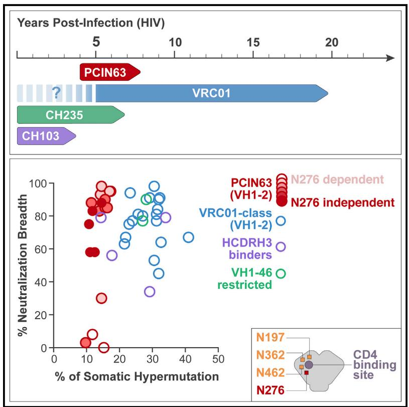

scatter

| Gene/Group | % Neutralization Breadth | % of Somatic Hypermutation |
|------------|--------------------------|----------------------------|
| PCIN63     | ~90%                     | ~5                         |
| VRC01      | ~18%                     | ~10                        |
| CH235      | ~5%                      | ~5                         |
| CH103      | ~2%                      | ~5                         |
| PCIN63 (VH1-2) | ~90%                  | ~15                        |
| PCIN63 (VH1-2) | ~85%                  | ~15                        |
| PCIN63 (VH1-2) | ~80%                  | ~15                        |
| PCIN63 (VH1-2) | ~75%                  | ~15                        |
| PCIN63 (VH1-2) | ~70%                  | ~15                        |
| PCIN63 (VH1-2) | ~65%                  | ~15                        |
| PCIN63 (VH1-2) | ~60%                  | ~15                        |
| PCIN63 (VH1-2) | ~55%                  | ~15                        |
| PCIN63 (VH1-2) | ~50%                  | ~15                        |
| PCIN63 (VH1-2) | ~45%                  | ~15                        |
| PCIN63 (VH1-2) | ~40%                  | ~15                        |
| PCIN63 (VH1-2) | ~35%                  | ~15                        |
| PCIN63 (VH1-2) | ~30%                  | ~15                        |
| PCIN63 (VH1-2) | ~25%                  | ~15                        |
| PCIN63 (VH1-2) | ~20%                  | ~15                        |
| PCIN63 (VH1-2) | ~15%                  | ~15                        |
| PCIN63 (VH1-2) | ~10%                  | ~15                        |
| PCIN63 (VH1-2) | ~5%                    | ~15                        |
| PCIN63 (VH1-2) | ~0%                    | ~15                        |
| VRC01-class (VH1-2) | ~80%              | ~20                        |
| VRC01-class (VH1-2) | ~75%              | ~20                        |
| VRC01-class (VH1-2) | ~70%              | ~20                        |
| VRC01-class (VH1-2) | ~65%              | ~20                        |
| VRC01-class (VH1-2) | ~60%              | ~20                        |
| VRC01-class (VH1-2) | ~55%              | ~20                        |
| VRC01-class (VH1-2) | ~50%              | ~20                        |
| VRC01-class (VH1-2) | ~45%              | ~20                        |
| VRC01-class (VH1-2) | ~40%              | ~20                        |
| VRC01-class (VH1-2) | ~35%              | ~20                        |
| VRC01-class (VH1-2) | ~30%              | ~20                        |
| VRC01-class (VH1-2) | ~25%              | ~20                        |
| VRC01-class (VH1-2) | ~20%              | ~20                        |
| VRC01-class (VH1-2) | ~15%              | ~20                        |
| VRC01-class (VH1-2) | ~10%              | ~20                        |
| VRC01-class (VH1-2) | ~5%              | ~20                        |
| VRC01-class (VH1-2) | 0%               | ~20                        |
| HCDRH3 binders   | ~80%                   | ~30                        |
| HCDRH3 binders   | ~75%                   | ~30                        |
| HCDRH3 binders   | ~70%                   | ~30                        |
| HCDRH3 binders   | ~65%                   | ~30                        |
| HCDRH3 binders   | ~60%                   | ~30                        |
| HCDRH3 binders   | ~55%                   | ~30                        |
| HCDRH3 binders   | ~50%                   | ~30                        |
| HCDRH3 binders   | ~45%                   | ~30                        |
| HCDRH3 binders   | ~40%                   | ~30                        |
| HCDRH3 binders   | ~35%                   | ~30                        |
| HCDRH3 binders   | ~30%                   | ~30                        |
| HCDRH3 binders   | ~25%                   | ~30                        |
| HCDRH3 binders   | ~20%                   | ~30                        |
| HCDRH3 binders   | ~15%                   | ~30                        |
| HCDRH3 binders   | ~10%                   | ~30                        |
| HCDRH3 binders   | 0%                     | 40                         |
| VH1-46 restricted  | 90%                      | 40                         |
| VH1-46 restricted  | 85%                      | 40                         |
| VH1-46 restricted  | 80%                      | 40                         |
| VH1-46 restricted  | 75%                      | 40                         |
| VH1-46 restricted  | 70%                      | 40                         |
| VH1-46 restricted  | 65%                      | 40                         |
| VH1-46 restricted  | 60%                      | 40                         |
| VH1-46 restricted  | 55%                      | 40                         |
| VH1-46 restricted  | 50%                      | 40                         |
| VH1-46 restricted  | 45%                      | 40                         |
| VH1-46 restricted  | 40%                      | 40                         |
| VH1-46 restricted  | 35%                      | 40                         |
| VH1-46 restricted  | 30%                      | 40                         |
| VH1-46 restricted  | 25%                      | 40                         |
| VH1-46 restricted  | 20%                      | 40                         |
| VH1-46 restricted  | 15%                      | 40                         |
| VH1-46 restricted  | 10%                      | 40                         |
| VH1-46 restricted  | 5%                       | 40                         |
| VH1-46 restricted  | 0%                       | 40                         |
The chart displays two sets of data: the top section shows the percentage of HIV-positive cells over time, while the bottom section shows the percentage of somatic hypermutation. The legend indicates that 'N' denotes the sample size, 'N' denotes the number of controls, 'N' denotes the number of binding sites. The chart includes a legend box for each category. The x-axis represents the percentage of somatic hypermutation, and the y-axis represents the percentage of neutralization breadth. The legend boxes are labeled with the same color and label 'N'.

# Authors

Jeffrey Umotoy, Bernard S. Bagaya,
Collin Joyce, ..., Bryan Briney,
Devin Sok, Elise Landais

# Correspondence

dsok@iavi.org (D.S.), elandais@iavi.org (E.L.)

# In Brief

Understanding the molecular basis of HIV Env-specific broadly neutralizing antibodies (bnAbs) development especially, at early stages, is key for germline-targeting vaccine design strategies. Umotoy et al. mapped the development of a VRC01-class bnAb lineage that achieved breadth in 2 years, revealing early binding to the N276-glycan during affinity maturation, which may have implications for vaccine design.

# Highlights

- Isolation of PCIN63, a VRC01-class CD4-binding site Ab lineage with only 12% SHM   
- PCIN63 lineage emerged at 40 months post infection and achieved breadth in 2 years   
- Identification of a putative PCIN63 UCA reveals the importance of the CDRL3   
- PCIN63 bnAbs segregate in N276 glycan-dependent and -independent sub-families

# Rapid and Focused Maturation of a VRC01-Class HIV Broadly Neutralizing Antibody Lineage Involves Both Binding and Accommodation of the N276-Glycan

Jeffrey Umotoy, $^{1,2}$ Bernard S. Bagaya, $^{3,4}$ Collin Joyce, $^{5}$ Torben Schiffner, $^{5,6}$ Sergey Menis, $^{1,2}$ Karen L. Saye-Francisco, $^{5}$ Trevor Biddle, $^{5}$ Sanjay Mohan, $^{7}$ Thomas Vollbrecht, $^{7}$ Oleksander Kalyuzhniy, $^{1,2}$ Sharon Madzorera, $^{8}$ Dale Kitchin, $^{8}$ Bronwen Lambson, $^{8}$ Molati Nonyane, $^{8}$ William Kilembe, $^{9}$ The IAVI Protocol C Investigators and The IAVI African HIV Research Network, Pascal Poignard, $^{1,5,10}$ William R. Schief, $^{1,5,6}$ Dennis R. Burton, $^{1,5,6,11}$ Ben Murrell, $^{7,12}$ Penny L. Moore, $^{8,13,14}$ Bryan Briney, $^{5,6}$ Devin Sok, $^{1,2,5,6,*}$ and Elise Landais $^{1,2,5,15,*}$

$^{1}$ International AIDS Vaccine Initiative Neutralizing Antibody Center, La Jolla, CA 92037, USA

$^{2}$ International AIDS Vaccine Initiative, New York, NY 10004, USA

$^{3}$ UVRI-IAVI HIV Vaccine Program, Entebbe, Uganda

$^{4}$ Department of Immunology and Molecular Biology, School of Biomedical Sciences, College of Health Sciences, Makerere University, Kampala-Uganda

$^{5}$ Department of Immunology and Microbiology, The Scripps Research Institute, La Jolla, CA 92037, USA

$^{6}$ Center for HIV/AIDS Vaccine Immunology and Immunogen Discovery (CHAVI-ID) The Scripps Research Institute, La Jolla, CA 92037, USA

$^{7}$ Department of Medicine, University of California San Diego, San Diego, CA 92103, USA

$^{8}$ Centre for HIV and STIs, National Institute for Communicable Diseases, of the National Health Laboratory Service (NHLS), Johannesburg 2131, South Africa

$^{9}$ Rwanda-Zambia HIV Research Group, Lusaka & Ndola, Zambia

$^{10}$ Institut de Biologie Structurale, Université Grenoble Alpes, Commissariat a l'Energie Atomique, Centre National de Recherche Scientifique and Centre Hospitalier Universitaire Grenoble Alpes, 38044 Grenoble, France

$^{11}$ Ragon Institute of Massachusetts General Hospital, Massachusetts Institute of Technology, and Harvard, Cambridge, MA 02114, USA

$^{12}$ Department of Microbiology, Tumor and Cell biology, Karolinska Institutet, Stockholm, Sweden

$^{13}$ School of Pathology Faculty of Health Sciences, University of the Witwatersrand, Johannesburg 2050, South Africa

$^{14}$ Centre for the AIDS Programme of Research in South Africa (CAPRISA), University of Kwa-Zulu Natal, Durban 4013, South Africa

$^{15}$ Lead Contact

\*Correspondence: dsok@iavi.org (D.S.), elandais@iavi.org (E.L.)

https://doi.org/10.1016/j.immuni.2019.06.004

# SUMMARY

The VH1-2 restricted VRC01-class of antibodies targeting the HIV envelope CD4 binding site are a major focus of HIV vaccine strategies. However, a detailed analysis of VRC01-class antibody development has been limited by the rare nature of these responses during natural infection and the lack of longitudinal sampling of such responses. To inform vaccine strategies, we mapped the development of a VRC01-class antibody lineage (PCIN63) in the subtype C infected IAVI Protocol C neutralizer PC063. PCIN63 monoclonal antibodies had the hallmark VRC01-class features and demonstrated neutralization breadth similar to the prototype VRC01 antibody, but were 2- to 3-fold less mutated. Maturation occurred rapidly within $\sim 24$ months of emergence of the lineage and somatic hypermutations accumulated at key contact residues. This longitudinal study of broadly neutralizing VRC01-class antibody lineage reveals early binding to the N276-glycan during affinity maturation, which may have implications for vaccine design.

# INTRODUCTION

Elicitation of broadly neutralizing antibodies (bnAbs) targeting the HIV envelope glycoprotein (Env) is thought to be a key component of a successful HIV-1 vaccine (Fauci, 2017). VRC01-class antibodies, which target the conserved CD4 receptor binding site (CD4bs), are among the broadest neutralizing antibodies. However, these bnAbs typically display high levels of somatic hypermutation (SHM) (Falkowska et al., 2012; Huang et al., 2016; Scheid et al., 2011; Wu et al., 2010; Zhou et al., 2015) and often require years to develop during natural infection (Landais et al., 2016; Lynch et al., 2012). These features suggest that VRC01-class antibodies undergo a long and complex affinity maturation process (Wu et al., 2015) and may be difficult to elicit by immunization.

VRC01-class antibodies have been isolated from several chronically HIV-infected individuals and differ by up to 42% in nucleotide sequence. However, antibodies of this class share common features (Wu et al., 2010; Zhou et al., 2015) (Huang et al., 2016; Sajadi et al., 2018) including the use of a VH1-2 variable gene, a 5-residue LCDR3, and a short/flexible LCDR1. These shared features favor the rational design of immunogens to activate the precursors of VRC01-class bnAbs—so called germline-targeting immunogens (Jardine et al., 2013; McGuire et al., 2013). Such immunogens have succeeded in eliciting

narrowly neutralizing antibody responses with VRC01-class features in transgenic mouse models (Briney et al., 2016b; Dosenovic et al., 2015; Jardine et al., 2015; McGuire et al., 2016; Sok et al., 2016; Tian et al., 2016). However, these responses lack the neutralization breadth associated with VRC01-class bnAbs isolated from chronic infection. Comparison between VRC01-class antibodies (Briney et al., 2016b; Jardine et al., 2013; McGuire et al., 2013) and subsequent design of minimally mutated VRC01-class antibodies (Jardine et al., 2016b) highlighted the functional role of key “patches” of SHM that contribute to neutralization breadth and potency. The importance of these mutations was confirmed by comparing to the relatively strain-specific neutralizing DRVI07 antibody lineage, which harbored all the distinguishing features of VRC01-class antibodies except for the SHM in the light chain needed to accommodate the N276- and N462- glycans adjacent to the CD4bs (Kong et al., 2016). These data indicate that accommodation of the glycans surrounding the CD4bs is a major hurdle for acquiring neutralization breadth that is typical for VRC01-class antibodies.

A detailed analysis of VRC01-class antibody development during infection has been limited by the rare nature of these responses during natural infection and the lack of longitudinal sampling of such responses. Furthermore, although germline-targeting immunogens have successfully fished out naive precursors B cells with VRC01-like features from HIV-naive individuals (Jardine et al., 2016a; Havenar-Daughton et al., 2018), whether these precursors are capable of leading to bnAbs is not known. Moreover, there is no clear pathway for the rapid elicitation of VRC01-class lineages and it is not known whether key mutations need to be introduced in a particular order.

In this study, we describe and map the rapid development of VRC01-class bnAbs in a subtype C-infected Protocol C participant, PC063, with clear CD4bs-targeting broadly neutralizing plasma activity (Landais et al., 2016). We report characterization of monoclonal antibodies isolated from this donor and outline the affinity maturation of the antibody lineage through next-generation sequencing and functional analyses. Overall, the elicitation and affinity maturation of VRC01-class antibodies in the PC063 donor challenges the notion that VRC01-class antibodies require high levels of somatic hypermutation and long periods of affinity maturation to gain neutralization breadth and potency. Additionally, we present data that suggests, in the case of the PCIN63 lineage, the presence of the N276 glycan adjacent to the CD4bs that commonly obstructs VRC01-class antibody binding might have offered favorable interactions to drive affinity maturation of this antibody lineage. The results of these findings have direct implications for HIV vaccine design strategies.

# RESULTS

# PCIN63 Antibodies Are Minimally Mutated VRC01-Class bnAbs

Participant PC063 from the Protocol C cohort was shown previously to develop a CD4bs-directed bnAb response (Landais et al., 2016). Broadly neutralizing antibody activity was first detected in PC063 plasma at 54 months post infection (mpi), approximately 2 years later than observed for most Protocol C broad neutralizers and reached peak neutralization at 72 mpi (Figure 1A). To isolate the antibodies contributing to the plasma neutralization breadth in this donor, we used the previously described recombinant HIV Env (rgp140F) WT and D368R (CD4bs epitope knock-out) proteins (Li et al., 2012). These proteins differentially adsorbed the broadly neutralizing activity from the plasma (Figure S1A) and were used as fluorophore-conjugated baits to sort CD4bs-specific memory B cells from peripheral blood mononuclear cells (PMBCs) samples collected at 66, 71, and 77 mpi (Figure 1A). Using this sort strategy, 18 mAbs, which define the PCIN63 lineage, were isolated (Figure S1B).

PCIN63 Abs derive from IGHV1-2\*02/IGHJ5\*02 and IGKV1-5\*03/IGKJ1\*01 genes, and exhibit characteristic features of VRC01-class bnAbs, including a 5-residue LCDR3 QxxEx motif, a flexible Gly-rich LCDR1 and a 15-residue HCDR3 containing a WxxxDx motif upstream of HFR4 (Figure 1B, S1C, S1D, S2). Importantly, the SHM frequency of the PCIN63 lineage ranges from $9.6\%$ to $16.0\%$ $(V_{H} + J_{H})$ and from $10.0\%$ to $13.7\%$ $(V_{K} + J_{K})$ nucleotide mutation for the heavy (HC) and light (LC) chains, respectively, which is 2- to 3-fold lower than other VRC01-class bnAbs (Figures 1B and S1C). Based on an alignment of PCIN63 mAbs amino acid sequences, the SHMs for this lineage accumulated at positions previously shown to be key epitope contact residues for the VRC01-class of bnAbs. These include mutations in HCDR1 and HCDR2, which are important for high-affinity binding to the gp120-Loop D and CD4bs-loop, and mutations in LCDR1 and LFR3 which reduce the steric clash with the N276- and N462-glycans on Env (Figure S2) (Zhou et al., 2015; Jardine et al., 2016b). Moreover, the neutralization breadth of PCIN63 bnAbs is equivalent to VRC01 on a large cross-clade panel of pseudoviruses $(N = 134)$ despite lower mutation frequencies (Figures 1B, 1C, Tables S1-S4). In fact, SHM in PCIN63 mAbs matched closely that of an engineered variant of mAb 12A21 designed to have the minimal set of SHM required for broadly neutralizing activity (min12A21) (Figure S2) (Jardine et al., 2016b). The identification of PCIN63 Abs thus challenges previous notions that high levels of SHM and prolonged affinity maturation are required for neutralization breadth and potency.

# The Rapid Development of the PCIN63 bnAb Lineage Is Not Due to High Naive B Cell Precursor Frequency Nor Biased AID Motifs

The development of VRC01-class antibodies responses is rare compared to bnAbs targeting other epitopes (Li et al., 2007; Walker et al., 2010; Lynch et al., 2012, Landais et al., 2016; Rusert et al., 2016). To determine whether the elicitation of VRC01-class antibodies in this donor was favored because of a higher frequency of VRC01-class precursors, we performed next-generation sequencing (NGS) of the naive peripheral B cell repertoire. The frequency of 5-residue LCDR3 B cells in the naive repertoire of PC063 was found to be slightly higher compared to HIV-naive donors from the United States (California) but similar to HIV-negative individuals from other African Protocol C sites (Figure S3A).

We next performed NGS on the peripheral IgG $^{+}$ B cell repertoire to determine whether the low frequency of SHM observed for PCIN63 might have been associated with the presence or absence of biased AID motifs in the antibody lineage sequences that would favor affinity maturation. A total of 17 time

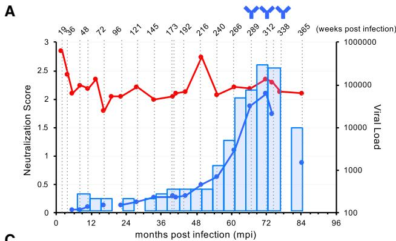

bar_line

| months post infection (mpi) | Neutralization Score | Total viral load |
| --------------------------- | -------------------- | ---------------- |
| 0                           | 2.9                  | 100              |
| 6                           | 2.4                  | 50               |
| 12                          | 2.3                  | 100              |
| 18                          | 2.4                  | 200              |
| 24                          | 2.1                  | 50               |
| 30                          | 2.2                  | 100              |
| 36                          | 2.1                  | 200              |
| 42                          | 2.2                  | 500              |
| 48                          | 2.7                  | 1000             |
| 54                          | 2.1                  | 500              |
| 60                          | 2.2                  | 1000             |
| 66                          | 2.3                  | 500              |
| 72                          | 2.4                  | 1000             |
| 78                          | 2.3                  | 500              |
| 84                          | 2.1                  | 100              |
| 96                          | 2.1                  | 50               |

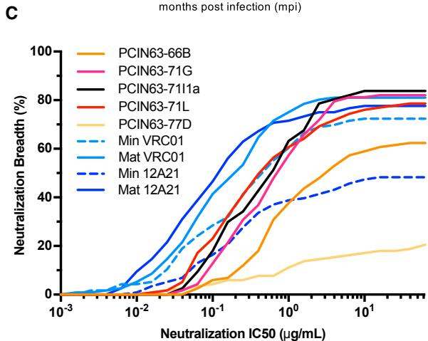

line

| Cell Line       | Neutralization IC50 (μg/mL) | Neutralization Breadth (%) |
| --------------- | --------------------------- | -------------------------- |
| PCIN63-66B      | ~0.01                       | ~0                         |
| PCIN63-71G      | ~0.01                       | ~0                         |
| PCIN63-711a     | ~0.01                       | ~0                         |
| PCIN63-71L      | ~0.01                       | ~0                         |
| PCIN63-77D      | ~0.01                       | ~0                         |
| Min VRC01       | ~0.01                       | ~0                         |
| Mat VRC01       | ~0.01                       | ~0                         |
| Min 12A21       | ~0.01                       | ~0                         |
| Mat 12A21       | ~0.01                       | ~0                         |

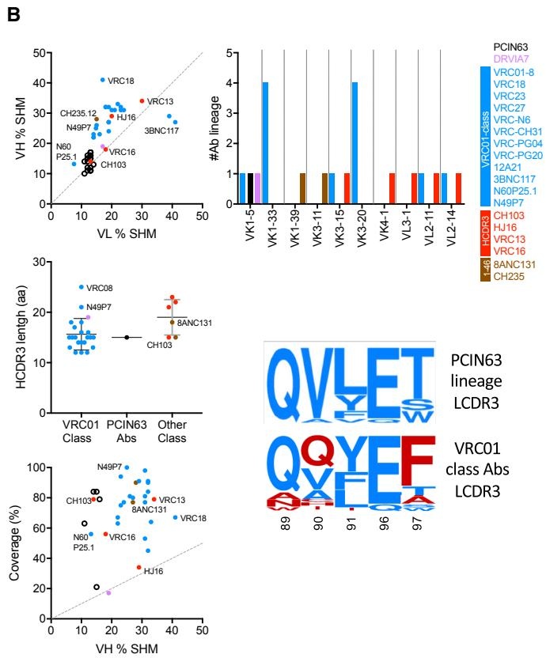  
Figure 1. PCIN63 Antibodies Define a Minimally Mutated VRC01-Class bnAb Lineage   
(A) Longitudinal plasma samples from donor PC063 were tested for neutralization against heterologous pseudoviruses. The percent of viruses neutralized ( $>50\%$ inhibition of infectivity at the lowest plasma dilution, 1:50) from a cross-clade (A, B, C) 37-virus panel is shown as shaded blue bars. The blue line represents the neutralization score calculated for each sample and taking into account breadth and potency (see Landais et al., 2016). The evolution of the viral load (red circles) in the plasma is also plotted. The time points at which PCIN63 antibodies were isolated are indicated by antibody symbols. See also Figure S1A and S1B. (B) Comparison of CD4bs Abs genetic characteristics. Antibodies are listed and color-coded by classes as defined in Zhou et al., 2016: PCIN63 (Black), DRVI07 (Violet), VRC01-class bnAbs (Blue), HCDR3 dominated bnAbs (Red), VH1-46+ bnAbs (Brown). Top left inlet shows heavy (VH) and light chains (VL) putative V-genes nucleotide variation from IMGT database reference (% SHM). Middle left inlet shows length the HCDR3s, with mean $\pm$ SEM showed as lines. Bottom left inlet shows heterologous neutralization breadth (coverage in percentage of viruses neutralized) as reported in CATNAP database (www.hiv.lanl.gov/content/immunology/neutralizing\_ab\_resources.html) and heavy chains (VH) V-genes nucleotide variation from IMGT database reference (percentage of SHM). Top right inlet shows light chain V-gene usage. Bottom right inlet shows logogram of the LCDR3 amino acid sequences for PCIN63 and other VRC01-class Abs. Residues common or unique to each category are colored in blue and red, respectively. See also Figure S1C, S1D, and S2.   
(C) Neutralization breadth (percentage of virus neutralized) is plotted as a function of potency (neutralization $IC_{50}$ in $\mu$ g/mL) of the indicated antibodies on a 120-virus panel (Seaman et al., 2010). See also Tables S1–S4. Data are representative of at least two experiments.

points between 4 and 77 mpi were processed to generate unpaired heavy-chain and light-chain sequences (Figure S3). The PCIN63 lineage was first detected at 40 mpi with progressive accumulation of nucleotide mutations that plateaued at 67 mpi (Figure S3C). Although the emergence of the PCIN63 bnAb lineage in PC063 occurred almost 2–3 years later than other bnAb lineages from published co-evolution studies targeting the CD4bs (CH235, non-VRC01-class) (Bonsignori et al., 2016), as well as other epitopes, the time required to reach maximum plasma breadth was overall similar (Figures 2A and S3B). Delayed onset (between 37–42 mpi) and fast maturation (14–19 mpi) to breadth was also reported for the DH270, which is a V3-glycan targeting lineage (Bonsignori et al., 2017). While comparison between independent studies is difficult to do accurately and plasma breadth does not necessarily correlate with frequency of SHM in the bnAb lineage, we verified that our estima-

tion of time to maturation was overall consistent with the time to acquire some neutralization breadth in the earliest mAbs isolated from these lineages. We next evaluated whether the regions encoding for key contacts to HIV Env had an enrichment of AID hotspots that might have favored this rapid and highly focused affinity mutation to gain neutralization breadth, but no significant enrichments were found (Rogozin et al., 2001, See methods). Overall, despite the relatively rapid development of VRC01-class antibodies in the PC063 donor, high precursor frequencies or biased AID motifs that might have accelerated affinity maturation and selection does not appear to be driving factors.

# Longitudinal Sequence Analysis Identifies the Emergence of SHM Motifs Associated with Neutralization

Longitudinal evaluation of antibody lineages in natural infection can provide information on the order that SHM accumulates,

A   
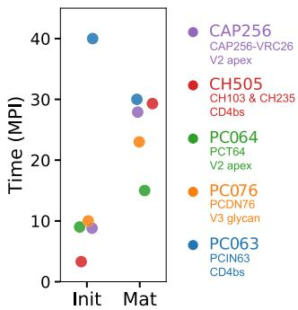

scatter

| Condition | Cell Line | Time (MPI) | Marker Type |
| --------- | --------- | ---------- | ----------- |
| Init      | CAP256    | 40         |       |
| Init      | CAP256-VRC26 | 30        |       |
| Init      | V2 apex   | 30         |       |
| Init      | CH103 & CH235 | 30        |       |
| Init      | CD4bs     | 30         |       |
| Mat       |       | 15         |       |
| Mat       | PCT64     | 15         |       |
| Mat       | V2 apex   | 15         |       |
| Mat       | PC076     | 25         |       |
| Mat       | PCDN76    | 25         |       |
| Mat       | V3 glycan | 25         |       |
| Mat       | PCN63     | 25         |       |
| Mat       | CD4bs     | 25         |       |
| Init      |       | 10         |       |
| Init      |       | 10         |       |
| Init      |       | 10         |       |
| Init      |       | 10         |       |
| Init      |       | 10         |       |
| Init      |       | 10         |       |
| Init      |       | 10         |       |
| Init      |       | 10         |       |
| Init      | CH505     | 5          |       |
| Init      |       | 5          |       |
| Init      |       | 5          |       |
| Init      |       | 5          |       |
| Init      |       | 5          |       |
| Init      |       | 5          |       |
| Init      |       | 5          |       |
| Init      |       | 5          |       |
| Init      |       | 5          |       |
| Init      |       | 5           |       |
| Init      |       | 5           |       |
| Init      |       | 5           |       |
| Init      |       | 5           |       |
| Init      |       | 5           |       |
| Init      |       | 5           |       |
| Init      |       | 5           |       |
| Init      |       | 5           |       |
| Init      |       | 5           |       |
|
| Init      |       | 5           |       |
| Init      |       | 5           |       |
| Init      |       | 5           |       |
| Init      |       | 5           |       |
| Init      |       | 5           |       |
| Init      |       | 5           |       |
| Init      |       | 5           |       |
| Init      |       | 5           |       |
| Init      ]        ]        ]        ]        ]        ]        ]        ]        ]        ]        ]        ]        ]        ]        ]        ]        ]        ]        ]        ]        ]        ]        ]        ]        ]        ]        ]        ]        ]        ]        ]        ]        ]        ]        ]        ]        ]        ]        ]        ]        ]        ]        ]        ]        ]        ]        ]        ]        ]        ]        ]            ]

B   
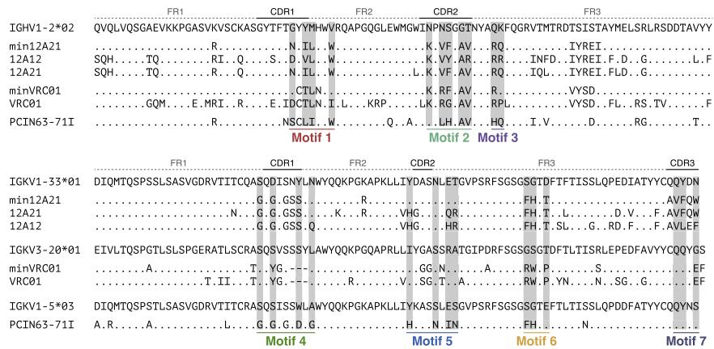

text_image

IGHV1-2*02
min12A21
12A12
12A21
minVRC01
VRC01
PCIN63-71I

QVQLVQSGAEVKKPGASVKVSCKASGYTFTGYYYMHWVRQAPGQGLEWMGWINPNSGGTNYAQKFQGRVTMTRDTSISTAYMELSRLRSDDTAVYY
SQH.....R.....N.IL...W.....K.VF.AV....RQ.....IYREI....
SQH.....TQ.....RI...Q.....S..D.VL...W.....K.VY.AR....RR.....INFD...IYREI..F.D..G.....L.F
SQH.....TQ.....R.....Q.....N.IL...W.....L.K.VF.AV....RQ.....IQL.....IYREI..FLD..G....
mCLN....CTLN....K.RF.AV....R.....VVSD....
GQM.....E.MRI...R.....E.IDCTLN...I.L...KRP.....LK.RG.AV....RPL.....VVSD...FL...RS.TV....
R.....NSCLI...W.....Q...A.....LH.AV....HQ.....I.V.....D.....RG.....T...
Motif 1 Motif 2 Motif 3
IFGKV1-33*01
min12A21
12A21
12A12
IGKV3-20*01
minVRC01
VRC01
IGKV1-5*03
PCIN63-71I

DFMQTPQSPSSLSASVGDRVTITCQASQDISNYLNWYQQKPGKAPKLLIYDASNLETGVPSRFSGSGSGTDFTFTISSLQPEDIATYYCQQYDN
FIQMTQSPSSLSASVGDRVTITCQASQDISNYLNWYQQKPGKAPKLLIYDASNLETGVPSRFSGSGSGTDFTFTISSLQPEDIATYYCQQYDN
G.G.GSS.....R.....FH.T.....AVFQW
G.G.GSS.....K.....VHG.....QR.....FH.T...L.....D.V.....F.AVFQW
G.G.GSS...Q.....VHG.....HR.....FH.T.SL.....G..RD..F.....F.AVLEF
EIVLTQSPGTLSLSPGERATLSCRASQSVSSSSYLAWYQQKPGQAPRLLIYGASSRATGIPDRFSGSGSGTDTFTTLISRLEPEDFAVYYCQQYGS
A.....T.YG.
T.II...T.YG.
R.....V..SG.T...A.....RW.P...S.....EF
T.SG.T...A.....RW.P.YN...N..SG..G....EF
DIQMTQSPSTLSASVGDRVTITCRASQSISSWLAWYQQKPGKAPKLLIYKASSLESGVPSRFSGSGSGTEFTLTISSLQPDDFATYYCQQYNS
A.R.....A.....G.G.G.D.G.
Motif 4 Motif 5 Motif 6 Motif 7

C   
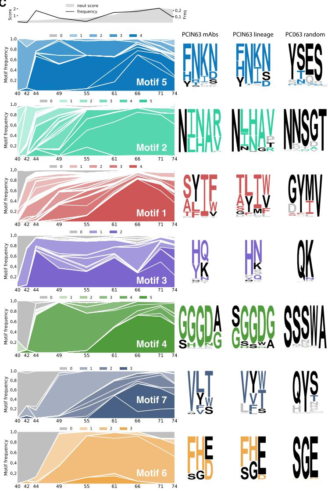

other

| Motif | PCIN63 mAbs | PCIN63 lineage | PC063 random |
|-------|-------------|----------------|--------------|
| Motif 5 | 0.8 | 0.9 | 0.7 |
| Motif 2 | 0.7 | 0.8 | 0.6 |
| Motif 1 | 0.6 | 0.7 | 0.5 |
| Motif 3 | 0.5 | 0.6 | 0.4 |
| Motif 4 | 0.4 | 0.5 | 0.3 |
| Motif 7 | 0.3 | 0.4 | 0.2 |
| Motif 6 | 0.2 | 0.3 | 0.1 |

D   
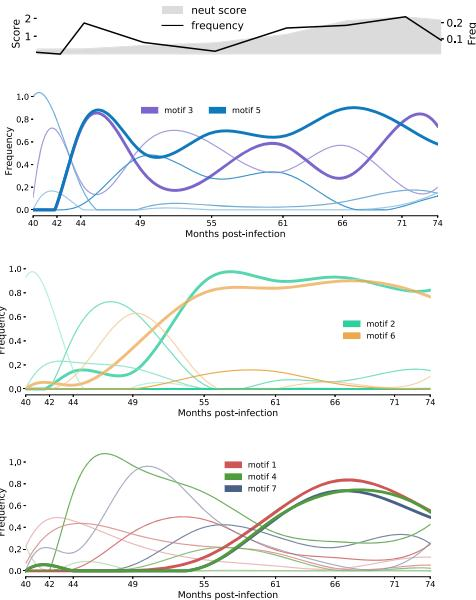

line

| Months post-infection | motif 3 | motif 5 | motif 2 | motif 6 | motif 1 | motif 4 | motif 7 |
| --------------------- | ------- | ------- | ------- | ------- | ------- | ------- | ------- |
| 40                    | 0.0     | 0.0     | 0.0     | 0.0     | 0.0     | 0.0     | 0.0     |
| 42                    | 0.8     | 1.0     | 0.2     | 0.1     | 0.0     | 0.0     | 0.0     |
| 44                    | 0.6     | 0.8     | 0.6     | 0.3     | 0.1     | 0.1     | 0.0     |
| 46                    | 0.4     | 0.6     | 0.8     | 0.5     | 0.2     | 0.2     | 0.1     |
| 48                    | 0.2     | 0.4     | 0.6     | 0.7     | 0.3     | 0.3     | 0.2     |
| 50                    | 0.3     | 0.5     | 0.4     | 0.8     | 0.4     | 0.4     | 0.3     |
| 52                    | 0.5     | 0.6     | 0.2     | 0.9     | 0.5     | 0.5     | 0.4     |
| 54                    | 0.7     | 0.7     | 0.1     | 0.9     | 0.6     | 0.6     | 0.5     |
| 56                    | 0.6     | 0.8     | 0.1     | 0.9     | 0.7     | 0.7     | 0.6     |
| 58                    | 0.5     | 0.9     | 0.1     | 0.9     | 0.8     | 0.8     | 0.7     |
| 60                    | 0.4     | 1.0     | 0.1     | 0.9     | 0.9     | 0.9     | 0.8     |
| 62                    | 0.3     | 1.1     | 0.1     | 0.9     | 1.0     | 1.0     | 0.9     |
| 64                    | 0.2     | 1.2     | 0.1     | 1.0     | 1.1     | 1.1     | 1.0     |
| 66                    | 0.3     | 1.3     | 0.1     | 1.1     | 1.2     | 1.2     | 1.1     |
| 68                    | 0.5     | 1.4     | 0.1     | 1.2     | 1.3     | 1.3     | 1.2     |
| 70                    | 0.7     | 1.5     | 0.1     | 1.3     | 1.4     | 1.4     | 1.3     |
| 72                    | 0.9     | 1.6     | 0.1     | 1.4     | 1.5     | 1.5     | 1.4     |
| 74                    | 1.1     | 1.7     | 0.1     | 1.5     | 1.6     | 1.6     | 1.5     |

E   
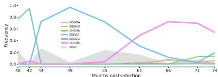

line

| Months post-infection | GGGDA | GGGG | GHSDA | SSVIA | GGGDS | GGGDS + other |
| --------------------- | ----- | ---- | ----- | ----- | ----- | ------------- |
| 40                    | 0.0   | 0.0  | 0.0   | 0.0   | 0.0   | 0.0           |
| 42                    | 0.0   | 1.0  | 0.0   | 0.0   | 0.0   | 0.0           |
| 44                    | 0.0   | 0.8  | 0.0   | 0.0   | 0.0   | 0.0           |
| 46                    | 0.0   | 0.8  | 0.0   | 0.0   | 0.0   | 0.0           |
| 48                    | 0.0   | 0.8  | 0.0   | 0.0   | 0.0   | 0.0           |
| 55                    | 0.0   | 0.6  | 0.0   | 0.0   | 0.0   | 0.0           |
| 61                    | 0.0   | 0.4  | 0.0   | 0.0   | 0.0   | 0.0           |
| 66                    | 0.2   | 0.2  | 0.2   | 0.2   | 0.2   | 0.2           |
| 71                    | 0.2   | 0.2  | 0.2   | 0.2   | 0.2   | 0.2           |
| 74                    | 0.2   | 0.2  | 0.2   | 0.2   | 0.2   | 0.2           |

Figure 2. SHM Motifs Are Selected Sequentially in the PCIN63 bnAb Lineage   
PC063 IgG libraries prepared from total PBMCs (a single vial of 10 million cells per time point) were amplified with IgG-specific primers for all human VH gene families. See also Figure S3.   
(A) Comparison of the PCIN63 Ab lineage (Blue) development kinetics with other bnAbs lineages isolated as reported in original publications. Time to maturation (Mat.) is defined as the time between first detection of the lineage in the periphery (Init.) and peak neutralization breadth in plasma. See also Figure S3B.

(legend continued on next page)

which can then inform rational vaccine strategies to elicit a similar sequence of events. Accordingly, for PC063, detailed analysis of SHM selection pathways could serve as template for elicitation of VRC01-class Abs. Thus, we tracked the emergence and evolution of seven PCIN63 SHM motifs over the course of infection (Figure 2B). These motifs were selected based on previous studies identifying the minimal SHM required for VRC01 and 12A21 broad neutralization (Jardine et al., 2016b). HCDR2-motif #2 (contacting CD4bs-loop) and LCDR2-motif#5 were first selected for, with mutations detected in nearly all sequences at month 40 at the emergence of the lineage (Figure 2C). Selection of HCDR1-motif#1 (stabilizing HCDR2) and HFWR3-motif#3 (contacting V5 loop) residues quickly followed at month 42, then LCDR1-motif#4 (adaptation to N276-glycan) at 44 mpi and finally HFWR3-motif#6 (adaptation to N276-glycan) and LCDR3-motif#7 (contacting Loop D) at 49 mpi (Figure 2C). Both HCDR2-motif #2 and HCDR1-motif#1 sampled a diversity of mutations between months 42 and 55 before converging on a final set of mutations at month 55 and month 66, respectively. In contrast, for LCDR2-motif#5 and HFWR3-motif#3, the sequences rapidly converged at month 44 to a predominant sequence, which then persisted through month 74. While LCDR3-motif#7 sampled several sequences before convergence at month 66, the other sets of mutations in the light chain, LCDR1-motif#4 and LFWR3-motif#6, converged rapidly without sampling different combinations of mutations.

Another representation of the data is presented in Figure 2D, which emphasizes when each SHM sequence motif fully converged to the affinity-mature SHM sequence. Globally, there appears to be three phases, early convergence for HCDR2-motif#3 and LCDR2-motif#5, intermediate convergence for HCDR2-motif#2 and LFWR3-motif#6 and late convergence for HCDR1-motif#1, LCDR1-motif#4, LCDR3-motif#7 (Figures 2D and 2E). Overall, these results convey a complex affinity maturation process where different sequences are sampled for each SHM motif that then become fixed at different time points, in response to changes in the autologous virus swarm over time.

# The PCIN63-UCA Does Not Bind to Env Proteins from Time Points Preceding Initiation of the Lineage

To better define the affinity maturation pathway for the PCIN63 lineage, we next determined the PCIN63 unmutated common ancestor (UCA). For the HC, an unmutated common ancestor (PCIN63-UCA-HC) was identified from the 40 mpi time point. However, for the light chain, lineage assignment based solely on $V_{K}+J_{K}$ gene usage and 5-residue LCDR3 criteria identified 18 unmutated putative precursor light chain sequences from the NGS dataset. The most frequent putative unmutated light chain sequence had an LCDR3 with amino-acid sequence QQSEA and was named PCIN63-UCA-KC1 (Figure 3A). The second most frequent unmutated light chain sequence with matching $V_{K} + J_{K}$ genes had an LCDR3 with amino-acid sequence QLYET, similar to the LCDR3 of the least mutated PCIN63-light chain sequences found at 40 mpi and was named PCIN63-UCA-KC2 (Figure 3A). To functionally characterize these putative UCAs, all 18 light chain variants were subsequently paired with the PCIN63-UCA-HC (UCA1-UCA18) and first tested for binding to VRC01-class germline targeting immunogens (Figure 3B). Only three Abs, including UCA2 but not UCA1, bound to eOD-GT8 with affinities lower to several recently described putative VRC01-class bnAb precursors (Havenar-Daughton et al., 2018).

We next determined whether the PCIN63-UCA variants could bind to autologous envelope sequences isolated from the PC063 donor. Autologous envelopes were sequenced by NGS and single genome amplification (SGA) at each time point before 40 mpi (Figure S4A). As described for other donors, PC063 Env variants became increasingly resistant to PCIN63 mAbs as mutations accumulated in loop D, CD4bs loop, and V5 loops, resulting in complete escape at month-61 (Figure S4B). Notably, among the set of sequences there was one rare virus variant isolated at 28 months post infection (M28cH1), lacking both the N276- and N462-glycans. As described previously, these glycans surround the CD4bs and are thought to obstruct binding of VRC01-class antibodies. However, none of the putative PCIN63-UCA Abs neutralized any of the autologous Env clones tested (Figure S4C) and no binding could be detected to the corresponding gp120 proteins captured from lysed pseudovirions or to recombinant gp120 from representative Env clones (Figure S4C), although, Env variants from 28 and 33 mpi had poor expression and therefore could not be evaluated. Overall, despite the availability of longitudinal sampling, UCA determination for this lineage remains partially ambiguous and the Env variants that triggered the PCIN63 Ab lineage is yet to be confirmed.

# Autologous Adaptation to the N276-Glycan Is Associated with Heterologous Neutralization

Accommodation of the N276 glycan near the CD4bs is arguably the primary obstacle in eliciting VRC01-class responses. To determine at which point this occurred in the PC63 lineage, we next systematically evaluated the functional contributions of each SHM motif to neutralization breadth and potency. We generated PCIN63-UCA/71I chimeric antibody variants containing or lacking individual SHM motifs and evaluated each variant for neutralization against N276-glycan bearing or lacking autologous viruses as well as against a global heterologous 12-virus panel (deCamp et al., 2014) (Figure 4).

A   
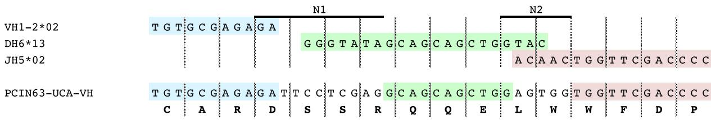

text_image

VH1-2*02
DH6*13
JH5*02
PCIN63-UCA-VH
T G T G C G A G A G A
C A R D S S R Q Q E L W W F D P
N1
G G G T A T A G C A G C A G C T G G T A C
A C A A C T G G T T C G A C C C

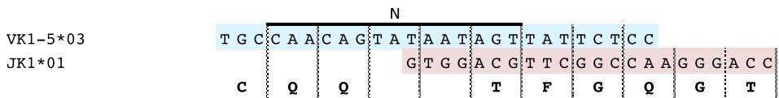

text_image

N
VK1-5*03 T G C C A A C A G T A T A A T A G T T A T T C T C C
JK1*01 G T G G A C G T T C G G C C A A G G G A C C
C Q Q T F G Q G T

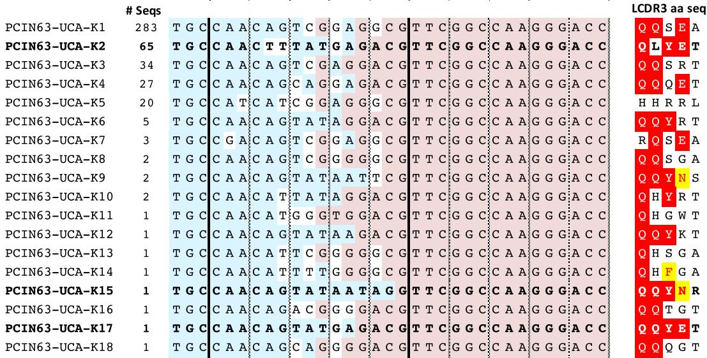

heatmap

| PCIN63-UCA-K Sequence | # Seqs | LCDR3 aa seq |
|---|---|---|
| PCIN63-UCA-K1 | 283 | Q Q S E A |
| PCIN63-UCA-K2 | 65 | Q L Y E T |
| PCIN63-UCA-K3 | 34 | Q Q S R T |
| PCIN63-UCA-K4 | 27 | Q Q Q E T |
| PCIN63-UCA-K5 | 20 | H H R R L |
| PCIN63-UCA-K6 | 5 | Q Q Y R T |
| PCIN63-UCA-K7 | 3 | R Q S E A |
| PCIN63-UCA-K8 | 2 | Q Q S G A |
| PCIN63-UCA-K9 | 2 | Q Q Y N S |
| PCIN63-UCA-K10 | 2 | Q H Y R T |
| PCIN63-UCA-K11 | 1 | Q H G W T |
| PCIN63-UCA-K12 | 1 | Q Q Y K T |
| PCIN63-UCA-K13 | 1 | Q H S G A |
| PCIN63-UCA-K14 | 1 | Q H F G A |
| PCIN63-UCA-K15 | 1 | Q Q Y N R |
| PCIN63-UCA-K16 | 1 | Q Q T G T |
| PCIN63-UCA-K17 | 1 | Q Q Y E T |
| PCIN63-UCA-K18 | 1 | Q Q Q G T |

B   
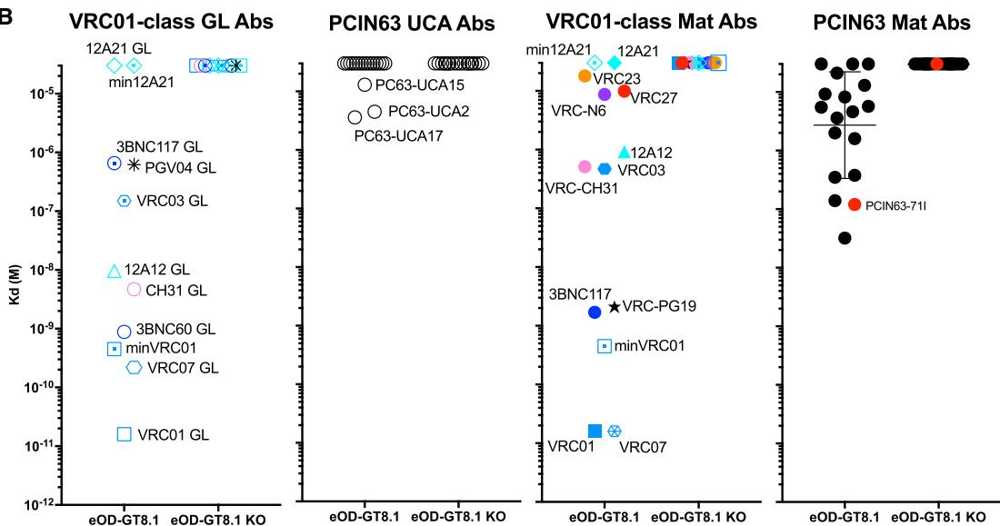

scatter

| Gene Symbol | eOD-GT8.1 | eOD-GT8.1 KO |
|-------------|-----------|--------------|
| 12A21 GL    | ~1e-5     | ~1e-5        |
| min12A21    | ~1e-5     | ~1e-5        |
| 3BNC117 GL  | ~1e-6     | ~1e-6        |
| PGV04 GL    | ~1e-6     | ~1e-6        |
| VRC03 GL    | ~1e-7     | ~1e-7        |
| 12A12 GL    | ~1e-8     | ~1e-8        |
| CH31 GL     | ~1e-8     | ~1e-8        |
| 3BNC60 GL   | ~1e-9     | ~1e-9        |
| minVRC01    | ~1e-9     | ~1e-9        |
| VRC07 GL    | ~1e-9     | ~1e-9        |
| VRC01 GL    | ~1e-10    | ~1e-10       |
| PC63-UCA15  | ~1e-5     | ~1e-5        |
| PC63-UCA2   | ~1e-5     | ~1e-5        |
| PC63-UCA17  | ~1e-5     | ~1e-5        |
| PCN63 UCA Abs| ~1e-5     | ~1e-5        |
| min12A21    | ~1e-5     | ~1e-5        |
| VRC23       | ~1e-5     | ~1e-5        |
| VRC-N6      | ~1e-5     | ~1e-5        |
| 12A12       | ~1e-5     | ~1e-5        |
| VRC03       | ~1e-5     | ~1e-5        |
| 3BNC117     | ~1e-9     | ~1e-9        |
| VRC-PG19    | ~1e-9     | ~1e-9        |
| minVRC01    | ~1e-9     | ~1e-9        |
| VRC07       | ~1e-9     | ~1e-9        |
| PCIN63 Mat Abs| ~1e-5     | ~1e-5        |
| PCIN63-Mat Abs| ~1e-5     | ~1e-5        |
| PCIN63-Mat Abs| ~1e-5     | ~1e-5        |
| PCIN63-Mat Abs| ~1e-5     | ~1e-5        |
| PCIN63-Mat Abs| ~1e-5     | ~1e-5        |
| PCIN63-Mat Abs| ~1e-5    | ~1e-5        |
| PCIN63-Mat Abs| ~1e-5    | ~1e-5        |
| PCIN63-Mat Abs| ~1e-5    | ~1e-5        |
| PCIN63-Mat Abs| ~1e-5    | ~1e-5        |
| PCIN63-Mat Abs| ~1e-5    | ~1e-5        |

Figure 3. The Majority of Putative PCIN63 UCAs Do Not Bind eOD-GT8   
(A) Identification of PCIN63 lineage precursor sequences. The CDR3 of putative PCIN63-UCA NGS sequences (100% identity to PCIN63 Abs HC and LC germline V+J genes) are aligned with IMGT $V_{H}1-2*02$ , $D_{H}6*13$ , $J_{H}5*03$ , $V_{K}1-5*03$ , and $J_{K}1*01$ germline genes sequences. The N regions of the junctions are indicated. For

(legend continued on next page)

Pairing the UCA-HC variants with the mature 71I-KC resulted in cross-neutralization of autologous viruses, particularly when HCDR2-motif#2 was introduced to the UCA-HC (Figure 4A, right). The combined LC SHMs alone allowed weaker neutralization of autologous Env lacking the N276-glycan than N276-bearing clones except when paired with the HCDR2-motif#2. In contrast, the UCA-KC2 variants paired with the mature 71I-HC predominantly neutralized viruses lacking the N276 glycan. These observations not only confirm the critical role of LC mutations in accommodating the N276-glycan but also suggest direct dependence on this glycan for binding of early PCIN63 intermediates to autologous Envs. Overall, pairing the UCA/71I-HC variants with the UCA-KC2 yielded broader autologous neutralization than pairing with UCA-KC1 (Figures 4, S5). This observation not only supports UCA2 as the natural precursor of the PCIN63 lineage but also confirms an important role for the LCDR3 in elicitation of VRC01-class lineages.

Pairing the UCA-KC2 variants with an intermediate HC containing only HCDR2-motif#2 and HFWR3-motif#3 highlighted the co-dependence of LCDR1-motif4 and LFWR3-motif#6 for neutralization of autologous viruses with PNGS at position N276, with a critical role for D32 $_{LC}$ in LCDR1-motif4 (Figure S4B, middle). The detection of autologous M28cH1 neutralization by almost all Ab variants containing at least one SHM motif suggests it may indeed have been the eliciting variant.

The absence of individual SHM motifs in either the HC or the KC had minimal effects on autologous neutralization when the variants were paired with affinity-mature KC or HC, respectively, indicating redundancy across the SHM motifs for epitope recognition. Although heterologous neutralization was overall correlated with autologous neutralization of N276-glycan bearing viruses, the absence of individual SHM motifs had greater impact on heterologous neutralization, which was most significantly reduced in absence of LCDR1-motif#4. In summary, SHM in HCDR2-motif#2, LCDR1-motif#4 and LFWR3-motif#6 are sufficient for autologous neutralization of variant bearing the N276-glycan by PCIN63 Abs.

# PCIN63 bnAbs Engage the N276-Glycan of Some Env Strains

To better understand how the PCIN63 antibody lineage might interact with the N276 and other surrounding glycans, we next tested neutralization against heterologous viruses and their corresponding N276A mutants. The data revealed a hierarchy in the importance of glycans for neutralization by PCIN63 Abs, with N276 ≥ N197 > N262 ≈ N301 > N462/N463 > N448 (Figure S6). This trend is generally consistent with the effects observed for other VRC01-class bnAbs, particularly 12A21 and other Abs bearing a glycine-rich LCDR1 loop (VRC23, VRC27, VRC-CH31) with the exception of VRC-N6 (Figure S6, Table S5). We also observed significant variation between viral strains in their sensitivity to PCIN63 neutralization, as well as between PCIN63 mAbs in their ability to neutralize a given viral strain (Figure 5A). These variations were still apparent, although to a lesser extent, when pseudoviruses were produced in GnT I $^{-/-}$ cells (293-S) yielding predominantly Man5 glycans on HIV Env (Figure 5A) (Doores and Burton, 2010). The negative effect of glycan removal on neutralization for some viral strains by PCIN63 Abs was greater for N276 than other glycans and suggests that the Abs may directly depend on the N276-glycan for binding or neutralization in the context of some Env strains such as JR-CSF (Figure 5A). We evaluated other components of the epitope including surrounding glycans as well as key contact residues on Env and observed a general trend toward dependence on the N276-glycan when other obstructive features are present (JR-CSF) but accommodation of the N276 glycan when surrounding obstructive features are missing (JR-FL), such as the N461-glycan and the lack of N197- and N234-glycans (Figure 5A). We next determined whether there were shared motifs that lead to dependence or accommodation of the N276 glycan. An alignment of the PCIN63 antibody sequences that are or are not dependent on the N276-glycan revealed that the subset of PCIN63 antibodies that accommodate the N276 glycan share similar sequence features as the 12A21 antibody (Figure 5B). The N276-glycan dependent PCIN63 Abs carried SHM motifs possibly sub-optimal for high-affinity contacts with the CD4bs loop (non-aromatic residue N54 $_{HC}$ ) and V5 loop (Y61 $_{HC}$ ), while N276-glycan accommodating PCIN63 mAbs displayed a fourth Gly residues in LCDR1-motif#4 (G34 $_{LC}$ ) and a more canonical LCDR3-motif#7 with aromatic residues at position 91 and 97 optimal for loop D and V5 loop binding (Figure 5B). Additionally, all PCIN63 mAbs also carried R/W19 $_{HC}$ and E/D76 $_{HC}$ mutations possibly involved in N197-glycan interactions. Further corroborating the difference in antibody subsets, we also observed that PCIN63 Abs with N276-glycan dependent or accommodating phenotypes clustered in separate branches of the lineage phylogenetic trees suggesting divergent evolution in response to the N276-glycan for this lineage (Figure S3D). Overall, these observations suggest a greater dependence on direct contact with the N276-glycan when the CD4bs loop is less accessible and Env protein contacts sub-optimal.

# DISCUSSION

The exceptional breadth of VRC01-class bnAbs and their commonly shared features have long made them favored targets for rational vaccine design (Wu et al., 2010; Zhou et al., 2015). Despite major progress in the isolation and characterization of VRC01-class antibodies and the design of immunogens to prime VRC01-class precursors by immunization, the field has yet to elicit VRC01-class antibodies by immunization (Jardine et al., 2013; McGuire et al., 2013; Dosenovic et al., 2015; Jardine et al., 2015; Briney et al., 2016b; McGuire et al., 2016; Sok et al., 2016; Tian et al., 2016). Among other challenges, antibodies of this class can be up to $40\%$ mutated from germline suggesting that during infection, VRC01-class antibodies require

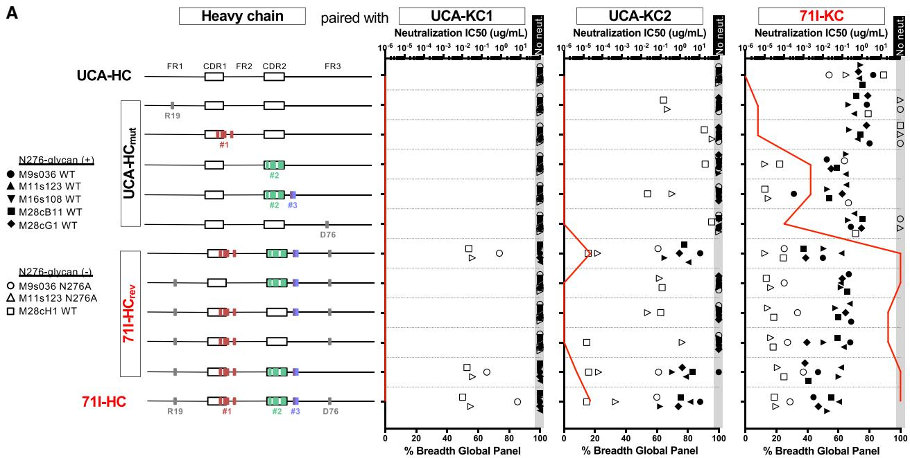

bar_line

| Protein        | UCA-KC1 (% Breadth Global Panel) | UCA-KC2 (% Breadth Global Panel) | 71I-KC (% Breadth Global Panel) |
|----------------|----------------------------------|----------------------------------|---------------------------------|
| UCA-HC         | FR1, CDR1, FR2, CDR2, FR3              | N276-glycan (+) M9s036 WT ▲M11s123 WT ▼M16s108 WT ■M28cB11 WT ◆M28cG1 WT D76 | N276-glycan (-) M9s036 N276A △M11s123 N276A □M28cH1 WT |
| UCA-HCmut      | R19, #1, #2, #3                      | N276-glycan (+) M9s036 WT ▲M11s123 WT ▼M16s108 WT ■M28cB11 WT ◆M28cG1 WT D76 | N276-glycan (-) M9s036 N276A △M11s123 N276A □M28cWHTD76 |
| 71I-HCrev      | R19, #1, #2, #3                      | N276-glycan (+) M9s036 WT ▲M11s123 WT ▼M16s108 WT ■M28cB11 WT ◆M28cG1 WT D76 | N276-glycan (-) M9s036 N276A △M11S123 N276A □M28cH1 WT |
| 71I-HC         | R19, #1, #2, #3                      | N276-glycan (+) M9s036 WT ▲M11s123 WT ▼M16s108 WT ■M28cB11 WT ◆M28cG1 WT D76 | N276-glycan (-) M9s036 N276A △M11s036 N276A □M28cH1 WT |
| UCA-KC1 (top panel) | ~10⁻⁶ to ~10¹                  | ~10⁻⁶ to ~10¹                   | ~10⁻⁶ to ~10¹                    |
| UCA-KC1 (bottom panel) | ~0–100%                         | ~0–100%                          | ~0–100%                          |

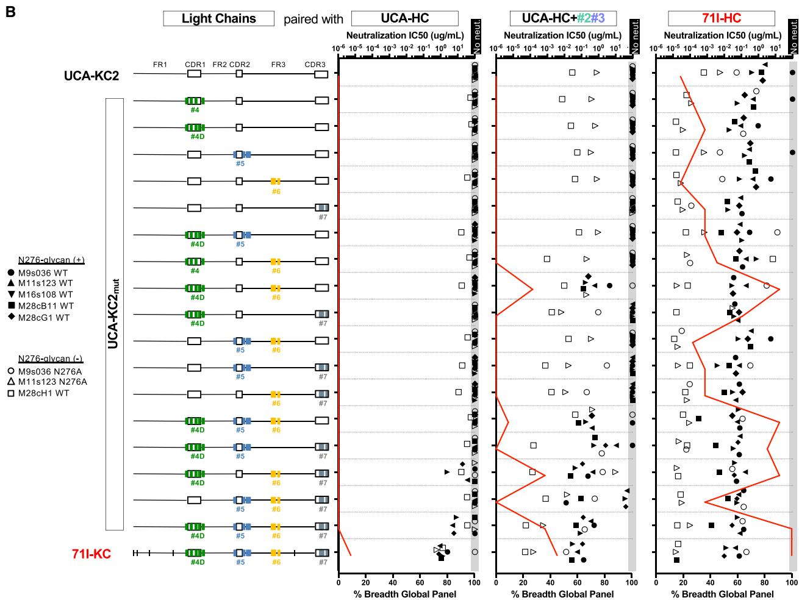  
(legend on next page)

long periods of affinity maturation to target the occluded epitope that is surrounded by glycans on the HIV Env trimer (Huang et al., 2016; Sajadi et al., 2018). The glycan at N276 in particular has been previously described to be a key impediment for VRC01-class antibodies to target the CD4bs (Kong et al., 2016), and its removal has been shown to enhance the binding and neutralization activity of antibodies of this class. NGS analysis of VRC01 lineage ontogeny using longitudinal samples collected 5–20 years after infection indeed revealed a complex multi-branched lineage (Wu et al., 2015). However, late sampling only captured lineage sequences that were heavily mutated preventing the reconstruction of the early stages of VRC01 elicitation and maturation. Here, we describe the first complete longitudinal analysis of VRC01-class antibodies affinity maturation from elicitation to acquisition of neutralization breadth in natural infection. The findings also challenge the current strategies relying on glycan-deleted immunogens to select for Ab with glycan avoiding features and suggest that transient direct glycan-binding may help driving affinity maturation toward broad glycan accommodation.

Despite the number of VRC01-class mAbs isolated to date, the field has relied on reverted-germline Abs as templates for vaccine design, which were inferred either by phylogeny of B cell transcripts at a single time point or by reverting the V and J genes and approximating the HCDR3 of mature bnAbs (Jardine et al., 2013; McGuire et al., 2013; Jardine et al., 2015; Dosenovic et al., 2015; Briney et al., 2016b; McGuire et al., 2016; Bonsignori et al., 2018). Indeed, the uncertainty in determining the PCIN63 lineage precursor light chain despite the availability of contemporaneous samples reveal the importance of small LCDR3 variations on antibody binding, which highlights how sequence approximations could lead to different interpretations of germline antibody binding. We note in the case of PCIN63, both binding to eOD-GT8 and the weak neutralizing activity detected against the M28cH1 glycan-lacking variants by UCA2 chimeric Abs compared to UCA1 suggest but do not formerly validate UCA2 as the true PCIN63 precursor.

Previous studies reported that VRC01-class bnAbs require more time (>5 years) to develop during infection than bnAbs targeting other Env epitopes (1–3 years) (Landais et al., 2016; Lynch et al., 2012), a hypothesis supported by the high frequency of SHMs typically found among VRC01-class antibodies (Figure 1). While there was indeed a late onset for the PCIN63 antibody lineage, neutralization breadth for this lineage was acquired in less than 2 years and isolated mAbs from these time points showed only 10%–15% mutation from germline, which is 2- to 3-fold lower than typical VRC01-class antibodies. PCIN63 is the second VK1-5+ VRC01-subclass bnAb lineage isolated to date (Sajadi et al., 2018). Together with the recent finding that the VK1-5+ subclass of potential VRC01-class precursors were nearly as common as the most frequent VK3-20+ eOD-GT8-specific B cells in naive donor repertoires (Havenar-Daughton et al., 2018), this suggest (1) that the naive B cells isolated using germline-targeting immunogens may indeed represent true bnAbs precursors and (2) that this particular subclass of bnAbs may serve as a favorable target for vaccine design. Furthermore, evaluation of factors that might have favored the elicitation and focused affinity maturation of the PCIN63 lineage in donor PC063, i.e., frequencies of VRC01-class precursors and biased AID hotspots (see Methods) favoring affinity maturation at key contact residues, showed no significant differences compared to other donors. This suggests that similar focused maturation of PCIN63-like antibodies, with more classical features compared to other bnAbs of this class, might be readily achievable by vaccination.

To inform VRC01-class antibodies targeting vaccine strategies, we thus phylogenetically retraced the evolution of key SHM motifs and functionally tested their contribution to autologous and heterologous neutralization. The observation that PCIN63 lineage heavy chain sampled a greater sequence diversity compared to the light chain is consistent with a stringent selection pressure on the light chain to accommodate glycans surrounding the CD4bs followed by honing of the antibody-epitope interactions through gradual selection of affinity mutations in the heavy chain. Previous studies demonstrated that VRC01-class bnAbs SHM in the LC specifically were critical for the adaptation to the N276- and V5-loop glycans and are required for neutralization breadth. Accordingly, most immunization strategies are designed to prime VRC01-class precursors with immunogens lacking these glycans (eOD-GT8, 426c and donor NIH-45 Env derived molecules). In these studies, the Abs elicited by glycan-lacking priming immunogens typically cannot bind or neutralize Env constructs with the N276-glycan present. The responses are then typically boosted with more native-like Env proteins incrementally incorporating glycans to select for HC and LC mutations that enable binding in the presence of the N276 glycan. However, this strategy has only shown success in models where precursor frequencies are high or when the animal model contains an affinity-mature VRC01-class heavy- or light-chain gene (Briney et al., 2016b; Dosenovic et al., 2015; Jardine et al., 2015; McGuire et al., 2016; Sok et al., 2016; Tian et al., 2016).

Here we showed that UCA-HC/mature-KC chimeric Ab displayed weak neutralizing activity of the N276-glycan bearing autologous clones but not of their N276-glycan KO counterpart suggesting that direct engagement of the N276-glycan may

Figure 4. SHM Motifs in HCDR2, LCDR1, and LFWR3 Are Sufficient for Autologous Neutralization of N276-glycan Bearing Viral Variants

Chimeric Abs were tested for neutralization of the indicated WT and N276A autologous Env clones sensitive to neutralization by PCIN63-71I and against the global 12-virus panel (deCamp et al., 2014). Autologous neutralization IC $_{50}$ are plotted with symbols according to the legend, and neutralization breadth (percentage of viruses neutralized) on the global panel is indicated with a red line.

(A) PCIN63-71I HC were either introduced into the PCIN63-UCA-HC (mut) or reverted to germline (rev). SHM motifs are color-coded as in Figure 2B and their position is indicated with diagrams. Mutated constructs were paired with WT PCIN63-UCA-KC1 (left), PCIN63-UCA-KC2 (middle), or PCIN63-71I (right) LC and tested for neutralization.   
(B) PCIN63-71I-KC SHM motifs (as defined in Figure 2B) were introduced into the PCIN63-UCA-KC2, individually or in combination. Motifs are color-coded and their sequence position is indicated with a diagram. Mutated constructs were paired with WT PCIN63-UCA (left), PCIN63-UCA+Motif#2+Motif#3 (middle) or PCIN63-71I (right) HC. See also Figure S5. Data are representative of at least two experiments.

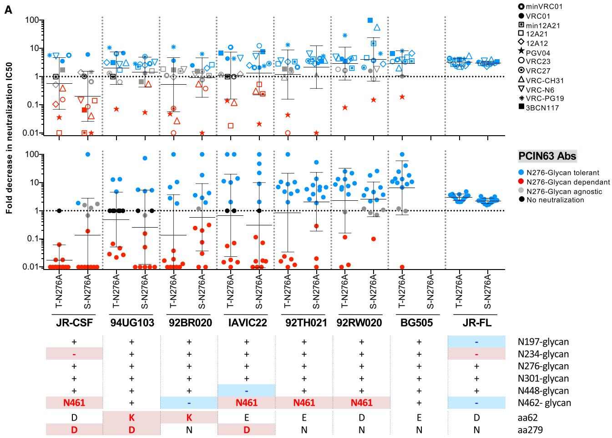

scatter

| Cell Line | N276-Glycan tolerant | N276-Glycan dependant | N276-Glycan agnostic | No neutralization |
|-----------|------------------------|------------------------|----------------------|-------------------|
| T-N276A   | ~10                    | ~0.1                   | ~0.01                | ~0.01             |
| S-N276A   | ~1                     | ~0.1                   | ~0.01                | ~0.01             |
| T-N276A   | ~10                    | ~0.1                   | ~0.01                | ~0.01             |
| S-N276A   | ~1                     | ~0.1                   | ~0.01                | ~0.01             |
| T-N276A   | ~1                     | ~0.1                   | ~0.01                | ~0.01             |
| S-N276A   | ~1                     | ~0.1                   | ~0.01                | ~0.01             |
| T-N276A   | ~1                     | ~0.1                   | ~0.01                | ~0.01             |
| S-N276A   | ~1                     (N461)            | ~0.1                   | ~0.01                | ~0.01             |
| T-N276A   | ~1                     (N461)            | ~0.1                   | ~0.01                | ~0.01             |
| S-N276A   | ~1                     (N461)            | ~0.1                   | ~0.01                | ~0.01             |
| T-N276A   | ~1                     (N461)            | ~0.1                   | ~0.01                | ~0.01 (N461)      |
| S-N276A   | ~1                     (N461)            | ~0.1                   | ~0.01                | ~0.01 (N461)      |
| T-N276A   | ~1                     (N461)            | ~0.1                   | ~0.01                | ~0.01 (N461)      |
| S-N276A   | ~1                     (N461)            | ~0.1                   | ~0.01                | ~0.01 (N461)      |
| T-N276B   | ~1                     | ~0.1                   | ~0.01                | ~0.01             |
| S-N276B   | ~1                     | ~0.1                   | ~0.01                | ~0.01             |
| T-N276B   | ~1                     | ~0.1                   | ~0.01                | ~0.01             |
| S-N276B   | ~1                     | ~0.1                   | ~0.01                | ~0.01             |
| T-N276B   | ~1                     | ~0.1                   | ~0.01                | ~0.01             (N462-)    |
| S-N276B   | ~1                     | ~0.1                   | ~0.01                | ~0.01             (aa62)    |
| T-N276B   | ~1                     | ~0.1                   | ~0.01                | (aa279)           |
| S-N276B   | ~1                     | ~0.1                   | ~0.01                | (aa279)           |
| T-N276C   | ~1                     | ~0.1                   | ~0.01                | (~D)              |
| S-N276C   | ~1                     | ~0.1                   | ~0.01                | (~D)              |
| T-N276C   | ~1                     | ~0.1                   | (~D)                 | (~D)              |
| S-N276C   | ~1                     | ~0.1                   | (~D)                 | (~D)              |
| T-N276C   | ~1                     | ~0.1                   | (~D)                 | (~D)              |
| S-N276C   | ~1                     | ~0.1                   | (~D)                 | (~D)              |
| T-N276C   | ~1                     | ~0.1                   | (~D)                 | (~D)              |
| S-N276A   | ~1                     | ~0.1                   | (~D)                 | (~D)              |
| T-N276A   | ~1                     | ~0.1                   | (~D)                 | (~D)              |
| S-N276A   | ~1                     | ~0.1                   | (~D)                 | (~D)              |
| T-N276A   | ~1                     | ~0.1                   | (~D)                 | (~D)              |
| S-N276A   | ~1                     | ~0.1                   | (N)                  | (N)              |
| T-N276A   | ~1                     | ~0.1                   | (N)                  | (N)              |
| S-N276A   | ~1                     | ~0.1                   | (N)                  | (N)              |
| T-N276A   | ~1                     | ~0.1                   | (N)                  | (N)              |
| S-N276A   | ~1                     | ~0.1                   | (N)                  | (N)              |
| T-N276A   | 5                      | 5                      | 5                    | 5                 |
| S-N276A   | 5                      | 5                      | 5                    | 5                 |
| T-N276A   | 5                      | 5                      | 5                    | 5                 |
| S-N276A   | 5                      | 5                      | 5                    | 5                 |
| T-N276A   | 5                      | 5                      | 5                    | 5                 |
| S-N276A   | 5                      | 5                      | 5                    | 5                  |
| T-N276A   | 5                      | 5                      | 5                    | 5                 |
| S-N276A   | 5                      | 5                      | 5                    | 5                 |
| T-N276B   | 5                      | 5                      | 5                    | 5                 |
| S-N276B   | 5                      | 5                      | 5                    | 5                 |
| T-N276B   | 5                      | 5                      | 5                    | 5                 |
| S-N276B   | 5                      | 5                      | 5                    | 5                 |
| T-N276B   | 5                      | 5                      | 5                    | 5                 |
| S-N276A   | 5                      | 5                      | 5                    | 5                 |
| T-N276B   | 5                      | 5                      | 5                    | 5                 |
| S-N276B   | 5                      | 5                      | 5                    | 5                 |
| T-N276C   | 5                      | 5                      | 5                    | 5                 |
| S-N276C   | 5                      | 5                      | 5                    | 5                 |
| T-N276C   | 5                      | 5                      | 5                    | 5                 |
| S-N276C   | 5                      | 5                      | 5                    | 5                 |
| T-N276C   | 5                      | 5                      | 5                    | 5                 |
| S-N276A   | 5                      | 5                      | 5                    | 5                 |
| T-N276A   | 5                      | 5                      | 5                    | 5                 |
| S-N276A   | 5                      | 5                      | 5                    | 5                 |
| T-N276C   (N461) N461 N461 N461 N461 N461 N461 N461 N461 N461 N461 N461 N461 N461 N461 N461 N461 N461 N461 N461 N461 N461 N461 N461 N461 N461 N46<nl>

B

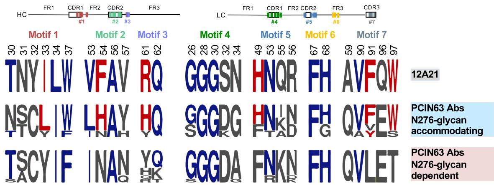

text_image

HC FR1 CDR1 FR2 CDR2 FR3 LC FR1 CDR1 FR2 CDR2 FR3 CDR3
#1 #2 #3 #4 #5 #6 #7
Motif 1 Motif 2 Motif 3 Motif 4 Motif 5 Motif 6 Motif 7
30 31 32 33 34 37 53 54 56 57 61 62 26 28 30 32 34 49 53 55 56 67 68 59 90 91 96 97
TNY | LW VFAV RQ GGGSN HNQR FH AVFQW
NSCL | W LHAY HQ GGGDG HN IN FH QVFEW
TTY F NH AH YG S M K F TAD G A Y E S
TSCY | F | NAN YQ GGGDA FNKN FH QVLET
SA HK S G G R R
12A21 PCIN63 Abs N276-glycan accommodating PCIN63 Abs N276-glycan dependent

Figure 5. Neutralization of PCIN63 and Other VRC01-Class Antibodies Is Strain-Specifically N276-Glycan Dependent   
(A) Fold decrease in neutralization $IC_{50}$ of PCIN63 Abs (lower panel) and the listed VRC01-class Abs (upper panel) for N276A mutant of the indicated pseudotyped Env strains produced in 293-T or 293-S (Gtnl $^{-/-}$ ) cells compared to WT. The geomean with SD are shown. Relevant features of the selected Env strains are indicated above. Symbols are color-coded according to the permissive (blue) versus obstructive (red) potential regarding access to the CD4bs. See also Figure S6. Data are representative of at least two experiments.   
(B) Logogram of the PCIN63 SHM motifs amino acid sequences for PCIN63 Abs segregated according to their sensitivity to N276-glycan removal (A) and compared to corresponding sequences of 12A12, 12A21, and min12A21 Abs. Residues common to 12A21 and PCIN63 N276-glycan accommodating Abs are colored in red. Residues shared between 12A21 and all PCIN63 Abs are colored in blue. SHM motifs are color-coded as in Figure 2 and their position is indicated with diagrams. See also Figures S2, S6, Table S5.

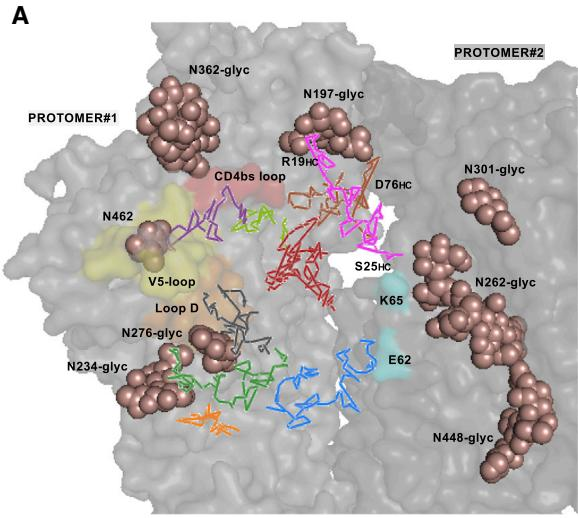

text_image

A
N362-glyc
N197-glyc
PROTOMER#1
R19HC
CD4bs loop
D76HC
N301-glyc
N462
V5-loop
Loop D
S25HC
K65
N262-glyc
N276-glyc
E62
N234-glyc
N448-glyc

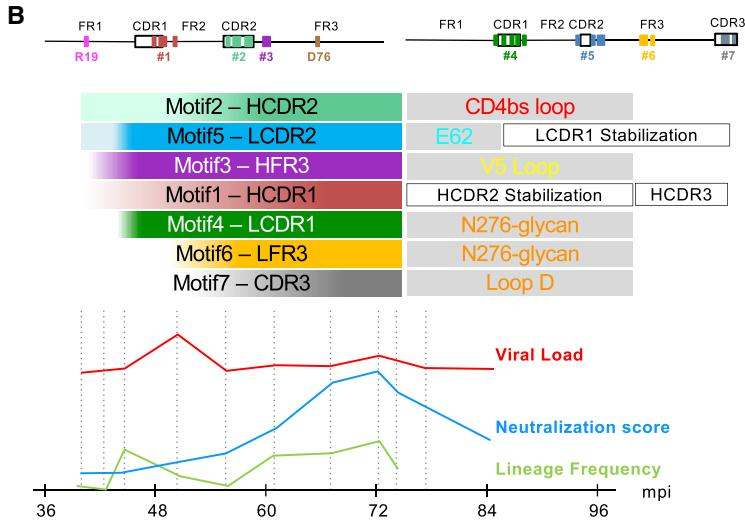  
Figure 6. Modeling of PCIN63 bnAb Env Contacts Support a Possible Role of Glycan Interactions during Maturation and Lineage CD4bs Immunofocusing   
(A) In silico modeling of 12A21 bound to BG505 SOSIP.664 using the published structures of 12A21 bound to gp120 (PDB ID: 4JPW) (Klein et al., 2013) and glycosylated BG505 SOSIP.664 bound to 35O22 and PGT122 (PDB ID: 6DE7) (Zhang et al., 2018). Two of the three Env protomers are displayed in shades of gray as transparent surfaces highlighting the CD4bs loop (red), loop D (orange), the V5 loop (yellow) on one protomer and other putative contact residues (cyan) on the second protomer. Glycans surrounding the CD4bs protruding from both protomers are shown as brown spheres and labeled. 12A21 HC and LC residues corresponding to PCIN63 SHM motifs are shown as ribbon and color-coded as defined in Figure 2B and represented in a diagram (B). Additional motifs in HFR1 (aa19-25 – pink) and HFWR3 (aa71-76 – brown) are also highlighted.   
(B) PC63 infection timeline summary showing the evolution of viral load (red), serum neutralization breadth-potency (score, blue), and overall PCIN63 Ab lineage frequency in the periphery (green line). PCIN63 Ab lineage maturation is further detailed above for each SHM motif as shaded bars from unmutated (white) to fully mature (full motif-specific color) according to the kinetic analysis detailed in Figure 2. Putative functional impact of SHM motifs maturation regarding contact with Env (gray filled boxes) or internal structural stabilization (open boxes) inferred from the model in (A) are shown color-coded accordingly.

have facilitated binding. The lineage then affinity matures into two main branches, where one remains dependent on the N276 glycan for binding and the other gaining affinity for the CD4bs epitope in the absence of the N276 glycan. Together with the recent finding that VRC01 inferred GL Ab interacted with the N276-glycan of 426c gp120 core lacking the V1-V2-V3 loops (Borst et al., 2018), these data suggest an alternative vaccine design strategy where the N276-glycan is present on the germline-targeting immunogens at the initial priming stages to select for early intermediates with glycan-binding properties, which could be subsequently boosted with immunogens to affinity mature intermediate precursors to relinquish dependency on the glycan and acquire higher affinity for the CD4bs epitope. A similar strategy was suggested for V2-apex directed Abs upon observation that varying affinities for particular glycoforms were associated with the elicitation of the PCT64 lineage (Landais et al., 2017, Rantalainen et al., 2018).

To better understand the putative interactions between PCIN63 Abs and the Env trimer, we constructed an in silico model of 12A21 bound to BG505 SOSIP.664 using independently published structures (Klein et al., 2013; Zhang et al., 2018) (Figure 6). This model suggests contacts between E62 and CDR2-N57 $_{HC}$ , and N279 and CDR3-E96 $_{LC}$ consistent with the strain-specific N276-glycan dependent variations observed in Figure 5A. Together with the evidence of early N276-glycan binding and significant toggling of the HCDR2-motif#2, this model suggests that PCIN63 Abs maturation pathway required a fine balance between glycan avoidance to better access the CD4bs loop and Loop D contact residues, and direct glycan binding to counter lower affinity of early viral intermediates evolving to escape autologous Ab responses. While acquiring a deletion in LCDR1 to avoid the N276-glycan, as seen in most VRC01-class Abs, might be more difficult to reproduce by vaccination, our data suggest that immunization strategies should not focus on glycan-deleted immunogens alone to drive affinity maturation of this lineage.

The trajectory for affinity maturation to broadly neutralizing antibodies in natural infection follows complex pathways with many “dead-ends” (Bhiman et al., 2015; Sok et al., 2014) that may be avoided with more focused and targeted rational vaccine design strategies. The isolation of the PCIN63 bnAbs and the identification of their UCA will enable the development of a germline mouse model for a CD4bs lineage known to develop broadly neutralizing activity. Finally, the identification of antibody intermediates and viral sequences will enable the evaluation of candidate boosts to refine immunization schemes that might drive such responses by vaccination.

# STAR★METHODS

Detailed methods are provided in the online version of this paper and include the following:

● KEY RESOURCES TABLE   
- CONTACT FOR REAGENT AND RESOURCES SHARING   
● EXPERIMENTAL MODEL AND SUBJECT DETAILS   
○ Human samples   
○ Cell Lines

# ● METHODS DETAILS

○ Single memory B cell sorting and isolation of PCIN63 monoclonal antibodies   
○ PCIN63 antibody expression and purification   
○ B cell repertoire next generation sequencing and computational analysis   
○ AID hotspots analysis   
○ Single genome amplification (SGA), sequencing and cloning   
○ Full-length env amplification sequencing and computational analysis   
○ Neutralization assay   
○ Serum adsorptions   
○ Surface plasmon resonance (SPR)   
○ ELISA assays   
● QUANTIFICATION AND STATISTICAL ANALYSIS   
● DATA AND CODE AVAILABILITY

# SUPPLEMENTAL INFORMATION

Supplemental Information can be found online at https://doi.org/10.1016/j.immuni.2019.06.004.

# CONSORTIA

The IAVI Protocol C Investigators Susan Allen (Emory University, USA and ZERHP, Zambia), William Kilembe (ZEHRP, Zambia), Shabir Lakhi (ZEHRP, Zambia), Mubiana Inambao (ZEHRP, Zambia), Etienne Karita (Rwanda-Zambia HIV Research Group, Project San Francisco, Kigali, Rwanda), Anatoli Kamali (MRC/UVRI Uganda), Eduard J. Sanders (KEMRI, Kenya and Oxford University, UK), Omu Anzala (KAVI, Kenya), Vinodh Edward (The Aurum Institute, South Africa), Linda-Gail Bekker (Cape Town University, South Africa), Jianming Tang (University of Alabama Birmingham, USA). The IAVI African HIV Research Network also includes Jill Gilmour (IAVI and London Imperial College, UK), Eric Hunter (Emory University, USA), Matt Price (IAVI and University of California San Francisco, USA).

# ACKNOWLEDGMENTS

IAVI's work is made possible by generous support from many donors including: the Bill & Melinda Gates Foundation, the Ministry of Foreign Affairs of Denmark, Irish Aid, the Ministry of Finance of Japan in partnership with The World Bank, the Ministry of Foreign Affairs of the Netherlands, the Norwegian Agency for Development Cooperation (NORAD), the United Kingdom Department for International Development (DFID), and the United States Agency for International Development (USAID). The full list of IAVI donors is available at www.iavi.org. This study was made possible by the generous support of the American people through USAID. The contents are the responsibility of the International AIDS Vaccine Initiative and do not necessarily reflect the views of USAID or the United States Government. This work was also supported by National Institute of Health (NIH) Center for HIV/AIDS Vaccine Immunology and Immunogen Discovery Grant UM1AI100663 to BB, DS and DRB, as well as the International AIDS Vaccine Initiative Neutralizing Antibody Consortium through the Collaboration for AIDS Vaccine Discovery grants OPP1084519 and OPP1115782. BM was supported by grants R00AI120851 and UM1AI068618 from the National Institute of Allergy and Infectious Diseases (NIAID). The content is solely the responsibility of the authors and does not necessarily represent the official views of NIH. P.L.M. is supported by the South African Research Chairs Initiative of the Department of Science and Technology and National Research Foundation of South Africa (Grant No 98341). The content is solely the responsibility of the authors and does not necessarily represent the official views of the National Institute of Allergy and Infectious Diseases, the National Institute of General Medical Sciences or the National Institutes of Health.

PacBio SMRT sequencing was performed with the support of the Translational Virology Core at the UC San Diego Center for AIDS Research (P30 AI036214), and the IGM Genomics Center, University of California, San Diego, La Jolla, California. We are very grateful to and thank all of the Protocol C participants and clinical investigators, as well as all of the Protocol C project team members for all of the support provided for this study, particularly Matt Price (IAVI and University of California San Francisco, USA), Brendan McAtarsney (London Imperial College, UK) and Jonathan Hare (IAVI and London Imperial College, UK) for clinical data management and coordinating the samples transfers and shipments for this study. Finally we would like to express our gratitude to Christina Corbaci (The Scripps Research Institute, CA, USA) for her expert assistance in the design of the graphical abstract.

# AUTHORS CONTRIBUTIONS

Conceptualization: S. Menis, W.K., I.P.C.I. & I.A.H.R.N., P.P., B.M., P.L.M., B. Briney, D.S., and E.L. Methodology: S. Menis, B.M., P.L.M. and E.L. Software: C.J., S. Menis, B.M. and B. Briney. Validation: E.L. Formal Analysis: J.U., B. Bagaya, C.J., T.S., B.M., P.L.M., B. Briney, and E.L. Investigation: J.U., B. Bagaya, C.J., T.S., K.F.-S., T.B., S. Mohan, T.V., O.K., S. Madzorera, D.K., B.L., M.N., and E.L. Resources: W.K., I.P.C.I. & I.A.H.R.N., W.R.S., D.R.B., and E.L. Data Curation: B.M., B. Briney, and E.L. Writing – Original Draft: J.U., B. Briney, and E.L. Writing – Review & Editing: J.U., B. Bagaya, W.R.S., D.R.B., B.M., P.L.M., B. Briney, D.S., and E.L. Visualization: J.U., T.S., S. Menis, B.M., B. Briney, D.S., and E.L. Supervision: T.S., B.M., P.L.M., B. Briney, D.S., and E.L. Project Administration: E.L. Funding Acquisition: W.R.S., D.R.B., B.M., P.L.M., B. Briney, D.S., and E.L.

# DECLARATION OF INTERESTS

Some authors have filed a patent application whose subject matter relates to this work.

Received: November 20, 2018

Revised: March 31, 2019

Accepted: June 6, 2019

Published: July 16, 2019

# REFERENCES

Bhiman, J.N., Anthony, C., Doria-Rose, N.A., Karimanzira, O., Schramm, C.A., Khoza, T., Kitchin, D., Botha, G., Gorman, J., Garrett, N.J., et al. (2015). Viral variants that initiate and drive maturation of V1V2-directed HIV-1 broadly neutralizing antibodies. Nat. Med. 21, 1332–1336.

Bonsignori, M., Zhou, T., Sheng, Z., Chen, L., Gao, F., Joyce, M.G., Ozorowski, G., Chuang, G.-Y., Schramm, C.A., Wiehe, K., et al.; NISC Comparative Sequencing Program (2016). Maturation Pathway from Germline to Broad HIV-1 Neutralizer of a CD4-Mimic Antibody. Cell 165, 449–463.

Bonsignori, M., Kreider, E.F., Fera, D., Meyerhoff, R.R., Bradley, T., Wiehe, K., Alam, S.M., Aussedat, B., Walkowicz, W.E., Hwang, K.-K., Saunders, K.O., Zhang, R., Gladden, M.A., Monroe, A., Kumar, A., Xia, S.-M., Cooper, M., Louder, M.K., McKee, K., Bailer, R.T., Pier, B.W., Jette, C.A., Kelsoe, G., Williams, W.B., Morris, L., Kappes, J., Wagh, K., Kamanga, G., Cohen, M.S., Hraber, P.T., Montefiori, D.C., Trama, A., Liao, H.-X., Kepler, T.B., Moody, M.A., Gao, F., Danishefsky, S.J., Mascola, J.R., Shaw, G.M., Hahn, B.H., Harrison, S.C., Korber, B.T., and Haynes, B.F. (2017). Staged induction of HIV-1 glycan-dependent broadly neutralizing antibodies. Sci. Trans. Med. 9, eaai7514.

Bonsignori, M., Scott, E., Wiehe, K., Easterhoff, D., Alam, S.M., Hwang, K.-K., Cooper, M., Xia, S.-M., Zhang, R., Montefiori, D.C., et al. (2018). Inference of the HIV-1 VRC01 Antibody Lineage Unmutated Common Ancestor Reveals Alternative Pathways to Overcome a Key Glycan Barrier. Immunity 49, 1162–1174.e8.

Borst, A.J., Weidle, C.E., Gray, M.D., Frenz, B., Snijder, J., Joyce, M.G., Georgiev, I.S., Stewart-Jones, G.B., Kwong, P.D., McGuire, A.T., DiMaio, F., Stamatatos, L., Pancera, M., and Veesler, D. (2018). Germline VRC01 antibody recognition of a modified clade C HIV-1 envelope trimer and a glycosylated HIV-1 gp120 core. eLife 7, 37688.

Briney, B., Le, K., Zhu, J., and Burton, D.R. (2016a). Clonify: unseeded antibody lineage assignment from next-generation sequencing data. Sci. Rep. 6, 23901.   
Briney, B., Sok, D., Jardine, J.G., Kulp, D.W., Skog, P., Menis, S., Jacak, R., Kalyuzhniy, O., de Val, N., Sesterhenn, F., et al. (2016b). Tailored Immunogens Direct Affinity Maturation toward HIV Neutralizing Antibodies. Cell 166, 1459–1470.e11.   
deCamp, A., Hraber, P., Bailer, R.T., Seaman, M.S., Ochsenbauer, C., Kappes, J., Gottardo, R., Edlefsen, P., Self, S., Tang, H., et al. (2014). Global panel of HIV-1 Env reference strains for standardized assessments of vaccine-elicited neutralizing antibodies. J. Virol. 88, 2489–2507.   
Doores, K.J., and Burton, D.R. (2010). Variable loop glycan dependency of the broad and potent HIV-1-neutralizing antibodies PG9 and PG16. J. Virol. 84, 10510–10521.   
Dosenovic, P., von Boehmer, L., Escolano, A., Jardine, J., Freund, N.T., Gitlin, A.D., McGuire, A.T., Kulp, D.W., Oliveira, T., Scharf, L., et al. (2015). Immunization for HIV-1 Broadly Neutralizing Antibodies in Human Ig Knockin Mice. Cell 161, 1505–1515.   
Edgar, R.C. (2010). Search and clustering orders of magnitude faster than BLAST. Bioinformatics 26, 2460–2461.   
Eren, K., Weaver, S., Ketteringham, R., Valentyn, M., Laird Smith, M., Kumar, V., Mohan, S., Kosakovsky Pond, S.L., and Murrell, B. (2018). Full-Length Envelope Analyzer (FLEA): A tool for longitudinal analysis of viral amplicons. PLoS Comput. Biol. 14, e1006498.   
Falkowska, E., Ramos, A., Feng, Y., Zhou, T., Moquin, S., Walker, L.M., Wu, X., Seaman, M.S., Wrin, T., Kwong, P.D., et al. (2012). PGV04, an HIV-1 gp120 CD4 binding site antibody, is broad and potent in neutralization but does not induce conformational changes characteristic of CD4. J. Virol. 86, 4394–4403.   
Fauci, A.S. (2017). An HIV Vaccine Is Essential for Ending the HIV/AIDS Pandemic. JAMA 318, 1535–1536.   
Gao, F., Robertson, D.L., Morrison, S.G., Hui, H., Craig, S., Decker, J., Fultz, P.N., Girard, M., Shaw, G.M., Hahn, B.H., and Sharp, P.M. (1996). The heterosexual human immunodeficiency virus type 1 epidemic in Thailand is caused by an intersubtype (A/E) recombinant of African origin. J. Virol. 70, 7013–7029.   
Havenar-Daughton, C., Sarkar, A., Kulp, D.W., Toy, L., Hu, X., Deresa, I., Kalyuzhniy, O., Kaushik, K., Upadhyay, A.A., Menis, S., Landais, E., Cao, L., Diedrich, J.K., Kumar, S., Schiffner, T., Reiss, S.M., Seumois, G., Yates, J.R., Paulson, J.C., Bosinger, S.E., Wilson, I.A., Schief, W.R., and Crotty, S. (2018). The human naive B cell repertoire contains distinct subclasses for a germline-targeting HIV-1 vaccine immunogen. Sci. Transl. Med. 10, eaat0381.   
Huang, J., Kang, B.H., Ishida, E., Zhou, T., Griesman, T., Sheng, Z., Wu, F., Doria-Rose, N.A., Zhang, B., McKee, K., et al. (2016). Identification of a CD4-Binding-Site Antibody to HIV that Evolved Near-Pan Neutralization Breadth. Immunity 45, 1108–1121.   
Huerta-Cepas, J., Dopazo, J., and Gabaldón, T. (2010). ETE: a python Environment for Tree Exploration. BMC Bioinformatics 11, 24.   
Jardine, J., Julien, J.-P., Menis, S., Ota, T., Kalyuzhniy, O., McGuire, A., Sok, D., Huang, P.-S., MacPherson, S., Jones, M., et al. (2013). Rational HIV immunogen design to target specific germline B cell receptors. Science 340, 711–716.   
Jardine, J.G., Ota, T., Sok, D., Pauthner, M., Kulp, D.W., Kalyuzhniy, O., Skog, P.D., Thinnes, T.C., Bhullar, D., Briney, B., et al. (2015). HIV-1 VACCINES. Priming a broadly neutralizing antibody response to HIV-1 using a germline-targeting immunogen. Science 349, 156–161.   
Jardine, J.G., Kulp, D.W., Havenar-Daughton, C., Sarkar, A., Briney, B., Sok, D., Sesterhenn, F., Ereño-Orbea, J., Kalyuzhniy, O., Deresa, I., et al. (2016a). HIV-1 broadly neutralizing antibody precursor B cells revealed by germline-targeting immunogen. Science 351, 1458–1463.   
Jardine, J.G., Sok, D., Julien, J.-P., Briney, B., Sarkar, A., Liang, C.-H., Scherer, E.A., Henry Dunand, C.J., Adachi, Y., Diwanji, D., et al. (2016b). Minimally Mutated HIV-1 Broadly Neutralizing Antibodies to Guide Reductionist Vaccine Design. PLoS Pathog. 12, e1005815.

Katoh, K., Kuma, K., Toh, H., and Miyata, T. (2005). MAFFT version 5: improvement in accuracy of multiple sequence alignment. Nucleic Acids Res. 33, 511–518.   
Katoh, K., and Standley, D.M. (2013). MAFFT multiple sequence alignment software version 7: improvements in performance and usability. Mol. Biol. Evol. 30, 772–780.   
Klein, F., Diskin, R., Scheid, J.F., Gaebler, C., Mouquet, H., Georgiev, I.S., Pancera, M., Zhou, T., Incesu, R.-B., Fu, B.Z., et al. (2013). Somatic mutations of the immunoglobulin framework are generally required for broad and potent HIV-1 neutralization. Cell 153, 126–138.   
Kong, L., Ju, B., Chen, Y., He, L., Ren, L., Liu, J., Hong, K., Su, B., Wang, Z., Ozorowski, G., et al. (2016). Key gp120 Glycans Pose Roadblocks to the Rapid Development of VRC01-Class Antibodies in an HIV-1-Infected Chinese Donor. Immunity 44, 939–950.   
Kraus, M.H., Parrish, N.F., Shaw, K.S., Decker, J.M., Keele, B.F., Salazar-Gonzalez, J.F., Grayson, T., McPherson, D.T., Ping, L.-H., Anderson, J.A., et al. (2010). A rev1-vpu polymorphism unique to HIV-1 subtype A and C strains impairs envelope glycoprotein expression from rev-vpu-env cassettes and reduces virion infectivity in pseudotyping assays. Virology 397, 346–357.   
Laird Smith, M., Murrell, B., Eren, K., Ignacio, C., Landais, E., Weaver, S., Phung, P., Ludka, C., Hepler, L., Caballero, G., et al.; IAVI Protocol C Investigators & The IAVI African HIV Research Network (2016). Rapid sequencing of complete env genes from primary HIV-1 samples. Virus Evol. 2, vew018.   
Landais, E., Huang, X., Havenar-Daughton, C., Murrell, B., Price, M.A., Wickramasinghe, L., Ramos, A., Bian, C.B., Simek, M., Allen, S., et al. (2016). Broadly Neutralizing Antibody Responses in a Large Longitudinal Sub-Saharan HIV Primary Infection Cohort. PLoS Pathog. 12, e1005369.   
Landais, E., Murrell, B., Briney, B., Murrell, S., Rantalainen, K., Berndsen, Z.T., Ramos, A., Wickramasinghe, L., Smith, M.L., Eren, K., et al.; IAVI Protocol C Investigators; IAVI African HIV Research Network (2017). HIV Envelope Glycoform Heterogeneity and Localized Diversity Govern the Initiation and Maturation of a V2 Apex Broadly Neutralizing Antibody Lineage. Immunity 47, 990–1003.e9.   
Lefranc, M.-P., Giudicelli, V., Ginestoux, C., Jabado-Michaloud, J., Folch, G., Bellahcene, F., Wu, Y., Gemrot, E., Brochet, X., Lane, J., Regnier, L., Ehrenmann, F., Lefranc, G., and Duroux, P. (2009). IMGT®, the international ImMunoGeneTics information system®. Nucleic Acids Res. 37, D1006–D1012.   
Li, Y., Migueles, S.A., Welcher, B., Svehla, K., Phogat, A., Louder, M.K., Wu, X., Shaw, G.M., Connors, M., Wyatt, R.T., and Mascola, J.R. (2007). Broad HIV-1 neutralization mediated by CD4-binding site antibodies. Nat. Med. 13, 1032–1034.   
Li, Y., Svehla, K., Louder, M.K., Wycuff, D., Phogat, S., Tang, M., Migueles, S.A., Wu, X., Phogat, A., Shaw, G.M., et al. (2009). Analysis of neutralization specificities in polyclonal sera derived from human immunodeficiency virus type 1-infected individuals. J. Virol. 83, 1045–1059.   
Li, Y., O'Dell, S., Wilson, R., Wu, X., Schmidt, S.D., Hogerkorp, C.M., Louder, M.K., Longo, N.S., Poulsen, C., Guenaga, J., et al. (2012). HIV-1 neutralizing antibodies display dual recognition of the primary and coreceptor binding sites and preferential binding to fully cleaved envelope glycoproteins. J. Virol. 86, 11231–11241.   
Lynch, R.M., Tran, L., Louder, M.K., Schmidt, S.D., Cohen, M., Dersimonian, R., Euler, Z., Gray, E.S., Abdool Karim, S., Kirchherr, J., et al.; CHAVI 001 Clinical Team Members (2012). The development of CD4 binding site antibodies during HIV-1 infection. J. Virol. 86, 7588–7595.   
MacLeod, D.T., Choi, N.M., Briney, B., Garces, F., Ver, L.S., Landais, E., Murrell, B., Wrin, T., Kilembe, W., Liang, C.-H., et al.; IAVI Protocol C Investigators & The IAVI African HIV Research Network (2016). Early Antibody Lineage Diversification and Independent Limb Maturation Lead to Broad HIV-1 Neutralization Targeting the Env High-Mannose Patch. Immunity 44, 1215–1226.   
Masella, A.P., Bartram, A.K., Truszkowski, J.M., Brown, D.G., and Neufeld, J.D. (2012). PANDAseq: paired-end assembler for illumina sequences. BMC Bioinformatics 13, 31.

McGuire, A.T., Hoot, S., Dreyer, A.M., Lippy, A., Stuart, A., Cohen, K.W., Jardine, J., Menis, S., Scheid, J.F., West, A.P., et al. (2013). Engineering HIV envelope protein to activate germline B cell receptors of broadly neutralizing anti-CD4 binding site antibodies. J. Exp. Med. 210, 655–663.   
McGuire, A.T., Gray, M.D., Dosenovic, P., Gitlin, A.D., Freund, N.T., Petersen, J., Correnti, C., Johnsen, W., Kegel, R., Stuart, A.B., et al. (2016). Specifically modified Env immunogens activate B-cell precursors of broadly neutralizing HIV-1 antibodies in transgenic mice. Nat. Commun. 7, 10618.   
Price, M.N., Dehal, P.S., and Arkin, A.P. (2010). FastTree 2—approximately maximum-likelihood trees for large alignments. PLoS ONE 5, e9490.   
Rantalainen, K., Berndsen, Z.T., Murrell, S., Cao, L., Omorodion, O., Torres, J.L., Wu, M., Umotoy, J., Copps, J., Poignard, P., et al. (2018). Co-evolution of HIV Envelope and Apex-Targeting Neutralizing Antibody Lineage Provides Benchmarks for Vaccine Design. Cell Rep. 23, 3249–3261.   
Rogozin, I.B., Pavlov, Y.I., Bebenek, K., Matsuda, T., and Kunkel, T.A. (2001). Somatic mutation hotspots correlate with DNA polymerase eta error spectrum. Nat. Immunol. 2, 530–536.   
Rusert, P., Kouyos, R.D., Kadelka, C., Ebner, H., Schanz, M., Huber, M., Braun, D.L., Hozé, N., Scherrer, A., Magnus, C., et al.; Swiss HIV Cohort Study (2016). Determinants of HIV-1 broadly neutralizing antibody induction. Nat. Med. 22, 1260–1267.   
Sajadi, M.M., Dashti, A., Rikhtegaran Tehrani, Z., Tolbert, W.D., Seaman, M.S., Ouyang, X., Gohain, N., Pazgier, M., Kim, D., Cavet, G., et al. (2018). Identification of Near-Pan-neutralizing Antibodies against HIV-1 by Deconvolution of Plasma Humoral Responses. Cell 173, 1783–1795.e14.   
Salazar-Gonzalez, J.F., Bailes, E., Pham, K.T., Salazar, M.G., Guffey, M.B., Keele, B.F., Derdeyn, C.A., Farmer, P., Hunter, E., Allen, S., et al. (2008). Deciphering human immunodeficiency virus type 1 transmission and early envelope diversification by single-genome amplification and sequencing. J. Virol. 82, 3952–3970.   
Scheid, J.F., Mouquet, H., Ueberheide, B., Diskin, R., Klein, F., Oliveira, T.Y.K., Pietzsch, J., Fenyo, D., Abadir, A., Velinzon, K., et al. (2011). Sequence and structural convergence of broad and potent HIV antibodies that mimic CD4 binding. Science 333, 1633–1637.   
Seaman, M.S., Janes, H., Hawkins, N., Grandpre, L.E., Devoy, C., Giri, A., Coffey, R.T., Harris, L., Wood, B., Daniels, M.G., et al. (2010). Tiered categorization of a diverse panel of HIV-1 Env pseudoviruses for assessment of neutralizing antibodies. J. Virol. 84, 1439–1452.

Sok, D., van Gils, M.J., Pauthner, M., Julien, J.-P., Saye-Francisco, K.L., Hsueh, J., Briney, B., Lee, J.H., Le, K.M., Lee, P.S., et al. (2014). Recombinant HIV envelope trimer selects for quaternary-dependent antibodies targeting the trimer apex. Proc. Natl. Acad. Sci. USA 111, 17624–17629.   
Sok, D., Briney, B., Jardine, J.G., Kulp, D.W., Menis, S., Pauthner, M., Wood, A., Lee, E.C., Le, K.M., Jones, M., et al. (2016). Priming HIV-1 broadly neutralizing antibody precursors in human Ig loci transgenic mice. Science 353, 1557–1560.   
Tian, M., Cheng, C., Chen, X., Duan, H., Cheng, H.-L., Dao, M., Sheng, Z., Kimble, M., Wang, L., Lin, S., et al. (2016). Induction of HIV Neutralizing Antibody Lineages in Mice with Diverse Precursor Repertoires. Cell 166, 1471–1484.e18.   
Tiller, T., Meffre, E., Yurasov, S., Tsuiji, M., Nussenzweig, M.C., and Wardemann, H. (2008). Efficient generation of monoclonal antibodies from single human B cells by single cell RT-PCR and expression vector cloning. J. Immunol. Methods 329, 112–124.   
Walker, L.M., Simek, M.D., Priddy, F., Gach, J.S., Wagner, D., Zwick, M.B., Phogat, S.K., Poignard, P., and Burton, D.R. (2010). A limited number of antibody specificities mediate broad and potent serum neutralization in selected HIV-1 infected individuals. PLoS Pathog. 6, e1001028.   
Wu, X., Yang, Z.Y., Li, Y., Hogerkorp, C.M., Schief, W.R., Seaman, M.S., Zhou, T., Schmidt, S.D., Wu, L., Xu, L., et al. (2010). Rational design of envelope identifies broadly neutralizing human monoclonal antibodies to HIV-1. Science 329, 856–861.   
Wu, X., Zhang, Z., Schramm, C.A., Joyce, M.G., Kwon, Y.D., Zhou, T., Sheng, Z., Zhang, B., O'Dell, S., McKee, K., et al.; NISC Comparative Sequencing Program (2015). Maturation and Diversity of the VRC01-Antibody Lineage over 15 Years of Chronic HIV-1 Infection. Cell 161, 470–485.   
Zhang, P., Gorman, J., Geng, H., Liu, Q., Lin, Y., Tsybovsky, Y., Go, E.P., Dey, B., Andine, T., Kwon, A., et al. (2018). Interdomain Stabilization Impairs CD4 Binding and Improves Immunogenicity of the HIV-1 Envelope Trimer. Cell Host Microbe 23, 832–844.e6.   
Zhou, T., Lynch, R.M., Chen, L., Acharya, P., Wu, X., Doria-Rose, N.A., Joyce, M.G., Lingwood, D., Soto, C., Bailer, R.T., et al.; NISC Comparative Sequencing Program (2015). Structural Repertoire of HIV-1-Neutralizing Antibodies Targeting the CD4 Supersite in 14 Donors. Cell 161, 1280–1292.

# STAR★METHODS

# KEY RESOURCES TABLE

<table><tr><td>REAGENT or RESOURCE</td><td>SOURCE</td><td>IDENTIFIER</td></tr><tr><td colspan="3">Antibodies</td></tr><tr><td>Monoclonal anti-HIV-1 Env VRC01</td><td>NIH AIDS Reagent Program; www.hiv.lanl.gov</td><td>Cat# 12033; RRID: AB_2491019</td></tr><tr><td>Monoclonal anti-HIV-1 Env minVRC01</td><td>William Schief, Scripps schief@scripps.edu</td><td>N/A</td></tr><tr><td>Monoclonal anti-HIV-1 Env 12A12</td><td>Michel NussenzweigThe Rockefeller University nussen@ rockefeller.edu</td><td>RRID: AB_2491040</td></tr><tr><td>Monoclonal anti-HIV-1 Env 12A21</td><td>Michel NussenzweigThe Rockefeller University nussen@ rockefeller.edu</td><td>RRID: AB_2491036</td></tr><tr><td>Monoclonal anti-HIV-1 Env min12A21</td><td>William Schief, Scripps schief@scripps.edu</td><td>N/A</td></tr><tr><td>Monoclonal anti-HIV-1 Env VRC03</td><td>NIH AIDS Reagent Program; www.hiv.lanl.gov</td><td>Cat# 12032; RRID: AB_2491021</td></tr><tr><td>Monoclonal anti-HIV-1 Env VRC07</td><td>John R. Mascola, NIH; www.hiv.lanl.gov</td><td>N/A</td></tr><tr><td>Monoclonal anti-HIV-1 Env VRC23</td><td>John R. Mascola, NIH; www.hiv.lanl.gov</td><td>RRID: AB_2491072</td></tr><tr><td>Monoclonal anti-HIV-1 Env VRC27</td><td>John R. Mascola, NIH; www.hiv.lanl.gov</td><td>N/A</td></tr><tr><td>Monoclonal anti-HIV-1 Env VRC-CH31</td><td>NIH AIDS Reagent Program; www.hiv.lanl.gov</td><td>Cat# 12565; RRID: AB_2491024</td></tr><tr><td>Monoclonal anti-HIV-1 Env VRC-PG04</td><td>Dennis R. Burton, Scripps; www.hiv.lanl.gov</td><td>RRID: AB_2491022</td></tr><tr><td>Monoclonal anti-HIV-1 Env VRC-PG19</td><td>John R. Mascola, NIH; www.hiv.lanl.gov</td><td>N/A</td></tr><tr><td>Monoclonal anti-HIV-1 Env VRC-N6</td><td>NIH AIDS Reagent Program; www.hiv.lanl.gov</td><td>Cat# 12968</td></tr><tr><td>Monoclonal anti-HIV-1 Env 3BNC117</td><td>NIH AIDS Reagent Program; www.hiv.lanl.gov</td><td>Cat# 12474; RRID: AB_2491033</td></tr><tr><td>Monoclonal anti-HIV-1 Env PCIN63-UCAs, _66B to _77D</td><td>Elise Landais, IAVI (This Paper)</td><td>N/A</td></tr><tr><td>Monoclonal inferred germline Ab for anti-HIV-1 Env VRC01, VRC03, VRC07, 12A12, 12A21, 3BNC60, 3BNC117, VRC-PG04, VRC-CH31</td><td>William Schief, Scripps schief@scripps.edu</td><td>N/A</td></tr><tr><td>Polyclonal anti-HV-1 Env sheep purified Ab D7324</td><td>Aalto Bioreagents</td><td>Cat #D7324</td></tr><tr><td>Alkaline Phosphatase AffiniPure Goat Anti-Human IgG,  $F(ab')_{2}$  fragment specific</td><td>Jackson ImmunoResearch</td><td>Cat# 109-055-097</td></tr><tr><td colspan="3">Bacterial and Virus Strains</td></tr><tr><td>37 HIV-1 Env-pseudotyped viruses</td><td>Elise Landais IAVI-NAC (elandais@iavi.org)</td><td>(Landais et al., 2016)</td></tr><tr><td>120 HIV-1 Env-pseudotyped viruses</td><td>D.Montefiori, Duke University (david. montefiori@duke.edu)</td><td>(Seaman et al., 2010)</td></tr><tr><td colspan="3">Biological Samples</td></tr><tr><td>PBMC from IAVI Protocol C Donor 63</td><td>Protocol C, IAVI</td><td>N/A</td></tr><tr><td>Serum from IAVI Protocol C Donor 63</td><td>Protocol C, IAVI</td><td>N/A</td></tr><tr><td colspan="3">Chemicals, Peptides, and Recombinant Proteins</td></tr><tr><td>100mM dNTP set</td><td>Thermo Fisher</td><td>Cat# 10297117</td></tr><tr><td>293Fectin</td><td>Thermo Fisher</td><td>Cat# 12347500</td></tr><tr><td>AMPure PB Beads</td><td>Pacific Biosciences</td><td>Cat# 100-265-900</td></tr><tr><td>Complete EDTA free protease inhibitors</td><td>Roche</td><td>Cat# 05056489001</td></tr><tr><td>DynabeadsTM MyOneTM Tosylactivated</td><td>Thermo Fisher</td><td>Cat# 65502</td></tr><tr><td>FUGENE 6</td><td>Promega</td><td>Cat# E2692</td></tr><tr><td>Galanthus nivalis lectin (snow drop), agarose bound</td><td>Vector Labs</td><td>Cat# AL-1243</td></tr><tr><td>GeneArt® Seamless Cloning and Assembly Enzyme Mix</td><td>Thermo Fisher</td><td>Cat# A14606</td></tr><tr><td colspan="3">IgG Elution Buffer</td></tr></table>

(Continued on next page)

Continued 

<table><tr><td>REAGENT or RESOURCE</td><td>SOURCE</td><td>IDENTIFIER</td></tr><tr><td>Luciferase Cell Culture Lysis 5X Reagent</td><td>Promega</td><td>Cat# E1531</td></tr><tr><td>Phosphatase substrate</td><td>Sigma</td><td>Cat# S0942</td></tr><tr><td>Protein A Sepharose Fast Flow</td><td>GE healthcare</td><td>Cat# 17-1279-03</td></tr><tr><td>QC Lightning Multi Site-Directed Mutagenesis Kit</td><td>Agilent Technologies</td><td>Cat# 210513</td></tr><tr><td>Qiaquick PCR purification kit</td><td>QIAGEN</td><td>Cat# 28106</td></tr><tr><td>Recombinant HIV-1-gp120 Antigen from 92BR020 Env strain</td><td>Elise Landais, IAVI-NAC (elandais@iavi.org)</td><td>Genebank: AY_669726.1</td></tr><tr><td>Recombinant HIV-1-gp120 Antigen from JR-CSF Env strain</td><td>Elise Landais, IAVI-NAC (elandais@iavi.org)</td><td>Genebank: AY_669718</td></tr><tr><td>Recombinant HIV-1-gp120 Antigen from PC63 Env clones</td><td>This paper</td><td>N/A</td></tr><tr><td>RNase OUT</td><td>Thermo Fisher</td><td>Cat# 10777019</td></tr><tr><td>SPRI Select Reagent</td><td>Bekman Coulter</td><td>Cat# B23317</td></tr><tr><td>SuperScript® III Reverse Transcriptase</td><td>Thermo Fisher</td><td>Cat# 18080-085</td></tr><tr><td colspan="3">Critical Commercial Assays</td></tr><tr><td>DH5a E.Coli</td><td>BioPioneer</td><td>Cat# GACC-96P</td></tr><tr><td>DNA 1200 Analysis Kit</td><td>Agilent Technologies</td><td>Cat# 5067-1508</td></tr><tr><td>HotStarTaq Plus DNA Polymerase Kit</td><td>QIAGEN</td><td>Cat# 203603</td></tr><tr><td>Luciferase 1000 Assay System</td><td>Promega</td><td>Cat# E4550</td></tr><tr><td>MiSeq Reagent Kit V3 (600-cycle)</td><td>Illumina</td><td>Cat# MS-102-3003</td></tr><tr><td>PacBio RS II C3 Sequencing Kit</td><td>Pacific Biosciences</td><td>Cat# P/N 100-254-800</td></tr><tr><td>QIAamp Viral RNA Mini Kit</td><td>QIAGEN</td><td>Cat# 52906</td></tr><tr><td>RNEasy Mini Purification Kit</td><td>QIAGEN</td><td>Cat# 74104</td></tr><tr><td>SuperScript® III First-Strand Synthesis System for RT-PCR</td><td>Thermo Fisher</td><td>Cat# 18080-051</td></tr><tr><td>Human Antibody Capture Kit</td><td>GE Healthcare Life Sciences</td><td>Cat# BR100839</td></tr><tr><td>4-12% Bis-Tris NuPAGE gel system</td><td>Thermo Fisher</td><td>Cat# NP0321BOX</td></tr><tr><td>SMRTbell Template Prep Kit 1.0</td><td>Pacific Biosciences</td><td>Cat# 100-259-100</td></tr><tr><td colspan="3">Deposited Data</td></tr><tr><td>PC63 Full-length Env longitudinal sequences</td><td>This Paper</td><td>GenBank: MK_749242 to MK_749296</td></tr><tr><td>PCIN63 bnAb lineage HC MiSeq sequences</td><td>This Paper</td><td>BioProject: PRJNA_545346</td></tr><tr><td>PCIN63-UCAs, _66B to _77D heavy chain nt sequences</td><td>This Paper</td><td>GenBank: MK_749197 to MK_749219</td></tr><tr><td>PCIN63-UCAs, _66B to _77D light chain nt sequences</td><td>This Paper</td><td>GenBank: MK_749220 to MK749241</td></tr><tr><td colspan="3">Experimental Models: Cell Lines</td></tr><tr><td>Human: HEK293T</td><td>ATCC</td><td>Cat# CRL-3216; RRID: CVCL_0063</td></tr><tr><td>Human: HEK293S GnT1-</td><td>ATCC</td><td>Cat# CRL-3022; RRID: CVCL_A785</td></tr><tr><td>Human: HeLa-derived TZM-bl</td><td>NIH AIDS Reagent Program</td><td>Cat# 8129-442; RRID: CVCL_B478</td></tr><tr><td>Human: FreeStyle 293F</td><td>Thermo Fisher</td><td>Cat# R79007; RRID: CVCL_D603</td></tr><tr><td colspan="3">Oligonucleotides</td></tr><tr><td>Env-F: GAGCAGAAGACAGTGGCAATGA</td><td>Integrated DNA Technologies</td><td>N/A</td></tr><tr><td>Env-R: CCACTTGCCACCCATBTTATAGCA</td><td>Integrated DNA Technologies</td><td>N/A</td></tr><tr><td>IgG NGS Primers</td><td>Integrated DNA Technologies</td><td>(Briney et al., 2016a)</td></tr><tr><td colspan="3">Recombinant DNA</td></tr><tr><td>Plasmid pcDNA3.1+</td><td>Thermo Fisher</td><td>Cat# V790-20</td></tr><tr><td>Plasmid pSG3Denv</td><td>NIH AIDS Reagent Program</td><td>Cat# 11051</td></tr></table>

(Continued on next page)

Continued 

<table><tr><td>REAGENT or RESOURCE</td><td>SOURCE</td><td>IDENTIFIER</td></tr><tr><td colspan="3">Software and Algorithms</td></tr><tr><td>AbStar</td><td>Bryan Briney (briney@scripps.edu), The Scripps Research Institute</td><td>https://github.com/briney/abstar</td></tr><tr><td>Clonify</td><td>Bryan Briney (briney@scripps.edu), The Scripps Research Institute</td><td>https://github.com/briney/clonify-python</td></tr><tr><td>ETE Toolkit</td><td>Jaime Huerta-Cepa (jhuerta@crg.es), Centre for Genomic Regulation, Spain</td><td>http://ete.cgenomics.org</td></tr><tr><td>FastTree</td><td>Morgan N. Price (MorganNPrice@yahoo.com) Lawrence Berkely University</td><td>http://www.microbesonline.org/fasttree; RRID:SCR_015501</td></tr><tr><td>FigTree</td><td>Andrew Rambaut (andrew.rambaut@zoo.ox.ac.uk) University of Edinburgh</td><td>http://tree.bio.ed.ac.uk/software/figtree/; RRID:SCR_008515</td></tr><tr><td>Full-Length Env Analysis (FLEA) pipeline</td><td>Ben Murrell (murrellb@gmail.com), Karolinska Institutet, Sweden.</td><td>https://github.com/veg/flea-pipeline/</td></tr><tr><td>IMGT/V-QUEST</td><td>International ImMunoGeneTics Information System; Marie-Paule Lefranc (marie-paule.lefranc@igh.cnrs.fr), University of Montpellier, France</td><td>www.imgt.org; RRID: SCR_012780</td></tr><tr><td>MAFFT</td><td>Kazutaka Katoh (kkatoh@kuicr.kyoto-u.ac.jp) Kyoto University, Japan</td><td>http://www.biophys.kyoto-u.ac.jp/~katoh/programs/align/mafft;RRID: SCR_011811</td></tr><tr><td>Microsoft Excel</td><td>Microsoft Corp</td><td>RRID: SCR_016137</td></tr><tr><td>PacBio SMRTportal Version 2.3</td><td>Pacific Biosciences</td><td>http://www.pacb.com/products-and-services/analytical-software/smrt-analysis/; RRID: SCR_002942</td></tr><tr><td>PANDAseq</td><td>Josh D. Neufeld (ac.oolretawu@dlefuenj) University of Waterloo, Canada</td><td>https://github.com/neufeld/pandaseq; RRID: SCR_002705</td></tr><tr><td>PRISM6</td><td>GraphPad</td><td>http://www.graphpad.com/;RRID: SCR_002798</td></tr><tr><td>ProteOn Manager Software</td><td>Bio-Rad</td><td>Cat# 1760200</td></tr><tr><td>PyMol Molecular Graphics Systems Version 1.5.0.4</td><td>Schrodinger LLC</td><td>https://www.schrodinger.com/pymol; RRID: SCR_000305</td></tr><tr><td>USEARCH</td><td>Robert C. Edgar (robert@drive5.com)</td><td>http://www.drive5.com/usearch/</td></tr><tr><td colspan="3">Other</td></tr><tr><td>96S Super Magnet Plate</td><td>ALPAQUA</td><td>Cat# A001322</td></tr><tr><td>AKTA Pure 25M2</td><td>GE Healthcare Life Sciences</td><td>Cat# 29018228</td></tr><tr><td>C1000 Thermocycler</td><td>Bio-Rad</td><td>Cat# 1851196</td></tr><tr><td>FACS ARIA III</td><td>BD Biosciences</td><td>Cat# 744763</td></tr><tr><td>MiSeq Sequencer</td><td>Illumina</td><td>N/A</td></tr><tr><td>PacBio RS-II Sequencer</td><td>Pacific Biosciences</td><td>N/A</td></tr><tr><td>ProteOn XPR36 Protein Interaction Array System</td><td>Bio-Rad</td><td>Cat# 1760100</td></tr><tr><td>ProteOn GLC Sensor Chip</td><td>Bio-Rad</td><td>Cat# 1765011</td></tr><tr><td>Qubit 3.0 Fluorometer</td><td>Thermo Fisher</td><td>Cat# Q33216</td></tr><tr><td>Sanger Sequencing: bacterial colonies and plasmids</td><td>Genewiz</td><td>https://www.genewiz.com/</td></tr><tr><td>Superdex 200 HiLoad 16/600 column</td><td>GE Healthcare Life Sciences</td><td>Cat# 28989335</td></tr><tr><td>Synergy H1 Hybrid-Mode Microplate Reader</td><td>Biotek</td><td>N/A</td></tr><tr><td>VersaMax Microplate Reader</td><td>Molecular Devices</td><td>N/A</td></tr></table>

# CONTACT FOR REAGENT AND RESOURCES SHARING

Further information and requests for resources and reagents should be directed to and will be fulfilled by the Lead Contact, Elise Landais (elandais@iavi.org).

# EXPERIMENTAL MODEL AND SUBJECT DETAILS

# Human samples

Donor PC063 was part of the IAVI sponsored Protocol C cohort in sub-Saharan Africa that involved rapid screening of 613 individuals with a recent history of HIV exposure for HIV antibodies in sub-Saharan Africa (Landais et al., 2016). Samples were collected with written, informed consent, and the study was reviewed and approved by institutional Ethics and Research Committees to the participating clinical investigators, namely Susan Allen (Emory University, GA, USA), William Kilembe (University of Zambia, Zambia), Shabir Lakhi (University of Zambia, Zambia), Mubiana Inambao (University of Zambia), Etienne Karita (Republic of Rwanda, Rwanda), Anatoli Kamali (MRC/UVRI Uganda), Eduard J. Sanders (KEMRI, Kenya), Omu Anzala (KAVI and University of Nairobi, Kenya), Vinodh Edward (University of Kwazulu Natal, South Africa), Linda-Gail Bekker (Cape Town University, South Africa), Jill Gilmour (London Imperial College, UK) and Eric Hunter (Emory University, GA, USA) as well as to Elise Landais (Scripps, CA, USA).

Donor PC063 is a female participant enrolled in the Protocol C longitudinal primary infection cohort at 34-year of age, approximately 7 weeks (2 months) after heterosexual infection by a subtype C HIV-1 virus and was identified as one of the top 20% neutralizers, neutralizing up to 85% of viruses on a 37-virus panel (Landais et al., 2016). The neutralizing activity was first detected in the plasma after 5 year of infection and steadily increased to reach a peak at 6 years, neutralizing 79% of viruses from a large panel (Seaman et al., 2010; Landais et al., 2016). The plasma broadly neutralizing activity was mapped to the CD4 binding site as it was competed by RSC3 and its absorption with rgp120 monomers was competed by b6 and sensitive to the D168R mutation (Landais et al., 2016).

# Cell Lines

The female HEK-derived 293T, HEK293S N-acetylglucosaminyltransferase I-negative (GnTI−/−), and HeLa-derived TZM-bl cell lines were maintained in complete Dulbecco's Modified Eagle Medium (herein referred to as cDMEM) containing high-glucose Dulbecco's Modified Eagle Medium (DMEM, Thermo Fisher), 1X Penicillin-Streptomycin (Pen Strep, Thermo Fisher) and 10% fetal bovine serum (FBS, Gemini Bio Products) at 37°C and 5% CO₂. FreeStyle HEK-derived 293F cells (Thermo Fisher) were maintained in Freestyle 293 Expression Medium at 37°C and 10% CO₂ with shaking at 120 RPM.

# METHODS DETAILS

# Single memory B cell sorting and isolation of PCIN63 monoclonal antibodies

Sorting of antigen- and epitope-specific memory B cells was performed as previously described (MacLeod et al., 2016; Sok et al., 2014; Tiller et al., 2008; Wu et al., 2010).

Fluorescent-labeled antibodies recognizing cell surface markers were purchased from BD Biosciences. AVI-tagged WT and D368R YU2-gp140-Foldon proteins (plasmid generously provided by Y. Li) were produced, purified, labeled with biotin (Avidity), and coupled to streptavidin-PE, streptavidin-APC (Life Technologies), and streptavidin-BV421 (BD Biosciences), as previously described (Sok et al., 2014). Cells were stained with the Live/Dead Fixable Near-IR Dead Cell Stain Kit (Life Technologies) for 30 min on ice according to the manufacturer's instructions. Cells were then labeled with antibodies for surface markers together with probes for 1 hour in Brilliant Stain buffer (BD Biosciences) on ice. Cells were sorted into individual wells of a 96 well plate containing First Strand buffer containing DTT and RNaseOUT (Life Technologies) using a BD FACSAria III sorter and were immediately sealed and stored at-80°C after sorting each plate.

cDNA was generated from cells sorted into lysis buffer using Superscript III Reverse Transcriptase (Life Technologies) and random hexamers (Gene Link). Nested PCR amplification of heavy- and light-chain variable regions was performed using Multiplex PCR Kit (QIAGEN) and previously described primer sets (Tiller et al., 2008). Amplified heavy- and light-chain variable regions were sequenced and subsequently analyzed using IMGT (the International ImMunoGeneTics Information System, www.imgt.org) V-quest (Lefranc et al., 2009).

Antibodies of interest were cloned into expression vectors (Tiller et al., 2008) by re-amplification of sequences using the same primers but modified to introduce homology to the cut ends of the vector, and cloning was performed using the Seamless Cloning and Assembly Enzyme mix (Life Technologies) in expression vectors with the appropriate IgG1, Ig kappa or Ig lambda constant domain. Antibodies incorporating targeted amino acid mutations were generated by Quickchange mutagenesis (Stratagene).

# PCIN63 antibody expression and purification

Antibodies HC and LC constructs were transiently expressed with the FreeStyle 293 Expression System (Invitrogen). Supernatant was collected after 4-5 days of culture and whole IgGs were purified with Protein A Sepharose (GE Healthcare). Purified proteins purity and integrity checked by SDS-PAGE.

# B cell repertoire next generation sequencing and computational analysis

RNA was prepared (RNEasy kit, QIAGEN) from total PBMCs (a single of 10 million cells per time point) and was subjected to reverse transcription using barcoding primers that contain unique Ab identifiers as previously described (Briney et al., 2016a). The cDNA was

then amplified using a mix of gene specific primers containing unique identifiers. Illumina sequencing adapters and sample-specific indexes were added during a second round of PCR. Samples were quantified using fluorometry (Qubit; Life Technologies), pooled at approximately equimolar concentrations, and the sample pool was re-quantified before loading onto an Illumina MiSeq. Paired-end MiSeq reads were merged with PANDAseq (Masella et al., 2012). GL assignment, junction identification, and other basic Ab information was determined using AbStar (www.github.com/briney/abstar). Sequences were assigned to clonal lineages using Clonify (Briney et al., 2016a). PCIN63 lineage sequences were clustered at 97.5% identity with USEARCH (Edgar, 2010), and the size of each cluster was recorded. Cluster centroids were used to generate a multiple sequence alignment with MAFFT (Katoh et al., 2005), and a tree file was calculated with FastTree using default settings (Price et al., 2010). The phylogenetic tree was drawn in Python using the ETE Toolkit (Huerta-Cepas et al., 2010).

# AID hotspots analysis

Frequency and distribution of AID hotspots in PCIN63 lineage HCs, including both mAb and NGS sequences as well as the identified UCA, variable gene region was compared to all IGHV1-2 heavy chain alleles in the IMGT database (http://www.imgt.org/gedeb). Analysis was performed considering the entire Ab sequence, or each antibody region (CDR1, CDR2, FR1, FR2, FR3) separately. Individual mutations were considered to have occurred in an AID hotspot if the mutated nucleotide fell within a sequence region encoding an AID hotspot motif (RGYW, or the reverse complement WRCY (Rogozin et al., 2001) in the germline V gene sequence. Separately for each time point, the mean frequency of AID hotspots was determined by counting the number of AID hotspots in each sequence (considering both NGS and mAb sequences) and dividing by the total number of sequences obtained at the time point.

# Single genome amplification (SGA), sequencing and cloning

HIV-1 RNA was isolated from plasma using the QIAGEN QIAamp Viral RNA kit, and reverse transcribed to cDNA using SuperScript III Reverse Transcriptase (Invitrogen, CA). The envelope genes were amplified from single genome templates (Salazar-Gonzalez et al., 2008) and amplicons were directly sequenced using the ABI PRISM Big Dye Terminator Cycle Sequencing Ready Reaction kit (Applied Biosystems, Foster City, CA) and resolved on an ABI 3100 automated genetic analyzer. The full-length env sequences were assembled and edited using Sequencher v.4.5 software (Genecodes, Ann Arbor, MI).

Selected envelope amplicons were cloned into the expression vector pcDNA 3.1 (directional) (Invitrogen) by re-amplification of SGA first-round products using Pfu Ultra II enzyme (Stratagene) with the EnvM primer, 59-TAGCCCTTCCAGT CCCCCCT TTTCTTTTA-39 (Gao et al., 1996) and directional primer, EnvAstop, 59-CAC CGGCTTAGGCATCTCCTATGGCAGGAAGAA-39 (Kraus et al., 2010). Cloned env genes were sequenced to confirm that they exactly matched the sequenced amplicon. Autologous clones were mutated at key residues within the C-strand using the Stratagene QuickChange II kit (Stratagene) as described by the manufacturer. Mutations were confirmed by sequencing. Envelope clones were used to generate single round of replication Env-pseudoviruses as described below.

# Full-length env amplification sequencing and computational analysis

HIV-1 envelope genes were amplified and sequenced as described in Laird-Smith et. al. (2016) (Laird Smith et al., 2016). Briefly, virions were purified from 1-2 mL of plasma at each time point using a sucrose cushion and ultracentrifugation. Viral RNA was extracted (Viral RNA Mini Kit, QIAGEN) and subjected to RT-PCR (SuperScript III First Strand, Thermo Fisher). The cDNA was used as template to generate HIV-1 env amplicons, which were then purified (QIAquick, QIAGEN). Replicate PCR reactions for each sample were visualized, quantitated (2100 Bioanalyzer System, Agilent Biosciences) and pooled by sample. Preparation and sequencing of SMRTbell template libraries of approximately 2.6-kb insert size were performed according to the manufacturer's instructions (Pacific Biosciences).

CCS sequences were constructed using the PacBio SMRTportal software (version 2.3). The Full-Length Envelope Analysis (FLEA) pipeline (Eren et al., 2018) was used to error correct these CCS reads, and cluster them into near-identical clusters, inferring High Quality Consensus Sequences (HQCSs) for each cluster. Envelope phylogenies, as well as the dynamics of amino acid frequency evolution, were inferred from these HQCSs. MAFFT (v7.164b (Katoh and Standley, 2013), with manual curation, was used to create a multiple sequence alignment. Gappy regions were manually removed when reconstructing phylogenies, since their alignment is uncertain. Phylogenies were reconstructed with FastTree v2.1 (Price et al., 2010), and visualized with FigTree (http://tree.bio.ed.ac.uk/software/figtree/). Frequency kinetic plots and similar analyses were created with custom Mathematica scripts.

Selected full-length autologous env gene sequences were synthesized for representative clones of each time point using GeneArt® gene synthesis services (Life Technologies), then cloned into pcDNA3.1 vector (Life Technologies) for pseudovirus production. Mutagenesis was performed using Quickchange site-directed mutagenesis kit (Agilent Technologies).

# Neutralization assay

Plasma and monoclonal antibodies neutralizing activity was assessed using single round of replication in TZM-bl target cells, as described previously (Landais et al., 2016) and in absence of DEAE-dextran. Briefly, wild-type (WT) and mutant pseudoviruses were generated by co-transfection of 293T cells with an Env-expressing plasmid and an Env-deficient genomic backbone plasmid

(pSG3ΔEnv). Pseudoviruses were harvested 72h post transfection for use in neutralization assays. Pseudoviruses incorporating single amino acid mutations were generated by Quickchange mutagenesis (Stratagene). Plasma samples were heat-inactivated at 56 C for 45min prior to use in neutralization assays.

# Serum adsorptions

Serum adsorptions with antigen-coupled beads were performed using tosyl-activated magnetic beads (Life Technologies), as described previously (Li et al., 2009). Beads coupling was performed at a ratio of 1mg gp140 per 25mg of beads. Plasma samples were depleted of Abs binding to these proteins through multiple rounds of immunoprecipitation. The depletion of Abs of the desired specificity was confirmed by ELISA prior to using depleted serum in pseudovirus neutralization assays.

# Surface plasmon resonance (SPR)

SPR experiments were performed on a Proteon XPR36 instrument (Bio-Rad) using GLC sensor chips (Bio-Rad) and 1x HBS buffer (Teknova) supplemented with 1 mg/mL BSA). Chips were prepared using the Human Antibody Capture Kit (GE Healthcare) according to manufacturer's instructions. For kinetic measurements, approximately 100 RUs of the indicated mAbs were captured onto the sensor surface. 4-fold dilution series of the indicated analytes were flowed over the captured mAbs for 120 s, followed by buffer injections for 600 s. After each cycle, surfaces were regenerated by four injections of 3 M magnesium chloride with 180 s contact times. Data were analyzed using the ProteOn Manager software (Bio-Rad). Following interspot and column double referencing, data were fitted to a Langmuir 1:1 binding model or equilibrium binding model as appropriate.

# ELISA assays

Half-area 96-well ELISA plates were coated overnight at 4C with $50~\mu \mathrm{L}$ PBS containing $250~\mathrm{ng}$ of compound per well. The D7324 polyclonal sheep Ab (Aalto Bioreagents) targeting the C5 domain of gp120 was also used to capture autologous gp120 from pseudovirus stocks lysed by adding $1\%$ NP40 for 30min at room temperature. The wells were washed four times with PBS containing $0.05\%$ Tween 20 and blocked with $3\%$ BSA at room temperature for 1h. Serial dilutions of sera were then added to the wells, and the plates were incubated at room temperature for 1h. After washing four times, goat anti-human IgG F(ab')2 conjugated to alkaline phosphatase (Pierce), diluted 1:1000 in PBS containing $1\%$ BSA and $0.025\%$ Tween 20, was added to the wells. The plates were incubated at room temperature for 1h, washed four times, and the plates were developed by adding alkaline phosphatase substrate (Sigma) diluted in alkaline phosphatase staining buffer (pH 9.8), according to the manufacturer's instructions. The optical density at $405~\mathrm{nm}$ was read on a microplate reader (Molecular Devices). $\mathrm{EC}_{50}$ values were calculated using Prism6 (GraphPad).

# QUANTIFICATION AND STATISTICAL ANALYSIS

For all mAb/serum pseudovirus neutralization and ELISA assays (Figures 1C, 4A-B, 5A, S1A, S4B-C, S5, S6, Tables S1-S4) the $\mathrm{IC}_{50}$ , or concentration of mAb / dilution of serum needed to obtain $50\%$ neutralization against a given pseudovirus, was calculated from the non-linear regression of the neutralization curve. For neutralization assays in which a fold-change in $\mathrm{IC}_{50}$ imparted by a particular virus mutant or virus treatment was reported (Figures 5A and S6), the $\mathrm{IC}_{50}$ obtained for one virus/assay condition was divided by the $\mathrm{IC}_{50}$ obtained for the other virus/assay condition, as indicated in the figure legends. All neutralization and ELISA assays were repeated at least twice, and data shown are from representative experiments.

SPR measurements (Figure 3B) were taken over two independent experiments, and data shown are from representative experiments.

# DATA AND CODE AVAILABILITY

The accession numbers for the PCIN63-UCA and PCIN63-66A to PCIN63-77F heavy chain sequences reported in this paper are GenBank: MK\_749197, MK\_749198, MK\_749199, MK\_749200, MK\_749201, MK\_749202, MK\_749203, MK\_749204, MK\_749205, MK\_749206, MK\_749207, MK\_749208, MK\_749209, MK\_749210, MK\_749211, MK\_749212, MK\_749213, MK\_749214, MK\_749215, MK\_749216, MK\_749217, MK\_749218, MK\_749219.   
The accession numbers for the PCIN63-UCA and PCIN63-66A to PCIN63-77F light chain sequences reported in this paper are GenBank: MK\_749220, MK\_749221, MK\_749222, MK\_749223, MK\_749224, MK\_749225, MK\_749226, MK\_749227, MK\_749228, MK\_749229, MK\_749230, MK\_749231, MK\_749232, MK\_749233, MK\_749234, MK\_749235, MK\_749236, MK\_749237, MK\_749238, MK\_749239, MK\_749240, MK\_749241.   
The MiSeq PCIN63 Ab lineage heavy and light chain NGS dataset are publicly available online through BioProject: PRJNA545346.   
The accession numbers for the PC63 Env clones and HQCS reported in this paper are GenBank: MK\_749242, MK\_749243, MK\_749244, MK\_749245, MK\_749246, MK\_749247, MK\_749248, MK\_749249, MK\_749250, MK\_749251, MK\_749252, MK\_749253, MK\_749254, MK\_749255, MK\_749256, MK\_749257, MK\_749258, MK\_749259, MK\_749260, MK\_749261, MK\_749262, MK\_749263, MK\_749264, MK\_749265, MK\_749266, MK\_749267, MK\_749268, MK\_749269, MK\_749270, MK\_749271, MK\_749272, MK\_749273, MK\_749274, MK\_749275, MK\_749276, MK\_749277, MK\_749278, MK\_749279, MK\_749280, MK\_749281, MK\_749282, MK\_749283, MK\_749284, MK\_749285, MK\_749286, MK\_749287, MK\_749288, MK\_749289, MK\_749290, MK\_749291, MK\_749292, MK\_749293, MK\_749294, MK\_749295, MK\_749296.

---

# mmc1

# Supplemental Information

Rapid and Focused Maturation of a VRC01-Class

HIV Broadly Neutralizing Antibody Lineage Involves

Both Binding and Accommodation of the N276-Glycan

Jeffrey Umotoy, Bernard S. Bagaya, Collin Joyce, Torben Schiffner, Sergey Menis, Karen L. Saye-Francisco, Trevor Biddle, Sanjay Mohan, Thomas Vollbrecht, Oleksander Kalyuzhniy, Sharon Madzorera, Dale Kitchin, Bronwen Lambson, Molati Nonyane, William Kilembe, The IAVI Protocol C Investigators, The IAVI African HIV Research Network, Pascal Poignard, William R. Schief, Dennis R. Burton, Ben Murrell, Penny L. Moore, Bryan Briney, Devin Sok, and Elise Landais

A   
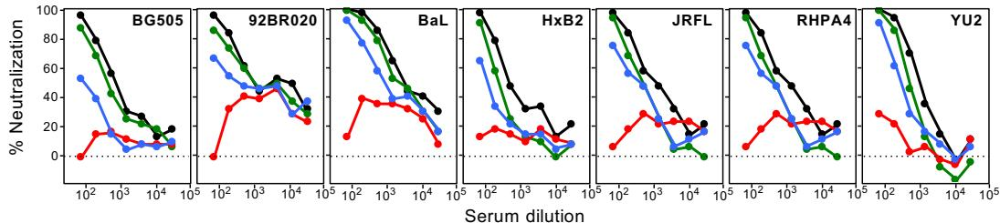  
- Untreated   
BSA depleted   
YU2gp140\_WT depleted   
YU2gp140\_D368R depleted

B   

histogram

| Condition | Count |
| --------- | ----- |
| Live/DEAD | 85.2 |
| CD3/CD8+ | 16.0 |
| CD14/CD16 | 85.4 |
| CD19/CD20 | 26.7 |

pie

| Category | Value |
|---|---|
| VH1 | 100 |
| VH2 | 80 |
| VH3 | 60 |
| VH4 | 40 |
| VH5 | 30 |
| VH1-2 | 90 |
Q1: WT+ KO-

scatter

| Quadrant | Value  |
| -------- | ------ |
| Q1       | 0.34   |
| Q2       | 0.65   |
| Q3       | 0.012  |
| Q4       | 99.0   |

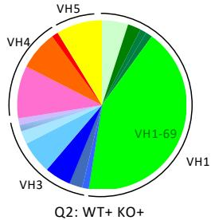

pie

| Category | Value |
|---|---|
| VH1 | 69 |
| VH1 | 1 |
| VH3 | 8 |
| VH4 | 10 |
| VH5 | 10 |
| VH1-69 | 70 |
| Q2: WT+ KO+ | 0 |

D   
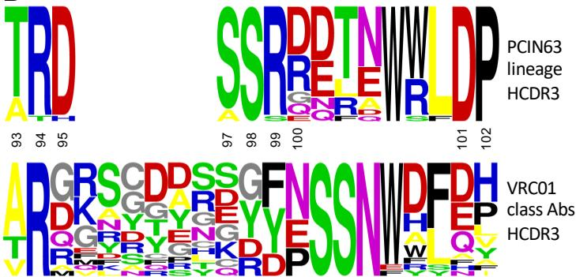

text_image

TRD
93 94 95
SSR DDTN W L DP
PCIN63 lineage HCDR3
97 98 99 100 101 102
AR GRS CDDSSG FNSN WDFH VRC01 class Abs HCDR3
DK GGYRD GEYY QEP
QGBD YENG YE H QY
TREYB GHKD YE W E Y
MSEF ER GRDP EY K T

C 

<table><tr><td rowspan="2" colspan="2"></td><td colspan="5">Heavy Chain</td><td colspan="5">Light Chain Chain</td></tr><tr><td colspan="5">Putative Germline Genes: IGHV1-2*02 / IGHJ5*02</td><td colspan="5">IGKV1-5*03 / IGKJ1*01</td></tr><tr><td>mpi</td><td>mAb name</td><td>CDRH3 sequence (15aa)</td><td> $V_H+J_H$ % SHM (nt)</td><td> $V_H+J_H$ % SHM (aa)</td><td>UCA-H % SHM (nt)</td><td>UCA-H % SHM (aa)</td><td>CDRL3 sequence (5aa)</td><td> $V_K+J_K$ % SHM (nt)</td><td> $V_K+J_K$ % SHM (aa)</td><td>UCA-K % SHM (nt)</td><td>UCA-K % SHM (aa)</td></tr><tr><td>66</td><td>66Aa</td><td></td><td></td><td></td><td></td><td></td><td>QVVQW</td><td>12.04</td><td>15.63</td><td>14.56</td><td>17.76</td></tr><tr><td>66</td><td>66B</td><td>TRDSSRRDTNWWLDP</td><td>9.59</td><td>18.42</td><td>11.38</td><td>20.33</td><td>QVLET</td><td>12.71</td><td>17.71</td><td>14.24</td><td>18.69</td></tr><tr><td>71</td><td>71Aa</td><td></td><td></td><td></td><td></td><td></td><td>QVYES</td><td>10.70</td><td>19.79</td><td>12.30</td><td>20.56</td></tr><tr><td>71</td><td>71B</td><td>TTHSSSRDFQWSLDP</td><td>9.88</td><td>16.67</td><td>11.92</td><td>20.33</td><td>QVYES</td><td>11.04</td><td>16.67</td><td>12.94</td><td>17.76</td></tr><tr><td>71</td><td>71D2b</td><td>TRDSSRRDTNWWLDP</td><td>10.47</td><td>21.05</td><td>12.20</td><td>22.76</td><td>QVLET</td><td>12.71</td><td>19.79</td><td>14.24</td><td>20.56</td></tr><tr><td>71</td><td>71C</td><td>TRDSSRRDTNWWLDP</td><td>10.76</td><td>20.18</td><td>12.47</td><td>21.95</td><td>QVLET</td><td>12.37</td><td>18.75</td><td>13.92</td><td>19.63</td></tr><tr><td>71</td><td>71E1</td><td>TRDSSRRDTNWWLDP</td><td>10.76</td><td>20.18</td><td>12.47</td><td>21.95</td><td></td><td></td><td></td><td></td><td></td></tr><tr><td>71</td><td>71F</td><td>TRDSSRQQRDWWLDP</td><td>12.50</td><td>21.05</td><td>13.01</td><td>21.14</td><td>QVYES</td><td>11.04</td><td>18.75</td><td>12.62</td><td>19.63</td></tr><tr><td>71</td><td>71G</td><td>TRDASRDDRAWRLDP</td><td>13.08</td><td>21.05</td><td>15.72</td><td>23.58</td><td>QVVEW</td><td>12.37</td><td>15.63</td><td>14.56</td><td>16.82</td></tr><tr><td>71</td><td>71H</td><td>ARDSSREETNWWLDP</td><td>13.08</td><td>21.93</td><td>14.36</td><td>23.58</td><td>QVLET</td><td>13.04</td><td>20.83</td><td>14.24</td><td>21.50</td></tr><tr><td>71</td><td>71I1a</td><td>TRDASRDDRAWRLDP</td><td>13.66</td><td>21.05</td><td>16.26</td><td>23.58</td><td>QVFEW</td><td>13.04</td><td>17.71</td><td>14.56</td><td>18.69</td></tr><tr><td>71</td><td>71J2a</td><td>TRDASRDDRAWRLDP</td><td>10.76</td><td>20.18</td><td>12.47</td><td>21.95</td><td>QVLET</td><td>12.71</td><td>18.75</td><td>14.24</td><td>19.63</td></tr><tr><td>71</td><td>71K</td><td>TRDSSRDETNWWLDP</td><td>14.24</td><td>23.68</td><td>15.45</td><td>25.20</td><td>QVLET</td><td>13.04</td><td>18.75</td><td>14.56</td><td>19.63</td></tr><tr><td>71</td><td>71L</td><td>TRDSSRDETNWWLDP</td><td>14.24</td><td>24.56</td><td>15.45</td><td>26.02</td><td>QVLET</td><td>13.04</td><td>18.75</td><td>14.56</td><td>19.63</td></tr><tr><td>71</td><td>71M1a</td><td>ARDSSRDETNWWLDP</td><td>14.53</td><td>21.05</td><td>15.72</td><td>22.76</td><td>QVLET</td><td>12.37</td><td>18.75</td><td>13.92</td><td>19.63</td></tr><tr><td>71</td><td>71N1a</td><td>TRDSSRGNTEWRLDP</td><td>14.53</td><td>21.05</td><td>15.72</td><td>22.76</td><td>QVYQT</td><td>12.71</td><td>18.75</td><td>14.89</td><td>20.56</td></tr><tr><td>71</td><td>71O</td><td>TRDSSRDNLEWRLDP</td><td>15.99</td><td>23.68</td><td>17.07</td><td>23.58</td><td>QVFEW</td><td>12.71</td><td>15.63</td><td>14.56</td><td>16.82</td></tr><tr><td>71</td><td>71P</td><td>TRDSSRGDTEWRLDP</td><td>15.99</td><td>23.68</td><td>17.89</td><td>24.39</td><td>QVFEW</td><td>13.04</td><td>16.67</td><td>14.89</td><td>17.76</td></tr><tr><td>77</td><td>77A</td><td>TTHSSRRDFQWSLDP</td><td>10.47</td><td>17.54</td><td>12.20</td><td>20.33</td><td></td><td></td><td></td><td></td><td></td></tr><tr><td>77</td><td>77B1b</td><td>TRDSSRDETNWWLDP</td><td>11.34</td><td>23.68</td><td>13.82</td><td>25.20</td><td>QVLET</td><td>12.71</td><td>19.79</td><td>14.24</td><td>20.56</td></tr><tr><td>77</td><td>77C</td><td>TRDSSRRDLEWRLDP</td><td>11.92</td><td>21.05</td><td>12.74</td><td>21.14</td><td>QVLET</td><td>13.71</td><td>19.79</td><td>15.53</td><td>20.56</td></tr><tr><td>77</td><td>77D</td><td>ARDSSRDETNWWLDP</td><td>13.08</td><td>20.18</td><td>14.36</td><td>21.95</td><td>QAYES</td><td>12.37</td><td>19.79</td><td>14.24</td><td>20.56</td></tr><tr><td>77</td><td>77E1</td><td>TRDSSRDETNWWLDP</td><td>13.95</td><td>23.68</td><td>15.18</td><td>25.20</td><td></td><td></td><td></td><td></td><td></td></tr><tr><td>77</td><td>77F1</td><td>TRDSSRDETNWWLDP</td><td>14.53</td><td>23.68</td><td>15.72</td><td>25.20</td><td></td><td></td><td></td><td></td><td></td></tr></table>

Figure S1: Isolation of CD4bs-specific antibodies in participant PC063 – Related to Figure 1.

(A) Neutralization of HIV-1 pseudoviruses by titrated amount of PC063 month-66 (M66) untreated plasma or after adsorption on BSA- or rgp140-coated beads. This data is from a single experiment.

(B) Fluorescence Activated Cell Sorting (FACS) cell plots highlighting cell selection strategy for CD4bs specific B-cell isolation from PC063. Pie charts detail the distribution of VH-gene IMGT assignment of IgG amplicons generated from rgp140 WT+D368R- and rgp140 WT+D368R+ single sorted cells in (Quadrant #1, Q1, left) and (Quadrant #2, Q2, right).

(C) Statistics for the PCIN63 heavy chain and light chain sequences obtained from the VH1-2+ single B-cell isolated in (B). The percent of somatic hyper mutations at the nucleotide (nt) and amino-acid (aa) levels compared to the IMGT database germline gene sequences and NGS-identified unmutated common ancestor (UCA) (see Figure 3A), were calculated for V and J heavy chain (VH+JH) and light chain (VK+JK) segments. The CDR3 definitions are based on IMGT database guidelines.

(D) Logogram of the HCDR3 amino acid sequences for PCIN63 and VRC01-class Abs.

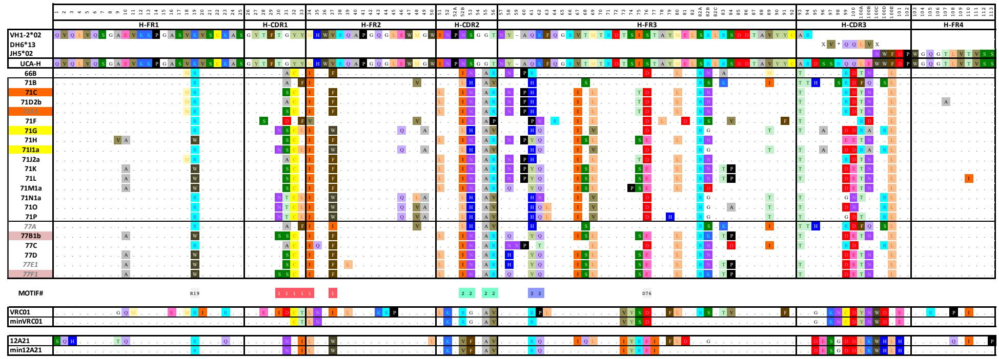

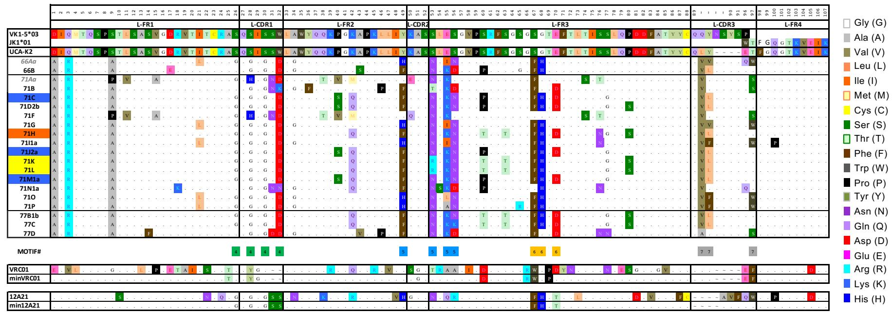  
Figure S2. PCIN63 mAbs heavy chain and light chain amino acid alignments with putative germline genes – Related to Figure 1.   
PCIN63 mAbs HC (top) and LC (bottom) amino-acid sequences are aligned to the IMGT database $V_{H}1-2*02$ , $D_{H}6-13$ , $J_{H}5*02$ , $V_{K}1-5*03$ and $J_{K}1*01$ sequences. Identical residues are marked as a dot and somatically mutated residues are specified using one-letter coding. Deletions are marked by a \~ symbol. CDR and FRW regions are indicated. Sequences from different mAbs sharing perfect amino-acid identity are highlighted in colors. Unpaired sequences are showed in grey and italic

<table><tr><td colspan="2">SHM (VH+J0)</td><td>9.59</td><td>9.88</td><td>10.76</td><td>10.76</td><td>12.50</td><td>13.08</td><td>13.08</td><td>13.66</td><td>13.37</td><td>14.24</td><td>14.24</td><td>14.53</td><td>14.53</td><td>15.99</td><td>15.99</td><td>11.34</td><td>11.92</td><td>13.08</td><td rowspan="2"></td><td>7.22</td><td>21.31</td><td>3.44</td><td>12.37</td></tr><tr><td colspan="2">SHM (Vh+J0)</td><td>12.71</td><td>11.04</td><td>12.37</td><td>12.71</td><td>11.04</td><td>12.37</td><td>13.04</td><td>13.04</td><td>12.71</td><td>13.04</td><td>13.04</td><td>12.37</td><td>12.37</td><td>12.71</td><td>13.04</td><td>13.04</td><td>13.71</td><td>12.37</td><td>6.48</td><td>20.32</td><td>8.33</td><td>21.91</td></tr><tr><td colspan="2">Time point Ab name</td><td>PCIN 66B</td><td>PCIN 71B</td><td>PCIN 71C</td><td>PCIN 71D2b</td><td>PCIN 71F</td><td>PCIN 71G</td><td>PCIN 71H</td><td>PCIN 71I1a</td><td>PCIN 71J2a</td><td>PCIN 71K</td><td>PCIN 71L</td><td>PCIN 71M1a</td><td>PCIN 71N1a</td><td>PCIN 71O</td><td>PCIN 71P</td><td>PCIN 77B1b</td><td>PCIN 77C</td><td>PCIN 77D</td><td>PC63 M33 Serum</td><td>VRC01 min</td><td>VRC01 MAT</td><td>12A21 min</td><td>12A21 MAT</td></tr><tr><td rowspan="2">Ctrl</td><td>MLV</td><td>&gt;100</td><td>&gt;100</td><td>&gt;100</td><td>&gt;100</td><td>&gt;100</td><td>&gt;100</td><td>&gt;100</td><td>&gt;100</td><td>&gt;100</td><td>&gt;100</td><td>&gt;100</td><td>&gt;100</td><td>&gt;100</td><td>&gt;100</td><td>&gt;100</td><td>&gt;100</td><td>&gt;100</td><td>&gt;100</td><td>6</td><td>&gt;100</td><td>&gt;100</td><td>&gt;100</td><td>&gt;100</td></tr><tr><td>VSV</td><td>&gt;100</td><td>&gt;100</td><td>&gt;100</td><td>&gt;100</td><td>&gt;100</td><td>&gt;100</td><td>&gt;100</td><td>&gt;100</td><td>&gt;100</td><td>&gt;100</td><td>&gt;100</td><td>&gt;100</td><td>&gt;100</td><td>&gt;100</td><td>&gt;100</td><td>&gt;100</td><td>&gt;100</td><td>&gt;100</td><td></td><td>&gt;100</td><td>&gt;100</td><td>&gt;100</td><td>&gt;100</td></tr><tr><td rowspan="5">A</td><td>92RW020</td><td>0.79</td><td>&gt;100</td><td>0.67</td><td>0.59</td><td>&gt;100</td><td>0.86</td><td>0.26</td><td>0.39</td><td>1.1</td><td>0.20</td><td>0.096</td><td>0.20</td><td>&gt;100</td><td>0.58</td><td>2.2</td><td>9.5</td><td>0.94</td><td>2.4</td><td>491</td><td>0.11</td><td>0.50</td><td>0.09</td><td>0.06</td></tr><tr><td>94UG03</td><td>&gt;100</td><td>&gt;100</td><td>&gt;100</td><td>&gt;100</td><td>&gt;100</td><td>4.3</td><td>10</td><td>3.1</td><td>&gt;100</td><td>7.1</td><td>5.7</td><td>2.4</td><td>&gt;100</td><td>7.0</td><td>18</td><td>&gt;100</td><td>&gt;100</td><td>&gt;100</td><td>1</td><td>0.20</td><td>0.35</td><td>&gt;100</td><td>0.46</td></tr><tr><td>BG505</td><td>1.3</td><td>&gt;100</td><td>5.2</td><td>&gt;100</td><td>&gt;100</td><td>1.4</td><td>1.1</td><td>0.49</td><td>0.76</td><td>0.72</td><td>&gt;100</td><td>139</td><td>&gt;100</td><td>0.75</td><td>1.5</td><td>15</td><td>1.1</td><td>29</td><td>564</td><td>0.12</td><td>0.09</td><td>0.12</td><td>0.09</td></tr><tr><td>KNH1144</td><td>1.2</td><td>&gt;100</td><td>0.98</td><td>1.5</td><td>&gt;100</td><td>5.1</td><td>0.45</td><td>1.3</td><td>1.1</td><td>0.32</td><td>0.42</td><td>0.66</td><td>&gt;100</td><td>1.9</td><td>23</td><td>37</td><td>4.3</td><td>48</td><td>248</td><td>1.56</td><td>0.37</td><td>0.59</td><td>0.54</td></tr><tr><td>KNH1207</td><td>0.38</td><td>&gt;100</td><td>0.23</td><td>0.47</td><td>&gt;100</td><td>1.2</td><td>0.33</td><td>0.36</td><td>0.25</td><td>0.29</td><td>0.29</td><td>0.62</td><td>&gt;100</td><td>0.57</td><td>3.0</td><td>68</td><td>1.3</td><td>&gt;100</td><td>nt</td><td>63</td><td>0.88</td><td>0.68</td><td>0.32</td></tr><tr><td>AE</td><td>92TH021</td><td>0.36</td><td></td><td>0.12</td><td>9.1</td><td></td><td>0.60</td><td>0.11</td><td>0.13</td><td>0.23</td><td>0.12</td><td>0.33</td><td>8.8</td><td></td><td>0.30</td><td>0.36</td><td>0.94</td><td>0.24</td><td></td><td>456</td><td>0.28</td><td>0.24</td><td>0.09</td><td>0.06</td></tr><tr><td rowspan="11"></td><td>89.6</td><td></td><td>&gt;100</td><td>3.0</td><td>1.8</td><td>&gt;100</td><td>0.24</td><td></td><td>0.22</td><td>2.3</td><td>14</td><td></td><td></td><td>&gt;100</td><td>1.4</td><td>0.60</td><td>&gt;100</td><td>&gt;100</td><td>&gt;100</td><td></td><td>0.78</td><td>0.63</td><td>&gt;100</td><td>1.96</td></tr><tr><td>6535</td><td>0.62</td><td>&gt;100</td><td>0.18</td><td>0.22</td><td>&gt;100</td><td>1.9</td><td>2.0</td><td>0.19</td><td>0.16</td><td>0.42</td><td>0.16</td><td>0.13</td><td>&gt;100</td><td>0.74</td><td>0.54</td><td>&gt;100</td><td>62</td><td>&gt;100</td><td>263</td><td>0.29</td><td>0.32</td><td>&gt;100</td><td>9.15</td></tr><tr><td>92BR020</td><td>0.26</td><td>&gt;100</td><td>0.15</td><td>0.25</td><td>&gt;100</td><td>0.64</td><td>0.20</td><td>0.23</td><td>0.32</td><td>0.14</td><td>0.13</td><td>0.18</td><td>&gt;100</td><td>0.59</td><td>0.58</td><td>10</td><td>0.69</td><td>&gt;100</td><td>834</td><td>0.81</td><td>0.04</td><td>0.11</td><td>0.08</td></tr><tr><td>ADA</td><td>45</td><td>&gt;100</td><td>2.1</td><td>5.1</td><td>&gt;100</td><td>2.3</td><td>2.6</td><td>1.5</td><td>3.2</td><td>1.3</td><td>0.54</td><td>0.88</td><td>&gt;100</td><td>5.6</td><td>16</td><td>50</td><td>&gt;100</td><td>&gt;100</td><td>192</td><td>0.32</td><td>0.48</td><td>&gt;100</td><td>0.82</td></tr><tr><td>BaL</td><td>0.11</td><td>0.041</td><td>0.025</td><td>0.044</td><td>0.71</td><td>0.093</td><td>44</td><td>0.017</td><td>0.068</td><td>1.9</td><td>1.0</td><td>21</td><td>&gt;100</td><td>0.25</td><td>0.085</td><td>0.0074</td><td>&gt;100</td><td>2.8</td><td>1790</td><td>0.01</td><td>0.02</td><td>&gt;100</td><td>0.12</td></tr><tr><td>CAAN</td><td>2.2</td><td>&gt;100</td><td>0.93</td><td>0.49</td><td>&gt;100</td><td>0.58</td><td>3.2</td><td>2.4</td><td>1.6</td><td>1.9</td><td>1.2</td><td>10</td><td>&gt;100</td><td>9.4</td><td>7.9</td><td>8.4</td><td>10</td><td>&gt;100</td><td>1</td><td>0.25</td><td>0.42</td><td>8.86</td><td>0.46</td></tr><tr><td>DH12</td><td>46</td><td>&gt;100</td><td>2.6</td><td>4.3</td><td>&gt;100</td><td>3.8</td><td>32</td><td>2.6</td><td>3.4</td><td>21</td><td>8.3</td><td>5.6</td><td>&gt;100</td><td>9.7</td><td>10</td><td>38</td><td>4.1</td><td>&gt;100</td><td>823</td><td>0.12</td><td>0.40</td><td>&gt;100</td><td>48</td></tr><tr><td>HxB2</td><td>0.75</td><td>&gt;100</td><td>0.067</td><td>0.24</td><td>&gt;100</td><td>0.098</td><td>0.72</td><td>0.043</td><td>0.12</td><td>0.26</td><td>0.17</td><td>0.10</td><td>&gt;100</td><td>0.083</td><td>0.13</td><td>0.48</td><td>&gt;100</td><td>&gt;100</td><td>926</td><td>0.01</td><td>0.05</td><td>&gt;100</td><td>&gt;100</td></tr><tr><td>JRCSF</td><td>4.6</td><td>&gt;100</td><td>0.60</td><td>0.91</td><td>&gt;100</td><td>1.5</td><td>1.3</td><td>0.43</td><td>1.6</td><td>0.56</td><td>0.70</td><td>0.92</td><td>&gt;100</td><td>1.4</td><td>2.7</td><td>1.6</td><td>3.3</td><td>&gt;100</td><td>182</td><td>0.12</td><td>0.14</td><td>&gt;100</td><td>0.43</td></tr><tr><td>JRFL</td><td>0.064</td><td>&gt;100</td><td>0.022</td><td>0.055</td><td>&gt;100</td><td>0.14</td><td>0.082</td><td>0.053</td><td>0.052</td><td>0.053</td><td>0.037</td><td>0.070</td><td>&gt;100</td><td>0.11</td><td>0.42</td><td>0.35</td><td>0.13</td><td>2.0</td><td>2275</td><td>71.60</td><td>0.61</td><td>0.05</td><td>0.04</td></tr><tr><td>MN</td><td>0.15</td><td>&gt;100</td><td>0.12</td><td>0.088</td><td>&gt;100</td><td>0.075</td><td>&gt;100</td><td>0.072</td><td>0.13</td><td>&gt;100</td><td>&gt;100</td><td>&gt;100</td><td>&gt;100</td><td>0.29</td><td>0.16</td><td>0.49</td><td>&gt;100</td><td>&gt;100</td><td>496</td><td>0.03</td><td>0.09</td><td>&gt;100</td><td>20</td></tr><tr><td rowspan="11">B</td><td>PVO4</td><td>1.1</td><td>&gt;100</td><td>0.28</td><td>0.32</td><td>4.48</td><td>2.6</td><td>0.35</td><td>0.47</td><td>0.30</td><td>0.23</td><td>0.19</td><td>0.68</td><td>&gt;100</td><td>0.89</td><td>2.4</td><td>7.2</td><td>2.4</td><td>28</td><td>402</td><td>0.19</td><td>0.35</td><td>0.29</td><td>0.41</td></tr><tr><td>QHO692</td><td>6.0</td><td>&gt;100</td><td>2.3</td><td>2.1</td><td>&gt;100</td><td>12</td><td>1.4</td><td>1.8</td><td>1.3</td><td>1.4</td><td>1.0</td><td>1.9</td><td>&gt;100</td><td>6.0</td><td>35</td><td>16</td><td>8.0</td><td>&gt;100</td><td>198</td><td>3.23</td><td>1.84</td><td>7.20</td><td>4.83</td></tr><tr><td>REJO</td><td>0.13</td><td>&gt;100</td><td>0.039</td><td>0.058</td><td>&gt;100</td><td>0.13</td><td>0.050</td><td>0.034</td><td>0.065</td><td>0.15</td><td>0.094</td><td>0.086</td><td>&gt;100</td><td>0.13</td><td>0.15</td><td>0.096</td><td>0.42</td><td>&gt;100</td><td>273</td><td>0.04</td><td>0.09</td><td>&gt;100</td><td>0.79</td></tr><tr><td>RHPA4</td><td>0.20</td><td>&gt;100</td><td>0.048</td><td>0.12</td><td>&gt;100</td><td>0.15</td><td>0.030</td><td>0.050</td><td>0.074</td><td>0.029</td><td>0.022</td><td>0.052</td><td>&gt;100</td><td>0.089</td><td>0.23</td><td>1.8</td><td>0.16</td><td>3.4</td><td>705</td><td>21</td><td>0.04</td><td>1.37</td><td>0.04</td></tr><tr><td>SC422</td><td>0.50</td><td>&gt;100</td><td>0.12</td><td>0.36</td><td>&gt;100</td><td>0.52</td><td>0.13</td><td>0.081</td><td>0.15</td><td>0.19</td><td>0.11</td><td>0.39</td><td>&gt;100</td><td>0.24</td><td>0.96</td><td>1.1</td><td>&gt;100</td><td>&gt;100</td><td>222</td><td>0.30</td><td>0.09</td><td>&gt;100</td><td>2.79</td></tr><tr><td>SF162</td><td>&gt;100</td><td>&gt;100</td><td>2.4</td><td>22</td><td>&gt;100</td><td>0.39</td><td>&gt;100</td><td>0.19</td><td>0.99</td><td>44</td><td>12</td><td>0.89</td><td>&gt;100</td><td>0.45</td><td>0.45</td><td>6.0</td><td>&gt;100</td><td>&gt;100</td><td>834</td><td>0.04</td><td>0.14</td><td>&gt;100</td><td>0.67</td></tr><tr><td>SS1196</td><td>&gt;100</td><td>&gt;100</td><td>8.9</td><td>35</td><td>&gt;100</td><td>1.1</td><td>&gt;100</td><td>0.37</td><td>9.0</td><td>19</td><td>13</td><td>3.6</td><td>&gt;100</td><td>1.3</td><td>2.7</td><td>&gt;100</td><td>&gt;100</td><td>&gt;100</td><td>378</td><td>0.09</td><td>0.22</td><td>&gt;100</td><td>&gt;100</td></tr><tr><td>TRJO</td><td>&gt;100</td><td>&gt;100</td><td>272</td><td>&gt;100</td><td>&gt;100</td><td>0.59</td><td>0.24</td><td>0.11</td><td>62</td><td>0.080</td><td>0.080</td><td>0.12</td><td>&gt;100</td><td>0.19</td><td>0.16</td><td>&gt;100</td><td>&gt;100</td><td>&gt;100</td><td>246</td><td>0.12</td><td>0.08</td><td>&gt;100</td><td>1.25</td></tr><tr><td>TRO11</td><td>0.37</td><td>&gt;100</td><td>0.24</td><td>0.28</td><td>&gt;100</td><td>0.47</td><td>0.080</td><td>0.18</td><td>0.18</td><td>0.049</td><td>0.035</td><td>0.068</td><td>&gt;100</td><td>0.31</td><td>0.79</td><td>27</td><td>0.46</td><td>99</td><td>439</td><td>2.84</td><td>0.52</td><td>0.26</td><td>0.22</td></tr><tr><td>WITO</td><td>0.82</td><td>&gt;100</td><td>0.13</td><td>0.12</td><td>&gt;100</td><td>0.24</td><td>0.092</td><td>0.086</td><td>0.085</td><td>0.051</td><td>0.048</td><td>0.062</td><td>&gt;100</td><td>0.078</td><td>0.078</td><td>&gt;100</td><td>0.24</td><td>&gt;100</td><td>496</td><td>1.07</td><td>0.17</td><td>2.89</td><td>0.22</td></tr><tr><td>YU2</td><td>0.13</td><td>&gt;100</td><td>0.058</td><td>0.10</td><td>&gt;100</td><td>0.65</td><td>0.085</td><td>0.18</td><td>0.087</td><td>0.067</td><td>0.056</td><td>0.11</td><td>&gt;100</td><td>0.60</td><td>0.92</td><td>7.4</td><td>0.17</td><td>15</td><td>1170</td><td>0.05</td><td>0.09</td><td>0.15</td><td>0.05</td></tr><tr><td rowspan="20"></td><td>93IN905</td><td>0.73</td><td>&gt;100</td><td>0.17</td><td>0.36</td><td>&gt;100</td><td>0.34</td><td>0.063</td><td>0.090</td><td>0.21</td><td>0.035</td><td>0.014</td><td>0.056</td><td>&gt;100</td><td>0.17</td><td>0.58</td><td>40</td><td>0.33</td><td>0.59</td><td>701</td><td>0.06</td><td>0.13</td><td>2.26</td><td>0.06</td></tr><tr><td>CAP210</td><td>&gt;100</td><td>&gt;100</td><td>&gt;100</td><td>&gt;100</td><td>&gt;100</td><td>&gt;100</td><td>&gt;100</td><td>45</td><td>&gt;100</td><td>&gt;100</td><td>&gt;100</td><td>&gt;100</td><td>&gt;100</td><td>&gt;100</td><td>&gt;100</td><td>&gt;100</td><td>&gt;100</td><td>&gt;100</td><td>1</td><td>&gt;100</td><td>&gt;100</td><td>&gt;100</td><td>&gt;100</td></tr><tr><td>CAP45</td><td>&gt;100</td><td>&gt;100</td><td>&gt;100</td><td>&gt;100</td><td>&gt;100</td><td>&gt;100</td><td>&gt;100</td><td>0.053</td><td>&gt;100</td><td>&gt;100</td><td>&gt;100</td><td>&gt;100</td><td>&gt;100</td><td>0.13</td><td>0.053</td><td>&gt;100</td><td>&gt;100</td><td>&gt;100</td><td>1</td><td>&gt;100</td><td>0.27</td><td>&gt;100</td><td>0.06</td></tr><tr><td>DU156</td><td>&gt;100</td><td>&gt;100</td><td>7.9</td><td>21</td><td>&gt;100</td><td>0.12</td><td>0.51</td><td>0.034</td><td>6.6</td><td>0.11</td><td>0.067</td><td>1.7</td><td>&gt;100</td><td>0.070</td><td>0.15</td><td>&gt;100</td><td>0.014</td><td>&gt;100</td><td>654</td><td>0.05</td><td>0.06</td><td>6.78</td><td>0.03</td></tr><tr><td>DU172</td><td>4.8</td><td>&gt;100</td><td>0.37</td><td>0.75</td><td>&gt;100</td><td>0.75</td><td>0.25</td><td>0.29</td><td>0.60</td><td>0.27</td><td>0.16</td><td>0.21</td><td>&gt;100</td><td>0.38</td><td>0.76</td><td>67</td><td>1.5</td><td>10</td><td>589</td><td>&gt;100</td><td>&gt;100</td><td>0.56</td><td>0.29</td></tr><tr><td>DU422</td><td>&gt;100</td><td>&gt;100</td><td>&gt;100</td><td>&gt;100</td><td>&gt;100</td><td>&gt;100</td><td>&gt;100</td><td>&gt;100</td><td>&gt;100</td><td>&gt;100</td><td>&gt;100</td><td>&gt;100</td><td>&gt;100</td><td>&gt;100</td><td>&gt;100</td><td>&gt;100</td><td>&gt;100</td><td>&gt;100</td><td>1</td><td>&gt;100</td><td>&gt;100</td><td>&gt;100</td><td>3.37</td></tr><tr><td>IAVIC22</td><td>&gt;100</td><td>&gt;100</td><td>20</td><td>52</td><td>&gt;100</td><td>0.066</td><td>2.6</td><td>2.6</td><td>40</td><td>2.4</td><td>2.0</td><td>2.6</td><td>&gt;100</td><td>7.9</td><td>21</td><td>&gt;100</td><td>&gt;100</td><td>&gt;100</td><td>177</td><td>0.28</td><td>0.54</td><td>&gt;100</td><td>67</td></tr><tr><td rowspan="13">ZM53</td><td rowspan="13">1.1</td><td rowspan="13">&gt;100</td><td rowspan="13">0.45</td><td rowspan="13">0.79</td><td rowspan="13">&gt;100</td><td rowspan="13">1.1</td><td rowspan="13">0.39</td><td rowspan="13">0.35</td><td rowspan="13">0.36</td><td rowspan="5">0.26</td><td rowspan="5">0.52</td><td rowspan="5">0.36</td><td rowspan="5">&gt;100</td><td rowspan="5">0.69</td><td rowspan="5">3.6</td><td rowspan="5">&gt;100</td><td rowspan="5">0.77</td><td rowspan="5">24</td><td></td><td></td><td></td><td></td><td></td></tr><tr><td></td><td></td><td></td><td></td><td></td></tr><tr><td></td><td></td><td></td><td></td><td></td></tr><tr><td></td><td></td><td></td><td></td><td></td></tr><tr><td></td><td></td><td></td><td></td><td></td></tr><tr><td></td><td></td><td></td><td></td><td></td><td></td><td></td><td></td><td></td><td></td><td></td><td></td><td></td><td></td></tr><tr><td></td><td></td><td></td><td></td><td></td><td></td><td></td><td></td><td></td><td></td><td></td><td></td><td></td><td></td></tr><tr><td></td><td></td><td></td><td></td><td></td><td></td><td></td><td></td><td></td><td></td><td></td><td></td><td></td><td></td></tr><tr><td rowspan="4"></td><td rowspan="4"></td><td rowspan="4"></td><td rowspan="4"></td><td rowspan="4"></td><td rowspan="4"></td><td rowspan="4"></td><td rowspan="4"></td><td rowspan="4"></td><td></td><td></td><td></td><td></td><td></td></tr><tr><td></td><td></td><td></td><td></td><td></td></tr><tr><td></td><td></td><td></td><td></td><td></td></tr><tr><td></td><td></td><td></td><td></td><td></td></tr><tr><td></td><td></td><td></td><td></td><td></td><td></td><td></td><td></td><td></td><td></td><td></td><td></td><td></td><td></td></tr></table>

Table S1. Neutralization IC50s of PCIN63 Abs on a medium cross-clade pseudovirus panel. – Related to Figure 1 and Table S2

IC50 is defined as the Ab concentration in $\mu$ g/mL allowing 50% loss of infectivity.

PCIN63 Abs are organized from least to most mutated.

Data are representative of at least 2 experiments.

<table><tr><td>Breadth (viruses neutralized)</td><td>Potency mAb (GeoMean IC50)</td><td>Potency Plasma (GeoMean ID50)</td></tr><tr><td>0-10%</td><td>10-50 μg/mL</td><td>/</td></tr><tr><td>10-25%</td><td>1-10 μg/mL</td><td>50-100</td></tr><tr><td>25-50%</td><td>0.1-1 μg/mL</td><td>100-300</td></tr><tr><td>50-75%</td><td>0.01-0.1 μg/mL</td><td>300-900</td></tr><tr><td>75-100%</td><td>&lt;0.01 μg/mL</td><td>&gt;900</td></tr></table>

<table><tr><td rowspan="2">Ab name</td><td colspan="4">Breadth (% viruses)</td><td rowspan="2">GeoMean $IC_{50}$ (μg/mL)</td><td rowspan="2">SHM( $V_H+J_H$ )</td><td rowspan="2">SHM( $V_K+J_K$ )</td></tr><tr><td> $IC_{50}<0.1μg/mL$ </td><td> $IC_{50}<1μg/mL$ </td><td> $IC_{50}<10μg/mL$ </td><td> $IC_{50}<50μg/mL$ </td></tr><tr><td>66B</td><td>3%</td><td>45%</td><td>70%</td><td>75%</td><td>0.8</td><td>9.6</td><td>12.7</td></tr><tr><td>71B</td><td>3%</td><td>3%</td><td>3%</td><td>3%</td><td>0.04</td><td>9.9</td><td>11.0</td></tr><tr><td>71C</td><td>15%</td><td>63%</td><td>85%</td><td>88%</td><td>0.50</td><td>10.8</td><td>12.4</td></tr><tr><td>71D2b</td><td>10%</td><td>55%</td><td>75%</td><td>83%</td><td>0.73</td><td>10.5</td><td>12.7</td></tr><tr><td>71F</td><td>0%</td><td>5%</td><td>8%</td><td>8%</td><td>0.72</td><td>12.5</td><td>11.0</td></tr><tr><td>71G</td><td>13%</td><td>58%</td><td>90%</td><td>93%</td><td>0.57</td><td>13.1</td><td>12.4</td></tr><tr><td>71H</td><td>23%</td><td>55%</td><td>75%</td><td>83%</td><td>0.48</td><td>13.1</td><td>13.0</td></tr><tr><td>71I1a</td><td>30%</td><td>75%</td><td>95%</td><td>98%</td><td>0.28</td><td>13.7</td><td>13.0</td></tr><tr><td>71J2a</td><td>15%</td><td>55%</td><td>85%</td><td>88%</td><td>0.56</td><td>10.8</td><td>12.7</td></tr><tr><td>71K</td><td>23%</td><td>63%</td><td>80%</td><td>90%</td><td>0.42</td><td>14.2</td><td>13.0</td></tr><tr><td>71L</td><td>30%</td><td>63%</td><td>80%</td><td>85%</td><td>0.27</td><td>14.2</td><td>13.0</td></tr><tr><td>71M1a</td><td>20%</td><td>58%</td><td>80%</td><td>85%</td><td>0.55</td><td>14.5</td><td>12.4</td></tr><tr><td>71N1a</td><td>0%</td><td>0%</td><td>0%</td><td>0%</td><td>/</td><td>14.5</td><td>12.7</td></tr><tr><td>71O</td><td>10%</td><td>65%</td><td>95%</td><td>95%</td><td>0.630</td><td>16.0</td><td>12.7</td></tr><tr><td>71P</td><td>8%</td><td>55%</td><td>78%</td><td>95%</td><td>1.1</td><td>16.0</td><td>13.0</td></tr><tr><td>77B1b</td><td>5%</td><td>18%</td><td>40%</td><td>58%</td><td>4.2</td><td>11.3</td><td>12.7</td></tr><tr><td>77C</td><td>5%</td><td>33%</td><td>53%</td><td>58%</td><td>0.92</td><td>11.9</td><td>13.7</td></tr><tr><td>77D</td><td>0%</td><td>5%</td><td>15%</td><td>30%</td><td>7.3</td><td>13.1</td><td>12.4</td></tr><tr><td>PC63M33</td><td>25%</td><td>65%</td><td>83%</td><td>88%</td><td>125</td><td></td><td></td></tr><tr><td>min VRC01</td><td>25%</td><td>68%</td><td>78%</td><td>83%</td><td>0.37</td><td>6.5</td><td>7.2</td></tr><tr><td>VRC01</td><td>30%</td><td>88%</td><td>93%</td><td>93%</td><td>0.21</td><td>29.3</td><td>21.3</td></tr><tr><td>min 12A21</td><td>8%</td><td>33%</td><td>48%</td><td>50%</td><td>0.64</td><td>8.3</td><td>3.4</td></tr><tr><td>12A21</td><td>25%</td><td>65%</td><td>83%</td><td>88%</td><td>0.47</td><td>21.9</td><td>12.4</td></tr></table>

Table S2. Neutralization breadth and potency of PCIN63 Abs on a medium cross-clade pseudovirus panel. – Related to Figure 1 and Table S1

PCIN63 Abs are listed vertically by increasing frequency of somatic hypermutations.

<table><tr><td rowspan="2">Subtype</td><td colspan="10">Neutralization IC50(mg/mL)</td><td></td><td></td><td></td><td></td><td></td></tr><tr><td>HIV.1 Isolate</td><td>PCIN 66B</td><td>PCIN 71G</td><td>PCIN 71I</td><td>PCIN 71L</td><td>PCIN 77D</td><td>PC63 M33 serum</td><td>Min VRC01</td><td>Mat VRC01</td><td>Min 12A21</td><td></td><td></td><td></td><td></td><td></td></tr><tr><td>-</td><td>aMLV</td><td>&gt;100</td><td>&gt;100</td><td>&gt;100</td><td>&gt;100</td><td>&gt;100</td><td>&gt;100</td><td>&gt;100</td><td>&gt;100</td><td>&gt;100</td><td></td><td></td><td></td><td></td><td></td></tr><tr><td rowspan="12">A</td><td>0260.v5.c1</td><td>1.5</td><td>1.7</td><td>1.7</td><td>0.58</td><td>0.95</td><td>NT</td><td>0.85</td><td>0.33</td><td>0.51</td><td></td><td></td><td></td><td></td><td></td></tr><tr><td>0330.v4.c3</td><td>0.45</td><td>0.29</td><td>0.19</td><td>0.077</td><td>74</td><td>735</td><td>NT</td><td>NT</td><td>NT</td><td></td><td></td><td></td><td></td><td></td></tr><tr><td>191084 B7.19</td><td>0.86</td><td>0.21</td><td>0.17</td><td>0.19</td><td>&gt;100</td><td>634</td><td>0.057</td><td>0.043</td><td>7.3</td><td></td><td></td><td></td><td></td><td></td></tr><tr><td>191955 A11</td><td>&gt;100</td><td>1.2</td><td>0.036</td><td>6.3</td><td>&gt;100</td><td>2018</td><td>&gt;100</td><td>&gt;100</td><td>&gt;100</td><td></td><td></td><td></td><td></td><td></td></tr><tr><td>9004SS A3 4</td><td>&gt;100</td><td>&gt;100</td><td>&gt;100</td><td>&gt;100</td><td>&gt;100</td><td>NT</td><td>&gt;100</td><td>&gt;100</td><td>&gt;100</td><td></td><td></td><td></td><td></td><td></td></tr><tr><td>MS208.A1</td><td>0.73</td><td>0.28</td><td>0.24</td><td>0.19</td><td>&gt;100</td><td>530</td><td>&gt;100</td><td>0.024</td><td>&gt;100</td><td></td><td></td><td></td><td></td><td></td></tr><tr><td>Q168ENVa2</td><td>NT</td><td>NT</td><td>NT</td><td>NT</td><td>NT</td><td>NT</td><td>NT</td><td>NT</td><td>NT</td><td></td><td></td><td></td><td></td><td></td></tr><tr><td>Q23ENV17</td><td>0.36</td><td>0.18</td><td>0.15</td><td>0.080</td><td>0.17</td><td>736</td><td>0.074</td><td>0.042</td><td>0.12</td><td></td><td></td><td></td><td></td><td></td></tr><tr><td>Q25ENVd2.17</td><td>&gt;100</td><td>0.77</td><td>0.073</td><td>&gt;100</td><td>&gt;100</td><td>93</td><td>0.20</td><td>0.029</td><td>&gt;100</td><td></td><td></td><td></td><td></td><td></td></tr><tr><td>Q461ENVe2</td><td>6.8</td><td>7.7</td><td>7.1</td><td>2.2</td><td>&gt;100</td><td>57</td><td>1.2</td><td>0.27</td><td>0.29</td><td></td><td></td><td></td><td></td><td></td></tr><tr><td>Q769ENvd22</td><td>0.22</td><td>0.094</td><td>0.070</td><td>0.079</td><td>&gt;100</td><td>1355</td><td>0.036</td><td>0.019</td><td>0.035</td><td></td><td></td><td></td><td></td><td></td></tr><tr><td>Q842ENVd12</td><td></td><td>&gt;100</td><td>&gt;100</td><td>&gt;100</td><td>&gt;100</td><td>NT</td><td></td><td></td><td>&gt;100</td><td></td><td></td><td></td><td></td><td></td></tr><tr><td rowspan="4">AC</td><td>3301.v1.c24</td><td>0.68</td><td>0.49</td><td>0.39</td><td>0.33</td><td>&gt;100</td><td>558</td><td>0.11</td><td>0.14</td><td>&gt;100</td><td></td><td></td><td></td><td></td><td></td></tr><tr><td>6041.v3.c23</td><td>0.063</td><td>0.066</td><td>0.057</td><td>0.022</td><td>0.097</td><td>&lt;20</td><td>1.8</td><td>0.013</td><td>0.014</td><td></td><td></td><td></td><td></td><td></td></tr><tr><td>6540.v4.c1</td><td>&gt;100</td><td>&gt;100</td><td>&gt;100</td><td>&gt;100</td><td>&gt;100</td><td>24</td><td>&gt;100</td><td>&gt;100</td><td>&gt;100</td><td></td><td></td><td></td><td></td><td></td></tr><tr><td>6545.v4.c1</td><td>&gt;100</td><td>&gt;100</td><td>&gt;100</td><td>&gt;100</td><td>&gt;100</td><td>2</td><td>&gt;100</td><td>&gt;100</td><td>&gt;100</td><td></td><td></td><td></td><td></td><td></td></tr><tr><td rowspan="2">ACD</td><td>0815.v3.c3</td><td>0.12</td><td>0.057</td><td>0.062</td><td>0.032</td><td>&gt;100</td><td>1019</td><td>0.056</td><td>0.0100</td><td>0.033</td><td></td><td></td><td></td><td></td><td></td></tr><tr><td>3103.v3.c10</td><td>&gt;100</td><td>4.0</td><td>6.4</td><td>&gt;100</td><td>&gt;100</td><td>&gt;100</td><td>4.1</td><td>1.3</td><td>&gt;100</td><td></td><td></td><td></td><td></td><td></td></tr><tr><td rowspan="14">AE</td><td>620345.c01</td><td>&gt;100</td><td>&gt;100</td><td>&gt;100</td><td>&gt;100</td><td>&gt;100</td><td>170</td><td>&gt;100</td><td>&gt;100</td><td>&gt;100</td><td></td><td></td><td></td><td></td><td></td></tr><tr><td>BJOX009000.02.4</td><td>&gt;100</td><td>4.2</td><td>2.9</td><td>11</td><td>&gt;100</td><td>&lt;20</td><td>2.9</td><td>0.64</td><td>&gt;100</td><td></td><td></td><td></td><td></td><td></td></tr><tr><td>BJOX010000.06.2</td><td>&gt;100</td><td>16</td><td>8.5</td><td>9.9</td><td>&gt;100</td><td>57</td><td>6.5</td><td>3.9</td><td>&gt;100</td><td></td><td></td><td></td><td></td><td></td></tr><tr><td>BJOX015000.11.5</td><td>&gt;100</td><td>1.4</td><td>0.99</td><td>0.44</td><td>&gt;100</td><td>36</td><td>2.0</td><td>0.19</td><td>0.60</td><td></td><td></td><td></td><td></td><td></td></tr><tr><td>BJOX025000.01.1</td><td>&gt;100</td><td>0.58</td><td>0.49</td><td>26</td><td>0.16</td><td>311</td><td>7.3</td><td>2.7</td><td>0.27</td><td></td><td></td><td></td><td></td><td></td></tr><tr><td>BJOX028000.10.3</td><td>0.079</td><td>0.11</td><td>0.076</td><td>0.052</td><td>&gt;100</td><td>1813</td><td>11</td><td>0.086</td><td>0.029</td><td></td><td></td><td></td><td></td><td></td></tr><tr><td>C1080.c03</td><td>46</td><td>3.7</td><td>2.1</td><td>1.2</td><td>&gt;100</td><td>466</td><td>&gt;100</td><td>0.55</td><td>0.33</td><td></td><td></td><td></td><td></td><td></td></tr><tr><td>C3347.c11</td><td>5.9</td><td>0.042</td><td>0.034</td><td>0.016</td><td>0.016</td><td>3162</td><td>0.039</td><td>0.050</td><td>0.0090</td><td></td><td></td><td></td><td></td><td></td></tr><tr><td>C4118.c09</td><td>&gt;100</td><td>&gt;100</td><td>&gt;100</td><td>&gt;100</td><td>&gt;100</td><td>477</td><td>&gt;100</td><td>&gt;100</td><td>&gt;100</td><td></td><td></td><td></td><td></td><td></td></tr><tr><td>CNE5</td><td>4.0</td><td>0.29</td><td>0.18</td><td>0.35</td><td>&gt;100</td><td>21</td><td>0.20</td><td>0.060</td><td>0.19</td><td></td><td></td><td></td><td></td><td></td></tr><tr><td>CNE8</td><td>&gt;100</td><td>0.44</td><td>0.36</td><td>0.36</td><td>&gt;100</td><td>76</td><td>0.42</td><td>0.74</td><td>&gt;100</td><td></td><td></td><td></td><td></td><td></td></tr><tr><td>R1166.c01</td><td>4.0</td><td>0.46</td><td>0.33</td><td>0.23</td><td>2.3</td><td>337</td><td>0.62</td><td>0.39</td><td>0.17</td><td></td><td></td><td></td><td></td><td></td></tr><tr><td>R2184.c04</td><td>4.0</td><td>0.17</td><td>0.13</td><td>0.24</td><td>&gt;100</td><td>594</td><td>0.030</td><td>0.024</td><td>0.84</td><td></td><td></td><td></td><td></td><td></td></tr><tr><td>R3265.c06</td><td>0.72</td><td>0.57</td><td>0.78</td><td>0.21</td><td>&gt;100</td><td>138</td><td>0.73</td><td>0.17</td><td>0.057</td><td></td><td></td><td></td><td></td><td></td></tr><tr><td rowspan="9">AG</td><td>928.28</td><td>0.42</td><td>0.69</td><td>0.39</td><td>0.13</td><td>&gt;100</td><td>1116</td><td>1.1</td><td>0.22</td><td>0.42</td><td></td><td></td><td></td><td></td><td></td></tr><tr><td>T211.9</td><td>2.1</td><td>1.3</td><td>0.88</td><td>0.48</td><td>&gt;100</td><td>NT</td><td>&gt;100</td><td>0.90</td><td>&gt;100</td><td></td><td></td><td></td><td></td><td></td></tr><tr><td>T235.47</td><td>&gt;100</td><td>0.042</td><td>0.043</td><td>0.059</td><td>&gt;100</td><td>432</td><td>&gt;100</td><td>0.028</td><td>0.40</td><td></td><td></td><td></td><td></td><td></td></tr><tr><td>T250.4</td><td>&gt;100</td><td>&gt;100</td><td>&gt;100</td><td>&gt;100</td><td>&gt;100</td><td>25</td><td>&gt;100</td><td>&gt;100</td><td>&gt;100</td><td></td><td></td><td></td><td></td><td></td></tr><tr><td>T251.18</td><td>9.7</td><td>7.3</td><td>8.8</td><td>1.9</td><td>&gt;100</td><td>114</td><td>1.7</td><td>1.3</td><td>1.9</td><td></td><td></td><td></td><td></td><td></td></tr><tr><td>T255.34</td><td>0.37</td><td>0.20</td><td>0.23</td><td>0.070</td><td>1.0</td><td>264</td><td>0.71</td><td>0.39</td><td>0.072</td><td></td><td></td><td></td><td></td><td></td></tr><tr><td>T257.31</td><td>0.57</td><td>0.96</td><td>1.2</td><td>0.22</td><td>&gt;100</td><td>203</td><td>0.71</td><td>0.31</td><td>0.078</td><td></td><td></td><td></td><td></td><td></td></tr><tr><td>T263.8</td><td>0.35</td><td>0.14</td><td>0.17</td><td>0.070</td><td>1.6</td><td>NT</td><td>0.094</td><td>0.12</td><td>0.11</td><td></td><td></td><td></td><td></td><td></td></tr><tr><td>T278.5</td><td>&gt;100</td><td>&gt;100</td><td>&gt;100</td><td>&gt;100</td><td>&gt;100</td><td>&gt;100</td><td>&gt;100</td><td>&gt;100</td><td>&gt;100</td><td></td><td></td><td></td><td></td><td></td></tr><tr><td rowspan="12">B</td><td>1006.11.C3.1601</td><td>0.25</td><td>0.18</td><td>0.13</td><td>0.049</td><td>&gt;100</td><td>1173</td><td>2.5</td><td>0.095</td><td>0.15</td><td></td><td></td><td></td><td></td><td></td></tr><tr><td>1012.11.TC2.13257</td><td>0.28</td><td>0.87</td><td>0.49</td><td>0.65</td><td>&gt;100</td><td>146</td><td>0.035</td><td>0.070</td><td>&gt;100</td><td></td><td></td><td></td><td></td><td></td></tr><tr><td>1054.07.TC4.1499</td><td>2.2</td><td>3.3</td><td>3.1</td><td>1.9</td><td>&gt;100</td><td>33</td><td>0.20</td><td>0.83</td><td>&gt;100</td><td></td><td></td><td></td><td></td><td></td></tr><tr><td>1056.10.TA11.1826</td><td>2.0</td><td>1.1</td><td>0.68</td><td>0.20</td><td>&gt;100</td><td>106</td><td>0.33</td><td>0.55</td><td>&gt;100</td><td></td><td></td><td></td><td></td><td></td></tr><tr><td>62357.14.D3.4589</td><td>0.29</td><td>0.19</td><td>0.10</td><td>0.083</td><td>0.029</td><td>4317</td><td>0.43</td><td>0.39</td><td>0.44</td><td></td><td></td><td></td><td></td><td></td></tr><tr><td>6240.08.TAS.4622</td><td>6.5</td><td>4.1</td><td>2.5</td><td>0.85</td><td>&gt;100</td><td>71</td><td>1.6</td><td>0.60</td><td>1.2</td><td></td><td></td><td></td><td></td><td></td></tr><tr><td>6244.13.B5.4567</td><td>0.57</td><td>0.95</td><td>0.65</td><td>0.26</td><td>1.2</td><td>340</td><td>0.16</td><td>0.12</td><td>0.21</td><td></td><td></td><td></td><td></td><td></td></tr><tr><td>AC10.0.29</td><td>&gt;100</td><td>1.9</td><td>1.0</td><td>&gt;100</td><td>&gt;100</td><td>79</td><td>1.6</td><td>1.1</td><td>8.3</td><td></td><td></td><td></td><td></td><td></td></tr><tr><td>CAAN5342.A2</td><td>0.72</td><td>2.6</td><td>2.2</td><td>0.76</td><td>&gt;100</td><td>38</td><td>0.45</td><td>0.55</td><td>&gt;100</td><td></td><td></td><td></td><td></td><td></td></tr><tr><td>SC05.8C11.2344</td><td>22</td><td>2.3</td><td>1.8</td><td>6.7</td><td>&gt;100</td><td>95</td><td>0.26</td><td>0.49</td><td>&gt;100</td><td></td><td></td><td></td><td></td><td></td></tr><tr><td>TRO.11</td><td>0.47</td><td>0.17</td><td>0.14</td><td>0.065</td><td>&gt;100</td><td>649</td><td>0.79</td><td>0.25</td><td>0.20</td><td></td><td></td><td></td><td></td><td></td></tr><tr><td>WEAU.d15.410.787</td><td>1.81</td><td>0.27</td><td>0.20</td><td>0.098</td><td>&gt;100</td><td>214</td><td>0.027</td><td>0.046</td><td>9.98</td><td></td><td></td><td></td><td></td><td></td></tr><tr><td rowspan="8">BC</td><td>CNE17</td><td>&gt;100</td><td>3.7</td><td>2.6</td><td>5.93</td><td>&gt;100</td><td>&lt;20</td><td>0.18</td><td>0.38</td><td>&gt;100</td><td></td><td></td><td></td><td></td><td></td></tr><tr><td>CNE19</td><td>0.092</td><td>0.12</td><td>0.098</td><td>0.036</td><td>0.41</td><td>708</td><td>0.027</td><td>0.074</td><td>0.13</td><td></td><td></td><td></td><td></td><td></td></tr><tr><td>CNE20</td><td>0.051</td><td>0.12</td><td>0.12</td><td>0.048</td><td>&gt;100</td><td>1510</td><td>&gt;100</td><td>1.3</td><td>&gt;100</td><td></td><td></td><td></td><td></td><td></td></tr><tr><td>CNE21</td><td>0.25</td><td>0.55</td><td>0.50</td><td>0.19</td><td>&gt;100</td><td>1668</td><td>0.58</td><td>0.078</td><td>2.0</td><td></td><td></td><td></td><td></td><td></td></tr><tr><td>CNE30</td><td>6.1</td><td>3.2</td><td>2.6</td><td>0.99</td><td>3.6</td><td>441</td><td>0.60</td><td>0.28</td><td>0.45</td><td></td><td></td><td></td><td></td><td></td></tr><tr><td>CNE52</td><td>0.87</td><td>0.60</td><td>0.41</td><td>0.11</td><td>1.2</td><td>630</td><td>0.10</td><td>0.084</td><td>0.092</td><td></td><td></td><td></td><td></td><td></td></tr><tr><td>CNE53</td><td>0.10</td><td>0.11</td><td>0.069</td><td>0.057</td><td>0.061</td><td>11658</td><td>0.035</td><td>0.046</td><td>0.065</td><td></td><td></td><td></td><td></td><td></td></tr><tr><td>CNE58</td><td>0.71</td><td>0.10</td><td>0.12</td><td>0.076</td><td>1.3</td><td>2315</td><td>0.49</td><td>0.087</td><td>&gt;100</td><td></td><td></td><td></td><td></td><td></td></tr><tr><td rowspan="76">C</td><td>1394C9G1(Rev.)</td><td>0.12</td><td>0.43</td><td>0.23</td><td>0.18</td><td>&gt;100</td><td>465</td><td>1.2</td><td>0.15</td><td>0.058</td><td></td><td></td><td></td><td></td><td></td></tr><tr><td>7030102001ES(Rev.)</td><td>12</td><td>1.4</td><td>0.91</td><td>0.39</td><td>&gt;100</td><td>701</td><td>0.23</td><td>0.37</td><td>&gt;100</td><td></td><td></td><td></td><td></td><td></td></tr><tr><td>BF1266.431a</td><td>0.68</td><td>0.56</td><td>0.056</td><td>0.13</td><td>&gt;100</td><td>355</td><td>0.0079</td><td>0.0077</td><td>&gt;100</td><td></td><td></td><td></td><td></td><td></td></tr><tr><td>Ce0393 C3</td><td>0.15</td><td>0.38</td><td>0.26</td><td>0.15</td><td>&gt;100</td><td>299</td><td>&gt;100</td><td>0.12</td><td>0.015</td><td></td><td></td><td></td><td></td><td></td></tr><tr><td>Ce0682 E4</td><td>&gt;100</td><td>&gt;100</td><td>&gt;100</td><td>&gt;100</td><td>&gt;100</td><td>NT</td><td>&gt;100</td><td>&gt;100</td><td>&gt;100</td><td></td><td></td><td></td><td></td><td></td></tr><tr><td>Ce1086 B2</td><td>&gt;100</td><td>&gt;100</td><td>&gt;100</td><td>&gt;100</td><td>&gt;100</td><td>NT</td><td>&gt;100</td><td>&gt;100</td><td>&gt;100</td><td></td><td></td><td></td><td></td><td></td></tr><tr><td>Ce1172 H1</td><td>&gt;100</td><td>&gt;100</td><td>&gt;100</td><td>3.2</td><td>&gt;100</td><td>&lt;20</td><td>&gt;100</td><td>&gt;100</td><td>&gt;100</td><td></td><td></td><td></td><td></td><td></td></tr><tr><td>Ce1176 A3</td><td>4.9</td><td>1.4</td><td>1.2</td><td>0.72</td><td>68</td><td>129</td><td>1.5</td><td>0.77</td><td>0.45</td><td></td><td></td><td></td><td></td><td></td></tr><tr><td>Ce2010 F5</td><td>1.1</td><td>0.54</td><td>0.52</td><td>0.11</td><td>6.8</td><td>208</td><td>0.31</td><td>0.19</td><td>0.42</td><td></td><td></td><td></td><td></td><td></td></tr><tr><td>Ce2060 G9</td><td>1.6</td><td>1.0</td><td>1.3</td><td>0.89</td><td>18</td><td>203</td><td>0.34</td><td>0.14</td><td>0.25</td><td></td><td></td><td></td><td></td><td></td></tr><tr><td>Ce703010054 2A2</td><td>&gt;100</td><td>2.0</td><td>2.8</td><td>2.4</td><td>&gt;100</td><td>&lt;20</td><td>0.99</td><td>0.43</td><td>&gt;100</td><td></td><td></td><td></td><td></td><td></td></tr><tr><td>Ce704809221 1B3</td><td>3.5</td><td>0.52</td><td>0.79</td><td>0.33</td><td>&gt;100</td><td>58</td><td>0.32</td><td>0.24</td><td>0.29</td><td></td><td></td><td></td><td></td><td></td></tr><tr><td>Du156.12</td><td>&gt;100</td><td>0.088</td><td>0.11</td><td>0.18</td><td>&gt;100</td><td>311</td><td>0.029</td><td>0.036</td><td>&gt;100</td><td></td><td></td><td></td><td></td><td></td></tr><tr><td>Du172.17</td><td>0.73</td><td>0.22</td><td>0.12</td><td>0.097</td><td>0.40</td><td>401</td><td>&gt;100</td><td>&gt;100</td><td>&gt;107</td><td></td><td></td><td></td><td></td><td></td></tr><tr><td>Du422.1</td><td>&gt;100</td><td>&gt;100</td><td>&gt;100</td><td>&gt;100</td><td>&gt;100</td><td>31</td><td>&gt;100</td><td>&gt;100</td><td>&gt;100</td><td></td><td></td><td></td><td></td><td></td></tr><tr><td>HIV-0013095.2.11</td><td>1.7</td><td>0.52</td><td>0.56</td><td>0.46</td><td>&gt;100</td><td>92</td><td>0.035</td><td>0.038</td><td>&gt;100</td><td></td><td></td><td></td><td></td><td></td></tr><tr><td>HIV-001428.2.42</td><td>0.45</td><td>0.062</td><td>0.058</td><td>0.077</td><td>&gt;100</td><td>1077</td><td>0.0067</td><td>0.011</td><td>2.2</td><td></td><td></td><td></td><td></td><td></td></tr><tr><td>HIV-16055.2.3</td><td>0.65</td><td>0.24</td><td>0.20</td><td>0.26</td><td>&gt;100</td><td>431</td><td>0.027</td><td>0.024</td><td>0.052</td><td></td><td></td><td></td><td></td><td></td></tr><tr><td>HIV-16845.2.22</td><td>&gt;100</td><td>&gt;100</td><td>&gt;100</td><td>&gt;100</td><td>&gt;100</td><td>NT</td><td>&gt;100</td><td>&gt;100</td><td>&gt;100</td><td></td><td></td><td></td><td></td><td></td></tr><tr><td>ZM109F.PB4</td><td>1.3</td><td>0.44</td><td>0.55</td><td>0.23</td><td>&gt;100</td><td>&lt;20</td><td>0.29</td><td>0.035</td><td>&gt;100</td><td></td><td></td><td></td><td></td><td></td></tr><tr><td>ZM135M.PL10a</td><td>2.2</td><td>2.0</td><td>2.3</td><td>0.62</td><td>&gt;100</td><td>74</td><td>&gt;100</td><td>&gt;57</td><td>&gt;100</td><td></td><td></td><td></td><td></td><td></td></tr><tr><td>ZM197M.PB7</td><td>&gt;100</td><td>0.53</td><td>0.66</td><td>0.55</td><td>&gt;100</td><td>281</td><td>0.27</td><td>0.28</td><td>&gt;100</td><td></td><td></td><td></td><td></td><td></td></tr><tr><td>ZM214M.PL15</td><td>1.3</td><td>1.7</td><td>2.2</td><td>0.43</td><td>1.7</td><td>199</td><td>0.48</td><td>0.36</td><td>&gt;100</td><td></td><td></td><td></td><td></td><td></td></tr><tr><td>ZM233M.PB6</td><td>&gt;100</td><td>4.0</td><td>2.3</td><td>&gt;100</td><td>&gt;100</td><td>57</td><td>&gt;100</td><td>&gt;100</td><td>&gt;100</td><td></td><td></td><td></td><td></td><td></td></tr><tr><td>ZM246F.D5</td><td>&gt;100</td><td>0.77</td><td>0.87</td><td>0.22</td><td>&gt;100</td><td>&lt;26</td><td>&gt;100</td><td>2.2</td><td>&gt;100</td><td></td><td></td><td></td><td></td><td></td></tr><tr><td>ZM247F.F7</td><td>&gt;100</td><td>&gt;100</td><td>&gt;100</td><td>&gt;100</td><td>&gt;100</td><td>&lt;26</td><td>&gt;100</td><td>&gt;16</td><td>&gt;100</td><td></td><td></td><td></td><td></td><td></td></tr><tr><td>ZM249M.B10</td><td>0.64</td><td>0.12</td><td>0.13</td><td>0.051</td><td>&gt;100</td><td>301</td><td>0.044</td><td>0.056</td><td>&gt;100</td><td></td><td></td><td></td><td></td><td></td></tr><tr><td>ZM249M.PL1</td><td>0.78</td><td>0.16</td><td>0.11</td><td>0.062</td><td>&gt;100</td><td>313</td><td>0.044</td><td>0.073</td><td>&gt;100</td><td></td><td></td><td></td><td></td><td></td></tr><tr><td>ZM53M.PB12</td><td>7.2</td><td>2.7</td><td>2.9</td><td>1.7</td><td>32</td><td>119</td><td>0.69</td><td>0.42</td><td>&gt;103</td><td></td><td></td><td></td><td></td><td></td></tr><tr><td></td><td></td><td></td><td></td><td></td><td></td><td></td><td></td><td></td><td></td><td></td><td></td><td></td><td></td><td></td></tr><tr><td></td><td></td><td></td><td></td><td></td><td></td><td></td><td></td><td></td><td></td><td></td><td></td><td></td><td></td><td></td></tr><tr><td></td><td></td><td></td><td></td><td></td><td></td><td></td><td></td><td></td><td></td><td></td><td></td><td></td><td></td><td></td></tr><tr><td></td><td></td><td></td><td></td><td></td><td></td><td></td><td></td><td></td><td></td><td></td><td></td><td></td><td></td><td></td></tr><tr><td></td><td></td><td></td><td></td><td></td><td></td><td></td><td></td><td></td><td></td><td></td><td></td><td></td><td></td><td></td></tr><tr><td></td><td></td><td></td><td></td><td></td><td></td><td></td><td></td><td></td><td></td><td></td><td></td><td></td><td></td><td></td></tr><tr><td></td><td></td><td></td><td></td><td></td><td></td><td></td><td></td><td></td><td></td><td></td><td></td><td></td><td></td><td></td></tr><tr><td></td><td></td><td></td><td></td><td></td><td rowspan="39"></td><td></td><td></td><td></td><td></td><td></td><td></td><td></td><td></td><td></td></tr><tr><td></td><td></td><td></td><td></td><td></td><td></td><td></td><td></td><td></td><td></td><td></td><td></td><td></td><td></td></tr><tr><td></td><td></td><td></td><td></td><td></td><td></td><td></td><td></td><td></td><td></td><td></td><td></td><td></td><td></td></tr><tr><td></td><td></td><td></td><td></td><td></td><td></td><td></td><td></td><td></td><td></td><td></td><td></td><td></td><td></td></tr><tr><td></td><td></td><td></td><td></td><td></td><td></td><td></td><td></td><td></td><td></td><td></td><td></td><td></td><td></td></tr><tr><td></td><td></td><td></td><td></td><td></td><td></td><td></td><td></td><td></td><td></td><td></td><td></td><td></td><td></td></tr><tr><td></td><td></td><td></td><td></td><td></td><td></td><td></td><td></td><td></td><td></td><td></td><td></td><td></td><td></td></tr><tr><td></td><td></td><td></td><td></td><td></td><td></td><td></td><td></td><td></td><td></td><td></td><td></td><td></td><td></td></tr><tr><td></td><td rowspan="2"></td><td></td><td></td><td></td><td></td><td></td><td></td><td></td><td></td><td></td><td></td><td></td><td></td></tr><tr><td></td><td></td><td></td><td></td><td></td><td></td><td></td><td></td><td></td><td></td><td></td><td></td><td></td></tr><tr><td></td><td></td><td></td><td></td><td></td><td></td><td></td><td></td><td></td><td></td><td></td><td></td><td></td><td></td></tr><tr><td></td><td></td><td></td><td></td><td></td><td></td><td></td><td></td><td></td><td></td><td></td><td></td><td></td><td></td></tr><tr><td></td><td></td><td></td><td></td><td></td><td></td><td></td><td></td><td></td><td></td><td></td><td></td><td></td><td></td></tr><tr><td></td><td></td><td></td><td></td><td></td><td></td><td></td><td></td><td></td><td></td><td></td><td></td><td></td><td></td></tr><tr><td></td><td></td><td></td><td></td><td></td><td></td><td></td><td></td><td></td><td></td><td></td><td></td><td></td><td></td></tr><tr><td></td><td></td><td></td><td></td><td></td><td></td><td></td><td></td><td></td><td rowspan="2"></td><td></td><td></td><td></td><td></td></tr><tr><td></td><td></td><td></td><td></td><td></td><td></td><td></td><td></td><td></td><td></td><td></td><td></td><td></td></tr><tr><td></td><td></td><td></td><td></td><td></td><td></td><td></td><td></td><td></td><td></td><td></td><td></td><td></td><td></td></tr><tr><td></td><td></td><td></td><td></td><td></td><td></td><td></td><td></td><td></td><td></td><td></td><td></td><td></td><td></td></tr><tr><td></td><td></td><td></td><td></td><td></td><td></td><td></td><td></td><td></td><td></td><td></td><td></td><td></td><td></td></tr><tr><td></td><td></td><td></td><td></td><td></td><td></td><td></td><td></td><td></td><td></td><td></td><td></td><td></td><td></td></tr><tr><td></td><td></td><td></td><td></td><td></td><td></td><td></td><td></td><td></td><td></td><td></td><td></td><td></td><td></td></tr><tr><td></td><td></td><td></td><td></td><td></td><td></td><td></td><td></td><td></td><td></td><td></td><td></td><td></td><td></td></tr><tr><td rowspan="2"></td><td></td><td></td><td></td><td></td><td></td><td></td><td></td><td></td><td></td><td></td><td></td><td></td><td></td></tr><tr><td></td><td></td><td></td><td></td><td></td><td></td><td></td><td></td><td></td><td></td><td></td><td></td><td></td></tr><tr><td></td><td></td><td></td><td></td><td></td><td></td><td></td><td></td><td></td><td></td><td></td><td></td><td></td><td></td></tr><tr><td></td><td></td><td></td><td></td><td></td><td></td><td></td><td></td><td></td><td></td><td></td><td></td><td></td><td></td></tr><tr><td></td><td></td><td></td><td></td><td></td><td></td><td></td><td></td><td></td><td></td><td></td><td></td><td></td><td></td></tr><tr><td></td><td></td><td></td><td></td><td></td><td></td><td></td><td></td><td></td><td></td><td></td><td></td><td></td><td></td></tr><tr><td></td><td></td><td></td><td></td><td></td><td></td><td></td><td></td><td></td><td></td><td></td><td></td><td></td><td></td></tr><tr><td></td><td></td><td></td><td></td><td></td><td></td><td></td><td></td><td rowspan="9"></td><td></td><td></td><td></td><td></td><td></td></tr><tr><td></td><td></td><td></td><td></td><td></td><td></td><td></td><td></td><td></td><td></td><td></td><td></td><td></td></tr><tr><td></td><td></td><td></td><td></td><td></td><td></td><td></td><td></td><td></td><td></td><td></td><td></td><td></td></tr><tr><td></td><td></td><td></td><td></td><td></td><td></td><td></td><td></td><td></td><td></td><td></td><td></td><td></td></tr><tr><td></td><td></td><td></td><td></td><td></td><td></td><td></td><td></td><td></td><td></td><td></td><td></td><td></td></tr><tr><td></td><td></td><td></td><td></td><td></td><td></td><td></td><td></td><td></td><td></td><td></td><td></td><td></td></tr><tr><td></td><td></td><td></td><td></td><td></td><td></td><td></td><td></td><td></td><td></td><td></td><td></td><td></td></tr><tr><td></td><td></td><td></td><td></td><td></td><td></td><td></td><td></td><td></td><td></td><td></td><td></td><td></td></tr><tr><td></td><td></td><td></td><td></td><td></td><td></td><td></td><td></td><td></td><td></td><td></td><td></td><td></td></tr><tr><td></td><td></td><td></td><td></td><td></td><td></td><td></td><td></td><td></td><td></td><td></td><td></td><td></td><td></td><td></td></tr></table>

<table><tr><td>Breadth (viruses neutralized)</td><td>Potency mAb (GeoMean IC50)</td><td>Potency Plasma (GeoMean ID50)</td></tr><tr><td>0-10%</td><td>10-50 μg/mL</td><td>/</td></tr><tr><td>10-25%</td><td>1-10 μg/mL</td><td>50-100</td></tr><tr><td>25-50%</td><td>0.1-1 μg/mL</td><td>100-300</td></tr><tr><td>50-75%</td><td>0.01-0.1 μg/mL</td><td>300-900</td></tr><tr><td>75-100%</td><td>&lt;0.01 μg/mL</td><td>&gt;900</td></tr></table>

Table S3. Neutralization IC50s of PCIN63 on a large cross-clade pseudovirus panel. – Related to Figure 1 and Table S4.

IC50 is defined as the Ab concentration in $\mu$ g/mL allowing 50% loss of infectivity for the N=120 reference pseudoviurses (Seaman et al., 2010).

PCIN63 Abs are organized from least to most mutated.

Data are representative of at least 2 experiments.

<table><tr><td colspan="11">GeoMean (IC50 mg/mL)</td></tr><tr><td>Env Subtype</td><td>PCIN 66B</td><td>PCIN 71G</td><td>PCIN 71I</td><td>PCIN 71L</td><td>PCIN 77D</td><td>PC63 M33 serum</td><td>Min VRC01</td><td>Mat VRC01</td><td>Min 12A21</td><td>Mat 12A21</td></tr><tr><td>A</td><td>0.80</td><td>0.54</td><td>0.24</td><td>0.33</td><td>2.3</td><td>476</td><td>0.18</td><td>0.058</td><td>0.34</td><td>0.100</td></tr><tr><td>AC</td><td>0.21</td><td>0.18</td><td>0.15</td><td>0.086</td><td>0.097</td><td>30</td><td>0.45</td><td>0.042</td><td>0.014</td><td>0.018</td></tr><tr><td>ACD</td><td>0.12</td><td>0.48</td><td>0.63</td><td>0.032</td><td>/</td><td>1019</td><td>0.48</td><td>0.12</td><td>0.033</td><td>0.076</td></tr><tr><td>AE</td><td>2.7</td><td>0.64</td><td>0.48</td><td>0.59</td><td>0.18</td><td>234</td><td>0.83</td><td>0.28</td><td>0.14</td><td>0.087</td></tr><tr><td>AG</td><td>0.92</td><td>0.50</td><td>0.48</td><td>0.18</td><td>1.3</td><td>205</td><td>0.61</td><td>0.27</td><td>0.24</td><td>0.057</td></tr><tr><td>B</td><td>1.1</td><td>0.88</td><td>0.61</td><td>0.34</td><td>0.19</td><td>192</td><td>0.34</td><td>0.29</td><td>0.84</td><td>0.15</td></tr><tr><td>BC</td><td>0.33</td><td>0.40</td><td>0.33</td><td>0.18</td><td>0.68</td><td>1448</td><td>0.16</td><td>0.15</td><td>0.23</td><td>0.051</td></tr><tr><td>C</td><td>1.2</td><td>0.57</td><td>0.49</td><td>0.31</td><td>7.6</td><td>208</td><td>0.15</td><td>0.13</td><td>0.17</td><td>0.092</td></tr><tr><td>CD</td><td>1.1</td><td>0.42</td><td>0.53</td><td>0.58</td><td>/</td><td>237</td><td>0.044</td><td>0.034</td><td>0.41</td><td>0.072</td></tr><tr><td>D</td><td>0.23</td><td>0.54</td><td>0.56</td><td>0.90</td><td>/</td><td>246</td><td>0.36</td><td>0.12</td><td>0.079</td><td>0.028</td></tr><tr><td>G</td><td>1.2</td><td>0.98</td><td>0.85</td><td>1.4</td><td>/</td><td>191</td><td>0.012</td><td>0.014</td><td>1.7</td><td>0.11</td></tr><tr><td>Overall</td><td>0.93</td><td>0.58</td><td>0.46</td><td>0.34</td><td>1.1</td><td>255</td><td>0.21</td><td>0.13</td><td>0.25</td><td>0.084</td></tr></table>

<table><tr><td>Breadth (viruses neutralized)</td><td>Potency mAb (GeoMean IC50)</td><td>Potency Plasma (GeoMean ID50)</td></tr><tr><td>0-10%</td><td>10-50 μg/mL</td><td>/</td></tr><tr><td>10-25%</td><td>1-10 μg/mL</td><td>50-100</td></tr><tr><td>25-50%</td><td>0.1-1 μg/mL</td><td>100-300</td></tr><tr><td>50-75%</td><td>0.01-0.1 μg/mL</td><td>300-900</td></tr><tr><td>75-100%</td><td>&lt;0.01 μg/mL</td><td>&gt;900</td></tr></table>

<table><tr><td colspan="11">Breadth (% viruses)</td></tr><tr><td>Env Subtype</td><td>PCIN 66B</td><td>PCIN 71G</td><td>PCIN 71I</td><td>PCIN 71L</td><td>PCIN 77D</td><td>PC63 M33 serum</td><td>Min VRC01</td><td>Mat VRC01</td><td>Min 12A21</td><td>Mat 12A21</td></tr><tr><td>A</td><td>64%</td><td>82%</td><td>82%</td><td>73%</td><td>27%</td><td>100%</td><td>60%</td><td>70%</td><td>50%</td><td>70%</td></tr><tr><td>AC</td><td>50%</td><td>50%</td><td>50%</td><td>50%</td><td>25%</td><td>25%</td><td>50%</td><td>50%</td><td>25%</td><td>50%</td></tr><tr><td>ACD</td><td>50%</td><td>100%</td><td>100%</td><td>50%</td><td>0%</td><td>50%</td><td>100%</td><td>100%</td><td>50%</td><td>100%</td></tr><tr><td>AE</td><td>50%</td><td>86%</td><td>86%</td><td>86%</td><td>21%</td><td>79%</td><td>79%</td><td>86%</td><td>64%</td><td>79%</td></tr><tr><td>AG</td><td>67%</td><td>78%</td><td>78%</td><td>78%</td><td>22%</td><td>71%</td><td>56%</td><td>78%</td><td>67%</td><td>67%</td></tr><tr><td>B</td><td>92%</td><td>100%</td><td>100%</td><td>92%</td><td>17%</td><td>83%</td><td>100%</td><td>100%</td><td>58%</td><td>100%</td></tr><tr><td>BC</td><td>88%</td><td>100%</td><td>100%</td><td>100%</td><td>63%</td><td>88%</td><td>88%</td><td>100%</td><td>63%</td><td>100%</td></tr><tr><td>C</td><td>62%</td><td>79%</td><td>79%</td><td>79%</td><td>21%</td><td>77%</td><td>62%</td><td>76%</td><td>38%</td><td>72%</td></tr><tr><td>CD</td><td>40%</td><td>80%</td><td>80%</td><td>80%</td><td>0%</td><td>100%</td><td>60%</td><td>60%</td><td>60%</td><td>60%</td></tr><tr><td>D</td><td>25%</td><td>75%</td><td>75%</td><td>50%</td><td>0%</td><td>100%</td><td>75%</td><td>75%</td><td>50%</td><td>50%</td></tr><tr><td>G</td><td>57%</td><td>86%</td><td>86%</td><td>71%</td><td>0%</td><td>86%</td><td>86%</td><td>86%</td><td>43%</td><td>86%</td></tr><tr><td>Overall</td><td>63%</td><td>84%</td><td>84%</td><td>79%</td><td>21%</td><td>80%</td><td>72%</td><td>81%</td><td>51%</td><td>77%</td></tr></table>

Table S4. Neutralization breadth and potency of PCIN63 Abs on a large cross-clade pseudovirus panel. – Related to Figure 1 and Table S3.   
PCIN63 Abs are listed vertically by increasing frequency of somatic hypermutations.

A   

scatter

| Group          | Value |
| -------------- | ----- |
| United States  | 0.56  |
| Sub-Saharan Africa | 0.90  |
| Early (up to 33mpi) | 0.99  |

B   
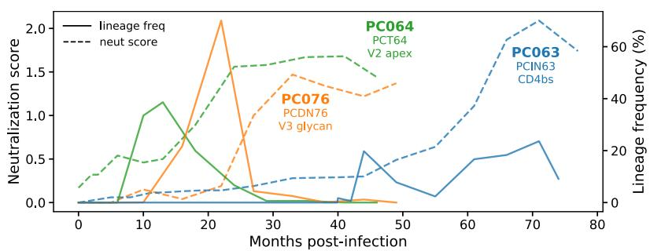

line

| Months post-infection | PC064 PCT64 V2 apex Neutralization score | PC064 PCDN76 V3 glycan Neutralization score | PC063 PCIN63 CD4bs Neutralization score | PC063 PCIN63 CD4bs Lineage frequency (%) |
| --------------------- | ---------------------------------------- | ------------------------------------------ | --------------------------------------- | ---------------------------------------- |
| 0                     | 0.2                                      | 0.1                                        | 0.0                                     | 0                                        |
| 10                    | 0.5                                      | 0.5                                        | 0.1                                     | 0                                        |
| 20                    | 1.5                                      | 2.0                                        | 0.2                                     | 0                                        |
| 30                    | 1.6                                      | 1.5                                        | 0.3                                     | 0                                        |
| 40                    | 1.7                                      | 1.2                                        | 0.4                                     | 0                                        |
| 50                    | 1.8                                      | 1.0                                        | 0.5                                     | 0                                        |
| 60                    | 1.9                                      | 0.8                                        | 0.6                                     | 0                                        |
| 70                    | 2.0                                      | 0.6                                        | 0.7                                     | 0                                        |
| 80                    | 1.8                                      | 0.4                                        | 0.5                                     | 0                                        |

C   
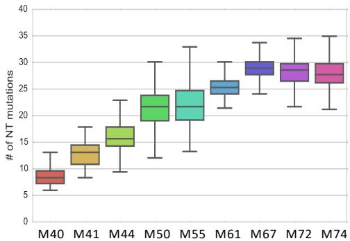

boxplot

| Mutation | # of NT mutations |
| -------- | ----------------- |
| M40      | 8                 |
| M41      | 12                |
| M44      | 16                |
| M50      | 22                |
| M55      | 24                |
| M61      | 26                |
| M67      | 29                |
| M72      | 28                |
| M74      | 28                |

flowchart

```mermaid
graph TD
    A["Root"] --> B["Protein 1"]
    A --> C["Protein 2"]
    A --> D["Protein 3"]
    A --> E["Protein 4"]
    A --> F["Protein 5"]
    A --> G["Protein 6"]
    A --> H["Protein 7"]
    A --> I["Protein 8"]
    A --> J["Protein 9"]
    A --> K["Protein 10"]
    A --> L["Protein 11"]
    A --> M["Protein 12"]
    A --> N["Protein 13"]
    A --> O["Protein 14"]
    A --> P["Protein 15"]
    A --> Q["Protein 16"]
    A --> R["Protein 17"]
    A --> S["Protein 18"]
    A --> T["Protein 19"]
    A --> U["Protein 20"]
    A --> V["Protein 21"]
    A --> W["Protein 22"]
    A --> X["Protein 23"]
    A --> Y["Protein 24"]
    A --> Z["Protein 25"]
    A --> AA["Protein 26"]
    A --> AB["Protein 27"]
    A --> AC["Protein 28"]
    A --> AD["Protein 29"]
    A --> AE["Protein 30"]
    A --> AF["Protein 31"]
    A --> AG["Protein 32"]
    A --> AH["Protein 33"]
    A --> AI["Protein 34"]
    A --> AJ["Protein 35"]
    A --> AK["Protein 36"]
    A --> AL["Protein 37"]
    A --> AM["Protein 38"]
    A --> AN["Protein 39"]
    A --> AO["Protein 40"]
    A --> AP["Protein 41"]
    A --> AQ["Protein 42"]
    A --> AR["Protein 43"]
    A --> AS["Protein 44"]
    A --> AT["Protein 45"]
    A --> AU["Protein 46"]
    A --> AV["Protein 47"]
    A --> AW["Protein 48"]
    A --> AX["Protein 49"]
    A --> AY["Protein 50"]
    A --> AZ["Protein 51"]
    A --> BA["Protein 52"]
    A --> BB["Protein 53"]
    A --> BC["Protein 54"]
    A --> BD["Protein 55"]
    A --> BE["Protein 56"]
    A --> BF["Protein 57"]
    A --> BG["Protein 58"]
    A --> BH["Protein 59"]
    A --> BI["Protein 60"]
    A --> BJ["Protein 61"]
    A --> BK["Protein 62"]
    A --> BL["Protein 63"]
    A --> BM["Protein 64"]
    A --> BN["Protein 65"]
    A --> BO["Protein 66"]
    A --> BP["Protein 67"]
    A --> BQ["Protein 68"]
    A --> BR["Protein 69"]
    A --> BS["Protein 70"]
    A --> BT["Protein 71"]
    A --> BU["Protein 72"]
    A --> BV["Protein 73"]
    A --> BW["Protein 74"]
    A --> BX["Protein 75"]
    A --> BY["Protein 76"]
    A --> BZ["Protein 77"]
    A --> CA["Protein 78"]
    A --> CB["Protein 79"]
    A --> CC["Protein 80"]
    A --> CD["Protein 81"]
    A --> CE["Protein 82"]
    A --> CF["Protein 83"]
    A --> CG["Protein 84"]
    A --> CH["Protein 85"]
    A --> CI["Protein 86"]
    A --> CJ["Protein 87"]
    A --> CK["Protein 88"]
    A --> CL["Protein 89"]
    A --> CM["Protein 90"]
    A --> CN["Protein 91"]
    A --> CO["Protein 92"]
    A --> CP["Protein 93"]
    A --> CQ["Protein 94"]
    A --> CR["Protein 95"]
    A --> CS["Protein 96"]
    A --> CT["Protein 97"]
    A --> CU["Protein 98"]
    A --> CV["Protein 99"]
    A --> CW["Protein 100"]
```

E   

bubble

| Category | Value |
| -------- | ----- |
| GGGDG    | 150   |
| SGGDG    | 140   |
| SSSWA    | 130   |
| GHGDA    | 120   |
| SGGNG    | 110   |
| GGGDA    | 100   |
| other    | 90    |

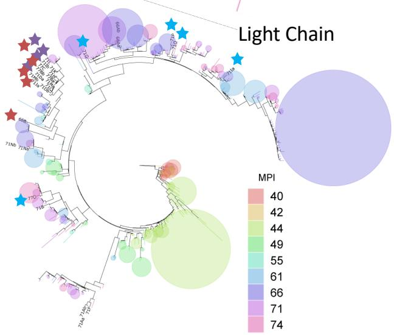

bubble

Light Chain
| Node | MPI Value |
|---|---|
| 1 | 40 |
| 2 | 42 |
| 3 | 44 |
| 4 | 49 |
| 5 | 55 |
| 6 | 61 |
| 7 | 66 |
| 8 | 71 |
| 9 | 74 |
The chart displays a hierarchical clustering of light chain genes based on their MPI values. Nodes are color-coded by MPI value, and star symbols indicate specific gene clusters or outliers. The central node '71ND' likely represents a cluster of genes with high MPI values. No explicit numerical values are provided for the data.

Figure S3. Emergence and development of the PCIN63 bnAb lineage – Related to Figure 2.

(A) Frequency of 5-amino acid LCDR3 immunoglobulin sequences in the naïve repertoire of PC63 (from Zambia) at different time points compared to HIV negative individuals from the United States (Southern California) and sub-Saharan Africa (Protocol C clinical research site in Zambia, Uganda, Rwanda and South Africa).

(B) Comparison of the PCIN63 Ab lineage (Blue) emergence and evolution with other bnAbs lineages isolated from two Protocol C participants (PC076: high-mannose patch targeting PCDN lineage in orange; PC064: V2-apex targeting PCT64 lineage in green) as detected in the periphery. Lineage sequences frequencies are plotted as a percentage of total lineage sequences from all time points. Plasma neutralization score (see (Landais et al., 2016)) from a heterologous medium panel is plotted as a dashed line. Related to Figure 2A.

(C) Somatic hypermutation frequency was calculated for each timepoint as divergence (number of nucleotide changes compared to LMCA). Data are presented as whisker plot showing mean, 95% upper and lower quartiles, standard deviation and outliers.

(D) Longitudinal phylogeny of PCIN63 heavy chain (Flea LINK) (Top) and light chain (Flea LINK) (Bottom) NGS sequences (colored by time-point, mpi). PCIN63 mAbs dependant (red) or accommodating (blue) the N276-glycan for neutralization or with intermediate phenotype (purple) are indicated with star symbols. Shaded circles represent the size of the cluster.

(E) PCIN63 light chain phylogeny as in (D) but colored by LCDR1-motif#4 amino acid sequence.

A   
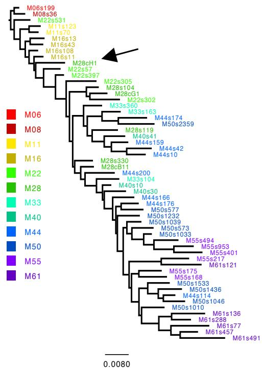

tree

| Category | Cluster | Count |
|---|---|---|
| M06 | Red | 199 |
| M08 | Red | 36 |
| M22s531 | Yellow | 31 |
| M11s123 | Yellow | 123 |
| M11s70 | Yellow | 70 |
| M16s13 | Yellow | 13 |
| M16s43 | Yellow | 43 |
| M16s108 | Yellow | 108 |
| M16s11 | Yellow | 11 |
| M28cH1 | Green | 57 |
| M22s397 | Green | 397 |
| M22s305 | Green | 305 |
| M28s104 | Green | 104 |
| M28cG1 | Green | 2 |
| M22s302 | Green | 302 |
| M33s360 | Green | 60 |
| M33s163 | Green | 163 |
| M44s174 | Blue | 174 |
| M50s2359 | Blue | 2359 |
| M28s119 | Green | 119 |
| M40s41 | Green | 41 |
| M44s159 | Green | 159 |
| M44s42 | Blue | 42 |
| M44s10 | Blue | 10 |
| M28s330 | Green | 330 |
| M28cB11 | Green | 11 |
| M44s200 | Green | 200 |
| M33s104 | Green | 104 |
| M40s30 | Green | 10 |
| M40s30 | Green | 10 |
| M44s166 | Green | 66 |
| M44s176 | Green | 176 |
| M50s577 | Green | 577 |
| M50s1232 | Green | 1232 |
| M50s1039 | Green | 1039 |
| M50s573 | Green | 573 |
| M50s1033 | Green | 1033 |
| M55s494 | Purple | 494 |
| M55s953 | Purple | 953 |
| M55s401 | Purple | 401 |
| M55s217 | Purple | 217 |
| M61s121 | Purple | 121 |
| M55s175 | Purple | 175 |
| M55s168 | Purple | 168 |
| M50s1533 | Purple | 1533 |
| M50s1436 | Purple | 1436 |
| M44s114 | Purple | 114 |
| M50s1046 | Purple | 1046 |
| M50s1010 | Purple | 1010 |
| M61s136 | Purple | 136 |
| M61s288 | Purple | 288 |
| M61s77 | Purple | 77 |
| M61s457 | Purple | 457 |
| M61s491 | Purple | 491 |
0.0080

C

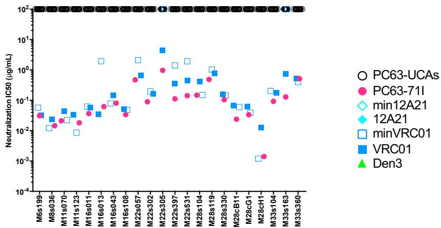

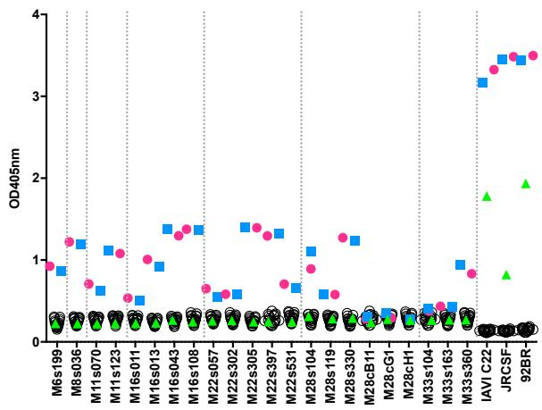

scatter

| Cell Line | OD405nm |
| --------- | ------- |
| M6s199    | 1.0     |
| M8s036    | 1.2     |
| M11s070   | 0.7     |
| M11s123   | 1.1     |
| M16s011   | 0.5     |
| M16s013   | 1.0     |
| M16s043   | 1.4     |
| M16s108   | 1.4     |
| M22s057   | 0.6     |
| M22s302   | 0.6     |
| M22s305   | 1.4     |
| M22s397   | 1.3     |
| M22s531   | 0.7     |
| M28s104   | 1.2     |
| M28s119   | 0.6     |
| M28s330   | 1.3     |
| M28cB11   | 0.3     |
| M28cG1    | 0.3     |
| M28cH1    | 0.3     |
| M33s104   | 0.4     |
| M33s163   | 0.4     |
| M33s360   | 0.9     |
| IAVI C22   | 3.2     |
| JRCSF-    | 3.5     |
| 92BR-     | 3.5     |

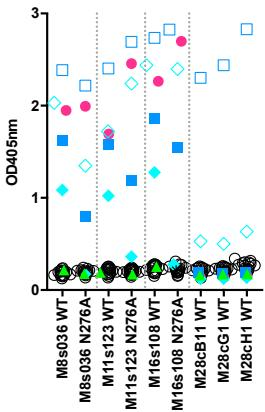

scatter

| Group        | OD405nm |
| ------------ | ------- |
| M8s036 WT    | 2.0     |
| M8s036 N276A | 1.5     |
| M11s123 WT   | 1.8     |
| M11s123 N276A| 2.2     |
| M16s108 WT   | 2.5     |
| M16s108 N276A| 2.8     |
| M28cB11 WT   | 2.0     |
| M28cG1 WT    | 1.5     |
| M28cH1 WT    | 1.0     |

B   
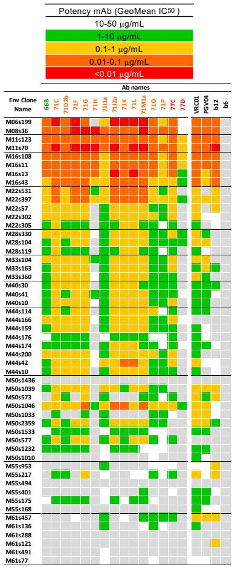

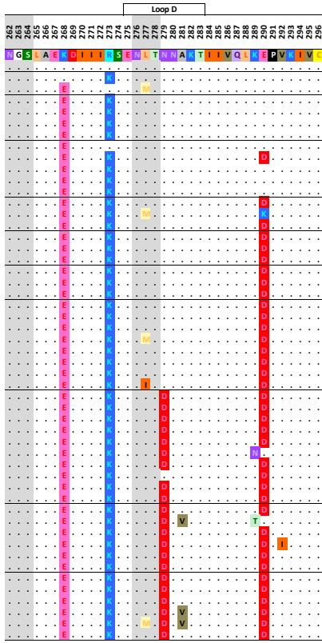

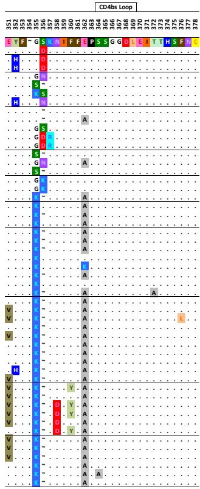

scatter

CD4bs Loop
| Position | CD4bs Loop |
|---|---|
| 351 | G |
| 352 | G |
| 353 | G |
| 354 | G |
| 355 | G |
| 356 | G |
| 357 | G |
| 358 | G |
| 359 | G |
| 360 | G |
| 361 | G |
| 362 | G |
| 363 | G |
| 364 | G |
| 365 | G |
| 366 | G |
| 367 | G |
| 368 | G |
| 369 | G |
| 370 | G |
| 371 | G |
| 372 | G |
| 373 | G |
| 374 | G |
| 375 | G |
| 376 | G |
| 377 | G |
| 378 | G |
| 351 | H |
| 352 | H |
| 353 | H |
| 354 | H |
| 355 | H |
| 356 | H |
| 357 | H |
| 358 | H |
| 359 | H |
| 360 | H |
| 361 | H |
| 362 | H |
| 363 | H |
| 364 | H |
| 365 | H |
| 366 | H |
| 367 | H |
| 368 | H |
| 369 | H |
| 370 | H |
| 371 | H |
| 372 | H |
| 373 | H |
| 374 | H |
| 375 | H |
| 376 | H |
| 377 | H |
| 378 | H |
| 351 | V |
| 352 | V |
| 353 | V |
| 354 | V |
| 355 | V |
| 356 | V |
| 357 | V |
| 358 | V |
| 359 | V |
| 360 | V |
| 361 | V |
| 362 | V |
| 363 | V |
| 364 | V |
| 365 | V |
| 366 | V |
| 367 | V |
| 368 | V |
| 369 | V |
| 370 | V |
| 371 | V |
| 372 | V |
| 373 | V |
| 374 | V |
| 375 | V |
| 376 | V |
| 377 | V |
| 378 | V |
| 351 | W |
| 352 | W |
| 353 | W |
| 354 | W |
| 355 | W |
| 356 | W |
| 357 | W |
| 358 | W |
| 359 | W |
| 360 | W |
| 361 | W |
| 362 | W |
| 363 | W |
| 364 | W |
| 365 | W |
| 366 | W |
| 367 | W |
| 368 | W |
| 369 | W |
| 370 | W |
| 371 | W |
| 372 | W |
| 373 | W |
| 374 | W |
| 375 | W |
| 376 | W |
| 377 | W |
| 378 | W |
V
V
V
V
V
V
V
V
V
V
V
V
V
V
V
V
V
V
V
V
V
V
V
V
V
V
V
V
V
V
V
V
V
V
V
V
V
V
V
V
V
V
V
V
V
V
V
V
V
V
V

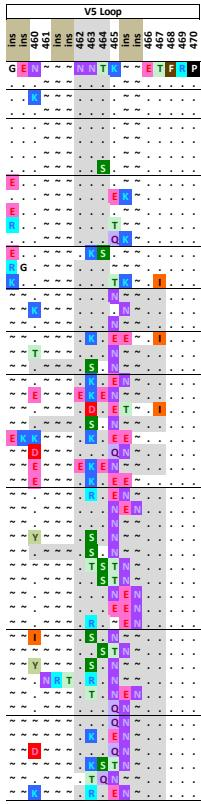

<table><tr><td colspan="2">V5 Loop</td></tr><tr><td>Length (aa)</td><td>PNGS</td></tr><tr><td>12</td><td>1</td></tr><tr><td>12</td><td>1</td></tr><tr><td>12</td><td>1</td></tr><tr><td>12</td><td>1</td></tr><tr><td>12</td><td>1</td></tr><tr><td>12</td><td>1</td></tr><tr><td>12</td><td>1</td></tr><tr><td>13</td><td>1</td></tr><tr><td>12</td><td>1</td></tr><tr><td>12</td><td>1</td></tr><tr><td>13</td><td>1</td></tr><tr><td>12</td><td>1</td></tr><tr><td>11</td><td>1</td></tr><tr><td>13</td><td>1</td></tr><tr><td>10</td><td>2</td></tr><tr><td>11</td><td>2</td></tr><tr><td>10</td><td>2</td></tr><tr><td>11</td><td>1</td></tr><tr><td>10</td><td>2</td></tr><tr><td>10</td><td>2</td></tr><tr><td>11</td><td>2</td></tr><tr><td>10</td><td>1</td></tr><tr><td>11</td><td>1</td></tr><tr><td>10</td><td>2</td></tr><tr><td>13</td><td>1</td></tr><tr><td>11</td><td>2</td></tr><tr><td>10</td><td>1</td></tr><tr><td>11</td><td>1</td></tr><tr><td>11</td><td>2</td></tr><tr><td>12</td><td>2</td></tr><tr><td>10</td><td>2</td></tr><tr><td>10</td><td>2</td></tr><tr><td>10</td><td>2</td></tr><tr><td>10</td><td>2</td></tr><tr><td>11</td><td>2</td></tr><tr><td>12</td><td>2</td></tr><tr><td>12</td><td>2</td></tr><tr><td>11</td><td>2</td></tr><tr><td>10</td><td>2</td></tr><tr><td>10</td><td>2</td></tr><tr><td>10</td><td>2</td></tr><tr><td>13</td><td>3</td></tr><tr><td>12</td><td>2</td></tr><tr><td>11</td><td>2</td></tr><tr><td>10</td><td>2</td></tr><tr><td>10</td><td>2</td></tr><tr><td>11</td><td>2</td></tr><tr><td>10</td><td>2</td></tr><tr><td>11</td><td>2</td></tr></table>

text_image

N159
N362
N276
N303
N448
+ + + +
+ + + +
+ + + +
+ + + +
+ + + +
+ + + +
+ + + +
+ + + +
+ + + +
+ + + +
+ + + +
+ + + +
+ + + +
+ + + +
+ + + +
+ + + +
+ + + +
+ + + +
+ + + +
+ + + +
+ + + +
+ + + +
+ + + +
+ + + +
+ + + +
+ + + +

Figure S4. Elicitation of the PCIN63 lineage – Related to Figures 3 and 4.

(A) Phylogeny of PC063 HIV subtype C env, estimated by maximum likelihood from representative full-length env clonal sequences (c####) and PacBio high-quality consensus sequences (HQCS) (s####) obtained by next-generation sequencing of longitudinal plasma samples. Sequences are color-coded by time point (Months post infection, M). Clone M28cH1 is indicated with a black arrow.

(B) PCIN63 mAbs and control CD4bs Abs were tested for neutralization of pseudo-typed autologous PC063 Env clones representative of each time points (M-Months post infection, s-sequence number) as listed vertically. IC50s are tabulated and color coded as indicated in the legend. Amino-acid sequence and PNGS information of the PC063 autologous Env clones are indicated on the left. Amino-acid residues are numbered based on HxB2 alignment and color-coded as indicated in the legend. V5 loop length and number of PNGS are colored using a gradient.

(C) Putative PCIN63 UCA Abs (see Figure 3A) were tested for neutralization (Top) of representative pseudo-typed autologous Env clones (X-axis) selected from all time points prior to detection of the PCIN63 lineage in the periphery, and binding (bottom) to captured gp120 from corresponding pseudovirus stock lysates (left panel) or recombinantly expressed (right panel).

(B,C) Data are representative of at least 2 experiments.

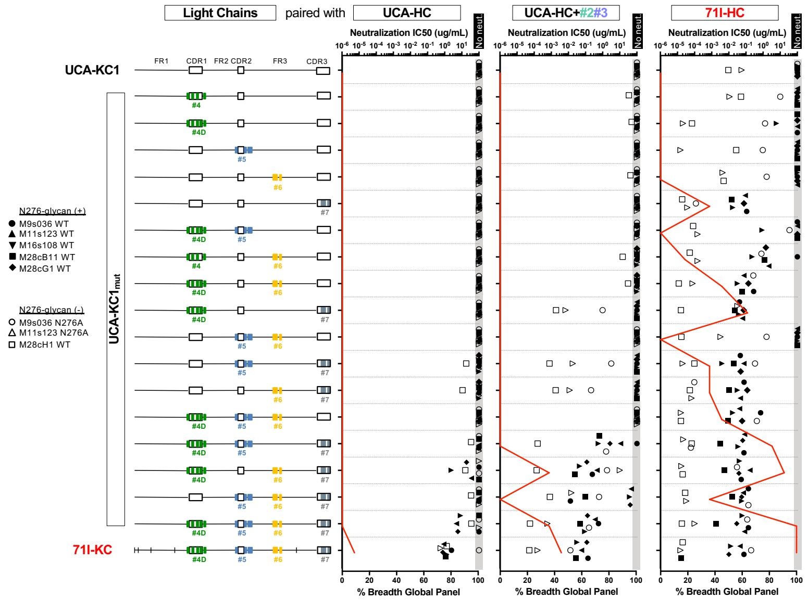  
Figure S5. Functional evaluation of PCIN63 Ab lineage maturation – Related to Figure 4   
PCIN63-71I-KC SHM motifs (as defined in Figure 2B) were introduced into the PCIN63-UCA-KC1, individually or in combination. Motifs are color-coded and their sequence position is indicated with a diagram. Mutated constructs were paired with WT PCIN63-UCA (left), PCIN63-UCA+Motif#2+Motif#3 (middle) or PCIN63-71I (right) HC. The chimeric Abs were tested for neutralization of the indicated WT and N276A autologous Env clones sensitive to neutralization by PCIN63-71I, as well as against the global 12-virus panel (De Camp et al., 2014). Data are representative of at least 2 experiments.

  
Figure S6. Effect of CD4bs N-glycan removal on neutralization by PCIN63 Abs – Related to Figure 5.   
PCIN63 Abs, VRC01-class, PGT151 and PGT121 Abs were tested for neutralizing activity against the indicated pseudoviruses carrying the indicated mutation knocking down CD4bs surrounding N-glycan. The fold decrease or increase in neutralization $IC_{50}$ is plotted. The gray bars indicate the range of variation for the PCIN63 Abs only (upper panel) or VRC01-class reference Abs (lower panel). Data are representation of at least two experiments.

CDR1 CDR2 CDR3 

<table><tr><td>Q</td><td>V</td><td>L</td><td>V</td><td>Q</td><td>S</td><td>G</td><td>A</td><td>E</td><td>V</td><td>K</td><td>K</td><td>P</td><td>G</td><td>A</td><td>S</td><td>V</td><td>K</td><td>V</td><td>S</td><td>C</td><td>K</td><td>A</td><td>S</td><td>G</td><td>Y</td><td>T</td><td>F</td><td>T</td><td>G</td><td>--</td><td>--</td><td>--</td><td>--</td><td>--</td><td>--</td><td>--</td><td>--</td><td>--</td><td>--</td><td>--</td><td>--</td><td>--</td><td>--</td><td>--</td><td>--</td><td>--</td><td>--</td><td>--</td><td>--</td><td>--</td><td>--</td><td>--</td><td>--</td><td>--</td><td>--</td><td>--</td><td>--</td><td>--</td><td>--</td><td>--</td><td>--</td><td>--</td><td>--</td><td>--</td><td>--</td><td>--</td><td>--</td><td>--</td><td>--</td><td>--</td><td>--</td><td>--</td><td>--</td><td>--</td><td>--</td><td>--</td><td>--</td><td>--</td><td>--</td><td>--</td><td>--</td><td>--</td><td>--</td><td>--</td><td>--</td><td>--</td><td>--</td><td>--</td><td>--</td><td>--</td><td>--</td><td>--</td><td>--</td><td>--</td><td>--</td><td>--</td><td>--</td><td>--</td><td>--</td><td>--</td><td>--</td><td>--</td><td>--</td><td>--</td><td>--</td><td>--</td><td>--</td><td>--</td><td>--</td><td>--</td><td>--</td><td>--</td><td>--</td><td>--</td><td>--</td><td>--</td><td>--</td><td>--</td><td>--</td><td>--</td><td>--</td><td>--</td><td>--</td><td>--</td><td>--</td><td>--</td><td>--</td><td>--</td><td>--</td><td>)--</td><td>--</td><td>--</td><td>--</td><td>--</td><td>--</td><td>--</td><td>--</td><td>--</td><td>--</td><td>--</td><td>--</td><td>--</td><td>--</td><td>--</td><td>--</td><td>--</td><td>--</td><td>--</td><td>--</td><td>--</td><td>--</td><td>--</td><td>--</td><td>--</td><td>--</td><td>--</td><td>--</td><td>--</td><td>--</td><td>--</td><td>--</td><td>--</td><td>--</td><td>--</td><td>--</td><td>--</td><td>--</td><td>--</td><td>--</td><td>--</td><td>--</td><td>--</td><td>--</td><td>--</td><td>--</td><td>--</td><td>--</td><td>--</td><td>--</td><td></td></tr><tr><td></td><td></td><td></td><td></td><td></td><td></td><td></td><td></td><td></td><td></td><td></td><td></td><td></td><td></td><td></td><td></td><td></td><td></td><td></td><td></td><td></td><td></td><td></td><td></td><td></td><td></td><td></td><td></td><td></td><td></td><td></td><td></td><td></td><td></td><td></td><td></td><td></td><td></td><td></td><td></td><td></td><td></td><td></td><td></td><td></td><td></td><td></td><td></td><td></td><td></td><td></td><td></td><td></td><td></td><td></td><td></td><td></td><td></td><td></td><td></td><td></td><td></td><td></td><td></td><td></td><td></td><td></td><td></td><td></td><td></td><td></td><td></td><td></td><td></td><td></td><td></td><td></td><td></td><td></td><td></td><td></td><td></td><td></td><td></td><td></td><td></td><td></td><td></td><td></td><td></td><td></td><td></td><td></td><td></td><td></td><td></td><td></td><td></td><td></td><td></td><td></td><td></td><td></td><td></td><td></td><td></td><td></td><td></td><td></td><td></td><td></td><td></td><td></td><td></td><td></td><td></td><td></td><td></td><td></td><td></td><td></td><td></td><td></td><td></td><td></td><td></td><td></td><td></td><td></td><td></td><td></td><td></td><td></td><td></td><td></td><td></td><td></td><td></td><td></td><td></td><td></td><td></td><td></td><td></td><td></td><td></td><td></td><td></td><td></td><td></td><td></td><td></td><td></td><td></td><td></td><td></td><td></td><td></td><td></td><td></td><td></td><td></td><td></td><td></td><td></td><td></td><td></td><td></td><td></td><td></td><td></td><td></td><td></td><td></td><td></td><td></td><td></td><td></td><td></td><td></td><td></td></tr><tr><td></td><td></td><td></td><td></td><td></td><td></td><td></td><td></td><td></td><td></td><td></td><td></td><td></td><td></td><td></td><td></td><td></td><td></td><td></td><td></td><td></td><td></td><td></td><td></td><td></td><td></td><td></td><td></td><td></td><td></td><td></td><td></td><td></td><td></td><td></td><td></td><td></td><td></td><td></td><td></td><td></td><td></td><td></td><td></td><td></td><td></td><td></td><td></td><td></td><td></td><td></td><td></td><td></td><td></td><td></td><td></td><td></td><td></td><td></td><td></td><td></td><td></td><td></td><td></td><td></td><td></td><td></td><td></td><td></td><td></td><td></td><td></td><td></td><td></td><td></td><td></td><td></td><td></td><td></td><td></td><td></td><td></td><td></td><td></td><td></td><td></td><td></td><td></td><td></td><td></td><td></td><td></td><td></td><td></td><td></td><td></td><td></td><td></td><td></td><td></td><td></td><td></td><td></td><td></td><td></td><td></td><td></td><td></td><td></td><td></td><td></td><td></td><td></td><td></td><td></td><td></td><td></td><td></td><td></td><td></td><td></td><td></td><td></td><td></td><td></td><td></td><td></td><td></td><td></td><td></td><td></td><td></td><td></td><td></td><td></td><td></td><td></td><td></td><td></td><td></td><td></td><td></td><td></td><td></td><td></td><td></td><td></td><td></td><td></td><td></td><td></td><td></td><td></td><td></td><td></td><td></td><td></td><td></td><td></td><td></td><td></td><td></td><td></td><td></td><td></td><td></td><td></td><td></td><td></td><td></td><td></td><td></td><td></td><td></td><td></td><td></td><td></td><td></td><td></td><td></td><td></td></tr><tr><td></td><td></td><td></td><td>G</td><td>Q</td><td>M</td><td>.</td><td>.</td><td>E</td><td>.</td><td>M</td><td>R</td><td>I</td><td>.</td><td>R</td><td>.</td><td>.</td><td>E</td><td>.</td><td>I</td><td>D</td><td>.</td><td>.</td><td>.</td><td>.</td><td>.</td><td>.</td><td>CT</td><td>L</td><td>N</td><td>I</td><td>L</td><td>.</td><td>.</td><td>K</td><td>R</td><td>P</td><td>.</td><td>.</td><td>.</td><td>.</td><td>.</td><td>.</td><td>L</td><td>K</td><td>R</td><td>G</td><td>A</td><td>V</td><td>.</td><td>.</td><td>R</td><td>P</td><td>L</td><td>.</td><td>.</td><td>.</td><td>.</td><td>.</td><td>.</td><td>.</td><td>.</td><td>.</td><td>.</td><td>.</td><td>.</td><td>.</td><td>.</td><td>.</td><td>.</td><td>.</td><td>.</td><td>.</td><td>.</td><td>.</td><td>.</td><td>.</td><td>.</td><td>.</td><td>.</td><td>.</td><td>.</td><td>.</td><td>.</td><td>.</td><td>.</td><td>.</td><td>.</td><td>.</td><td>.</td><td>.</td><td>.</td><td>.</td><td>.</td><td>.</td><td>.</td><td>.</td><td>.</td><td></td><td></td><td></td><td></td><td></td><td></td><td></td><td></td><td></td><td></td><td></td><td></td><td></td><td></td><td></td><td></td><td></td><td></td><td></td><td></td><td></td><td></td><td></td><td></td><td></td><td></td><td></td><td></td><td></td><td></td><td></td><td></td><td></td><td></td><td></td><td></td><td></td><td></td><td></td><td></td><td></td><td></td><td></td><td></td><td></td><td></td><td></td><td></td><td></td><td></td><td></td><td></td><td></td><td></td><td></td><td></td><td></td><td></td><td></td><td></td><td></td><td></td><td></td><td></td><td></td><td></td><td></td><td></td><td></td><td></td><td></td><td></td><td></td><td></td><td></td><td></td><td></td><td></td><td></td><td></td><td></td><td></td><td></td></tr><tr><td></td><td></td><td></td><td>G</td><td>Q</td><td>M</td><td>.</td><td>.</td><td>E</td><td>.</td><td>M</td><td>R</td><td>L</td><td>.</td><td>R</td><td>.</td><td>.</td><td>E</td><td>.</td><td>L</td><td>N</td><td>I</td><td>.</td><td>L</td><td>.</td><td>.</td><td>.</td><td>.</td><td>C</td><td>P</td><td>I</td><td>N</td><td>I</td><td>L</td><td>.</td><td>.</td><td>R</td><td>R</td><td>P</td><td>.</td><td>.</td><td>.</td><td>.</td><td>L</td><td>K</td><td>R</td><td>G</td><td>A</td><td>V</td><td>.</td><td>.</td><td>R</td><td>P</td><td>L</td><td>.</td><td>.</td><td>.</td><td>.</td><td>.</td><td>.</td><td>.</td><td>.</td><td>.</td><td>.</td><td>.</td><td>.</td><td>.</td><td>.</td><td>.</td><td>.</td><td>.</td><td>.</td><td>.</td><td>.</td><td>.</td><td>.</td><td>.</td><td>.</td><td>.</td><td>.</td><td>.</td><td>.</td><td>.</td><td>.</td><td>.</td><td>.</td><td>.</td><td></td><td></td><td></td><td></td><td></td><td></td><td></td><td></td><td></td><td></td><td></td><td></td><td></td><td></td><td></td><td></td><td></td><td></td><td></td><td></td><td></td><td></td><td></td><td></td><td></td><td></td><td></td><td></td><td></td><td></td><td></td><td></td><td></td><td></td><td></td><td></td><td></td><td></td><td></td><td></td><td></td><td></td><td></td><td></td><td></td><td></td><td></td><td></td><td></td><td></td><td></td><td></td><td></td><td></td><td></td><td></td><td></td><td></td><td></td><td></td><td></td><td></td><td></td><td></td><td></td><td></td><td></td><td></td><td></td><td></td><td></td><td></td><td></td><td></td><td></td><td></td><td></td><td></td><td></td><td></td><td></td><td></td><td></td><td></td><td></td><td></td><td></td><td></td><td></td><td></td><td></td><td></td><td></td><td></td></tr><tr><td></td><td></td><td></td><td>G</td><td>Q</td><td>M</td><td>.</td><td>.</td><td>E</td><td>.</td><td>M</td><td>R</td><td>I</td><td>.</td><td>Q</td><td>.</td><td>.</td><td>E</td><td>.</td><td>I</td><td>D</td><td>.</td><td>.</td><td>L</td><td>.</td><td>.</td><td>.</td><td>.</td><td>CT</td><td>L</td><td>N</td><td>I</td><td>L</td><td>.</td><td>.</td><td>R</td><td>R</td><td>P</td><td>.</td><td>.</td><td>.</td><td>.</td><td>L</td><td>K</td><td>R</td><td>G</td><td>A</td><td>V</td><td>.</td><td>.</td><td>R</td><td>P</td><td>L</td><td>.</td><td>.</td><td>.</td><td>.</td><td>.</td><td>.</td><td>.</td><td>.</td><td>.</td><td>.</td><td>.</td><td>.</td><td>.</td><td>.</td><td>.</td><td>.</td><td>.</td><td>.</td><td>.</td><td>.</td><td>.</td><td>.</td><td>.</td><td>.</td><td>.</td><td>.</td><td>-</td><td>.</td><td></td><td></td><td></td><td></td><td></td><td></td><td></td><td></td><td></td><td></td><td></td><td></td><td></td><td></td><td></td><td></td><td></td><td></td><td></td><td></td><td></td><td></td><td></td><td></td><td></td><td></td><td></td><td></td><td></td><td></td><td></td><td></td><td></td><td></td><td></td><td></td><td></td><td></td><td></td><td></td><td></td><td></td><td></td><td></td><td></td><td></td><td></td><td></td><td></td><td></td><td></td><td></td><td></td><td></td><td></td><td></td><td></td><td></td><td></td><td></td><td></td><td></td><td></td><td></td><td></td><td></td><td></td><td></td><td></td><td></td><td></td><td></td><td></td><td></td><td></td><td></td><td></td><td></td><td></td><td></td><td></td><td></td><td></td><td></td><td></td><td></td><td></td><td></td><td></td><td></td><td></td><td></td><td></td><td></td><td></td><td></td><td></td><td></td><td></td><td></td></tr><tr><td></td><td></td><td></td><td></td><td></td><td></td><td></td><td></td><td></td><td></td><td></td><td></td><td></td><td></td><td></td><td></td><td></td><td></td><td></td><td></td><td></td><td></td><td></td><td></td><td></td><td></td><td></td><td></td><td></td><td></td><td></td><td></td><td></td><td></td><td></td><td></td><td></td><td></td><td></td><td></td><td></td><td></td><td></td><td></td><td></td><td></td><td></td><td></td><td></td><td></td><td></td><td></td><td></td><td></td><td></td><td></td><td></td><td></td><td></td><td></td><td></td><td></td><td></td><td></td><td></td><td></td><td></td><td></td><td></td><td></td><td></td><td></td><td></td><td></td><td></td><td></td><td></td><td></td><td></td><td></td><td></td><td></td><td></td><td></td><td></td><td></td><td></td><td></td><td></td><td></td><td></td><td></td><td></td><td></td><td></td><td></td><td></td><td></td><td></td><td></td><td></td><td></td><td></td><td></td><td></td><td></td><td></td><td></td><td></td><td></td><td></td><td></td><td></td><td></td><td></td><td></td><td></td><td></td><td></td><td></td><td></td><td></td><td></td><td></td><td></td><td></td><td></td><td></td><td></td><td></td><td></td><td></td><td></td><td></td><td></td><td></td><td></td><td></td><td></td><td></td><td></td><td></td><td></td><td></td><td></td><td></td><td></td><td></td><td></td><td></td><td></td><td></td><td></td><td></td><td></td><td></td><td></td><td></td><td></td><td></td><td></td><td></td><td></td><td></td><td></td><td></td><td></td><td></td><td></td><td></td><td></td><td></td><td></td><td></td><td></td><td></td><td></td><td></td><td></td><td></td><td></td></tr><tr><td></td><td></td><td></td><td></td><td></td><td></td><td></td><td></td><td></td><td></td><td></td><td></td><td>I</td><td>.</td><td>R</td><td>.</td><td>.</td><td>N</td><td>R</td><td>D</td><td>.</td><td>.</td><td>.</td><td>.</td><td>.</td><td>.</td><td>.</td><td>.</td><td>.</td><td>S</td><td>I</td><td>.</td><td>L</td><td>I</td><td>D</td><td>K</td><td>F</td><td>.</td><td>I</td><td>.</td><td>.</td><td>.</td><td>K</td><td>L</td><td>W</td><td>A</td><td>V</td><td>S</td><td>.</td><td>R</td><td>Q</td><td>L</td><td>.</td><td>.</td><td>.</td><td>.</td><td>.</td><td>.</td><td>Q</td><td>L</td><td>S</td><td>Q</td><td>P</td><td>D</td><td>D</td><td>P</td><td>W</td><td>G</td><td>V</td><td>.</td><td>L</td><td>F</td><td>G</td><td>T</td><td>A</td><td>.</td><td>E</td><td>F</td><td>.</td><td>V</td><td>R</td><td>R</td><td>G</td><td>S</td><td>C</td><td>D</td><td>Y</td><td>C</td><td>G</td><td>D</td><td>F</td><td>P</td><td>--</td><td>--</td><td>--</td><td>--</td><td>--</td><td>--</td><td>--</td><td>--</td><td>--</td><td>--</td><td></td><td></td><td></td><td></td><td></td><td></td><td></td><td></td><td></td><td></td><td></td><td></td><td></td><td></td><td></td><td></td><td></td><td></td><td></td><td></td><td></td><td></td><td></td><td></td><td></td><td></td><td></td><td></td><td></td><td></td><td></td><td></td><td></td><td></td><td></td><td></td><td></td><td></td><td></td><td></td><td></td><td></td><td></td><td></td><td></td><td></td><td></td><td></td><td></td><td></td><td></td><td></td><td></td><td></td><td></td><td></td><td></td><td></td><td></td><td></td><td></td><td></td><td></td><td></td><td></td><td></td><td></td><td></td><td></td><td></td><td></td><td></td><td></td><td></td><td></td><td></td><td></td><td></td><td></td></tr><tr><td>E</td><td></td><td></td><td>E</td><td>.</td><td>P</td><td>V</td><td>M</td><td>R</td><td>.</td><td>S</td><td>M</td><td>I</td><td>.</td><td>A</td><td>T</td><td>.</td><td>N</td><td>R</td><td>D</td><td>.</td><td>.</td><td>.</td><td>.</td><td>.</td><td>K</td><td>L</td><td>W</td><td>A</td><td>V</td><td>S</td><td>.</td><td>R</td><td>Q</td><td>L</td><td>.</td><td>.</td><td>.</td><td>S</td><td>L</td><td>F</td><td>S</td><td>Q</td><td>L</td><td>Y</td><td>P</td><td>D</td><td>R</td><td>G</td><td>V</td><td>.</td><td>L</td><td>F</td><td>G</td><td>T</td><td>A</td><td>.</td><td>E</td><td>F</td><td>.</td><td>V</td><td>R</td><td>R</td><td>G</td><td>S</td><td>C</td><td>D</td><td>Y</td><td>C</td><td>G</td><td>D</td><td>F</td><td>P</td><td>--</td><td>--</td><td>--</td><td>--</td><td>--</td><td>--</td><td>--</td><td>--</td><td>--</td><td>--</td><td>--</td><td></td><td></td><td></td><td></td><td></td><td></td><td></td><td></td><td></td><td></td><td></td><td></td><td></td><td></td><td></td><td></td><td></td><td></td><td></td><td></td><td></td><td></td><td></td><td></td><td></td><td></td><td></td><td></td><td></td><td></td><td></td><td></td><td></td><td></td><td></td><td></td><td></td><td></td><td></td><td></td><td></td><td></td><td></td><td></td><td></td><td></td><td></td><td></td><td></td><td></td><td></td><td></td><td></td><td></td><td></td><td></td><td></td><td></td><td></td><td></td><td></td><td></td><td></td><td></td><td></td><td></td><td></td><td></td><td></td><td></td><td></td><td></td><td></td><td></td><td></td><td></td><td></td><td></td><td></td><td></td><td></td><td></td><td></td><td></td><td></td><td></td><td></td><td></td><td></td><td></td><td></td><td></td><td></td><td></td><td></td><td></td><td></td></tr><tr><td></td><td></td><td></td><td>E</td><td>.</td><td>P</td><td>V</td><td>M</td><td>R</td><td>.</td><td>D</td><td>M</td><td>R</td><td>I</td><td>.</td><td>R</td><td>.</td><td>E</td><td>.</td><td>I</td><td>N</td><td>R</td><td>F</td><td>.</td><td>I</td><td>.</td><td>K</td><td>M</td><td>W</td><td>A</td><td>V</td><td>S</td><td>.</td><td>R</td><td>Q</td><td>L</td><td>.</td><td>.</td><td>S</td><td>L</td><td>F</td><td>S</td><td>Q</td><td>L</td><td>Y</td><td>P</td><td>D</td><td>R</td><td>G</td><td>V</td><td>.</td><td>L</td><td>F</td><td>G</td><td>T</td><td>A</td><td>.</td><td>E</td><td>F</td><td>.</td><td>V</td><td>R</td><td>R</td><td>G</td><td>S</td><td>C</td><td>D</td><td>Y</td><td>C</td><td>G</td><td>D</td><td>F</td><td>P</td><td>--</td><td>--</td><td>--</td><td>--</td><td>--</td><td>--</td><td>--</td><td>--</td><td></td><td></td><td></td><td></td><td></td><td></td><td></td><td></td><td></td><td></td><td></td><td></td><td></td><td></td><td></td><td></td><td></td><td></td><td></td><td></td><td></td><td></td><td></td><td></td><td></td><td></td><td></td><td></td><td></td><td></td><td></td><td></td><td></td><td></td><td></td><td></td><td></td><td></td><td></td><td></td><td></td><td></td><td></td><td></td><td></td><td></td><td></td><td></td><td></td><td></td><td></td><td></td><td></td><td></td><td></td><td></td><td></td><td></td><td></td><td></td><td></td><td></td><td></td><td></td><td></td><td></td><td></td><td></td><td></td><td></td><td></td><td></td><td></td><td></td><td></td><td></td><td></td><td></td><td></td><td></td><td></td><td></td><td></td><td></td><td></td><td></td><td></td><td></td><td></td><td></td><td></td><td></td><td></td><td></td><td></td><td></td><td></td><td></td><td></td><td></td></tr><tr><td></td><td></td><td></td><td>E</td><td>.</td><td>P</td><td>V</td><td>M</td><td>R</td><td>.</td><td>D</td><td>M</td><td>R</td><td>I</td><td>.</td><td>R</td><td>.</td><td>E</td><td>.</td><td>I</td><td>N</td><td>R</td><td>F</td><td>.</td><td>I</td><td>.</td><td>K</td><td>M</td><td>W</td><td>A</td><td>V</td><td>S</td><td>.</td><td>R</td><td>Q</td><td>L</td><td>.</td><td>.</td><td>S</td><td>L</td><td>F</td><td>S, Q</td><td>L</td><td>Y</td><td>P</td><td>D</td><td>R</td><td>G</td><td>V</td><td>.</td><td>L</td><td>F, G</td><td>T, A</td><td>.</td><td>E, F</td><td>.</td><td>V</td><td>R</td><td>R</td><td>G</td><td>S, S, C, P, H, C, G, D, F, ~</td><td>--</td><td>--</td><td>--</td><td>--</td><td>--</td><td>--</td><td>--</td><td>--</td><td>--</td><td></td><td></td><td></td><td></td><td></td><td></td><td></td><td></td><td></td><td></td><td></td><td></td><td></td><td></td><td></td><td></td><td></td><td></td><td></td><td></td><td></td><td></td><td></td><td></td><td></td><td></td><td></td><td></td><td></td><td></td><td></td><td></td><td></td><td></td><td></td><td></td><td></td><td></td><td></td><td></td><td></td><td></td><td></td><td></td><td></td><td></td><td></td><td></td><td></td><td></td><td></td><td></td><td></td><td></td><td></td><td></td><td></td><td></td><td></td><td></td><td></td><td></td><td></td><td></td><td></td><td></td><td></td><td></td><td></td><td></td><td></td><td></td><td></td><td></td><td></td><td></td><td></td><td></td><td></td><td></td><td></td><td></td><td></td><td></td><td></td><td></td><td></td><td></td><td></td><td></td><td></td><td></td><td></td><td></td><td></td><td></td><td></td><td></td><td></td><td></td><td></td><td></td><td></td><td></td><td></td><td></td><td></td><td></td><td></td><td></td><td></td></tr><tr><td></td><td></td><td></td><td>E</td><td>.</td><td>P</td><td>V</td><td>M</td><td>R</td><td>.</td><td>D</td><td>M</td><td>R</td><td>I</td><td>.</td><td>R</td><td>.</td><td>E</td><td>.</td><td>I</td><td>N</td><td>R</td><td>F, .</td><td>L</td><td>.</td><td>K, M, W, A, V, S, ., ., ., ., ., ., ., ., ., ., ., ., ., ., ., ., ., ., ., ., ., ., ., ., ., ., ., ., ., ., ., ., ., ., ., ., ., ., ., ., ., ., ., ., ., ., ., ., ., .,</td><td></td><td></td><td></td><td></td><td></td><td></td><td></td><td></td><td></td><td></td><td></td><td></td><td></td><td></td><td></td><td></td><td></td><td></td><td></td><td></td><td></td><td></td><td></td><td></td><td></td><td></td><td></td><td></td><td></td><td></td><td></td><td></td><td></td><td></td><td></td><td></td><td></td><td></td><td></td><td></td><td></td><td></td><td></td><td></td><td></td><td></td><td></td><td></td><td></td><td></td><td></td><td></td><td></td><td></td><td></td><td></td><td></td><td></td><td></td><td></td><td></td><td></td><td></td><td></td><td></td><td></td><td></td><td></td><td></td><td></td><td></td><td></td><td></td><td></td><td></td><td></td><td></td><td></td><td></td><td></td><td></td><td></td><td></td><td></td><td></td><td></td><td></td><td></td><td></td><td></td><td></td><td></td><td></td><td></td><td></td><td></td><td></td><td></td><td></td><td></td><td></td><td></td><td></td><td></td><td></td><td></td><td></td><td></td><td></td><td></td><td></td><td></td><td></td><td></td><td></td><td></td><td></td><td></td><td></td><td></td><td></td><td></td><td></td><td></td><td></td><td></td><td></td><td></td><td></td><td></td><td></td><td></td><td></td><td></td><td></td><td></td><td></td><td></td><td></td><td></td><td></td><td></td><td></td><td></td><td></td><td></td><td></td><td></td><td></td><td></td><td></td><td></td><td></td><td></td><td></td></tr><tr><td></td><td></td><td></td><td>E</td><td>.</td><td>P</td><td>V</td><td>M</td><td>R</td><td>.</td><td>D</td><td>M</td><td>R</td><td>I</td><td>.</td><td>R</td><td>.</td><td>E</td><td>.</td><td>I</td><td>N</td><td>R, F, ., ., ., ., ., ., ., ., ., ., ., ., ., ., ., ., ., ., ., ., ., ., ., ., ., ., ., ., ., ., ., ., ., ., ., ., ., ., ., ., ., ., ., ., ., ., ., ., ., -</td><td>.</td><td></td><td></td><td></td><td></td><td></td><td></td><td></td><td></td><td></td><td></td><td></td><td></td><td></td><td></td><td></td><td></td><td></td><td></td><td></td><td></td><td></td><td></td><td></td><td></td><td></td><td></td><td></td><td></td><td></td><td></td><td></td><td></td><td></td><td></td><td></td><td></td><td></td><td></td><td></td><td></td><td></td><td></td><td></td><td></td><td></td><td></td><td></td><td></td><td></td><td></td><td></td><td></td><td></td><td></td><td></td><td></td><td></td><td></td><td></td><td></td><td></td><td></td><td></td><td></td><td></td><td></td><td></td><td></td><td></td><td></td><td></td><td></td><td></td><td></td><td></td><td></td><td></td><td></td><td></td><td></td><td></td><td></td><td></td><td></td><td></td><td></td><td></td><td></td><td></td><td></td><td></td><td></td><td></td><td></td><td></td><td></td><td></td><td></td><td></td><td></td><td></td><td></td><td></td><td></td><td></td><td></td><td></td><td></td><td></td><td></td><td></td><td></td><td></td><td></td><td></td><td></td><td></td><td></td><td></td><td></td><td></td><td></td><td></td><td></td><td></td><td></td><td></td><td></td><td></td><td></td><td></td><td></td><td></td><td></td><td></td><td></td><td></td><td></td><td></td><td></td><td></td><td></td><td></td><td></td><td></td><td></td><td></td><td></td><td></td><td></td><td></td><td></td><td></td><td></td><td></td><td></td><td></td><td></td></tr><tr><td></td><td></td><td></td><td>E</td><td>.</td><td>P</td><td>V</td><td>M</td><td>R</td><td>.</td><td>D</td><td>M</td><td>R</td><td>I</td><td>.</td><td colspan="79">R, ., ., ., ., ., ., ., ., ., ., ., ., ., ., ., ., ., ., ., ., ., ., ., ., ., ., ., ., ., ., ., ., ., ., ., ., ., ., ., ., ., ., ., ., ., ., ., ., ., 10000000000000000000000000000000000000000000000000000000000000000000000000000000000000000000000000000</td><td></td><td></td><td></td><td></td><td></td><td></td><td></td><td></td><td></td><td></td><td></td><td></td><td></td><td></td><td></td><td></td><td></td><td></td><td></td><td></td><td></td><td></td><td></td><td></td><td></td><td></td><td></td><td></td><td></td><td></td><td></td><td></td><td></td><td></td><td></td><td></td><td></td><td></td><td></td><td></td><td></td><td></td><td></td><td></td><td></td><td></td><td></td><td></td><td></td><td></td><td></td><td></td><td></td><td></td><td></td><td></td><td></td><td></td><td></td><td></td><td></td><td></td><td></td><td></td><td></td><td></td><td></td><td></td><td></td><td></td><td></td><td></td><td></td><td></td><td></td><td></td><td></td><td></td><td></td><td></td><td></td><td></td><td></td><td></td><td></td><td></td><td></td></tr></table>

VH1-2\*02  
VRC01-HC  
NIH45-46-HC  
VRC02-HC  
VRC03-HC  
VRC06-HC  
VRC07-HC  
VRC08-HC  
VRC18-HC  
VRC23-HC  
VRC27\_HC  
VRC-CH31-HC  
VRC-PG04-HC  
VRC-PG19-HC  
VRC-PG20-HC  
VRC-N6-HC  
12A12-HC  
12A21-HC  
3BNC60-HC  
3BNC117-HC  
N60P25.1  
N49P7  
DRVIA7  
PCIN63-71I

<table><tr><td rowspan="2"></td><td colspan="101">CDR1</td><td></td><td></td><td></td><td></td><td></td><td></td><td></td><td></td><td></td><td></td><td></td><td></td><td></td><td></td><td></td><td></td><td></td><td></td><td></td><td></td><td></td><td></td><td></td><td></td><td></td><td></td><td></td><td></td><td></td><td></td><td></td><td></td><td></td><td></td><td></td><td></td><td></td><td></td><td></td><td></td><td></td><td></td><td></td><td></td><td></td><td></td><td></td><td></td><td></td><td></td><td></td><td></td><td></td><td></td><td></td><td></td><td></td><td></td><td></td><td></td><td></td><td></td><td></td><td></td><td></td><td></td><td></td><td></td><td></td><td></td><td></td><td></td><td></td><td></td><td></td><td></td><td></td><td></td><td></td><td></td><td></td><td></td><td></td><td></td><td></td><td></td><td></td><td></td><td></td><td></td><td></td><td></td><td></td><td></td><td></td><td></td><td></td><td></td><td></td><td></td><td></td><td></td><td></td><td></td><td></td><td></td><td></td><td></td><td></td><td></td><td></td><td></td><td></td><td></td><td></td><td></td><td></td><td></td><td></td><td></td><td></td><td></td><td></td><td></td><td></td><td></td><td></td><td></td><td></td><td></td><td></td><td></td><td></td><td></td><td></td><td></td><td></td><td></td><td></td><td></td><td></td><td></td><td></td><td></td><td></td><td></td><td></td><td></td><td></td><td></td><td></td><td></td><td></td><td></td><td></td><td></td><td></td><td></td><td></td><td></td><td></td><td></td><td></td><td></td><td></td><td></td><td></td><td></td><td></td><td></td><td></td><td></td><td></td><td></td><td></td><td></td><td></td><td></td><td></td><td></td><td></td><td></td><td></td><td></td><td></td><td></td><td></td><td></td><td></td><td></td><td></td><td></td><td></td><td></td><td></td><td></td><td></td><td></td><td></td><td></td><td></td><td></td><td></td><td></td><td></td><td></td><td></td><td></td><td></td><td></td><td></td><td></td><td></td><td></td><td></td><td></td><td></td><td></td><td></td><td></td><td></td><td></td><td></td><td></td><td></td><td></td><td></td><td></td><td></td><td></td><td></td><td></td><td></td><td></td><td></td><td></td><td></td><td></td><td></td><td></td><td></td><td></td><td></td><td></td><td></td><td></td><td></td><td></td><td></td><td></td><td></td><td></td><td></td><td></td><td></td><td></td><td></td><td></td><td></td><td></td><td></td><td></td><td></td><td></td><td></td><td></td><td></td><td></td><td></td><td></td><td></td><td></td><td></td><td></td><td></td><td></td><td></td><td></td><td></td><td></td><td></td><td></td><td></td><td></td><td></td><td></td><td></td><td></td><td></td><td></td><td></td><td></td><td></td><td></td><td></td><td></td><td></td><td></td><td></td><td></td><td></td><td></td><td></td><td></td><td></td><td></td><td></td><td></td><td></td><td></td><td></td><td></td><td></td><td></td><td></td><td></td><td></td><td></td><td></td><td></td><td></td><td></td><td></td><td></td><td></td><td></td><td></td><td></td><td></td><td></td><td></td><td></td><td></td><td></td><td></td><td></td><td></td><td></td><td></td><td></td><td></td><td></td><td></td><td></td><td></td><td></td><td></td><td></td><td></td><td></td><td></td><td></td><td></td><td></td><td></td><td></td><td></td><td></td><td></td><td></td><td></td><td></td><td></td><td></td><td></td><td></td><td></td><td></td><td></td><td></td><td></td><td></td><td></td><td></td><td></td><td></td><td></td><td></td><td></td><td></td><td></td><td></td><td></td><td></td><td></td><td></td><td></td><td></td><td></td><td></td><td></td><td></td><td></td><td></td><td></td><td></td><td></td><td></td><td></td><td></td><td></td><td></td><td></td><td></td><td></td><td></td><td></td><td></td><td></td><td></td><td></td><td></td><td></td><td></td><td></td><td></td><td></td><td></td><td></td><td></td><td></td><td></td><td></td><td></td><td></td><td></td><td></td><td></td><td></td><td></td><td></td><td></td><td></td><td></td><td></td><td></td><td></td><td></td><td></td><td></td><td></td><td></td><td></td><td></td><td></td><td></td><td></td><td></td><td></td><td></td><td></td><td></td><td></td><td></td><td></td><td></td><td></td><td></td><td></td><td></td><td></td><td></td><td></td><td></td><td></td><td></td><td></td><td></td><td></td><td></td><td></td><td></td><td></td><td></td><td></td><td></td><td></td><td></td><td></td><td></td><td></td><td></td><td></td><td></td><td></td><td></td><td></td><td></td><td></td><td></td><td></td><td></td><td></td><td></td><td></td><td></td><td></td><td></td><td></td><td></td><td></td><td></td><td></td><td></td><td></td><td></td><td></td><td></td><td></td><td></td><td></td><td></td><td></td><td></td><td></td><td></td><td></td><td></td><td></td><td></td><td></td><td></td><td></td><td></td><td></td><td></td><td></td><td></td><td></td><td></td><td></td><td></td><td></td><td></td><td></td><td></td><td></td><td></td><td></td><td></td><td></td><td></td><td></td><td></td><td></td><td></td><td></td><td></td><td></td><td></td><td></td><td></td><td></td><td></td></tr><tr><td>E</td><td>IV</td><td>L</td><td>T</td><td>Q</td><td>S</td><td>P</td><td>G</td><td>T</td><td>L</td><td>S</td><td>L</td><td>S</td><td>P</td><td>G</td><td>R</td><td>A</td><td>T</td><td>L</td><td>C</td><td>R</td><td>A</td><td>S</td><td>L</td><td>Y</td><td>W</td><td>Q</td><td>Q</td><td>K</td><td>P</td><td>G</td><td>Q</td><td>A</td><td>P</td><td>R</td><td>L</td><td>I</td><td>Y</td><td>G</td><td>A</td><td>S</td><td>S</td><td>R</td><td>A</td><td>T</td><td>G</td><td>I</td><td>P</td><td>D</td><td>R</td><td>F</td><td>S</td><td>-</td><td>G</td><td>S</td><td>G</td><td>S</td><td>G</td><td>T</td><td>D</td><td>F</td><td>T</td><td>L</td><td>T</td><td>I</td><td>S</td><td>R</td><td>L</td><td>E</td><td>P</td><td>D</td><td>F</td><td>A</td><td>V</td><td>Y</td><td>C</td><td></td><td></td><td></td><td></td><td></td><td></td><td></td><td></td><td></td><td></td><td></td><td></td><td></td><td></td><td></td><td></td><td></td><td></td><td></td><td></td><td></td><td></td><td></td><td></td><td></td><td></td><td></td><td></td><td></td><td></td><td></td><td></td><td></td><td></td><td></td><td></td><td></td><td></td><td></td><td></td><td></td><td></td><td></td><td></td><td></td><td></td><td></td><td></td><td></td><td></td><td></td><td></td><td></td><td></td><td></td><td></td><td></td><td></td><td></td><td></td><td></td><td></td><td></td><td></td><td></td><td></td><td></td><td></td><td></td><td></td><td></td><td></td><td></td><td></td><td></td><td></td><td></td><td></td><td></td><td></td><td></td><td></td><td></td><td></td><td></td><td></td><td></td><td></td><td></td><td></td><td></td><td></td><td></td><td></td><td></td><td></td><td></td><td></td><td></td><td></td><td></td><td></td><td></td><td></td><td></td><td></td><td></td><td></td><td></td><td></td><td></td><td></td><td></td><td></td><td></td><td></td><td></td><td></td><td></td><td></td><td></td><td></td><td></td><td></td><td></td><td></td><td></td><td></td><td></td><td></td><td></td><td></td><td></td><td></td><td></td><td></td><td></td><td></td><td></td><td></td><td></td><td></td><td></td><td></td><td></td><td></td><td></td><td></td><td></td><td></td><td></td><td></td><td></td><td></td><td></td><td></td><td></td><td></td><td></td><td></td><td></td><td></td><td></td><td></td><td></td><td></td><td></td><td></td><td></td><td></td><td></td><td></td><td></td><td></td><td></td><td></td><td></td><td></td><td></td><td></td><td></td><td></td><td></td><td></td><td></td><td></td><td></td><td></td><td></td><td></td><td></td><td></td><td></td><td></td><td></td><td></td><td></td><td></td><td></td><td></td><td></td><td></td><td></td><td></td><td></td><td></td><td></td><td></td><td></td><td></td><td></td><td></td><td></td><td></td><td></td><td></td><td></td><td></td><td></td><td></td><td></td><td></td><td></td><td></td><td></td><td></td><td></td><td></td><td></td><td></td><td></td><td></td><td></td><td></td><td></td><td></td><td></td><td></td><td></td><td></td><td></td><td></td><td></td><td></td><td></td><td></td><td></td><td></td><td></td><td></td><td></td><td></td><td></td><td></td><td></td><td></td><td></td><td></td><td></td><td></td><td></td><td></td><td></td><td></td><td></td><td></td><td></td><td></td><td></td><td></td><td></td><td></td><td></td><td></td><td></td><td></td><td></td><td></td><td></td><td></td><td></td><td></td><td></td><td></td><td></td><td></td><td></td><td></td><td></td><td></td><td></td><td></td><td></td><td></td><td></td><td></td><td></td><td></td><td></td><td></td><td></td><td></td><td></td><td></td><td></td><td></td><td></td><td></td><td></td><td></td><td></td><td></td><td></td><td></td><td></td><td></td><td></td><td></td><td></td><td></td><td></td><td></td><td></td><td></td><td></td><td></td><td></td><td></td><td></td><td></td><td></td><td></td><td rowspan="2"></td><td rowspan="2"></td><td rowspan="2"></td><td rowspan="2"></td><td rowspan="2"></td><td rowspan="2"></td><td rowspan="2"></td><td rowspan="2"></td><td rowspan="2"></td><td rowspan="2"></td><td rowspan="2"></td><td rowspan="2"></td><td rowspan="2"></td><td rowspan="2"></td><td rowspan="2"></td><td rowspan="2"></td><td rowspan="2"></td><td rowspan="2"></td><td rowspan="2"></td><td rowspan="2"></td><td rowspan="2"></td><td rowspan="2"></td><td rowspan="2"></td><td rowspan="2"></td><td rowspan="2"></td><td rowspan="2"></td><td rowspan="2"></td><td rowspan="2"></td><td rowspan="2"></td><td rowspan="2"></td><td rowspan="2"></td><td rowspan="2"></td><td rowspan="2"></td><td rowspan="2"></td><td rowspan="2"></td><td rowspan="2"></td><td rowspan="2"></td><td rowspan="2"></td><td rowspan="2"></td><td rowspan="2"></td><td rowspan="2"></td><td rowspan="2"></td><td rowspan="2"></td><td rowspan="2"></td><td rowspan="2"></td><td rowspan="2"></td><td rowspan="2"></td><td rowspan="2"></td><td rowspan="2"></td><td rowspan="2"></td><td rowspan="2"></td><td rowspan="2"></td><td rowspan="2"></td><td rowspan="2"></td><td rowspan="2"></td><td rowspan="2"></td><td rowspan="2"></td><td rowspan="2"></td><td rowspan="2"></td><td rowspan="2"></td><td rowspan="2"></td><td rowspan="2"></td><td rowspan="2"></td><td rowspan="2"></td><td rowspan="2"></td><td rowspan="2"></td><td rowspan="2"></td><td rowspan="2"></td><td rowspan="2"></td><td rowspan="2"></td><td rowspan="2"></td><td rowspan="2"></td><td rowspan="2"></td><td rowspan="2"></td><td rowspan="2"></td><td rowspan="2"></td><td rowspan="2"></td><td rowspan="2"></td><td rowspan="2"></td><td rowspan="2"></td><td rowspan="2"></td><td rowspan="2"></td><td rowspan="2"></td><td rowspan="2"></td><td rowspan="2"></td><td rowspan="2"></td><td rowspan="2"></td><td rowspan="2"></td><td rowspan="2"></td><td rowspan="2"></td><td rowspan="2"></td><td rowspan="2"></td><td rowspan="2"></td><td rowspan="2"></td><td rowspan="2"></td><td rowspan="2"></td><td rowspan="2"></td><td rowspan="2"></td><td rowspan="2"></td><td rowspan="2"></td><td rowspan="2"></td><td></td><td></td><td></td><td></td><td></td><td></td><td></td><td></td><td></td><td></td><td></td><td></td><td></td><td></td><td></td><td></td><td></td><td></td><td></td><td></td><td></td><td></td><td></td><td></td><td></td><td></td><td></td><td></td><td></td><td></td><td></td><td></td><td></td><td></td><td></td><td></td><td></td><td></td><td></td><td></td><td></td><td></td><td></td><td></td><td></td><td></td><td></td><td></td><td></td><td></td><td></td><td></td><td></td><td></td><td></td><td></td><td></td><td></td><td></td><td></td><td></td><td></td><td></td><td></td><td></td><td></td><td></td><td></td><td></td><td></td><td></td><td></td><td></td><td></td><td></td><td></td><td></td><td></td><td></td><td></td><td></td><td></td><td></td><td></td><td></td><td></td><td></td><td></td><td></td><td></td><td></td><td></td><td></td><td></td><td></td><td></td><td></td><td></td><td></td><td></td><td></td><td></td><td></td><td></td><td></td><td></td><td></td><td></td><td></td><td></td><td></td><td></td><td></td><td></td><td></td><td></td><td></td><td></td><td></td><td></td><td></td><td></td><td></td><td></td><td></td><td></td><td></td><td></td><td></td><td></td><td></td><td></td><td></td><td></td><td></td><td></td><td></td><td></td><td></td><td></td><td></td><td></td><td></td><td></td><td></td><td></td></tr><tr><td>. . . . . . . . . . . . . . . . . . . . . . . . . . . . . . . . . . . . . . . . . . . . . . . . . . . . . . . . . . . . . . . . . . . . . . . . . . . . . . . . . . . . . . . . . . . . . . . . . . . . .</td><td>. . . . . . . . . . . . . . . . . . . . . . . . . . . . . . . . . . . . . . . . . . . . . . . . . . . . . . . . . . . . . . . . . . . . . . . . . . . . . . . . . . . . . . . . . . . . . . . . . .</td><td>. Q</td><td>Y</td><td>. I</td><td>. I</td><td>. T</td><td>. . . . . . . . . . . . . . . . . . . . . . . . . . . . . . . . . . . . . . . . . . . . . . . . . . . . . . . . . . . . . . . . . . . . . . . . . . . . . . . . . . . . . . . . . . . . . . . . . .</td><td></td><td></td><td></td><td></td><td></td><td></td><td></td><td></td><td></td><td></td><td></td><td></td><td></td><td></td><td></td><td></td><td></td><td></td><td></td><td></td><td></td><td></td><td></td><td></td><td></td><td></td><td></td><td></td><td></td><td></td><td></td><td></td><td></td><td></td><td></td><td></td><td></td><td></td><td></td><td></td><td></td><td></td><td></td><td></td><td></td><td></td><td></td><td></td><td></td><td></td><td></td><td></td><td></td><td></td><td></td><td></td><td></td><td></td><td></td><td></td><td></td><td></td><td></td><td></td><td></td><td></td><td></td><td></td><td></td><td></td><td></td><td></td><td></td><td></td><td></td><td></td><td></td><td></td><td></td><td></td><td></td><td></td><td></td><td></td><td></td><td></td><td></td><td></td><td></td><td></td><td></td><td></td><td></td><td></td><td></td><td></td><td></td><td></td><td></td><td>. Q</td><td>Q</td><td>Y</td><td>E</td><td>F</td><td></td><td></td><td></td><td></td><td></td><td></td><td></td><td></td><td></td><td></td><td></td><td></td><td></td><td></td><td></td><td></td><td></td><td></td><td></td><td></td><td></td><td></td><td></td><td></td><td></td><td></td><td></td><td></td><td></td><td></td><td></td><td></td><td></td><td></td><td></td><td></td><td></td><td></td><td></td><td></td><td></td><td></td><td></td><td></td><td></td><td></td><td></td><td></td><td></td><td></td><td></td><td></td><td></td><td></td><td></td><td></td><td></td><td></td><td></td><td></td><td></td><td></td><td></td><td></td><td></td><td></td><td></td><td></td><td></td><td></td><td></td><td></td><td></td><td></td><td></td><td></td><td></td><td></td><td></td><td></td><td></td><td></td><td></td><td></td><td></td><td></td><td></td><td></td><td></td><td></td><td></td><td></td><td></td><td></td><td></td><td></td><td></td><td></td><td colspan="100"></td><td></td><td></td><td></td><td></td><td></td><td></td><td></td><td></td><td></td><td></td><td></td><td></td><td></td><td></td><td></td><td></td><td></td><td></td><td></td><td></td><td></td><td></td><td></td><td></td><td></td><td></td><td></td><td></td><td></td><td></td><td></td><td></td><td></td><td></td><td></td><td></td><td></td><td></td><td></td><td></td><td></td><td></td><td></td><td></td><td></td><td></td><td></td><td></td><td></td><td></td><td></td><td></td><td></td><td></td><td></td><td></td><td></td><td></td><td></td><td></td><td></td><td></td><td></td><td></td><td></td><td></td><td></td><td></td><td></td><td></td><td></td><td></td><td></td><td></td><td></td><td></td><td></td><td></td><td></td><td></td><td></td><td></td><td></td><td></td><td></td><td></td><td></td><td></td><td></td><td></td><td></td><td></td><td></td><td></td><td></td><td></td><td></td><td></td><td></td><td>. Q</td><td>Q</td><td>Y</td><td>E</td><td>F</td><td>F</td><td>. F</td><td>. F</td><td>. F</td><td>. F</td><td>. F</td><td>. F</td><td>. F</td><td>. F</td><td>. F</td><td>. F</td><td>. F</td><td>. F</td><td>. F</td><td>. F</td><td>. F</td><td>. F</td><td>. F</td><td>. F</td><td>. F</td><td>. F</td><td>. F</td><td>. F</td><td>. F</td><td>. F</td><td>. F</td><td>. F</td><td>. F</td><td>. F</td><td>. F</td><td>. F</td><td>. F</td><td>. F</td><td>. F</td><td>. F</td><td></td><td></td><td></td><td></td><td></td><td></td><td></td><td></td><td></td><td></td><td></td><td></td><td></td><td></td><td></td><td></td><td></td><td></td><td></td><td></td><td></td><td></td><td></td><td></td><td></td><td></td><td></td><td></td><td></td><td></td><td></td><td></td><td></td><td></td><td></td><td></td><td></td><td></td><td></td><td></td><td></td><td></td><td></td><td></td><td></td><td></td><td></td><td></td><td></td><td></td><td></td><td></td><td></td><td></td><td></td><td></td><td></td><td></td><td></td><td></td><td></td><td></td><td></td><td></td><td></td><td></td><td></td><td></td><td></td><td></td><td></td><td></td><td></td><td></td><td></td><td></td><td></td><td></td><td></td><td></td><td></td><td></td><td></td><td></td><td></td><td></td><td></td><td></td><td></td><td></td><td></td><td></td><td></td><td></td><td></td><td></td><td></td><td></td><td></td><td></td><td></td><td></td><td></td><td></td><td></td><td></td></tr><tr><td>. . . . . . . . . . . . . . . . . . . . . . . . . . . . . . . . . . . . . . . . . . . . . . . . . . . . . . . . . . . . . . . . . . . . . . . . . . . . . . . . . . . . . . . . . . . . . . . .</td><td>. A</td><td>. . . . . . . . . . . . . . . . . . . . . . . . . . . . . . . . . . . . . . . . . . . . . . . . . . . . . . . . . . . . . . . . . . . . . . . . . . . . . . . . . . . . . . . . . . . . . . . . . . 1</td><td>. T</td><td>. I</td><td>. I</td><td>. T</td><td>. I</td><td>. T</td><td>. I</td><td>. T</td><td>. I</td><td>. T</td><td>. I</td><td>. T</td><td>. I</td><td>. T</td><td>. I</td><td>. T</td><td>. I</td><td>. T</td><td>. I</td><td>. T</td><td>. I</td><td>. T</td><td>. I</td><td>. T</td><td>. I</td><td>. T</td><td>. I</td><td>. T</td><td>. I</td><td>. T</td><td>. I</td><td>. T</td><td>. I</td><td>. T</td><td>. I</td><td>. T</td><td>. I</td><td></td><td></td><td></td><td></td><td></td><td></td><td></td><td></td><td></td><td></td><td></td><td></td><td></td><td></td><td></td><td></td><td></td><td></td><td></td><td></td><td></td><td></td><td></td><td></td><td></td><td></td><td></td><td></td><td></td><td></td><td></td><td></td><td></td><td></td><td></td><td></td><td></td><td></td><td></td><td></td><td></td><td></td><td></td><td></td><td></td><td></td><td></td><td></td><td></td><td></td><td></td><td></td><td></td><td></td><td></td><td></td><td></td><td></td><td></td><td></td><td></td><td></td><td></td><td></td><td></td><td></td><td></td><td></td><td></td><td></td><td></td><td></td><td></td><td></td><td></td><td></td><td></td><td></td><td></td><td></td><td></td><td></td><td></td><td></td><td></td><td></td><td></td><td></td><td></td><td></td><td></td><td></td><td></td><td></td><td></td><td></td><td></td><td></td><td></td><td></td><td></td><td></td><td></td><td></td><td></td><td></td><td></td><td></td><td></td><td></td><td></td><td></td><td></td><td></td><td></td><td></td><td></td><td></td><td></td><td></td><td></td><td></td><td></td><td></td><td></td><td></td><td></td><td></td><td></td><td></td><td></td><td></td><td></td><td></td><td></td><td></td><td></td><td></td><td></td><td></td><td></td><td></td><td></td><td></td><td></td><td></td><td></td><td></td><td></td><td></td><td></td><td></td><td></td><td></td><td></td><td></td><td></td><td></td><td></td><td></td><td></td><td></td><td></td><td></td><td></td><td></td><td></td><td></td><td></td><td></td><td></td><td></td><td></td><td></td><td></td><td></td><td></td><td></td><td></td><td></td><td></td><td></td><td></td><td></td><td></td><td></td><td></td><td></td><td></td><td></td><td></td><td></td><td></td><td></td><td></td><td></td><td></td><td></td><td></td><td></td><td></td><td></td><td></td><td></td><td></td><td></td><td></td><td></td><td></td><td></td><td></td><td></td><td></td><td></td><td></td><td></td><td></td><td></td><td></td><td></td><td></td><td></td><td></td><td></td><td></td><td></td><td></td><td></td><td></td><td></td><td></td><td></td><td></td><td></td><td></td><td></td><td></td><td></td><td></td><td></td><td></td><td></td><td></td><td></td><td></td><td></td><td></td><td></td><td></td><td></td><td></td><td></td><td></td><td></td><td></td><td></td><td></td><td></td><td></td><td></td><td></td><td></td><td></td><td></td><td></td><td></td><td></td><td></td><td></td><td></td><td></td><td></td><td></td><td></td><td></td><td></td><td></td><td></td><td></td><td></td><td></td><td></td><td></td><td></td><td></td><td></td><td></td><td></td><td></td><td></td><td></td><td></td><td></td><td></td><td></td><td></td><td></td><td></td><td></td><td></td><td></td><td></td><td></td><td></td><td></td><td></td><td></td><td></td><td></td><td></td><td></td><td></td><td></td><td></td><td></td><td></td><td></td><td></td><td></td><td></td><td></td><td></td><td></td><td></td><td></td><td></td><td></td><td></td><td></td><td></td><td></td><td></td><td></td><td></td><td></td><td></td><td></td><td></td><td></td><td></td><td></td><td></td><td></td><td></td><td></td><td></td><td></td><td></td><td></td><td></td><td></td><td></td><td></td><td></td><td></td><td></td><td></td><td></td><td></td><td></td><td></td><td></td><td></td><td></td><td></td><td></td><td></td><td></td><td></td><td></td><td></td><td></td><td></td><td></td><td></td><td></td><td></td><td></td><td></td><td></td><td></td><td></td><td></td><td></td><td></td><td></td><td></td><td></td><td></td><td></td><td></td><td></td><td></td><td></td><td></td><td></td><td></td><td></td><td></td><td></td><td></td><td></td><td></td><td></td><td></td><td></td><td></td><td></td><td></td><td></td><td></td><td></td><td></td><td></td><td></td><td></td><td></td><td></td><td></td><td></td><td></td><td></td><td></td><td></td><td></td><td></td><td></td><td></td><td></td><td></td><td></td><td></td><td></td><td></td><td></td><td></td><td></td><td></td><td></td><td></td><td></td><td></td><td></td><td></td><td></td><td></td><td></td><td></td><td></td><td></td><td></td><td></td><td></td><td></td><td></td><td></td><td></td><td></td><td></td><td></td><td></td><td></td><td></td><td></td><td></td><td></td><td></td><td></td><td></td><td></td><td></td><td></td><td></td><td></td><td></td><td></td><td></td><td></td><td></td><td></td><td></td><td></td><td></td><td></td><td></td><td></td><td></td><td></td><td></td><td></td><td></td><td></td><td></td><td></td><td></td><td></td><td></td><td></td><td></td><td></td><td></td><td></td><td></td><td></td><td></td><td></td><td></td><td></td><td></td><td></td><td></td><td></td><td></td><td></td><td></td><td></td><td></td><td></td><td></td><td></td><td></td><td></td><td></td><td></td><td></td><td></td><td></td><td></td><td></td><td></td><td></td><td></td><td></td><td></td><td></td><td></td><td></td><td></td><td></td><td></td><td></td><td></td><td></td><td></td><td></td><td></td><td></td><td></td><td></td><td></td><td></td><td></td><td></td><td></td><td></td><td></td><td></td><td></td><td></td><td></td><td></td><td></td><td></td><td></td><td></td><td></td><td></td><td></td><td></td><td></td><td></td><td></td><td></td><td></td><td></td><td></td><td></td><td></td><td></td><td></td><td></td><td></td><td></td><td></td><td></td><td></td><td></td><td></td><td></td><td></td><td></td><td></td><td></td><td></td><td></td><td></td><td></td><td></td><td></td><td></td><td></td><td></td><td></td><td></td><td></td><td></td><td></td><td></td><td></td><td></td><td></td><td></td><td></td><td></td><td></td><td></td></tr><tr><td>. . . . . . . . . . . . . . . . . . . . . . . . . . . . . . . . . . . . . . . . . . . . . . . . . . . . . . . . . . . . . . . . . . . . . . . . . . . . . . . . . . . . . . Y</td><td>. G</td><td>V</td><td>. A</td><td>. I</td><td>. V</td><td>. L</td><td>. L</td><td>. V</td><td>. L</td><td>. V</td><td>. L</td><td>. V</td><td>. L</td><td>. V</td><td>. L</td><td>. V</td><td>. L</td><td>. V</td><td>. L</td><td>. V</td><td>. L</td><td>. V</td><td>. L</td><td>. V</td><td>. L</td><td>. V</td><td>. L</td><td>. V</td><td>. L</td><td>. V</td><td>. L</td><td>. V</td><td>. L</td><td>. V</td><td>. L</td><td>. V</td><td>. L</td><td>. V</td><td>. L</td><td>. V</td><td>. L</td><td></td><td></td><td></td><td></td><td></td><td></td><td></td><td></td><td></td><td></td><td></td><td></td><td></td><td></td><td></td><td></td><td></td><td></td><td></td><td></td><td></td><td></td><td></td><td></td><td></td><td></td><td></td><td></td><td></td><td></td><td></td><td></td><td></td><td></td><td></td><td></td><td></td><td></td><td></td><td></td><td></td><td></td><td></td><td></td><td></td><td></td><td></td><td></td><td></td><td></td><td></td><td></td><td></td><td></td><td></td><td></td><td></td><td></td><td></td><td></td><td></td><td></td><td></td><td></td><td></td><td></td><td></td><td></td><td></td><td></td><td></td><td></td><td></td><td></td><td></td><td></td><td></td><td></td><td></td><td></td><td></td><td></td><td></td><td></td><td></td><td></td><td></td><td></td><td></td><td></td><td></td><td></td><td></td><td></td><td></td><td></td><td></td><td></td><td></td><td></td><td></td><td></td><td></td><td></td><td></td><td></td><td></td><td></td><td></td><td></td><td></td><td></td><td></td><td></td><td></td><td></td><td></td><td></td><td></td><td></td><td></td><td></td><td></td><td></td><td></td><td></td><td></td><td></td><td></td><td></td><td></td><td></td><td></td><td></td><td></td><td></td><td></td><td></td><td></td><td></td><td></td><td></td><td></td><td></td><td></td><td></td><td></td><td></td><td></td><td></td><td></td><td></td><td></td><td></td><td></td><td></td><td></td><td></td><td></td><td></td><td></td><td></td><td></td><td></td><td></td><td></td><td></td><td></td><td></td><td></td><td></td><td></td><td></td><td></td><td></td><td></td><td></td><td></td><td></td><td></td><td></td><td></td><td></td><td></td><td></td><td></td><td></td><td></td><td></td><td></td><td></td><td></td><td></td><td></td><td></td><td></td><td></td><td></td><td></td><td></td><td></td><td></td><td></td><td></td><td></td><td></td><td></td><td></td><td></td><td></td><td></td><td></td><td></td><td></td><td></td><td></td><td></td><td></td><td></td><td></td><td></td><td></td><td></td><td></td><td></td><td></td><td></td><td></td><td></td><td></td><td></td><td></td><td></td><td></td><td></td><td></td><td></td><td></td><td></td><td></td><td></td><td></td><td></td><td></td><td></td><td></td><td></td><td></td><td></td><td></td><td></td><td></td><td></td><td></td><td></td><td></td><td></td><td></td><td></td><td></td><td></td><td></td><td></td><td></td><td></td><td></td><td></td><td></td><td></td><td></td><td></td><td></td><td></td><td></td><td></td><td></td><td></td><td></td><td></td><td></td><td></td><td></td><td></td><td></td><td></td><td></td><td></td><td></td><td></td><td></td><td></td><td></td><td></td><td></td><td></td><td></td><td></td><td></td><td></td><td></td><td></td><td></td><td></td><td></td><td></td><td></td><td></td><td></td><td></td><td></td><td></td><td></td><td></td><td></td><td></td><td></td><td></td><td></td><td></td><td></td><td></td><td></td><td></td><td></td><td></td><td></td><td></td><td></td><td></td><td></td><td></td><td></td><td></td><td></td><td></td><td></td><td></td><td></td><td></td><td></td><td></td><td></td><td></td><td></td><td></td><td></td><td></td><td></td><td></td><td></td><td></td><td></td><td></td><td></td><td></td><td></td><td></td><td></td><td></td><td></td><td></td><td></td><td></td><td></td><td></td><td></td><td></td><td></td><td></td><td></td><td></td><td></td><td></td><td></td><td></td><td></td><td></td><td></td><td></td><td></td><td></td><td></td><td></td><td></td><td></td><td></td><td></td><td></td><td></td><td></td><td></td><td></td><td></td><td></td><td></td><td></td><td></td><td></td><td></td><td></td><td></td><td></td><td></td><td></td><td></td><td></td><td></td><td></td><td></td><td></td><td></td><td></td><td></td><td></td><td></td><td></td><td></td><td></td><td></td><td></td><td></td><td></td><td></td><td></td><td></td><td></td><td></td><td></td><td></td><td></td><td></td><td></td><td></td><td></td><td></td><td></td><td></td><td></td><td></td><td></td><td></td><td></td><td></td><td></td><td></td><td></td><td></td><td></td><td></td><td></td><td></td><td></td><td></td><td></td><td></td><td></td><td></td><td></td><td></td><td></td><td></td><td></td><td></td><td></td><td></td><td></td><td></td><td></td><td></td><td></td><td></td><td></td><td></td><td></td><td></td><td></td><td></td><td></td><td></td><td></td><td></td><td></td><td></td><td></td><td></td><td></td><td></td><td></td><td></td><td></td><td></td><td></td><td></td><td></td><td></td><td></td><td></td><td></td><td></td><td></td><td></td><td></td><td></td><td></td><td></td><td></td><td></td><td></td><td></td><td></td><td></td><td></td><td></td><td></td><td></td><td></td><td></td><td></td><td></td><td></td><td></td><td></td><td></td><td></td><td></td><td></td><td></td><td></td><td></td><td></td><td></td><td></td><td></td><td></td><td></td><td></td><td></td><td></td><td></td><td></td><td></td><td></td><td></td><td></td><td></td><td></td><td></td><td></td><td></td><td></td><td></td><td></td><td></td><td></td><td></td><td></td><td></td><td></td><td></td><td></td><td></td><td></td><td></td><td></td><td></td><td></td><td></td><td></td><td></td><td></td><td></td><td></td><td></td><td></td><td></td><td></td><td></td><td></td><td></td><td></td><td></td><td></td><td></td><td></td><td></td><td></td><td></td><td></td><td></td><td></td><td></td><td></td><td></td><td></td><td></td><td></td><td></td><td></td><td></td><td></td><td></td><td></td><td></td><td></td><td></td><td></td><td></td><td></td><td></td><td></td><td></td><td></td><td></td><td></td></tr><tr><td>. . . . . . . . . . . . . . . . . . . . . . . . . . . . . . . . . . . . . . . . . . . . . . . . . . . . . . . . . . . . . . . . . . . . . . . . . . . . . . . . D</td><td>. Q</td><td>M</td><td>. E</td><td>. A</td><td>. S</td><td>. S</td><td>. S</td><td>. S</td><td>. S</td><td>. S</td><td>. S</td><td>. S</td><td>. S</td><td>. S</td><td>. S</td><td>. S</td><td>. S</td><td>. S</td><td>. S</td><td>. S</td><td>. S</td><td>. S</td><td>. S</td><td>. S</td><td>. S</td><td>. S</td><td>. S</td><td>. S</td><td>. S</td><td>. S</td><td>. S</td><td>. S</td><td>. S</td><td>. S</td><td>. S</td><td>. S</td><td>. S</td><td>. S</td><td></td><td></td><td></td><td></td><td></td><td></td><td></td><td></td><td></td><td></td><td></td><td></td><td></td><td></td><td></td><td></td><td></td><td></td><td></td><td></td><td></td><td></td><td></td><td></td><td></td><td></td><td></td><td></td><td></td><td></td><td></td><td></td><td></td><td></td><td></td><td></td><td></td><td></td><td></td><td></td><td></td><td></td><td></td><td></td><td></td><td></td><td></td><td></td><td></td><td></td><td></td><td></td><td></td><td></td><td></td><td></td><td></td><td></td><td></td><td></td><td></td><td></td><td></td><td></td><td></td><td></td><td></td><td></td><td></td><td></td><td></td><td></td><td></td><td></td><td></td><td></td><td></td><td></td><td></td><td></td><td></td><td></td><td></td><td></td><td></td><td></td><td></td><td></td><td></td><td></td><td></td><td></td><td></td><td></td><td></td><td></td><td></td><td></td><td></td><td></td><td></td><td></td><td></td><td></td><td></td><td></td><td></td><td></td><td></td><td></td><td></td><td></td><td></td><td></td><td></td><td></td><td></td><td></td><td></td><td></td><td></td><td></td><td></td><td></td><td></td><td></td><td></td><td></td><td></td><td></td><td></td><td></td><td></td><td></td><td></td><td></td><td></td><td></td><td></td><td></td><td></td><td></td><td></td><td></td><td></td><td></td><td></td><td></td><td></td><td></td><td></td><td></td><td></td><td></td><td></td><td></td><td></td><td></td><td></td><td></td><td></td><td></td><td></td><td></td><td></td><td></td><td></td><td></td><td></td><td></td><td></td><td></td><td></td><td></td><td></td><td></td><td></td><td></td><td></td><td></td><td></td><td></td><td></td><td></td><td></td><td></td><td></td><td></td><td></td><td></td><td></td><td></td><td></td><td></td><td></td><td></td><td></td><td></td><td></td><td></td><td></td><td></td><td></td><td></td><td></td><td></td><td></td><td></td><td></td><td></td><td></td><td></td><td></td><td></td><td></td><td></td><td></td><td></td><td></td><td></td><td></td><td></td><td></td><td></td><td></td><td></td><td></td><td></td><td></td><td></td><td></td><td></td><td></td><td></td><td></td><td></td><td></td><td></td><td></td><td></td><td></td><td></td><td></td><td></td><td></td><td></td><td></td><td></td><td></td><td></td><td></td><td></td><td></td><td></td><td></td><td></td><td></td><td></td><td></td><td></td><td></td><td></td><td></td><td></td><td></td><td></td><td></td><td></td><td></td><td></td><td></td><td></td><td></td><td></td><td></td><td></td><td></td><td></td><td></td><td></td><td></td><td></td><td></td><td></td><td></td><td></td><td></td><td></td><td></td><td></td><td></td><td></td><td></td><td></td><td></td><td></td><td></td><td></td><td></td><td></td><td></td><td></td><td></td><td></td><td></td><td></td><td></td><td></td><td></td><td></td><td></td><td></td><td></td><td></td><td></td><td></td><td></td><td></td><td></td><td></td><td></td><td></td><td></td><td></td><td></td><td></td><td></td><td></td><td></td><td></td><td></td><td></td><td></td><td></td><td></td><td></td><td></td><td></td><td></td><td></td><td></td><td></td><td></td><td></td><td></td><td></td><td></td><td></td><td></td><td></td><td></td><td></td><td></td><td></td><td></td><td></td><td></td><td></td><td></td><td></td><td></td><td></td><td></td><td></td><td></td><td></td><td></td><td></td><td></td><td></td><td></td><td></td><td></td><td></td><td></td><td></td><td></td><td></td><td></td><td></td><td></td><td></td><td></td><td></td><td></td><td></td><td></td><td></td><td></td><td></td><td></td><td></td><td></td><td></td><td></td><td></td><td></td><td></td><td></td><td></td><td></td><td></td><td></td><td></td><td></td><td></td><td></td><td></td><td></td><td></td><td></td><td></td><td></td><td></td><td></td><td></td><td></td><td></td><td></td><td></td><td></td><td></td><td></td><td></td><td></td><td></td><td></td><td></td><td></td><td></td><td></td><td></td><td></td><td></td><td></td><td></td><td></td><td></td><td></td><td></td><td></td><td></td><td></td><td></td><td></td><td></td><td></td><td></td><td></td><td></td><td></td><td></td><td></td><td></td><td></td><td></td><td></td><td></td><td></td><td></td><td></td><td></td><td></td><td></td><td></td><td></td><td></td><td></td><td></td><td></td><td></td><td></td><td></td><td></td><td></td><td></td><td></td><td></td><td></td><td></td><td></td><td></td><td></td><td></td><td></td><td></td><td></td><td></td><td></td><td></td><td></td><td></td><td></td><td></td><td></td><td></td><td></td><td></td><td></td><td></td><td></td><td></td><td></td><td></td><td></td><td></td><td></td><td></td><td></td><td></td><td></td><td></td><td></td><td></td><td></td><td></td><td></td><td></td><td></td><td></td><td></td><td></td><td></td><td></td><td></td><td></td><td></td><td></td><td></td><td></td><td></td><td></td><td></td><td></td><td></td><td></td><td></td><td></td><td></td><td></td><td></td><td></td><td></td><td></td><td></td><td></td><td></td><td></td><td></td><td></td><td></td><td></td><td></td><td></td><td></td><td></td><td></td><td></td><td></td><td></td><td></td><td></td><td></td><td></td><td></td><td></td><td></td><td></td><td></td><td></td><td></td><td></td><td></td><td></td><td></td><td></td><td></td><td></td><td></td><td></td><td></td><td></td><td></td><td></td><td></td><td></td><td></td><td></td><td></td><td></td><td></td><td></td><td></td><td></td><td></td><td></td><td></td><td></td><td></td><td></td><td></td><td></td><td></td><td></td><td></td><td></td><td></td><td></td><td></td><td></td><td></td><td></td><td></td><td></td><td></td><td></td><td></td></tr><tr><td>. D</td><td>. Q</td><td>M</td><td>. M</td><td>. S</td><td>. S</td><td>. S</td><td>. S</td><td>. S</td><td>. S</td><td>. S</td><td>. S</td><td>. S</td><td>. S</td><td>. S</td><td>. S</td><td>. S</td><td>. S</td><td>. S</td><td>. S</td><td>. S</td><td>. S</td><td>. S</td><td>. S</td><td>. S</td><td>. S</td><td>. S</td><td>. S</td><td>. S</td><td>. S</td><td>. S</td><td>. S</td><td>. S</td><td>. S</td><td>. S</td><td>. S</td><td>. S, N</td><td>. K</td><td>. K</td><td>. K</td><td>. K</td><td>. K</td><td>. K</td><td>. K</td><td>. K</td><td>. K</td><td>. K</td><td>. K</td><td>. K</td><td>. K</td><td>. K</td><td>. K</td><td>. K</td><td>. K</td><td>. K</td><td>. K</td><td>. K</td><td>. K</td><td>. K</td><td>. K</td><td>. K</td><td>. K</td><td>. K</td><td>. K</td><td>. K</td><td>. K</td><td>. K</td><td>. K</td><td>. K</td><td>. K</td><td>. K</td><td></td><td></td><td></td><td></td><td></td><td></td><td></td><td></td><td></td><td></td><td></td><td></td><td></td><td></td><td></td><td></td><td></td><td></td><td></td><td></td><td></td><td></td><td></td><td></td><td></td><td></td><td></td><td></td><td></td><td></td><td></td><td></td><td></td><td></td><td></td><td></td><td></td><td></td><td></td><td></td><td></td><td></td><td></td><td></td><td></td><td></td><td></td><td></td><td></td><td></td><td></td><td></td><td></td><td></td><td></td><td></td><td></td><td></td><td></td><td></td><td></td><td></td><td></td><td></td><td></td><td></td><td></td><td></td><td></td><td></td><td></td><td></td><td></td><td></td><td></td><td></td><td></td><td></td><td></td><td></td><td></td><td></td><td></td><td></td><td></td><td></td><td></td><td></td><td></td><td></td><td></td><td></td><td></td><td></td><td></td><td></td><td></td><td></td><td></td><td></td><td></td><td></td><td></td><td></td><td></td><td></td><td></td><td></td><td></td><td></td><td></td><td></td><td></td><td></td><td></td><td></td><td></td><td></td><td></td><td></td><td></td><td></td><td></td><td></td><td></td><td></td><td></td><td></td><td></td><td></td><td></td><td></td><td></td><td></td><td></td><td></td><td></td><td></td><td></td><td></td><td></td><td></td><td></td><td></td><td></td><td></td><td></td><td></td><td></td><td></td><td></td><td></td><td></td><td></td><td></td><td></td><td></td><td></td><td></td><td></td><td></td><td></td><td></td><td></td><td></td><td></td><td></td><td></td><td></td><td></td><td></td><td></td><td></td><td></td><td></td><td></td><td></td><td></td><td></td><td></td><td></td><td></td><td></td><td></td><td></td><td></td><td></td><td></td><td></td><td></td><td></td><td></td><td></td><td></td><td></td><td></td><td></td><td></td><td></td><td></td><td></td><td></td><td></td><td></td><td></td><td></td><td></td><td></td><td></td><td></td><td></td><td></td><td></td><td></td><td></td><td></td><td></td><td></td><td></td><td></td><td></td><td></td><td></td><td></td><td></td><td></td><td></td><td></td><td></td><td></td><td></td><td></td><td></td><td></td><td></td><td></td><td></td><td></td><td></td><td></td><td></td><td></td><td></td><td></td><td></td><td></td><td></td><td></td><td></td><td></td><td></td><td></td><td></td><td></td><td></td><td></td><td></td><td></td><td></td><td></td><td></td><td></td><td></td><td></td><td></td><td></td><td></td><td></td><td></td><td></td><td></td><td></td><td></td><td></td><td></td><td></td><td></td><td></td><td></td><td></td><td></td><td></td><td></td><td></td><td></td><td></td><td></td><td></td><td></td><td></td><td></td><td></td><td></td><td></td><td></td><td></td><td></td><td></td><td></td><td></td><td></td><td></td><td></td><td></td><td></td><td></td><td></td><td></td><td></td><td></td><td></td><td></td><td></td><td></td><td></td><td></td><td></td><td></td><td></td><td></td><td></td><td></td><td></td><td></td><td></td><td></td><td></td><td></td><td></td><td></td><td></td><td></td><td></td><td></td><td></td><td></td><td></td><td></td><td></td><td></td><td></td><td></td><td></td><td></td><td></td><td></td><td></td><td></td><td></td><td></td><td></td><td></td><td></td><td></td><td></td><td></td><td></td><td></td><td></td><td></td><td></td><td></td><td></td><td></td><td></td><td></td><td></td><td></td><td></td><td></td><td></td><td></td><td></td><td></td><td></td><td></td><td></td><td></td><td></td><td></td><td></td><td></td><td></td><td></td><td></td><td></td><td></td><td></td><td></td><td></td><td></td><td></td><td></td><td></td><td></td><td></td><td></td><td></td><td></td><td></td><td></td><td></td><td></td><td></td><td></td><td></td><td></td><td></td><td></td><td></td><td></td><td></td><td></td><td></td><td></td><td></td><td></td><td></td><td></td><td></td><td></td><td></td><td></td><td></td><td></td><td></td><td></td><td></td><td></td><td></td><td></td><td></td><td></td><td></td><td></td><td></td><td></td><td></td><td></td><td></td><td></td><td></td><td></td><td></td><td></td><td></td><td></td><td></td><td></td><td></td><td></td><td></td><td></td><td></td><td></td><td></td><td></td><td></td><td></td><td></td><td></td><td></td><td></td><td></td><td></td><td></td><td></td><td></td><td></td><td></td><td></td><td></td><td></td><td></td><td></td><td></td><td></td><td></td><td></td><td></td><td></td><td></td><td></td><td></td><td></td><td></td><td></td><td></td><td></td><td></td><td></td><td></td><td></td><td></td><td></td><td></td><td></td><td></td><td></td><td></td><td></td><td></td><td></td><td></td><td></td><td></td><td></td><td></td><td></td><td></td><td></td><td></td><td></td><td></td><td></td><td></td><td></td><td></td><td></td><td></td><td></td><td></td><td></td><td></td><td></td><td></td><td></td><td></td><td></td><td></td><td></td><td></td><td></td><td></td><td></td><td></td><td></td><td></td><td></td><td></td><td></td><td></td><td></td><td></td><td></td><td></td><td></td><td></td><td></td><td></td><td></td><td></td><td></td><td></td><td></td><td></td><td></td><td></td><td></td><td></td><td></td><td></td><td></td><td></td><td></td><td></td><td></td><td></td><td></td><td></td><td></td><td></td><td></td><td></td><td></td><td></td><td></td><td></td><td></td><td></td><td></td><td></td><td></td><td></td><td></td></tr><tr><td>. D</td><td>. Q</td><td>M</td><td>. M</td><td>. S</td><td>. S</td><td>. S</td><td>. S</td><td>. S</td><td>. S</td><td>. S</td><td>. S</td><td>. S</td><td>. S</td><td>. S</td><td>. S</td><td>. S</td><td>. S</td><td>. S</td><td>. S</td><td>. S</td><td>. S</td><td>. S</td><td>. S</td><td>. S</td><td>. S</td><td>. S</td><td>. S</td><td>. S</td><td>. S</td><td>. S</td><td>. S</td><td>. 1</td><td>. 1</td><td>. 1</td><td>. 1</td><td>. 1</td><td>. 1</td><td>. 1</td><td>. 1</td><td>. 1</td><td>. 1</td><td>. 1</td><td>. 1</td><td>. 1</td><td>. 1</td><td>. 1</td><td>. 1</td><td>. 1</td><td>. 1</td><td>. 1</td><td>. 1</td><td>. 1</td><td>. 1</td><td>. 1</td><td>. 1</td><td>. 1</td><td>. 2</td><td>. 2</td><td>. 2</td><td>. 2</td><td>. 2</td><td>. 2</td><td>. 2</td><td>. 2</td><td>. 2</td><td>. 2</td><td>. 2</td><td>. 2</td><td>. 2</td><td>. 2</td><td>. 2</td><td>. 2</td><td>. 2</td><td>. 2</td><td>. 2</td><td>. 2</td><td>. 2</td><td>. 2</td><td>. 2</td><td>. 2</td><td>. 2</td><td>. 3</td><td>. 3</td><td>. 3</td><td>. 3</td><td>. 3</td><td>. 3</td><td>. 3</td><td>. 3</td><td>. 3</td><td>. 3</td><td>. 3</td><td>. 3</td><td>. 3</td><td>. 3</td><td>. 3</td><td>. 3</td><td>. 3</td><td>. 3</td><td>. 3</td><td>. 3</td><td>. 3</td><td>. 3</td><td>. 3</td><td>. 3</td><td>. 3</td><td>. 4</td><td>. 4</td><td>. 4</td><td>. 4</td><td>. 4</td><td>. 4</td><td>. 4</td><td>. 4</td><td>. 4</td><td>. 4</td><td>. 4</td><td>. 4</td><td>. 4</td><td>. 4</td><td>. 4</td><td>. 4</td><td>. 4</td><td>. 4</td><td>. 4</td><td>. 4</td><td>. 4</td><td>. 4</td><td>. 4</td><td>. 4</td><td>. 4</td><td>. 5</td><td>. 5</td><td>. 5</td><td>. 5</td><td>. 5</td><td>. 5</td><td>. 5</td><td>. 5</td><td>. 5</td><td>. 5</td><td>. 5</td><td>. 5</td><td>. 5</td><td>. 5</td><td>. 5</td><td>. 5</td><td>. 5</td><td>. 5</td><td>. 5</td><td>. 5</td><td>. 5</td><td>. 5</td><td>. 5</td><td>. 5</td><td>. 5</td><td>. 6</td><td>. 6</td><td>. 6</td><td>. 6</td><td>. 6</td><td>. 6</td><td>. 6</td><td>. 6</td><td>. 6</td><td>. 6</td><td>. 6</td><td>. 6</td><td>. 6</td><td>. 6</td><td>. 6</td><td>. 6</td><td>. 6</td><td>. 6</td><td>. 6</td><td>. 6</td><td>. 6</td><td>. 6</td><td>. 6</td><td>. 6</td><td>. 6</td><td>. 7</td><td>. 7</td><td>. 7</td><td>. 7</td><td>. 7</td><td>. 7</td><td>. 7</td><td>. 7</td><td>. 7</td><td>. 7</td><td>. 7</td><td>. 7</td><td>. 7</td><td>. 7</td><td>. 7</td><td>. 7</td><td>. 7</td><td>. 7</td><td>. 7</td><td>. 7</td><td>. 7</td><td>. 7</td><td>. 7</td><td>. 7</td><td>. 7</td><td>. 8</td><td>. 8</td><td>. 8</td><td>. 8</td><td>. 8</td><td>. 8</td><td>. 8</td><td>. 8</td><td>. 8</td><td>. 8</td><td>. 8</td><td>. 8</td><td>. 8</td><td>. 8</td><td>. 8</td><td>. 8</td><td>. 8</td><td>. 8</td><td>. 8</td><td>. 8</td><td>. 8</td><td>. 8</td><td>. 8</td><td>. 8</td><td>. 8</td><td>. 9</td><td>. 9</td><td>. 9</td><td>. 9</td><td>. 9</td><td>. 9</td><td>. 9</td><td>. 9</td><td>. 9</td><td>. 9</td><td>. 9</td><td>. 9</td><td>. 9</td><td>. 9</td><td>. 9</td><td>. 9</td><td>. 9</td><td>. 9</td><td>. 9</td><td>. 9</td><td>. 9</td><td>. 9</td><td>. 9</td><td>. 9</td><td>. 9</td><td>. 10</td><td>. 10</td><td>. 10</td><td>. 10</td><td>. 10</td><td>. 10</td><td>. 10</td><td>. 10</td><td>. 10</td><td>. 10</td><td>. 10</td><td>. 10</td><td>. 10</td><td>. 10</td><td>. 10</td><td>. 10</td><td>. 10</td><td>. 10</td><td>. 10</td><td>. 10</td><td>. 11</td><td>. 11</td><td>. 11</td><td>. 11</td><td>. 11</td><td>. 11</td><td>. 11</td><td>. 11</td><td>. 11</td><td>. 11</td><td>. 11</td><td>. 11</td><td>. 11</td><td>. 11</td><td>. 11</td><td>. 11</td><td>. 11</td><td>. 11</td><td>. 11</td><td>. 11</td><td>. 12</td><td>. 12</td><td>. 12</td><td>. 12</td><td>. 12</td><td>. 12</td><td>. 12</td><td>. 12</td><td>. 12</td><td>. 12</td><td>. 12</td><td>. 12</td><td>. 12</td><td>. 12</td><td>. 12</td><td>. 12</td><td>. 12</td><td>. 12</td><td>. 12</td><td>. 12</td><td>. 13</td><td>. 13</td><td>. 13</td><td>. 13</td><td>. 13</td><td>. 13</td><td>. 13</td><td>. 13</td><td>. 13</td><td>. 13</td><td>. 13</td><td>. 13</td><td>. 13</td><td>. 13</td><td>. 13</td><td>. 13</td><td>. 13</td><td>. 13</td><td>. 13</td><td>. 13</td><td>. 14</td><td>. 14</td><td>. 14</td><td>. 14</td><td>. 14</td><td>. 14</td><td>. 14</td><td>. 14</td><td>. 14</td><td>. 14</td><td>. 14</td><td>. 14</td><td>. 14</td><td>. 14</td><td>. 14</td><td>. 14</td><td>. 14</td><td>. 14</td><td>. 14</td><td>. 14</td><td>. 15</td><td>. 15</td><td>. 15</td><td>. 15</td><td>. 15</td><td>. 15</td><td>. 15</td><td>. 15</td><td>. 15</td><td>. 15</td><td>. 15</td><td>. 15</td><td>. 15</td><td>. 15</td><td>. 15</td><td>. 15</td><td>. 15</td><td>. 15</td><td>. 15</td><td>. 15</td><td>. 16</td><td>. 16</td><td>. 16</td><td>. 16</td><td>. 16</td><td>. 16</td><td>. 16</td><td>. 16</td><td>. 16</td><td>. 16</td><td>. 16</td><td>. 16</td><td>. 16</td><td>. 16</td><td>. 16</td><td>. 16</td><td>. 16</td><td>. 16</td><td>. 16</td><td>. 16</td><td>. 17</td><td>. 17</td><td>. 17</td><td>. 17</td><td>. 17</td><td>. 17</td><td>. 17</td><td>. 17</td><td>. 17</td><td>. 17</td><td>. 17</td><td>. 17</td><td>. 17</td><td>. 17</td><td>. 17</td><td>. 17</td><td>. 17</td><td>. 17</td><td>. 17</td><td>. 17</td><td>. 18</td><td>. 18</td><td>. 18</td><td>. 18</td><td>. 18</td><td>. 18</td><td>. 18</td><td>. 18</td><td>. 18</td><td>. 18</td><td>. 18</td><td>. 18</td><td>. 18</td><td>. 18</td><td>. 18</td><td>. 18</td><td>. 18</td><td>. 18</td><td>. 18</td><td>. 18</td><td>. 19</td><td>. 19</td><td>. 19</td><td>. 19</td><td>. 19</td><td>. 19</td><td>. 19</td><td>. 19</td><td>. 19</td><td>. 19</td><td>. 19</td><td>. 19</td><td>. 19</td><td>. 19</td><td>. 19</td><td>. 19</td><td>. 19</td><td>. 19</td><td>. 19</td><td>. 19</td><td>. 20</td><td>. 20</td><td>. 20</td><td>. 20</td><td>. 20</td><td>. 20</td><td>. 20</td><td>. 20</td><td>. 20</td><td>. 20</td><td>. 20</td><td>. 20</td><td>. 20</td><td>. 20</td><td>. 20</td><td>. 20</td><td>. 20</td><td>. 20</td><td>. 20</td><td>. 20</td><td>. 21</td><td>. 21</td><td>. 21</td><td>. 21</td><td>. 21</td><td>. 21</td><td>. 21</td><td>. 21</td><td>. 21</td><td>. 21</td><td>. 21</td><td>. 21</td><td>. 21</td><td>. 21</td><td>. 21</td><td>. 21</td><td>. 21</td><td>. 21</td><td>. 21</td><td>. 21</td><td>. 22</td><td>. 22</td><td>. 22</td><td>. 22</td><td>. 22</td><td>. 22</td><td>. 22</td><td>. 22</td><td>. 22</td><td>. 22</td><td>. 22</td><td>. 22</td><td>. 22</td><td>. 22</td><td>. 22</td><td>. 22</td><td>. 22</td><td>. 22</td><td>. 22</td><td>. 22</td><td>. 23</td><td>. 23</td><td>. 23</td><td>. 23</td><td>. 23</td><td>. 23</td><td>. 23</td><td>. 23</td><td>. 23</td><td>. 23</td><td>. 23</td><td>. 23</td><td>. 23</td><td>. 23</td><td>. 23</td><td>. 23</td><td>. 23</td><td>. 23</td><td>. 23</td><td>. 23</td><td>. 24</td><td>. 24</td><td>. 24</td><td>. 24</td><td>. 24</td><td>. 24</td><td>. 24</td><td>. 24</td><td>. 24</td><td>. 24</td><td>. 24</td><td>. 24</td><td>. 24</td><td>. 24</td><td>. 24</td><td>. 24</td><td>. 24</td><td>. 24</td><td>. 24</td><td>. 24</td><td>. 25</td><td>. 25</td><td>. 25</td><td>. 25</td><td>. 25</td><td>. 25</td><td>. 25</td><td>. 25</td><td>. 25</td><td>. 25</td><td>. 25</td><td>. 25</td><td>. 25</td><td>. 25</td><td>. 25</td><td>. 25</td><td>. 25</td><td>. 25</td><td>. 25</td><td>. 25</td><td>. 26</td><td>. 26</td><td>. 26</td><td>. 26</td><td>. 26</td><td>. 26</td><td>. 26</td><td>. 26</td><td>. 26</td><td>. 26</td><td>. 26</td><td>. 26</td><td>. 26</td><td>. 26</td><td>. 26</td><td>. 26</td><td>. 26</td><td>. 26</td><td>. 26</td><td>. 26</td><td>. 27</td><td>. 27</td><td>. 27</td><td>. 27</td><td>. 27</td><td>. 27</td><td>. 27</td><td>. 27</td><td>. 27</td><td>. 27</td><td>. 27</td><td>. 27</td><td>. 27</td><td>. 27</td><td>. 27</td><td>. 27</td><td>. 27</td><td>. 27</td><td>. 27</td><td>. 27</td><td>. 28</td><td>. 28</td><td>. 28</td><td>. 28</td><td>. 28</td><td>. 28</td><td>. 28</td><td>. 28</td><td>. 28</td><td>. 28</td><td>. 28</td><td>. 28</td><td>. 28</td><td>. 28</td><td>. 28</td><td>. 28</td><td>. 28</td><td>. 28</td><td>. 28</td><td>. 28</td><td>. 29</td><td>. 29</td><td>. 29</td><td>. 29</td><td>. 29</td><td>. 29</td><td>. 29</td><td>. 29</td><td>. 29</td><td>. 29</td><td>. 29</td><td>. 29</td><td>. 29</td><td>. 29</td><td>. 29</td><td>. 29</td><td>. 29</td><td>. 29</td><td>. 29</td></tr></table>

Table S5. VRC01-class Abs aminoacid sequence alignment with their putative germline V-gene– Related to Figure 5 and S6   
CDRH3 Sequences are highlighted in grey. Motifs (as defined in Figure 2) are highlighted in the corresponding colors.

---

# mmc2

# Immunity

# Rapid and Focused Maturation of a VRC01-Class HIV Broadly Neutralizing Antibody Lineage Involves Both Binding and Accommodation of the N276-Glycan

Graphical Abstract   

scatter

| Species | % Neutralization Breadth | % of Somatic Hypermutation |
|---------|--------------------------|----------------------------|
| PCIN63  | ~90%                     | ~5                         |
| VRC01   | ~18%                     | ~10                        |
| CH235   | ~5%                      | ~5                         |
| CH103   | ~2%                      | ~5                         |

| Protein/Case       | % Neutralization Breadth | % of Somatic Hypermutation |
| ----------------- | ---------------------- | --------------------------- |
| PCIN63 (VH1-2)   | ~95%                   | ~15                         |
| PCIN63 (VH1-2)   | ~90%                   | ~15                         |
| PCIN63 (VH1-2)   | ~85%                   | ~15                         |
| PCIN63 (VH1-2)   | ~80%                   | ~15                         |
| PCIN63 (VH1-2)   | ~75%                   | ~15                         |
| PCIN63 (VH1-2)   | ~70%                   | ~15                         |
| PCIN63 (VH1-2)   | ~65%                   | ~15                         |
| PCIN63 (VH1-2)   | ~60%                   | ~15                         |
| PCIN63 (VH1-2)   | ~55%                   | ~15                         |
| PCIN63 (VH1-2)   | ~50%                   | ~15                         |
| PCIN63 (VH1-2)   | ~45%                   | ~15                         |
| PCIN63 (VH1-2)   | ~40%                   | ~15                         |
| PCIN63 (VH1-2)   | ~35%                   | ~15                         |
| PCIN63 (VH1-2)   | ~30%                   | ~15                         |
| PCIN63 (VH1-2)   | ~25%                   | ~15                         |
| PCIN63 (VH1-2)   | ~20%                   | ~15                         |
| PCIN63 (VH1-2)   | ~15%                   | ~15                         |
| PCIN63 (VH1-2)   | ~10%                   | ~15                         |
| PCIN63 (VH1-2)   | ~5%                    | ~15                         |
| PCIN63 (VH1-2)   | ~0%                    | ~15                         |
| PCIN63 (VH1-2)   | ~5%                    | ~10                         |
| PCIN63 (VH1-2)   | ~10%                   | ~10                         |
| PCIN63 (VH1-2)   | ~15%                   | ~10                         |
| PCIN63 (VH1-2)   | ~20%                   | ~10                         |
| PCIN63 (VH1-2)   | ~25%                   | ~10                         |
| PCIN63 (VH1-2)   | ~30%                   | ~10                         |
| PCIN63 (VH1-2)   | ~35%                   | ~10                         |
| PCIN63 (VH1-2)   | ~40%                   | ~10                         |
| PCIN63 (VH1-2)   | ~45%                   | ~10                         |
| PCIN63 (VH1-2)   | ~50%                   | ~10                         |
| PCIN63 (VH1-2)   | ~45%                   | ~10                         |
| PCIN63 (VH1-2)   | ~40%                   | ~10                         |
| PCIN63 (VH1-2)   | ~35%                   | ~10                         |
| PCIN63 (VH1-2)   | ~30%                   | ~10                         |
| PCIN63 (VH1-2)   | ~25%                   | ~10                         |
| PCIN63 (VH1-2)   | ~20%                   | ~10                         |
| PCIN63 (VH1-2)   | ~15%                   | ~10                         |
| PCIN63 (VH1-2)   | ~10%                   | ~10                         |
| PCIN63 (VH1-2)   | ~5%                    | ~10                         |
| PCIN63 (VH1-2)   | 0%                     | ~10                         |
| PCIN63 (VH1-2)   | 5%                     | ~5                          |
| PCIN63 (VH1-2)   | 10%                    | ~5                          |
| PCIN63 (VH1-2)   | 15%                    | ~5                          |
| PCIN63 (VH1-2)   | 20%                    | ~5                          |
| PCIN63 (VH1-2)   | 25%                    | ~5                          |
| PCIN63 (VH1-2)   | 30%                    | ~5                          |
| PCIN63 (VH1-2)   | 35%                    | ~5                          |
| PCIN63 (VH1-2)   | 40%                    | ~5                          |
| PCIN63 (VH1-2)   | 45%                    | ~5                          |
| PCIN63 (VH1-2)   | 50%                    | ~5                          |
| PCIN63 (VH1-2)   | 45%                    | ~5                          |
| PCIN63 (VH1-2)   | 40%                    | ~5                          |
| PCIN63 (VH1-2)   | 35%                    | ~5                          |
| PCIN63 (VH1-2)   | 30%                    | ~5                          |
| PCIN63 (VH1-2)   | 25%                    | ~5                          |
| PCIN63 (VH1-2)   | 20%                    | ~5                          |
| PCIN63 (VH1-2)   | 15%                    | ~5                          |
| PCIN63 (VH1-2)   | 10%                    | ~5                          |
| PCIN63 (VH1-2)   | 5%                     | ~5                          |
| PCIN63 (VH1-2)   | 0%                     | ~5                          |
| VRC01-class (VH1-2)| 90%                    | 40                          |
| VRC01-class (VH1-2)| 85%                    | 40                          |
| VRC01-class (VH1-2)| 80%                    | 40                          |
| VRC01-class (VH1-2)| 75%                    | 40                          |
| VRC01-class (VH1-2)| 70%                    | 40                          |
| VRC01-class (VH1-2)| 65%                    | 40                          |
| VRC01-class (VH1-2)| 60%                    | 40                          |
| VRC01-class (VH1-2)| 55%                    | 40                          |
| VRC01-class (VH1-2)| 50%                    | 40                          |
| VRC01-class (VH1-2)| 45%                    | 40                          |
| VRC01-class (VH1-2)| 40%                    | 40                          |
| VRC01-class (VH1-2)| 35%                    | 40                          |
| VRC01-class (VH1-2)| 30%                    | 40                          |
| VRC01-class (VH1-2)| 25%                    | 40                          |
| VRC01-class (VH1-2)| 20%                    | 40                          |
| VRC01-class (VH1-2)| 15%                    | 40                          |
| VRC01-class (VH1-2)| 10%                    | 40                          |
| VRC01-class (VH1-2)| 5%                     | 40                          |
| VRC01-class (VH1-2)| 0%                     | 40                          |
| HCDRH3 binders    | 80%                    | 40                          |
| HCDRH3 binders    | 75%                    | 40                          |
| HCDRH3 binders    | 70%                    | 40                          |
| HCDRH3 binders    | 65%                    | 40                          |
| HCDRH3 binders    | 60%                    | 40                          |
| HCDRH3 binders    | 55%                    | 40                          |
| HCDRH3 binders    | 50%                    | 40                          |
| HCDRH3 binders    | 45%                    | 40                          |
| HCDRH3 binders    | 40%                    | 40                          |
| HCDRH3 binders    | 35%                    | 40                          |
| HCDRH3 binders    | 30%                    | 40                          |
| HCDRH3 binders    | 25%                    | 40                          |
| HCDRH3 binders    | 20%                    | 40                          |
| HCDRH3 binders    | 15%                    | 40                          |
| HCDRH3 binders    | 10%                    | 40                          |
| HCDRH3 binders    | 5%                     | 40                          |
| HCDRH3 binders    | 0%                     | 40                          |
| VH1-46 restricted   | -                      | -                           |
| VH1-46 restricted   | -                      | -                           |
| VH1-46 restricted   | -                      | -                           |
| VH1-46 restricted   | -                      | -                           |
| VH1-46 restricted   | -                      | -                           |
| VH1-46 restricted   | -                      | -                           |
| VH1-46 restricted   | -                      | -                           |
| VH1-46 restricted   *N76 independent (%)      N76 independent (%)      N76 independent (%)      N76 independent (%)      N76 independent (%)      N76 independent (%)      N76 independent (%)      N76 independent (%)      N76 independent (%)      N76 independent (%)      N76 independent (%)      N76 independent (%)      N76 independent (%)      N76 independent (%)      N76 independent (%)      N76 independent (%)      N76 independent (%)      N76 independent (%N76 dependent; N76 dependent; N76 dependent; N76 dependent; N76 dependent; N76 dependent; N76 dependent; N76 dependent; N76 dependent; N76 dependent; N76 dependent; N76 dependent; N76 dependent; N76 dependent; N76 dependent; N76 dependent; N76 dependent; N76 dependent; N76 dependent; N76 dependent; N76 dependent; CD4 binding site; N76 dependent; CD4 binding site; N76 dependent; CD4 binding site; CD4 dependent; CD4 dependent; CD4 dependent; CD4 dependent; CD4 dependent; CD4 dependent; CD4 dependent; CD4 dependent; CD4 dependent; CD4 dependent; CD4 dependent; CD4 dependent; CD4 dependent; CD4 dependent; CD4 dependent; CD4 dependent; CD4 dependent; CD4 dependent; CD4 dependent; CD4 dependent; CD4 dependent; CD4 dependent; CD4 dependent; CD4 dependent; CD4 dependent; CD4 independent; N797, N362, N462, N276 respectively, CD4 binding site. Other markers: N97, N362, N462, N276. CD4 binding site: CD4 binding site.

# Authors

Jeffrey Umotoy, Bernard S. Bagaya,
Collin Joyce, ..., Bryan Briney,
Devin Sok, Elise Landais

# Correspondence

dsok@iavi.org (D.S.), elandais@iavi.org (E.L.)

# In Brief

Understanding the molecular basis of HIV Env-specific broadly neutralizing antibodies (bnAbs) development especially, at early stages, is key for germline-targeting vaccine design strategies. Umotoy et al. mapped the development of a VRC01-class bnAb lineage that achieved breadth in 2 years, revealing early binding to the N276-glycan during affinity maturation, which may have implications for vaccine design.

# Highlights

- Isolation of PCIN63, a VRC01-class CD4-binding site Ab lineage with only 12% SHM   
- PCIN63 lineage emerged at 40 months post infection and achieved breadth in 2 years   
- Identification of a putative PCIN63 UCA reveals the importance of the CDRL3   
- PCIN63 bnAbs segregate in N276 glycan-dependent and -independent sub-families

# Rapid and Focused Maturation of a VRC01-Class HIV Broadly Neutralizing Antibody Lineage Involves Both Binding and Accommodation of the N276-Glycan

Jeffrey Umotoy, $^{1,2}$ Bernard S. Bagaya, $^{3,4}$ Collin Joyce, $^{5}$ Torben Schiffner, $^{5,6}$ Sergey Menis, $^{1,2}$ Karen L. Saye-Francisco, $^{5}$ Trevor Biddle, $^{5}$ Sanjay Mohan, $^{7}$ Thomas Vollbrecht, $^{7}$ Oleksander Kalyuzhniy, $^{1,2}$ Sharon Madzorera, $^{8}$ Dale Kitchin, $^{8}$ Bronwen Lambson, $^{8}$ Molati Nonyane, $^{8}$ William Kilembe, $^{9}$ The IAVI Protocol C Investigators and The IAVI African HIV Research Network, Pascal Poignard, $^{1,5,10}$ William R. Schief, $^{1,5,6}$ Dennis R. Burton, $^{1,5,6,11}$ Ben Murrell, $^{7,12}$ Penny L. Moore, $^{8,13,14}$ Bryan Briney, $^{5,6}$ Devin Sok, $^{1,2,5,6,*}$ and Elise Landais $^{1,2,5,15,*}$

$^{1}$ International AIDS Vaccine Initiative Neutralizing Antibody Center, La Jolla, CA 92037, USA

$^{2}$ International AIDS Vaccine Initiative, New York, NY 10004, USA

$^{3}$ UVRI-IAVI HIV Vaccine Program, Entebbe, Uganda

$^{4}$ Department of Immunology and Molecular Biology, School of Biomedical Sciences, College of Health Sciences, Makerere University, Kampala-Uganda

$^{5}$ Department of Immunology and Microbiology, The Scripps Research Institute, La Jolla, CA 92037, USA

$^{6}$ Center for HIV/AIDS Vaccine Immunology and Immunogen Discovery (CHAVI-ID) The Scripps Research Institute, La Jolla, CA 92037, USA

$^{7}$ Department of Medicine, University of California San Diego, San Diego, CA 92103, USA

$^{8}$ Centre for HIV and STIs, National Institute for Communicable Diseases, of the National Health Laboratory Service (NHLS), Johannesburg 2131, South Africa

$^{9}$ Rwanda-Zambia HIV Research Group, Lusaka & Ndola, Zambia

$^{10}$ Institut de Biologie Structurale, Université Grenoble Alpes, Commissariat a l'Energie Atomique, Centre National de Recherche Scientifique and Centre Hospitalier Universitaire Grenoble Alpes, 38044 Grenoble, France

$^{11}$ Ragon Institute of Massachusetts General Hospital, Massachusetts Institute of Technology, and Harvard, Cambridge, MA 02114, USA

$^{12}$ Department of Microbiology, Tumor and Cell biology, Karolinska Institutet, Stockholm, Sweden

$^{13}$ School of Pathology Faculty of Health Sciences, University of the Witwatersrand, Johannesburg 2050, South Africa

$^{14}$ Centre for the AIDS Programme of Research in South Africa (CAPRISA), University of Kwa-Zulu Natal, Durban 4013, South Africa

$^{15}$ Lead Contact

\*Correspondence: dsok@iavi.org (D.S.), elandais@iavi.org (E.L.)

https://doi.org/10.1016/j.immuni.2019.06.004

# SUMMARY

The VH1-2 restricted VRC01-class of antibodies targeting the HIV envelope CD4 binding site are a major focus of HIV vaccine strategies. However, a detailed analysis of VRC01-class antibody development has been limited by the rare nature of these responses during natural infection and the lack of longitudinal sampling of such responses. To inform vaccine strategies, we mapped the development of a VRC01-class antibody lineage (PCIN63) in the subtype C infected IAVI Protocol C neutralizer PC063. PCIN63 monoclonal antibodies had the hallmark VRC01-class features and demonstrated neutralization breadth similar to the prototype VRC01 antibody, but were 2- to 3-fold less mutated. Maturation occurred rapidly within $\sim 24$ months of emergence of the lineage and somatic hypermutations accumulated at key contact residues. This longitudinal study of broadly neutralizing VRC01-class antibody lineage reveals early binding to the N276-glycan during affinity maturation, which may have implications for vaccine design.

# INTRODUCTION

Elicitation of broadly neutralizing antibodies (bnAbs) targeting the HIV envelope glycoprotein (Env) is thought to be a key component of a successful HIV-1 vaccine (Fauci, 2017). VRC01-class antibodies, which target the conserved CD4 receptor binding site (CD4bs), are among the broadest neutralizing antibodies. However, these bnAbs typically display high levels of somatic hypermutation (SHM) (Falkowska et al., 2012; Huang et al., 2016; Scheid et al., 2011; Wu et al., 2010; Zhou et al., 2015) and often require years to develop during natural infection (Landais et al., 2016; Lynch et al., 2012). These features suggest that VRC01-class antibodies undergo a long and complex affinity maturation process (Wu et al., 2015) and may be difficult to elicit by immunization.

VRC01-class antibodies have been isolated from several chronically HIV-infected individuals and differ by up to 42% in nucleotide sequence. However, antibodies of this class share common features (Wu et al., 2010; Zhou et al., 2015) (Huang et al., 2016; Sajadi et al., 2018) including the use of a VH1-2 variable gene, a 5-residue LCDR3, and a short/flexible LCDR1. These shared features favor the rational design of immunogens to activate the precursors of VRC01-class bnAbs—so called germline-targeting immunogens (Jardine et al., 2013; McGuire et al., 2013). Such immunogens have succeeded in eliciting

narrowly neutralizing antibody responses with VRC01-class features in transgenic mouse models (Briney et al., 2016b; Dosenovic et al., 2015; Jardine et al., 2015; McGuire et al., 2016; Sok et al., 2016; Tian et al., 2016). However, these responses lack the neutralization breadth associated with VRC01-class bnAbs isolated from chronic infection. Comparison between VRC01-class antibodies (Briney et al., 2016b; Jardine et al., 2013; McGuire et al., 2013) and subsequent design of minimally mutated VRC01-class antibodies (Jardine et al., 2016b) highlighted the functional role of key “patches” of SHM that contribute to neutralization breadth and potency. The importance of these mutations was confirmed by comparing to the relatively strain-specific neutralizing DRVI07 antibody lineage, which harbored all the distinguishing features of VRC01-class antibodies except for the SHM in the light chain needed to accommodate the N276- and N462- glycans adjacent to the CD4bs (Kong et al., 2016). These data indicate that accommodation of the glycans surrounding the CD4bs is a major hurdle for acquiring neutralization breadth that is typical for VRC01-class antibodies.

A detailed analysis of VRC01-class antibody development during infection has been limited by the rare nature of these responses during natural infection and the lack of longitudinal sampling of such responses. Furthermore, although germline-targeting immunogens have successfully fished out naive precursors B cells with VRC01-like features from HIV-naive individuals (Jardine et al., 2016a; Havenar-Daughton et al., 2018), whether these precursors are capable of leading to bnAbs is not known. Moreover, there is no clear pathway for the rapid elicitation of VRC01-class lineages and it is not known whether key mutations need to be introduced in a particular order.

In this study, we describe and map the rapid development of VRC01-class bnAbs in a subtype C-infected Protocol C participant, PC063, with clear CD4bs-targeting broadly neutralizing plasma activity (Landais et al., 2016). We report characterization of monoclonal antibodies isolated from this donor and outline the affinity maturation of the antibody lineage through next-generation sequencing and functional analyses. Overall, the elicitation and affinity maturation of VRC01-class antibodies in the PC063 donor challenges the notion that VRC01-class antibodies require high levels of somatic hypermutation and long periods of affinity maturation to gain neutralization breadth and potency. Additionally, we present data that suggests, in the case of the PCIN63 lineage, the presence of the N276 glycan adjacent to the CD4bs that commonly obstructs VRC01-class antibody binding might have offered favorable interactions to drive affinity maturation of this antibody lineage. The results of these findings have direct implications for HIV vaccine design strategies.

# RESULTS

# PCIN63 Antibodies Are Minimally Mutated VRC01-Class bnAbs

Participant PC063 from the Protocol C cohort was shown previously to develop a CD4bs-directed bnAb response (Landais et al., 2016). Broadly neutralizing antibody activity was first detected in PC063 plasma at 54 months post infection (mpi), approximately 2 years later than observed for most Protocol C broad neutralizers and reached peak neutralization at 72 mpi (Figure 1A). To isolate the antibodies contributing to the plasma neutralization breadth in this donor, we used the previously described recombinant HIV Env (rgp140F) WT and D368R (CD4bs epitope knock-out) proteins (Li et al., 2012). These proteins differentially adsorbed the broadly neutralizing activity from the plasma (Figure S1A) and were used as fluorophore-conjugated baits to sort CD4bs-specific memory B cells from peripheral blood mononuclear cells (PMBCs) samples collected at 66, 71, and 77 mpi (Figure 1A). Using this sort strategy, 18 mAbs, which define the PCIN63 lineage, were isolated (Figure S1B).

PCIN63 Abs derive from IGHV1-2\*02/IGHJ5\*02 and IGKV1-5\*03/IGKJ1\*01 genes, and exhibit characteristic features of VRC01-class bnAbs, including a 5-residue LCDR3 QxxEx motif, a flexible Gly-rich LCDR1 and a 15-residue HCDR3 containing a WxxxDx motif upstream of HFR4 (Figure 1B, S1C, S1D, S2). Importantly, the SHM frequency of the PCIN63 lineage ranges from $9.6\%$ to $16.0\%$ $(V_{H} + J_{H})$ and from $10.0\%$ to $13.7\%$ $(V_{K} + J_{K})$ nucleotide mutation for the heavy (HC) and light (LC) chains, respectively, which is 2- to 3-fold lower than other VRC01-class bnAbs (Figures 1B and S1C). Based on an alignment of PCIN63 mAbs amino acid sequences, the SHMs for this lineage accumulated at positions previously shown to be key epitope contact residues for the VRC01-class of bnAbs. These include mutations in HCDR1 and HCDR2, which are important for high-affinity binding to the gp120-Loop D and CD4bs-loop, and mutations in LCDR1 and LFR3 which reduce the steric clash with the N276- and N462-glycans on Env (Figure S2) (Zhou et al., 2015; Jardine et al., 2016b). Moreover, the neutralization breadth of PCIN63 bnAbs is equivalent to VRC01 on a large cross-clade panel of pseudoviruses $(N = 134)$ despite lower mutation frequencies (Figures 1B, 1C, Tables S1-S4). In fact, SHM in PCIN63 mAbs matched closely that of an engineered variant of mAb 12A21 designed to have the minimal set of SHM required for broadly neutralizing activity (min12A21) (Figure S2) (Jardine et al., 2016b). The identification of PCIN63 Abs thus challenges previous notions that high levels of SHM and prolonged affinity maturation are required for neutralization breadth and potency.

# The Rapid Development of the PCIN63 bnAb Lineage Is Not Due to High Naive B Cell Precursor Frequency Nor Biased AID Motifs

The development of VRC01-class antibodies responses is rare compared to bnAbs targeting other epitopes (Li et al., 2007; Walker et al., 2010; Lynch et al., 2012, Landais et al., 2016; Rusert et al., 2016). To determine whether the elicitation of VRC01-class antibodies in this donor was favored because of a higher frequency of VRC01-class precursors, we performed next-generation sequencing (NGS) of the naive peripheral B cell repertoire. The frequency of 5-residue LCDR3 B cells in the naive repertoire of PC063 was found to be slightly higher compared to HIV-naive donors from the United States (California) but similar to HIV-negative individuals from other African Protocol C sites (Figure S3A).

We next performed NGS on the peripheral IgG $^{+}$ B cell repertoire to determine whether the low frequency of SHM observed for PCIN63 might have been associated with the presence or absence of biased AID motifs in the antibody lineage sequences that would favor affinity maturation. A total of 17 time

bar_line

| months post infection (mpi) | Neutralization Score | Total viral load |
| --------------------------- | -------------------- | ---------------- |
| 0                           | 2.9                  | 100              |
| 6                           | 2.4                  | 50               |
| 12                          | 2.3                  | 100              |
| 18                          | 2.4                  | 200              |
| 24                          | 2.1                  | 50               |
| 30                          | 2.2                  | 100              |
| 36                          | 2.1                  | 200              |
| 42                          | 2.2                  | 500              |
| 48                          | 2.7                  | 1000             |
| 54                          | 2.1                  | 500              |
| 60                          | 2.2                  | 1000             |
| 66                          | 2.3                  | 500              |
| 72                          | 2.4                  | 1000             |
| 78                          | 2.3                  | 500              |
| 84                          | 2.1                  | 100              |
| 96                          | 2.1                  | 50               |

line

| Cell Line       | Neutralization IC50 (μg/mL) | Neutralization Breadth (%) |
| --------------- | --------------------------- | -------------------------- |
| PCIN63-66B      | ~0.01                       | ~0                         |
| PCIN63-71G      | ~0.01                       | ~0                         |
| PCIN63-711a     | ~0.01                       | ~0                         |
| PCIN63-71L      | ~0.01                       | ~0                         |
| PCIN63-77D      | ~0.01                       | ~0                         |
| Min VRC01       | ~0.01                       | ~0                         |
| Mat VRC01       | ~0.01                       | ~0                         |
| Min 12A21       | ~0.01                       | ~0                         |
| Mat 12A21       | ~0.01                       | ~0                         |

  
Figure 1. PCIN63 Antibodies Define a Minimally Mutated VRC01-Class bnAb Lineage   
(A) Longitudinal plasma samples from donor PC063 were tested for neutralization against heterologous pseudoviruses. The percent of viruses neutralized ( $>50\%$ inhibition of infectivity at the lowest plasma dilution, 1:50) from a cross-clade (A, B, C) 37-virus panel is shown as shaded blue bars. The blue line represents the neutralization score calculated for each sample and taking into account breadth and potency (see Landais et al., 2016). The evolution of the viral load (red circles) in the plasma is also plotted. The time points at which PCIN63 antibodies were isolated are indicated by antibody symbols. See also Figure S1A and S1B. (B) Comparison of CD4bs Abs genetic characteristics. Antibodies are listed and color-coded by classes as defined in Zhou et al., 2016: PCIN63 (Black), DRVI07 (Violet), VRC01-class bnAbs (Blue), HCDR3 dominated bnAbs (Red), VH1-46+ bnAbs (Brown). Top left inlet shows heavy (VH) and light chains (VL) putative V-genes nucleotide variation from IMGT database reference (% SHM). Middle left inlet shows length the HCDR3s, with mean $\pm$ SEM showed as lines. Bottom left inlet shows heterologous neutralization breadth (coverage in percentage of viruses neutralized) as reported in CATNAP database (www.hiv.lanl.gov/content/immunology/neutralizing\_ab\_resources.html) and heavy chains (VH) V-genes nucleotide variation from IMGT database reference (percentage of SHM). Top right inlet shows light chain V-gene usage. Bottom right inlet shows logogram of the LCDR3 amino acid sequences for PCIN63 and other VRC01-class Abs. Residues common or unique to each category are colored in blue and red, respectively. See also Figure S1C, S1D, and S2.   
(C) Neutralization breadth (percentage of virus neutralized) is plotted as a function of potency (neutralization $IC_{50}$ in $\mu$ g/mL) of the indicated antibodies on a 120-virus panel (Seaman et al., 2010). See also Tables S1–S4. Data are representative of at least two experiments.

points between 4 and 77 mpi were processed to generate unpaired heavy-chain and light-chain sequences (Figure S3). The PCIN63 lineage was first detected at 40 mpi with progressive accumulation of nucleotide mutations that plateaued at 67 mpi (Figure S3C). Although the emergence of the PCIN63 bnAb lineage in PC063 occurred almost 2–3 years later than other bnAb lineages from published co-evolution studies targeting the CD4bs (CH235, non-VRC01-class) (Bonsignori et al., 2016), as well as other epitopes, the time required to reach maximum plasma breadth was overall similar (Figures 2A and S3B). Delayed onset (between 37–42 mpi) and fast maturation (14–19 mpi) to breadth was also reported for the DH270, which is a V3-glycan targeting lineage (Bonsignori et al., 2017). While comparison between independent studies is difficult to do accurately and plasma breadth does not necessarily correlate with frequency of SHM in the bnAb lineage, we verified that our estima-

tion of time to maturation was overall consistent with the time to acquire some neutralization breadth in the earliest mAbs isolated from these lineages. We next evaluated whether the regions encoding for key contacts to HIV Env had an enrichment of AID hotspots that might have favored this rapid and highly focused affinity mutation to gain neutralization breadth, but no significant enrichments were found (Rogozin et al., 2001, See methods). Overall, despite the relatively rapid development of VRC01-class antibodies in the PC063 donor, high precursor frequencies or biased AID motifs that might have accelerated affinity maturation and selection does not appear to be driving factors.

# Longitudinal Sequence Analysis Identifies the Emergence of SHM Motifs Associated with Neutralization

Longitudinal evaluation of antibody lineages in natural infection can provide information on the order that SHM accumulates,

A   

scatter

| Condition | Cell Line | Time (MPI) | Marker Type |
| --------- | --------- | ---------- | ----------- |
| Init      | CAP256    | 40         |       |
| Init      | CAP256-VRC26 | 30        |       |
| Init      | V2 apex   | 30         |       |
| Init      | CH103 & CH235 | 30        |       |
| Init      | CD4bs     | 30         |       |
| Mat       |       | 15         |       |
| Mat       | PCT64     | 15         |       |
| Mat       | V2 apex   | 15         |       |
| Mat       | PC076     | 25         |       |
| Mat       | PCDN76    | 25         |       |
| Mat       | V3 glycan | 25         |       |
| Mat       | PCN63     | 25         |       |
| Mat       | CD4bs     | 25         |       |
| Init      |       | 10         |       |
| Init      |       | 10         |       |
| Init      |       | 10         |       |
| Init      |       | 10         |       |
| Init      |       | 10         |       |
| Init      |       | 10         |       |
| Init      |       | 10         |       |
| Init      |       | 10         |       |
| Init      | CH505     | 5          |       |
| Init      |       | 5          |       |
| Init      |       | 5          |       |
| Init      |       | 5          |       |
| Init      |       | 5          |       |
| Init      |       | 5          |       |
| Init      |       | 5          |       |
| Init      |       | 5          |       |
| Init      |       | 5          |       |
| Init      |       | 5           |       |
| Init      |       | 5           |       |
| Init      |       | 5           |       |
| Init      |       | 5           |       |
| Init      |       | 5           |       |
| Init      |       | 5           |       |
| Init      |       | 5           |       |
| Init      |       | 5           |       |
| Init      |       | 5           |       |
|
| Init      |       | 5           |       |
| Init      |       | 5           |       |
| Init      |       | 5           |       |
| Init      |       | 5           |       |
| Init      |       | 5           |       |
| Init      |       | 5           |       |
| Init      |       | 5           |       |
| Init      |       | 5           |       |
| Init      ]        ]        ]        ]        ]        ]        ]        ]        ]        ]        ]        ]        ]        ]        ]        ]        ]        ]        ]        ]        ]        ]        ]        ]        ]        ]        ]        ]        ]        ]        ]        ]        ]        ]        ]        ]        ]        ]        ]        ]        ]        ]        ]        ]        ]        ]        ]        ]        ]        ]        ]            ]

B   

text_image

IGHV1-2*02
min12A21
12A12
12A21
minVRC01
VRC01
PCIN63-71I

QVQLVQSGAEVKKPGASVKVSCKASGYTFTGYYYMHWVRQAPGQGLEWMGWINPNSGGTNYAQKFQGRVTMTRDTSISTAYMELSRLRSDDTAVYY
SQH.....R.....N..IL...W.....K..VF..AV....RQ.....IYREI....
SQH.....TQ.....RI...Q.....S..D.VL...W.....K..VY..AR.....RR.....INFD...IYREI..F.D...G.....L.F
SQH.....TQ.....R...Q.....N..IL...W.....L..K..VF..AV.....RQ.....IQL...IYREI..FLD...G....
mCLN....CTLN....K..RF..AV.....R.....VVSD...
GQM....E.MRI...R.....E.IDCTLN...I.L...KRP.....LK..RG..AV.....RPL.....VVSD...FL...RS.TV....
R.....NSCLI...W.....Q..A.....LH..AV.....HQ.....I.V....D.....RG....T...
Motif 1 Motif 2 Motif 3
IFGKV1-33*01
min12A21
12A21
12A12
IGKV3-20*01
minVRC01
VRC01
IGKV1-5*03
PCIN63-71I

DFMQSPSSLSASVGDRVTITCQASQDISNYLNWYQQKPGKAPKLLIYDASNLETGVPSRFSGSGSGTDFTFTISSLQPEDIATYYCQQYDN
FIQMTQSPSSLSASVGDRVTITCQASQDISNYLNWYQQKPGKAPKLLIYDASNLETGVPSRFSGSGSGTDFTFTISSLQPEDIATYYCQQYDN
G.G.GSS.....R.....FH.T....AVFQW
G.G.GSS.....K...R.....VHG...QR.....FH.T...L.....D.V...F.AVFQW
G.G.GSS...Q.....VHG...HR.....FH.T.SL...G..RD...F..F.AVLEF
EIVLTQSPGTLSLSPGERATLSCRASQSVSSSSYLAWYQQKPGQAPRLLIYGASSRATGIPDRFSGSGSGTDTFTTLISRLEPEDFAVYYCQQYGS
A....T.YG.----GG.N...A....RW.P...S....EF
T.II...T.YG.----R...V..SG.T...A....RW.P.YN...N..SG...G....EF
DIQMTQSPSTLSASVGDRVTITCRASQSISSWLAWYQQKPGKAPKLLIYKASSLESGVPSRFSGSGSGTEFTLTISSLQPDDFATYYCQQYNS
A.R....A....G.G.G.D.G.....H...N.IN.....FH....N....
Motif 4 Motif 5 Motif 6 Motif 7

C   

other

| Motif | PCIN63 mAbs | PCIN63 lineage | PC063 random |
|-------|-------------|----------------|--------------|
| Motif 5 | 0.8 | 0.9 | 0.7 |
| Motif 2 | 0.7 | 0.8 | 0.6 |
| Motif 1 | 0.6 | 0.7 | 0.5 |
| Motif 3 | 0.5 | 0.6 | 0.4 |
| Motif 4 | 0.4 | 0.5 | 0.3 |
| Motif 7 | 0.3 | 0.4 | 0.2 |
| Motif 6 | 0.2 | 0.3 | 0.1 |

D   

line

| Months post-infection | motif 3 | motif 5 | motif 2 | motif 6 | motif 1 | motif 4 | motif 7 |
| --------------------- | ------- | ------- | ------- | ------- | ------- | ------- | ------- |
| 40                    | 0.0     | 0.0     | 0.0     | 0.0     | 0.0     | 0.0     | 0.0     |
| 42                    | 0.8     | 1.0     | 0.2     | 0.1     | 0.0     | 0.0     | 0.0     |
| 44                    | 0.6     | 0.9     | 0.8     | 0.3     | 0.1     | 0.1     | 0.0     |
| 46                    | 0.4     | 0.7     | 0.6     | 0.5     | 0.2     | 0.3     | 0.1     |
| 48                    | 0.2     | 0.5     | 0.4     | 0.7     | 0.3     | 0.5     | 0.2     |
| 50                    | 0.1     | 0.3     | 0.2     | 0.8     | 0.4     | 0.6     | 0.3     |
| 52                    | 0.2     | 0.4     | 0.3     | 0.9     | 0.5     | 0.7     | 0.4     |
| 54                    | 0.3     | 0.5     | 0.4     | 0.9     | 0.6     | 0.8     | 0.5     |
| 56                    | 0.4     | 0.6     | 0.5     | 0.9     | 0.7     | 0.9     | 0.6     |
| 58                    | 0.5     | 0.7     | 0.6     | 0.9     | 0.8     | 0.9     | 0.7     |
| 60                    | 0.6     | 0.8     | 0.7     | 0.9     | 0.9     | 0.9     | 0.8     |
| 62                    | 0.7     | 0.9     | 0.8     | 0.9     | 0.9     | 0.9     | 0.9     |
| 64                    | 0.8     | 1.0     | 0.9     | 0.9     | 1.0     | 1.0     | 1.0     |
| 66                    | 0.9     | 1.1     | 1.0     | 1.0     | 1.1     | 1.1     | 1.1     |
| 68                    | 1.0     | 1.2     | 1.1     | 1.1     | 1.2     | 1.2     | 1.2     |
| 70                    | 1.1     | 1.3     | 1.2     | 1.2     | 1.3     | 1.3     | 1.3     |
| 72                    | 1.2     | 1.4     | 1.3     | 1.3     | 1.4     | 1.4     | 1.4     |
| 74                    | 1.3     | 1.5     | 1.4     | 1.4     | 1.5     | 1.5     | 1.5     |

E   

line

| Months post-infection | GGGDA | GGGG | GHSDA | SSVIA | GGGDS | GGGDS + other |
| --------------------- | ----- | ---- | ----- | ----- | ----- | ------------- |
| 40                    | 0.0   | 0.0  | 0.0   | 0.0   | 0.0   | 0.0           |
| 42                    | 0.0   | 1.0  | 0.0   | 0.0   | 0.0   | 0.0           |
| 44                    | 0.8   | 0.0  | 0.0   | 0.0   | 0.0   | 0.0           |
| 49                    | 1.0   | 0.0  | 0.0   | 0.0   | 0.0   | 0.0           |
| 55                    | 0.8   | 0.0  | 0.0   | 0.0   | 0.0   | 0.0           |
| 61                    | 0.6   | 0.0  | 0.0   | 0.0   | 0.0   | 0.0           |
| 66                    | 0.4   | 0.8  | 0.2   | 0.2   | 0.2   | 0.2           |
| 71                    | 0.2   | 0.8  | 0.2   | 0.2   | 0.2   | 0.2           |
| 74                    | 0.1   | 0.6  | 0.2   | 0.2   | 0.2   | 0.2           |

Figure 2. SHM Motifs Are Selected Sequentially in the PCIN63 bnAb Lineage   
PC063 IgG libraries prepared from total PBMCs (a single vial of 10 million cells per time point) were amplified with IgG-specific primers for all human VH gene families. See also Figure S3.   
(A) Comparison of the PCIN63 Ab lineage (Blue) development kinetics with other bnAbs lineages isolated as reported in original publications. Time to maturation (Mat.) is defined as the time between first detection of the lineage in the periphery (Init.) and peak neutralization breadth in plasma. See also Figure S3B.

(legend continued on next page)

which can then inform rational vaccine strategies to elicit a similar sequence of events. Accordingly, for PC063, detailed analysis of SHM selection pathways could serve as template for elicitation of VRC01-class Abs. Thus, we tracked the emergence and evolution of seven PCIN63 SHM motifs over the course of infection (Figure 2B). These motifs were selected based on previous studies identifying the minimal SHM required for VRC01 and 12A21 broad neutralization (Jardine et al., 2016b). HCDR2-motif #2 (contacting CD4bs-loop) and LCDR2-motif#5 were first selected for, with mutations detected in nearly all sequences at month 40 at the emergence of the lineage (Figure 2C). Selection of HCDR1-motif#1 (stabilizing HCDR2) and HFWR3-motif#3 (contacting V5 loop) residues quickly followed at month 42, then LCDR1-motif#4 (adaptation to N276-glycan) at 44 mpi and finally HFWR3-motif#6 (adaptation to N276-glycan) and LCDR3-motif#7 (contacting Loop D) at 49 mpi (Figure 2C). Both HCDR2-motif #2 and HCDR1-motif#1 sampled a diversity of mutations between months 42 and 55 before converging on a final set of mutations at month 55 and month 66, respectively. In contrast, for LCDR2-motif#5 and HFWR3-motif#3, the sequences rapidly converged at month 44 to a predominant sequence, which then persisted through month 74. While LCDR3-motif#7 sampled several sequences before convergence at month 66, the other sets of mutations in the light chain, LCDR1-motif#4 and LFWR3-motif#6, converged rapidly without sampling different combinations of mutations.

Another representation of the data is presented in Figure 2D, which emphasizes when each SHM sequence motif fully converged to the affinity-mature SHM sequence. Globally, there appears to be three phases, early convergence for HCDR2-motif#3 and LCDR2-motif#5, intermediate convergence for HCDR2-motif#2 and LFWR3-motif#6 and late convergence for HCDR1-motif#1, LCDR1-motif#4, LCDR3-motif#7 (Figures 2D and 2E). Overall, these results convey a complex affinity maturation process where different sequences are sampled for each SHM motif that then become fixed at different time points, in response to changes in the autologous virus swarm over time.

# The PCIN63-UCA Does Not Bind to Env Proteins from Time Points Preceding Initiation of the Lineage

To better define the affinity maturation pathway for the PCIN63 lineage, we next determined the PCIN63 unmutated common ancestor (UCA). For the HC, an unmutated common ancestor (PCIN63-UCA-HC) was identified from the 40 mpi time point. However, for the light chain, lineage assignment based solely on $V_{K}+J_{K}$ gene usage and 5-residue LCDR3 criteria identified 18 unmutated putative precursor light chain sequences from the NGS dataset. The most frequent putative unmutated light chain sequence had an LCDR3 with amino-acid sequence QQSEA and was named PCIN63-UCA-KC1 (Figure 3A). The second most frequent unmutated light chain sequence with matching $V_{K}+J_{K}$ genes had an LCDR3 with amino-acid sequence QLYET, similar to the LCDR3 of the least mutated PCIN63-light chain sequences found at 40 mpi and was named PCIN63-UCA-KC2 (Figure 3A). To functionally characterize these putative UCAs, all 18 light chain variants were subsequently paired with the PCIN63-UCA-HC (UCA1-UCA18) and first tested for binding to VRC01-class germline targeting immunogens (Figure 3B). Only three Abs, including UCA2 but not UCA1, bound to eOD-GT8 with affinities lower to several recently described putative VRC01-class bnAb precursors (Havenar-Daughton et al., 2018).

We next determined whether the PCIN63-UCA variants could bind to autologous envelope sequences isolated from the PC063 donor. Autologous envelopes were sequenced by NGS and single genome amplification (SGA) at each time point before 40 mpi (Figure S4A). As described for other donors, PC063 Env variants became increasingly resistant to PCIN63 mAbs as mutations accumulated in loop D, CD4bs loop, and V5 loops, resulting in complete escape at month-61 (Figure S4B). Notably, among the set of sequences there was one rare virus variant isolated at 28 months post infection (M28cH1), lacking both the N276- and N462-glycans. As described previously, these glycans surround the CD4bs and are thought to obstruct binding of VRC01-class antibodies. However, none of the putative PCIN63-UCA Abs neutralized any of the autologous Env clones tested (Figure S4C) and no binding could be detected to the corresponding gp120 proteins captured from lysed pseudovirions or to recombinant gp120 from representative Env clones (Figure S4C), although, Env variants from 28 and 33 mpi had poor expression and therefore could not be evaluated. Overall, despite the availability of longitudinal sampling, UCA determination for this lineage remains partially ambiguous and the Env variants that triggered the PCIN63 Ab lineage is yet to be confirmed.

# Autologous Adaptation to the N276-Glycan Is Associated with Heterologous Neutralization

Accommodation of the N276 glycan near the CD4bs is arguably the primary obstacle in eliciting VRC01-class responses. To determine at which point this occurred in the PC63 lineage, we next systematically evaluated the functional contributions of each SHM motif to neutralization breadth and potency. We generated PCIN63-UCA/71I chimeric antibody variants containing or lacking individual SHM motifs and evaluated each variant for neutralization against N276-glycan bearing or lacking autologous viruses as well as against a global heterologous 12-virus panel (deCamp et al., 2014) (Figure 4).

A   

text_image

VH1-2*02
DH6*13
JH5*02
PCIN63-UCA-VH
T G T G C G A G A G A
C A R D S S R Q Q E L W W F D P
N1
G G G T A T A G C A G C A G C T G G T A C
A C A A C T G G T T C G A C C C

text_image

N
VK1-5*03 T G C C A A C A G T A T A A T A G T T A T T C T C C
JK1*01 G T G G A C G T T C G G C C A A G G G A C C
C Q Q T F G Q G T

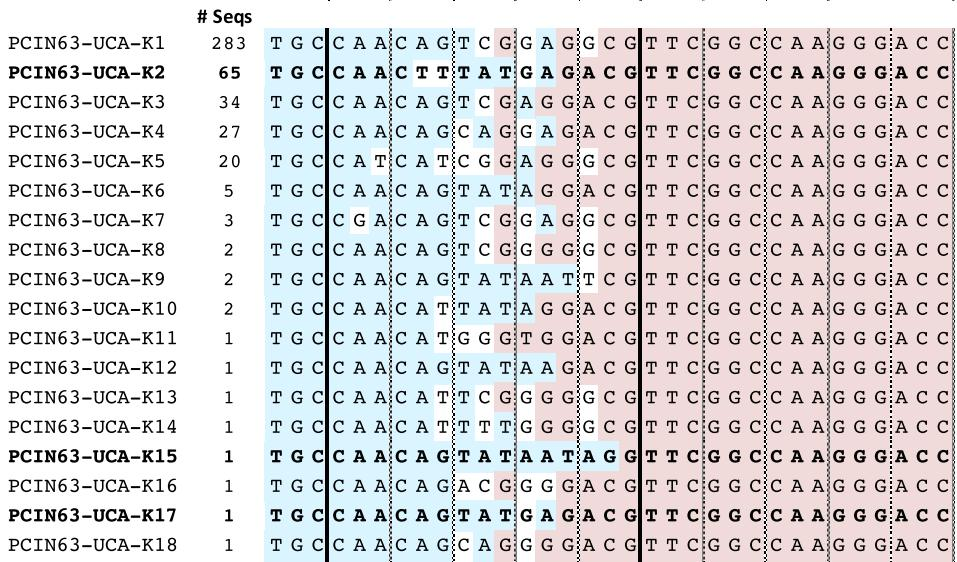

LCDR3 aa seq   

text_image

Q Q S E A
Q L Y E T
Q Q S R T
Q Q Q E T
H H R R L
Q Q Y R T
R Q S E A
Q Q S G A
Q Q Y N S
Q H Y R T
Q H G W T
Q Q Y K T
Q H S G A
Q H F G A
Q Q Y N R
Q Q T G T
Q Q Y E T
Q Q Q G T

B   
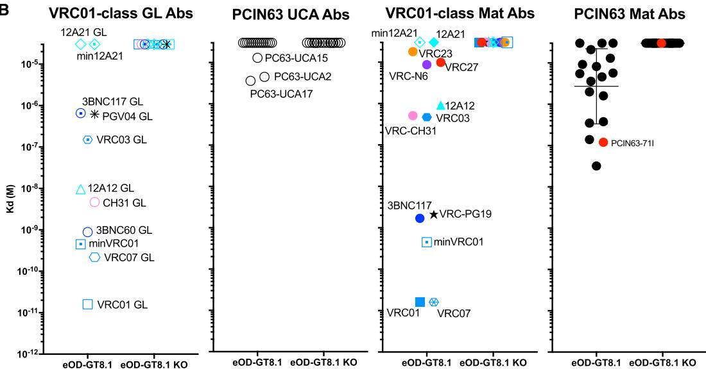

scatter

| Protein Class | Marker | Kd (M) |
| --- | --- | --- |
| 12A21 GL | diamond | ~10^-5 |
| min12A21 | star | ~10^-5 |
| 3BNC117 GL | circle | ~10^-6 |
| PGV04 GL | asterisk | ~10^-6 |
| VRC03 GL | square | ~10^-7 |
| 12A12 GL | triangle | ~10^-8 |
| CH31 GL | pink circle | ~10^-9 |
| 3BNC60 GL | circle | ~10^-9 |
| minVRC01 | square | ~10^-9 |
| VRC07 GL | hexagon | ~10^-9 |
| VRC01 GL | square | ~10^-11 |
| PCIN63 UCA Abs | circle | ~10^-5 to ~10^-7 |
| PCIN63 UCA Abs | circle | ~10^-5 to ~10^-7 |
| PCIN63 UCA Abs | circle | ~10^-5 to ~10^-7 |
| PCIN63 UCA Abs | circle | ~10^-5 to ~10^-7 |
| PCIN63 UCA Abs | circle | ~10^-5 to ~10^-7 |
| PCIN63 UICA Abs | circle | ~10^-5 to ~10^-7 |
| PCIN63 UICA Abs | circle | ~10^-5 to ~10^-7 |
| PCIN63 UICA Abs | circle | ~10^-5 to ~10^-7 |
| PCIN63 UICA Abs | circle | ~10^-5 to ~10^-7 |
| PCIN63 UICA Abs | circle | ~10^5 to ~10^5 |
| PCIN63 UICA Abs | circle | ~10^5 to ~10^5 |
| PCIN63 UICA Abs | circle | ~10^5 to ~10^5 |
| PCIN63 UICA Abs | circle | ~10^5 to ~10^5 |
| PCIN63 UICA Abs | circle | ~10^5 to ~10^5 |
| PCIN63 UCA Abs | circle | ~10^5 to ~10^5 |
| PCIN63 UCA Abs | circle | ~10^5 to ~10^5 |
| PCIN63 UCA Abs | circle | ~10^5 to ~10^5 |
| PCIN63 UCA Abs | circle | ~10^5 to ~10^5 |
| PCIN63 UCA Abs | circle | ~10^-9 to ~10^-9 |
| PCIN63 UCA Abs | circle | ~10^-9 to ~10^-9 |
| PCIN63 UCA Abs | circle | ~10^-9 to ~10^-9 |
| PCIN63 UCA Abs | circle | ~10^-9 to ~10^-9 |
| PCIN63 UCA Abs | circle | ~10^-9 to ~10^-9 |
| PCIN63 UICA Abs | circle | ~10^-9 to ~10^-9 |
| PCIN63 UICA Abs | circle | ~10^-9 to ~10^-9 |
| PCIN63 UICA Abs | circle | ~10^-9 to ~10^-9 |
| PCIN63 UICA Abs | circle | ~10^-9 to ~10^-9 |
| PCIN63 UICA Abs | circle | ~10^5 to ~10^5 |
| PCIN63 UICA Abs | circle | ~10^5 to ~10^5 |
| PCIN63 UICA Abs | circle | ~10^5 to ~10^5 |
| PCIN63 UICA Abs | circle | ~10^5 to ~10^5 |
| PCIN63 UIC Abs | circle | ~10^-5 to ~10^-5 |
| PCIN63 UIC Abs | circle | ~10^-5 to ~10^-5 |
| PCIN63 UIC Abs | circle | ~10^-5 to ~10^-5 |
| PCIN63 UIC Abs | circle | ~10^-5 to ~10^-5 |
| PCIN63 UIC Abs | circle | ~10^-5 to ~10^-5 |
| PCIN63 Malt Abs (eOD-GT8.1) | circle | ~10^-5 to ~10^-5 |
| PCIN63 Malt Abs (eOD-GT8.1) | circle | ~10^-5 to ~10^-5 |
| PCIN63 Malt Abs (eOD-GT8.1) | circle | ~10^-5 to ~10^-5 |
| PCIN63 Malt Abs (eOD-GT8.1) | circle | < 10^-5 to > 10^-5 |
| PCIN63 Malt Abs (eOD-GT8.1) | circle | < 10^-5 to > 10^-5 |
| PCIN63 Malt Abs (eOD-GT8.1) | circle | < 10^-5 to > 10^-5 |
| PCIN63 Malt Abs (eOD-GT8.1) | circle | < 10^-5, < 10^-5, < 10^-5, < 10^-5, < 10^-5, < 10^-5, < 10^-5, < 10^-5, < 10^-5, < 10^-5, < 10^-5, < 10^-5, < 10^-5, < 10^-5, < 10^-5, <<nl>

Figure 3. The Majority of Putative PCIN63 UCAs Do Not Bind eOD-GT8   
(A) Identification of PCIN63 lineage precursor sequences. The CDR3 of putative PCIN63-UCA NGS sequences (100% identity to PCIN63 Abs HC and LC germline V+J genes) are aligned with IMGT $V_{H}1-2*02$ , $D_{H}6*13$ , $J_{H}5*03$ , $V_{K}1-5*03$ , and $J_{K}1*01$ germline genes sequences. The N regions of the junctions are indicated. For

(legend continued on next page)

Pairing the UCA-HC variants with the mature 71I-KC resulted in cross-neutralization of autologous viruses, particularly when HCDR2-motif#2 was introduced to the UCA-HC (Figure 4A, right). The combined LC SHMs alone allowed weaker neutralization of autologous Env lacking the N276-glycan than N276-bearing clones except when paired with the HCDR2-motif#2. In contrast, the UCA-KC2 variants paired with the mature 71I-HC predominantly neutralized viruses lacking the N276 glycan. These observations not only confirm the critical role of LC mutations in accommodating the N276-glycan but also suggest direct dependence on this glycan for binding of early PCIN63 intermediates to autologous Envs. Overall, pairing the UCA/71I-HC variants with the UCA-KC2 yielded broader autologous neutralization than pairing with UCA-KC1 (Figures 4, S5). This observation not only support UCA2 as the natural precursor of the PCIN63 lineage but also confirms an important role for the LCDR3 in elicitation of VRC01-class lineages.

Pairing the UCA-KC2 variants with an intermediate HC containing only HCDR2-motif#2 and HFWR3-motif#3 highlighted the co-dependence of LCDR1-motif4 and LFWR3-motif#6 for neutralization of autologous viruses with PNGS at position N276, with a critical role for D32 $_{LC}$ in LCDR1-motif4 (Figure S4B, middle). The detection of autologous M28cH1 neutralization by almost all Ab variants containing at least one SHM motif suggests it may indeed have been the eliciting variant.

The absence of individual SHM motifs in either the HC or the KC had minimal effects on autologous neutralization when the variants were paired with affinity-mature KC or HC, respectively, indicating redundancy across the SHM motifs for epitope recognition. Although heterologous neutralization was overall correlated with autologous neutralization of N276-glycan bearing viruses, the absence of individual SHM motifs had greater impact on heterologous neutralization, which was most significantly reduced in absence of LCDR1-motif#4. In summary, SHM in HCDR2-motif#2, LCDR1-motif#4 and LFWR3-motif#6 are sufficient for autologous neutralization of variant bearing the N276-glycan by PCIN63 Abs.

# PCIN63 bnAbs Engage the N276-Glycan of Some Env Strains

To better understand how the PCIN63 antibody lineage might interact with the N276 and other surrounding glycans, we next tested neutralization against heterologous viruses and their corresponding N276A mutants. The data revealed a hierarchy in the importance of glycans for neutralization by PCIN63 Abs, with N276 ≥ N197 > N262 ≈ N301 > N462/N463 > N448 (Figure S6). This trend is generally consistent with the effects observed for other VRC01-class bnAbs, particularly 12A21 and other Abs bearing a glycine-rich LCDR1 loop (VRC23, VRC27, VRC-CH31) with the exception of VRC-N6 (Figure S6, Table S5). We also observed significant variation between viral strains in their sensitivity to PCIN63 neutralization, as well as between PCIN63 mAbs in their ability to neutralize a given viral strain (Figure 5A). These variations were still apparent, although to a lesser extent, when pseudoviruses were produced in GnT I $^{-/-}$ cells (293-S) yielding predominantly Man5 glycans on HIV Env (Figure 5A) (Doores and Burton, 2010). The negative effect of glycan removal on neutralization for some viral strains by PCIN63 Abs was greater for N276 than other glycans and suggests that the Abs may directly depend on the N276-glycan for binding or neutralization in the context of some Env strains such as JR-CSF (Figure 5A). We evaluated other components of the epitope including surrounding glycans as well as key contact residues on Env and observed a general trend toward dependence on the N276-glycan when other obstructive features are present (JR-CSF) but accommodation of the N276 glycan when surrounding obstructive features are missing (JR-FL), such as the N461-glycan and the lack of N197- and N234-glycans (Figure 5A). We next determined whether there were shared motifs that lead to dependence or accommodation of the N276 glycan. An alignment of the PCIN63 antibody sequences that are or are not dependent on the N276-glycan revealed that the subset of PCIN63 antibodies that accommodate the N276 glycan share similar sequence features as the 12A21 antibody (Figure 5B). The N276-glycan dependent PCIN63 Abs carried SHM motifs possibly sub-optimal for high-affinity contacts with the CD4bs loop (non-aromatic residue N54 $_{HC}$ ) and V5 loop (Y61 $_{HC}$ ), while N276-glycan accommodating PCIN63 mAbs displayed a fourth Gly residues in LCDR1-motif#4 (G34 $_{LC}$ ) and a more canonical LCDR3-motif#7 with aromatic residues at position 91 and 97 optimal for loop D and V5 loop binding (Figure 5B). Additionally, all PCIN63 mAbs also carried R/W19 $_{HC}$ and E/D76 $_{HC}$ mutations possibly involved in N197-glycan interactions. Further corroborating the difference in antibody subsets, we also observed that PCIN63 Abs with N276-glycan dependent or accommodating phenotypes clustered in separate branches of the lineage phylogenetic trees suggesting divergent evolution in response to the N276-glycan for this lineage (Figure S3D). Overall, these observations suggest a greater dependence on direct contact with the N276-glycan when the CD4bs loop is less accessible and Env protein contacts sub-optimal.

# DISCUSSION

The exceptional breadth of VRC01-class bnAbs and their commonly shared features have long made them favored targets for rational vaccine design (Wu et al., 2010; Zhou et al., 2015). Despite major progress in the isolation and characterization of VRC01-class antibodies and the design of immunogens to prime VRC01-class precursors by immunization, the field has yet to elicit VRC01-class antibodies by immunization (Jardine et al., 2013; McGuire et al., 2013; Dosenovic et al., 2015; Jardine et al., 2015; Briney et al., 2016b; McGuire et al., 2016; Sok et al., 2016; Tian et al., 2016). Among other challenges, antibodies of this class can be up to $40\%$ mutated from germline suggesting that during infection, VRC01-class antibodies require

bar_line

| Protein        | UCA-KC1 (% Breadth Global Panel) | UCA-KC2 (% Breadth Global Panel) | 71I-KC (% Breadth Global Panel) |
|----------------|----------------------------------|----------------------------------|---------------------------------|
| UCA-HC         | FR1, CDR1, FR2, CDR2, FR3              | N276-glycan (+)                  | N276-glycan (-)                |
| UCA-HCmut      | R19, #1, #2, #3                     | M9s036 WT                        | M9s036 N276A                   |
| UCA-HCmut      | D76                              | M11s123 WT                      | M11s123 N276A                 |
| 71I-HCrev       | R19, #1, #2, #3                     | M28cB11 WT                      | M28cH1 WT                       |
| 71I-HC         | D76                              | M28cG1 WT                       | No neutral                      |

  
(legend on next page)

long periods of affinity maturation to target the occluded epitope that is surrounded by glycans on the HIV Env trimer (Huang et al., 2016; Sajadi et al., 2018). The glycan at N276 in particular has been previously described to be a key impediment for VRC01-class antibodies to target the CD4bs (Kong et al., 2016), and its removal has been shown to enhance the binding and neutralization activity of antibodies of this class. NGS analysis of VRC01 lineage ontogeny using longitudinal samples collected 5–20 years after infection indeed revealed a complex multi-branched lineage (Wu et al., 2015). However, late sampling only captured lineage sequences that were heavily mutated preventing the reconstruction of the early stages of VRC01 elicitation and maturation. Here, we describe the first complete longitudinal analysis of VRC01-class antibodies affinity maturation from elicitation to acquisition of neutralization breadth in natural infection. The findings also challenge the current strategies relying on glycan-deleted immunogens to select for Ab with glycan avoiding features and suggest that transient direct glycan-binding may help driving affinity maturation toward broad glycan accommodation.

Despite the number of VRC01-class mAbs isolated to date, the field has relied on reverted-germline Abs as templates for vaccine design, which were inferred either by phylogeny of B cell transcripts at a single time point or by reverting the V and J genes and approximating the HCDR3 of mature bnAbs (Jardine et al., 2013; McGuire et al., 2013; Jardine et al., 2015; Dosenovic et al., 2015; Briney et al., 2016b; McGuire et al., 2016; Bonsignori et al., 2018). Indeed, the uncertainty in determining the PCIN63 lineage precursor light chain despite the availability of contemporaneous samples reveal the importance of small LCDR3 variations on antibody binding, which highlights how sequence approximations could lead to different interpretations of germline antibody binding. We note in the case of PCIN63, both binding to eOD-GT8 and the weak neutralizing activity detected against the M28cH1 glycan-lacking variants by UCA2 chimeric Abs compared to UCA1 suggest but do not formerly validate UCA2 as the true PCIN63 precursor.

Previous studies reported that VRC01-class bnAbs require more time (>5 years) to develop during infection than bnAbs targeting other Env epitopes (1–3 years) (Landais et al., 2016; Lynch et al., 2012), a hypothesis supported by the high frequency of SHMs typically found among VRC01-class antibodies (Figure 1). While there was indeed a late onset for the PCIN63 antibody lineage, neutralization breadth for this lineage was acquired in less than 2 years and isolated mAbs from these time points showed only 10%–15% mutation from germline, which is 2- to 3-fold lower than typical VRC01-class antibodies. PCIN63 is the second VK1-5+ VRC01-subclass bnAb lineage isolated to date (Sajadi et al., 2018). Together with the recent finding that the VK1-5+ subclass of potential VRC01-class precursors were nearly as common as the most frequent VK3-20+ eOD-GT8-specific B cells in naive donor repertoires (Havenar-Daughton et al., 2018), this suggest (1) that the naive B cells isolated using germline-targeting immunogens may indeed represent true bnAbs precursors and (2) that this particular subclass of bnAbs may serve as a favorable target for vaccine design. Furthermore, evaluation of factors that might have favored the elicitation and focused affinity maturation of the PCIN63 lineage in donor PC063, i.e., frequencies of VRC01-class precursors and biased AID hotspots (see Methods) favoring affinity maturation at key contact residues, showed no significant differences compared to other donors. This suggests that similar focused maturation of PCIN63-like antibodies, with more classical features compared to other bnAbs of this class, might be readily achievable by vaccination.

To inform VRC01-class antibodies targeting vaccine strategies, we thus phylogenetically retraced the evolution of key SHM motifs and functionally tested their contribution to autologous and heterologous neutralization. The observation that PCIN63 lineage heavy chain sampled a greater sequence diversity compared to the light chain is consistent with a stringent selection pressure on the light chain to accommodate glycans surrounding the CD4bs followed by honing of the antibody-epitope interactions through gradual selection of affinity mutations in the heavy chain. Previous studies demonstrated that VRC01-class bnAbs SHM in the LC specifically were critical for the adaptation to the N276- and V5-loop glycans and are required for neutralization breadth. Accordingly, most immunization strategies are designed to prime VRC01-class precursors with immunogens lacking these glycans (eOD-GT8, 426c and donor NIH-45 Env derived molecules). In these studies, the Abs elicited by glycan-lacking priming immunogens typically cannot bind or neutralize Env constructs with the N276-glycan present. The responses are then typically boosted with more native-like Env proteins incrementally incorporating glycans to select for HC and LC mutations that enable binding in the presence of the N276 glycan. However, this strategy has only shown success in models where precursor frequencies are high or when the animal model contains an affinity-mature VRC01-class heavy- or light-chain gene (Briney et al., 2016b; Dosenovic et al., 2015; Jardine et al., 2015; McGuire et al., 2016; Sok et al., 2016; Tian et al., 2016).

Here we showed that UCA-HC/mature-KC chimeric Ab displayed weak neutralizing activity of the N276-glycan bearing autologous clones but not of their N276-glycan KO counterpart suggesting that direct engagement of the N276-glycan may

Figure 4. SHM Motifs in HCDR2, LCDR1, and LFWR3 Are Sufficient for Autologous Neutralization of N276-glycan Bearing Viral Variants

Chimeric Abs were tested for neutralization of the indicated WT and N276A autologous Env clones sensitive to neutralization by PCIN63-71I and against the global 12-virus panel (deCamp et al., 2014). Autologous neutralization IC $_{50}$ are plotted with symbols according to the legend, and neutralization breadth (percentage of viruses neutralized) on the global panel is indicated with a red line.

(A) PCIN63-71I HC were either introduced into the PCIN63-UCA-HC (mut) or reverted to germline (rev). SHM motifs are color-coded as in Figure 2B and their position is indicated with diagrams. Mutated constructs were paired with WT PCIN63-UCA-KC1 (left), PCIN63-UCA-KC2 (middle), or PCIN63-71I (right) LC and tested for neutralization.   
(B) PCIN63-71I-KC SHM motifs (as defined in Figure 2B) were introduced into the PCIN63-UCA-KC2, individually or in combination. Motifs are color-coded and their sequence position is indicated with a diagram. Mutated constructs were paired with WT PCIN63-UCA (left), PCIN63-UCA+Motif#2+Motif#3 (middle) or PCIN63-71I (right) HC. See also Figure S5. Data are representative of at least two experiments.

  
B

text_image

HC FR1 CDR1 FR2 CDR2 FR3 LC FR1 CDR1 FR2 CDR2 FR3 CDR3
#1 #2 #3 #4 #5 #6 #7
Motif 1 Motif 2 Motif 3 Motif 4 Motif 5 Motif 6 Motif 7
30 31 32 33 34 37 53 54 56 57 61 62 26 28 30 32 34 49 53 55 56 67 68 59 90 91 96 97
TNY | LW VFAV RQ GGGSN HNQR FH AVFQW
NSCL | W LHAY HQ GGGDG HN IN FH QVFEW
TTY F NH AH YG S M K F TAD G A Y E S
TSCY | F | NAN YQ GGGDA FNKN FH QVLET
SA HK S G G R R
12A21 PCIN63 Abs N276-glycan accommodating PCIN63 Abs N276-glycan dependent

Figure 5. Neutralization of PCIN63 and Other VRC01-Class Antibodies Is Strain-Specifically N276-Glycan Dependent   
(A) Fold decrease in neutralization $IC_{50}$ of PCIN63 Abs (lower panel) and the listed VRC01-class Abs (upper panel) for N276A mutant of the indicated pseudotyped Env strains produced in 293-T or 293-S (Gtnl $^{-/-}$ ) cells compared to WT. The geomean with SD are shown. Relevant features of the selected Env strains are indicated above. Symbols are color-coded according to the permissive (blue) versus obstructive (red) potential regarding access to the CD4bs. See also Figure S6. Data are representative of at least two experiments.   
(B) Logogram of the PCIN63 SHM motifs amino acid sequences for PCIN63 Abs segregated according to their sensitivity to N276-glycan removal (A) and compared to corresponding sequences of 12A12, 12A21, and min12A21 Abs. Residues common to 12A21 and PCIN63 N276-glycan accommodating Abs are colored in red. Residues shared between 12A21 and all PCIN63 Abs are colored in blue. SHM motifs are color-coded as in Figure 2 and their position is indicated with diagrams. See also Figures S2, S6, Table S5.

text_image

A
N362-glyc
N197-glyc
PROTOMER#2
R19HC
CD4bs loop
D76HC
N301-glyc
N462
V5-loop
Loop D
S25HC
K65
N262-glyc
N276-glyc
E62
N234-glyc
N448-glyc

bar_line

| Gene/Region       | Value |
| ----------------- | ----- |
| Motif2 – HCDR2    | CD4bs loop |
| Motif5 – LCDR2    | E62   |
| Motif3 – HFR3     | V5 Loop |
| Motif1 – HCDR1    | HCDR2 Stabilization |
| Motif4 – LCDR1   | N276-glycan |
| Motif6 – LFR3     | N276-glycan |
| Motif7 – CDR3     | Loop D |
| Viral Load        | Neutralization score |
| Lineage Frequency | Lineage Frequency |
| R19               | -     |
| #1                | -     |
| #2                | -     |
| #3                | -     |
| D76               | -     |

Figure 6. Modeling of PCIN63 bnAb Env Contacts Support a Possible Role of Glycan Interactions during Maturation and Lineage CD4bs Immunofocusing   
(A) In silico modeling of 12A21 bound to BG505 SOSIP.664 using the published structures of 12A21 bound to gp120 (PDB ID: 4JPW) (Klein et al., 2013) and glycosylated BG505 SOSIP.664 bound to 35O22 and PGT122 (PDB ID: 6DE7) (Zhang et al., 2018). Two of the three Env protomers are displayed in shades of gray as transparent surfaces highlighting the CD4bs loop (red), loop D (orange), the V5 loop (yellow) on one protomer and other putative contact residues (cyan) on the second protomer. Glycans surrounding the CD4bs protruding from both protomers are shown as brown spheres and labeled. 12A21 HC and LC residues corresponding to PCIN63 SHM motifs are shown as ribbon and color-coded as defined in Figure 2B and represented in a diagram (B). Additional motifs in HFR1 (aa19-25 – pink) and HFWR3 (aa71-76 – brown) are also highlighted.   
(B) PC63 infection timeline summary showing the evolution of viral load (red), serum neutralization breadth-potency (score, blue), and overall PCIN63 Ab lineage frequency in the periphery (green line). PCIN63 Ab lineage maturation is further detailed above for each SHM motif as shaded bars from unmutated (white) to fully mature (full motif-specific color) according to the kinetic analysis detailed in Figure 2. Putative functional impact of SHM motifs maturation regarding contact with Env (gray filled boxes) or internal structural stabilization (open boxes) inferred from the model in (A) are shown color-coded accordingly.

have facilitated binding. The lineage then affinity matures into two main branches, where one remains dependent on the N276 glycan for binding and the other gaining affinity for the CD4bs epitope in the absence of the N276 glycan. Together with the recent finding that VRC01 inferred GL Ab interacted with the N276-glycan of 426c gp120 core lacking the V1-V2-V3 loops (Borst et al., 2018), these data suggest an alternative vaccine design strategy where the N276-glycan is present on the germline-targeting immunogens at the initial priming stages to select for early intermediates with glycan-binding properties, which could be subsequently boosted with immunogens to affinity mature intermediate precursors to relinquish dependency on the glycan and acquire higher affinity for the CD4bs epitope. A similar strategy was suggested for V2-apex directed Abs upon observation that varying affinities for particular glycoforms were associated with the elicitation of the PCT64 lineage (Landais et al., 2017, Rantalainen et al., 2018).

To better understand the putative interactions between PCIN63 Abs and the Env trimer, we constructed an in silico model of 12A21 bound to BG505 SOSIP.664 using independently published structures (Klein et al., 2013; Zhang et al., 2018) (Figure 6). This model suggests contacts between E62 and CDR2-N57 $_{HC}$ , and N279 and CDR3-E96 $_{LC}$ consistent with the strain-specific N276-glycan dependent variations observed in Figure 5A. Together with the evidence of early N276-glycan binding and significant toggling of the HCDR2-motif#2, this model suggests that PCIN63 Abs maturation pathway required a fine balance between glycan avoidance to better access the CD4bs loop and Loop D contact residues, and direct glycan binding to counter lower affinity of early viral intermediates evolving to escape autologous Ab responses. While acquiring a deletion in LCDR1 to avoid the N276-glycan, as seen in most VRC01-class Abs, might be more difficult to reproduce by vaccination, our data suggest that immunization strategies should not focus on glycan-deleted immunogens alone to drive affinity maturation of this lineage.

The trajectory for affinity maturation to broadly neutralizing antibodies in natural infection follows complex pathways with many “dead-ends” (Bhiman et al., 2015; Sok et al., 2014) that may be avoided with more focused and targeted rational vaccine design strategies. The isolation of the PCIN63 bnAbs and the identification of their UCA will enable the development of a germline mouse model for a CD4bs lineage known to develop broadly neutralizing activity. Finally, the identification of antibody intermediates and viral sequences will enable the evaluation of candidate boosts to refine immunization schemes that might drive such responses by vaccination.

# STAR★METHODS

Detailed methods are provided in the online version of this paper and include the following:

● KEY RESOURCES TABLE   
- CONTACT FOR REAGENT AND RESOURCES SHARING   
● EXPERIMENTAL MODEL AND SUBJECT DETAILS   
○ Human samples   
○ Cell Lines

# ● METHODS DETAILS

○ Single memory B cell sorting and isolation of PCIN63 monoclonal antibodies   
○ PCIN63 antibody expression and purification   
○ B cell repertoire next generation sequencing and computational analysis   
○ AID hotspots analysis   
○ Single genome amplification (SGA), sequencing and cloning   
○ Full-length env amplification sequencing and computational analysis   
○ Neutralization assay   
○ Serum adsorptions   
○ Surface plasmon resonance (SPR)   
○ ELISA assays   
● QUANTIFICATION AND STATISTICAL ANALYSIS   
● DATA AND CODE AVAILABILITY

# SUPPLEMENTAL INFORMATION

Supplemental Information can be found online at https://doi.org/10.1016/j.immuni.2019.06.004.

# CONSORTIA

The IAVI Protocol C Investigators Susan Allen (Emory University, USA and ZERHP, Zambia), William Kilembe (ZEHRP, Zambia), Shabir Lakhi (ZEHRP, Zambia), Mubiana Inambao (ZEHRP, Zambia), Etienne Karita (Rwanda-Zambia HIV Research Group, Project San Francisco, Kigali, Rwanda), Anatoli Kamali (MRC/UVRI Uganda), Eduard J. Sanders (KEMRI, Kenya and Oxford University, UK), Omu Anzala (KAVI, Kenya), Vinodh Edward (The Aurum Institute, South Africa), Linda-Gail Bekker (Cape Town University, South Africa), Jianming Tang (University of Alabama Birmingham, USA). The IAVI African HIV Research Network also includes Jill Gilmour (IAVI and London Imperial College, UK), Eric Hunter (Emory University, USA), Matt Price (IAVI and University of California San Francisco, USA).

# ACKNOWLEDGMENTS

IAVI's work is made possible by generous support from many donors including: the Bill & Melinda Gates Foundation, the Ministry of Foreign Affairs of Denmark, Irish Aid, the Ministry of Finance of Japan in partnership with The World Bank, the Ministry of Foreign Affairs of the Netherlands, the Norwegian Agency for Development Cooperation (NORAD), the United Kingdom Department for International Development (DFID), and the United States Agency for International Development (USAID). The full list of IAVI donors is available at www.iavi.org. This study was made possible by the generous support of the American people through USAID. The contents are the responsibility of the International AIDS Vaccine Initiative and do not necessarily reflect the views of USAID or the United States Government. This work was also supported by National Institute of Health (NIH) Center for HIV/AIDS Vaccine Immunology and Immunogen Discovery Grant UM1AI100663 to BB, DS and DRB, as well as the International AIDS Vaccine Initiative Neutralizing Antibody Consortium through the Collaboration for AIDS Vaccine Discovery grants OPP1084519 and OPP1115782. BM was supported by grants R00AI120851 and UM1AI068618 from the National Institute of Allergy and Infectious Diseases (NIAID). The content is solely the responsibility of the authors and does not necessarily represent the official views of NIH. P.L.M. is supported by the South African Research Chairs Initiative of the Department of Science and Technology and National Research Foundation of South Africa (Grant No 98341). The content is solely the responsibility of the authors and does not necessarily represent the official views of the National Institute of Allergy and Infectious Diseases, the National Institute of General Medical Sciences or the National Institutes of Health.

PacBio SMRT sequencing was performed with the support of the Translational Virology Core at the UC San Diego Center for AIDS Research (P30 AI036214), and the IGM Genomics Center, University of California, San Diego, La Jolla, California. We are very grateful to and thank all of the Protocol C participants and clinical investigators, as well as all of the Protocol C project team members for all of the support provided for this study, particularly Matt Price (IAVI and University of California San Francisco, USA), Brendan McAtarsney (London Imperial College, UK) and Jonathan Hare (IAVI and London Imperial College, UK) for clinical data management and coordinating the samples transfers and shipments for this study. Finally we would like to express our gratitude to Christina Corbaci (The Scripps Research Institute, CA, USA) for her expert assistance in the design of the graphical abstract.

# AUTHORS CONTRIBUTIONS

Conceptualization: S. Menis, W.K., I.P.C.I. & I.A.H.R.N., P.P., B.M., P.L.M., B. Briney, D.S., and E.L. Methodology: S. Menis, B.M., P.L.M. and E.L. Software: C.J., S. Menis, B.M. and B. Briney. Validation: E.L. Formal Analysis: J.U., B. Bagaya, C.J., T.S., B.M., P.L.M., B. Briney, and E.L. Investigation: J.U., B. Bagaya, C.J., T.S., K.F.-S., T.B., S. Mohan, T.V., O.K., S. Madzorera, D.K., B.L., M.N., and E.L. Resources: W.K., I.P.C.I. & I.A.H.R.N., W.R.S., D.R.B., and E.L. Data Curation: B.M., B. Briney, and E.L. Writing – Original Draft: J.U., B. Briney, and E.L. Writing – Review & Editing: J.U., B. Bagaya, W.R.S., D.R.B., B.M., P.L.M., B. Briney, D.S., and E.L. Visualization: J.U., T.S., S. Menis, B.M., B. Briney, D.S., and E.L. Supervision: T.S., B.M., P.L.M., B. Briney, D.S., and E.L. Project Administration: E.L. Funding Acquisition: W.R.S., D.R.B., B.M., P.L.M., B. Briney, D.S., and E.L.

# DECLARATION OF INTERESTS

Some authors have filed a patent application whose subject matter relates to this work.

Received: November 20, 2018

Revised: March 31, 2019

Accepted: June 6, 2019

Published: July 16, 2019

# REFERENCES

Bhiman, J.N., Anthony, C., Doria-Rose, N.A., Karimanzira, O., Schramm, C.A., Khoza, T., Kitchin, D., Botha, G., Gorman, J., Garrett, N.J., et al. (2015). Viral variants that initiate and drive maturation of V1V2-directed HIV-1 broadly neutralizing antibodies. Nat. Med. 21, 1332–1336.

Bonsignori, M., Zhou, T., Sheng, Z., Chen, L., Gao, F., Joyce, M.G., Ozorowski, G., Chuang, G.-Y., Schramm, C.A., Wiehe, K., et al.; NISC Comparative Sequencing Program (2016). Maturation Pathway from Germline to Broad HIV-1 Neutralizer of a CD4-Mimic Antibody. Cell 165, 449–463.

Bonsignori, M., Kreider, E.F., Fera, D., Meyerhoff, R.R., Bradley, T., Wiehe, K., Alam, S.M., Aussedat, B., Walkowicz, W.E., Hwang, K.-K., Saunders, K.O., Zhang, R., Gladden, M.A., Monroe, A., Kumar, A., Xia, S.-M., Cooper, M., Louder, M.K., McKee, K., Bailer, R.T., Pier, B.W., Jette, C.A., Kelsoe, G., Williams, W.B., Morris, L., Kappes, J., Wagh, K., Kamanga, G., Cohen, M.S., Hraber, P.T., Montefiori, D.C., Trama, A., Liao, H.-X., Kepler, T.B., Moody, M.A., Gao, F., Danishefsky, S.J., Mascola, J.R., Shaw, G.M., Hahn, B.H., Harrison, S.C., Korber, B.T., and Haynes, B.F. (2017). Staged induction of HIV-1 glycan-dependent broadly neutralizing antibodies. Sci. Trans. Med. 9, eaai7514.

Bonsignori, M., Scott, E., Wiehe, K., Easterhoff, D., Alam, S.M., Hwang, K.-K., Cooper, M., Xia, S.-M., Zhang, R., Montefiori, D.C., et al. (2018). Inference of the HIV-1 VRC01 Antibody Lineage Unmutated Common Ancestor Reveals Alternative Pathways to Overcome a Key Glycan Barrier. Immunity 49, 1162–1174.e8.

Borst, A.J., Weidle, C.E., Gray, M.D., Frenz, B., Snijder, J., Joyce, M.G., Georgiev, I.S., Stewart-Jones, G.B., Kwong, P.D., McGuire, A.T., DiMaio, F., Stamatatos, L., Pancera, M., and Veesler, D. (2018). Germline VRC01 antibody recognition of a modified clade C HIV-1 envelope trimer and a glycosylated HIV-1 gp120 core. eLife 7, 37688.

Briney, B., Le, K., Zhu, J., and Burton, D.R. (2016a). Clonify: unseeded antibody lineage assignment from next-generation sequencing data. Sci. Rep. 6, 23901.   
Briney, B., Sok, D., Jardine, J.G., Kulp, D.W., Skog, P., Menis, S., Jacak, R., Kalyuzhniy, O., de Val, N., Sesterhenn, F., et al. (2016b). Tailored Immunogens Direct Affinity Maturation toward HIV Neutralizing Antibodies. Cell 166, 1459–1470.e11.   
deCamp, A., Hraber, P., Bailer, R.T., Seaman, M.S., Ochsenbauer, C., Kappes, J., Gottardo, R., Edlefsen, P., Self, S., Tang, H., et al. (2014). Global panel of HIV-1 Env reference strains for standardized assessments of vaccine-elicited neutralizing antibodies. J. Virol. 88, 2489–2507.   
Doores, K.J., and Burton, D.R. (2010). Variable loop glycan dependency of the broad and potent HIV-1-neutralizing antibodies PG9 and PG16. J. Virol. 84, 10510–10521.   
Dosenovic, P., von Boehmer, L., Escolano, A., Jardine, J., Freund, N.T., Gitlin, A.D., McGuire, A.T., Kulp, D.W., Oliveira, T., Scharf, L., et al. (2015). Immunization for HIV-1 Broadly Neutralizing Antibodies in Human Ig Knockin Mice. Cell 161, 1505–1515.   
Edgar, R.C. (2010). Search and clustering orders of magnitude faster than BLAST. Bioinformatics 26, 2460–2461.   
Eren, K., Weaver, S., Ketteringham, R., Valentyn, M., Laird Smith, M., Kumar, V., Mohan, S., Kosakovsky Pond, S.L., and Murrell, B. (2018). Full-Length Envelope Analyzer (FLEA): A tool for longitudinal analysis of viral amplicons. PLoS Comput. Biol. 14, e1006498.   
Falkowska, E., Ramos, A., Feng, Y., Zhou, T., Moquin, S., Walker, L.M., Wu, X., Seaman, M.S., Wrin, T., Kwong, P.D., et al. (2012). PGV04, an HIV-1 gp120 CD4 binding site antibody, is broad and potent in neutralization but does not induce conformational changes characteristic of CD4. J. Virol. 86, 4394–4403.   
Fauci, A.S. (2017). An HIV Vaccine Is Essential for Ending the HIV/AIDS Pandemic. JAMA 318, 1535–1536.   
Gao, F., Robertson, D.L., Morrison, S.G., Hui, H., Craig, S., Decker, J., Fultz, P.N., Girard, M., Shaw, G.M., Hahn, B.H., and Sharp, P.M. (1996). The heterosexual human immunodeficiency virus type 1 epidemic in Thailand is caused by an intersubtype (A/E) recombinant of African origin. J. Virol. 70, 7013–7029.   
Havenar-Daughton, C., Sarkar, A., Kulp, D.W., Toy, L., Hu, X., Deresa, I., Kalyuzhniy, O., Kaushik, K., Upadhyay, A.A., Menis, S., Landais, E., Cao, L., Diedrich, J.K., Kumar, S., Schiffner, T., Reiss, S.M., Seumois, G., Yates, J.R., Paulson, J.C., Bosinger, S.E., Wilson, I.A., Schief, W.R., and Crotty, S. (2018). The human naive B cell repertoire contains distinct subclasses for a germline-targeting HIV-1 vaccine immunogen. Sci. Transl. Med. 10, eaat0381.   
Huang, J., Kang, B.H., Ishida, E., Zhou, T., Griesman, T., Sheng, Z., Wu, F., Doria-Rose, N.A., Zhang, B., McKee, K., et al. (2016). Identification of a CD4-Binding-Site Antibody to HIV that Evolved Near-Pan Neutralization Breadth. Immunity 45, 1108–1121.   
Huerta-Cepas, J., Dopazo, J., and Gabaldón, T. (2010). ETE: a python Environment for Tree Exploration. BMC Bioinformatics 11, 24.   
Jardine, J., Julien, J.-P., Menis, S., Ota, T., Kalyuzhniy, O., McGuire, A., Sok, D., Huang, P.-S., MacPherson, S., Jones, M., et al. (2013). Rational HIV immunogen design to target specific germline B cell receptors. Science 340, 711–716.   
Jardine, J.G., Ota, T., Sok, D., Pauthner, M., Kulp, D.W., Kalyuzhniy, O., Skog, P.D., Thinnes, T.C., Bhullar, D., Briney, B., et al. (2015). HIV-1 VACCINES. Priming a broadly neutralizing antibody response to HIV-1 using a germline-targeting immunogen. Science 349, 156–161.   
Jardine, J.G., Kulp, D.W., Havenar-Daughton, C., Sarkar, A., Briney, B., Sok, D., Sesterhenn, F., Ereño-Orbea, J., Kalyuzhniy, O., Deresa, I., et al. (2016a). HIV-1 broadly neutralizing antibody precursor B cells revealed by germline-targeting immunogen. Science 351, 1458–1463.   
Jardine, J.G., Sok, D., Julien, J.-P., Briney, B., Sarkar, A., Liang, C.-H., Scherer, E.A., Henry Dunand, C.J., Adachi, Y., Diwanji, D., et al. (2016b). Minimally Mutated HIV-1 Broadly Neutralizing Antibodies to Guide Reductionist Vaccine Design. PLoS Pathog. 12, e1005815.

Katoh, K., Kuma, K., Toh, H., and Miyata, T. (2005). MAFFT version 5: improvement in accuracy of multiple sequence alignment. Nucleic Acids Res. 33, 511–518.   
Katoh, K., and Standley, D.M. (2013). MAFFT multiple sequence alignment software version 7: improvements in performance and usability. Mol. Biol. Evol. 30, 772–780.   
Klein, F., Diskin, R., Scheid, J.F., Gaebler, C., Mouquet, H., Georgiev, I.S., Pancera, M., Zhou, T., Incesu, R.-B., Fu, B.Z., et al. (2013). Somatic mutations of the immunoglobulin framework are generally required for broad and potent HIV-1 neutralization. Cell 153, 126–138.   
Kong, L., Ju, B., Chen, Y., He, L., Ren, L., Liu, J., Hong, K., Su, B., Wang, Z., Ozorowski, G., et al. (2016). Key gp120 Glycans Pose Roadblocks to the Rapid Development of VRC01-Class Antibodies in an HIV-1-Infected Chinese Donor. Immunity 44, 939–950.   
Kraus, M.H., Parrish, N.F., Shaw, K.S., Decker, J.M., Keele, B.F., Salazar-Gonzalez, J.F., Grayson, T., McPherson, D.T., Ping, L.-H., Anderson, J.A., et al. (2010). A rev1-vpu polymorphism unique to HIV-1 subtype A and C strains impairs envelope glycoprotein expression from rev-vpu-env cassettes and reduces virion infectivity in pseudotyping assays. Virology 397, 346–357.   
Laird Smith, M., Murrell, B., Eren, K., Ignacio, C., Landais, E., Weaver, S., Phung, P., Ludka, C., Hepler, L., Caballero, G., et al.; IAVI Protocol C Investigators & The IAVI African HIV Research Network (2016). Rapid sequencing of complete env genes from primary HIV-1 samples. Virus Evol. 2, vew018.   
Landais, E., Huang, X., Havenar-Daughton, C., Murrell, B., Price, M.A., Wickramasinghe, L., Ramos, A., Bian, C.B., Simek, M., Allen, S., et al. (2016). Broadly Neutralizing Antibody Responses in a Large Longitudinal Sub-Saharan HIV Primary Infection Cohort. PLoS Pathog. 12, e1005369.   
Landais, E., Murrell, B., Briney, B., Murrell, S., Rantalainen, K., Berndsen, Z.T., Ramos, A., Wickramasinghe, L., Smith, M.L., Eren, K., et al.; IAVI Protocol C Investigators; IAVI African HIV Research Network (2017). HIV Envelope Glycoform Heterogeneity and Localized Diversity Govern the Initiation and Maturation of a V2 Apex Broadly Neutralizing Antibody Lineage. Immunity 47, 990–1003.e9.   
Lefranc, M.-P., Giudicelli, V., Ginestoux, C., Jabado-Michaloud, J., Folch, G., Bellahcene, F., Wu, Y., Gemrot, E., Brochet, X., Lane, J., Regnier, L., Ehrenmann, F., Lefranc, G., and Duroux, P. (2009). IMGT®, the international ImMunoGeneTics information system®. Nucleic Acids Res. 37, D1006–D1012.   
Li, Y., Migueles, S.A., Welcher, B., Svehla, K., Phogat, A., Louder, M.K., Wu, X., Shaw, G.M., Connors, M., Wyatt, R.T., and Mascola, J.R. (2007). Broad HIV-1 neutralization mediated by CD4-binding site antibodies. Nat. Med. 13, 1032–1034.   
Li, Y., Svehla, K., Louder, M.K., Wycuff, D., Phogat, S., Tang, M., Migueles, S.A., Wu, X., Phogat, A., Shaw, G.M., et al. (2009). Analysis of neutralization specificities in polyclonal sera derived from human immunodeficiency virus type 1-infected individuals. J. Virol. 83, 1045–1059.   
Li, Y., O'Dell, S., Wilson, R., Wu, X., Schmidt, S.D., Hogerkorp, C.M., Louder, M.K., Longo, N.S., Poulsen, C., Guenaga, J., et al. (2012). HIV-1 neutralizing antibodies display dual recognition of the primary and coreceptor binding sites and preferential binding to fully cleaved envelope glycoproteins. J. Virol. 86, 11231–11241.   
Lynch, R.M., Tran, L., Louder, M.K., Schmidt, S.D., Cohen, M., Dersimonian, R., Euler, Z., Gray, E.S., Abdool Karim, S., Kirchherr, J., et al.; CHAVI 001 Clinical Team Members (2012). The development of CD4 binding site antibodies during HIV-1 infection. J. Virol. 86, 7588–7595.   
MacLeod, D.T., Choi, N.M., Briney, B., Garces, F., Ver, L.S., Landais, E., Murrell, B., Wrin, T., Kilembe, W., Liang, C.-H., et al.; IAVI Protocol C Investigators & The IAVI African HIV Research Network (2016). Early Antibody Lineage Diversification and Independent Limb Maturation Lead to Broad HIV-1 Neutralization Targeting the Env High-Mannose Patch. Immunity 44, 1215–1226.   
Masella, A.P., Bartram, A.K., Truszkowski, J.M., Brown, D.G., and Neufeld, J.D. (2012). PANDAseq: paired-end assembler for illumina sequences. BMC Bioinformatics 13, 31.

McGuire, A.T., Hoot, S., Dreyer, A.M., Lippy, A., Stuart, A., Cohen, K.W., Jardine, J., Menis, S., Scheid, J.F., West, A.P., et al. (2013). Engineering HIV envelope protein to activate germline B cell receptors of broadly neutralizing anti-CD4 binding site antibodies. J. Exp. Med. 210, 655–663.   
McGuire, A.T., Gray, M.D., Dosenovic, P., Gitlin, A.D., Freund, N.T., Petersen, J., Correnti, C., Johnsen, W., Kegel, R., Stuart, A.B., et al. (2016). Specifically modified Env immunogens activate B-cell precursors of broadly neutralizing HIV-1 antibodies in transgenic mice. Nat. Commun. 7, 10618.   
Price, M.N., Dehal, P.S., and Arkin, A.P. (2010). FastTree 2—approximately maximum-likelihood trees for large alignments. PLoS ONE 5, e9490.   
Rantalainen, K., Berndsen, Z.T., Murrell, S., Cao, L., Omorodion, O., Torres, J.L., Wu, M., Umotoy, J., Copps, J., Poignard, P., et al. (2018). Co-evolution of HIV Envelope and Apex-Targeting Neutralizing Antibody Lineage Provides Benchmarks for Vaccine Design. Cell Rep. 23, 3249–3261.   
Rogozin, I.B., Pavlov, Y.I., Bebenek, K., Matsuda, T., and Kunkel, T.A. (2001). Somatic mutation hotspots correlate with DNA polymerase eta error spectrum. Nat. Immunol. 2, 530–536.   
Rusert, P., Kouyos, R.D., Kadelka, C., Ebner, H., Schanz, M., Huber, M., Braun, D.L., Hozé, N., Scherrer, A., Magnus, C., et al.; Swiss HIV Cohort Study (2016). Determinants of HIV-1 broadly neutralizing antibody induction. Nat. Med. 22, 1260–1267.   
Sajadi, M.M., Dashti, A., Rikhtegaran Tehrani, Z., Tolbert, W.D., Seaman, M.S., Ouyang, X., Gohain, N., Pazgier, M., Kim, D., Cavet, G., et al. (2018). Identification of Near-Pan-neutralizing Antibodies against HIV-1 by Deconvolution of Plasma Humoral Responses. Cell 173, 1783–1795.e14.   
Salazar-Gonzalez, J.F., Bailes, E., Pham, K.T., Salazar, M.G., Guffey, M.B., Keele, B.F., Derdeyn, C.A., Farmer, P., Hunter, E., Allen, S., et al. (2008). Deciphering human immunodeficiency virus type 1 transmission and early envelope diversification by single-genome amplification and sequencing. J. Virol. 82, 3952–3970.   
Scheid, J.F., Mouquet, H., Ueberheide, B., Diskin, R., Klein, F., Oliveira, T.Y.K., Pietzsch, J., Fenyo, D., Abadir, A., Velinzon, K., et al. (2011). Sequence and structural convergence of broad and potent HIV antibodies that mimic CD4 binding. Science 333, 1633–1637.   
Seaman, M.S., Janes, H., Hawkins, N., Grandpre, L.E., Devoy, C., Giri, A., Coffey, R.T., Harris, L., Wood, B., Daniels, M.G., et al. (2010). Tiered categorization of a diverse panel of HIV-1 Env pseudoviruses for assessment of neutralizing antibodies. J. Virol. 84, 1439–1452.

Sok, D., van Gils, M.J., Pauthner, M., Julien, J.-P., Saye-Francisco, K.L., Hsueh, J., Briney, B., Lee, J.H., Le, K.M., Lee, P.S., et al. (2014). Recombinant HIV envelope trimer selects for quaternary-dependent antibodies targeting the trimer apex. Proc. Natl. Acad. Sci. USA 111, 17624–17629.   
Sok, D., Briney, B., Jardine, J.G., Kulp, D.W., Menis, S., Pauthner, M., Wood, A., Lee, E.C., Le, K.M., Jones, M., et al. (2016). Priming HIV-1 broadly neutralizing antibody precursors in human Ig loci transgenic mice. Science 353, 1557–1560.   
Tian, M., Cheng, C., Chen, X., Duan, H., Cheng, H.-L., Dao, M., Sheng, Z., Kimble, M., Wang, L., Lin, S., et al. (2016). Induction of HIV Neutralizing Antibody Lineages in Mice with Diverse Precursor Repertoires. Cell 166, 1471–1484.e18.   
Tiller, T., Meffre, E., Yurasov, S., Tsuiji, M., Nussenzweig, M.C., and Wardemann, H. (2008). Efficient generation of monoclonal antibodies from single human B cells by single cell RT-PCR and expression vector cloning. J. Immunol. Methods 329, 112–124.   
Walker, L.M., Simek, M.D., Priddy, F., Gach, J.S., Wagner, D., Zwick, M.B., Phogat, S.K., Poignard, P., and Burton, D.R. (2010). A limited number of antibody specificities mediate broad and potent serum neutralization in selected HIV-1 infected individuals. PLoS Pathog. 6, e1001028.   
Wu, X., Yang, Z.Y., Li, Y., Hogerkorp, C.M., Schief, W.R., Seaman, M.S., Zhou, T., Schmidt, S.D., Wu, L., Xu, L., et al. (2010). Rational design of envelope identifies broadly neutralizing human monoclonal antibodies to HIV-1. Science 329, 856–861.   
Wu, X., Zhang, Z., Schramm, C.A., Joyce, M.G., Kwon, Y.D., Zhou, T., Sheng, Z., Zhang, B., O'Dell, S., McKee, K., et al.; NISC Comparative Sequencing Program (2015). Maturation and Diversity of the VRC01-Antibody Lineage over 15 Years of Chronic HIV-1 Infection. Cell 161, 470–485.   
Zhang, P., Gorman, J., Geng, H., Liu, Q., Lin, Y., Tsybovsky, Y., Go, E.P., Dey, B., Andine, T., Kwon, A., et al. (2018). Interdomain Stabilization Impairs CD4 Binding and Improves Immunogenicity of the HIV-1 Envelope Trimer. Cell Host Microbe 23, 832–844.e6.   
Zhou, T., Lynch, R.M., Chen, L., Acharya, P., Wu, X., Doria-Rose, N.A., Joyce, M.G., Lingwood, D., Soto, C., Bailer, R.T., et al.; NISC Comparative Sequencing Program (2015). Structural Repertoire of HIV-1-Neutralizing Antibodies Targeting the CD4 Supersite in 14 Donors. Cell 161, 1280–1292.

# STAR★METHODS

# KEY RESOURCES TABLE

<table><tr><td>REAGENT or RESOURCE</td><td>SOURCE</td><td>IDENTIFIER</td></tr><tr><td colspan="3">Antibodies</td></tr><tr><td>Monoclonal anti-HIV-1 Env VRC01</td><td>NIH AIDS Reagent Program; www.hiv.lanl.gov</td><td>Cat# 12033; RRID: AB_2491019</td></tr><tr><td>Monoclonal anti-HIV-1 Env minVRC01</td><td>William Schief, Scripps schief@scripps.edu</td><td>N/A</td></tr><tr><td>Monoclonal anti-HIV-1 Env 12A12</td><td>Michel NussenzweigThe Rockefeller University nussen@ rockefeller.edu</td><td>RRID: AB_2491040</td></tr><tr><td>Monoclonal anti-HIV-1 Env 12A21</td><td>Michel NussenzweigThe Rockefeller University nussen@ rockefeller.edu</td><td>RRID: AB_2491036</td></tr><tr><td>Monoclonal anti-HIV-1 Env min12A21</td><td>William Schief, Scripps schief@scripps.edu</td><td>N/A</td></tr><tr><td>Monoclonal anti-HIV-1 Env VRC03</td><td>NIH AIDS Reagent Program; www.hiv.lanl.gov</td><td>Cat# 12032; RRID: AB_2491021</td></tr><tr><td>Monoclonal anti-HIV-1 Env VRC07</td><td>John R. Mascola, NIH; www.hiv.lanl.gov</td><td>N/A</td></tr><tr><td>Monoclonal anti-HIV-1 Env VRC23</td><td>John R. Mascola, NIH; www.hiv.lanl.gov</td><td>RRID: AB_2491072</td></tr><tr><td>Monoclonal anti-HIV-1 Env VRC27</td><td>John R. Mascola, NIH; www.hiv.lanl.gov</td><td>N/A</td></tr><tr><td>Monoclonal anti-HIV-1 Env VRC-CH31</td><td>NIH AIDS Reagent Program; www.hiv.lanl.gov</td><td>Cat# 12565; RRID: AB_2491024</td></tr><tr><td>Monoclonal anti-HIV-1 Env VRC-PG04</td><td>Dennis R. Burton, Scripps; www.hiv.lanl.gov</td><td>RRID: AB_2491022</td></tr><tr><td>Monoclonal anti-HIV-1 Env VRC-PG19</td><td>John R. Mascola, NIH; www.hiv.lanl.gov</td><td>N/A</td></tr><tr><td>Monoclonal anti-HIV-1 Env VRC-N6</td><td>NIH AIDS Reagent Program; www.hiv.lanl.gov</td><td>Cat# 12968</td></tr><tr><td>Monoclonal anti-HIV-1 Env 3BNC117</td><td>NIH AIDS Reagent Program; www.hiv.lanl.gov</td><td>Cat# 12474; RRID: AB_2491033</td></tr><tr><td>Monoclonal anti-HIV-1 Env PCIN63-UCAs, _66B to _77D</td><td>Elise Landais, IAVI (This Paper)</td><td>N/A</td></tr><tr><td>Monoclonal inferred germline Ab for anti-HIV-1 Env VRC01, VRC03, VRC07, 12A12, 12A21, 3BNC60, 3BNC117, VRC-PG04, VRC-CH31</td><td>William Schief, Scripps schief@scripps.edu</td><td>N/A</td></tr><tr><td>Polyclonal anti-HV-1 Env sheep purified Ab D7324</td><td>Aalto Bioreagents</td><td>Cat #D7324</td></tr><tr><td>Alkaline Phosphatase AffiniPure Goat Anti-Human IgG,  $F(ab')_{2}$  fragment specific</td><td>Jackson ImmunoResearch</td><td>Cat# 109-055-097</td></tr><tr><td colspan="3">Bacterial and Virus Strains</td></tr><tr><td>37 HIV-1 Env-pseudotyped viruses</td><td>Elise Landais IAVI-NAC (elandais@iavi.org)</td><td>(Landais et al., 2016)</td></tr><tr><td>120 HIV-1 Env-pseudotyped viruses</td><td>D.Montefiori, Duke University (david. montefiori@duke.edu)</td><td>(Seaman et al., 2010)</td></tr><tr><td colspan="3">Biological Samples</td></tr><tr><td>PBMC from IAVI Protocol C Donor 63</td><td>Protocol C, IAVI</td><td>N/A</td></tr><tr><td>Serum from IAVI Protocol C Donor 63</td><td>Protocol C, IAVI</td><td>N/A</td></tr><tr><td colspan="3">Chemicals, Peptides, and Recombinant Proteins</td></tr><tr><td>100mM dNTP set</td><td>Thermo Fisher</td><td>Cat# 10297117</td></tr><tr><td>293Fectin</td><td>Thermo Fisher</td><td>Cat# 12347500</td></tr><tr><td>AMPure PB Beads</td><td>Pacific Biosciences</td><td>Cat# 100-265-900</td></tr><tr><td>Complete EDTA free protease inhibitors</td><td>Roche</td><td>Cat# 05056489001</td></tr><tr><td>DynabeadsTM MyOneTM Tosylactivated</td><td>Thermo Fisher</td><td>Cat# 65502</td></tr><tr><td>FUGENE 6</td><td>Promega</td><td>Cat# E2692</td></tr><tr><td>Galanthus nivalis lectin (snow drop), agarose bound</td><td>Vector Labs</td><td>Cat# AL-1243</td></tr><tr><td>GeneArt® Seamless Cloning and Assembly Enzyme Mix</td><td>Thermo Fisher</td><td>Cat# A14606</td></tr><tr><td colspan="3">IgG Elution Buffer</td></tr></table>

(Continued on next page)

Continued 

<table><tr><td>REAGENT or RESOURCE</td><td>SOURCE</td><td>IDENTIFIER</td></tr><tr><td>Luciferase Cell Culture Lysis 5X Reagent</td><td>Promega</td><td>Cat# E1531</td></tr><tr><td>Phosphatase substrate</td><td>Sigma</td><td>Cat# S0942</td></tr><tr><td>Protein A Sepharose Fast Flow</td><td>GE healthcare</td><td>Cat# 17-1279-03</td></tr><tr><td>QC Lightning Multi Site-Directed Mutagenesis Kit</td><td>Agilent Technologies</td><td>Cat# 210513</td></tr><tr><td>Qiaquick PCR purification kit</td><td>QIAGEN</td><td>Cat# 28106</td></tr><tr><td>Recombinant HIV-1-gp120 Antigen from 92BR020 Env strain</td><td>Elise Landais, IAVI-NAC (elandais@iavi.org)</td><td>Genebank: AY_669726.1</td></tr><tr><td>Recombinant HIV-1-gp120 Antigen from JR-CSF Env strain</td><td>Elise Landais, IAVI-NAC (elandais@iavi.org)</td><td>Genebank: AY_669718</td></tr><tr><td>Recombinant HIV-1-gp120 Antigen from PC63 Env clones</td><td>This paper</td><td>N/A</td></tr><tr><td>RNase OUT</td><td>Thermo Fisher</td><td>Cat# 10777019</td></tr><tr><td>SPRI Select Reagent</td><td>Bekman Coulter</td><td>Cat# B23317</td></tr><tr><td>SuperScript® III Reverse Transcriptase</td><td>Thermo Fisher</td><td>Cat# 18080-085</td></tr><tr><td colspan="3">Critical Commercial Assays</td></tr><tr><td>DH5a E.Coli</td><td>BioPioneer</td><td>Cat# GACC-96P</td></tr><tr><td>DNA 1200 Analysis Kit</td><td>Agilent Technologies</td><td>Cat# 5067-1508</td></tr><tr><td>HotStarTaq Plus DNA Polymerase Kit</td><td>QIAGEN</td><td>Cat# 203603</td></tr><tr><td>Luciferase 1000 Assay System</td><td>Promega</td><td>Cat# E4550</td></tr><tr><td>MiSeq Reagent Kit V3 (600-cycle)</td><td>Illumina</td><td>Cat# MS-102-3003</td></tr><tr><td>PacBio RS II C3 Sequencing Kit</td><td>Pacific Biosciences</td><td>Cat# P/N 100-254-800</td></tr><tr><td>QIAamp Viral RNA Mini Kit</td><td>QIAGEN</td><td>Cat# 52906</td></tr><tr><td>RNEasy Mini Purification Kit</td><td>QIAGEN</td><td>Cat# 74104</td></tr><tr><td>SuperScript® III First-Strand Synthesis System for RT-PCR</td><td>Thermo Fisher</td><td>Cat# 18080-051</td></tr><tr><td>Human Antibody Capture Kit</td><td>GE Healthcare Life Sciences</td><td>Cat# BR100839</td></tr><tr><td>4-12% Bis-Tris NuPAGE gel system</td><td>Thermo Fisher</td><td>Cat# NP0321BOX</td></tr><tr><td>SMRTbell Template Prep Kit 1.0</td><td>Pacific Biosciences</td><td>Cat# 100-259-100</td></tr><tr><td colspan="3">Deposited Data</td></tr><tr><td>PC63 Full-length Env longitudinal sequences</td><td>This Paper</td><td>GenBank: MK_749242 to MK_749296</td></tr><tr><td>PCIN63 bnAb lineage HC MiSeq sequences</td><td>This Paper</td><td>BioProject: PRJNA_545346</td></tr><tr><td>PCIN63-UCAs, _66B to _77D heavy chain nt sequences</td><td>This Paper</td><td>GenBank: MK_749197 to MK_749219</td></tr><tr><td>PCIN63-UCAs, _66B to _77D light chain nt sequences</td><td>This Paper</td><td>GenBank: MK_749220 to MK749241</td></tr><tr><td colspan="3">Experimental Models: Cell Lines</td></tr><tr><td>Human: HEK293T</td><td>ATCC</td><td>Cat# CRL-3216; RRID: CVCL_0063</td></tr><tr><td>Human: HEK293S GnT1-</td><td>ATCC</td><td>Cat# CRL-3022; RRID: CVCL_A785</td></tr><tr><td>Human: HeLa-derived TZM-bl</td><td>NIH AIDS Reagent Program</td><td>Cat# 8129-442; RRID: CVCL_B478</td></tr><tr><td>Human: FreeStyle 293F</td><td>Thermo Fisher</td><td>Cat# R79007; RRID: CVCL_D603</td></tr><tr><td colspan="3">Oligonucleotides</td></tr><tr><td>Env-F: GAGCAGAAGACAGTGGCAATGA</td><td>Integrated DNA Technologies</td><td>N/A</td></tr><tr><td>Env-R: CCACTTGCCACCCATBTTATAGCA</td><td>Integrated DNA Technologies</td><td>N/A</td></tr><tr><td>IgG NGS Primers</td><td>Integrated DNA Technologies</td><td>(Briney et al., 2016a)</td></tr><tr><td colspan="3">Recombinant DNA</td></tr><tr><td>Plasmid pcDNA3.1+</td><td>Thermo Fisher</td><td>Cat# V790-20</td></tr><tr><td>Plasmid pSG3Denv</td><td>NIH AIDS Reagent Program</td><td>Cat# 11051</td></tr></table>

(Continued on next page)

Continued 

<table><tr><td>REAGENT or RESOURCE</td><td>SOURCE</td><td>IDENTIFIER</td></tr><tr><td colspan="3">Software and Algorithms</td></tr><tr><td>AbStar</td><td>Bryan Briney (briney@scripps.edu), The Scripps Research Institute</td><td>https://github.com/briney/abstar</td></tr><tr><td>Clonify</td><td>Bryan Briney (briney@scripps.edu), The Scripps Research Institute</td><td>https://github.com/briney/clonify-python</td></tr><tr><td>ETE Toolkit</td><td>Jaime Huerta-Cepa (jhuerta@crg.es), Centre for Genomic Regulation, Spain</td><td>http://ete.cgenomics.org</td></tr><tr><td>FastTree</td><td>Morgan N. Price (MorganNPrice@yahoo.com) Lawrence Berkely University</td><td>http://www.microbesonline.org/fasttree; RRID:SCR_015501</td></tr><tr><td>FigTree</td><td>Andrew Rambaut (andrew.rambaut@zoo.ox.ac.uk) University of Edinburgh</td><td>http://tree.bio.ed.ac.uk/software/figtree/; RRID:SCR_008515</td></tr><tr><td>Full-Length Env Analysis (FLEA) pipeline</td><td>Ben Murrell (murrellb@gmail.com), Karolinska Institutet, Sweden.</td><td>https://github.com/veg/flea-pipeline/</td></tr><tr><td>IMGT/V-QUEST</td><td>International ImMunoGeneTics Information System; Marie-Paule Lefranc (marie-paule.lefranc@igh.cnrs.fr), University of Montpellier, France</td><td>www.imgt.org; RRID: SCR_012780</td></tr><tr><td>MAFFT</td><td>Kazutaka Katoh (kkatoh@kuicr.kyoto-u.ac.jp) Kyoto University, Japan</td><td>http://www.biophys.kyoto-u.ac.jp/~katoh/programs/align/mafft;RRID: SCR_011811</td></tr><tr><td>Microsoft Excel</td><td>Microsoft Corp</td><td>RRID: SCR_016137</td></tr><tr><td>PacBio SMRTportal Version 2.3</td><td>Pacific Biosciences</td><td>http://www.pacb.com/products-and-services/analytical-software/smrt-analysis/; RRID: SCR_002942</td></tr><tr><td>PANDAseq</td><td>Josh D. Neufeld (ac.oolretawu@dlefuenj) University of Waterloo, Canada</td><td>https://github.com/neufeld/pandaseq; RRID: SCR_002705</td></tr><tr><td>PRISM6</td><td>GraphPad</td><td>http://www.graphpad.com/;RRID: SCR_002798</td></tr><tr><td>ProteOn Manager Software</td><td>Bio-Rad</td><td>Cat# 1760200</td></tr><tr><td>PyMol Molecular Graphics Systems Version 1.5.0.4</td><td>Schrodinger LLC</td><td>https://www.schrodinger.com/pymol; RRID: SCR_000305</td></tr><tr><td>USEARCH</td><td>Robert C. Edgar (robert@drive5.com)</td><td>http://www.drive5.com/usearch/</td></tr><tr><td colspan="3">Other</td></tr><tr><td>96S Super Magnet Plate</td><td>ALPAQUA</td><td>Cat# A001322</td></tr><tr><td>AKTA Pure 25M2</td><td>GE Healthcare Life Sciences</td><td>Cat# 29018228</td></tr><tr><td>C1000 Thermocycler</td><td>Bio-Rad</td><td>Cat# 1851196</td></tr><tr><td>FACS ARIA III</td><td>BD Biosciences</td><td>Cat# 744763</td></tr><tr><td>MiSeq Sequencer</td><td>Illumina</td><td>N/A</td></tr><tr><td>PacBio RS-II Sequencer</td><td>Pacific Biosciences</td><td>N/A</td></tr><tr><td>ProteOn XPR36 Protein Interaction Array System</td><td>Bio-Rad</td><td>Cat# 1760100</td></tr><tr><td>ProteOn GLC Sensor Chip</td><td>Bio-Rad</td><td>Cat# 1765011</td></tr><tr><td>Qubit 3.0 Fluorometer</td><td>Thermo Fisher</td><td>Cat# Q33216</td></tr><tr><td>Sanger Sequencing: bacterial colonies and plasmids</td><td>Genewiz</td><td>https://www.genewiz.com/</td></tr><tr><td>Superdex 200 HiLoad 16/600 column</td><td>GE Healthcare Life Sciences</td><td>Cat# 28989335</td></tr><tr><td>Synergy H1 Hybrid-Mode Microplate Reader</td><td>Biotek</td><td>N/A</td></tr><tr><td>VersaMax Microplate Reader</td><td>Molecular Devices</td><td>N/A</td></tr></table>

# CONTACT FOR REAGENT AND RESOURCES SHARING

Further information and requests for resources and reagents should be directed to and will be fulfilled by the Lead Contact, Elise Landais (elandais@iavi.org).

# EXPERIMENTAL MODEL AND SUBJECT DETAILS

# Human samples

Donor PC063 was part of the IAVI sponsored Protocol C cohort in sub-Saharan Africa that involved rapid screening of 613 individuals with a recent history of HIV exposure for HIV antibodies in sub-Saharan Africa (Landais et al., 2016). Samples were collected with written, informed consent, and the study was reviewed and approved by institutional Ethics and Research Committees to the participating clinical investigators, namely Susan Allen (Emory University, GA, USA), William Kilembe (University of Zambia, Zambia), Shabir Lakhi (University of Zambia, Zambia), Mubiana Inambao (University of Zambia), Etienne Karita (Republic of Rwanda, Rwanda), Anatoli Kamali (MRC/UVRI Uganda), Eduard J. Sanders (KEMRI, Kenya), Omu Anzala (KAVI and University of Nairobi, Kenya), Vinodh Edward (University of Kwazulu Natal, South Africa), Linda-Gail Bekker (Cape Town University, South Africa), Jill Gilmour (London Imperial College, UK) and Eric Hunter (Emory University, GA, USA) as well as to Elise Landais (Scripps, CA, USA).

Donor PC063 is a female participant enrolled in the Protocol C longitudinal primary infection cohort at 34-year of age, approximately 7 weeks (2 months) after heterosexual infection by a subtype C HIV-1 virus and was identified as one of the top 20% neutralizers, neutralizing up to 85% of viruses on a 37-virus panel (Landais et al., 2016). The neutralizing activity was first detected in the plasma after 5 year of infection and steadily increased to reach a peak at 6 years, neutralizing 79% of viruses from a large panel (Seaman et al., 2010; Landais et al., 2016). The plasma broadly neutralizing activity was mapped to the CD4 binding site as it was competed by RSC3 and its absorption with rgp120 monomers was competed by b6 and sensitive to the D168R mutation (Landais et al., 2016).

# Cell Lines

The female HEK-derived 293T, HEK293S N-acetylglucosaminyltransferase I-negative (GnTI−/−), and HeLa-derived TZM-bl cell lines were maintained in complete Dulbecco's Modified Eagle Medium (herein referred to as cDMEM) containing high-glucose Dulbecco's Modified Eagle Medium (DMEM, Thermo Fisher), 1X Penicillin-Streptomycin (Pen Strep, Thermo Fisher) and 10% fetal bovine serum (FBS, Gemini Bio Products) at 37°C and 5% CO₂. FreeStyle HEK-derived 293F cells (Thermo Fisher) were maintained in Freestyle 293 Expression Medium at 37°C and 10% CO₂ with shaking at 120 RPM.

# METHODS DETAILS

# Single memory B cell sorting and isolation of PCIN63 monoclonal antibodies

Sorting of antigen- and epitope-specific memory B cells was performed as previously described (MacLeod et al., 2016; Sok et al., 2014; Tiller et al., 2008; Wu et al., 2010).

Fluorescent-labeled antibodies recognizing cell surface markers were purchased from BD Biosciences. AVI-tagged WT and D368R YU2-gp140-Foldon proteins (plasmid generously provided by Y. Li) were produced, purified, labeled with biotin (Avidity), and coupled to streptavidin-PE, streptavidin-APC (Life Technologies), and streptavidin-BV421 (BD Biosciences), as previously described (Sok et al., 2014). Cells were stained with the Live/Dead Fixable Near-IR Dead Cell Stain Kit (Life Technologies) for 30 min on ice according to the manufacturer's instructions. Cells were then labeled with antibodies for surface markers together with probes for 1 hour in Brilliant Stain buffer (BD Biosciences) on ice. Cells were sorted into individual wells of a 96 well plate containing First Strand buffer containing DTT and RNaseOUT (Life Technologies) using a BD FACSAria III sorter and were immediately sealed and stored at-80°C after sorting each plate.

cDNA was generated from cells sorted into lysis buffer using Superscript III Reverse Transcriptase (Life Technologies) and random hexamers (Gene Link). Nested PCR amplification of heavy- and light-chain variable regions was performed using Multiplex PCR Kit (QIAGEN) and previously described primer sets (Tiller et al., 2008). Amplified heavy- and light-chain variable regions were sequenced and subsequently analyzed using IMGT (the International ImMunoGeneTics Information System, www.imgt.org) V-quest (Lefranc et al., 2009).

Antibodies of interest were cloned into expression vectors (Tiller et al., 2008) by re-amplification of sequences using the same primers but modified to introduce homology to the cut ends of the vector, and cloning was performed using the Seamless Cloning and Assembly Enzyme mix (Life Technologies) in expression vectors with the appropriate IgG1, Ig kappa or Ig lambda constant domain. Antibodies incorporating targeted amino acid mutations were generated by Quickchange mutagenesis (Stratagene).

# PCIN63 antibody expression and purification

Antibodies HC and LC constructs were transiently expressed with the FreeStyle 293 Expression System (Invitrogen). Supernatant was collected after 4-5 days of culture and whole IgGs were purified with Protein A Sepharose (GE Healthcare). Purified proteins purity and integrity checked by SDS-PAGE.

# B cell repertoire next generation sequencing and computational analysis

RNA was prepared (RNEasy kit, QIAGEN) from total PBMCs (a single of 10 million cells per time point) and was subjected to reverse transcription using barcoding primers that contain unique Ab identifiers as previously described (Briney et al., 2016a). The cDNA was

then amplified using a mix of gene specific primers containing unique identifiers. Illumina sequencing adapters and sample-specific indexes were added during a second round of PCR. Samples were quantified using fluorometry (Qubit; Life Technologies), pooled at approximately equimolar concentrations, and the sample pool was re-quantified before loading onto an Illumina MiSeq. Paired-end MiSeq reads were merged with PANDAseq (Masella et al., 2012). GL assignment, junction identification, and other basic Ab information was determined using AbStar (www.github.com/briney/abstar). Sequences were assigned to clonal lineages using Clonify (Briney et al., 2016a). PCIN63 lineage sequences were clustered at 97.5% identity with USEARCH (Edgar, 2010), and the size of each cluster was recorded. Cluster centroids were used to generate a multiple sequence alignment with MAFFT (Katoh et al., 2005), and a tree file was calculated with FastTree using default settings (Price et al., 2010). The phylogenetic tree was drawn in Python using the ETE Toolkit (Huerta-Cepas et al., 2010).

# AID hotspots analysis

Frequency and distribution of AID hotspots in PCIN63 lineage HCs, including both mAb and NGS sequences as well as the identified UCA, variable gene region was compared to all IGHV1-2 heavy chain alleles in the IMGT database (http://www.imgt.org/gedeb). Analysis was performed considering the entire Ab sequence, or each antibody region (CDR1, CDR2, FR1, FR2, FR3) separately. Individual mutations were considered to have occurred in an AID hotspot if the mutated nucleotide fell within a sequence region encoding an AID hotspot motif (RGYW, or the reverse complement WRCY (Rogozin et al., 2001) in the germline V gene sequence. Separately for each time point, the mean frequency of AID hotspots was determined by counting the number of AID hotspots in each sequence (considering both NGS and mAb sequences) and dividing by the total number of sequences obtained at the time point.

# Single genome amplification (SGA), sequencing and cloning

HIV-1 RNA was isolated from plasma using the QIAGEN QIAamp Viral RNA kit, and reverse transcribed to cDNA using SuperScript III Reverse Transcriptase (Invitrogen, CA). The envelope genes were amplified from single genome templates (Salazar-Gonzalez et al., 2008) and amplicons were directly sequenced using the ABI PRISM Big Dye Terminator Cycle Sequencing Ready Reaction kit (Applied Biosystems, Foster City, CA) and resolved on an ABI 3100 automated genetic analyzer. The full-length env sequences were assembled and edited using Sequencher v.4.5 software (Genecodes, Ann Arbor, MI).

Selected envelope amplicons were cloned into the expression vector pcDNA 3.1 (directional) (Invitrogen) by re-amplification of SGA first-round products using Pfu Ultra II enzyme (Stratagene) with the EnvM primer, 59-TAGCCCTTCCAGT CCCCCCT TTTCTTTTA-39 (Gao et al., 1996) and directional primer, EnvAstop, 59-CAC CGGCTTAGGCATCTCCTATGGCAGGAAGAA-39 (Kraus et al., 2010). Cloned env genes were sequenced to confirm that they exactly matched the sequenced amplicon. Autologous clones were mutated at key residues within the C-strand using the Stratagene QuickChange II kit (Stratagene) as described by the manufacturer. Mutations were confirmed by sequencing. Envelope clones were used to generate single round of replication Env-pseudoviruses as described below.

# Full-length env amplification sequencing and computational analysis

HIV-1 envelope genes were amplified and sequenced as described in Laird-Smith et. al. (2016) (Laird Smith et al., 2016). Briefly, virions were purified from 1-2 mL of plasma at each time point using a sucrose cushion and ultracentrifugation. Viral RNA was extracted (Viral RNA Mini Kit, QIAGEN) and subjected to RT-PCR (SuperScript III First Strand, Thermo Fisher). The cDNA was used as template to generate HIV-1 env amplicons, which were then purified (QIAquick, QIAGEN). Replicate PCR reactions for each sample were visualized, quantitated (2100 Bioanalyzer System, Agilent Biosciences) and pooled by sample. Preparation and sequencing of SMRTbell template libraries of approximately 2.6-kb insert size were performed according to the manufacturer's instructions (Pacific Biosciences).

CCS sequences were constructed using the PacBio SMRTportal software (version 2.3). The Full-Length Envelope Analysis (FLEA) pipeline (Eren et al., 2018) was used to error correct these CCS reads, and cluster them into near-identical clusters, inferring High Quality Consensus Sequences (HQCSs) for each cluster. Envelope phylogenies, as well as the dynamics of amino acid frequency evolution, were inferred from these HQCSs. MAFFT (v7.164b (Katoh and Standley, 2013), with manual curation, was used to create a multiple sequence alignment. Gappy regions were manually removed when reconstructing phylogenies, since their alignment is uncertain. Phylogenies were reconstructed with FastTree v2.1 (Price et al., 2010), and visualized with FigTree (http://tree.bio.ed.ac.uk/software/figtree/). Frequency kinetic plots and similar analyses were created with custom Mathematica scripts.

Selected full-length autologous env gene sequences were synthesized for representative clones of each time point using GeneArt® gene synthesis services (Life Technologies), then cloned into pcDNA3.1 vector (Life Technologies) for pseudovirus production. Mutagenesis was performed using Quickchange site-directed mutagenesis kit (Agilent Technologies).

# Neutralization assay

Plasma and monoclonal antibodies neutralizing activity was assessed using single round of replication in TZM-bl target cells, as described previously (Landais et al., 2016) and in absence of DEAE-dextran. Briefly, wild-type (WT) and mutant pseudoviruses were generated by co-transfection of 293T cells with an Env-expressing plasmid and an Env-deficient genomic backbone plasmid

(pSG3ΔEnv). Pseudoviruses were harvested 72h post transfection for use in neutralization assays. Pseudoviruses incorporating single amino acid mutations were generated by Quickchange mutagenesis (Stratagene). Plasma samples were heat-inactivated at 56 C for 45min prior to use in neutralization assays.

# Serum adsorptions

Serum adsorptions with antigen-coupled beads were performed using tosyl-activated magnetic beads (Life Technologies), as described previously (Li et al., 2009). Beads coupling was performed at a ratio of 1mg gp140 per 25mg of beads. Plasma samples were depleted of Abs binding to these proteins through multiple rounds of immunoprecipitation. The depletion of Abs of the desired specificity was confirmed by ELISA prior to using depleted serum in pseudovirus neutralization assays.

# Surface plasmon resonance (SPR)

SPR experiments were performed on a Proteon XPR36 instrument (Bio-Rad) using GLC sensor chips (Bio-Rad) and 1x HBS buffer (Teknova) supplemented with 1 mg/mL BSA). Chips were prepared using the Human Antibody Capture Kit (GE Healthcare) according to manufacturer's instructions. For kinetic measurements, approximately 100 RUs of the indicated mAbs were captured onto the sensor surface. 4-fold dilution series of the indicated analytes were flowed over the captured mAbs for 120 s, followed by buffer injections for 600 s. After each cycle, surfaces were regenerated by four injections of 3 M magnesium chloride with 180 s contact times. Data were analyzed using the ProteOn Manager software (Bio-Rad). Following interspot and column double referencing, data were fitted to a Langmuir 1:1 binding model or equilibrium binding model as appropriate.

# ELISA assays

Half-area 96-well ELISA plates were coated overnight at 4C with $50~\mu \mathrm{L}$ PBS containing $250~\mathrm{ng}$ of compound per well. The D7324 polyclonal sheep Ab (Aalto Bioreagents) targeting the C5 domain of gp120 was also used to capture autologous gp120 from pseudovirus stocks lysed by adding $1\%$ NP40 for 30min at room temperature. The wells were washed four times with PBS containing $0.05\%$ Tween 20 and blocked with $3\%$ BSA at room temperature for 1h. Serial dilutions of sera were then added to the wells, and the plates were incubated at room temperature for 1h. After washing four times, goat anti-human IgG F(ab')2 conjugated to alkaline phosphatase (Pierce), diluted 1:1000 in PBS containing $1\%$ BSA and $0.025\%$ Tween 20, was added to the wells. The plates were incubated at room temperature for 1h, washed four times, and the plates were developed by adding alkaline phosphatase substrate (Sigma) diluted in alkaline phosphatase staining buffer (pH 9.8), according to the manufacturer's instructions. The optical density at $405~\mathrm{nm}$ was read on a microplate reader (Molecular Devices). $\mathrm{EC}_{50}$ values were calculated using Prism6 (GraphPad).

# QUANTIFICATION AND STATISTICAL ANALYSIS

For all mAb/serum pseudovirus neutralization and ELISA assays (Figures 1C, 4A-B, 5A, S1A, S4B-C, S5, S6, Tables S1-S4) the $\mathrm{IC}_{50}$ , or concentration of mAb / dilution of serum needed to obtain $50\%$ neutralization against a given pseudovirus, was calculated from the non-linear regression of the neutralization curve. For neutralization assays in which a fold-change in $\mathrm{IC}_{50}$ imparted by a particular virus mutant or virus treatment was reported (Figures 5A and S6), the $\mathrm{IC}_{50}$ obtained for one virus/assay condition was divided by the $\mathrm{IC}_{50}$ obtained for the other virus/assay condition, as indicated in the figure legends. All neutralization and ELISA assays were repeated at least twice, and data shown are from representative experiments.

SPR measurements (Figure 3B) were taken over two independent experiments, and data shown are from representative experiments.

# DATA AND CODE AVAILABILITY

The accession numbers for the PCIN63-UCA and PCIN63-66A to PCIN63-77F heavy chain sequences reported in this paper are GenBank: MK\_749197, MK\_749198, MK\_749199, MK\_749200, MK\_749201, MK\_749202, MK\_749203, MK\_749204, MK\_749205, MK\_749206, MK\_749207, MK\_749208, MK\_749209, MK\_749210, MK\_749211, MK\_749212, MK\_749213, MK\_749214, MK\_749215, MK\_749216, MK\_749217, MK\_749218, MK\_749219.   
The accession numbers for the PCIN63-UCA and PCIN63-66A to PCIN63-77F light chain sequences reported in this paper are GenBank: MK\_749220, MK\_749221, MK\_749222, MK\_749223, MK\_749224, MK\_749225, MK\_749226, MK\_749227, MK\_749228, MK\_749229, MK\_749230, MK\_749231, MK\_749232, MK\_749233, MK\_749234, MK\_749235, MK\_749236, MK\_749237, MK\_749238, MK\_749239, MK\_749240, MK\_749241.   
The MiSeq PCIN63 Ab lineage heavy and light chain NGS dataset are publicly available online through BioProject: PRJNA545346.   
The accession numbers for the PC63 Env clones and HQCS reported in this paper are GenBank: MK\_749242, MK\_749243, MK\_749244, MK\_749245, MK\_749246, MK\_749247, MK\_749248, MK\_749249, MK\_749250, MK\_749251, MK\_749252, MK\_749253, MK\_749254, MK\_749255, MK\_749256, MK\_749257, MK\_749258, MK\_749259, MK\_749260, MK\_749261, MK\_749262, MK\_749263, MK\_749264, MK\_749265, MK\_749266, MK\_749267, MK\_749268, MK\_749269, MK\_749270, MK\_749271, MK\_749272, MK\_749273, MK\_749274, MK\_749275, MK\_749276, MK\_749277, MK\_749278, MK\_749279, MK\_749280, MK\_749281, MK\_749282, MK\_749283, MK\_749284, MK\_749285, MK\_749286, MK\_749287, MK\_749288, MK\_749289, MK\_749290, MK\_749291, MK\_749292, MK\_749293, MK\_749294, MK\_749295, MK\_749296.

# Supplemental Information

Rapid and Focused Maturation of a VRC01-Class

HIV Broadly Neutralizing Antibody Lineage Involves

Both Binding and Accommodation of the N276-Glycan

Jeffrey Umotoy, Bernard S. Bagaya, Collin Joyce, Torben Schiffner, Sergey Menis, Karen L. Saye-Francisco, Trevor Biddle, Sanjay Mohan, Thomas Vollbrecht, Oleksander Kalyuzhniy, Sharon Madzorera, Dale Kitchin, Bronwen Lambson, Molati Nonyane, William Kilembe, The IAVI Protocol C Investigators, The IAVI African HIV Research Network, Pascal Poignard, William R. Schief, Dennis R. Burton, Ben Murrell, Penny L. Moore, Bryan Briney, Devin Sok, and Elise Landais

A   
  
- Untreated   
BSA depleted   
YU2gp140\_WT depleted   
YU2gp140\_D368R depleted

B   
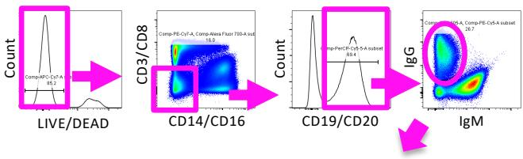

histogram

| Marker | Count |
|--------|-------|
| Live/DEAD | 85.2 |
| CD3/CD8+ | 16.0 |
| CD14/CD16 | 85.4 |
| CD19/CD20 | 26.7 |
| IgM | - |

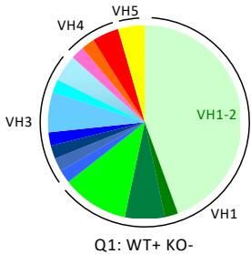

pie

| Category | Value |
|---|---|
| VH1 | 100 |
| VH2 | 80 |
| VH3 | 60 |
| VH4 | 40 |
| VH5 | 30 |
| VH1-2 | 90 |
Q1: WT+ KO-

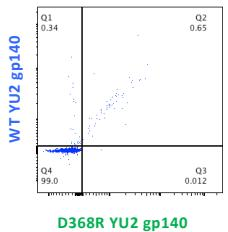

scatter

| Quadrant | Value  |
| -------- | ------ |
| Q1       | 0.34   |
| Q2       | 0.65   |
| Q3       | 0.012  |
| Q4       | 99.0   |

pie

| Category | Value |
|---|---|
| VH1 | 69 |
| VH1 | 1 |
| VH3 | 8 |
| VH4 | 7 |
| VH5 | 6 |
Q2: WT+ KO+

D   

text_image

TRD
93 94 95
SSR DDTN W L DP
PCIN63 lineage HCDR3
97 98 99 100 101 102
AR GRSCDDSSG FNSN WDFH VRC01 class Abs HCDR3
DK GGYRDY GEYYE HEP
QGBD YENG YE W Q
TREYB GHKD YE W E Y
MSE SEF CRDP EY K T

C 

<table><tr><td rowspan="2" colspan="2"></td><td colspan="5">Heavy Chain</td><td colspan="5">Light Chain Chain</td></tr><tr><td colspan="5">Putative Germline Genes: IGHV1-2*02 / IGHJ5*02</td><td colspan="5">IGKV1-5*03 / IGKJ1*01</td></tr><tr><td>mpi</td><td>mAb name</td><td>CDRH3 sequence (15aa)</td><td> $V_H+J_H$ % SHM (nt)</td><td> $V_H+J_H$ % SHM (aa)</td><td>UCA-H % SHM (nt)</td><td>UCA-H % SHM (aa)</td><td>CDRL3 sequence (5aa)</td><td> $V_K+J_K$ % SHM (nt)</td><td> $V_K+J_K$ % SHM (aa)</td><td>UCA-K % SHM (nt)</td><td>UCA-K % SHM (aa)</td></tr><tr><td>66</td><td>66Aa</td><td></td><td></td><td></td><td></td><td></td><td>QVVQW</td><td>12.04</td><td>15.63</td><td>14.56</td><td>17.76</td></tr><tr><td>66</td><td>66B</td><td>TRDSSRRDTNWWLDP</td><td>9.59</td><td>18.42</td><td>11.38</td><td>20.33</td><td>QVLET</td><td>12.71</td><td>17.71</td><td>14.24</td><td>18.69</td></tr><tr><td>71</td><td>71Aa</td><td></td><td></td><td></td><td></td><td></td><td>QVYES</td><td>10.70</td><td>19.79</td><td>12.30</td><td>20.56</td></tr><tr><td>71</td><td>71B</td><td>TTHSSSRDFQWSLDP</td><td>9.88</td><td>16.67</td><td>11.92</td><td>20.33</td><td>QVYES</td><td>11.04</td><td>16.67</td><td>12.94</td><td>17.76</td></tr><tr><td>71</td><td>71D2b</td><td>TRDSSRRDTNWWLDP</td><td>10.47</td><td>21.05</td><td>12.20</td><td>22.76</td><td>QVLET</td><td>12.71</td><td>19.79</td><td>14.24</td><td>20.56</td></tr><tr><td>71</td><td>71C</td><td>TRDSSRRDTNWWLDP</td><td>10.76</td><td>20.18</td><td>12.47</td><td>21.95</td><td>QVLET</td><td>12.37</td><td>18.75</td><td>13.92</td><td>19.63</td></tr><tr><td>71</td><td>71E1</td><td>TRDSSRRDTNWWLDP</td><td>10.76</td><td>20.18</td><td>12.47</td><td>21.95</td><td></td><td></td><td></td><td></td><td></td></tr><tr><td>71</td><td>71F</td><td>TRDSSRQQRDWWLDP</td><td>12.50</td><td>21.05</td><td>13.01</td><td>21.14</td><td>QVYES</td><td>11.04</td><td>18.75</td><td>12.62</td><td>19.63</td></tr><tr><td>71</td><td>71G</td><td>TRDASRDDRAWRLDP</td><td>13.08</td><td>21.05</td><td>15.72</td><td>23.58</td><td>QVVEW</td><td>12.37</td><td>15.63</td><td>14.56</td><td>16.82</td></tr><tr><td>71</td><td>71H</td><td>ARDSSREETNWWLDP</td><td>13.08</td><td>21.93</td><td>14.36</td><td>23.58</td><td>QVLET</td><td>13.04</td><td>20.83</td><td>14.24</td><td>21.50</td></tr><tr><td>71</td><td>71I1a</td><td>TRDASRDDRAWRLDP</td><td>13.66</td><td>21.05</td><td>16.26</td><td>23.58</td><td>QVFEW</td><td>13.04</td><td>17.71</td><td>14.56</td><td>18.69</td></tr><tr><td>71</td><td>71J2a</td><td>TRDASRDDRAWRLDP</td><td>10.76</td><td>20.18</td><td>12.47</td><td>21.95</td><td>QVLET</td><td>12.71</td><td>18.75</td><td>14.24</td><td>19.63</td></tr><tr><td>71</td><td>71K</td><td>TRDSSRDETNWWLDP</td><td>14.24</td><td>23.68</td><td>15.45</td><td>25.20</td><td>QVLET</td><td>13.04</td><td>18.75</td><td>14.56</td><td>19.63</td></tr><tr><td>71</td><td>71L</td><td>TRDSSRDETNWWLDP</td><td>14.24</td><td>24.56</td><td>15.45</td><td>26.02</td><td>QVLET</td><td>13.04</td><td>18.75</td><td>14.56</td><td>19.63</td></tr><tr><td>71</td><td>71M1a</td><td>ARDSSRDETNWWLDP</td><td>14.53</td><td>21.05</td><td>15.72</td><td>22.76</td><td>QVLET</td><td>12.37</td><td>18.75</td><td>13.92</td><td>19.63</td></tr><tr><td>71</td><td>71N1a</td><td>TRDSSRGNTEWRLDP</td><td>14.53</td><td>21.05</td><td>15.72</td><td>22.76</td><td>QVYQT</td><td>12.71</td><td>18.75</td><td>14.89</td><td>20.56</td></tr><tr><td>71</td><td>71O</td><td>TRDSSRDNLEWRLDP</td><td>15.99</td><td>23.68</td><td>17.07</td><td>23.58</td><td>QVFEW</td><td>12.71</td><td>15.63</td><td>14.56</td><td>16.82</td></tr><tr><td>71</td><td>71P</td><td>TRDSSRGDTEWRLDP</td><td>15.99</td><td>23.68</td><td>17.89</td><td>24.39</td><td>QVFEW</td><td>13.04</td><td>16.67</td><td>14.89</td><td>17.76</td></tr><tr><td>77</td><td>77A</td><td>TTHSSRRDFQWSLDP</td><td>10.47</td><td>17.54</td><td>12.20</td><td>20.33</td><td></td><td></td><td></td><td></td><td></td></tr><tr><td>77</td><td>77B1b</td><td>TRDSSRDETNWWLDP</td><td>11.34</td><td>23.68</td><td>13.82</td><td>25.20</td><td>QVLET</td><td>12.71</td><td>19.79</td><td>14.24</td><td>20.56</td></tr><tr><td>77</td><td>77C</td><td>TRDSSRRDLEWRLDP</td><td>11.92</td><td>21.05</td><td>12.74</td><td>21.14</td><td>QVLET</td><td>13.71</td><td>19.79</td><td>15.53</td><td>20.56</td></tr><tr><td>77</td><td>77D</td><td>ARDSSRDETNWWLDP</td><td>13.08</td><td>20.18</td><td>14.36</td><td>21.95</td><td>QAYES</td><td>12.37</td><td>19.79</td><td>14.24</td><td>20.56</td></tr><tr><td>77</td><td>77E1</td><td>TRDSSRDETNWWLDP</td><td>13.95</td><td>23.68</td><td>15.18</td><td>25.20</td><td></td><td></td><td></td><td></td><td></td></tr><tr><td>77</td><td>77F1</td><td>TRDSSRDETNWWLDP</td><td>14.53</td><td>23.68</td><td>15.72</td><td>25.20</td><td></td><td></td><td></td><td></td><td></td></tr></table>

Figure S1: Isolation of CD4bs-specific antibodies in participant PC063 – Related to Figure 1.

(A) Neutralization of HIV-1 pseudoviruses by titrated amount of PC063 month-66 (M66) untreated plasma or after adsorption on BSA- or rgp140-coated beads. This data is from a single experiment.

(B) Fluorescence Activated Cell Sorting (FACS) cell plots highlighting cell selection strategy for CD4bs specific B-cell isolation from PC063. Pie charts detail the distribution of VH-gene IMGT assignment of IgG amplicons generated from rgp140 WT+D368R- and rgp140 WT+D368R+ single sorted cells in (Quadrant #1, Q1, left) and (Quadrant #2, Q2, right).

(C) Statistics for the PCIN63 heavy chain and light chain sequences obtained from the VH1-2+ single B-cell isolated in (B). The percent of somatic hyper mutations at the nucleotide (nt) and amino-acid (aa) levels compared to the IMGT database germline gene sequences and NGS-identified unmutated common ancestor (UCA) (see Figure 3A), were calculated for V and J heavy chain (VH+JH) and light chain (VK+JK) segments. The CDR3 definitions are based on IMGT database guidelines.

(D) Logogram of the HCDR3 amino acid sequences for PCIN63 and VRC01-class Abs.

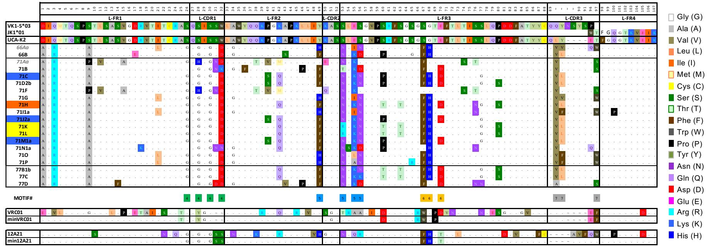  
Figure S2. PCIN63 mAbs heavy chain and light chain amino acid alignments with putative germline genes – Related to Figure 1.   
PCIN63 mAbs HC (top) and LC (bottom) amino-acid sequences are aligned to the IMGT database $V_{H}1-2*02$ , $D_{H}6-13$ , $J_{H}5*02$ , $V_{K}1-5*03$ and $J_{K}1*01$ sequences. Identical residues are marked as a dot and somatically mutated residues are specified using one-letter coding. Deletions are marked by a \~ symbol. CDR and FRW regions are indicated. Sequences from different mAbs sharing perfect amino-acid identity are highlighted in colors. Unpaired sequences are showed in grey and italic

<table><tr><td colspan="2">SHM (VH+J0)</td><td>9.59</td><td>9.88</td><td>10.76</td><td>10.76</td><td>12.50</td><td>13.08</td><td>13.08</td><td>13.66</td><td>13.37</td><td>14.24</td><td>14.24</td><td>14.53</td><td>14.53</td><td>15.99</td><td>15.99</td><td>11.34</td><td>11.92</td><td>13.08</td><td rowspan="2"></td><td>7.22</td><td>21.31</td><td>3.44</td><td>12.37</td></tr><tr><td colspan="2">SHM (Vh+J0)</td><td>12.71</td><td>11.04</td><td>12.37</td><td>12.71</td><td>11.04</td><td>12.37</td><td>13.04</td><td>13.04</td><td>12.71</td><td>13.04</td><td>13.04</td><td>12.37</td><td>12.37</td><td>12.71</td><td>13.04</td><td>13.04</td><td>13.71</td><td>12.37</td><td>6.48</td><td>20.32</td><td>8.33</td><td>21.91</td></tr><tr><td colspan="2">Time point Ab name</td><td>PCIN 66B</td><td>PCIN 71B</td><td>PCIN 71C</td><td>PCIN 71D2b</td><td>PCIN 71F</td><td>PCIN 71G</td><td>PCIN 71H</td><td>PCIN 71I1a</td><td>PCIN 71J2a</td><td>PCIN 71K</td><td>PCIN 71L</td><td>PCIN 71M1a</td><td>PCIN 71N1a</td><td>PCIN 71O</td><td>PCIN 71P</td><td>PCIN 77B1b</td><td>PCIN 77C</td><td>PCIN 77D</td><td>PC63 M33 Serum</td><td>VRC01 min</td><td>VRC01 MAT</td><td>12A21 min</td><td>12A21 MAT</td></tr><tr><td rowspan="2">Ctrl</td><td>MLV</td><td>&gt;100</td><td>&gt;100</td><td>&gt;100</td><td>&gt;100</td><td>&gt;100</td><td>&gt;100</td><td>&gt;100</td><td>&gt;100</td><td>&gt;100</td><td>&gt;100</td><td>&gt;100</td><td>&gt;100</td><td>&gt;100</td><td>&gt;100</td><td>&gt;100</td><td>&gt;100</td><td>&gt;100</td><td>&gt;100</td><td>6</td><td>&gt;100</td><td>&gt;100</td><td>&gt;100</td><td>&gt;100</td></tr><tr><td>VSV</td><td>&gt;100</td><td>&gt;100</td><td>&gt;100</td><td>&gt;100</td><td>&gt;100</td><td>&gt;100</td><td>&gt;100</td><td>&gt;100</td><td>&gt;100</td><td>&gt;100</td><td>&gt;100</td><td>&gt;100</td><td>&gt;100</td><td>&gt;100</td><td>&gt;100</td><td>&gt;100</td><td>&gt;100</td><td>&gt;100</td><td></td><td>&gt;100</td><td>&gt;100</td><td>&gt;100</td><td>&gt;100</td></tr><tr><td rowspan="5">A</td><td>92RW020</td><td>0.79</td><td>&gt;100</td><td>0.67</td><td>0.59</td><td>&gt;100</td><td>0.86</td><td>0.26</td><td>0.39</td><td>1.1</td><td>0.20</td><td>0.096</td><td>0.20</td><td>&gt;100</td><td>0.58</td><td>2.2</td><td>9.5</td><td>0.94</td><td>2.4</td><td>491</td><td>0.11</td><td>0.50</td><td>0.09</td><td>0.06</td></tr><tr><td>94UG03</td><td>&gt;100</td><td>&gt;100</td><td>&gt;100</td><td>&gt;100</td><td>&gt;100</td><td>4.3</td><td>10</td><td>3.1</td><td>&gt;100</td><td>7.1</td><td>5.7</td><td>2.4</td><td>&gt;100</td><td>7.0</td><td>18</td><td>&gt;100</td><td>&gt;100</td><td>&gt;100</td><td>1</td><td>0.20</td><td>0.35</td><td>&gt;100</td><td>0.46</td></tr><tr><td>BG505</td><td>1.3</td><td>&gt;100</td><td>5.2</td><td>&gt;100</td><td>&gt;100</td><td>1.4</td><td>1.1</td><td>0.49</td><td>0.76</td><td>0.72</td><td>&gt;100</td><td>139</td><td>&gt;100</td><td>0.75</td><td>1.5</td><td>15</td><td>1.1</td><td>29</td><td>564</td><td>0.12</td><td>0.09</td><td>0.12</td><td>0.09</td></tr><tr><td>KNH1144</td><td>1.2</td><td>&gt;100</td><td>0.98</td><td>1.5</td><td>&gt;100</td><td>5.1</td><td>0.45</td><td>1.3</td><td>1.1</td><td>0.32</td><td>0.42</td><td>0.66</td><td>&gt;100</td><td>1.9</td><td>23</td><td>37</td><td>4.3</td><td>48</td><td>248</td><td>1.56</td><td>0.37</td><td>0.59</td><td>0.54</td></tr><tr><td>KNH1207</td><td>0.38</td><td>&gt;100</td><td>0.23</td><td>0.47</td><td>&gt;100</td><td>1.2</td><td>0.33</td><td>0.36</td><td>0.25</td><td>0.29</td><td>0.29</td><td>0.62</td><td>&gt;100</td><td>0.57</td><td>3.0</td><td>68</td><td>1.3</td><td>&gt;100</td><td>nt</td><td>63</td><td>0.88</td><td>0.68</td><td>0.32</td></tr><tr><td>AE</td><td>92TH021</td><td>0.36</td><td></td><td>0.12</td><td>9.1</td><td></td><td>0.60</td><td>0.11</td><td>0.13</td><td>0.23</td><td>0.12</td><td>0.33</td><td>8.8</td><td></td><td>0.30</td><td>0.36</td><td>0.94</td><td>0.24</td><td></td><td>456</td><td>0.28</td><td>0.24</td><td>0.09</td><td>0.06</td></tr><tr><td rowspan="11"></td><td>89.6</td><td></td><td>&gt;100</td><td>3.0</td><td>1.8</td><td>&gt;100</td><td>0.24</td><td></td><td>0.22</td><td>2.3</td><td>14</td><td></td><td></td><td>&gt;100</td><td>1.4</td><td>0.60</td><td>&gt;100</td><td>&gt;100</td><td>&gt;100</td><td></td><td>0.78</td><td>0.63</td><td>&gt;100</td><td>1.96</td></tr><tr><td>6535</td><td>0.62</td><td>&gt;100</td><td>0.18</td><td>0.22</td><td>&gt;100</td><td>1.9</td><td>2.0</td><td>0.19</td><td>0.16</td><td>0.42</td><td>0.16</td><td>0.13</td><td>&gt;100</td><td>0.74</td><td>0.54</td><td>&gt;100</td><td>62</td><td>&gt;100</td><td>263</td><td>0.29</td><td>0.32</td><td>&gt;100</td><td>9.15</td></tr><tr><td>92BR020</td><td>0.26</td><td>&gt;100</td><td>0.15</td><td>0.25</td><td>&gt;100</td><td>0.64</td><td>0.20</td><td>0.23</td><td>0.32</td><td>0.14</td><td>0.13</td><td>0.18</td><td>&gt;100</td><td>0.59</td><td>0.58</td><td>10</td><td>0.69</td><td>&gt;100</td><td>834</td><td>0.81</td><td>0.04</td><td>0.11</td><td>0.08</td></tr><tr><td>ADA</td><td>45</td><td>&gt;100</td><td>2.1</td><td>5.1</td><td>&gt;100</td><td>2.3</td><td>2.6</td><td>1.5</td><td>3.2</td><td>1.3</td><td>0.54</td><td>0.88</td><td>&gt;100</td><td>5.6</td><td>16</td><td>50</td><td>&gt;100</td><td>&gt;100</td><td>192</td><td>0.32</td><td>0.48</td><td>&gt;100</td><td>0.82</td></tr><tr><td>BaL</td><td>0.11</td><td>0.041</td><td>0.025</td><td>0.044</td><td>0.71</td><td>0.093</td><td>44</td><td>0.017</td><td>0.068</td><td>1.9</td><td>1.0</td><td>21</td><td>&gt;100</td><td>0.25</td><td>0.085</td><td>0.0074</td><td>&gt;100</td><td>2.8</td><td>1790</td><td>0.01</td><td>0.02</td><td>&gt;100</td><td>0.12</td></tr><tr><td>CAAN</td><td>2.2</td><td>&gt;100</td><td>0.93</td><td>0.49</td><td>&gt;100</td><td>0.58</td><td>3.2</td><td>2.4</td><td>1.6</td><td>1.9</td><td>1.2</td><td>10</td><td>&gt;100</td><td>9.4</td><td>7.9</td><td>8.4</td><td>10</td><td>&gt;100</td><td>1</td><td>0.25</td><td>0.42</td><td>8.86</td><td>0.46</td></tr><tr><td>DH12</td><td>46</td><td>&gt;100</td><td>2.6</td><td>4.3</td><td>&gt;100</td><td>3.8</td><td>32</td><td>2.6</td><td>3.4</td><td>21</td><td>8.3</td><td>5.6</td><td>&gt;100</td><td>9.7</td><td>10</td><td>38</td><td>4.1</td><td>&gt;100</td><td>823</td><td>0.12</td><td>0.40</td><td>&gt;100</td><td>48</td></tr><tr><td>HxB2</td><td>0.75</td><td>&gt;100</td><td>0.067</td><td>0.24</td><td>&gt;100</td><td>0.098</td><td>0.72</td><td>0.043</td><td>0.12</td><td>0.26</td><td>0.17</td><td>0.10</td><td>&gt;100</td><td>0.083</td><td>0.13</td><td>0.48</td><td>&gt;100</td><td>&gt;100</td><td>926</td><td>0.01</td><td>0.05</td><td>&gt;100</td><td>&gt;100</td></tr><tr><td>JRCSF</td><td>4.6</td><td>&gt;100</td><td>0.60</td><td>0.91</td><td>&gt;100</td><td>1.5</td><td>1.3</td><td>0.43</td><td>1.6</td><td>0.56</td><td>0.70</td><td>0.92</td><td>&gt;100</td><td>1.4</td><td>2.7</td><td>1.6</td><td>3.3</td><td>&gt;100</td><td>182</td><td>0.12</td><td>0.14</td><td>&gt;100</td><td>0.43</td></tr><tr><td>JRFL</td><td>0.064</td><td>&gt;100</td><td>0.022</td><td>0.055</td><td>&gt;100</td><td>0.14</td><td>0.082</td><td>0.053</td><td>0.052</td><td>0.053</td><td>0.037</td><td>0.070</td><td>&gt;100</td><td>0.11</td><td>0.42</td><td>0.35</td><td>0.13</td><td>2.0</td><td>2275</td><td>71.60</td><td>0.61</td><td>0.05</td><td>0.04</td></tr><tr><td>MN</td><td>0.15</td><td>&gt;100</td><td>0.12</td><td>0.088</td><td>&gt;100</td><td>0.075</td><td>&gt;100</td><td>0.072</td><td>0.13</td><td>&gt;100</td><td>&gt;100</td><td>&gt;100</td><td>&gt;100</td><td>0.29</td><td>0.16</td><td>0.49</td><td>&gt;100</td><td>&gt;100</td><td>496</td><td>0.03</td><td>0.09</td><td>&gt;100</td><td>20</td></tr><tr><td rowspan="11">B</td><td>PVO4</td><td>1.1</td><td>&gt;100</td><td>0.28</td><td>0.32</td><td>4.48</td><td>2.6</td><td>0.35</td><td>0.47</td><td>0.30</td><td>0.23</td><td>0.19</td><td>0.68</td><td>&gt;100</td><td>0.89</td><td>2.4</td><td>7.2</td><td>2.4</td><td>28</td><td>402</td><td>0.19</td><td>0.35</td><td>0.29</td><td>0.41</td></tr><tr><td>QHO692</td><td>6.0</td><td>&gt;100</td><td>2.3</td><td>2.1</td><td>&gt;100</td><td>12</td><td>1.4</td><td>1.8</td><td>1.3</td><td>1.4</td><td>1.0</td><td>1.9</td><td>&gt;100</td><td>6.0</td><td>35</td><td>16</td><td>8.0</td><td>&gt;100</td><td>198</td><td>3.23</td><td>1.84</td><td>7.20</td><td>4.83</td></tr><tr><td>REJO</td><td>0.13</td><td>&gt;100</td><td>0.039</td><td>0.058</td><td>&gt;100</td><td>0.13</td><td>0.050</td><td>0.034</td><td>0.065</td><td>0.15</td><td>0.094</td><td>0.086</td><td>&gt;100</td><td>0.13</td><td>0.15</td><td>0.096</td><td>0.42</td><td>&gt;100</td><td>273</td><td>0.04</td><td>0.09</td><td>&gt;100</td><td>0.79</td></tr><tr><td>RHPA4</td><td>0.20</td><td>&gt;100</td><td>0.048</td><td>0.12</td><td>&gt;100</td><td>0.15</td><td>0.030</td><td>0.050</td><td>0.074</td><td>0.029</td><td>0.022</td><td>0.052</td><td>&gt;100</td><td>0.089</td><td>0.23</td><td>1.8</td><td>0.16</td><td>3.4</td><td>705</td><td>21</td><td>0.04</td><td>1.37</td><td>0.04</td></tr><tr><td>SC422</td><td>0.50</td><td>&gt;100</td><td>0.12</td><td>0.36</td><td>&gt;100</td><td>0.52</td><td>0.13</td><td>0.081</td><td>0.15</td><td>0.19</td><td>0.11</td><td>0.39</td><td>&gt;100</td><td>0.24</td><td>0.96</td><td>1.1</td><td>&gt;100</td><td>&gt;100</td><td>222</td><td>0.30</td><td>0.09</td><td>&gt;100</td><td>2.79</td></tr><tr><td>SF162</td><td>&gt;100</td><td>&gt;100</td><td>2.4</td><td>22</td><td>&gt;100</td><td>0.39</td><td>&gt;100</td><td>0.19</td><td>0.99</td><td>44</td><td>12</td><td>0.89</td><td>&gt;100</td><td>0.45</td><td>0.45</td><td>6.0</td><td>&gt;100</td><td>&gt;100</td><td>834</td><td>0.04</td><td>0.14</td><td>&gt;100</td><td>0.67</td></tr><tr><td>SS1196</td><td>&gt;100</td><td>&gt;100</td><td>8.9</td><td>35</td><td>&gt;100</td><td>1.1</td><td>&gt;100</td><td>0.37</td><td>9.0</td><td>19</td><td>13</td><td>3.6</td><td>&gt;100</td><td>1.3</td><td>2.7</td><td>&gt;100</td><td>&gt;100</td><td>&gt;100</td><td>378</td><td>0.09</td><td>0.22</td><td>&gt;100</td><td>&gt;100</td></tr><tr><td>TRJO</td><td>&gt;100</td><td>&gt;100</td><td>272</td><td>&gt;100</td><td>&gt;100</td><td>0.59</td><td>0.24</td><td>0.11</td><td>62</td><td>0.080</td><td>0.080</td><td>0.12</td><td>&gt;100</td><td>0.19</td><td>0.16</td><td>&gt;100</td><td>&gt;100</td><td>&gt;100</td><td>246</td><td>0.12</td><td>0.08</td><td>&gt;100</td><td>1.25</td></tr><tr><td>TRO11</td><td>0.37</td><td>&gt;100</td><td>0.24</td><td>0.28</td><td>&gt;100</td><td>0.47</td><td>0.080</td><td>0.18</td><td>0.18</td><td>0.049</td><td>0.035</td><td>0.068</td><td>&gt;100</td><td>0.31</td><td>0.79</td><td>27</td><td>0.46</td><td>99</td><td>439</td><td>2.84</td><td>0.52</td><td>0.26</td><td>0.22</td></tr><tr><td>WITO</td><td>0.82</td><td>&gt;100</td><td>0.13</td><td>0.12</td><td>&gt;100</td><td>0.24</td><td>0.092</td><td>0.086</td><td>0.085</td><td>0.051</td><td>0.048</td><td>0.062</td><td>&gt;100</td><td>0.078</td><td>0.078</td><td>&gt;100</td><td>0.24</td><td>&gt;100</td><td>496</td><td>1.07</td><td>0.17</td><td>2.89</td><td>0.22</td></tr><tr><td>YU2</td><td>0.13</td><td>&gt;100</td><td>0.058</td><td>0.10</td><td>&gt;100</td><td>0.65</td><td>0.085</td><td>0.18</td><td>0.087</td><td>0.067</td><td>0.056</td><td>0.11</td><td>&gt;100</td><td>0.60</td><td>0.92</td><td>7.4</td><td>0.17</td><td>15</td><td>1170</td><td>0.05</td><td>0.09</td><td>0.15</td><td>0.05</td></tr><tr><td rowspan="20"></td><td>93IN905</td><td>0.73</td><td>&gt;100</td><td>0.17</td><td>0.36</td><td>&gt;100</td><td>0.34</td><td>0.063</td><td>0.090</td><td>0.21</td><td>0.035</td><td>0.014</td><td>0.056</td><td>&gt;100</td><td>0.17</td><td>0.58</td><td>40</td><td>0.33</td><td>0.59</td><td>701</td><td>0.06</td><td>0.13</td><td>2.26</td><td>0.06</td></tr><tr><td>CAP210</td><td>&gt;100</td><td>&gt;100</td><td>&gt;100</td><td>&gt;100</td><td>&gt;100</td><td>&gt;100</td><td>&gt;100</td><td>45</td><td>&gt;100</td><td>&gt;100</td><td>&gt;100</td><td>&gt;100</td><td>&gt;100</td><td>&gt;100</td><td>&gt;100</td><td>&gt;100</td><td>&gt;100</td><td>&gt;100</td><td>1</td><td>&gt;100</td><td>&gt;100</td><td>&gt;100</td><td>&gt;100</td></tr><tr><td>CAP45</td><td>&gt;100</td><td>&gt;100</td><td>&gt;100</td><td>&gt;100</td><td>&gt;100</td><td>&gt;100</td><td>&gt;100</td><td>0.053</td><td>&gt;100</td><td>&gt;100</td><td>&gt;100</td><td>&gt;100</td><td>&gt;100</td><td>0.13</td><td>0.053</td><td>&gt;100</td><td>&gt;100</td><td>&gt;100</td><td>1</td><td>&gt;100</td><td>0.27</td><td>&gt;100</td><td>0.06</td></tr><tr><td>DU156</td><td>&gt;100</td><td>&gt;100</td><td>7.9</td><td>21</td><td>&gt;100</td><td>0.12</td><td>0.51</td><td>0.034</td><td>6.6</td><td>0.11</td><td>0.067</td><td>1.7</td><td>&gt;100</td><td>0.070</td><td>0.15</td><td>&gt;100</td><td>0.014</td><td>&gt;100</td><td>654</td><td>0.05</td><td>0.06</td><td>6.78</td><td>0.03</td></tr><tr><td>DU172</td><td>4.8</td><td>&gt;100</td><td>0.37</td><td>0.75</td><td>&gt;100</td><td>0.75</td><td>0.25</td><td>0.29</td><td>0.60</td><td>0.27</td><td>0.16</td><td>0.21</td><td>&gt;100</td><td>0.38</td><td>0.76</td><td>67</td><td>1.5</td><td>10</td><td>589</td><td>&gt;100</td><td>&gt;100</td><td>0.56</td><td>0.29</td></tr><tr><td>DU422</td><td>&gt;100</td><td>&gt;100</td><td>&gt;100</td><td>&gt;100</td><td>&gt;100</td><td>&gt;100</td><td>&gt;100</td><td>&gt;100</td><td>&gt;100</td><td>&gt;100</td><td>&gt;100</td><td>&gt;100</td><td>&gt;100</td><td>&gt;100</td><td>&gt;100</td><td>&gt;100</td><td>&gt;100</td><td>&gt;100</td><td>1</td><td>&gt;100</td><td>&gt;100</td><td>&gt;100</td><td>3.37</td></tr><tr><td>IAVIC22</td><td>&gt;100</td><td>&gt;100</td><td>20</td><td>52</td><td>&gt;100</td><td>0.066</td><td>2.6</td><td>2.6</td><td>40</td><td>2.4</td><td>2.0</td><td>2.6</td><td>&gt;100</td><td>7.9</td><td>21</td><td>&gt;100</td><td>&gt;100</td><td>&gt;100</td><td>177</td><td>0.28</td><td>0.54</td><td>&gt;100</td><td>67</td></tr><tr><td rowspan="13">ZM53</td><td rowspan="13">1.1</td><td rowspan="13">&gt;100</td><td rowspan="13">0.45</td><td rowspan="13">0.79</td><td rowspan="13">&gt;100</td><td rowspan="13">1.1</td><td rowspan="13">0.39</td><td rowspan="13">0.35</td><td rowspan="13">0.36</td><td rowspan="5">0.26</td><td rowspan="5">0.52</td><td rowspan="5">0.36</td><td rowspan="5">&gt;100</td><td rowspan="5">0.69</td><td rowspan="5">3.6</td><td rowspan="5">&gt;100</td><td rowspan="5">0.77</td><td rowspan="5">24</td><td></td><td></td><td></td><td></td><td></td></tr><tr><td></td><td></td><td></td><td></td><td></td></tr><tr><td></td><td></td><td></td><td></td><td></td></tr><tr><td></td><td></td><td></td><td></td><td></td></tr><tr><td></td><td></td><td></td><td></td><td></td></tr><tr><td></td><td></td><td></td><td></td><td></td><td></td><td></td><td></td><td></td><td></td><td></td><td></td><td></td><td></td></tr><tr><td></td><td></td><td></td><td></td><td></td><td></td><td></td><td></td><td></td><td></td><td></td><td></td><td></td><td></td></tr><tr><td></td><td></td><td></td><td></td><td></td><td></td><td></td><td></td><td></td><td></td><td></td><td></td><td></td><td></td></tr><tr><td rowspan="4"></td><td rowspan="4"></td><td rowspan="4"></td><td rowspan="4"></td><td rowspan="4"></td><td rowspan="4"></td><td rowspan="4"></td><td rowspan="4"></td><td rowspan="4"></td><td></td><td></td><td></td><td></td><td></td></tr><tr><td></td><td></td><td></td><td></td><td></td></tr><tr><td></td><td></td><td></td><td></td><td></td></tr><tr><td></td><td></td><td></td><td></td><td></td></tr><tr><td></td><td></td><td></td><td></td><td></td><td></td><td></td><td></td><td></td><td></td><td></td><td></td><td></td><td></td></tr></table>

Table S1. Neutralization IC50s of PCIN63 Abs on a medium cross-clade pseudovirus panel. – Related to Figure 1 and Table S2

IC50 is defined as the Ab concentration in $\mu$ g/mL allowing 50% loss of infectivity.

PCIN63 Abs are organized from least to most mutated.

Data are representative of at least 2 experiments.

<table><tr><td>Breadth (viruses neutralized)</td><td>Potency mAb (GeoMean IC50)</td><td>Potency Plasma (GeoMean ID50)</td></tr><tr><td>0-10%</td><td>10-50 μg/mL</td><td>/</td></tr><tr><td>10-25%</td><td>1-10 μg/mL</td><td>50-100</td></tr><tr><td>25-50%</td><td>0.1-1 μg/mL</td><td>100-300</td></tr><tr><td>50-75%</td><td>0.01-0.1 μg/mL</td><td>300-900</td></tr><tr><td>75-100%</td><td>&lt;0.01 μg/mL</td><td>&gt;900</td></tr></table>

<table><tr><td rowspan="2">Ab name</td><td colspan="4">Breadth (% viruses)</td><td rowspan="2">GeoMean $IC_{50}$ (μg/mL)</td><td rowspan="2">SHM( $V_H+J_H$ )</td><td rowspan="2">SHM( $V_K+J_K$ )</td></tr><tr><td> $IC_{50}<0.1μg/mL$ </td><td> $IC_{50}<1μg/mL$ </td><td> $IC_{50}<10μg/mL$ </td><td> $IC_{50}<50μg/mL$ </td></tr><tr><td>66B</td><td>3%</td><td>45%</td><td>70%</td><td>75%</td><td>0.8</td><td>9.6</td><td>12.7</td></tr><tr><td>71B</td><td>3%</td><td>3%</td><td>3%</td><td>3%</td><td>0.04</td><td>9.9</td><td>11.0</td></tr><tr><td>71C</td><td>15%</td><td>63%</td><td>85%</td><td>88%</td><td>0.50</td><td>10.8</td><td>12.4</td></tr><tr><td>71D2b</td><td>10%</td><td>55%</td><td>75%</td><td>83%</td><td>0.73</td><td>10.5</td><td>12.7</td></tr><tr><td>71F</td><td>0%</td><td>5%</td><td>8%</td><td>8%</td><td>0.72</td><td>12.5</td><td>11.0</td></tr><tr><td>71G</td><td>13%</td><td>58%</td><td>90%</td><td>93%</td><td>0.57</td><td>13.1</td><td>12.4</td></tr><tr><td>71H</td><td>23%</td><td>55%</td><td>75%</td><td>83%</td><td>0.48</td><td>13.1</td><td>13.0</td></tr><tr><td>71I1a</td><td>30%</td><td>75%</td><td>95%</td><td>98%</td><td>0.28</td><td>13.7</td><td>13.0</td></tr><tr><td>71J2a</td><td>15%</td><td>55%</td><td>85%</td><td>88%</td><td>0.56</td><td>10.8</td><td>12.7</td></tr><tr><td>71K</td><td>23%</td><td>63%</td><td>80%</td><td>90%</td><td>0.42</td><td>14.2</td><td>13.0</td></tr><tr><td>71L</td><td>30%</td><td>63%</td><td>80%</td><td>85%</td><td>0.27</td><td>14.2</td><td>13.0</td></tr><tr><td>71M1a</td><td>20%</td><td>58%</td><td>80%</td><td>85%</td><td>0.55</td><td>14.5</td><td>12.4</td></tr><tr><td>71N1a</td><td>0%</td><td>0%</td><td>0%</td><td>0%</td><td>/</td><td>14.5</td><td>12.7</td></tr><tr><td>71O</td><td>10%</td><td>65%</td><td>95%</td><td>95%</td><td>0.630</td><td>16.0</td><td>12.7</td></tr><tr><td>71P</td><td>8%</td><td>55%</td><td>78%</td><td>95%</td><td>1.1</td><td>16.0</td><td>13.0</td></tr><tr><td>77B1b</td><td>5%</td><td>18%</td><td>40%</td><td>58%</td><td>4.2</td><td>11.3</td><td>12.7</td></tr><tr><td>77C</td><td>5%</td><td>33%</td><td>53%</td><td>58%</td><td>0.92</td><td>11.9</td><td>13.7</td></tr><tr><td>77D</td><td>0%</td><td>5%</td><td>15%</td><td>30%</td><td>7.3</td><td>13.1</td><td>12.4</td></tr><tr><td>PC63M33</td><td>25%</td><td>65%</td><td>83%</td><td>88%</td><td>125</td><td></td><td></td></tr><tr><td>min VRC01</td><td>25%</td><td>68%</td><td>78%</td><td>83%</td><td>0.37</td><td>6.5</td><td>7.2</td></tr><tr><td>VRC01</td><td>30%</td><td>88%</td><td>93%</td><td>93%</td><td>0.21</td><td>29.3</td><td>21.3</td></tr><tr><td>min 12A21</td><td>8%</td><td>33%</td><td>48%</td><td>50%</td><td>0.64</td><td>8.3</td><td>3.4</td></tr><tr><td>12A21</td><td>25%</td><td>65%</td><td>83%</td><td>88%</td><td>0.47</td><td>21.9</td><td>12.4</td></tr></table>

Table S2. Neutralization breadth and potency of PCIN63 Abs on a medium cross-clade pseudovirus panel. – Related to Figure 1 and Table S1

PCIN63 Abs are listed vertically by increasing frequency of somatic hypermutations.

<table><tr><td rowspan="2">Subtype</td><td colspan="10">Neutralization IC50(mg/mL)</td><td></td><td></td><td></td><td></td><td></td></tr><tr><td>HIV.1 Isolate</td><td>PCIN 66B</td><td>PCIN 71G</td><td>PCIN 71I</td><td>PCIN 71L</td><td>PCIN 77D</td><td>PC63 M33 serum</td><td>Min VRC01</td><td>Mat VRC01</td><td>Min 12A21</td><td></td><td></td><td></td><td></td><td></td></tr><tr><td>-</td><td>aMLV</td><td>&gt;100</td><td>&gt;100</td><td>&gt;100</td><td>&gt;100</td><td>&gt;100</td><td>&gt;100</td><td>&gt;100</td><td>&gt;100</td><td>&gt;100</td><td></td><td></td><td></td><td></td><td></td></tr><tr><td rowspan="12">A</td><td>0260.v5.c1</td><td>1.5</td><td>1.7</td><td>1.7</td><td>0.58</td><td>0.95</td><td>NT</td><td>0.85</td><td>0.33</td><td>0.51</td><td></td><td></td><td></td><td></td><td></td></tr><tr><td>0330.v4.c3</td><td>0.45</td><td>0.29</td><td>0.19</td><td>0.077</td><td>74</td><td>735</td><td>NT</td><td>NT</td><td>NT</td><td></td><td></td><td></td><td></td><td></td></tr><tr><td>191084 B7.19</td><td>0.86</td><td>0.21</td><td>0.17</td><td>0.19</td><td>&gt;100</td><td>634</td><td>0.057</td><td>0.043</td><td>7.3</td><td></td><td></td><td></td><td></td><td></td></tr><tr><td>191955 A11</td><td>&gt;100</td><td>1.2</td><td>0.036</td><td>6.3</td><td>&gt;100</td><td>2018</td><td>&gt;100</td><td>&gt;100</td><td>&gt;100</td><td></td><td></td><td></td><td></td><td></td></tr><tr><td>9004SS A3 4</td><td>&gt;100</td><td>&gt;100</td><td>&gt;100</td><td>&gt;100</td><td>&gt;100</td><td>NT</td><td>&gt;100</td><td>&gt;100</td><td>&gt;100</td><td></td><td></td><td></td><td></td><td></td></tr><tr><td>MS208.A1</td><td>0.73</td><td>0.28</td><td>0.24</td><td>0.19</td><td>&gt;100</td><td>530</td><td>&gt;100</td><td>0.024</td><td>&gt;100</td><td></td><td></td><td></td><td></td><td></td></tr><tr><td>Q168ENVa2</td><td>NT</td><td>NT</td><td>NT</td><td>NT</td><td>NT</td><td>NT</td><td>NT</td><td>NT</td><td>NT</td><td></td><td></td><td></td><td></td><td></td></tr><tr><td>Q23ENV17</td><td>0.36</td><td>0.18</td><td>0.15</td><td>0.080</td><td>0.17</td><td>736</td><td>0.074</td><td>0.042</td><td>0.12</td><td></td><td></td><td></td><td></td><td></td></tr><tr><td>Q25ENVd2.17</td><td>&gt;100</td><td>0.77</td><td>0.073</td><td>&gt;100</td><td>&gt;100</td><td>93</td><td>0.20</td><td>0.029</td><td>&gt;100</td><td></td><td></td><td></td><td></td><td></td></tr><tr><td>Q461ENVe2</td><td>6.8</td><td>7.7</td><td>7.1</td><td>2.2</td><td>&gt;100</td><td>57</td><td>1.2</td><td>0.27</td><td>0.29</td><td></td><td></td><td></td><td></td><td></td></tr><tr><td>Q769ENvd22</td><td>0.22</td><td>0.094</td><td>0.070</td><td>0.079</td><td>&gt;100</td><td>1355</td><td>0.036</td><td>0.019</td><td>0.035</td><td></td><td></td><td></td><td></td><td></td></tr><tr><td>Q842ENVd12</td><td></td><td>&gt;100</td><td>&gt;100</td><td>&gt;100</td><td>&gt;100</td><td>NT</td><td></td><td></td><td>&gt;100</td><td></td><td></td><td></td><td></td><td></td></tr><tr><td rowspan="4">AC</td><td>3301.v1.c24</td><td>0.68</td><td>0.49</td><td>0.39</td><td>0.33</td><td>&gt;100</td><td>558</td><td>0.11</td><td>0.14</td><td>&gt;100</td><td></td><td></td><td></td><td></td><td></td></tr><tr><td>6041.v3.c23</td><td>0.063</td><td>0.066</td><td>0.057</td><td>0.022</td><td>0.097</td><td>&lt;20</td><td>1.8</td><td>0.013</td><td>0.014</td><td></td><td></td><td></td><td></td><td></td></tr><tr><td>6540.v4.c1</td><td>&gt;100</td><td>&gt;100</td><td>&gt;100</td><td>&gt;100</td><td>&gt;100</td><td>24</td><td>&gt;100</td><td>&gt;100</td><td>&gt;100</td><td></td><td></td><td></td><td></td><td></td></tr><tr><td>6545.v4.c1</td><td>&gt;100</td><td>&gt;100</td><td>&gt;100</td><td>&gt;100</td><td>&gt;100</td><td>2</td><td>&gt;100</td><td>&gt;100</td><td>&gt;100</td><td></td><td></td><td></td><td></td><td></td></tr><tr><td rowspan="2">ACD</td><td>0815.v3.c3</td><td>0.12</td><td>0.057</td><td>0.062</td><td>0.032</td><td>&gt;100</td><td>1019</td><td>0.056</td><td>0.0100</td><td>0.033</td><td></td><td></td><td></td><td></td><td></td></tr><tr><td>3103.v3.c10</td><td>&gt;100</td><td>4.0</td><td>6.4</td><td>&gt;100</td><td>&gt;100</td><td>&gt;100</td><td>4.1</td><td>1.3</td><td>&gt;100</td><td></td><td></td><td></td><td></td><td></td></tr><tr><td rowspan="14">AE</td><td>620345.c01</td><td>&gt;100</td><td>&gt;100</td><td>&gt;100</td><td>&gt;100</td><td>&gt;100</td><td>170</td><td>&gt;100</td><td>&gt;100</td><td>&gt;100</td><td></td><td></td><td></td><td></td><td></td></tr><tr><td>BJOX009000.02.4</td><td>&gt;100</td><td>4.2</td><td>2.9</td><td>11</td><td>&gt;100</td><td>&lt;20</td><td>2.9</td><td>0.64</td><td>&gt;100</td><td></td><td></td><td></td><td></td><td></td></tr><tr><td>BJOX010000.06.2</td><td>&gt;100</td><td>16</td><td>8.5</td><td>9.9</td><td>&gt;100</td><td>57</td><td>6.5</td><td>3.9</td><td>&gt;100</td><td></td><td></td><td></td><td></td><td></td></tr><tr><td>BJOX015000.11.5</td><td>&gt;100</td><td>1.4</td><td>0.99</td><td>0.44</td><td>&gt;100</td><td>36</td><td>2.0</td><td>0.19</td><td>0.60</td><td></td><td></td><td></td><td></td><td></td></tr><tr><td>BJOX025000.01.1</td><td>&gt;100</td><td>0.58</td><td>0.49</td><td>26</td><td>0.16</td><td>311</td><td>7.3</td><td>2.7</td><td>0.27</td><td></td><td></td><td></td><td></td><td></td></tr><tr><td>BJOX028000.10.3</td><td>0.079</td><td>0.11</td><td>0.076</td><td>0.052</td><td>&gt;100</td><td>1813</td><td>11</td><td>0.086</td><td>0.029</td><td></td><td></td><td></td><td></td><td></td></tr><tr><td>C1080.c03</td><td>46</td><td>3.7</td><td>2.1</td><td>1.2</td><td>&gt;100</td><td>466</td><td>&gt;100</td><td>0.55</td><td>0.33</td><td></td><td></td><td></td><td></td><td></td></tr><tr><td>C3347.c11</td><td>5.9</td><td>0.042</td><td>0.034</td><td>0.016</td><td>0.016</td><td>3162</td><td>0.039</td><td>0.050</td><td>0.0090</td><td></td><td></td><td></td><td></td><td></td></tr><tr><td>C4118.c09</td><td>&gt;100</td><td>&gt;100</td><td>&gt;100</td><td>&gt;100</td><td>&gt;100</td><td>477</td><td>&gt;100</td><td>&gt;100</td><td>&gt;100</td><td></td><td></td><td></td><td></td><td></td></tr><tr><td>CNE5</td><td>4.0</td><td>0.29</td><td>0.18</td><td>0.35</td><td>&gt;100</td><td>21</td><td>0.20</td><td>0.060</td><td>0.19</td><td></td><td></td><td></td><td></td><td></td></tr><tr><td>CNE8</td><td>&gt;100</td><td>0.44</td><td>0.36</td><td>0.36</td><td>&gt;100</td><td>76</td><td>0.42</td><td>0.74</td><td>&gt;100</td><td></td><td></td><td></td><td></td><td></td></tr><tr><td>R1166.c01</td><td>4.0</td><td>0.46</td><td>0.33</td><td>0.23</td><td>2.3</td><td>337</td><td>0.62</td><td>0.39</td><td>0.17</td><td></td><td></td><td></td><td></td><td></td></tr><tr><td>R2184.c04</td><td>4.0</td><td>0.17</td><td>0.13</td><td>0.24</td><td>&gt;100</td><td>594</td><td>0.030</td><td>0.024</td><td>0.84</td><td></td><td></td><td></td><td></td><td></td></tr><tr><td>R3265.c06</td><td>0.72</td><td>0.57</td><td>0.78</td><td>0.21</td><td>&gt;100</td><td>138</td><td>0.73</td><td>0.17</td><td>0.057</td><td></td><td></td><td></td><td></td><td></td></tr><tr><td rowspan="9">AG</td><td>928.28</td><td>0.42</td><td>0.69</td><td>0.39</td><td>0.13</td><td>&gt;100</td><td>1116</td><td>1.1</td><td>0.22</td><td>0.42</td><td></td><td></td><td></td><td></td><td></td></tr><tr><td>T211.9</td><td>2.1</td><td>1.3</td><td>0.88</td><td>0.48</td><td>&gt;100</td><td>NT</td><td>&gt;100</td><td>0.90</td><td>&gt;100</td><td></td><td></td><td></td><td></td><td></td></tr><tr><td>T235.47</td><td>&gt;100</td><td>0.042</td><td>0.043</td><td>0.059</td><td>&gt;100</td><td>432</td><td>&gt;100</td><td>0.028</td><td>0.40</td><td></td><td></td><td></td><td></td><td></td></tr><tr><td>T250.4</td><td>&gt;100</td><td>&gt;100</td><td>&gt;100</td><td>&gt;100</td><td>&gt;100</td><td>25</td><td>&gt;100</td><td>&gt;100</td><td>&gt;100</td><td></td><td></td><td></td><td></td><td></td></tr><tr><td>T251.18</td><td>9.7</td><td>7.3</td><td>8.8</td><td>1.9</td><td>&gt;100</td><td>114</td><td>1.7</td><td>1.3</td><td>1.9</td><td></td><td></td><td></td><td></td><td></td></tr><tr><td>T255.34</td><td>0.37</td><td>0.20</td><td>0.23</td><td>0.070</td><td>1.0</td><td>264</td><td>0.71</td><td>0.39</td><td>0.072</td><td></td><td></td><td></td><td></td><td></td></tr><tr><td>T257.31</td><td>0.57</td><td>0.96</td><td>1.2</td><td>0.22</td><td>&gt;100</td><td>203</td><td>0.71</td><td>0.31</td><td>0.078</td><td></td><td></td><td></td><td></td><td></td></tr><tr><td>T263.8</td><td>0.35</td><td>0.14</td><td>0.17</td><td>0.070</td><td>1.6</td><td>NT</td><td>0.094</td><td>0.12</td><td>0.11</td><td></td><td></td><td></td><td></td><td></td></tr><tr><td>T278.5</td><td>&gt;100</td><td>&gt;100</td><td>&gt;100</td><td>&gt;100</td><td>&gt;100</td><td>&gt;100</td><td>&gt;100</td><td>&gt;100</td><td>&gt;100</td><td></td><td></td><td></td><td></td><td></td></tr><tr><td rowspan="12">B</td><td>1006.11.C3.1601</td><td>0.25</td><td>0.18</td><td>0.13</td><td>0.049</td><td>&gt;100</td><td>1173</td><td>2.5</td><td>0.095</td><td>0.15</td><td></td><td></td><td></td><td></td><td></td></tr><tr><td>1012.11.TC2.13257</td><td>0.28</td><td>0.87</td><td>0.49</td><td>0.65</td><td>&gt;100</td><td>146</td><td>0.035</td><td>0.070</td><td>&gt;100</td><td></td><td></td><td></td><td></td><td></td></tr><tr><td>1054.07.TC4.1499</td><td>2.2</td><td>3.3</td><td>3.1</td><td>1.9</td><td>&gt;100</td><td>33</td><td>0.20</td><td>0.83</td><td>&gt;100</td><td></td><td></td><td></td><td></td><td></td></tr><tr><td>1056.10.TA11.1826</td><td>2.0</td><td>1.1</td><td>0.68</td><td>0.20</td><td>&gt;100</td><td>106</td><td>0.33</td><td>0.55</td><td>&gt;100</td><td></td><td></td><td></td><td></td><td></td></tr><tr><td>62357.14.D3.4589</td><td>0.29</td><td>0.19</td><td>0.10</td><td>0.083</td><td>0.029</td><td>4317</td><td>0.43</td><td>0.39</td><td>0.44</td><td></td><td></td><td></td><td></td><td></td></tr><tr><td>6240.08.TAS.4622</td><td>6.5</td><td>4.1</td><td>2.5</td><td>0.85</td><td>&gt;100</td><td>71</td><td>1.6</td><td>0.60</td><td>1.2</td><td></td><td></td><td></td><td></td><td></td></tr><tr><td>6244.13.B5.4567</td><td>0.57</td><td>0.95</td><td>0.65</td><td>0.26</td><td>1.2</td><td>340</td><td>0.16</td><td>0.12</td><td>0.21</td><td></td><td></td><td></td><td></td><td></td></tr><tr><td>AC10.0.29</td><td>&gt;100</td><td>1.9</td><td>1.0</td><td>&gt;100</td><td>&gt;100</td><td>79</td><td>1.6</td><td>1.1</td><td>8.3</td><td></td><td></td><td></td><td></td><td></td></tr><tr><td>CAAN5342.A2</td><td>0.72</td><td>2.6</td><td>2.2</td><td>0.76</td><td>&gt;100</td><td>38</td><td>0.45</td><td>0.55</td><td>&gt;100</td><td></td><td></td><td></td><td></td><td></td></tr><tr><td>SC05.8C11.2344</td><td>22</td><td>2.3</td><td>1.8</td><td>6.7</td><td>&gt;100</td><td>95</td><td>0.26</td><td>0.49</td><td>&gt;100</td><td></td><td></td><td></td><td></td><td></td></tr><tr><td>TRO.11</td><td>0.47</td><td>0.17</td><td>0.14</td><td>0.065</td><td>&gt;100</td><td>649</td><td>0.79</td><td>0.25</td><td>0.20</td><td></td><td></td><td></td><td></td><td></td></tr><tr><td>WEAU.d15.410.787</td><td>1.81</td><td>0.27</td><td>0.20</td><td>0.098</td><td>&gt;100</td><td>214</td><td>0.027</td><td>0.046</td><td>9.98</td><td></td><td></td><td></td><td></td><td></td></tr><tr><td rowspan="8">BC</td><td>CNE17</td><td>&gt;100</td><td>3.7</td><td>2.6</td><td>5.93</td><td>&gt;100</td><td>&lt;20</td><td>0.18</td><td>0.38</td><td>&gt;100</td><td></td><td></td><td></td><td></td><td></td></tr><tr><td>CNE19</td><td>0.092</td><td>0.12</td><td>0.098</td><td>0.036</td><td>0.41</td><td>708</td><td>0.027</td><td>0.074</td><td>0.13</td><td></td><td></td><td></td><td></td><td></td></tr><tr><td>CNE20</td><td>0.051</td><td>0.12</td><td>0.12</td><td>0.048</td><td>&gt;100</td><td>1510</td><td>&gt;100</td><td>1.3</td><td>&gt;100</td><td></td><td></td><td></td><td></td><td></td></tr><tr><td>CNE21</td><td>0.25</td><td>0.55</td><td>0.50</td><td>0.19</td><td>&gt;100</td><td>1668</td><td>0.58</td><td>0.078</td><td>2.0</td><td></td><td></td><td></td><td></td><td></td></tr><tr><td>CNE30</td><td>6.1</td><td>3.2</td><td>2.6</td><td>0.99</td><td>3.6</td><td>441</td><td>0.60</td><td>0.28</td><td>0.45</td><td></td><td></td><td></td><td></td><td></td></tr><tr><td>CNE52</td><td>0.87</td><td>0.60</td><td>0.41</td><td>0.11</td><td>1.2</td><td>630</td><td>0.10</td><td>0.084</td><td>0.092</td><td></td><td></td><td></td><td></td><td></td></tr><tr><td>CNE53</td><td>0.10</td><td>0.11</td><td>0.069</td><td>0.057</td><td>0.061</td><td>11658</td><td>0.035</td><td>0.046</td><td>0.065</td><td></td><td></td><td></td><td></td><td></td></tr><tr><td>CNE58</td><td>0.71</td><td>0.10</td><td>0.12</td><td>0.076</td><td>1.3</td><td>2315</td><td>0.49</td><td>0.087</td><td>&gt;100</td><td></td><td></td><td></td><td></td><td></td></tr><tr><td rowspan="76">C</td><td>1394C9G1(Rev.)</td><td>0.12</td><td>0.43</td><td>0.23</td><td>0.18</td><td>&gt;100</td><td>465</td><td>1.2</td><td>0.15</td><td>0.058</td><td></td><td></td><td></td><td></td><td></td></tr><tr><td>7030102001ES(Rev.)</td><td>12</td><td>1.4</td><td>0.91</td><td>0.39</td><td>&gt;100</td><td>701</td><td>0.23</td><td>0.37</td><td>&gt;100</td><td></td><td></td><td></td><td></td><td></td></tr><tr><td>BF1266.431a</td><td>0.68</td><td>0.56</td><td>0.056</td><td>0.13</td><td>&gt;100</td><td>355</td><td>0.0079</td><td>0.0077</td><td>&gt;100</td><td></td><td></td><td></td><td></td><td></td></tr><tr><td>Ce0393 C3</td><td>0.15</td><td>0.38</td><td>0.26</td><td>0.15</td><td>&gt;100</td><td>299</td><td>&gt;100</td><td>0.12</td><td>0.015</td><td></td><td></td><td></td><td></td><td></td></tr><tr><td>Ce0682 E4</td><td>&gt;100</td><td>&gt;100</td><td>&gt;100</td><td>&gt;100</td><td>&gt;100</td><td>NT</td><td>&gt;100</td><td>&gt;100</td><td>&gt;100</td><td></td><td></td><td></td><td></td><td></td></tr><tr><td>Ce1086 B2</td><td>&gt;100</td><td>&gt;100</td><td>&gt;100</td><td>&gt;100</td><td>&gt;100</td><td>NT</td><td>&gt;100</td><td>&gt;100</td><td>&gt;100</td><td></td><td></td><td></td><td></td><td></td></tr><tr><td>Ce1172 H1</td><td>&gt;100</td><td>&gt;100</td><td>&gt;100</td><td>3.2</td><td>&gt;100</td><td>&lt;20</td><td>&gt;100</td><td>&gt;100</td><td>&gt;100</td><td></td><td></td><td></td><td></td><td></td></tr><tr><td>Ce1176 A3</td><td>4.9</td><td>1.4</td><td>1.2</td><td>0.72</td><td>68</td><td>129</td><td>1.5</td><td>0.77</td><td>0.45</td><td></td><td></td><td></td><td></td><td></td></tr><tr><td>Ce2010 F5</td><td>1.1</td><td>0.54</td><td>0.52</td><td>0.11</td><td>6.8</td><td>208</td><td>0.31</td><td>0.19</td><td>0.42</td><td></td><td></td><td></td><td></td><td></td></tr><tr><td>Ce2060 G9</td><td>1.6</td><td>1.0</td><td>1.3</td><td>0.89</td><td>18</td><td>203</td><td>0.34</td><td>0.14</td><td>0.25</td><td></td><td></td><td></td><td></td><td></td></tr><tr><td>Ce703010054 2A2</td><td>&gt;100</td><td>2.0</td><td>2.8</td><td>2.4</td><td>&gt;100</td><td>&lt;20</td><td>0.99</td><td>0.43</td><td>&gt;100</td><td></td><td></td><td></td><td></td><td></td></tr><tr><td>Ce704809221 1B3</td><td>3.5</td><td>0.52</td><td>0.79</td><td>0.33</td><td>&gt;100</td><td>58</td><td>0.32</td><td>0.24</td><td>0.29</td><td></td><td></td><td></td><td></td><td></td></tr><tr><td>Du156.12</td><td>&gt;100</td><td>0.088</td><td>0.11</td><td>0.18</td><td>&gt;100</td><td>311</td><td>0.029</td><td>0.036</td><td>&gt;100</td><td></td><td></td><td></td><td></td><td></td></tr><tr><td>Du172.17</td><td>0.73</td><td>0.22</td><td>0.12</td><td>0.097</td><td>0.40</td><td>401</td><td>&gt;100</td><td>&gt;100</td><td>&gt;107</td><td></td><td></td><td></td><td></td><td></td></tr><tr><td>Du422.1</td><td>&gt;100</td><td>&gt;100</td><td>&gt;100</td><td>&gt;100</td><td>&gt;100</td><td>31</td><td>&gt;100</td><td>&gt;100</td><td>&gt;100</td><td></td><td></td><td></td><td></td><td></td></tr><tr><td>HIV-0013095.2.11</td><td>1.7</td><td>0.52</td><td>0.56</td><td>0.46</td><td>&gt;100</td><td>92</td><td>0.035</td><td>0.038</td><td>&gt;100</td><td></td><td></td><td></td><td></td><td></td></tr><tr><td>HIV-001428.2.42</td><td>0.45</td><td>0.062</td><td>0.058</td><td>0.077</td><td>&gt;100</td><td>1077</td><td>0.0067</td><td>0.011</td><td>2.2</td><td></td><td></td><td></td><td></td><td></td></tr><tr><td>HIV-16055.2.3</td><td>0.65</td><td>0.24</td><td>0.20</td><td>0.26</td><td>&gt;100</td><td>431</td><td>0.027</td><td>0.024</td><td>0.052</td><td></td><td></td><td></td><td></td><td></td></tr><tr><td>HIV-16845.2.22</td><td>&gt;100</td><td>&gt;100</td><td>&gt;100</td><td>&gt;100</td><td>&gt;100</td><td>NT</td><td>&gt;100</td><td>&gt;100</td><td>&gt;100</td><td></td><td></td><td></td><td></td><td></td></tr><tr><td>ZM109F.PB4</td><td>1.3</td><td>0.44</td><td>0.55</td><td>0.23</td><td>&gt;100</td><td>&lt;20</td><td>0.29</td><td>0.035</td><td>&gt;100</td><td></td><td></td><td></td><td></td><td></td></tr><tr><td>ZM135M.PL10a</td><td>2.2</td><td>2.0</td><td>2.3</td><td>0.62</td><td>&gt;100</td><td>74</td><td>&gt;100</td><td>&gt;100</td><td>&gt;100</td><td></td><td></td><td></td><td></td><td></td></tr><tr><td>ZM197M.PB7</td><td>&gt;100</td><td>0.53</td><td>0.66</td><td>0.55</td><td>&gt;100</td><td>281</td><td>0.27</td><td>0.28</td><td>&gt;100</td><td></td><td></td><td></td><td></td><td></td></tr><tr><td>ZM214M.PL15</td><td>1.3</td><td>1.7</td><td>2.2</td><td>0.43</td><td>1.7</td><td>199</td><td>0.48</td><td>0.36</td><td>&gt;100</td><td></td><td></td><td></td><td></td><td></td></tr><tr><td>ZM233M.PB6</td><td>&gt;100</td><td>4.0</td><td>2.3</td><td>&gt;100</td><td>&gt;100</td><td>57</td><td>&gt;100</td><td>&gt;100</td><td>&gt;100</td><td></td><td></td><td></td><td></td><td></td></tr><tr><td>ZM246F.D5</td><td>&gt;100</td><td>0.77</td><td>0.87</td><td>0.22</td><td>&gt;100</td><td>&lt;26</td><td>&gt;100</td><td>2.2</td><td>&gt;100</td><td></td><td></td><td></td><td></td><td></td></tr><tr><td>ZM247F.F7</td><td>&gt;100</td><td>&gt;100</td><td>&gt;100</td><td>&gt;100</td><td>&gt;100</td><td>&lt;26</td><td>&gt;100</td><td>&gt;16</td><td>&gt;100</td><td></td><td></td><td></td><td></td><td></td></tr><tr><td>ZM249M.B10</td><td>0.64</td><td>0.12</td><td>0.13</td><td>0.051</td><td>&gt;100</td><td>301</td><td>0.044</td><td>0.056</td><td>&gt;100</td><td></td><td></td><td></td><td></td><td></td></tr><tr><td>ZM249M.PL1</td><td>0.78</td><td>0.16</td><td>0.11</td><td>0.062</td><td>&gt;100</td><td>313</td><td>0.044</td><td>0.073</td><td>&gt;100</td><td></td><td></td><td></td><td></td><td></td></tr><tr><td>ZM53M.PB12</td><td>7.2</td><td>2.7</td><td>2.9</td><td>1.7</td><td>32</td><td>119</td><td>0.69</td><td>0.42</td><td>&gt;103</td><td></td><td></td><td></td><td></td><td></td></tr><tr><td></td><td></td><td></td><td></td><td></td><td></td><td></td><td></td><td></td><td></td><td></td><td></td><td></td><td></td><td></td></tr><tr><td></td><td></td><td></td><td></td><td></td><td></td><td></td><td></td><td></td><td></td><td></td><td></td><td></td><td></td><td></td></tr><tr><td></td><td></td><td></td><td></td><td></td><td></td><td></td><td></td><td></td><td></td><td></td><td></td><td></td><td></td><td></td></tr><tr><td></td><td></td><td></td><td></td><td></td><td></td><td></td><td></td><td></td><td></td><td></td><td></td><td></td><td></td><td></td></tr><tr><td></td><td></td><td></td><td></td><td></td><td></td><td></td><td></td><td></td><td></td><td></td><td></td><td></td><td></td><td></td></tr><tr><td></td><td></td><td></td><td></td><td></td><td></td><td></td><td></td><td></td><td></td><td></td><td></td><td></td><td></td><td></td></tr><tr><td></td><td></td><td></td><td></td><td></td><td></td><td></td><td></td><td></td><td></td><td></td><td></td><td></td><td></td><td></td></tr><tr><td></td><td></td><td></td><td></td><td></td><td rowspan="39"></td><td></td><td></td><td></td><td></td><td></td><td></td><td></td><td></td><td></td></tr><tr><td></td><td></td><td></td><td></td><td></td><td></td><td></td><td></td><td></td><td></td><td></td><td></td><td></td><td></td></tr><tr><td></td><td></td><td></td><td></td><td></td><td></td><td></td><td></td><td></td><td></td><td></td><td></td><td></td><td></td></tr><tr><td></td><td></td><td></td><td></td><td></td><td></td><td></td><td></td><td></td><td></td><td></td><td></td><td></td><td></td></tr><tr><td></td><td></td><td></td><td></td><td></td><td></td><td></td><td></td><td></td><td></td><td></td><td></td><td></td><td></td></tr><tr><td></td><td></td><td></td><td></td><td></td><td></td><td></td><td></td><td></td><td></td><td></td><td></td><td></td><td></td></tr><tr><td></td><td></td><td></td><td></td><td></td><td></td><td></td><td></td><td></td><td></td><td></td><td></td><td></td><td></td></tr><tr><td></td><td></td><td></td><td></td><td></td><td></td><td></td><td></td><td></td><td></td><td></td><td></td><td></td><td></td></tr><tr><td></td><td rowspan="2"></td><td></td><td></td><td></td><td></td><td></td><td></td><td></td><td></td><td></td><td></td><td></td><td></td></tr><tr><td></td><td></td><td></td><td></td><td></td><td></td><td></td><td></td><td></td><td></td><td></td><td></td><td></td></tr><tr><td></td><td></td><td></td><td></td><td></td><td></td><td></td><td></td><td></td><td></td><td></td><td></td><td></td><td></td></tr><tr><td></td><td></td><td></td><td></td><td></td><td></td><td></td><td></td><td></td><td></td><td></td><td></td><td></td><td></td></tr><tr><td></td><td></td><td></td><td></td><td></td><td></td><td></td><td></td><td></td><td></td><td></td><td></td><td></td><td></td></tr><tr><td></td><td></td><td></td><td></td><td></td><td></td><td></td><td></td><td></td><td></td><td></td><td></td><td></td><td></td></tr><tr><td></td><td></td><td></td><td></td><td></td><td></td><td></td><td></td><td></td><td></td><td></td><td></td><td></td><td></td></tr><tr><td></td><td></td><td></td><td></td><td></td><td></td><td></td><td></td><td></td><td rowspan="2"></td><td></td><td></td><td></td><td></td></tr><tr><td></td><td></td><td></td><td></td><td></td><td></td><td></td><td></td><td></td><td></td><td></td><td></td><td></td></tr><tr><td></td><td></td><td></td><td></td><td></td><td></td><td></td><td></td><td></td><td></td><td></td><td></td><td></td><td></td></tr><tr><td></td><td></td><td></td><td></td><td></td><td></td><td></td><td></td><td></td><td></td><td></td><td></td><td></td><td></td></tr><tr><td></td><td></td><td></td><td></td><td></td><td></td><td></td><td></td><td></td><td></td><td></td><td></td><td></td><td></td></tr><tr><td></td><td></td><td></td><td></td><td></td><td></td><td></td><td></td><td></td><td></td><td></td><td></td><td></td><td></td></tr><tr><td></td><td></td><td></td><td></td><td></td><td></td><td></td><td></td><td></td><td></td><td></td><td></td><td></td><td></td></tr><tr><td></td><td></td><td></td><td></td><td></td><td></td><td></td><td></td><td></td><td></td><td></td><td></td><td></td><td></td></tr><tr><td rowspan="2"></td><td></td><td></td><td></td><td></td><td></td><td></td><td></td><td></td><td></td><td></td><td></td><td></td><td></td></tr><tr><td></td><td></td><td></td><td></td><td></td><td></td><td></td><td></td><td></td><td></td><td></td><td></td><td></td></tr><tr><td></td><td></td><td></td><td></td><td></td><td></td><td></td><td></td><td></td><td></td><td></td><td></td><td></td><td></td></tr><tr><td></td><td></td><td></td><td></td><td></td><td></td><td></td><td></td><td></td><td></td><td></td><td></td><td></td><td></td></tr><tr><td></td><td></td><td></td><td></td><td></td><td></td><td></td><td></td><td></td><td></td><td></td><td></td><td></td><td></td></tr><tr><td></td><td></td><td></td><td></td><td></td><td></td><td></td><td></td><td></td><td></td><td></td><td></td><td></td><td></td></tr><tr><td></td><td></td><td></td><td></td><td></td><td></td><td></td><td></td><td></td><td></td><td></td><td></td><td></td><td></td></tr><tr><td></td><td></td><td></td><td></td><td></td><td></td><td></td><td></td><td rowspan="9"></td><td></td><td></td><td></td><td></td><td></td></tr><tr><td></td><td></td><td></td><td></td><td></td><td></td><td></td><td></td><td></td><td></td><td></td><td></td><td></td></tr><tr><td></td><td></td><td></td><td></td><td></td><td></td><td></td><td></td><td></td><td></td><td></td><td></td><td></td></tr><tr><td></td><td></td><td></td><td></td><td></td><td></td><td></td><td></td><td></td><td></td><td></td><td></td><td></td></tr><tr><td></td><td></td><td></td><td></td><td></td><td></td><td></td><td></td><td></td><td></td><td></td><td></td><td></td></tr><tr><td></td><td></td><td></td><td></td><td></td><td></td><td></td><td></td><td></td><td></td><td></td><td></td><td></td></tr><tr><td></td><td></td><td></td><td></td><td></td><td></td><td></td><td></td><td></td><td></td><td></td><td></td><td></td></tr><tr><td></td><td></td><td></td><td></td><td></td><td></td><td></td><td></td><td></td><td></td><td></td><td></td><td></td></tr><tr><td></td><td></td><td></td><td></td><td></td><td></td><td></td><td></td><td></td><td></td><td></td><td></td><td></td></tr><tr><td></td><td></td><td></td><td></td><td></td><td></td><td></td><td></td><td></td><td></td><td></td><td></td><td></td><td></td><td></td></tr></table>

<table><tr><td>Breadth (viruses neutralized)</td><td>Potency mAb (GeoMean IC50)</td><td>Potency Plasma (GeoMean ID50)</td></tr><tr><td>0-10%</td><td>10-50 μg/mL</td><td>/</td></tr><tr><td>10-25%</td><td>1-10 μg/mL</td><td>50-100</td></tr><tr><td>25-50%</td><td>0.1-1 μg/mL</td><td>100-300</td></tr><tr><td>50-75%</td><td>0.01-0.1 μg/mL</td><td>300-900</td></tr><tr><td>75-100%</td><td>&lt;0.01 μg/mL</td><td>&gt;900</td></tr></table>

Table S3. Neutralization IC50s of PCIN63 on a large cross-clade pseudovirus panel. – Related to Figure 1 and Table S4.

IC50 is defined as the Ab concentration in $\mu$ g/mL allowing 50% loss of infectivity for the N=120 reference pseudoviurses (Seaman et al., 2010).

PCIN63 Abs are organized from least to most mutated.

Data are representative of at least 2 experiments.

<table><tr><td colspan="11">GeoMean (IC50 mg/mL)</td></tr><tr><td>Env Subtype</td><td>PCIN 66B</td><td>PCIN 71G</td><td>PCIN 71I</td><td>PCIN 71L</td><td>PCIN 77D</td><td>PC63 M33 serum</td><td>Min VRC01</td><td>Mat VRC01</td><td>Min 12A21</td><td>Mat 12A21</td></tr><tr><td>A</td><td>0.80</td><td>0.54</td><td>0.24</td><td>0.33</td><td>2.3</td><td>476</td><td>0.18</td><td>0.058</td><td>0.34</td><td>0.100</td></tr><tr><td>AC</td><td>0.21</td><td>0.18</td><td>0.15</td><td>0.086</td><td>0.097</td><td>30</td><td>0.45</td><td>0.042</td><td>0.014</td><td>0.018</td></tr><tr><td>ACD</td><td>0.12</td><td>0.48</td><td>0.63</td><td>0.032</td><td>/</td><td>1019</td><td>0.48</td><td>0.12</td><td>0.033</td><td>0.076</td></tr><tr><td>AE</td><td>2.7</td><td>0.64</td><td>0.48</td><td>0.59</td><td>0.18</td><td>234</td><td>0.83</td><td>0.28</td><td>0.14</td><td>0.087</td></tr><tr><td>AG</td><td>0.92</td><td>0.50</td><td>0.48</td><td>0.18</td><td>1.3</td><td>205</td><td>0.61</td><td>0.27</td><td>0.24</td><td>0.057</td></tr><tr><td>B</td><td>1.1</td><td>0.88</td><td>0.61</td><td>0.34</td><td>0.19</td><td>192</td><td>0.34</td><td>0.29</td><td>0.84</td><td>0.15</td></tr><tr><td>BC</td><td>0.33</td><td>0.40</td><td>0.33</td><td>0.18</td><td>0.68</td><td>1448</td><td>0.16</td><td>0.15</td><td>0.23</td><td>0.051</td></tr><tr><td>C</td><td>1.2</td><td>0.57</td><td>0.49</td><td>0.31</td><td>7.6</td><td>208</td><td>0.15</td><td>0.13</td><td>0.17</td><td>0.092</td></tr><tr><td>CD</td><td>1.1</td><td>0.42</td><td>0.53</td><td>0.58</td><td>/</td><td>237</td><td>0.044</td><td>0.034</td><td>0.41</td><td>0.072</td></tr><tr><td>D</td><td>0.23</td><td>0.54</td><td>0.56</td><td>0.90</td><td>/</td><td>246</td><td>0.36</td><td>0.12</td><td>0.079</td><td>0.028</td></tr><tr><td>G</td><td>1.2</td><td>0.98</td><td>0.85</td><td>1.4</td><td>/</td><td>191</td><td>0.012</td><td>0.014</td><td>1.7</td><td>0.11</td></tr><tr><td>Overall</td><td>0.93</td><td>0.58</td><td>0.46</td><td>0.34</td><td>1.1</td><td>255</td><td>0.21</td><td>0.13</td><td>0.25</td><td>0.084</td></tr></table>

<table><tr><td>Breadth (viruses neutralized)</td><td>Potency mAb (GeoMean IC50)</td><td>Potency Plasma (GeoMean ID50)</td></tr><tr><td>0-10%</td><td>10-50 μg/mL</td><td>/</td></tr><tr><td>10-25%</td><td>1-10 μg/mL</td><td>50-100</td></tr><tr><td>25-50%</td><td>0.1-1 μg/mL</td><td>100-300</td></tr><tr><td>50-75%</td><td>0.01-0.1 μg/mL</td><td>300-900</td></tr><tr><td>75-100%</td><td>&lt;0.01 μg/mL</td><td>&gt;900</td></tr></table>

<table><tr><td colspan="11">Breadth (% viruses)</td></tr><tr><td>Env Subtype</td><td>PCIN 66B</td><td>PCIN 71G</td><td>PCIN 71I</td><td>PCIN 71L</td><td>PCIN 77D</td><td>PC63 M33 serum</td><td>Min VRC01</td><td>Mat VRC01</td><td>Min 12A21</td><td>Mat 12A21</td></tr><tr><td>A</td><td>64%</td><td>82%</td><td>82%</td><td>73%</td><td>27%</td><td>100%</td><td>60%</td><td>70%</td><td>50%</td><td>70%</td></tr><tr><td>AC</td><td>50%</td><td>50%</td><td>50%</td><td>50%</td><td>25%</td><td>25%</td><td>50%</td><td>50%</td><td>25%</td><td>50%</td></tr><tr><td>ACD</td><td>50%</td><td>100%</td><td>100%</td><td>50%</td><td>0%</td><td>50%</td><td>100%</td><td>100%</td><td>50%</td><td>100%</td></tr><tr><td>AE</td><td>50%</td><td>86%</td><td>86%</td><td>86%</td><td>21%</td><td>79%</td><td>79%</td><td>86%</td><td>64%</td><td>79%</td></tr><tr><td>AG</td><td>67%</td><td>78%</td><td>78%</td><td>78%</td><td>22%</td><td>71%</td><td>56%</td><td>78%</td><td>67%</td><td>67%</td></tr><tr><td>B</td><td>92%</td><td>100%</td><td>100%</td><td>92%</td><td>17%</td><td>83%</td><td>100%</td><td>100%</td><td>58%</td><td>100%</td></tr><tr><td>BC</td><td>88%</td><td>100%</td><td>100%</td><td>100%</td><td>63%</td><td>88%</td><td>88%</td><td>100%</td><td>63%</td><td>100%</td></tr><tr><td>C</td><td>62%</td><td>79%</td><td>79%</td><td>79%</td><td>21%</td><td>77%</td><td>62%</td><td>76%</td><td>38%</td><td>72%</td></tr><tr><td>CD</td><td>40%</td><td>80%</td><td>80%</td><td>80%</td><td>0%</td><td>100%</td><td>60%</td><td>60%</td><td>60%</td><td>60%</td></tr><tr><td>D</td><td>25%</td><td>75%</td><td>75%</td><td>50%</td><td>0%</td><td>100%</td><td>75%</td><td>75%</td><td>50%</td><td>50%</td></tr><tr><td>G</td><td>57%</td><td>86%</td><td>86%</td><td>71%</td><td>0%</td><td>86%</td><td>86%</td><td>86%</td><td>43%</td><td>86%</td></tr><tr><td>Overall</td><td>63%</td><td>84%</td><td>84%</td><td>79%</td><td>21%</td><td>80%</td><td>72%</td><td>81%</td><td>51%</td><td>77%</td></tr></table>

Table S4. Neutralization breadth and potency of PCIN63 Abs on a large cross-clade pseudovirus panel. – Related to Figure 1 and Table S3.   
PCIN63 Abs are listed vertically by increasing frequency of somatic hypermutations.

A   
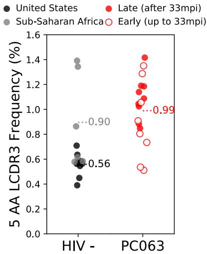

scatter

| Group          | Value |
| -------------- | ----- |
| United States  | 0.56  |
| Sub-Saharan Africa | 0.90  |
| Early (up to 33mpi) | 0.99  |

B   

line

| Months post-infection | PC064 PCT64 V2 apex Neutralization score | PC064 PCDN76 V3 glycan Neutralization score | PC063 PCIN63 CD4bs Neutralization score | PC063 PCIN63 CD4bs Lineage frequency (%) |
| --------------------- | ---------------------------------------- | ------------------------------------------ | --------------------------------------- | ---------------------------------------- |
| 0                     | 0.2                                      | 0.1                                        | 0.0                                     | 0                                        |
| 10                    | 0.5                                      | 0.5                                        | 0.1                                     | 0                                        |
| 20                    | 1.5                                      | 2.0                                        | 0.2                                     | 0                                        |
| 30                    | 1.6                                      | 1.5                                        | 0.3                                     | 0                                        |
| 40                    | 1.7                                      | 1.2                                        | 0.4                                     | 0                                        |
| 50                    | 1.8                                      | 1.0                                        | 0.5                                     | 0                                        |
| 60                    | 1.9                                      | 0.8                                        | 0.6                                     | 0                                        |
| 70                    | 2.0                                      | 0.6                                        | 0.7                                     | 0                                        |
| 80                    | 1.8                                      | 0.4                                        | 0.5                                     | 0                                        |

C   

boxplot

| Mutation | # of NT mutations |
| -------- | ----------------- |
| M40      | 8                 |
| M41      | 12                |
| M44      | 16                |
| M50      | 22                |
| M55      | 24                |
| M61      | 26                |
| M67      | 29                |
| M72      | 28                |
| M74      | 28                |

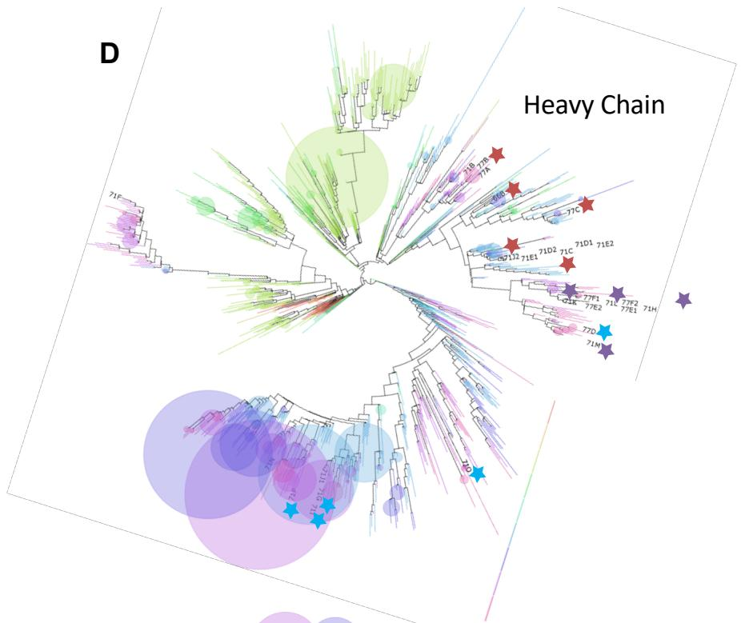

flowchart

```mermaid
graph TD
    A["Root"] --> B["Protein 1"]
    A --> C["Protein 2"]
    A --> D["Protein 3"]
    A --> E["Protein 4"]
    A --> F["Protein 5"]
    A --> G["Protein 6"]
    A --> H["Protein 7"]
    A --> I["Protein 8"]
    A --> J["Protein 9"]
    A --> K["Protein 10"]
    A --> L["Protein 11"]
    A --> M["Protein 12"]
    A --> N["Protein 13"]
    A --> O["Protein 14"]
    A --> P["Protein 15"]
    A --> Q["Protein 16"]
    A --> R["Protein 17"]
    A --> S["Protein 18"]
    A --> T["Protein 19"]
    A --> U["Protein 20"]
    A --> V["Protein 21"]
    A --> W["Protein 22"]
    A --> X["Protein 23"]
    A --> Y["Protein 24"]
    A --> Z["Protein 25"]
    A --> AA["Protein 26"]
    A --> AB["Protein 27"]
    A --> AC["Protein 28"]
    A --> AD["Protein 29"]
    A --> AE["Protein 30"]
    A --> AF["Protein 31"]
    A --> AG["Protein 32"]
    A --> AH["Protein 33"]
    A --> AI["Protein 34"]
    A --> AJ["Protein 35"]
    A --> AK["Protein 36"]
    A --> AL["Protein 37"]
    A --> AM["Protein 38"]
    A --> AN["Protein 39"]
    A --> AO["Protein 40"]
    A --> AP["Protein 41"]
    A --> AQ["Protein 42"]
    A --> AR["Protein 43"]
    A --> AS["Protein 44"]
    A --> AT["Protein 45"]
    A --> AU["Protein 46"]
    A --> AV["Protein 47"]
    A --> AW["Protein 48"]
    A --> AX["Protein 49"]
    A --> AY["Protein 50"]
    A --> AZ["Protein 51"]
    A --> BA["Protein 52"]
    A --> BB["Protein 53"]
    A --> BC["Protein 54"]
    A --> BD["Protein 55"]
    A --> BE["Protein 56"]
    A --> BF["Protein 57"]
    A --> BG["Protein 58"]
    A --> BH["Protein 59"]
    A --> BI["Protein 60"]
    A --> BJ["Protein 61"]
    A --> BK["Protein 62"]
    A --> BL["Protein 63"]
    A --> BM["Protein 64"]
    A --> BN["Protein 65"]
    A --> BO["Protein 66"]
    A --> BP["Protein 67"]
    A --> BQ["Protein 68"]
    A --> BR["Protein 69"]
    A --> BS["Protein 70"]
    A --> BT["Protein 71"]
    A --> BU["Protein 72"]
    A --> BV["Protein 73"]
    A --> BW["Protein 74"]
    A --> BX["Protein 75"]
    A --> BY["Protein 76"]
    A --> BZ["Protein 77"]
    A --> CA["Protein 78"]
    A --> CB["Protein 79"]
    A --> CC["Protein 80"]
    A --> CD["Protein 81"]
    A --> CE["Protein 82"]
    A --> CF["Protein 83"]
    A --> CG["Protein 84"]
    A --> CH["Protein 85"]
    A --> CI["Protein 86"]
    A --> CJ["Protein 87"]
    A --> CK["Protein 88"]
    A --> CL["Protein 89"]
    A --> CM["Protein 90"]
    A --> CN["Protein 91"]
    A --> CO["Protein 92"]
    A --> CP["Protein 93"]
    A --> CQ["Protein 94"]
    A --> CR["Protein 95"]
    A --> CS["Protein 96"]
    A --> CT["Protein 97"]
    A --> CU["Protein 98"]
    A --> CV["Protein 99"]
    A --> CW["Protein 100"]
```

E   
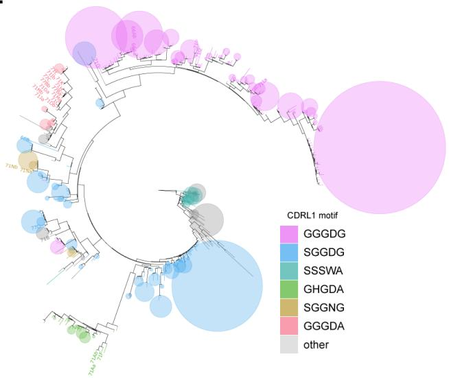

bubble

| Category | Value |
| -------- | ----- |
| GGGDG    | 72nd  |
| SGGDG    | 71st  |
| SSSWA    | 72nd  |
| GHGDA    | 71st  |
| SGGNG    | 72nd  |
| GGGDA    | 72nd  |
| other    | 72nd  |

bubble

Light Chain
| Node | MPI Value |
|---|---|
| 1 | 40 |
| 2 | 42 |
| 3 | 44 |
| 4 | 49 |
| 5 | 55 |
| 6 | 61 |
| 7 | 66 |
| 8 | 71 |
| 9 | 74 |
The chart displays a hierarchical clustering of light chain genes based on their MPI values. Nodes are color-coded by MPI value, and star symbols indicate specific gene clusters or outliers. The central node '71ND' likely represents a cluster of genes with high MPI values. No explicit numerical values are provided for the data.

Figure S3. Emergence and development of the PCIN63 bnAb lineage – Related to Figure 2.

(A) Frequency of 5-amino acid LCDR3 immunoglobulin sequences in the naïve repertoire of PC63 (from Zambia) at different time points compared to HIV negative individuals from the United States (Southern California) and sub-Saharan Africa (Protocol C clinical research site in Zambia, Uganda, Rwanda and South Africa).

(B) Comparison of the PCIN63 Ab lineage (Blue) emergence and evolution with other bnAbs lineages isolated from two Protocol C participants (PC076: high-mannose patch targeting PCDN lineage in orange; PC064: V2-apex targeting PCT64 lineage in green) as detected in the periphery. Lineage sequences frequencies are plotted as a percentage of total lineage sequences from all time points. Plasma neutralization score (see (Landais et al., 2016)) from a heterologous medium panel is plotted as a dashed line. Related to Figure 2A.

(C) Somatic hypermutation frequency was calculated for each timepoint as divergence (number of nucleotide changes compared to LMCA). Data are presented as whisker plot showing mean, 95% upper and lower quartiles, standard deviation and outliers.

(D) Longitudinal phylogeny of PCIN63 heavy chain (Flea LINK) (Top) and light chain (Flea LINK) (Bottom) NGS sequences (colored by time-point, mpi). PCIN63 mAbs dependant (red) or accommodating (blue) the N276-glycan for neutralization or with intermediate phenotype (purple) are indicated with star symbols. Shaded circles represent the size of the cluster.

(E) PCIN63 light chain phylogeny as in (D) but colored by LCDR1-motif#4 amino acid sequence.

A   

tree

| Category | Subgroup | Value |
|---|---|---|
| M06 | Red |  |
| M08 | Red |  |
| M11 | Yellow |  |
| M16 | Yellow |  |
| M22 | Green |  |
| M28 | Green |  |
| M33 | Cyan |  |
| M40 | Teal |  |
| M44 | Blue |  |
| M50 | Blue |  |
| M55 | Purple |  |
| M61 | Purple |  |
| M06s199 | Red |  |
| M08s36 | Red |  |
| M22s531 | Yellow |  |
| M11s123 | Yellow |  |
| M11s70 | Yellow |  |
| M16s13 | Yellow |  |
| M16s43 | Yellow |  |
| M16s108 | Yellow |  |
| M16s11 | Yellow |  |
| M28cH1 | Green |  |
| M22s57 | Green |  |
| M22s397 | Green |  |
| M22s305 | Green |  |
| M28s104 | Green |  |
| M28cG1 | Green |  |
| M22s302 | Green |  |
| M33s360 | Green |  |
| M33s163 | Green |  |
| M44s174 | Blue |  |
| M50s2359 | Blue |  |
| M28s119 | Green |  |
| M40s41 | Blue |  |
| M44s159 | Blue |  |
| M44s42 | Blue |  |
| M44s10 | Blue |  |
| M28s330 | Green |  |
| M28cB11 | Green |  |
| M44s200 | Green |  |
| M33s104 | Green |  |
| M40s10 | Green |  |
| M40s30 | Green |  |
| M44s166 | Green |  |
| M44s176 | Green |  |
| M50s577 | Green |  |
| M50s1232 | Green |  |
| M50s1039 | Green |  |
| M50s573 | Green |  |
| M50s1033 | Green |  |
| M55s494 | Purple |  |
| M55s953 | Purple |  |
| M55s401 | Purple |  |
| M55s217 | Purple |  |
| M61s121 | Purple |  |
| M55s175 | Purple |  |
| M55s168 | Purple |  |
| M50s1533 | Purple |  |
| M50s1436 | Purple |  |
| M44s114 | Purple |  |
| M50s1046 | Purple |  |
| M50s1010 | Purple |  |
| M61s136 | Purple |  |
| M61s288 | Purple |  |
| M61s77 | Purple |  |
| M61s457 | Purple |  |
| M61s491 | Purple |  |
0.0080

C

scatter

| Cell Line | OD405nm |
| --------- | ------- |
| M6s199    | 1.0     |
| M8s036    | 1.2     |
| M11s070   | 0.7     |
| M11s123   | 1.1     |
| M16s011   | 0.5     |
| M16s013   | 1.0     |
| M16s043   | 1.4     |
| M16s108   | 1.4     |
| M22s057   | 0.6     |
| M22s302   | 0.6     |
| M22s305   | 1.4     |
| M22s397   | 1.3     |
| M22s531   | 0.7     |
| M28s104   | 1.2     |
| M28s119   | 0.6     |
| M28s330   | 1.3     |
| M28cB11   | 0.3     |
| M28cG1    | 0.3     |
| M28cH1    | 0.3     |
| M33s104   | 0.4     |
| M33s163   | 0.4     |
| M33s360   | 0.9     |
| IAVI C22   | 3.2     |
| JRCSF-    | 3.5     |
| 92BR-     | 3.5     |

scatter

| Group        | OD405nm |
| ------------ | ------- |
| M8s036 WT    | 2.0     |
| M8s036 N276A | 1.5     |
| M11s123 WT   | 1.8     |
| M11s123 N276A| 2.5     |
| M16s108 WT   | 2.8     |
| M16s108 N276A| 2.6     |
| M28cB11 WT   | 2.9     |
| M28cG1 WT    | 2.7     |
| M28cH1 WT    | 2.5     |

B   

scatter

CD4bs Loop
| Position | CD4bs Loop |
|---|---|
| 351 | G |
| 352 | F |
| 353 | ~ |
| 354 | S |
| 355 | N |
| 356 | S |
| 357 | S |
| 358 | 359 |
| 359 | 360 |
| 360 | 361 |
| 361 | 362 |
| 362 | 363 |
| 363 | 364 |
| 364 | 365 |
| 365 | 366 |
| 366 | 367 |
| 367 | 368 |
| 368 | 369 |
| 369 | 370 |
| 370 | 371 |
| 371 | 372 |
| 372 | 373 |
| 373 | 374 |
| 374 | 375 |
| 375 | 376 |
| 376 | 377 |
| 377 | 378 |
The image displays a schematic representation of the CD4bs loop sequence. The labels 'G' and 'Y' indicate positions in the sequence, and the color-coded bars (blue, red, green, orange) represent different functional or signal regions. No numerical values are provided for the data.

<table><tr><td colspan="2">V5 Loop</td></tr><tr><td>Length (aa)</td><td>PNGS</td></tr><tr><td>12</td><td>1</td></tr><tr><td>12</td><td>1</td></tr><tr><td>12</td><td>1</td></tr><tr><td>12</td><td>1</td></tr><tr><td>12</td><td>1</td></tr><tr><td>12</td><td>1</td></tr><tr><td>12</td><td>1</td></tr><tr><td>13</td><td>1</td></tr><tr><td>12</td><td>1</td></tr><tr><td>12</td><td>1</td></tr><tr><td>13</td><td>1</td></tr><tr><td>12</td><td>1</td></tr><tr><td>11</td><td>1</td></tr><tr><td>13</td><td>1</td></tr><tr><td>10</td><td>2</td></tr><tr><td>11</td><td>2</td></tr><tr><td>10</td><td>2</td></tr><tr><td>11</td><td>1</td></tr><tr><td>10</td><td>2</td></tr><tr><td>10</td><td>2</td></tr><tr><td>11</td><td>2</td></tr><tr><td>10</td><td>1</td></tr><tr><td>11</td><td>1</td></tr><tr><td>10</td><td>2</td></tr><tr><td>13</td><td>1</td></tr><tr><td>11</td><td>2</td></tr><tr><td>10</td><td>1</td></tr><tr><td>11</td><td>1</td></tr><tr><td>11</td><td>2</td></tr><tr><td>12</td><td>2</td></tr><tr><td>10</td><td>2</td></tr><tr><td>10</td><td>2</td></tr><tr><td>10</td><td>2</td></tr><tr><td>10</td><td>2</td></tr><tr><td>11</td><td>2</td></tr><tr><td>12</td><td>2</td></tr><tr><td>12</td><td>2</td></tr><tr><td>11</td><td>2</td></tr><tr><td>10</td><td>2</td></tr><tr><td>10</td><td>2</td></tr><tr><td>10</td><td>2</td></tr><tr><td>13</td><td>3</td></tr><tr><td>12</td><td>2</td></tr><tr><td>11</td><td>2</td></tr><tr><td>10</td><td>2</td></tr><tr><td>10</td><td>2</td></tr><tr><td>11</td><td>2</td></tr><tr><td>10</td><td>2</td></tr><tr><td>11</td><td>2</td></tr></table>

text_image

N159
N362
N276
N303
N448

Figure S4. Elicitation of the PCIN63 lineage – Related to Figures 3 and 4.

(A) Phylogeny of PC063 HIV subtype C env, estimated by maximum likelihood from representative full-length env clonal sequences (c####) and PacBio high-quality consensus sequences (HQCS) (s####) obtained by next-generation sequencing of longitudinal plasma samples. Sequences are color-coded by time point (Months post infection, M). Clone M28cH1 is indicated with a black arrow.

(B) PCIN63 mAbs and control CD4bs Abs were tested for neutralization of pseudo-typed autologous PC063 Env clones representative of each time points (M-Months post infection, s-sequence number) as listed vertically. IC50s are tabulated and color coded as indicated in the legend. Amino-acid sequence and PNGS information of the PC063 autologous Env clones are indicated on the left. Amino-acid residues are numbered based on HxB2 alignment and color-coded as indicated in the legend. V5 loop length and number of PNGS are colored using a gradient.

(C) Putative PCIN63 UCA Abs (see Figure 3A) were tested for neutralization (Top) of representative pseudo-typed autologous Env clones (X-axis) selected from all time points prior to detection of the PCIN63 lineage in the periphery, and binding (bottom) to captured gp120 from corresponding pseudovirus stock lysates (left panel) or recombinantly expressed (right panel).

(B,C) Data are representative of at least 2 experiments.

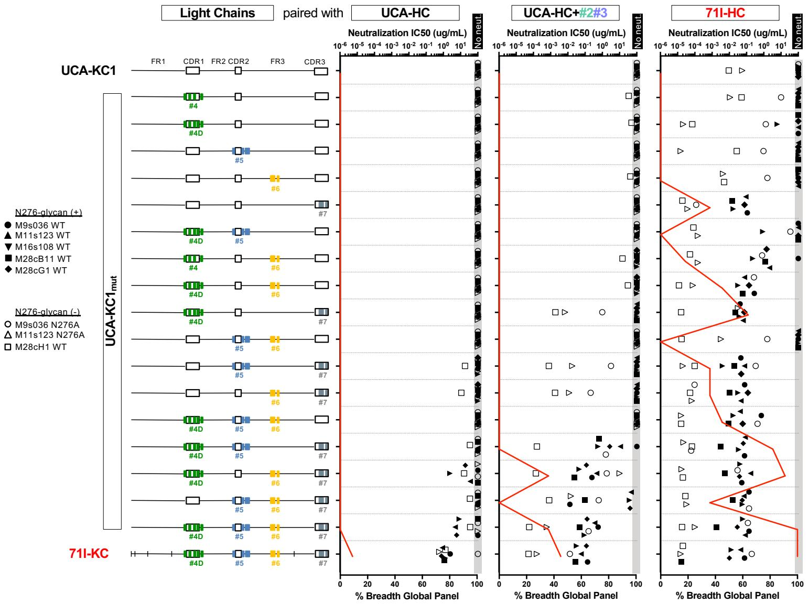

bar_line

| Cell Line | Condition | Cell Line | % Breadth Global Panel |
|-----------|-----------|-----------|------------------------|
| UCA-KC1   | Light Chains | FR1       | ~10⁻⁶ to ~100           |
| UCA-KC1   | Light Chains | CDR1      | ~10⁻⁶ to ~100           |
| UCA-KC1   | Light Chains | FR2       | ~10⁻⁶ to ~100           |
| UCA-KC1   | Light Chains | CDR2      | ~10⁻⁶ to ~100           |
| UCA-KC1   | Light Chains | FR3       | ~10⁻⁶ to ~100           |
| UCA-KC1   | Light Chains | CDR3      | ~10⁻⁶ to ~100           |
| UCA-KC1   | Light Chains | #4        | ~10⁻⁶ to ~100           |
| UCA-KC1   | Light Chains | #4D       | ~10⁻⁶ to ~100           |
| UCA-KC1   | Light Chains | #5        | ~10⁻⁶ to ~100           |
| UCA-KC1   | Light Chains | #6        | ~10⁻⁶ to ~100           |
| UCA-KC1   | Light Chains | #7        | ~10⁻⁶ to ~100           |
| UCA-KC1   | Light Chains | #4        | ~10⁻⁶ to ~100           |
| UCA-KC1   | Light Chains | #4D       | ~10⁻⁶ to ~100           |
| UCA-KC1   | Light Chains | #5        | ~10⁻⁶ to ~100           |
|
| UCA-KC1   | Light Chains | #6        | ~10⁻⁶ to ~100           |
| UCA-KC1   | Light Chains | #7        | ~10⁻⁶ to ~100           |
| UCA-KC1   | Light Chains | #4        | ~10⁻⁶ to ~100           |
| UCA-KC1   | Light Chains | #4D       (N276A) | ~10⁻⁶ to ~100 |
| UCA-KC1   | Light Chains | M9s036 WT  | ~10⁻⁶ to ~100 |
| UCA-KC1   | Light Chains | M11s123 WT | ~10⁻⁶ to ~100 |
| UCA-KC1   | Light Chains | M16s108 WT | ~10⁻⁶ to ~100 |
| UCA-KC1   | Light Chains | M28cB11 WT | ~10⁻⁶ to ~100 |
| UCA-KC1   | Light Chains | M28cG1 WT  | ~10⁻⁶ to ~100 |
| UCA-KC1   | Light Chains | N276-glycan (+) | ~10⁻⁶ to ~100 |
| UCA-KC1   | Light Chains | N276-glycan (-) | ~10⁻⁶ to ~100 |
| UCA-KC1   | Light Chains | N276-Glycan (+) | ~10⁻⁶ to ~100 |
| UCA-KC1   | Light Chains | N276-Glycan (-) | ~75–95                |
| UCA-KC1   | Light Chains | N276-Glycan (+) | ~75–95                |
| UCA-KC1   | Light Chains | N276-Glycan (-) | ~75–95                |
| UCA-KC1   | Light Chains | N276-Glycan (+) | ~75–95                |
| UCA-KC1   | Light Chains | N276-Glycan (-) | ~75–95                |
| UCA-KC1   | Light Chains | 7I-I-KC    | ~75–95                 |
| UCA-KC1   | Light Chains | 7I-I-KC    | ~75–95                 |
| UCA-KC1   | Light Chains | 7I-I-KC    | ~75–95                 |
| UCA-KC1   | Light Chains | 7I-I-KC    | ~75–95                 |
| UCA-KC1   | Light Chains | 7I-I-KC (N276A) | ~75–95               |
| UCA-KC1   | Light Chains | 7I-I-KC (N276A) | ~75–95               |
| UCA-KC1   | Light Chains | 7I-I-KC (N276A) | ~75–95               |
| UCA-KC1   | Light Chains | 7I-I-KC (N276A) + M9s036 WT (N276A) - ▲ △ ▼ ▽ ▽ ▽ ▽ ▽ ▽ ▽ ▽ ▽ ▽ ▽ ▽ ▽ ▽ ▽ ▽ ▽ ▽ ▽ ▽ ▽ ▽ ▽ ▽ ▽ ▽ ▽ ▽ ▽ ▽ ▽ ▽ ▽ ▽ ▽ ▽ ▽ ▽ ▽ ▽ ▽ ▽ ▽ ▽ ▽ ▽ ▽ ▽ ▽ ▽ ▉ ▽ ▽ ▽ ▽ ▽ ▽ ▽ ▽ ▽ ▽ ▽ ▽ ▽ ▽ ▽ ▽ ▽ ▽ ▽ ▽ ▽ ▽ ▽ ▽ ▽ ▽ ▽ ▽ ▽ ▽ ▽ ▽ ▽ ▽ ▽ ▽ ▽ ▽ ▽ ▽ ▽ ▽ ▽ ▽ ▉ ▽ ▽ ▽ ▽ ▉ ▽ ▽ ▽ ▽ ▽ ▽ ▽ ▽ ▽ ▽ ▽ ▽ ▉ ▽ ▽ ▽ ▽ ▉ ▽ ▽ ▽ ▽ ▽ ▽ ▉ ▽ ▽ ▉ ▽ ▉ ▽ ▉ ▽ ▉ ▽ ▉ ▉ ▽□□□□□□□□□□□□□□□□□□□□□□□□□□□□□□□□□□□□□□□□□□□□□□□□□□□□□□□□□□□□□□□□□□□□□□□□□□□□□□□□□□□□□□□□□□□□□□□□□□□□○M9s036 N276A△M9s036 N276A△M9s036 N276A△M9s036 N276A△M9s036 N276A△M9s036 N276A△M9s036 N276A△M9s036 N276A△M9s036 N276A△M9s*4D△M9s*4D△M9s*4D△M9s*4D△M9s*4D△M9s*4D△M9s*4D△M9s*4D△M9s*4D△M9s*4D△M9s*4D△M9s*4D△M9s*4D△M9s*4D△M9s*4D△<fcel>% Breadth Global Panel (No Neut) vs. % Breadth Global Panel (No Neut) vs. % Breadth Global Panel (No Neut) vs. % Breadth Global Panel (No Neut) vs. % Breadth Global Panel (No Neut) vs. % Breadth Global Panel (No Neut) vs. % Breadth Global Panel (No Neut) vs. % Breadth Global Panel (No Neut) vs. % Breadth Global Panel (No Neut) vs. % Breadth Global [Neut] vs. % Breadth Global Panel (Neut] vs. % Breadth Global Panel (Neut] vs. % Breadth Global Panel (Neut] vs. % Breadth Global Panel (Neut] vs. % Breadth Global Panel (Neut] vs. % Breadth Global Panel (Neut] vs. % Breadth Global Panel (Neut] vs. % Breadth Global Panel (Neut] vs. % Breadth Global Panel (Neut] vs. % Breadth Global Panel (No Neut) vs. % Breadth Global Panel (No Neut) vs. % Breadth Global Panel (No Neut) vs. % Breadth Global Panel (No Neut) vs. % Breadth Global Panel (No Neut) vs. % Breadth Global Panel (No Neut) vs. % Breadth Global Panel (No Neut) vs. % Breadth Global Panel (No Neut) vs. % Beet [Neut] vs. % Beet [Neut] vs. % Beet [Neut] vs. % Beet [Neut] vs. % Beet [Neut] vs. % Beet [Neut] vs. % Beet [Neut] vs. % Beet [Neut] vs. % Beet [Neut] vs. % Beet [Neut] vs. % Beet [Neut] vs. % Beet [Neut] / % Beet [Neut] / % Beet [Neut] / % Beet [Neut] / % Beet [Neut] / % Beet [Neut] / % Beet [Neut] / % Beet [Neut] / % Beet [Neut] / % Beet [Neut] / % Beet [Neut] / % Beet [Neut] / % Beet [Neut] / % Beet[Neut] / % Beet [Neut] / % Beet [Neut] / % Beet [Neut] / % Beet [Neut] / % Beet [Neut] / % Beet [Neut] / % Beet [Neut] / % Beet [Neut] / % Beet [Neut] / % Beet [Neut] / % Beet [Neut] / % Beet [Neu] / % Beet [Neut] / % Beet [Neu] / % Beet [Neu] / % Beet [Neu] / % Beet [Neu] / % Beet [Neu] / % Beet [Neu] / % Beet [Neu] / % Beet [Neu] / % Beet [Neu] / % Beet [Neu] / % Beet [Neu] / % Beet [Neu] / % Beet [Neu] / %Beet [Neu] / %Beet [Neu] / %Beet [Neu] / %Beet [Neu] / %Beet [Neu] / %Beet [Neu] / %Beet [Neu] / %Beet [Neu] / %Beet [Neu] / %Beet [Neu] / %Beet [Neu] / %Beet [Neu] / %Beet [Neue] / %Beet [Neue] / %Beet [Neue] / %Beet [Neue] / %Beet [Neue] / %Beet [Neue] / %Beet [Neue] / %Beet [Neue] / %Beet [Neue] / %Beet [Neue] / %Beet [Neue] / %Beet [Neue] / %Beet [Neue]
| Light Chains | No Neut |
| Light Chains | No Neut |
| Light Chains | No Neut |
| Light Chains | No Neut |
| Light Chains | No Neut |
| Light Chains | No Neut |
| Light Chains | No Neut |
| Light Chains | No Neut |
| Light Chains | No Neut |
| Light Chains | No Neut |
| Light Chains | No Neut |
| Light Chains | No Neut |
| Light Chains | No Neut |
| Light Chains (N276-Glycan) - N276-Glycan (-) - N276-Glycan (-) - N276-Glycan (-) - N276-Glycan (-) - N276-Glycan (-) - N276-Glycan (-) - N276-Glycan (-) - N276-Glycan (-) - N276-Glycan (-) - N276-Glycan (-) - N276-Glycan (N276-Glycan) - N276-Glycan (-) - N276-Glycan (-) - N276-Glycan (-) - N276-Glycan (-) - N276-Glycan (-) - N276-Glycan (-) - N276-Glycan (-) - N276-Glycan (-) - N276-Glycan (-) + N276-Glycan (-) - N276-Glycan (-) - N276-Glycan (-) - N276-Glycan (-) - N276-Glycan (-) - N276-Glycan (-) - N276-Glycan (-) - N276-Glycan (-) + N276-Glycan (-) + N276-Glycan (-) - N276-Glycan (-) + N276-Glycan (-) + N276-Glycan (-) + N276-Glycan (-) + N276-Glycan (-) + N276-Glycan (-) + N276-Glycan (-) + N276-Glycan (-) + N276-Glycan (-) + N276-Glycan (-) + N276-Glycan (-) and N276-Glycan (-) + N276-Glycan (-) + N276-Glycan (-) + N276-Glycan (-) + N276-Glycan (-) + N276-Glycan (-) + N276-Glycan (-) + N276-Glycan (-) + N276-Glycan (-) + N276-Glycan (-) - N276-Glycan (-) + N276-Glycan (-) + N276-Glycan (-) + N276-Glycan (-) + N276-Glycan (-) + N276-Glycan (-) + N276-Glycan (-) - N276-Glycan (-) + N276-Glycan (-) + N276-Glycan (-) - N276-4D            #4D       #4D       #4D       #4D       #4D       #4D       #4D       #4D       #4D       #4D       #4D       #4D       #4D       #4D       #4D       #4D       #4D       #4D       #4D       #4D       #4D       #4D       #4D       #4D       #4D       #4D      #4D      #4D      #4D      #4D      #4D      #4D      #4D      #4D      #4D      #4D      #4D      #4D      #4D      #4D      #4D      #4D      #4D      #4D      #4D      #4D      #4D      #4D      #4D      #4D      #4D     #4D      #4D      #4D      #4D      #4D      #4D      #4D      #4D      #4D      #4D      #4D      #4D      #4D      #4D      #4D      #4D      #4D      #4D      #4D      #4D      #4D      #4D      #4D      #4D      #4D: 5×5×5×5×5×5×5×5×5×5×5×5×5×5×5×5×5×5×5×5×5×5×5×5×5×5×5×5×5×5×5×5×5×5×5×5×5×5×5×5×5×5×5×5×5×5×5×5×5×5×5 ×5×5×5×5×5×5×5×5×5×5×5×5×5×5×5×5×5×5×5×5×5×5×5×5×5×5×5×5×5×5×5×5×5×5×5×5 ×5×5 ×5 ×5 ×5 ×5 ×5 ×5 ×5 ×5 ×5 ×5 ×5 ×5 ×5 ×5 ×5 ×5 ×5 ×5 ×5 ×5 ×8 ×8 ×8 ×8 ×8 ×8 ×8 ×8 ×8 ×8 ×8 ×8 ×8 ×8 ×8 ×8 ×8 ×8 ×8 ×8 ×8 ×8 ×8 ×8 ×8 ×8 ×8 ×8 ×8 ×8 ×8 ×8 ×8 ×8 ×8 ×8 ×8 ×8 ×8 ×8 ×8 ×8 ×8 ×8 ×8 ×8 ×8 ×8 ×8 ×8 ×<nl>

Figure S5. Functional evaluation of PCIN63 Ab lineage maturation – Related to Figure 4   
PCIN63-71I-KC SHM motifs (as defined in Figure 2B) were introduced into the PCIN63-UCA-KC1, individually or in combination. Motifs are color-coded and their sequence position is indicated with a diagram. Mutated constructs were paired with WT PCIN63-UCA (left), PCIN63-UCA+Motif#2+Motif#3 (middle) or PCIN63-71I (right) HC. The chimeric Abs were tested for neutralization of the indicated WT and N276A autologous Env clones sensitive to neutralization by PCIN63-71I, as well as against the global 12-virus panel (De Camp et al., 2014). Data are representative of at least 2 experiments.

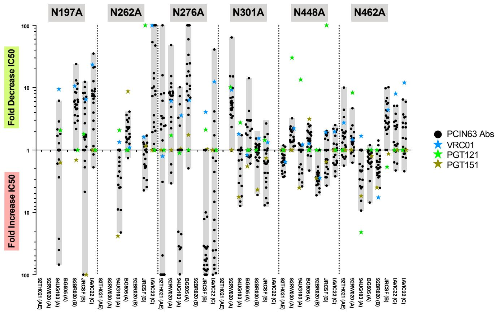

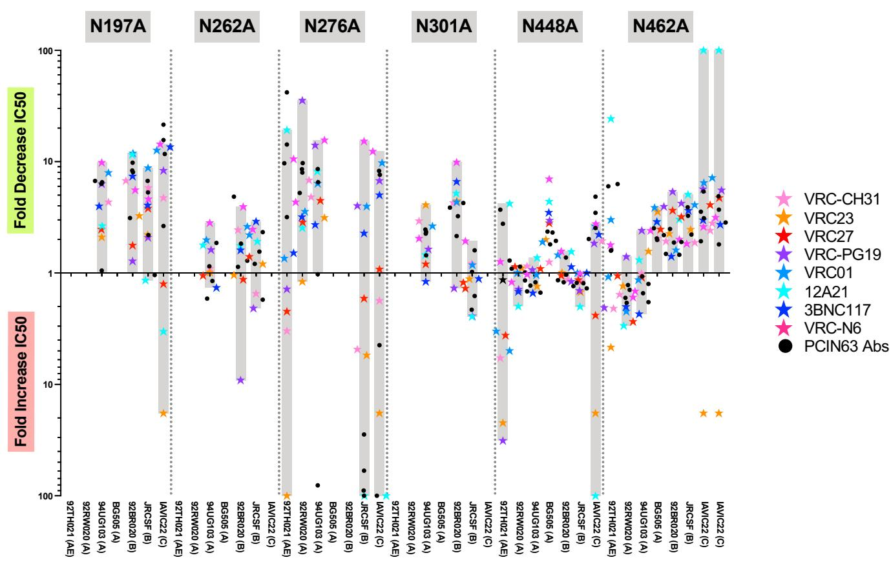  
Figure S6. Effect of CD4bs N-glycan removal on neutralization by PCIN63 Abs – Related to Figure 5.   
PCIN63 Abs, VRC01-class, PGT151 and PGT121 Abs were tested for neutralizing activity against the indicated pseudoviruses carrying the indicated mutation knocking down CD4bs surrounding N-glycan. The fold decrease or increase in neutralization $IC_{50}$ is plotted. The gray bars indicate the range of variation for the PCIN63 Abs only (upper panel) or VRC01-class reference Abs (lower panel). Data are representation of at least two experiments.

CDR1 CDR2 CDR3 

<table><tr><td>Q</td><td>V</td><td>L</td><td>V</td><td>Q</td><td>S</td><td>G</td><td>A</td><td>E</td><td>V</td><td>K</td><td>K</td><td>P</td><td>G</td><td>A</td><td>S</td><td>V</td><td>K</td><td>V</td><td>S</td><td>C</td><td>K</td><td>A</td><td>S</td><td>G</td><td>Y</td><td>T</td><td>F</td><td>T</td><td>G</td><td>--</td><td>--</td><td>--</td><td>--</td><td>--</td><td>--</td><td>--</td><td>--</td><td>--</td><td>--</td><td>--</td><td>--</td><td>--</td><td>--</td><td>--</td><td>--</td><td>--</td><td>--</td><td>--</td><td>--</td><td>--</td><td>--</td><td>--</td><td>--</td><td>--</td><td>--</td><td>--</td><td>--</td><td>--</td><td>--</td><td>--</td><td>--</td><td>--</td><td>--</td><td>--</td><td>--</td><td>--</td><td>--</td><td>--</td><td>--</td><td>--</td><td>--</td><td>--</td><td>--</td><td>--</td><td>--</td><td>--</td><td>--</td><td>--</td><td>--</td><td>--</td><td>--</td><td>--</td><td>--</td><td>--</td><td>--</td><td>--</td><td>--</td><td>--</td><td>--</td><td>--</td><td>--</td><td>--</td><td>--</td><td>--</td><td>--</td><td>--</td><td>--</td><td>--</td><td>--</td><td>--</td><td>--</td><td>--</td><td>--</td><td>--</td><td>--</td><td>--</td><td>--</td><td>--</td><td>--</td><td>--</td><td>--</td><td>--</td><td>--</td><td>--</td><td>--</td><td>--</td><td>--</td><td>--</td><td>--</td><td>--</td><td>--</td><td>--</td><td>--</td><td>--</td><td>--</td><td>--</td><td>--</td><td>--</td><td>--</td><td>)--</td><td>--</td><td>--</td><td>--</td><td>--</td><td>--</td><td>--</td><td>--</td><td>--</td><td>--</td><td>--</td><td>--</td><td>--</td><td>--</td><td>--</td><td>--</td><td>--</td><td>--</td><td>--</td><td>--</td><td>--</td><td>--</td><td>--</td><td>--</td><td>--</td><td>--</td><td>--</td><td>--</td><td>--</td><td>--</td><td>--</td><td>--</td><td>--</td><td>--</td><td>--</td><td>--</td><td>--</td><td>--</td><td>--</td><td>--</td><td>--</td><td>--</td><td>--</td><td>--</td><td>--</td><td>--</td><td>--</td><td>--</td><td>--</td><td>--</td><td></td></tr><tr><td></td><td></td><td></td><td></td><td></td><td></td><td></td><td></td><td></td><td></td><td></td><td></td><td></td><td></td><td></td><td></td><td></td><td></td><td></td><td></td><td></td><td></td><td></td><td></td><td></td><td></td><td></td><td></td><td></td><td></td><td></td><td></td><td></td><td></td><td></td><td></td><td></td><td></td><td></td><td></td><td></td><td></td><td></td><td></td><td></td><td></td><td></td><td></td><td></td><td></td><td></td><td></td><td></td><td></td><td></td><td></td><td></td><td></td><td></td><td></td><td></td><td></td><td></td><td></td><td></td><td></td><td></td><td></td><td></td><td></td><td></td><td></td><td></td><td></td><td></td><td></td><td></td><td></td><td></td><td></td><td></td><td></td><td></td><td></td><td></td><td></td><td></td><td></td><td></td><td></td><td></td><td></td><td></td><td></td><td></td><td></td><td></td><td></td><td></td><td></td><td></td><td></td><td></td><td></td><td></td><td></td><td></td><td></td><td></td><td></td><td></td><td></td><td></td><td></td><td></td><td></td><td></td><td></td><td></td><td></td><td></td><td></td><td></td><td></td><td></td><td></td><td></td><td></td><td></td><td></td><td></td><td></td><td></td><td></td><td></td><td></td><td></td><td></td><td></td><td></td><td></td><td></td><td></td><td></td><td></td><td></td><td></td><td></td><td></td><td></td><td></td><td></td><td></td><td></td><td></td><td></td><td></td><td></td><td></td><td></td><td></td><td></td><td></td><td></td><td></td><td></td><td></td><td></td><td></td><td></td><td></td><td></td><td></td><td></td><td></td><td></td><td></td><td></td><td></td><td></td><td></td></tr><tr><td></td><td></td><td></td><td></td><td></td><td></td><td></td><td></td><td></td><td></td><td></td><td></td><td></td><td></td><td></td><td></td><td></td><td></td><td></td><td></td><td></td><td></td><td></td><td></td><td></td><td></td><td></td><td></td><td></td><td></td><td></td><td></td><td></td><td></td><td></td><td></td><td></td><td></td><td></td><td></td><td></td><td></td><td></td><td></td><td></td><td></td><td></td><td></td><td></td><td></td><td></td><td></td><td></td><td></td><td></td><td></td><td></td><td></td><td></td><td></td><td></td><td></td><td></td><td></td><td></td><td></td><td></td><td></td><td></td><td></td><td></td><td></td><td></td><td></td><td></td><td></td><td></td><td></td><td></td><td></td><td></td><td></td><td></td><td></td><td></td><td></td><td></td><td></td><td></td><td></td><td></td><td></td><td></td><td></td><td></td><td></td><td></td><td></td><td></td><td></td><td></td><td></td><td></td><td></td><td></td><td></td><td></td><td></td><td></td><td></td><td></td><td></td><td></td><td></td><td></td><td></td><td></td><td></td><td></td><td></td><td></td><td></td><td></td><td></td><td></td><td></td><td></td><td></td><td></td><td></td><td></td><td></td><td></td><td></td><td></td><td></td><td></td><td></td><td></td><td></td><td></td><td></td><td></td><td></td><td></td><td></td><td></td><td></td><td></td><td></td><td></td><td></td><td></td><td></td><td></td><td></td><td></td><td></td><td></td><td></td><td></td><td></td><td></td><td></td><td></td><td></td><td></td><td></td><td></td><td></td><td></td><td></td><td></td><td></td><td></td><td></td><td></td><td></td><td></td><td></td><td></td></tr><tr><td></td><td></td><td></td><td>G</td><td>Q</td><td>M</td><td>.</td><td>.</td><td>E</td><td>.</td><td>M</td><td>R</td><td>I</td><td>.</td><td>R</td><td>.</td><td>.</td><td>E</td><td>.</td><td>I</td><td>D</td><td>.</td><td>.</td><td>.</td><td>.</td><td>.</td><td>.</td><td>.</td><td>CT</td><td>L</td><td>N</td><td>I</td><td>L</td><td>.</td><td>.</td><td>K</td><td>R</td><td>P</td><td>.</td><td>.</td><td>.</td><td>.</td><td>.</td><td>L</td><td>K</td><td>R</td><td>G</td><td>A</td><td>V</td><td>.</td><td>.</td><td>R</td><td>P</td><td>L</td><td>.</td><td>.</td><td>.</td><td>.</td><td>.</td><td>.</td><td>.</td><td>.</td><td>.</td><td>.</td><td>.</td><td>.</td><td>.</td><td>.</td><td>.</td><td>.</td><td>.</td><td>.</td><td>.</td><td>.</td><td>.</td><td>.</td><td>.</td><td>.</td><td>.</td><td>.</td><td>.</td><td>.</td><td>.</td><td>.</td><td>.</td><td>.</td><td>.</td><td>.</td><td>.</td><td>.</td><td>.</td><td>.</td><td>.</td><td>.</td><td>.</td><td>.</td><td>.</td><td>.</td><td></td><td></td><td></td><td></td><td></td><td></td><td></td><td></td><td></td><td></td><td></td><td></td><td></td><td></td><td></td><td></td><td></td><td></td><td></td><td></td><td></td><td></td><td></td><td></td><td></td><td></td><td></td><td></td><td></td><td></td><td></td><td></td><td></td><td></td><td></td><td></td><td></td><td></td><td></td><td></td><td></td><td></td><td></td><td></td><td></td><td></td><td></td><td></td><td></td><td></td><td></td><td></td><td></td><td></td><td></td><td></td><td></td><td></td><td></td><td></td><td></td><td></td><td></td><td></td><td></td><td></td><td></td><td></td><td></td><td></td><td></td><td></td><td></td><td></td><td></td><td></td><td></td><td></td><td></td><td></td><td></td><td></td><td></td></tr><tr><td></td><td></td><td></td><td>G</td><td>Q</td><td>M</td><td>.</td><td>.</td><td>E</td><td>.</td><td>M</td><td>R</td><td>L</td><td>.</td><td>R</td><td>.</td><td>.</td><td>E</td><td>.</td><td>L</td><td>N</td><td>I</td><td>.</td><td>L</td><td>.</td><td>.</td><td>.</td><td>.</td><td>.</td><td>C</td><td>P</td><td>I</td><td>N</td><td>I</td><td>L</td><td>.</td><td>.</td><td>K</td><td>R</td><td>P</td><td>.</td><td>.</td><td>.</td><td>.</td><td>L</td><td>K</td><td>R</td><td>G</td><td>A</td><td>V</td><td>.</td><td>.</td><td>R</td><td>P</td><td>L</td><td>.</td><td>.</td><td>.</td><td>.</td><td>.</td><td>.</td><td>.</td><td>.</td><td>.</td><td>.</td><td>.</td><td>.</td><td>.</td><td>.</td><td>.</td><td>.</td><td>.</td><td>.</td><td>.</td><td>.</td><td>.</td><td>.</td><td>.</td><td>.</td><td>.</td><td>.</td><td>.</td><td>.</td><td>.</td><td>.</td><td>.</td><td>.</td><td></td><td></td><td></td><td></td><td></td><td></td><td></td><td></td><td></td><td></td><td></td><td></td><td></td><td></td><td></td><td></td><td></td><td></td><td></td><td></td><td></td><td></td><td></td><td></td><td></td><td></td><td></td><td></td><td></td><td></td><td></td><td></td><td></td><td></td><td></td><td></td><td></td><td></td><td></td><td></td><td></td><td></td><td></td><td></td><td></td><td></td><td></td><td></td><td></td><td></td><td></td><td></td><td></td><td></td><td></td><td></td><td></td><td></td><td></td><td></td><td></td><td></td><td></td><td></td><td></td><td></td><td></td><td></td><td></td><td></td><td></td><td></td><td></td><td></td><td></td><td></td><td></td><td></td><td></td><td></td><td></td><td></td><td></td><td></td><td></td><td></td><td></td><td></td><td></td><td></td><td></td><td></td><td></td><td></td></tr><tr><td></td><td></td><td></td><td>G</td><td>Q</td><td>M</td><td>.</td><td>.</td><td>E</td><td>.</td><td>M</td><td>R</td><td>I</td><td>.</td><td>Q</td><td>.</td><td>.</td><td>E</td><td>.</td><td>I</td><td>D</td><td>.</td><td>.</td><td>L</td><td>.</td><td>.</td><td>.</td><td>.</td><td>.</td><td>CT</td><td>L</td><td>N</td><td>I</td><td>L</td><td>.</td><td>.</td><td>K</td><td>R</td><td>P</td><td>.</td><td>.</td><td>.</td><td>.</td><td>L</td><td>K</td><td>R</td><td>G</td><td>A</td><td>V</td><td>.</td><td>.</td><td>R</td><td>P</td><td>L</td><td>.</td><td>.</td><td>.</td><td>.</td><td>.</td><td>.</td><td>.</td><td>.</td><td>.</td><td>.</td><td>.</td><td>.</td><td>.</td><td>.</td><td>.</td><td>.</td><td>.</td><td>.</td><td>.</td><td>.</td><td>.</td><td>.</td><td>.</td><td>.</td><td>.</td><td>.</td><td></td><td></td><td></td><td></td><td></td><td></td><td></td><td></td><td></td><td></td><td></td><td></td><td></td><td></td><td></td><td></td><td></td><td></td><td></td><td></td><td></td><td></td><td></td><td></td><td></td><td></td><td></td><td></td><td></td><td></td><td></td><td></td><td></td><td></td><td></td><td></td><td></td><td></td><td></td><td></td><td></td><td></td><td></td><td></td><td></td><td></td><td></td><td></td><td></td><td></td><td></td><td></td><td></td><td></td><td></td><td></td><td></td><td></td><td></td><td></td><td></td><td></td><td></td><td></td><td></td><td></td><td></td><td></td><td></td><td></td><td></td><td></td><td></td><td></td><td></td><td></td><td></td><td></td><td></td><td></td><td></td><td></td><td></td><td></td><td></td><td></td><td></td><td></td><td></td><td></td><td></td><td></td><td></td><td></td><td></td><td></td><td></td><td></td><td></td><td></td><td></td></tr><tr><td></td><td></td><td></td><td>V</td><td>I</td><td>T</td><td>.</td><td>S</td><td>.</td><td>I</td><td>R</td><td>.</td><td>.</td><td>N</td><td>R</td><td>D</td><td>.</td><td>.</td><td>S</td><td>I</td><td>.</td><td>.</td><td>L</td><td>I</td><td>D</td><td>K</td><td>F</td><td>.</td><td>I</td><td>K</td><td>L</td><td>W</td><td>A</td><td>V</td><td>S</td><td>.</td><td>R</td><td>Q</td><td>L</td><td>.</td><td>.</td><td>S</td><td>L</td><td>F</td><td>S</td><td>Q</td><td>P</td><td>D</td><td>D</td><td>W</td><td>G</td><td>V</td><td>.</td><td>Q</td><td>L</td><td>S</td><td>Q</td><td>P</td><td>D</td><td>D</td><td>W</td><td>G</td><td>V</td><td>.</td><td>F</td><td>G</td><td>T</td><td>P</td><td>A</td><td>.</td><td>E</td><td>F</td><td>V</td><td>R</td><td>R</td><td>G</td><td>S</td><td>C</td><td>D</td><td>Y</td><td>C</td><td>G</td><td>D</td><td>F</td><td>P</td><td>--</td><td>--</td><td>--</td><td>--</td><td>--</td><td>--</td><td>--</td><td>--</td><td>--</td><td>--</td><td>--</td><td></td><td></td><td></td><td></td><td></td><td></td><td></td><td></td><td></td><td></td><td></td><td></td><td></td><td></td><td></td><td></td><td></td><td></td><td></td><td></td><td></td><td></td><td></td><td></td><td></td><td></td><td></td><td></td><td></td><td></td><td></td><td></td><td></td><td></td><td></td><td></td><td></td><td></td><td></td><td></td><td></td><td></td><td></td><td></td><td></td><td></td><td></td><td></td><td></td><td></td><td></td><td></td><td></td><td></td><td></td><td></td><td></td><td></td><td></td><td></td><td></td><td></td><td></td><td></td><td></td><td></td><td></td><td></td><td></td><td></td><td></td><td></td><td></td><td></td><td></td><td></td><td></td><td></td><td></td><td></td><td></td><td></td><td></td><td></td><td></td></tr><tr><td></td><td></td><td></td><td>E</td><td>.</td><td>E</td><td>.</td><td>P</td><td>V</td><td>M</td><td>R</td><td>.</td><td>S</td><td>M</td><td>I</td><td>.</td><td>A</td><td>T</td><td>N</td><td>R</td><td>D</td><td>.</td><td>.</td><td>K</td><td>L</td><td>W</td><td>A</td><td>V</td><td>S</td><td>R</td><td>Q</td><td>L</td><td>S</td><td>L</td><td>F</td><td>S</td><td>Q</td><td>L</td><td>Y</td><td>P</td><td>P</td><td>D</td><td>R</td><td>G</td><td>L</td><td>F</td><td>G</td><td>T</td><td>A</td><td>.</td><td>E</td><td>F</td><td>V</td><td>R</td><td>R</td><td>G</td><td>S</td><td>C</td><td>D</td><td>Y</td><td>C</td><td>G</td><td>D</td><td>F</td><td>P</td><td>--</td><td>--</td><td>--</td><td>--</td><td>--</td><td>--</td><td>--</td><td>--</td><td>--</td><td>--</td><td>--</td><td>--</td><td>--</td><td>--</td><td>--</td><td></td><td></td><td></td><td></td><td></td><td></td><td></td><td></td><td></td><td></td><td></td><td></td><td></td><td></td><td></td><td></td><td></td><td></td><td></td><td></td><td></td><td></td><td></td><td></td><td></td><td></td><td></td><td></td><td></td><td></td><td></td><td></td><td></td><td></td><td></td><td></td><td></td><td></td><td></td><td></td><td></td><td></td><td></td><td></td><td></td><td></td><td></td><td></td><td></td><td></td><td></td><td></td><td></td><td></td><td></td><td></td><td></td><td></td><td></td><td></td><td></td><td></td><td></td><td></td><td></td><td></td><td></td><td></td><td></td><td></td><td></td><td></td><td></td><td></td><td></td><td></td><td></td><td></td><td></td><td></td><td></td><td></td><td></td><td></td><td></td><td></td><td></td><td></td><td></td><td></td><td></td><td></td><td></td><td></td><td></td><td></td><td></td><td></td><td></td><td></td><td></td></tr><tr><td></td><td></td><td></td><td>R</td><td>S</td><td>.</td><td>G</td><td>Q</td><td>M</td><td>.</td><td>D</td><td>M</td><td>R</td><td>I</td><td>R</td><td>.</td><td>E</td><td>I</td><td>N</td><td>R</td><td>C</td><td>P</td><td>I</td><td>L</td><td>.</td><td>K</td><td>R</td><td>P</td><td>.</td><td>M</td><td>K</td><td>R</td><td>G</td><td>A</td><td>V</td><td>S</td><td>R</td><td>Q</td><td>L</td><td>.</td><td>.</td><td>M</td><td>Y</td><td>S</td><td>E</td><td>.</td><td>L</td><td>F</td><td>R</td><td>S</td><td>T</td><td>R</td><td>.</td><td>E</td><td>F</td><td>V</td><td>R</td><td>K</td><td>Y</td><td>C</td><td>T</td><td>A</td><td>D</td><td>Y</td><td>N</td><td>--</td><td>--</td><td>--</td><td>--</td><td>--</td><td>--</td><td>--</td><td>--</td><td>--</td><td>--</td><td></td><td></td><td></td><td></td><td></td><td></td><td></td><td></td><td></td><td></td><td></td><td></td><td></td><td></td><td></td><td></td><td></td><td></td><td></td><td></td><td></td><td></td><td></td><td></td><td></td><td></td><td></td><td></td><td></td><td></td><td></td><td></td><td></td><td></td><td></td><td></td><td></td><td></td><td></td><td></td><td></td><td></td><td></td><td></td><td></td><td></td><td></td><td></td><td></td><td></td><td></td><td></td><td></td><td></td><td></td><td></td><td></td><td></td><td></td><td></td><td></td><td></td><td></td><td></td><td></td><td></td><td></td><td></td><td></td><td></td><td></td><td></td><td></td><td></td><td></td><td></td><td></td><td></td><td></td><td></td><td></td><td></td><td></td><td></td><td></td><td></td><td></td><td></td><td></td><td></td><td></td><td></td><td></td><td></td><td></td><td></td><td></td><td></td><td></td><td></td><td></td><td></td><td></td><td></td><td></td><td></td></tr><tr><td></td><td></td><td></td><td>T</td><td>Q</td><td>M</td><td>E</td><td>.</td><td>T</td><td>I</td><td>V</td><td>T</td><td>.</td><td>E</td><td>V</td><td>E</td><td>.</td><td>L</td><td>I</td><td>N</td><td>I</td><td>V</td><td>V</td><td>R</td><td>R</td><td>V</td><td>.</td><td>M</td><td>R</td><td>G</td><td>V</td><td>.</td><td>R</td><td>Q</td><td>K</td><td>K</td><td>K</td><td>K</td><td>K</td><td>K</td><td>K</td><td>K</td><td>K</td><td>K</td><td>K</td><td>K</td><td>K</td><td>K</td><td>K</td><td>K</td><td>K</td><td>K</td><td>K</td><td>K</td><td>K</td><td>K</td><td>K</td><td>K</td><td>K</td><td>K</td><td>K</td><td>K</td><td>K</td><td>K</td><td>K</td><td>K</td><td>K</td><td></td><td></td><td></td><td></td><td></td><td></td><td></td><td></td><td></td><td></td><td></td><td></td><td></td><td></td><td></td><td></td><td></td><td></td><td></td><td></td><td></td><td></td><td></td><td></td><td></td><td></td><td></td><td></td><td></td><td></td><td></td><td></td><td></td><td></td><td></td><td></td><td></td><td></td><td></td><td></td><td></td><td></td><td></td><td></td><td></td><td></td><td></td><td></td><td></td><td></td><td></td><td></td><td></td><td></td><td></td><td></td><td></td><td></td><td></td><td></td><td></td><td></td><td></td><td></td><td></td><td></td><td></td><td></td><td></td><td></td><td></td><td></td><td></td><td></td><td></td><td></td><td></td><td></td><td></td><td></td><td></td><td></td><td></td><td></td><td></td><td></td><td></td><td></td><td></td><td></td><td></td><td></td><td></td><td></td><td></td><td></td><td></td><td></td><td></td><td></td><td></td><td></td><td></td><td></td><td></td><td></td><td></td><td></td><td></td><td></td><td></td><td></td><td></td><td></td></tr><tr><td></td><td></td><td></td><td>R</td><td>R</td><td>.</td><td>N</td><td>Q</td><td>R</td><td>.</td><td>R</td><td>I</td><td>E</td><td>K</td><td>I</td><td>D</td><td>.</td><td>H</td><td>F</td><td>I</td><td>L</td><td>.</td><td>V</td><td>H</td><td>H</td><td>H</td><td>L</td><td>.</td><td>M</td><td>R</td><td>G</td><td>V</td><td>.</td><td>S</td><td>R</td><td>T</td><td>S</td><td>K</td><td>L</td><td>T</td><td>M</td><td>N</td><td>F</td><td>E</td><td>.</td><td>L</td><td>D</td><td>K</td><td>N</td><td>P</td><td>G</td><td>L</td><td>F</td><td>R</td><td>F</td><td>F</td><td>F</td><td>F</td><td>F</td><td>F</td><td>F</td><td>F</td><td>F</td><td></td><td></td><td></td><td></td><td></td><td></td><td></td><td></td><td></td><td></td><td></td><td></td><td></td><td></td><td></td><td></td><td></td><td></td><td></td><td></td><td></td><td></td><td></td><td></td><td></td><td></td><td></td><td></td><td></td><td></td><td></td><td></td><td></td><td></td><td></td><td></td><td></td><td></td><td></td><td></td><td></td><td></td><td></td><td></td><td></td><td></td><td></td><td></td><td></td><td></td><td></td><td></td><td></td><td></td><td></td><td></td><td></td><td></td><td></td><td></td><td></td><td></td><td></td><td></td><td></td><td></td><td></td><td></td><td></td><td></td><td></td><td></td><td></td><td></td><td></td><td></td><td></td><td></td><td></td><td></td><td></td><td></td><td></td><td></td><td></td><td></td><td></td><td></td><td></td><td></td><td></td><td></td><td></td><td></td><td></td><td></td><td></td><td></td><td></td><td></td><td></td><td></td><td></td><td></td><td></td><td></td><td></td><td></td><td></td><td></td><td></td><td></td><td></td><td></td><td></td><td></td><td></td><td></td></tr><tr><td></td><td></td><td></td><td>F</td><td>F</td><td>.</td><td>R</td><td>E</td><td>.</td><td>R</td><td>E</td><td>.</td><td>S</td><td>D</td><td>.</td><td>D</td><td>.</td><td>V</td><td>L</td><td>Q</td><td>I</td><td>.</td><td>K</td><td>E</td><td>R</td><td>A</td><td>V</td><td>S</td><td>P</td><td>Q</td><td>Q</td><td>L</td><td>L</td><td>L</td><td>L</td><td>L</td><td>L</td><td>L</td><td>L</td><td>L</td><td>L</td><td>L</td><td>L</td><td>L</td><td>L</td><td>L</td><td>L</td><td>L</td><td>L</td><td>L</td><td>L</td><td>L</td><td>L</td><td>L</td><td>L</td><td>L</td><td></td><td></td><td></td><td></td><td></td><td></td><td></td><td></td><td></td><td></td><td></td><td></td><td></td><td></td><td></td><td></td><td></td><td></td><td></td><td></td><td></td><td></td><td></td><td></td><td></td><td></td><td></td><td></td><td></td><td></td><td></td><td></td><td></td><td></td><td></td><td></td><td></td><td></td><td></td><td></td><td></td><td></td><td></td><td></td><td></td><td></td><td></td><td></td><td></td><td></td><td></td><td></td><td></td><td></td><td></td><td></td><td></td><td></td><td></td><td></td><td></td><td></td><td></td><td></td><td></td><td></td><td></td><td></td><td></td><td></td><td></td><td></td><td></td><td></td><td></td><td></td><td></td><td></td><td></td><td></td><td></td><td></td><td></td><td></td><td></td><td></td><td></td><td></td><td></td><td></td><td></td><td></td><td></td><td></td><td></td><td></td><td></td><td></td><td></td><td></td><td></td><td></td><td></td><td></td><td></td><td></td><td></td><td></td><td></td><td></td><td></td><td></td><td></td><td></td><td></td><td></td><td></td><td></td><td></td><td></td><td></td><td></td><td></td><td></td><td></td></tr><tr><td></td><td></td><td></td><td>S</td><td>Q</td><td>R</td><td>PQ</td><td>R</td><td>.</td><td>S</td><td>R</td><td>I</td><td>E</td><td>T</td><td>.</td><td>N</td><td>A</td><td>I</td><td>L</td><td>F</td><td>F</td><td>R</td><td>R</td><td>R</td><td>R</td><td>R</td><td>R</td><td>K</td><td>K</td><td>K</td><td>A</td><td>V</td><td>H</td><td>S</td><td>K</td><td>K</td><td>K</td><td>K</td><td>K</td><td>K</td><td>K</td><td>K</td><td>K</td><td>K</td><td>K</td><td>K</td><td>K</td><td>K</td><td>K</td><td>K</td><td>K</td><td>K</td><td>K</td><td>K</td><td></td><td></td><td></td><td></td><td></td><td></td><td></td><td></td><td></td><td></td><td></td><td></td><td></td><td></td><td></td><td></td><td></td><td></td><td></td><td></td><td></td><td></td><td></td><td></td><td></td><td></td><td></td><td></td><td></td><td></td><td></td><td></td><td></td><td></td><td></td><td></td><td></td><td></td><td></td><td></td><td></td><td></td><td></td><td></td><td></td><td></td><td></td><td></td><td></td><td></td><td></td><td></td><td></td><td></td><td></td><td></td><td></td><td></td><td></td><td></td><td></td><td></td><td></td><td></td><td></td><td></td><td></td><td></td><td></td><td></td><td></td><td></td><td></td><td></td><td></td><td></td><td></td><td></td><td></td><td></td><td></td><td></td><td></td><td></td><td></td><td></td><td></td><td></td><td></td><td></td><td></td><td></td><td></td><td></td><td></td><td></td><td></td><td></td><td></td><td></td><td></td><td></td><td></td><td></td><td></td><td></td><td></td><td></td><td></td><td></td><td></td><td></td><td></td><td></td><td></td><td></td><td></td><td></td><td></td><td></td><td></td><td></td><td></td><td></td><td></td><td></td><td></td></tr><tr><td></td><td></td><td></td><td>A</td><td>R</td><td>.</td><td>T</td><td>.</td><td>F</td><td>A</td><td>E</td><td>D</td><td>D</td><td>Y</td><td>S</td><td>P</td><td>Y</td><td>W</td><td>V</td><td>N</td><td>P</td><td>A</td><td>H F I</td><td>F L</td><td></td><td></td><td></td><td></td><td></td><td></td><td></td><td></td><td></td><td></td><td></td><td></td><td></td><td></td><td></td><td></td><td></td><td></td><td></td><td></td><td></td><td></td><td></td><td></td><td></td><td></td><td></td><td></td><td></td><td></td><td></td><td></td><td></td><td></td><td></td><td></td><td></td><td></td><td></td><td></td><td></td><td></td><td></td><td></td><td></td><td></td><td></td><td></td><td></td><td></td><td></td><td></td><td></td><td></td><td></td><td></td><td></td><td></td><td></td><td></td><td></td><td></td><td></td><td></td><td></td><td></td><td></td><td></td><td></td><td></td><td></td><td></td><td></td><td></td><td></td><td></td><td></td><td></td><td></td><td></td><td></td><td></td><td></td><td></td><td></td><td></td><td></td><td></td><td></td><td></td><td></td><td></td><td></td><td></td><td></td><td></td><td></td><td></td><td></td><td></td><td></td><td></td><td></td><td></td><td></td><td></td><td></td><td></td><td></td><td></td><td></td><td></td><td></td><td></td><td></td><td></td><td></td><td></td><td></td><td></td><td></td><td></td><td></td><td></td><td></td><td></td><td></td><td></td><td></td><td></td><td></td><td></td><td></td><td></td><td></td><td></td><td></td><td></td><td></td><td></td><td></td><td></td><td></td><td></td><td></td><td></td><td></td><td></td><td></td><td></td><td></td><td></td><td></td><td></td><td></td><td></td><td></td></tr><tr><td></td><td></td><td></td><td>S G</td><td>.</td><td>S G</td><td>.</td><td>R</td><td>.</td><td>W T</td><td colspan="66">E D I E R .</td><td></td><td></td><td></td><td></td><td></td><td></td><td></td><td></td><td></td><td></td><td></td><td></td><td></td><td></td><td></td><td></td><td></td><td></td><td></td><td></td><td></td><td></td><td></td><td></td><td></td><td></td><td></td><td></td><td></td><td></td><td></td><td></td><td></td><td></td><td></td><td></td><td></td><td></td><td></td><td></td><td></td><td></td><td></td><td></td><td></td><td></td><td></td><td></td><td></td><td></td><td></td><td></td><td></td><td></td><td></td><td></td><td></td><td></td><td></td><td></td><td></td><td></td><td></td><td></td><td></td><td></td><td></td><td></td><td></td><td></td><td></td><td></td><td></td><td></td><td></td><td></td><td></td><td></td><td></td><td></td><td></td><td></td><td></td><td></td><td></td><td></td><td></td><td></td><td></td><td></td><td></td><td></td><td></td><td></td><td></td><td></td><td></td><td></td><td></td><td></td><td></td><td></td><td></td><td></td><td></td></tr><tr><td></td><td></td><td></td><td>R</td><td>R</td><td>A</td><td colspan="70">R A R .</td><td></td><td></td><td></td><td></td><td></td><td></td><td></td><td></td><td></td><td></td><td></td><td></td><td></td><td></td><td></td><td></td><td></td><td></td><td></td><td></td><td></td><td></td><td></td><td></td><td></td><td></td><td></td><td></td><td></td><td></td><td></td><td></td><td></td><td></td><td></td><td></td><td></td><td></td><td></td><td></td><td></td><td></td><td></td><td></td><td></td><td></td><td></td><td></td><td></td><td></td><td></td><td></td><td></td><td></td><td></td><td></td><td></td><td></td><td></td><td></td><td></td><td></td><td></td><td></td><td></td><td></td><td></td><td></td><td></td><td></td><td></td><td></td><td></td><td></td><td></td><td></td><td></td><td></td><td></td><td></td><td></td><td></td><td></td><td></td><td></td><td></td><td></td><td></td><td></td><td></td><td></td><td></td><td></td><td></td><td></td><td></td><td></td><td></td><td></td><td></td><td></td><td></td><td></td><td></td><td></td></tr><tr><td></td><td></td><td></td><td colspan="70">R . A R .</td><td></td><td></td><td></td><td></td><td></td><td></td><td></td><td></td><td></td><td></td><td></td><td></td><td></td><td></td><td></td><td></td><td></td><td></td><td></td><td></td><td></td><td></td><td></td><td></td><td></td><td></td><td></td><td></td><td></td><td></td><td></td><td></td><td></td><td></td><td></td><td></td><td></td><td></td><td></td><td></td><td></td><td></td><td></td><td></td><td></td><td></td><td></td><td></td><td></td><td></td><td></td><td></td><td></td><td></td><td></td><td></td><td></td><td></td><td></td><td></td><td></td><td></td><td></td><td></td><td></td><td></td><td></td><td></td><td></td><td></td><td></td><td></td><td></td><td></td><td></td><td></td><td></td><td></td><td></td><td></td><td></td><td></td><td></td><td></td><td></td><td></td><td></td><td></td><td></td><td></td><td></td><td></td><td></td><td></td><td></td><td></td><td></td><td></td><td></td><td></td><td></td><td></td><td></td><td></td><td></td><td></td><td></td><td></td></tr><tr><td></td><td></td><td></td><td colspan="69">R . T M .</td><td></td><td></td><td></td><td></td><td></td><td></td><td></td><td></td><td></td><td></td><td></td><td></td><td></td><td></td><td></td><td></td><td></td><td></td><td></td><td></td><td></td><td></td><td></td><td></td><td></td><td></td><td></td><td></td><td></td><td></td><td></td><td></td><td></td><td></td><td></td><td></td><td></td><td></td><td></td><td></td><td></td><td></td><td></td><td></td><td></td><td></td><td></td><td></td><td></td><td></td><td></td><td></td><td></td><td></td><td></td><td></td><td></td><td></td><td></td><td></td><td></td><td></td><td></td><td></td><td></td><td></td><td></td><td></td><td></td><td></td><td></td><td></td><td></td><td></td><td></td><td></td><td></td><td></td><td></td><td></td><td></td><td></td><td></td><td></td><td></td><td></td><td></td><td></td><td></td><td></td><td></td><td></td><td></td><td></td><td></td><td></td><td></td><td></td><td></td><td></td><td></td><td></td><td></td><td></td><td></td><td></td><td></td><td></td><td></td></tr><tr><td></td><td></td><td></td><td colspan="69">R . T . Q T .</td><td></td><td></td><td></td><td></td><td></td><td></td><td></td><td></td><td></td><td></td><td></td><td></td><td></td><td></td><td></td><td></td><td></td><td></td><td></td><td></td><td></td><td></td><td></td><td></td><td></td><td></td><td></td><td></td><td></td><td></td><td></td><td></td><td></td><td></td><td></td><td></td><td></td><td></td><td></td><td></td><td></td><td></td><td></td><td></td><td></td><td></td><td></td><td></td><td></td><td></td><td></td><td></td><td></td><td></td><td></td><td></td><td></td><td></td><td></td><td></td><td></td><td></td><td></td><td></td><td></td><td></td><td></td><td></td><td></td><td></td><td></td><td></td><td></td><td></td><td></td><td></td><td></td><td></td><td></td><td></td><td></td><td></td><td></td><td></td><td></td><td></td><td></td><td></td><td></td><td></td><td></td><td></td><td></td><td></td><td></td><td></td><td></td><td></td><td></td><td></td><td></td><td></td><td></td><td></td><td></td><td></td><td></td><td></td><td></td></tr><tr><td></td><td></td><td></td><td colspan="18">R . T . Q T .</td><td></td><td></td><td></td><td></td><td></td><td></td><td></td><td></td><td></td><td></td><td></td><td></td><td></td><td></td><td></td><td></td><td></td><td></td><td></td><td></td><td></td><td></td><td></td><td></td><td></td><td></td><td></td><td></td><td></td><td></td><td></td><td></td><td></td><td></td><td></td><td></td><td></td><td></td><td></td><td></td><td></td><td></td><td></td><td></td><td></td><td></td><td></td><td></td><td></td><td></td><td></td><td></td><td></td><td></td><td></td><td></td><td></td><td></td><td></td><td></td><td></td><td></td><td></td><td></td><td></td><td></td><td></td><td></td><td></td><td></td><td></td><td></td><td></td><td></td><td></td><td></td><td></td><td></td><td></td><td></td><td></td><td></td><td></td><td></td><td></td><td></td><td></td><td></td><td></td><td></td><td></td><td></td><td></td><td></td><td></td><td></td><td></td><td></td><td></td><td></td><td></td><td></td><td></td><td></td><td></td><td></td><td></td><td></td><td></td><td></td><td></td><td></td><td></td><td></td><td></td><td></td><td></td><td></td><td></td><td></td><td></td><td></td><td></td><td></td><td></td><td></td><td></td><td></td><td></td><td></td><td></td><td></td><td></td><td></td><td></td><td></td><td></td><td></td><td></td><td></td><td></td><td></td><td></td><td></td><td></td><td></td><td></td><td></td><td></td><td></td><td></td><td></td><td></td><td></td><td></td><td></td><td></td><td></td><td></td><td></td></tr><tr><td></td><td></td><td></td><td colspan="66">R . T . Q T .</td><td></td><td></td><td></td><td></td><td></td><td></td><td></td><td></td><td></td><td></td><td></td><td></td><td></td><td></td><td></td><td></td><td></td><td></td><td></td><td></td><td></td><td></td><td></td><td></td><td></td><td></td><td></td><td></td><td></td><td></td><td></td><td></td><td></td><td></td><td></td><td></td><td></td><td></td><td></td><td></td><td></td><td></td><td></td><td></td><td></td><td></td><td></td><td></td><td></td><td></td><td></td><td></td><td></td><td></td><td></td><td></td><td></td><td></td><td></td><td></td><td></td><td></td><td></td><td></td><td></td><td></td><td></td><td></td><td></td><td></td><td></td><td></td><td></td><td></td><td></td><td></td><td></td><td></td><td></td><td></td><td></td><td></td><td></td><td></td><td></td><td></td><td></td><td></td><td></td><td></td><td></td><td></td><td></td><td></td><td></td><td></td><td></td><td></td><td></td><td></td><td></td><td></td><td></td><td></td><td></td><td></td><td></td><td></td><td></td><td></td><td></td><td></td></tr><tr><td></td><td></td><td></td><td colspan="22">R . T . Q T .</td><td></td><td></td><td></td><td></td><td></td><td></td><td></td><td></td><td></td><td></td><td></td><td></td><td></td><td></td><td></td><td></td><td></td><td></td><td></td><td></td><td></td><td></td><td></td><td></td><td></td><td></td><td></td><td></td><td></td><td></td><td></td><td></td><td></td><td></td><td></td><td></td><td></td><td></td><td></td><td></td><td></td><td></td><td></td><td></td><td></td><td></td><td></td><td></td><td></td><td></td><td></td><td></td><td></td><td></td><td></td><td></td><td></td><td></td><td></td><td></td><td></td><td></td><td></td><td></td><td></td><td></td><td></td><td></td><td></td><td></td><td></td><td></td><td></td><td></td><td></td><td></td><td></td><td></td><td></td><td></td><td></td><td></td><td></td><td></td><td></td><td></td><td></td><td></td><td></td><td></td><td></td><td></td><td></td><td></td><td></td><td></td><td></td><td></td><td></td><td></td><td></td><td></td><td></td><td></td><td></td><td></td><td></td><td></td><td></td><td></td><td></td><td></td><td></td><td></td><td></td><td></td><td></td><td></td><td></td><td></td><td></td><td></td><td></td><td></td><td></td><td></td><td></td><td></td><td></td><td></td><td></td><td></td><td></td><td></td><td></td><td></td><td></td><td></td><td></td><td></td><td></td><td></td><td></td><td></td><td></td><td></td><td></td><td></td><td></td><td></td><td></td><td></td><td></td><td></td><td></td><td></td></tr><tr><td></td><td></td><td></td><td colspan="34">R . T . Q T .</td><td></td><td></td><td></td><td></td><td></td><td></td><td></td><td></td><td></td><td></td><td></td><td></td><td></td><td></td><td></td><td></td><td></td><td></td><td></td><td></td><td></td><td></td><td></td><td></td><td></td><td></td><td></td><td></td><td></td><td></td><td></td><td></td><td></td><td></td><td></td><td></td><td></td><td></td><td></td><td></td><td></td><td></td><td></td><td></td><td></td><td></td><td></td><td></td><td></td><td></td><td></td><td></td><td></td><td></td><td></td><td></td><td></td><td></td><td></td><td></td><td></td><td></td><td></td><td></td><td></td><td></td><td></td><td></td><td></td><td></td><td></td><td></td><td></td><td></td><td></td><td></td><td></td><td></td><td></td><td></td><td></td><td></td><td></td><td></td><td></td><td></td><td></td><td></td><td></td><td></td><td></td><td></td><td></td><td></td><td></td><td></td><td></td><td></td><td></td><td></td><td></td><td></td><td></td><td></td><td></td><td></td><td></td><td></td><td></td><td></td><td></td><td></td><td></td><td></td><td></td><td></td><td></td><td></td><td></td><td></td><td></td><td></td><td></td><td></td><td></td><td></td><td></td><td></td><td></td><td></td><td></td><td></td><td></td><td></td><td></td><td></td><td></td><td></td><td></td><td></td><td></td><td></td><td></td><td></td></tr><tr><td></td><td></td><td></td><td colspan="47">R . T . Q T .</td><td></td><td></td><td></td><td></td><td></td><td></td><td></td><td></td><td></td><td></td><td></td><td></td><td></td><td></td><td></td><td></td><td></td><td></td><td></td><td></td><td></td><td></td><td></td><td></td><td></td><td></td><td></td><td></td><td></td><td></td><td></td><td></td><td></td><td></td><td></td><td></td><td></td><td></td><td></td><td></td><td></td><td></td><td></td><td></td><td></td><td></td><td></td><td></td><td></td><td></td><td></td><td></td><td></td><td></td><td></td><td></td><td></td><td></td><td></td><td></td><td></td><td></td><td></td><td></td><td></td><td></td><td></td><td></td><td></td><td></td><td></td><td></td><td></td><td></td><td></td><td></td><td></td><td></td><td></td><td></td><td></td><td></td><td></td><td></td><td></td><td></td><td></td><td></td><td></td><td></td><td></td><td></td><td></td><td></td><td></td><td></td><td></td><td></td><td></td><td></td><td></td><td></td><td></td><td></td><td></td><td></td><td></td><td></td><td></td><td></td><td></td><td></td><td></td><td></td><td></td><td></td><td></td><td></td><td></td><td></td><td></td><td></td><td></td><td></td><td></td><td></td><td></td><td></td><td></td><td></td><td></td></tr><tr><td></td><td></td><td></td><td colspan="60">R . T . Q T .</td><td></td><td></td><td></td><td></td><td></td><td></td><td></td><td></td><td></td><td></td><td></td><td></td><td></td><td></td><td></td><td></td><td></td><td></td><td></td><td></td><td></td><td></td><td></td><td></td><td></td><td></td><td></td><td></td><td></td><td></td><td></td><td></td><td></td><td></td><td></td><td></td><td></td><td></td><td></td><td></td><td></td><td></td><td></td><td></td><td></td><td></td><td></td><td></td><td></td><td></td><td></td><td></td><td></td><td></td><td></td><td></td><td></td><td></td><td></td><td></td><td></td><td></td><td></td><td></td><td></td><td></td><td></td><td></td><td></td><td></td><td></td><td></td><td></td><td></td><td></td><td></td><td></td><td></td><td></td><td></td><td></td><td></td><td></td><td></td><td></td><td></td><td></td><td></td><td></td><td></td><td></td><td></td><td></td><td></td><td></td><td></td><td></td><td></td><td></td><td></td><td></td><td></td><td></td><td></td><td></td><td></td><td></td><td></td><td></td><td></td><td></td><td></td><td></td><td></td><td></td><td></td><td></td><td></td></tr><tr><td></td><td></td><td></td><td colspan="28">R . T . Q T .</td><td></td><td></td><td></td><td></td><td></td><td></td><td></td><td></td><td></td><td></td><td></td><td></td><td></td><td></td><td></td><td></td><td></td><td></td><td></td><td></td><td></td><td></td><td></td><td></td><td></td><td></td><td></td><td></td><td></td><td></td><td></td><td></td><td></td><td></td><td></td><td></td><td></td><td></td><td></td><td></td><td></td><td></td><td></td><td></td><td></td><td></td><td></td><td></td><td></td><td></td><td></td><td></td><td></td><td></td><td></td><td></td><td></td><td></td><td></td><td></td><td></td><td></td><td></td><td></td><td></td><td></td><td></td><td></td><td></td><td></td><td></td><td></td><td></td><td></td><td></td><td></td><td></td><td></td><td></td><td></td><td></td><td></td><td></td><td></td><td></td><td></td><td></td><td></td><td></td><td></td><td></td><td></td><td></td><td></td><td></td><td></td><td></td><td></td><td></td><td></td><td></td><td></td><td></td><td></td><td></td><td></td><td></td><td></td><td></td><td></td><td></td><td></td><td></td><td></td><td></td><td></td><td></td><td></td><td></td><td></td><td></td><td></td><td></td><td></td><td></td><td></td><td></td><td></td><td></td><td></td><td></td><td></td><td></td><td></td><td></td><td></td><td></td><td></td><td></td><td></td><td></td><td></td><td></td><td></td><td></td><td></td><td></td><td></td><td></td><td></td></tr><tr><td></td><td></td><td></td><td colspan="45">R . T . Q T .</td><td></td><td></td><td></td><td></td><td></td><td></td><td></td><td></td><td></td><td></td><td></td><td></td><td></td><td></td><td></td><td></td><td></td><td></td><td></td><td></td><td></td><td></td><td></td><td></td><td></td><td></td><td></td><td></td><td></td><td></td><td></td><td></td><td></td><td></td><td></td><td></td><td></td><td></td><td></td><td></td><td></td><td></td><td></td><td></td><td></td><td></td><td></td><td></td><td></td><td></td><td></td><td></td><td></td><td></td><td></td><td></td><td></td><td></td><td></td><td></td><td></td><td></td><td></td><td></td><td></td><td></td><td></td><td></td><td></td><td></td><td></td><td></td><td></td><td></td><td></td><td></td><td></td><td></td><td></td><td></td><td></td><td></td><td></td><td></td><td></td><td></td><td></td><td></td><td></td><td></td><td></td><td></td><td></td><td></td><td></td><td></td><td></td><td></td><td></td><td></td><td></td><td></td><td></td><td></td><td></td><td></td><td></td><td></td><td></td><td></td><td></td><td></td><td></td><td></td><td></td><td></td><td></td><td></td><td></td><td></td><td></td><td></td><td></td><td></td><td></td><td></td><td></td><td></td><td></td><td></td><td></td><td></td><td></td></tr><tr><td></td><td></td><td></td><td colspan="58">R . T . Q T .</td><td></td><td></td><td></td><td></td><td></td><td></td><td></td><td></td><td></td><td></td><td></td><td></td><td></td><td></td><td></td><td></td><td></td><td></td><td></td><td></td><td></td><td></td><td></td><td></td><td></td><td></td><td></td><td></td><td></td><td></td><td></td><td></td><td></td><td></td><td></td><td></td><td></td><td></td><td></td><td></td><td></td><td></td><td></td><td></td><td></td><td></td><td></td><td></td><td></td><td></td><td></td><td></td><td></td><td></td><td></td><td></td><td></td><td></td><td></td><td></td><td></td><td></td><td></td><td></td><td></td><td></td><td></td><td></td><td></td><td></td><td></td><td></td><td></td><td></td><td></td><td></td><td></td><td></td><td></td><td></td><td></td><td></td><td></td><td></td><td></td><td></td><td></td><td></td><td></td><td></td><td></td><td></td><td></td><td></td><td></td><td></td><td></td><td></td><td></td><td></td><td></td><td></td><td></td><td></td><td></td><td></td><td></td><td></td><td></td><td></td><td></td><td></td><td></td><td></td><td></td><td></td><td></td><td></td><td></td><td></td></tr><tr><td></td><td></td><td></td><td colspan="30">R . T . Q T .</td><td></td><td></td><td></td><td></td><td></td><td></td><td></td><td></td><td></td><td></td><td></td><td></td><td></td><td></td><td></td><td></td><td></td><td></td><td></td><td></td><td></td><td></td><td></td><td></td><td></td><td></td><td></td><td></td><td></td><td></td><td></td><td></td><td></td><td></td><td></td><td></td><td></td><td></td><td></td><td></td><td></td><td></td><td></td><td></td><td></td><td></td><td></td><td></td><td></td><td></td><td></td><td></td><td></td><td></td><td></td><td></td><td></td><td></td><td></td><td></td><td></td><td></td><td></td><td></td><td></td><td></td><td></td><td></td><td></td><td></td><td></td><td></td><td></td><td></td><td></td><td></td><td></td><td></td><td></td><td></td><td></td><td></td><td></td><td></td><td></td><td></td><td></td><td></td><td></td><td></td><td></td><td></td><td></td><td></td><td></td><td></td><td></td><td></td><td></td><td></td><td></td><td></td><td></td><td></td><td></td><td></td><td></td><td></td><td></td><td></td><td></td><td></td><td></td><td></td><td></td><td></td><td></td><td></td><td></td><td></td><td></td><td></td><td></td><td></td><td></td><td></td><td></td><td></td><td></td><td></td><td></td><td></td><td></td><td></td><td></td><td></td><td></td><td></td><td></td><td></td><td></td><td></td><td></td><td></td><td></td><td></td><td></td><td></td></tr><tr><td></td><td></td><td></td><td colspan="52">R . T . Q T .</td><td></td><td></td><td></td><td></td><td></td><td></td><td></td><td></td><td></td><td></td><td></td><td></td><td></td><td></td><td></td><td></td><td></td><td></td><td></td><td></td><td></td><td></td><td></td><td></td><td></td><td></td><td></td><td></td><td></td><td></td><td></td><td></td><td></td><td></td><td></td><td></td><td></td><td></td><td></td><td></td><td></td><td></td><td></td><td></td><td></td><td></td><td></td><td></td><td></td><td></td><td></td><td></td><td></td><td></td><td></td><td></td><td></td><td></td><td></td><td></td><td></td><td></td><td></td><td></td><td></td><td></td><td></td><td></td><td></td><td></td><td></td><td></td><td></td><td></td><td></td><td></td><td></td><td></td><td></td><td></td><td></td><td></td><td></td><td></td><td></td><td></td><td></td><td></td><td></td><td></td><td></td><td></td><td></td><td></td><td></td><td></td><td></td><td></td><td></td><td></td><td></td><td></td><td></td><td></td><td></td><td></td><td></td><td></td><td></td><td></td><td></td><td></td><td></td><td></td><td></td><td></td><td></td><td></td><td></td><td></td><td></td><td></td><td></td><td></td><td></td><td></td></tr><tr><td></td><td></td><td></td><td colspan="36">R . T . Q T .</td><td></td><td></td><td></td><td></td><td></td><td></td><td></td><td></td><td></td><td></td><td></td><td></td><td></td><td></td><td></td><td></td><td></td><td></td><td></td><td></td><td></td><td></td><td></td><td></td><td></td><td></td><td></td><td></td><td></td><td></td><td></td><td></td><td></td><td></td><td></td><td></td><td></td><td></td><td></td><td></td><td></td><td></td><td></td><td></td><td></td><td></td><td></td><td></td><td></td><td></td><td></td><td></td><td></td><td></td><td></td><td></td><td></td><td></td><td></td><td></td><td></td><td></td><td></td><td></td><td></td><td></td><td></td><td></td><td></td><td></td><td></td><td></td><td></td><td></td><td></td><td></td><td></td><td></td><td></td><td></td><td></td><td></td><td></td><td></td><td></td><td></td><td></td><td></td><td></td><td></td><td></td><td></td><td></td><td></td><td></td><td></td><td></td><td></td><td></td><td></td><td></td><td></td><td></td><td></td><td></td><td></td><td></td><td></td><td></td><td></td><td></td><td></td><td></td><td></td><td></td><td></td><td></td><td></td><td></td><td></td><td></td><td></td><td></td><td></td><td></td><td></td><td></td><td></td><td></td><td></td><td></td><td></td><td></td><td></td><td></td><td></td><td></td><td></td><td></td><td></td><td></td><td></td></tr><tr><td></td><td></td><td></td><td colspan="51">R . T . Q T .</td><td></td><td></td><td></td><td></td><td></td><td></td><td></td><td></td><td></td><td></td><td></td><td></td><td></td><td></td><td></td><td></td><td></td><td></td><td></td><td></td><td></td><td></td><td></td><td></td><td></td><td></td><td></td><td></td><td></td><td></td><td></td><td></td><td></td><td></td><td></td><td></td><td></td><td></td><td></td><td></td><td></td><td></td><td></td><td></td><td></td><td></td><td></td><td></td><td></td><td></td><td></td><td></td><td></td><td></td><td></td><td></td><td></td><td></td><td></td><td></td><td></td><td></td><td></td><td></td><td></td><td></td><td></td><td></td><td></td><td></td><td></td><td></td><td></td><td></td><td></td><td></td><td></td><td></td><td></td><td></td><td></td><td></td><td></td><td></td><td></td><td></td><td></td><td></td><td></td><td></td><td></td><td></td><td></td><td></td><td></td><td></td><td></td><td></td><td></td><td></td><td></td><td></td><td></td><td></td><td></td><td></td><td></td><td></td><td></td><td></td><td></td><td></td><td></td><td></td><td></td><td></td><td></td><td></td><td></td><td></td><td></td><td></td><td></td><td></td><td></td><td></td><td></td></tr><tr><td></td><td></td><td></td><td colspan="37">R . T . Q T .</td><td></td><td></td><td></td><td></td><td></td><td></td><td></td><td></td><td></td><td></td><td></td><td></td><td></td><td></td><td></td><td></td><td></td><td></td><td></td><td></td><td></td><td></td><td></td><td></td><td></td><td></td><td></td><td></td><td></td><td></td><td></td><td></td><td></td><td></td><td></td><td></td><td></td><td></td><td></td><td></td><td></td><td></td><td></td><td></td><td></td><td></td><td></td><td></td><td></td><td></td><td></td><td></td><td></td><td></td><td></td><td></td><td></td><td></td><td></td><td></td><td></td><td></td><td></td><td></td><td></td><td></td><td></td><td></td><td></td><td></td><td></td><td></td><td></td><td></td><td></td><td></td><td></td><td></td><td></td><td></td><td></td><td></td><td></td><td></td><td></td><td></td><td></td><td></td><td></td><td></td><td></td><td></td><td></td><td></td><td></td><td></td><td></td><td></td><td></td><td></td><td></td><td></td><td></td><td></td><td></td><td></td><td></td><td></td><td></td><td></td><td></td><td></td><td></td><td></td><td></td><td></td><td></td><td></td><td></td><td></td><td></td><td></td><td></td><td></td><td></td><td></td><td></td><td></td><td></td><td></td><td></td><td></td><td></td><td></td><td></td><td></td><td></td><td></td><td></td><td></td><td></td></tr><tr><td></td><td></td><td></td><td colspan="37">R . T . Q T .</td><td></td><td></td><td></td><td></td><td></td><td></td><td></td><td></td><td></td><td></td><td></td><td></td><td></td><td></td><td></td><td></td><td></td><td></td><td></td><td></td><td></td><td></td><td></td><td></td><td></td><td></td><td></td><td></td><td></td><td></td><td></td><td></td><td></td><td></td><td></td><td></td><td></td><td></td><td></td><td></td><td></td><td></td><td></td><td></td><td></td><td></td><td></td><td></td><td></td><td></td><td></td><td></td><td></td><td></td><td></td><td></td><td></td><td></td><td></td><td></td><td></td><td></td><td></td><td></td><td></td><td></td><td></td><td></td><td></td><td></td><td></td><td></td><td></td><td></td><td></td><td></td><td></td><td></td><td></td><td></td><td></td><td></td><td></td><td></td><td></td><td></td><td></td><td></td><td></td><td></td><td></td><td></td><td></td><td></td><td></td><td></td><td></td><td></td><td></td><td></td><td></td><td></td><td></td><td></td><td></td><td></td><td></td><td></td><td></td><td></td><td></td><td></td><td></td><td></td><td></td><td></td><td></td><td></td><td></td><td></td><td></td><td></td><td></td><td></td><td></td><td></td><td></td><td></td><td></td><td></td><td></td><td></td><td></td><td></td><td></td><td></td><td></td><td></td><td></td><td></td><td></td></tr></table>

VH1-2\*02  
VRC01-HC  
NIH45-46-HC  
VRC02-HC  
VRC03-HC  
VRC06-HC  
VRC07-HC  
VRC08-HC  
VRC18-HC  
VRC23-HC  
VRC27\_HC  
VRC-CH31-HC  
VRC-PG04-HC  
VRC-PG19-HC  
VRC-PG20-HC  
VRC-N6-HC  
12A12-HC  
12A21-HC  
3BNC60-HC  
3BNC117-HC  
N60P25.1  
N49P7  
DRVIA7  
PCIN63-71I

<table><tr><td rowspan="2"></td><td colspan="101">CDR1</td><td></td><td></td><td></td><td></td><td></td><td></td><td></td><td></td><td></td><td></td><td></td><td></td><td></td><td></td><td></td><td></td><td></td><td></td><td></td><td></td><td></td><td></td><td></td><td></td><td></td><td></td><td></td><td></td><td></td><td></td><td></td><td></td><td></td><td></td><td></td><td></td><td></td><td></td><td></td><td></td><td></td><td></td><td></td><td></td><td></td><td></td><td></td><td></td><td></td><td></td><td></td><td></td><td></td><td></td><td></td><td></td><td></td><td></td><td></td><td></td><td></td><td></td><td></td><td></td><td></td><td></td><td></td><td></td><td></td><td></td><td></td><td></td><td></td><td></td><td></td><td></td><td></td><td></td><td></td><td></td><td></td><td></td><td></td><td></td><td></td><td></td><td></td><td></td><td></td><td></td><td></td><td></td><td></td><td></td><td></td><td></td><td></td><td></td><td></td><td></td><td></td><td></td><td></td><td></td><td></td><td></td><td></td><td></td><td></td><td></td><td></td><td></td><td></td><td></td><td></td><td></td><td></td><td></td><td></td><td></td><td></td><td></td><td></td><td></td><td></td><td></td><td></td><td></td><td></td><td></td><td></td><td></td><td></td><td></td><td></td><td></td><td></td><td></td><td></td><td></td><td></td><td></td><td></td><td></td><td></td><td></td><td></td><td></td><td></td><td></td><td></td><td></td><td></td><td></td><td></td><td></td><td></td><td></td><td></td><td></td><td></td><td></td><td></td><td></td><td></td><td></td><td></td><td></td><td></td><td></td><td></td><td></td><td></td><td></td><td></td><td></td><td></td><td></td><td></td><td></td><td></td><td></td><td></td><td></td><td></td><td></td><td></td><td></td><td></td><td></td><td></td><td></td><td></td><td></td><td></td><td></td><td></td><td></td><td></td><td></td><td></td><td></td><td></td><td></td><td></td><td></td><td></td><td></td><td></td><td></td><td></td><td></td><td></td><td></td><td></td><td></td><td></td><td></td><td></td><td></td><td></td><td></td><td></td><td></td><td></td><td></td><td></td><td></td><td></td><td></td><td></td><td></td><td></td><td></td><td></td><td></td><td></td><td></td><td></td><td></td><td></td><td></td><td></td><td></td><td></td><td></td><td></td><td></td><td></td><td></td><td></td><td></td><td></td><td></td><td></td><td></td><td></td><td></td><td></td><td></td><td></td><td></td><td></td><td></td><td></td><td></td><td></td><td></td><td></td><td></td><td></td><td></td><td></td><td></td><td></td><td></td><td></td><td></td><td></td><td></td><td></td><td></td><td></td><td></td></tr><tr><td>E</td><td>IV</td><td>L</td><td>T</td><td>Q</td><td>S</td><td>P</td><td>G</td><td>T</td><td>L</td><td>S</td><td>L</td><td>S</td><td>P</td><td>G</td><td>R</td><td>A</td><td>T</td><td>L</td><td>C</td><td>R</td><td>A</td><td>S</td><td>L</td><td>Y</td><td>W</td><td>Q</td><td>Q</td><td>K</td><td>P</td><td>G</td><td>Q</td><td>A</td><td>P</td><td>R</td><td>L</td><td>I</td><td>Y</td><td>G</td><td>A</td><td>S</td><td>S</td><td>R</td><td>A</td><td>T</td><td>G</td><td>I</td><td>P</td><td>D</td><td>R</td><td>F</td><td>S</td><td>-</td><td>G</td><td>S</td><td>G</td><td>S</td><td>G</td><td>T</td><td>D</td><td>F</td><td>T</td><td>L</td><td>T</td><td>I</td><td>S</td><td>R</td><td>L</td><td>E</td><td>P</td><td>D</td><td>F</td><td>A</td><td>V</td><td>Y</td><td>C</td><td></td><td></td><td></td><td></td><td></td><td></td><td></td><td></td><td></td><td></td><td></td><td></td><td></td><td></td><td></td><td></td><td></td><td></td><td></td><td></td><td></td><td></td><td></td><td></td><td></td><td></td><td></td><td></td><td></td><td></td><td></td><td></td><td></td><td></td><td></td><td></td><td></td><td></td><td></td><td></td><td></td><td></td><td></td><td></td><td></td><td></td><td></td><td></td><td></td><td></td><td></td><td></td><td></td><td></td><td></td><td></td><td></td><td></td><td></td><td></td><td></td><td></td><td></td><td></td><td></td><td></td><td></td><td></td><td></td><td></td><td></td><td></td><td></td><td></td><td></td><td></td><td></td><td></td><td></td><td></td><td></td><td></td><td></td><td></td><td></td><td></td><td></td><td></td><td></td><td></td><td></td><td></td><td></td><td></td><td></td><td></td><td></td><td></td><td></td><td></td><td></td><td></td><td></td><td></td><td></td><td></td><td></td><td></td><td></td><td></td><td></td><td></td><td></td><td></td><td></td><td></td><td></td><td></td><td></td><td></td><td></td><td></td><td></td><td></td><td></td><td></td><td></td><td></td><td></td><td></td><td></td><td></td><td></td><td></td><td></td><td></td><td></td><td></td><td></td><td></td><td></td><td></td><td></td><td></td><td></td><td></td><td></td><td></td><td></td><td></td><td></td><td></td><td></td><td></td><td></td><td></td><td></td><td></td><td></td><td></td><td></td><td></td><td></td><td></td><td></td><td></td><td></td><td></td><td></td><td></td><td></td><td></td><td></td><td></td><td></td><td></td><td></td><td></td><td></td><td></td><td></td><td></td><td></td><td></td><td></td><td></td><td></td><td></td><td></td><td></td><td></td><td></td><td></td><td></td><td></td><td></td><td></td><td></td><td></td><td></td><td></td><td></td><td></td><td></td><td></td><td></td><td></td><td></td><td></td><td></td><td></td><td></td><td></td><td></td><td></td><td></td><td></td><td></td><td></td><td></td><td></td><td></td><td></td><td></td><td></td><td></td><td></td><td></td><td></td><td></td><td></td><td></td><td></td><td></td><td></td><td></td><td></td><td></td><td></td><td></td><td></td><td></td><td></td><td></td><td></td><td></td><td></td><td></td><td></td><td></td><td></td><td></td><td></td><td></td><td></td><td></td><td></td><td></td><td></td><td></td><td></td><td></td><td></td><td></td><td></td><td></td><td></td><td></td><td></td><td></td><td></td><td></td><td></td><td></td><td></td><td></td><td></td><td></td><td></td><td></td><td></td><td></td><td></td><td></td><td></td><td></td><td></td><td></td><td></td><td></td><td></td><td></td><td></td><td></td><td></td><td></td><td></td><td></td><td></td><td></td><td></td><td></td><td></td><td></td><td></td><td></td><td></td><td></td><td></td></tr><tr><td>. . . . . . . . . . . . . . . . . . . . . . . . . . . . . . . . . . . . . . . . . . . . . . . . . . . . . . . . . . . . . . . . . . . . . . . . . . . . . . . . . . . . . . . . . . . . . . . . . . . . .</td><td>. . . . . . . . . . . . . . . . . . . . . . . . . . . . . . . . . . . . . . . . . . . . . . . . . . . . . . . . . . . . . . . . . . . . . . . . . . . . . . . . . . . . . . . . . . . . . . . . . .</td><td>. Q</td><td>Y</td><td>. I</td><td>. I</td><td>. T</td><td>. Y</td><td>. -</td><td>-</td><td>-</td><td>-</td><td>-</td><td>G</td><td>S</td><td>.</td><td>. . .</td><td>. R</td><td>.</td><td>.</td><td>.</td><td>.</td><td>.</td><td>V</td><td>.</td><td>. S</td><td>G</td><td>.</td><td>T</td><td>.</td><td>A</td><td>.</td><td>.</td><td>.</td><td>.</td><td>.</td><td>.</td><td>.</td><td>.</td><td>.</td><td>.</td><td>.</td><td>.</td><td>.</td><td>.</td><td>.</td><td>.</td><td>.</td><td>.</td><td>.</td><td>.</td><td>.</td><td>.</td><td>.</td><td>.</td><td>.</td><td>.</td><td>.</td><td>.</td><td>.</td><td>.</td><td>.</td><td>.</td><td>.</td><td>.</td><td>.</td><td>.</td><td>.</td><td>.</td><td>.</td><td>.</td><td>.</td><td>.</td><td>.</td><td>.</td><td>.</td><td>.</td><td>.</td><td>.</td><td>.</td><td>.</td><td>-</td><td>.</td><td>G</td><td>N</td><td>.</td><td>.</td><td>.</td><td>.</td><td>.</td><td>.</td><td>.</td><td>.</td><td>.</td><td>.</td><td>.</td><td>.</td><td>.</td><td>.</td><td>.</td><td>.</td><td>.</td><td>.</td><td>.</td><td>.</td><td>.</td><td>.</td><td>.</td><td>.</td><td>.</td><td>.</td><td>.</td><td>.</td><td>.</td><td>.</td><td>.</td><td>.</td><td>.</td><td>.</td><td>.</td><td>.</td><td>.</td><td>.</td><td>.</td><td>.</td><td>.</td><td>.</td><td>.</td><td>.</td><td>.</td><td>.</td><td>.</td><td>.</td><td>.</td><td>G</td><td>N</td><td>.</td><td>.</td><td>.</td><td>.</td><td>.</td><td>.</td><td>.</td><td>.</td><td>.</td><td>.</td><td>.</td><td>.</td><td>.</td><td>.</td><td>.</td><td>.</td><td>.</td><td>.</td><td>.</td><td>.</td><td>.</td><td>.</td><td>.</td><td>.</td><td>.</td><td>.</td><td>.</td><td>.</td><td>.</td><td>.</td><td>.</td><td>.</td><td>.</td><td>.</td><td>.</td><td>.</td><td>.</td><td>.</td><td>.</td><td>.</td><td>.</td><td>.</td><td>.</td><td>.</td><td>.</td><td>.</td><td>G</td><td>N</td><td>.</td><td>-</td><td>.</td><td>.</td><td>.</td><td>.</td><td>.</td><td>.</td><td>.</td><td>.</td><td>.</td><td>.</td><td>.</td><td>.</td><td>.</td><td>.</td><td>.</td><td>.</td><td>.</td><td>.</td><td>.</td><td>.</td><td>.</td><td>.</td><td>.</td><td>.</td><td>.</td><td>.</td><td>.</td><td>.</td><td>.</td><td>.</td><td>.</td><td>.</td><td>.</td><td>.</td><td>.</td><td>.</td><td>.</td><td>.</td><td>.</td><td>.</td><td>.</td><td>.</td><td>.</td><td>.</td><td>.</td><td>.</td><td>.</td><td>.</td><td>.</td><td>S</td><td>.</td><td>.</td><td>.</td><td>.</td><td>.</td><td>.</td><td>.</td><td>.</td><td>.</td><td>.</td><td>.</td><td>.</td><td>.</td><td>.</td><td>.</td><td>.</td><td>.</td><td>.</td><td>.</td><td>.</td><td>.</td><td>.</td><td>.</td><td>.</td><td>.</td><td>.</td><td>.</td><td>.</td><td>.</td><td>.</td><td>.</td><td>.</td><td>.</td><td>.</td><td>.</td><td>.</td><td>.</td><td>.</td><td>.</td><td>.</td><td>.</td><td>.</td><td>.</td><td>.</td><td>.</td><td>.</td><td>.</td><td>.</td><td>.</td><td>C</td><td>.</td><td>.</td><td>.</td><td>.</td><td>.</td><td>.</td><td>.</td><td>.</td><td>.</td><td>.</td><td>.</td><td>.</td><td>.</td><td>.</td><td>.</td><td>.</td><td>.</td><td>.</td><td>.</td><td>.</td><td>.</td><td>.</td><td>.</td><td>.</td><td>.</td><td>.</td><td>.</td><td>.</td><td>.</td><td>.</td><td>.</td><td>.</td><td>.</td><td>.</td><td>.</td><td>.</td><td>.</td><td>.</td><td>.</td><td>.</td><td>.</td><td>.</td><td>.</td><td>.</td><td>.</td><td>.</td><td>.</td><td>.</td><td>.</td><td>( 2 )</td><td>.</td><td>.</td><td>.</td><td>.</td><td>.</td><td>.</td><td>.</td><td>.</td><td>.</td><td>.</td><td>.</td><td>.</td><td>.</td><td>.</td><td>.</td><td>.</td><td>.</td><td>.</td><td>.</td><td>.</td><td>.</td><td>.</td><td>.</td><td>.</td><td>.</td><td>.</td><td>.</td><td>.</td><td>.</td><td>.</td><td>.</td><td>.</td><td>.</td><td>.</td><td>.</td><td>.</td><td>.</td><td>.</td><td>.</td><td>.</td><td>.</td><td>.</td><td>.</td><td>.</td><td>.</td><td>.</td><td>.</td><td>.</td><td>.</td><td></td></tr></table>

Table S5. VRC01-class Abs aminoacid sequence alignment with their putative germline V-gene– Related to Figure 5 and S6   
CDRH3 Sequences are highlighted in grey. Motifs (as defined in Figure 2) are highlighted in the corresponding colors.