(12) INTERNATIONAL APPLICATION PUBLISHED UNDER THE PATENT COOPERATION TREATY (PCT)

(19) World Intellectual Property Organization
International Bureau

(43) International Publication Date 09 May 2019 (09.05.2019)

text_image

WIPO | PCT

(10) International Publication Number
WO 2019/086573 A1

(51) International Patent Classification:

C07K 16/28 (2006.01) A61P 35/00 (2006.01)

(21) International Application Number:

PCT/EP2018/079931

(22) International Filing Date:

01 November 2018 (01.11.2018)

(25) Filing Language:

English

(26) Publication Language:

English

(30) Priority Data:

<table><tr><td>1718101.7</td><td>01 November 2017 (01.11.2017)</td><td>GB</td></tr><tr><td>1720425.6</td><td>07 December 2017 (07.12.2017)</td><td>GB</td></tr><tr><td>1720426.4</td><td>07 December 2017 (07.12.2017)</td><td>GB</td></tr></table>

(71) Applicant:

HUMMINGBIRD

BIOSCIENCE

HOLDINGS PTE. LTD. [SG/SG]; 20 Biopolis Way, #05-01 Centros, Singapore 138668 (SG).

(71) Applicant (for LS only): CLEGG, Richard Ian [GB/GB]; City Tower, 40 Basinghall Street, London Greater London EC2V 5DE (GB).

(72) Inventors: BOYD-KIRKUP, Jerome Douglas; c/o Hummingbird Bioscience Pte. Ltd., 20 Biopolis Way, #05-01 Centros, Singapore 138668 (SG). THAKKAR, Dipti; c/o Hummingbird Bioscience Pte. Ltd., 20 Biopolis Way, #05-01 Centros, Singapore 138668 (SG). IN-

GRAM, Piers; c/o Hummingbird Bioscience Pte. Ltd., 20 Biopolis Way, #05-01 Centros, Singapore 138668 (SG). WU, Zhihao; c/o Hummingbird Bioscience Pte. Ltd., 20 Biopolis Way, #05-01 Centros, Singapore 138668 (SG). PASZKIEWICZ, Konrad; c/o Hummingbird Bioscience Pte. Ltd., 20 Biopolis Way, #05-01 Centros, Singapore 138668 (SG). BRAUER, Peter; c/o Hummingbird Bioscience Pte. Ltd., 20 Biopolis Way, #05-01 Centros, Singapore 138668 (SG). GUAN, Siyu; c/o Hummingbird Bioscience Pte. Ltd., 20 Biopolis Way, #05-01 Centros, Singapore 138668 (SG).

(74) Agent: CLEGG, Richard et al.; Mewburn Ellis LLP, City Tower, 40 Basinghall Street, London Greater London EC2V 5DE (GB).

(81) Designated States (unless otherwise indicated, for every kind of national protection available): AE, AG, AL, AM, AO, AT, AU, AZ, BA, BB, BG, BH, BN, BR, BW, BY, BZ, CA, CH, CL, CN, CO, CR, CU, CZ, DE, DJ, DK, DM, DO, DZ, EC, EE, EG, ES, FI, GB, GD, GE, GH, GM, GT, HN, HR, HU, ID, IL, IN, IR, IS, JO, JP, KE, KG, KH, KN, KP, KR, KW, KZ, LA, LC, LK, LR, LS, LU, LY, MA, MD, ME, MG, MK, MN, MW, MX, MY, MZ, NA, NG, NI, NO, NZ, OM, PA, PE, PG, PH, PL, PT, QA, RO, RS, RU, RW, SA, SC, SD, SE, SG, SK, SL, SM, ST, SV, SY, TH, TJ, TM, TN, TR, TT, TZ, UA, UG, US, UZ, VC, VN, ZA, ZM, ZW.

(54) Title: CD47 ANTIGEN-BINDING MOLECULES

SIRPα NH₂
terminal V-Set
domain

CD47 Ig V-like domain

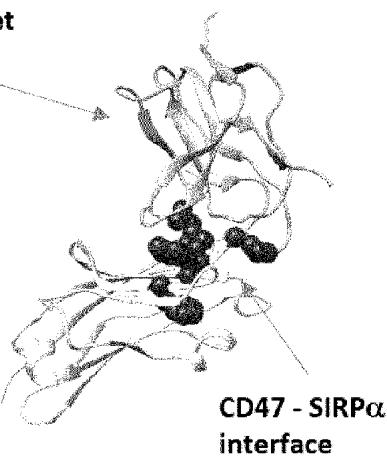

chemical

Protein structure diagram labeled CD47 - SIRPα interface

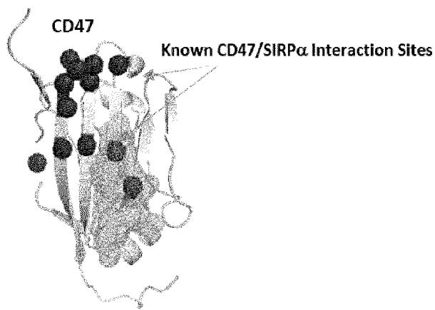

text_image

CD47
Known CD47/SIRPα Interaction Sites

Figure 1

(57) Abstract: CD47 antigen-binding molecules are disclosed. Also disclosed are nucleic acids and expression vectors encoding, compositions comprising, and methods using, the CD47 antigen-binding molecules.

(84) Designated States (unless otherwise indicated, for every kind of regional protection available): ARIPO (BW, GH, GM, KE, LR, LS, MW, MZ, NA, RW, SD, SL, ST, SZ, TZ, UG, ZM, ZW), Eurasian (AM, AZ, BY, KG, KZ, RU, TJ, TM), European (AL, AT, BE, BG, CH, CY, CZ, DE, DK, EE, ES, FI, FR, GB, GR, HR, HU, IE, IS, IT, LT, LU, LV, MC, MK, MT, NL, NO, PL, PT, RO, RS, SE, SI, SK, SM, TR), OAPI (BF, BJ, CF, CG, CI, CM, GA, GN, GQ, GW, KM, ML, MR, NE, SN, TD, TG).

# Published:

— with international search report (Art. 21(3))   
— before the expiration of the time limit for amending the claims and to be republished in the event of receipt of amendments (Rule 48.2(h))   
— with sequence listing part of description (Rule 5.2(a))

# CD47 Antigen-Binding Molecules

This application claims priority from GB 1718101.7 filed 1 November 2017, GB 1720425.6 filed 7 December 2017 and GB 1720426.4 filed 7 December 2017, the contents and elements of each of which are herein incorporated by reference for all purposes.

# 5 Field of the Invention

The present invention relates to the fields of molecular biology, more specifically antibody technology. The present invention also relates to methods of medical treatment and prophylaxis.

# Background to the Invention

10 CD47 is the “don’t-eat-me” signal and is ubiquitously expressed on normal cells where binding to SIRPα on macrophages inhibits phagocytosis. CD47 is commonly over-expressed in tumors where it correlates with immune evasion and poor prognosis. Blocking CD47-SIRPalpha interaction restores macrophage phagocytosis of tumor cells and anti-CD47 mAbs have shown anti-tumor efficacy in mouse models of solid tumors and hematological malignancies.

15
WO 2014/087248 A2 discloses monospecific anti-CD47 antibodies having an affinity for human CD47 as high as \~23.6 nM. The high-affinity CD47 antibodies disclosed therein induce substantial hemagglutination (see e.g. Example 8 of WO 2014/087248 A2).

# 20 Summary of the Invention

In a first aspect, the present invention provides an antigen-binding molecule, optionally isolated, which is capable of binding to CD47.

Also provided is an antigen-binding molecule, optionally isolated, which is capable of binding to CD47 in extracellular region 1.

In some embodiments the antigen-binding molecule is capable of binding to the V-type Ig-like domain of CD47. In some embodiments the antigen-binding molecule is capable of binding to a polypeptide comprising or consisting of the amino acid sequence shown in SEQ ID NO:9. In some embodiments the antigen-binding molecule is capable of inhibiting interaction between CD47 and SIRPα. In some embodiments the antigen-binding molecule is capable of increasing phagocytosis of CD47-expressing cells.

In some embodiments the antigen-binding molecule is capable of binding to a peptide or polypeptide comprising or consisting of the amino acid sequence of SEQ ID NO:21. In some embodiments the antigen-binding molecule comprises:

(i) a heavy chain variable (VH) region incorporating the following CDRs:   
HC-CDR1 having the amino acid sequence of SEQ ID NO:169   
HC-CDR2 having the amino acid sequence of SEQ ID NO:170   
40 HC-CDR3 having the amino acid sequence of SEQ ID NO:26,

or a variant thereof in which one or two or three amino acids in one or more of HC-CDR1, HC-CDR2, or HC-CDR3 are substituted with another amino acid; and

(ii) a light chain variable (VL) region incorporating the following CDRs: LC-CDR1 having the amino acid sequence of SEQ ID NO:171

5 LC-CDR2 having the amino acid sequence of SEQ ID NO:172
LC-CDR3 having the amino acid sequence of SEQ ID NO:173;

or a variant thereof in which one or two or three amino acids in one or more of LC-CDR1, LC-CDR2 or LC-CDR3 are substituted with another amino acid.

10 In some embodiments the antigen-binding molecule comprises: (a)

(i) a heavy chain variable (VH) region incorporating the following CDRs:

HC-CDR1 having the amino acid sequence of SEQ ID NO:24

HC-CDR2 having the amino acid sequence of SEQ ID NO:25

15 HC-CDR3 having the amino acid sequence of SEQ ID NO:26,

or a variant thereof in which one or two or three amino acids in one or more of HC-CDR1, HC-CDR2, or HC-CDR3 are substituted with another amino acid; and

(ii) a light chain variable (VL) region incorporating the following CDRs:

LC-CDR1 having the amino acid sequence of SEQ ID NO:32

20 LC-CDR2 having the amino acid sequence of SEQ ID NO:33
LC-CDR3 having the amino acid sequence of SEQ ID NO:34

or a variant thereof in which one or two or three amino acids in one or more of LC-CDR1, LC-CDR2 or LC-CDR3 are substituted with another amino acid;

or

25 (b)
(i) a heavy chain variable (VH) region incorporating the following CDRs:

HC-CDR1 having the amino acid sequence of SEQ ID NO:137

HC-CDR2 having the amino acid sequence of SEQ ID NO:138

HC-CDR3 having the amino acid sequence of SEQ ID NO:26,

30 or a variant thereof in which one or two or three amino acids in one or more of HC-CDR1, HC-CDR2, or HC-CDR3 are substituted with another amino acid; and

(ii) a light chain variable (VL) region incorporating the following CDRs:

LC-CDR1 having the amino acid sequence of SEQ ID NO:32

LC-CDR2 having the amino acid sequence of SEQ ID NO:33

35 LC-CDR3 having the amino acid sequence of SEQ ID NO:34;

or a variant thereof in which one or two or three amino acids in one or more of LC-CDR1, LC-CDR2 or LC-CDR3 are substituted with another amino acid;

or

(c)

40 (i) a heavy chain variable (VH) region incorporating the following CDRs:

HC-CDR1 having the amino acid sequence of SEQ ID NO:24

HC-CDR2 having the amino acid sequence of SEQ ID NO:25

HC-CDR3 having the amino acid sequence of SEQ ID NO:26, or a variant thereof in which one or two or three amino acids in one or more of HC-CDR1, HC-CDR2, or HC-CDR3 are substituted with another amino acid; and

(ii) a light chain variable (VL) region incorporating the following CDRs:

5 LC-CDR1 having the amino acid sequence of SEQ ID NO:139
LC-CDR2 having the amino acid sequence of SEQ ID NO:141
LC-CDR3 having the amino acid sequence of SEQ ID NO:34; or a variant thereof in which one or two or three amino acids in one or more of LC-CDR1, LC-CDR2 or LC-CDR3 are substituted with another amino acid;

10 or (d)

(i) a heavy chain variable (VH) region incorporating the following CDRs:

HC-CDR1 having the amino acid sequence of SEQ ID NO:137

HC-CDR2 having the amino acid sequence of SEQ ID NO:138

15 HC-CDR3 having the amino acid sequence of SEQ ID NO:26, or a variant thereof in which one or two or three amino acids in one or more of HC-CDR1, HC-CDR2, or HC-CDR3 are substituted with another amino acid; and

(ii) a light chain variable (VL) region incorporating the following CDRs:

LC-CDR1 having the amino acid sequence of SEQ ID NO:139

20 LC-CDR2 having the amino acid sequence of SEQ ID NO:141
LC-CDR3 having the amino acid sequence of SEQ ID NO:34;
or a variant thereof in which one or two or three amino acids in one or more of LC-CDR1, LC-CDR2 or LC-CDR3 are substituted with another amino acid;

or
(e)

(i) a heavy chain variable (VH) region incorporating the following CDRs:

HC-CDR1 having the amino acid sequence of SEQ ID NO:24

HC-CDR2 having the amino acid sequence of SEQ ID NO:25

HC-CDR3 having the amino acid sequence of SEQ ID NO:26,

30 or a variant thereof in which one or two or three amino acids in one or more of HC-CDR1, HC-CDR2, or HC-CDR3 are substituted with another amino acid; and

(ii) a light chain variable (VL) region incorporating the following CDRs:

LC-CDR1 having the amino acid sequence of SEQ ID NO:140

LC-CDR2 having the amino acid sequence of SEQ ID NO:141

35 LC-CDR3 having the amino acid sequence of SEQ ID NO:34; or a variant thereof in which one or two or three amino acids in one or more of LC-CDR1, LC-CDR2 or LC-CDR3 are substituted with another amino acid;

or
(f)

(i) a heavy chain variable (VH) region incorporating the following CDRs:   
HC-CDR1 having the amino acid sequence of SEQ ID NO:137   
HC-CDR2 having the amino acid sequence of SEQ ID NO:138

HC-CDR3 having the amino acid sequence of SEQ ID NO:26, or a variant thereof in which one or two or three amino acids in one or more of HC-CDR1, HC-CDR2, or HC-CDR3 are substituted with another amino acid; and

(ii) a light chain variable (VL) region incorporating the following CDRs:

5 LC-CDR1 having the amino acid sequence of SEQ ID NO:140
LC-CDR2 having the amino acid sequence of SEQ ID NO:141
LC-CDR3 having the amino acid sequence of SEQ ID NO:34; or a variant thereof in which one or two or three amino acids in one or more of LC-CDR1, LC-CDR2 or LC-CDR3 are substituted with another amino acid;

10 or (g)

(i) a heavy chain variable (VH) region incorporating the following CDRs:

HC-CDR1 having the amino acid sequence of SEQ ID NO:137

HC-CDR2 having the amino acid sequence of SEQ ID NO:138

15 HC-CDR3 having the amino acid sequence of SEQ ID NO:26, or a variant thereof in which one or two or three amino acids in one or more of HC-CDR1, HC-CDR2, or HC-CDR3 are substituted with another amino acid; and

(ii) a light chain variable (VL) region incorporating the following CDRs:

LC-CDR1 having the amino acid sequence of SEQ ID NO:32

20 LC-CDR2 having the amino acid sequence of SEQ ID NO:141
LC-CDR3 having the amino acid sequence of SEQ ID NO:34;
or a variant thereof in which one or two or three amino acids in one or more of LC-CDR1, LC-CDR2 or LC-CDR3 are substituted with another amino acid;

or

25 (h)

(i) a heavy chain variable (VH) region incorporating the following CDRs:

HC-CDR1 having the amino acid sequence of SEQ ID NO:137

HC-CDR2 having the amino acid sequence of SEQ ID NO:138

HC-CDR3 having the amino acid sequence of SEQ ID NO:26,

30 or a variant thereof in which one or two or three amino acids in one or more of HC-CDR1, HC-CDR2, or HC-CDR3 are substituted with another amino acid; and

(ii) a light chain variable (VL) region incorporating the following CDRs:

LC-CDR1 having the amino acid sequence of SEQ ID NO:32

LC-CDR2 having the amino acid sequence of SEQ ID NO:33

35 LC-CDR3 having the amino acid sequence of SEQ ID NO:142;

or a variant thereof in which one or two or three amino acids in one or more of LC-CDR1, LC-CDR2 or LC-CDR3 are substituted with another amino acid.

In some embodiments the antigen-binding molecule comprises:

40 (a)
(i) a heavy chain variable (VH) region incorporating the following CDRs: HC-CDR1 having the amino acid sequence of SEQ ID NO:24

HC-CDR2 having the amino acid sequence of SEQ ID NO:25

HC-CDR3 having the amino acid sequence of SEQ ID NO:26; and

(ii) a light chain variable (VL) region incorporating the following CDRs:

LC-CDR1 having the amino acid sequence of SEQ ID NO:32

LC-CDR2 having the amino acid sequence of SEQ ID NO:33

LC-CDR3 having the amino acid sequence of SEQ ID NO:34;

or

(b)

(i) a heavy chain variable (VH) region incorporating the following CDRs:

HC-CDR1 having the amino acid sequence of SEQ ID NO:137

HC-CDR2 having the amino acid sequence of SEQ ID NO:138

HC-CDR3 having the amino acid sequence of SEQ ID NO:26; and

(ii) a light chain variable (VL) region incorporating the following CDRs:

LC-CDR1 having the amino acid sequence of SEQ ID NO:32

LC-CDR2 having the amino acid sequence of SEQ ID NO:33

LC-CDR3 having the amino acid sequence of SEQ ID NO:34;

or

(c)

(i) a heavy chain variable (VH) region incorporating the following CDRs:

HC-CDR1 having the amino acid sequence of SEQ ID NO:24

HC-CDR2 having the amino acid sequence of SEQ ID NO:25

HC-CDR3 having the amino acid sequence of SEQ ID NO:26; and

(ii) a light chain variable (VL) region incorporating the following CDRs:

LC-CDR1 having the amino acid sequence of SEQ ID NO:139

LC-CDR2 having the amino acid sequence of SEQ ID NO:141

LC-CDR3 having the amino acid sequence of SEQ ID NO:34;

or

(d)

(i) a heavy chain variable (VH) region incorporating the following CDRs:

HC-CDR1 having the amino acid sequence of SEQ ID NO:137

HC-CDR2 having the amino acid sequence of SEQ ID NO:138

HC-CDR3 having the amino acid sequence of SEQ ID NO:26; and

(ii) a light chain variable (VL) region incorporating the following CDRs:

LC-CDR1 having the amino acid sequence of SEQ ID NO:139

LC-CDR2 having the amino acid sequence of SEQ ID NO:141

LC-CDR3 having the amino acid sequence of SEQ ID NO:34;

or

(e)

(i) a heavy chain variable (VH) region incorporating the following CDRs:

HC-CDR1 having the amino acid sequence of SEQ ID NO:24

HC-CDR2 having the amino acid sequence of SEQ ID NO:25

HC-CDR3 having the amino acid sequence of SEQ ID NO:26; and

(ii) a light chain variable (VL) region incorporating the following CDRs: LC-CDR1 having the amino acid sequence of SEQ ID NO:140
LC-CDR2 having the amino acid sequence of SEQ ID NO:141
LC-CDR3 having the amino acid sequence of SEQ ID NO:34;

5 or (f)

(i) a heavy chain variable (VH) region incorporating the following CDRs:   
HC-CDR1 having the amino acid sequence of SEQ ID NO:137   
HC-CDR2 having the amino acid sequence of SEQ ID NO:138   
10 HC-CDR3 having the amino acid sequence of SEQ ID NO:26; and

(ii) a light chain variable (VL) region incorporating the following CDRs: LC-CDR1 having the amino acid sequence of SEQ ID NO:140
LC-CDR2 having the amino acid sequence of SEQ ID NO:141
LC-CDR3 having the amino acid sequence of SEQ ID NO:34;

15 or (g)

(i) a heavy chain variable (VH) region incorporating the following CDRs: HC-CDR1 having the amino acid sequence of SEQ ID NO:137 HC-CDR2 having the amino acid sequence of SEQ ID NO:138 HC-CDR3 having the amino acid sequence of SEQ ID NO:26; and

(ii) a light chain variable (VL) region incorporating the following CDRs: LC-CDR1 having the amino acid sequence of SEQ ID NO:32 LC-CDR2 having the amino acid sequence of SEQ ID NO:141 LC-CDR3 having the amino acid sequence of SEQ ID NO:34;

25 or (h)

(i) a heavy chain variable (VH) region incorporating the following CDRs: HC-CDR1 having the amino acid sequence of SEQ ID NO:137 HC-CDR2 having the amino acid sequence of SEQ ID NO:138 HC-CDR3 having the amino acid sequence of SEQ ID NO:26; and

(ii) a light chain variable (VL) region incorporating the following CDRs: LC-CDR1 having the amino acid sequence of SEQ ID NO:32 LC-CDR2 having the amino acid sequence of SEQ ID NO:33 LC-CDR3 having the amino acid sequence of SEQ ID NO:142.

35

In some embodiments the antigen-binding molecule comprises:

a VH region comprising an amino acid sequence having at least 70% sequence identity to the amino acid sequence of SEQ ID NO:23, 39, 178, 127, 129, 130, 131 or 132; and   
a VL region comprising an amino acid sequence having at least 70% sequence identity to the amino acid sequence of SEQ ID NO:31, 44, 179, 128, 133, 134, 135 or 136.

In some embodiments the antigen-binding molecule comprises:

5 or   
10 or   
15 or   
20 or   
25 or   
30 or   
35 or   
40 or   
(i) a VH region comprising an amino acid sequence having at least 70% sequence identity to the amino acid sequence of SEQ ID NO:23; and   
a VL region comprising an amino acid sequence having at least 70% sequence identity to the amino acid sequence of SEQ ID NO:31;   
(ii) a VH region comprising an amino acid sequence having at least 70% sequence identity to the amino acid sequence of SEQ ID NO:39; and   
a VL region comprising an amino acid sequence having at least 70% sequence identity to the amino acid sequence of SEQ ID NO:44;   
(iii) a VH region comprising an amino acid sequence having at least 70% sequence identity to the amino acid sequence of SEQ ID NO:178; and   
a VL region comprising an amino acid sequence having at least 70% sequence identity to the amino acid sequence of SEQ ID NO:179;   
(iv) a VH region comprising an amino acid sequence having at least 70% sequence identity to the amino acid sequence of SEQ ID NO:127; and   
a VL region comprising an amino acid sequence having at least 70% sequence identity to the amino acid sequence of SEQ ID NO:128;   
(v) a VH region comprising an amino acid sequence having at least 70% sequence identity to the amino acid sequence of SEQ ID NO:129; and   
a VL region comprising an amino acid sequence having at least 70% sequence identity to the amino acid sequence of SEQ ID NO:128;   
(vi) a VH region comprising an amino acid sequence having at least 70% sequence identity to the amino acid sequence of SEQ ID NO:130; and   
a VL region comprising an amino acid sequence having at least 70% sequence identity to the amino acid sequence of SEQ ID NO:128;   
(vii) a VH region comprising an amino acid sequence having at least 70% sequence identity to the amino acid sequence of SEQ ID NO:131; and   
a VL region comprising an amino acid sequence having at least 70% sequence identity to the amino acid sequence of SEQ ID NO:128;   
(viii) a VH region comprising an amino acid sequence having at least 70% sequence identity to the amino acid sequence of SEQ ID NO:132; and   
a VL region comprising an amino acid sequence having at least 70% sequence identity to the amino acid sequence of SEQ ID NO:128;   
(ix) a VH region comprising an amino acid sequence having at least 70% sequence identity to the amino acid sequence of SEQ ID NO:131; and

or   
5   
or   
10   
or   
15   
or   
20   
or   
25   
In some embodiments the antigen-binding molecule is capable of binding to a peptide or polypeptide comprising or consisting of the amino acid sequence of SEQ ID NO:22.   
In some embodiments the antigen-binding molecule comprises:   
35   
40   
a VL region comprising an amino acid sequence having at least 70% sequence identity to the amino acid sequence of SEQ ID NO:133;   
(x) a VH region comprising an amino acid sequence having at least 70% sequence identity to the amino acid sequence of SEQ ID NO:132; and   
a VL region comprising an amino acid sequence having at least 70% sequence identity to the amino acid sequence of SEQ ID NO:133;   
(xi) a VH region comprising an amino acid sequence having at least 70% sequence identity to the amino acid sequence of SEQ ID NO:131; and   
a VL region comprising an amino acid sequence having at least 70% sequence identity to the amino acid sequence of SEQ ID NO:134;   
(xii) a VH region comprising an amino acid sequence having at least 70% sequence identity to the amino acid sequence of SEQ ID NO:132; and   
a VL region comprising an amino acid sequence having at least 70% sequence identity to the amino acid sequence of SEQ ID NO:134;   
(xiii) a VH region comprising an amino acid sequence having at least 70% sequence identity to the amino acid sequence of SEQ ID NO:132; and   
a VL region comprising an amino acid sequence having at least 70% sequence identity to the amino acid sequence of SEQ ID NO:135;   
(xiv) a VH region comprising an amino acid sequence having at least 70% sequence identity to the amino acid sequence of SEQ ID NO:132; and   
a VL region comprising an amino acid sequence having at least 70% sequence identity to the amino acid sequence of SEQ ID NO:136.   
(i) a heavy chain variable (VH) region incorporating the following CDRs:   
HC-CDR1 having the amino acid sequence of SEQ ID NO:50   
HC-CDR2 having the amino acid sequence of SEQ ID NO:51   
HC-CDR3 having the amino acid sequence of SEQ ID NO:52, or a variant thereof in which one or two or three amino acids in one or more of HC-CDR1, HC-CDR2, or HC-CDR3 are substituted with another amino acid; and   
(ii) a light chain variable (VL) region incorporating the following CDRs:   
LC-CDR1 having the amino acid sequence of SEQ ID NO:58   
LC-CDR2 having the amino acid sequence of SEQ ID NO:59   
LC-CDR3 having the amino acid sequence of SEQ ID NO:60;

or a variant thereof in which one or two or three amino acids in one or more of LC-CDR1, LC-CDR2 or LC-CDR3 are substituted with another amino acid.

In some embodiments the antigen-binding molecule comprises:

(i) a heavy chain variable (VH) region incorporating the following CDRs:   
HC-CDR1 having the amino acid sequence of SEQ ID NO:50   
HC-CDR2 having the amino acid sequence of SEQ ID NO:51   
HC-CDR3 having the amino acid sequence of SEQ ID NO:52; and

(ii) a light chain variable (VL) region incorporating the following CDRs:

10 LC-CDR1 having the amino acid sequence of SEQ ID NO:58

LC-CDR2 having the amino acid sequence of SEQ ID NO:59

LC-CDR3 having the amino acid sequence of SEQ ID NO:60.

In some embodiments the antigen-binding molecule comprises:

15 a VH region comprising an amino acid sequence having at least 70% sequence identity to the amino acid sequence of SEQ ID NO:49; and

a VL region comprising an amino acid sequence having at least 70% sequence identity to the amino acid sequence of SEQ ID NO:57.

20 In some embodiments the antigen-binding molecule comprises:

(i) a heavy chain variable (VH) region incorporating the following CDRs:

HC-CDR1 having the amino acid sequence of SEQ ID NO:66

HC-CDR2 having the amino acid sequence of SEQ ID NO:67

HC-CDR3 having the amino acid sequence of SEQ ID NO:68,

25 or a variant thereof in which one or two or three amino acids in one or more of HC-CDR1, HC-CDR2, or HC-CDR3 are substituted with another amino acid; and

(ii) a light chain variable (VL) region incorporating the following CDRs:

LC-CDR1 having the amino acid sequence of SEQ ID NO:74

LC-CDR2 having the amino acid sequence of SEQ ID NO:75

30 LC-CDR3 having the amino acid sequence of SEQ ID NO:76;

or a variant thereof in which one or two or three amino acids in one or more of LC-CDR1, LC-CDR2 or LC-CDR3 are substituted with another amino acid.

In some embodiments the antigen-binding molecule comprises:

(i) a heavy chain variable (VH) region incorporating the following CDRs:   
HC-CDR1 having the amino acid sequence of SEQ ID NO:66   
HC-CDR2 having the amino acid sequence of SEQ ID NO:67   
HC-CDR3 having the amino acid sequence of SEQ ID NO:68; and

(ii) a light chain variable (VL) region incorporating the following CDRs:

40 LC-CDR1 having the amino acid sequence of SEQ ID NO:74

LC-CDR2 having the amino acid sequence of SEQ ID NO:75

LC-CDR3 having the amino acid sequence of SEQ ID NO:76.

In some embodiments the antigen-binding molecule comprises:

a VH region comprising an amino acid sequence having at least 70% sequence identity to the amino acid sequence of SEQ ID NO:65; and

a VL region comprising an amino acid sequence having at least 70% sequence identity to the amino acid sequence of SEQ ID NO:73.

In another aspect the present invention provides an antigen-binding molecule, optionally isolated, comprising (i) an antigen-binding molecule according to the invention, and (ii) an antigen-binding molecule capable of binding to an antigen other than CD47.

In some embodiments the antigen-binding molecule is capable of binding to cells expressing CD47 at the cell surface.

In some embodiments the antigen-binding molecule is capable of inhibiting interaction between CD47 and SIRPα.

In some embodiments the antigen-binding molecule is capable of increasing phagocytosis of CD47-expressing cells.

In another aspect the present invention provides a chimeric antigen receptor (CAR) comprising an antigen-binding molecule according to the invention.

In another aspect the present invention provides a nucleic acid, or a plurality of nucleic acids, optionally isolated, encoding an antigen-binding molecule or a CAR according to the invention.

In another aspect the present invention provides an expression vector, or a plurality of expression vectors, comprising a nucleic acid or a plurality of nucleic acids according to the invention.

In another aspect the present invention provides a cell comprising an antigen-binding molecule, a CAR, a nucleic acid or a plurality of nucleic acids, or an expression vector or a plurality of expression vectors according to the invention.

In another aspect the present invention provides a method comprising culturing a cell comprising a nucleic acid or a plurality of nucleic acids, or an expression vector or a plurality of expression vectors according to the invention, under conditions suitable for expression of the antigen-binding molecule or CAR from the nucleic acid(s) or expression vector(s).

In another aspect the present invention provides a composition comprising an antigen-binding molecule, a CAR, a nucleic acid or a plurality of nucleic acids, an expression vector or a plurality of expression vectors, or a cell according to the invention.

In another aspect the present invention provides an antigen-binding molecule, a CAR, a nucleic acid or a plurality of nucleic acids, an expression vector or a plurality of expression vectors, a cell, or a composition according to the invention for use in a method of medical treatment or prophylaxis.

5 In another aspect the present invention provides an antigen-binding molecule, a CAR, a nucleic acid or a plurality of nucleic acids, an expression vector or a plurality of expression vectors, a cell, or a composition according to the invention for use in a method of treatment or prevention of a cancer.

In another aspect the present invention provides the use of an antigen-binding molecule, a CAR, a nucleic acid or a plurality of nucleic acids, an expression vector or a plurality of expression vectors, a cell, or a composition according to the invention in the manufacture of a medicament for use in a method of treatment or prevention of a cancer.

In another aspect the present invention provides a method of treating or preventing a cancer, comprising administering to a subject a therapeutically or prophylactically effective amount of an antigen-binding molecule, a CAR, a nucleic acid or a plurality of nucleic acids, an expression vector or a plurality of expression vectors, a cell, or a composition according to the invention.

In another aspect the present invention provides a method for increasing phagocytosis of CD47-expressing cells, comprising contacting CD47-expressing cells with an antigen-binding molecule according to the invention.

In another aspect the present invention provides an in vitro complex, optionally isolated, comprising an antigen-binding molecule according to the invention bound to CD47.

In another aspect the present invention provides a method comprising contacting a sample containing, or suspected to contain, CD47 with an antigen-binding molecule according to the invention, and detecting the formation of a complex of the antigen-binding molecule with CD47.

30 In another aspect the present invention provides a subject for treatment with a CD47-targeted agent, the method comprising contacting, in vitro, a sample from the subject with an antigen-binding molecule according to the invention and detecting the formation of a complex of the antigen-binding molecule with CD47.

35 In another aspect the present invention provides the use of an antigen-binding molecule according to the invention as an in vitro or in vivo diagnostic or prognostic agent.

In some embodiments in connection with various aspects of the present invention the cancer is selected from: a hematologic malignancy, a myeloid hematologic malignancy, a lymphoblastic hematologic malignancy, myelodysplastic syndrome (MDS), acute myeloid leukemia (AML), chronic myeloid leukemia (CML), acute lymphoblastic leukemia (ALL), non-Hodgkin's lymphoma (NHL), multiple myeloma (MM), bladder cancer, brain cancer, glioblastoma, ovarian cancer, breast cancer, colon cancer, liver cancer,

hepatocellular carcinoma, prostate cancer, lung cancer, Non-small Cell Lung Cancer (NSCLC), skin cancer and melanoma.

# Description

5 The present invention provides antigen-binding molecules having combinations of desirable biophysical and/or functional properties as compared to antigen-binding molecules disclosed in the prior art.

Aspects of the present invention relate to antigen-binding molecules capable of binding to CD47.

10 In aspects described herein antigen-binding molecules are provided which bind to human CD47 with high affinity, which are cross-reactive with non-human primate CD47, and which display potent inhibition of interaction between CD47 and SIRPα.

In particular, the antigen-binding molecules described herein bind to CD47 with greater affinity than prior 15 art anti-CD47 antibodies, and are more potent as a CD47-targeted therapeutic agents.

Also, the antigen-binding molecules described herein bind to a particular epitope of CD47 that provides for more effective inhibition of the interaction between CD47 and SIPRα as compared to prior art anti-CD47 antibodies. The antigen-binding molecules described herein are thus more effective at enhancing phagocytosis of cells expressing CD47 than prior art anti-CD47 antibodies.

# CD47

Human CD47 (also known as IAP, MER6 and OA3) is the protein identified by UniProt Q08722. Alternative splicing of mRNA encoded by the human CD47 gene yields four isoforms which differ in the sequence of the C-terminal cytoplasmic tail region: isoform OA3-323 (UniProt: Q08722-1, v1; SEQ ID NO:1); isoform OA3-293 (UniProt: Q08722-2; SEQ ID NO:2), which lacks the amino acid sequence corresponding to positions 293 to 323 of SEQ ID NO:1; isoform OA3-305 (UniProt: Q08722-3; SEQ ID NO:3), which comprises the substitutions K304N and A305N relative to SEQ ID NO:1, and which lacks the amino acid sequence corresponding to positions 306 to 323 of SEQ ID NO:1; and isoform OA3-312 (UniProt: Q08722-4; SEQ ID NO:4), which lacks the amino acid sequence corresponding to positions 312 to 323 of SEQ ID NO:1.

The N-terminal 18 amino acids of SEQ ID NOs:1 to 4 constitute a signal peptide, and so the mature form of isoforms OA3-323, OA3-293, OA3-305 and OA3-312 (i.e. after processing to remove the signal peptide) have the amino acid sequences shown in SEQ ID NOs:5 to 8, respectively.

The structure and function of CD47 is reviewed e.g. in Sick et al., Br J Pharmacol. (2012) 167(7): 1415-1430 and Willingham et al. Proc Natl Acad Sci U S A. (2012) 109(17): 6662–6667, both of which are hereby incorporated by reference in its entirety. CD47 is a ubiquitously-expressed \~50 kDa multi-pass membrane receptor that belongs to the immunoglobulin superfamily, comprising an N-terminal extracellular region (SEQ ID NO:10) having a V-type Ig-like domain (SEQ ID NO:9), five transmembrane domains (SEQ ID NOs:11, 13, 15, 17 and 19), and a short C-terminal intracellular tail (SEQ ID NO:20).

CD47 is involved in cell-to-cell communication through ligating to the transmembrane signal-regulatory proteins (SIRPs) SIRPα and SIRPγ and integrins (e.g. αvβ3 integrin), and also mediates cell-extracellular matrix interactions through binding to thrombospondin-1 (TSP-1). CD47 is involved in a wide range of cellular processes including adhesion, migration, proliferation and apoptosis, and plays a key role in immune processes and angiogenesis.

CD47 is the ligand for SIRPα, which expressed on macrophages and dendritic cells. Binding of CD47 to SIRPα on the surface of phagocytic cells, triggers SIRPα ITIM signalling, inhibiting phagocytosis of the 10 CD47 expressing cell. CD47 is a multi-pass transmembrane protein, whereas SIRPα consists of 4 extracellular domains and an intracellular ITIM-domain. The terminal V-set domain of SIRPα interacts with the Ig V-like domain of CD47.

Upon binding CD47, SIRPα initiates a signalling cascade that results in the inhibition of phagocytosis of the CD47-expressing cell. This “don't eat me” signal is transmitted by phosphorylation by Src kinases of immunoreceptor tyrosine-based inhibitor motifs (ITIMs) in the cytoplasmic domain of SIRPα. Subsequent binding and activation of Src homology-2 (SH2) domain-containing tyrosine phosphatases SHP-1 and SHP-2 blocks phagocytosis, potentially through preventing the accumulation of myosin-IIA at the phagocytic synapse. Disrupting the interaction along the antiparallel beta sheets of CD47 prevents downstream ITIM-mediated signalling, enabling phagocytes to ‘eat’ and destroy cancer cells.

Aberrant CD47 expression/activity is implicated in the development and progression of many cancers, and accumulating evidence suggests that cell-surface expression of CD47 is a common mechanism by which cancer cells protect themselves from phagocytosis.

In this specification “CD47” refers to CD47 from any species and includes CD47 isoforms, fragments, variants or homologues from any species.

As used herein, a “fragment”, “variant” or “homologue” of a protein may optionally be characterised as having at least 60%, preferably one of 70%, 75%, 80%, 85%, 90%, 91%, 92%, 93%, 94%, 95%, 96%, 97%, 98%, 99% or 100% amino acid sequence identity to the amino acid sequence of the reference protein (e.g. a reference isoform). In some embodiments fragments, variants, isoforms and homologues of a reference protein may be characterised by ability to perform a function performed by the reference protein.

A “fragment” generally refers to a fraction of the reference protein. A “variant” generally refers to a protein having an amino acid sequence comprising one or more amino acid substitutions, insertions, deletions or other modifications relative to the amino acid sequence of the reference protein, but retaining a considerable degree of sequence identity (e.g. at least 60%) to the amino acid sequence of the reference protein. An “isoform” generally refers to a variant of the reference protein expressed by the same species as the species of the reference protein (e.g. OA3-323, OA3-293, OA3-305 and OA3-312 are all isoforms of one another). A “homologue” generally refers to a variant of the reference protein produced by a

different species as compared to the species of the reference protein. For example, human CD47 isoform OA3-323 (Q08722-1, v1; SEQ ID NO:1) and Rhesus macaque CD47 (UniProt: F7F5Y9-1, v2; SEQ ID NO:117) are homologues of one another. Homologues include orthologues.

5 A “fragment” of a reference protein may be of any length (by number of amino acids), although may optionally be at least 25% of the length of the reference protein (that is, the protein from which the fragment is derived) and may have a maximum length of one of 50%, 75%, 80%, 85%, 90%, 91%, 92%, 93%, 94%, 95%, 96%, 97%, 98%, or 99% of the length of the reference protein.

10 A fragment of CD47 may have a minimum length of one of 10, 20, 30, 40, 50, 100, 150, 200, 250 or 300 amino acids, and may have a maximum length of one of 20, 30, 40, 50, 100, 150, 200, 250 or 300 amino acids.

In some embodiments, the CD47 is CD47 from a mammal (e.g. a primate (rhesus, cynomolgous, non-human primate or human) and/or a rodent (e.g. rat or murine) CD47). Isoforms, fragments, variants or homologues of CD47 may optionally be characterised as having at least 70%, preferably one of 80%, 85%, 90%, 91%, 92%, 93%, 94%, 95%, 96%, 97%, 98%, 99% or 100% amino acid sequence identity to the amino acid sequence of an immature or mature CD47 isoform from a given species, e.g. human.

20 Isoforms, fragments, variants or homologues may optionally be functional isoforms, fragments, variants or homologues, e.g. having a functional property/activity of the reference CD47 (e.g. human CD47 isoform OA3-323), as determined by analysis by a suitable assay for the functional property/activity. For example, an isoform, fragment, variant or homologue of CD47 may display association with one or more of: SIRPα, SIRPγ, TSP-1 and αvβ3 integrin.

In some embodiments, the CD47 comprises, or consists of, an amino acid sequence having at least 70%, preferably one of 80%, 85%, 90%, 91%, 92%, 93%, 94%, 95%, 96%, 97%, 98%, 99% or 100% amino acid sequence identity to one of SEQ ID NOs:1 to 8.

30 In some embodiments, a fragment of CD47 comprises, or consists of, an amino acid sequence having at least 70%, preferably one of 80%, 85%, 90%, 91%, 92%, 93%, 94%, 95%, 96%, 97%, 98%, 99% or 100% amino acid sequence identity to one of SEQ ID NOs:9 or 10.

CD47 is an attractive therapeutic target. CD47 is usually expressed on the surface of normal healthy cells and migrating hematopoietic stem cells to prevent phagocytosis, and is upregulated in nearly all hematological and solid tumors, to evade immune surveillance and escape phagocytosis. Disrupting the interaction between CD47 and SIRPα enables phagocytes to “eat” and destroy cancer cells. CD47 blockade repolarises tumor-associated macrophages into a pro-inflammatory, anti-tumor state, and clearance of malignant cells by phagocytic cells offers an additional route for neo-antigen presentation to adaptive immune system.

# Antigen-binding molecules

The present invention provides antigen-binding molecules capable of binding to CD47.

5   
An “antigen-binding molecule” refers to a molecule which is capable of binding to a target antigen, and encompasses monoclonal antibodies, polyclonal antibodies, monospecific and multispecific antibodies (e.g., bispecific antibodies), and antibody fragments (e.g. Fv, scFv, Fab, scFab, $F(ab')_{2}$ , $Fab_{2}$ , diabodies, triabodies, scFv-Fc, minibodies, single domain antibodies (e.g. VhH), etc.), as long as they display binding to the relevant target molecule(s).   
10 The antigen-binding molecule of the present invention comprises a moiety or moieties capable of binding to a target antigen(s). In some embodiments, the moiety capable of binding to a target antigen comprises an antibody heavy chain variable region (VH) and an antibody light chain variable region (VL) of an antibody capable of specific binding to the target antigen. In some embodiments, the moiety capable of binding to a target antigen comprises or consists of an aptamer capable of binding to the target antigen, e.g. a nucleic acid aptamer (reviewed, for example, in Zhou and Rossi Nat Rev Drug Discov. 2017 16(3):181-202). In some embodiments, the moiety capable of binding to a target antigen comprises or consists of a antigen-binding peptide/polypeptide, e.g. a peptide aptamer, thioredoxin, monobody, anticalin, Kunitz domain, avimer, knottin, fynomer, atrimer, DARPin, affibody, nanobody (i.e. a single-domain antibody (sdAb)) affilin, armadillo repeat protein (ArmRP), OBody or fibronectin – reviewed e.g. in Reverdatto et al., Curr Top Med Chem. 2015; 15(12): 1082–1101, which is hereby incorporated by reference in its entirety (see also e.g. Boersma et al., J Biol Chem (2011) 286:41273-85 and Emanuel et al., Mabs (2011) 3:38-48).   
The antigen-binding molecules of the present invention generally comprise an antigen-binding domain comprising a VH and a VL of an antibody capable of specific binding to the target antigen. The antigen-binding domain formed by a VH and a VL may also be referred to herein as an Fv region.   
An antigen-binding molecule may be, or may comprise, an antigen-binding polypeptide, or an antigen-binding polypeptide complex. An antigen-binding molecule may comprise more than one polypeptide which together form an antigen-binding domain. The polypeptides may associate covalently or non-covalently. In some embodiments the polypeptides form part of a larger polypeptide comprising the polypeptides (e.g. in the case of scFv comprising VH and VL, or in the case of scFab comprising VH-CH1 and VL-CL).   
35 An antigen-binding molecule may refer to a non-covalent or covalent complex of more than one polypeptide (e.g. 2, 3, 4, 6, or 8 polypeptides), e.g. an IgG-like antigen-binding molecule comprising two heavy chain polypeptides and two light chain polypeptides.   
The antigen-binding molecules of the present invention may be designed and prepared using the sequences of monoclonal antibodies (mAbs) capable of binding to CD47. Antigen-binding regions of antibodies, such as single chain variable fragment (scFv), Fab and F(ab') $_{2}$ fragments may also be

used/provided. An “antigen-binding region” is any fragment of an antibody which is capable of binding to the target for which the given antibody is specific.

Antibodies generally comprise six complementarity-determining regions CDRs; three in the heavy chain variable (VH) region: HC-CDR1, HC-CDR2 and HC-CDR3, and three in the light chain variable (VL) region: LC-CDR1, LC-CDR2, and LC-CDR3. The six CDRs together define the paratope of the antibody, which is the part of the antibody which binds to the target antigen.

The VH region and VL region comprise framework regions (FRs) either side of each CDR, which provide a scaffold for the CDRs. From N-terminus to C-terminus, VH regions comprise the following structure: N term-[HC-FR1]-[HC-CDR1]-[HC-FR2]-[HC-CDR2]-[HC-FR3]-[HC-CDR3]-[HC-FR4]-C term; and VL regions comprise the following structure: N term-[LC-FR1]-[LC-CDR1]-[LC-FR2]-[LC-CDR2]-[LC-FR3]-[LC-CDR3]-[LC-FR4]-C term.

There are several different conventions for defining antibody CDRs and FRs, such as those described in Kabat et al., Sequences of Proteins of Immunological Interest, 5th Ed. Public Health Service, National Institutes of Health, Bethesda, MD (1991), Chothia et al., J. Mol. Biol. 196:901-917 (1987), and VBASE2, as described in Retter et al., Nucl. Acids Res. (2005) 33 (suppl 1): D671-D674. The CDRs and FRs of the VH regions and VL regions of the antibody clones described herein were defined according to the international IMGT (ImMunoGeneTics) information system (LeFranc et al., Nucleic Acids Res. (2015) 43 (Database issue):D413-22), which uses the IMGT V-DOMAIN numbering rules as described in Lefranc et al., Dev. Comp. Immunol. (2003) 27:55-77.

In some embodiments, the antigen-binding molecule comprises the CDRs of an antigen-binding molecule which is capable of binding to CD47. In some embodiments, the antigen-binding molecule comprises the FRs of an antigen-binding molecule which is capable of binding to CD47. In some embodiments, the antigen-binding molecule comprises the CDRs and the FRs of an antigen-binding molecule which is capable of binding to CD47. That is, in some embodiments the antigen-binding molecule comprises the VH region and the VL region of an antigen-binding molecule which is capable of binding to CD47.

In some embodiments the antigen-binding molecule comprises a VH region and a VL region which is, or which is derived from, the VH/VL region of a CD47-binding antibody clone described herein (i.e. anti-CD47 antibody clones 1-1-A1\_BM, 1-1-A1, 5-48-A6, 5-48-D2, 11A1H1, 11A1H2, 11A1H3, 11A1H4, 11A1H5, 11A1H6, 11A1H7, 11A1H8, 11A1H9, 11A1H10 or 11A1H11).

In some embodiments the antigen-binding molecule comprises a VH region according to one of (1) to (4) below:

(1) a VH region incorporating the following CDRs:
HC-CDR1 having the amino acid sequence of SEQ ID NO:24
HC-CDR2 having the amino acid sequence of SEQ ID NO:25
HC-CDR3 having the amino acid sequence of SEQ ID NO:26,

or a variant thereof in which one or two or three amino acids in one or more of HC-CDR1, HC-CDR2, or HC-CDR3 are substituted with another amino acid.

(2) a VH region incorporating the following CDRs:

5 HC-CDR1 having the amino acid sequence of SEQ ID NO:50

HC-CDR2 having the amino acid sequence of SEQ ID NO:51

HC-CDR3 having the amino acid sequence of SEQ ID NO:52,

or a variant thereof in which one or two or three amino acids in one or more of HC-CDR1, HC-CDR2, or HC-CDR3 are substituted with another amino acid.

10
(3) a VH region incorporating the following CDRs:

HC-CDR1 having the amino acid sequence of SEQ ID NO:66

HC-CDR2 having the amino acid sequence of SEQ ID NO:67

HC-CDR3 having the amino acid sequence of SEQ ID NO:68,

15 or a variant thereof in which one or two or three amino acids in one or more of HC-CDR1, HC-CDR2, or HC-CDR3 are substituted with another amino acid.

(4) a VH region incorporating the following CDRs:

HC-CDR1 having the amino acid sequence of SEQ ID NO:169

20 HC-CDR2 having the amino acid sequence of SEQ ID NO:170

HC-CDR3 having the amino acid sequence of SEQ ID NO:26,

or a variant thereof in which one or two or three amino acids in one or more of HC-CDR1, HC-CDR2, or HC-CDR3 are substituted with another amino acid.

25 (5) a VH region incorporating the following CDRs:

HC-CDR1 having the amino acid sequence of SEQ ID NO:137

HC-CDR2 having the amino acid sequence of SEQ ID NO:138

HC-CDR3 having the amino acid sequence of SEQ ID NO:26,

or a variant thereof in which one or two or three amino acids in one or more of HC-CDR1, HC-

30 CDR2, or HC-CDR3 are substituted with another amino acid.

In some embodiments the antigen-binding molecule comprises a VH region according to one of (6) to (15) below:

(6) a VH region incorporating the following FRs:

35 HC-FR1 having the amino acid sequence of SEQ ID NO:27

HC-FR2 having the amino acid sequence of SEQ ID NO:28

HC-FR3 having the amino acid sequence of SEQ ID NO:29

HC-FR4 having the amino acid sequence of SEQ ID NO:30,

or a variant thereof in which one or two or three amino acids in one or more of HC-FR1, HC-FR2,

40 HC-FR3, or HC-FR4 are substituted with another amino acid.

(7) a VH region incorporating the following FRs:

HC-FR1 having the amino acid sequence of SEQ ID NO:40

HC-FR2 having the amino acid sequence of SEQ ID NO:41

HC-FR3 having the amino acid sequence of SEQ ID NO:42

HC-FR4 having the amino acid sequence of SEQ ID NO:43,

5 or a variant thereof in which one or two or three amino acids in one or more of HC-FR1, HC-FR2, HC-FR3, or HC-FR4 are substituted with another amino acid.

(8) a VH region incorporating the following FRs:

HC-FR1 having the amino acid sequence of SEQ ID NO:53

10 HC-FR2 having the amino acid sequence of SEQ ID NO:54

HC-FR3 having the amino acid sequence of SEQ ID NO:55

HC-FR4 having the amino acid sequence of SEQ ID NO:56,

or a variant thereof in which one or two or three amino acids in one or more of HC-FR1, HC-FR2, HC-FR3, or HC-FR4 are substituted with another amino acid.

15
(9) a VH region incorporating the following FRs:

HC-FR1 having the amino acid sequence of SEQ ID NO:69

HC-FR2 having the amino acid sequence of SEQ ID NO:70

HC-FR3 having the amino acid sequence of SEQ ID NO:71

20 HC-FR4 having the amino acid sequence of SEQ ID NO:72,

or a variant thereof in which one or two or three amino acids in one or more of HC-FR1, HC-FR2, HC-FR3, or HC-FR4 are substituted with another amino acid.

(10) a VH region incorporating the following FRs:

25 HC-FR1 having the amino acid sequence of SEQ ID NO:143

HC-FR2 having the amino acid sequence of SEQ ID NO:174

HC-FR3 having the amino acid sequence of SEQ ID NO:175

HC-FR4 having the amino acid sequence of SEQ ID NO:176, or a variant thereof in which one or two or three amino acids in one or more of HC-FR1, HC-FR2, HC-FR3, or HC-FR4 are substituted with another amino acid.

(11) a VH region incorporating the following FRs:

HC-FR1 having the amino acid sequence of SEQ ID NO:143

HC-FR2 having the amino acid sequence of SEQ ID NO:144

35 HC-FR3 having the amino acid sequence of SEQ ID NO:147

HC-FR4 having the amino acid sequence of SEQ ID NO:152,

or a variant thereof in which one or two or three amino acids in one or more of HC-FR1, HC-FR2, HC-FR3, or HC-FR4 are substituted with another amino acid.

40 (12) a VH region incorporating the following FRs:

HC-FR1 having the amino acid sequence of SEQ ID NO:143

HC-FR2 having the amino acid sequence of SEQ ID NO:144

HC-FR3 having the amino acid sequence of SEQ ID NO:148

HC-FR4 having the amino acid sequence of SEQ ID NO:152,

or a variant thereof in which one or two or three amino acids in one or more of HC-FR1, HC-FR2, HC-FR3, or HC-FR4 are substituted with another amino acid.

5

(13) a VH region incorporating the following FRs:

HC-FR1 having the amino acid sequence of SEQ ID NO:143

HC-FR2 having the amino acid sequence of SEQ ID NO:145

HC-FR3 having the amino acid sequence of SEQ ID NO:149

10

HC-FR4 having the amino acid sequence of SEQ ID NO:153,

or a variant thereof in which one or two or three amino acids in one or more of HC-FR1, HC-FR2, HC-FR3, or HC-FR4 are substituted with another amino acid.

(14) a VH region incorporating the following FRs:

15

HC-FR1 having the amino acid sequence of SEQ ID NO:143

HC-FR2 having the amino acid sequence of SEQ ID NO:146

HC-FR3 having the amino acid sequence of SEQ ID NO:150

HC-FR4 having the amino acid sequence of SEQ ID NO:153,

or a variant thereof in which one or two or three amino acids in one or more of HC-FR1, HC-FR2, HC-FR3, or HC-FR4 are substituted with another amino acid.

(15) a VH region incorporating the following FRs:

HC-FR1 having the amino acid sequence of SEQ ID NO:143

HC-FR2 having the amino acid sequence of SEQ ID NO:146

25

HC-FR3 having the amino acid sequence of SEQ ID NO:151

HC-FR4 having the amino acid sequence of SEQ ID NO:152,

or a variant thereof in which one or two or three amino acids in one or more of HC-FR1, HC-FR2, HC-FR3, or HC-FR4 are substituted with another amino acid.

30

In some embodiments the antigen-binding molecule comprises a VH region comprising the CDRs according to one of (1), (2), (3), (4) or (5) above, and the FRs according to one of (5), (6), (7), (8), (9), (10), (11), (12), (13), (14) or (15) above.

In some embodiments the antigen-binding molecule comprises a VH region according to one of (16) to (25) below:

(16) a VH region comprising the CDRs according to (1) and the FRs according to (6).

(17) a VH region comprising the CDRs according to (1) and the FRs according to (7).

40

(18) a VH region comprising the CDRs according to (2) and the FRs according to (8).

(19) a VH region comprising the CDRs according to (3) and the FRs according to (9).

(20) a VH region comprising the CDRs according to (4) and the FRs according to (10).   
(21) a VH region comprising the CDRs according to (1) and the FRs according to (11).   
(22) a VH region comprising the CDRs according to (1) and the FRs according to (12).   
(23) a VH region comprising the CDRs according to (1) and the FRs according to (13).   
(24) a VH region comprising the CDRs according to (1) and the FRs according to (14).   
(25) a VH region comprising the CDRs according to (5) and the FRs according to (15).   
In some embodiments the antigen-binding molecule comprises a VH region according to one of (26) to (34) below:   
(26) a VH region comprising an amino acid sequence having at least 70% sequence identity more preferably one of at least 75%, 80%, 85%, 86%, 87%, 88%, 89%, 90%, 91%, 92%, 93%, 94%, 95%, 96%, 97%, 98%, 99%, or 100%, sequence identity to the amino acid sequence of SEQ ID NO:23.   
(27) a VH region comprising an amino acid sequence having at least 70% sequence identity more preferably one of at least 75%, 80%, 85%, 86%, 87%, 88%, 89%, 90%, 91%, 92%, 93%, 94%, 95%, 96%, 97%, 98%, 99%, or 100%, sequence identity to the amino acid sequence of SEQ ID NO:39.   
(28) a VH region comprising an amino acid sequence having at least 70% sequence identity more preferably one of at least 75%, 80%, 85%, 86%, 87%, 88%, 89%, 90%, 91%, 92%, 93%, 94%, 95%, 96%, 97%, 98%, 99%, or 100%, sequence identity to the amino acid sequence of SEQ ID NO:49.   
(29) a VH region comprising an amino acid sequence having at least 70% sequence identity more preferably one of at least 75%, 80%, 85%, 86%, 87%, 88%, 89%, 90%, 91%, 92%, 93%, 94%, 95%, 96%, 97%, 98%, 99%, or 100%, sequence identity to the amino acid sequence of SEQ ID NO:65.   
(31) a VH region comprising an amino acid sequence having at least 70% sequence identity more preferably one of at least 75%, 80%, 85%, 86%, 87%, 88%, 89%, 90%, 91%, 92%, 93%, 94%, 95%, 96%, 97%, 98%, 99%, or 100%, sequence identity to the amino acid sequence of SEQ ID NO:178.   
(31) a VH region comprising an amino acid sequence having at least 70% sequence identity more preferably one of at least 75%, 80%, 85%, 86%, 87%, 88%, 89%, 90%, 91%, 92%, 93%, 94%, 95%, 96%, 97%, 98%, 99%, or 100%, sequence identity to the amino acid sequence of SEQ ID NO:127.   
(32) a VH region comprising an amino acid sequence having at least 70% sequence identity more preferably one of at least 75%, 80%, 85%, 86%, 87%, 88%, 89%, 90%, 91%, 92%, 93%, 94%, 95%, 96%, 97%, 98%, 99%, or 100%, sequence identity to the amino acid sequence of SEQ ID NO:129.

5   
10   
15   
20   
25   
30   
35   
40   
(33) a VH region comprising an amino acid sequence having at least 70% sequence identity more preferably one of at least 75%, 80%, 85%, 86%, 87%, 88%, 89%, 90%, 91%, 92%, 93%, 94%, 95%, 96%, 97%, 98%, 99%, or 100%, sequence identity to the amino acid sequence of SEQ ID NO:130.   
(34) a VH region comprising an amino acid sequence having at least 70% sequence identity more preferably one of at least 75%, 80%, 85%, 86%, 87%, 88%, 89%, 90%, 91%, 92%, 93%, 94%, 95%, 96%, 97%, 98%, 99%, or 100%, sequence identity to the amino acid sequence of SEQ ID NO:131.   
(35) a VH region comprising an amino acid sequence having at least 70% sequence identity more preferably one of at least 75%, 80%, 85%, 86%, 87%, 88%, 89%, 90%, 91%, 92%, 93%, 94%, 95%, 96%, 97%, 98%, 99%, or 100%, sequence identity to the amino acid sequence of SEQ ID NO:132.   
In some embodiments the antigen-binding molecule comprises a VL region according to one of (36) to (43) below:   
(36) a VL region incorporating the following CDRs:   
LC-CDR1 having the amino acid sequence of SEQ ID NO:32   
LC-CDR2 having the amino acid sequence of SEQ ID NO:33   
LC-CDR3 having the amino acid sequence of SEQ ID NO:34;   
or a variant thereof in which one or two or three amino acids in one or more of LC-CDR1, LC-CDR2 or LC-CDR3 are substituted with another amino acid.   
(37) a VL region incorporating the following CDRs:   
LC-CDR1 having the amino acid sequence of SEQ ID NO:58   
LC-CDR2 having the amino acid sequence of SEQ ID NO:59   
LC-CDR3 having the amino acid sequence of SEQ ID NO:60;   
or a variant thereof in which one or two or three amino acids in one or more of LC-CDR1, LC-CDR2 or LC-CDR3 are substituted with another amino acid.   
(38) a VL region incorporating the following CDRs:   
LC-CDR1 having the amino acid sequence of SEQ ID NO:74   
LC-CDR2 having the amino acid sequence of SEQ ID NO:75   
LC-CDR3 having the amino acid sequence of SEQ ID NO:76;   
or a variant thereof in which one or two or three amino acids in one or more of LC-CDR1, LC-CDR2 or LC-CDR3 are substituted with another amino acid.   
(39) a VL region incorporating the following CDRs:   
LC-CDR1 having the amino acid sequence of SEQ ID NO:171   
LC-CDR2 having the amino acid sequence of SEQ ID NO:172   
LC-CDR3 having the amino acid sequence of SEQ ID NO:173;   
or a variant thereof in which one or two or three amino acids in one or more of LC-CDR1, LC-CDR2 or LC-CDR3 are substituted with another amino acid.

(40) a VL region incorporating the following CDRs:

LC-CDR1 having the amino acid sequence of SEQ ID NO:139

LC-CDR2 having the amino acid sequence of SEQ ID NO:141

5

LC-CDR3 having the amino acid sequence of SEQ ID NO:34;

or a variant thereof in which one or two or three amino acids in one or more of LC-CDR1, LC-CDR2 or LC-CDR3 are substituted with another amino acid.

(41) a VL region incorporating the following CDRs:

10

LC-CDR1 having the amino acid sequence of SEQ ID NO:140

LC-CDR2 having the amino acid sequence of SEQ ID NO:141

LC-CDR3 having the amino acid sequence of SEQ ID NO:34;

or a variant thereof in which one or two or three amino acids in one or more of LC-CDR1, LC-CDR2 or LC-CDR3 are substituted with another amino acid.

15

(42) a VL region incorporating the following CDRs:

LC-CDR1 having the amino acid sequence of SEQ ID NO:32

LC-CDR2 having the amino acid sequence of SEQ ID NO:141

LC-CDR3 having the amino acid sequence of SEQ ID NO:34;

20

or a variant thereof in which one or two or three amino acids in one or more of LC-CDR1, LC-CDR2 or LC-CDR3 are substituted with another amino acid.

(43) a VL region incorporating the following CDRs:

LC-CDR1 having the amino acid sequence of SEQ ID NO:32

25

LC-CDR2 having the amino acid sequence of SEQ ID NO:33

LC-CDR3 having the amino acid sequence of SEQ ID NO:142;

or a variant thereof in which one or two or three amino acids in one or more of LC-CDR1, LC-CDR2 or LC-CDR3 are substituted with another amino acid.

30

In some embodiments the antigen-binding molecule comprises a VL region according to one of (44) to (50) below:

(44) a VL region incorporating the following FRs:

LC-FR1 having the amino acid sequence of SEQ ID NO:35

LC-FR2 having the amino acid sequence of SEQ ID NO:36

35

LC-FR3 having the amino acid sequence of SEQ ID NO:37

LC-FR4 having the amino acid sequence of SEQ ID NO:38,

or a variant thereof in which one or two or three amino acids in one or more of LC-FR1, LC-FR2, LC-FR3, or LC-FR4 are substituted with another amino acid.

40

(45) a VL region incorporating the following FRs:

LC-FR1 having the amino acid sequence of SEQ ID NO:45

LC-FR2 having the amino acid sequence of SEQ ID NO:46

LC-FR3 having the amino acid sequence of SEQ ID NO:47
LC-FR4 having the amino acid sequence of SEQ ID NO:48,
or a variant thereof in which one or two or three amino acids in one or more of LC-FR1, LC-FR2, LC-FR3, or LC-FR4 are substituted with another amino acid.

5

(46) a VL region incorporating the following FRs:

LC-FR1 having the amino acid sequence of SEQ ID NO:61

LC-FR2 having the amino acid sequence of SEQ ID NO:62

LC-FR3 having the amino acid sequence of SEQ ID NO:63

10

LC-FR4 having the amino acid sequence of SEQ ID NO:64,

or a variant thereof in which one or two or three amino acids in one or more of LC-FR1, LC-FR2, LC-FR3, or LC-FR4 are substituted with another amino acid.

(47) a VL region incorporating the following FRs:

15

LC-FR1 having the amino acid sequence of SEQ ID NO:77

LC-FR2 having the amino acid sequence of SEQ ID NO:78

LC-FR3 having the amino acid sequence of SEQ ID NO:79

LC-FR4 having the amino acid sequence of SEQ ID NO:80,

or a variant thereof in which one or two or three amino acids in one or more of LC-FR1, LC-FR2, LC-FR3, or LC-FR4 are substituted with another amino acid.

(48) a VL region incorporating the following FRs:

LC-FR1 having the amino acid sequence of SEQ ID NO:154

LC-FR2 having the amino acid sequence of SEQ ID NO:155

25

LC-FR3 having the amino acid sequence of SEQ ID NO:177

LC-FR4 having the amino acid sequence of SEQ ID NO:158,

or a variant thereof in which one or two or three amino acids in one or more of LC-FR1, LC-FR2, LC-FR3, or LC-FR4 are substituted with another amino acid.

30

(49) a VL region incorporating the following FRs:

LC-FR1 having the amino acid sequence of SEQ ID NO:154

LC-FR2 having the amino acid sequence of SEQ ID NO:155

LC-FR3 having the amino acid sequence of SEQ ID NO:156

LC-FR4 having the amino acid sequence of SEQ ID NO:158,

35

or a variant thereof in which one or two or three amino acids in one or more of LC-FR1, LC-FR2, LC-FR3, or LC-FR4 are substituted with another amino acid.

(50) a VL region incorporating the following FRs:

LC-FR1 having the amino acid sequence of SEQ ID NO:154

40

LC-FR2 having the amino acid sequence of SEQ ID NO:155

LC-FR3 having the amino acid sequence of SEQ ID NO:157

LC-FR4 having the amino acid sequence of SEQ ID NO:158,

or a variant thereof in which one or two or three amino acids in one or more of LC-FR1, LC-FR2, LC-FR3, or LC-FR4 are substituted with another amino acid.

In some embodiments the antigen-binding molecule comprises a VL region comprising the CDRs according to one of (36), (37), (38), (39), (40), (41), (42) or (43) above, and the FRs according to one of (44), (45), (46), (47), (48), (49) or (50) above.   
In some embodiments the antigen-binding molecule comprises a VL region according to one of (51) to (60) below:   
10 (51) a VL region comprising the CDRs according to (36) and the FRs according to (43).   
52) a VL region comprising the CDRs according to (36) and the FRs according to (44).   
(53) a VL region comprising the CDRs according to (37) and the FRs according to (45).   
15 (54) a VL region comprising the CDRs according to (38) and the FRs according to (46).   
(55) a VL region comprising the CDRs according to (39) and the FRs according to (48).   
(56) a VL region comprising the CDRs according to (36) and the FRs according to (49).   
20   
(57) a VL region comprising the CDRs according to (40) and the FRs according to (50).   
(58) a VL region comprising the CDRs according to (41) and the FRs according to (50).   
25 (59) a VL region comprising the CDRs according to (42) and the FRs according to (50).   
(60) a VL region comprising the CDRs according to (43) and the FRs according to (49).   
In some embodiments the antigen-binding molecule comprises a VL region according to one of (61) to 30 (70) below:   
(61) a VL region comprising an amino acid sequence having at least 70% sequence identity more preferably one of at least 75%, 80%, 85%, 86%, 87%, 88%, 89%, 90%, 91%, 92%, 93%, 94%, 95%, 96%, 97%, 98%, 99%, or 100%, sequence identity to the amino acid sequence of SEQ ID NO:31.   
35 (62) a VL region comprising an amino acid sequence having at least 70% sequence identity more preferably one of at least 75%, 80%, 85%, 86%, 87%, 88%, 89%, 90%, 91%, 92%, 93%, 94%, 95%, 96%, 97%, 98%, 99%, or 100%, sequence identity to the amino acid sequence of SEQ ID NO:44.   
(63) a VL region comprising an amino acid sequence having at least 70% sequence identity more preferably one of at least 75%, 80%, 85%, 86%, 87%, 88%, 89%, 90%, 91%, 92%, 93%, 94%, 95%, 96%, 97%, 98%, 99%, or 100%, sequence identity to the amino acid sequence of SEQ ID NO:57.

(64) a VL region comprising an amino acid sequence having at least 70% sequence identity more preferably one of at least 75%, 80%, 85%, 86%, 87%, 88%, 89%, 90%, 91%, 92%, 93%, 94%, 95%, 96%, 97%, 98%, 99%, or 100%, sequence identity to the amino acid sequence of SEQ ID NO:73.   
(65) a VL region comprising an amino acid sequence having at least 70% sequence identity more preferably one of at least 75%, 80%, 85%, 86%, 87%, 88%, 89%, 90%, 91%, 92%, 93%, 94%, 95%, 96%, 97%, 98%, 99%, or 100%, sequence identity to the amino acid sequence of SEQ ID NO:179.   
(66) a VL region comprising an amino acid sequence having at least 70% sequence identity more preferably one of at least 75%, 80%, 85%, 86%, 87%, 88%, 89%, 90%, 91%, 92%, 93%, 94%, 95%, 96%, 97%, 98%, 99%, or 100%, sequence identity to the amino acid sequence of SEQ ID NO:128.   
(67) a VL region comprising an amino acid sequence having at least 70% sequence identity more preferably one of at least 75%, 80%, 85%, 86%, 87%, 88%, 89%, 90%, 91%, 92%, 93%, 94%, 95%, 96%, 97%, 98%, 99%, or 100%, sequence identity to the amino acid sequence of SEQ ID NO:133.   
(68) a VL region comprising an amino acid sequence having at least 70% sequence identity more preferably one of at least 75%, 80%, 85%, 86%, 87%, 88%, 89%, 90%, 91%, 92%, 93%, 94%, 95%, 96%, 97%, 98%, 99%, or 100%, sequence identity to the amino acid sequence of SEQ ID NO:134.   
(69) a VL region comprising an amino acid sequence having at least 70% sequence identity more preferably one of at least 75%, 80%, 85%, 86%, 87%, 88%, 89%, 90%, 91%, 92%, 93%, 94%, 95%, 96%, 97%, 98%, 99%, or 100%, sequence identity to the amino acid sequence of SEQ ID NO:135.   
(70) a VL region comprising an amino acid sequence having at least 70% sequence identity more preferably one of at least 75%, 80%, 85%, 86%, 87%, 88%, 89%, 90%, 91%, 92%, 93%, 94%, 95%, 96%, 97%, 98%, 99%, or 100%, sequence identity to the amino acid sequence of SEQ ID NO:136.   
In some embodiments the antigen-binding molecule comprises a VH region according to any one of (1) to (35) above, and a VL region according to any one of (36) to (70) above.   
In embodiments in accordance with the present invention in which one or more amino acids are substituted with another amino acid, the substitutions may conservative substitutions, for example according to the following Table. In some embodiments, amino acids in the same block in the middle column are substituted. In some embodiments, amino acids in the same line in the rightmost column are substituted:

<table><tr><td rowspan="6">ALIPHATIC</td><td rowspan="2">Non-polar</td><td>G A P</td></tr><tr><td>I L V</td></tr><tr><td rowspan="2">Polar - uncharged</td><td>C S T M</td></tr><tr><td>N Q</td></tr><tr><td rowspan="2">Polar - charged</td><td>D E</td></tr><tr><td>K R</td></tr><tr><td>AROMATIC</td><td></td><td>H F W Y</td></tr></table>

In some embodiments, substitution(s) may be functionally conservative. That is, in some embodiments the substitution may not affect (or may not substantially affect) one or more functional properties (e.g. target binding) of the antigen-binding molecule comprising the substitution as compared to the equivalent unsubstituted molecule.   
The VH and VL region of an antigen-binding region of an antibody together constitute the Fv region. In some embodiments, the antigen-binding molecule according to the present invention comprises, or consists of, an Fv region which binds to CD47. In some embodiments the VH and VL regions of the Fv are provided as single polypeptide joined by a linker region, i.e. a single chain Fv (scFv).   
In some embodiments the antigen-binding molecule of the present invention comprises one or more regions of an immunoglobulin heavy chain constant sequence. In some embodiments the immunoglobulin heavy chain constant sequence is, or is derived from, the heavy chain constant sequence of an IgG (e.g. IgG1, IgG2, IgG3, IgG4), IgA (e.g. IgA1, IgA2), IgD, IgE or IgM.   
In some embodiments the immunoglobulin heavy chain constant sequence is human immunoglobulin G 1 constant (IGHG1; UniProt: P01857-1, v1; SEQ ID NO:118). Positions 1 to 98 of SEQ ID NO:118 form the CH1 region (SEQ ID NO:119). Positions 99 to 110 of SEQ ID NO:118 form a hinge region between CH1 and CH2 regions (SEQ ID NO:120). Positions 111 to 223 of SEQ ID NO:118 form the CH2 region (SEQ ID NO:121). Positions 224 to 330 of SEQ ID NO:118 form the CH3 region (SEQ ID NO:122).   
The exemplified antigen-binding molecules were prepared using pFUSE-CHIg-hG1, which comprises the substitutions D356E, L358M (positions numbered according to EU numbering) in the CH3 region relative to SEQ ID NO:118. The amino acid sequence of the CH3 region encoded by pFUSE-CHIg-hG1 is shown in SEQ ID NO:123. It will be appreciated that CH3 regions may be provided with further substitutions in accordance with modification to an Fc region of the antigen-binding molecule as described herein.   
In some embodiments a CH1 region comprises or consists of the sequence of SEQ ID NO:119, or a sequence having at least 60%, preferably one of 70%, 75%, 80%, 85%, 90%, 91%, 92%, 93%, 94%, 95%, 96%, 97%, 98%, 99% or 100% amino acid sequence identity to the amino acid sequence of SEQ ID NO:119. In some embodiments a CH1-CH2 hinge region comprises or consists of the sequence of SEQ ID NO:120, or a sequence having at least 60%, preferably one of 70%, 75%, 80%, 85%, 90%, 91%, 92%, 93%, 94%, 95%, 96%, 97%, 98%, 99% or 100% amino acid sequence identity to the amino acid sequence of SEQ ID NO:120. In some embodiments a CH2 region comprises or consists of the sequence of SEQ ID NO:121, or a sequence having at least 60%, preferably one of 70%, 75%, 80%, 85%, 90%, 91%, 92%, 93%, 94%, 95%, 96%, 97%, 98%, 99% or 100% amino acid sequence identity to the amino acid sequence of SEQ ID NO:121. In some embodiments a CH3 region comprises or consists of the sequence of SEQ ID NO:122 or 123, or a sequence having at least 60%, preferably one of 70%, 75%, 80%, 85%, 90%, 91%, 92%, 93%, 94%, 95%, 96%, 97%, 98%, 99% or 100% amino acid sequence identity to the amino acid sequence of SEQ ID NO:122 or 123.

10   
15   
20   
25   
30   
35   
40   
In some embodiments the antigen-binding molecule of the present invention comprises one or more regions of an immunoglobulin light chain constant sequence. In some embodiments the immunoglobulin light chain constant sequence is human immunoglobulin kappa constant (IGKC; Ck; UniProt: P01834-1, v2; SEQ ID NO:124). In some embodiments the immunoglobulin light chain constant sequence is a   
5 human immunoglobulin lambda constant (IGLC; Cλ), e.g. IGLC1, IGLC2, IGLC3, IGLC6 or IGLC7. In some embodiments a CL region comprises or consists of the sequence of SEQ ID NO:124, or a sequence having at least 60%, preferably one of 70%, 75%, 80%, 85%, 90%, 91%, 92%, 93%, 94%, 95%, 96%, 97%, 98%, 99% or 100% amino acid sequence identity to the amino acid sequence of SEQ ID NO:124.   
The VL and light chain constant (CL) region, and the VH region and heavy chain constant 1 (CH1) region of an antigen-binding region of an antibody together constitute the Fab region. In some embodiments the antigen-binding molecule comprises a Fab region comprising a VH, a CH1, a VL and a CL (e.g. Ck or Cλ). In some embodiments the Fab region comprises a polypeptide comprising a VH and a CH1 (e.g. a   
VH-CH1 fusion polypeptide), and a polypeptide comprising a VL and a CL (e.g. a VL-CL fusion polypeptide). In some embodiments the Fab region comprises a polypeptide comprising a VH and a CL (e.g. a VH-CL fusion polypeptide) and a polypeptide comprising a VL and a CH (e.g. a VL-CH1 fusion polypeptide); that is, in some embodiments the Fab region is a CrossFab region. In some embodiments the VH, CH1, VL and CL regions of the Fab or CrossFab are provided as single polypeptide joined by linker regions, i.e. as a single chain Fab (scFab) or a single chain CrossFab (scCrossFab).   
In some embodiments, the antigen-binding molecule of the present invention comprises, or consists of, a Fab region which binds to CD47.   
In some embodiments, the antigen-binding molecule described herein comprises, or consists of, a whole antibody which binds to CD47. As used herein, “whole antibody” refers to an antibody having a structure which is substantially similar to the structure of an immunoglobulin (Ig). Different kinds of immunoglobulins and their structures are described e.g. in Schroeder and Cavacini J Allergy Clin Immunol. (2010) 125(202): S41-S52, which is hereby incorporated by reference in its entirety.   
Immunoglobulins of type G (i.e. IgG) are $\sim 150$ kDa glycoproteins comprising two heavy chains and two light chains. From N- to C-terminus, the heavy chains comprise a VH followed by a heavy chain constant region comprising three constant domains (CH1, CH2, and CH3), and similarly the light chain comprise a VL followed by a CL. Depending on the heavy chain, immunoglobulins may be classed as IgG (e.g. IgG1, IgG2, IgG3, IgG4), IgA (e.g. IgA1, IgA2), IgD, IgE, or IgM. The light chain may be kappa ( $\kappa$ ) or lambda ( $\lambda$ ).   
In some embodiments, the antigen-binding molecule described herein comprises, or consists of, an IgG (e.g. IgG1, IgG2, IgG3, IgG4), IgA (e.g. IgA1, IgA2), IgD, IgE, or IgM which binds to CD47.   
Aspects of the present invention relate to multispecific antigen-binding molecules. By “multispecific” it is meant that the antigen-binding molecule displays specific binding to more than one target. In some embodiments the antigen-binding molecule is a bispecific antigen-binding molecule. In some

embodiments the antigen-binding molecule comprises at least two different antigen-binding domains (i.e. at least two antigen-binding domains, e.g. comprising non-identical VHs and VLs).

In some embodiments the antigen-binding molecule binds to CD47 and an antigen other than CD47, and so is at least bispecific. The term “bispecific” means that the antigen-binding molecule is able to bind specifically to at least two distinct antigenic determinants.

It will be appreciated that an antigen-binding molecule according to the present invention (e.g. a multispecific antigen-binding molecule) may comprise antigen-binding molecules capable of binding to the targets for which the antigen-binding molecule is specific. For example, an antigen-binding molecule which is capable of binding to CD47 and an antigen other than CD47 may comprise: (i) an antigen-binding molecule which is capable of binding to CD47, and (ii) an antigen-binding molecule which is capable of binding to CD47. By way of illustration, an antigen-binding molecule which is capable of binding to CD47 and an antigen other than CD47 may comprise (i) an antigen-binding molecule which is capable of binding to CD47, (e.g. a CD47-binding Fab or scFv), and (ii) an antigen-binding molecule which is capable of binding to an antigen other than CD47 (e.g. a Fab or scFv specific for the antigen other than CD47).

It will also be appreciated that an antigen-binding molecule according to the present invention (e.g. a multispecific antigen-binding molecule) may comprise antigen-binding polypeptides or antigen-binding polypeptide complexes capable of binding to the targets for which the antigen-binding molecule is specific.

In some embodiments, a component antigen-binding molecule of a larger antigen-binding molecule (e.g. a multispecific antigen-binding molecule) may be referred to e.g. as an “antigen-binding domain” or “antigen-binding region” of the larger antigen-binding molecule.

In some embodiments the antigen-binding molecule comprises an antigen-binding molecule capable of binding to CD47, and an antigen-binding molecule capable of binding to an antigen other than CD47. In some embodiments, the antigen other than CD47 is an immune cell surface molecule. In some embodiments, the antigen other than CD47 is a cancer cell antigen. In some embodiments the antigen other than CD47 is a receptor molecule, e.g. a cell surface receptor. In some embodiments the antigen other than CD47 is a cell signalling molecule, e.g. a cytokine, chemokine, interferon, interleukin or lymphokine. In some embodiments the antigen other than CD47 is a growth factor or a hormone.

A cancer cell antigen is an antigen which is expressed or over-expressed by a cancer cell. A cancer cell antigen may be any peptide/polypeptide, glycoprotein, lipoprotein, glycan, glycolipid, lipid, or fragment thereof. A cancer cell antigen's expression may be associated with a cancer. A cancer cell antigen may be abnormally expressed by a cancer cell (e.g. the cancer cell antigen may be expressed with abnormal localisation), or may be expressed with an abnormal structure by a cancer cell. A cancer cell antigen may be capable of eliciting an immune response. In some embodiments, the antigen is expressed at the cell surface of the cancer cell (i.e. the cancer cell antigen is a cancer cell surface antigen). In some

embodiments, the part of the antigen which is bound by the antigen-binding molecule described herein is displayed on the external surface of the cancer cell (i.e. is extracellular). The cancer cell antigen may be a cancer-associated antigen. In some embodiments the cancer cell antigen is an antigen whose expression is associated with the development, progression or severity of symptoms of a cancer. The cancer-associated antigen may be associated with the cause or pathology of the cancer, or may be expressed abnormally as a consequence of the cancer. In some embodiments, the cancer cell antigen is an antigen whose expression is upregulated (e.g. at the RNA and/or protein level) by cells of a cancer, e.g. as compared to the level of expression of by comparable non-cancerous cells (e.g. non-cancerous cells derived from the same tissue/cell type). In some embodiments, the cancer-associated antigen may be preferentially expressed by cancerous cells, and not expressed by comparable non-cancerous cells (e.g. non-cancerous cells derived from the same tissue/cell type). In some embodiments, the cancer-associated antigen may be the product of a mutated oncogene or mutated tumor suppressor gene. In some embodiments, the cancer-associated antigen may be the product of an overexpressed cellular protein, a cancer antigen produced by an oncogenic virus, an oncofetal antigen, or a cell surface glycolipid or glycoprotein.

An immune cell surface molecule may be any peptide/polypeptide, glycoprotein, lipoprotein, glycan, glycolipid, lipid, or fragment thereof expressed at or on the cell surface of an immune cell. In some embodiments, the part of the immune cell surface molecule which is bound by the antigen-binding molecule of the present invention is on the external surface of the immune cell (i.e. is extracellular). The immune cell surface molecule may be expressed at the cell surface of any immune cell. In some embodiments, the immune cell may be a cell of hematopoietic origin, e.g. a neutrophil, eosinophil, basophil, dendritic cell, lymphocyte, or monocyte. The lymphocyte may be e.g. a T cell, B cell, natural killer (NK) cell, NKT cell or innate lymphoid cell (ILC), or a precursor thereof (e.g. a thymocyte or pre-B cell).

In some embodiments the antigen other than CD47 is an antigen expressed by cells of a hematologic malignancy, a myeloid hematologic malignancy, a lymphoblastic hematologic malignancy, myelodysplastic syndrome (MDS), acute myeloid leukemia (AML), chronic myeloid leukemia, acute lymphoblastic leukemia (ALL), non-Hodgkin's lymphoma, multiple myeloma, bladder cancer or brain cancer.

In some embodiments the antigen other than CD47 is an antigen expressed by cells of AML, e.g. as described in Hoseini and Cheung Blood Cancer J. (2017) 7(2):e522, which is hereby incorporated by reference in its entirety. In some embodiments the antigen other than CD47 is selected from: CD33, CD123, Wilms' tumor protein (WT1), CD13, CD15, CD30, CD45, C-type lectin-like molecule 1 (CLL1), Fms-like tyrosine kinase 3 (FLT-3), VEGF and angiopoietin-2 (Ang-2). In some embodiments the antigen other than CD47 is CD33.

40 Multispecific antigen-binding molecules described herein display at least monovalent binding with respect to CD47, and also display at least monovalent binding with respect to the antigen other than CD47.

In some embodiments the antigen-binding molecule comprises an antigen-binding region (e.g. an Fv, Fab or antibody) capable of binding to CD47, and an antigen-binding region (e.g. an Fv, Fab or antibody) capable of binding to an antigen other than CD47. In some embodiments the antigen-binding molecule comprises the VH and VL of an antibody capable of binding to CD47, and the VH and VL of an antibody capable of binding to an antigen other than CD47.

Binding valency refers to the number of binding sites in an antigen-binding molecule for a given antigenic determinant. For example, in the IgG1 format described herein the anti-CD47 antibody is bivalent with respect to binding to CD47.

Multispecific antigen-binding molecules according to the invention may be provided in any suitable format, such as those formats described in described in Brinkmann and Kontermann MAbs (2017) 9(2): 182-212, which is hereby incorporated by reference in its entirety. Suitable formats include those shown in Figure 2 of Brinkmann and Kontermann MAbs (2017) 9(2): 182-212: antibody conjugates, e.g. IgG₂, F(ab')₂ or CovX-Body; IgG or IgG-like molecules, e.g. IgG, chimeric IgG, κλ-body common HC; CH1/CL fusion proteins, e.g. scFv2-CH1/CL, VHH2-CH1/CL; 'variable domain only' bispecific antigen-binding molecules, e.g. tandem scFv (taFV), triplebodies, diabodies (Db), dsDb, Db(kih), DART, scDB, dsFv-dsFv, tandAbs, triple heads, tandem dAb/VHH, tertravalent dAb.VHH; Non-Ig fusion proteins, e.g. scFv₂-albumin, scDb-albumin, taFv-albumin, taFv-toxin, miniantibody, DNL-Fab₂, DNL-Fab₂-scFv, DNL-Fab₂-IgG-cytokine₂, ImmTAC (TCR-scFv); modified Fc and CH3 fusion proteins, e.g. scFv-Fc(kih), scFv-Fc(CH3 charge pairs), scFv-Fc (EW-RVT), scFv-fc (HA-TF), scFv-Fc (SEEDbody), taFv-Fc(kih), scFv-Fc(kih)-Fv, Fab-Fc(kih)-scFv, Fab-scFv-Fc(kih), Fab-scFv-Fc(BEAT), Fab-scFv-Fc (SEEDbody), DART-Fc, scFv-CH3(kih), TriFabs; Fc fusions, e.g. Di-diabody, scDb-Fc, taFv-Fc, scFv-Fc-scFv, HCAb-VHH, Fab-scFv-Fc, scFv₄-Ig, scFv₂-Fcab; CH3 fusions, e.g. Dia-diabody, scDb-CH3; IgE/IgM CH2 fusions, e.g. scFv-EHD2-scFv, scFvMHD2-scFv; Fab fusion proteins, e.g. Fab-scFv (bibody), Fab-scFv₂ (tribody), Fab-Fv, Fab-dsFv, Fab-VHH, orthogonal Fab-Fab; non-Ig fusion proteins, e.g. DNL-Fab₃, DNL-Fab₂-scFv, DNL-Fab₂-IgG-cytokine₂; asymmetric IgG or IgG-like molecules, e.g. IgG(kih), IgG(kih) common LC, ZW1 IgG common LC, Biclonics common LC, CrossMab, CrossMab(kih), scFab-IgG(kih), Fab-scFab-IgG(kih), orthogonal Fab IgG(kih), DuetMab, CH3 charge pairs + CH1/CL charge pairs, hinge/CH3 charge pairs, SEED-body, Duobody, four-in-one-CrossMab(kih), LUZ-Y common LC; LUZ-Y scFab-IgG, FcFc\*; appended and Fc-modified IgGs, e.g. IgG(kih)-Fv, IgG HA-TF-Fv, IgG(kih)scFab, scFab-Fc(kih)-scFv2, scFab-Fc(kih)-scFv, half DVD-Ig, DVI-Ig (four-in-one), CrossMab-Fab; modified Fc and CH3 fusion proteins, e.g. Fab-Fc(kih)-scFv, Fab-scFv-Fc(kih), Fab-scFv-Fc(BEAT), Fab-scFv-Fc-SEEDbody, TriFab; appended IgGs - HC fusions, e.g. IgG-HC, scFv, IgG-dAb, IgG-taFV, IgG-CrossFab, IgG-orthogonal Fab, IgG-(CαCβ) Fab, scFv-HC-IgG, tandem Fab-IgG (orthogonal Fab) Fab-IgG(CαCβ Fab), Fab-IgG(CR3), Fab-hinge-IgG(CR3); appended IgGs - LC fusions, e.g. IgG-scFv(LC), scFv(LC)-IgG, dAb-IgG; appended IgGs - HC and LC fusions, e.g. DVD-Ig, TVD-Ig, CODV-Ig, scFv₄-IgG, Zybody; Fc fusions, e.g. Fab-scFv-Fc, scFv₄-Ig; F(ab')2 fusions, e.g. F(ab')₂-scFv₂; CH1/CL fusion proteins e.g. scFv₂-CH1-hinge/CL; modified IgGs, e.g. DAF (two-in one-IgG), DutaMab, Mab²; and non-Ig fusions, e.g. DNL-Fab₄-IgG.

The skilled person is able to design and prepare bispecific antigen-binding molecules. Methods for producing bispecific antigen-binding molecules include chemically crosslinking of antigen-binding

molecules or antibody fragments, e.g. with reducible disulphide or non-reducible thioether bonds, for example as described in Segal and Bast, 2001. Production of Bispecific Antigen-binding molecules. Current Protocols in Immunology. 14:IV:2.13:2.13.1–2.13.16, which is hereby incorporated by reference in its entirety. For example, N-succinimidyl-3-(-2-pyridyldithio)-propionate (SPDP) can be used to chemically crosslink e.g. Fab fragments via hinge region SH-groups, to create disulfide-linked bispecific F(ab) $_{2}$ heterodimers.

Other methods for producing bispecific antigen-binding molecules include fusing antibody-producing hybridomas e.g. with polyethylene glycol, to produce a quadroma cell capable of secreting bispecific antibody, for example as described in D. M. and Bast, B. J. 2001. Production of Bispecific Antigen-binding molecules. Current Protocols in Immunology. 14:IV:2.13:2.13.1–2.13.16.

Bispecific antigen-binding molecules according to the present invention can also be produced recombinantly, by expression from e.g. a nucleic acid construct encoding polypeptides for the antigen-binding molecules, for example as described in Antibody Engineering: Methods and Protocols, Second Edition (Humana Press, 2012), at Chapter 40: Production of Bispecific Antigen-binding molecules: Diabodies and Tandem scFv (Hornig and Färber-Schwarz), or French, How to make bispecific antigen-binding molecules, Methods Mol. Med. 2000; 40:333-339, the entire contents of both of which are hereby incorporated by reference.

For example, a DNA construct encoding the light and heavy chain variable domains for the two antigen-binding fragments (i.e. the light and heavy chain variable domains for the antigen-binding fragment capable of binding CD47, and the light and heavy chain variable domains for the antigen-binding fragment capable of binding to another target protein), and including sequences encoding a suitable linker or dimerization domain between the antigen-binding fragments can be prepared by molecular cloning techniques. Recombinant bispecific antibody can thereafter be produced by expression (e.g. in vitro) of the construct in a suitable host cell (e.g. a mammalian host cell), and expressed recombinant bispecific antibody can then optionally be purified.

# 30 Fc regions

In some embodiments the antigen-binding molecules of the present invention comprise an Fc region.

An Fc region is composed of CH2 and CH3 regions from one polypeptide, and CH2 and CH3 regions from another polypeptide. The CH2 and CH3 regions from the two polypeptides together form the Fc 35 region.

In some embodiments, the antigen-binding molecule of the present invention comprises an Fc region comprising modification in one or more of the CH2 and CH3 regions promoting association of the Fc region. Recombinant co-expression of constituent polypeptides of an antigen-binding molecule and subsequent association leads to several possible combinations. To improve the yield of the desired combinations of polypeptides in antigen-binding molecules in recombinant production, it is advantageous to introduce in the Fc regions modification(s) promoting association of the desired combination of heavy

chain polypeptides. Modifications may promote e.g. hydrophobic and/or electrostatic interaction between CH2 and/or CH3 regions of different polypeptide chains. Suitable modifications are described e.g. in Ha et al., Front. Immol (2016) 7:394, which is hereby incorporated by reference in its entirety.

5 In some embodiments the antigen antigen-binding molecule of the present invention comprises an Fc region comprising paired substitutions in the CH3 regions of the Fc region according to one of the following formats, as shown in Table 1 of Ha et al., Front. Immol (2016) 7:394: KiH, KiH $_{s-s}$ , HA-TF, ZW1, 7.8.60, DD-KK, EW-RVT, EW-RVT $_{s-s}$ , SEED or A107.   
10 In some embodiments, the Fc region comprises the “knob-into-hole” or “KiH” modification, e.g. as described e.g. in US 7,695,936 and Carter, J Immunol Meth 248, 7-15 (2001). In such embodiments, one of the CH3 regions of the Fc region comprises a “knob” modification, and the other CH3 region comprises a “hole” modification. The “knob” and “hole” modifications are positioned within the respective CH3 regions so that the “knob” can be positioned in the “hole” in order to promote heterodimerisation (and inhibit homodimerisation) of the polypeptides and/or stabilise heterodimers. Knobs are constructed by substituting amino acids having small chains with those having larger side chains (e.g. tyrosine or tryptophan). Holes are created by substituting amino acids having large side chains with those having smaller side chains (e.g. alanine or threonine).   
20 In some embodiments, one of the CH3 regions of the Fc region of the antigen-binding molecule of the present invention comprises the substitution (numbering of positions/substitutions in the Fc, CH2 and CH3 regions herein is according to the EU numbering system as described in Kabat et al., Sequences of Proteins of Immunological Interest, 5th Ed. Public Health Service, National Institutes of Health, Bethesda, MD, 1991) T366W, and the other CH3 region of the Fc region comprises the substitution Y407V. In some embodiments, one of the CH3 regions of the Fc region of the antigen-binding molecule comprises the substitution T366W, and the other CH3 region of the Fc region comprises the substitutions T366S and L368A. In some embodiments, one of the CH3 regions of the Fc region of the antigen-binding molecule comprises the substitution T366W, and the other CH3 region of the Fc region comprises the substitutions Y407V, T366S and L368A.   
In some embodiments, the Fc region comprises the “DD-KK” modification as described e.g. in WO 2014/131694 A1. In some embodiments, one of the CH3 regions comprises the substitutions K392D and K409D, and the other CH3 region of the Fc region comprises the substitutions E356K and D399K. The modifications promote electrostatic interaction between the CH3 regions.   
In some embodiments, the antigen-binding molecule of the present invention comprises an Fc region modified as described in Labrijn et al., Proc Natl Acad Sci U S A. (2013) 110(13):5145-50, referred to as 'Duobody' format. In some embodiments one of the CH3 regions comprises the substitution K409R, and the other CH3 region of the Fc region comprises the substitution K405L.   
In some embodiments, the antigen-binding molecule of the present invention comprises an Fc region comprising the “EEE-RRR” modification as described in Strop et al., J Mol Biol. (2012) 420(3):204-19. In

some embodiments one of the CH3 regions comprises the substitutions D221E, P228E and L368E, and the other CH3 region of the Fc region comprises the substitutions D221R, P228R and K409R.

In some embodiments, the antigen-binding molecule comprises an Fc region comprising the “EW-RVT” modification described in Choi et al., Mol Cancer Ther (2013) 12(12):2748–59. In some embodiments one of the CH3 regions comprises the substitutions K360E and K409W, and the other CH3 region of the Fc region comprises the substitutions Q347R, D399V and F405T.   
In some embodiments, one of the CH3 regions comprises the substitution S354C, and the other CH3 region of the Fc region comprises the substitution Y349C. Introduction of these cysteine residues results in formation of a disulphide bridge between the two CH3 regions of the Fc region, further stabilizing the heterodimer (Carter (2001), J Immunol Methods 248, 7-15).   
In some embodiments, the Fc region comprises the “KiH $_{s-s}$ ” modification. In some embodiments one of the CH3 regions comprises the substitutions T366W and S354C, and the other CH3 region of the Fc region comprises the substitutions T366S, L368A, Y407V and Y349C.   
In some embodiments, the antigen-binding molecule of the present invention comprises an Fc region comprising the “SEED” modification as described in Davis et al., Protein Eng Des Sel (2010) 23(4):195–202, in which β-strand segments of human IgG1 CH3 and IgA CH3 are exchanged.   
In some embodiments, one of the CH3 regions comprises the substitutions S364H and F405A, and the other CH3 region of the Fc region comprises the substitutions Y349T and T394F (see e.g. Moore et al., MAbs (2011) 3(6):546–57).   
In some embodiments, one of the CH3 regions comprises the substitutions T350V, L351Y, F405A and Y407V, and the other CH3 region of the Fc region comprises the substitutions T350V, T366L, K392L and T394W (see e.g. Von Kreudenstein et al., MAbs (2013) 5(5):646–54).   
In some embodiments, one of the CH3 regions comprises the substitutions K360D, D399M and Y407A, and the other CH3 region of the Fc region comprises the substitutions E345R, Q347R, T366V and K409V (see e.g. Leaver-Fay et al., Structure (2016) 24(4):641–51).   
In some embodiments, one of the CH3 regions comprises the substitutions K370E and K409W, and the other CH3 region of the Fc region comprises the substitutions E357N, D399V and F405T (see e.g. Choi et al., PLoS One (2015) 10(12):e0145349).   
The present invention also provides polypeptide constituents of antigen-binding molecules. The polypeptides may be provided in isolated or substantially purified form.

# Polypeptides

The antigen-binding molecule of the present invention may be, or may comprise, a complex of polypeptides.

In the present specification where a polypeptide comprises more than one domain or region, it will be appreciated that the plural domains/regions are preferably present in the same polypeptide chain. That is, the polypeptide comprises more than one domain or region is a fusion polypeptide comprising the domains/regions.

In some embodiments a polypeptide according to the present invention comprises, or consists of, a VH as described herein. In some embodiments a polypeptide according to the present invention comprises, or consists of, a VL as described herein.

In some embodiments, the polypeptide additionally comprises one or more antibody heavy chain constant regions (CH). In some embodiments, the polypeptide additionally comprises one or more antibody light chain constant regions (CL). In some embodiments, the polypeptide comprises a CH1, CH2 region and/or a CH3 region of an immunoglobulin (Ig).

In some embodiments the polypeptide comprises one or more regions of an immunoglobulin heavy chain constant sequence. In some embodiments the polypeptide comprises a CH1 region as described herein.
20 In some embodiments the polypeptide comprises a CH1-CH2 hinge region as described herein. In some embodiments the polypeptide comprises a CH2 region as described herein. In some embodiments the polypeptide comprises a CH3 region as described herein.

In some embodiments the polypeptide comprises a CH3 region comprising any one of the following amino acid substitutions/combinations of amino acid substitutions (shown e.g. in Table 1 of Ha et al., Front. Immol (2016) 7:394, incorporated by reference hereinabove): T366W; T366S, L368A and Y407V; T366W and S354C; T366S, L368A, Y407V and Y349C; S364H and F405A; Y349T and T394F; T350V, L351Y, F405A and Y407V; T350V, T366L, K392L and T394W; K360D, D399M and Y407A; E345R, Q347R, T366V and K409V; K409D and K392D; D399K and E356K; K360E and K409W; Q347R, D399V and F405T; K360E, K409W and Y349C; Q347R, D399V, F405T and S354C; K370E and K409W; and E357N, D399V and F405T.

In some embodiments the CH2 and/or CH3 regions of the polypeptide comprise one or more amino acid substitutions for promoting association of the polypeptide with another polypeptide comprising a CH2 and/or CH3 region.

In some embodiments the polypeptide comprises one or more regions of an immunoglobulin light chain constant sequence. In some embodiments the polypeptide comprises a CL region as described herein.

40 In some embodiments, the polypeptide according to the present invention comprises a structure from N-to C-terminus according to one of the following:

(i) VH   
(ii) VL   
(iii) VH-CH1   
(iv) VL-CL   
(v) VL-CH1   
(vi) VH-CL   
(vii) VH-CH1-CH2-CH3   
(viii) VL-CL-CH2-CH3   
(ix) VL-CH1-CH2-CH3   
(x) VH-CL-CH2-CH3

Also provided by the present invention are antigen-binding molecules composed of the polypeptides of the present invention. In some embodiments, the antigen-binding molecule of the present invention comprises one of the following combinations of polypeptides:

(A) VH + VL   
(B) VH-CH1 + VL-CL   
(C) VL-CH1 + VH-CL   
(D) VH-CH1-CH2-CH3 + VL-CL   
(E) VH-CL-CH2-CH3 + VL-CH1   
(F) VL-CH1-CH2-CH3 + VH-CL   
(G) VL-CL-CH2-CH3 + VH-CH1   
(H) VH-CH1-CH2-CH3 + VL-CL-CH2-CH3   
(I) VH-CL-CH2-CH3 + VL-CH1-CH2-CH3

In some embodiments the antigen-binding molecule comprises more than one of a polypeptide of the combinations shown in (A) to (I) above. By way of example, with reference to (D) above, in some embodiments the antigen-binding molecule comprises two polypeptides comprising the structure VH-CH1-CH2-CH3, and two polypeptides comprising the structure VL-CL.

In some embodiments, the antigen-binding molecule of the present invention comprises one of the following combinations of polypeptides:

(J) VH (anti-CD47) + VL (anti-CD47)   
(K) VH (anti-CD47)-CH1 + VL (anti-CD47)-CL   
(L) VL (anti-CD47)-CH1 + VH (anti-CD47)-CL   
(M) VH (anti-CD47)-CH1-CH2-CH3 + VL (anti-CD47)-CL   
(N) VH (anti-CD47)-CL-CH2-CH3 + VL (anti-CD47)-CH1   
(O) VL (anti-CD47)-CH1-CH2-CH3 + VH (anti-CD47)-CL   
(P) VL (anti-CD47)-CL-CH2-CH3 + VH (anti-CD47)-CH1   
(Q) VH (anti-CD47)-CH1-CH2-CH3 + VL (anti-CD47)-CL-CH2-CH3   
(R) VH (anti-CD47)-CL-CH2-CH3 + VL (anti-CD47)-CH1-CH2-CH3

Wherein: “VH(anti-CD47)” refers to the VH of an antigen-binding molecule capable of binding to CD47 as described herein, e.g. as defined in one of (1) to (35); and “VL(anti-CD47)” refers to the VL of an antigen-binding molecule capable of binding to CD47 as described herein, e.g. as defined in one of (36) to (70);   
5 In some embodiments the polypeptide comprises or consists of an amino acid sequence having at least 70%, preferably one of 75%, 80%, 85%, 90%, 91%, 92%, 93%, 94%, 95%, 96%, 97%, 98%, 99% or 100% amino acid sequence identity to the amino acid sequence of one of SEQ ID NOs:23, 31, 39, 44, 49, 57, 65, 73, 178, 179, 127, 128, 129, 130, 131, 132, 133, 134, 135 or 136.   
10 In some embodiments the polypeptide comprises or consists of an amino acid sequence having at least 70%, preferably one of 75%, 80%, 85%, 90%, 91%, 92%, 93%, 94%, 95%, 96%, 97%, 98%, 99% or 100% amino acid sequence identity to the amino acid sequence of one of SEQ ID NOs:107, 108, 109, 110, 111, 112, 113, 114, 159, 160, 161, 162, 163, 164, 165, 166, 167 or 168.   
15 Linkers and additional sequences   
In some embodiments the antigen-binding molecules and polypeptides of the present invention comprise a hinge region. In some embodiments a hinge region is provided between a CH1 region and a CH2 region. In some embodiments a hinge region is provided between a CL region and a CH2 region. In some embodiments the hinge region comprises, or consists of, an amino acid sequence having at least 70%, preferably one of 75%, 80%, 85%, 90%, 91%, 92%, 93%, 94%, 95%, 96%, 97%, 98%, 99% or 100% amino acid sequence identity to the amino acid sequence of SEQ ID NO:120.   
In some embodiments the antigen-binding molecules and polypeptides of the present invention comprise one or more linker sequences between amino acid sequences. A linker sequence may be provided at one or both ends of one or more of a VH, VL, CH1-CH2 hinge region, CH2 region and a CH3 region of the antigen-binding molecule/polypeptide.   
Linker sequences are known to the skilled person, and are described, for example in Chen et al., Adv Drug Deliv Rev (2013) 65(10): 1357-1369, which is hereby incorporated by reference in its entirety. In some embodiments, a linker sequence may be a flexible linker sequence. Flexible linker sequences allow for relative movement of the amino acid sequences which are linked by the linker sequence. Flexible linkers are known to the skilled person, and several are identified in Chen et al., Adv Drug Deliv Rev (2013) 65(10): 1357-1369. Flexible linker sequences often comprise high proportions of glycine and/or serine residues.   
In some embodiments, the linker sequence comprises at least one glycine residue and/or at least one serine residue. In some embodiments the linker sequence consists of glycine and serine residues. In some embodiments, the linker sequence has a length of 1-2, 1-3, 1-4, 1-5 or 1-10 amino acids.   
40 The antigen-binding molecules and polypeptides of the present invention may additionally comprise further amino acids or sequences of amino acids. For example, the antigen-binding molecules and polypeptides may comprise amino acid sequence(s) to facilitate expression, folding, trafficking,

processing, purification or detection of the antigen-binding molecule/polypeptide. For example, the antigen-binding molecule/polypeptide may comprise a sequence encoding a His, (e.g. 6XHis), Myc, GST, MBP, FLAG, HA, E, or Biotin tag, optionally at the N- or C- terminus of the antigen-binding molecule/polypeptide. In some embodiments the antigen-binding molecule/polypeptide comprises a detectable moiety, e.g. a fluorescent, lunminescent, immuno-detectable, radio, chemical, nucleic acid or enzymatic label.

The antigen-binding molecules and polypeptides of the present invention may additionally comprise a signal peptide (also known as a leader sequence or signal sequence). Signal peptides normally consist of a sequence of 5-30 hydrophobic amino acids, which form a single alpha helix. Secreted proteins and proteins expressed at the cell surface often comprise signal peptides.

The signal peptide may be present at the N-terminus of the antigen-binding molecule/polypeptide, and may be present in the newly synthesised antigen-binding molecule/polypeptide. The signal peptide provides for efficient trafficking and secretion of the antigen-binding molecule/polypeptide. Signal peptides are often removed by cleavage, and thus are not comprised in the mature antigen-binding molecule/polypeptide secreted from the cell expressing the antigen-binding molecule/polypeptide.

Signal peptides are known for many proteins, and are recorded in databases such as GenBank, UniProt, Swiss-Prot, TrEMBL, Protein Information Resource, Protein Data Bank, Ensembl, and InterPro, and/or can be identified/predicted e.g. using amino acid sequence analysis tools such as SignalP (Petersen et al., 2011 Nature Methods 8: 785-786) or Signal-BLAST (Frank and Sippl, 2008 Bioinformatics 24: 2172-2176).

25 In some embodiments, the signal peptide of the antigen-binding molecule/polypeptide of the present invention comprises, or consists of, an amino acid sequence having at least 80%, 85% 86%, 87%, 88%, 89%, 90%, 91%, 92%, 93%, 94%, 95%, 96%, 97%, 98%, 99%, or 100% sequence identity to the amino acid sequence of one of SEQ ID NOs:81 to 86.

# 30 Labels and conjugates

In some embodiments the antigen-binding molecules of the present invention additionally comprise a detectable moiety.

In some embodiments the antigen-binding molecule comprises a detectable moiety, e.g. a fluorescent label, phosphorescent label, luminescent label, immuno-detectable label (e.g. an epitope tag), radiolabel, chemical, nucleic acid or enzymatic label. The antigen-binding molecule may be covalently or non-covalently labelled with the detectable moiety.

Fluorescent labels include e.g. fluorescein, rhodamine, allophycocyanin, eosine and NDB, green 40 fluorescent protein (GFP) chelates of rare earths such as europium (Eu), terbium (Tb) and samarium (Sm), tetramethyl rhodamine, Texas Red, 4-methyl umbelliferone, 7-amino-4-methyl coumarin, Cy3, and Cy5. Radiolabels include radioisotopes such as lodine $^{123}$ , lodine $^{125}$ , lodine $^{126}$ , lodine $^{131}$ , lodine $^{133}$ ,

Bromine $^{77}$ , Technetium $^{99m}$ , Indium $^{111}$ , Indium $^{113m}$ , Gallium $^{67}$ , Gallium $^{68}$ , Ruthenium $^{95}$ , Ruthenium $^{97}$ , Ruthenium $^{103}$ , Ruthenium $^{105}$ , Mercury $^{207}$ , Mercury $^{203}$ , Rhenium $^{99m}$ , Rhenium $^{101}$ , Rhenium $^{105}$ , Scandium $^{47}$ , Tellurium $^{121m}$ , Tellurium $^{122m}$ , Tellurium $^{125m}$ , Thulium $^{165}$ , Thuliuml $^{167}$ , Thulium $^{168}$ , Copper $^{67}$ , Fluorine $^{18}$ , Yttrium $^{90}$ , Palladium $^{100}$ , Bismuth $^{217}$ and Antimony $^{211}$ . Luminescent labels include as radioluminescent, chemiluminescent (e.g. acridinium ester, luminol, isoluminol) and bioluminescent labels. Immunodetectable labels include haptens, peptides/polypeptides, antibodies, receptors and ligands such as biotin, avidin, streptavidin or digoxigenin. Nucleic acid labels include aptamers. Enzymatic labels include e.g. peroxidase, alkaline phosphatase, glucose oxidase, beta-galactosidase and luciferase.   
10 In some embodiments the antigen-binding molecules of the present invention are conjugated to a chemical moiety. The chemical moiety may be a moiety for providing a therapeutic effect. Antibody-drug conjugates are reviewed e.g. in Parslow et al., Biomedicines. 2016 Sep; 4(3):14. In some embodiments, the chemical moiety may be a drug moiety (e.g. a cytotoxic agent). In some embodiments, the drug moiety may be a chemotherapeutic agent. In some embodiments, the drug moiety is selected from calicheamicin, DM1, DM4, monomethylauristatin E (MMAE), monomethylauristatin F (MMAF), SN-38, doxorubicin, duocarmycin, D6.5 and PBD.

# Particular exemplary embodiments of the antigen-binding molecules

In some embodiments the antigen-binding molecule comprises, or consists of:

20 (i) two polypeptides comprising, or consisting of, an amino acid sequence having at least 70%, preferably one of 75%, 80%, 85%, 90%, 91%, 92%, 93%, 94%, 95%, 96%, 97%, 98%, 99% or 100% amino acid sequence identity to the amino acid sequence of SEQ ID NO:107; and   
(ii) two polypeptides comprising, or consisting of, an amino acid sequence having at least 70%, preferably one of 75%, 80%, 85%, 90%, 91%, 92%, 93%, 94%, 95%, 96%, 97%, 98%, 99% or 100%
25 amino acid sequence identity to the amino acid sequence of SEQ ID NO:108.

In some embodiments the antigen-binding molecule comprises, or consists of:

(i) two polypeptides comprising, or consisting of, an amino acid sequence having at least 70%, preferably one of 75%, 80%, 85%, 90%, 91%, 92%, 93%, 94%, 95%, 96%, 97%, 98%, 99% or 100%
30 amino acid sequence identity to the amino acid sequence of SEQ ID NO:109; and   
(ii) two polypeptides comprising, or consisting of, an amino acid sequence having at least 70%, preferably one of 75%, 80%, 85%, 90%, 91%, 92%, 93%, 94%, 95%, 96%, 97%, 98%, 99% or 100% amino acid sequence identity to the amino acid sequence of SEQ ID NO:110.

35 In some embodiments the antigen-binding molecule comprises, or consists of:

(i) two polypeptides comprising, or consisting of, an amino acid sequence having at least 70%, preferably one of 75%, 80%, 85%, 90%, 91%, 92%, 93%, 94%, 95%, 96%, 97%, 98%, 99% or 100% amino acid sequence identity to the amino acid sequence of SEQ ID NO:111; and   
(ii) two polypeptides comprising, or consisting of, an amino acid sequence having at least 70%, preferably one of 75%, 80%, 85%, 90%, 91%, 92%, 93%, 94%, 95%, 96%, 97%, 98%, 99% or 100% amino acid sequence identity to the amino acid sequence of SEQ ID NO:112.

In some embodiments the antigen-binding molecule comprises, or consists of:

(i) two polypeptides comprising, or consisting of, an amino acid sequence having at least 70%, preferably one of 75%, 80%, 85%, 90%, 91%, 92%, 93%, 94%, 95%, 96%, 97%, 98%, 99% or 100% amino acid sequence identity to the amino acid sequence of SEQ ID NO:113; and   
(ii) two polypeptides comprising, or consisting of, an amino acid sequence having at least 70%, preferably one of 75%, 80%, 85%, 90%, 91%, 92%, 93%, 94%, 95%, 96%, 97%, 98%, 99% or 100% amino acid sequence identity to the amino acid sequence of SEQ ID NO:114.   
In some embodiments the antigen-binding molecule comprises, or consists of:   
(i) two polypeptides comprising, or consisting of, an amino acid sequence having at least 70%, preferably one of 75%, 80%, 85%, 90%, 91%, 92%, 93%, 94%, 95%, 96%, 97%, 98%, 99% or 100% amino acid sequence identity to the amino acid sequence of SEQ ID NO:159; and   
(ii) two polypeptides comprising, or consisting of, an amino acid sequence having at least 70%, preferably one of 75%, 80%, 85%, 90%, 91%, 92%, 93%, 94%, 95%, 96%, 97%, 98%, 99% or 100% amino acid sequence identity to the amino acid sequence of SEQ ID NO:160.   
In some embodiments the antigen-binding molecule comprises, or consists of:   
(i) two polypeptides comprising, or consisting of, an amino acid sequence having at least 70%, preferably one of 75%, 80%, 85%, 90%, 91%, 92%, 93%, 94%, 95%, 96%, 97%, 98%, 99% or 100% amino acid sequence identity to the amino acid sequence of SEQ ID NO:161; and   
(ii) two polypeptides comprising, or consisting of, an amino acid sequence having at least 70%, preferably one of 75%, 80%, 85%, 90%, 91%, 92%, 93%, 94%, 95%, 96%, 97%, 98%, 99% or 100% amino acid sequence identity to the amino acid sequence of SEQ ID NO:160.   
25 In some embodiments the antigen-binding molecule comprises, or consists of:   
(i) two polypeptides comprising, or consisting of, an amino acid sequence having at least 70%, preferably one of 75%, 80%, 85%, 90%, 91%, 92%, 93%, 94%, 95%, 96%, 97%, 98%, 99% or 100% amino acid sequence identity to the amino acid sequence of SEQ ID NO:162; and   
(ii) two polypeptides comprising, or consisting of, an amino acid sequence having at least 70%, preferably one of 75%, 80%, 85%, 90%, 91%, 92%, 93%, 94%, 95%, 96%, 97%, 98%, 99% or 100% amino acid sequence identity to the amino acid sequence of SEQ ID NO:160.   
In some embodiments the antigen-binding molecule comprises, or consists of:   
(i) two polypeptides comprising, or consisting of, an amino acid sequence having at least 70%, preferably one of 75%, 80%, 85%, 90%, 91%, 92%, 93%, 94%, 95%, 96%, 97%, 98%, 99% or 100% amino acid sequence identity to the amino acid sequence of SEQ ID NO:163; and   
(ii) two polypeptides comprising, or consisting of, an amino acid sequence having at least 70%, preferably one of 75%, 80%, 85%, 90%, 91%, 92%, 93%, 94%, 95%, 96%, 97%, 98%, 99% or 100% amino acid sequence identity to the amino acid sequence of SEQ ID NO:160.   
40 In some embodiments the antigen-binding molecule comprises, or consists of:

(i) two polypeptides comprising, or consisting of, an amino acid sequence having at least 70%, preferably one of 75%, 80%, 85%, 90%, 91%, 92%, 93%, 94%, 95%, 96%, 97%, 98%, 99% or 100% amino acid sequence identity to the amino acid sequence of SEQ ID NO:164; and   
(ii) two polypeptides comprising, or consisting of, an amino acid sequence having at least 70%, preferably one of 75%, 80%, 85%, 90%, 91%, 92%, 93%, 94%, 95%, 96%, 97%, 98%, 99% or 100% amino acid sequence identity to the amino acid sequence of SEQ ID NO:160.   
In some embodiments the antigen-binding molecule comprises, or consists of:   
(i) two polypeptides comprising, or consisting of, an amino acid sequence having at least 70%, preferably one of 75%, 80%, 85%, 90%, 91%, 92%, 93%, 94%, 95%, 96%, 97%, 98%, 99% or 100% amino acid sequence identity to the amino acid sequence of SEQ ID NO:163; and   
(ii) two polypeptides comprising, or consisting of, an amino acid sequence having at least 70%, preferably one of 75%, 80%, 85%, 90%, 91%, 92%, 93%, 94%, 95%, 96%, 97%, 98%, 99% or 100% amino acid sequence identity to the amino acid sequence of SEQ ID NO:165.   
In some embodiments the antigen-binding molecule comprises, or consists of:   
(i) two polypeptides comprising, or consisting of, an amino acid sequence having at least 70%, preferably one of 75%, 80%, 85%, 90%, 91%, 92%, 93%, 94%, 95%, 96%, 97%, 98%, 99% or 100% amino acid sequence identity to the amino acid sequence of SEQ ID NO:164; and   
(ii) two polypeptides comprising, or consisting of, an amino acid sequence having at least 70%, preferably one of 75%, 80%, 85%, 90%, 91%, 92%, 93%, 94%, 95%, 96%, 97%, 98%, 99% or 100% amino acid sequence identity to the amino acid sequence of SEQ ID NO:165.   
In some embodiments the antigen-binding molecule comprises, or consists of:   
(i) two polypeptides comprising, or consisting of, an amino acid sequence having at least 70%, preferably one of 75%, 80%, 85%, 90%, 91%, 92%, 93%, 94%, 95%, 96%, 97%, 98%, 99% or 100% amino acid sequence identity to the amino acid sequence of SEQ ID NO:163; and   
(ii) two polypeptides comprising, or consisting of, an amino acid sequence having at least 70%, preferably one of 75%, 80%, 85%, 90%, 91%, 92%, 93%, 94%, 95%, 96%, 97%, 98%, 99% or 100% amino acid sequence identity to the amino acid sequence of SEQ ID NO:166.   
In some embodiments the antigen-binding molecule comprises, or consists of:   
(i) two polypeptides comprising, or consisting of, an amino acid sequence having at least 70%, preferably one of 75%, 80%, 85%, 90%, 91%, 92%, 93%, 94%, 95%, 96%, 97%, 98%, 99% or 100% amino acid sequence identity to the amino acid sequence of SEQ ID NO:164; and   
(ii) two polypeptides comprising, or consisting of, an amino acid sequence having at least 70%, preferably one of 75%, 80%, 85%, 90%, 91%, 92%, 93%, 94%, 95%, 96%, 97%, 98%, 99% or 100% amino acid sequence identity to the amino acid sequence of SEQ ID NO:166.   
In some embodiments the antigen-binding molecule comprises, or consists of:

(i) two polypeptides comprising, or consisting of, an amino acid sequence having at least 70%, preferably one of 75%, 80%, 85%, 90%, 91%, 92%, 93%, 94%, 95%, 96%, 97%, 98%, 99% or 100% amino acid sequence identity to the amino acid sequence of SEQ ID NO:164; and   
(ii) two polypeptides comprising, or consisting of, an amino acid sequence having at least 70%, preferably one of 75%, 80%, 85%, 90%, 91%, 92%, 93%, 94%, 95%, 96%, 97%, 98%, 99% or 100% amino acid sequence identity to the amino acid sequence of SEQ ID NO:167.

In some embodiments the antigen-binding molecule comprises, or consists of:

(i) two polypeptides comprising, or consisting of, an amino acid sequence having at least 70%, preferably one of 75%, 80%, 85%, 90%, 91%, 92%, 93%, 94%, 95%, 96%, 97%, 98%, 99% or 100% amino acid sequence identity to the amino acid sequence of SEQ ID NO:164; and

(ii) two polypeptides comprising, or consisting of, an amino acid sequence having at least 70%, preferably one of 75%, 80%, 85%, 90%, 91%, 92%, 93%, 94%, 95%, 96%, 97%, 98%, 99% or 100% amino acid sequence identity to the amino acid sequence of SEQ ID NO:168.

15

# Functional properties of the antigen-binding molecules

The antigen-binding molecules described herein may be characterised by reference to certain functional properties. In some embodiments, the antigen-binding molecule described herein may possess one or more of the following properties:

20 binds to CD47;

binds to CD47-expressing cells;

inhibits interaction between CD47 and SIRPα;

inhibits SIRPα-mediated signalling;

increases phagocytosis of CD47-expressing cells by phagocytic cells (e.g. macrophages);

25 increases the number/proportion of cancer antigen-specific immune cells

does not cause substantial hemagglutination;

causes less hemagglutination as compared to a reference anti-CD47 antibody;

increases killing of cancer cells;

inhibits the development/progression of cancer.

30

The antigen-binding molecules and antigen-binding domains described herein preferably display specific binding to the relevant target antigen(s) (e.g. CD47). As used herein, “specific binding” refers to binding which is selective for the antigen, and which can be discriminated from non-specific binding to non-target antigen. An antigen-binding molecule/domain that specifically binds to a target molecule preferably binds the target with greater affinity, and/or with greater duration than it binds to other, non-target molecules.

35

The ability of a given polypeptide to bind specifically to a given molecule can be determined by analysis according to methods known in the art, such as by ELISA, Surface Plasmon Resonance (SPR; see e.g. Hearty et al., Methods Mol Biol (2012) 907:411-442), Bio-Layer Interferometry (see e.g. Lad et al., (2015))

40

J Biomol Screen 20(4): 498-507), flow cytometry, or by a radiolabeled antigen-binding assay (RIA) enzyme-linked immunosorbent assay. Through such analysis binding to a given molecule can be

measured and quantified. In some embodiments, the binding may be the response detected in a given assay.

In some embodiments, the extent of binding of the antigen-binding molecule to an non-target molecule is less than about 10% of the binding of the antibody to the target molecule as measured, e.g. by ELISA, SPR, Bio-Layer Interferometry or by RIA. Alternatively, binding specificity may be reflected in terms of binding affinity where the antigen-binding molecule binds with a dissociation constant (KD) that is at least 0.1 order of magnitude (i.e. $0.1 \times 10^{n}$ , where n is an integer representing the order of magnitude) greater than the KD of the antigen-binding molecule towards a non-target molecule. This may optionally be one of at least 0.2, 0.3, 0.4, 0.5, 0.6, 0.7, 0.8, 0.9, 1.0, 1.5, or 2.0.

In some embodiments, the antigen-binding molecule described herein binds to CD47 with a $K_{D}$ of 10 $\mu$ M or less, preferably one of $\leq$ 5 $\mu$ M, $\leq$ 2 $\mu$ M, $\leq$ 1 $\mu$ M, $\leq$ 500 nM, $\leq$ 100 nM, $\leq$ 75 nM, $\leq$ 50 nM, $\leq$ 40 nM, $\leq$ 30 nM, $\leq$ 20 nM, $\leq$ 15 nM, $\leq$ 12.5 nM, $\leq$ 10 nM, $\leq$ 9 nM, $\leq$ 8 nM, $\leq$ 7 nM, $\leq$ 6 nM, $\leq$ 5 nM, $\leq$ 4 nM $\leq$ 3 nM, $\leq$ 2 nM, $\leq$ 1 nM or $\leq$ 500 pM. In some embodiments, the antigen-binding molecule binds to CD47 with an affinity of $K_{D} = \leq$ 10 nM, $\leq$ 9 nM, $\leq$ 8 nM, $\leq$ 7 nM or $\leq$ 6 nM, e.g. \~5 nM.

In some embodiments, the antigen-binding molecule binds to CD47 with an affinity of binding (e.g. as determined by ELISA) of EC50 = 100 $\mu$ g/ml or less, preferably one of $\leq$ 90 $\mu$ g/ml, $\leq$ 80 $\mu$ g/ml, $\leq$ 70 $\mu$ g/ml, $\leq$ 60 $\mu$ g/ml, $\leq$ 50 $\mu$ g/ml, $\leq$ 40 $\mu$ g/ml, $\leq$ 30 $\mu$ g/ml, $\leq$ 20 $\mu$ g/ml, $\leq$ 10 $\mu$ g/ml, $\leq$ 9 $\mu$ g/ml, $\leq$ 8 $\mu$ g/ml, $\leq$ 7 $\mu$ g/ml, $\leq$ 6 $\mu$ g/ml, $\leq$ 5 $\mu$ g/ml, $\leq$ 4 $\mu$ g/ml, $\leq$ 3 $\mu$ g/ml, $\leq$ 2 $\mu$ g/ml, $\leq$ 1.5 $\mu$ g/ml, $\leq$ 1 $\mu$ g/ml, $\leq$ 0.5 $\mu$ g/ml, $\leq$ 0.25 $\mu$ g/ml, or $\leq$ 0.1 $\mu$ g/ml.

The antigen-binding molecules of the present invention may bind to a particular region of interest of the target antigen(s). The antigen-binding region of an antigen-binding molecule according to the present domain may bind to linear epitope of a target antigen (e.g. CD47), consisting of a contiguous sequence of amino acids (i.e. an amino acid primary sequence). In some embodiments, the antigen-binding region molecule may bind to a conformational epitope of a target antigen (i.e. CD47), consisting of a discontinuous sequence of amino acids of the amino acid sequence.

In some embodiments, the antigen-binding molecule of the present invention is capable of binding to CD47. In some embodiments, the antigen-binding molecule is capable of binding to CD47 in an extracellular region of CD47. In some embodiments, the antigen-binding molecule is capable of binding to CD47 in extracellular region 1 of CD47 (e.g. the region shown in SEQ ID NO:10). In some embodiments, the antigen-binding molecule is capable of binding to the V-type Ig-like domain of CD47 (e.g. the region shown in SEQ ID NO:9).

In some embodiments the antigen-binding molecule is capable of binding to a polypeptide comprising or consisting of the amino acid sequence shown in SEQ ID NO:10. In some embodiments the antigen-binding molecule is capable of binding to a polypeptide comprising or consisting of the amino acid sequence shown in SEQ ID NO:9. In some embodiments the antigen-binding molecule is capable of binding to a polypeptide comprising or consisting of the amino acid sequence shown in SEQ ID NO:9. In

some embodiments the antigen-binding molecule is capable of binding to a peptide or polypeptide comprising or consisting of the amino acid sequence shown in SEQ ID NO:21. In some embodiments the antigen-binding molecule is capable of binding to a peptide or polypeptide comprising or consisting of the amino acid sequence shown in SEQ ID NO:22.

As used herein, a “peptide” refers to a chain of two or more amino acid monomers linked by peptide bonds. A peptide typically has a length in the region of about 2 to 50 amino acids. A “polypeptide” is a polymer chain of two or more peptides. Polypeptides typically have a length greater than about 50 amino acids.

The ability of an antigen-binding molecule to bind to a given peptide/polypeptide can be analysed by methods well known to the skilled person, including analysis by ELISA, immunoblot (e.g. western blot), immunoprecipitation, surface plasmon resonance and biolayer interferometry.

In some embodiments the antigen-binding molecule is capable of binding the same region of CD47, or an overlapping region of CD47, to the region of CD47 which is bound by an antibody comprising the VH and VL sequences of one of clones 1-1-A1\_BM, 1-1-A1, 5-48-A6, 5-48-D2, 11A1H1, 11A1H2, 11A1H3, 11A1H4, 11A1H5, 11A1H6, 11A1H7, 11A1H8, 11A1H9, 11A1H10 or 11A1H11.

The region of a peptide/polypeptide to which an antibody binds can be determined by the skilled person using various methods well known in the art, including X-ray co-crystallography analysis of antibody-antigen complexes, peptide scanning, mutagenesis mapping, hydrogen-deuterium exchange analysis by mass spectrometry, phage display, competition ELISA and proteolysis-based ‘protection’ methods. Such methods are described, for example, in Gershoni et al., BioDrugs, 2007, 21(3):145-156, which is hereby incorporated by reference in its entirety.

In some embodiments the antigen-binding molecule of the present invention displays cross-reactivity with CD47 of a non-human primate. That is, in some embodiments the antigen-binding molecule binds to both human CD47 and CD47 from a non-human primate. In some embodiments the non-human primate is rhesus macaque (Macaca mulatta).

In some embodiments the antigen-binding molecule of the present invention binds to CD47 in a region which is accessible to an antigen-binding molecule (i.e., an extracellular antigen-binding molecule) when CD47 is expressed at the cell surface (i.e. in or at the cell membrane). In some embodiments the antigen-binding molecule is capable of binding to CD47 expressed at the cell surface of a cell expressing CD47. In some embodiments the antigen-binding molecule is capable of binding to CD47-expressing cells (e.g. myeloid cells, myeloid leukemia cells, HL-60 cells, HMC-1 cells, HEL cells or Raji cells).

The ability of an antigen-binding molecule to bind to a given cell type can be analysed by contacting cells with the antigen-binding molecule, and detecting antigen-binding molecule bound to the cells, e.g. after a washing step to remove unbound antigen-binding molecule. The ability of an antigen-binding molecule to

bind to immune cell surface molecule-expressing cells and/or cancer cell antigen-expressing cells can be analysed by methods such as flow cytometry and immunofluorescence microscopy.

The antigen-binding molecule of the present invention may be an antagonist of CD47. In some embodiments, the antigen-binding molecule is capable of inhibiting a function or process (e.g. interaction, signalling or other activity) mediated by CD47. Herein, ‘inhibition’ refers to a reduction, decrease or lessening relative to a control condition.

In some embodiments the antigen-binding molecule of the present invention is capable of inhibiting interaction between CD47 and a ligand for CD47. In some embodiments the antigen-binding molecule of the present invention is capable of inhibiting interaction between CD47 and SIRPα.

The ability of an antigen-binding molecule to inhibit interaction between two factors can be determined for example by analysis of interaction in the presence of, or following incubation of one or both of the interaction partners with, the antibody/fragment. An example of a suitable assay to determine whether a given antigen-binding molecule is capable of inhibiting interaction between two interaction partners is a competition ELISA assay.

An antigen-binding molecule which is capable of inhibiting a given interaction (e.g. between CD47 and SIRPα) is identified by the observation of a reduction/decrease in the level of interaction between the interaction partners in the presence of – or following incubation of one or both of the interaction partners with – the antigen-binding molecule, as compared to the level of interaction in the absence of the antigen-binding molecule (or in the presence of an appropriate control antigen-binding molecule). Suitable analysis can be performed in vitro, e.g. using recombinant interaction partners or using cells expressing the interaction partners. Cells expressing interaction partners may do so endogenously, or may do so from nucleic acid introduced into the cell. For the purposes of such assays, one or both of the interaction partners and/or the antigen-binding molecule may be labelled or used in conjunction with a detectable entity for the purposes of detecting and/or measuring the level of interaction.

30 The ability of an antigen-binding molecule to inhibit interaction between two binding partners can also be determined by analysis of the downstream functional consequences of such interaction. For example, downstream functional consequences of interaction between CD47 and SIRPα may include SIRPα-mediated signalling. For example, the ability of an antigen-binding molecule to inhibit interaction of CD47 and SIRPα may be determined by analysis of SIRPα ITIM phosphorylation, or analysis of phagocytosis of CD47-expressing cell by a SIRPα-expressing cell.

In some embodiments, the antigen-binding molecule of the present invention is capable of inhibiting interaction between CD47 and SIRPα to less than less than 1 times, e.g. ≤0.99 times, ≤0.95 times, ≤0.9 times, ≤0.85 times, ≤0.8 times, ≤0.75 times, ≤0.7 times, ≤0.65 times, ≤0.6 times, ≤0.55 times, ≤0.5 times, ≤0.45 times, ≤0.4 times, ≤0.35 times, ≤0.3 times, ≤0.25 times, ≤0.2 times, ≤0.15 times, ≤0.1 times, ≤0.05 times, or ≤0.01 times the level of interaction between CD47 and SIRPα in the absence of the antigen-binding molecule (or in the presence of an appropriate control antigen-binding molecule).

In some embodiments, the antigen-binding molecule inhibits interaction between CD47 and SIRPα with an IC50 (e.g. as determined by ELISA) of 100 μg/ml or less, preferably one of ≤90 μg/ml, ≤80 μg/ml, ≤70 μg/ml, ≤60 μg/ml, ≤50 μg/ml, ≤40 μg/ml, ≤30 μg/ml, ≤20 μg/ml, ≤10 μg/ml, ≤9 μg/ml, ≤8 μg/ml, ≤7 μg/ml, ≤6 μg/ml, ≤5 μg/ml, ≤4 μg/ml, ≤3 μg/ml, ≤2 μg/ml, ≤1.5 μg/ml, ≤1 μg/ml, ≤0.5 μg/ml, ≤0.25 μg/ml, or ≤0.1 μg/ml.   
In some embodiments the antigen-binding molecule inhibits SIRPα-mediated signalling. SIRPα-mediated signalling can be analysed using SIRPα-expressing cells e.g. using an assay for detecting and/or quantifying SIRPα ITIM phosphorylation, or using in vitro assay of phagocytosis of CD47-expressing cells (e.g. Raji cells) by SIRPα-expressing cells (e.g. macrophages). For example, an in vitro assay of phagocytosis of CD47-expressing cells by SIRPα-expressing cells may be performed as described in Feng et al., Proc Natl Acad Sci U S A. (2015) 112(7): 2145–2150 (hereby incorporated by reference in its entirety), or as described in the experimental examples herein.   
In some embodiments, the antigen-binding molecule of the present invention is capable of inhibiting SIRPα-mediated signalling to less than 1 times, e.g. ≤0.99 times, ≤0.95 times, ≤0.9 times, ≤0.85 times, ≤0.8 times, ≤0.75 times, ≤0.7 times, ≤0.65 times, ≤0.6 times, ≤0.55 times, ≤0.5 times, ≤0.45 times, ≤0.4 times, ≤0.35 times, ≤0.3 times, ≤0.25 times, ≤0.2 times, ≤0.15 times, ≤0.1 times, ≤0.05 times, or ≤0.01 times the level of SIRPα-mediated signalling in the absence of the antigen-binding molecule (or in the presence of an appropriate control antigen-binding molecule).   
In some embodiments, the antigen-binding molecule of the present invention is capable of increasing phagocytosis of CD47-expressing cells. In some embodiments, the antigen-binding molecule of the present invention is capable of increasing phagocytosis of CD47-expressing cells (e.g. Raji cells) by SIRPα-expressing cells (e.g. macrophages).   
An antigen-binding molecule which is capable of increasing phagocytosis of CD47-expressing cells by SIRPα-expressing cells is identified by the observation of an increased level of phagocytosis of the CD47-expressing cells by the SIRPα-expressing cells in the presence of – or following incubation of the CD47-expressing cells with – the antigen-binding molecule, as compared to the level of phagocytosis detected in the absence of the antigen-binding molecule (or in the presence of an appropriate control antigen-binding molecule).   
35 In some embodiments, the antigen-binding molecule of the present invention is capable of increasing phagocytosis of CD47-expressing cells (e.g. Raji cells) by SIRPα-expressing cells (e.g. macrophages) to more than 1 times, e.g. ≥1.01 times, ≥1.02 times, ≥1.03 times, ≥1.04 times, ≥1.05 times, ≥1.1 times, ≥1.2 times, ≥1.3 times, ≥1.4 times, ≥1.5 times, ≥1.6 times, ≥1.7 times, ≥1.8 times, ≥1.9 times, ≥2 times, ≥3 times, ≥4 times, ≥5 times, ≥6 times, ≥7 times, ≥8 times, ≥9 times or ≥10 times the level phagocytosis of the CD47-expressing cells by the SIRPα-expressing cells in the absence of the antigen-binding molecule (or in the presence of an appropriate control antigen-binding molecule).

In some embodiments, the antigen-binding molecule of the present invention is capable of increasing the number/proportion of cancer antigen-specific immune cells (e.g. CD8+ T cells or CD8+ CTLs) relative to a negative control condition, e.g. in an appropriate in vitro assay, or in vivo. Tseng et al., Proc Natl Acad Sci U S A. (2013) 110(27): 11103–11108 (hereby incorporated by reference in its entirety) demonstrated that increased phagocytosis of CD47-expressing cancer cells by macrophages in the presence of an anti-CD47 antibody was associated with increased priming of cancer antigen-specific CD8+ T cells. Antigen-binding molecules capable of causing an increase in the number/proportion of cancer antigen-specific immune cells can be identified using a T cell priming assay e.g. as described in Tseng et al., Proc Natl Acad Sci U S A. (2013) 110(27): 11103–11108.   
In some embodiments, the antigen-binding molecule of the present invention does not cause substantial hemagglutination (e.g. at concentrations of up to 400 $\mu$ g/ml). Hemagglutination refers to agglutination of red blood cells (erythrocytes).   
An agent which causes hemagglutination may be referred to as a hemagglutinin. In some embodiments the antigen-binding molecule of the present invention is not a hemagglutinin.   
The ability of an antibody to cause hemagglutination can be analysed e.g. using an in vitro hemagglutination assay. A suitable assay of hemagglutination for the purposes of such analysis is described e.g. in Example 5 of WO 2013/119714 A1 (hereby incorporated by reference in its entirety), or the assay of hemagglutination described in the experimental examples herein. “Substantial” hemagglutination may be a level of hemagglutination which is more than 2 times, e.g. more than 3, 4, 5, 6, 7, 8, 9 or 10 times the level of hemagglutination detected in the absence of the antigen-binding molecule (or in the presence of an appropriate control antigen-binding molecule which does not cause hemagglutination).   
In some embodiments, the antigen-binding molecule of the present invention causes less hemagglutination as compared to a reference anti-CD47 antibody (e.g. a prior art anti-CD47 antibody). In some embodiments, the antigen-binding molecule of the present invention causes less than 1 times, e.g. ≤0.99 times, ≤0.95 times, ≤0.9 times, ≤0.85 times, ≤0.8 times, ≤0.75 times, ≤0.7 times, ≤0.65 times, ≤0.6 times, ≤0.55 times, ≤0.5 times, ≤0.45 times, ≤0.4 times, ≤0.35 times, ≤0.3 times, ≤0.25 times, ≤0.2 times, ≤0.15 times, ≤0.1 times, ≤0.05 times, or ≤0.01 times the level of hemagglutination as compared to a reference anti-CD47 antibody (e.g. a prior art anti-CD47 antibody), e.g. as determined using an in vitro assay of hemagglutination.   
In some embodiments the antigen-binding molecule of the present invention increases killing of cancer cells. In some embodiments the antigen-binding molecule of the present invention causes a reduction in the number of cancer cells in vivo, e.g. as compared to an appropriate control condition. The cancer may be a cancer expressing CD47, or may comprise cells expressing CD47 (e.g. the CD47+ AML cell line, HL-60). The antigen-binding molecule of the present invention may be analysed for anticancer activity in an appropriate in vivo model, e.g. an AML cell line-derived xenograft model.

In some embodiments the antigen-binding molecule of the present invention causes a greater reduction of the number of cancer cells in vivo in a AML cell line-derived xenograft model as compared to a reference anti-CD47 antibody (e.g. a prior art anti-CD47 antibody).

In some embodiments, administration of an antigen-binding molecule according to the present invention may cause one or more of: inhibition of the development/progression of the cancer, a delay to/prevention of onset of the cancer, a reduction in/delay to/prevention of tumor growth, a reduction in/delay to/prevention of metastasis, a reduction in the severity of the symptoms of the cancer, a reduction in the number of cancer cells, a reduction in tumour size/volume, and/or an increase in survival (e.g. progression free survival), e.g. as determined in an AML cell line-derived xenograft model.

# Chimeric antigen receptors (CARs)

The present invention also provides Chimeric Antigen Receptors (CARs) comprising the antigen-binding polypeptides or polypeptides of the present invention.

CARs are recombinant receptors that provide both antigen-binding and T cell activating functions. CAR structure and engineering is reviewed, for example, in Dotti et al., Immunol Rev (2014) 257(1), hereby incorporated by reference in its entirety. CARs comprise an antigen-binding region linked to a cell membrane anchor region and a signalling region. An optional hinge region may provide separation between the antigen-binding region and cell membrane anchor region, and may act as a flexible linker.

The CAR of the present invention comprises an antigen-binding region which comprises or consists of the antigen-binding molecule of the present invention, or which comprises or consists of a polypeptide according to the invention.

The cell membrane anchor region is provided between the antigen-binding region and the signalling region of the CAR and provides for anchoring the CAR to the cell membrane of a cell expressing a CAR, with the antigen-binding region in the extracellular space, and signalling region inside the cell. In some embodiments, the CAR comprises a cell membrane anchor region comprising or consisting of an amino acid sequence which comprises, consists of, or is derived from, the transmembrane region amino acid sequence for one of CD3-ζ, CD4, CD8 or CD28. As used herein, a region which is ‘derived from’ a reference amino acid sequence comprises an amino acid sequence having at least 60%, e.g. one of at least 65%, 70%, 75%, 80%, 85%, 90%, 91%, 92%, 93%, 94%, 95%, 96%, 97%, 98%, 99% or 100% sequence identity to the reference sequence.

The signalling region of a CAR allows for activation of the T cell. The CAR signalling regions may comprise the amino acid sequence of the intracellular domain of CD3-ζ, which provides immunoreceptor tyrosine-based activation motifs (ITAMs) for phosphorylation and activation of the CAR-expressing T cell. Signalling regions comprising sequences of other ITAM-containing proteins such as FcγRI have also been employed in CARs (Haynes et al., 2001 J Immunol 166(1):182-187). Signalling regions of CARs may also comprise co-stimulatory sequences derived from the signalling region of co-stimulatory molecules, to facilitate activation of CAR-expressing T cells upon binding to the target protein. Suitable

co-stimulatory molecules include CD28, OX40, 4-1BB, ICOS and CD27. In some cases CARs are engineered to provide for co-stimulation of different intracellular signalling pathways. For example, signalling associated with CD28 costimulation preferentially activates the phosphatidylinositol 3-kinase (P13K) pathway, whereas the 4-1BB-mediated signalling is through TNF receptor associated factor (TRAF) adaptor proteins. Signalling regions of CARs therefore sometimes contain co-stimulatory sequences derived from signalling regions of more than one co-stimulatory molecule. In some embodiments, the CAR of the present invention comprises one or more co-stimulatory sequences comprising or consisting of an amino acid sequence which comprises, consists of, or is derived from, the amino acid sequence of the intracellular domain of one or more of CD28, OX40, 4-1BB, ICOS and CD27.

An optional hinge region may provide separation between the antigen-binding domain and the transmembrane domain, and may act as a flexible linker. Hinge regions may be derived from IgG1. In some embodiments, the CAR of the present invention comprises a hinge region comprising or consisting of an amino acid sequence which comprises, consists of, or is derived from, the amino acid sequence of the hinge region of IgG1.

Also provided is a cell comprising a CAR according to the invention. The CAR according to the present invention may be used to generate CAR-expressing immune cells, e.g. CAR-T or CAR-NK cells. Engineering of CARs into immune cells may be performed during culture, in vitro.

The antigen-binding region of the CAR of the present invention may be provided with any suitable format, e.g. scFv, scFab, etc.

# Nucleic acids and vectors

The present invention provides a nucleic acid, or a plurality of nucleic acids, encoding an antigen-binding molecule, polypeptide or CAR according to the present invention.

In some embodiments, the nucleic acid is purified or isolated, e.g. from other nucleic acid, or naturally-occurring biological material. In some embodiments the nucleic acid(s) comprise or consist of DNA and/or RNA.

The present invention also provides a vector, or plurality of vectors, comprising the nucleic acid or plurality of nucleic acids according to the present invention.

The nucleotide sequence may be contained in a vector, e.g. an expression vector. A “vector” as used herein is a nucleic acid molecule used as a vehicle to transfer exogenous nucleic acid into a cell. The vector may be a vector for expression of the nucleic acid in the cell. Such vectors may include a promoter sequence operably linked to the nucleotide sequence encoding the sequence to be expressed. A vector may also include a termination codon and expression enhancers. Any suitable vectors, promoters, enhancers and termination codons known in the art may be used to express a peptide or polypeptide from a vector according to the invention.

The term “operably linked” may include the situation where a selected nucleic acid sequence and regulatory nucleic acid sequence (e.g. promoter and/or enhancer) are covalently linked in such a way as to place the expression of nucleic acid sequence under the influence or control of the regulatory sequence (thereby forming an expression cassette). Thus a regulatory sequence is operably linked to the selected nucleic acid sequence if the regulatory sequence is capable of effecting transcription of the nucleic acid sequence. The resulting transcript(s) may then be translated into a desired peptide(s)/polypeptide(s).

Suitable vectors include plasmids, binary vectors, DNA vectors, mRNA vectors, viral vectors (e.g. gammaretroviral vectors (e.g. murine Leukemia virus (MLV)-derived vectors), lentiviral vectors, adenovirus vectors, adeno-associated virus vectors, vaccinia virus vectors and herpesvirus vectors), transposon-based vectors, and artificial chromosomes (e.g. yeast artificial chromosomes).

In some embodiments, the vector may be a eukaryotic vector, e.g. a vector comprising the elements necessary for expression of protein from the vector in a eukaryotic cell. In some embodiments, the vector may be a mammalian vector, e.g. comprising a cytomegalovirus (CMV) or SV40 promoter to drive protein expression.

Constituent polypeptides of an antigen-binding molecule according to the present invention may be encoded by different nucleic acids of the plurality of nucleic acids, or by different vectors of the plurality of vectors.

# Cells comprising/expressing the antigen-binding molecules and polypeptides

The present invention also provides a cell comprising or expressing an antigen-binding molecule, polypeptide or CAR according to the present invention. Also provided is a cell comprising or expressing a nucleic acid, a plurality of nucleic acids, a vector or a plurality of vectors according to the invention.

The cell may be a eukaryotic cell, e.g. a mammalian cell. The mammal may be a primate (rhesus, cynomolgous, non-human primate or human) or a non-human mammal (e.g. rabbit, guinea pig, rat, mouse or other rodent (including any animal in the order Rodentia), cat, dog, pig, sheep, goat, cattle (including cows, e.g. dairy cows, or any animal in the order Bos), horse (including any animal in the order Equidae), donkey, and non-human primate).

The present invention also provides a method for producing a cell comprising a nucleic acid(s) or vector(s) according to the present invention, comprising introducing a nucleic acid, a plurality of nucleic acids, a vector or a plurality of vectors according to the present invention into a cell. In some embodiments, introducing an isolated nucleic acid(s) or vector(s) according to the invention into a cell comprises transformation, transfection, electroporation or transduction (e.g. retroviral transduction).

40 The present invention also provides a method for producing a cell expressing/comprising an antigen-binding molecule, polypeptide or CAR according to the present invention, comprising introducing a nucleic acid, a plurality of nucleic acids, a vector or a plurality of vectors according to the present

invention in a cell. In some embodiments, the methods additionally comprise culturing the cell under conditions suitable for expression of the nucleic acid(s) or vector(s) by the cell. In some embodiments, the methods are performed in vitro.

5 The present invention also provides cells obtained or obtainable by the methods according to the present invention.

# Producing the antigen-binding molecules and polypeptides

Antigen-binding molecules and polypeptides according to the invention may be prepared according to methods for the production of polypeptides known to the skilled person.

Polypeptides may be prepared by chemical synthesis, e.g. liquid or solid phase synthesis. For example, peptides/polypeptides can by synthesised using the methods described in, for example, Chandrudu et al., Molecules (2013), 18: 4373-4388, which is hereby incorporated by reference in its entirety.

15 Alternatively, antigen-binding molecules and polypeptides may be produced by recombinant expression. Molecular biology techniques suitable for recombinant production of polypeptides are well known in the art, such as those set out in Green and Sambrook, Molecular Cloning: A Laboratory Manual (4th Edition), Cold Spring Harbor Press, 2012, and in Nat Methods. (2008); 5(2): 135-146 both of which are hereby incorporated by reference in their entirety. Methods for the recombinant production of antigen-binding molecules are also described in Frenzel et al., Front Immunol. (2013); 4: 217 and Kunert and Reinhart, Appl Microbiol Biotechnol. (2016) 100: 3451–3461, both of which are hereby incorporated by reference in their entirety.

25 In some cases the antigen-binding molecule of the present invention are comprised of more than one polypeptide chain. In such cases, production of the antigen-binding molecules may comprise transcription and translation of more than one polypeptide, and subsequent association of the polypeptide chains to form the antigen-binding molecule.

30 For recombinant production according to the invention, any cell suitable for the expression of polypeptides may be used. The cell may be a prokaryote or eukaryote. In some embodiments the cell is a prokaryotic cell, such as a cell of archaea or bacteria. In some embodiments the bacteria may be Gram-negative bacteria such as bacteria of the family Enterobacteriaceae, for example Escherichia coli. In some embodiments, the cell is a eukaryotic cell such as a yeast cell, a plant cell, insect cell or a mammalian cell, e.g. CHO, HEK (e.g. HEK293), HeLa or COS cells.

In some cases the cell is not a prokaryotic cell because some prokaryotic cells do not allow for the same folding or post-translational modifications as eukaryotic cells. In addition, very high expression levels are possible in eukaryotes and proteins can be easier to purify from eukaryotes using appropriate tags.

40 Specific plasmids may also be utilised which enhance secretion of the protein into the media.

In some embodiments polypeptides may be prepared by cell-free-protein synthesis (CFPS), e.g. according using a system described in Zemella et al. Chembiochem (2015) 16(17): 2420-2431, which is hereby incorporated by reference in its entirety.

5 Production may involve culture or fermentation of a eukaryotic cell modified to express the polypeptide(s) of interest. The culture or fermentation may be performed in a bioreactor provided with an appropriate supply of nutrients, air/oxygen and/or growth factors. Secreted proteins can be collected by partitioning culture media/fermentation broth from the cells, extracting the protein content, and separating individual proteins to isolate secreted polypeptide(s). Culture, fermentation and separation techniques are well known to those of skill in the art, and are described, for example, in Green and Sambrook, Molecular Cloning: A Laboratory Manual (4th Edition; incorporated by reference herein above).

Bioreactors include one or more vessels in which cells may be cultured. Culture in the bioreactor may occur continuously, with a continuous flow of reactants into, and a continuous flow of cultured cells from, the reactor. Alternatively, the culture may occur in batches. The bioreactor monitors and controls environmental conditions such as pH, oxygen, flow rates into and out of, and agitation within the vessel such that optimum conditions are provided for the cells being cultured.

Following culturing the cells that express the antigen-binding molecule/polypeptide(s), the polypeptide(s) of interest may be isolated. Any suitable method for separating proteins from cells known in the art may be used. In order to isolate the polypeptide it may be necessary to separate the cells from nutrient medium. If the polypeptide(s) are secreted from the cells, the cells may be separated by centrifugation from the culture media that contains the secreted polypeptide(s) of interest. If the polypeptide(s) of interest collect within the cell, protein isolation may comprise centrifugation to separate cells from cell culture medium, treatment of the cell pellet with a lysis buffer, and cell disruption e.g. by sonification, rapid freeze-thaw or osmotic lysis.

It may then be desirable to isolate the polypeptide(s) of interest from the supernatant or culture medium, which may contain other protein and non-protein components. A common approach to separating protein components from a supernatant or culture medium is by precipitation. Proteins of different solubilities are precipitated at different concentrations of precipitating agent such as ammonium sulfate. For example, at low concentrations of precipitating agent, water soluble proteins are extracted. Thus, by adding different increasing concentrations of precipitating agent, proteins of different solubilities may be distinguished. Dialysis may be subsequently used to remove ammonium sulfate from the separated proteins.

Other methods for distinguishing different proteins are known in the art, for example ion exchange chromatography and size chromatography. These may be used as an alternative to precipitation, or may be performed subsequently to precipitation.

40 Once the polypeptide(s) of interest have been isolated from culture it may be desired or necessary to concentrate the polypeptide(s). A number of methods for concentrating proteins are known in the art, such as ultrafiltration or lyophilisation.

# Compositions

The present invention also provides compositions comprising the antigen-binding molecules, polypeptides, CARs, nucleic acids, expression vectors and cells described herein.

The antigen-binding molecules, polypeptides, CARs, nucleic acids, expression vectors and cells described herein may be formulated as pharmaceutical compositions or medicaments for clinical use and may comprise a pharmaceutically acceptable carrier, diluent, excipient or adjuvant. The composition may be formulated for topical, parenteral, systemic, intracavitary, intravenous, intra-arterial, intramuscular, intrathecal, intraocular, intraconjunctival, intratumoral, subcutaneous, intradermal, intrathecal, oral or transdermal routes of administration which may include injection or infusion.

Suitable formulations may comprise the antigen-binding molecule in a sterile or isotonic medium. Medicaments and pharmaceutical compositions may be formulated in fluid, including gel, form. Fluid formulations may be formulated for administration by injection or infusion (e.g. via catheter) to a selected region of the human or animal body.

In some embodiments the composition is formulated for injection or infusion, e.g. into a blood vessel or tumor.

In accordance with the invention described herein methods are also provided for the production of pharmaceutically useful compositions, such methods of production may comprise one or more steps selected from: producing an antigen-binding molecule, polypeptide, CAR, nucleic acid (or plurality thereof), expression vector (or plurality thereof) or cell described herein; isolating an antigen-binding molecule, polypeptide, CAR, nucleic acid (or plurality thereof), expression vector (or plurality thereof) or cell described herein; and/or mixing antigen-binding molecule, polypeptide, CAR, nucleic acid (or plurality thereof), expression vector (or plurality thereof) or cell described herein with a pharmaceutically acceptable carrier, adjuvant, excipient or diluent.

For example, a further aspect the invention described herein relates to a method of formulating or producing a medicament or pharmaceutical composition for use in the treatment of a disease/condition (e.g. a cancer), the method comprising formulating a pharmaceutical composition or medicament by mixing an antigen-binding molecule, polypeptide, CAR, nucleic acid (or plurality thereof), expression vector (or plurality thereof) or cell described herein with a pharmaceutically acceptable carrier, adjuvant, excipient or diluent.

# Therapeutic and prophylactic applications

The antigen-binding molecules, polypeptides, CARs, nucleic acids, expression vectors, cells and compositions described herein find use in therapeutic and prophylactic methods.

The present invention provides an antigen-binding molecule, polypeptide, CAR, nucleic acid (or plurality thereof), expression vector (or plurality thereof), cell or composition described herein for use in a method

of medical treatment or prophylaxis. Also provided is the use of an antigen-binding molecule, polypeptide, CAR, nucleic acid (or plurality thereof), expression vector (or plurality thereof), cell or composition described herein in the manufacture of a medicament for treating or preventing a disease or condition. Also provided is a method of treating or preventing a disease or condition, comprising administering to a subject a therapeutically or prophylactically effective amount of an antigen-binding molecule, polypeptide, CAR, nucleic acid (or plurality thereof), expression vector (or plurality thereof), cell or composition described herein.

The methods may be effective to reduce the development or progression of a disease/condition, alleviation of the symptoms of a disease/condition or reduction in the pathology of a disease/condition. The methods may be effective to prevent progression of the disease/condition, e.g. to prevent worsening of, or to slow the rate of development of, the disease/condition. In some embodiments the methods may lead to an improvement in the disease/condition, e.g. a reduction in the symptoms of the disease/condition or reduction in some other correlate of the severity/activity of the disease/condition. In some embodiments the methods may prevent development of the disease/condition a later stage (e.g. a chronic stage or metastasis).

It will be appreciated that the articles of the present invention may be used for the treatment/prevention of any disease/condition that would derived therapeutic or prophylactic benefit from a reduction in the number and/or activity of cells expressing CD47. For example, the disease/condition may be a disease/condition in which cells expressing CD47 are pathologically implicated, e.g. a disease/condition in which an increased number/proportion of cells expressing CD47 is positively associated with the onset, development or progression of the disease/condition, and/or severity of one or more symptoms of the disease/condition, or for which an increased number/proportion of cells expressing CD47, is a risk factor for the onset, development or progression of the disease/condition.

In some embodiments, the disease/condition to be treated/prevented in accordance with the present invention is a disease/condition characterised by an increase in the number/proportion/activity of cells expressing CD47, e.g. as compared to the number/proportion/activity of cells expressing CD47 in the absence of the disease/condition.

In some embodiments the disease/condition to be treated/prevented is a cancer. CD47 has been proposed to be a cell-surface marker expressed by all human cancers (Willingham et al. Proc Natl Acad Sci U S A. (2012) 109(17): 6662–6667)

The cancer may be any unwanted cell proliferation (or any disease manifesting itself by unwanted cell proliferation), neoplasm or tumor. The cancer may be benign or malignant and may be primary or secondary (metastatic). A neoplasm or tumor may be any abnormal growth or proliferation of cells and may be located in any tissue. The cancer may be of tissues/cells derived from e.g. the adrenal gland, adrenal medulla, anus, appendix, bladder, blood, bone, bone marrow, brain, breast, cecum, central nervous system (including or excluding the brain) cerebellum, cervix, colon, duodenum, endometrium, epithelial cells (e.g. renal epithelia), gallbladder, oesophagus, glial cells, heart, ileum, jejunum, kidney,

lacrimal glad, larynx, liver, lung, lymph, lymph node, lymphoblast, maxilla, mediastinum, mesentery, myometrium, nasopharynx, omentum, oral cavity, ovary, pancreas, parotid gland, peripheral nervous system, peritoneum, pleura, prostate, salivary gland, sigmoid colon, skin, small intestine, soft tissues, spleen, stomach, testis, thymus, thyroid gland, tongue, tonsil, trachea, uterus, vulva, white blood cells.

Tumors to be treated may be nervous or non-nervous system tumors. Nervous system tumors may originate either in the central or peripheral nervous system, e.g. glioma, medulloblastoma, meningioma, neurofibroma, ependymoma, Schwannoma, neurofibrosarcoma, astrocytoma and oligodendroglioma. Non-nervous system cancers/tumors may originate in any other non-nervous tissue, examples include melanoma, mesothelioma, lymphoma, myeloma, leukemia, Non-Hodgkin's lymphoma (NHL), Hodgkin's lymphoma, chronic myelogenous leukemia (CML), acute myeloid leukemia (AML), myelodysplastic syndrome (MDS), cutaneous T-cell lymphoma (CTCL), chronic lymphocytic leukemia (CLL), hepatoma, epidermoid carcinoma, prostate carcinoma, breast cancer, lung cancer, colon cancer, ovarian cancer, pancreatic cancer, thymic carcinoma, NSCLC, hematologic cancer and sarcoma.

The treatment/prevention may be aimed at one or more of: delaying/preventing the onset/progression of symptoms of the cancer, reducing the severity of symptoms of the cancer, reducing the survival/growth/invasion/metastasis of cells of the cancer, reducing the number of cells of the cancer and/or increasing survival of the subject.

In some embodiments, the cancer to be treated/prevented comprises cells expressing CD47. In some embodiments, the cancer to be treated/prevented is a cancer which is positive for CD47. In some embodiments, the cancer over-expresses CD47. Overexpression of CD47 can be determined by detection of a level of expression of CD47 which is greater than the level of expression by equivalent non-cancerous cells/non-tumor tissue.

CD47 expression may be determined by any suitable means. Expression may be gene expression or protein expression. Gene expression can be determined e.g. by detection of mRNA encoding CD47, for example by quantitative real-time PCR (qRT-PCR). Protein expression can be determined e.g. by detection of CD47, for example by antibody-based methods, for example by western blot, immunohistochemistry, immunocytochemistry, flow cytometry, or ELISA.

In some embodiments, a patient may be selected for treatment described herein based on the detection of a cancer expressing CD47, or overexpressing CD47, e.g. in a sample obtained from the subject.

The role of CD47 in the development and progression of various cancers is reviewed e.g. in Sick et al. Br J Pharmacol. (2012) 167(7): 1415-1430 and Chao et al., Curr Opin Immunol. 2012 Apr; 24(2): 225–232 (hereby incorporated by reference in its entirety). Elevated CD47 expression is a negative prognostic indicator for several cancers, and may contribute to cancer development/progression by reducing killing of cancer cells and by increasing proliferation, migration and/or invasion of cancer cells. CD47 has been shown to suppress innate macrophage and NK cell-mediated anticancer responses (Soto-Pantoja et al.,

Expert Opin Ther Targets. (2013) 17(1): 89–103, which is hereby incorporated by reference in its entirety).

CD47 is expressed by acute myeloid leukemia (AML), chronic myeloid leukemia (CML), acute lymphoblastic leukemia (ALL), non-Hodgkin's lymphoma (NHL), multiple myeloma (MM), bladder cancer, brain cancer and ovarian cancer cells. Willingham et al. Proc Natl Acad Sci U S A. (2012) 109(17): 6662–6667 reported expression of CD47 on cells of ovarian, breast, colon, bladder, glioblastoma, hepatocellular carcinoma, and prostate tumors, and CD47 has recently been shown to promote tumor invasion and metastasis in Non-small Cell Lung Cancer (NSCLC; Zhao et al., Sci Rep. (2016) 6: 29719) and melanoma (Ngo et al., Cell Reports (2016) 16, 1701–1716).

Accordingly, in some embodiments the cancer to be treated/prevented in accordance with the present invention is selected from: a hematologic malignancy, a myeloid hematologic malignancy, a lymphoblastic hematologic malignancy, myelodysplastic syndrome (MDS), acute myeloid leukemia (AML), chronic myeloid leukemia (CML), acute lymphoblastic leukemia (ALL), non-Hodgkin's lymphoma (NHL), multiple myeloma (MM), bladder cancer, brain cancer, glioblastoma, ovarian cancer, breast cancer, colon cancer, liver cancer, hepatocellular carcinoma, prostate cancer, lung cancer, Non-small Cell Lung Cancer (NSCLC), skin cancer and melanoma.

20 CD47 is a particularly attractive therapeutic targets for AML because it is highly expressed in all characterised AML cell lines, and play functional roles which therefore reduce risk of antigen loss. The large population of tissue-resident macrophages in the liver (Kupffer cells) represents an attractive therapeutic mechanism for hematological malignancies, and macrophage-driven clearance of malignant cells offers a further route for neo-antigen presentation to adaptive immune system.

CD47 is also implicated in the pathogenesis of autoimmune diseases, inflammatory diseases, ischemia-reperfusion injury (IRI) and cardiovascular diseases (see e.g. Soto-Pantoja et al., Expert Opin Ther Targets. (2013) 17(1): 89–103). The CD47-SIRPα axis has been implicated in type I diabetes (Dugas et al., J Autoimmun. (2010) 35(1):23-32). Thrombospondin-1 has been shown to act via CD47 to inhibit nitric oxide signaling throughout the vascular system, and blocking TSP1-CD47 interaction alleviates tissue ischemia (Isenberg et al., Arterioscler Thromb Vasc Biol. (2008) 28(4): 615–621) and reduces ischemia-reperfusion injury (IRI) (Xiao et al., Liver Transpl. (2015) 21(4): 468–477).

Accordingly, in some embodiments the disease/disorder to be treated/prevented is a cancer, an autoimmune disease (e.g. type I diabetes), an inflammatory disease, ischemia-reperfusion injury (IRI) or cardiovascular disease.

Administration of the articles of the present invention is preferably in a "therapeutically effective" or "prophylactically effective" amount, this being sufficient to show therapeutic or prophylactic benefit to the subject. The actual amount administered, and rate and time-course of administration, will depend on the nature and severity of the disease/condition and the particular article administered. Prescription of treatment, e.g. decisions on dosage etc., is within the responsibility of general practitioners and other

medical doctors, and typically takes account of the disease/disorder to be treated, the condition of the individual subject, the site of delivery, the method of administration and other factors known to practitioners. Examples of the techniques and protocols mentioned above can be found in Remington's Pharmaceutical Sciences, 20th Edition, 2000, pub. Lippincott, Williams & Wilkins.

Administration may be alone or in combination with other treatments, either simultaneously or sequentially dependent upon the condition to be treated. The antigen-binding molecule or composition described herein and a therapeutic agent may be administered simultaneously or sequentially.

In some embodiments, the methods comprise additional therapeutic or prophylactic intervention, e.g. for the treatment/prevention of a cancer. In some embodiments, the therapeutic or prophylactic intervention is selected from chemotherapy, immunotherapy, radiotherapy, surgery, vaccination and/or hormone therapy. In some embodiments, the therapeutic or prophylactic intervention comprises leukapheresis. In some embodiments the therapeutic or prophylactic intervention comprises a stem cell transplant.

The antigen-binding molecules of the present invention are particularly suitable for use in conjunction with radiotherapy. Antagonism of CD47 has previously been shown to help maintain the viability of normal tissues after irradiation, while increasing the radiosensitivity of tumors (Maxhimer et al., Science Translational Medicine (2009) 1(3): 3ra7).

Simultaneous administration refers to administration of the antigen-binding molecule, polypeptide, CAR, nucleic acid (or plurality thereof), expression vector (or plurality thereof), cell or composition and therapeutic agent together, for example as a pharmaceutical composition containing both agents (combined preparation), or immediately after each other and optionally via the same route of administration, e.g. to the same artery, vein or other blood vessel. Sequential administration refers to administration of one of the antigen-binding molecule/composition or therapeutic agent followed after a given time interval by separate administration of the other agent. It is not required that the two agents are administered by the same route, although this is the case in some embodiments. The time interval may be any time interval.

Chemotherapy and radiotherapy respectively refer to treatment of a cancer with a drug or with ionising radiation (e.g. radiotherapy using X-rays or γ-rays). The drug may be a chemical entity, e.g. small molecule pharmaceutical, antibiotic, DNA intercalator, protein inhibitor (e.g. kinase inhibitor), or a biological agent, e.g. antibody, antibody fragment, aptamer, nucleic acid (e.g. DNA, RNA), peptide, polypeptide, or protein. The drug may be formulated as a pharmaceutical composition or medicament. The formulation may comprise one or more drugs (e.g. one or more active agents) together with one or more pharmaceutically acceptable diluents, excipients or carriers.

A treatment may involve administration of more than one drug. A drug may be administered alone or in combination with other treatments, either simultaneously or sequentially dependent upon the condition to be treated. For example, the chemotherapy may be a co-therapy involving administration of two drugs, one or more of which may be intended to treat the cancer.

The chemotherapy may be administered by one or more routes of administration, e.g. parenteral, intravenous injection, oral, subcutaneous, intradermal or intratumoral.

10 The chemotherapy may be administered according to a treatment regime. The treatment regime may be a pre-determined timetable, plan, scheme or schedule of chemotherapy administration which may be prepared by a physician or medical practitioner and may be tailored to suit the patient requiring treatment. The treatment regime may indicate one or more of: the type of chemotherapy to administer to the patient; the dose of each drug or radiation; the time interval between administrations; the length of each treatment; the number and nature of any treatment holidays, if any etc. For a co-therapy a single treatment regime may be provided which indicates how each drug is to be administered.

Chemotherapeutic drugs may be selected from: Abemaciclib, Abiraterone Acetate, Abitrexate (Methotrexate), Abraxane (Paclitaxel Albumin-stabilized Nanoparticle Formulation), ABVD, ABVE, ABVE-PC, AC, Acalabrutinib, AC-T, Adcetris (Brentuximab Vedotin), ADE, Ado-Trastuzumab Emtansine, Adriamycin (Doxorubicin Hydrochloride), Afatinib Dimaleate, Afinitor (Everolimus), Akynzeo (Netupitant and Palonosetron Hydrochloride), Aldara (Imiquimod), Aldesleukin, Alecensa (Alectinib), Alectinib, Alemtuzumab, Alimta (Pemetrexed Disodium), Aliqopa (Copanlisib Hydrochloride), Alkeran for Injection (Melphalan Hydrochloride), Alkeran Tablets (Melphalan), Aloxi (Palonosetron Hydrochloride), Alunbrig (Brigatinib), Ambochlorin (Chlorambucil), Amboclorin (Chlorambucil), Amifostine, Aminolevulinic Acid, Anastrozole, Aprepitant, Aredia (Pamidronate Disodium), Arimidex (Anastrozole), Aromasin (Exemestane), Arranon (Nelarabine), Arsenic Trioxide, Arzerra (Ofatumumab), Asparaginase Erwinia chrysanthemi, Atezolizumab, Avastin (Bevacizumab), Avelumab, Axicabtagene Ciloleucel, Axitinib, Azacitidine, Bavencio (Avelumab), BEACOPP, Becenum (Carmustine), Beleodaq (Belinostat), Belinostat, Bendamustine Hydrochloride, BEP, Besponsa (Inotuzumab Ozogamicin) , Bevacizumab, Bexarotene, Bexxar (Tositumomab and lodine I 131 Tositumomab), Bicalutamide, BiCNU (Carmustine), Bleomycin, Blinatumomab, Blincyto (Blinatumomab), Bortezomib, Bosulif (Bosutinib), Bosutinib, Brentuximab Vedotin, Brigatinib, BuMel, Busulfan, Busulfex (Busulfan), Cabazitaxel, Cabometyx (Cabozantinib-S-Malate), Cabozantinib-S-Malate, CAF, Calquence (Acalabrutinib), Campath (Alemtuzumab), Camptosar (Irinotecan Hydrochloride), Capecitabine, CAPOX, Carac (Fluorouracil--Topical), Carboplatin, CARBOPLATIN-TAXOL, Carfilzomib, Carmubris (Carmustine), Carmustine, Carmustine Implant, Casodex (Bicalutamide), CEM, Ceritinib, Cerubidine (Daunorubicin Hydrochloride), Cervarix (Recombinant HPV Bivalent Vaccine), Cetuximab, CEV, Chlorambucil, CHLORAMBUCIL-PREDNISONE, CHOP, Cisplatin, Cladribine, Clafen (Cyclophosphamide), Clofarabine, Clofarex (Clofarabine), Clolar (Clofarabine), CMF, Cobimetinib, Cometriq (Cabozantinib-S-Malate), Copanlisib Hydrochloride, COPDAC, COPP, COPP-ABV, Cosmegen (Dactinomycin), Cotellic (Cobimetinib), Crizotinib, CVP, Cyclophosphamide, Cyfos (Ifosfamide), Cyramza (Ramucirumab), Cytarabine, Cytarabine Liposome,

Cytosar-U (Cytarabine), Cytoxan (Cyclophosphamide), Dabrafenib, Dacarbazine, Dacogen (Decitabine), Dactinomycin, Daratumumab, Darzalex (Daratumumab), Dasatinib, Daunorubicin Hydrochloride, Daunorubicin Hydrochloride and Cytarabine Liposome, Decitabine, Defibrotide Sodium, Defitelio (Defibrotide Sodium), Degarelix, Denileukin Diftitox, Denosumab, DepoCyt (Cytarabine Liposome),   
5 Dexamethasone, Dexrazoxane Hydrochloride, Dinutuximab, Docetaxel, Doxil (Doxorubicin Hydrochloride Liposome), Doxorubicin Hydrochloride, Doxorubicin Hydrochloride Liposome, Dox-SL (Doxorubicin Hydrochloride Liposome), DTIC-Dome (Dacarbazine), Durvalumab, Efudex (Fluorouracil--Topical), Elitek (Rasburicase), Ellence (Epirubicin Hydrochloride), Elotuzumab, Eloxatin (Oxaliplatin), Eltrombopag Olamine, Emend (Aprepitant), Empliciti (Elotuzumab), Enasidenib Mesylate, Enzalutamide, Epirubicin   
10 Hydrochloride, EPOCH, Erbitux (Cetuximab), Eribulin Mesylate, Erivedge (Vismodegib), Erlotinib Hydrochloride, Erwinaze (Asparaginase Erwinia chrysanthemi), Ethyol (Amifostine), Etopophos (Etoposide Phosphate), Etoposide, Etoposide Phosphate, Evacet (Doxorubicin Hydrochloride Liposome), Everolimus, Evista (Raloxifene Hydrochloride), Evomela (Melphalan Hydrochloride), Exemestane, 5-FU (Fluorouracil Injection), 5-FU (Fluorouracil--Topical), Fareston (Toremifene), Farydak (Panobinostat),   
15 Faslodex (Fulvestrant), FEC, Femara (Letrozole), Filgrastim, Fludara (Fludarabine Phosphate), Fludarabine Phosphate, Fluoroplex (Fluorouracil--Topical), Fluorouracil Injection, Fluorouracil--Topical, Flutamide, Folex (Methotrexate), Folex PFS (Methotrexate), FOLFIRI, FOLFIRI-BEVACIZUMAB, FOLFIRI-CETUXIMAB, FOLFIRINOX, FOLFOX, Folotyn (Pralatrexate), FU-LV, Fulvestrant, Gardasil (Recombinant HPV Quadrivalent Vaccine), Gardasil 9 (Recombinant HPV Nonavalent Vaccine), Gazyva   
20 (Obinutuzumab), Gefitinib, Gemcitabine Hydrochloride, GEMCITABINE-CISPLATIN, GEMCITABINE-OXALIPLATIN, Gemtuzumab Ozogamicin, Gemzar (Gemcitabine Hydrochloride), Gilotrif (Afatinib Dimaleate), Gleevec (Imatinib Mesylate), Gliadel (Carmustine Implant), Gliadel wafer (Carmustine Implant), Glucarpidase, Goserelin Acetate, Halaven (Eribulin Mesylate), Hemangeol (Propranolol Hydrochloride), Herceptin (Trastuzumab), HPV Bivalent Vaccine, Recombinant, HPV Nonavalent   
25 Vaccine, Recombinant, HPV Quadrivalent Vaccine, Recombinant, Hycamtin (Topotecan Hydrochloride), Hydrea (Hydroxyurea), Hydroxyurea, Hyper-CVAD, Ibrance (Palbociclib), Ibritumomab Tiuxetan, Ibrutinib, ICE, Iclusig (Ponatinib Hydrochloride), Idamycin (Idarubicin Hydrochloride), Idarubicin Hydrochloride, Idelalisib, Idhifa (Enasidenib Mesylate), Ifex (Ifosfamide), Ifosfamide, Ifosfamidum (Ifosfamide), IL-2 (Aldesleukin), Imatinib Mesylate, Imbruvica (Ibrutinib), Imfinzi (Durvalumab), Imiquimod, Imlygic   
30 (Talimogene Laherparepvec), Inlyta (Axitinib), Inotuzumab Ozogamicin, Interferon Alfa-2b, Recombinant, Interleukin-2 (Aldesleukin), Intron A (Recombinant Interferon Alfa-2b), Iodine I 131 Tositumomab and Tositumomab, Ipilimumab, Iressa (Gefitinib), Irinotecan Hydrochloride, Irinotecan Hydrochloride Liposome, Istodax (Romidepsin), Ixabepilone, Ixazomib Citrate, Ixempra (Ixabepilone), Jakafi (Ruxolitinib Phosphate), JEB, Jevtana (Cabazitaxel), Kadcyla (Ado-Trastuzumab Emtansine), Keoxifene (Raloxifene   
35 Hydrochloride), Kepivance (Palifermin), Keytruda (Pembrolizumab), Kisqali (Ribociclib), Kymriah (Tisagenlecleucel), Kyprolis (Carfilzomib), Lanreotide Acetate, Lapatinib Ditosylate, Lartruvo (Olaratumab), Lenalidomide, Lenvatinib Mesylate, Lenvima (Lenvatinib Mesylate), Letrozole, Leucovorin Calcium, Leukeran (Chlorambucil), Leuprolide Acetate, Leustatin (Cladribine), Levulan (Aminolevulinic Acid), Linfolizin (Chlorambucil), LipoDox (Doxorubicin Hydrochloride Liposome), Lomustine, Lonsurf   
40 (Trifluridine and Tipiracil Hydrochloride), Lupron (Leuprolide Acetate), Lupron Depot (Leuprolide Acetate), Lupron Depot-Ped (Leuprolide Acetate), Lynparza (Olaparib), Marqibo (Vincristine Sulfate Liposome), Matulane (Procarbazine Hydrochloride), Mechlorethamine Hydrochloride, Megestrol Acetate, Mekinist

(Trametinib), Melphalan, Melphalan Hydrochloride, Mercaptopurine, Mesna, Mesnex (Mesna), Methazolastone (Temozolomide), Methotrexate, Methotrexate LPF (Methotrexate), Methylnaltrexone Bromide, Mexate (Methotrexate), Mexate-AQ (Methotrexate), Midostaurin, Mitomycin C, Mitoxantrone Hydrochloride, Mitozytrex (Mitomycin C), MOPP, Mozobil (Plerixafor), Mustargen (Mechlorethamine   
5 Hydrochloride), Mutamycin (Mitomycin C), Myleran (Busulfan), Mylosar (Azacitidine), Mylotarg (Gemtuzumab Ozogamicin), Nanoparticle Paclitaxel (Paclitaxel Albumin-stabilized Nanoparticle Formulation), Navelbine (Vinorelbine Tartrate), Necitumumab, Nelarabine, Neosar (Cyclophosphamide), Neratinib Maleate, Nerlynx (Neratinib Maleate), Netupitant and Palonosetron Hydrochloride, Neulasta (Pegfilgrastim), Neupogen (Filgrastim), Nexavar (Sorafenib Tosylate), Nilandron (Nilutamide), Nilotinib,   
10 Nilutamide, Ninlaro (Ixazomib Citrate), Niraparib Tosylate Monohydrate, Nivolumab, Nolvadex (Tamoxifen Citrate), Nplate (Romiplostim), Obinutuzumab, Odomzo (Sonidegib), OEPA, Ofatumumab, OFF, Olaparib, Olaratumab, Omacetaxine Mepesuccinate, Oncaspar (Pegaspargase), Ondansetron Hydrochloride, Onivyde (Irinotecan Hydrochloride Liposome), Ontak (Denileukin Diftitox), Opdivo (Nivolumab), OPPA, Osimertinib, Oxaliplatin, Paclitaxel, Paclitaxel Albumin-stabilized Nanoparticle   
15 Formulation, PAD, Palbociclib, Palifermin, Palonosetron Hydrochloride, Palonosetron Hydrochloride and Netupitant, Pamidronate Disodium, Panitumumab, Panobinostat, Paraplat (Carboplatin), Paraplatin (Carboplatin), Pazopanib Hydrochloride, PCV, PEB, Pegaspargase, Pegfilgrastim, Peginterferon Alfa-2b, PEG-Intron (Peginterferon Alfa-2b), Pembrolizumab, Pemetrexed Disodium, Perjeta (Pertuzumab), Pertuzumab, Platinol (Cisplatin), Platinol-AQ (Cisplatin), Plerixafor, Pomalidomide, Pomalyst   
20 (Pomalidomide), Ponatinib Hydrochloride, Portrazza (Necitumumab), Pralatrexate, Prednisone, Procarbazine Hydrochloride, Proleukin (Aldesleukin), Prolia (Denosumab), Promacta (Eltrombopag Olamine), Propranolol Hydrochloride, Provenge (Sipuleucel-T), Purinethol (Mercaptopurine), Purixan (Mercaptopurine), [No Entries], Radium 223 Dichloride, Raloxifene Hydrochloride, Ramucirumab, Rasburicase, R-CHOP, R-CVP, Recombinant Human Papillomavirus (HPV) Bivalent Vaccine,   
25 Recombinant Human Papillomavirus (HPV) Nonavalent Vaccine, Recombinant Human Papillomavirus (HPV) Quadrivalent Vaccine, Recombinant Interferon Alfa-2b, Regorafenib, Relistor (Methylnaltrexone Bromide), R-EPOCH, Revlimid (Lenalidomide), Rheumatrex (Methotrexate), Ribociclib, R-ICE, Rituxan (Rituximab), Rituxan Hycela (Rituximab and Hyaluronidase Human), Rituximab, Rituximab and Hyaluronidase Human, Rolapitant Hydrochloride, Romidepsin, Romiplostim, Rubidomycin (Daunorubicin   
30 Hydrochloride), Rubraca (Rucaparib Camsylate), Rucaparib Camsylate, Ruxolitinib Phosphate, Rydapt (Midostaurin), Sclerosol Intrapleural Aerosol (Talc), Siltuximab, Sipuleucel-T, Somatuline Depot (Lanreotide Acetate), Sonidegib, Sorafenib Tosylate, Sprycel (Dasatinib), STANFORD V, Sterile Talc Powder (Talc), Steritalc (Talc), Stivarga (Regorafenib), Sunitinib Malate, Sutent (Sunitinib Malate), Sylatron (Peginterferon Alfa-2b), Sylvant (Siltuximab), Synribo (Omacetaxine Mepesuccinate), Tabloid   
35 (Thioguanine), TAC, Tafinlar (Dabrafenib), Tagrisso (Osimertinib), Talc, Talimogene Laherparepvec, Tamoxifen Citrate, Tarabine PFS (Cytarabine), Tarceva (Erlotinib Hydrochloride), Targretin (Bexarotene), Tasigna (Nilotinib), Taxol (Paclitaxel), Taxotere (Docetaxel), Tecentriq (Atezolizumab), Temodar (Temozolomide), Temozolomide, Temsirolimus, Thalidomide, Thalomid (Thalidomide), Thioguanine, Thiotepa, Tisagenlecleucel, Tolak (Fluorouracil–Topical), Topotecan Hydrochloride, Toremifene, Torisel   
40 (Temsirolimus), Tositumomab and lodine I 131 Tositumomab, Totect (Dexrazoxane Hydrochloride), TPF, Trabectedin, Trametinib, Trastuzumab, Treanda (Bendamustine Hydrochloride), Trifluridine and Tipiracil Hydrochloride, Trisenox (Arsenic Trioxide), Tykerb (Lapatinib Ditosylate), Unituxin (Dinutuximab), Uridine

Triacetate, VAC, Valrubicin, Valstar (Valrubicin), Vandetanib, VAMP, Varubi (Rolapitant Hydrochloride), Vectibix (Panitumumab), VeIP, Velban (Vinblastine Sulfate), Velcade (Bortezomib), Velsar (Vinblastine Sulfate), Vemurafenib, Venclexta (Venetoclax), Venetoclax, Verzenio (Abemaciclib), Viadur (Leuprolide Acetate), Vidaza (Azacitidine), Vinblastine Sulfate, Vincasar PFS (Vincristine Sulfate), Vincristine Sulfate,   
5 Vincristine Sulfate Liposome, Vinorelbine Tartrate, VIP, Vismodegib, Vistogard (Uridine Triacetate), Voraxaze (Glucarpidase), Vorinostat, Votrient (Pazopanib Hydrochloride), Vyxeos (Daunorubicin Hydrochloride and Cytarabine Liposome), Wellcovorin (Leucovorin Calcium), Xalkori (Crizotinib), Xeloda (Capecitabine), XELIRI, XELOX, Xgeva (Denosumab), Xofigo (Radium 223 Dichloride), Xtandi (Enzalutamide), Yervoy (Ipilimumab), Yescarta (Axicabtagene Ciloleucel), Yondelis (Trabectedin), Zaltrap (Ziv-Aflibercept), Zarxio (Filgrastim), Zejula (Niraparib Tosylate Monohydrate), Zelboraf (Vemurafenib), Zevalin (Ibritumomab Tiuxetan), Zinecard (Dexrazoxane Hydrochloride), Ziv-Aflibercept, Zofran (Ondansetron Hydrochloride), Zoladex (Goserelin Acetate), Zoledronic Acid, Zolinza (Vorinostat), Zometa (Zoledronic Acid), Zydelig (Idelalisib), Zykadia (Ceritinib) and Zytiga (Abiraterone Acetate).   
15 In some embodiments the chemotherapeutic agent is selected from one or more of: cytarabine, 5-azacytidine (5-AZA), valproic acid (VPA), all-trans retinoic acid (ATRA), decitabine, sodium phenylbutyrate, hydrozyurea, 6-mercaptopurine (6-MP), 6-thioguanine (6-TG), Mocetinostat (MGCD0103), Panobinostat (LBH-589), romidepsin, an antracycline, daunorubicin, daunomycin, idarubicin, cladribine (Leustatin, 2-CdA), midostaurin, fludarabine (Fludara) and topotecan.   
20 In some embodiments the chemotherapeutic agent is histone deacetylase (HDAC) inhibitor, e.g. a HDAC inhibitor described in Fredly et al., Clin Epigenetics. (2013) 5(1):12 (hereby incorporated by reference in its entirety). In some embodiments the chemotherapeutic agent is cytarabine.   
25 Multiple doses of the producing an antigen-binding molecule, polypeptide, CAR, nucleic acid (or plurality thereof), expression vector (or plurality thereof), cell or composition may be provided. One or more, or each, of the doses may be accompanied by simultaneous or sequential administration of another therapeutic agent.   
30 Multiple doses may be separated by a predetermined time interval, which may be selected to be one of 1, 2, 3, 4, 5, 6, 7, 8, 9, 10, 11, 12, 13, 14, 15, 16, 17, 18, 19, 20, 21, 22, 23, 24, 25, 26, 27, 28, 29, 30, or 31 days, or 1, 2, 3, 4, 5, or 6 months. By way of example, doses may be given once every 7, 14, 21 or 28 days (plus or minus 3, 2, or 1 days).   
35 Methods of detection   
The invention also provides the articles of the present invention for use in methods for detecting, localizing or imaging CD47, or cells expressing CD47.   
The antigen-binding molecules described herein may be used in methods that involve the antigen-binding molecule to CD47. Such methods may involve detection of the bound complex of the antigen-binding molecule and CD47.

As such, a method is provided, comprising contacting a sample containing, or suspected to contain, CD47, and detecting the formation of a complex of the antigen-binding molecule and CD47. Also provided is a method comprising contacting a sample containing, or suspected to contain, a cell expressing CD47, and detecting the formation of a complex of the antigen-binding molecule and a cell expressing CD47.

Suitable method formats are well known in the art, including immunoassays such as sandwich assays, e.g. ELISA. The methods may involve labelling the antigen-binding molecule, or target(s), or both, with a detectable moiety, e.g. a fluorescent label, phosphorescent label, luminescent label, immuno-detectable label, radiolabel, chemical, nucleic acid or enzymatic label as described herein. Detection techniques are well known to those of skill in the art and can be selected to correspond with the labelling agent.

Methods of this kind may provide the basis of methods for the diagnostic and/or prognostic evaluation of a disease or condition, e.g. a cancer. Such methods may be performed in vitro on a patient sample, or following processing of a patient sample. Once the sample is collected, the patient is not required to be present for the in vitro method to be performed, and therefore the method may be one which is not practised on the human or animal body. In some embodiments the method is performed in vivo.

Detection in a sample may be used for the purpose of diagnosis of a disease/condition (e.g. a cancer), predisposition to a disease/condition, or for providing a prognosis (prognosticating) for a disease/condition, e.g. a disease/condition described herein. The diagnosis or prognosis may relate to an existing (previously diagnosed) disease/ condition.

Such methods may involve detecting or quantifying one or more of CD47 or cells expressing CD47, e.g. in a patient sample. Where the method comprises quantifying the relevant factor, the method may further comprise comparing the determined amount against a standard or reference value as part of the diagnostic or prognostic evaluation. Other diagnostic/prognostic tests may be used in conjunction with those described herein to enhance the accuracy of the diagnosis or prognosis or to confirm a result obtained by using the tests described herein.

A sample may be taken from any tissue or bodily fluid. The sample may comprise or may be derived from: a quantity of blood; a quantity of serum derived from the individual's blood which may comprise the fluid portion of the blood obtained after removal of the fibrin clot and blood cells; a tissue sample or biopsy; pleural fluid; cerebrospinal fluid (CSF); or cells isolated from said individual. In some embodiments, the sample may be obtained or derived from a tissue or tissues which are affected by the disease/condition (e.g. tissue or tissues in which symptoms of the disease manifest, or which are involved in the pathogenesis of the disease/condition).

The present invention also provides methods for selecting/stratifying a subject for treatment with a CD47-targeted agent. In some embodiments a subject is selected for treatment/prevention in accordance with the invention, or is identified as a subject which would benefit from such treatment/prevention, based on detection/quantification of CD47, or cells expressing CD47, e.g. in a sample obtained from the individual.

# Subjects

The subject in accordance with aspects the invention described herein may be any animal or human. The subject is preferably mammalian, more preferably human. The subject may be a non-human mammal, but is more preferably human. The subject may be male or female. The subject may be a patient. A subject may have been diagnosed with a disease or condition requiring treatment (e.g. a cancer), may be suspected of having such a disease/condition, or may be at risk of developing/contracting such a disease/condition.

In embodiments according to the present invention the subject is preferably a human subject. In some embodiments, the subject to be treated according to a therapeutic or prophylactic method of the invention herein is a subject having, or at risk of developing, a cancer. In embodiments according to the present invention, a subject may be selected for treatment according to the methods based on characterisation for certain markers of such disease/condition.

# Kits

In some aspects of the invention described herein a kit of parts is provided. In some embodiments the kit may have at least one container having a predetermined quantity of an antigen-binding molecule, polypeptide, CAR, nucleic acid (or plurality thereof), expression vector (or plurality thereof), cell or composition described herein.

In some embodiments, the kit may comprise materials for producing an antigen-binding molecule, polypeptide, CAR, nucleic acid (or plurality thereof), expression vector (or plurality thereof), cell or composition described herein.

The kit may provide the antigen-binding molecule, polypeptide, CAR, nucleic acid (or plurality thereof), expression vector (or plurality thereof), cell or composition together with instructions for administration to a patient in order to treat a specified disease/condition.

In some embodiments the kit may further comprise at least one container having a predetermined quantity of another therapeutic agent (e.g. anti-infective agent or chemotherapy agent). In such embodiments, the kit may also comprise a second medicament or pharmaceutical composition such that the two medicaments or pharmaceutical compositions may be administered simultaneously or separately such that they provide a combined treatment for the specific disease or condition. The therapeutic agent may also be formulated so as to be suitable for injection or infusion to a tumor or to the blood.

# Sequence identity

As used herein, “sequence identity” refers to the percent of nucleotides/amino acid residues in a subject sequence that are identical to nucleotides/amino acid residues in a reference sequence, after aligning the sequences and, if necessary, introducing gaps, to achieve the maximum percent sequence identity between the sequences. Pairwise and multiple sequence alignment for the purposes of determining percent sequence identity between two or more amino acid or nucleic acid sequences can be achieved in various ways known to a person of skill in the art, for instance, using publicly available computer software

such as ClustalOmega (Söding, J. 2005, Bioinformatics 21, 951-960), T-coffee (Notredame et al. 2000, J. Mol. Biol. (2000) 302, 205-217), Kalign (Lassmann and Sonnhammer 2005, BMC Bioinformatics, 6(298)) and MAFFT (Katoh and Standley 2013, Molecular Biology and Evolution, 30(4) 772–780 software. When using such software, the default parameters, e.g. for gap penalty and extension penalty, are preferably

5 used.

Sequences 

<table><tr><td>SEQ ID NO:</td><td>DESCRIPTION</td><td>SEQUENCE</td></tr><tr><td>1</td><td>Human CD47 isoform OA3-323 (UniProt: Q08722-1, v1)</td><td>MWPLVAALLGSACCGSAQLLFNKTKSVEFTFCNDTVVIPCFVTNMEAQNTTEVYVKWKFKGRDI YTFDGALNKSTVPTDFSSAKIEVSQLLKGDASLKMDKSDAVSHTGNYTCEVTELTREGETIIELKYR VSWWFSPNENILIVIFPIFAILLFWGQFGIKTLKYRSGGMDEKTIALLVAGLVITVIVIGAILFVPGEYS LKNATGLGLIVTSTGILILLHYYVFSTAIGLTSFVIAILVIQVIAYILAVVGLSLCIAACIPMHGPLLISGLSI LALAQLLGLVYMKFVASNQKTIQPPRKAVEEPLNAFKESKGMMNDE</td></tr><tr><td>2</td><td>Human CD47 isoform OA3-293 (UniProt: Q08722-2)</td><td>MWPLVAALLGSACCGSAQLLFNKTKSVEFTFCNDTVVIPCFVTNMEAQNTTEVYVKWKFKGRDI YTFDGALNKSTVPTDFSSAKIEVSQLLKGDASLKMDKSDAVSHTGNYTCEVTELTREGETIIELKYR VSWWFSPNENILIVIFPIFAILLFWGQFGIKTLKYRSGGMDEKTI ALLVAGLVITVIVIGAILFVPGEYS LKNATGLGLIVTSTGILILLHYYVFSTAIGLTSFVIAILVIQVIAYILAVVGLSLCIAACIPMHGPLLISGLSI LALAQLLGLVYMKFV</td></tr><tr><td>3</td><td>Human CD47 isoform OA3-305 (UniProt: Q08722-3)</td><td>MWPLVAALLGSACCGSAQLLFNKTKSVEFTFCNDTVVIPCFVTNMEAQNTTEVYVKWKFKGRDI YTFDGALNKSTVPTDFSSAKIEVSQLLKGDASLKMDKSDAVSHTGNYTCEVTELTREGETIIELKYR VSWWFSPNENILIVIFPIFAILLFWGQFGIKTLKYRSGGMDEKTILLVAGLVITVIVIGAILFVPGEYS LKNATGLGLIVTSTGILILLHYYVFSTAIGLTSFVIAILVIQVIAYILAVVGLSLCIAACIPMHGPLLISGLSI LALAQLLGLVYMKFVASNQKTIQPPRNN</td></tr><tr><td>4</td><td>Human CD47 isoform OA3-312 (UniProt: Q08722-4)</td><td>MWPLVAALLGSACCGSAQLLFNKTKSVEFTFCNDTVVIPCFVTNMEAQNTTEVYVKWKFKGRDI YTFDGALNKSTVPTDFSSAKIEVSQLLKGDASLKMDKSDAVSHTGNYTCEVTELTREGETIIELKYR VSWWFSPNENILIVIFPIFAI LLFWGQFGIKTLKYRSGGMDEKTIALLVAGLVITVIVIGAILFVPGEYS LKNATGLGLIVTSTGILILL HYYVFSTAIGLTSFVIAILVIQVIAYILAVVGLSLCIAACIPMHGPLLISGLSI LALAQLLGLVYMKFVAS NQKTIQPPRKAVEEPLN</td></tr><tr><td>5</td><td>Mature human CD47 isoform OA3-323 (UniProt: Q08722-1, v1 positions 19-323)</td><td>QLLFNKTKSVEFTFCNDTVVIPCFVTNMEAQNTTEVYVKWKFKGRDIYTFDGALNKSTVPTDFSSA KIEVSQLLKGDASLKMDKSDAVSHTGNYTCEVTELTREGETIIELKYRVVSWFSPNENILIVIFPIFAI LLFWGQFGIKTLKYRSGGMDEKTIALLVAGLVITVIVIGAILFVPGEYS LKNATGLGLIVTSTGILILL HYYVFSTAIGLTSFVIAILVIQVIAYILAVVGLSLCIAACIPMHGPLLISGLSI LALAQLLGLVYMKFVAS NQKTIQPPRKAVEEPLNAFKESKGMMNDE</td></tr><tr><td>6</td><td>Mature human CD47 isoform OA3-293 (UniProt: Q08722-2 positions 19-292)</td><td>QLLFNKTKSVEFTFCNDTVVIPCFVTNMEAQNTTEVYVKWKFKGRDIYTFDGALNKSTVPTDFSSA KIEVSQLLKGDASLKMDKSDAVSHTGNYTCEVTELTREGETIIELKYRVVSWFSPNENILIVIFPIFAI LLFWGQFGIKTLKYRSGGMDEKTIALLVAGLVITV IVIGAILFVPGEYS LKNATGLGLIVTSTGILILL HYYVFSTAIGLTSFVIAILVIQVIAYILAVVGLSLCIAACIPMHGPLLISGLSI LALAQLLGLVYMKFV</td></tr><tr><td>7</td><td>Mature human CD47 isoform OA3-305 (UniProt: Q08722-3, positions 19-305)</td><td>QLLFNKTKSVEFTFCNDTVVIPCFVTNMEAQNTTEVYVKWKFKGRDIYTFDGALNKSTVPTDFSSA KIEVSQLLKGDASLKMDKSDAVSHTGNYTCEVTELTREGETIIELKYRVVSWFSPNENILIVIFPIFAI LLFWGQFGIKTLKYRSGGMDEKTIALLVAGLVITV IIVIGAILFVPGEYS LKNATGLGLIVTSTGILILL HYYVFSTAIGLTSFVIAILVIQVIAYILAVVGLSLCIAACIPMHGPLLISGLSI LALAQLLGLVYMKFVAS NQKTIQPPRNN</td></tr><tr><td>8</td><td>Mature human CD47 isoform OA3-312 (UniProt: Q08722-4 positions 19-311)</td><td>QLLFNKTKSVEFTFCNDTVVIPCFVTNMEAQNTTEVYVKWKFKGRDIYTFDGALNKSTVPTDFSSA KIEVSQLLKGDASLKMDKSDAVSHTGNYTCEVTELTREGETIIELKYRVVSWFSPNENILIVIFPIFAI LLFWGQFGIKTLKYRSGGMDEKTIALLVAGLVITVIIIVIGAILFVPGEYS LKNATGLGLIVTSTGILILL HYYVFSTAIGLTSFVIAILVIQVIAYILAVVGLSLCIAACIPMHGPLLISGLSI LALAQLLGLVYMKFVAS NQKTIQPPRKAVEEPLN</td></tr><tr><td>9</td><td>V-type Ig-like domain (UniProt: Q08722-1 positions 19-127)</td><td>QLLFNKTKSVEFTFCNDTVVIPCFVTNMEAQNTTEVYVKWKFKGRDIYTFDGALNKSTVPTDFSSA KIEVSQLLKGDASLKMDKSDAVSHTGNYTCEVTELTREGETII</td></tr><tr><td>10</td><td>Human CD47 extracellular region 1 (UniProt: Q08722-1 positions 19-141)</td><td>QLLFNKTKSVEFTFCNDTVVIPCFVTNMEAQNTTEVYVKWKFKGRDIYTFDGALNKSTVPTDFSSA KIEVSQLLKGDASLKMDKSDAVSHTGNYTCEVTELTREGETIIELKYRVVSWFSPNE</td></tr><tr><td>11</td><td>Human CD47 transmembrane region 1 (UniProt: Q08722-1 positions 142-162)</td><td>NILIVIFPIFAILLFWGQFGI</td></tr><tr><td>12</td><td>Human CD47 cytoplasmicregion 1 (UniProt: Q08722-1 positions 163-176)</td><td>KTLKYRSGGMDEKT</td></tr><tr><td>13</td><td>Human CD47 transmembrane region 2 (UniProt: Q08722-1 positions 177-197)</td><td>IALLVAGLVITVIVIVGAILF</td></tr><tr><td>14</td><td>Human CD47 extracellular region 2 (UniProt: Q08722-1 positions 198-207)</td><td>VPGEYSLKNA</td></tr><tr><td>15</td><td>Human CD47 transmembrane region 3 (UniProt: Q08722-1 positions 208-228)</td><td>TGLGLIVTSTGILILLHYYVF</td></tr><tr><td>16</td><td>Human CD47 cytoplasmic region 2 (UniProt: Q08722-1 positions 229-235)</td><td>STAIGLT</td></tr><tr><td>17</td><td>Human CD47 transmembrane region 4 (UniProt: Q08722-1 positions 236-256)</td><td>SFVIALVIQVIAYILAVVGL</td></tr><tr><td>18</td><td>Human CD47 extracellular region 3 (UniProt: Q08722-1 positions 257-268)</td><td>SLCIAACIPMHG</td></tr><tr><td>19</td><td>Human CD47 transmembrane region 5 (UniProt: Q08722-1 positions 269-289)</td><td>PLLISGLSILALAQLLGLVYM</td></tr><tr><td>20</td><td>Human CD47 cytoplasmic region 3 (UniProt: Q08722-1 positions 290-323)</td><td>KFVASNQKTIQPPRKAVEEPLNAFKESKGMMNDE</td></tr><tr><td>21</td><td>Region of human CD47 targeted by 1-1-A1 and 1-1-A1_BM (UniProt: Q08722-1 positions 56-65)</td><td>VKWKFKGRDI</td></tr><tr><td>22</td><td>Region of human CD47 targeted by 5-48-A6 and 5-48-D2 (UniProt: Q08722-1 positions 24-34)</td><td>KTKSVEFTFCN</td></tr><tr><td>23</td><td>1-1-A1_BM heavy chain variable region</td><td>QVQLQQSGPDLKKPGASVKVSCKVSGYTFTNYVIHWVRQKPGQGLEWMGYINPYNDGTKSNEK FKGKATLTSDKSSTSAYMELSSLTSEDTAVYYCASGGYYTMDYWGQGTSVTVSS</td></tr><tr><td>24</td><td>1-1-A1_BM, 1-1-A1, 11A1H1, 11A1H2, 11A1H3, 11A1H4, 11A1H6, 11A1H8 heavy chain CDR1</td><td>GYTFTNYV</td></tr><tr><td>25</td><td>1-1-A1_BM, 1-1-A1, 11A1H1, 11A1H2, 11A1H3, 11A1H4, 11A1H6, 11A1H8 heavychain CDR2</td><td>INPYNDGT</td></tr><tr><td>26</td><td>1-1-A1_BM, 1-1-A1, 11A1H1, 11A1H2, 11A1H3, 11A1H4, 11A1H6, 11A1H8, 11A1H5, 11A1H7, 11A1H9, 11A1H10, 11A1H11 heavy chain CDR3</td><td>ASGGYYTMDY</td></tr><tr><td>27</td><td>1-1-A1_BM heavy chain FR1</td><td>QVQLQQSGPDLKKPGASVKVSCKVS</td></tr><tr><td>28</td><td>1-1-A1_BM heavy chain FR2</td><td>IHWVRQKPGQGLEWMGY</td></tr><tr><td>29</td><td>1-1-A1_BM heavy chain FR3</td><td>KSNEFKGKATLTSDKSSTSAYMELSSLTSEDTAVYYC</td></tr><tr><td>30</td><td>1-1-A1_BM heavy chain FR4</td><td>WGQGTSVTVSS</td></tr><tr><td>31</td><td>1-1-A1_BM light chain variable region</td><td>DVVMTQTPLSLPVTLGDQASISCRSSQHLEYSNGYSYLHWYQQRPGQSPQLLIYKISNRFSGVPD RFSGSGSGTDFTLKISRVEAEDLGVYYCSQSTHVPYTFGGGTKLEIK</td></tr><tr><td>32</td><td>1-1-A1_BM, 1-1-A1, 11A1H1, 11A1H2, 11A1H3, 11A1H4, 11A1H5, 11A1H10, 11A1H11 light chain CDR1</td><td>QHLEYSNGYSY</td></tr><tr><td>33</td><td>1-1-A1_BM, 1-1-A1, 11A1H1, 11A1H2, 11A1H3, 11A1H4, 11A1H5, 11A1H11 light chain CDR2</td><td>KIS</td></tr><tr><td>34</td><td>1-1-A1_BM, 1-1-A1, 11A1H1, 11A1H2, 11A1H3, 11A1H4, 11A1H5 11A1H6, 11A1H7 11A1H8, 11A1H9 11A1H10 light chain CDR3</td><td>SQSTHVPYT</td></tr><tr><td>35</td><td>1-1-A1_BM light chain FR1</td><td>DVVMTQTPLSLPVTLGDQASISCRSS</td></tr><tr><td>36</td><td>1-1-A1_BM light chain FR2</td><td>LHWYQQRPGQSPQLLIY</td></tr><tr><td>37</td><td>1-1-A1_BM light chain FR3</td><td>NRFSGVPDRFSGSGSGTDFTLKISRVEAEDLGVYYC</td></tr><tr><td>38</td><td>1-1-A1_BM light chain FR4</td><td>FGGGTKLEIK</td></tr><tr><td>39</td><td>1-1-A1 heavy chain variable region</td><td>EVQLQQSGPDLVKPGASVKMSCKASGYTFTNYVIHWVKQKPGQGLEWIGYINPYNDGTKSNEKF KGKATLTSDKSSTSAYMELSSLTSEDSAVYYCASGGYYTMDYWGQGTSVTVSS</td></tr><tr><td>40</td><td>1-1-A1 heavy chain FR1</td><td>EVQLQQSGPDLVKPGASVKMSCKAS</td></tr><tr><td>41</td><td>1-1-A1 heavy chain FR2</td><td>IHWVKQKPGQGLEWIGY</td></tr><tr><td>42</td><td>1-1-A1 heavy chain FR3</td><td>KSNEFKGKATLTSDKSSTSAYMELSSLTSEDSAVYYC</td></tr><tr><td>43</td><td>1-1-A1 heavy chain FR4</td><td>WGQGTSVTVSS</td></tr><tr><td>44</td><td>1-1-A1 light chain variable region</td><td>DVVMTQTPLSLPVSLGDQASISCRSSQHLEYSNGYSYLHWYLQKPGQSPQLLIYKISNRFSGVPD RFSGSGSGTDFTLKISRVEAEDLGVYFCSQSTHVPYTFGGGTKLEIK</td></tr><tr><td>45</td><td>1-1-A1 light chain FR1</td><td>DVVMTQTPLSLPVSLGDQASISCRSS</td></tr><tr><td>46</td><td>1-1-A1 light chain FR2</td><td>LHWYLQKPGQSPQLLIY</td></tr><tr><td>47</td><td>1-1-A1 light chain FR3</td><td>NRFSGVPDRFSGSGSGTDFTLKISRVEAEDLGVYFC</td></tr><tr><td>48</td><td>1-1-A1 light chain FR4</td><td>FGGGTKLEIK</td></tr><tr><td>49</td><td>5-48-A6 heavy chain variable region</td><td>QVQLKESGPGLVAPSQSLSITCTVSGFSLTSYGVHWMVRQPPGKGLEWLGVIWAGGSTNYNSALM SRLSISKDNSKSQVFLKMNSLQTDDTAMYCARVPTGRIKSYFYAMDYWGQGTSVTVSS</td></tr><tr><td>50</td><td>5-48-A6 heavy chain CDR1</td><td>GFSLTSYG</td></tr><tr><td>51</td><td>5-48-A6 heavy chain CDR2</td><td>IWAGGST</td></tr><tr><td>52</td><td>5-48-A6 heavy chain CDR3</td><td>ARVPTGRIKSYFYAMDY</td></tr><tr><td>53</td><td>5-48-A6 heavy chain FR1</td><td>QVQLKESGPGLVAPSQSLSITCTVS</td></tr><tr><td>54</td><td>5-48-A6 heavy chain FR2</td><td>VHWVRQPPGKGLEWLGV</td></tr><tr><td>55</td><td>5-48-A6 heavy chain FR3</td><td>NYNSALMSRLSISKDNSKSQVFLKMNSLQTDDTAMYYC</td></tr><tr><td>56</td><td>5-48-A6 heavy chain FR4</td><td>WGQGTSVTVSS</td></tr><tr><td>57</td><td>5-48-A6 light chain variable region</td><td>DIKMTQSPSSMYSSLGERVTITCKASQDISSYLSWFQQKPGKSPKTLIYRANRLVDGVPSRFSGS GSGQDYSLTISSLEYEDMGIYYCLQYDEFPYTFGGGTKLEIK</td></tr><tr><td>58</td><td>5-48-A6 light chain CDR1</td><td>QDISSY</td></tr><tr><td>59</td><td>5-48-A6 light chain CDR2</td><td>RAN</td></tr><tr><td>60</td><td>5-48-A6 light chain CDR3</td><td>LQYDEFPYT</td></tr><tr><td>61</td><td>5-48-A6 light chain FR1</td><td>DIKMTQSPSSMYSSLGERVTITCKAS</td></tr><tr><td>62</td><td>5-48-A6 light chain FR2</td><td>LSWFQQKPGKSPKTLIY</td></tr><tr><td>63</td><td>5-48-A6 light chain FR3</td><td>RLVDGVPSRFSGSGSGQDYSLTISSLEYEDMGIYYC</td></tr><tr><td>64</td><td>5-48-A6 light chain FR4</td><td>FGGGTKLEIK</td></tr><tr><td>65</td><td>5-48-D2 heavy chain variable region</td><td>EVKLLESGGGLVQPGGSLKLSCAASGFDFSRYWMSWVRQAPGKGLEWIGEINPDSSTINYTPSL KDKFIISRDNAKNTLYLQMSKVRSEDTALYYCATGTGFAYWGQGTLVTVSA</td></tr><tr><td>66</td><td>5-48-D2 heavy chain CDR1</td><td>GFDFSRYW</td></tr><tr><td>67</td><td>5-48-D2 heavy chain CDR2</td><td>INPDSSTI</td></tr><tr><td>68</td><td>5-48-D2 heavy chain CDR3</td><td>ATGTGFAY</td></tr><tr><td>69</td><td>5-48-D2 heavy chain FR1</td><td>EVKLLESGGGLVQPGGSLKLSCAAS</td></tr><tr><td>70</td><td>5-48-D2 heavy chain FR2</td><td>MSWVRQAPGKGLEWIGE</td></tr><tr><td>71</td><td>5-48-D2 heavy chain FR3</td><td>NYTPSLKDKFIISRDNAKNTLYLQMSKVRSEDTALYYC</td></tr><tr><td>72</td><td>5-48-D2 heavy chain FR4</td><td>WGQGTLVTVSA</td></tr><tr><td>73</td><td>5-48-D2 light chain variable region</td><td>DIQMTQSPASLSASVGETVTITCRASENIYSYLAWYQQKQGKSPQLLVYNAKTLAEGVPSRFSGS GSGTQFSLKINSLQPEDFGSYYCQHHYVTPWTFGGVTKLEIK</td></tr><tr><td>74</td><td>5-48-D2 light chain CDR1</td><td>ENIYSY</td></tr><tr><td>75</td><td>5-48-D2 light chain CDR2</td><td>NAK</td></tr><tr><td>76</td><td>5-48-D2 light chain CDR3</td><td>QHHYVTPWT</td></tr><tr><td>77</td><td>5-48-D2 light chain FR1</td><td>DIQMTQSPASLSASVGETVTITCRAS</td></tr><tr><td>78</td><td>5-48-D2 light chain FR2</td><td>LAWYQQKQGKSPQLLVY</td></tr><tr><td>79</td><td>5-48-D2 light chain FR3</td><td>TLAEGVPSRFSGSGSGTQFSLKINSLQPEDFGSYYC</td></tr><tr><td>80</td><td>5-48-D2 light chain FR4</td><td>FGGVTKLEIK</td></tr><tr><td>81</td><td>1-1-A1 heavy chain SignalP</td><td>MEWSWIFLFLLSGTAGVHS</td></tr><tr><td>82</td><td>1-1-A1 light chain SignalP</td><td>MKLPVRLLVLMFWIPASSS</td></tr><tr><td>83</td><td>5-48-A6 heavy chain SignalP</td><td>MAVLVLFLCLVAFPSCVLS</td></tr><tr><td>84</td><td>5-48-A6 light chain SignalP</td><td>MRTPAQFLGILLLWFPGIKC</td></tr><tr><td>85</td><td>5-48-D2 heavy chain SignalP</td><td>MDFGLIFFIVALLKGVQC</td></tr><tr><td>86</td><td>5-48-D2 light chain SignalP</td><td>MSVPTQVLGLLLLWLTGARC</td></tr><tr><td>87</td><td>1-1-A1_BM heavy chain DNA</td><td>CAGGTGCAGCTGCAGCAGTCTGGACCAGACCTGAAGAAGCCTGGAGCCAGCGTGAAGGTGT CCTGTAAGGTGTCCGGCTACACCTTCACAAACTATGTGATCCACTGGGTGAGGCAGAAGCCA GGACAGGGCCTGGAGTGGATGGGCTACATCAACCCCTATAATGACGGCACCAAGTCTAATGA GAAGTTTAAGGGCAAGGCCACCCTGACATCTGATAAGAGCAGCACCAGCGCCTACATGGAGCT TGTCTAGCCTGACCAGCGAGGACACAGCCGTGTACTATTGCGCTTCCGGCGGCTACTATACA ATGGATTATTGGGGCCAGGGCACCAGCGTGACAGTGTCCTCT</td></tr><tr><td>88</td><td>1-1-A1_BM light chain DNA</td><td>GACGTGGTCATGACCCAGACACCACTGTCCCTGCCTGTGACCCTGGGCGATCAGGCCTCTAT CAGCTGTAGAAGCTCCCAGCACCTGGAGTACAGCAACGGCTACTCCTATCTGCACTGGTATC AGCAGCGCCCAGGACAGTCTCCACAGCTGCTGATCTACAAGATCTCTAATCGGTTCAGCGGC GTGCCTGACAGGTTTTCCGGCTCTGGCAGCGGCACCGATTCACACTGAAGATCAGCAGAGT GGAGGCTGAGGACCTGGGCGTGTACTATTGCTCCCAGTCTACCCACGTGCCCTATACATTTG GCGGCGGCACCAAGCTGGAGATCAAG</td></tr><tr><td>89</td><td>1-1-A1 heavy chain DNA</td><td>GAGGTCCAGCTGCAGCAGTCTGGACCTGACCTAGTAAAGCCTGGGGCTTCAGTGAAGATGTC CTGCAAGGCTTCTGGATACACATTCACTAATTATGTTATACACTGGGTGAAGCAGAAGCCTGG GCAGGGCCTTGAGTGGATTGGATATATTAATCCTTACAATGATGGTACTAAGTCCAATGAGAA GTTCAAAGGCAAGGCCACACTGACTTCAGACAAATCCTCCACCTCAGCCTACATGGAGCTCA GCAGCCTGACCTCTGAGGACTCTGCGGTCTATTACTGTGCAAGCGGAGGGTACTATACTATG GACTATTGGGGTCAAGGAACCTCAGTCACCGTCTCCTCG</td></tr><tr><td>90</td><td>1-1-A1 light chain DNA</td><td>GATGTTGTGATGACCCAAACTCCACTCTCCCTGCCTGTCAGTCTTGGAGATCAAGCCTCCATC TCTTGCAGATCTAGTCAACACCTTGAATACAGTAATGGATACTCCTATTTGCATTGGTACCTGC AGAAGCCAGGCCAGTCTCCACAGCTCCTGATCTACAAAATTTCCAACCGATTTTCTGGGGTCC CAGACAGGTTCAGTGGCAGTGGATCAGGGACAGATTCACACTCAAGATCAGCAGAGTGGAG GCTGAGGATCTGGGGGTTTATTTCTGCTCTCAAAGTACACATGTTCCGTACACATTCGGAGGG GGGACCAAGCTGGAAATAAAA</td></tr><tr><td>91</td><td>5-48-A6 heavy chain DNA</td><td>CAGGTGCAGCTGAAGGAGTCAGGACCTGGCCTGGTGGCGCCCTCACAGAGCCTGTCCATCA CTTGCACTGTCTCTGGGTTTTCATTAACCAGTTATGGTGTACACTGGGTTCGCCAGCCTCCAG GAAAGGGTCTGGAGTGGCTGGGAGTAATATGGGCTGGTGGAAGCACAAATTATAATTCGGCT CTCATGTCCAGACTGAGCATCAGCAAAGACAACTCCAAGAGCCAAGTTTTCTTAAAAATGAAC AGTCTGCAAACTGATGACACAGCCATGTACTACTGTGCCAGAGTTCCGACAGGTCGGATTAA ATCTTATTTCTATGCTATGGACTACTGGGGTCAAGGAACCTCAGTCACCGTCTCCTCG</td></tr><tr><td>92</td><td>5-48-A6 light chain DNA</td><td>GACATCAAGATGACCCAGTCTCCATCTTCCATGTATTCATCTCTTGGAGAGAGAGTCACTATC ACTTGCAAGGCGAGTCAGGACATTAGTAGCTATTTAAGCTGGTTCCAGCAGAAACCAGGGAAGTCTCCTAAGACCCTGATCTATCGTGCAAACAGATTGGTGGATGGGGTCCCATCAAGGTTCA GTGGCAGTGGATCTGGGCAAGATTATTCTCTCACCATCAGCAGCCTGGAGTATGAAGATATG GGAATTTATTATTGTCTACAGTATGATGAGTTTCCGTACACGTTCGGAGGGGGGACCAAGCTG GAAATAAAA</td></tr><tr><td>93</td><td>5-48-D2 heavy chain DNA</td><td>GAGGTGAAGCTTCTCGAGTCTGGAGGTGGCCTGGTGCAGCCTGGAGGATCCCTGAAACTCT CCTGTGCAGCCTCAGGATTCGATTTTAGTAGATACTGGATGAGTTGGGTCCGGCAGGCTCCA GGGAAAGGGCTAGAATGGATTGGAGAAATTAATCCAGATAGCAGTACGATAAACTATACGCC ATCTCTAAAGGATAAATTCATCATCTCCAGAGACAACGCCAAAAATACGCTGTACCTGCAAAT GAGCAAAGTGAGATCTGAGGACACAGCCCTTTATTACTGTGCAACTGGGACGGGGTTTGCTT ACTGGGGCCAAGGGACTCTGGTCACTGTCTCTGCG</td></tr><tr><td>94</td><td>5-48-D2 light chain DNA</td><td>GACATCCAGATGACTCAGTCTCCAGCTTCCCTATCTGCATCTGTGGGAGAAACTGTCACCATC ACATGTCGAGCAAGTGAGAATATTTACAGTTATTTAGCATGGTATCAGCAGAAACAGGGAAA TCTCCTCAGCTCCTGGTCTATAATGCAAAAACCTTAGCAGAAGGTGTGCCCTCAAGGTTCAGT GGCAGTGGATCAGGCACACAGTTTTCTCTGAAGATCAACAGCCTGCAGCCTGAAGATTTTGG GAGTTATTACTGTCAACATCATTATGTTACTCCGTGGACGTTCGGTGGAGTCACCAAGCTGGA AATCAAA</td></tr><tr><td>95</td><td>Human SIRPA isoform 1 (UniProt: P78324- 1, v2)</td><td>MEPAGPAPGRLGPLLCLLAASCAWSGVAGEEELQVIQPKDSVLVAAGETATLRCTATSLIPVGPI QWFRGAGPGRELIYNQKEGHFPRVTTVSDLTKRNNMDFSIRIGNITPADAGTYYCVKFRKGSPDD VEFKSGAGTELSVRAKPSAPVVSGPAARATPQHTVSFTCESHGFSPRDITLKWFKNGNELSDFQT NVDPVGESVSYSIHSTAKVVLTREDVHSQVICEVAHVTLQGDPLRTANLSETIRPVPTLEVTOQP VRAENQVNVTCCQVRKFYPQRLQLTWLENGNVSRTETASTVTENKDTYNWMSWLLNVSAHRD DVKLTCQVEHDGQPAVSKSHDLKVSAHPKEQGSNTAAENTGSNERNIYIVGVGVCTLLVALLMAA LYLVRIRQKKAQGSTSSTRLHEPEKNAREITQDTNDITYADLNLPKGKKPAPQAAEPNNHTEYASIQTSPQPASEDTLTYADLDMVHLNRTPKQPAPKPEPSFSEYASVQVPRK</td></tr><tr><td>96</td><td>Human SIRPA isoform 2(UniProt: P78324-2)</td><td>MEPAGPAPGRLGPLCLLLAASCAWSGVAGEEELQVIQPKDSVLVAAGETATLRCTATSLIPVGPIQWFRGAGPGRELIYNQKEGHFPRVTTVSDLTKRNNMDFSIRIGNITPADAGTYYCVKFRKGSPDVEFKSGAGTELSVRAKPSAPVVSGPAARATPQHTVSFTCESHGFSPRDITLKWFKNGNELSDFQTNVDPVGESVSYSIHSTAKVVTREDVHSQVICEVAHVTLQGDPLRGTANLSETIRVPPTLEVTQQPVRAENQVNVTCQVRKFYPQRLQLTWLENGNVSRTETASTVTENKDGTYNWMSWLLVNVAHRDDVKLTCQVEHDGQPAVSKSHDLKVSAHPKEQGSNTAAENTGSNERNIYIVVGVCTLLVALLMAALYLVRIRQKKAQGSTSSTRLHEPEKNAREITQVQSLDTNDITYADLNLPGKKPAPQAAEPNNHTEYASIQTSPQPASEDTLTYADLDMVHLNRTPKQPAPKPEPSFSEYASVQVPRK</td></tr><tr><td>97</td><td>Human SIRPA isoform 4(UniProt: P78324-4)</td><td>MEPAGPAPGRLGPLCLLLAASCAWSGVAGEEELQVIQPKDSVLVAAGETATLRCTATSLIPVGPIQWFRGAGPGRELIYNQKEGHFPRVTTVSDLTKRNNMDFSIRIGNITPADAGTYYCVKFRKGSPDVEFKSGAGTELSVRAKPSAPVVSGPAARATPQHTVSFTCESHGFSPRDSTITLKWFKNGNELSDFQTNVDPVGESVSYSIHSTAKVVTREDVHSQVICEVAHVTLQGDPLRGTANLSETIRVPPTLEVTQQPVRAENQVNVTCQVRKFYPQRLQLTWLENGNVSRTETASTVTENKDGTYNWMSWLLVNVAHRDDVKLTCQVEHDGQPAVSKSHDLKVSAHPKEQGSNTAAENTGSNERNIYIVVGVCTLLVALLMAALYLVRIRQKKAQGSTSSTRLHEPEKNAREITQDTNDITYADLNLPGKKPAPQAAEPNNHTEYASIQTSPQPASEDTLTYADLDMVHLNRTPKQPAPKPEPSFSEYASVQVPRK</td></tr><tr><td>98</td><td>Mature human SIRPA isoform 1(UniProt: P20138-1 positions 31-504)</td><td>EEELQVIQPDKSVLVAAGETATLRCTATSLIPVGPIQWFRGAGPGRELIYNQKEGHFPRVTTVSDLTKRNNMDFSIRIGNITPADAGTYYCVKFRKGSPDVEFKSGAGTELSVRAKPSAPVVSGPAARATPQHTVSFTCESHGFSPRDITLKWFKNGNELSDFQTNVDPVGESVSYSIHSTAKVVTREDVHSQVICEAVHVTLQGDPLRGTANLSETIRVPPTLEVTQQPVRAENQVNVTCQVRKFYPQRLQLTWLENGNVSRTETASTVTENKDGTYNWMSWLLVNVAHRDDVKLTCQVEHDGQPAVSKSHDLKVSAHPKEQGSNTAAENTGSNERNIYIVVGVCTLLVALLMAALYLVRIRQKKAQGSTSSTRLHEPEKNAREIOTQTDNDITYADLNLPGKKPAPQAAEPNNHTEYASIQTSPQPASEDTLTYADLDMVHLNRTPKQPAPKPEPSFSEYASVQVPRK</td></tr><tr><td>99</td><td>Mature human SIRPA isoform 2(UniProt: P78324-2 positions 31-478)</td><td>EEELQVIQPDKSVLVAAGETATLRCTATSLIPVGPIQWFRGAGPGRELIYNQKEGHFPRVTTVSDLTKRNNMDFSIRIGNITPADAGTYYCVKFRKGSPDVEFKSGAGTELSVRAKPSAPVVSGPAARATPQHTVSFTCESHGFSPRDITLKWFKNGNELSDFQTNVDPVGESVSYSIHSTAKVVTREDVHSQVICEAVHVTLQGDPLRGTANLSETIRVPPTLEVTQQPVRAENQVNVTCQVRKFYPQRLQLTWLENGNVSRTETASTVTENKDGTYNWMSWLLVNVAHRDDVKLTCQVEHDGQPAVSKSHDLKVSAHPKEQGSNTAAENTGSNERNIYIVVGVCTLLVALLMAALYL VRIRQKKAQGSTSSTRLHEPEKNAREITQVQSLDTNDITYADLNLPGKKPAPQAAEPNNHTEYASIQTSPQPASEDTLTYADLDMVHLNRTPKQPAPKPEPSFSEYASVQVPRK</td></tr><tr><td>100</td><td>Mature human SIRPA isoform 4(UniProt: P78324-4 positions 31-473)</td><td>EEELQVIQPDKSVLVAAGETATLRCTATSLIPVGPIQWFRGAGPGRELIYNQKEGHFPRVTTVSDLTKRNNMDFSIRIGNITPADAGTYYCVKFRKGSPDVEFKSGAGTELSVRAKPSAPVVSGPAARATPQHTVSFTCESHGFSPRDITLKWFKNGNELSDFQTNVDPVGESVS YSIHSTAKVVTREDVHSQVICEAVHVTLQGDPLRGTANLSETIRVPPTLEVTQQPVRAENQVNVTCQVRKFYPQRLQLTWLENGNVSRTETASTVTENKDGTYNWMSWLLVNVAHRDDVKLTCQVEHDGQPAVSKSHDLKVSAHPKEQGSNTAAENTGSNERNIYIVVGVCTLLVALLMA ALYLVRIRQKKAQGSTSSTRLHEPEKNAREITQDTNDITYADLNLPGKKPAPQAAEPNNHTEYASIQTSPQPASEDTLTYADLDMVHLNRTPKQPAPKPEPSFSEYASVQVPRK</td></tr><tr><td>101</td><td>Human SIRPA extracellular domain (UniProt: P78324-1 positions 31-373)</td><td>EEELQVIQPDKSVLVAAGETATLRCTATSLIPVGPIQWFRGAGPGRELIYNQKEGHFPRVTTVSDLTKRNNMDFSIRIGNITPADAGTYYCVKFRKGSPDVEFKSGAGTELSVRAKPSAPVVSGPAARATPQHTVSFTCESHGFSPRDITLKWFKNGNELSDFQTNVDPVGESSYSIHISTAKVVTREDVHSQVICEAVHVTLQGDPLRGTANLSETIRVPPTLEVTQQPVRAENQVNVTCQVRKFYPQRLQLTWLENGNVSRTETASTVTENKDGTYNWMSWLLVNVAHRDDVKLTCQVEHDGQPAVSKSHDLKVSAHPKEQGSNTAAENTGSNERNIY</td></tr><tr><td>102</td><td>Human SIRPA transmembrane domain (UniProt: P78324-1 positions 374-394)</td><td>IVVGVVCTLLVALLMAALYLV</td></tr><tr><td>103</td><td>Human SIRPA cytoplasmic domain (UniProt: P78324-1 positions 395-504)</td><td>RIRQKKAQGSTSSTRLHEPEKNAREITQDTNDITYADLNLPGKKPAPQAAEPNNHTEYASIQTSPQPASEDTLTYADLDMVHLNRTPKQPAPKPEPSFSEYASVQVPRK</td></tr><tr><td>104</td><td>Human SIRPA V-type Ig-like domain (UniProt: P78324-1 positions 32-137)</td><td>EELQVIQPDKSVLVAAGETATLRCTATSLIPVGPIQWFRGAGPGRELIYNQKEGHFPRVTTVSDLTKRNNMDFSIRIGNITPADAGTYYCVKFRKGSPDDEVEFKSG</td></tr><tr><td>105</td><td>Human SIRPA C1-type Ig-like domain 1(UniProt: P78324-1 positions 148-247)</td><td>PSAPVVSGPAARATPQHTVSFTCESHGFSPRDITLKWFKNGNELSDFQTNVDPVGESSYSIHISTAKVVTREDVHSQVICEAVHVTLQGDPLRGTANLS</td></tr><tr><td>106</td><td>Human SIRPAC1-type Ig-like domain 2(UniProt: P78324-1 positions 254-348)</td><td>PTLEV TQQPVRAENQVN VTCQVRKFYPQRLQLTWLENGNVSRTETASTVTENKDGTYNWMSWLLVNVSAHRDDVKLTCQVEHDGQPAVSKSHDLK</td></tr><tr><td>107</td><td>1-1-A1_BM VH-CH1-CH2-CH3</td><td>QVQLQQSGPDLKKPGASVKVSCKVSGYTFTNYVIHWVRQKPGQGLEWMGYINPYNDGTKSNEK FKGKATLTSDKSSTSAYMELSSLTSEDTAVYYCASGGYYTMDYWGQGTSVTVSSASTKGPSVFPLAPSSKSTSGGTAALGCLVKDYFPEPVTVSWNSGALTSGVHTFPAVLQSSGLYSLSSVVTVPSSSLGTQTYICNVNHKPSNTKVDKKVEPKSCDKTHTCPPCPAPELLGGPSVFLFPPKPKDTLMISRTPEVTCVVVDVSHEDPEVKFNWYVDGVEVHNAKTKPREEQYNSTYRVVSVLTVHQDWLNGKEYKCKVSNKALPAPIEKTISKAKGQPREPQVYTLPPSREEMTKNQVSLTCLVKGFYPSDIAVEWESNGQPENNYKTTPPVLDSDGSFFLYSKLTVDKSRWQQGNVFSCSVMHEALHNHYTQKSLSLSPGK</td></tr><tr><td>108</td><td>1-1-A1_BM VL-Ck</td><td>DVVMTQTPLSLPVTLGDQASISCRSSQHLEYSNGYSYLHWYQQRPGQSPQLLIYKISNRFSGVPDRFSGSGSGTDFTLKISRVEAEDLGVYYCSQSTHVPYTFGGGTKLEIKRTVAAPSVIFPPSDEQLKSGTASVVCLLLNNFYPREAKVQWKVDNALQSGNSQESVTEQDSKDSTYSLSSTLTLSKADYEKHKVYACEVTHQGLSSPVTKSFNRGEC</td></tr><tr><td>109</td><td>1-1-A1 VH-CH1-CH2-CH3</td><td>EVQLQQSGPDLVKPGASVKMSCKASGYTFTNYVIHWVKQKPGQGLEWIGYINPYNDGTKSNEKFGKATLTSDKSSTSAYMELSSLTSEDSAVYYCASGGYYTMDYWGQGTSVTVSSASTKGPSVFPLAPSSKSTSGGTAALGCLVKDYFPEPVTVSWNSGALTSGVHTFPAVLQSSGLYSLSSVVTVPSSSLGTQTYICNVNHKPSNTKVDKKVEPKSCDKTHTCPPCPAPELLGGPSVFLFPPKPKDTLMISRTPEVTCVVVDVSHEDDEPVFKNWYVDGVEVHNAKTKPREEQYNSTYRVVSVLTVHQDWLNGKEYKCKVSNKALPAPIEKTISKAKGQPREPQVYTLPPSREEMTKNQVSLTCLVKGFYPSDIAVEWESNGQPENNYKTTPPVLDSDGSFFLYSKLTVDKSRWQQGNVFSCSVMHEALHNHYTQKSLSLspGK</td></tr><tr><td>110</td><td>1-1-A1 VL-Ck</td><td>DVVMTQTPLSLPVSLGDQASISCRSSQHLEYSNGYSYLHWYLQKPGQSPQLLIYKISNRFSGVPDRFSGSGSGTDFTLKISRVEAEDLGVYYCSQSTHVPYTFGGGTKLEIKRTVAAPSVIFPPSDEQLKSGTASVVCLLLNNFYPREAKVQWKVDNALQSGNSQESVTEQDSKDSTYSLSSTLTLSKADYEKHKVYACEVTHQGLSSPVTKSFNRGEC.</td></tr><tr><td>111</td><td>5-48-A6 VH-CH1-CH2-CH3UniProt:P01857-1, v1)</td><td>QVQLKESGPGLVAPSQSLSITCTVSGFSLTSYGVHWVRQPPGKGLEWLGVIWAGGSTNYNSALMSRLSISKDNSKSQVFLKMNSLQTDDTAMYCARVPTGRIKSYFYAMDYWGQGTSVTVSSASTKGPSVFPLAPSSKSTSGGTAALGCLVKDYFPEPVTVSWNSGALTSGVHTFPAVLQSSGLYSLSSVVTVPSSSLGTQTYICNVNHKPSNTKVDKKVEPKSCDKTHTCPPCPAPELLGGPSVFLFPPKPKDTLMISRTPEVTCVVVDVSHEDDEPVFKNWYVDGIVEVHNAKTKPREEQYNSTYRVVSVLTVHQDWLNGKEYKCKVSNKALPAPIEKTISKAKGQPREPQVYTLPPSREEMTKNQVSLTCLVKGFYPSDIAVEWESNGQPENNYKTTPPVLDSDGSFFLYSKLTVDKSRWQQGNVFSCSVMHEALHNHYTQKSLSLSPGKDWLNGKEYKCKVSNKALPAPIEKTISKAKGQPREPQVYTLPPSRDELTKNQVSLTCLVKGFYPSDI AVEWESNGQPENNYKTTPPVLDSDGSFFLYSKLTVDKSRWQQGNVFSCSVMHEALHNHYTQKS LSLSPGK</td></tr><tr><td>119</td><td>CH1 IgG1 (positions 1-98 of P01857-1, v1)</td><td>ASTKGPSVFPLAPSSKSTSGGTAALGCLVKDYFPEPVTVSWNSGALTSGVHTFPAVLQSSGLYSL SSVVTVPSSSLGTQTYICNVNHKPSNTKVDKKV</td></tr><tr><td>120</td><td>Hinge IgG1 (positions 99-110 of P01857-1, v1)</td><td>EPKSCDKTHTCP</td></tr><tr><td>121</td><td>CH2 IgG1 (positions 111-223 of P01857-1, v1)</td><td>PCPAPELLGGPSVFLFPPKPKDTLMISRTPEVTCVVVDVSHEDPEVKFNWYVDGVEVHNAKTKP REEQYNSTYRVVSVLTVLHQDWLNGKEYKCKVSNKALPAPIEKTISKAK</td></tr><tr><td>122</td><td>CH3 IgG1 (positions 224-330 of P01857-1, v1)</td><td>GQPREPQVYTLPPSRDELTKNQVSLTCLVKGFYPSDIAVEWESNGQPENNYKTTPPVLDSDGSFF LYSKLTVDKSRWQQGNVFSCSVMHEALHNHYTQKSLSLSPGK</td></tr><tr><td>123</td><td>CH3 (D356E, L358M; positions numbered according to EU numbering)</td><td>GQPREPQVYTLPPSREEMTKNQVSLTCLVKGFYPSDIAVEWESNGQPENNYKTTPPVLDSDGSFF LYSKLTVDKSRWQQGNVFSCSVMHEALHNHYTQKSLSLSPGK</td></tr><tr><td>124</td><td>Cκ CL (IGCK; UniProt: P01834-1, v2)</td><td>RTVAAPSVFIFPPSDEQLKSGTASVVCLLNNFYPREAKVQWKVDNALQSGNSQESVTEQDSKDS TYSLSSTLTLSKADYEKHKVYACEVTHQGLSSPVTKSFNRGEC</td></tr><tr><td>125</td><td>J6M0 VH-CH1-CH2-CH3</td><td>QVQLVQSGAEVKKPGSSVKVSCKASGGTFSNYWMHWVRQAPGQGLEWMGATYRGHSDTYYN QKFKGRVTITADKSTSTAYMELSSLRSEDTAVYYCARGAIYDGYDVLDNWGQGTLVTVSSASTKG PSVFPLAPSSKSTSGGTAALGCLVKDYFPEPVTVSWNSGALTSGVHTFPAVLQSSGLYSLSSVVT VPSSSLGTQTYICNVNHKPSNTKVDKKVEPKSCDKTHTCPPCPAPELLGGPSVFLFPPKPKDTLMI SRTPEVTCVVVDVSHEDPEVKFNWYVDGVEVHNAKTKPREEQYNSTYRVVSVLTVLHQDWLNG KEYKCKVSNKALPAPIEKTISKAKGQPREPQVYTLPPSRDELTKNQVSLTCLVKGFYPSDIAWEWESNGQPENNYKTTPPVLDSDGSFFLYSKLTVDKSRWQQGNVFSCSVMHEALHNHYTQKSLSLSPG K</td></tr><tr><td>126</td><td>J6M0 VL-Cκ</td><td>DIQMTQSPSSLSASVGDRVTITCSASQDISNYLNWYQQKPGKAPKLLIYYTSNLHSGVPSRFSGS GSGTDFTLTISSLQPEDFATYYCQQYRKLPWTFGQGTKLEIKRTVAAPSVFIFPPSDEQLKSGTAS VVCLLNNFYPREAKVQWKVDNALQSGNSQESVTEQDSKDSTYSLSSTLTLSKADYEKHKVYACE VTHQGLSSPVTKSFNRGEC</td></tr><tr><td>127</td><td>11A1H1 VH</td><td>QVQLVQSGAEVKKPGASVKVSCKASGYTFTNYVIHWVRQAPGKGLEWMGYINPYNDGTKSNEK FKGRVTLTSDKSSTSAYMELSSLRSEDTAVYYCASGGYYTMDYWGQGTLVTVSS</td></tr><tr><td>128</td><td>11A1H1, 11A1H2, 11A1H3, 11A1H4, 11A1H5 VL</td><td>DVVMTQSPLSLPVTLGQPASISCRSSQHLEYSNGYSYLHWYQQRPGQSPRLLIYKISNRFSGVPD RFSGSGSGTDFTLKISRVEAEDVGVYYCSQSTHVPYTFGGGTKVEIK</td></tr><tr><td>129</td><td>11A1H2 VH</td><td>QVQLVQSGAEVKKPGASVKVSCKASGYTFTNYVIHWVRQAPGKGLEWMGYINPYNDGTKSNEK FKGRVTLTSDTSTTTAYMELSSLRSEDTAVYYCASGGYYTMDYWGQGTLVTVSS</td></tr><tr><td>130</td><td>11A1H3 VH</td><td>QVQLVQSGAEVKKPGASVKVSCKASGYTFTNYVIHWVRQAPGQGLEWMGYINPYNDGTKSNE KFQGRVTLTSDTSTSTAYMELSSLRSEDTAVYYCASGGYYTMDYWGQGTLV</td></tr><tr><td>131</td><td>11A1H4, 11A1H6, 11A1H8 VH</td><td>QVQLVQSGAEVKKPGASVKVSCKASGYTFTNYVIHWVRQAPGQGLEWMGYINPYNDGTKYNQK FKGRVTLTSDTSTTTAYMELSRLRSDDTAVYYCASGGYYTMDYWGQGTLV</td></tr><tr><td>132</td><td>11A1H5, 11A1H7, 11A1H9, 11A1H10, 11A1H11 VH</td><td>QVQLVQSGAEVKKPGASVKVSCKASGYTFTGYVIHWVRQAPGQGLEWMGYINPYNGGTNYAQK FKGRVTLTSDTSTTTAYMELSRLRSEDTAVYYCASGGYYTMDYWGQGTLVTVSS</td></tr><tr><td>133</td><td>11A1H6, 11A1H7 VL</td><td>DVVMTQSPLSLPVTLGQPASISCRSSQHLEYSQGYSYLHWYQQRPGQSPRLLIYKVSNRDSGVP DRFSGSGSGTDFTLKISRVEAEDVGVYYCSQSTHVPYTFGGGTKVEIK</td></tr><tr><td>134</td><td>11A1H8, 11A1H9 VL</td><td>DVVMTQSPLSLPVTLGQPASISCRSSQHLEYSTGYSYLHWYQQRPGQSPRLLIYKVSNRDSGVP DRFSGSGSGTDFTLKISRVEAEDVGVYYCSQSTHVPYTFGGGTKVEIK</td></tr><tr><td>135</td><td>11A1H10 VL</td><td>DVVMTQSPLSLPVTLGQPASISCRSSQHLEYSNGYSYLHWYQQRPGQSPRLLIYKVSNRDSGVP DRFSGSGSGTDFTLKISRVEAEDVGVYYCSQSTHVPYTFGGGTKVEIK</td></tr><tr><td>136</td><td>11A1H11 VL</td><td>DVVMTQSPLSLPVTLGQPASISCRSSQHLEYSNGYSYLHWYQQRPGQSPRLLIYKISNRFSGVPD RFSGSGSGTDFTLKISRVEAEDVGVYYCSQGTHVPYTFGGGTKVEIK</td></tr><tr><td>137</td><td>11A1H5, 11A1H7, 11A1H9, 11A1H10, 11A1H11 HC- CDR1</td><td>GYTFTGYV</td></tr><tr><td>138</td><td>11A1H5, 11A1H7, 11A1H9, 11A1H10, 11A1H11 HC- CDR2</td><td>INPYNGGT</td></tr><tr><td>139</td><td>11A1H6, 11A1H7LC-CDR1</td><td>QHLEYSQGYSY</td></tr><tr><td>140</td><td>11A1H8, 11A1H9 LC-CDR1</td><td>QHLEYSTGYSY</td></tr><tr><td>141</td><td>11A1H6, 11A1H7, 11A1H8, 11A1H9, 11A1H10 LC-CDR2</td><td>KVS</td></tr><tr><td>142</td><td>11A1H11 LC-CDR3</td><td>SQGTHVPYT</td></tr><tr><td>143</td><td>11A1H1, 11A1H2, 11A1H3, 11A1H4, 11A1H5, 11A1H6, 11A1H7, 11A1H8, 11A1H9, 11A1H10, 11A1H11 HC-FR1</td><td>QVQLVQSGAEVKKPGASVKVSCKAS</td></tr><tr><td>144</td><td>11A1H1, 11A1H2, HC-FR2</td><td>IHWVRQAPGKGLEWMGY</td></tr><tr><td>145</td><td>11A1H3 HC-FR2</td><td>MHWVRQAPGQGLEWMGY</td></tr><tr><td>146</td><td>11A1H4, 11A1H5, 11A1H6, 11A1H7, 11A1H8, 11A1H9, 11A1H10, 11A1H11 HC-FR2</td><td>IHWVRQAPGQGLEWMGY</td></tr><tr><td>147</td><td>11A1H1 HC-FR3</td><td>KSNEKFKGRVTLTSDKSSTSAYMELSSLRSEDTAVYYC</td></tr><tr><td>148</td><td>11A1H2 HC-FR3</td><td>KSNEKFKGRVTLTSDTSTTTAYMELSSLRSEDTAVYYC</td></tr><tr><td>149</td><td>11A1H3 HC-FR3</td><td>KSNEKFQGRVTLTSDTSTSTAYMELSSLRSEDTAVYYC</td></tr><tr><td>150</td><td>11A1H4, 11A1H6, 11A1H8 HC-FR3</td><td>KYNQKFKGRVTLTSDTSTTTAYMELSRLRSDDTAVYYC</td></tr><tr><td>151</td><td>11A1H5, 11A1H7, 11A1H9, 11A1H10, 11A1H11 HC-FR3</td><td>NYAQKFKGRVTLTSDTSTTTAYMELSRLRSEDTAVYYC</td></tr><tr><td>152</td><td>11A1H1, 11A1H2, 11A1H5, 11A1H7, 11A1H9, 11A1H10, 11A1H11 HC-FR4</td><td>WGQGTLVTVSS</td></tr><tr><td>153</td><td>11A1H3, 11A1H4, 11A1H6, 11A1H8 HC-FR4</td><td>WGQGTLV</td></tr><tr><td>154</td><td>11A1H1, 11A1H2, 11A1H3, 11A1H4, 11A1H5, 11A1H6, 11A1H7, 11A1H8, 11A1H9, 11A1H10, 11A1H11 LC-FR1</td><td>DVVMTQSPLSLPVTLGQPASISCRSS</td></tr><tr><td>155</td><td>11A1H1, 11A1H2, 11A1H3, 11A1H4, 11A1H5, 11A1H6, 11A1H7, 11A1H8, 11A1H9, 11A1H10, 11A1H11 LC-FR2</td><td>LHWYQQRPGQSPRLLIY</td></tr><tr><td>156</td><td>11A1H1, 11A1H2, 11A1H3, 11A1H4, 11A1H5, 11A1H6, 11A1H7, 11A1H8, 11A1H9, 11A1H10, 11A1H11 LC-FR3</td><td>NRFSGVPDRFSGSGSGTDFTLKISRVEAEDVGVYYC</td></tr><tr><td>157</td><td>11A1H6, 11A1H7, 11A1H8, 11A1H9, 11A1H10 LC-FR3</td><td>NRDSGVPDRFSGSGSGTDFTLKISRVEAEDVGVYYC</td></tr><tr><td>158</td><td>11A1H1, 11A1H2, 11A1H3, 11A1H4, 11A1H5, 11A1H6, 11A1H7, 11A1H8, 11A1H9, 11A1H10, 11A1H11 LC-FR4</td><td>FGGGTKVEIK</td></tr><tr><td>159</td><td>11A1H1 VH-CH1-CH2-CH3</td><td>QVQLVQSGAEVKKPGASVKVSCKASGYTFTNYVIHWVRQAPGKGLEWMGYINPYNDGTKSNEKFKGRVTLTSDKSSTSAYMELSSLRSEDTAVYYCASGGYYTMDYWGQGTLTVSSASTKGPSVFPLAPSSKSTSGGTAALGCLVKDYFPEPVTVSWNSGALTSGVHTFPAVLQSSGLYSLSSVVTVPSSSLGTQTYICNVNHKPSNTKVDKKVEPKSCDKTHCPPCPAPELLGGPSVFLFPPKPKDTLMISRTPEVTCVVVDVSHEDPEVKFNWYVDGVEVHNAKTKPREEQYNSTYRVVSVLTVLHQDWLNGKEYKCKVSNKALPAPIEKTISKAKGQPREPQVYTLPPSRDELTKNQVSLTCLKGFYPSDIAVEWESNGQPENNYKTTPPVLDSDGSFFLYSKLTVDKSRWQQGNVFSCSVMHEALHNHYTQKSLSLSPGK</td></tr><tr><td>160</td><td>11A1H1, 11A1H2, 11A1H3, 11A1H4, 11A1H5 VL-CK</td><td>DVVMLQSPSLPVTLGQPASISCRSSQHLEYSGNGYSYLHWYQQRPGQSPRLIYKISNRFSGVPDRFSGSGSGTDFTLKISRVEAEDVGVYYCSQSTHVPYTFGGGTKVEIKRTVAAPSVFIFPPSDEQLKSGTASVVCLLNNFYPREAKVQWKVDNALQSGNSQESVTEQDSKDSTYSLSSTLTLSKADYEKHKVYACEVTHQGLSSPVTKSFNRGEC</td></tr><tr><td>161</td><td>11A1H2 VH-CH1-CH2-CH3</td><td>QVQLVQSGAEVKKPGASVKVSCKASGYTFTNYVIHWVRQAPGKGLEWMGYINPYNDGTKSNEKFKGRVTLTSDTSTTTAYMELSSLRSEDTAVYYCASGGYYTMDYWGQGTLTVSSASTKGPSVFPLAPSSKSTSGGTAALGCLVKDYFPEPVTVSWNSGALTSGVHTFPAVLQSSGLYSLSSVVTVPSSSLGTQTYICNVNHKPSNTKVDKKVEPKSCDKTHCPPCPAPELLGGPSVFLFPPKPKDTLMISRTPEVTCVVVVDVSHEDPEVKFNWYVDGVEVHNAKTKPREEQYNSTYRVVSVLTVLHQDWLNGKEYKCKVSNKALPAPIEKTISKAKGQPREPQVYTLPPSRDELTKNQVSLTCLKGFYPSDIAVEWESNGQPENNYKTTPPVLDSDGSFFLYSKLTVDKSRWQQGNVFSCSVMHEALHNHYTQKSLSLSPGK</td></tr><tr><td>162</td><td>11A1H3 VH-CH1-CH2-CH3</td><td>QVQLVQSGAEVKKPGASVKVSCKASGYTFTNYVIHWVRQAPGQGLEWMGYINPYNDGTKSNEKFQGRVTLTSDTSTAYMELSSLRSEDTAVYYCASGGYYTMDYWGQGTLVASTKGPSVFPLAPSSKSTSGGTAALGCLVKDYFPEPVTVSWNSGALTSGVHTFPAVLQSSGLYSLSSVVTVPSSSLGTQTYICNVNHKPSNTKVDKKVEPKSCDKTHCPPCPAPELLGGPSVFLFPPKPKDTLMISRTPEVTCVVVDVSHEDPEVKFNWYVDGVEVHNAKTKPREEQYNSTYRVVSVLTVLHQDWLNGKEYKCKVSNKALPAPIEKTISKAKGQPREPQVYTLPPSRDELTKNQVSLTCLKGFYPSDIAVEWESNGQPENNYKTTPPVLDSDGSFFLYSKLTVDKSRWQQGNVFSCSVMHEALHNHYTQKSLSLSPGK</td></tr><tr><td>163</td><td>11A1H4, 11A1H6, 11A1H8 VH-CH1-CH2-CH3</td><td>QVQLVQSGAEVKKPGASVKVSCKASGYTFTNYVIHWVRQAPGQGLEWMGYINPYNDGTKYNQKFKGRVTLTSDTSTTTAYMELSSLRSEDTAVYYCASGGYYTMDYWGQGTLVASTKGPSVFPLAPSSKSTSGGTAALGCLVKDYFPEPVTVSWNSGALTSGVHTFPAVLQSSGLYSLSSVVTVPSSSLGTQTYICNVNHKPSNTKVDKKVEPKSCDKTHCPPCPAPELLGGPSVFLFPPKPKDTLMISRTPEVTCVVDDVSHEDPEVKFNWYVDGVEVHNAKTKPREEQYNSTYRVVSVLTVLHQDWLNGKEYKCKVSNKALPAPIEKTISKAKGQPREPQVYTLPPSRDELTKNQVSLTCLKGFYPSDIAVEWESNGQPENNYKTTPPVLDSDGSFFLYSKLTVDKSRWQQGNVFSCSVMHEALHNHYTOKSLSLSPGK</td></tr><tr><td>164</td><td>11A1H5, 11A1H7, 11A1H9, 11A1H10, 11A1H11 VH-CH1-CH2-CH3</td><td>QVQLVQSGAEVKKPGASVKVSCKASGYTFTGYVIHWVRQAPGQGLEWMGYINPYNGGTNYAQKFKGRVTLTSDTSTTTAYMELSSLRSEDTAVYYCASGGYYTMDYWGQGTLVTVSSASTKGPSVFPLAPSSKSTSGGTAALGCLVKDYFPEPVTVSWNSGALTSGVHTFPAVLQSSGLYSLSSVVTVPSSSLGTQTYICNVNHKPSNTKVDKKVEPKSCDKTHCPPCPAPELLGGPSVFLFPPKPKDTLMISRTPEVTCVVDDVSHEDPEVKFNWYVDGVEVHNAKTKPREEQYNSTYRVVSVLTVLHQDWLNGKEYKCKVSNKALPAPIEKTISKAKGQPREPQVYTLPPSRDELTKNQVSLTCLKGFYPSDIAVEWESNGQPENNYKTTPPVLDSDGSFFLYSKLTVDKSRWQQGNVFSCSVMHEALHNHYTOKSLSLSPGK</td></tr><tr><td>165</td><td>11A1H6, 11A1H7 VL-CK</td><td>DVVMLQSPSLPVTLGQPASISCRSSQHLEYSGGYSYLHWYQQRPGQSPRLIYKVSNRDSGVPDRFSGSGSGTDFTLKISRVEAEDVGVYYCSQSTHVPYTFGGGTKVEIKRTVAAPSVFIFPPSDEQLKSGTASVVCLLNNFYPREAKVQWKVDNALQSGNSQESVTEQDSKDSTYSLSSTLTLSKADYEKHKVYACEVTHQGLSSPVTKSFNRGEC</td></tr><tr><td>166</td><td>11A1H8, 11A1H9 VL-CK</td><td>DVVMLQSPSLPVTLGQPASISCRSSQHLEYSTGYSYLHWYQQRPGQSPRLIYKVSNRDSGVPDRFSGSGSGTDFTLKISRVEAEDVGVYYCSQSTHVPYTFGGGTKVEIKRTVAAPSVFIFPPSDEQLKSGTASVVCLLNNFYPREAKVQWKVDNALQSGNSQESVTEQDSKDSTYSLSSTLTLSKADYEKHKVYACEVTHQGLASSPVTKSFNRGEC</td></tr><tr><td>167</td><td>11A1H10 VL-CK</td><td>DVVMLQSPSLPVTLGQPASISCRSSQHLEYSGGYSYLHWYQQRPGQSPRLIYKVSNRDSGVPDRFSGSGSGTDFTLKISRVEAEDVGVYYCSQSTHVPYTFGGGTKVEIKRTVAAPSVFIFPPSDEQLKSGTASVVCLLNNFYPREAKVQWKVDNALQSGNSQESVTEOQDSKDSTYSLSSTLTLSKADYEKHKVYACEVTHQGLSSPVTKSFNRGEC</td></tr><tr><td>168</td><td>11A1H11 VL-CK</td><td>DVVMLQSPSLPVTLGQPASISCRSSQHLEYSGGYSYLHWYQQRPGQSPRLIYKISNRDSGVPDRFSGSGSGTDFTLKISRVEAEDVGVYYCSQSTHVPYTFGGGTKVEIKRTVAAPSVFIFPPSDEQLKSGTASVVCLLNNFYPREAKVQWKVDNALQSGNSQESVTEOQDSKDSTYSLSSTLTLSKADYEKHKVYACEVTHQGLSSPVTKSFNRGEC</td></tr><tr><td>169</td><td>11A1H_CHC-CDR1</td><td>GYTFTX1YV $X_1 = N$  or  $G$ </td></tr><tr><td>170</td><td>11A1H_CHC-CDR2</td><td>INPYNX2GTX2 = D or  $G$ </td></tr><tr><td>171</td><td>11A1H_CLC-CDR1</td><td>QHLEYSX3GYSY $X_3 = N$ , Q or T</td></tr><tr><td>172</td><td>11A1H_CLC-CDR2</td><td>KX4SX4 = I or V</td></tr><tr><td>173</td><td>11A1H_CLC-CDR3</td><td>SQX5THVPYTX5 = S or G</td></tr><tr><td>174</td><td>11A1H_CHC-FR2</td><td>X6HWVRQAPGX7GLEWMGYX6 = I or MX7 = Q or K</td></tr><tr><td>175</td><td>11A1H_CHC-FR3</td><td>X8X9X10X11KFX12GRVTLTSDX13SX14SX15AYMELSX16LRSX17DTAVYYC $X_{8} = K$  or  $N$  $X_{9} = S$  or  $Y$  $X_{10} = N$  or  $A$  $X_{11} = E$  or  $Q$  $X_{12} = K$  or  $Q$  $X_{13} = T$  or  $K$  $X_{14} = T$  or  $S$  $X_{15} = T$  or  $S$  $X_{16} = S$  or  $R$  $X_{17} = E$  or  $D$ </td></tr><tr><td>176</td><td>11A1H_CHC-FR4</td><td>WGQGTLVX $_{18}$ X $_{19}$ X $_{20}$ X $_{21}$  $X_{18} = T$  or absent $X_{19} = V$  or absent $X_{20} = S$  or absent $X_{21} = S$  or absent</td></tr><tr><td>177</td><td>11A1H_CLC-FR3</td><td>NRX $_{22}$ SGVPDRFSGSGSGTDFTLKISRVEAEDVGVYYC $X_{22} = D$  or  $F$ </td></tr><tr><td>178</td><td>11A1H_C VH</td><td>QVQLVQSGAEVKKPGASVKVSCKASGYTFTX $_{22}$ YVX $_{23}$ HWVRQAPGX $_{24}$ GLEWMGYINPYNX $_{25}$ GT $X_{26}X_{27}X_{28}X_{29}KFX_{30}GRVTLTSDX_{31}SX_{32}SX_{33}AYMELSX_{34}LRSX_{35}DTAVYYCASGGYYTMDYWGQGTLVX\( _{36}$ X $_{37}$ X $_{38}$ X $_{39}$  $X_{22} = N$  or  $G$  $X_{23} = I$  or  $M$  $X_{24} = Q$  or  $K$  $X_{25} = D$  or  $G$  $X_{26} = K$  or  $N$  $X_{27} = S$  or  $Y$  $X_{28} = N$  or  $A$  $X_{29} = E$  or  $Q$  $X_{30} = K$  or  $Q$  $X_{31} = T$  or  $K$  $X_{32} = T$  or  $S$  $X_{33} = T$  or  $S$  $X_{34} = S$  or  $R$  $X_{35} = E$  or  $D$  $X_{36} = T$  or absent $X_{37} = V$  or absent $X_{38} = S$  or absent $X_{39} = S$  or absent</td></tr><tr><td>179</td><td>11A1H_C VL</td><td>DVVMTQSPLSLPVTLGQPASISCRSSQHLEYSX $_{40}$ GYSYLHWYQQRPGQSPRLLIYKX $_{41}$ SNRX $_{42}$ SGVPDRFSGSGSGTDFTLKISRVEAEDVGVYYCSQX $_{43}$ THVPYTFGGGTKVEIK $X_{40} = N, Q$  or  $T$  $X_{41} = I$  or  $V$  $X_{42} = D$  or  $F$  $X_{43} = S$  or  $G$ </td></tr></table>

\*\*\*

The invention includes the combination of the aspects and preferred features described except where such a combination is clearly impermissible or expressly avoided.

5

The section headings used herein are for organizational purposes only and are not to be construed as limiting the subject matter described.

Aspects and embodiments of the present invention will now be illustrated, by way of example, with reference to the accompanying figures. Further aspects and embodiments will be apparent to those skilled in the art. All documents mentioned in this text are incorporated herein by reference.

Throughout this specification, including the claims which follow, unless the context requires otherwise, the word “comprise,” and variations such as “comprises” and “comprising,” will be understood to imply the

inclusion of a stated integer or step or group of integers or steps but not the exclusion of any other integer or step or group of integers or steps.

It must be noted that, as used in the specification and the appended claims, the singular forms “a,” “an,” and “the” include plural referents unless the context clearly dictates otherwise. Ranges may be expressed herein as from “about” one particular value, and/or to “about” another particular value. When such a range is expressed, another embodiment includes from the one particular value and/or to the other particular value. Similarly, when values are expressed as approximations, by the use of the antecedent “about,” it will be understood that the particular value forms another embodiment.

Where a nucleic acid sequence is disclosed herein, the reverse complement thereof is also expressly contemplated.

Methods described herein may preferably performed in vitro. The term “in vitro” is intended to encompass procedures performed with cells in culture whereas the term “in vivo” is intended to encompass procedures with/on intact multi-cellular organisms.

# Brief Description of the Figures

Embodiments and experiments illustrating the principles of the invention will now be discussed with reference to the accompanying figures.

Figure 1. Ribbon diagram showing the 3D structure of interacting SIPRPα and CD47 domains, with regions used as immunogens for raising anti-CD47 antibodies overlain with spheres.

Figures 2A and 2B. Sensorgrams showing affinity of binding of anti-CD47 antibodies to human CD47. (2A) Sensorgram for 1-1-A1. (2B) Sensorgram for 1-1-A1\_BM.

Figures 3A to 3D. Histograms showing staining of CD47-expressing cells by anti-CD47 antibodies as determined by flow cytometry. (3A) Histogram showing staining of HEK293T cells (which express CD47), or HEK293T-derived CD47 knockout cells, by anti-CD47 antibody clone 1-1-A1 or isotype control antibody. (3B) Histogram showing staining of HEK293T cells, or HEK293T-derived CD47 knockout cells, by anti-CD47 antibody clone 1-1-A1\_BM or isotype control antibody. (3C) Histogram showing staining of HEK293T cells, or HEK293T-derived CD47 knockout cells, by anti-CD47 antibody clone B6H12 or isotype control antibody. (3D) Histogram showing staining of MM.1S cells, H929 cells, U226 cells, 8226 cells and RAJI cells by anti-CD47 antibody clone B6H12.

Figure 4. Bar chart showing inhibition of interaction between human CD47 and human SIRPα by antigen-binding molecules as determined by ELISA.

Figure 5. Graph showing binding to human CD47 (hCD47) and rhesus macaque CD47 (RhCD47) by the indicated antigen-binding molecules, as determined by ELISA.

Figure 6. Histogram showing phagocytosis of CFSE-labelled Raji cells by macrophages in the presence of the indicated antigen-binding molecules or PBS, as determined by flow cytometry.

Figures 7A to 7C. Fluorescence microscopy images and bar chart showing phagocytosis of CFSE-labelled HL-60 cells by macrophages in the presence of the indicated antigen-binding molecules. (7A and 7B) Images showing binding phagocytosis in the presence of (7A) isotype control antibody (negative control), (7B) anti-CD47 clone 1-1-A1\_BM IgG1, (7C) Bar chart summarising phagocytic indices for CFSE-labelled HL-60 cells by macrophages in the presence of the indicated antigen-binding molecules.

Figure 8. Sensorgram showing affinity of binding of anti-CD47 antibody 1-1-A1\_BM to human CD47.

Figure 9. Graph showing binding to human CD47 by the indicated antigen-binding molecules, as determined by ELISA.

Figure 10. Graph showing binding to human VISTA by the indicated antigen-binding molecules, as determined by ELISA.

Figures 11A to 11H. Sensorgrams showing affinity of binding of anti-CD47 antibodies to human CD47. (11A) Sensorgram for 11A1BM. (11B) Sensorgram for 11A1H3. (11C) Sensorgram for 11A1H5. (11D) Sensorgram for 11A1H6. (11E) Sensorgram for 11A1H7. (11F) Sensorgram for 11A1H9. (11G) Sensorgram for 11A1H10. (11H) Sensorgram for 11A1H11.

Figure 12. Graph showing inhibition of interaction between human CD47 and SIRPα by the indicated antigen-binding molecules, as determined by ELISA.

Figure 13. Images showing the results of analysis of hemagglutination by the indicated antigen-binding molecules. Positive control = anti-red blood cells antibody (ANTI RBC), negative control = isotype matched antibody specific for an irrelevant target antigen (Irrelevant Ag), and buffer only (BUFFER).

# Examples

In the following Examples, the inventors describe the generation of novel CD47-specific antibody clones targeted to specific regions of interest in the CD47 molecule, the biophysical and functional characterisation and the therapeutic evaluation of these antigen-binding molecules.

# Example 1: CD47 target design and anti-CD47 antibody hybridoma production

The inventors selected two regions in the Ig-like V region (SEQ ID NO:9) of the extracellular region 1 of human CD47 (SEQ ID NO:10) for raising CD47-binding monoclonal antibodies. The inventors focussed on regions of CD47 known to be involved in the interaction between CD47 and SIRPα (Figure 1).

# 1.1 Hybridoma production

Approximately 6 week old female BALB/c mice were obtained from InVivos (Singapore). Animals were housed under specific pathogen-free conditions and were treated in compliance with the Institutional Animal Care and Use Committee (IACUC) guidelines.

5

For hybridoma production, mice were immunized with proprietary mixtures of antigenic peptide for a total of 4 intraperitoneal injections with a 2 week interval between each injection. Antigen for immunizations included one of the following:

i) Up to 50 $\mu$ g of synthetic peptide conjugated with KLH (China Peptides Co. Ltd, China)

10

ii) Up to 50 $\mu$ g of commercially available recombinant Fc-tagged human CD47 (Sinobiological Inc, China)

iii) Up to $20 \times 10^{6}$ isogenic cells overexpressing human CD47.

15

Prior to harvesting the spleen for fusion, mice were boosted with antigen mixture for three consecutive days. 24 h after the final boost total splenocytes were isolated and fused with the myeloma cell line P3X63.Ag8.653 (ATCC, USA), with PEG using ClonaCell-HY Hybridoma Cloning Kit, in accordance with the manufacturer's instructions (Stemcell Technologies, Canada).

20

Fused cells were cultured in ClonaCell-HY Medium C (Stemcell Technologies, Canada) overnight at $37^{\circ}$ C in a 5% CO $_{2}$ incubator. The next day, fused cells were centrifuged and resuspended in 10 ml of ClonaCell-HY Medium C and then gently mixed with 90 ml of semisolid methylcellulose-based ClonaCell-HY Medium D (StemCell Technologies, Canada) containing HAT components, which combines the hybridoma selection and cloning into one step.

25

The fused cells were then plated into 96 well plates and allowed to grow at $37\ °C$ in a 5% $CO_{2}$ incubator. After 7–10 days, single hybridoma clones were isolated and antibody producing hybridomas were selected by screening the supernatants by Enzyme-linked immunosorbent assay (ELISA) and Fluorescence-activated cell sorting (FACs).

30

# 1.2 Antibody variable region amplification and sequencing

Total RNA was extracted from hybridoma cells using TRIzol reagent (Life Technologies, Inc., USA) using manufacturer's protocol. Double-stranded cDNA was synthesized using SMARTer RACE 5'/3' Kit (Clontech™, USA) in accordance with the manufacturer's instructions. Briefly, 1 µg total RNA was used to generate full-length cDNA using 5'-RACE CDS primer (provided in the kit), and the 5' adaptor (SMARTer II A primer) was then incorporated into each cDNA according to manufacturer's instructions. cDNA synthesis reactions contained: 5X First-Strand Buffer, DTT (20 mM), dNTP Mix (10 mM), RNase Inhibitor (40 U/µl) and SMARTScribe Reverse Transcriptase (100 U/µl).

35

The race-ready cDNAs were amplified using SeqAmp DNA Polymerase (Clontech™, USA). Amplification reactions contained SeqAmp DNA Polymerase, 2X Seq AMP buffer, 5' universal primer provided in the 5' SMARTer Race kit, that is complement to the adaptor sequence, and 3' primers that anneal to respective heavy chain or light chain constant region primer. The 5' constant region were designed based on

40

previously reported primer mix either by Krebber et al. J. Immunol. Methods 1997; 201: 35-55, Wang et al. Journal of Immunological Methods 2000, 233; 167–177 or Tiller et al. Journal of Immunological Methods 2009; 350:183–193. The following thermal protocol was used: pre-denature cycle at 94°C for 1 min; 35 cycles of 94°C, 30 s, 55°C, 30 s and 72°C, 45 s; final extension at 72°C for 3 min.

The resulting VH and VL PCR products, approximately 550 bp, were cloned into pJET1.2/blunt vector using CloneJET PCR Cloning Kit (Thermo Scientific, USA) and used to transform highly competent E.coli DH5α. From the resulting transformants, plasmid DNA was prepared using Miniprep Kit (Qiagene, Germany) and sequenced. DNA sequencing was carried out by AlTbiotech. These sequencing data were analyzed using the international IMGT (ImMunoGeneTics) information system (LeFranc et al., Nucleic Acids Res. (2015) 43 (Database issue):D413-22) to characterize the individual CDRs and framework sequences. The signal peptide at 5' end of the VH and VL was identified by SignalP (v 4.1; Nielsen, in Kihara, D (ed): Protein Function Prediction (Methods in Molecular Biology vol. 1611) 59-73, Springer 2017).

Three monoclonal anti-CD47 antibody clones were selected for further development: 1-1-A1, 5-48-A6 and 5-48-D2.

A humanised version of antibody clone 1-1-A1 was also prepared according to standard methods by cloning the CDRs of antibody clone 1-1-A1 into VH and VL comprising human antibody framework regions. This antibody clone was designated antibody clone 1-1-A1\_BM.

<table><tr><td>Antibody clone</td><td>VH/VL sequence</td><td>Peptide immunogen used to raise the antibody</td></tr><tr><td rowspan="2">1-1-A1_BM</td><td>VH = SEQ ID NO:23</td><td rowspan="4">SEQ ID NO:21</td></tr><tr><td>VL = SEQ ID NO:31</td></tr><tr><td rowspan="2">1-1-A1</td><td>VH = SEQ ID NO:39</td></tr><tr><td>VL = SEQ ID NO:44</td></tr><tr><td rowspan="2">5-48-A6</td><td>VH = SEQ ID NO:49</td><td rowspan="4">SEQ ID NO:22</td></tr><tr><td>VL = SEQ ID NO:57</td></tr><tr><td rowspan="2">5-48-D2</td><td>VH = SEQ ID NO:65</td></tr><tr><td>VL = SEQ ID NO:73</td></tr></table>

# Example 2: Antibody production and purification

# 2.1 Cloning VH and VL into Expression Vectors:

DNA sequence encoding the heavy and light chain variable regions of the anti-CD47 antibody clones were subcloned into the pFUSE-CHIg-hG1 and pFUSE2ss-CLIg-hk (InvivoGen, USA) eukaryotic expression vectors for construction of human-mouse chimeric antibodies. Human IgG1 constant region encoded by pFUSE-CHIg-hG1 comprises the substitutions D356E, L358M (positions numbered according to EU numbering) in the CH3 region relative to Human IgG1 constant region (IGHG1; UniProt:P01857-1, v1). pFUSE2ss-CLIg-hk encodes human IgG1 light chain kappa constant region (IGCK; UniProt: P01834-1, v2).

Variable regions along with the signal peptides were amplified from the cloning vector using SeqAmp enzyme (Clontech™, USA) following the manufacturer's protocol. Forward and reverse primers having

15-20bp overlap with the appropriate regions within VH or VL plus 6 bp at 5' end as restriction sites were used. The DNA insert and the pFuse vector were digested with restriction enzyme recommended by the manufacturer to ensure no frameshift was introduced (e.g., EcoRI and NheI for VH, AgeI and BsiWI for VL,) and ligated into its respective plasmid using T4 ligase enzyme (Thermo Scientific, USA). The molar ratio of 3:1 of DNA insert to vector was used for ligation.

# 2.2 Expression of antibodies in mammalian cells

Antibodies were expressed using either 1) Expi293 Transient Expression System Kit (Life Technologies, USA), or 2) HEK293-6E Transient Expression System (CNRC-NRC, Canada) following the manufacturer's instructions.

# 1) Expi293 Transient Expression System:

# Cell line maintenance:

HEK293F cells (Expi293F) were obtained from Life Technologies, Inc (USA). Cells were cultured in serum-free, protein-free, chemically defined medium (Expi293 Expression Medium, Thermo Fisher, USA), supplemented with 50 IU/ml penicillin and 50 $\mu$ g/ml streptomycine (Gibco, USA) at 37°C, in 8% CO $_{2}$ and 80% humidified incubators with shaking platform.

# Transfection:

20 Expi293F cells were transfected with expression plasmids using ExpiFectamine 293 Reagent kit (Gibco, USA) according to its manufacturer's protocol. Briefly, cells at maintenance were subjected to a media exchange to remove antibiotics by spinning down the culture, cell pellets were re-suspended in fresh media without antibiotics at 1 day before transfection. On the day of transfection, $2.5 \times 10^{6} / \mathrm{ml}$ of viable cells were seeded in shaker flasks for each transfection. DNA-ExpiFectamine complexes were formed in serum-reduced medium, Opti-MEM (Gibco, USA), for 25 min at room temperature before being added to the cells. Enhancers were added to the transfected cells at 16-18 h post transfection. An equal amount of media was topped up to the transfectants at day 4 post-transfection to prevent cell aggregation. Transfectants were harvested at day 7 by centrifugation at $4000 \times g$ for 15 min, and filtered through 0.22 $\mu \mathrm{m}$ sterile filter units.

# 2) HEK293-6E Transient Expression System

# Cell line maintenance:

HEK293-6E cells were obtained from National Research Council Canada. Cells were cultured in serum-free, protein-free, chemically defined Freestyle F17 Medium (Invitrogen, USA), supplemented with 0.1% Kolliphor-P188 and 4 mM L-Glutamine (Gibco, USA) and 25 $\mu$ g/ml G-418 at 37°C, in 5% CO $_{2}$ and 80% humidified incubators with shaking platform.

# Transfection:

HEK293-6E cells were transfected with expression plasmids using PEIproTM (Polyplus, USA) according to its manufacturer's protocol. Briefly, cells at maintenance were subjected to a media exchange to remove antibiotics by centrifugation, cell pellets were re-suspended with fresh media without antibiotics at 1 day before transfection. On the day of transfection, $1.5 - 2 \times 10^{6}$ cells/ml of viable cells were seeded in

shaker flasks for each transfection. DNA and PEIproTM were mixed to a ratio of 1:1 and the complexes were allowed to form in F17 medium for 5 min at RT before adding to the cells. 0.5% (w/v) of Tryptone N1 was fed to transfectants at 24-48 h post transfection. Transfectants were harvested at day 6-7 by centrifugation at 4000 x g for 15 min and the supernatant was filtered through 0.22 μm sterile filter units.

5

Cells were transfected with vectors encoding the following combinations of polypeptides:

<table><tr><td>Antigen-binding molecule</td><td>Polypeptides</td><td>Antibody</td></tr><tr><td>[1]</td><td>1-1-A1_BM VH-CH1-CH2-CH3 (SEQ ID NO:107)+1-1-A1_BM VL-Ck (SEQ ID NO:108)</td><td>anti-CD47 clone 1-1-A1_BM IgG1</td></tr><tr><td>[2]</td><td>1-1-A1 VH-CH1-CH2-CH3 (SEQ ID NO:109)+1-1-A1 VL-Ck (SEQ ID NO:110)</td><td>anti-CD47 clone 1-1-A1 IgG1</td></tr><tr><td>[3]</td><td>5-48-A6 VH-CH1-CH2-CH3 (SEQ ID NO:111)+5-48-A6 VL-Ck (SEQ ID NO:112)</td><td>anti-CD47 clone 5-48-A6 IgG1</td></tr><tr><td>[4]</td><td>5-48-D2 VH-CH1-CH2-CH3 (SEQ ID NO:113)+5-48-D2 VL-Ck (SEQ ID NO:114)</td><td>anti-CD47 clone 5-48-D2 IgG1</td></tr><tr><td>[5]</td><td>anti-CD33 VH-CH1-CH2-CH3 (SEQ ID NO:115)+anti-CD33 VL-Ck (SEQ ID NO:116)</td><td>anti-CD33 IgG1</td></tr></table>

# 2.3 Antibody Purification

10 Affinity purification, buffer exchange and storage:

Antibodies secreted by the transfected cells into the culture supernatant were purified using liquid chromatography system AKTA Start (GE Healthcare, UK). Specifically, supernatants were loaded onto HiTrap Protein G column (GE Healthcare, UK) at a binding rate of 5 ml/min, followed by washing the column with 10 column volumes of washing buffer (20 mM sodium phosphate, pH 7.0). Bound mAbs were eluted with elution buffer (0.1 M glycine, pH 2.7) and the eluents were fractionated to collection tubes which contain appropriate amount of neutralization buffer (1 M Tris, pH 9). Neutralised elution buffer containing purified mAb were exchanged into PBS using 30K MWCO protein concentrators (Thermo Fisher, USA) or 3.5K MWCO dialysis cassettes (Thermo Fisher, USA). Monoclonal antibodies were sterilized by passing through 0.22 $\mu$ m filter, aliquoted and snap-frozen in -80°C for storage.

20

# 2.4 Antibody-purity analysis

Size exclusion chromatography (SEC):

Antibody purity was analyzed by size exclusion chromatography (SEC) using HiLoad 16/600 Superdex 5 200 pg column (GE Healthcare, UK) on a AKTA Explorer liquid chromatography system (GE Healthcare, UK). Protein samples are injected to SEC column at concentrations ranging between 0.2-1.5 mg/ml and 1 x PBS was pumped to the column at a flow rate of 1 ml/min. Proteins were eluted according to their molecular weights.

# 10 Sodium-Dodecyl Sulfate Polyacrylamide gel electrophoresis (SDS-PAGE):

Antibody purity was also analysed by SDS-PAGE under reducing and non-reducing conditions according to standard methods. Briefly, 4%-20% TGX protein gels (Bio-Rad, USA) were used to resolve proteins using a Mini-Protean Electrophoresis System (Bio-Rad, USA). For non-reducing condition, protein samples were denatured by mixing with 2x Laemmli sample buffer (Bio-Rad, USA) and boiled at 95°C for 15 min before loading to the gel. For reducing conditions, 2x sample buffer containing 5% of β-mercaptoethanol (βME), or 40 mM DTT (dithiothreitol) was used. Electrophoresis was carried out at a constant voltage of 150V for 1 h in SDS running buffer (25 mM Tris, 192 mM glycine, 1% SDS, pH 8.3).

# Example 3: Biophysical characterisation

# 20 3.1 Global affinity study using BLITz system

Bio-Layer Interferometry (BLI) experiments were performed using a single channel BLItz system (ForteBio, Menlo Park, CA) using Anti-human immunoglobulin G (IgG) Fc (AHC) coated biosensor tips (Pall ForteBio, Menlo Park, CA) for capturing human IgGs. Biosensors were first hydrated for at least 10 m in assay buffer (phosphate buffered saline) followed by buffer baseline for 30 s and loading of the human IgGs onto the biosensor tips at concentrations ranging from 25-50 nM for 120 s. The tips were then washed briefly for 30 s with the assay buffer to remove nonspecifically bound proteins or unbound IgGs for obtaining a second buffer baseline. The association phase of the IgGs with antigens (500 nM-0nM) was set up at 120 s which was followed by a dissociation phase (assay buffer alone) for 120 s. All the BLITz runs were measured at room temperature at a stirring speed of 1000 rpm and AHC biosensors were regenerated using 10 mM of glycine (pH 2.7) after the assay. Binding affinity between the immobilized antibodies on the AHC sensors and human CD47 were determined by analyzing the binding kinetic curves using the software BLItz Pro. All the sensorgrams were reference subtracted and globally fitted into a 1:1 model which analysed the binding curves at different concentrations of antigens and generated kinetic constants (KD/Ka/Kd) for the globally fitted data. All the binding curves were subjected to step correction which corrects the misalignment between association and dissociation steps and only the curves with R² values greater than 0.9 were used for analysis.

The anti-CD47 antibody clones in IgG1 format were analyzed for binding affinity to human CD47.

40 Representative sensorgrams for the analysis are shown in Figures 2A and 2B. Clone 1-1-A1 was found to have a $K_{D}$ of 9 nM, and 1-1-A1\_BM was found to have a $K_{D}$ of 16.1 nM.

In a separate experiment, the affinity of 1-1-A1\_BM ([1] of Example 2.2) for human CD47 was analysed by BLI using an anti-Penta-HIS (HIS1K) Octet sensors. Buffer baseline was obtained for 30 s, and then sensors were loaded with his-tagged human CD47 (1.2 $\mu$ M) for 120 s. A second buffer baseline was obtained for 60 s, followed by an association phase with 1-1-A1\_BM at concentrations ranging from 15.6 M to 500 nM for 120 s, and a dissociation phase in buffer for 120 s.

The results are shown in Figure 8. 1-1-A1\_BM was found to bind to human CD47 in this assay with a $K_{D} = 10.4$ nM.

# 3.2 Analysis of cell surface antigen-binding by flow cytometry

HEK293T cells (which express high levels of CD47) and cells of a HEK293T cell-derived CD47 knockout cell line were incubated with 20 $\mu$ g/ml of anti-CD47 antibody or isotype control antibody at 4°C for 1 hr. The anti-CD47 antibody clone B6H12 (Santa Cruz Biotechnology, cat no. sc-12730) was included in the analysis as a positive control.

The cells were washed thrice with FACS buffer (PBS with 5mM EDTA and 0.5% BSA) and resuspended in FITC-conjugated anti-FC antibody (Invitrogen, USA) for 40 min at 2-8°C. Cells were washed again and resuspended in 200 μL of FACS flow buffer (PBS with 5mM EDTA) for flow cytometric analysis using MACSQuant 10 (Miltenyi Biotec, Germany). After acquisition, all raw data were analyzed using Flowlogic software. Cells were gated using forward and side scatter profile and Median of Fluorescence Intensity (MFI) value was determined for native and overexpressing cell populations.

The anti-CD47 antibodies were shown to bind to human CD47 with high specificity. Figures 3A and 3B show the results obtained using clones 1-1-A1 and 1-1-A1\_BM, and Figure 3C shows results obtained using the commercially-available anti-CD47 antibody clone B6H12 (positive control).

Multiple myeloma and Burkitt's lymphoma cell lines were analysed for CD47 expression by flow cytometry using anti-CD47 antibody clone B6H12. Briefly, $0.5 \times 10^{6}$ cells were fixed by treatment with 4% paraformaldehyde for 10 min at room temperature, and subsequently stained with APC-conjugated anti-CD47 antibody at a 1:11 dilution, for 30 min at $4^{\circ}$ C. The results of the analysis are shown in Figure 3D and in the table below:

<table><tr><td>Cell Line</td><td>% cells positive for CD47</td></tr><tr><td>MM.1S</td><td>99.9</td></tr><tr><td>H929</td><td>2.23</td></tr><tr><td>U226</td><td>93.3</td></tr><tr><td>8226</td><td>99.4</td></tr><tr><td>RAJI</td><td>97.9</td></tr></table>

# 3.3 ELISAs for determining antibody specificity

ELISAs were used to determine the binding specificity of the antibodies. The antibodies were tested against target peptide and protein as well as respective mouse, rat and monkey homologues (Sino Biological Inc., China).

ELISAs were carried out according to standard protocols. Briefly, 96-well plates (Nunc, Denmark) were coated with 1 $\mu$ g/ml of Fc-tagged human CD47 in phosphate-buffered saline (PBS) for 16 h at 4°C. After blocking for 1 h with 1 % BSA in Tris buffer saline (TBS) at room temperature, the candidate antigen-binding molecule was serially diluted with the highest conc. being 10 $\mu$ g/ml and added to the plate. Post 1 h incubation at RT, plates were washed three times with TBS containing 0.05% Tween 20 (TBS-T) and were then incubated with a HRP-conjugated anti-His antibody (Life Technologies, Inc., USA) for 1 h at room temperature. After washing, plates were developed with colorimetric detection substrate 3,3',5,5'-tetramethylbenzidine (Turbo-TMB; Pierce, USA). The reaction was stopped with 2M H $_{2}$ SO $_{4}$ , and OD was measured at 450 nM.

Binding of anti-CD47 clone 1-1-A1\_BM IgG1 ([1] of Example 2.2) to rhesus macaque CD47 (RhCD47) was compared to binding to human CD47 (hCD47).

The results are shown in Figure 5.

# Example 4: Functional characterisation

# 4.1 Analysis of ability to block CD47-SIRPα interaction

96-well plates (Nunc, Denmark) were coated with 1 $\mu$ g/ml of untagged human CD47 protein (Sinobiological Inc, China) in 1 X PBS for 16 h at 4°C. After blocking for 1 h with 1 % BSA in TBS at room temperature, 1 $\mu$ g /ml of SIRP $\alpha$ /human His tagged fusion protein (Sinobiological Inc, China) was added either in the absence of antibody, or in the presence of increasing concentrations of anti-CD47 antibody at room temperature for 1 hr. Plates were subsequently washed three times with TBS-T and incubated with an HRP-conjugated anti-his secondary antibody (Thermo Scientific, USA) for 1 h at room temperature. After washing, plates were developed with colorimetric detection substrate Turbo-TMB (Pierce, USA). The reaction was stopped with 2M H $_{2}$ SO $_{4}$ , and OD was measured at 450 nM.

Percent inhibition of CD47-SIRPα interaction calculated relative to the signal in the absence of SIRPα (100%).

In a first experiment, inhibition of interaction between CD47 and SIRPα was evaluated for the following antigen-binding molecules:

• anti-CD47 clone 1-1-A1 IgG1 ([2] of Example 2.2)   
• anti-CD47 clone 5-48-A6 IgG1 ([3] of Example 2.2)   
• anti-CD47 clone 5-48-D2 IgG1 ([4] of Example 2.2)

The results are shown in Figure 4. Several of the anti-CD47 binding antibodies were found to be potent inhibitors of CD47-SIRPα interaction.

# 4.2 In vitro phagocytosis assay

In vitro phagocytosis assays were performed according to standard protocols. Briefly, Raji or HL60 cells were cultured in RPMI-1640 supplemented with 10% fetal bovine serum (FBS) and 1% Pen/Strep at 37°C   
in a $5\%$ $\mathrm{CO}_{2}$ incubator. HL-60 or Raji cells were then harvested and CFSE-labelled using CellTrace CFSE Cell Proliferation Kit (Thermo Scientific, USA), in accordance with the manufacturer's protocol. The labelled cells were then incubated with human peripheral blood-derived macrophages (Stemcell   
Technologies, Canada) in the presence of 20 $\mu$ g/ml of anti-CD47 antibody, or an isotype control antibody for 2 h at 37°C. Cells were washed thrice with 1X PBS to remove all the non-phagocytosed labelled cells and resuspended in 200 $\mu$ L of FACS flow buffer (PBS with 5 mM EDTA) for flow cytometric analysis using MACSQuant 10 (Miltenyi Biotec, Germany). After acquisition, all raw data were analyzed using Flowlogic software. Cells were gated using forward and side scatter profile and percentage of the engulfed effector cells were calculated.   
In a first experiment, antigen-binding molecules were analysed for their ability to promote phagocytosis of CSFE-labelled Raji cells by macrophages, compared to a negative control condition in which PBS was added instead of antibodies.

The following antigen-binding molecules were analysed in the experiment:

• anti-CD47 clone 1-1-A1\_BM IgG1 ([1] of Example 2.2)

Anti-CD47 antibody clone B6H12 (Santa Cruz Biotechnology, cat no. sc-12730) was included as a positive control condition.

The results are shown in Figure 6. Anti-CD47 clone 1-1-A1\_BM IgG1 was found to be extremely potent at promoting phagocytosis of Raji cells by macrophages.

In a separate experiment, antigen-binding molecules were analysed for their ability to promote phagocytosis of CSFE-labelled HL-60 cells by macrophages, as determined by fluorescence microscopy.

Phagocytic index was calculated as the number of engulfed CFSE-labelled HL-60 cells per phagocyte, for 200 cells using the fluorescence microscope.

The anti-CD47 clone 1-1-A1\_BM IgG1 ([1] of Example 2.2) was analysed in the experiment, and an isotype control condition was included as a negative control.

The results are shown in Figures 7A to 7C. Anti-CD47 clone 1-1-A1\_BM IgG1 was shown to be potent at inducing phagocytosis of HL-60 cells by macrophages.

# Example 5: Production of humanised versions of anti-CD47 clone 1-1-A1

Humanised versions of anti-CD47 antibody clone 1-1-A1 were produced and purified as described in Example 2.

<table><tr><td>Antigen-binding molecule</td><td>Polypeptides</td><td>Antibody</td></tr><tr><td>[6]</td><td>SEQ ID NO:159 + SEQ ID NO:160</td><td>11A1H1-IgG1</td></tr><tr><td>[7]</td><td>SEQ ID NO:161 + SEQ ID NO:160</td><td>11A1H2-IgG1</td></tr><tr><td>[8]</td><td>SEQ ID NO:162 + SEQ ID NO:160</td><td>11A1H3-IgG1</td></tr><tr><td>[9]</td><td>SEQ ID NO:163 + SEQ ID NO:160</td><td>11A1H4-IgG1</td></tr><tr><td>[10]</td><td>SEQ ID NO:164 + SEQ ID NO:160</td><td>11A1H5-IgG1</td></tr><tr><td>[11]</td><td>SEQ ID NO:163 + SEQ ID NO:165</td><td>11A1H6-IgG1</td></tr><tr><td>[12]</td><td>SEQ ID NO:164 + SEQ ID NO:165</td><td>11A1H7-IgG1</td></tr><tr><td>[13]</td><td>SEQ ID NO:163 + SEQ ID NO:166</td><td>11A1H8-IgG1</td></tr><tr><td>[14]</td><td>SEQ ID NO:164 + SEQ ID NO:166</td><td>11A1H9-IgG1</td></tr><tr><td>[15]</td><td>SEQ ID NO:164 + SEQ ID NO:167</td><td>11A1H10-IgG1</td></tr><tr><td>[16]</td><td>SEQ ID NO:164 + SEQ ID NO:168</td><td>11A1H11-IgG1</td></tr></table>

The CDRs of the humanised versions of anti-CD47 antibody clone 1-1-A1 are shown below:

<table><tr><td>Clone</td><td>HC-CDR1</td><td>HC-CDR2</td><td>HC-CDR3</td><td>LC-CDR1</td><td>LC-CDR2</td><td>LC-CDR3</td></tr><tr><td>1A11H1</td><td rowspan="4">GYTFTNYV (SEQ ID NO:24)</td><td rowspan="4">INPYNDGT (SEQ ID NO:25)</td><td rowspan="11">ASGGYYTMDY (SEQ ID NO:26)</td><td rowspan="5">QHLEYSNGYSY (SEQ ID NO:32)</td><td rowspan="5">KIS (SEQ ID NO:33)</td><td rowspan="10">SQSTHVPYT (SEQ ID NO:34)</td></tr><tr><td>1A11H2</td></tr><tr><td>1A11H3</td></tr><tr><td>1A11H4</td></tr><tr><td>1A11H5</td><td>GYTFTGYV (SEQ ID NO:137)</td><td>INPYNGGT (SEQ ID NO:138)</td></tr><tr><td>1A11H6</td><td>GYTFTNYV (SEQ ID NO:24)</td><td>INPYNDGT (SEQ ID NO:25)</td><td rowspan="2">QHLEYSQGYSY (SEQ ID NO:139)</td><td rowspan="5">KVS (SEQ ID NO:141)</td></tr><tr><td>1A11H7</td><td>GYTFTGYV (SEQ ID NO:137)</td><td>INPYNGGT (SEQ ID NO:138)</td></tr><tr><td>1A11H8</td><td>GYTFTNYV (SEQ ID NO:24)</td><td>INPYNDGT (SEQ ID NO:25)</td><td rowspan="2">QHLEYSTGYSY (SEQ ID NO:140)</td></tr><tr><td>1A11H9</td><td rowspan="3">GYTFTGYV (SEQ ID NO:137)</td><td rowspan="3">INPYNGGT (SEQ ID NO:138)</td></tr><tr><td>1A11H10</td><td rowspan="2">QHLEYSNGYSY (SEQ ID NO:32)</td></tr><tr><td>1A11H11</td><td>KIS (SEQ ID NO:33)</td><td>SQGTHVPYT (SEQ ID NO:142)</td></tr><tr><td>Consensus</td><td>GYTFTX1YV X1 = N or G (SEQ ID NO:169)</td><td>INPYNX2GT X2 = D or G (SEQ ID NO:170)</td><td>ASGGYYTMDY (SEQ ID NO:26)</td><td>QHLEYSX3GYSY X3 = N, Q or T (SEQ ID NO:171)</td><td>KX4S X4 = I or V (SEQ ID NO:172)</td><td>SQX5THVPYT X5 = S or G (SEQ ID NO:173)</td></tr></table>

The FRs of the humanised versions of anti-CD47 antibody clone 1-1-A1 are shown below:

<table><tr><td>Clone</td><td>HC-FR1</td><td>HC-FR2</td><td>HC-FR3</td><td>HC-FR4</td></tr><tr><td>1A11H1</td><td rowspan="11">QVQLVQSGAEVKKPGASVKVSCKAS (SEQ ID NO:143)</td><td rowspan="2">IHWVRQAPGKGLEWMGY (SEQ ID NO:144)</td><td>KSNEKFKGRVTLTSDKSSTSAYMELSSLRSEDTAVYYC (SEQ ID NO:147)</td><td rowspan="2">WGQGTLVTVSS (SEQ ID NO:152)</td></tr><tr><td>1A11H2</td><td>KSNEKFKGRVTLTSDTSTTTAYMELSSLRSEDTAVYYC (SEQ ID NO:148)</td></tr><tr><td>1A11H3</td><td>MHWVRQAPGQGLEWMGY (SEQ ID NO:145)</td><td>KSNEKFQGRVTLTSDTSTSTAYMELSSLRSEDTAVYYC (SEQ ID NO:149)</td><td rowspan="2">WGQGTLV (SEQ ID NO:153)</td></tr><tr><td>1A11H4</td><td rowspan="8">IHWVRQAPGQGLEWMGY (SEQ ID NO:146)</td><td>KYNQKFKGRVTLTSDTSTTTAYMELSRLRSDDTAVYYC (SEQ ID NO:150)</td></tr><tr><td>1A11H5</td><td>NYAQKFKGRVTLTSDTSTTTAYMELSRLRSEDTAVYYC (SEQ ID NO:151)</td><td>WGQGTLVTVSS (SEQ ID NO:152)</td></tr><tr><td>1A11H6</td><td>KYNQKFKGRVTLTSDTSTTTAYMELSRLRSDDTAVYYC (SEQ ID NO:150)</td><td>WGQGTLV (SEQ ID NO:153)</td></tr><tr><td>1A11H7</td><td>NYAQKFKGRVTLTSDTSTTTAYMELSRLRSEDTAVYYC (SEQ ID NO:151)</td><td>WGQGTLVTVSS (SEQ ID NO:152)</td></tr><tr><td>1A11H8</td><td>KYNQKFKGRVTLTSDTSTTTAYMELSRLRSDDTAVYYC (SEQ ID NO:150)</td><td>WGQGTLV (SEQ ID NO:153)</td></tr><tr><td>1A11H9</td><td rowspan="3">NYAQKFKGRVTLTSDTSTTTAYMELSRLRSEDTAVYYC (SEQ ID NO:151)</td><td rowspan="3">WGQGTLVTVSS (SEQ ID NO:152)</td></tr><tr><td>1A11H10</td></tr><tr><td>1A11H11</td></tr><tr><td>Consensus</td><td>QVQLVQSGAEVKKPGASVKVSCKAS (SEQ ID NO:143)</td><td> $X_6HWVRQAPGX_7GLE$  WMGY $X_6=I or M$  $X_7=Q or K$ (SEQ ID NO:174)</td><td> $X_6X_9X_{10}X_{11}KFX_{12}GRV$ TLTSDX $_{13}SX_{14}SX_{15}A$ YMELSX $_{16}LRSX_{17}DT$ AVYYC $X_8=K or N$  $X_9=S or Y$  $X_{10}=N or A$  $X_{11}=E or Q$  $X_{12}=K or Q$  $X_{13}=T or K$  $X_{14}=T or S$  $X_{15}=T or S$  $X_{16}=S or R$  $X_{17}=E or D$ (SEQ ID NO:175)</td><td>WGQGTLVX $_{18}$ X $_{19}$ X $_{20}$ X $_{21}$ X $_{18}=T or absent$  $X_{19}=V or absent$  $X_{20}=S or absent$  $X_{21}=S or absent$ (SEQ ID NO:176)</td></tr></table>

<table><tr><td>Clone</td><td>LC-FR1</td><td>LC-FR2</td><td>LC-FR3</td><td>LC-FR4</td></tr><tr><td>1A11H1</td><td rowspan="11">DVVMTQSPLSLPVT LGQPASISCRSS (SEQ ID NO:154)</td><td rowspan="11">LHWYQQRPGQSPRLL IY (SEQ ID NO:155)</td><td rowspan="5">NRFSGVPDRFSGSGSGTDFTLKISRVEAE DVGVYYC (SEQ ID NO:156)</td><td rowspan="11">FGGGTKVEIK (SEQ ID NO:158)</td></tr><tr><td>1A11H2</td></tr><tr><td>1A11H3</td></tr><tr><td>1A11H4</td></tr><tr><td>1A11H5</td></tr><tr><td>1A11H6</td><td rowspan="5">NRDSGVPDRFSGSGSGTDFTLKISRVEAE DVGVYYC (SEQ ID NO:157)</td></tr><tr><td>1A11H7</td></tr><tr><td>1A11H8</td></tr><tr><td>1A11H9</td></tr><tr><td>1A11H10</td></tr><tr><td>1A11H11</td><td>NRFSGVPDRFSGSGSGTDFTLKISRVEAE DVGVYYC (SEQ ID NO:156)</td></tr><tr><td>Consensus</td><td>DVVMTQSPLSLPVT LGQPASISCRSS (SEQ ID NO:154)</td><td>LHWYQQRPGQSPRLL IY (SEQ ID NO:155)</td><td> $NRX_{22}SGVPDRFSGSGSGTDFTLKISRVEAE$ EDVGVYYC $X_{22} = D$  or  $F$ (SEQ ID NO:177)</td><td>FGGGTKVEIK (SEQ ID NO:158)</td></tr></table>

Example 6: Biophysical characterisation of humanised versions of anti-CD47 antibody clone 1-

# 5 1-A1

# 6.1 ELISAs for determining antibody specificity

The binding specificity of the humanised versions of anti-CD47 clone 1-1-A1 was analysed be ELISA.

96-well plates (Nunc, Denmark) were coated with 1 $\mu$ g/ml of human CD47 or VISTA protein in PBS, for 1 h at room temperature. Plates were blocked for 1 h at room temperature with 1 % BSA in Tris buffer saline containing 0.05% Tween 20 (TBS-T). The test antigen-binding molecules were added at concentrations ranging from to 0.002 pg/ml to 200 $\mu$ g/ml, and the plates were incubated at room temperature for 1 h. Plates were then washed three times with TBS-T, and were then incubated with a HRP-conjugated secondary antibody for 1 h at room temperature. After washing, plates were developed with colorimetric detection substrate 3,3',5,5'-tetramethylbenzidine (Turbo-TMB; Pierce, USA). The reaction was stopped after 3.5 min with 2M H $_{2}$ SO $_{4}$ , and OD was measured at 450 nM.

The following antigen-binding molecules were analysed in the experiment:

• 11A1H3-IgG1 ([8] of Example 5).   
• 11A1H4-IgG1 ([9] of Example 5).   
• 11A1H5-IgG1 ([10] of Example 5).   
• 11A1H6-IgG1 ([11] of Example 5).   
• 11A1H7-IgG1 ([12] of Example 5).   
• 11A1H9-IgG1 ([14] of Example 5).   
• 11A1H10-IgG1 ([15] of Example 5).

5

10

• 11A1H11-IgG1 ([16] of Example 5).

• anti-CD47 clone 1-1-A1\_BM IgG1 ([1] of Example 2.2).

\- anti-CD33 IgG1 ([5] of Example 2.2) (negative control) – referred to as 'M195' in Figure 9.

The results are shown in Figure 9. The humanised antibodies displayed binding to human CD47. EC50 values were calculated, and the fold increase in EC50 value relative to EC50 for 1-1-A1\_BM are shown below.

<table><tr><td>Antibody</td><td>EC50(μg/mL)</td><td>Fold increase in EC50relative to 1-1-A1_BM</td></tr><tr><td>11A1H3</td><td>0.00022</td><td>0.12</td></tr><tr><td>11A1H4</td><td>0.00018</td><td>0.10</td></tr><tr><td>11A1H5</td><td>0.00015</td><td>0.08</td></tr><tr><td>11A1H6</td><td>13.4</td><td>7444</td></tr><tr><td>11A1H7</td><td>36.8</td><td>20444</td></tr><tr><td>11A1H9</td><td>23.5</td><td>13056</td></tr><tr><td>11A1H10</td><td>38.1</td><td>21167</td></tr><tr><td>11A1H11</td><td>0.0021</td><td>1.17</td></tr><tr><td>11A1BM</td><td>0.0018</td><td>1.0</td></tr></table>

20

In a separate ELISA, the antigen-binding molecules were evaluated for binding to human VISTA. Anti-human VISTA antibody VSTB112 (described e.g. in WO 2015/097536) was included as a positive control.

The results are shown in Figure 10. The humanised antibodies were found not to cross-react with human VISTA.

25

# 6.2 Global affinity study using BLITz system

The affinity of binding of humanised versions of anti-CD47 clone 1-1-A1 to human CD47 was in BLI experiments performed using a single channel BLItz system (ForteBio, Menlo Park, CA) using Anti-human immunoglobulin G (IgG) Fc (AHC) coated biosensor tips (Pall ForteBio, Menlo Park, CA) for capturing human IgGs. Biosensors were first hydrated for at least 10 m in assay buffer (phosphate buffered saline) followed by buffer baseline for 60 s and loading of the human IgGs onto the biosensor

tips at 25 nM for 120 s. The tips were then washed briefly for 60 s with the assay buffer to remove nonspecifically bound proteins or unbound IgGs for obtaining a second buffer baseline. The association phase of the IgGs with antigens (250 nM to 62.5 nM) was set up at 120 s which was followed by a dissociation phase (assay buffer alone) for 120 s. All the BLITz runs were measured at room temperature at a stirring speed of 1000 rpm and AHC biosensors were regenerated using 10 mM of glycine (pH 2.7) after the assay. Binding affinity between the immobilized antibodies on the AHC sensors and human CD47 were determined by analyzing the binding kinetic curves using the software BLItz Pro. All the sensorgrams were reference subtracted and globally fitted into a 1:1 model which analysed the binding curves at different concentrations of antigens and generated kinetic constants (KD/Ka/Kd) for the globally fitted data. All the binding curves were subjected to step correction which corrects the misalignment between association and dissociation steps and only the curves with R² values greater than 0.9 were used for analysis.

Representative sensorgrams are shown in Figures 11A to 11H, and the calculated kinetic and thermodynamic constants are shown below.

<table><tr><td>Antibody</td><td>KD(nM)</td><td>Kon(M-1s-1)</td><td>Kdis(s-1)</td></tr><tr><td>11A1BM</td><td>9.31</td><td> $1.30 \times 10^{5}$ </td><td> $1.21 \times 10^{-3}$ </td></tr><tr><td>11A1H3</td><td>3.39</td><td> $2.66 \times 10^{5}$ </td><td> $9.04 \times 10^{-4}$ </td></tr><tr><td>11A1H5</td><td>9.28</td><td> $1.29 \times 10^{5}$ </td><td> $1.20 \times 10^{-3}$ </td></tr><tr><td>11A1H6</td><td>134</td><td> $1.08 \times 10^{5}$ </td><td> $1.44 \times 10^{-2}$ </td></tr><tr><td>11A1H7</td><td>232</td><td> $3.24 \times 10^{5}$ </td><td> $7.50 \times 10^{-3}$ </td></tr><tr><td>11A1H9</td><td>23.3</td><td> $2.73 \times 10^{5}$ </td><td> $6.35 \times 10^{-3}$ </td></tr><tr><td>11A1H10</td><td>111</td><td> $8.09 \times 10^{4}$ </td><td> $8.98 \times 10^{-3}$ </td></tr><tr><td>11A1H11</td><td>13.8</td><td> $1.18 \times 10^{5}$ </td><td> $4.28 \times 10^{-3}$ </td></tr></table>

# Example 7: Functional characterisation of humanised versions of anti-CD47 antibody clone 1-1-A1

# 7.1 Analysis of ability to block CD47-SIRPα interaction

The ability of humanised versions of anti-CD47 antibody clone 1-1-A1 to inhibit interaction between human CD47 and SIRPα was investigated by ELISA, as described in Example 4.1.

# 25 The following antigen-binding molecules were analysed in the experiment:

• 11A1H4-IgG1 ([9] of Example 5).   
• 11A1H5-IgG1 ([10] of Example 5).   
• 11A1H6-IgG1 ([11] of Example 5).   
• 11A1H7-IgG1 ([12] of Example 5).   
• 11A1H10-IgG1 ([15] of Example 5).   
• 11A1H11-IgG1 ([16] of Example 5).

# 30 • 11A1H9-IgG1 ([14] of Example 5).

• anti-CD47 clone 1-1-A1\_BM IgG1 ([1] of Example 2.2).   
- anti-CD33 IgG1 ([5] of Example 2.2) (negative control) – referred to as 'M195' in Figure 12.   
• J6M0-IgG1 ([17] below) (negative control).   
• Isotype control hlgG (negative control).

<table><tr><td>Antigen-binding molecule</td><td>Polypeptides</td><td>Antibody</td></tr><tr><td>[17]</td><td>J6M0 VH-CH1-CH2-CH3 (SEQ ID NO:125)+J6M0 VL-Ck (SEQ ID NO:126),</td><td>J6M0-IgG1</td></tr></table>

The results are shown in Figure 12. IC50 values were calculated, and the fold increase in IC50 value for the inhibition of interaction between CD47 and SIRPα relative to IC50 for 1-1-A1\_BM are shown below.

<table><tr><td>Antibody</td><td>IC50(μg/mL)</td><td>Fold increase in IC50relative to 1-1-A1_BM</td></tr><tr><td>11A1H4</td><td>0.150</td><td>0.32</td></tr><tr><td>11A1H5</td><td>0.201</td><td>0.42</td></tr><tr><td>11A1H6</td><td>&gt;100</td><td>&gt;200</td></tr><tr><td>11A1H7</td><td>&gt;100</td><td>&gt;200</td></tr><tr><td>11A1H9</td><td>&gt;100</td><td>&gt;200</td></tr><tr><td>11A1H10</td><td>&gt;100</td><td>&gt;200</td></tr><tr><td>11A1H11</td><td>0.483</td><td>1.02</td></tr><tr><td>11A1BM</td><td>0.474</td><td>1.00</td></tr></table>

# 7.2 In vitro hemagglutination assay

The hemagglutinating capacity of the humanised versions of anti-CD47 antibody clone 1-1-A1 was investigated using an in vitro hemagglutination assay.

To evaluate the hemagglutinating capacity of the test antigen-binding molecules, human RBCs were prepared by extensively washing blood with 1X PBS and centrifuging at 1500 rpm for 5 min, until a clear supernatant was observed. For the assay, 1% human RBCs were incubated for 1hr at RT in presence or absence of increasing concentrations of the test antigen-binding molecules in a round bottom 96 well plate. Presence of hemagglutination was accessed by the presence of non-settled RBCs, appearing as a haze compared to a punctuated red dot of non-hemagglutinated RBCs.

An anti-red blood cells antibody (AbCam, cat. no. ab34858) condition was included as a positive control for hemagglutination, and an isotype control antibody condition was included as a negative control.

The following antigen-binding molecules were analysed in the experiment:

• 11A1H1-IgG1 ([6] of Example 5).   
• 11A1H2-IgG1 ([7] of Example 5).   
• 11A1H3-IgG1 ([7] of Example 5).   
• 11A1H4-IgG1 ([8] of Example 5).

• 11A1H5-IgG1 ([10] of Example 5).

• 11A1H6-IgG1 ([11] of Example 5).

• 11A1H7-IgG1 ([12] of Example 5).

• 11A1H9-IgG1 ([14] of Example 5).

• 11A1H10-IgG1 ([15] of Example 5).

• 11A1H11-IgG1 ([16] of Example 5).

• anti-CD47 clone 1-1-A1\_BM IgG1 ([1] of Example 2.2).

\- anti-CD33 IgG1 ([5] of Example 2.2) (negative control) – referred to as ‘M195’ in Figure 13.

\- J6M0-IgG1 ([17] of Example 7.1) (negative control) – referred to as ‘Irrelevant Ag’ in Figure 13.

\- An anti-red blood cells antibody (AbCam, cat. no. ab34858) – referred to as 'ANTI RBC' in Figure 13.

The results are shown in Figure 13.

# Claims:

1. An antigen-binding molecule, optionally isolated, which is capable of binding to CD47 in extracellular region 1.   
2. The antigen-binding molecule according to claim 1, wherein the antigen-binding molecule is capable of binding to the V-type Ig-like domain of CD47.   
3. The antigen-binding molecule according to claim 1 or claim 2, wherein the antigen-binding molecule is capable of binding to a polypeptide comprising or consisting of the amino acid sequence shown in SEQ ID NO:9.   
4. The antigen-binding molecule according to any one of claims 1 to 3, wherein the antigen-binding molecule is capable of inhibiting interaction between CD47 and SIRPα.   
5. The antigen-binding molecule according to any one of claims 1 to 4, wherein the antigen-binding molecule is capable of increasing phagocytosis of CD47-expressing cells.   
6. The antigen-binding molecule according to any one of claims 1 to 5, wherein the antigen-binding molecule is capable of binding to a peptide or polypeptide comprising or consisting of the amino acid sequence of SEQ ID NO:21.   
7. The antigen-binding molecule according to any one of claims 1 to 6, wherein the antigen-binding molecule comprises an antigen-binding domain capable of binding to CD47 which comprises:

(i) a heavy chain variable (VH) region incorporating the following CDRs:   
HC-CDR1 having the amino acid sequence of SEQ ID NO:169   
HC-CDR2 having the amino acid sequence of SEQ ID NO:170   
HC-CDR3 having the amino acid sequence of SEQ ID NO:26,   
or a variant thereof in which one or two or three amino acids in one or more of HC-CDR1, HC-  
CDR2, or HC-CDR3 are substituted with another amino acid; and   
(ii) a light chain variable (VL) region incorporating the following CDRs:   
LC-CDR1 having the amino acid sequence of SEQ ID NO:171   
LC-CDR2 having the amino acid sequence of SEQ ID NO:172   
LC-CDR3 having the amino acid sequence of SEQ ID NO:173;   
or a variant thereof in which one or two or three amino acids in one or more of LC-CDR1, LC-CDR2 or LC-CDR3 are substituted with another amino acid.

8. The antigen-binding molecule according to any one of claims 1 to 7, wherein the antigen-binding molecule comprises:

(a)

(i) a heavy chain variable (VH) region incorporating the following CDRs:

HC-CDR1 having the amino acid sequence of SEQ ID NO:24

5   
or   
(b)   
15   
20   
25   
or   
(c)   
30   
35   
or   
40   
(d)   
HC-CDR2 having the amino acid sequence of SEQ ID NO:25   
HC-CDR3 having the amino acid sequence of SEQ ID NO:26,   
or a variant thereof in which one or two or three amino acids in one or more of HC-CDR1, HC-CDR2, or HC-CDR3 are substituted with another amino acid; and   
(ii) a light chain variable (VL) region incorporating the following CDRs:   
LC-CDR1 having the amino acid sequence of SEQ ID NO:32   
LC-CDR2 having the amino acid sequence of SEQ ID NO:33   
LC-CDR3 having the amino acid sequence of SEQ ID NO:34;   
or a variant thereof in which one or two or three amino acids in one or more of LC-CDR1, LC-CDR2 or LC-CDR3 are substituted with another amino acid;   
(i) a heavy chain variable (VH) region incorporating the following CDRs:   
HC-CDR1 having the amino acid sequence of SEQ ID NO:137   
HC-CDR2 having the amino acid sequence of SEQ ID NO:138   
HC-CDR3 having the amino acid sequence of SEQ ID NO:26,   
or a variant thereof in which one or two or three amino acids in one or more of HC-CDR1, HC-CDR2, or HC-CDR3 are substituted with another amino acid; and   
(ii) a light chain variable (VL) region incorporating the following CDRs:   
LC-CDR1 having the amino acid sequence of SEQ ID NO:32   
LC-CDR2 having the amino acid sequence of SEQ ID NO:33   
LC-CDR3 having the amino acid sequence of SEQ ID NO:34;   
or a variant thereof in which one or two or three amino acids in one or more of LC-CDR1, LC-CDR2 or LC-CDR3 are substituted with another amino acid;   
(i) a heavy chain variable (VH) region incorporating the following CDRs:   
HC-CDR1 having the amino acid sequence of SEQ ID NO:24   
HC-CDR2 having the amino acid sequence of SEQ ID NO:25   
HC-CDR3 having the amino acid sequence of SEQ ID NO:26,   
or a variant thereof in which one or two or three amino acids in one or more of HC-CDR1, HC-CDR2, or HC-CDR3 are substituted with another amino acid; and   
(ii) a light chain variable (VL) region incorporating the following CDRs:   
LC-CDR1 having the amino acid sequence of SEQ ID NO:139   
LC-CDR2 having the amino acid sequence of SEQ ID NO:141   
LC-CDR3 having the amino acid sequence of SEQ ID NO:34;   
or a variant thereof in which one or two or three amino acids in one or more of LC-CDR1, LC-CDR2 or LC-CDR3 are substituted with another amino acid;   
(i) a heavy chain variable (VH) region incorporating the following CDRs:   
HC-CDR1 having the amino acid sequence of SEQ ID NO:137

(ii) a light chain variable (VL) region incorporating the following CDRs:   
or   
(e)   
(i) a heavy chain variable (VH) region incorporating the following CDRs:   
or   
(f)   
30 HC-CDR3 having the amino acid sequence of SEQ ID NO:26, or a variant thereof in which one or two or three amino acids in one or more of HC-CDR1, HC-CDR2, or HC-CDR3 are substituted with another amino acid; and   
(i) a heavy chain variable (VH) region incorporating the following CDRs:   
35 LC-CDR2 having the amino acid sequence of SEQ ID NO:141
LC-CDR3 having the amino acid sequence of SEQ ID NO:34;
or a variant thereof in which one or two or three amino acids in one or more of LC-CDR1, LC-CDR2 or LC-CDR3 are substituted with another amino acid;   
or   
40 (g)
(i) a heavy chain variable (VH) region incorporating the following CDRs:
HC-CDR1 having the amino acid sequence of SEQ ID NO:137   
HC-CDR2 having the amino acid sequence of SEQ ID NO:138   
HC-CDR3 having the amino acid sequence of SEQ ID NO:26,   
or a variant thereof in which one or two or three amino acids in one or more of HC-CDR1, HC-CDR2, or HC-CDR3 are substituted with another amino acid; and   
LC-CDR1 having the amino acid sequence of SEQ ID NO:139   
LC-CDR2 having the amino acid sequence of SEQ ID NO:141   
LC-CDR3 having the amino acid sequence of SEQ ID NO:34;   
or a variant thereof in which one or two or three amino acids in one or more of LC-CDR1, LC-CDR2 or LC-CDR3 are substituted with another amino acid;   
HC-CDR1 having the amino acid sequence of SEQ ID NO:24   
HC-CDR2 having the amino acid sequence of SEQ ID NO:25   
HC-CDR3 having the amino acid sequence of SEQ ID NO:26,   
or a variant thereof in which one or two or three amino acids in one or more of HC-CDR1, HC-CDR2, or HC-CDR3 are substituted with another amino acid; and   
(ii) a light chain variable (VL) region incorporating the following CDRs:   
LC-CDR1 having the amino acid sequence of SEQ ID NO:140   
LC-CDR2 having the amino acid sequence of SEQ ID NO:141   
LC-CDR3 having the amino acid sequence of SEQ ID NO:34;   
or a variant thereof in which one or two or three amino acids in one or more of LC-CDR1, LC-CDR2 or LC-CDR3 are substituted with another amino acid;   
HC-CDR1 having the amino acid sequence of SEQ ID NO:137   
HC-CDR2 having the amino acid sequence of SEQ ID NO:138

HC-CDR2 having the amino acid sequence of SEQ ID NO:138

HC-CDR3 having the amino acid sequence of SEQ ID NO:26,

or a variant thereof in which one or two or three amino acids in one or more of HC-CDR1, HC-CDR2, or HC-CDR3 are substituted with another amino acid; and

(ii) a light chain variable (VL) region incorporating the following CDRs:

LC-CDR1 having the amino acid sequence of SEQ ID NO:32

LC-CDR2 having the amino acid sequence of SEQ ID NO:141

LC-CDR3 having the amino acid sequence of SEQ ID NO:34;

or a variant thereof in which one or two or three amino acids in one or more of LC-CDR1, LC-CDR2 or LC-CDR3 are substituted with another amino acid;

or

(h)

(i) a heavy chain variable (VH) region incorporating the following CDRs:

HC-CDR1 having the amino acid sequence of SEQ ID NO:137

HC-CDR2 having the amino acid sequence of SEQ ID NO:138

HC-CDR3 having the amino acid sequence of SEQ ID NO:26,

or a variant thereof in which one or two or three amino acids in one or more of HC-CDR1, HC-CDR2, or HC-CDR3 are substituted with another amino acid; and

(ii) a light chain variable (VL) region incorporating the following CDRs:

LC-CDR1 having the amino acid sequence of SEQ ID NO:32

LC-CDR2 having the amino acid sequence of SEQ ID NO:33

LC-CDR3 having the amino acid sequence of SEQ ID NO:142;

or a variant thereof in which one or two or three amino acids in one or more of LC-CDR1, LC-CDR2 or LC-CDR3 are substituted with another amino acid.

9. The antigen-binding molecule according to any one of claims 1 to 8, wherein the antigen-binding molecule comprises:

(a)

(i) a heavy chain variable (VH) region incorporating the following CDRs:

HC-CDR1 having the amino acid sequence of SEQ ID NO:24

HC-CDR2 having the amino acid sequence of SEQ ID NO:25

HC-CDR3 having the amino acid sequence of SEQ ID NO:26; and

(ii) a light chain variable (VL) region incorporating the following CDRs:

LC-CDR1 having the amino acid sequence of SEQ ID NO:32

LC-CDR2 having the amino acid sequence of SEQ ID NO:33

LC-CDR3 having the amino acid sequence of SEQ ID NO:34;

or

(b)

(i) a heavy chain variable (VH) region incorporating the following CDRs:

HC-CDR1 having the amino acid sequence of SEQ ID NO:137

HC-CDR2 having the amino acid sequence of SEQ ID NO:138

HC-CDR3 having the amino acid sequence of SEQ ID NO:26; and

(ii) a light chain variable (VL) region incorporating the following CDRs:
LC-CDR1 having the amino acid sequence of SEQ ID NO:32
LC-CDR2 having the amino acid sequence of SEQ ID NO:33
LC-CDR3 having the amino acid sequence of SEQ ID NO:34;

5 or (c)

(i) a heavy chain variable (VH) region incorporating the following CDRs:   
HC-CDR1 having the amino acid sequence of SEQ ID NO:24   
HC-CDR2 having the amino acid sequence of SEQ ID NO:25

10 HC-CDR3 having the amino acid sequence of SEQ ID NO:26; and

(ii) a light chain variable (VL) region incorporating the following CDRs: LC-CDR1 having the amino acid sequence of SEQ ID NO:139
LC-CDR2 having the amino acid sequence of SEQ ID NO:141
LC-CDR3 having the amino acid sequence of SEQ ID NO:34;

15 or (d)

(i) a heavy chain variable (VH) region incorporating the following CDRs: HC-CDR1 having the amino acid sequence of SEQ ID NO:137 HC-CDR2 having the amino acid sequence of SEQ ID NO:138 HC-CDR3 having the amino acid sequence of SEQ ID NO:26; and

(ii) a light chain variable (VL) region incorporating the following CDRs: LC-CDR1 having the amino acid sequence of SEQ ID NO:139
LC-CDR2 having the amino acid sequence of SEQ ID NO:141
LC-CDR3 having the amino acid sequence of SEQ ID NO:34;

25 or (e)

(i) a heavy chain variable (VH) region incorporating the following CDRs:
HC-CDR1 having the amino acid sequence of SEQ ID NO:24
HC-CDR2 having the amino acid sequence of SEQ ID NO:25
HC-CDR3 having the amino acid sequence of SEQ ID NO:26; and

(ii) a light chain variable (VL) region incorporating the following CDRs: LC-CDR1 having the amino acid sequence of SEQ ID NO:140
LC-CDR2 having the amino acid sequence of SEQ ID NO:141
LC-CDR3 having the amino acid sequence of SEQ ID NO:34;

35 or (f)

(i) a heavy chain variable (VH) region incorporating the following CDRs: HC-CDR1 having the amino acid sequence of SEQ ID NO:137 HC-CDR2 having the amino acid sequence of SEQ ID NO:138 HC-CDR3 having the amino acid sequence of SEQ ID NO:26; and

(ii) a light chain variable (VL) region incorporating the following CDRs: LC-CDR1 having the amino acid sequence of SEQ ID NO:140

40

LC-CDR2 having the amino acid sequence of SEQ ID NO:141

LC-CDR3 having the amino acid sequence of SEQ ID NO:34;

or

(g)

5

(i) a heavy chain variable (VH) region incorporating the following CDRs:

HC-CDR1 having the amino acid sequence of SEQ ID NO:137

HC-CDR2 having the amino acid sequence of SEQ ID NO:138

HC-CDR3 having the amino acid sequence of SEQ ID NO:26; and

(ii) a light chain variable (VL) region incorporating the following CDRs:

10

LC-CDR1 having the amino acid sequence of SEQ ID NO:32

LC-CDR2 having the amino acid sequence of SEQ ID NO:141

LC-CDR3 having the amino acid sequence of SEQ ID NO:34;

or

(h)

15

(i) a heavy chain variable (VH) region incorporating the following CDRs:

HC-CDR1 having the amino acid sequence of SEQ ID NO:137

HC-CDR2 having the amino acid sequence of SEQ ID NO:138

HC-CDR3 having the amino acid sequence of SEQ ID NO:26; and

(ii) a light chain variable (VL) region incorporating the following CDRs:

20

LC-CDR1 having the amino acid sequence of SEQ ID NO:32

LC-CDR2 having the amino acid sequence of SEQ ID NO:33

LC-CDR3 having the amino acid sequence of SEQ ID NO:142.

10. The antigen-binding molecule according to any one of claims 1 to 9, wherein the antigen-binding molecule comprises:

a VH region comprising an amino acid sequence having at least 70% sequence identity to the amino acid sequence of SEQ ID NO:23, 39, 178, 127, 129, 130, 131 or 132; and

a VL region comprising an amino acid sequence having at least 70% sequence identity to the amino acid sequence of SEQ ID NO:31, 44, 179, 128, 133, 134, 135 or 136.

11. The antigen-binding molecule according to any one of claims 1 to 10, wherein the antigen-binding molecule comprises:

(i) a VH region comprising an amino acid sequence having at least 70% sequence identity to the amino acid sequence of SEQ ID NO:23; and

a VL region comprising an amino acid sequence having at least 70% sequence identity to the amino acid sequence of SEQ ID NO:31;

or

(ii) a VH region comprising an amino acid sequence having at least 70% sequence identity to the amino acid sequence of SEQ ID NO:39; and

a VL region comprising an amino acid sequence having at least 70% sequence identity to the amino acid sequence of SEQ ID NO:44;

or

(iii) a VH region comprising an amino acid sequence having at least 70% sequence identity to the amino acid sequence of SEQ ID NO:178; and   
a VL region comprising an amino acid sequence having at least 70% sequence identity to the amino acid sequence of SEQ ID NO:179;

5 or

(iv) a VH region comprising an amino acid sequence having at least 70% sequence identity to the amino acid sequence of SEQ ID NO:127; and   
a VL region comprising an amino acid sequence having at least 70% sequence identity to the amino acid sequence of SEQ ID NO:128;

10 or

(v) a VH region comprising an amino acid sequence having at least 70% sequence identity to the amino acid sequence of SEQ ID NO:129; and   
a VL region comprising an amino acid sequence having at least 70% sequence identity to the amino acid sequence of SEQ ID NO:128;

15 or

(vi) a VH region comprising an amino acid sequence having at least 70% sequence identity to the amino acid sequence of SEQ ID NO:130; and   
a VL region comprising an amino acid sequence having at least 70% sequence identity to the amino acid sequence of SEQ ID NO:128;

20 or

(vii) a VH region comprising an amino acid sequence having at least 70% sequence identity to the amino acid sequence of SEQ ID NO:131; and   
a VL region comprising an amino acid sequence having at least 70% sequence identity to the amino acid sequence of SEQ ID NO:128;

25 or

(viii) a VH region comprising an amino acid sequence having at least 70% sequence identity to the amino acid sequence of SEQ ID NO:132; and   
a VL region comprising an amino acid sequence having at least 70% sequence identity to the amino acid sequence of SEQ ID NO:128;

30 or

(ix) a VH region comprising an amino acid sequence having at least 70% sequence identity to the amino acid sequence of SEQ ID NO:131; and   
a VL region comprising an amino acid sequence having at least 70% sequence identity to the amino acid sequence of SEQ ID NO:133;

35 or

(x) a VH region comprising an amino acid sequence having at least 70% sequence identity to the amino acid sequence of SEQ ID NO:132; and   
a VL region comprising an amino acid sequence having at least 70% sequence identity to the amino acid sequence of SEQ ID NO:133;

40 or

(xi) a VH region comprising an amino acid sequence having at least 70% sequence identity to the amino acid sequence of SEQ ID NO:131; and

or

a VL region comprising an amino acid sequence having at least 70% sequence identity to the amino acid sequence of SEQ ID NO:134;

(xii) a VH region comprising an amino acid sequence having at least 70% sequence identity to the amino acid sequence of SEQ ID NO:132; and

a VL region comprising an amino acid sequence having at least 70% sequence identity to the amino acid sequence of SEQ ID NO:134;

or

(xiii) a VH region comprising an amino acid sequence having at least 70% sequence identity to the amino acid sequence of SEQ ID NO:132; and

a VL region comprising an amino acid sequence having at least 70% sequence identity to the amino acid sequence of SEQ ID NO:135;

or

(xiv) a VH region comprising an amino acid sequence having at least 70% sequence identity to the amino acid sequence of SEQ ID NO:132; and

a VL region comprising an amino acid sequence having at least 70% sequence identity to the amino acid sequence of SEQ ID NO:136.

12. The antigen-binding molecule according to any one of claims 1 to 5, wherein the antigen-binding molecule is capable of binding to a peptide or polypeptide comprising or consisting of the amino acid sequence of SEQ ID NO:22.

13. The antigen-binding molecule according to any one of claims 1 to 5 or 12, wherein the antigen-binding molecule comprises:

(i) a heavy chain variable (VH) region incorporating the following CDRs:

HC-CDR1 having the amino acid sequence of SEQ ID NO:50

HC-CDR2 having the amino acid sequence of SEQ ID NO:51

HC-CDR3 having the amino acid sequence of SEQ ID NO:52,

or a variant thereof in which one or two or three amino acids in one or more of HC-CDR1, HC-

CDR2, or HC-CDR3 are substituted with another amino acid; and

(ii) a light chain variable (VL) region incorporating the following CDRs:

LC-CDR1 having the amino acid sequence of SEQ ID NO:58

LC-CDR2 having the amino acid sequence of SEQ ID NO:59

LC-CDR3 having the amino acid sequence of SEQ ID NO:60;

or a variant thereof in which one or two or three amino acids in one or more of LC-CDR1, LC-CDR2 or LC-CDR3 are substituted with another amino acid.

14. The antigen-binding molecule according to any one of claims 1 to 5, 12 or 13, wherein the antigen-binding molecule comprises:

(i) a heavy chain variable (VH) region incorporating the following CDRs:

HC-CDR1 having the amino acid sequence of SEQ ID NO:50

HC-CDR2 having the amino acid sequence of SEQ ID NO:51

HC-CDR3 having the amino acid sequence of SEQ ID NO:52; and

(ii) a light chain variable (VL) region incorporating the following CDRs:

LC-CDR1 having the amino acid sequence of SEQ ID NO:58

LC-CDR2 having the amino acid sequence of SEQ ID NO:59

LC-CDR3 having the amino acid sequence of SEQ ID NO:60.

5

15. The antigen-binding molecule according to any one of claims 1 to 5 or 12 to 14, wherein the antigen-binding molecule comprises:

a VH region comprising an amino acid sequence having at least 70% sequence identity to the amino acid sequence of SEQ ID NO:49; and

a VL region comprising an amino acid sequence having at least 70% sequence identity to the amino acid sequence of SEQ ID NO:57.

16. The antigen-binding molecule according to any one of claims 1 to 5 or 12, wherein the antigen-binding molecule comprises:

(i) a heavy chain variable (VH) region incorporating the following CDRs:

HC-CDR1 having the amino acid sequence of SEQ ID NO:66

HC-CDR2 having the amino acid sequence of SEQ ID NO:67

HC-CDR3 having the amino acid sequence of SEQ ID NO:68,

or a variant thereof in which one or two or three amino acids in one or more of HC-CDR1, HC-CDR2, or HC-CDR3 are substituted with another amino acid; and

(ii) a light chain variable (VL) region incorporating the following CDRs:

LC-CDR1 having the amino acid sequence of SEQ ID NO:74

LC-CDR2 having the amino acid sequence of SEQ ID NO:75

LC-CDR3 having the amino acid sequence of SEQ ID NO:76;

or a variant thereof in which one or two or three amino acids in one or more of LC-CDR1, LC-CDR2 or LC-CDR3 are substituted with another amino acid.

17. The antigen-binding molecule according to any one of claims 1 to 5, 12 or 16, wherein the antigen-binding molecule comprises:

(i) a heavy chain variable (VH) region incorporating the following CDRs:

HC-CDR1 having the amino acid sequence of SEQ ID NO:66

HC-CDR2 having the amino acid sequence of SEQ ID NO:67

HC-CDR3 having the amino acid sequence of SEQ ID NO:68; and

(ii) a light chain variable (VL) region incorporating the following CDRs:

LC-CDR1 having the amino acid sequence of SEQ ID NO:74

LC-CDR2 having the amino acid sequence of SEQ ID NO:75

LC-CDR3 having the amino acid sequence of SEQ ID NO:76.

18. The antigen-binding molecule according to any one of claims 1 to 5, 12, 16 or 17, wherein the antigen-binding molecule comprises:

a VH region comprising an amino acid sequence having at least 70% sequence identity to the amino acid sequence of SEQ ID NO:65; and   
a VL region comprising an amino acid sequence having at least 70% sequence identity to the amino acid sequence of SEQ ID NO:73.

19. An antigen-binding molecule, optionally isolated, comprising (i) an antigen-binding molecule according to any one of claims 1 to 18, and (ii) an antigen-binding molecule capable of binding to an antigen other than CD47.

20. The antigen-binding molecule according to any one of claims 1 to 19, wherein the antigen-binding molecule is capable of binding to cells expressing CD47 at the cell surface.

21. The antigen-binding molecule according to any one of claims 1 to 20, wherein the antigen-binding molecule is capable of inhibiting interaction between CD47 and SIRPα.

22. The antigen-binding molecule according to any one of claims 1 to 21, wherein the antigen-binding molecule is capable of increasing phagocytosis of CD47-expressing cells.

23. A chimeric antigen receptor (CAR) comprising an antigen-binding molecule according to any one of claims 1 to 22.

24. A nucleic acid, or a plurality of nucleic acids, optionally isolated, encoding an antigen-binding molecule according to any one of claims 1 to 22 or a CAR according to claim 23.

25. An expression vector, or a plurality of expression vectors, comprising a nucleic acid or a plurality of nucleic acids according to claim 24.

26. A cell comprising an antigen-binding molecule according to any one of claims 1 to 22, a CAR according to claim 23, a nucleic acid or a plurality of nucleic acids according to claim 24, or an expression vector or a plurality of expression vectors according to claim 25.

27. A method comprising culturing a cell comprising a nucleic acid or a plurality of nucleic acids according to claim 24, or an expression vector or a plurality of expression vectors according to claim 25, under conditions suitable for expression of the antigen-binding molecule or CAR from the nucleic acid(s) or expression vector(s).

28. A composition comprising an antigen-binding molecule according to any one of claims 1 to 22, a CAR according to claim 23, a nucleic acid or a plurality of nucleic acids according to claim 24, an expression vector or a plurality of expression vectors according to claim 25, or a cell according to claim 26.

29. An antigen-binding molecule according to any one of claims 1 to 22, a CAR according to claim 23, a nucleic acid or a plurality of nucleic acids according to claim 24, an expression vector or a plurality of

expression vectors according to claim 25, a cell according to claim 26, or a composition according to claim 28 for use in a method of medical treatment or prophylaxis.

30. An antigen-binding molecule according to any one of claims 1 to 22, a CAR according to claim 23, a nucleic acid or a plurality of nucleic acids according to claim 24, an expression vector or a plurality of expression vectors according to claim 25, a cell according to claim 26, or a composition according to claim 28, for use in a method of treatment or prevention of a cancer.   
31. Use of an antigen-binding molecule according to any one of claims 1 to 22, a CAR according to claim 23, a nucleic acid or a plurality of nucleic acids according to claim 24, an expression vector or a plurality of expression vectors according to claim 25, a cell according to claim 26, or a composition according to claim 28, in the manufacture of a medicament for use in a method of treatment or prevention of a cancer.   
32. A method of treating or preventing a cancer, comprising administering to a subject a therapeutically or prophylactically effective amount of an antigen-binding molecule according to any one of claims 1 to 22, a CAR according to claim 23, a nucleic acid or a plurality of nucleic acids according to claim 24, an expression vector or a plurality of expression vectors according to claim 25, a cell according to claim 26, or a composition according to claim 28.   
33. The antigen-binding molecule, nucleic acid or plurality of nucleic acids, expression vector or plurality of expression vectors, cell or composition for use according to claim 30, the use according to claim 31 or the method according to claim 32, wherein the cancer is selected from: a hematologic malignancy, a myeloid hematologic malignancy, a lymphoblastic hematologic malignancy, myelodysplastic syndrome (MDS), acute myeloid leukemia (AML), chronic myeloid leukemia (CML), acute lymphoblastic leukemia (ALL), non-Hodgkin's lymphoma (NHL), multiple myeloma (MM), bladder cancer, brain cancer, glioblastoma, ovarian cancer, breast cancer, colon cancer, liver cancer, hepatocellular carcinoma, prostate cancer, lung cancer, Non-small Cell Lung Cancer (NSCLC), skin cancer and melanoma.   
34. A method for increasing phagocytosis of CD47-expressing cells, comprising contacting CD47-expressing cells with an antigen-binding molecule according to any one of claims 1 to 22.   
35. An in vitro complex, optionally isolated, comprising an antigen-binding molecule according to any one of claims 1 to 22 bound to CD47.   
36. A method comprising contacting a sample containing, or suspected to contain, CD47 with an antigen-binding molecule according to any one of claims 1 to 22, and detecting the formation of a complex of the antigen-binding molecule with CD47.   
37. A method of selecting or stratifying a subject for treatment with a CD47-targeted agent, the method comprising contacting, in vitro, a sample from the subject with an antigen-binding molecule according to any one of claims 1 to 22 and detecting the formation of a complex of the antigen-binding molecule with CD47.

38. Use of an antigen-binding molecule according to any one of claims 1 to 22 as an in vitro or in vivo diagnostic or prognostic agent.   
5 39. Use of an antigen-binding molecule according to any one of claims 1 to 22 in a method for detecting, localizing or imaging a cancer, optionally wherein the cancer is selected from: a hematologic malignancy, a myeloid hematologic malignancy, a lymphoblastic hematologic malignancy,   
myelodysplastic syndrome (MDS), acute myeloid leukemia (AML), chronic myeloid leukemia (CML), acute lymphoblastic leukemia (ALL), non-Hodgkin's lymphoma (NHL), multiple myeloma (MM), bladder cancer,   
10 brain cancer, glioblastoma, ovarian cancer, breast cancer, colon cancer, liver cancer, hepatocellular carcinoma, prostate cancer, lung cancer, Non-small Cell Lung Cancer (NSCLC), skin cancer and melanoma.

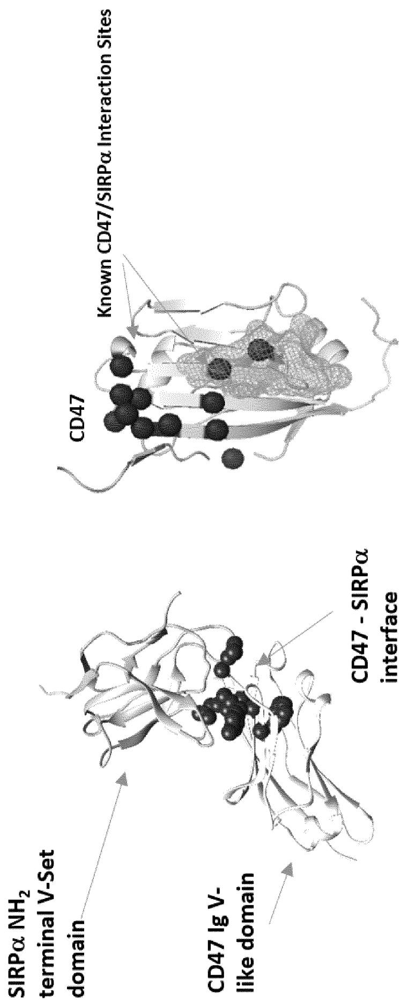

text_image

SIRPα NH₂
terminal V-Set
domain
CD47 lg V-
like domain
CD47 - SIRPα
interface
CD47
Known CD47/SIRPα Interaction Sites

Figure 1

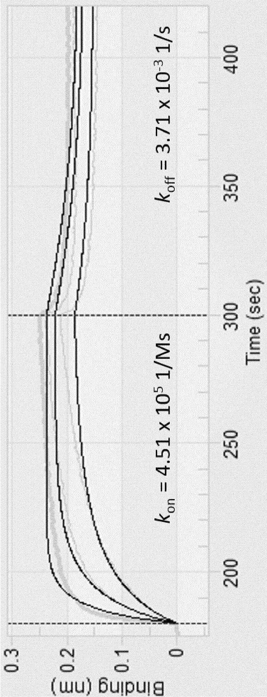

line

| Time (sec) | Binding (nm) - k_on = 4.51 x 10^5 1/Ms | Binding (nm) - k_off = 3.71 x 10^-3 1/s |
| ---------- | ---------------------------------------- | ---------------------------------------- |
| 0          | 0.0                                      | 0.0                                      |
| 200        | ~0.22                                    | ~0.18                                    |
| 300        | ~0.23                                    | ~0.19                                    |
| 400        | ~0.22                                    | ~0.18                                    |

Figure 2A

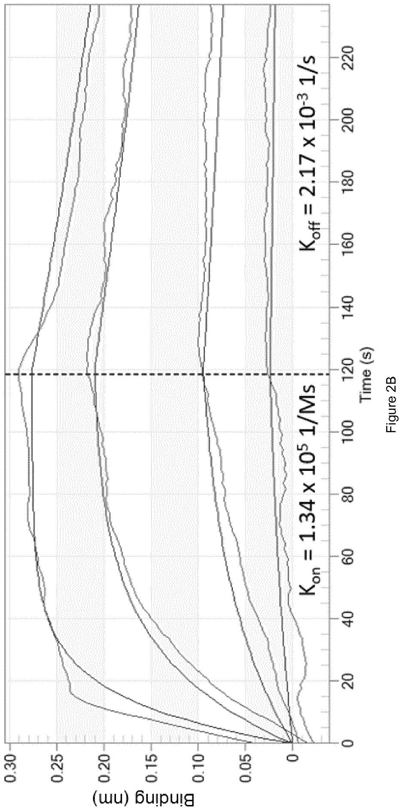

line

| Time (s) | Binding (nm) - Line 1 | Binding (nm) - Line 2 | Binding (nm) - Line 3 | Binding (nm) - Line 4 | Binding (nm) - Line 5 | Binding (nm) - Line 6 | Binding (nm) - Line 7 | Binding (nm) - Line 8 |
| -------- | --------------------- | --------------------- | --------------------- | --------------------- | --------------------- | --------------------- | --------------------- | --------------------- |
| 0        | 0.0                   | 0.0                   | 0.0                   | 0.0                   | 0.0                   | 0.0                   | 0.0                   | 0.0                   |
| 20       | ~0.24                 | ~0.12                 | ~0.08                 | ~0.04                 | ~0.02                 | ~0.01                 | ~0.01                 | ~0.01                 |
| 40       | ~0.26                 | ~0.16                 | ~0.12                 | ~0.06                 | ~0.03                 | ~0.02                 | ~0.02                 | ~0.02                 |
| 60       | ~0.27                 | ~0.18                 | ~0.14                 | ~0.07                 | ~0.04                 | ~0.03                 | ~0.03                 | ~0.03                 |
| 80       | ~0.28                 | ~0.19                 | ~0.15                 | ~0.08                 | ~0.05                 | ~0.04                 | ~0.04                 | ~0.04                 |
| 100      | ~0.28                 | ~0.20                 | ~0.16                 | ~0.09                 | ~0.06                 | ~0.05                 | ~0.05                 | ~0.05                 |
| 120      | ~0.29                 | ~0.21                 | ~0.17                 | ~0.10                 | ~0.07                 | ~0.06                 | ~0.06                 | ~0.06                 |
| 140      | ~0.27                 | ~0.20                 | ~0.16                 | ~0.11                 | ~0.08                 | ~0.07                 | ~0.07                 | ~0.07                 |
| 160      | ~0.25                 | ~0.19                 | ~0.15                 | ~0.12                 | ~0.09                 | ~0.08                 | ~0.08                 | ~0.08                 |
| 180      | ~0.24                 | ~0.18                 | ~0.14                 | ~0.13                 | ~0.10                 | ~0.09                 | ~0.09                 | ~0.09                 |
| 200      | ~0.23                 | ~0.17                 | ~0.13                 | ~0.14                 | ~0.11                 | ~0.10                 | ~0.10                 | ~0.10                 |
| 220      | ~0.22                 | ~0.16                 | ~0.12                 | ~0.15                 | ~0.12                 | ~0.11                 | ~0.11                 | ~0.11                 |

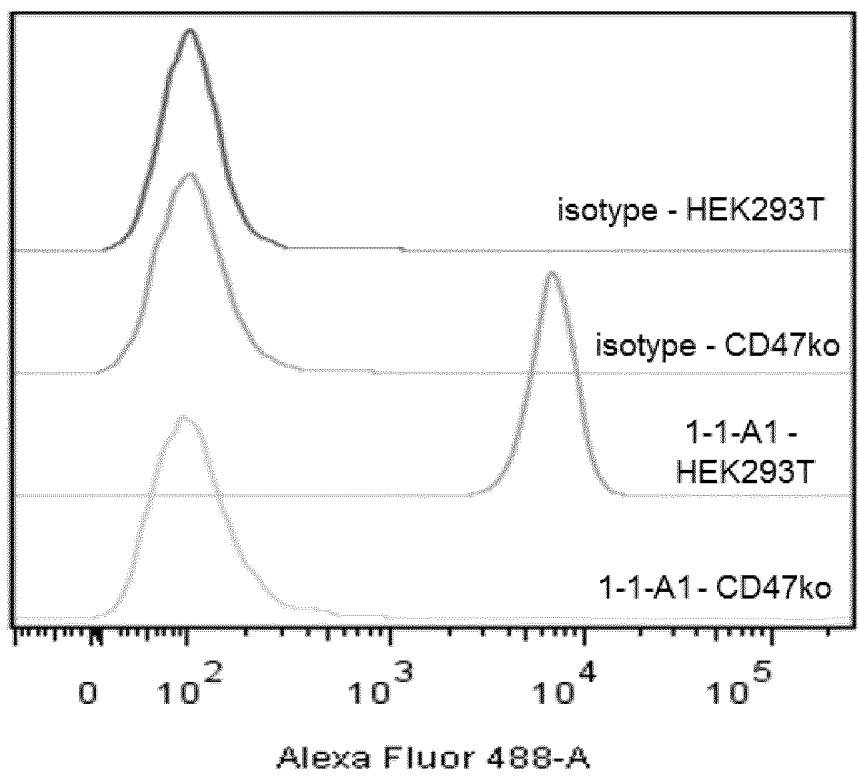

line

| Condition | Peak Intensity |
| --------- | -------------- |
| isotype - HEK293T | High peak |
| isotype - CD47ko | Medium peak |
| 1-1-A1 - HEK293T | Medium peak |
| 1-1-A1 - CD47ko | Low peak |

Figure 3A

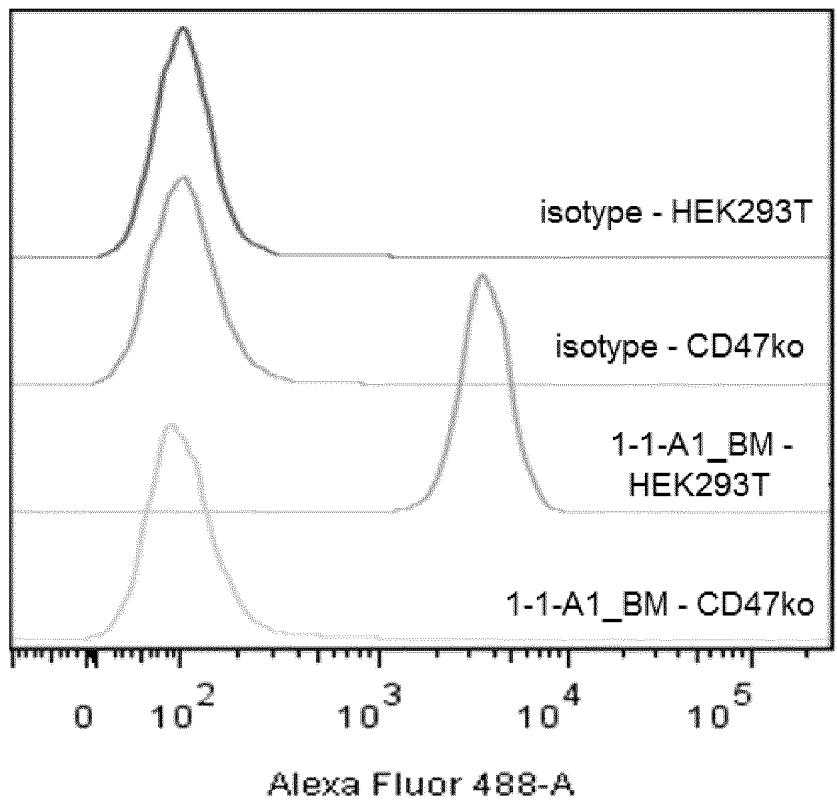

line

| Alexa Fluor 488-A | isotype - HEK293T | isotype - CD47ko | 1-1-A1_BM - HEK293T | 1-1-A1_BM - CD47ko |
| ----------------- | ----------------- | ---------------- | ------------------- | ------------------ |
| 10^2              | ~10^3             | ~10^2            | ~10^2               | ~10^2              |
| 10^3              | ~10^2             | ~10^2            | ~10^2               | ~10^2              |
| 10^4              | ~10^2             | ~10^3            | ~10^2               | ~10^2              |
| 10^5              | ~10^2             | ~10^2            | ~10^2               | ~10^2              |

Figure 3B

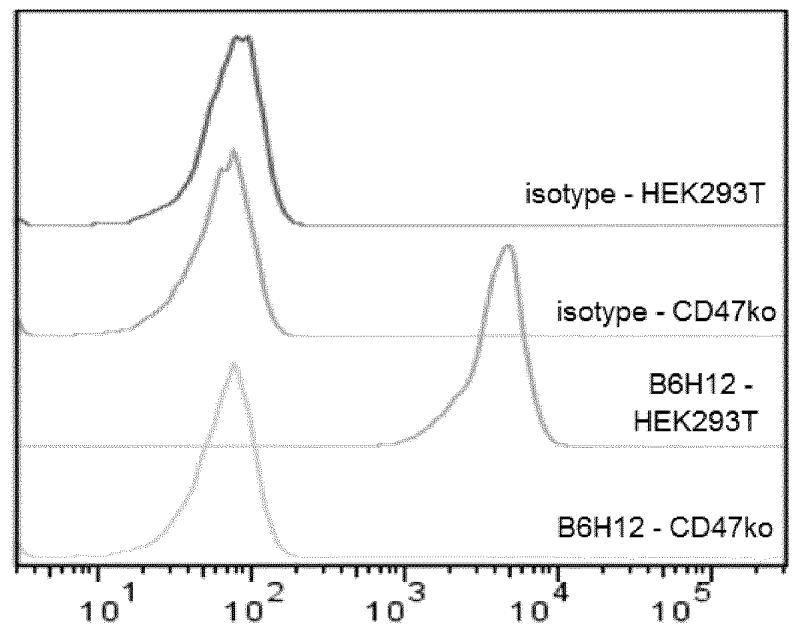

line

| Compound           | Peak Position (approx.) |
| ------------------ | ------------------------ |
| isotype - HEK293T  | ~10^2                    |
| isotype - CD47ko   | ~10^2                    |
| B6H12 - HEK293T   | ~10^4                    |
| B6H12 - CD47ko    | ~10^4                    |

APC-A   
Figure 3C

anti-CD47 (B6H12)   
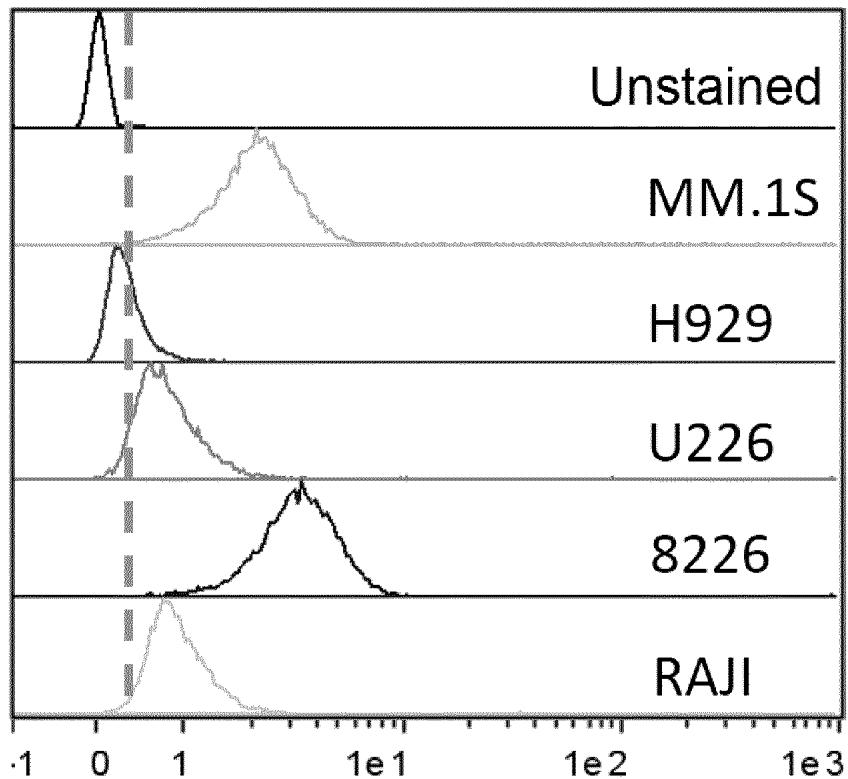

line

| Category   | Peak Value |
| ---------- | ---------- |
| Unstained  | ~0.5       |
| MM.1S      | ~0.3       |
| H929       | ~0.4       |
| U226       | ~0.6       |
| 8226       | ~0.7       |
| RAJI       | ~0.3       |

Figure 3D

6/16   
Inhibition of CD47-SIRPa   
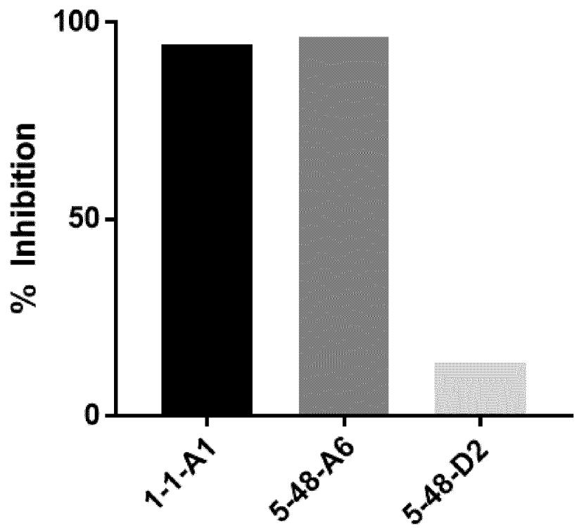

bar

| Category | % Inhibition (%) |
| :--- | :--- |
| 1-1-A1 | 95 |
| 5-48-A6 | 97 |
| 5-48-D2 | 15 |

Figure 4

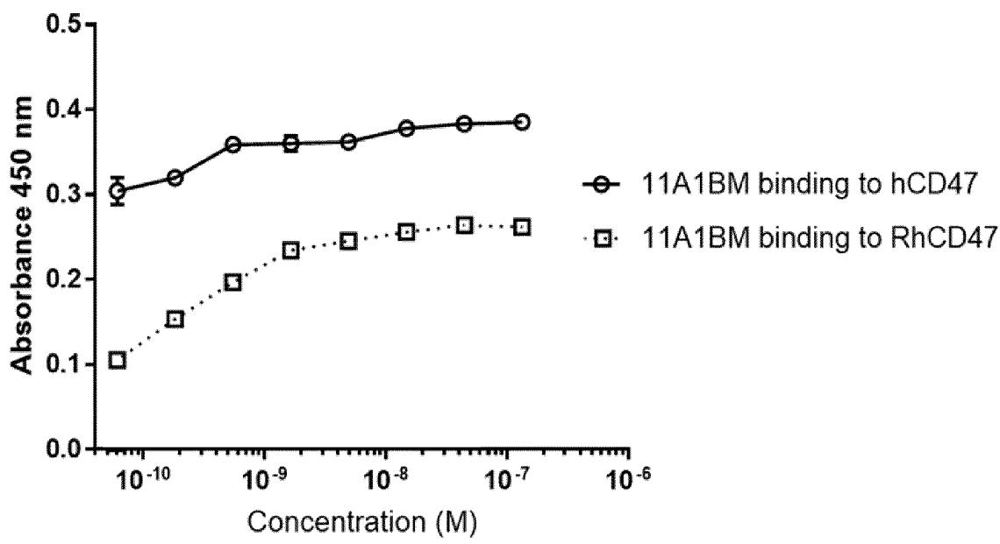

line

| Concentration (M) | 11A1BM binding to hCD47 | 11A1BM binding to RhCD47 |
| ----------------- | ------------------------ | ------------------------- |
| 1e-10             | 0.30                     | 0.10                      |
| 1e-9              | 0.35                     | 0.20                      |
| 1e-8              | 0.36                     | 0.25                      |
| 1e-7              | 0.38                     | 0.26                      |
| 1e-6              | 0.38                     | 0.26                      |

Figure 5

7/16   
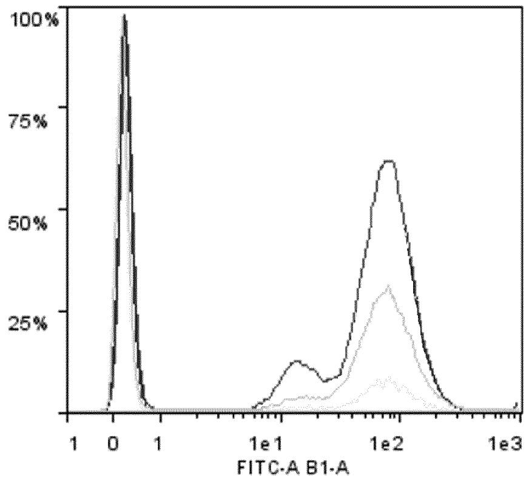

line

| FITC-A B1-A | Percentage |
| ----------- | ---------- |
| 0           | 100%       |
| 1e1         | ~15%       |
| 1e2         | ~65%       |
| 1e3         | ~0%        |

<table><tr><td>Legend</td><td>Population</td><td>Live cell %</td><td>% FITC positive</td></tr><tr><td></td><td>Negative Control (PBS)</td><td>71.54</td><td>27</td></tr><tr><td></td><td>B6H12 Control</td><td>73.39</td><td>59</td></tr><tr><td></td><td>1-1-A1 mAb</td><td>77.51</td><td>74.63</td></tr></table>

Figure 6

Isotype Control   
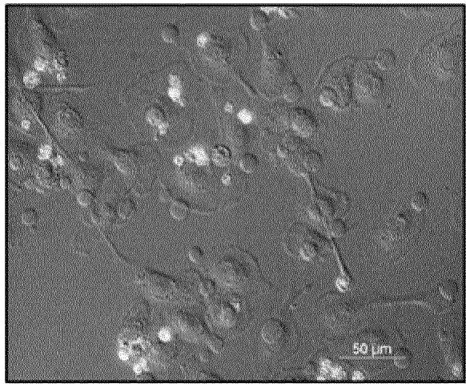

natural_image

Microscopic view of cellular or particulate structures with a 50 μm scale bar (no text or symbols beyond scale indicator)

Figure 7A

11A1BM   
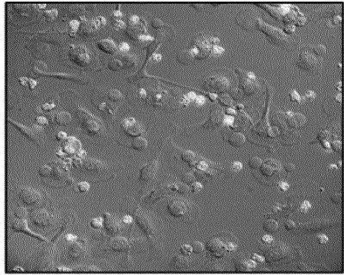

natural_image

Microscopic view of cellular or particulate structures on a textured surface (no visible text or symbols)

Figure 7B

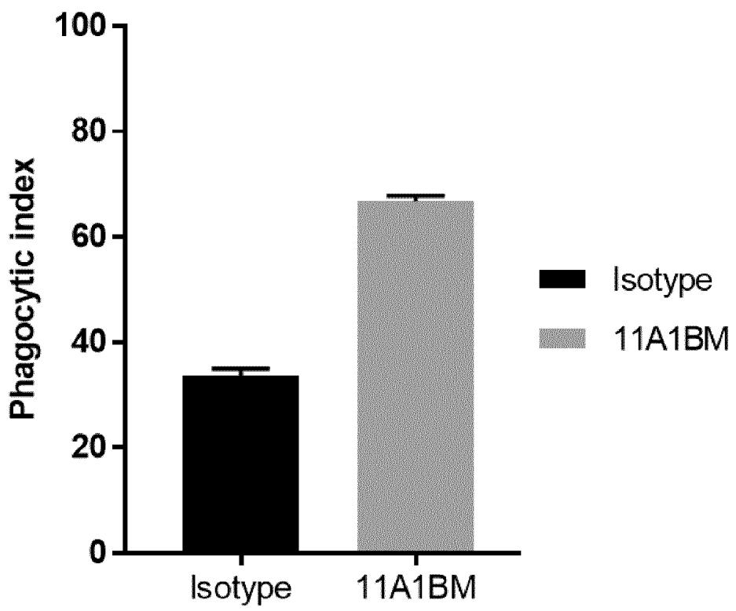

bar

| Group   | Phagocytic index |
| ------- | ---------------- |
| Isotype | 34               |
| 11A1BM  | 67               |

Figure 7C

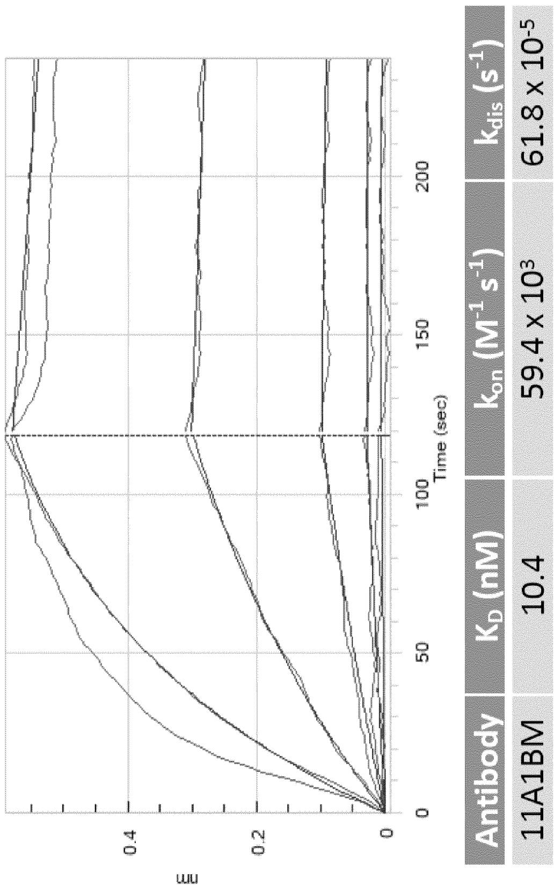

line

| Antibody | K_D (nM) | k_on (M⁻¹ s⁻¹) | k_dis (s⁻¹) |
| -------- | -------- | -------------- | ----------- |
| 11A1BM   | 10.4     | 59.4 x 10³     | 61.8 x 10⁻⁵ |

Figure 8

10/16   
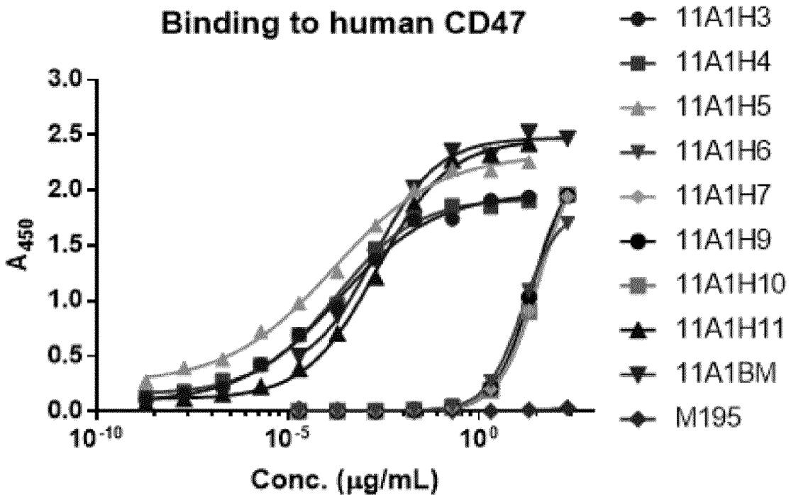

line

| Compound   | Conc. (μg/mL) | A450 |
| ---------- | ------------- | ---- |
| 11A1H3     | ~10⁻¹⁰        | ~0.2 |
| 11A1H4     | ~10⁻⁵         | ~0.6 |
| 11A1H5     | ~10⁰          | ~2.0 |
| 11A1H6     | ~10⁰          | ~2.5 |
| 11A1H7     | ~10⁰          | ~2.4 |
| 11A1H9     | ~10⁰          | ~2.0 |
| 11A1H10    | ~10⁰          | ~2.2 |
| 11A1H11    | ~10⁰          | ~2.3 |
| 11A1BM     | ~10⁰          | ~2.5 |
| M195       | ~10⁰          | ~2.4 |

Figure 9

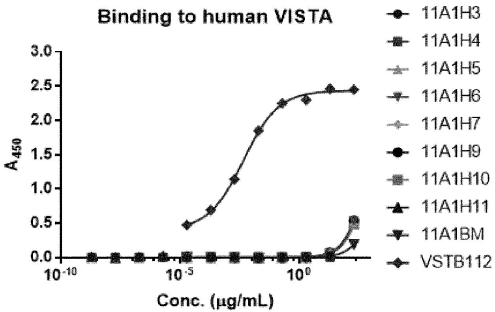

line

| Compound   | Conc. (μg/mL) | A450 |
| ---------- | ------------- | ---- |
| 11A1H3     | ~10⁻¹⁰        | ~0.0 |
| 11A1H4     | ~10⁻⁹         | ~0.0 |
| 11A1H5     | ~10⁻⁸         | ~0.0 |
| 11A1H6     | ~10⁻⁷         | ~0.0 |
| 11A1H7     | ~10⁻⁶         | ~0.0 |
| 11A1H9     | ~10⁻⁵         | ~0.5 |
| 11A1H10    | ~10⁻⁴         | ~0.0 |
| 11A1H11    | ~10⁻³         | ~0.0 |
| 11A1BM     | ~10⁻²         | ~0.0 |
| VSTB112    | ~10⁻¹         | ~0.5 |

Figure 10

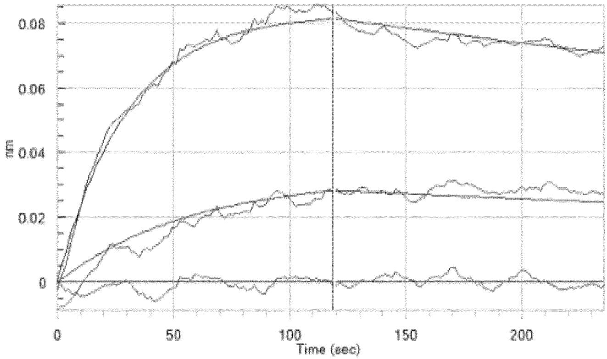

line

| Time (sec) | Series 1 | Series 2 | Series 3 | Series 4 |
| ---------- | -------- | -------- | -------- | -------- |
| 0          | 0.0000   | 0.0000   | 0.0000   | 0.0000   |
| 50         | 0.0650   | 0.0200   | 0.0150   | 0.0050   |
| 100        | 0.0800   | 0.0250   | 0.0280   | 0.0100   |
| 150        | 0.0780   | 0.0260   | 0.0270   | 0.0120   |
| 200        | 0.0750   | 0.0255   | 0.0265   | 0.0115   |
| 250        | 0.0730   | 0.0250   | 0.0260   | 0.0110   |

Figure 11A

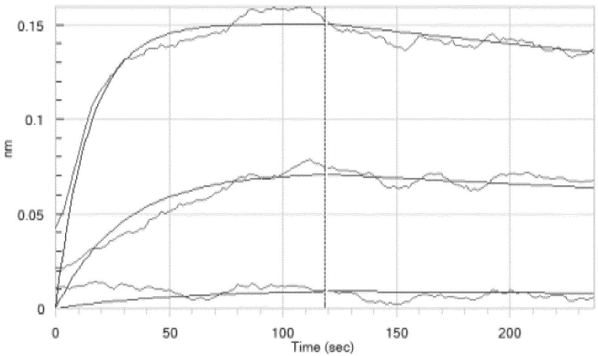

line

| Time (sec) | Series 1 | Series 2 | Series 3 | Series 4 | Series 5 |
| ---------- | -------- | -------- | -------- | -------- | -------- |
| 0          | 0.0      | 0.0      | 0.0      | 0.0      | 0.0      |
| 50         | 0.14     | 0.06     | 0.07     | 0.01     | 0.01     |
| 100        | 0.15     | 0.07     | 0.08     | 0.01     | 0.01     |
| 150        | 0.14     | 0.06     | 0.07     | 0.01     | 0.01     |
| 200        | 0.13     | 0.06     | 0.07     | 0.01     | 0.01     |
| 250        | 0.13     | 0.06     | 0.07     | 0.01     | 0.01     |

Figure 11B

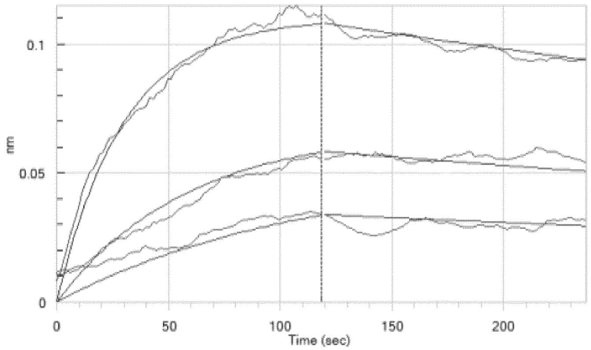

line

| Time (sec) | Series 1 | Series 2 | Series 3 | Series 4 | Series 5 | Series 6 | Series 7 |
| ---------- | -------- | -------- | -------- | -------- | -------- | -------- | -------- |
| 0          | 0.0      | 0.0      | 0.0      | 0.0      | 0.0      | 0.0      | 0.0      |
| 50         | 0.08     | 0.04     | 0.03     | 0.02     | 0.01     | 0.01     | 0.01     |
| 100        | 0.11     | 0.06     | 0.05     | 0.03     | 0.02     | 0.02     | 0.02     |
| 150        | 0.10     | 0.06     | 0.05     | 0.03     | 0.02     | 0.02     | 0.02     |
| 200        | 0.09     | 0.05     | 0.04     | 0.02     | 0.02     | 0.02     | 0.02     |
| 250        | 0.09     | 0.05     | 0.04     | 0.02     | 0.02     | 0.02     | 0.02     |

Figure 11C

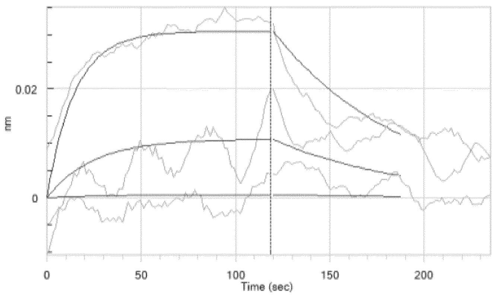

line

| Time (sec) | Series 1 | Series 2 | Series 3 | Series 4 | Series 5 |
| ---------- | -------- | -------- | -------- | -------- | -------- |
| 0          | 0.0000   | 0.0000   | 0.0000   | 0.0000   | 0.0000   |
| 50         | 0.0250   | 0.0150   | 0.0100   | 0.0050   | 0.0020   |
| 100        | 0.0300   | 0.0200   | 0.0150   | 0.0100   | 0.0050   |
| 150        | 0.0250   | 0.0150   | 0.0120   | 0.0180   | 0.0120   |
| 200        | 0.0150   | 0.0100   | 0.0180   | 0.0250   | 0.0180   |
| 250        | 0.0120   | 0.0120   | 0.0250   | 0.0350   | 0.0250   |

Figure 11D

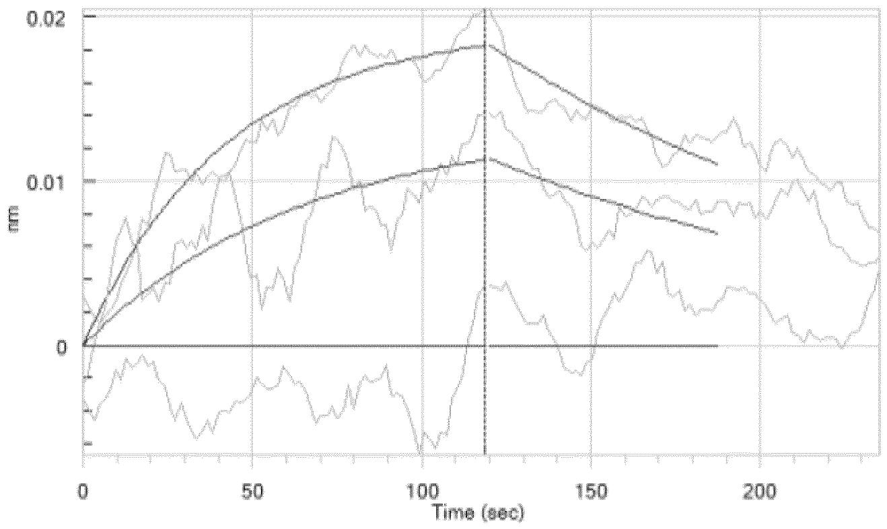

line

| Time (sec) | Series 1 | Series 2 | Series 3 | Series 4 | Series 5 |
| ---------- | -------- | -------- | -------- | -------- | -------- |
| 0          | 0.0000   | 0.0000   | 0.0000   | 0.0000   | 0.0000   |
| 50         | 0.0120   | 0.0080   | 0.0150   | 0.0100   | 0.0130   |
| 100        | 0.0180   | 0.0110   | 0.0190   | 0.0160   | 0.0170   |
| 150        | 0.0140   | 0.0090   | 0.0160   | 0.0130   | 0.0150   |
| 200        | 0.0110   | 0.0070   | 0.0130   | 0.0110   | 0.0120   |

Figure 11E

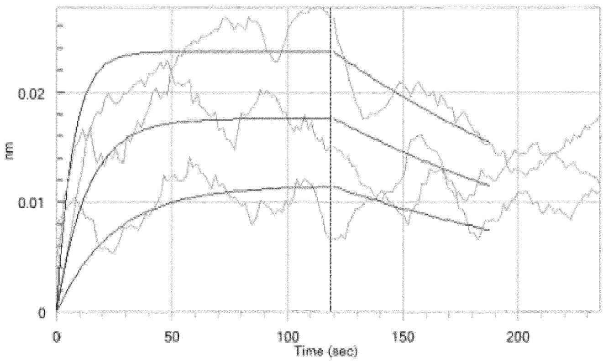

line

| Time (sec) | Series 1 | Series 2 | Series 3 | Series 4 | Series 5 |
| ---------- | -------- | -------- | -------- | -------- | -------- |
| 0          | 0.0000   | 0.0000   | 0.0000   | 0.0000   | 0.0000   |
| 50         | 0.0250   | 0.0180   | 0.0120   | 0.0100   | 0.0080   |
| 100        | 0.0260   | 0.0175   | 0.0115   | 0.0110   | 0.0120   |
| 150        | 0.0220   | 0.0150   | 0.0130   | 0.0125   | 0.0140   |
| 200        | 0.0180   | 0.0125   | 0.0145   | 0.0135   | 0.0160   |

Figure 11F

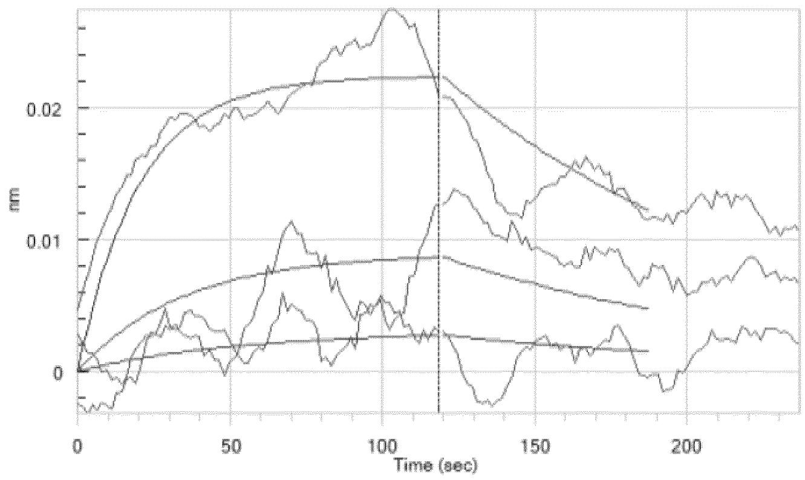

line

| Time (sec) | Series 1 | Series 2 | Series 3 | Series 4 | Series 5 |
| ---------- | -------- | -------- | -------- | -------- | -------- |
| 0          | 0.0000   | 0.0000   | 0.0000   | 0.0000   | 0.0000   |
| 50         | 0.0200   | 0.0150   | 0.0080   | 0.0060   | 0.0040   |
| 100        | 0.0250   | 0.0220   | 0.0120   | 0.0100   | 0.0080   |
| 150        | 0.0150   | 0.0180   | 0.0150   | 0.0120   | 0.0100   |
| 200        | 0.0120   | 0.0140   | 0.0130   | 0.0110   | 0.0120   |

Figure 11G

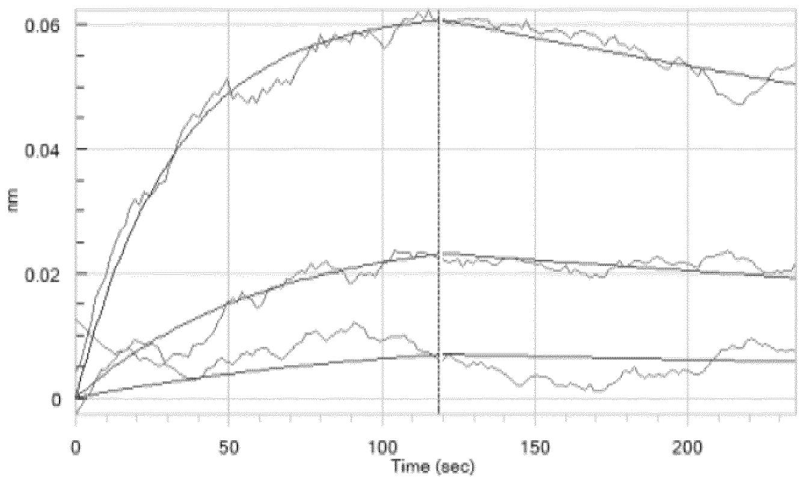

line

| Time (sec) | Series 1 | Series 2 | Series 3 | Series 4 | Series 5 |
| ---------- | -------- | -------- | -------- | -------- | -------- |
| 0          | 0.0000   | 0.0000   | 0.0000   | 0.0000   | 0.0000   |
| 50         | 0.0500   | 0.0150   | 0.0200   | 0.0100   | 0.0050   |
| 100        | 0.0600   | 0.0250   | 0.0250   | 0.0150   | 0.0050   |
| 150        | 0.0550   | 0.0225   | 0.0225   | 0.0125   | 0.0050   |
| 200        | 0.0500   | 0.0225   | 0.0225   | 0.0125   | 0.0050   |
| 250        | 0.04875  | 0.0225   | 0.0225   | 0.0125   | 0.0050   |

Figure 11H

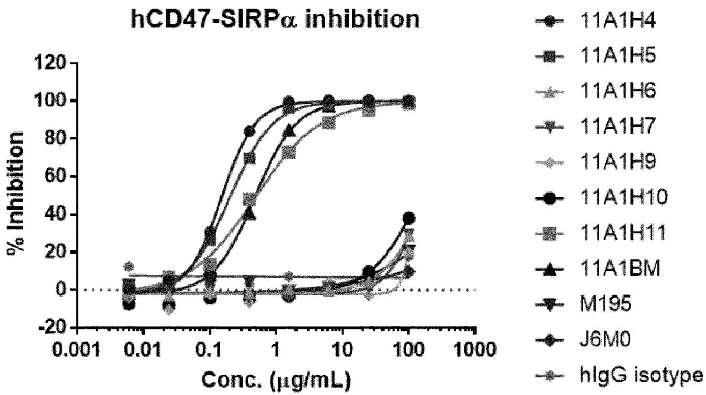

line

| Conc. (μg/mL) | 11A1H4 | 11A1H5 | 11A1H6 | 11A1H7 | 11A1H9 | 11A1H10 | 11A1H11 | 11A1BM | M195 | J6M0 | hlgG isotype |
| ------------- | ------ | ------ | ------ | ------ | ------ | ------- | ------- | ------ | ---- | ---- | ----------- |
| 0.001         | -      | -      | -      | -      | -      | -       | -       | -      | -    | -    | -           |
| 0.01          | -      | -      | -      | -      | -      | -       | -       | -      | -    | -    | -           |
| 0.1           | ~30    | ~25    | ~20    | ~15    | ~10    | ~80     | ~70     | ~40    | ~5   | ~5   | ~5          |
| 1             | ~95    | ~90    | ~85    | ~80    | ~75    | ~95     | ~85     | ~80    | ~5   | ~5   | ~5          |
| 10            | ~98    | ~95    | ~90    | ~85    | ~80    | ~98     | ~90     | ~85    | ~5   | ~5   | ~5          |
| 100           | ~98    | ~98    | ~95    | ~90    | ~85    | ~98     | ~90     | ~85    | ~5   | ~5   | ~5          |
| 1000          | ~98    | ~98    | ~95    | ~90    | ~85    | ~98     | ~90     | ~85    | ~5   | ~5   | ~5          |

Figure 12

Concentration: $\mu$ g/ml   
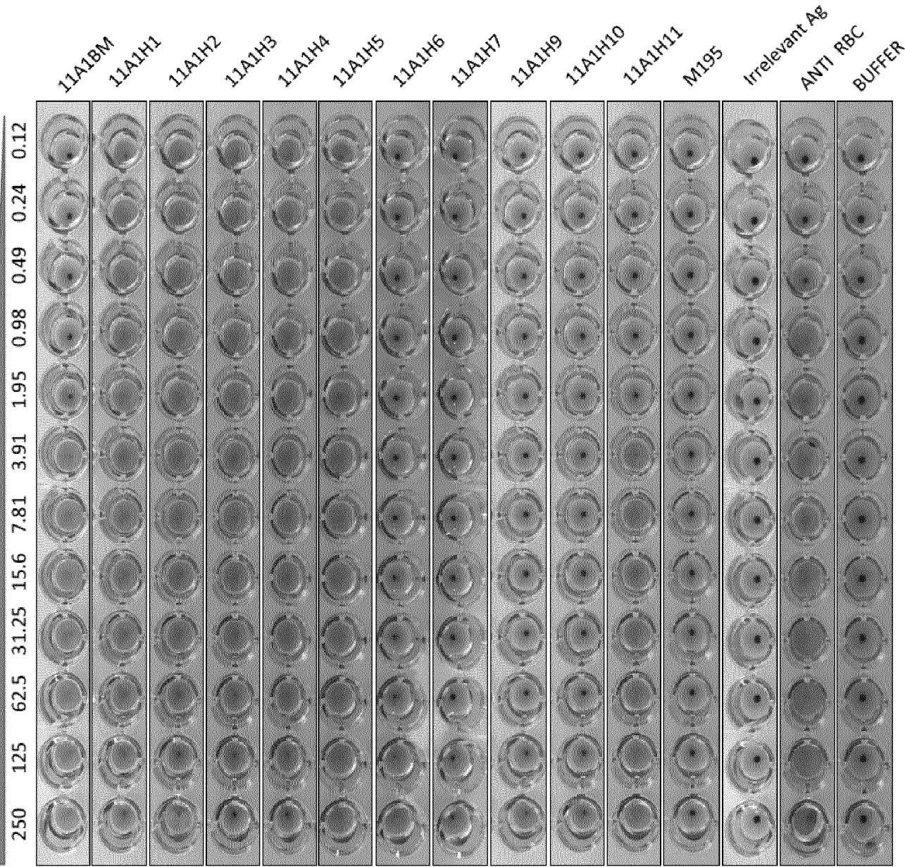

scatter

| Sample | Value |
|--------|-------|
| 11A1BM | 0.12 |
| 11A1H1 | 0.24 |
| 11A1H2 | 0.49 |
| 11A1H3 | 0.98 |
| 11A1H4 | 1.95 |
| 11A1H5 | 3.91 |
| 11A1H6 | 7.81 |
| 11A1H7 | 15.6 |
| 11A1H9 | 31.25 |
| 11A1H10 | 62.5 |
| 11A1H11 | 250 |
| M195   | 0.12 |
| Irrelevant Ag | 0.24 |
| ANTI   | 0.49 |
| RBC    | 0.98 |
| BUFFER | 1.95 |

Figure 13

INTERNATIONAL SEARCH REPORT 

<table><tr><td colspan="2"></td><td>PCT/EP2018/079931</td></tr><tr><td colspan="3">A. CLASSIFICATION OF SUBJECT MATTERINV. C07K16/28 A61P35/00ADD.According to International Patent Classification (IPC) or to both national classification and IPC</td></tr><tr><td colspan="3">B. FIELDS SEARCHED</td></tr><tr><td colspan="3">Minimum documentation searched (classification system followed by classification symbols)C07K A61P</td></tr><tr><td colspan="3">Documentation searched other than minimum documentation to the extent that such documents are included in the fields searched</td></tr><tr><td colspan="3">Electronic data base consulted during the international search (name of data base and, where practicable, search terms used)EPO-Internal, WPI Data</td></tr><tr><td colspan="3">C. DOCUMENTS CONSIDERED TO BE RELEVANT</td></tr><tr><td>Category*</td><td>Citation of document, with indication, where appropriate, of the relevant passages</td><td>Relevant to claim No.</td></tr><tr><td>X</td><td>EMILY C PICCIONE ET AL: &quot;A bispecificantibody targeting CD47 and CD20selectively binds and eliminates dualantigen expressing lymphoma cells&quot;,MABS,vol. 7, no. 5, 17 June 2015 (2015-06-17),pages 946-956, XP55314609,USISSN: 1942-0862, DOI:10.1080/19420862.2015.1062192</td><td>1-6,12,19-39</td></tr><tr><td>Y</td><td>page 950, left-hand column, line 19 - line22page 954, left-hand column, paragraph 2Materials and methods;page 954, left-hand columnfigure 1D----/--</td><td>7-11,13-18</td></tr><tr><td colspan="3">Further documents are listed in the continuation of Box C. See patent family annex.</td></tr><tr><td colspan="3">* Special categories of cited documents :&quot;A&quot; document defining the general state of the art which is not consideredto be of particular relevance&quot;E&quot; earlier application or patent but published on or after the internationalfiling date&quot;L&quot; document which may throw doubts on priority, claim(s) or which iscited to establish the publication date of another citation or otherspecial reason (as specified)&quot;O&quot; document referring to an oral disclosure, use, exhibition or othermeans&quot;P&quot; document published prior to the international filing date but later thanthe priority date claimed&quot;T&quot; later document published after the international filing date or prioritydate and not in conflict with the application but cited to understandthe principle or theory underlying the invention&quot;X&quot; document of particular relevance; the claimed invention cannot beconsidered novel or cannot be considered to involve an inventivestep when the document is taken alone&quot;Y&quot; document of particular relevance; the claimed invention cannot beconsidered to involve an inventive step when the document iscombined with one or more other such documents, such combinationbeing obvious to a person skilled in the art&quot;&amp;&quot; document member of the same patent family</td></tr><tr><td>Date of the actual completion of the international search6 February 2019</td><td colspan="2">Date of mailing of the international search report25/02/2019</td></tr><tr><td>Name and mailing address of the ISA/European Patent Office, P.B. 5818 Patentlaan 2NL - 2280 HV RijswijkTel. (+31-70) 340-2040,Fax: (+31-70) 340-3016</td><td colspan="2">Authorized officerWagner, René</td></tr></table>

INTERNATIONAL SEARCH REPORT   
International application No
PCT/EP2018/079931 

<table><tr><td colspan="3">C(Continuation). DOCUMENTS CONSIDERED TO BE RELEVANT</td></tr><tr><td>Category*</td><td>Citation of document, with indication, where appropriate, of the relevant passages</td><td>Relevant to claim No.</td></tr><tr><td>X</td><td>WO 2017/081101 A1(LUDWIG-MAXIMILIANS-UNIVERSITÄT MÜNCHEN[DE]) 18 May 2017 (2017-05-18)page 6, paragraph 7 - page 7, paragraph 1page 53, paragraph 4----</td><td>1-39</td></tr><tr><td>Y</td><td>WO 2017/049251 A2 (TIOMA THERAPEUTICS INC[US]) 23 March 2017 (2017-03-23)page 47, line 20 - line 24figures 15A, 15B, 16A, 16Bexamples 3, 7tables 1-3----</td><td>7-11,13-18</td></tr></table>

INTERNATIONAL SEARCH REPORT

Information on patent family members

International application No

PCT/EP2018/079931

<table><tr><td colspan="2">Patent document cited in search report</td><td>Publication date</td><td colspan="3">Patent family member(s)</td><td>Publication date</td></tr><tr><td rowspan="6">WO 2017081101</td><td rowspan="6">A1</td><td rowspan="6">18-05-2017</td><td>AU</td><td>2016353468</td><td>A1</td><td>26-04-2018</td></tr><tr><td>CA</td><td>3000597</td><td>A1</td><td>18-05-2017</td></tr><tr><td>EP</td><td>3165536</td><td>A1</td><td>10-05-2017</td></tr><tr><td>EP</td><td>3374394</td><td>A1</td><td>19-09-2018</td></tr><tr><td>US</td><td>2018311348</td><td>A1</td><td>01-11-2018</td></tr><tr><td>WO</td><td>2017081101</td><td>A1</td><td>18-05-2017</td></tr><tr><td rowspan="9">WO 2017049251</td><td rowspan="9">A2</td><td rowspan="9">23-03-2017</td><td>AU</td><td>2016324316</td><td>A1</td><td>05-04-2018</td></tr><tr><td>BR</td><td>112018005322</td><td>A2</td><td>11-12-2018</td></tr><tr><td>CA</td><td>2998644</td><td>A1</td><td>23-03-2017</td></tr><tr><td>CN</td><td>108348589</td><td>A</td><td>31-07-2018</td></tr><tr><td>EP</td><td>3349787</td><td>A2</td><td>25-07-2018</td></tr><tr><td>JP</td><td>2018536624</td><td>A</td><td>13-12-2018</td></tr><tr><td>PH</td><td>12018500515</td><td>A1</td><td>29-08-2018</td></tr><tr><td>US</td><td>2018171014</td><td>A1</td><td>21-06-2018</td></tr><tr><td>WO</td><td>2017049251</td><td>A2</td><td>23-03-2017</td></tr></table>