# NIHMS949397-supplement

# Supplemental Tables and Figures

Table S1. Genetic composition of VRC-PG05

Table S2. Neutralization IC50 values of VRC-PG05 against 208 HIV-1 Env pseudoviruses

Table S3. Statistics on VRC-PG05 neutralization profile based on the extended 220-isolate panel

Table S4. Crystallographic data collection and refinement statistics

Table S5. Contributions of glycan and protein to the VRC-PG05 epitope

Table S6. Contributions of VRC-PG05 heavy and light chain paratope residues to the binding of HIV-1 glycans and amino acids

Table S7. Hydrogen bonds between HIV-1 gp120 glycans and VRC-PG05

Figure S1. Binding and neutralization properties of VRC-PG05 and its relevance in donor plasma

Figure S2. Negative-stain electron microscopy of VRC-PG05 bound to HIV-1 ZM109 gp120 core

Figure S3. VRC-PG05 interaction with glycans

Figure S4. Comparison of modes of recognition of VRC-PG05 and other glycan-reactive antibodies

Figure S5. Negative-stain electron microscopy of AC10.29.SOSIP Envin complex with VRC-PG05

Figure S6. VRC-PG05 clonal variants identified by next generation sequencing

Figure S7. VRC-PG05 binding to BG505.SOSIP mutant, neutralization sensitivity of select autologous

Envclones from IAVI donor 74 and sequence frequency analysis of epitope residues

Table S1. Comparison of genetic composition of VRC-PG05 with that of VRC-PG04 isolated from the same IAVI Donor #74. Related to Figure 1. 

<table><tr><td>Antibody</td><td>Donor</td><td>IGHV</td><td>IGHV mutation frequency</td><td>CDRH3 length (amino acid)</td><td>IGKV</td><td>IGKV mutation frequency</td><td>CDRL3 length (amino acids)</td></tr><tr><td>VRC-PG05</td><td>IAVI 74</td><td>3-7*01</td><td>27/288 (9%)</td><td>17</td><td>4-1*01</td><td>17/282 (6%)</td><td>8</td></tr><tr><td>VRC-PG04</td><td>IAVI 74</td><td>1-2*02</td><td>86/288 (30%)</td><td>14</td><td>3-20*01</td><td>51/267 (19%)</td><td>5</td></tr><tr><td>VRC-PG04b</td><td>IAVI 74</td><td>1-2*02</td><td>85/288 (30%)</td><td>14</td><td>3-20*01</td><td>50/267 (19%)</td><td>5</td></tr></table>

Table S2. Neutralization IC $_{50}$ values of VRC-PG05 against 208 HIV-1 Env pseudoviruses. Related to Figure 1. 

<table><tr><td>Virus</td><td>Clade</td><td>IC50(μg/ml)</td><td></td><td>Virus</td><td>Clade</td><td>IC50(μg/ml)</td><td></td><td>Virus</td><td>Clade</td><td>IC50(μg/ml)</td><td></td><td>Virus</td><td>Clade</td><td>IC50(μg/ml)</td></tr><tr><td>0260.v5.c36</td><td>A</td><td>&gt;50</td><td></td><td>R2184.c4</td><td>AE</td><td>43.000</td><td></td><td>SS1196.01</td><td>B</td><td>&gt;50</td><td></td><td>DU123.06</td><td>C</td><td>&gt;50</td></tr><tr><td>0330.v4.c3</td><td>A</td><td>&gt;50</td><td></td><td>R3265.c6</td><td>AE</td><td>&gt;50</td><td></td><td>THRO.18</td><td>B</td><td>&gt;50</td><td></td><td>DU151.02</td><td>C</td><td>0.577</td></tr><tr><td>0439.v5.c1</td><td>A</td><td>&gt;50</td><td></td><td>TH023.6</td><td>AE</td><td>0.1750</td><td></td><td>TRJO.58</td><td>B</td><td>&gt;50</td><td></td><td>DU156.12</td><td>C</td><td>&gt;50</td></tr><tr><td>3365.v2.c20</td><td>A</td><td>3.710</td><td></td><td>TH966.8</td><td>AE</td><td>34.300</td><td></td><td>TRO.11</td><td>B</td><td>&gt;50</td><td></td><td>DU172.17</td><td>C</td><td>&gt;50</td></tr><tr><td>3415.v1.c1</td><td>A</td><td>&gt;50</td><td></td><td>TH976.17</td><td>AE</td><td>&gt;50</td><td></td><td>WITO.33</td><td>B</td><td>&gt;50</td><td></td><td>DU422.01</td><td>C</td><td>5.990</td></tr><tr><td>3718.v3.c11</td><td>A</td><td>&gt;50</td><td></td><td>235-47</td><td>AG</td><td>&gt;50</td><td></td><td>X2278.C2.B6</td><td>B</td><td>&gt;50</td><td></td><td>MW965.26</td><td>C</td><td>&gt;50</td></tr><tr><td>398-F1_F6_20</td><td>A</td><td>&gt;50</td><td></td><td>242-14</td><td>AG</td><td>&gt;50</td><td></td><td>YU2.DG</td><td>B</td><td>&gt;50</td><td></td><td>SO18.18</td><td>C</td><td>&gt;50</td></tr><tr><td>BB201.B42</td><td>A</td><td>&gt;50</td><td></td><td>263-8</td><td>AG</td><td>&gt;50</td><td></td><td>BJOX002000.03.2</td><td>BC</td><td>&gt;50</td><td></td><td>TV1.29</td><td>C</td><td>&gt;50</td></tr><tr><td>BB539.2B13</td><td>A</td><td>&gt;50</td><td></td><td>269-12</td><td>AG</td><td>&gt;50</td><td></td><td>CH038.12</td><td>BC</td><td>17.80</td><td></td><td>TZA125.17</td><td>C</td><td>&gt;50</td></tr><tr><td>BG505.W6M.C2</td><td>A</td><td>&gt;50</td><td></td><td>271-11</td><td>AG</td><td>&gt;50</td><td></td><td>CH070.1</td><td>BC</td><td>0.341</td><td></td><td>TZBD.02</td><td>C</td><td>17.100</td></tr><tr><td>BI369.9A</td><td>A</td><td>&gt;50</td><td></td><td>928-28</td><td>AG</td><td>0.875</td><td></td><td>CH117.4</td><td>BC</td><td>&gt;50</td><td></td><td>ZA012.29</td><td>C</td><td>&gt;50</td></tr><tr><td>BS208.B1</td><td>A</td><td>&gt;50</td><td></td><td>DJ263.8</td><td>AG</td><td>&gt;50</td><td></td><td>CH119.10</td><td>BC</td><td>&gt;50</td><td></td><td>ZM106.9</td><td>C</td><td>&gt;50</td></tr><tr><td>KER2008.12</td><td>A</td><td>&gt;50</td><td></td><td>T250-4</td><td>AG</td><td>&gt;50</td><td></td><td>CH181.12</td><td>BC</td><td>&gt;50</td><td></td><td>ZM109.4</td><td>C</td><td>0.520</td></tr><tr><td>KER2018.11</td><td>A</td><td>&gt;50</td><td></td><td>T251-18</td><td>AG</td><td>&gt;50</td><td></td><td>CNE15</td><td>BC</td><td>&gt;50</td><td></td><td>ZM135.10a</td><td>C</td><td>&gt;50</td></tr><tr><td>KNH1209.18</td><td>A</td><td>&gt;50</td><td></td><td>T253-11</td><td>AG</td><td>&gt;50</td><td></td><td>CNE19</td><td>BC</td><td>&gt;50</td><td></td><td>ZM176.66</td><td>C</td><td>&gt;50</td></tr><tr><td>MB201.A1</td><td>A</td><td>&gt;50</td><td></td><td>T255-34</td><td>AG</td><td>0.566</td><td></td><td>CNE20</td><td>BC</td><td>&gt;50</td><td></td><td>ZM197.7</td><td>C</td><td>&gt;50</td></tr><tr><td>MB539.2B7</td><td>A</td><td>&gt;50</td><td></td><td>T257-31</td><td>AG</td><td>&gt;50</td><td></td><td>CNE21</td><td>BC</td><td>&gt;50</td><td></td><td>ZM214.15</td><td>C</td><td>&gt;50</td></tr><tr><td>MI369.A5</td><td>A</td><td>&gt;50</td><td></td><td>T266-60</td><td>AG</td><td>&gt;50</td><td></td><td>CNE40</td><td>BC</td><td>&gt;50</td><td></td><td>ZM215.8</td><td>C</td><td>&gt;50</td></tr><tr><td>MS208.A1</td><td>A</td><td>&gt;50</td><td></td><td>T278-50</td><td>AG</td><td>&gt;50</td><td></td><td>CNE7</td><td>BC</td><td>0.054</td><td></td><td>ZM233.6</td><td>C</td><td>&gt;50</td></tr><tr><td>Q23.17</td><td>A</td><td>&gt;50</td><td></td><td>T280-5</td><td>AG</td><td>&gt;50</td><td></td><td>286.36</td><td>C</td><td>&gt;50</td><td></td><td>ZM249.1</td><td>C</td><td>&gt;50</td></tr><tr><td>Q259.17</td><td>A</td><td>&gt;50</td><td></td><td>T33-7</td><td>AG</td><td>&gt;50</td><td></td><td>288.38</td><td>C</td><td>&gt;50</td><td></td><td>ZM53.12</td><td>C</td><td>0.171</td></tr><tr><td>Q769.d22</td><td>A</td><td>0.724</td><td></td><td>3988.25</td><td>B</td><td>12.6000</td><td></td><td>0013095-2.11</td><td>C</td><td>&gt;50</td><td></td><td>ZM55.28a</td><td>C</td><td>&gt;50</td></tr><tr><td>Q769.h5</td><td>A</td><td>0.016</td><td></td><td>5768.04</td><td>B</td><td>&gt;50</td><td></td><td>001428-2.42</td><td>C</td><td>0.324</td><td></td><td>3326.V4.C3</td><td>CD</td><td>&gt;50</td></tr><tr><td>Q842.d12</td><td>A</td><td>&gt;50</td><td></td><td>6101.10</td><td>B</td><td>43.5000</td><td></td><td>0077_V1.C16</td><td>C</td><td>0.051</td><td></td><td>3337.V2.C6</td><td>CD</td><td>2.780</td></tr><tr><td>QH209.14M.A2</td><td>A</td><td>0.298</td><td></td><td>6535.3</td><td>B</td><td>&gt;50</td><td></td><td>00836-2.5</td><td>C</td><td>&gt;50</td><td></td><td>3817.v2.c59</td><td>CD</td><td>&gt;50</td></tr><tr><td>RW020.2</td><td>A</td><td>&gt;50</td><td></td><td>7165.18</td><td>B</td><td>&gt;50</td><td></td><td>0921.V2.C14</td><td>C</td><td>0.111</td><td></td><td>191821.E6.1</td><td>D</td><td>&gt;50</td></tr><tr><td>UG037.8</td><td>A</td><td>&gt;50</td><td></td><td>45_01dG5</td><td>B</td><td>&gt;50</td><td></td><td>16055-2.3</td><td>C</td><td>&gt;50</td><td></td><td>231965.c1</td><td>D</td><td>&gt;50</td></tr><tr><td>246-F3.C10.2</td><td>AC</td><td>0.059</td><td></td><td>89.6</td><td>B</td><td>&gt;50</td><td></td><td>16845-2.22</td><td>C</td><td>&gt;50</td><td></td><td>247-23</td><td>D</td><td>19.000</td></tr><tr><td>3301.V1.C24</td><td>AC</td><td>&gt;50</td><td></td><td>AC10.29</td><td>B</td><td>0.019</td><td></td><td>16936-2.21</td><td>C</td><td>&gt;50</td><td></td><td>3016.v5.c45</td><td>D</td><td>7.120</td></tr><tr><td>3589.V1.C4</td><td>AC</td><td>&gt;50</td><td></td><td>ADA</td><td>B</td><td>29.400</td><td></td><td>25710-2.43</td><td>C</td><td>&gt;50</td><td></td><td>57128.vrc15</td><td>D</td><td>&gt;50</td></tr><tr><td>6540.v4.c1</td><td>AC</td><td>&gt;50</td><td></td><td>Bal.01</td><td>B</td><td>0.642</td><td></td><td>25711-2.4</td><td>C</td><td>7.620</td><td></td><td>6405.v4.c34</td><td>D</td><td>&gt;50</td></tr><tr><td>6545.V4.C1</td><td>AC</td><td>&gt;50</td><td></td><td>Bal.26</td><td>B</td><td>0.897</td><td></td><td>25925-2.22</td><td>C</td><td>&gt;50</td><td></td><td>A03349M1.vrc4a</td><td>D</td><td>&gt;50</td></tr><tr><td>0815.V3.C3</td><td>ACD</td><td>&gt;50</td><td></td><td>BG1168.01</td><td>B</td><td>&gt;50</td><td></td><td>26191-2.48</td><td>C</td><td>&gt;50</td><td></td><td>A07412M1.vrc12</td><td>D</td><td>&gt;50</td></tr><tr><td>6095.V1.C10</td><td>ACD</td><td>0.013</td><td></td><td>BL01</td><td>B</td><td>&gt;50</td><td></td><td>3168.V4.C10</td><td>C</td><td>0.031</td><td></td><td>NKU3006.ec1</td><td>D</td><td>&gt;50</td></tr><tr><td>3468.V1.C12</td><td>AD</td><td>&gt;50</td><td></td><td>BR07</td><td>B</td><td>&gt;50</td><td></td><td>3637.V5.C3</td><td>C</td><td>&gt;50</td><td></td><td>UG021.16</td><td>D</td><td>&gt;50</td></tr><tr><td>Q168.a2</td><td>AD</td><td>&gt;50</td><td></td><td>BX08.16</td><td>B</td><td>&gt;50</td><td></td><td>3873.V1.C24</td><td>C</td><td>&gt;50</td><td></td><td>UG024.2</td><td>D</td><td>&gt;50</td></tr><tr><td>Q461.e2</td><td>AD</td><td>&gt;50</td><td></td><td>CAAN.A2</td><td>B</td><td>0.003</td><td></td><td>426c</td><td>C</td><td>&gt;50</td><td></td><td>P0402.c2.11</td><td>G</td><td>&gt;50</td></tr><tr><td>620345.c1</td><td>AE</td><td>0.336</td><td></td><td>CNE10</td><td>B</td><td>&gt;50</td><td></td><td>6322.V4.C1</td><td>C</td><td>2.260</td><td></td><td>P1981.C5.3</td><td>G</td><td>&gt;50</td></tr><tr><td>BJOX009000.02.4</td><td>AE</td><td>&gt;50</td><td></td><td>CNE12</td><td>B</td><td>1.600</td><td></td><td>6471.V1.C16</td><td>C</td><td>&gt;50</td><td></td><td>X1193.c1</td><td>G</td><td>&gt;50</td></tr><tr><td>BJOX010000.06.2</td><td>AE</td><td>&gt;50</td><td></td><td>CNE14</td><td>B</td><td>0.003</td><td></td><td>6631.V3.C10</td><td>C</td><td>&gt;50</td><td></td><td>X1254.c3</td><td>G</td><td>&gt;50</td></tr><tr><td>BJOX025000.01.1</td><td>AE</td><td>1.950</td><td></td><td>CNE4</td><td>B</td><td>&gt;50</td><td></td><td>6644.V2.C33</td><td>C</td><td>&gt;50</td><td></td><td>X1632.S2.B10</td><td>G</td><td>&gt;50</td></tr><tr><td>BJOX028000.10.3</td><td>AE</td><td>&gt;50</td><td></td><td>CNE57</td><td>B</td><td>10.700</td><td></td><td>6785.V5.C14</td><td>C</td><td>&gt;50</td><td></td><td>X2088.c9</td><td>G</td><td>&gt;50</td></tr><tr><td>C1080.c3</td><td>AE</td><td>45.900</td><td></td><td>HO86.8</td><td>B</td><td>1.430</td><td></td><td>6838.V1.C35</td><td>C</td><td>1.000</td><td></td><td>X2131.C1.B5</td><td>G</td><td>&gt;50</td></tr><tr><td>C2101.c1</td><td>AE</td><td>2.300</td><td></td><td>HT593.1</td><td>B</td><td>0.453</td><td></td><td>96ZM651.02</td><td>C</td><td>&gt;50</td><td></td><td>356272.c02*</td><td>AE</td><td>1.420</td></tr><tr><td>C3347.c11</td><td>AE</td><td>3.420</td><td></td><td>HXB2</td><td>B</td><td>&gt;50</td><td></td><td>BR025.9</td><td>C</td><td>&gt;50</td><td></td><td>427299.c12</td><td>AE</td><td>&gt;50</td></tr><tr><td>C4118.09</td><td>AE</td><td>2.540</td><td></td><td>JR-CSF</td><td>B</td><td>&gt;50</td><td></td><td>CAP210.E8</td><td>C</td><td>&gt;50</td><td></td><td>703357.c02</td><td>AE</td><td>&gt;50</td></tr><tr><td>CM244.ec1</td><td>AE</td><td>&gt;50</td><td></td><td>JR-FL</td><td>B</td><td>2.650</td><td></td><td>CAP244.D3</td><td>C</td><td>&gt;50</td><td></td><td>816763.c02</td><td>AE</td><td>12.200</td></tr><tr><td>CNE3</td><td>AE</td><td>0.053</td><td></td><td>MN.3</td><td>B</td><td>&gt;50</td><td></td><td>CAP256.206.C9</td><td>C</td><td>&gt;50</td><td></td><td>254001P00Ra.1</td><td>AE</td><td>&gt;50</td></tr><tr><td>CNE5</td><td>AE</td><td>0.026</td><td></td><td>PVO.04</td><td>B</td><td>&gt;50</td><td></td><td>CAP45.G3</td><td>C</td><td>&gt;50</td><td></td><td>254004P00Rc.2</td><td>AE</td><td>0.265</td></tr><tr><td>CNE55</td><td>AE</td><td>0.012</td><td></td><td>QH0515.01</td><td>B</td><td>&gt;50</td><td></td><td>Ce1176.A3</td><td>C</td><td>&gt;50</td><td></td><td>254006P00Ra.1</td><td>AE</td><td>&gt;50</td></tr><tr><td>CNE56</td><td>AE</td><td>15.000</td><td></td><td>QH0692.42</td><td>B</td><td>&gt;50</td><td></td><td>Ce703010217.B6</td><td>C</td><td>&gt;50</td><td></td><td>40061v03.04b</td><td>AE</td><td>&gt;50</td></tr><tr><td>CNE59</td><td>AE</td><td>45.000</td><td></td><td>REJO.67</td><td>B</td><td>&gt;50</td><td></td><td>CNE30</td><td>C</td><td>&gt;50</td><td></td><td>40100v01.09</td><td>AE</td><td>&gt;50</td></tr><tr><td>CNE8</td><td>AE</td><td>5.880</td><td></td><td>RHPA.7</td><td>B</td><td>&gt;50</td><td></td><td>CNE31</td><td>C</td><td>&gt;50</td><td></td><td>40363v03.02</td><td>AE</td><td>1.680</td></tr><tr><td>M02138</td><td>AE</td><td>0.091</td><td></td><td>SC422.8</td><td>B</td><td>&gt;50</td><td></td><td>CNE53</td><td>C</td><td>&gt;50</td><td></td><td>644039.c01b</td><td>AE</td><td>&gt;50</td></tr><tr><td>R1166.c1</td><td>AE</td><td>&gt;50</td><td></td><td>SF162</td><td>B</td><td>&gt;50</td><td></td><td>CNE58</td><td>C</td><td>0.037</td><td></td><td>NP03-C03</td><td>AE</td><td>&gt;50</td></tr></table>

IC50 color code

0.001-0.01

0.01-0.100

0.100-1.00

1.00-10.0

10.0-50.0

>50.0 (μg/ml)

\* Neutralization IC $_{50}$ to 12 clade AE strains (shown in italics) in addition to the standard 208-virus panel are also listed.

Table S3. Statistics on VRC-PG05 neutralization profile based on the extended 220-isolate panel. Related to Figure 1. 

<table><tr><td>Neutralization panel</td><td>Number of isolates in panel</td><td>Number of sensitive isolates</td><td>Neutralization breadth (%)</td></tr><tr><td>Neutralization breadth on 208 isolate panel</td><td>208</td><td>56</td><td>26.9</td></tr><tr><td>Neutralization breadth on global virus panel</td><td>12</td><td>3</td><td>25.0</td></tr><tr><td>Neutralization breadth against tier 2 isolates</td><td>154</td><td>40</td><td>26.0</td></tr><tr><td>Neutralization breadth on 35 clade AE isolates</td><td>35</td><td>20</td><td>57.1</td></tr><tr><td>Neutralization breadth on glycan N262, glycan N295, and glycan N448 containing isolates</td><td>96</td><td>26</td><td>27.1</td></tr><tr><td>Neutralization breadth on glycan N262, glycan N448, and E293 containing isolates</td><td>89</td><td>51</td><td>57.3</td></tr><tr><td>Neutralization breadth on 220 isolate panel</td><td>220</td><td>60</td><td>27.3</td></tr></table>

Table S4. Crystallographic data collection and refinement statistics. Related to Figure 2. 

<table><tr><td>Protein</td><td>VRC-PG05-gp120</td></tr><tr><td>PDB ID</td><td>6BF4</td></tr><tr><td colspan="2">Data collection</td></tr><tr><td>Space group</td><td>C2</td></tr><tr><td colspan="2">Cell dimensions</td></tr><tr><td>a, b, c (Å)</td><td>231.4, 89.3, 123.4</td></tr><tr><td>α, β, γ (°)</td><td>90.0, 119.2, 90.0</td></tr><tr><td>Resolution (Å)</td><td>50.0-2.38 (2.42-2.38)</td></tr><tr><td> $R_{sym}$  or  $R_{merge}$ </td><td>7.7 (56.1)</td></tr><tr><td> $R_{pim}$ </td><td>5.8 (34.6)</td></tr><tr><td>I/δI</td><td>17.5 (2.0)</td></tr><tr><td> $CC_{1/2}$ </td><td>0.9 (0.7)</td></tr><tr><td>Completeness (%)</td><td>88.8 (50.4)</td></tr><tr><td>Redundancy</td><td>3.3 (2.1)</td></tr><tr><td colspan="2">Refinement</td></tr><tr><td>Resolution (Å)</td><td>39.85-2.38 (2.41-2.38)</td></tr><tr><td>No. reflections</td><td>77844 (2207)</td></tr><tr><td> $R_{work}/R_{free}$ </td><td>19.4/23.1</td></tr><tr><td colspan="2">No. atoms</td></tr><tr><td>Protein</td><td>12053</td></tr><tr><td>Ligand/glycans</td><td>911</td></tr><tr><td>Water</td><td>172</td></tr><tr><td colspan="2">B-factors (Å2)</td></tr><tr><td>Protein</td><td>90.7</td></tr><tr><td>Ligand/ion</td><td>87.8</td></tr><tr><td>Water</td><td>54.7</td></tr><tr><td colspan="2">r.m.s deviations</td></tr><tr><td>Bond lengths (Å)</td><td>0.003</td></tr><tr><td>Bond angles (°)</td><td>0.67</td></tr><tr><td colspan="2">Ramachandran statistics</td></tr><tr><td>Favored (%)</td><td>93.4</td></tr><tr><td>Outliers (%)</td><td>0.9</td></tr></table>

\*Values in parenthesis denote highest resolution shell.

Table S5. Contributions of glycan and protein to the VRC-PG05 epitope. Related to Figure 3 and 6. 

<table><tr><td colspan="5">Contribution of protein and glycan elements to the VRC-PG05 epitope</td></tr><tr><td rowspan="2">Components</td><td rowspan="2">Area (Å2)</td><td colspan="2">Area breakdown (Å2)</td><td rowspan="2">Percentage (%)</td></tr><tr><td>Heavy chain</td><td>Light chain</td></tr><tr><td>Glycan295</td><td>286</td><td>105</td><td>181</td><td>14</td></tr><tr><td>Glycan262</td><td>739</td><td>739</td><td>0</td><td>35</td></tr><tr><td>Glycan448</td><td>811</td><td>391</td><td>420</td><td>39</td></tr><tr><td>Subtotal by glycans</td><td>1836</td><td>1236</td><td>601</td><td>88</td></tr><tr><td>Peptide</td><td>251</td><td>95</td><td>156</td><td>12</td></tr><tr><td>Total area</td><td>2087</td><td></td><td></td><td></td></tr></table>

<table><tr><td colspan="5">Paratope of VRC-PG05 and contribution of different complementarity determining regions</td></tr><tr><td rowspan="2">Region</td><td colspan="2">Heavy chain</td><td colspan="2">Light chain</td></tr><tr><td>Area (Å2)</td><td>%</td><td>Area (Å2)</td><td>%</td></tr><tr><td>Framework 1</td><td>9.3</td><td>0.6</td><td>64.3</td><td>3.8</td></tr><tr><td>CDR 1</td><td>123.9</td><td>7.4</td><td>271.6</td><td>16.1</td></tr><tr><td>Framework 2</td><td>0</td><td>0.0</td><td>23.3</td><td>1.4</td></tr><tr><td>CDR 2</td><td>173.5</td><td>10.3</td><td>87.8</td><td>5.2</td></tr><tr><td>Framework 3</td><td>40</td><td>2.4</td><td>0.0</td><td>0.0</td></tr><tr><td>CDR 3</td><td>724.4</td><td>43.0</td><td>164.8</td><td>9.8</td></tr><tr><td>Framework 4</td><td>0</td><td>0.0</td><td>0.0</td><td>0.0</td></tr><tr><td>Total paratope</td><td>1071.1</td><td>63.6</td><td>611.8</td><td>36.4</td></tr></table>

Table S6. Contributions of VRC-PG05 heavy and light chain paratope residues to the binding of HIV-1 glycans and amino acids. Related to Figure 3 and 6.   
Heavy chain 

<table><tr><td rowspan="2" colspan="2">Glycan epitope</td><td colspan="26">Paratope surface area ( $\AA^2$ )</td></tr><tr><td colspan="2">Frw 1</td><td colspan="5">CDR H1</td><td colspan="9">CDR H2</td><td colspan="10">CDR H3</td></tr><tr><td>Glycan</td><td>Moiety</td><td>2V</td><td>28P</td><td>30N</td><td>31R</td><td>32D</td><td>33W</td><td>52AM</td><td>53D</td><td>57K</td><td>58D</td><td>59Y</td><td>61D</td><td>64K</td><td>94R</td><td>95I</td><td>96R</td><td>97Q</td><td>99S</td><td>100AY</td><td>100BL</td><td>100CQ</td><td>100DW</td><td>100EY</td><td>101E</td><td>Subtotal</td><td></td></tr><tr><td rowspan="8">N262</td><td>NAG762</td><td></td><td></td><td></td><td></td><td></td><td></td><td></td><td></td><td></td><td></td><td></td><td></td><td></td><td></td><td></td><td></td><td></td><td></td><td></td><td>35</td><td>1</td><td></td><td></td><td></td><td>36</td><td></td></tr><tr><td>NAG763</td><td></td><td></td><td></td><td></td><td></td><td></td><td></td><td></td><td></td><td></td><td></td><td></td><td></td><td></td><td></td><td></td><td></td><td>7</td><td></td><td>14</td><td>5</td><td>52</td><td></td><td></td><td>78</td><td></td></tr><tr><td>MAN764</td><td></td><td></td><td></td><td></td><td></td><td></td><td></td><td></td><td></td><td></td><td></td><td></td><td></td><td></td><td></td><td></td><td></td><td></td><td></td><td></td><td></td><td>28</td><td></td><td></td><td>28</td><td></td></tr><tr><td>MAN765</td><td></td><td></td><td></td><td>37</td><td></td><td></td><td></td><td></td><td></td><td></td><td></td><td></td><td></td><td></td><td></td><td></td><td>29</td><td></td><td></td><td></td><td></td><td>33</td><td></td><td></td><td>99</td><td></td></tr><tr><td>MAN766</td><td></td><td>6</td><td></td><td>23</td><td>16</td><td></td><td></td><td></td><td></td><td></td><td></td><td></td><td></td><td>10</td><td>3</td><td>15</td><td>22</td><td></td><td></td><td></td><td></td><td></td><td></td><td>5</td><td>101</td><td></td></tr><tr><td>MAN767</td><td></td><td></td><td></td><td>4</td><td></td><td>2</td><td>17</td><td></td><td></td><td></td><td></td><td></td><td></td><td></td><td></td><td></td><td>16</td><td></td><td></td><td></td><td></td><td>42</td><td></td><td></td><td>82</td><td></td></tr><tr><td>MAN770</td><td></td><td>1</td><td></td><td></td><td></td><td></td><td></td><td></td><td></td><td></td><td></td><td></td><td></td><td>23</td><td></td><td>22</td><td>0</td><td></td><td></td><td></td><td></td><td></td><td></td><td>19</td><td>66</td><td></td></tr><tr><td>MAN771</td><td></td><td></td><td>2</td><td>39</td><td></td><td></td><td>21</td><td>15</td><td></td><td></td><td></td><td></td><td></td><td></td><td></td><td></td><td>3</td><td></td><td></td><td></td><td></td><td></td><td></td><td></td><td>80</td><td></td></tr><tr><td rowspan="3">N295</td><td>NAG795</td><td></td><td></td><td></td><td></td><td></td><td></td><td></td><td></td><td></td><td></td><td></td><td></td><td></td><td></td><td></td><td></td><td>19</td><td></td><td></td><td></td><td></td><td></td><td></td><td></td><td>19</td><td></td></tr><tr><td>MAN798</td><td></td><td></td><td></td><td></td><td></td><td></td><td></td><td></td><td></td><td></td><td></td><td></td><td></td><td></td><td></td><td>38</td><td></td><td></td><td></td><td></td><td></td><td></td><td></td><td>1</td><td>39</td><td></td></tr><tr><td>MAN799</td><td>3</td><td></td><td></td><td></td><td></td><td></td><td></td><td></td><td></td><td></td><td></td><td></td><td></td><td>7</td><td></td><td>5</td><td></td><td></td><td></td><td></td><td></td><td></td><td></td><td>17</td><td>31</td><td></td></tr><tr><td rowspan="7">N448</td><td>NAG948</td><td></td><td></td><td></td><td></td><td></td><td></td><td></td><td></td><td></td><td></td><td></td><td></td><td></td><td></td><td></td><td></td><td></td><td>25</td><td>29</td><td>21</td><td></td><td></td><td></td><td></td><td>76</td><td></td></tr><tr><td>NAG949</td><td></td><td></td><td></td><td></td><td></td><td></td><td></td><td></td><td></td><td></td><td></td><td></td><td></td><td></td><td></td><td></td><td></td><td>45</td><td></td><td>19</td><td></td><td>7</td><td></td><td></td><td>70</td><td></td></tr><tr><td>MAN950</td><td></td><td></td><td></td><td></td><td></td><td></td><td></td><td></td><td></td><td></td><td></td><td></td><td></td><td></td><td></td><td></td><td></td><td>30</td><td></td><td></td><td></td><td>5</td><td></td><td></td><td>35</td><td></td></tr><tr><td>MAN951</td><td></td><td></td><td></td><td></td><td></td><td></td><td></td><td></td><td></td><td></td><td></td><td></td><td></td><td></td><td></td><td></td><td></td><td>6</td><td></td><td></td><td></td><td></td><td></td><td></td><td>6</td><td></td></tr><tr><td>MAN954</td><td></td><td></td><td></td><td></td><td></td><td></td><td></td><td></td><td></td><td></td><td></td><td></td><td></td><td></td><td></td><td></td><td></td><td></td><td></td><td></td><td></td><td>3</td><td></td><td></td><td>3</td><td></td></tr><tr><td>MAN955</td><td></td><td></td><td></td><td></td><td></td><td></td><td></td><td></td><td>5</td><td>39</td><td></td><td></td><td></td><td></td><td></td><td></td><td></td><td>2</td><td></td><td></td><td></td><td>14</td><td></td><td></td><td>60</td><td></td></tr><tr><td>MAN956</td><td></td><td></td><td></td><td></td><td></td><td></td><td></td><td></td><td></td><td>22</td><td>7</td><td>4</td><td>36</td><td></td><td></td><td></td><td></td><td></td><td></td><td></td><td></td><td></td><td></td><td></td><td>70</td><td></td></tr><tr><td colspan="2">Subtotal for glycan</td><td>3</td><td>7</td><td>2</td><td>103</td><td>16</td><td>2</td><td>38</td><td>15</td><td>5</td><td>61</td><td>7</td><td>4</td><td>36</td><td>40</td><td>3</td><td>81</td><td>72</td><td>26</td><td>108</td><td>79</td><td>45</td><td>155</td><td>29</td><td>42</td><td>978</td><td></td></tr><tr><td colspan="2">gp120 peptide</td><td></td><td></td><td></td><td></td><td></td><td></td><td></td><td></td><td></td><td></td><td></td><td></td><td></td><td></td><td></td><td></td><td></td><td></td><td>20</td><td>1</td><td>92</td><td></td><td></td><td></td><td>113</td><td></td></tr><tr><td colspan="2">Total for glycan</td><td colspan="2">978</td><td></td><td></td><td></td><td></td><td></td><td></td><td></td><td></td><td></td><td></td><td></td><td></td><td></td><td></td><td></td><td></td><td></td><td></td><td></td><td></td><td></td><td></td><td></td><td></td></tr><tr><td colspan="2">Total for peptide</td><td colspan="2">113</td><td></td><td></td><td></td><td></td><td></td><td></td><td></td><td></td><td></td><td></td><td></td><td></td><td></td><td></td><td></td><td></td><td></td><td></td><td></td><td></td><td></td><td></td><td></td><td></td></tr><tr><td colspan="2">Total on heavy chain</td><td colspan="2">1091</td><td></td><td></td><td></td><td></td><td></td><td></td><td></td><td></td><td></td><td></td><td></td><td></td><td></td><td></td><td></td><td></td><td></td><td></td><td></td><td></td><td></td><td></td><td></td><td></td></tr></table>

Light chain 

<table><tr><td rowspan="2" colspan="2">Glycan epitope</td><td colspan="17">Paratope surface area ( $\text{\AA}^{2}$ )</td><td rowspan="2"></td></tr><tr><td colspan="3">Frw 1</td><td colspan="6">CDR L1</td><td colspan="5">CDR L2</td><td colspan="3">CDR L3</td></tr><tr><td>Glycan</td><td>Moiety</td><td>1D</td><td>2I</td><td>27Q</td><td>27DY</td><td>27ER</td><td>27FP</td><td>28N</td><td>29N</td><td>30R</td><td>49H</td><td>50W</td><td>54R</td><td>55E</td><td>56S</td><td>92F</td><td>93F</td><td>94L</td><td>Subtotal</td></tr><tr><td rowspan="4">N295</td><td>NAG795</td><td></td><td></td><td></td><td></td><td></td><td></td><td>4</td><td></td><td>13</td><td></td><td>15</td><td></td><td></td><td></td><td></td><td></td><td></td><td>32</td></tr><tr><td>MAN797</td><td></td><td></td><td></td><td></td><td></td><td></td><td></td><td></td><td></td><td></td><td></td><td></td><td></td><td>11</td><td></td><td></td><td></td><td>11</td></tr><tr><td>MAN798</td><td></td><td></td><td></td><td></td><td></td><td></td><td></td><td></td><td></td><td>21</td><td></td><td>2</td><td>26</td><td>28</td><td></td><td></td><td></td><td>77</td></tr><tr><td>MAN799</td><td></td><td></td><td></td><td></td><td></td><td></td><td></td><td></td><td></td><td></td><td></td><td></td><td>14</td><td>21</td><td></td><td></td><td></td><td>35</td></tr><tr><td rowspan="8">N448</td><td>NAG948</td><td></td><td></td><td></td><td>24</td><td></td><td>13</td><td></td><td></td><td></td><td></td><td></td><td></td><td></td><td></td><td></td><td></td><td></td><td>37</td></tr><tr><td>NAG949</td><td></td><td></td><td></td><td>19</td><td></td><td>5</td><td></td><td></td><td></td><td></td><td></td><td></td><td></td><td></td><td></td><td></td><td></td><td>25</td></tr><tr><td>MAN950</td><td></td><td></td><td></td><td></td><td></td><td></td><td></td><td></td><td></td><td></td><td></td><td></td><td></td><td></td><td>3</td><td>20</td><td></td><td>23</td></tr><tr><td>MAN951</td><td>3</td><td></td><td>15</td><td></td><td></td><td></td><td></td><td></td><td></td><td></td><td></td><td></td><td></td><td></td><td></td><td>25</td><td></td><td>43</td></tr><tr><td>MAN952</td><td>40</td><td>1</td><td>25</td><td></td><td></td><td></td><td></td><td></td><td></td><td></td><td></td><td></td><td></td><td></td><td></td><td>19</td><td></td><td>85</td></tr><tr><td>MAN954</td><td></td><td></td><td></td><td></td><td></td><td></td><td></td><td></td><td></td><td></td><td></td><td></td><td></td><td></td><td></td><td>4</td><td></td><td>4</td></tr><tr><td>MAN955</td><td></td><td></td><td></td><td></td><td></td><td></td><td></td><td></td><td></td><td></td><td></td><td></td><td></td><td></td><td></td><td>22</td><td>29</td><td>51</td></tr><tr><td>MAN956</td><td>1</td><td></td><td></td><td></td><td></td><td></td><td></td><td></td><td></td><td></td><td></td><td></td><td></td><td></td><td></td><td>18</td><td>31</td><td>50</td></tr><tr><td colspan="2">Subtotal for glycan</td><td>44</td><td>1</td><td>40</td><td>43</td><td></td><td>19</td><td>4</td><td></td><td>13</td><td>21</td><td>15</td><td>2</td><td>40</td><td>60</td><td>3</td><td>109</td><td>60</td><td>474</td></tr><tr><td colspan="2">gp120 peptide</td><td></td><td></td><td></td><td>10</td><td>28</td><td>69</td><td>17</td><td>17</td><td></td><td></td><td></td><td></td><td></td><td></td><td></td><td></td><td></td><td>142</td></tr><tr><td colspan="2">Total for glycan</td><td>474</td><td></td><td></td><td></td><td></td><td></td><td></td><td></td><td></td><td></td><td></td><td></td><td></td><td></td><td></td><td></td><td></td><td></td></tr><tr><td colspan="2">Total for peptide</td><td>142</td><td></td><td></td><td></td><td></td><td></td><td></td><td></td><td></td><td></td><td></td><td></td><td></td><td></td><td></td><td></td><td></td><td></td></tr><tr><td colspan="2">Total on light chain</td><td>615</td><td></td><td></td><td></td><td></td><td></td><td></td><td></td><td></td><td></td><td></td><td></td><td></td><td></td><td></td><td></td><td></td><td></td></tr></table>

Table S7. Hydrogen bonds between HIV-1 gp120 glycans and VRC-PG05. Related to Figure 3 and 6.   
Heavy chain 

<table><tr><td>##</td><td>VRC-PG05</td><td>Distance [Å]</td><td>gp120 glycans</td></tr><tr><td>1</td><td>H:TRP100D[NE1]</td><td>2.74</td><td>G:NAG763[O3]</td></tr><tr><td>2</td><td>H:GLN97[NE2]</td><td>3.23</td><td>G:MAN765[O3]</td></tr><tr><td>3</td><td>H:ARG31[NH1]</td><td>3.02</td><td>G:MAN765[O4]</td></tr><tr><td>4</td><td>H:GLN97[N]</td><td>2.93</td><td>G:MAN766[O3]</td></tr><tr><td>5</td><td>H:GLN97[NE2]</td><td>2.91</td><td>G:MAN766[O4]</td></tr><tr><td>6</td><td>H:ARG94[NH2]</td><td>3.84</td><td>G:MAN766[O6]</td></tr><tr><td>7</td><td>H:ASP32[OD1]</td><td>2.68</td><td>G:MAN766[O6]</td></tr><tr><td>8</td><td>H:ARG94[NH2]</td><td>3.8</td><td>G:MAN770[O4]</td></tr><tr><td>9</td><td>H:ARG31[NE]</td><td>2.56</td><td>G:MAN771[O6]</td></tr><tr><td>10</td><td>H:ARG96[NH2]</td><td>3.44</td><td>G:MAN798[O4]</td></tr><tr><td>11</td><td>H:GLN100C[NE2]</td><td>3.88</td><td>G:NAG948[O3]</td></tr><tr><td>12</td><td>H:TYR100A[O]</td><td>3.03</td><td>G:NAG948[N2]</td></tr><tr><td>13</td><td>H:GLN100C[NE2]</td><td>2.73</td><td>G:NAG949[O6]</td></tr><tr><td>14</td><td>H:LYS64[NZ]</td><td>2.87</td><td>G:MAN956[O2]</td></tr><tr><td>15</td><td>H:LYS64[NZ]</td><td>2.79</td><td>G:MAN956[O3]</td></tr></table>

Light chain 

<table><tr><td>##</td><td>VRC-PG05</td><td>Distance [Å]</td><td>gp120 glycans</td></tr><tr><td>1</td><td>L:SER56[N]</td><td>2.79</td><td>G:MAN798[O3]</td></tr><tr><td>2</td><td>L:TYR27D[OH]</td><td>3.71</td><td>G:NAG948[O4]</td></tr><tr><td>3</td><td>L:ASP1[N]</td><td>2.54</td><td>G:MAN952[O6]</td></tr></table>

A   
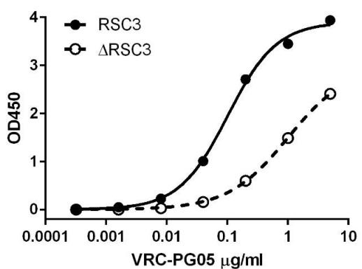

line

| VRC-PG05 µg/ml | RSC3 | ΔRSC3 |
| -------------- | ---- | ----- |
| 0.0001         | 0.0  | 0.0   |
| 0.001          | 0.0  | 0.0   |
| 0.01           | 0.2  | 0.1   |
| 0.1            | 1.0  | 0.5   |
| 1              | 3.5  | 1.5   |
| 10             | 4.0  | 2.5   |

B   
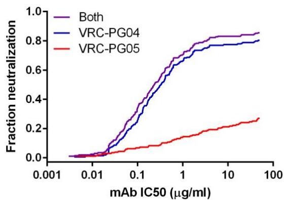

line

| mAb IC50 (μg/ml) | Both  | VRC-PG04 | VRC-PG05 |
| ---------------- | ----- | -------- | -------- |
| 0.001            | 0.0   | 0.0      | 0.0      |
| 0.01             | 0.0   | 0.0      | 0.0      |
| 0.1              | 0.4   | 0.3      | 0.1      |
| 1                | 0.7   | 0.6      | 0.15     |
| 10               | 0.85  | 0.75     | 0.2      |
| 100              | 0.88  | 0.8      | 0.25     |

C 

<table><tr><td rowspan="2">21-strains + AC10.29</td><td rowspan="2">Clade</td><td colspan="3">Neutralization ID50/IC50</td></tr><tr><td>IAVI #74 plasma</td><td>VRC-PG04 μg/ml</td><td>VRC-PG05 μg/ml</td></tr><tr><td>BG505.W6M.C2</td><td>A</td><td>2591</td><td>0.041</td><td>&gt;50</td></tr><tr><td>KER2018.11</td><td>A</td><td>507</td><td>0.167</td><td>&gt;50</td></tr><tr><td>Q23.17</td><td>A</td><td>2967</td><td>0.050</td><td>&gt;50</td></tr><tr><td>Q769.h5</td><td>A</td><td>5481</td><td>0.007</td><td>0.016</td></tr><tr><td>RW020.2</td><td>A</td><td>2862</td><td>0.100</td><td>&gt;50</td></tr><tr><td>Q168.a2</td><td>AD</td><td>2297</td><td>0.059</td><td>&gt;50</td></tr><tr><td>6101.10</td><td>B</td><td>272</td><td>0.204</td><td>43.5</td></tr><tr><td>BaL.01</td><td>B</td><td>2958</td><td>0.116</td><td>0.642</td></tr><tr><td>BG1168.01</td><td>B</td><td>118</td><td>1.05</td><td>&gt;50</td></tr><tr><td>CAAN.A2</td><td>B</td><td>1340</td><td>1.66</td><td>0.003</td></tr><tr><td>JR-CSF</td><td>B</td><td>694</td><td>0.162</td><td>&gt;50</td></tr><tr><td>JR-FL</td><td>B</td><td>4170</td><td>0.102</td><td>2.65</td></tr><tr><td>PVO.04</td><td>B</td><td>403</td><td>0.283</td><td>&gt;50</td></tr><tr><td>THRO.18</td><td>B</td><td>&lt;50</td><td>&gt;50</td><td>&gt;50</td></tr><tr><td>TRJO.58</td><td>B</td><td>213</td><td>0.020</td><td>&gt;50</td></tr><tr><td>TRO.11</td><td>B</td><td>892</td><td>0.237</td><td>&gt;50</td></tr><tr><td>Yu2</td><td>B</td><td>1133</td><td>0.063</td><td>&gt;50</td></tr><tr><td>DU156.12</td><td>C</td><td>682</td><td>0.020</td><td>&gt;50</td></tr><tr><td>DU422.01</td><td>C</td><td>273</td><td>&gt;50</td><td>5.99</td></tr><tr><td>ZA012.29</td><td>C</td><td>1093</td><td>0.165</td><td>&gt;50</td></tr><tr><td>ZM106.9</td><td>C</td><td>887</td><td>0.135</td><td>&gt;50</td></tr><tr><td>AC10.29</td><td>B</td><td>1863</td><td>&gt;50</td><td>0.019</td></tr><tr><td>Breadth (%)</td><td></td><td>21/22 (95%)</td><td>19/22 (86%)</td><td>7/22 (32%)</td></tr><tr><td>Potency (geometric mean)</td><td></td><td>1020</td><td>0.107</td><td>0.328</td></tr></table>

D 

<table><tr><td>Donor</td><td>VRC01-like</td><td>b12-like</td><td>HJ16-like</td><td>8ANC195-like</td><td>PG9-like</td><td>PGT128-like</td><td>2F5-like</td><td>10E8-like</td><td>35O22-like</td><td>PGT151-like</td><td>VRC-PG05</td><td>Neut breadth (%)</td></tr><tr><td>IAVI #74</td><td>0.50</td><td></td><td>0.21</td><td></td><td></td><td></td><td></td><td>0.16</td><td></td><td>0.13</td><td>95%</td><td></td></tr><tr><td>704010581</td><td></td><td>0.34</td><td></td><td>0.27</td><td></td><td>0.38</td><td></td><td>0.01</td><td></td><td></td><td>100%</td><td></td></tr><tr><td>707010219</td><td>0.14</td><td></td><td>0.05</td><td>0.08</td><td>0.72</td><td></td><td></td><td></td><td></td><td></td><td>100%</td><td></td></tr><tr><td>703010401</td><td></td><td></td><td></td><td>0.33</td><td>0.54</td><td></td><td>0.12</td><td></td><td>0.02</td><td></td><td>100%</td><td></td></tr><tr><td>707010175</td><td></td><td>0.25</td><td></td><td>0.33</td><td>0.15</td><td>0.24</td><td>0.03</td><td></td><td></td><td></td><td>95%</td><td></td></tr><tr><td>707010457</td><td></td><td>0.34</td><td></td><td>0.66</td><td></td><td></td><td></td><td></td><td></td><td></td><td>95%</td><td></td></tr><tr><td>705010534</td><td></td><td>0.24</td><td></td><td></td><td>0.15</td><td>0.34</td><td></td><td></td><td>0.28</td><td></td><td>95%</td><td></td></tr><tr><td>706010383</td><td></td><td>0.05</td><td>0.41</td><td></td><td></td><td>0.15</td><td>0.22</td><td>0.18</td><td></td><td></td><td>95%</td><td></td></tr><tr><td>703010505</td><td>0.31</td><td>0.45</td><td>0.02</td><td></td><td></td><td></td><td></td><td></td><td>0.20</td><td></td><td>90%</td><td></td></tr><tr><td>707010562</td><td>0.51</td><td></td><td>0.24</td><td></td><td>0.08</td><td>0.14</td><td></td><td>0.02</td><td></td><td></td><td>90%</td><td></td></tr><tr><td>703011852</td><td></td><td>0.21</td><td></td><td>0.14</td><td></td><td>0.61</td><td>0.04</td><td></td><td></td><td></td><td>90%</td><td></td></tr><tr><td>702010440</td><td></td><td>0.34</td><td></td><td>0.29</td><td></td><td>0.33</td><td>0.04</td><td></td><td></td><td></td><td>90%</td><td></td></tr><tr><td>703010694</td><td>0.25</td><td>0.19</td><td></td><td></td><td></td><td>0.48</td><td></td><td>0.08</td><td></td><td></td><td>86%</td><td></td></tr><tr><td>703011749</td><td></td><td>0.32</td><td></td><td>0.25</td><td></td><td>0.43</td><td></td><td></td><td></td><td></td><td>86%</td><td></td></tr><tr><td>703011754</td><td>0.10</td><td>0.35</td><td></td><td></td><td>0.24</td><td>0.09</td><td>0.02</td><td></td><td>0.10</td><td>0.09</td><td>86%</td><td></td></tr><tr><td>703010547</td><td></td><td>0.16</td><td>0.18</td><td>0.19</td><td></td><td>0.45</td><td></td><td></td><td>0.02</td><td></td><td>86%</td><td></td></tr><tr><td>707010277</td><td>0.32</td><td>0.32</td><td>0.05</td><td>0.09</td><td></td><td></td><td>0.16</td><td></td><td></td><td>0.06</td><td>86%</td><td></td></tr><tr><td>700010111</td><td></td><td>0.29</td><td>0.14</td><td>0.35</td><td></td><td>0.16</td><td>0.03</td><td></td><td>0.03</td><td></td><td>86%</td><td></td></tr><tr><td>704010540</td><td>0.17</td><td>0.21</td><td>0.36</td><td>0.26</td><td></td><td></td><td></td><td></td><td></td><td></td><td>86%</td><td></td></tr><tr><td>702010293</td><td></td><td>0.43</td><td></td><td></td><td></td><td>0.57</td><td></td><td></td><td></td><td></td><td>81%</td><td></td></tr><tr><td>705010765</td><td></td><td>0.09</td><td></td><td>0.02</td><td>0.08</td><td>0.81</td><td></td><td></td><td></td><td></td><td>81%</td><td></td></tr><tr><td>702010432</td><td></td><td>0.02</td><td></td><td></td><td>0.23</td><td>0.52</td><td>0.08</td><td></td><td>0.15</td><td></td><td>81%</td><td></td></tr><tr><td>707010763</td><td></td><td>0.23</td><td></td><td>0.03</td><td>0.16</td><td>0.41</td><td>0.06</td><td>0.04</td><td></td><td>0.08</td><td>81%</td><td></td></tr><tr><td>707010585</td><td></td><td></td><td>0.01</td><td>0.02</td><td>0.17</td><td></td><td></td><td>0.55</td><td>0.24</td><td></td><td>81%</td><td></td></tr><tr><td>707010232</td><td></td><td></td><td>0.15</td><td></td><td>0.54</td><td></td><td>0.17</td><td></td><td>0.14</td><td></td><td>76%</td><td></td></tr><tr><td>704010343</td><td></td><td>0.37</td><td></td><td>0.19</td><td></td><td>0.44</td><td></td><td></td><td></td><td></td><td>76%</td><td></td></tr><tr><td>702010141</td><td>0.04</td><td></td><td>0.55</td><td>0.04</td><td>0.01</td><td>0.32</td><td></td><td></td><td></td><td>0.04</td><td>76%</td><td></td></tr><tr><td>703010848</td><td></td><td></td><td></td><td></td><td></td><td>0.82</td><td>0.03</td><td></td><td>0.07</td><td>0.06</td><td>71%</td><td></td></tr><tr><td>703011244</td><td></td><td>0.25</td><td></td><td></td><td></td><td>0.29</td><td>0.04</td><td>0.42</td><td></td><td></td><td>71%</td><td></td></tr><tr><td>703010269</td><td></td><td>0.17</td><td></td><td></td><td>0.16</td><td>0.46</td><td></td><td>0.21</td><td></td><td></td><td>71%</td><td></td></tr><tr><td>704010210</td><td></td><td>0.22</td><td></td><td></td><td></td><td>0.24</td><td></td><td>0.54</td><td></td><td></td><td>62%</td><td></td></tr><tr><td>704010461</td><td></td><td>0.20</td><td></td><td>0.47</td><td></td><td>0.34</td><td></td><td></td><td></td><td></td><td>62%</td><td></td></tr><tr><td>705010406</td><td></td><td>0.36</td><td></td><td></td><td>0.21</td><td>0.33</td><td>0.09</td><td>0.01</td><td></td><td></td><td>57%</td><td></td></tr><tr><td>703010010</td><td>0.10</td><td>0.28</td><td>0.01</td><td>0.27</td><td>0.24</td><td>0.10</td><td>0.01</td><td></td><td></td><td></td><td>57%</td><td></td></tr><tr><td>707010060</td><td>0.17</td><td>0.18</td><td>0.10</td><td></td><td>0.15</td><td>0.11</td><td>0.09</td><td></td><td>0.21</td><td></td><td>48%</td><td></td></tr><tr><td>705010741</td><td></td><td>0.28</td><td></td><td>0.14</td><td>0.25</td><td>0.19</td><td></td><td></td><td>0.14</td><td></td><td>48%</td><td></td></tr><tr><td>700010592</td><td></td><td></td><td></td><td>0.05</td><td>0.18</td><td>0.25</td><td></td><td>0.17</td><td>0.29</td><td>0.05</td><td>43%</td><td></td></tr><tr><td>702010047</td><td></td><td>0.39</td><td>0.26</td><td></td><td>0.08</td><td></td><td></td><td>0.26</td><td></td><td></td><td>38%</td><td></td></tr><tr><td>704010083</td><td></td><td>0.20</td><td>0.23</td><td></td><td></td><td>0.32</td><td></td><td></td><td>0.13</td><td>0.12</td><td>38%</td><td></td></tr></table>

Figure S1. Binding and neutralization of VRC-PG05 and its relevance in donor plasma. Related to Figure 1.

(A) Differential binding of VRC-PG05 to RSC3 and $\Delta$ RSC3, the epitope-specific molecular probes used to isolate single B cells.

(B) Neutralization profile of VRC-PG04, VRC-PG05 and their combination on 208 HIV-1 isolates. Breadth (y-axis) and potency (x-axis) are plotted for VRC-PG04, VRC-PG05, and their combination as calculated based on neutralization by individual antibodies.

(C) Neutralization ID50 of donor IAVI #74 plasma (shown as reciprocal dilution) and IC50 for antibody VRC-PG04 and antibody VRC-PG05 (shown as concentration) on AC10.29 as well as on a 21-strain panel (Georgiev et al., Science 2013) used for neutralization fingerprint calculation in (D). Three VRC-PG04-resistant strains are highlighted.

(D) Neutralization fingerprint analysis of donor plasma (rows) deconvoluted into component antibody specificities (columns), including the VRC-PG05 component specificity. For each donor, the predicted contribution to neutralization from each of 11 antibody specificities (colored labels) is shown, with values ranging from 0 (no contribution) to 1 (donor neutralization can be attributed to a single antibody specificity) and with color intensity proportional to magnitude of values. Donor IAVI #74 (top row) and 38 other HIV-1-infected donors from a CHAVI cohort (subsequent rows), which was previously analyzed (Pancera et al., Nature 2014), but without the VRC-PG05 specificity that we define here.

A   
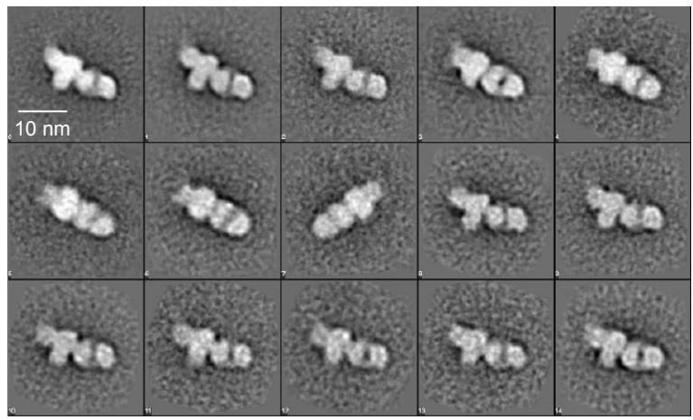

natural_image

Grid of 20 grayscale microscopic images showing cellular or molecular structures with scale bar (10 nm), no text or symbols present.

B   
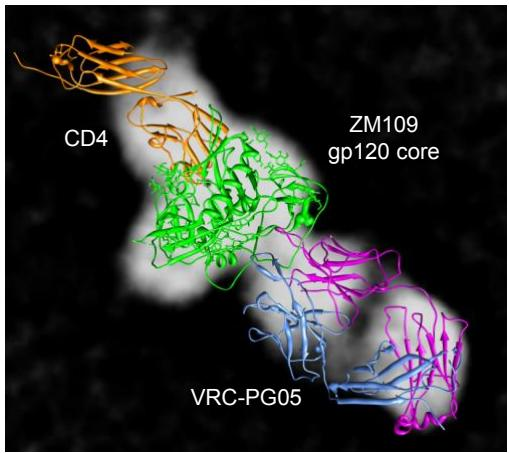

text_image

CD4
ZM109
gp120 core
VRC-PG05

Figure S2. Negative-stain electron microscopy of VRC-PG05 bound to HIV-1 ZM109 gp120 core. related to Figure 2.

(A) Reference-free 2D classification of ternary complex of VRC-PG05, gp120 and two-domain CD4.   
(B) Model of VRC-PG05, two-domain CD4 and gp120 were superposed onto the negative stain electron density.

Figure S3   
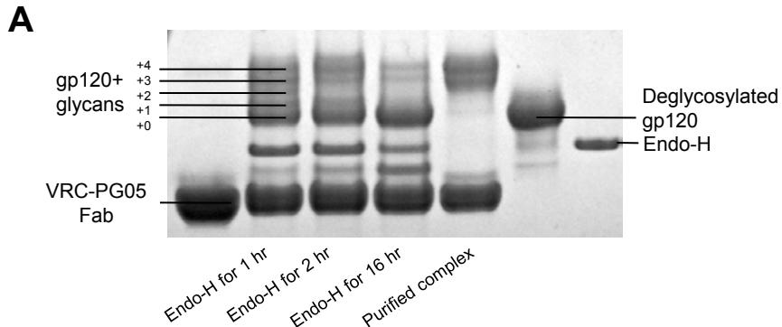

text_image

A
gp120+
+4
+3
+2
glycans
+1
+0
Deglycosylated
gp120
Endo-H
VRC-PG05
Fab
Endo-H for 1 hr
Endo-H for 2 hr
Endo-H for 16 hr
Purified complex

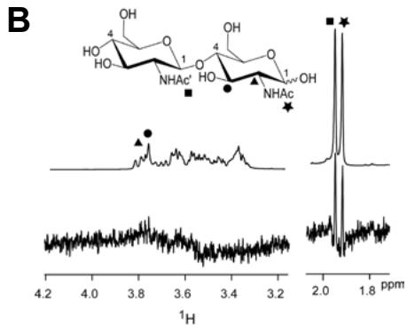

line

| Peak Label | Chemical Shift (ppm) |
|------------|----------------------|
| 4          | ~3.8                 |
| 1          | ~3.6                 |
| 4          | ~2.0                 |
| ★          | ~1.8                 |

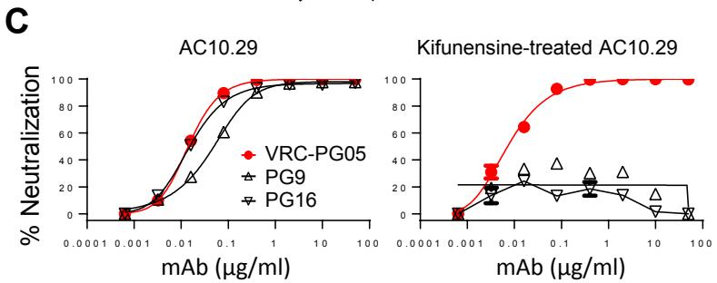

line

| mAb (μg/ml) | VRC-PG05 (% Neutralization) | PG9 (% Neutralization) | PG16 (% Neutralization) |
|-------------|-----------------------------|------------------------|-------------------------|
| 0.0001      | ~0                          | ~0                     | ~0                      |
| 0.001       | ~5                          | ~5                     | ~5                      |
| 0.01        | ~60                         | ~30                    | ~20                     |
| 0.1         | ~90                         | ~70                    | ~40                     |
| 1           | ~95                         | ~85                    | ~50                     |
| 10          | ~98                         | ~90                    | ~30                     |
| 100         | ~98                         | ~95                    | ~10                     |

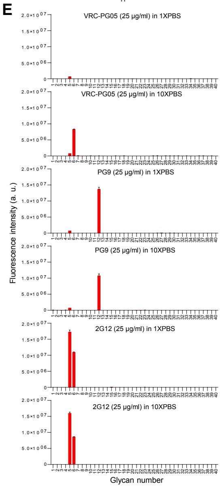

bar

| Glycan number | VRC-PG05 (25 µg/ml) in 1XPBS | VRC-PG05 (25 µg/ml) in 10XPBS | PG9 (25 µg/ml) in 1XPBS | PG9 (25 µg/ml) in 10XPBS | 2G12 (25 µg/ml) in 1XPBS | 2G12 (25 µg/ml) in 10XPBS |
|---|---|---|---|---|---|---|
| 1 | 0 | 0 | 0 | 0 | 0 | 0 |
| 2 | 0 | 0 | 0 | 0 | 0 | 0 |
| 3 | 0 | 0 | 0 | 0 | 0 | 0 |
| 4 | 0 | 0 | 0 | 0 | 0 | 0 |
| 5 | 0 | 8.5e7 | 1.3e7 | 1.1e7 | 1.7e7 | 1.6e7 |
| 6 | 0 | 0 | 0 | 0 | 1.1e7 | 1.2e7 |
| 7 | 0 | 0 | 0 | 0 | 0 | 8.5e6 |
| 8 | 0 | 0 | 0 | 0 | 0 | 0 |
| 9 | 0 | 0 | 0 | 0 | 0 | 0 |
| 10 | 0 | 0 | 0 | 0 | 0 | 0 |
| 11 | 0 | 0 | 1.3e7 | - | - | - |
| 12 | - | - | - | - | - | - |
| 13 | - | - | - | - | - | - |
| 14 | - | - | - | - | - | - |
| 15 | - | - | - | - | - | - |
| 16 | - | - | - | - | - | - |
| 17 | - | - | - | - | - | - |
| 18 | - | - | - | - | - | - |
| 19 | - | - | - | - | - | - |
| 20 | - | - | - | - | - | - |
| 21 | - | - | - | - | - | - |
| 22 | - | - | - | - | - | - |
| 23 | - | - | - | - | - | - |
| 24 | - | - | - | - | - | - |
| 25a-26a-27a-28a-29a-30a-31a-32a-33a-34a-35a-36a-37a-38a-39a-40a-41a-42a-43a-44a-45a-46a-47a-48a-49a-50a-51a-52a-53a-54a-55a-56a-57a-58a-59a-60a-61a-62a-63a-64a-65a-66a-67a-68a-69a-70a-71a-72a-73a-74a-75a-76a-77a-78a-79a-80a-81a-82a-83a-84a-85a-86a-87a-88a-89a-90a-91b-92b-93b-94b-95b-96b-97b-98b-99b-a |
| 11b-12b-13b-14b-15b-16b-17b-18b-19b-20b-21b-22b-23b-24b-25b-26b-27b-28b-29b-30b-31b-32b-33b-34b-35b-36b-37b-38b-39b-a: ~1.4e7; ~1.3e7; ~1.1e7; ~1.0e7; ~9.5e7; ~8.5e7; ~7.5e7; ~6.5e7; ~5.5e7; ~4.5e7; ~3.5e7; ~2.5e7; ~1.5e7; ~1.4e7; ~1.2e7; ~9.5e6; ~8.5e6; ~7.5e6; ~6.5e6; ~5.5e6; ~4.5e6; ~3.5e6; ~2.5e6; ~1.5e6; ~9.5e6; ~8.5e6; ~7.5e6; ~6.5e6; ~5.5e6; ~4.5e6; ~3.5e6; ~2.5e6; ~1.5e6; ~9.5e6; ~8.5e6; ~7.5e6; ~6.5e6; ~5.5e6; (~9.5e6); ~4.5e6; ~3.5e6; ~2.5e6; ~1.5e6; ~9.5e6; ~8.5e6; ~7.5e6; ~6.5e6; ~5.5e6; ~4.5e6; ~3.5e6; ~2.5e6; ~1.5e6; ~9.5e6; ~9.5e6; ~8.5e6; ~7.5e6; ~6.5e6; ~5.5e6; ~4.5e6; ~3.5e6; ~2.5e6; ~1.5e6; ~9.5e6; ~9.5e6; ~8.5e6; ~7.5e6; ~6.~7f) : ~1.4e7, ~1.3e7, ~1.2e7, ~1.1e7, ~9.5e6, ~8.5e6, ~7.5e6, ~6.~7f).

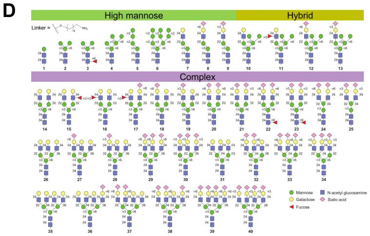

heatmap

| Molecular Structure | Molecule | Molecule Type | Functional Groups |
|---|---|---|---|
| Linker = [Diagram] | [Diagram] | High mannose | Mannose, N-acetyl glucosamine, Galactose, Sialic acid |
| Linker = [Diagram] | [Diagram] | Hybrid | Mannose, N-acetyl glucosamine, Galactose, Sialic acid |
| Complex | [Diagram] | High mannose | Mannose, N-acetyl glucosamine, Galactose, Sialic acid |
| Complex | [Diagram] | Hybrid | Mannose, N-acetyl glucosamine, Galactose, Sialic acid |
| D | [Diagram] | High mannose | Mannose, N-acetyl glucosamine, Galactose, Sialic acid |
| D | [Diagram] | Hybrid | Mannose, N-acetyl glucosamine, Galactose, Sialic acid |
| D | [Diagram] | Complex | Mannose, N-acetyl glucosamine, Galactose, Sialic acid |
| D | [Diagram] | Complex | Mannose, N-acetyl glucosamine, Galactose, Sialic acid |
| D | [Diagram] | Complex | Mannose, N-acetyl glucosamine, Galactose, Sialic acid |
| D | [Diagram] | Complex | Mannose, N-acetyl glucosamine, Galactose, Fucose |

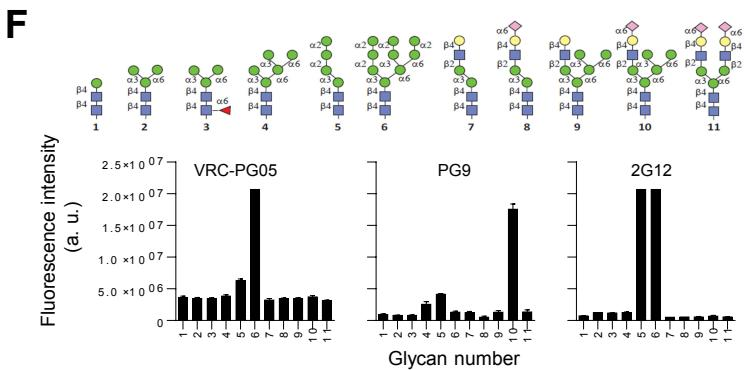

bar

| Glycan number | VRC-PG05 Fluorescence intensity (a.u.) | PG9 Fluorescence intensity (a.u.) | 2G12 Fluorescence intensity (a.u.) |
|---|---|---|---|
| 1 | 4.5e6 | 1.0e6 | 1.0e6 |
| 2 | 4.5e6 | 1.0e6 | 1.0e6 |
| 3 | 4.5e6 | 1.0e6 | 1.0e6 |
| 4 | 4.5e6 | 1.0e6 | 1.0e6 |
| 5 | 7.0e6 | 1.0e6 | 1.0e6 |
| 6 | 2.1e7 | 1.0e6 | 1.0e6 |
| 7 | 4.5e6 | 1.0e6 | 1.0e6 |
| 8 | 4.5e6 | 1.0e6 | 1.0e6 |
| 9 | 4.5e6 | 1.0e6 | 1.0e6 |
| 10 | 4.5e6 | 1.0e6 | 1.0e6 |
| 11 | 4.5e6 | 1.0e6 | 1.0e6 |
| 12 | 4.5e6 | 1.0e6 | 1.0e6 |
| 13 | 4.5e6 | 1.0e6 | 1.0e6 |
| 14 | 4.5e6 | 1.0e6 | 1.0e6 |
| 15 | 4.5e6 | 1.0e6 | 1.0e6 |
| 16 | 4.5e6 | 1.0e6 | 1.0e6 |
| 17 | 4.5e6 | 1.0e6 | 1.0e6 |
| 18 | 4.5e6 | 1.0e6 | 1.0e6 |
| 19 | 4.5e6 | 1.0e6 | 1.0e6 |
| 20 | 4.5e6 | 1.0e6 | 1.0e6 |
| 21 | 4.5e6 | 1.0e6 | 1.0e6 |
| 22 | 4.5e6 | 1.0e6 | 1.0e6 |
| 23 | 4.5e6 | 1.0e6 | 1.0e6 |
| 24 | 4.5e6 | 1.0e6 | 1.0e6 |
| 25 | 4.5e6 | 1.0e6 | 1.0e6 |
| 26 | 4.5e6 | 1.0e6 | 1.0e6 |
| 27 | 4.5e6 | 1.0e6 | 1.0e6 |
| 28 | 4.5e6 | 1.0e6 | 1.0e6 |
| 29 | 4.5e6 | 1.0e6 | 1.0e6 |
| 30 | 4.5e6 | 1.0e6 | 1.0e6 |
| 31 | 4.5e6 | 1.0e6 | 1.0e6 |
| 32 | 4.5e6 | 1.0e6 | 1.0e6 |
| 33 | 4.5e6 | 1.0e6 | 1.0e6 |
| 34 | 4.5e6 | 1.0e6 | 1.0e6 |
| 35 | 4.5e6 | 1.0e6 | 1.0e6 |
| 36 | 4.5e6 | 1.0e6 | 1.0e6 |
| 37 | 4.5e6 | 1.0e6 | 1.0e6 |
| 38 | 4.5e6 | 1.0e6 | 1.0e6 |
| 39 | 4.5e6 | 1.0e6 | 1.0e6 |
| 40 | 4.5e6 | 1.0e6 | 1.0e6 |
| 41 | 4.5e6 | 1.0e6 | 1.0e6 |
| 42 | 4.5e6 | 1.0e6 | 1.0e6 |
| 43 | 4.5e6 | 1.0e6 | 1.0e6 |
| 44 | 4.5e6 | 1.0e6 | 1.0e6 |
| 45 | 4.5e6 | 1.0e6 | 1.0e6 |
| 46 | 4.5e6 | 1.0e6 | 1.0e6 |
| 47 | 4.5e6 | 1.0e6 | 1.0e6 |
| 48 | 4.5e6 | 1.0e6 | 1.0e6 |
| 49 | 4.5e6 | 1.0e6 | 1.0e6 |
| 50+ (labeled)   | —      | —        | —         |
The chart displays fluorescence intensity (a.u.) for VRC-PG05, PG9, and two other proteins (2G12) at the top right corner, with the bottom left corner labeled 'F'. The y-axis is labeled 'Fluorescence intensity (a.u.)' and the x-axis is labeled 'Glycan number'. The data are grouped by protein: VRC-PG05, PG9, and two other proteins represented by different colored markers (green circles, blue squares, red diamonds). The top row labels 'β' and 'α' indicate the protein type or condition of the sample.

Figure S3. VRC-PG05 interaction with glycans. Related to Figure 3.

(A) Binding of VRC-PG05 shields several N-linked glycans on HIV-1 CNE55 gp120 from Endo-H digestion. SDS-PAGE analysis of samples at different time points of Endo-H digestion and the purified VRC-PG05-gp120 complex showed 3 to 4 glycans were protected by VRC-PG05.

(B) Nuclear magnetic resonance (NMR) analysis showed that VRC-PG05 binds to the two base N-acetylglucosamine groups at the N-linked glycosylation site.

(C) Neutralization of AC10.29 Env-pesudovirus generated in the presence of kifunensine indicates VRC-PG05 recognizes high mannose on gp120. Antibodies PG9 and PG16 were included as controls.

(D) Schematic representation of the 40 N-glycans printed on NHS-coated microarray glass slides.

(E) Binding profiles for antibodies VRC-PG05, PG9 and 2G12 to NHS-glycan array in 1x and 10x PBS; glycan numbers shown in (D).

(F) Schematic of the 11 N-glycans printed on ACG-coated microarray with binding profiles for antibodies VRC-PG05, PG9 and 2G12 in 1xPBS.

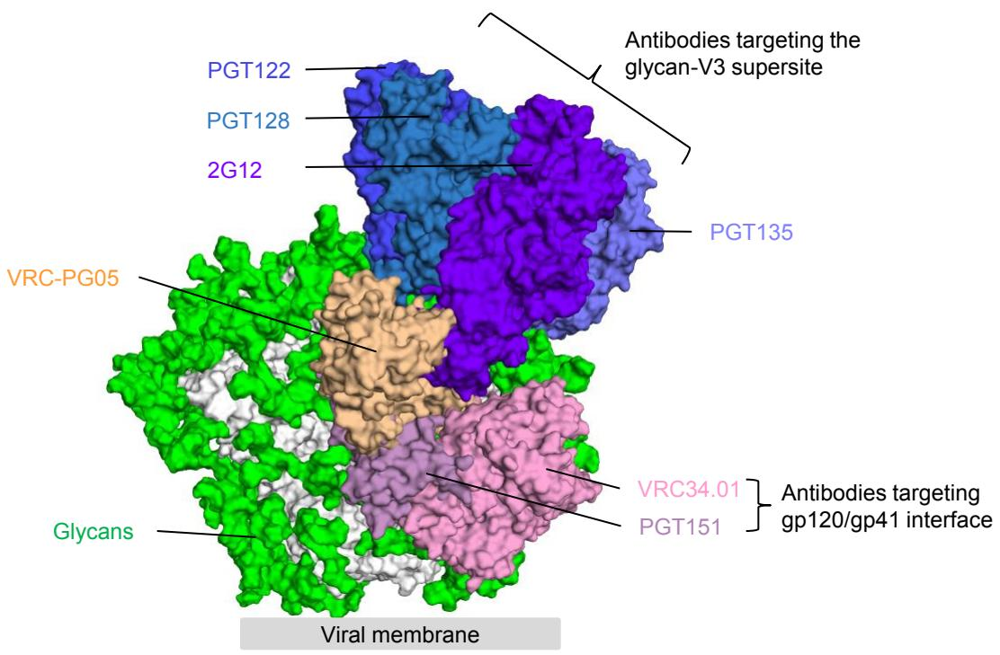

text_image

Antibodies targeting the glycan-V3 supersite
PGT122
PGT128
2G12
PGT135
VRC-PG05
VRC34.01
Antibodies targeting gp120/gp41 interface
PGT151
Glycans
Viral membrane

Figure S4. Comparison of modes of recognition of VRC-PG05 and other glycan-reactive antibodies. Related to Figure 4.   
Binding modes and locations of VRCPG05 and antibodies targeting the glycan-V3 supersite and the gp120/gp41 interface. VRC-PG05 is colored in orange, glycan-V3 antibodies are shown in surface representation in shades of blue, and gp120/gp41 interface antibodies are colored in lavender/pink. HIV-1 Env is shown in gray surface with glycans shown in green.

Representative image at 100,000x   
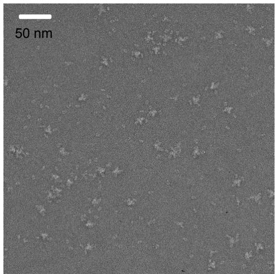

natural_image

Microscopic image showing granular texture with a 50 nm scale bar (no text or symbols beyond scale indicator)

2D class averages   
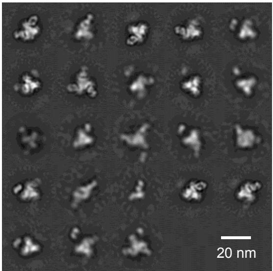

natural_image

Microscopic image grid showing 20 grayscale cellular or molecular structures with a 20 nm scale bar (no text or symbols beyond scale indicator)

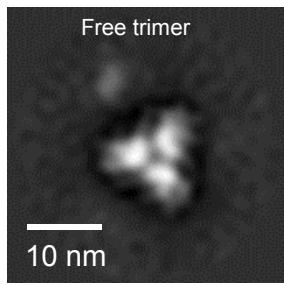

text_image

Free trimer
10 nm

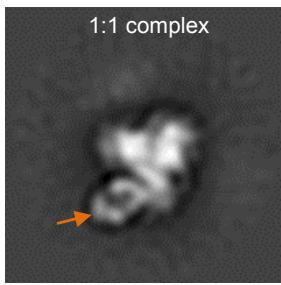

natural_image

Grayscale medical scan image labeled '1:1 complex' with an orange arrow pointing to a specific region (no other text or symbols)

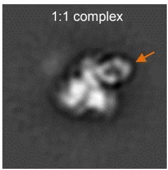

natural_image

Grayscale medical scan image labeled '1:1 complex' with an orange arrow pointing to a specific region (no other text or symbols)

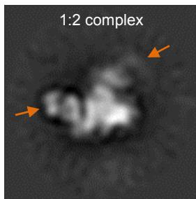

text_image

1:2 complex

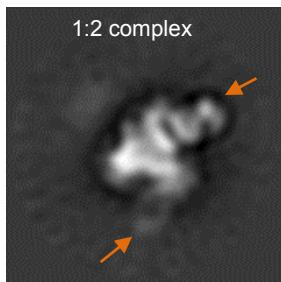

text_image

1:2 complex

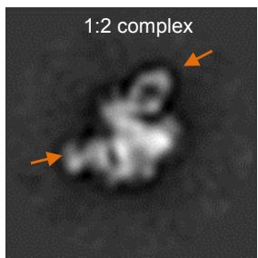

text_image

1:2 complex

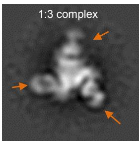

text_image

1:3 complex

Figure S5. Negative-stain electron microscopy of AC10.29.SOSIP Env in complex with VRC-PG05. Related to Figure 5. Locations of VRC-PG05 Fab bound to Env trimer are marked by orange arrows. 1, 2 and 3 VRC-PG05 Fabs were observed to bind to each AV10.29 Env trimer.

A   
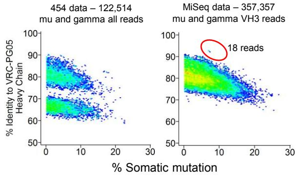

scatter

| Group | Data Count | % Somatic Mutation | % Identity to VRC-PG05 / Heavy Chain |
|-------|------------|--------------------|-------------------------------------|
| 454   | 122,514    | ~5                 | ~90                                 |
| MiSeq | 357,357    | ~10                | ~85                                 |

B   
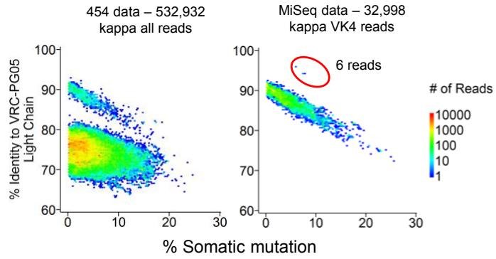

scatter

| Group | Data Count | % Somatic mutation | % Identity to VRC-PG05 Light Chain | # of Reads |
|-------|------------|---------------------|------------------------------------|----------|
| 454   | 532,932    | ~10                 | ~90                                | ~10000   |
| MiSeq | 32,998     | ~10                 | ~85                                | ~10000   |

C   
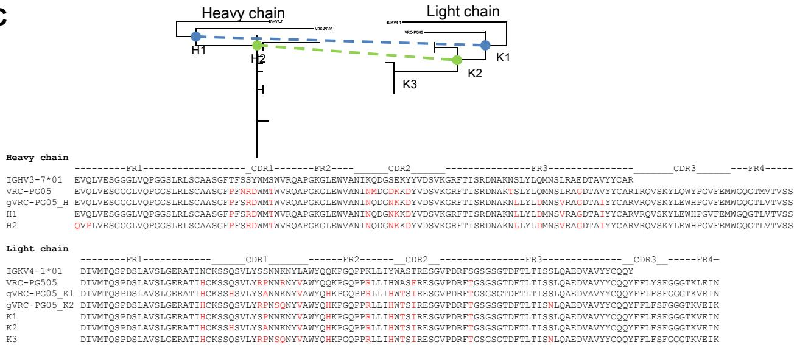

text_image

Heavy chain
IGHV3-7*01 EVQLVESGGGLVQPGGSLRLSCAASGFTFSSYWMSWVRQAPGKGLEWVANIKQDGSEKYVDSVKGRFTISRDNAKSLYLQMNSLRAEDTAVYYCAR
VRC-PG05 EVQLVESGGGLVQPGGSLRLSCAASGFPNRDWMTWVRQAPGKGLEWVANINMDGDKDYVDSVKGRFTISRDNAKTSLYLQMNSLRAGDTAVYYCARIRQVSKYLQWYPGVFMWGQGTMVTVSS
gVRC-PG05_H EVQLVESGGGLVQPGGSLRLSCAASGFPSRDWMTWVRQAPGKGLEWVANINQDGNKKDYVDSVKGRFTISRDNAKNLLYLDMNSVRAGDTAIYYCARVRQVSKYLEWHPGVFMWGQGTLVTVSS
H1 EVQLVESGGGLVQPGGSLRLSCAASGFPSRDWMTWVRQAPGKGLEWVANINQDGNKKDYVDSVKGRFTISRDNAKNLLYLDMNSVRAGDTAIYYCARVRQVSKYLEWHPGVFMWGQGTLVTVSS
H2 QVPLVESGGGLVQPGGSLRLSCAASGFPSRDWMTWVRQAPGKGLEWVANINQDGNKKDYVDSVKGRFTISRDNAKNLLYLDMNSVRAGDTAIYYCARVRQVSKYLEWHPGVFMWGQGTLVTVSS

Light chain
IGKV4-1*01 DIVMTQSPDSLAVSLGERATINCKSSQSVLYSSNNKNYLAWYQQKPGQPPKLLIYWASTRESGVPDRFSGSGSGTDFTLTISSLQAEDVAVYYCQQY
VRC-PG505 DIVMTQSPDSLAVSLGERATIHCKSSQSVLYRPNNRNYVAWYQQKPGQPPRLLIHWASFRESGVPDRFTGSGSGTDFTLTISSLQAEDVAVYYCQQYFFLYSFGGGTKLEIN
gVRC-PG05_K1 DIVMTQSPDSLAVSLGERATIHCKSSSHSVLYSANNKNYVAWYHQKPGQPPRLLIHWTSIRESGVPDRFTGSGSGTDFTLTISSLQAEDVAVYYCQQYFFLFSFGGGTKVEIN
gVRC-PG05_K2 DIVMTQSPDSLAVSLGERATIHCKSSQSVLYRPNSQNYVAWYHQKPGQPPRLLIHWTSIRESGVPDRFTGSGSGTDFTLTISNLQAEDVAVYYCQQYFFLFSFGGGTKVEIK
K1 DIVMTQSPDSLAVSLGERATIHCKSSQSVLYSPNNKNYVAWYHQKPGQPPRLLIHWTSIRESGVPDRFTGSGSGTDFTLTISSLQAEDVAVYYCQQYFFLFSFGGGTKVEIN
K2 DIVMTQSPDSLAVSLGERATIHCKSSSHSVLYSANNKNYVAWYHQKPGQPPRLLIHWTSIRESGVPDRFTGSGSGTDFTLTISSLQAEDVAVYYCQQYFFLFSFGGGTKVEIN
K3 DIVMTQSPDSLAVSLGERATIHCKSSQSVLYRPNSQNYVAWYHQKPGQPPRLLIHWTSIRESGVPDRFTGSGSGTDFTLTISNLQAEDVAVYYCQQYFFLFSFGGGTKVEIK

D

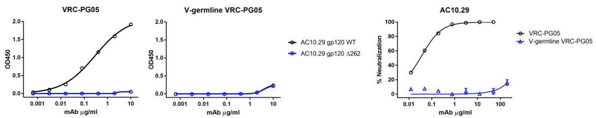

line

| Condition | mAb µg/ml | OD450 | % Neutralization |
|-----------|-----------|-------|-----------------|
| VRC-PG05  | 0.001     | 0.0   | 30              |
| VRC-PG05  | 0.01      | 0.1   | 60              |
| VRC-PG05  | 0.1       | 0.7   | 85              |
| VRC-PG05  | 1         | 1.2   | 95              |
| VRC-PG05  | 10        | 1.8   | 98              |
| V-germline VRC-PG05 | 0.001    | 0.0   | 5               |
| V-germline VRC-PG05 | 0.01    | 0.0   | 5               |
| V-germline VRC-PG05 | 0.1    | 0.0   | 5               |
| V-germline VRC-PG05 | 1         | 0.1   | 5               |
| V-germline VRC-PG05 | 10        | 0.2   | 15              |

E

<table><tr><td colspan="3">Somatic hypermutation in VRC-PG05 preferentially occurs at glycan contacts</td></tr><tr><td></td><td>SHM residues</td><td>Non-SHM residues</td></tr><tr><td>Glycan contacts</td><td>8*</td><td>17</td></tr><tr><td>Non-glycan contacts</td><td>13*</td><td>155</td></tr></table>

(C) Phylogenetic tree and inferred intermediate sequences of VRC-PG05 derived from NGS. Somatic hypermutations are colored red.   
(D) Comparison of wild-type and V-gene-reverted VRC-PG05 by gp120 ELISA (left two panels) and neutralization (right panel) of strain AC10.29.   
(E) Analysis of occurrence of somatic hypermutations in paratope of VRC-PG05. \*P = 0.0017

Figure S6. VRC-PG05 clonal variants identified by next generation sequencing. Related to Figure 6. (A, B) Subsets of expressed heavy-chain (A) and kappa-chain (B) sequences obtained by NGS (454 data to left of MiSeq data) from IAVI donor #74 (2008 sample) are plotted as sequence identity to VRC-PG05 and sequence divergence from the putative germline V-genes. VRC-PG05 heavy and light chain variants derived from NGS are provided in (C) below each panel.

Figure S7   
A   
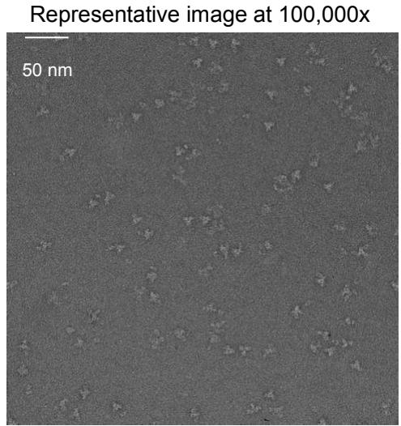

natural_image

Microscopic image of representative images at 100,000x magnification with 50 nm scale bar (no text or symbols beyond labels)

2D class averages   
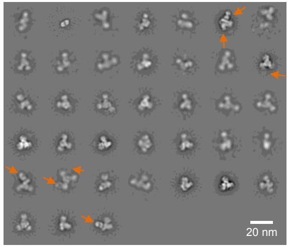

natural_image

Microscopic image grid showing cellular or molecular structures with orange arrows indicating specific regions, scale bar 20 nm (no text or symbols present)

B 

<table><tr><td>Donor #74 Env clones</td><td>VRC01</td><td>VRC-PG04</td><td>VRC-PG05</td><td>10E8</td></tr><tr><td>74_08dA06</td><td>&gt;50</td><td>&gt;50</td><td>&gt;50</td><td>0.155</td></tr><tr><td>74_08dA13</td><td>&gt;50</td><td>&gt;50</td><td>21.7</td><td>0.897</td></tr><tr><td>74_08dA16</td><td>&gt;50</td><td>&gt;50</td><td>&gt;50</td><td>0.496</td></tr><tr><td>74_08dA18</td><td>&gt;50</td><td>&gt;50</td><td>&gt;50</td><td>0.441</td></tr><tr><td>74_08dB07</td><td>&gt;50</td><td>&gt;50</td><td>&gt;50</td><td>1.160</td></tr><tr><td>74_08dB08</td><td>&gt;50</td><td>&gt;50</td><td>&gt;50</td><td>1.930</td></tr><tr><td>74_08dB14</td><td>&gt;50</td><td>&gt;50</td><td>&gt;50</td><td>1.150</td></tr><tr><td>74_08dB31</td><td>&gt;50</td><td>&gt;50</td><td>15.5</td><td>3.580</td></tr></table>

C   
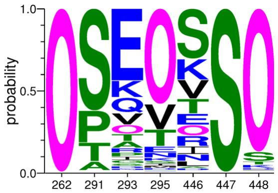

bar

| Sequence | Probability |
| :--- | :--- |
| O | 1.0 |
| P | 0.5 |
| T | 0.25 |
| K | 0.25 |
| Q | 0.25 |
| V | 0.25 |
| O | 0.25 |
| S | 0.25 |
| O | 0.25 |
| P | 0.25 |
| T | 0.25 |
| K | 0.25 |
| V | 0.25 |
| O | 0.25 |
| S | 0.25 |
| O | 0.25 |
| P | 0.25 |
| T | 0.25 |
| K | 0.25 |
| Q | 0.25 |
| V | 0.25 |
| O | 0.25 |
| S | 0.25 |
| O | 0.25 |
| P | 0.25 |
| T | 0.25 |
| K | 0.25 |
| Q | 0.25 |
| V | 0.25 |
| O | 0.25 |
| S - O | 0.25 |
| S - P | 0.25 |
| S - Q | 0.25 |
| S - V | 0.25 |
| S - O | 0.25 |
| S - P | 0.25 |
| S - Q | 0.25 |
| S - V | 0.25 |
| S - O | 0.25 |
| S - P | 0.25 |
| S - Q | 0.25 |
| S - V | 0.25 |
| S - O (top) | 1.0 |
| S (bottom) | 1.0 |

D 

<table><tr><td>Position</td><td colspan="4">Percentage and raw count of non-gap residues</td><td>Non-gap/total (percentage)</td><td>Gap/total (percentage)</td></tr><tr><td>262</td><td>O*: 99.52% (5139)</td><td>other: 0.48% (25)</td><td></td><td></td><td>5164/5164 (100.00%)</td><td>0/5164 (0.00%)</td></tr><tr><td rowspan="2">291</td><td>S: 62.15% (3208)</td><td>P: 19.51% (1007)</td><td>T: 11.45% (591)</td><td>A: 5.48% (283)</td><td>5162/5164 (99.96%)</td><td>2/5164 (0.04%)</td></tr><tr><td>other: 1.41% (73)</td><td></td><td></td><td></td><td></td><td></td></tr><tr><td rowspan="4">293</td><td>E: 43.94% (2268)</td><td>K: 10.17% (525)</td><td>Q: 9.55% (493)</td><td>V: 7.13% (368)</td><td>5162/5164 (99.96%)</td><td>2/5164 (0.04%)</td></tr><tr><td>O: 5.60% (289)</td><td>T: 4.48% (231)</td><td>A: 4.13% (213)</td><td>R: 2.83% (146)</td><td></td><td></td></tr><tr><td>P: 2.42% (125)</td><td>I: 2.09% (108)</td><td>G: 2.00% (103)</td><td>S: 1.70% (88)</td><td></td><td></td></tr><tr><td>other: 3.97% (205)</td><td></td><td></td><td></td><td></td><td></td></tr><tr><td rowspan="3">295</td><td>O: 58.14% (3001)</td><td>V: 15.56% (803)</td><td>T: 10.25% (529)</td><td>E: 3.84% (198)</td><td>5162/5164 (99.96%)</td><td>2/5164 (0.04%)</td></tr><tr><td>N: 3.08% (159)</td><td>K: 1.96% (101)</td><td>S: 1.61% (83)</td><td>I: 1.36% (70)</td><td></td><td></td></tr><tr><td>other: 4.22% (218)</td><td></td><td></td><td></td><td></td><td></td></tr><tr><td rowspan="3">446</td><td>S: 30.75% (1587)</td><td>K: 12.69% (655)</td><td>V: 11.55% (596)</td><td>T: 9.07% (468)</td><td>5161/5164 (99.94%)</td><td>3/5164 (0.06%)</td></tr><tr><td>E: 6.84% (353)</td><td>O: 6.65% (343)</td><td>R: 6.39% (330)</td><td>I: 4.84% (250)</td><td></td><td></td></tr><tr><td>N: 4.20% (217)</td><td>L: 3.20% (165)</td><td>other: 3.82% (197)</td><td></td><td></td><td></td></tr><tr><td>447</td><td>S: 99.54% (5139)</td><td>other: 0.46% (24)</td><td></td><td></td><td>5163/5164 (99.98%)</td><td>1/5164 (0.02%)</td></tr><tr><td>448</td><td>O: 87.24% (4504)</td><td>S: 5.87% (303)</td><td>T: 2.03% (105)</td><td>other: 4.86% (251)</td><td>5163/5164 (99.98%)</td><td>1/5164 (0.02%)</td></tr></table>

\* O: potential N-linked glycosylation site; other letters represents single-letter code for amino acids.

Figure S7. VRC-PG05 binding to BG505.SOSIP mutant, neutralization sensitivity of select autologous Env clones from IAVI donor #74 and sequence frequency analysis of epitope residues. Related to Figure 7.

(A) Negative-stain electron microscopy of BG505.SOSIP.Q393E in complex with VRC-PG05. Locations of bound-antibody were marked by orange arrows.

(B) Neutralization sensitivity of select autologous Env clones from a PBMC genomic DNA sample (02/05/2008) of IAVI donor #74.

(C) WebLogo plot of HIV-1 gp120 residues at positions 262, 291, 293, 446, 447 and 448 in 5164 sequences from the Los Alamos National Laboratory HIV database. Potential N-linked glycosylation site is represented by letter O, all amino acids are represented by single letter codes.

(D) Detailed list of amino acid frequency at each position.

---

# nihms-949397

# HHS Public Access

Author manuscript

Immunity. Author manuscript; available in PMC 2019 March 20.

Published in final edited form as:

Immunity. 2018 March 20; 48(3): 500–513.e6. doi:10.1016/j.immuni.2018.02.013.

# A Neutralizing Antibody Recognizing Primarily N-linked Glycan Targets the Silent Face of the HIV Envelope

Tongqing Zhou $^{1}$ , Anqi Zheng $^{1}$ , Ulrich Baxa $^{2}$ , Gwo-Yu Chuang $^{1}$ , Ivelin S. Georgiev $^{1,3}$ , Rui Kong $^{1}$ , Sijy O'Dell $^{1}$ , Syed Shahzad-ul-Hussan $^{1,4}$ , Chen-Hsiang Shen $^{1}$ , Yaroslav Tsybovsky $^{2}$ , Robert T. Bailer $^{1}$ , Syna K. Gift $^{5,6}$ , Mark K. Louder $^{1}$ , Krishna McKee $^{1}$ , Reda Rawi $^{1}$ , Catherine H. Stevenson $^{1}$ , Guillaume B. E. Stewart-Jones $^{1}$ , Justin D. Taft $^{1}$ , Eric Waltari $^{7}$ , Yongping Yang $^{1}$ , Baoshan Zhang $^{1}$ , Sachin S. Shivatare $^{8}$ , Vidya S. Shivatare $^{8}$ , Chang-Chun D. Lee $^{8}$ , Chung-Yi Wu $^{8}$ , NISC Comparative Sequencing Program $^{9}$ , James C. Mullikin $^{9}$ , Carole A. Bewley $^{4}$ , Dennis R. Burton $^{10,11}$ , Victoria R. Polonis $^{5}$ , Lawrence Shapiro $^{1,12}$ , Chi-Huey Wong $^{8,13}$ , John R. Mascola $^{1,*}$ , Peter D. Kwong $^{1,12,*}$ , and Xueling Wu $^{1,7,14,*}$

$^{1}$ Vaccine Research Center, National Institutes of Health, Bethesda, MD 20892, USA   
$^{2}$ Electron Microscopy Laboratory, Cancer Research Technology Program, Leidos Biomedical Research, Inc., Frederick National Laboratory for Cancer Research, Frederick, MD 21702, USA   
$^{3}$ Vanderbilt Vaccine Center, Departments of Pathology, Microbiology and Immunology, Vanderbilt University Medical Center, and Department of Electrical Engineering and Computer Science, Vanderbilt University, Nashville, TN 37232, USA   
$^{4}$ Laboratory of Bioorganic Chemistry, National Institute of Diabetes and Digestive and Kidney Diseases, National Institutes of Health, Bethesda, MD 20892, USA   
$^{5}$ U.S. Military HIV Research Program, Walter Reed Army Institute of Research, Silver Spring, MD 20910, USA   
$^{6}$ Henry M. Jackson Foundation for the Advancement of Military Medicine, Bethesda, MD 20817, USA   
$^{7}$ Aaron Diamond AIDS Research Center, Affiliate of the Rockefeller University, New York, NY 10016, USA

$^{8}$ Genomics Research Center, Academia Sinica, 128 Academia Road, Section 2, Nankang, Taipei 115, Taiwan   
$^{9}$ NIH Intramural Sequencing Center (NISC), National Human Genome Research Institute, National Institutes of Health, Bethesda, MD 20892, USA   
$^{10}$ Department of Immunology and Microbiology, IAVI Neutralizing Antibody Center, Center for HIV/AIDS Vaccine Immunology and Immunogen Discovery, The Scripps Research Institute, La Jolla, CA 92037, USA   
$^{11}$ Ragon Institute of MGH, MIT, and Harvard, Cambridge, MA 02139, USA   
$^{12}$ Department of Biochemistry and Molecular Biophysics, Columbia University, New York, NY 10032, USA   
$^{13}$ Department of Chemistry, The Scripps Research Institute, La Jolla, CA 92037, USA   
$^{14}$ Lead contact

# Summary

Virtually the entire surface of the HIV-1-envelope trimer is recognized by neutralizing antibodies, except for a highly glycosylated region at the center of the “silent face” on the gp120 subunit. From an HIV-1-infected donor, #74, we identified antibody VRC-PG05, which neutralized 27% of HIV-1 strains. The co-crystal structure of the antigen-binding fragment of VRC-PG05 in complex with gp120 revealed an epitope comprised primarily of N-linked glycans from N262, N295 and N448 at the silent face center. Somatic hypermutation occurred preferentially at antibody residues that interacted with these glycans, suggesting somatic development of glycan recognition.

Resistance to VRC-PG05 in donor #74 involved shifting of glycan-N448 to N446 or mutation of glycan-proximal residue E293. HIV-1 neutralization can thus be achieved at the silent face center by glycan-recognizing antibody; along with other known epitopes, the VRC-PG05 epitope completes coverage by neutralizing antibody of all major exposed regions of the prefusion closed trimer.

# In Brief

The center of the “silent face” on the HIV-1 envelope is shielded by glycans and has been devoid of antibody recognition. Zhou et al. identify the antibody VRC-PG05, which binds a glycan-dominated epitope at the silent face center and completes antibody recognition of all major exposed regions of the envelope trimer.

# Graphical Abstract

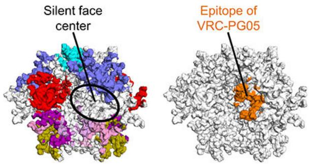

text_image

Silent face
center
Epitope of
VRC-PG05

Known epitopes of neutralizing antibodies

# Keywords

broadly neutralizing antibody; crystal structure; glycan cluster; glycan recognition; glycopeptide epitope; HIV silent face; HIV vaccine; prefusion-closed Env trimer; viral escape

# Introduction

The HIV-1 envelope (Env) trimer evades antibody recognition through high sequence variation and extraordinary glycosylation (Starcich et al., 1986; Wyatt et al., 1998), with a dense coating of N-linked glycan forming an evolving shield (Gristick et al., 2016; Lee et al., 2016; Stewart-Jones et al., 2016; Wei et al., 2003) that impedes antibody recognition. One of the most glycosylated regions on the HIV-1 Env trimer is located on the outer domain of gp120 (Kwong et al., 1998). This region has been called the “silent face” (Wyatt et al., 1998). While neutralizing antibodies have been identified that bind to the silent face periphery, antibodies have not been reported to recognize the silent face center. Genetic analysis, however, indicates the silent face to be under immune pressure, as indicated by a high ratio of non-synonymous versus synonymous mutations for residues located in this face (Stewart et al., 1999; Stewart et al., 2001). It is not clear whether there are neutralizing antibodies that target the center of the silent face, and if they exist, what characteristics define them. It is also not clear how HIV-1 would evade such silent face-targeting antibodies.

In general, immune recognition of N-linked glycans on viral glycoproteins is complicated by issues of self-recognition. As viral N-linked glycans are produced by host cellular machinery, similar glycans occur on self-proteins: antibody recognition of a single N-linked glycan would thus lead to self-recognition. Immune mechanisms for overcoming such self-recognition involve antibody binding to a glycopeptide epitope, where the N-linked glycan is co-recognized in the context of a viral glycopeptide (Blattner et al., 2014; Kong et al., 2013; McLellan et al., 2011; Pejchal et al., 2011); alternatively, an antibody can recognize a cluster of N-linked glycans, where the cluster is unique to the viral antigen (Calarese et al., 2003; Sanders et al., 2002; Scanlan et al., 2002).

Here we investigated antibodies from the International AIDS Vaccine Initiative (IAVI) Protocol G donor #74 (Walker et al., 2010) and identified an antibody, which we named VRC-PG05, that did not compete with other known antibodies. We mapped its

neutralization, determined its structure in complex with HIV-1 gp120, analyzed the development of its glycan recognition, and characterized determinants of VRC-PG05 resistance in donor #74. VRC-PG05 employed both glycopeptide recognition and glycan-cluster recognition to recognize an epitope at the center of the HIV-1 Env silent face. Overall, the results showed how antibody could bind to the center of the densely glycosylated HIV-1 silent face to complete recognition by neutralizing antibody of all major exposed surfaces on the prefusion closed HIV-1 Env trimer.

# Results

# Probe-Identified Antibody VRC-PG05 Recognizes an Uncommon Epitope Distinct from Known Neutralizing Antibodies

We previously developed a CD4-binding site probe, named RSC3, comprising the HXB2 stabilized core gp120 for which most of the probe surface had been altered, except the CD4-binding site (Wu et al., 2010), and we previously used this probe along with its negative partner probe, $\Delta$ RSC3, which contained a deletion of residue 371 in the CD4-binding site, to sort antigen-specific B cells, compromised about $0.13\%$ of immunoglobulin G (IgG) $^{+}$ B cells, from IAVI-donor #74 and to identify the broadly neutralizing antibody VRC-PG04 and a somatic variant VRC-PG04b (Wu et al., 2011). Both VRC-PG04 and 04b are members of the VRC01-class of broadly neutralizing antibodies that targets the site of CD4-receptor binding (Kwong and Mascola, 2012; Wu et al., 2010; Wu et al., 2011; Zhou et al., 2010; Zhou et al., 2013). To further characterize the B cell response in IAVI-donor #74 to HIV-1 infection, we amplified and cloned additional antibodies from IAVI-donor #74 B cells that preferentially bound to RSC3 over $\Delta$ RSC3 (Figure 1A), and identified a new antibody, which we named VRC-PG05.

Genetic analysis of VRC-PG05 indicated gene alleles IGHV3–7\*01 and IGKV4–1\*01 as origin heavy and light chain germline V-genes (Table S1), confirming a different lineage from VRC-PG04. Based on these V-gene assignments, the degree of VRC-PG05 somatic hypermutation (SHM) was 9% for IGHV and 6% for IGKV, about a third of the SHM level of VRC-PG04. Based on Kabat definition (Kabat et al., 1991), the lengths of the $3^{rd}$ complementary determining region (CDR3) of VRC-PG05 were 17 amino acids for heavy chain and 8 amino acids for light chain, which are close to average for the human antibody repertoire (He et al., 2014).

Because RSC3 and $\Delta$ RSC3 were designed to identify antibodies against the CD4-binding site, we tested VRC-PG05 by a competition ELISA against CD4-Ig and known CD4-binding site-directed antibodies such as VRC01, VRC-PG04, b12, and HJ16 as well as other gp120-directed antibodies such as 2G12, 2.2C, 211C and HVA14.5. Neither CD4-Ig nor any of the tested antibodies including those directed to the CD4-binding site competed with VRC-PG05 (Figure 1B), even though VRC-PG05 showed differential binding to RSC3 and $\Delta$ RSC3 (Figure S1A).

We tested VRC-PG05 for neutralization against a panel of 208 HIV-1 Env-pseudoviruses representative of all major circulating clades of HIV-1. VRC-PG05 neutralized $27\%$ of the tested strains, with an $\mathrm{IC}_{50}$ geometric mean titer (GMT) of $0.8~\mu \mathrm{g / ml}$ (Figure 1C and Table

S2). Among the HIV-1 clades tested, VRC-PG05 neutralized clade AE strains best, with 16 of 23 strains neutralized. We tested 12 additional clade AE strains (Montefiori et al., 2012; Tartaglia et al., 2016), 4 of which were neutralized by VRC-PG05; altogether VRC-PG05 neutralized the 35 tested clade AE viruses with 57% breadth (Table S3). Although VRC-PG05 did not neutralize as broadly as VRC-PG04, which neutralized 80% of the 208-virus panel, combining VRC-PG05 and VRC-PG04 would improve neutralization coverage to 85%, as calculated based on the individual antibody neutralization data (Figure S1B). Analysis of the neutralization fingerprint of VRC-PG05 with other known HIV-1 bnAb references indicated a separate neutralization group (Figure 1D).

Though less predominant than VRC-PG04, antibody VRC-PG05 likely contributes to donor IAVI #74 plasma activity, as suggested by the neutralization ID50s of donor plasma on two VRC-PG04-resistant yet VRC-PG05-sensitive strains (DU422.1 and AC10.29) and lack of plasma neutralization on THRO.18, which is resistant to both VRC-PG04 and VRC-PG05 (Figure S1C). Using neutralization-based fingerprint analysis to map antibody specificities in plasma, we identified in donor IAVI #74 VRC01-like (0.50 component specificity, i.e. VRC-PG04), and to a lesser extent HJ16-like (0.21), and 35022-like (0.16) specificities (Figure S1D). Neutralization with VRC-PG05 specificity was detected, but at a level (0.13) substantially below the cutoff we normally use (0.25). VRC-PG05 specificity was also detected with low signal (0.06–0.12) in 4 other donors out of 38 analyzed from a CHAVI cohort (Pancera et al., 2014). Altogether both neutralization and binding analyses indicated VRC-PG05 to be uncommon and to recognize a site of HIV-1 vulnerability on Env distinct from other reported neutralizing antibodies.

# VRC-PG05 Binds a Glycan Cluster, with Limited Recognition of Polypeptide

To provide an initial image of VRC-PG05 recognition of HIV-1 Env, we used Lys-C to proteolytically produce the antigen-binding fragment (Fab) and performed negative-stain electron microscopy (EM) for the ternary complex of Fab VRC-PG05, HIV-1 clade C ZM109 gp120 core and two-domain soluble CD4. Reference-free 2D classification revealed a Fab-shaped component recognizing gp120, but at a face opposite that recognized by CD4 (Figure S2).

To provide atomic-level details of the mode of VRC-PG05 recognition, we produced core gp120s from five strains of HIV-1 that were highly sensitive to VRC-PG05 neutralization. These cores were expressed in GNTI $^{-}$ cells, complexed with Fab VRC-PG05, and subjected to limited endoglycosidase H (Endo-H) digestion (Figure S3A). We obtained crystals of Fab VRC-PG05 in complex with a gp120 core derived from the highly sensitive strain CNE55. Diffraction data extended to 2.38 Å resolution, and we determined the structure by molecular replacement and refined to R $_{crystal}$ /R $_{free}$ of 19.1%/23.0% (Table S4).

The co-crystal structure of Fab VRC-PG05 bound to CNE55 core gp120 revealed VRC-PG05 to recognize a 2000 Å $^{2}$ epitope comprising mainly N-linked glycan with a relatively limited protein component (Figure 2A). Glycans contributed over 85% of the VRC-PG05 epitope on gp120, with glycans 262, 295 and 448 (based on HXB2 numbering) providing 35%, 14% and 39%, respectively, of the binding surface (Figure 2B and Table S5). The protein component of the VRC-PG05 epitope derived from residues at the end of the α2-

helix as well as on two neighboring $\beta$ -strands, primarily Val292 and Glu293 from strand $\beta$ 12, and Leu446 and Ser447 from strand $\beta$ 22. Altogether, protein interactions provided 12% (250 Å $^{2}$ ) of the epitope on HIV-1 gp120.

VRC-PG05 recognition of HIV-1 gp120 was mediated primarily by its 17-residue CDR H3 and 17-residue CDR L1, which provided \~60% of the paratope surface area. CDR H3 and CDR L1 associated structurally to form a penetrating wedge that reached into a 25 Å-deep glycan pocket formed by N-linked glycans Asn262, 295 and 448 (Figure 2C and Table S5). The tips of CDR H3 and CDR L1 contacted gp120 residues Glu293, Leu446 and Ser447 (Figure 2C). The heavy chain made extensive contacts with the glycan at Asn262; both heavy and light chains were involved in contacting glycans at Asn295 and Asn448. The penetrating wedge formed by CDRs L1 and H3 was reminiscent of the double loop recognition employed by PGT135 (Kong et al., 2013) and VRC38 (Cale et al., 2017); for PGT135, CDRs H1 and H3 were involved, and for VRC38, CDRs L1 and H3 were involved, the same CDRs as VRC-PG05. Altogether, the crystal structure of VRC-PG05 with gp120 revealed a glycan-dominated epitope, opposite the CD4-binding face, comprising primarily a cluster of glycans with a limited amount of protein surface.

# Crystal Structure of VRC-PG05 with gp120 Explains Glycan Recognition in Atomic Detail

Electron density in the refined structure was well defined for several N-linked glycans contacted by VRC-PG05 including a fully ordered GlcNAc $_{2}$ Man $_{9}$ at Asn262, core GlcNAc $_{2}$ Man $_{3}$ residues at Asn295, and GlcNAc $_{2}$ Man $_{7}$ residues at Asn448 (these N-linked glycans are hereafter referred to by their Asn [N] residue number) (Figure 2D). Glycan N262 provided 35% of the epitope surface and interacted exclusively with the VRC-PG05 heavy chain (Figure 3A, left and Table S6). Its D2 and D3 branches interacted with CDRs H1 and H3 primarily through hydrogen bonds involving residues Arg94 $_{H}$ (for clarity, antibody residues are displayed with a subscript defining the subunit, H for the heavy chain, L for the light chain), Arg96 $_{H}$ and Gln97 $_{H}$ in CDR H3, as well as Arg31 $_{H}$ and Asp32 $_{H}$ in CDR H1 (Table S7). Meanwhile, Trp100D $_{H}$ inserted into a groove between the acetamido group of GlcNAc $_{2}$ and MAN $_{4}$ ' of glycan N262, hydrogen bonding with the former and stacking with the latter. This interaction was consistent with nuclear magnetic resonance (NMR) experiments that revealed direct binding of VRC-PG05 to GlcNAc $_{2}$ core disaccharides (Figure S3B).

Glycan N295 resided next to glycan N262 in the epitope and was contacted mainly through its GlcNAc and D1 mannose residues by both heavy and light chains of VRC-PG05 (Figures 2D, 3A, middle and Table S6). Hydrogen bonds were formed between Ser56 $_{L}$ and Arg96 $_{H}$ with MAN $_{4}$ and MAN-C of the D1 arm, respectively (Table S7).

Glycan N448 provided 39% of the epitope surface and was recognized by the heavy and light chain interface of VRC-PG05 (Figure 2D and Table S6). The aromatic ring of Tyr100A $_{H}$ in the CDR H3 stacked with GlcNAc $_{2}$ of glycan 448, while Gln100C $_{H}$ and light chain Tyr27D $_{L}$ embraced GlcNAc residues in the protein-proximal base from two sides (Figure 3A, right). Residue Phe93 $_{L}$ in the CDR L3 stacked on top of the C-shaped open ring formed by the D1 and D3 branches of glycan 448, with Lys64 $_{H}$ and Asp1 $_{L}$ further stabilizing this open ring by hydrogen bonding with D1 and D3 mannoses (Table S7).

To confirm the findings revealed by structural analysis, we performed surface plasmon resonance (SPR) studies on the binding of VRC-PG05 to fully glycosylated and deglycosylated HIV-1 gp120s. Deglycosylation of HXB2 gp120 by Endo-H treatment ablated VRC-PG05 binding, corroborating the glycan requirement for VRC-PG05 recognition of HIV-1 gp120 (Figure 3B). We tested requirements for glycan processing by assessing neutralization of AC10.29 virus grown in the presence of kifunensine, which leaves most glycans as Man9; no difference in neutralization by VRC-PG05 was observed, while kifunensine-treated virus was resistant to neutralization by antibodies PG9 and PG16 (Figure S3C). We also tested the binding of VRC-PG05 on glycan arrays (Figure S3D). While we did not observe VRC-PG05 binding under standard conditions to NHS (Nexterion H, SCHOTT) microarray slides coated with 40 N-glycans, when assessed at higher ionic strength (10×PBS) (Chen et al., 2017), VRC-PG05 exhibited specific binding to Man9 (#6 glycan) (Figure S3E). Specific Man9-binding by VRC-PG05 was confirmed with higher density ACG (aluminum oxide-coated glass) slides in 1×PBS (Figure S3F). Lastly, we screened 13 mutants of the AC10.29 Env for changes in gp120 binding and virus neutralization, removing one or two putative N-linked glycosylation sites (PNGS) at a time (note that strain AC10.29 lacks glycan N295, but still binds VRC-PG05). We observed that the alteration of PNGS for either 262 or 448 resulted in complete loss of VRC-PG05 binding (Figure 3C) and neutralization activity (Figure 3D), validating VRC-PG05 reliance on both N262 and N448 glycans for viral recognition. Overall, structural analysis revealed VRC-PG05 to recognize a cluster of glycans on HIV-1 gp120 through extensive hydrogen bonding as well as stacking interactions by aromatic residues, with deglycosylation, mutational analysis and glycan array binding analysis confirming the critical nature of VRC-PG05 glycan recognition.

# VRC-PG05 Uniquely Targets Glycan N262 at the "Silent Face" Center

Structural analysis of broadly neutralizing antibodies from HIV-1 infected donors has defined a number of major sites of vulnerability to neutralizing antibodies; when mapped to the prefusion closed form of the HIV-1 Env trimer, known epitopes of broadly neutralizing antibodies have been observed to cover most of the exposed trimer surface (Figure 4A). The central portion of the previously described “silent face” on the highly glycosylated outer domain of gp120 (Wyatt et al., 1998), however, has been devoid of antibody recognition. When the VRC-PG05-gp120 complex structure was superposed onto the outer domain of the BG505 SOSIP trimer (PDB ID: 4TVP) (Pancera et al., 2014) in its prefusion state (root-mean-square deviation (rmsd) of 0.89 Å, for all outer domain Ca-atoms), the epitope of VRC-PG05 was located at the center of the silent face (Figure 4B).

To understand the exclusivity of VRC-PG05 recognition, we compared the epitope recognized by VRC-PG05 with the epitopes recognized by neighboring broadly neutralizing antibodies. Antibodies 2G12, PGT121, PGT128 and other glycan-V3-directed antibodies contact an array of glycans on the gp120 outer domain that include N295, N301, N332, N339 and N392. Antibodies 35O22, PGT151, VRC34 and other gp120-gp41 interface-directed antibodies contact glycans N241, N448, N611 and N637 in the stem region of the HIV-1 Env trimer. Glycans N295 and N448 did interact with previously identified antibodies; however, glycan N262 only interacted on its periphery with PGT151 (Lee et al.,

2016) with about $13 \AA^{2}$ or $\sim0.5\%$ of its buried epitope surface and with antibody IOMA which binds to one gp120 protomer at the CD4-binding site and interacts with glycan N262 on the facing gp120 protomer (Gristik et al., 2016) (Figure 4C, D and Figure S4). VRC-PG05 was thus the only antibody to substantially recognize glycan N262 at the center of the silent face with $739 \AA^{2}$ buried epitope surface.

In terms of overall glycan content, the VRC-PG05 epitope was second only to antibody 2G12, which recognizes a cluster of glycans, with no polypeptide recognition (Calarese et al., 2003) (Figure 4E). Thus VRC-PG05 recognized the silent face of HIV-1 Env, binding to an epitope that is one of the most glycan-rich among all HIV-1-neutralizing antibodies characterized to date.

# VRC-PG05 Interferes with Env Transitions Related to Entry

To understand the mechanism of neutralization by VRC-PG05, we analyzed the compatibility of VRC-PG05 binding to known prefusion states of Env as well as the compatibility of VRC-PG05 binding with that of the CD4 receptor. The prefusion HIV-1 Env trimer spontaneously samples at least three conformational states (Munro et al., 2014), but Protein Data Bank (PDB) coordinates are available for only two conformations: a prefusion closed conformation (PDB ID: 4TVP and others) (Pancera et al., 2014) and a three CD4-bound, co-receptor analogue-bound conformation (PDB ID: 5VN3 and 5THR) (Ozorowski et al., 2017; Wang et al., 2016).

In the prior section, we computationally superimposed our structure of VRC-PG05 bound to core gp120 with the prefusion closed structure (4TVP). To visualize experimentally the recognition of VRC-PG05 in trimer context, we carried out negative-stain EM characterization of VRC-PG05 bound to a SOSIP Env trimer, derived from strain AC10.29 (Figure 5A and Figure S5). We observed VRC-PG05 to bind to its computationally identified location, but unexpectedly EM-class averages indicated the stoichiometry of the interaction to often be two (sometimes, one or three) VRC-PG05 Fabs for each trimer. This stoichiometry was reminiscent of PGT151 (Blattner et al., 2014), which binds with two Fabs per trimer, and might be related to protomer asymmetry, as suggested by molecular dynamics simulations of the entire trimer (Lemmin et al., 2017). Relevant to the VRC-PG05 neutralization mechanism, such a stoichiometry might allow a single CD4 (Kwon et al., 2015; Liu et al., 2017) to bind to a two VRC-PG05-bound trimer, suggesting that VRC-PG05 may not ablate the initial interaction between Env trimer and CD4.

In terms of subsequent functional interactions, we superposed the VRC-PG05-gp120 complex structure onto the outer domain of HIV-1 Env trimer in the three CD4-bound prefusion conformation. There are several CD4-bound conformations defined in the PDB, ranging in definition from a $\sim 20\AA$ tomogram of the CD4-bound Env in the context of a BAL virion (Liu et al., 2008), to an $8\AA$ reconstruction of the CD4-bound, 8ANC195-bound trimer (Wang et al., 2016), to a $3.8\AA$ reconstruction of the CD4-bound, 17b-bound trimer (Ozorowski et al., 2017). We used the latter higher resolution structure, with an outer domain superposition with PDB 5VN3, yielding an rmsd of $1.1\AA$ for all outer domain Ca-atoms. A clash occurred between the heavy chain variable domain of VRC-PG05 and the CD4-induced bridging sheet in gp120 of a neighboring protomer (Figure 5B). These results

suggested the binding of VRC-PG05 to interfere with Env conformational changes required to transition into the three CD4-bound conformation.

# Somatic Hypermutation Enhances VRC-PG05 Recognition of Glycan

To provide insight into the clonal expansion of the VRC-PG05 antibody, we amplified and sequenced immunoglobulin transcripts by next-generation sequencing (NGS) from IAVI-donor #74 bulk PBMCs, using the same time point as we used to isolate VRC-PG05. With 454-pyrosequencing, we generated 122,514 heavy chain reads, none of which showed over $90\%$ identity at the nucleotide level to the VRC-PG05 heavy chain-variable domain sequence (Figure S6A, left). We therefore used Illumina MiSeq to generate a greater number of reads, with 357,357 reads of the IGHV3 gene family alone, to reveal an island of 18 reads with over $90\%$ identity to the VRC-PG05 heavy chain-variable domain sequence in an identity-divergence plot (Wu et al., 2011) (Figure S6A, right). Similarly, we did not find VRC-PG05 light chain reads by 454-pyrosequencing (Figure S6B, left) but by MiSeq identified an island of 6 reads with over $90\%$ identity to the VRC-PG05 light chain (Figure S6B, right). MiSeq reads of high identity to VRC-PG05 could be further arranged into a phylogenetic tree with inferred intermediates (Figure S6C). Overall, NGS identified three heavy chain and five light chain somatic variants of VRC-PG05 (Figure S6C).

Analysis of the VRC-PG05 paratope indicated 45% of the paratope surface to involve V-gene regions of the heavy and light chains, and 55% of the paratope surface to be contributed by the CDR3 regions of heavy and light chains. All three of the CDRs as well as the N-terminus were observed to contribute to the paratope, for both heavy and light chains (Figure 6A). Notably, many of the paratope residues were altered by SHM (Figure 6B), suggesting the requirement of SHM for recognition. Analysis of V-gene-reverted VRC-PG05 indicated loss of binding and neutralization in the absence of SHM (Figure S6D).

Antibody SHM primarily modified glycan-interacting residues (Figure S6E), consistent with glycans comprising a dominant portion of the epitope, with clear contributions by SHM observed for residues in both the heavy and light chains (Figure 6C); for example, Ser31 $_{H}$ evolved to an Arg residue to provide hydrogen bonding to moieties of glycan N262, and several prolines either stabilized glycan-interacting residues or directly interacted with glycan. It was also notable that several germline tyrosine residues in both heavy chain and light chain were mutated to hydrophilic residues with less bulky side chains, which enabled hydrogen bonds and reduced glycan clashes. Overall, genetic analysis of VRC-PG05 revealed moderate levels of SHM that appeared to be critical for glycan recognition, with SHM occurring preferentially at glycan-recognizing residues.

# HIV in Donor #74 Evolved Resistance to VRC-PG05 through Two Mechanisms

To provide insight into the development of neutralization resistance to antibody VRC-PG05, we used a neutralization-based epitope prediction algorithm (Chuang et al., 2013) to identify additional residues in the VRC-PG05 epitope. Briefly, a subset of 171-Env isolates tested for VRC-PG05 neutralization was utilized to compute a mutual information score between the sequence variation for each gp120 residue position and the observed changes in neutralization sensitivity. Residue positions were ranked based on their mutual information

scores, with higher scores indicating that the respective residue positions may be associated with neutralization sensitivity. The highest-ranked residue position was observed to be at residue 293 (Figure 7A).

We analyzed residue 293 for amino acid-specific patterns of resistance. Specifically, the per-residue contribution to the mutual information score for the given position was computed for each amino acid type (as well as for gaps in the sequence alignment, $\Delta$ ) and plotted as positive if the major contribution was found in sensitive strains (indicating a preference for the respective amino acid type in sensitive strains) or negative otherwise (indicating a preference for the respective amino acid type in resistance strains). A glutamic acid was observed to provide the highest per-residue score for position 293 (Figure 7B), with molecular modeling at this position indicating Glu293 to be at the nexus between CDR L1 and CDR H3 of VRC-PG05 and to interact with glycan N448 though a water-mediated contact (Figure 7C). To provide experimental confirmation of the impact of Glu293 alterations, we measured the binding to gp120 and neutralization sensitivity to VRC-PG05 for two viral strains, AC10.29 and 928–28. Alteration of Glu293 to Asn, Lys or Ala in each of these gp120 strains was observed to substantially reduce VRC-PG05 recognition (Figure 7D). We also tested reversal mutation from Gln293 to Glu in VRC-PG05-resistant strain BG505 and observed the Gln293Glu mutation to restore binding of VRC-PG05 to BG505 SOSIP trimer (Figure 7E and Figure S7A).

To place these mutational results into the context of IAVI-donor #74, we carried out single genome amplification (SGA) analysis of viral env sequences from the genomic DNA of the PBMC sample used for NGS of immunoglobulin transcripts. A total of 47 env sequences were obtained, all with an intact N262 glycosylation site. Of the 47 sequences, 26 contained a shift in glycan from N448 to N446; for 19 of these sequences, Glu293 was maintained, and for the other 7 sequences, Glu293 was mutated to Ala (Figure 7F). For the 21 sequences retaining glycan N448, 18 had a mutation to Ala or Gly at residue 293, and only 3 envs (74\_08dA13, 74\_08dA16 and 74\_08dB31) maintained Glu293.

We cloned and tested 8 representative Envs for neutralization by VRC-PG05, including 74\_08dA13, 74\_08dA16 and 74\_08dB31 that contained intact N262, E293 and N448 sites. As expected, six tested Env clones were highly resistant to VRC-PG05 neutralization, and 74\_08dA13 and 74\_08dB31 were neutralized by VRC-PG05 with IC $_{50}$ of 21.7 and 15.5 $\mu$ g/ml, respectively (Figure S7B). Thus, virus present in IAVI-donor #74 appeared to either shift glycan-N448 or to mutate Glu293 as the dominant means to escape neutralization by VRC-PG05, with sensitive strains clustering at the root of the phylogenetic tree (Figure 7F), consistent with the development of resistance. Sequence frequency analysis indicated that glycan N262 is one of the most conserved glycans on HIV-1 Env (99.5% conserved) and that glycan N448 is less conserved (87.2% conserved) (Figure S7C, D). Therefore, resistance to VRC-PG05 arose mainly by altering glycan N448 or its interacting neighbor Glu293.

# Discussion

Identification of neutralizing antibodies and structural definition of their epitopes on the HIV-1 Env glycoproteins, gp120 and gp41, is transforming our understanding of the ability

of the immune system to recognize highly glycosylated antigens. The antigenic structure of gp120 has initially defined a neutralizing face that overlapped receptor binding regions, a non-neutralizing face that was occluded in the functional trimer, and a silent face that was highly glycosylated and did not appear to be recognized by most antibodies (Wyatt et al., 1998). In the ensuing 20 years, antibodies have been identified that bind to much of the exposed surface of the HIV-1 Env trimer (Burton and Mascola, 2015); however, the center of the silent face has been devoid of antibody recognition. Here, we identified antibody VRC-PG05, which recognized glycans N262, N295 and N448 at the center of the silent face.

Although VRC-PG05 recognition of glycan N295 was observed in the co-crystal structure, VRC-PG05 recognized strains such as AC10.29, missing this glycan; the absence of glycans at N262 or N448, however, ablated VRC-PG05 recognition. As one of the most conserved glycans on HIV-1 Env, glycan N262 is indispensable for proper Env function (Francois and Balzarini, 2011) and devoid of most glycan processing (Behrens et al., 2016; Zhou et al., 2017). The crystal structure of a fully glycosylated gp120 indicates glycan N262 to be uniquely ordered at a hydrophobic groove between inner and outer domain (Kong et al., 2015), with glycosylated trimer structures indicating glycan N262 to play a critical functional role in the CD4-induced transition to the prefusion open form of the trimer (Gristick et al., 2016; Lee et al., 2016; Ozorowski et al., 2017; Stewart-Jones et al., 2016). By contrast, glycan N448 is less conserved and not critical for function. Therefore, HIV-1 escaped VRC-PG05 by altering glycan N448 or its interacting neighbor Glu293.

With the highly conserved glycans N262 and N448 dominating the VRC-PG05 epitope, why did VRC-PG05 not have broader recognition? We used data from the 208-isolate panel to perform sensitivity analysis on VRC-PG05. Our analysis identified residues Ser291 (61.5% conserved) and Glu293 (51.0%) as being required for neutralization sensitivity. Other positions, such as 362 and 375 at the CD4-binding site, though at the opposite side of the VRC-PG05 epitope, were also associated with sensitivity to VRC-PG05, echoing the observation that the $\Delta371$ mutation at the CD4-binding site of $\Delta$ RSC3 reduced its affinity to VRC-PG05 binding. Of the total 220 isolates tested, 160 were resistant to VRC-PG05; among them, 102 mutated Glu293, accounting for 64% of VRC-PG05 resistance, and 11 of these also mutated or shifted N448 glycosylation site, thus exploiting both resistance mechanisms. Of the 58 strains with Glu293, 17 mutated or shifted N448 glycosylation site. Together, 119 (74%) VRC-PG05 resistant strains lacked Glu293 and/or N448 glycosylation site. Overall, the recognition and neutralization by VRC-PG05 requiring two glycans and a small protein surface of HIV-1 Env was reminiscent of other HIV-1 neutralizing antibodies with glycopeptide epitopes that pierce the HIV-1 glycan shield (Blattner et al., 2014; Julien et al., 2013; Kong et al., 2013; Kong et al., 2016; McLellan et al., 2011; Pancera et al., 2014; Pejchal et al., 2011).

In summary, we identified an antibody that bound to an epitope at the center of the HIV-1 silent face. A need to escape from silent-face recognizing antibodies like VRC-PG05 might explain both the substantial diversity of as well as the selective pressure detected for residues at the silent face. We recently observed HIV-1 neutralizing antibodies to recognize preferentially the interface between glycan microdomains (Lemmin et al., 2017); glycans recognized by VRC-PG05 (N262, N295 and N448), however, were all part of a single stable

glycan microdomain, a less prevalent mode of antibody recognition. Nevertheless, the levels of VRC-PG05 somatic hypermutation at 9% for IGHV and 6% for IGKV were among the lowest observed for HIV-1 neutralizing antibodies isolated from adults and were comparable to a broadly neutralizing antibody BF520.1 isolated from an infected infant at \~15-month of age (Simonich et al., 2016). Additionally, VRC-PG05 had a 17-residue CDR H3 and an 8-residue CDR L3, which are common in the human antibody repertoire. These normal levels of SHM and CDR3 length suggest that these features do not present barriers to elicitation, as they do for many other HIV-1 broadly neutralizing antibodies. Overall, the recognition of the center of the silent face by VRC-PG05 demonstrated the ability of the human immune system to generate neutralizing antibodies that recognize all major surfaces of the HIV-1 Env trimer.

# STAR★METHODS

# CONTACT FOR REAGENT AND RESOURCE SHARING

Further information and requests for resources and reagents should be directed to and will be fulfilled by the Lead Contact, Xueling Wu (xwu@adarc.org).

# EXPERIMENTAL MODEL AND SUBJECT DETAILS

Cell lines—Human Embryonic Kidney (HEK) 293 cell line, of which the sex is female, is the parental cell for HEK293T/17, HEK293S GnTI- and Expi293F cell lines. HEK293T/17 and HEK293S GnTI- were obtained from ATCC and maintained as adherent cells in complete DMEM medium at 37 °C. HEK293T/17 is highly transfectable and contains SV40 T-antigen. HEK293S GnTI- cells are transformed with adenovirus 5 DNA and lack N-acetyl-glucosaminyltransferase I (GnTI) activity, thus rendering them unable to produce complex-type N-glycans. Expi293F was obtained from Thermo Fisher and adapted to suspension culture in Expi293 Expression Medium at 37 °C. TZM-bl, of which the sex is female, was obtained from the NIH AIDS Reagent Program and maintained as adherent cells in complete DMEM medium at 37 °C. TZM-bl is a HeLa cell line that expresses CD4 receptor and CXCR4 and CCR5 chemokine co-receptors; the cell line also expresses luciferase and β-galactosidase under the control of the HIV-1 promoter, hence is useful to assay in-vitro HIV-1 infection.

Patient samples—The peripheral blood mononuclear cells (PBMCs) of the HIV-1 infected donor #74 were from the International AIDS Vaccine Initiative (IAVI) Protocol G as described (Walker et al., 2010; Wu et al., 2011). The same sample was used to isolate the broadly neutralizing antibodies VRC-PG04 and VRC-PG04b (Wu et al., 2011). Human peripheral blood samples were collected after obtaining informed consent and appropriate Institutional Review Board (IRB) approval.

# METHOD DETAILS

Antibodies, plasmids, protein expression and purification—The anti-CD4bs mAbs b12, HJ16, VRC01 and VRC-PG04 were described (Burton et al., 1994; Corti et al., 2010; Wu et al., 2010; Wu et al., 2011). The anti-gp120 glycan mAb 2G12 was purchased from Polymun Scientific Inc. (Vienna, Austria). The mAb 17b, directed to the co-receptor

region of gp120, was provided by James Robinson (Tulane University). VRC-PG05 and other antibody sequences were synthesized and cloned into the CMV/R expression vectors containing the constant regions of IgG1. Full-length IgGs were expressed by transient transfection of Expi293F cells and purified using a recombinant protein-A column (GE Healthcare). The antigen binding fragment (Fab) of IgG was prepared by Endoproteinase LysC digestion and purified first by removing the uncleaved IgG and constant fragment (Fc) bound to protein-A column and then by collecting the flowthrough containing Fab for size-exclusion column Superdex S200 (Zhou et al., 2010). The CD4-Ig plasmid construct was provided by Joseph Sodroski (Dana Farber Cancer Institute) and the fusion protein was expressed by transient transfection of Expi293F cells and purified with protein-A column. The RSC3 and ΔRSC3 probes were described (Wu et al., 2010). HIV-1 gp120 core, AC10.29 gp120, AC10.29.SOSIP and BG505.SOSIP were expressed by transient transfection of Expi293F cells and purified with gp120 antibody-affinity columns (17b for gp120 core and 2G12 or VRC01 for SOSIP), or via His-tag with HisTalon gravity column (for AC10.29 gp120) (Jia et al., 2016; Pancera et al., 2014; Zhou et al., 2010).

Fluorescence activated cell sorting (FACS)—RSC3+ΔRSC3- single B cell sorting using the IAVI donor #74 PBMCs from 02/05/2008 was described (Wu et al., 2011). Antibody VRC-PG05 was isolated from the same batch of sorted B cells as those from which antibodies VRC-PG04 and VRC-PG04b were isolated.

Single B cell RT-PCR and cloning—As described previously (Wu et al., 2011), the variable region of VRC-PG05 heavy and light chains was recovered from single B cell deposited into 96-well microplate by reverse transcription (RT) followed by nested PCR. The PCR amplicons were sequenced and then cloned into the CMV/R expression vectors. The full length IgG1 was expressed by transient transfection of Expi293F cells and purified with protein-A column. The IgG heavy and light chain nucleotide sequences of the variable region were analyzed with IMGT/V-Quest (http://www.imgt.org/IMGT\_vquest/vquest). We follow the Kabat (Kabat et al., 1991) nomenclature for antibody amino acid sequences.

Enzyme-linked immunosorbent assay (ELISA)—As previously described (Wu et al., 2010; Wu et al., 2011) plates were coated with antigens at 2 $\mu$ g/ml, or coated with 1 $\mu$ g/ml of sheep anti-gp120 C5 antibody D7324 (AALTO Bio Reagents) to capture shed gp120 from AC10.29 Env-pseudovirus treated with 0.05% Triton X100. After blocking with B3T buffer (150 mM NaCl, 50 mM Tris-HCl, 1 mM EDTA, 3.3% fetal bovine serum, 2% bovine albumin, 0.07% Tween 20) for 1 hour at 37 °C, serially diluted antibodies were incubated for 1 hour at 37 °C. Horseradish peroxidase (HRP)-conjugated goat anti-human IgG Fc antibody (Jackson ImmunoResearch Laboratories Inc., West Grove, PA) was added for 1 hour at 37 °C. All volumes were 100 $\mu$ l/well except 200 $\mu$ l/well for blocking. Plates were washed between each step with 0.1% Tween 20 in PBS, developed with 3,3',5,5'-tetramethylbenzidine (TMB) (Kirkegaard & Perry Laboratories) and read at 450 nm. For competitive ELISA, after blocking with B3T buffer, serially diluted competitor antibodies or CD4-Ig were added in 50 $\mu$ l of B3T buffer, followed by adding 50 $\mu$ l of biotin-labeled VRC-PG05 at a fixed concentration of 100 ng/ml. After incubation at 37 °C for 1 hour, 250 ng/ml

of streptavidin-HRP (Sigma) was added at room temperature for 30 min. Plates were then developed with TMB.

Env-pseudovirus neutralization assay—Antibody neutralization was assessed based on the single-round infection assay of TZM-bl cells with HIV-1 Env-pseudoviruses (Sarzotti-Kelsoe et al., 2014; Seaman et al., 2010). Briefly, automated neutralization assays were performed with a panel of 208 HIV-1 Env-pseudoviruses, and 12 additional CRF01\_AE strains were tested manually. Mutant viruses were generated by QuikChange mutagenesis kit (Agilent Technologies, Santa Clara, CA) or by GeneImmune Inc. (New York, NY) and manually tested along with the corresponding wildtype viruses. For manual tests, 50 $\mu$ l of antibody-virus mixture was incubated at 37 °C for 30–60 min in duplicate wells before the addition of TZM-bl cells. To keep assay conditions constant, sham medium was used in place of antibody in control wells. Infection levels were determined in 2 days with Bright-Glo luciferase assay system (Promega, Madison, WI). Neutralization curves were fitted to a 5-parameter nonlinear regression analysis programmed into JMP 5.1 statistical software (SAS Institute Inc., Cary, NC), or through Prism 6.0 (GraphPad Software, La Jolla, CA) or LabKey v16.1 (LabKey, Seattle, WA) (Piehler et al., 2011). The antibody concentration or plasma reciprocal dilutions required to inhibit infection by 50% was reported as IC50 or ID50. Neutralization sensitivity was also color-coded for each tested Env isolate in a dendrogram depicting the gp160 protein sequence distance. Briefly, the HIV-1 gp160 protein sequences of 208 isolates used in the neutralization assays were aligned using ClustalW in BioEdit (http://www.mbio.ncsu.edu/bioedit/bioedit.html). The aligned protein sequences were submitted to Protdist and Neighbor phylogenetic tree in BioEdit; the tree was displayed with Dendroscope (http://dendroscope.org) and then color-coded according to the neutralization sensitivity.

Neutralization fingerprinting analysis—A virus panel of 21 diverse HIV-1 strains (Georgiev et al., 2013) was used for the neutralization fingerprinting analysis of polyclonal antibody responses in HIV-infected individuals, where a neutralization fingerprint for an antibody or serum is defined as the potency-dependent pattern of neutralization of the given set of viruses (Doria-Rose et al., 2017). The same protocol was used previously (Pancera et al., 2014) for the set of CHAVI donors included here, with the addition of VRC-PG05 as an additional reference monoclonal antibody specificity.

Negative-stain EM—For ternary complex between the antigen binding fragment of VRC-PG05, HIV-1 ZM109 CoreE gp120 and two-domain CD4, protein complex was purified by gel filtration and then diluted to about 0.01 mg/ml, adsorbed to freshly glow-discharged carbon-film grids for 15 sec, washed with a buffer containing 20 mM HEPES, pH 7.5, and 150 mM NaCl, and stained with 0.7% uranyl formate, pH 5. Images were recorded on an FEI T20 microscope equipped with a 2k × 2k Eagle CCD camera at a pixel size of 0.22 nm and collected semi-automatically with SerialEM (Mastronarde, 2005). Particles were picked automatically and manually using e2boxer from the EMAN2 software package (Tang et al., 2007). Initial reference-free 2D class averages were obtained in EMAN2. Further 2D classification was performed using reference-free alignment and correspondence analysis in SPIDER (Shaikh et al., 2008). For the VRC-PG05-AC10.29.SOSIP complex, samples were

diluted to achieve a trimer concentration of approximately 0.02 mg/ml, adsorbed to freshly glow-discharged carbon-coated grids, rinsed with several drops of buffer containing 10 mM HEPES, pH 7.0, and 150 mM NaCl, and stained with 0.75% uranyl formate. Images were recorded. The defocus values ranged from -0.3 to -1.5 $\mu$ m. Reference-free 2D classification and averaging were performed with EMAN2 (Tang et al., 2007) and Relion 1.4 (Scheres, 2012). The datasets for HIV-1 ZM109 CoreE gp120 in complex with VRC-PG05 and for AC10.29 SOSIP in complex with VRC-PG05 contained 2,131 and 18,087 particles, respectively.

Crystallization and structure determination of the VRC-PG05 Fab in complex with HIV-1 gp120—The VRC-PG05 Fab and HIV-1 CNE55 CoreE gp120 were prepared as described (Zhou et al., 2010). The gp120-antibody complexes were formed by mixing gp120 with the antibody Fab in a 1:2 molar ratio. Limited deglycosylation of the complex by Endoglycosidase H was carried out at room temperature for 16 hrs with 10 units of enzyme per $\mu$ g gp120 at pH 6.1. The complex was then purified by size exclusion chromatography (Hiload 26/60 Superdex S200 prep grade; GE Healthcare) with buffer containing 0.15 M NaCl and 5 mM HEPES (pH 7.5). Fractions with gp120-antibody complexes were concentrated to \~10 mg/ml and used for crystallization experiments. Initial crystallization screening was performed with 576 conditions using a Cartesian Honeybee crystallization robot by the vapor diffusion method in sitting drops containing 0.1 $\mu$ l of protein and 0.1 $\mu$ l of reservoir solution at 20 °C. Crystals were manually reproduced in hanging drops by mixing 0.50 $\mu$ l protein with 0.5 $\mu$ l reservoir solution containing 9.8% PEG 4000, 0.196 M Sodium acetate, 98 mM Tris/Cl $^{-}$ , pH 8.5 and 0.6% 1,6-hexanediol. Crystals were flash frozen in liquid nitrogen with 30 % (v/v) ethylene glycol as a cryoprotectant.

Diffraction data for were collected with 1.0000Å x-ray at SER-CAT beamlines ID-22 (Advanced Photon Source, Argonne National Laboratory) and processed with the HKL2000 suite. Structures were solved by molecular replacement using PHASER, and iterative model building and refinement were carried out in COOT and PHENIX, respectively. A cross validation (Rfree) test set consisting of 5% of the data was used throughout the refinement processes.

Nuclear magnetic resonance (NMR)—NMR experiments were performed as described previously (Bewley and Shahzad-ulHussan, 2013; McLellan et al., 2011) at $300^{\circ}$ K on a Bruker Avance 600 MHZ spectrometer equipped with a triple resonance cryoprobe. Briefly, fragments comprising high mannose glycans were purchased from V-Labs and included $\alpha(1-2)$ - and $\alpha(1-3)$ -mannobiose, $\alpha(1-3)$ , $\alpha(1-6)$ -mannotriose, mannopentaose and chitobiose (GlcNAc2). NMR samples were prepared in 20 mM phosphate buffer, 50 mM NaCl, pH 6.8. Solutions of VRC-PG05 and each of the carbohydrates were lyophilized and subsequently dissolved in deuterium oxide to prepare the final NMR samples (250 $\mu$ L) that contained 1.8 mM carbohydrate in the presence of 30 $\mu$ M VRC-PG05 Fab. ${}^{1}$ H saturation transfer difference (STD) NMR experiments (Meyer and Peters, 2003) were performed by selectively irradiating protein resonances by applying a train of 50 ms Gaussian shaped radio frequency pulses separated by a 1 ms delay for a total saturation time of 1 s. For saturation transfer, the on resonance saturation pulses were applied at -1 ppm, and the off resonance

saturation was applied at 40 ppm. Spectra were acquired with a spectral width of 10 ppm with the carrier set on residual water, with 1,000 scans and 16k complex points. Spectra were processed using the TopSpin software package (https://www.bruker.com/products/mr/nmr/nmr-software/nmr-software/topspin/overview.html).

Surface plasmon resonance (SPR)—Binding affinities and kinetics of antibody to HIV-1 gp120 were assessed by SPR on a Biacore T-200 (GE Healthcare) at 25 °C in the HBS-EP+ buffer (10 mM HEPES, pH 7.4, 150 mM NaCl, 3 mM EDTA and 0.05% surfactant P-20). To test effects of deglycosylation on VRC-PG05 binding to HIV-1 gp120, VRC-PG05 and VRC01 IgG was first captured at 300–400 response units to flow cells of a CM5 chip with immobilized anti-Human Fc antibody. Serial diluted glycosylated and deglycosylated HIV-1 HXB2 core gp120 solutions starting at 400 nM were flow through VRC-PG05 or VRC01 channel and reference channel without captured antibody for 180 s seconds followed by a 300 seconds dissociation phase at 30 μl/min. The surface was regenerated by flowing 3M MgCl₂ solution for 30 seconds at a flow rate of 50 μl/min. Blank sensorgrams were obtained by injection of the same volume of HBS-EP+ buffer in place of antibody Fab solution. Sensorgrams of the concentration series were corrected with corresponding blank curves and fitted globally with Biacore T200 evaluation software using a 1:1 Langmuir model of binding.

Antibody-glycan binding microarray—All monovalent glycans were prepared in 10 mM concentration each and served as mother solutions, which are to be diluted with printing buffer to prepare working solution. Microarrays were prepared by printing (BioDot Cartesian Technologies) (Bewley and Shahzadul-Hussan, 2013) with robotic pin (SMP3: TeleChem International) deposition of \~0.6 nL of 100 μM concentration of amine functionalized 40 N-glycans in printing buffer (300 mM Sodium phosphate, pH 8.5 with 0.01% Triton X-100) onto NHS-coated glass slides (Nexterion H, SCHOTT), whereas phosphonic acid functionalized 11 N-glycans printed with ethylene glycol/water (80:20, v/v) buffer on aluminium-oxide coated glass (ACG) slides (Blixt et al., 2004). Printed slides were allowed to react in an atmosphere of 80% humidity for an hour followed by desiccation overnight. Individual glycan was spotted with three replicas. The well prepared slides were stored in humidity controlled dry box. For binding assay, ACG slide was used without blocking and NHS slide was blocked with Superblock (Thermo Fisher Scientific) for 1 hour and washed with 0.05% Tween 20 in PBS. Antibodies (25 μg/mL in BSA contained 10×PBS buffer, 3% w/v) were pre-complexed with Donkey Anti-Human IgG (Alexa Fluor647 conjugated, Jackson ImmunoResearch) in 1:1 ratio and incubated at 4°C for 30 min. The pre-complexed mixture was added to the glycan array and incubated at 4°C for overnight. The slides were washed sequentially with 0.05% Tween 20 in PBS and de-ionized water, spin dried for scanning with GenePix 4300A (Molecular Devices), and analyzed with GenePix Pro 7.0 (Molecular Devices). The image resolution was set to 5 μm per pixel. Spots were defined as circular features with maximum diameter of 100 μm. Total intensity of fluorescence were calculated and illustrated with Graphpad Prism 6.0. Error bars represent the average percentage error for all data points reported.

# Bio-Layer Interferometry of VRC-PG05 binding to BG505.SOSIP trimer—A

fortéBio octet Red384 instrument was used to measure binding of VRC-PG05 to BG505.SOSIP and its Q293E mutant. Assays were performed at 30 °C in tilted black 384-well plates (Geiger Bio-One) in 1×PBS with 5% BSA with agitation set to 1,000 rpm. Anti-human IgG Fc capture biosensors were used to immobilize antibody IgG at 40 μg/ml for 150 sec. BG505.SOSIP trimer binding was measured by dipping immobilized IgG into BG505.SOSIP protein solutions at 200 nM. Parallel correction to subtract systematic baseline drift was carried out by subtracting the measurements recorded for a loaded sensor dipped into 1×PBS.

# Neutralization-based residue-level prediction of antibody epitope—A

neutralization-based epitope prediction algorithm (Chuang et al., 2013) was used to identify residues that are key to the VRC-PG05 epitope, in addition to the known N262 and N448 glycans. Briefly, a subset of 171 Env isolates tested for VRC-PG05 neutralization was utilized to compute a mutual information score between the sequence variation for each gp120 residue position and the observed changes in neutralization sensitivity. Residue positions were ranked based on their mutual information scores, with higher scores indicating that the respective residue positions may be associated with neutralization sensitivity. The highest-ranked residue position, 293 (based on the HXB2 residue numbering), was analyzed further for amino acid-specific patterns of resistance. Specifically, the per-residue contribution to the mutual information score for the given position was computed for each amino acid type (as well as for gaps in the sequence alignment, $\Delta$ ) and plotted as positive if the major contribution was found in sensitive strains (indicating a preference for the respective amino acid type in sensitive strains) or negative otherwise (indicating a preference for the respective amino acid type in resistance strains).

Next-generation sequencing (NGS) and data analysis—As described (Wu et al., 2011), AllPrep DNA/RNA mini kit (Qiagen, Germantown, MD) was used to extract genomic DNA for HIV-1 env isolation (see below) from 20 million IAVI donor #74 PBMCs from 02/05/2008; the RNA fraction was processed for mRNA extraction using the Oligotex Direct mRNA Mini Kit (Qiagen), and the mRNA was used for RT primed with oligo dT $_{12-18}$ (Invitrogen). The cDNA equivalent to 5 million PBMC transcripts was used as PCR template in a 50 $\mu$ l reaction using the Phusion High-Fidelity DNA Polymerase system (Finnzymes). Forward primers were a pool of primers for Vh\_all, kappa, and lambda as reported (Doria-Rose et al., 2014). Reverse primers were a mix of equal parts of 3'C $\gamma$ CH1, 3'C $\mu$ CH1, 3'CK1, and 3'CL as reported (Doria-Rose et al., 2014). The primers each contained the appropriate adaptor sequences (XLR-A or XLR-B) for 454 pyrosequencing. The PCRs were initiated at 98 °C 30 sec, then 25 cycles of 98 °C 10 sec, 58 °C 30 sec, and 72 °C 30 sec, followed by 72 °C 10 min. The PCR product at the expected size (\~500bp) was gel extracted (Qiagen) and quantified using Qubit (Life Technologies, Carlsbad, CA). Library was prepared using the manufacturer's suggested methods and reagents for 454 pyrosequencing at the NIH Intramural Sequencing Center (NISC) and for Illumina MiSeq 2 × 300 bp paired-end at the Rockefeller University Genomics Resource Center.

The 454 and Miseq reads were processed as follows, with step (2) omitted for 454 reads: (1) Demultiplexing: reads were split into $\mu$ , $\gamma$ , $\kappa$ , and $\lambda$ chains based on the reverse primers, allowing up to 3 bp mismatches. For 454 reads, because of decreasing quality at the end of the reads, the reverse primer sequences were not always recovered, and thus a 24 bp motif for each chain in the constant region upstream of the reverse primer was applied, i.e. for mu 5'GGGAGTGCATCCGCCCCAACCCCTT3', for gamma 5'GCCTCCACCAAGGGCCCATCGGTC3', for kappa 5'AAACGAACTGTGGCTGCACCATCT3', and for lambda 5'CAGCCCAAGGCYRMCCCCWCKGTC3'. (2) For MiSeq reads, an initial in-house IGBLAST(https://www.ncbi.nlm.nih.gov/projects/igblast/) was used to reject non-Ig reads with a V-gene bitscore $<75$ . The IGBLAST results were also used to orient reads for joining. After clipping poor quality bases (Qscore $\leq 3$ ) using NESONI Clip(www.vicbioinformatics.com), the paired-end reads were joined using SEQTK to $\geq 10$ bp overlap with $\geq 90\%$ identity, or to 9-19 bp overlap with $\geq 80\%$ identity. To rescue non-overlapping reads potentially due to long CDR3s, we concatenated non-overlapping reads using ILLUMINAPAIIREDEND. (3) We next ran a second in-house IGBLAST on the joined or concatenated reads to infer the germline V-gene and calculate the V-gene SHM. Of the concatenated reads, we only retained those aligned to a germline V-gene with a gap, reasoning that these reads failed the overlapping criteria due to the gap but not poor quality or mispairing. Reads aligned to a V-gene with $<275$ bp for mu and gamma, $<245$ bp for kappa, and $<255$ bp for lambda were removed. In addition we used the IMGT HighV-quest (http://www.imgt.org/IMGT\_vquest/vquest) to identify CDR3. Reads with stop codons, missing the cysteine at the end of FR3, or without a recognizable CDR3 were removed. (4) Reads passing the steps above were examined for identity to VRC-PG05 heavy and light chain variable-region sequences using the stand-alone BLAST algorithms (https://blast.ncbi.nlm.nih.gov), with parameters from the Discontinuous MegaBLAST search. We required at least 340 and 300 bp aligned to the VRC-PG05 heavy and kappa variable-region sequences, respectively, for identity calculations. The identity-divergence plots were created with geom\_hex in the ggplot package in R, using bin sizes of $0.4\%$ . Reads with $>90\%$ identity to VRC-PG05 were extracted.

Quantification and statistical analysis—For associations between somatic hypermutation (SHM) and glycan contacts, both VRC-PG05 heavy and light chain sequences were aligned to the germline V-gene sequences to identify SHM. Contingency tables were generated based on the criteria that an amino acid is SHM and is glycan contact. Fisher's exact test was applied to contingency tables resulting P-values.

For associations between sequence, glycosylation patterns and antibody neutralization, Fisher's exact test was applied to contingency tables for all letters of the amino acid alphabet (20 naturally occurring amino acids, “-” for gap, and “@” for a glycosylation site) at all alignment positions versus the neutralization data. The alignment was composed of the 208-isolate panel Env sequences. The Fisher's exact test resulting P-values were corrected using multiple testing method Holm.

HIV-1 env SGA and sequence analysis—About 20 million IAVI donor #74 PBMCs from 02/05/2008 were used to extract genomic DNA using the AllPrep DNA/RNA mini kit (Qiagen). Autologous env gene was amplified from the genomic DNA by an env SGA method as described (Keele et al., 2008; Salazar-Gonzalez et al., 2008; Wu et al., 2012). Briefly, nested PCRs with the envB primers (envB5out and envB3out for first-round and envB5in and envB3in for second-round) (Wu et al., 2012) were carried out to titrate the genomic DNA to single copy, where the PCR-positive wells constitute about 30% of reactions. Note that the envB primers successfully amplified the A/D recombinant env gene from donor #74. PCR amplicons were sequenced and inspected in Sequencher 5.4 (Gene Codes, Ann Arbor, MI), and only those without any mixed bases (double peaks) were retained. From donor #74, a total of 47 env SGA sequences were obtained and aligned to generate the neighbor joining phylogenetic tree using Clustal X 2.1 (http://www.clustal.org/clustal2/). Eight representative env sequences were cloned into pcDNA3.1 Directional TOPO vector (Invitrogen) for Env-pseudovirus production and neutralization test.

# DATA AND SOFTWARE AVAILABILITY

Coordinates and structural factors for VRC-PG05 in complex with CNE55 gp120 core are available in Protein Data Bank under accession code PDB 6BF4. Sequences of VRC-PG05 and its NGS-derived heavy and light chains of variable region are available in GenBank under accession # MG241492 – MG241496. The NGS data used in this study have been deposited in the NCBI Sequence Read Archive (https://www.ncbi.nlm.nih.gov/sra) under accession SAMN07793307.

# Supplementary Material

Refer to Web version on PubMed Central for supplementary material.

# ACKNOWLEDGMENTS

We thank G.J. Nabel and Z-Y. Yang for assistance with probes, M. Roederer and S. Perfetto for assistance with B cell sorting, J. Stuckey for assistance with figures, and members of the Structural Biology Section and Structural Bioinformatics Core, Vaccine Research Center, for discussions and comments on the manuscript. We thank J. Baalwa, D. Ellenberger, F. Gao, B. Hahn, K. Hong, J. Kim, F. McCutchan, D. Montefiori, L. Morris, J. Overbaugh, E. Sanders-Buell, G. Shaw, R. Swanstrom, M. Thomson, S. Tovanabutra, C. Williamson, and L. Zhang for contributing the HIV-1 envelope plasmids used in our neutralization panel. Support for this work was provided by the Intramural Research Program of the Vaccine Research Center, National Institute of Allergy and Infectious Diseases (NIAID), and the National Human Genome Research Institute, National Institutes of Health (NIH), from the NIH grant R21 AI108399 (X.W.), and from the International AIDS Vaccine Initiative's (IAVI's) Neutralizing Antibody Consortium. This project has also been funded in part with Federal funds from the Frederick National Laboratory for Cancer Research, NIH, under contract HHSN261200800001E. Use of sector 22 (Southeast Region Collaborative Access team) at the Advanced Photon Source was supported by the US Department of Energy, Basic Energy Sciences, Office of Science, under contract number W-31-109-Eng-38. V.S.S., C.-C.D.L., C.-Y.W., and C.-H.W. were supported by Academia Sinica and Ministry of Science and Technology grants 106-0210-01-15-02, 104-0210-01-09-02, and 103-2321-B-001-004. C.-H.W. was supported by NIH grant R01 AI072155. The views expressed are those of the authors and should not be construed to represent the positions of the U.S. Army or the Department of Defense.

# References

Adams PD, Gopal K, Grosse-Kunstleve RW, Hung LW, Ioerger TR, McCoy AJ, Moriarty NW, Pai RK, Read RJ, Romo TD, et al. (2004). Recent developments in the PHENIX software for automated crystallographic structure determination. J Synchrotron Radiat 11, 53–55. [PubMed: 14646133]

Behrens AJ, Vasiljevic S, Pritchard LK, Harvey DJ, Andev RS, Krumm SA, Struwe WB, Cupo A, Kumar A, Zitzmann N, et al. (2016). Composition and Antigenic Effects of Individual Glycan Sites of a Trimeric HIV-1 Envelope Glycoprotein. Cell reports 14, 2695–2706. [PubMed: 26972002]   
Bewley CA, and Shahzad-ul-Hussan S (2013). Characterizing carbohydrate-protein interactions by nuclear magnetic resonance spectroscopy. Biopolymers 99, 796–806. [PubMed: 23784792]   
Blattner C, Lee JH, Sliepen K, Derking R, Falkowska E, de la Pena AT, Cupo A, Julien JP, van Gils M, Lee PS, et al. (2014). Structural delineation of a quaternary, cleavage-dependent epitope at the gp41-gp120 interface on intact HIV-1 Env trimers. Immunity 40, 669–680. [PubMed: 24768348]   
Blixt O, Head S, Mondala T, Scanlan C, Huflejt ME, Alvarez R, Bryan MC, Fazio F, Calarese D, Stevens J, et al. (2004). Printed covalent glycan array for ligand profiling of diverse glycan binding proteins. Proceedings of the National Academy of Sciences of the United States of America 101, 17033–17038. [PubMed: 15563589]   
Burton DR, and Mascola JR (2015). Antibody responses to envelope glycoproteins in HIV-1 infection. Nature immunology 16, 571–576. [PubMed: 25988889]   
Burton DR, Pyati J, Koduri R, Sharp SJ, Thornton GB, Parren PW, Sawyer LS, Hendry RM, Dunlop N, Nara PL, and et al. (1994). Efficient neutralization of primary isolates of HIV-1 by a recombinant human monoclonal antibody. Science 266, 1024–1027. [PubMed: 7973652]   
Calarese DA, Scanlan CN, Zwick MB, Deechongkit S, Mimura Y, Kunert R, Zhu P, Wormald MR, Stanfield RL, Roux KH, et al. (2003). Antibody domain exchange is an immunological solution to carbohydrate cluster recognition. Science 300, 2065–2071. [PubMed: 12829775]   
Cale EM, Gorman J, Radakovich NA, Crooks ET, Osawa K, Tong T, Li J, Nagarajan R, Ozorowski G, Ambrozak DR, et al. (2017). Virus-like Particles Identify an HIV V1V2 Apex-Binding Neutralizing Antibody that Lacks a Protruding Loop. Immunity 46, 777–791 e710. [PubMed: 28514685]   
Chen M, Shi X, Duke RM, Ruse CI, Dai N, Taron CH, and Samuelson JC (2017). An engineered high affinity Fbs1 carbohydrate binding protein for selective capture of N-glycans and N-glycopeptides. Nature communications 8, 15487.   
Chuang GY, Acharya P, Schmidt SD, Yang Y, Louder MK, Zhou T, Kwon YD, Pancera M, Bailer RT, Doria-Rose NA, et al. (2013). Residue-level prediction of HIV-1 antibody epitopes based on neutralization of diverse viral strains. Journal of virology 87, 10047–10058. [PubMed: 23843642]   
Corti D, Langedijk JP, Hinz A, Seaman MS, Vanzetta F, Fernandez-Rodriguez BM, Silacci C, Pinna D, Jarrossay D, Balla-Jhagjhoorsingh S, et al. (2010). Analysis of memory B cell responses and isolation of novel monoclonal antibodies with neutralizing breadth from HIV-1-infected individuals. PloS one 5, e8805. [PubMed: 20098712]   
Doria-Rose NA, Altae-Tran HR, Roark RS, Schmidt SD, Sutton MS, Louder MK, Chuang GY, Bailer RT, Cortez V, Kong R, et al. (2017). Mapping Polyclonal HIV-1 Antibody Responses via Next-Generation Neutralization Fingerprinting. PLoS pathogens 13, e1006148. [PubMed: 28052137]   
Doria-Rose NA, Schramm CA, Gorman J, Moore PL, Bhiman JN, DeKosky BJ, Ernandes MJ, Georgiev IS, Kim HJ, Pancera M, et al. (2014). Developmental pathway for potent V1V2-directed HIV-neutralizing antibodies. Nature 509, 55–62. [PubMed: 24590074]   
Emsley P, and Cowtan K (2004). Coot: model-building tools for molecular graphics. Acta Crystallogr D Biol Crystallogr 60, 2126–2132. [PubMed: 15572765]   
Francois KO, and Balzarini J (2011). The highly conserved glycan at asparagine 260 of HIV-1 gp120 is indispensable for viral entry. The Journal of biological chemistry 286, 42900–42910. [PubMed: 22006924]   
Frank J, Radermacher M, Penczek P, Zhu J, Li Y, Ladjadj M, and Leith A (1996). SPIDER and WEB: processing and visualization of images in 3D electron microscopy and related fields. Journal of structural biology 116, 190–199. [PubMed: 8742743]   
Georgiev IS, Doria-Rose NA, Zhou T, Kwon YD, Staupe RP, Moquin S, Chuang GY, Louder MK, Schmidt SD, Altae-Tran HR, et al. (2013). Delineating antibody recognition in polyclonal sera from patterns of HIV-1 isolate neutralization. Science 340, 751–756. [PubMed: 23661761]   
Gristick HB, von Boehmer L, West AP, Jr., Schamber M, Gazumyan A, Golijanin J, Seaman MS, Fatkenheuer G, Klein F, Nussenzweig MC, and Bjorkman PJ (2016). Natively glycosylated HIV-1 Env structure reveals new mode for antibody recognition of the CD4-binding site. Nature structural & molecular biology 23, 906–915.

Hall TA (1999). BioEdit: a user-friendly biological sequence alignment editor and analysis program for Windows 95/98/NT. Nucleic Acids Symposium Series 41, 95–98.   
He L, Sok D, Azadnia P, Hsueh J, Landais E, Simek M, Koff WC, Poignard P, Burton DR, and Zhu J (2014). Toward a more accurate view of human B-cell repertoire by next-generation sequencing, unbiased repertoire capture and single-molecule barcoding. Scientific reports 4, 6778. [PubMed: 25345460]   
Jia M, Lu H, Markowitz M, Cheng-Mayer C, and Wu X (2016). Development of broadly neutralizing antibodies and their mapping by monomeric gp120 in human immunodeficiency virus type 1-infected humans and simian-human immunodeficiency virus SHIV $_{SF162P3N}$ -infected macaques. Journal of virology 90, 4017–4031. [PubMed: 26842476]   
Julien JP, Sok D, Khayat R, Lee JH, Doores KJ, Walker LM, Ramos A, Diwanji DC, Pejchal R, Cupo A, et al. (2013). Broadly neutralizing antibody PGT121 allosterically modulates CD4 binding via recognition of the HIV-1 gp120 V3 base and multiple surrounding glycans. PLoS pathogens 9, e1003342. [PubMed: 23658524]   
Kabat EA, Wu TT, Perry HM, Gottesman KS, and Foeller C (1991). Sequences of proteins of immunological interest, 5th edn (National Institutes of Health, U.S. Department of Health and Human Services, Bethesda, MD.).   
Keele BF, Giorgi EE, Salazar-Gonzalez JF, Decker JM, Pham KT, Salazar MG, Sun C, Grayson T, Wang S, Li H, et al. (2008). Identification and characterization of transmitted and early founder virus envelopes in primary HIV-1 infection. Proceedings of the National Academy of Sciences of the United States of America 105, 7552–7557. [PubMed: 18490657]   
Kong L, Lee JH, Doores KJ, Murin CD, Julien JP, McBride R, Liu Y, Marozsan A, Cupo A, Klasse PJ, et al. (2013). Supersite of immune vulnerability on the glycosylated face of HIV-1 envelope glycoprotein gp120. Nature structural & molecular biology 20, 796–803.   
Kong L, Wilson IA, and Kwong PD (2015). Crystal structure of a fully glycosylated HIV-1 gp120 core reveals a stabilizing role for the glycan at Asn262. Proteins 83, 590–596. [PubMed: 25546301]   
Kong R, Xu K, Zhou T, Acharya P, Lemmin T, Liu K, Ozorowski G, Soto C, Taft JD, Bailer RT, et al. (2016). Fusion peptide of HIV-1 as a site of vulnerability to neutralizing antibody. Science 352, 828–833. [PubMed: 27174988]   
Krissinel E, and Henrick K (2007). Inference of macromolecular assemblies from crystalline state. Journal of molecular biology 372, 774–797. [PubMed: 17681537]   
Kwon YD, Pancera M, Acharya P, Georgiev IS, Crooks ET, Gorman J, Joyce MG, Guttman M, Ma X, Narpala S, et al. (2015). Crystal structure, conformational fixation and entry-related interactions of mature ligand-free HIV-1 Env. Nature structural & molecular biology 22, 522–531.   
Kwong PD, and Mascola JR (2012). Human antibodies that neutralize HIV-1: identification, structures, and B cell ontogenies. Immunity 37, 412–425. [PubMed: 22999947]   
Kwong PD, Wyatt R, Robinson J, Sweet RW, Sodroski J, and Hendrickson WA (1998). Structure of an HIV gp120 envelope glycoprotein in complex with the CD4 receptor and a neutralizing human antibody. Nature 393, 648–659. [PubMed: 9641677]   
Lee JH, Ozorowski G, and Ward AB (2016). Cryo-EM structure of a native, fully glycosylated, cleaved HIV-1 envelope trimer. Science 351, 1043–1048. [PubMed: 26941313]   
Lefranc MP, Giudicelli V, Duroux P, Jabado-Michaloud J, Folch G, Aouinti S, Carillon E, Duvergey H, Houles A, Paysan-Lafosse T, et al. (2015). IMGT(R), the international ImMunoGeneTics information system(R) 25 years on. Nucleic acids research 43, D413–422. [PubMed: 25378316]   
Lemmin T, Soto C, Stuckey J, and Kwong PD (2017). Microsecond dynamics and network analysis of the HIV-1 SOSIP Env trimer reveal collective behavior and conserved microdomains of the glycan shield. Structure 25, 1631–1639. [PubMed: 28890362]   
Liu J, Bartesaghi A, Borgnia MJ, Sapiro G, and Subramaniam S (2008). Molecular architecture of native HIV-1 gp120 trimers. Nature 455, 109–113. [PubMed: 18668044]   
Liu Q, Acharya P, Dolan MA, Zhang P, Guzzo C, Lu J, Kwon A, Gururani D, Miao H, Bylund T, et al. (2017). Quaternary contact in the initial interaction of CD4 with the HIV-1 envelope trimer. Nature structural & molecular biology 24, 370–378.   
Mastronarde DN (2005). Automated electron microscope tomography using robust prediction of specimen movements. Journal of structural biology 152, 36–51. [PubMed: 16182563]

McLellan JS, Pancera M, Carrico C, Gorman J, Julien JP, Khayat R, Louder R, Pejchal R, Sastry M, Dai K, et al. (2011). Structure of HIV-1 gp120 V1/V2 domain with broadly neutralizing antibody PG9. Nature 480, 336–343. [PubMed: 22113616]   
Meyer B, and Peters T (2003). NMR spectroscopy techniques for screening and identifying ligand binding to protein receptors. Angew Chem Int Ed Engl 42, 864–890. [PubMed: 12596167]   
Montefiori DC, Karnasuta C, Huang Y, Ahmed H, Gilbert P, de Souza MS, McLinden R, Tovanabutra S, Laurence-Chenine A, Sanders-Buell E, et al. (2012). Magnitude and breadth of the neutralizing antibody response in the RV144 and Vax003 HIV-1 vaccine efficacy trials. The Journal of infectious diseases 206, 431–441. [PubMed: 22634875]   
Munro JB, Gorman J, Ma X, Zhou Z, Arthos J, Burton DR, Koff WC, Courter JR, Smith AB, 3rd, Kwong PD, et al. (2014). Conformational dynamics of single HIV-1 envelope trimers on the surface of native virions. Science 346, 759–763. [PubMed: 25298114]   
Ozorowski G, Pallesen J, de Val N, Lyumkis D, Cottrell CA, Torres JL, Copps J, Stanfield RL, Cupo A, Pugach P, et al. (2017). Open and closed structures reveal allostery and pliability in the HIV-1 envelope spike. Nature 547, 360–363. [PubMed: 28700571]   
Pancera M, Zhou T, Druz A, Georgiev IS, Soto C, Gorman J, Huang J, Acharya P, Chuang GY, Ofek G, et al. (2014). Structure and immune recognition of trimeric pre-fusion HIV-1 Env. Nature 514, 455–461. [PubMed: 25296255]   
Pejchal R, Doores KJ, Walker LM, Khayat R, Huang PS, Wang SK, Stanfield RL, Julien JP, Ramos A, Crispin M, et al. (2011). A potent and broad neutralizing antibody recognizes and penetrates the HIV glycan shield. Science 334, 1097–1103. [PubMed: 21998254]   
Piehler B, Nelson EK, Eckels J, Ramsay S, Lum K, Wood B, Greene KM, Gao H, Seaman MS, Montefiori DC, and Igra M (2011). LabKey Server NAb: a tool for analyzing, visualizing and sharing results from neutralizing antibody assays. BMC Immunol 12, 33. [PubMed: 21619655]   
Salazar-Gonzalez JF, Bailes E, Pham KT, Salazar MG, Guffey MB, Keele BF, Derdeyn CA, Farmer P, Hunter E, Allen S, et al. (2008). Deciphering human immunodeficiency virus type 1 transmission and early envelope diversification by single-genome amplification and sequencing. Journal of virology 82, 3952–3970. [PubMed: 18256145]   
Sanders RW, Venturi M, Schiffner L, Kalyanaraman R, Katinger H, Lloyd KO, Kwong PD, and Moore JP (2002). The mannose-dependent epitope for neutralizing antibody 2G12 on human immunodeficiency virus type 1 glycoprotein gp120. Journal of virology 76, 7293–7305. [PubMed: 12072528]   
Sarzotti-Kelsoe M, Bailer RT, Turk E, Lin CL, Bilska M, Greene KM, Gao H, Todd CA, Ozaki DA, Seaman MS, et al. (2014). Optimization and validation of the TZM-bl assay for standardized assessments of neutralizing antibodies against HIV-1. Journal of immunological methods 409, 131146.   
Scanlan CN, Pantophlet R, Wormald MR, Ollmann Saphire E, Stanfield R, Wilson IA, Katinger H, Dwek RA, Rudd PM, and Burton DR (2002). The broadly neutralizing anti-human immunodeficiency virus type 1 antibody 2G12 recognizes a cluster of alpha1-->2 mannose residues on the outer face of gp120. Journal of virology 76, 7306–7321. [PubMed: 12072529]   
Scheres SH (2012). RELION: implementation of a Bayesian approach to cryo-EM structure determination. Journal of structural biology 180, 519–530. [PubMed: 23000701]   
Seaman MS, Janes H, Hawkins N, Grandpre LE, Devoy C, Giri A, Coffey RT, Harris L, Wood B, Daniels MG, et al. (2010). Tiered categorization of a diverse panel of HIV-1 Env pseudoviruses for assessment of neutralizing antibodies. Journal of virology 84, 1439–1452. [PubMed: 19939925]   
Shaikh TR, Gao H, Baxter WT, Asturias FJ, Boisset N, Leith A, and Frank J (2008). SPIDER image processing for single-particle reconstruction of biological macromolecules from electron micrographs. Nature protocols 3, 1941–1974. [PubMed: 19180078]   
Simonich CA, Williams KL, Verkerke HP, Williams JA, Nduati R, Lee KK, and Overbaugh J (2016). HIV-1 neutralizing antibodies with limited hypermutation from an infant. Cell 166, 77–87. [PubMed: 27345369]   
Starcich BR, Hahn BH, Shaw GM, McNeely PD, Modrow S, Wolf H, Parks ES, Parks WP, Josephs SF, Gallo RC, and et al. (1986). Identification and characterization of conserved and variable regions

in the envelope gene of HTLV-III/LAV, the retrovirus of AIDS. Cell 45, 637–648. [PubMed: 2423250]   
Stewart-Jones GB, Soto C, Lemmin T, Chuang GY, Druz A, Kong R, Thomas PV, Wagh K, Zhou T, Behrens AJ, et al. (2016). Trimeric HIV-1-Env structures define glycan shields from clades A, B, and G. Cell 165, 813–826. [PubMed: 27114034]   
Stewart JJ, Watts P, and Litwin S (1999). Profile of a quasispecies: the selected mutational landscape of HIV and Influenza. (Amsterdam: Vrije Universiteit).   
Stewart JJ, Watts P, and Litwin S (2001). An algorithm for mapping positively selected members of quasispecies-type viruses. BMC bioinformatics 2, 1. [PubMed: 11265061]   
Tang G, Peng L, Baldwin PR, Mann DS, Jiang W, Rees I, and Ludtke SJ (2007). EMAN2: an extensible image processing suite for electron microscopy. Journal of structural biology 157, 38–46. [PubMed: 16859925]   
Tartaglia LJ, Chang HW, Lee BC, Abbink P, Ng'ang'a D, Boyd M, Lavine CL, Lim SY, Sanisetty S, Whitney JB, et al. (2016). Production of mucosally transmissible SHIV challenge stocks from HIV-1 circulating recombinant form 01\_AE env sequences. PLoS pathogens 12, e1005431. [PubMed: 26849216]   
Walker LM, Simek MD, Priddy F, Gach JS, Wagner D, Zwick MB, Phogat SK, Poignard P, and Burton DR (2010). A limited number of antibody specificities mediate broad and potent serum neutralization in selected HIV-1 infected individuals. PLoS pathogens 6, e1001028. [PubMed: 20700449]   
Wang H, Cohen AA, Galimidi RP, Gristick HB, Jensen GJ, and Bjorkman PJ (2016). Cryo-EM structure of a CD4-bound open HIV-1 envelope trimer reveals structural rearrangements of the gp120 V1V2 loop. Proceedings of the National Academy of Sciences of the United States of America 113, E7151–E7158. [PubMed: 27799557]   
Wei X, Decker JM, Wang S, Hui H, Kappes JC, Wu X, Salazar-Gonzalez JF, Salazar MG, Kilby JM, Saag MS, et al. (2003). Antibody neutralization and escape by HIV-1. Nature 422, 307–312. [PubMed: 12646921]   
Wu X, Wang C, O'Dell S, Li Y, Keele BF, Yang Z, Imamichi H, Doria-Rose N, Hoxie JA, Connors M, et al. (2012). Selection pressure on HIV-1 envelope by broadly neutralizing antibodies to the conserved CD4-binding site. Journal of virology 86, 5844–5856. [PubMed: 22419808]   
Wu X, Yang ZY, Li Y, Hogerkorp CM, Schief WR, Seaman MS, Zhou T, Schmidt SD, Wu L, Xu L, et al. (2010). Rational design of envelope identifies broadly neutralizing human monoclonal antibodies to HIV-1. Science 329, 856–861. [PubMed: 20616233]   
Wu X, Zhou T, Zhu J, Zhang B, Georgiev I, Wang C, Chen X, Longo NS, Louder M, McKee K, et al. (2011). Focused evolution of HIV-1 neutralizing antibodies revealed by structures and deep sequencing. Science 333, 1593–1602. [PubMed: 21835983]   
Wyatt R, Kwong PD, Desjardins E, Sweet RW, Robinson J, Hendrickson WA, and Sodroski JG (1998). The antigenic structure of the HIV gp120 envelope glycoprotein. Nature 393, 705–711. [PubMed: 9641684]   
Zhou T, Doria-Rose NA, Cheng C, Stewart-Jones GBE, Chuang GY, Chambers M, Druz A, Geng H, McKee K, Kwon YD, et al. (2017). Quantification of the impact of the HIV-1-glycan shield on antibody elicitation. Cell reports 19, 719–732. [PubMed: 28445724]   
Zhou T, Georgiev I, Wu X, Yang ZY, Dai K, Finzi A, Kwon YD, Scheid JF, Shi W, Xu L, et al. (2010). Structural basis for broad and potent neutralization of HIV-1 by antibody VRC01. Science 329, 811–817. [PubMed: 20616231]   
Zhou T, Zhu J, Wu X, Moquin S, Zhang B, Acharya P, Georgiev IS, Altae-Tran HR, Chuang GY, Joyce MG, et al. (2013). Multidonor analysis reveals structural elements, genetic determinants, and maturation pathway for HIV-1 neutralization by VRC01-class antibodies. Immunity 39, 245–258. [PubMed: 23911655]

# Highlights

- Identified and defined crystal structure of antibody VRC-PG05 in complex with gp120   
• VRC-PG05 epitope is at the center of the glycosylated silent face of HIV-1 gp120   
• VRC-PG05 utilizes both glycopeptide and glycan-cluster mechanisms of recognition   
• VRC-PG05 completes neutralizing antibody coverage of the prefusion-closed Env trimer

A   
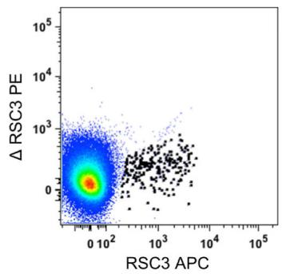

scatter

| RSC3 APC | Δ RSC3 PE |
| -------- | --------- |
| 0        | 0         |
| 100      | 100       |
| 1000     | 1000      |
| 10000    | 10000     |
| 100000   | 100000    |

B   
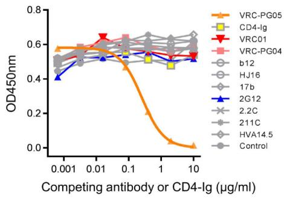

line

| Competing antibody or CD4-Ig (μg/ml) | VRC-PG05 | CD4-Ig | VRC01 | VRC-PG04 | b12 | HJ16 | 17b | 2G12 | 2.2C | 211C | HVA14.5 | Control |
| ------------------------------------- | -------- | ------ | ----- | -------- | --- | ---- | --- | ---- | ---- | ---- | ------- | ------- |
| 0.001                                 | 0.6      | 0.5    | 0.5   | 0.5      | 0.5 | 0.5  | 0.5 | 0.4  | 0.5  | 0.5  | 0.5     | 0.5     |
| 0.01                                  | 0.6      | 0.5    | 0.6   | 0.5      | 0.5 | 0.5  | 0.5 | 0.5  | 0.5  | 0.5  | 0.5     | 0.5     |
| 0.1                                   | 0.6      | 0.5    | 0.6   | 0.5      | 0.5 | 0.5  | 0.5 | 0.5  | 0.5  | 0.5  | 0.5     | 0.5     |
| 1                                     | 0.2      | 0.5    | 0.6   | 0.5      | 0.5 | 0.5  | 0.5 | 0.5  | 0.5  | 0.5  | 0.5     | 0.5     |
| 10                                    | 0.0      | 0.5    | 0.6   | 0.5      | 0.5 | 0.5  | 0.5 | 0.5  | 0.5  | 0.5  | 0.5     | 0.5     |

C   
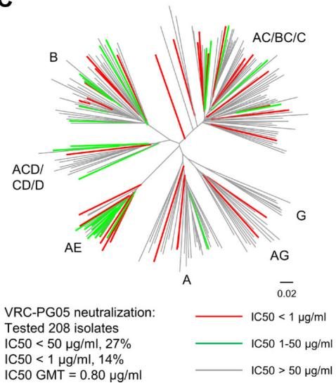

other

| Sample | IC50 < 1 µg/ml | IC50 1-50 µg/ml | IC50 > 50 µg/ml |
|--------|----------------|-----------------|-----------------|
| A      | ~0.9           | ~0.8            | ~0.7            |
| B      | ~0.7           | ~0.6            | ~0.5            |
| AC/BC/C| ~0.8           | ~0.7            | ~0.6            |
| G      | ~0.6           | ~0.5            | ~0.4            |
| AG     | ~0.5           | ~0.4            | ~0.3            |
| ACD/CD/D| ~0.7         | ~0.6            | ~0.5            |
| AE     | ~0.6           | ~0.5            | ~0.4            |
| VRC-PG05 neutralization: Tested 208 isolates, IC50 < 1 µg/ml, IC50 GMT = 0.80 µg/ml

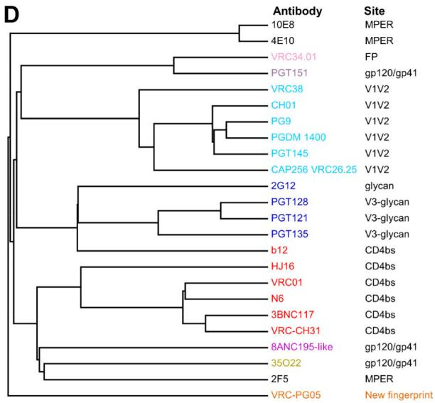

flowchart

```mermaid
graph TD
    A["Antibody"] --> B["10E8"]
    A --> C["4E10"]
    A --> D["VRC34.01"]
    A --> E["PGT151"]
    A --> F["VRC38"]
    A --> G["CH01"]
    A --> H["PG9"]
    A --> I["PGDM 1400"]
    A --> J["PGT145"]
    A --> K["CAP256 VRC26.25"]
    A --> L["2G12"]
    A --> M["PGT128"]
    A --> N["PGT121"]
    A --> O["PGT135"]
    A --> P["b12"]
    A --> Q["HJ16"]
    A --> R["VRC01"]
    A --> S["N6"]
    A --> T["3BNC117"]
    A --> U["VRC-CH31"]
    A --> V["8ANC195-like"]
    A --> W["35O22"]
    A --> X["2F5"]
    A --> Y["VRC-PG05"]
    
    Z["Site"] --> AA["MPER"]
    Z --> AB["MPER"]
    Z --> AC["FP"]
    Z --> AD["gp120/gp41"]
    Z --> AE["V1V2"]
    Z --> AF["V1V2"]
    Z --> AG["V1V2"]
    Z --> AH["V1V2"]
    Z --> AI["V1V2"]
    Z --> AJ["V1V2"]
    Z --> AK["V1V2"]
    Z --> AL["Glycan"]
    Z --> AM["V3-glycan"]
    Z --> AN["V3-glycan"]
    Z --> AO["V3-glycan"]
    Z --> AP["CD4bs"]
    Z --> AQ["CD4bs"]
    Z --> AR["CD4bs"]
    Z --> AS["CD4bs"]
    Z --> AT["CD4bs"]
    Z --> AU["CD4bs"]
    Z --> AV["gp120/gp41"]
    Z --> AW["gp120/gp41"]
    Z --> AX["MPER"]
    Z --> AY["New fingerprint"]
```

Figure 1. Probe-Identified Antibody VRC-PG05 Neutralizes HIV-1 Through an Uncommon Epitope Distinct from Known Neutralizing Antibodies

(A) FACS sorting of B cells from IAVI donor #74 for RSC3 and not $\Delta$ RSC3 binding.   
(B) Competition of VRC-PG05 binding to monomeric gp120 by other antibodies with known epitopes. A fixed concentration (50 ng/ml) of biotin-labeled VRC-PG05 was applied to bind AC10.29 gp120; unlabeled competing CD4-Ig or mAbs were titrated in the ELISA to examine their interference with VRC-PG05 binding to gp120.   
(C) Neutralization of VRC-PG05 against 208 HIV-1 Env-pseudoviruses across major circulating clades. The dendrogram depicting the gp160 protein sequence distance of the tested strains is color coded to illustrate neutralization sensitivity. Letters indicate clades. Data under the dendrogram show the number of tested viruses, the percentage of viruses neutralized, and the IC50 geometric mean titer (GMT) for viruses neutralized with an IC50 < 50 $\mu$ g/ml.   
(D) Neutralization fingerprint grouping of VRC-PG05 with other known neutralizing antibodies.   
See also Figure S1, Table S1, S2 and S3.

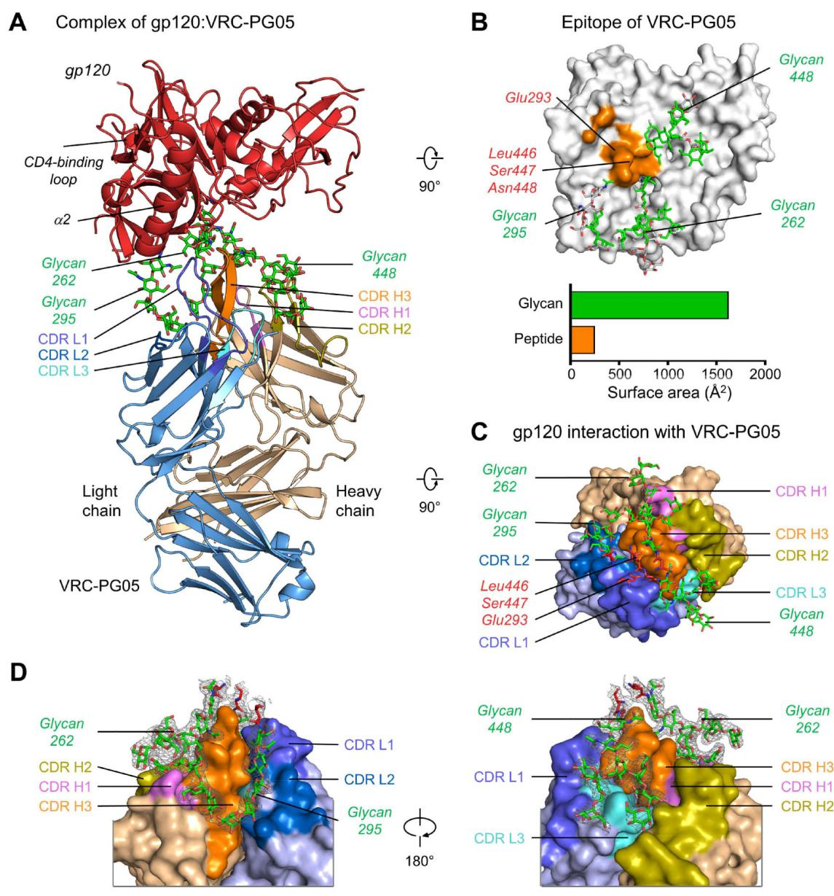  
Figure 2. Crystal Structure of VRC-PG05 Fab with CNE55 gp120 Core Reveals Glycopeptide Recognition

(A) Structure of the VRC-PG05-gp120 complex. The gp120, VRC-PG05 heavy chain and light chain are shown in carton representation and colored in red, light orange and light blue, respectively. VRC-PG05 is highlighted in violet for CDR H1, deep olive for CDR H2, orange for CDR H3, slate for CDR L1, skyblue for CDR H2 and cyan for CDR L3. Glycans that interact with VRC-PG05 are colored green.   
(B) Epitope of VRC-PG05 on HIV-1 gp120. Atoms of protein and glycan that contact VRC-PG05 are displayed in orange surface representation (protein) and green stick representation (glycan), with non-contacting atoms shown in gray. Contacting surface areas are shown in bar graph, colored orange (protein) and green (glycan).   
(C) gp120 peptido-glycan components that interact with VRC-PG05, viewing from gp120.

(D) Zoom-in views of glycan interactions with VRC-PG05. Electron density maps (2Fo-Fc) of glycans are shown in gray mesh contoured at 1 δ.
See also Figure S2 and Table S4.

A   
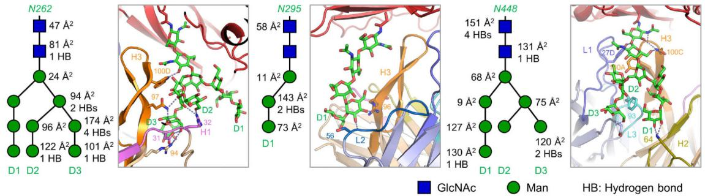

chemical

Molecular structure diagrams of N262, N295, and N448 proteins with labeled hydrogen bonds and ligand binding sites

B   
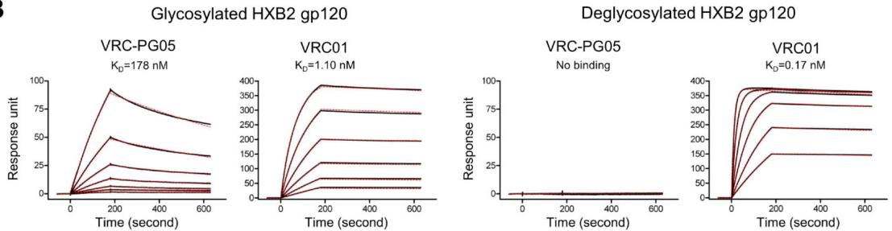

C   
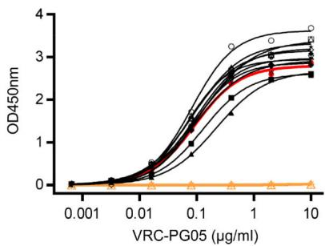

line

| VRC-PG05 (μg/ml) | OD450nm (Line 1) | OD450nm (Line 2) | OD450nm (Line 3) | OD450nm (Line 4) | OD450nm (Line 5) |
| ---------------- | ---------------- | ---------------- | ---------------- | ---------------- | ---------------- |
| 0.001            | 0.0              | 0.0              | 0.0              | 0.0              | 0.0              |
| 0.01             | 0.5              | 0.6              | 0.7              | 0.8              | 0.9              |
| 0.1              | 1.5              | 1.6              | 1.7              | 1.8              | 1.9              |
| 1                | 2.8              | 2.9              | 3.0              | 3.1              | 3.2              |
| 10               | 3.5              | 3.6              | 3.7              | 3.8              | 3.9              |

D   
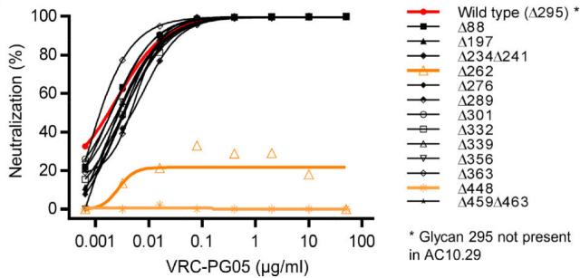

line

| VRC-PG05 (μg/ml) | Wild type (Δ295) * | Δ88 | Δ197 | Δ234Δ241 | Δ262 | Δ276 | Δ289 | Δ301 | Δ332 | Δ339 | Δ356 | Δ363 | Δ448 | Δ459Δ463 |
| ---------------- | ------------------- | --- | ---- | -------- | ---- | ---- | ---- | ---- | ---- | ---- | ---- | ---- | ---- | -------- |
| 0.001            | 30                  | 20  | 15   | 10       | 5    | 10   | 5    | 5    | 5    | 5    | 5    | 5    | 5    | 5        |
| 0.01             | 80                  | 60  | 50   | 40       | 20   | 30   | 20   | 20   | 20   | 20   | 20   | 20   | 20   | 20       |
| 0.1              | 95                  | 85  | 75   | 65       | 25   | 45   | 25   | 25   | 25   | 25   | 25   | 25   | 25   | 25       |
| 1                | 100                 | 95  | 85   | 75       | 25   | 55   | 25   | 25   | 25   | 25   | 25   | 25   | 25   | 25       |
| 10               | 100                 | 95  | 85   | 75       | 25   | 60   | 25   | 25   | 25   | 25   | 25   | 25   | 25   | 25       |
| 100              | 100                 | 95  | 85   | 75       | 25   | 65   | 25   | 25   | 25   | 25   | 25   | 25   | 25   | 25       |
* Glycan 295 not present in AC10.29

Figure 3. Atomic-Level Details of VRC-PG05-Env Interaction Identify Determinants of Glycan Specificity

(A) Interactions between glycans Asn262, Asn295 and Asn448 with VRC-PG05. Key residues that interact with glycans are shown in sticks and numbered with hydrogen bonds shown in dashed lines. A schematic for each glycan is shown next to the crystal structure with GlcNAc as blue squares and mannose residues as green circles. Buried surface areas   
( $\mathring{A}^{2}$ ) and hydrogen bonds with VRC-PG05 for each glycan moieties are labeled.   
(B) SPR binding kinetics of VRC-PG05 to fully glycosylated and Endo-H treated HXB2 gp120. VRC01 was included as a control.   
(C) VRC-PG05 binding to the monomeric gp120 of the HIV-1 isolate AC10.29 and its glycan-scanning mutants with one or two glycosylation sites mutated at a time.   
Glycan 295 is naturally absent in this HIV-1 strain.   
(D) VRC-PG05 neutralization of the HIV-1 isolate AC10.29 and its 13 glycan-scanning mutants.   
See also Figure S3 and Table S5, S6 and S7.

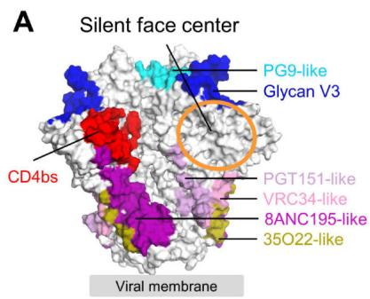

text_image

A
Silent face center
PG9-like
Glycan V3
CD4bs
PGT151-like
VRC34-like
8ANC195-like
35O22-like
Viral membrane

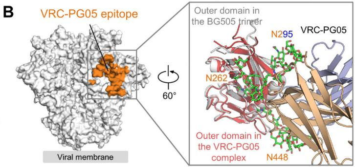

text_image

B
VRC-PG05 epitope
Outer domain in
the BG505 trimer
N295
VRC-PG05
N262
Outer domain in
the VRC-PG05
complex
N448
Viral membrane

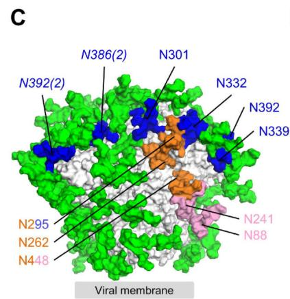

text_image

C
N386(2)
N301
N332
N392(2)
N339
N241
N88
N262
N295
N448
Viral membrane

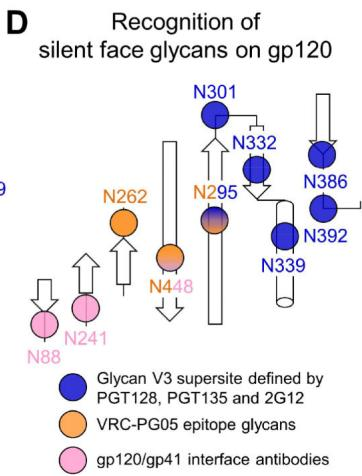

flowchart

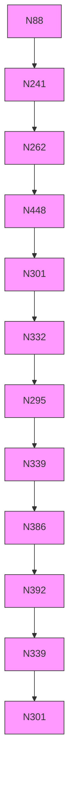
```mermaid
graph TD
    A["N88"] --> B["N241"]
    B --> C["N262"]
    C --> D["N448"]
    D --> E["N301"]
    E --> F["N332"]
    F --> G["N295"]
    G --> H["N339"]
    H --> I["N386"]
    I --> J["N392"]
    J --> K["N339"]
    K --> L["N301"]
    style A fill:#f9f,stroke:#333
    style B fill:#f9f,stroke:#333
    style C fill:#f9f,stroke:#333
    style D fill:#f9f,stroke:#333
    style E fill:#f9f,stroke:#333
    style F fill:#f9f,stroke:#333
    style G fill:#f9f,stroke:#333
    style H fill:#f9f,stroke:#333
    style I fill:#f9f,stroke:#333
    style J fill:#f9f,stroke:#333
    style K fill:#f9f,stroke:#333
    style L fill:#f9f,stroke:#333
```

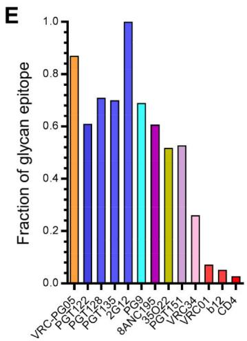

bar

| Gene | Fraction of glycan epitope |
| :--- | :--- |
| VRC-PG05 | 0.87 |
| PGTL22 | 0.61 |
| PGTL28 | 0.71 |
| PGTL35 | 0.70 |
| 2G12 | 1.00 |
| PG39 | 0.69 |
| 8ANC395 | 0.60 |
| 35O22 | 0.51 |
| PGTL51 | 0.52 |
| VRC34 | 0.26 |
| VRC01 | 0.07 |
| b12 | 0.05 |
| CD4 | 0.02 |

Figure 4. VRC-PG05 Uniquely Targets Glycan N262 at the "Silent Face" Center

(A) Epitopes of representative neutralizing antibodies on the HIV-1 Env trimer in a prefusion closed conformation. The center of the silent face is highlighted with an orange circle.

(B) Location of VRC-PG05 epitope in the context of the prefusion closed Env trimer. Both contacting protein and glycan surface (including glycans 262, 295 and 448) are shown to illustrate the full epitope. Inset showed a $60^{\circ}$ -rotated view of the superposition of outer domains in the prefusion closed BG505.SOSIP trimer and the VRC-PG05-bound gp120 with VRC-PG05 approaching from the right.

(C) Location of glycans recognized by different antibodies. Glycans that interact with VRC-PG05 are colored in orange and those interact with antibodies targeting the glycan-V3 supersite are colored in blue. Numbers in parentheses next to italicized glycan labels denote glycans emanating from other protomers.

(D) Schematic of glycans recognized by VRC-PG05, glycan-V3 and gp120-gp41 interface antibodies, and colored as in (C).

(E) Contribution of glycans to epitopes of neutralizing antibodies as indicated. See also Figure S4.

A   
AC10.29 SOSIP Env trimer in complex with VRC-PG05 Fab   
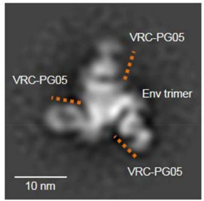

text_image

VRC-PG05
VRC-PG05
Env trimer
VRC-PG05
10 nm

Model of BG505.SOSIP in complex with VRC-PG05 Fab   
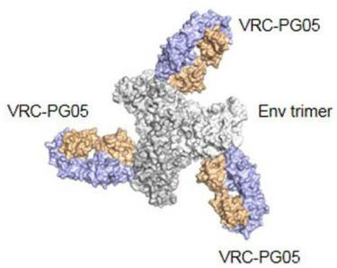

text_image

VRC-PG05
Env trimer
VRC-PG05
VRC-PG05

B   
AC10.29 Env trimer in CD4-bound open conformation (top view)   
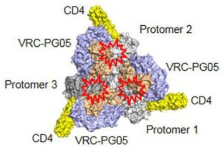

text_image

CD4
Protomer 2
VRC-PG05
Protomer 3
VRC-PG05
Protomer 1
CD4
VRC-PG05
Protomer 1

AC10.29 Env trimer in CD4-bound open conformation (side view)   
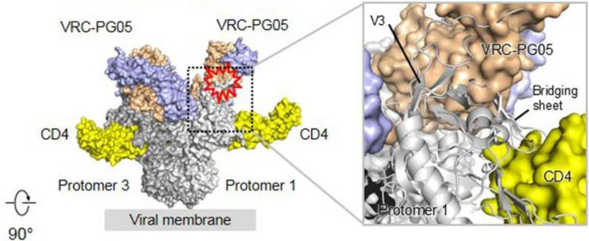

text_image

VRC-PG05
VRC-PG05
CD4
Protomer 3
Protomer 1
V3
VRC-PG05
Bridging sheet
Protomer 1
90°
Protomer 1

VRC-PG05 clashes with neighboring gp120 protomer in prefusion open state   
Figure 5. VRC-PG05 Interferes with Env Transitions Related to Entry

(A) Negative-stain EM of VRC-PG05 in complex of AC10.29 SOSIP trimer in prefusion closed state. Locations of VRC-PG05 are marked with orange lines in the 2D class average image with three VRC-PG05 Fab bound to Env trimer (left). A model of BG505.SOSIP trimer with three VRC-PG05 bound is shown (right).   
(B) Analysis of VRC-PG05-gp120 complex structure superposed onto an HIV-1 Env trimer structure in prefusion open conformation (PDB ID: 5VN3) by aligning the outer domains. Three 2-domain CD4 and three VRC-PG05 Fabs are shown in surface representation, with the HIV-1 trimer colored in different shades of gray, CD4 colored in yellow, and VRC-PG05 colored in light orange and light blue. Potential steric clashes between VRC-PG05 and gp120 protomer are marked with a red collision symbol. A zoom-in view (right) shows clashes between VRC-PG05 and CD4-induced bridging sheet.

See also Figure S5.

A   
Paratope and somatic hypermutations   
Heavy chain   
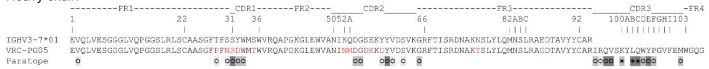

text_image

----FR1-----CDR1-----FR2-----CDR2-----FR3-----CDR3-----FR4
1 22 31 36 5052A 66 82ABC 92 100ABCDEFGHI103
I | I | I | I | I | I | I | I |
IGHV3-7*01 EVQLVESGGGLVQFGGSLRLSCAASGFTFSSYWMSWVRQAPGKGLEWVANIKQDGSEKYVDSVKGRFTISRDNAKNSLYLQMNSLRAEDTAVYYCAR
VRC-PG05 EVQLVESGGGLVQFGGSLRLSCAASGFFNRDWNTWVRQAPGKGLEWVANINMDGDKDYDSVKGRFTISRDNAKTSLYLQMNSLRAGDTAVYYCARIRQVSKYLQWYPGVFEMWGQG
Paratope 0 0 0 0 0 0 0 0 0 0 0 0 0 0

Light chain   
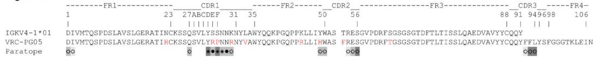

text_image

IGKV4-1*01
VRC-PG05
Paratope
----FR1---- CDR1 ----FR2---- CDR2 ----FR3---- CDR3 ----FR4-
1 23 27ABCDEF 31 35 50 56 88 91 949698 106
| | ||||||| | | | | | | |
DIVMTQSPDSLAVSLGERATINCKSSQSVLYSSNNKNYLAWYQQKPGQPPKLLIWAS TRESGVPDRFSGSGSGTDFTLTISSLQAEDVAVYYCQQY
DIVMTQSPDSLAVSLGERATIHCKSSQSVLYRPNNRNYAVWYQQKPGQPPRLLIHWAS FRESGVPDRFTGSGSGTDFTLTISSLQAEDVAVYYCQQYFFLYSFGGGTKLEIN
○○ ○●●●○○ ○○○○○○○○○○○○○○○○○○○○○○○○○○○○○○○○○○○○○○○○○○○○○○○○○○○○○○○○○○○○○○○○○○○○○○○○○○○○○○○○○○○○○○○○○○○○○○○○○○○○○

☀: Glycan contact only   
•: protein contact only   
\*: Glycan and protein contact

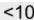

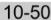

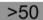  
Binding surface (Ų)

B   
Mapping of paratope residues   
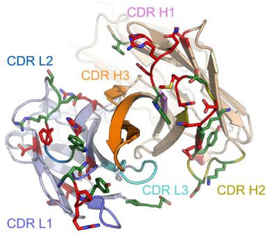

chemical

3D protein structure diagram showing CDR domains and ligand interactions with labeled residues like CDR H1, H2, H3, L1, L2

- 19% paratope from $V_{H}/V_{L}$ germline residues   
● 25% paratope by $V_{H}/V_{L}$ somatic hypermutations

Evolution of glycan recognition   
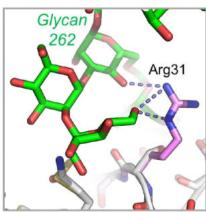

chemical

Molecular interaction diagram showing Glycan 262 and Arg31 residues in a protein-ligand binding site

H:Ser31→Arg

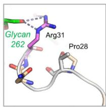

chemical

Molecular structure diagram showing Glycan 262, Arg31, and Pro28 residues in a protein binding site

H:Thr28→Pro

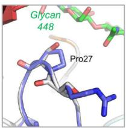

chemical

Molecular structure diagram showing Glycan and Pro27 residues in a protein binding site

L:Ser27 $_{F}$ →Pro

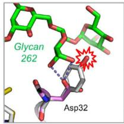

chemical

Molecular interaction diagram showing Glycan 262 and Asp32 residues with a red laser emission peak

H:Tyr32→Asp

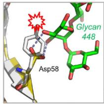

chemical

Molecular interaction diagram showing Asp58 and Glycan 448 residues in a protein binding site

H:Tyr58→Asp

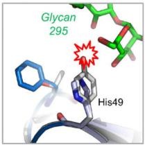

chemical

Molecular interaction diagram showing Glycan 295 and His49 residues in a protein-ligand binding site

L:Tyr49→His   
Figure 6. Somatic Hypermutation Enhances VRC-PG05 Recognition of Glycan

(A) Sequence alignment of VRC-PG05 with deduced germline sequences. SHMs are colored red. Paratope residues are labeled by their respective type of contact with HIV-1 gp120, $\circledast$ for glycan contact only, $\bullet$ for protein contact only and $\star$ for both glycan and protein contact, and highlighted according to the size of buried surface area.   
(B) Paratope residues from germline heavy and light chain V-genes ( $V_{H}$ and $V_{L}$ ) and by SHM. SHM residues are shown in red sticks and germline residues are shown in green.   
(C) Representative mutations that facilitate recognition of glycans. Model of germline VRC-PG05 (gray) was superposed with the structure of gp120-bound VRC-PG05 shown with the same color scheme as in Fig. 2. Nearby glycans are shown in sticks representation in green with hydrogen bonds connected by dashed lines. Potential clashes between glycans and germline residues are marked with a red collision symbol. Direct interactions with glycan are shown in all cases, except for Pro28, which stabilizes the aliphatic base of the glycan-interacting Arg31.

See also Figure S6 and Table S5, S6 and S7.

A   
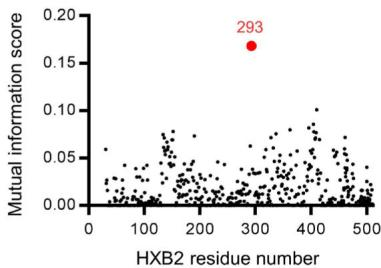

scatter

| HXB2 residue number | Mutual information score |
| ------------------- | ------------------------ |
| 300                 | 0.17                     |

B   
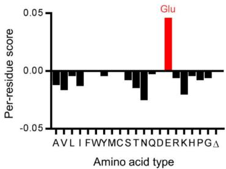

bar

| Amino acid type | Per-residue score |
| --------------- | ----------------- |
| AVL             | -0.01             |
| L               | -0.02             |
| F               | -0.01             |
| W               | -0.01             |
| Y               | -0.01             |
| M               | -0.01             |
| C               | -0.01             |
| S               | -0.01             |
| T               | -0.01             |
| N               | -0.03             |
| Q               | -0.01             |
| D               | -0.01             |
| E               | -0.01             |
| R               | -0.01             |
| K               | -0.01             |
| H               | -0.01             |
| P               | -0.01             |
| G               | -0.01             |
| Δ               | -0.01             |

C   
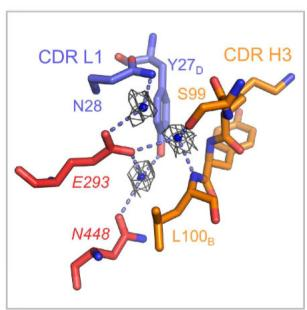

chemical

Molecular interaction diagram showing protein-ligand binding with labeled residues and domains

D   
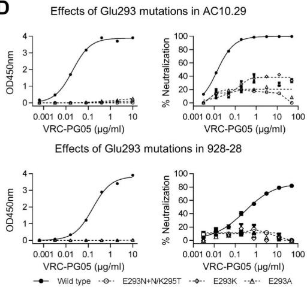

line

| VRC-PG05 (µg/ml) | WT OD450nm | WT % Neutralization | E293N+N/K295T OD450nm | E293N+N/K295T % Neutralization | E293K OD450nm | E293K % Neutralization | E293A OD450nm | E293A % Neutralization |
| ---------------- | ---------- | ------------------ | --------------------- | ----------------------------- | ------------- | --------------------- | ------------- | --------------------- |
| 0.001            | ~0.1       | ~10                | ~0.1                  | ~10                           | ~0.1          | ~10                   | ~0.1          | ~10                   |
| 0.01             | ~0.5       | ~20                | ~0.1                  | ~20                           | ~0.1          | ~20                   | ~0.1          | ~20                   |
| 0.1              | ~1.5       | ~40                | ~0.1                  | ~40                           | ~0.1          | ~40                   | ~0.1          | ~40                   |
| 1                | ~3.5       | ~60                | ~0.1                  | ~60                           | ~0.1          | ~60                   | ~0.1          | ~60                   |
| 10               | ~4.0       | ~80                | ~0.1                  | ~80                           | ~0.1          | ~80                   | ~0.1          | ~80                   |
| 100              | ~4.0       | ~100               | ~0.1                  | ~100                          | ~0.1          | ~100                  | ~0.1          | ~100                  |

F

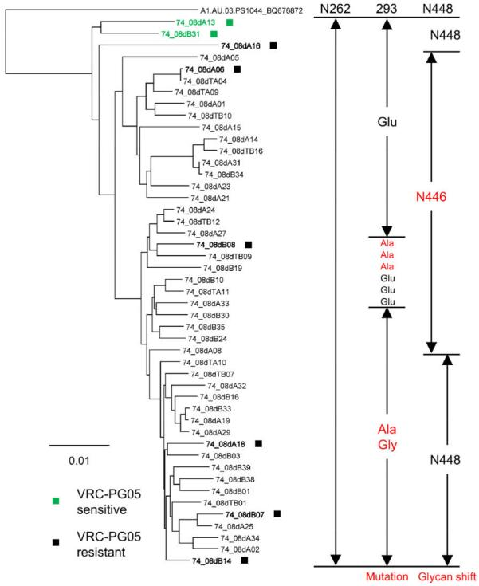

flowchart

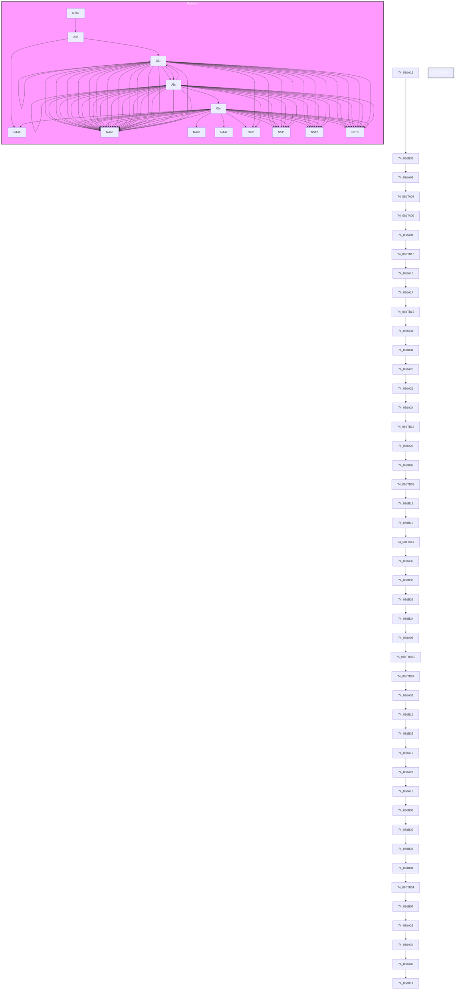
```mermaid
graph TD
    A["74_08dA13"] --> B["74_08dB31"]
    B --> C["74_08dA05"]
    C --> D["74_08dTA04"]
    D --> E["74_08dTA09"]
    E --> F["74_08dA01"]
    F --> G["74_08dTB10"]
    G --> H["74_08dA15"]
    H --> I["74_08dA14"]
    I --> J["74_08dTB16"]
    J --> K["74_08dA31"]
    K --> L["74_08dB34"]
    L --> M["74_08dA23"]
    M --> N["74_08dA21"]
    N --> O["74_08dA24"]
    O --> P["74_08dTB12"]
    P --> Q["74_08dA27"]
    Q --> R["74_08dB08"]
    R --> S["74_08dTB09"]
    S --> T["74_08dB19"]
    T --> U["74_08dB10"]
    U --> V["74_08dTA11"]
    V --> W["74_08dA33"]
    W --> X["74_08dB30"]
    X --> Y["74_08dB35"]
    Y --> Z["74_08dB24"]
    Z --> AA["74_08dA08"]
    AA --> AB["74_08dTBA10"]
    AB --> AC["74_08dTB07"]
    AC --> AD["74_08dA32"]
    AD --> AE["74_08dB16"]
    AE --> AF["74_08dB33"]
    AF --> AG["74_08dA19"]
    AG --> AH["74_08dA29"]
    AH --> AI["74_08dA18"]
    AI --> AJ["74_08dB03"]
    AJ --> AK["74_08dB39"]
    AK --> AL["74_08dB38"]
    AL --> AM["74_08dB01"]
    AM --> AN["74_08dTB01"]
    AN --> AO["74_08dB07"]
    AO --> AP["74_08dA25"]
    AP --> AQ["74_08dA34"]
    AQ --> AR["74_08dA02"]
    AR --> AS["74_08dB14"]
    
    subgraph Mutation
        direction TB
        N262 --> 293 --> N448
        293 --> Glu
        Glu --> Ala
        Ala --> Ala
        Ala --> Glu
        Glu --> Glu
        Glu --> Ala
        Ala --> Gly
        Gly --> N448
        Glu --> N446
        Ala --> N446
        Gly --> N446
        Glu --> N446
        Ala --> N446
        Gly --> N446
        Glu --> N446
        Ala --> N446
        Gly --> N446
        Glu --> N446
        Ala --> N446
        Gly --> N446
        Glu --> N446
        Ala --> N446
        Gly --> N445
        Glu --> N446
        Ala --> N446
        Gly --> N446
        Glu --> N446
        Ala --> N446
        Gly --> N446
        Glu --> N446
        Ala --> N446
        Gly --> N446
        Glu --> N446
        Ala --> N446
        Gly --> N447
        Glu --> N446
        Ala --> N446
        Gly --> N446
        Glu --> N446
        Ala --> N446
        Gly --> N446
        Glu --> N446
        Ala --> N446
        Gly --> N446
        Glu --> N446
        Ala --> N446
        Gly --> N451
        Glu --> N451
        Ala --> N451
        Gly --> N511
        Glu --> N511
        Ala --> N511
        Gly --> N511
        Glu --> N511
        Ala --> N511
        Gly --> N511
        Glu --> N511
        Ala --> N511
        Gly --> N512
        Glu --> N512
        Ala --> N512
        Gly --> N512
        Glu --> N512
        Ala --> N512
        Gly --> N512
        Glu --> N512
        Ala --> N512
        Gly --> N513
        Glu --> N513
        Ala --> N513
        Gly --> N513
        Glu --> N513
        Ala --> N513
        Gly --> N513
        Glu --> N513
        Ala --> N513
        Gly --> N513
        Glu --> N513
        Ala --> N513
        Gly --> N513
    end
    
    style Mutation fill:#f9f,stroke:#333,stroke-width:2px,color:#fff
    style VRC-PG05 sensitive fill:#ccf,stroke:#333,stroke-width:2px,color:#fff
    style VRC-PG05 resistant fill:#ccf,stroke:#333,stroke-width:2px,color:#fff
```

E   
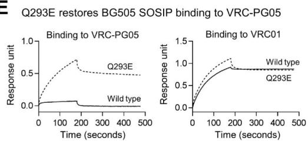

line

| Time (seconds) | Q293E (Response unit) | Wild type (Response unit) |
| -------------- | --------------------- | ------------------------- |
| 0              | 0.0                   | 0.0                       |
| 100            | 0.7                   | 0.1                       |
| 200            | 0.6                   | 0.1                       |
| 300            | 0.5                   | 0.1                       |
| 400            | 0.5                   | 0.1                       |
| 500            | 0.5                   | 0.1                       |

Figure 7. HIV in Donor #74 Evolved Resistance to VRC-PG05 through Two Mechanisms

(A) Mutual information between the Env neutralization and sequence identified residue at 293 (red) possibly responsible for VRC-PG05 resistance.   
(B) Per-residue scores at 293 for all possible amino acid types and a gap ( $\Delta$ ). Scores were positive for amino acid types found in sensitive strains and negative for those found in resistant strains.   
(C) Water-mediated interactions between gp120 Glu293 and VRC-PG05. CDR H3 and CDR L1 of VRC-PG05 are shown in orange and blue, respectively. Glu293 and Asn448 of gp120 are shown in red sticks, water-mediated hydrogen bonds between Glu293 and other residues are shown as dashed lines. Waters bound to Glu293 are shown as blue balls with electron densities shown in gray at 1.0 δ.   
(D) Effects of Glu293 mutations on gp120 binding (left) and viral neutralization (right) to VRC-PG05 in sensitive strains AC10.29 (upper) and 928–28 (lower). Glu293 was replaced by Lys or Ala or by introduction of a glycosylation site.

(E) Bio-Layer Interferometry of VRC-PG05 binding to wild type and a mutant BG505.SOSIP trimer with Gln to Glu mutation at position 293. VRC01 was included as a control.   
(F) Development of VRC-PG05 resistance in IAVI donor #74. A neighbor-joining tree is shown for donor #74-derived gp160 nucleotide sequences, along with the amino acid sequences indicated to the right for residues 262, 293 and 448, which were identified as critical contacts with VRC-PG05. Env clones marked with ■ were tested for neutralization sensitivity to VRC-PG05.   
See also Figure S7.

KEY RESOURCES TABLE 

<table><tr><td>REAGENT or RESOURCE</td><td>SOURCE</td><td>IDENTIFIER</td></tr><tr><td colspan="3">Antibodies</td></tr><tr><td>VRC01, VRC-PG04, HVA14.5</td><td>NIH/VRC</td><td>N/A</td></tr><tr><td>b12, HJ16, 17b, 2G12, 2.2C, 211C</td><td>NIH/VRC</td><td>N/A</td></tr><tr><td>Sheep D7324 antibody</td><td>AALTO Bio Reagents</td><td>Cat# D7324</td></tr><tr><td>HRP-conjugated goat anti-human IgG Fc</td><td>Jackson ImmunoResearch</td><td>Cat# 109-035-098; RRID: AB_2337586</td></tr><tr><td colspan="3">Chemicals, Peptides, Recombinant Proteins and Biosensors</td></tr><tr><td>RSC3 and ARSC3, HXB2 gp120 core, CNE55 gp120 core, AC10.29 gp120</td><td>NIH/VRC</td><td>N/A</td></tr><tr><td>BG505 and AC10.29 SOSIP gp140</td><td>NIH/VRC</td><td>N/A</td></tr><tr><td>3,3',5,5'-tetramethylbenzidine (TMB)</td><td>ThermoFisher Scientific</td><td>Cat# 22311</td></tr><tr><td>Turbo293 transfection reagent</td><td>SPEED BioSystem</td><td>Cat# PXX1002</td></tr><tr><td>AbBooster medium</td><td>ABI scientific</td><td>Cat# PB2668</td></tr><tr><td>Fugene 6</td><td>Promega</td><td>Cat# E2691</td></tr><tr><td>Pierce Protein A Agarose</td><td>ThermoFisher Scientific</td><td>Cat# 20334</td></tr><tr><td>Endoproteinase LysC</td><td>Roche</td><td>Cat# 11058533103</td></tr><tr><td>Endoglycosidase H</td><td>New England Biolabs</td><td>Cat# P0702L</td></tr><tr><td>1,6-hexanediol</td><td>Sigma-Aldrich</td><td>Cat# 240117</td></tr><tr><td>Sodium acetate buffer kit</td><td>Hampton Research</td><td>Cat# HR2-233</td></tr><tr><td>PEG 4000</td><td>Rigaku Reagents</td><td>Cat# 1008059</td></tr><tr><td>Tris-HCl buffer</td><td>Rigaku Reagents</td><td>Cat# HR2-237</td></tr><tr><td>CM5 chip</td><td>GE Healthcare</td><td>Cat# BR100012</td></tr><tr><td>Anti-Human Fc Capture (AHC) Biosensors</td><td>fortéBIO</td><td>Cat# 18-0015</td></tr><tr><td colspan="3">Virus Strains</td></tr><tr><td>VRC 208 virus panel</td><td>NIH/VRC</td><td>N/A</td></tr><tr><td>AC10.29, 928-28</td><td>NIH/VRC</td><td>N/A</td></tr><tr><td>12 additional AE strains</td><td>U.S. Military HIV Research Program</td><td>N/A</td></tr><tr><td colspan="3">Biological Samples</td></tr><tr><td>PBMC of IAVI donor #74</td><td>IAVI</td><td>#74</td></tr><tr><td colspan="3">Critical Commercial Assays</td></tr><tr><td>Site-directed mutagenesis</td><td>GeneImmune Biotechnology LLC</td><td>N/A</td></tr><tr><td>Luciferase Assay System</td><td>Promega</td><td>Cat# E1501</td></tr><tr><td>AllPrep DNA/RNA mini kit</td><td>Qiagen</td><td>Cat# 80204</td></tr><tr><td>Oligotex Direct mRNA mini kit</td><td>Qiagen</td><td>Cat# 72022</td></tr><tr><td colspan="3">Deposited Data</td></tr><tr><td>VRC-PG05</td><td>This paper</td><td>GenBank accession# MG241492-MG241496</td></tr><tr><td>Crystal structures of HIV-1 gp120 in complex with VRC-PG05</td><td>This paper</td><td>PDB ID: 6BF4</td></tr><tr><td>454 and Illumina MiSeq sequencing of IAVI donor #74 B cell receptor transcripts</td><td>This paper</td><td>IAVI donor #74 454 and MiSeq reads have been deposited to NCBI under accession SAMN07793307</td></tr><tr><td colspan="3">Experimental Models: Cell Lines</td></tr><tr><td>Human: HEK293T/17 cells</td><td>ATCC</td><td>Cat# CRL-11268; RRID: CVCL_1926</td></tr><tr><td>Human: HEK293S GnTI- cells</td><td>ATCC</td><td>Cat# CRL-3022; RRID: CVCL_A785</td></tr><tr><td>Human: Expi293F cells</td><td>Thermo Fisher</td><td>Cat# A14527; RRID: CVCL_D615</td></tr><tr><td>Human: TZM-bl cells</td><td>NIH AIDS Reagent Program</td><td>Cat# 8129; RRID: CVCL_B478</td></tr><tr><td colspan="3">Recombinant DNA</td></tr><tr><td>CD4-Ig</td><td>NIH/VRC</td><td>N/A</td></tr><tr><td>pVRC8400 vector</td><td>NIH/VRC</td><td>N/A</td></tr><tr><td colspan="3">Software and Algorithms</td></tr><tr><td>HKL2000</td><td>HKL Research, Inc.</td><td>http://www.hkl-xray.com/</td></tr><tr><td>Phenix</td><td>(Adams et al., 2004)</td><td>https://sbgrid.org/software/</td></tr><tr><td>Coot</td><td>(Emsley and Cowtan, 2004)</td><td>https://sbgrid.org/software/</td></tr><tr><td>Pymol</td><td>Schrödinger</td><td>https://pymol.org</td></tr><tr><td>EMAN2 software package</td><td>(Tang et al., 2007)</td><td>http://blake.bcm.edu/emanwiki/EMAN2</td></tr><tr><td>SPIDER</td><td>(Frank et al., 1996)</td><td>https://spider.wadsworth.org/spider_doc/spider/docs/spider.html</td></tr><tr><td>PRISM 7</td><td>GraphPad Software</td><td>https://www.graphpad.com/scientific-software/prism/</td></tr><tr><td>Dendroscope 3</td><td>Daniel H. Huson</td><td>http://dendroscope.org</td></tr><tr><td>BioEdit v7.2.5</td><td>(Hall, 1999)</td><td>http://www.mbio.ncsu.edu/bioedit/page2.html</td></tr><tr><td>IMGT</td><td>(Lefranc et al., 2015)</td><td>http://www.imgt.org</td></tr><tr><td>PDBePISA</td><td>(Krissinel and Henrick, 2007)</td><td>http://www.ebi.ac.uk/pdbe/pisa/</td></tr></table>