# science.1192819

# Structural Basis for Broad and Potent Neutralization of HIV-1 by Antibody VRC01

Tongqing Zhou, $^{1}$ Ivelin Georgiev, $^{1*}$ Xueling Wu, $^{1*}$ Zhi-Yong Yang, $^{1*}$ Kaifan Dai, $^{1}$ Andrés Finzi, $^{2}$ Young Do Kwon, $^{1}$ Johannes F. Scheid, $^{3}$ Wei Shi, $^{1}$ Ling Xu, $^{1}$ Yongping Yang, $^{1}$ Jiang Zhu, $^{1}$ Michel C. Nussenzweig, $^{3}$ Joseph Sodroski, $^{2,4}$ Lawrence Shapiro, $^{1,5}$ Gary J. Nabel, $^{1}$ John R. Mascola, $^{1}$ Peter D. Kwong $^{1\dagger}$

During HIV-1 infection, antibodies are generated against the region of the viral gp120 envelope glycoprotein that binds CD4, the primary receptor for HIV-1. Among these antibodies, VRC01 achieves broad neutralization of diverse viral strains. We determined the crystal structure of VRC01 in complex with a human immunodeficiency virus HIV-1 gp120 core. VRC01 partially mimics CD4 interaction with gp120. A shift from the CD4-defined orientation, however, focuses VRC01 onto the vulnerable site of initial CD4 attachment, allowing it to overcome the glycan and conformational masking that diminishes the neutralization potency of most CD4-binding-site antibodies. To achieve this recognition, VRC01 contacts gp120 mainly through immunoglobulin V-gene regions substantially altered from their genomic precursors. Partial receptor mimicry and extensive affinity maturation thus facilitate neutralization of HIV-1 by natural human antibodies.

Successful vaccine development often takes advantage of clues from humoral responses elicited by natural infection. For HIV-1, neutralizing antibody responses elicited within the first year or two of infection are generally strain-specific (1) and thus provide limited insight into vaccine design (2). A few mono-

clonal antibodies from HIV-1–infected individuals, however, are broadly neutralizing, and an effort has been made to facilitate vaccine design by defining their structures (3, 4).

The well-studied broadly neutralizing antibodies to HIV-1—2G12, 2F5, 4E10, and b12—have unusual characteristics that have posed bar-

riers to eliciting similar antibodies in humans (5). Thus, in addition to having broad capacity for neutralization, an appropriate antibody should be present in high enough titers in humans to suggest that it can be elicited in useful concentrations. We and others have screened cohorts of sera from infected individuals to find broadly neutralizing responses that are detectable in a substantial percentage of subjects (6–10). One serum response that satisfies these criteria has been mapped to the site on the HIV-1 gp120 envelope (Env) glycoprotein that binds to the CD4 receptor (8).

Although potentially accessible, the CD4-binding site is protected from humoral recognition through glycan and conformational masking (11). The identification of monoclonal antibodies against this site is described in a companion manuscript (12). In brief, we created resurfaced, conformationally stabilized probes, with antigenic specificity for the initial site of CD4 attachment to gp120 (13). This site, a conformationally invariant subset of the CD4-binding surface, is vulnerable to antibody-mediated neutralization (13), and we used probes specific for this site to identify antibodies that neutralize most viruses (12). In this work, we analyzed the crystal structure for one of these antibodies, VRC01, in complex with

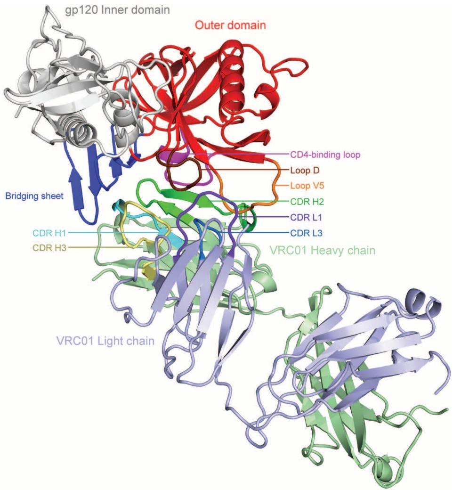  
Fig. 1. Structure of antibody VRC01 in complex with HIV-1 gp120. Atomic-level details for broad and potent recognition of HIV-1 by a natural human antibody are depicted with polypeptide chains in ribbon representations. The gp120 inner domain is shown in gray, the bridging sheet in blue, and the outer domain in red, except for the CD4-binding loop (purple), the D loop (brown), and the V5 loop (orange). The light chain of the antigen-binding fragment (Fab) of VRC01 is shown in light blue, with complementarity-determining regions (CDRs) highlighted in dark blue (CDR L1) and marine blue (CDR L3). The heavy chain of Fab VRC01 is shown in light green, with CDRs highlighted in cyan (CDR H1), green (CDR H2), and pale yellow (CDR H3). Both light and heavy chains of VRC01 interact with gp120: The primary interaction surface is provided by the CDR H2, with the CDR L1 and L3 and the CDR H1 and H3 providing additional contacts.

an HIV-1 gp120 core. We deciphered the basis of VRC01 neutralization, identified mechanisms of natural resistance, showed how VRC01 minimizes such resistance, examined potential barriers to elicitation, and defined the role of affinity maturation in gp120 recognition.

Similarities of Env recognition by CD4 and VRC01 antibody. To gain a structural understanding of VRC01 neutralization, we crystallized the antigen-binding fragment (Fab) of VRC01 in complex with an HIV-1 gp120 from the clade A/E recombinant 93TH057 (14, 15). The crystallized gp120 consisted of its inner domain–outer domain core, with truncations in the variable loops V1/V2 and V3 as well as the N- and C-termini, which are regions known to extend away from the main body of the gp120 envelope glycoprotein (16). Diffraction to 2.9 Å resolution was obtained from orthorhombic crystals, which contained four copies of the VRC01-gp120 complex per asymmetric unit, and the structure was solved by means of molecular replacement and refined to a crystallographic R value of 19.7% (Fig. 1 and table S1) (17).

The interaction surface between VRC01 and gp120 encompasses almost $2500 \, Å^{2}$ , with $1244 \, Å^{2}$ contributed by VRC01 and $1249 \, Å^{2}$ by gp120 (18). On VRC01, both heavy chain ( $894 \, Å^{2}$ ) and light chain ( $351 \, Å^{2}$ ) contribute to the contact surface (table S2), with the central focus of binding on the heavy chain–second complementarity–determining region (CDR H2). Over half of the interaction surface of VRC01 ( $644 \, Å^{2}$ ) involves CDR H2, a mode of binding that is reminiscent of the interaction between gp120 and the CD4 receptor; CD4 is a member of the V-domain class of the immunoglobulin superfamily (19), and the CDR2-like region of CD4 is a central focus of gp120 binding (Fig. 2A and table S3) (20). For CD4, the CDR2-like region forms antiparallel, intermolecular hydrogen bonds with residues $365_{gp120}$ to $368_{gp120}$ of the CD4-binding loop of gp120 (20) (Fig. 2B); with VRC01, one hydrogen-bond is observed between the carbonyl oxygen of Gly54 $_{VRC01}$ and the backbone nitrogen of Asp368 $_{gp120}$ . This hydrogen bond occurs at the loop tip, an extra residue relative to CD4 is inserted in the strand, and the rest of the potential hydrogen bonds are of poor geometry or distance (Fig. 2C and table S4). Other similarities and differences with CD4 are found: Of the two dominant CD4 residues (Phe43 $_{CD4}$ and Arg59 $_{CD4}$ ) in

volved in interaction with gp120, VRC01 mimics the arginine interaction but not the phenylalanine one (Fig. 2, B and C). Lastly, substantial correlation was observed between gp120 residues involved in binding VRC01 and CD4 (fig. S1).

Superposition of the gp120 core in its VRC01-bound form with gp120s in other crystalline lattices and bound by other ligands indicates a CD4-bound conformation [Protein Data Bank (PDB) ID number 3JWD] (16) to be most closely related in structure, with a Cα-root-mean-square deviation of 1.03 Å (table S5). Such superposi-

tion of gp120s from CD4- and VRC01-bound conformations brings the N-terminal domain of CD4 and the heavy chain–variable domain of VRC01 into close alignment (Fig. 2), with 73% of the CD4 N-terminal domain volume overlapping with VRC01 (21). This domain overlap is much higher than observed with the heavy chains of other CD4-binding-site antibodies, such as b12, b13, or F105 (table S6). However, when the VRC01 heavy chain is superimposed—on the basis of conserved framework and cysteine residues—on CD4 in the CD4-gp120 complex,

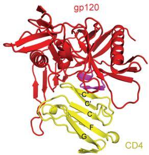  
A

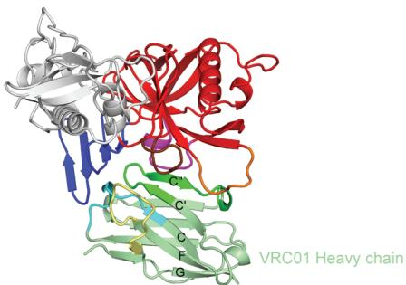

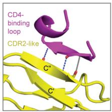  
B

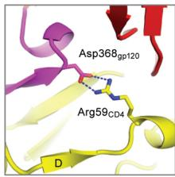

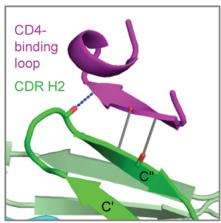  
C

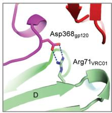

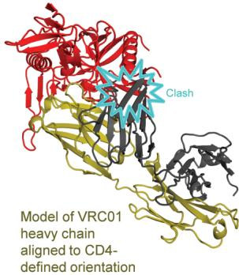  
D

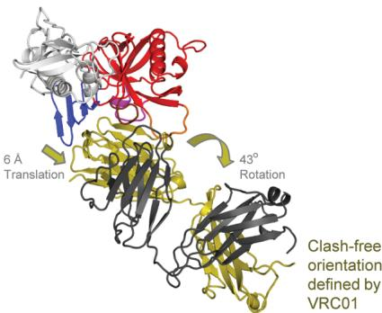  
Fig. 2. Structural mimicry of CD4 interaction by antibody VRC01. VRC01 shows how a double-headed antibody can mimic the interactions with HIV-1 gp120 of a single-headed member of the immunoglobulin superfamily, such as CD4. (A) Comparison of HIV-1 gp120 binding to CD4 (N-terminal domain) and VRC01 (heavy chain-variable domain). Polypeptide chains are depicted in ribbon representation for (right) the VRC01 complex and (left) the CD4 complex with the lowest gp120 root mean square deviation (table S5). The CD4 complex (3JWD) (16) is indicated in yellow for CD4 and red for gp120, except for the CDR-binding loop (purple). The VRC01 complex is colored as in Fig. 1. Immunoglobulin domains are composed of two β sheets, and the top sheet of both ligands is labeled with the standard immunoglobulin-strand topology (strands G, F, C, C', C''). (B and C) Interface details for (B) CD4 and (C) VRC01. Close-ups are shown of critical interactions between the CD4-binding loop (purple) and the C" strand as well as between Asp368 $_{gp120}$ and either Arg59 $_{CD4}$ or Arg71 $_{VRC01}$ . Hydrogen bonds with good geometry are depicted by blue dotted lines, and those with poor geometry are depicted in gray. Atoms from which hydrogen bonds extend are depicted in stick representation and colored blue for nitrogen and red for oxygen. In the left panel of (C), the β15-strand of gp120 is depicted to aid comparison with (B), although because of the poor hydrogen-bond geometry, it is only a loop. (D) Comparison of VRC01- and CD4-binding orientations. Polypeptides are shown in ribbon representation, with gp120 colored the same as in (A) and VRC01 depicted with heavy chain in dark yellow and light chain in dark gray. When the heavy chain of VRC01 is superimposed onto CD4 in the CD4-gp120 complex, the position assumed by the light chain evinces numerous clashes with gp120 (left). The VRC01-binding orientation (right) avoids clashes by adopting an orientation rotated by 43° and translated by 6 Å.

clashes are found between gp120 and the entire top third of the VRC01 variable light chain (Fig. 2D) (22). In its complex with gp120, VRC01 rotates 43° relative to the CD4-defined orientation and translates 6 Å away from the bridging sheet, to a clash-free orientation that mimics many of the interactions of CD4 with gp120, although with considerable variation. Analysis of electrostatics shows that the interaction surfaces of VRC01 and CD4 are both quite basic, although the residue types of contacting amino acids are distinct (fig. S2). Thus, although VRC01 mimics CD4 binding to some extent, considerable differences are observed.

Structural basis of VRC01 breadth and potency. When CD4 is placed into an immunoglobulin context by fusing its two N-terminal domains to a dimeric immunoglobulin constant region, it achieves reasonable neutralization. VRC01, however, neutralizes more effectively (Fig. 3A) (12). To understand the structural basis for the exceptional breadth and potency of VRC01, we analyzed its interactive surface with gp120. VRC01 focuses its binding onto the conformationally invariant outer domain, which accounts for 87% of the contact surface area of VRC01 (table S7). The 13% of the contacts made with flexible inner domain and bridging sheet are noncontiguous, and we judged these not to be critical for binding. In contrast, CD4 makes 33% of its contacts with the bridging sheet, and many of these interactions are essential (20). The re-

duction in inner domain and bridging sheet interactions by VRC01 is accomplished primarily by a 6 Å translation relative to CD4, away from these regions; critical contacts such as made by Phe43 $_{CD4}$ to the nexus of the bridging sheet–outer domain are not found in VRC01, whereas those to the outer domain (such as Arg59 $_{CD4}$ ) are mimicked by VRC01.

To determine the affinity of VRC01 for gp120 in CD4-bound and non–CD4-bound conformations, we used surface-plasmon resonance spectroscopy to measure the affinity of VRC01 and other gp120-reactive antibodies and ligands to two gp120s: a $\beta$ 4-deletion developed by Harrison and colleagues that is restrained from assuming the CD4-bound conformation (23) or a disulfide-stabilized gp120 core that is largely fixed in the CD4-bound conformation in the absence of CD4 itself (13) (Fig. 3B and fig. S3). VRC01 showed high affinity to both CD4-bound and non–CD4-bound conformations, which is a property shared by the broadly neutralizing b12 antibody (13). In contrast, antibodies F105 and 17b as well as soluble CD4 showed strong preference for either one, but not both, of the conformations.

To assess the binding of VRC01 in the context of the functional viral spike, we examined its ability to neutralize variants of HIV-1 with gp120 changes that affect the ability to assume the CD4-bound state. Two of these mutations, His66Ala $_{gp120}$ and Trp69Leu $_{gp120}$ , are less sensitive (24), whereas a third, Ser375Trp $_{gp120}$ , is more sensitive to neu-

tralization by CD4 (24, 25). VRC01 neutralized all three of these variant HIV-1 viruses with similar potency (Fig. 3C), suggesting that VRC01 recognizes both CD4-bound and non–CD4-bound conformations of the viral spike. This diversity in recognition allows VRC01 to avoid the conformational masking that hinders most CD4-binding-site ligands (26) and to potently neutralize HIV-1 (27).

Precise targeting by VRC01. Prior analysis of effective and ineffective CD4-binding-site antibodies suggested that precise targeting to the vulnerable site of initial CD4 attachment is required to block viral entry (11, 28). This site represents the outer domain contact for CD4 (13). Analysis of the VRC01 interaction with gp120 shows that it covers 98% of this site (Fig. 4, A and B, and fig. S4), comprising 1089 Å $^{2}$ on the gp120 outer domain, which is about 50% larger than the 730 Å $^{2}$ surface covered by CD4. The VRC01 contact surface outside the target site is largely limited to the conformationally invariant outer domain and avoids regions of conformational flexibility. This concordance of binding is much greater than for ineffective CD4-binding-site antibodies as well as for those that are partially effective, such as antibody b12 (11, 13) (fig. S4).

The outer domain–contact site for CD4 is shielded by glycan (11, 20). Contacts by the VRC01 light chain (Tyr28 $_{VRC01}$ and Ser30 $_{VRC01}$ ) are made with the protein-proximal N-acetylglucosamine from the N-linked glycan at residue

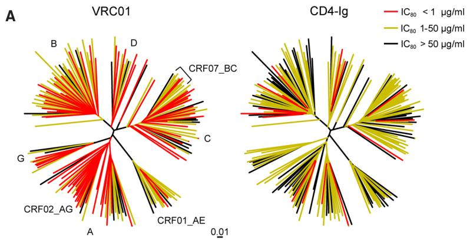

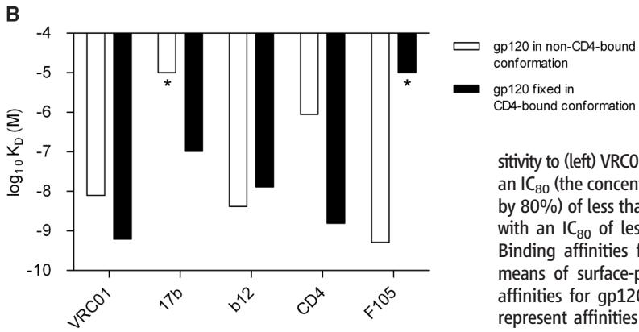

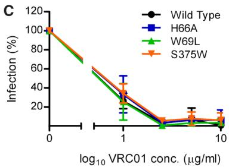

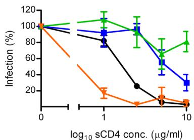  
Fig. 3. Structural basis of antibody VRC01 neutralization breadth and potency. VRC01 displays remarkable neutralization breadth and potency, a consequence in part of its ability to bind well to different conformations of HIV-1 gp120. (A) Neutralization dendrograms. The genetic diversity of current circulating HIV-1 strains is displayed as a dendrogram, with locations of prominent clades (such as A, B, and C) and recombinants (such as CRF02_AG) labeled. The strains are colored by their neutralization sen-

sitivity to (left) VRC01 or (right) CD4. VRC01 neutralizes 72% of the tested HIV-1 isolates with an IC $_{80}$ (the concentration of a substance required to inhibit the activity of another substance by 80%) of less than 1 $\mu$ g/ml; in contrast, CD4 neutralizes 30% of the tested HIV-1 isolates with an IC $_{80}$ of less than 1 $\mu$ g/ml (table S14). (B) Comparison of binding affinities ( $K_{d}$ ). Binding affinities for VRC01 and various other gp120-reactive ligands as determined by means of surface-plasmon resonance are shown on a bar graph. White bars represent affinities for gp120 restrained from assuming the CD4-bound state (23), and black bars represent affinities for gp120 fixed in the CD4-bound state (13). Binding too weak to be measured accurately is shown as with an asterisk and bar at $10^{-5}$ M $K_{d}$ . (C) Neutralization of

viruses with altered sampling of the CD4-bound state. Mutant S375W $_{gp120}$ favors the CD4-bound state, whereas mutants H66A $_{gp120}$ and W69L $_{gp120}$ disfavor this state. Neutralization by VRC01 (top) is similar for wild type (WT) and all three mutant viruses, whereas neutralization by CD4 (bottom) correlates with the degree to which gp120 in the mutant viruses favors the CD4-bound state.

276 $_{gp120}$ (29). Thus instead of being occluded by glycan, VRC01 makes use of a glycan for binding. Other potential glycan interactions may occur with different strains of HIV-1 because the VRC01 recognition surface on the gp120–outer domain extends further than that of the functionally constrained CD4 interaction surface, especially into the loop D and the often-glycosylated V5 region (fig. S5).

Natural resistance to antibody VRC01. In addition to conformational masking and glycan shielding, HIV-1 resists neutralization by antigenic variation. In a companion manuscript, we show that of the 190 circulating HIV-1 isolates tested for sensitivity to VRC01, 173 were neutralized and 17 were resistant (12). To understand the basis of this natural resistance to VRC01, we analyzed all 17 resistant isolates by threading their sequences onto the gp120 structure (fig. S5). Variation was observed in the V5 region in resistant isolates, and this variation—along with alterations in gp120 loop D—appeared to be the source of most natural resistance to VRC01 (Fig. 4C and figs. S5 and S6).

Because substantial variation exists in V5, structural differences in this region might be expected to result in greater than 10% resist-

ance. The lower observed frequency of resistance suggests that VRC01 employs a recognition mechanism that allows for binding despite V5 variation. Examination of VRC01 interaction with V5 shows that VRC01 recognition of V5 is considerably different from that of CD4 (fig. S7), with Arg61 $_{VRC01}$ in the CDR H2 penetrating into the cavity formed by the V5 and β24 strands of gp120 (fig. S8). The V5 loop fits into the gap between heavy and light chains; thus, by contacting only the more conserved residues at the loop base, VRC01 can tolerate variation in the tip of the V5 loop (Fig. 4D).

Unusual VRC01 features and contribution to recognition. We examined the structure of VRC01 for special features that might be required for its function. A number of unusual features were apparent, including a high degree of affinity maturation, an extra disulfide bond, a site for N-linked glycosylation, a two-amino-acid deletion in the light chain, and an extensively matured binding interface between VRC01 and gp120 (Fig. 5 and fig. S9). We assessed the frequency with which these features were found in HIV-1 Env-reactive antibodies (appendix S1) or in human antibody-antigen complexes (fig. S10 and tables S8 and S9) and measured the

effect of genomic reversion of these features on affinity for gp120 and neutralization of virus (Fig. 5, A to D, and table S10).

Higher levels of affinity maturation have been reported for HIV-1–reactive antibodies in general (30) and markedly higher levels for broadly neutralizing ones (31). These maturation levels could be a by-product of the persistent nature of HIV-1 infection and may not represent a functional requirement. Removal of the N-linked glycosylation or the extra disulfide bond, which connects CDR H1 and H3 regions of the heavy chain, had little effect on binding or neutralization (Fig. 5, A and B, and table S10). Insertion of two amino acids to revert the light chain deletion had moderate effects, which were larger for an Ala-Ala insertion (50-fold decrease in binding affinity) versus a Ser-Tyr insertion (fivefold decrease in affinity), which mimics the genomic sequence (Fig. 5C and table S10). Lastly, reversion of the interface was examined with either single-, four-, seven- or 12-mutant reversions. For the single-mutant reversions of the interface to the genomic antibody sequence, all 12 mutations had minor effects [most with a less than twofold effect on the dissociation constant ( $K_{d}$ ), with the largest effect for a Gly54Ser change

Fig. 4. Natural resistance to antibody VRC01. VRC01 precisely targets the CD4-defined site of vulnerability on HIV-1 gp120. Its binding surface, however, extends outside of the target site, and this allows for natural resistance to VRC01 neutralization. (A) Target site of vulnerability. The CD4-defined site of vulnerability is the initial contact surface of the outer domain of gp120 for CD4 and comprises only two thirds of the contact surface of gp120 for CD4 (13). The molecular surface of HIV-1 gp120 has been colored according to its underlying domain substructure: red for the conformationally invariant outer domain, gray for the inner domain, and blue for the highly mobile bridging sheet. Regions of the gp120 surface that interact with VRC01 have been colored green, with

the CD4-defined site of vulnerability outlined in yellow. The view shown here is rotated 90° about the horizontal from the view in Figs. 1 and 2. (B) VRC01 recognition. The molecular surface of gp120 in the VRC01 bound conformation is colored as in (A). The variable domains of VRC01 are shown in ribbon representation, with the heavy and light chains colored as in Fig. 1 and extensions

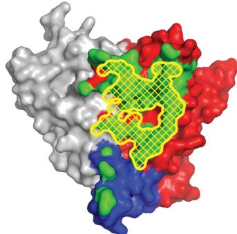  
A   
Site of vulnerability

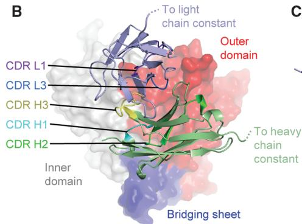  
B   
VRC01 recognition   
C

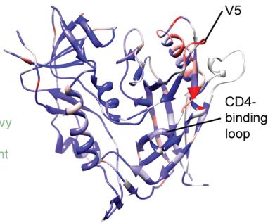

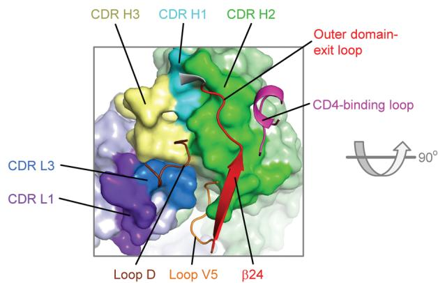  
D

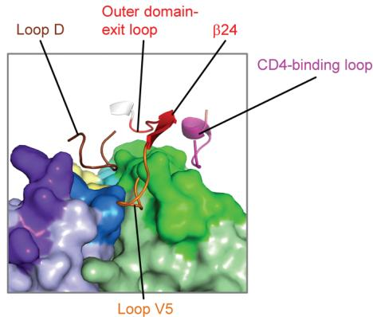  
to constant regions indicated. (C) Antigenic variation. The polypeptide backbone of gp120 is colored according to sequence conservation: blue if conservation is high and red if conservation is low. (D) Molecular surface of VRC01 and select interactive loops of gp120. Variation at the tip of the V5 loop is accommodated by a gap between heavy and light chains of VRC01.

having a $K_{d}$ of 20.2 nM] (table S10). Larger effects were observed with multiple (four, seven, or 12) changes (Fig. 5D and table S10). Thus, although VRC01 has a number of unusual features, no single alteration to genomic sequence substantially altered binding or neutralization.

Elicitation of VRC01-like antibodies. The probability for elicitation of a particular antibody is a function of each of the three major steps in B cell maturation: (i) recombination to produce nascent antibody heavy and light chains from genomic $V_{H}$ -D-J and $V_{\kappa/\lambda}$ -J precursors, (ii) deletion of auto-reactive antibodies, and (iii) maturation through hypermutation of the variable domains to enhance antigen affinity. For the recombination step, a lack of substantial CDR L3 and H3 contribution to the VRC01-gp120 interface (table S2) indicates that specific $V_{\kappa/\lambda}$ -J or $V_{\mathrm{H}}(\mathrm{D})\mathrm{J}$ recombination is not required (32) (fig. S11). The majority of recognition occurs with elements encoded in single genomic elements or cassettes, suggesting that specific joining events between them are not required. Within the $V_{H}$ cassette, a number of residues associated with the IGHV1-02*02 precursor of VRC01 interact with gp120; many of these are conserved in related genomic $V_{H}s$ , some of which are of similar genetic dis

tance from VRC01 (fig. S12). These results suggest that appropriate genomic precursors for VRC01 are likely to occur at a reasonable frequency in the human antibody repertoire.

Recombination produces nascent B cell–presented antibodies that have reactivities against both self and nonself antigens. Those with autoreactivity are removed through clonal deletion. With many of the broadly neutralizing antibodies to HIV-1, such as 2G12 (glycan reactive) (33, 34), 2F5, and 4E10 (membrane reactive) (35, 36), this appears to be a major barrier to elicitation. Although this remains to be characterized for genomic revertants and maturation intermediates, no autoreactivity has so far been observed with VRC01.

The third step influencing the elicitation of VRC01-like antibodies is affinity maturation, which is a process that involves the hypermutation of variable domains combined with affinity-based selection that occurs during B cell maturation in germinal centers (37). In the case of VRC01, 41 residue alterations were observed from the genomic $V_{H}$ gene and 25 alterations from the $V_{\kappa}$ gene (including a deletion of two residues) (fig. S13) (38). To investigate the effect of affinity maturation on HIV-1 gp120 recognition, we reverted the $V_{H}$ and $V_{\kappa}$ regions of

VRC01, either individually or together, to the sequences of their genomic precursors. We tested the affinity and neutralization of these reverted antibodies (Fig. 6A) and combined these data with the genomic reversion data obtained while querying the unusual molecular features of VRC01 (previous section) (Fig. 6B).

No antibodies containing $V_{H}$ and $V_{\kappa}$ regions, which were fully reverted to their genomic precursors, bound gp120 or neutralized virus (39). Binding affinity and neutralization showed significant correlations with the number of affinity-matured residues (P < 0.0001). Binding to stabilized gp120 did not correlate well with other types of gp120 or to neutralization (table S11), which is related in part to greater retention of binding to VRC01 variants with genomically reverted $V_{\kappa}$ regions. Extrapolation of the correlation to the putative genomic V gene sequences predicted binding affinities of $0.7 \pm 0.4 \mu M K_{d}$ for gp120 stabilized in the CD4-bound conformation and substantially weaker affinites for nonstabilized gp120s (Fig. 6B and fig. S14).

No single affinity maturation alteration appeared to affect affinity by more than tenfold, suggesting that affinity maturation occurs in multiple small steps, which collectively enable tight binding

Fig. 5. Unusual VRC01 features. The structure of VRC01 displays a number of unusual features, which if essential for recognition might inhibit the elicitation of VRC01-like antibodies. (A to D) Unusual features of VRC01 are shown structurally (far left), in terms of frequency as a histogram with other antibodies (second from left), and in the context of affinity and neutralization measurements after mutational alteration (second from right and right). Affinity measurements were made by means of enzyme-linked immunosorbent assay to the gp120 construct used in crystallization (93TH057), and neutralization measurements were made with a clade A HIV-1 strain Q842.d12. Additional binding and neutralization experiments are reported in table S10. (A) N-linked glycosylation. The conserved tri-mannose core is shown with observed electron density, along with frequency and effect of removal on affinity and neutralization. (B) Extra disulfide. Variable heavy domains naturally have two Cys, linked by a disulfide; VRC01 has an extra disulfide linking CDR H1 and H3 regions. This occurs rarely in antibodies, but its removal through mutation to Ser/Ala has little effect on affinity or neutral

ization. (C) CDR L1 deletion. A two-amino-acid deletion in the CDR L1 prevents potential clashes with loop D of gp120. Such deletions are rarely observed; reversion to the longer loop may have a moderate effect on gp120 affinity. (D) Somatically altered contact surface. (Left) The VRC01 light chain is shown in violet, and the heavy chain is in green. Residues altered by affinity maturation are depicted with "balls," and contacts with HIV-

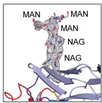  
Structural feature   
A

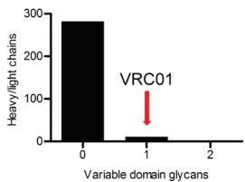  
Frequency

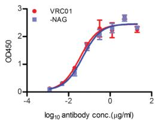  
Binding to HIV-1 gp120

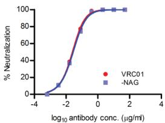  
Neutralization of HIV-1

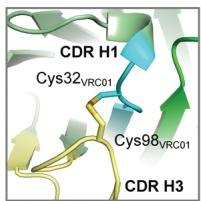  
B

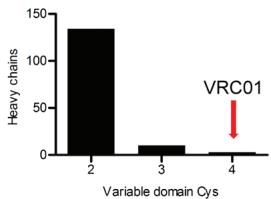

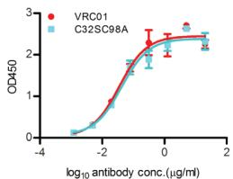

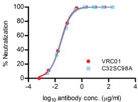

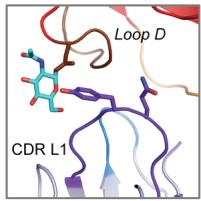  
C

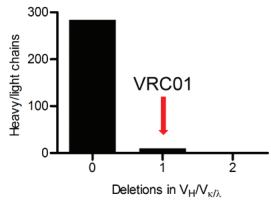

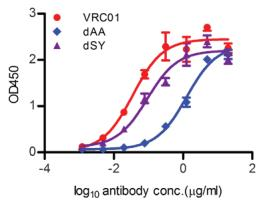

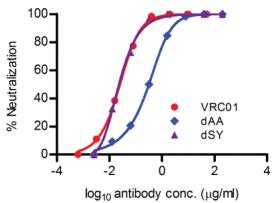

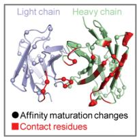  
D

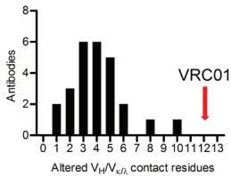

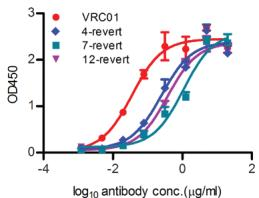

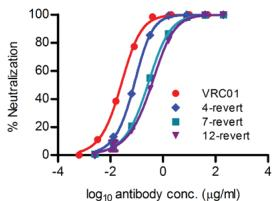  
1 gp120 are colored red. Approximately half of the contacts are altered during the maturation process. Analysis of human antibody-protein complexes in PDB shows this degree of contact surface alteration is rare; reversion of each of the contact sites to the genome sequence has little effect (table S10), although in aggregate the effect on affinity is larger.

Fig. 6. Somatic maturation and VRC01 affinity. Hypermutation of the variable domain during B cell maturation allows for the evolution of high-affinity antibodies. With VRC01, this enhancement to affinity occurs principally through the alteration of noncontact residues, which appear to reform the genomic contact surface from affinity too low to measure to a tight (nanomolar) interaction. (A) Effect of genomic reversions. The $V_{H}$ - and $V_{K}$ -derived regions of VRC01 were reverted to the sequences of their closest genomic precursors, expressed as immunoglobulins, and tested for binding as $V_{H}$ - and $V_{K}$ -revertants (gHgL), as a $V_{H}$ -only revertant (gH), or as a $V_{K}$ -only revertant (gL) to the gp120 construct used in crystallization (93TH057) or to a stabilized HXBc2 core (13). These constructs were also tested for neutralization of a clade A HIV-1 strain Q842.d12. Additional neutralization experiments with clade B and C viruses are reported in

(15). (B) Maturation of VRC01 and correlation with binding and neutralization. Affinity and neutralization measurements for the 19 VRC01 mutants created during the structure-function analysis of VRC01 were analyzed in the context of

A

Binding to HIV-1 gp120

Binding to stabilized gp120

Neutralization of HIV-1

B

Affinity maturation vs HIV-1 gp120 binding

Affinity maturation vs. stabilized gp120 binding

Affinity maturation vs. HIV-1 Neutralization

their degree of affinity maturation. Significant correlations were observed, with extrapolation to $V_{H}$ - and $V_{\kappa}$ -genomic precursors suggesting greatly reduced affinity of the initial genomic arrangement for gp120.

to HIV-1 gp120. When the effects of VRC01 affinity maturation reversions are mapped to the structure of the VRC01-gp120 complex, they are broadly distributed throughout the VRC01 variable domains rather than focused on the VRC01-gp120 interface. Noncontact residues therefore appear to influence the interface with gp120 through indirect protein-folding effects. Thus, for VRC01 the process of affinity maturation entails incremental changes of the nascent genomic precursors to obtain high-affinity interaction with the HIV-1 Env surface.

Receptor mimicry and affinity maturation. The possibility that antibodies use conserved sites of receptor recognition to neutralize viruses effectively has been pursued for several decades. The recessed canyon on rhinovirus that recognizes the unpaired terminal immunoglobulin domains of intercellular adhesion molecule–1 highlights the role that a narrow canyon entrance may play in such occlusion of bivalent antibody-combining regions (40), although framework recognition can in some instances permit entry (41). Partial solutions such as those presented by antibody b12 (neutralization of ~40% of circulating isolates) (12, 13) or by antibody HJ16 (neutralization of ~30% of circulating isolates) (42), a recently identified CD4-binding-site antibody, may allow recognition of some HIV-1 isolates.

With VRC01, the potency and breadth of neutralization (over 90%) suggest a more general solution. It remains to be seen how difficult it will be to guide the elicitation of VRC01-like antibodies from genomic rearrangement, through affinity maturation, to broad and potent neutralization of HIV-1. Accumulating evidence suggests that the VRC01-defined mode of recognition is used by other antibodies (12). These findings

suggest that VRC01 is not an isolated example and probably provides a template for a general mode of recognition. The structure-function insights of VRC01 described here thus provide a foundation for rational vaccine design that is based not only on the particular mode of antibody-antigen interaction but also on defined relationships between genomic antibody precursors, somatic hypermutation, and interface-recognition elements.

# References and Notes

1. R. A. Weiss et al., Nature 316, 69 (1985).   
2. J. R. Mascola, D. C. Montefiori, Annu. Rev. Immunol. 28, 413 (2010).   
3. D. R. Burton, Nat. Rev. Immunol. 2, 706 (2002).   
4. D. R. Burton et al., Nat. Immunol. 5, 233 (2004).   
5. Antibodies 2F5 and 4E10 require nonspecific membrane interaction (35, 36), antibody 2G12 recognizes carbohydrate and is domain swapped (33, 34), and antibody b12 was originally derived by means of phage display and has heavy-chain-only recognition (13).   
6. A. K. Dhillon et al., J. Virol. 81, 6548 (2007).   
7. Y. Li et al., J. Virol. 83, 1045 (2009).   
8. Y. Li et al., Nat. Med. 13, 1032 (2007).   
9. J. M. Binley et al., J. Virol. 82, 11651 (2008).   
10. D. N. Sather et al., J. Virol. 83, 757 (2009).   
11. L. Chen et al., Science 326, 1123 (2009).   
12. X. Wu et al., Science 329, 856 (2010).   
13. T. Zhou et al., Nature 445, 732 (2007).   
14. The Env components of this strain derive from Clade E HIV-1 lineages (43).   
15. Materials and methods are available as supporting material on Science Online.   
16. M. Pancera et al., Proc. Natl. Acad. Sci. U.S.A. 107, 1166 (2010).   
17. The four independent copies of the VRC01-gp120 complex in the asymmetric unit resembled each other closely for the antibody variable domain-gp120 components, with an Cα-root-mean-square deviation of less than 0.2 Å. Elbow variation, however, between variable and constant domains was apparent, and we found one copy (molecule 1) to be more ordered than the others. In the figures, we display molecule 1; see fig. S15 for a comparison of all of the molecules in the asymmetric unit.

18. Surface areas of interaction reported in this paper were determined with the program PISA, as implemented in CCP4 (44). Values were about 20% higher than those reported previously for the gp120-CD4 complex (20), which were obtained using the program MS (45).   
19. P. J. Maddon et al., Cell 42, 93 (1985).   
20. P. D. Kwong et al., Nature 393, 648 (1998).   
21. The overlap of molecular volumes was calculated by comparing the separate volumes of interacting domains with the combined volume of these domains after gp120 superposition.   
22. The relative orientation of the light-chain variable domain and the heavy-chain variable domain of VRC01 is similar to that of other antibodies (fig. S16).   
23. S. Rits-Volloch, G. Frey, S. C. Harrison, B. Chen, EMBO J. 25, 5026 (2006).   
24. A. Finzi et al., Mol. Cell 37, 656 (2010).   
25. S. H. Xiang et al., J. Virol. 76, 9888 (2002).   
26. P. D. Kwong et al., Nature 420, 678 (2002).   
27. In a companion paper (12), we show that VRC01 binding induces 17b and CCR5 binding in the context of monomeric gp120 with an unusual entropy signature characteristic of transiting to the CD4-bound state (46); neutralization data, however, show that VRC01 does not induce 17b or CCR5 binding in the context of the viral spike. This difference probably arises from the more constrained gp120 conformation in the trimeric spike. Thus, although VRC01 is able to induce large conformational changes in monomeric HIV-1 gp120 that resemble those induced by CD4, VRC01 interaction with gp120 does not depend on these conformational changes.   
28. X. Wu et al., J. Virol. 83, 10892 (2009).   
29. Endo H treatment of gp120 for crystallization removed all but the protein-proximal N-acetyl-glucosamine and potential 1,6-fucose from sites of N-linked glycosylation. Examination of the VRC01 interactions with the N-acetyl-glycosamine at residue $276_{gp120}$ shows that both 1,4 additions and 1,6 additions are tolerated.   
30. J. F. Scheid et al., Nature 458, 636 (2009).   
31. C. C. Huang et al., Proc. Natl. Acad. Sci. U.S.A. 101, 2706 (2004).   
32. Four residues are provided by the CDR H3, Asp99 $_{VRC01}$ to Trp100B $_{VRC01}$ , with a combined interaction surface of 123 Å $^{2}$ (tables S3 and S12). These four residues are probably contributed by the D segment (IGHD3-16*02), and none of them appears critical to VRC01 recognition because changes are observed in two of these residues in the closely related

broadly neutralizing antibody VRC03, which was one of two antibodies we isolated along with VRC01 (12). Meanwhile, three residues are provided by the CDR L3—Tyr91 $_{VRC01}$ , Glu96 $_{VRC01}$ , and Phe97 $_{VRC01}$ —with a combined interaction surface of 190 Å $^{2}$ (tables S3 and S13). These three residues lie at the junction between V and J genes. They make important hydrophobic interactions with loop D of gp120, and two of them are conserved between VRC01 and VRC03. Although it is difficult to know how precisely the CDR L3 needs to be aligned, with only three contact residues variation at the V $_{\kappa}$ -J gene junction should provide sufficient diversity for it to be represented in the repertoire.   
33. R. W. Sanders et al., J. Virol. 76, 7293 (2002).   
34. D. A. Calarese et al., Science 300, 2065 (2003).   
35. G. Ofek et al., J. Virol. 78, 10724 (2004).   
36. B. F. Haynes et al., Science 308, 1906 (2005).   
37. C. Berek, A. Berger, M. Apel, Cell 67, 1121 (1991).   
38. Analysis of the HIV-1 Env-reactive antibody repertoire from infected individuals shows increased levels of affinity maturation (30). Analysis of a subset of this data (appendix S1) containing 147 heavy and 147 light chains from HIV-1 Env-reactive antibodies reveals an average of 15 alterations (30 maximum) for the heavy chain and an average of 8.6 alterations (22 maximum) for the light chain (fig. S13). In terms of the subset of HIV-1 Env-reactive antibodies that are broadly neutralizing (such as 2G12, 2F5, 4E10, and b12), antibodies b12 and 2G12 have 45 and 51 changes, respectively, relative to nearest genomic precursors in their $V_H$ and J segments of the heavy chain (31).   
39. Similar significant reductions in affinity have been observed with reversion of other broadly neutralizing antibodies to HIV-1 to putative genomic sequences (47–49); these

observations have led to the suggestion that the dramatically reduced germline affinity for gp120 might hinder the initiation of affinity maturation of these antibodies (50). That is, if the affinity for gp120 of the genomic precursor of a broadly neutralizing antibody were below the threshold required for the nascent B cell to mature, then maturation would either not occur or would need to occur in response to a different immunogen. This lack of guided initiation of the maturation process may provide an explanation for the absence of such broadly neutralizing antibodies in the first few years of infection. Conversely, the introduction of modified gp120s with affinity to genomic precursors and affinity maturation intermediates could provide a mechanism by which to elicit antibodies like VRC01.   
40. M. G. Rossmann, J. Biol. Chem. 264, 14587 (1989).   
41. T. J. Smith, E. S. Chase, T. J. Schmidt, N. H. Olson, T. S. Baker, Nature 383, 350 (1996).   
42. D. Corti et al., PLoS ONE 5, e8805 (2010).   
43. J. P. Anderson et al., J. Virol. 74, 10752 (2000).   
44. E. J. Dodson, M. Winn, A. Ralph, Methods Enzymol. 277, 620 (1997).   
45. M. L. Connolly, J. Mol. Graph. 11, 139 (1993).   
46. D. G. Myszka et al., Proc. Natl. Acad. Sci. U.S.A. 97, 9026 (2000).   
47. X. Xiao, W. Chen, Y. Feng, D. S. Dimitrov, Viruses 1, 802 (2009).   
48. X. Xiao et al., Biochem. Biophys. Res. Commun. 390, 404 (2009).   
49. M. Pancera et al., J. Virol. 84, 8098 (2010).   
50. D. S. Dimitrov, MAbs 2, 347 (2010).   
51. T.Z., I.G., Z.Y., J.S., L.S., G.J.N., J.R.M., and P.D.K. designed the research; T.Z., I.G., X.W., Z.Y., K.D. A.F., W.S., L.X., Y.Y., and J.Z. performed the research; X.W., Y.K.,

J.F.S., M.C.N., and J.R.M. contributed new reagents or reference data; T.Z., I.G., X.W., J.S., L.S., G.J.N., J.R.M., and P.D.K. analyzed the data; and T.Z., I.G., J.S., L.S., G.J.N., J.R.M., and P.D.K. wrote the paper, on which all authors commented. We thank I. A. Wilson and members of the Structural Biology Section and Structural Bioinformatics Core, Vaccine Research Center, for discussions and comments on the manuscript; the staff of sector 22 for assistance with data collection; and J. Stuckey for assistance with figures. Support for this work was provided by the Intramural Research Program of NIH and by grants from NIH and from the International AIDS Vaccine Initiative's Neutralizing Antibody Consortium. Use of sector 22 (Southeast Region Collaborative Access team) at the Advanced Photon Source was supported by the U.S. Department of Energy, Basic Energy Sciences, Office of Science, under contract W-31-109-Eng-38. Coordinates and structure factors for the VRC01-gp120 complex have been deposited with the PDB under accession code 3NGB.

# Supporting Online Material

www.sciencemag.org/cgi/content/full/science.1192819/DC1

Materials and Methods

Figs. S1 to S16

Tables S1 to S14

References

Appendix S1

25 May 2010; accepted 1 July 2010

Published online 8 July 2010;

10.1126/science.1192819

Include this information when citing this paper.

# REPORTS

# Gamma-Ray Emission Concurrent with the Nova in the Symbiotic Binary V407 Cygni

The Fermi-LAT Collaboration*†

Novae are thermonuclear explosions on a white dwarf surface fueled by mass accreted from a companion star. Current physical models posit that shocked expanding gas from the nova shell can produce x-ray emission, but emission at higher energies has not been widely expected. Here, we report the Fermi Large Area Telescope detection of variable $\gamma$ -ray emission (0.1 to 10 billion electron volts) from the recently detected optical nova of the symbiotic star V407 Cygni. We propose that the material of the nova shell interacts with the dense ambient medium of the red giant primary and that particles can be accelerated effectively to produce $\pi^{0}$ decay $\gamma$ -rays from proton-proton interactions. Emission involving inverse Compton scattering of the red giant radiation is also considered and is not ruled out.

V407 Cygni (V407 Cyg) is a binary system consisting of a Mira-type pulsating red giant (RG) with a white dwarf (WD) companion; these properties place it among the class of symbiotic binaries (1). Though one of the more active symbiotic systems, V407 Cyg has historically shown an optical spectrum in quiescence dominated by the Mira-like RG (M6 III) and only

*All authors with their affiliations appear at the end of this paper.

†To whom correspondence should be addressed. E-mail: Teddy.Cheung.ctr@nrl.navy.mil (C.C.C.); Adam.Hill@obs.ujf-grenoble.fr (A.B.H.); Pierre.Jean@cesr.fr (P.J.); srazzaque@ssd5.nrl.navy.mil (S.R.); Kent.Wood@nrl.navy.mil (K.S.W.)

weak emission lines [see, for example, (2)]. Its infrared continuum (consistent with a dusty wind) and maser emission (3) are detected at levels similar to other symbiotic Miras [for instance, R Aqr (4)]. One outstanding anomaly of V407 Cyg is a strong Li I $\lambda 6707$ line indicative of an overabundance of Li relative to normal Mira RGs (5, 6). Based on the 745-day pulsation period of the RG (7) and the Mira period-luminosity relation (8), we adopt the distance $D = 2.7\mathrm{kpc}$ , estimated as the mean derived from photometry in three near-infrared bands, assuming an extinction $E_{\mathrm{B - V}} = 0.57$ (2).

A nova outburst from V407 Cyg was detected on 10 March 2010 (9); it had a magnitude of $\sim$ 6.9

in an unfiltered charge-coupled device image obtained at 19:08 UT. Subsequent densely sampled observations show that the outburst was followed by a smooth decay, though the precise epoch of the nova is formally uncertain by up to 3 days, due to the time gap from the pre-outburst image (Fig. 1). Monitoring of the source over the past 2 years indicates pre-outburst magnitude values in the range of 9 to 12 [see the supporting online material (SOM)]. V407 Cyg has been monitored optically for decades and has shown earlier signs of optical brightening on month-long time scales by one to two magnitudes in the B and V bands (around 1936 and 1998) from typical V-band magnitudes of 13 to 16 (2, 10, 11), but the magnitude of the recent nova was unprecedented.

Here, we report on a high-energy $\gamma$ -ray source (Fig. 2) positionally coincident with V407 Cyg detected after the nova (12) during routine automated processing of all-sky monitoring data from the Fermi Large Area Telescope (LAT) (13). A $\gamma$ -ray light curve (1-day time bins) of this source generated from an analysis of all LAT data reveals that the first significant detection (4.3 $\sigma$ ) was, in fact, on 10 March, indicating that the $\gamma$ -ray activity began on the same day as the reported optical maximum of V407 Cyg (Fig. 1; see also SOM). The observed 10 March flux is up to a factor of 3 larger than the 1-day upper limits (unless otherwise noted, 95% confidence limits are reported throughout) on the pre-outburst days. To further isolate the onset of detectable $\gamma$ -ray emission, we divided the 10 March data into 6-hour intervals,

# Structural Basis for Broad and Potent Neutralization of HIV-1 by Antibody VRC01

Tongqing Zhou, Ivelin Georgiev, Xueling Wu, Zhi-Yong Yang, Kaifan Dai, Andrés Finzi, Young Do Kwon, Johannes F. Scheid, Wei Shi, Ling Xu, Yongping Yang, Jiang Zhu, Michel C. Nussenzweig, Joseph Sodroski, Lawrence Shapiro, Gary J. Nabel, John R. Mascola, and Peter D. Kwong

Science 329 (5993), . DOI: 10.1126/science.1192819

# Designer Anti-HIV

Developing a protective HIV vaccine remains a top global health priority. One strategy to identify potential vaccine candidates is to isolate broadly neutralizing antibodies from infected individuals and then attempt to elicit the same antibody response through vaccination (see the Perspective by Burton and Weiss). Wu et al. (p. 856, published online 8 July) now report the identification of three broadly neutralizing antibodies, isolated from an HIV-1-infected individual, that exhibited great breadth and potency of neutralization and were specific for the co-receptor CD4-binding site of the glycoprotein 120 (gp120), part of the viral Env spike. Zhou et al. (p. 811, published online 8 July) analyzed the crystal structure for one of these antibodies, VRC01, in complex with an HIV-1 gp120. VRC01 focuses its binding onto a conformationally invariant domain that is the site of initial CD4 attachment, which allows the antibody to overcome the glycan and conformational masking that diminishes the neutralization potency of most CD4-binding-site antibodies. The epitopes recognized by these antibodies suggest potential immunogens that can inform vaccine design.

# View the article online

https://www.science.org/doi/10.1126/science.1192819

# Permissions

https://www.science.org/help/reprints-and-permissions

Use of this article is subject to the Terms of service

---

# zhou-som

Supporting Online Material for

# Structural Basis for Broad and Potent Neutralization of HIV-1 by Antibody VRC01

Tongqing Zhou, Ivelin Georgiev, Xueling Wu, Zhi-Yong Yang, Kaifan Dai, Andrés Finzi, Young Do Kwon, Johannes Scheid, Wei Shi, Ling Xu, Yongping Yang, Jiang Zhu, Michel C. Nussenzweig, Joseph Sodroski, Lawrence Shapiro, Gary J. Nabel, John R. Mascola, Peter D. Kwong*

*To whom correspondence should be addressed. E-mail: pdkwong@nih.gov

Published 8 July 2010 on Science Express

DOI: 10.1126/science.1192819

# This PDF file includes:

Materials and Methods

Figures S1 to S16

Tables S1 to S14

References

Appendix S1

# Supporting Online Material for

# Structural Basis for Broad and Potent Neutralization of HIV-1 by Antibody VRC01

Tongqing Zhou, Ivelin Georgiev, Xueling Wu, Zhi-Yong Yang,

Kaifan Dai, Andrés Finzi, Young Do Kwon, Johannes Scheid,

Wei Shi, Ling Xu, Yongping Yang, Jiang Zhu,

Michel C. Nussenzweig, Joseph Sodroski, Lawrence Shapiro,

Gary J. Nabel, John R. Mascola, Peter D. Kwong*

* To whom correspondence should be addressed. E-mail: pdkwong@nih.gov.

# This PDF file includes:

Materials and Methods

Figures S1-S16

Tables S1-S14

References

Appendix

# MATERIALS AND METHODS....4

Expression and purification of HIV-1 gp120 proteins....4

Production of VRC01 IgG and antigen-binding fragment....5

Deglycosylation, complex formation and crystallization of the gp120:VRC01 complexes....5

X-ray data collection, structure determination and refinement for the gp120:VRC01 complex ....7

Surface plasmon resonance (SPR)....9

Mutagenesis and creation of VRC01 genomic revertants....10

Neutralization assays....10

ELISA assay....12

Analysis of the commonality of VRC01 features....12

Numbering of amino acid residues in antibody....14

Protein structure analysis and graphical representations....14

# SUPPLEMENTARY FIGURES AND TABLES 15

Figure S1. gp120 sequence alignment and residue-by-residue contacts with CD4 and VRC01. 15

Figure S2. Electrostatic surfaces and maps of residues types....16

Figure S3. Binding of VRC01 to gp120 stabilized in CD4-bound and non-CD4-bound conformations. ..... 17

Figure S4. Comparison of coverage of the site of vulnerability by different CD4-binding site antibodies ... 18

Figure S5. Mechanism of natural resistance to VRC01....19

Figure S6. Conformational variation of gp120 loopV5....20

Figure S7. VRC01 recognition of V5 and $\beta 24$ of gp120 is different from that of CD4....21

Figure S8. Key interface regions of the gp120:VRC01 complex....22

Figure S9. VRC01 sequence, gp120 contacting-sites and extent of affinity maturation....23

Figure S10. Contact, V-gene mutated, and mutated contact residues for the set of 26 antibodies and VRC01. 24

Figure S11. Contributions of VRC01 $V_{H}$ -D-J and $V_{K}$ -J fragments to the binding of HIV-1 gp120. ..... 25

Figure S12a. Alignment of VRC01 Vh to the ten closest germline genes. 26

Figure S12b. Alignment of VRC01 Vk to the ten closest germline genes....27

Figure S13. Sequence comparison of VRC01, VRC02 and VRC03 to a collection of gp140-binding antibodies....28

Figure S14. Correlations between the number of affinity matured residues in $V_{H}$ and $V_{k}$ and SPR determined dissociation constants, ELISA ( $EC_{50}$ ) binding, and neutralization ( $IC_{50}$ ) data for a set of VRC01 variants....29

Figure S15. Comparison of the four gp120:VRC01 complexes in the asymmetric unit....30

Figure S16. Comparison of the packing of heavy and light chains of VRC01 with other antibodies....31

Table S1. X-ray crystallographic data and refinement statistics for the antigen-binding fragment of VRC01 in complex with HIV-1 93TH057 gp120. 32

Table S2. Contact areas at the interface of gp120 and VRC01....33

Table S3. gp120-contacting areas on heavy chains of CD4-binding site antibodies and CD4. 34

Table S4. Hydrogen bonds and salts bridges between gp120 and VRC01. 35

Table S5. Structural comparison of VRC01-bound gp120 and gp120s in other crystalline lattices and bound by other ligands. 36

Table S6. Recognition of HIV-1 gp120 by the CD4 receptor and CD4-binding-site reactive antibodies.....37

Table S7. Comparison of VRC01- and CD4-contacting areas on HIV-1 gp120. 38

Table S8. List of pdbs corresponding to the 26 human antibody complexes used in the analysis of antibody affinity maturation. 39

Table S9. List of discarded pdbs from initial IMGT/PDB results....40

Table S10a. Characterization by surface-plasmon resonance and ELISA of the interaction between gp120 and variants of VRC01 IgG. 41

Table S10b. Neutralization IC50 values ( $\mu$ g/ml) of VRC01 variants against three HIV-1 primary isolates and the lab strain HXB2. 42

Table S11. Correlations between binding and neutralization data for VRC01 variants and panels of gp120 and HIV-1 isolates....43

Table S12. Interactions between heavy chain of VRC01 and gp120. 44

Table S13. Interactions between light chain of VRC01 and gp120. 45

Table S14. Neutralization by VRC01 and CD4-Ig against a panel of 190 Env pseudoviruses representing all major circulating clades of HIV-1. 46

REFERENCES 47

APPENDIX 49

List of 147 Heavy Chain Sequences....49

List of 147 Light Chain Sequences ...... 74

# Supporting Online Material

# MATERIALS AND METHODS

# Expression and purification of HIV-1 gp120 proteins

The codon-optimized plasmid pVRC8400-HIV-1 Clade A/E 93TH057 ΔV123 contains gp120 residues 44-492 with specific deletions at the V1/V2 and V3 regions. The expression construct was made by inserting mouse interleukin-2 (IL-2) leader sequence (MYSMQLASCVTLTLVLLVN) followed by the modified gp120 sequence between the 5' XbaI and 3' BamHI sites. In the modified gp120 sequence, N-term residues 31-43 of wild type Clade A/E 93TH057 gp120 were trimmed, amino acids sequences $^{124}$ PLCVTLHCT TAKLTNVTNITNVPNIGNITDEVRNCSFNMTTEIRDKKKQKVHALFYKLDIVQIEDKN DSSKYRLINCNT $^{198}$ of the V1/V2 loop and $^{302}$ NMRTSMRIGP GQVFYRTGSIT $^{323}$ of the V3 loop were replaced with GG and GGSGSG linkers, respectively.

YU2 $\Delta\beta4$ core gp120 was constructed as described (S1) with YU2 gp120 sequence by replacing the 9 residues of $\beta3-\beta5$ loop with a Gly-Gly linker. This deletion weakens the binding of CD4 and prohibits formation of the antibody 17b epitope.

The 93TH057, YU2Δβ4 core gp120 and HXBc2 Ds12F123 core gp120 (S2) were expressed and purified as described previously (S3). Briefly 1L of HEK 293 GnTi⁻ or 293 FreeStyle cells were transiently transfected with the mixture of 500 μg of gp120 DNA plasmid and 1 ml of 293fectin (Invitrogen). The transfected cells were incubated in FreeStyle 293 expression medium (Invitrogen) supplemented with 3% Cell Boost (HyClone) and 2 mM Butyrate (SIGMA) for suspension culture at 8% CO₂, 37.0 °C and 125 rpm for five days after transfection. The supernatants for 93TH057 and HXBc2 Ds12F123

core gp120 were harvested and proteins purified with a protein A-immobilized 17b antibody affinity column. The YU2Δβ4 core gp120 was purified with a protein A-immobilized F105 antibody affinity column. The gp120 proteins were eluted with IgG elution buffer (Pierce) and immediately adjusted to pH 7.5.

# Production of VRC01 IgG and antigen-binding fragment

The VRC01 IgG was expressed and purified as described in the companion paper (S4). Briefly, heavy and light chain plasmids were transfected into 293F cells using 293Fectin (Invitrogen). The supernatant was harvested 5 days after transfection, filtered through $0.45\mu \mathrm{m}$ filter, and followed by purification using immobilized protein A or protein G columns. To produce antigen-binding fragments (Fab), VRC01 IgG was incubated at 37 °C with protease Lys-C (Roche) at a ratio IgG:LysC=4000:1 (w/w) in 10 mM EDTA, 100 mM Tris/Cl-, pH 8.5 for about 12 hours. Uncleaved IgG and the constant fragment (Fc) were removed by passing the digestion mixture through a Protein A affinity column; the flow-through containing VRC01 Fab was concentrated and loaded onto size-exclusion column (Superdex S200) for further purification.

# Deglycosylation, complex formation and crystallization of the gp120:VRC01 complexes

Deglycosylation of HIV-1 gp120 was performed in a reaction solution containing 1-5 mg/ml gp120, 350 mM NaCl, 100 mM Na Acetate, pH 5.9, 1x EDTA-free protease inhibitor (Roche) and endoglycosidase H (30 units/μg of gp120). After mixing all components and adjusting pH to 5.9, the solution was incubated at 37°C and the deglycosylation process was monitored by SDS-PAGE until completion.

gp120:VRC01 complexes were made following procedures that were previously described (S3). Briefly, VRC01 Fab in 20% molar excess was combined with deglycosylated gp120 and the gp120:VRC01 mixture was passed through a concanavalin A column to remove gp120 with uncleaved N-linked glycans. The complex was then purified by size exclusion chromatography (Hiload 26/60 Superdex S200 prep grade, GE Healthcare) and concentrated to ~10 mg/ml in 0.35 M NaCl, 2.5 mM Tris pH 7.0, 0.02% $NaN_{3}$ for crystallization screening experiments. To achieve better chances of crystallization hits, two gp120 variants, clade B HxBc2 core Ds12F123 and clade A/E 93TH057, were used to make complexes with the VRC01 Fab.

Commercially available screens, Hampton Crystal Screen (Hampton Research), Precipitant Synergy Screen (Emerald BioSystems), and Wizard Screen (Emerald BioSystems), were used for initial crystallization trials of the gp120:VRC01 complexes. Vapor-diffusion sitting drops were set up robotically by mixing 0.1 $\mu$ l of protein with an equal volume of precipitant solutions (Honeybee, DigiLab). Droplets were allowed to equilibrate at 20°C and imaged at scheduled times with RockImager (Formulatrix.). Multiple crystal hits were obtained from both HXBc2:VRC01 and 93TH057:VRC01 complexes. Those hits were optimized manually using the hanging drop vapor-diffusion method. Crystals of the HXBc2:VRC01 complex were obtained in 1.0 M NaCitrate, 100mM NaCacodylate, pH 6.5. For the 93TH057:VRC01 complex, the best condition to obtain diffraction-quality crystals was 10% PEG 8000, 100 mM Tris/Cl $^{-}$ , pH 8.5 with 3 % glucose as additive.

# X-ray data collection, structure determination and refinement for the gp120:VRC01 complex

The diffraction of gp120:VRC01 crystals were tested under cryogenic conditions. To search for the best cryo-protectant, protecting effects of six commonly used cryo-protectants, 30% glycerol, 30% ethylene glycol, 15% 2R,3R-butanediol, 40% trihalose, 40% sucrose and 40% glucose, were assessed. Crystals were transferred into solutions which were composed of crystallization reservoir solution with 50% higher concentration of precipitant(s) and each individual cryo-protectant or mixture of cryo-protectants, immediately flash frozen in liquid nitrogen with a cryo-loop (Hampton Research) and mounted under cryo condition (100K°) for data collection. X-ray data were collected at beam-line ID-22 (SER-CAT) at the Advanced Photon Source, Argonne National Laboratory, with 0.82656 Å radiation, processed and reduced with HKL2000 (S5). None of the HXBc2:VRC01 crystals diffracted beyond 4 Å resolution and they were not used for data collection. A 2.9 Å data set for the 93TH057:VRC01 crystals was collected using a cryoprotectant solutions containing 15% PEG8000, 100 mM Tris/Cl⁻, pH 8.5 and 20% glucose and 7.5 % 2R,3R-butanediol as cryoprotectants. I/σ ratio was 1.2 at the 2.9 Å shell with 68% completeness.

The crystal structure of the 93TH057:VRC01 complex was solved by molecular replacement with Phaser (S6) in the CCP4 Program Suite (S7). This crystal belonged to a space group P21 with cell dimensions $a = 108.6$ , $b = 98.3$ , $c = 205.3$ , $\beta = 99.7$ and contained four molecules per asymmetric unit. The structure of 93TH057 gp120 with $\beta 20 / \beta 21$ region trimmed (PDB #3M4M) was used as an initial model to place the gp120 in the complex. Phaser was able to give a solution with three gp120s initially (RFZ=4.3 TFZ=4.7 PAK=0 LLG=69

RFZ=3.5 TFZ=11.8 PAK=0 LLG=234 RFZ=3.7 TFZ=17.5 PAK=0 LLG=485 LLG=1280). With those three gp120s fixed, the CDR-loop-trimmed variable domain (Fv) of antibody b13 (PDB ID 3IDX) (S3) was used to locate the Fv portion of VRC01 in the complex (RFZ=3.7 TFZ=11.7 PAK=0 LLG=539 RFZ=3.9 TFZ=5.0 PAK=0 LLG=389 RFZ=3.9 TFZ=4.7 PAK=0 LLG=136 LLG=428). Visual inspection of the generated gp120:Fv solutions identified one of gp120s complexed with a symmetry-operated Fv. This new gp120:Fv complex was used as model to perform a new round of molecular replacement, one complex at a time, until all four gp120:Fv complexes were found (Round 1: RFZ=6.6 TFZ=8.9 PAK=0 LLG=72 LLG=243, Round 2: RFZ=5.9 TFZ=16.0 PAK=0 LLG=78 LLG=623, Round 3: RFZ=8.4 TFZ=25.3 PAK=0 LLG=739 LLG=1866, Round 4: RFZ=5.8 TFZ=22.8 PAK=0 LLG=990 LLG=2608). The constant domain of Fab b13 was then used to place one of the VRC01 constant domains with all four previous solutions fixed (RFZ=4.7 TFZ=21.5 PAK=1 LLG=1357 LLG=3313). The newly found constant domain and the gp120:Fv formed a complete gp120:VRC01 complex and the other three molecules were generated by superposing this complex with other three gp120s in the asymmetric unit.

Further refinement was carried out with PHENIX (S8). Starting with torsion-angle simulated annealing with slow cooling, iterative manual model building was carried out on Xtalview (S9) and COOT (S10) with maps generated from combinations of standard positional, individual B-factor, TLS refinement algorithms and non-crystallographic symmetry (NCS) restraints. Ordered solvents were added during each macro cycle. Throughout the refinement processes, a cross validation ( $R_{free}$ ) test set consisting of 5% of the data was used. Structure validations were performed periodically during the model building/refinement process with MolProbity (S11) and pdb-care (S12). Even though the

reported data at the highest shell of 2.9 Å only has I/σ ratio of 1.2, reflections up to 2.7 Å resolution (I/σ >1.0, ~30% completeness) were included and used during the refinement. X-ray crystallographic data and refinement statistics are summarized in Table S1.

# Surface plasmon resonance (SPR)

The binding kinetics of HIV-1 gp120 with different ligands were performed on Biacore 3000 or Biacore T-100 (GE Healthcare) at 20°C with buffer HBS-EP+ (10 mM HEPES, pH 7.4, 150 mM NaCl, 3 mM EDTA, and 0.05% surfactant P-20). To assess VRC01 recognition of gp120 in the CD4-bound and non-CD4-bound conformation, gp120 molecules (YU2Δβ4 core and HXBc2 Ds12F123 core) were immobilized onto a CM5 chip to 250-500 response units (RUs) with standard amine coupling; Fab antibodies, CD4 or CD4-IgαTP at 2-fold increasing concentrations were injected over the gp120 channels at a flow rate of 30 μl/min for 3 minutes and allowed to dissociate for another 5-10 minutes before regeneration with two 25 μl injections of 4.5 M MgCl₂ at a flow rate of 50 μl/ml.

To test the effects of mutations on VRC01, IgG variants were captured with a mouse anti-human IgG Fc antibody supplied in the “human antibody capture kit” (GE Healthcare) to a surface density about 300 RUs. gp120 series with 2-fold increasing concentrations were passed over the captured IgG flow channels for 3 minutes and allowed to dissociate for another 5-10 minutes at a flow rate of 30 $\mu$ l/min. The sensor chip was regenerated after each experiment using two 25 $\mu$ l injections of 4.5 M MgCl $_{2}$ at a flow rate of 50 $\mu$ l/ml.

Sensorgrams were corrected with appropriate blank references and fit globally with Biacore Evaluation software using a 1:1 Langmuir model of binding. Sensorgrams of IgG b12 binding to gp120 could not be fitted with 1:1 Langmuir model and were analyzed with a

two-state binding model; such treatment should not affect the primary on-rates nor overall $K_{DS}$ reported here.

# Mutagenesis and creation of VRC01 genomic revertants

Single- 4-, 7-, 12-revertant mutations to germline residues of VRC01 as well as the heavy chain C32SC98A mutations, light chain insertions with Ala-Ala or Ser-Tyr after position 30 were listed in Table S12 and the mutagenesis were carried out using Quikchange kit (Stratagene) according to manufacturer's protocol.

V-gene revertants for VRC01 were constructed as follows: For heavy chain V-gene revertant (gH), VRC01 heavy chain V-gene region was reverted to its germline precursor IGHV 1-02*02. For light chain V-gene revertant (gL), VRC01 light chain V-gene region was reverted to its germline precursor IGKV 3-11*01. The modified heavy and light chain genes were synthesized by GeneArt (Regensburg, Germany), and cloned into a mammalian CMV/R vector for expression. All the VRC01 variants were expressed with the same protocol as wild type VRC01 IgG.

# Neutralization assays

Neutralization assays of viruses by VRC01 and its variants

HIV-1 Env-pseudoviruses were prepared by transfecting 293T cells (6 x $10^{6}$ cells in 50 ml growth medium in a T-175 culture flask) with 10 $\mu$ g of rev/env expression plasmid and 30 $\mu$ g of an env-deficient HIV-1 backbone vector (pSG3 $\Delta$ Envelope), using Fugene 6 transfection reagents (Invitrogen). Pseudovirus-containing culture supernatants were harvested two days after transfection, filtered (0.45 $\mu$ m), and stored at $-80^{\circ}$ C or in the vapor

phase of liquid nitrogen. Neutralization was measured using HIV-1 Env-pseudoviruses to infect TZM-bl cells as described previously (S13-14). Briefly, 40 $\mu$ l of virus was incubated for 30 min at 37°C with 10 $\mu$ l of serial diluted test antibody in duplicate wells of a 96-well flat bottom culture plate. To keep assay conditions constant, sham media was used in place of antibody in specified control wells. The virus input was set at a multiplicity of infection of approximately 0.01, which generally results in 100,000 to 400,000 relative light units (RLU) in a luciferase assay (Bright Glo, Promega, Madison, WI). The antibody concentrations were defined at the point of incubation with virus supernatant. Neutralization curves were fit by nonlinear regression using a 5-parameter hill slope equation as previously described (S15). The 50% inhibitory concentrations (IC $_{50}$ ) were reported as the antibody concentrations required to inhibit infection by 50%.

Neutralization assay of viruses with altered sampling of the CD4-bound state by VRC01 and CD4

The assay was performed as previously described (S16). Recombinant HIV-1 expressing the firefly luciferase gene was produced by calcium phosphate transfection of 293T cells with the molecular clone pNL4.3 (Env-) Luc and the pSVIIIenv plasmid expressing the wild-type or mutant HIV-1 $_{YU2}$ envelope glycoproteins at a weight ratio of 2:1. Two days after transfection, the cell supernatants were harvested. The reverse transcriptase activities of all virus preparations were measured, as described previously (S17). Each virus preparation was frozen and stored in aliquots at -80 °C until use. Luciferase-expressing viruses bearing either wild-type or mutant envelope glycoproteins were incubated for 1 hour at 37°C with serial dilutions of sCD4 or VRC01 IgG in a total

volume of 200 $\mu$ l. The recombinant viruses were then incubated with Cf2Th-CD4/CCR5 cells; luciferase activity in the cells was measured two days later.

# ELISA assay

Clade A/E 93TH057 and clade B HXBc2 core Ds12F123 gp120 in PBS (pH 7.4) at 2μg/ml were used to coat plates for 2 hours at room temperature (RT). The plates were washed five times with 0.05% Tween 20 in PBS (PBS-T), blocked with 300 μl per well of block buffer (5% skim milk and 2% bovine albumin in PBS-T) for 1 hour at RT. 100 μl of each monoclonal antibodies 5-fold serially diluted in block buffer were added and incubated for 1 hour at RT. Horseradish peroxidase (HRP)-conjugated goat anti-human IgG (H+L) antibody (Jackson ImmunoResearch Laboratories Inc., West Grove, PA) at 1:5,000 was added for 1 hour at RT. The plates were washed five times with PBS-T and then developed using 3,3',5,5'-tetramethylbenzidine (TMB) (Kirkegaard & Perry Laboratories) at RT for 10 min. The reaction was stopped by the addition of 100μl 1 N H₂SO₄ to each well. The readout was measured at a wavelength of 450nm. All samples were performed in triplicate.

# Analysis of the commonality of VRC01 features

Structural dataset for analysis of antibody affinity maturation

Initially, the IMGT/3Dstructure-DB (S18) was searched for structures of human antibody-protein and antibody-peptide complexes of at most 3.5Å resolution. This resulted in a set of 54 antibody-protein and 66 antibody-peptide structures (the 2wuc complex was found in both the protein and peptide databases). To complement the structure query, the RSCB PDB (S19) was searched for “human fab complex” and structure resolution of at

most 3.5Å, resulting in a set of 290 structure hits; 211 of these had not been identified as part of the IMGT/3Dstructure-DB search. All unique pdbs from the IMGT/3Dstructure-DB database and the PDB search were manually inspected. Additionally, two structures (2b4c and 3hi1, see Table S11) not found in either search were also inspected.

To be included in the affinity maturation analysis, pdbs had to possess the following properties: antibody-protein or antibody-peptide complex, IgG antibody of human origin, natural affinity maturation, and antigen not artificially modified for improved binding. In the cases where multiple complexes of the same antibody were identified, only one such complex was used for the analysis. As a result, only 26 of the complexes, shown in Table S10, were retained for the antibody affinity maturation analysis. The list of discarded pdbs, along with the specific reasons for discarding, is shown in Table S11.

For each of the selected 26 antibody complexes, the number of antibody contact residues that were mutated from germline was computed for the antibody V-segments. Contact residues were identified using PISA (S20). Antibody germline genes were identified with IgBLAST (http://www.ncbi.nlm.nih.gov/igblast/) using antibody protein sequences for the search; insertions/deletions were not counted toward the number of mutations from germline. A summary of the number of contact residues, V-segment mutated residues, and mutated contact residues for the 26 antibodies are shown in Table S10.

Analysis of cys residues, residue deletions, and glycan additions

A dataset of human HIV-1 antibody heavy and light chain sequences was obtained from (S21). The final curated version of that dataset that excluded non-specific gp140

binders as well as sequences with non-fully-resolved variable regions, included 147 heavy and 147 light chain sequences (Appendix).

Sequence alignment to germline was performed using IMGT/V-QUEST (S22). The number of glycans was computed for the V-D-J heavy and V-J light regions. The number of Cys residues was computed for the V-D-J heavy regions only. The number of residue deletions was computed for the V-segments as compared to the corresponding germline; a deletion of multiple consecutive amino acids was counted as a single deletion.

# Numbering of amino acid residues in antibody

We follow the Kabat (S23) nomenclature for amino acid sequences in antibodies.

# Protein structure analysis and graphical representations

GRASP (S24) and APBS (S25) were used in calculations of molecular surfaces, volumes, and electrostatic potentials. PISA (S20) was used to perform protein-protein interfaces analysis. CCP4 (S10) was used for structural alignments. All graphical representation with protein crystal structures were made with Pymol (S26).

# SUPPLEMENTARY FIGURES AND TABLES

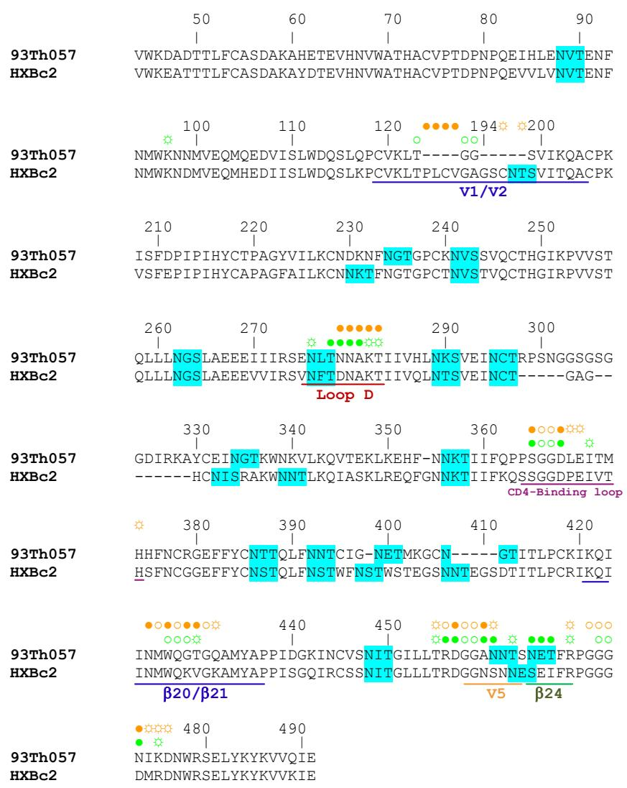  
Figure S1. gp120 sequence alignment and residue-by-residue contacts with CD4 and VRC01.

Both wild type clade B HXBc2 and clade A/E 93TH057 core gp120 sequences are displayed with HXBc2 numbering convention. The 93TH057 construct has shorter V1/V2 stem and has a new V3 stem as described in Material and Methods. gp120 contacts as defined with the program PISA (S20) for the CD4 and VRC01 complexes are indicated in orange and green, respectively, with open circles (○)denoting gp120 main-chain-only contacts, open circles with rays (♀)denoting gp120 side-chain-only contacts, and filled circles (●) denoting both main-chain and side-chain contacts. The major structure elements of gp120 that involved in ligand binding were underlined. Potential glycosylation sites on gp120 with signature sequence NXT/S are highlighted in cyan, however, not all sites are observed in the crystal structure. VRC01 has remarkably less interactions with the conformationally variable V1/V2 and β20/β21 regions and more interactions at the loop D and V5 areas.

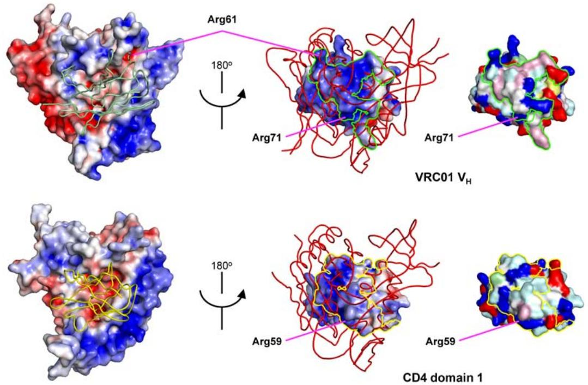  
Figure S2. Electrostatic surfaces and maps of residues types.

Electrostatic surfaces for the VRC01 and CD-bound gp120s are shown in the left panels with heavy chain variable domain ( $V_{H}$ ) of VRC01 (palegreen, upper row) and domain 1 (D1) of CD4 (yellow, lower row). Both of VRC01 and CD4 bind to overall negatively charged surfaces on gp120. The flip sides of the complexes showing the electrostatic surfaces of $V_{H}$ and D1 are presented in the middle panels with gp120 (red tubes) in the foreground. Molecular surfaces of $V_{H}$ and D1 colored by residue types were shown to the right. Green and yellow trace-lines define gp120 footprints on $V_{H}$ and CD4, respectively. The gp120 interfaces on $V_{H}$ of VRC01 and D1 of CD4 are mostly positively charged to complement the negatively charged gp120 surfaces. Certain residues, such as Arg71 in VRC01 and Arg59 in CD4, are conserved, the unique VRC01 Arg61 that penetrating the cavity formed by V5 and β24 is also shown. The electrostatic potential was calculated with APBS (S25) and visualized with Pymol (S26) using blue and red representing positive and negative charges, respectively. Color representation of residue types are white for hydrophobic, yellow for semi-polar, cyan for polar, blue for positive, red for negative and pink for aromatic.

gp120 in non-CD4-bound conformation

gp120 stabilized in CD4-bound conformation

b12

F105

17b

CD4

CD4-IgαTP

Figure S3. Binding of VRC01 to gp120 stabilized in CD4-bound and non-CD4-bound conformations.

Both gp120 in non-CD4-bound conformation (YU2 $\Delta\beta4$ ) and gp120 stabilized in CD4-bound conformation (HXBc2 core Ds12F123) were immobilized on a CM-5 chip. Fabs of CD4-binding site antibodies VRC01, b12 and F105 and CD4-induced antibody 17b, two-domain CD4 and CD4-Ig $\alpha$ TP at various concentrations were injected over the chip channels as described in Material and Methods. Sensorgrams are shown in black and the fitted curves in red.

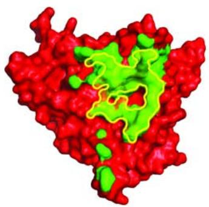  
A   
VRC01 coverage, 98%

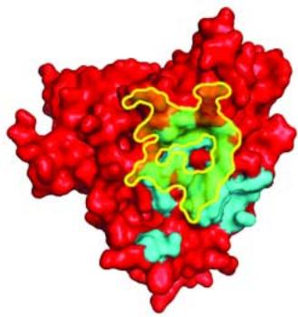  
b12 coverage, 83%

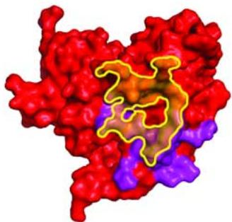  
b13 coverage, 51%

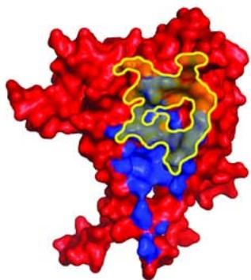  
F105 coverage, 79%   
B   
Figure S4. Comparison of coverage of the site of vulnerability by different CD4-binding site antibodies

The site of vulnerability is the contact site for receptor CD4 on the outer domain of gp120. CD4-binding-site-directed antibodies target this general area, however, most of them do not neutralize potently. Panel A: When the site of vulnerability (semi-transparent yellow with solid yellow borderline) is superimposed over the antibody epitopes on gp120 surfaces (red), the degrees of overlapping differ. VRC01(green) hits the “bull’s-eye” while b12 (cyan), b13 (purple) and F105 (blue) miss portions of the target with epitope straying away to other conformationally variable areas on gp120. Panel B: Coverage of the site of vulnerability by epitopes of CD4-binding-site-directed antibodies were compared, VRC01 achieves almost full coverage (98%) while others, such as b13, F105 and b12, manage to get 50% to 83% overlapping.

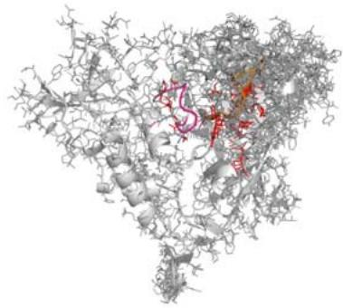  
A

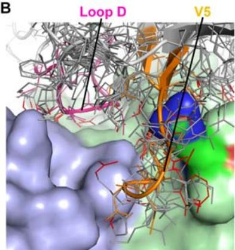  
B

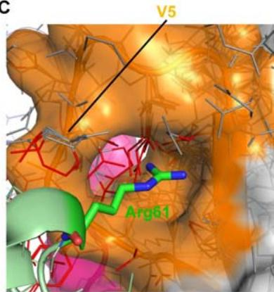  
C

D   
Figure S5. Mechanism of natural resistance to VRC01   
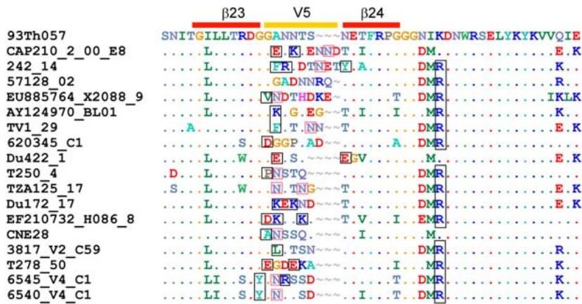  
(A) Sequence threading of the 17 HIV-1 isolates that resist neutralization by VRC01. Spots that are closer than 2.5 Å to VRC01 are colored red. These spots are clustered at the loop D and V5 region on HIV-1gp120. (B) Close-up of threaded, resistant isolates are shown along with the molecular surface of VRC01, colored light blue for the light chain and green for the heavy chain. Clashes predicted to interfere with VRC01-gp120 interactions are highlighted in red. (C) VRC01 heavy chain Arg61 penetrating the gp120 cavity formed by V5 and β24 (orange). Some resistant isolates have bulky residues pointing into the cavity which interfere with Arg61 $_{VRC01}$ without affecting CD4 binding. (D) Sequence alignment of VRC01-resistant isolates at the V5 region. a black boxes highlight bulky residues that may interfere with binding of VRC01 and are different from the 93TH057 sequence. Different N-linked glycosylation patterns are also marked with red boxes.

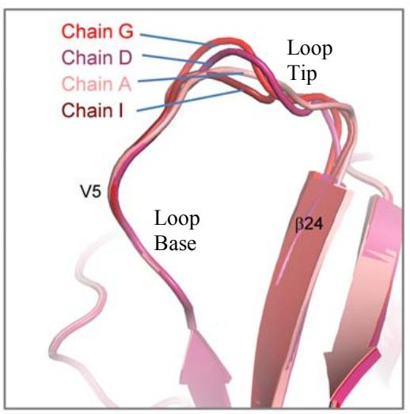

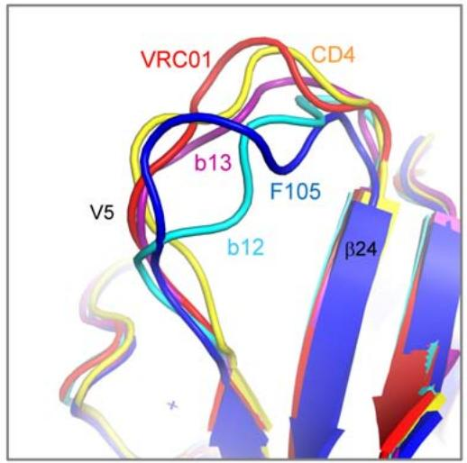  
Figure S6. Conformational variation of gp120 loopV5.

Side-by-side comparison of conformation variation at the HIV-1 gp120 variable loop 5 region indicates that the four gp120 components (left panel, chains G, A, D and I) of the VRC01:gp120 complexes in the crystallographic asymmetric unit vary only at the tip of V5 loop and conformation of the V5 base is less flexible due to increased contacts by VRC01. In contrast, variation of V5 conformations in other gp120 complexes (right panel) with CD4 and CD4-binding site antibodies, F105, b12 and b13, spans over the whole range of V5 loop.

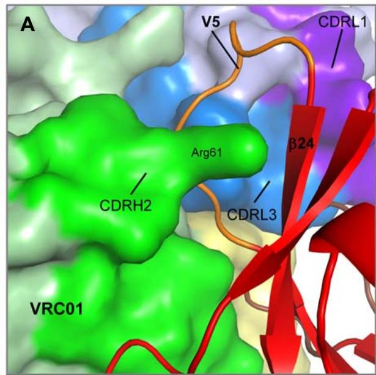

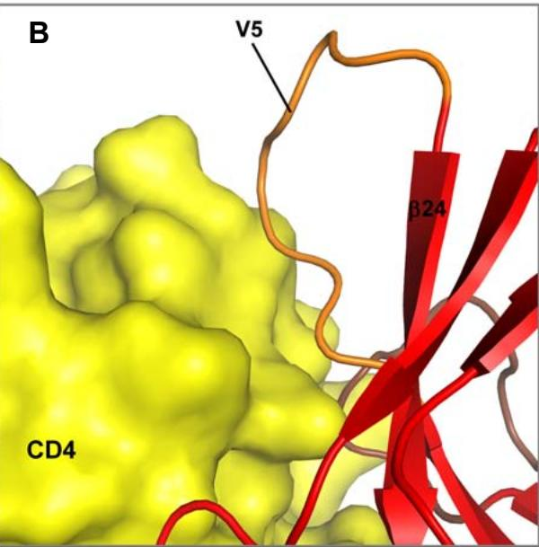

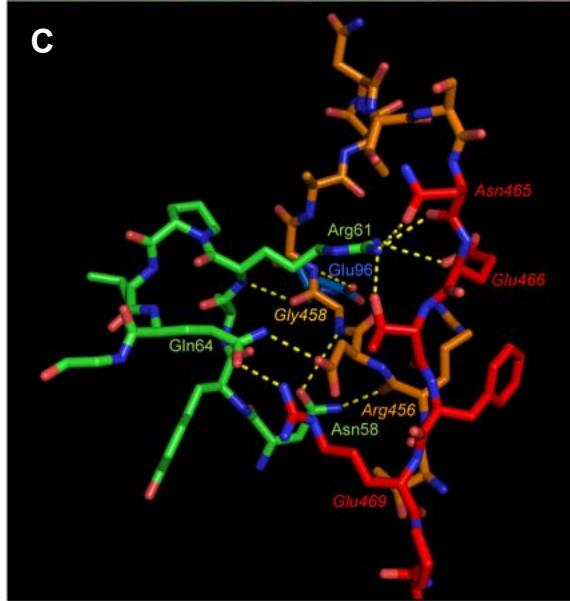

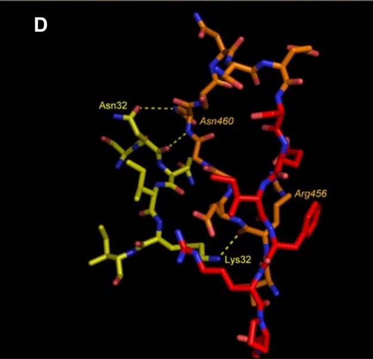  
Figure S7. VRC01 recognition of V5 and $\beta24$ of gp120 is different from that of CD4

A and B: V5 loop is wedged in the gap formed by the heavy and light chains of VRC01, meanwhile, Arg61 in the CDRH2 penetrates into the cavity formed by gp120 V5 and $\beta24$ , locking V5 into a less flexible conformation. In contrast, CD4 only interacts with the “front side” of V5. C and D: VRC01 engages extensive interactions with V5 and $\beta24$ with 10 hydrogen bonds and a salt bridge from both CDR H2 and CDR L3. While heavy chain Asn68, Gln64 and light chain Glu96 grab the front side of V5, heavy chain Arg61 goes behind the V5 and provides 4 hydrogen bonds to residues on $\beta24$ . CD4, however, only has 3 hydrogen bonds to 2 V5 residues. It is worth to note that VRC01 only interacts with residues at the base of V5 loop and avoids the loop tip which has higher degree of sequence variation. Carbon atoms of V5 loop and $\beta24$ are shown in orange and red. The VRC01 CDRs are shown in green (H2), paleyellow (H3), purpleblue (L1) and marine (L3). Hydrogen bonds are colored yellow. Selected gp120 residues are labeled in italic.

  
Figure S8. Key interface regions of the gp120:VRC01 complex.

gp120-interacting complementarity-determining regions (CDRs) of VRC01 are projected over the gp120 surface (left panel). Both heavy and light chains are involved in binding of gp120, mainly to the conformationally invariant outer domain (red with the CD4-binding loop, Loop D and V5 colored in magenta, brown and orange). The CDR H2 (green) spans over the CD4-binding loop and the V5/β24, with Arg61 penetrating the V5/β24 cavity (right panel). Arg71 in the framework 3 (palegreen) forms salt bridges with a conserved Asp368 in the CD4-binding loop of gp120. The light chain CDRL1 (purpleblue) and CDRL3 (marine) provide interactions to V5, loop D as well as the Loop D attached N-acetyl-glucosamine of a N-linked glycan.

  
Figure S9. VRC01 sequence, gp120 contacting-sites and extent of affinity maturation. The sequence of VRC01 is shown along with nearest $V_{H}$ - and $V_{K/\lambda}$ -genomic precursors for heavy and light chain, respectively. Affinity maturation changes are indicated in green, with residues involved in interaction with HIV-1 gp120 highlighted by “●”, if involved in both main- and side-chain interactions, by “○” if main chain-only, and by “☀” if side chain-only. “♣” marks a site of N-linked glycosylation, “▲” for Cysteine residues involved in a non-canonical disulfide, and “Δ” if the residue has been deleted during affinity maturation.

Figure S10. Contact, V-gene mutated, and mutated contact residues for the set of 26 antibodies and VRC01.

Any antibody residue in contact with the antigen in the complex is included towards the total number of contact residues (blue). The number of mutations from germline for the Vh and Vl/Vk, as well as the number of mutated contact residues are shown in red and green, respectively. The number of mutations excludes insertions and deletions. Germline alignment was performed using the amino acid sequences for the antibody heavy and light chains. For comparison, also shown is the number of mutated residues (total and only contact residues) when germline alignment is performed for the **VRC01 nucleotide sequence.

  
Figure S11. Contributions of VRC01 $V_{H}$ -D-J and $V_{K}$ -J fragments to the binding of HIV-1 gp120.

The variable domains of VRC01 are shown in cartoon diagram and the gp120 binding areas are masked with pink surface. The $V_{H}$ , $D_{H}$ and $J_{H}$ segments are colored in green, red and cyan. The light chain $V_{K}$ and $J_{K}$ segments are colored in blue and orange, respectively.

<table><tr><td>VRC01</td><td>QVQLVQSGGQMKKPGESMRISCRASGYEFIDCTLNWIRLAPGKRPEWMGWLKPRGGAVNY</td></tr><tr><td>IGHV1-2*02</td><td>......AEV....A.VKV..K....T.TGYYMH.V.Q...QGL....IN.NS.GT..</td></tr><tr><td>IGHV1-2*04</td><td>......AEV....A.VKV..K....T.TGYYMH.V.Q...QGL....IN.NS.GT..</td></tr><tr><td>IGHV1-2*03</td><td>......AEV..L.A.VKV..K....T.TGYYMH.VXQ...QGL....IN.NS.GT..</td></tr><tr><td>IGHV1-3*01</td><td>......AEV....A.VKV..K....T.TSYAMH.V.Q...Q.L....INAGN.NTK.</td></tr><tr><td>IGHV1-2*01</td><td>......AEV....A.VKV..K....T.TGYYMH.V.Q...QGL....RIN.NS.GT..</td></tr><tr><td>IGHV1-8*01</td><td>......AEV....A.VKV..K....T.TSYDI..V.Q.T.QGL....MN.NS.NTG.</td></tr><tr><td>IGHV1-3*02</td><td>......AEV....A.VKV..K....T.TSYAMH.V.Q...Q.L....SNAGN.NTK.</td></tr><tr><td>IGHV1-46*03</td><td>......AEV....A.VKV..K....T.TSYYMH.V.Q...QGL....IIN.S..STS.</td></tr><tr><td>IGHV1-46*02</td><td>......AEV....A.VKV..K....T.NSYYMH.V.Q...QGL....IIN.S..STS.</td></tr><tr><td>IGHV1-46*01</td><td>......AEV....A.VKV..K....T.TSYYMH.V.Q...QGL....IIN.S..STS.</td></tr><tr><td>VRC01</td><td>ARPLQGRVTMTRDVYSDTAFLELRSLTVDDTAVYFCTR</td></tr><tr><td>IGHV1-2*02</td><td>.QKF......TSIS..YM..SR.RS......Y.A. 200/293</td></tr><tr><td>IGHV1-2*04</td><td>.QKF..W......TSIS..YM..SR.RS......Y.A. 199/293</td></tr><tr><td>IGHV1-2*03</td><td>.QKF......TSIS..YM..SR.RS......Y.A. 198/293</td></tr><tr><td>IGHV1-3*01</td><td>SQKF......I...TSAS..YM..S..RSE......Y.A. 196/293</td></tr><tr><td>IGHV1-2*01</td><td>.QKF......S...TSIS..YM..SR.RS...V..Y.A. 196/293</td></tr><tr><td>IGHV1-8*01</td><td>.QKF......NTSIS..YM..S..RSE......Y.A. 197/296</td></tr><tr><td>IGHV1-3*02</td><td>SQEF......I...TSAS..YM..S..RSE.M...Y.A. 195/293</td></tr><tr><td>IGHV1-46*03</td><td>.QKF......TSTS.VYM..S..RSE......Y.A. 195/293</td></tr><tr><td>IGHV1-46*02</td><td>.QKF......TSTS.VYM..S..RSE......Y.A. 194/293</td></tr><tr><td>IGHV1-46*01</td><td>.QKF......TSTS.VYM..S..RSE......Y.A. 194/293</td></tr></table>

# Figure S12a. Alignment of VRC01 Vh to the ten closest germline genes.

Results were obtained from IgBLAST using the VRC01 Vh nucleotide sequence. Residue identities are shown as dots. VRC01 residues contacting gp120 are colored: residues conserved in all ten germline genes are shown in red; residues conserved in the top match (IGHV1-2*02) but mutated in at least one of the other germline genes are shown in green; residues mutated in IGHV1-2*02 are shown in blue. The nucleotide identity fraction for each of the ten germline genes, as reported by IgBLAST, is also shown.

<table><tr><td>VRC01</td><td colspan="2">EIVLTQSPGTLSLSPGETAIISCRTSQYG---SLAWYQQRPGQAPRLVIYSGSTRAAGIP</td></tr><tr><td>IGKV3-NL1*01</td><td colspan="2">......A......R.TL...A..SVSS-Y......K......L..GA....T...</td></tr><tr><td>IGKV3-11*01</td><td colspan="2">......A......R.TL...A..SVSS-Y......K......L..DA.N..T...</td></tr><tr><td>IGKV3-11*02</td><td colspan="2">......A......R.TL...A..SVSS-Y......K......L..DA.N..T...</td></tr><tr><td>IGKV3D-11*01</td><td colspan="2">......A......R.TL...A..GVSS-Y......K......L..DA.N..T...</td></tr><tr><td>IGKV3-20*01</td><td colspan="2">......R.TL...A..SVSSSY......K......L..GA.S..T...</td></tr><tr><td>IGKV3-NL2*01</td><td colspan="2">......A......R.TL...A..GVSS-Y......K......L..DA.S..T...</td></tr><tr><td>IGKV3-NL5*01</td><td colspan="2">......A......R.TL...A..SVSSSY......K......L..DA.S..T...</td></tr><tr><td>IGKV3D-20*01</td><td colspan="2">......A......R.TL..GA..SVSSSY......K..L....L..DA.S..T...</td></tr><tr><td>IGKV3-NL4*01</td><td colspan="2">......A......R.TL...A..GVSS-N......K......L..DA.N..T...</td></tr><tr><td>IGKV3D-15*01</td><td colspan="2">...M....A...V....R.TL...A..SVSS-N......K......L..GA....T...</td></tr><tr><td>VRC01</td><td colspan="2">DRFSGSRWGPDYNLTISNLESGDFGVYYCQQ</td></tr><tr><td>IGKV3-NL1*01</td><td>A.....GS.TEFT....S.Q.E..A....X</td><td>218/268</td></tr><tr><td>IGKV3-11*01</td><td>A.....GS.T.FT....S..PE..A....</td><td>219/270</td></tr><tr><td>IGKV3-11*02</td><td>A.....GS.R.FT....S..PE..A....</td><td>218/270</td></tr><tr><td>IGKV3D-11*01</td><td>A.....GP.T.FT....S..PE..A....</td><td>217/270</td></tr><tr><td>IGKV3-20*01</td><td>.....GS.T.FT....R..PE..A....</td><td>219/274</td></tr><tr><td>IGKV3-NL2*01</td><td>A.....GP.T.FT....S..PE..A....X</td><td>215/268</td></tr><tr><td>IGKV3-NL5*01</td><td>.....GS.T.FT....R..PE..A....</td><td>217/273</td></tr><tr><td>IGKV3D-20*01</td><td>.....GS.T.FT....R..PE..A....</td><td>217/274</td></tr><tr><td>IGKV3-NL4*01</td><td>A.....GP.T.FT....S..PE..A....</td><td>215/270</td></tr><tr><td>IGKV3D-15*01</td><td>A.....GS.TEFT....S.Q.E..A....</td><td>215/271</td></tr></table>

# Figure S12b. Alignment of VRC01 Vk to the ten closest germline genes.

Results were obtained from IgBLAST using the VRC01 Vk nucleotide sequence up to amino acid residue Q90; since IGKV3-NL1*01 is ‘not localized’, IGKV3-11*01 was selected as a top match for the Vk germline. When comparing to IGKV3-11*01 using nucleotide sequences, the two-residue deletion in VRC01 Vk aligns to two S residues and involves a neighboring S->Y mutation. Residue identities are shown as dots. VRC01 residues contacting gp120 are colored: residues conserved in all ten germline genes are shown in red; residues conserved in IGKV3-11*01 but mutated in at least one of the other germline genes are shown in green; residues mutated in IGKV3-11*01 are shown in blue. The nucleotide identity fraction for each of the ten germline genes, as reported by IgBLAST, is also shown.

  
a

  
b   
C

Figure S13. Sequence comparison of VRC01, VRC02 and VRC03 to a collection of gp140-binding antibodies.   
  
(a) $V_{H}$ and $V_{k}$ repertoire analysis for a collection of gp140-binding antibodies and VRC01, 02 and 03. The pie charts display the distribution of V gene usage among the collection of unique antibodies. VRC01, 02, 03 genes are indicated with red arrows. b) CDR amino acid length of the collection of antibodies compared to VRC01, 02 and 03 indicated with a red arrow. CDR3 lengths were determined according to NCBI IgBlast nomenclature with the CDR3 region starting after the CTR and CVR amino acids for VRC01, 02 and 03, respectively. c) Number of nucleotide mutations in the V genes of the antibody collection compared to VRC01, 02 and 03 (indicated with red circles).

  
A

  
B

  
C

  
D

  
E

  
F   
Figure S14. Correlations between the number of affinity matured residues in $V_{H}$ and $V_{k}$ and SPR determined dissociation constants, ELISA ( $EC_{50}$ ) binding, and neutralization ( $IC_{50}$ ) data for a set of VRC01 variants.

VRC01 variants were made to revert interface residues to their corresponding $V_{H}$ - and $V_{k}$ -germline-encoded residues in a series of single-, 4-, 7- or 12-residue mutations.

  
RMSD
Chain A-chain G=0.199
Chain D-chain G=0.187
Chain I-chain G=0.198   
RMSD
Chain B-chain H=0.681
Chain E-chain H=1.177
Chain J-chain H=0.973   
RMSD
Chain C-chain L=0.512
Chain F-chain L=1.166
Chain K-chain L=1.115   
gp120

  
VRC01   
Figure S15. Comparison of the four gp120:VRC01 complexes in the asymmetric unit. The four copies of VRC01-gp120 complex in the asymmetric unit closely resemble each other. The Cα-RMSDs for all gp120 components (colored in shades of red) are below 0.2 Å. Difference in loop D, variable loop 4, variable loop 5 and the outer domain exit-loop of gp120 are noticeable. Even though the overall Cα-RMSDs for antibody VRC01 (greens for heavy chains and blues for light chains) in the complexes are around 1 Å, those for the variable domains are below 0.2 Å, variation of elbow angles in different copies of antibody VRC01 cause the constant domains assume slightly different orientation. In one of the complexes, the constant domain of VRC01 (chains E and F) is not well defined due to poor electron map density, removing it from the refinement, however, caused the refinement statistics to go worse.

  
Figure S16. Comparison of the packing of heavy and light chains of VRC01 with other antibodies

Four CD4-binding site antibodies, b12, b13, F105 and VRC01 were superimposed with their heavy chain variable domains. No unusual orientations of their light chains were observed. The elbow angles, however, varies from 130 to 220 degrees due to crystal lattice packing. The superimposed heavy chains were colored palegreen and the light chains were colored green, cyan, blue and purple for VRC01, b12, F105 and b13, respectively. The CDR loops were labeled to orient the views.

Table S1. X-ray crystallographic data and refinement statistics for the antigen-binding fragment of VRC01 in complex with HIV-1 93TH057 gp120.   

<table><tr><td>Crystal</td><td>93TH057-VRC01</td></tr><tr><td colspan="2">Data collection</td></tr><tr><td>Space group</td><td>P21</td></tr><tr><td>Wavelength, Å</td><td>0.82656</td></tr><tr><td colspan="2">Unit cell dimensions</td></tr><tr><td>a (Å)</td><td>108.6</td></tr><tr><td>b (Å)</td><td>98.3</td></tr><tr><td>c (Å)</td><td>205.3</td></tr><tr><td>α, β, γ (°)</td><td>90.0, 99.7, 90.0</td></tr><tr><td>Complexes per ASU</td><td>4</td></tr><tr><td>Resolution, Å</td><td>2.9</td></tr><tr><td>Completeness, %*</td><td>94.8 (68.1)</td></tr><tr><td>Redundancy</td><td>3.4 (1.9)</td></tr><tr><td>No. of total reflections</td><td>307164</td></tr><tr><td>No. of unique reflections</td><td>90528</td></tr><tr><td>I/σ*</td><td>18.6 (1.2)</td></tr><tr><td>Rsym*,†</td><td>8.0 (61.2)</td></tr><tr><td colspan="2">Refinement statistics (|F|&gt;0 σ)</td></tr><tr><td>Resolution, Å</td><td>2.9</td></tr><tr><td>Rwork/Rfree, %‡,§</td><td>19.7/25.6</td></tr><tr><td>RMSD bond length, Å</td><td>0.002</td></tr><tr><td>RMSD bond angles, °</td><td>0.534</td></tr><tr><td>Average B-factor, Å2</td><td>57.3</td></tr><tr><td colspan="2">Ramachandran analysis</td></tr><tr><td>Favored, %</td><td>91.2</td></tr><tr><td>Allowed, %</td><td>99.1</td></tr><tr><td>PDB ID</td><td>3NGB</td></tr></table>

* Values in parentheses are for the highest resolution shell.   
$^{\dagger}$ $R_{sym}=\Sigma|I-<I>|\Sigma<I>$ , where I is the observed intensity, and <I> is the average intensity of multiple observations of symmetry related reflections.   
-‡ R=Σhkl||Fobs|-|Fcalc|/Σhkl|Fobs|  
§ $R_{free}$ calculated from 5% of the reflections excluded from refinement.

Table S2. Contact areas at the interface of gp120 and VRC01.   

<table><tr><td rowspan="2"></td><td colspan="7">Interface on VRC01 (\( \text{\AA}^{2} \))</td><td rowspan="2">Interface on gp120 (\( \text{\AA}^{2} \))</td></tr><tr><td>N-term</td><td>CDR1</td><td>FR2</td><td>CDR2</td><td>FR3</td><td>CDR3</td><td>Subtotal</td></tr><tr><td>Heavy chain</td><td>0</td><td>21</td><td>23</td><td>621</td><td>106</td><td>123</td><td>894</td><td>882</td></tr><tr><td>Kappa chain</td><td>38</td><td>123</td><td>0</td><td>0</td><td>0</td><td>190</td><td>351</td><td>367</td></tr><tr><td>Total</td><td></td><td></td><td></td><td></td><td></td><td></td><td>1245</td><td>1249</td></tr></table>

Table S3. gp120-contacting areas on heavy chains of CD4-binding site antibodies and CD4.   

<table><tr><td>Ligand</td><td>N-term (Å2)</td><td>CDR1 (Å2)</td><td>FR2 (Å2)</td><td>CDR2 (Å2)</td><td>FR3 (Å2)</td><td>CDR3 (Å2)</td><td>Total Area (Å2)</td></tr><tr><td>F105</td><td>19</td><td>186</td><td>0</td><td>92</td><td>52</td><td>500</td><td>850</td></tr><tr><td>b13</td><td>0</td><td>192</td><td>0</td><td>202</td><td>0</td><td>295</td><td>689</td></tr><tr><td>b12</td><td>0</td><td>269</td><td>0</td><td>314</td><td>23</td><td>348</td><td>954</td></tr><tr><td>CD4</td><td>0</td><td>82</td><td>221</td><td>528</td><td>240</td><td>11</td><td>1082</td></tr><tr><td>VRC01</td><td>0</td><td>21</td><td>23</td><td>621</td><td>106</td><td>123</td><td>894</td></tr></table>

Table S4. Hydrogen bonds and salts bridges between gp120 and VRC01.   

<table><tr><td colspan="4">Hydrogen bonds*</td></tr><tr><td colspan="2">VRC01 atom</td><td>Dist. [Å]</td><td>gp120 atom</td></tr><tr><td>H:TRP</td><td>50[ NE1]</td><td>2.93</td><td>G:ASN 280[ OD1]</td></tr><tr><td>H:LYS</td><td>52[ NZ ]</td><td>2.87</td><td>G:ALA 281[ O ]</td></tr><tr><td>H:ASN</td><td>58[ ND2]</td><td>2.77</td><td>G:ARG 456[ O ]</td></tr><tr><td>H:TYR</td><td>59[ OH ]</td><td>3.66</td><td>G:SER 365[ O ]</td></tr><tr><td>H:ARG</td><td>61[ N ]</td><td>3.18</td><td>G:GLY 458[ O ]</td></tr><tr><td>H:ARG</td><td>61[ NH1]</td><td>3.31</td><td>G:ASN 465[ OD1]</td></tr><tr><td>H:ARG</td><td>61[ NH1]</td><td>3.01</td><td>G:ASN 465[ O ]</td></tr><tr><td>H:ARG</td><td>61[ NH1]</td><td>2.86</td><td>G:THR 467[ OG1]</td></tr><tr><td>H:ARG</td><td>61[ NH2]</td><td>3.54</td><td>G:GLU 466[ OE2]</td></tr><tr><td>H:GLN</td><td>64[ NE2]</td><td>2.99</td><td>G:ASP 457[ OD1]</td></tr><tr><td>H:ARG</td><td>71[ NH1]</td><td>3.10</td><td>G:ASP 368[ OD2]</td></tr><tr><td>H:ARG</td><td>71[ NH2]</td><td>2.83</td><td>G:ASP 368[ OD1]</td></tr><tr><td colspan="2">H:TRP 100B[ NE1]</td><td>2.55</td><td>G:ASN 279[ OD1]</td></tr><tr><td>H:GLY</td><td>54[ O ]</td><td>2.72</td><td>G:ASP 368[ N ]</td></tr><tr><td>H:ASN</td><td>58[ OD1]</td><td>3.62</td><td>G:GLY 458[ N ]</td></tr><tr><td>H:GLN</td><td>64[ OE1]</td><td>2.74</td><td>G:ARG 469[ NH2]</td></tr><tr><td>H:ASP</td><td>99[ O ]</td><td>2.74</td><td>G:LYS 282[ NZ ]</td></tr><tr><td>L:SER</td><td>30[ OG ]</td><td>2.93</td><td>G:NAG 776[ O6 ]</td></tr><tr><td>L:SER</td><td>30[ N ]</td><td>3.36</td><td>G:NAG 776[ O6 ]</td></tr><tr><td>L:TYR</td><td>91[ OH ]</td><td>3.19</td><td>G:THR 278[ OG1]</td></tr><tr><td>L:GLU</td><td>96[ OE2]</td><td>3.44</td><td>G:GLY 459[ N ]</td></tr></table>

Salt Bridges*   

<table><tr><td colspan="2">VRC01 atom</td><td>Dist. [Å]</td><td colspan="2">gp120 atom</td></tr><tr><td>H:ARG</td><td>61[ NH2]</td><td>3.54</td><td>G:GLU</td><td>466[ OE2]</td></tr><tr><td>H:ARG</td><td>71[ NH1]</td><td>3.59</td><td>G:ASP</td><td>368[ OD1]</td></tr><tr><td>H:ARG</td><td>71[ NH1]</td><td>3.10</td><td>G:ASP</td><td>368[ OD2]</td></tr><tr><td>H:ARG</td><td>71[ NH2]</td><td>2.83</td><td>G:ASP</td><td>368[ OD1]</td></tr><tr><td>H:ARG</td><td>71[ NH2]</td><td>3.80</td><td>G:ASP</td><td>368[ OD2]</td></tr><tr><td>H:ASP</td><td>99[ OD1]</td><td>3.80</td><td>G:LYS</td><td>97[ NZ ]</td></tr></table>

* Detailed gp120:VRC01 interface data was calculated on the EBI PISA server (http://www.ebi.ac.uk/msd-srv/prot_int/cgi-bin/piserver) (S20)

Table S5. Structural comparison of VRC01-bound gp120 and gp120s in other crystalline lattices and bound by other ligands.   

<table><tr><td>Clade</td><td>Ligand(s)</td><td>PDB</td><td>Chain</td><td>\( RMSD_{Com} (Å)^a \)</td><td>\( RMSD_{ID} (Å) \)</td><td>\( RMSD_{OD} (Å) \)</td><td>\( RMSD_{BS} (Å) \)</td></tr><tr><td>B (HXBc2)</td><td>CD4, 48d</td><td>3JWO</td><td>A</td><td>1.035</td><td>0.497</td><td>1.046</td><td>1.183</td></tr><tr><td>B (HXBc2)</td><td>CD4, 48d</td><td>3JWD</td><td>A/B</td><td>1.039/1.033</td><td>0.494/0.572</td><td>1.068/1.089</td><td>1.191/1.287</td></tr><tr><td>B (HXBc2)</td><td>CD4, 17b</td><td>2NXY</td><td>A</td><td>1.071</td><td>0.986</td><td>1.693</td><td>1.535</td></tr><tr><td>B (HXBc2)</td><td>CD4, 17b</td><td>2NXZ</td><td>A</td><td>1.100</td><td>1.009</td><td>1.688</td><td>1.581</td></tr><tr><td>B (YU2)</td><td>CD4, 412d</td><td>2QAD</td><td>A/E</td><td>1.103/1.104</td><td>1.203/1.210</td><td>1.393/1.156</td><td>1.264/1.297</td></tr><tr><td>B (HXBc2)</td><td>CD4, 17b</td><td>1G9M</td><td>G</td><td>1.145</td><td>1.263</td><td>1.767</td><td>1.645</td></tr><tr><td>B (HXBc2)</td><td>CD4, 17b</td><td>1G9N</td><td>G</td><td>1.147</td><td>1.091</td><td>1.875</td><td>1.811</td></tr><tr><td>B (JR-FL)</td><td>CD4, X5</td><td>2B4C</td><td>G</td><td>1.153</td><td>1.051</td><td>2.178</td><td>1.434</td></tr><tr><td>B (YU2)</td><td>F23, 17b</td><td>1YYM</td><td>G/P</td><td>1.155/1.176</td><td>1.072/1.108</td><td>1.367/1.130</td><td>1.536/1.554</td></tr><tr><td>B (HXBc2)</td><td>CD4, 17b</td><td>1RZJ</td><td>G</td><td>1.160</td><td>1.254</td><td>1.799</td><td>1.620</td></tr><tr><td>B (YU2)</td><td>CD4, 17b</td><td>1RZK</td><td>G</td><td>1.160</td><td>1.105</td><td>1.893</td><td>1.793</td></tr><tr><td>B (YU2)</td><td>CD4M33, 17b</td><td>1YYL</td><td>G/P</td><td>1.179/1.199</td><td>1.145/1.133</td><td>1.378/1.406</td><td>1.577/1.643</td></tr><tr><td>B (YU2)</td><td>[Phe23]M47, 17b</td><td>2I60</td><td>G/P</td><td>1.180/1.244</td><td>1.108/1.181</td><td>1.409/1.205</td><td>1.605/1.732</td></tr><tr><td>B (YU2)</td><td>CD4M47, 17b</td><td>2I5Y</td><td>G/P</td><td>1.245/1.279</td><td>1.174/1.179</td><td>1.485/1.263</td><td>1.647/1.762</td></tr><tr><td>B (HXBc2)</td><td>CD4, 17b</td><td>1GC1</td><td>G</td><td>1.626</td><td>1.557</td><td>2.015</td><td>2.415</td></tr><tr><td>C (CAP210)</td><td>CD4, 21c</td><td>\( 3LQA^b \)</td><td>G</td><td>2.197</td><td>1.282</td><td>2.995</td><td>1.831</td></tr><tr><td>B (HXBc2)</td><td>b12</td><td>2NY7</td><td>G</td><td>4.113</td><td>4.667</td><td>3.617</td><td>9.877</td></tr><tr><td>B (YU2)</td><td>F105</td><td>3HI1</td><td>G/J</td><td>4.515/4.557</td><td>2.599/2.572</td><td>5.689/5.763</td><td>20.051/19.990</td></tr><tr><td>B (HXBc2)</td><td>b13</td><td>3IDX</td><td>G</td><td>6.524</td><td>6.239</td><td>5.004</td><td>33.779</td></tr><tr><td>SIV</td><td>—</td><td>\( 2BF1^b \)</td><td>A</td><td>8.583</td><td>10.202</td><td>7.899</td><td>18.535</td></tr></table>

$^{a}$ Cα-RMSDs of a set of common residues shared by all gp120s (RMSD $_{Com}$ ), of inner domain (RMSD $_{ID}$ ), of outer domain (RMSD $_{OD}$ ) and of bridging sheet (RMSD $_{BS}$ ) were calculated after each of the gp120 structures was superimposed with the VRC01-bound gp120 structure. The common set consists of 253 residues, including residues 90-120, 204-205, 215-298, 329-355, 357-392, 395, 413-469 and 473-489. The inner domain (ID) contains three segments, residues 90-118, 206-255 and 475-492. The outer domain (OD) contains three segments, residues 256-299, 330-394, 412-421 and 437-474. The bridging sheet contains two regions, residues 119-205 and 422-436.   
$^{b}$ For 3LQA, which has adopted a different residue numbering, and 2BF1, which is the gp120 from SIV, sequence alignment with 1G9M is used to derive the standard HXBc2 numbering.

Table S6. Recognition of HIV-1 gp120 by the CD4 receptor and CD4-binding-site reactive antibodies.   
6a. Envelope overlapping between VH domains of antibodies and CD4 domain 1   

<table><tr><td>Domain</td><td>Volume (\( \text{\AA}^{3} \))</td><td>Combined Volume of VH and D1 (\( \text{\AA}^{3} \))</td><td>Overlapping of CD4 domain 1</td></tr><tr><td>VRC01</td><td>15544.5</td><td>18958.07</td><td>73%</td></tr><tr><td>b12</td><td>16350.42</td><td>23490.12</td><td>43%</td></tr><tr><td>b13</td><td>16267.1</td><td>24879.65</td><td>31%</td></tr><tr><td>F105</td><td>15072.3</td><td>21700.42</td><td>47%</td></tr><tr><td>CD4 domain 1</td><td>12483.89</td><td>-</td><td>100%</td></tr></table>

6b. Rotation angles between VH domains of antibodies and CD4 domain 1   

<table><tr><td></td><td>VRC01</td><td>b12</td><td>b13</td><td>F105</td><td>CD4</td></tr><tr><td>VRC01</td><td></td><td>144.6</td><td>135.0</td><td>174.9</td><td>42.8</td></tr><tr><td>b12</td><td></td><td></td><td>16.7</td><td>53.4</td><td>110.0</td></tr><tr><td>b13</td><td></td><td></td><td></td><td>56.3</td><td>100.4</td></tr><tr><td>F105</td><td></td><td></td><td></td><td></td><td>139.7</td></tr><tr><td>CD4</td><td></td><td></td><td></td><td></td><td></td></tr></table>

The degree of envelope overlapping between two domains shows how much the two superimpose onto each other. To calculate the degree of envelope overlapping between CD4-binding site antibodies and CD4 as well as rotation angles between different gp120-bound ligands, gp120 complex structures were first aligned against gp120 outer domain in the gp120:VRC01 complex. The degree of envelope overlapping with CD4 was defined as $(\mathrm{Vol}_{\mathrm{VH}}+\mathrm{Vol}_{\mathrm{D1}}-\mathrm{Vol}_{\mathrm{combi}})/\mathrm{Vol}_{\mathrm{D1}}$ , where $Vol_{VH}$ is the volume under the molecular surface of heavy chain variable domain of antibody, $Vol_{D1}$ is the volume under the molecular surface of domain 1 of CD4, $Vol_{combi}$ is volume under the molecular surface of combined coordinates of antibody heavy chain variable domain and CD4 domain 1 after gp120 outer domain alignment. The pair wise rotation angles between different gp120-bound antibodies were calculated by superposing their framework regions of both heavy and light chain variable domains in the outer-domain-aligned complexes. For comparison with CD4, only variable domain of heavy chain was used and the alignment was carried out as previously described (S27). It is obvious that VRC01 and CD4 have similar orientation of approaching to gp120 and have greater degree of envelope overlapping. All superposition were performed with CCP4 package (S7) and the molecular volume data were calculated with GRASP (S24).

Table S7. Comparison of VRC01- and CD4-contacting areas on HIV-1 gp120.   

<table><tr><td>Ligand</td><td>Inner domain and Bridging sheet</td><td>LoopD+NAG</td><td>\( \beta \)-15/\( \alpha \)-3</td><td>V5</td><td>\( \beta \)-24</td><td>Outer domain exit-loop</td><td>Total</td></tr><tr><td>VRC01 (\( \AA^{2} \))</td><td>160</td><td>453</td><td>208</td><td>327</td><td>46</td><td>55</td><td>1249</td></tr><tr><td>CD4 (\( \AA^{2} \))</td><td>356</td><td>228</td><td>253</td><td>154</td><td>14</td><td>81</td><td>1086</td></tr></table>

Breakdown of VRC01 epitope and CD4-binding site on gp120 indicates that VRC01 has less contact at the conformationally variable inner domain and bridging sheet, while it's interactions at the Loop D, V5 and $\beta 24$ regions increase about 2-folds. This shift of binding pattern explains how VRC01 overcomes conformational masking to achieve broad and potent neutralization.

Table S8. List of pdbs corresponding to the 26 human antibody complexes used in the analysis of antibody affinity maturation.   

<table><tr><td>PDB ID</td><td>Description</td><td>Similar PDBs</td></tr><tr><td>1IQD</td><td>Human Factor VIII C2 Domain complexed to human monoclonal BO2C11 Fab (S28)</td><td></td></tr><tr><td>2DD8</td><td>SARS-CoV Spike Receptor-Binding Domain Complexed with Neutralizing Antibody m396 (S29)</td><td></td></tr><tr><td>2GHW</td><td>SARS spike protein receptor binding domain in complex with a neutralizing antibody 80R (S30)</td><td></td></tr><tr><td>2NXY</td><td>HIV-1 gp120 Envelope Glycoprotein(S334A) Complexed with CD4 and Antibody 17b (S2)</td><td>1G9M, 1G9N, 1GC1, 1RZJ, 1RZK, 2NXZ, 2NY0, 2NY1, 2NY2, 2NY3, 2NY4, 2NY5, 2NY6, 1YYL, 1YYM, 2I60</td></tr><tr><td>3G04</td><td>TSH receptor in complex with a thyroid-stimulating autoantibody M22 (S31)</td><td></td></tr><tr><td>3GBM</td><td>Fab CR6261\( ^{1} \) in Complex with a H5N1 influenza virus hemagglutinin (S32)</td><td>3GBN</td></tr><tr><td>3IDX</td><td>HIV-gp120 core in complex with CD4-binding site antibody b13 (S3)</td><td>3IDY</td></tr><tr><td>3JWD</td><td>HIV-1 gp120 in complex with CD4 and Fab 48d (S33)</td><td></td></tr><tr><td>3H3P</td><td>HIV epitope-scaffold 4E10 Fv complex (S34)</td><td>1TZG, 2FX7, 2FX8, 2FX9</td></tr><tr><td>3FKU</td><td>Influenza hemagglutinin (H5) in complex with a broadly neutralizing antibody F10 (S35)</td><td></td></tr><tr><td>3CSY</td><td>Trimeric prefusion Ebola virus glycoprotein in complex with neutralizing antibody KZ52 (S36)</td><td></td></tr><tr><td>1Q1J</td><td>Anti-HIV-1 Fab 447-52D in complex with V3 peptide (S37)</td><td>3GHB, 3C2A</td></tr><tr><td>1TJI</td><td>Broadly neutralizing anti-HIV-1 antibody 2F5 in complex with a gp41 17mer epitope (S38)</td><td>3D0L, 3D0V, 3DRQ, 3DRT, 1TJG, 1TJH, 1U8H, 1U8I, 1U8J, 1U8K, 1U8L, 1U8M, 1U8N, 1U8O, 1U8P, 1U8Q, 1U91, 1U92, 1U93, 1U95, 2F5B, 3IDG, 3IDI, 3IDJ, 3IDM, 3IDN, 2P8L, 2P8M, 2P8P, 2PW1, 2PW2</td></tr><tr><td>2B1H</td><td>Anti-HIV-1 V3 Fab 2219 in complex with UG29 peptide (S39)</td><td>2B1A, 2B0S</td></tr><tr><td>3GHE</td><td>Anti-HIV-1 Fab 537-10D in complex with V3 peptide (S40)</td><td></td></tr><tr><td>3EYF</td><td>Anti-human cytomegalovirus antibody 8f9 plus gB peptide (S41)</td><td></td></tr><tr><td>2CMR</td><td>HIV-1 neutralizing antibody D5 Fab bound to the gp41 inner-core mimetic 5-helix (S42)</td><td></td></tr><tr><td>2NY7</td><td>HIV-1 gp120 Envelope Glycoprotein Complexed with the Broadly Neutralizing CD4-Binding-Site Antibody b12 (S2)</td><td></td></tr><tr><td>2QAD</td><td>Tyrosine-sulfated 412d antibody complexed with HIV-1 YU2 gp120 and CD4 (S43)</td><td></td></tr><tr><td>2QSC</td><td>Anti-HIV-1 V3-Fab F425-B4e8 in complex with a V3-peptide (S44)</td><td></td></tr><tr><td>3B2U</td><td>Isolated domain III of the extracellular region of the epidermal growth factor receptor in complex with the Fab fragment of IMC-11F8 (S45)</td><td>3B2V</td></tr><tr><td>3H42</td><td>PCSK9 in complex with from LDLR competitive antibody Fab (S46)</td><td></td></tr><tr><td>2B4C</td><td>HIV-1 JR-FL gp120 core protein containing the third variable region (V3) complexed with CD4 and the X5 antibody (S47)</td><td></td></tr><tr><td>3HI1</td><td>HIV-1 gp120 (core with V3) in Complex with CD4-Binding-Site Antibody F105 (S3)</td><td></td></tr><tr><td>3LQA</td><td>Clade C gp120 in complex with sCD4 and 21c Fab (S48)</td><td></td></tr><tr><td>3LZF</td><td>Fab 2D1 in Complex with the 1918 Influenza Virus Hemagglutinin (S49)</td><td></td></tr></table>

From IgM $^{+}$ memory B cells

Table S9. List of discarded pdbs from initial IMGT/PDB results   

<table><tr><td>Reason for Discarding</td><td>PDB ID(s)</td></tr><tr><td>not an antibody-protein or antibody-peptide complex</td><td>1GPQ, 1GWD, 1H6M, 1H87, 1HC0, 1HNI, 1HNV, 1QE1, 1N8Y, 1S6P, 1S6Q, 1S9E, 1S9G, 1SUQ, 1SV5, 1UN3, 1UN4, 1UN5, 1UUZ, 1W0Y, 1W2K, 1W6Z, 1Y0L, 1Y18, 2B5J, 2BAN, 2BE2, 2BLX, 2BLY, 2BPU, 2C4F, 2C8O, 2C8P, 2CDE, 2CDF, 2CDG, 2CGI, 2I5Y, 2ITN, 2ITO, 2ITQ, 2ITT, 2ITU, 2ITV, 2ITW, 2ITY, 2ITZ, 2J5E, 2J5F, 2J6M, 2JB5, 2JB6, 2JIT, 2JIU, 2JIV, 2O5X, 2O5Y, 2O5Z, 2VB1, 2W1L, 2W1M, 2W1X, 2W1Y, 2WAR, 3BT0, 3BT1, 3CXF, 3D87, 3FO0, 3FO1, 3FO2, 1CLY, 1FOR, 1GGB, 1GGC, 1H3T, 1H3U, 1H3V, 1H3W, 1H3X, 1HCV, 1JPT, 1K6Q, 1OL0, 1RHH, 1S5I, 1UCB, 2A6J, 2FJF, 3C08, 3CFJ, 3CFK, 3EYV, 3G6A, 3INU, 8FAB, 2WAH, 1CK0, 1TFH, 1RZG</td></tr><tr><td>non-human antibody</td><td>2HFG, 2HH0, 2OSL, 3BKY, 3D85, 3IU3, 1C5B, 1C5C, 3HI6, 2H9G, 3EO1, 1BJ1, 1CZ8, 1S3K, 1S78, 2EH7, 2EH8, 3C09, 3EOA, 3IXT, 1YY9, 1TZH, 1TZI, 2QQN, 3GRW, 1A3R, 1AHW, 1E6J, 1E6O, 1F90, 1FE8, 1FPT, 1GGI, 1HYS, 2HMI, 1J5O, 1KB5, 1MHH, 1N5Y, 1N6Q, 1N8Z, 1OAK, 1ROA, 1SY6, 1T03, 1V7M, 1V7N, 1YJD, 1YNT, 2ADF, 2AEP, 2AEQ, 2BDN, 2CK0, 2FD6, 2HKF, 2I5J, 2V17, 2VWE, 2ZCH, 2ZCK, 2ZCL, 2ZPK, 3BT2, 3CK0, 3CXD, 3DSF, 3FFD, 3IFL, 3IFN, 3IFO, 3IFP, 3KJ6, 1FNS, 1H0D, 1JRH, 1ACY, 1FGN, 1NAK, 2OR9, 2VXT, 3BSZ, 3G6J, 1LK3, 2ARJ, 3K2U, 2R0L, 2WUB, 1JPS, 1UJ3, 1I9R, 3BDY, 3BE1, 2FEE, 3G6D, 2VXS, 2FED, 1ZA3, 2FJG, 2FJH, 2WUC, 2VYR, 3BN9, 3DVG, 3FN0, 3DVN, 2VDN, 1W72, 2VDP, 2VDQ</td></tr><tr><td>non-IgG antibody</td><td>2R56, 1ADQ, 2J6E, 2VXQ, 1DEE, 1HEZ</td></tr><tr><td>modified antigenic target</td><td>2OQJ, 1MCC, 1MCD, 1MCE, 1MCF, 1MCH, 1MCI, 1MCJ, 1MCK, 1MCL, 1MCN, 1MCQ, 1MCR, 1MCS, 1NOX, 1MCB</td></tr><tr><td>Fc fragment</td><td>1FC2, 1OQO, 1OQX, 2IWG, 1FCC, 1DN2</td></tr><tr><td>insufficient information</td><td>2QQK, 2QQL, 2JIX, 2ZNW, 1NL0, 2ZNX, 3H0T, 3GJF, 3GJG, 3HAE</td></tr></table>

The entire PDB was searched with the terms, "Human antibody complex", and results were combined with a search of the IMGT/3Dstructure-DB database. This resulted in a total of 332 pdb entries. These were manually examined for human IgG antibodies that had undergone natural affinity maturation and contained antibody-protein or antibody-peptide complexes. Antibody complexes that fit these criteria are listed in Table S8. Antibodies that did not fit these criteria are listed here, grouped into several categories. While some structures may have multiple reasons for discarding, a single reason is reported here. The 'Non-human antibody' category includes antibodies from other species, as well as humanized and chimeric antibodies, and antibodies subjected to artificial affinity maturation. The 'insufficient information' category includes structures for which sufficient evidence for inclusion in the analysis could not be identified. The 'modified antigenic target' category includes structures containing artificially-constructed or modified antigens for improved/altered binding to the antibody.

Table S10a. Characterization by surface-plasmon resonance and ELISA of the interaction between gp120 and variants of VRC01 IgG.   

<table><tr><td rowspan="2">Mutant Number</td><td rowspan="2">Mutant category</td><td colspan="3">SPR Kinetics for 93TH057 gp120</td><td colspan="4">EC50 (μg/ml)*</td><td rowspan="2">Mutations or treatment</td></tr><tr><td>ka (M/s)</td><td>kd (\( s^{-1} \))</td><td>KD (M)</td><td>93TH057</td><td>Stabilized \( HXBc2^a \)</td><td>\( HXBc2 \)</td><td>Du156.12</td></tr><tr><td>1</td><td></td><td>4.24E+04</td><td>2.81E-04</td><td>6.64E-09</td><td>0.0631</td><td>0.0461</td><td>0.028</td><td>0.048</td><td>Heavy chain: T33Y</td></tr><tr><td>2</td><td></td><td>1.79E+04</td><td>3.61E-04</td><td>2.02E-08</td><td>0.1501</td><td>0.0610</td><td>0.038</td><td>0.072</td><td>Heavy chain: G54S</td></tr><tr><td>3</td><td></td><td>6.62E+04</td><td>3.47E-04</td><td>5.24E-09</td><td>0.1287</td><td>0.0565</td><td>0.052</td><td>0.101</td><td>Heavy chain: A56G</td></tr><tr><td>4</td><td></td><td>2.70E+04</td><td>1.96E-04</td><td>7.27E-09</td><td>0.0515</td><td>0.0475</td><td>0.054</td><td>0.164</td><td>Heavy chain: V57T</td></tr><tr><td>5</td><td></td><td>5.21E+04</td><td>4.44E-04</td><td>8.53E-09</td><td>0.0372</td><td>0.0350</td><td>0.038</td><td>0.066</td><td>Heavy chain: P62K</td></tr><tr><td>6</td><td rowspan="2">Single interface revertant</td><td>4.98E+04</td><td>3.79E-04</td><td>7.61E-09</td><td>0.0604</td><td>0.0309</td><td>0.068</td><td>0.097</td><td>Heavy chain: V73T</td></tr><tr><td>7</td><td>3.40E+04</td><td>3.43E-04</td><td>1.01E-08</td><td>0.0419</td><td>0.0344</td><td>0.050</td><td>0.071</td><td>Heavy chain: Y74S</td></tr><tr><td>8</td><td></td><td>4.79E+04</td><td>3.12E-04</td><td>6.52E-09</td><td>0.1135</td><td>0.0669</td><td>0.041</td><td>0.063</td><td>Heavy chain: I30T</td></tr><tr><td>9</td><td></td><td>4.53E+04</td><td>3.50E-04</td><td>7.74E-09</td><td>0.0401</td><td>0.0480</td><td>0.038</td><td>0.056</td><td>Heavy chain: K52N</td></tr><tr><td>10</td><td></td><td>7.06E+04</td><td>4.40E-04</td><td>6.23E-09</td><td>0.0300</td><td>0.2135</td><td>0.062</td><td>0.063</td><td>Heavy chain: R53N</td></tr><tr><td>11</td><td></td><td>4.30E+04</td><td>2.92E-04</td><td>6.78E-09</td><td>0.0243</td><td>0.0674</td><td>0.037</td><td>0.086</td><td>Heavy chain: R61Q</td></tr><tr><td>12</td><td></td><td>4.73E+04</td><td>8.20E-04</td><td>1.73E-08</td><td>0.0420</td><td>0.0552</td><td>0.036</td><td>0.196</td><td>Light chain: Y30S</td></tr><tr><td>13</td><td>4-revertant</td><td>7225</td><td>7.02E-04</td><td>9.72E-08</td><td>0.2497</td><td>0.0665</td><td>0.114</td><td>1.80</td><td>Heavy chain: A56G ,V57T, P62K, V73T</td></tr><tr><td>14</td><td>7-revertant</td><td>3732</td><td>5.67E-04</td><td>1.52E-07</td><td>1.0780</td><td>0.0698</td><td>0.128</td><td>9.02</td><td>Heavy chain: T33Y, G55S, A56G, V57T, P62K, V73T, Y74S</td></tr><tr><td>15</td><td>12-revertant</td><td>6.32E+03</td><td>1.56E-04</td><td>2.47E-08</td><td>0.3760</td><td>0.2829</td><td>0.348</td><td>14.33</td><td>Heavy chain: I30T, K52N, R53N, G54S, A56G, V57T, R61Q, P62K, V73T, Y74S; Light chain: Y28S</td></tr><tr><td>16</td><td>C32AC98S</td><td>3.87E+04</td><td>3.45E-04</td><td>8.92E-09</td><td>0.0420</td><td>0.0586</td><td>0.047</td><td>0.048</td><td>Heavy chain: C32S,C98A</td></tr><tr><td>17</td><td>Insertion-AA</td><td>1.75E+04</td><td>5.81E-03</td><td>3.20E-07</td><td>1.2660</td><td>0.0420</td><td>0.230</td><td>2.02</td><td>Light chain insertion AlaAla after position 30</td></tr><tr><td>18</td><td>Insertion-SY</td><td>1.83E+04</td><td>5.01E-04</td><td>2.74E-08</td><td>0.0926</td><td>0.0658</td><td>\( ND^b \)</td><td>ND</td><td>Light chain insertion SerTyr after position 30</td></tr><tr><td>19</td><td>gHC+LC</td><td>ND</td><td>ND</td><td>ND</td><td>2.2860</td><td>1.2980</td><td>21.38</td><td>&gt;50</td><td>Germline VH and wild type Light chain</td></tr><tr><td>20</td><td>HC+gL</td><td>ND</td><td>ND</td><td>ND</td><td>\( NBD^c \)</td><td>0.1004</td><td>2.14</td><td>&gt;50</td><td>Germline VL and wild type heavy chain</td></tr><tr><td>21</td><td>gHC+gL</td><td></td><td>NBD</td><td></td><td>NBD</td><td></td><td>&gt;50</td><td>&gt;50</td><td rowspan="3">Both germline VH and VL gene Enzyme deglycosylation to remove glycans</td></tr><tr><td></td><td>Deglycosylated</td><td>5.49E+04</td><td>1.36E-04</td><td>2.48E-09</td><td>0.0480</td><td>0.0430</td><td>0.045</td><td>0.050</td></tr><tr><td>Wild Type</td><td>VRC01</td><td>3.83E+04</td><td>2.20E-04</td><td>5.76E-09</td><td>0.0355</td><td>0.0350</td><td>0.032</td><td>0.037</td></tr></table>

*: ELISA experiments for 93TH057 and stabilized HXBc2 core gp120 were performed in different format from that of HXBc2 and Du156.12. The former ones were carried out in triplicates and the latter ones were performed without duplication.   
$^{a}$ : HXBc2 core Ds12F123 with mutations to stabilize the gp120 in its CD4-bound conformation   
$^{b}$ : ND: constants not determined   
$^{c}$ . NBD: No binding detected

Table S10b. Neutralization IC50 values ( $\mu$ g/ml) of VRC01 variants against three HIV-1 primary isolates and the lab strain HXB2.   

<table><tr><td rowspan="2">Mutant Number</td><td rowspan="2">Mutant Category</td><td colspan="2">Q842.d12 (clade A)</td><td colspan="2">JRFL (clade B)</td><td colspan="2">Du156.12 (clade C)</td><td colspan="2">HXB2 (clade B)</td><td rowspan="2">Mutations or treatment</td></tr><tr><td>\( Mean^a \)</td><td>\( SEM^a \)</td><td>\( Mean^a \)</td><td>\( SEM^a \)</td><td>\( Mean^a \)</td><td>\( SEM^a \)</td><td>\( Mean^a \)</td><td>\( SEM^a \)</td></tr><tr><td>1</td><td></td><td>0.028</td><td>0.003</td><td>0.041</td><td>0.003</td><td>0.125</td><td>0.002</td><td>0.046</td><td>0.001</td><td>Heavy chain: T33Y</td></tr><tr><td>2</td><td></td><td>0.026</td><td>0.001</td><td>0.077</td><td>0.003</td><td>0.129</td><td>0.009</td><td>0.049</td><td>0.004</td><td>Heavy chain: G54S</td></tr><tr><td>3</td><td></td><td>0.028</td><td>0.002</td><td>0.064</td><td>0.003</td><td>0.169</td><td>0.024</td><td>0.045</td><td>0.003</td><td>Heavy chain: A56G</td></tr><tr><td>4</td><td></td><td>0.028</td><td>0.002</td><td>0.850</td><td>0.076</td><td>0.148</td><td>0.039</td><td>0.054</td><td>0.000</td><td>Heavy chain: V57T</td></tr><tr><td>5</td><td></td><td>0.022</td><td>0.001</td><td>0.033</td><td>0.002</td><td>0.072</td><td>0.003</td><td>0.029</td><td>0.003</td><td>Heavy chain: P62K</td></tr><tr><td>6</td><td rowspan="7">Single interface revertant</td><td>0.040</td><td>0.000</td><td>0.095</td><td>0.004</td><td>0.196</td><td>0.026</td><td>0.056</td><td>0.002</td><td>Heavy chain: V73T</td></tr><tr><td>7</td><td>0.045</td><td>0.003</td><td>0.119</td><td>0.006</td><td>0.261</td><td>0.046</td><td>0.047</td><td>0.004</td><td>Heavy chain: Y74S</td></tr><tr><td>8</td><td>0.030</td><td>0.001</td><td>0.059</td><td>0.006</td><td>0.153</td><td>0.049</td><td>0.027</td><td>0.005</td><td>Heavy chain: I30T</td></tr><tr><td>9</td><td>0.027</td><td>0.002</td><td>0.086</td><td>0.002</td><td>0.090</td><td>0.005</td><td>0.031</td><td>0.002</td><td>Heavy chain: K52N</td></tr><tr><td>10</td><td>0.040</td><td>0.003</td><td>0.659</td><td>0.037</td><td>0.132</td><td>0.016</td><td>0.063</td><td>0.007</td><td>Heavy chain: R53N</td></tr><tr><td>11</td><td>0.024</td><td>0.003</td><td>0.062</td><td>0.012</td><td>0.171</td><td>0.037</td><td>0.026</td><td>0.0003</td><td>Heavy chain: R61Q</td></tr><tr><td>12</td><td>0.034</td><td>0.001</td><td>1.36</td><td>0.184</td><td>0.135</td><td>0.019</td><td>0.043</td><td>0.003</td><td>Light chain: Y30S</td></tr><tr><td>13</td><td>4-revertant</td><td>0.080</td><td>0.002</td><td>5.62</td><td>0.579</td><td>0.504</td><td>0.035</td><td>0.142</td><td>0.008</td><td>Heavy chain: A56G ,V57T, P62K, V73T</td></tr><tr><td>14</td><td>7-revertant</td><td>0.263</td><td>0.011</td><td>26.5</td><td>2.959</td><td>7.63</td><td>1.344</td><td>0.244</td><td>0.009</td><td>Heavy chain: T33Y, G55S, A56G, V57T, P62K, V73T, Y74S</td></tr><tr><td>15</td><td>12-revertant</td><td>0.360</td><td>0.006</td><td>&gt;200</td><td>NA</td><td>67.7</td><td>3.655</td><td>0.850</td><td>0.122</td><td>Heavy chain: I30T, K52N, R53N, G54S, A56G, V57T, R61Q, P62K, V73T, Y74S; Light chain: Y28S</td></tr><tr><td>16</td><td>C32SC98A</td><td>0.027</td><td>0.003</td><td>0.057</td><td>0.002</td><td>0.123</td><td>0.043</td><td>0.033</td><td>0.004</td><td>Heavy chain: C32S,C98A</td></tr><tr><td>17</td><td>Insertion-AA</td><td>0.319</td><td>0.026</td><td>2.66</td><td>0.360</td><td>5.02</td><td>1.741</td><td>2.442</td><td>1.091</td><td>Light chain insertion AlaAla after position 30</td></tr><tr><td>18</td><td>Insertion-SY</td><td>0.023</td><td>0.001</td><td>0.721</td><td>0.135</td><td>0.102</td><td>0.007</td><td>0.064</td><td>0.002</td><td>Light chain insertion SerTyr after position 30</td></tr><tr><td>19</td><td>gHC+LC</td><td>&gt;500</td><td>NA</td><td>&gt;500</td><td>NA</td><td>&gt;500</td><td>NA</td><td>&gt;500</td><td>NA</td><td>Germline VH and wild type light chain</td></tr><tr><td>20</td><td>HC+gLc</td><td>&gt;500</td><td>NA</td><td>&gt;500</td><td>NA</td><td>&gt;500</td><td>NA</td><td>&gt;500</td><td>NA</td><td>Germline VL and wild type heavy chain</td></tr><tr><td>21</td><td>gHC+gLc</td><td>&gt;500</td><td>NA</td><td>&gt;500</td><td>NA</td><td>&gt;500</td><td>NA</td><td>&gt;500</td><td>NA</td><td>Both germline VH and VL gene</td></tr><tr><td>22</td><td>Deglycosylated</td><td>0.028</td><td>0.002</td><td>0.031</td><td>0.002</td><td>0.059</td><td>0.003</td><td>0.022</td><td>0.002</td><td>Enzyme deglycosylation to remove glycans</td></tr><tr><td>Wild Type</td><td>VRC01</td><td>0.026</td><td>0.002</td><td>0.034</td><td>0.004</td><td>0.096</td><td>0.013</td><td>0.019</td><td>0.003</td><td></td></tr></table>

$^{a}$ : Mean and SEM were calculated from three independent experiments; NA: not applicable

Table S11. Correlations between binding and neutralization data for VRC01 variants and panels of gp120 and HIV-1 isolates.   

<table><tr><td></td><td>Kd(93TH057)</td><td>\( EC_{50} \)(93TH057)</td><td>\( EC_{50} \)(Stabilized HXBc2)</td><td>\( EC_{50} \)(HXBc2)</td><td>\( EC_{50} \)(DU156.12)</td><td>\( IC_{50} \)(HXB2)</td><td>\( IC_{50} \)(Q842.d12)</td><td>\( IC_{50} \)(JRFL)</td><td>\( IC_{50} \)(Du156.12)</td></tr><tr><td>Kd(93TH057)</td><td></td><td>0.7178</td><td>0.01568</td><td>0.5093</td><td>0.6444</td><td>0.6738</td><td>0.5923</td><td>0.6675</td><td>0.4563</td></tr><tr><td>\( EC_{50} \)(93TH057)</td><td></td><td></td><td>0.04609</td><td>0.627</td><td>0.7025</td><td>0.7213</td><td>0.7192</td><td>0.4483</td><td>0.6354</td></tr><tr><td>\( EC_{50} \)(Stabilized HXBc2)</td><td></td><td></td><td></td><td>0.2432</td><td>0.2106</td><td>0.1394</td><td>0.1655</td><td>0.1198</td><td>0.26</td></tr><tr><td>\( EC_{50} \)(HXB2)</td><td></td><td></td><td></td><td></td><td>0.8162</td><td>0.8584</td><td>0.8888</td><td>0.5898</td><td>0.851</td></tr><tr><td>\( EC_{50} \)(DU156.12)</td><td></td><td></td><td></td><td></td><td></td><td>0.7347</td><td>0.8738</td><td>0.8348</td><td>0.8756</td></tr><tr><td>\( IC_{50} \)(HXB2)</td><td></td><td></td><td></td><td></td><td></td><td></td><td>0.8572</td><td>0.5223</td><td>0.7742</td></tr><tr><td>\( IC_{50} \)(Q842.d12)</td><td></td><td></td><td></td><td></td><td></td><td></td><td></td><td>0.588</td><td>0.9192</td></tr><tr><td>\( IC_{50} \)(JRFL)</td><td></td><td></td><td></td><td></td><td></td><td></td><td></td><td></td><td>0.5796</td></tr><tr><td>\( IC_{50} \)(Du156.12)</td><td></td><td></td><td></td><td></td><td></td><td></td><td></td><td></td><td></td></tr></table>

Correlations (from linear regression analysis) were obtained for all pairs of binding and neutralization data. $R^{2}$ values are shown colored by p-values: red for p > 0.05, yellow for 0.01 < p < 0.05, and white for p < 0.01. Germline variants were not included in the correlation analysis since precise data were not available for the majority of the experiments.

Table S12. Interactions between heavy chain of VRC01 and gp120.   

<table><tr><td></td><td colspan="2">Interface residue</td><td>Bond Type*</td><td>ASA*</td><td colspan="2">BSA*</td><td>\( \Delta^iG \)</td></tr><tr><td rowspan="24">Heavy Chain</td><td>H:ILE</td><td>30</td><td></td><td>65.14</td><td>17.92</td><td>|||</td><td>0.29</td></tr><tr><td>H:THR</td><td>33</td><td></td><td>27.12</td><td>2.62</td><td>|</td><td>0.03</td></tr><tr><td>H:TRP</td><td>47</td><td></td><td>67.02</td><td>23.16</td><td>||||</td><td>0.37</td></tr><tr><td>H:TRP</td><td>50</td><td>H</td><td>45.64</td><td>41.10</td><td>|||||||||</td><td>0.30</td></tr><tr><td>H:LYS</td><td>52</td><td>H</td><td>80.95</td><td>40.21</td><td>|||||</td><td>-1.16</td></tr><tr><td>H:ARG</td><td>53</td><td></td><td>151.61</td><td>62.69</td><td>|||||</td><td>0.02</td></tr><tr><td>H:GLY</td><td>54</td><td>H</td><td>69.07</td><td>53.07</td><td>|||||||||</td><td>0.07</td></tr><tr><td>H:GLY</td><td>55</td><td></td><td>20.23</td><td>17.16</td><td>|||||||||</td><td>-0.00</td></tr><tr><td>H:ALA</td><td>56</td><td></td><td>48.64</td><td>33.08</td><td>|||||</td><td>0.52</td></tr><tr><td>H:VAL</td><td>57</td><td></td><td>52.88</td><td>40.45</td><td>|||||||||</td><td>0.24</td></tr><tr><td>H:ASN</td><td>58</td><td>H</td><td>67.15</td><td>65.13</td><td>|||||||||</td><td>-0.53</td></tr><tr><td>H:TYR</td><td>59</td><td>H</td><td>51.57</td><td>36.62</td><td>|||||</td><td>0.19</td></tr><tr><td>H:ALA</td><td>60</td><td></td><td>12.55</td><td>10.71</td><td>|||||||||</td><td>0.17</td></tr><tr><td>H:ARG</td><td>61</td><td>HS</td><td>209.87</td><td>154.57</td><td>|||||</td><td>-0.77</td></tr><tr><td>H:PRO</td><td>62</td><td></td><td>106.31</td><td>18.74</td><td>|</td><td>0.30</td></tr><tr><td>H:GLN</td><td>64</td><td>H</td><td>104.46</td><td>47.50</td><td>|||||</td><td>-0.65</td></tr><tr><td>H:MET</td><td>69</td><td></td><td>6.86</td><td>0.98</td><td>|</td><td>-0.01</td></tr><tr><td>H:ARG</td><td>71</td><td>HS</td><td>71.23</td><td>25.47</td><td>|||||</td><td>-0.71</td></tr><tr><td>H:VAL</td><td>73</td><td></td><td>54.83</td><td>23.26</td><td>|||||</td><td>0.37</td></tr><tr><td>H:TYR</td><td>74</td><td></td><td>212.55</td><td>57.27</td><td>| |</td><td>0.64</td></tr><tr><td>H:ASP</td><td>99</td><td>HS</td><td>131.87</td><td>47.84</td><td>|||||</td><td>-0.13</td></tr><tr><td>H:TYR</td><td>100</td><td></td><td>116.82</td><td>19.39</td><td>| |</td><td>0.31</td></tr><tr><td>H:ASN</td><td>100A</td><td></td><td>22.19</td><td>13.02</td><td>|||||</td><td>0.14</td></tr><tr><td>H:TRP</td><td>100B</td><td>H</td><td>114.38</td><td>42.37</td><td>|||||</td><td>0.12</td></tr><tr><td rowspan="32">gp120</td><td>G:LYS</td><td>97</td><td>S</td><td>146.28</td><td>29.09</td><td>| |</td><td>-1.04</td></tr><tr><td>G:THR</td><td>123</td><td></td><td>47.04</td><td>0.16</td><td>|</td><td>0.00</td></tr><tr><td>G:GLY</td><td>124</td><td></td><td>76.25</td><td>39.85</td><td>|||||</td><td>0.54</td></tr><tr><td>G:GLY</td><td>198</td><td></td><td>90.93</td><td>12.42</td><td>| |</td><td>-0.11</td></tr><tr><td>G:ASN</td><td>279</td><td>H</td><td>63.04</td><td>39.40</td><td>|||||</td><td>-0.34</td></tr><tr><td>G:ASN</td><td>280</td><td>H</td><td>67.85</td><td>41.02</td><td>|||||</td><td>-0.46</td></tr><tr><td>G:ALA</td><td>281</td><td>H</td><td>85.48</td><td>74.66</td><td>|||||</td><td>0.73</td></tr><tr><td>G:LYS</td><td>282</td><td>H</td><td>68.01</td><td>30.24</td><td>|||||</td><td>-0.71</td></tr><tr><td>G:SER</td><td>365</td><td>H</td><td>98.84</td><td>64.53</td><td>|||||</td><td>0.31</td></tr><tr><td>G:GLY</td><td>366</td><td></td><td>43.38</td><td>23.29</td><td>|||||</td><td>0.15</td></tr><tr><td>G:GLY</td><td>367</td><td></td><td>58.12</td><td>21.26</td><td>| | |</td><td>0.27</td></tr><tr><td>G:ASP</td><td>368</td><td>HS</td><td>78.72</td><td>49.32</td><td>|||||</td><td>-0.46</td></tr><tr><td>G:ILE</td><td>371</td><td></td><td>56.48</td><td>49.29</td><td>|||||</td><td>0.79</td></tr><tr><td>G:TRP</td><td>427</td><td></td><td>56.37</td><td>10.66</td><td>| |</td><td>-0.12</td></tr><tr><td>G:GLN</td><td>428</td><td></td><td>38.47</td><td>0.37</td><td>|</td><td>-0.00</td></tr><tr><td>G:GLY</td><td>429</td><td></td><td>45.93</td><td>6.93</td><td>| |</td><td>0.11</td></tr><tr><td>G:THR</td><td>430</td><td></td><td>118.00</td><td>57.89</td><td>|||||</td><td>0.</td></tr><tr><td>G:THR</td><td>455</td><td></td><td>50.80</td><td>35.29</td><td>|||||</td><td>0.51</td></tr><tr><td>G:ARG</td><td>456</td><td>H</td><td>29.79</td><td>3.93</td><td>| |</td><td>-0.04</td></tr><tr><td>G:ASP</td><td>457</td><td>H</td><td>50.53</td><td>48.22</td><td>|||||</td><td>0.14</td></tr><tr><td>G:GLY</td><td>458</td><td>H</td><td>50.68</td><td>44.48</td><td>|||||</td><td>-0.22</td></tr><tr><td>G:GLY</td><td>459</td><td></td><td>87.35</td><td>37.81</td><td>|||||</td><td>0.40</td></tr><tr><td>G:ALA</td><td>460</td><td></td><td>75.49</td><td>28.45</td><td>| | |</td><td>0.22</td></tr><tr><td>G:THR</td><td>463</td><td></td><td>53.37</td><td>16.26</td><td>| | |</td><td>0.20</td></tr><tr><td>G:ASN</td><td>465</td><td>H</td><td>39.19</td><td>6.74</td><td>| |</td><td>-0.10</td></tr><tr><td>G:GLU</td><td>466</td><td>HS</td><td>21.07</td><td>6.58</td><td>| | |</td><td>-0.07</td></tr><tr><td>G:THR</td><td>467</td><td>H</td><td>24.23</td><td>11.16</td><td>|||||</td><td>-0.13</td></tr><tr><td>G:ARG</td><td>469</td><td>H</td><td>46.99</td><td>21.29</td><td>|||||</td><td>-0.53</td></tr><tr><td>G:GLY</td><td>472</td><td></td><td>16.47</td><td>7.83</td><td>|||||</td><td>-0.09</td></tr><tr><td>G:GLY</td><td>473</td><td></td><td>42.85</td><td>27.54</td><td>|||||</td><td>-0.06</td></tr><tr><td>G:ASP</td><td>474</td><td></td><td>66.09</td><td>19.18</td><td>| | |</td><td>-0.02</td></tr><tr><td>G:LYS</td><td>476</td><td></td><td>60.24</td><td>3.72</td><td>|</td><td>-0.03</td></tr></table>

* Bond type: H: Hydrogen, D Disulphide bond, S: Salt bridge C: Covalent link   
ASA Accessible Surface Area, Ų   
BSA Buried Surface Area, Ų   
$\Delta^{i}G$ Solvation energy effect, kcal/mol   
Buried area percentage, one bar per 10%   
Detailed gp120:VRC01 interface data was calculated on the EBI PISA server   
(http://www.ebi.ac.uk/msd-srv/prot_int/cgi-bin/piserver) (S20)

Table S13. Interactions between light chain of VRC01 and gp120.   

<table><tr><td></td><td colspan="2">Interface residue</td><td>Bond type*</td><td>ASA*</td><td colspan="2">BSA*</td><td>\( \Delta^{i}G \)</td></tr><tr><td rowspan="8">Light chain</td><td>L:VAL</td><td>3</td><td></td><td>117.89</td><td>37.56</td><td>||||</td><td>0.07</td></tr><tr><td>L:GLN</td><td>27</td><td></td><td>124.49</td><td>24.07</td><td>||</td><td>-0.15</td></tr><tr><td>L:TYR</td><td>28</td><td></td><td>186.13</td><td>77.44</td><td>||||</td><td>0.39</td></tr><tr><td>L:GLY</td><td>29</td><td></td><td>20.78</td><td>4.89</td><td>|||</td><td>0.08</td></tr><tr><td>L:SER</td><td>30</td><td>H</td><td>71.56</td><td>19.97</td><td>|||</td><td>-0.03</td></tr><tr><td>L:TYR</td><td>91</td><td>H</td><td>130.33</td><td>80.71</td><td>|||||||</td><td>0.60</td></tr><tr><td>L:GLU</td><td>96</td><td>H</td><td>126.90</td><td>58.83</td><td>|||||</td><td>-0.30</td></tr><tr><td>L:PHE</td><td>97</td><td></td><td>102.41</td><td>50.10</td><td>|||||</td><td>0.80</td></tr><tr><td rowspan="10">gp120</td><td>G:ASN</td><td>276</td><td></td><td>85.13</td><td>24.64</td><td>|||</td><td>-0.26</td></tr><tr><td>G:THR</td><td>278</td><td>H</td><td>121.24</td><td>83.13</td><td>|||||||</td><td>0.60</td></tr><tr><td>G:ASN</td><td>279</td><td></td><td>63.04</td><td>23.64</td><td>||||</td><td>0.17</td></tr><tr><td>G:ASN</td><td>280</td><td></td><td>67.85</td><td>26.83</td><td>||||</td><td>-0.31</td></tr><tr><td>G:ARG</td><td>456</td><td></td><td>29.79</td><td>1.91</td><td>|</td><td>-0.06</td></tr><tr><td>G:GLY</td><td>458</td><td></td><td>50.68</td><td>5.28</td><td>||</td><td>0.08</td></tr><tr><td>G:GLY</td><td>459</td><td>H</td><td>87.35</td><td>31.46</td><td>||||</td><td>-0.04</td></tr><tr><td>G:ALA</td><td>460</td><td></td><td>75.49</td><td>8.01</td><td>||</td><td>-0.03</td></tr><tr><td>G:ASN</td><td>461</td><td></td><td>152.02</td><td>65.92</td><td>|||||</td><td>0.06</td></tr><tr><td>G:NAG</td><td>776</td><td>H</td><td>349.97</td><td>96.51</td><td>|||</td><td>-1.92</td></tr></table>

* Bond type: H: Hydrogen, D Disulphide bond, S: Salt bridge C: Covalent link   
ASA Accessible Surface Area, Ų   
BSA Buried Surface Area, Ų   
$\Delta^{\mathrm{i}}\mathbf{G}$ Solvation energy effect, kcal/mol   
Buried area percentage, one bar per 10%

Detailed gp120:VRC01 interface data was calculated on the EBI PISA server (http://www.ebi.ac.uk/msd-srv/prot_int/cgi-bin/piserver) (S20)

Table S14. Neutralization by VRC01 and CD4-Ig against a panel of 190 Env pseudoviruses representing all major circulating clades of HIV-1.   

<table><tr><td rowspan="2">Virus clade</td><td rowspan="2">Number of viruses</td><td colspan="2">Measured by IC80&lt; 50 μg/ml</td><td colspan="2">Measured by IC80&lt; 1 μg/ml</td></tr><tr><td>VRC01</td><td>CD4-Ig</td><td>VRC01</td><td>CD4-Ig</td></tr><tr><td>A</td><td>22</td><td>95%</td><td>55%</td><td>77%</td><td>14%</td></tr><tr><td>B</td><td>49</td><td>94%</td><td>63%</td><td>39%</td><td>12%</td></tr><tr><td>C</td><td>38</td><td>82%</td><td>68%</td><td>37%</td><td>8%</td></tr><tr><td>D</td><td>8</td><td>75%</td><td>88%</td><td>25%</td><td>25%</td></tr><tr><td>CRF01_AE</td><td>18</td><td>83%</td><td>56%</td><td>17%</td><td>0%</td></tr><tr><td>CRF02_AG</td><td>16</td><td>75%</td><td>75%</td><td>38%</td><td>6%</td></tr><tr><td>G</td><td>10</td><td>90%</td><td>60%</td><td>50%</td><td>0%</td></tr><tr><td>CRF07_BC</td><td>11</td><td>91%</td><td>91%</td><td>18%</td><td>0%</td></tr><tr><td>Other</td><td>18</td><td>78%</td><td>61%</td><td>67%</td><td>0%</td></tr><tr><td>Total</td><td>190</td><td>86%</td><td>66%</td><td>42%</td><td>8%</td></tr></table>

* Data from Wu et al (S4)

# REFERENCES

S1. S. Rits-Volloch, G. Frey, S. C. Harrison, B. Chen, EMBO J 25, 5026 (Oct 18, 2006).   
S2. T. Zhou et al., Nature 445, 732 (Feb 15, 2007).   
S3. L. Chen et al., Science 326, 1123 (Nov 20, 2009).   
S4. X. Wu, Science In press, (2010).   
S5. Z. Otwinowski, W. Minor, Methods Enzymol 276, 307 (1997).   
S6. A. J. McCoy et al., Journal of Applied Crystallography 40, 658 (2007).   
S7. Collaborative Computational Project Number 4, Acta Crystallographica Section D 50, 760 (1994).   
S8. P. D. Adams et al., Acta Crystallographica Section D 58, 1948 (2002).   
S9. D. E. McRee, J Struct Biol 125, 156 (Apr-May, 1999).   
S10. P. Emsley, K. Cowtan, Acta Crystallographica Section D-Biological Crystallography 60, 2126 (2004).   
S11. I. W. Davis et al., Nucleic Acids Res 35, W375 (Jul, 2007).   
S12. T. Lutteke, C. W. von der Lieth, BMC Bioinformatics 5, 69 (Jun 4, 2004).   
S13. M. Li et al., J Virol 79, 10108 (Aug, 2005).   
S14. M. Li et al., J Virol 80, 11776 (Dec, 2006).   
S15. M. S. Seaman et al., J Virol 84, 1439 (Feb, 2010).   
S16. A. Kassa et al., J Virol 83, 8364 (Sep, 2009).   
S17. H. M. Rho, B. Poiesz, F. W. Ruscetti, R. C. Gallo, Virology 112, 355 (Jul 15, 1981).   
S18. Q. Kaas, M. Ruiz, M. P. Lefranc, Nucleic Acids Res 32, D208 (Jan 1, 2004).   
S19. H. M. Berman et al., Nucl. Acids Res. 28, 235 (January 1, 2000, 2000).   
S20. E. Krissinel, K. Henrick, Journal of Molecular Biology 372, 774 (2007).   
S21. J. F. Scheid et al., Nature 458, 636 (2009).   
S22. X. Brochet, M. P. Lefranc, V. Giudicelli, Nucleic Acids Res 36, W503 (Jul 1, 2008).   
S23. E. A. Kabat, T. T. Wu, H. M. Perry, K. S. Gottesman, C. Foeller, Sequences of Proteins of Immunological Interest. (U.S. Department of Health and Human Services, National Institutes of Health, Bethesda, MD, ed. 5, 1991).   
S24. A. Nicholls, K. A. Sharp, B. Honig, Proteins 11, 281 (1991).   
S25. N. A. Baker, D. Sept, S. Joseph, M. J. Holst, J. A. McCammon, Proc Natl Acad Sci USA 98, 10037 (Aug 28, 2001).   
S26. W. L. DeLano, The PyMOL Molecular Graphics System, DeLano Scientific, San Carlos, CA, USA. http://www.pymol.org, (2002).   
S27. S. E. Ryu, A. Truneh, R. W. Sweet, W. A. Hendrickson, Structure 2, 59 (Jan 15, 1994).   
S28. P. C. Spiegel, Jr., M. Jacquemin, J. M. Saint-Remy, B. L. Stoddard, K. P. Pratt, Blood 98, 13 (Jul 1, 2001).   
S29. P. Prabakaran et al., J Biol Chem 281, 15829 (Jun 9, 2006).   
S30. W. C. Hwang et al., J Biol Chem 281, 34610 (Nov 10, 2006).   
S31. J. Sanders et al., Thyroid 17, 395 (2007).   
S32. D. C. Ekiert et al., Science 324, 246 (Apr 10, 2009).   
S33. M. Pancera et al., Proc Natl Acad Sci U S A 107, 1166 (Jan 19, 2010).   
S34. Q. Xu, W. Wang, X. Cheng, J. Zengel, H. Jin, J Virol 84, 4936 (May, 2010).   
S35. J. Sui et al., Nat Struct Mol Biol 16, 265 (2009).   
S36. J. E. Lee et al., Nature 454, 177 (2008).

S37. R. L. Stanfield, M. K. Gorny, C. Williams, S. Zolla-Pazner, I. A. Wilson, Structure 12, 193 (2004).   
S38. G. Ofek et al., J Virol 78, 10724 (Oct, 2004).   
S39. R. L. Stanfield, M. K. Gorny, S. Zolla-Pazner, I. A. Wilson, J Virol 80, 6093 (Jun, 2006).   
S40. V. Burke et al., Structure 17, 1538 (2009).   
S41. C. A. Thomson et al., EMBO J 27, 2592 (2008).   
S42. M. A. Luftig et al., Nat Struct Mol Biol 13, 740 (2006).   
S43. C. C. Huang et al., Science 317, 1930 (Sep 28, 2007).   
S44. C. H. Bell et al., Journal of Molecular Biology 375, 969 (2008).   
S45. S. Li, P. Kussie, K. M. Ferguson, Structure 16, 216 (2008).   
S46. J. C. Chan et al., Proc Natl Acad Sci USA 106, 9820 (Jun 16, 2009).   
S47. C. C. Huang et al., Science 310, 1025 (Nov 11, 2005).   
S48. R. Diskin, P. M. Marcovecchio, P. J. Bjorkman, Nat Struct Mol Biol advance online publication, (2010).   
S49. R. Xu et al., Science 328, 357 (Apr 16, 2010).

# APPENDIX

# List of 147 Heavy Chain Sequences

>AD001-68 HC 990 E08

ANNNNNNNNNNNNNCTACACATACGATTAGGTGACACTATAGAATAACATCCACTTTG CCTTTCTCTCCACAGGTGTCCACTCCCAGGTCCAACTGCACCTCGGTTCTATCGATTGAA TTCCACCATGGGATGGTCATGTATCATCCTTTTTCTAGTAGCAACTGCAACCGGTGTACA TTCCCAGGTGCAGCTGGTGCAGTCTGGGGCAGAGGTGAAGGAGCCTGGGTCCTCGGTGAG GGTCTCCTGCAAGACATCTGGAGGCATCTTCAGGATGTATGCTTTCAGCTGGGTGCGACA GGCCCCTGGACAAGGCCTTGAGTGGATGGGAGGGATCATCCCCAGTTTTGATACAACAAA TTACGCACAGAAGTTCCAGGGCAGAGCCACGATAACCACGGGCCGAATCCACGAGCACAGTTTACATGGAACTGCGTAGCCTGAGATCGGAGGACACGGCCGTCTATTTCTGTGCGAGATC AGTGATCACCGATTTACACACATTCGGTGACTATGAAAGTGGGGATCCGAGCTACTACTA CATGGACGTCTGGGGCAAAGGGACCACGGTCACCGTCTCCTCAGCGTCGACCAAGGGCCC ATCGGTCTTCCCCCTGGCACCCTCCTCCAAGAGCACCTCTGGGGGCACAGCGGCCCTGGG CTGCCTGGTCAAGGACTACTTCCNCGAACCTGTGACGGTCTCGTGGAACTCAGGCGCCCT GACCAGCGGCGTGCACACCTTCTCCGGCTGTCCTACAGTCCTCAGGACTCTACTCNCTCA GCAGCGTGGTGACCGTGCCCTCCAGCAGCTTGGGGCACCCAGACCTACATCTGCAACGTG AATCACAAGCCCAGCAACACCAAGGTGGACAAGAGAGTTGAGCCCAAATCTTGTGACAAA ACTCACACATGCCCACCGTGCCCAGCACCTGAACTCCTGGGGGGACNGTCAGTCTTCCTC TTCCCCNCCAAAACCCNAAGGACACNCNCATGATCTCCCNGGANCNCCTGANTCANATGC GTTGGTGGTGGACGTGANNNNCNAAGANNNCTGANGTCAAGTTCAACTGGGNACGTNGGA ANGGNNNGGNAGGNNGCATNNANGNCCNANNAACNAANNNNNNNGGNNGGNANNNNNNN CAANNNGNNCNNNNNNNNNNNNNNNGNGNNNNNNNNNTNTNNNNNNNNNCNGNNNNTNNN NNNNNNNNNNNNN

>AD001-182 HC 1686 G08

ANNNNCNNNGNNNTACNCATACGATTTAGGTGACACTATAGAATAACATCCACTTTGCCT TTCTCTCCACAGGTGTCCACTCCCAGGTCCAACTGCACCTCGGTTCTATCGATTGAATTC CACCATGGGATGGTCATGTATCATCCTTTTTCTAGTAGCAACTGCAACCGGTGTACATTC CCAGGTGCAGCTGGTGCAGTCTGGGGCTGAGGTGAAGAAGCCTGGGTCCTCGGTGAAGGT CTCCTGCAAGGCTTCTGGAGGCATCTTCAAGATGTATGCTATCAGCTGGGTGCGACAGGC CCCTGGACAAGGGCTTGAGTGGATGGGAGGGATCATCCCTGCCTTTGATACAACAAATTA CGCTCAGCGCTTCCAAGGCAGAGTCACCATTACCGCGGACGAATCCACGGGCACTTCCTA CATGTACCTGAGCAGCCTGAGATCAGAGGACACGGCCGTCTATTACTGTGCGAGAGCAGT CATCACCGATTTACACACGTTCGGTGACTACGAACTTGAGGATCCGAGCTACTATTATAT GGACGTCTGGGGCGAAGGGACCACGGTCACNGTCTCNCTCAGCGTCGACCAAGGGCCCAT CGGTCTTCTCCNCTGGCACCCTCCTCCAAGAGCACCTCTGGGGGCACAGCGGCNCTGGGC TGCCTGGTNCAAGGACTACTTCCCCGAACCTGTGACGGTCTCGTGGAACTCNNCGNNCTG ACNAGCGGNGTGCACACCTTTCCCNGNTGTCCTACAGTCNCNNACTCTACTCCNTCAGCA NCGTGNNACGTGNNTCCAGCAGCTNGGCACCCNNACTACNTCTGCACGTGATCACAGNCN AGCANNCNNNGNCAAGANNNTNANNCNNATCTTNNNGANAAANNCNNNATNNNNNCNNNNN NNCCTNNNNNNCTGGGGNCNTNANNTNNNNNTNNNNNANNNNNNNNNNGNNNNNACCNN NTNNTNNNNNGNGNNTGNNNNNNNNNNNNANTNNTGNCNNNCNNNNNNNNNANNNNNNAANC NCGGNNNN

>AD001-193 HC 1622 A09

NNNNNNNNNNNNNATACACATACGATTTAGGTGACACTATAGAATAACATCCACTTTGCCTTTCTCTCCACAGGTGTCCACTCCCAGGTCCAACTGCACCTCGGTTCTATCGATTGAATTCCACCATGGGATGGTCATGTATCATCCTTTTTCTAGTAGCAACTGCAACCGGTGTACATTCTCAGGTGCAGCTGGTGGAGTCTGGGGGAGGCTTGGTCAAGCCTGGAGGGTCCCTGAGACTCTCCTGTGCCGCCTCTGGATTCGATTTCGGGGACTACGCCATGACTTGGATCCGTCAGCGTCCCGGGAAGGGGCTGGAATTTGTTGCATTTGTTGTCCGCAGTGGTGGATCTATAGAA GGAGACTCTGTGAGGGGCCGCTTCACCGTCTCCAGGGACAACGGCAGGAACCTTCTTTTTCTGCAAATGAATAATGTCTCACCCGACGACACGGCCGTCTACTACTGTGCGAGAGATACA ACAACTTTTAGTTCTTTTGGAAGTCCTCCCCATATGGGGGGACTCGACCCCTGGGGCCAG GGAAC TCTGGTCACCGTCTCCTCAGCGTCGACCAAGGGCCCATCGGTCTTCCCCCTGGCA CCCTCCTCCAAGAGCAC TCTGGGGGCACAGCGGCCCTGGGCTGCCTGGTCAAGGACTAC TTCCCCGAACCTGTGACGGTCTCGTGGA ACTCAGGCGCCCTGACCAGCGGCGTGCACACC TTCCCGGCTGTCCTACAGTCCTCAGGACTCTACTCTCTCAGCAGCGTGGTGACCGTGCCC TCCAGCAGCTTGGGCACCCAGACCTACATCTGCAACGTGAATCACAAGCCCAGCAACACC NAAGGTGGACAAGAGAGTTGAGCCCAAATCTTGTGACAAAACTCACACATGCCCACCGTG CCCAGCACCTGAACTNCTGGGGGGACCGTCAGTCTTCCTCTTNNCCNCNAAACNNNANGA CANCCTCATGATCTCCNNNACNNNTGANTCACNTGNGTNNTGGGTGGACGTGANNNNCNA NACNTGNNGNTNAAGTTTCAANCTNGNNACNTGNANGGNNNGGNANNNNGCATNNNTTG NNNANGGANNAANNNNNNNNGGGNGGNANNNNNNNNNNNNNNNNNNNNNNNNNNNNNNNNNNNNNNNNNNNNNNNNNNNNNNNNNNNNNNNNNNNNNNNNNNNNNNNNNNNNNNNNNNNNNNNNNNNNNNNNNNNNNNNNNNNNNNNNNNNNNNNNNNNNNNNN

>AD001-479 HC 2251 D09

ANNNNNNNNTNNGNTCATACACATACGATTTAGGTGACACTATAGAATAACATCCACTT TGCCTTTCTCTCCACAGGTGTCCACTCCCAGGTCCAACTGCACCTCGGTTCTATCGATTG AATTCCACCATGGGATGGTCATGTATCATCCTTTTTCTAGTAGCAACTGCAACCGGTGTA CATTCCCAGGTGCAGCTGGTGCAGTCTGGGGCTGAGGTGAAGAAGCCTGGGTCCTCGGTG AGGGTCTCCTGCAAGGCCTCTGGAGGGACCTTCAGCAGTTTCGCTATCAACTGGGTGCGA CTGGCCCCTGGACAAGGGCCGGAGTGGATGGGAATGATCATCCCTGCCTCTGGTGCACCA AGTTATGCACCGAAATTCCAGGGCAGAGTCTCCCTTTCCGCGGACGTGTCTACGACAACA GCCTACATGGACCTGAGCAGCCTGAGATCTGACGACACGGCCATTTATTTCTGTACGAGA GGTTTCAGAGGCAGTCCGTTCAGTAGTGGGTCCTTGTACTTTGACTCCTGGGGCCAGGGA ACCCTGGTCACCGTCTCCTCAGCGTCGACCAAGGGCCCATCGGTCTTCCCCCTGGCACCC

TCCTCCAAGAGCACCTCTGGGGGCACAGCGGCCCTGGGCTGCCTGGTCAAGGACTACTTCCCGAACCTGTGACGGTCTCGTGGAACTCAGGCGCCCTGACCAGCGGCGTGCACACCTTC CCGGCTGTCCTACAGTCCTCNGACTCTACTCCCTCAGCAGCGTGGTGACCGTGCCCTCCA GCAGCTTGGGCACCCAGACCTACNTCTGCAACGTGAATCACAAGCCCAGCACACCNNTG NNAAGAGAGTTGAGCCCAAATCTNNGANAAANTCACACNTGNCNNCCGTGCCCAGCACTG ANNNTGGGGGNNGTCAGTCTNNNNNCCNNNAANNNNNNNCCCTCATGATCTCCNACCCTG AGNNNNNNTGNNNGGNGGGTGGNNNNNNNNCNNAAANCCTGNNGNNANNTNNNNTNNNAC GNNNNNGNNNNNNNNNNNGGCCNNNNNNNNNNNGNNNANNCNNNCNNNGNNNNNNNNNNCNN TTNNNNAANNNN

>AD001-491 HC 2839 F09.seq

AANNNNNNNNNTATNNNCATACACATACGATTTAGGTGACACTATAGAATAACATCCACT TTGCCTTTCTCTCCACAGGTGTCCACTCCCAGGTCCAACTGCACCTCGGTTCTATCGATT GAATTCCACCATGGGATGGTCATGTATCATCCTTTTTCTAGTAGCAACTGCAACCGGTGT ACATTCCCAGGTGCAGCTGGTGCAGTCTGGGCCTGAGGTGCGGAAGCCTGGGACTTCAGT GAAGGTCTCCTGCAAGGCCTCTGGATTCCCCTTTACCAGCTCTGCTATCCTGTGGGTGCG ACAGGCTCGTGGACAACGCCTTGAGTCGATAGGATGGATCGTCGTTGGCAGTGGTAATGC AAAGTATACACAGAGGTTTCAGGAAAGAGTCACCATTACCAGGGACATGTCCACAAACAC AGCCTACATGGAGTTGAGCAGCCTGAGATCCGACGACACGGGCGTGTATTTCTGTGCGCG ACGTGGCCACAGCTTTACGTCCCCATTTGACTCCTGGGGCCAGGGGACCCTGGTCACCGT CTCCTCAGCGTCGACCAAGGGCCCATCGGTCTTCCCCCTGGCACCCTCCTCCAAGAGCAC CTCTGGGGGCACAGCGGCCCTGGGCTGCCTGGTCAAGGACTACTTCCCCGAACCTGTGAC GGTCTCGTGGAACTCNNCGCCCTGACCAGCGGCGTGCACACCTTCCCGGCTGTCCTACAG TCCTCAGACTCTACTCCCTCAGCAGCGTGGNGACCGTGCCTCCAGCAGCTGNCACCCAGA CTACATCTGCAACGTGAATCACAAGCCCAGCANACCANNGANANNNNNTNAGCCCAAAT CTNNGANAAANTCANNNNTGCCNNNCGTGCCAGNNCTGANNCTGGGGNCGTCAGTCTTCN NNTNCCNCNNNNNNNNCNTNNTGATNTNCNACCCTGAGTCATGNNGNGNGANGNNNNNAA ANNNNGAGNCAGNNCACTGNACNGNNGGNGNGNANGGNTNNNGCANNNNNNNNGNNNNNA NNNNNNNNNNCGTACNNNGNNNNNNNNCNNNNTCTNNCCNAANTNNNNN >AD001-495 HC 2872 H09

ANNNNCNNNGNTCTACNCATACGATTTAGGTGACACTATAGAATAACATCCACTTTGCCT TTCTCTCCACAGGTGTCCACTCCCAGGTCCAACTGCACCTCGGTTCTATCGATTGAATTC CACCATGGGATGGTCATGTATCATCCTTTTCTAGTAGCAACTGCAACCGGTGTACATTC CCAGGTGCAGCTGCAGGAGTCGGGCCCAAGGACTGGTGAGGCCTTCGGAGACCCTGTCCCT CATGTGCAGTGTCTCTGGAGGCTCCCTCAGTGGAAACTCCTGGATCTGGATCCGGCAGTC CCCAGAGAAGGGACTGGAGTGGATTGCGTGTGTCTCTGACAGTGGGAGCACCACCTACAA CCCCTCCCTCAAGAGTCGAGTCAGCATATCTGTAGACACGTCCAAGAACCAGTTCTCCCT GAGGCTGGACTCTGTGACCGCTGCGGACACGGCCACATATTTCTGTGCGAGAGTAATTAG TGGGCGTATTACCATTTTTTACTACAACTACATCGACGTCTGGGGCAAAGGGACCACGGT CACCGTCTCCTCAGCGTCGACCAAGGGCCCATCGGTCTTCCCCCTGGCACCNCTCCTCCA AGAGCACCTCTGGGGGCACAGCGGCNCTGGGCTGCCTGGTCAAGGACTACTTNCNCCGAA NCTGTGACGGTCTCNNNGAACTCNNCGCCCTGACNGCGGCGTGNACNCTTCCNNNTGTCT ACAGTCNTCAGGANTNNTACTTCCNTCAGCAGCNTGNGACNNTNNNTCCANCAGNTNNNN CCCNNANCNTANNTNNTGNCNGTGATCNNNNNNNNNNNNNNNCAGNNNNNANNNNANAN NTNANNNNNNTNNNNNAAANNNNANCATNNNNNNNNNNCNNACTGANNTTGGGGGGANGCN NNNTNTCNNTTNCCCNNNANNNNNNANNNNNANTTNNNNNCNNNNNNTNGNGGNNNNNNTG NNNNNACNNNNNNNNNNNNNN

>AD001-509 HC 2057 B10

ANNNNNNNNTNNNNNNNTACACATACGATTTAGGTGACACTATAGAATAACATCCACTTTGCCTTTCTCTCCACAGGTGTCCACTCCCAGGTCCAACTGCACCTCGGTTCTATCGATTGAATTCCACCATGGGATGGTCATGTATCATCCTTTTTCTAGTAGCAACTGCAACCGGTGTACATTCCGAGGTGCAGCTGGTGCAGTCTGGTCCAGAGGTGAAAAAGCCCGGGGAGTCTCTGAAATCTCCTGTAAGGGTTCTGGAGACAGTTTTAGCAATTACTGGATCGCCTGGGTGCGCCAGATGCCCGGTAAAGGCCTGGAGTGGATGGGAATCATCTTTCCTGATGACTCTGAAACTACATACAGTCCGTCCTTCCAAGGCCAGGTCACCATTTCAGCCGACAAGTCCATCAGTACCGCCTACTTGCAGTGGAGCGGGTTGAAGGCCTCGGACACCGCCATCTATTACTGCGCGCGGT CGTATTACGATTTTCAGACTGACTCCGGCAATGATGCTTTTGATGTTTGGGGCCCAGGGACAATGGTCACCGTCTCTTCAGCGTCGACCAAGGGCCCATCGGTCTTCCCCCTGGCACCCCTCCTCCAAGAGCACCTCTGGGGGCACAGCGGCCCTGGGCTGCCTGGTCAAGGACTACTTCC CCGAACCTGTGACGGTCTCGTGGAAC TCAGGCGCCCTGACCAGCGGCGTGCACACCTTCC CGGCTGTCCTACAGTCCTCAGGACTCTACTCCCTCAGCAGCGTGGTGACCGTGCCCTCCA GCAGCTTGGGCACCCAGACCTACATCTGCAACGTGAATCACAAGCCCAGCAACACCAAGGTGGACAAGAGAGTTGAGCCCAAATCTTGTGACAAAACTCACACATGCCCACCGTGCCCAGCACCTGAACTCCTGGGGGGACCGTCAGTCTTCCTCTNCCCCCCAAAACC NNGGACACC CATGATCTCCCN GACCCCTGANN CACATGCGTGGNGGTNGACGTGANNNACNANACCCT GANGNNAGTTCANCTGGNTACNTGGNNNNNNGGNANNNNGCNTNATT GNCNAANAAANAA NCNCNNNGNAGGGAGNCANGNACANNNNNNNCGGTNNNCNNNGTGNNNNNNNNNNNTN NNNNNNNNTNNNNNNAANNNNGNNNNNANNNNGNNNAGNNNNNNNNNNNNNNNNN >AD001-542 HC 1718 E10

ANNNNNNNTNNNNNTACACATACGATTTAGGTGACACTATAGAATAACATCCACTTTGCC TTTCTCTCCACAGGTGTCCACTCCCAGGTCCAACTGCACCTCGGTTCTATCGATTGAATT CCACCATGGGATGGTCATGTATCATCCTTTTTCTAGTAGCAACTGCAACCGGTGTACATT CCGAGGTGCAGCTGGTGCAGTCTGGTCCAGAGGTGAAAAAGCCCGGGGAGTCTCTGAAAA TCTCCTGTAAGGGTTCTGGAGACAGTTTTACCAGTTATTGGATCGCCTGGGTGCGCCAGA TGCCCGGGAAAGGCCTGGAGTGGATGGGAATGATCTATCCTGATGATTCTGAAACCACAT ACAGTCCGTCGTTCCAAGGCCAGGTCACCATCTCAGCCGACAAGTCCATTAGCACCGCCT ACTTG CAGTGGAGCAGCCTGAAGGCCTCGGACACCGCCATATATTACTGTGCGAGATCGT ATTACGATTTTCGGAGTGATTCCGGGAATGATGCTTTTGATATCTGGGGCCCAGGGACAA TGGTCACCGTCTCTTCAGCGTCGACCAAGGGCCCATCGGTCTTCCCCCTGGCACCCTCCT CCAAGAGCACCTCTGGGGGCACAGCGGCCCTGGGCTGCCTGGTCAAGGACTACTTCCCCG AACCTGTGACGGTCTCGTGAACTCAGGCGCCCTGACCAGCGGCGTGCACACCTTCCCGG CTGTCCTACAGTCCTCAGGACTCTACTCNCTCAGCAGCGTGGTGACNCGTGC NCTCCAGC

AGCTTGGGCACCCAGACCTACNTCTGCAACGTGAATCACAAGCNNAGCACACCNNNNTGG
ANNNAGAGTTGAGCCNNAATCTNGNGACNAAACTCACACNTNNNNNNCGTGCNCAGCACC
TGANNNTGGGGGGNNNTCAGTCTTCNNTNNNNNNNNNNNNNNNNNNNCCNTCATGATNTNNC
GACCCTGAGTNNNNTGCNNGNNGGNGGACNNNANNNCNANANCCTGNNGNCAANTNNNNT
GNACTGNNNNNNNNNNNNNTANATGNNNNANNAANNNNNNNNNNNNNNNNNNNNCCCT
GNNNGGNNNNNNNNNNNNNNNNNNNNNNNNNNGANNNN

>AD001-577 HC 2157 G10

ANNNNNNNTNNGNTNNTACACATACGATTTAGGTGACACTATAGAATAACATCCACTTTG CCTTTCTCTCCACAGGTGTCCACTCCCAGGTCCAACTGCACCTCGGTTCTATCGATTGAA TTCCACCATGGGATGGTCATGTATCATCCTTTTCTAGTAGCAACTGCAACCGGTGTACA TTCTGAGGTGCAGCTGGTGGAGTCTGGGGGAGGCTTGGTACAGCCTGGGAGGTCCCTGAG ACTCTCCTGTGCAGCCTCTGGATTCACCTTCAGTGACTATAACATAAACTGGGTCCGCCA GGCTCCAGGGAAGGGGCTGGAGTGGGTTTCATACATCAGTAGTAGAAGTAATACCATATA CTACGCAGACTCTGTGAGGGGCCGCTTCTCCATCTCCAGAGACAATGCCAGGAACTCTCT ATATCTGCAAATGAACAGCCTGAGAGCCGAGGACACGGGTGTCTATTACTGTGCGAGAGG GACACTGTGGTTCGGGGAGTCCGGGCTAAGACTTGACCACTGGGGCCAGGGCACCCCTGGT CACCGTCTCCTCAGCGTCGACCAAGGGCCCATCGGTCTTCCCCCTGGCACCCTCCTCCAA GAGCACCTCTGGGGGCACAGCGGCCCTGGGCTGCCTGGTCAAGGACTACTTCCCCGAACC TGTGACGGTCTCGTGGAANCTCANGCGCCCTGACCAGCGGCGTGCACACCTTCCCGGCTG TCCTACAGTCCTCAGGACTCTACTCCCTCAGCAGCGTGGNGACCGTGCCCTCCAGCAGCT TGGGCACCCAGACCTACNTCTGCAACGTGAATCNCNAGCCCAGCANNCNNNNNANANAN NNANCCNNNTTCTTGTGANAAANTTCACNCATNCCCNCGNCCCAGNNNCTGANNCTGGGGG GNNCGTCANNTNNNNCNTNCCCNNNNNNNNNNAACCCTCNNTGATNNNCNNNCCTNNNGNC ATGNNNNNNNNGNNNNNNNNNNNNNACTNNNGCAANTNNACNNNNNNNNNACNNNGNNNGNN NTNNTNGNNNNNNNNNNNNNNNNNNNNNNNNNNNN

>AD001-621 NF 68 A07

NNNNNNCNNNGNTCTACACATACGATTTAGGTGACNTATAGAAAACATCCACTTTGCCTT TCTCTNACAGGTGTCCACTCCCAGGTCCAACTGCACCTCGGTTCTATCGATTGAATTCCA CCATGGGATGGTCATGTATCATCCTTTTTCTAGTAGCAACTGCAACCGGTGTACATTCCC AGGTGCAGCTGCAGGAGTCGAGCCCAGGACTGGTGAGGCCTTCGGAGACCCTGTCCCTCA TGTGCAGTGTCTCTGGAGGCTCCCTCAGTGGAAACTCCTGGATCTGGATCCGGCAGTCCC CAGAGAAGGGACTGGAGTGGATTGCGTGTGTCTCTGACAGTGGGAGCACCACCTACAACC CCTCCCTCAAGAGTCGGGTCAGCATATCTGTAGACACGTCCAAGAACCAGTTCTCCCTGA GGCTGGACTCTGTGACCGCTGCGGACACGGCCACATATTTCTGTGCGAGAGTAATTAGTG GGCGTATTACCATTTTTTACTACAACTACATCGACGTCTGGGGCAAAGGGACCACGGTCA CCGTCTCCTCAGCGTCGACCAAGGGCCCATCGGTCTTCCCCCTGGCACCCCTCCTCCAAGA GCACCTCTGGGGGCACAGCGGCCCTGGGCTGCCTGGTCANNNNNNNNN

>AD001-664c NF 68 B04

NNNNNNNATGTNTCATACACATACGATTTAGGTGACACTATAGAATAACATCCACTTTGC CTTTCTCTCCACAGGTGTCCACTCCCAGGTCCAACTGCACCTCGGTTCTATCGATTGAAT TCCACCATGGGATGGTCATGTATCATCCTTTTTCTAGTAGCAACTGCAACCGGTGTACAT TCCCAGGTGCAGCTGGTGCAGTCTGGGGCTGAGGTGAAGAAGCCTGGGTCCTCGGTGAAG GTCTCCTGCAAGGCTTCTGGAGGCACCTTCAGTACCTATGCTATCAGCTGGGTGCGACAG GCCCCTGGACAAGGGCTTGAGTGGATGGGAGGAATCATCCCTTCCTTTAGTATGTCAAAC TACGCACAGGACTTTCAGGGCAGACTCACGATTACCGCGGACGAATCCACGAGCTCTGTC TACATGGAACTGAACAGCCTGAGATCTGAGGACACGGCCGTTTATTACTGTGCGAGAGAT TTCCCCGTTTCCATCGTCTGGTCGGCAACTACGATTTTTGGAGAGGGACTCTCGATCGC TTCTCTTACATGGACCTCTGGGGCAGAGGGACCACGGTCACCGTCTCCTCAGCGTCGACC AAGGGCCCATCGGTCTTCCCCCTGGCACCCTCCTCCAAGAGCACCTCTGGGGGCACAGCG GCCCTGGGCTGCCTGGTCAAGGANCNCCCCCCCNNANNAAAAAAAACNTGGGGNCCAAC TTTCGGGNGTCCTTTCTCNGANAAGGGGTAAAAGTAACGGACTTCGGGAGNNNNGACGGT CTCNN

>AD001-687c NF 68 B05

NNNNNNNNTATGTNTCATACACATACGATTTAGGTGACACTATAGAATAACATCCACTTTGCCTTTCTCTCCACAGGTGTCCACTCCCAGGTCCAACTGCACCTCGGTTCTATCGATTGAATTCCACCATGGGATGGTCATGTATCATCCTTTTTCTAGTAGCAACTGCAACCGGTGTACATTCTGAGGTGCAGCTGGTGGAGTCTGGAGGAGGCTTGATCCGGCCGGGGGGGTCCCTGAGACTCTCGTGTGAAATCTCTGGAATTCCCGTCACTGAAAATTCTATCAATTGGGTCCGCCAGGCTCCAGGGAAGGGGCTGGAGTGGGTCTCAGTTATTTATCCCGATGGATCCGCACACTACGGCGACTCTGTGACGGGTCGATTCACCATCTCCAGAGACACTTCCAAGAACTCGCTGTGGCTTCAAATGAACAGTCTGAGAGACGCGGACACGGCCGTCTATTACTGTGCGAAATCAACCCCCGCTTGTCTGGCCCCCCGCGAACGGTTTGGACGTCTGGGGCCAGGGACCACGGTCCCGTCTCCTCAGCGTCGACCAAGGGCCCATCGGTCTTCCCCCTGGCACCCCTCCTCCAAGAGCACCTCTGGGGGCACAGCGGCCCTGGGCTGCCTGGTCNNGNNNNNN

>AD001-693c NF 68 D04

ANNNNNNNNTATGTNTCATACACATACGATTTAGGTGACACTATAGAATAACATCCACTT TGCCTTTCTCTCCACAGGTGTCCACTCCCAGGTCCAACTGCACCTCGGTTCTATCGATTG AATTCCACCATGGGATGGTCATGTATCATCCTTTTTCTAGTAGCAACTGCAACCGGTGTA CATTCTGAGGTGCAGCTGTTGGAGTCTGGGGGAGGCTTGGTACAGCCTGGGGGGTCCCTG AGACTCTCCTGTACAGCCTCTGGATTCACCTCTAGGAATTATGACATGACCTGGGTCCGC CAGGCCCCAGGGAAGGGGCTGGAGTGGGTCTCAGCCATTAGTGATCCTGGTGGCAGAACA TATTACGCAGACTCCGTGAAGGGCCGGTTCACCATCTCCAGAGACATTTCCAACAACACG CTGTATCTGCAAATGAACAGCCTGCGAGCCGACGACACGGCCGTCTATTACTGTGGCAAC CGGGGGCGCCGACAAATTGGGGATTACTTGGGCCAGGGAACTCTGGTCACCGTCTCCTCA GCGTCGACCAAGGGCCCATCGGTCTTCCCCCTGGCACCCTCCTCCAAGAGCACCTCTGGG GGCACAGCGGCCCTGGGCTGCCTGGTCAAGGACTATNNN

>AD001-695 NF 68 C04

ANNNNNNNNTNTGTATCATACACATACGATTTAGGTGACACTATAGAATAACATCCACTT TGCCTTTCTCTCCACAGGTGTCCACTCCCAGGTCCAACTGCACCTCGGTTCTATCGATTG AATTCCACCATGGGATGGTCATGTATCATCCTTTTTCTAGTAGCAACTGCAACCGGTGTA CATTCCCAGGTGCAGCTGCAGGAGTCGGGCCCAAGGACTGGTGAAGCCCTCGGAGACCCTG

TCCCTCACCTGCACTGTCTCTGGTGGCTCCATCAGTACTTACTACTGGAGCTGGATCCGG CAGCCCCCAGGGAAGGGACTGGAGTGGATTGGATATATCTATTACGATGGGAGTACCAAC TACAGCCCCTCCCTCAAGAGTCGAGTCACCATATCAGTGGACACGTCCAAGAACCAGTTC TCCCTGAAGTTGAGCTCTGTGACCGCTGCGGACACGGCCGTGTATTACTGTGCGAGAGCA GGGCTCGATTACAATTTTGGAATGGAAAGGGGAGGAAGGGAGCTTTTGATGTCTGGGGC CAAGGGACAATGGTCACCGTCTCTTCAGCGTCGACCAAGGGCCCATCGGTCTTCCCCCTG GCACCCTCCTCCAAGAGCACCTCTGGGGGCACAGCGGCCCTGGGCTGCCTGGTCAAGGACT TACTNCCCCCGAACAGAGAGNGNATGNNCATTTCACTGGGTCGTCGTTTTTACAACGTCG TGACTGGGAAAACTCCTGGGAGTTACCCAACTTAATCGCCTTGCAGCACATCCCCCCTTT TCGCCAGNTGCGTAATAGCGAAANAGGCCCGCATCGAATCGCCCTTTCCCAACAGNTGCG CAGCCTGAATGGCGNAATGGGACGCGCCCTGAANCGGCGGCATTAAGTGCGGGGGANGTG GNGGTACGCGCAACCN TG

>AD001-696 NF 68 G05

ANNNNNNNNTNTGTNTCATACACATACGATTTAGGTGACACTATAGAATAACATCCACTT TGCCTTTCTCTCCACAGGTGTCCACTCCCAGGTCCAACTGCACCTCGGTTCTATCGATTG AATTCCACCATGGGATGGTCATGTATCATCCTTTTTCTAGTAGCAACTGCAACCGGTGTA CATTCTGAGGTGCAGCTGGTGGAGTCTGGGGGAGGCTTAATAAAGCCGGGGGGGTCACTT AGACTCTCCTGTGAAGCCTCTGGATTCATTTTCACTAAGGCCTGGATGAGTTGGGTCCGT CAGGCTCCAGGGAAGGGGCTGGAGTGGGTTGGCCGTATTAAAACCAAGGCTGATGGTGAG GCAACACACTACGCTGCACCCGTGAAAGGCAGATTCACGATCTCAAGAGATGATTCAAAA AAGACTCTCTATCTCCAAATGAACAGCCTGAAAAGCGACGATACAGCCGTCTACTACTGC ATCACAGAGTTCCAGACTTCTGGAGTCGTTAGGGAGGGCTGGGGCCAGGGAACCCTGGTC ACCGTCTCCTCAGCGTCGACCAAGGGCCCATCGGTCTTCCCCCTGGCACCCCTCCTCCAAG AGCACCTCTGGGGGCACAGCGGCCCTGGGCTGCCTGGTCAAGGACNNNNNNCCCCNAAAN N

>AD001-763 NF 68 D11

NNNNNNTNNGNTCATACACATACGATTTTNGGTGACACTANAGAAAACATCCACTTTGCC TTNCTCTCCACAGGTGTCCACTCCCAGGTCCAACTGCACCTCGGTTCTATCGATTGAATT CCACCATGGGATGGTCATGTATCATCCTTTTTCTAGTAGCAACTGCAACCGGTGTACATT CCCAGCTGCAGCTGCAGGAGTCGGGCCCAAGACTGGTGAAGCCTTCGGAGACCCTGTCGC TCACCTGCGGTGTCTCTGGAGCCTCCGTCAGAAGTACTATTTATCACTGGGGCTGGATCC GACAGCCCCCGGGAAGGGGCCTGAATGGCTTGGGACTATTTCTGACAGTGGGAAAACCG ATTACAACCCGTCCCTCAATGGTCGAGTCACCATTTCCGTGGACACGTCCAAGAATCAAG TGTC ACTGAAACTGCGGTCTCTTTCCCTTCTTGACACCTCTGTCTATTTCTGCGCGAGCC GTAGGAGAAGCGCCTGGTCCCCCTTTGACTCGTGGGGCCCGGGAATCCTGGTCACCGTCT CCTCAGCGTCGACCAAGGGCCCATCGGTCTTCCCCCTGGCACCCCTCCTCCAAGAGCACCT CTGGGGGCACAGCGGCCCTGGGCTGCCTGGTCAAGNNNNNN

>AD001-863 NF 68 F10

NNNNNNTNNGNTCATACACATACGATTNAGGTGACACTNNAGAANAACATCCACTTTGCC TTTCTCTCCACAGGTGTCCACTCCCAGGTCCAACTTGACACCTCGGTTCTATCGATTGAAT TCCACCATGGGATGGTCATGTATCATCCTTTTTCTAGTAGCAACTGCAACCGGTGTACAT TCTGAGGTGCAGCTGGTGGAGTCGGGGGGAGGCGTGGTCCAGCCTGGGAGGTCCCTGAGA CTCTCCTGTTCAACGTCTGGATTCCCCTTCAGGAATTATGCTATGCACTGGGTCCGACAG GCTCCAGGCAAGGGGCTAGAGTGGGTGGCAAGTATTTCGTATGATGGAAGTCATCAATAT TACGCAAACTCCGTGAAGGGCCGATTCACCATCTCCAGAGACAATTCCAAGAACACATTT TATCTGCAAATGAACAGCCTGAGACTTGACGACACGGCTGTCTATTATTGTGCGCGAGGT ATCCAGGAGGATTACGATTTTTGGCGTGAATATCGTGAACTTGACTACTGGGGCCAGGGA ATCCTGGTCACCGTCTCCTCAGCGTCGACCAAGGGCCCATCGGTCTTCCCCCTGGCACCC TCCTCCAAGAGCACCTCTGGGGGCACAGCGGCCCTGGGCTGCCTGGTCAAGGNNNNCCCC CCCNACAAANACA

>AD001-11 HC absens A04

ANNNNNNNNNGNTNTACACATACGATTTAGGTGACACTATAGAATAACATCCACTTTGCC TTTCTCTCCACAGGTGTCCACTCCCAGGTCCAACTGCACCTCGGTTCTATCGATTGAATT CCACCATGGGATGGTCATGTATCATCCTTTTTCTAGTAGCAACTGCAACCGGTGTACATT CCCAGGTGCAGCTGCAGGAGTCGGGCCCAGGACTGGTGAAGCCTTCACAGACCCTGTCCC TCACCTGCACAATCTCTGGTGACTCCATCACCAGTGGTGGTTACTACTGGAGCTGGATCC GCCAGCACCCAGGGAAGGGCCTGGAATGGATTGGGTACATCTATTACAGTGGGAGCACCT TCTACAACCCGTCCCTCCAGGGTCCAATTACGATTTCCATAGACACGTCTAAGACCCGAT TCTCCCTGAAGTTGAGCTCAGTGACTGCCGCGGACACGGCCGTCTATTACTGTGCGAGAG GTGGTGGCTACCCCCGCGGGAACATGGACGTCTGGGGCAAAGGGACCACGGTCACCGTCT CCTCAGCGTCGACCAAGGGCCCATCGGTCTTCCCCCTGGCACCCCTCCTCCAAGAGCACCT CTGGGGGCACAGCGGCCCTGGGCTGCCTGGTCAAGGACTACTTCCCCGAACCTGTGACGG TCTCGTGGAACTCAGGCGCCCTGACCAGCGGCGTGCACACCTTCCCGGCTGTCCTACAGT CCTCAGGACTCTACTCCCTCAGCAGCGTGGTGACCGTGCCCCTCCAGCAGCTTGGGCACCC AGACCTACATCTGCAACGTGAATCACAAGCCCAGCAACACCAAGGTGGACAAGAGAGTTG AGCCCAAATCTTGTGACAAAACTCACACATGCCCACCGTGCCCAGCACCTGAACTCCTGG GGGGGACCGTCAGTCTTCCTCTTCCCCCCAAAACCCAAGGACACCCTCATGATCTCCCGG ACCCCTGAGGNCACATGCGTGGTGGGTGGACGTGAGCCACGAAGAACTCCTGGAGGGTCA AGTTTCAANNTGGGTACNTGGNNCGNNNNNN

>AD001-27 HC absens C04

NNNNNNNNNTNNGNNTNATACACATACGATTTAGGTGACACTATAGAATAACATCCACT TTGCCTTTCTCTCCACAGGTGTCCACTCCCAGGTCCAACTGCACCTCGGTTCTATCGATT GAATTCCACCATGGGATGGTCATGTATCATCCTTTTCTAGTAGCAACTGCAACCGGTGT ACATTCTCAGGTGCAGCTGGTGGAGTCTGGGGGAACCTTGGTCAAGCCTGGAGGGTCCCT GAGACTCTCCTGTGCCGCCTCTGGATTCAATTTTCGGGGACTACGCCATGAGTTGGATCCG CCAACCTCCAGGGAAGGGGCTGCAATGGGTTGCATACATTACCCGGAGTGGTGGAAGTAT AGACGCAGAGTCTGTGAGGGGCCGATTCACCGTCTCCAGGGACAACGGCAGGAACTCTCT TTTTCTGCAAATGACCAATCTGAGACCCGACGACACGGCCGTCTATTATTGTGCGAGAGA TACAACAACTTTTACCACTTTTGGAGGTGGTCCCAATATGGGGGGATTCGACCCCTGGGG CCAGGGAACTCTGGTCACCGTCTCCTCAGCGTCGACCAAGGGCCCCATCGGTCTTCCCCCT GGCACCCTCCTCCAAGAGCACCTCTGGGGGCACAGCGGCCCTGGGCTGCCTGGTCAAGGA

CTACTTCCCCGAACCTGTGACGGTCTCGTGGAACTCAGGCGCCCTGACCAGCGGCGTGCA CACCTTCCCGGCTGTCCTACAGTCCTCAGGACTCTACTCCCTCAGCAGCGTGGTGACCGT GCCCTCCAGCAGCTTGGGCACCCAGACCTACATCTGCAACGTGAATCACAAGCCCAGCAA CACCAAGGTGGACAAGAGAGTTGAGCCCAAATCTTGTGACAAAACTCACACATGCCCACC GTGCCCAGCACCTGAACTCCTGGGGGGGACCGTCAGTCTTCCTCTTCCCCCCAAAACCCA AGGACACCCCTCATGATCTCCCGGACCCCTGAGGTCACATGNCGTGGGTGGGNGGGACNT GAGCCACGAAAACCCTGGAGGNGTCAAGTTNNNNCNGGGNACNTNN

>AD001-64 HC absens F04

NNNNNNNNNNNNNTNNNNNNNTNCGATTTAGGTGACACTATAGAATAACATCCACTTTG CCTTTCTCTCCACAGGTGTCCACTCCCAGGTCCAACTGCACCTCGGTTCTATCGATTGAA TTCCACCATGGGATGGTCATGTATCATCCTTTTTCTAGTAGCAACTGCAACCGGTGTACA TTCCCAGGTGCAGCTGCAGGAGTCGGGCCCAAGACTGGTGAAGCCTTCGGAGACCTTGTC CCTCACCTGCACTGTGTCTGGTGGCTCCATCAGTCATTACTACTGGAGCTGGATCCGGCA GTCCCCAGGGAAGGGACTGGAGTGGATTGGATATCTCTATGATAGTGGGAGGGCCGGTTA CAGCCCCTCCCTCAAGAGTCGAACCACCATATCGGCAGACACGTCAAACAACCAGTTGTC CCTGAAGGTGACCTCTGTGACCGCCGCAGACACGGCCGTCTATTACTGTGCGAGACATGA GGCCCCCGGTACAGCTATGCCTTCCGCAGGTACTACCATTATGGTCTGGACGTCTGGGG CCAGGGGACCATGGTCACCGTCTCCTCAGCGTCGACCAAGGGCCCATCGGTCTTCCCCCT GGCACCCTCCTCCAAGAGCACCTCTGGGGGCACAGCGGCCCTGGGCTGCCTGGTCAAGGA CTACTTCCCCGAACCTGTGACGGTCTCGTGAACTCAGGCGCCCTGACCAGCGGCGTGCA CACCTTCCCGGCTGTCCTACAGTCCTCAGGACTCTACTCCCTCAGCAGCGTGGTGACCGT GCCCTCCAGCAGCTTGGGCACCNNNACCTACATCTGCAACGTGAATCACAAGCCCAGCAA CACCAAGGTGGACAAGAGAGTTGAGCCCAAATCTTGTGACAAAACTCACACATGCCCACC GTGCCCAGCACCTGAACTCCTGGGGGGGACCGTCAGTCTTCCTCTTCCCCCCAAAACCCA AGGACACCCTCATGATCTCCCGGACCCCTGAGGTCACATGNGNTGGGNGGGNGGACGTGA NNCACGAAAAANCCTGNN

>AD001-74 HC absens H04

NNNNNNNNNGNNTCATACACATACGATTTAGGTGACACTATAGAATAACATCCACTTTGCCTTTCTCTCCACAGGTGTCCACTCCCAGGTCCAACTGCACCTCGGTTCTATCGATTGAATTCCACCATGGGATGGTCATGTATCATCCTTTTTCTAGTAGCAACTGCAACCGGTGTACATTCCCAGGTGCAGCTACAGCAGTGGGGCGCAGGACTGTTGAAGCCTTCGGAGACCCTGTCCCCTCACCTGCGGTGTCTTTGGTGGGTCGTTCAGTGGTTATCTCTGCAGCTGGATCCGCCAGCCCCAGGGAAGGGGCTGGAGTGGCTTGGGGAAATCAATCATACTGGAAGCACTAAGGCCAACTCGTCCCTCAAGAGTCGACTCACCTTGTC ACTAGACCCGTCCAAGAACCGGTGCTCCCTGAGGCTGAGCTCTGTGACCGCCGCGGACACGGCTGTCTATTACTGTGCGAGAGTCGTGCCGATGTTTTCGATTTTTGGAGTGGTTAAGGCTAATTACTTTGACTACTGGGGCCAGGGAA CCCTGGTCACCGTCTCCTCAGCGTCGACCAAGGGCCCATCGGTCTTCCCCCTGGCACCC TCCTCCAAGAGCACCTCTGGGGGCACAGCGGCCCTGGGCTGCCTGGTCAAGGACTACTTCC CCGAACCTGTGACGGTCTCGTGGAACTCAGGCGCCCTGACCAGCGGCGTGCACACCTTC CCGGCTGTCCTACAGTCCTCAGGACTCTACTCCCTCAGCAGCGTGGTGACCGTGCCCTCC AGCAGCTTGGGCACCCAGACCTACATCTGCAACGTGAATCACAAGCCCAGCAACACCAAG GTGGACAAGAGAGTTGAGCCCAAATCTTGTGACAAAACTCACACATGCCCACCGTGCCCA GCACCTGAACTCCTGGGGGGGACCGTCAGTCTTCCTCTTCCCCCCAAAACCCAAAGGACA CCCTCATGATCTCCCGGACCCCTGAGGTCACATGCGTGGNGGGTGGACGTGAGCCACGAA GANCCTGAAGGTCAAN

>AD001-79 HC absens A05

ANNNNNNCNTNTGTTNATACACATACGATTTAGGTGACACTATAGAATAACATCCACTT TGCCTTTCTCTCCACAGGTGTCCACTCCCAGGTCCAACTGCACCTCGGTTCTATCGATTG AATTCCACCATGGGATGGTCATGTATCATCCTTTTTCTAGTAGCAACTGCAACCGGTGTA CATTCCGAGGTGCAGCTGGTGCAGTCTGCAGCACAAGTGAAAAAGTCTGGGGAGTCTCTG AAGATCTCTTGTCAGGGACCTCGGGACAGTTTCAGCAGTTATTGGATCGCCTGGGTGCGC CAGAAGCCCGGGAAAGGCCTGGAGTGGCTGGGTATCATATTTTTCGATGACACTGATACA AGATATAATCCGTCTTTCCAAGGGCACGTCACCATCTCAGTCGACAAGTCCATCACTACC TCCTACGTGGAGTGGACCAGCCTGCAGGCCTCGGACACCGCCACTTACTTCTGTGCGAGG TCCTATTATGATTTTTCCATTGGTGACGGCAATGATGCCTTTGATGTCTGGGGCCACGGG ACAATGGTCACCGTCTCTTCAGCGTCGACCAAGGGCCCATCGGTCTTCCCCCTGGCACCC TCCTCCAAGAGCACCTCTGGGGGCACAGCGGCCCTGGGCTGCCTGGTCAAGGACTACTTC CCCGAACCTGTGACGGTCTCGTGGAACTCAGGCGCCCTGACCAGCGGCGTGCACACCTTC CCGGCTGTCCTACAGTCCTCAGGACTCTACTCCCTCAGCAGCGTGGTGACCGTGCCCTCC AGCAGCTTGGGCACCCAGACCTACATCTGCAACGTGAATCACAAGCCCAGCAACACCAAG GTGGACAAGAGAGTTGAGCCCAAATCTTGTGACAAAACTCACACATGCCCACCGTGCCCA GCACCTGAACTCCTGGGGGGACCGTCAGTCTTCCTCTTCCCCCCAAAACCCAAGGACACC CTCATGATCTCCCGGACCCCTGAGGNCACATGNCGTGGNGGGTGGGACGTGAANCNNNNA AANACNCCNN

>AD001-96 HC absens C05

NNNNNNNNNNNNNNNTACACATACGATTAGGTGACACTATAGAATAACATCCACTTTG CCTTCTCTCCACAGGTGTCCACTCCCAGGTCCAACTGCACCTCGGTTCTATCGATTGAA TTCCACCATGGGATGGTCATGTATCATCCTTTTTCTAGTAGCAACTGCAACCGGTGTACA TTCCCAGGTGCAGCTGGTGCAGTCTGGGGCTGAGGTCAAGAAGCCTGGGGCCTCAGTGAA AATTTCCTGCAAGGCTTCTGGAAGCACCTTCGCCAACACCTTCGCCACCTTCTATATGCA CTGGGTGCGGCAGGCCCTGGACAGGGTCTTGAGTGGATGGGAGTGATCAACCCCAGTGG CGGTAGCACAACCTTTCGCACAGAAGTTCCAGGGCAGGGTCACCTTGACCAGGGACACGTC GACGAGTACAGTCTACATGCAATTGAGCAGCCTGACATCTGACGACACGGCCGTATATTA CTGTGCGAGGCCCTACGTGCAGACAGTGGCGACGACTACCTTTGACTTCTGGGGCCAGGG AACCCCTGGTCACCGTCTCCTCAGCGTCGACCAAGGGCCCATCGGTCTTCCCCCTGGCACC CTCCTCCAAGAGCACCTCTGGGGGCACAGCGGCCCTGGGCTGCCTGGTCAAGGACTACTT CCCCGAACCTGTGACGGTCTCGTGAACTCAGGCGCCCTGACCAGCGGCGTGCACACCTT CCCGGCTGTCCTACAGTCCTCAGGACTCTACTCCCTCAGCAGCGTGGTGACCGTGCCCTC CAGCAGCTTGGGCACCCAGACCTACATCTGCAACGTGAATCACAAGCCCAGCAACACCAA GGTGGACAAGAGAGTTGAGCCCAAATCTTGTGACAAAACTCACACATGCCCACCGTGCCC AGCACCTGAACTCCTGGGGGGACCGTCAGTCTTCCTCTTCCCCCCAAAACCCAANGACAC

CCTCATGATCTCCCGGACCCCTGAGGTCACATGNCGTGGGNGGGNGGGACGNGAANNCNC GAAGANNCNNGANGGNCAANNTTNANCNNNNNNNCNNN

>AD001-154 HC absens F05

NNNNNNNNNTNNGNTNNNNNCATANGATTTAGGTGACACTATAGAATAACATCCACTTTG CCTTTCTCTCCACAGGTGTCCACTCCCAGGTCCAACTGCACCTCGGTTCTATCGATTGAA TTCCACCATGGGATGGTCATGTATCATCCTTTTTCTAGTAGCAACTGCAACCGGTGTACA TTCTGAGGTGCAGCTGGTGGAGTCCGGGGGAGGCTTAGTTCAGCCTGGGGGGTCCCTGAG ACTCTCCTGTGGAGCCTCTGGATTCAGCTTCAGTAGGCACTGGATGCACTGGGTCCGCCA AGCTCCAGGGAAGGGGCTGGTGTGGGTCTCACGTATTAATGATGATGGGAGTAGTACAAA CTACGCGGACTCCGTGAAGGGCCGGTTCACCATCTCCAGAGACAACGCCAGGAACACGCT GTATCTGCAAATGAACAGTCTGAGAACCGAGGACACGGCTGTCTATTACTGTGTAAGAGA TCGGCGACGATTTTTGGAGTGGTCCCTCTACGGTATGGACGTCTGGGGCCAAGGGACCAC GGTCACCGTCTCCTCAGCGTCGACCAAGGGCCCATCGGTCTTCCCCCTGGCACCCTCCTC CAAGAGCACCTCTGGGGGCACAGCGGCCCTGGGCTGCCTGGTCAAGGACTACTTCCCCGA ACCTGTGACGGTCTCGTGAACTCAGGCGCCCTGACCAGCGGCGTGCACACCTTCCCGGC TGTCCTACAGTCCTCAGGACTCTACTCCCTCAGCAGCGTGGTGACCGTGCCCTCCAGCAG CTTGGGCACCCAGACCTACATCTGCAACGTGAATCACAAGCCCAGCAACACCAAGGTGGA CAAGAGAGTTGAGCCCAAATCTTGTGACAAAACTCACACATGCCCACCGTGCCCAGCACCT GAACTCCTGGGGGGACCGTCAGTCTTCCTCTTCCCCCCAAAACCCAAGGACACNCTCAT GATCTCCCGGACCNCCTGAGGTNNNCATGNNGTGGNNGGGTGGGACGTNGAN >AD001-167 HC G05

ANNNNNNNNTNTGNTNTNNNCATACGATTTAGGTGACACTATAGAATAACATCCACTTTGCCTTTCTCTCCACAGGTGTCCACTCCCAGGTCCAACTGCACCTCGGTTCTATCGATTGAATTCCACCATGGGATGGTCATGTATCATCCTTTTCTAGTAGCAACTGCAACCGGTGTACATTCCCAGGTGCAGCTGGTGCAGTCTGGGGCTGAGGTGAAGAAGCCTGGGGCCTCAGTAAAATTTCCTGCAAGACATCTGGATACAGCTTCACCAACTTCTATATGAATTGGGTGCGACAGGCCCTGGACAAGGCCTTGAGTGGATGGGAACAATCGACCCTACTGGTAGTCGCACAAGATTAGCAGAGACCTTTCAGGGCAGAGTCACCATGACCAGAGACACGTCCACGAACACAGTCTACATGGAAGTGAACAACCTGAGATCTGATGACACGGCCGTCTATTACTGTGCGAGACCTGTAGTGAATACGATTTTGCCCTACTGTGACGTCTGGGGCCAGGGAACCCTGGTCACCGTCTCCTCAGCGTCGACCAAGGGCCCATCGGTCTTCCCCCTGGCACCCCTCCTCCAAGAGCACCCTCTGGGGGCACAGCGGCCCTGGGCTGCCTGGTCAAGGACTACTTCCCCGAACCTGTGACGGTCTCGTGGAACTCAGGCGCCCTGACCAGCGGCGTGCACACCTTCCCGGCTGTCCTACAGTCCTCAGGACTCTACTCCCTCAGCAGCGTGGTGACCGTGCCCTCCAGCAGCTTGGGCACCCAGACCTACATCTGCAACGTGAATCACAAGCCCAGCAACACCAAGGTGGACAAGAGAGTTGAGCCCAAATCTTGTGACAAAACTCACACATGCCCACCGTGCCCAGCACCTGAACTCCTGGGGGGGACCGTCAGTCTTCCTCTTCCCCCCAAAACCCAAGGACACCCTCATGATCTCCCGGACCCTGAGGNCACATNGCGTGGGNGGGNGGGACNNGAGCCACGAANAANNCCCTGNANGGNCAAGTTCANNNNN

>ASA2457P1 CTR118-1034 ABSENS 1

TACACATACGATTTAGGTGACACTATAGAATAACATCCACTTTGCCTTTCTCTCCACAGGTGTCCACTCCCAGGTCCAACTGCACCTCGGTTCTATCGATTGAATTCCACCATGGGATGGTCATGTATCATCCTTTTTCTAGTAGCAACTGCAACCGGTGTACATTCTGAGGTGCAGCTGGTGGAGTCTGGGGGAGGCCTGGTCAAGCCGGGGGGGTCCCTGAGACTCTCCTGTGTAGCCCTGGATTCATGTTCAGTAATTATAATATGAATTGGGTCCGCCAGGCTCCAGGGCAGGGCTGGAGTGGGTGGCCAACATAAAACAAGATGGGAGTGAGACATTCTTTGCGGACTCTGTGAAGGGCCGATTCAGCATATCCAGAGACAACCCCAAGAATTCACTATATCTCGAAATGAGCAGCCTGAAAGTCGAAGACACGGCTACTTATTACTGTGCGAGAGAAAGGGTTCTGGTCTTTCCCGACCAAGACGCCGACTATTACTACTTCTTCGACGTCTGGGGCAAAGGGACCACG GTCACCGTCTCCTCAGCGTCGACCAAGGGCCCATCGGTCTTCCCCCTGGCACCCCTCCTCC AAGAGCACCTCTGGGGGCACAGCGGCCCTGGGCTGCCTGGTCAAGGACTACTTCCCCGAA CCTGTGACGGTCTCGTGGAACTCAGGCGCCCTGACCAGCGGCGTGCACACCTTCCCGGCT GTCCTACAGTCCTCAGGACTCTACTCCCTCAGCAGCGTGGTGACCGTGCCCTCCAGCAGC TTGGGCCACCCAGACCTACATCTGCAACGTGAATCACAAGCCCAGCAACACCAAGGTGGAC AAGAGAGTTGAGCCCAAATCTTGTGACAAAAACTCACACATGCCC

>ASA2457P1 CTR118-1092 ABSENS 1

ATACGATTTAGGTGACACTATAGAATAACATCCACTTTGCCTTTCTCTCCACAGGTGTCC ACTCCCAGGTCCCAACTGCACCTCGGTTCTATCGATTGAATTCCACCATGGGATGGTCATG TATCATCCTTTTTCTAGTAGCAACTGCAACGGTGTACATTCTGAGGTGCAGCTGGTGGA GTCTGGGGGAGCCTTGGTCCAGCCGGGGGGGTCCCTGAGACTCTCCTGTGCAGGCTCTGG ATTCGACTTTAACTCGTATTGGATGAGTTGGGTCCGCCAGGCTCCAGGGAAGGGGCCGGA GTGGGTGGCCAACATAAAAGGAGATGGAAGTGACAAAAACTATGTGGACTCTGTGGAGGG CCGAATCACCATCTCCAGAGACAACCCCAAGAATTCAGTGTATCTGCAGATGAACAACCT GAGAGCCGAAGACACGGCTACTTATTATTGTGCGCGGGAAAATGTTCTAATGGAGTCAGA TGACTATAATGACTACTACTATTACTATATGGACGTCTGGGGCAAAGGGACCACGGTCAC CGTCTCCTCAGCGTCGACCAAGGGCCCATCGGTCTTCCCCCTGGCACCCTCCTCCAAGAG CACCTCTGGGGGCACAGCGGCCCTGGGCTGCCTGGTCAAGGACTACTTCCCCGAACCTGT GACGGTCTCGTGGAACTCAGGCGCCCTGACCAGCGGCGTGCACACCTTCCCGGCTGTCCT ACAGTCCTCAGGACTCTACTCCCTCAGCAGCGTGGTGACCGTGCCCTCCAGCAGCTTGGG CACCCAGACCTACATCTGCAACGTGAATCACAAGCCCAGCAACACCAAGGTGGACAAGAG AGTTGAGCCCAAATCTTGTGACAAACTCACACA

>ASA2457P1 CTR118-1262 ABSENS 1

TTAGGTGACACTATAGAATAACATCCACTTTGCCTTTCTCTCCACAGGTGTCCACTCCCA GGTCCAACTGCACCTCGGTTCTATCGATTGAATTCCACCATGGGATGGTCATGTATCATC CTTTTTCTAGTAGCAACTGCAACCGGTGTACATTCTGAGGTGCAGCTGGTGGAGTCCGGG GGAGGCCTAATTCAGCCGGGGGGGTCCCTGAGACTCTCTTGTGCAGTCTCTGGATTCAGT TTCAATAGGTATTGGATGCACTGGGTCCGCCAAGTTCCAGGGAAGGGGCTGGCATGTGTC TCACGGGTCAATAGTGATGGGACGAGCATACACTACGCGGACTCCGTGAAGGGCCGCTTC ACCATCTCCAGAGACAACGCCAAGAACACGCTTTATTTGCAAATGAAGAGTCTGAGAGTC GAGGACACGGCTGTCTATTACTGTGTAAGAGGACCTCTCGGCGATTATGATTTCTGGGGT GGTAATCGTCACCTCTACTCTATGGACGTCTGGGGCC

>ASA2457P1 CTR118-1290 ABSENS 1

TACACATACGATTTAGGTGACACTATAGAATAACATCCACTTTGCCTTTCTCTCCACAGGTGTCCACTCCCAGGTCCAACTGCACCTCGGTTCTATCGATTGAATTCCACCATGGGATGGTCATGTATCATCCTTTTTCTAGTAGCAACTGCAACCGGTGTACATTCCCAGGTGCAGCTGGTGCAGTCTGGGGCTGAGGTGAAGAAGCCTGGGGCCTCAGTGAAAATTTCCTGCAAGACATCTGGATACCCCTTCACCACCTTCTATATACACTGGGTGCGACAGGCCCTGGACAAGGGCTTGAGTGGATGGGAATAATCAACCCTCCTGGGAGTAGCACGACCTACGCACAGAAGTTCAGGGCAGAGTCACCATGACCAGGGACACGTCCACGAGCACAGTGTACATGGAGCTGAGCGCCTGACATCTGAGGACATGGCCATATATTATTGTGCGAGACCCGCTCAGGCAGGGGTGGACCTAGGCCCTTTGACTACTGGGGCCCGGGAACCCTGGTCACCGTCTCCTCAGCGTCGACCAAGGGCCCATCGGTCTTCCCCCTGGCACCCTCCTCCAAGAGCACCTCTGGGGGCACA GCGGCCCTGGGCTGCCTGGTCAAGGACTACTTCCCCGAACCTGTGACGGTCTCGTGAAC TCAGGCGCCCTGACCAGCGGCGTGCACACCTTCCCGGCTGTCCTACAGTCCTCAGGACTC TACTCCCTCAGCAGCGTGGTGACCGTGCCCTCCAGCA

>CTR118-149_ABSENS_E09

ANNNNNNNNNNNNNGTTCATACNCATACGATTTAGGTGACACTATAGAATAACATCCACTT TGCCTTTCTCTCCACAGGTGTCCACTCCCAGGTCCAACTGCACCTCGGTTCTATCGATTG AATTCACCATGGGATGGTCATGTATCATCCTTTTTCTAGTAGCAACTGCAACCGGTGTA CATTCCCAGGTGCAGCTGGTGCAGTCTGGGGCGGAGGTGAAGAAGCCTGGGTCCTCAGTG AAGGTCTCCTGCAAGACTTCTGAAGAAATCCTCATCAGGCACGCTATCAGTTGGGTGCGA CAGGCCCTGGACAAGGGCTTGAGTGGATGGGAGGGATCATCCCTGCCCGTGGTTTGGCA AACTTGGAACCGAAGTTCCAGGGCAGAGTCACAATTACCGCGGACAGACCCACGAGTACA GTGTACATGGAGATGAGCAGCCTGAGATTTGAGGACACGGCCGTGTACTATTGCGCGAGA ATGGCCCTCCCCTCGGGTCCCCTTGATCGTAGTGGTTATTACTTCGACGACTGGGGCCAG GGAACCCTGGTCACCGTCTCCTCAGCGTCGACCAAGGGCCCATCGGTCTTCCCCCTGGCA CCCTCCTCCAAGAGCACCTCTGGGGGCACAGCGGCCCTGGGCTGCCTGGTCAAGGACTAC TTCCCCGAACCTGTGACGGTCTCGTGGAACTCAGGCGCCCTGACCAGCGGCGTGCACACC TTCCCGGCTGTCCTACAGTCCTCAGGACTCTACTCCCTCAGCAGCGTGGTGACCGTGCCC TCCAGCAGCTTGGGCACCCAGACCTACATCTGCAACGTGAATCACAAGCCCAGCAACACC AAAGGTGGACAAGAGAGTTGAGCCCAAATCTTGTGACAAAACTCACACATGCCCACCGTG CCCAGCACCTGAACTCCTGGGGGGACCGTCAGTCTTCCTCTTCCCCCCAAANCCC NNGGA CNNCTCATGATCTCCCGGACCCCNTGANNCACATGCGTNNNGNGGACGTGANNNCGANAC CCTGAGTNAGTTCANCTGGNACGTGGNNGNNNNNNNGCATAATGCNANAANAAGCNNNGG NAGNANCANTACNACAGNNCGTNCNNNGNNNNAGNNNNNTCNCCGTNNTNNNNANNANTNN NNANNGGNNANNNATCAGNCNNNNNNNNNCNNNNAANNNTNCNNNANNNCNNNNNNNNNN NNN

>CTR118-150 ABSENS F09

NNNGNNNNTTAGNNGACACTATAGAATAACATCCACTTTGCCTTTCTCTCCACAGGTGTC
CACTCCCAGGTCCAACTGCACCTCGGTTCTATCGATTGAATTCCACCATGGGATGGTCAT
GTATCATCCTTTTTCTAGTAGCAACTGCAACCGGTGTACATTCCCAGGTGCAGCTGGTGC
AGTCTGGGCCCGAGGTGAGGAAGCCTGGGACGTCAGTGAAAGTCTCCTGTAAGGCTTCTC
AATTCAACTTTATTAGTTCTGCCATGCAGTGGGTGCGACAGGCTCGTGGACAGCGCCTCG
AGTTGATAGGCTGGATCGTCATTGGCAGTGGTAATACACACTACGCAGAGACATTTTCAGG
GAAGAGTCACCATGACCAGGGACAAGTCCACAAGTACAGCCTACATGGAACTGAGCAGCC
TAATTTCCGACGACACGGCCGTTTATTACTGTTCGGCGCGAGGGCATAGTTTCAGCCTCC
CCTTTGACTCCTGGGGCCAGGGCACCCCTGGTCACCGTCTCCTCAGCGTCGACCAAGGGCC
CATCGGTCTTCCCCCTGGCACCCCTCCTCCAAGAGCACCTCTGGGGGCACAGCGGCCCTGG
GCTGCCTGGTCAAGGACTACTTCCCCGAACCTGTGACGGTCTCGTGGAACTCAGGCGCCC
TGACCAGCGGCGTGCACACCTTCCCGGCTGTCCTACAGTCCTCAGGACTCTACTCCCTCA
GCAGCGTGGTGACCGTGCCCTCCAGCAGCTTGGGCACCCAGACCTACATCTGCAACGTGA
ATCACAAGCCCAGCAACACCAAGGTGGACAAGAGAGTTGAGCCCAAATCTTGTGACAAAA
CTCACACATGCCCACCGTGCCCAGCACCTGAACTCCTGGGGGGACCGTCAGTCTTCCTCT
TCCCCCAAAACCCAAGGACACCCTCATGATCTCCCGGACCCTGANGTCACATGCGTGG
TGGTGNNCGTGAGCCACGAAGACCCTGANGTCAAGTTCAACTGGNACGTGGNCGGNGTNN
NGTGCATAATGCCAGACAAANCNCGGNNNAGCAGTANNACAGCACGTACCGNNNNNNNAGC
NTCNNNCNNNNNNNNNNNNNTGNNNNATNNNNANNTNNNNNNNCANNNNNNNNNNNNNNNNNNNNNNNNNNNNNNNNNNNNNNNNNNNNNNNNNNNNNNNNNNNNNNNNNNNNNNNNNNNNNNNNNNNNNNNNNNNNNNNNNNNNNNNNNNNNNNNNNNNNNNNNNN

ATACGATTTAGGTGACACTATAGAATAACATCCACTTTGCCTTTCTCTCCACAGGTGTCC ACTCCCAGGTCCAACTGCACCTCGGTTCTATCGATTGAATTCCACCATGGGATGGTCATG TATCATCCTTTTTCTAGTAGCAACTGCAACCGGTGTACATTCCCAGGTGCAGCTGGTGCA GTCTGGGGCTGAGGTGAAGAAGCCTGGGGCCTCAGTGAAGGTCTCCTGCAGGGCTTCTGG CTACACCTTCACCGCTGATGATATCAACTGGTTGCGACAGGCCAGTGGACAAGGCCTTGA GTGGATGGGATGGATGAGCCCTCAGAGTGGTGACACAGTCTATGCACAGAAGTTCCAGGA CAGACTCACCATGACCAGGGACACTTCCATAAACACAGCCTACATGGAACTGAGCAGCCT GAGATCTGACGACACGGCCGTTTATTACTGTGCGAGAGGCCGACTCTTTATGCAGTGGCC CCCTCAGGGGGGCTTCGACCCCTGGGGC

>CTR118-234 ABSENS H09

NNNNNNTNNGNNGACACTATAGAATAACATCCACTTTGCCTTTCTCTCCACAGGTGTCCA CTCCCAGGTCCAACTGCACCTCGGTTCTATCGATTGAATTCCACCATGGGATGGTCATGT ATCATCCTTTTTCTAGTAGCAACTGCAACCGGTGTACATTCTGAGGTGCAGCTGGTGGAG TCTGGGGGAGGCTTGGTCCCCGCCTGGGGGGTCCCTGAGACTCTCCTGTGCAGCCTCTGGA TTCACCTTCAGTATCTATTCTATGCACTGGGTCCGCCAGGCTCCAGGGAAGGGACTGGAA TATGTTTCAGCTATTAATAATAATGGCCATAACACATATTATGCAGACTCTGTGAAAGGC AGATTCACCATCTCAAGAGACAATTCCAAGAATATGCTCTATCTTCAAATGGGCAGCCTG AGAGCTGACGACACGGCTGTATATTACTGTGCGCGAGACTCGGAGGACTACGTGGATTAC TACTACATGGACGTCTGGGGCAAAGGGACCACGGTCACCGTCTCCTCAGCGTCGACCAAG GGCCCATCGGTCTTCCCCCTGGCACCCCTCCTCCAAGAGCACCTCTGGGGGCACAGCGGCC CTGGGCTGCCTGGTCAAGGACTACTTCCCCGAACCTGTGACGGTCTCGTGAACTCAGGC GCCCTGACCAGCGGCGTGCACACCTTCCCGGCTGTCCTACAGTCCTCAGGACTCTACTCC CTCAGCAGCGTGGTGACCGTGCCCTCCAGCAGCTTGGGCACCCAGACCTACATCTGCAAC

GTGAATCACAAGCCCAGCAACACCAAGGTGGACAAGAGAGTTGAGCCCAAATCTTGTGAC AAAACTCACACATGCCCACCGTGCCCAGCACCTGAACTCCTGGGGGGACCGTCAGTCTTC CTCTTCCCCCCAAAACCCANGGACACCCTCATGATCTCCCGGACCCCTGANTCACATGCG TNGNGGNNGCGTGANCNCGANACCCTGAGTCAAGTTCAACTGGNACGTGNNGNNNGAGN GCATANGCANAACNANNCCGCGGAGNANCAGTANANNNGNCGTACGNGNNNGNCAGCNNCNC NNNCGNCNGNNCNQACTGNNTNANGNNANNNNNACNANNNNNNNNNNNNNNNTCCCNNN NCNTCNNAAANNNNNNNNNNNNNNNNNGGNGN

>CTR118-301 ABSENS A10

NNNNNNNNNNNNTGNNTNNTACNCATACGNTTTAGGTGACACTATAGAATAACATCCACT TTGCCTTTCTCTCCACAGGTGTCCACTCCCAGGTCCAACTGCACCTCGGTTCTATCGATT GAATTCCACCATGGGATGGTCATGTATCATCCTTTTTCTAGTAGCAACTGCAACCGGTGT ACATTCCCAGGTGCAGCTGGTGCAGTCTGGGGCTGAGGTGAAGAAGCCTGGGTCCTCGCT GAAGGTCTCCTGCAAGGCTTCTGGAGGCACCTTCACCACCGATTTTATCAGCTGGGTGCG ACAGGCCCTGGACAAGGGCTTGAGTGGATGGGAGGGATCATCCCTATGTTTGGTACAAC AAACTACGCACAGAAATTCCAGGGCAGAGTCACGATTACCGCGGACAAATCCACGGGCAC AGCCTACATGGAGCTGATCAGCCTTAGATCTGAGGACACGGCCGTGTATTACTGTGCGAG AGGCGACCTCCTAGGGTATACCGACAGTTGGTACGAGTTCGACTACTACTACATGGACGT CTGGGGCAAAGGGACCACGGTCACCGTCTCCTCAGCGTCGACCAAGGGCCCATCGGTCTT CCCCCTGGCACCCCTCCTCCAAGAGCACCTCTGGGGGCACAGCGGCCCTGGGCTGCCTGGT CAAGGACTACTTCCCCGAACCTGTGACGGTCTCGTGGAAC TCAGGCGCCCTGACCAGCGG CGTGCACACCTTCCCGGCTGTCCTACAGTCCTCAGGACTCTACTCCCTCAGCAGCGTGGT GACCGTGCCCTCCAGCAGCTTGGGCACCCAGACCTACATCTGCAACGTGAATCACAAGCC CAGCAACACCAAGGTGGACAAGAGAGTTGAGCCCAAATCTTGTGACAAAACTCACACATG CCCACCGTGCCCAGCACCTGAACTCCTGGGGGGGACCGTCAGTCTTCCTCTTCCCCCCAA AACCCAAGGACACCCTCATGATCTCCCGGACCCTGAGGTCACATGCGTGGNGNNNGNNG TGANNNNCGAAGACCCTGAGGTCAAGTTCAACTGGNTACGTGGNNNNNNNNNTGCATAA TNNNAGACAANCNCGGNGNNCAGTACNACAGNACGTACGNNNNNGNNAGCNTCNTNACNNT CNNNNCNNGNCTNNNNTNAANNNNNNNNNNNNNNNNNNNNNNNNNNNNNNNNNNNNNNNNNNNNNNNNNNNNNNNNNNNNNNNNNNNNNNNNNN

>ASA2457P1 CTR118-491 ABSENS 1

TACACATACGATTTAGGTGACACTATAGAATAACATCCACTTTGCCTTTCTCTCCACAGGTGTCCACTCCCAGGTCCAACTGCACCTCGGTTCTATCGATTGAATTCCACCATGGGATGGTCATGTATCATCCTTTTTCTAGTAGCAACTGCAACCGGTGTACATTCCCAGGTGCAGCTGCAGGAGTCGGGCCCGGACTGGTGAAGCCTTCGGAAACCCTGTCCCTCACCTGCAGTGTC TCTGGTGGCTCCATCACTAGTCACTACTGGAGCTGGCTCCGGCAGCCCCCAGGGAAGGGA CTGGAGTGGATCGGCTATATTTTTTACAGTGGAACCACCAACTACAACCCCTCCCTCCAG AGTCGAGTCACCATATCAGTCGACACGTCCAAGAAGCACTTCTCCCTGAGGCTGACGTCT GTGACTGCTGCGGACACGGCCGTGTACTACTGTGCGAGAAGTCGGGGTGATTATAATTTT TGGAGTGGTTATCCCGAGTACCACTTTGACCGTTGGGGCCAGGGAAACCTGGT >CTR118-52 ABSENS G09

NNNNNNNNCNNNNNNNNNNCNTACACATACGATTTAGGTGACACTATAGAATAACATCCACT TTGCCTTTCTCTCCACAGGTGTCCACTCCCAGGTCCAACTGCACCTCGGTTCTATCGATT GAATTCCACCATGGGATGGTCATGTATCATCCTTTTTCTAGTAGCAACTGCAACCGGTGT ACATTCCCAGGTGCAGCTGGTGCAGTCTGGGACTGAGGTGAAGAAGCCTGGGGCCTCAGT GACGGTCTCCTGCAAGGCCTCTGGAGACAGTTTCACCGAGTATGACATCAACTGGGTGCG ACAGGCCCCTGGACAAGGACTTGAGTGGATGGGACTAATGAACCCTAAGAGTGGTAACAC GGTCAATGCACAGAAGTTCGTGGGCAGAGTCACCATGACCAGGGACACCTCCATGACCAC AGCCTACATGGAACTGAGCGGCCTGACACCTGGAGACACGGCCTTTATTACTGTGCGAG AGGCCGACTCTTTGTACAGTGGCCCCCTCAGGGGGGTTTCGACACGTGGGGCCAGGGAAC CCTGGTCACCGTCTCCTCAGCGTCGACCAAGGGCCCATCGGTCTTCCCCCTGGCACCCCTC CTCCAAGAGCACCTCTGGGGGCACAGCGGCCCTGGGCTGCCTGGTCAAGGACTACTTCCC CGAACCTGTGACGGTCTCGTGAACTCAGGCGCCCTGACCAGCGGCGTGCACACCTTCCC GGCTGTCCTACAGTCCTCAGGACTCTACTCCCTCAGCAGCGTGGTGACCGTGCCCTCCAG CAGCTTGGGCACCCAGACCTACATCTGCAACGTGAATCACAAGCCCAGCAACACCAAGGT GGACAAGAGAGTTGAGCCCAAATCTTGTGACAAAACTCACACATGCCCACCGTGCCCAGC ACCTGAACTCCTGGGGGGACCGTCAGTCTTCCTCTTCCCCCCAAAACCCAAGGACACCCT CATGATCTCCCGGACCCCTGAGGTCACATGCGTGGNGGNNGACGTGAGCCACGAAGACC TGAGNTCAAGTTCAACTGGNTACGTGNNNGGGCGTNNNNTGCATAATGCCAAGACAAAGC NNCGGNAGGANCAGTACNACAGCANGTACCGTGNNNNNNAGCNNNNNNNNNNNNNNNNNN NTGNNNNNANGNNNNNNNNANNANGNNCANNNNNNNNNAANNCCNNCCNNNNCCATCNNNNNNN NCCATNTNNNNNNNNNCNNANN

>ASA2457P1 CTR118-55 ABSENS 1

CATACGATTTAGGTGACACTATAGAATAACATCCACTTTGCCTTTCTCTCCACAGGTGTC
CACTCCCAGGTCCAACTGCACCTCGGTTCTATCGATTGAATTCCACCATGGGATGGTCAT
GTATCATCCTTTTTCTAGTAGCAACTGCAACCGGTGTACATTCCCAGGTGCAGCTGGTGC
AGTCTGGGTCTGAAGTGAAGAAGCCTGGGGCCTCAGTGAAGATTTTCCTGCAAGGCATCTG
GATACACCTTCAACAACTACTATATGAACTGGGTGCGACAGGCCCCTGGACAGGGACCTC
AGTGGATGGGAATCATCGACCCTGCTGCTGGCCGCACAACCTACACACACAACTTCCACG
GCAGGGTCACCATGACCAGCGACACGTCCACGAGCACAGTCTATATGGAACTGACCAACC
TGAACTCTGAGGACACGGCCATTACTTCTGTGCGCGGACACGAAATACTGGTAATTCCT
TGCCCTATTGGTTTGACCTCTGGGGCCAGGGAACCCTGGTCACCGTCTCCTCAGCGTCGA
CCAAGGGCCCATCGGTCTTCCCCCTGGCACCCTCCTCCAAGAGCACCTCTGGGGGCACAG
CGGCCCTGGGCTGCCTGGTCAAGGACTACTTCCCCGAACCTGTGACGGTCTCGTGAACT
CAGGCGCCCTGACCAGCGGCGTGCACACCTTCCCGGCTGTCCTACAGTCCTCAGGACTCT
ACTCCCTCANCAGCGTGGTGACCGNGCCCTCC

>ASA2457P1 CTR118-69 ABSENS 1

ACATACGATTTAGGTGACACTATAGAATAACATCCACTTTGCCTTTCTCTCCACAGGTGTCCACTCCCAGGTCCAACTGCACCTCGGTTCTATCGATTGAATTCCACCATGGGATGGTCA TGTATCATCCTTTTTCTAGTAGCAACTGCAACCGGTGTACATTCCCAGCTGCAGCTGCAG GAGTCGGGCCCACGACTGGTGAAGCCTTCGGAGACCCTGTCCCTCACCTGCGGTGTCTCT GGTTACTCCATCAGTGGTGGTTACTACTGGGGCTGGATCCGGCAGCCCCCAGGGAAGGGG

CTGGAATGGATTGCGAATATCTATTATACTGGGGACACCTACTACAACCCGTCCCTCAAGAGTCGAGTCACCATATCAGTGGACACGTCCCACCAGTTCTCCCTGAAGTTGAGCTCTCTGACCGCCGCTGACACGGCCGTGTACTTTTGTGCGAGATTGCCCCGCACAACTGGAATCCGA AATGCTTTTGATTTCTGGGGCCAAGGGACAATGGTCACCGTCTCTTCAGCGTCGACCAAGGGCCCATCGGTCTTCCCCCTGGCACCCCTCCTCCAAGAGCACCTCTGGGGGCACAGCGGCCCTGGGCTGCCTGGTCAAGGACTACTTCCCCGAACCTGTGACGGTCTCGTGGAAACTN

>ASA2457P1_CTR343-140_ABSENS_1

CATACGATTTAGGTGACACTATAGAATAACATCCACTTTGCCTTTCTCTCCACAGGTGTC
CACTCCCAGGTCCAACCTGCACCTCGGTTCTATCGATTGAATTCCACCATGGGATGGTCAT
GTATCATCCTTTTTCTAGTAGCAACTGCAACCGGTGTACATTCTGAGGTGCAGCTGGTGG
AGTCTGGGGGAGGCCTGGTCAAGCCTGGGGGGTCCCTGAGACTCTCCTGTGCAGACTCTG
GATTCACCTTCAGGAGCTATAGCATGCACTGGGTCCGCCAGGCTCCAGGGAAGGGGCTGG
CGTGGGTCTCATCCATTAGTAGTACTAGTAATTACATATATTACGCAGACTCAGTGAAGG
GCCGATTCACCATCTCCAGAGACAACGCCAAGAATTCACTGTATCTACAAATGAACAGCC
TGAGAGCCGAGGACACGGCTGTCTATTACTGTGCGAGAACATTTATAACCGCGAGCTGGT
TCGACTCTTGGGGCCAGGGAACCCTGGTCACCGTCTCCTCAGCGTCGACCAAGGGCCCAT
CGGTCTTCCCCCTGGCACCCCTCCTCCAAGAGCACCTCTGGGGGCACAGCGGCCCTGGGCT
GCCTGGTCAAGGACTACTTCCCCGAACCTGTGACGGTCTCGTGGAAC TCAGGCGCCCTGA
CCAGCGGCGTGCACACCTTCCCGGCTGTCCTACAGTCCTCAGGACTCTACTCCCTCAGCA
GCGTGGTGACCGTGCCCTCCAGCAGCTTGGGCACCCAGACCTACATCTGCAACGTGAATC
ACAAGCCCAGCAACACCAAGGTGGACAAGAGA

>ASA2457P1 CTR343-160 ABSENS 1

CATACGATTTAGGTGACACTATAGAATAACATCCACTTTGCCTTTCTCTCCACAGGTGTC
CACTCCCAGGTCCAACTGCACCTCGGTTCTATCGATTGAATTCCACCATGGGATGGTCAT
GTATCATCCTTTTTCTAGTAGCAACTGCAACCGGTGTACATTCCCAGGTGCAGCTGCAGG
AGTCGGGCCCGGACTGGTGAAGCCTTCGGGGACCCTGTCCCTCACCTGCAATGTCTATG
GTGGCTCCATGATTAGTTACTACTGGAGTTGGATTCGGCAGCCCCCAGGGAAGGGACTGG
AGTGGATTGGACATGTCTATAATAGTGGGAACACCAAGTACAGTCCCTCCCTCAAGAATC
GGGTCACCATATCAATGGACACGTCCAGGAACCTTTTCTCTCTGAAGGTGACTTCTGTAA
CCCCTGCGGACACGGCCGTCTATTACTGTGCGAGAGCCGATTATGATAACATCTGGGACT
CGCGGGGGGGATTCGACCTCTGGGGCCAGGGAACCCTGGTCACCGTCTCCTCAGCGTCGA
CCAAGGGCCCATCGGTCTTCCCCCTGGCACCCCTCCTCCAAGAGCACCTCTGGGGGCACAG
CGGCCCTGGGCTGCCTGGTCAAGGACTACTTCCCCGAACCTGTGACGGTCTCGTGGAA

>ASA2457P1 CTR343-204 ABSENS 1

ATACGATTTAGGTGACACTATAGAATAACATCCACTTTGCCTTTCTCTCCACAGGTGTCC ACTCCCAGGTCCAACTGCACCTCGGTTCTATCGATTGAATTCCACCATGGGATGGTCATG TATCATCCTTTTTCTAGTAGCAACTGCAACCGGTGTACATTCCCAGGTGCAGCTGGTGCA GTCTGGGGCTGAGATGAAGAAGCCTGGGGCCTCAGTGAAGGTTTCCTGCAAGGCATCTGG ACACACCTTCACCAACTATTATATGCACTGGGTGCGGCAGGCCCCTGGACAAGGGCTTGA GTGGATGGGAATGATTAACCCTACTGGTGATAGCACAAGGTACGCACAGAGGTTCCAGGG CAGAGTCACGATGACCAGGGACACGTCCACGAGGACAGTCTACATGGAGCTGAGCAGTCT GAGATCTGACGACACGGCCGTGTATTATTGTGCGAGAGCACACCACGATTTTTGGAGGGC CCCCGTGGACGTCTGGGGCAAAGGGACCACGGTCACCGTCTCCTCAGCGTCGACCAAGGG CCCATCGGTCTTCCCCCTGGCACCCTCCTCCAAGAGCACCTCTGGGGGCACAGCGGCCCT GGGCTGCCTGGTCAAGGACTACTTCCCCGAACCTGTGACGGTCTCGTGGAAC TCAGGCGC CCTGACCAGCGGCGTGCACACCTTCCCGGCTGTCCTACAGTCCTCAGGACTCTACTCCCT CAGCAGCGTGGTGACCGTGCCCTCCAGCAGCTTGGGCACCCAGACCTANATCTGCAACGT GAATCACAAGCCCAGCAAC

>ASA2457P1 CTR343-228 ABSENS 1

ACACATACGATTTAGGTGACACTATAGAATAACATCCACTTTGCCTTTCTCTCCACAGGT GTCCACTCCCAGGTCCAACTGCACCTCGGTTCTATCGATTGAATTCCACCATGGGATGGT CATGTATCATCCTTTTTCTAGTAGCAACTGCAACCGGTGTACATTCCGAGGTGCAGCTGG TGCAGTCTGGAGCAGAGGTGAAAAAGCCGGGGGAGTCTCTTAGAATCTCCTGTAAGACTT CTGGATACAACTTTAACGACGACTGGATCGCCTGGGTGCGCCAGAGGCCTGACAAAGGCC CGGAGTGGATGGGCATCTTCTATCCTGGTGACTCTCAAGCCACATACAGTCCGTCCTTCC AAGGCCATGTCACCTTCTCGGCCGACACCTCCATCAGCACCGCCTACCTGCAGTGGACCT CCCTGAAGGCCTCCGACACCGCCATCTATTACTGTGCCAGAACCCGCTGTTTTGGAGCCA ACTGCTTTAATTTCATGGACGTCTGGGGCAAGGGGACAGCGCTCACGGTCACCGTCTCCT CAGCGTCGACCAAGGGCCCATCGGTCTTCCCCCTGGCACCCTCCTCCAAGAGCACCTCTG GGGGCACAGCGGCCCTGGGCTGCCTGGTCAAGGACTACTTCCCCGAACCTGTGACGGTCT CGTGGAAC TCAGGCGCCCTGACCAGCGGCGTGCACACCTTCCCGGCTGTCCTACAGTCCT CAGGACTCTACTCCCTCAGCAGCGTGGTGACCGTGCCCTCCANCAGCTTGGGCACCCAGA CCTACATCTGCAACGTGAATCAC

>ASA2457P1 CTR343-233 ABSENS 1

ACACATACGATTAGGTGACACTATAGAATAACATCCACTTTGCCTTTCTCTCCACAGGT
GTCCACTCCCAGGTCCAACTGCACCTCGGTTCTATCGATTGAATTCCACCATGGGATGGT
CATGTATCATCCTTTTTCTAGTAGCAACTGCAACCGGTGTACATTCCCAGGTGCAGCTGC
AGGAGTCGGGCCAGGACCGGTGAAGCCTTCGGAGACCCTGTCGCTCACCTGCACCGTCT
CTGGTGGCTCCATGATCAGTTACTACTGGTCCTGGATCCGGCAGCCCCCAGGGAAGGGAC
TGGAGTGGATTGGTTATATCTTTACCAATGGGAGGACCACCTACAGCCCGTCCCTCAGGA
GTCGAGTCACCATATCGCTAGATACGTCAACGAACCACTTCTCCCTGAGGCTCAAGTCTG
TGACCGCCGCAGACACGGCCATTTATTACTGTGCGAGACTTGACGGTGAAGCATTCGTT
ACTACTTGGACCTCTGGGGCCAGGGAAACCTGGTCACCGTCTCCTCAGCGTCGACCAAGG
GCCCATCGGTCTTCCCCCTGGCACCCTCCTCCAAGAGCACCTCTGGGGGCACAGCGGCCCT
TGGGCTGCCTGGTCAAGGACTACTTCCCCGAACCTGTGACGGTCTCGTGGAACTCAGGCG
CCCTGACCAGCGGCGTGCACACCTTCCCGGCTGTCCTACAGTCCTCAGGACTCT

>ASA2457P1 CTR343-239 ABSENS 1

ACACATACGATTTAGGTGACACTATAGAATAACATCCACTTTGCCTTTCTCTCCACAGGTGTCCACTCCCAGGTCCAACTGCACCTCGGTTCTATCGATTGAATTCCACCATGGGATGGTCATGTATCATCCTTTTTCTAGTAGCAACTGCAACCGGTGTACATTCCCAGGTGCAGCTGCAGGAGTCGGGCCCAAGGACTGGTGAAGCCTTCACAGACCCTGTCCCTCACCTGCACTGTCT

CTGGTGGCTCCATCAGTAGTGCTGGTTACTACTGGACCTGGATCCGCCAGCACCCAGGGA AGGGCCTCGAGTTTATTGGGTACATCTATTACATTGGGACCACCTATTACAACCCGTCCC TCAAGAGTCGACTTACGATTTCAATAGACACGTCTAAGAACCCAGTTCTCGCTGAAGCTGA GCTCTGTGACTGCCGCGGACACGGCCATATATTATTGTGCGAGAGACTATACTGCAAGGG GAAGGCATTTCTTCGACTACTGGGGCCAGGGAGCCCTGGTCACCGTCTCCTCAGCGTCGA CCAAGGGCCCATCGGTCTTCCCCCTG

>ASA2457P1 CTR343-255 ABSENS 1

TACACATACGATTTAGGTGACACTATAGAATAACATCCACTTTGCCTTTCTCTCCACAGG TGTCCACTCCCAGGTCCAACTGCACCTCGGTTCTATCGATTGAATTCCACCATGGGATGG TCATGTATCATCCTTTTTCTAGTAGCAACTGCAACCGGTGTACATTCCCAGGTGCAGCTG CAGGAGTCGGGCC CAGGATTGGTGAAGCCTTCGGAGACCCTGTC CCTCACTTGCACTGTC TTTGGTGCCTCCATCAGAAGTTTCTACTGGCACTGGATCCGGCAGTCGCCAGGGAAGGGA CTGGAGTGGCTCGGGTCTGTCTTTGACAATGGGCTGACCACTTACAACCCCTCCCTCAAG AATCGACTCTCCATTTCAGAAGACCCCTCCAGGAATCAGATCTCCCTGAACCTGCGCTCT ATGACCGCTGCGGACACGGCTGTCTATTACTGTGCGCGAGCAGATTACGATCTTTTGACT TCTTCCTACCACTTTGACTCCTGGGGCCAGGGAACCCTGGTTACCGTCTCCTCAGCGTCG ACCAAGGGCCCATCGGTCTTCCCCCTGGCACCCTCCTCCAAGAGCACCTCTGGGGGCACA GCGGCCCTGGGCTGCCTGGTCAAGGACTACTTCCCCGAACCTGTGACGGTCTCGTGAAC TCAGGCGCCCTGACCAGCGGCGTGCACACCTTCCCGGCTGTCCTACAGTCCTCAGGACTC TACTCCCTCAGCAGCGTGGTGACCGTGCCCTCCA

>ASA2457P1 CTR343-296 ABSENS 1

TACACATACGATTTAGGTGACACTATAGAATAACATCCACTTTGCCTTTCTCTCCACAGG TGTCCACTCCCAGGTCCAACTGCACCTCGGTTCTATCGATTGAATTCCACCATGGGATGG TCATGTATCATCCTTTTTCTAGTAGCAACTGCAACCGGTGTACATTCCCAGGTGCAGCTG CAGGAGTCGGGCCCAAGGACTGGTGAAGCCTTCGGAGACCCTGTC CCTCACCTGCACTGTC TCTGGTGGCTCCATCAGTTATTACTACTGGAGCTGGATCCGGCAGCCCCCAGGGAAGGGA CTGGAGTGGATTGGCGATATCTATTACAGTGGGACCACCGACTACAACCCCTCCCTCAAG AGTCGAGTCACCATCTCAGTTGACACGTCCAAGAACCAAGTTCTCCCTGAAGCTGAGCTCT GTGACCGCCGCAGACACGGCCGTGTATTACTGTGCGAGACGACGGGGGCAACGATTACTC GCCTACTTTGACTACTGGGGCCAGGGAAGTCTGGTCACCGTCTCCTCAGCGTCGACCAAG GGCCCATCGGTCTTCCCCCTGGCACCCCTCCTCCAAGAGCACCTCTGGGGGCACAGCGGCC CTGGGCTGCCTGGTCAAGGACTACTTCCCCGAACCTGTGACGGTCTCGTGAACTCAGGC GCCCTGACCAGCGGCGTGCACACCTTCCCGGCTGTCCTACAGTCCTCAGGACTCTACTCC CTCAGCAGCGTGGTGACCGTGCCCTCCAGCAGCTTGGGCACCCAGACCTACATCTGCAAC GTGAATCACAAGCCCAGCAACACCAAGGTGGACAAGAGAGTTGAGCCCAAATCTTGTGAC AAAACTCACACATGCCCACCGTGCCCAGCACCTGAACTCCTGGGGGGACCGTCAGTCTTC CTCTTCCCCCAAACCCAAGACACCCTCATGATCTCCCGGACCCTGAG

>ASA2457P1 CTR343-383 ABSENS 1

ACACATACGATTTAGGTGACACTATAGAATAACATCCACTTTGCCTTTCTCTCCACAGGT GTCCACTCCCAGGTCCAACTGCACCTCGGTTCTATCGATTGAATTCCACCATGGGATGGT CATGTATCATCCTTTTTCTAGTAGCAACTGCAACCGGTGTACATTCCCAGGTGCAGCTGG TGCAGTCTGGGGCTGAGGTGAAGAAGCCTGGGTCCTCGGTGAAGGTCTCCTGCAAGGCTT CTGGGGGCACCTTCAGCAGCTATGGTATAAGCTGGGTGCGACAGGCCCCCGGACAAGGGC TTGAATGGATGGGAGGGATCATCCCTGTCTTTGCTATGACAACTTACGCAGAGAAGTTCC AGGGCAGAGTCACGATTACCACGGACGAGTCCGCGACCACAGTTTACATGGCCCTGAGCA GCCTGAGATCTGAAGACACGGCCGTCTATTACTGTGCGAGAGGGGAGTTTGATAGTAGTG GCTTTGACTACGAGTCTTGGTACCCGTACTACATGGACGTCTGGGGCAAAGGGACCACGG TCACCGTCTCCTCAGCGTCGACCAAGGGCCCATCGGTCTTCCCCCTGGCACCCTCCTCCA AGAGCACCTCTGGGGGCACAGCGGCCCTGGGCTGCCTGGTCAAGGACTACTTCCCCGAAC CTGTGACGGTCTCGTGGAACTCAGGCGCCCTGACCAGCGGCGTGCACACCTTCCCGGCTG TCCTACAGTCCTCAGGACTCTACTCCCTCAGCAGCGTGGTGACCGTGCCCTCCAGCAGCT TGGGCACCCAGACCTACATCTGCAACGTGAATCACAAGCCCAGCAAC

>ASA2457P1 CTR343-384 ABSENS 1

TACGATTTAGGTGACACTATAGAATAACATCCACTTTGCCTTTCTCTCCACAGGTGTCCA CTCCCAGGTCCAACTGCACCTCGGTTCTATCGATTGAATTCCACCATGGGATGGTCATGT ATCATCCTTTTTCTAGTAGCAACTGCAACCGGTGTACATTCCCAGGTGCAGCTGGTGCAG TCCGGGGCTGAGGTGAAGAAGCCCGGGTCGTCGGTAAAGGTCTCCTGCAAGGTTTCTTTC TTCAGTAATTATGGTATTAGTTGGGTGCGACAACGCCCTGGACAAGGACTTGAATGGATG GGAAGGATCATCCCTGCCATTGATGATATGACCTACGCACAGACCTTTCGGGGCAGAGTC ACCTTTAGCGCGGACAAATTCACGACCACTGCCTACATGGAGCTGACCGGCCTCACATTT GAAGACACTGCCACATATTTCTGCGCGAGAGATCCCCAAGTAAACCGCCGCGGAAATTGT TTTGACCACTGGGGCCAGGGAACACTGGTCACCGTCTCCTCAGCGTCGACCAAGGGCCCA TCGGTCTTCCCCCTGGCACCCCTCCTCCAAGAGCACCTCTGGGGGCACAGCGGCCCTGGGC TGCCTGGTCAAGGACTACTTCCCCGAACCTGTGACGGTCTC

>ASA2457P1 CTR343-461 ABSENS 1

CATACGATTTAGGTTGACACTATAGAATAACATCCACTTTTGCCTTTCTCTCCACAGGTG TCCACTCCCAGGTCCAACTGCACCTCGGTTCTATCGATTGAATTCCACCATGGGATGGTC ATGTATCATCCTTTTTCTAGTAGCAACTGCAACCGGTGTACATTCCCAGGTGCAGCTGGT GCAGTCTGGGGCTGAGGTGAAGAAGCCTGGGGCCGCAGTGAAGATTTCCTGTAAGGCATC TAGATTCACCTTCAGCAGTTATTATATCCACTGGGTGCGACAGGCCCCTGGACAAGGTCT TGAGTGGATGGGAATAATCAACCCAAGTGGTGGAAGCACAAGCAACGCACAGAAGTTCCA GGACAGAGTCACCCTGACCAGGGACATGTCCACGGGCACAGTCTACATGGAGCTGAGTCG CCTGACATCTGAGGACACGGCCGTGTATTACTGTGCGACCCCGGAACCCTCATCTATTGT AGCACCCCTTTACTACTGGGGCCAGGGAACCCTGGTCACCGTCTCCTCAGCGTCGACCAA GGGCCCATCGGTCTTCCCCCTGGCACCCCTCCTCCAAGAGCACCTCTGGGGGCACAGCGGC CCTGGGCTGCCTGGTCAAGGACTACTTCCCCGAACCTGTGACGGTCTCGTGGAACTCAGG CGCCCTGACCAGCGGCGTGCACACCTTCCC GGCTGTCCTACAGTCCTCAGGACTCTACTC CCTCAGCAGCGTGGTGACCGTGCCCTCCAGCAGCTTGGGCACCCAGACCTAC

>ASA2457P1_CTR343-474_ABSENS_1

TACACATACGATTTAGGTGACACTATAGAATAACATCCACTTTGCCTTTCTCTCCACAGG TGTCCACTCCCAGGTCCAACTGCACCTCGGTTCTATCGATTGAATTCCACCATGGGATGG

TCATGTATCATCCTTTTTCTAGTAGCAACTGCAACCGGTGTACATTCTGAGGTGCAGCTGTTGGAGTCTGGGGGAGGCTTGGTACAGCCTGGGGGGTCCCTGAGACTCTCCTGTGCAGTC TCTGGATTTACCTTTGGCGGCCATGCCGTGAGCTGGGTCCGCCAGGCTCCAGGAAAGGGG CTGGAGTGGCTCTCACAAATTAGTGGTACTGGCAGTAGGACAGACTACGCAGACGCCGTT AAGGGCCGGTTCACCGTCTCCAGAGACAATTCCAAGAAAACGGTGTATCTACAAATGAAC AGCCTGAGAGTCGAGGACACGGCCCTGTTTTACTGTGCGACCCGCTCGCCAGGCGGCGGA TATGCTTTTGATATCTGGGGCCAAGGGCCAATGGTCACCGTCTCTTCAGCGTCGACCAAG GGCCCATCGGTCTTCCCCCTGGCACCCCTCCTCCAAGAGCACCTCTGGGGGCACAGCGGCC CTGGGCTGCCTGGTCAAGGACTACTTCCCCGAACCTGTGACGGTCTCGTGAAACTCAGG CGCCCTGACCAGCGGCGTGCACACCTTCCCGGCTGTCCTACAGTCCTCA

>ASA2457P1 CTR343-518 ABSENS 1

ATACGATTTAGGTGACACTATAGAATAACATCCACTTTGCCTTTCTCTCCACAGGTGTCC ACTCCCAGGTCCAACTGCACCTCGGTTCTATCGATTGAATTCCACCATGGGATGGTCATG TATCATCCTTTTTCTAGTAGCAACTGCAACCGGTGTACATTCCCAGGTGCAGCTGCAGGA GTCGGGCC CAGGACTGGTGAAGCCTTCAGAGACCCTGTCCCTCACCTGCACTGTCTCTGG TGGCTCCATCAGCAGTGCTGGTTACTACTGGAGCTGGATCCGCCAGCACCCAGAAAAGGG CCTGGAATTTATTGGGTACATCTATTACCTTGGGACCACCTATTACAACCCGTCCCTCAA GAGTCGAGTTTCCATCTCAATAGACACGTCTAACAACCAGTTCTCCCTGGAGCTGAGCTC TGTGAGTGCCGCGGACACGGCCATTTATTATTGTGCGAGAGACTATACTGCAAGCGGAAG GCACTTCTTTGACTACTGGGGCCAGGGAACCCTGGTCACCGTCTCCTCAGCGTCGACCAA GGGCCCATCGGTCTTCCCCCTGGCACCCTCCTCCAAGAGCACCTCTGGGGGCACAGCGGC CCTGGGCTGCCTGGTCAAGGACTACTTCCCCGAACCTGTGACGGTCTCGTGGAACTCA

>ASA2457P1 CTR343-539 ABSENS 1

ACACATACGATTTAGGTGACACTATAGAATAACATCCACTTTGCCTTTCTCTCCACAGGTGTCCACTCCCAGGTCCAACTGCACCTCGGTTCTATCGATTGAATTCCACCATGGGATGGTCATGTATCATCCTTTTCTAGTAGCAACTGCAACCGGTGTACATTCTGAGGTGCAGCTGTGGAGTCGGGGGGAGCCTTGGTACAGCCTGGGGGGTCCCTGAGACTCTCCTGTGCAGCCTCTGGATTCACCTTTAGCACCTCTTCCATGAGCTGGGTCCGCCAGGCTCCAGGGAAGGGACTGGAGTGGGTCTCAGCTATTGGCTCTGGTCGTGGCAGCACATTCTACGCAGACTCCGTGAAGGGCCGGTTCACCATCTCCAGAGACAATTCCAAGAACACACTGTCTCTGCAAATGAACTCCCTGACAGCCGAGGACACGGCCACATATTACTGTACGAAAACAGGCGGCCTCTTACGATTCCCGGAGGTCTGGGGCAAAGGGACCACGGTCACCGTCTCCTCAGCGTCGACCAAGGGCCATCGGTCTTCCCCCTGGCACCCCTCCTCCAAGAGCACCTCTGGGGGCACAGCGGCCCTGGGCTGCCTGGTCAAGGACTACTTCCCCGAACCTGTGACGGTCTCGTGGAAC TCAGGCGCC TGACCAGCGGCGTGCACACCTTCCCGGCTGTCCTA

>ASA2457P1 CTR343-576 ABSENS 1

CATACGATTTAGGTGACACTATAGAATAACATCCACTTTGCCTTTCTCTCCACAGGTGTC
CACTCCCAGGTCCAACTGCACCTCGGTTCTATCGATTGAATTCCACCATGGGATGGTCAT
GTATCATCCTTTTTCTAGTAGCAACTGCAACCGGTGTACATTCCCAGGTGCAGCTGGTGC
AGTCTGGGGCTGAGGTGAAGAAGCCTGGGTCCTCGGTGAAGGTCTCCTGCAAGGCTTCTG
GAGGCACCTTCAGCAACTATGCTATCAGTTGGGTGCGACAGGCCCCTGGACAAGGGCTTG
AGTGGATGGGAGGGATCATCCCTATCTTTGAAGCAGCAAGTTACGCACAGAAGTTCCAGG
ACAGACTCACGATTACCACGGACGAATCCACGACCACAGCCTACATGGATCTGAGCAGCC
TGAGATCTGAGGACACGGCCATATATTACTGTGCGAGAGCGCAGGGCGATATTTTGACTG
AGGGATACTTTGACTACTGGGGCCAGGGAACCCTGGTCACCGTCTCCTCAGCGTCGACCA
AGGGCCCATCGGTCTTCCCCCTGGCACCCCTCCTCCAAGAGCACCTCTGGGGGCACAGCGG
CCCTGGGCTGCCTGGTCAAGGACTACTTCCCCGAACCTGTGACGGTCTCGTGAACTCAG
GCGCCCTGACCAGCGGCGTGCACACCTTCCCGGCTGTCCTACAGTCCTCAGGACTCTACT
CCCTCAGCAGCGTGGTGACCGTGCCCTCCAGN

>ASA2457P1 CTR343-584 ABSENS 1

CATACGATTTAGGTGACACTATAGAATAACATCCACTTTGCCTTTCTCTCCACAGGTGTC
CACTCCCAGGTCCAACTGCACCTCGGTTCTATCGATTGAATTCCACCATGGGATGGTCAT
GTATCATCCTTTTTCTAGTAGCAACTGCAACCGGTGTACATTCTGAGGTGCAGCTGGTGG
AGTCTGGGGGAGGCCTGGTCAAGCCTGGGGGGTCACTGAGACTCTCCTGTGCAGCCTCTG
GATTCACCTTCAGTACCTATAGCATGAACTGGGTCCGCCAGGCTCCAGGGAAGGGGCTGG
AGTGGGTCTCATCCATTAGTATTGGTCGTAGTTCCACATACTACGCAGACTCAGTGAGGG
GCCGATTCACCATCTCCAGAGACAACGCCAAGAATTCACTGTATCTGCAAATGAACAGCC
TGAGAGTGGAGGACACGGCTGTATATTATTGTGCGAGGAGTGGCCCCGGACTCCTACGGG
GCTTTGACTACTGGGGCCAGGGAATCCTGGTCACCGTCTCCTCAGCGTCGACCAAGGGCC
CATCGGTCTTCCCCCTGGCACCCTCCTCCAAGAGCACCTCTGGGGGCACAGCGGCCCTGG
GCTGCCTGGTCAAGGACTACTTCCCCGAACCTGTGACGGTCTCGTGGAACTCAGGCGCCC
TGACCAGCGGCGTGCACACCTTCCCGGCTGTCCTACAGTCCTCAGGACTCTACTCCCTCA
GCAGCGTGGTGACCGTGCCCTCCAGCAGCTTGG

>ASA2457P1 CTR343-596 ABSENS 1

CATACGATTTAGGTGACACTATAGAATAACATCCACTTTGCCTTTCTCTCCACAGGTGTC ACTCCAGGTCCAACTGCACCTCGGTTCTATCGATTGAATTCCACCATGGGATGGTCAT GTATCATCCTTTTTCTAGTAGCAACTGCAACCGGTGTACATTCCCAGGTGCAGCTGGTGC AGTCTGGGGCTGAAGTGAAGAAGCCTGGGGCCTCAGTGAAGGTCTCCTGCAAGACTTCTG GATACACCTTCACCAACTACTATCTCCACTGGGTGCGACAGGCCCCTGGACAAGGGCCTG AGTGGATGGGATGGATCAACCCTAAAAGTGGTGACACAAACTATCCACGCAAGTTTCAGG GCAGGGTCACCATGACCAGGGACTCGTCCCTCAGCACAGCCTACATGGAACTGAGCAGCC TAAAATCTGACGACGCGGCCGTCTATTACTGTGCGAGAGGACCCGACGATTTTTGGAGTG GTTATCCCAAGTACTGGGGCCAGGGAACCCTGGTCACCGTCTCCTCAGCGTCGACCAAGG GCCCATCGGTCTTCCCCCTGGCACCCTCCTCCAAGAGCACCTCTGGGGGCACAGCGGCCCT TGGGCTGCCTGGTCAAGGACTACTTCCCCGAACCTGTGACGGTCTCGTGGAAC TCAGGCG CCCTGACCAGCGGCGTGCACACCTTCCCGGCTGTCCTACAGTCCTCAGGACTCTACTCCC TCAGCAGCGTGGTGACCGTGCCCTCCAGCAGCTTGGGCACCCAGACCTACATCTGCAACG TGAATCACAAGCCCAGCAACACCAAGGTGGACAAGAGAGTTGAGCCCAAATCTTGTGACA AAAACTCACACATGCCCACCGTGCCCAGCACCTGAACTCCTGGGGGGACCGTCA

>ASA2457P1 CTR343-613 ABSENS 1

CATACGATTTAGGTGACACTATAGAATAACATCCACTTTGCCTTTCTCTCCACAGGTGTC

CACTCCCAGGTCCAACTGCACCTCGGTTCTATCGATTGAATTCCACCATGGGATGGTCAT
GTATCATCCTTTTTCTAGTAGCAACTGCAACCGGTGTACATTCCCAGGTGCAGCTGCAGG
AGTCGGGCCCAAGGACTGGTGAAGCCTTCGGAGACCCTGTCCCTCACCTGCACTGTCTCTG
GTGGCTCCATCAGTACTTACTACTGGAGCTGGATCCGGCAGCCCCCAGGGAAGGGACTGG
AGTGGATTGGGTATATCTCTTACAGTGGGAGCACCAACTACAACCCCTCCCTCAAGAGTC
GAGTCACCATATCAGTAGACACGTCCAAGAACCCAGTTCTCCCTGAAGCTGAGCTCTGTGA
CCGCCGCAGACACGGCCGTGTATTACTGTGCAAGACATAAGAGTGTATTACTATGGTTCA
GGGAGTTAGACTACTGGGGCCAGGGAACCCTGGTCACCGTCTCCTCAGCGTCGACCAAGG
GCCCATCGGTCTTCCCCCTGGCACCCTCCTCCAAGAGCACCTCTGGGGGCACAGCGGCCC
TGGGCTGCCTGGTCAAGGACTACTTCCCCGAACCTGTGACGGTCTCGTGGAACTCAGGCG
CCCTG

>ASA2457P1 CTR343-637 ABSENS 1

ACACATACGATTTAGGTGACACTATAGAATAACATCCACTTTGCCTTTCTCTCCACAGGT
GTCCACTCCCAGGTCCAACTGCACCTCGGTTCTATCGATTGAATTCCACCATGGGATGGT
CATGTATCATCCTTTTTCTAGTAGCAACTGCAACCGGTGTACATTCCCAGGTGCAGCTGC
AGGAGTCGGGCCAGGACTGGTGAAGCCTTCACAGACCCTGTCCCTCACCTGCAGTGTCG
CTGGTGATTCCGTCAGCGGTGGTGGTTACTACTGGAGCTGGATCCGCCAGCACCCAGGGA
AGGGCCTGGAGTGGATTGGGCACATCTATTACATTGGGAATCCCTACTTGAACCCGTCCC
TGAAGAGTCGAGTTACCATGTCGTTAGACACGTCTAAGAACCCAGTGTAGCCTGAAAGTGA
CTTCCGTGATTGCCGCGGACACGGCCGTATACTTCTGTGCGAGAGTGCCGAGGACGACAG
CGACGCGGAATGCGTTTGATATCTGGGGCCAAGGGACAATGGTCACCGTCTCTTCAGCGT
CGACCAAGGGCCCATCGGTCTTCCCCCTGGCACCCCTCCTCCAAGAGCACCTCTGGGGGCA
CAGCGGCCCTGGGCTGCCTGGTCAAGGACTACTTCCCCGAACCTGTGACGGTCTCGTGGA
ACTCAGGCGCCCTGACCAGCGGCGTGCACACCTTCCCGGCTGTCCTACAGTCCTCAGGAC
TCTACTCCCTCAGCAGCGTGGTGACCGTGCCCTCCAGCAGCTTGGGCACCCAGACCTACA
TCTGCAACGTGAATCACAAGCCCAGCAACACCAAGTGGACAAGAGAGTTGAGCCCAAATC
TTGTGACAAAAACTNNACATGCCCNCCGTGCCANCACCTGAACTCCTGGGGGGA
>ASA2457P1 CTR343-64 ABSENS 1

TACACATACGATTTAGGTGACACTATAGAATAACATCCACTTTGCCTTTCTCTCCACAGGTGTCCACTCCCAGGTCCAACTGCACCTCGGTTCTATCGATTGAATTCCACCATGGGATGGTCATGTATCATCCTTTTTCTAGTAGCAACTGCAACCGGTGTACATTCCCAGGTGCAGCTGGTGCAGTCTGGGGCTGAGGTGAAGAAGCCTGGGTCCTCGGTGAAGGTCTCCTGCAAGACC TCTGGAGTCAGGTTCAGTAGTAATGCCATCAGTTGGGTGCGACAGGCCCCTGGACAAGGG CTTGAGTGGATGGGAAGGACCACCCCTATGCTTGGCGGAGCAAACCACGCACCGAGCTTC AAGGGCAGAGTCACGATTTCGCCGGACGAATCCACGCGCACAGTCTACATGGAGATGAGC AGCCTTAGATATGAGGACACGGCCGTCTATTACTGTGCGAGTGGCCGTAGAGAGGGTCTC AATTTTCTTCTTGACTACTGGGGCCAGGGAACCCTGGTCACCGTCTCCTCAGCGTCNACC AAGGGCCCATCGGTCTTCCCCCTGGCACCCCTCCTC

>ASA2457P1 CTR343-650 ABSENS 1

ACACATACGATTTAGGTGACACTATAGAATAACATCCACTTTGCCTTTCTCTCCACAGGTGTCCACTCCCAGGTCCAACTGCACCTCGGTTCTATCGATTGAATTCCACCATGGGATGGTCATGTATCATCCTTTTTCTAGTAGCAACTGCAACCGGTGTACATTCCCAGGTGCAGCTGGTGCAGTCTGGGGCTGAGGTGAGGAAGCCTGGGGCCTCAGTGAAGGTTTCCTGTAAGACATCTGGATACACCTTCACCAACTCCTATATACACTGGGTGCGACAGGCCCCTGGACAGGGTC TTGAGTGGATGGGAATAATCAACCCTCCTGGGGGTAACACATACTACGCACAGAAGTTCCACGGCAGAGTCACCTTGACCAGGGACACGTCCACGAGCACAGTCTACATGGAACTGAACA GCCTGAGATCTGAGGACACGGCCGTCTATTTCTGTGCGAGACCGCATAGCCCGACGAATA TACCATCTCGTCCGCTTGACTACTGGGGCCAGGGAACCCTGGTCACCGTCTCCTCAGCGTCGACCAAGGGCCCATCGGTCTTCCCCCTGGCACCCCTCCTCCAAGAGCACCTCTGGGGGCA CAGCGGCCCTGGGCTGCCTGGTCAAGGACTACTTCCCCGAACCTGTGACGGTCTCGTGGA ACTCAGGCGCCCTGACCAGCGGCGTGCACACCTTCCCGGCTGTCCTACAGTCCTCAGGACTCTACTCCCTCAGCAGCGTGGTGACCGTGCCCTCCAGCAGCTTGGGCACCCAGACCTACA TCTGCAACGTGAATCACAAGCCCAGCAACACCAAGGTGGACAAGAGAGTTGAGCCCAAAT CTTGTGACAAAAACTCACACATGCCCACCGTGCCCAGCACCTGAACTCCTGGGGGGAC >ASA2457P1 CTR343-869 ABSENS 1

CATACGATTTAGGTGACACTATAGAATAACATCCACTTTGCCTTTCTCTCCACAGGTGTC
CACTCCCAGGTCCAACTGCACCTCGGTTCTATCGATTGAATTCCACCATGGGATGGTCAT
GTATCATCCTTTTTCTAGTAGCAACTGCAACCGGTGTACATTCCCAGGTGCAGCTGCAGG
AGTCGGGCCCAAGGACTGGTGAAGCCTTCGGAGACCCTGTCCCTCACATGCAGTGTCTCTG
GTGCCTCCATCAGTAATTTCTACTGGACGTGGATCCGGCAGCCCGCCGGGAAGGGACTGG
AGTGGGTTGGACGACTCTATTCCAGTGACAGAACCAACTACAACCCGTCACTCAACGGTC
GCGTCACCATGTCACTGGACACTTCCAAGAATCAGTTCTCCCTGAGGCTGACGTCTATGA
CCGACGCGGACACGGCCATATATTTTTGTGCGCGAGAGAAGGGACAGTGGCTCACCGTGC
CCCCCTACTACTTTGACTCCTGGGGCCAGGGAATTCTGGTCACCGTCTCCTCAGCGTCGA
CCAAGGGCCCATCGGTCTTCCCCCTGGCACCCTCCTCCAAGAGCACCTCTGGGGGCACAG
CGGCCCTGGGCTGCCTGGTCAAGGACTACTTCCCCGAACCTGTGACGGTCTCGTGGAACT
CAGGCGCCCTGACCAGCGGCGTGCACACCTTCCCGGCTGTCCTACAGTCCTCAGGACTCT
ACTCCCTCAGCAGCGTGGTGACCGTGCCCTCCAGCAGCTTGGGCACCCAGACCTACATCT
GCAACGTGAATCACAAGCCNGCAACACCAAGTGGACAAGAGAGTTGAGCCCAAATCTTG
TGACAAAACTCACACATGCCCACCGTG

>ASA2457P3 NIH17-133 ABSENS 1

CATACGATTTAGGTGACACTATAGAATAACATCCACTTTGCCTTTCTCTCCACAGGTGTC
CACTCCCAGGTCCAAC TGCACCTCGGTTCTATCGATTGAATTCCACCATGGGATGGTCAT
GTATCATCCTTTTTCTAGTAGCAACTGCAACCGGTGTACATTCTGAGGTGCAGCTGGTGG
AGTCTGGGGGAGCCTTGGTAAAGCCTGGGGGGTCCCTTAGACTCTCCTGTGCAGCCTCTG
GATTCACTTTCCCTAACGCCTGGATGAGCTGGGTCCGCCAGGCTCCAGGGAAGGGGCTGG
AATGGGTTGGCCGTATTAAGCGCAAAGCTGATGGTGGGCCAACAGATTACGCTGCACCCG
TGAAAGGCAGATTCACCATCTCAAGAGATGATTCACAGAACACCGTGTATCTTCAACTGA
ACAGCCTGAAAACCGAGGACACAGCCGTGTATTACTGTACCACCAAATACCCCGCGTATT
ACGATATTTTGACTGGTTATTATAGGAACTACTACTTTGACTACTGGGGCCAGGGAACC
TGGTCACCGTCTCCTCAGCGTCGACCAAGGGCCCATCGGTCTTCCCCCTGGCACCCTCCT

CCAAGAGCACCTCTGGGGGCACAGCGGCCCTGGGCTGCCTGGTCAAGGACTACTTCCCCG AACCTGTGACGGTCTCGTGGAAC TCAGGCGCCCTGACCAGCGGCGTGCACACCTTCCCGG CTGTCCTACAGTCCTCAGGACTCTACTCCCTCAGCAGCGTGGTGACCGTGCCCTCCAGCA GCTTGGGCACCCAGACCTACATCTGCAACGTGAATCACAAGCCCAGCAACACCAAGTGGA CAAGAGAGTTGAGCCCAAATCTTGTG

>ASA2457P3 NIH17-147 ABSENS 1

ACACATACGATTTAGGTGACACTATAGAATAACATCCACTTTGCCTTTCTCTCCACAGGT GTCCACTCCCAGGTCCAACTGCACCTCGGTTCTATCGATTGAATTCCACCATGGGATGGT CATGTATCATCCTTTTTCTAGTAGCAACTGCAACCGGTGTACATTCCGAGGTGCAGCTGG TGCAGTCCGGAGGAGGGGTGAAGAAGCCCGGAGAGTCTCTGACGATCTCCTGCAAGGCCT CTGGATTCAACTTTAATGACTATTGGATCGGCTGGGTGCGCCAAGTGCCCGGCAAAGGCC TGCAGTGGCTGGGTGTCATCCGTGGCGGTGACTCTCAAATCAGACTCAGTCCGTCCCTGC AGGGCCATGTCACCATCTCCGCCGACAGGTCCAGCACGACGGCCCACTTGCAGTGGCGGG GTCTGCAGGCCTCGGACACCGGCGTCTACTATTGCGCGACTCAAGTGCGGGCTCCAACTC TCCGTTTCCGTCACGGAGGCTACTTTGAGACTTGGGGCCGGGGAACTCTGGTCACCGTCT CCTCAGCGTCGACCAAGGGCCCATCGGTCTTCCCCCTGGCACCCTCCTCCAAGAGCACCT CTGGGGGCACAGCGGCCCTGGGCTGCCTGGTCAAGGACTACTTCCCCGAACCTGTGACGG TCTCGTGGAAC TCAGGCGCCCTGACCAGCGGCGTGCACACCTTCCCGGCTGTCCTACAGT CCTCAGGACTCTACTCCCTCAGCAGCGTGGTGACCGTGCCCTCCAGCAGCTTGGGCACCC AGACCTACATCTGCAACGTGAATCACAAGCCCAGCAAC

>ASA2457P3 NIH17-150 ABSENS 1

ACATACGATTTAGGTGACACTATAGAATAACATCCACTTTGCCTTTCTCTCCACAGGTGT CCACTCCCAGGTCCAACTGCACCTCGGTTCTATCGATTGAATTCCACCATGGGATGGTCA TGTATCATCCTTTTTCTAGTAGCAACTGCAACCGGTGTACATTCCCAGGTGCAGCTGGTG CAGTCTGGGGCTGAGGTGAAGAAGCCTGGGGCCTCAGTGAAAGTCTCCTGCAAGGCTTCC GGATACACCTTCACCGGCTACTACCTACACTGGGTGCGACAGGCCCTGGACACAAATTC GAGTGGATGGGATGGATCAACCCTAACAGTGGAGCCGCAAATTATGCAGACAATTTTCAG GGCAGGGTCACTTTGACCAGGGAGACGTCCACCACTACAGTCCACATGGAACTGAGTGGG CTGAGAGCTGACGACACGGCCGTCTATTTTTGTGCGAGGCGGGGACGACTAAACATTCCT TCACCAAGTGCTATTTTGACTGCTTTTGATGTCTGGGGCCAAGGGACAATGGTCACCGTC TCTTCAGCGTCGACCAAGGGCCCATCGGTCTTCCCCCTGGCACCCTCCTCCAAGAGCACCTCTGGGGGCACAGCGGCCCTGGGCTGCCTGGT

>ASA2457P3 NIH17-157 ABSENS 1

ACACATACGATTTAGGTGACACTATAGAATAACATCCACTTTGCCTTTCTCTCCACAGGT GTCCACTCCCAGGTCCAACTGCACCTCGGTTCTATCGATTGAATTCCACCATGGGATGGT CATGTATCATCCTTTTTCTAGTAGCAACTGCAACCACGGTGTACATTCCCAGGTGCAGCTGG TGCAGTCTGGGGCTGAGGTGAAGAAGCCTGGGTCCTCGGTGAAGATCTCCTGCAAGGCAT CTGGAGGCACCCTCAGAAGCTTCGCTATCACCTGGGTGCGGCGGGCCCCTGGACAAGGGC TTGAGTGGATGGGAGTGAACATTCTTGTTCTTGGTACATCAAACTACGCACAGAAGTTCC AGGGCAGAATCACACTTTCCGCGGACGAGTCATCGAACACGGCCTACATGGACTTGACAA GCCTGACGTCTGAGGACTCGGCCGTTTATTACTGTGCGAAAGTCCTTACCGATCTCGACC AGGGAAATCCTCGAATGGACGTCTGGGGCCAAGGGACCACGGTCACCGTCTCCTCAGCGT CGACCAAGGGCCCATCGGTCTTCCCCCTGGCACCCTCCTCCAAGAGCACCTCTGGGGGCA CAGCGGCCCTGGGCTGCCTGGTCAAGGACTACTTCCCCGAACCTGTGACGGTCTCGTGGA ACTCAGGCGCCCTGACCAGCGGCGTGCACACCTTCCCGGCTGTCCTACAGTCCTCAGGACT TCTACTCCCTCAGCAGCGTGGTGACCGTGCCCTCC

>ASA2457P3 NIH17-214 ABSENS 1

TACACATACGATTTAGGTGACACTATAGAATAACATCCACTTTGCCTTTCTCTCCACAGGTGTCCACTCCCAGGTCCAACTGCACCTCGGTTCTATCGATTGAATTCCACCATGGGATGGTCATGTATCATCCTTTTTCTAGTAGCAACTGCAACCGGTGTACATTCCCAGGTGCAGCTG CAGGAGTCGGCCCAGGACTGGTGAAGCCTTCACAGACCCTGTCCCTCACCTGCACTGTC TCTGGTGGCTCCATCACTAGTGGTGGTTACTATTGGAACTGGATCCGCCAGCACCCAGGG AAGGGCCTGGAATGGATTGGGTCCATCTATTACAGTGGGACCACCTACTACGACCCGTCC CTCAAGAGTCGAGTCACCATATCCATAGACACGCCTAAGAACCAATTCTACCTGAAGGTG AACTCTGTGACTGCCGCGGACACGGCCGTTTATTTTTGTGCGAGAGAGCAGAAGGATTAC GATTTTTGGAATGGCCTTTACAAATATGGCATGGATGTCTGGGGCCAAGGGACCACGGTC ACCGTCTCCTCAGCGTCGACCAAGGGCCCATCGGTCTTCCCCCTGGCACCCTCCTCCAAG AGCACCTCTGGGGGCACAGCGGCCCTGGGCTGCCTGGTCAAGGACTACTTCCCCGAACCT GTGACGGTCTCGTGAACTCAGGCGCCCTGACCAGCGGCGTGCACACCTTCCCGGCTGTC CTACAGTCCTCAGGACTCTACTCCCTCAGCAGCGTGGTGACCGTG

>ASA2457P3 NIH17-221 ABSENS 1

TACACATACGATTTAGGTGACACTATAGAATAACATCCACTTTGCCTTTCTCTCCACAGGTGTCCACTCCCAGGTCCAACTGCACCTCGGTTCTATCGATTGAATTCCACCATGGGATGGTCATGTATCATCCTTTTTCTAGTAGCAACTGCAACCGGTGTACATTCCCAGGTGCAGCTG CAGGAGTCGGGCCCA GGGACTGGTGAAGCCTTCGGAGACCCTGTCCCTCACCTGCACTGTC TCCGGTGGCTCCGTCAACACTGGTAGTTCCTACTGGAGCTGGATCCGGCAGTCCCCAGGG AAGGGGCCAGAGTGGATTGGTTATGTCCATTACATGGGGAGCACCAACTACAACCCCTCC CTCAAGAGTCGAGTAAGCATTTCAATAGACACGCCCAAGAACCCAGTTCTCCCTGACGCTG GGTTCTGTGACCGCTGCGGACACGGCCATGTATTACTGTGCGAGAGAACTGTCGGGGGAG TACCATTTTTGGAGTGGCACTTACCGCTACGGTGTGGACGTCTGGGGCCAAGGGACCACG GTCACCGTCTCCTCAGCGTCGACCAAGGGCCCATCGGTCTTCCCCCTGGCACCCTCCTCC AAGAGCACCTCTGGGGGCACA

>NIH17-251 ABSENS B10

ANNNNNCNTATGTTCATACNCATACGATTTAGGTGACACTATAGAATAACATCCACTTTGCCTTTCTCTCCACAGGTGTCCACTCCCAGGTCCAACTGCACCTCGGTTCTATCGATTGAATTCCACCATGGGATGGTCATGTATCATCCTTTTTCTAGTAGCAACTGCAACCGGTGTACATTCCCAGGTGCAGCTGGTGCAGTCTGGGGCTGAGGTGAAGAAGCCTGGGTCCTCGGTGAAGGTCTCCTGCAAGACTTCTGGAGGCACCTTCAGCAACTATGCTATCAATTGGGTGCGACAGGCCCTGGGCAAGGACTTGAATGGATGGGAGGGATCATCCCTCGGTTTGGCATACTAAACTACGCACAGAAATTGCAGGGCAGACTAACGATTACCGCGGACGAATCCACGAGCACAGCATACATGGACCTGAGCAGCCTAACATCTGAGGACACGGCCGTTTATTACTGTGTGAGAA

GGGACAAATATCAGTATATTGACAGTAGTGGTGACTATCCCTTTGACCGCTGGGGCCAGGGAACCCTGGTCACCGTCTCCTCAGCGTCGACCAAGGGCCCATCGGTCTTCCCCCTGGCACCTCCTCCAAGAGCACCTCTGGGGGCACAGCGGCCCTGGGCTGCCTGGTCAAGGACTACTTCCCCGAACCTGTGACGGTCTCGTGGAACTCAGGCGCCCTGACCAGCGGCGTGCACACCTTCCCGGCTGTCCTACAGTCCTCAGGACTCTACTCNCTCAGCAGCGTGGTGACCGTGCCCTCCAGCAGCTTGGGCACCCAGACCTACATCTGCAACGTGAATCACAAGCCCAGCAACACCN AAGGTGGACAAGAGAGTTGAGCCCAAATCTTGTGACAAAACTCACACATGCCCACCGTGCCCAGCACCTGAACTCCTGGGGGGGACCGTCAGTCTTCCTCTTCCCCCNNAANCCNAAGGACACCCTCATGATCTCCC NGGACCNCCTGAGTCACATGCGTGNGGNNGCGTGANCCACGANACCCTGANNCAGTTCANTNGNACGTGGNNNGGNNTGNNGTGCATAATNCNAGACAANNNNNNGNNCAGTANANANNNNNCGTANCNNNGNGNNAGCNTNNCNGNNTNNCNNNACTGNNTNNNNNNANGNNANNANNNNNNNNNNNNNNNNNNNNNNNNNNNNNNNNNNNNNNNNNNNNNNNNNNNNNNNNNNNN

>ASA2457P3 NIH17-252 ABSENS 1

ACACATACGATTTAGGTGACACTATAGAATAACATCCACTTTGCCTTTCTCTCCACAGGT GTCCACTCCCAGGTCCAACTGCACCTCGGTTCTATCGATTGAATTCCACCATGGGATGGT CATGTATCATCCTTTTTCTAGTAGCAACTGCAACCGGTGTACATTCTCAGGTGCAGCTGG TGGAGTCTGGGAGAGGCGTGGTCCAGCCTGGGAAGTCTCTCAGACTCTCCTGTGCCGCGT CTGGATTCACCTTCAGTAGTTATAGTATGCACTGGGTCCGCCAGGCTCCAGGCAAGGGGC TGGAGTGGGTGGCAGTTGTGTGGTATGACGGAAGCGAAGAATTCTATGCAGACTCCGTGA AGGGCCGATTCACCGTCTCCAGAGACAATTTCCAGAACATCTGTATTTACAAATGAATA GCCTGAGAGCCGAGGACACGGCTGTATATTACTGTGCGAGAGGCCAACGAAACGTGTTAC ACTTTTTGGAGAGGAAAAATGATGCTTTTGATATATGGGGCCAAGGGACAATGGTCACCG TCTCTTCAGCGTCGACCAAGGGCCCATCGGTCTTCCCCCTGGCACCCCTCCTCCAAGAGCA CCTCTGGGGGCACAGCGGCCCTGGGCTGCCTGGTCAAGGACTACTTCCCCGAACCTGTGA CGGTCTCGTGGAAC TCAGGCGCCCTG

>ASA2457P3 NIH17-256 ABSENS 1

ACACATACGATTTAGGTGACACTATAGAATAACATCCACTTTGCCTTTCTCTCCACAGGTGTCCACTCCCAGGTCCAACTGCACCTCGGTTCTATCGATTGAATTCCACCATGGGATGGTCATGTATCATCCTTTTTCTAGTAGCAACTGCAACCGGTGTACATTCTCAGGTGCAGCTGGTGGAGTCTGGGGGAGACTTGGTCAAGCCTGGCGGGTCCCTGAGACTCTCCTGTGTGGCCTCTGGATTCACCTTCAGTGACTACTACATGACCTGGATCCGCCAGGCTCCAGGGAAGGGGC TTGAGTCCCTTTCATACATTAGTAGTCGTGGTGGTAACATATTCTACGCAGACTCTGTAA GGGGCCGATTCACCATCTCCAGGGACAACGCCAAGAACTCTTTGTATCTGCAAATGAACA ACCTGAGAGCCGAGGACACGGCCGTGTATTACTGTGGGAGAGCCCGTCCCCGCTCCCCCT GGGATAGCACTGGTTGGTCTGTCGGCTACTGGGGCCAGGGAACCCTGGTCACCGTCTCCT CAGCGTCGACCAAGGGCCCATCGGTCTTCCCCCTGGCACCCTCCTCCAAGAGCACCTCTG GGGGCACAGC

>ASA2457P3 NIH17-277 ABSENS 1

CATACGATTTAGGTGACACTATAGAATAACATCCACTTTGCCTTTCTCTCCACAGGTGTC
CACTCCCAGGTCCAACTGCACCTCGGTTCTATCGATTGAATTCCACCATGGGATGGTCAT
GTATCATCCTTTTTCTAGTAGCAACTGCAACCGGTGTACATTCCCAGGTGCAGCTGGTGC
AGTCTGGGGCTGAGGTGAGGAAGCCTGGGGCCTCAGTGAGGCTCTCCTGCAAGGCGTCTC
AATACAGCTTCAGCGCTTATAACATGCACTGGGTGCGCCAGGCCCGTGGACAGGGGCTTG
AGTGGATGGGAGTCATCGACCCTAATGGTGCAATTACACTCAACACGCAGAAGTTCCCCGG
TCAGGCTCACCTTGACCAGGGACACGTCCACGGGCACAGTCTACATGGAACTGGGTAGCC
TGAGTGTCGAAGACACGGCCGTCTACTACTGTGCGAGAGATCAGCTGGGCCGATACAGTT
TTGGCTTCGTCACGGGACAAAATAAAGTCTCCGCGATTAGCGACTGGGGCCAGGGCACCC
TGGTCACCGTCTCCTCAGCGTCGACCAAGGGCCCATCGGTCTTCCCCCTGGCACCCTCCT
CCAAGAGCACCTCTGGGGGCACAGCGGCCCTGGGCTGCCTGGTCAAGGACTACTTCCCCG
AACCTGTGACGGTCTCGTGGAACTCAGGCGCCCTGACCAGCGGCGTGCACACCTTCCCCGG
CTGTCCTACA

>ASA2457P3 NIH17-328 ABSENS 1

ACATACGATTTAGGTGACACTATAGAATAACATCCACTTTGCCTTTCTCTCCACAGGTGTCCACTCCCAGGTCCAACTGCACCTCGGTTCTATCGATTGAATTCCACCATGGGATGGTCA TGTATCATCCTTTTTCTAGTAGCAACTGCAACCGGTGTACATTCCCAGCTGCAGCTGCAG GAGTCGGGCC CAGGACTGGTGAAGCCTTCGGAGACCCTGTCCCTCACCTGCAGTGTCTCT GGTTACTCCATCACCAATGGTTACTACTGGGGCTGGATCCGGCAGGCCCCAGGGAAGGGG CTGGAGTGGATTGGGAATATCTATCATAGTGGGAGCACCTACTACAACCCGTCCCTCAAG AGTCGAGTCACCATATCTGTAGACACGTCCAAGAACCATTTCTCCCTGAAGCTGAGGTCC GTGACCGCCGCAGACACGGCCCTGTATTACTGTGCGAGAAAACGTGTTACCATTTTTGGA GTGGTTGACACCCCCCCGGGGGTACTTTGACTACTGGGGCCAGGGAACCCTGGTCACCGTC TCCTCAGCGTCGACCAAGGGCCCATCGGTCTTCCCCCTGGCACCCTCCTCCAAGAGCACC TCTGGGGGCACAGCGGCCCTGGGCTGCCTGGTCAAGGACTACTTCCCCGAACCTGTGACG GTCTCGTGGA ACTCAGGCGCCCTGACCAGCGGCGTGCACACCTTCCCGGCTGTCCTACA

>ASA2457P3 NIH17-342 ABSENS 1

ACATACGATTTAGGTGACACTATAGAATAACATCCACTTTGCCTTTCTCTCCACAGGTGT CCACTCCCAGGTCCAACTGCACCTCGGTTCTATCGATTGAATTCCACCATGGGATGGTCA TGTATCATCCTTTTTCTAGTAGCAACTGCAACCGGTGTACATTCTGAGGTGCAGCTGTTG GAGTCTGGGGGAACCTTGGTGAAGCCGGGGGGGTCCCTAAGACTCTCCTGTGCAATCTCC ACATTCACCTCCATGAGTTATACCTTGAGTTGGGTCCGCCAGGCCCGCCACGGTCCAGGC AATGGGCTGGAGTGGGTCGCGACCAGTAGTGCTGGCGGTGGCAGTGAACACTACGCAGACTCCGTGAGGGGCCGATTCACCGTCTCGCGGGACAGTCGCACGAACACCCTCTTTCTACAA ATGAATGGCCTGAGCCCCGAAGACACGGCCCTTTACTTCTGCGCGGGTAGAACGACCCTGGTCAATTTTGGTGTCTTTGATCTGTGGGGCCGAGGGACAATGGTCACCGTCTCTTCAGCG TCGACCAAGGGCCCATCGGTCTTCCCCCTGGCACCCTCCTCCAAGAGCACCTCTGGGGGC ACAGCGGCCCTGGGCTGCCTGGTCAAGGACTACTTCCCCGAACCTGTGACGGTCTCGTGG AACTCAGGCGCCCTGACCAGCGGCGTGCACACCTTCCCGGCTGTCCTACAGTCCTCAGGA CTCTACTCCCTCAGCAGCGTGGTGACCGTGCCCTCCAGCAGCTTGGGCACCCAGACCTAC ATCTGCAACGTGAATCACAAGCCCAGCAACACCAAAGTGGACAAGAGAGTTGAGCCCAAA TCTTGTGACAAAAACTCACACATGCCCACCGTGCCCA

>ASA2457P3 NIH17-366 ABSENS 1

ATACGATTTAGGTGACACTATAGAATAACATCCACTTTGCCTTTCTCTCCACAGGTGTCC ACTCCCAGGTCCAACTGCACCTCGGTTCTATCGATTGAATTCCACCATGGGATGGTCATG TATCATCCTTTTTCTAGTAGCAACTGCAACCGGTGTACATTCCCAGGTGCAGCTGGTGCA GTCTGGGGCTGAGGCGAAGAACCCCTGGGTCCTCGGTGAAGGTCTCCTGCAAGGCTTCTGG AGGCACCTTCAGCAGCTATGCTGTCAACTGGGTGCGACAGGCCCCTGGACAGGGGCTTGA GTGGATGGGAGGGATCATCCCTTTCTTCCGAACCGCAGACTACGCACCGAAGTACCAGGG CAGAGTCACGATGACCGTGGACGAATCCACGAACACAGCCTATATGGAACTGACCAGTCT GACATCTCACGACACGGCCTTTTACTACTGTGCGAGAGGTCCCAAGTCAGTGGCCAGTCT CTCGTATTTTGACAAGTGGGGCCAGGGAACCCTGGTCACCGTCTCCTCAGCGTCGACCAA GGGCCCATCGGTCTTCCCCCTGGCACCCCTCCTCCAAGAGCACCTCTGGGGGCACAGCGGC CCTGGGCTGCCTGGTCAAGGACTACTTCCCCGAACCTGTGACGGTCTCGTGGAAC TCAGG CGCCCTGACCAGCGGCGTGCACACCTTCCCGGCTGTCCTACAGTCCTCAGGACTCTACTC CCTCAGCAGCGTGGTGACCGTGCCCTCCAGCAGCTTGGGCACCCAGACCTACATCTGCAA CGTGAATCACAAGCCCAGCAACACCAAGTGGACAAGAGAGTTGAGCCCAAATCTTGTGAC AAAACT

>ASA2457P3 NIH17-380 ABSENS 1

ACACATACGATTTAGGTGACACTATAGAATAACATCCACTTTGCCTTTCTCTCCACAGGT
GTCCACTCCCAGGTCCAACTGCACCTCGGTTCTATCGATTGAATTCCACCATGGGATGGT
CATGTATCATCCTTTTTCTAGTAGCAACTGCAACCGGTGTACATTCCCAGGTGCAGCTGG
TGCAGAGTGGGCCTGAGGTGAGGAAGCCTGGGGCCTCAGTGAGGGTCTCCTGCAAGGCCT
CAGGATACACCTTCACCGGCTTCAGCGACCATTTGATATACTGGCTGCGAGAGGCCCCTG
GACAAGGACTTGAGTGGGTGGGATGGATCAACCCTAAGAGTGGTGGCACAAATTATGCGC
GGAAGTTCCAGGGGAGAGTCACCTTGACCAGCGACCCGTCCGTCACCACAGTCCACATGG
AATTGAGGAGCCTGGCACCTGACGACACGGCCGTCTATTACTGTGCGAGAGACAAGGACG
CATCCATTTATGGTTATCGCATTCTCAATCACTGGGGCCAGGGAAGCCTGGTCACCGTCT
CCTCAGCGTCGACCAAGGGCCCATCGGTCTTCCCCCTGGCACCCCTCCTCCAAGAGCACCT
CTGGGGGCACAGCGGCCCTGGGCTGCCTGGTCAAGGACTACTTCCCCGAACCTGTGACGG
TCTCGTGGAAC TCAGGCGCCCTGACCAGCGGCGTGCACACCTTCCCGGCTGTCCTACAGT
CCTCAGGACTCTACTCCCTCAGCAGCGTGGTGACCGTGCCCTCCAGCAGCTTGGGCACCC
AGACCTACATCTGCAACGTGAATCACAAGCCCAGCAACACCAAGTGGACAAGAGAGTTGA
GCCCAAATCTTGTGACAAAAACTCACACATGCCCACCGTGCCCAGCACCTGAACTCCTGGG
GGGACC

>ASA2457P3 NIH17-42 ABSENS 1

CATACGATTTAGGTGACACTATAGAATAACATCCACTTTGCCTTTCTCTCCACAGGTGTC
CACTCCCAGGTCCAACTGCACCTCGGTTCTATCGATTGAATTCCACCATGGGATGGTCAT
GTATCATCCTTTTTCTAGTAGCAACTGCAACCGGTGTACATTCCCAGGTTCAGCTGGTGC
AGTCTGGAAGTGAAGTGAAGAAGCCTGGGGCCTCAGTGAAGGTCTCCTGCAGGGCCTCTG
GTTATAATTTTGCCAGTCATGGTATCTCCTGGGTGCGACAGGCCCCGGGACAAGGACTTG
AGTACATGGGAGGCATCAGCGTTTACAATCAGGACACAAACTATGCACGGAAGTTCCAGG
GCAGAGTCACCTTCTCCACAGAGTCGTCCACGGGCACCGCATACATGGAGTTGAGGAGCC
TGACATCTGACGACACGGCCATTTATTTTTGTGCGAGAGAGAACTATAGTGACGGCTGGT
ACGAAGTGGGTCACTTTGACCTCTGGGGCCAGGGAACCCTGGTCACCGTCTCCTCAGCGT
CGACCAAGGGCCCATCGGTCTTCCCCCTGGCACCCCTCCTCCAAGAGCACCTCTGGGGGCA
CAGCGGCCCTGGGCTGCCTGGTCAAGGACTACTTCCCCGAACCTGTGACGGTCTCGTGGA
ACTCAGGCGCCCTGACCAGCGGCGTGCACACCTTCCCGGCTGTC

>ASA2457P3 NIH17-554 ABSENS 1

TACACATACGATTTAGGTGACACTATAGAATAACATCCACTTTGCCTTTCTCTCCACAGG TGTCCACTCCCAGGTCCAACTGCACCTCGGTTCTATCGATTGAATTCCACCATGGGATGG TCATGTATCATCCTTTTTCTAGTAGCAACTGCAACCGGTGTACATTCCCAGGTGCAGCTG GTGCAGTCTGGGGCTGAGGTGAAGAAGCCTGGGTCCTCGGTGAAGGTCTCCTGCAAGGCA TCTGGGGGCACCTTCAACACCTATGCTATCAGCTGGGTGCGGCAGGCCCCTGGACAAGGG CTTCAGTGGATGGGAGGGATCATCCCTGTCTTTGCTTCAACGAACTACGCACAGAGGTTC CAGGGCAGACTCACGATTACCGCGGACGAATCCACGAGCACAGCCTACTTGGAGCTGAGC AGCCTGAAATCTGAGGACACGGCCGTATATTTCTGTGCGAGCAACTATTTAATAGAGAGT CGCTACGACGAGAAAGACTACTATTACGCTATGGACGTCTGGGGCCAAGGGACCACGGTC ACCGTCTCCTCAGCGTCGACCAAGGGCCCATCGGTCTTCCCCCTGGCACCCCTCCTCCAAG AGCACCTCTGGGGGCACAGCGGCCCTGGGCTGCCTGGTCAAGGACTACTTCCCCGAACCT GTGACGGTCTCGTGAACTCAGGCGCCCTGACCAGCGGCGTGCACACCTTCCCGGCTGTC CTACAGTCCTCAGGACTCTACTCCCTCAGCAGCGTGGTGACCGTGCCCTCCAGCAGCTTG GGCACCCAGACCTACATCTGCAACGTGAATCACAAGCCCAGCAACACCAAGTGGACAAGA GAGTTGAGCCCAAATCTTGTGACAAAACTCACACATGCCCACCGTGCCCAGCACCTGAAC TCCTGGGGGGACC

>ASA2457P3 NIH17-57 ABSENS 1

GCCTTTCTCTCCACAGGTGTCCACTCCCAGGTCCAACTGCACCTCGGTTCTATCGATTGA
ATTCCACCATGGGATGGTCATGTATCATCCTTTTTCTAGTAGCAACTGCAACCGGTGTAC
ATTCCCAGGTGCAGCTGGTGCAGTCTGGGGCTGGGGTGAAGAAGCCTGGGTCCTCGGTGA
AGGTCTCCTGCCAGGCTTCTGGAGGCACCTTCAGCAGCTCTTCTATTAGCTGGGTGCGAC
AGGCCCCTGGACAAGGGCTTGAGTGGATGGGAGGGATCAAGCCTATCTTTGGAACACCAA
ACTACGCACAGAAGTTCCAGGGCAGAGTCACGATTACCGCGGACGAATCTACGAGTACAG
CCTATATGGAGTTGAGCAGCCTGAGATCTGAGGACACGGCCGTGTATTATTGTGCGAGGC
TTCGGCGGGGTTACTTTGATAGTGGTGGTGACCACTGGGGCCAGGGAACCCTGGTCACCG
TCTCCTCAGCGTCGACCAAGGGCCCATCGGTCTTCCCCCTGGCACCCCTCCTCCAAGAGCA
CCTCTGGGGGCACAGCGGCCCTGGGCTGCCTGGTCAAGGACTACTTCCCCGAACCTGTGA
CGGTCTCGTGGAACTCAGGCGCCCTGACCAGCGGCGTGCACACCTTCCCGGCTGTCCTAC
AGTCCTCAGGACTCTACTCCCTCACAGCGTGGTGACCGTGCCCTCCAGCANCTTGGGCACC

>ASA2457P3 NIH17-630 ABSENS 1

TACGATTTAGGTTGACACTATAGAATAACATCCACTTTTGCCTTTCTCTCCACAGGTGTC
CACTCCCAGGTCCAACTGCACCTCGGTTCTATCGATTGAATTCCACCATGGGATGGTCAT
GTATCATCCTTTTTCTAGTAGCAACTGCAACCGGTGTACATTCCCAGGTGCAGCTGCAGG

AGTCCGGCTCAGGACTAATGAAGCCTTCACAGACCCTGTCCCTCACTTGCGCTGTCTCTG GTGGCTCCATCACTAGTGGTGCTTACTCCTGGAGCTGGATCCGGCAGCCACCAGGGAAGG GCCTCCAATGGATTGGGTACATCTCTGATACTGGCAGCACCAAATACAACCCGTCCCTCA AGAGTCGAGTCACCATATCGGTGGACAGGTCTAAGAACCTCTACTCCCTGAAGTTGAGCT CTGTGACCGCCGCGGACACGGCCGTGTATTACTGTGCCAGAGGCGGTAGCGCCCTTATTA CGATTTTTGGAGTGGATCCCAAGTTCGACCCCTGGGGCCAGGGAACCCCGGTCACCGTCT CCTCAGCGTCGACCAAGGGCCCATCGGTCTTCCCCCTGGCACCCCTCCTCCAAGAGCACCT CTGGGGGCACAGCGGCCCTGGGCTGCCTGGTCAAGGACTACTTCCCCGAACCTGTGACGG TCTCGTGAACTCAGGCGCCCTGACCAGCGGCGTGCACACCTTCCCGGCTGTCCTACAGT CCTCAGGACTCTACTCCCTCAGCAGCGTGGTGACCGTGCCCCTCCA

>ASA2457P3 NIH17-63 ABSENS 1

TACACATACGATTTAGGTGACACTATAGAATAACATCCACTTTGCCTTTCTCTCCACAGGTGTCCACTCCCAGGTCCAACTGCACCTCGGTTCTATCGATTGAATTCCACCATGGGATGGTCATGTATCATCCTTTTTCTAGTAGCAACTGCAACCGGTGTACATTCCCAGGTGCAGCTG CAGGAGTCGGGCCCTAGTCTCGTTCAGCCCTCGGCGACCCTGTC CCTCAGTTGCACTGTG TCTGGTGTTTCCATCAGTGGTCAATACTGGAATTGGGTCCGGAAGCCCGCCGGCAAGGGA CTGGAGTGGATTGGACGTACGTACGGCGTTGGTGGAGGCGCCGACTATAGTCCTTCACTT AGGAGTCGAGCCACCGTGTCCGCTGATGCGTCGAAGAATGAATTTTCCCTAAATCTGCGG TCCGTGACAGGCGCGGACTCGGCCGTTTATTTCTGTGCGAAAGGCGGTGGCTACGCCGTT GTGGGGCCCAAGTACGGACTGGACGTCTGGGGCCCAGGGATCACGGTCACCGTCTCCTCA GCGTCGACCAAGGGCCCATCGGTCTTCCCCCTGGCACCCCTCCTCCAAGAGCACCTCTGGG GGCACAGCGGCCCTGGGCTGCCTGGTCAAGGACTACTTCCCCGAACCTGTGACGGTCTCG TGGAAC TCAGGCGCCCTGACCAGCGGCGTGCACACCTTCCCGGCTGTC CCTACAGTCCTCA GGACTCTACTCCCTCAGCAGCGTGGTGACCGTGCCCTCCAGCAGCTTGGGCACCCAGACC TACATCTGCACGTGAATCACAAGCCCAGCAACACCAAGTGGACAAGAGAGTTGAGCCCAA ATCTTGTGACAAAACTCACACATGCCC

>ASA2457P3 NIH17-649 ABSENS 1

CATACGATTTAGGTGACACTATAGAATAACATCCACTTTGCCTTTCTCTCCACAGGTGTC
CACTCCCAGGTCCAACTGCACCTCGGTTCTATCGATTGAATTCCACCATGGGATGGTCAT
GTATCATCCTTTTTCTAGTAGCAACTGCAACCGGTGTACATTCTCAGGTGCAGCTGGTGG
AGTCTGGGGGAGGCTTGGTCAAGCCTGGAGGGTCCCTGAGACTCTCCTGCACAGCCTCTG
GATTCACCTTCAGTGACTACTCCATGACTTGGATCCGGCAGGCCCGGGGAAGGGACTGG
AGTGGATTTCATATATTAGTAGTAGAAGCAATACCATATTCTACGCAAAGTCTGTGGAGG
GCCGATTCCACCATCTCCAGGGACAACGCCAAAAATTCACTTTTTCTCCAGATGAGCAGCC
TGAGAGGCGAAGACACAGCCGTTTATTACTGTGCGAGAGGCGCCCTGTGGTTCGGGCAGT
TGAGGGGGCTCGACCCCTGGGGCCAGGGAACCCTGGTCACCGTCTCCTCAGCGTCGACCA
AGGGCCCATCGGTCTTCCCCCTGGCACCCCTCCTCCAAGAGCACCTCTGGGGGCACAGCGG
CCCTGGGCTGCCTGGTCAAGGACTACTTCCCCGAACCTGTGACGGTCTCGTGGAACTCAG
GCGCCCTGACCAGCGGCCGTGCACACCTTCCCGGCTGTCCTACAGTCCTCAGGACTCTACT
CCCTCAGCAGCGTGGTGACCGTGCCCTCCAGCAGCTTGGGCACCCAGACCTACATCTGCA
ACGTGAATCACAAAGCCCAGCAACACNAAGTGGACAAGAGAGTTGAGCCCAAATCTTGTG
ACAAAACTCACACATGCCC

>ASA2457P3 NIH17-652 ABSENS 1

ATAACATCCACTTTGCCTTTCTCTCCACAGGTGTCCACTCCCAGGTCCAACTGCACCTCG GTTCTATCGATTGAATTCCACCATGGGATGGTCATGTATCATCCTTTTTCTAGTAGCAAC TGCAACCGGTGTACATTCCCAGGTGCAGCTGCAGGAGTCGGGCCCAAGGACTGGTGAAGCC TTCACAGACCCTGTCCCTCACCTGCACTGTCTCTGGTGGCTCCATCAGCAGTGCTGGGTA CTACTGGACCTGGATCCGCCAGCACCCAGTGGAGGGCCTGGAGTGGATTGGATACATCTA TTACAGTGGGAACACCCACTACAACCCGTCCCTCAGGAGTCGAGTCACCTTATCAGTGGA CACGTCTGAGAATCAATTCTCCCTGACGCTGACCTCTGTCACTGCCGCGGACACGGCCGT CTATTACTGTGCGAGATGTTACAGTGGCAGATCAAGGTACTTCTTTGACTCCTGGGGCCA GGAACCCTGGTCACCGTCTCCTCAGCGTCGACCAAGGGCCCATCGGTCTTCCCCCTGGC ACCCTCCTCCAAGAGCACCTCTGGGGGCACAGCGGCCCTGGGCTGCCTGGTCAAGGACTA CTTCCCCGAACCTGTGACGGTCTCGTGGAACTCAGGCGCCCTGACCAGCGGCGTGCACAC CTTCCCCGGCTGTCCTACAGTCCTCAGGACTCTACTCCCTCAGCAGCGTGGTGACCGTGCC CTCCAGCAGCTTGGGCACCCAGACCTACATCTGCAACGTGAATCACAAGCCCAGCAACAC CAAGTGGACAAGAGAGTTGAGCCCAAATCTTGTGANAAACTCACACATGCCCNCCGTGCC CANCACCTGAACTCCTGGGGGGACCGTCAGTCTTCCTCTTCCCCCCAAAACCC

>ASA2457P3 NIH17-653 ABSENS 1

TACACATACGATTTAGGTGACACTATAGAATAACATCCACTTTGCCTTTCTCTCCACAGG TGTCCACTCCCAGGTCCAACTGCACCTCGGTTCTATCGATTGAATTCCACCATGGGATGG TCATGTATCATCCTTTTTCTAGTAGCAACTGCAACCGGTGTACATTCCCAGGTGCAGCTG GTACAGTCTGGGGCTGAAGTGAAGAAGCCTGGGTCCTCGGTGAAGGTCTCCTGCAAGTCT TCTGGAGGCACCTTCAGCATTTATGCTTTCAGCTGGGTGCGACAGGCCCCCGGACAAGGG CTTGAGTGGATGGGAGCGATCATCCCTATCTCTTCTACAGTAGACTACGCACGGAGGTTC CAGGGCAGACTCACGCTAACCGCGGACGAACCCACGAACACAGCCTACATGGAGCTGAGC AGCCTCAGATCTGAGGACTCGGCCGTCTATTACTGTGCGAGAGATGAAGTCTCGTGGGTG GAAGCCGCTGACGAGTGGGATGAGCACCTCTTCCGCGAGATGGCCGTCTGGGGCCAAGGG ACCACGGTCACCGTCTCCTCAGCGTCGACCAAGGGCCCATCGGTCTTCCCCCTGGCACCC TCCTCCAAGAGCACCTCTGGGGGCACAGCGGCCCTGGGCTGCCTGGTCAAGGACTACTTC CCCGAACCTGTGACGGTCTCGTGGAAA

>ASA2457P3 NIH17-663 ABSENS 1

ACACATACGATTTAGGTGACACTATAGAATAACATCCACTTTGCCTTTCTCTCCACAGGT GTCCACTCCCAGGTCCAACTGCACCTCGGTTCTATCGATTGAATTCCACCATGGGATGGT CATGTATCATCCTTTTTCTAGTAGCAACTGCAACCGGTGTACATTCCCAGGTGCAGCTGG TGCAGTCTGGGGCTGAAGTGAAGAAGCCTGGGTCCTCGGTGAAGGTCTCCTGCAAGTCTT CTGGAGGCACCTTCAGCATGTATGCTTTCAGCTGGGTGCGACAGGCCCCTGGACAAGGGC TTGAGTGGATGGGAGCGATCATCCCCATCTCTTCAACAAGAGACTACGCGCAGAAGTTCC AGGGCAGACTCACCTTACCGCGGACGAATCCACGAACACGGCCTACATGGAGCTGAGAA GTCTCAGTTCTGAGGACTCGGCCGTGTATTACTGTGCGAGAGACGAAGCCTCGTGGGTGG AAGCAGCCGACGAGTGGGATGAACACTTGTTCCGCGAGATGGCCGTCTGGGGCCAAGGGA

CCACGGTCACCGTCTCCTCAGCGTCGACCAAGGGCCCATCGGTCTTCCCCCTGGCACCCT CCTCCAAGAGCACCTCTGGGGGCACAGCGGCCCTGGGCTGCCTGGTCAAGGACTACTTCC CCGAACCTGTGACGGTCTCGTGAACTCAGGCGCCCTGACCAGCGGCGTGCACACCTTCC CGGCTGTCCTACAGTCCTC

>ASA2457P3 NIH17-79 ABSENS 1

ACATACGATTTAGGTGACACTATAGAATAACATCCACTTTGCCTTTCTCTCCACAGGTGT CCACTCCCAGGTCCAACTGCACCTCGGTTCTATCGATTGAATTCCACCATGGGATGGTCA TGTATCATCCTTTTTCTAGTAGCAACTGCAACCGGTGTACATTCCCAGGTGCAGCTGGTG CAGTCTGGGGCTGAAGTGAAGAAGCCTGGGTCCTCGGTGAAGGTCTCCTGCAAGGCTTCT GGAGGCACCTTCAGCAGCTATGCTATCAACTGGGTACGACAGGCCCCTGGACAAGGGCTT GAGTGGATGGGAGGGATCATCCCTATCTTTGGTACACCGAAGTACGCACAGAATTTCCAG GGCAGAGTCACGATTACCUCGGACGAATCCACGAGAACAGCCTACATGGAGCTGAGCAGC CTGAGATCTGAGGACACGGCTGTGTATTACTGTGCGAGAGGAACGAGATACGATTTTTGG AGTGGTTTTTCTAACCGGGACGGCAGAGCACTGGCTGGCTACTTTGACTATTGGGGCCAG GGAACCCTGGTCACCGTCTCCTCAGCGTCGACCAAGGGCCCATCGGTCTTCCCCCTGGCA CCCTCCTCCAAGAGCACCTCTGGGGGCACAGCGGCCCTGGGCTGCCTGGTCAAGGACTAC TTCCCCGAACC

>ASA2457P3 NIH17-8 ABSENS 1

NTACACATACGATTTAGGTGACACTATAGAATAACATCCACTTTGCCTTTCTCTCCACAG GTGTCCACTCCCAGGTCCAACTGCACCTCGGTTCTATCGATTGAATTCCACCATGGGATG GTCATGTATCATCCTTTTTCTAGTAGCAACTGCAACCGGTGTACATTCCCAGGTGCAGCT GGTGCAGTCTGGGGCTGAAGTGAAGAAGCCTGGGTCCTCGGTGAAGGTCTCCTGCAAGTC TTCTGGAGGCACCTTCAACATTTATGCTTTCAGCTGGGTGCGACAGGCCCTGGACAAGG GCTTGAGTGGATGGGAGCGATCATCCCTGTCTCTTCTACAGTAGACTACTCACAGAGGTT CCAGGGCAGACTCACACTAACCGCGGACGAATCCACGAACACAGCCTACATGGAGCTGAG CAGCCTCAGATCTGAGGACTCGGCCGTGTATTACTGTGCGAGAGATGAAGGCTCGTGGGT GGAAGCCGCTGACGAGTGGGATGAGCACCTGTTCCGCGAGATGGCCGTCTGGGGCCAAGG GACCACGGTCACCGTCTCCTCAGCGTCGACCAAGGGCCCATCGGTCTTCCCCCTGGCACC CTCCTCCAAGAGCACCTCTGGGGGCACAGCGGCCCTGGGCTGCCTGGTCAAGGACTACTT CCCCGAACCTGTGACGGTCTCGTGGAAC TCAGGCGCCCTGACCAGCGGCGTGCACACCTT CCCGGCTGTCCTACANTCCTCA

>ASA2457P3 NIH17-95 ABSENS 1

ACATACGATTTAGGTGACACTATAGAATAACATCCACTTTGCCTTTCTCTCCACAGGTGT CCACTCCCAGGTCCAACTGCACCTCGGTTCTATCGATTGAATTCCACCATGGGATGGTCA TGTATCATCCTTTTTCTAGTAGCAACTGCAACCGGTGTACATTCCCAGGTGCAGCTGCAG GAGTCGGGCCCACGACTGGTGAAGCCTTCACAGACCCTGTCCCTCACCTGCAGTGTCGCT GGTGACTCCATCAGTAGTGCTGAATCTTATTGGAATTGGGTCCGCCAGTCCCCCGGGAAG GGCCTGGAGTGGATTGGCTTCATCTTTTACACTGGGACCACCTACTTCAACCCGTCCCTC AGGAGTCGGCTAACCATGTCAAAAGACACAGTCAAGAACCCAGTTCTCCCTGACGCTGAGC TCTGTGTCCGCCGCAGACTCGGCCGTGTATTATTGTGCCAGAGGTCGTGGATCCACCTTT CCCTCTGCGCAATTCTCTTACTTCGGATTGGACGTCTGGGGCCAAGGGACCACGGTCAACC GTCTCCTCAGCGTCGACCAAGGGCCCATCGGTCTTCCCCCTGGCACCCTCCTCCAAGAGC ACCTCTGGGGGCACAGCGGCCCTGGGCTGCCTGGTCAAGGACTACTTCCCCGAACCTGTG ACGGTCTCGTGGAACTCAGGCGCCCTGACCAGCGGCGTGCACACCTTCCCGGCTGTCCTA CAGTCCTCAGGACTCTACTCCCTCAGCAGCGTGGTGACCGTGCCCTCCAGCAGCTTGGGC ACCC

>NIH45-H187

NNNNCNNNNNGTNTCATACACATACGATTTAGGTGACACTATAGAATAACATCCACTTTGC CTTTCTCTCCACAGGTGTCCACTCCCAGGTCCAACTGCACCTCGGTTCTATCGATTGAAT TCCACCATGGGATGGTCATGTATCATCCTTTTTCTAGTAGCAACTGCAACCGGTGTACAT TCCCAGCTGCAGCTGCAGGAGTCGGGCCCGGACTGGTGAAGCCTTCTGAAACCCTGTCT CTCACCTGCATTGTCTCTGGCGGCTCCATCGGCACTACTGATCACTATTGGGGCTGGATC CGACAGTCCCCAGGGAAGGGACTGGAGTGGATTGGGACCACTTATTACAGTGGGAAAACC TACTACAATCCGTCCCTCAACAGTCGAGTCACCATATCCATTGACACATCCAAAAATCAC TTCTCCCTGAGGCTGATTTCTGTGACCGCCGCAGACACGGCTGTCTATCACTGTGCGAGA CATCGCGCCAATTATGATTTTTGGGGCGGAAGTAATTTGCGGGGATATTTCGACCCCTGG GGCCGGGGAACCCTGGTCACCGTCTCCTCAGCGTCGACCAAGGGCCCATCGGTCTTCCCC CTGGCACCCTCCTCCAAGAGCACCTCTGGGGGCACAGCGGCCCTGGGCTGCCTGGTCANG NNNNNNNNNNNNNNNNNNNNNNNNNNNNNNNNNNNNNNNNNNNNNNNNNNNNNNNNNNNNNNNNNNNNNNNNNNNNNNNNNNNNNNNNNNNNNNNNNNNNNNNNNNNNNNNNNNNNNNNNNNN

>NIH45-H182

NNNNNNNNNTNNNNCNNNACGATTTAGGTGACACTATAGAATAACATCCACTTTGCCTTT CTCTCCACAGGTGTCCACTCCCAGGTCCAACTGCACCTCGGTTCTATCGATTGAATTCCA CCATGGGATGGTCATGTATCATCCTTTTTCTAGTAGCAACTGCAACCGGTGTACATTCTG AGGTGCAGCTGGTGGAGTCTGGGGGACGATTGGTAAAGCCGGGGGGGTCCCTCAGGATCT CCTGTGCAGCCTCAGGATTCAGCTTCAGTGAAGGCTGGATGAGCTGGGTCCGCCAGGGTC CAGGGAAGGGGCTGGAGTGGGTCGGTCGTATTAAAAGGAAAAGTGAAGGTGAGGCGACAG AATATGGTGAATCCGTAAGAGGCAAGTGTCTCATCTCCAGAGATGACTCCAAGATGACCC AATATCTGCAAATAAATGGCCTGACAATTGAAGACACAGGGAGATATTTCTGTATTGCGG AGATCGGCGTGGCCGAGCACTGGGGCCAGGGAACGCTGGTCACCGTCTCCTCAGCGTCGA CCAAGGGCCCATCGGTCTTCCCCCTGGCACCCCTCCTCCAAGAGCACCTCTGGGGGCACAG CGGCCCTGGGCTGCCTGGTCAAGGACNATNNNCCCCNAAAANA

>NIH45-H179

NNNNNNNNNNTGTATCATACACATACGATTTAGGTGACACTATAGAATAACATCCACTT TGCCTTTCTCTCCACAGGTGTCCACTCCCAGGTCCAACTGCACCTCGGTTCTATCGATTG AATTCCACCATGGGATGGTCATGTATCATCCTTTTTCTAGTAGCAACTGCAACCGGTGTA CATTCTGAGGTGCAGCTGGTGGAGTCTGGGGGAGGCTTGGTCCAGCCGGGGGGGTCCATG AGACTGTCCTGTGAAGCCTCTGGATTTATTTTTAGAACTTATTGGATGACTTGGGTCCGC CAGCGTCCAGGGAAGGGGCTGGAGTGGGTGGCCAACATCAAGCCAGGCGGAGATGAGAAA AATTATGTGGACTCTGTGAAGGGTCGATTCACCGTTTCCAGAGACAACGCCAAGAATTCA CTGTATCTGGAAATGACCAGCCTGAGAGCCGAAGACTCGGCTGTCTATTATTGTGTGAGA

GACCGTTATGAAGCGGCCTGGTTCGGGGCGGATAAAGTCTATGGGATGGACGTCTGGGGC CAAGGGACCACGGTCACCGTCTCCTCAGCGTCGACCAAGGGCCCATCGGTCTTCCCCCTG GCACCCTCCTCCAAGAGCACCTCTGGGGGCACAGCGGCCCTGGGCTGCCTGGTCAAGGACTACTNCCCCCCGANNN

>NIH45-H129

TNNNNNNTNGACACTATAGAATAACATCCACTTTGCCTTTCTCTCCACAGGTGTCCACTC CCAGGTCCAACTGCACCTCGGTTCTATCGATTGAATTCCACCATGGGATGGTCATGTATC ATCCTTTTTCTAGTAGCAACTGCAACCGGTGTACATTCCCAGGTGCAGCTGCAGGAGTCG GGGCCAGGACTGGTGAAGCCCTCGGAGGCCCTGTCCCTCACCTGCGCAGGTGTTCGTCTT TCCATCAGCAGTGGCTCCTACTGGGGCTGGGTCCGGCAGGCCCCAGGAAAGGGGCTGGAG TGGATTGGGAGCATCTCTCAAAGTGGGACTCCCTACTACAGCCCGTCATTCAAGAGTCGA GTCGCCATGTCCATAGACAAGTCCAGCAATAAGGTCTCTCTGAGGCTGACGTCTGTGACC GCTGCCGACACCGCCATATATTTCTGTGCGACCAGGGGTATTGCAGCTGCTGGTTTCTACT TTCCAGAATTGGGGCCGGGGCACCTGGTCACCGTCTCCTCAGCGTCGACCAAGGGCCCA TCGGTCTTCCCCCTGGCACCCCTCCTCCAAGAGCACCTCTGGGGGCACAGCGGCCCTGGGC TGCCTGGTCAAGGANNANNNCCCCCCAAAANA

>NIH45-H91

NNNNNNNNNTGNNNCATACACATACGATTTAGGTGACACTATAGAATAACATCCACTTTGCCTTTCTCTCCACAGGTGTCCACTCCCAGGTCCAACTGCACCTCGGTTCTATCGATTGAATTCCACCATGGGATGGTCATGTATCATCCTTTTTCTAGTAGCAACTGCAACCGGTGTACATTCTGAGGTGCAGCTGGTGGAGTCTGGGGGAGGCGTGGTCCAGCCGGGGGGGTCCCTGAGAGTCTCCTGTGCAGCGTCTGGATTCATCTTCAGTCATCATGCCATGCACTGGGTCCGCCAGGCTCCAGGCAAGGGGCTGCGATGGGTGGCATCTATAAGGTATGATGGAAGTCTTCCATATTATGCAGACTCCGCGAAGGGCCGATTCTTCATCTCCAGAGACGATTCCAAGAACACGGTGTCTCTGGAAATGAACAGACTGAGACCTGAAGACACGGCTGTCTATTACTGTGCGAGAGATCAGAGGGATTGCAGTACTAATAGGTGCTTTGGAGTATTTGGCTACTACATGGACGTCTGGGGCAAAGGGACCACGGTCACCGTCTCCTCAGCGTCGACCAAGGGCCCATCGGTCTTCCCCTGGCACCCCTCCTCCAAGAGCACCTCTGGGGGCACAGCGGCCCTGGGCTGCCTGGTCAANNNNNNNNCCCCNAAAAANA

>CTR207-H580

NNNNNNNNNGTATCNTACACATACGATTTAGGTGACACTATAGAATAACATCCACTTTGC CTTTCTCTCCACAGGTGTCCACTCCCAGGTCCAACTGCACCTCGGTTCTATCGATTGAAT TCCACCATGGGATGGTCATGTATCATCCTTTTCTAGTAGCAACTGCAACCGGTGTACAT TCTGAGGTGCAGCTGGTGGAGTCTGGGGGAGGCGTGGTCCAGCCTGGGAGGTCCCTGCAA CTCTCATGTGCGGCCTCTGGGTTCACCTTCAGGAATTACGCTATCCACTGGGTCCGCCAG GTTCCTGGCAAGGGCCTGGAGTGGATTGCAGTCATATCACATGATGGAAGCAATGAACAG ATTGCAGAGTCCGTGAAGGGCCGGATCACCATGTCCAGAGACAATTCCAAGAGCACGGTG TCTTTGCAGTTGAGGAGCCTGAGAGCTGAGGACACGGCTCTGTATTATTGTGCGAGAGAT TGGATCGGATATGACTATGACGGGAGTGGCTCTCATTTAAGGGATGAATCATTTGATATC TGGGGCCAAGGGACAATGGTCACCGTCTCTTCAGCGTCGACCAAGGGCCCATCGGTCTTC CCCCTGGCACCCTCCTCCAAGAGCACCTCTGGGGGCACAGCGGCCCTGGGCTGCCTGGTC AAGGACTATNNCCCCCNCNNAANAAA

>CTR207-H269

NNNNTNNNTNNNTACNCATACGATTTAGNNGACACTATAGAATAACATCCACTTTGCCTT TCTCTCCACAGGTGTCCACTCCCAGGTCCAACTGCACCTCGGTTCTATCGATTGAATTCC ACCATGGGATGGTCATGTATCATCCTTTTTCTAGTAGCAACTGCAACCGGTGTACATTCC CAGGTGCAGCTGGTGCAGTCTGGGGCAGAGGTGAAGGAGCCTGGGTCCTCGGTGAGGGTC TCCTGCAAGACATCTGGAGGCATCTTCAGGATGTATGCTTTCAGCTGGGTGCGACAGGCC CCTGGACAAGGCCTTGAGTGGATGGGAGGGATCATCCCCAGTTTTGATACAACAAATTAC GCACAGAAGTTCCAGGGCAGAGCCACGATAACCGCGGCCGAATCCACGAGCACAGTTTAC ATGGAACTGCGTAGCCTGAGATCGGAGGACACGGCCGTCTATTTCTGTGCGAGATCAGTG ATCACCGATTTACACACATTCGGTGACTATGAAAGTGGGGATCCGAGCTACTACTACATG GACGTCTGGGGCAAAGGGACCACGGTCACCGTCTCCTCAGCGTCGACCAAGGGCCCATCG GTCTTCCCCCTGGCACCCTCCTCCAAGAGCACCTCTGGGGGCACAGCGGCCCTGGGCTGC CTGGTCAAGGACTATNNCCCCCNAAC

>CTR207-H216

NNNNNNNNNNNNANNTCNNNNNNNNNTGNTCATACACATACGATTTAGGTGACACTATAGAATAACATCCACTTTGCCTTTCTCTCCACAGGTGTCCACTCCCAGGTCCAACTGCACCTCGGTTCTATCGATTGAATTCCACCATGGGATGGTCATGTATCATCCTTTTTCTAGTAGCAACTGCAACCGGTGTACATTCCCAGGTGCAGCTGCAGGAGTCGGGCCCAAGGACTGGTGAAGCCTTCACAGACCCTGTCCCTCACCTGCTCTGTCTCTGGTGGCTCCATCAGCACTGGTGCATACTCCTGGAATTGGATCCGCCAGCACCCAGGGAAGGGCCTGGAGTGGATTGGGTACATCTTTGACAGTGGGAGCGCCTACTACAACCCGTCCCTCAAGAGTCGACTTACCATATCAGTAGACACGTCTAAGAACAAGTTCTCCCTGAAACTGAGCTCTGTGACTGCCGCGGACACGGCCGTGTATTACTGTGCGAGAGATGTCTATCGTGGATTTAGTGGCTACGAGGGTAAGAGGAGTGGTATGGACGTCTGGGGCCAAGGGACCACGGTCACCGTCTCCTCAGCGTCGACCAAGGGCCCATCGGTCTTCCCCCTGGCACCCCTCCTCCAAGAGCACCTCTGGGGGCACAGCGGCCCTGGGCTGCCTGGTCAAGGANTATNNNCCCCCCAAANAN

>CTR207-H25

TNNNNGGNNNNNGGACACTATAGAATAACATCCACTTTGCCTTTCTCTCCACAGGTGTCC ACTCCCAGGTCCCAACTGCACCTCGGTTCTATCGATTGAATTCCACCATGGGATGGTCATG TATCATCCTTTTTCTAGTAGCAACTGCAACCGGTGTACATTCCCAGGTGCAGCTGGTGCA GTCTGGGCCTGACGTGACGAAGCCTGGGTCCCCGGTGAAGGTCTCCTGCAGGATTTCTGG AGGCACCTTCACCAACTGTGCTGTCAGCTGGGTTCGACAGGCCCCTGGACAAGGACTTCA GTGGATGGGAGGGACCATCCCTCTCTTTGGTGTTACAAACTACGCACAGAAATTCCAGGG CAGAATCACGATCAGCGCGGACACGTCCACGACCACAGCCTACATGGAACTCAAGAGTCT GACATCTGACGACACGGCCGTGTATTATTGTGTGGTCCGATATAAGTACCTCCCAGGCGA CCAGCACATGCCCTGGGACTACTGGGGCCAGGGAATCCTGGTCACCGTCTCCTCAGCGTC GACCAAGGGCCCATCGGTCTTCCCCCTGGCACCCCTCCTCCAAGAGCACCTCTGGGGGCAC AGCGGCCCTGGGCTGCCTGGTCAAGGANNATNTCCCCCCNNANNN

>CTR207-H174

NNNNNNNNTAANNNTATGTATNTACACATACGATTAGGTGACACTATAGAATAACATCC ACTTTGCCTTTCTCTCCACAGGTGTCCACTCCCAGGTCCAACTGCACCTCGGTTCTATCG ATTGAATTCCACCATGGGATGGTCATGTATCATCCTTTTTCTAGTAGCAACTGCAACCGG TGTACATTCCCAGGTGCAGCTACAGCAGTGGGGCGCAGGACTGTTGAAGCCTTCGGAGAC CCTGTCCCTCACCTGCGCTGTCTCTGGTGGGTCCTTCAATGTTTACTACTGGAGCTGGAT CCGCCAGCCCCCCAGGGAAGGGACTGGAGTGGCTTGGGGAAGTCAGTCATACTGGAAGCAC CAACCCGTCTCTCAAGAGTCGAGCCACCATGTCAGTCGACACGTCCAAGAGCCAGTTTTC CCTGAAGCTGACCTCAGTGACCGCCGCGGACACGGCTATATACTTCTGTGCGAGAGGCTC CCTTTATGACTACCGTGACAATGCGGACTTGAAGCCTAGTTACTACTATGCTATGGACGT CTGGGGCCAAGGGACCACGGTCACCGTCTCCTCAGCGTCGACCAAGGGCCCATCGGTCTT CCCCCTGGCACCCTCCTCCAAGAGCACCTCTGGGGGCACAGCGGCCCTGGGCTGCCTGGT CAAGGACTACTTCNNNNAN

>CTR207-H165

TNNNNNNNNNGGACACTATAGAATAACATCCACTTTGCCTTTCTCTCCACAGGTGTCCACTCCCAGGTCCAACTGCACCTCGGTTCTATCGATTGAATTCCACCATGGGATGGTCATGTATCATCCTTTTTCTAGTAGCAACTGCAACCGGTGTACATTCCCAGGTCCAGCTGGTACAGTCTGGGGCTGAGGTGAAGAAGCCTGGGGCCTCAGTGAAGATCTCCTGCAAGGTTTCCGGATACAGCCTCAATGAATTATCCATTCATTGGGTGCGACAGGCGCCTGGAAAAGGGCTTGAGTGGATGGGAGGTTTTGATACTGAAGAAGGAGACACAGTCCACGCACAGAAGTTCCGGGGCA GAATCACCATGACCGAGGACACTTCCACAGGCACAGCCTACTTGGAGTTGAGCAGCCTGA GGTCTGACGACTCGGCCGTCTATTACTGTGCAGCAGATCGTGTGGGAAGACGTTTGGGGG AGTTATCGGCGGGGTTTGACTACTGGGGCCAGGGAACCCTGGTCACCGTCTCCTCAGCGT CGACCAAGGGCCCATCGGTCTTCCCCCTGGCACCCTCCTCCAAGAGCACCTCTGGGGGCA CAGCGGCCCTGGGCTGCCTGGTCAAGGACTANNNCCCCCAAACANAAAATTCCCGGGACC CGGATTNNGGCAAGGNANGTCNGGTAANCCNACTCCCCAGCAACAACCAANGNCCGGTCG TTCCTTCCNCNTGGGGGCCCTGGGANAANANCCNCTNGGGGNNCCACAACCNNCCCTGGG NNTGNCTGTTCNGGAACANTTCCCCCCAACACCANNCN

>CTR207-H10

NNNNNTNNGNNTCATACACATACGATTTAGGTGACACTATAGAATAACATCCACTTTGCC TTTCTCTCCACAGGTGTCCACTCCCAGGTCCAACTGCACCTCGGTTCTATCGATTGAATT CCACCATGGGATGGTCATGTATCATCCTTTTTCTAGTAGCAACTGCAACCGGTGTACATT CCCAGCTGCAGCTGCAGGAGTCGGGCC CAGGACTGGTGAAGCCTTCACAGACCCTGTCAC TCACCTGCACTGTCTCTGGTGACTCCATCAGTGGTGGTGGTTACTACTGGAGTTGGCTCC GCCAGCACCCAGGGAAGGGCCTGGAGTGGATTGGATACATCTATCACACTGGGAACGCCT TCTACAACCCGTCCCTCAAGAGTCGAATTACCATATCAGTAGACACGTCTAAGAACCAGT TCTCCCTGAACCTGAGCTCTGTGACTGCCGCGGACACGGCCGTGTATTACTGTGCGAGAG AACACCGCTTACCACCTCCTACGGGGCGGAGGACCAGAAACTGGTTCGACCCCTGGGGCC AGGGAATCCTGGTCACCGTCTCCTCAGCGTCGACCAAGGGCCCATCGGTCTTCCCCCTGG CACCCTCCTCCAAGAGCACCTCTGGGGGCACAGCGGCCCTGGGCTGCCTGGTCANGGNNN NNCCCCCCNAAAAAAAA

>CTR118-1207 ABSENS G10

ANNNNNNNNATGTATCATACACATACGATTTAGGTGACACTATAGAATAACATCCACTTTGCCTTTCTCTCCACAGGTGTCCACTCCCAGGTCCAACTGCACCTCGGTTCTATCGATTGAATTCCACCATGGGATGGTCATGTATCATCCTTTTTCTAGTAGCAACTGCAACCGGTGTACATTCCCAGGTGCAGCTGCAGGAGTCGGGCCAGGGTTGGTGAAGCCTTCACAGACCCTGTCCCTCTCCTGCACTGTCTCTGGTGCCTCCATCAGCAGTGGTGATTTCTACTGGAGCTGGATCCGGCAGCCCGCCGGGAAGGGACTGGAGTGGGTTGGTCATGTCTATCCCAGTGGGAGCAGCACTAACTACAACCCCTCCTTGAAGAGTCGAGTCACCATGTCATTAGACACGTCCAAGAGCCAGTTCTCCCTGAAGATAAGTTCTGTGACCGCCGCAGACACGGCCGTGTATTACTGTGCGAGAGGTCGTGATTACAATTTTTGGAGTGGAGGGGGACGATACTACTTTGACTTCTGGGCCAGGGAGCCCTGGTCACCGTCTCCTCAGCGTCGACCAAGGGCCCATCGGTCTTCCCCCTGGCACCCCTCCTCCAAGAGCACCTCTGGGGGCACAGCGGCCCTGGGCTGCCTGGTCAAGGNNNNN

>CTR118-378 ab sens G11

NNNNNCNNATGTNTCATACACATACGATTAGGTGACACTATAGAATAACATCCACTTTG CCTTTCTCTCCACAGGTGTCCACTCCCAGGTCCAACTGCACCTCGGTTCTATCGATTGAA TTCCACCATGGGATGGTCATGTATCATCCTTTTCTAGTAGCAACTGCAACCGGTGTACA TTCCCAGCTGCAGCTGCAGGAGTCGGGCCAGGGCTGGTGAAGCCTTCGGAGACCCTGTC CCTCACCTGCACTGTCTCTGGTGCCTCCATCATCAGTGATGTTCACTACTGGGGCTGGGT CCGTCAGCCGCCAGGGAAGGGACCGGAGTGGGTTGGAACTGTCTATCATACTGGGACCAC CTACTACAGCCCGTCCCTCAAGGGTCGAGGCACCCTATCAGTGGACACGTCCAGGAACCA GTTTTCCCTTAAGTTGACCTCTGTGACCGCCGCGGACACGGCCGTGTATTTTTGTGCGAG ACATGGGGCGTCGGCAAACTATGGTCCTGGCAGTTACTCTGCTGAACACTTCCAACACTG GGGCGAGGGCACCCCTGGTCACCGTCTCCTCAGCGTCGACCAAGGGCCCATCGGTCTTCCC CCTGGCACCCCTCCTCCAAGAGCACCTCTGGGGGCACAGCGGCCCTGGGCTGCCTGGTCAA GGNNCNCCCCCNNAAAAAAA

>CTR343-125 absens F03

ANNNNNNNNTNTGTNTCATACACATACGATTTAGGTGACACTATAGAATAACATCCACTT TGCCTTTCTCTCCACAGGTGTCCACTCCCAGGTCCAACTGCACCTCGGTTCTATCGATTG AATTCCACCATGGGATGGTCATGTATCATCCTTTTTCTAGTAGCAACTGCAACCGGTGTA CATTCCCAGGTGCAGCTGGTGCAGTCTGGGGCTGAGGTGAAGAAGCCTGGGGCCTCAGTG AAGGTTTCCTGCAAGCCATCAAGTAACACCTTCACCAGTCACTATATTCACTGGGTGCGC CAGGCCCCTGGACAAGGGCTTGAGTGGATGGGAATGATCAACCCTGGTGGTAGCACAAGG TACGCACCAAAATTCCAGGGCAGAGTCACCTTGACCAGGGACACGTCCACGAGGACAGTC TACATGGAGTTGAGCAGCCTGAGATCTGAAGACACGGCCGTGTATTACTGTGCGAGACCC CAATATAACTTAGGCCGGGATCCGCTTGATGTCTGGGGCCTAGGGACAATGGTCACCGTC TCTTCAGCGTCGACCAAGGGCCCATCGGTCTTCCCCCTGGCACCCCTCCTCCAAGAGCACCTCTGGGGGCACAGCGGCCCTGGGCTGCCTGGTCAAGGANNNN

>CTR343-18_absens_D01

NNNNNNNNTNTGTNTCNTACACATACGATTTAGGTGACACTATAGAATAACATCCACTTTGCCTTTCTCTCCACAGGTGTCCACTCCCAGGTCCAACTGCACCTCGGTTCTATCGATTGA

ATTCCACCATGGGATGGTCATGTATCATCCTTTTTCTAGTAGCAACTGCAACCGGTGTAC
ATTCCCAGGTGCAGCTGGTGCAGTTGCTGCAATCTGGGGCTGAGGTGAAGAAGCCTGGGT
CCTCGGTGAAGGTCTCCTGTCAGATTTCTGGATACGGTTTCAGCAACTATGCCATCAGTT
GGGTGCGACAGGCCCCTGGACAAGGGCTTGAGTGGTTGGGAAGGATTGTCCCTGCCGTGG
GGATGACTGAGTACGCACAGAAGTTCCAGGGCAGAGTCACCTTTACCGCGGACAGATCCA
CGATCACAGCCTACATGGACCTGCGAGGTCTCAGATCAGACGACACGGCCGTCTATTATT
GTGTAAGAGATCCTCAGGTAGAAGTCCGGGGAAATGCCTTTGATATCTGGGGCCAAGGGA
CAATGGTCACCGTCTCTTCAGCGTCGACCAAGGGCCCATCGGTCTTCCCCCTGGCACCCCT
CCTCCAAGAGCACCTCTGGGGGCACAGCGGCCCTGGGCTGCCTGGTCAAGGANCN
>CTR343-334 absens A10

NNNNNNNNNNTGTNTCATACACATACGATTTAGGTGACACTATAGAATAACATCCACTT TGCCTTTCTCTCCACAGGTGTCCACTCCCAGGTCCAACTGCACCTCGGTTCTATCGATTG AATTCCACCATGGGATGGTCATGTATCATCCTTTTTCTAGTAGCAACTGCAACCGGTGTA CATTCCCAGGTGCAGCTGGTGCAGTCTGGGGCTGAGGTGAAGAAGCCTGGGGCCTCAGTG AAGGTCTCCTGCAAGGCTCCTGGATACACCTTCATTGGCCATTATATGCACTGGATACGA CAGGCCCCAGGACAAGGACTTGAGTGGATGGGTTGGATCAACCCAAACAGTGGTGACACA AACTATGCACAGACCTTTCAGGGCAGGGTCACCATGACCAGGGACACGTCCATCAGCACA GCCTACATGGAACTGACCAGGCTGAGATCTGACGACACGGCCGTATATTACTGTGCGAGA GATCTTCGCCCAATGAGGGGCAACTGGGCAATGCACGTCTGGGGCGAAGGGACCACGGTC ACCGTCTCCTCAGCGTCGACCAAGGGCCCATCGGTCTTCCCCCTGGCACCCCTCCTCCAAG AGCACCTCTGGGGGCACAGCGGCCCTGGGCTGCCTGGTCAAGGACTNN >CTR343-67

ATACGATTTAGGTGACACTATAGAATAACATCCACTTTGCCTTTCTCTCCACAGGTGTCC ACTCCCAGGTCCAACTGCACCTCGGTTCTATCGATTGAATTCCACCATGGGATGGTCATG TATCATCCTTTTTCTAGTAGCAACTGCAACCGGTGTACATTCCCAGGTCCAGCTGGTACA GTCTGGGGCTGAGGTGAAGAAGCCTGGGGCCTCAGTGAAGGTCTCCTGTAAGGTTTCCGG CTACCCTCTCGCTGAGTTATCTGTCCACTGGGTGCGACAGGTTCCTGGAAAAGGGCTTGA GTGGGTGGGAGGTTTTGATCCTGAAGAGGGGAAGACAGTCTACGCACAGAAGTTCCAGGG CAGAGTCACCATGACCGAGGACCGATCTACAGACACAGTCTACATGGAGTTGATCAGCCT GAGATATGAGGACACGGCCGTGTATTATTGTGCAACAGACAATCCAGTATTACAATTGGG GGAGTTATCGTCAAGTCTTGACTACTGGGGCCAGGGAACCCTGGTCACCGTCTCCTCAGC GTCGACCAAGGGCCCATCGGTCTTCCCCCTGGCACCCTCCTCCAAGAGCACCTCTGGGGG CACAGCGGCCCTGGGCTGCCTGGTCAAGGA

# >NIH17-116

ACATACGATTTAGGTGACACTATAGAATAACATCCACTNTGCCTTTCTCTCCACAGGTGTCCACTCCCAGGTCCAACTGCACCTCGGTTCTATCGATTGAATTCCACCATGGGATGGTCA TGTATCATCCTTTTTCTAGTAGCAACTGCAACCGGTGTACATTCCCAGGTTCAGCTGGTG CAGTCTGGAGCTGAGGTGAAGAAGCCTGGGGCCTCAGTGAAAGTCTCCTGCAAGGCTTCC GGTTACACGTTTACCAGATATGGCATTAGCTGGGTGCGACAGGCCCCTGGACAAGGGCTC GAGTGGATGGGATGGATCAGCGTTTACAGAGGTACCACAAACTATGCACAGAAGTTCCAG GGCAGAGTCACTATGACCACAGACACATCCACGAGCACAGCCTACATGGAGCTGAGGAGC CTGAAATCTGACGACACGGCCGTCTATTACTGTGCGAGAGGCTATGATAATAGTGGCCCT GACTACTGGGGCCAGGGAACCCTGGTCACCGTCTCCTCAGCGTCGACCAAGGGCCCATCG GTCTTCCCCCTGGCACCCTCCTCCAAGAGCACCTCTGGGGGCACAGCGGCCCTGGGCTGC CTGGTCAAGGAC

# >NIH17-153

AGGNTGACACTATAGAATAACATCCANTNNNGCCTTTCTCTCCACAGGTGNCCACTCCNA NGTCCAACTGCACCTCGGTNCTATCGATTGAATTCNNCCATGGGATGGTCATGTATCATC CTNTTTCTAGTAGCAACTGCAACCGGTGTACATNCCCAGGTGCAGCTGGTGCAGTCTGGG GCTGAGGTGAAGAAGCCTGGGGCCTCAGTGAAGGTCTCCTGCAGGGCCTCTGGATACACC TTCACCGCCTTCTTTGTCCACTGGGTGCGACAGCCCCTGGGCAGGGCCTTGAGTGGATG GGGTGGATCAACCCCATCACTCATGTCACTTTCTATGGAAAAAAATTTGAGGGCAGGATC GCCCTGACCAGAGACACGTCCGTCAACACAGCCTTCATGGAATTGAGCGGCCTCACATCC GACGACACGGCCGTTTATTTCTGTGCGAGATCCGACCCTGCCATTGCTGCAGCTGGCAGT CTTGACCTCTGGGGCCAGGGAACTCTGGTCACCGTCTCCTCAGCGTCGACCAANGGCCCA TCGGTCTTCCCCCTGGCACCCTCCTCCAAGAGCACCTCTGGGGGCACAGCGGCCCTGG >NIH17-174

TGACACTATAGAATAACATCCANTNTGCCTTTCTCTCCACAGGTGTCCACTCCCAGGTCCAACTGCACCTCGGTTCTATCGATTGAATTCCACCATGGGATGGTCATGTATCATCCTNTT TCTAGTAGCAACTGCAACCGGTGTACATTCTGAGGTGCAGCTGTTGGGGTCTGGGGGAGG CTTCGTACAGACTGGGGGGTCCCGGACACTCTCCTGTGCAGCCTCTGGATTCACCTTTAG AACCTATGCCATGAGCTGGGTCCGCCAGGCTCCAGGGAAGGGGCTGGAGTGGGTCTCAAG TCTTAGTGGTAATGGAATAAACAGGTACTACGCAGACTCCGTGAAGGGCCGGTTCACCAT CTCCAGAGACAATTCCAAGAACACACTATATCTGCAAATGAACAGCCTGAGAGCCGAGGA CACGGCCGTATATTACTGTGCGAAACATCTTGTAGTGGCGGTAGCTGCTGGTCCCGACTA CTTCTCTTACGGTATGGACGTCTGGGGCCAAGGGACCACGGTCACCGTCTCCTCAGCGTC GACCAAGGGCCCATCGGTCTTCCCCCTGGCACCCCTCCTCCAAGAGCACCTCTGGGGGCAC AGCGGCCCTGGGCTGCCTGGTCAAGG

# >NIH17-208

GNTGACACTATAGAATAACATCCANTNTGCCTTTCTCTCCACAGGTGNNCACTCCCAGGTCCAACTGCACCTCGGTNCTATCGATTGAATTCCACCATGGGATGGTCATGTATCATCCTT TTTCTAGTAGCAACTGCAACCGGTGTACATTCTGAGGTGCAGCTGGTGGAGTCTGGGGGA GGCGTGGTCCAGCCTGGGAGGTCCCTGAGACTCTCCTGTGCAGCCTCTGGATTCACCTTC AATACCTATGCCATGCACTGGGTCCGCCAGGCCCCAGGCAAGGGGCTGGAGTGGGTGGCA CTTATCTCACATGATGGAACTAATAAATATCATGCAGACTCCGTGAAGGGCCGATTCACC ATCTCCAGAGACAACTCCAAGGACACCCTGTATCTGCAAATGAACAGCGTGAGACCTGAG GACACGGCTGTCTATTATTGTGCGAAAGAGGGAGGGTCACTATGGTTCGGGGGGGCGAAC TGGCTCGACCCCTGGGGCCCAGGAACCCTGGTCACCGTCTCCTCAGCGTCGACCAAGGGC CCATCGGTCTTCCCCCTGGCACCCCTCCTCCAAGAGCACCTCTGGGGGCACAGCGGCCCTG GGCTGN

# >NIH17-253

ACATACGATTTAGGTGACACTATAGAATAACATCCACTTTGCCTTTCTCTCCNCAGGTGT CCACTCCCAGGTCCAACTGCACCTCGGTTCTATCGATTGAATTCCACCATGGGATGGTCA TGTATCATCCTTTTTCTAGTAGCAACTGCAACCGGTGTACATTCCCAGGTGCAGCTGGTG CAGTCTGGGGCTGAGGTGAGGAACCCTGGGGCCTCTGTGAGGCTTTCATGCAAGGCGTCA GAGTACAGCTTCAGCGGTTATAATATGCACTGGGTGCGCCAGGCCCCTGGACAGGGGCTT GAGTGGATGGGAATAATTGACCCTAGTGGAGCTAGTACAATCAACACACAGAAGTTCCAG GGAAGACTCATGATGATCAGGGACACGTCCACGAGCACAGTCTTCATGGAACTGAGTAGC CTGAGAGCCGAAGACACGGCCGTCTATTTCTGTGCGAGAGATCAGGTGGGCCGATACAGT TTTGGCTTCGCTACGGGACAACAAAGGGTTTCCGCGATAAGTGACTGGGGCCAAGGAACC CTGGTCACCGTCTCCTCAGCGTCGACCAAGGGCCCATCGGTCTTCCCCCTGGCACCCTCC TCCAAGAGCACCTCTGGGGGCACAGCGGCCCTGGGCTGCCTGGTCAAGGACT

# >NIH17-263

CATACGATTTAGGTGACACTATAGAATAACATCCACTTTGCCTTTCTCTCCACAGGTGTC
CACTCCCAGGTCCAACTGCACCTCGGTTCTATCGATTGAATTCCACCATGGGATGGTCAT
GTATCATCCTTTTTCTAGTAGCAACTGCAACCGGTGTACATTCTGAGGTGCAGCTGGTGG
AGTCTGGGGGAGGCGTGGTCCAGCCTGGGAAGTCCCTGAGACTCTCCTGTGCAGCCTCTG
GATTCACCTTCAGAAGTTATGCCATGCACTGGGTCCGCCAGGCTCCAGGCAAGGGGCTGG
AGTGGCTGTCAGTTATATCATATGATGGCAGTAATAAAAGGTATGCAGATTCCGTGAAGG
GCCGGTTCTCCATCTCCAGAGACAATTCCAAGGACACGCTCTATCTGCAAATGAACAGCC
TGAAAACTGAGGACACGGCTATATACTACTGTGCGAGAGATTTTGTGTCGATTTATGGAG
TGGCCTACTTTACCGGTGGGGGGCCGTCCTCGCCGGACATCTGGGGCCAGGGAACCCTGG
TCACCGTCTCCTCAGCGTCGACCAAGGGCCCATCGGTCTTCCCCCTGGCACCCCTCCTCCA
AGAGCACCTCTGGGGGCACAGCGGCCCTGGGCTGCCTGGTCAAGGAC

# >NIH17-283

GNNGACACTATAGAATAACATCCACTNNGCCTTTCTCTCCACAGGTGTCCACTCCCAGGTCCAACNGCACCTCGGTTCTATCGATTGAATTCCACCATGGGATGGTCATGTATCATCCTT TTTCTAGTAGCAACTGCAACCGGTGTACATTCTGAGGTGCAGCTGGTGGAGTCTGGGGGA AACTTGGTTAAGCCTGGAGGGTCCCTGAGACTTTCCTGTTCAGCCTCTGGATTCACCTTC AGCAGCTATGCAATGGCCTGGGTCCGCCAGCCTCCAGGGAAGGGGCTGGAGTGGGTCTCA TATATGAGTAGTAGTGGTGGTCCCGCAGACTACGGAGACTCTGTGAGGGGAAGATTTACC ATCTCCAGGGAGAACGCCAAGTATTCATTATATCTGGATTTGCACAGTGTGAGAGCCGAG GACTCGGGCATTTATTACTGTGCGAGAGGCTTCCATTTCTGGAGTGGTTATGGCACCCGA CCCCGAAACTGGTACTTCGATCTCTGGGGCCGCGGCACCCGCGTCATTGTCTCGTCAGCC TCCACCAAGGGCCCATCGGTCTTCCCCCTGGCACCCTCCTCCAAGAGCACCTCTGGGGGC ACAGCGG

# >NIH17-288

NNGACACTATAGAATAACATCCANNNNGCCTTTCTCTCCACAGGTGTCCACTCCCAGGTC CAACTGCACCTCGGTNCTATCGATTGAATNCNNCCATGGGATGGTCATGNNTNATCCTNT TTCTAGTAGCAACTGCAACCGGTGTACATNCCCAGGTGCAGCTGGTGCAGTCTGGGGCTG AGGTGAAGAAGCCTGGGTCCTCGGTGAAGGTCTCCTGCAAGGCTTCTGGAGGCACCTTCA TCAACTATGGTATCAGCTGGGTGCGGCAGGCCCCTGGACAAGGGCTTGAGTGGATGGGAG GGGTCATCGCTCTCTTTGGTACACCAGACTACGCACAGAAGTTCCAGGGCAGAGTCACGA TTACCGCGGACGAATCCACGAGCACAGCTTACATGGAGCTGAGCAGCCTGAGATCTGAGG ACACGGCCGTGTATTACTGTGCGAGCCTTGATTCAAGCAGTGGCTGGGAGGAAGTTGGTT ACTTTGACCGCTGGGGCCAGGGAACCCTGGTCACCGTCTCCTCAGCGTCGACCAANGGCC CATCGGTCTTCCCCCTGGCACCCCTCCTCCAAGAGCACCTCTGGGGGCACAGCGG

# >NIH17-31

ACATACGATTTAGGTGACACTATAGAATAACATCCACTTTGCCTTTCTCTCCACAGGTGT CCACTCCCAGGTCCAACTGCACCTCGGTTCTATCGATTGAATTCCACCATGGGATGGTCA TGTATCATCCTTTTTCTAGTAGCAACTGCAACCGGTGTACATTCCCAGGTCCAGCTGGTA CAGTCTGGGGCTGAGGTGAAGAAGCCTGGGGCCTCAGTGAAGGTCTCCTGCAAGGCTTCC GGAAACACCCTCAGTGAATTGTCCATGCACTGGGTGCGACAGGCTCCTGGAAAAGGGCTT GAGTGGATGGGAGGTTTTGATCCTGAAGATGGTGAAACAATCTACGCACAGATGTTTCAG GGCAGAGTCACCATGACCGAGGACACATCTACAGACACAGCCTACATGGAGTTGAGCAGC CTGAAATCTGAAGACACGGCCGTCTATTATTGTGTGACTTCGCGGGGATATGCCTATGAT AGTGGCGGTCATTACTTTCCCACCTGGTTCGACCCCTGGGGCCAGGGAACCCTGGTCACC GTCTCCTCAGCGTCGACCAAGGGCCCATCGGTCTTCCCCCTGGCACCCCTCCTCCAAGAGC ACCTCTGGGGGCACAGCGGCCCTGGGCTGCCTGGTCAAGGAC

# >NIH17-324

ATACGATTTAGGTGACACTATAGAATAACATCCACTTTGCCTTTCTCTCCNCAGGTGTCC ACTCCCAGGTCCAACTGCACCTCGGTTCTATCGATTGAATTCCACCATGGGATGGTCATG TATCATCCTTTTTCTAGTAGCAACTGCAACCGGTGTACATTCCCAGCTGCAGCTGCAGGA GTCGGGCC CAGGACTGGTGAGGCCTTCGGAGACCCTGTCCCTCACCTGCAGTGTCTCTGG TGCCCTCCATCAGCAGTGGTGGTTACTTCTGGAGCTGGATTCGCCAGTCCCGAGGGAAGGG GCTGGAGTGGATTGGGAGTGTCCATTATAGTGGGAACAGCGCCTACAACCCGTCCCTCAA GAGTCGAGTCACCATATCCGTAGACACGTCCAAGAATCACTTCTCCTTGAGAGTGAGCTC TGTGACCGCCGCAGACACGGCTGTGTATTTCTGTGCGAGACGCGAGATTAGATTCGGAGA GTTATCGTTCTACTTTGACTACTGGGGCCAGGGAACCCTGGTCACCGTCTCCTCAGCGTC GACCAAGGGCCCATCGGTCTTCCCCCTGGCACCC TCCTCCAAGAGCACCTCTGGGGGCAC AGCGGCCCTGGGCTGCCTGGTCAAGG

# >NIH17-357

GNNGACACTATAGAATAACATCCACTNTGCCTTTCTCTCCACAGGTGTCCACTCCCAGGT CCAACTGCACCTCGGTTCTATCGATTGAATNCCACCATGGGATGGTCATGTATCATCCTT TTTCTAGTAGCAACTGCAACCGGTGTACATTCTGAGGTGCAGCTGTTGGAGTCGGGGGGA ACCTTGGTGCAGCCTGGCAAGTCCCTGACACTCTCCTGCGCAGCCTCTGGATTCAGCTTT GACATTTATGCCATGACGTGGGTCCGCCAGGCTCCAGGGAGGGGCCTGGAGTGGGTCGCA ATTATTAGTGGAAGTGGCGGTGCCGCACACTACGCAGAGTCCGTGAGGGGCCGGTTCTTC ATTTCGAGGGACAACTCCAAGAACACCTTATATCTCCAAATGAATAACTTGAGGGCCGAC GACACGGCCGTTTACTTCTGTGCGAAAGATTAGCCCGATACGGCGTTACCTCCATTGTG CCAGAATTTGGATTTGACTTCTGGGGCCCGGGAACCCTGGTCACCGTCTCCTCAGCGTCG ACCAAGGGCCCATCGGTCTTCCCCCTGGCACCCCTCCTCCAAGAGCACCTCTGGGGGCACA

GCGGCCCTGGGCTGCCTGGTC

>NIH17-395

NNGACACTATAGAATAACATCCACNNNGCCTTTCTCTCCACAGGTGNCCNCTCCCAGGT
CCAACTGCACCTCGGTTCTATCGATTGAATTCCACCATGGGATGGTCATGTATCATCCTT
TTTCTAGTAGCAACTGCAACCGGTGTACATTCCCAGGTGCAGCTGGTGCAGTCTGGGGCT
GAGGTGAAGAAGCCTGGGGCCTCAGTGAAGGTCTCCTGCAAGGCTTCTAAACACACCTTC
AGCGGCTACTATATAAACTGGCTGCGGCAGGCCCCTGGACAAGGGCTTGAGTGGATGGGA
TGGATCAACCCAAACACTGGTGGCACATACTATACACAGAGTTTCCAGGGCAGGGTCACC
ATGACCAGGGACACATCCAGGACCACAGGCTACATGGAGCTGAGCAGGCTGACATCTGAC
GACACGGCCGTGTATTACTGTGCNAGAGATGCCTTTGTCTCCTCCGCTATGGACGTCTGG
GGCCAAGGGACCACGGTCACCGTCTCCTCAGCGTCGACCAANGGCCCATCGGTCTTCCCC
CTGGCACCCTCCTCCAAGAGCACCTCTGGGGGCACAGCGGCCCTGGGCTG
>NIH17-431

ACNGCACCTCGGTNCTATCGATNGAATNCNACCATGGGATGGTCATGTATCATCCTNTTT CTAGTAGCAACTGCAACCGGTGTACATTCCCAGCTGCAGCTGCAGGAGTCGGGCCCA GGA CTGGTGAAGCCTTCGGAGACCCTGTCTCTCACCTGCTCTGTCTCTGGTGGCTCCGTCACC ATTAATAATCACTTCTGGGGGTGGATCCGCCAGCCCCCTGGGAAGGGGCTGGAGTGGATT GGCAGCATTCATCATACTGGGCGCGCCTTTTATAAGTCGTCCCTCGAGGGTCGAGTCACC ATATTGGTTGACACCTCGAAGAATCAATTCTCCCTGACAGTGACCTCTGTGACCGCCGCA GACACGGCTGTATATTATTGTGCGAGGCATATAGGGGCGGGCGGTCCTTACTCGGAATACT TGGGGCCAGGGAACCCTGGTCACCGTCTCCTCAGCGTCNACCAAGGGCCCATCGGTCTTC CCCCTGGCACCCCTCCTC

>NIH17-433

GNNGACACTATAGAATAACATCCACTNNTGCCTTTCTCTCCACAGGTGTCNNCTCCCAGGTCCAACTGCACCTCGGTTCTATCGATTGAATTCCACCATGGGATGGTCATGTATCATCCTTTTCTAGTAGCAACTGCAACCGGTGTACATTCCCAGGTCCAGCTGGTACAGTCTGGGGCTGAGGTGAAGAAGCCTGGGGCCTCAGTGAAGGTCTCCTGCAAGGTTTCCGGACACACCCTCACTGAATTATCCATGAACTGGGTGCGACAGAGTCCTGGAAAAGGGCTTGAGTGGATGGGAGGTTTTGATCCTGAAGATGGTGAAATCATCTACGCACAGAAGTTCCAGGACAGAGTCACCATGACCGAGGACACAGCAACAGACACAGCCTACATGGAGCTGAGCAGCCTGAGATCTGAGGACACGGCCGTGTATTACTGTGCAACAAGTTTGACTGGGCGATTACATTTGGGGGAGTTATCGTCCGGGATAGGTCCGTGGGGCCAGGGAACCCTGGTCACCGTCTCCTC>NIH17-459

GNNGACACTATAGAATAACATCCACTNNNGCCTTTCTCTCCACAGGNGTCCACTCCCAGG NCCAACNGCACCTCGGTNCTATCGATTGAATNCCACCATGGGATGGTCATGTATCATCCT TTTTCTAGTAGCAACTGCAACCGGTGTACNTTCTCAGGTGCAGCTGGTGGAGTCTGGGGG AGGCTTGGTCAAGCCTGGAGGGTCCCTGAGACTCTCCTGTGCAGCCTCTGGATTCACGTT CGGTGACTACTACATGAGCTGGATCCGCCAGTCTCCAGGGAAGGGGCTGGAGTGGGTTTC AGACATCAACAGTCGTAGTACCACCATATTCTACGCAGATTCTGTGAAGGGCCGATTCAC CATCTCCAGGGACAACGCCAAGAACTCACTGTATCTGCAAATGCACAGCCTGAGAGCCGA GGACACGGCCGTGTATTACTGTGCGAGCGGTCCGCGGGTATTTTTTGAAAGCAGTGGATA TTACTTCAGAAACTGGGGCCAGGGAACCCTGGTCACCGTCTCCTCAGCGTCGACCAAGGG CCCATCGGTCTTCCCCCTGGCACCCCTCCTCCAANAGCACCTCTGGGGGCACAGCGGCCCT GGGCTG

>NIH17-613

ACATACGATTTAGGTGACACTATAGAATAACATCCACTTTGCCTTTCTCTCCACAGGTGT CCACTCCCAGGTCCAACTGCACCTCGGTTCTATCGATTGAATTCCACCATGGGATGGTCA TGTATCATCCTTTTTCTAGTAGCAACTGCAACCGGTGTACATTCTGAGGTGCAGCTGTTG GAGTCTGGGGGAGGCTTGGCACAGCCTGGGGGGTCCCTGAGACTCTCCTGTGCAGCCTCT GGATTCAGCTTTAACACCTATGCCATGACCTGGGTCCGCCAGGCCCCAGGAAAGGGGCTG GAGTGGGTCTCAAGTCTTAGTCGTAGTGGAACTAGCACATACCACGCAGGCCCCGTGAAG GGCCGATTCACCATCTCCAGAGACAACTCCAAGAACATGGTGTATCTGCAAATGAACAGC CTGAGGGTCGAGGACACGGCCGTCTATTACTGTGCGAGAGATCAGGGGGGATATCCAGTT AGTCCAGTTGGGCCGAAGTGGTTCGACCCCTGGGGCCAGGGAACCCTGGTCACCGTCTCC TCAGCGTCGACCAAGGGCCCATCGGTCTTCCCCCTGGCACCCTCCTCCAAGAGCACCTCT GGGGGCACAGCGGCCCTGGGCTGCCTGGTCAAGGA

>NIH17-77

AGGNTGACACTATAGAATAACATCCACTNNNGCCTTTCTCTCCACAGGTGTCCACTCCCA GGTCCAACTGCACCTCGGTTCTATCGATTGAATTCCACCATGGGATGGTCATGTATCATC CTTTTTCTAGTAGCAACTGCAACCGGTGTACATTCCCAGGTGCAGCTGGTGCAGTCTGGG GCTGAGGTGAAGAAGCCTGGGTCCTCGGTGAAGGTCTCCTGCAGGGCTTCTGGAGGCACA CTCAGCACCAATGCTATCAGCTGGGTGCGACAGCCCCTGGACAGGGGCTTGAGTGGGTG GGAGGGATCATGCCTTTCTTTGGGACAAGAAAGAATGCACTGAAGTTCCAGGACAGAGTC ACGATTACCGCGGACGAATCCACGCGGACAGCCTACATGGAGCTGAGCAGCCTGAAATCT GAGGACACGGCCGTGTATTACTGTGCGACTTTGAGGGCTACGATTGCGGGCTTTGACTAC TGGGGCCAGGGAACCCTGGTCACCGTCTCCTCAGCGTCGACCAAGGGCCCATCGGTCTTC CCCCTGGCACCCCTCCTCCAAGAGCACCTCTGGGGGCACAGCGGCCCTGGGCTGCCTGGTC AAGGACTACTTCC

>AD001 752 HC cl 5F NF 68 F05

NNNNNNNTTATGTATCATACACATACGATTTAGGTGACACTATAGAATAACATCCACTTTGCCTTTCTCTCCACAGGTGTCCACTCCCAGGTCCAACTGCACCTCGGTTCTATCGATTGAATTCCACCATGGGATGGTCATGTATCATCCTTTTTCTAGTAGCAACTGCAACCGGTGTACATTCCCAGGTGCAGCTGGTGCAGTCTGGGGCTGAGGTGAAGAAGCCTGGGTCTTCGGTGAAGGTCTCCTGCAAGGCTTTCTGGAGGCACCTTCAGCAGTTTTCCTATCACCTGGGTGCGGCAGGCCCCTGGACAAGGGCTTGAGTGGATGGGAGGGATCATCCCTTTGTTTGGTACAACAAACTACGCACAGAAGTTTCAGGGCAGAGTCTCGATTACCGCGGACGAATCCACGAGAACAA CCTATCTGGAGCTGAACAGCCTTACATCTGAAGACACGGCCGTCTATTACTGTGCGAGAGATAACAGAGACCAGTGGCTGGTTTTAAGGAGTTGGTTCGACCCCTGGGGCCAGGGAACCC TGGTCACCGTCTCCTCAGCGTCGACCAAGGGCCCATCGGTCTTCCCCCTGGCACCCTCCTCCAAGAGCACCTCTGGGGGCACAGCGGCCCTGGGCTGCCTGGTCAAGGNNNNN

>CTR118-59_ab_sens_E02

NNNNNNNNNTGNNTCATACACATACGATTTAGGTGACACTATAGAATAACATCCACTTTGCCTTTCTCTCCACAGGTGTCCACTCCCAGGTCCAACTGCACCTCGGTTCTATCGATTGAATTCCACCATGGGATGGTCATGTATCATCCTTTTTCTAGTAGCAACTGCAACCGGTGTACATTCTGAGGTGCAGCTGGTGGAGTCTGGGGGAGGCCTGGTCAAGCCGGGGGGGTCCCTAA GACTCTCCTGTGCAGCCTCTGGATTCACCTTCAGTAACTATAACATGAATTGGGTCCGCC AGGCTCCAGGGCAGGGGCTGGAGTGGGTGGCCAACATAAAAACAAGATGGGAGTGAGACAT TCTTTGCGGACTCTGTGAAGGGCCGATTCACCATATCCAGAGACAACCCCAAGAATTCAC TGTATCTGGAAATGAGCAGCCTGAAAGTCGAAGACACGGCTATTTACTACTGTGCGAGAG AAAGGGTTCTGGTTGTTCCCGACCAAGACGCCGACTATTACTACTTCTTCGACGTCT GGGCAAAGGGACCACGGTCACCGTCTCCTCAGCGTCGACCAAGGGCCCATCGGTCTTCC CCCTGGCACCCCTCCTCCAAGAGCACCTCTGGGGGCACAGCGGCCCTGGGCTGCCTGGTCA AGNCANNN

>CTR118-470 ab sens C03

ANNNNNNCNTNTGNNTCATACACATACGATTTAGGTGACACTATAGAATAACATCCACTT TGCCTTTCTCTCCACAGGTGTCCACTCCCAGGTCCAACTGCACCTCGGTTCTATCGATTG AATTCCACCATGGGATGGTCATGTATCATCCTTTTTCTAGTAGCAACTGCAACCGGTGTA CATTCTCAGGTGCAGCTGGTGGAGTCTGGGGGAGGCTTGGTCAAGCCTGGAGGGTCCCTG AGACTCTCCTGTGCAGCCTCTGGATTCACGTTCACTGACTACTACATGAGCTGGATCCGC CAGGCTCCAGGGAAGGGGCTCGAGTGGATTTCAGACATTAGTAGTTCTAGTAGTAACATA AACTATGCAGACTCTGTGAAGGGCCGATTCACCATTTCCAGGGACAACGCCAAGAACTCA TTGTATCTGCAAATGAACAGCCTGACTGCCGAGGACACGGCTTTTTATTACTGTGCGAGA GATCGGATGTTTTGGCAACAGCTGGCAAAATATGACTCCTGGGGCCAGGGAACCCTGGTC ACCGTCTCCTCAGCGTCGACCAAGGGCCCATCGGTCTTCCCCCTGGCACCCCTCCTCCAAG AGCACCTCTGGGGGCACAGCGGCCCTGGGCTGCCTGGTCAAGGCNNNN
>CTR118-474 ab sens E03

ANNNNNNNNATGTATCATACACATACGATTTAGGTGACACTATAGAATAACATCCACTTTGCCTTTCTCTCCACAGGTGTCCACTCCCAGGTCCAACTGCACCTCGGTTCTATCGATTGAATTCCACCATGGGATGGTCATGTATCATCCTTTTTCTAGTAGCAACTGCAACCGGTGTACATTCTGAGGTGCAGCTGTTGGAGTCTGGGGGAGGCTTGGTACAGCCTGGTCGGTCCCTGAGACTCACCTGTGCAGCCTCCGGATTCACCTTTAGCGACTTTGCCGTGAACTGGGTCCGCCAGTCTCCAGGGAAGGGGCTGGAATGGATCTCAACCATTAGTGGTCCTGGCAGTAGCACCTACTACGCAGACTCCGTGAAGGGCCGGTTCACCATCTCCAGAGACAATTTCGAAGAACACGGTGTC TCTGCAGATGAATAGCCTGAGAGCCGACGACACGGCCACATATTACTGTGCGCGACGTAATTGGGGAAATTTTGACCACTGGGGCCAGGGAACCCTGGTCACCGTCTCCTCAGCGTCGACCAAGGGCCCATCGGTCTTCCCCCTGGCACCCTCCTCCAAGAGCACCTCTGGGGGCACAGCGGCCCTGGGCTGCCTGGTCAAGGNNNNNN
>CTR118-1055 ABSENS 1

NNTNNNNNTAACCCTTATGTATNTACACATACGATTTAGGTGACACTATAGAATAACATC
CACTTTGCCTTTCTCTCCACAGGTGTCCACTCCCAGGTCCAACTGCACCTCGGTTCTATC
GATTGAATTCCACCATGGGATGGTCATGTATCATCCTTTTTCTAGTAGCAACTGCAACCG
GTGTACATTCCCAGCTGCAGCTGCAGGAGTCGGGCCCGAGGACTGGTGAAGCCTTCGGAGA
CCCTCTCCCTCACCTGCGCTGTCTCTGGTTACTCCATCAGCGGTGGTTACTTCTGGGGCT
GGATTCGGCAGTCCCCTGAGAAGGGCCTGGAGTGGATCGGCAATATCTATCATACTGGGG
ACACCTATTACAACCCGTCCCTCCAGAGTCGAGTCACCATATCAGTAGACACGTCCACCC
AGTTCTCCCTGAAGCTGACCTCTGTGACCGCCGCAGACACGGCCGTGTATTACTGTGCGA
GATTACCCCGTGCAACTGGAATCCGAAATGCTTTTGATATCTGGGGCCAAGGGACAATGG
TCACCGTCTCTTCAGCGTCGACCAAGGGCCCATCGGTCTTCCCCCTGGCACCCTCCTCCA
AGAGCACCTCTGGGGGCACAGCGGCCCTGGGCTGCCTGGTCAAGGACTACTTCCCCGAAC
CTGTGACGGTCTCGTGGAACTCAGGCGCCCTGACCAGCGGCGTGCACACCTTCCCCGGCT
GTCCTACNTCCTCAGGACTCTACTCCCTCACAGCGTGGTGACCGTGCCCNCCAGCCACNT
TGGCACCCANACTTCATCTGCNN
>CTR118-1176

TCATACACATACGATTTAGGTGACACTATAGAATAACATCCACTTTGCCTTTCTCTCCAC AGGTGTCCACTCCCAGGTCCAACTGCACCTCGGTTCTATCGATTGAATTCCACCATGGGA TGGTCATGTATCATCCTTTTTCTAGTAGCAACTGCAACCGGTGTACATTCTGAGGTGCAG CTGGTGGAGTCTGGGGGAGGCCTGGTCAAGCCGGGGGGGTCCCTGAGACTCTCCTGTGCA GGCAGAGGATT CCTCTTTGGTAGTTTTAGTATGAACTGGGTCCGCCAGGCTCCAGGGAAG GGGCTGGAGTGGATCTCATCCATTAGTAGTGCTGCCAGTTATGAGTATTATGCGGACTCA GTGAAGGGTCGATTCAGCATCTTCAGAGACAACGCCAACAGTCTGGTATATCTGCAAATG AACAGGCTGACAGTCGACGACACGGCTGTATACTACTGTGCGAGGGAATACCGATTCGAC GACTGGGGCCCTCTGGACCACTGGGGCCAGGGAACCCTGGTCACCGTCTCCTCAGCGTCG ACCAAGGGCCCATCGGTCTTCCCCCTGGCACCCTCCTCCAAGAGCACCTCTGGGGGCACA GCGGCCCTGGGCTGCCTGGTC

>CTR118-1261

ATCATACACATACGATTTAGGTGACACTATAGAATAACATCCACTTTGCCTTTCTCTCCA CAGGTGTCCACTCCCAGGTCCAACTGCACCTCGGTTCTATCGATTGAATTCCACCATGGG ATGGTCATGTATCATCCTTTTTCTAGTAGCAACTGCAACCGGTGTACATTCTGAGGTGCA GCTGGTGGAGTCTGGGGGAGGCGTGGTCCCGCCTGGGAGGTCCCTGAGAATCTCCTGTGT CGTCTCGGG-ATTCAGTCTAAATGAGTATGCCATGCACTGGGTCCGCCAGACTCCAGGCA AGGGCCTGGAGTGGATGGCTGTTATCTCATTTGATGGAAGTTTCACATATTATGCAGCCT CCGTGGAGGGCCGATTCACCGTCTCCAAGGACAGTTCCAAGAGCACTCTGTTTCTCCAAA TGAGCAGCCTGACACATGAGGACACGGCTGTGTATTACTGCGCCAGACACTACGACGCCC TTGACTACTGGGGCCAGGGCACCCCTGGTCACCGTCTCCTCAGCGTCGACCAAGGGCCCAT CGGTCTTCCCCCTGGCACCCCTCCTCCAAGAGCACCTCTGGGGGCACAGCGGCCCTGGGCT GCCTGGTCAAGG

>NIH17-53

ACACATACGATTTAGGTGACACTATAGAATAACATCCACTTTGCCTTTCTCTCCNCAGGTGTCCACTCCCAGGTCCAACTGCACCTCGGTTCTATCGATTGAATTCCACCATGGGATGGTCATGTATCATCCTTTTTCTAGTAGCAACTGCAACCGGTGTACATTCTGAAGTGCAGCTGGTGGAGTCGGGGGGAGGCTTGGTACAGCCTGGCAAGTCCCTGAGACTCTCCTGTGCAGCCTCTGGATTCACCTTTGATGAATATGCCATGCACTGGGTCCGGCAAGCTCCAGGGAAGGGCC

TAGAATGGGTCTCAAGTATTAGTTGGAATAGTGACAAAAGAGGCTATGCGGACCCTGTGA AGGGCCGATTCATCATCTCCAGAGACAACGCCAAGAACTCCCTGCATCTGCAAATGAGCA GTCTGACAGTTGAGGACACGGCCGTGTATTACTGTGCAAAAGATGGAAAGGGGAAAGCAT ACTACGATTTTTGGAGTGGCTACCGGAATCAGAAGTACTACGGTCTGGACGTCTGGGGCC AAGGGACCACGGTCACCGTCTCCTCAGCGTCGACCAAGGGCCCATCGGTCTTCCCCCTGG CACCCTCCTCCAAGAGCACCTCTGGGGGCACAGCGGCCCTGGGCTGCCTGGT

>NIH17-182_ABSENS_1

NNNNNNNANTAACCTTATGTATNTACACATACGATTTAGGTGACACTATAGAATAACATC
CACTTTGCCTTTCTCTCCACAGGTGTCCACTCCCAGGTCCAACTGCACCTCGGTTCTATC
GATTGAATTCCACCATGGGATGGTCATGTATCATCCTTTTTCTAGTAGCAACTGCAACCG
GTGTACATTCTGAGGTGCAGCTGGTGGAGTCTGGGGGAGGCGTGGTCCAGCCTGGGAGGT
CCCTGCGACTCTCCTGTGCAGCCTCTGGATTCCCCTTCAGTGGCTATGCCATGCACTGGG
TCCGCCAAGCTCCAGGCAAGGGGCTGCAGTGGGTGGCAGTTATGTCATATGATGGAAGCA
TTACATACTACGCAGACTCCGTGAAGGGCCGATTCACCATCTCCAGAGACAATTCCAAGA
ACACGCTGTATCTGGAAATGAATAGCCTGAGAGCTGAGGACACGGCTCTTTATTACTGTG
CGAGAGGCCCAAGGTAGTATGGTTCGGGGACTTATTGTAACGTCATACGGAATGGACGTCT
GGGGACAAGGGACCACGGTCACCGTCTCCTCAGCGTCGACCAAGGGCCCATCGGTCTTCC
CCCTGCNCACCCTCCTCCAAGAGCACCTCTGGGGGCACAGCGGCCCTGNGCTGCCTGGTCA
AGGACTACTTCCCCGAACCTGTGACGGTCTNGTGGAACTCAGGCGCCNTGACCAGAGACG
AA

>NIH17-341-HCREPA23 ABSENS 1

CATACGATTTAGGTGACACTATAGAATAACATCCACTTTGCCTTTCTCTCMCAGGTGTCC ACTCCCAGGTCCAACTGCACCTCGGTTCTATCGATTGAATTCCACCATGGGATGGTCATG TATCATCCTTTTTCTAGTAGCAACTGCAACCGGTGTACATTCTCAGGTGCAGCTGGTGGA GTCTGGGGGAGGCTTGGTCAAGCCTGGAGGGTCCCTGAGACTCTCCTGTGCAGCCTCTGG ATTCACCTTCAATGACTACTACATGAGCTGGATCCGCCAGGCTCCAGGGAAGGGGCTGGA GTGGATATCATATATTAGTAGTAGTGGCAGTGCCATACATTACGCAGACTCTGTGAAGGG CCGATTCACCATCTCCAGGGACAACGCCAAGAACTCACTGTTTTTGCAAATGAACAGCCT GAGAGCCGAGGACACGGCCGTGTATTACTGTGCGAGACGGGTAAAATTCCCATTATGGTT CGGCGAGACCACCTACTACTACTACGGTATGGACGTCTGGGGCCAAGGGACCACGGTCAC CGTCTCCTCAGCGTCGACCAAGGGCCCATCGGTCTTCCCCCTGGCACCTCCTCCAAGAG CACCTCTGGGGGCACAGCGGCCCTGGGCTGCCTGGTCAAGG

>NIH17-613-HCREPC36 ABSENS 1

ACATACGATTTAGGTGACACTATAGAATAACATCCACTTTGCCTTTCTCTCCACAGGTGT CCACTCCCAGGTCCAACTGCACCTCGGTTCTATCGATTGAATTCCACCATGGGATGGTCA TGTATCATCCTTTTTCTAGTAGCAACTGCAACCGGTGTACATTCTGAGGTGCAGCTGTTG GAGTCTGGGGGAGGCTTGGCACAGCCTGGGGGGTCCCTGAGACTCTCCTGTGCAGCCTCT GGATTCAGCTTTAACACCTATGCCATGACCTGGGTCCGCCAGGCCCCAGGAAAGGGGCTG GAGTGGGTCTCAAGTCTTAGTCGTAGTGGAACTAGCACATACCACGCAGGCCCCGTGAAG GGCCGATTCACCATCTCCAGAGACAACTCCAAGAACATGGTGTATCTGCAAATGAACAGC CTGAGGGTCGAGGACACGGCCGTCTATTACTGTGCGAGAGATCAGGGGGGATATCCAGTT AGTCCAGTTGGGCCGAAGTGGTTCGACCCCTGGGGCCAGGGAACCCTGGTCACCGTCTC TCAGCGTCGACCAAGGGCCCATCGGTCTTCCCCCTGGCACCCTCCTCCAAGAGCACCTCT GGGGGCACAGCGGCCCTGGGCTGCCTGGTCAAGGA

>CTR118-73 ab sens A03

NNNNNNNNNNNGNNTCATACACATACGATTTAGGTGACACTATAGAATAACATCCACTTTGCCTTTCTCTCCACAGGTGTCCACTCCCAGGTCCAACTGCACCTCGGTTCTATCGATTGAATTCCACCATGGGATGGTCATGTATCATCCTTTTTCTAGTAGCAACTGCAACCGGTGTACATTCCCAGGTCCAGCTGGTACAGTCTGGGGCTGAGGTGAAGAAGCCTGGGGCCTCAGTGAAGGTCTCCTGCAAGCTTTCCGGATCCAGCCTCAATAACGTACCCTTGCACTGGGTGCGACAGGCTCCTGGAAAAGGCCTTGAGGGCATGGGAGGCTTTGATCCTGAAGAGGGTAAAACATTCTACGCACAGAAATTCCAGGGCAGAGTCACCATGTCCGAAGACACATCTACAGACACAGCCTACATGGAAATACACAGCCTGAGATCTGAGGACACGGCCGTGTATTTCTGTGGAACACTCGACTGGGTTCGGGGAGTTATGAATTTAGTAGAAAACCACTACGCTATGGACGTCTGGGCCAAGGAACCACGGTCACCGTCTCCTCAGCGTCGACCAAGGGCCCATCGGTCTTCCCCCTGGCACCCCTCCTCCAAGAGCACCTCTGGGGGCACAGCGGCCCTGGGCTGCCTGGTCANNNCNNCN

>CTR118-192 ab sens A07

ANNNNCNTNNGNNTCATACACATACGATTTAGGTGACACTATAGAATAACATCCACTTTG CCTTTCTCTCCACAGGTGTCCACTCCCAGGTCCAACTGCACCTCGGTTCTATCGATTGAA TTCCACCATGGGATGGTCATGTATCATCCTTTTTCTAGTAGCAACTGCAACCGGTGTACA TTCCCAGGTGCAGCTGGTGCAGTCTGGGACTGAGGTGAAGAAGCCTGGGGCCTCAGTGAA GGTCTCCTGCAAGGCCTCTGGATACAGTTTCACCGAGTATGATATCAACTGGGTGCGACA GGCCCCTGGACAAGGGCTTGAGTGGATGGGATGGATGAACCCTAACAGTGGTAACACGGT CAATGCACAGAAGTTCGTGGGCAGAGTCACCATGACCAGGGACACCTCCATGAACACAGC CTACATGGAGCTGAGCGGCCTGACACCTGAAGACACGGCCTTTTATTACTGTGCGAGAGG CCGACTCTTTGTACAGTGGCCCCCTCAGGGGGTTTCGACACGTGGGGCCAGGGAACCCT GGTCACCGTCTCCTCAGCGTCGACCAAGGGCCCATCGGTCTTCCCCCTGGCACCTCCTC CAAGAGCACCTCTGGGGGCACAGCGGCCCTGGGCTGCCTGGTCNNNNNCN

>CTR118-275 ab sens H08

NNNNNNNTNTGTNTNATACACATACGATTTAGGTGACACTATAGAATAACATCCACTTTG CCTTTCTCTCCACAGGTGTCCACTCCCAGGTCCAACTGCACCTCGGTTCTATCGATTGAA TTCCACCATGGGATGGTCATGTATCATCCTTTTTCTAGTAGCAACTGCAACCGGTGTACA TTCCCAGGTGCAGCTGCAGGAGTCGGGCCAGGGCTGGTGCAGCCTTCACAGACCCTGTC CCTCACCTGCTCTGTCTCTGGTGTCTCCATCGGCACTGGTAGTTTCTACTGGAGCTGGAT CCGGCAGCCCCCGGAAAGGGCCTGGAATACATTGGCCGTGTCTATACCACTGGGAGCAC CAAATACAACCCCTCCCTGCAGAGTCGAGTCACCATCTCTCTTGACAAGTCCAAGAACCA GTTCTCCCTGAGGCTGAGCTCTGTGACCGCCGCAGACACGGCCGTTTATTACTGTGTGAG AGGGGCCATTAACTCCTCGCCCTCATACTTTGACTCCTGGGGCCCGGGAACCCTGGTCAC CGTCTCCTCAGCGTCGACCAAGGGCCCATCGGTCTTCCCCCTGGCACCCTCCTCCAAGAG CACCTCTGGGGGCACAGCGGCCCTGGGCTGCCTGGTCAAGGANN CNNNCCCCCNAAACA

>CTR118-408 HC COMPLETE

NTTGNANNTAACCTTATGTATNTACACATACGATTTAGGTGACACTATAGAATAACATCC ACTTTGCCTTTCTCTCCACAGGTGTCCACTCCCAGGTCCAACTGCACCTCGGTTCTATCG ATTGAATTCCACCATGGGATGGTCATGTATCATCCTTTTTCTAGTAGCAACTGCAACCGG TGTACATTCCCAGGTGCAGCTGGTGCAGTCTGGGACTGAGGTGAAGAAGCCTGGGGCCTC AGTGAAGGTCTCCTGCAAGGCCTCTGGATACAGTTTCACCGACTATGATATCAACTGGGT GCGACAGGCCCCTGGACAAGGGCTTGAGTGGATGGGACGGATGAACCCTAACAGCGGTGA CACGGTCAATGCACAGAAGTTCGTGGGCAGAGTCACCATGACCAGGGACACCTCCATGAA CACAGCCTACATGGAGCTGAGCGGCCTGACACCTGAAGACACGGCCTTTTATTACTGTGC GAGAGGGCGACTATTTGTACAGTGGCCCCCTCAGGGGGGTTTCGACACGTGGGGCCAGGG AACCCTGGTCACCGTCTCCTCAGCCTCCACCAAGGGCCCATCGGTCTTCCCCCTGGCACC CTCCTCCAAGAGCACCTCT

>CTR118-445 HC COMPLETE

ANNNNNNANTAACCTTATGTATNTACACATACGATTTAGGTGACACTATAGAATAACATC CACTTTGCCTTTCTCTCCACAGGTGTCCACTCCCAGGTCCAACTGCACCTCGGTTCTATC GATTGAATTCCACCATGGGATGGTCATGTATCATCCTTTTTCTAGTAGCAACTGCAACCG GTGTACATTCCCAGGTGCAGCTGGTGCAGTCTGGGACTGAGGTGAAGAAGCCTGGGGCCT CAGTGAAGGTCTCCTGCAAGGCCTCTGGATACAGTTTCACCGAGTATGATATCAACTGGG TGCGACAGGCCCCTGGACAAGGCCTTGAGTGGATGGGATGGATGAACCCTAACAGTGCTA ACACGGTCAATGCACAGAGGTTCGTGGGCAGAGTCACCATGACCAGGGACACCTCCATGA ACACAGCCTACATGGAGCTGAGCGGCCTGACACCTGAAGACACGGCCTTCTATTACTGTG CGAGAGGCCGACTCTTTGTACAGTGGCCCCCTGAGGGGGGTTTCGACACGTGGGGCCAGG GAACCCTGGTCACCGTCTCCTCAGCCTCCACCAAGGGCCCA

>CTR118-512 I ABSENS A01

NNNNNNNNTNTGNNTCATACACATACGATTTAGGTGACACTATAGAATAACATCCACTTTGCCTTTCTCTCCACAGGTGTCCACTCCCAGGTCCAACTGCACCTCGGTTCTATCGATTGAATTCCACCATGGGATGGTCATGTATCATCCTTTTTCTAGTAGCAACTGCAACCGGTGTACATTCCCAGGTGCAGCTGGTGCAGTCTGGGGCTGAGGTGAGGAAGCCTGGGGCCTCTGTGAAGGTCTCCTGCCAGGCTTCTGGCTATGCCTTCACCGGCTACTATGTTCACTGGGTGCGACAGGCCCTGGTCAGGGCCTTGAGTGGATGGGTTCCGTCAACCCTAATAGTGGTGACGCAAATTATGCACCGAAATTTCGGGGCAGGGTCACCATGACCAGGGACAAGTCCATCAGTACAGCCTACATGGACCTGCGTAGCCTGCGATCTGACGACACGGCCATCTACTTCTGTGCGAGCGACCGCCTGTCCTTTAGTGTTCAAGTGGAACAGGGGGTGCTGCAATTCTGGGGCCACGGAAACCTGGTCACCGTCTCCTCAGCGTCGACCAAGGGCCCATCGGTCTTCCCCCTGGCACCCCTCCTCCAAGAGCACCTCTGGGGGCACAGCGGCCCTGGGCTGCCTGGTCAAGGACTACTCCCCCCC GNNN

>CTR118-1007 I ABSENS C06

NNNNNNTNNGNNTCNTACACATACGATTTAGGTGACACTATAGAATAACATCCACTTTGC CTTTCTCTCCACAGGTGTCCACTCCCAGGTCCAACTGCACCTCGGTTCTATCGATTGAAT TCCACCATGGGATGGTCATGTATCATCCTTTTTCTAGTAGCAACTGCAACCGGTGTACAT TCCCAGCTGCAGCTGCAGGAGTCGGGCCCAAGACTGGTGAAGCCTTCGGAGACCCTGTCC CTCACATGCACTGTCTCTGGTGGCTCCCTTATCAGTAATAATAACTTTTGGGGCTGGATC CGACAGCCCCCAGGAAAGGGTCTGGAATGGATTGGCAGTATTTATTATAGAGGGGGCACA TTCTACAAGGCGTCCCTCAAGACTCGACTCTCCATATCGGTCGACACGTCCAAGAACCTC TTCTCCCTGCGACTGACCTCTGTGACCGCCGCAGACACGGCTGTCTACTATTGTGTGCGA CATATAGCAGTGGGTGGACGCGAAGAGGAATGGGGCCAGGGGATTCTGGTCACCGTCTCC TCAGCGTCGACCAAGGGCCCATCGGTCTTCCCCCTGGCACCCTCCTCCAAGAGCACCTCT GGGGGCACAGCGGCCCTGGGCTGCCTGGTCAAGGANCNNCCCCCCAAAAAAAANNNCGGAT ACTCGCAAAAAAAAAAAGAACNTCAGAGGTGGGGCGCNNNGTGTCNNAATNAAGNGGCNTCC CGCANGNN

>CTR118-1042 I ABSENS C09

NNNNNNNATACACATACGATTTAGGTGACACTATAGAATAACATCCACTTTGCCTTTCTC
TCCACAGGTGTCCACTCCCAGGTCCAACTGCACCTCGGTTCTATCGATTGAATTCCACCA
TGGGATGGTCATGTATCATCCTTTTTCTAGTAGCAACTGCAACCGGTGTACATTCCCAGG
TGCAGCTGCAGGAGTCGGGCCAGGACCGGTGAAGCCTTCACAGACCCTGTCCCTCACGT
GCACAATTTCTGGTGACTCCATCAACAGAGATAACTTCTACTGGAGCTGGGTCCGCCAGC
GCCCAGGGAAGGGCCTGGAGTGGATTGGGTACATCTATTACAGTGGGACCACTTACTACA
ACCCGTCCCTCAAGAGCCGAGCTACAATTCACTGGGCACATCTGCGAAGCAGTTCTCCC
TGAGGCTGGCCTCCGTGACTGCCGCGGACACGGCCATCTATTACTGTGCGAGATGGGTAG
TGACTGCGGCTGAAGAGTACTTTGACTACTGGGGCCAGGGAATCCTGGTCACCGTCTCCT
CAGCGTCGACCCAAGGGCCCATCGGTCTTCCCCCTGGCACCCCTCCTCCAAGAGCACCTCTG
GGGGCACAGCGGCCCTGGGCTGCCTGGTCAAGGNNNNNCCCCCAAAAANA

>CTR343-124 D09 ABSENS 1

NNNNNNNTAANCCTTANGTATNTACACATACGATTAGGTGACACTATAGAATAACATCC ACTTTGCCTTTCTCTCCACAGGTGTCCACTCCCAGGTCCNACTGCACCTCGGTTCTATCG ATTGAATTCCACCATGGGATGGTCATGTATCATCCTTTTTCTAGTAGCAACTGCAACCGG TGTACATTCTGAGGTGCAGCTGTTGGAGTCTGGGGGAGGGTTGGTACGGCCTGGGGGGTC CCTGAGACTCTCCTGTTCAGCCTCTGGATTCACCTTTAACTCCTATGCCATGAGCTGGGT CCGCCAGGCTCCAGGGAAGGGGCTGGAGTGGGTCTCAAGTGTTAGTGCAAGCGGTGAAAT GACATACTACGCAGACTCCGTGAGGGGCCGGTTCACCATCTCCAGAGACAATGCCAACAA CGCGCTGCATCTGCAAATGAACAGCCTGAGAGCCGAAGACACGGCCGTCTATTACTGCGC GAAAGTTGGGGGCACGGTTTGGAGTGGGTATTCCAACTACCTTGACTACTGGGGCCCGGG AACCCCTGGTCACCGTCTCCTCAGCGTCNACCAAGGGCCCATCGGTCTTCCCCCTGGCACC CTCCTNCAANANCACCTCTGGGGNNNNAGCGGCCCTGGGCTGCCNGGTCAAGGACTACTT CCCINNNANN

>NIH17-103 HCI ABSENSE 1

NNNNNNNNNANNNNNNNNNANANACACATACGATNNANGNGACACTATAGAATAACATCC ACTNTGCCTNTNTCTCCNAGGNGTCCACTCCCAGGNCNNACTGCACCTCGGTNCTATCGA TTGAATTCCACCATGGGATGGTCATGTATCATCNTNNTTCTAGTAGCAACTGCAACCGGT GTACATTCCCAGGTGCAGCTGGTGCAGTCTGGGGCTGAGGTGAAGAAGCCTGGGTCCTCG GTAAAGGTCTCCTGCAAGGCTTCTGGAGGCACCTTCAGCAGTTATGGTTTCAGTTGGGTG

CGACAGGCCCCTGGACAAGGGCTTGAGTGGATGGGGGGGATCATCCCCATCTTTGGTTCA
GCACACTACTCACAGAAGTTCCAGGGCAGAGTCACGATTACCGCGGACGAATCCACGAGC
ACAGCCTACATGGAGCTGAGCAGCCTGACATCTGAGGACACGGCCGTTTATTTCTGTGCG
CGAGATTCGGGATTCGATTTAGACTACTATGACACTAATGAATTGTACTTCGGGTTTGAC
TACTGGGGCCAGGGAACCCTGGTCACCGTCTCCTCAGCGTCGACCAAGGGCCCATCGGTC
TTCCCCCTGGCACCCCTCCTCCAAGAGCACCTCTGGGGGCACAGCGGCCCTGGGCTGCCTG
GTCAAGGACTACTTCCNNNAACA

>NIH17-104 HCI ABSENSE 1

NNNNNNNNNNAANNNTATNNANNTACACATACGATTTAGGTGACACTATAGAATAACATC
CACTNTGCCTTTCTCTCCACAGGTGTCCACTCCCCAGGTCCAACTGCACCTCGGTTCTATC
GATTGAATTCCACCATGGGATGGTCATGTATCATCCTTTTCTAGTAGCAACTGCAACCG
GTGTACATTCTCAGGTGCAGCTGGTGGAGTCGGGGGGACGTTTGGTCAAGCCCGGAGGGT
CCCTAAGACTCTCATGTGCAGCCTCTGGACTCACCGTCAGCGACACCTACATGTCCTGGA
TCCGCCAGAGTCCACGGAGGGGGCTGGAGTGGCTTTCATTCATCACCGATAGTGGAACGA
AGAATTATGCCGACTCTGTAAAGGGTCGATTCACCATCTCCAGGGACAACGCCCAGAACT
CTCTTTATTTGGAAATGAACGGCCTGAGAGACGAAGACACGGGCGTCTACTATTGTGCGA
GAGATCGGTGGGTTCGACCCCAGTTCCCCTCCATGGACTTCCAGTACAACGGCCTAGATG
TCTGGGGCCGAGGGACCACGGTCACCGTCTCCTCAGCGTCGACCAAGGGCCCATCGGTCT
TCCCCCTGGACCCTCCTCCAAGAGCACCTCTGGGGGCACAGCGGCCCTGGGCTGCCTGG
TCAAGGANTACTTCCCCNAACA

>NIH17-164 HCI ABSENSE 1

NNNNNNNNTAANCNTTANGTATNTACACATACGATTAGGTGACACTATAGAATAACATC
CACTNTGCCTTTCTCTCCNCAGGTGTCCACTCCCAGGTCCAACTGCACCTCGGTTCTATC
GATTGAATTCCACCATGGGATGGTCATGTATCATCCTTTTTCTAGTAGCAACTGCAACCG
GTGTACATTCCCAGGTGCAGCTGGTGCAGTCTGGGGCTGAGGTTAAGAAGCCTGGGTCCG
CGGTGAAGGTCTCCTGCAAGCATTCTGGAGACACCTTCAACAGTTTTGCTTTCAGCTGGG
TGCGACAGGCCCTGGAAAAGGTTTTCAGTGGATGGGAGGAATCATCCCTATCTTTGGTA
CAGTAAATTACGCACCGAACTTCCAGGGCAGAGTCACGATTACCGCGGACGAATCTACGA
CCACAGCCTACATGGAGCTGAGCGGCCTGAGATCTGAGGACACGGCCGTTTATTACTGTG
CGAGACAGAATATTGCAGCTCGAACCGCTGAAAGACTCTACGAGAACGACTACTACTTCT
ACGGAATGGACGTCTGGGGCCAAGGGACCACGGTCACCGTCTCCTCAGCGTCGACCAAGG
GCCCATCGGTCTTCCCCCTGGCACCTCCTCCAAGAGCACCTCTGGGGGCACAGCGGCCCT
TGGGCTGCCTGGTCAAGGACTACTTCCCCNNNNN

>NIH17-441 HCI ABSENSE 1

NNNNNNNNNNNNNNNNNNNNNTNNNNNNTACACATACGATNNTAGGNNGACACTATAGAA TAACATCCANTNNNGCCTTTCTCTCCNCAGGTGCCACTCCCAGGTCCAACNGCACCTCG GTTCTATCGATTGAATTCCACCATGGGATGGTCATGTATCATCCTTTTTCTAGTAGCAAC TGCAACCGGTGTACATTCCCAGGTGCAGCTGGTGCAGTCGGGGGCTGAGGTGAAGAAGCC TGGGTCCTCGGTGAGGGTCTCCTGCAAGGCTTCTGGAGGCATCTTCAACACCTATGGTTT CACCTGGGTGCGCCAGGCCCCTGGACAAGGTCTTGAGTGGATGGGAGGAATCATCCCTCT GTTTAATACAGCACACTACGCACAGAGATTCCAGGGCAGAGTCACGATTACCGCGGACGA ATCCACGACCACAGTCTACATGGAATTCGGCAGCCTGAGATCTGAGGACACGGCCGTCTA CTTCTGTGCGAGTTGTAGCATCGTTGGGAACGGGGACTTTTTAGAGGAGGACTCCCACTA CCCCGCAATGGACGTCTGGGGCCAAGGGACCACGGTCACCGTCTCCTCAGCGTCGACCAA GGGCCCATCGGTCTTCCCCCTGGCACCCCTCCTCCAANAGCACCTCTGGGGGCACAGCGGC CCTGGGCTGCCTGGTCAAGGACTACTTCCCNNANCAN

>NIH17-527 HCI ABSENSE 1

NNNNNNNNNTANNNNNNANNNNNANACACNTACGATNNAGGNNACACTATAGAATAACAT CCACTNNGCCNTTCTCTCCNAGGTGTCCACTCCCAGGTCCAACTGCACCTCGGTTCTATC GATTGAATNCCACCATGGGATGGTCATGTATCATCCTTTTCTAGTAGCAACTGCAACCG GTGTACATTCTGAGGTGCAGCTGGTGGAGTCTGGGGGGGGCGTGGTCCAGCCTGGGAGGT CCCTGAGACTCTCCTGTGCAGGCTCTGGATTCACCTTCAGTAATTATGCTGTAAACTGGG TCCGCCAGGCTCCAGGCAAGGGGCTGGAATTGGTGGCAGTTATATCTTCTGATGGAAAAA ATAAAAACATCGCAGACTCCGTGAGGGGCCGATTCTTCATTCCAGAGACAATTCCAGGG ACACACTGTATCTGCAAATGAACAGCCTGACAGCTGACGACACGGCTGTGTATTTCTGTG CCAGAGAGAGAAGTACAAAATACAGTTTTTGGAGTGCCGTTATGAGACCCGATGCTTTTG ATCTCTGGGGCCAAGGGACAATGGTCACCGTCTCTTCAGCGTCGACCAAGGGCCCATCGG TCTTCCCCCTGGCACCCCTCCTCCAAGANCACCTCTGGGGGCACAGCGGCCCTGGGCTGCC TGGTCAAGGACTACTTCCCCNNAACA

>AD001-732 NF 68 C09

NNNNNNNTTNTGTNTCATACACATNACGATTTNNGGTGACANTANNAGAANAACATCCACTTTGCCTTTCTCTCCACAGGTGTCCACTCCCAGGTCCAACTGCACCTCGGTTCTATCGATTGAATTCCACCATGGGATGGTCATGTATCATCCTTTTTCTAGTAGCAACTGCAACCGGTG TACATTCTGAGGTGCAGCTGGTGGAGTCTGGGGGAGGCTTGGTCCAGCCTGGAGGGTCCC TGAGACTCTCCTGTGCAGCCTCTGGATTCAGCTTCAGTGACCACTACATGGACTGGGTCC GCCAGGCTCCAGGGAAGGGGCTGGAGTGGGTTGGCCGTACTAGAAACAAAGTTCACAGTT ACACCACAGATTACGCCGCGTCTGTGAAAGGCAGATTCACCATCTCAAGAGATGATTCAA AGAACTCATTGTTTCTGCAAATGGACAGCCTGAAAACGGAGGACACGGCCGTGTATTATT GTGCGCGAAATCGGCGAGTTGCAATGCCTGAAGCTATGATACTCTCCTTTTACATGGACG TCTGGGGCAAAGGGACCACGGTCACCGTCTCCTCAGCGTCGACCAAGGGCCCATCGGTCT TCCCCCTGGCACCCCTCCTCCAAGAGCACCTCTGGGGGCACAGCGGCCCTGGGCTGCCTGG TCAAGGNNNNNCNNNNNNNNNNNNNNNNNNNNNCGTGNCNTAAATGGGAGTGAGCGAGN GGGNN

# List of 147 Light Chain Sequences

>AD001-68_KC_1751_F08

AANNNNNNNTNNNNNCATACACATACGATTTAGGTGACACTATAGAATAACATCCACTTTGCCTTTCTCTCCACAGGTGTCCACTCCCAGGTCCAACTGCACCTCGGTTCTATCGATTGAATTCCACCATGGGATGGTCATGTATCATCCTTTTCTAGTAGCAACTGCAACCGGTGTACATTCTGACATCCAGATGACCCAGTCTCCTTCCATGTTGTCTGCATCTGTCGGAGACAGAGTCACCATCACTTGCCGGGCCAGTCAGAGCATTAGTAGGTGGTTGGCCTGGTATCAACATAACCAGGGACAGCCCCTAAACTCCTGATCTATCAGGCGTCTACTTTAGAAGGTGGGGTCCATCCAGGTTCAGCGGCAGTGGATCTGGGACAGAATTCACTCTCACCATTAGCGGCCTGCAGCCTGATGATTTTGCAACTTATTACTGCCAACAGTATAATAGTTATTCGGGGACGTTCGCCAAGGGACCAAGGTGGAGATCAAACGTACGGTGGCTGCACCATCTGTCTTCATCTTCCGCCATCTGATGAGCAGTTGAAATCTGGAACTGCCTCTGTTGTGTGCCTGCTGAATAACTTCTATCCCAGAGAGGCCAAAGTACAGTGGAAGGTGGATAACGCCCTCCAATCGGGTAACTCCCAGGAGAGTGTCACAGAGCAGGACAGCAAGGACAGCACCTACAGCCTCAGCAGCACCCTGACGCTGAGCAAAGCAGACTACGAGAAACACAAAGTCTACGCCTGCGAAGTCACCCATCAGGNCTGAGCTCGCNCGTCACAAAGAGCTTCACAGGGGANAGTGNAGAAGCTNNNNNNTGGNCCAACTTNNTATTGCAGCTNNATNNNACAANNAAGCATAGCATCACAANTTCNNNANNAAGCATTTTTTTNNCTGCATNNANNNNNNNNNNNNNNCATCATGNTCTTATCATNNNGNATCNGANNANNNNNNNNNNNTGNNTGNANNNNNCNGANNNNGAANTNNNNNANGNACNNNNNNNGNAANNNNCTNNNGNANNNNNNTNNNGNNNNANNNCCNNNNNCCNGNNNNNNNNNNNTCNN

>AD001-182 KC 1848 H08

NNNNNNNNNNNNTNATACACATACGATTTAGGTGACACTATAGAATAACATCCACTTTGCCTTTCTCTCCACAGGTGTCCACTCCCAGGTCCAACTGCACCTCGGTTCTATCGATTGAATTCCACCATGGGATGGTCATGTATCATCCTTTTCTAGTAGCAACTGCAACCGGTGTACATTCTGACATCCAGATGACCCAGTCTCCTTTCTCCCTGTCTGCATCTGTAGGAGACAGAGTCACCATCACTTGCCGGGCCAGTCAGAATATTGGCAGTCGGGTGGCCTGGTATCAGCAGACACCAGGGAAAGCCCCAAAACTCCTGATCTATAAGGCGTCTAGTTTAGAGGGTGGGGTCCCGGAAGGTTCAGCGGCAGTGGATCTGGGACAGAATTCACTCTCACCATCAGCAGCCTGCAGCCTGACGATTTTGCAACTTATTACTGTCAACAGTATAAAAGTTATTTCGGGGACGTTCGGCCAAGGGACCAAGGTGGAAATCAAACGTACGGTGGCTGCACCATCTGTCTTCATCTTCCCGCCATCTGATGAGCAGTTGAAATCTGGAACTGCCTCTGTTGTGTGCCTGCTGAATAACTTCATCCCAGAGAGGCCAAAGTACAGTGGAAGGTGGATAACGCCCTCCAATCGGGTAACTCCAGGAGAGTGTCACAGAGCAGGACAGCAAGGACAGCACCTACAGCCTCAGCAGCACCCCTGACGCTGAGCAAAGCAGACTACGAGAAACACAAAGTCTACGCCTGCGAAGTCACCCATCAGGNNNTGAGCTCGCCCGTCACAAAGAGCTTCAACAGGGGAGAGTGTTAGAAGCTTGNNCGCCATGGNCCAACTTGTTTATTGCAGCTTATANTGGTTACNAATNAAGCNATAGCATCACNAATTTCACAATAAAGCATTTTTTCACTGCATTCTANTNNNGNNNGNCAAACTNATCNATGTATCTNATCATGNCNGNTCNGAATNNNTTCGNNNCAGCNNNNTGGNNGAANTNNANNTGAAANANNACTNNNNNGTACNTNTCTGAGNCGGAANANCNNNNNTNGNANNNGNGNNTCNNNTNNNNNGNGNNNANNNCCTCNGNNNNNNNNNNGGGNNANNNATNNNNANNNN>AD001-193 KC 2637 B09

ANNNNNNNNNNNNNTACACATACGATTTAGGTGACACTATAGAATAACATCCACTTTGCC TTTCTCTCCACAGGTGTCCACTCCCAGGTCCAACTGCACCTCGGTTCTATCGATTGAATT CCACCATGGGATGGTCATGTATCATCCTTTTTCTAGTAGCAACTGCAACCGGTGTACATT CAGACATCCAGTTGACCCAGTCTCCATCCTTCTTGTCTGCATCTATTGGAGACAGAGTCA CCATCACTTGCCGGGCCAGTCAGGGCATTCACAATTATTTAGCCTGGTATCAACAAAAAC CTGGGACGGCCCCTAAACTCCTAATCTATGCTACATCCACTTTACAAACTGGGGTCTCAC CCAGGTTCATCGGCAGTGGATCTGGGTCAGAATTCACTCTCACAATCACCAGCCTGCAGC CTGAAGATTTTGCAACTTATTACTGTCAGCAGCTTAGAACATTCGGCCAAGGGACCAAGG TGGAGATCAAACGTACGGTGGCTGCACCATCTGTCTTCATCTTCCCGCCATCTGATGAGC AGTTGAAATCTGGAACTGCCTCTGTTGTGTGCCTGCTGAATAACTTCTATCCCAGAGAGG CCAAAGTACAGTGGAAGGTGGATAACGCCCTCCAATCGGGTAACTCCCAGGAGAGTGTCA CAGAGCANGACAGCAAGGACAGCACCTACAGCCTCAGCAGCACNCTGACGCTGAGCAAAG CAGACTACGAGAAAACNNAAAGTCTACGCNNTGCGAAGTCACCCATCAGGNNTGAGCTCG NCCGTCACNAANAGCTTCANAGGGGGANNNNNNTANAAGCTTGGCNNCATGNNNNACTTG TTTNNTNNNAGCTNNNNTGGNTACNANAAAGCANTAGCATNACAAATTTNNCAAATAAGC NTTTTTTNNCTGNNTNNANNNNGNGNNNCNNNTCATNNNGNNNNNNNNNNNNNGNTCGG ANNTCGGNGCANNACCATGNNGAANANNTNNNNAANNNNNTNNNGNNNNTNNNGNNNNN NNNNNNNNNNNNNNNNNNTNGNNNGNANNNNCANNNNNCNNNGNNNNNNNNANNNNNNN >AD001-479 KC 1053 E09

ANNNNNNNNNTGNTCATACACATACGATTTAGGTGACACTCATAGAATAACATCCACTTTGCCTTTCTCTCCACAGGTGTCCACTCCCAGGTCCAACTGCACCTCGGTTCTATCGATTGAATTCCACCATGGGATGGTCATGTATCATCCTTTTTCTAGTAGCAACTGCAACCGGTGTACATTCCAGAAATTGTGTTGACGCAGTCTCCAGGCTCCCTGTCCTTGTCTCCAGGGAAAGAGCCACCCTCTCCTGCAGGGCCAGTCAGAGTGTTACTAGCAGCTTCTTAGCCTGGTACCAGCAGAGGCCTGGCCAGGCTCCCAGGCTCCTCATCTACCATACATCCAGCAGGGCCACTGGCATCCCAGACAGGTTCAGTGGCAGTGGGTCTGGGACAGACTTCACTCTCACAATCAGCAGACTGGAGCCTGAAGATTTTGCAGTGTATTACTGTCACCAGTATGCTTACTCACCTCGGACGTTCGGCCAAGGGACCAAGGTGGAGATCAAACGTACGGTGGCTGCACCATCTGTCTTCATCTTCCCGCCATCTGATGAGCAGTTGAAATCTGGAACTGCCTCTGTTGTGTGCCTGCTGAATAACTTCTATCCCAGAGAGGCCAAAGTACAGTGGAAGGTGGATAACGCCCTCCAATCGGGTA ACTCCCAGGAGAGTGTCACAGAGCAGGACAGCAAGGACAGCACCTACAGCCTCAGCAGCAC CCCTGACGCTGAGCAAAGCAGACTACGAGAAACACAAAGTCTACGCCTGCGAAGTCACCC ATCAGGNCTGAGCTCGCCCGTCACAAAGAGCTTCAACAGGGGAGAGTGTTAGAAGCTTGN NGNCATGGCCCAACTTGTTTANTGCAGCTTATAATGNNACAAATAAAGCATAGCATCACN ATTTCACAAATAAAGCATTTTTTTTCACTGCATNTANTGTGNNNNTCNANNTCATCNNNN NNTTATCATGNNNGNTCGGANNNNNGNNNGCNCCNNNNNTGANNNACNNNNGAANNNNNCT NNNGNNNNNNNGANGNNNNNACNNNNNNNNNGNNNNNTNNGGNGNGNANNNNNCNNNNN NNNNNNGNNNNAANNNNNNNNNNNNNNNNNNTANNN

>AD001-491_KC_2160_G09

NNNNNNNNNNNNCATACACATACGATTTAGGTGACACTATAGAATAACATCCACTTTGCC TTTCTCTCCACAGGTGTCCACTCCCAGGTCCAACTGCACCTCGGTTCTATCGATTGAATT

CCACCATGGGATGGTCATGTATCATCCTTTTCTAGTAGCAACTGCAACCGGTGTACATT CAGAAATTGTGTTGACGCAGTCTCCAGGCACCCTGTCTTTGTCTCCAGGGGAAAGAGTCA CCCTCTCCTGCAGGGCCAGTCAGAGTATTAGCAGCACCTACTTAGCCTGGTACCAGCAGA AACCTGGCCAGGCTCCCAGGCTCCTCATCTATGGTGCGTCCAGCAGGGCCACTGGCATCC CAGACAGGTTCAGTGGCAGTGGGTCTGGGACAGACTTCACTCTCACCATCAGCAGACTGG AGCCTGAAGATCTTGGAGTGATTACTGTCAGCAGTATGGTAGCTCACTTCGTTTTGGCC AGGGGACCAAGCTGGAGATCAAACGTACGGTGGCTGCACCATCTGTCTTCATCTTCCCGC CATCTGATGAGCAGTTGAAATCTGGAACTGCCTCTGTTGTGTGCCTGCTGAATAACTTCT ATCCCAGAGAGGCCAAAGTACAGTGGAAGGTGGATAACGCCCTCCAATCGGGTAACTCCC AGGAGAGTGTCACAGAGCAGGACAGCAAGGACAGCACCTACAGCCTCAGCAGCACCCCTGA CGCTGAGCAAAGCAGACTACGAGAAACACAAAGTCTACGCCTGCGAAGTCACCCATCNGG NCTGAGCTCGCTCGTCACAAAGAGCTTCANAGGGGGANAGTGNTAGAANCTNNNNCNTNN NCCAACTGTTATGCAGCTNNATGNNCAATAAANCATAGCATCACNAATTTTCACAATAAGC ATTTTTTCNCTGCATNCNANNNGNNNNNNNNNCTCATCANGNTCTNATNNNTGNNNNGNNT CGGANNATCGGNNNANCNNNCCNTNNNNNNNNNNNCCTNNGANNNNNANTNNNNNGNNCNNNNGG NNNNANCNNNNNGGNANNGNNNNNNNNNGNGTGGNNAGNNNCTANNNNTNNCNNCNNNGGN NNN

>AD001-495 LC 2532 A10

NNNNNNNNNNNNTCATACACATACGATTTAGGTGACACTATAGAATAACATCCACTTTGCCTTTCTCTCCACAGGTGTCCACTCCCAGGTCCAACTGCACCTCGGTTCTATCGATTGAATTCCACCATGGGATGGTCATGTATCATCCTTTTTCTAGTAGCAACTGCAACCGGTTCCTGGGCCCAGTCTGCCCTGACTCAGCCACCCTCAACGTCTGGGACCCCCGGGCAGAGGGTACCATCTCTTGTTCTGGAGGCACCTTCAACATCGGAAGTAGTTATGTATATTGGTACCAGCAATTCCCAGGAACGGCCCCCAAACTCCTCCTCTATAGGGATAATCAGCGGCCCTCAGGGGTCCTGACCGATTCTCCGGCTCCAAGTCTGGCGCCTCAGCCTCCCTGGCCATCAGTGGGCTCCGGTCCGAGGATGAGGCTAATTATTCTGTGCATCATGGGATAACAGCCTGAGTGGTCCGGTCTTCGGCGGAGGGACCAAGTTGACCGTCCTGGGTCAGCCCAAGGCTGCCCCCTCGGTCACTCTGTTCCCACCCTCGAGTGAGGAGCTTCAAGCCAACAAGGCCACACTGGTGTGTCTCATAAGTGACTTCTACCCGGGAGCCGTGACAGTGGCCTGGNAAGGCAGATAGCAGCCCCGTCAAGGCGGGAGTGGAGACCACCACACCCTCCAAACAAAGCAACAACAAGTACGCGGNAGCAGCTACCTGAGCCTGACGCCTGANCAGTGGAAGTCCCACAGAANCTACAGCTGCCAGGTCACGCATGAA NNAGCACGTGNNAANACAGTNNNCCCTACNGAATGTCATAGANCTNNNNCN TGNNCACTGTTATGCAGCTNNNNGNNCAANNAANCATAGCATCNNAATTTCNNAATNANC ATTTTTNNNTGCATT TCANNNNNGGNNNTCANNCATCANNNNCTTNNNNNNNNNGNTNNNNN NCNNNNNAGNNNCNTGCCTGNANNANNNNTGAAAANGNAACTTGNNNANGTACNNNNNAG GCNNNNAAACANNNNNGNANNNNNNNNNNNAGGNNNGNNAANNNNCNNNNNNCNNNNN >AD001-509 LC 2192 C10

ANNNNNNNNNNNNNNTACACATACGATTTAGGTGACACTATAGAATAACATCCACTTTGCCTTTCTCTCCACAGGTGTCCACTCCCAGGTCCAACTGCACCTCGGTTCTATCGATTGAATTCCACCATGGGATGGTCATGTATCATCCTTTTTCTAGTAGCAACTGCAACCGGTTCTTGGGCCAATTTTATGCTGACTCAGCCACCCTCAGCGTCTGGGGCCCCCGGGCAGGGGGTCACCATCTCTTGTTCTGGAAGCAGCTCCAACATCGAGAATAATTATGTGTACTGGTACCAGCAACTCCCAGGATCGGCCCCCAAACTCCTCATGTATAGAAATGATCAGCGGCCCTCAGGGGTCCTGACCGATTCTCTGGCTCCAAGTCTGGCACTTCAGCCTCCCTGGCCATCAGTGGGCTCCGGTCCGAGGATGAGGCTGATTATTATTGTGCAGCATGGGATGACAGCCTTGATTATGTCTTCGGCACTGGGACCCGGGTCACCGTCCTAGGTCAGCCCAAGGCCAACCCCACTGTCACTCTGTTCCCACCCTCGAGTGAGGAGCTTCAAGCCAACAAGGCCACACTGGTGTGTCTCATAAGTGACTTCTACNCGGGAGCCGTGACAGTGGCCTGGAAGGCAGATAGCAGCCCCGTCAAGGCGGGAGTGGAGACCACCACACCCTCCAAACAAAGCAACAACAAGTACGCGGNCAGCAGCTACCTGAGCCTGACGCCTGAGCAGTGGAAAGTCCCACAGAAGCTACAGCTGCCAGGTCACGCATGAAGGGAGCACCGTGGANAAGACAGTGNNCNTACAGAATGTTCATAGAAGCTTGNNNNNNTGGNNCAACTTGTTTATTGCAGCTTATAATGGNACAAATAAAGCATAGCATCACAATTTCANNATAAGCATTTTTTTCNCTGCATTCTAGTNNNNGGNNGTCNAANTCNTCANGNNCTTATCATGNNTGGATCGGANNNTCNNCNAGCANCNTGNNNNGNAATANNNNNGANAGANNTTNGGNTANGTNNNTTNNTGNNGCGNNANNTCNNNGGANNNNNNGGNNNNTNNNNNGNNNNANNNNNNCNNNNNGNNNCTCCNNNGCGNNNNNANNTNNNNANAANNNNGNNNNNNNCNNNNNNNN

>AD001-542 LC 2174 F10

NNNNNNNNNNNNNNTACACATACGATTTAGGTGACACTATAGAATAACATCCACTTTGCC TTTCTCTCCACAGGTGTCCACTCCCAGGTCCAACTGCACCTCGGTTCTATCGATTGAATT CCACCATGGATGGTCATGTATCATCCTTTTCTAGTAGCAACTGCAACCGGTTCTTGGG CCAATTTTATGCTGACTCAGCCACCCTCAGCGTCTGGGACCCCCGGGCAGAGGGTCACCA TCTCTTGTTCTGGGAGCAGCTCCAACATCGAATCTAATTATGTATACTGGTACCAACAGC TCCCAGGAACGGCCCCCCAAACTCCTCATGTATAGGAATAATCAGCGGCCCTCAGGGGTCC CTGACCGATTCTCTGGCTCCAAGTCTGGCACCTCAGCCTCCCTGGCCATCAGTGGGCTCC GGTCCGAGGATGAGGCTGATTATTACTGTGCAGCATGGGATGACAGCCTTGATTATGTCT TCGGAACTGGGACCAGGGTCACCGTCCTAGGTCAGCCCAAGGCCAACCCCACTGTCACTC TGTTCCCACCCTCGAGTGAGGAGCTTCAAGCCAACAAGGCCACACTGGTGTGTCTCATAA GTGACTTCTACCCGGGAGCCGTGACAGTGGCCTGGAAGGCAGATAGCAGCCCCGTCAAGG CGGGAGTGGAGACCACCACACCCTCCAAACAAAGCAACAACAAGTACGCGGGCCAGCAGC TACCTGAGCCTGACGCCTGAGCAGTGGAAGTCCCACAGAAGCTACAGCTGCCAGGTCACG CATGAAGGGAGCNNNGTGAGAANACAGTNNNCCTANNNAATNTNNTANAGCTNNNCNTNNN NNTNNNTGCAGCTNNATGNNCNATAAGCATAGCATCNNNNNNNNNATAANCNTTTTTNNN TGATNNNNNTNNNNNNCNNNNNNCANNNNNNNNNNNGTNGNTNNGGATATNNNNNCNNN NCNTGNNTGANNNNNNNNAANGNANTNNNNNNNNNNNNNNNNNNNNNNNNNNNNNNNNN NCNNNNNNCNNNNNNNNNNNN

>AD001-577 KC 2632 H10

ANNNNNNNNNNGNTNNACACATACGATTTAGGTGACACTATAGAATAACATCCACTTTG CCTTTCTCTCCACAGGTGTCCACTCCCAGGTCCAACTGCACCTCGGTTCTATCGATTGAA TTCCACCATGGGATGGTCATGTATCATCCTTTTTCTAGTAGCAACTGCAACCGGTGTACA TTCTGACATCCAGATGACCCAGTCTCCATCCTCACTGTCTGCATCTGTAGGAGACAGAGT

CACCATCTCTTGTCGGGCGAGTCAGGGCATTAGCGATTCTTTAGCCTGGTTTCAGCAGAA ACCAGGGAAAGCCCCTAAGTCCCTGATCTATGCTGCATCCAGTTTGCATAGTGGGGTCCC ATCAAAGTTCAGCGGCAGTGGATCTGGGACAGATTTCACTCTCACCATCACCAGCCTGCA GCCTGAAGATTTTGCAACTTATTACTGCCAACAAATAATAAGTTTCCCTCCCACTTTTGG CCAGGGGACCAAGCTGGAGATCAAACGTACGGTGGCTGCACCATCTGTCTTCATCTTCCC GCCATCTGATGAGCAGTTGAAATCTGGAACTGCCTCTGTTGTGTGCCTGCTGAATAACTT CTATCCCAGAGAGGCCAAAGTACAGTGGAAAGGTGGATAACGCCCTCCAATCGGGTAACTC CCAGGAGAGTGTCACAGAGCAGGACAGCAAGGACAGCACCTACAGCCTCAGCAGCACCCT GACGCTGAGCAAAGCAGACTACGAGAAACACAAAGTCTACGCCTGCGAAGTCACCCATCN GGNCTGAGCTCNNNCGTCACAAAGAGCTTCANAGGGGANAGTGTAGAAGCTNNNNNTNN NNNACTTGTTATGCAGCTNNNATGGTACNATAAAGCATAGCATCCNNAATTTCNNNNTNA GCATTTTTTTNNCTGCATTNNNANNNNNNNNNNNNNNNTNNNNNNNNNNNCNNNNNGNTC GGNNNNNGNNCNNNNNCNNNNNGAATANNNTNNAANNNTNTNTANNNTNNNNNGNNNNNN CNNNNNNNNNNNTANNNNNGNNNNNNCNNNNCNNGNNNNA

>AD001-621 NF 68 G02

NNNNNNNTATGTATCATACACATACGATTTAGGTGACACTTATAGAATAACATCCACTT
TGCCTTTNTCTCCACAGGTGTCCACTCCCAGGTCCAACTGCACCTCGGTTCTATCGATTG
AATTCCACCATGGGATGGTCATGTATCATCCTTTTTCTAGTAGCAACTGCAACCGGTTCT
TGGGCCAATTTTATGCTGACTCAGCCACCCTCAACGTCTGGGACCCCCGGGCAGAGGGTC
ACCATCTCTTGTTCTGGAGGCACCTTCAACATCGGAAGTAGTTATGTATATTGGTACCAG
CAATTCCCAGGAACGGCCCCCAAACTCCTCCTCTATAGGGATAATCAGCGGCCCTCAGGG
GTCCCTGACCGATTCTCCGGCTCCAAGTCTGGCGCCTCAGCCTCCCTGGCCATCAGTGGG
CTCCGGTCCGAGGATGAGGCTAATTATTTCTGTGCATCATGGGATAACAGCCTGAGTGGT
CCGGTCTTCGGCGGAGGGACCAAGTTGACCGTCCTGGGTCAGCCCAAGGCTGCCCCCTCG
GTCACTCTGTTCCCANC TGNNAANGGGNANGAGANTTNNTNNTCTTTTGTGGGATGTTG
CTCGGAGAGCACAAAAAAAAAAAAAAAAACTTTCTGGAGGGGTGGGGGGGCCACGAAA
AAAAAAGAGGGGGGGCCCCTCCGGCGGGGGGCCCAA ANGATGGGGGGGGGATGAANCA
AAAAAAGTGGGGCCAAAAAAGCTGGTGTTGTTGCTAAAAAAAAAAGGGGGAAAGATCG
CCCTCCGGTGGGAGGAATTTCAATCAAAAAAAANNGGGGGAGTTNGACC NNGGAANANN
ACCCCTGGGGAAAAAAA AAAAAAGNGGATTTTTTTTTANNGGGCCCCCC CAANNTTNGG
GGNGGANAAAAAANGNGGGGTNTTTTATTTTTTTGGCGCCCTTTTAANAAAAAAAAAAAAA
AN

>AD001-664 NF 68 B01

NNNNNNNNNNNGNNTCATACACATACGATTTAGGTGACACTATAGAATAACATCCACTTTG CCTTTCTCTCCACAGGTGTCCACTCCCAGGTCCAACTGCACCTCGGTTCTATCGATTGAA TTCCACCATGGGATGGTCATGTATCATCCTTTTTCTAGTAGCAACTGCAACCGGTGTACA TGGGGATATTGTGATGACCCAGACTCCGCTCTCTCTGTCCGTCACCCTGGACAGCCGGC CTCCATCTCCTGCAAGTCTAGTCAGAGCCTCCTGCATAGTGATGGAAAGACCTATTTGTA TTGGTACCTACAGAGGCCAGGCCAGCCTCCACAGCTCCTGATCTATGAAGTTTCCAACCG GTTCTCTGGAGTGCCAGATAGGTTCAGTGGCAGCGGGTCAGGGACAGATTCACACTGAA AATCAGCCGGGTGGAGGCTGAGGATGTTGGGGTTTATTACTGCATGCAAAGTATACAACT TCGGGCTTTCGGCGGAGGGACCAAGGTGGAAATCAAACGTACGGTGGCTGCACCATCTGT CTTCATCTTCCCGCCATCTGATGAGCAGTTGAAATCTGGAACTGCCTCTGTTGTGTGCCT GCTGAATAACTTCTATCCCAGAGGCCAAAGTACAGTGGAAGGTGGATAACGCCCTCCA ATCGGGTAACTCCCAGGAGAGTGTCACAGAGCAGGACNNNNNNNNNNNNNNNNNNNG GCTTNNAAGGAANGGACAAAGNGANTCCCCCNNGTGTTCTTTTGTTTCGGNNNTGNNNNN NNN

>AD001-687 NF 68 B05

NNNNNNNNNTNTGTNTCATACACATACGATTTAGGTGACACTATAGAATAACATCCACTT TGCCTTTCTCTCCACAGGTGTCCACTCCCAGGTCCAACTGCACCTCGGTTCTATCGATTG AATTCCACCATGGGATGGTCATGTATCATCCTTTTTCTAGTAGCAACTGCAACCGGTGTA CATTCAGAAATTGTGTTGACGCAGTCTCCAGGCACCCTGTCTTTGTCTCCAGGGGGAAGA GCCACCCTCTCCTGCAGGGCCAGTCAGAATGTTGCCAGCAGCTACTTAGCCTGGTATCAG CAAAGACCTGGCCAGGCTCCCCGCCTCCTCATTTATGGTGCATCCAACAGGGCCACTGGC GTCCCAGACAGGTTCAGTGGCAGTGGGTCTCGGACAGACTTCACTCTCACCATCAGCAGA CTGGAGCCTGAAGATTCTGCAGTATATTACTGTCAGGAGTATGGTCGCTCACCTCCGTTC CCTTTTGGCCAGGGGACCAAGCTGGAGATCAAACGTACGGTGGCTGCACCATCTGTCTTC ATCTTCCCGCCATCTGATGAGCAGTTGAAATCTGGAACTGCCTCTGTTGTGTGCCTGCTG AATAACTTCTATCCCAGAGAGGCCAAAGTACAGTGGAAGGTGGATAACGCCCTCCAATCG GGTAACTCCCAGGAGAGTGTCACAGAGCANGNNNNN

>AD001-693 NF 68 B07

NNNNNNNNNNNNNNTCATACACATACGATTTAGGTGACACTATAGAATAACATCCACTTTGCCTTTCTCTCCACAGGTGTCCACTCCCAGGTCCAACTGCACCTCGGTTCTATCGATTGAATTCCACCATGGGATGGTCATGTATCATCCTTTTTCTAGTAGCAACTGCAACCGGTGTACATTCTGACATCCAGATGACCCAGTCTCCATCCTCCCTGTCTGCATCTGTGGGAGACAGAGTCACCATCAGTTGCCGGGCAAGTCAGAGGATTAGCAGCTTTTTAAACTGGTATCAGCAGAAACCAGGGAAAGCCCCTAAGCTCCTGATCTATGCTGCATCCAGTTTGCCAAGTGGGGTCCATCGAGGTTCAGTGGCAGTGGATCTGGGACAGATTTCACTCTCACCATCAGTGGTCTGCACCTGAAGATTTTGCAACTTACTACTGTCAACACAGTTTCGGTTCCCCTCCGTGGACTTTGGCCAGGGGACCAAGCTGGAGATCAAACGTACGGTGGCTGCACCATCTGTCTTCATCTTCCCGCCATCTGATGAGCAGTTGAAATCTGGAACTGCCTCTGTTGTGTGCCTGCTGAATAACTTCTATCCCAGAGAGGCCAAAGTACAGTGGAAGGTGGATAACGCCCTCCAATCGGGTAACTCCCAGGAGAGTGTCACAGAGCANGNNNNN

>AD001-695 NF 68 B08

NNNNNNNTNTGTATCATACACATACGATTTAGGTGACACTATAGANTAACATCCACTTTG CCTTTCTCTCCACAGGTGTCCACTCCCAGGTCCAACTGCACCTCGGTTCTATCGATTGAA TTCCACCATGGGATGGTCATGTATCATCCTTTTTCTAGTAGCAACTGCAACCGGTGTACA TTCTGACATCCAGATGACCCAGTCTCCTTCCACCCTGTCTGCATCTGTAGGAGACAGAGT CACCATCACTTGCCGGGCCAGTCAGAGTATTAATAACTGGTTGGCCTGGTATCAGCAGAA ACCAGGGAAAGCCCCTAAGCTCCTGATCTATAAGGCATCTGCTTTTAGAAAGTGGGGTCCC ATCAAGGTTCAGCGGCAGTGGATCTGGGACAGAATTCACTCTCACCATCAGCAGCCTGCA

GCCTGATGATTTTGCAAGTTATTACTGCCAACAGTATGATAGTTCTACGTGGACGCTCGG CCAAGGGACCAAGGTGGAGATCAAACGTACGGTGGCTGCACCATCTGTCTTCATCTTCCC GCCATCTGATGAGCAGTTGAAATCTGGAACTGCCTCTGTTGTGTGCCTGCTGAATAACTT CTATCCCAGAGAGGCCAAAGTACAGTGGAAGGTGGATAACGCCCTCCAATCGGGTAACTC CCAGGAGAGTGTCACAGAGCANNNNN

>AD001-696 NF 68 B09

NNNNNNCTTATGTNTCATACACATACGATTTAGGTGACACTATAGAATAACATCCACTTTGCCTTTCTCTCCACAGGTGTCCACTCCCAGGTCCAACTGCACCTCGGTTCTATCGATTGAATTCCACCATGGGATGGTCATGTATCATCCTTTTTCTAGTAGCAACTGCAACCGGTGTACATTCTGACATCCAGATGACCCAGTCTCCCTCCACCCTGTCTGCATCTGTAGGGGACACAGTCATCATCACTTGCCGGGCCAGTCAGAGTGTTGGTAGTGGGGTGGCCTGGTATCAGCAGAACCTGGACAAGTCCCGAAAGTCCTCATCAATCTGGTGTCTAGGTTAGAAAGTGGGGTCCCATCAAGGTTCAGCGGCAGTGGATCTGGGGCAGATTTCACTCTCACCATCAGCAGCTTGCGAGCCTGATGATTTTGCAACTTATTACTGCCAACAGTATTATAGTGATTCCATCACCTTCGCCAAGGGACACGACTGGAGATTAAACGTACGGTGGCTGCACCATCTGTCTTCATCTTCCGCCATCTGATGAGCAGTTGAAATCTGGAACTGCCTCTGTTGTGTGCCTGCTGAATAACTTCTATCCCAGAGAGGCCAAAGTACAGTGGAAGGTGGATAACGCCCTCCAATCGGGTAACTCCCAGGAGAGTGTCACAGAGCANGANN

>AD001-732 NF 68 C04

ANNNNNNNNTNTGTCATACACATACGATTTAGGTGACACTATAGAATAACATCCACTTTGCCTTTCTCTCCACAGGTGTCCACTCCCAGGTCCAACTGCACCTCGGTTCTATCGATTGAATTCCACCATGGGATGGTCATGTATCATCCTTTTTCTAGTAGCAACTGCAACCGGTGTACATTCAGAAATTGTGTTGACGCAGTCTCCAGGCACCCTGTCTTTGTCTCCAGGGGAAAGAGCCACCCTCTCCTGCAGGGCCAGTCAGAGTGTTAGCAGCAGCTCCTTAGTCTGGTACCAGCAGAAACCTGGCCAGGCTCCCAGGCTCCTCATCTATGGTGCATCCAGCAGGGCCACTGGCATCCCAGACAGGTTCAGTGGCAGTGGGTCTGGGACAGACTTCACTCTCACCATCAGCAGACTGGAGCCTGAGGATTTTGCAGTGTATTACTGTCAGCAGTATGGTAGGTCACCATTCACCTTCGGCCCTGGGACCAAAGTGGAGATCAAACGTACGGTGGCTGCACCATCTGTCTTCATCTTCCCGCCATCTGATGAGCAGTTGAAATCTGGAACTGCCTCTGTTGTGTGCCTGCTGAATAACTTCTATCCCAGAGAGGCCAAAGTACAGTGGAAAGGTGGATAACGCCCTCCAATCGGGTAACTCCCAGGAGAGTGTCACAGAGCAGGACAGCNGN

>AD001-763 NF 68 C11

NNNNNNNNNTGTNTCATACACATACGATTAGGTGACACTTATAGAATAACATCCACTTTGCCTTTNTCTCCACAGGTGTCCACTCCCAGGTCCAACTGCACCTCGGTTCTATCGATTGAATTCCACCATGGGATGGTCATGTATCATCCTTTTTCTAGTAGCAACTGCAACCGGTGTACATTCAGACATCCAGTTGACCCAGTCTCCATCCTTCCTGTCTGCATCTGTAGGAGACACAGTCACCATCACTTGCCGGGCCAGTCAGGGCTTTAGTAGGTATTAGCCTGGTATCAGCAAA GACCAGGGAAAGCCCCCAAACTCCTGATCTATGGTGGCTCCACTTTGCAAAGTGGGGTCC CATCCAGGTTCAGCGGCGGTGACTCTGGGACAGAATTCACTCTCACAATCAGCGGCCTGC AGCCTGAAGATTTTGAACCTATTACTGTCAGCTCCTTCAGAGTAATTTTTCACTTTCG GCCCTGGGACCAAAGTGGATATCAAACGTACGGTGGCTGCACCATCTGTCTTCATCTTCC CGCCATCTGATGAGCAGTTGAAATCTGGAACTGCCTCTGTTGTGTGCCTGCTGAATAACT TCTATCCCAGAGAGGCCAAAGTACAGTGGAAGGTGGATAACGCCCTCCAATCGGGTAACT CCCAGGAGAGTGTCACAGAGCAGGNNNNNN

>AD001-863 NF 68 E05

AANNNNNCNTTATGTNTCATACACATACGATTTAGGTGACACTATAGAATAACATCCACT TTGCCTTTCTCTCCACAGGTGTCCACTCCCAGGTCCAACTGCACCTCGGTTCTATCGATT GAATTCCACCATGGGATGGTCATGTATCATCCTTTTTCTAGTAGCAACTGCAACCGGTGT ACATGGGGATGTTGTGATGACTCAGTCTCCACTCTCCCTGCCCGTCACCCTTGGACAGGC GGCCTCCATCTCCTGCAGGTCCAGTCAAAGCCTCGTGTACAGTGATGGAAACACCTACTT GAATTGGTTTCAACAGAGGCCAGGCCAATCTCCAAGGCGCCTAATTTATAAGGTTTCTAA CCGGGACTCTGGGGTCCCAGACAGATTCAGCGGCAGTGGGTCAGGCACTGATTTCACACT GAAAATCAGCAGGGTGGAGGCTGAGGATGTTGGAATTTATTACTGCATGCAAGGAACCCA CTGGCCCCGGACGTTCGGCCAAGGGACCAAGGTGGAGATCAAACGTACGGTGGCTGCACC ATCTGTCTTCATCTTCCCGCCATCTGATGAGCAGTTGAAATCTGGAACTGCCTCTGTTGT GTGCCTGCTGAATAACTTCTATCCCAGAGAGGCCAAAGTACAGTGGAAGGTGGATAACGC CCTCCAATCGGGTAACTCCCAGGAGAGTGTCACAGAGCAGNNNNNNN

>AD001-11 KAPPAabsens A01

ANNNNNNNTNNGNNNNNACACATACGATTTAGGTGACACTATAGAATAACATCCACTTTG CCTTCTCTCCACAGGTGTCCACTCCCAGGTCCAACTGCACCTCGGTTCTATCGATTGAA TTCCACCATGGGATGGTCATGTATCATCCTTTTCTAGTAGCAACTGCAACCGGTGTACA TTCTGACATCCAGATGACCCAGTCTCCTTCCACCCTGTCGGCATCTGTAGGAGACAGAGT CACCATCACTTGCCGGGCCAGTCAGAGTGTTAGTAGTTTGTTGGCCTGGTATCAGCAGAA ACCAGGGAAAGCCCCTAAACTCCTGCTCTCTAAGGCCTCTAATTTAGAAAGTGGGGTCCC ATCAAGGTTCAGCGGCAGTGGGTCTGGGACAGAATTCACTCTCACCATCAGCAGCCTGCA GCCTGATGACTTTGCAACTTATCATTGCCAACAGTATACTAATTACCCGTGGACGTTCGG CCAAGGGACCAAGGTGGAAATCAAACGTACGGTGGCTGCACCATCTGTCTTCATCTTCCC GCCATCTGATGAGCAGTTGAAATCTGGAACTGCCTCTGTTGTGTGCCTGCTGAATAACTT CTATCCCAGAGAGGCCAAAGTACAGTGGAAGGTGGATAACGCCCTCCAATCGGGTAACTC CCAGGAGAGTGTCACAGAGCAGGACAGCAAGGACAGCACCTACAGCCTCAGCAGCACCCT GACGCTGAGCAAAGCAGACTACGAGAAACACAAAGTCTACGCCTGCGAAGTCACCCATCA GGGCCTGAGCTCGCCCGTCACAAAGAGCTTCAACAGGGGGAGAGTGTTAGAAGCTTGGCC GCCATGGCCCAACTTGTTTATTGCAGCTTATAATGGTTACAAATAAAGCAATAGCATCAC AAATTTCACAAATAAAGCATTTTTTTTCACTGCATTCTAGTTGTGGTTTGTCCAAACTCA TCAATGTATCTTATCATGGTCTGGATCGGGAATTAATTCGGCGCAGCACCATGGGCCTGG N

>AD001-27 KAPPAabsens C01

NNNNNNNNNNNTGNNTNNNACACATACGATTTAGGTGACACTATAGAATAACATCCACTT TGCCTTTCTCTCCACAGGTGTCCACTCCCAGGTCCAACTGCACCTCGGTTCTATCGATTG AATTCCACCATGGGATGGTCATGTATCATCCTTTTTCTAGTAGCAACTGCAACCGGTGTA CATTCAGACATCCAGTTGACCCAGTCTCCATCCTTCCTGTCTGCATCTGTAGGAGACAGA

GTCACCATCACTTGCCGGGCCAGTCAGGGCATTCACAATTATTTAGCCTGGTATCAGCAA AAACCAGGGACGGCCCCTAAGCTCCTGATCTATGCTACATCCACTTTACAAAGTGGGGTC TCATCAAGGTTCAGCGGCAGTGGATCTGGGACAGAATTCACTCTCACAATCACCAACCTG CAGCCTGAAGATTTTGCAACTTATTACTGTCAACAACTTAGAACGTTCGGCCAAGGGACC AAGGTGGAGATCAAACGTACGGTGGCTGCACCATCTGTCTTCATCTTCCCGCCATCTGAT GAGCAGTTGAAATCTGGAACTGCCTCTGTTGTGTGCCTGCTGAATAACTTCTATCCCAGA GAGGCCAAAGTACAGTGGAAGGTGGATAACGCCCTCCAATCGGGTAACTCCCAGGAGAGT GTCACAGAGCAGGACAGCAAGGACAGCACCTACAGCCTCAGCAGCACCCCTGACGCTGAGC AAAGCAGACTACGAGAAACACAAAGTCTACGCCTGCGAAGTCACCCATCAGGGCCTGAGC TCGCCCGTCACAAAGAGCTTCAACAGGGGGAGAGTGTTAGAAGCTTGGCCGCCATGGCCC AACTTGTTTATTGCAGCTTATAATGGTTACAAATAAAGCAATAGCATCACAAATTCACA AATAAAGCATTTTTTTTCACTGCATTCTAGTTGTGGTTTGTCCAAACTCATCAATGTATC TTATCATGTCTGGATCGGGAATTAATTCGGCGCAGCACCATGGCCTGAAATAACCTCTGA AAGAGN

>AD001-64 LAMBDAabsens C01

NNNNNNNNNTGNTNNTACACATACGATTTAGGTGACACTATAGAATAACATCCACTTTG CCTTCTCTCCACAGGTGTCCACTCCCAGGTCCAACTGCACCTCGGTTCTATCGATTGAA TTCCACCATGGGATGGTCATGTATCATCCTTTTTCTAGTAGCAACTGCAACCGGTTCCTG GGCCCAGTCTGTGCTGACTCAGCCACCCTCAGCGTCTGGGACCCCCGGGCAGAGGTCAC CATCTCTTGTTCTGGAAGCAGCTCCAACATCGGGACTCATACCGTGACCTGGTACCAACA GGTCCCAGGAACGGCCCCCAAACTCCTCATATATGCTAATGATCAGCGGCCCTCAGGGGT CCCTGACCGCTTCTCTGGCTCCAAGTCTGGCACCTCAGCCACCCTGGCCATCAGTGGACT CCAGTCTGAGGATGAGGTTGATTATTACTGTGCATCATGGGATGACAGCCTGAGTGGTTG GGTGTTCGGCGGAGGGACCCAGCTGACCGTCCTAGGTCAGCCCAAGGCTGCCCCCTCGGT CACTCTGTTCCCACCCTCGAGTGAGGAGCTTCAAGCCAACAAGGCCACACTGGTGTGTCT CATAAGTGACTTCTACCCGGGAGCCGTGACAGTGGCCTGGAAGGCAGATAGCAGCCCCGT CAAGGCGGGAGTGGAGACCACCACACCCTCCAAACAAAGCAACAACAAGTACGCGGCCAG CAGCTACCTGAGCCTGACGCCTGAGCAGTGGAAGTCCCACAGAAGCTACAGCTGCCAGGT CACGCATGAAGGGAGCACCGTGGANAAGACAGTGGCCCCTACAGAATGTTCATAGAAGCT TGGCCGCCATGGCCCAACTTGTTTATTGCAGCTTATAATGGTTACAAATAAAGCAATAGC ATCACAAATTTCACAAATAAAGCATTTTTTTCACTGCATTTCTAGTTGTGGGTTTGTCC AAACTCATCAATGTATCTTATCATGTCTGGGATCGGGNAATTAATTCGGCGCAGCANNNT GNNCTGAAATAANCNCTGAAANAGGAACTNNNNAGGTANCNTTTGAGNNGAAAGAANN ATCTGTNNNTGNNGTCANNNGGGNGTNNNAGTCNCNNANGCTNCCNNNNCNNGGN

>AD001-74 LAMBDAabsens D01

NNNNNNNNNNNNNTACACATACGATTTAGGTGACACTATAGGAATAACATCCACTTTGCC TTTCTCTCCACAGGTGTCCACTCCCAGGTCCAACTGCACCTCGGTTCTATCGATTGAATT CCACCATGGGATGGTCATGTATCATCCTTTTTCTAGTAGCAACTGCAACCGGTTCCTGGG CCCAGTCTGCCCTGACTCAGCCGCCCTCAGTGTCTGCGGCCCCAGGAGAGACGGTCACCA TCTCCTGCTCTGGAAGCAGCTCCAACATTGGTAATAATTATGTCTCCTGGTACCAGCAAC TCCCAGGAACAGCCCCTAAACTCCTCACTTATGACAATAATAAGCGACCCTCAGGGATTC CTGACCGATTCTCTGGCTCCAAGTCTGAGACGTCAGCCACCCTGGGCATCACCGGACTCC AGTCTGGGGACGAGGCCGAATATTACTGCGGAACATGGGATAGCAGTCTGAGTGCTGTGT TATTCGGCGGAGGGACCAAGCTGACCGTCCTAGGTCAGCCCAAGGCTGCCCCCTCGGTCA CTCTGTTCCCACCCTCGAGTGAGGAGCTTCAAGCCAACAAGGCCACACTGGTGTGTCTCA TAAGTGACTTCTACCCGGGAGCCGTGACAGTGGCCTGGAAGGCAGATAGCAGCCCCGTCA AGGCGGGAGTGGAGACCACCACACCCTCCAAACAAAGCAACAACAAGTACGCGGCCAGCA GCTACCTGAGCCTGACGCCTGAGCAGTGGAAGTCCCACAGAAGCTACAGCTGCCAGGTCA CGCATGAAGGGAGCACCGTGGAGAAGACAGTGGCCCCTACAGAATGTTCATAGAAGCTTG GCCGCCATGGCCCAACTTGTTTATTGCAGCTTATAATGGTTACAAATAAAGCAATAGCAT CACAAATTTCACAAATAAAGCATTTTTTTTCACTGCATTTCTAGTTGTGGGTTTGTCCAA ACTCATCAATGTATCTTATCATGTCTGGATCGGGNATTTAATTCGGCGCANCANCNTGGN NTGAAATANCTNTGAANANGANNTTNNNNNACTNCTGAGNNNAAGAANNATCTGTGNNGN GNNTCANNNGGGNGNGGAAGTCNNNAGNCTNNNNNNNCAGGCAN

>AD001-79 LAMBDAabsens E01

NNNNNNNNNTNNTNATACACATACGATTTAGGTGACACTATAGAATAACATCCACTTTGC CTTTCTCTCCACAGGTGTCCACTCCCAGGTCCAACTGCACCTCGGTTCTATCGATTGAAT TCCACCATGGGATGGTCATGTATCATCCTTTTCTAGTAGCAACTGCAACCGGTTCTTGG GCCAATTTTATGCTGACTCAGCCCCCCTCAGCGTCTGGGACCCCCGGGCAGAGTGTCCT CGTCTCTTGTTCTGGAGGCACTTCAAACATCGCAAACAATTATGTCTATTGGTATCAACAA CTCCCAGGGAGGCCCCCCGACTCCTCATCTATAGGAGTGATCAGCGGCCCTCAGGGGTC CCTGAGCGATTCTCTGGCTCCAAGTCTGGCTCCTCAGCCTCCCTGGTCATCAGGGGCCTC CGGTCCGAGGATGAGGCTGATTATTATTGTGCAGCCTGGGATGACAGTTTTGATTATGTC TTCGGAACTGGGACTACAGTCACCGTCCTCCGTCAGCCCAAGGCCAACCCCACTGTCACT CTGTTCCCGCCCTCGAGTGAGGAGCTTCAAGCCAACAAGGCCACACTGGTGTGTCTCATA AGTGACTTCTACCCGGGAGCCGTGACAGTGGCCTGGAAGGCAGATAGCAGCCCCGTCAAG GCGGGAGTGGAGACCACCACACCCTCCAAACAAAGCAACAACAAGTACGCGGCCAGCAGC TACCTGAGCCTGACGCCTGAGCAGTGGAAGTCCCACAGAAGCTACAGCTGCCAGGTCACG CATGAAGGGAGCACCGTGGAGAAGACAGTGGCCCCTACAGAATGTTCATAGAAGCTTGGC CGCCATGGCCCAACTTGTTTATTGCAGCTTATAATGGTTACAAATAAAGCAATAGCATCA CAAATTTCACAAATAAAGCATTTTTTTCACTGCATTCTAGTTGTGGTTTGTCCAAACTCA TCAATGTATCTTATCATGTCTGGNATCGNNATTAATTCGGCGCAGCANCNATGNNNTGAA ATANNNCTGAAAGANGANNTNNNNNAGGTACNNCTGAGNGAAAGAANCNTCTGNNNNGNG NGTCANNNGGNNNNAANNTCCNNNGNNNCCNNNNCAGNNN

>AD001-96 LAMBDA absens_G01

ANNNNNNNNNNNNTNNTACACATACGATTTAGGTGACACTATAGAATAACATCCACTTTG CCTTCTCTCCACAGGTGTCCACTCCCAGGTCCAACTGCACCTCGGTTCTATCGATTGAA TTCCACCATGGGATGGTCATGTATCATCCTTTTTCTAGTAGCAACTGCAACCGGTTCCTG GGCCCAGTCTGCCCTGACTCAGCCTGCCTCGGTGTCTGGGTCTCCAGGACAGTCGATCAC CATCTCCTGCGCAGGAGCCAGCAGTGATGTTGGGAGTTTTAACCTTGTCTCCTGGTATCA ACATCACCCAGGCAAAGCCCCCAAACTCATAATTTATGAGGTCACTAAGCGGCCCTCAGG

GCTTTCTAATCGTTTCTCTGGCTCCAAGTCTGGCAACACGGCCTCCCTCACAATCTCTGGACTCCAGGTTGACGACGAGGCTGATTATTACTGCTGCTCATATGCAGGTGGCAGAACAGTGGTTTTCGGCGGAGGGACCAAGTTGACCGTCCTAGGTCAGCCCAAGGCCAACCCCACTGTCACTCTGTTCCCGCCCTCGAGTGAGGAGCTTCAAGCCAACAAGGCCACACTGGTGTGTCTCATAAGTGACTTCTACCCGGGAGCCGTGACAGTGGCCTGGAAGGCAGATAGCAGCCCCGTCAAGGCGGGAGTGGAGACCACCACACCCTCCAAACAAAGCAACAACAAGTACGCGGCCAGCAGCTACCTGAGCCTGACGCCTGAGCAGTGGAAGTCCCACAGAAGCTACAGCTGCCAGGTCACGCATGAAGGGAGCACCGTGGAGAAGACAGTGGCCCINCTACAGAATGTTCATAGAAGCTTGGCCGCCATGGCCCAACTTGTTTATTGCAGCTTATAATGGTTACAAATAAAGCAATAGCATCACAAATTTCACAAATAAAGCATTTTTTTTCACTGCATTCTANTTGTGGTTTGTCCAACTCATCAATGTATCTTATCATGTCTGGNATCGGGAATTTAATTCGGCGCAGCNNNATGGNNNTGAAATAANNNTCTGAAANNANGNNNTNNNNNNNGNTNNNNCTGAGNNNNAAGAANCNTCTGTNGNNNNNGTGTCANTNAGGGNNNNNNNNNN

>AD001-154 KAPPAabsens G01

ANNNNNNNNNNGNNTCATACACATACGATTTAGGTGACACTATAGAATAACATCCACTT TGCCTTTCTCTCCACAGGTGTCCACTCCCAGGTCCAACTGCACCTCGGTTCTATCGATTG AATTCCACCATGGGATGGTCATGTATCATCCTTTTTCTAGTAGCAACTGCAACCGGTGTA CATTCAGAAATTGTGTTGACGCAGTCTCCAGGCACCCTGTCTTTGTCTCCAGGCGAAAGA GCCACCCTCTCCTGCAGGGCCAGTCAGAGTGTTAGTAGCAACTACTTAGCCTGGTACCAG CAGAAACCTGGCCAGGCTCCCAGGCTCCTCATCTCCGGTGCATCCAGCAGGGCCACTGGC ATCCCAGACAGGTTCAGTGGCAGTGGGTCTGGGACAGACTTCACTCTCACCATCAGCAGT CTGGAGCCTGAAGATTTTGCAGTGTATTACTGTCAGCAGTATGGTAGCTCACCTGAGTAC ACTTTTGGCCAGGGGACCAAGCTGGAGATCAAACGTACGGTGGCTGCACCATCTGTCTTC ATCTTCCCGCCATCTGATGAGCAGTTGAAATCTGGAACTGCCTCTGTTGTGTGCCTGCTG AATAACTTCTATCCCAGAGAGGCCAAAGTACAGTGGAAGGTGGATAACGCCCTCCAATCG GGTAACTCCCAGGAGAGTGTCACAGAGCAGGACAGCAAGGACAGCACCTACAGCCTCAGC AGCACCCCTGACGCTGAGCAAAGCAGACTACGAGAAACACAAAGTCTACGCCTGCGAAGTC ACCCATCAGGGCCTGAGCTCGCCCGTCACAAAGAGCTTCAACAGGGGGAGAGTGTTAGAA GCTTGGCCGCCATGGCCCAACTTGTTTATTGCAGCTTATAATGGTTACAAATAAAGCAAT AGCATCACAAATTTCACAAATAAAGCATTTTTTTTCACTGCATTCTAGTTGTGGTTTGTC CAAACTCATCAATGTATCTTATCATNGNNTGNATCGGGGNANNNNNANNNCCNGCGCNN >AD001-167 KAPPAabsens H01

ANNNNNNNTTNNGNTNATACACATACGATTTAGGTGACACTATAGAATAACATCCACTTTGCCTTTCTCTCCACAGGTGTCCACTCCCAGGTCCAACTGCACCTCGGTTCTATCGATTGAATTCCACCATGGGATGGTCATGTATCATCCTTTTTCTAGTAGCAACTGCAACCGGTGTACATTCCAGAAATTGTGTGTTGACGCAGTCTCCAGGCACCCTGTCTTTGTCTCCCGGGGAAACAGCCACCCTCTCCTGCAGGGCCAGTCAGAGTGTTAGCAACAACTACTTAGCCTGGTACCAGCAGAGACCTGGCCAGGCTCCCAGGCTCCTCATCTATGGTGCATCCAGCAGGGCCACTGGCA TCCCAGACAGGTTTTCTGGCAGTGGGTCTGGAACAGACTTCACTCTCACCATCAGCAGACTGGAGCCTGAAGATGTTGCAGTGTTGTACTGTCAGCAATATGGAAGGTCACCGTACACTTTTGGCCAGGGGACCAAGCTGGAGATCAAACGTACGGTGGCTGCACCATCTGTCTTCATCTTCCGCCATCTGATGAGCAGTTGAAATCTGGAACTGCCTCTGTTGTGTGCCTGCTGAATA ACTTCTATCCCAGAGAGGCCAAAGTACAGTGGAAGGTGGATAACGCCCTCCAATCGGGTA ACTCCCAGGAGAGTGTCACAGAGCAGGACAGCAAGGACAGCACCTACAGCCTCAGCAGCAC CCCTGACGCTGAGCAAAGCAGACTACGAGAAACACAAAGTCTACGCCTGCGAAGTCACCC ATCAGGGCCTGAGCTCGCCCGTCACAAAGAGCTTCAACAGGGGGAGAGTGTTAGAAGCTT GGCCGCCATGGCCCAACTTGTTTATTGCAGCTTATAATGGTTACAAATAAAGCAATAGCA TCACAAATTTCACAAATAAAGCATTTTTTTTCACTGCATTCTAGTTGTGGTTTGTCCAAA CTCATCAATGTATCTTATCATGTCTGGATCGG

>ASA2457P2 CTR118-1007 ABSENS 1

CATACGATTTAGGTGACACTATAGAATAACATCCACTTTGCCTTTCTCTCCACAGGTGTC
CACTCCCAGGTCCAACTGCACCTCGGTTCTATCGATTGAATTCCACCATGGGATGGTCAT
GTATCATCCTTTTTCTAGTAGCAACTGCAACCGGTGTACATTCAGAAATTGTGTTGACAC
AGTCTCCAGTCACCCTGTCTTTGTCTCCAGGGGAAAGAGCCACCCTCTCCTGCAGGGCCA
GTCAAACAGTTGACTACTTAGCCTGGTATCAACAGAAACCTGGCCAGCCTCCCAGGCTCC
TCATCCATGATACAGACAACAGGTCCCCTGACATCCCCGGCAGGTTCAGCGGCAGTGGGT
CTGGGACAGACTTCACTCTCACTATCAACAGCCTCGAGCCTGAAGATTTTGCGGTTTACT
TCTGTCAGCAGCGTTCCACCACGCCTCCGGAGTACACTTTTGGCCAGGGACCAAGCTGG
AGATCAAACGTACGGTGGCTGCACCATCTGTCTTCATCTTCCCCGCCATCTGATGAGCAGT
TGAAATCTGGAACTGCCTCTGTTGTGTGCCTGCTGAATAACTTCTATCCCAGAGAGGCCA
AAGTACAGTGGAAAGGTGGATAACGCCCTCCAATCGGGTAACTCCCAGGAGAGTGTCACAG
AGCAGGACAGCAAGGACAGCACCTACAGCCTCAGCAGCACCCTGACGCTGAGCAAAGCAG
ACTACGAGAAACACAAAGTCTACGCCTGCGAAGTCACCCATCAGGGCCTGAGCTCGCCCG
TCACAAAGAGCTTCAACA

>ASA2457P2 CTR118-1042 ABSENS 1

CATACGATTTAGGTGACACTATAGAATAACATCCACTTTGCCTTTCTCTCCACAGGTGTC
CACTCCCAGGTCCAACTGCACCTCGGTTCTATCGATTGAATTCCACCATGGGATGGTCAT
GTATCATCCTTTTTCTAGTAGCAACTGCAACCGGTGTACATTCAGAAATTGTGTTGACGC
AGTCTCCAGGCACCCTGTCTTTGTCTCCAGGGGATAGAGCCACCCTCTCCTGCAGGGCCA
GTGAGAGTCTAAGCAGCGACTACTTAGCCTGGTACCAGCAGAAACCTGGCCGGTCTCCCA
GACTCTTAATCTATGCAACATCCACTAGGGCCACTGGCATCCCAGACAGGTTCAGTGGCA
GTGGGTCTGGGACAGACTTCACTCTCACCATCAGCAAACTGGAGCCTGAAGATTTTGCAG
TTTATTACTGTCAGCAGTATCGCTATTTCAGTGATCATCTTCGGCCAGGGACACGACTGG
AGATTAAACGTACGGTGGCTGCACCATCTGTCTTCATCTTCCCGCCATCTGATGAGCAGT
TGAAATCTGGAACTGCCTCTGTTGTGTGCCTGCTGAATAACTTCTATCCCAGAGAGGCCA
AAGTACAGTGGAAGGTGGATAACGCCCTCCAATCGGGTAACTCCCAGGAGAGTGTCACAG
AGCANGACAGCAAGGACAGCACCTACNGCCTCAG

>ASA2457P2 CTR118-1055 ABSENS 1

ACATACGATTTAGGTGACACTATAGAATAACATCCACTTTGCCTTTCTCTCCACAGGTGTCCACTCCCAGGTCCAACTGCACCTCGGTTCTATCGATTGAATTCCACCATGGGATGGTCA TGTATCATCCTTTTTCTAGTAGCAACTGCAACCGGTTCCTGGGCCCAGTCTGTGCTGACT

CAGCCTCCCTCCGCGTCCGGGTCTCCTGGACAGTCAGTCACCATCTCCTGCACTGGAACC AGCAATGACGTTGGTGGTTATAAATATGTCTCCTGGTACCAACAGCACCCAGGCAAAGCC CCCAAACTCATCATTTATGAGGTCACTAAGCGGCCCTCAGGGGTCCCTGATCGCTTCTCT GGCTCCAAGTCTGGCGACACGGCCTCCCTGACCGTCTCTGGGCTCCAGGTTGACGATGAG AGTGATTATTACTGCAGCTCATATGCAGGCACCAACCATTGGGTGTTCGGCGGAGGGACC AAGCTGACCGTCCTANGTCAGCCCAAGGCTGCCCCCTCGGTCACTCTGTTCC

>ASA2457P2_CTR118-1092_ABSENS_1

TACGATTTAGGTGACACTATAGAATAACATCCACTTTGCCTTTCTCTCCACAGGTGTCCA CTCCCAGGTCCAACTGCACCTCGGTTCTATCGATTGAATTCCACCATGGGATGGTCATGT ATCATCCTTTTTCTAGTAGCAACTGCAACCGGTGTACATTCTGACATCCAGATGACCCAG TCTCCTTCCACCCTGTCTGCGTCTGTGGGAGACAGCGTCACCATTACTTGCCAGGTCAGT CAGAGTATTAATACTTGGCTGGCCTGGTATCAGCAGAAACCAGGGCAACCCCCTAAACTC CTGATCTATAAGGCGTCTATTTTAGAGAGTGGGGTCCCGTCAAGGTTCAGCGGCAGTGGA TCTGGGACCGAATTCACTCTCACCATCACCAGCCTGCAGCCTGATGATTTTGCAACTTAT TACTGCCAACAATATGGGACCTTTGGCCAGGGGACCAAGCTGGAGATCAAACGTACGGTG GCTGCACCATCTGTCTTCATCTTCCCGCCATCTGATGAGCAGTTGAAATCTGGAACTGCC TCTGTTGTGTGCCTGCTGAATAACTTCTATCCCAGAGAGGCCAAAGTACAGTGGAAGGTG GATAACGCCCTCCAATCGGGTAACTCCCAGGAGAGTGTCACAGAGCAGGACAGCAAGGAC AGCACCTACAGCCTCAGCAGCACCCTGACGCTGAGCAAAGCAGACTACGAGAAACACAAA GTCTACGCCTGCGAAGTCACCCATCAGGGCCTGAGCTCGCCCGTCACAAAGAGCTTCAAC AGGGGAGAGTGTTAGAAGCTTGGCCGCCATGGCCCAACTTGTTTATTGCAGCTTATAATG GTTACAAATAAAGCAATAGCATCACAAATTTCACAAATAAAGCATTTTTTTCACTGCATT C

>ASA2457P2 CTR118-1207 ABSENS 1

ACATACGATTTAGGTGACACTATAGAATAACATCCACTTTGCCTTTCTCTCCACAGGTGT
CCACTCCCAGGTCCAACTGCACCTCGGTTCTATCGATTGAATTCCACCATGGGATGGTCA
TGTATCATCCTTTTTCTAGTAGCAACTGCAACCGGTTCTCTCTCGCAGCTTGTGCTGACT
CAGCCGCCCTCAGTGTC TGGGCCCCAGGGCAGAGGGTCACCATCTCCTGCACTGGGAGT
AGCTCCAACATCGGGGCAAATTATGATGTACACTGGTATCAGCAGCTTCCAGGAACAGCC
CCCAAACTCCTCATTTATGATGACAATAAGCGCCCCTCAGGGGTCCCTGACCGATTCTCT
GGCTCCAAGTCTGGCACCTCAGCCTCCCTGGCCATCACTGGGCTCCAGGCTGAGGATGAG
GCTGATTATTACTGCCAGTCCTATGACAGCAGCCTGAGTGGGTCGTGGGTGTTCGG
>ASA2457P2 CTR118-1290 ABSENS 1

ACACATACGATTTAGGTGACACTATAGAATAACATCCACTTTGCCTTTCTCTCCACAGGT GTCCACTCCCAGGTCCAACTGCACCTCGGTTCTATCGATTGAATTCCACCATGGGATGGT CATGTATCATCCTTTTTCTAGTAGCAACTGCAACCGGTTCCTGGGCCAGTCTGTGCTGA CTCAGCCTCGCTCAGTGTCCGGGTCTCCTGGACAGTCAGTCACCATTCTCCTGTACTGGAA CCAGCCGTGATGTTGGAGGTTTTAACTCTGTGTCCTGGTACCAACAGCACCCAGGCAAAG CCCCCAAACTCGTGATTTATGATGTCACTAAGCGGCCCTCAGGGGTCCCTGATCGCTTCT CTGGCTCCAAGTCTGGCAACACGGCCTCCCTGACCATCTCTGGGCTCCAGGCTGAGGATG AGGCTGATTATTACTGCTGCTCATATGCCGGCAGTTACACTTATGTCTTCGGAACTGTGA CCAAGGTCACCGTCCTAGGTCAGCCCAAGGCCAACCCCACTGTCACTCTGTTCCCACCCT CGAGTGAGGAGCTTCAAGCCAACAAGGCCACACTGGTGTGTCTCATAAGTGACTTCTACC CGGGAGCCGTGACAGTGGCCTGGAAGGCAGATAGCAGCCCCGTCAAGGCGGGAGTGGAGA CCACCACACCCTCCAAACAAAGCAACAACAAGTACGCGGCCAGCAGCTACCTGAGCCTGA CGCCTGAGCAGTGGAAGTCCCACAGAAGCTACAGCTGCC

>ASA2457P2 CTR118-149 ABSENS 1

ACACATACGATTTAGGTGACACTATAGAATAACATCCACTTTGCCTTTCTCTCCACAGGT GTCCACTCCCAGGTCCAACTGCACCTCGGTTCTATCGATTGAATTCCACCATGGGATGGT CATGTATCATCCTTTTTCTAGTAGCAACTGCAACCGGTGTACATTCTGACATCCAGATGA CCCAGTCTCCATCCTCCCTGTCTGCATCTGTTGGAGACAGAGTCACCATCACTTGCCGGG CGAGTCAGGGCATTAACAATTTTTTAGCCTGGTATCAGCAGAAACCGGGGAAAGCGCCTA CCCTCCTTATCTATGGTGCATCCAATTTACACTCGGGGGTCCCAGCTCGATTCAGTGGCA GTGGATCCGGGACAGATTCACTCTCACCATCAGCGGCCTGCAGCCTGAAGATTTTGCCA CTTATTACTGTCAGAAGTATAACAATGCCCCCTGGACGTTCGGCCAAGGGACCAAGGTGG AAATCAAACGTACGGTGGCTGCACCATCTGTCTTCATCTTCCCGCCATCTGATGAGCAGT TGAAATCTGGAACTGCCTCTGTTGTGTGCCTGCTGAATAACTTCTATCCCAGAGAGGCCA AAGTACAGTGGAAGGTGGATAACGCCCTCCAATCGGGTAACTCCCAGGAGAGTGTCACAG AGCAGGACAGCAAGGACAGCACCTACAGCCTCAGCAGCACCCTGACGCTGAGCAAGCAGA CTACGAGAAACACAAAGTCTACGCCTGCGAAGTC

>ASA2457P2 CTR118-189 ABSENS 1

CATACGATTTAGGTGACACTATAGAATAACATCCACTTTGCCTTTCTCTCCACAGGTGTC
CACTCCCAGGTCCAACTGCACCTCGGTTCTATCGATTGAATTCCACCATGGGATGGTCAT
GTATCATCCTTTTTCTAGTAGCAACTGCAACCGGTGTACATTCAGAAATTGTGTTGACGC
AGTCTCCAGGCACCCTGTCTTTGTCTCCAGGGGAAAGAGCCACCCTCTCCTGCAGGGCCA
GTCAGAGTGTTAGCAGCCACTACTTAGCCTGGTACCAGCAGAAGCCTGGCCAGGCTCCCA
GGCTCCTCATCTATGGTGCATCCACCAGGGCCACTGGCATCCCAGACAGGTTCAGTGGCA
GTGGGTCTAGGACCGACTTCACTCTCACCATCAGCAGACTGGAGCCTGAAGATTTTGCTG
TATATTATTGTCAGGAGTATGGTAGGTCACCTCCGTACCCTTTTGGCCAGGGGACCAAGC
TGGAGATCAAACGTACGGTGGCTGCACCATCTGTCTTCATCTTCCCGCCATCTGATGAGC
AGTTGAAATCTGGAACTGCCTCTGTTGTGTGCCTGCTGAATAACTTCTATCCCAGAGAGG
CCAAAGTACAGTGGAAGGTGGATAACGCCCTCCAATCGGGTAACTCCCAGGAGAGTGTCA
CAGAGCAGGACAGCAAGGACAGCACCTACAGCCTCAGCAGCACCCTGACGCTGAGCAAAG
CAAGACTACGAGAAACACAAAGTCTACGCCTGCGAAGTCACCCATCAGGGCCTGAGC
>ASA2457P2_CTR118-192_ABSENS_1

ACATACGATTTAGGTGACACTATAGAATAACATCCACTTTGCCTTTCTCTCCACAGGTGTCCACTCCCAGGTCCAACTGCACCTCGGTTCTATCGATTGAATTCCACCATGGGATGGTCA TGTATCATCCTTTTTCTAGTAGCAACTGCAACCGGTGTACATTCAGAAATTGTGTTGACG CAGTCTCCAGGCACCCTGTCTTTGTCTCCAGGGGAAAGAGCCACCCTCTCCTGCAGGGCC AGTCAGAGTGTTAGCAGCATGTACTTAGCCTGGTACCAGCAGAAACCTGGCCAGGCTCCC AGGCTCCTCATCTATGGTGCATCCAACAGGGCCACTGGCATCCCAGACAGGTTCAGTGGC

AGTGGGTCTGGGACACACTTCACTCTCACCATCAGCAGACTGGAGCCCGAAGATGTTGCA GTGTATTACTGTCAGGAATATGGTAGGGCACCTCCGTACCCTTTTGGCCAGGGGACCAAG CTGGAGATCAAACGTACGGTGGCTGCACCATCTGTCTTCATCTTCCCGCCATCTGATGAG CAGTTGAAATCTGGAACTGCCTCTGTTGTGTGCCTGCTGAATAACTTCTATCCCAGAGAG GCCAAAGTACAGTGGAAGGTGGATAACGCCCTCCAATCGGGTAACTCCCAGGAGAGTGTC ACAGAGCAGGACAGCAAGGACAGCACCTACAGCCTCAGCAGCACCCTGACGCTGAGCAAA GCAGA

>ASA2457P2 CTR118-234 ABSENS 1

CATACGATTTAGGTGACACTATAGAATAACATCCACTTTGCCTTTCTCTCCACAGGTGTC
CACTCCCAGGTCCAACTGCACCTCGGTTCTATCGATTGAATTCCACCATGGGATGGTCAT
GTATCATCCTTTTTCTAGTAGCAACTGCAACCGGTGTACATTCAGAAATTGTGTTGACAC
AGTCTCCAGCCACCCTGCCTTTGTCTCCAGGGGAAAGAGCCACCCTCTCCTGCAGGGCCA
GTCAGAGTGTTCGCACCGACTTAGCCTGGTACCAACATAAACCTGGCCAGACTCCCAGGC
TCCTCATCTATGATGCATCCAAGAGGGCCACTGGCATCCCAGCCAGGTTCAGTGGCAGTG
GGTCTGGGACAGACTTCACTCTCACCATCAGCAGCCTGGAGCCTGAAGATTTTGCAGTTT
ATTACTGTCAGCAGCGTACCAGCTGGCCTCTTGCGCTCTCTTTCGGCGGAGGGACCAAGG
TGGAGATCAAACGTACGGTGGCTGCACCATCTGTCTTCATCTTCCCGCCATCTGATGAGC
AGTTGAAATCTGGAACTGCCTCTGTTGTGTGCCTGCTGAATAACTTCTATCCCAGAGAGG
CCAAAGTACAGTGGAAGGTGGATAACGCCCTCCAATCGGGTAACTCCCAGGAGAGTGTCA
CAGAGCAGGACAGCAAGGACAGCACCTACAGCCTCAGCAGCACCCTGACGCTGAGCAAAG
CAGACTACGAGAAACACAAAGTCTACGCCTGCGAAGT

>ASA2457P2 CTR118-275 ABSENS 1

ACACATACGATTTAGGTGACACTATAGAATAACATCCACTTTGCCTTTCTCTCCACAGGT
GTCCACTCCCAGGTCCAACTGCACCTCGGTTCTATCGATTGAATTCCACCATGGGATGGT
CATGTATCATCCTTTTTCTAGTAGCAACTGCAACCGGTGTACATTCAGAAATTGTGTTGA
CACAGTCTCCGGCCACCCTGTCTCTGTCTCCAGGGGAAAGAGCCACCCTCTCCTGCAGGG
CCAGTCAGACTATAAGCAACTACTTAGCCTGGTACCAGCAGAAACCTGGCCGGGCTCCCA
GGCTCCTCATCTATGATGCATCCACCAGGGCCACTGGCATCCCCGCCAGATTCAGTGGCA
GTGGGTCTGGGACAGACTTCACTCTCACCATCAACAGCCTTGAGTCTGAAGATTTTGCAG
TTTACTACTGTCAACAACGTGTCAACTGGCCTCCGAATTTTGGCCCGGGGACCAAGCTGG
AGATCAAACGTACGGTGGCTGCACCATCTGTCTTCATCTTCCCGCCATCTGATGAGCAGT
TGAAATCTGGAACTGCCTCTGTTGTGTGCCTGCTGAATAACTTCTATCCCAGAGAGGCCA
AAGTACAGTGGAAGGTGGATAACGCCCTCCAATCGGGTAACTCCCAGGAGAGTGTCACAG
AGCAGGACAGCAAGGACAGCACCTACAGCCTCAGCAGCACCCTGACGCTGAGCAAAGCAG
ACTACGAGAAACACAAAGTCTACGCCTGCGAAGTCACCCATCAGGG

>ASA2457P2 CTR118-378 ABSENS 1

TACACATACGATTTAGGTGACACTATAGAATAACATCCACTTTGCCTTTCTCTCCACAGG TGTCCACTCCCAGGTCCAACTGCACCTCGGTTCTATCGATTGAATTCCACCATGGGATGG TCATGTATCATCCTTTTTCTAGTAGCAACTGCAACCGGTGTACATTCTGACATCCAGATG ACCCAGTCGCCTTCCACCCTGTCCGCATCTGTTGGAGACAGAGTCACCATCACTTGCCGG GCCAGTCAGAATGTCCGTTCCTGGTTGGCCTGGTATCAGCAGAAGCCAGGAAAAGCCCCT AAGGCCCTGATCTATCAGGCGTCAAGTTTAGAGAGTGGGGTCCCTTCAAGGTTCAGCGGC AGTGGATATGGGACAGAATTCACTCTCACCATCAGCAGCCTGCAGCCAGAAGATTTTGCA ACTTATTACTGCCAAGAATATAATAATTATAATTTTGGCGGGGGGACCAAGCTGGAGATC AAACGTACGGTGGCTGCACCATCTGTCTTCATCTTCCCGCCATCTGATGAGCAGTTGAAA TCTGGAACTGCCTCTGTTGTGTGCCTGCTGAATAACTTCTATCCCAGAGAGGCCAAAGTA CAGTGGAAGGTGGATAACGCCCTCCAATCGGGTAACTCCCAGGAGAGTGTCACAGAGCAG GACAGCAAGGACAGCACCTACAGCCTCAGCAGCACCCTGACGCTGAGCAAAGCAGACTAC GAGAAACACAAAGTCTACGCCTGCGAAGTCACCCATCAGGGCCTGAGCTCGCCCGTCACA AAGAGCTTCAACAGGGGAGAGTGTTAGAAGCTTGGCCGCCATGGCCCAACTTGTTTATTG CAGCTTATAATGGTTACAAATAAAGCAATAGCATCACAAATTTCACAAATAAAGCATTTT TTTC

>ASA2457P2 CTR118-408 ABSENS 1

CATACGATTTAGGTGACACTATAGAATAACATCCACTTTGCCTTTCTCTCCACAGGTGTC
CACTCCCAGGTCCAACTGCACCTCGGTTCTATCGATTGAATTCCACCATGGGATGGTCAT
GTATCATCCTTTTTCTAGTAGCAACTGCAACGGTGTACATTCAGAAATTGTGTTGACGC
AGTCTCCAGGCACCCTGTCTTTGTCTCCAGGGGAAAGAGCCACCCTCTCCTGCAGGGCCA
GTCAGAGTGTTAGCTTCATGTACTTGGCCTGGTACCAGCAGAAACCTGGCCAGGCTCCCA
GGCTCCTCATCTACGGTGCATCCAACAGGGCCACTGGCATCCCAGACAGGTTCAGTGGCA
GTGGGTCTGGGACACACTTCACTCTCACCATCAGCAGACTGGAGCCCGAAGATGTTGCAG
TGTATTACTGTCAGGAATATGGTAGGGCACCTCCGTACCCTTTTGGCCAGGGACCAAGC
TGGAGATCAAACGTACGGTGGCTGCACCATCTGTCTTCATCTTCCCGCCATCTGATGAGC
AGTTGAAATCTGGAACTGCCTCTGTTGTGTGCCTGCTGAATAACTTCTATCCCAGAGAGG
CCAAAGTACAGTGGAAAGGTGGATAACGCCCTCCAATCGGGTAACTCCCAGGAGAGTGTCA
CAGAGCAGGACAGCAAGGACAGCACCTACAGCCTCAGCAGCACCCCTG

>ASA2457P2 CTR118-445 ABSENS 1

ACACATACGATTTAGGTGACACTATAGAATAACATCCACTTTGCCTTTCTCTCCACAGGT GTCCACTCCCAGGTCCAACTGCACCTCGGTTCTATCGATTGAATTCCACCATGGGATGGT CATGTATCATCCTTTTTCTAGTAGCAACTGCAACCGGTGTACATTCAGAAATTGTGTTGA CGCAGTCTCCAGGCACCCTGTCTTTGTCTCCAGGGGAAAGAGGCACCCTCTCCTGCAGGG CCAGTCAGAGTGTTAGGAGCATGTACTTAGCCTGGTACCAGCAGAAACCTGGCCAGGCTC CCAGGCTCCTCATCTATGGTGCATCCAACAGGGCCACTGGCATCCCAGACAGGTTCAGTG GCAGTGGGTCTGGCACACACTTCACTCTCACCATCAGCAGACTGGAGCCCGAAGATGTTG CAGTGTATTACTGTCAGGAATTTGGTAGGGCACCTCCGTACCCTTTTGGCCAGGGGACCA AGCTGGAGATCAAACGTACGGTGGCTGCACCATCTGTCTTCATCTTCCCGCCATCTGATG AGCAGTTGAAATCTGGAACTGCCTCTGTTGTGTGCCTGCTGAATAACTTCTATCCCAGAG AGGCCAAAGTACAGTGGAAGGTGGATAACGCCCTCCAATCGGGTAACTCCCAGGAGAGTG TCACAGAGCAGGACAGCAAGGACAGCACCTACAGCCTCAGCAGCACCCTGACGCTGAGCA AAGCAGA

>ASA2457P2 CTR118-470 ABSENS 1

ACACATACGATTTAGGTGACACTATAGAATAACATCCACTTTGCCTTTCTCTCCACAGGT

GTCCACTCCCAGGTCCAACTGCACCTCGGTTCTATCGATTGAATTCCACCATGGGATGGT CATGTATCATCCTTTTTCTAGTAGCAACTGCAACCGGTGTACATTCTGACATCCAGATGA CCCAGTCTCCATCCTCCCTGTCTGCATCTGTTGGAGACAGAGTCACCATCAGTTGCCGGG CAAGTCAGGACATTGGAGATGATTTAGGCTGGTATCAACAGAAACCAGGGAAAGCCCCCA AGCTCCTGGTCTACGCTGCATCCAACTTACAAAGTGGGGTCCCATCAACTTTCAGCGGCA GTGGATCTGGCACAGATTCACTCTCACCATCAGCAGCCTACAGCCTGAAGATTTTGCAA CTTATTACTGTCTTCAAACTCACAGTTACCCGAGGACGTTCGGCCAAGGGACCAAGGTGG AAATCAAACGTACGGTGGCTGCACCATCTGTCTTCATCTTCCCGCCATCTGATGAGCAGT TGAAATCTGGAACTGCCTCTGTTGTGTGCCTGCTGAATAACTTCTATCCCAGAGAGGCCA AAGTACAGTGGAAGGTGGATAACGCCCTCCAATCGGGTAACTCCCAGGAGAGTGTCACAG AGCAGGACAGCAAGGACAGCACCTACAGCCTCAGCAGCACCCTGACGCTGAGCAAAGCAG ACTACGAGAAACACAAAGTCTACGCCTGCGAAGTCACCCATCAGGGCCTGAGCTC >ASA2457P2_CTR118-474_ABSENS_1

CATACGATTTAGGTGACACTATAGAATAACATCCACTTTGCCTTTCTCTCCACAGGTGTC
CACTCCCAGGTCCAACTGCACCTCGGTTCTATCGATTGAATTCCACCATGGGATGGTCAT
GTATCATCCTTTTTCTAGTAGCAACTGCAACCGGTGTACATTCAGAAATTGTGTTGACGC
AGTCTCCAGGCACCCTGTCATTGTCTCCAGGGGACAGTGCCACCCTCTCCTGCAGGGCCA
GTCAAAGTATTCCTAGCAGCTTCTTAGCCTGGTACCAGCAGAAACCTGGCCAGGCTCCCC
GGCTCCTCATCTACGGTGCATCGAACAGGGCCACTGGCATCCCAGACAGGTTCAGTGGCG
GTGGGTTTGGGACAGCCTACACTCTCACCATCAGCAGACTGGAGCCTGAAGATTTTGCAG
TTTATTACTGTCTCCAGTGTGGTAGCTCACCTCCGTACACTTTTGGCCAGGGACCAAGC
TGGAGATCAAACGTACGGTGGCTGCACCATCTGTCTTCATCTTCCCGCCATCTGATGAGC
AGTTGAAATCTGGAACTGCCTCTGTTGTGTGCCTGCTGAATAACTTCTATCCCAGAGAGG
CCAAAGTACAGTGGAAGGTGGATAACGCCCTCCAATCGGGTAACTCCCAGGAGAGTGTCA
CAGAGCAGGACAGCAAGGACAGCACCTACAGCCTCAGCAGCACCCTGACGCTGAGCAAAG
CAGACTACGAGAAACACAAAGTCTA

# >ASA2457P2 CTR118-491 ABSENS 1

TACACATACGATTTAGGTGACACTATAGAATAACATCCACTTTGCCTTTCTCTCCACAGG TGTCCACTCCCAGGTCCAACTGCACCTCGGTTCTATCGATTGAATTCCACCATGGGATGG TCATGTATCATCCTTTTTCTAGTAGCAACTGCAACCGGTGTACATGGGGATATTGTGATG ACTCAGTCTCCATTATCCCTGCCCGTCACCCTGGAGAGCCGGCCTCCATCTCCTGCAGG TCTAGTCAGAGCCTCCTGGATAGAAATGGATACAACCATTTGGATTGGTACCTGCACAAG CCAGGGCAGCCTCCACAGGTCCTGATCTATTTGGGTTCTAATCCGGGCCTCCGGGGTCCCT GACAGGTTCAGTGGCAGTGGATCAGGCACAGATTTTACACTGACAATCAGCAGAGTGGAG GCTGAGGATGTTGGGGTTTATTACTGCATGCAACCTCTACAAACTCCGTACACTTTTGGC CAGGGGACCAAGCTGGAGATCAAACGTACGGTGGCTGCACCATCTGTCTTCATCTTCCCG CCATCTGATGAGCAGTTGAAATCTGGAACTGCCTCTGTTGTGTGCCTGCTGAATAACTTC TATCCCAGAGAGGCCAAAGTACAGTGGAAGGTGGATAACGCCCTCMAATCGGGTAACTCC CAGGAGAGTGTCACAGAGCAGGACAGCAAGGACAGCACCTAC

# >ASA2457P2 CTR118-512 ABSENS 1

TACACATACGATTTAGGTGACACTATAGAATAACATCCACTTTGCCTTTCTCTCCACAGG TGTCCACTCCCAGGTCCAACTGCACCTCGGTTCTATCGATTGAATTCCACCATGGGATGG TCATGTATCATCCTTTTTCTAGTAGCAACTGCAACCGGTGTACATTCAGAAATTGTGTTG ACACAGTCTCCAAGCACCCCTGTCTTTGTCTCCAGGGGAAAGAGCCACCCTCTCCTGCAGG GCCAGTCAGTATGCTAGCACCTACGTAGCCTGGTTCCAGCAGAAACCTGGCCAGCCTCCC ACTCTCCTCATCTATGATGTATCCACTAGGGCCCCTGGCATCCCGGCCAGATTCAGTGGC AGTGGGTCTGGGACAGACTTCACTCTCACCATCGACAGCCTGGAGCCTCAGGATTCTGCA GTTTATTACTGTCAGCAGCGTTACAGTTGGCCTTCGCTCACTTTCGGCGGTGGGACCAAG GTGGAAATCAAACGTACGGTGGCTGCACCATCTGTCTTCATCTTCCCGCCATCTGATGAG CAGTTGAAATCTGGAACTGCCTCTGTTGTGTGCCTGCTGAATAACTTCTATCCCAGAGAG GCCAAAGTACAGTGGAAGGTGGATAACGCCCTCCAATCGGGTAACTCCCAGGAGAGTGTC ACAGAGCAGGACAGCAAGGACAGCACCTACAGCCTCAGCAGCACCCCTGACGCTGAGCAAA GCAGACTACGAGAAACACAAAGTCTACGCCTGCGAAGTCACCCATCAGGGCCTGAGCTCG CCCGTCACAAAGAGCTTCACAGG

# >ASA2457P2 CTR118-52 ABSENS 1

ACATACGATTTAGGTGACACTATAGAATAACATCCACTTTGCCTTTCTCTCCACAGGTGTCCACTCCCAGGTCCAACTGCACCTCGGTTCTATCGATTGAATTCCACCATGGGATGGTCA TGTATCATCCTTTTTCTAGTAGCAACTGCAACCGGTGTACATTCAGAAATTGTGTTGACG CAGTCTCCAGGCACCCTGTCTTTGTCTCCAGGGGAAAGAGCCACCCTCTCCTGTAGGACC AGTCAGACTGTTAGCAGCATGTACTTAGCCTGGTACCAGCAGAAACCTGGCCAGGCTCCC AGACTCCTCATCTATGGTGCATCCACCAGGGCCACTGGCATCCCAGACAGGTTCAGTGGC AGTGGGTCTGGGACACACTTCACTCTCACCATCAGCAGACTGGAGCCCGAAGATGTTGCA GTGTATTACTGTCAGGAATATGGTAGGGCACCTCCGTACCCTTTTGGCCAGGGGACCAAG CTGGAGATCAAACGTACGGTGGCTGCACCATCTGTCTTCATCTTCCCGCCATCTGATGAG CAGTTGAAATCTGGAACTGCCTCTGTTGTGTGCCTGCTGAATAACTTCTATCCCAGAGAG GCCAAAGTACAGTGGAAGGTGGATAACGCCCTCCAATCGGGTAACTCCCAGGAGAGTGTC ACAGAGCAGGACAGCAAGGACAGCACCTACAGCCTCAGCAGCACCCTGACGCTGAGCAAA GCAGACTACGAGAAACACAAAGTCTACGCCTG

# >ASA2457P2 CTR118-55 ABSENS 1

TACACATACGATTTAGGTGACACTATAGAATAACATCCACTTTGCCTTTCTCTCCACAGG TGTCCACTCCCAGGTCCAACTGCACCTCGGTTCTATCGATTGAATTCCACCATGGGATGG TCATGTATCATCCTTTTTCTAGTAGCAACTGCAACCGGTGTACATTCAGAAATTGTGTTG ACACAGTCTCCAGGCACCCTGTCTTTGTCTCCAGGACAAAGAGCCACCCTCTCCTGCAGG GCCAGTCAGAGTGTTACCAACTACTTAGCCTGGTACCAACAAAGACCTGGCCAACCTCCC AGGCTCCTCATCTATGATGCATCTAATAGGGCCACTGGCATCCCATCCAGGTTCAGTGGC AGTGGGTCTGGGACGGAGTTCACTCTCACCATCAGCAGCCTAGAGCCTGAAGATTTTGCA GTTTATTACTGTCAGCAGCGTGGTCACTGGCCGCTCACTTTCGGCGGAGGGACCAAGGTG GAGATCAAACGTACGGTGGCTGCACCATCTGTCTTCATCTTCCCGCCATCTGATGAGCAG TTGAAATCTGGAACTGCCTCTGTTGTGTGCCTGCTGAATAACTTCTATCCCAGAGAGGCC AAAGTACAGTGGAAGGTGGATAACGCCCTCCAATCGGGTAACTCCCAGGAGAGTGTCACA GAGCAGGACAGCAAGGACAGCACCTACAGCCTCAGCAGCACCCTGACGCTGAGCAAAGCA

GACTACGAGAAACACAAAGTCTACGCCTGCGAAGTCACCCATCAGGCCTGAGCTCGCCCG TCACAAAGAGCTTCACAGGGGAGA

>ASA2457P2 CTR118-69 ABSENS 1

ACACATACGATTTAGGTGACACTATAGAATAACATCCACTTTGCCTTTCTCTCCACAGGT GTCCACTCCCAGGTCCAACTGCACCTCGGTTCTATCGATTGAATTCCACCATGGGATGGT CATGTATCATCCTTTTTCTAGTAGCAACTGCAACCGGTTCCTGGGCCCACTCTGCCCTGA CTCAGCCTCCCTCCGCGTCCGGGTCTCCTGGACAGTCAGTCACCATTCTCCTGCACTGGAA CCAGCAGTGACGTTGGTGGTTATAACTATGTCTCCTGGTACCAACAGCACCCAGGCAAAG CCCCCAAACTCATGATTTATGAGGTCAATAAGCGGCCCTCAGGGGTCCCTGATCGCTTCT CTGGCTCCAAGTCTGGCAACACGGCCTCCCTGACCGTCTCTGGGCTCCAGGTTGAGGATG AGGCTGATTATTACTGCAGCTCATATGCAGCCACCAACCATTGGGTGTTCGGCGGAGGGA CCAAGCTGACCGTCCTAGGTCAGCCCAAGGCTGCCCCCTCGGTCACTCTGTTCCCGCCCT CGAGTGAGGAGCTTCAAGCCAACAAGGCCACACTGGTGTGTCTCATAAGTGACTTCTACC CGGGAGCCGTGACAGTGGCCTGGAAGGCAGATAGCAGCCCCGTCAAGGCGGGAGTGGAGA CCACCACACCCTCCAAACAAAGCAACAACAAGTACGCGGCCAGCAGCTACCTGAGCCTGA CGCCTGAGCAGTGGAAGTCCCACAGAAGCTACAGCTGCCAGGTCACGCATGAAGGGAGCA CCGTGGAGAAGACAGTGGCCCCTACAGAATGTTCATAGAAGCTTGGCCGCCATGGCCCAA CTTGTTTATTGCAGCTTATAATGGTTACAAATAAAGCAATAGCATCACAAATTTCACAAA TAAAGCATTTTTTTCACTG

>ASA2457P2 CTR343-124 ABSENS 1

ACACATACGATTTAGGTGACACTATAGAATAACATCCACTTTGCCTTTCTCTCCACAGGT GTCCACTCCCAGGTCCAACTGCACCTCGGTTCTATCGATTGAATTCCACCATGGGATGGT CATGTATCATCCTTTTTCTAGTAGCAACTGCAACCGGTGTACATTCAGAAATTGTGTTGA CACAGTCTCCAGCCACCCTGTCTTTGTCTCCAGGGGAGAGCGCCACCCTCTCCTGCAGGG CCAGTCAGAGTCTTAGCAGCTCCTTAGCCTGGTACCAGCAGAAACCTGGCCAGGCTCCCA GGCTCCTCATCTATGATACATCCGACAGGGCCACTGGCATCCCAGCCAGGTTCAGTGGCC GTGGGTCTGGGACAGACTTCACTCTCACCATCAGCAGCCTAGAGCCTGAAGATTTTGCAG TTTATTACTGTCAGCAGCGTAGCAACTGGGCGATCACCTTCGGCCAAGGGACACGACTGG AGATTAAACGTACGGTGGCTGCACCATCTGTCTTCATCTTCCCGCCATCTGATGAGCAGT TGAAATCTGGAACTGCCTCTGTTGTGTGCCTGCTGAATAACTTCTATCCCAGAGAGGCCA AAGTACAGTGGAAGGTGGATAACGCCCTCCAATCGGGTAACTCCCAGGAGAGTGTCACAG AGCAGGACAGCAAGGACAGCACCTACAGCCTCAGCAGCACCCTGACGCTGAGCAAAGCAG ACTACGAGAAACACAAAGTCTACGCCTGCGAAGTCACCCATCAGGGCCTGAGCTC

>ASA2457P2 CTR343-140 ABSENS 1

CATACGATTTAGGTGACACTATAGAATAACATCCACTTTGCCTTTCTCTCCACAGGTGTC
CACTCCCAGGTCCAACTGCACCTCGGTTCTATCGATTGAATTCCACCATGGGATGGTCAT
GTATCATCCTTTTTCTAGTAGCAACTGCAACCGGTTCCCTGGGCCCAGTCTGCCCTGACTC
AGCCTCGCTCAGTGTC CGGGTCTCCTGGACAGTCAGTCACCATCTCCTGCACTGGAACCA
GCAGTGATGTTGGTGCTTATAACTATGTCTCCTGGTACCGACAGCACCCAGGCAAAGCCC
CCAAACTCATGATTAATGATGTCAGTAAGCGGCCCTCAGGGGTCCCTGATCGCTTCTCTG
GCTCCAAGTCTGGCAACACGGCCTCCCTGACCATCTCTGGGCTCCAGGCTGAGGATGAGG
CTGATTATTACTGCTGCTCATATGCAGGCACCTACTCTTATGTCTTCGGAACTGGGACCA
AGGTCACCGTCCTAGGTCAGCCCAAGGCCAACCCCACTGTCACTCT

>ASA2457P2 CTR343-160 ABSENS

CATACGATTTAGGTGACACTATAGAATAACATCCACTTTGCCTTTCTCTCCACAGGTGTC
CACTCCCAGGTCCAACTGCACCTCGGTTCTATCGATTGAATTCCACCATGGGATGGTCAT
GTATCATCCTTTTTCTAGTAGCAACTGCAACCGGTGTACATTCTGACATCCAGATGACCC
AGTCTCCAGCCTCCCTGTCTGCCTCTGTGGGAGACAGAGTCACCATCACTTGCCGGGCGA
GTCAGGGCATTAGCCATTATTTAGCCTGGTATCAGCAGAAACCAGGTAAAGTTCCAAGGC
TCCTGATCTATGCTGCATCCCGATTGCAATCAGGGGTCACATCTCGCTTCAGCGGCAGTG
GATCTGGGACAGAGTTCACTCTCACCATCAGCAGCCTGCTCCCTGAAGATGCTGCAGTTT
ATTTCTGTCAAAAGTATGACACTGACCCGATGACGTTCGGCCAAGGGACACGACTGGAGA
TTAAACGTACGGTGGCTGCACCATCTGTCTTCATCTTCCCGCCATCTGATGAGCAGTTGA
AATCTGGAACTGCCTCTGTTGTGTGCCTGCTGAATAACTTCTATCCCAGAGAGGCCAAAG
TACAGTGGAAGGTGGATAACGCCCTCCAATCGGGTAACTCCCAGGANAGTGTCACAGAGC
AGGACAGCAAGGACAGCACCTACAGCCTCAGCAGCACCCTGACGCTGAGCAAAGCAGACT
ACGAGAAACACAAAGTCTACGCCTGCGAAA

>ASA2457P2 CTR343-18 ABSENS 1

TACACATACGATTTAGGTGACACTATAGAATAACATCCACTTTGCCTTTCTCTCCACAGG TGTCCACTCCCAGGTCCAACTGCACCTCGGTTCTATCGATTGAATTCCACCATGGGATGG TCATGTATCATCCTTTTTCTAGTAGCAACTGCAACCGGTGTACATTCTGACATCCAGATG ACCCAGTCTCCATCCTCCCTGTCTGCTTCTATTGGAGACAGAGTCACCATCACTTGCCGG GCAAATCAGCACATCAGAAGTTTTTTGAATTGGTATCAGCAGACACCAGGGAAAGCCCCT AAGCTCCTGATCTATGCTGCTTCCACTTTGCAGCGAGGGGTCCCCATCAAGGTTCAGTGGC AGTGGATCTGGGACAGATTCACTCTCACCATCACCAGTCTGGAACGTGAAGATTTGGCA ACTTATTATTGTCAACAGACTTACACTTCTCCGATCACCTTCGGCCAAGGGACACGACTG GAGATTAAACGTACGGTGGCTGCACCATCTGTCTTCATCTTCCCGCCATCTGATGAGCAG TTGAAATCTGGAACTGCCTCTGTTGTGTGCCTGCTGAATAACTTCTATCCCAGAGAGGCC AAAGTACAGTGGAAGGTGGATAACGCCCTCCAATCGGGTAACTCCCAGGAGAGTGTCACA GAGCAGGACAGCAAGGACAGCACCTACAGCCTCAGCAGCACCCTGACGCTGAGCAAAGCA GACTACGAGAAACACAAAGTCTACGCCTGCGAAGTCACCCATCAGGGCCTGAGCTCGCCC GTCACAAAGAGCTTCACAGGGGAGAGTGTTAGAAGCTTGGCCGCCATGGCCCAACTTGTT TATTGCAGCTTATAATGGTTACAAATAAGCAATAGCATCACAAATTTCACAAATAAGCAT TTTTTTCACTG

>ASA2457P2_CTR343-204_ABSENS_1

ACACATACGATTTAGGTGACACTATAGAATAACATCCACTTTGCCTTTCTCTCCACAGGT GTCCACTCCCAGGTCCAACTGCACCTCGGTTCTATCGATTGAATTCCACCATGGGATGGT CATGTATCATCCTTTTTCTAGTAGCAACTGCAACCGGTGTACATTCAGAAATTGTGTTGA CGCAGTCTCCAGGCACCCTGTCTTTGTCACCAGGGGAAAGAGCCACCCTCTCCTGCAGGG CCAGTCAGAGTGTTAGTAACAACTACTTAGCCTGGTACCAGCAGAAACCTGGCCAGGCTC CCAGGCTCCTCATCTATGGTGCATCCAGCAGGGCCACTGGCATCCCAGACAGGTTCAGTG

GCAGTGGGTCTGGGACAGACTTCACTCTCACCATCAGCAGACTGGAGCCTGAAGATTTTG CAGTGTATTACTGTCAGCAGTATGCTACCTCCTCCCTGTACACTTTTGGCCAGGGGACCA AGCTGGAGATCAAACGTACGGTGGCTGCACCATCTGTCTTCATCTTCCCGCCATCTGATG AGCAGTTGAAATCTGGAACTGCCTCTGTTGTGTGCCTGCTGAATAACTTCTATCCCAGAG AGGCCAAAGTACAGTGAAGGTGGATAACGCCCTCCAATCGGGTAACTCCCAGGAGAGTG TCACAGAGCAGGACAGCAAGGACAGCACCTACAGCCTCAGCAGCACCCTGACGCTGAGCA AAGCAGACTACGAGAAACACAAAAGTCTACGCCTGCGAAGTCACCCATCAGGGCCTGAGCT CGCCCGTCACAAAGAGCTTCAACAGGGGAGAGTGTTAGAAGCTTGCCCGCCANGGCCCAA CTTGTTTATTGCAGCTTATAATGGTTACAAATAAAGCAATAGCATCACAAATTTCACAAA TAAAGCATTTTT

>ASA2457P2 CTR343-233 ABSENS 1

CATACGATTTAGGTGACACTATAGAATAACATCCACTTTGCCTTTCTCTCCACAGGTGTC
CACTCCCAGGTCCAACTGCACCTCGGTTCTATCGATTGAATTCCACCATGGGATGGTCAT
GTATCATCCTTTTTCTAGTAGCAACTGCAACCGGTTCTTGGGCCAATTTTATGCTGACTC
AGCCTGCCTCCGTGTCTGGGTCTCCTGGACAGTCGATCACCCTCTCCTGCACTGGAACCA
CCAGTGACGTTCGTGATTCTAACTTCGTCTCCTGGTACCAACAAGTCCCAGGCAAAGCCC
CCAAACTCATCATTTATGATGTCAGTGCGCGGCCCTCAGGGGTTTCTTTTCGCTTTTCTG
GATCCAAGTCTGGCAACACGGCCTCCCTGACCATCTCTGGGCTCCAGGCTGAGGACGAGG
CTCTTTATTACTGCAGCTCATTTACACCCACCAACACTCTGGTATTTGGCGGAGGGACCA
AGTTGACCGTCCTGGGTCAGCCCAAGGCTGCCCCCTCGGTCACTCTGTTCCCGCCCTCGA
GTGAGGAGCTTCAAGCCAACAAGGCCACACTGGTGTGTCTCATAAGTGACTTCTACCCGG
GAGCCGTGACAGTGGCCTGGAAGGCAGATAGCAGCCCCGTCAAGGCGGGAGTGGAGACCA
CCACACCCTCCAAACAAAGCAACAACAAGTACGCGGCCAGCAGCTACCTGAGCCTGACGC
CTGAGCAGTGGAAGTCCCACAGAAGCTACAGCTGCC

>ASA2457P2 CTR343-239 ABSENS 1

CATACGATTTAGGTGACACTATAGAATAACATCCACTTTGCCTTTCTCTCCACAGGTGTC
CACTCCCAGGTCCAACTGCACCTCGGTTCTATCGATTGAATTCCACCATGGGATGGTCAT
GTATCATCCTTTTTCTAGTAGCAACTGCAACCGGTGTACATTCTGACATCCAGATGACCC
AGTCTCCATCCTCCCTGTCTGCATCTGTGGGAGACAGAGTCACCATCACTTGCCGGGCAA
GTGAGAGTATTAGTATTTACTTAAATTGGTATCAGCAGAAACCAGGGAAAGCCCCAGAAC
TCCTCATCTTTGCTACATCCACTTTTACACAGTGGGGTCCCGTCGAGGTTCAGTGGCAGTG
GATCTGGGACAGACTTCACTCTCACCATCAGCAGTCTGCAAACTTGAAGATTTTGCAACTT
ACTATTGTCAACAGAGTTCCAGCACCCCCTTCACTTTCGGCGGAGGGACCAAGGTGGAGA
TCAAACGTACGGTGGCTGCACCATCTGTCTTCATCTTCCCGCCATCTGATGAGCAGTTGA
AATCTGGAACTGCCTCTGTTGTGTGCCTGCTGAATAACTTCTATCCCAGAGAGGCCAAAG
TACAGTGGAAAGGTGGATAACGCCCTCCAATCGGGTAACTCCCAGGAGAGTGTCACAGAGC
AGGACAGCAAGGACAGCACCTACAGCCTCAGCAGCACCCCTGACGCTGAGCAAAGCAGACT
ACGAGAAACACAAAGTCTACGCCTGCGAAGTCACCCATCAGGGCCTGAGCTCGCCCGTCA
CAAAGAGCTTCAACAGGGGAGAGTGTTAGAAGCTTGGCCGCCATGGCCCAACTTGTTTAT
TGCAGCTTATAATGGTTACAAATAAAGCAATAGCATCACAAATTTCACAAATAAAGCATT
TTTTTCACTGCATTC

>ASA2457P2 CTR343-255 ABSENS 1

ATACGATTTAGGTGACACTATAGAATAACATCCACTTTGCCTTTCTCTCCACAGGTGTCC ACTCCCAGGTCCCAACTGCACCTCGGTTCTATCGATTGAATTCCACCATGGGATGGTCATG TATCATCCTTTTTCTAGTAGCAACTGCAACCGGTTCCAATTCCCAGGCTGTGGTGACCCA GGAGCCCTCGCTGACTGTGTCCCCAGGAGGGACAGTCACTCTCACCTGTGCTTCCAGCAC TGGAGCTGTCACCAGTGGTTTCTATCCACACTGGTTCCAGCAGAAACCTGGACAAGCACC CAGGGCACTGATTTATAGTACAAGTAATAGATATTCCTGGACCCCTGCCCGGTTCTCAGG CTCCCTCCTTGGGGGCAAAGCAGCCCTAACACTGTCAGGTGTGCAGCCTGAAGACGAGGC TGAATATTACTGCCTGCTCCTCCCCTATTATGGTGGTCCTTGGATCTTCGGCGGAGGGAC CAAGTTGACCGTCCTAGGTCAGCCCAAGGCTGCCCCCTCGGTCACTCTGTTCCCACCCTC GAGTGAGGAGCTTCAAGCCAACAAGGCCACACTGGTGTGTCTCATAAGTGACTTCTACCC GGGAGCCGTGACAGTGGCCTGGAAGGCAGATAGCAGCCCCGTCAAGGCGGGAGTGGAGAC CACCACACCCTCCAAACAAAGCAACAACAAGTACGCGGCCAGCAGCTACCTGAGCCTGAC GCCTGAGCAGTGGAAGTCCCACAGAAGCTACAGCTGCCAGGTCACGCATGAAGGGAGCAC CGTGGA

>ASA2457P2 CTR343-296 ABSENS 1

ATACGATTTAGGTGACACTATAGAATAACATCCACTTTGCCTTTCTCTCCACAGGTGTCC ACTCCCAGGTCCAACTGCACCTCGGTTCTATCGATTGAATTCCACCATGGGATGGTCATG TATCATCCTTTTTCTAGTAGCAACTGCAACCGGTGTACATTCAGAAATAGTGATGACGCA GTCTCCAGCCACCCTGTCTGTGTCTCCAGGGGATAGAGCCACCCTCTCCTGCAGGGCCAG TCAGAGTGTTAGTACCAACTTAGCCTGGTACCAGCAGAAACCTGGCCAGGCTCCCAGGCT CCTCATCTATGGTGCATCCACCAGGGCCACTGGTATCCCAGCCACGTTCAGTGGCAGTGG GTTTGCGACAGAGTTCACTCTCACCATCAGCAGCCTGCAGTCTGAAGATTTTGCAGTTTA TTACTGTCAGCAGTATAATAACTGGCCTCCGGCGTTCGGCCAAGGGACCAAGGTGGAAAT CAAACGTACGGTGGCTGCACCATCTGTCTTCATCTTCCCGCCATCTGATGAGCAGTTGAA ATCTGGAACTGCCTCTGTTGTGTGCCTGCTGAATAACTTCTATCCCAGAGAGGCCAAAGT ACAGTGGAAGGTGGATAACGCCCTCCAATCGGGTAACTCCCAGGAGAGTGTCACAGAGCA GGACAGCAAGGACAGCACCTACAGCCTCAGCAGCACCCTGACGCTGAGCAAAAGCAGACT ACGAGAAACACAAAGTCTACGCCTGCGAAGTCACCCATNAGGGCCTGAGCTCGCCCGTCN C

>ASA2457P2 CTR343-334 ABSENS 1

CATACGATTTAGGTGACACTATAGAATAACATCCACTTTGCCTTTCTCTCCACAGGTGTC
CACTCCCAGGTCCAACTGCACCTCGGTTCTATCGATTGAATTCCACCATGGGATGGTCAT
GTATCATCCTTTTTCTAGTAGCAACTGCAACCGGTTCCTGGGCCCAGTCTGTGCTGACGC
AGCCTCCCTCCGCGTCCGGGTCTCCTGGACAGTCAATCACCATCTCCTGCACTGGAACCA
GCAGTGACGTTGGTGGTTATAACTATGTCTCCTGGTACCAACAACCCCCAGGCAAAGCCC
CCAAAGTCATCATTTATGAGGTCAGTAAGCGGCCCTCAGGGGTCCCTGATCGCTTCTCTG
GCTCCAAGTCTGGCAACACGGCCTCCCTGACCGTCTCTGGGCTCCAGGCTGAGGATGAGG
CTGATTATTACTGCAGCTCATATGCAGGCAGTAATAATTTTGTCTTCGGAACTGGGACCG
AGGTCACCGTCGTAGGTCAAGGCCAACCCCACTGTCACTCTGTTCCCNCCTCGA

GTGAGGAGCTTCAAGCCAACAAGGCCACACTGGTGTGTCTCATAAGTGACTTCTACCCGG
GAGCCGTGACAGTGGCCTGGAAGGCAGATAGCAGCCCCCGTCAAGGCGGGAGTGGAGACCA
CCACACCCTCCAAACAAAGCAACAACAAGTACGCGGCCAGCAGCTACCTGAGCCTGACGC
CTGAGCAGTGGAAGTCCCACAGAAGCTACAG

>ASA2457P2 CTR343-383 ABSENS 1

TACACATACGATTTAGGTGACACTATAGAATAACATCCACTTTGCCTTTCTCTCCACAGG TGTCCACTCCCAGGTCCAACTGCACCTCGGTTCTATCGATTGAATTCCACCATGGGATGG TCATGTATCATCCTTTTTCTAGTAGCAACTGCAACCGGTGTACATTCAGAAATTGTGTTG ACGCAGTCTCCAGGCACCCTGTCTTTGTCTCCAGGGGAAGGAGCCACCCTCTCATGCAGG GCCAGTCAGACTGTTGGCAGCAGCTTCTTAGCCTGGTACCAGCAGAGACCTGGCCAGGCT CCCAGGCTCCTCATCTATGGTGCATCCAACAGGGCCACTGGCATCCCAGACAAGTTCAGT GGCAGTGGGTCTGGGACAGACTTCACTCTCACCATCAACAGAGTGGAGCCTGAGGATTTT GCAGTGTATTACTGTCAGCAGTATGCTAGCTCACCATTC ACTTTCGGCCCTGGGACCAAG GTGGAGATCAAACGTACGGTGGCTGCACCATCTGTCTTCATCTTCCCGCCATCTGATGAG CAGTTGAAATCTGGAACTGCCTCTGTTGTGTGCCTGCTGAATAACTTCTATCCCAGAGAG GCCAAAGTACAGTGGAAGGTGGATAACGCCCTCCAATCGGGTAACTCCCAGGAGAGTGTC ACAGAGCAGGACAGCAAGGACAGCACCTACAGCCTCAGCAGCACCCCTGACGCTGAGCAAA GCAGACTACGAGAAACACAAAGTCTACGCCTGCGAAGTCACCCATCAGGGCCTGAGCTCG CCCGTCACAAAGAGCTTCAACAGGGGAGAGTGTTAGAAGCTTGGCCGCCATGGCCCACTT GTTTATTGCAGCTTATAATGGTTACAAATAAAGCATAGCATCACAAATTTCACAAATAAA GCATTTTTTTCACTGC

>ASA2457P2 CTR343-384 ABSENS 1

GTTGACACTATAGAATAACATCCACTNTTGCCTTTCTCTCCACAGGTGTCCACTCCCAGGTCCAACTGCACCTCGGTTCTATCGATTGAATTCCACCATGGGATGGTCATGTATCATCCTTTTTCTAGTAGCAACTGCAACCGGTGTACATTCTGACATCCAGATGACCCAGTCTCCATCCTCCCTGTCTGCATATGTCGGAGACAGAGTCACCATCACTTGCCGGGCAAGTCAGAATATAAATACATATTTAAATTGGTATCAACAGAGACCAGGGAAAGCCCCTAAACTCCTGATCTATGCTGCATCCACTTTGCAAAGTGGGGTCCCGTCAAGGTTCAGTGGCAGTGGATCTGGGACAGATTTCACTCTCACCATCAGCAATCTGGAAACTGAAGATTTTGCTGTTTACTATTGTCAACAGACTTACAGGTCCGTCACTTTCGGCCAGGGGACCAAGCTGGAGATCAAACGTACGGTGGCTGCACCATCTGTCTTCATCTTCCCGCCATCTGATGAGCAGTTGAAATCTGGAACTGCCTCTGTTGTGTGCCTGCTGAATAACTTCTATCCCAGAGAGGCCAAAGTACAGTGGAAGGTGGATAACGCCCTCCAATCGGGTAACTCCCAGGAGAGTGTCACAGAGCAGGACAGCAAGGACAGCACCTACAGCCTCAGCAGCACCCTGACGCTGAGCAAAGCAGACTACGAGAAACACAAAGTCTACGCCTGCGAAGTCACCCATCAGGGCCTGAGCTCGCCCGTCACAAAGAGCTTCAACAGGGGAGAGTGTTAGAAGCTTGGCCGCCATGGCCCAACTTGTTTATTGCAGCTTATAATGGTTACAAATAAA

>ASA2457P2 CTR343-461 ABSENS 1

TACACATACGATTTAGGTGACACTATAGAATAACATCCACTTTGCCTTTCTCTCCACAGGTGTCCACTCCCAGGTCCAACTGCACCTCGGTTCTATCGATTGAATTCCACCATGGGATGGTCATGTATCATCCTTTTTCTAGTAGCAACTGCAACCGGTGTACATTCAGAAATTGTGTTGACGCAGTCTCCAGGCACCCTGTCCTTGTCTCCGGGGGAAAGAGCCACCCTCTCCTGCAGGCCAGTCAGAGTGTTAGCAGCAGCTACTTAGCCTGGTACCAGCAAAAACCTGTCCAGGCTCCCAGGCTCCTCATCTATGGTGCATCCAGCAGGGCCACTGGCATCCCAGACAGGTTCAGTGGCAGTGGGTCTGGGACAGACTTCACTCTCACCATCAGCAGACTGGAGCCTGAAGATTTTGCAGTGTATTACTGTCAGCAGTATGGTACCTTACACCCGCGGACGTTCGGCCAAGGGACC AAGGTGGAGATCAAACGTACGGTGGCTGCACCATCTGTCTTCATCTTCCCCGCCATCTGATGAGCAGTTGAAATCTGGAACTGCCTCTGTTGTGTGCCTGCTGAATAACTTCTATCCCAGA GAGGCCAAAGTACAGTGGAAGGTGGATAACGCCCTCCAATCGGGTAACTCCCAGGAGAGTGTCACAGAGCAGGACAGCAAGGACAGCACCTACAGCCTCAGCAGCACCCTGACGCTGAGCAAAGCAGACTACGAGAAACACAAAGTCTACGCCTGCGAAGTCACCCATCAGGGCCTGAGCTCGCCCGTCACAAAGAGCTTCAACAGGGGAGAGTGTTAGAAGCTTGGCCGCCATGGCCCAACTTGTTTATTGCAGCTTATAATGGTTACAAATAAAGCAA

>ASA2457P2 CTR343-474 ABSENS 1

TACGATTTAGGTGACACTATAGAATAACATCCACTTTGCCTTTCTCTCCACAGGTGTCCA CTCCCAGGTCCAACTGCACCTCGGTTCTATCGATTGAATTCCACCATGGGATGGTCATGT ATCATCCTTTTTCTAGTAGCAACTGCAACCGGTGTACATTCAGAAATTGTGTTGACGCAG TCTCCAGGCACCCTGTCTTTGTCTCCAGGGGAAAGAGCCACCCTCTCCTGCAGGGCCAGT CAGAGTATTAGCAGCAACTACTTGGCCTGGTACCAGCAGAAACCTGGCCAGGCTCCCAGG CTCCTCATCTATGGTCATCCACCAGGGCCACTGGCATCCCAGACAGGTTCAGTGGCAGT GGGTCTGGGACAGACTTCACTCTCAGCATCAGCAGACTGGAGCCTGAAGATATTGCAGTG TATTACTGTCACCAGTATGGTAGCTCACAACGGTTCGGCCAAGGGACCAAGGTGGAAATC AAACGTACGGTGGCTGCACCATCTGTCTTCATCTTCCCGCCATCTGATGAGCAGTTGAAA TCTGGAACTGCCTCTGTTGTGTGCCTGCTGAATAACTTCTATCCCAGAGAGGCCAAAGTA CAGTGGAAGGTGGATAACGCCCTCCAATCGGGTAACTCCCAGGAGAGTGTCACAGAGCAG GACAGCAAGGACAGCACCTACAGCCTCAGCAGCACCCTGACGCTGAGCAAAGCAGACTAC GAGAAACACAAAGTCTACGCCTGCGAAGTCACCCATCAGGGCCTGAGCTCGCCCGTCACA AAGAGCTTCAACAGGGGAGAGTGTTAGAAGCTTGGCCGCCATGGCCCAACTTGTTTATTG CAGCTTATAATGGTTACAAATAAAGCAATAGCATCACAAATTTCACAAATAAAGCATTTT TTTC ACTGC

>ASA2457P2_CTR343-518_ABSENS_1

ATACGATTTAGGTGACACTATAGAATAACATCCACTTTGCCTTTCTCTCCACAGGTGTCC ACTCCCAGGTCCAACTGCACCTCGGTTCTATCGATTGAATTCCACCATGGGATGGTCATG TATCATCCTTTTTCTAGTAGCAACTGCAACCGGTGTACATTCTGACATCCAGATGACCCA GTCTCCATCCTCCCTGTCTGCATCTGTGGGAGACAGAGTCACCATCACTTGCCGGGCAAG TCAGAGCATTAGCAGGTATTTAAACTGGTATCAGCAGAAACCAGGGAAAGCCCCTAAACT CCTCATCTATGCTGCATCCAGTTTACAAGGTGGGGTCCCATCAAGGTTCAGTGGCAGTGG ATCTGGGACAGATTTCACTCTCACCATCAGCAGTCTGCAACCTGAAGATTTTGCAACTTA CTACTGTCAACAGAGTTCCAGTAAACCCTTCACTTTCGGCGGAGGGACCAAGGTGGAGAT CAAACGTACGGTGGCTGCACCATCTGTCTTCATCTTCCCGCCATCTGATGAGCAGTTGAA ATCTGGAACTGCCTCTGTTGTGTGCCTGCTGAATAACTTCTATCCCAGAGAGGCCAAAGT

ACAGTGGAAGGTGGATAACGCCCTCCAATCGGGTAACTCCCAGGAGAGTGTCACAGAGCA GGACAGCAAGGACAGCACCTACAGCCTCAGCAGCACCCCTGACGCTGAGCAAAGCAGACTA CGAGAAACACAAAGTCTACGCCTGCGAAGTCACCCATCAGGGCCTGAGCTCGCCCGTCAC AAAGAGCTTCAACAGGGGAGAGTGTTAGAAGCTTGGCCGCCATGGCCCAACTTGTTTATT GCAGCTTAT

>ASA2457P2 CTR343-539 ABSENS 1

ACATACGATTTAGGTGACACTATAGAATAACATCCACTTTGCCTTTCTCTCCACAGGTGTCCACTCCCAGGTCCAACTGCACCTCGGTTCTATCGATTGAATTCCACCATGGGATGGTCA TGTATCATCCTTTTTCTAGTAGCAACTGCAACCGGTTCTTGGGCCAATTTTATGCTGACT CAGCCTGCCTCCGTGTCTGGGTCTCCTGGACAGTCGATCACCATCTCCTGCTCTGGAACC GGCAGTGACATTGGTGTTTATAATTATGTCTCCTGGTACCAGCAACACCCAGGCAAAGCC CCCAGACTCATGATTTATGATGTCACTAATCGGCCCTCAGGTGTTTCTAATCGCTTCTCT GGCTCCAAATCTGGCTTCACGGCCTCCCTGACCATCTCTGGACTCCAGGGTGACGACGAG GCTGATTATTATTGCAGCTCATATTCCAGCACCAACACCTATGTCTTCGGGACTGGGACC CATGTCACCGTCCTAGGTCAGCCCAAGGCCAACCCCACTGTCACTCTGTTCCCACCCTCG AGTGAGGAGCTTCAAGCCAACAAGGCCACACTGGTGTGTCTCATAAGTGACTTCTACCCG GGAGCCGTGACAGTGGCCTGGAAGGCAGATAGCAGCCCCGTCAAGGCGGGAGTGGAGACC ACCACACCCTCCAAACAAAGC

>ASA2457P2 CTR343-576 ABSENS 1

ATACGATTTAGGTGACACTATAGAATAACATCCACTTTGCCTTTCTCTCCACAGGTGTCC ACTCCCAGGTCCAACTGCACCTCGGTTCTATCGATTGAATTCCACCATGGGATGGTCATG TATCATCCTTTTTCTAGTAGCAACTGCAACCGGTTCCTGGGCCCAGTCTGCCCTGACTCA GCCACCCTCAGCGTCTGGGACCCCCGGGCAGAGGGTCACCATCTCTTGTTCTGGAAGCTA CCACAACATCGGAAGTAATGCTGTAAACTGGTACCAGCAGCTCCCAGGAACGGCCCCCAA ACTCCTCATCTATAGTAATGATCAGCGGCCCTCAGGGGTCCCTGACCGATTCTCTGGCTC CAAGTCTGGCACCTCTGCCTCCCTGGCCATCAGTGGGCTCCAGTCTGAGGATGAGGCTGA TTATTACTGTGCAGCATGGGATGACAGCCTGCACGTCTTCGGAACTGGGACCAAGGTCAC CGTCCTAGGTCCAGCCCAAGGCCAACCCCACTGTCACTCTGTTCCCACCCTCGAGTGAGGA GCTTCAAGCCAACAAGGCCACACTGGTGTGTCTCATAAGTGACTTCTACCCGGGAGCCGT GACAGTGGCCTGGAAGGCAGATAGCAGCCCCGTCAAGGCGGGAGTGGAGACCACCACACC CTCCAAACAAAGCAACAACAAGTACGCGGCCAGCAGCTACCTGAGCCTGACGCCTGAGCA GTGGAAGTCCCACAGAAGCTACAGCTGCCAGGTCACGCATGAAGGGAGCACCGTGGA >ASA2457P2 CTR343-584 ABSENS 1

AGGTTGACACTATAGAATAACATCCACTNTTGCCTTTCTCTCCACAGGTGTCCACTCCCA GGTCCAACTGCACCTCGGTTCTATCGATTGAATTCCACCATGGGATGGTCATGTATCATC CTTTTTCTAGTAGCAACTGCAACCGGTTCCTGGGCCAGTCTGTGCTGACTCAGCCTGCC TCCGTGTCTGGGTCTCCTGGACAGTCGATCACCATCTCCTGCACTGGAACCAGCAGTGAC GTTGGTGGTTATAAGTATGTCTCCTGGTACCAACAACACCCAGGCAAAGCCCCCAAACTC ATGATTTATGATGTCAGTGATCGGCCCTCAGGGGTTTCTAATCGCTTCTCTGGCTCCAAG TCTGGCAACACGGCCTCCCTGACCATCTCTGGGCTCCAGGCTGAGGACGAGGCTGATTAT TACTGCAGCTCATATACAAGCAGCAGCACTCTCGGCGTGGTTTTCGGCGGAGGGACCAAG CTGACCGTCCTAGGTCAGCCCAAGGCTGCCCCCTCGGTCACTCTGTTCCCACCCTCGAGT GAGGAGCTTCAAGCCAACAAGGCCACACTGGTGTGTCTCATAAGTGACTTCTACCCGGGA GCCGTGACAGTGGCCTGGAAGGCAGATAGCAGCCCCGTCAAGGCGGGAGTGGAGACCACC ACACCCTCCAAACAAAGCAACAACAAGTACGCGGCCAGCAGCTACCTGAGCCTGACGCCT GAGCAGTGGAAGTCCCACAGAAGCTACAGCTGCCAGGTCACGCATGAAGGGAGCACCGTG GAGAAGACAGTGGCCCCTACAGAATGTTCATAGAAGCTTGGCCGCCATGGCCCAACTTGTT TTATTGCAGCTTAT

>ASA2457P2 CTR343-596 ABSENS 1

CATACGATTTAGGTGACACTATAGAATAACATCCACTTTGCCTTTCTCTCCACAGGTGTC
CACTCCCAGGTCCAACTGCACCTCGGTTCTATCGATTGAATTCCACCATGGGATGGTCAT
GTATCATCCTTTTTCTAGTAGCAACTGCAACCGGTGTACATTCAGAAATTGTGTTGACGC
AGTCTCCAGGCACCCTGTCTTTGTCTCCAGGGGAAAGAGCCACCCTCTCCTGCAGGGCCA
GTCTGAGTGTTAGAAGCAGTTCCTTAGCCTGGTACCAGCAGCAACCTGGCCAGGCTCCCA
GGCTCCTCATCTATGGTGCATCCATCCGGGCCACTGGCATCCCAGACAGGTTCAGTGGCA
GTGGGTCTGCGACAGACTTCACTCTCACCATCAGCGGACTGGAGCCTGAAGATTTTGCAG
TGTATTACTGTCAGCAGTATGGTAGCTCGTGGACGTTCGGCCAAGGGACCAAGGTGGAAA
TCAAACGTACGGTGGCTGCACCATCTGTCTTCATCTTCCCGCCATCTGATGAGCAGTTGA
AATCTGGAACTGCCTCTGTTGTGTGCCTGCTGAATAACTTCTATCCCAGAGAGGCCAAAG
TACAGTGGAAGGTGGATAACGCCCTCCAATCGGGTAACTCCCAGGAGAGTGTCACAGAGC
AGGACAGCAAGGACAGCACCTACAGCCTCAGCAGCACCCTGACGCTGAGCAAAGCAGACT
ACGAGAAACACAAAGTCTACGCCTGCGAAGTCACCCATCAGGGCCTGAGCTCGCCCG
>ASA2457P2 CTR343-613 ABSENS 1

ACACATACGATTTAGGTGACACTATAGAATAACATCCACTTTGCCTTTCTCTCCACAGGT GTCCACTCCCAGGTCCAACTGCACCTCGGTTCTATCGATTGAATTCCACCATGGGATGGT CATGTATCATCCTTTTTCTAGTAGCAACTGCAACCGGTGTACATTTCAGAAATTGTGTTGA CGCAGTCTCCAGGCACCCTGTCTTTGTCTCCAGGGGAAAGAGCCACCCTCTCCTGCAGGG CCAGTCAGAGTGTTAGCAGCAACTTCTTAGCCTGGTACCAGCAGAAACCTGGCCAGGCTC CCAGGCTCCTCATCTATGTTGCATCCAGCAGGGCCACTGGCATCCCAGACAGGTTCAGTG GCAGTGGGTCTGGGACAGACTTCACTCTCACCATCAGCAGACTGGAGCCTGAAGATTTTG CAGTGTATTACTGTCAGCAGTATGGTAGCTCACCATTCACTTTCGGCCCTGGGACCAAAG TGGATATCAAACGTACGGTGGCTGCACCATCTGTCTTCATCTTCCCGCCATCTGATGAGC AGTTGAAATCTGGAACTGCCTCTGTTGTGTGCCTGCTGAATAACTTCTATCCCAGAGAGG CCAAAGTACAGTGGAAGGTGGATAACGCCCTCCAATCGGGTAACTCCCAGGAGAGTGTCA CAGAGCAGGACAGCAAGGACAGCACCTACAGCCTCAGCAGCACCCTGACGCTGAGCAAAG CAGACTACGAGAAACACAAAGTCTACGCCTGCGAAGTCACC

>ASA2457P2 CTR343-637 ABSENS 1

ACACATACGATTTAGGTGACACTATAGAATAACATCCACTTTGCCTTTCTCTCCACAGGT
GTCCACTCCCAGGTCCAACTGCACCTCGGTTCTATCGATTGAATTCCACCATGGGATGGT
CATGTATCATCCTTTTTCTAGTAGCAACTGCAACCGGTTCCTGGGCCCACTGCTCCCTGA
CTCAGCCTCCCTCCGCGTCCGGGTCTCCTGGACAGTCAGTCACCATCTCCTGCGCTGGAA

CCAGCAATGACGTTGGTGGTTATAACTATGTCTCCTGGTACCAACAACACCCAGGCAAGG
CCCCCAAACTCATCATTTTTGAAGTCACTAAGCGACCCTCAGGGGTCCCTGATCGCTTCT
CTGGCTCCAAGTCTGGCAACACGGCCTCCCTGACCCTCTCTGGGCTCCAGGCTGAGGATG
AGGCTGATTATTACTGCAGCTCATATGCCGGCATCAACAATTTCGTCTTCGGCGGAGGGA
CCAAGGTGACCGTCCTAGGTCAGCCCAAGGCTGCCCCCTCGGTCACTCTGTTCCCACCCT
CGAGTGAGGAGCTTCAAGCCAACAAGGCCACACTGGTGTGTCTCATAAGTGACTTCTACC
CGGGAGCCGTGACAGTGGCCTGGAAGGCAGATAGCAGCCCCGTCAAGGCGGGAGTGGAGA
CCACCACACCCTCCAAACAAAGCAACAACAAGTACGCGGCCAGCAGCTACCTGAGCCTGA
CGCCTGAGCAGTGGAAGTCCCACAGAAGCTACAGCTGCCAGGTCACGCATGAAGGGAGCA
CCGTGGAGAA

>ASA2457P2 CTR343-64 ABSENS 1

TACACATACGATTTAGGTGACACTATAGAATAACATCCACTTTGCCTTTCTCTCCACAGGTGTCCACTCCCAGGTCCAACTGCACCTCGGTTCTATCGATTGAATTCCACCATGGGATGGTCATGTATCATCCTTTTTCTAGTAGCAACTGCAACCGGTGTACATTCTGACATCCAGATGACCCAGTCTCCATCCTCACTGTCTGCATCTGTCGGAGACAGAGTCACCATCACTTGTCGGCGAGTCAGGACATAACAACTTATTTAGCCTGGTTGCAGCAGAAACCAGGGAAAGCCCCTAAGTCCCTGATCTATTCTGCATCCACTGTCCAAAGTGGGGTCCCATCAAGGTTCAGCGGCAGTGGATCTGGGACAGAGTTCACTCTCACCATCAGCGGCCTGCAGCCTGAAGATTTTGCAACTTATTACTGCCAGCAGTATAATTATTACCCGATCACCTTCGGCCTAGGGACACGACTGGAGATTAAACGTACGGTGGCTGCACCATCTGTCTTCATCTTCCCGCCATCTGATGAGCAGTTGAAATCTGGAACTGCCTCTGTTGTGTGCCTGCTGAATAACTTCTATCCCAGAGAGGCCAAAGTACAGTGGAAAGGTGGATAACGCCCTCCAATCGGGTAACTCCCAGGAGAGTGTCACA GAGCAGGACAGCAAGGACAGCACCTACAGCCTCAGCAGCACCCTGACGCTGAGCAAAGCA GACTACGAGAAACACAAAGTCTACGCCTGCGAAGTCACCCATCAGGGCCTGAGCTCGCCC GTCACAAAGAGCTTCAACAGGGGA

>ASA2457P2 CTR343-650 ABSENS 1

TACACATACGATTTAGGTGACACTATAGAATAACATCCACTTTGCCTTTCTCTCCACAGG TGTCCACTCCCAGGTCCAACTGCACCTCGGTTCTATCGATTGAATTCCACCATGGGATGG TCATGTATCATCCTTTTTCTAGTAGCAACTGCAACCGGTTCCTGGGCCCAGTCTGCCCTG ACTCAGCCTCGCTCAGTGTCTGGGTCTCTTGGACAGTCAGTCACCATCTCCTGCACTGGT TCCAGCAGTGATGTTGGTCGTTATAATTATGTCTCCTGGTACCAACACCACCCAGGCAAA GCCCCCCAAACTCATGATTTCTGATGTCAATAAGCGGCCCTCAGGGGTCCCTGATCGCTTC TCTGGCTCCAAGTCTGGCAACACGGCCTCCCTGACCATCTCTGGGCTCCAGGCTGAAGAT GAGACTGATTATTACTGCTGCTCATATGCAGGCAGTTATATTTGGGTGTTCGGCGGTG

>ASA2457P2 CTR343-67 ABSENS 1

ACACATACGATTTAGGTGACACTATAGAATAACATCCACTTTGCCTTTCTCTCCACAGGT GTCCACTCCCAGGTCCAACTGCACCTCGGTTCTATCGATTGAATTCCACCATGGGATGGT CATGTATCATCCTTTTTCTAGTAGCAACTGCAACCGGTGTACATTCAGAAATTGTGTTGA CACAGTCTCCAGCCACCCTGTCTTTGTCTCCAGGGGAAAGAGCCACCCTCTCCTGCAGGG CCAGTCAGAGTGTTAGCAGCTACTTAGCCTGGTACCAACAGAAACCGGGCCAGGCTCCCA GGCTCCTCATTTATGATGCATCCAACAGGGCCACTGGCATCCCAGCCAGGTTCAGTGGCA GTGGGTCTGACACAGACTTCACTCTCACCATCAGCAGCCTAGAGCCTGAAGATTTTGCAG TTTATTACTGTCAGCAGCGTGGCATCTGGCCTCTTCAGATCACCTTCGGCCAAGGGACAC GACTGGAGATTAAACGTACGGTGGCTGCACCATCTGTCTTCATCTTCCCGCCATCTGATG AGCAGTTGAAATCTGGAACTGCCTCTGTTGTGTGCCTGCTGAATAACTTCTATCCCAGAG AGGCCAAAGTACAGTGGAAGGTGGATAACGCCCTCCAATCGGGTAACTCCCAGGAGAGTG TCACAGAGCAGGACAGCAAGGACAGCACCTACAGCCTCAGCAGCACCCTGACGCTGAGCA AAGCAGACTACGAGAAACACAAAGTCTACGCCTGCGAAGTCACCCATCAGGCCTGAGCTC GCCCGTCACAAAAGAGCTTCAACAGGGGAGAGTGTTAGAAGCTTGGCCGCCATGGCCCAA CTTGTTATTGCAGCTTATAATGGTTACAAATAAAGCAATAGCATCACAATTTCACAAATA AAGCATTTTTTCACTG

>ASA2457P2 CTR343-869 ABSENS 1

AGGTGACACTATAGAATAACATCCACTTTGCCTTTCTCTCCACAGGTGTCCACTCCCAGGTCCAACTGCACCTCGGTTCTATCGATTGAATTCCACCATGGGATGGTCATGTATCATCCTTTTCTAGTAGCAACTGCAACCGGTGTACATTCTGACATCCAGATGACCCAGTCTCCATCCTCCCTGTCTGCCTCTGTGGGAGACAGAGTCACCATCACTTGCCGGGCGAGTCAGAGCATTGACAGGTATTTAAATTGGTATCAGCACAAGCCAGGCAAAGCCCCTAAGCTCCTGATCTATGCTGCGTCCAATTTGCATACTGACGTCCCATCAAGGTTCAGTGGCAGCGGAGCTGGGACATATTTCACTCTCACCATCACCAGTCTGCAACCTGAGGATTTTGCTACTTATTACTGTCAACAGTCCCACAGTCCCAGCTTCGGTCAGGAGAGTTACAGTATTGCCTTCGGCCAAGGGACACGACTGGAGATTAAACGTACGGTGGCTGCACCATCTGTCTTCATCTTCCCGCCATCTGATGAGCAGTTGAAATCTGGAACTGCCTCTGTTGTGTGCCTGCTGAATAACTTCTATCCCAGAGAGGCCAAAGTACAGTGGAAGGTGGATAACGCCCTCCAATCGGGTAACTCCCAGGAGAGTGTCACAGAGCAGGACAGCAAGGACAGCACCTACAGCCTCAGCAGCACCCTGACGCTGAGCAAAGCAGACTACGAGAAACACAAAGTCTACGCCTGCGAAGTCACCCATCAGGCCTGAGCTCGCCCGTCACAAA

>ASA2457P4 NIH17-103 ABSENS 1

ACATACGATTTAGGTGACACTATAGAATAACATCCACTTTGCCTTTCTCTCCACAGGTGTCCACTCCCAGGTCCAACTGCACCTCGGTTCTATCGATTGAATTCCACCATGGGATGGTCA TGTATCATCCTTTTTCTAGTAGCAACTGCAACCGGTTCCTGGGCCCAGTCTGTGCTGACT CAGCCGCCCTCAGTGTCCTGCGGCCCCAGGACAGAAGGTCACCATCTCCTGCTCTGGAAGC AGCTCCAACATTGGCAATAATTTTGTATCCTGGTTCCAGCAGCTCCCAGGAACAGCCCCC AAACTCCTCATTTATGACAATGATAAGCGACCCTCAGAAATTCCTGACCGATTCTCTGGC TCCAAGTCTGGCACGTCAGCCACCCTGGACATCACCGGACTCCAGACTGGGGACGAGGCC GACTATTACTGCGGAACATGGGATTCCAGCCTGCGTGCTGCGCTATTTCGGCGGAGCGACC AAGCTGACCGTCCTAGGTCAGCCCAAGGCTGCCCCCTCGGTCACTCTGTTCCCGCCCTCG AGTGAGGAGCTTCAAGCCAACAAGGCCACACTGGTGTGTCTCATAAGTGACTTCTACCCG GGAGCCGTGACAGTGGCCTGGAAGGCAGATAGCAGCCCCGTCAAGGCGGGAGTGGAGACC ACCACACCCTCCAAACAAAGCAACAACAAGTACGCGGCCAGCAGCTACCTGAGCCTGACG CCTGAGCAGTGGAAGTCCCACAGAAGCTACAGCTGCCAGGTCACGCATGAAGGGAGCACC GTGGAGAAGACAGTGGCCCCTACAGAATGTT

>ASA2457P4 NIH17-104 ABSENS 1

ACACATACGATTTAGGTGACACTATAGAATAACATCCACTTTGCCTTTCTCTCCACAGGT GTCCACTCCCAGGTCCAACTGCACCTCGGTTCTATCGATTGAATTCCACCATGGGATGGT CATGTATCATCCTTTTTCTAGTAGCAACTGCAACCGGTGTACATTCAGACATCCAGTTGA CCCAGTCTCCATCCTTCCTGTCTGCATCTGTAGGAGACAGAGTCACCATCACTTGCCGGG CCAGTGAGGGCATTAGGAATTATTTAGCCTGGTATCAGCAAAAACCAGGGAATGCCCCTA AGCTCCTCATCTATGCTGCGTCCACTTTGCAAACTGGGGTCCCGTCAAGATTCAGCGGCA GTGGATCTGTGACAGAATTCACTCTCACAATCAACGGCCTGCAGCCTGAGGACTTTGCAA CTTATTACTGTCAACAACTCGGGACGTTCGGCCCAGGGACCAAGGTGGAAATCAAACGTA CGGTGGCTGCACCATCTGTCTTCATCTTCCCGCCATCTGATGAGCAGTTGAAATCTGGAA CTGCCTCTGTTGTGTGCCTGCTGAATAACTTCTATCCCAGAGAGGCCAAAGTACAGTGGA AGGTGGATAACGCCCTCCAATCGGGTAACTCCCAGGAGAGTGTCACAGAGCAGGACAGCA AGGACAGCACCTACAGCCTCAGCAGCACCCTGACGCTGAGCAAAGCAGACTACGAGAAAC ACAAAGTCTACGCCTGCGAAGTCACCCATCAGGGCCTGAGCTCGCCCGTCACAAAGAGCT TCAACAGGGGAGAGTGTTAGAAGCTTGGCCGCCATGGCCCAACTTGTTTATTGCAGCTTA TAATGGN

>ASA2457P4 NIH17-133 ABSENS 1

ATACGATTTAGGTGACACTATAGAATAACATCCACTTTGCCTTTCTCTCCACAGGTGTCC ACTCCCAGGTCCAACTGCACCTCGGTTCTATCGATTGAATTCCACCATGGGATGGTCATG TATCATCCTTTTTCTAGTAGCAACTGCAACCGGTTCTCTCTCCCAGCCTGTGCTGACTCA GCCTGCCTCCGTGTCTGGGTCTCCTGGACAGTCGATCACCATCTCCTGCACTGGAACCAG CAGTGACATTGGCGGTTATGACTATGTCTCCTGGTACCAACAACACCCAGGCAAAGCCCC CAAACTCATGATTTTTGATGTCGGTAATCGGCCCTCAGGGGTTTCTAATCGCTTCTCTGC CTCCAAGTCTGGCAACACGGCCTCCCTGACCATCTCTGGGCTCCAGGCTGAGGACGAGGC TGATTATTTCTGCTGCTCCCATACAAGCAGCGACACTCTGGTATTTCGGCGGAGGGACCAA GCTGACCGTCCTAGGTCAGCCCAAGGCTGCCCCCTCGGTCACTCTGTTCCCACCCTCGAG TGAGGAGCTTCAAGCCAACAAGGCCACACTGGTGTGTCTCATAAGTGACTTCTACCCGGG AGCCGTGACAGTGGCCTGGAAGGCAGATAGCAGCCCCGTCAAGGCGGGAGTGGAGACCAC CACACCCTCCAAACAAAGCAACAACAAGTACGCGGCCAGCAGCTACCTGAGCCTGACGCC TGAGCAGTGGAAGTCCCACAGAAGCTACAGCTGCCAGGTCACGCATGAAGGGAGCACCGT GGAGAAGACAGTGGCCCCTACAGAATGTTCATAGAAGCTTGGCCGCCATGGCCCAACTTG TTTATTGCAGCTTATAATGGTTACAAATAAGCAATAGCATCACAAATTTCACAAATAAGC ATTTTTTTCACTGC

>ASA2457P4 NIH17-147 ABSENS 1

ACACATACGATTTAGGTGACACTATAGAATAACATCCACTTTGCCTTTCTCTCCACAGGT GTCCACTCCCAGGTCCAACTGCACCTCGGTTCTATCGATTGAATTCCACCATGGGATGGT CATGTATCATCCTTTTTCTAGTAGCAACTGCAACCGGTTCCTGGGCCCAGTCTGTGCTGA CGCAGCCGCCCTCAGTGTCTGGGGCCCCAGGCCAGACGATCACCATCTCCTGCACTGGGA GCAGCTCCAACATCGGGGCAGGTTATCATGTTCACTGGTACCAGCACTTTCCAGGAGCGT CCCCCAAACTCCTCATCTATGGCAATAATAATCGGGCCTCAGGGGTCCCTGACCGATTCT CTGCCTCCAAGTCTGCCACCTCAGCCTCCCTGGCCATCACTGGACTCCGGCCTGAGGATG AGGGTGTCTATTATTGCCAGTCCTATGACACCAGTCTGAGTGACACGGGGGTCTTCGGCG GAGGGACCAGTCTGACCGTCCTGGGTCAGC

>ASA2457P4 NIH17-150 ABSENS 1

TGACACTATAGAATAACATCCACTNTGCCTTTCTCTCCACAGGTGTCCACTCCCAGGTCC
AACTGCACCTCGGTTCTATCGATTGAATTCCACCATGGGATGGTCATGTATCATCCTTTT
TCTAGTAGCAACTGCTCAACCGGTGTACATTCTGACATCCAGATGACCCAGTCTCCATCCTC
CCTGTCTGCATCTGTAGGAGACAGAGTCACCATCACTTGCCGGGCAAGTCAGAGCATTAG
CAGCTATTTAAATTGGTATCAGCAGAAACCAGGGAAAGCCCCTATCCTCCTCATCTATGG
TGCGTCCAGTTTACAGAGTGGAGTCCCATCACGGTTCAGTGGCAGTGGATCTGGGACAGA
TTTCACTCTCACCGTCAGCAGTCTGCAACCTGAAGATTTTGCAACTTACTACTGTCAACA
GAGTTACAATACCCGTCCGCTCACTTTCGGCGGAGGGACCAAGGTGGAGATCAAACGTAC
GGTGGCTGCACCATCTGTCTTCATCTTCCCGCCATCTGATGAGCAGTTGAAATCTGGAAC
TGCCTCTGTTGTGTGCCTGCTGAATAACTTCTATCCCAGAGAGGCCAAAGTACAGTGGAA
GGTGGATAACGCCCTCCAATCGGGTAACTCCCAGGAGAGTGTCACAGAGCAGGACAGCAA
GGACAGCACCTACAGCCTCAGCAGCACCCTGACGCTGAGCAAAGCAGACTACGAGAAACA
CAAAGTCTACGCCTGCGAAGTCACCCATCAGGCCTGAGCTCGCCCCGTCACAAA

>ASA2457P4 NIH17-153 ABSENS 1

TACACATACGATTTAGGTGACACTATAGAATAACATCCACTTTGCCTTTCTCTCCACAGG TGTCCACTCCCAGGTCCAACTGCACCTCGGTTCTATCGATTGAATTCCACCATGGGATGG TCATGTATCATCATCCTTTTTCTAGTAGCAACTGCAACCGGTGTACATTCAGACATCCAGTTG ACCCAGTCTCCGTCCTTCCTGGCAGCTTCTGTAGGAGACAGAGTCACCCTCACTTGCCGG GCCAGTGAAGCCATTAGAAGTTATTAGCCTGGTATCAACAAAAACCAGGGAAAGCCCCT AAGCTCCTGATCTATGCTGCATCCACTCTCCAAAGTGGGGTCCCATCAAGGTTCAGCGGC AGTGGCTCTGGGACAGAGTTCACTCTCACAATCAACAGCCTGCAGCCTGATGATTTTGCA ACTTATTACTGTCACCAACTTGATTCTTTCGGCGGTGGGACCAAGGTGGAAATCAAACGT ACGGTGGCTGCACCATCTGTCTTCATCTTCCCGCCATCTGATGAGCAGTTGAAATCTGGA ACTGCCTCTGTTGTGTGCCTGCTGAATAACTTCTATCCCAGAGAGGCCAAAGTACAGTGG AAGGTGGATAACGCCCTCCAATCGGGTAACTCCCAGGAGAGTGTCACAGAGCAGGACAGC AAGGACAGCACCTACAGCCTCAGCAGCACCCTGACGCTGAGCAAAGCAGACTACGAGAAA CACAAAGTCTACGCCTGCGAAGTCACCCATCAGGGCCTGAGCTCGCCCGTCACAAAGAGC TTCAACAGGGGAGAGTG

>ASA2457P4 NIH17-157 ABSENS 1

ACACATACGATTAGGTGACACTATAGAATAACATCCACTTTGCCTTTCTCTCCACAGGT GTCCACTCCCAGGTCCAACTGACCTCGGTTCTATCGATTGAATTCCACCATGGGATGGT CATGTATCATCCTTTTTCTAGTAGCAACTGCAACCGGTGTACATTCTGACATCCAGATGA CCCAGTCTCCTTCCACTCTGTCTGCATCTGTGGGAGACAGAGTCACCATCACTTGCCGGG CCAGTCAGGGGATAAGCCGCTGGTTGGCCTGGTATCAGCAGAAACCGGGGAAAGCCCCTC AGATCCTAATATATCAGGCGTCTAGTTTAGAGACTGGGGTCCCGTCAAGGTTCAGCGGCA GTGGATCTGGGACAGAATTCCACCCTCACCATCAGCAGCCTGCAGCCTGATGATTTTGCAA TCTATTACTGCCAACAAATATGAGACTTATCCGTGGACGTTCGGCCAAGGGACCAAGGTGG

AAATCAAACGTACGGTGGCTGCACCATCTGTCTTCATCTTCCCGCCATCTGATGAGCAGT TGAAATCTGGAACTGCCTCTGTTGTGTGCCTGCTGAATAACTTCTATCCCAGAGAGGCCA AAGTACAGTGGAAGGTGGATAACGCCCTCCAATCGGGTAACTCCCAGGAGAGTGTCACAG AGCAGGACAGCAAGGACAGCACCTACAGCCTCAGCAGCACCCTGACGCTGAGCAAAGCAG ACTACGAGAAACACAAAGTCTACGCCTGCGAAGTCACCCATCAGGGCCTGAGCTCGCCCG TCACAAAGAGCTTCAACA

>ASA2457P4 NIH17-164 ABSENS 1

CATACGATTTAGGTGACACTATAGAATAACATCCACTTTGCCTTTCTCTCCACAGGTGTC
CACTCCCAGGTCCAACTGCACCTCGGTTCTATCGATTGAATTCCACCATGGGATGGTCAT
GTATCATCCTTTTTCTAGTAGCAACTGCAACCGGTGTACATTCTGACATCCAGATGACCC
AGTCTCCATCCTCCCTGTTTGCATCTGTAGGAGACAGAGTCACCATCACTTGCCAGGCGA
GTCAGGACATTAGCAACTATTTAAATTGGTATCAGCACAAACCAGGGAAAGCCCCTAAAC
TCCTGATCTACGATGCATCCAATTTGGAAACAGGGGTCCCATCAAGGTTCAGTGGAAGTG
GATCTGGGAGAGATTTTACTTTCACCATCAGCAGCCTGCAGCCTGAAGATGGTGCAACAT
ATTACTGTCAACAGTATGATAATCTCCCTACTTTCGGCCCTGGGACCAAAGTGGATATCA
AACGTACGGTGGCTGCACCATCTGTCTTCATCTTCCCGCCATCTGATGAGCAGTTGAAAT
CTGGAACTGCCTCTGTTGTGTGCCTGCTGAATAACTTCTATCCCAGAGAGGCCAAAGTAC
AGTGGAAGGTGGATAACGCCCTCCAATCGGGTAACTCCCAGGAGAGTGTCACAGAGCAGG
ACAGCAAGGACAGCACCTACAGCCTCAGCAGCACCCCTGACGCTGAGCAAAGCAGACTACG
AGAAACACAAAGTCTACGCCTGCGAAGTCACCCATCAGGGCCTGAGCTCGCCCGTCACAA
AGAGCTTCACAGGGGAGAGTGTTAGAAGCTTGGCCGCCATGGCCCAACTTGTTTATTGCA
GCTTATAATGGTTACAATAAAGCAATAGCATCACAAATTTCACAATAAAGCATTTTTTTC
ACTGCATTCTA

>ASA2457P4 NIH17-174 ABSENS 1

CATACGATTTAGGTGACACTATAGAATAACATCCACTTTGCCTTTCTCTCCACAGGTGTC
CACTCCCAGGTCCAACTGCACCTCGGTTCTATCGATTGAATTCCACCATGGGATGGTCAT
GTATCATCCTTTTTCTAGTAGCAACTGCAACCGGTGTACATTCAGAAATTGTGTTGACGC
AGTCTCCAGGCACCCTGTCTTTGTCTCCAGGGGAAAGAGCCACCCTCTCCTGCAGGGCCA
GTCAGAGTCTTAGCAGCAGCTACTTAGCCTGGTATCAGCACAAACCTGGCCAGGCTCCCA
GGCTCCTCATCTATGGTGCATCCAACAGGGCCACAGGCATCCCAGACAGGTTCAGCGGCA
GTGGGTCTGGGACAGACTTCACTCTCACCATCAGAAGACTGGAGCCTGAAGATTTTGCAG
TGTATTACTGTCAGCAGTTTGGTAGTTCACCTGGGACTTTTGGCCAGGGGACCAAGCTGG
AGATCAAACGTACGGTGGCTGCACCATCTGTCTTCATCTTCCCGCCATCTGATGAGCAGT
TGAAATCTGGAACTGCCTCTGTTGTGTGCCTGCTGAATAACTTCTATCCCAGAGAGGCCA
AAGTACAGTGGAAGGTGGATAANGCCCTCCAATCGGGT

>ASA2457P4 NIH17-182 ABSENS 1

TACACATACGATTTAGGTGACACTATAGAATAACATCCACTTTGCCTTTCTCTCCACAGG TGTCCACTCCCAGGTCCAACTGCACCTCGGTTCTATCGATTGAATTCCACCATGGGATGG TCATGTATCATCCTTTTTCTAGTAGCAACTGCAACCGGTGTACATTCTGACATCCAGATG ACCCAGTCTCCATCCTCCCTGTCTGCGTCTGTGGGAGACAGAGTTACCATCACTTGCCGG GCAAGTCAGGGCATTAGAAGTGATTTAGGCTGGTATCAGCAGAGACCAGGGAAAGCCCCT AAGCGCCTGATCTATTCTGCATCCAGTTTGCAAAATGGGGTCCCTTCAAGGTTCAGCGGC GGTGGGTCTGGGACAGAATTCACTCTCACAATCAGCGGCCTGCAGCCGGAAGATTTTGCA ACTTATTACTGTCTGCAGCATAATAGTTACCCTCTCACTTTCGGCGGAGGGACCAAGGTG GAGATCAAACGTACGGTGGCTGCACCATCTGTCTTCATCTTCCCGCCATCTGATGAGCAG TTGAAATCTGGAACTGCCTCTGTTGTGTGCCTGCTGAATAACTTCTATCCCAGAGAGGCC AAAGTACAGTGGAAAGGTGGATAACGCCCTCCAATCGGGTAACTCCCAGGAGAGTGTCACA GAGCAGGACAGCAAGGACAGCACCTACAGCCTCAGCAGCACCCTGACGCTGAGCAAAGCA GACTACGAGAAACACAAAGTCTACGCCTGC

>ASA2457P4 NIH17-208 ABSENS 1

ACACATACGATTTAGGTGACACTATAGAATAACATCCACTTTGCCTTTCTCTCCACAGGT GTCCACTCCCAGGTCCAACTGCACCTCGGTTCTATCGATTGAATTCCACCATGGGATGGT CATGTATCATCCTTTTTCTAGTAGCAACTGCAACCGGTGTACATTCAGAAATTGTGTTGA CGCAGTCTCCAGGCACCCTGTCTTTGTCTCCAGGGGAAAGAGCCACCCTCTCCTGCAGGG CCAGTCAGAGTGTTAGCAGCGACTACTTAGCCTGGTACCAGCAGAAACCTGGCCAGGCTC CCAGGCTCCTCATCTATAATGCATCCAATAGGGCCACTGGCATCCCAGACAGGTTCAGTG GCAGTGGGTCTGGGACAGACTTCACTCTCACCATCAGCAGACTGGAGCCTGAAGATTTTG CAGTGTATTACTGTCAGCACTATGGTAACTCACCTCGGGTCACTTTCGGCCCTGGGACCA AGGTGGAAATCAAACGTACGGTGGCTGCACCATCTGTCTTCATCTTCCCGCCATCTGATG AGCAGTTGAAATCTGGAACTGCCTCTGTTGTGTGCCTGCTGAATAACTTCTATCCCAGAG AGGCCAAAGTACAGTGGAAGGTGGATAACGCCCTCCAATCGGGTAACTCCCAGGAGAGTG TCACAGAGCAGGACAGCAAGGACAGCACCTACAGCCTCAGCAGCACCCTGACGCTGAGCA AAGCAGACTACGAGAAAACACAAAGTCTACGCCTG

>ASA2457P4 NIH17-20 ABSENS 1

TACACATACGATTTAGGTGACACTATAGAATAACATCCACTTTGCCTTTCTCTCCACAGG TGTCCACTCCCAGGTCCAACTGCACCTCGGTTCTATCGATTGAATTCCACCATGGGATGG TCATGTATCATCCTTTTTCTAGTAGCAACTGCAACCGGTGTACATTCTGACATCCAGATG ACCCAGTCTCCATCCTCCCTGTCTGCATCTGTGGGAGACAGAGTCACCATCACTTGCCGG GCGAGTCAGGGCATCAACAATTATTTAGCCTGGTATCAGCAGAAGCCAGGGAAGGTTCCT AAGCTCCTGATTTATGCTGCGTCCACCTTGCAATCGGGGGTCCCATCTCGGTTCAGTGGC AGTGGATCTGGGACAGATTTCACTCTCACCCTCAACGGCCTGCAGCCTGAAGACGTTGCC ACTTATTACTGTCAAAAATATGACACTGCCCCATTCACTTTCGGCCCTGGGACCAAAGTG GATATCAAACGTACGGTGGCTGCACCATCTGTCTTCATCTTCCCGCCATCTGATGAGCAG TTGAAATCTGGAACTGCCTCTGTTGTGTGCCTGCTGAATAACTTCTATCCCAGAGAGGCC AAAGTACAGTGGAAAGGTGGATAACGCCCTCCAATCGGGTAACTCCCAGGAGAGTGTCACA GAGCAGGACAGCAAGGACAGCACCTACAGCCTCAGCAGCACCCTGACGCTGAGCAAAGCA GACTACGAGAAACACAAAGTCTA

>ASA2457P4 NIH17-214 ABSENS 1

ATACGATTTAGGTGACACTATAGAATAACATCCACTTTGCCTTTCTCTCCACAGGTGTCC ACTCCCAGGTCCAACTGCACCTCGGTTCTATCGATTGAATTCCACCATGGGATGGTCATG TATCATCCTTTTTCTAGTAGCAACTGCAACCGGTGTACATTCAGAAATAGTGATGACGCA

GTCTCCAGACACCCTGTCTGTGTCTCCAGGGGAAAGAGCCACCCTCTCCTGCAGGGCCAG TCAGAGTGTTAGCAACAACTTAGCCTGGTACCAGCAGAAGCCTGGCCTGGCTCCCAGGCT CCTCATCTATGCTGCATCCACCAGGGCCACTGGTATCCCAGCCAGGTTCAGTGGCAGTGG GTCTGGGACAGAGTTCACTCTCACCATCAGCAGCCTGCAGTCTGAGGATTTTGCAGTTTA TTACTGTCAGCAGTATAATGACTGGCCTCGGACGTTCGGCCAAGGGACCAAGGTGGARAT CAAACGTACGGTGGCTGCACCATCTGTCTTCATCTTCCCGCCATCTGATGAGCAGTTGAA ATCTGGAACTGCCTCTGTTGTGTGCCTGCTGAATAACTTCTATCCCAGAGAGGCCAAAGT ACAGTGGAAGGTGGATAACGCCCTCCAATCGGGTAACTCCCAGGAGAGTGTCACAGAGCA GGACAGCAAGGACAGCACCTACAGCCTCAGCAGCACCCTGACGCTGAGCAAAGCAGACTA CGAGAAACACAAAGTCTACGCCTGCGAAGTCACCCATCAGGGCCTGAGCTCGCCCGTCAC AAAGAGCTTCAACAGGGGAGAGTGTTAGAAGCTTGGCCGCCATGGCCCAACTTGTTATT GCAGCTTATAATGGTTACAAATAAAGCATAGCATCACAAATTTCACAAATAAAGCATTTT TTTC ACTGCATTC

>ASA2457P4 NIH17-252 ABSENS 1

TACACATACGATTTAGGTGACACTATAGAATAACATCCACTTTGCCTTTCTCTCCACAGGTGTCCACTCCCAGGTCCAACTGCACCTCGGTTCTATCGATTGAATTCCACCATGGGATGGTCATGTATCATCCTTTTTCTAGTAGCAACTGCAACCGGTGTACATTCTGACATCCAGATGCCACCAGTCTCCATCCTCCCTGTCTGCATCTGTAGGAGACAGAGTCACCATCATTTGCCGGGCAAGTCAGCCCATTAGCACCTATGTAAATTGGTATCAGCAGAAACCAGGGAGAGCCCCTCAACTCCTGATCTTTGCTGCATCCACTTTGCATAGTGGGGTCCCTTCAAGGTTCAGTGGCGTGGATCTGGGACAGAATTCACTCTCACCATCAGCAGTCTGCAACCTGAAGATTTTGCAACTTACTACTGTCAACAGAGTTTCGGAACCCCTCGTACTTTTGGCCAGGGGACCAAGCTGGAGATCAAACGTACGGTGGCTGCACCATCTGTCTTCATCTTCCCGCCATCTGATGAGCAGTTGAAATCTGGAACTGCCTCTGTTGTGTGCCTGCTGAATAACTTCTATCCCAGAGAGGCCAAAGTACAGTGGAAGGTGGATAACGCCCTCCAATCGGGTAACTCCCAGGAGAGTGTCACA GAGCAGGACAGCAAGGACAGCACCTACAGCCTCAGCAGCACCCTGACGCTGAGCAAAGCA GACTACGAGAAACACAAAGTCTACGCCTGCGAAGTCACCCATCAGGCCTGAGCTCGCCCG TCACAAAGAGCTTCACAGGGGAGAGTGTTAGAAGCTTGGCCGCCATGGCCCAACTTGTTT ATTGCAGCT

>ASA2457P4 NIH17-253 ABSENS 1

ACATACGATTTAGGTGACACTATAGAATAACATCCACTTTGCCTTTCTCTCCACAGGTGTCCACTCCCAGGTCCAACTGCACCTCGGTTCTATCGATTGAATTCCACCATGGGATGGTCA TGTATCATCCTTTTTCTAGTAGCAACTGCAACCGGTGTACATTCTGACATCCAGATGACC CAGTCTCCATCCTCCCTGTCTGCATCTGTAGGAGACAGAGTCACCCTCACGTGCCGGGCA AGTCAGAGTGTCAGTTCTAATTTAAATTGGTATCAGCAGAAGCCAGGGAAACCCCCGAGG CTCCTTATCTTTGCTGCAGACAATTTGCAAAATGGGGTGCCATCAAGGTTCAGTGCCAGT GGGTCCGGGACAGATTTCACTCTCACCATCAGCAGTCTCCAAGCTGAAGATTTTGCGACT TACTACTGTC AACAGACTTACACTTTCCCGTACAGTTTTGGCCAGGGGACCAAGCTGGAG ATCAAACGTACGGTGGCTGCACCATCTGTCTTCATCTTCCCGCCATCTGATGAGCAGTTG AAATCTGGAACTGCCTCTGTTGTGTGCCTGCTGAATAACTTCTATCCCAGAGAGGCCAAA GTACAGTGGAAGGTGGATAA

>ASA2457P4 NIH17-256 ABSENS 1

TACACATACGATTTAGGTGACACTATAGAATAACATCCACTTTTGCCTTTCTCTCCACAG GTGTCCACTCCCAGGTCCAACTGCACCTCGGTTCTATCGATTGAATTCCACCATGGGATG GTCATGTATCATCCTTTTTCTAGTAGCAACTGCAACCGGTGTACATTCAGAAATTGTGTT GACGCAGTCTCCAGGCACCCTGTCTTTGTCTCCAGGAGAAAGAGCCACCCTCTCCTGCAG GGCCAGTCAGAATATTATTAACAACAACTTAGCCTGGTATCAGCAGAAACATGGCCAGGC TCCCAGGCTCCTCATTTATGGTGCATCCAGCAGGGCCACTGGCATCCCAGACAGGTTCAG TGGCAGTGGGTCGGGGACAGACTTCACTCTCACCATCAGCAGACTGGAGCCTGAAGATTT TGCAGTGTATTACTGTCAGCAGTATGGTGGCTCACCTCCGGACACTTTTGGCCAGGGGAC CAAGCTGGAGATCAAACGTACGGTGGCTGCACCATCTGTCTTCATCTTCCCGCCATCTGA TGAGCAGTTGAAATCTGGAACTGCCTCTGTTGTGTGCCTGCTGAATAACTTCTATCCCAG AGAGGCCAAAGTACAGTGGAAGGTGGATAACGCCCTCCAATCGGGTAACTCCCAGGAGAG TGTCACAGAGCAGGACAGCAAGGACAGCACCTACAGCCTCAGCAGCACCCTGACGCTGAG CAAAGCAGACTACGAGAAACACAAAGTCTACGCCTGCGAAGTCACCCATCAGGGCCTGAG CTCGCCCGTCAC

>ASA2457P4 NIH17-277 ABSENS 1

CATACGATTTAGGTGACACTATAGAATAACATCCACTTTGCCTTTCTCTCCACAGGTGTC
CACTCCCAGGTCCAACTGCACCTCGGTTCTATCGATTGAATTCCACCATGGGATGGTCAT
GTATCATCCTTTTTCTAGTAGCAACTGCAACCGGTGTACATTCTGACATCCAGATGACCC
AGTCTCCATCCTCTCTGTCTGCATCTGTTGGAGACAGAGTCACCATCACTTGCCGGGCAA
GTCAGAACGTTAGAAGTTCTTTAAATTGGTATCAACAGAAACCTGGGAAACCCCCTACCC
TCCTTATCTTTGCTGCTTCCGATTTGCAAACTGGGGTGCCATCAAGGTTCAGTGCCAGTG
GGTCTGGGACAGATTTCACTCTCACCATCAGCGGTCTGCAACCTGAAGATTTTGCAACTT
ACTACTGTCAACAGAGTTACACTTTCCCGTACATTTTTGGCCAGGGACCAAGCTGGAGA
TCAAACGTACGGTGGCTGCACCATCTGTCTTCATCTTCCCGCCATCTGATGAGCAGTTGA
AATCTGGAACTGCCTCTGTTGTGTGCCTGCTGAATAACTTCTATCCCAGAGAGGCCAAAG
TACAGTGGAAGGTGGATAACGCCCTCCAATCGGGTAACTCCCAGGAGAGTGTCACAGAGC
AGGACAGCAAGGACAGCACCTACAGCCTCAGCAGCACCCTGACGCTGAGCAAAGCAGACT
ACGAGAAACACAAAGTCTACGCCTGCGAAGTCACCCATCAGGGCCTGAGCTCGCCCGTCA
CAAAGAGCTTCAACAGGGGAGAGTGTTAGAAGCTTGGCCGCCATGGCCCAACTTGTTTAT
TGCAGCTTATATGGTTACAAATAAAGCAATAGCATCACAATTTCACAAATAAAGCATTTT
TTTCACTGCATTCTA

>ASA2457P4 NIH17-283 ABSENS 1

ACATACGATTTAGGTGACACTATAGAATAACATCCACTTTGCCTTTCTCTCCACAGGTGTCCACTCCCAGGTCCAACTGCACCTCGGTTCTATCGATTGAATTCCACCATGGGATGGTCA TGTATCATCCTTTTTCTAGTAGCAACTGCAACCGGTGTACATTCAGAAATTGTGTTGACG CAGTCTCCAGACACCCTGTCTTTGTCTCCAGGGGACAGAGCCAGTCTCTCCTGCAGGGCC AGTCAGAGTGTTGCCAGCGATTACTTAGCCTGGTACCAGCAGAAACCTGGCCAGGCTCCC AGGCTCCTCATCCACGGTGCATCTAACAGGGCCGCTGGCATCCCTGACAGATTCAGTGGC AGTGGGTCAGGGACAGACTTCACTCTCAGCATCAGCAGACTGGAGCCTCCAGATTTTGCA

GTTTACTACTGTCAGCAGTATGGTAGTTCACCTAGCACTTTTGGCCAAGGGACCAAGCTG
GAGATCAAACGTACGGTGGCTGCACCATCTGTCTTCA

>ASA2457P4 NIH17-288 ABSENS 1

ACACATACGATTTAGGTGACACTATAGAATAACATCCACTTTGCCTTTCTCTCCACAGGT GTCCACTCCCAGGTCCAACTGCACCTCGGTTCTATCGATTGAATTCCACCATGGGATGGT CATGTATCATCCTTTTTCTAGTAGCAACTGCAACCGGTGTACATTCTGACATCCAGATGA CCCAGTCTCCATCCTCCCTGTCTGCATCTGTAGGAGACAGAGTCACCATCACTTGCCGGG CAAGTCAGAGCATTAACACCTTTTTAAATTGGTATCAGCATAAACCGGGGAAAGCCCCTA AACTCCTGATCTATGCTGCATCCAGTTTGCAAGGTGGAGTCCCACCAAGGTTCAGTGGCA GTGGATCTGGGACAGATTCACTCTCACCATCAGCAGTCTGCAACCTGAAGATTTTGCAA CTTACTACTGTCAACAGAGTAACAGTTCCCCTTGGACATTCAUGCCAAGGCACCAAGGTGG AAATCAAACGAACTGTGGCTGCACCATCTGTCTTCATCTTCCCGCCATCTGATGAGCAGT TGAAATCTGGAACTGCCTCTGTTGTGTGCCTGCTGAATAACTTCTATCCCAGAGAGGCCA AAGTACAGTGGAAGGTGGATAACGCCCTCCAATCGGGTAACTCCCAGGAGAGTGTCACAG AGCAGGACAGCAAGGACAGCACCTACAGCCTCAGCAGCACCCTGACGCTGAGCAAAGCN >ASA2457P4 NIH17-31 ABSENS 1

CATACGATTTAGGTGACACTATAGAATAACATCCACTTTGCCTTTCTCTCCACAGGTGTC
CACTCCCAGGTCCAACTGCACCTCGGTTCTATCGATTGAATTCCACCATGGGATGGTCAT
GTATCATCCTTTTTCTAGTAGCAACTGCAACCGGTGTACATTCAGAAATAGTGATGACGC
AGTCTCCATCCTCCCTGTCTGCATCTGTAGGAGACAGAGTCACCATCACTTGCCGGGCAA
GTCAGAGTATTACCAACTTTTTAAATTGGTATCAGCAGAGACCAGGGAAAGCCCCTAAGC
TCCTGATCTATGCTGCATCCAGTTTGCAAAGTGGCGTCCCATCAAGGTTCAGTGGCAGTG
GATCGGGGACAGATTTCACTCTCACCATCAGCAGTCTGCAAGCTGAAGATTTTGCAACTT
ACTTCTGCCAACAGAGTTACGATACACCTCGGACGTTCGGCCAAGGGACCAAGGTGGAGA
TCAAACGTACGGTGGCTGCACCATCTGTCTTCATCTTCCCGCCATCTGATGAGCAGTTGA
AATCTGGAACTGCCTCTGTTGTGCCTGCTGAATAACTTCTATCCCAGANAGGCCAAAG
TACAGTGGAAGGTGGATAACGCCCTCCAATCGGGTAACTCCC

>ASA2457P4 NIH17-324 ABSENS 1

CATACGATTTAGGTGACACTATAGAATAACATCCACTTTGCCTTTCTCTCCACAGGTGTC
CACTCCCAGGTCCAACTGCACCTCGGTTCTATCGATTGAATTCCACCATGGGATGGTCAT
GTATCATCCTTTTTCTAGTAGCAACTGCAACCGGTGTACATTCTGACATCCAGATGACCC
AGTCTCCTTCCACCCTGTCTGCTTCTGTAGGAGACAGAGTCACCATCACTTGCCGGGCCA
GTCAGAGTATTAGTGACTGGTTGGCCTGGTATCAGCAGAAACCAGGGAAAGCCCCTAAGG
TCCTGATTTATAAGGCGTCTACTTTACAGAGTGAGGTCCCATCGAGGTTCAGCGGCAGTG
GATCTGGGACAGAATTCACTCTCACCATCAGCAGTGTGCAGCCTGATGATTTTGCAACTT
ATTATTGTCAACAGTATAAAAGTTATTCTCCGCTCACTTTCGGCGGAGGGACCAAGGTGG
AGATCAAACGTACGGTGGCTGCACCATCTGTCTTCATCTTCCCGCCATCTGATGAGCAGT
TGAAATCTGGAACTGCCTCTGTTGTGTGCCTGCTGAATAACTTCTATCCCAGAGAGGCCA
AAGTACAGTGGAAGGTGGATAACGCCCTCCAATCGGGTAACTCCCAGGAGAGTGTCACAG
AGCAGGACAGCAAGGACAGCACCTACAGCCTCAGCAGCACCCTGACGCTGAGCAAAGCAG
ACTACGAGAAACACAAAGTCTACGCCTGCGAAGTCACCCATCAGGGCCTGAGCTCGCCCG
TCACAAAGAGCTTCAACAGGGGAGAGTGTTAGAAGCTTGGCCGCCATGGCCCAACTTGTT
TATTGCAGCTTATAATGGTTACAATAAAGCAATAGCATCACAAATTTCACAAATAAAGCA
TTTTTTTCACTGCATTCT

>ASA2457P4 NIH17-328 ABSENS 1

ACATACGATTTAGGTGACACTATAGAATAACATCCACTTTGCCTTTCTCTCCACAGGTGTCCACTCCCAGGTCCAACTGCACCTCGGTTCTATCGATTGAATTCCACCATGGGATGGTCA TGTATCATCCTTTTTCTAGTAGCAACTGCAACCGGTGTACATTCAGAAATTGTGTTGACG CAGTCTCCAGGCACCCTGTCTTTGTCTCCAGGGGAAAGAGCCACCCTCTCCTGCAGGGCC AGTCAGAGTATTAGCAGCAGCTACTTAGCCTGGTACCAGCAGAAACCTGGCCAGGCTCCC AGGCTCCTCATCTATGGTGCATCCAGCAGGGCCACTGGCATCCCAGACAGGTTCAGTGGC AGTGGGTCTGGGACAGACTTCACTCTCACCATCAGCAGACTGGAGCCTGAAGATTTTGCA GTGTATTCCTGTCAGTACTATGGTAGCTCACCGTACACTTTTGGCCAGGGGACCAAGCTG GAGATCAAACGTACGGTGGCTGCACCATCTGTCTTCATCTTCCCGCCATCTGATGAGCAG TTGAAATCTGGAACTGCCTCTGTTGTGTGCCTGCTGAATAACTTCTATCCCAGAGAGGCC AAAGTACAGTGGAAGGTGGATAACGCCCTCCAATCGGGTAACTCCCAGGAGAGTGTCACA GAGCAGGACAGCAAGGACAGCACCTACAGCCTCAGCAGCACCCTGACGCTGAGCAAAGCA GACTACGAGAAACACAAAGTCTACGCCTGCGAAGTCACCCATCAGGGCCTGAGCTCGCCC GTCACAAAGAGCTTCAACAGGGGAGAGTGTTAGAAGCTTGGCCGCCATGGCCCACTTGTT TATTGCAGCTTATAATGGTTACAAATAAAGCATAGCATCACAAATTTCACAAATAAAGCA TTTTTTTTC

>ASA2457P4 NIH17-341 ABSENS 1

ACATACGATTTAGGTGACACTATAGAATAACATCCACTTTTGCCTTTCTCTCCACAGGTG TCCACTCCCAGGTCCAACTGCACCTCGGTTCTATCGATTGAATTCCACCATGGGATGGTC ATGTATCATCCTTTTTCTAGTAGCAACTGCAACCGGTTCCTGGGCCCAGTCTGTGCTGAC NCAGCCGCCCTCAGTGTCTGCGGCCCCAGGACAGAAGGGCACCATCTCCTGCTCTGGAAG CAGCTCCAACATTGGGAATAATTATGTATCCTGGTACCAGCAGCTCCCAGGAACGGCCCC CAAACTCCTCATTTACGACAATAATAAGCGACCCTCAGGGATTCCTGACCGATTCTCTGG GTCCAAGTCTGGCACGTCGGCCACCCTGGACATCACCGGACTCCAGACTGGGGACGAGGC CGAATATTACTGCGGAACATGGGATAGCAGCCTGAGTGCTGTGGTATTCGGCGGAGGGAC CAAGCTGACCGTCCTGGGTC

>ASA2457P4 NIH17-342 ABSENS 1

ACACATACGATTTAGGTGACACTATAGAATAACATCCACTTGCCTTTCTCTCCACAGGT GTCCACTCCCAGGTCCAACTGCACCTCGGTTCTATCGATTGAATTCCACCATGGGATGGT CATGTATCATCCTTTTTCTAGTAGCAACTGCAACCGGTGTACATTCAGAAATTGTGTTGA CGCAGTCTCCAGGCACCCTGTCTTTGTCTCCAGGGGAACGAGCCACCCTCTCCTGCAGGG CCAGTCAGAGTGTCCTAGCAACTACATAGCCTGGTACCAACAGAGACCTGGCCAGGCTC CCAGACTCCTCATCTATGGTGCATCCACCAGGGCCGGCGGCATTCAGACAGGTTTCAGTG GCAGTGGGTCTGGGACACACTTCACTCTCAGCATCAGTAGACTGGAGCCCGAAGATTCTG CAGTGTATTATTGTCAGCACTATGGTAATTCACGGTGGACGTTCGGCCAAGGGACCAAGG TGGAAATCAAACGTACGGTGGCTGCACCATCTGTCTTCATCTTCCCGCCATCTGATGAGC

AGTTGAAATCTGGAACTGCCTCTGTTGTGTGCCTGCTGAATAACTTCTATCCCAGAGAGG CCAAAGTACAGTGGAAGGTGGATAACGCCCTCCAATCGGGTAACTCCCAGGAGAGTGTCA CAGAGCAGGACAGCAAGGACAGCACCTACAGCCTCAGCAGCACCCTGACGCTGAGCAAAG CAGACTACGAGAAACACAAAGTCTACGCCTGC

>ASA2457P4 NIH17-357 ABSENS 1

ACACATACGATTTAGGTGACACTATAGAATAACATCCACTTTGCCTTTCTCTCCACAGGT GTCCACTCCCAGGTCCAACTGCACCTCGGTTCTATCGATTGAATTCCACCATGGGATGGT CATGTATCATCCTTTTTCTAGTAGCAACTGCAACCGGTGTACATTTCAGAAATTGTGTTGA CGCAGTCTCCAGGCACCCTGTCTTTGTCTCCAGGGGAGACAGCCACCCTCTCCTGCAGGG CCAGTCAGAGTCTCAGCAGCGCCTCCGTAGCCTGGTACCAGCACAAACCTGGCCAGGCTC CCAGGCTCCTCATCTATGGGACTTCCACCAGGGCCACCGGCGTCGCAGACAGGTTCAGCG GCAGTGGGTCTGGGACAGACTTCACTCTCACCATCAACAGACTGGAGCCTGAGGATTTTG CAGTATATTATTGTCAACAATATCCNAGCACCTTCGGCCAAGGGACACGACTGGAGATTA AA

>ASA2457P4 NIH17-366 ABSENS 1

CATACGATTTAGGTGACACTATAGAATAACATCCACTTTGCCTTTCTCTCCACAGGTGTC
CACTCCCAGGTCCAACTGCACCTCGGTTCTATCGATTGAATTCCACCATGGGATGGTCAT
GTATCATCCTTTTTCTAGTAGCAACTGCAACCGGTGTACATTCAGAAATTGTGTTGACAC
AGTCTCCAGCCACCCTGTCTTTGTCTCCAGGCGAAAGAGCCACCCTCTCCTGCAGGGCCA
GTCAGAGTGTTAGCAGCTATTTAGCCTGGTACCAGCAGAAACCTGGCCAGGCTCCCAGGC
TCCTCATCTATCATGCATCCAACAGGGCCGCTGGCGTCCCAGCCAGGTTCAGTGGCAGTG
GGTCTGGGACAGACTTCACTCTCACCATCAGCAGCCTTGAACCTGAAGATTTTGCAGTTT
ATTACTGTCAGCAACGTAGCAACTGGCCTCCGAAGATCACCTTCGGCCAAGGGACACGAC
TGGAGATTAAACGTACGGTGGCTGCACCATCTGTCTTCATCTTCCCGCCATCTGATGAGC
AGTTGAAATCTGGAACTGCCTCTGTTGTGTGCCTGCTGAATAACTTCTATCCCAGAGAGG
CCAAAGTACAGTGGAAGGTGGATAACGCCCTCCAATCGGGTAACTCCCAGGAGAGTGTCA
CAGAGCAGGACAGCAAGGACAGCACCTACAGCCTCAGCAGCACCCTGACGCTGAGCAAAG
CAGACTACGAGAAACACAAAGTCTACGCCTGCGAAGTCACCCATCAGGGCCTGAGCTCGC
CCGTCACAAA

>ASA2457P4 NIH17-380 ABSENS 1

ACATACGATTTAGGTGACACTATAGAATAACATCCACTTTGCCTTTCTCTCCACAGGTGT CCACTCCCAGGTCCAACTGCACCTCGGTTCTATCGATTGAATTCCACCATGGGATGGTCA TGTATCATCCTTTTTCTAGTAGCAACTGCAACCGGTGTACATTCTGACATCCAGATGACC CAGTCTCCATCCTCCCTGTCTGGAGGTGTTGGAGACACAGTCACCATTACTTGCCAGGCG AGTCAAGACATTGGCAAATATTTAAATTGGTATCAGCATAAACCCAGGGAAAGGCCCCCGG CTCCTGATCTTCGATGCATCCAGTTTGGAAACGGGGGTCCCATCAAGGTTCAGTGGACGT GGATTTGGGACACATTTTACTCTCGCCATCAGCAACCTGCAGCCTGAGGATGTTGCAACA TATTACTGTCAATACTATGATCATCGCCCTGCGATCGCCTTCGGCCGAGGGACACGACTG GAGATTAAACGTACGGTGGCTGCACCATCTGTCTTCATCTTCCCGCCATCTGATGAGCAG TTGAAATCTGGAACTGCCTCTGTTGTGTGCCTGCTGAATAACTTCTATCCCAGAGAGGCC AAAGTACAGTGGAAGGTGGATAACGCCCTCCAATCGGGTAACTCCCAGGAGAGTGTCACA GAGCAGGACAGCAAGGACAGCACCTACAGCCTCAGCAGCACCCTGACGCTGAGCAAAGCA GACTACGAGAAACACAAAGTCTACGCCTGCGAAGTCACCCATCAGGGCCTGAGCTCGCCC GTCACAAAGAGCTTCAACAGGGGAGAGTGTTAGAAGCTTGGCCGCCATGGCCCAACTTGTT TTATTGCAGCTTATAATGGTTACAAATAAAGCAATAGCATCACAAATTTCACAAATAAAG CATTTTTTTCA

>ASA2457P4 NIH17-395 ABSENS 1

CATACGATTTAGGTGACACTATAGAATAACATCCACTTTGCCTTTCTCTCCACAGGTGTC
CACTCCCAGGTCCAACTGCACCTCGGTTCTATCGATTGAATTCCACCATGGGATGGTCAT
GTATCATCCTTTTTCTAGTAGCAACTGCAACCGGTGTACATTCAGACATCCAGTTGACCC
AGTCTCCATCCTTCCTGTCTGCATCTGTCGGAGACAGAGTCACCATCACTTGCCGGGCCA
GTCAGGGCATTACTAGTTATTTAGCCTGGTATCAGCAAAAACCAGGGAAAGCCCCTAAGC
TCTTGATCTATGCTGCATCCACTTTGCAAAGTGGGGTCCCATCAAGGTTCAGCGGCAGTG
GATCTGGGACAGAATTCACTCTCACAATCAGCAGCCTGCAGCCTGAAGATTTTGCAGCTT
ATTACTGTCAACACCTTAATAGTTATCCTCGGATGTACACTTTTGGCCAGGGGACCAAGC
TGGAGATCAAACGTACGGTGGCTGCACCATCTGTCTTCATCTTCCCGCCATCTGATGAGC
AGTTGAAATCTGGAACTGCCTCTGTTGTGTGCCTGCTGAATAACTTCTATCCCAGAGAGG
CCAAAGTACAGTGGAAGGTGGATAACGCCCTCCAATCGGGTAACTCCNAGGAGAGTGTCA
CAGAGCAGGACAGCAAGG

>ASA2457P4 NIH17-42 ABSENS 1

ACACATACGATTTAGGTGACACTATAGAATAACATCCACTTTGCCTTTCTCTCCACAGGT
GTCCACTCCCAGGTCCAACTGCACCTCGGTTCTATCGATTGAATTCCACCATGGGATGGT
CATGTATCATCCTTTTCTAGTAGCAACTGCAACCGGTGTACATTCAGACATCCAGTTGA
CCCAGTCTCCGTCCTCCCTGTCCGCATCTGTAGGGGACAGAGTCACCATCACTTGCCGGG
CAAGTCAGAGCATTGACACCTTTGTGAATTGGTATCAGCAGAAACCAGGGAAGGCCCCCC
AACTCCTGGTCTATGCTGCATCCAGTTTGCAGAGTGGGGTCCCATCTAGGTTCAGTGCCA
GTGAGTCTGGGACTGATTCACTCTCACCATCAGCAGTCTGCAACCTGAAGATTTTGCGA
CTTACTACTGTCAACAGACTTACGCTTCCGTCACTTTCGGCCCTGGGACCAAGGTGGAAA
TCAAACGTACGGTGGCTGCACCATCTGTCTTCATCTTCCCGCCATCTGATGAGCAGTTGA
AATCTGGAACTGCCTCTGTTGTGTGCCTGCTGAATAACTTCTATCCCAGAGAGGCCAAAG
TACAGTGGAAGGTGGATAACGCCCTCCAATCGGGTAAACTCCCAGGAGAGTGTCACAGAG
CAGGACAGCAAGGACANCACCTACAGCCTCAGCAGCACCCCTGACGCTGAGCAAAGCA

>ASA2457P4 NIH17-433 ABSENS 1

TACACATACGATTTAGGTGACACTATAGAATAACATCCACTTTGCCTTTCTCTCCACAGG TGTCCACTCCCAGGTCCAACTGCACCTCGGTTCTATCGATTGAATTCCACCATGGGATGG TCATGTATCATCCTTTTTCTAGTAGCAACTGCAACCGGTGTACATTCAGAAATTGTGTTG ACACAGTCTCCAGCCACCCTGTCTTTGTCTCCAGGGGAAAGAGCCACCCTCTCCTGCAGG GCCAGTCAGAGTGTTAGCAGCTACTTAGCCTGGTACCAACAGAAACCTGGCCAGGCTCCC AGGCTCCTCATCTATGATGCATCCAACAGGGCCACTGGCATCCCAGCCAGGTTCAGTGGC AGTGGGTCTGGGACAGACTTCACTCTCACCATCAGCAGCCTAGAGCCTGAAGATTTTGCA GTTTATTACTGTCAGCAGCGTAGCATCTGGCCTCCGTCACTCACTTTCGGCGGAGGGACC

AAGGTGGAGATCAAACGTACGGTGGCTGCACCATCTGTCTTCATCTTCCCGCCATCTGATGAGCAGTTGAAATCTGGAACTGCCTCTGTTGTGTGCCTGCTGAATAACTTCTATCCCAGA

>ASA2457P4 NIH17-441 ABSENS 1

ACATACGATTTAGGTGACACTATAGAATAACATCCACTTTGCCTTTCTCTCCACAGGTGTCCACTCCCAGGTCCAACTGCACCTCGGTTCTATCGATTGAATTCCACCATGGGATGGTCA TGTATCATCCTTTTTCTAGTAGCAACTGCAACCGGTGTACATTCTGACATCCAGATGACC CAGTCTCCATCCTCCCTGTCTGCATCTGTAGGAGACAGAGTCACCATCACTTGCCAGGCG AGTCAGGACATTAACAAGTATTTAAATTGGTACCAGCAGAGACCAGGGAAAGCCCCTAAG CTCCTGATCTCCGATGCAACCAGTTTGGAAACAGGGGTCCCATCAAGGTTCACTGGAAGT GGATCTGGGACAGATTTTACTTTCACCATCAGCAGCCTGCAGCCTGAAGATATCGCAACA TATTACTGTCAACAATGTGATACTCTCCCTCTTACTTTCGGCGGGGGGACCAAGGTGGAA ATCAAACGTACGGTGGCTGCACCATCTGTCTTCATCTTCCCGCCATCTGATGAGCAGTTG AAATCTGGAACTGCCTCTGTTGTGTGCCTGCTGAATAACTTCTATCCCAGAGAGGCCAAA GTACAGTGGAAGGTGGATAACGCCCTCCAATCGGGTAACTCCCAGGAGAGTGTCACAGA >ASA2457P4 NIH17-459 ABSENS 1

CATACGATTTAGGTGACACTATAGAATAACATCCACTTTGCCTTTCTCTCCACAGGTGTC
CACTCCCAGGTCCAACTGCACCTCGGTTCTATCGATTGAATTCCACCATGGGATGGTCAT
GTATCATCCTTTTTCTAGTAGCAACTGCAACCGGTGTACATTCAGAAATTGTGTTGACGC
AGTCTCCAGGCACCCTGTCTTTGTCTCCAGGGGAAAGAGCCACCCTCTCCTGCAGGGCCA
GTCAGAGTGTTAGCAGCGACTCCTTAGCCTGGTACCAGCAAAAACCTGGCCAGGCTCCCA
GACTCCTCATCTATGATGCATCCAACAGGGCCACTGGCATCCCAGACAGGTTCAGTGGCA
GTGGGTCTGGGACAGACTTCACTCTCACCATCAGCAGACTGGAGCCTGAAGATTTTGCAG
TGTATTACTGTCAACAGTATGGTAGCTCACCCCTATTCACTTTCGGCCCTGGGACCAAAG
TGGATATCAAACGTACGGTGGCTGCACCATCTGTCTTCATCTTCCCGCCATCTGATGAGC
AGTTGAAATCTGGAACTGCCTCTGTTGTGTGCCTGCTGAATAACTTCTATCCCAGAGAGG
CCAAAGTACAGTGGAAGGTGGATAAC

>ASA2457P4 NIH17-527 ABSENS 1

TACACATACGATTTAGGTGACACTATAGAATAACATCCACTTTGCCTTTCTCTCCACAGGTGTCCACTCCCAGGTCCAACTGCACCTCGGTTCTATCGATTGAATTCCACCATGGGATGGTCATGTATCATCCTTTTTCTAGTAGCAACTGCAACCGGTGTACATTCTGACATCCAGATGCCAGTCTCCATCCTCCCTGTCTGCATCTGTAGGAGACAGAGTCACCATCCCTTGCCGGGCGAGTCAAGACCTTAATAATTATTTAGCCTGGTATCAGCAAAAACCAGGAAAAGTTCCAAGCTCCTGATCTATGCTACATCGACTTTGCAATCAGGGGTCCCATCTCGGTTCAGTGGCAGTGGATCTGGGACAGATTTCACTCTCACCATCAGCAGCCTGCAGCCTGAAGATGTTGCAACTTATTACTGTCAACAATATGACAGTGCCCCGGTCACTTTCGGCGGAGGGACCAAGGTGGAGATCAAACGTACGGTGGCTGCACCATCTGTCTTCATCTTCCCGCCATCTGATGAGCAGTTGAAATCTGGAACTGCCTCTGTTGTGTGCCTGCTGAATAACTTCTATCCC

>ASA2457P4 NIH17-53 ABSENS 1

CACTATAGAATAACATCCACTTTTGCCTTTCTCTCCACAGGTGTCCACTCCCAGGTCCAA CTGCACCTCGGTTCTATCGATTGAATTCACCATGGGATGGTCATGTATCATCCTTTTTC TAGTAGCAACTGCAACCGGTGTACATTCAGAAATAGTGATGACGCAGTCTCCAGCCACCC TGTCTGTGTCTCCTGGGGAGAGAGCCACCCTCTCCTGCAGGGCCAGTCAGAGTCTTAGCG ACAACTTAGCCTGGTACCAGCAGAAACCTGGCCAGGCTCCCAGGCTCCTCATCTATGGTG CGTCCACCAGGGCCACTGGTATCCCAGCCAGGTTCAGTGGCAGTGGGTCTGGGACAGAGT TCACTCTCACCATCAGCAGCCTGCAGTCTGAAGATTTTGCAGTTTATTACTGTCAGCAGT ATAATGACTGGCCCGCGTTCGGCCAAGGGACCAAGGTGGAGATCAAACGTACGGTGGCTG CACCATCTGTCTTCATCTTCCCGCCATCTGATGAGCAGTTGAAATCTGGAACTGCCTCTG TTGTGTGCCTGCTGAATAACTTCTATCCCAGAGAGGCCAAAGTACAGTGGAAGGTGGATA ACGCCCTCCAATCGGGTAACTCCCAGGAGAGTGTCACANAGCAGGACAGCAAGGACAAGC ACCTACAGCCTNAGCAGCACCCTGACGCTGAGCAAAGCAGACTACGAGAAACACAAAGTC TACGCCTGCGAANTC

>ASA2457P4 NIH17-554 ABSENS 1

ACACATACGATTTAGGTGACACTATAGAATAACATCCACTTTGCCTTTCTCTCCACAGGT GTCCACTCCCAGGTCCAACTGCACCTCGGTTCTATCGATTGAATTCCACCATGGGATGGT CATGTATCATCCTTTTTCTAGTAGCAACTGCAACCGGTGTACATTCTGACATCCAGATGA CCCAGTCTCCATCCTCCCTGTCTGCATCTGTAGGAGACAGAGTCACCATCACTTGCCAGG CGAGTCAGGACATTACCAACTATTTAAATTGGTATCAGCAGAAACCAGGGAATTCCCCTA AACTCCTCATCTCCGATGCATCCAATTTGGAAACAGGGGTCCCATCAAGGTTCAGTGGAA GTGGATCTGGGAGAGATTTTACTTTAACCATCAGCAGCCTGCACCCTGAAGATATCGCAA CATATTACTGTCAACAATATGATATTCTCCCCCTCACCTTCGGCCAGGGGACACGACTGG AGATTAAACGTACGGTGGCTGCACCATCTGTCTTCATCTTCCCCGCCATCTGATGAGCAGT TGAAATCTGGAACTGCCTCTGTTGTGTGCCTGCTGAATAACTTCTATCCCAGAGAGGCCA AAGTACAGTGGAAAGGTGGATAACGCCCTCCAATCGGGTAACTCCCAGGAGAGTGTCACAG AGCAGGACAGCAAGGACAGCACCTACAGCCTCAGCAGCACCCTGACGCTGAGCAAAGCAN ACTACGAGAAACACAAAGTCTACGCCTGCGAAGTCACCCATCAGGCCTGAGCTCGCCCGT CACAAAGAGCTTCAACAGGGGAGAGTGTT

>ASA2457P4 NIH17-57 ABSENS 1

CACTATAGAATAACATCCACTNTTGCCTTTCTCTCCACAGGTGTCCACTCCCAGGTCCAA CTGCACCTCGGTTCTATCGATTGAATTCCACCATGGGATGGTCATGTATCATCCTTTTTC TAGTAGCAACTGCAACCGGTGTACATTCTGACATCCAGATGACCCAGTCTCCAGCCTCCC TGTCTGCATCTGTAGGAGACAGAGTCACCATAACTTGCCGGGCAAGTCAGGGCATTAGAA ATGATTTAGGCTGGTATCAGCAGAAACCAGGGAAAGCCCCTAAGCGCCTGATCTATGATG CATCCAGTTTGCAGAGTGGGGTCCCATCAAGGTACAGCGGCAGTGGATCGGAGACAGAAT TCACTCTCACAATCAGCAGCCTGCAGCCTGAAGATTTTGCAACTTATTACTGTCTACAGC ATAATAATTACCCGTGGACATTCGGCCAAGGGACCAAGGTGGAGATCAAACGTACGGTGG CTGCACCATCTGTCTTCATCTTCCCGCCATCTGATGAGCAGTTGAAATCTGGAACTGCCT CTGTTGTGTGCCTGCTGAATAACTTCTATCCCAGAGAGGCCAAAGTACAGTGGAAGGTGG ATAACGCCCTCCAATCGGGTAACTCCCAGGAGAGTGTCACAGAGCAGGACAGCAAGGACA GCACCTACAGCCTCAGCAGCACCCTGACGCTGAGCAAAGCAGACTACGAGAAACACAAAG TCTACGCCTGCGAAGTCACCCATCAGGCCTGAGCTCGCCCGTCACAAA

>ASA2457P4 NIH17-613 ABSENS 1

CATACGATTTAGGTGACACTATAGAATAACATCCACTTTGCCTTTCTCTCCACAGGTGTC
CACTCCCAGGTCCAACTGCACCTCGGTTCTATCGATTGAATTCCACCATGGGATGGTCAT
GTATCATCCTTTTTCTAGTAGCAACTGCAACCGGTTCCTGGGCCCGAGTCTGTGCTGACGC
AGCCTCGCTCAATGTCCGGGTCTCCTGGACAGTCAGTCACCATCTCCTGCACTGGAACCA
GCAGTGACTCTGTCTCCTGGTACCAACAACACCCAGGCAAAGCCCCCAAACTCATAATTT
TTGATGTCACTAAGCGGCCCTCAGGGGTCCCTGATCGCTTCTCTGGCTCCAAGTCTGGCA
ACACGGCCTCCCTGACCATCTCTGGGCTCCAGCCTGAGGATGAAGCTGATTATTACTGCT
GCTCATATGCAGGCAGCTACACTTTCCTTTATGTCTTCGGAAGTGGGACCAAGGTCACCG
TCCTACGTCAGCCCAAGGCCAACCCCACTGTCACTCTGTTCCCACCCTCGAGTGAGGAGC
TTCAAGCCAACAAGGCCACACTGGTGTGTCTCATAAGTGACTTCTACCCGGGAGCCGTGA
CAGTGGCCTGGAAGGCAGATAGCAGCCCCGTCAAGGCGGGAGTGGAGACCACCACACCCT
CCAAACAAAGCAACAACAAGTACGCGGCCAGCAGCTACCTGAGCCTGACGCCTGAGCAGT
GGAAGTCCCACAGAAGCTACAGCTGCCAGGTCACGCATGAAGGGAGCACCGTGGAGAAGA
CAGTGGCCCCTACAGAATGTTCATAGAAGCTTGGCCGCCATGGCCCCAACTTGTTTATTGC
AGCTTATAATGGTTACAAATAAAGCAATAGCATCACAAATTTCACAAATAAAGCATTTTT
TTCACTGCATTCTA

>ASA2457P4 NIH17-63 ABSENS 1

TACGATTTAGGTGACACTATAGAATAACATCCACTTTGCCTTTCTCTCCACAGGTGTCCA CTCCCAGGTCCAACTGCACCTCGGTTCTATCGATTGAATTCCACCATGGGATGGTCATGT ATCATCCTTTTTCTAGTAGCAACTGCAACCGGTTCCTGGGCCCAGTCTGCCCTGACTCAG CCTCCCTCCGTGTCCGGGTCTCCTGGACAGTCAGTCACCATCTCCTGCAGTGGAGGTAGT GATGACGTTGGTACTCATAAACGTGTCTCCTGGTACCAACACACGGCAGGCACAACCCCC AAACTCATCATTTATGAGGTCAGTAATCGGCCCTCAGGGGTCCCTGGTCGCTTCTCTGGG TCCAAGTCTGGCAACACGGCCTCCCTGACCATCTCTGGGCTCCGGGCTGAGGACGAGGCT ACTTATTACTGCGGCGCATATACAACCACCAGCACTTTGGTGTCGGCGGAGGGACCCAG TTGACCGTCCTCGGTCAGCCCAAGGCTGCCCCCTCGGTCACTCTGTTCCCACCCTCGAGT GAGGAGCTTCAAGCCAACAAGGCCACACTGGTGTGTCTCATAAGTGACTTCTACCCGGGA GCCGTGACAGTGGCCTGGAAGGCAGATAGCAGCCCCGTCAAGGCGGGAGTGGAGACCACC ACACCCTCCAAACAAAGCAACAACAAGTACGCGGCCAGCAGCTACCTGAGCCTGACGCCT GAGCAGTGGAAGTCCCACAGAAGCTACAGCTGCCAGGTCACGCATGAAGGGAGCACCGTG GAGAAGACAGTGGCCCCTACAGAATGTTCATAGAAGCTTGGCCGCCATGGCCCAACTTGTT TTATTGCAGCTTATAATGGTTACAAATAAAGCAATAGCATCACAAATTTCACAAA

>ASA2457P4 NIH17-649 ABSENS 1

ACATACGATTTAGGTGACACTATAGAATAACATCCACTTTGCCTTTCTCTCCACAGGTGTCCACTCCCAGGTCCAACTGCACCTCGGTTCTATCGATTGAATTCCACCATGGGATGGTCA TGTATCATCCTTTTTCTAGTAGCAACTGCAACCGGTGTACATTCAGAAATAGTGATGACG CAGTCTCCAGCCCACCCTGTCTGTGCCTCCAGGGGAAAGAGCCACCCTCTCCTGCAGGGCC AGTCAGAGTGTTGGCAACGACTTAGCCTGGTACCAGCAGAAACCTGGCCAGGCTCCCAGG CTCCTCATCTATGATACGTCTATCAGGGCCACTGGTATCCCAGCCAGGTTCAGTGTCAGT GGGTCTGGGACAGAGTTCACTCTCACCATCAGCAGCCTGCAGTCTGAAGATTTTGCAGTT TATTACTGTCAGCAGTATAATGACTGGCCGATCACCTTCGGCCAAGGGACACGACTGGAG ATTAAACGTACGGTGGCTGCACCATCTGTCTTCATCTTCCCGCCATCTGATGAGCAGTTG AAATCTGGAACTGCCTCTGTTGTGTGCCTGCTGAATAACTTCTATCCCAGAGAGGCCAAA GTACAGTGGAAGGTGGATAACGCCCTCCAATCGGGTAACTCCCAGGAGAGTGTCACAGAG CAGGACAGCAAGGACAGCACCTACAGCCTCAGCAGCACCCTGACGCTGAGCAAAGCAGAC TACGAGAAACACAAAGTCTACGCCTGCGAAGTCACCCATCAAGGCCTGAGCTCGCCCGTC ACAAAA

>ASA2457P4 NIH17-652 ABSENS 1

TACACATACGATTTAGGTGACACTATAGAATAACATCCACTTTGCCTTTCTCTCCACAGG TGTCCACTCCCAGGTCCAACTGCACCTCGGTTCTATCGATTGAATTCCACCATGGGATGG TCATGTATCATCCTTTTTCTAGTAGCAACTGCAACCGGTGTACATTCTGACATCCAGATG ACCCAGTCCCCATCCTCCTTGTCTGCTAATGTCGGAGACAGAGTCACCATCACTTGCCGG GCAAGTGAGACCATTGGCATCTTTGTAAATTGGTATCAGCAGAAAGTGGGGAAAGCCCCT AGCCTCCTGATCTTTGCTGCATCCACTTTACAAAGTGGGGTCCCATCAAGGTTCAGTGGC AGTGGATCTGGGACACATTTCACTCTCACCATCAACAGTCTGCAACCAGAAGATTTTGCT ACTTACTACTGTCAACAGAGTCAGAGGACCCCGCACACTTTTGGCCGGGGGACCAAGCTG GAGATCAAACGTACGGTGGCTGCACCATCTGTCTTCATCTTCCCGCCATCTGATGAGCAG TTGAAATCTGGAACTGCCTCTGTTGTGTGCCTGCTGAATAACTTCTATCCCAGAGAGGCC AAAGTACAGTGGAAGGTGGATAACGCCCTCCAATCGGGTAACTCCCAGGAGAGTGTCACA GAGCAGGACAGCAAGGACAGCACCTACAGCCTCAGCAGCACCCTGACGCTGAGCAAAGCA GACTACGAGAAACACAAAGTCTACGCCTGCGAAGTCACCCATCAGGCCTGAGCTCGCCCG TCACAAAGAGCTTCACAGGGGAGAGTGTTAGAAGCTTGGCCGCCATGGCCCAACTTGTTT ATTGCAGCTTATAATGGTTACAAATAAAGCAATAGCATCACAAATTTCACAAATAAGCAT TTTTTT

>ASA2457P4 NIH17-653 ABSENS 1

ACATACGATTTAGGTGACACTATAGAATAACATCCACTTTGCCTTTCTCTCCACAGGTGT CCACTCCCAGGTCCAACTGCACCTCGGTTCTATCGATTGAATTCCACCATGGGATGGTCA TGTATCATCCTTTTTCTAGTAGCAACTGCAACCGGTGTACATTCAGAAATTGTGTTGACG CAGTCTCCAGGCACCCTGTCTTTGTCTCCAGGGGAAGGAGCCACCCTCTCCTGCAGGGCC AGTGAGAGTGTCAGCAGCACCTATTTAGCCTGGTATTCCCAGAAACCTGGCCAGGCTCCC AGGCTCCTCATCTATGGTACTTCCACCAGGGCCACTGGCACCCCAGACAGGTTCAGTGGC AGTGGGTCCGGGACAGACTTCACTCTCACCATCAGTAGACTGGAGCCTGAGGATTTTGCA GTGTATTATTGTCATCAGTATGGTAGCTCACCTCAAAGTTTTGGCCGGGGGACCAAGCTG GAGATCAAACGTACGGTGGCTGCACCATCTGTCTTCATCTTCCCCGCCATCTGATGAGCAG TTGAAATCTGGAACTGCCTCTGTTGTGTGCCTGCTGAATAACTTCTATCCCAGAGAGGCC AAAGTACAGTGGAAGGTGGATAACGCCCTCCAATCGGGTAACTCCCAGGAGAGTGTCACA GAGCAGGACAGCAAGGACAGCACCTACAGCCTCAGCAGCACCCTGACGCTGAGCAAAGCA GACTACGAGAAACACAAAGTCTACGCCTGCGAAGTCACCCATCAGGGCCTGAGCTCGCCC GTCACAAAGAGCTTCAACAGGGGAGAGTGTTAGAAGCTTGGCCGCCATGGCCCAACTTGTT TTATTGCAGCTTATAATGGTTACAAATAAAGCAATAGCATCACAAATTTCACAAATAAAG

CATTTTTTCACTG

>ASA2457P4 NIH17-77 ABSENS 1

TACACATACGATTAGGTGACACTATAGAATAACATCCACTTTGCCTTTCTCTCCACAGGTGTCCACTCCCAGGTCCAACTGCACCTCGGTTCTATCGATTGAATTCCACCATGGGATGGTCATGTATCATCCTTTTTCTAGTAGCAACTGCAACCGGTGTACATTCTGACATCCAGATGACCCAGTCTCCATCCTCCCTGTCTGCATCTGTAGGAGACAGAGTCACCATCACTTGCCGGGCAAGTCAGGACATTAGAGATGATTTAGGCTGGTATCAGCAGGAACCAGGGAAAGCCCCTAAGCGCCTGATCTATGCTACATCCAATTTGCAGAGTGGGGTCCCATCTAGGTTCAGCGGCAGTGGATCTGGGACAGAATTCACTCTCACAATCAACAGCCTGCAGCCTGAAGATTTTGCAACTTATTACTGTCTACAATATAATGCTTACCCGCTCACTTTCGCCGGAGGGACCAAGGTGGAAATCAAACGTACGGTGGCTGCACCATCTGTCTTCATCTTCCCGCCATCTGATGAGCAGTTGAAATCTGGAACTGCCTCTGTTGTGTGCCTGCTGAATAACTTCTATCCCAG>ASA2457P4 NIH17-79 ABSENS 1

CATACGATTTAGGTGACACTATAGAATAACATCCACTTTGCCTTTCTCTCCACAGGTGTC
CACTCCCAGGTCCAACTGCACCTCGGTTCTATCGATTGAATTCCACCATGGGATGGTCAT
GTATCATCCTTTTTCTAGTAGCAACTGCAACCGGTGTACATTCTGACATCCAGATGACCC
AGTCTCCCTCCACCCTGTCTGCATCTGTAGGAGACAGAGTCACCATCACTTGCCGGGCCA
GTCAGAGTATTAGTACCTGGTTGGCCTGGTATCAGCAGAAACCAGGGAAAGCCCCTAAGG
TCCTGATCTATAAGGCGTCTAGTTTAGAAAGTGGGGTCCCATCAAGGTTCAGCGGCAGTG
GATCTGGGACAGAATTCACTCTCACCATCAGCAGCCTGCAGCCTGATGATTTTGCAACTT
ATTACTGCCAACAGTATAATAGTGACTACACTTTTGGCCAGGGGACCAAGCTGGAGATCA
AACGTACGGTGGCTGCACCATCTGTCTTCATCTTCCCCGCCATCTGATGAGCAGTTGAAAT
CTGGAACTGCCTCTGTTGTGTGCCTGCTGAATAACTTCTATCCCAGAGAGGCCAAAGTAC
AGTGGAAGGTGGATAACGCCCTCCAATCGGGTAACTCCCAGGAGAGTGTCACAGAGCAGG
ACAGCAAGGACAGCACCTACAGCCTCAGCAGCACCCCTGACGCTGAGCAAAGCAGACTACG
AGAAACACAAAGTCTACGCCTGCGAAGTCACCCATCAGGGCCTGAGCTCGCCCGTCACAA
AGAGCTTCAACAGGGGAGAGTGTTAGAAGCTTGGCCGCCATGGCCCCAACTTGTTTATTGC

>ASA2457P4 NIH17-8 ABSENS 1

CATACGATTTAGGTGACACTATAGAATAACATCCACTTTGCCTTTCTCTCCACAGGTGTC
CACTCCCAGGTCCAACTGCACCTCGGTTCTATCGATTGAATTCCACCATGGGATGGTCAT
GTATCATCCTTTTTCTAGTAGCAACTGCAACCGGTGTACATTCAGAAATTGTGTTGACGC
AGTCTCCAGGCACCCTGTCTTTGTCTCCAGGGGAAGGAGCCACCCTCTCCTGCAGGGCCA
GTGAGAGTGTCAGCGGCGCCTATTTAGCCTGGTATTCCCAGAAACCTGGCCAGGCTCCCA
GGCTCCTCATCTATGGTACTTCTACCAGGGCCACTGGCACCCCAGACAGGTTCAGTGGCC
GTGGGTCCGGGACAGACTTCACTCTCACCATCAGTAGACTGGAGCCTGAGGATTTTGCAG
TGTATTACTGTCATCAGTATGGTAGCTCACCTCAAAGTTTTGGCCAGGGACCAAGCTGG
AGATCAAACGTACGGTGGCTGCACCATCTGTCTTCATCTTCCCGCCATCTGATGAGCAGT
TGAAATCTGGAACTGCCTCTGTTGTGTGCCTGCTGAATAACTTCTATCCCAGAGAGGCCA
AAGTACAGTGGAAGGTGGATAACGCCCTCCAATCGGGTAACTCCCAGGAGAGTGTCACAG
AGCAGGACAGCAAGGACAGCACCTACAGCCTCAGCAGCACCCTGACGCTGAGCAAAGCAG
ACTACGAGAAACACAAAGTCTA

>ASA2457P4 NIH17-95 ABSENS 1

ACACATACGATTTAGGTGACACTATAGAATAACATCCACTTTGCCTTTCTCTCCACAGGT GTCCACTCCCAGGTCCAACTGCACCTCGGTTCTATCGATTGAATTCCACCATGGGATGGT CATGTATCATCCTTTTTCTAGTAGCAACTGCAACCGGTGTACATTCAGACATCCAGTTGA CCCAGTCTCCATCCTTCCTGTCTGCATCTGTAGGAGACAGAGTCACCATCACTTGCCGGG CCAGTCAGGGCATTAACAATTATTTAGCCTGGTATCAGCAACAACCGGGGAAAGCCCCTA GACTCCTGATCCATAGTGCATCCTCTTTGCAAAGTGGGGTCCCATCAAGGTTCAGCGGCA GTGGATCTGAAACAGAATTCACTCTCACAATCAGCAGCCTGCAGCCTGAAGATTTTGCAA CTTATTACTGTCAACAATTAGGGACCTTCGGCCCTGGGACCAAAGTGGATATCAAACGTA CGGTGGCTGCACCATCTGTCTTCATCTTCCCGCCATCTGATGAGCAGTTGAAATCTGGAA CTGCCTCTGTTGTGTGCCTGCTGAATAACTTCTATCCCAGAGAGGCCAAAGTACAGTGGA AGGTGGATAACGCCCTCCAATCGGGTAACTCCCAGGAGAGTGTCACAGAGCAGGACAGCA AGGACAGCACCTACAGCCTCAGCAGCACCCTGACGCTGAGCAAAGCAGACTACGAGAAAC ACAAAGTCTACGCCTGCGAAGTC

>CTR207-K216

NNNNNNNNNNNGNNTCATACACATACGATTTAGGTGACACTATAGAATAACATCCACTTTG CCTTTCTCTCCACAGGTGTCCACTCCCAGGTCCAACTGCACCTCGGTTCTATCGATTGAA TTCCACCATGGGATGGTCATGTATCATCCTTTTTCTAGTAGCAACTGCAACCGGTGTACA TTCTGACATCCAGATGACCCAGTCTCCATCCTCCCTGTCTGCATCTGTAGGAGACAGAGT CACCATCACTTGCCAGGCGAGTCAGGACATTAGCAATTATTTAAGTTGGTATCAGCAGAA ACCAGGGAAAGCCCCTAAGCTCCTGATCTACGATGCATCCTATTTGGAAACAGGGGTCTC AGCAAGGTTCAGTGGAAGTGGATCTGGGACAGATTTTACTTTCACCATCACCAGCCTGCA GCCTGAAGATATTGCAACATATTACTGTCAACAGTATGATAATCTCCCTTTGGCGTTCGG CCAAGGGACCAAGGTGGAGATCAAACGTACGGTGGCTGCACCATCTGTCTTCATCTTCCC GCCATCTGATGAGCAGTTGAAATCTGGAACTGCCTCTGTTGTGTGCCTGCTGAATAACTT CTATCCCAGAGAGGCCAAAGTACAGTGGAAGGTGGATAACGCCCTCCAATCGGGTAACTC CCAGGAGAGTGTCACAGAGCAGNCNNNNNNNNNNNNNNNNNNNGCNNGNGNTCTTNA AGANTTGCCTTGTNGTCNNATNGGGAAAANAATATAGATGGTGNAGNCACNGNAGTTTAT CTCCCCTTGGGCCTTTTGGCAAAGNGCANGNAGAAAATTTTCANTN

>NIH45-K187

NNNNNNNTATGNANNNNNNNCATNACGANNNNANGTGACACTTATAGAATAACATCCACT TTGCCTTTCTCTCCACAGGTGTCCACTCCCAGGTCCAACTGCACCTCGGTTCTATCGATT GAATTCCACCATGGGATGGTCATGTATCATCCTTTTTCTAGTAGCAACTGCAACCGGTGT ACATTCAGAAATTGTGTTGACGCAGTCTCCAGGCATCCTGTCTTTGTCTCCAGGGGACAG CGCCACCTTCTCCTGCAGGGCCAGTCAGCCTATTAGCAGCTACAACTTAGCCTGGTACCA GCACAAGCCTGACCAGGCTCCCCGGCTCCTCGTCTATGGAACATCCAACAGGGCCACTGG CATCCCAGACAGGTTCAGTGGCAGTGGGTCTGGGACAGAGTTCACTCTCACCATCAGCAG ACTGGAGCCTGAAGATTTTGCAGTTTATTTCTGTCAACAATATGGTACCTCACCGACAAC TTTCGGCCCTGGGACCAAAGTGGATATCAAACGTACGGTGGCTGCACCATCTGTCTTCAT

CTTCCCGCCATCTGATGAGCAGTTGAAATCTGGAACTGCCTCTGTTGTGTGCCTGCTGAA TAACTTCTATCCCAGAGAGGCCAAAGTACAGTGGAAGGTGGATAACGCCCTCCAATCGGG TAACTCCCAGGAGAGTGTCACAGAGCAGGANNNNNAANNAANACCNNNNNNNGNGNAGGN ACACNGGGTTGGGNNNTNNNGCGNNNNCAGAGAGGAGGGAAAAATACACANGTGCAGCCC CCANAATTAGAAAAACTCTTGGGNCGNGCCAAAGNGGCNCGNCCCCNGTTGGGGGAGAGAA ACNNACNNNTCCACCCTCGGGGGNGGGNGAGNCCCGGGGGGGGANACNNNNGNNAAAAA A GGNNANNNGNTGATATATTAGANGNGNGACACCANCNCCANNGNGANGGACAAAANANN GNGNTNNNNTNNNGAGCGGTCTCNTCANAAAAAAAAAAAAANN >NIH45-K182

AANNNNNCNTATGNTCATACACATACGATTTAGGTGACACTATAGAATAACATCCACTTTGCCTTTCTCTCCACAGGTGTCCACTCCCAGGTCCAACTGCACCTCGGTTCTATCGATTGAATTCCACCATGGGATGGTCATGTATCATCCTTTTTCTAGTAGCAACTGCAACCGGTGTACATTCTGACATCCAGATGACCCAGTCTCCTTCCTCCTTGTCTGCTGCTGTTGGAGACACCGTCACCATCACTTGCCGGGCGAGTCAGGACATTCGTCTTTCTTTAGCCTGGTATCAGCAGAGTCAGGGAAAACCCCTAAACTCCTACTCTCTTTTGCCTCCAGAATCCAAAGTGGAGTCCATCTAGGTTCAGTGGCAGTGGATCTGGGACTCATTACACTCTCACCATCAGCGGCCTGCCAGGGACACGACTGGAGATTAAACGTACGGTGGCTGCACCATCTGTCTTCATCTTCCGCCATCTGATGAGCAGTTGAAATCTGGAACTGCCTCTGTTGTGTGCCTGCTGAATAACTTCTATCCCAGAGAGGCCAAAGTACAGTGGAAGGTGGATAACGCCCTCCAATCGGGTAACTCCCAGGAGAGTGTCACAGAGCAGGNNNC

# >NIH45-K179

ANNNNNNNTNNGTNNCATACACATACGATTTAGGTGACACTATAGAATAACATCCACTTTGCCTTTCTCTCCACAGGTGTCCACTCCCAGGTCCAACTGCACCTCGGTTCTATCGATTGAATTCCACCATGGGATGGTCATGTATCATCCTTTTTCTAGTAGCAACTGCAACCGGTGTACATTCTGACATCCAGATGACCCAGTCTCCATCTGCCATGTCTGCATCTGTAGGAGACAGAGTCACCATTACTTGTCGGGCGAGTCAGGGCATTATCAGCTCTGTGGCCTGGTTTCAGCAGAAACCAGGGAAAGTCCCTCAGCGCCTGATCTATGCTGTATCCAGTTTGCAAAGTGGGGTCCATCACGGTTCAGCGGCAGTGGATCTGGGACCGAATTCACTCTCACAATCAGCAGCCTGCAGCCTGAAGATTCTGCAACTTATTTCTGTCTGCAACATCATAGTTATCCGTGGACGTTCGCCAAGGGACCAAGGTGGAGATCAAACGTACGGTGGCTGCACCATCTGTCTTCATCTTCCCGCCATCTGATGAGCAGTTGAAATCTGGAACTGCCTCTGTTGTGTGCCTGCTGAATAACTTCTATCCCAGAGAGGCCAAAGTACAGTGGAAGGTGGATAACGCCCTCCAATCGGGTAACTCCCAGGAGAGTGTCACAGAGCAGGCGNGGAGAAAACACAACACAACNAANGTACTCCCAGGAGAGTGTCACATAGCAGGCGGGGGGATNNNGAGGGGAGGGANATATNNNNNGGTGGGGGGGGCCCCCGGGNGTTTGGTNNNNNNCN

# >NIH45-K129

NNNNNNNNNNNNNTCATACACNNACGATTNNNNNTGACACTTATAGAATAACATCCACTT
TGCCTTTCTCTCCACAGGTGTCCACTCCCAGGTCCAACTGCACCTCGGTTCTATCGATTG
AATTCCACCATGGGATGGTCATGTATCATCCTTTTTCTAGTAGCAACTGCAACCGGTGTA
CATTCTGACATCCAGATGACCCAGTCTCCTTCCACCCTGCCTGCATCTGTGGGAGACAAA
GTCTCCTTCACTTGCCGGGCCAGTGAGAATATTGGTACGTCGTTGGCCTGGTATCAGCAG
AAGCCAGGGAAAGCCCCTCAATTGTTAATGTATAAGGCGACCTCTTTACAAAGTGGAGTC
CCATCAAGGTTCAGTGGCAGTGGATCTGGGACAGACTTCACTCTCACCATCAACGGCCTG
CAGCCTGATGATTTAGCAACTTATTACTGTCATCACTACAAGAGTGATTGTCAGACATTC
GGCCAAGGGACCAAGGTGGAAATCAAACGTACGGTGGCTGCACCATCTGTCTTCATCTTC
CCGCCATCTGATGAGCAGTTGAAATCTGGAACTGCCTCTGTTGTGTGCCTGCTGAATAAC
TTCTATCCCAGAGAGGCCAAAGTACAGTGGAAGGTGGATAACGCCCTCCAATCGGGTAAC
TCCCAGGAGAGTGTCACAGAGCAGGACNNNNNNNNNNNCAAAANNGNNNAGTNNTNTTA
TTTNCTTNTNNAAGAGCTTCANNAGCAGGAGCGAGAGAAGAAAGNAGGGNCNNCNCCNCC
CTTCATTTCCCTCNGGCCTTGCAAAAGCGGAGATANCNTGGGGNNACAAAAAAGNGGNNN
TCAGGTNNGGCGCTGGNGNNNNGGAAANNNNNNCCTCCNGANAAGANNGTGNGCCAANNN
TATTTTTNACNTGANNNNTGCGTTGTGGGCNNAGAAAAANCGTTTATCTCNNCGNNNGAG
NAAANTNTTGCCNNNCGCNNGNNNCAGAGANACANAGCACCTACGATCNACNNC
>NIH45-K91

NNNNNNNGNTNTACACATACGATTNNNGTGACACNATNNANNNCNTNCACTTNGCCNTNN
TCNCCACAGGTGTCCACTCCCAGGTCCAACTGCACCTCGGTTCTATCGATTGAATTCCAC
CATGGGATGGTCATGTATCATCCTTTTTCTAGTAGCAACTGCAACCGGTGTACATTCAGA
AATTGTGTTGACGCAGTCTCCAGGCACCCTGTCTTTGTCTCCAGGGGAAAGCGCCACCCT
CTCCTGCAGGGCCAGTCAGAGTATTAGCAGCAGCTACTTAGCCTGGTATCAACAAAAACC
TGGCCAGGCTCCCAGGCTCCTCATCTATGCTGCATCCAGCAGGGCCACTGGCATCCCAGA
CAGGTTCAGTGGCAGTGGGTCTGGGACAGACTTCACTCTCACCATCAGCAGACTAGAGCC
TGAAGATTTTGCGGTGTATTACTGTCAGCAATATGGTACCTCACCGTACACTTTTGGCCA
GGGGACCAAGCTGGAGATCAAACGTACGGTGGCTGCACCATCTGTCTTCATCTTCCCGCC
ATCTGATGAGCAGTTGAAATCTGGAACTGCCTCTGTTGTGTGCCTGCTGAATAACTTCTA
TCCCAGAGAGGCCAAAGTACAGTGGAAGGTGGATAACGCCCTCCAATCGGGTAACTCCCA
GGAGAGTGTCACAGAGCAGNCNNNNAANNANAAAAAAAANNNGGGGGGGTCGCANCNCGC
GTTGGGGGNGCAACAAAANNNNNGGGANATTANACCGGGGTGGNCCNCCCGGCNTTAGAA
CCCCCCTTGGCCCCCGNNNANATGGGGGGGGGGGAGTACNTTTNGCTAACACAACAACAACA
CGCACNTCTNNNGTTCCTTGTGGNAAANNNTGGGGGAAACTCGCCCAGAACGGTTTNA
CTTGTTGTGTGCANAAAANCNNGAAGGGGAGC

# >CTR207-L174

NNNNNNNTACACATACGATTTAGGTGACACTATAGAATAACATCCACTTTGCCTTTCTC TCCACAGGTGTCCACTCCCAGGTCCAACTGCACCTCGGTTCTATCGATTGAATTCCACCA TGGGATGGTCATGTATCATCCTTTTTCTAGTAGCAACTGCAACCGGTTCCTGGGCCCAGT CTGTGCTGACTCAGCCTGCCTCCGTGTCTGGGTCTCCTGGACAGTCGATCACCATCTCCT GCACTGGAACCAGCAGGGACGTTGGTGGTTATAATTATGTCTCCTGGTATCAACAACACC CAGGCAAAGCCCCCGGACTCATGATTTATGGTGTCAGTCATCGGCCCTCAGGACTTTCTG ATCGCTTCTCTGGCTCCAAGTCTGGCAACACGGCCTCCCTGACCATCTCTGGGCTCCAGG CTGAGGACGAGGCTGATTATTACTGCAGCTCATATAGCGCCACCGGTGTTGCGTTCGGCG GAGGGACCAAGGTGACCGTCCTAGGTCAGCCCAAGGCTGCCCCCTCGGTCACTCTGTTCC

CACCCTNGNNNNNGNANNNTNNTCCCTTTTTTTNTTAGGGTTAGACCTAGGACNTTCTCT TGGGTNNNN

>CTR207-L146

NNNNNNNNNTGTNTCATACACATACGATTNNNGGTGACACTNNNAGAATAACATCCACTT TGCCTTTCTCTCCACAGGTGTCCACTCCCAGGTCCAACTGCACCTCGGTTCTATCGATTG AATTCCACCATGGGATGGTCATGTATCATCCTTTTTCTAGTAGCAACTGCAACCGGTTCC TGGGCCAGCCTGCCCTGACTCAGTCTGCCTCCGTGTCTGGGTCTCCTGGACAGTCGATC ACCATCTCCTGCACGGGAACCAGCAGTGACGTTGGTACTTATAACTATGTCTCCTGGTAC CAACAACACGCAGGCAAGGCCCCCAAACTCATGATTTATGAAGTCAATAATCGGCCCTCA GGGGTCTCTGATCGCTTCTCTGGCTCTAAGTCTGGCAACACGGCCTCCCTGACCATCTCT GGGCTCCAGCCTGAGGACGAGGCTGACTATTACTGCAGCTCATATACAAGCAGTCTTACT CTGGTGTCGGCGGAGGGACCAAGTTGACCGTCCTGGGTCAGCCCAAGGCTGCCCCCTCG GTCACTCTGTTCCCGCTN

>CTR207-L10

NNNNNNNTATGTNTCATACACATACGATTNAGGTGACACTTATAGAATAACATCCACTTTGCCTTTCTCTCCACAGGTGTCCACTCCCAGGTCCAACTGCACCTCGGTTCTATCGATTGAATTCCACCATGGGATGGTCATGTATCATCCTTTTTCTAGTAGCAACTGCAACCGGTTCCTGGGCCCAGTCTGTGCTGACTCAGCCGCCCTCAGTGTCTGGGGCCCCAGGGCAGAGGGTCCATCTCCTGCACTGGGAGCAGCTCCAACATCGGGGCAGGTTATGATGTACACTGGTACCAGCAGCTTCCGGGAACAGCCCCCCAAACTCCTCATCTATGGTAACAACAATCGGCCCTCAGGGTCCCTGACCGATTCTCTGGCTCCAAGTCTGGCACCTCAGCCTCCCTGGCCATCACTGGGCTCCAGGCTGAGGATGAGGCTGATTATTACTGCCAGTCCTATGACAGCAGTGTGAGTGTGGTATTCGGCGGAGGGACCAAGGTGACCGTCCTAGGTCAGCCCAAGGCTGCCCTCTCGGTCACTCTGTTCCNNCNNNNANNNNNNAAAAAAAANNNCNNCTTTTGNTTNAAAAAAAGANGCTGTCACCTGGGCCCCTCGAAAATAACCCAACTCCCTTGGGTGNTNGNGNTNGGCAGAATAATCNCCTCGTACCNGNGCTTNGGNACCCCCTTAGGNCNGTAAGNTTAAGGGGTNNGTTAGNNAAATAANANGNNNCCNGGAGNGCCGATTGTTGTTTACTTAAATGAANNTTTTGNNGAGCTNNNNNCNGAAGGTATGNNNNNNGTNCANNNNNANNNGGCNNATNTTGACANTGNNNNNNGACNNNNNNNGNNNNNNCNTNNNNNNNGCNNNANNNNNTCGNGNGNGNNNCANANNNNNNNGGGNNANNNGNTNNNNNTNNTNNNNANNNNNNNNNANNTNNNNNNNCNNNNNGNNNAATNNNNCCNNNNNNNNNNNNTNNNNNNNNNNNNNCTNNGNNNNNNANNNNNNNNNNNTANNCNNNCATNANN

>CTR207-K580

ANNNNNCCNNNTGTNTCATACACATACGATTTAGGTGACACTATAGAATAACATCCACTTTGCCTTTCTCTCCACAGGTGTCCACTCCCAGGTCCAACTGCACCTCGGTTCTATCGATTGAATTCCACCATGGGATGGTCATGTATCATCCTTTTTCTAGTAGCAACTGCAACCGGTGTACATGGGGATATTGTGATGACTCAGTCTCCACTCTCCCTGCCCGTCACCCTTGGACAGCCGGCCTCCATCTCCTGCAGGTCTAGTCAGAGCCTCGTATATAGTGATGGAAACACCTACTTGACTTGGTTTCAGCAGAGGCCAGGCCAATCTCCAAGGCGCCTAATTTCTCAGGTCTCTAATCGGGACTCTGGGGTCCCAGACAGATTCAGCGGCAGTGGGTCAGGCACTGATTTCACACTGAATATCAGCAGGGTGGAGGCTGAAGATGTTGGGATTTATTACTGCATGCAAGCTACACACTGGCCCCCGGGTTTCGGCCCTGGGACCAAAGTGGATATCAAACGTACGGTGGCTGCACCATCTGTCTTCATCTTCCCGCCATCTGATGAGCAGTTGAAATCTGGAACTGCCTCTGTTGTGTCGCTGCTGAATAACTTCTATCCCAGAGAGGCCAAAGTACAGTGGAAGGTGGATAACGCCCCTCCAATCGGGTAACTCCCAGGAGAGTGTCACAGAGCANGNNNNNNNNNGNNCNNNNNNNNNNNNNNNNNTGGTNTTGTCTTTTTTTATTNNTNTNNNTNNNTNT

>CTR207-K269

NNNNNNNNNNCACATACGATTTAGGNGACACTATAGAATAACATCCACTTTGCCTTTCTC
TCCACAGGTGTCCACTCCCAGGTCCAACCTGCACCTCGGTTCTATCGATTGAATTCCACCA
TGGGATGGTCATGTATCATCCTTTTTCTAGTAGCAACTGCAACCGGTGTACATTCTGACA
TCCAGATGACCCAGTCTCCATCCTTCCTGTCTGCATCTGTTGGAGACACAGTCAGCATCT
CTTGCCGGGCGAGTCCGTTCATTGGCACTTTTTTAGCCTGGTATCAGCAGAAGCCAGGGA
AAGTTCCTAAACTGTTGGTCTGGGCTGCTTCCACTTTGCACTCAGGGGTCCCATCTCGCT
TCAGTGGCAGTGGATTTGGGACAAATTTCACTCTCACCATCACTGGCCTGCAGTCTGAAG
ATTTTGCAACTTATTACTGTCAGAGGTATAACCGTGACCCTTATATTTTCGGTGGAGGGA
CCAAGGTGGAGATCAAACGTACGGTGGCTGCACCATCTGTCTTCATCTTCCCGCCATCTG
ATGAGCAGTTGAAATCTGGAACTGCCTCTGTTGTGTGCCTGCTGAATAACTTCTATCCCA
GAGAGGCCAAAGTACAGTGGAAGGTGGATAACGCCCTCCAATCGGGTAACTCCCAGGAGA
GTGTCACAGAGCAGGACANNNNNAAAANNNNANNNNNGCCGANNNTCNNCCAACTCCCA
NGAGAGTGTNACANAGTAAGAAANNNAAAAAAAACAAAAAGGTTNCCNCTCCGNCANTNNN
NCNACGCGGGCCTCCCC

>CTR207-K165

NNNNNNNNNNNGNNTNATACACATACGATTAGGTGACACTATAGAATAACATCCACTTTG CCTTTCTCTCCACAGGTGTCCACTCCCAGGTCCAACTGCACCTCGGTTCTATCGATTGAA TTCCACCATGGGATGGTCATGTATCATCCTTTTTCTAGTAGCAACTGCAACCGGTGTACA TTCAGAAATTGTGTTGACACAGTCTCCAGCCACCCTGTCTTTGTCTCCAGGGACAGAGC CACCCTCTCCTGCAGGGCCAGTCAGAGTGTTCACAACTACTTAGCCTGGTACCAGCAGAA ACCTGGCCAGGCTCCCAGGCTCCTCATCTATGATACATCCAACAGGGCCGCTGGCATCCC AGCCAGGTTCAGTGGCAGTGGGTCTGGGACAGACTACACTCTCACCATCAGCAGCCTAGA GCCTGAAGATTTTGCAGTTTATTACTGTCAGCAACGTAGCATCTGGCCTCCGAGCCTCAC TTTCGGCGGCGGGACCAAGGTGGAAATCAAACGTACGGTGGCTGCACCATCTGTCTTCAT CTTCCCGCCATCTGATGAGCAGTTGAAATCTGGAACTGCCTCTGTTGTGTGCCTGCTGAA TAACTTCTATCCCAGAGAGGCCAAAGTACAGTGGAAGGTGGATAACGCCCTCCAATCGGG TAACTCCCAGGAGAGTGTCACAGAGCAGNCNGGGNNNCCCCCNNNNNNNNNNGGNAN NNTCTTTTTAAAGTGTTNCNNNGGGNGGGNNNANATGGNNGNAAGAATAANAACGGATG GGTGGAGACACCCNACTTTNNATTTCCCCCTGTGCCCCCCCNAAAATGGGAGGTGTGNG AGNAGNNATTATNNTGNNNNNAANATAAATNTCANTCTCNNGNNNNNGGNGGNGAGGN NAAGNAANNTNNNNNNNCNCNCANNANNNNGGNNGGNNNAANNNNN

>CTR207-K25

NNNNNNNNTNTGNNNNTNACACNTNNCGNNNNNANGTGACACTNATNNGAANAACATCCA CTTNGCCTTNCTCTCCACAGGTGTCCACTCCCAGGTCCAACTNGCACCTCGGTTCTATCG

ATTGAATTCCACCATGGGATGGTCATGTATCATCCTTTTTCTAGTAGCAACTGCAACCGG TGTACATTCTGACATCCAGATGACCCAGTCTCCATCGTCCCTGTCTGCATCTGTAGGAGA CAGAGTCACCATCACTTGCCAGGCGAGTCAGCACATTGGCAACAATTTAAATTGGTATCA ACAGAAGCCAGGGAAAGCCCCTAAGGTCCTCATCTTCGATGCATCCAATTTGGAAACAGG GGTCCCATCAAGGTTCAGTGCAACTGGATCTGGGACAGAGTTTAGTTTCACCATCAGCAG CCTGCAGCCTGAAGATATTGCAACATATTACTGTCAACAGTATGATAATCTCCCTCCGCG GGTC ACTTTCGGCCCTGGGACCAAAGTGGATATCAAACGTACGGTGGCTGCACCATCTGT CTTCATCTTCCCGCCATCTGATGAGCAGTTGAAATCTGGAACTGCCTCTGTTGTGTGCCT GCTGAATAACTTCTATCCCAGAGAGGCCAAAGTACAGTGGAAGGTGGATAACGCCCTCCA ATCGGGTAACTCCCAGGAGAGTGTCACAGAGCAGGANNGGGAAAANACCAACANCACNN NGTGAAGTTTTTTTTGATTTTCCTTCNNNANGGTTTNACCAAAAGAGGGGGGAGAAAAA GACAAAGGTGGCCCCCCCCCCCGTNNAAATNNTTTTGGNCCCANCCAAAAANAACCCCGG GGGAGAGATAAACGTGAAAAAGATGTTTAATTTTTTTNGGGGGGGGGGGGGGN >CTR118-59_ab_sens_A07

ANNNNNNCNTTATGNATCATACACATACGATTAGGTGACACTATAGAATAACATCCACTTTGCCTTTCTCTCCACAGGTGTCCACTCCCAGGTCCAACTGCACCTCGGTTCTATCGATTGAATTCCACCATGGGATGGTCATGTATCATCCTTTTTCTAGTAGCAACTGCAACCGGTGTACATTCTGACATCCAGATGACCCAGTCTCCTCCCAGCCTGTCTGCATATGTAGGAGACAGAGTCACCATCACTTGCCGGGCCAGTCAGGATATTAGTACCTGGTTGGCTTGGTATCAGCAGAAACCAGGGAAAGCCCCTAAACTCCTAATCTATAGGTCGACTACTTTGGAGAGTGGGGTCCCATCAAGATTCAGCGGCAGTGGATCTGGGACAGAATTCACTCTTACCATCAGAAGCCTGCAGCCTGATGATTTTGCTACTTATTACTGCCTTTTCGCGGGCACTTTTGGCCAGGGACCAAGCTGGAGATCAAACGTACGGTGGCTGCACCATCTGTCTTCATCTTCCCGCCATCTGATGAGCAGTTGAAATCTGGAACTGCCTCTGTTGTGTGCCTGCTGAATAACTTCTATCCCAGAGAGGCCAAAGTACAGTGGAAGGTGGATAACGCCCTCCAATCGGGTAACTCCCAGGAGAGTGTCACAGAGCAGGNNNNN

# >NIH17-431 KCI ABSENSE 1

TTAGGTTGACACTATAGAATAACATCCACTTTTGCCTTTCTCTCCACAGGTGTCCACTCC CAGGTCCAACTGCACCTCGGTTCTATCGATTGAATTCCACCATGGGATGGTCATGTATCA TCCTTTTTCTAGTAGCAACTGCAACCGGTGTACATTCAGAAATTGTGTTGACACAGTCTC CAGCCACCCTGTCCTTGTCTCCAGGGGAGGGGCCACCCTCTCCTGCAGGGCCAGTCAGA ATTCTATCACCTACTTAGCCTGGTACCAACAAAAGCCTGGCCAGCCTCCCAGACTCCTCA TCCATGATACATCCAACAGGGCCACTGGCGTCCCAGCCAGGTTCAGTGGCAGTGGGTCTG GGACAGACTTCACTCTCACCATCAGCAGCCTAGAACCTGAGGATTTTGCAGTTTACTACT GTCAGCAGCGTACCACCTGGCCTCCGGAATACACTTTTGGCCAGGGGACCAAGCTGGAGA TCAAACGTACGGTGGCTGCACCATCTGTCTTCATCTTCCCCGCCATCTGATGAGCAGTTGA AATCTGGAACTGCCTCTGTTGTGTGCCTGCTGAATAACTTCTATCCNAGAGAGGCCAAAG TACAGTGGAAGGTGGATAACGCCCTCCAATCGGGTAACTCCCAGGAGAGTG

# >CTR118-301 ab sens G12

NNNNNNNNNNNNNTCATACACATACGATTAGGTGACACTATAGAATAACATCCACTTTGCCTTTCTCTCCACAGGTGTCCACTCCCAGGTCCAACTGCACCTCGGTTCTATCGATTGAA TTCCACCATGGGATGGTCATGTATCATCCTTTTTCTAGTAGCAACTGCAACCGGTGTACA TTCAGAAATTGTGTTGACGCAGTCTCCAGGCACCCTGTCTTTGTCTCCAGGGGAAAGAGC CACCCTCTCATGCAGGGCCAGTCAGAGTGTTACCAGCAGTTACTTAGCCTGGTACCAGCA GAAACCTGGCCAGGCTCCCAGGCTCCTCATCTATGGTGCTTCCAGCAGAGCCACTGGCAT CCCAGACAGGTTCAGTGGCAGTGGGTCTGGGACAGACTTCACTCTCACCATCAGCAGACT GGAGCCTGAAGATTTTGCAGTGTATTACTGTCAGCAGTATGCTGGCTCACTGACGTTCGG CCAAGGGACCAAGGTGGAGATCAAACGTACGGTGGCTGCACCATCTGTCTTCATCTTCCC GCCATCTGATGAGCAGTTGAAATCTGGAACTGCCTCTGTTGTGTGCCTGCTGAATAACTT CTATCCCAGAGAGGCCAAAGTACAGTGGAAGGTGGATAACGCCCTCCAATCGGGTAACTC CCAGGAGAGTGTCACAGAGCAGGNNCNNNNNANNAAAAAAANTNNNGAGGGCACCGGTG GGATGCAGTTGCTACTAAAGAAAAGGGTGATNANNTNACACGGGGGGAATCCANCGTAAT TNNTTTCTNTTATTGGGCTTTAGGGGAGTNNNAGGGGTGGAGAGAGAGGCCANNTAGATG TTGATGNGNTNGTGTCTCCTCNATAAAANGNGNAGGGGNGATCAGGNCCCCTGNGTGNGA AGAGCCGGGGGNGGAAGAAAAANAAAAGAGGGATNTTTTTATNNNATCNCCANANNNNNNG GGTTNGGTAGANANNAGNANGNGTTTTATANAANNGGGCGCGCTCNCNCAAAAAAANNNNG NTTTTCNCTGNNAGTANNNAGNGGNCTCGNANNANNNNNN

# >CTR118-1176 I ABSENS C05

NNNNNNNNTNNNNNNTCATACACATNCGATTTAGGTGACACTATAGAATAACATCCACTT TGCCTTTCTCTCCACAGGTGTCCACTCCCAGGTCCAACTGCACCTCGGTTCTATCGATTG AATTCCACCATGGGATGGTCATGTATCATCCTTTTTCTAGTAGCAACTGCAACCGGTGTA CATGGGGATATTGTGATGACTCAGTCTCCACGATCCCTGTCCGTCACCCCTGGAGAGCCG GCCTCCATCTCCTGCAGGTCTAGTCGGAGCCTCCTACATAGTAATGGAAAAAACTATTTA GATTGGTATGTGCACAAGCCAGGGCAGTCTCCACAACTCCTGATCTATTTGGCTTCTAAT CGGGCCTCCGGGGTCCCCGGCAGGTTCAGTGGCAGTGGATCAGGCACAGATTTTACACTG AAAATCAGCAGAGTGGAGGCTGAGGATGTTGGGATTTATTACTGCATGAAATCTCAACAC AGTCCTCGGACGTTCGGCCAAGGGACCAAGGTGGAAATCAAACGTACGGTGGCTGCACCA TCTGTCTTCATCTTCCCGCCATCTGATGAGCAGTTGAAATCTGGAACTGCCTCTGTTGTG TGCCTGCTGAATAACTTCTATCCCAGAGAGGCCAAAGTACAGTGGAAGGTGGATAACGCC CTCCAATCGGGTAACTCCCAGGAGAGTGTCACAGAGCAGGACAGCAGG >CTR118-1262_I_ABSENS_C10

NNNNNNTNNTACNNATACGATTTAGGTGACACTATAGAATAACATCCACTTTGCCTTTCT CTCCACAGGTGTCCACTCCCAGGTCCAACTGCACCTCGGTTCTATCGATTGAATTCCACC ATGGGATGGTCATGTATCATCCTTTTTCTAGTAGCAACTGCAACCGGTGTACATTCTGAC ATCCAGATGACCCAGTCTCCTTCCACCCTGTCTGCATCTGTTGGAGACAGAGTCACCATC ACTTGCCGGGCCAGTCAGAGTGTTAGTGACTGGTTGGCCTGGTATCAGCAGAAACCTGGG AAAGCCCCTAAATTCTTGATCTATAAGGCGTCTAGTTTAGAGAGTGGGGTCCCATCAAGG TTCAGCGGCAGTGGATCTGGGACAGAATTCACTCTCACCATCACCAACCTGCAGCCTGAT GATTTTGCAACTTATTACTGCCAACAATACACTGCTTACCCGTGGACGTTCGGCCAAGGG ACCAAGGTGGAGATCAAACGTACGGTGGCTGCACCATCTGTCTTCATCTTCCCGCCATCT GATGAGCAGTTGAAATCTGGAACTGCCTCTGTTGTGTGCCTGCTGAATAACTTCTATCCC

AGAGAGGCCAAAGTACAGTGGAAGGTGGATAACGCCCTCCAATCGGGTAACTCCCAGGAG AGTGTCACAGAGCAGGACAGCAGN

>CTR343-125 absens D03

NNNNNNNNNTNTGTNTCATACACATACGATTTAGGTGACACTATAGAATAACATCCACTT TGCCTTTCTCTCCACAGGTGTCCACTCCCAGGTCCAACTGCACCTCGGTTCTATCGATTG AATTCCACCATGGGATGGTCATGTATCATCCTTTTTCTAGTAGCAACTGCAACCGGTGTA CATTCAGAAATTGTGTTGACGCAGTCTCCAGGCACCCTGTCTTTGTCTCCAGGGGAGAGA GCCACCCTCTCCTGCAGGGCCAGTCAGACTATTAGCAACAATTACTTAGCCTGGTACCAG CAGAAAGCTGGCCAGGCTCCCCGGCTCCTCATCTATGGTGCATCCAGCGGGGCCACTGGC ATCCCAGACAGGTTCAGTGGCAGTGGGTCTGGGACAGACTTCACTCTCACCATCAGCAGA CTGGAGCCTGAAGATTTTGCAGTGTATTACTGTCAGCAATATGGTTTGTCACCGTGGACG TTCGGCCGAGGGACCAAGGTGGAAATCAAACGTACGGTGGCTGCACCATCTGTCTTCATC TTCCCGCCATCTGATGAGCAGTTGAAATCTGGAACTGCCTCTGTTGTGTGCCTGCTGAAT AACTTCTATCCCAGAGAGGCCAAAGTACAGTGGGAAGGTGGATAACGCCCTCCAATCGGG TAACTCCCAGGAGAGTGNC

>NIH17-251 KCI ABSENSE 1

ACTATAGAATAACATCCACTTTGCCTTTCTCTCCACAGGTGTCCACTCCCAGGTCCAACTGCACCTCGGTTCTATCGATTGAATTCCACCATGGGATGGTCATGTATCATCCTTTTCTAGTAGCAACTGCAACCGGTGTACATTCTGACATCCAGATGACCCAGTCTCCATCCTCCCTGTCTGCATCTATAGGAGACAGAGTCACCATCACTTGCCAGGCGAGTCAGGACATTACCAATTATTTGAATTGGTATCAGCAGAAACCGGGGAAAGCCCCTAAGCTCCTGATCTACGATGCATTCCAATTTGGAAACAGGGGTCCCATCAAGGTTCAGTGGAAGTGGATCTGGGACATATTTTACTTTCACCATCAGCAGCCTGCAGCCTGAGGATATCGCAACATATTACTGTCAACAATATGATAATCTCCCTCCGAGGGTCACTTTCGGCGGCGGGACCAAGGTGGAAATCAAACGTACGGTGGCTGCACCATCTGTCTTCATCTTCCCGCCATCTGATGAGCAGTTGAAATCTGGAACTGCCTCTGTTGTGTGCCTGCTGAATAACTTCTATCCCAGAGAGGCCAAAGTACAGTGGAAGGTGGATAACGCCCTCCAATCGGGTAACTCCCAGGAGAGTGTC

>NIH17-263 L JSB6 absense C05

NNNNNNNNTGNNTCATACACATACGATNTTNGGTGACACTTNNTNGAATAACATCCACTT
TGCCTTTNCTCCTCCACAGGTGTCCACTCCCAGGTCCAACTTGCACCTCGGTTCTATCGA
TTGAATTCCACCATGGGATGGTCATGTATCATCCTTTTTCTAGTAGCAACTGCAACCGGT
TCTCTCTCGCAGCTTGTGCTGACTCAGCCACCCTCAGCGTCTGGGACTCCCGGGCAGAGG
GTCACCATCTCTTGTTCTGGAAGCAACTTCAACATCGGAAGTAATGATGTATACTGGTAC
CAACAACTCCCAGAGATGGCCCCCAAAGTCCTCATCTATAGGAATAATCAGCGGCCCTCA
GGGGTCCCTGACCGATTCTCTGGCTCCAAGTCTGGCACGTCAGCCTCCCTGGCCATCAGT
GGCCTCCGGTCCGAGGATGAGTCTGATTTTTACTGTGCAGCATGGGATGACAGCCTGGGT
GGTGTGGTATTCGGCGGAGGGACCAGGCTGACCGTCCTAGGTCAGCCCAAGGCTGCCCCC
TCGGTCACTCTGTTCCNNNNNNNGGGGGGGGGGGGNAGGNNNANNCNATTTTNGGGNNTNC
CCNAGGNGGGTCAGGCTGNCCCCNCCNAAAAAACCCNCCCACCCGGGNGTCNNCCTGGGT
GGAAAAAAAAAAAAANATCTCNNNNNNNNNGGGNNGTNNTNGNGNNNGTGTGTNTNNNA
NTTNTANCAAAAAAANNNNCAGGGACCCTCAGGNCCNCNNNTNATTCTANNNNAATGANN
NANTTNNGGGGCCTNNTGGGGNNNTNNNNNGTNNNNNANNNTNNTNNANNNNNTGANN
NNNNNNNNNNNNNNNNNNNNNNNGGGGCNNNNCGNNNNNGGGNNGNGNNNCNGNGNGN
AANANANANGCNNTNNTTNTTTNAANNNGNGGNGANNNGNNNNNTNNNNNNNNNNNT
TNNNNNNNNNNACNNNNNNNNNNNNNGNNNGNNNNNNNNNN

>NIH17-630-L JSC10 absense C07

NNNNNTNNGTNNCATACACATACGATTTAGGTGACACTNNTNNGANNAACATCCACTTTG CCTTTCTCTCCACAGGTGTCCACTCCCAGGTCCAACTTGCACCTCGGTTCTATCGATTGA ATTCCACCATGGGATGGTCATGTATCATCCTTTTTCTAGTAGCAACTGCAACCGGTTCCT GGGCCCAGTCTGTGCTGACTCGGCCACCCTCAGCGTCTGGGACCCCCGGGCAGAGGGTCA CCATCTCTTGTTCTGGAAGCAGCTCCAACATCGGAAGTAATCCTGTTAACTGGTACCAAC AATTCCCAGGAACGGCCCCCAAACTCCTCATCTATAGTAATAATCAGCGGCCCTCGGGGG TCCCTGACCGATTCTCTGGCTCCAAGTCTGGCACCTCAGCCTCCCTCGCCATCAGTGGGC TCCAGTCTAAGGATGAAGCTGATTATTATTGTGCAGCATGGGATGACAGCCTGGATGGTT TTTGGGTGTTCGGCGGAGGGACGAAGCTGACCGTCCTAGGTCAGCCCAAGGCTGCCCCCT CGGTCACTCTGTTCCNNNNNNNNNNNGNNNNNNNNNNNAGANCACCCCCCCCGGGGGCTAA CCAAAGGACGGTCCCTTTCCCCCCCCAAAACCCCCAAACC NTCGGGGGTTTTCCTTGGT GGAAAAAAAANCGTTTTCCTCTAAAATTTCGGGCCCCTTGGGCAGGGGGGGNAGGGGG AATTGGACCAAAAANNGNCAGGGACCCCGNGGGCCCTTATNTTTNTNANANANNGAGNA NTTTGGGGGGGNNTTTCNGGNGAAATTTGTTGGNNNNCNTNTTNNANGNATTNNTNNNNNT NNGNNGTNTTACAAAAANAAANNNNGAGNCCNNTCNNGNGNCCCCNACC NCTANNNGNGNG NGNNNNACNAAAANNNNNNNGANAGNNTNTNTNTTTTTNNNNAAAANNNNNGAAAANTNN ACCCCNNCNNNNNNNATNTNNNNNNNANAANNNNANNNNNNNNGATNCNNNNNNNNNCCC NCNNNNNNNNNANNNNANNNNNNNGANNANNTTNNTATGNNNNNCNCNNNNNTCTNNNN NNNNNNNNNNNNNNNNNNNNTTNNNTNATGTNTNNNNNNNNNNNNNNNNNN

>CTR118-73 ab sens C07

ANNNNNNNNNTATGTNTCATACACATACGATTTAGGTGACACTATAGAATAACATCCACT TTGCCTTTCTCTCCACAGGTGTCCACTCCCAGGTCCAACTGCACCTCGGTTCTATCGATT GAATTCCACCATGGGATGGTCATGTATCATCCTTTTTCTAGTAGCAACTGCAACCGGTGT ACATTCAGAAATTGTGTTGACGCAGTCTCCAGGCACCCTGTCTTTGTCTCCAGGGGAAAG AGCCACCCTCCCCTGCAGGGCCAGTCAGAGTGTTAGCAGCACCTATTTAGCCTGGTACCA GCACAAACCTGGCCAGGCTCCCAGGCTCCTCATCTATGGCGCATCCAACAGGGCCACTGA CATCCCAGACAGGTTTCAGTGGCAGTGGGTCTGGGACAGACTTCACTCTCACCATCAGCAG ACTGGAGCCTGAAGATTTTGCGGTGTATTACTGTCAACAGTCTGGTACATCCCTTCTCACT TTTCGGCCCTGGGACCAAAGTGGATATCAAACGTACGGTGGCTGCACCATCTGTCTTCAT CTTCCCGCCATCTGATGAGCAGTTGAAATCTGGAACTGCCTCTGTTGTGTGCCTGCTGAA TAACTTCTATCCCAGAGAGGCCAAAGTACAGTGAAGGTGGATAACGCCCTCCAATCGGG TAACTCCCAGGAGAGTGTCACAGAGCAGNNNNNAAAAAAAAAAAAAAAANANACANNTTTTNGG GGAGGNACCCCGGGGTTTGAAGGTTGCTTCTAAAAAAAAAAGGGGTGGATANNNTTGNCCT TTNCCNAANAAGGGGGNNNAAANN

>CTR118-150_ab_sens_D09

AANNNNNNNTATGTATCATACACATACGATTTAGGTGACACTATAGAATAACATCCACTT TGCCTTTCTCTCCACAGGTGTCCACTCCCAGGTCCAACTGCACCTCGGTTCTATCGATTG AATTCCACCATGGGATGGTCATGTATCATCCTTTTTCTAGTAGCAACTGCAACCGGTGTA CATTCAGAAATTGTGTTGACGCAGTCTCCAGCCACGCTGTCTTTGTCTCCAGGGGAAAGA GCCACCTTCTCCTGCAGGGCCAGTCAGAGTGTTGGCAGCAACTATTTAGCCTGGTATCAG CATAAGCCTGGCCAGGCTCCCAGGATCCTCATCTATGGTGCATCCACCAGGGCCACTGGC ATCCCAGACAGGTTCAGTGGCAGTGGGTCTGGGTCAGACTTCAGTCTCATTATCAGCAGA CTGGAGCCTGAAGATGTTGCAGTGTATTACTGTCAGAAGTATGGTAGCTCACTCACTTTC GGCGGGGGGACCAAGGTGGAGATCAAACGTACGGTGGCTGCACCATCTGTCTTCATCTTC CCGCCATCTGATGAGCAGTTGAAATCTGGAACTGCCTCTGTTGTGTGCCTGCTGAATAAC TTCTATCCCAGAGAGGCCAAAGTACAGTGGAAGGTGGATAACGCCCTCCAATCGGGTAACT TCCCAGGAGAGTGTCACAGAGCAGGNNNNNNN

>CTR118-1034_II_ABSENS_F07

NNNNNNTNNGNTNNCATACACATACGATTTAGGTGACACTATAGAATAACATCCACTTTG CCTTTCTCTCCACAGGTGTCCACTCCCAGGTCCAACTGCACCTCGGTTCTATCGATTGAA TTCCACCATGGGATGGTCATGTATCATCCTTTTTCTAGTAGCAACTGCAACCGGTGTACA TTCTGACATCCAGATGACCCAGTCTCCTTCCAGCCTGTCTGCATATGTAGGAGACAGAGT CACCATCACTTGCCGGGCCAGTCAGGATATTAGTACCTGGTTGGCTTGGTATCAACAGAA ACCAGGGAAAGCCCCTAAACTGCTAATCTATAAGGCGACTACTTTGGAGAGTGGGGTCCC ATCAAGATTCAGCGGCAGTGGATCTGGGACAGAATTCACTCTTACCATCAGAAGCCTGCA GCCTGATGATTTTGCTAGTTATTACTGCCTTTTCGCGGGCACTTTTGGCCAGGGGACCAA GCTGGAGATCAAACGTACGGTGGCTGCACCATCTGTCTTCATCTTCCCGCCATCTGATGA GCAGTTGAAATCTGGAACTGCCTCTGTTGTGTGCCTGCTGAATAACTTCTATCCCAGAGA GGCCAAAGTACAGTGGAAGGTGGATAACGCCCTCCAATCGGGTAACTCCCAGGAGAGTGT CACAGAGCAGGACAGCAGGAAAAACNNNNNNNNGGCGGGAGATTTTTCAGGCGCGCAGGG GTAGAGGNNNCACAGATCGGGGNAAGACNCCGGGGGCGCNCNNCCGGTGCNTGNNTCCAC GGGTCTTGTA GAA CGNNCAAAAAGGNNTAANTGGAAAGCCTGGNGCGGNGNTNGGGAAA NTANCCCCCNNCCCCCGCCACCTTANGNCNNNCAN

>CTR118-1261 II ABSENS B10

NNNNNNNNNTACACATACGATTTAGGTGACACTATAGAATAACATCCACTTTGCCTTTC TCTCCACAGGTGTCCACTCCCAGGTCCAACTGCACCTCGGTTCTATCGATTGAATTCCAC CATGGGATGGTCATGTATCATCCTTTTTCTAGTAGCAACTGCAACCGGTGTACATGGGGA TATTGTGATGACTCAGTCTCCAGTGTCCTGGCCGTCACCCCTGGAGAGTCGGCCTCCAT CTCCTGCAGGTCCAGTCAGAGCCTCCAACACAGTGATGGAACTTACTATTTGGATTGGTA CCTGCAGAGGCCAGGGCAGTCTCCACAGGTCCTGATCTATTCGGCCTCTAATCGGGCCGC CGGGGTCCCTGACAGGTTCACTGGCAGTGGATCAGGCACAGATTTCACACTGAAGATCAG CAGAGTGGAGGCTGAAGATGTTGGCGTTTATTACTGTATGCAAGCTCTAGAAACGCTGGG GTTCGGCCAAGGGACCAAGGTGGAAATCAAACGTACGGTGGCTGCACCATCTGTCTTCAT CTTCCCGCCATCTGATGAGCAGTTGAAATCTGGAACTGCCTCTGTTGTGTGCCTGCTGAA TAACTTCTATCCCAGAGAGGCCAAAGTACAGTGGAAGGTGGATAACGCCCTCCAATCGGG TAACTCCCAGGAGAGTGTCACAGAGCAGGACAGCAGGNN

>CTR343-228 absens H05

NNNNNNNNNTNNNGNNTCNTACACATACGATTAGGTGACACTATAGAATAACATCCACT TTGCCTTTCTCTCCACAGGTGTCCACTCCCAGGTCCAACTGCACCTCGGTTCTATCGATT GAATTCCACCATGGGATGGTCATGTATCATCCTTTTTCTAGTAGCAACTGCAACCGGTGT ACATTCGGACATCGTGATGACCCAGTCTCCAGACTCCCTGTCTGTGTCTCTGGGCGAGAG GGCCACCATCAACTGCAAGTCCAGCCAGAGTATATTATACAGCTCCGACAAGAAGAATTA CTTAGCATGGTACCAACAAAAAATAGGCCAGCCTCCTAAACTTCTCCTTTACTGGGCATC TACCCGGGAATCCGGTATCCCTGACCGATTCTCTGGCAGCGGGTCTGGGTCAGATTTCAC TCTCACCATCAGCAGCCTGCAGCCTGAAGATGTGGCAGTTTATTACTGTCAGCAATATTA CATTAGTCCATTCACTTTCGGCCCTGGGACCAAGGTGGAAATCAAACGTACGGTGGCTGC ACCATCTGTCTTCATCTTCCCGCCATCTGATGAGCAGTTGAAATCTGGAACTGCCTCTGT TGTGTGCCTGCTGAATAACTTCTATCCCAGAGAGGCCAAAGTACAGTGGAAGGTGGATAA CGCCCTCCAATCGGGTAACTCCCAGGAGAGTGTCACAGAGCAGGACAGCAGG >NIH17-116 KCI ABSENSE 1

CTATAGAATAACATCCACTTTGCCTTTCTCTCCACAGGTGTCCACTCCCAGGTCCAACTG
CACCTCGGTTCTATCGATTGAATTCCACCATGGGATGGTCATGTATCATCCTTTTTCTAG
TAGCAACTGCAACCGGTGTACATTCAGAAATTGTGTTGACACAGTCTCCAGCCACCTTGT
CTTTGTCTCCAGGGGAAAGAGCCACCCTCTCCTGCAGGGCCAGTCAGAGTGTTGACACCT
ACTTAGCCTGGTTCCAACAGAAACCTGGCCAGGCGCCCAGGCTCCTCATCTATGATGCAT
CCACCAGGGCCACTGGCATCCCAGCCAGGTTCAGTGGCAGTGGGTCTGGGACAGACTTCA
CTCTCACCATCAGCAGCCTAGAGCCTGAAGATTTTGCAGTTTATTACTGTCAGCAGCGTG
CCAACTGGCCTCCGGGGGGGACGTTCGGCCAGGGGACCAAGCTGGAGATCAAACGTACGG
TGGCTGCACCATCTGTCTTCATCTTCCCGCCATCTGATGAGCAGTTGAAATCTGGAACTG
CCTCTGTTGTGTGCCTGCTGAATAACTTCTATCCCAGAGAGGCCAAAGTACAGTGGAAGG
TGGATAACGCCCTCCAATCGGGTAACTCCCAGGAGAGTGTCACAGAGCANG
>NIH17-221 KCI ABSENSE 1

AGGNTGACACTATAGAATAACATCCACTNNTGCCTTTCTCTCCACAGGTGTCCACTCCCA
GGTCCAACTGCACCTCGGTTCTATCGATTGAATTCCACCATGGGATGGTCATGTATCATC
CTTTTTCTAGTAGCAACTGCAACCGGTGTACATTCAGAAATTGTGTTGACGCAGTCTCCA
GGCACCTGTCTTTGTCTCCAGGGGAAAGAGCCACCCTCTCCTGCAGGGCCAGTCAGAGT
GTTAGCAGCAGCTCCCTAGCCTGGTACCAGCAGAAACCTGGCCAGGCTCCCAGGCTCCTC
ATCTATGGTGCGTCCAGCAGGGCCTCTGGCATCCCAGACAGGTTCCAGTGGCAGTGGGTCT
GGGCCAGACTTCACTCTCACCATCACCAGACTGGAGCCTGAAGATTTGCGGTGTATTAC
TGTCAGCAGTATGGTAGCTCACCTCGCACTTTCGGCGGGGGGACCAAGGTGGAAATCAAA
CGTACGGTGGCTGCACCATCTGTCTTCATCTTCCCGCCATCTGATGAGCAGTTGAAATCT
GGAACCTGCCTCTGTTGTGTGCCTGCTGAATAACTTCTATCCCAGAGAGGCCAAAGTACAG
TGGAAGGTGGATAACGCCCTCCAATCGGGTAACTCCCAGGAGAGTGTCACAGAGCA
>AD001-752-KAPPA COMPLETE

NNNNNNNNTTATGTNTCATACACATACGATTTAGGTGACACTATAGAATAACATCCACTT TGCCTTTCTCTCCACAGGTGTCCACTCCCAGGTCCAACTGCACCTCGGTTCTATCGATTG

AATTCCACCATGGGATGGTCATGTATCATCCTTTTTCTAGTAGCAACTGCAACCGGTGTA CATTCTGACATCCAGATGACCCAGTCTCCATCCTCCCTGTCTGCATCTGTAGGAGACAGA GTCACCTTCACTTGCCGGGCAAGTCACGACATTAGCAAGTATTTAAATTGGTATCAACAG AAACCAGGGAAAGCCCCTAAACTCCTGATCTATACTGCATCCAGTCTGCAAAGTGGGGTC CCATCAAGGTTCAGTGGCAGTGGATCTGGGACAGATTTCACTCTCACCATCAGCAGTCTG CAACCTGAGGATTTTGCAACTTACTACTGTCAACAGAGTTACACCACCCCCGTGACGTTC GGCCAAGGGACCAAGGTGGAAATCAAACGAACTGTGGCTGCACCATCTGTCTTCATCTTC CCGCCATCTGATGAGCNGTTGAAATCTGGAACTGCCTCTGTTGTGTGCCTGCTGAATAACT TTCTCTCCCAGNNNGGCCAAAGTACAGNNGANGNTGNATNNCGCCCTCCAATCGGNNNNN NNAGNNNNNN